# Занятие 25. Функция

**Раздел:** Глава 3  
**Параграф учебника:** §19. Функция  
**Страницы:** 210–230

## Цели занятия

К концу занятия ученик сможет:

- определять, является ли зависимость функцией;
- находить значение функции по таблице, формуле и графику;
- определять область определения $D(f)$ и множество значений $E(f)$;
- находить нули функции;
- определять по графику, где функция положительна или отрицательна;
- проверять, является ли изображённая линия графиком функции.

Выбирай блок своего уровня:

- **1–2 балла** — понять определение функции и читать значения по таблице;
- **3–4 балла** — вычислять значения функции по формуле, находить $D(f)$ и $E(f)$;
- **5–6 баллов** — работать с графиком, находить нули и знаки функции;
- **7–8 баллов** — решать смешанные задания;
- **9–10 баллов** — уверенно применять все способы задания функции и замечать ловушки.

## Теория к занятию

### 1. Что такое функция

#### Простыми словами

Смотри: есть две переменные. Одну выбираем сами — это аргумент. По выбранному значению находим вторую переменную — значение функции.

Главное условие: каждому допустимому значению аргумента должно соответствовать ровно одно значение функции.

Можно представить автомат: ввели одно число — получили один результат. Если на один и тот же ввод автомат выдаёт два разных ответа, это уже не функция, а математический сюрпризник.

#### Определение

**Зависимость между двумя переменными, при которой каждому значению одной переменной (аргументу) соответствует единственное значение другой переменной (функции), называется функциональной зависимостью или функцией.**

#### Формулы

Функцию часто записывают так:

$$y=f(x).$$

Здесь:

- $x$ — аргумент;
- $y$ — значение функции;
- $f$ — обозначение зависимости.

Примеры:

$$s=vt,$$

где $s$ — пройденный путь, $v$ — скорость, $t$ — время;

$$m=0,52+0,71\cdot V,$$

где $m$ — масса канистры с бензином, $V$ — объём бензина;

$$C=a+b\cdot s,$$

где $C$ — стоимость поездки, $a$ — плата за вызов, $b$ — плата за 1 км, $s$ — расстояние;

$$y=1,6x,$$

где $x$ — число миль, $y$ — число километров.

#### Правила

- Одному значению аргумента должно соответствовать **единственное** значение функции.
- Разным значениям аргумента могут соответствовать одинаковые значения функции.
- Если хотя бы одному аргументу соответствуют два разных значения функции, зависимость функцией не является.

Например, двум разным значениям $x$ могут соответствовать одинаковые значения $y$. Это не мешает зависимости быть функцией.

#### Алгоритм проверки зависимости

1. Выбрать значение аргумента.
2. Проверить, получается ли при нём только одно значение функции.
3. Повторить проверку для всех допустимых значений аргумента.
4. Если условие выполняется всегда, зависимость является функцией.
5. Если хотя бы для одного аргумента получаются два разных значения функции, зависимость функцией не является.

#### Ловушки

- Несколько аргументов могут иметь одно и то же значение функции. Это разрешено.
- Условие «одному значению функции соответствует один аргумент» для функции не требуется.
- Нельзя без проверки менять местами аргумент и функцию.
- Например, одинаковый рост могут иметь люди с разным весом. Поэтому рост человека не задаёт его вес однозначно.

---

### 2. Способы задания функции

#### Простыми словами

Функцию можно задать:

- таблицей;
- графиком;
- формулой.

Во всех случаях мы хотим узнать одно и то же: какое значение функции соответствует данному аргументу. Просто «упаковка» разная.

#### Табличный способ задания функции

**Функция задана таблично, если в первой строке таблицы записаны значения аргумента, а во второй — соответствующие значения функции.**

Например:

| $x$ | $-3$ | $0$ | $2$ | $5$ |
|---|---:|---:|---:|---:|
| $f(x)$ | $4$ | $1$ | $-2$ | $4$ |

Читаем таблицу по столбцам:

$$f(-3)=4,$$

$$f(0)=1,$$

$$f(2)=-2,$$

$$f(5)=4.$$

#### Графический способ задания функции

**Функция задана графически, если ее график изображен на координатной плоскости. Значения аргумента отмечаются на оси абсцисс, а значения функции — на оси ординат.**

Чтобы найти $f(a)$ по графику:

1. На оси абсцисс найти число $a$.
2. Провести из этой точки вертикальную линию до графика.
3. Из найденной точки графика провести горизонтальную линию к оси ординат.
4. Считать значение на оси ординат. Это и есть $f(a)$.

Не перепутай: сначала идём по оси $x$, потом поднимаемся к графику, затем читаем значение по оси $y$.

#### Аналитический способ задания функции

**Функция задана аналитически, или формулой, если зависимость между переменными выражена формулой.**

Например:

$$f(x)=5x-1.$$

Чтобы найти значение функции, вместо $x$ подставляют нужное число и выполняют вычисления.

#### Ловушки

- В таблице значение функции нужно искать в том же столбце, где находится аргумент.
- На графике аргумент ищут по горизонтальной оси.
- Запись $f(3)$ означает значение функции при $x=3$, а не произведение $f\cdot3$.
- Ось $x$ горизонтальная, а ось $y$ вертикальная. Если поменять их местами, график начнёт рассказывать совсем другую историю.

---

### 3. Область определения и множество значений

#### Простыми словами

У каждой функции есть два важных набора чисел.

Область определения отвечает на вопрос:

> Какие значения аргумента можно использовать?

Множество значений отвечает на вопрос:

> Какие результаты функции получаются?

#### Определение

**Множество всех значений, которые принимает аргумент, называется областью определения функции.**

**Все значения, которые принимает функция, называются множеством значений функции.**

Область определения обозначается $D(f)$.

Множество значений функции обозначается $E(f)$.

#### Правила

Для функции, заданной таблицей:

- $D(f)$ — все числа из первой строки;
- $E(f)$ — все разные числа из второй строки.

Для функции, заданной формулой:

- если описание процесса не дано, в область определения входят те значения аргумента, при которых формула имеет смысл;
- делить на нуль нельзя.

Например, в функции

$$f(x)=\frac{x}{x+5}$$

нельзя взять $x=-5$, потому что тогда знаменатель станет равен нулю:

$$x+5=-5+5=0.$$

Для функции, заданной графиком:

- $D(f)$ — значения абсцисс точек графика;
- $E(f)$ — значения ординат точек графика.

#### Ловушки

- Повторяющиеся значения в $E(f)$ записывают только один раз.
- $D(f)$ читают по оси $x$.
- $E(f)$ читают по оси $y$.
- В функции $f(x)=\dfrac{x}{x+5}$ число $-5$ не входит в область определения.
- $D(f)$ и $E(f)$ похожи по записи, но отвечают на разные вопросы: одно множество про аргументы, другое — про результаты.

---

### 4. Значение функции по формуле

#### Простыми словами

Формула функции — это инструкция для вычисления. Подставили значение аргумента, посчитали — получили значение функции.

Например, если

$$f(x)=5x-1,$$

то при $x=a$ получаем:

$$f(a)=5a-1.$$

Если задано

$$f(x)=\frac{x}{x+5},$$

сначала нужно убедиться, что знаменатель не равен нулю.

#### Алгоритм

1. Записать формулу функции.
2. Подставить значение аргумента вместо каждой буквы $x$.
3. Если число отрицательное, заключить его в скобки.
4. Выполнить действия по порядку.
5. Проверить, допустимо ли подставленное значение.

#### Пример

Пусть

$$f(x)=5x-1.$$

Найдём $f(-3)$:

$$f(-3)=5\cdot(-3)-1,$$

$$f(-3)=-15-1,$$

$$f(-3)=-16.$$

Минус без скобок иногда превращает решение в математический детектив. Скобки сразу показывают, какое число мы подставили.

#### Ловушки

- При подстановке отрицательного числа нужны скобки.
- В дроби число нужно подставить и в числитель, и в знаменатель.
- При вычислении $f(-3)$ выражение $5x$ превращается в $5\cdot(-3)$, а не в $5\cdot3$.
- Перед вычислением проверь, не становится ли знаменатель равным нулю.

---

### 5. Нули функции и знаки функции

#### Простыми словами

Нуль функции — это такое значение аргумента, при котором значение функции равно нулю.

На графике нули находятся там, где график пересекает или касается оси $x$.

#### Определение

**Значения аргумента, при которых значения функции равны нулю, называются нулями функции.**

#### Алгоритм нахождения нулей по формуле

1. Записать условие $f(x)=0$.
2. Подставить вместо $f(x)$ формулу функции.
3. Решить полученное уравнение.
4. Проверить найденное значение подстановкой.

#### Пример

Найдём нуль функции

$$f(x)=-3x+2.$$

Приравниваем функцию к нулю:

$$-3x+2=0.$$

Переносим $2$ в правую часть:

$$-3x=-2.$$

Делим обе части на $-3$:

$$x=\frac{-2}{-3},$$

$$x=\frac{2}{3}.$$

Значит, нуль функции равен $\dfrac{2}{3}$.

#### Как определить знак функции по графику

- если график расположен выше оси абсцисс, функция положительна;
- если график расположен ниже оси абсцисс, функция отрицательна;
- если график находится на оси абсцисс, функция равна нулю.

#### Ловушки

- Нуль функции — это значение $x$, а не вся точка $(x;0)$.
- В самих нулях функция не положительна и не отрицательна: она равна нулю.
- Нули ищут по пересечениям с горизонтальной осью $x$.
- Знак функции определяют по высоте графика над осью $x$, а не по тому, идёт график вверх или вниз.

---

### 6. График функции

#### Простыми словами

График функции состоит из точек с координатами $(x;y)$, где

$$y=f(x).$$

Первая координата показывает аргумент, вторая — значение функции.

Для каждого значения $x$ на графике должна быть не более чем одна точка. Иначе одному аргументу соответствовали бы два значения функции.

#### Определение

**Графиком функции называется множество всех точек координатной плоскости, абсциссы которых равны значениям аргумента, а ординаты — значениям функции.**

#### Проверка графика вертикальной прямой

Представь, что двигаешь вертикальную прямую слева направо:

- если в каждом месте она пересекает линию не более чем в одной точке, линия может быть графиком функции;
- если хотя бы в одном месте она пересекает линию в двух или более точках, линия не является графиком функции.

Это удобная проверка: одна вертикаль — один возможный ответ.

#### Ловушки

- Горизонтальная прямая может быть графиком функции.
- Вертикальная прямая графиком функции не является.
- Окружность не является графиком функции: одной абсциссе могут соответствовать две ординаты.
- Красивый рисунок сам по себе ничего не доказывает. Вертикальная проверка строже любого художественного впечатления.

---

## Сводка формул «выучить наизусть»

$$s=vt,$$

$$m=0,52+0,71\cdot V,$$

$$C=a+b\cdot s,$$

$$y=1,6x.$$

Для нахождения нулей функции:

$$f(x)=0.$$

Для функции, заданной формулой $f(x)=kx+b$, нуль находят из уравнения:

$$kx+b=0.$$

## Правила, которые нельзя путать

- $D(f)$ — область определения, значения аргумента.
- $E(f)$ — множество значений функции.
- Нуль функции — значение аргумента, при котором $f(x)=0$.
- По оси $x$ читают аргумент.
- По оси $y$ читают значение функции.
- В функции одному аргументу соответствует единственное значение функции.
- Для проверки графика используют вертикальную прямую.

## Разбор ключевых заданий

### Р1. Определение функции

**Условие.** Какие зависимости являются функциями:

а) между числом купленных тетрадей и стоимостью покупки;  
б) между оценкой за контрольную работу и номером учащегося по списку;  
в) между длиной стороны квадрата и его площадью;  
г) между периметром треугольника и его наибольшей стороной?

**Решение.**

Проверяем каждую зависимость: одному значению первой величины должно соответствовать только одно значение второй.

а) При фиксированной цене одной тетради каждому числу купленных тетрадей соответствует одна стоимость покупки.

Значит, зависимость является функцией.

б) Одну и ту же оценку могут получить несколько учащихся.

Значит, одному значению оценки могут соответствовать разные номера учащихся.

Зависимость не является функцией.

в) Площадь квадрата со стороной $a$ вычисляется по формуле:

$$S=a^2.$$

Каждой длине стороны соответствует одно значение площади.

Значит, зависимость является функцией.

г) Одному и тому же периметру могут соответствовать треугольники с разными наибольшими сторонами.

Значит, одному значению периметра могут соответствовать разные значения наибольшей стороны.

Зависимость не является функцией.

Здесь ловушка в том, что одинаковый периметр ещё не заставляет треугольники быть одинаковыми.

**Ответ:** функциями являются зависимости а) и в).

---

### Р2. Смежные углы

**Условие.** Величины смежных углов равны $\alpha$ и $\beta$. Задайте формулой зависимость $\beta$ от $\alpha$. Является ли эта зависимость функцией?

**Решение.**

Смежные углы в сумме дают $180^\circ$:

$$\alpha+\beta=180^\circ.$$

Нужно выразить $\beta$ через $\alpha$.

Вычтем $\alpha$ из обеих частей равенства:

$$\beta=180^\circ-\alpha.$$

Получили формулу зависимости $\beta$ от $\alpha$.

Каждому допустимому значению $\alpha$ соответствует только одно значение $\beta$.

Следовательно, зависимость является функцией.

Величины углов должны быть положительными и меньше $180^\circ$:

$$0^\circ<\alpha<180^\circ,$$

$$0^\circ<\beta<180^\circ.$$

Смежные углы не спорят, кто главнее: вместе они всегда набирают ровно $180^\circ$.

**Ответ:** $\beta=180^\circ-\alpha$; зависимость является функцией.

---

### Р3. Табличное задание функции

**Условие.** Функция задана таблицей.

| $x$ | $-3$ | $0$ | $4$ | $8,6$ | $10$ |
|---|---:|---:|---:|---:|---:|
| $f(x)$ | $2$ | $-1$ | $5$ | $0$ | $5$ |

Найдите:

а) $f(4)$, $f(8,6)$, $f(10)$;  
б) $D(f)$;  
в) $E(f)$.

**Решение.**

а) Находим нужное число в первой строке и смотрим значение под ним во второй строке:

$$f(4)=5,$$

$$f(8,6)=0,$$

$$f(10)=5.$$

б) Область определения — это все значения аргумента из первой строки:

$$D(f)=\{-3;0;4;8,6;10\}.$$

в) Множество значений функции составляют числа из второй строки:

$$2,\ -1,\ 5,\ 0,\ 5.$$

Число $5$ повторяется, поэтому в множество записываем его только один раз:

$$E(f)=\{-1;0;2;5\}.$$

Таблица читается по вертикали: один столбец — одна пара «аргумент — значение функции».

**Ответ:**  
а) $5;0;5$;  
б) $D(f)=\{-3;0;4;8,6;10\}$;  
в) $E(f)=\{-1;0;2;5\}$.

### Р4. Значения функции по формуле

**Условие.** Функция задана формулой:

$$f(x)=\frac{x}{x+5}.$$

Найдите $f(-4)$, $f(0)$, $f(3)$.

**Решение.**

Чтобы вычислить значение функции, подставляем нужное число вместо $x$.

Сначала проверим, что знаменатель не равен нулю:

$$-4+5=1\ne0,$$

$$0+5=5\ne0,$$

$$3+5=8\ne0.$$

Все три значения можно подставлять в формулу.

Найдём $f(-4)$:

$$f(-4)=\frac{-4}{-4+5},$$

$$f(-4)=\frac{-4}{1},$$

$$f(-4)=-4.$$

Найдём $f(0)$:

$$f(0)=\frac{0}{0+5},$$

$$f(0)=\frac{0}{5},$$

$$f(0)=0.$$

Найдём $f(3)$:

$$f(3)=\frac{3}{3+5},$$

$$f(3)=\frac{3}{8}.$$

Знаменатель не равен нулю, поэтому вычисление выполнено правильно. Дробь сегодня ведёт себя прилично.

**Ответ:** $f(-4)=-4$, $f(0)=0$, $f(3)=\dfrac{3}{8}$.

---

### Р5. Значения функции по графику

**Условие.** График функции проходит через точки $(-1;-7)$, $(0;0)$, $(3;9)$ и $(5;5)$. Найдите $f(-1)$, $f(0)$, $f(3)$, $f(5)$.


<!--geo-figure-spec
{
  "needed": true,
  "kind": "graph",
  "caption": "График функции, проходящий через точки $(-1;-7)$, $(0;0)$, $(3;9)$ и $(5;5)$",
  "axis": true,
  "grid": true,
  "xlim": [
    -2,
    6
  ],
  "ylim": [
    -8,
    10
  ],
  "points": {
    "A": [
      -1,
      -7
    ],
    "B": [
      0,
      0
    ],
    "C": [
      3,
      9
    ],
    "D": [
      5,
      5
    ]
  },
  "segments": [
    [
      "A",
      "B"
    ],
    [
      "B",
      "C"
    ],
    [
      "C",
      "D"
    ]
  ]
}
-->
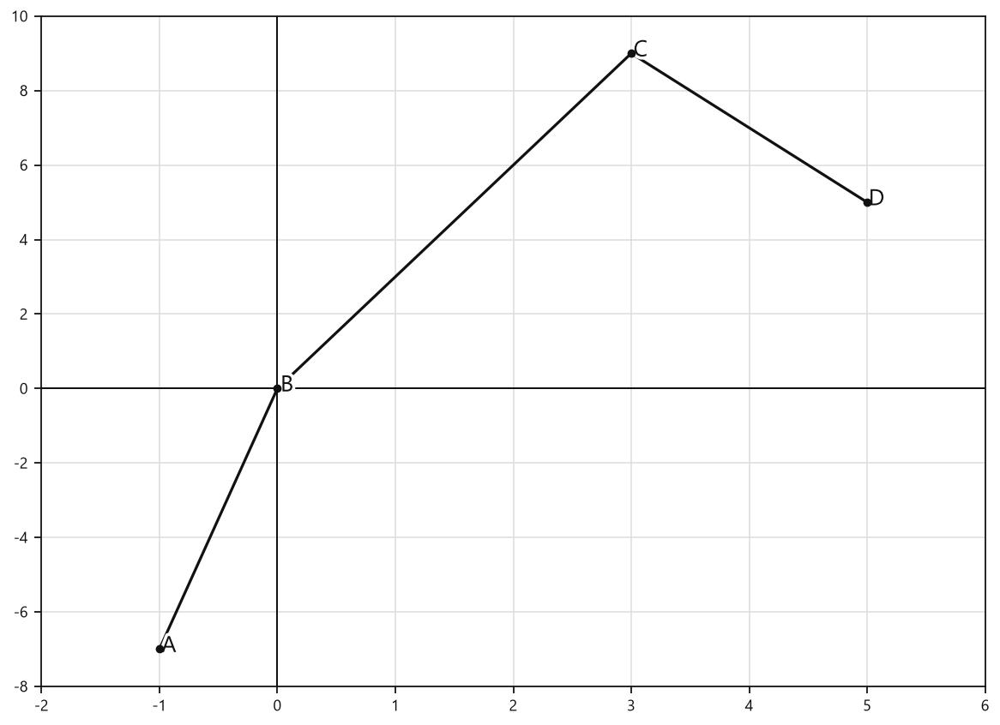

*График функции, проходящий через точки (-1;-7), (0;0), (3;9) и (5;5)*


**Решение.**

У точки с координатами $(x;y)$:

- первая координата $x$ — это аргумент;
- вторая координата $y$ — соответствующее значение функции.

Точка $(-1;-7)$ даёт:

$$f(-1)=-7.$$

Точка $(0;0)$ даёт:

$$f(0)=0.$$

Точка $(3;9)$ даёт:

$$f(3)=9.$$

Точка $(5;5)$ даёт:

$$f(5)=5.$$

Нужно просто прочитать вторую координату каждой точки. График уже всё подсказал, осталось не перепутать координаты местами.

**Ответ:** $-7;0;9;5$.

---

### Р6. Нули и знаки функции по графику

**Условие.** График функции имеет нули $x=1$ и $x=8$. На промежутке $0\le x\le24$ график расположен ниже оси абсцисс при $1<x<8$ и выше оси абсцисс при $0\le x<1$ и $8<x\le24$. Найдите:

а) нули функции;  
б) значения аргумента, при которых функция положительна;  
в) значения аргумента, при которых функция отрицательна.


<!--geo-figure-spec
{
  "needed": true,
  "kind": "graph",
  "caption": "График функции с нулями $x=1$ и $x=8$",
  "axis": true,
  "grid": true,
  "xlim": [
    -1,
    25
  ],
  "ylim": [
    -5,
    9
  ],
  "points": {
    "P": [
      0,
      2
    ],
    "Q": [
      1,
      0
    ],
    "R": [
      4,
      -4
    ],
    "S": [
      8,
      0
    ],
    "T": [
      14,
      8
    ],
    "U": [
      24,
      4
    ]
  },
  "segments": [
    [
      "P",
      "Q"
    ],
    [
      "Q",
      "R"
    ],
    [
      "R",
      "S"
    ],
    [
      "S",
      "T"
    ],
    [
      "T",
      "U"
    ]
  ],
  "texts": [
    {
      "xy": [
        1,
        -0.7
      ],
      "text": "1"
    },
    {
      "xy": [
        8,
        -0.7
      ],
      "text": "8"
    }
  ]
}
-->
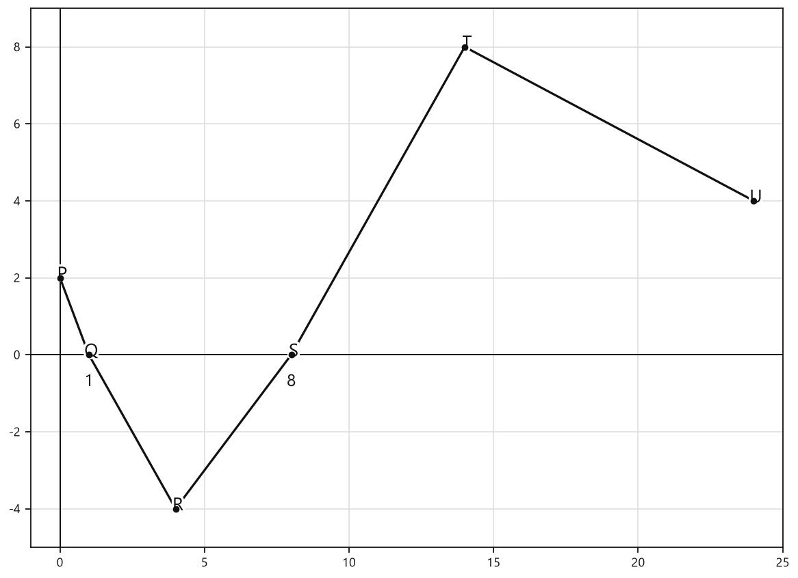

*График функции с нулями x=1 и x=8*


**Решение.**

а) Нули функции — это значения аргумента, при которых значение функции равно нулю.

По условию такими значениями являются:

$$x=1,\qquad x=8.$$

б) Функция положительна, когда её график находится выше оси абсцисс.

По условию это происходит при:

$$0\le x<1,$$

$$8<x\le24.$$

Точки $x=1$ и $x=8$ не входят в эти промежутки, потому что в них функция равна нулю, а не положительна.

в) Функция отрицательна, когда её график находится ниже оси абсцисс.

По условию это происходит при:

$$1<x<8.$$

Точки $x=1$ и $x=8$ тоже не входят в этот промежуток: ноль не является отрицательным числом. Вот где знак минус обычно пытается незаметно сбежать.

**Ответ:**  
а) $1$ и $8$;  
б) $0\le x<1$ и $8<x\le24$;  
в) $1<x<8$.

---

### Р7. Нули функции, заданной формулой

**Условие.** Найдите нули функций:

а) $f(x)=-3x+2$;  
б) $f(x)=9-4x$.

**Решение.**

Нуль функции — это такое значение $x$, при котором значение функции равно нулю.

а) Приравняем функцию к нулю:

$$-3x+2=0.$$

Перенесём $2$ в правую часть:

$$-3x=-2.$$

Разделим обе части уравнения на $-3$:

$$x=\frac{-2}{-3}.$$

Сократим знаки минус:

$$x=\frac{2}{3}.$$

Проверим найденное значение:

$$-3\cdot\frac23+2=-2+2=0.$$

Значит, $x=\dfrac23$ — нуль функции.

б) Приравняем функцию к нулю:

$$9-4x=0.$$

Перенесём $9$ в правую часть:

$$-4x=-9.$$

Разделим обе части уравнения на $-4$:

$$x=\frac{-9}{-4}.$$

Сократим знаки минус:

$$x=\frac94.$$

Проверим:

$$9-4\cdot\frac94=9-9=0.$$

Значит, $x=\dfrac94$ — нуль функции.

**Ответ:**  
а) $x=\dfrac23$;  
б) $x=\dfrac94$.

---

### Р8. Проверка равенства значений функции

**Условие.** Верно ли, что $g(3)+g(5)=g(6)$, если

$$g(x)=x^2+1?$$

**Решение.**

Сначала найдём значение $g(3)$:

$$g(3)=3^2+1,$$

$$g(3)=9+1,$$

$$g(3)=10.$$

Теперь найдём значение $g(5)$:

$$g(5)=5^2+1,$$

$$g(5)=25+1,$$

$$g(5)=26.$$

Сложим найденные значения:

$$g(3)+g(5)=10+26=36.$$

Отдельно найдём $g(6)$:

$$g(6)=6^2+1,$$

$$g(6)=36+1,$$

$$g(6)=37.$$

Сравним результаты:

$$36\ne37.$$

Значит, равенство неверно. Функция не обязана превращать сумму двух значений в ещё одно нужное значение — она работает по своей формуле.

**Ответ:** нет, равенство неверно.

---

### Р9. Является ли линия графиком функции

**Условие.** Определите, какие из линий могут быть графиками функций:

а) прямая $y=2x-1$;  
б) вертикальная прямая $x=3$;  
в) окружность с центром в начале координат.

**Решение.**

Проверяем главное условие функции: каждому значению $x$ должно соответствовать только одно значение $y$.

а) Для каждого значения $x$ по формуле

$$y=2x-1$$

получается единственное значение $y$.

Значит, эта прямая является графиком функции.

б) На вертикальной прямой $x=3$ лежит много точек с разными ординатами.

Получается, одному значению аргумента $x=3$ соответствуют разные значения $y$.

Значит, вертикальная прямая не является графиком функции.

в) Возьмём вертикальную прямую $x=0$.

Она пересекает окружность в двух точках.

У этих точек одинаковая абсцисса $x=0$, но разные ординаты $y$.

Значит, одному значению аргумента соответствуют два значения функции.

Окружность не является графиком функции.

Удобная проверка: мысленно проведите вертикальную прямую. Если она встречает линию два раза, функция сказала: «Нет, так не договаривались».

**Ответ:** только прямая $y=2x-1$ может быть графиком функции.

## Практические задания

Выбери свой уровень и решай только этот блок. В блоке должна закрепиться вся тема параграфа. Ответы не приводятся.

### Уровень 1–2 балла

**С1.** Какая из зависимостей является функцией?

1) соответствие между номером квартиры и числом комнат в ней; 2) соответствие между человеком и его братьями; 3) соответствие между треугольником и его высотой; 4) соответствие между числом и его делителями; 5) соответствие между городом и его улицами.

**С2.** Прямоугольник имеет длину $8$ см и ширину $x$ см. Запишите формулой зависимость его площади $S$ от ширины $x$.

**С3.** Укажите аналитический способ задания функции.

1) $y=3x-2$; 2) рисунок графика; 3) таблица значений; 4) описание словами; 5) список точек без указания соответствия.

**С4.** Функция задана таблицей.

| $x$ | $-4$ | $0$ | $3$ | $7$ |
|---|---:|---:|---:|---:|
| $f(x)$ | $5$ | $-2$ | $1$ | $6$ |

Найдите $f(3)$.

**С5.** Функция задана таблицей.

| $x$ | $-5$ | $-1$ | $2$ | $6$ |
|---|---:|---:|---:|---:|
| $f(x)$ | $4$ | $0$ | $-3$ | $4$ |

Запишите область определения функции $D(f)$ и множество её значений $E(f)$.

**С6.** Функция задана формулой $f(x)=4x-3$. Найдите $f(2)$.

**С7.** Функция задана формулой $g(x)=x^2+2$. Найдите $g(-3)$.

**С8.** Для какой из функций выполняется равенство $f(2)=7$?

1) $f(x)=2x+1$; 2) $f(x)=3x-1$; 3) $f(x)=x+4$; 4) $f(x)=5x-2$; 5) $f(x)=x^2-1$.

**С9.** Функция задана формулой $h(x)=\dfrac{6}{x-2}$. Укажите значение аргумента, которое не входит в область определения функции.

**С10.** Функция $y=f(x)$ задана графиком, состоящим из отрезка с концами $A(-4;-2)$ и $B(2;4)$. Найдите $f(0)$.


<!--geo-figure-spec
{
  "needed": true,
  "kind": "graph",
  "caption": "График функции $y=f(x)$",
  "axis": true,
  "grid": true,
  "xlim": [
    -4,
    5
  ],
  "ylim": [
    -6,
    3
  ],
  "points": {
    "A": [
      -3,
      2
    ],
    "B": [
      4,
      -5
    ]
  },
  "segments": [
    [
      "A",
      "B"
    ]
  ],
  "labels": {
    "A": {
      "dx": -0.4,
      "dy": 0.2
    },
    "B": {
      "dx": 0.15,
      "dy": 0.2
    }
  }
}
-->
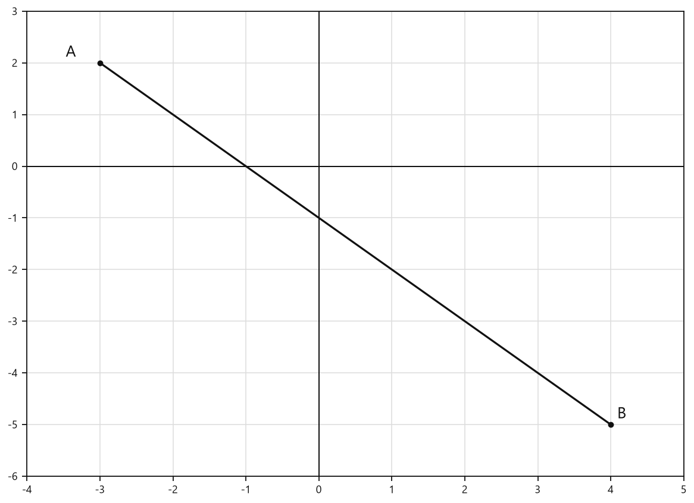

*График функции y=f(x)*


**С11.** Укажите нуль функции $f(x)=-2x+6$.

1) $-3$; 2) $0$; 3) $2$; 4) $3$; 5) $6$.

**С12.** Функция $y=f(x)$ задана графиком — отрезком с концами $A(-3;2)$ и $B(4;-5)$. Укажите промежуток значений аргумента, при которых значения функции положительны.

```geo-figure
{
  "needed": true,
  "kind": "plane",
  "caption": "График функции $y=f(x)$",
  "equal": false,
  "axis": true,
  "grid": true,
  "xlim": [-4, 5],
  "ylim": [-6, 3],
  "points": {"A": [-3, 2], "B": [4, -5]},
  "segments": [["A", "B"]],
  "polygons": [],
  "circles": [],
  "labels": {
    "A": {"dx": -0.35, "dy": 0.15},
    "B": {"dx": 0.15, "dy": -0.25}
  },
  "right_angles": [],
  "angle_marks": [],
  "texts": []
}

**С13.** Какая из зависимостей является функцией?

1) каждому натуральному числу соответствует несколько его делителей; 2) каждому месяцу года соответствует число дней в нём; 3) каждому ученику соответствует несколько его оценок; 4) каждому треугольнику соответствует несколько его высот; 5) каждому числу соответствует несколько противоположных ему чисел.

**С14.** Функция задана формулой $f(x)=3x-2$. Найдите $f(4)$.

**С15.** Функция задана таблицей.

| $x$ | $-2$ | $0$ | $3$ | $7$ |
|---|---:|---:|---:|---:|
| $f(x)$ | $5$ | $-1$ | $4$ | $6$ |

Найдите $f(3)$.

**С16.** Какая запись задаёт функцию аналитически?

1) таблица соответствий; 2) формула $y=4x+1$; 3) рисунок графика; 4) список значений; 5) описание зависимости словами.

**С17.** Функция задана формулой $f(x)=\dfrac{x}{x-3}$. Какое значение не принадлежит области определения этой функции?

1) $0$; 2) $2$; 3) $3$; 4) $4$; 5) $-3$.

**С18.** Найдите нуль функции $f(x)=5x-15$.

**С19.** Функция задана таблицей.

| $x$ | $-4$ | $-1$ | $2$ | $5$ |
|---|---:|---:|---:|---:|
| $f(x)$ | $3$ | $0$ | $-2$ | $3$ |

Запишите область определения функции $D(f)$.

**С20.** Функция задана таблицей.

| $x$ | $-3$ | $1$ | $4$ | $8$ |
|---|---:|---:|---:|---:|
| $f(x)$ | $2$ | $-5$ | $2$ | $7$ |

Запишите множество значений функции $E(f)$ без повторения одинаковых значений.

**С21.** Для функции $f(x)=2x+1$ найдите значение $f(-3)$.

**С22.** Установите, является ли функция $y=\dfrac{6}{x+2}$ определённой при $x=-2$. Запишите ответ «да» или «нет».

**С23.** Функция задана формулой $g(x)=x^2-4$. Найдите все нули функции.

**С24.** Длина прямоугольника равна $8$ см, а его ширина — $x$ см. Запишите формулу зависимости площади $S$ прямоугольника от ширины $x$.

**С25.** Какая из зависимостей является функцией?

1) оценка ученика за контрольную работу — его фамилия  
2) число месяца — число дней в этом месяце  
3) число — его делители  
4) длина стороны прямоугольника — его площадь при неизвестной второй стороне  
5) периметр треугольника — его стороны

**С26.** Прямоугольник имеет длину $8$ см и ширину $x$ см. Выберите формулу зависимости его площади $S$ от $x$.

1) $S=8+x$  
2) $S=8x$  
3) $S=\frac{8}{x}$  
4) $S=x-8$  
5) $S=2(8+x)$

**С27.** Функция задана таблицей.

| $x$ | $-4$ | $0$ | $3$ | $7$ |
|---|---:|---:|---:|---:|
| $f(x)$ | $5$ | $-2$ | $1$ | $6$ |

Найдите $f(3)$.

**С28.** Функция задана таблицей.

| $x$ | $-6$ | $-1$ | $2$ | $9$ |
|---|---:|---:|---:|---:|
| $f(x)$ | $4$ | $0$ | $4$ | $-3$ |

Укажите область определения функции $D(f)$.

1) $\{-6;-1;2;9\}$  
2) $\{4;0;4;-3\}$  
3) $[-6;9]$  
4) $\{-6;0;2;-3\}$  
5) $\{-1;2\}$

**С29.** Функция задана таблицей.

| $x$ | $-3$ | $1$ | $5$ | $8$ |
|---|---:|---:|---:|---:|
| $f(x)$ | $2$ | $-4$ | $0$ | $2$ |

Укажите множество значений функции $E(f)$.

1) $\{-3;1;5;8\}$  
2) $\{2;-4;0\}$  
3) $\{-4;0;2\}$  
4) $\{-3;1;5;8;2;-4;0\}$  
5) $\{-4;2\}$

**С30.** Функция задана формулой $f(x)=4x-3$. Найдите $f(2)$.

**С31.** Функция задана формулой $f(x)=-2x+5$. Найдите $f(-3)$.

**С32.** Функция задана формулой $g(x)=x^2-1$. Выберите значение $g(0)$.

1) $-2$  
2) $-1$  
3) $0$  
4) $1$  
5) $2$

**С33.** Функция задана формулой $f(x)=\frac{6}{x-2}$. Какое значение аргумента не входит в область определения этой функции?

**С34.** Найдите нуль функции $f(x)=5x-20$.

**С35.** Найдите нуль функции $g(x)=12-3x$.

**С36.** Выберите формулу, задающую функцию, для которой выполняется равенство $f(2)=7$.

1) $f(x)=2x+1$  
2) $f(x)=3x+1$  
3) $f(x)=4x-1$  
4) $f(x)=x+7$  
5) $f(x)=5x-2$

### Уровень 3–4 балла

**С1.** Какие из зависимостей являются функциями?

а) зависимость между номером месяца и количеством дней в нём;  
б) зависимость между натуральным числом и его квадратом;  
в) зависимость между числом и всеми его делителями;  
г) зависимость между длиной стороны квадрата и его площадью.

**С2.** Стороны прямоугольника равны $8$ см и $x$ см. Задайте формулой зависимость площади $S$ прямоугольника от длины $x$ второй стороны.

**С3.** Смежные углы имеют величины $\alpha$ и $\beta$. Задайте формулой зависимость $\beta$ от $\alpha$. Укажите, является ли эта зависимость функцией.

**С4.** Функция задана таблицей.

| $x$ | $-4$ | $0$ | $3$ | $7$ |
|---|---:|---:|---:|---:|
| $f(x)$ | $5$ | $-2$ | $4$ | $1$ |

Найдите $f(-4)$, $f(3)$ и $f(7)$.

**С5.** Для функции, заданной таблицей, определите область определения $D(f)$ и множество значений $E(f)$.

| $x$ | $-5$ | $-1$ | $2$ | $6$ |
|---|---:|---:|---:|---:|
| $f(x)$ | $3$ | $0$ | $-4$ | $3$ |

**С6.** Функция задана формулой $f(x)=4x-3$. Найдите $f(-2)$, $f(0)$ и $f(5)$.

**С7.** Функция задана формулой $g(x)=\dfrac{x}{x-4}$. Найдите $g(0)$, $g(2)$ и $g(5)$.

**С8.** Установите, для какой из функций выполняется равенство $f(2)=7$:

1) $f(x)=3x+1$;  
2) $f(x)=5x-2$;  
3) $f(x)=x^2+2$;  
4) $f(x)=10-x$;  
5) $f(x)=2x+4$.

**С9.** Функция задана формулой $g(x)=x^2+1$. Верно ли равенство $g(1)+g(2)=g(3)$? Обоснуйте ответ вычислениями.

**С10.** Найдите нули функций:

а) $f(x)=7-2x$;  
б) $h(x)=3x+12$.

**С11.** Функция задана формулой $f(x)=2x-6$. Определите, при каких значениях аргумента функция принимает положительные значения, а при каких — отрицательные.

**С12.** Функция задана таблицей.

| $x$ | $-6$ | $-3$ | $0$ | $2$ | $5$ |
|---|---:|---:|---:|---:|---:|
| $f(x)$ | $4$ | $0$ | $-2$ | $0$ | $3$ |

Найдите нули функции, а также значения аргумента, при которых функция принимает положительные и отрицательные значения.

**С13.** Какие из зависимостей являются функциями?  
а) зависимость между длиной стороны квадрата и его площадью;  
б) зависимость между натуральным числом и его делителем;  
в) зависимость между номером месяца и количеством дней в этом месяце;  
г) зависимость между периметром прямоугольника и его длиной, если ширина прямоугольника равна $4$ см.

**С14.** Смежные углы имеют величины $\alpha$ и $\beta$. Задайте формулой зависимость $\beta$ от $\alpha$. Укажите область допустимых значений аргумента $\alpha$ и определите, является ли эта зависимость функцией.

**С15.** Площадь прямоугольника с длиной $12$ см и шириной $x$ см равна $S$. Задайте формулой зависимость $S$ от $x$ и найдите площадь прямоугольника при $x=7$ см.

**С16.** Функция задана таблицей.

| $x$ | $-4$ | $0$ | $3$ | $7$ | $10$ |
|---|---:|---:|---:|---:|---:|
| $f(x)$ | $6$ | $-2$ | $5$ | $0$ | $-4$ |

Найдите $f(3)$ и $f(7)$, а также запишите область определения функции $D(f)$.

**С17.** Функция задана таблицей.

| $x$ | $-5$ | $-1$ | $2$ | $6$ |
|---|---:|---:|---:|---:|
| $g(x)$ | $3$ | $0$ | $-4$ | $3$ |

Запишите множество значений функции $E(g)$ и найдите нуль функции.

**С18.** Функция задана формулой $f(x)=4x-3$. Найдите $f(-2)$, $f(0)$ и $f(5)$.

**С19.** Функция задана формулой $g(x)=\dfrac{2x+1}{x-3}$. Найдите $g(0)$ и $g(2)$.

**С20.** Функция задана формулой $h(x)=7-2x$. Найдите нуль функции.

**С21.** Для функции $f(x)=3x+1$ проверьте, выполняется ли равенство $f(2)+f(4)=f(6)$.

**С22.** Для функции $g(x)=x^2-4$ найдите значения аргумента, при которых функция равна нулю.

**С23.** Функция задана формулой $y=2x-6$. Укажите, при каких значениях аргумента функция принимает положительные значения и при каких — отрицательные значения.

**С24.** Функция задана формулой $y=x^2+1$. Определите, является ли точка $A(2;5)$ точкой графика этой функции.

**С25.** Какие из зависимостей являются функциями?  
а) зависимость между длиной стороны квадрата и его площадью;  
б) зависимость между числом и его делителями;  
в) зависимость между номером месяца и количеством дней в нём;  
г) зависимость между периметром прямоугольника и его длиной, если ширина прямоугольника не задана.

**С26.** Величины смежных углов равны $\alpha$ и $\beta$. Задайте формулой зависимость $\beta$ от $\alpha$ и укажите, является ли эта зависимость функцией.

**С27.** Объём воды в прямоугольном бассейне длиной $20$ м и шириной $8$ м составляет $\frac{3}{4}$ его объёма. Высота бассейна равна $x$ м. Задайте формулой зависимость объёма воды $V$ от $x$.

**С28.** Функция задана таблицей.

| $x$ | $-4$ | $0$ | $3$ | $7$ | $10$ |
|---|---:|---:|---:|---:|---:|
| $f(x)$ | $5$ | $-2$ | $0$ | $6$ | $-1$ |

Найдите $D(f)$, $E(f)$ и значение $f(7)$.

**С29.** Функция задана таблицей.

| $x$ | $-6$ | $-2$ | $1$ | $4$ | $9$ |
|---|---:|---:|---:|---:|---:|
| $g(x)$ | $3$ | $0$ | $-5$ | $2$ | $7$ |

Найдите $g(-2)$, $g(1)$ и $g(9)$.

**С30.** Функция задана формулой $f(x)=4x-3$. Найдите $f(-2)$, $f(0)$ и $f(5)$.

**С31.** Функция задана формулой $g(x)=\dfrac{x}{x-4}$. Найдите $g(0)$, $g(2)$ и $g(5)$.

**С32.** Для функции $f(x)=3x+1$ проверьте, выполняется ли равенство $f(2)+f(4)=f(7)$.

**С33.** Выберите функции, для которых выполняется равенство $f(2)=5$:  
а) $f(x)=2x+1$;  
б) $f(x)=x+3$;  
в) $f(x)=x^2+1$;  
г) $f(x)=4x-3$.

**С34.** Найдите нули функций:  
а) $f(x)=5x-15$;  
б) $g(x)=8-2x$.

**С35.** Зависимость расстояния $s$ от времени движения $t$ задана формулой $s=60t$, где $s$ измеряется в километрах, а $t$ — в часах. Найдите расстояние, которое проедет автомобиль за $2,5$ ч, и время, необходимое для преодоления расстояния $180$ км.

**С36.** Функция задана формулой $y=1,6x$. Найдите значение функции при $x=-2,5$ и значение аргумента, при котором $y=8$.

### Уровень 5–6 баллов

**С1.** Определите, является ли функциональной зависимость между количеством купленных яблок и их общей массой, если масса одного яблока может быть различной.

**С2.** Два смежных угла имеют величины $\alpha$ и $\beta$. Задайте формулой зависимость $\beta$ от $\alpha$ и укажите область допустимых значений аргумента.

**С3.** Функция задана таблицей.

| $x$ | $-4$ | $-1$ | $0$ | $3$ | $7$ |
|---|---:|---:|---:|---:|---:|
| $f(x)$ | $5$ | $2$ | $-1$ | $4$ | $0$ |

Найдите $f(-1)$ и $f(7)$, а также запишите $D(f)$ и $E(f)$.

**С4.** Функция задана формулой $f(x)=3x-5$. Найдите $f(-2)$, $f(0)$ и $f(4)$.

**С5.** Функция задана формулой $g(x)=\dfrac{12}{x-3}$. Найдите $g(0)$, $g(1)$ и $g(5)$.

**С6.** Функция задана формулой $h(x)=2x+7$. Найдите нуль функции.

**С7.** Функция задана формулой $p(x)=x^2-9$. Найдите нули функции.

**С8.** Объём воды в бассейне длиной $20$ м и шириной $8$ м зависит от высоты слоя воды $x$ м. Задайте формулой зависимость объёма воды $V$ от $x$ и укажите, при каких значениях $x$ эта формула имеет смысл.

**С9.** По графику функции $y=f(x)$ найдите $f(-2)$, $f(0)$ и $f(3)$.

```geo-figure
{
  "needed": true,
  "kind": "graph",
  "caption": "График функции $y=f(x)$",
  "axis": true,
  "grid": true,
  "xlim": [-4, 5],
  "ylim": [-4, 5],
  "curves": [{"expr": "x+1", "label": "y=f(x)"}],
  "points": {
    "A": [-2, -1],
    "B": [0, 1],
    "C": [3, 4]
  },
  "labels": {
    "A": {"dx": 0.15, "dy": 0.2},
    "B": {"dx": 0.15, "dy": 0.2},
    "C": {"dx": 0.15, "dy": 0.2}
  }
}
```

На графике изображена прямая, проходящая через точки $A(-2;-1)$, $B(0;1)$ и $C(3;4)$.

**С10.** По графику функции $y=f(x)$ найдите нули функции и укажите, при каких значениях $x$ функция принимает положительные значения.


<!--geo-figure-spec
{
  "needed": true,
  "kind": "graph",
  "caption": "График функции $y=f(x)$",
  "axis": true,
  "grid": true,
  "xlim": [
    -4,
    4
  ],
  "ylim": [
    -3,
    3
  ],
  "curves": [
    {
      "expr": "abs(x)-2",
      "label": "y=f(x)"
    }
  ],
  "points": {
    "A": [
      -2,
      0
    ],
    "B": [
      0,
      -2
    ],
    "C": [
      2,
      0
    ]
  },
  "labels": {
    "A": {
      "dx": -0.35,
      "dy": 0.2
    },
    "B": {
      "dx": 0.15,
      "dy": -0.35
    },
    "C": {
      "dx": 0.15,
      "dy": 0.3
    }
  }
}
-->
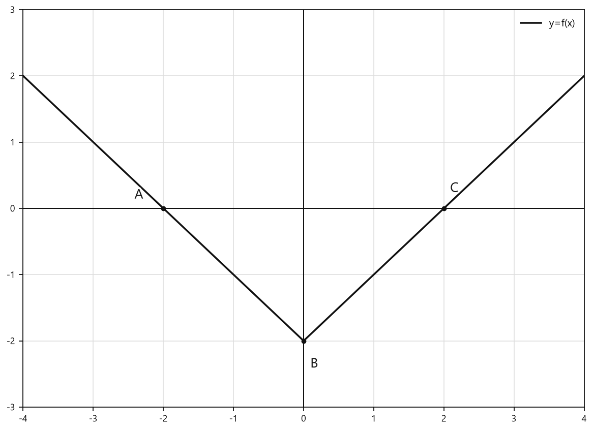

*График функции y=f(x)*


График проходит через точки $A(-2;0)$, $B(0;-2)$ и $C(2;0)$.

**С11.** Для каждой зависимости определите, является ли она функцией:  
а) зависимость между номером месяца и количеством дней в этом месяце;  
б) зависимость между натуральным числом и его квадратом;  
в) зависимость между площадью прямоугольника и длиной его стороны, если вторая сторона не задана;  
г) зависимость между номером учащегося в списке и его оценкой за контрольную работу.

**С12.** Функция задана таблицей.

| $x$ | $-5$ | $-3$ | $-1$ | $2$ | $6$ |
|---|---:|---:|---:|---:|---:|
| $f(x)$ | $3$ | $0$ | $-4$ | $2$ | $0$ |

Найдите нули функции, значения аргумента, при которых функция принимает положительные значения, и значения аргумента, при которых функция принимает отрицательные значения.

**С13.** Какие из зависимостей являются функциями?  
а) зависимость площади квадрата от длины его стороны;  
б) зависимость оценки ученика от его фамилии в списке класса;  
в) зависимость количества страниц в книге от её названия;  
г) зависимость периметра равностороннего треугольника от длины его стороны.

**С14.** Длина прямоугольника равна $12$ см, а его ширина — $x$ см. Задайте формулой зависимость площади $S$ прямоугольника от $x$. Укажите, является ли эта зависимость функцией.

**С15.** Функция задана таблицей:

| $x$ | $-4$ | $-1$ | $0$ | $3$ | $7$ |
|---|---:|---:|---:|---:|---:|
| $f(x)$ | $5$ | $-2$ | $4$ | $0$ | $-2$ |

Найдите $f(-1)$, $f(3)$, область определения $D(f)$ и множество значений $E(f)$.

**С16.** Функция задана формулой $f(x)=3x-7$. Найдите $f(-2)$, $f(0)$, $f(5)$ и $f(12)$.

**С17.** Функция задана формулой $g(x)=\dfrac{12}{x-3}$. Найдите $g(0)$, $g(2)$ и $g(5)$. Укажите значение аргумента, при котором формула не имеет смысла.

**С18.** Для функции $h(x)=4x+1$ проверьте равенство $h(2)+h(3)=h(5)$. Запишите результат проверки.

**С19.** На координатной плоскости изображён график функции $y=f(x)$, состоящий из отрезков, соединяющих точки $A(-4;2)$, $B(-2;-1)$, $C(1;3)$ и $D(4;0)$. Найдите $f(-4)$, $f(-2)$, $f(1)$ и $f(4)$.


<!--geo-figure-spec
{
  "needed": true,
  "kind": "graph",
  "caption": "График функции $y=f(x)$",
  "axis": true,
  "grid": true,
  "xlim": [
    -3,
    3
  ],
  "ylim": [
    -3,
    1
  ],
  "points": {
    "A": [
      -2,
      0
    ],
    "B": [
      0,
      -2
    ],
    "C": [
      2,
      0
    ]
  },
  "segments": [
    [
      "A",
      "B"
    ],
    [
      "B",
      "C"
    ]
  ],
  "polygons": [],
  "circles": [],
  "labels": {
    "A": {
      "dx": -0.32,
      "dy": 0.2
    },
    "B": {
      "dx": 0.15,
      "dy": -0.35
    },
    "C": {
      "dx": 0.15,
      "dy": 0.2
    }
  },
  "right_angles": [],
  "angle_marks": [],
  "texts": []
}
-->
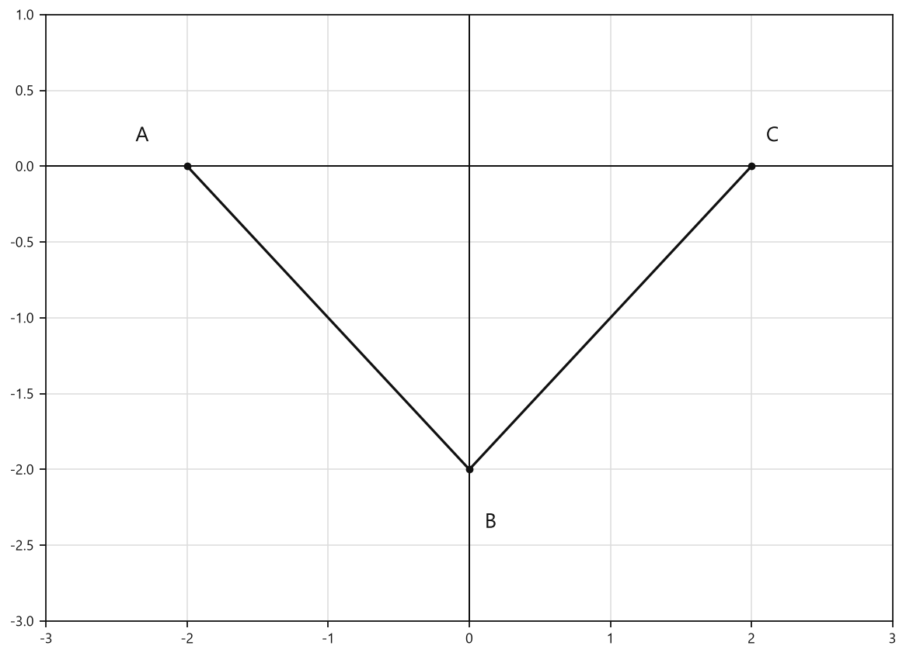

*График функции y=f(x)*


**С20.** На координатной плоскости изображён график функции $y=f(x)$, состоящий из отрезков, соединяющих точки $A(-5;1)$, $B(-3;-2)$, $C(0;2)$ и $D(3;-1)$. Найдите нули функции.


<!--geo-figure-spec
{
  "needed": true,
  "kind": "graph",
  "caption": "График функции $y=f(x)$",
  "axis": true,
  "grid": true,
  "xlim": [
    -6,
    4
  ],
  "ylim": [
    -3,
    3
  ],
  "points": {
    "A": [
      -5,
      1
    ],
    "B": [
      -3,
      -2
    ],
    "C": [
      0,
      2
    ],
    "D": [
      3,
      -1
    ]
  },
  "segments": [
    [
      "A",
      "B"
    ],
    [
      "B",
      "C"
    ],
    [
      "C",
      "D"
    ]
  ],
  "polygons": [],
  "circles": [],
  "labels": {
    "A": {
      "dx": -0.25,
      "dy": 0.18
    },
    "B": {
      "dx": -0.25,
      "dy": -0.3
    },
    "C": {
      "dx": 0.12,
      "dy": 0.18
    },
    "D": {
      "dx": 0.12,
      "dy": -0.3
    }
  },
  "right_angles": [],
  "angle_marks": [],
  "texts": []
}
-->
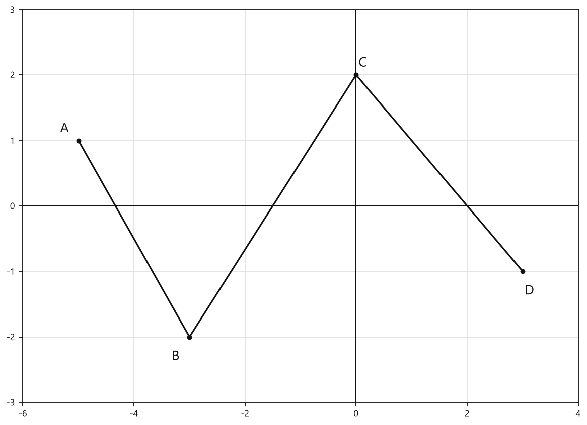

*График функции y=f(x)*


**С21.** На координатной плоскости изображён график функции $y=f(x)$, состоящий из отрезков, соединяющих точки $A(-4;2)$, $B(-1;0)$, $C(2;-3)$ и $D(5;1)$. Укажите промежутки, на которых значения функции положительны, и промежутки, на которых значения функции отрицательны.


<!--geo-figure-spec
{
  "needed": true,
  "kind": "graph",
  "caption": "График функции $y=f(x)$",
  "equal": false,
  "axis": true,
  "grid": true,
  "xlim": [
    -5,
    6
  ],
  "ylim": [
    -4,
    3
  ],
  "points": {
    "A": [
      -4,
      2
    ],
    "B": [
      -1,
      0
    ],
    "C": [
      2,
      -3
    ],
    "D": [
      5,
      1
    ]
  },
  "segments": [
    [
      "A",
      "B"
    ],
    [
      "B",
      "C"
    ],
    [
      "C",
      "D"
    ]
  ],
  "polygons": [],
  "circles": [],
  "labels": {
    "A": {
      "dx": -0.25,
      "dy": 0.18
    },
    "B": {
      "dx": 0.15,
      "dy": 0.22
    },
    "C": {
      "dx": 0.12,
      "dy": -0.3
    },
    "D": {
      "dx": 0.12,
      "dy": 0.18
    }
  },
  "right_angles": [],
  "angle_marks": [],
  "texts": []
}
-->
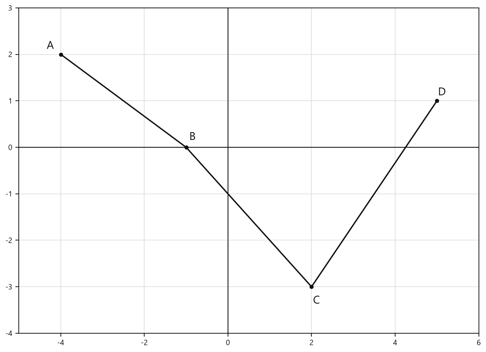

*График функции y=f(x)*


**С22.** Найдите нули функций:  
а) $f(x)=5x-15$;  
б) $g(x)=8-2x$.

**С23.** Функция задана формулой $f(x)=2x+3$. Найдите значение аргумента, при котором значение функции равно $11$.

**С24.** Изобразите в координатной плоскости график функции, область определения которой задаётся условием $-3\le x\le4$, а множество значений — условием $-2\le y\le3$. Отметьте на графике хотя бы четыре точки.

**С25.** Какие из зависимостей являются функциями? Обоснуйте ответ.
1. Зависимость стоимости покупки от количества одинаковых ручек, если цена одной ручки фиксирована.
2. Зависимость количества страниц в книге от её названия.
3. Зависимость площади квадрата от длины его стороны.
4. Зависимость оценки ученика за контрольную работу от номера задания.
5. Зависимость количества дней в месяце от его порядкового номера в году.

**С26.** Длина прямоугольника равна $12$ см, а его ширина — $x$ см. Задайте формулой зависимость площади $S$ прямоугольника от $x$. Укажите область определения этой функции, если $x$ обозначает длину стороны прямоугольника.

**С27.** Функция задана таблицей.

| $x$ | $-4$ | $-1$ | $0$ | $3$ | $7$ |
|---|---:|---:|---:|---:|---:|
| $f(x)$ | $5$ | $-2$ | $0$ | $4$ | $-1$ |

Найдите $f(-1)$ и $f(3)$, а также запишите область определения и множество значений функции.

**С28.** Функция задана формулой $f(x)=4-2x$. Найдите $f(-3)$, $f(0)$ и $f(5)$. Найдите нуль функции.

**С29.** На координатной плоскости изображён график функции $y=f(x)$, состоящий из отрезков, последовательно соединяющих точки $A(-4;-2)$, $B(-2;0)$, $C(0;2)$, $D(3;2)$ и $E(5;-2)$.


<!--geo-figure-spec
{
  "needed": true,
  "kind": "graph",
  "caption": "График функции $y=f(x)$",
  "axis": true,
  "grid": true,
  "xlim": [
    -5,
    6
  ],
  "ylim": [
    -3,
    3
  ],
  "points": {
    "A": [
      -4,
      -2
    ],
    "B": [
      -2,
      0
    ],
    "C": [
      0,
      2
    ],
    "D": [
      3,
      2
    ],
    "E": [
      5,
      -2
    ]
  },
  "segments": [
    [
      "A",
      "B"
    ],
    [
      "B",
      "C"
    ],
    [
      "C",
      "D"
    ],
    [
      "D",
      "E"
    ]
  ],
  "labels": {
    "A": {
      "dx": -0.32,
      "dy": -0.28
    },
    "B": {
      "dx": -0.22,
      "dy": 0.18
    },
    "C": {
      "dx": 0.12,
      "dy": 0.16
    },
    "D": {
      "dx": 0.12,
      "dy": 0.16
    },
    "E": {
      "dx": 0.12,
      "dy": -0.28
    }
  }
}
-->
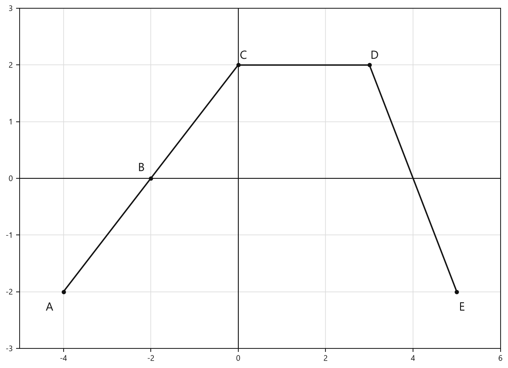

*График функции y=f(x)*


Найдите $f(-4)$, $f(0)$ и $f(5)$. Укажите нули функции.

**С30.** Функция задана формулой $g(x)=x^2-9$. Найдите $g(-3)$, $g(0)$ и $g(4)$. Найдите значения аргумента, при которых $g(x)=0$.

### Уровень 7–8 баллов

**С1.** Определите, какие зависимости являются функциями:  
а) зависимость количества страниц в книге от номера страницы;  
б) зависимость площади квадрата от длины его стороны;  
в) зависимость номера квартиры от номера подъезда;  
г) зависимость количества дней в месяце от порядкового номера месяца.  
Запишите буквы всех подходящих зависимостей.

**С2.** Длина прямоугольника равна $12$ см, а его ширина обозначена буквой $x$ см. Площадь прямоугольника обозначена буквой $S$. Задайте формулой зависимость $S$ от $x$, укажите область определения этой зависимости и найдите площадь прямоугольника при $x=4,5$ см.

**С3.** Смежные углы имеют величины $\alpha$ и $\beta$, измеренные в градусах. Задайте формулой зависимость $\beta$ от $\alpha$. Найдите значение $\beta$, если $\alpha=68^\circ$. Укажите, при каких значениях $\alpha$ эта зависимость имеет геометрический смысл.

**С4.** Функция задана таблицей.

| $x$ | $-4$ | $-1$ | $0$ | $3$ | $7$ | $10$ |
|---:|---:|---:|---:|---:|---:|---:|
| $f(x)$ | $5$ | $-2$ | $4$ | $0$ | $-2$ | $8$ |

Найдите $f(-1)$, $f(7)$ и $f(3)$. Запишите область определения и множество значений функции.

**С5.** Функция задана формулой $f(x)=\dfrac{2x-1}{x+3}$. Найдите $f(-2)$, $f(0)$ и $f(5)$. Укажите значение аргумента, которое не входит в область определения функции.

**С6.** Для функции $f(x)=4-3x$ найдите значение $f(-2)$ и нуль функции. Проверьте найденный нуль непосредственной подстановкой в формулу.

**С7.** Для функции $g(x)=x^2-4x+7$ проверьте, верно ли равенство $g(1)+g(3)=g(4)$. Все вычисления запишите полностью.

**С8.** Температура воздуха $T$ в течение шести последовательных часов измерялась в одно и то же время каждого часа. Результаты представлены таблицей.

| $t$, ч | $0$ | $1$ | $2$ | $3$ | $4$ | $5$ |
|---:|---:|---:|---:|---:|---:|---:|
| $T$, °C | $-3$ | $-1$ | $2$ | $4$ | $3$ | $0$ |

Рассматривая $T$ как функцию времени $t$, укажите $D(T)$ и $E(T)$, а также определите, в какой момент температура была наибольшей.

**С9.** На координатной плоскости изображён график функции $y=f(x)$, состоящий из отрезков, соединяющих последовательно точки $A(-5;2)$, $B(-3;-2)$, $C(0;1)$, $D(2;1)$ и $E(5;-3)$. Концы отрезков принадлежат графику.


<!--geo-figure-spec
{
  "needed": true,
  "kind": "graph",
  "caption": "График функции $y=f(x)$",
  "equal": false,
  "axis": true,
  "grid": true,
  "xlim": [
    -6,
    6
  ],
  "ylim": [
    -4,
    3
  ],
  "points": {
    "A": [
      -5,
      2
    ],
    "B": [
      -3,
      -2
    ],
    "C": [
      0,
      1
    ],
    "D": [
      2,
      1
    ],
    "E": [
      5,
      -3
    ]
  },
  "segments": [
    [
      "A",
      "B"
    ],
    [
      "B",
      "C"
    ],
    [
      "C",
      "D"
    ],
    [
      "D",
      "E"
    ]
  ],
  "polygons": [],
  "circles": [],
  "labels": {
    "A": {
      "dx": -0.42,
      "dy": 0.16
    },
    "B": {
      "dx": -0.38,
      "dy": -0.38
    },
    "C": {
      "dx": 0.12,
      "dy": 0.16
    },
    "D": {
      "dx": 0.12,
      "dy": 0.16
    },
    "E": {
      "dx": 0.12,
      "dy": -0.38
    }
  },
  "right_angles": [],
  "angle_marks": [],
  "texts": []
}
-->
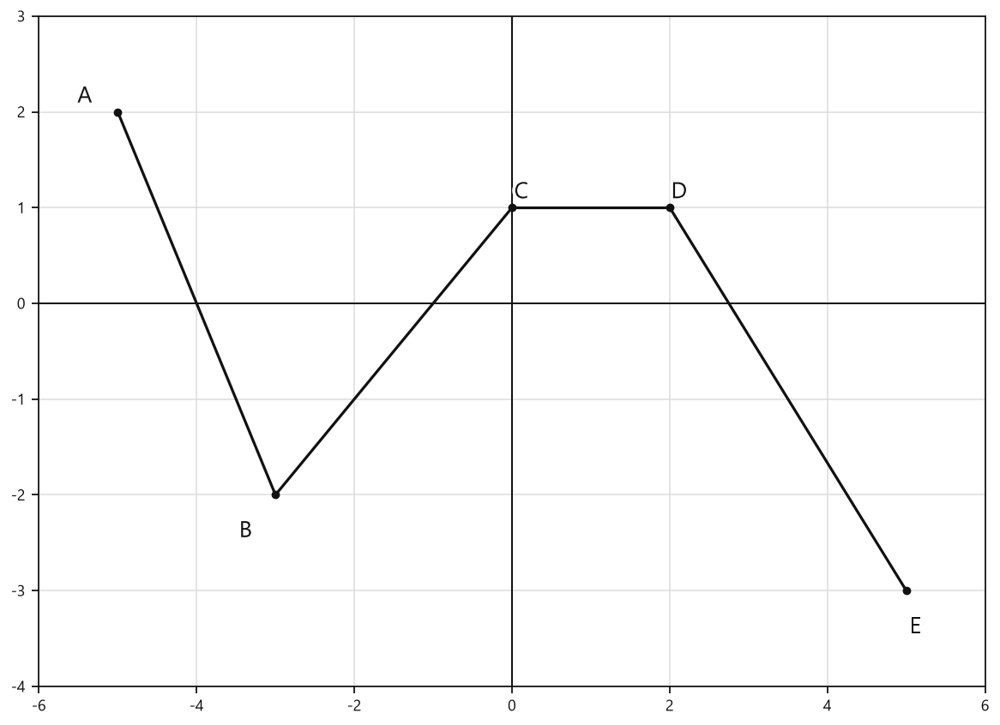

*График функции y=f(x)*


Найдите $f(-5)$, $f(0)$, $f(2)$ и $f(5)$. Укажите область определения функции.

**С10.** График функции $y=f(x)$ состоит из отрезков, соединяющих точки $A(-4;3)$, $B(-1;0)$, $C(2;-2)$, $D(4;1)$ и $E(6;1)$. Концы отрезков принадлежат графику.


<!--geo-figure-spec
{
  "needed": true,
  "kind": "graph",
  "caption": "График функции $y=f(x)$",
  "axis": true,
  "grid": true,
  "xlim": [
    -5,
    7
  ],
  "ylim": [
    -3,
    4
  ],
  "points": {
    "A": [
      -4,
      3
    ],
    "B": [
      -1,
      0
    ],
    "C": [
      2,
      -2
    ],
    "D": [
      4,
      1
    ],
    "E": [
      6,
      1
    ]
  },
  "segments": [
    [
      "A",
      "B"
    ],
    [
      "B",
      "C"
    ],
    [
      "C",
      "D"
    ],
    [
      "D",
      "E"
    ]
  ],
  "polygons": [],
  "circles": [],
  "labels": {
    "A": {
      "dx": -0.35,
      "dy": 0.18
    },
    "B": {
      "dx": -0.35,
      "dy": -0.35
    },
    "C": {
      "dx": 0.12,
      "dy": -0.35
    },
    "D": {
      "dx": 0.12,
      "dy": 0.18
    },
    "E": {
      "dx": 0.12,
      "dy": 0.18
    }
  },
  "right_angles": [],
  "angle_marks": [],
  "texts": []
}
-->
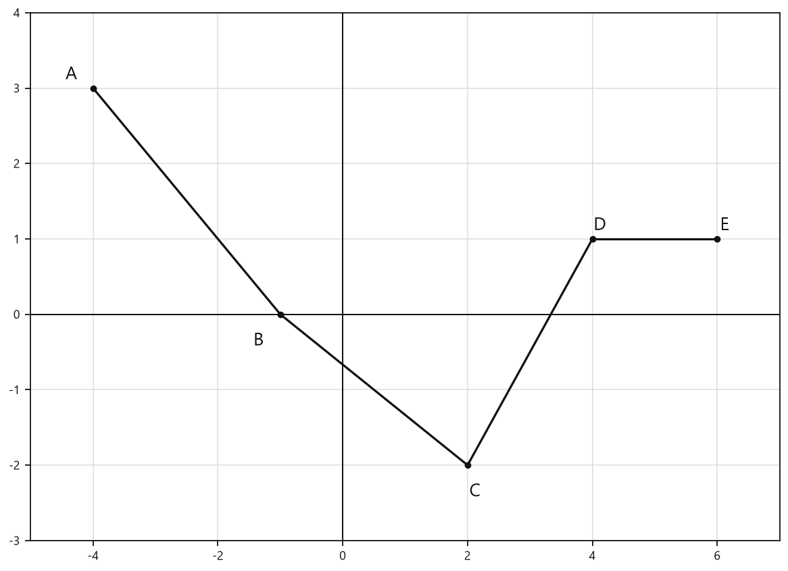

*График функции y=f(x)*


Найдите нули функции. Укажите промежутки, на которых функция принимает положительные значения, и промежутки, на которых она принимает отрицательные значения.

**С11.** Для каждой функции найдите нуль, если он существует:  
а) $f(x)=7-2x$;  
б) $g(x)=\dfrac{3x+6}{x-1}$;  
в) $h(x)=x^2+4$.  
Для функции, не имеющей нулей, запишите соответствующее обоснование.

**С12.** Функция задана формулой $y=1,6x$. Заполните таблицу и по полученным точкам постройте в координатной плоскости график функции.

| $x$ | $-2,5$ | $-1$ | $0$ | $1,5$ | $3$ |
|---:|---:|---:|---:|---:|---:|
| $y$ |  |  |  |  |  |

По графику или по формуле найдите значение функции при $x=2,5$ и аргумент, при котором значение функции равно $-4,8$.

**С13.** Для каждой зависимости определите, является ли она функцией:  
а) зависимость между радиусом круга и его площадью;  
б) зависимость между натуральным числом и его квадратными делителями;  
в) зависимость между номером дня недели и количеством букв в его названии;  
г) зависимость между периметром прямоугольника и длиной его большей стороны. Ответ обоснуйте.

**С14.** Длина прямоугольного параллелепипеда равна $8$ см, ширина — $5$ см, а высота — $x$ см. Объём параллелепипеда обозначен буквой $V$. Задайте формулой зависимость $V$ от $x$, укажите область определения этой функции и найдите объём при $x=3,5$ см.

**С15.** Функция задана таблицей.

| $x$ | $-6$ | $-2$ | $0$ | $3$ | $7$ | $10$ |
|---|---:|---:|---:|---:|---:|---:|
| $f(x)$ | $4$ | $-1$ | $5$ | $0$ | $-1$ | $8$ |

Найдите $f(-2)$, $f(3)$ и $f(10)$, а также запишите $D(f)$ и $E(f)$.

**С16.** Функция задана формулой $f(x)=\dfrac{2x-1}{x+3}$. Найдите $f(-2)$, $f(0)$ и $f(5)$. Укажите значение аргумента, которое не входит в область определения функции.

**С17.** Даны функции:  
$f(x)=3x+1$, $g(x)=x^2-2$, $h(x)=\dfrac{12}{x}$.  
Для каждой функции вычислите значение при $x=2$. Затем определите, для каких из них выполняется равенство $F(2)=7$, где $F$ обозначает соответствующую функцию.

**С18.** Функция задана формулой $g(x)=x^2-4x+6$. Проверьте, верно ли равенство $g(1)+g(3)=g(4)$. Все вычисления запишите полностью.

**С19.** На рисунке изображён график функции $y=f(x)$. В тексте указано, что график состоит из отрезков, соединяющих последовательно точки $A(-5;2)$, $B(-2;-1)$, $C(1;3)$, $D(4;0)$ и $E(6;2)$. Найдите $f(-5)$, $f(-2)$, $f(1)$, $f(4)$ и $f(6)$.


<!--geo-figure-spec
{
  "needed": true,
  "kind": "graph",
  "caption": "График функции $y=f(x)$",
  "equal": false,
  "axis": true,
  "grid": true,
  "xlim": [
    -6,
    7
  ],
  "ylim": [
    -2,
    4
  ],
  "points": {
    "A": [
      -5,
      2
    ],
    "B": [
      -2,
      -1
    ],
    "C": [
      1,
      3
    ],
    "D": [
      4,
      0
    ],
    "E": [
      6,
      2
    ]
  },
  "segments": [
    [
      "A",
      "B"
    ],
    [
      "B",
      "C"
    ],
    [
      "C",
      "D"
    ],
    [
      "D",
      "E"
    ]
  ],
  "polygons": [],
  "circles": [],
  "labels": {
    "A": {
      "dx": -0.28,
      "dy": 0.2
    },
    "B": {
      "dx": -0.28,
      "dy": -0.3
    },
    "C": {
      "dx": 0.08,
      "dy": 0.2
    },
    "D": {
      "dx": 0.1,
      "dy": -0.3
    },
    "E": {
      "dx": 0.1,
      "dy": 0.2
    }
  },
  "right_angles": [],
  "angle_marks": [],
  "texts": []
}
-->
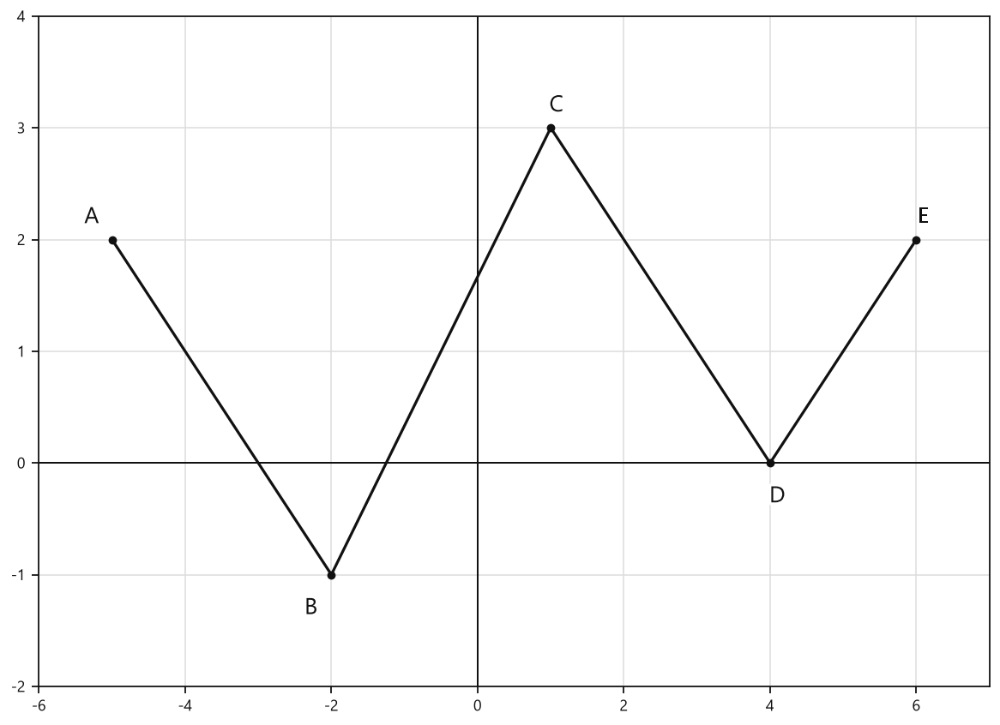

*График функции y=f(x)*


**С20.** График функции состоит из отрезков, соединяющих точки $A(-6;1)$, $B(-3;-2)$, $C(0;2)$, $D(3;2)$ и $E(5;-1)$. Укажите:  
а) область определения функции;  
б) множество значений функции;  
в) значения аргумента, при которых функция принимает нулевые значения.


<!--geo-figure-spec
{
  "needed": true,
  "kind": "graph",
  "caption": "График функции",
  "equal": false,
  "axis": true,
  "grid": true,
  "xlim": [
    -7,
    6
  ],
  "ylim": [
    -3,
    3
  ],
  "points": {
    "A": [
      -6,
      1
    ],
    "B": [
      -3,
      -2
    ],
    "C": [
      0,
      2
    ],
    "D": [
      3,
      2
    ],
    "E": [
      5,
      -1
    ]
  },
  "segments": [
    [
      "A",
      "B"
    ],
    [
      "B",
      "C"
    ],
    [
      "C",
      "D"
    ],
    [
      "D",
      "E"
    ]
  ],
  "polygons": [],
  "circles": [],
  "labels": {
    "A": {
      "dx": -0.28,
      "dy": 0.18
    },
    "B": {
      "dx": -0.25,
      "dy": -0.28
    },
    "C": {
      "dx": 0.12,
      "dy": 0.18
    },
    "D": {
      "dx": 0.12,
      "dy": 0.18
    },
    "E": {
      "dx": 0.12,
      "dy": -0.28
    }
  },
  "right_angles": [],
  "angle_marks": [],
  "texts": []
}
-->
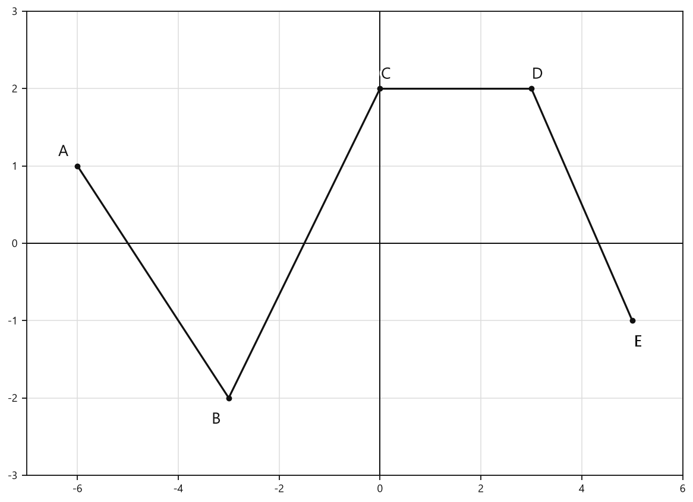

*График функции*


**С21.** График функции состоит из отрезков, соединяющих точки $A(-5;-2)$, $B(-2;1)$, $C(2;1)$ и $D(5;-2)$. Определите промежутки значений аргумента, на которых функция положительна, и промежутки, на которых функция отрицательна.


<!--geo-figure-spec
{
  "needed": true,
  "kind": "graph",
  "caption": "График функции",
  "axis": true,
  "grid": true,
  "xlim": [
    -6,
    6
  ],
  "ylim": [
    -2.6,
    1.6
  ],
  "points": {
    "A": [
      -5,
      -2
    ],
    "B": [
      -2,
      1
    ],
    "C": [
      2,
      1
    ],
    "D": [
      5,
      -2
    ]
  },
  "segments": [
    [
      "A",
      "B"
    ],
    [
      "B",
      "C"
    ],
    [
      "C",
      "D"
    ]
  ],
  "polygons": [],
  "circles": [],
  "labels": {
    "A": {
      "dx": -0.28,
      "dy": -0.3
    },
    "B": {
      "dx": -0.25,
      "dy": 0.2
    },
    "C": {
      "dx": 0.1,
      "dy": 0.2
    },
    "D": {
      "dx": 0.1,
      "dy": -0.3
    }
  },
  "right_angles": [],
  "angle_marks": [],
  "texts": []
}
-->
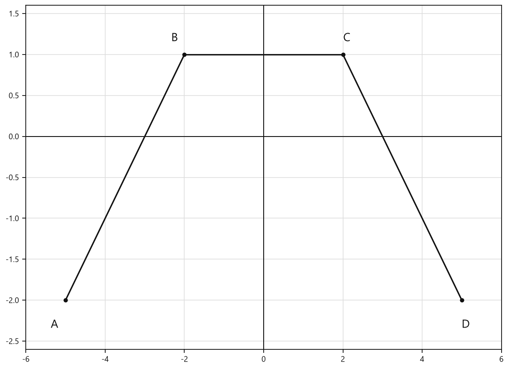

*График функции*


**С22.** Функция задана формулой $f(x)=-4x+12$. Найдите нуль функции и определите, при каких значениях аргумента функция принимает положительные значения, а при каких — отрицательные.

**С23.** На координатной плоскости изображён график функции $y=g(x)$, состоящий из двух частей: отрезка с концами $A(-4;3)$ и $B(0;-1)$ и отрезка с концами $C(2;-1)$ и $D(6;3)$. Определите, является ли изображённая линия графиком функции. Найдите область определения и множество значений этой функции.


<!--geo-figure-spec
{
  "needed": true,
  "kind": "graph",
  "caption": "График функции $y=g(x)$",
  "axis": true,
  "grid": true,
  "xlim": [
    -5,
    7
  ],
  "ylim": [
    -2,
    4
  ],
  "points": {
    "A": [
      -4,
      3
    ],
    "B": [
      0,
      -1
    ],
    "C": [
      2,
      -1
    ],
    "D": [
      6,
      3
    ]
  },
  "segments": [
    [
      "A",
      "B"
    ],
    [
      "C",
      "D"
    ]
  ],
  "polygons": [],
  "circles": [],
  "labels": {
    "A": {
      "dx": -0.28,
      "dy": 0.18
    },
    "B": {
      "dx": 0.12,
      "dy": -0.28
    },
    "C": {
      "dx": 0.12,
      "dy": -0.28
    },
    "D": {
      "dx": 0.12,
      "dy": 0.18
    }
  },
  "right_angles": [],
  "angle_marks": [],
  "texts": []
}
-->
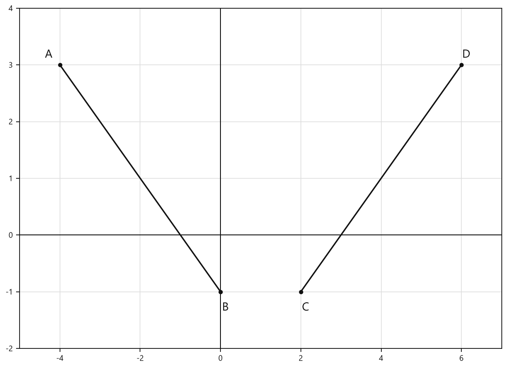

*График функции y=g(x)*


**С24.** Турист двигался по прямой дороге. Расстояние $s$ от начальной точки зависит от времени $t$ по формуле $s=6t$, где $t$ измеряется в часах, а $s$ — в километрах. Определите область определения функции для промежутка движения от $0$ до $4$ часов, найдите множество её значений и вычислите расстояние, пройденное за $2,5$ часа. Обоснуйте, что данная зависимость является функцией.

### Уровень 9–10 баллов

**С1.** Для каждого значения $x$ из множества $\{-4;\,-1;\,0;\,3;\,5\}$ вычисляют значение $y$ по формуле $y=\dfrac{2x-1}{x+2}$. Составьте таблицу значений функции, укажите область определения этой функции и найдите множество её значений на указанном множестве аргументов.

**С2.** Зависимость между величинами $a$ и $b$ задана условием: $a$ и $b$ — длины катетов прямоугольного треугольника с гипотенузой $13$ см, причём $a>0$, $b>0$. Выразите $b$ через $a$. Укажите область определения полученной зависимости и объясните, является ли она функцией.

**С3.** Функция задана формулой $f(x)=\dfrac{x^2-9}{x-3}$. Найдите область определения функции, значения $f(-3)$, $f(0)$ и $f(4)$, а также нули функции.

**С4.** Длина прямоугольного участка на $6$ м больше его ширины. Площадь участка равна $S$ квадратных метров. Задайте формулой зависимость $S$ от ширины $x$, укажите область определения этой функции и найдите ширину участка, если $S=91\ \text{м}^2$.

**С5.** Функция задана таблицей.

| $x$ | $-6$ | $-2$ | $1$ | $4$ | $7$ | $10$ |
|---:|---:|---:|---:|---:|---:|---:|
| $f(x)$ | $3$ | $-1$ | $5$ | $0$ | $-1$ | $3$ |

Найдите $D(f)$, $E(f)$, все нули функции и значения аргумента, при которых $f(x)<0$.

**С6.** Функция задана формулой $g(x)=|x-2|-3$. Найдите нули функции, множество значений функции и значения аргумента, при которых $g(x)>0$.

**С7.** На координатной плоскости изображён график функции $y=f(x)$, состоящий из отрезков, соединяющих последовательно точки $A(-5;2)$, $B(-3;-2)$, $C(0;1)$, $D(2;-3)$ и $E(5;2)$.


<!--geo-figure-spec
{
  "needed": true,
  "kind": "graph",
  "caption": "График функции $y=h(x)$",
  "axis": true,
  "grid": true,
  "xlim": [
    -6.8,
    6.8
  ],
  "ylim": [
    -2.8,
    3.7
  ],
  "points": {
    "A": [
      -6,
      3
    ],
    "B": [
      -2,
      0
    ],
    "C": [
      1,
      -2
    ],
    "D": [
      4,
      0
    ],
    "E": [
      6,
      3
    ]
  },
  "segments": [
    [
      "A",
      "B"
    ],
    [
      "B",
      "C"
    ],
    [
      "C",
      "D"
    ],
    [
      "D",
      "E"
    ]
  ],
  "labels": {
    "A": {
      "dx": 0.12,
      "dy": 0.18
    },
    "B": {
      "dx": -0.28,
      "dy": -0.35
    },
    "C": {
      "dx": 0.12,
      "dy": -0.38
    },
    "D": {
      "dx": 0.12,
      "dy": -0.35
    },
    "E": {
      "dx": -0.42,
      "dy": 0.18
    }
  }
}
-->
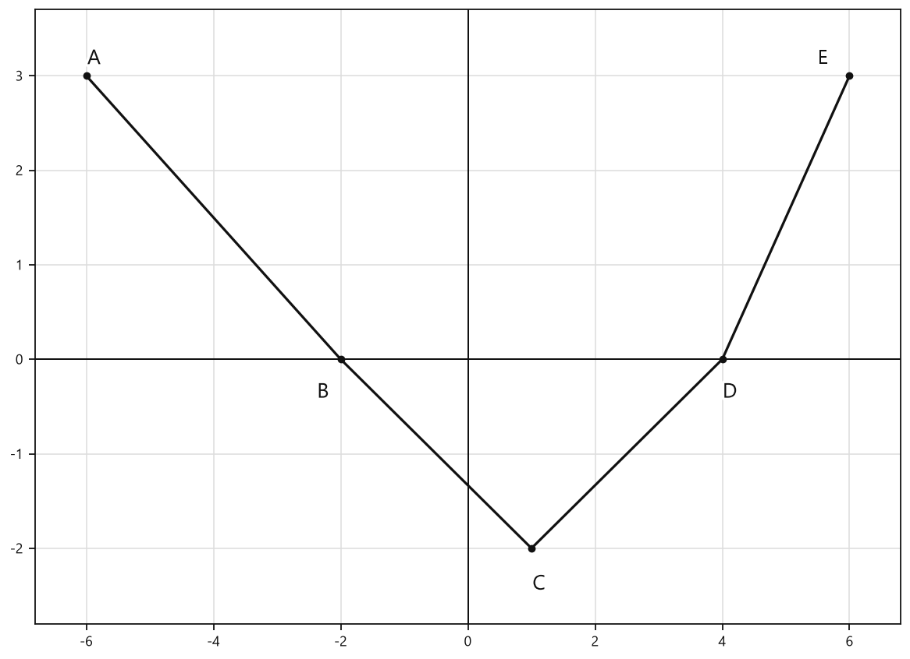

*График функции y=h(x)*


Найдите $f(-5)$, $f(-3)$, $f(0)$, $f(2)$ и $f(5)$; укажите область определения и множество значений функции.

**С8.** График функции $y=h(x)$ состоит из отрезков, соединяющих точки $A(-6;3)$, $B(-2;0)$, $C(1;-2)$, $D(4;0)$ и $E(6;3)$. Найдите нули функции и укажите промежутки, на которых функция принимает положительные и отрицательные значения.


<!--geo-figure-spec
{
  "needed": true,
  "kind": "graph",
  "caption": "График функции $y=h(x)$",
  "equal": false,
  "axis": true,
  "grid": true,
  "xlim": [
    -7,
    7
  ],
  "ylim": [
    -3,
    4
  ],
  "points": {
    "A": [
      -6,
      3
    ],
    "B": [
      -2,
      0
    ],
    "C": [
      1,
      -2
    ],
    "D": [
      4,
      0
    ],
    "E": [
      6,
      3
    ]
  },
  "segments": [
    [
      "A",
      "B"
    ],
    [
      "B",
      "C"
    ],
    [
      "C",
      "D"
    ],
    [
      "D",
      "E"
    ]
  ],
  "polygons": [],
  "circles": [],
  "labels": {
    "A": {
      "dx": -0.38,
      "dy": 0.18
    },
    "B": {
      "dx": 0.12,
      "dy": 0.22
    },
    "C": {
      "dx": 0.12,
      "dy": -0.38
    },
    "D": {
      "dx": 0.12,
      "dy": -0.38
    },
    "E": {
      "dx": 0.12,
      "dy": 0.18
    }
  },
  "right_angles": [],
  "angle_marks": [],
  "texts": []
}
-->
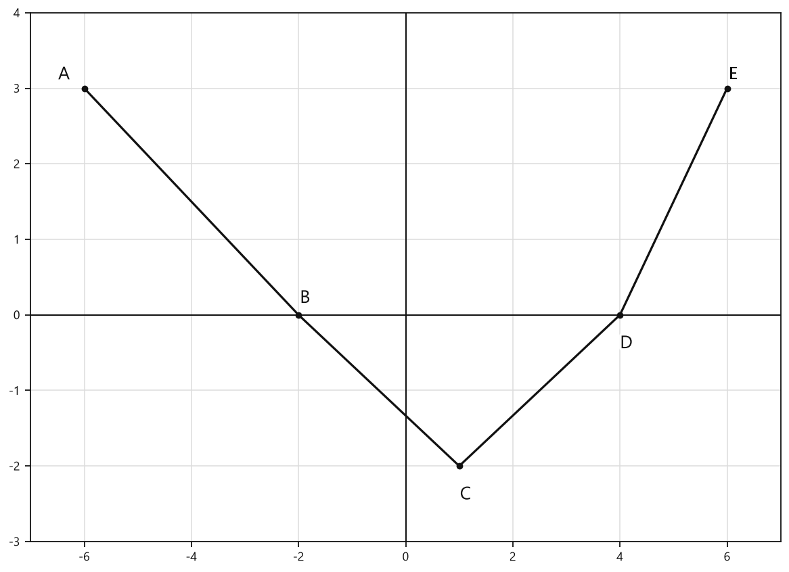

*График функции y=h(x)*


**С9.** Рассмотрим кривую, заданную уравнением $x^2+y^2=25$. Определите, является ли эта кривая графиком функции $y$ от $x$. Ответ обоснуйте с помощью определения функции. Затем укажите, какие значения $x$ имеют на кривой ровно одно соответствующее значение $y$.

**С10.** Функция задана формулой $f(x)=\dfrac{4}{x-1}+2$. Найдите область определения и множество значений функции, её нуль и значения аргумента, при которых $f(x)>0$.

**С11.** Подберите все значения параметра $a$, при которых функция $f(x)=ax+6$ имеет нуль $x=3$. Для каждого найденного значения $a$ укажите, является ли функция возрастающей или убывающей.

**С12.** Функция задана формулой $f(x)=|x+1|-|x-3|$. Найдите её нули, область определения, множество значений и значения аргумента, при которых $f(x)>0$.

**С13.** Для каждой зависимости определите, является ли она функцией, если аргументом считается величина, указанная первой:  
а) зависимость между площадью круга и его радиусом;  
б) зависимость между натуральным числом и остатком от деления этого числа на $5$;  
в) зависимость между периметром прямоугольника и его площадью;  
г) зависимость между номером дня недели и количеством букв в его названии.  
Для каждой зависимости кратко обоснуйте ответ.

**С14.** Прямоугольный резервуар имеет длину $12$ м и ширину $5$ м. В него наливают воду до высоты, равной $\frac{3}{4}$ высоты резервуара. Задайте формулой зависимость объёма воды $V$ от высоты резервуара $x$. Укажите область определения этой функции, если высота резервуара не превышает $4$ м, а значения величин должны быть неотрицательными.

**С15.** Функция задана таблицей.

| $x$ | $-6$ | $-2$ | $0$ | $3$ | $7$ | $10$ |
|---:|---:|---:|---:|---:|---:|---:|
| $f(x)$ | $4$ | $-1$ | $5$ | $0$ | $-1$ | $4$ |

Найдите $D(f)$ и $E(f)$, значения $f(-2)$ и $f(7)$, а также все значения аргумента, при которых функция равна $4$ или $-1$.

**С16.** Функция задана формулой $f(x)=\dfrac{2x-6}{x+1}$.  
а) Найдите область определения функции.  
б) Найдите нуль функции.  
в) Вычислите $f(-2)$, $f(0)$ и $f(3)$.  
г) Определите, при каком значении аргумента значение функции равно $-5$.

**С17.** На координатной плоскости задан график функции $y=f(x)$ — ломаная, последовательно соединяющая точки $A(-5;2)$, $B(-3;-2)$, $C(0;1)$, $D(2;1)$ и $E(5;-2)$. Концы отрезков входят в график. Найдите нули функции, область определения и множество значений функции, а также укажите промежутки, на которых функция принимает положительные значения.


<!--geo-figure-spec
{
  "needed": true,
  "kind": "graph",
  "caption": "График функции $y=f(x)$ — ломаная $ABCDE$",
  "equal": false,
  "axis": true,
  "grid": true,
  "xlim": [
    -6,
    6
  ],
  "ylim": [
    -3,
    3
  ],
  "points": {
    "A": [
      -5,
      2
    ],
    "B": [
      -3,
      -2
    ],
    "C": [
      0,
      1
    ],
    "D": [
      2,
      1
    ],
    "E": [
      5,
      -2
    ]
  },
  "segments": [
    [
      "A",
      "B"
    ],
    [
      "B",
      "C"
    ],
    [
      "C",
      "D"
    ],
    [
      "D",
      "E"
    ]
  ],
  "polygons": [],
  "circles": [],
  "labels": {
    "A": {
      "dx": -0.35,
      "dy": 0.2
    },
    "B": {
      "dx": -0.35,
      "dy": -0.35
    },
    "C": {
      "dx": 0.16,
      "dy": 0.2
    },
    "D": {
      "dx": 0.12,
      "dy": 0.2
    },
    "E": {
      "dx": 0.12,
      "dy": -0.35
    }
  },
  "right_angles": [],
  "angle_marks": [],
  "texts": []
}
-->
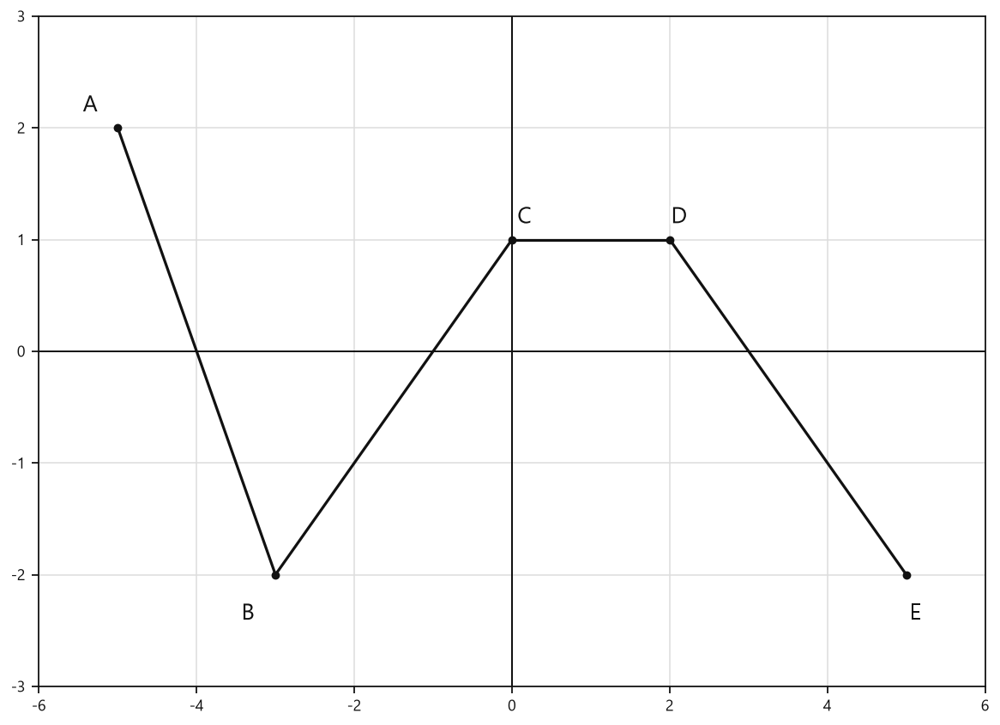

*График функции y=f(x) — ломаная ABCDE*


**С18.** Постройте в одной координатной плоскости график функции $y=f(x)$, область определения которой $D(f)=[-4;5]$, множество значений $E(f)=[-3;4]$, нули которой равны $-2$ и $3$, а при $x=0$ функция принимает значение $4$. График должен быть ломаной, проходящей через указанные точки, и не должен иметь других нулей. Укажите координаты вершин построенной ломаной и проверьте, что она является графиком функции.

## Чек-лист «ученик понял тему»

- Могу повторить определения и формулы параграфа своими словами и по учебнику.
- Решаю типовые задания своего уровня без подсказки.
- Вижу типичную ошибку и могу её объяснить.
