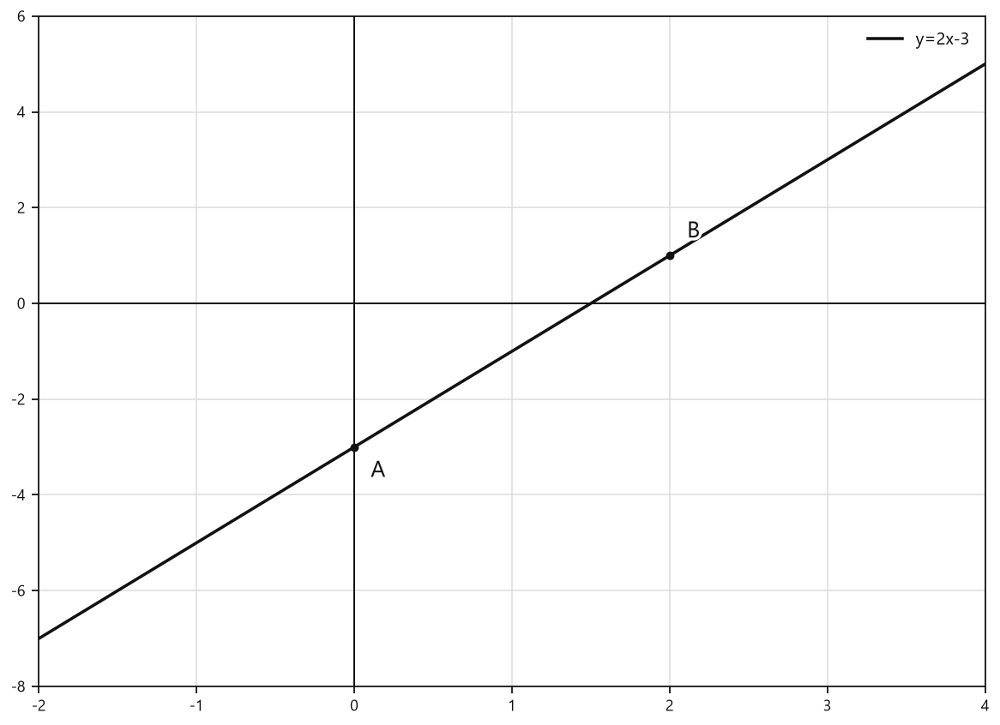
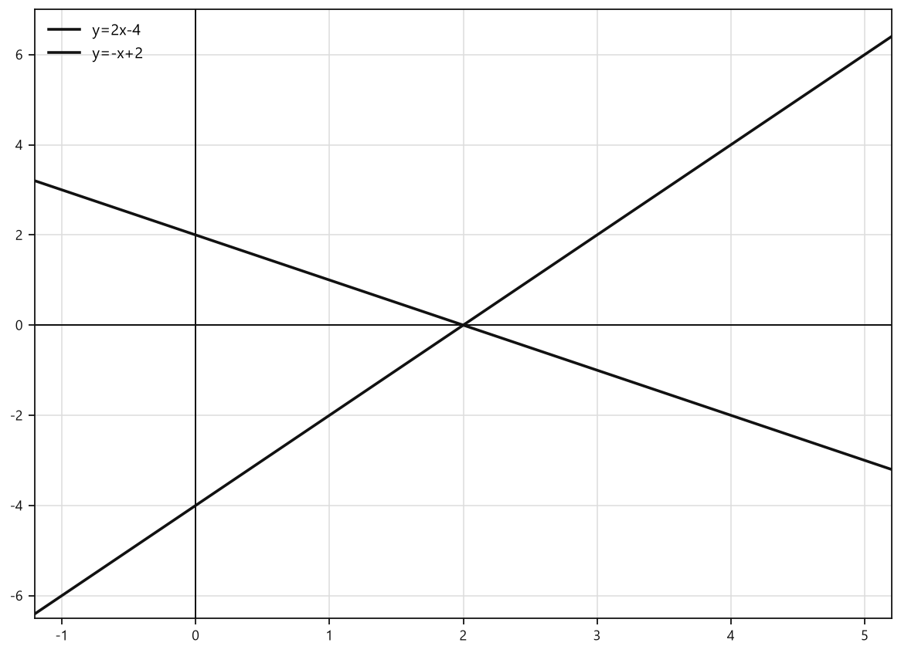

# Занятие 26. Линейная функция и её свойства

**Раздел:** Глава 3  
**Параграф учебника:** §20. Линейная функция и её свойства  
**Страницы:** 231–252

## Цели занятия

К концу занятия ученик умеет:

- узнавать линейную функцию среди других зависимостей;
- находить значение функции по заданному аргументу;
- находить аргумент по заданному значению функции;
- находить нуль функции и точки пересечения её графика с осями координат;
- проверять, принадлежит ли точка графику функции;
- определять угловой коэффициент и направление прямой.

Выбери блок своего уровня:

- **1–2 балла:** определить линейную функцию и вычислить её значение;
- **3–4 балла:** найти аргумент, нуль функции и точки пересечения с осями;
- **5–6 баллов:** исследовать знак функции и проверять принадлежность точек графику;
- **7–8 баллов:** работать с угловым коэффициентом и несколькими графиками;
- **9–10 баллов:** уверенно решать смешанные задания и объяснять ход решения.

## Теория к занятию

### 1. Что называют линейной функцией

#### Простыми словами

Линейная функция показывает зависимость одной переменной от другой. Переменная $x$ входит в формулу только в первой степени: без квадрата, куба и без нахождения в знаменателе.

Например:

- $y=3x+2$ — линейная функция;
- $y=-5x+1$ — линейная функция;
- $y=7$ — тоже линейная функция, потому что её можно записать так: $y=0x+7$.

А вот $y=x^2+4$ и $y=\frac{5}{x}+6$ линейными не являются. В первом случае появился квадрат, во втором переменная оказалась в знаменателе. Формула решила сменить жанр.

#### Определение

Функция вида $y = kx + b$, где $k$ и $b$ — некоторые числа, а $x$ и $y$ — переменные, называется линейной функцией.

#### Формулы

В записи $y=kx+b$:

- $k$ — коэффициент при $x$;
- $b$ — свободный член;
- $x$ — аргумент;
- $y$ — значение функции.

Чтобы определить, является ли функция линейной, нужно проверить, можно ли записать её в виде $y=kx+b$.

#### Правила

Действуем по плану:

1. Приводим формулу к удобному виду.
2. Сравниваем её с $y=kx+b$.
3. Определяем числа $k$ и $b$.

Разберём несколько записей:

- $y=5x-1$: $k=5$, $b=-1$;
- $y=7-8x$: переставим слагаемые: $y=-8x+7$, поэтому $k=-8$, $b=7$;
- $y=-\frac{x}{4}$: запишем так: $y=-\frac14x+0$, поэтому $k=-\frac14$, $b=0$;
- $y=10$: запишем так: $y=0x+10$, поэтому $k=0$, $b=10$.

#### Ловушки

- В функции $y=7-8x$ коэффициент $k$ равен $-8$, а не $8$.
- Число $b$ записывается вместе со своим знаком. В функции $y=5x-1$ это $b=-1$.
- Функция $y=10$ является линейной: просто у неё $k=0$.
- Формула $\frac{5}{x}+6$ не имеет вида $kx+b$, потому что $x$ находится в знаменателе.

---

### 2. Как найти значение функции

#### Простыми словами

Аргумент $x$ можно представить как число, которое мы подаём на вход функции. Функция выполняет действие и выдаёт значение $y$.

Чтобы найти $y$, нужно заменить $x$ известным числом и вычислить получившееся выражение.

#### Правило

Для того чтобы найти значение функции по заданному значению аргумента, нужно:

1. Назвать функцию и аргумент.
2. В формулу функции вместо аргумента подставить его значение.

#### Алгоритм

Пусть дана функция $y=kx+b$, а значение аргумента равно $x=x_0$.

1. Записать формулу функции.
2. Вместо $x$ подставить $x_0$.
3. Выполнить вычисления.
4. Записать полученное значение $y$.

#### Ловушки

- Отрицательное число при подстановке заключаем в скобки.
- Если перед скобками стоит минус, его нельзя потерять.
- $x$ — это аргумент, а $y$ — значение функции. Они не меняются местами, как участники эстафеты.

---

### 3. Как найти аргумент по значению функции

#### Простыми словами

Иногда известно значение функции $y$, а найти нужно аргумент $x$. Тогда подставляем известное значение $y$ и решаем уравнение относительно $x$.

Например, если $y=6x+9$ и функция должна иметь значение $0$, получаем:

$$6x+9=0.$$

Теперь это обычное линейное уравнение, а такие уравнения мы уже умеем решать.

#### Алгоритм

1. Приравнять формулу функции к заданному значению.
2. Решить полученное уравнение.
3. Записать найденное значение аргумента.

#### Ловушки

- При поиске аргумента заданное значение функции подставляем вместо $y$, а не вместо $x$.
- Сначала составляем уравнение, затем решаем его.
- При переносе слагаемого через знак равенства меняется его знак. Минус сам себя не перенесёт — ему нужно помочь.

---

### 4. Нуль функции

#### Простыми словами

Нуль функции — это такое значение аргумента, при котором значение функции равно нулю.

На графике этому соответствует точка пересечения с осью абсцисс, потому что для любой точки оси абсцисс $y=0$.

#### Формулы

Для функции $y=kx+b$ нуль функции находят из уравнения

$$kx+b=0.$$

Если $k\ne0$, то

$$x=-\frac{b}{k}.$$

#### Правила

Чтобы найти нуль функции:

1. Приравнять $y$ к нулю.
2. Решить полученное уравнение относительно $x$.
3. Записать найденное значение $x$.

#### Ловушки

- Нуль функции — это значение аргумента $x$, а не значение $y$.
- Точка пересечения с осью абсцисс имеет вид $(x;0)$.
- У функции $y=10$ нуля нет, потому что она всегда принимает значение $10$, а до нуля не доходит.

---

### 5. Точки пересечения графика с осями координат

#### Простыми словами

У точки, лежащей на оси координат, одна координата равна нулю.

- На оси абсцисс горизонтальная координата может быть любой, а вертикальная равна нулю: $y=0$.
- На оси ординат вертикальная координата может быть любой, а горизонтальная равна нулю: $x=0$.

#### Формулы

Точка пересечения с осью абсцисс:

$$y=0.$$

Точка пересечения с осью ординат:

$$x=0.$$

#### Алгоритм

Чтобы найти пересечение с осью абсцисс:

1. Записать $y=0$.
2. Подставить это значение в формулу функции.
3. Решить уравнение относительно $x$.
4. Записать точку $(x;0)$.

Чтобы найти пересечение с осью ординат:

1. Записать $x=0$.
2. Подставить это значение в формулу функции.
3. Найти $y$.
4. Записать точку $(0;y)$.

#### Ловушки

- Для оси абсцисс используем $y=0$, а не $x=0$.
- Для оси ординат используем $x=0$.
- Нуль функции связан с пересечением графика именно с осью абсцисс.

---

### 6. Как проверить, проходит ли график через точку

#### Простыми словами

Пусть дана точка $(x_0;y_0)$. Она лежит на графике функции, если после подстановки первой координаты $x_0$ получится вторая координата $y_0$.

Проверим точку $A(-3;-10)$ для функции $y=2x-4$:

$$2\cdot(-3)-4=-6-4=-10.$$

Получили вторую координату точки. Значит, точка $A$ лежит на графике.

#### Алгоритм

1. Записать координаты точки $(x_0;y_0)$.
2. Подставить первую координату $x_0$ в формулу функции.
3. Выполнить вычисления.
4. Сравнить результат со второй координатой $y_0$.
5. Если результаты совпали, точка лежит на графике.

#### Ловушки

- Подставляем только первую координату точки — $x_0$.
- Вторую координату не подставляем в формулу вместо $x$.
- Результат должен совпасть точно, а не «примерно где-то рядом».

---

### 7. Угловой коэффициент и направление прямой

#### Простыми словами

В функции $y=kx+b$ число $k$ показывает, как направлен график при движении слева направо:

- если $k>0$, прямая поднимается;
- если $k<0$, прямая опускается;
- если $k=0$, график горизонтальный.

Число $b$ сдвигает график вверх или вниз, а число $k$ отвечает за его наклон. У каждого числа своя работа.

#### Формула

Для линейной функции

$$y=kx+b$$

число $k$ является угловым коэффициентом.

#### Правила

- При положительном $k$ график образует острый угол с положительным направлением оси абсцисс.
- При отрицательном $k$ график образует тупой угол с положительным направлением оси абсцисс.
- При $k=0$ график параллелен оси абсцисс.

#### Ловушки

- В функции $y=5-3x$ угловой коэффициент равен $-3$, потому что $y=-3x+5$.
- В функции $y=-3$ угловой коэффициент равен $0$, а не $-3$: переменной $x$ нет.
- Знак коэффициента важен. Минус перед числом нельзя потерять — иначе прямая повернёт не туда.

## Сводка формул «выучить наизусть»

Линейная функция:

$$y=kx+b.$$

Нуль функции:

$$kx+b=0.$$

Если $k\ne0$, то:

$$x=-\frac{b}{k}.$$

Пересечение с осью абсцисс:

$$y=0.$$

Пересечение с осью ординат:

$$x=0.$$

## Правила, которые нельзя путать

- $x$ — аргумент, $y$ — значение функции.
- Ось абсцисс: $y=0$.
- Ось ординат: $x=0$.
- Нуль функции — значение аргумента, при котором $y=0$.
- В записи $y=kx+b$ число $k$ стоит при $x$.
- Отрицательное число при подстановке лучше сразу брать в скобки.

# Разбор ключевых заданий

## Р1. Определение линейной функции

**Условие.** Среди функций

$$y=5x-1,\qquad y=x^2+4,\qquad y=7-8x,\qquad y=\frac{5}{x}+6$$

выберите линейные. Укажите для них значения $k$ и $b$.

**Решение.**

Линейная функция должна иметь вид

$$y=kx+b.$$

Проверим каждую функцию.

Первая функция:

$$y=5x-1.$$

Она уже записана в нужном виде.

Значит,

$$k=5,\qquad b=-1.$$

Вторая функция:

$$y=x^2+4.$$

Здесь переменная $x$ стоит во второй степени.

Значит, функция не является линейной.

Третья функция:

$$y=7-8x.$$

Переставим слагаемые:

$$y=-8x+7.$$

Теперь вид функции совпадает с $y=kx+b$.

Следовательно,

$$k=-8,\qquad b=7.$$

Четвёртая функция:

$$y=\frac{5}{x}+6.$$

Здесь переменная $x$ находится в знаменателе.

Значит, функция не является линейной.

**Ответ:** линейные функции $y=5x-1$ и $y=7-8x$; для них соответственно $(k;b)=(5;-1)$ и $(-8;7)$.

---

## Р2. Значение функции по заданному аргументу

**Условие.** Найдите значение линейной функции $y=6x-2$ при значении аргумента $x=-3$.

**Решение.**

Запишем функцию:

$$y=6x-2.$$

Известное значение аргумента:

$$x=-3.$$

Подставим $-3$ вместо $x$:

$$y=6\cdot(-3)-2.$$

Выполним умножение:

$$y=-18-2.$$

Вычтем:

$$y=-20.$$

Скобки около отрицательного числа помогли не потерять знак. Маленькая скобка — большая польза.

**Ответ:** $-20$.

---

## Р3. Значения выражения при нескольких значениях аргумента

**Условие.** Найдите значение выражения $-2x+1$ при $x=-6$, $x=0$ и $x=2$.

**Решение.**

Сначала подставим $x=-6$:

$$-2\cdot(-6)+1=12+1=13.$$

Теперь подставим $x=0$:

$$-2\cdot0+1=0+1=1.$$

Наконец, подставим $x=2$:

$$-2\cdot2+1=-4+1=-3.$$

**Ответ:** $13;1;-3$.

---

## Р4. Решение уравнения

**Условие.** Решите уравнение

$$5-2(3x-4)=4x-3.$$

**Решение.**

Раскроем скобки:

$$5-6x+8=4x-3.$$

Приведём подобные слагаемые в левой части:

$$13-6x=4x-3.$$

Перенесём слагаемые с $x$ в правую часть, а числа — в левую:

$$13+3=4x+6x.$$

Сложим подобные слагаемые:

$$16=10x.$$

Разделим обе части уравнения на $10$:

$$x=\frac{16}{10}=\frac85.$$

Проверим найденное значение.

Левая часть:

$$5-2\left(3\cdot\frac85-4\right)
=5-2\left(\frac{24}{5}-\frac{20}{5}\right)
=5-\frac85
=\frac{17}{5}.$$

Правая часть:

$$4\cdot\frac85-3=\frac{32}{5}-\frac{15}{5}=\frac{17}{5}.$$

Левая и правая части равны, значит, решение верное.

**Ответ:** $x=\frac85$.

---

## Р5. Проверка зависимости на линейность

**Условие.** Определите, какие зависимости являются линейными:

а) площадь круга $S$ от длины радиуса $r$;

б) сумма $A$ двух чисел $5$ и $x$ от $x$.

**Решение.**

### а) Площадь круга

Площадь круга вычисляют по формуле

$$S=\pi r^2.$$

Переменная $r$ стоит во второй степени.

Такая формула не имеет вида $y=kx+b$.

Следовательно, зависимость не является линейной.

### б) Сумма чисел $5$ и $x$

Сумма равна

$$A=5+x.$$

Переставим слагаемые:

$$A=x+5.$$

Можно записать и так:

$$A=1\cdot x+5.$$

Это форма $y=kx+b$, где $k=1$, $b=5$.

Следовательно, зависимость является линейной.

**Ответ:** а) нелинейная; б) линейная.

---

## Р6. Придумываем линейные функции

**Условие.** Придумайте два примера линейных функций, для которых числа $k$ и $b$:

а) равны;

б) являются взаимно обратными.

**Решение.**

### а) Числа $k$ и $b$ равны

Нужно выбрать одинаковые значения $k$ и $b$.

Возьмём

$$k=3,\qquad b=3.$$

Тогда получим функцию

$$y=3x+3.$$

Возьмём ещё один вариант:

$$k=-2,\qquad b=-2.$$

Получим:

$$y=-2x-2.$$

В обоих примерах $k=b$.

### б) Числа $k$ и $b$ являются взаимно обратными

Взаимно обратные числа при умножении дают $1$.

Возьмём

$$k=2,\qquad b=\frac12.$$

Тогда функция имеет вид

$$y=2x+\frac12.$$

Ещё один вариант:

$$k=-3,\qquad b=-\frac13.$$

Получим:

$$y=-3x-\frac13.$$

Проверим взаимную обратность:

$$2\cdot\frac12=1,\qquad (-3)\cdot\left(-\frac13\right)=1.$$

**Ответ:** возможные примеры:  
а) $y=3x+3$, $y=-2x-2$;  
б) $y=2x+\frac12$, $y=-3x-\frac13$.

---

## Р7. Значение функции при нескольких аргументах

**Условие.** Функция задана формулой

$$y=\frac13x-12.$$

Найдите значение функции при $x=-6$, $x=1$ и $x=0$.

**Решение.**

### При $x=-6$

Подставим $-6$ вместо $x$:

$$y=\frac13\cdot(-6)-12.$$

Выполним умножение:

$$y=-2-12=-14.$$

### При $x=1$

Подставим $1$ вместо $x$:

$$y=\frac13\cdot1-12.$$

Представим $12$ в виде дроби со знаменателем $3$:

$$y=\frac13-\frac{36}{3}=-\frac{35}{3}.$$

### При $x=0$

Подставим $0$ вместо $x$:

$$y=\frac13\cdot0-12=-12.$$

**Ответ:** $-14;-\frac{35}{3};-12$.

---

## Р8. Нахождение аргумента по значению функции

**Условие.** Найдите, при каком значении аргумента функция $y=6x+9$ принимает значения:

а) $-3$; б) $0$; в) $-9$.

**Решение.**

### а) Значение функции равно $-3$

Приравняем формулу функции к $-3$:

$$6x+9=-3.$$

Перенесём $9$ в правую часть:

$$6x=-3-9.$$

Выполним вычитание:

$$6x=-12.$$

Разделим обе части на $6$:

$$x=-2.$$

### б) Значение функции равно $0$

Составим уравнение:

$$6x+9=0.$$

Перенесём $9$ вправо:

$$6x=-9.$$

Разделим обе части на $6$:

$$x=-\frac{9}{6}=-\frac32.$$

### в) Значение функции равно $-9$

Составим уравнение:

$$6x+9=-9.$$

Перенесём $9$ вправо:

$$6x=-9-9.$$

Получим:

$$6x=-18.$$

Разделим обе части на $6$:

$$x=-3.$$

**Ответ:** а) $-2$; б) $-\frac32$; в) $-3$.

---

## Р9. Два вопроса по одной функции

**Условие.** Для функции $f(x)=10x-3$ найдите:

а) значение функции при $x=3$;

б) значение аргумента, при котором значение функции равно $7$.

**Решение.**

### а) Находим значение функции

Подставим $x=3$ в формулу функции:

$$f(3)=10\cdot3-3.$$

Выполним вычисления:

$$f(3)=30-3=27.$$

### б) Находим аргумент

Значение функции равно $7$. Значит, вместо $f(x)$ подставляем $7$:

$$10x-3=7.$$

Решаем линейное уравнение:

$$10x=7+3,$$

$$10x=10,$$

$$x=1.$$

Проверим найденное значение:

$$f(1)=10\cdot1-3=10-3=7.$$

Проверка верна.

**Ответ:** а) $27$; б) $1$.

---

## Р10. Область определения и множество значений

**Условие.** Найдите область определения и множество значений функций:

а) $y=5x-7$; б) $y=-6x$; в) $y=10$.

**Решение.**

Область определения — это все значения $x$, которые можно подставить в формулу.

Множество значений — это все значения $y$, которые может принимать функция.

### а) Функция $y=5x-7$

В формуле нет деления на переменную и нет корня.

Значит, вместо $x$ можно подставить любое действительное число:

$$D(y)=\mathbb R.$$

Коэффициент при $x$ равен $5$, то есть не равен нулю. Поэтому, изменяя $x$, можно получить любое действительное значение $y$:

$$E(y)=\mathbb R.$$

### б) Функция $y=-6x$

Здесь также нет ограничений для $x$:

$$D(y)=\mathbb R.$$

Проверим, можно ли получить любое значение $y$. Для заданного $y$ возьмём

$$x=-\frac{y}{6}.$$

Тогда

$$-6\cdot\left(-\frac{y}{6}\right)=y.$$

Значит, функция принимает любые действительные значения:

$$E(y)=\mathbb R.$$

### в) Функция $y=10$

Значение $x$ может быть любым:

$$D(y)=\mathbb R.$$

Но формула не зависит от $x$: при любом $x$ получается только число $10$.

Поэтому

$$E(y)=\{10\}.$$

**Ответ:**  
а) $D(y)=\mathbb R$, $E(y)=\mathbb R$;  
б) $D(y)=\mathbb R$, $E(y)=\mathbb R$;  
в) $D(y)=\mathbb R$, $E(y)=\{10\}$.

---

## Р11. Нуль функции

**Условие.** Найдите нуль функции:

а) $f(x)=6x+2$; б) $f(x)=3x$; в) $f(x)=-\frac23x+6$.

**Решение.**

Нуль функции — это такое значение $x$, при котором значение функции равно нулю. Поэтому в каждом пункте приравниваем функцию к нулю.

### а)

$$6x+2=0.$$

Перенесём $2$ в правую часть:

$$6x=-2.$$

Разделим обе части на $6$:

$$x=-\frac{2}{6}=-\frac13.$$

### б)

$$3x=0.$$

Разделим обе части на $3$:

$$x=0.$$

### в)

$$-\frac23x+6=0.$$

Перенесём $6$ в правую часть:

$$-\frac23x=-6.$$

Разделим обе части на $-\frac23$:

$$x=(-6):\left(-\frac23\right).$$

Деление на дробь заменяем умножением на обратную дробь:

$$x=(-6)\cdot\left(-\frac32\right)=9.$$

Минусы здесь встретились и дружно уничтожили друг друга.

**Ответ:** а) $-\frac13$; б) $0$; в) $9$.

---

## Р12. Функция с заданным нулём

**Условие.** Придумайте пример линейной функции, нулём которой является число $12$.

**Решение.**

Нуль функции равен $12$. Это значит: при $x=12$ значение функции должно быть равно $0$.

Возьмём функцию

$$y=x-12.$$

Проверим:

$$y=12-12=0.$$

Значит, при $x=12$ функция равна нулю.

**Ответ:** например, $y=x-12$.

---

## Р13. Нуль функции по точке пересечения с осью

**Условие.** График линейной функции пересекает ось абсцисс в точке $F(-4;0)$. Найдите нуль функции.

**Решение.**

У любой точки на оси абсцисс вторая координата равна $0$.

Точка $F(-4;0)$ означает, что при

$$x=-4$$

значение функции равно

$$y=0.$$

Именно такое значение аргумента и называют нулём функции.

**Ответ:** $-4$.

---

## Р14. Точки пересечения с осями координат

**Условие.** Дана функция $y=5x-10$. Найдите координаты точек пересечения её графика с осями координат.

**Решение.**

### Пересечение с осью абсцисс

На оси абсцисс координата $y$ равна нулю. Поэтому подставим $y=0$:

$$5x-10=0.$$

$$5x=10.$$

$$x=2.$$

Точка пересечения имеет координаты

$$(2;0).$$

### Пересечение с осью ординат

На оси ординат координата $x$ равна нулю. Подставим $x=0$:

$$y=5\cdot0-10.$$

$$y=-10.$$

Точка пересечения имеет координаты

$$(0;-10).$$

Не перепутай оси: у оси абсцисс $y=0$, у оси ординат $x=0$.

**Ответ:** с осью абсцисс — $(2;0)$; с осью ординат — $(0;-10)$.

---

## Р15. Знак функции

**Условие.** Для функции $y=-2x+9$ найдите:

а) нуль функции;

б) значения аргумента, при которых функция положительна;

в) значения аргумента, при которых функция отрицательна.

**Решение.**

### а) Нуль функции

Приравняем значение функции к нулю:

$$-2x+9=0.$$

$$-2x=-9.$$

Разделим обе части на $-2$:

$$x=\frac92.$$

### б) Положительные значения

Функция положительна, когда $y>0$:

$$-2x+9>0.$$

$$-2x>-9.$$

Делим на отрицательное число $-2$, поэтому знак неравенства меняется:

$$x<\frac92.$$

### в) Отрицательные значения

Функция отрицательна, когда $y<0$:

$$-2x+9<0.$$

$$-2x<-9.$$

Снова делим на $-2$ и меняем знак:

$$x>\frac92.$$

Число $\frac92$ — граница: при нём функция равна нулю, поэтому оно не относится ни к положительным, ни к отрицательным значениям.

**Ответ:**  
а) $x=\frac92$;  
б) $x<\frac92$;  
в) $x>\frac92$.

---

## Р16. Проверка принадлежности точек графику

**Условие.** Через какие из точек $A(-3;-10)$, $B(2;0)$, $C(0;4)$ проходит прямая

$$y=2x-4?$$

Назовите ещё две точки этой прямой.

**Решение.**

Чтобы проверить точку, подставим её первую координату вместо $x$. Если полученное значение $y$ совпадёт со второй координатой точки, точка принадлежит прямой.

### Точка $A(-3;-10)$

Подставим $x=-3$:

$$y=2\cdot(-3)-4.$$

$$y=-6-4=-10.$$

Получили вторую координату точки $A$. Значит, точка $A$ принадлежит прямой.

### Точка $B(2;0)$

Подставим $x=2$:

$$y=2\cdot2-4.$$

$$y=4-4=0.$$

Получили вторую координату точки $B$. Значит, точка $B$ принадлежит прямой.

### Точка $C(0;4)$

Подставим $x=0$:

$$y=2\cdot0-4.$$

$$y=-4.$$

Получили $-4$, а в точке $C$ вторая координата равна $4$. Значит, точка $C$ не принадлежит прямой. Знак здесь не для красоты — он решает судьбу точки.

Теперь найдём ещё две точки. Выберем удобные значения $x$.

При $x=1$:

$$y=2\cdot1-4=-2.$$

Получаем точку

$$(1;-2).$$

При $x=3$:

$$y=2\cdot3-4=2.$$

Получаем точку

$$(3;2).$$

**Ответ:** прямая проходит через точки $A$ и $B$; ещё две точки — $(1;-2)$ и $(3;2)$.

---

## Р17. Пересечение нескольких графиков с осью ординат

**Условие.** Для функций

$$y=2x+1,\qquad y=-x+3,\qquad y=-\frac12x-2,\qquad y=6$$

найдите координаты точек пересечения графиков с осью ординат. Можно ли сделать это без построения?

**Решение.**

На оси ординат первая координата равна нулю:

$$x=0.$$

Значит, в каждую формулу подставляем $x=0$.

Для первой функции:

$$y=2\cdot0+1=1.$$

Точка пересечения:

$$(0;1).$$

Для второй функции:

$$y=-0+3=3.$$

Точка пересечения:

$$(0;3).$$

Для третьей функции:

$$y=-\frac12\cdot0-2=-2.$$

Точка пересечения:

$$(0;-2).$$

Для четвёртой функции значение сразу видно:

$$y=6.$$

Точка пересечения:

$$(0;6).$$

Построение не требуется: для пересечения с осью ординат достаточно положить $x=0$.

**Ответ:** $(0;1)$, $(0;3)$, $(0;-2)$, $(0;6)$; да, точки можно найти без построения.

---

## Р18. Прямая через заданную точку и положительные значения

**Условие.** Какая из прямых

$$y=2x+4,\qquad y=-\frac{x}{4},\qquad y=4x-2$$

проходит через точку $A(0;4)$? Для найденной функции определите, при каких значениях аргумента она принимает положительные значения.

**Решение.**

У точки $A(0;4)$ первая координата $x=0$, а вторая координата $y=4$.

Подставим $x=0$ в каждую формулу.

### Первая функция

$$y=2\cdot0+4=4.$$

Получили вторую координату точки $A$. Первая прямая проходит через точку $A$.

### Вторая функция

$$y=-\frac04=0.$$

Получили $0$, а не $4$. Эта прямая не подходит.

### Третья функция

$$y=4\cdot0-2=-2.$$

Получили $-2$, а не $4$. Эта прямая тоже не подходит.

Рассматриваем функцию

$$y=2x+4.$$

Она принимает положительные значения, когда

$$2x+4>0.$$

$$2x>-4.$$

$$x>-2.$$

**Ответ:** прямая $y=2x+4$; функция положительна при $x>-2$.

---

## Р19. Угловой коэффициент

**Условие.** Выберите прямую, угловой коэффициент которой равен $-3$:

1) $y=8x-3$;
2) $y=5-3x$;
3) $y=-3$;
4) $y=-\frac13x+2$.

Определите, образует ли эта прямая острый угол с положительным направлением оси абсцисс.

**Решение.**

У линейной функции вид

$$y=kx+b.$$

Число $k$ — коэффициент при $x$.

Для первой функции:

$$y=8x-3,$$

поэтому

$$k=8.$$

Вторая функция записана немного иначе. Переставим слагаемые:

$$y=5-3x=-3x+5.$$

Значит,

$$k=-3.$$

Для третьей функции нет слагаемого с $x$:

$$y=-3=0x-3,$$

поэтому

$$k=0.$$

Для четвёртой функции:

$$k=-\frac13.$$

Значит, нужная функция:

$$y=5-3x.$$

При отрицательном угловом коэффициенте график опускается, если двигаться слева направо. Поэтому угол с положительным направлением оси абсцисс не является острым.

**Ответ:** $y=5-3x$; нет, угол не является острым.

---

## Р20. Построение графика линейной функции

**Условие.** Постройте график функции

$$y=2x-3.$$

**Решение.**

График линейной функции — прямая. Чтобы провести прямую, достаточно найти две её точки.

Выберем $x=0$:

$$y=2\cdot0-3=-3.$$

Получаем точку

$$A(0;-3).$$

Выберем $x=2$:

$$y=2\cdot2-3=4-3=1.$$

Получаем точку

$$B(2;1).$$

Отметим точки $A(0;-3)$ и $B(2;1)$ на координатной плоскости. Через эти две точки проведём прямую.

<!--geo-figure-spec
{
  "needed": true,
  "kind": "graph",
  "caption": "График $y=2x-3$",
  "axis": true,
  "grid": true,
  "xlim": [
    -2,
    4
  ],
  "ylim": [
    -8,
    6
  ],
  "curves": [
    {
      "expr": "2*x-3",
      "label": "y=2x-3"
    }
  ],
  "points": {
    "A": [
      0,
      -3
    ],
    "B": [
      2,
      1
    ]
  },
  "labels": {
    "A": {
      "dx": 0.15,
      "dy": -0.5
    },
    "B": {
      "dx": 0.15,
      "dy": 0.5
    }
  }
}
-->

*График y=2x-3*

Проверим, где график пересекает ось абсцисс. На этой оси $y=0$:

$$2x-3=0.$$

$$2x=3.$$

$$x=\frac32.$$

Значит, график пересекает ось абсцисс в точке

$$\left(\frac32;0\right).$$

**Ответ:** график — прямая, проходящая через точки $A(0;-3)$ и $B(2;1)$; нуль функции $x=\frac32$.

## Мини-проверка перед самостоятельной работой

1. Запиши функцию $y=4-7x$ в виде $y=kx+b$.
2. Найди значение функции $y=-3x+2$ при $x=-4$.
3. Найди нуль функции $y=5x-15$.
4. Проверь, принадлежит ли точка $(2;1)$ графику $y=3x-5$.
5. Определи знак функции $y=x-6$ при $x<6$.

### Ответы

1. $y=-7x+4$.
2. $14$.
3. $3$.
4. Да, потому что $3\cdot2-5=1$.
5. Функция принимает отрицательные значения.

## Практические задания

Выбери свой уровень и решай только этот блок. В блоке должна закрепиться вся тема параграфа. Ответы не приводятся.

### Уровень 1–2 балла

**С1.** Какая из функций является линейной?

1) $y=4x-7$ 2) $y=x^2+1$ 3) $y=\frac{3}{x}$ 4) $y=\sqrt{x}+2$ 5) $y=|x|-1$

**С2.** Укажите значения $k$ и $b$ для функции $y=-5x+8$.

1) $k=5$, $b=8$ 2) $k=-5$, $b=8$ 3) $k=-5$, $b=-8$ 4) $k=8$, $b=-5$ 5) $k=5$, $b=-8$

**С3.** Найдите значение функции $y=3x-4$ при $x=-2$.

**С4.** Найдите значение функции $f(x)=-\frac{1}{2}x+6$ при $x=8$.

**С5.** При каком значении аргумента функция $y=4x-9$ принимает значение $7$?

1) $x=-4$ 2) $x=-\frac{1}{2}$ 3) $x=2$ 4) $x=4$ 5) $x=16$

**С6.** Найдите нуль функции $y=5x+15$.

**С7.** Какая точка принадлежит графику функции $y=2x-1$?

1) $A(0;2)$ 2) $B(1;1)$ 3) $C(2;4)$ 4) $D(-1;1)$ 5) $E(3;5)$

**С8.** Найдите координаты точки пересечения графика функции $y=-3x+12$ с осью ординат.

**С9.** Найдите координаты точки пересечения графика функции $y=2x-6$ с осью абсцисс.

**С10.** Определите область определения и множество значений функции $y=-7x+2$.

**С11.** Для функции $y=-4x+8$ укажите, при каких значениях $x$ функция принимает положительные значения.

1) $x<2$ 2) $x>2$ 3) $x\leq 2$ 4) $x\geq 2$ 5) $x=2$

**С12.** Выберите функцию, график которой пересекает ось ординат в точке $(0;-5)$ и имеет угловой коэффициент $3$.

1) $y=-5x+3$ 2) $y=3x-5$ 3) $y=5x-3$ 4) $y=-3x-5$ 5) $y=3x+5$

**С13.** Какая из функций является линейной?

1) $y=4x-7$ 2) $y=x^2+1$ 3) $y=\dfrac{3}{x}$ 4) $y=\sqrt{x}+2$ 5) $y=|x|-5$

**С14.** Укажите значения чисел $k$ и $b$ для функции $y=-5x+8$.

1) $k=5,\ b=8$ 2) $k=-5,\ b=8$ 3) $k=-5,\ b=-8$ 4) $k=8,\ b=-5$ 5) $k=5,\ b=-8$

**С15.** Найдите значение функции $y=3x-4$ при $x=-2$.

1) $-10$ 2) $-2$ 3) $2$ 4) $10$ 5) $-1$

**С16.** Найдите значение выражения $-4x+3$ при $x=5$.

1) $-23$ 2) $-17$ 3) $17$ 4) $23$ 5) $-7$

**С17.** Для функции $f(x)=7x+1$ найдите значение аргумента, при котором значение функции равно $15$.

**С18.** Найдите нуль функции $y=4x-12$.

1) $-3$ 2) $0$ 3) $3$ 4) $4$ 5) $12$

**С19.** Какая точка принадлежит графику функции $y=2x+1$?

1) $A(1;1)$ 2) $B(1;3)$ 3) $C(2;2)$ 4) $D(-1;3)$ 5) $E(0;-1)$

**С20.** График функции $y=-3x+6$ пересекает ось ординат в точке

1) $(0;-3)$ 2) $(0;3)$ 3) $(0;6)$ 4) $(6;0)$ 5) $(-3;0)$

**С21.** Для функции $y=5x-10$ найдите абсциссу точки пересечения её графика с осью абсцисс.

**С22.** Какой угловой коэффициент имеет прямая $y=\dfrac{1}{2}x-9$?

1) $-9$ 2) $9$ 3) $\dfrac{1}{2}$ 4) $-\dfrac{1}{2}$ 5) $2$

**С23.** Определите, возрастает или убывает функция $y=-6x+4$.

1) возрастает 2) убывает 3) постоянна 4) сначала возрастает, затем убывает 5) определить невозможно

**С24.** Какая из функций принимает положительные значения при $x>2$?

1) $y=-x+1$ 2) $y=2-x$ 3) $y=3x-6$ 4) $y=-3x+6$ 5) $y=x-3$

**С25.** Какая из записей задаёт линейную функцию?

1) $y=4x-7$ 2) $y=x^2+1$ 3) $y=\dfrac{3}{x}$ 4) $y=\sqrt{x}+2$ 5) $y=4^x$

**С26.** Для линейной функции $y=-5x+8$ укажите значения чисел $k$ и $b$.

1) $k=5,\ b=8$ 2) $k=-5,\ b=8$ 3) $k=-5,\ b=-8$ 4) $k=8,\ b=-5$ 5) $k=5,\ b=-8$

**С27.** Найдите значение функции $y=3x-4$ при $x=-2$.

1) $-10$ 2) $-2$ 3) $2$ 4) $10$ 5) $-6$

**С28.** Найдите значение функции $f(x)=-2x+7$ при $x=0$.

1) $-7$ 2) $-2$ 3) $0$ 4) $2$ 5) $7$

**С29.** При каком значении аргумента функция $y=4x-12$ равна нулю?

1) $-3$ 2) $0$ 3) $3$ 4) $4$ 5) $12$

**С30.** Найдите нуль функции $f(x)=-\dfrac{1}{2}x+5$.

1) $-10$ 2) $-5$ 3) $0$ 4) $5$ 5) $10$

**С31.** Какая точка принадлежит графику функции $y=2x+1$?

1) $A(0;-1)$ 2) $B(1;2)$ 3) $C(1;3)$ 4) $D(2;4)$ 5) $E(-1;3)$

**С32.** График функции $y=-3x+6$ пересекает ось ординат в точке

1) $(0;-3)$ 2) $(0;0)$ 3) $(0;2)$ 4) $(0;6)$ 5) $(6;0)$.

**С33.** Какая из функций имеет угловой коэффициент, равный $-2$?

1) $y=2x+5$ 2) $y=-2x+5$ 3) $y=-\dfrac{1}{2}x+5$ 4) $y=5x-2$ 5) $y=-2$

**С34.** Укажите функцию, которая принимает положительные значения при $x>3$.

1) $y=2x-6$ 2) $y=-2x+6$ 3) $y=3-x$ 4) $y=-x-3$ 5) $y=6-2x$

**С35.** Найдите координаты точки пересечения графика функции $y=5x-10$ с осью абсцисс.

1) $(0;-10)$ 2) $(0;10)$ 3) $(2;0)$ 4) $(-2;0)$ 5) $(5;0)$

**С36.** Какая функция является постоянной?

1) $y=7x-1$ 2) $y=-x+7$ 3) $y=\dfrac{1}{7}x$ 4) $y=7$ 5) $y=x^2+7$

### Уровень 3–4 балла

**С1.** Определите, какие из функций являются линейными:  
а) $y=4x-7$;  
б) $y=x^2+1$;  
в) $y=-\frac{3}{5}x$;  
г) $y=\frac{2}{x}+1$.

**С2.** Для линейной функции $y=-6x+11$ укажите значения чисел $k$ и $b$.

**С3.** Найдите значение функции $y=7x-5$ при $x=-2$.

**С4.** Функция задана формулой $f(x)=-\frac{1}{2}x+8$. Найдите $f(6)$ и $f(0)$.

**С5.** Найдите значение аргумента, при котором функция $y=4x-9$ принимает значение $7$.

**С6.** Найдите нуль функции $y=-5x+20$.

**С7.** Для функции $y=3x-12$ найдите координаты точек пересечения её графика с осями координат.

**С8.** Проверьте, проходит ли график функции $y=-2x+5$ через точки $A(1;3)$ и $B(2;2)$.

**С9.** Найдите область определения и множество значений функции $y=-7x+4$.

**С10.** Для функции $y=-3x+6$ найдите значения аргумента, при которых функция принимает положительные значения.

**С11.** Какая из прямых имеет угловой коэффициент $-4$:  
1) $y=4x+1$  
2) $y=-4x+3$  
3) $y=-\frac{1}{4}x+3$  
4) $y=4$  
5) $y=-x-4$?

**С12.** В одной системе координат постройте графики функций $y=2x-4$ и $y=-x+2$. Найдите координаты точки их пересечения.

**С13.** Какая из записей задаёт линейную функцию?  
1) $y=4x-7$  
2) $y=x^2+3$  
3) $y=\dfrac{5}{x}-1$  
4) $y=\sqrt{x}+2$  
5) $y=3^x$

**С14.** Для линейной функции $y=-7x+5$ укажите значения чисел $k$ и $b$.

**С15.** Найдите значение функции $y=3x-8$ при $x=-4$.

**С16.** Найдите значение функции $f(x)=-\dfrac{2}{5}x+6$ при $x=15$.

**С17.** Для функции $y=8x-11$ найдите значение аргумента, при котором значение функции равно $13$.

**С18.** Для функции $f(x)=-4x+12$ найдите значение аргумента, при котором значение функции равно $0$.

**С19.** Найдите нуль функции $y=\dfrac{3}{4}x-9$.

**С20.** График линейной функции пересекает ось абсцисс в точке $M(6;0)$. Чему равен нуль этой функции?

**С21.** Найдите координаты точки пересечения графика функции $y=-2x+10$ с осью ординат.

**С22.** Найдите координаты точек пересечения графика функции $y=5x-15$ с осями координат.

**С23.** Определите, при каких значениях аргумента функция $y=-3x+12$ принимает положительные значения.

**С24.** Через какие из точек проходит прямая $y=4x-5$?  
1) $A(0;-5)$  
2) $B(1;1)$  
3) $C(2;3)$  
4) $D(-1;-1)$  
5) $E(3;8)$

**С25.** Определите, какие из заданных функций являются линейными:  
а) $y=4x-7$;  
б) $y=x^2+1$;  
в) $y=-\dfrac{3}{5}x$;  
г) $y=\dfrac{2}{x}+4$.

**С26.** Для линейной функции $y=-7x+5$ укажите значения чисел $k$ и $b$ в записи $y=kx+b$.

**С27.** Найдите значение функции $f(x)=4x-9$ при $x=-2$, $x=0$ и $x=3$.

**С28.** Функция задана формулой $y=-\dfrac{1}{2}x+6$. Найдите значение функции при $x=-4$ и при $x=8$.

**С29.** Для функции $y=3x-12$ найдите значение аргумента, при котором значение функции равно $0$.

**С30.** Найдите нуль функции $f(x)=-5x+15$.

**С31.** График функции $y=2x-8$ пересекает ось абсцисс в точке $A$. Найдите координаты точки $A$.

**С32.** Не выполняя построения, найдите координаты точек пересечения графика функции $y=-3x+6$ с осями координат.

**С33.** Для функции $y=-4x+12$ определите, при каких значениях $x$ функция принимает положительные значения.

**С34.** Для функции $y=5x+10$ определите, при каких значениях $x$ функция принимает отрицательные значения.

**С35.** Укажите, какие из точек принадлежат графику функции $y=-2x+3$:  
$A(0;3)$, $B(2;-1)$, $C(-1;1)$, $D(3;-3)$.

**С36.** Прямая задана формулой $y=\dfrac{3}{4}x-2$. Назовите любые две точки, через которые проходит её график, выбрав целые значения аргумента.

### Уровень 5–6 баллов

**С1.** Какая из заданных зависимостей является линейной функцией? Обоснуйте ответ:  
а) $y=4x-7$;  
б) $y=x^2+1$;  
в) $y=\dfrac{3}{x}-2$;  
г) $y=9$.

**С2.** Для линейной функции $y=-5x+8$ укажите значения чисел $k$ и $b$.

**С3.** Найдите значение функции $y=\dfrac{2}{5}x-3$ при $x=-10$.

**С4.** Функция задана формулой $f(x)=7-3x$. Найдите значение аргумента, при котором значение функции равно $-8$.

**С5.** Найдите область определения и множество значений функции $y=-4x+11$.

**С6.** Найдите нуль функции $y=9x-27$.

**С7.** Для функции $y=-2x+6$ найдите значения аргумента, при которых функция принимает положительные значения.

**С8.** Для функции $y=3x-12$ найдите значения аргумента, при которых функция принимает отрицательные значения.

**С9.** Не выполняя построения, найдите координаты точек пересечения графика функции $y=-4x+20$ с осями координат.

**С10.** Через какие из точек $A(-2;-7)$, $B(1;2)$, $C(4;11)$ проходит прямая $y=3x-1$? Для каждой подходящей точки выполните проверку подстановкой её координат.

**С11.** Какая из прямых имеет угловой коэффициент $-\dfrac{1}{2}$:  
а) $y=2x-5$;  
б) $y=-\dfrac{1}{2}x+4$;  
в) $y=-2x+1$;  
г) $y=5$?  
Укажите также, возрастает или убывает соответствующая линейная функция.

**С12.** В одной системе координат построены графики функций $y=2x-4$ и $y=-x+5$. Найдите координаты точки их пересечения, решив соответствующее уравнение.

**С13.** Какая из функций является линейной?

1) $y=4x-7$  
2) $y=x^2+4$  
3) $y=\dfrac{3}{x}-1$  
4) $y=\sqrt{x}+2$  
5) $y=4^x-7$

**С14.** Для линейной функции $y=-5x+8$ укажите значения коэффициентов $k$ и $b$.

**С15.** Найдите значение функции $y=\dfrac{2}{5}x-3$ при $x=-10$.

**С16.** Функция задана формулой $f(x)=-7x+4$. Найдите значение аргумента, при котором $f(x)=25$.

**С17.** Найдите нуль функции $y=4x-18$.

**С18.** Найдите область определения и множество значений функции $y=-3x+11$.

**С19.** Не выполняя построения, найдите координаты точек пересечения графика функции $y=-2x+6$ с осями координат.

**С20.** Через какие из точек проходит график функции $y=3x-5$?

1) $A(0;-5)$  
2) $B(1;-1)$  
3) $C(2;1)$  
4) $D(-1;2)$  
5) $E(3;5)$

**С21.** Укажите функцию, график которой проходит через точку $A(0;7)$ и имеет угловой коэффициент $-2$.

1) $y=2x+7$  
2) $y=-2x+7$  
3) $y=-2x-7$  
4) $y=7x-2$  
5) $y=-7x+2$

**С22.** Для функции $y=-4x+12$ найдите:  
а) нуль функции;  
б) значения аргумента, при которых функция принимает положительные значения;  
в) значения аргумента, при которых функция принимает отрицательные значения.

**С23.** Выберите все верные утверждения о функции $y=6-3x$.

1) Угловой коэффициент функции равен $6$.  
2) График функции пересекает ось ординат в точке $(0;6)$.  
3) Нуль функции равен $2$.  
4) Функция принимает положительные значения при $x>2$.  
5) График функции образует острый угол с положительным направлением оси абсцисс.

**С24.** Запишите формулу линейной функции, если её график пересекает ось ординат в точке $(0;-4)$, а ось абсцисс — в точке $(2;0)$.

**С25.** Определите, какие из функций являются линейными. Для каждой линейной функции укажите значения коэффициентов $k$ и $b$:
1) $y=4x-7$;  
2) $y=x^2+3$;  
3) $y=-\dfrac{2}{5}x+1$;  
4) $y=\dfrac{6}{x}-2$.

**С26.** Функция задана формулой $f(x)=-3x+8$. Найдите:
а) значение функции при $x=-2$;  
б) значение аргумента, при котором $f(x)=20$.

**С27.** Найдите область определения и множество значений функции $y=-7x+4$.

**С28.** Найдите нуль функции:
а) $y=5x-15$;  
б) $y=-\dfrac{3}{4}x-6$.

**С29.** Не выполняя построения, найдите координаты точек пересечения графика функции $y=-2x+6$ с осями координат.

**С30.** Для функции $y=-4x+12$ найдите:
а) нуль функции;  
б) значения аргумента, при которых функция принимает положительные значения;  
в) значения аргумента, при которых функция принимает отрицательные значения.

### Уровень 7–8 баллов

**С1.** Даны функции $y=4x-7$, $y=-\frac{3}{2}x+5$, $y=9$ и $y=x^2-1$. Определите, какие из них являются линейными функциями. Для каждой линейной функции укажите значения $k$ и $b$.

**С2.** Функция задана формулой $f(x)=-\frac{2}{5}x+6$. Найдите значения функции при $x=-5$, $x=0$ и $x=10$. Полученные результаты запишите в порядке возрастания.

**С3.** Функция задана формулой $y=7x-4$. Найдите значение аргумента, при котором значение функции равно $17$. Проверьте найденное значение подстановкой в формулу функции.

**С4.** Найдите область определения и множество значений функции:
а) $y=8x-3$;
б) $y=-\frac{1}{4}x+2$;
в) $y=-6$.

**С5.** Найдите нуль каждой функции:
а) $f(x)=5x-15$;
б) $f(x)=-2x-8$;
в) $f(x)=\frac{3}{4}x+9$.
Для одной из функций составьте проверку найденного результата.

**С6.** График линейной функции проходит через точку $A(-3;0)$. Найдите нуль этой функции. Объясните, почему для ответа достаточно координат этой точки.

**С7.** Дана функция $y=-3x+12$. Найдите координаты точек пересечения её графика с осями координат, не выполняя построения графика.

**С8.** Для функции $y=4-2x$ найдите:
а) нуль функции;
б) значения аргумента, при которых функция принимает положительные значения;
в) значения аргумента, при которых функция принимает отрицательные значения.
Результат изобразите на координатной прямой.

**С9.** Определите, через какие из точек проходит прямая $y=-3x+5$: $A(-1;8)$, $B(0;5)$, $C(2;-1)$, $D(3;-3)$. Для каждой точки выполните проверку подстановкой её абсциссы в формулу.

**С10.** В одной системе координат постройте графики функций $y=2x-4$ и $y=-x+2$. Найдите координаты точки их пересечения графически и проверьте результат вычислением.

<!--geo-figure-spec
{
  "needed": true,
  "kind": "graph",
  "caption": "Графики функций $y=2x-4$ и $y=-x+2$",
  "axis": true,
  "grid": true,
  "xlim": [
    -1.2,
    5.2
  ],
  "ylim": [
    -6.5,
    7
  ],
  "curves": [
    {
      "expr": "2*x-4",
      "label": "y=2x-4"
    },
    {
      "expr": "-x+2",
      "label": "y=-x+2"
    }
  ],
  "points": {}
}
-->

*Графики функций y=2x-4 и y=-x+2*

**С11.** Из прямых $y=5x-1$, $y=-3x+4$, $y=\frac{1}{3}x-2$ и $y=7$ выберите прямую, которая:
а) убывает;
б) имеет угловой коэффициент, равный $\frac{1}{3}$;
в) параллельна прямой $y=\frac{1}{3}x+6$.
Обоснуйте каждый выбор, используя вид линейной функции.

**С12.** Прямая $y=kx+b$ проходит через точки $A(0;6)$ и $B(3;0)$.
а) Найдите значения $k$ и $b$.
б) Запишите формулу этой линейной функции.
в) Найдите её нуль.
г) Укажите, при каких значениях аргумента функция принимает положительные значения.

**С13.** Для функции $f(x)=-4x+7$ найдите:
а) $f(-3)$; б) значение аргумента, при котором $f(x)=19$; в) нуль функции.

**С14.** Среди функций выберите все линейные и для каждой выбранной функции укажите значения $k$ и $b$:
$y=3x-8$, $y=2x^2+1$, $y=-\dfrac{5}{6}x$, $y=\dfrac{4}{x}-2$, $y=11$.

**С15.** Известно, что график линейной функции проходит через точки $A(-2;9)$ и $B(4;-3)$. Найдите формулу этой функции и координаты точки пересечения её графика с осью абсцисс.

**С16.** Для функции $y=-\dfrac{3}{4}x+6$ найдите:
а) нуль функции; б) значения аргумента, при которых функция принимает положительные значения; в) значения аргумента, при которых функция принимает отрицательные значения.

**С17.** Не выполняя построения, определите координаты точек пересечения графика функции $y=7x+14$ с осями координат. Обоснуйте свой ответ.

**С18.** Прямая $y=kx+b$ проходит через точки $C(0;-5)$ и $D(3;4)$. Найдите числа $k$ и $b$, а затем определите, при каких значениях аргумента функция принимает значения, большие $1$.

**С19.** Даны функции $f(x)=2x-9$ и $g(x)=-3x+6$. Найдите значения аргумента, при которых значения этих функций равны. Определите координаты точки пересечения их графиков.

**С20.** Укажите, какая из функций возрастает, какая убывает, а какая является постоянной:
$y=5x-1$, $y=-\dfrac{2}{3}x+4$, $y=-7$.
Для каждой непостоянной функции назовите её угловой коэффициент.

**С21.** Прямая проходит через точку $P(-4;2)$ и имеет угловой коэффициент $-\dfrac{1}{2}$. Запишите формулу соответствующей линейной функции и найдите значение функции при $x=8$.

**С22.** Функция задана формулой $y=(a-2)x+5$. Известно, что её график проходит через точку $M(3;-1)$. Найдите $a$, нуль функции и значения аргумента, при которых функция принимает отрицательные значения.

**С23.** В одной системе координат построены графики функций $y=2x-4$ и $y=-x+5$. Найдите координаты их точки пересечения. Затем определите, при каких значениях $x$ график первой функции расположен выше графика второй.

**С24.** Прямая $y=kx+b$ пересекает ось ординат в точке $(0;6)$, а ось абсцисс — в точке $(3;0)$. Найдите формулу функции, её угловой коэффициент и значения аргумента, при которых функция принимает значения не меньше $2$.

### Уровень 9–10 баллов

**С1.** Для каждой функции определите, является ли она линейной. Для линейных функций укажите значения $k$ и $b$:  
а) $y=4-7x$;  
б) $y=\dfrac{3}{x}+1$;  
в) $y=(2x-1)\cdot 3$;  
г) $y=\dfrac{x^2}{5}-2$;  
д) $y=-6$.

**С2.** Функция задана формулой $f(x)=(a-2)x+5$. Известно, что её график проходит через точку $A(3;11)$. Найдите число $a$ и нуль этой функции.

**С3.** График линейной функции проходит через точки $A(-2;7)$ и $B(4;-5)$. Запишите формулу этой функции и найдите значение аргумента, при котором значение функции равно $19$.

**С4.** Дана функция $y=-\dfrac{3}{4}x+6$. Найдите координаты точек пересечения её графика с осями координат, а также определите, при каких значениях $x$ функция принимает отрицательные значения.

**С5.** Прямая $y=kx+b$ проходит через точку $P(-3;8)$ и пересекает ось абсцисс в точке $Q(5;0)$. Найдите $k$ и $b$, затем определите, при каких значениях $x$ функция принимает положительные значения.

**С6.** В одной системе координат постройте графики функций $y=2x-5$ и $y=-x+4$. Найдите координаты их точки пересечения и укажите, при каких значениях $x$ первая функция принимает большее значение, чем вторая.

**С7.** Найдите все значения параметра $m$, при которых график функции $y=(m-1)x+2m$ проходит через точку $A(4;10)$. Для найденного значения $m$ определите нуль функции.

**С8.** Прямая задана уравнением $y=(2a-1)x+a+3$. Известно, что она пересекает ось ординат в точке с ординатой $7$. Найдите значение $a$, угловой коэффициент прямой и абсциссу точки пересечения с осью абсцисс.

**С9.** Для функции $f(x)=\dfrac{2}{5}x-4$ найдите числа $x$, при которых значение функции принадлежит отрезку $[-2;6]$.

**С10.** Линейная функция задана формулой $y=kx+b$. Известно, что $f(-2)=9$ и $f(4)=-3$. Найдите формулу функции, её нуль и значение $f(7)$.

**С11.** Определите все значения параметра $p$, при которых графики функций $y=(p+2)x-3$ и $y=4x+p$ пересекаются на оси ординат. Для найденного значения параметра найдите координаты точки пересечения графиков.

**С12.** На координатной плоскости построен график линейной функции, проходящий через точку $A(-6;12)$ и пересекающий ось абсцисс в точке $B(2;0)$. Найдите формулу функции, координаты точки её пересечения с осью ординат и промежуток значений $x$, при которых функция принимает значения не меньше $3$.

**С13.** Функция $f(x)=kx+b$ задана так, что $f(-3)=11$ и $f(5)=-5$. Найдите значения $k$ и $b$, а затем определите, при каких значениях $x$ выполняется неравенство $f(x)>0$.

**С14.** Прямая является графиком линейной функции $y=kx+b$. Она пересекает ось абсцисс в точке $A(6;0)$, а ось ординат — в точке $B(0;-3)$. Найдите формулу функции и координаты точки этого графика, в которой значение ординаты в два раза больше значения абсциссы.

**С15.** Для функции $f(x)=ax+6$ известно, что при увеличении аргумента на $4$ значение функции уменьшается на $10$. Найдите коэффициент $a$, нуль функции и все значения $x$, при которых $f(x)\leq 1$.

**С16.** Графики функций $y=3x-8$ и $y=-2x+7$ пересекаются в точке $P$. Найдите координаты точки $P$, а также значение выражения $x_P+y_P$, где $x_P$ и $y_P$ — её координаты. Не выполняя построения, определите, в какой из двух функций значение при $x=0$ больше.

**С17.** Линейная функция $y=kx+b$ проходит через точку $A(-2;5)$ и принимает значение $-7$ при аргументе $x=4$. Найдите формулу функции. Определите координаты точки пересечения её графика с осью абсцисс и промежуток значений аргумента, при которых функция принимает отрицательные значения.

**С18.** Найдите все значения параметра $m$, при которых график функции $y=(m-2)x+4$ пересекает ось абсцисс левее начала координат, а график функции $y=2x+m$ пересекает ось ординат выше оси абсцисс. Для каждого найденного значения $m$ укажите нули обеих функций.

## Чек-лист «ученик понял тему»

- Могу повторить определения и формулы параграфа своими словами и по учебнику.
- Решаю типовые задания своего уровня без подсказки.
- Вижу типичную ошибку и могу её объяснить.
