# Занятие 27. Линейная функция

**Раздел:** Глава 3  
**Параграф учебника:** §?. Линейная функция  
**Страницы:** 253–253

## Цели занятия

На занятии научимся:

- определять по формуле, куда направлен график линейной функции;
- находить точку пересечения графика с осью ординат;
- записывать формулу функции по условию;
- распознавать параллельные прямые;
- строить несколько графиков в одной системе координат;
- находить координаты точки пересечения графиков без построения.

Выбирай блок по силам:

- **1–2 балла:** задания Р1–Р2;
- **3–4 балла:** задания Р3–Р4;
- **5–6 баллов:** задания Р5–Р6;
- **7–8 баллов:** задания Р7–Р8;
- **9–10 баллов:** задания Р9.

## Теория к занятию

Это занятие — продолжение уже изученной темы о линейной функции. Новых определений в карточке параграфа нет, поэтому повторяем формулировки предыдущего занятия и применяем их к новым заданиям.

### Линейная функция и её график

#### Простыми словами

Линейная функция задаётся формулой

$$y=kx+b.$$

Число $k$ отвечает за наклон прямой, а число $b$ показывает, где прямая пересекает ось ординат.

Представь график как горку:

- если $k>0$, прямая поднимается слева направо;
- если $k<0$, прямая спускается слева направо;
- если $k=0$, получается горизонтальная прямая.

График линейной функции — это прямая. Она не внезапно превращается в параболу: у неё сегодня строго линейное настроение.

#### Определение

Функция вида $y = kx + b$, где $k$ и $b$ — некоторые числа, а $x$ и $y$ — переменные, называется линейной функцией.

#### Формулы

$$y=kx+b.$$

Здесь:

- $x$ — аргумент;
- $y$ — значение функции;
- $k$ — коэффициент при $x$;
- $b$ — свободный член.

При $x=0$:

$$y=k\cdot 0+b=b.$$

Значит, график пересекает ось ординат в точке

$$(0;b).$$

#### Важные свойства

1. Если $k>0$, график функции образует острый угол с положительным направлением оси абсцисс.

2. Если $k<0$, график функции образует тупой угол с положительным направлением оси абсцисс.

3. Если $k=0$, функция имеет вид

$$y=b,$$

а её график параллелен оси абсцисс.

4. Графики линейных функций с одинаковыми коэффициентами $k$ параллельны:

$$y=kx+b_1,\qquad y=kx+b_2.$$

5. Чтобы найти значение функции по заданному значению аргумента, нужно:

   1. Назвать функцию и аргумент.
   2. В формулу функции вместо аргумента подставить его значение.

### Точка пересечения с осью ординат

#### Простыми словами

Ось ординат — это вертикальная ось. На ней у всех точек абсцисса равна нулю.

Поэтому, чтобы найти пересечение графика с осью ординат, в формулу подставляем $x=0$.

Для функции

$$y=3x+5$$

получаем:

$$y=3\cdot 0+5=5.$$

Точка пересечения:

$$(0;5).$$

#### Алгоритм

Чтобы найти точку пересечения графика с осью ординат:

1. Положить $x=0$.
2. Вычислить $y$.
3. Записать точку $(0;y)$.

### Параллельные графики

#### Простыми словами

У прямых одинаковый наклон, если коэффициенты при $x$ одинаковы.

Например:

$$y=2x,\qquad y=2x-3,\qquad y=2x+5.$$

Во всех формулах коэффициент $k=2$. Поэтому прямые параллельны.

Число $b$ только сдвигает прямую вверх или вниз. Наклон остаётся тем же — как у трёх одинаковых горок, поставленных на разные уровни.

#### Правило

Если график функции

$$y=kx+b_1$$

параллелен графику функции

$$y=kx+b_2,$$

то коэффициенты при $x$ равны.

### Пересечение двух графиков

#### Простыми словами

В точке пересечения у обеих функций одинаковые $x$ и $y$.

Поэтому можно приравнять правые части формул. Получится одно линейное уравнение с одной переменной — это уже знакомый материал.

Например, для функций

$$y=3x-5$$

и

$$y=-2x$$

в точке пересечения значения $y$ равны:

$$3x-5=-2x.$$

Находим $x$, затем подставляем его в любую из формул и находим $y$.

#### Алгоритм

Чтобы найти точку пересечения графиков:

1. Приравнять правые части формул.
2. Решить полученное линейное уравнение.
3. Найденное значение $x$ подставить в одну из формул.
4. Получить $y$.
5. Записать координаты точки $(x;y)$.

#### Ловушки

- Не путай $b$ с коэффициентом при $x$: в формуле $y=kx+b$ число $k$ стоит рядом с $x$.
- Для пересечения с осью ординат подставляют $x=0$, а не $y=0$.
- Если ищем пересечение с осью абсцисс, наоборот, подставляем $y=0$.
- Одинаковые $b$ ещё не означают параллельность. Главное для наклона — коэффициент $k$.
- Минус перед $x$ означает $k<0$: прямая спускается слева направо. Минус тут не декоративный, он работает.

## Сводка формул «выучить наизусть»

Линейная функция:

$$y=kx+b.$$

Точка пересечения графика с осью ординат:

$$(0;b).$$

Графики с одинаковыми коэффициентами $k$ параллельны:

$$y=kx+b_1,\qquad y=kx+b_2.$$

Для нахождения точки пересечения графиков:

$$k_1x+b_1=k_2x+b_2.$$

## Правила, которые нельзя путать

- $k>0$ — график возрастает слева направо.
- $k<0$ — график убывает слева направо.
- $k=0$ — горизонтальная прямая.
- Ось ординат: $x=0$.
- Ось абсцисс: $y=0$.
- В точке пересечения графиков значения функций равны.

## Разбор ключевых заданий

### Р1. Выбор функций по наклону и пересечению с осью ординат

**Условие.** Из функций выберите те, графики которых составляют тупой угол с положительным направлением оси абсцисс и пересекают ось ординат в точке с положительной ординатой:

а) $y=4x-3$;  
б) $y=-3x+8$;  
в) $y=1-x$;  
г) $y=4x$.

#### Решение

График составляет тупой угол с положительным направлением оси абсцисс, если

$$k<0.$$

График пересекает ось ординат в точке с положительной ординатой, если

$$b>0.$$

Проверим функции.

а) $y=4x-3$.

$$k=4>0.$$

Угол острый. Не подходит.

б) $y=-3x+8$.

$$k=-3<0,\qquad b=8>0.$$

Подходит.

в) $y=1-x$.

Запишем в виде $y=-x+1$.

$$k=-1<0,\qquad b=1>0.$$

Подходит.

г) $y=4x$.

$$k=4>0.$$

Угол острый. Не подходит.

Для построения выберем две точки каждой прямой.

Для $y=-3x+8$:

при $x=0$:

$$y=-3\cdot0+8=8.$$

Получаем точку $(0;8)$.

при $x=2$:

$$y=-3\cdot2+8=-6+8=2.$$

Получаем точку $(2;2)$.

Для $y=-x+1$:

при $x=0$:

$$y=-0+1=1.$$

Получаем точку $(0;1)$.

при $x=1$:

$$y=-1+1=0.$$

Получаем точку $(1;0)$.

<!--geo-figure-spec
{
  "needed": true,
  "kind": "graph",
  "caption": "Графики функций $y=-3x+8$ и $y=-x+1$",
  "axis": true,
  "grid": true,
  "xlim": [
    -2,
    4
  ],
  "ylim": [
    -2,
    10
  ],
  "curves": [
    {
      "expr": "-3*x+8",
      "label": "y=-3x+8"
    },
    {
      "expr": "-x+1",
      "label": "y=-x+1"
    }
  ],
  "points": {
    "A": [
      0,
      8
    ],
    "B": [
      2,
      2
    ],
    "C": [
      0,
      1
    ],
    "D": [
      1,
      0
    ]
  },
  "labels": {
    "A": {
      "dx": 0.15,
      "dy": 0.25
    },
    "B": {
      "dx": 0.15,
      "dy": 0.25
    },
    "C": {
      "dx": 0.15,
      "dy": 0.25
    },
    "D": {
      "dx": 0.15,
      "dy": 0.25
    }
  }
}
-->
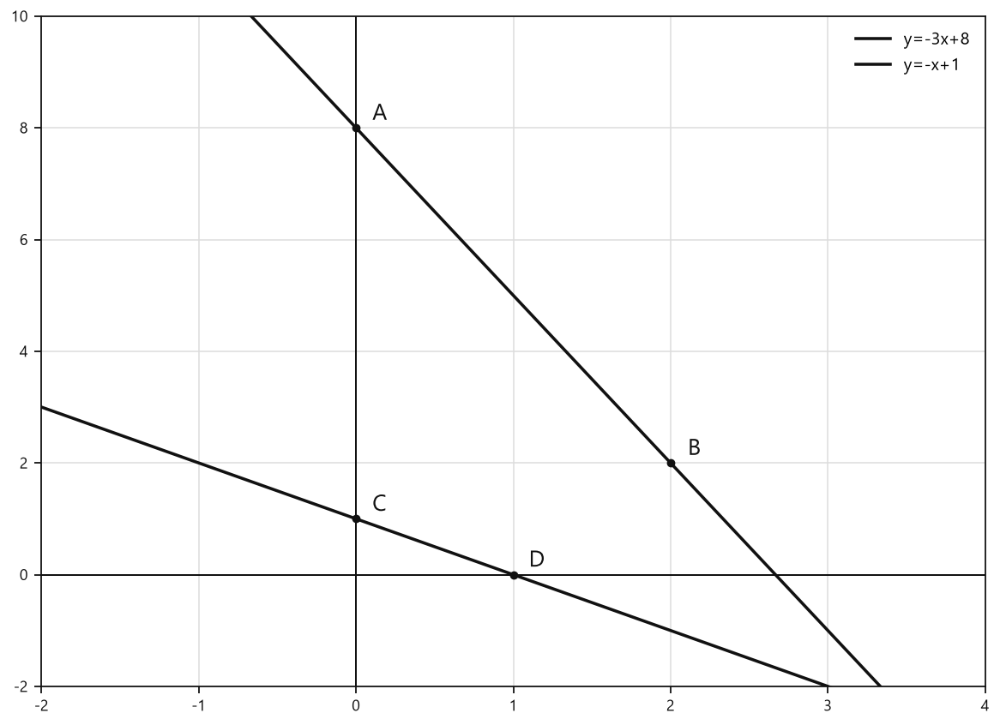

*Графики функций y=-3x+8 и y=-x+1*

**Ответ:** $y=-3x+8$ и $y=1-x$.

---

### Р2. Пересечение двух графиков на оси ординат

**Условие.** При каком значении $b$ прямые

$$y=3x+b$$

и

$$y=-8x-2$$

пересекаются в точке, лежащей на оси ординат?

#### Решение

Точка лежит на оси ординат, если

$$x=0.$$

Подставим $x=0$ в первую функцию:

$$y=3\cdot0+b.$$

$$y=b.$$

Подставим $x=0$ во вторую функцию:

$$y=-8\cdot0-2.$$

$$y=-2.$$

В точке пересечения значения $y$ одинаковы:

$$b=-2.$$

Проверка:

$$y=3\cdot0-2=-2,$$

$$y=-8\cdot0-2=-2.$$

Координаты общей точки:

$$(0;-2).$$

**Ответ:** $b=-2$.

---

### Р3. Значение параметра по графику

**Условие.** График функции

$$y=-2x+b$$

проходит через точку $(0;2)$. Найдите $b$ и значение функции при $x=-33$.

#### Решение

Точка $(0;2)$ лежит на графике. Значит, при

$$x=0,\qquad y=2.$$

Подставим координаты точки в формулу:

$$2=-2\cdot0+b.$$

$$2=b.$$

Значит,

$$b=2.$$

Функция имеет вид

$$y=-2x+2.$$

Найдём значение функции при $x=-33$:

$$y=-2\cdot(-33)+2.$$

$$y=66+2.$$

$$y=68.$$

Минус на минус здесь не враг, а союзник: значение получилось положительным.

**Ответ:** $b=2$, при $x=-33$ значение функции равно $68$.

---

### Р4. Функция, график которой параллелен оси абсцисс

**Условие.** Запишите формулу линейной функции, график которой параллелен оси абсцисс и проходит через точку $A(-3;-7)$.

#### Решение

Если график параллелен оси абсцисс, он горизонтальный.

Значит, коэффициент при $x$ равен нулю:

$$k=0.$$

Функция имеет вид

$$y=0x+b.$$

Следовательно,

$$y=b.$$

График проходит через точку $A(-3;-7)$.

Значение ординаты точки равно $-7$, поэтому

$$b=-7.$$

Получаем функцию:

$$y=-7.$$

Проверка:

при $x=-3$ значение функции равно

$$y=-7.$$

Точка $(-3;-7)$ действительно лежит на графике.

<!--geo-figure-spec
{
  "needed": true,
  "kind": "graph",
  "caption": "График функции $y=-7$",
  "axis": true,
  "grid": true,
  "xlim": [
    -6,
    4
  ],
  "ylim": [
    -10,
    3
  ],
  "curves": [
    {
      "expr": "-7",
      "label": "y=-7"
    }
  ],
  "points": {
    "A": [
      -3,
      -7
    ]
  },
  "labels": {
    "A": {
      "dx": 0.15,
      "dy": 0.3
    }
  }
}
-->
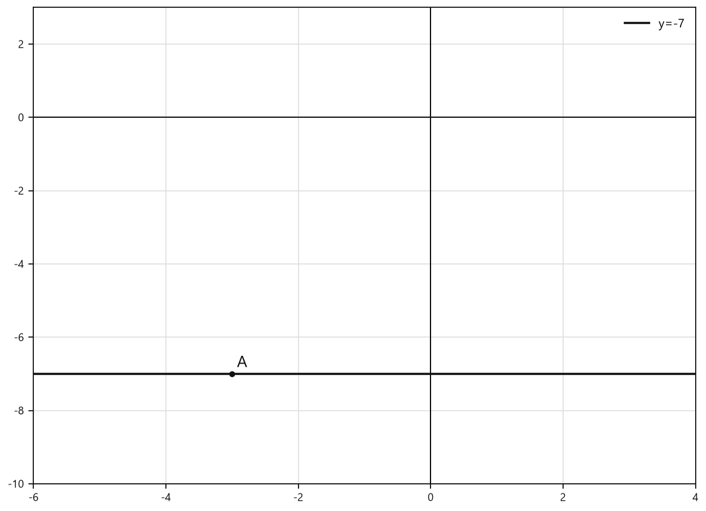

*График функции y=-7*

**Ответ:** $y=-7$.

---

### Р5. Параллельные графики

**Условие.** В одной системе координат постройте графики функций:

$$y=2x,$$

$$y=2x-3,$$

$$y=2x+5.$$

#### Решение

У всех трёх функций коэффициент при $x$ одинаков:

$$k=2.$$

Значит, графики параллельны.

Для первой функции $y=2x$:

при $x=0$:

$$y=2\cdot0=0.$$

Получаем точку $(0;0)$.

при $x=1$:

$$y=2\cdot1=2.$$

Получаем точку $(1;2)$.

Для второй функции $y=2x-3$:

при $x=0$:

$$y=2\cdot0-3=-3.$$

Получаем точку $(0;-3)$.

при $x=1$:

$$y=2\cdot1-3=-1.$$

Получаем точку $(1;-1)$.

Для третьей функции $y=2x+5$:

при $x=0$:

$$y=2\cdot0+5=5.$$

Получаем точку $(0;5)$.

при $x=1$:

$$y=2\cdot1+5=7.$$

Получаем точку $(1;7)$.

<!--geo-figure-spec
{
  "needed": true,
  "kind": "graph",
  "caption": "Графики функций $y=2x$, $y=2x-3$ и $y=2x+5$",
  "axis": true,
  "grid": true,
  "xlim": [
    -4,
    4
  ],
  "ylim": [
    -6,
    10
  ],
  "curves": [
    {
      "expr": "2*x",
      "label": "y=2x"
    },
    {
      "expr": "2*x-3",
      "label": "y=2x-3"
    },
    {
      "expr": "2*x+5",
      "label": "y=2x+5"
    }
  ],
  "points": {
    "A": [
      0,
      0
    ],
    "B": [
      1,
      2
    ],
    "C": [
      0,
      -3
    ],
    "D": [
      1,
      -1
    ],
    "E": [
      0,
      5
    ],
    "F": [
      1,
      7
    ]
  },
  "labels": {
    "A": {
      "dx": 0.15,
      "dy": 0.25
    },
    "B": {
      "dx": 0.15,
      "dy": 0.25
    },
    "C": {
      "dx": 0.15,
      "dy": -0.35
    },
    "D": {
      "dx": 0.15,
      "dy": 0.25
    },
    "E": {
      "dx": 0.15,
      "dy": 0.25
    },
    "F": {
      "dx": 0.15,
      "dy": 0.25
    }
  }
}
-->
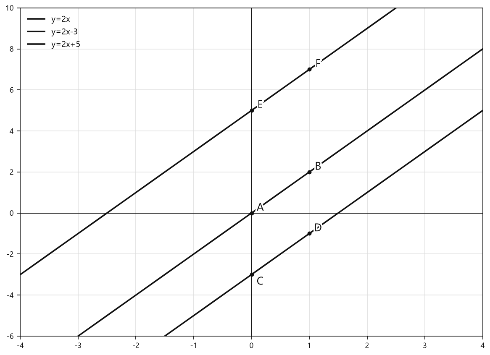

*Графики функций y=2x, y=2x-3 и y=2x+5*

**Ответ:** графики параллельны, так как у всех функций $k=2$.

---

### Р6. Функция, параллельная данной прямой

**Условие.** Запишите функцию, график которой параллелен графику функции

$$y=-3x+4$$

и пересекает ось ординат в точке $B(0;3)$.

#### Решение

У данной функции коэффициент при $x$ равен

$$k=-3.$$

У параллельной прямой коэффициент при $x$ должен быть таким же:

$$k=-3.$$

График пересекает ось ординат в точке $B(0;3)$.

Значит,

$$b=3.$$

Получаем формулу:

$$y=-3x+3.$$

Проверка точки:

$$y=-3\cdot0+3=3.$$

Точка $(0;3)$ лежит на графике.

**Ответ:** $y=-3x+3$.

---

### Р7. Нахождение коэффициентов $k$ и $b$

**Условие.** Графики функций

$$y=kx$$

и

$$y=3x+b$$

параллельны. График функции $y=3x+b$ проходит через точку $N(-1;2)$. Найдите $k$ и $b$.

#### Решение

У функции

$$y=kx$$

коэффициент при $x$ равен $k$.

У функции

$$y=3x+b$

коэффициент при $x$ равен $3$.

Так как графики параллельны, их коэффициенты равны:

$$k=3.$$

Теперь найдём $b$. Точка $N(-1;2)$ лежит на графике функции

$$y=3x+b.$$

Подставим координаты точки:

$$2=3\cdot(-1)+b.$$

$$2=-3+b.$$

Прибавим $3$ к обеим частям:

$$b=5.$$

Проверка:

$$3\cdot(-1)+5=-3+5=2.$$

Координаты точки подходят.

**Ответ:** $k=3$, $b=5$.

---

### Р8. Точка пересечения двух графиков

**Условие.** Постройте графики функций

$$y=3x-5$$

и

$$y=-2x.$$

Найдите координаты точки их пересечения.

#### Решение

Сначала найдём по две точки для каждой прямой.

Для функции $y=3x-5$:

при $x=0$:

$$y=3\cdot0-5=-5.$$

Получаем точку $(0;-5)$.

при $x=2$:

$$y=3\cdot2-5=6-5=1.$$

Получаем точку $(2;1)$.

Для функции $y=-2x$:

при $x=0$:

$$y=-2\cdot0=0.$$

Получаем точку $(0;0)$.

при $x=2$:

$$y=-2\cdot2=-4.$$

Получаем точку $(2;-4)$.

<!--geo-figure-spec
{
  "needed": true,
  "kind": "graph",
  "caption": "Графики функций $y=3x-5$ и $y=-2x$",
  "axis": true,
  "grid": true,
  "xlim": [
    -3,
    4
  ],
  "ylim": [
    -8,
    7
  ],
  "curves": [
    {
      "expr": "3*x-5",
      "label": "y=3x-5"
    },
    {
      "expr": "-2*x",
      "label": "y=-2x"
    }
  ],
  "points": {
    "A": [
      0,
      -5
    ],
    "B": [
      2,
      1
    ],
    "C": [
      0,
      0
    ],
    "D": [
      2,
      -4
    ],
    "E": [
      1,
      -2
    ]
  },
  "labels": {
    "A": {
      "dx": 0.15,
      "dy": -0.4
    },
    "B": {
      "dx": 0.15,
      "dy": 0.25
    },
    "C": {
      "dx": 0.15,
      "dy": 0.25
    },
    "D": {
      "dx": 0.15,
      "dy": -0.4
    },
    "E": {
      "dx": 0.15,
      "dy": -0.4
    }
  }
}
-->
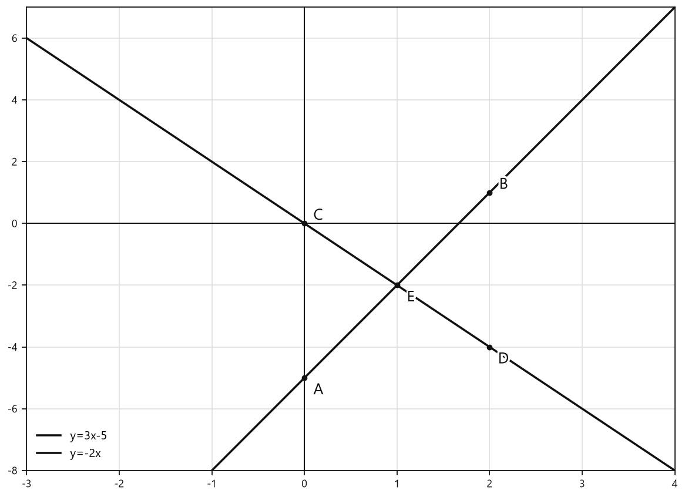

*Графики функций y=3x-5 и y=-2x*

Теперь найдём точку пересечения без опоры только на рисунок.

В точке пересечения значения функций равны:

$$3x-5=-2x.$$

Перенесём $-2x$ в левую часть:

$$3x+2x=5.$$

$$5x=5.$$

Разделим обе части на $5$:

$$x=1.$$

Найдём $y$ по формуле $y=-2x$:

$$y=-2\cdot1.$$

$$y=-2.$$

Точка пересечения:

$$(1;-2).$$

Проверка по первой формуле:

$$y=3\cdot1-5=3-5=-2.$$

Совпало. Рисунок не обманул — редкий случай, когда он и правда всё показывает честно.

**Ответ:** $(1;-2)$.

---

### Р9. Нахождение точки пересечения дробно-линейных функций

**Условие.** Найдите координаты точки пересечения графиков функций

$$y=\frac{x-2}{2}$$

и

$$y=\frac{2x-1}{5}$$

без построения графиков.

#### Решение

В точке пересечения значения функций равны:

$$\frac{x-2}{2}=\frac{2x-1}{5}.$$

Умножим обе части на $10$ — это общий знаменатель чисел $2$ и $5$:

$$10\cdot\frac{x-2}{2}=10\cdot\frac{2x-1}{5}.$$

Сократим:

$$5(x-2)=2(2x-1).$$

Раскроем скобки:

$$5x-10=4x-2.$$

Перенесём $4x$ в левую часть:

$$5x-4x=10-2.$$

$$x=8.$$

Найдём $y$ по первой формуле:

$$y=\frac{8-2}{2}.$$

$$y=\frac{6}{2}.$$

$$y=3.$$

Точка пересечения:

$$(8;3).$

Проверка по второй формуле:

$$y=\frac{2\cdot8-1}{5}.$$

$$y=\frac{16-1}{5}.$$

$$y=\frac{15}{5}.$$

$$y=3.$$

Обе формулы дают одно и то же значение $y$.

**Ответ:** $(8;3)$.

## Практические задания

Выбери свой уровень и решай только этот блок. В блоке должна закрепиться вся тема параграфа. Ответы не приводятся.

### Уровень 1–2 балла

**С1.** Какая из функций является линейной?

1) $y=4x-7$ 2) $y=\dfrac{3}{x}$ 3) $y=x^2+1$ 4) $y=\sqrt{x}$ 5) $y=\dfrac{x+1}{x-2}$

**С2.** Укажите угловой коэффициент функции $y=-5x+2$.

1) $2$ 2) $-5$ 3) $5$ 4) $-2$ 5) $1$

**С3.** Укажите значение свободного члена функции $y=7x-4$.

1) $7$ 2) $4$ 3) $-7$ 4) $-4$ 5) $0$

**С4.** Какая функция задаёт прямую, параллельную оси абсцисс?

1) $y=3x+1$ 2) $y=-2x$ 3) $y=6$ 4) $y=x-6$ 5) $y=-x+4$

**С5.** Какая из функций имеет график, образующий тупой угол с положительным направлением оси абсцисс?

1) $y=4x+1$ 2) $y=-3x+2$ 3) $y=2x-5$ 4) $y=7x$ 5) $y=x+8$

**С6.** Найдите значение функции $y=3x-5$ при $x=2$.

**С7.** Найдите значение функции $y=-2x+7$ при $x=-3$.

**С8.** Запишите формулу линейной функции, график которой проходит через точку $A(0;4)$ и имеет угловой коэффициент $2$.

**С9.** Запишите формулу линейной функции, график которой проходит через точку $B(0;-6)$ и имеет угловой коэффициент $-1$.

**С10.** График функции $y=4x+b$ проходит через точку $C(0;9)$. Найдите значение $b$.

**С11.** Прямые $y=5x-2$ и $y=kx+3$ параллельны. Найдите значение $k$.

**С12.** Найдите координаты точки пересечения графиков функций $y=2x+1$ и $y=-x+7$.

**С13.** Какая из функций является линейной?

1) $y=5x-2$ 2) $y=\dfrac{5}{x}-2$ 3) $y=x^2+1$ 4) $y=\sqrt{x}+3$ 5) $y=2^x$

**С14.** Укажите коэффициенты $k$ и $b$ в функции $y=-4x+7$.

1) $k=4,\ b=7$ 2) $k=-4,\ b=7$ 3) $k=-4,\ b=-7$ 4) $k=7,\ b=-4$ 5) $k=4,\ b=-7$

**С15.** Какая функция задаёт прямую, параллельную оси абсцисс?

1) $y=3x+2$ 2) $y=-x+5$ 3) $y=7$ 4) $y=\dfrac{x}{2}$ 5) $y=-6x$

**С16.** Найдите значение функции $y=2x-5$ при $x=4$.

1) $-13$ 2) $-3$ 3) $3$ 4) $8$ 5) $13$

**С17.** Найдите значение функции $y=-3x+1$ при $x=-2$.

1) $-7$ 2) $-5$ 3) $5$ 4) $7$ 5) $-1$

**С18.** Какая из функций имеет график, образующий тупой угол с положительным направлением оси абсцисс?

1) $y=4x+1$ 2) $y=-2x+3$ 3) $y=6$ 4) $y=\dfrac{x}{3}-2$ 5) $y=0{,}5x$

**С19.** Какая из функций пересекает ось ординат в точке с положительной ординатой?

1) $y=3x-4$ 2) $y=-2x-1$ 3) $y=5x+6$ 4) $y=-x$ 5) $y=7x-8$

**С20.** Выберите функцию, график которой проходит через точку $A(0; -3)$.

1) $y=2x+3$ 2) $y=-3x+2$ 3) $y=4x-3$ 4) $y=-x+3$ 5) $y=3x$

**С21.** При каком значении $b$ график функции $y=5x+b$ проходит через точку $B(0; 8)$?

1) $-8$ 2) $-5$ 3) $0$ 4) $5$ 5) $8$

**С22.** Какая функция имеет график, параллельный графику функции $y=-7x+2$?

1) $y=7x-4$ 2) $y=-7x-3$ 3) $y=-2x+7$ 4) $y=2x-7$ 5) $y=7x+2$

**С23.** Найдите коэффициент $k$, если график функции $y=kx-6$ проходит через точку $C(2;4)$.

1) $-5$ 2) $-1$ 3) $2$ 4) $5$ 5) $10$

**С24.** Укажите точку пересечения графика функции $y=-2x+6$ с осью ординат.

1) $(-3;0)$ 2) $(0;-2)$ 3) $(0;6)$ 4) $(3;0)$ 5) $(6;0)$

**С25.** Среди функций выберите ту, график которой образует тупой угол с положительным направлением оси абсцисс:  
1) $y=4x+1$ 2) $y=-2x+3$ 3) $y=7x-5$ 4) $y=x+6$ 5) $y=0{,}5x-2$

**С26.** Для функции $y=-3x+7$ укажите ординату точки пересечения её графика с осью ординат:  
1) $-3$ 2) $3$ 3) $7$ 4) $-7$ 5) $0$

**С27.** Какая из функций задаёт прямую, параллельную графику функции $y=5x-2$?  
1) $y=-5x+1$ 2) $y=2x+5$ 3) $y=5x+4$ 4) $y=-2x+5$ 5) $y=x-5$

**С28.** Запишите формулу линейной функции, график которой параллелен оси абсцисс и проходит через точку $A(2;-6)$.

**С29.** Найдите значение параметра $b$, если график функции $y=4x+b$ проходит через точку $B(0;9)$.

**С30.** График какой функции проходит через начало координат?  
1) $y=3x+1$ 2) $y=-2x$ 3) $y=x-4$ 4) $y=7$ 5) $y=-x+2$

**С31.** Найдите значение функции $y=-2x+5$ при $x=-3$.

**С32.** Укажите функцию, график которой пересекает ось ординат в точке с отрицательной ординатой:  
1) $y=6x+4$ 2) $y=-x+8$ 3) $y=2x-5$ 4) $y=7x$ 5) $y=-4x+1$

**С33.** Найдите координаты точки пересечения графиков функций $y=2x+1$ и $y=-x+7$.

**С34.** В одной системе координат построены графики функций $y=3x-2$ и $y=3x+4$. Выберите верное утверждение:  
1) графики пересекаются в одной точке; 2) графики параллельны; 3) графики совпадают; 4) один график является осью абсцисс; 5) один график является осью ординат.

**С35.** Прямая $y=kx+6$ проходит через точку $C(2;10)$. Найдите значение $k$.

**С36.** Выберите все функции, графики которых пересекают ось ординат в точке с положительной ординатой:  
1) $y=2x+5$ 2) $y=-3x-1$ 3) $y=4x$ 4) $y=-x+7$ 5) $y=6x-8$

### Уровень 3–4 балла

**С1.** Для функции $y=-4x+7$ укажите угловой коэффициент и свободный член.

**С2.** Определите, возрастает или убывает функция $y=5x-2$.

**С3.** Определите, возрастает или убывает функция $y=-\frac{3}{2}x+6$.

**С4.** Найдите значение функции $y=2x-9$ при $x=4$.

**С5.** Найдите значение аргумента, при котором функция $y=-3x+12$ принимает значение $0$.

**С6.** Запишите формулу линейной функции, график которой параллелен оси абсцисс и проходит через точку $A(2;-5)$.

**С7.** Запишите формулу линейной функции, график которой параллелен графику функции $y=4x-1$ и пересекает ось ординат в точке $B(0;6)$.

**С8.** Найдите значение $b$, если график функции $y=-2x+b$ проходит через точку $C(3;1)$.

**С9.** При каком значении $b$ графики функций $y=5x+b$ и $y=-2x+4$ пересекаются на оси ординат?

**С10.** Найдите координаты точки пересечения графиков функций $y=2x+3$ и $y=-x+9$.

**С11.** График линейной функции проходит через точки $A(0;-4)$ и $B(2;2)$. Запишите формулу этой функции.

**С12.** Найдите координаты точки пересечения графиков функций $y=\frac{x+2}{3}$ и $y=\frac{2x-1}{5}$.

**С13.** Для функции $y=5x-7$ укажите угловой коэффициент и ординату точки пересечения её графика с осью ординат.

**С14.** Найдите значение функции $y=-4x+9$ при $x=-2$.

**С15.** Найдите абсциссу точки пересечения графика функции $y=2x-10$ с осью абсцисс.

**С16.** Запишите формулу линейной функции, график которой параллелен графику функции $y=6x-1$ и пересекает ось ординат в точке $(0;4)$.

**С17.** Запишите формулу функции, график которой параллелен оси абсцисс и проходит через точку $A(3;-5)$.

**С18.** Определите, возрастает или убывает функция $y=-\frac{3}{2}x+8$.

**С19.** Найдите значение $b$, если график функции $y=4x+b$ проходит через точку $M(2;11)$.

**С20.** При каком значении $k$ график функции $y=kx-3$ проходит через точку $P(-2;7)$?

**С21.** Найдите координаты точки пересечения графиков функций $y=2x+1$ и $y=-x+7$.

**С22.** Найдите координаты точки пересечения графиков функций $y=3x-4$ и $y=x+2$.

**С23.** Прямая $y=-5x+b$ пересекает ось ординат в точке с ординатой $6$. Запишите формулу этой функции и найдите её значение при $x=-1$.

**С24.** Графики функций $y=kx$ и $y=-7x+3$ параллельны. Найдите значение $k$.

**С25.** Из функций $y=3x-4$, $y=-2x+5$, $y=x+1$, $y=-x-3$ выберите те, графики которых образуют тупой угол с положительным направлением оси абсцисс и пересекают ось ординат выше начала координат.

**С26.** При каком значении $b$ прямая $y=5x+b$ проходит через точку $A(0;-7)$?

**С27.** Запишите формулу линейной функции, график которой параллелен оси абсцисс и проходит через точку $B(4;6)$.

**С28.** Запишите формулу линейной функции, график которой параллелен графику функции $y=-4x+7$ и пересекает ось ординат в точке $C(0;-2)$.

**С29.** Определите, возрастает или убывает функция $y=-\dfrac{3}{2}x+4$. Укажите значение углового коэффициента этой функции.

**С30.** Найдите координаты точки пересечения графика функции $y=2x-6$ с осью абсцисс.

**С31.** Найдите координаты точки пересечения графика функции $y=-3x+9$ с осью ординат.

**С32.** В одной системе координат постройте графики функций $y=3x$, $y=3x-4$ и $y=3x+2$. Укажите, какие из этих графиков параллельны.

**С33.** График функции $y=-2x+b$ проходит через точку $D(3;1)$. Найдите значение $b$ и запишите формулу функции.

**С34.** Графики функций $y=4x-1$ и $y=-x+9$ пересекаются в точке. Найдите абсциссу и ординату этой точки.

**С35.** Для функции $y=\dfrac{x-4}{2}$ найдите значение функции при $x=10$ и координаты точки пересечения её графика с осью ординат.

**С36.** Графики функций $y=kx$ и $y=-5x+8$ параллельны. Найдите значение $k$.

### Уровень 5–6 баллов

**С1.** Из данных функций выберите те, графики которых образуют тупой угол с положительным направлением оси абсцисс и пересекают ось ординат выше начала координат:  
1) $y=2x+5$; 2) $y=-4x+3$; 3) $y=-x-2$; 4) $y=5x$; 5) $y=1-3x$.

**С2.** При каком значении $b$ прямые $y=4x+b$ и $y=-2x+6$ пересекаются на оси ординат?

**С3.** Функция задана формулой $y=-3x+b$. Известно, что её график проходит через точку $A(2;-1)$. Найдите значение $b$ и значение функции при $x=-4$.

**С4.** Запишите формулу линейной функции, график которой параллелен оси абсцисс и проходит через точку $B(-5;4)$.

**С5.** В одной системе координат постройте графики функций $y=2x$, $y=2x-4$ и $y=2x+3$. Укажите, в каких точках эти графики пересекают ось ординат.

<!--geo-figure-spec
{
  "needed": true,
  "kind": "graph",
  "caption": "Графики функций $y=2x-6$ и $y=-x+3$",
  "axis": true,
  "grid": true,
  "xlim": [
    -2,
    6
  ],
  "ylim": [
    -10,
    7
  ],
  "curves": [
    {
      "expr": "2*x-6",
      "label": "y=2x-6"
    },
    {
      "expr": "-x+3",
      "label": "y=-x+3"
    }
  ]
}
-->
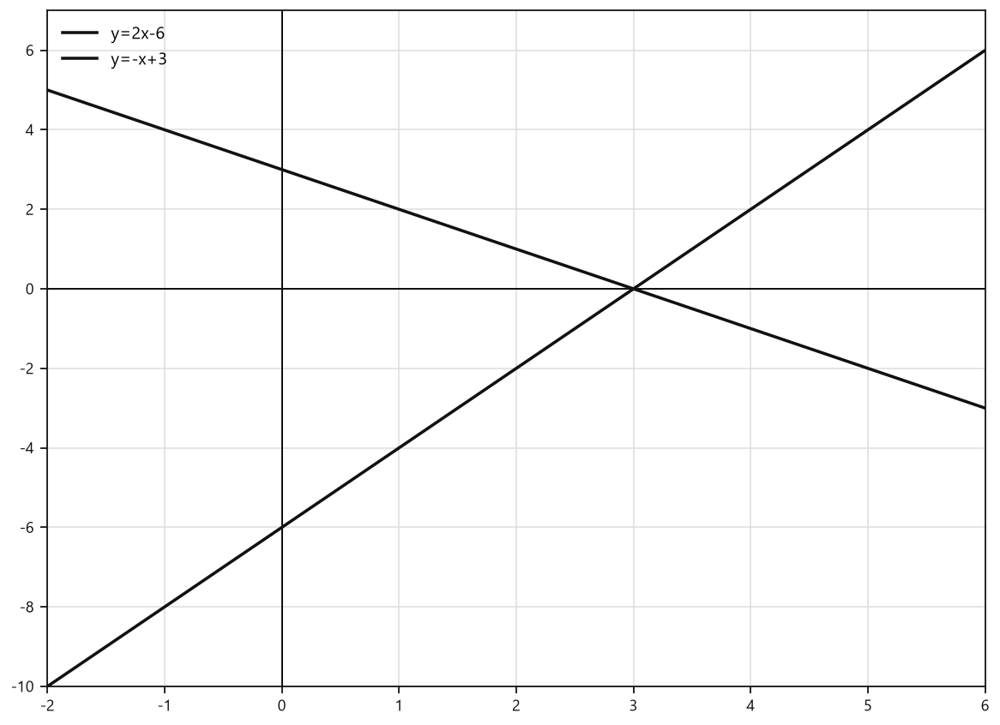

*Графики функций y=2x-6 и y=-x+3*

**С6.** Запишите формулу функции, график которой параллелен графику функции $y=-5x+7$ и пересекает ось ординат в точке $C(0;-2)$.

**С7.** Графики функций $y=kx$ и $y=6x+b$ параллельны, причём график функции $y=6x+b$ проходит через точку $N(-2;5)$. Найдите значения $k$ и $b$.

**С8.** Постройте графики функций $y=2x-6$ и $y=-x+3$. Найдите координаты точки их пересечения.

<!--geo-figure-spec
{
  "needed": true,
  "kind": "graph",
  "caption": "Графики функций $y=2x-6$ и $y=-x+3$",
  "axis": true,
  "grid": true,
  "xlim": [
    -1,
    5
  ],
  "ylim": [
    -9,
    6
  ],
  "curves": [
    {
      "expr": "2*x-6",
      "label": "y=2x-6"
    },
    {
      "expr": "-x+3",
      "label": "y=-x+3"
    }
  ]
}
-->
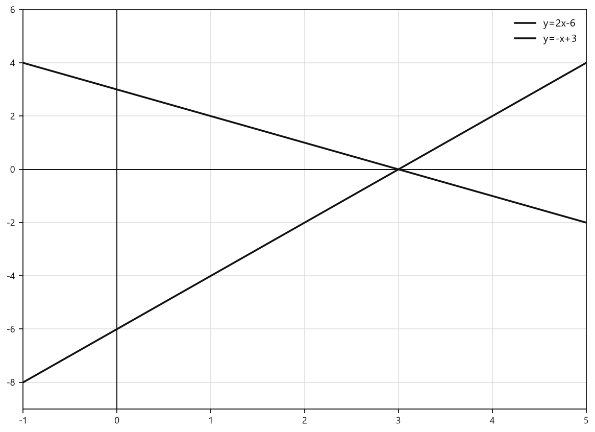

*Графики функций y=2x-6 и y=-x+3*

**С9.** Найдите координаты точки пересечения графиков функций $y=\dfrac{x+4}{3}$ и $y=\dfrac{2x-1}{5}$, не выполняя построения графиков.

**С10.** Укажите все верные утверждения о функции $y=-3x+6$:  
1) угловой коэффициент функции равен $6$;  
2) график пересекает ось ординат в точке $(0;6)$;  
3) функция возрастает;  
4) график пересекает ось абсцисс в точке $(2;0)$;  
5) график образует тупой угол с положительным направлением оси абсцисс.

**С11.** Прямая проходит через точки $A(0;-4)$ и $B(3;2)$. Запишите формулу линейной функции, графиком которой является эта прямая.

<!--geo-figure-spec
{
  "needed": true,
  "kind": "graph",
  "caption": "График линейной функции, проходящий через точки $A(0;-4)$ и $B(3;2)$",
  "axis": true,
  "grid": true,
  "xlim": [
    -2,
    5
  ],
  "ylim": [
    -8,
    7
  ],
  "curves": [
    {
      "expr": "2*x-4",
      "label": "y=2x-4"
    }
  ],
  "points": {
    "A": [
      0,
      -4
    ],
    "B": [
      3,
      2
    ]
  },
  "labels": {
    "A": {
      "dx": 0.15,
      "dy": -0.38
    },
    "B": {
      "dx": 0.15,
      "dy": 0.18
    }
  }
}
-->
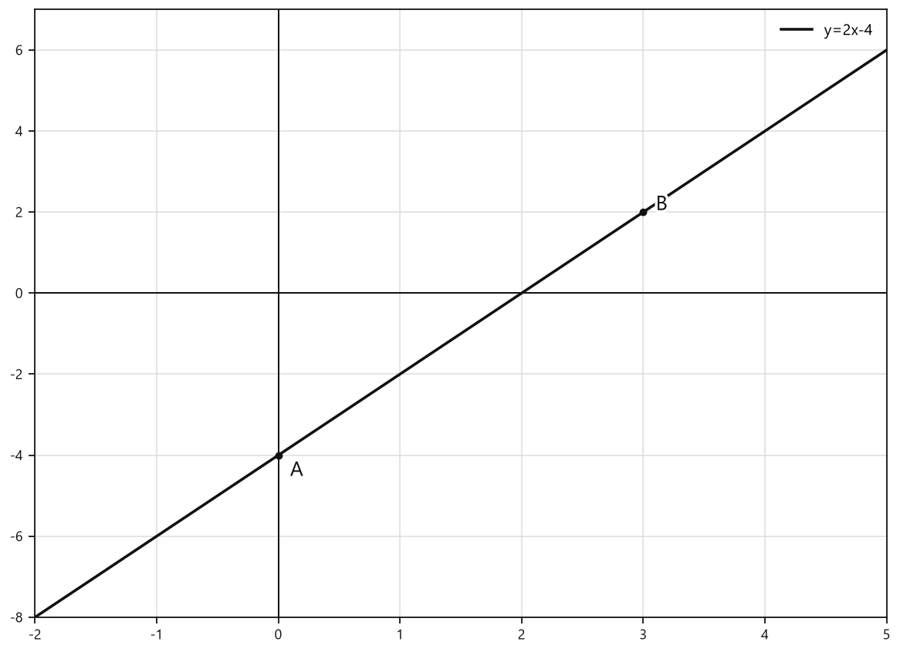

*График линейной функции, проходящий через точки A(0;-4) и B(3;2)*

**С12.** График функции $y=4x+b$ проходит через точку $P(-3;7)$. Найдите значение $b$, нуль функции и координаты точки пересечения графика с осью ординат.

**С13.** Среди функций выберите ту, график которой образует тупой угол с положительным направлением оси абсцисс и пересекает ось ординат выше начала координат.  
1) $y=2x-5$  
2) $y=-3x+4$  
3) $y=-x-2$  
4) $y=5x+1$  
5) $y=4$

**С14.** При каком значении $b$ графики функций $y=5x+b$ и $y=-2x+7$ пересекаются на оси ординат?

**С15.** Функция задана формулой $y=-4x+b$. Известно, что её график проходит через точку $A(2;3)$. Найдите значение $b$ и значение функции при $x=-5$.

**С16.** Запишите формулу линейной функции, график которой параллелен оси абсцисс и проходит через точку $B(-4;6)$.

**С17.** Укажите функцию, график которой параллелен графику функции $y=7x-2$ и проходит через точку $C(0;-5)$.  
1) $y=-7x-5$  
2) $y=7x+5$  
3) $y=7x-5$  
4) $y=5x-7$  
5) $y=-5x+7$

**С18.** В одной системе координат заданы графики функций $y=3x$, $y=3x-4$ и $y=3x+2$. Сравните значения функций при $x=1$ и определите, какой из графиков расположен выше остальных.

**С19.** График функции $y=kx$ параллелен графику функции $y=-6x+9$. Найдите значение $k$.

**С20.** График функции $y=4x+b$ проходит через точку $M(-2;5)$. Найдите значение $b$ и запишите формулу функции.

**С21.** Найдите координаты точки пересечения графиков функций $y=2x+1$ и $y=-x+7$.

**С22.** Найдите координаты точки пересечения графиков функций $y=\dfrac{x+4}{3}$ и $y=\dfrac{2x-1}{5}$, не выполняя построения графиков.

**С23.** Для функции $y=-3x+12$ найдите абсциссу точки пересечения её графика с осью абсцисс и ординату точки пересечения с осью ординат.

**С24.** Прямая проходит через точки $A(1;4)$ и $B(3;10)$. Запишите формулу линейной функции, графиком которой является эта прямая.

**С25.** Из функций выберите ту, график которой образует тупой угол с положительным направлением оси абсцисс и пересекает ось ординат выше начала координат.

1) $y=2x-5$  
2) $y=-4x+3$  
3) $y=-x-2$  
4) $y=5x+1$  
5) $y=3$

**С26.** При каком значении $b$ графики функций $y=4x+b$ и $y=-2x+6$ пересекаются в точке, лежащей на оси ординат?

**С27.** Запишите формулу линейной функции, график которой параллелен оси абсцисс и проходит через точку $A(5;-4)$.

**С28.** Запишите формулу линейной функции, график которой параллелен графику функции $y=-5x+7$ и пересекает ось ординат в точке $B(0;-2)$.

**С29.** График функции $y=kx$ параллелен графику функции $y=-3x+8$. График функции $y=-3x+8$ проходит через точку $N(-2;14)$. Найдите значения $k$ и $b$, если функцию записать в виде $y=kx+b$.

**С30.** Найдите координаты точки пересечения графиков функций $y=2x-7$ и $y=-x+2$, не выполняя построения графиков.

### Уровень 7–8 баллов

**С1.** Выберите линейные функции, графики которых образуют тупой угол с положительным направлением оси абсцисс и пересекают ось ординат выше начала координат:  
1) $y=5x-2$; 2) $y=-4x+7$; 3) $y=1-2x$; 4) $y=3x+6$; 5) $y=-x-3$.

**С2.** При каком значении $b$ прямые $y=4x+b$ и $y=-6x+9$ пересекаются в точке, лежащей на оси ординат? Обоснуйте ответ.

**С3.** Функция задана формулой $y=-3x+b$. Известно, что её график проходит через точку $A(2;5)$. Найдите значение $b$ и значение функции при $x=-4$.

**С4.** Запишите формулу линейной функции, график которой параллелен оси абсцисс и проходит через точку $B(-5;8)$. Укажите координаты точек пересечения этого графика с осями координат.

**С5.** В одной системе координат постройте графики функций $y=2x-4$, $y=2x+1$ и $y=2x+6$. Сравните ординаты точек этих графиков при одном и том же значении $x$ и сформулируйте вывод о взаимном расположении прямых.

<!--geo-figure-spec
{
  "needed": true,
  "kind": "graph",
  "caption": "Графики функций $y=2x-4$, $y=2x+1$ и $y=2x+6$",
  "axis": true,
  "grid": true,
  "xlim": [
    -4,
    4
  ],
  "ylim": [
    -13,
    15
  ],
  "curves": [
    {
      "expr": "2*x-4",
      "label": "y=2x-4"
    },
    {
      "expr": "2*x+1",
      "label": "y=2x+1"
    },
    {
      "expr": "2*x+6",
      "label": "y=2x+6"
    }
  ]
}
-->
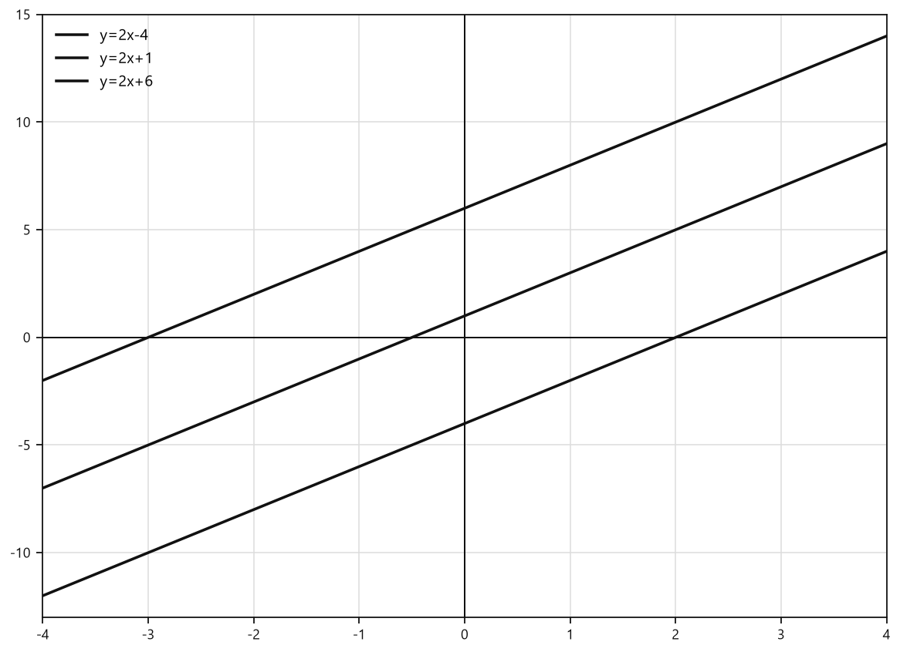

*Графики функций y=2x-4, y=2x+1 и y=2x+6*

**С6.** Запишите формулу линейной функции, график которой параллелен графику функции $y=-\frac{3}{2}x+7$ и проходит через точку $C(0;-4)$. Найдите абсциссу точки этого графика, имеющей ординату $5$.

**С7.** Графики функций $y=kx$ и $y=5x+b$ параллельны, причём график функции $y=5x+b$ проходит через точку $N(-2;7)$. Найдите $k$ и $b$. Проверьте полученную формулу подстановкой координат точки $N$.

**С8.** Найдите координаты точки пересечения графиков функций $y=3x-8$ и $y=-2x+7$, не выполняя построения. Затем определите, в какой четверти координатной плоскости находится эта точка.

**С9.** Прямая проходит через точки $A(-2;5)$ и $B(4;-7)$. Запишите формулу линейной функции, графиком которой является эта прямая. Найдите её ординату при $x=3$.

**С10.** График линейной функции $y=kx+b$ пересекает ось абсцисс в точке $A(6;0)$, а ось ординат — в точке $B(0;-3)$. Запишите формулу функции и найдите координаты точки её пересечения с прямой $y=x+5$.

**С11.** Для функции $y=-2x+6$ найдите координаты точек пересечения графика с осями координат. Постройте график и с его помощью определите, при каких значениях $x$ функция принимает положительные значения.

<!--geo-figure-spec
{
  "needed": true,
  "kind": "graph",
  "caption": "График функции $y=-2x+6$",
  "axis": true,
  "grid": true,
  "xlim": [
    -1.2,
    5.2
  ],
  "ylim": [
    -5,
    9
  ],
  "curves": [
    {
      "expr": "-2*x+6",
      "label": "y=-2x+6"
    }
  ]
}
-->
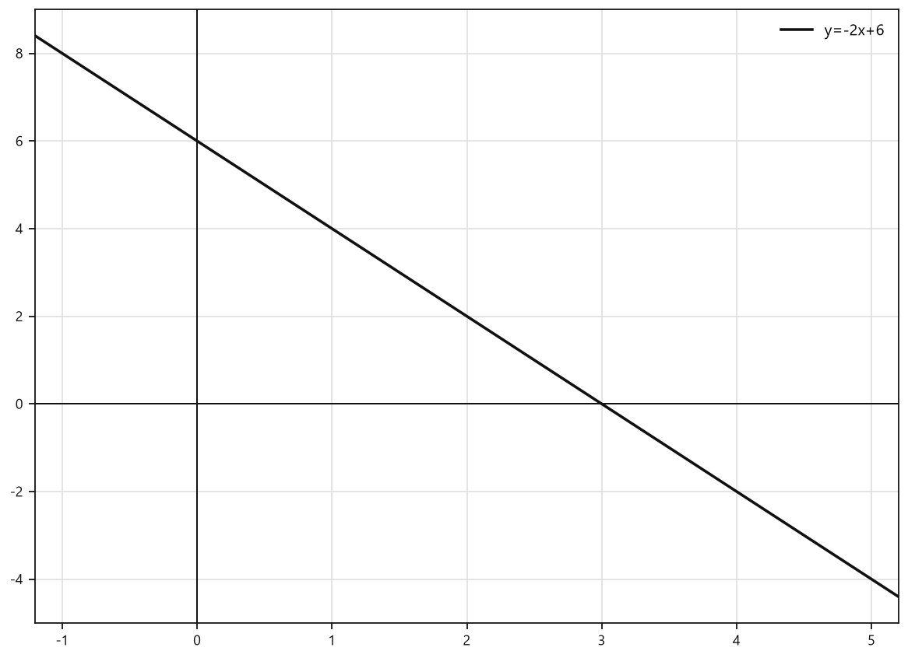

*График функции y=-2x+6*

**С12.** Прямые $y=(a-1)x+4$ и $y=3x-2a$ пересекаются на оси ординат. Найдите значение параметра $a$, координаты точки пересечения прямых и угол наклона каждой прямой к положительному направлению оси абсцисс: определите, является ли этот угол острым или тупым.

**С13.** Из функций $y=5x-4$, $y=-2x+7$, $y=-x-3$, $y=0{,}5x+1$ выберите те, графики которых образуют тупой угол с положительным направлением оси абсцисс и пересекают ось ординат выше начала координат. Обоснуйте свой выбор.

**С14.** При каком значении $b$ графики функций $y=4x+b$ и $y=-6x+5$ пересекаются на оси абсцисс? Найдите координаты точки их пересечения.

**С15.** Прямая $y=-3x+b$ проходит через точку $A(-2;9)$. Найдите значение $b$ и значение функции при $x=14$. Запишите формулу функции.

**С16.** Запишите формулу линейной функции, график которой параллелен оси абсцисс и проходит через точку $B(6;-4)$. Укажите координаты двух различных точек этого графика и постройте его.

<!--geo-figure-spec
{
  "needed": true,
  "kind": "graph",
  "caption": "График функции $y=-4$",
  "axis": true,
  "grid": true,
  "xlim": [
    -4,
    8
  ],
  "ylim": [
    -7,
    4
  ],
  "curves": [
    {
      "expr": "-4",
      "label": "y=-4"
    }
  ],
  "points": {
    "B": [
      6,
      -4
    ]
  },
  "labels": {
    "B": {
      "dx": 0.15,
      "dy": 0.2
    }
  }
}
-->
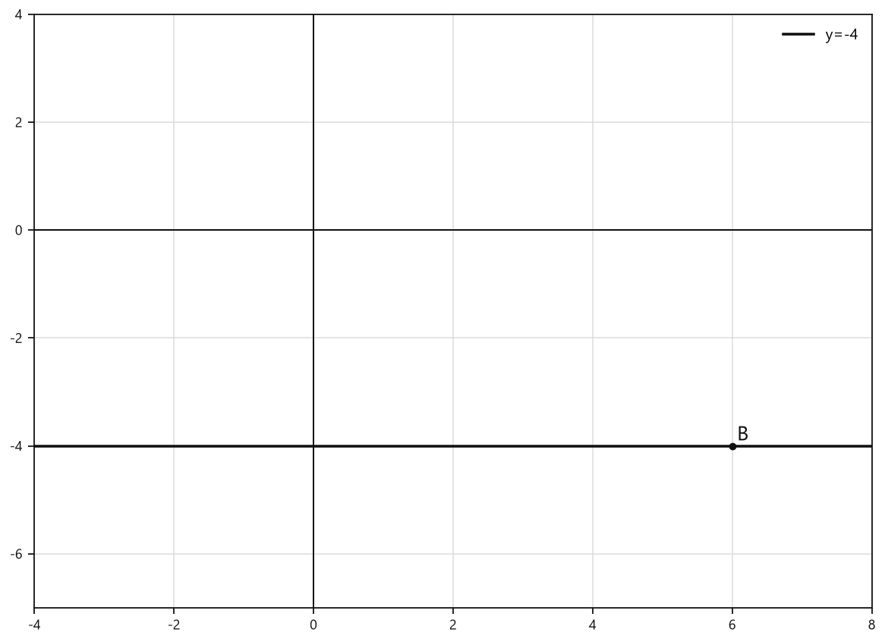

*График функции y=-4*

**С17.** В одной системе координат постройте графики функций $y=2x-1$, $y=2x+3$ и $y=2x-5$. Объясните, как расположены эти прямые относительно друг друга, и сравните их ординаты при одном и том же значении $x$.

<!--geo-figure-spec
{
  "needed": true,
  "kind": "graph",
  "caption": "Графики функций $y=2x-1$, $y=2x+3$, $y=2x-5$",
  "axis": true,
  "grid": true,
  "xlim": [
    -4.5,
    4.5
  ],
  "ylim": [
    -15,
    13
  ],
  "curves": [
    {
      "expr": "2*x-1",
      "label": "y=2x-1"
    },
    {
      "expr": "2*x+3",
      "label": "y=2x+3"
    },
    {
      "expr": "2*x-5",
      "label": "y=2x-5"
    }
  ],
  "points": {},
  "labels": {}
}
-->
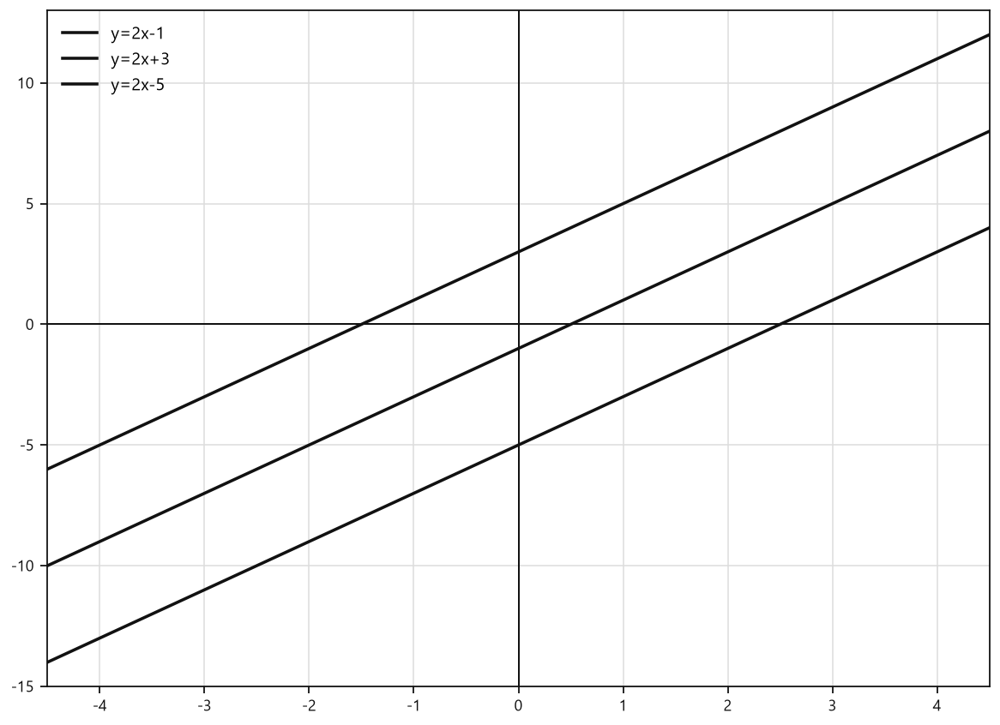

*Графики функций y=2x-1, y=2x+3, y=2x-5*

**С18.** Запишите формулу линейной функции, график которой параллелен графику функции $y=-\frac{3}{2}x+4$ и проходит через точку $C(0;-5)$. Найдите значение этой функции при $x=8$.

**С19.** Графики функций $y=kx$ и $y=-5x+b$ параллельны. График функции $y=-5x+b$ проходит через точку $M(2;-1)$. Найдите $k$ и $b$, а затем укажите координаты точки пересечения графика функции $y=kx$ с осью ординат.

**С20.** Найдите координаты точки пересечения графиков функций $y=4x-7$ и $y=-x+8$, не выполняя построения. Проверьте найденные координаты подстановкой в обе формулы.

**С21.** Найдите координаты точки пересечения графиков функций $y=\frac{x+5}{3}$ и $y=\frac{2x-1}{5}$, не выполняя построения. Выполните проверку найденной точки.

**С22.** Прямая проходит через точки $P(-3;7)$ и $Q(1;-5)$. Запишите формулу линейной функции, графиком которой является эта прямая. Найдите её значение при $x=6$ и укажите, возрастает или убывает функция.

**С23.** Для функции $y=ax+6$ известно, что её график проходит через точку $R(-4;14)$. Найдите коэффициент $a$, нуль функции и координаты точки пересечения графика с осью абсцисс. Постройте график.

<!--geo-figure-spec
{
  "needed": true,
  "kind": "graph",
  "caption": "График функции $y=-2x+6$",
  "axis": true,
  "grid": true,
  "xlim": [
    -5,
    5
  ],
  "ylim": [
    -5,
    17
  ],
  "curves": [
    {
      "expr": "-2*x+6",
      "label": "y=-2x+6"
    }
  ],
  "points": {
    "R": [
      -4,
      14
    ]
  },
  "labels": {
    "R": {
      "dx": 0.15,
      "dy": 0.25
    }
  }
}
-->
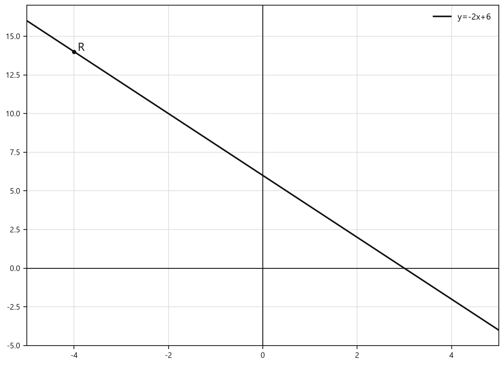

*График функции y=-2x+6*

**С24.** Прямые $y=2x+b$ и $y=-x+5$ пересекаются в точке, абсцисса которой на $3$ больше ординаты. Найдите значение $b$ и координаты точки пересечения.

### Уровень 9–10 баллов

**С1.** Прямая $y=kx+b$ пересекает ось абсцисс в точке с абсциссой $-4$, а ось ординат — в точке с ординатой $6$. Запишите формулу этой линейной функции и определите, какие координатные углы пересекает её график.

**С2.** График функции $y=(a-2)x+3a$ проходит через точку $A(4;10)$. Найдите значение параметра $a$ и запишите формулу функции.

**С3.** Прямые $y=(m+1)x-7$ и $y=5x+2m$ пересекаются на оси ординат. Найдите $m$ и координаты точки пересечения.

**С4.** Функция задана формулой $y=(2p-6)x+p+4$. При каком значении $p$ её график параллелен графику функции $y=-2x+9$? Найдите точку пересечения полученного графика с осью ординат.

**С5.** Найдите все значения $a$, при которых график функции $y=(a-3)x+2a-1$ образует тупой угол с положительным направлением оси абсцисс и пересекает ось ординат выше начала координат.

**С6.** Графики функций $y=4x+b$ и $y=-x+9$ пересекаются в точке, абсцисса которой в 2 раза меньше ординаты. Найдите $b$ и координаты точки пересечения.

**С7.** Запишите формулу линейной функции, график которой проходит через точки $A(-2;7)$ и $B(4;-5)$. Найдите значение функции при $x=15$.

**С8.** Прямая проходит через точку $C(-3;5)$ и пересекает положительное направление оси абсцисс в точке с абсциссой $2$. Запишите формулу функции и найдите её значение при $x=-7$.

**С9.** График функции $y=kx+b$ пересекает ось абсцисс в точке $P(6;0)$ и проходит через точку $Q(-2;8)$. Не выполняя построения, найдите координаты точки пересечения этого графика с прямой $y=2x-10$.

**С10.** Для функции $y=(a+1)x-2a+6$ известно, что её график проходит через точку пересечения прямых $y=3x-4$ и $y=-x+8$. Найдите значение $a$ и запишите формулу исходной функции.

**С11.** Графики трёх функций имеют вид $y=2x+b_1$, $y=2x+b_2$ и $y=2x+b_3$. Известно, что при $x=5$ значения этих функций равны последовательным членам арифметической прогрессии, причём наименьшее значение равно $-1$, а наибольшее — $11$. Найдите $b_1$, $b_2$, $b_3$ и запишите все три функции.

**С12.** Прямая $y=kx+b$ проходит через точку $A(1;4)$. Её график пересекает график функции $y=-2x+10$ в точке, лежащей на прямой $y=x+1$. Найдите формулу функции $y=kx+b$.

**С13.** Из функций $y=5x-7$, $y=-4x+9$, $y=-\frac{3}{2}x+6$, $y=2x+1$, $y=-x-3$ выберите те, графики которых образуют тупой угол с положительным направлением оси абсцисс и пересекают ось ординат выше начала координат. Для выбранных функций укажите координаты точек пересечения их графиков с осью абсцисс.

**С14.** Прямая $y=(2a-1)x+6$ параллельна прямой $y=7x-b$ и проходит через точку $A(-2;5)$. Найдите значения $a$ и $b$.

**С15.** График линейной функции проходит через точки $A(-4;11)$ и $B(2;-1)$. Запишите формулу этой функции и найдите абсциссу точки пересечения её графика с прямой $y=3x-5$.

**С16.** В одной системе координат построены графики функций $y=2x+4$, $y=-x+1$ и $y=-x-3$. Определите, какие из них пересекаются на оси абсцисс, а для каждой пары пересекающихся графиков найдите координаты точки пересечения.

**С17.** Прямая $l$ проходит через точку $P(3;-4)$ и пересекает ось ординат в точке с ординатой $5$. Прямая $m$ проходит через точки $Q(-2;7)$ и $R(4;-5)$. Запишите формулы прямых $l$ и $m$, а затем найдите координаты их точки пересечения.

**С18.** При каком значении параметра $c$ график функции $y=(c-2)x+3c$ проходит через точку пересечения графиков функций $y=4x-9$ и $y=-2x+3$?

## Чек-лист «ученик понял тему»

- Могу повторить определения и формулы параграфа своими словами и по учебнику.
- Решаю типовые задания своего уровня без подсказки.
- Вижу типичную ошибку и могу её объяснить.
