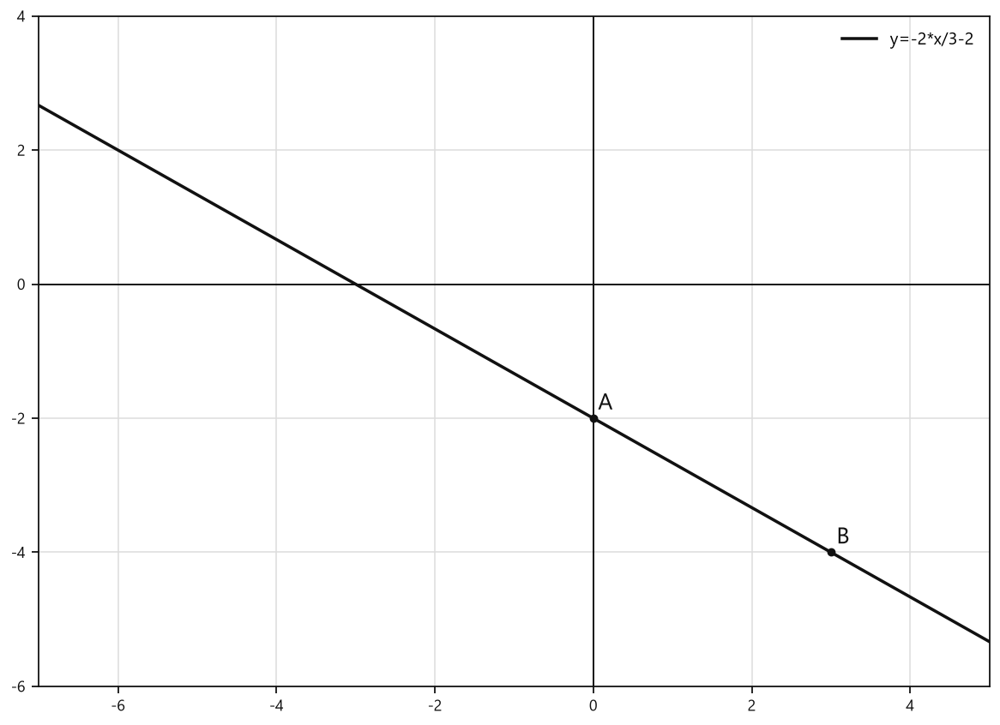
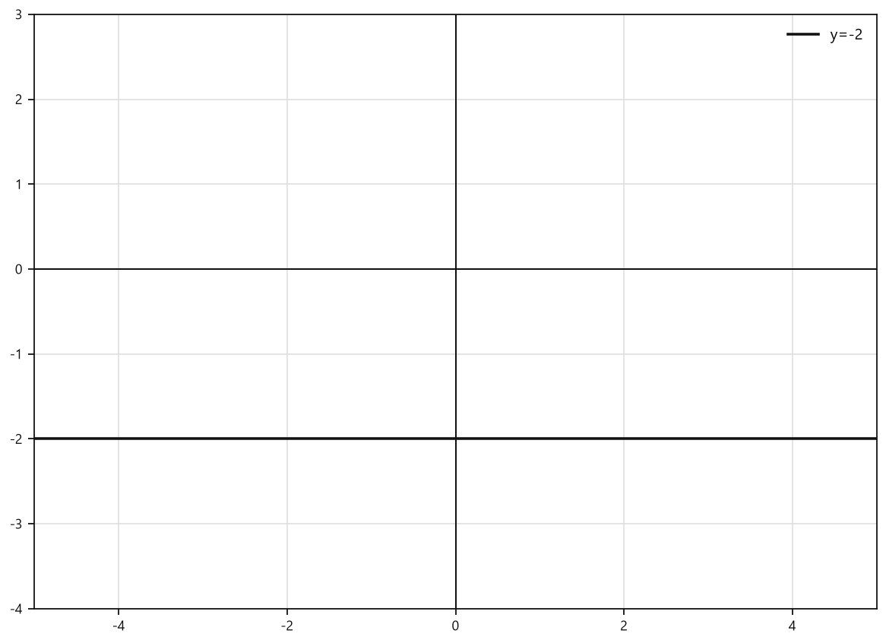
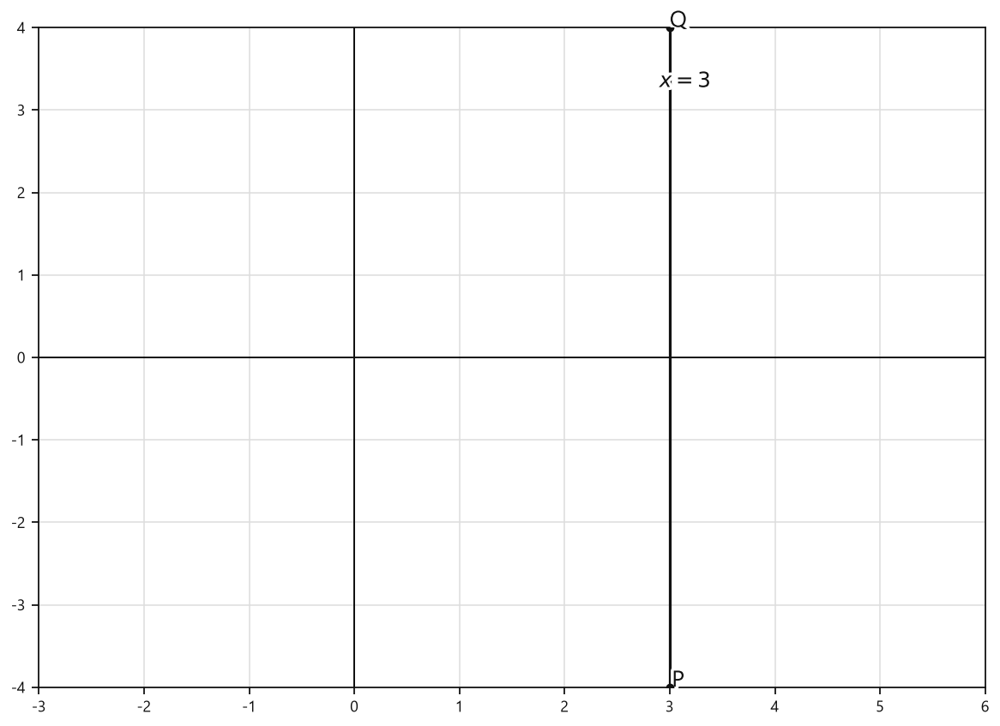
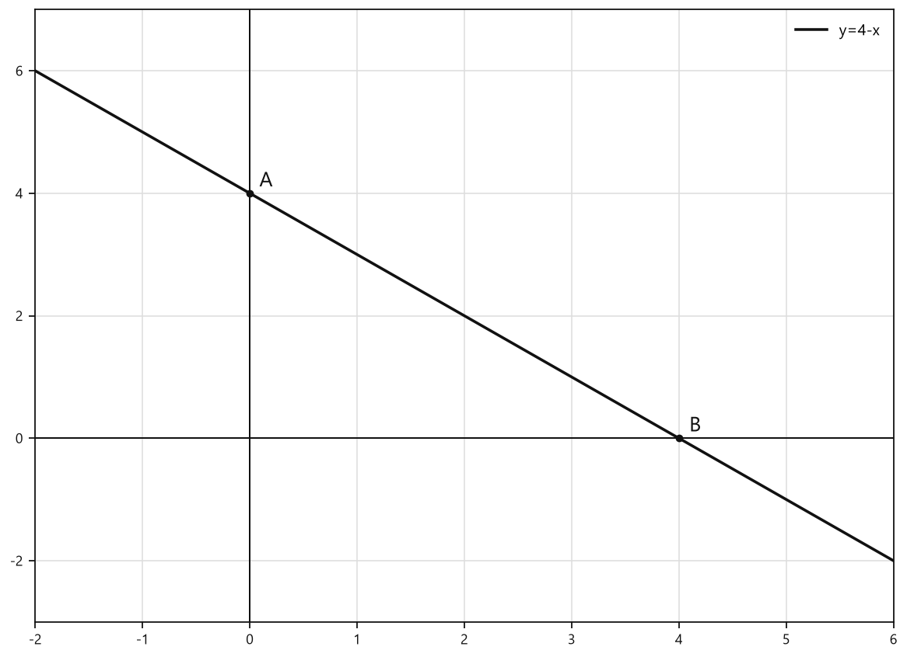
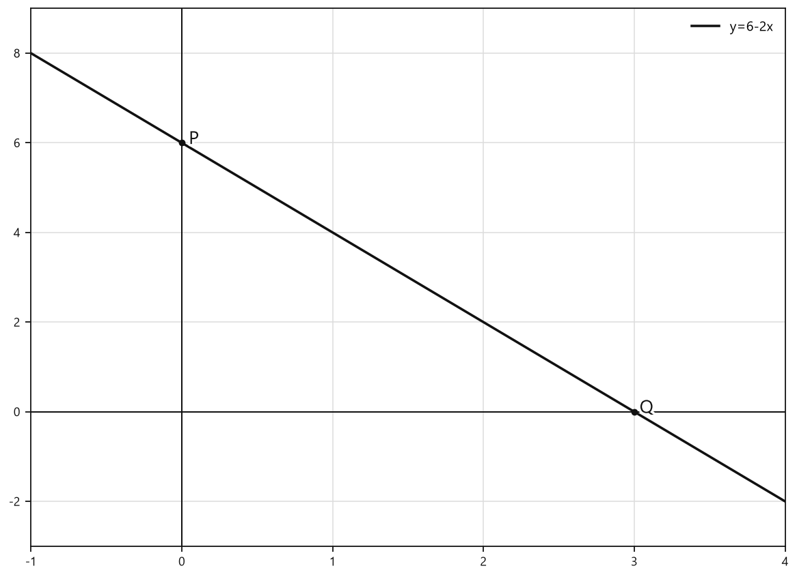

# Занятие 30. График линейного уравнения ax + by = c с двумя переменными

**Раздел:** Глава 4  
**Параграф учебника:** §22. График линейного уравнения ax + by = c с двумя переменными  
**Страницы:** 267–272

## Цели занятия

После занятия ты умеешь:

- объяснять, что является графиком уравнения $ax+by=c$;
- выражать $y$ через $x$, если $b\neq0$;
- определять, будет ли прямая горизонтальной или вертикальной;
- строить прямую по двум точкам;
- находить точки пересечения прямой с осями координат;
- проверять, принадлежит ли точка графику уравнения.

Выбери блок своего уровня:

- **1–2 балла:** узнать вид графика и простейшие случаи;
- **3–4 балла:** построить прямую по двум точкам;
- **5–6 баллов:** найти пересечения с осями и проверить точки;
- **7–8 баллов:** преобразовать сложное уравнение и построить график;
- **9–10 баллов:** решать задания на параметры и распознавать график по рисунку.

## Теория к занятию

### 1. График линейного уравнения

#### Простыми словами

Уравнение $ax+by=c$ задаёт точки $(x;y)$, координаты которых превращают уравнение в верное равенство.

Например, если пара чисел подходит уравнению, то соответствующая точка попадает на его график. Все такие точки располагаются на одной прямой. Алгебра записала условие, а геометрия нарисовала результат — командная работа.

#### Правило

**Графиком линейного уравнения $ax + by = c$ с двумя переменными является прямая.**

#### Формулы

Если $b\neq0$, переменную $y$ можно выразить через $x$:

$$
y=-\frac{a}{b}x+\frac{c}{b}.
$$

Здесь:

- $a$ — коэффициент при $x$;
- $b$ — коэффициент при $y$;
- $c$ — свободный член;
- $x$ — абсцисса точки;
- $y$ — ордината точки.

#### Алгоритм построения прямой при $b\neq0$

1. Выразить $y$ через $x$.
2. Выбрать значение $x$.
3. Подставить его и найти соответствующее значение $y$.
4. Записать первую точку.
5. Выбрать другое значение $x$.
6. Снова найти значение $y$.
7. Записать вторую точку.
8. Провести прямую через две полученные точки.

Почему нужны две точки? Через одну точку прямую провести можно по-разному, а через две разные точки проходит только одна прямая.

#### Ловушки

- При переносе $ax$ вправо перед ним появляется знак «минус».
- Делить нужно на $b$, потому что именно $b$ стоит при $y$.
- Две точки задают прямую, одна точка — только намёк на неё.
- Точка принадлежит графику только тогда, когда после подстановки получается верное равенство.

---

### 2. Случай $b\neq0$

#### Простыми словами

Если коэффициент при $y$ не равен нулю, можно выразить $y$ через $x$. После этого получаем линейную функцию и строим её график по двум точкам.

Например:

$$
3x+2y=6.
$$

Сначала оставим слагаемое с $y$ в левой части:

$$
2y=6-3x.
$$

Разделим обе части на $2$:

$$
y=3-\frac32x.
$$

Запишем привычнее:

$$
y=-\frac32x+3.
$$

Можно выбрать такие значения $x$, чтобы вычисления были удобными.

При $x=0$:

$$
y=3.
$$

Получаем точку $(0;3)$.

При $x=2$:

$$
y=-\frac32\cdot2+3=-3+3=0.
$$

Получаем точку $(2;0)$.

Через эти две точки проводим прямую.

#### Замечание

**График линейного уравнения $ax + by = c$ с двумя переменными:**

**1. Если $b \neq 0$, то $y = -\frac{a}{b}x + \frac{c}{b}$. График — прямая.**

#### Формула

$$
y=-\frac{a}{b}x+\frac{c}{b}.
$$

#### Правила

- Если $a\neq0$, прямая обычно наклонена.
- Если $a=0$, переменная $x$ исчезает, и прямая становится горизонтальной.
- Для построения удобно выбирать такие значения $x$, при которых $y$ получается целым.
- Достаточно найти две точки. Таблица из десяти значений здесь не нужна: прямая не требует повышенного внимания.

#### Ловушки

- В выражении $y=-\frac{a}{b}x+\frac{c}{b}$ минус относится ко всей дроби $\frac ab$.
- Если коэффициенты содержат дроби, можно сначала умножить всё уравнение на общий знаменатель.
- Нельзя забывать скобки при подстановке отрицательного значения $x$.

---

### 3. Случай $a=0$, $b\neq0$

#### Простыми словами

Если $a=0$, то слагаемое $ax$ исчезает:

$$
0x+by=c.
$$

Остаётся:

$$
by=c.
$$

Делим обе части на $b$:

$$
y=\frac cb.
$$

Значение $y$ постоянно, а $x$ может быть любым. Поэтому все точки имеют одну и ту же вторую координату и образуют горизонтальную прямую — прямую, параллельную оси абсцисс.

#### Замечание

**2. Если $b \neq 0$, $a = 0$, то $y = \frac{c}{b}$. График — прямая, параллельная оси абсцисс.**

#### Формула

$$
y=\frac cb.
$$

Если $c=0$, то:

$$
y=0,
$$

и графиком является ось абсцисс.

#### Правило

Для уравнения вида $0x+by=c$:

1. найти $y=\frac cb$;
2. отметить точку $(0;\frac cb)$;
3. провести через неё горизонтальную прямую.

#### Ловушки

- Прямая, параллельная оси абсцисс, является горизонтальной.
- Уравнение $y=\text{число}$ задаёт горизонтальную прямую.
- Уравнение $x=\text{число}$ задаёт вертикальную прямую. Перепутать их легко, если смотреть на букву невнимательно.

---

### 4. Случай $b=0$, $a\neq0$

#### Простыми словами

Если коэффициент при $y$ равен нулю, уравнение принимает вид:

$$
ax+0y=c.
$$

Слагаемое $0y$ исчезает:

$$
ax=c.
$$

Отсюда:

$$
x=\frac ca.
$$

Значение $x$ постоянно, а $y$ может быть любым. Все точки имеют одну и ту же первую координату, поэтому образуют вертикальную прямую — прямую, параллельную оси ординат.

#### Замечание

**3. Если $b = 0$, $a \neq 0$, то $x = \frac{c}{a}$. График — прямая, параллельная оси ординат.**

#### Формула

$$
x=\frac ca.
$$

Если $c=0$, то:

$$
x=0,
$$

и графиком является ось ординат.

#### Правило

Для уравнения вида $ax+0y=c$:

1. найти $x=\frac ca$;
2. отметить точку $(\frac ca;0)$;
3. провести через неё вертикальную прямую.

#### Ловушки

- Прямая, параллельная оси ординат, является вертикальной.
- Уравнение $x=\text{число}$ задаёт график, хотя его нельзя записать в виде $y=f(x)$.
- В точке пересечения с осью $Ox$ координата $y$ равна нулю.

---

### 5. Точки пересечения с осями координат

#### Простыми словами

У каждой точки на оси $Ox$ вторая координата равна нулю. Поэтому для пересечения с осью $Ox$ нужно положить $y=0$.

У каждой точки на оси $Oy$ первая координата равна нулю. Поэтому для пересечения с осью $Oy$ нужно положить $x=0$.

#### Алгоритм

Для уравнения $ax+by=c$:

- пересечение с осью $Ox$: положить $y=0$;
- пересечение с осью $Oy$: положить $x=0$.

Если $a\neq0$ и $b\neq0$, получаем:

$$
Ox:\quad x=\frac ca,\qquad \left(\frac ca;0\right);
$$

$$
Oy:\quad y=\frac cb,\qquad \left(0;\frac cb\right).
$$

#### Ловушки

- На оси $Ox$ вторая координата равна нулю.
- На оси $Oy$ первая координата равна нулю.
- Не перепутай точки $(\frac ca;0)$ и $(0;\frac cb)$.
- Если $b=0$, уравнение имеет вид $x=\frac ca$, и прямая может не пересекать ось $Oy$.

---

### 6. Проверка принадлежности точки графику

#### Простыми словами

Чтобы проверить, лежит ли точка на графике, нужно подставить её координаты в уравнение.

Если получится верное равенство, точка принадлежит графику. Если равенство неверное, точка находится не на этой прямой. Прямая не обидится, но точку не примет.

#### Алгоритм

Чтобы проверить точку $A(x_0;y_0)$:

1. подставить $x_0$ вместо $x$;
2. подставить $y_0$ вместо $y$;
3. вычислить левую часть;
4. сравнить результат с правой частью;
5. сделать вывод.

#### Ловушки

- Следи за знаками отрицательных координат.
- Координаты записываются как $(x;y)$: сначала $x$, потом $y$.
- Нельзя подставлять только одну координату: уравнение содержит две переменные.

---

## Сводка формул «выучить наизусть»

$$
y=-\frac abx+\frac cb,\qquad b\neq0.
$$

$$
y=\frac cb,\qquad b\neq0,\ a=0.
$$

График — прямая, параллельная оси абсцисс.

$$
x=\frac ca,\qquad b=0,\ a\neq0.
$$

График — прямая, параллельная оси ординат.

Для пересечения с осью $Ox$:

$$
y=0.
$$

Для пересечения с осью $Oy$:

$$
x=0.
$$

## Правила, которые нельзя путать

| Уравнение | Вид прямой |
|---|---|
| $y=k$ | горизонтальная, параллельная оси абсцисс |
| $x=k$ | вертикальная, параллельная оси ординат |
| $y=0$ | ось абсцисс |
| $x=0$ | ось ординат |

# Разбор ключевых заданий

## Р1. Постройте график уравнения $2x+3y=-6$

### Решение

Коэффициент при $y$ не равен нулю:

$$
b=3\neq0.
$$

Значит, выразим $y$ через $x$.

$$
2x+3y=-6.
$$

Перенесём $2x$ в правую часть:

$$
3y=-2x-6.
$$

Разделим обе части на $3$:

$$
y=-\frac23x-2.
$$

Теперь найдём две точки.

Выберем $x=0$:

$$
y=-\frac23\cdot0-2=-2.
$$

Получаем точку:

$$
A(0;-2).
$$

Выберем $x=3$:

$$
y=-\frac23\cdot3-2.
$$

$$
y=-2-2=-4.
$$

Получаем точку:

$$
B(3;-4).
$$

Отметим точки $A$ и $B$ на координатной плоскости.

Проведём через них прямую.


<!--geo-figure-spec
{
  "needed": true,
  "kind": "graph",
  "caption": "График $2x+3y=-6$",
  "axis": true,
  "grid": true,
  "xlim": [
    -7,
    5
  ],
  "ylim": [
    -6,
    4
  ],
  "curves": [
    {
      "expr": "-2*x/3-2",
      "label": "y=-2*x/3-2"
    }
  ],
  "points": {
    "A": [
      0,
      -2
    ],
    "B": [
      3,
      -4
    ]
  },
  "labels": {
    "A": {
      "dx": 0.15,
      "dy": 0.22
    },
    "B": {
      "dx": 0.15,
      "dy": 0.22
    }
  }
}
-->


*График 2x+3y=-6*


Проверим первую точку:

$$
2\cdot0+3\cdot(-2)=-6.
$$

Проверим вторую точку:

$$
2\cdot3+3\cdot(-4)=6-12=-6.
$$

Обе точки подходят уравнению, поэтому через них можно проводить искомую прямую.

**Ответ:** график — прямая $y=-\frac23x-2$, проходящая через точки $(0;-2)$ и $(3;-4)$.

---

## Р2. Постройте график уравнения $0x-4y=8$

### Решение

Здесь:

$$
a=0,\qquad b=-4\neq0.
$$

Слагаемое $0x$ исчезает:

$$
-4y=8.
$$

Разделим обе части на $-4$:

$$
y=\frac{8}{-4}.
$$

$$
y=-2.
$$

Значение $y$ постоянно, поэтому график — горизонтальная прямая, параллельная оси абсцисс.


<!--geo-figure-spec
{
  "needed": true,
  "kind": "graph",
  "caption": "График $y=-2$",
  "axis": true,
  "grid": true,
  "xlim": [
    -5,
    5
  ],
  "ylim": [
    -4,
    3
  ],
  "curves": [
    {
      "expr": "0*x-2",
      "label": "y=-2"
    }
  ]
}
-->


*График y=-2*


Проверим полученное уравнение:

$$
0x-4\cdot(-2)=8.
$$

$$
8=8.
$$

Равенство верно.

**Ответ:** горизонтальная прямая $y=-2$.

---

## Р3. Постройте график уравнения $4x-0y=12$

### Решение

Здесь:

$$
b=0,\qquad a=4\neq0.
$$

Слагаемое $-0y$ исчезает:

$$
4x=12.
$$

Разделим обе части на $4$:

$$
x=\frac{12}{4}.
$$

$$
x=3.
$$

Значение $x$ постоянно, поэтому график — вертикальная прямая, параллельная оси ординат.


<!--geo-figure-spec
{
  "needed": true,
  "kind": "graph",
  "caption": "График $x=3$",
  "axis": true,
  "grid": true,
  "xlim": [
    -3,
    6
  ],
  "ylim": [
    -4,
    4
  ],
  "curves": [],
  "points": {
    "P": [
      3,
      -4
    ],
    "Q": [
      3,
      4
    ]
  },
  "segments": [
    [
      "P",
      "Q"
    ]
  ],
  "labels": {},
  "texts": [
    {
      "xy": [
        3.15,
        3.35
      ],
      "text": "$x=3$"
    }
  ]
}
-->


*График x=3*


Проверим:

$$
4\cdot3-0y=12.
$$

$$
12=12.
$$

Равенство верно для любого значения $y$.

**Ответ:** вертикальная прямая $x=3$.

---

## Р4. Выберите уравнение, графиком которого является прямая, параллельная оси абсцисс

а) $5x+4y=13$;  
б) $9x+0y=2$;  
в) $0x+8y=24$;  
г) $x=2$.

### Решение

Прямая, параллельная оси абсцисс, является горизонтальной. Её уравнение имеет вид:

$$
y=k.
$$

Проверим варианты по очереди.

а) $5x+4y=13$.

Здесь есть и $x$, и $y$. Это не уравнение вида $y=k$.

б) $9x+0y=2$.

Слагаемое с $y$ исчезает:

$$
9x=2.
$$

Значит:

$$
x=\frac29.
$$

Это вертикальная прямая.

в) $0x+8y=24$.

Слагаемое с $x$ исчезает:

$$
8y=24.
$$

$$
y=3.
$$

Это горизонтальная прямая.

г) $x=2$.

Это сразу уравнение вертикальной прямой.

**Ответ:** в) $0x+8y=24$.

---

## Р5. Выберите уравнения, графики которых проходят через точку $A(-1;2)$

а) $3x-y=5$;  
б) $x-2y=0$;  
в) $-x+10y=21$;  
г) $0x+y=2$.

### Решение

Точка $A(-1;2)$ принадлежит графику, если после подстановки $x=-1$ и $y=2$ получается верное равенство.

Подставим координаты в вариант а):

$$
3\cdot(-1)-2=-3-2=-5.
$$

Получили:

$$
-5\neq5.
$$

Вариант а) не подходит.

Проверим вариант б):

$$
-1-2\cdot2=-1-4=-5.
$$

Получили:

$$
-5\neq0.
$$

Вариант б) не подходит.

Проверим вариант в):

$$
-(-1)+10\cdot2=1+20=21.
$$

Получили верное равенство. Вариант в) подходит.

Проверим вариант г):

$$
0\cdot(-1)+2=2.
$$

Получили верное равенство. Вариант г) тоже подходит.

**Ответ:** в), г).

---

## Р6. Постройте график уравнения $x+y=4$

### Решение

Коэффициент при $y$ равен $1$, поэтому выразим $y$:

$$
y=4-x.
$$

Найдём две удобные точки.

Выберем $x=0$:

$$
y=4-0=4.
$$

Получаем точку:

$$
A(0;4).
$$

Выберем $x=4$:

$$
y=4-4=0.
$$

Получаем точку:

$$
B(4;0).
$$

Отметим точки $A$ и $B$ и проведём через них прямую.


<!--geo-figure-spec
{
  "needed": true,
  "kind": "graph",
  "caption": "График $x+y=4$",
  "axis": true,
  "grid": true,
  "xlim": [
    -2,
    6
  ],
  "ylim": [
    -3,
    7
  ],
  "curves": [
    {
      "expr": "4-x",
      "label": "y=4-x"
    }
  ],
  "points": {
    "A": [
      0,
      4
    ],
    "B": [
      4,
      0
    ]
  },
  "labels": {
    "A": {
      "dx": 0.15,
      "dy": 0.2
    },
    "B": {
      "dx": 0.15,
      "dy": 0.2
    }
  }
}
-->


*График x+y=4*


Проверим точки:

$$
0+4=4.
$$

$$
4+0=4.
$$

Обе точки подходят уравнению.

**Ответ:** прямая через точки $(0;4)$ и $(4;0)$.

---

## Р7. Найдите координаты точек пересечения прямой $x-y=7$ с осями координат

### Решение

### Пересечение с осью $Ox$

У точки на оси $Ox$ вторая координата равна нулю:

$$
y=0.
$$

Подставим это значение в уравнение:

$$
x-0=7.
$$

$$
x=7.
$$

Получаем точку:

$$
A(7;0).
$$

### Пересечение с осью $Oy$

У точки на оси $Oy$ первая координата равна нулю:

$$
x=0.
$$

Подставим это значение:

$$
0-y=7.
$$

$$
-y=7.
$$

Умножим обе части на $-1$:

$$
y=-7.
$$

Получаем точку:

$$
B(0;-7).
$$

Проверим обе точки:

$$
7-0=7;
$$

$$
0-(-7)=7.
$$

Оба равенства верны.

**Ответ:** $(7;0)$ и $(0;-7)$.

---

## Р8. Постройте график уравнения $0x+4y=20$

### Решение

Слагаемое $0x$ исчезает:

$$
4y=20.
$$

Разделим обе части на $4$:

$$
y=5.
$$

Значение $y$ постоянно, поэтому график — горизонтальная прямая, параллельная оси абсцисс.

**Ответ:** $y=5$.

---

## Р9. Постройте график уравнения $-3x+0y=-12$

### Решение

Слагаемое $0y$ исчезает:

$$
-3x=-12.
$$

Разделим обе части на $-3$:

$$
x=\frac{-12}{-3}.
$$

$$
x=4.
$$

Значение $x$ постоянно, поэтому график — вертикальная прямая, параллельная оси ординат.

**Ответ:** $x=4$.

---

## Р10. Найдите три решения уравнения, график которого проходит через точки $(-6;6)$ и $(0;0)$

### Решение

Нужно найти уравнение прямой, проходящей через данные точки.

При увеличении $x$ от $-6$ до $0$ значение $x$ увеличивается на $6$, а значение $y$ уменьшается от $6$ до $0$, то есть на $6$.

Значит, при увеличении $x$ на $1$ значение $y$ уменьшается на $1. Поэтому прямая задаётся уравнением:

$$
y=-x.
$$

Проверим данные точки:

для точки $(-6;6)$:

$$
y=-(-6)=6;
$$

для точки $(0;0)$:

$$
y=-0=0.
$$

Теперь выберем несколько значений $x$ и найдём $y$.

При $x=0$:

$$
y=-0=0.
$$

Получаем точку:

$$
(0;0).
$$

При $x=1$:

$$
y=-1.
$$

Получаем точку:

$$
(1;-1).
$$

При $x=-2$:

$$
y=-(-2)=2.
$$

Получаем точку:

$$
(-2;2).
$$

Все эти пары являются решениями уравнения $y=-x$.

**Ответ:** например, $(0;0)$, $(1;-1)$, $(-2;2)$.

---

## Р11. Постройте график уравнения $3(x+y)-y=4$

### Решение

Сначала раскроем скобки:

$$
3x+3y-y=4.
$$

Приведём подобные слагаемые:

$$
3x+2y=4.
$$

Выразим $y$:

$$
2y=4-3x.
$$

Разделим обе части на $2$:

$$
y=-\frac32x+2.
$$

Найдём две точки.

Выберем $x=0$:

$$
y=-\frac32\cdot0+2=2.
$$

Получаем точку:

$$
A(0;2).
$$

Выберем $x=2$:

$$
y=-\frac32\cdot2+2.
$$

$$
y=-3+2=-1.
$$

Получаем точку:

$$
B(2;-1).
$$

Проведём прямую через точки $A$ и $B$.

Проверим первую точку в исходном уравнении:

$$
3(0+2)-2=6-2=4.
$$

Проверим вторую точку:

$$
3(2-1)-(-1)=3+1=4.
$$

Обе точки подходят.

**Ответ:** прямая $y=-\frac32x+2$, проходящая через точки $(0;2)$ и $(2;-1)$.

---

## Р12. Постройте график уравнения $(x-2y)-2(x-y)-5=0$

### Решение

Раскроем первые скобки:

$$
x-2y-2(x-y)-5=0.
$$

Раскроем вторые скобки. Перед скобками стоит знак «минус», поэтому знаки внутри изменятся:

$$
x-2y-2x+2y-5=0.
$$

Приведём подобные слагаемые:

$$
-x-5=0.
$$

Перенесём $-5$ в правую часть:

$$
-x=5.
$$

Умножим обе части на $-1$:

$$
x=-5.
$$

Значение $x$ постоянно, поэтому это вертикальная прямая, параллельная оси ординат.

Проверим в исходном уравнении:

$$
(-5-2y)-2(-5-y)-5=0.
$$

Раскроем скобки:

$$
-5-2y+10+2y-5=0.
$$

Приведём подобные слагаемые:

$$
0=0.
$$

Равенство верно при любом $y$.

**Ответ:** вертикальная прямая $x=-5$.

---

## Р13. График уравнения $-5x-6y=11$ проходит через точку с ординатой $4$. Найдите абсциссу этой точки

### Решение

Ордината — это вторая координата точки. По условию:

$$
y=4.
$$

Подставим это значение в уравнение:

$$
-5x-6\cdot4=11.
$$

Выполним умножение:

$$
-5x-24=11.
$$

Перенесём $-24$ в правую часть:

$$
-5x=35.
$$

Разделим обе части на $-5$:

$$
x=-7.
$$

Проверим найденное значение:

$$
-5\cdot(-7)-6\cdot4=35-24=11.
$$

Равенство верно.

**Ответ:** $-7$.

---

## Р14. График уравнения $x-y=a$ проходит через точку $N(-2;3)$. Найдите $a$

### Решение

Подставим координаты точки $N(-2;3)$ в уравнение $x-y=a$:

$$
x=-2,\qquad y=3.
$$

Получаем:

$$
-2-3=a.
$$

Вычислим левую часть:

$$
a=-5.
$$

Проверим: если $a=-5$, то

$$
x-y=-2-3=-5.
$$

Равенство выполняется.

**Ответ:** $a=-5$.

---

## Р15. Выберите уравнение, график которого не пересекает ось ординат

а) $2x+8y=11$;  
б) $5x+0y=-8$;  
в) $0x-9y=11$;  
г) $3x-5y=15$.

### Решение

Любая точка оси ординат имеет первую координату $x=0$.

Поэтому в каждом уравнении вместо $x$ подставим $0$. Если получится допустимое значение $y$, график пересекает ось ординат. Если уравнение не имеет решения при $x=0$, пересечения нет.

а)

$$
2\cdot0+8y=11.
$$

$$
8y=11.
$$

$$
y=\frac{11}{8}.
$$

Точка $\left(0;\frac{11}{8}\right)$ принадлежит графику. Значит, график пересекает ось ординат.

б)

$$
5\cdot0+0y=-8.
$$

$$
0=-8.
$$

Такого равенства быть не может. Значит, на оси ординат нет точки этого графика.

Можно увидеть это и по-другому:

$$
5x=-8,
$$

$$
x=-\frac85.
$$

График — вертикальная прямая с постоянной координатой $x=-\frac85$, а ось ординат имеет $x=0$. Эти прямые параллельны и не пересекаются.

в)

$$
0\cdot0-9y=11.
$$

$$
-9y=11.
$$

$$
y=-\frac{11}{9}.
$$

Точка $\left(0;-\frac{11}{9}\right)$ принадлежит графику. Пересечение есть.

г)

$$
3\cdot0-5y=15.
$$

$$
-5y=15.
$$

$$
y=-3.
$$

Точка $(0;-3)$ принадлежит графику. Пересечение есть.

**Ответ:** б) $5x+0y=-8$.

---

## Р16. Выберите точки, принадлежащие графику уравнения $3x-4y=12$

а) $A(4;-1)$;  
б) $B(4;0)$;  
в) $C(2;-1,5)$;  
г) $D(0;-3)$.

### Решение

Точка принадлежит графику, если после подстановки её координат получается верное равенство.

Проверим точки по очереди.

а) $A(4;-1)$:

$$
3\cdot4-4\cdot(-1)=12+4=16.
$$

Получили $16\neq12$. Точка не подходит.

б) $B(4;0)$:

$$
3\cdot4-4\cdot0=12-0=12.
$$

Равенство верное. Точка подходит.

в) $C(2;-1,5)$:

$$
3\cdot2-4\cdot(-1,5)=6+6=12.
$$

Равенство верное. Точка подходит.

г) $D(0;-3)$:

$$
3\cdot0-4\cdot(-3)=0+12=12.
$$

Равенство верное. Точка подходит.

Вот где обычно прячется ошибка: отрицательная координата $-1,5$ умножается на $-4$, поэтому результат получается положительным.

**Ответ:** б), в), г).

---

## Р17. Выберите уравнение, график которого проходит через точки $(0;1)$ и $(1;-1)$

а) $y=-2x$;  
б) $2x-y+5=0$;  
в) $2x+y=1$;  
г) $y+x+1=0$.

### Решение

Уравнение подходит только в том случае, если ему удовлетворяют обе точки. Проверим их подстановкой.

Для точки $(0;1)$:

а) $y=-2x$:

$$
1=-2\cdot0,
$$

$$
1\neq0.
$$

Уравнение не подходит.

б) $2x-y+5=0$:

$$
2\cdot0-1+5=4.
$$

$$
4\neq0.
$$

Уравнение не подходит.

в) $2x+y=1$:

$$
2\cdot0+1=1.
$$

Первая точка подходит.

Проверим точку $(1;-1)$:

$$
2\cdot1+(-1)=2-1=1.
$$

Вторая точка тоже подходит.

г) $y+x+1=0$:

$$
1+0+1=2.
$$

$$
2\neq0.
$$

Уравнение не подходит.

Значит, только уравнение из пункта в) проходит через обе точки.

Можно проверить себя ещё одним способом. При $x=0$ уравнение прямой даёт $y=1$, а при увеличении $x$ от $0$ до $1$ значение $y$ уменьшается от $1$ до $-1$. Это соответствует уравнению

$$
y=-2x+1,
$$

или, после переноса $-2x$ в левую часть,

$$
2x+y=1.
$$

**Ответ:** в) $2x+y=1$.

## Практические задания

Выбери свой уровень и решай только этот блок. В блоке должна закрепиться вся тема параграфа. Ответы не приводятся.

### Уровень 1–2 балла

**С1.** Выберите уравнение, графиком которого является прямая, параллельная оси абсцисс:  
1) $y=3$ 2) $x=-2$ 3) $y=3x$ 4) $2x+y=5$ 5) $x+y=0$

**С2.** Выберите уравнение, графиком которого является прямая, параллельная оси ординат:  
1) $y=-4$ 2) $x=5$ 3) $x+y=5$ 4) $2x-y=1$ 5) $y=2x+1$

**С3.** Какая из точек принадлежит графику уравнения $2x+y=6$?  
1) $(0;5)$ 2) $(1;4)$ 3) $(2;1)$ 4) $(3;1)$ 5) $(-1;6)$

**С4.** Выберите уравнение, график которого проходит через точку $A(-2;3)$:  
1) $x+y=1$ 2) $2x+y=0$ 3) $x-2y=-8$ 4) $3x+y=7$ 5) $2x-y=7$

**С5.** Выберите уравнение, график которого не пересекает ось ординат:  
1) $2x+3y=6$ 2) $x-y=4$ 3) $4x=12$ 4) $y=-5$ 5) $3x+y=0$

**С6.** Найдите координаты точки пересечения графика уравнения $x+y=7$ с осью абсцисс.

**С7.** Найдите координаты точки пересечения графика уравнения $2x-3y=12$ с осью ординат.

**С8.** Укажите три решения уравнения $x-2y=4$.

**С9.** Найдите значение $a$, если график уравнения $x+y=a$ проходит через точку $N(2;-5)$.

**С10.** Найдите абсциссу точки графика уравнения $3x+2y=14$, ордината которой равна $1$.

**С11.** Определите, какая прямая является графиком уравнения $0x-5y=15$:  
1) $y=-3$ 2) $y=3$ 3) $x=-3$ 4) $x=3$ 5) $y=5$

**С12.** Выберите все точки, принадлежащие графику уравнения $3x-4y=12$:  
1) $(0;-3)$ 2) $(4;0)$ 3) $(2;-1,5)$ 4) $(1;-2,25)$ 5) $(-4;-6)$

**С13.** Выберите уравнение, графиком которого является прямая, параллельная оси абсцисс.  
1) $2x+3y=6$ 2) $4x=12$ 3) $5y=-10$ 4) $x-y=1$ 5) $3x+2y=0$

**С14.** Выберите уравнение, графиком которого является прямая, параллельная оси ординат.  
1) $y=4$ 2) $2x-y=3$ 3) $7x=14$ 4) $x+y=5$ 5) $3y=-9$

**С15.** Какая из точек принадлежит графику уравнения $x+y=6$?  
1) $(1;4)$ 2) $(2;4)$ 3) $(3;4)$ 4) $(5;2)$ 5) $(6;1)$

**С16.** Выберите уравнение, график которого проходит через точку $A(-2;3)$.  
1) $x+y=1$ 2) $2x+y=0$ 3) $x-2y=-8$ 4) $3x+y=9$ 5) $x+y=6$

**С17.** Найдите точку пересечения графика уравнения $2x+y=8$ с осью ординат.  
1) $(0;4)$ 2) $(4;0)$ 3) $(0;8)$ 4) $(8;0)$ 5) $(2;4)$

**С18.** Найдите точку пересечения графика уравнения $3x-2y=12$ с осью абсцисс.  
1) $(0;-6)$ 2) $(4;0)$ 3) $(0;6)$ 4) $(-4;0)$ 5) $(6;0)$

**С19.** Выберите все точки, принадлежащие графику уравнения $x-2y=4$.  
1) $(4;0)$ 2) $(0;-2)$ 3) $(2;1)$ 4) $(-2;-3)$ 5) $(6;1)$

**С20.** График уравнения $x-y=a$ проходит через точку $N(3;-2)$. Выберите значение числа $a$.  
1) $-5$ 2) $-1$ 3) $1$ 4) $5$ 5) $6$

**С21.** Найдите ординату точки графика уравнения $4x+y=9$, если её абсцисса равна $2$.

**С22.** Найдите абсциссу точки графика уравнения $5x-2y=10$, если её ордината равна $0$.

**С23.** Запишите любые две точки с целыми координатами, принадлежащие графику уравнения $x+y=5$.

**С24.** Выберите уравнение, график которого не пересекает ось ординат.  
1) $2x+3y=6$ 2) $4x=12$ 3) $y=-5$ 4) $x-y=7$ 5) $x+2y=0$

**С25.** Какое уравнение имеет графиком прямую, параллельную оси абсцисс?

1) $2x+3y=6$  2) $4x=12$  3) $0x+5y=10$  4) $x-y=1$  5) $3x+0y=9$

**С26.** Какое уравнение имеет графиком прямую, параллельную оси ординат?

1) $2x+5y=10$  2) $0x-3y=6$  3) $4x+0y=12$  4) $x+y=7$  5) $3x-y=2$

**С27.** Выберите уравнение, график которого проходит через точку $A(1;2)$.

1) $x+y=2$  2) $2x+y=4$  3) $3x-y=1$  4) $x-2y=5$  5) $2x-3y=1$

**С28.** Какая точка принадлежит графику уравнения $2x+y=5$?

1) $A(1;1)$  2) $B(1;3)$  3) $C(2;2)$  4) $D(3;1)$  5) $E(0;4)$

**С29.** Найдите точку пересечения графика уравнения $x+y=6$ с осью абсцисс.

1) $(0;6)$  2) $(6;0)$  3) $(3;3)$  4) $(-6;0)$  5) $(0;-6)$

**С30.** Найдите точку пересечения графика уравнения $3x+2y=12$ с осью ординат.

1) $(4;0)$  2) $(0;6)$  3) $(0;4)$  4) $(6;0)$  5) $(2;3)$

**С31.** Укажите уравнение прямой, проходящей через точки $A(0;4)$ и $B(4;0)$.

1) $x+y=4$  2) $x-y=4$  3) $2x+y=4$  4) $x+2y=4$  5) $2x+2y=4$

**С32.** График уравнения $-2x+4y=8$ пересекает ось ординат в точке:

1) $(0;2)$  2) $(0;4)$  3) $(4;0)$  4) $(-4;0)$  5) $(2;0)$

**С33.** Для какого значения $a$ график уравнения $x-y=a$ проходит через точку $N(-2;3)$?

1) $-5$  2) $-1$  3) $1$  4) $5$  5) $6$

**С34.** График уравнения $-5x-6y=11$ проходит через точку с ординатой $y=1$. Найдите её абсциссу.

1) $-\frac{17}{5}$  2) $-\frac{11}{5}$  3) $-1$  4) $\frac{17}{5}$  5) $-\frac{5}{17}$

**С35.** Выберите уравнение, график которого не пересекает ось ординат.

1) $2x+3y=6$  2) $x-y=4$  3) $4x+0y=12$  4) $0x+5y=10$  5) $3x+2y=0$

**С36.** Какие точки первой координатной четверти с целыми координатами принадлежат прямой $2x+5y=19$? Выберите все верные точки.

1) $(2;3)$  2) $(7;1)$  3) $(3; \frac{13}{5})$  4) $(\frac{7}{2};2)$  5) $(\frac{1}{2}; \frac{18}{5})$

### Уровень 3–4 балла

**С1.** Выберите уравнение, графиком которого является прямая, параллельная оси абсцисс.

1) $2x+3y=6$  
2) $4x-7=0$  
3) $5y=15$  
4) $x-y=2$  
5) $3x+2y=0$

**С2.** Выберите уравнение, графиком которого является прямая, параллельная оси ординат.

1) $x+4y=8$  
2) $6x=18$  
3) $y-3=0$  
4) $2x-y=5$  
5) $x+y=0$

**С3.** Выберите уравнение, график которого проходит через точку $A(-2;3)$.

1) $x+y=1$  
2) $2x-y=7$  
3) $3x+2y=0$  
4) $x-2y=-8$  
5) $4x+y=5$

**С4.** Укажите две точки с целыми координатами, принадлежащие графику уравнения $x+y=5$.

**С5.** Постройте график линейного уравнения $2x+y=4$.

**С6.** Постройте график линейного уравнения $3x-2y=6$.

**С7.** Найдите координаты точек пересечения прямой $2x+y=8$ с осями координат.

**С8.** Найдите координаты точек пересечения прямой $x-3y=6$ с осями координат.

**С9.** Постройте график уравнения $0x+5y=-10$.

**С10.** Постройте график уравнения $-4x+0y=12$.

**С11.** График уравнения $x-y=a$ проходит через точку $N(4;-1)$. Найдите значение $a$.

**С12.** График уравнения $-3x+4y=12$ проходит через точку с ординатой $3$. Найдите абсциссу этой точки.

**С13.** Выберите уравнение, графиком которого является прямая, параллельная оси абсцисс:  
1) $y=3x-2$; 2) $4x=12$; 3) $2y=-8$; 4) $x+y=5$; 5) $3x-2y=6$.

**С14.** Выберите уравнение, графиком которого является прямая, параллельная оси ординат:  
1) $y=-4$; 2) $x=5$; 3) $x+y=1$; 4) $2x-y=7$; 5) $3y=9$.

**С15.** Проверьте, принадлежит ли точка $A(2;-1)$ графику уравнения $3x+2y=4$.

**С16.** Среди точек $A(1;2)$, $B(-2;1)$, $C(3;-1)$ и $D(0;4)$ выберите те, которые принадлежат графику уравнения $x-2y=-3$.

**С17.** Постройте график уравнения $x+y=6$. Укажите координаты двух точек, через которые проходит этот график.

**С18.** Постройте график уравнения $2x-y=4$. Найдите координаты точек его пересечения с осями координат.

**С19.** Найдите координаты точек пересечения графика уравнения $3x+2y=12$ с осями координат.

**С20.** Постройте график уравнения $0x-5y=15$. Укажите, какой координатной оси параллельна полученная прямая.

**С21.** Постройте график уравнения $4x+0y=-8$. Укажите, какой координатной оси параллельна полученная прямая.

**С22.** График уравнения $5x-2y=10$ проходит через точку с абсциссой $4$. Найдите ординату этой точки.

**С23.** График уравнения $x-y=a$ проходит через точку $N(3;-2)$. Найдите значение числа $a$.

**С24.** Укажите все точки первой координатной четверти с целыми координатами, принадлежащие графику уравнения $2x+3y=12$.

**С25.** Выберите уравнение, графиком которого является прямая, параллельная оси абсцисс.

1) $2x+3y=6$  
2) $5x-10=0$  
3) $7y+14=0$  
4) $x-y=1$  
5) $4x+2y=8$

**С26.** Выберите уравнение, графиком которого является прямая, параллельная оси ординат.

1) $3x-6=0$  
2) $2x+y=5$  
3) $4y+8=0$  
4) $x+y=0$  
5) $5x-2y=10$

**С27.** Постройте график линейного уравнения $x+y=5$. Укажите координаты двух точек, через которые проходит построенная прямая.

**С28.** Постройте график линейного уравнения $2x-y=4$. Укажите координаты точек пересечения графика с осями координат.

**С29.** Найдите координаты точек пересечения прямой $2x+3y=12$ с осями координат.

**С30.** Найдите координаты точек пересечения прямой $5x-y=10$ с осями координат.

**С31.** Постройте график уравнения $0x+3y=-9$.

**С32.** Постройте график уравнения $4x+0y=16$.

**С33.** Выберите точки, принадлежащие графику уравнения $3x-2y=6$.

1) $(0;-3)$  
2) $(2;0)$  
3) $(4;3)$  
4) $(-2;-6)$  
5) $(1;-\frac32)$

**С34.** График уравнения $-2x+5y=15$ проходит через точку с ординатой $1$. Найдите абсциссу этой точки.

**С35.** График уравнения $x-y=a$ проходит через точку $N(3;-2)$. Найдите значение числа $a$.

**С36.** Укажите точки первой координатной четверти с целыми координатами, принадлежащие прямой $2x+3y=12$.

### Уровень 5–6 баллов

**С1.** Выберите уравнение, графиком которого является прямая, параллельная оси абсцисс:  
1) $2x+3y=6$; 2) $4x=12$; 3) $5y=10$; 4) $x-y=1$; 5) $3x+2y=0$.

**С2.** Выберите уравнение, графиком которого является прямая, параллельная оси ординат:  
1) $y=4$; 2) $2x-y=3$; 3) $3x=15$; 4) $x+y=0$; 5) $5x+2y=7$.

**С3.** Выберите уравнение, график которого проходит через точку $A(-2;3)$:  
1) $x+2y=4$; 2) $3x-y=-9$; 3) $2x+y=1$; 4) $x-y=5$; 5) $4x+y=10$.

**С4.** Выберите все уравнения, графики которых проходят через точку $B(1;-2)$:  
1) $x+y=-1$; 2) $2x-y=4$; 3) $3x+y=1$; 4) $x-2y=5$; 5) $4x+2y=0$.

**С5.** Укажите координаты точки пересечения прямой $2x+3y=12$ с осью абсцисс.

**С6.** Укажите координаты точки пересечения прямой $5x-y=10$ с осью ординат.

**С7.** Постройте график уравнения $x+y=5$. Для построения найдите координаты двух точек, принадлежащих графику.

**С8.** Постройте график уравнения $3x-y=6$. Для построения найдите точки пересечения графика с осями координат.

**С9.** Постройте график уравнения $0x+4y=-8$ и укажите, с какой координатной осью он параллелен.

**С10.** Постройте график уравнения $-3x+0y=9$ и укажите, с какой координатной осью он параллелен.

**С11.** График уравнения $-4x+5y=15$ проходит через точку с абсциссой $5$. Найдите ординату этой точки.

**С12.** График уравнения $x-y=a$ проходит через точку $N(-3;4)$. Найдите значение числа $a$.

**С13.** Выберите уравнение, графиком которого является прямая, параллельная оси абсцисс.

1) $2x+3y=6$  2) $5x-10=0$  3) $4y+8=0$  4) $x-y=1$  5) $3x+2y=0$

**С14.** Выберите уравнение, графиком которого является прямая, параллельная оси ординат.

1) $y=4$  2) $3x-12=0$  3) $x+y=5$  4) $2x+5y=1$  5) $y=-2x+3$

**С15.** Укажите координаты двух точек пересечения графика уравнения $2x+3y=12$ с осями координат.

**С16.** Постройте график линейного уравнения $x+y=5$. Укажите любые три точки, принадлежащие этому графику.

**С17.** Постройте график линейного уравнения $3x-2y=6$. Найдите координаты точек его пересечения с осями координат.

**С18.** Выберите точки, принадлежащие графику уравнения $4x-y=8$.

1) $A(0;-8)$  2) $B(1;-4)$  3) $C(2;0)$  4) $D(3;4)$  5) $E(4;8)$

**С19.** График уравнения $-2x+5y=10$ проходит через точку с абсциссой $5$. Найдите ординату этой точки.

**С20.** График уравнения $x-y=a$ проходит через точку $M(4;-3)$. Найдите значение числа $a$.

**С21.** Постройте график уравнения $0x-3y=12$. Укажите, какой координатной оси параллелен этот график.

**С22.** Постройте график уравнения $5x+0y=-15$. Укажите, какой координатной оси параллелен этот график.

**С23.** Выберите уравнение, график которого не пересекает ось ординат.

1) $2x+3y=6$  2) $4x-8=0$  3) $y-5=0$  4) $x+y=0$  5) $3x-2y=9$

**С24.** Укажите все точки первой координатной четверти с целыми координатами, принадлежащие прямой $2x+3y=13$.

**С25.** Постройте график линейного уравнения $x+y=6$. Укажите координаты двух точек, принадлежащих этому графику.

**С26.** Постройте график каждого уравнения и определите, параллельна ли полученная прямая оси абсцисс или оси ординат:  
а) $0x+3y=-9$;  
б) $-2x+0y=8$.

**С27.** Найдите координаты точек пересечения графика уравнения $4x-3y=12$ с осями координат.

**С28.** График уравнения $2x+y=a$ проходит через точку $A(3;-4)$. Найдите значение $a$ и запишите уравнение этого графика.

**С29.** Преобразуйте уравнение $3(x+y)-2x=9$ к виду $y=kx+b$, а затем постройте его график.

**С30.** Выберите все уравнения, графики которых совпадают:

1) $2x+4y=6$  
2) $x+2y=3$  
3) $-4x-8y=-12$  
4) $2x-4y=6$  
5) $3x+6y=9$

### Уровень 7–8 баллов

**С1.** Выберите уравнение, графиком которого является прямая, параллельная оси абсцисс.

1) $3x+2y=7$  2) $5x=15$  3) $4y=-12$  4) $x-y=0$  5) $2x+0y=6$

**С2.** Выберите уравнение, график которого проходит через точку $A(-2;3)$.

1) $2x+y=1$  2) $x-2y=-8$  3) $3x+y=10$  4) $x+y=2$  5) $4x- y=-11$

**С3.** Выберите уравнение, график которого не пересекает ось ординат.

1) $2x+3y=6$  2) $x-y=4$  3) $5x=15$  4) $y=-2x+1$  5) $3x+4y=0$

**С4.** Выберите все уравнения, графики которых совпадают.

1) $2x-3y=6$  2) $-4x+6y=-12$  3) $4x+6y=12$  4) $6x-9y=18$  5) $-2x+3y=6$

**С5.** Какие из перечисленных точек принадлежат графику уравнения $3x-2y=8$? Выберите все верные варианты.

1) $A(2;-1)$  2) $B(0;-4)$  3) $C(4;2)$  4) $D(-2;-7)$  5) $E(6;5)$

**С6.** Постройте на координатной плоскости график уравнения $2x+y=6$, предварительно найдя координаты двух точек этого графика.


<!--geo-figure-spec
{
  "needed": true,
  "kind": "graph",
  "caption": "График уравнения $2x+y=6$",
  "axis": true,
  "grid": true,
  "xlim": [
    -1,
    4
  ],
  "ylim": [
    -3,
    9
  ],
  "curves": [
    {
      "expr": "6-2*x",
      "label": "y=6-2x"
    }
  ],
  "points": {
    "P": [
      0,
      6
    ],
    "Q": [
      3,
      0
    ]
  },
  "labels": {}
}
-->


*График уравнения 2x+y=6*


**С7.** Найдите координаты точек пересечения прямой $4x-3y=12$ с осями координат. Запишите уравнения прямых, параллельных этой прямой и проходящих через точки $A(0;2)$ и $B(3;1)$.

**С8.** График уравнения $5x+by=15$ проходит через точку $M(1;2)$. Найдите значение $b$, а затем укажите координаты точек пересечения полученной прямой с осями координат.

**С9.** Преобразуйте уравнение $3(x+y)-2y=9$ к виду $ax+by=c$ и найдите координаты двух точек, принадлежащих его графику. Обоснуйте, что эти точки различны.

**С10.** Прямая $x-y=a$ проходит через точку $N(-3;4)$. Найдите число $a$ и координаты точки пересечения этой прямой с осью абсцисс.

**С11.** Укажите все точки первой координатной четверти с целыми координатами, принадлежащие прямой $2x+3y=13$. Ответ обоснуйте без построения графика.

**С12.** Постройте в одной координатной плоскости графики уравнений $x+y=4$ и $2x+2y=8$. Сделайте вывод о взаимном расположении этих прямых и обоснуйте его с помощью преобразования уравнений.

```geo-figure
{
  "needed": true,
  "kind": "graph",
  "caption": "Координатная плоскость для построения графиков $x+y=4$ и $2x+2y=8$",
  "axis": true,
  "grid": true,
  "xlim": [-2, 6],
  "ylim": [-3, 7],
  "curves": [],
  "points": {},
  "labels": {}
}

**С13.** Для каждого уравнения определите, какая прямая является его графиком: пересекающая обе координатные оси, параллельная оси абсцисс или параллельная оси ординат. Обоснуйте ответ:  
а) $7x-2y=10$;  
б) $5y=-15$;  
в) $-4x=12$.

**С14.** Постройте в одной системе координат графики уравнений $x+y=5$ и $2x-y=1$. Найдите координаты точки их пересечения и проверьте подстановкой в оба уравнения.

**С15.** Найдите координаты точек пересечения графика уравнения $4x+3y=12$ с координатными осями. Используя найденные точки, постройте график уравнения.

**С16.** Известно, что график уравнения $ax+2y=8$ проходит через точку $A(2;1)$. Найдите значение $a$, затем запишите уравнение полученной прямой и укажите координаты точек её пересечения с осями координат.

**С17.** Прямая задана уравнением $3x-5y=15$. Определите, принадлежат ли её графику точки $A(0;-3)$, $B(5;0)$, $C(10;3)$ и $D(-5;-6)$. Ответ обоснуйте вычислениями.

**С18.** Постройте график уравнения $2(x+y)-3y=6$. По графику или вычислением определите координаты его пересечений с осями координат.

**С19.** Прямая $y=kx+4$ является графиком линейного уравнения с двумя переменными и проходит через точку $A(3;-2)$. Найдите $k$, запишите уравнение этой прямой в виде $ax+by=c$ и постройте её график.

**С20.** Укажите все точки первой координатной четверти с целыми координатами, принадлежащие прямой $3x+2y=14$. Решите задачу без построения графика и объясните, почему других точек с такими координатами нет.

**С21.** Даны уравнения $2x-3y=6$ и $-4x+6y=-12$. Не выполняя построения, определите, совпадают ли их графики. Ответ обоснуйте преобразованием одного из уравнений.

**С22.** Постройте графики уравнений $y=2$, $x=-3$ и $2x+y=4$ в одной системе координат. Для каждой пары прямых определите, имеют ли они общую точку, и если имеют, найдите её координаты.

**С23.** График уравнения $5x+by=20$ пересекает ось ординат в точке с ординатой $-4$. Найдите число $b$, запишите уравнение прямой и определите координаты точки её пересечения с осью абсцисс.

**С24.** Известно, что график уравнения $ax+by=12$ проходит через точки $A(0;3)$ и $B(4;0)$. Найдите коэффициенты $a$ и $b$, запишите уравнение прямой и постройте её график.

### Уровень 9–10 баллов

**С1.** Выберите уравнения, графики которых являются прямыми, параллельными оси абсцисс:

1) $4x-7y=12$; 2) $3y=-15$; 3) $8x+0y=24$; 4) $0x+6y=18$; 5) $y=2x-1$.

**С2.** Для каждого уравнения определите, какая прямая является его графиком: параллельная оси абсцисс или параллельная оси ординат:
а) $7x+0y=-21$;  
б) $0x-5y=10$;  
в) $0,4x=2$;  
г) $\dfrac{y}{3}=-2$.

**С3.** Среди данных точек выберите все точки, принадлежащие графику уравнения $4x-3y=18$:

1) $A(0;-6)$; 2) $B(3;-2)$; 3) $C(6;-1)$; 4) $D(-3;-10)$; 5) $E(9;6)$.

**С4.** Прямая $ax+by=18$ проходит через точки $P(3;2)$ и $Q(-6;6)$. Найдите коэффициенты $a$ и $b$.

**С5.** График уравнения $5x-2y=c$ проходит через точку $M(-4;7)$. Найдите число $c$, а затем запишите координаты точки пересечения этого графика с осью абсцисс.

**С6.** Не выполняя построения, найдите все точки первой координатной четверти с целыми координатами, принадлежащие прямой $3x+4y=25$.

**С7.** Прямая $2x+ky=12$ проходит через точку $A(3;2)$. Найдите $k$ и координаты точки пересечения этой прямой с осью ординат.

**С8.** Установите, при каких значениях параметра $m$ график уравнения $(m-3)x+4y=8$:
а) параллелен оси абсцисс;  
б) проходит через начало координат;  
в) пересекает ось абсцисс в точке с абсциссой $2$.

**С9.** Выберите уравнения, графики которых совпадают:

1) $2x-3y=6$;  
2) $-4x+6y=-12$;  
3) $6x-9y=18$;  
4) $4x+6y=12$;  
5) $-2x+3y=6$.

**С10.** Преобразуйте уравнение $3(x-2y)-2(x-y)+5=0$ к виду $ax+by=c$. Затем найдите координаты точек пересечения его графика с координатными осями.

**С11.** Прямая задана уравнением $4x-3y=12$. Не выполняя построения:
а) выразите $y$ через $x$;  
б) определите угловой коэффициент прямой;  
в) укажите, возрастает или убывает линейная функция, графиком которой является эта прямая;  
г) найдите координаты точки графика с абсциссой $-3$.

**С12.** Найдите все значения параметра $p$, при которых графики уравнений $2x+py=6$ и $4x+2py=12$ совпадают. Для найденного значения $p$ укажите координаты двух различных точек, принадлежащих общему графику.

**С13.** Выберите все уравнения, графики которых совпадают:
1) $2x-3y=6$; 2) $-4x+6y=-12$; 3) $4x+6y=12$; 4) $6x-9y=18$; 5) $-2x+3y=6$.

**С14.** Укажите все точки первой координатной четверти с целыми координатами, принадлежащие прямой $2x+5y=19$. Ответ запишите в виде пар координат.

**С15.** График уравнения $x-y=a$ проходит через точку $N(-2;3)$. Найдите число $a$, а затем координаты точек пересечения этого графика с осями координат.

**С16.** Прямая $ax+by=c$, где $a\neq0$ и $b\neq0$, проходит через точки $A(1;2)$ и $B(3;-1)$. Найдите уравнение этой прямой и координаты точек её пересечения с осями координат.

**С17.** График линейного уравнения проходит через точку $P(2;-1)$ и параллелен графику уравнения $3x-2y=5$. Запишите уравнение этой прямой и найдите координаты её точек пересечения с осями координат.

**С18.** При каком значении параметра $m$ график уравнения $(m-2)x+3y=6$ проходит через точку пересечения графиков уравнений $x+y=1$ и $2x-y=5$? Запишите полученное уравнение прямой и определите, пересекает ли она обе координатные оси.

## Чек-лист «ученик понял тему»

- Могу повторить определения и формулы параграфа своими словами и по учебнику.
- Решаю типовые задания своего уровня без подсказки.
- Вижу типичную ошибку и могу её объяснить.
