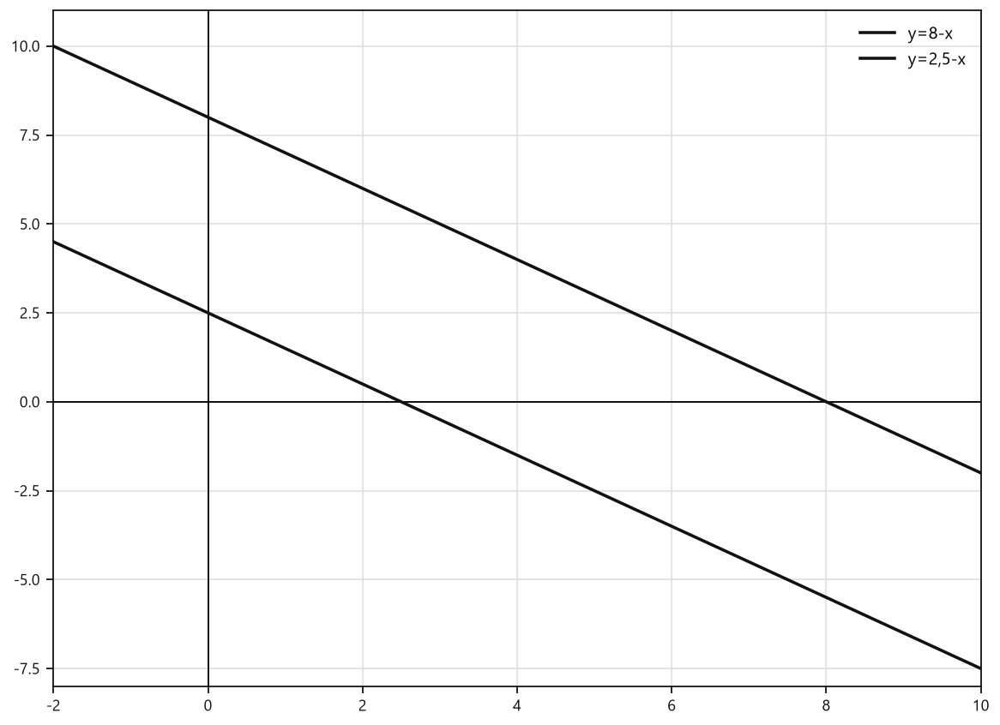
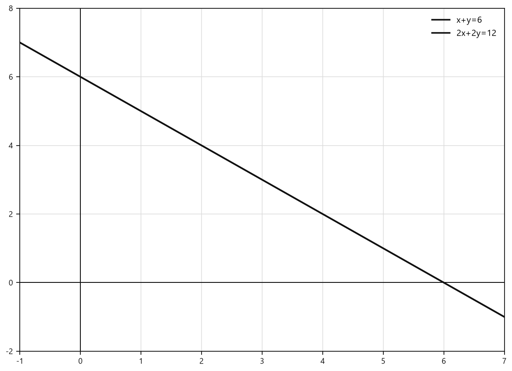
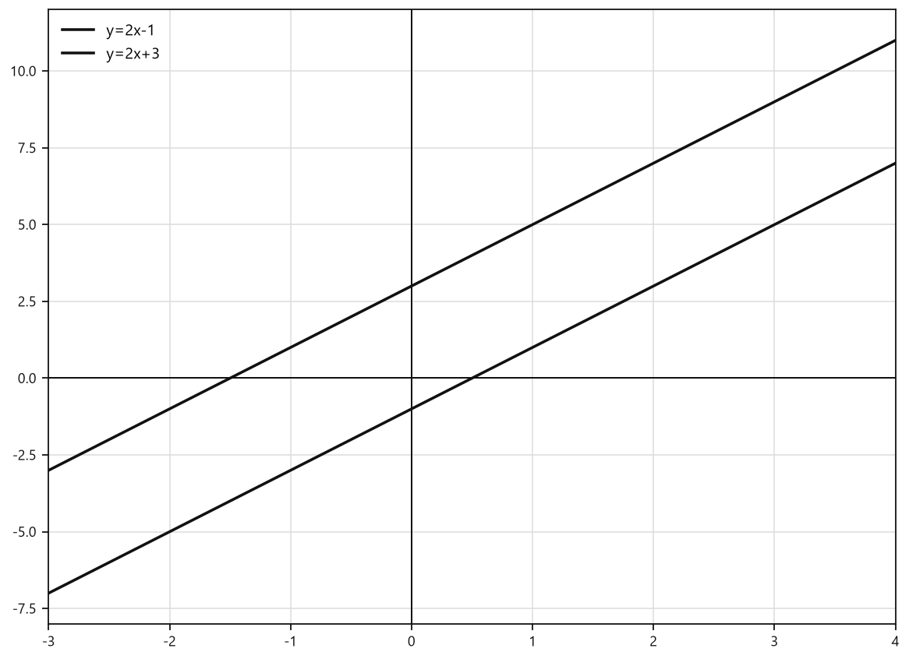
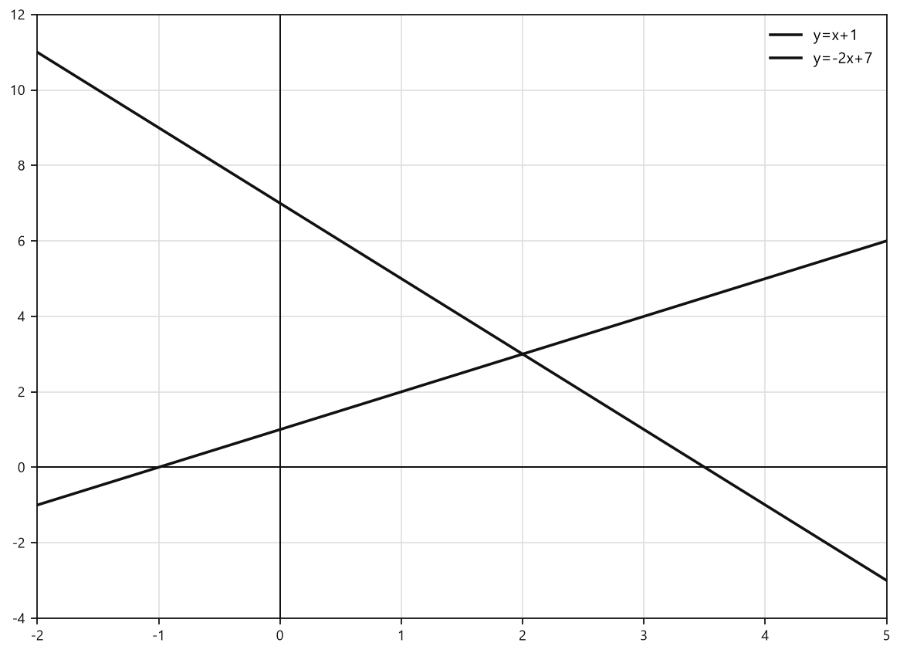
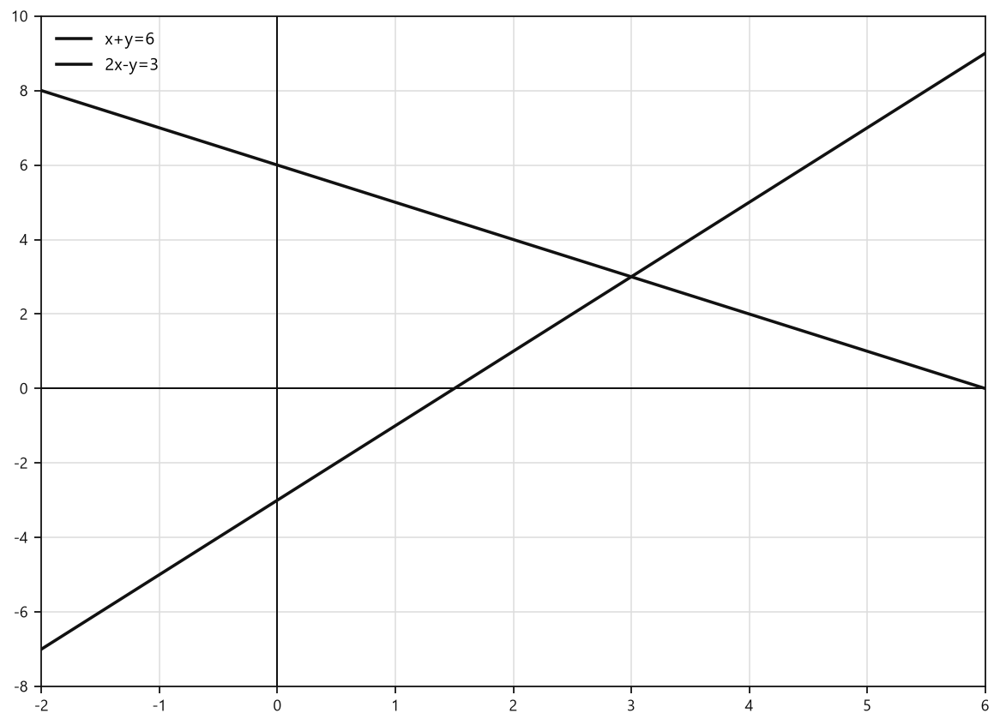
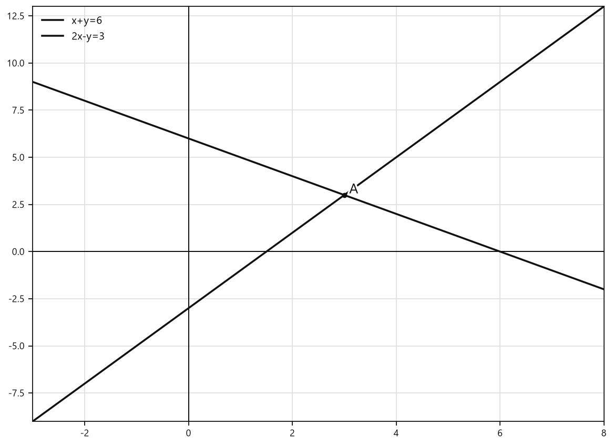
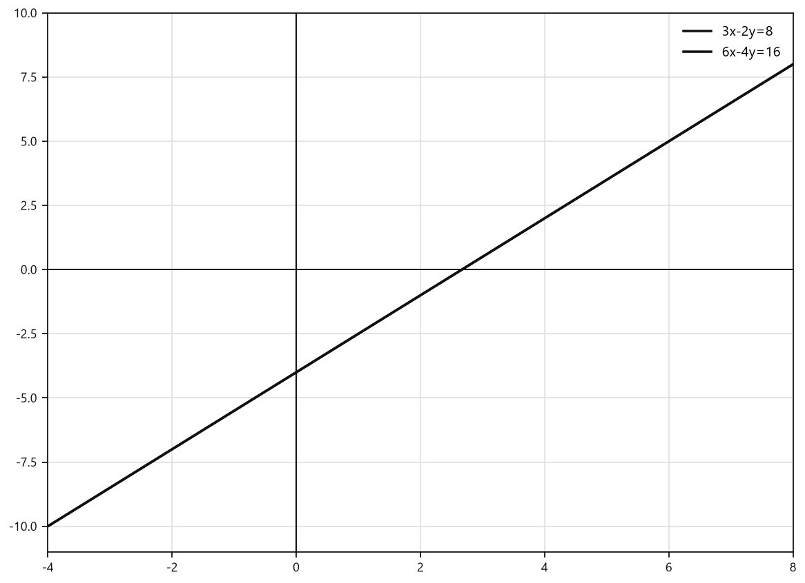
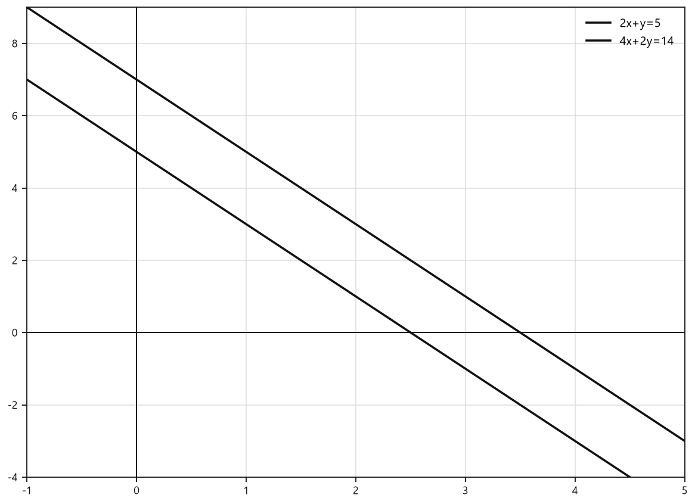

# Занятие 31. Система линейных уравнений с двумя переменными

**Раздел:** Глава 4  
**Параграф учебника:** §23. Система линейных уравнений с двумя переменными  
**Страницы:** 273–281

## Цели занятия

После занятия ты умеешь:

- отличать систему линейных уравнений от нелинейной;
- называть коэффициенты перед переменными;
- проверять, является ли пара чисел решением системы;
- понимать, что означает решить систему;
- определять число решений системы по графикам прямых;
- составлять системы с одним решением, без решений или с бесконечно многими решениями.

Выбирай блок своего уровня:

- **1–2 балла:** распознать систему и проверить пару чисел;
- **3–4 балла:** определить число решений по графикам;
- **5–6 баллов:** решать типовые задания параграфа;
- **7–8 баллов:** составлять системы по заданному числу решений;
- **9–10 баллов:** уверенно объяснять взаимное расположение прямых и проверять решения разными способами.

## Теория к занятию

### 1. Что такое система линейных уравнений

#### Простыми словами

Иногда нужно найти сразу два числа: $x$ и $y$. При этом они должны выполнить сразу два условия.

Например:

$$
x+y=150,
$$

$$
x-y=30.
$$

Одна пара чисел должна подойти и к первому уравнению, и ко второму. Поэтому такие уравнения записывают вместе:

$$
\begin{cases}
x+y=150,\\
x-y=30.
\end{cases}
$$

Такая запись называется системой. Слово серьёзное, но смысл простой: два уравнения работают в команде и проверяют одну и ту же пару чисел.

#### Определение

Система двух линейных уравнений с двумя переменными имеет вид

$$
\begin{cases}
a_1x + b_1y = c_1, \\
a_2x + b_2y = c_2,
\end{cases}
$$

где $a_1, b_1, c_1, a_2, b_2, c_2$ — некоторые числа, а $x$ и $y$ — переменные.

Числа перед переменными называют коэффициентами.

- $a_1$ и $a_2$ — коэффициенты перед $x$;
- $b_1$ и $b_2$ — коэффициенты перед $y$.

Если переменная написана без числа перед ней, коэффициент равен $1$:

$$
x=1x.
$$

Если переменной в уравнении нет, её коэффициент равен $0$:

$$
x=3
\quad\Longleftrightarrow\quad
1x+0y=3.
$$

#### Как узнать, является ли уравнение линейным

В линейном уравнении переменные стоят только в первой степени и не перемножаются друг с другом.

Подойдут, например:

$$
2x+3y=7,
$$

$$
-x+y=4,
$$

$$
y=5.
$$

Не являются линейными уравнения, где встречаются:

$$
x^2,\qquad xy,\qquad \frac{1}{x}.
$$

В выражении $-y$ коэффициент перед $y$ равен $-1$, а не $1$:

$$
-y=-1y.
$$

Минус здесь не украшение, а часть коэффициента.

#### Ловушки

- В системе  
  $$
  \begin{cases}
  2x^2+y=1,\\
  5x+3y=7
  \end{cases}
  $$
  первое уравнение нелинейное из-за $x^2$.
- В уравнении $x=3$ коэффициенты равны $a=1$, $b=0$.
- В уравнении $y+\dfrac{x}{2}=-1$ коэффициент перед $x$ равен $\dfrac12$, а перед $y$ — $1$.
- Нулевой коэффициент тоже считается коэффициентом. Он просто «работает молча».

### 2. Решение системы

#### Простыми словами

Пара чисел $(x_0; y_0)$ является решением системы, если после подстановки этих чисел оба уравнения становятся верными.

Например, пара $(2;3)$ означает:

$$
x=2,\qquad y=3.
$$

Порядок важен: пара $(2;3)$ — это не то же самое, что $(3;2)$. Первая координата относится к $x$, вторая — к $y$.

#### Определение

Решением системы уравнений

$$
\begin{cases}
a_1x + b_1y = c_1, \\
a_2x + b_2y = c_2
\end{cases}
$$

называется упорядоченная пара чисел $(x_0; y_0)$, являющаяся одновременно решением и первого и второго уравнений.

#### Правило проверки пары чисел

1. Подставь первое число вместо $x$.
2. Подставь второе число вместо $y$.
3. Проверь первое уравнение.
4. Проверь второе уравнение.
5. Если оба равенства верны, пара является решением системы.
6. Если хотя бы одно равенство неверно, пара не является решением системы.

При подстановке отрицательных чисел используй скобки:

$$
-2\cdot(-3).
$$

Так знаки не разбегутся кто куда.

#### Формула проверки

Пара $(x_0; y_0)$ является решением системы, если верно:

$$
\begin{cases}
a_1x_0+b_1y_0=c_1,\\
a_2x_0+b_2y_0=c_2.
\end{cases}
$$

#### Ловушки

- Нельзя проверить только одно уравнение. Система требует пройти обе проверки.
- Если первое уравнение уже неверно, пара не является решением. Второе уравнение можно не проверять.
- В паре $(x;y)$ нельзя менять координаты местами.
- При подстановке отрицательного числа ставь его в скобки.

### 3. Что значит решить систему

#### Определение

Решить систему — это значит найти все ее решения или доказать, что их нет.

У системы может быть:

- одно решение;
- ни одного решения;
- бесконечно много решений.

Как понять, какой случай перед нами? Помогают графики уравнений.

У каждого линейного уравнения с двумя переменными графиком является прямая. Поэтому систему можно рассматривать как две прямые.

### 4. Число решений системы по графикам

#### Простыми словами

Решение системы — это общая точка графиков двух уравнений.

- Прямые пересекаются в одной точке — система имеет одно решение.
- Прямые параллельны — общих точек нет, значит, решений нет.
- Прямые совпадают — у них бесконечно много общих точек, значит, решений бесконечно много.

Общая точка имеет координаты $(x;y)$. Именно эта пара и является решением системы.

#### Факт

Так как графиком каждого уравнения системы

$$
\begin{cases}
a_1x + b_1y = c_1, \\
a_2x + b_2y = c_2
\end{cases}
$$

является прямая, то число решений системы зависит от взаимного расположения прямых.

1. Если прямые $a_1x + b_1y = c_1$ и $a_2x + b_2y = c_2$ пересекаются, то система уравнений имеет единственное решение.

2. Если прямые параллельны, то система уравнений не имеет решений.

3. Если прямые совпадают, то система уравнений имеет бесконечно много решений.

#### Алгоритм графического определения числа решений

1. Выразить $y$ через $x$ в каждом уравнении.
2. Получить два уравнения вида $y=kx+b$.
3. Построить обе прямые.
4. Посмотреть, сколько у них общих точек.
5. Сделать вывод о числе решений системы.

#### Пример

Рассмотрим систему:

$$
\begin{cases}
x+y=8,\\
2x+2y=5.
\end{cases}
$$

Сначала выразим $y$ из первого уравнения:

$$
x+y=8.
$$

Вычтем $x$ из обеих частей:

$$
y=8-x.
$$

Теперь выразим $y$ из второго уравнения:

$$
2x+2y=5.
$$

Вычтем $2x$ из обеих частей:

$$
2y=5-2x.
$$

Разделим обе части на $2$:

$$
y=\frac{5-2x}{2}.
$$

Разделим каждый член числителя на $2$:

$$
y=2,5-x.
$$

Получили две функции:

$$
y=8-x,
$$

$$
y=2,5-x.
$$

У обеих прямых одинаковый коэффициент перед $x$: $-1$.

Свободные члены разные: $8\ne2,5$.

Значит, прямые параллельны.

<!--geo-figure-spec
{
  "needed": true,
  "kind": "graph",
  "caption": "Графики $y=8-x$ и $y=2{,}5-x$",
  "axis": true,
  "grid": true,
  "xlim": [
    -2,
    10
  ],
  "ylim": [
    -8,
    11
  ],
  "curves": [
    {
      "expr": "8-x",
      "label": "y=8-x"
    },
    {
      "expr": "2.5-x",
      "label": "y=2,5-x",
      "dashed": true
    }
  ],
  "points": {},
  "labels": {}
}
-->

*Графики y=8-x и y=2{,}5-x*

Параллельные прямые не имеют общих точек.

Следовательно, система не имеет решений.

#### Ловушки

- Одинаковые коэффициенты перед $x$ и разные свободные члены означают параллельные прямые.
- Одинаковые коэффициенты перед $x$ и одинаковые свободные члены означают совпадающие прямые.
- Пересечение прямых — это одна конкретная общая точка.
- Параллельные прямые дают ноль решений, а совпадающие — бесконечно много. Эти случаи любят ходить рядом и путаться, но мы их не приглашаем.

## Сводка формул «выучить наизусть»

Система двух линейных уравнений:

$$
\begin{cases}
a_1x+b_1y=c_1,\\
a_2x+b_2y=c_2.
\end{cases}
$$

Проверка пары $(x_0;y_0)$:

$$
\begin{cases}
a_1x_0+b_1y_0=c_1,\\
a_2x_0+b_2y_0=c_2.
\end{cases}
$$

Линейное уравнение в виде функции:

$$
y=kx+b.
$$

Если прямые пересекаются — одно решение.

Если прямые параллельны — решений нет.

Если прямые совпадают — бесконечно много решений.

## Правила, которые нельзя путать

- Решение системы должно удовлетворять **обоим** уравнениям.
- В паре $(x;y)$ первая координата относится к $x$, вторая — к $y$.
- В выражении $-y$ коэффициент перед $y$ равен $-1$.
- В выражении $x=3$ коэффициент перед $y$ равен $0$.
- $x^2$ делает уравнение нелинейным.
- Пересекающиеся прямые дают одно решение, а не два.
- Совпадающие прямые дают бесконечно много решений.
- Параллельные прямые не имеют общих точек, поэтому система решений не имеет.

## Разбор ключевых заданий

### Р1. Определение линейной системы и коэффициентов

**Условие.** Определите, является ли система системой линейных уравнений с двумя переменными, и назовите коэффициенты перед переменными:

а)

$$
\begin{cases}
-x+2y=12,\\
5x-y=5;
\end{cases}
$$

б)

$$
\begin{cases}
2x^2+y=1,\\
5x+3y=7.
\end{cases}
$$

**Решение.**

#### а)

Проверим, что оба уравнения имеют вид

$$
a_1x+b_1y=c_1,
$$

$$
a_2x+b_2y=c_2.
$$

В первом уравнении

$$
-x+2y=12
$$

перепишем $-x$ как $-1x$:

$$
-1x+2y=12.
$$

Поэтому

$$
a_1=-1,
$$

$$
b_1=2,
$$

$$
c_1=12.
$$

Во втором уравнении

$$
5x-y=5
$$

перепишем $-y$ как $-1y$:

$$
5x-1y=5.
$$

Поэтому

$$
a_2=5,
$$

$$
b_2=-1,
$$

$$
c_2=5.
$$

Оба уравнения линейные.

#### б)

В первом уравнении есть $x^2$:

$$
2x^2+y=1.
$$

Переменная $x$ имеет вторую степень.

Значит, первое уравнение не является линейным.

Следовательно, вся система не является системой линейных уравнений с двумя переменными.

**Ответ:** а) является; $a_1=-1$, $b_1=2$, $a_2=5$, $b_2=-1$. б) не является.

---

### Р2. Проверка пары чисел

**Условие.** Верно ли, что пары чисел $(1;3)$ и $(-2;6)$ являются решениями системы

$$
\begin{cases}
6x+2y=12,\\
8x-y=5?
\end{cases}
$$

**Решение.**

Проверим пару $(1;3)$.

Это означает:

$$
x=1,\qquad y=3.
$$

Подставим эти значения в первое уравнение:

$$
6\cdot1+2\cdot3=6+6=12.
$$

Первое равенство верно.

Подставим значения во второе уравнение:

$$
8\cdot1-3=8-3=5.
$$

Второе равенство тоже верно.

Значит, пара $(1;3)$ является решением системы.

Теперь проверим пару $(-2;6)$.

Это означает:

$$
x=-2,\qquad y=6.
$$

Подставим значения в первое уравнение:

$$
6\cdot(-2)+2\cdot6=-12+12=0.
$$

Получили:

$$
0\ne12.
$$

Первое уравнение неверно.

Значит, пара $(-2;6)$ не является решением системы. Второе уравнение проверять уже не нужно: одного нарушения достаточно.

**Ответ:** $(1;3)$ — решение системы; $(-2;6)$ — не является решением.

---

### Р3. Решение системы по условию задачи

**Условие.** Под злаковые и овощные культуры отведено $150$ га, причём под злаковые отведено на $30$ га больше, чем под овощные культуры. Сколько гектаров отведено под злаковые и овощные культуры?

**Решение.**

Пусть $x$ га — площадь, отведённая под злаковые культуры.

Пусть $y$ га — площадь, отведённая под овощные культуры.

Всего отведено $150$ га:

$$
x+y=150.
$$

Под злаковые отведено на $30$ га больше:

$$
x-y=30.
$$

Получили систему:

$$
\begin{cases}
x+y=150,\\
x-y=30.
\end{cases}
$$

Решим её графически.

Из первого уравнения выразим $y$:

$$
x+y=150.
$$

Вычтем $x$ из обеих частей:

$$
y=150-x.
$$

Из второго уравнения также выразим $y$:

$$
x-y=30.
$$

Вычтем $x$ из обеих частей:

$$
-y=30-x.
$$

Умножим обе части на $-1$:

$$
y=x-30.
$$

Построим прямые

$$
y=150-x
$$

и

$$
y=x-30.
$$

Они пересекаются в точке $(90;60)$.

Значит,

$$
x=90,
$$

$$
y=60.
$$

Проверим найденную пару в исходной системе:

$$
90+60=150,
$$

$$
90-60=30.
$$

Оба равенства верны.

**Ответ:** под злаковые культуры отведено $90$ га, под овощные — $60$ га.

---

### Р4. Проверка пары чисел

**Условие.** Является ли пара чисел $(40;20)$ решением системы

$$
\begin{cases}
x+y=60,\\
x-y=20?
\end{cases}
$$

**Решение.**

Пара $(40;20)$ означает:

$$
x=40,\qquad y=20.
$$

Проверим первое уравнение:

$$
40+20=60.
$$

Первое равенство верно.

Проверим второе уравнение:

$$
40-20=20.
$$

Второе равенство также верно.

Пара прошла обе проверки.

**Ответ:** да, пара $(40;20)$ является решением системы.

---

### Р5. Выбор решения из двух пар

**Условие.** Из пар чисел $(10;0)$ и $(6;-6)$ выберите ту, которая является решением системы

$$
\begin{cases}
\dfrac{x}{3}+\dfrac{y}{2}=-1,\\
\dfrac{x}{2}-\dfrac{y}{3}=5.
\end{cases}
$$

**Решение.**

Сначала проверим пару $(10;0)$.

Подставим $x=10$, $y=0$ в первое уравнение:

$$
\frac{10}{3}+\frac{0}{2}=\frac{10}{3}.
$$

Но

$$
\frac{10}{3}\ne-1.
$$

Первое уравнение неверно.

Значит, пара $(10;0)$ не является решением системы.

Теперь проверим пару $(6;-6)$.

Подставим $x=6$, $y=-6$ в первое уравнение:

$$
\frac{6}{3}+\frac{-6}{2}=2-3=-1.
$$

Первое уравнение верно.

Проверим второе уравнение:

$$
\frac{6}{2}-\frac{-6}{3}=3-(-2)=5.
$$

Второе уравнение тоже верно.

**Ответ:** $(6;-6)$.

---

### Р6. Доказательство, что пара не является решением

**Условие.** Покажите, что пара чисел $(2;1)$ не является решением системы

$$
\begin{cases}
x+y=3,\\
2x-y=5.
\end{cases}
$$

**Решение.**

Пара $(2;1)$ означает:

$$
x=2,\qquad y=1.
$$

Подставим эти значения в первое уравнение:

$$
2+1=3.
$$

Первое уравнение верно.

Теперь проверим второе уравнение:

$$
2\cdot2-1=4-1=3.
$$

Но по условию должно получиться $5$:

$$
3\ne5.
$$

Второе уравнение неверно.

Следовательно, пара не является решением системы.

**Ответ:** пара $(2;1)$ не является решением системы.

*Ловушка: одно верное уравнение — это только первый тур. Система проверяет оба.*

---

### Р7. Выбор системы, которой не удовлетворяет пара

**Условие.** Выберите систему, решением которой не является пара $(1;-2)$.

а)

$$
\begin{cases}
x+y=-1,\\
2x-y=4;
\end{cases}
$$

б)

$$
\begin{cases}
x-y=3,\\
2x-3y=-4.
\end{cases}
$$

**Решение.**

Пара $(1;-2)$ означает:

$$
x=1,\qquad y=-2.
$$

Проверим систему а).

Первое уравнение:

$$
1+(-2)=-1.
$$

Оно верно.

Второе уравнение:

$$
2\cdot1-(-2)=2+2=4.
$$

Оно также верно.

Значит, пара является решением системы а).

Проверим систему б).

Первое уравнение:

$$
1-(-2)=1+2=3.
$$

Первое уравнение верно.

Второе уравнение:

$$
2\cdot1-3\cdot(-2)=2+6=8.
$$

Но

$$
8\ne-4.
$$

Второе уравнение неверно.

Значит, пара не является решением системы б).

**Ответ:** б).

---

### Р8. Составление системы с заданным решением

**Условие.** Придумайте пример системы двух линейных уравнений с двумя переменными, решением которой будет пара $(3;-1)$.

**Решение.**

Нужно составить два линейных уравнения, которым удовлетворяют

$$
x=3,\qquad y=-1.
$$

Возьмём первое уравнение:

$$
x+y=2.
$$

Проверим заданную пару:

$$
3+(-1)=2.
$$

Теперь возьмём второе уравнение:

$$
2x-y=7.
$$

Проверим его:

$$
2\cdot3-(-1)=6+1=7.
$$

Получаем систему:

$$
\begin{cases}
x+y=2,\\
2x-y=7.
\end{cases}
$$

Проверим, что у неё нет другой общей точки.

Выразим $y$ из первого уравнения:

$$
x+y=2,
$$

$$
y=2-x.
$$

Выразим $y$ из второго уравнения:

$$
2x-y=7.
$$

Вычтем $2x$ из обеих частей:

$$
-y=7-2x.
$$

Умножим обе части на $-1$:

$$
y=2x-7.
$$

Графики функций

$$
y=2-x
$$

и

$$
y=2x-7
$$

пересекаются в одной точке.

Проверим координаты этой точки:

$$
2-x=2x-7.
$$

Прибавим $x$ к обеим частям:

$$
2=3x-7.
$$

Прибавим $7$ к обеим частям:

$$
9=3x.
$$

Разделим обе части на $3$:

$$
x=3.
$$

Подставим $x=3$ в первое уравнение:

$$
3+y=2.
$$

Вычтем $3$ из обеих частей:

$$
y=-1.
$$

Получили заданную пару $(3;-1)$.

**Ответ:** например,

$$
\begin{cases}
x+y=2,\\
2x-y=7.
\end{cases}
$$

### Р9. Система с единственным решением

**Условие.** Постройте графики уравнений системы и определите число решений:

$$
\begin{cases}
x+y=4,\\
x-y=6.
\end{cases}
$$

**Решение.**

Чтобы построить графики, выразим $y$ через $x$ в каждом уравнении.

Первое уравнение:

$$
x+y=4.
$$

Перенесём $x$ в правую часть:

$$
y=4-x.
$$

Второе уравнение:

$$
x-y=6.
$$

Вычтем $x$ из обеих частей:

$$
-y=6-x.
$$

Умножим обе части на $-1$:

$$
y=x-6.
$$

Получили две прямые:

$$
y=4-x,
$$

$$
y=x-6.
$$

Их угловые коэффициенты:

$$
k_1=-1,
$$

$$
k_2=1.
$$

Угловые коэффициенты разные, поэтому прямые пересекаются в одной точке.

Найдём координаты точки пересечения.

В точке пересечения значения $y$ для обеих прямых одинаковы, поэтому приравняем правые части:

$$
4-x=x-6.
$$

Перенесём слагаемые с $x$ в одну сторону, а числа — в другую:

$$
10=2x.
$$

Разделим обе части на $2$:

$$
x=5.
$$

Подставим найденное значение в первое уравнение:

$$
y=4-5=-1.
$$

Проверим пару $(5;-1)$ в исходной системе:

$$
5+(-1)=4,
$$

$$
5-(-1)=6.
$$

Оба равенства верны.

**Ответ:** система имеет единственное решение $(5;-1)$.

---

### Р10. Система без решений

**Условие.** Постройте графики уравнений системы и определите число решений:

$$
\begin{cases}
3x-y=2,\\
-6x+2y=3.
\end{cases}
$$

**Решение.**

Выразим $y$ из первого уравнения:

$$
3x-y=2.
$$

Перенесём $3x$ в правую часть:

$$
-y=2-3x.
$$

Умножим обе части на $-1$:

$$
y=3x-2.
$$

Теперь выразим $y$ из второго уравнения:

$$
-6x+2y=3.
$$

Прибавим $6x$ к обеим частям:

$$
2y=3+6x.
$$

Разделим обе части на $2$:

$$
y=\frac{3+6x}{2}=1,5+3x.
$$

Запишем в привычном порядке:

$$
y=3x+1,5.
$$

Получили прямые:

$$
y=3x-2,
$$

$$
y=3x+1,5.
$$

У обеих прямых одинаковый угловой коэффициент:

$$
k_1=k_2=3.
$$

Свободные члены разные:

$$
-2\ne1,5.
$$

Значит, прямые параллельны и не пересекаются.

Точки пересечения нет, поэтому нет и пары чисел, которая одновременно удовлетворяет обоим уравнениям. Минус одна встреча — и минус все решения.

**Ответ:** система не имеет решений.

---

### Р11. Система с бесконечно многими решениями

**Условие.** Постройте графики уравнений системы и определите число решений:

$$
\begin{cases}
2x-0,5y=4,\\
-x+0,25y=-2.
\end{cases}
$$

**Решение.**

Выразим $y$ из первого уравнения:

$$
2x-0,5y=4.
$$

Вычтем $2x$ из обеих частей:

$$
-0,5y=4-2x.
$$

Разделим обе части на $-0,5$:

$$
y=\frac{4-2x}{-0,5}.
$$

Выполним деление:

$$
y=4x-8.
$$

Теперь выразим $y$ из второго уравнения:

$$
-x+0,25y=-2.
$$

Прибавим $x$ к обеим частям:

$$
0,25y=x-2.
$$

Разделим обе части на $0,25$:

$$
y=4x-8.
$$

Оба уравнения задают одну и ту же прямую:

$$
y=4x-8.
$$

Значит, графики прямых совпадают.

Любая точка этой прямой подходит сразу к обоим уравнениям.

Таких точек бесконечно много.

**Ответ:** система имеет бесконечно много решений.

---

### Р12. Составление системы по числу решений

**Условие.** Первое уравнение системы:

$$
x-2y=1.
$$

Придумайте второе уравнение так, чтобы система:

а) имела бесконечно много решений;  
б) не имела решений;  
в) имела только одно решение.

**Решение.**

#### а) Бесконечно много решений

Чтобы прямые совпали, второе уравнение должно быть получено из первого умножением обеих его частей на одно и то же число.

Умножим первое уравнение на $2$:

$$
2(x-2y)=2\cdot1.
$$

Получим:

$$
2x-4y=2.
$$

Система имеет вид:

$$
\begin{cases}
x-2y=1,\\
2x-4y=2.
\end{cases}
$$

Второе уравнение — это первое уравнение, умноженное на $2$.

Прямые совпадают, поэтому решений бесконечно много.

**Пример ответа:**

$$
\begin{cases}
x-2y=1,\\
2x-4y=2.
\end{cases}
$$

#### б) Решений нет

Сделаем левые части пропорциональными, как в первом случае, но правую часть изменим:

$$
2x-4y=5.
$$

Получим систему:

$$
\begin{cases}
x-2y=1,\\
2x-4y=5.
\end{cases}
$$

Если умножить первое уравнение на $2$, справа получится $2$, а не $5$.

Поэтому эти уравнения задают разные параллельные прямые.

Параллельные прямые не пересекаются, значит, система решений не имеет.

**Пример ответа:**

$$
\begin{cases}
x-2y=1,\\
2x-4y=5.
\end{cases}
$$

#### в) Одно решение

Возьмём второе уравнение, которое задаёт прямую с другим угловым коэффициентом:

$$
x+y=2.
$$

Получим систему:

$$
\begin{cases}
x-2y=1,\\
x+y=2.
\end{cases}
$$

Выразим $y$ из первого уравнения:

$$
x-2y=1.
$$

Перенесём $x$ в правую часть:

$$
-2y=1-x.
$$

Разделим обе части на $-2$:

$$
y=\frac{x-1}{2}.
$$

Выразим $y$ из второго уравнения:

$$
x+y=2.
$$

$$
y=2-x.
$$

Получили прямые:

$$
y=\frac{x-1}{2},
$$

$$
y=2-x.
$$

Их угловые коэффициенты разные, поэтому прямые пересекаются в одной точке.

Найдём координаты точки пересечения:

$$
\frac{x-1}{2}=2-x.
$$

Умножим обе части на $2$:

$$
x-1=4-2x.
$$

Прибавим $2x$ к обеим частям:

$$
3x-1=4.
$$

Прибавим $1$:

$$
3x=5.
$$

Разделим на $3$:

$$
x=\frac53.
$$

Найдём $y$ по формуле $y=2-x$:

$$
y=2-\frac53=\frac63-\frac53=\frac13.
$$

**Пример ответа:**

$$
\begin{cases}
x-2y=1,\\
x+y=2.
\end{cases}
$$

Система имеет единственное решение:

$$
\left(\frac53;\frac13\right).
$$

---

### Р13. Проверка пары с десятичными коэффициентами

**Условие.** Является ли пара чисел $(4;3)$ решением системы

$$
\begin{cases}
2,5x-3y=1,\\
5x-6y=2?
\end{cases}
$$

**Решение.**

Пара $(4;3)$ означает:

$$
x=4,\qquad y=3.
$$

Подставим эти значения в первое уравнение:

$$
2,5\cdot4-3\cdot3=10-9=1.
$$

Первое уравнение выполнено.

Теперь подставим значения во второе уравнение:

$$
5\cdot4-6\cdot3=20-18=2.
$$

Второе уравнение тоже выполнено.

Пара подходит только тогда, когда верны оба уравнения. Здесь оба равенства верны — проверка прошла без математического детектива.

**Ответ:** да, пара $(4;3)$ является решением системы.

---

### Р14. Выбор решения из двух пар

**Условие.** Какая из пар чисел $(0;2)$ и $(3;-2)$ является решением системы

$$
\begin{cases}
4x+3y=6,\\
2x+y=4?
\end{cases}
$$

**Решение.**

Проверим сначала пару $(0;2)$.

Подставим её в первое уравнение:

$$
4\cdot0+3\cdot2=0+6=6.
$$

Первое уравнение выполнено.

Проверим второе уравнение:

$$
2\cdot0+2=2.
$$

Получили:

$$
2\ne4.
$$

Значит, пара $(0;2)$ не является решением системы.

Теперь проверим пару $(3;-2)$.

Первое уравнение:

$$
4\cdot3+3\cdot(-2)=12-6=6.
$$

Второе уравнение:

$$
2\cdot3+(-2)=6-2=4.
$$

Оба равенства верны.

**Ответ:** $(3;-2)$.

---

### Р15. Выбор системы, решением которой является заданная пара

**Условие.** Выберите систему уравнений, решением которой является пара $(-1;2)$:

а)

$$
\begin{cases}
2x-3y=-7,\\
x+y=-1;
\end{cases}
$$

б)

$$
\begin{cases}
-x+4y=9,\\
2x+y=0.
\end{cases}
$$

**Решение.**

Пара $(-1;2)$ означает:

$$
x=-1,\qquad y=2.
$$

Проверим систему а).

Подставим значения в первое уравнение:

$$
2\cdot(-1)-3\cdot2=-2-6=-8.
$$

Но в условии справа стоит $-7$:

$$
-8\ne-7.
$$

Уже первое уравнение не выполнено, поэтому система а) не подходит.

Проверим систему б).

Первое уравнение:

$$
-(-1)+4\cdot2=1+8=9.
$$

Второе уравнение:

$$
2\cdot(-1)+2=-2+2=0.
$$

Оба равенства верны.

**Ответ:** б).

---

### Р16. Определение числа решений по графикам

**Условие.** Определите число решений системы:

$$
\begin{cases}
x-y=6,\\
-x+y=-3.
\end{cases}
$$

**Решение.**

Выразим $y$ из первого уравнения:

$$
x-y=6.
$$

Вычтем $x$ из обеих частей:

$$
-y=6-x.
$$

Умножим обе части на $-1$:

$$
y=x-6.
$$

Теперь выразим $y$ из второго уравнения:

$$
-x+y=-3.
$$

Прибавим $x$ к обеим частям:

$$
y=x-3.
$$

Получили две прямые:

$$
y=x-6,
$$

$$
y=x-3.
$$

Угловые коэффициенты одинаковы:

$$
k_1=k_2=1.
$$

Свободные члены различны:

$$
-6\ne-3.
$$

Значит, прямые параллельны.

Они не пересекаются, поэтому общей пары $(x;y)$ нет.

**Ответ:** система не имеет решений.

---

### Р17. Система с единственным решением

**Условие.** Определите число решений системы:

$$
\begin{cases}
2x+y=5,\\
x-y=3.
\end{cases}
$$

**Решение.**

Выразим $y$ из первого уравнения:

$$
2x+y=5.
$$

Перенесём $2x$ в правую часть:

$$
y=5-2x.
$$

Выразим $y$ из второго уравнения:

$$
x-y=3.
$$

Вычтем $x$ из обеих частей:

$$
-y=3-x.
$$

Умножим обе части на $-1$:

$$
y=x-3.
$$

В точке пересечения значения $y$ одинаковы, поэтому приравняем правые части:

$$
5-2x=x-3.
$$

Прибавим $2x$ к обеим частям:

$$
5=3x-3.
$$

Прибавим $3$:

$$
8=3x.
$$

Разделим на $3$:

$$
x=\frac83.
$$

Найдём $y$ по формуле $y=x-3$:

$$
y=\frac83-3.
$$

Представим число $3$ в виде дроби со знаменателем $3$:

$$
y=\frac83-\frac93=-\frac13.
$$

Проверим найденную пару в первом уравнении:

$$
2\cdot\frac83-\frac13
=
\frac{16}{3}-\frac13
=
\frac{15}{3}
=
5.
$$

Проверим её во втором уравнении:

$$
\frac83-\left(-\frac13\right)
=
\frac83+\frac13
=
\frac93
=
3.
$$

Оба уравнения выполнены.

**Ответ:** система имеет единственное решение

$$
\left(\frac83;-\frac13\right).
$$

## Практические задания

Выбери свой уровень и решай только этот блок. В блоке должна закрепиться вся тема параграфа. Ответы не приводятся.

### Уровень 1–2 балла

**С1.** Какая из систем является системой линейных уравнений с двумя переменными?

1) $\begin{cases}2x+3y=7,\\-x+5y=1;\end{cases}$  
2) $\begin{cases}x^2+y=4,\\3x-y=2;\end{cases}$  
3) $\begin{cases}\dfrac{1}{x}+y=3,\\x-y=1;\end{cases}$  
4) $\begin{cases}xy=6,\\x+y=5;\end{cases}$  
5) $\begin{cases}\sqrt{x}+y=4,\\2x-y=1.\end{cases}$

**С2.** Назовите коэффициенты $a_1$, $b_1$, $c_1$ первого уравнения системы
$$
\begin{cases}
-3x+4y=12,\\
5x-2y=7.
\end{cases}
$$

**С3.** Проверьте, является ли пара $(2;3)$ решением системы
$$
\begin{cases}
x+y=5,\\
2x-y=1.
\end{cases}
$$

**С4.** Какая из пар чисел является решением системы
$$
\begin{cases}
x+2y=4,\\
3x-y=9?
\end{cases}
$$

1) $(2;1)$  
2) $(1;2)$  
3) $(3;1)$  
4) $(0;2)$  
5) $(4;0)$

**С5.** Покажите, что пара $(-1;2)$ не является решением системы
$$
\begin{cases}
2x+y=5,\\
x-3y=4.
\end{cases}
$$

**С6.** Выберите систему, решением которой является пара $(3;-1)$.

1) $\begin{cases}x+y=4,\\2x-y=5;\end{cases}$  
2) $\begin{cases}x+y=2,\\2x-y=7;\end{cases}$  
3) $\begin{cases}2x+y=7,\\x-2y=4;\end{cases}$  
4) $\begin{cases}x-3y=5,\\2x+y=4;\end{cases}$  
5) $\begin{cases}3x+y=10,\\x+2y=1.\end{cases}$

**С7.** Составьте систему двух линейных уравнений с двумя переменными, решением которой является пара $(1;4)$.

**С8.** Определите число решений системы
$$
\begin{cases}
x+y=6,\\
2x+2y=12.
\end{cases}
$$

**С9.** Какая система не имеет решений?

1) $\begin{cases}x+y=5,\\2x+2y=10;\end{cases}$  
2) $\begin{cases}x-y=3,\\2x-2y=6;\end{cases}$  
3) $\begin{cases}2x+y=4,\\4x+2y=8;\end{cases}$  
4) $\begin{cases}x+y=5,\\2x+2y=12;\end{cases}$  
5) $\begin{cases}3x-y=1,\\6x-2y=2.\end{cases}$

**С10.** Какая система имеет бесконечно много решений?

1) $\begin{cases}x+y=4,\\2x+2y=8;\end{cases}$  
2) $\begin{cases}x+y=4,\\2x+2y=10;\end{cases}$  
3) $\begin{cases}x-y=2,\\x+y=2;\end{cases}$  
4) $\begin{cases}2x+y=5,\\2x+y=7;\end{cases}$  
5) $\begin{cases}3x-y=6,\\3x+y=6.\end{cases}$

**С11.** Первое уравнение системы имеет вид $x-2y=1$. Выберите второе уравнение так, чтобы система имела бесконечно много решений.

1) $2x-4y=2$  
2) $2x-4y=5$  
3) $x+2y=1$  
4) $3x-6y=4$  
5) $x-2y=-1$

**С12.** Определите число решений системы
$$
\begin{cases}
3x-2y=7,\\
6x-4y=14.
\end{cases}
$$

**С13.** Какая из данных систем является системой двух линейных уравнений с двумя переменными?

1) $\begin{cases}2x+3y=7,\\ x-y=4;\end{cases}$  
2) $\begin{cases}x^2+y=5,\\ 2x-y=1;\end{cases}$  
3) $\begin{cases}\dfrac1x+y=3,\\ x+2y=6;\end{cases}$  
4) $\begin{cases}2x+3y^2=7,\\ x-y=4;\end{cases}$  
5) $\begin{cases}\sqrt{x}+y=5,\\ x-y=1.\end{cases}$

**С14.** В системе $\begin{cases}-3x+5y=8,\\ 7x-2y=1\end{cases}$ назовите коэффициенты перед переменными в первом уравнении.

**С15.** Проверьте, является ли пара $(2; 3)$ решением системы $\begin{cases}x+y=5,\\ 2x-y=1.\end{cases}$

**С16.** Какая из пар чисел является решением системы $\begin{cases}x+y=4,\\ x-y=6?\end{cases}$

1) $(5; -1)$  
2) $(-1; 5)$  
3) $(4; 0)$  
4) $(3; 1)$  
5) $(0; 4)$

**С17.** Укажите систему, решением которой является пара $(1; -2)$.

1) $\begin{cases}x+y=-1,\\ 2x-y=4;\end{cases}$  
2) $\begin{cases}x+y=3,\\ 2x-y=0;\end{cases}$  
3) $\begin{cases}x-y=-1,\\ 3x+y=1;\end{cases}$  
4) $\begin{cases}2x+y=0,\\ x-2y=5;\end{cases}$  
5) $\begin{cases}x+y=1,\\ x-y=1.\end{cases}$

**С18.** Покажите подстановкой, что пара $(-1; 4)$ не является решением системы $\begin{cases}2x+y=3,\\ x-2y=5.\end{cases}$

**С19.** Для системы $\begin{cases}3x-2y=7,\\ 6x-4y=14\end{cases}$ определите число решений.

1) одно решение  
2) два решения  
3) решений нет  
4) бесконечно много решений  
5) определить невозможно

**С20.** Для системы $\begin{cases}x+2y=5,\\ 2x+4y=12\end{cases}$ определите число решений.

1) одно решение  
2) два решения  
3) решений нет  
4) бесконечно много решений  
5) определить невозможно

**С21.** Для системы $\begin{cases}2x+y=6,\\ 4x+3y=10\end{cases}$ определите число решений.

1) одно решение  
2) два решения  
3) решений нет  
4) бесконечно много решений  
5) определить невозможно

**С22.** Выберите систему, имеющую бесконечно много решений.

1) $\begin{cases}x-y=2,\\ 2x-2y=5;\end{cases}$  
2) $\begin{cases}x+y=3,\\ 2x+2y=6;\end{cases}$  
3) $\begin{cases}2x+y=4,\\ 4x+2y=10;\end{cases}$  
4) $\begin{cases}x-2y=1,\\ 2x+y=3;\end{cases}$  
5) $\begin{cases}3x+y=7,\\ 6x+2y=15.\end{cases}$

**С23.** Выберите систему, не имеющую решений.

1) $\begin{cases}x+2y=4,\\ 2x+4y=8;\end{cases}$  
2) $\begin{cases}2x-y=3,\\ 4x-2y=6;\end{cases}$  
3) $\begin{cases}x-y=1,\\ 2x-2y=3;\end{cases}$  
4) $\begin{cases}x+y=5,\\ 2x-y=1;\end{cases}$  
5) $\begin{cases}3x+2y=6,\\ 6x+4y=12.\end{cases}$

**С24.** Первое уравнение системы имеет вид $x-3y=2$. Выберите второе уравнение так, чтобы система имела единственное решение.

1) $2x-6y=4$  
2) $3x-9y=6$  
3) $2x-6y=5$  
4) $4x-12y=8$  
5) $5x-15y=10$

**С25.** Какая из записей является системой линейных уравнений с двумя переменными?

1) $\begin{cases}2x+3y=7,\\-x+y=4;\end{cases}$ 2) $\begin{cases}x^2+y=5,\\x-y=1;\end{cases}$ 3) $\begin{cases}3x+1=0,\\y^2=9;\end{cases}$ 4) $\begin{cases}xy=6,\\x+y=5;\end{cases}$ 5) $\begin{cases}\dfrac{1}{x}+y=2,\\x-y=3.\end{cases}$

**С26.** Назовите коэффициенты $a_1$, $b_1$, $c_1$, $a_2$, $b_2$, $c_2$ в системе
$$
\begin{cases}
-3x+4y=9,\\
5x-2y=-1.
\end{cases}
$$

**С27.** Является ли пара чисел $(2; -1)$ решением системы?
$$
\begin{cases}
3x+2y=4,\\
x-y=3.
\end{cases}
$$
Запишите ответ: «да» или «нет».

**С28.** Из пар чисел $(1; 4)$ и $(3; 0)$ выберите ту, которая является решением системы
$$
\begin{cases}
x+y=5,\\
2x-y=-2.
\end{cases}
$$

**С29.** Какая пара чисел является решением системы?
$$
\begin{cases}
x+2y=7,\\
3x-y=7.
\end{cases}
$$

1) $(1;3)$ 2) $(2; \frac52)$ 3) $(3;2)$ 4) $(\frac{21}{7};\frac{7}{2})$ 5) $(-1;4)$

**С30.** Покажите, что пара чисел $(-2; 3)$ не является решением системы
$$
\begin{cases}
4x-y=-5,\\
x+2y=4.
\end{cases}
$$
Для этого проверьте равенство в первом уравнении.

**С31.** Выберите систему, решением которой является пара чисел $(1; -2)$.

1) $\begin{cases}x+y=3,\\2x-y=4;\end{cases}$ 2) $\begin{cases}x+y=-1,\\3x+y=-5;\end{cases}$ 3) $\begin{cases}2x+y=0,\\x-2y=5;\end{cases}$ 4) $\begin{cases}x-y=1,\\2x+y=4;\end{cases}$ 5) $\begin{cases}3x+y=2,\\x+y=4.\end{cases}$

**С32.** Запишите пример системы двух линейных уравнений с двумя переменными, решением которой является пара $(4; -1)$.

**С33.** Укажите число решений системы
$$
\begin{cases}
x+y=6,\\
2x+2y=12.
\end{cases}
$$

1) нет решений 2) одно решение 3) два решения 4) бесконечно много решений 5) определить число решений невозможно

**С34.** Укажите число решений системы
$$
\begin{cases}
2x-y=3,\\
4x-2y=8.
\end{cases}
$$

1) нет решений 2) одно решение 3) два решения 4) бесконечно много решений 5) определить число решений невозможно

**С35.** Укажите число решений системы
$$
\begin{cases}
x+2y=5,\\
3x-y=4.
\end{cases}
$$

1) нет решений 2) одно решение 3) два решения 4) бесконечно много решений 5) определить число решений невозможно

**С36.** Первое уравнение системы имеет вид $x-3y=2$. Запишите второе уравнение так, чтобы система не имела решений.

### Уровень 3–4 балла

**С1.** Определите, является ли система системой линейных уравнений с двумя переменными:
$$
\begin{cases}
3x-2y=7,\\
5x+y=-4.
\end{cases}
$$
Если является, назовите коэффициенты $a_1$, $b_1$, $c_1$, $a_2$, $b_2$, $c_2$.

**С2.** Определите, является ли система системой линейных уравнений с двумя переменными:
$$
\begin{cases}
x^2+2y=5,\\
4x-y=3.
\end{cases}
$$
Обоснуйте свой ответ.

**С3.** Проверьте, является ли пара чисел $(2;-1)$ решением системы:
$$
\begin{cases}
3x+4y=2,\\
5x-y=11.
\end{cases}
$$

**С4.** Проверьте, является ли пара чисел $(-1;3)$ решением системы:
$$
\begin{cases}
2x-y=-5,\\
x+3y=8.
\end{cases}
$$

**С5.** Из пар чисел $(4;1)$ и $(1;4)$ выберите ту, которая является решением системы:
$$
\begin{cases}
x+y=5,\\
2x-y=7.
\end{cases}
$$

**С6.** Покажите, что пара чисел $(3;2)$ не является решением системы:
$$
\begin{cases}
2x+y=8,\\
x-2y=1.
\end{cases}
$$

**С7.** Составьте систему двух линейных уравнений с двумя переменными, решением которой является пара чисел $(2;-3)$.

**С8.** Определите число решений системы:
$$
\begin{cases}
x+y=6,\\
2x+2y=12.
\end{cases}
$$

**С9.** Определите число решений системы:
$$
\begin{cases}
3x-2y=5,\\
6x-4y=7.
\end{cases}
$$

**С10.** Определите число решений системы:
$$
\begin{cases}
2x+y=4,\\
4x-y=8.
\end{cases}
$$

**С11.** Первое уравнение системы имеет вид $x-3y=2$. Запишите второе уравнение так, чтобы система имела бесконечно много решений.

**С12.** Первое уравнение системы имеет вид $2x+y=5$. Запишите второе уравнение так, чтобы система не имела решений.

**С13.** Определите, является ли система системой линейных уравнений с двумя переменными:
$$
\begin{cases}
3x-5y=7,\\
2x+y=-4.
\end{cases}
$$

**С14.** Определите, является ли система системой линейных уравнений с двумя переменными:
$$
\begin{cases}
x^2+2y=6,\\
4x-y=1.
\end{cases}
$$

**С15.** Для системы назовите коэффициенты $a_1$, $b_1$, $c_1$, $a_2$, $b_2$, $c_2$:
$$
\begin{cases}
-4x+3y=10,\\
7x-2y=-5.
\end{cases}
$$

**С16.** Проверьте, является ли пара чисел $(2;-1)$ решением системы:
$$
\begin{cases}
3x+4y=2,\\
5x-y=11.
\end{cases}
$$

**С17.** Проверьте, является ли пара чисел $(-1;3)$ решением системы:
$$
\begin{cases}
2x-y=-5,\\
x+2y=5.
\end{cases}
$$

**С18.** Из пар чисел $(4;1)$ и $(2;-3)$ выберите ту, которая является решением системы:
$$
\begin{cases}
x+y=5,\\
2x-y=7.
\end{cases}
$$

**С19.** Покажите, что пара чисел $(1;2)$ не является решением системы:
$$
\begin{cases}
4x-y=1,\\
x+3y=8.
\end{cases}
$$

**С20.** Выберите систему, решением которой является пара чисел $(-2;1)$:
1) $\begin{cases}x+2y=0,\\3x-y=-7;\end{cases}$  
2) $\begin{cases}2x+y=-3,\\x-3y=-5;\end{cases}$  
3) $\begin{cases}x-y=-3,\\2x+y=-5;\end{cases}$  
4) $\begin{cases}3x+2y=-4,\\x+y=1;\end{cases}$  
5) $\begin{cases}x+3y=1,\\2x-y=-5.\end{cases}$

**С21.** Определите число решений системы:
$$
\begin{cases}
x+2y=6,\\
2x+4y=12.
\end{cases}
$$

**С22.** Определите число решений системы:
$$
\begin{cases}
3x-y=4,\\
6x-2y=11.
\end{cases}
$$

**С23.** Решите систему уравнений:
$$
\begin{cases}
x+y=7,\\
x-y=1.
\end{cases}
$$

**С24.** Решите систему уравнений:
$$
\begin{cases}
2x+3y=12,\\
x+y=5.
\end{cases}
$$

**С25.** Определите, какие из систем являются системами линейных уравнений с двумя переменными. Для каждой такой системы назовите коэффициенты перед $x$ и $y$:
$$
\text{а) }\begin{cases}
3x-2y=7,\\
5x+y=-1;
\end{cases}
\qquad
\text{б) }\begin{cases}
x^2+4y=6,\\
2x-y=3;
\end{cases}
$$

**С26.** Проверьте, является ли пара чисел $(2; -1)$ решением системы:
$$
\begin{cases}
4x+3y=5,\\
x-2y=4.
\end{cases}
$$

**С27.** Из пар чисел $(3; 2)$ и $(-1; 4)$ выберите ту, которая является решением системы:
$$
\begin{cases}
x+y=5,\\
2x-y=4.
\end{cases}
$$

**С28.** Покажите, что пара чисел $(1; 3)$ не является решением системы:
$$
\begin{cases}
2x-y=0,\\
3x+2y=9.
\end{cases}
$$

**С29.** Выберите систему, решением которой является пара чисел $(-2; 1)$:
$$
\text{1) }\begin{cases}x+y=-1,\\2x-y=-5;\end{cases}
\qquad
\text{2) }\begin{cases}x-y=-3,\\3x+y=-4;\end{cases}
$$

**С30.** Составьте систему двух линейных уравнений с двумя переменными, решением которой является пара чисел $(4; -2)$. Коэффициенты перед переменными и свободные члены должны быть целыми числами.

**С31.** Определите число решений системы:
$$
\begin{cases}
x+y=6,\\
2x+2y=12.
\end{cases}
$$

**С32.** Определите число решений системы:
$$
\begin{cases}
3x-2y=5,\\
6x-4y=7.
\end{cases}
$$

**С33.** Определите число решений системы:
$$
\begin{cases}
2x+y=4,\\
4x-y=5.
\end{cases}
$$

**С34.** Выразите $y$ через $x$ в каждом уравнении системы и определите, пересекаются ли соответствующие прямые:
$$
\begin{cases}
x+2y=8,\\
2x+4y=10.
\end{cases}
$$

**С35.** Первое уравнение системы имеет вид $x-3y=2$. Запишите второе уравнение так, чтобы система имела бесконечно много решений:
$$
\begin{cases}
x-3y=2,\\
\ldots
\end{cases}
$$

**С36.** Первое уравнение системы имеет вид $2x+y=5$. Запишите второе уравнение так, чтобы система не имела решений:
$$
\begin{cases}
2x+y=5,\\
\ldots
\end{cases}
$$

### Уровень 5–6 баллов

**С1.** Определите, является ли система системой двух линейных уравнений с двумя переменными. Для каждой линейной системы назовите коэффициенты $a_1$, $b_1$, $c_1$, $a_2$, $b_2$, $c_2$:
$$
\text{а) }\begin{cases}
3x-2y=7,\\
5x+y=-1;
\end{cases}
\qquad
\text{б) }\begin{cases}
x^2+4y=9,\\
2x-y=6;
\end{cases}
$$

**С2.** Проверьте, является ли пара чисел $(2; -3)$ решением системы:
$$
\begin{cases}
4x+y=5,\\
x-2y=8.
\end{cases}
$$

**С3.** Из пар чисел $(1; 4)$ и $(-2; 1)$ выберите ту, которая является решением системы:
$$
\begin{cases}
2x-y=-2,\\
3x+y=7.
\end{cases}
$$

**С4.** Покажите, что пара чисел $(-1; 2)$ не является решением системы:
$$
\begin{cases}
5x+2y=1,\\
3x-y=-5.
\end{cases}
$$

**С5.** Постройте графики уравнений системы и определите число её решений. В системе заданы прямые $x+y=6$ и $2x+2y=12$.
$$
\begin{cases}
x+y=6,\\
2x+2y=12.
\end{cases}
$$

<!--geo-figure-spec
{
  "needed": true,
  "kind": "graph",
  "caption": "Графики уравнений $x+y=6$ и $2x+2y=12$",
  "axis": true,
  "grid": true,
  "xlim": [
    -1,
    7
  ],
  "ylim": [
    -2,
    8
  ],
  "curves": [
    {
      "expr": "6-x",
      "label": "x+y=6"
    },
    {
      "expr": "6-x",
      "label": "2x+2y=12"
    }
  ],
  "points": {},
  "labels": {}
}
-->

*Графики уравнений x+y=6 и 2x+2y=12*

**С6.** Постройте графики уравнений системы и определите число её решений. В системе заданы прямые $y=2x-1$ и $y=2x+3$.
$$
\begin{cases}
y=2x-1,\\
y=2x+3.
\end{cases}
$$

<!--geo-figure-spec
{
  "needed": true,
  "kind": "graph",
  "caption": "Графики уравнений $y=2x-1$ и $y=2x+3$",
  "axis": true,
  "grid": true,
  "xlim": [
    -3,
    4
  ],
  "ylim": [
    -8,
    12
  ],
  "curves": [
    {
      "expr": "2*x-1",
      "label": "y=2x-1"
    },
    {
      "expr": "2*x+3",
      "label": "y=2x+3"
    }
  ],
  "points": {},
  "labels": {}
}
-->

*Графики уравнений y=2x-1 и y=2x+3*

**С7.** Постройте графики уравнений системы и найдите её единственное решение. В системе заданы прямые $y=x+1$ и $y=-2x+7$.
$$
\begin{cases}
y=x+1,\\
y=-2x+7.
\end{cases}
$$

<!--geo-figure-spec
{
  "needed": true,
  "kind": "graph",
  "caption": "Графики уравнений $y=x+1$ и $y=-2x+7$",
  "axis": true,
  "grid": true,
  "xlim": [
    -2,
    5
  ],
  "ylim": [
    -4,
    12
  ],
  "curves": [
    {
      "expr": "x+1",
      "label": "y=x+1"
    },
    {
      "expr": "-2*x+7",
      "label": "y=-2x+7"
    }
  ],
  "points": {},
  "labels": {}
}
-->

*Графики уравнений y=x+1 и y=-2x+7*

**С8.** Выберите систему уравнений, решением которой является пара чисел $(3; -1)$:
1) $\begin{cases}x+y=2,\\2x-y=7;\end{cases}$  
2) $\begin{cases}x-y=4,\\3x+y=8;\end{cases}$  
3) $\begin{cases}2x+y=5,\\x-2y=5;\end{cases}$  
4) $\begin{cases}x+y=-2,\\2x+3y=3;\end{cases}$  
5) $\begin{cases}2x-y=5,\\x+y=1.\end{cases}$

**С9.** Составьте систему двух линейных уравнений с двумя переменными, решением которой является пара $(4; 2)$.

**С10.** Первое уравнение системы имеет вид $x-3y=5$. Запишите второе уравнение так, чтобы система имела бесконечно много решений. Полученную систему запишите полностью.

**С11.** Первое уравнение системы имеет вид $2x+y=4$. Запишите второе уравнение так, чтобы система не имела решений. Полученную систему запишите полностью.

**С12.** Определите число решений системы, не строя графики:
$$
\begin{cases}
3x-2y=7,\\
6x-4y=10.
\end{cases}
$$

**С13.** Определите, является ли система системой двух линейных уравнений с двумя переменными:
$$
\begin{cases}
3x-4y=7,\\
2x+y=-1.
\end{cases}
$$
Назовите коэффициенты $a_1$, $b_1$, $c_1$, $a_2$, $b_2$, $c_2$.

**С14.** Определите, является ли система системой двух линейных уравнений с двумя переменными:
$$
\begin{cases}
x^2+2y=5,\\
4x-3y=1.
\end{cases}
$$
Объясните свой ответ.

**С15.** Проверьте, является ли пара чисел $(2; -3)$ решением системы:
$$
\begin{cases}
5x+2y=4,\\
3x-y=9.
\end{cases}
$$

**С16.** Из пар чисел $(4; 1)$ и $(-2; 5)$ выберите ту, которая является решением системы:
$$
\begin{cases}
x+2y=6,\\
3x-y=11.
\end{cases}
$$

**С17.** Покажите, что пара чисел $(1; 4)$ не является решением системы:
$$
\begin{cases}
2x-y=-2,\\
x+3y=14.
\end{cases}
$$

**С18.** Решите систему уравнений:
$$
\begin{cases}
x+y=9,\\
x-y=3.
\end{cases}
$$

**С19.** Решите систему уравнений:
$$
\begin{cases}
2x+y=11,\\
x-y=1.
\end{cases}
$$

**С20.** Решите систему уравнений:
$$
\begin{cases}
3x-2y=4,\\
x+2y=8.
\end{cases}
$$

**С21.** Составьте систему двух линейных уравнений с двумя переменными, решением которой является пара чисел $(-2; 3)$. Коэффициенты перед переменными и свободные члены должны быть целыми числами.

**С22.** Определите число решений системы:
$$
\begin{cases}
x+2y=6,\\
2x+4y=12.
\end{cases}
$$
Обоснуйте ответ.

**С23.** Определите число решений системы:
$$
\begin{cases}
3x-y=5,\\
6x-2y=14.
\end{cases}
$$
Обоснуйте ответ.

**С24.** Первое уравнение системы имеет вид $2x-y=3$. Запишите второе уравнение так, чтобы система имела единственное решение. Коэффициенты второго уравнения должны быть целыми числами.

**С25.** Определите, является ли каждая система системой линейных уравнений с двумя переменными. Для линейной системы назовите коэффициенты перед $x$ и $y$ в каждом уравнении:
а) $\begin{cases}3x-2y=7,\\-x+5y=1;\end{cases}$  
б) $\begin{cases}x^2+4y=9,\\2x-y=6;\end{cases}$  
в) $\begin{cases}0{,}5x+3y=-2,\\4x-7y=10.\end{cases}$

**С26.** Проверьте, является ли пара чисел $(2;-3)$ решением системы уравнений
$$
\begin{cases}
4x+3y=-1,\\
5x-2y=16.
\end{cases}
$$

**С27.** Из пар чисел $(1;4)$ и $(-2;1)$ выберите ту, которая является решением системы уравнений
$$
\begin{cases}
2x-y=-2,\\
3x+2y=11.
\end{cases}
$$

**С28.** Составьте систему двух линейных уравнений с двумя переменными, решением которой является пара чисел $(-2;5)$. Коэффициенты перед переменными в обоих уравнениях должны быть ненулевыми, а уравнения — не пропорциональными.

**С29.** Определите число решений системы уравнений:
$$
\begin{cases}
3x-2y=8,\\
6x-4y=16.
\end{cases}
$$

**С30.** Найдите все значения $a$, при которых система уравнений имеет единственное решение:
$$
\begin{cases}
ax+2y=5,\\
3x-4y=1.
\end{cases}
$$

### Уровень 7–8 баллов

**С1.** Определите, является ли каждая система системой линейных уравнений с двумя переменными. Для систем, являющихся линейными, назовите коэффициенты перед $x$ и $y$ и свободные члены:
$$
\text{а)}\quad
\begin{cases}
3x-4y=11,\\
-5x+2y=-7;
\end{cases}
\qquad
\text{б)}\quad
\begin{cases}
x^2+2y=6,\\
4x-y=9;
\end{cases}
\qquad
\text{в)}\quad
\begin{cases}
\dfrac{x}{3}+2y=5,\\
7x-\dfrac{y}{2}=1.
\end{cases}
$$

**С2.** Проверьте, является ли пара чисел $(2;-3)$ решением системы
$$
\begin{cases}
4x+3y=-1,\\
5x-2y=16.
\end{cases}
$$
Результат проверки каждого уравнения запишите отдельно.

**С3.** Из пар чисел $(4;1)$, $(0;-3)$ и $(-2;5)$ выберите все пары, являющиеся решениями системы
$$
\begin{cases}
2x-y=7,\\
3x+2y=14.
\end{cases}
$$
Обоснуйте свой выбор непосредственной подстановкой.

**С4.** Составьте систему двух линейных уравнений с двумя переменными, решением которой является пара $(3;-2)$, причём коэффициенты перед переменными в первом уравнении должны быть $2$ и $-5$, а во втором — $-4$ и $1$.

**С5.** Решите систему способом подстановки:
$$
\begin{cases}
y=2x-5,\\
3x+y=15.
\end{cases}
$$
Выполните проверку найденной пары чисел в обоих исходных уравнениях.

**С6.** Решите систему способом сложения:
$$
\begin{cases}
4x+3y=17,\\
6x-3y=13.
\end{cases}
$$
Запишите ответ в виде упорядоченной пары $(x;y)$.

**С7.** Решите систему:
$$
\begin{cases}
\dfrac{x}{2}+\dfrac{y}{3}=4,\\
x-y=2.
\end{cases}
$$
Предварительно умножьте уравнения на такие числа, чтобы избавиться от знаменателей.

**С8.** Постройте в одной координатной плоскости графики уравнений системы и по их взаимному расположению определите число решений системы:
$$
\begin{cases}
x+y=6,\\
2x-y=3.
\end{cases}
$$
Затем найдите координаты точки пересечения прямых вычислением.

<!--geo-figure-spec
{
  "needed": true,
  "kind": "graph",
  "caption": "Графики уравнений системы $x+y=6$ и $2x-y=3$",
  "axis": true,
  "grid": true,
  "xlim": [
    -2,
    6
  ],
  "ylim": [
    -8,
    10
  ],
  "curves": [
    {
      "expr": "6-x",
      "label": "x+y=6"
    },
    {
      "expr": "2*x-3",
      "label": "2x-y=3"
    }
  ]
}
-->

*Графики уравнений системы x+y=6 и 2x-y=3*

**С9.** Без полного решения системы определите число её решений. Обоснуйте ответ преобразованием уравнений:
$$
\begin{cases}
3x-2y=7,\\
6x-4y=15.
\end{cases}
$$

**С10.** Без полного решения системы определите число её решений. Обоснуйте ответ сравнением уравнений:
$$
\begin{cases}
5x+2y=9,\\
10x+4y=18.
\end{cases}
$$

**С11.** Первое уравнение системы имеет вид $2x-y=4$. Запишите по одному примеру второго уравнения, чтобы полученная система:
- имела бесконечно много решений;
- не имела решений;
- имела единственное решение.

Для каждого примера кратко обоснуйте число решений.

**С12.** Найдите все значения параметра $a$, при которых система
$$
\begin{cases}
ax+2y=5,\\
3x+ay=4
\end{cases}
$$
имеет единственное решение. Для каждого найденного значения обоснуйте, что уравнения задают пересекающиеся прямые.

**С13.** Определите, какие из систем являются системами линейных уравнений с двумя переменными. Для каждой подходящей системы назовите коэффициенты перед $x$ и $y$:
$$
\text{а)}\quad
\begin{cases}
3x-4y=7,\\
-5x+2y=1;
\end{cases}
\qquad
\text{б)}\quad
\begin{cases}
x^2+2y=6,\\
4x-y=3;
\end{cases}
\qquad
\text{в)}\quad
\begin{cases}
\dfrac{2}{3}x+y=5,\\
7x-\dfrac{1}{2}y=-4.
\end{cases}
$$

**С14.** Проверьте, является ли пара чисел $(2;-3)$ решением системы:
$$
\begin{cases}
4x+3y=-1,\\
5x-2y=16.
\end{cases}
$$
Запишите равенства, полученные после подстановки пары в оба уравнения.

**С15.** Из пар чисел $(5;1)$, $(-2;4)$ и $(3;-1)$ выберите ту, которая является решением системы:
$$
\begin{cases}
2x-y=5,\\
3x+2y=7.
\end{cases}
$$
Проверьте выбранную пару подстановкой в каждое уравнение.

**С16.** Решите систему способом подстановки:
$$
\begin{cases}
y=2x-5,\\
3x+y=15.
\end{cases}
$$
Выполните проверку найденной пары чисел в исходной системе.

**С17.** Решите систему способом сложения:
$$
\begin{cases}
4x+3y=17,\\
5x-3y=10.
\end{cases}
$$
Результат проверьте подстановкой в оба уравнения.

**С18.** Решите систему:
$$
\begin{cases}
\dfrac{x}{2}+\dfrac{y}{3}=4,\\
x-y=3.
\end{cases}
$$
Ответ запишите в виде упорядоченной пары и выполните проверку.

**С19.** Постройте в одной координатной плоскости графики уравнений системы и определите число её решений:
$$
\begin{cases}
x+y=6,\\
2x-y=3.
\end{cases}
$$
По графику укажите координаты точки пересечения прямых, а затем проверьте их подстановкой в систему.

<!--geo-figure-spec
{
  "needed": true,
  "kind": "graph",
  "caption": "Графики уравнений $x+y=6$ и $2x-y=3$",
  "axis": true,
  "grid": true,
  "xlim": [
    -3,
    8
  ],
  "ylim": [
    -9,
    13
  ],
  "curves": [
    {
      "expr": "6-x",
      "label": "x+y=6"
    },
    {
      "expr": "2*x-3",
      "label": "2x-y=3"
    }
  ],
  "points": {
    "A": [
      3,
      3
    ]
  },
  "labels": {
    "A": {
      "dx": 0.18,
      "dy": 0.28
    }
  }
}
-->

*Графики уравнений x+y=6 и 2x-y=3*

**С20.** Постройте графики уравнений системы и определите, сколько решений она имеет:
$$
\begin{cases}
3x-2y=8,\\
6x-4y=16.
\end{cases}
$$
Обоснуйте свой вывод сравнением полученных прямых.

<!--geo-figure-spec
{
  "needed": true,
  "kind": "graph",
  "caption": "Графики уравнений $3x-2y=8$ и $6x-4y=16$",
  "axis": true,
  "grid": true,
  "xlim": [
    -4,
    8
  ],
  "ylim": [
    -11,
    10
  ],
  "curves": [
    {
      "expr": "1.5*x-4",
      "label": "3x-2y=8"
    },
    {
      "expr": "1.5*x-4",
      "label": "6x-4y=16"
    }
  ]
}
-->

*Графики уравнений 3x-2y=8 и 6x-4y=16*

**С21.** Постройте графики уравнений системы и определите, сколько решений она имеет:
$$
\begin{cases}
2x+y=5,\\
4x+2y=14.
\end{cases}
$$
Объясните по расположению прямых, почему система имеет именно такое число решений.

<!--geo-figure-spec
{
  "needed": true,
  "kind": "graph",
  "caption": "Графики уравнений $2x+y=5$ и $4x+2y=14$",
  "axis": true,
  "grid": true,
  "xlim": [
    -1,
    5
  ],
  "ylim": [
    -4,
    9
  ],
  "curves": [
    {
      "expr": "5-2*x",
      "label": "2x+y=5"
    },
    {
      "expr": "7-2*x",
      "label": "4x+2y=14"
    }
  ]
}
-->

*Графики уравнений 2x+y=5 и 4x+2y=14*

**С22.** Первое уравнение системы имеет вид $x-3y=4$. Запишите по одному примеру второго уравнения, чтобы система:
а) имела бесконечно много решений;  
б) не имела решений;  
в) имела единственное решение.  
Для каждого примера объясните свой выбор.

**С23.** Найдите все значения параметра $a$, при которых система имеет единственное решение:
$$
\begin{cases}
ax+2y=5,\\
3x+6y=7.
\end{cases}
$$
Обоснуйте, почему найденные значения параметра подходят, а исключённое значение не подходит.

**С24.** Найдите все значения параметра $b$, при которых система имеет бесконечно много решений:
$$
\begin{cases}
2x-3y=6,\\
4x-6y=b.
\end{cases}
$$
Для найденного значения $b$ объясните, почему оба уравнения задают одну и ту же прямую.

### Уровень 9–10 баллов

**С1.** Определите, какие из данных систем являются системами линейных уравнений с двумя переменными. Для каждой линейной системы назовите коэффициенты $a_1$, $b_1$, $c_1$, $a_2$, $b_2$, $c_2$:
$$
\text{а)}\quad
\begin{cases}
3x-4y=7,\\
5x+2y=-1;
\end{cases}
\qquad
\text{б)}\quad
\begin{cases}
x^2-2y=4,\\
3x+y=6;
\end{cases}
$$
$$
\text{в)}\quad
\begin{cases}
7x=2y+5,\\
4x-3y=0;
\end{cases}
\qquad
\text{г)}\quad
\begin{cases}
\dfrac{2}{x}+y=1,\\
x-5y=3.
\end{cases}
$$

**С2.** Не решая систему полностью, установите, является ли пара $(4;-3)$ её решением:
$$
\begin{cases}
5x+2y=14,\\
3x-4y=24.
\end{cases}
$$
Затем найдите другую пару $(x;y)$, которая удовлетворяет первому уравнению, но не удовлетворяет системе.

**С3.** Из пар чисел $(2;5)$, $(-1;2)$ и $(4;-1)$ выберите все пары, являющиеся решениями системы:
$$
\begin{cases}
2x-y=-1,\\
3x+2y=8.
\end{cases}
$$

**С4.** Составьте систему двух линейных уравнений с двумя переменными, имеющую единственное решение $(3;-2)$, причём коэффициенты при $x$ и $y$ в обоих уравнениях должны быть ненулевыми, а свободные члены — различными.

**С5.** Составьте две различные системы линейных уравнений с двумя переменными, решениями которых является одна и та же пара $(5;-1)$. В первой системе коэффициенты при переменных должны быть пропорциональны в обоих уравнениях, а во второй — не пропорциональны.

**С6.** Для каждого значения параметра $a$ определите число решений системы:
$$
\begin{cases}
2x+ay=6,\\
4x+2ay=12.
\end{cases}
$$
Рассмотрите все возможные значения $a$.

**С7.** Найдите все значения параметра $b$, при которых система имеет бесконечно много решений:
$$
\begin{cases}
3x-2y=5,\\
6x-4y=b.
\end{cases}
$$
Для найденного значения $b$ запишите общее соотношение между $x$ и $y$, описывающее все решения системы.

**С8.** Найдите все значения параметра $a$, при которых система имеет единственное решение:
$$
\begin{cases}
(a-1)x+2y=5,\\
3x+(a+2)y=7.
\end{cases}
$$

**С9.** Подберите такое значение параметра $m$, чтобы система имела бесконечно много решений:
$$
\begin{cases}
4x-6y=8,\\
2x-3y=m.
\end{cases}
$$
После этого подберите другое значение $m$, при котором система не имеет решений.

**С10.** Прямая, заданная уравнением $2x+y=6$, и прямая, заданная уравнением $ax+2y=9$, пересекаются в точке с абсциссой $x=1$. Найдите значение параметра $a$ и ординату точки пересечения.

**С11.** Известно, что система
$$
\begin{cases}
px+4y=12,\\
3x+qy=9
\end{cases}
$$
имеет бесконечно много решений. Найдите все возможные значения произведения $pq$.

**С12.** Для каждого значения параметра $t$ определите число решений системы:
$$
\begin{cases}
(t+1)x-2y=3,\\
2(t+1)x-4y=2t+6.
\end{cases}
$$
Укажите значения $t$, при которых система имеет единственное решение, не имеет решений или имеет бесконечно много решений.

**С13.** Найдите все значения параметра $a$, при которых система
$$
\begin{cases}
(a+1)x+2y=5,\\
3x+(a-1)y=4
\end{cases}
$$
имеет единственное решение.

**С14.** Найдите все значения параметра $b$, при которых система
$$
\begin{cases}
2x+(b-1)y=6,\\
4x+2(b-1)y=3b+6
\end{cases}
$$
имеет бесконечно много решений.

**С15.** Найдите все значения параметра $a$, при которых система
$$
\begin{cases}
(a-2)x+3y=7,\\
2(a-2)x+6y=a+5
\end{cases}
$$
не имеет решений.

**С16.** В зависимости от значения параметра $m$ определите число решений системы
$$
\begin{cases}
(m+2)x+4y=8,\\
3x+6y=11.
\end{cases}
$$
Укажите значения $m$, при которых система имеет единственное решение, бесконечно много решений или не имеет решений.

**С17.** Для проведения двух мероприятий продали $4$ стандартных и $3$ льготных билета на первое мероприятие, а также $7$ стандартных и $5$ льготных билетов на второе мероприятие. Выручка от первой продажи составила $170$ рублей, от второй — $295$ рублей. Цена стандартного и льготного билетов одинакова для обоих мероприятий. Найдите цены одного стандартного и одного льготного билета.

**С18.** Рассмотрите систему с параметрами $t$ и $c$:
$$
\begin{cases}
x-2y=1,\\
(t+1)x+(t-3)y=c.
\end{cases}
$$
Для каждого значения $t$ определите, при каких значениях $c$ система имеет единственное решение, не имеет решений или имеет бесконечно много решений.

## Чек-лист «ученик понял тему»

- Могу повторить определения и формулы параграфа своими словами и по учебнику.
- Решаю типовые задания своего уровня без подсказки.
- Вижу типичную ошибку и могу её объяснить.
