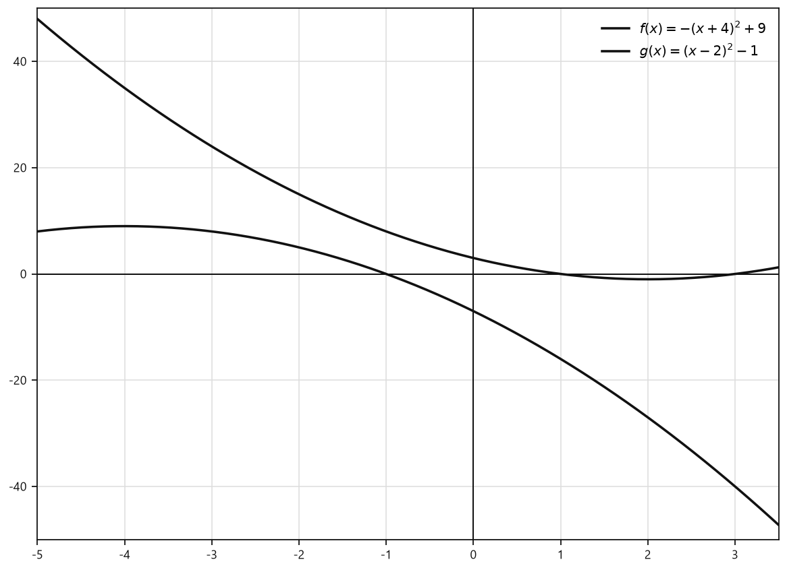
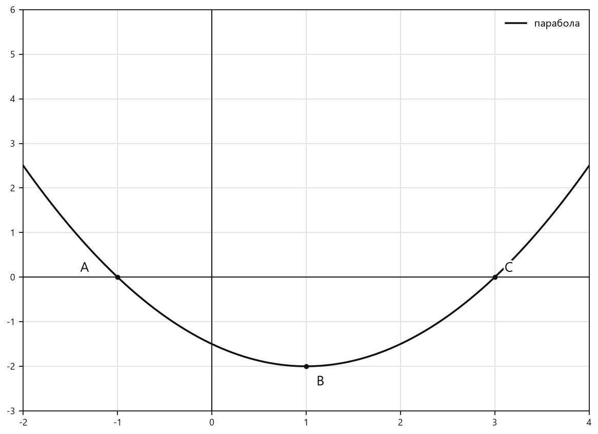

# Занятие 18. Квадратичная функция и ее свойства

**Раздел:** Глава 3  
**Параграф учебника:** §13. Квадратичная функция и ее свойства  
**Страницы:** 158–181

## Цели занятия

После занятия ученик умеет:

- распознавать квадратичную функцию;
- представлять квадратичную функцию в трёх формах;
- находить вершину параболы и её ось симметрии;
- определять множество значений функции и её наибольшее или наименьшее значение;
- находить нули функции и точки пересечения графика с координатными осями;
- исследовать взаимное расположение парабол.

Выбери блок своего уровня:

- **1–2 балла:** понять определение и научиться раскрывать скобки;
- **3–4 балла:** находить вершину, множество значений и нули функции;
- **5–6 баллов:** исследовать график по формуле;
- **7–8 баллов:** решать задачи на общие точки парабол;
- **9–10 баллов:** уверенно применять все формы записи и свойства.

## Теория к занятию

### 1. Что называют квадратичной функцией

#### Простыми словами

Смотри на формулу функции. Если в ней есть член с $x^2$ и его коэффициент не равен нулю, перед нами квадратичная функция.

Её график называется параболой. Направление ветвей зависит от знака числа $a$:

- если $a>0$, ветви направлены вверх;
- если $a<0$, ветви направлены вниз.

Коэффициент $a$ здесь главный «рулевой»: именно он решает, куда смотрит парабола.

#### Определение

Функция вида $y = ax^2 + bx + c$, где $a$, $b$ и $c$ — некоторые числа, причем $a \neq 0$, называется квадратичной.

#### Формула

$$
y=ax^2+bx+c.
$$

Здесь:

- $a$ — коэффициент при $x^2$;
- $b$ — коэффициент при $x$;
- $c$ — свободный член;
- $a\neq 0$.

#### Правила

- $y=3x^2-5x+1$ — квадратичная функция.
- $y=-x^2+7$ — квадратичная функция. Здесь $b=0$.
- $y=x^3+2$ — не квадратичная функция: в ней есть $x^3$, а не $x^2$.
- $y=4x+1$ — линейная функция, потому что члена с $x^2$ нет.

Если какой-то член не записан, его коэффициент равен нулю. Например:

$$
y=x^2+4=1\cdot x^2+0\cdot x+4.
$$

Значит, $a=1$, $b=0$, $c=4$.

#### Ловушки

- Если $a=0$, функция перестаёт быть квадратичной: член с $x^2$ исчезает.
- Отсутствующий член можно считать нулевым.
- Знак $a$ определяет направление ветвей, но не сообщает сразу координаты вершины. Для вершины нужны отдельные формулы.

---

### 2. Формы записи квадратичной функции

#### Простыми словами

Одну и ту же квадратичную функцию можно записать разными способами. Значение функции при этом не изменяется — меняется только внешний вид формулы.

Каждая форма удобна для своей задачи:

- одна помогает раскрывать скобки;
- другая показывает корни;
- третья сразу помогает увидеть вершину параболы.

#### Формулы

1. В виде многочлена:

$$
y=ax^2+bx+c.
$$

2. В виде разложения на множители:

$$
y=a(x-x_1)(x-x_2).
$$

Эта форма используется, если корни соответствующего квадратного трехчлена существуют.

3. В виде выделенного полного квадрата:

$$
y=a(x-m)^2+n,
$$

где

$$
m=-\frac{b}{2a},\qquad n=-\frac{b^2-4ac}{4a}.
$$

#### Правила

- Для вычисления значения функции при известном $x$ удобна форма многочлена.
- Для нахождения нулей функции удобна форма разложения на множители.
- Для нахождения вершины и наибольшего или наименьшего значения удобна форма выделенного полного квадрата.

Например, в выражении

$$
y=4(x-3)^2-16
$$

сразу видно, что квадрат не может быть отрицательным. Поэтому при $a=4>0$ самое маленькое значение получится, когда квадрат равен нулю.

#### Ловушки

- В выражении $(x-m)^2$ внутри скобок стоит именно $x-m$.
- Если получено $(x+3)^2$, это то же самое, что $(x-(-3))^2$. Значит, $m=-3$, а не $3$.
- Коэффициент перед квадратом нельзя потерять:

$$
4(x-3)^2-16\neq (x-3)^2-16.
$$

Четвёрка не украшение, а часть формулы.

---

### 3. Область определения функции

#### Простыми словами

Область определения — это все значения $x$, которые можно подставить в формулу.

В квадратичной функции есть только возведение в квадрат, умножение и сложение. Эти действия можно выполнять с любым действительным числом. Поэтому ограничений на $x$ нет.

Например, можно подставить $x=0$, $x=5$, $x=-10$ или любое другое действительное число.

#### Свойство

Так как $ax^{2} + bx + c$ — многочлен, то областью определения квадратичной функции $y = ax^{2} + bx + c$, где $a \neq 0$, являются все действительные числа, т. е. $D = \mathbb{R}$. Графически это означает, что для любого значения абсциссы найдется соответствующая точка на параболе.

#### Формула

$$
D=\mathbb R.
$$

#### Ловушки

- Для квадратичной функции ограничений на $x$ нет.
- Не нужно писать $x\geq 0$: квадрат существует и при отрицательных $x$.

Например:

$$
(-4)^2=16.
$$

- Область определения — это возможные значения $x$.
- Множество значений — это возможные значения $y$.

Эти два множества похожи названием, но отвечают на разные вопросы. Не стоит отправлять их на одну и ту же полку.

---

### 4. Вершина параболы и множество значений

#### Простыми словами

Вершина параболы — её самая нижняя или самая верхняя точка.

- При $a>0$ ветви направлены вверх, поэтому вершина находится внизу и даёт наименьшее значение функции.
- При $a<0$ ветви направлены вниз, поэтому вершина находится наверху и даёт наибольшее значение функции.

Чтобы увидеть это, удобно представить функцию в виде

$$
y=a(x-m)^2+n.
$$

Квадрат $(x-m)^2$ всегда неотрицателен. Поэтому всё зависит от знака $a$.

#### Свойство

Для нахождения множества значений квадратичной функции воспользуемся ее формой записи в виде выделенного полного квадрата: $y = a(x - m)^{2} + n$, где $m = -\frac{b}{2a}$, $n = -\frac{b^{2} - 4ac}{4a}$.

Если $a > 0$, то при $x = m$ выражение $a(x - m)^{2} + n$ принимает наименьшее значение, равное $n$. Значит, на изображении параболы существует точка, в которой функция принимает наименьшее значение. Эта точка называется **вершиной параболы**, ее координаты $x_{B} = -\frac{b}{2a}$, $y_{B} = -\frac{b^{2} - 4ac}{4a}$.

Следовательно, если $a > 0$, то $E = [y_{B}; +\infty)$.

Если $a < 0$, то при $x = m$ выражение $a(x - m)^{2} + n$ принимает наибольшее значение, равное $n$. В этом случае на изображении параболы существует точка, в которой функция принимает наибольшее значение, она называется вершиной параболы, ее координаты $x_в = -\frac{b}{2a}$; $y_в = -\frac{b^2 - 4ac}{4a}$.

Следовательно, если $a < 0$, то $E = (-\infty; y_в]$.

#### Формулы

Координаты вершины:

$$
x_B=-\frac{b}{2a},
$$

$$
y_B=-\frac{b^2-4ac}{4a}.
$$

Ось симметрии:

$$
x=x_B.
$$

Ось симметрии проходит через вершину и делит параболу на две одинаковые части. Если вершина имеет абсциссу $2$, ось симметрии записывается так:

$$
x=2.
$$

#### Алгоритм

1. Запиши коэффициенты $a$, $b$ и $c$.
2. Найди абсциссу вершины:

$$
x_B=-\frac{b}{2a}.
$$

3. Подставь найденное значение $x_B$ в формулу функции и вычисли $y_B$.
4. Запиши координаты вершины:

$$
B(x_B;y_B).
$$

5. Посмотри на знак $a$:
   - если $a>0$, ветви направлены вверх;
   - если $a<0$, ветви направлены вниз.
6. Запиши множество значений:
   - при $a>0$:

$$
E=[y_B;+\infty);
$$

   - при $a<0$:

$$
E=(-\infty;y_B].
$$

#### Ловушки

- При $a<0$ функция имеет максимум, а не минимум.
- В формуле

$$
x_B=-\frac{b}{2a}
$$

минус относится ко всей дроби.
- Если вершина имеет координаты $(2;-5)$ и $a>0$, то множество значений записывается так:

$$
E=[-5;+\infty).
$$

Число $-5$ входит в промежуток: оно достигается в самой вершине.

---

### 5. Нули функции

#### Простыми словами

Нуль функции — это такое значение $x$, при котором $y=0$.

На оси абсцисс $Ox$ у всех точек вторая координата равна нулю. Поэтому, чтобы найти точки пересечения графика с этой осью, нужно приравнять формулу функции к нулю и решить полученное квадратное уравнение.

#### Свойство

Значения аргумента, при которых значения функции $y = ax^2 + bx + c$ равны нулю, являются корнями квадратного уравнения $ax^2 + bx + c = 0$.

#### Формула

Чтобы найти нули функции:

$$
ax^2+bx+c=0.
$$

Если функция записана в виде

$$
y=a(x-x_1)(x-x_2),
$$

то её нули:

$$
x=x_1,\qquad x=x_2.
$$

Точки пересечения с осью $Ox$ имеют вид:

$$
(x_1;0),\qquad (x_2;0).
$$

#### Правила

- Для пересечения с осью $Ox$ полагаем $y=0$.
- Для пересечения с осью $Oy$ полагаем $x=0$.
- При $D>0$ квадратное уравнение имеет два действительных корня, поэтому график имеет два нуля.
- При $D=0$ квадратное уравнение имеет один действительный корень, поэтому график имеет один нуль.
- При $D<0$ действительных корней нет, поэтому график не пересекает ось $Ox$.

#### Ловушки

- Координаты точки на оси $Ox$ имеют вторую координату $0$.
- Координаты точки на оси $Oy$ имеют первую координату $0$.
- Корни уравнения — это значения $x$, а не готовые точки графика.

Например, если корень равен $x=3$, точка на графике записывается так:

$$
(3;0).
$$

---

## Сводка формул «выучить наизусть»

$$
y=ax^2+bx+c,\qquad a\neq 0.
$$

$$
y=a(x-x_1)(x-x_2).
$$

$$
y=a(x-m)^2+n.
$$

$$
m=-\frac{b}{2a},\qquad n=-\frac{b^2-4ac}{4a}.
$$

$$
x_B=-\frac{b}{2a}.
$$

$$
y_B=-\frac{b^2-4ac}{4a}.
$$

При $a>0$:

$$
E=[y_B;+\infty).
$$

При $a<0$:

$$
E=(-\infty;y_B].
$$

Нули функции находятся из уравнения:

$$
ax^2+bx+c=0.
$$

## Правила, которые нельзя путать

- $a>0$ — ветви вверх, функция имеет минимум.
- $a<0$ — ветви вниз, функция имеет максимум.
- Ось $Ox$: $y=0$.
- Ось $Oy$: $x=0$.
- $x_B$ — абсцисса вершины, то есть первая координата.
- $y_B$ — ордината вершины, то есть вторая координата.
- Область определения:

$$
D=\mathbb R.
$$

- Множество значений зависит от направления ветвей.
- Нули функции — это корни уравнения

$$
ax^2+bx+c=0.
$$

## Разбор ключевых заданий

### Р1. Представление квадратичной функции в разных формах

**Условие.** Запишите функцию

$$
y=4x^2-24x+20
$$

в виде многочлена, разложения на множители и выделенного полного квадрата.

**Решение**

В виде многочлена функция уже записана:

$$
y=4x^2-24x+20.
$$

Теперь найдём корни квадратного трёхчлена:

$$
4x^2-24x+20=0.
$$

Разделим обе части уравнения на $4$:

$$
x^2-6x+5=0.
$$

Подберём два числа, произведение которых равно $5$, а сумма равна $-6$. Это числа $-1$ и $-5$.

Поэтому:

$$
x^2-6x+5=(x-1)(x-5).
$$

Значит,

$$
y=4(x-1)(x-5).
$$

Теперь выделим полный квадрат.

Начинаем с исходной записи:

$$
y=4x^2-24x+20.
$$

Вынесем $4$ за скобки:

$$
y=4(x^2-6x+5).
$$

Используем равенство:

$$
x^2-6x=(x-3)^2-9.
$$

Тогда:

$$
y=4((x-3)^2-9+5).
$$

Сложим числа в скобках:

$$
y=4((x-3)^2-4).
$$

Умножим $4$ на каждое слагаемое:

$$
y=4(x-3)^2-16.
$$

Получены три записи одной и той же функции. Формула меняет костюм, но функция остаётся той же.

**Ответ:**

$$
y=4x^2-24x+20,
$$

$$
y=4(x-1)(x-5),
$$

$$
y=4(x-3)^2-16.
$$

---

### Р2. Представление выражений в виде многочлена

**Условие.** Представьте выражения в виде многочлена:

а) $5(x-1)(x-4)$;  
б) $-2(x-4)(x+2)$;  
в) $(x-1,5)^2-2,5$;  
г) $2(x-1)^2+3$.

#### а) $5(x-1)(x-4)$

Сначала перемножим выражения в скобках:

$$
(x-1)(x-4)=x^2-4x-x+4.
$$

Приведём подобные слагаемые:

$$
(x-1)(x-4)=x^2-5x+4.
$$

Теперь умножим каждый член многочлена на $5$:

$$
5(x^2-5x+4)=5x^2-25x+20.
$$

**Ответ:**

$$
5x^2-25x+20.
$$

#### б) $-2(x-4)(x+2)$

Сначала раскроем скобки:

$$
(x-4)(x+2)=x^2+2x-4x-8.
$$

Приведём подобные слагаемые:

$$
(x-4)(x+2)=x^2-2x-8.
$$

Теперь умножим каждый член на $-2$:

$$
-2(x^2-2x-8)=-2x^2+4x+16.
$$

**Ответ:**

$$
-2x^2+4x+16.
$$

#### в) $(x-1,5)^2-2,5$

Применим формулу квадрата разности:

$$
(x-1,5)^2=x^2-2\cdot x\cdot1,5+1,5^2.
$$

Выполним вычисления:

$$
(x-1,5)^2=x^2-3x+2,25.
$$

Теперь вычтем $2,5$:

$$
x^2-3x+2,25-2,5=x^2-3x-0,25.
$$

**Ответ:**

$$
x^2-3x-0,25.
$$

#### г) $2(x-1)^2+3$

Раскроем квадрат разности:

$$
(x-1)^2=x^2-2x+1.
$$

Подставим это выражение:

$$
2(x^2-2x+1)+3.
$$

Умножим скобки на $2$:

$$
2x^2-4x+2+3.
$$

Сложим постоянные слагаемые:

$$
2x^2-4x+5.
$$

**Ответ:**

$$
2x^2-4x+5.
$$

*Ловушка: если перед скобками стоит минус, он меняет знаки всех слагаемых внутри. Минус ничего не забывает — особенно на контрольной.*

---

### Р3. Наибольшее и наименьшее значения выражений

**Условие.** Найдите:

а) наибольшее значение выражения

$$
-2(x-1)^2+3;
$$

б) наименьшее значение выражения

$$
(x-1,5)^2-2,5.
$$

#### а) $-2(x-1)^2+3$

Квадрат любого числа неотрицателен:

$$
(x-1)^2\geq 0.
$$

Умножим обе части неравенства на отрицательное число $-2$. Знак неравенства изменится:

$$
-2(x-1)^2\leq 0.
$$

Прибавим $3$ к обеим частям:

$$
-2(x-1)^2+3\leq 3.
$$

Значение $3$ действительно достигается. Для этого квадрат должен быть равен нулю:

$$
(x-1)^2=0.
$$

Значит:

$$
x-1=0,
$$

$$
x=1.
$$

Следовательно, выражение не может быть больше $3$, а при $x=1$ оно равно $3$.

**Ответ:**

$$
3.
$$

#### б) $(x-1,5)^2-2,5$

Квадрат также неотрицателен:

$$
(x-1,5)^2\geq 0.
$$

Вычтем $2,5$ из обеих частей:

$$
(x-1,5)^2-2,5\geq -2,5.
$$

Равенство достигается, когда квадрат равен нулю:

$$
(x-1,5)^2=0.
$$

Отсюда:

$$
x-1,5=0,
$$

$$
x=1,5.
$$

Значит, наименьшее значение выражения равно $-2,5$.

**Ответ:**

$$
-2,5.
$$

---

### Р4. Точки пересечения линейного графика с координатными осями

**Условие.** Найдите координаты точек пересечения графика функции $y=4x-5$ с осями абсцисс и ординат.

**Решение**

#### Точка пересечения с осью $Ox$

На оси $Ox$ ордината любой точки равна нулю. Поэтому положим $y=0$:

$$
4x-5=0.
$$

Перенесём $-5$ в правую часть:

$$
4x=5.
$$

Разделим обе части на $4$:

$$
x=\frac54.
$$

Точка пересечения с осью $Ox$ имеет координаты:

$$
\left(\frac54;0\right).
$$

#### Точка пересечения с осью $Oy$

На оси $Oy$ абсцисса любой точки равна нулю. Поэтому положим $x=0$:

$$
y=4\cdot0-5.
$$

Вычислим:

$$
y=-5.
$$

Точка пересечения с осью $Oy$ имеет координаты:

$$
(0;-5).
$$

**Ответ:**

$$
\left(\frac54;0\right),\qquad (0;-5).
$$

---

### Р5. Вершина параболы и множество значений

**Условие.** Найдите вершину, ось симметрии и множество значений функции

$$
y=2x^2-8x+5.
$$

**Решение**

Сравним формулу функции

$$
y=2x^2-8x+5
$$

с формулой

$$
y=ax^2+bx+c.
$$

Получаем:

$$
a=2,\qquad b=-8,\qquad c=5.
$$

Найдём абсциссу вершины:

$$
x_B=-\frac{b}{2a}.
$$

Подставим значения $a$ и $b$:

$$
x_B=-\frac{-8}{2\cdot2}.
$$

Два минуса дают плюс:

$$
x_B=\frac84=2.
$$

Теперь найдём ординату вершины. Подставим $x_B=2$ в формулу функции:

$$
y_B=2\cdot2^2-8\cdot2+5.
$$

Сначала вычислим квадрат:

$$
y_B=2\cdot4-16+5.
$$

Выполним умножение:

$$
y_B=8-16+5.
$$

Получаем:

$$
y_B=-3.
$$

Вершина параболы:

$$
B(2;-3).
$$

Так как

$$
a=2>0,
$$

ветви параболы направлены вверх. Значит, в вершине находится наименьшее значение функции.

Ось симметрии проходит через вершину:

$$
x=2.
$$

Множество значений начинается с наименьшего значения $-3$ и продолжается до $+\infty$:

$$
E=[-3;+\infty).
$$

**Ответ:**

$$
B(2;-3),\qquad x=2,\qquad E=[-3;+\infty).
$$

---

### Р6. Нули квадратичной функции

**Условие.** Найдите нули функции

$$
y=x^2-5x+6
$$

и координаты точек пересечения её графика с осью абсцисс.

**Решение**

Нули функции находятся при $y=0$. Поэтому составим уравнение:

$$
x^2-5x+6=0.
$$

Разложим квадратный трёхчлен на множители. Нужны два числа, произведение которых равно $6$, а сумма равна $-5$. Это числа $-2$ и $-3$:

$$
x^2-5x+6=(x-2)(x-3).
$$

Получаем уравнение:

$$
(x-2)(x-3)=0.
$$

Произведение равно нулю, если хотя бы один из множителей равен нулю:

$$
x-2=0\quad\text{или}\quad x-3=0.
$$

Отсюда:

$$
x_1=2,\qquad x_2=3.
$$

Это нули функции.

Чтобы получить точки пересечения с осью $Ox$, добавим вторую координату $0$:

$$
(2;0),\qquad (3;0).
$$

**Ответ:**

Нули функции:

$$
x_1=2,\qquad x_2=3.
$$

Точки:

$$
(2;0),\qquad (3;0).
$$

### Р7. Исследование двух парабол

**Условие.** Постройте графики функций

$$
f(x)=-(x+4)^2+9
$$

и

$$
g(x)=(x-2)^2-1.
$$

Определите, имеют ли параболы общие точки.

<!--geo-figure-spec
{
  "needed": true,
  "kind": "graph",
  "caption": "Графики $f(x)=-(x+4)^2+9$ и $g(x)=(x-2)^2-1$",
  "axis": true,
  "grid": true,
  "xlim": [
    -5,
    3.5
  ],
  "ylim": [
    -50,
    50
  ],
  "curves": [
    {
      "expr": "-(x+4)**2+9",
      "label": "$f(x)=-(x+4)^2+9$"
    },
    {
      "expr": "(x-2)**2-1",
      "label": "$g(x)=(x-2)^2-1$"
    }
  ]
}
-->

*Графики f(x)=-(x+4)^2+9 и g(x)=(x-2)^2-1*

**Решение**

Обе функции уже записаны в виде выделенного полного квадрата:

$$
f(x)=-(x+4)^2+9=-(x-(-4))^2+9,
$$

$$
g(x)=(x-2)^2-1.
$$

Поэтому вершины парабол имеют координаты:

$$
F(-4;9),
$$

$$
G(2;-1).
$$

У параболы $f(x)$ коэффициент перед квадратом равен $-1$, поэтому её ветви направлены вниз.

У параболы $g(x)$ коэффициент перед квадратом равен $1$, поэтому её ветви направлены вверх.

Для построения можно взять ещё несколько точек.

Для графика $f(x)$:

$$
f(-3)=-(-3+4)^2+9=-1+9=8,
$$

$$
f(-5)=-(-5+4)^2+9=-1+9=8.
$$

Получаем точки $(-3;8)$ и $(-5;8)$.

Для графика $g(x)$:

$$
g(1)=(1-2)^2-1=1-1=0,
$$

$$
g(3)=(3-2)^2-1=1-1=0.
$$

Получаем точки $(1;0)$ и $(3;0)$.

Теперь найдём возможные общие точки графиков. У общей точки должны совпадать и $x$, и $y$. Поэтому приравняем значения функций:

$$
-(x+4)^2+9=(x-2)^2-1.
$$

Раскроем скобки:

$$
-(x^2+8x+16)+9=x^2-4x+4-1.
$$

Упростим обе части:

$$
-x^2-8x-7=x^2-4x+3.
$$

Перенесём все слагаемые в левую часть:

$$
-2x^2-4x-10=0.
$$

Разделим обе части уравнения на $-2$:

$$
x^2+2x+5=0.
$$

Найдём дискриминант:

$$
D=2^2-4\cdot1\cdot5.
$$

$$
D=4-20=-16.
$$

Так как $D<0$, квадратное уравнение действительных корней не имеет.

Значит, ни одного общего значения $x$ у графиков нет. Следовательно, общих точек тоже нет. Дискриминант здесь сработал как строгий охранник: «Встречу отменяем».

**Ответ:** параболы общих точек не имеют.

---

### Р8. Нули функции и вершина по корням

**Условие.** Нулями квадратичной функции

$$
y=3x^2+bx+c
$$

являются числа $-4$ и $5$. Найдите координаты вершины параболы, её ось симметрии и наименьшее значение функции.

**Решение**

Нули функции — это такие значения $x$, при которых $y=0$. Поэтому числа $-4$ и $5$ являются корнями квадратного уравнения

$$
3x^2+bx+c=0.
$$

Если корни равны $x_1=-4$ и $x_2=5$, то квадратный трёхчлен можно записать так:

$$
y=3(x-x_1)(x-x_2).
$$

Подставим корни:

$$
y=3(x+4)(x-5).
$$

Раскроем скобки:

$$
y=3(x^2-x-20).
$$

$$
y=3x^2-3x-60.
$$

Значит,

$$
a=3,\qquad b=-3,\qquad c=-60.
$$

Абсциссу вершины найдём по формуле:

$$
x_B=-\frac{b}{2a}.
$$

Подставим значения $a$ и $b$:

$$
x_B=-\frac{-3}{2\cdot3}.
$$

$$
x_B=\frac12.
$$

Теперь найдём ординату вершины. Подставим $x_B=\frac12$ в функцию:

$$
y_B=3\left(\frac12\right)^2-3\cdot\frac12-60.
$$

$$
y_B=3\cdot\frac14-\frac32-60.
$$

Приведём дроби к знаменателю $4$:

$$
y_B=\frac34-\frac64-\frac{240}{4}.
$$

$$
y_B=-\frac{246}{4}=-\frac{123}{2}.
$$

Так как $a=3>0$, ветви параболы направлены вверх. Поэтому в вершине функция принимает наименьшее значение.

Ось симметрии проходит через вершину параболы и имеет уравнение:

$$
x=x_B.
$$

Следовательно,

$$
x=\frac12.
$$

**Ответ:**

$$
B\left(\frac12;-\frac{123}{2}\right),
$$

$$
x=\frac12,
$$

наименьшее значение:

$$
-\frac{123}{2}.
$$

---

### Р9. Схематическое исследование параболы

**Условие.** Опишите расположение графика функции

$$
y=ax^2+bx+c,
$$

если

$$
a>0,\qquad c<0,\qquad D>0,\qquad -\frac{b}{2a}>0.
$$

**Решение**

Разберём каждое условие отдельно.

Так как

$$
a>0,
$$

коэффициент перед $x^2$ положительный. Поэтому ветви параболы направлены вверх.

Так как

$$
D>0,
$$

квадратное уравнение

$$
ax^2+bx+c=0
$$

имеет два действительных корня. Эти корни являются абсциссами точек пересечения параболы с осью $Ox$. Значит, парабола пересекает ось абсцисс в двух точках.

Так как

$$
c<0,
$$

при $x=0$ значение функции равно:

$$
y=a\cdot0^2+b\cdot0+c=c.
$$

Поскольку $c<0$, точка пересечения графика с осью $Oy$ находится ниже начала координат.

Абсцисса вершины параболы равна:

$$
x_B=-\frac{b}{2a}.
$$

По условию:

$$
-\frac{b}{2a}>0.
$$

Значит, абсцисса вершины положительна, поэтому вершина расположена справа от оси $Oy$.

<!--geo-figure-spec
{
  "needed": true,
  "kind": "graph",
  "caption": "Схематический график при $a>0$, $c<0$, $D>0$, $x_B>0$",
  "axis": true,
  "grid": true,
  "xlim": [
    -2,
    4
  ],
  "ylim": [
    -3,
    6
  ],
  "curves": [
    {
      "expr": "0.5*(x-1)**2-2",
      "label": "парабола"
    }
  ],
  "points": {
    "A": [
      -1,
      0
    ],
    "B": [
      1,
      -2
    ],
    "C": [
      3,
      0
    ]
  },
  "labels": {
    "A": {
      "dx": -0.35,
      "dy": 0.2
    },
    "B": {
      "dx": 0.15,
      "dy": -0.35
    },
    "C": {
      "dx": 0.15,
      "dy": 0.2
    }
  }
}
-->

*Схематический график при a>0, c<0, D>0, x_B>0*

**Ответ:** ветви направлены вверх; парабола пересекает ось $Ox$ в двух точках, ось $Oy$ — ниже начала координат; вершина находится справа от оси $Oy$.

---

### Р10. Сравнение двух тарифов

**Условие.** По тарифу А абонентская плата составляет $15$ рублей в месяц, а одна минута разговора стоит $0,10$ рубля. По тарифу В абонентская плата составляет $10$ рублей, а минута разговора стоит $0,15$ рубля.

Какой тариф выгоднее при разговоре:

а) $80$ минут;  
б) $150$ минут?

Сколько минут нужно разговаривать, чтобы итоговая сумма по тарифам была одинаковой?

**Решение**

Пусть $x$ — количество минут разговора.

Стоимость тарифа складывается из двух частей:

- абонентской платы;
- оплаты всех минут разговора.

Стоимость тарифа А:

$$
A(x)=15+0,10x.
$$

Стоимость тарифа В:

$$
B(x)=10+0,15x.
$$

#### а) $80$ минут

Найдём стоимость тарифа А:

$$
A(80)=15+0,10\cdot80.
$$

$$
A(80)=15+8=23.
$$

Теперь найдём стоимость тарифа В:

$$
B(80)=10+0,15\cdot80.
$$

$$
B(80)=10+12=22.
$$

Сравним полученные суммы:

$$
22<23.
$$

Значит, при разговоре в течение $80$ минут выгоднее тариф В.

#### б) $150$ минут

Стоимость тарифа А:

$$
A(150)=15+0,10\cdot150.
$$

$$
A(150)=15+15=30.
$$

Стоимость тарифа В:

$$
B(150)=10+0,15\cdot150.
$$

$$
B(150)=10+22,5=32,5.
$$

Сравним суммы:

$$
30<32,5.
$$

Значит, при разговоре в течение $150$ минут выгоднее тариф А.

#### Одинаковая стоимость

Чтобы найти количество минут, при котором тарифы стоят одинаково, приравняем их стоимости:

$$
15+0,10x=10+0,15x.
$$

Перенесём постоянные слагаемые в левую часть, а слагаемые с $x$ — в правую:

$$
15-10=0,15x-0,10x.
$$

Выполним вычисления:

$$
5=0,05x.
$$

Разделим обе части уравнения на $0,05$:

$$
x=\frac5{0,05}=100.
$$

Значит, при $100$ минутах стоимость обоих тарифов будет одинаковой. До этой отметки выгоднее тариф с меньшей оплатой минуты, а после неё — тариф с меньшей абонентской платой. Тарифы устроили математическую дуэль, и ничья случилась ровно на 100 минутах.

**Ответ:**

- при $80$ минутах выгоднее тариф В;
- при $150$ минутах выгоднее тариф А;
- одинаковая стоимость будет при $100$ минутах.

## Практические задания

Выбери свой уровень и решай только этот блок. В блоке должна закрепиться вся тема параграфа. Ответы не приводятся.

### Уровень 1–2 балла

**С1.** Выберите квадратичную функцию.

1) $y=3x+5$  
2) $y=2x^2-7x+1$  
3) $y=\dfrac{4}{x}+1$  
4) $y=\sqrt{x}+2$  
5) $y=7$

**С2.** Укажите коэффициент $a$ в функции $y=-5x^2+3x-8$.

1) $-8$  
2) $3$  
3) $-5$  
4) $5$  
5) $8$

**С3.** Укажите область определения функции $y=4x^2-6x+1$.

1) $[0;+\infty)$  
2) $(-\infty;0]$  
3) $[-1;1]$  
4) $\mathbb{R}$  
5) $(0;+\infty)$

**С4.** Определите, куда направлены ветви параболы $y=3x^2-2x+7$.

1) Вверх  
2) Вниз  
3) Вправо  
4) Влево  
5) Направление определить нельзя

**С5.** Определите, куда направлены ветви параболы $y=-2x^2+8x-1$.

1) Вверх  
2) Вниз  
3) Вправо  
4) Влево  
5) Направление определить нельзя

**С6.** Запишите функцию $y=2x^2-8x+5$ в виде выделенного полного квадрата.

1) $y=2(x-2)^2+5$  
2) $y=2(x-4)^2-27$  
3) $y=2(x-2)^2-3$  
4) $y=2(x+2)^2-3$  
5) $y=2(x-4)^2+5$

**С7.** Найдите координаты вершины параболы $y=(x-3)^2-4$.

1) $(3;4)$  
2) $(-3;-4)$  
3) $(3;-4)$  
4) $(-3;4)$  
5) $(4;-3)$

**С8.** Найдите наименьшее значение функции $y=2(x+1)^2-7$.

1) $-7$  
2) $-1$  
3) $2$  
4) $7$  
5) Наименьшего значения нет

**С9.** Найдите наибольшее значение функции $y=-3(x-2)^2+5$.

1) $-3$  
2) $2$  
3) $3$  
4) $5$  
5) Наибольшего значения нет

**С10.** Выберите множество значений функции $y=(x-1)^2+2$.

1) $(-\infty;2]$  
2) $[2;+\infty)$  
3) $(2;+\infty)$  
4) $\mathbb{R}$  
5) $[-1;+\infty)$

**С11.** Найдите нули функции $y=x^2-9$.

1) $x=0$  
2) $x=3$  
3) $x=-3$  
4) $x=-3$ и $x=3$  
5) Нулей нет

**С12.** Укажите точку пересечения графика функции $y=2x^2-5x+6$ с осью ординат.

1) $(0;2)$  
2) $(2;0)$  
3) $(0;6)$  
4) $(6;0)$  
5) $(5;6)$

**С13.** Какая из функций является квадратичной?

1) $y=3x+5$ 2) $y=2x^2-7x+1$ 3) $y=\frac{4}{x}$ 4) $y=5$ 5) $y=\sqrt{x+2}$

**С14.** Укажите область определения функции $y=-3x^2+4x-8$.

1) $(-\infty;0]$ 2) $[0;+\infty)$ 3) $\mathbb{R}$ 4) $[-8;+\infty)$ 5) $(-\infty;-8]$

**С15.** В каком виде записана функция $y=2(x-3)^2-5$?

1) в виде многочлена 2) в виде разложения на множители 3) в виде выделенного полного квадрата 4) в виде линейной функции 5) в виде дроби

**С16.** Укажите координаты вершины параболы $y=(x-4)^2+2$.

1) $(4;2)$ 2) $(-4;2)$ 3) $(2;4)$ 4) $(4;-2)$ 5) $(-2;4)$

**С17.** Найдите наименьшее значение функции $y=3(x+1)^2-7$.

1) $-7$ 2) $-1$ 3) $3$ 4) $7$ 5) $1$

**С18.** Найдите наибольшее значение функции $y=-2(x-5)^2+4$.

1) $-2$ 2) $2$ 3) $4$ 4) $5$ 5) $9$

**С19.** Выберите функцию, ветви параболы которой направлены вниз.

1) $y=4x^2-1$ 2) $y=-x^2+3x$ 3) $y=2(x-1)^2+5$ 4) $y=x^2-6x+2$ 5) $y=7x^2+x-4$

**С20.** Укажите ось симметрии параболы $y=2(x-3)^2-1$.

1) $x=-3$ 2) $x=-1$ 3) $x=1$ 4) $x=2$ 5) $x=3$

**С21.** Найдите нули функции $y=(x-2)(x+5)$.

1) $-5$ и $2$ 2) $-2$ и $5$ 3) $2$ и $5$ 4) $-5$ и $-2$ 5) $0$ и $7$

**С22.** Найдите координаты точки пересечения графика функции $y=x^2-4x+3$ с осью ординат.

1) $(0;3)$ 2) $(3;0)$ 3) $(0;-3)$ 4) $(1;0)$ 5) $(-4;0)$

**С23.** Какая функция имеет множество значений $[-6;+\infty)$?

1) $y=(x-2)^2-6$ 2) $y=-(x-2)^2-6$ 3) $y=(x+6)^2+2$ 4) $y=-x^2+6$ 5) $y=2(x-2)^2+6$

**С24.** Представьте функцию $y=x^2-6x+8$ в виде разложения на множители.

1) $y=(x-2)(x-4)$ 2) $y=(x+2)(x+4)$ 3) $y=(x-1)(x-8)$ 4) $y=(x+2)(x-4)$ 5) $y=(x-2)(x+4)$

**С25.** Какая из функций является квадратичной?

1) $y=3x+2$ 2) $y=5x^2-4x+1$ 3) $y=\frac{2}{x}$ 4) $y=\sqrt{x}+1$ 5) $y=7$

**С26.** Укажите область определения функции $y=-2x^2+5x-3$.

1) $(-\infty;0]$ 2) $[0;+\infty)$ 3) $(-\infty;+\infty)$ 4) $[-2;5]$ 5) $\mathbb{R}\setminus\{0\}$

**С27.** Для функции $y=3(x-2)^2-5$ укажите координаты вершины параболы.

1) $(-2;-5)$ 2) $(2;-5)$ 3) $(2;5)$ 4) $(-2;5)$ 5) $(3;-5)$

**С28.** Укажите ось симметрии параболы $y=-4(x+3)^2+7$.

1) $x=3$ 2) $x=-3$ 3) $y=3$ 4) $y=-3$ 5) $x=7$

**С29.** Укажите направление ветвей параболы $y=2x^2-7x+4$.

1) Ветви направлены вверх. 2) Ветви направлены вниз. 3) Парабола не имеет ветвей. 4) График является прямой. 5) Направление ветвей определить нельзя.

**С30.** Найдите наименьшее значение функции $y=(x-4)^2-9$.

**С31.** Найдите наибольшее значение функции $y=-2(x+1)^2+6$.

**С32.** Укажите множество значений функции $y=(x-3)^2+2$.

1) $(-\infty;2]$ 2) $[2;+\infty)$ 3) $(-\infty;3]$ 4) $[3;+\infty)$ 5) $\mathbb{R}$

**С33.** Найдите нули функции $y=(x-2)(x+5)$.

**С34.** Укажите координаты точки пересечения графика функции $y=2x^2-3x+4$ с осью ординат.

1) $(0;2)$ 2) $(0;4)$ 3) $(4;0)$ 4) $(-3;0)$ 5) $(2;0)$

**С35.** Представьте функцию $y=x^2-6x+8$ в виде разложения на множители.

1) $y=(x-2)(x-4)$ 2) $y=(x+2)(x+4)$ 3) $y=(x-3)^2+8$ 4) $y=(x-6)(x+8)$ 5) $y=(x-1)(x-8)$

**С36.** Укажите вид записи функции $y=-3(x+2)^2+5$.

1) В виде многочлена. 2) В виде разложения на множители. 3) В виде выделенного полного квадрата. 4) В виде линейной функции. 5) В виде квадратного уравнения.

### Уровень 3–4 балла

**С1.** Представьте функцию $y=3(x-2)(x+5)$ в виде многочлена.

**С2.** Представьте функцию $y=-2(x-4)^2+7$ в виде многочлена.

**С3.** Представьте функцию $y=x^2-8x+12$ в виде разложения на множители.

**С4.** Представьте функцию $y=2x^2+12x+13$ в виде выделенного полного квадрата.

**С5.** Найдите координаты вершины параболы $y=x^2-6x+5$.

**С6.** Найдите наименьшее значение функции $y=2(x+3)^2-5$.

**С7.** Найдите наибольшее значение функции $y=-3(x-2)^2+8$.

**С8.** Укажите множество значений функции $y=(x-1)^2-4$.

**С9.** Найдите нули функции $y=2x^2-10x+12$.

**С10.** Нулями квадратичной функции $y=2x^2+bx+c$ являются числа $-1$ и $4$. Найдите координаты вершины параболы.

**С11.** Определите область определения и множество значений функции $y=-2(x+1)^2+6$.

**С12.** Функция задана формулой $y=-x^2+6x-5$. Найдите координаты точки пересечения её графика с осью ординат и координаты точек пересечения с осью абсцисс.

**С13.** Представьте функцию $y=3(x-2)(x+5)$ в виде многочлена.

**С14.** Представьте функцию $y=-2(x+3)^2+5$ в виде многочлена.

**С15.** Представьте функцию $y=x^2-8x+12$ в виде разложения на множители.

**С16.** Представьте функцию $y=2x^2-12x+7$ в виде выделенного полного квадрата.

**С17.** Найдите координаты вершины параболы $y=x^2-6x+4$.

**С18.** Найдите координаты вершины параболы $y=-2x^2+8x-3$.

**С19.** Найдите множество значений функции $y=(x-4)^2-9$.

**С20.** Найдите множество значений функции $y=-3(x+1)^2+7$.

**С21.** Найдите наименьшее значение функции $y=2(x-5)^2-6$.

**С22.** Найдите наибольшее значение функции $y=-4(x-2)^2+11$.

**С23.** Найдите нули функции $y=x^2-5x+6$.

**С24.** Найдите координаты точек пересечения графика функции $y=-x^2+4x+5$ с осями координат.

**С25.** Представьте функцию $y=3(x-2)(x+5)$ в виде многочлена.

**С26.** Представьте функцию $y=-2x^2+8x-5$ в виде выделенного полного квадрата.

**С27.** Найдите координаты вершины параболы $y=x^2-6x+4$.

**С28.** Найдите наименьшее значение функции $y=2(x+3)^2-7$.

**С29.** Найдите наибольшее значение функции $y=-3(x-4)^2+5$.

**С30.** Укажите множество значений функции $y=(x-1)^2-9$.

**С31.** Укажите множество значений функции $y=-2(x+4)^2+6$.

**С32.** Найдите нули функции $y=x^2-7x+12$.

**С33.** Найдите координаты точек пересечения графика функции $y=x^2-4x-5$ с осью абсцисс.

**С34.** Найдите координату точки пересечения графика функции $y=2x^2-3x+7$ с осью ординат.

**С35.** Нулями квадратичной функции $y=2x^2+bx+c$ являются числа $-1$ и $3$. Найдите коэффициенты $b$ и $c$.

**С36.** Квадратичная функция задана формулой $y=-x^2+6x-8$. Найдите координаты вершины параболы и ее наибольшее значение.

### Уровень 5–6 баллов

**С1.** Представьте квадратичную функцию в виде многочлена:  
а) $3(x-2)(x+5)$;  
б) $-2(x+1)(x-4)$;  
в) $(x-3)^2-7$;  
г) $2(x+4)^2-5$.

**С2.** Представьте функцию $y=x^2-8x+12$ в виде разложения на множители и в виде выделенного полного квадрата.

**С3.** Представьте функцию $y=-2x^2+12x-10$ в виде выделенного полного квадрата. Укажите координаты вершины параболы.

**С4.** Найдите координаты точки пересечения графика функции $y=2x^2-5x-3$ с осью ординат и координаты всех точек его пересечения с осью абсцисс.

**С5.** Найдите наименьшее значение функции $y=3(x-2)^2-7$ и укажите, при каком значении аргумента оно достигается.

**С6.** Найдите наибольшее значение функции $y=-4(x+1)^2+9$ и укажите, при каком значении аргумента оно достигается.

**С7.** Укажите область определения и множество значений функции $y=2(x-3)^2-5$.

**С8.** Укажите область определения и множество значений функции $y=-\frac{1}{2}(x+4)^2+6$.

**С9.** Нулями функции $y=2x^2+bx+c$ являются числа $-1$ и $4$. Найдите коэффициенты $b$ и $c$, а также координаты вершины параболы.

**С10.** Осью симметрии параболы $y=3x^2+bx-2$ является прямая $x=2$. Найдите коэффициент $b$ и координаты вершины параболы.

**С11.** Для функции $y=-x^2+6x-5$ найдите:  
а) координаты вершины параболы;  
б) ось симметрии;  
в) нули функции;  
г) наибольшее значение функции.

**С12.** Прибыль предприятия при выпуске $x$ изделий задаётся функцией $P(x)=-x^2+40x-175$, где $0\leqslant x\leqslant 40$. Найдите количество изделий, при котором прибыль будет наибольшей, и величину этой наибольшей прибыли.

**С13.** Представьте функцию $y=3(x-2)(x+4)$ в виде многочлена.

**С14.** Представьте функцию $y=-2(x+3)^2+5$ в виде многочлена.

**С15.** Представьте функцию $y=x^2-8x+12$ в виде разложения на множители.

**С16.** Представьте функцию $y=2x^2+12x+7$ в виде выделенного полного квадрата.

**С17.** Для функции $y=-3x^2+12x-7$ найдите координаты вершины параболы и укажите её наибольшее значение.

**С18.** Для функции $y=2x^2-8x+5$ найдите координаты вершины параболы и укажите её наименьшее значение.

**С19.** Найдите нули функции $y=x^2-5x+6$ и координаты точки пересечения её графика с осью ординат.

**С20.** Найдите нули функции $y=-2x^2+6x+8$ и координаты точек пересечения её графика с осями координат.

**С21.** Укажите область определения и множество значений функции $y=(x-4)^2-9$.

**С22.** Укажите область определения и множество значений функции $y=-2(x+1)^2+6$.

**С23.** Выберите все верные утверждения о функции $y=-(x-3)^2+4$:

1) её график — парабола, ветви которой направлены вверх;  
2) вершина параболы имеет координаты $(3;4)$;  
3) наибольшее значение функции равно $4$;  
4) ось симметрии имеет уравнение $x=-3$;  
5) нулями функции являются числа $1$ и $5$.

**С24.** Квадратичная функция имеет вид $y=2x^2+bx+c$. Её нулями являются числа $-1$ и $4$. Найдите значения $b$ и $c$, а также координаты вершины параболы.

**С25.** Представьте функцию $y=-3(x-2)^2+12$ в виде многочлена.

**С26.** Для функции $y=2x^2-8x+5$ найдите координаты вершины параболы и наименьшее значение функции.

**С27.** Найдите множество значений функции $y=-x^2+6x-4$.

**С28.** Найдите координаты точек пересечения графика функции $y=x^2-5x+6$ с осями координат.

**С29.** Нулями квадратичной функции $y=2x^2+bx+c$ являются числа $-1$ и $4$. Найдите $b$ и $c$.

**С30.** Квадратичная функция задана формулой $y=-2(x+3)^2+8$. Запишите координаты вершины параболы, укажите её ось симметрии и найдите нули функции.

### Уровень 7–8 баллов

**С1.** Представьте функцию $y=-3(x-2)(x+4)$ в виде многочлена и в виде выделенного полного квадрата. Укажите координаты вершины параболы и множество значений функции.

**С2.** Для функции $y=2x^2-8x+6$ найдите координаты точек пересечения её графика с осями координат. Запишите функцию в виде разложения на множители и укажите ось симметрии параболы.

**С3.** Функция задана формулой $y=-x^2+bx+7$. Известно, что точка $M(2;47)$ принадлежит её графику. Найдите значение $b$, координаты вершины параболы и наибольшее значение функции.

**С4.** Нулями квадратичной функции $y=3x^2+bx+c$ являются числа $-4$ и $5$. Найдите коэффициенты $b$ и $c$, координаты вершины параболы, её ось симметрии и наименьшее значение функции.

**С5.** Даны функции $f(x)=-(x+3)^2+4$ и $g(x)=(x-1)^2-12$. Определите, имеют ли их графики общие точки. Если имеют, найдите координаты всех общих точек и обоснуйте результат.

**С6.** Квадратичная функция задана формулой $y=2x^2-12x+13$. Представьте её в виде выделенного полного квадрата, найдите вершину параболы, множество значений функции и координаты точек пересечения графика с осью абсцисс.

**С7.** Прямая $x=2$ является осью симметрии параболы $f(x)=3x^2+(a^2-12)x+5$. Найдите все значения параметра $a$, при которых это возможно, и координаты вершины параболы.

**С8.** Предприниматель продаёт от $0$ до $40$ изделий в день по цене $70$ рублей за изделие. Затраты на производство $x$ изделий составляют $C(x)=x^2+10x+400$ рублей. Составьте функции выручки $R(x)$ и прибыли $B(x)$, а затем найдите число изделий, при котором прибыль максимальна, и величину максимальной прибыли. Обоснуйте, что найденное число изделий принадлежит указанному диапазону.

**С9.** График квадратичной функции $y=x^2+bx+c$ имеет вершину $V(3;-5)$. Найдите коэффициенты $b$ и $c$, нули функции и координаты точки пересечения графика с осью ординат.

**С10.** Не выполняя построения, определите взаимное расположение графика функции $y=x^2-6x+10$ и оси абсцисс. Найдите вершину параболы, множество значений функции и объясните, почему график не пересекает ось абсцисс.

**С11.** Для квадратичной функции $y=ax^2+bx+c$ известно, что $a<0$, $c>0$, дискриминант квадратного трёхчлена отрицателен, а абсцисса вершины положительна. Опишите направление ветвей параболы, расположение её вершины относительно оси абсцисс, наличие точек пересечения с осями координат и знак значения функции при $x=0$.

**С12.** Докажите, что для любого действительного числа $x$ значение выражения $-2x^2+12x-7$ не превосходит $11$. Укажите, при каком значении $x$ достигается равенство, используя свойства квадратичной функции.

**С13.** Представьте квадратичную функцию $y=-3(x-2)(x+4)$ в виде многочлена и в виде выделенного полного квадрата.

**С14.** Для функции $y=2x^2-8x+5$ найдите координаты вершины параболы, укажите её ось симметрии и определите наименьшее значение функции.

**С15.** Для функции $y=-x^2+6x-8$ найдите нули функции, координаты точки пересечения графика с осью ординат и наибольшее значение функции.

**С16.** Квадратичная функция задана формулой $y=3x^2+bx+c$. Известно, что её нулями являются числа $-2$ и $5$. Найдите $b$ и $c$, затем запишите функцию в виде выделенного полного квадрата.

**С17.** Найдите область определения и множество значений функции $y=-2(x+3)^2+7$. Укажите точку, в которой функция принимает наибольшее значение.

**С18.** Постройте схематический график функции $y=x^2-4x+3$. Для графика укажите координаты вершины, ось симметрии, нули функции и точку пересечения с осью ординат.

**С19.** Определите все значения параметра $p$, при которых парабола $y=x^2-2px+9$ касается оси абсцисс. Найдите координаты точки касания.

**С20.** График функции $y=ax^2+bx+c$ имеет вершину $B(3;-4)$ и проходит через точку $A(1;4)$. Известно, что $a>0$. Найдите формулу функции, её нули и множество значений.

**С21.** Квадратичная функция задана формулой $f(x)=-2x^2+bx+6$. Точка $M(2;10)$ принадлежит её графику. Найдите координаты вершины параболы и множество значений функции.

**С22.** Не выполняя построения, определите число общих точек графиков функций $y=(x-1)^2-4$ и $y=2x-1$. Если общие точки существуют, найдите их координаты.

**С23.** Для функции $y=-x^2+4x+5$ найдите промежутки, на которых функция принимает положительные и отрицательные значения, используя нули функции и направление ветвей параболы.

**С24.** При каких значениях параметра $q$ функция $y=x^2-6x+q$ имеет два различных нуля, один нуль или не имеет нулей? Для каждого случая укажите условие на множество значений функции.

### Уровень 9–10 баллов

**С1.** Функция задана формулой $f(x)=-2(x-3)^2+8$. Найдите координаты вершины параболы, уравнение её оси симметрии, наибольшее значение функции и множество её значений.

**С2.** Квадратичная функция имеет вид $f(x)=x^2+bx+c$. Известно, что её график проходит через точки $A(1;2)$ и $B(3;6)$. Найдите $b$ и $c$, а также координаты вершины параболы.

**С3.** Нулями функции $f(x)=2x^2+bx+c$ являются числа $-3$ и $5$. Запишите формулу функции в виде разложения на множители, найдите координаты вершины параболы и определите её наименьшее значение.

**С4.** Парабола является графиком функции $f(x)=ax^2+bx+c$, причём $a>0$, её ось симметрии имеет уравнение $x=2$, а график пересекает ось ординат в точке с ординатой $-12$. Один из нулей функции равен $-1$. Найдите формулу функции и её наименьшее значение.

**С5.** Найдите все значения параметра $p$, при которых функция $f(x)=x^2-2px+9$ имеет единственный нуль. Для найденного значения параметра укажите координаты вершины параболы.

**С6.** Определите все значения параметра $a$, при которых функция $f(x)=x^2-4x+a$ принимает отрицательные значения ровно при $1<x<3$. Запишите множество значений этой функции.

**С7.** Для функции $f(x)=-x^2+6x-5$ найдите промежутки возрастания и убывания, нули функции и промежуток, на котором $f(x)\geq 0$. Ответ запишите в виде объединения промежутков.

**С8.** Известно, что график функции $f(x)=ax^2+bx+c$ проходит через точки $A(0;-6)$ и $B(2;0)$, а его вершина имеет абсциссу $3$. Найдите коэффициенты $a$, $b$, $c$ и координаты вершины параболы.

**С9.** Найдите все значения параметра $m$, при которых графики функций $y=x^2-4x+1$ и $y=2x+m$ имеют ровно одну общую точку. Найдите координаты этой общей точки для каждого найденного значения $m$.

**С10.** Точка $M(2;15)$ принадлежит графику функции $f(x)=-x^2+bx+3$. Найдите значение параметра $b$, координаты вершины параболы и множество значений функции.

**С11.** Для функции $f(x)=a(x-2)^2-9$ известно, что точка $A(5;0)$ принадлежит её графику. Найдите коэффициент $a$, нули функции и промежутки, на которых функция принимает положительные значения.

**С12.** Квадратичная функция $f(x)=ax^2+bx+c$ имеет ось симметрии $x=-1$, принимает наибольшее значение, равное $12$, и её график проходит через точку $A(1;4)$. Найдите формулу функции, её нули и промежуток, на котором функция принимает неположительные значения.

**С13.** Точка $M(2;47)$ принадлежит графику квадратичной функции $y=-x^2+bx+7$. Найдите параметр $b$, координаты вершины параболы и наибольшее значение функции.

**С14.** Нулями квадратичной функции являются числа $-3$ и $5$, а коэффициент при $x^2$ равен $2$. Найдите:
1. формулу функции в виде разложения на множители;
2. координаты вершины параболы;
3. ось симметрии;
4. множество значений функции.

**С15.** График квадратичной функции $y=x^2+bx+c$ имеет ось симметрии $x=3$ и проходит через точку $A(1;5)$. Найдите коэффициенты $b$ и $c$, а также наименьшее значение функции.

**С16.** Даны функции $f(x)=-(x-1)^2+4$ и $g(x)=(x-3)^2-4$. Найдите все координаты общих точек их графиков. Укажите, сколько общих точек имеют эти параболы.

**С17.** Для каждого действительного значения параметра $a$ задана функция
$$
f_a(x)=x^2-2ax+a+4.
$$
Найдите все значения параметра $a$, при которых график функции пересекает ось абсцисс в двух различных точках. Для найденных значений параметра выразите координаты точек пересечения с осью абсцисс через $a$.

**С18.** Прямоугольный участок имеет периметр $80$ м. Одну его сторону обозначили через $x$ м, а площадь участка — через $S(x)$.  
1. Задайте функцию $S(x)$ и укажите область допустимых значений аргумента.  
2. Найдите размеры участка, при которых его площадь максимальна.  
3. Определите это максимальное значение площади.

## Чек-лист «ученик понял тему»

- Могу повторить определения и формулы параграфа своими словами и по учебнику.
- Решаю типовые задания своего уровня без подсказки.
- Вижу типичную ошибку и могу её объяснить.
