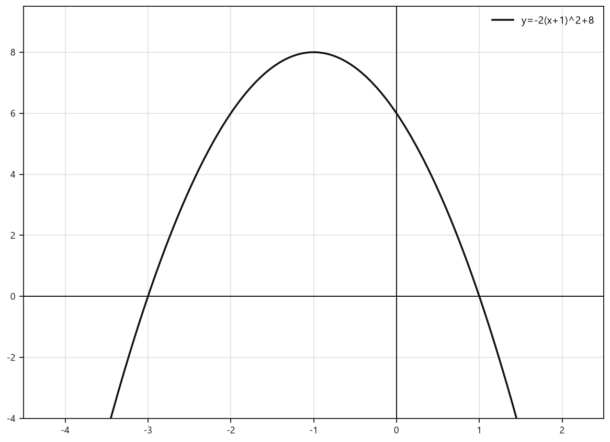

# Занятие 19. Монотонность, промежутки знакопостоянства квадратичной функции

**Раздел:** Глава 3  
**Параграф учебника:** §14. Монотонность, промежутки знакопостоянства квадратичной функции  
**Страницы:** 182–195

## Цели занятия

После занятия ты умеешь:

- находить абсциссу вершины параболы;
- определять промежутки возрастания и убывания квадратичной функции;
- сравнивать значения функции без вычислений;
- находить нули функции и промежутки знакопостоянства;
- читать свойства функции по формуле и по графику;
- составлять полный «паспорт» квадратичной функции.

Выбирай блок по уровню:

- **1–2 балла:** понять направление ветвей и вершину;
- **3–4 балла:** найти промежутки монотонности;
- **5–6 баллов:** сравнивать значения и находить знакопостоянство;
- **7–8 баллов:** составлять полный анализ функции;
- **9–10 баллов:** решать задачи с параметрами и условиями на всю область определения.

## Теория к занятию

### 1. Возрастание и убывание функции

#### Простыми словами

Представь, что мы движемся по графику слева направо, то есть значения $x$ увеличиваются.

Функция **возрастает**, если значения $y$ при этом становятся больше.

Функция **убывает**, если значения $y$ становятся меньше.

У параболы есть точка разворота — вершина. До вершины график движется в одну сторону, а после вершины — в другую. Парабола не меняет план на полпути: ей достаточно одной вершины.

#### Определение

Функция возрастает на некотором промежутке, если для любых двух значений аргумента из этого промежутка большему значению аргумента соответствует большее значение функции.

Функция убывает на некотором промежутке, если для любых двух значений аргумента из этого промежутка большему значению аргумента соответствует меньшее значение функции.

#### Формулы

Рассмотрим квадратичную функцию

$$
y=ax^2+bx+c,\qquad a\ne0.
$$

Абсциссу вершины параболы находим по формуле

$$
x_в=-\frac{b}{2a}.
$$

Здесь:

- $a$ — первый коэффициент;
- $b$ — второй коэффициент;
- $c$ — свободный член;
- $x_в$ — абсцисса вершины параболы.

Если функция записана в виде

$$
y=a(x-x_в)^2+y_в,
$$

то абсцисса вершины уже видна в записи: это число $x_в$.

Например,

$$
y=-5(x+7)^2+1.
$$

Запишем скобки в нужном виде:

$$
y=-5(x-(-7))^2+1.
$$

Значит,

$$
x_в=-7.
$$

#### Правила

Если $a>0$, ветви параболы направлены вверх:

- функция убывает на промежутке $(-\infty;x_в]$;
- функция возрастает на промежутке $[x_в;+\infty)$.

Если $a<0$, ветви параболы направлены вниз:

- функция возрастает на промежутке $(-\infty;x_в]$;
- функция убывает на промежутке $[x_в;+\infty)$.

Запомнить можно так:

- ветви вверх: сначала вниз, потом вверх;
- ветви вниз: сначала вверх, потом вниз.

#### Алгоритм

Чтобы определить промежутки возрастания и убывания квадратичной функции, нужно:

1. Определить абсциссу вершины параболы $x_в = -\frac{b}{2a}$.
2. Определить знак первого коэффициента.
3. Заполнить таблицу изменения функции в зависимости от изменения значений аргумента.

Если $a>0$:

| $x$ | $-\infty$ | $x_в$ | $+\infty$ |
|---|---:|---:|---:|
| $f(x)$ | $\searrow$ |  | $\nearrow$ |

Если $a<0$:

| $x$ | $-\infty$ | $x_в$ | $+\infty$ |
|---|---:|---:|---:|
| $f(x)$ | $\nearrow$ |  | $\searrow$ |

4. Записать ответ.

#### Ловушки

- Сначала внимательно найди коэффициент $a$ и его знак.
- В формуле $x_в=-\frac{b}{2a}$ минус относится ко всему числу $b$.
- При $a>0$ справа от вершины функция возрастает.
- При $a<0$ справа от вершины функция убывает.
- Вершина входит в оба промежутка, поэтому используются квадратные скобки.

---

### 2. Промежутки монотонности

#### Простыми словами

Промежутки возрастания и убывания вместе называют промежутками монотонности функции.

Для параболы действуем по плану:

1. находим абсциссу вершины;
2. определяем направление ветвей;
3. записываем, где функция возрастает и где убывает.

Вершина здесь как дорожный знак «разворот»: слева и справа от неё поведение функции разное.

#### Факт

Промежутки убывания и возрастания функции называются промежутками монотонности функции.

#### Правила

Для функции

$$
y=ax^2+bx+c
$$

получаем:

- при $a>0$:
  $$(-\infty;x_в]$$ — промежуток убывания;
  $$[x_в;+\infty)$$ — промежуток возрастания;

- при $a<0$:
  $$(-\infty;x_в]$$ — промежуток возрастания;
  $$[x_в;+\infty)$$ — промежуток убывания.

#### Ловушки

- Ветви вверх не означают, что функция возрастает всюду. Сначала она убывает до вершины.
- Вершина разделяет числовую прямую на две части с разным поведением функции.
- Если функция записана в вершинной форме, не нужно раскрывать скобки: абсцисса вершины уже указана.

---

### 3. Сравнение значений функции без вычислений

#### Простыми словами

Если несколько аргументов находятся на одном промежутке монотонности, значения функции можно сравнить без подстановки.

Например, функция убывает, и

$$
x_1<x_2.
$$

Тогда большему аргументу соответствует меньшее значение функции:

$$
f(x_1)>f(x_2).
$$

При возрастании функции порядок сохраняется.

#### Правила

Если функция возрастает на рассматриваемом промежутке, то

$$
x_1<x_2\Longrightarrow f(x_1)<f(x_2).
$$

Если функция убывает на рассматриваемом промежутке, то

$$
x_1<x_2\Longrightarrow f(x_1)>f(x_2).
$$

#### Ловушки

- Сначала проверь, что все аргументы лежат на одном промежутке монотонности.
- Если аргументы находятся по разные стороны от вершины, сравнить значения только по аргументам обычно нельзя.
- При убывании порядок меняется местами. Функция будто говорит: «Чем правее, тем меньше».

---

### 4. Промежутки знакопостоянства

#### Простыми словами

Здесь нужно определить, где график расположен относительно оси $Ox$:

- выше оси $Ox$ — функция положительна;
- ниже оси $Ox$ — функция отрицательна;
- на оси $Ox$ — функция равна нулю.

Сначала находим нули функции — точки пересечения графика с осью $Ox$. Затем определяем знак функции на промежутках между этими точками и за их пределами.

#### Определение

Промежутки, на которых функция принимает только положительные или только отрицательные значения, называются промежутками знакопостоянства функции.

#### Алгоритм

Для функции

$$
y=ax^2+bx+c
$$

1. Найти нули функции, решив уравнение
   $$ax^2+bx+c=0.$$
2. Определить знак коэффициента $a$.
3. Разметить знаки на промежутках.
4. Не включать нули функции в промежутки, где требуется строгое неравенство.

#### Случаи

Если $a>0$ и есть два корня $x_1<x_2$, то:

- функция положительна на
  $$(-\infty;x_1)\cup(x_2;+\infty);$$
- функция отрицательна на
  $$(x_1;x_2).$$

Если $a<0$ и есть два корня $x_1<x_2$, то:

- функция отрицательна на
  $$(-\infty;x_1)\cup(x_2;+\infty);$$
- функция положительна на
  $$(x_1;x_2).$$

Если парабола касается оси $Ox$ в одной точке и $a>0$, то:

- $y>0$ при
  $$x\in(-\infty;x_в)\cup(x_в;+\infty);$$
- $y=0$ при $x=x_в$.

Если $a>0$ и парабола расположена выше оси $Ox$, то

$$
y>0
$$

при всех $x\in\mathbb R$.

Если $a<0$ и парабола расположена ниже оси $Ox$, то

$$
y<0
$$

при всех $x\in\mathbb R$.

#### Ловушки

- Нули функции не входят в промежутки, где требуется строго положительное или строго отрицательное значение.
- При ветвях вверх внутри промежутка между двумя корнями функция отрицательна.
- При ветвях вниз внутри промежутка между двумя корнями функция положительна.
- Если корней нет, знак всё равно нужно проверить. Нельзя автоматически считать функцию положительной или отрицательной: парабола тоже любит проверку.

---

## Сводка формул «выучить наизусть»

Для функции

$$
y=ax^2+bx+c,\qquad a\ne0
$$

абсцисса вершины:

$$
x_в=-\frac{b}{2a}.
$$

При $a>0$:

$$
\text{убывает на }(-\infty;x_в],
$$

$$
\text{возрастает на }[x_в;+\infty).
$$

При $a<0$:

$$
\text{возрастает на }(-\infty;x_в],
$$

$$
\text{убывает на }[x_в;+\infty).
$$

Нули функции находятся из уравнения:

$$
ax^2+bx+c=0.
$$

---

## Правила, которые нельзя путать

| Условие | Слева от вершины | Справа от вершины |
|---|---|---|
| $a>0$ | убывает | возрастает |
| $a<0$ | возрастает | убывает |

Для знакопостоянства:

| Направление ветвей | Между двумя корнями | Снаружи корней |
|---|---|---|
| вверх | отрицательные значения | положительные значения |
| вниз | положительные значения | отрицательные значения |

---

# Разбор ключевых заданий

## Р1. Найти промежутки монотонности функции

**Условие:** Найдите промежутки убывания и возрастания функции

$$
f(x)=x^2-4x+3.
$$

### Решение

Сравним функцию с видом

$$
y=ax^2+bx+c.
$$

Получаем:

$$
a=1,\qquad b=-4.
$$

Проверим направление ветвей:

$$
a=1>0.
$$

Значит, ветви параболы направлены вверх.

Найдём абсциссу вершины:

$$
x_в=-\frac{b}{2a}.
$$

Подставим значения $a$ и $b$:

$$
x_в=-\frac{-4}{2\cdot1}.
$$

Два минуса дают плюс:

$$
x_в=\frac{4}{2}=2.
$$

При $a>0$ функция убывает слева от вершины и возрастает справа от вершины.

### Ответ

Функция убывает на промежутке

$$
(-\infty;2]
$$

и возрастает на промежутке

$$
[2;+\infty).
$$

---

## Р2. Найти промежутки монотонности функции с отрицательным первым коэффициентом

**Условие:** Найдите промежутки убывания и возрастания функции

$$
f(x)=-x^2+5.
$$

### Решение

Запишем коэффициенты:

$$
a=-1,\qquad b=0.
$$

Так как

$$
a=-1<0,
$$

ветви параболы направлены вниз.

Найдём абсциссу вершины:

$$
x_в=-\frac{b}{2a}.
$$

Подставим значения:

$$
x_в=-\frac{0}{2\cdot(-1)}=0.
$$

При $a<0$ функция возрастает слева от вершины и убывает справа от вершины.

### Ответ

Функция возрастает на промежутке

$$
(-\infty;0]
$$

и убывает на промежутке

$$
[0;+\infty).
$$

---

## Р3. Применить алгоритм к функции

**Условие:** Найдите промежутки возрастания и убывания функции

$$
y=-2x^2-6x+8.
$$

### Решение

Определим первый коэффициент:

$$
a=-2.
$$

Так как

$$
a=-2<0,
$$

ветви параболы направлены вниз.

Второй коэффициент равен

$$
b=-6.
$$

Найдём абсциссу вершины:

$$
x_в=-\frac{b}{2a}.
$$

Подставим значения:

$$
x_в=-\frac{-6}{2\cdot(-2)}.
$$

В числителе два минуса дают плюс:

$$
x_в=\frac{6}{-4}=-1,5.
$$

При $a<0$ функция возрастает слева от вершины и убывает справа от вершины.

### Ответ

Функция возрастает на промежутке

$$
(-\infty;-1,5]
$$

и убывает на промежутке

$$
[-1,5;+\infty).
$$

Минус в знаменателе никуда не исчез — он просто дождался своего момента.

---

## Р4. Найти монотонность функции в вершинной форме

**Условие:** Найдите промежутки монотонности функции

$$
y=-5(x+7)^2+1.
$$

### Решение

Нужно сравнить скобки с видом

$$
(x-x_в)^2.
$$

Запишем:

$$
y=-5(x-(-7))^2+1.
$$

Теперь абсцисса вершины видна сразу:

$$
x_в=-7.
$$

Коэффициент при квадрате равен

$$
a=-5.
$$

Так как

$$
a=-5<0,
$$

ветви параболы направлены вниз.

При $a<0$ функция возрастает слева от вершины и убывает справа от вершины.

### Ответ

Функция возрастает на промежутке

$$
(-\infty;-7]
$$

и убывает на промежутке

$$
[-7;+\infty).
$$

---

## Р5. Определить монотонность по графическому описанию

**Условие:** Парабола функции $y=f(x)$ имеет вершину с абсциссой $-2$, её ветви направлены вниз. Парабола функции $y=g(x)$ имеет вершину с абсциссой $3$, её ветви направлены вверх. Найдите промежутки возрастания и убывания обеих функций.

### Решение для функции $f$

Для функции $f$ ветви направлены вниз.

Значит:

- слева от вершины функция возрастает;
- справа от вершины функция убывает.

Абсцисса вершины равна

$$
x_в=-2.
$$

Поэтому

$$
f(x)\text{ возрастает на }(-\infty;-2],
$$

$$
f(x)\text{ убывает на }[-2;+\infty).
$$

### Решение для функции $g$

Для функции $g$ ветви направлены вверх.

Значит:

- слева от вершины функция убывает;
- справа от вершины функция возрастает.

Абсцисса вершины равна

$$
x_в=3.
$$

Поэтому

$$
g(x)\text{ убывает на }(-\infty;3],
$$

$$
g(x)\text{ возрастает на }[3;+\infty).
$$

### Ответ

Для $f(x)$:

$$
\text{возрастает на }(-\infty;-2],
$$

$$
\text{убывает на }[-2;+\infty).
$$

Для $g(x)$:

$$
\text{убывает на }(-\infty;3],
$$

$$
\text{возрастает на }[3;+\infty).
$$

---

## Р6. Сравнить значения функции без вычислений

**Условие:** Дана функция

$$
f(x)=-7(x-5)^2-1.
$$

Расположите в порядке возрастания значения

$$
f(9,8),\quad f(6,2),\quad f(5,6).
$$

### Решение

Функция записана в вершинной форме:

$$
f(x)=-7(x-5)^2-1.
$$

Поэтому абсцисса вершины равна

$$
x_в=5.
$$

Коэффициент при квадрате отрицательный:

$$
a=-7<0.
$$

Значит, функция убывает на промежутке

$$
[5;+\infty).
$$

Проверим аргументы:

$$
9,8\in[5;+\infty),
$$

$$
6,2\in[5;+\infty),
$$

$$
5,6\in[5;+\infty).
$$

Все аргументы находятся на одном промежутке убывания.

Расположим их по возрастанию:

$$
5,6<6,2<9,8.
$$

При убывании функции порядок значений меняется на обратный:

$$
f(5,6)>f(6,2)>f(9,8).
$$

### Ответ

В порядке возрастания:

$$
f(9,8)<f(6,2)<f(5,6).
$$

---

## Р7. Найти промежутки знакопостоянства при двух корнях

**Условие:** Определите промежутки знакопостоянства функции

$$
y=x^2-9x+14.
$$

### Решение

Сначала найдём нули функции. Для этого решим уравнение

$$
x^2-9x+14=0.
$$

Разложим левую часть на множители:

$$
x^2-9x+14=(x-2)(x-7).
$$

Тогда

$$
(x-2)(x-7)=0.
$$

Произведение равно нулю, если хотя бы один множитель равен нулю:

$$
x-2=0
$$

или

$$
x-7=0.
$$

Получаем корни:

$$
x_1=2,\qquad x_2=7.
$$

Первый коэффициент равен

$$
a=1.
$$

Так как

$$
a=1>0,
$$

ветви параболы направлены вверх.

Для параболы с ветвями вверх:

- между корнями функция отрицательна;
- вне корней функция положительна.

### Ответ

Функция принимает положительные значения при

$$
x\in(-\infty;2)\cup(7;+\infty).
$$

Функция принимает отрицательные значения при

$$
x\in(2;7).
$$

При $x=2$ и $x=7$ функция равна нулю.

---

## Р8. Функция без нулей

**Условие:** Определите промежуток знакопостоянства функции

$$
y=x^2+4.
$$

### Решение

Сначала найдём нули функции. Для этого приравняем её к нулю:

$$
x^2+4=0.
$$

Перенесём $4$ в правую часть:

$$
x^2=-4.
$$

Квадрат действительного числа не может быть отрицательным.

Поэтому действительных корней нет.

Кроме того,

$$
x^2\ge0.
$$

Значит,

$$
x^2+4\ge4>0.
$$

Функция положительна при любом действительном $x$.

Здесь парабола даже не пытается опуститься к оси $Ox$: четыре единицы не дают ей этого сделать.

### Ответ

Функция принимает положительные значения при

$$
x\in\mathbb R.
$$

Отрицательных значений функция не принимает.

---

## Р9. Один нуль функции

**Условие:** Определите промежутки знакопостоянства функции

$$
y=(x-1)^2.
$$

### Решение

Найдём, при каком $x$ функция равна нулю:

$$
(x-1)^2=0.
$$

Квадрат равен нулю только тогда, когда равно нулю число под знаком квадрата:

$$
x-1=0.
$$

Отсюда

$$
x=1.
$$

Для любого $x$

$$
(x-1)^2\ge0.
$$

При $x=1$ значение функции равно нулю.

При всех остальных значениях $x$ квадрат положителен.

### Ответ

Функция положительна при

$$
x\in(-\infty;1)\cup(1;+\infty).
$$

Функция не принимает отрицательных значений.

При $x=1$ функция равна нулю.

---

## Р10. Полный анализ квадратичной функции

**Условие:** Для функции

$$
y=\frac12x^2-3x+4
$$

найдите:

а) область определения;  
б) множество значений;  
в) наименьшее значение;  
г) ось симметрии;  
д) нули функции;  
е) промежутки знакопостоянства;  
ж) промежутки монотонности.

### Решение

#### а) Область определения

В формуле функции нет деления на выражение с переменной и нет квадратного корня.

Поэтому можно брать любое действительное значение $x$:

$$
D(y)=\mathbb R.
$$

#### Найдём вершину параболы

В функции

$$
y=ax^2+bx+c
$$

имеем

$$
a=\frac12,\qquad b=-3,\qquad c=4.
$$

Абсцисса вершины находится по формуле

$$
x_в=-\frac{b}{2a}.
$$

Подставим значения $a$ и $b$:

$$
x_в=-\frac{-3}{2\cdot\frac12}.
$$

$$
x_в=\frac{3}{1}=3.
$$

Теперь найдём ординату вершины:

$$
y_в=\frac12\cdot3^2-3\cdot3+4.
$$

$$
y_в=\frac12\cdot9-9+4.
$$

$$
y_в=4,5-9+4=-0,5.
$$

Так как

$$
a=\frac12>0,
$$

ветви параболы направлены вверх.

Значит, вершина находится внизу, и её ордината является наименьшим значением функции.

#### б) Множество значений

Наименьшее значение равно $-0,5$, а вверх значения функции не ограничены:

$$
E(y)=[-0,5;+\infty).
$$

#### в) Наименьшее значение

$$
y_{\min}=-0,5.
$$

#### г) Ось симметрии

Ось симметрии параболы проходит через вершину и имеет уравнение

$$
x=x_в.
$$

Поэтому

$$
x=3.
$$

#### д) Нули функции

Нули функции — это значения $x$, при которых $y=0$.

Решим уравнение:

$$
\frac12x^2-3x+4=0.
$$

Умножим обе части на $2$:

$$
x^2-6x+8=0.
$$

Разложим левую часть на множители:

$$
(x-2)(x-4)=0.
$$

Произведение равно нулю, если хотя бы один множитель равен нулю:

$$
x-2=0\quad\text{или}\quad x-4=0.
$$

Значит,

$$
x_1=2,\qquad x_2=4.
$$

#### е) Промежутки знакопостоянства

Коэффициент при $x^2$ положительный:

$$
a>0.
$$

Поэтому ветви направлены вверх. Между двумя нулями парабола расположена ниже оси $Ox$, а снаружи — выше оси $Ox$.

Следовательно,

$$
y>0\quad\text{при}\quad x\in(-\infty;2)\cup(4;+\infty),
$$

$$
y<0\quad\text{при}\quad x\in(2;4).
$$

#### ж) Промежутки монотонности

Вершина имеет абсциссу

$$
x_в=3.
$$

Ветви направлены вверх, поэтому слева от вершины функция убывает, а справа возрастает:

$$
\text{функция убывает на }(-\infty;3],
$$

$$
\text{функция возрастает на }[3;+\infty).
$$

### Ответ

- Область определения:
  $$\mathbb R.$$
- Множество значений:
  $$[-0,5;+\infty).$$
- Наименьшее значение:
  $$-0,5.$$
- Ось симметрии:
  $$x=3.$$
- Нули:
  $$2,\ 4.$$
- Положительные значения:
  $$(-\infty;2)\cup(4;+\infty).$$
- Отрицательные значения:
  $$(2;4).$$
- Убывает на:
  $$(-\infty;3].$$
- Возрастает на:
  $$[3;+\infty).$$

---

## Р11. Найти значения аргумента, при которых функция отрицательна

**Условие:** Постройте схему графика функции

$$
y=-x^2+4
$$

и найдите значения аргумента, при которых функция принимает отрицательные значения.

### Решение

Функция принимает отрицательные значения, когда

$$
-x^2+4<0.
$$

Перенесём $x^2$ в правую часть:

$$
4<x^2.
$$

То есть нужно решить неравенство

$$
x^2>4.
$$

Число $x$ имеет квадрат больше $4$, если

$$
x<-2\quad\text{или}\quad x>2.
$$

Можно объяснить это по графику. У параболы ветви направлены вниз. Она пересекает ось $Ox$ в точках с абсциссами $-2$ и $2$, а ниже оси находится снаружи этих точек.

Знак минус перед $x^2$ здесь главный: он отправляет ветви вниз, как лифт без кнопки «вверх».

### Ответ

Функция принимает отрицательные значения при

$$
x\in(-\infty;-2)\cup(2;+\infty).
$$

---

## Р12. Найти промежуток возрастания и множество значений

**Условие:** Для функции

$$
f(x)=2x^2+6x
$$

найдите:

а) значения аргумента, при которых функция положительна;  
б) промежуток возрастания;  
в) множество значений;  
г) значения аргумента, при которых $f(x)<0$.

### Решение

#### а) Положительные значения

Нужно решить неравенство

$$
2x^2+6x>0.
$$

Вынесем общий множитель $2x$:

$$
2x(x+3)>0.
$$

Найдём нули произведения:

$$
2x=0\quad\Rightarrow\quad x=0,
$$

$$
x+3=0\quad\Rightarrow\quad x=-3.
$$

Получили точки $-3$ и $0$.

Коэффициент при $x^2$ равен

$$
a=2>0,
$$

поэтому парабола направлена вверх. Значит, функция положительна вне промежутка между корнями:

$$
x\in(-\infty;-3)\cup(0;+\infty).
$$

#### б) Промежуток возрастания

Найдём абсциссу вершины:

$$
x_в=-\frac{b}{2a}.
$$

Здесь $a=2$, $b=6$, поэтому

$$
x_в=-\frac{6}{2\cdot2}.
$$

$$
x_в=-\frac64=-1,5.
$$

Так как $a>0$, функция возрастает справа от вершины:

$$
[-1,5;+\infty).
$$

#### в) Множество значений

Найдём значение функции в вершине:

$$
f(-1,5)=2\cdot(-1,5)^2+6\cdot(-1,5).
$$

$$
f(-1,5)=2\cdot2,25-9.
$$

$$
f(-1,5)=4,5-9=-4,5.
$$

Это наименьшее значение функции.

Следовательно,

$$
E(f)=[-4,5;+\infty).
$$

#### г) Отрицательные значения

Ветви параболы направлены вверх, поэтому функция отрицательна между её нулями:

$$
x\in(-3;0).
$$

### Ответ

а)

$$
x\in(-\infty;-3)\cup(0;+\infty).
$$

б)

$$
[-1,5;+\infty).
$$

в)

$$
[-4,5;+\infty).
$$

г)

$$
(-3;0).
$$

---

## Р13. Составить пример функции с заданными свойствами

**Условие:** Приведите пример квадратичной функции, которая возрастает на промежутке $[1;+\infty)$ и принимает положительные значения при всех значениях аргумента.

### Решение

Нужно выполнить два условия.

1. Функция должна возрастать начиная с $x=1$.
2. Она должна быть положительной при любом $x$.

Для первого условия возьмём параболу с ветвями вверх и вершиной с абсциссой $1$:

$$
y=a(x-1)^2+y_в,
$$

где

$$
a>0.
$$

У такой параболы функция возрастает на промежутке

$$
[1;+\infty).
$$

Чтобы значения были положительными при всех $x$, вершина должна находиться выше оси $Ox$:

$$
y_в>0.
$$

Возьмём простые значения $a=1$ и $y_в=2$:

$$
y=(x-1)^2+2.
$$

Здесь

$$
a=1>0,
$$

вершина имеет абсциссу $1$, а наименьшее значение функции равно $2>0$.

### Ответ

Например,

$$
f(x)=(x-1)^2+2.
$$

---

## Р14. Условие на параметр: только отрицательные значения

**Условие:** Найдите значения числа $n$, при которых функция

$$
y=-3x^2+x+n
$$

принимает только отрицательные значения.

### Решение

Коэффициент при $x^2$ равен

$$
a=-3<0.
$$

Значит, ветви параболы направлены вниз. Вершина в этом случае является самой высокой точкой графика.

Чтобы функция принимала только отрицательные значения, даже её наибольшее значение должно быть меньше нуля.

Найдём абсциссу вершины:

$$
x_в=-\frac{b}{2a}.
$$

Здесь $b=1$, $a=-3$:

$$
x_в=-\frac{1}{2\cdot(-3)}=\frac16.
$$

Найдём значение функции в вершине:

$$
y_в=-3\left(\frac16\right)^2+\frac16+n.
$$

$$
y_в=-3\cdot\frac1{36}+\frac16+n.
$$

$$
y_в=-\frac1{12}+\frac16+n.
$$

Приведём дроби к знаменателю $12$:

$$
-\frac1{12}+\frac2{12}=\frac1{12}.
$$

Поэтому

$$
y_в=n+\frac1{12}.
$$

Требуется, чтобы

$$
n+\frac1{12}<0.
$$

Отсюда

$$
n<-\frac1{12}.
$$

### Ответ

$$
n<-\frac1{12}.
$$

---

## Р15. Найти параметр по промежутку убывания

**Условие:** Найдите значение числа $b$, при котором промежуток $(-\infty;-2]$ является промежутком убывания функции

$$
y=3x^2+bx-11.
$$

### Решение

Коэффициент при $x^2$ равен

$$
a=3>0.
$$

Ветви параболы направлены вверх. Поэтому функция убывает слева до вершины, то есть на промежутке

$$
(-\infty;x_в].
$$

По условию этот промежуток имеет вид

$$
(-\infty;-2].
$$

Значит,

$$
x_в=-2.
$$

Используем формулу абсциссы вершины:

$$
x_в=-\frac{b}{2a}.
$$

Подставим $a=3$ и $x_в=-2$:

$$
-2=-\frac{b}{2\cdot3}.
$$

$$
-2=-\frac b6.
$$

Умножим обе части на $6$:

$$
-12=-b.
$$

Следовательно,

$$
b=12.
$$

Проверим:

$$
x_в=-\frac{12}{6}=-2.
$$

Промежуток убывания действительно равен

$$
(-\infty;-2].
$$

### Ответ

$$
b=12.
$$

## Практические задания

Выбери свой уровень и решай только этот блок. В блоке должна закрепиться вся тема параграфа. Ответы не приводятся.

### Уровень 1–2 балла

**С1.** Выберите функцию, возрастающую на промежутке $(-\infty; 3]$:

1) $y=2(x-3)^2+1$  
2) $y=-2(x-3)^2+1$  
3) $y=2(x+3)^2+1$  
4) $y=-2(x+3)^2+1$  
5) $y=-(x-3)^2-1$

**С2.** Для функции $y=-x^2+6x-4$ укажите промежуток возрастания:

1) $(-\infty; 3]$  
2) $[3;+\infty)$  
3) $(-\infty; -3]$  
4) $[-3;+\infty)$  
5) $(-\infty; 6]$

**С3.** Укажите промежуток убывания функции $y=3(x+2)^2-5$:

1) $(-\infty; -2]$  
2) $[-2;+\infty)$  
3) $(-\infty; 2]$  
4) $[2;+\infty)$  
5) $(-\infty;+\infty)$

**С4.** Выберите все функции, которые убывают на промежутке $[1;+\infty)$:

1) $y=2(x-1)^2+3$  
2) $y=-2(x-1)^2+3$  
3) $y=-(x+1)^2+3$  
4) $y=3(x+1)^2-2$  
5) $y=-4(x-1)^2-5$

**С5.** Прямая $x=-4$ является осью симметрии параболы. Ветви параболы направлены вверх. Укажите промежутки монотонности функции:

1) возрастает на $(-\infty;-4]$, убывает на $[-4;+\infty)$  
2) убывает на $(-\infty;-4]$, возрастает на $[-4;+\infty)$  
3) возрастает на $(-\infty;4]$, убывает на $[4;+\infty)$  
4) убывает на $(-\infty;4]$, возрастает на $[4;+\infty)$  
5) возрастает на всей числовой прямой

**С6.** Квадратичная функция имеет нули $x=2$ и $x=8$, а её ветви направлены вниз. Выберите промежутки, на которых функция принимает отрицательные значения:

1) $(-\infty;2)$ и $(8;+\infty)$  
2) $(2;8)$  
3) $(-\infty;2]$ и $[8;+\infty)$  
4) $(-\infty;8)$  
5) $(2;+\infty)$

**С7.** Найдите промежутки возрастания и убывания функции $y=x^2-8x+3$.

**С8.** Найдите промежутки возрастания и убывания функции $y=-2x^2-4x+1$.

**С9.** Найдите промежутки знакопостоянства функции $y=x^2-5x+6$.

**С10.** Найдите значения аргумента, при которых функция $y=-x^2+4x+5$ принимает положительные значения.

**С11.** Для функции $y=2(x-3)^2-8$ найдите промежутки монотонности и промежутки знакопостоянства.

**С12.** Для функции $y=-(x+2)^2+9$ найдите промежутки монотонности и промежутки знакопостоянства.

**С13.** Выберите квадратичную функцию, которая возрастает на промежутке $(-\infty; 4]$.

1) $y=-(x-4)^2+3$  
2) $y=2(x-4)^2-1$  
3) $y=-(x+4)^2+3$  
4) $y=2(x+4)^2-1$  
5) $y=-2x^2+4x+1$

**С14.** Найдите абсциссу вершины параболы $y=x^2-6x+5$.

1) $-6$  
2) $-3$  
3) $3$  
4) $5$  
5) $6$

**С15.** Укажите промежуток убывания функции $y=2(x+1)^2-4$.

1) $(-\infty;-1]$  
2) $[-1;+\infty)$  
3) $(-\infty;1]$  
4) $[1;+\infty)$  
5) $(-\infty;+\infty)$

**С16.** Укажите промежуток возрастания функции $y=-3(x-2)^2+7$.

1) $(-\infty;-2]$  
2) $[-2;+\infty)$  
3) $(-\infty;2]$  
4) $[2;+\infty)$  
5) $(-\infty;+\infty)$

**С17.** Для функции $y=-x^2+8x-3$ определите направление ветвей параболы.

1) Ветви направлены вверх.  
2) Ветви направлены вниз.  
3) Парабола является прямой.  
4) Парабола не пересекает ось $Oy$.  
5) Направление ветвей определить невозможно.

**С18.** Функция $y=x^2-4x+1$ имеет абсциссу вершины $x_{\text{в}}=2$. Выберите верное утверждение.

1) Функция возрастает на $(-\infty;2]$.  
2) Функция убывает на $[2;+\infty)$.  
3) Функция убывает на $(-\infty;2]$.  
4) Функция возрастает на $(-\infty;+\infty)$.  
5) Функция постоянна на $[2;+\infty)$.

**С19.** Найдите промежутки монотонности функции $y=-x^2-4x+1$.

1) Возрастает на $(-\infty;-2]$, убывает на $[-2;+\infty)$.  
2) Убывает на $(-\infty;-2]$, возрастает на $[-2;+\infty)$.  
3) Возрастает на $(-\infty;2]$, убывает на $[2;+\infty)$.  
4) Убывает на $(-\infty;2]$, возрастает на $[2;+\infty)$.  
5) Возрастает на всей числовой прямой.

**С20.** Не выполняя вычислений значений функции, сравните $f(3)$ и $f(5)$, если $f(x)=(x-4)^2+2$.

1) $f(3)<f(5)$  
2) $f(3)>f(5)$  
3) $f(3)=f(5)$  
4) Сравнить невозможно.  
5) $f(3)=0$

**С21.** Не выполняя вычислений значений функции, расположите в порядке возрастания числа $g(-1)$, $g(1)$, $g(3)$, если $g(x)=-2(x-1)^2+5$.

1) $g(-1)<g(1)<g(3)$  
2) $g(3)<g(1)<g(-1)$  
3) $g(-1)=g(3)<g(1)$  
4) $g(1)<g(-1)=g(3)$  
5) $g(-1)<g(3)<g(1)$

**С22.** Выберите функцию, которая принимает только положительные значения при всех значениях аргумента.

1) $y=x^2-4$  
2) $y=-x^2+4$  
3) $y=(x-3)^2+1$  
4) $y=-(x+2)^2-1$  
5) $y=x^2-6x+9$

**С23.** Укажите промежутки знакопостоянства функции $y=x^2-9$.

1) $y>0$ при $x\in(-3;3)$; $y<0$ при $x\in(-\infty;-3)\cup(3;+\infty)$  
2) $y>0$ при $x\in(-\infty;-3)\cup(3;+\infty)$; $y<0$ при $x\in(-3;3)$  
3) $y>0$ при $x\in[-3;3]$; $y<0$ вне этого промежутка  
4) $y>0$ при всех $x$  
5) $y<0$ при всех $x$

**С24.** Найдите значения аргумента, при которых функция $y=-x^2+4x-3$ принимает положительные значения.

1) $x\in(-\infty;1)\cup(3;+\infty)$  
2) $x\in(1;3)$  
3) $x\in[1;3]$  
4) $x\in(-\infty;1]\cup[3;+\infty)$  
5) $x\in(-\infty;+\infty)$

**С25.** Для функции $f(x)=x^2-6x+5$ найдите абсциссу вершины параболы.

**С26.** Укажите промежуток убывания функции $y=(x-3)^2+1$.

1) $(-\infty;3]$ 2) $[3;+\infty)$ 3) $(-\infty;-3]$ 4) $[-3;+\infty)$ 5) $\mathbb R$

**С27.** Укажите промежуток возрастания функции $y=-2(x+4)^2+7$.

1) $(-\infty;-4]$ 2) $[-4;+\infty)$ 3) $(-\infty;4]$ 4) $[4;+\infty)$ 5) $\mathbb R$

**С28.** Для функции $y=-x^2+8x-3$ запишите уравнение оси симметрии параболы.

**С29.** Выберите все функции, возрастающие на промежутке $(-\infty;2]$.

1) $y=(x-2)^2$  
2) $y=-(x-2)^2+1$  
3) $y=3(x+2)^2$  
4) $y=-2(x+2)^2$  
5) $y=x^2+4x+1$

**С30.** Не выполняя вычислений, расположите значения функции $f(x)=-3(x-1)^2+5$ в порядке возрастания: $f(3)$, $f(0)$, $f(2)$.

**С31.** Найдите промежутки знакопостоянства функции $y=x^2-5x+6$.

**С32.** Укажите значения аргумента, при которых функция $y=-x^2+9$ принимает положительные значения.

1) $(-\infty;-3)\cup(3;+\infty)$  
2) $[-3;3]$  
3) $(-3;3)$  
4) $(-\infty;3)$  
5) $(3;+\infty)$

**С33.** Укажите промежутки знакопостоянства функции $y=(x+2)^2$.

**С34.** Для функции $y=2x^2+4x-6$ найдите промежуток возрастания.

**С35.** Укажите функцию, которая убывает на промежутке $(-\infty;5]$.

1) $y=(x-5)^2+2$  
2) $y=-(x-5)^2+2$  
3) $y=(x+5)^2-2$  
4) $y=-2(x+5)^2+1$  
5) $y=3(x-1)^2$

**С36.** Функция $y=ax^2+bx+c$ имеет ветви параболы, направленные вниз, а её нули равны $-2$ и $6$. Укажите промежутки, на которых функция принимает положительные значения.

### Уровень 3–4 балла

**С1.** Найдите промежутки убывания и возрастания функции $f(x)=x^2-6x+5$.

**С2.** Найдите промежутки убывания и возрастания функции $y=-2x^2+8x-3$.

**С3.** Для функции $y=3(x+4)^2-7$ укажите промежуток возрастания.

**С4.** Для функции $y=-5(x-2)^2+1$ укажите промежуток убывания.

**С5.** Выберите функцию, которая возрастает на промежутке $(-\infty;3]$.

1) $y=x^2-6x+1$  
2) $y=-x^2+6x+1$  
3) $y=2(x-3)^2-4$  
4) $y=-2(x+3)^2+4$  
5) $y=-(x-3)^2+2$

**С6.** Выберите все функции, которые убывают на промежутке $[1;+\infty)$.

1) $y=2(x-1)^2+3$  
2) $y=-(x-1)^2+3$  
3) $y=-3(x+1)^2+2$  
4) $y=(x+1)^2-5$  
5) $y=-4(x-1)^2-2$

**С7.** Известно, что функция $y=f(x)$ возрастает на промежутке $(-\infty;5]$ и убывает на промежутке $[5;+\infty)$. Запишите уравнение оси симметрии графика этой функции.

**С8.** Прямая $x=-2$ является осью симметрии параболы, являющейся графиком квадратичной функции. Ветви параболы направлены вверх. Запишите промежутки убывания и возрастания функции.

**С9.** Дана функция $f(x)=-2(x-3)^2+8$. Не выполняя вычислений, расположите в порядке возрастания числа $f(1)$, $f(4)$, $f(6)$.

**С10.** Найдите промежутки знакопостоянства функции $y=x^2-5x+6$.

**С11.** Найдите значения аргумента, при которых функция $y=-x^2+4x+5$ принимает положительные значения.

**С12.** Найдите промежутки знакопостоянства функции $y=2x^2+4x+5$.

**С13.** Для функции $f(x)=x^2-6x+5$ найдите абсциссу вершины параболы и промежутки убывания и возрастания.

**С14.** Для функции $y=-2x^2+8x-3$ найдите промежутки возрастания и убывания.

**С15.** Определите, какая из функций возрастает на промежутке $(-\infty;4]$:
1) $y=x^2-8x+1$; 2) $y=-x^2+8x+1$; 3) $y=2x^2-16x$; 4) $y=-3x^2-24x$; 5) $y=4x^2+8x-1$.

**С16.** Запишите уравнение оси симметрии параболы, если функция $y=f(x)$ возрастает на промежутке $(-\infty;-2]$ и убывает на промежутке $[-2;+\infty)$.

**С17.** Прямая $x=5$ является осью симметрии параболы, графика квадратичной функции $y=f(x)$. Ветви параболы направлены вверх. Запишите промежутки убывания и возрастания функции.

**С18.** Не выполняя вычислений значений функции, расположите в порядке возрастания числа $f(1)$, $f(3)$ и $f(6)$, если $f(x)=-2(x-4)^2+7$.

**С19.** Не выполняя вычислений значений функции, расположите в порядке убывания числа $g(-5)$, $g(-2)$ и $g(1)$, если $g(x)=3(x+2)^2-4$.

**С20.** Найдите промежутки знакопостоянства функции $y=x^2-7x+12$.

**С21.** Найдите значения аргумента, при которых функция $y=-x^2+4x+5$ принимает положительные значения.

**С22.** Найдите промежутки знакопостоянства функции $y=2x^2+4x+5$.

**С23.** Для функции $y=-2(x-3)^2+8$ найдите промежутки знакопостоянства, а также промежутки возрастания и убывания.

**С24.** Найдите значение параметра $m$, при котором функция $y=x^2-4x+m$ принимает только положительные значения.

**С25.** Найдите промежутки возрастания и убывания квадратичной функции $f(x)=x^2-6x+4$.

**С26.** Найдите промежутки возрастания и убывания квадратичной функции $y=-2x^2+8x-3$.

**С27.** Для функции $y=3(x+2)^2-5$ запишите промежуток убывания и промежуток возрастания.

**С28.** Для функции $y=-4(x-3)^2+7$ запишите промежуток убывания и промежуток возрастания.

**С29.** Из данных функций выберите функцию, которая возрастает на промежутке $(-\infty;4]$:  
1) $y=-(x-4)^2+1$; 2) $y=2(x-4)^2-3$; 3) $y=-3(x+4)^2+2$; 4) $y=5(x-2)^2+1$; 5) $y=-x^2+4x+1$.

**С30.** Прямая $x=5$ является осью симметрии параболы, являющейся графиком квадратичной функции. Ветви параболы направлены вверх. Найдите промежутки монотонности функции.

**С31.** Квадратичная функция убывает на промежутке $(-\infty;-2]$ и возрастает на промежутке $[-2;+\infty)$. Запишите уравнение оси симметрии её графика.

**С32.** Дана функция $f(x)=(x-1)^2-9$. Найдите промежутки знакопостоянства функции.

**С33.** Найдите значения аргумента, при которых функция $y=-x^2+6x-8$ принимает положительные значения.

**С34.** Найдите значения аргумента, при которых функция $y=2x^2+4x$ принимает отрицательные значения.

**С35.** Определите промежутки знакопостоянства функции $y=-3(x+1)^2+12$.

**С36.** Для функции $y=\frac12x^2-2x-6$ найдите:  
а) нули функции;  
б) промежутки знакопостоянства;  
в) промежутки возрастания и убывания.

### Уровень 5–6 баллов

**С1.** Найдите промежутки убывания и возрастания функции $y=x^2-6x+5$.

**С2.** Найдите промежутки убывания и возрастания функции $y=-2x^2+8x-3$.

**С3.** Выберите функцию, которая возрастает на промежутке $(-\infty;4]$.

1) $y=2x^2-16x+1$  
2) $y=-x^2+8x+3$  
3) $y=3x^2+24x-5$  
4) $y=-4x^2-32x+7$  
5) $y=x^2-8x+2$

**С4.** Найдите промежутки убывания и возрастания функции $y=5(x+2)^2-7$.

**С5.** Прямая $x=3$ является осью симметрии параболы, являющейся графиком квадратичной функции. Ветви параболы направлены вниз. Запишите промежутки возрастания и убывания функции.

**С6.** Дана функция $f(x)=-2(x-4)^2+9$. Не выполняя вычислений значений функции, расположите числа $f(1)$, $f(3)$, $f(5)$ в порядке возрастания.

**С7.** Дана функция $g(x)=3(x+1)^2-4$. Не выполняя вычислений значений функции, сравните $g(-4)$ и $g(-2)$.

**С8.** Найдите промежутки знакопостоянства функции $y=x^2-7x+12$.

**С9.** Найдите значения аргумента, при которых функция $y=-x^2+6x-8$ принимает положительные значения.

**С10.** Найдите промежутки знакопостоянства функции $y=-2x^2+8x-6$.

**С11.** Для функции $y=-x^2+4$ найдите:  
а) значения аргумента, при которых функция принимает отрицательные значения;  
б) промежуток убывания функции.

**С12.** Для функции $y=2x^2-8x+6$ найдите:  
а) промежутки знакопостоянства;  
б) промежуток возрастания;  
в) промежуток убывания.

**С13.** Найдите промежутки возрастания и убывания функции $y=x^2-6x+5$.

**С14.** Найдите промежутки возрастания и убывания функции $y=-2x^2+8x-3$.

**С15.** Запишите уравнение оси симметрии параболы, если функция $y=f(x)$ возрастает на промежутке $(-\infty;4]$ и убывает на промежутке $[4;+\infty)$.

**С16.** Прямая $x=-3$ является осью симметрии параболы, являющейся графиком функции $y=f(x)$. Ветви параболы направлены вверх. Запишите промежутки возрастания и убывания функции.

**С17.** Из функций выберите все те, которые убывают на промежутке $(-\infty;2]$:
$y=(x-2)^2+1$; $y=-(x-2)^2+1$; $y=3x^2-12x+7$; $y=-x^2+4x-5$.

**С18.** Дана функция $f(x)=-4(x+1)^2+7$. Не выполняя вычислений, расположите значения $f(-3)$, $f(-2)$ и $f(0)$ в порядке возрастания.

**С19.** Дана функция $g(x)=2(x-5)^2-3$. Не выполняя вычислений, сравните значения $g(2)$ и $g(8)$.

**С20.** Найдите промежутки знакопостоянства функции $y=x^2-5x+6$.

**С21.** Найдите значения аргумента, при которых функция $y=-x^2+4x+5$ принимает положительные значения.

**С22.** Найдите промежутки знакопостоянства функции $y=2x^2+4x+5$.

**С23.** Для функции $y=-2(x-3)^2+8$ найдите:  
а) наибольшее значение функции;  
б) нули функции;  
в) промежутки знакопостоянства;  
г) промежутки возрастания и убывания.

**С24.** Квадратичная функция $y=ax^2+bx+c$ имеет нули $x_1=-2$ и $x_2=6$, а её ветви направлены вверх. Найдите промежутки знакопостоянства и промежутки монотонности этой функции.

**С25.** Найдите промежутки возрастания и убывания функции $f(x)=2x^2-8x+3$.

**С26.** Найдите промежутки знакопостоянства функции $y=-x^2+6x-8$.

**С27.** Не выполняя вычислений значений функции, расположите в порядке возрастания числа $f(-2)$, $f(1)$ и $f(4)$, если $f(x)=-3(x-2)^2+5$.

**С28.** Для функции $y=-2(x+3)^2+8$ найдите:
а) промежутки возрастания и убывания;
б) значения аргумента, при которых функция принимает положительные значения.

**С29.** Из данных функций выберите все функции, которые возрастают на промежутке $(-\infty;2]$:
1) $y=x^2-4x+1$;
2) $y=-x^2+4x+1$;
3) $y=3(x-2)^2-5$;
4) $y=-2(x-2)^2+1$;
5) $y=(x+2)^2-7$.

**С30.** Квадратичная функция $y=f(x)$ имеет нули $x_1=-2$ и $x_2=6$, а её ветви направлены вниз. Найдите промежутки, на которых функция принимает положительные и отрицательные значения, а также промежутки её возрастания и убывания.

### Уровень 7–8 баллов

**С1.** Для функции $f(x)=2x^2-8x+3$ найдите промежутки убывания и возрастания. Обоснуйте ответ, указав абсциссу вершины параболы и направление её ветвей.

**С2.** Для функции $g(x)=-3(x-4)^2+7$ найдите промежутки монотонности, наибольшее значение функции и значение аргумента, при котором оно достигается.

**С3.** Не выполняя вычислений значений функции, расположите числа $f(-2)$, $f(1)$ и $f(5)$ в порядке возрастания, если $f(x)=-(x-2)^2+6$. Обоснуйте порядок с помощью промежутков монотонности.

**С4.** Из функций  
$y=-(x-2)^2+1$,  
$y=3(x+2)^2-4$,  
$y=-2(x+2)^2+5$,  
$y=(x-2)^2+7$  
выберите все функции, которые возрастают на промежутке $(-\infty;2]$. Для каждой выбранной функции укажите абсциссу вершины и направление ветвей.

**С5.** Найдите промежутки знакопостоянства функции $y=x^2-6x+8$. В ответе отдельно укажите промежутки, на которых функция принимает положительные и отрицательные значения.

**С6.** Найдите значения аргумента, при которых функция $y=-x^2+4x+5$ принимает отрицательные значения. Укажите также промежутки возрастания и убывания этой функции.

**С7.** Для функции $f(x)=\dfrac12x^2-3x+\dfrac52$ найдите:  
а) абсциссу вершины параболы;  
б) промежутки убывания и возрастания;  
в) нули функции;  
г) промежутки знакопостоянства.  
Каждый результат обоснуйте.

**С8.** Постройте схематический график функции $y=-2(x+1)^2+8$ и по её свойствам найдите промежутки знакопостоянства и промежутки монотонности.

<!--geo-figure-spec
{
  "needed": true,
  "kind": "graph",
  "caption": "График функции $y=-2(x+1)^2+8$",
  "axis": true,
  "grid": true,
  "xlim": [
    -4.5,
    2.5
  ],
  "ylim": [
    -4,
    9.5
  ],
  "curves": [
    {
      "expr": "-2*(x+1)**2+8",
      "label": "y=-2(x+1)^2+8"
    }
  ]
}
-->

*График функции y=-2(x+1)^2+8*

**С9.** Квадратичная функция $y=ax^2+bx+c$ возрастает на промежутке $(-\infty;3]$ и убывает на промежутке $[3;+\infty)$. Известно, что её график пересекает ось абсцисс в точках с абсциссами $1$ и $5$. Запишите возможный вид функции и укажите её промежутки знакопостоянства.

**С10.** Ветви параболы направлены вниз, а нулями функции являются числа $-4$ и $6$. Определите промежутки знакопостоянства функции и промежутки её монотонности, если абсцисса вершины равна $1$.

**С11.** Найдите значение параметра $a$, при котором график функции $y=ax^2-6x+9$ касается оси абсцисс. Для найденного значения параметра укажите промежутки монотонности и знак функции на всей числовой прямой.

**С12.** Прямая $x=-2$ является осью симметрии параболы функции $f(x)=ax^2+(a^2-4)x-5$, ветви параболы направлены вниз. Найдите значение параметра $a$, затем определите промежутки монотонности и знакопостоянства функции.

**С13.** Для функции $f(x)=2x^2-12x+7$ найдите абсциссу вершины параболы и промежутки убывания и возрастания функции.

**С14.** Найдите промежутки знакопостоянства функции $y=x^2-5x+6$. Укажите значения аргумента, при которых функция равна нулю.

**С15.** Дана функция $f(x)=-3(x-2)^2+5$. Не выполняя непосредственных вычислений значений функции, расположите числа $f(1)$, $f(3)$, $f(5)$ в порядке убывания.

**С16.** Найдите значение параметра $b$, при котором функция $y=4x^2+bx-9$ убывает на промежутке $(-\infty;-3]$ и возрастает на промежутке $[-3;+\infty)$.

**С17.** Для функции $y=-x^2+6x-8$ найдите:
а) промежутки возрастания и убывания;
б) промежутки, на которых функция принимает положительные значения;
в) промежутки, на которых функция принимает отрицательные значения.

**С18.** Функция задана формулой $f(x)=5(x+4)^2-2$. Найдите множество значений функции, промежутки её монотонности и промежутки знакопостоянства.

**С19.** Квадратичная функция имеет нули $x_1=-2$ и $x_2=6$, а её ветви направлены вверх. Найдите промежутки знакопостоянства функции и укажите абсциссу вершины параболы.

**С20.** Найдите все значения параметра $m$, при которых функция $y=x^2-4x+m$ принимает только положительные значения.

**С21.** Для функции $f(x)=\frac12x^2-3x+\frac52$ найдите:
а) абсциссу вершины параболы;
б) наименьшее значение функции;
в) нули функции;
г) промежутки знакопостоянства;
д) промежутки возрастания и убывания.

**С22.** Известно, что функция $y=-2x^2+px+12$ имеет нули $x=-2$ и $x=3$. Определите, чему равно $p$, и найдите промежутки монотонности функции.

**С23.** Дана функция $g(x)=-2x^2-8x+10$. Найдите все значения аргумента, при которых $g(x)\geqslant0$, а также промежуток, на котором функция возрастает.

**С24.** Приведите пример квадратичной функции, которая убывает на промежутке $(-\infty;4]$, возрастает на промежутке $[4;+\infty)$ и принимает положительные значения при всех значениях аргумента. Укажите формулу выбранной функции и обоснуйте, что она обладает указанными свойствами.

### Уровень 9–10 баллов

**С1.** Дана функция $f(x)=-4(x-3)^2+7$. Не выполняя непосредственных вычислений значений функции, расположите в порядке возрастания числа $f(1{,}5)$, $f(2{,}8)$, $f(3{,}6)$, $f(5)$.

**С2.** Для каждой из функций определите промежутки возрастания и убывания:
а) $y=2x^2-12x+7$;  
б) $y=-3x^2-18x+1$;  
в) $y=\dfrac12(x+4)^2-9$.

**С3.** Составьте таблицу изменения функции $y=-2(x+5)^2+6$. По таблице укажите её наибольшее значение и промежутки монотонности.

**С4.** Найдите промежутки знакопостоянства функции $f(x)=2x^2-10x+12$. Отдельно укажите значения аргумента, при которых $f(x)=0$.

**С5.** При каком значении параметра $a$ график функции $y=ax^2-6x+9$ касается оси абсцисс? Для найденного значения $a$ укажите промежутки монотонности и знакопостоянства функции.

**С6.** Найдите все значения параметра $p$, при которых нули функции
$$y=x^2+(p-5)x+p$$
имеют разные знаки. Обоснуйте, что при этих значениях параметра функция принимает отрицательные значения между нулями.

**С7.** Найдите все значения параметра $m$, при которых функция
$$y=3x^2-12x+m$$
принимает только положительные значения. Для каждого найденного значения параметра укажите промежутки монотонности функции.

**С8.** Квадратичная функция имеет вершину в точке $A(-2;5)$, её ветви направлены вниз, а один из нулей функции равен $1$. Запишите формулу функции и найдите второй нуль, промежутки знакопостоянства и промежутки монотонности.

**С9.** Для функции
$$f(x)=-\frac12x^2+4x-\frac{15}{2}$$
найдите ось симметрии, вершину параболы, нули функции, множество значений, промежутки знакопостоянства, промежутки возрастания и убывания.

**С10.** Найдите все значения параметра $n$, при которых функция
$$y=-3x^2+12x+n$$
принимает только отрицательные значения. Для каждого допустимого значения параметра укажите наибольшее значение функции и промежутки её монотонности.

**С11.** Функция задана формулой $g(x)=-5(x+1)^2+4$. Не вычисляя значения $g(x)$, сравните:
а) $g(-4)$ и $g(-2)$;  
б) $g(-1{,}7)$ и $g(0{,}2)$;  
в) $g(-3)$ и $g(1)$;  
г) $g(-0{,}5)$ и $g(0{,}5)$.

**С12.** Найдите все значения параметра $b$, при которых функция
$$y=2x^2+bx+8$$
убывает на промежутке $(-\infty;-3]$. Для каждого найденного значения параметра определите, имеет ли функция нули, и укажите промежутки знакопостоянства.

**С13.** Найдите значение параметра $a$, при котором график функции $y=ax^2-4x+5$ касается оси абсцисс. Для найденного значения $a$ укажите ось симметрии параболы и промежутки знакопостоянства функции.

**С14.** Найдите все значения параметра $a$, при которых одна точка пересечения графика функции $y=x^2+(a-4)x+a-4$ с осью абсцисс расположена левее начала координат, а другая — правее начала координат. Для каждого найденного значения параметра укажите промежутки знакопостоянства функции.

**С15.** Найдите все значения параметра $n$, при которых функция $y=-3x^2+x+n$ принимает только отрицательные значения. Ответ обоснуйте с помощью координат вершины параболы и её наибольшего значения.

**С16.** Не выполняя непосредственного вычисления значений функции, расположите в порядке убывания числа
$g(-1)$, $g(2)$, $g(5)$, $g(6)$, если $g(x)=-2(x-3)^2+7$.

**С17.** Ветви параболы направлены вниз, а нулями квадратичной функции являются числа $3$ и $11$. Укажите промежутки знакопостоянства функции, промежутки её возрастания и промежутки убывания.

**С18.** При каком значении параметра $b$ промежуток $(-\infty;-2]$ является промежутком убывания функции $y=3x^2+bx-11$? Для найденного значения $b$ укажите промежуток возрастания этой функции и промежутки её знакопостоянства.

## Чек-лист «ученик понял тему»

- Могу повторить определения и формулы параграфа своими словами и по учебнику.
- Решаю типовые задания своего уровня без подсказки.
- Вижу типичную ошибку и могу её объяснить.
