# Занятие 25. Свойства и график функции y = x^3

**Раздел:** Глава 4  
**Параграф учебника:** §18. Свойства и график функции $y = x^3$  
**Страницы:** 232–236

## Цели занятия

После занятия ты сможешь:

- находить значения функции $y=x^3$ по заданному аргументу;
- находить аргумент по заданному значению функции;
- определять область определения, множество значений, нули и промежутки знакопостоянства функции;
- сравнивать значения функции $x^3$ без громоздких вычислений;
- проверять принадлежность точки графику;
- распознавать и строить график кубической параболы;
- использовать симметрию графика относительно начала координат;
- находить общие точки графика $y=x^3$ с другими графиками.

Выбирай блок своего уровня:

- **1–2 балла:** вычисление значений функции;
- **3–4 балла:** принадлежность точки графику, сравнение значений;
- **5–6 баллов:** свойства функции, симметрия, построение графика;
- **7–8 баллов:** общие точки графиков;
- **9–10 баллов:** обобщение свойств и сравнение функций.

## Теория к занятию

### 1. Область определения функции

#### Простыми словами

Область определения показывает, какие числа можно подставить вместо $x$.

В формуле $y=x^3$ переменная $x$ находится в степени с натуральным показателем. Здесь нет деления на выражение с $x$ и нет квадратного корня из выражения с $x$. Значит, подставить можно любое действительное число: положительное, отрицательное или ноль.

#### Определение / факт

**Область определения функции.** Так как выражение $x^3$ является степенью с натуральным показателем, то оно имеет смысл для любого действительного числа $x$, значит, областью определения функции $y = x^3$ являются все действительные числа: $D = \mathbb{R}$.

#### Формулы

Функция задаётся формулой:

$$y=x^3.$$

Здесь:

- $x$ — аргумент;
- $y$ — значение функции;
- $D$ — область определения.

#### Правила

- В формулу $y=x^3$ можно подставлять любое действительное число.
- Отрицательное число при возведении в степень лучше сразу заключать в скобки:
  $$(-2)^3.$$
- Десятичные дроби тоже записываем в скобках:
  $$(-0,02)^3.$$

Скобки здесь работают как ремень безопасности: помогают не потерять знак.

#### Ловушки

- $(-0,02)^3=-0,000008$, а не $0,000008$.
- Область определения состоит не только из положительных чисел.
- Ноль также входит в область определения.

---

### 2. Множество значений функции

#### Простыми словами

Множество значений — это все числа, которые может принимать $y$.

Куб числа сохраняет его знак:

$$(-2)^3=-8,\qquad 0^3=0,\qquad 2^3=8.$$

Если брать разные действительные значения $x$, можно получить любое действительное значение $y$. Поэтому множество значений функции тоже состоит из всех действительных чисел.

#### Определение / факт

**Множество значений функции.** Степень $x^3$ может принимать положительные и отрицательные значения, быть равной нулю. Множеством значений функции $y = x^3$ является промежуток $(-\infty; +\infty)$: $E = \mathbb{R}$.

#### Формулы

$$E=\mathbb{R}.$$

Здесь $E$ — множество значений функции.

#### Правила

Если известно значение функции $y=b$ и нужно найти аргумент, составляем уравнение:

$$x^3=b.$$

Затем подбираем число, куб которого равен $b$.

Например:

$$x^3=-8\quad\Rightarrow\quad x=-2,$$

потому что

$$(-2)^3=-8.$$

Для любого действительного $b$ такое уравнение имеет единственный действительный корень.

#### Ловушки

- Не путай квадратный корень с извлечением кубического корня.
- Если $x^3=-8$, то $x=-2$, а не $x=2$.
- Чтобы получить значение $2\sqrt2$, можно взять $x=\sqrt2$:
  $$(\sqrt2)^3=(\sqrt2)^2\cdot\sqrt2=2\sqrt2.$$

---

### 3. Нуль функции и промежутки знакопостоянства

#### Простыми словами

Нуль функции — это такое значение $x$, при котором значение функции равно нулю. На графике нулю функции соответствует точка пересечения с осью $x$.

Для функции $y=x^3$ нужно решить уравнение:

$$x^3=0.$$

Его решение — $x=0$. Значит, график проходит через начало координат.

#### Определение / факт

**Нули функции.** Так как $y = 0$, т. е. $x^3 = 0$, при $x = 0$, то это значение аргумента есть нуль функции.

**Промежутки знакопостоянства функции.** Функция принимает положительные значения $(y > 0)$, если $x \in (0; +\infty)$. Функция принимает отрицательные значения $(y < 0)$, если $x \in (-\infty; 0)$.

#### Формулы

Нуль функции:

$$x=0.$$

Знак функции:

$$x>0\Rightarrow x^3>0,$$

$$x<0\Rightarrow x^3<0.$$

#### Правила

- Если $x>0$, то $x^3>0$.
- Если $x<0$, то $x^3<0$.
- Если $x=0$, то $x^3=0$.
- Функция положительна на промежутке $(0;+\infty)$.
- Функция отрицательна на промежутке $(-\infty;0)$.

#### Ловушки

- Куб нечётной степени сохраняет знак числа.
- Не путай $x^3$ и $x^2$: например,
  $$(-2)^2=4,\qquad (-2)^3=-8.$$
- Точка $x=0$ не входит в интервалы $(0;+\infty)$ и $(-\infty;0)$.

---

### 4. График функции $y=x^3$

#### Простыми словами

График строим по знакомому плану:

1. выбираем значения $x$;
2. вычисляем $y=x^3$;
3. получаем точки $(x;y)$;
4. отмечаем точки на координатной плоскости;
5. соединяем их плавной линией.

Возьмём удобные значения аргумента:

| $x$ | $-2$ | $-1$ | $0$ | $1$ | $2$ |
|---|---:|---:|---:|---:|---:|
| $y$ | $-8$ | $-1$ | $0$ | $1$ | $8$ |

Например:

$$(-2)^3=-8,\qquad (-1)^3=-1,\qquad 0^3=0.$$

Получаем точки:

$$(-2;-8),\quad (-1;-1),\quad (0;0),\quad (1;1),\quad (2;8).$$


<!--geo-figure-spec
{
  "needed": true,
  "kind": "graph",
  "caption": "График функции $y=x^3$",
  "axis": true,
  "grid": true,
  "xlim": [
    -2.2,
    2.2
  ],
  "ylim": [
    -11,
    11
  ],
  "curves": [
    {
      "expr": "x**3",
      "label": "y=x^3"
    }
  ],
  "points": {
    "A": [
      -2,
      -8
    ],
    "B": [
      -1,
      -1
    ],
    "O": [
      0,
      0
    ],
    "C": [
      1,
      1
    ],
    "D": [
      2,
      8
    ]
  }
}
-->
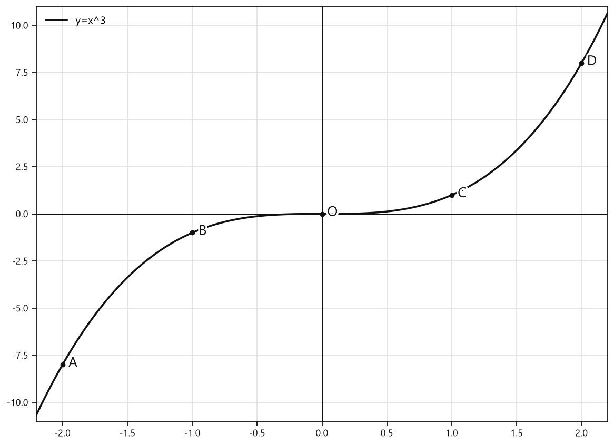

*График функции y=x^3*


#### Определение / факт

**График функции $y = x^3$.** Для построения графика функции $y = x^3$ составим таблицу значений функции, соответствующих некоторым значениям аргумента.

Соединим точки плавной линией, получим график функции $y = x^3$ (рис. 100). Эта линия называется *кубической параболой*.

#### Правила

Алгоритм построения:

1. Выбрать несколько значений $x$.
2. Вычислить соответствующие значения $y=x^3$.
3. Записать координаты точек.
4. Отметить точки на координатной плоскости.
5. Соединить точки плавной линией.

График функции $y=x^3$:

- проходит через начало координат $(0;0)$;
- проходит через точки первой и третьей координатных четвертей;
- имеет вид плавной кривой;
- называется кубической параболой.

#### Ловушки

- Не соединяй соседние точки отрезками: получится ломаная, а не график функции.
- Не забывай точку $(0;0)$.
- Кубическая парабола не является обычной параболой $y=x^2$: у неё нет «чаши».
- Для отрицательных значений $x$ значения $y$ также отрицательны.

---

### 5. Промежутки монотонности

#### Простыми словами

Двигаемся по оси $x$ слева направо. Значения $x$ увеличиваются, и значения $x^3$ тоже увеличиваются:

$$-2<-1<0<1<2,$$

а значит,

$$-8<-1<0<1<8.$$

График всё время поднимается. Он не делает «горку» и не возвращается вниз.

#### Определение / факт

**Промежутки монотонности функции.** С увеличением значений аргумента значения функции увеличиваются, т. е. функция возрастает на промежутке $(-\infty; +\infty)$.

#### Формулы

Если

$$x_1<x_2,$$

то

$$x_1^3<x_2^3.$$

#### Правила

Чтобы сравнить значения функции $f(x)=x^3$, можно сначала сравнить аргументы:

- если $a<b$, то $f(a)<f(b)$;
- если $a>b$, то $f(a)>f(b)$.

Например, поскольку

$$2,356<2,365,$$

то

$$f(2,356)<f(2,365).$$

#### Ловушки

- Отрицательные числа сравнивай внимательно: чем левее число на числовой прямой, тем оно меньше.
- Например:
  $$-4,006<-4,0006.$$
  Поэтому
  $$f(-4,006)<f(-4,0006).$$
- Возрастание функции не означает, что все значения функции положительны. При отрицательном $x$ значение $x^3$ отрицательно.

---

### 6. Симметрия графика

#### Простыми словами

У графика функции $y=x^3$ есть особое свойство: если точка $(x;y)$ принадлежит графику, то точка с противоположными знаками $(-x;-y)$ тоже принадлежит графику.

Например, точке $(2;8)$ соответствует точка $(-2;-8)$.

#### Определение / факт

**Точки графика функции $y = x^3$ симметричны относительно точки $(0; 0)$.**

#### Формулы

Если точка $(m;n)$ принадлежит графику, то симметричная ей точка имеет координаты:

$$(-m;-n).$$

Причина такого поведения — равенство:

$$(-x)^3=-x^3.$$

#### Правила

При симметрии относительно начала координат меняются знаки обеих координат:

$$(x;y)\longrightarrow(-x;-y).$$

#### Ловушки

- Нельзя менять знак только у одной координаты.
- Точка $(m;-n)$ получается при отражении относительно оси $x$.
- Точка $(-m;n)$ получается при отражении относительно оси $y$.
- Для симметрии относительно начала координат меняются оба знака.

---

## Сводка формул «выучить наизусть»

$$y=x^3.$$

$$D=\mathbb{R}.$$

$$E=\mathbb{R}.$$

$$x^3=0\Longleftrightarrow x=0.$$

$$x>0\Longrightarrow x^3>0.$$

$$x<0\Longrightarrow x^3<0.$$

$$x_1<x_2\Longrightarrow x_1^3<x_2^3.$$

$$(-x)^3=-x^3.$$

Если $(m;n)$ принадлежит графику, то ему принадлежит и точка:

$$(-m;-n).$$

## Правила, которые нельзя путать

- $(-a)^3=-a^3$, а не $a^3$.
- Для проверки принадлежности точки $(x_0;y_0)$ графику нужно подставить координаты в равенство:
  $$y_0=x_0^3.$$
- При симметрии относительно начала координат меняются знаки обеих координат.
- Функция $y=x^3$ возрастает на всей числовой прямой.
- График $y=x^3$ — кубическая парабола, а не обычная парабола $y=x^2$.

## Разбор ключевых заданий

### Р1. Найдите значения функции $y=x^3$, если:

а) $x=0,02$;  
б) $x=-0,02$;  
в) $x=1,2$;  
г) $x=-1,2$.

#### Решение

Используем формулу:

$$y=x^3.$$

Это значит: заданное значение $x$ нужно умножить само на себя три раза.

а) При $x=0,02$:

$$y=(0,02)^3.$$

$$y=0,02\cdot0,02\cdot0,02.$$

Сначала перемножим первые два множителя:

$$0,02\cdot0,02=0,0004.$$

Теперь умножим на $0,02$:

$$y=0,0004\cdot0,02=0,000008.$$

б) При $x=-0,02$:

$$y=(-0,02)^3.$$

$$y=(-0,02)\cdot(-0,02)\cdot(-0,02).$$

Первые два отрицательных множителя дают положительное число:

$$(-0,02)\cdot(-0,02)=0,0004.$$

Умножаем на третий отрицательный множитель:

$$y=0,0004\cdot(-0,02)=-0,000008.$$

При нечётной степени минус сохраняется. Он здесь не потерялся — просто честно дошёл до ответа.

в) При $x=1,2$:

$$y=(1,2)^3.$$

$$y=1,2\cdot1,2\cdot1,2.$$

$$1,2\cdot1,2=1,44.$$

$$y=1,44\cdot1,2=1,728.$$

г) При $x=-1,2$:

$$y=(-1,2)^3.$$

Сначала найдём куб числа $1,2$:

$$1,2^3=1,728.$$

Так как степень нечётная, знак отрицательного числа сохраняется:

$$(-1,2)^3=-1,728.$$

**Ответ:** а) $0,000008$; б) $-0,000008$; в) $1,728$; г) $-1,728$.

---

### Р2. Найдите значение аргумента, при котором значение функции $f(x)=x^3$ равно:

а) $1$;  
б) $0$;  
в) $-8$;  
г) $2\sqrt2$.

#### Решение

Значение функции равно $x^3$, поэтому в каждом пункте составляем уравнение:

$$x^3=y.$$

а) Если значение функции равно $1$, то:

$$x^3=1.$$

Куб числа $1$ равен $1$:

$$1^3=1.$$

Значит,

$$x=1.$$

б) Если значение функции равно $0$, то:

$$x^3=0.$$

Куб равен нулю только при $x=0$:

$$x=0.$$

в) Если значение функции равно $-8$, то:

$$x^3=-8.$$

Проверим число $-2$:

$$(-2)^3=(-2)\cdot(-2)\cdot(-2)=-8.$$

Значит,

$$x=-2.$$

г) Если значение функции равно $2\sqrt2$, то:

$$x^3=2\sqrt2.$$

Проверим число $\sqrt2$:

$$(\sqrt2)^3=(\sqrt2)^2\cdot\sqrt2.$$

Используем свойство квадратного корня:

$$(\sqrt2)^2=2.$$

Тогда:

$$(\sqrt2)^3=2\sqrt2.$$

Следовательно,

$$x=\sqrt2.$$

**Ответ:** а) $1$; б) $0$; в) $-2$; г) $\sqrt2$.

---

### Р3. Сравните значения функции $f(x)=x^3$:

а) $f(2,356)$ и $f(2,365)$;  
б) $f(-4,006)$ и $f(-4,0006)$.

#### Решение

Функция $f(x)=x^3$ возрастает на всей числовой прямой. Поэтому достаточно сравнить аргументы: большему аргументу соответствует большее значение функции.

а) Сравним аргументы:

$$2,356<2,365.$$

Тогда:

$$f(2,356)<f(2,365).$$

б) Сравним отрицательные числа:

$$-4,006<-4,0006.$$

Точка $-4,006$ находится левее на числовой прямой, поэтому она меньше числа $-4,0006$.

Так как функция возрастает:

$$f(-4,006)<f(-4,0006).$$

У отрицательных чисел главное не испугаться количества цифр после запятой: сравниваем числа на числовой прямой, а не устраиваем конкурс по длине записи.

**Ответ:** а) $f(2,356)<f(2,365)$; б) $f(-4,006)<f(-4,0006)$.

---

### Р4. Принадлежит ли графику функции $y=x^3$ точка с координатами:

а) $(1;0)$;  
б) $(1;1)$;  
в) $(1;-1)$;  
г) $(-1;-1)$?

#### Решение

Точка $(x_0;y_0)$ принадлежит графику функции $y=x^3$, если после подстановки её координат получается верное равенство:

$$y_0=x_0^3.$$

а) Для точки $(1;0)$:

$$x_0=1,\qquad y_0=0.$$

Проверяем:

$$1^3=0.$$

$$1\ne0.$$

Равенство неверно, поэтому точка не принадлежит графику.

б) Для точки $(1;1)$:

$$1^3=1.$$

Равенство верно, поэтому точка принадлежит графику.

в) Для точки $(1;-1)$:

$$1^3=-1.$$

$$1\ne-1.$$

Равенство неверно, поэтому точка не принадлежит графику.

г) Для точки $(-1;-1)$:

$$(-1)^3=-1.$$

Равенство верно, поэтому точка принадлежит графику.

**Ответ:** графику принадлежат точки $(1;1)$ и $(-1;-1)$.

---

### Р5. Точка $M(m;n)$ принадлежит графику функции $y=x^3$. Какая из точек также принадлежит этому графику?

а) $N(-m;n)$;  
б) $K(m;-n)$;  
в) $L(-m;-n)$.

#### Решение

График функции $y=x^3$ симметричен относительно начала координат $(0;0)$.

При такой симметрии знак меняется у обеих координат:

$$(m;n)\longrightarrow(-m;-n).$$

Из предложенных точек именно такие координаты имеет точка $L$:

$$L(-m;-n).$$

Следовательно, она также принадлежит графику.

**Ответ:** $L(-m;-n)$.

---

### Р6. Выберите точки, через которые проходит график функции $y=x^3$:

а) $A(-5;-125)$;  
б) $B(4;-64)$;  
в) $C(10;100)$;  
г) $D(-0,1;-0,001)$;  
д) $E(2;6)$;  
е) $M(\sqrt3;3\sqrt3)$.

#### Решение

Для каждой точки проверяем равенство:

$$y=x^3.$$

а) Для точки $A(-5;-125)$:

$$(-5)^3=-125.$$

Координаты подходят, поэтому точка $A$ принадлежит графику.

б) Для точки $B(4;-64)$:

$$4^3=64.$$

$$64\ne-64.$$

Точка $B$ не принадлежит графику.

в) Для точки $C(10;100)$:

$$10^3=1000.$$

$$1000\ne100.$$

Точка $C$ не принадлежит графику.

г) Для точки $D(-0,1;-0,001)$:

$$(-0,1)^3=-0,001.$$

Равенство верно, поэтому точка $D$ принадлежит графику.

д) Для точки $E(2;6)$:

$$2^3=8.$$

$$8\ne6.$$

Точка $E$ не принадлежит графику.

е) Для точки $M(\sqrt3;3\sqrt3)$:

$$(\sqrt3)^3=(\sqrt3)^2\cdot\sqrt3.$$

$$(\sqrt3)^2=3.$$

Поэтому:

$$(\sqrt3)^3=3\sqrt3.$$

Равенство верно, поэтому точка $M$ принадлежит графику.

**Ответ:** $A(-5;-125)$, $D(-0,1;-0,001)$, $M(\sqrt3;3\sqrt3)$.

Дополнительно можно взять, например, точки:

$$(0;0),\qquad (1;1).$$

---

### Р7. Расположите в порядке убывания значения:

$$g(-2,8),\qquad g(0),\qquad g(-4,65),\qquad g(15),$$

если $g(x)=x^3$.

#### Решение

Функция $g(x)=x^3$ возрастает на всей числовой прямой. Поэтому порядок значений функции будет таким же, как порядок соответствующих аргументов.

Расположим аргументы в порядке убывания:

$$15>0>-2,8>-4,65.$$

Значит, и значения функции расположены в таком порядке:

$$g(15)>g(0)>g(-2,8)>g(-4,65).$$

**Ответ:** $g(15)$, $g(0)$, $g(-2,8)$, $g(-4,65)$.

### Р8. Найдите значение выражения

$$f(-3)+f(3)-f(5),$$

если $f(x)=x^3$.

#### Решение

Сначала найдём каждое значение функции.

Подставим $x=-3$:

$$f(-3)=(-3)^3=-27.$$

Подставим $x=3$:

$$f(3)=3^3=27.$$

Подставим $x=5$:

$$f(5)=5^3=125.$$

Теперь подставим найденные значения в выражение:

$$f(-3)+f(3)-f(5)=-27+27-125.$$

Сначала сложим противоположные числа:

$$-27+27=0.$$

Тогда:

$$0-125=-125.$$

Минус перед $125$ никуда не исчезает: он здесь главный охранник знака.

**Ответ:** $-125$.

---

### Р9. Обобщите результат и найдите

$$f(a)+f(-a)+f(1),$$

если $f(x)=x^3$, а $a$ — любое действительное число.

#### Решение

Найдём значения функции:

$$f(a)=a^3.$$

$$f(-a)=(-a)^3=-a^3.$$

$$f(1)=1^3=1.$$

Подставим их в выражение:

$$f(a)+f(-a)+f(1)=a^3-a^3+1.$$

Первые два слагаемых уничтожают друг друга:

$$a^3-a^3=0.$$

Остаётся:

$$0+1=1.$$

Это происходит при любом значении $a$.

**Ответ:** $1$.

---

### Р10. Найдите координаты общих точек графиков функций

$$y=x^3$$

и

$$y=2-x.$$

#### Решение

В общей точке графиков координата $y$ одна и та же.

Поэтому приравняем правые части формул:

$$x^3=2-x.$$

Перенесём $-x$ в левую часть:

$$x^3+x-2=0.$$

Попробуем найти целый корень.

При $x=1$:

$$1^3+1-2=0.$$

Значит, $x=1$ — корень многочлена.

Разложим многочлен на множители:

$$x^3+x-2=(x-1)(x^2+x+2).$$

Получаем уравнение:

$$(x-1)(x^2+x+2)=0.$$

Произведение равно нулю, если хотя бы один множитель равен нулю.

Первый случай:

$$x-1=0,$$

$$x=1.$$

Второй случай:

$$x^2+x+2=0.$$

Найдём дискриминант этого квадратного уравнения:

$$D=1^2-4\cdot1\cdot2.$$

$$D=1-8=-7.$$

Так как $D<0$, действительных корней уравнение $x^2+x+2=0$ не имеет.

Значит, подходит только:

$$x=1.$$

Найдём соответствующее значение $y$ по формуле $y=2-x$:

$$y=2-1=1.$$

Получаем общую точку:

$$(1;1).$$


<!--geo-figure-spec
{
  "needed": true,
  "kind": "graph",
  "caption": "Графики $y=x^3$ и $y=2-x$",
  "axis": true,
  "grid": true,
  "xlim": [
    -1.8,
    1.8
  ],
  "ylim": [
    -6,
    6
  ],
  "curves": [
    {
      "expr": "x**3",
      "label": "y=x^3"
    },
    {
      "expr": "2-x",
      "label": "y=2-x"
    }
  ],
  "points": {},
  "labels": {}
}
-->
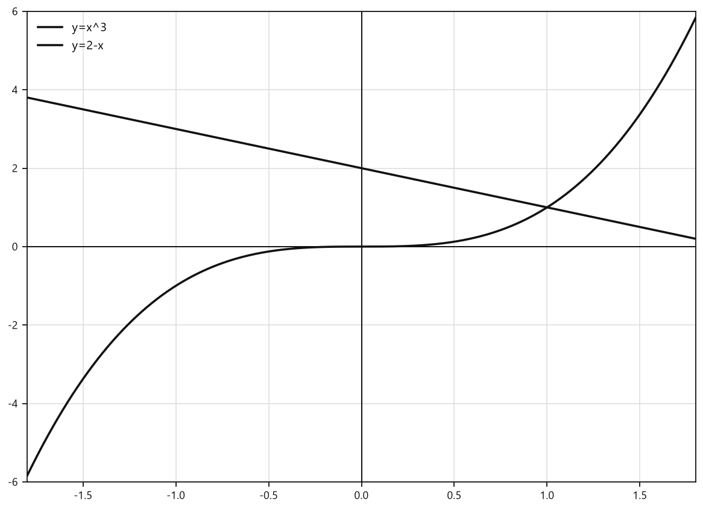

*Графики y=x^3 и y=2-x*


**Ответ:** $(1;1)$.

---

### Р11. Найдите координаты общих точек графиков функций

$$y=x^3$$

и

$$y=\frac{16}{x}.$$

#### Решение

У дробной функции знаменатель не может быть равен нулю:

$$x\ne0.$$

В общей точке графиков значения $y$ совпадают, поэтому приравняем формулы:

$$x^3=\frac{16}{x}.$$

Так как $x\ne0$, умножим обе части уравнения на $x$:

$$x^4=16.$$

Представим $16$ как четвёртую степень числа:

$$16=2^4.$$

Тогда:

$$x^4=2^4.$$

Четвёртые степени равны, если основания равны по модулю:

$$x=2\quad\text{или}\quad x=-2.$$

Теперь найдём $y$ для каждого значения $x$.

При $x=2$:

$$y=2^3=8.$$

Получаем точку:

$$(2;8).$$

При $x=-2$:

$$y=(-2)^3=-8.$$

Получаем точку:

$$(-2;-8).$$

Проверим эти точки по формуле $y=\frac{16}{x}$:

$$\frac{16}{2}=8,$$

$$\frac{16}{-2}=-8.$$

Обе точки подходят. Графики действительно встретились, а не просто обменялись взглядами.


<!--geo-figure-spec
{
  "needed": true,
  "kind": "graph",
  "caption": "Графики $y=x^3$ и $y=16/x$",
  "axis": true,
  "grid": true,
  "xlim": [
    -2.6,
    2.6
  ],
  "ylim": [
    -18,
    18
  ],
  "curves": [
    {
      "expr": "x**3",
      "label": "y=x^3"
    },
    {
      "expr": "16/x",
      "label": "y=16/x"
    }
  ],
  "points": {
    "A": [
      -2,
      -8
    ],
    "B": [
      2,
      8
    ]
  },
  "labels": {
    "A": {
      "dx": -0.38,
      "dy": 0.5
    },
    "B": {
      "dx": 0.16,
      "dy": 0.5
    }
  }
}
-->
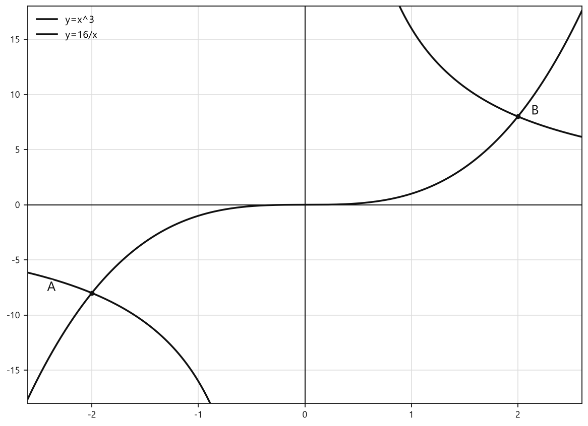

*Графики y=x^3 и y=16/x*


**Ответ:** $(-2;-8)$ и $(2;8)$.

---

### Р12. Сравните свойства функций

$$y=x^3$$

и

$$y=x.$$

#### Решение

Сначала выпишем свойства первой функции $y=x^3$:

- область определения — $\mathbb R$;
- множество значений — $\mathbb R$;
- нуль функции — $x=0$;
- функция возрастает на всей числовой прямой;
- график симметричен относительно начала координат;
- график — кубическая парабола.

Теперь рассмотрим функцию $y=x$:

- область определения — $\mathbb R$;
- множество значений — $\mathbb R$;
- нуль функции — $x=0$;
- функция возрастает на всей числовой прямой;
- график симметричен относительно начала координат;
- график — прямая.

Свойства почти одинаковые, но сами графики разные. Найдём их общие точки.

В общей точке значения $y$ равны:

$$x^3=x.$$

Перенесём $x$ в левую часть:

$$x^3-x=0.$$

Вынесем $x$ за скобки:

$$x(x^2-1)=0.$$

Разложим разность квадратов:

$$x^2-1=(x-1)(x+1).$$

Поэтому:

$$x(x-1)(x+1)=0.$$

Произведение равно нулю, если хотя бы один множитель равен нулю:

$$x=0,$$

$$x-1=0,\qquad x=1,$$

$$x+1=0,\qquad x=-1.$$

Найдём значения $y$ по формуле $y=x$:

при $x=-1$:

$$y=-1;$$

при $x=0$:

$$y=0;$$

при $x=1$:

$$y=1.$$

Общие точки графиков:

$$(-1;-1),\qquad (0;0),\qquad (1;1).$$


<!--geo-figure-spec
{
  "needed": true,
  "kind": "graph",
  "caption": "Графики $y=x^3$ и $y=x$",
  "axis": true,
  "grid": true,
  "xlim": [
    -1.8,
    1.8
  ],
  "ylim": [
    -6.5,
    6.5
  ],
  "curves": [
    {
      "expr": "x**3",
      "label": "y=x^3"
    },
    {
      "expr": "x",
      "label": "y=x"
    }
  ],
  "points": {
    "A": [
      -1,
      -1
    ],
    "O": [
      0,
      0
    ],
    "B": [
      1,
      1
    ]
  },
  "labels": {
    "A": {
      "dx": -0.32,
      "dy": 0.35
    },
    "O": {
      "dx": 0.14,
      "dy": 0.32
    },
    "B": {
      "dx": 0.15,
      "dy": 0.32
    }
  }
}
-->
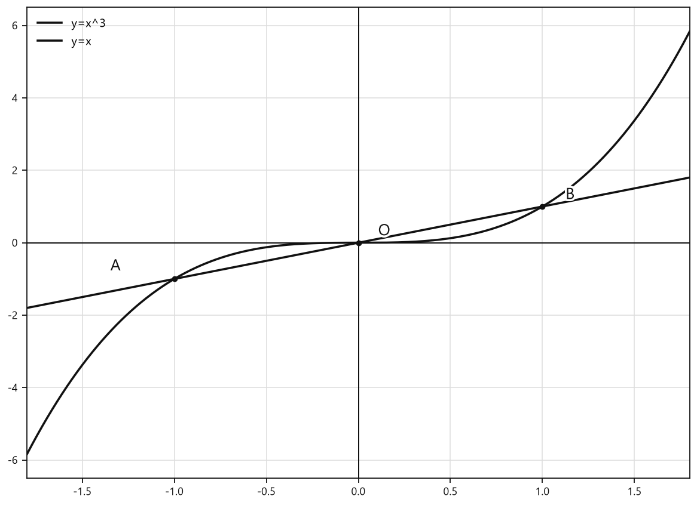

*Графики y=x^3 и y=x*


**Ответ:** обе функции имеют область определения $\mathbb R$, множество значений $\mathbb R$, нуль $0$, возрастают на всей числовой прямой и симметричны относительно начала координат. Их графики различаются: у $y=x$ — прямая, у $y=x^3$ — кубическая парабола. Общие точки: $(-1;-1)$, $(0;0)$, $(1;1)$.

## Практические задания

Выбери свой уровень и решай только этот блок. В блоке должна закрепиться вся тема параграфа. Ответы не приводятся.

### Уровень 1–2 балла

**С1.** Найдите значение функции $f(x)=x^3$ при $x=2$.

**С2.** Найдите значение функции $f(x)=x^3$ при $x=-3$.

**С3.** Найдите значение функции $f(x)=x^3$ при $x=0,1$.

**С4.** Найдите значение аргумента функции $f(x)=x^3$, при котором $f(x)=8$.

**С5.** Найдите значение аргумента функции $f(x)=x^3$, при котором $f(x)=-27$.

**С6.** Выберите точку, принадлежащую графику функции $y=x^3$.

1) $A(2;6)$ 2) $B(-2;4)$ 3) $C(3;27)$ 4) $D(-1;1)$ 5) $E(0;1)$

**С7.** Выберите точку, принадлежащую графику функции $y=x^3$.

1) $A(-0,1;0,001)$ 2) $B(0,5;0,125)$ 3) $C(2;-8)$ 4) $D(-3;9)$ 5) $E(1;0)$

**С8.** Сравните значения $f(2,4)$ и $f(2,7)$ функции $f(x)=x^3$. Выберите верное утверждение.

1) $f(2,4)>f(2,7)$ 2) $f(2,4)<f(2,7)$ 3) $f(2,4)=f(2,7)$ 4) Сравнить невозможно 5) Оба значения отрицательны

**С9.** Сравните значения $f(-1,8)$ и $f(-2,1)$ функции $f(x)=x^3$. Выберите верное утверждение.

1) $f(-1,8)>f(-2,1)$ 2) $f(-1,8)<f(-2,1)$ 3) $f(-1,8)=f(-2,1)$ 4) Оба значения положительны 5) Сравнить невозможно

**С10.** Укажите нуль функции $y=x^3$.

1) $-3$ 2) $-1$ 3) $0$ 4) $1$ 5) $3$

**С11.** Укажите промежуток, на котором функция $y=x^3$ принимает положительные значения.

1) $(-\infty;0)$ 2) $(-\infty;+\infty)$ 3) $(0;+\infty)$ 4) $\{0\}$ 5) $[-1;1]$

**С12.** Точка $M(m;n)$ принадлежит графику функции $y=x^3$. Какая из точек также принадлежит этому графику?

1) $A(-m;n)$ 2) $B(m;-n)$ 3) $C(-m;-n)$ 4) $D(n;m)$ 5) $E(-n;-m)$

**С13.** Вычислите значение функции $f(x)=x^3$ при $x=2$.

**С14.** Вычислите значение функции $f(x)=x^3$ при $x=-3$.

**С15.** Найдите значение аргумента функции $f(x)=x^3$, при котором $f(x)=8$.

**С16.** Найдите значение аргумента функции $f(x)=x^3$, при котором $f(x)=-27$.

**С17.** Какая из точек принадлежит графику функции $y=x^3$?  
1) $A(2;4)$ 2) $B(2;8)$ 3) $C(-2;8)$ 4) $D(3;6)$ 5) $E(-1;1)$

**С18.** Какая из точек принадлежит графику функции $y=x^3$?  
1) $A(-3;-9)$ 2) $B(-2;-8)$ 3) $C(1;-1)$ 4) $D(0;1)$ 5) $E(4;12)$

**С19.** Сравните значения $f(-2)$ и $f(1)$ функции $f(x)=x^3$. Выберите верное утверждение.  
1) $f(-2)>f(1)$ 2) $f(-2)=f(1)$ 3) $f(-2)<f(1)$ 4) $f(-2)=0$ 5) сравнить невозможно

**С20.** Сравните значения $f(-1,5)$ и $f(-2)$ функции $f(x)=x^3$. Выберите верное утверждение.  
1) $f(-1,5)>f(-2)$ 2) $f(-1,5)=f(-2)$ 3) $f(-1,5)<f(-2)$ 4) $f(-1,5)>0$ 5) сравнить невозможно

**С21.** Укажите промежуток, на котором функция $y=x^3$ принимает положительные значения.  
1) $(-\infty;0)$ 2) $(-\infty;+\infty)$ 3) $(0;+\infty)$ 4) $\{0\}$ 5) $[-1;1]$

**С22.** Укажите нуль функции $y=x^3$.  
1) $-1$ 2) $0$ 3) $1$ 4) $3$ 5) нулей нет

**С23.** График функции $y=x^3$ проходит через точку $M(a;b)$. Какая точка обязательно также принадлежит этому графику?  
1) $N(-a;b)$ 2) $K(a;-b)$ 3) $L(-a;-b)$ 4) $P(a+1;b+1)$ 5) $Q(-a;b+1)$

**С24.** Выберите верное утверждение о функции $y=x^3$.  
1) Область определения функции — только неотрицательные числа.  
2) Функция убывает на всей области определения.  
3) Множество значений функции состоит только из положительных чисел.  
4) Функция возрастает на всей области определения.  
5) График функции симметричен относительно оси $Oy$.

**С25.** Выберите область определения функции $y=x^3$:

1) $(-\infty;0)$  
2) $(0;+\infty)$  
3) $[0;+\infty)$  
4) $(-\infty;+\infty)$  
5) $\{0\}$

**С26.** Выберите множество значений функции $y=x^3$:

1) $[0;+\infty)$  
2) $(-\infty;0]$  
3) $(-\infty;+\infty)$  
4) $(0;+\infty)$  
5) $\{0\}$

**С27.** Найдите значение функции $f(x)=x^3$ при $x=2$.

**С28.** Найдите значение функции $f(x)=x^3$ при $x=-3$.

**С29.** Найдите значение функции $f(x)=x^3$ при $x=0,1$.

**С30.** Выберите нуль функции $f(x)=x^3$:

1) $-3$  
2) $-1$  
3) $0$  
4) $1$  
5) $3$

**С31.** Какая из точек принадлежит графику функции $y=x^3$?

1) $A(2;4)$  
2) $B(2;8)$  
3) $C(-2;4)$  
4) $D(-2;8)$  
5) $E(0;1)$

**С32.** Точка $M(m;n)$ принадлежит графику функции $y=x^3$. Какая из точек также принадлежит этому графику?

1) $A(-m;n)$  
2) $B(m;-n)$  
3) $C(-m;-n)$  
4) $D(m;n+1)$  
5) $E(-m;n+1)$

**С33.** Сравните значения $f(-2,4)$ и $f(-1,7)$ функции $f(x)=x^3$. Запишите знак сравнения между ними.

**С34.** Выберите промежуток, на котором функция $y=x^3$ принимает отрицательные значения:

1) $(-\infty;0)$  
2) $(0;+\infty)$  
3) $(-\infty;+\infty)$  
4) $[0;+\infty)$  
5) $\{0\}$

**С35.** Выберите верное утверждение о функции $y=x^3$:

1) функция убывает на всей области определения;  
2) функция возрастает только при $x>0$;  
3) функция возрастает на всей области определения;  
4) функция постоянна на всей области определения;  
5) функция не определена при отрицательных значениях $x$.

**С36.** Найдите значение аргумента функции $f(x)=x^3$, при котором $f(x)=27$.

### Уровень 3–4 балла

**С1.** Вычислите значения функции $f(x)=x^3$:  
а) $f(2)$; б) $f(-3)$; в) $f(0,1)$; г) $f(-0,5)$.

**С2.** Найдите значение аргумента функции $f(x)=x^3$, при котором значение функции равно:  
а) $8$; б) $-27$; в) $0$.

**С3.** Определите, принадлежит ли графику функции $y=x^3$ каждая из точек:  
а) $A(2;8)$; б) $B(-2;8)$; в) $C(-0,5;-0,125)$; г) $D(3;9)$.

**С4.** Заполните таблицу значений функции $y=x^3$.

| $x$ | $-2$ | $-1$ | $0$ | $1$ | $2$ |
|---|---:|---:|---:|---:|---:|
| $y$ |  |  |  |  |  |

**С5.** Укажите область определения и множество значений функции $y=x^3$.

**С6.** Укажите нуль функции $y=x^3$ и промежутки, на которых функция принимает положительные и отрицательные значения.

**С7.** Сравните значения функций:  
а) $f(1,7)$ и $f(2,4)$;  
б) $f(-3,2)$ и $f(-1,8)$,  
если $f(x)=x^3$.

**С8.** Расположите значения функции $g(x)=x^3$ в порядке возрастания: $g(-2,5)$, $g(0)$, $g(-1)$, $g(1,5)$.

**С9.** Функция $f(x)=x^3$ возрастает на всей области определения. Сравните $f(-\sqrt{3})$ и $f(-1)$.

**С10.** Точка $M(m;n)$ принадлежит графику функции $y=x^3$. Какая из точек также принадлежит этому графику:  
а) $A(-m;n)$; б) $B(m;-n)$; в) $C(-m;-n)$?  
Рассмотрите случай $m\ne0$.

**С11.** Найдите координаты общих точек графиков функций $y=x^3$ и $y=x$.

**С12.** Для функции $f(x)=x^3$ упростите выражение $f(a)+f(-a)$, где $a$ — любое действительное число.

**С13.** Найдите значения функции $f(x)=x^3$ при $x=-4$, $x=0,2$ и $x=-0,1$.

**С14.** Функция задана формулой $f(x)=x^3$. Найдите значение аргумента, при котором $f(x)=64$.

**С15.** Функция задана формулой $f(x)=x^3$. Найдите значение аргумента, при котором $f(x)=-0,008$.

**С16.** Определите, принадлежит ли графику функции $y=x^3$ точка $A(-2;-8)$.

**С17.** Определите, принадлежит ли графику функции $y=x^3$ точка $B(0,5;0,125)$.

**С18.** Сравните значения $f(-3,4)$ и $f(-2,9)$ функции $f(x)=x^3$.

**С19.** Расположите в порядке возрастания значения функции $g(x)=x^3$: $g(-1,5)$, $g(0)$, $g(-2)$, $g(1)$.

**С20.** Укажите область определения и множество значений функции $y=x^3$.

**С21.** Укажите нуль функции $y=x^3$ и промежутки, на которых функция принимает отрицательные и положительные значения.

**С22.** Точка $M(a;b)$ принадлежит графику функции $y=x^3$. Какая из точек также принадлежит этому графику: $P(-a;b)$, $Q(a;-b)$ или $R(-a;-b)$?

**С23.** Найдите координаты общих точек графиков функций $y=x^3$ и $y=x$.

**С24.** Найдите значение выражения $f(-2\sqrt{3})+f(2\sqrt{3})+f(0)$, если $f(x)=x^3$.

**С25.** Для функции $f(x)=x^3$ найдите $f(0)$, $f(2)$, $f(-3)$ и $f(0,5)$.

**С26.** Найдите значение аргумента функции $f(x)=x^3$, при котором значение функции равно $-27$.

**С27.** Найдите значение аргумента функции $f(x)=x^3$, при котором значение функции равно $8$.

**С28.** Какие из точек принадлежат графику функции $y=x^3$: $A(-2;-8)$, $B(3;9)$, $C(0;0)$, $D(-0,5;0,125)$?

**С29.** Точка $M(m;n)$ принадлежит графику функции $y=x^3$. Какая из точек также принадлежит этому графику: $N(-m;n)$, $K(m;-n)$ или $L(-m;-n)$?

**С30.** Сравните значения $f(1,7)$ и $f(2,1)$ функции $f(x)=x^3$.

**С31.** Сравните значения $f(-3,4)$ и $f(-2,8)$ функции $f(x)=x^3$.

**С32.** Расположите в порядке возрастания значения функции $g(x)=x^3$: $g(-1,5)$, $g(0)$, $g(-2)$ и $g(0,4)$.

**С33.** Укажите промежуток, на котором функция $y=x^3$ принимает отрицательные значения, и промежуток, на котором она принимает положительные значения.

**С34.** Заполните пропуски в таблице значений функции $y=x^3$.

| $x$ | $-2$ | $-1$ | $0$ | $1$ | $2$ |
|---|---:|---:|---:|---:|---:|
| $y$ |  | $-1$ |  | $1$ |  |

**С35.** В одной системе координат постройте график функции $y=x^3$, используя значения $x=-2,-1,0,1,2$. Укажите координаты точки графика, симметричной точке $A(2;8)$ относительно начала координат.


<!--geo-figure-spec
{
  "needed": true,
  "kind": "graph",
  "caption": "График функции $y=x^3$",
  "axis": true,
  "grid": true,
  "xlim": [
    -2.2,
    2.2
  ],
  "ylim": [
    -11.5,
    11.5
  ],
  "curves": [
    {
      "expr": "x**3",
      "label": "y=x^3"
    }
  ],
  "points": {
    "A": [
      2,
      8
    ]
  },
  "labels": {
    "A": {
      "dx": 0.12,
      "dy": 0.25
    }
  }
}
-->
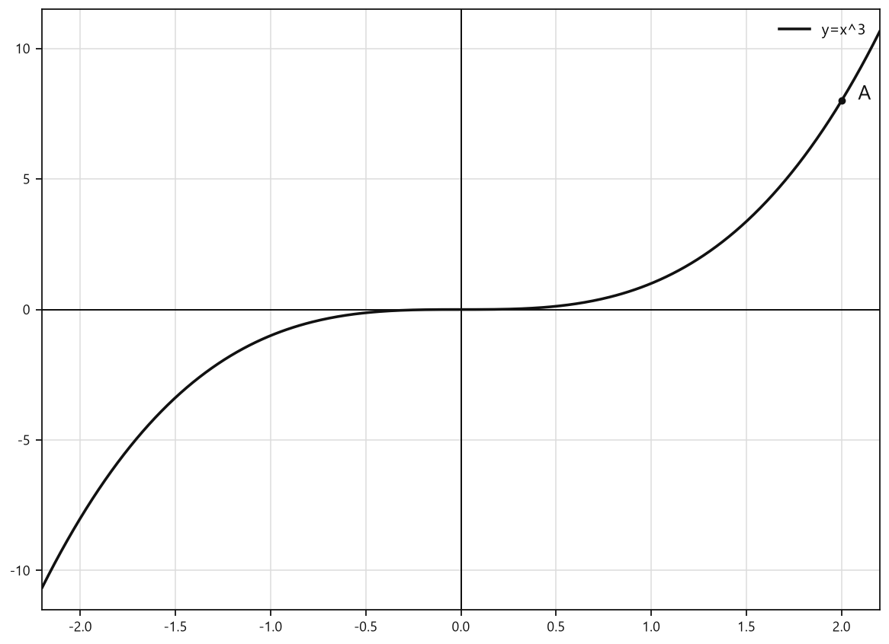

*График функции y=x^3*


**С36.** Найдите координаты общих точек графиков функций $y=x^3$ и $y=x$.

```geo-figure
{
  "needed": true,
  "kind": "graph",
  "caption": "Графики функций $y=x^3$ и $y=x$",
  "axis": true,
  "grid": true,
  "xlim": [-2.5, 2.5],
  "ylim": [-9, 9],
  "curves": [
    {"expr": "x**3", "label": "y=x^3"},
    {"expr": "x", "label": "y=x"}
  ],
  "points": {
    "A": [-1, -1],
    "B": [0, 0],
    "C": [1, 1]
  },
  "labels": {
    "A": {"dx": -0.28, "dy": 0.2},
    "B": {"dx": 0.12, "dy": 0.2},
    "C": {"dx": 0.12, "dy": 0.2}
  }
}

### Уровень 5–6 баллов

**С1.** Для функции $f(x)=x^3$ найдите значения $f(0)$, $f(2)$, $f(-3)$, $f(0{,}5)$ и $f(-0{,}1)$.

**С2.** Функция задана формулой $f(x)=x^3$. Найдите значение аргумента, при котором значение функции равно $8$, $0$, $-27$ и $\dfrac{1}{8}$.

**С3.** Укажите, какие из точек принадлежат графику функции $y=x^3$:  
$A(-2;-8)$, $B(-1;1)$, $C(0;0)$, $D(3;9)$, $E(0{,}2;0{,}008)$.

**С4.** Функция задана формулой $f(x)=x^3$. Сравните значения:  
а) $f(1{,}7)$ и $f(2{,}1)$;  
б) $f(-3{,}4)$ и $f(-2{,}8)$;  
в) $f(-\sqrt{5})$ и $f(-2)$.

**С5.** Расположите в порядке возрастания значения функции $g(x)=x^3$: $g(-2{,}5)$, $g(0)$, $g(-1{,}8)$, $g(1{,}2)$.

**С6.** Выберите верное утверждение о функции $y=x^3$.

1) Область определения функции — только неотрицательные числа.  
2) Множеством значений функции являются все действительные числа.  
3) Функция принимает отрицательные значения при $x>0$.  
4) Функция имеет два нуля.  
5) Функция убывает на всей области определения.

**С7.** Точка $M(m;n)$ принадлежит графику функции $y=x^3$. Запишите координаты точки этого графика, симметричной точке $M$ относительно начала координат.

**С8.** Найдите значение выражения:  
а) $f(-4)+f(4)$;  
б) $f(-\sqrt{3})+f(\sqrt{3})$;  
в) $f(-2)+f(2)+f(1)$,  
если $f(x)=x^3$.

**С9.** Заполните таблицу значений функции $y=x^3$ для указанных значений аргумента.

| $x$ | $-2$ | $-0{,}5$ | $0$ | $1{,}5$ | $2$ |
|---|---:|---:|---:|---:|---:|
| $y=x^3$ |  |  |  |  |  |

**С10.** В одной системе координат постройте графики функций $y=x^3$ и $y=x$. По графику определите координаты всех их общих точек.

**С11.** Решите уравнение $x^3=64$. Проверьте найденное значение подстановкой в уравнение.

**С12.** Функция задана формулой $f(x)=x^3$. Для каждого утверждения укажите, верно оно или неверно:  
а) $f(-5)<f(-3)$;  
б) $f(0{,}4)>0$;  
в) $f(-0{,}7)>0$;  
г) если $a<b$, то $f(a)<f(b)$;  
д) график функции симметричен относительно начала координат.

**С13.** Для функции $f(x)=x^3$ найдите значения $f(-2)$, $f(0,4)$ и $f(3)$.

**С14.** Функция задана формулой $f(x)=x^3$. Найдите значение аргумента, при котором $f(x)=-27$.

**С15.** Какие из точек принадлежат графику функции $y=x^3$? Выберите все верные варианты:  
1) $A(-2;-8)$  
2) $B(-1;1)$  
3) $C(0,5;0,125)$  
4) $D(3;9)$  
5) $E(-0,2;-0,008)$

**С16.** Сравните значения функции $f(x)=x^3$: $f(1,7)$ и $f(2,3)$. Запишите знак сравнения.

**С17.** Расположите значения функции $g(x)=x^3$ в порядке возрастания: $g(-3)$, $g(0)$, $g(-1,5)$, $g(2)$.

**С18.** Укажите область определения и множество значений функции $y=x^3$.

**С19.** Определите знак значения функции $f(x)=x^3$, если $x=-4,6$. Ответ запишите словами: положительное, отрицательное или равное нулю.

**С20.** Точка $M(m;n)$ принадлежит графику функции $y=x^3$. Какая из точек также принадлежит этому графику?  
1) $A(-m;n)$  
2) $B(m;-n)$  
3) $C(-m;-n)$  
4) $D(n;m)$  
5) $E(-n;-m)$

**С21.** Найдите значение выражения $f(-2,5)+f(2,5)$, если $f(x)=x^3$.

**С22.** На графике функции $y=x^3$ найдите точку, абсцисса которой равна $-\sqrt{3}$. Запишите её координаты.

**С23.** Для функции $y=x^3$ определите, на каком промежутке она возрастает:  
1) $(-\infty;0)$  
2) $(0;+\infty)$  
3) $(-\infty;+\infty)$  
4) $[-1;1]$  
5) функция не возрастает ни на одном промежутке

**С24.** Найдите координаты общих точек графиков функций $y=x^3$ и $y=x$.

**С25.** Для функции $f(x)=x^3$ найдите значения $f(0)$, $f(-2)$, $f(0,4)$ и $f(-0,1)$.

**С26.** Функция задана формулой $f(x)=x^3$. Найдите значение аргумента, при котором значение функции равно $-27$, $0$, $64$ и $8\sqrt{2}$.

**С27.** Определите, какие из точек принадлежат графику функции $y=x^3$:  
$A(-3;-27)$, $B(-2;8)$, $C(0,5;0,125)$, $D(1,2;1,728)$, $E(\sqrt{5};5\sqrt{5})$.

**С28.** Функция задана формулой $f(x)=x^3$. Сравните значения:  
а) $f(1,7)$ и $f(2,3)$;  
б) $f(-3,4)$ и $f(-2,9)$;  
в) $f(-\sqrt{3})$ и $f(-2)$.

**С29.** Расположите в порядке возрастания значения функции $g(x)=x^3$: $g(-2,5)$, $g(-1)$, $g(0)$, $g(1,8)$ и $g(3)$.

**С30.** Точка $M(a;b)$ принадлежит графику функции $y=x^3$. Запишите координаты точки этого графика, симметричной точке $M$ относительно начала координат. Укажите также, при каком условии на $a$ значение $b$ является положительным.

### Уровень 7–8 баллов

**С1.** Для функции $f(x)=x^3$ найдите значения $f(-2)$, $f\left(-\frac12\right)$, $f(0)$ и $f\left(\frac32\right)$.

**С2.** Функция задана формулой $f(x)=x^3$. Найдите значение аргумента, при котором значение функции равно $-64$.

**С3.** Выберите точку, принадлежащую графику функции $y=x^3$.

1) $A(-2;8)$  
2) $B(-1;-1)$  
3) $C(0,5;0,25)$  
4) $D(3;9)$  
5) $E(-0,2;0,008)$

**С4.** Функция $f(x)=x^3$. Сравните значения $f(2,07)$ и $f(2,7)$, не вычисляя кубы чисел.

**С5.** Расположите значения функции $g(x)=x^3$ в порядке возрастания:
$g(-3,1)$, $g(-1,4)$, $g(0)$, $g(-2,8)$, $g(1,2)$.

**С6.** Точка $M(a;b)$ принадлежит графику функции $y=x^3$. Запишите координаты точки этого графика, симметричной точке $M$ относительно начала координат.

**С7.** Определите знак выражения $(-\sqrt{11})^3+4^3$ без нахождения его точного значения.

**С8.** Для функции $f(x)=x^3$ найдите значение выражения
$f(-\sqrt{5})+f(\sqrt{5})+f(-2)$.

**С9.** Функция задана формулой $f(x)=x^3$. Найдите все значения аргумента, при которых выполняется равенство $f(x)=8\sqrt{2}$.

**С10.** В одной системе координат постройте графики функций $y=x^3$ и $y=2-x$. Найдите координаты всех их общих точек.

```geo-figure
{
  "needed": true,
  "kind": "graph",
  "caption": "Графики $y=x^3$ и $y=2-x$",
  "axis": true,
  "grid": true,
  "xlim": [-3, 3],
  "ylim": [-10, 10],
  "curves": [
    {"expr": "x**3", "label": "y=x^3"},
    {"expr": "2-x", "label": "y=2-x"}
  ]
}
```

**С11.** В одной системе координат постройте графики функций $y=x^3$ и $y=x$. Определите координаты их общих точек и укажите, на каких промежутках значения функции $y=x^3$ больше значений функции $y=x$.


<!--geo-figure-spec
{
  "needed": true,
  "kind": "graph",
  "caption": "Графики $y=x^3$ и $y=x$",
  "axis": true,
  "grid": true,
  "xlim": [
    -2,
    2
  ],
  "ylim": [
    -9,
    9
  ],
  "curves": [
    {
      "expr": "x**3",
      "label": "y=x^3"
    },
    {
      "expr": "x",
      "label": "y=x"
    }
  ]
}
-->


*Графики y=x^3 и y=x*


**С12.** Точки $A(a;a^3)$ и $B(-a;-a^3)$ принадлежат графику функции $y=x^3$, где $a$ — действительное число. Докажите, что середина отрезка $AB$ совпадает с началом координат, и объясните, какое свойство графика функции $y=x^3$ это подтверждает.

**С13.** Для функции $f(x)=x^3$ найдите:
а) $f(-0,4)$; б) $f(1,5)$; в) $f\left(-\frac{2}{3}\right)$; г) $f\left(\sqrt{5}\right)$.

**С14.** Функция задана формулой $f(x)=x^3$. Сравните значения:
а) $f(-2,7)$ и $f(-2,3)$;
б) $f\left(\frac{5}{4}\right)$ и $f(1,2)$;
в) $f(-\sqrt{3})$ и $f(-2)$.
Обоснуйте каждый вывод свойством функции $y=x^3$.

**С15.** Найдите значения аргумента функции $f(x)=x^3$, при которых:
а) $f(x)=-64$; б) $f(x)=0$; в) $f(x)=\frac{27}{8}$; г) $f(x)=-5\sqrt{5}$.

**С16.** Определите, какие из точек принадлежат графику функции $y=x^3$:  
$A(-3;-27)$, $B(-2;8)$, $C(0,5;0,125)$, $D(2;6)$, $E\left(\sqrt{2};2\sqrt{2}\right)$.  
Для каждой выбранной точки выполните проверку подстановкой.

**С17.** Точка $M(a;b)$ принадлежит графику функции $y=x^3$. Из точек $P(-a;b)$, $Q(a;-b)$, $R(-a;-b)$ выберите те, которые также принадлежат этому графику. Ответ обоснуйте.

**С18.** Расположите в порядке возрастания значения функции $g(x)=x^3$:  
$g(-3,1)$, $g(-\sqrt{10})$, $g(0)$, $g(2,9)$, $g(3)$.  
Используйте свойство возрастания функции $y=x^3$ и сравните аргументы.

**С19.** Найдите координаты всех общих точек графиков функций $y=x^3$ и $y=4-x$. Составьте уравнение для абсцисс общих точек и проверьте найденные координаты.


<!--geo-figure-spec
{
  "needed": true,
  "kind": "graph",
  "caption": "Графики функций $y=x^3$ и $y=4-x$",
  "axis": true,
  "grid": true,
  "xlim": [
    -2.2,
    2.2
  ],
  "ylim": [
    -11,
    11
  ],
  "curves": [
    {
      "expr": "x**3",
      "label": "y=x^3"
    },
    {
      "expr": "4-x",
      "label": "y=4-x"
    }
  ]
}
-->
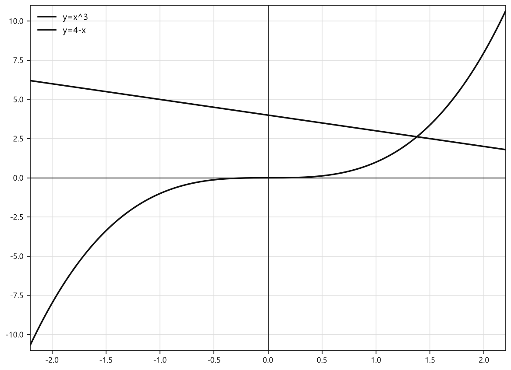

*Графики функций y=x^3 и y=4-x*


**С20.** Найдите координаты всех общих точек графиков функций $y=x^3$ и $y=\dfrac{8}{x}$, учитывая область определения второй функции. Ответ обоснуйте алгебраически.


<!--geo-figure-spec
{
  "needed": true,
  "kind": "graph",
  "caption": "Графики функций $y=x^3$ и $y=\\frac{8}{x}$",
  "axis": true,
  "grid": true,
  "xlim": [
    -2.5,
    2.5
  ],
  "ylim": [
    -16,
    16
  ],
  "curves": [
    {
      "expr": "x**3",
      "label": "y=x^3"
    },
    {
      "expr": "8/x",
      "label": "y=8/x"
    }
  ]
}
-->
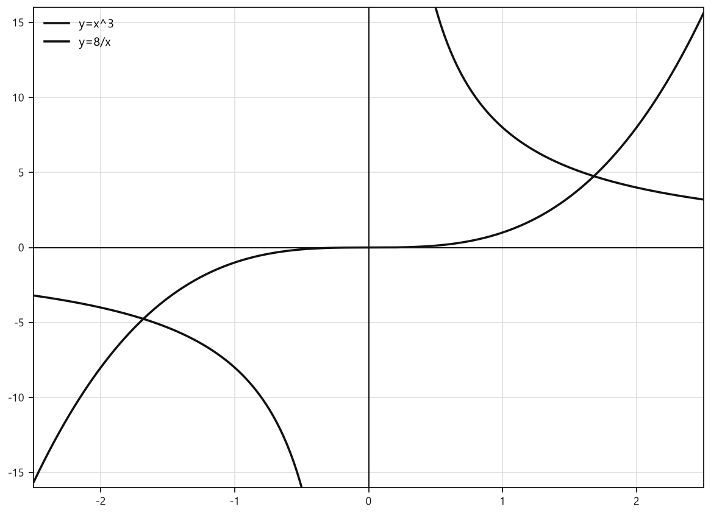

*Графики функций y=x^3 и y=\frac{8}{x}*


**С21.** Для функции $f(x)=x^3$ упростите выражение и найдите его значение при $a=-2$:  
$f(a)+f(-a)+f(3)$.  
Сформулируйте, какое свойство функции использовано при упрощении.

**С22.** Даны функции $y=x^3$ и $y=x$. Для каждого из промежутков $(-\infty;0)$, $\{0\}$ и $(0;+\infty)$ сравните значения этих функций при одном и том же аргументе $x$. Координаты общих точек графиков найдите отдельно.


<!--geo-figure-spec
{
  "needed": true,
  "kind": "graph",
  "caption": "Графики функций $y=x^3$ и $y=x$",
  "axis": true,
  "grid": true,
  "xlim": [
    -2,
    2
  ],
  "ylim": [
    -9,
    9
  ],
  "curves": [
    {
      "expr": "x**3",
      "label": "y=x^3"
    },
    {
      "expr": "x",
      "label": "y=x"
    }
  ]
}
-->
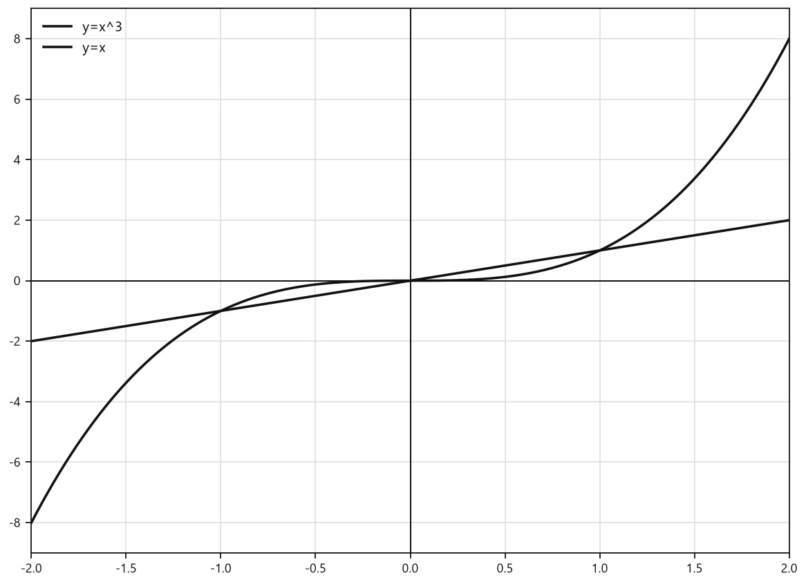

*Графики функций y=x^3 и y=x*


**С23.** Известно, что точка $A(2;8)$ принадлежит графику функции $y=x^3$. Запишите координаты точек, симметричных точке $A$ относительно начала координат и относительно оси $Oy$. Укажите, какая из этих точек принадлежит графику функции $y=x^3$, и обоснуйте ответ.


<!--geo-figure-spec
{
  "needed": true,
  "kind": "graph",
  "caption": "Точка $A(2;8)$ и точки, симметричные ей относительно начала координат и оси $Oy$",
  "axis": true,
  "grid": true,
  "xlim": [
    -2.4,
    2.4
  ],
  "ylim": [
    -15,
    15
  ],
  "curves": [
    {
      "expr": "x**3",
      "label": "y=x^3"
    }
  ],
  "points": {
    "A": [
      2,
      8
    ],
    "B": [
      -2,
      -8
    ],
    "C": [
      -2,
      8
    ]
  },
  "segments": [
    {
      "points": [
        "A",
        "B"
      ],
      "dashed": true,
      "label": ""
    },
    {
      "points": [
        "A",
        "C"
      ],
      "dashed": true,
      "label": ""
    }
  ],
  "labels": {
    "A": {
      "dx": 0.12,
      "dy": 0.28
    },
    "B": {
      "dx": -0.34,
      "dy": -0.42
    },
    "C": {
      "dx": -0.34,
      "dy": 0.28
    }
  }
}
-->
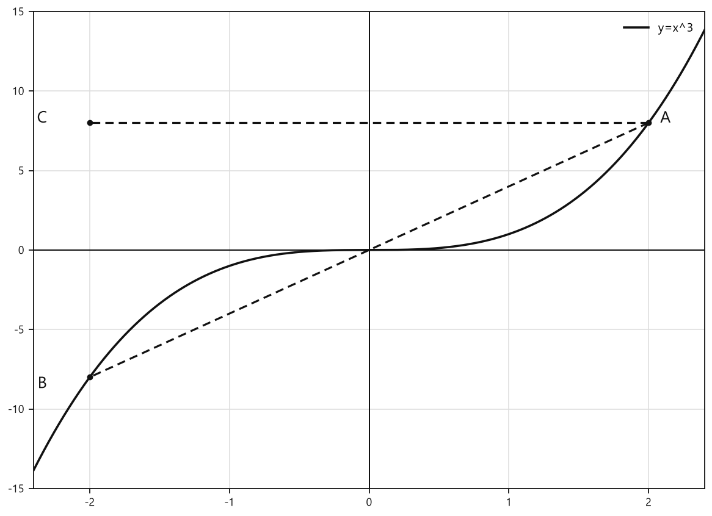

*Точка A(2;8) и точки, симметричные ей относительно начала координат и оси Oy*


**С24.** Функция задана формулой $f(x)=x^3$. Известно, что $u<v$ и $f(u)=-27$, $f(v)=8$.  
а) Найдите $u$ и $v$;  
б) сравните $f\left(\dfrac{u+v}{2}\right)$ и $\dfrac{f(u)+f(v)}{2}$;  
в) обоснуйте сравнение, вычислив оба значения.

### Уровень 9–10 баллов

**С1.** Для функции $f(x)=x^3$ вычислите значение выражения
$$
f(-\sqrt{5})+f(\sqrt{5})+f(-2)-f(2)+f(0{,}4).
$$

**С2.** Функция задана формулой $f(x)=x^3$. Найдите все значения аргумента, при которых значение функции равно одному из чисел $-27$, $-\dfrac{1}{8}$, $0$, $\dfrac{64}{125}$, $8\sqrt2$.

**С3.** Определите, какие из точек принадлежат графику функции $y=x^3$:
$$
A\left(-\sqrt3;-3\sqrt3\right),\quad
B\left(\frac12;\frac18\right),\quad
C\left(-\frac23;\frac49\right),\quad
D\left(\sqrt[3]{5};5\right),\quad
E(-2;-8).
$$
Запишите координаты ещё одной точки графика, абсцисса которой является отрицательным иррациональным числом.

**С4.** Сравните без вычисления кубов:
$$
\text{а) }(-3{,}07)^3\text{ и }(-3{,}7)^3;
\qquad
\text{б) }\left(\frac{5}{2}\right)^3\text{ и }\left(\sqrt7\right)^3;
\qquad
\text{в) }(-\sqrt{11})^3\text{ и }(-\sqrt{10})^3.
$$
Знак сравнения обоснуйте свойством функции $y=x^3$.

**С5.** Расположите значения в порядке возрастания:
$$
(-\sqrt{13})^3,\qquad
(-3{,}5)^3,\qquad
(-\sqrt{12})^3,\qquad
0,\qquad
(2\sqrt2)^3.
$$

**С6.** Точка $M(a;b)$ принадлежит графику функции $y=x^3$. Для каждой из точек
$$
P(-a;-b),\qquad Q(-a;b),\qquad R(a;-b)
$$
определите, может ли она принадлежать этому графику при $a\ne0$ и $b\ne0$. Ответ обоснуйте свойствами графика функции $y=x^3$.

**С7.** Упростите выражение для любого действительного числа $t$:
$$
(t-1)^3+(1-t)^3+(t+2)^3+(-t-2)^3.
$$
Укажите, какое свойство функции $f(x)=x^3$ используется при преобразовании.

**С8.** Для функции $f(x)=x^3$ известно, что
$$
f(a)+f(b)=0,
$$
где $a$ и $b$ — действительные числа. Докажите, что $a+b=0$. Затем найдите значение выражения
$$
f(a-1)+f(b+1),
$$
если $a=2$.

**С9.** Найдите координаты всех общих точек графиков функций
$$
y=x^3
\qquad\text{и}\qquad
y=2-x.
$$
Результат проверьте подстановкой координат найденных точек в обе формулы.


<!--geo-figure-spec
{
  "needed": true,
  "kind": "graph",
  "caption": "Графики $y=x^3$ и $y=\\frac{16}{x}$",
  "axis": true,
  "grid": true,
  "xlim": [
    -4.5,
    4.5
  ],
  "ylim": [
    -12,
    12
  ],
  "curves": [
    {
      "expr": "x**3",
      "label": "y=x^3"
    },
    {
      "expr": "16/x",
      "label": "y=16/x"
    }
  ]
}
-->
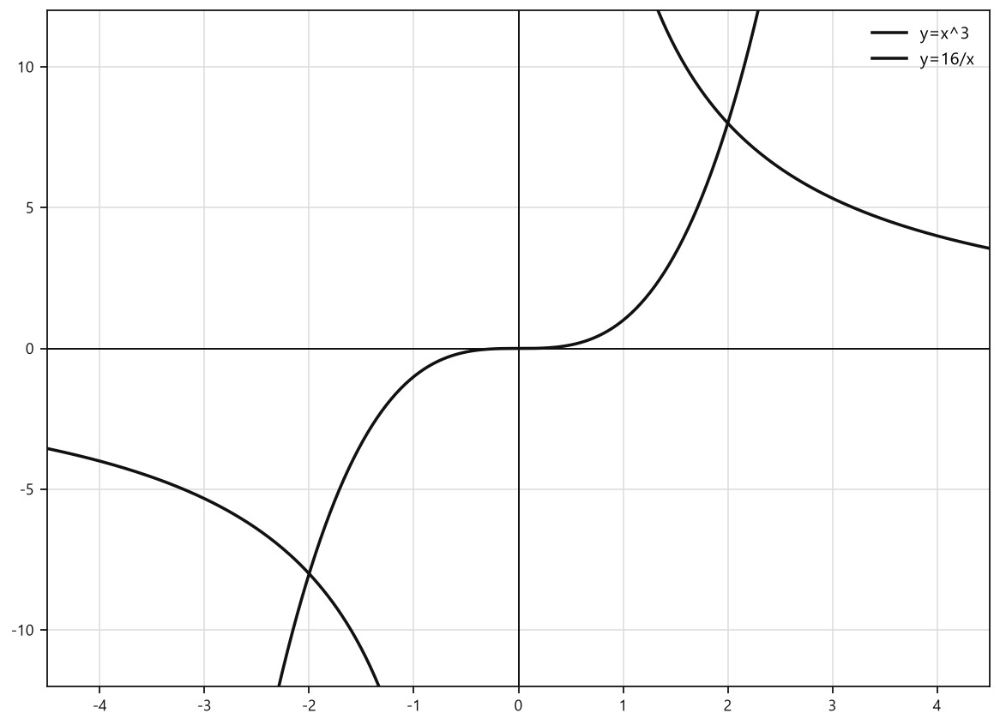

*Графики y=x^3 и y=\frac{16}{x}*


**С10.** Найдите координаты всех общих точек графиков функций
$$
y=x^3
\qquad\text{и}\qquad
y=\frac{16}{x}.
$$
Укажите область допустимых значений для второй функции и учтите её при решении.


<!--geo-figure-spec
{
  "needed": true,
  "kind": "graph",
  "caption": "Графики $y=x^3$ и $y=\\frac{16}{x}$",
  "axis": true,
  "grid": true,
  "xlim": [
    -2.5,
    2.5
  ],
  "ylim": [
    -16,
    16
  ],
  "curves": [
    {
      "expr": "x**3",
      "label": "y=x^3"
    },
    {
      "expr": "16/x",
      "label": "y=16/x"
    }
  ]
}
-->
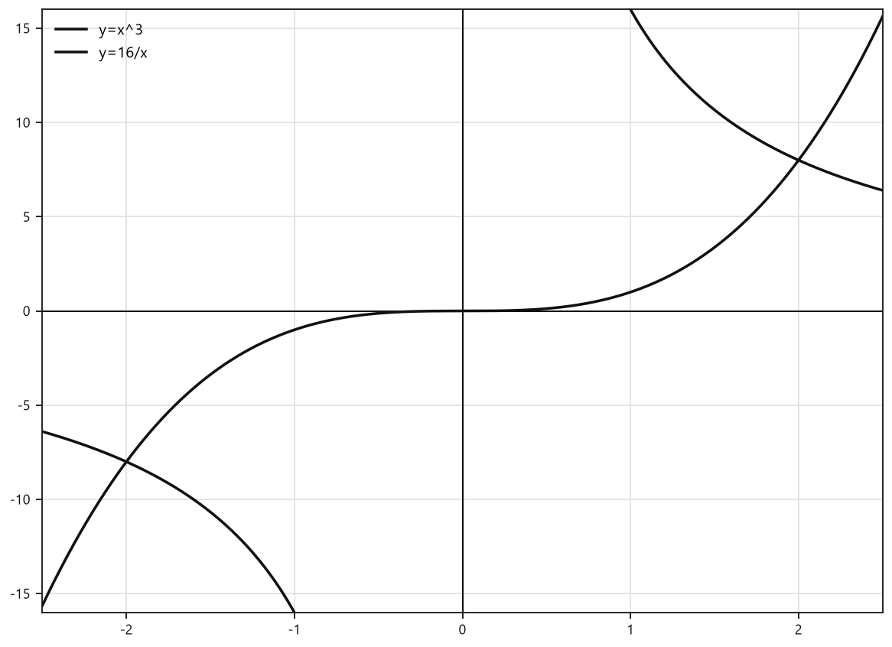

*Графики y=x^3 и y=\frac{16}{x}*


**С11.** Найдите все значения параметра $k$, при которых точка $A(2;k)$ принадлежит графику функции $y=x^3$, а точка $B(-2;k)$ не принадлежит этому графику. Для найденного значения $k$ определите, какая из точек $C(-2;-k)$ и $D(2;-k)$ принадлежит графику функции.

**С12.** Функция $f(x)=x^3$ задана на всей числовой прямой. Найдите все действительные числа $p$, для которых одновременно выполняются условия:
$$
f(p)>f(2),\qquad f(-p)<f(-2),\qquad f(p)+f(-p)=0.
$$
Решение обоснуйте свойствами функции $y=x^3$.

**С13.** Найдите все общие точки графиков функций $y=x^3$ и $y=3x$. Ответ запишите координатами точек.

**С14.** Найдите все общие точки графиков функций $y=x^3$ и $y=\dfrac{64}{x}$. Укажите область допустимых значений аргумента при решении.

**С15.** Расположите в порядке убывания значения выражений:
$$
(-\sqrt{5})^3,\quad (-2)^3,\quad 0^3,\quad (\sqrt{3})^3,\quad (2,1)^3.
$$
Запишите получившуюся последовательность выражений.

**С16.** Точка $M(m;n)$ принадлежит графику функции $y=x^3$, причём $n-m=6$. Найдите координаты точки $M$.

**С17.** Прямая $y=kx$ пересекает график функции $y=x^3$ в трёх различных точках, одна из которых имеет абсциссу $2$. Найдите все значения $k$ и координаты всех точек пересечения для каждого найденного значения $k$.

**С18.** Функция задана формулой $f(x)=x^3$. Найдите все значения аргумента $x$, для которых
$$
f(x)+f(1-x)=\frac{7}{4}.
$$

## Чек-лист «ученик понял тему»

- Могу повторить определения и формулы параграфа своими словами и по учебнику.
- Решаю типовые задания своего уровня без подсказки.
- Вижу типичную ошибку и могу её объяснить.
