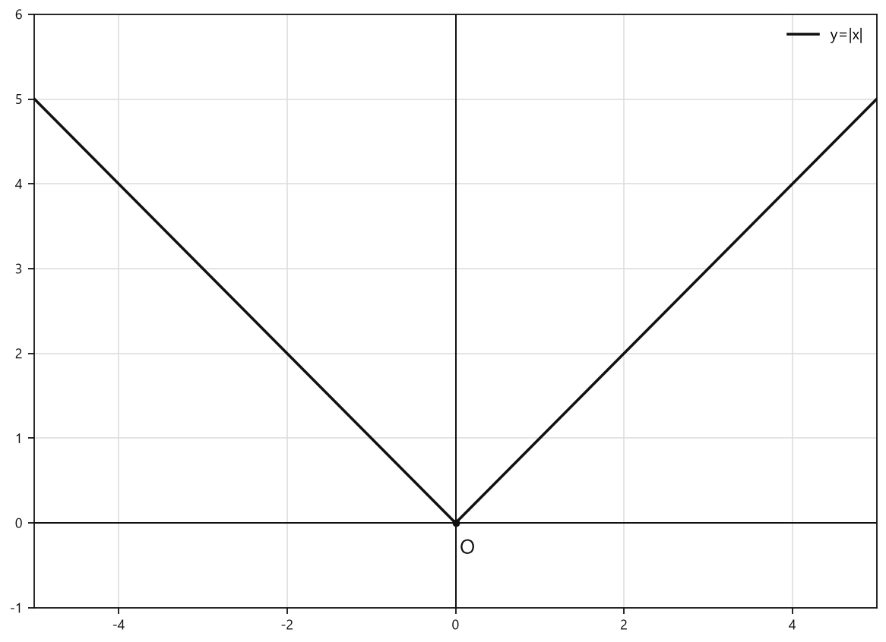
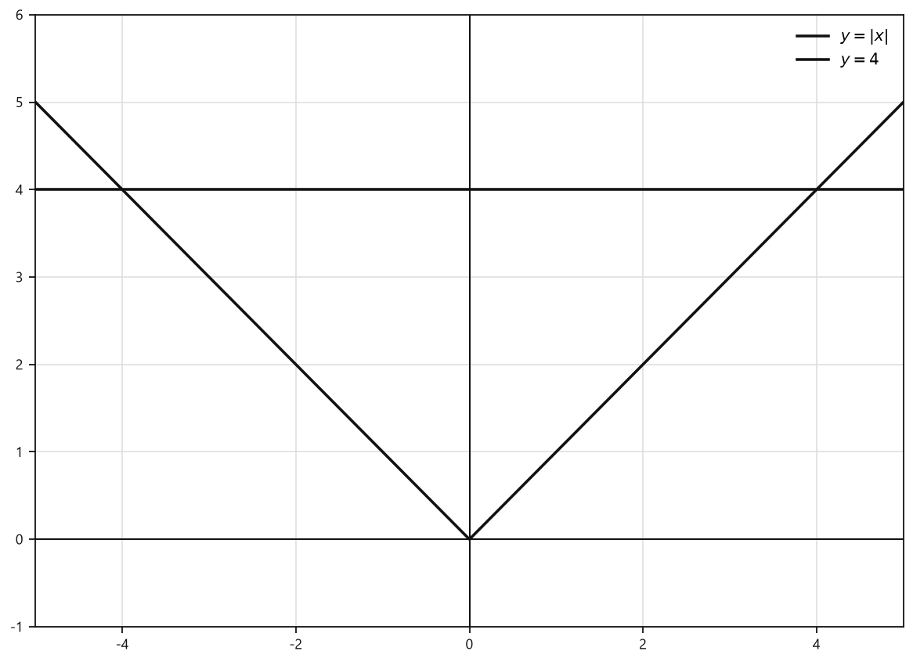
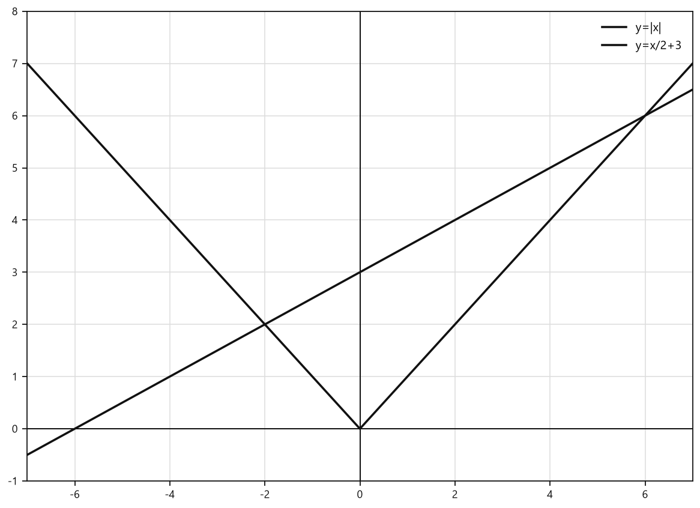
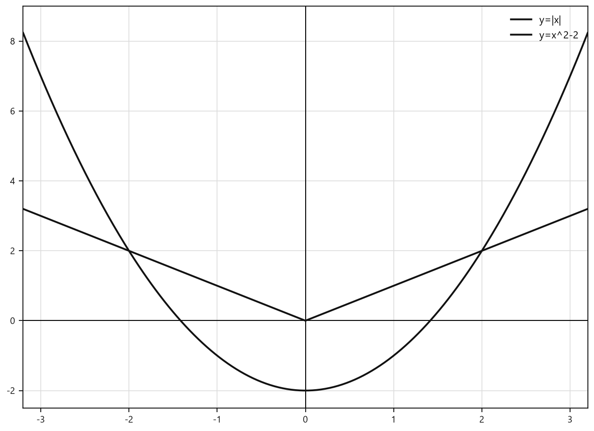
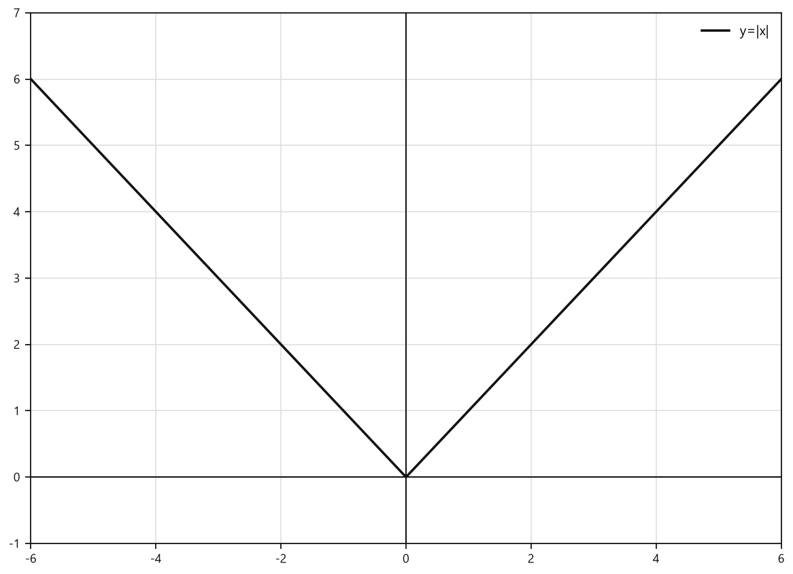
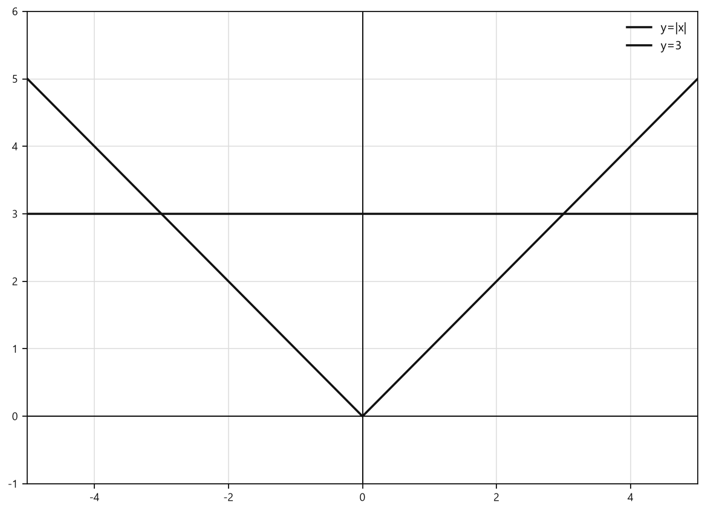
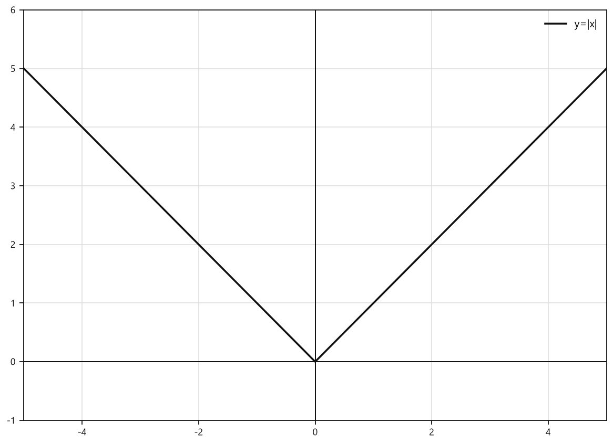
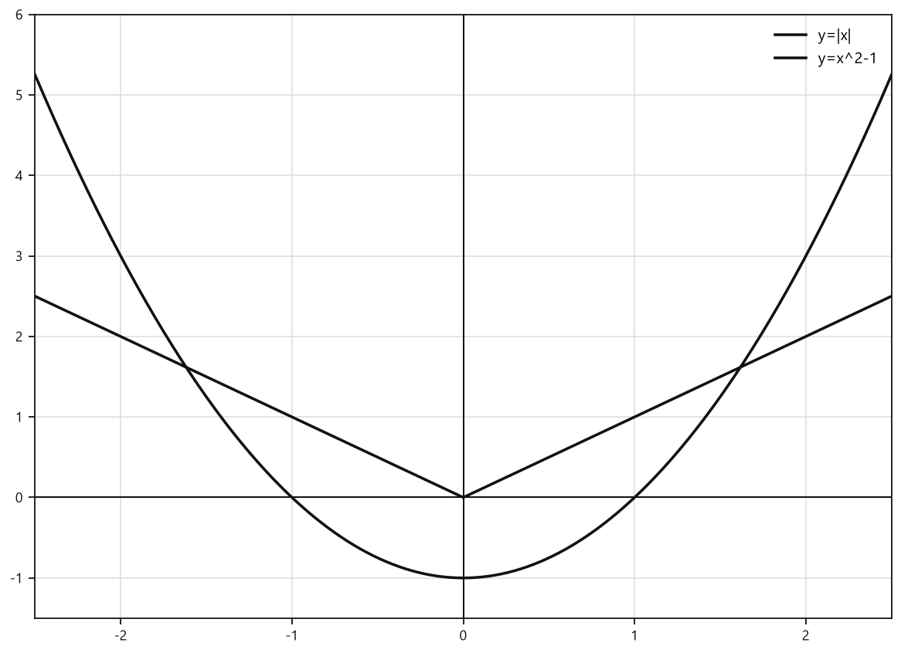
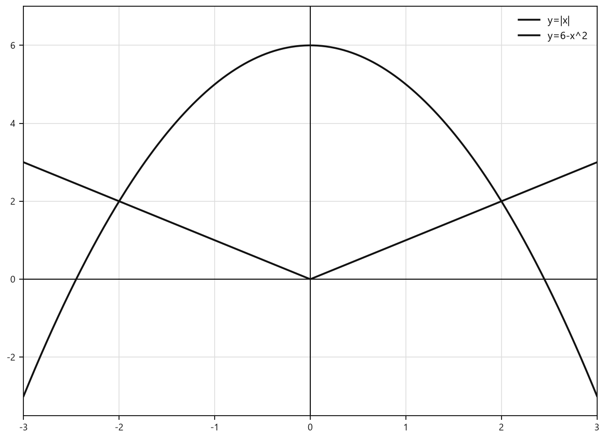

# Занятие 26. Свойства и график функции y = |x|

**Раздел:** Глава 4  
**Параграф учебника:** §19. Свойства и график функции y = |x|  
**Страницы:** 237–241

## Цели занятия

После занятия ты умеешь:

- находить значение модуля числа;
- определять область определения и множество значений функции $y = |x|$;
- находить нули функции и промежутки её знакопостоянства;
- строить график функции $y = |x|$;
- проверять, принадлежит ли точка графику;
- сравнивать значения функции и находить точки пересечения графиков.

Выбирай блок своего уровня:

- **1–2 балла** — вычисление модулей и значений функции;
- **3–4 балла** — свойства функции и принадлежность точек графику;
- **5–6 баллов** — сравнение значений и уравнения $|x| = c$;
- **7–8 баллов** — точки пересечения графиков;
- **9–10 баллов** — обобщение свойств и сравнение функций.

## Теория к занятию

### 1. Модуль числа

#### Простыми словами

Модуль числа показывает расстояние от этого числа до нуля на координатной прямой.

Расстояние не бывает отрицательным. Например, числа $-5$ и $5$ находятся от нуля на одинаковом расстоянии, поэтому

$$
|-5|=|5|=5.
$$

#### Определение

Модуль числа равен самому числу, если число неотрицательное, и равен противоположному ему числу, если число отрицательное, т. е. $|a| = \begin{cases} a, \text{ если } a \ge 0, \\ -a, \text{ если } a < 0. \end{cases}$

#### Формулы

Если $a \ge 0$, то число уже неотрицательное:

$$
|a|=a.
$$

Если $a<0$, меняем знак числа:

$$
|a|=-a.
$$

Например:

$$
|6|=6,
$$

$$
|-6|=-(-6)=6.
$$

Второй минус появился не случайно: противоположное число для $-6$ — это $6$.

#### Правила

- У положительного числа модуль не меняет число.
- У отрицательного числа модуль меняет знак.
- Модуль нуля равен нулю:

$$
|0|=0.
$$

- Модуль любого числа неотрицателен:

$$
|a|\ge0.
$$

#### Ловушки

- $|-4|\ne-4$, а $|-4|=4$.
- Не путайте минус перед модулем и минус внутри модуля:

$$
-|4|=-4,
$$

а

$$
|-4|=4.
$$

В первом выражении минус относится ко всему значению модуля. Во втором минус находится внутри модуля и после вычисления исчезает.

- Модуль всегда неотрицателен. Он может быть равен нулю, но в минус не уходит — такой у него математический характер.

---

### 2. Функция $y=|x|$

#### Простыми словами

Функция каждому числу $x$ ставит в соответствие его расстояние до нуля:

$$
y=|x|.
$$

Поэтому отрицательных значений $y$ быть не может. Если $x=3$, то $y=3$. Если $x=-3$, то $y$ снова равен $3$.

#### Свойства функции $y = |x|$

1. **Область определения функции.** Так как $|x|$ определяется для любого действительного числа, то областью определения функции $y = |x|$ являются все действительные числа: $D = \mathbb{R}$.

2. **Множество значений функции.** Так как по определению модуля числа значение выражения $|x|$ неотрицательно для любого числа $x$, то множеством значений функции $y = |x|$ является множество неотрицательных чисел: $E = [0; +\infty)$.

3. **Нули функции.** Так как $y = 0$, т. е. $|x| = 0$, при $x = 0$, то $x = 0$ есть нуль функции.

4. **Промежутки знакопостоянства функции.** $y > 0$ для $x \in (-\infty; 0) \cup (0; +\infty)$.

5. **График функции.**  
   Поскольку при $x \ge 0$ $|x| = x$, то при $x \ge 0$ график функции $y = |x|$ есть часть прямой $y = x$ — луч с началом в точке $(0; 0)$, т. е. биссектриса первого координатного угла.  
   Так как при $x < 0$ $|x| = -x$, то при $x < 0$ график функции $y = |x|$ есть часть прямой $y = -x$, расположенная во второй координатной четверти.  
   Объединим части графиков функций $y = x$ при $x \in [0; +\infty)$ и $y = -x$ при $x \in (-\infty; 0)$ и получим график функции $y = |x|$ (рис. 102).

6. **Промежутки монотонности функции.** Функция $y = |x|$ возрастает на промежутке $[0; +\infty)$ и убывает на промежутке $(-\infty; 0]$.

7. Точки графика функции $y = |x|$ симметричны относительно оси ординат.

График состоит из двух лучей и имеет форму буквы V. Его вершина находится в точке $(0;0)$.

Почему получается именно такая форма? Справа от нуля модуль не меняет число, поэтому там график совпадает с лучом $y=x$. Слева от нуля число отрицательное, и модуль меняет его знак, поэтому там график совпадает с частью прямой $y=-x$.


<!--geo-figure-spec
{
  "needed": true,
  "kind": "graph",
  "caption": "График функции $y=|x|$",
  "axis": true,
  "grid": true,
  "xlim": [
    -5,
    5
  ],
  "ylim": [
    -1,
    6
  ],
  "curves": [
    {
      "expr": "abs(x)",
      "label": "y=|x|"
    }
  ],
  "points": {
    "O": [
      0,
      0
    ]
  },
  "labels": {
    "O": {
      "dx": 0.14,
      "dy": -0.3
    }
  }
}
-->


*График функции y=|x|*


#### Формула функции

$$
y = |x| = \begin{cases} x, \text{ если } x \ge 0, \\ -x, \text{ если } x < 0. \end{cases}
$$

Для построения графика:

1. при $x \ge 0$ строим луч $y=x$;
2. при $x<0$ строим часть прямой $y=-x$;
3. объединяем обе части в точке $(0;0)$.

Можно использовать таблицу значений:

$$
\begin{array}{c|ccccc}
x&-2&-1&0&1&2\\
\hline
y=|x|&2&1&0&1&2
\end{array}
$$

Затем отмечаем точки и соединяем их двумя лучами. График должен быть симметричен относительно оси ординат. Если левая и правая части не похожи, где-то затерялся знак.

#### Ловушки

- График не продолжается в третью и четвёртую координатные четверти, потому что $y=|x|\ge0$.
- Точка $(-3;-3)$ не принадлежит графику, потому что

$$
|-3|=3,
$$

а не $-3$.
- Значение функции при отрицательном аргументе положительно, если аргумент не равен нулю.
- Симметрия идёт относительно оси ординат, а не оси абсцисс.
- При $x=0$ точка $(0;0)$ принадлежит графику. Ноль не нужно исключать из условия $x\ge0$.

---

### 3. Сколько корней имеет уравнение $|x|=c$

#### Простыми словами

Уравнение

$$
|x|=c
$$

спрашивает: какие числа находятся от нуля на расстоянии $c$?

Если $c$ положительное, таких чисел два: одно справа от нуля, другое слева. Если $c=0$, подходит только сам ноль. Если $c<0$, решений нет, потому что расстояние не может быть отрицательным.

#### Правило

- Если $c>0$, уравнение $|x|=c$ имеет два корня:

$$
x=c,\qquad x=-c.
$$

- Если $c=0$, уравнение имеет один корень:

$$
x=0.
$$

- Если $c<0$, уравнение $|x|=c$ корней не имеет.

#### Ловушки

- Уравнение $|x|=7$ имеет два корня, а не один:

$$
x=7\quad\text{и}\quad x=-7.
$$

- Уравнение $|x|=0$ имеет только один корень.
- Уравнение $|x|=-3$ невозможно, потому что модуль неотрицателен.
- При $c>0$ не забывайте второй корень со знаком «минус». Модуль любит симметричные ответы.

---

### 4. Принадлежность точки графику

#### Простыми словами

Пусть дана точка $(x_0;y_0)$. Чтобы проверить, находится ли она на графике $y=|x|$, нужно использовать её первую координату $x_0$ и вычислить модуль. Получившееся число должно совпасть со второй координатой $y_0$.

Условие принадлежности имеет вид:

$$
y_0=|x_0|.
$$

#### Алгоритм

1. Взять координаты точки $(x_0;y_0)$.
2. Найти $|x_0|$.
3. Сравнить результат с $y_0$.
4. Если равенство верное, точка принадлежит графику. Если неверное — не принадлежит.

#### Ловушки

- Проверять нужно обе координаты, а не только знак $x$.
- Для отрицательной первой координаты вторая координата должна быть положительной или равной нулю.
- Точки $(a;a)$ при $a\ge0$ принадлежат графику.
- Точки $(-a;a)$ при $a\ge0$ также принадлежат графику.
- В точке $(x_0;y_0)$ нельзя перепутать координаты: первая — это $x_0$, вторая — $y_0$.

---

### 5. Сравнение значений функции

#### Простыми словами

Чтобы сравнить $f(a)$ и $f(b)$ для функции $f(x)=|x|$, сначала вычисляем оба модуля:

$$
f(a)=|a|,\qquad f(b)=|b|.
$$

После этого сравниваем обычные числа.

Например:

$$
f(-5)=|-5|=5.
$$

Знак аргумента сам по себе не показывает, какое значение функции больше. Важно, насколько далеко аргумент находится от нуля.

#### Полезные факты

$$
|a|=|-a|.
$$

Если $0\le a<b$, то

$$
|a|<|b|.
$$

Если $a<b\le0$, то

$$
|a|>|b|.
$$

На отрицательной части координатной прямой числа расположены в обратном порядке по сравнению с их расстояниями до нуля. Например, $-8$ находится дальше от нуля, чем $-3$, поэтому

$$
|-8|>|-3|.
$$

#### Ловушки

- Среди отрицательных чисел больше по модулю то, которое меньше на координатной прямой:

$$
|-8|>|-3|.
$$

- Равенство аргументов по модулю даёт равенство значений:

$$
f(4)=f(-4).
$$

- Корни и радикалы нужно сравнивать аккуратно:

$$
\sqrt{20}=\sqrt{4\cdot5}=2\sqrt5.
$$

- Если под модулем стоит отрицательное выражение, сначала нужно определить его знак, а уже потом раскрывать модуль.

## Сводка формул «выучить наизусть»

$$
|a| = \begin{cases} a, \text{ если } a \ge 0, \\ -a, \text{ если } a < 0. \end{cases}
$$

$$
y = |x| = \begin{cases} x, \text{ если } x \ge 0, \\ -x, \text{ если } x < 0. \end{cases}
$$

$$
D = \mathbb{R}.
$$

$$
E = [0; +\infty).
$$

$$
|a| = |-a|.
$$

$$
|x| = c:
\begin{cases}
x = c \text{ и } x = -c, & c>0,\\
x=0, & c=0,\\
\text{корней нет}, & c<0.
\end{cases}
$$

## Правила, которые нельзя путать

- $|-a|=a$ только при $a\ge0$.
- $|a|$ всегда неотрицателен.
- График $y=|x|$ симметричен относительно оси ординат.
- Функция убывает на $(-\infty;0]$ и возрастает на $[0;+\infty)$.
- Для точки $(x_0;y_0)$ проверяем равенство $y_0=|x_0|$.
- Уравнение $|x|=c$ при $c>0$ имеет два корня.
- При $c=0$ есть один корень, а при $c<0$ корней нет.

## Разбор ключевых заданий

### Р1. Найти значение модуля

**Условие.** Найдите значения выражения $|x|$, если:

а) $x=1,5$;  
б) $x=-4,5$;  
в) $x=6,5$.

**Решение.**

а) Число $1,5$ неотрицательное, поэтому модуль равен самому числу:

$$
|1,5|=1,5.
$$

б) Число $-4,5$ отрицательное, поэтому меняем его знак:

$$
|-4,5|=-(-4,5)=4,5.
$$

в) Число $6,5$ неотрицательное:

$$
|6,5|=6,5.
$$

Ответ: а) $1,5$; б) $4,5$; в) $6,5$.

---

### Р2. Вычислить сумму модулей

**Условие.** Найдите значение выражения:

$$
|-1|+|2,4|+|-4,5|.
$$

**Решение.**

Сначала вычислим каждый модуль:

$$
|-1|=1.
$$

$$
|2,4|=2,4.
$$

$$
|-4,5|=4,5.
$$

Подставим найденные значения в сумму:

$$
|-1|+|2,4|+|-4,5|=1+2,4+4,5.
$$

Сложим первые два слагаемых:

$$
1+2,4=3,4.
$$

Теперь добавим третье:

$$
3,4+4,5=7,9.
$$

Ответ: $7,9$.

---

### Р3. Найти значения функции

**Условие.** Найдите значения функции $y=|x|$ при $x=1$, $x=-1$, $x=0$, $x=-3,5$, $x=3,5$.

**Решение.**

Подставляем каждое значение $x$ в формулу $y=|x|$:

$$
y(1)=|1|=1.
$$

$$
y(-1)=|-1|=1.
$$

$$
y(0)=|0|=0.
$$

$$
y(-3,5)=|-3,5|=3,5.
$$

$$
y(3,5)=|3,5|=3,5.
$$

У противоположных аргументов $1$ и $-1$, а также $3,5$ и $-3,5$, значения функции одинаковые. Это проявление равенства $|a|=|-a|$.

Ответ: $1;1;0;3,5;3,5$.

---

### Р4. Сколько значений аргумента?

**Условие.** Найдите значения аргумента, при которых $f(x)=|x|$ принимает значение:

а) $7$;  
б) $3,9$;  
в) $0$.

**Решение.**

а) Значение функции равно $7$, значит:

$$
|x|=7.
$$

Число $7$ положительное, поэтому есть два значения аргумента:

$$
x=7,\qquad x=-7.
$$

б) Составим уравнение:

$$
|x|=3,9.
$$

Число $3,9$ положительное, поэтому:

$$
x=3,9,\qquad x=-3,9.
$$

в) Составим уравнение:

$$
|x|=0.
$$

Модуль равен нулю только тогда, когда само число равно нулю:

$$
x=0.
$$

Ответ: а) $x=-7;7$; б) $x=-3,9;3,9$; в) $x=0$.

---

### Р5. Проверить принадлежность точки графику

**Условие.** Определите, принадлежат ли графику функции $y=|x|$ точки:

а) $(3;3)$;  
б) $(-4;4)$;  
в) $(2;-2)$;  
г) $(-5;4)$.

**Решение.**

Для каждой точки проверяем равенство $y=|x|$.

а) Для точки $(3;3)$:

$$
3=|3|.
$$

$$
3=3.
$$

Равенство верное. Точка принадлежит графику.

б) Для точки $(-4;4)$:

$$
4=|-4|.
$$

$$
4=4.
$$

Равенство верное. Точка принадлежит графику.

в) Для точки $(2;-2)$:

$$
-2=|2|.
$$

$$
-2=2.
$$

Равенство неверное. Точка не принадлежит графику.

Кроме того, значение $y$ на графике $y=|x|$ не может быть отрицательным.

г) Для точки $(-5;4)$:

$$
4=|-5|.
$$

$$
4=5.
$$

Равенство неверное. Точка не принадлежит графику.

Ответ: принадлежат точки $(3;3)$ и $(-4;4)$.

---

### Р6. Сравнить значения функции

**Условие.** Сравните:

а) $f(80,7)$ и $f(83,9)$;  
б) $f(-5,43)$ и $f(-6,21)$;  
в) $f(-\sqrt{7})$ и $f(-2\sqrt{2})$;  
г) $f(2\sqrt{5})$ и $f(-\sqrt{20})$.

**Решение.**

а) Оба аргумента положительные, поэтому модули равны самим аргументам:

$$
f(80,7)=|80,7|=80,7.
$$

$$
f(83,9)=|83,9|=83,9.
$$

Так как $80,7<83,9$, то

$$
f(80,7)<f(83,9).
$$

б) Найдём модули отрицательных аргументов:

$$
f(-5,43)=|-5,43|=5,43.
$$

$$
f(-6,21)=|-6,21|=6,21.
$$

Так как $5,43<6,21$, то

$$
f(-5,43)<f(-6,21).
$$

Здесь большее по модулю отрицательное число $-6,21$ дало большее значение функции.

в) Уберём минусы из-под знака модуля:

$$
f(-\sqrt7)=\sqrt7.
$$

$$
f(-2\sqrt2)=2\sqrt2.
$$

Оба числа положительные. Сравним их квадраты:

$$
(\sqrt7)^2=7.
$$

$$
(2\sqrt2)^2=4\cdot2=8.
$$

Так как $7<8$, то

$$
\sqrt7<2\sqrt2.
$$

Следовательно,

$$
f(-\sqrt7)<f(-2\sqrt2).
$$

г) Найдём оба значения:

$$
f(2\sqrt5)=2\sqrt5.
$$

$$
f(-\sqrt{20})=\sqrt{20}.
$$

Преобразуем второй результат:

$$
\sqrt{20}=\sqrt{4\cdot5}=2\sqrt5.
$$

Значения одинаковы, поэтому

$$
f(2\sqrt5)=f(-\sqrt{20}).
$$

Ответ:  
а) $f(80,7)<f(83,9)$;  
б) $f(-5,43)<f(-6,21)$;  
в) $f(-\sqrt7)<f(-2\sqrt2)$;  
г) $f(2\sqrt5)=f(-\sqrt{20})$.

---

### Р7. Расположить значения в порядке убывания

**Условие.** Расположите в порядке убывания:

$$
g(-2,8),\qquad g(-3,1),\qquad g(-4,6),
$$

где $g(x)=|x|$.

**Решение.**

Сначала вычислим значения функции:

$$
g(-2,8)=|-2,8|=2,8.
$$

$$
g(-3,1)=|-3,1|=3,1.
$$

$$
g(-4,6)=|-4,6|=4,6.
$$

Расположим полученные числа от большего к меньшему:

$$
4,6>3,1>2,8.
$$

Значит,

$$
g(-4,6)>g(-3,1)>g(-2,8).
$$

Ответ: $g(-4,6)$, $g(-3,1)$, $g(-2,8)$.

---

### Р8. Найти точки пересечения с прямой $y=c$

**Условие.** Сколько точек пересечения имеет график функции $y=|x|$ с прямой $y=c$, если:

а) $c=6$;  
б) $c=0$;  
в) $c=-5$?

**Решение.**

На прямой $y=c$ вторая координата любой точки равна $c$. Поэтому общие точки ищем из уравнения:

$$
|x|=c.
$$

а) При $c=6$:

$$
|x|=6.
$$

Получаем два значения $x$:

$$
x=6\quad\text{или}\quad x=-6.
$$

Находим точки пересечения:

$$
(6;6),\qquad (-6;6).
$$

Количество точек — $2$.

б) При $c=0$:

$$
|x|=0.
$$

Единственное решение:

$$
x=0.
$$

Точка пересечения:

$$
(0;0).
$$

Количество точек — $1$.

в) При $c=-5$:

$$
|x|=-5.
$$

Модуль не может быть отрицательным, поэтому решений нет.

Количество точек — $0$.

Ответ: а) $2$; б) $1$; в) $0$.

---

### Р9. Найти общие точки графиков

**Условие.** Найдите координаты общих точек графиков функций:

$$
y=|x|
$$

и

$$
y=\frac{x}{2}+3.
$$

**Решение.**

В общей точке значения $y$ у функций одинаковы. Поэтому приравняем правые части:

$$
|x|=\frac{x}{2}+3.
$$

Модуль раскрывается по-разному при $x\ge0$ и при $x<0$. Поэтому рассмотрим два случая.

**1-й случай: $x\ge0$.**

При неотрицательном $x$:

$$
|x|=x.
$$

Получаем уравнение:

$$
x=\frac{x}{2}+3.
$$

Перенесём $\frac{x}{2}$ в левую часть:

$$
x-\frac{x}{2}=3.
$$

$$
\frac{x}{2}=3.
$$

$$
x=6.
$$

Условие случая выполнено: $6\ge0$.

Теперь найдём $y$:

$$
y=|6|=6.
$$

Получаем точку $(6;6)$.

**2-й случай: $x<0$.**

При отрицательном $x$:

$$
|x|=-x.
$$

Получаем:

$$
-x=\frac{x}{2}+3.
$$

Перенесём $\frac{x}{2}$ в левую часть:

$$
-x-\frac{x}{2}=3.
$$

Представим $-x$ как $-\frac{2x}{2}$:

$$
-\frac{2x}{2}-\frac{x}{2}=3.
$$

$$
-\frac{3x}{2}=3.
$$

Умножим обе части на $2$:

$$
-3x=6.
$$

Разделим обе части на $-3$:

$$
x=-2.
$$

Условие случая выполнено: $-2<0$.

Найдём $y$:

$$
y=|-2|=2.
$$

Получаем точку $(-2;2)$.

Проверим найденные точки по второй формуле:

$$
\frac{-2}{2}+3=-1+3=2.
$$

$$
\frac{6}{2}+3=3+3=6.
$$

Обе точки подходят.

Ответ: $(-2;2)$ и $(6;6)$.

### Р10. Найти общие точки с параболой

**Условие.** Найдите координаты общих точек графиков функций:

$$
y=|x|
$$

и

$$
y=x^2-2.
$$

**Решение.**

Общая точка лежит сразу на двух графиках.

Значит, для её координат $x$ и $y$ значения правых частей должны быть равны:

$$
|x|=x^2-2.
$$

В модуле знак зависит от того, положительное число $x$ или отрицательное. Поэтому рассмотрим два случая.

**1-й случай: $x\ge0$.**

При $x\ge0$ имеем $|x|=x$.

Тогда:

$$
x=x^2-2.
$$

Перенесём всё в левую часть:

$$
x^2-x-2=0.
$$

Разложим квадратный трёхчлен на множители:

$$
(x-2)(x+1)=0.
$$

Произведение равно нулю, значит:

$$
x-2=0\quad\text{или}\quad x+1=0.
$$

Получаем:

$$
x=2\quad\text{или}\quad x=-1.
$$

Но в этом случае должно быть $x\ge0$.

Подходит только $x=2$.

Найдём координату $y$:

$$
y=|2|=2.
$$

Получаем точку $(2;2)$.

**2-й случай: $x<0$.**

При $x<0$ имеем $|x|=-x$.

Тогда:

$$
-x=x^2-2.
$$

Перенесём всё в левую часть:

$$
x^2+x-2=0.
$$

Разложим на множители:

$$
(x+2)(x-1)=0.
$$

Получаем:

$$
x=-2\quad\text{или}\quad x=1.
$$

Но в этом случае должно быть $x<0$.

Подходит только $x=-2$.

Найдём координату $y$:

$$
y=|-2|=2.
$$

Получаем точку $(-2;2)$.

Знак модуля здесь работает как турникет: положительные $x$ пропускает без изменений, а отрицательные отправляет с плюсом.

Проверим найденные точки по формуле параболы:

$$
2^2-2=4-2=2.
$$

$$
(-2)^2-2=4-2=2.
$$

Обе точки подходят.

**Ответ:** $(-2;2)$ и $(2;2)$.

---

### Р11. Найти значение выражения и обобщить

**Условие.** Для функции $f(x)=|x|$ найдите:

а)

$$
f(-10)-f(10)+f(85);
$$

б)

$$
f(\sqrt3)-f(-\sqrt3)+f(\sqrt2);
$$

в)

$$
f(a)-f(-a)+f(5),
$$

где $a$ — любое действительное число.

**Решение.**

Сначала заменяем каждое значение функции на его определение:

$$
f(x)=|x|.
$$

**а)**

$$
f(-10)=|-10|=10.
$$

$$
f(10)=|10|=10.
$$

$$
f(85)=|85|=85.
$$

Подставим найденные значения:

$$
f(-10)-f(10)+f(85)=10-10+85.
$$

$$
10-10+85=85.
$$

**б)**

Число $\sqrt3$ положительное, поэтому:

$$
f(\sqrt3)=|\sqrt3|=\sqrt3.
$$

Число $-\sqrt3$ отрицательное, поэтому его модуль равен $\sqrt3$:

$$
f(-\sqrt3)=|-\sqrt3|=\sqrt3.
$$

Также:

$$
f(\sqrt2)=|\sqrt2|=\sqrt2.
$$

Подставим значения:

$$
f(\sqrt3)-f(-\sqrt3)+f(\sqrt2)
=\sqrt3-\sqrt3+\sqrt2.
$$

$$
\sqrt3-\sqrt3=0.
$$

Значит:

$$
f(\sqrt3)-f(-\sqrt3)+f(\sqrt2)=\sqrt2.
$$

**в)**

По формуле функции:

$$
f(a)=|a|.
$$

Модуль противоположного числа такой же:

$$
f(-a)=|-a|=|a|.
$$

Кроме того:

$$
f(5)=|5|=5.
$$

Подставим:

$$
f(a)-f(-a)+f(5)
=|a|-|a|+5.
$$

$$
|a|-|a|=0.
$$

Поэтому:

$$
f(a)-f(-a)+f(5)=5.
$$

Здесь модуль устроил паритет: $a$ и $-a$ дают одинаковые значения, поэтому первые два слагаемых взаимно уничтожаются.

**Ответ:** а) $85$; б) $\sqrt2$; в) $5$.

---

### Р12. Сравнить свойства функций $y=|x|$ и $y=x^2$

**Условие.** Сравните основные свойства функций $y=|x|$ и $y=x^2$.

**Решение.**

Сравним функции по очереди: область определения, множество значений, нули, симметрию, монотонность и вид графика.

Для функции $y=|x|$ модуль определён при любом действительном $x$:

$$
D=\mathbb R.
$$

Для функции $y=x^2$ также можно подставить любое действительное число:

$$
D=\mathbb R.
$$

Значения обеих функций неотрицательны:

$$
|x|\ge0,\qquad x^2\ge0.
$$

Поэтому для обеих функций множество значений:

$$
E=[0;+\infty).
$$

Нуль функции получается при $x=0$:

$$
|x|=0\quad\text{при}\quad x=0,
$$

$$
x^2=0\quad\text{при}\quad x=0.
$$

Значит, обе функции имеют единственный нуль:

$$
x=0.
$$

При замене $x$ на $-x$ значения не меняются:

$$
|-x|=|x|,
$$

$$
(-x)^2=x^2.
$$

Поэтому графики обеих функций симметричны относительно оси ординат.

Функция $y=|x|$:

- убывает на промежутке $(-\infty;0]$;
- возрастает на промежутке $[0;+\infty)$;
- имеет график в виде буквы $V$.

Функция $y=x^2$:

- убывает на промежутке $(-\infty;0]$;
- возрастает на промежутке $[0;+\infty)$;
- имеет график параболы.

Графики всё же разные:

- у функции $y=|x|$ график состоит из двух прямых лучей;
- у функции $y=x^2$ график плавно изгибается.

Похожее поведение ещё не означает одинаковые графики: две дороги могут вести в одну сторону, но быть совсем разными по форме.

**Ответ:** функции имеют одинаковые область определения, множество значений, нуль, симметрию и промежутки монотонности, но их графики различны.

## Короткая самопроверка

1. Чему равно $|-7|$?
2. Сколько корней имеет уравнение $|x|=4$?
3. Принадлежит ли точка $(-3;3)$ графику $y=|x|$?
4. Чему равно множество значений функции $y=|x|$?
5. На каком промежутке функция $y=|x|$ возрастает?

### Ответы

1. $7$.
2. Два корня: $x=-4$ и $x=4$.
3. Да, потому что $3=|-3|$.
4. $E=[0;+\infty)$.
5. На промежутке $[0;+\infty)$.

## Практические задания

Выбери свой уровень и решай только этот блок. В блоке должна закрепиться вся тема параграфа. Ответы не приводятся.

### Уровень 1–2 балла

**С1.** Найдите значение выражения $|-6,4|$.

**С2.** Вычислите $|-3|+|1,5|$.

**С3.** Для функции $y=|x|$ найдите значение функции при $x=-2,7$.

**С4.** Укажите область определения функции $y=|x|$.
  
1) $[0;+\infty)$ 2) $(-\infty;0]$ 3) $\mathbb{R}$ 4) $(0;+\infty)$ 5) $\{-1;1\}$

**С5.** Укажите множество значений функции $y=|x|$.
  
1) $\mathbb{R}$ 2) $(-\infty;0]$ 3) $(0;+\infty)$ 4) $[0;+\infty)$ 5) $\{0\}$

**С6.** Найдите все значения $x$, при которых $|x|=4$.

**С7.** Найдите все значения $x$, при которых $|x|=0$.

**С8.** Выберите точку, принадлежащую графику функции $y=|x|$.
  
1) $A(-3;-3)$ 2) $B(2;-2)$ 3) $C(-1,5;1,5)$ 4) $D(0;1)$ 5) $E(4;-4)$

**С9.** Сравните значения $f(-7,2)$ и $f(6,8)$ функции $f(x)=|x|$, записав знак $<$, $>$ или $=$.

**С10.** Расположите значения функции $g(x)=|x|$ в порядке возрастания: $g(-4,1)$, $g(1,8)$, $g(-2,6)$.

**С11.** Укажите промежуток, на котором функция $y=|x|$ возрастает.
  
1) $(-\infty;0]$ 2) $[0;+\infty)$ 3) $\mathbb{R}$ 4) $(-\infty;0)$ 5) $(0;+\infty)$

**С12.** Определите количество точек пересечения графика функции $y=|x|$ с прямой $y=-3$.

**С13.** Найдите значение выражения $|-6,4|$.

**С14.** Найдите значение функции $y=|x|$ при $x=-2,7$.

**С15.** Выберите точку, принадлежащую графику функции $y=|x|$:  
1) $A(-3;-3)$ 2) $B(-2;2)$ 3) $C(0;-1)$ 4) $D(4;-4)$ 5) $E(5;0)$.

**С16.** Укажите область определения функции $y=|x|$:  
1) $(-\infty;0]$ 2) $[0;+\infty)$ 3) $(-\infty;+\infty)$ 4) $(-\infty;0)$ 5) $\{0\}$.

**С17.** Укажите множество значений функции $y=|x|$:  
1) $(-\infty;+\infty)$ 2) $(-\infty;0]$ 3) $[0;+\infty)$ 4) $(0;+\infty)$ 5) $\{0\}$.

**С18.** Найдите все значения аргумента, при которых $|x|=4$.

**С19.** Сколько нулей имеет функция $y=|x|$?  
1) Ни одного 2) Один 3) Два 4) Три 5) Бесконечно много.

**С20.** Сравните значения функции $f(x)=|x|$: $f(-7,2)$ и $f(5,8)$. Выберите верное утверждение:  
1) $f(-7,2)<f(5,8)$ 2) $f(-7,2)>f(5,8)$ 3) $f(-7,2)=f(5,8)$ 4) Сравнить невозможно 5) Оба значения равны нулю.

**С21.** На каком промежутке функция $y=|x|$ убывает?  
1) $(-\infty;0]$ 2) $[0;+\infty)$ 3) $(-\infty;+\infty)$ 4) $(0;+\infty)$ 5) $(-\infty;0)$.

**С22.** На каком промежутке функция $y=|x|$ возрастает?  
1) $(-\infty;0]$ 2) $[0;+\infty)$ 3) $(-\infty;+\infty)$ 4) $(-\infty;0)$ 5) $(0;+\infty)$.

**С23.** Найдите количество общих точек графиков функций $y=|x|$ и $y=3$.

**С24.** Выберите верное утверждение о графике функции $y=|x|$:  
1) Он симметричен относительно оси абсцисс.  
2) Он симметричен относительно оси ординат.  
3) Он расположен только в третьей координатной четверти.  
4) Он не пересекает начало координат.  
5) Он расположен ниже оси абсцисс.

**С25.** Найдите значение $|{-7,2}|$.

**С26.** Выберите область определения функции $y=|x|$.

1) $(-\infty;0]$ 2) $[0;+\infty)$ 3) $\mathbb{R}$ 4) $(-\infty;0)$ 5) $\{0\}$

**С27.** Найдите значение функции $f(x)=|x|$ при $x=-3,5$.

**С28.** Выберите множество значений функции $y=|x|$.

1) $\mathbb{R}$ 2) $(-\infty;0]$ 3) $[0;+\infty)$ 4) $(0;+\infty)$ 5) $\{0\}$

**С29.** Укажите нуль функции $y=|x|$.

1) $x=-1$ 2) $x=0$ 3) $x=1$ 4) $x=2$ 5) нулей нет

**С30.** Найдите все значения $x$, при которых $|x|=6$.

**С31.** Какая из точек принадлежит графику функции $y=|x|$?

1) $A(-4;-4)$ 2) $B(0;1)$ 3) $C(-2;2)$ 4) $D(3;-3)$ 5) $E(5;0)$

**С32.** Сравните значения $f(-8,4)$ и $f(7,9)$ для функции $f(x)=|x|$.

**С33.** Расположите в порядке возрастания значения функции $g(x)=|x|$ при $x=-5$, $x=2$, $x=-3$.

**С34.** Укажите промежуток, на котором функция $y=|x|$ возрастает.

1) $(-\infty;0]$ 2) $[0;+\infty)$ 3) $(-\infty;+\infty)$ 4) $(-\infty;0)$ 5) $(0;+\infty)$

**С35.** Сколько общих точек имеют графики функций $y=|x|$ и $y=4$?

1) ни одной 2) одну 3) две 4) три 5) бесконечно много

**С36.** Выберите верное утверждение о графике функции $y=|x|$.

1) График симметричен относительно оси абсцисс.  
2) График проходит только в первой координатной четверти.  
3) График симметричен относительно оси ординат.  
4) Функция убывает на всей числовой прямой.  
5) График не пересекает начало координат.

### Уровень 3–4 балла

**С1.** Найдите значения выражения $|x|$, если:  
а) $x=-6,4$;  
б) $x=0$;  
в) $x=8,1$.

**С2.** Вычислите значение выражения $|-3,7|+|2,5|-|-1,8|$.

**С3.** Найдите значения функции $y=|x|$ при $x=-4$; $x=-1,2$; $x=0$; $x=2,7$.

**С4.** Найдите все значения аргумента функции $f(x)=|x|$, при которых:  
а) $f(x)=9$;  
б) $f(x)=0$;  
в) $f(x)=2,6$.

**С5.** Укажите, какие из точек принадлежат графику функции $y=|x|$:  
$A(-5;5)$, $B(3;-3)$, $C(0;0)$, $D(-2,4;-2,4)$, $E(7,1;7,1)$.

**С6.** Сравните значения функции $f(x)=|x|$:  
а) $f(6,3)$ и $f(8,1)$;  
б) $f(-4,7)$ и $f(-3,9)$.

**С7.** Расположите в порядке возрастания числа $g(-5,2)$, $g(1,8)$, $g(-3,6)$, если $g(x)=|x|$.

**С8.** Запишите область определения и множество значений функции $y=|x|$.

**С9.** Укажите нуль функции $y=|x|$ и промежутки, на которых эта функция принимает положительные значения.

**С10.** Укажите промежутки, на которых функция $y=|x|$ убывает и возрастает.

**С11.** Найдите значение выражения $f(-12)-f(12)+f(4,5)$, если $f(x)=|x|$.

**С12.** Найдите координаты всех общих точек графиков функций $y=|x|$ и $y=4$.

**С13.** Найдите значения функции $y=|x|$ при $x=-6,4$, $x=0$ и $x=2,75$.

**С14.** Вычислите значение выражения $|-3,6|+|0|+|5,2|$.

**С15.** Для функции $f(x)=|x|$ найдите все значения аргумента, при которых $f(x)=9$.

**С16.** Для функции $y=|x|$ найдите все значения аргумента, при которых значение функции равно $0$.

**С17.** Определите, принадлежит ли точка $A(-4;4)$ графику функции $y=|x|$. Ответ обоснуйте вычислением.

**С18.** Определите, принадлежат ли графику функции $y=|x|$ точки $B(3;-3)$ и $C(-2,5;2,5)$.

**С19.** Сравните значения $f(-7,3)$ и $f(6,8)$ функции $f(x)=|x|$.

**С20.** Сравните значения $f(-4\sqrt{3})$ и $f(2\sqrt{13})$ функции $f(x)=|x|$.

**С21.** Расположите в порядке возрастания значения функции $g(x)=|x|$ при $x=-5,2$, $x=1,7$ и $x=-3,9$.

**С22.** Найдите значение выражения $f(-12)-f(12)+f(4)$, если $f(x)=|x|$.

**С23.** Укажите область определения и множество значений функции $y=|x|$.

**С24.** Укажите промежутки убывания и возрастания функции $y=|x|$, а также её нуль.

**С25.** Найдите значения выражения $|x|$ при $x=-6,4$; $x=0$; $x=3,7$.

**С26.** Вычислите значение выражения $|-2,5|+|4,8|-|-1,3|$.

**С27.** Найдите значения аргумента функции $f(x)=|x|$, при которых $f(x)=9$.

**С28.** Найдите значения аргумента функции $f(x)=|x|$, при которых $f(x)=0$.

**С29.** Укажите, какие из точек принадлежат графику функции $y=|x|$: $A(-4;4)$, $B(3;-3)$, $C(0;0)$, $D(-2;-2)$, $E(5;5)$.

**С30.** Сравните значения функции $f(x)=|x|$:  
а) $f(-7,2)$ и $f(6,9)$;  
б) $f(-4,5)$ и $f(-5,1)$.

**С31.** Расположите в порядке возрастания значения функции $g(x)=|x|$: $g(-1,8)$, $g(3,2)$, $g(-2,6)$, $g(0,5)$.

**С32.** Запишите промежутки, на которых функция $y=|x|$ убывает и возрастает.

**С33.** Укажите область определения и множество значений функции $y=|x|$.

**С34.** Найдите координаты общих точек графиков функций $y=|x|$ и $y=4$.

**С35.** Найдите координаты общих точек графиков функций $y=|x|$ и $y=x+2$.

**С36.** Найдите значение выражения $f(-a)-f(a)+f(6)$, если $f(x)=|x|$, а $a$ — любое действительное число.

### Уровень 5–6 баллов

**С1.** Найдите значение выражения $|-7,4|+|2,6|-|-1,8|$.

**С2.** Для функции $f(x)=|x|$ найдите все значения аргумента, при которых $f(x)=6,5$.

**С3.** Выберите точку, принадлежащую графику функции $y=|x|$.

1) $A(-4;-4)$  
2) $B(0;1)$  
3) $C(-2,7;2,7)$  
4) $D(5;-5)$  
5) $E(3,6;3,5)$

**С4.** Сравните значения функции $f(x)=|x|$: $f(-4,8)$ и $f(3,9)$. Запишите знак сравнения.

**С5.** Расположите значения функции $g(x)=|x|$ в порядке возрастания: $g(-5,2)$, $g(1,7)$, $g(-3,8)$, $g(4,1)$.

**С6.** Найдите все значения аргумента, при которых функция $y=|x|$ принимает значение $0$.

**С7.** Постройте график функции $y=|x|$ и прямой $y=4$. Найдите координаты всех их общих точек.


<!--geo-figure-spec
{
  "needed": true,
  "kind": "graph",
  "caption": "Графики $y=|x|$ и $y=4$",
  "axis": true,
  "grid": true,
  "xlim": [
    -5,
    5
  ],
  "ylim": [
    -1,
    6
  ],
  "curves": [
    {
      "expr": "abs(x)",
      "label": "$y=|x|$"
    },
    {
      "expr": "4",
      "label": "$y=4$"
    }
  ]
}
-->


*Графики y=|x| и y=4*


**С8.** Вычислите значение выражения $f(-\sqrt{7})-f(\sqrt{7})+f(3)$, если $f(x)=|x|$.

**С9.** Укажите область определения и множество значений функции $y=|x|$.

**С10.** Найдите координаты общих точек графиков функций $y=|x|$ и $y=x^2-2$.

**С11.** Для функции $f(x)=|x|$ сравните значения $f(3\sqrt{2})$ и $f(-\sqrt{20})$.

**С12.** Постройте в одной системе координат графики функций $y=|x|$ и $y=\dfrac{x}{2}+3$. Найдите координаты всех общих точек.

```geo-figure
{
  "needed": true,
  "kind": "plane",
  "caption": "Графики $y=|x|$ и $y=\\frac{x}{2}+3$",
  "equal": true,
  "axis": true,
  "grid": true,
  "xlim": [-5, 5],
  "ylim": [-1, 7],
  "points": {"O": [0, 0], "A": [-2, 1], "B": [6, 6]},
  "segments": [
    ["O", "A"],
    ["O", "B"],
    ["A", "B"]
  ],
  "polygons": [],
  "circles": [],
  "labels": {
    "O": {"dx": 0.15, "dy": -0.3},
    "A": {"dx": -0.3, "dy": 0.15},
    "B": {"dx": 0.15, "dy": 0.15}
  },
  "right_angles": [],
  "angle_marks": [],
  "texts": [{"xy": [2.5, 4.5], "text": "$y=\\frac{x}{2}+3$"}]
}

**С13.** Найдите значения выражения $|{-7,4}|+|3,6|-|{-2,1}|$.

**С14.** Для функции $f(x)=|x|$ найдите значения аргумента, при которых $f(x)=8,5$.

**С15.** Укажите область определения и множество значений функции $y=|x|$.

**С16.** Сравните значения функции $f(x)=|x|$:  
а) $f(-4,7)$ и $f(3,9)$;  
б) $f(-6,2)$ и $f(-5,8)$;  
в) $f(-\sqrt{11})$ и $f(3)$.

**С17.** Запишите все значения аргумента, при которых функция $y=|x|$ принимает значение $0$.

**С18.** Определите, какие из точек принадлежат графику функции $y=|x|$:  
$A(-5;5)$, $B(2;-2)$, $C(0;0)$, $D(4;4)$, $E(-3;-3)$.

**С19.** Расположите в порядке возрастания значения функции $g(x)=|x|$: $g(-1,8)$, $g(2,5)$, $g(-3,1)$, $g(0,7)$.

**С20.** Найдите координаты точек пересечения графика функции $y=|x|$ с прямой $y=4$.

**С21.** Найдите координаты общих точек графиков функций $y=|x|$ и $y=x+2$.

**С22.** Найдите координаты общих точек графиков функций $y=|x|$ и $y=x^2-1$.

**С23.** Для функции $f(x)=|x|$ найдите значение выражения $f(-a)-f(a)+f(6)$, где $a$ — любое действительное число.

**С24.** В одной системе координат постройте графики функций $y=|x|$ и $y=-x+3$. Найдите координаты их общей точки.

**С25.** Для функции $f(x)=|x|$ найдите значения $f(-7,2)$, $f(0)$ и $f(5,6)$. Запишите полученные значения в порядке возрастания.

**С26.** Найдите все значения аргумента функции $y=|x|$, при которых значение функции равно $6,4$, $0$ и $-2$.

**С27.** Определите, какие из точек принадлежат графику функции $y=|x|$: $A(-3;3)$, $B(4;-4)$, $C(0;0)$, $D(-2,5;-2,5)$, $E(7,1;7,1)$.

**С28.** Сравните значения функции $f(x)=|x|$:  
а) $f(-4,8)$ и $f(3,9)$;  
б) $f(-\sqrt{11})$ и $f(3)$;  
в) $f(2\sqrt{5})$ и $f(-\sqrt{20})$.

**С29.** В одной системе координат построены график функции $y=|x|$ и прямая $y=4$. Найдите координаты всех точек их пересечения.

```geo-figure
{
  "needed": true,
  "kind": "graph",
  "caption": "График функции $y=|x|$ и прямая $y=4$",
  "axis": true,
  "grid": true,
  "xlim": [-6, 6],
  "ylim": [-1, 6],
  "curves": [
    {"expr": "abs(x)", "label": "y=|x|"},
    {"expr": "4", "label": "y=4"}
  ],
  "points": {},
  "labels": {}
}
```

**С30.** Функция задана формулой $f(x)=|x|$. Найдите значение выражения $f(-a)-f(a)+f(3)$, где $a$ — любое действительное число. Объясните, почему результат не зависит от значения $a$.

### Уровень 7–8 баллов

**С1.** Для функции $f(x)=|x|$ сравните значения и запишите знак сравнения:  
а) $f(-7,4)$ и $f(6,9)$;  
б) $f(-\sqrt{11})$ и $f(3,5)$;  
в) $f(2\sqrt{3})$ и $f(-\sqrt{12})$. Обоснуйте каждый ответ.

**С2.** Найдите все значения аргумента функции $y=|x|$, при которых значение функции равно:  
а) $8,3$;  
б) $0$;  
в) $-2$.  
Для каждого случая укажите количество найденных значений аргумента.

**С3.** Из перечисленных точек выберите все точки, принадлежащие графику функции $y=|x|$:  
$A(-6;6)$, $B(4;-4)$, $C(0;0)$, $D(2,7;2,7)$, $E(-\sqrt5;-\sqrt5)$, $F(\sqrt{13};\sqrt{13})$.  
Проверку выполните с помощью координат точек.

**С4.** Расположите в порядке возрастания значения функции $g(x)=|x|$:  
$g(-4,8)$, $g(3,6)$, $g(-5,2)$, $g(4,1)$.  
Запишите соответствующую последовательность аргументов.

**С5.** Найдите значение выражения  
$$|{-12,5}|-|12,5|+|{-\sqrt7}|+|\sqrt7|.$$  
Укажите, какое свойство функции $y=|x|$ позволяет упростить вычисления.

**С6.** Известно, что точки $P(a;7)$ и $Q(-7;b)$ принадлежат графику функции $y=|x|$, причём $a<0$. Найдите значения $a$ и $b$ и запишите координаты точек $P$ и $Q$.

**С7.** Прямая $y=c$ пересекает график функции $y=|x|$ в двух различных точках. Какие значения может принимать число $c$? Для выбранного значения $c=4$ найдите координаты обеих точек пересечения и объясните, почему других точек пересечения нет.

**С8.** Функция задана формулой $f(x)=|x|$. Найдите значение выражения для любого действительного числа $a$:  
$$f(a)-f(-a)+f(9).$$  
Обоснуйте результат отдельно для случаев $a\ge 0$ и $a<0$.

**С9.** В одной системе координат построены графики функций $y=|x|$ и $y=\dfrac{x}{2}+3$. Найдите координаты всех их общих точек.


<!--geo-figure-spec
{
  "needed": true,
  "kind": "graph",
  "caption": "Графики функций $y=|x|$ и $y=\\frac{x}{2}+3$",
  "axis": true,
  "grid": true,
  "xlim": [
    -7,
    7
  ],
  "ylim": [
    -1,
    8
  ],
  "curves": [
    {
      "expr": "abs(x)",
      "label": "y=|x|"
    },
    {
      "expr": "x/2+3",
      "label": "y=x/2+3"
    }
  ],
  "points": {},
  "labels": {}
}
-->


*Графики функций y=|x| и y=\frac{x}{2}+3*


**С10.** В одной системе координат построены графики функций $y=|x|$ и $y=x^2-2$. Найдите координаты всех общих точек и укажите, сколько их.


<!--geo-figure-spec
{
  "needed": true,
  "kind": "graph",
  "caption": "Графики функций $y=|x|$ и $y=x^2-2$",
  "axis": true,
  "grid": true,
  "xlim": [
    -3.2,
    3.2
  ],
  "ylim": [
    -2.5,
    9
  ],
  "curves": [
    {
      "expr": "abs(x)",
      "label": "y=|x|"
    },
    {
      "expr": "x**2-2",
      "label": "y=x^2-2"
    }
  ]
}
-->


*Графики функций y=|x| и y=x^2-2*


**С11.** Для функции $y=|x|$ определите область определения, множество значений, нуль функции и промежутки монотонности. Ответ обоснуйте по формуле функции и её графику.


<!--geo-figure-spec
{
  "needed": true,
  "kind": "graph",
  "caption": "График функции $y=|x|$",
  "axis": true,
  "grid": true,
  "xlim": [
    -6,
    6
  ],
  "ylim": [
    -1,
    7
  ],
  "curves": [
    {
      "expr": "abs(x)",
      "label": "y=|x|"
    }
  ]
}
-->


*График функции y=|x|*


**С12.** Функция задана формулой $f(x)=|x|$. Найдите все значения параметра $m$, при которых уравнение  
$$|x|=m-2$$  
имеет ровно два различных корня. Для одного найденного значения $m$ запишите оба корня и выполните проверку подстановкой.

**С13.** Для функции $f(x)=|x|$ сравните значения:
а) $f(-7,4)$ и $f(6,9)$;  
б) $f(-\sqrt{11})$ и $f(-3,2)$;  
в) $f(2\sqrt{3})$ и $f(\sqrt{12})$.  
Каждое сравнение обоснуйте.

**С14.** Решите уравнение $|x|=4,7$. Запишите все корни и выполните проверку подстановкой в исходное уравнение.

**С15.** Решите уравнение $|x|=-2$. Объясните, почему полученное уравнение не имеет действительных корней.

**С16.** Даны точки $A(-5;5)$, $B(5;-5)$, $C(-3,6;3,6)$, $D(0;0)$ и $E(2,4;2,4)$. Определите, какие из них принадлежат графику функции $y=|x|$. Для каждой выбранной точки укажите проверку по формуле функции.

**С17.** Постройте в одной системе координат графики функций $y=|x|$ и $y=3$. Найдите координаты всех точек их пересечения и объясните количество найденных точек.


<!--geo-figure-spec
{
  "needed": true,
  "kind": "graph",
  "caption": "Графики $y=|x|$ и $y=3$",
  "axis": true,
  "grid": true,
  "xlim": [
    -5,
    5
  ],
  "ylim": [
    -1,
    6
  ],
  "curves": [
    {
      "expr": "abs(x)",
      "label": "y=|x|"
    },
    {
      "expr": "3",
      "label": "y=3"
    }
  ],
  "points": {}
}
-->


*Графики y=|x| и y=3*


**С18.** Функция задана формулой $f(x)=|x|$. Упростите выражение $f(a)-f(-a)+f(6)$, где $a$ — любое действительное число. Обоснуйте результат с учётом возможных знаков числа $a$.

**С19.** Постройте график функции $y=|x|$ на отрезке $[-4;4]$, используя таблицу значений с не менее чем пятью аргументами. Укажите координаты вершины графика и его промежутки убывания и возрастания.


<!--geo-figure-spec
{
  "needed": true,
  "kind": "graph",
  "caption": "График функции $y=|x|$",
  "axis": true,
  "grid": true,
  "xlim": [
    -5,
    5
  ],
  "ylim": [
    -1,
    6
  ],
  "curves": [
    {
      "expr": "abs(x)",
      "label": "y=|x|"
    }
  ],
  "points": {},
  "labels": {}
}
-->


*График функции y=|x|*


**С20.** Найдите все значения $x$, при которых выполняется равенство $|x|=x+2$. Проверьте найденное значение в исходном равенстве.

**С21.** Найдите все значения $x$, при которых выполняется равенство $|x|=6-x$. Рассмотрите отдельно случаи $x\ge 0$ и $x<0$.

**С22.** Постройте в одной системе координат графики функций $y=|x|$ и $y=x^2-1$. Найдите координаты всех общих точек графиков.


<!--geo-figure-spec
{
  "needed": true,
  "kind": "graph",
  "caption": "Графики $y=|x|$ и $y=x^2-1$",
  "axis": true,
  "grid": true,
  "xlim": [
    -2.5,
    2.5
  ],
  "ylim": [
    -1.5,
    6
  ],
  "curves": [
    {
      "expr": "abs(x)",
      "label": "y=|x|"
    },
    {
      "expr": "x**2-1",
      "label": "y=x^2-1"
    }
  ],
  "points": {}
}
-->


*Графики y=|x| и y=x^2-1*


**С23.** Для функции $f(x)=|x|$ найдите все значения аргумента, при которых значение функции принадлежит промежутку $[2;5]$. Ответ запишите в виде объединения промежутков и обоснуйте его.

**С24.** В прямоугольной системе координат отмечены точки $A(-4;4)$, $B(-1;1)$, $C(0;0)$, $D(2;2)$ и $E(4;-4)$. Определите, какие точки могут быть частью графика функции $y=|x|$. Укажите свойство графика, позволяющее проверить симметричные относительно оси ординат точки.

```geo-figure
{
  "needed": true,
  "kind": "plane",
  "caption": "Точки на координатной плоскости",
  "equal": false,
  "axis": true,
  "xlim": [-5, 5],
  "ylim": [-5, 5],
  "points": {
    "A": [-4, 4],
    "B": [-1, 1],
    "C": [0, 0],
    "D": [2, 2],
    "E": [4, -4]
  },
  "segments": [],
  "polygons": [],
  "circles": [],
  "labels": {
    "A": {"dx": -0.3, "dy": 0.2},
    "B": {"dx": -0.3, "dy": 0.2},
    "C": {"dx": 0.15, "dy": -0.3},
    "D": {"dx": 0.15, "dy": 0.2},
    "E": {"dx": 0.15, "dy": -0.3}
  }
}

### Уровень 9–10 баллов

**С1.** Для функции $f(x)=|x|$ сравните значения:
а) $f(-7,4)$ и $f(6,9)$;
б) $f(-\sqrt{11})$ и $f(3,2)$;
в) $f(2\sqrt{3})$ и $f(-\sqrt{13})$.

**С2.** Расположите в порядке возрастания числа:
$$f(-5,6),\quad f(2\sqrt{7}),\quad f(-\sqrt{35}),\quad f(6),$$
где $f(x)=|x|$.

**С3.** Найдите все значения параметра $a$, при которых уравнение
$$|x|=a-2$$
имеет ровно два корня.

**С4.** При каких значениях параметра $m$ график функции $y=|x|$ имеет с прямой $y=m^2-4$ ровно одну общую точку?

**С5.** Найдите все значения $x$, при которых выполняется равенство
$$|x+3|=5.$$

**С6.** Найдите все значения параметра $a$, при которых точка $A(a-2;\,4-a)$ принадлежит графику функции $y=|x|$.

**С7.** На графике функции $y=|x|$ выбраны точки $A$ и $B$ с абсциссами $-7$ и $3$ соответственно. Найдите длину отрезка $AB$.

**С8.** В одной системе координат построены графики функций $y=|x|$ и $y=x+4$. Найдите координаты всех их общих точек.

```geo-figure
{
  "needed": true,
  "kind": "graph",
  "caption": "Графики $y=|x|$ и $y=x+4$",
  "axis": true,
  "grid": true,
  "xlim": [-6, 4],
  "ylim": [-2, 8],
  "curves": [
    {"expr": "abs(x)", "label": "y=|x|"},
    {"expr": "x+4", "label": "y=x+4"}
  ],
  "points": {},
  "labels": {}
}
```

**С9.** В одной системе координат построены графики функций $y=|x|$ и $y=6-x^2$. Найдите координаты всех их общих точек.


<!--geo-figure-spec
{
  "needed": true,
  "kind": "graph",
  "caption": "Графики $y=|x|$ и $y=6-x^2$",
  "axis": true,
  "grid": true,
  "xlim": [
    -3,
    3
  ],
  "ylim": [
    -3.5,
    7
  ],
  "curves": [
    {
      "expr": "abs(x)",
      "label": "y=|x|"
    },
    {
      "expr": "6-x**2",
      "label": "y=6-x^2"
    }
  ],
  "points": {},
  "labels": {}
}
-->


*Графики y=|x| и y=6-x^2*


**С10.** Прямая $y=c$ пересекает график функции $y=|x|$ в двух точках, расстояние между которыми равно $18$. Найдите значение $c$.

**С11.** Для функции $f(x)=|x|$ найдите значение выражения
$$f(a-3)-f(3-a)+f(2a),$$
если $a<3$.

**С12.** Найдите все значения параметра $p$, при которых уравнение
$$|x|=x+p$$
имеет ровно одно решение.

**С13.** Для функции $f(x)=|x|$ сравните значения выражений в зависимости от действительного числа $a$:  
а) $f(a)+f(-a)$ и $2f(a)$;  
б) $f(a-3)$ и $f(3-a)$;  
в) $f(a)+f(5-a)$ и $5$. Укажите, при каких значениях $a$ достигается равенство в последнем сравнении.

**С14.** Решите уравнение $|x|=\dfrac{x+6}{2}$. Найдите сумму и произведение всех его корней.

**С15.** Решите уравнение $|2x-3|=x+1$. В ответе укажите все корни уравнения в порядке возрастания.

**С16.** Прямая задана уравнением $y=kx+4$, где $k$ — действительное число. Определите все значения параметра $k$, при которых эта прямая имеет с графиком функции $y=|x|$ ровно две общие точки.

**С17.** На графике функции $y=|x|$ выбраны точки $A(a;|a|)$ и $B(b;|b|)$, где $a<b$. Известно, что $a+b=6$ и $|a|+|b|=10$. Найдите координаты точек $A$ и $B$.

**С18.** Решите уравнение $|x-2|+|x+1|=7$. Укажите все корни уравнения и определите промежуток, на котором функция $y=|x-2|+|x+1|$ принимает постоянное значение.

## Чек-лист «ученик понял тему»

- Могу повторить определения и формулы параграфа своими словами и по учебнику.
- Решаю типовые задания своего уровня без подсказки.
- Вижу типичную ошибку и могу её объяснить.
