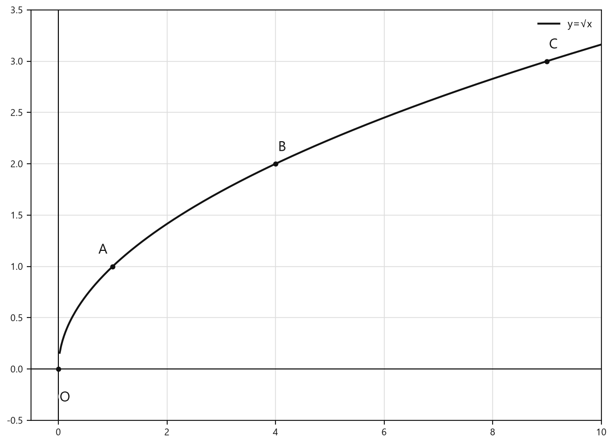
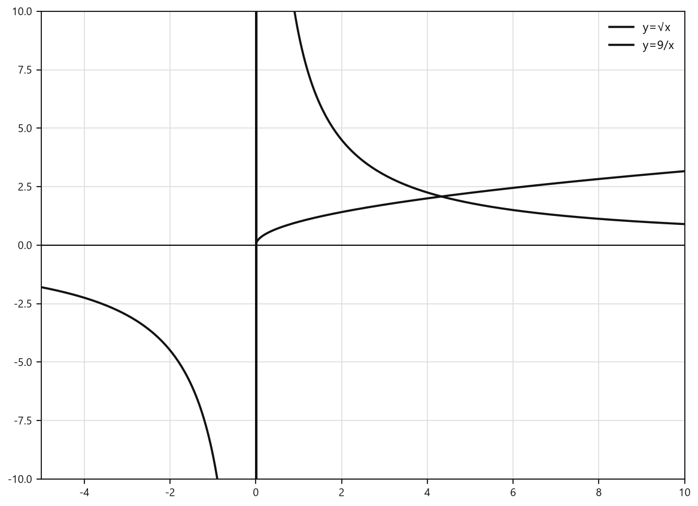
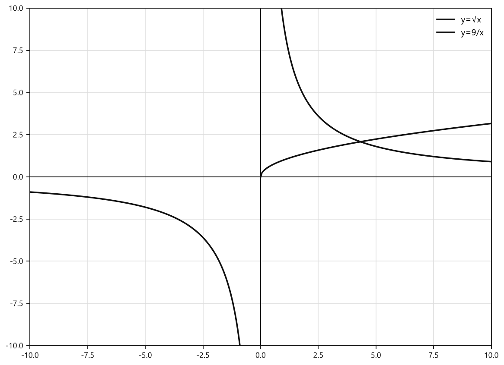

# Занятие 27. Свойства и график функции y = √x

**Раздел:** Глава 4  
**Параграф учебника:** §20. Свойства и график функции $y = \sqrt{x}$  
**Страницы:** 242–247

## Цели занятия

После занятия ты умеешь:

- находить значения функции $y = \sqrt{x}$;
- определять область определения и множество значений функции;
- проверять принадлежность точки графику;
- сравнивать значения квадратных корней и функции $f(x)=\sqrt{x}$;
- строить график $y=\sqrt{x}$ и находить точки его пересечения с прямыми;
- располагать числа с квадратными корнями в нужном порядке.

Выбирай блок своего уровня:

- **1–2 балла:** вычислить значения функции и определить область определения;
- **3–4 балла:** сравнить значения, проверить точки;
- **5–6 баллов:** решить задачи на график и пересечения;
- **7–8 баллов:** сравнивать выражения с корнями;
- **9–10 баллов:** исследовать взаимное расположение графиков и свойства функций.

## Теория к занятию

### Что такое функция $y=\sqrt{x}$

**Простыми словами.** Каждому неотрицательному числу $x$ ставится в соответствие его арифметический квадратный корень. Например, числу $25$ соответствует число $5$.

Важно: $\sqrt{25}=5$, а не $\pm5$. Знак «плюс-минус» появляется при решении уравнения $t^2=25$, но не в значении арифметического квадратного корня. Арифметический корень всегда выбирает только неотрицательное число.

**Факт.** Зависимость между двумя переменными величинами, при которой каждому значению одной переменной величины $x$ из множества неотрицательных чисел ставится в соответствие значение $\sqrt{x}$, задает функцию $y = \sqrt{x}$.

**Формула:**

$$y=\sqrt{x}.$$

Здесь $x$ — аргумент функции, а $y$ — значение функции.

**Правила:**

- под знаком квадратного корня должно стоять неотрицательное число;
- значение арифметического квадратного корня всегда неотрицательно;
- чтобы найти значение функции, нужно подставить значение $x$ в формулу.

**Ловушки:**

- $\sqrt{9}=3$, а не $-3$;
- выражение $\sqrt{-4}$ не имеет значения среди действительных чисел;
- не путай $\sqrt{x}$ и $x^2$: извлечение квадратного корня и возведение в квадрат — разные действия.

### Область определения и множество значений

**Простыми словами.** Область определения показывает, какие значения $x$ разрешены. Под корнем нельзя оставлять отрицательное число, поэтому $x$ должен быть неотрицательным.

Множество значений показывает, какие числа могут получиться вместо $y$. Арифметический квадратный корень не бывает отрицательным.

**Определение / свойство учебника.**

**Область определения функции.** Так как по определению квадратного корня из числа $(\sqrt{x})^2 = x$, а $(\sqrt{x})^2 \ge 0$, то аргумент $x$ принимает только неотрицательные значения, т. е. $D = [0; +\infty)$.

**Множество значений функции.** По определению арифметический квадратный корень из числа есть число неотрицательное, т. е. множеством значений функции $y = \sqrt{x}$ является множество неотрицательных чисел: $E(y) = [0; +\infty)$.

**Формулы:**

$$D(y)=[0;+\infty),$$

$$E(y)=[0;+\infty).$$

**Правило.** Сначала проверяем, допустимо ли значение $x$. Только после этого вычисляем корень. ОДЗ лучше спросить сразу, а не искать его в конце, когда оно уже спряталось.

**Ловушки:**

- $0$ входит в область определения;
- отрицательные числа в область определения не входят;
- функция принимает только неотрицательные значения.

### Нули и знакопостоянство

**Простыми словами.** Нуль функции — это такое значение аргумента, при котором значение функции равно нулю. На графике это точка, в которой график пересекает ось $x$.

**Свойство учебника.**

**Нули функции.** Так как $y = 0$, т. е. $\sqrt{x} = 0$, при $x = 0$, то значение $x = 0$ является нулем функции.

**Свойство учебника.**

**Промежутки знакопостоянства функции.** $y > 0$ при всех $x \in (0; +\infty)$.

**Формулы:**

$$\sqrt{x}=0 \Longleftrightarrow x=0,$$

$$\sqrt{x}>0 \text{ при } x>0.$$

**Ловушки:**

- при $x=0$ значение функции равно нулю;
- при $x>0$ значение функции положительно;
- отрицательных значений у функции нет: корень ниже оси $x$ не спускается.

### График функции $y=\sqrt{x}$

**Простыми словами.** Для построения графика возьмём такие значения $x$, из которых удобно извлекать квадратный корень:

| $x$ | $0$ | $1$ | $4$ | $9$ |
|---|---:|---:|---:|---:|
| $y=\sqrt{x}$ | $0$ | $1$ | $2$ | $3$ |

Получаем точки $(0;0)$, $(1;1)$, $(4;2)$, $(9;3)$. Наносим их на координатную плоскость и соединяем плавной линией.

График начинается в начале координат, идёт вправо и вверх. Он находится в первой координатной четверти и на оси $x$ в точке $(0;0)$.

<!--geo-figure-spec
{
  "needed": true,
  "kind": "graph",
  "caption": "График функции $y=\\sqrt{x}$",
  "axis": true,
  "grid": true,
  "xlim": [
    -0.5,
    10
  ],
  "ylim": [
    -0.5,
    3.5
  ],
  "curves": [
    {
      "expr": "sqrt(x)",
      "label": "y=√x"
    }
  ],
  "points": {
    "O": [
      0,
      0
    ],
    "A": [
      1,
      1
    ],
    "B": [
      4,
      2
    ],
    "C": [
      9,
      3
    ]
  },
  "labels": {
    "O": {
      "dx": 0.12,
      "dy": -0.28
    },
    "A": {
      "dx": -0.18,
      "dy": 0.16
    },
    "B": {
      "dx": 0.12,
      "dy": 0.16
    },
    "C": {
      "dx": 0.12,
      "dy": 0.16
    }
  }
}
-->

*График функции y=\sqrt{x}*

**Правила построения:**

1. Выбери неотрицательные значения $x$.
2. Для каждого выбранного $x$ найди значение $y=\sqrt{x}$.
3. Отметь точки с координатами $(x;y)$.
4. Соедини точки плавной линией.

**Ловушки:**

- график не продолжается в левую полуплоскость, потому что $x<0$ не входит в область определения;
- график не опускается ниже оси $x$, потому что $y\ge0$;
- точки соединяют плавной линией, а не ломаной «по линейке».

### Возрастание функции

**Простыми словами.** Если взять два неотрицательных числа и второе будет больше первого, то и его квадратный корень будет больше. Поэтому для сравнения квадратных корней можно сравнивать числа под знаками корней.

**Свойство учебника.**

**Промежутки монотонности функции.** С увеличением значений аргумента $x$ значения функции $y = \sqrt{x}$ увеличиваются, значит, функция $y = \sqrt{x}$ возрастает для всех $x \in [0; +\infty)$.

**Формула-смысл:**

если $0\le a<b$, то

$$\sqrt{a}<\sqrt{b}.$$

**Правило.** Если подкоренные выражения неотрицательны, сравни сначала их. Чем больше подкоренное число, тем больше квадратный корень.

**Ловушки:**

- при сравнении $\sqrt{37}$ и $\sqrt{35}$ сравниваем $37$ и $35$;
- свойство возрастания применяем только к неотрицательным подкоренным выражениям;
- при сравнении корня и обычного числа удобно возвести оба неотрицательных числа в квадрат.

### Приближённое значение квадратного корня по графику

**Простыми словами.** Чтобы узнать по графику приближённое значение $\sqrt{a}$, находим число $a$ на оси $x$. Затем поднимаемся до графика и смотрим, какому значению на оси $y$ соответствует эта точка.

Например, по графику:

$$\sqrt{2}\approx1,4,\qquad \sqrt{3}\approx1,7,\qquad \sqrt{5}\approx2,2.$$

Знак $\approx$ означает «приблизительно равно». График даёт оценку, а не обязательно точное значение. Калькулятор тут не нужен: достаточно аккуратно прочитать координаты.

**Алгоритм:**

1. Отметить число $a$ на оси $x$.
2. Провести вертикаль до графика $y=\sqrt{x}$.
3. От точки графика провести горизонталь к оси $y$.
4. Считать приближённое значение $\sqrt{a}$.

**Ловушки:**

- не перепутать координаты: сначала читаем $x$, потом $y$;
- значение, найденное по графику, является приближённым;
- график функции начинается только при $x\ge0$.

## Сводка формул «выучить наизусть»

$$y=\sqrt{x}.$$

$$D(y)=[0;+\infty).$$

$$E(y)=[0;+\infty).$$

$$\sqrt{x}=0\Longleftrightarrow x=0.$$

$$\sqrt{x}>0\text{ при }x>0.$$

Если $0\le a<b$, то

$$\sqrt{a}<\sqrt{b}.$$

Если

$$\sqrt{x}=a,\qquad a\ge0,$$

то

$$x=a^2.$$

## Правила, которые нельзя путать

- $\sqrt{x}$ — только неотрицательное число.
- Уравнение $t^2=a$ может иметь два корня, а $\sqrt{a}$ — одно арифметическое значение.
- Подкоренное выражение должно быть неотрицательным.
- График $y=\sqrt{x}$ лежит в первой координатной четверти и проходит через точку $(0;0)$.
- Функция $y=\sqrt{x}$ возрастает на $[0;+\infty)$.
- Точка $(x_0;y_0)$ принадлежит графику тогда и только тогда, когда $x_0\ge0$ и $y_0=\sqrt{x_0}$.

## Разбор ключевых заданий

### Р1. Найдите значения функции $f(x)=\sqrt{x}$ при $x=0,04$, $x=1,21$, $x=4,84$, $x=1225$.

**Решение.**

Формула функции:

$$f(x)=\sqrt{x}.$$

Подставляем заданные значения $x$ и извлекаем арифметический квадратный корень.

а)

$$f(0,04)=\sqrt{0,04}=0,2.$$

Проверим:

$$0,2^2=0,04.$$

б)

$$f(1,21)=\sqrt{1,21}=1,1.$$

Проверим:

$$1,1^2=1,21.$$

в)

$$f(4,84)=\sqrt{4,84}=2,2.$$

Проверим:

$$2,2^2=4,84.$$

г)

$$f(1225)=\sqrt{1225}=35.$$

Проверим:

$$35^2=1225.$$

Проверка здесь полезна: она быстро ловит ошибку в вычислении корня.

**Ответ:** $0,2$; $1,1$; $2,2$; $35$.

---

### Р2. Найдите значения $f(0)$, $f(4)$, $f(0,25)$, $f(49)$, $f(6400)$.

**Решение.**

Используем формулу $f(x)=\sqrt{x}$ и по очереди подставляем значения аргумента:

$$f(0)=\sqrt{0}=0.$$

$$f(4)=\sqrt{4}=2.$$

$$f(0,25)=\sqrt{0,25}=0,5.$$

$$f(49)=\sqrt{49}=7.$$

$$f(6400)=\sqrt{6400}=80.$$

Проверим последнее значение:

$$80^2=6400.$$

Все заданные числа неотрицательны, поэтому значения функции существуют.

**Ответ:** $0$; $2$; $0,5$; $7$; $80$.

---

### Р3. Из чисел $9$, $-3$, $0$, $-1,25$, $12,3$, $8$ выберите те, которые не принадлежат области определения функции $y=\sqrt{x}$.

**Решение.**

Область определения функции:

$$D(y)=[0;+\infty).$$

Значения $9$, $0$, $12,3$ и $8$ неотрицательны, поэтому они входят в область определения.

Числа $-3$ и $-1,25$ отрицательны, поэтому они не входят в область определения.

**Ответ:** $-3$; $-1,25$.

---

### Р4. Найдите значение аргумента, при котором $y=\sqrt{x}$ равно $0$, $1$, $2,5$, $\sqrt7$, $2\sqrt5$. Может ли функция принимать значение $-8$?

**Решение.**

Нужно найти $x$, если известно значение функции $y$.

Используем правило:

$$\sqrt{x}=a,\qquad a\ge0,$$

тогда

$$x=a^2.$$

а) Если $y=0$, то

$$x=0^2=0.$$

б) Если $y=1$, то

$$x=1^2=1.$$

в) Если $y=2,5$, то

$$x=(2,5)^2=6,25.$$

г) Если $y=\sqrt7$, то

$$x=(\sqrt7)^2=7.$$

д) Если $y=2\sqrt5$, то

$$x=(2\sqrt5)^2=2^2\cdot(\sqrt5)^2=4\cdot5=20.$$

Теперь проверим значение $-8$. Функция $y=\sqrt{x}$ принимает только неотрицательные значения.

Число $-8$ отрицательно.

Значит, функция не может принимать значение $-8$.

**Ответ:** $0$; $1$; $6,25$; $7$; $20$; значение $-8$ функция не принимает.

---

### Р5. Какие точки принадлежат графику функции $y=\sqrt{x}$: $A(36;6)$, $B(0,25;0,5)$, $C(1;-1)$, $D(0,01;0,1)$, $E(144;-12)$, $F(5;\sqrt5)$?

**Решение.**

Точка $(x_0;y_0)$ принадлежит графику, если после подстановки её координат получается верное равенство

$$y_0=\sqrt{x_0}.$$

Проверяем точки по очереди.

а) Для $A(36;6)$:

$$\sqrt{36}=6.$$

Равенство верно, поэтому точка $A$ принадлежит графику.

б) Для $B(0,25;0,5)$:

$$\sqrt{0,25}=0,5.$$

Равенство верно, поэтому точка $B$ принадлежит графику.

в) Для $C(1;-1)$:

$$\sqrt1=1\ne-1.$$

Равенство неверно, поэтому точка $C$ не принадлежит графику.

г) Для $D(0,01;0,1)$:

$$\sqrt{0,01}=0,1.$$

Равенство верно, поэтому точка $D$ принадлежит графику.

д) Для $E(144;-12)$:

$$\sqrt{144}=12\ne-12.$$

Равенство неверно, поэтому точка $E$ не принадлежит графику.

Минус здесь хотел выдать себя за квадратный корень, но арифметический корень принимает только неотрицательное значение.

е) Для $F(5;\sqrt5)$:

$$\sqrt5=\sqrt5.$$

Равенство верно, поэтому точка $F$ принадлежит графику.

Точка находится ниже графика, если при той же абсциссе её ордината меньше значения $\sqrt{x}$. Поэтому:

- $C(1;-1)$ расположена ниже графика, потому что $-1<\sqrt1=1$;
- $E(144;-12)$ расположена ниже графика, потому что $-12<\sqrt{144}=12$.

Точек выше графика среди данных нет.

Дополнительно можно взять, например, две точки графика:

$$O(0;0),\qquad P(9;3).$$

**Ответ:** принадлежат точки $A$, $B$, $D$, $F$; ниже графика расположены $C$ и $E$; выше графика точек нет.

---

### Р6. Сравните значения функции $f(x)=\sqrt{x}$:

а) $f(6)$ и $f(11)$;  
б) $f(29,18)$ и $f(31,9)$.

**Решение.**

Функция $y=\sqrt{x}$ возрастает на $[0;+\infty)$. Значит, у большего аргумента будет большее значение функции.

а)

Сравним аргументы:

$$6<11.$$

Следовательно,

$$f(6)<f(11).$$

Или, записав значения функции,

$$\sqrt6<\sqrt{11}.$$

б)

Сравним аргументы:

$$29,18<31,9.$$

Следовательно,

$$f(29,18)<f(31,9).$$

Здесь не нужно вычислять сами корни: возрастание функции уже всё сделало за нас.

**Ответ:** а) $f(6)<f(11)$; б) $f(29,18)<f(31,9)$.

---

### Р7. Сравните числа $\sqrt{24}$ и $5$, а также $5\sqrt3$ и $4\sqrt5$.

**Решение.**

а) Числа $\sqrt{24}$ и $5$ неотрицательны. Поэтому можно сравнить их квадраты: у неотрицательных чисел больше квадрат — значит, больше и само число.

Возводим в квадрат:

$$\left(\sqrt{24}\right)^2=24,$$

$$5^2=25.$$

Так как

$$24<25,$$

то

$$\sqrt{24}<5.$$

б) Числа $5\sqrt3$ и $4\sqrt5$ положительны. Сравним их квадраты:

$$\left(5\sqrt3\right)^2=25\cdot3=75,$$

$$\left(4\sqrt5\right)^2=16\cdot5=80.$$

Так как

$$75<80,$$

то

$$5\sqrt3<4\sqrt5.$$

Квадраты здесь работают как весы: сравнили квадраты — узнали, какое неотрицательное число больше.

**Ответ:** $\sqrt{24}<5$; $5\sqrt3<4\sqrt5$.

---

### Р8. Расположите в порядке возрастания числа $\sqrt{17}$, $3\sqrt2$, $4$.

**Решение.**

Все данные числа положительны, поэтому сравним их квадраты:

$$\left(\sqrt{17}\right)^2=17,$$

$$\left(3\sqrt2\right)^2=3^2\cdot(\sqrt2)^2=9\cdot2=18,$$

$$4^2=16.$$

Расположим полученные квадраты:

$$16<17<18.$$

Значит, в таком же порядке расположены исходные неотрицательные числа:

$$4<\sqrt{17}<3\sqrt2.$$

**Ответ:** $4$; $\sqrt{17}$; $3\sqrt2$.

---

### Р9. Найдите рациональное число между $\sqrt5$ и $\sqrt6$.

**Решение.**

Нужно найти рациональное число $a$, для которого

$$\sqrt5<a<\sqrt6.$$

Возьмём число $2,3$. Это рациональное число.

Вычислим его квадрат:

$$2,3^2=5,29.$$

Получаем:

$$5<5,29<6.$$

Так как функция $y=\sqrt{x}$ возрастает, то из этого следует:

$$\sqrt5<2,3<\sqrt6.$$

Значит, число $2,3$ подходит.

**Ответ:** например, $2,3$.

---

### Р10. Между какими последовательными целыми числами заключено число $-\sqrt{18}$?

**Решение.**

Сначала определим, между какими целыми числами находится $\sqrt{18}$.

Так как

$$16<18<25,$$

то после извлечения квадратного корня получаем:

$$4<\sqrt{18}<5.$$

Теперь умножим всё неравенство на $-1$. При умножении неравенства на отрицательное число знаки меняются на противоположные:

$$-5<-\sqrt{18}<-4.$$

Значит, число $-\sqrt{18}$ находится между последовательными целыми числами $-5$ и $-4$.

**Ответ:** между $-5$ и $-4$.

### Р11. Определите, пересекает ли график $y=\sqrt{x}$ прямые $y=2$, $y=1,5$, $y=-3$, $y=0$, $y=\sqrt5$, $y=-\sqrt2$.

**Решение.**

В точке пересечения координаты должны одновременно удовлетворять обоим уравнениям.

Для горизонтальной прямой $y=c$ получаем:

$$\sqrt{x}=c.$$

Левая часть $\sqrt{x}$ всегда неотрицательна.

Поэтому:

- если $c\ge0$, то пересечение возможно, и $x=c^2$;
- если $c<0$, пересечения нет.

Минус перед корнем здесь не «для красоты»: значение функции $y=\sqrt{x}$ отрицательным быть не может.

а) $y=2$:

$$\sqrt{x}=2,$$

$$x=2^2=4.$$

Точка пересечения:

$$(4;2).$$

б) $y=1,5$:

$$\sqrt{x}=1,5,$$

$$x=1,5^2=2,25.$$

Точка пересечения:

$$(2,25;1,5).$$

в) $y=-3$.

Число $-3$ отрицательное, а $\sqrt{x}\ge0$.

Пересечения нет.

г) $y=0$:

$$\sqrt{x}=0,$$

$$x=0.$$

Точка пересечения:

$$(0;0).$$

д) $y=\sqrt5$:

$$\sqrt{x}=\sqrt5,$$

$$x=5.$$

Точка пересечения:

$$(5;\sqrt5).$$

е) $y=-\sqrt2$.

Число $-\sqrt2$ отрицательное.

Значение $\sqrt{x}$ не может быть равным отрицательному числу.

Пересечения нет.

**Ответ:**  
а) пересекаются в точке $(4;2)$;  
б) в точке $(2,25;1,5)$;  
в) не пересекаются;  
г) в точке $(0;0)$;  
д) в точке $(5;\sqrt5)$;  
е) не пересекаются.

---

### Р12. Какие из прямых пересекают график $y=\sqrt{x}$?

а) $y=3x$;  
б) $y=-x+2$;  
в) $y=2x+5$;  
г) $y=-4x-3$.

**Решение.**

В каждой точке пересечения формулы для $y$ дают одно и то же значение.

Поэтому приравниваем правые части.

Важно: после возведения уравнения с корнем в квадрат могут появиться лишние корни. Их обязательно проверяем в исходном уравнении.

а) $y=3x$:

$$\sqrt{x}=3x.$$

Для функции $y=\sqrt{x}$ обязательно $x\ge0$.

Обе части равенства неотрицательны, поэтому возводим в квадрат:

$$x=9x^2.$$

Переносим всё в левую часть:

$$9x^2-x=0.$$

Выносим $x$ за скобки:

$$x(9x-1)=0.$$

Отсюда:

$$x=0\quad\text{или}\quad x=\frac19.$$

Находим соответствующие значения $y$ по формуле $y=3x$.

При $x=0$:

$$y=3\cdot0=0.$$

При $x=\frac19$:

$$y=3\cdot\frac19=\frac13.$$

Проверка показывает, что обе точки подходят.

Точки пересечения:

$$(0;0),\qquad \left(\frac19;\frac13\right).$$

б) $y=-x+2$:

$$\sqrt{x}=-x+2.$$

Левая часть неотрицательна.

Значит, правая часть тоже должна быть неотрицательной:

$$-x+2\ge0,$$

$$x\le2.$$

Теперь возводим обе части в квадрат:

$$x=(-x+2)^2.$$

Раскрываем скобки:

$$x=x^2-4x+4.$$

Переносим всё в левую часть:

$$x^2-5x+4=0.$$

Разложим на множители:

$$(x-1)(x-4)=0.$$

Получаем:

$$x=1\quad\text{или}\quad x=4.$$

Проверяем условие $x\le2$:

- $x=1$ подходит;
- $x=4$ не подходит.

При $x=1$:

$$y=-1+2=1.$$

Точка пересечения:

$$(1;1).$$

Корень $x=4$ оказался лишним: после возведения в квадрат исчезла информация о знаке правой части. Квадрат иногда умеет маскировать плохие корни — поэтому проверка обязательна.

в) $y=2x+5$.

При $x\ge0$ имеем:

$$2x+5\ge5.$$

Приравниваем формулы:

$$\sqrt{x}=2x+5.$$

Обе части неотрицательны, поэтому возводим в квадрат:

$$x=(2x+5)^2.$$

Раскрываем скобки:

$$x=4x^2+20x+25.$$

Переносим всё в левую часть:

$$4x^2+19x+25=0.$$

Находим дискриминант:

$$D=19^2-4\cdot4\cdot25,$$

$$D=361-400=-39.$$

Так как $D<0$, действительных корней нет.

Значит, общих точек нет.

г) $y=-4x-3$.

Для графика $y=\sqrt{x}$ имеем $x\ge0$.

При таком $x$:

$$-4x-3<0.$$

Правая часть отрицательна, а $\sqrt{x}\ge0$.

Пересечения нет.

**Ответ:** график пересекает прямые а) и б).  
Для а) точки: $(0;0)$ и $\left(\frac19;\frac13\right)$.  
Для б) точка: $(1;1)$.

---

### Р13. Найдите общие точки графиков $y=\sqrt{x}$ и $y=x-6$.

**Решение.**

В общей точке значения $y$ одинаковы:

$$\sqrt{x}=x-6.$$

Корень неотрицателен, поэтому правая часть тоже должна быть неотрицательной:

$$x-6\ge0,$$

$$x\ge6.$$

Теперь возводим обе части в квадрат:

$$x=(x-6)^2.$$

Раскрываем скобки:

$$x=x^2-12x+36.$$

Переносим всё в левую часть:

$$x^2-13x+36=0.$$

Разложим квадратный трёхчлен на множители:

$$(x-4)(x-9)=0.$$

Получаем два возможных значения:

$$x=4\quad\text{или}\quad x=9.$$

Проверяем условие $x\ge6$:

- $x=4$ не подходит;
- $x=9$ подходит.

Находим значение $y$:

$$y=9-6=3.$$

Проверим по формуле с корнем:

$$\sqrt9=3.$$

Значит, точка действительно принадлежит обоим графикам.

**Ответ:** $(9;3)$.

---

### Р14. Сравните значения функции при

$$x_1=\left(\frac5{\sqrt6+1}\right)^2,\qquad x_2=7-2\sqrt6.$$

**Решение.**

Сначала сравним сами аргументы $x_1$ и $x_2$.

Упростим дробь в выражении для $x_1$.

Домножим числитель и знаменатель на сопряжённое выражение $\sqrt6-1$:

$$\frac5{\sqrt6+1}\cdot\frac{\sqrt6-1}{\sqrt6-1}
=\frac{5(\sqrt6-1)}{(\sqrt6+1)(\sqrt6-1)}.$$

В знаменателе применяем формулу разности квадратов:

$$(\sqrt6+1)(\sqrt6-1)=6-1=5.$$

Тогда:

$$\frac5{\sqrt6+1}=\frac{5(\sqrt6-1)}5=\sqrt6-1.$$

Следовательно,

$$x_1=(\sqrt6-1)^2.$$

Раскрываем квадрат:

$$x_1=6-2\sqrt6+1,$$

$$x_1=7-2\sqrt6.$$

Значит,

$$x_1=x_2.$$

Одному и тому же аргументу функции соответствует одно и то же значение:

$$f(x_1)=f(x_2).$$

Можно проверить это непосредственно:

$$\sqrt{x_1}=\sqrt{(\sqrt6-1)^2}.$$

Так как $\sqrt6>1$, выражение $\sqrt6-1$ положительно. Поэтому:

$$\sqrt{(\sqrt6-1)^2}=\sqrt6-1.$$

**Ответ:** значения функции равны.

---

### Р15. Даны функции $f(x)=\sqrt{x}$ и $g(x)=|x|$. Найдите:

а) $f(g(-25))$;  
б) $g(f(0,36))$.

**Решение.**

Здесь функции применяются по очереди: сначала считаем то, что написано внутри скобок, затем подставляем результат в следующую функцию. Математическая «эстафета»: не перепутать первый этап со вторым.

а)

Сначала найдём значение функции $g$:

$$g(-25)=|-25|=25.$$

Теперь подставим результат в функцию $f$:

$$f(g(-25))=f(25)=\sqrt{25}=5.$$

б)

Сначала найдём значение функции $f$:

$$f(0,36)=\sqrt{0,36}=0,6.$$

Теперь подставим результат в функцию $g$:

$$g(f(0,36))=g(0,6)=|0,6|=0,6.$$

**Ответ:** а) $5$; б) $0,6$.

---

### Р16. Сравните свойства функций $y=\sqrt{x}$ и $y=x^2$.

**Решение.**

Разберём функции по одному плану:

1. область определения;
2. множество значений;
3. нули;
4. промежутки возрастания и убывания;
5. знак значений.

Для функции $y=\sqrt{x}$:

- область определения:

$$D=[0;+\infty);$$

- множество значений:

$$E=[0;+\infty);$$

- нуль: $x=0$;
- функция возрастает на $[0;+\infty)$;
- функция принимает только неотрицательные значения.

Почему область определения начинается с нуля? Подкоренное выражение $x$ не может быть отрицательным.

Для функции $y=x^2$:

- область определения:

$$D=(-\infty;+\infty);$$

- множество значений:

$$E=[0;+\infty);$$

- нуль: $x=0$;
- функция убывает на $(-\infty;0]$ и возрастает на $[0;+\infty)$;
- функция принимает только неотрицательные значения.

Квадрат не пугается отрицательных чисел: например, $(-3)^2=9$. А вот квадратный корень с отрицательным подкоренным выражением в этом курсе не дружит.

**Общие свойства:**

- множество значений — неотрицательные числа;
- нуль — $x=0$;
- графики проходят через точку $(0;0)$;
- на промежутке $[0;+\infty)$ обе функции возрастают.

**Различия:**

- область определения функции $y=\sqrt{x}$ ограничена условием $x\ge0$, а функция $y=x^2$ определена при всех действительных $x$;
- график $y=\sqrt{x}$ находится в первой координатной четверти и начинается в точке $(0;0)$;
- график $y=x^2$ симметричен относительно оси $y$;
- функция $y=x^2$ убывает слева от нуля, а функция $y=\sqrt{x}$ на всей своей области определения возрастает.

**Ответ:** свойства совпадают не полностью; основные различия — область определения и промежутки монотонности.

## Итоговая мини-проверка

1. Найдите $f(2,56)$ для $f(x)=\sqrt{x}$.
2. Укажите область определения функции $y=\sqrt{x}$.
3. Сравните $\sqrt{11}$ и $\sqrt{13}$.
4. При каком $x$ функция $y=\sqrt{x}$ принимает значение $3\sqrt2$?
5. Найдите точку пересечения графика $y=\sqrt{x}$ с прямой $y=1$.

### Ответы

1. $1,6$.
2. $[0;+\infty)$.
3. $\sqrt{11}<\sqrt{13}$.
4. $x=18$.
5. $(1;1)$.

## Практические задания

Выбери свой уровень и решай только этот блок. В блоке должна закрепиться вся тема параграфа. Ответы не приводятся.

### Уровень 1–2 балла

**С1.** Укажите область определения функции $y=\sqrt{x}$.

1) $(-\infty;+\infty)$ 2) $(-\infty;0]$ 3) $[0;+\infty)$ 4) $(0;+\infty)$ 5) $\{0\}$

**С2.** Из чисел $-4$; $0$; $2,5$; $-0,7$; $9$ выберите все числа, принадлежащие области определения функции $y=\sqrt{x}$.

1) $-4$ 2) $0$ 3) $2,5$ 4) $-0,7$ 5) $9$

**С3.** Найдите значение функции $y=\sqrt{x}$ при $x=0,49$.

**С4.** Найдите значение функции $y=\sqrt{x}$ при $x=81$.

**С5.** Найдите значение аргумента, при котором функция $y=\sqrt{x}$ принимает значение $3$.

**С6.** Может ли функция $y=\sqrt{x}$ принимать значение $-2$? Выберите верный ответ.

1) Да, при $x=4$ 2) Да, при $x=-4$ 3) Да, при $x=2$ 4) Нет 5) Только при $x=0$

**С7.** Какая из точек принадлежит графику функции $y=\sqrt{x}$?

1) $A(4;2)$ 2) $B(4;-2)$ 3) $C(-4;2)$ 4) $D(2;4)$ 5) $E(0;-1)$

**С8.** Сравните значения функции $f(x)=\sqrt{x}$: $f(7)$ и $f(10)$.

1) $f(7)>f(10)$ 2) $f(7)<f(10)$ 3) $f(7)=f(10)$ 4) Сравнить нельзя 5) Оба значения не существуют

**С9.** Расположите в порядке возрастания числа $\sqrt{2}$, $\sqrt{8}$ и $3$.

**С10.** Между какими последовательными целыми числами заключено число $\sqrt{20}$?

1) $1$ и $2$ 2) $2$ и $3$ 3) $3$ и $4$ 4) $4$ и $5$ 5) $5$ и $6$

**С11.** Определите, пересекается ли график функции $y=\sqrt{x}$ с прямой $y=-1$.

1) Пересекается в точке $(1;-1)$ 2) Пересекается в точке $(-1;1)$ 3) Пересекается в точке $(0;-1)$ 4) Не пересекается 5) Пересекается в двух точках

**С12.** Какой из перечисленных промежутков является промежутком возрастания функции $y=\sqrt{x}$?

1) $(-\infty;0]$ 2) $[0;+\infty)$ 3) $(-\infty;+\infty)$ 4) $(-\infty;0)$ 5) $(0;+\infty)$

**С13.** Найдите значение функции $y=\sqrt{x}$ при $x=0,36$.

**С14.** Найдите значение функции $y=\sqrt{x}$ при $x=81$.

**С15.** Из чисел $-4$; $0$; $2,5$; $-0,7$; $16$ выберите те, которые принадлежат области определения функции $y=\sqrt{x}$.

**С16.** Выберите точку, принадлежащую графику функции $y=\sqrt{x}$:  
1) $(9;3)$ 2) $(9;-3)$ 3) $(-9;3)$ 4) $(3;9)$ 5) $(0;-1)$.

**С17.** Выберите точку, не принадлежащую графику функции $y=\sqrt{x}$:  
1) $(0;0)$ 2) $(25;5)$ 3) $(0,49;0,7)$ 4) $(4;-2)$ 5) $(1;1)$.

**С18.** Сравните значения $f(7)$ и $f(12)$ функции $f(x)=\sqrt{x}$.

**С19.** Сравните числа $\sqrt{28}$ и $\sqrt{31}$.

**С20.** Расположите в порядке возрастания числа $\sqrt{2}$, $\sqrt{9}$ и $\sqrt{5}$.

**С21.** Найдите значение аргумента функции $y=\sqrt{x}$, при котором значение функции равно $4$.

**С22.** Может ли функция $y=\sqrt{x}$ принимать значение $-2$? Запишите ответ «да» или «нет».

**С23.** Определите, пересекается ли график функции $y=\sqrt{x}$ с прямой $y=3$. Если пересекается, запишите координаты точки пересечения.

**С24.** Определите, пересекается ли график функции $y=\sqrt{x}$ с прямой $y=-1$. Запишите ответ «да» или «нет».

**С25.** Укажите область определения функции $y=\sqrt{x}$.

1) $(-\infty;+\infty)$ 2) $(-\infty;0]$ 3) $[0;+\infty)$ 4) $(0;+\infty)$ 5) $[1;+\infty)$

**С26.** Укажите множество значений функции $y=\sqrt{x}$.

1) $(-\infty;+\infty)$ 2) $(-\infty;0]$ 3) $[0;+\infty)$ 4) $(0;+\infty)$ 5) $[-1;+\infty)$

**С27.** Найдите значение функции $f(x)=\sqrt{x}$ при $x=0,36$.

**С28.** Найдите значение функции $f(x)=\sqrt{x}$ при $x=81$.

**С29.** Из чисел $-4$; $0$; $2,5$; $-0,7$; $16$ выберите те, которые не принадлежат области определения функции $y=\sqrt{x}$.

1) $-4$ и $-0,7$ 2) $0$ и $16$ 3) $2,5$ и $16$ 4) только $-4$ 5) только $-0,7$

**С30.** Найдите значение аргумента, при котором функция $y=\sqrt{x}$ принимает значение $3$.

**С31.** Может ли функция $y=\sqrt{x}$ принимать значение $-2$?

1) Да, при $x=4$ 2) Да, при $x=-4$ 3) Да, при $x=0$ 4) Нет 5) Да, при $x=2$

**С32.** Какая из точек принадлежит графику функции $y=\sqrt{x}$?

1) $A(4;-2)$ 2) $B(-4;2)$ 3) $C(0,25;0,5)$ 4) $D(9;-3)$ 5) $E(2;4)$

**С33.** Сравните значения функции $f(x)=\sqrt{x}$ при $x=7$ и $x=12$.

1) $f(7)>f(12)$ 2) $f(7)<f(12)$ 3) $f(7)=f(12)$ 4) сравнить невозможно 5) оба значения отрицательны

**С34.** Расположите в порядке возрастания числа $\sqrt{3}$; $2$; $\sqrt{6}$.

1) $\sqrt{3}<2<\sqrt{6}$ 2) $2<\sqrt{3}<\sqrt{6}$ 3) $\sqrt{6}<2<\sqrt{3}$ 4) $\sqrt{3}<\sqrt{6}<2$ 5) $2<\sqrt{6}<\sqrt{3}$

**С35.** Определите, пересекает ли график функции $y=\sqrt{x}$ прямую $y=4$. Если пересекает, укажите координаты точки пересечения.

**С36.** Определите, пересекает ли график функции $y=\sqrt{x}$ прямую $y=-1$.

1) Пересекает в точке $(1;-1)$ 2) Пересекает в точке $(0;-1)$ 3) Пересекает в точке $(-1;-1)$ 4) Не пересекает 5) Пересекает в двух точках

### Уровень 3–4 балла

**С1.** Найдите значения функции $y=\sqrt{x}$ при $x=0$; $x=0,36$; $x=9$; $x=2500$.

**С2.** Из чисел $-4$; $0$; $0,25$; $7$; $-1,6$ выберите те, которые принадлежат области определения функции $y=\sqrt{x}$.

**С3.** Найдите значение аргумента функции $y=\sqrt{x}$, при котором значение функции равно $0$; $3$; $0,7$.

**С4.** Может ли функция $y=\sqrt{x}$ принимать значение, равное $-2,5$? Ответ обоснуйте свойством множества значений функции.

**С5.** Определите, какие из точек принадлежат графику функции $y=\sqrt{x}$: $A(25;5)$, $B(0,49;0,7)$, $C(4;-2)$, $D(0,09;0,3)$.

**С6.** Функция задана формулой $f(x)=\sqrt{x}$. Сравните значения $f(7,2)$ и $f(9,1)$.

**С7.** Пользуясь свойством возрастания функции $y=\sqrt{x}$, сравните числа $\sqrt{28}$ и $\sqrt{31}$.

**С8.** Пользуясь свойствами функции $y=\sqrt{x}$, сравните числа $\sqrt{20}$ и $4,5$.

**С9.** Расположите в порядке возрастания числа $\sqrt{10}$, $3$, $\sqrt{15}$ и $4$.

**С10.** Найдите два последовательных целых числа, между которыми заключено число $\sqrt{53}$.

**С11.** Определите, пересекается ли график функции $y=\sqrt{x}$ с прямой $y=2,5$. Если пересекается, найдите координаты точки пересечения.

**С12.** Определите, пересекается ли график функции $y=\sqrt{x}$ с прямой $y=-4$. Ответ обоснуйте свойством множества значений функции.

**С13.** Найдите значения функции $f(x)=\sqrt{x}$ при $x=0,09$, $x=1,44$, $x=36$ и $x=2500$.

**С14.** Из чисел $-4$, $0$, $2,5$, $-0,7$, $16$ и $81$ выберите те, которые принадлежат области определения функции $y=\sqrt{x}$.

**С15.** Найдите значение аргумента функции $y=\sqrt{x}$, при котором значение функции равно $0$, $3$, $0,6$ и $2\sqrt{3}$.

**С16.** Может ли функция $y=\sqrt{x}$ принимать значение $-2,4$? Ответ обоснуйте свойством множества значений этой функции.

**С17.** Определите, какие из точек принадлежат графику функции $y=\sqrt{x}$: $A(25;5)$, $B(0,36;0,6)$, $C(4;-2)$, $D(-9;3)$.

**С18.** Для функции $f(x)=\sqrt{x}$ сравните значения $f(7)$ и $f(12)$, а также $f(18,4)$ и $f(16,9)$.

**С19.** Пользуясь свойством возрастания функции $y=\sqrt{x}$, сравните числа $\sqrt{28}$ и $\sqrt{31}$, а также $\sqrt{45}$ и $7$.

**С20.** Расположите в порядке возрастания числа $\sqrt{10}$, $3$, $\sqrt{15}$ и $4$.

**С21.** Найдите рациональное число, заключённое между числами $\sqrt{8}$ и $\sqrt{10}$.

**С22.** Укажите промежуток между двумя последовательными целыми числами, в котором находится число $-\sqrt{27}$.

**С23.** Определите, пересекает ли график функции $y=\sqrt{x}$ прямую $y=2,5$. Если пересекает, найдите координаты точки пересечения.

**С24.** Определите, пересекает ли график функции $y=\sqrt{x}$ прямую $y=-4$. Ответ обоснуйте свойством множества значений функции.

**С25.** Найдите значения функции $y=\sqrt{x}$ при $x=0$; $x=0,49$; $x=81$.

**С26.** Из чисел $-4$; $0$; $2,5$; $-0,16$; $36$ выберите те, которые не принадлежат области определения функции $y=\sqrt{x}$.

**С27.** Найдите значение аргумента функции $y=\sqrt{x}$, при котором значение функции равно $0$; $3$; $0,7$.

**С28.** Укажите точки, принадлежащие графику функции $y=\sqrt{x}$: $A(25;5)$, $B(0,36;0,6)$, $C(9;-3)$, $D(-4;2)$, $E(2;\sqrt{2})$.

**С29.** Сравните значения функции $f(x)=\sqrt{x}$:  
а) $f(7)$ и $f(12)$;  
б) $f(18,4)$ и $f(18,04)$.

**С30.** Расположите в порядке возрастания числа $\sqrt{8}$, $3$, $\sqrt{11}$ и $4$.

**С31.** Сравните числа $\sqrt{26}$ и $5$; $3\sqrt{2}$ и $\sqrt{19}$.

**С32.** Найдите какое-либо рациональное число, заключённое между числами $\sqrt{10}$ и $\sqrt{11}$.

**С33.** Между какими последовательными целыми числами заключено число $-\sqrt{27}$?

**С34.** Определите, пересекается ли график функции $y=\sqrt{x}$ с прямой $y=2,5$. Если пересекается, найдите координаты точки пересечения.

**С35.** Определите, пересекается ли график функции $y=\sqrt{x}$ с прямыми $y=-2$ и $y=0$. Для каждой прямой укажите ответ; в случае пересечения найдите координаты точки.

**С36.** Найдите координаты общей точки графиков функций $y=\sqrt{x}$ и $y=x-2$.

### Уровень 5–6 баллов

**С1.** Найдите значения функции $y=\sqrt{x}$ при $x=0$; $x=0,49$; $x=2,25$; $x=81$.

**С2.** Из чисел $-9$; $0$; $0,16$; $3,7$; $-1,4$; $25$ выберите числа, принадлежащие области определения функции $y=\sqrt{x}$.

**С3.** Найдите значение аргумента функции $y=\sqrt{x}$, при котором значение функции равно $0$; $0,6$; $4$; $3\sqrt{2}$.

**С4.** Может ли функция $y=\sqrt{x}$ принимать отрицательные значения? Укажите нуль функции и промежуток, на котором функция принимает положительные значения.

**С5.** Какие из точек принадлежат графику функции $y=\sqrt{x}$: $A(4;2)$, $B(0,36;0,6)$, $C(9;-3)$, $D(-4;2)$, $E(25;5)$?

**С6.** Сравните значения функции $f(x)=\sqrt{x}$:  
а) $f(7)$ и $f(12)$;  
б) $f(18,4)$ и $f(18,04)$.

**С7.** Сравните числа:  
а) $\sqrt{29}$ и $\sqrt{31}$;  
б) $\sqrt{26}$ и $5$;  
в) $3\sqrt{2}$ и $2\sqrt{5}$.

**С8.** Расположите в порядке возрастания числа $\sqrt{10}$, $3\sqrt{2}$, $\sqrt{20}$ и $5$.

**С9.** Найдите рациональное число, заключённое между $\sqrt{10}$ и $\sqrt{11}$.

**С10.** Между какими двумя последовательными целыми числами заключено число $-\sqrt{27}$?

**С11.** Определите, пересекается ли график функции $y=\sqrt{x}$ с прямыми. Если пересекается, найдите координаты точки пересечения:  
а) $y=3$;  
б) $y=0,5$;  
в) $y=-2$;  
г) $y=\sqrt{7}$.

**С12.** Найдите координаты общей точки графиков функций $y=\sqrt{x}$ и $y=x-2$.

**С13.** Для функции $f(x)=\sqrt{x}$ найдите значения $f(0)$, $f(0{,}36)$, $f(9)$ и $f(2500)$.

**С14.** Из чисел $-7$, $0$, $0{,}04$, $16$, $-1{,}2$ и $25{,}6$ выберите те, которые принадлежат области определения функции $y=\sqrt{x}$.

**С15.** Найдите значение аргумента функции $y=\sqrt{x}$, при котором значение функции равно $0$, $0{,}5$, $4$ и $3\sqrt{2}$.

**С16.** Может ли функция $y=\sqrt{x}$ принимать значение $-5$? Обоснуйте ответ свойством множества значений этой функции.

**С17.** Установите, какие из точек принадлежат графику функции $y=\sqrt{x}$: $A(25;5)$, $B(0{,}49;0{,}7)$, $C(4;-2)$, $D(2;\sqrt{2})$, $E(-9;3)$.

**С18.** Для функции $f(x)=\sqrt{x}$ расположите значения $f(0{,}16)$, $f(4)$, $f(1{,}44)$ и $f(9)$ в порядке возрастания.

**С19.** Сравните числа $\sqrt{28}$ и $\sqrt{31}$; $\sqrt{18}$ и $4$; $3\sqrt{2}$ и $2\sqrt{5}$.

**С20.** Расположите в порядке убывания числа $\sqrt{50}$, $7$ и $2\sqrt{13}$.

**С21.** Найдите рациональное число, заключённое между $\sqrt{10}$ и $\sqrt{11}$.

**С22.** Между какими двумя последовательными целыми числами заключено число $-\sqrt{27}$?

**С23.** Определите, пересекается ли график функции $y=\sqrt{x}$ с каждой из прямых. Если пересекается, найдите координаты точки пересечения:  
а) $y=3$;  
б) $y=0{,}4$;  
в) $y=-2$;  
г) $y=\sqrt{7}$.

**С24.** Найдите координаты общей точки графиков функций $y=\sqrt{x}$ и $y=x-2$.

**С25.** Для функции $f(x)=\sqrt{x}$ найдите:  
а) $f(0,49)$;  
б) $f(2,25)$;  
в) $f(81)$;  
г) $f(3600)$.

**С26.** Из чисел $-4$; $0$; $0,16$; $-1,7$; $25$; $36,4$ выберите те, которые принадлежат области определения функции $y=\sqrt{x}$.

**С27.** Найдите значение аргумента функции $y=\sqrt{x}$, при котором значение функции равно:  
а) $0$;  
б) $0,7$;  
в) $5$;  
г) $2\sqrt{3}$.  
Может ли функция $y=\sqrt{x}$ принимать значение $-2$?

**С28.** Определите, какие из точек принадлежат графику функции $y=\sqrt{x}$:  
$A(49;7)$, $B(0,36;0,6)$, $C(4;-2)$, $D(0,04;0,2)$, $E(-9;3)$.

**С29.** Сравните числа, не вычисляя их приближённых значений:  
а) $\sqrt{28}$ и $\sqrt{31}$;  
б) $\sqrt{40}$ и $6$;  
в) $3\sqrt{2}$ и $2\sqrt{5}$.

**С30.** Определите, пересекается ли график функции $y=\sqrt{x}$ с прямой. Если пересекается, найдите координаты точки пересечения:  
а) $y=3$;  
б) $y=0,5$;  
в) $y=-4$;  
г) $y=\sqrt{7}$.

### Уровень 7–8 баллов

**С1.** Для функции $f(x)=\sqrt{x}$ найдите $f(0,36)$, $f(1,44)$, $f(2,25)$ и $f(3600)$.

**С2.** Из чисел $-9$, $0$, $0,49$, $-\dfrac{4}{9}$, $16$, $25,7$ выберите те, которые принадлежат области определения функции $y=\sqrt{x}$. Обоснуйте свой выбор.

**С3.** Найдите значение аргумента функции $y=\sqrt{x}$, при котором значение функции равно $0$; $0,6$; $4$; $3\sqrt{2}$. Может ли функция $y=\sqrt{x}$ принимать значение $-2,5$? Ответ обоснуйте.

**С4.** Определите, какие из точек принадлежат графику функции $y=\sqrt{x}$: $A(0,49;0,7)$, $B(25;5)$, $C(4;-2)$, $D(-9;3)$, $E(18;3\sqrt{2})$. Для каждой точки, не принадлежащей графику, укажите, расположена ли она выше или ниже графика.

**С5.** Пользуясь свойством возрастания функции $y=\sqrt{x}$, сравните числа $\sqrt{28}$ и $\sqrt{31}$; $\sqrt{45}$ и $7$; $3\sqrt{5}$ и $2\sqrt{11}$.

**С6.** Расположите в порядке возрастания числа $\sqrt{19}$, $2\sqrt{5}$, $\sqrt{23}$ и $5$. Обоснуйте порядок сравнением квадратов неотрицательных чисел.

**С7.** Найдите рациональное число, заключённое между числами $\sqrt{10}$ и $\sqrt{11}$. Проверьте с помощью возведения в квадрат, что найденное число действительно находится между ними.

**С8.** Между какими последовательными целыми числами заключено число $-\sqrt{38}$? Обоснуйте ответ, используя свойства функции $y=\sqrt{x}$ и изменение знака при умножении неравенства на $-1$.

**С9.** Определите, пересекается ли график функции $y=\sqrt{x}$ с каждой из прямых: $y=3$; $y=0,4$; $y=-2$; $y=\sqrt{12}$. Если пересечение существует, найдите его координаты.

**С10.** В одной системе координат постройте графики функций $y=\sqrt{x}$ и $y=x-4$. Найдите координаты всех их общих точек и подтвердите результат подстановкой координат в обе формулы.

<!--geo-figure-spec
{
  "needed": true,
  "kind": "graph",
  "caption": "Графики $y=\\sqrt{x}$ и $y=\\frac{9}{x}$",
  "axis": true,
  "grid": true,
  "xlim": [
    -5,
    10
  ],
  "ylim": [
    -10,
    10
  ],
  "curves": [
    {
      "expr": "sqrt(x)",
      "label": "y=√x"
    },
    {
      "expr": "9/x",
      "label": "y=9/x"
    }
  ],
  "points": {}
}
-->

*Графики y=\sqrt{x} и y=\frac{9}{x}*

**С11.** В одной системе координат постройте графики функций $y=\sqrt{x}$ и $y=\dfrac{9}{x}$, учитывая область определения второй функции. Найдите координаты их общих точек и проверьте найденные точки по формулам.

<!--geo-figure-spec
{
  "needed": true,
  "kind": "graph",
  "caption": "Графики $y=\\sqrt{x}$ и $y=\\frac{9}{x}$",
  "axis": true,
  "grid": true,
  "xlim": [
    -10,
    10
  ],
  "ylim": [
    -10,
    10
  ],
  "curves": [
    {
      "expr": "sqrt(x)",
      "label": "y=√x"
    },
    {
      "expr": "9/x",
      "label": "y=9/x"
    }
  ],
  "points": {}
}
-->

*Графики y=\sqrt{x} и y=\frac{9}{x}*

**С12.** Даны функции $f(x)=\sqrt{x}$ и $g(x)=|x|$. Найдите $f(g(-16))$ и $g(f(0,64))$. Для каждого выражения укажите, какие свойства функций были использованы.

**С13.** Для функции $f(x)=\sqrt{x}$ вычислите $f(0,09)$, $f(1,44)$, $f(6,25)$ и $f(8100)$. Укажите, какие из полученных значений являются рациональными числами.

**С14.** Из чисел $-16$, $0$, $0,36$, $4$, $-0,04$, $12,5$ выберите те, которые могут быть значениями аргумента функции $y=\sqrt{x}$. Для каждого выбранного значения найдите соответствующее значение функции.

**С15.** Найдите значение аргумента функции $y=\sqrt{x}$, если значение функции равно $0,7$, $4$, $3\sqrt{5}$ или $2\sqrt{11}$. Объясните, может ли функция $y=\sqrt{x}$ принимать значение $-2$.

**С16.** Для каждой из точек определите, лежит ли она на графике функции $y=\sqrt{x}$, расположена выше или расположена ниже этого графика: $A(0,25;0,4)$, $B(4;1)$, $C(9;3)$, $D(16;5)$, $E(25;-1)$.

**С17.** Пользуясь свойством возрастания функции $y=\sqrt{x}$, сравните числа $\sqrt{18}$ и $\sqrt{23}$; $\sqrt{45}$ и $7$; $3\sqrt{2}$ и $\sqrt{19}$. Обоснование приведите без вычисления приближённых значений корней.

**С18.** Расположите в порядке возрастания числа $\sqrt{12}$, $2\sqrt{3}$, $3,5$, $\sqrt{15}$ и $4$. Обоснуйте порядок сравнения.

**С19.** Укажите два последовательных целых числа, между которыми заключено число $-\sqrt{52}$. Обоснуйте ответ с помощью сравнения квадратов соответствующих положительных чисел.

**С20.** Определите, пересекает ли график функции $y=\sqrt{x}$ каждую из прямых $y=0$, $y=2,4$, $y=-1$ и $y=\sqrt{13}$. Для каждой прямой, с которой пересечение существует, найдите координаты точки пересечения.

**С21.** Определите, пересекается ли график функции $y=\sqrt{x}$ с каждой из прямых $y=2x+1$, $y=-x+4$, $y=x-4$ и $y=-3x-2$. Для каждой прямой приведите обоснование; координаты точек пересечения найдите только в случае их существования.

**С22.** Найдите координаты общей точки графиков функций $y=\sqrt{x}$ и $y=x-6$. Проверьте найденную точку подстановкой в обе формулы и объясните, почему других общих точек нет.

**С23.** Найдите координаты общей точки графиков функций $y=\sqrt{x}$ и $y=\dfrac{8}{x}$. Укажите область допустимых значений аргумента при решении и выполните проверку результата.

**С24.** Даны функции $f(x)=\sqrt{x}$ и $g(x)=|x|$. Найдите $f(g(-36))$ и $g(f(0,49))$. Затем сравните $f(4)$ и $g(4)$ и обоснуйте результат.

### Уровень 9–10 баллов

**С1.** Даны числа $a=\left(\sqrt{7}-\sqrt{3}\right)^2$ и $b=10-2\sqrt{21}$. Сравните значения функции $f(x)=\sqrt{x}$ при $x=a$ и $x=b$.

**С2.** Расположите в порядке возрастания числа $\sqrt{29}$, $3\sqrt{3}$, $2\sqrt{7}$ и $\sqrt{31}$.

**С3.** Найдите все значения параметра $k$, при которых прямая $y=k$ имеет с графиком функции $y=\sqrt{x}$ ровно одну общую точку, лежащую на отрезке с абсциссами от $4$ до $25$ включительно.

**С4.** Определите, сколько общих точек имеют графики функций $y=\sqrt{x}$ и $y=6-x$. Найдите координаты всех общих точек.

**С5.** Определите, пересекается ли график функции $y=\sqrt{x}$ с прямой $y=3x-2$. Если пересекается, найдите координаты точки пересечения.

**С6.** Для функций $f(x)=\sqrt{x}$ и $g(x)=|x-4|$ найдите все значения $x$, при которых $f(x)=g(x)$.

**С7.** Известно, что точки $A(a;3)$ и $B(16;b)$ принадлежат графику функции $y=\sqrt{x}$. Найдите значение выражения $a+b$.

**С8.** Найдите все рациональные числа $r$, имеющие вид десятичной дроби с одной цифрой после запятой, для которых выполняется неравенство $\sqrt{7}<r<\sqrt{8}$.

**С9.** Функция $f(x)=\sqrt{x}$. Не вычисляя приближённых значений корней, расположите в порядке убывания числа $f(2+\sqrt{3})$, $f(5)$, $f(3+\sqrt{8})$.

**С10.** Найдите все значения параметра $k$, при которых график функции $y=\sqrt{x}$ имеет общую точку с прямой $y=x-k$.

**С11.** Даны функции $f(x)=\sqrt{x}$ и $g(x)=|x|$. Найдите значение выражения $f(g(-2\sqrt{5}))-g(f(0,49))$.

**С12.** В одной системе координат рассмотрены графики функций $y=\sqrt{x}$, $y=x$ и $y=x^2$. Найдите все точки, общие одновременно для всех трёх графиков, и сравните области определения и множества значений функций $y=\sqrt{x}$ и $y=x^2$.

**С13.** Найдите все общие точки графиков функций $y=\sqrt{x}$ и $y=x-6$. Обоснуйте, что других общих точек нет.

**С14.** Сравните значения функции $f(x)=\sqrt{x}$ при
$x_1=(\sqrt{11}-\sqrt{3})^2$ и $x_2=15-2\sqrt{33}$, не вычисляя приближённых значений корней.

**С15.** Графики функций $y=\sqrt{x}$ и $y=-x+2$ пересекаются в точке $A$. Найдите координаты точки $A$ и расстояние от неё до начала координат.

**С16.** Найдите координаты всех общих точек графиков функций $y=\sqrt{x}$ и $y=\dfrac{8}{x}$. Проверьте найденные точки непосредственной подстановкой в обе формулы.

**С17.** Для каждого значения параметра $a$ определите, пересекает ли прямая $y=a$ график функции $y=\sqrt{x}$. Если пересечение существует, выразите координаты точки пересечения через $a$. Рассмотрите все действительные значения параметра $a$.

**С18.** При каких значениях параметра $a$ график функции $y=\sqrt{x}$ и прямая $y=x-a$ имеют:
1) ровно одну общую точку;
2) ровно две общие точки;
3) общую точку с абсциссой $x=0$?

Для каждого случая найдите координаты общих точек.

## Чек-лист «ученик понял тему»

- Могу повторить определения и формулы параграфа своими словами и по учебнику.
- Решаю типовые задания своего уровня без подсказки.
- Вижу типичную ошибку и могу её объяснить.
