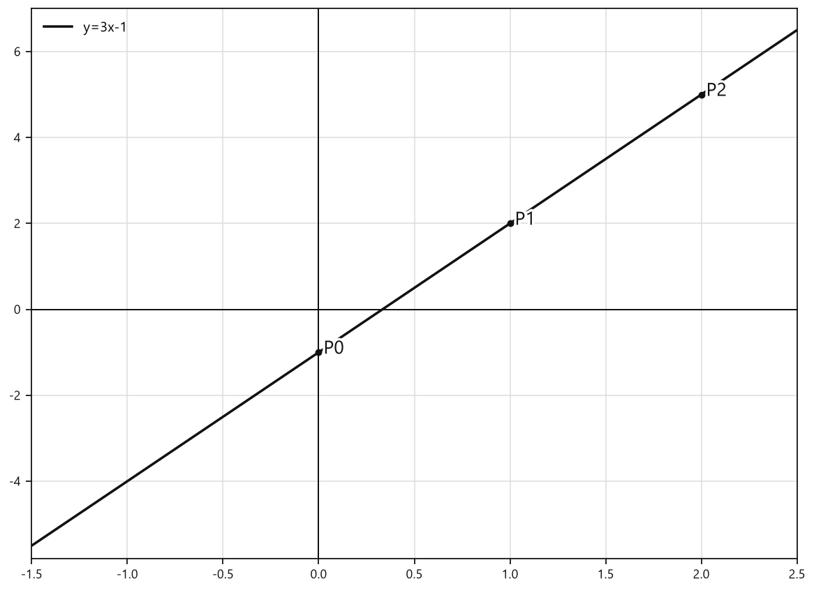
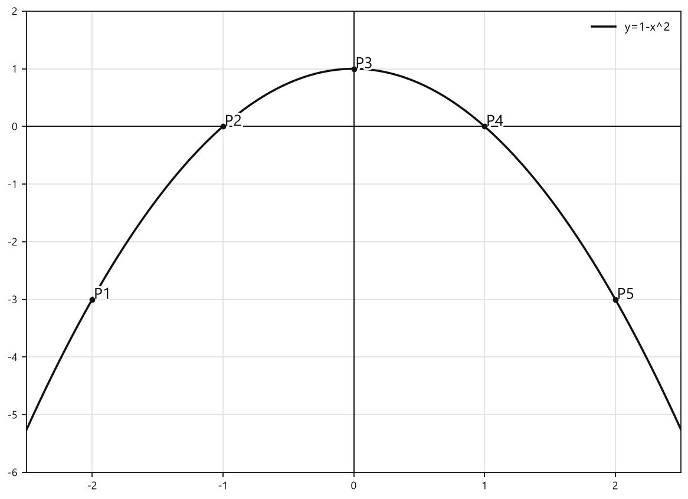
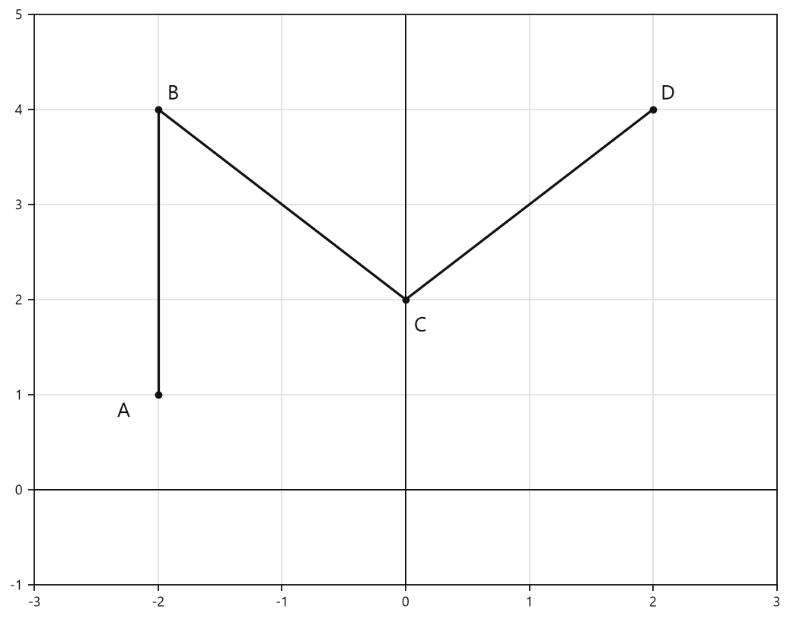
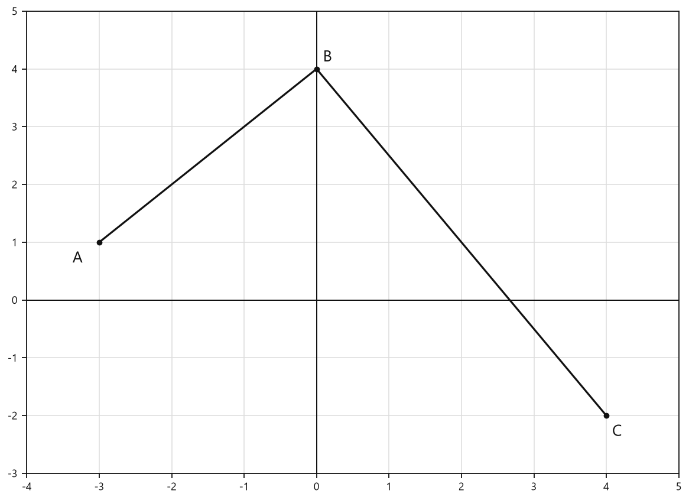
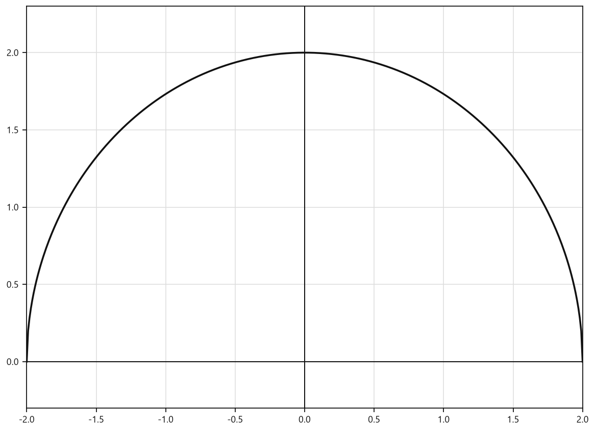

# Занятие 7. Функция числового аргумента. Область определения, множество значений. Способы задания функции

**Раздел:** Глава 2  
**Параграф учебника:** §6. Функция числового аргумента. Область определения, множество значений. Способы задания функции  
**Страницы:** 76–80

## Цели занятия

После занятия ты умеешь:

- объяснять, что такое функция и аргумент;
- находить область определения функции;
- находить множество значений функции по формуле, таблице или графику;
- вычислять значение функции по заданному аргументу;
- находить аргумент по известному значению функции;
- определять способ задания функции и проверять, является ли кривая графиком функции.

### Выбери блок своего уровня

- **1–2 балла:** понять определения функции, аргумента и области определения;
- **3–4 балла:** находить область определения и вычислять значения функции;
- **5–6 баллов:** работать с таблицами и графиками;
- **7–8 баллов:** строить графики и находить по ним $D(f)$ и $E(f)$;
- **9–10 баллов:** уверенно применять все способы задания функции и находить ошибки в рассуждениях.

## Теория к занятию

### 1. Что такое функция

#### Простыми словами

Функция — это правило, которое каждому допустимому значению $x$ ставит в соответствие ровно одно значение $y$.

Представь автомат: вводим число $x$, а на выходе получаем число $y$. Если для одного и того же $x$ автомат выдаёт два разных результата, это уже не функция. У автомата математическая дисциплина строгая.

#### Определение

Зависимость между двумя переменными, при которой каждому значению одной переменной соответствует единственное значение другой переменной, называется **функциональной зависимостью или функцией**.

#### Определение

Говорят, что задана функция $y = f(x)$, если заданы:

- числовое множество $X$;
- правило (закон, зависимость) $f$, по которому каждому элементу $x$ из множества $X$ ставится в соответствие единственное число $y$.

Здесь $x$ выбирают из множества $X$, а затем по правилу находят соответствующее значение $y$.

#### Обозначения

- $x$ — аргумент;
- $y$ — значение функции;
- $f(x)$ — значение функции $f$ при аргументе $x$;
- $D(f)$ — область определения;
- $E(f)$ — множество значений.

Запись $f(3)$ означает: в формулу функции вместо $x$ подставили число $3$.

### 2. Область определения функции

#### Простыми словами

Область определения — это все значения $x$, которые разрешено подставлять в формулу функции.

Если формула содержит дробь, знаменатель не может быть равен нулю. Если есть квадратный корень, подкоренное выражение должно быть неотрицательным. Сначала проверяем, где формула имеет смысл, и только потом считаем значения функции.

#### Определение

Множество $X$ называют **областью определения функции** $y = f(x)$ и обозначают $D(f)$.

#### Правило

Если область определения функции $y = f(x)$ не указана, то в таких случаях подразумевается, что область определения функции состоит из всех тех значений переменной $x$, при которых выражение $f(x)$, задающее функцию, имеет смысл.

#### Основные ограничения

- Подкоренное выражение квадратного корня должно быть неотрицательным:

  $$A(x) \geqslant 0.$$

- Знаменатель дроби не должен быть равен нулю:

  $$B(x) \ne 0.$$

- Для многочлена ограничений нет: он имеет смысл при любом действительном $x$.

Например, для функции $y=\sqrt{x-3}$ нужно потребовать $x-3\geqslant0$.

А для функции $y=\dfrac{4}{x-1}$ нужно исключить значение $x=1$.

#### Алгоритм нахождения области определения

1. Записать формулу функции.
2. Найти корни, знаменатели и другие выражения, которые могут иметь ограничения.
3. Составить условия, при которых формула имеет смысл.
4. Решить полученные неравенства или уравнения.
5. Записать область определения в виде промежутка или объединения промежутков.

#### Ловушки

- В знаменателе нельзя оставлять значение $0$.
- Под корнем можно оставлять $0$: условие именно $A(x) \geqslant 0$, а не $A(x)>0$.
- У многочлена область определения — все действительные числа.
- Одинаковая формула, но разные области определения — это разные функции. Например, правило $y=x^2$ можно рассматривать при всех действительных $x$ или только при натуральных $x$.

### 3. Множество значений функции

#### Простыми словами

Область определения отвечает на вопрос: «Какие значения $x$ можно подставлять?»

Множество значений отвечает на другой вопрос: «Какие результаты $y$ могут получиться?»

Например, в функции $y=x^2$ можно брать любое действительное $x$. Но квадрат числа не бывает отрицательным, поэтому значения функции удовлетворяют условию $y\geqslant0$.

#### Определение

Множество всех значений, которые принимает функция $y = f(x)$, называют **множеством значений функции** и обозначают $E(f)$.

#### Как находить множество значений

- **По формуле:** выяснить, какие значения может принимать выражение $f(x)$.
- **По таблице:** выписать все значения из второй строки.
- **По графику:** определить все значения $y$, которые соответствуют точкам графика.

#### Ловушки

- $D(f)$ состоит из значений $x$, а $E(f)$ — из значений $y$.
- При чтении графика область определения смотрят по оси абсцисс.
- Множество значений смотрят по оси ординат.
- «Найти $f(3)$» означает подставить $x=3$.
- «Найти $x$, если $f(x)=3$» означает найти аргумент, при котором значение функции равно $3$. Это уже другая задача.

### 4. Способы задания функции

Функцию можно задать несколькими способами. Правило одно и то же, но записать его можно формулой, словами, таблицей или графиком.

#### Аналитический способ

##### Простыми словами

Функция задана формулой. Подставляем допустимое значение $x$ и вычисляем $y$.

##### Определение

Если соответствие между значениями аргумента и значениями функции определяется с помощью формулы, то такой способ задания функции называют аналитическим.

##### Примеры

$$y=3x-1,$$

$$f(x)=\sqrt{x-3},$$

$$g(x)=\frac{4}{x-1}.$$

У каждой формулы сначала нужно проверить область определения. Даже у формулы бывает «вход только по пропускам».

##### На заметку

Одна и та же функция может быть задана разными формулами. Например, формулы $y=|x|$ и $y=\sqrt{x^2}$ задают одну и ту же функцию.

#### Словесный способ

##### Определение

Если соответствие между значениями аргумента и значениями функции описывается словами, т. е. если объясняется, каким образом значению аргумента ставится в соответствие значение функции, то такой способ задания функции — словесный.

##### Пример

Функция определена на множестве натуральных чисел, и каждому числу ставится в соответствие сумма цифр в его десятичной записи.

Чтобы найти значение функции, складываем цифры заданного числа:

$$g(12)=1+2=3,$$

$$g(325)=3+2+5=10.$$

#### Табличный способ

##### Определение

Если соответствие между значениями аргумента и значениями функции указывается с помощью таблицы, в первой строке которой указываются значения аргумента, а во второй — соответствующие значения функции, то говорят, что функция задана таблицей.

| $x$ | $x_1$ | $x_2$ | $x_3$ |
|---|---:|---:|---:|
| $y=f(x)$ | $y_1$ | $y_2$ | $y_3$ |

##### Правило чтения таблицы

- Чтобы найти значение функции по аргументу, ищем нужное значение $x$ в первой строке.
- Затем читаем число в том же столбце, но во второй строке.
- Чтобы найти аргумент по значению функции, ищем нужное значение $y$ во второй строке.
- Затем читаем число над ним, в первой строке.

В одном столбце всегда находится пара: аргумент и соответствующее ему значение функции.

#### Графический способ

##### Определение

Способ задания функции с помощью множества точек координатной плоскости называется **графическим**.

##### Определение

Множество всех точек плоскости, абсциссы которых равны значениям аргумента, а ординаты — соответствующим значениям функции, называют **графиком функции**.

##### Как читать график

Для заданного $x_0$:

1. Находим на оси $x$ число $x_0$.
2. Проводим через него вертикальную прямую.
3. Находим точку пересечения этой прямой с графиком.
4. Считываем ординату этой точки — число $y_0$.
5. Получаем $f(x_0)=y_0$.

Если вертикальная прямая не пересекает график, то такое значение $x_0$ не входит в область определения функции.

#### Правило определения, задает ли кривая функцию

Произвольная кривая на координатной плоскости задает функцию, если любая прямая, параллельная оси ординат, имеет с этой кривой не более одной общей точки.

Почему именно вертикальная прямая? Она соответствует одному фиксированному значению $x$. Если такая прямая встречает кривую два раза, одному $x$ соответствуют два значения $y$. Функция так не работает.

#### Ловушки

- Вертикальная прямая должна пересекать кривую не более чем в одной точке.
- Горизонтальная прямая может пересекать график несколько раз — это не запрещено.
- Координаты точки графика записываются как $(x;f(x))$.
- Точка $(a;b)$ принадлежит графику $y=f(x)$ тогда и только тогда, когда $f(a)=b$.

### Чтобы задать функцию, нужно

1. Указать область определения функции.
2. Указать правило, с помощью которого по значению аргумента $x$ можно найти соответствующее значение функции $y$.

Без области определения и правила функция задана не полностью: неизвестно, какие значения разрешены и как получать результат.

## Сводка формул «выучить наизусть»

Точка $M(a;b)$ принадлежит графику функции $y=f(x)$ тогда и только тогда, когда

$$f(a)=b.$$

Для квадратного корня:

$$A(x)\geqslant 0.$$

Для дроби:

$$B(x)\ne 0.$$

Для линейной функции:

$$y=kx+b.$$

Для квадратичной функции:

$$y=ax^2+bx+c,\qquad a\ne 0.$$

## Правила, которые нельзя путать

| Что ищем | Где смотрим |
|---|---|
| Область определения $D(f)$ | значения $x$ |
| Множество значений $E(f)$ | значения $y$ |
| $f(a)$ | подставляем $x=a$ |
| аргумент при известном значении функции | решаем уравнение $f(x)=b$ |
| принадлежность точки $(a;b)$ графику | проверяем равенство $f(a)=b$ |

## Разбор ключевых заданий

### Р1. Найти область определения функции с корнем

**Условие.** Найдите область определения функции

$$f(x)=\sqrt{x-3}.$$

#### Решение

В формуле есть квадратный корень.

Подкоренное выражение должно быть неотрицательным:

$$x-3\geqslant 0.$$

Прибавим $3$ к обеим частям неравенства:

$$x\geqslant 3.$$

Значит, подходят все числа, начиная с $3$:

$$D(f)=[3;+\infty).$$

Число $3$ входит в область определения, потому что под корнем тогда получится $0$, а корень из $0$ существует.

**Ответ:** $D(f)=[3;+\infty)$.

---

### Р2. Найти область определения рациональной функции

**Условие.** Найдите область определения функции

$$g(x)=\frac{4}{x-1}.$$

#### Решение

В формуле есть дробь.

Знаменатель дроби не должен быть равен нулю:

$$x-1\ne 0.$$

Решим это условие:

$$x\ne 1.$$

Значит, подходят все действительные числа, кроме $1$:

$$D(g)=(-\infty;1)\cup(1;+\infty).$$

Число $1$ выколото: при $x=1$ знаменатель равен нулю, а деление на ноль запрещено.

**Ответ:** $D(g)=(-\infty;1)\cup(1;+\infty)$.

---

### Р3. Найти область определения многочлена

**Условие.** Найдите область определения функции

$$h(x)=x^2-4x+3.$$

#### Решение

В формуле нет корней с переменной под знаком корня и нет переменной в знаменателе.

Это многочлен.

Многочлен имеет смысл при любом действительном значении $x$.

Поэтому

$$D(h)=\mathbb{R}.$$

В интервальной записи это можно написать так:

$$D(h)=(-\infty;+\infty).$$

**Ответ:** $D(h)=\mathbb{R}$.

---

### Р4. Вычислить значения словесно заданной функции

**Условие.** Функция определена на множестве натуральных чисел, и каждому числу ставится в соответствие сумма цифр в его десятичной записи. Найдите $g(12)$, $g(325)$ и $g(30\,000)$.

#### Решение

Правило функции такое: складываем все цифры числа.

Для числа $12$:

$$g(12)=1+2=3.$$

Для числа $325$:

$$g(325)=3+2+5=10.$$

Для числа $30\,000$:

$$g(30\,000)=3+0+0+0+0=3.$$

Нули тоже являются цифрами, поэтому мы их записываем. Правда, на сумму они не влияют — работают тихо, но честно.

**Ответ:** $g(12)=3$, $g(325)=10$, $g(30\,000)=3$.

---

### Р5. Найти значения функции по таблице

**Условие.** Функция $p(x)$ задана таблицей.

| $x$ | $20$ | $30$ | $40$ | $50$ | $60$ | $70$ | $80$ | $90$ |
|---|---:|---:|---:|---:|---:|---:|---:|---:|
| $p(x)$ | $624$ | $480$ | $327$ | $181$ | $51$ | $0$ | $0$ | $0$ |

Найдите $p(30)$, $p(60)$, $p(70)$.

#### Решение

Для $p(30)$:

Находим $30$ в первой строке.

В том же столбце во второй строке стоит $480$:

$$p(30)=480.$$

Для $p(60)$:

Находим $60$ в первой строке.

В том же столбце во второй строке стоит $51$:

$$p(60)=51.$$

Для $p(70)$:

Находим $70$ в первой строке.

В том же столбце во второй строке стоит $0$:

$$p(70)=0.$$

**Ответ:** $p(30)=480$, $p(60)=51$, $p(70)=0$.

---

### Р6. Найти аргументы по значению функции

**Условие.** По таблице из задания Р5 найдите все значения $x$, при которых $p(x)=0$.

#### Решение

Теперь ищем не аргумент в первой строке, а значение функции во второй.

Во второй строке значение $0$ встречается в трёх столбцах.

Над первым нулём находится $70$:

$$x=70.$$

Над вторым нулём находится $80$:

$$x=80.$$

Над третьим нулём находится $90$:

$$x=90.$$

Следовательно,

$$p(x)=0$$

при

$$x\in\{70;80;90\}.$$

**Ответ:** $70$, $80$, $90$.

---

### Р7. Проверить принадлежность точки графику

**Условие.** Верно ли, что точка $M(2;9)$ принадлежит графику функции

$$f(x)=2x+5?$$

#### Решение

У точки $M(2;9)$:

$$x=2,\qquad y=9.$$

Чтобы проверить принадлежность точки графику, нужно вычислить $f(2)$ и сравнить результат с $9$.

Подставим $x=2$ в формулу:

$$f(2)=2\cdot2+5.$$

Сначала умножим:

$$f(2)=4+5.$$

Получаем:

$$f(2)=9.$$

Значение функции совпало с ординатой точки:

$$f(2)=9.$$

Значит, точка принадлежит графику.

**Ответ:** да, точка $M(2;9)$ принадлежит графику функции.

---

### Р8. Проверить принадлежность точки нескольким графикам

**Условие.** Верно ли, что точка $M(2;9)$ принадлежит графикам функций:

а) $g(x)=\dfrac{9}{x}$;

б) $h(x)=2x^2+1$?

#### Решение

У точки $M(2;9)$ аргумент равен $2$, а значение функции должно быть равно $9$.

#### а) Функция $g(x)=\dfrac{9}{x}$

Подставим $x=2$:

$$g(2)=\frac{9}{2}=4{,}5.$$

Сравним результат с ординатой точки:

$$4{,}5\ne 9.$$

Значит, точка не принадлежит графику функции $g(x)$.

#### б) Функция $h(x)=2x^2+1$

Подставим $x=2$:

$$h(2)=2\cdot2^2+1.$$

Сначала найдём квадрат числа $2$:

$$h(2)=2\cdot4+1.$$

Выполним умножение:

$$h(2)=8+1.$$

Получаем:

$$h(2)=9.$$

Значение функции совпало с ординатой точки. Значит, точка принадлежит графику функции $h(x)$.

**Ответ:**  
а) нет;  
б) да.

### Р9. Выбрать точки, через которые проходит график

**Условие.** Выберите точки, через которые проходит график функции

$$f(x)=x^2-4x:$$

а) $A(0;0)$;

б) $B(-1;3)$;

в) $C(5;5)$.

#### Решение

Точка $(x_0;y_0)$ принадлежит графику функции $y=f(x)$, если при подстановке её абсциссы получается её ордината:

$$f(x_0)=y_0.$$

Проверим точки по очереди.

#### Точка $A(0;0)$

Абсцисса точки $A$ равна $0$.

Подставим $x=0$ в формулу функции:

$$f(0)=0^2-4\cdot0.$$

$$f(0)=0.$$

Получили ординату точки $A$.

Значит, точка $A(0;0)$ принадлежит графику.

#### Точка $B(-1;3)$

Абсцисса точки $B$ равна $-1$.

Подставим $x=-1$:

$$f(-1)=(-1)^2-4\cdot(-1).$$

$$f(-1)=1+4.$$

$$f(-1)=5.$$

У точки $B$ ордината равна $3$, а значение функции равно $5$:

$$5\ne3.$$

Значит, точка $B$ не принадлежит графику.

Минус при подстановке не исчезает сам — он просто ждёт, когда его забудут. Поэтому отрицательное число записываем в скобках.

#### Точка $C(5;5)$

Абсцисса точки $C$ равна $5$.

Подставим $x=5$:

$$f(5)=5^2-4\cdot5.$$

$$f(5)=25-20.$$

$$f(5)=5.$$

Получили ординату точки $C$.

Значит, точка $C(5;5)$ принадлежит графику.

**Ответ:** $A(0;0)$ и $C(5;5)$.

---

### Р10. Построить график линейной функции

**Условие.** Постройте график функции

$$f(x)=3x-1.$$

#### Решение

График линейной функции является прямой.

Чтобы построить прямую, достаточно найти две её точки. Для проверки возьмём три значения $x$ и вычислим соответствующие значения $y$.

При $x=0$:

$$y=3\cdot0-1.$$

$$y=-1.$$

Получаем точку

$$(0;-1).$$

При $x=1$:

$$y=3\cdot1-1.$$

$$y=3-1.$$

$$y=2.$$

Получаем точку

$$(1;2).$$

При $x=2$:

$$y=3\cdot2-1.$$

$$y=6-1.$$

$$y=5.$$

Получаем точку

$$(2;5).$$

Наносим точки $(0;-1)$, $(1;2)$ и $(2;5)$ на координатную плоскость.

Проводим через эти точки прямую.

<!--geo-figure-spec
{
  "needed": true,
  "kind": "graph",
  "caption": "График функции $f(x)=3x-1$",
  "axis": true,
  "grid": true,
  "xlim": [
    -1.5,
    2.5
  ],
  "ylim": [
    -5.8,
    7
  ],
  "curves": [
    {
      "expr": "3*x-1",
      "label": "y=3x-1"
    }
  ],
  "points": {
    "P0": [
      0,
      -1
    ],
    "P1": [
      1,
      2
    ],
    "P2": [
      2,
      5
    ]
  }
}
-->

*График функции f(x)=3x-1*

**Ответ:** график — прямая, проходящая через точки $(0;-1)$, $(1;2)$ и $(2;5)$.

---

### Р11. Построить график квадратичной функции

**Условие.** Постройте график функции

$$g(x)=1-x^2.$$

#### Решение

График квадратичной функции — парабола.

Чтобы построить её аккуратно, составим таблицу значений. Выберем несколько значений $x$ и для каждого найдём $g(x)$.

При $x=-2$:

$$g(-2)=1-(-2)^2.$$

$$g(-2)=1-4.$$

$$g(-2)=-3.$$

При $x=-1$:

$$g(-1)=1-(-1)^2.$$

$$g(-1)=1-1.$$

$$g(-1)=0.$$

При $x=0$:

$$g(0)=1-0^2.$$

$$g(0)=1.$$

При $x=1$:

$$g(1)=1-1^2.$$

$$g(1)=1-1.$$

$$g(1)=0.$$

При $x=2$:

$$g(2)=1-2^2.$$

$$g(2)=1-4.$$

$$g(2)=-3.$$

Получаем таблицу:

| $x$ | $-2$ | $-1$ | $0$ | $1$ | $2$ |
|---:|---:|---:|---:|---:|---:|
| $g(x)$ | $-3$ | $0$ | $1$ | $0$ | $-3$ |

Наносим на координатную плоскость точки:

$$(-2;-3),\quad(-1;0),\quad(0;1),\quad(1;0),\quad(2;-3).$$

Соединяем точки плавной линией, чтобы получилась парабола.

Значения слева и справа от нуля совпали: например, $g(-2)=g(2)$. Поэтому график получается симметричным относительно оси $y$.

<!--geo-figure-spec
{
  "needed": true,
  "kind": "graph",
  "caption": "График функции $y=1-x^2$",
  "axis": true,
  "grid": true,
  "xlim": [
    -2.5,
    2.5
  ],
  "ylim": [
    -6,
    2
  ],
  "curves": [
    {
      "expr": "1-x**2",
      "label": "y=1-x^2"
    }
  ],
  "points": {
    "P1": [
      -2,
      -3
    ],
    "P2": [
      -1,
      0
    ],
    "P3": [
      0,
      1
    ],
    "P4": [
      1,
      0
    ],
    "P5": [
      2,
      -3
    ]
  }
}
-->

*График функции y=1-x^2*

**Ответ:** график проходит через точки $(-2;-3)$, $(-1;0)$, $(0;1)$, $(1;0)$, $(2;-3)$.

---

### Р12. Найти область определения и множество значений по графику

**Условие.** График функции состоит из точек кривой, для которой значения аргумента изменяются от $1$ до $6$, а значения функции — от $1$ до $5$. Концы соответствующих отрезков входят в график. Найдите $D(f)$ и $E(f)$.

#### Решение

Область определения функции — это множество всех значений аргумента $x$.

На графике значения аргумента читают по оси $x$, то есть по абсциссам точек.

По условию значения $x$ изменяются от $1$ до $6$.

Оба конца входят в график, поэтому промежуток закрытый:

$$D(f)=[1;6].$$

Множество значений функции — это все значения $y$, которые принимает функция.

На графике их читают по оси $y$, то есть по ординатам точек.

По условию значения $y$ изменяются от $1$ до $5$.

Оба конца входят в график, поэтому:

$$E(f)=[1;5].$$

**Ответ:** $D(f)=[1;6]$, $E(f)=[1;5]$.

---

### Р13. Определить, задаёт ли кривая функцию

**Условие.** Кривая пересекается с вертикальной прямой $x=x_0$ в двух различных точках. Задаёт ли эта кривая функцию?

#### Решение

Вертикальная прямая $x=x_0$ соответствует одному значению аргумента $x_0$.

По условию эта прямая пересекает кривую в двух различных точках.

Значит, одному и тому же значению аргумента $x_0$ соответствуют два различных значения функции $y$.

Но по определению функции каждому значению аргумента должно соответствовать единственное значение функции.

Следовательно, такая кривая не задаёт функцию.

Вертикальная прямая здесь работает как проверка: если она встретила кривую дважды, функция нарушила правило «один $x$ — один $y$».

**Ответ:** нет, кривая не задаёт функцию.

## Практические задания

Выбери свой уровень и решай только этот блок. В блоке должна закрепиться вся тема параграфа. Ответы не приводятся.

### Уровень 1–2 балла

**С1.** Какая из записей задаёт функцию аналитическим способом?

1) $y=3x-2$  
2) «К каждому числу прибавить 5»  
3) $\begin{array}{c|ccc}x&1&2&3\\ \hline y&4&5&6\end{array}$  
4) множество точек координатной плоскости  
5) описание зависимости словами

**С2.** Укажите область определения функции $f(x)=\sqrt{x+4}$.

1) $(-\infty;4]$  
2) $[-4;+\infty)$  
3) $(4;+\infty)$  
4) $(-\infty;-4]$  
5) $\mathbb R$

**С3.** Укажите область определения функции $g(x)=\dfrac{5}{x-3}$.

1) $\mathbb R$  
2) $(-\infty;3]$  
3) $[3;+\infty)$  
4) $\mathbb R\setminus\{3\}$  
5) $\{3\}$

**С4.** Найдите значение функции $f(x)=x^2-3x+1$ при $x=2$.

**С5.** Принадлежит ли точка $A(3;6)$ графику функции $y=2x$? Запишите ответ «да» или «нет».

**С6.** Функция задана таблицей:
$$
\begin{array}{c|cccc}
x&-2&0&1&4\\ \hline
f(x)&3&-1&2&5
\end{array}
$$
Укажите множество значений функции $E(f)$.

1) $\{-2;0;1;4\}$  
2) $\{3;-1;2;5\}$  
3) $\{-2;-1;0;1;2;3;4;5\}$  
4) $[-2;4]$  
5) $[-1;5]$

**С7.** Функция задана словесно: каждому натуральному числу ставится в соответствие сумма его цифр. Найдите значение $f(407)$.

**С8.** Функция задана таблицей:
$$
\begin{array}{c|ccccc}
x&-3&-1&0&2&5\\ \hline
f(x)&4&1&-2&1&4
\end{array}
$$
Найдите значение аргумента, при котором значение функции равно $-2$.

**С9.** Каким способом задана функция $y=|x|$?

1) словесным  
2) табличным  
3) графическим  
4) аналитическим  
5) координатным

**С10.** Для функции $h(x)=\dfrac{x+1}{x-2}$ укажите значение, которое не входит в область определения.

1) $-1$  
2) $0$  
3) $1$  
4) $2$  
5) $3$

**С11.** Функция задана на множестве $X=\{-2;0;3\}$ правилом $f(x)=x+4$. Запишите множество значений функции $E(f)$.

**С12.** Выберите все верные утверждения о функции $y=x^2$.

1) Область определения функции — все действительные числа.  
2) Значение функции при $x=-3$ равно $-9$.  
3) Точка $(2;4)$ принадлежит графику функции.  
4) Число $-1$ входит в множество значений функции.  
5) Множество значений функции — $[0;+\infty)$.

**С13.** Какая зависимость является функцией?

1) каждому числу $x$ ставится в соответствие его квадрат;  
2) каждому числу $x$ ставятся в соответствие числа $x$ и $-x$;  
3) каждому числу $x$ ставится в соответствие любое число $y$;  
4) каждому числу $x$ ставятся в соответствие все числа, большие $x$;  
5) каждому числу $x$ ставится в соответствие число $y$, такое что $y^2=x$.

**С14.** Укажите область определения функции $f(x)=\sqrt{x+4}$.

1) $(-\infty;4]$  
2) $[-4;+\infty)$  
3) $(-4;+\infty)$  
4) $[4;+\infty)$  
5) $(-\infty;-4]$

**С15.** Укажите область определения функции $g(x)=\dfrac{5}{x-2}$.

1) все действительные числа;  
2) $[2;+\infty)$;  
3) $(-\infty;2]$;  
4) все действительные числа, кроме $2$;  
5) все положительные числа.

**С16.** Найдите значение функции $f(x)=x^2-3x$ при $x=4$.

1) $-4$  
2) $-1$  
3) $4$  
4) $7$  
5) $28$

**С17.** Функция задана словесно: каждому натуральному числу ставится в соответствие количество его цифр. Найдите значение функции при аргументе $507$.

1) $2$  
2) $3$  
3) $5$  
4) $7$  
5) $507$

**С18.** Функция задана таблицей.

| $x$ | $-2$ | $0$ | $3$ | $5$ |
|---|---:|---:|---:|---:|
| $y$ | $4$ | $1$ | $-2$ | $0$ |

Чему равно значение функции при $x=3$?

1) $-2$  
2) $0$  
3) $1$  
4) $3$  
5) $4$

**С19.** Функция задана таблицей.

| $x$ | $-1$ | $2$ | $4$ | $7$ |
|---|---:|---:|---:|---:|
| $y$ | $3$ | $0$ | $5$ | $2$ |

При каком значении аргумента функция принимает значение $5$?

1) $-1$  
2) $0$  
3) $2$  
4) $4$  
5) $7$

**С20.** Какой способ задания функции используется в записи $y=3x-7$?

1) словесный;  
2) табличный;  
3) графический;  
4) аналитический;  
5) координатный.

**С21.** Какой способ задания функции используется в описании: «Каждому числу ставится в соответствие число, на 6 большее данного»?

1) аналитический;  
2) словесный;  
3) табличный;  
4) графический;  
5) буквенный.

**С22.** Укажите множество значений функции $f(x)=x^2$ на области определения $D(f)=\{-2;0;3\}$.

1) $\{-2;0;3\}$  
2) $\{0;3;9\}$  
3) $\{0;4;9\}$  
4) $\{-4;0;9\}$  
5) $\{2;0;3\}$

**С23.** Какая точка принадлежит графику функции $y=2x+1$?

1) $A(0;0)$  
2) $B(1;2)$  
3) $C(1;3)$  
4) $D(2;4)$  
5) $E(-1;1)$

**С24.** Выберите утверждение, верное для графика функции.

1) Любая прямая, параллельная оси ординат, пересекает график ровно в двух точках.  
2) Любая прямая, параллельная оси абсцисс, пересекает график не более чем в одной точке.  
3) Любая прямая, параллельная оси ординат, имеет с графиком не более одной общей точки.  
4) График функции состоит только из прямых.  
5) График функции обязательно проходит через начало координат.

**С25.** Для функции $f(x)=\sqrt{x-2}$ выберите область определения.

1) $(-\infty;2]$ 2) $[2;+\infty)$ 3) $(2;+\infty)$ 4) $\mathbb R$ 5) $(-\infty;0]$

**С26.** Для функции $g(x)=\dfrac{5}{x+3}$ выберите число, не входящее в область определения.

1) $-5$ 2) $-3$ 3) $0$ 4) $3$ 5) $5$

**С27.** Выберите формулу, задающую функцию аналитическим способом.

1) «К каждому числу прибавить 4»  
2) таблица соответствий  
3) $y=3x-1$  
4) множество точек на координатной плоскости  
5) описание словами

**С28.** Функция задана таблицей:
\[
\begin{array}{c|cccc}
x&-2&0&3&5\\ \hline
y&4&1&-1&2
\end{array}
\]
Найдите $f(3)$.

**С29.** Функция задана таблицей:
\[
\begin{array}{c|ccccc}
x&-4&-1&2&6&8\\ \hline
f(x)&3&0&5&0&-2
\end{array}
\]
Выберите все значения аргумента, при которых $f(x)=0$.

1) $-4$ 2) $-1$ 3) $2$ 4) $6$ 5) $8$

**С30.** Функция задана словесно: каждому натуральному числу ставится в соответствие сумма его цифр. Найдите значение функции при аргументе $407$.

**С31.** Выберите точку, принадлежащую графику функции $y=x^2-3x$.

1) $A(0;3)$ 2) $B(1;1)$ 3) $C(2;-2)$ 4) $D(3;3)$ 5) $E(4;4)$

**С32.** Укажите область определения функции $h(x)=x^2+2x-7$, если она не ограничена дополнительно.

1) $[0;+\infty)$ 2) $(-\infty;0]$ 3) $\mathbb R$ 4) $(-\infty;7]$ 5) $[7;+\infty)$

**С33.** Укажите множество значений функции $y=|x|$ при $x\in\mathbb R$.

1) $\mathbb R$ 2) $(-\infty;0]$ 3) $[0;+\infty)$ 4) $(0;+\infty)$ 5) $\{0\}$

**С34.** Функция задана правилом: каждому числу $x$ ставится в соответствие число $2x+5$. Как называется такой способ задания функции?

1) табличный 2) графический 3) словесный 4) аналитический 5) числовой

**С35.** На координатной плоскости кривая пересекается с каждой вертикальной прямой не более чем в одной точке. Выберите верное утверждение.

1) Кривая обязательно является окружностью.  
2) Кривая задаёт функцию.  
3) Кривая не задаёт функцию.  
4) Кривая обязательно является прямой.  
5) Кривая не имеет точек.

**С36.** Функция задана графиком, состоящим из точек с координатами $(-2;1)$, $(0;3)$, $(4;3)$ и $(5;-1)$. Укажите область определения этой функции.

1) $\{-2;1\}$ 2) $\{1;3;-1\}$ 3) $\{-2;0;4;5\}$ 4) $[-2;5]$ 5) $[-1;3]$

### Уровень 3–4 балла

**С1.** Найдите область определения функции $f(x)=\sqrt{2x-6}$.

**С2.** Найдите область определения функции $g(x)=\dfrac{5}{x+2}$.

**С3.** Найдите область определения функции $h(x)=\sqrt{x+4}+\dfrac{1}{x-1}$.

**С4.** Вычислите значения функции $f(x)=x^2-3x+2$ при $x=0$, $x=1$ и $x=4$.

**С5.** Определите, принадлежит ли точка $A(3;2)$ графику функции $y=x^2-4x+5$.

**С6.** Определите, принадлежит ли точка $B(-2;7)$ графику функции $y=2x+3$.

**С7.** Функция задана словесно: каждому натуральному числу ставится в соответствие количество цифр в его десятичной записи. Найдите значения $f(8)$, $f(42)$ и $f(3050)$.

**С8.** Функция задана таблицей.

| $x$ | $-2$ | $0$ | $3$ | $5$ |
|---|---:|---:|---:|---:|
| $f(x)$ | $4$ | $1$ | $-2$ | $6$ |

Найдите $f(3)$ и все значения аргумента, при которых $f(x)=6$.

**С9.** Запишите область определения и множество значений функции, заданной таблицей.

| $x$ | $-3$ | $-1$ | $2$ | $4$ |
|---|---:|---:|---:|---:|
| $y$ | $0$ | $5$ | $5$ | $-2$ |

**С10.** Установите соответствие между способом задания функции и его описанием:

1. аналитический способ;  
2. словесный способ;  
3. табличный способ;  
4. графический способ.

А) соответствие задано формулой $y=3x-1$;  
Б) соответствие задано таблицей значений аргумента и функции;  
В) соответствие описано словами;  
Г) соответствие задано множеством точек координатной плоскости.

Запишите последовательность букв, соответствующих номерам 1–4.

**С11.** Определите, является ли функция заданной, если каждому числу $x$ из множества $\{1,2,3\}$ ставятся в соответствие числа так: числу $1$ — числа $4$ и $5$, числу $2$ — число $6$, числу $3$ — число $7$. Ответ обоснуйте определением функции.

**С12.** Для функции $f(x)=x^2-4$ найдите множество значений функции, если область определения $D(f)=\{-2,-1,0,1,2\}$.

**С13.** Найдите область определения функции $f(x)=\sqrt{2x-6}$.

**С14.** Найдите область определения функции $g(x)=\dfrac{5}{x+2}$.

**С15.** Найдите область определения функции $h(x)=\dfrac{\sqrt{x-1}}{x-4}$.

**С16.** Вычислите значения функции $f(x)=x^2-3x+1$ при $x=0$ и $x=4$.

**С17.** Определена функция $g(x)$ на множестве натуральных чисел: каждому числу ставится в соответствие произведение его цифр. Найдите $g(204)$.

**С18.** Функция задана таблицей:
    
| $x$ | $-2$ | $0$ | $3$ | $5$ |
|---|---:|---:|---:|---:|
| $f(x)$ | $4$ | $1$ | $-2$ | $0$ |

Найдите $f(3)$ и значение аргумента, при котором $f(x)=0$.

**С19.** Укажите область определения и множество значений функции, заданной таблицей:

| $x$ | $-3$ | $-1$ | $2$ | $4$ |
|---|---:|---:|---:|---:|
| $y$ | $5$ | $0$ | $-2$ | $5$ |

**С20.** Каким способом задана функция: «каждому действительному числу $x$ ставится в соответствие число, в 3 раза большее $x$»?

1) аналитическим  
2) словесным  
3) табличным  
4) графическим  
5) координатным

**С21.** Каким способом задана функция $y=-2x+7$?

1) словесным  
2) табличным  
3) графическим  
4) аналитическим  
5) экспериментальным

**С22.** Выберите точки, через которые проходит график функции $y=x^2-2x$.

1) $A(0;0)$  
2) $B(1;1)$  
3) $C(2;0)$  
4) $D(3;2)$  
5) $E(-1;-1)$

**С23.** Верно ли, что точка $M(3;5)$ принадлежит графику функции $y=2x-1$? Запишите ответ «да» или «нет».

**С24.** Известно, что множество $X=\{-2;0;1;4\}$ является областью определения функции $f(x)=x+3$. Запишите множество значений этой функции $E(f)$.

**С25.** Укажите область определения функции $f(x)=\sqrt{2x-6}$.

**С26.** Укажите область определения функции $g(x)=\dfrac{5}{x+2}$.

**С27.** Найдите область определения функции $h(x)=\dfrac{\sqrt{x+1}}{x-3}$.

**С28.** Найдите значение функции $f(x)=x^2-3x+1$ при $x=4$.

**С29.** Дана функция $g(x)=2x-5$. Найдите значение аргумента, при котором $g(x)=9$.

**С30.** Функция задана словесно: каждому натуральному числу ставится в соответствие произведение его цифр. Найдите $f(214)$ и $f(50)$.

**С31.** Функция задана таблицей:
    
| $x$ | $-2$ | $0$ | $3$ | $5$ |
|---|---:|---:|---:|---:|
| $f(x)$ | $4$ | $-1$ | $2$ | $6$ |

Найдите $f(3)$ и значение аргумента, при котором $f(x)=-1$.

**С32.** Функция задана на множестве $X=\{-3,-1,2,4\}$ формулой $f(x)=x+2$. Запишите множество значений функции $E(f)$.

**С33.** Определена ли функция на указанном множестве $X=\{-2,0,1,3\}$ формулой $f(x)=\dfrac{1}{x-1}$? Если нет, укажите значение аргумента, при котором формула не имеет смысла.

**С34.** Установите соответствие между способом задания функции и его описанием:

1) аналитический;  
2) словесный;  
3) табличный;  
4) графический.

А) соответствие задано формулой;  
Б) соответствие задано с помощью множества точек координатной плоскости;  
В) соответствие описано словами;  
Г) соответствие указано в таблице.

Запишите последовательность букв, соответствующих номерам способов задания.

**С35.** Проверьте, принадлежит ли точка $M(3;2)$ графику функции $y=x^2-4x+5$.

**С36.** На координатной плоскости изображена кривая, которая пересекается с прямой $x=2$ в двух различных точках. Может ли эта кривая быть графиком функции $y=f(x)$? Ответ обоснуйте правилом определения графика функции.

### Уровень 5–6 баллов

**С1.** Для функции $f(x)=x^2-5x+6$ найдите значения $f(0)$, $f(2)$ и $f(5)$.

**С2.** Укажите, какие из точек принадлежат графику функции $y=3x-4$: $A(0;-4)$, $B(2;1)$, $C(-1;-7)$, $D(4;8)$.

**С3.** Дана функция $g(x)=\sqrt{2x-6}$. Найдите её область определения.

**С4.** Дана функция $h(x)=\dfrac{5}{x+2}$. Найдите её область определения.

**С5.** Найдите область определения функции $p(x)=\dfrac{\sqrt{x+1}}{x-3}$.

**С6.** Функция $g$ определена на множестве натуральных чисел и каждому числу $n$ ставит в соответствие произведение его цифр. Найдите $g(24)$, $g(105)$ и $g(312)$.

**С7.** Функция задана таблицей:

| $x$ | $-3$ | $-1$ | $0$ | $2$ | $4$ |
|---|---:|---:|---:|---:|---:|
| $f(x)$ | $5$ | $1$ | $0$ | $-2$ | $3$ |

Найдите множество значений функции и значение аргумента, при котором $f(x)=-2$.

**С8.** Функция задана формулой $y=2x^2-1$, а область её определения состоит из чисел $-2$, $0$ и $3$. Найдите множество значений функции.

**С9.** На координатной плоскости изображён график функции $y=f(x)$, состоящий из отрезков $AB$ и $BC$, где $A(-3;1)$, $B(0;4)$, $C(4;-2)$. Укажите область определения и множество значений функции.

<!--geo-figure-spec
{
  "needed": true,
  "kind": "plane",
  "caption": "Кривая на координатной плоскости",
  "equal": false,
  "axis": true,
  "grid": true,
  "xlim": [
    -3,
    3
  ],
  "ylim": [
    -1,
    5
  ],
  "points": {
    "A": [
      -2,
      1
    ],
    "B": [
      -2,
      4
    ],
    "C": [
      0,
      2
    ],
    "D": [
      2,
      4
    ]
  },
  "segments": [
    [
      "A",
      "B"
    ],
    [
      "B",
      "C"
    ],
    [
      "C",
      "D"
    ]
  ],
  "polygons": [],
  "circles": [],
  "labels": {
    "A": {
      "dx": -0.28,
      "dy": -0.18
    },
    "B": {
      "dx": 0.12,
      "dy": 0.16
    },
    "C": {
      "dx": 0.12,
      "dy": -0.28
    },
    "D": {
      "dx": 0.12,
      "dy": 0.16
    }
  },
  "right_angles": [],
  "angle_marks": [],
  "texts": []
}
-->

*Кривая на координатной плоскости*

**С10.** Определите, задаёт ли функция график, изображённый на рисунке. Ответ обоснуйте с помощью правила определения графика функции.

<!--geo-figure-spec
{
  "needed": true,
  "kind": "graph",
  "caption": "График функции $y=f(x)$, состоящий из отрезков $AB$ и $BC$",
  "equal": false,
  "axis": true,
  "grid": true,
  "xlim": [
    -4,
    5
  ],
  "ylim": [
    -3,
    5
  ],
  "points": {
    "A": [
      -3,
      1
    ],
    "B": [
      0,
      4
    ],
    "C": [
      4,
      -2
    ]
  },
  "segments": [
    [
      "A",
      "B"
    ],
    [
      "B",
      "C"
    ]
  ],
  "polygons": [],
  "circles": [],
  "labels": {
    "A": {
      "dx": -0.3,
      "dy": -0.28
    },
    "B": {
      "dx": 0.15,
      "dy": 0.2
    },
    "C": {
      "dx": 0.15,
      "dy": -0.28
    }
  },
  "right_angles": [],
  "angle_marks": [],
  "texts": []
}
-->

*График функции y=f(x), состоящий из отрезков AB и BC*

**С11.** Запишите функцию аналитически: каждому числу $x$ ставится в соответствие число, в 3 раза большее $x$, увеличенное на $2$. Укажите область определения полученной функции.

**С12.** Функция задана формулой $f(x)=|x-2|$ на множестве $X=\{-1;0;2;5\}$. Составьте таблицу значений функции и укажите её множество значений.

**С13.** Функция задана формулой $f(x)=\dfrac{6}{x-2}$. Укажите область определения функции $D(f)$.

1) $\mathbb{R}$  
2) $\mathbb{R}\setminus\{0\}$  
3) $\mathbb{R}\setminus\{2\}$  
4) $\{2\}$  
5) $(2;+\infty)$

**С14.** Найдите множество значений функции $f(x)=x^2+1$, если область её определения — множество всех действительных чисел.

1) $(-\infty;1]$  
2) $[1;+\infty)$  
3) $(1;+\infty)$  
4) $\mathbb{R}$  
5) $[0;+\infty)$

**С15.** Какая из точек принадлежит графику функции $y=x^2-3x+2$?

1) $A(0;1)$  
2) $B(1;0)$  
3) $C(2;2)$  
4) $D(3;1)$  
5) $E(-1;0)$

**С16.** Функция задана таблицей.

| $x$ | $-2$ | $0$ | $3$ | $5$ |
|---|---:|---:|---:|---:|
| $f(x)$ | $4$ | $-1$ | $2$ | $4$ |

Чему равно значение $f(3)$?

1) $-2$  
2) $0$  
3) $2$  
4) $3$  
5) $4$

**С17.** Функция задана словесно: каждому натуральному числу ставится в соответствие количество цифр в его десятичной записи. Найдите значение функции при аргументе $x=4072$.

1) $2$  
2) $3$  
3) $4$  
4) $7$  
5) $13$

**С18.** Каким способом задана функция $y=3x-5$, если указаны все значения аргумента и соответствующие им значения функции с помощью двух строк таблицы?

1) аналитическим  
2) словесным  
3) табличным  
4) графическим  
5) координатным

**С19.** Найдите область определения функции $f(x)=\sqrt{2x-6}$.

**С20.** Найдите область определения функции $g(x)=\dfrac{x+4}{x^2-9}$.

**С21.** Найдите множество значений функции $h(x)=-(x-2)^2+5$, заданной на множестве всех действительных чисел.

**С22.** Функция задана таблицей.

| $x$ | $-3$ | $-1$ | $2$ | $4$ | $7$ |
|---|---:|---:|---:|---:|---:|
| $f(x)$ | $5$ | $0$ | $-2$ | $5$ | $3$ |

Запишите область определения и множество значений этой функции.

**С23.** Функция задана словесно: каждому целому числу $x$ ставится в соответствие число $y$, равное удвоенному значению $x$, уменьшенному на $1$. Запишите формулу, задающую эту функцию аналитически, и найдите значение функции при $x=-3$.

**С24.** На координатной плоскости задано множество точек графика функции: $A(-2;1)$, $B(-1;3)$, $C(0;2)$, $D(2;4)$, $E(3;1)$. Запишите область определения и множество значений этой функции.

**С25.** Найдите область определения функции $f(x)=\dfrac{\sqrt{2x-6}}{x-5}$.

1) $[3;+\infty)$  
2) $(3;+\infty)$  
3) $[3;5)\cup(5;+\infty)$  
4) $(-\infty;5)\cup(5;+\infty)$  
5) $[3;5]$

**С26.** Функция задана формулой $y=2x^2-3x+1$. Вычислите $f(-2)$ и $f(3)$.

**С27.** Функция $g(x)$ определена на множестве натуральных чисел. Каждому натуральному числу ставится в соответствие произведение его цифр в десятичной записи. Найдите $g(204)$, $g(315)$ и $g(700)$.

**С28.** Дана функция $f(x)=x^2-5x+4$. Из перечисленных точек выберите все точки, принадлежащие графику этой функции:

$A(0;4)$, $B(1;0)$, $C(2;-2)$, $D(4;0)$, $E(5;4)$.

**С29.** Функция задана таблицей:

| $x$ | $-3$ | $-1$ | $0$ | $2$ | $4$ |
|---|---:|---:|---:|---:|---:|
| $f(x)$ | $5$ | $1$ | $-2$ | $1$ | $5$ |

Запишите область определения $D(f)$ и множество значений $E(f)$ этой функции. Найдите значения аргумента, при которых $f(x)=1$.

**С30.** Установите, задаёт ли функция зависимость, при которой каждому значению $x$ соответствует единственное значение $y$. Ответ обоснуйте.

1) $x\in\{-2;0;3\}$, $y=x^2$;  
2) $x\in\{-1;1;2\}$, каждому значению $x$ ставится в соответствие число $y$, такое что $y^2=x+2$.

### Уровень 7–8 баллов

**С1.** Для функции $f(x)=\dfrac{3x-2}{x+4}$ укажите область определения $D(f)$ и вычислите $f(2)$, $f(-1)$.

**С2.** Для функции $g(x)=\sqrt{5-2x}$ найдите область определения и множество значений. Обоснуйте, почему других значений аргумента и функции быть не может.

**С3.** Функция задана формулой $h(x)=x^2-6x+5$, а область её определения — отрезок $[1;5]$. Найдите множество значений функции и значения $h(1)$, $h(3)$, $h(5)$.

**С4.** Определите, какие из точек принадлежат графику функции $y=x^2-3x-4$:  
$A(-1;0)$, $B(0;-4)$, $C(2;-6)$, $D(4;0)$, $E(5;8)$.  
Запишите номера всех подходящих точек и обоснуйте каждый результат.

**С5.** Функция задана словесно: каждому натуральному числу $n$ ставится в соответствие остаток от деления $n$ на $4$. Найдите значения функции при $n=7$, $n=18$, $n=2025$, а также все значения, которые может принимать эта функция.

**С6.** Функция задана таблицей:

| $x$ | $-3$ | $-1$ | $0$ | $2$ | $4$ |
|---|---:|---:|---:|---:|---:|
| $f(x)$ | $5$ | $1$ | $-2$ | $1$ | $5$ |

Укажите область определения и множество значений функции. Найдите все значения аргумента, при которых $f(x)=1$, и определите, принадлежит ли графику функции точка $M(3;5)$.

**С7.** Функция задана формулой $p(x)=\dfrac{\sqrt{x+2}}{x-1}$. Найдите её область определения и вычислите $p(2)$, $p(7)$, $p(-2)$.

**С8.** Известно, что функция $q$ задана на множестве $X=\{-2;-1;0;1;2\}$ правилом $q(x)=|x-1|+2$. Представьте эту функцию таблицей и укажите её множество значений.

**С9.** Для функции $r(x)=\dfrac{x^2-9}{x-3}$ с естественной областью определения найдите $D(r)$ и упростите выражение для вычисления значений функции. Затем найдите все значения $x$, при которых $r(x)=5$.

**С10.** Функция $s(x)=\sqrt{x^2-4x+3}$ задана на всех значениях аргумента, при которых выражение под корнем имеет смысл. Найдите область определения функции. Определите, принадлежат ли её графику точки $A(0;\sqrt3)$, $B(1;0)$, $C(4;\sqrt3)$ и $D(2;1)$.

**С11.** Даны три зависимости между переменными:

1) каждому числу $x$ ставится в соответствие число $y=2x+1$;  
2) каждому числу $x$ из множества $\{-2;0;3\}$ ставится в соответствие число $y=x^2$;  
3) каждому действительному числу $x$ ставится в соответствие любое одно из двух чисел $y=x+1$ и $y=x-1$.

Определите, какие из зависимостей являются функциями. Для каждой функции укажите область определения и способ её задания.

**С12.** На координатной плоскости задано множество точек: для каждого $x$ из отрезка $[-2;3]$ точка с абсциссой $x$ имеет ординату $y=x^2-2x$. Найдите область определения и множество значений соответствующей функции, а также значения функции при $x=-2$, $x=0$, $x=1$ и $x=3$.

**С13.** Найдите область определения функции $f(x)=\dfrac{2x-5}{x^2-9}$ и множество значений аргумента, при которых $f(x)=0$.

**С14.** Функция задана формулой $g(x)=\sqrt{7-2x}$. Найдите её область определения и вычислите $g(-1)$, $g(2)$ и $g\left(\dfrac{7}{2}\right)$.

**С15.** Установите, задаёт ли функция зависимость, описанную таблицей:
\[
\begin{array}{c|ccccc}
x&-2&0&1&3&5\\ \hline
y&4&1&4&1&4
\end{array}
\]
Запишите область определения и множество значений этой функции.

**С16.** Функция $h$ задана словесно: каждому натуральному числу ставится в соответствие остаток от деления этого числа на $4$. Найдите $h(17)$, $h(28)$ и $h(103)$, а также укажите множество значений функции.

**С17.** Функция задана формулой $p(x)=\dfrac{3}{x+2}-1$. Определите, принадлежат ли графику этой функции точки $A(-1;2)$, $B(1;0)$ и $C(4;-\dfrac{1}{2})$. Ответ обоснуйте вычислениями.

**С18.** Известно, что функция задана на множестве $X=\{-3,-1,0,2,4\}$ формулой $f(x)=x^2-2x$. Составьте таблицу значений функции, найдите множество значений $E(f)$ и определите, при каких значениях аргумента функция принимает значение $8$.

**С19.** Найдите область определения функции
\[
q(x)=\sqrt{\dfrac{x-1}{x+3}}.
\]
Результат запишите в виде промежутка или объединения промежутков и обоснуйте ограничения на аргумент.

**С20.** Функция $r$ задана таблицей:
\[
\begin{array}{c|cccccc}
x&-4&-2&1&3&6&8\\ \hline
r(x)&5&0&-3&5&2&-3
\end{array}
\]
Найдите $r(3)$, все значения аргумента, при которых $r(x)=-3$, область определения и множество значений функции.

**С21.** На координатной плоскости задано множество точек:
\[
\{(x;y)\mid y=x^2-4,\ -2\le x\le 3\}.
\]
Укажите область определения и множество значений соответствующей функции. Определите, какие из точек $A(-2;0)$, $B(0;-4)$, $C(3;5)$ и $D(1;-3)$ принадлежат её графику.

**С22.** Даны две формулы:
\[
f(x)=\sqrt{x^2},\qquad g(x)=|x|.
\]
Укажите область определения каждой функции и объясните, почему эти формулы задают одну и ту же функцию. Вычислите значения обеих функций при $x=-5$ и $x=\dfrac{3}{2}$.

**С23.** Определите, задаёт ли функцию множество точек, описанное уравнением
\[
y^2=x+1.
\]
Ответ обоснуйте с помощью правила определения функции. Для значения $x=3$ укажите все соответствующие значения $y$.

**С24.** Функция задана формулой
\[
f(x)=
\begin{cases}
x+3,& -3\le x<1,\\
5-x,& 1\le x\le 5.
\end{cases}
\]
Найдите область определения и множество значений функции, вычислите $f(-3)$, $f(1)$ и $f(5)$, а также определите все значения аргумента, при которых $f(x)=4$.

### Уровень 9–10 баллов

**С1.** Для функции $f(x)=\dfrac{\sqrt{2x-1}}{x-3}$ найдите область определения $D(f)$ и вычислите значения $f(1)$ и $f(5)$.

**С2.** Функция задана формулой $g(x)=\sqrt{9-x^2}$. Найдите множество значений $E(g)$ и определите, при каких значениях аргумента функция принимает значение $2$.

**С3.** Установите, какие из точек принадлежат графику функции $y=x^2-6x+5$:  
$A(-1;12)$, $B(0;5)$, $C(2;-3)$, $D(4;-3)$, $E(6;5)$.

**С4.** Функция $h$ задана словесно: каждому целому числу $x$ от $-4$ до $4$ включительно ставится в соответствие произведение его цифр, причём для отрицательных чисел произведение цифр берётся без учёта знака. Составьте таблицу значений функции $h$ и укажите множество её значений.

**С5.** Функция задана таблицей:
    
| $x$ | $-3$ | $-1$ | $0$ | $2$ | $5$ | $7$ |
|---|---:|---:|---:|---:|---:|---:|
| $f(x)$ | $4$ | $0$ | $-2$ | $0$ | $3$ | $4$ |

Определите $D(f)$ и $E(f)$, найдите все значения аргумента, при которых $f(x)=0$, и выясните, существует ли значение $f(4)$.

**С6.** Найдите все значения параметра $a$, при которых функция $f(x)=\dfrac{x+2}{x^2-ax+2a}$ не определена при $x=1$ и определена при $x=2$.

**С7.** Функция задана формулой
$$
f(x)=
\begin{cases}
x+4, & -4\le x<0,\\
x^2+1, & 0\le x\le 2.
\end{cases}
$$
Найдите область определения и множество значений функции, а также все значения аргумента, при которых $f(x)=1$.

**С8.** Дана функция $f(x)=\dfrac{6}{x-1}-2$. Не выполняя построения графика, определите, принадлежат ли ему точки $A(4;0)$, $B(-2;-4)$ и $C(7;-1)$, и найдите значение аргумента, при котором значение функции равно $4$.

**С9.** Определите, задаёт ли функция зависимость $y$ от $x$ в каждом случае. Ответ обоснуйте:  
а) каждому натуральному числу $x$ ставится в соответствие количество его делителей;  
б) каждому действительному числу $x$ ставятся в соответствие числа $y$, удовлетворяющие уравнению $y^2=x$;  
в) каждому действительному числу $x$ ставится в соответствие число $y=|x|$;  
г) каждому числу $x$ из множества $\{-2,-1,0,1,2\}$ ставится в соответствие число $y=x^2-1$.

**С10.** Функция задана множеством точек:
$$
\{(-3;2),\,(-2;1),\,(-1;0),\,(0;1),\,(1;2),\,(2;1),\,(3;0)\}.
$$
Определите, является ли это множество графиком функции, найдите $D(f)$ и $E(f)$, а также вычислите $f(-2)+f(1)-f(3)$.

**С11.** Функция задана формулой $f(x)=\sqrt{x+2}+\sqrt{5-x}$. Найдите область определения функции и установите, может ли она принимать значения $1$, $3$ и $5$. Для каждого из возможных значений найдите все соответствующие значения аргумента.

**С12.** Функция задана таблицей:

| $x$ | $-2$ | $-1$ | $0$ | $1$ | $2$ | $3$ |
|---|---:|---:|---:|---:|---:|---:|
| $f(x)$ | $3$ | $1$ | $-1$ | $1$ | $3$ | $5$ |

Известно, что на заданном множестве функция $g$ связана с $f$ формулой $g(x)=f(x-1)+2$. Укажите область определения функции $g$, составьте таблицу её значений и найдите множество значений $g$.

**С13.** Найдите область определения функции
\[
f(x)=\frac{\sqrt{2x-1}}{x-3}+\frac{1}{\sqrt{5-x}}.
\]
Запишите ответ в виде объединения промежутков.

**С14.** Функция задана формулой
\[
f(x)=\frac{x^2-9}{x-3},
\]
где область определения — множество всех допустимых значений переменной $x$. Не сокращая область определения исходной функции, найдите:

1. $f(0)$;
2. все значения $x$, при которых $f(x)=5$;
3. множество значений функции $E(f)$.

**С15.** Функция задана на множестве $X=[-3;4]$ формулой
\[
f(x)=
\begin{cases}
x+2, & -3\leqslant x<1,\\
6-x, & 1\leqslant x\leqslant 4.
\end{cases}
\]
Найдите множество значений функции $E(f)$ и все значения аргумента, при которых $f(x)=3$.

**С16.** Функция $g$ задана словесно: каждому натуральному числу $n$ ставится в соответствие остаток от деления $n$ на $7$. Найдите все натуральные числа $n$ от $1$ до $50$, для которых $g(n)=4$, а также множество значений функции $g$ на множестве натуральных чисел.

**С17.** Функция задана таблицей:

| $x$ | $-4$ | $-2$ | $0$ | $2$ | $4$ | $6$ |
|---|---:|---:|---:|---:|---:|---:|
| $f(x)$ | $5$ | $1$ | $-3$ | $1$ | $5$ | $9$ |

Определите, какие из утверждений верны:

1. $f(-2)=f(2)$;
2. $f(4)=f(-4)$;
3. значение $x=3$ принадлежит области определения функции;
4. множество значений функции содержит число $-3$;
5. уравнение $f(x)=5$ имеет ровно два решения.

**С18.** На координатной плоскости изображено множество точек, задаваемое уравнением $y=\sqrt{4-x^2}$, то есть рассматривается верхняя полуокружность радиуса $2$ с центром в начале координат: $-2\leqslant x\leqslant2$, $y\geqslant0$.

<!--geo-figure-spec
{
  "needed": true,
  "kind": "graph",
  "caption": "График функции $y=\\sqrt{4-x^2}$",
  "axis": true,
  "grid": true,
  "xlim": [
    -2,
    2
  ],
  "ylim": [
    -0.3,
    2.3
  ],
  "curves": [
    {
      "expr": "sqrt(4-x**2)",
      "label": ""
    }
  ]
}
-->

*График функции y=\sqrt{4-x^2}*

Определите область определения и множество значений этой функции. Затем установите, задаёт ли указанное множество точек график функции числового аргумента.

## Чек-лист «ученик понял тему»

- Могу повторить определения и формулы параграфа своими словами и по учебнику.
- Решаю типовые задания своего уровня без подсказки.
- Вижу типичную ошибку и могу её объяснить.
