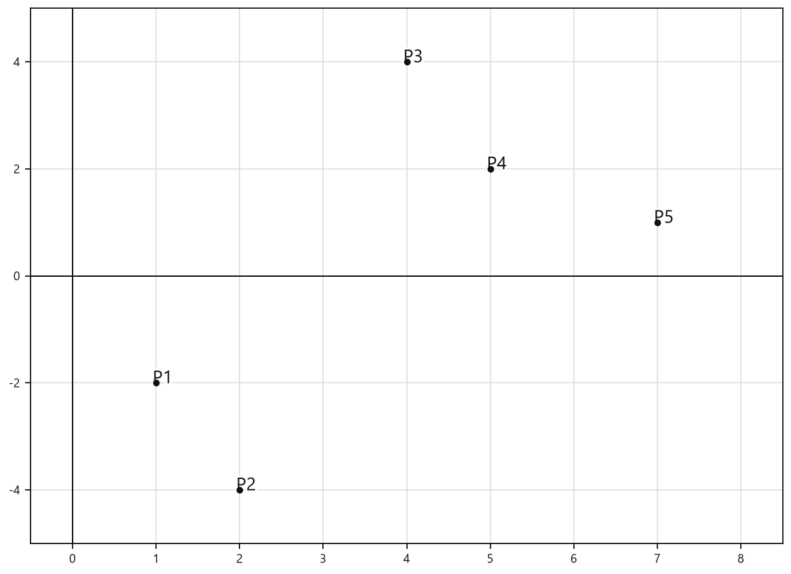
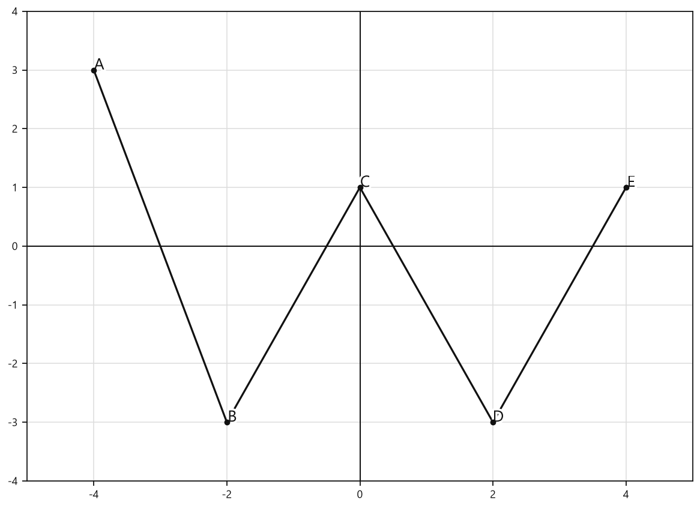

# Занятие 8. Функция числового аргумента

**Раздел:** Глава 2  
**Параграф учебника:** §6. Функция числового аргумента  
**Страницы:** 81–90

## Цели занятия

После занятия ты умеешь:

- находить значение функции по заданному значению аргумента;
- находить аргумент, если известно значение функции;
- задавать функцию формулой, таблицей, графиком и словесно;
- определять область определения и множество значений функции;
- находить область определения функций с дробями и квадратными корнями;
- находить множество значений простых функций.

Выбери блок своего уровня:

- **1–2 балла:** подстановка значения аргумента в формулу;
- **3–4 балла:** нахождение аргумента и способы задания функции;
- **5–6 баллов:** область определения функции;
- **7–8 баллов:** множество значений функции;
- **9–10 баллов:** смешанные задания и графический анализ.

## Теория к занятию

### 1. Что такое функция

#### Простыми словами

Функция — это правило: каждому допустимому значению $x$ ставится в соответствие ровно одно значение $y$.

Можно представить функцию как автомат: вводим число $x$, автомат выполняет правило и выдаёт число $y$. Для одного входного числа результат должен быть только один. Если автомат для одного и того же $x$ выдал два разных ответа, это уже не функция, а математическая неразбериха.

Функцию обычно записывают так:

$$y=f(x).$$

Здесь:

- $x$ — аргумент функции, то есть входное число;
- $f(x)$ или $y$ — значение функции, то есть результат;
- формула показывает, как из $x$ получить $y$.

#### Определение / факт / теорема / свойство

В данном параграфе явная формулировка определения в карточке отсутствует.

#### Формулы

Если функция задана формулой $y=f(x)$, то значение функции при $x=a$ записывают так:

$$f(a).$$

Чтобы найти это значение, вместо каждой буквы $x$ в формуле подставляют число $a$.

#### Правила

- Отрицательное число при подстановке заключают в скобки.
- Не путай $f(2)$ и $2f(x)$: $f(2)$ — значение функции при $x=2$, а $2f(x)$ — удвоенное значение функции.
- Если в формуле есть дробь, её знаменатель не должен быть равен нулю.
- Подкоренное выражение должно быть неотрицательным.

#### Алгоритм нахождения значения функции

1. Записать формулу функции.
2. Вместо $x$ подставить заданное значение аргумента.
3. Выполнить вычисления по действиям.
4. Записать ответ.

#### Ловушки

- $(-2)^2=4$, а не $-4$.
- В выражении $-x^2$ сначала находят $x^2$, а затем ставят перед результатом знак минус.
- Значение аргумента нужно подставить во все места, где встречается $x$.
- $\sqrt{(-2)^2+4}=\sqrt8=2\sqrt2$, а не $-2\sqrt2$. Арифметический квадратный корень отрицательным не бывает.

---

### 2. Нахождение аргумента по значению функции

#### Простыми словами

Теперь действуем наоборот: результат функции уже известен, а нужно найти, какое число было на входе.

Если сказано, что $f(x)=a$, формулу функции приравниваем к числу $a$ и решаем полученное уравнение.

#### Определение / факт / теорема / свойство

В данном параграфе явная формулировка определения в карточке отсутствует.

#### Формулы

Если $y=f(x)$ и задано значение функции $y=a$, составляют уравнение:

$$f(x)=a.$$

#### Правила

- Квадратное уравнение может иметь два значения аргумента.
- Если $a\ge0$, то:

$$|x|=a\Longrightarrow x=a\text{ или }x=-a.$$

- Для дробной функции нужно помнить, что знаменатель не может быть равен нулю.

#### Алгоритм

1. Приравнять формулу функции к заданному значению.
2. Решить полученное уравнение.
3. Проверить, допустимы ли найденные значения.
4. Записать все подходящие значения аргумента.

#### Ловушки

- У квадратного уравнения можно потерять один корень. Он не исчез, а просто ждёт, когда его заметят.
- При $|x|=1$ ответом являются два числа: $x=1$ и $x=-1$.
- Нельзя делить на выражение, которое может оказаться равным нулю, пока это не проверено.

---

### 3. Способы задания функции

#### Простыми словами

Одну и ту же функцию можно задать несколькими способами:

- формулой;
- таблицей;
- графиком;
- словесным описанием.

Это одно и то же правило, только «упакованное» по-разному: формула вычисляет, таблица перечисляет, график показывает, а слова объясняют.

#### Определение / факт / теорема / свойство

В данном параграфе явная формулировка определения в карточке отсутствует.

#### Формулы

Если функция задана аналитически, то её записывают формулой:

$$y=f(x).$$

Для каждого значения $x$ из области определения вычисляют соответствующее значение $y$.

#### Правила

Чтобы построить график функции:

1. выбрать несколько допустимых значений аргумента;
2. вычислить соответствующие значения функции;
3. получить точки $(x;y)$;
4. отметить точки на координатной плоскости.

Для функции каждому значению $x$ должна соответствовать только одна точка с этой абсциссой.

#### Алгоритм составления таблицы

1. Выписать заданные значения $x$.
2. Подставить каждое из них в формулу.
3. Вычислить значения $y$.
4. Записать полученные пары $(x;y)$ в таблицу.

#### Ловушки

- Координаты записывают именно в порядке $(x;y)$: сначала аргумент, потом значение функции.
- В таблицу включают только значения $x$ из заданной области $D$.
- График функции не может содержать две разные точки с одной и той же абсциссой. Один вход — один результат, помним про автомат.

---

### 4. Область определения и множество значений

#### Простыми словами

Область определения — это все значения $x$, которые можно подставить в формулу функции.

Множество значений — это все результаты $y$, которые функция может получить.

По графику:

- область определения смотрят слева направо, то есть по оси $x$;
- множество значений смотрят снизу вверх, то есть по оси $y$.

#### Определение / факт / теорема / свойство

В данном параграфе явная формулировка определения в карточке отсутствует.

#### Формулы

Область определения обозначают:

$$D(f).$$

Множество значений обозначают:

$$E(f).$$

#### Правила

Для дроби:

$$\text{знаменатель}\ne0.$$

Для квадратного корня:

$$\text{подкоренное выражение}\ge0.$$

Для квадратного корня, который находится в знаменателе:

$$\text{подкоренное выражение}>0.$$

Если никаких ограничений нет, то:

$$D(f)=(-\infty;+\infty).$$

#### Алгоритм нахождения области определения

1. Найти все знаменатели и подкоренные выражения.
2. Записать условия, при которых формула имеет смысл.
3. Решить полученные уравнения или неравенства.
4. Объединить условия через пересечение: должны выполняться все ограничения сразу.
5. Записать ответ числовыми промежутками.

#### Ловушки

- Знаменатель не может быть равен нулю.
- Под обычным корнем ноль допустим.
- Под корнем в знаменателе ноль уже запрещён.
- Если условий несколько, берут их общую часть, а не все промежутки подряд.
- Выколотая точка на графике не входит в область определения или множество значений.

---

### 5. Множество значений простых функций

#### Простыми словами

Множество значений показывает, какие результаты функция действительно может выдавать.

Здесь помогают свойства модуля, квадратного корня и параболы. Сначала выясняем самое маленькое или самое большое возможное значение, а затем определяем, куда направляется множество значений.

#### Определение / факт / теорема / свойство

В данном параграфе явная формулировка определения в карточке отсутствует.

#### Формулы

Для модуля:

$$|x|\ge0.$$

Для арифметического квадратного корня:

$$\sqrt{x}\ge0.$$

Для квадратичной функции:

$$y=ax^2+bx+c.$$

Абсцисса вершины параболы:

$$x_{\text{в}}=-\frac{b}{2a}.$$

#### Правила

Для функции $y=|x|+c$:

$$E(y)=[c;+\infty).$$

Для функции $y=\sqrt{x}+c$:

$$E(y)=[c;+\infty).$$

Для параболы, ветви которой направлены вниз:

$$E(y)=(-\infty;y_{\text{в}}].$$

Для параболы, ветви которой направлены вверх:

$$E(y)=[y_{\text{в}};+\infty).$$

#### Алгоритм для квадратичной функции

1. Определить знак коэффициента $a$.
2. Найти абсциссу вершины:

$$x_{\text{в}}=-\frac{b}{2a}.$$

3. Подставить $x_{\text{в}}$ в формулу и найти ординату вершины $y_{\text{в}}$.
4. Определить, является вершина максимумом или минимумом.
5. Записать множество значений функции.

#### Ловушки

- При $a<0$ ветви параболы направлены вниз, поэтому вершина даёт наибольшее значение.
- При $a>0$ ветви направлены вверх, поэтому вершина даёт наименьшее значение.
- Значение квадратного корня не бывает отрицательным.
- Модуль сначала принимает значение $0$, а затем может увеличиваться. Отрицательных значений у модуля нет.
- Не путай область определения и множество значений: первое относится к входу $x$, второе — к результату $y$.

## Сводка формул «выучить наизусть»

$$y=f(x).$$

$$D(f)\text{ — область определения функции}.$$

$$E(f)\text{ — множество значений функции}.$$

$$|x|\ge0.$$

$$\sqrt{x}\ge0.$$

$$x_{\text{в}}=-\frac{b}{2a}.$$

Для дроби:

$$\text{знаменатель}\ne0.$$

Для корня:

$$\text{подкоренное выражение}\ge0.$$

Для корня в знаменателе:

$$\text{подкоренное выражение}>0.$$

## Правила, которые нельзя путать

- Аргумент — это $x$, а значение функции — это $f(x)$.
- $f(-2)$ означает: подставить $-2$ вместо $x$ во всю формулу.
- Область определения содержит допустимые значения $x$.
- Множество значений содержит получаемые значения $y$.
- В знаменателе должно быть строго не ноль.
- Под обычным квадратным корнем должно быть неотрицательное число.
- Под квадратным корнем в знаменателе должно быть строго положительное число.
- При $|x|=a$, если $a>0$, обычно получают два решения: $x=a$ и $x=-a$.

## Разбор ключевых заданий

### Р1. Найдите значение функции

Дана функция:

$$f(x)=-x^2-1.$$

Найдите $f(-2)$.

#### Решение

Нужно вместо $x$ подставить $-2$:

$$f(-2)=-(-2)^2-1.$$

Сначала вычислим квадрат:

$$(-2)^2=4.$$

Теперь подставим результат:

$$f(-2)=-4-1.$$

Вычислим:

$$f(-2)=-5.$$

Знак минус перед квадратом не пропал: он просто ждал своей очереди.

**Ответ: $-5$.**

---

### Р2. Найдите значение функции

Дана функция:

$$g(x)=\frac{2x}{x^3+4}.$$

Найдите $g(-2)$.

#### Решение

Подставим $x=-2$ в числитель и знаменатель:

$$g(-2)=\frac{2\cdot(-2)}{(-2)^3+4}.$$

Вычислим числитель:

$$2\cdot(-2)=-4.$$

Вычислим знаменатель:

$$(-2)^3+4=-8+4=-4.$$

Получаем:

$$g(-2)=\frac{-4}{-4}.$$

Разделим:

$$g(-2)=1.$$

**Ответ: $1$.**

---

### Р3. Найдите значение функции

Дана функция:

$$h(x)=\sqrt{x^2+4}.$$

Найдите $h(-2)$.

#### Решение

Подставим $x=-2$:

$$h(-2)=\sqrt{(-2)^2+4}.$$

Возведём число $-2$ в квадрат:

$$(-2)^2=4.$$

Тогда:

$$h(-2)=\sqrt{4+4}.$$

$$h(-2)=\sqrt8.$$

Представим $8$ как произведение $4\cdot2$:

$$\sqrt8=\sqrt{4\cdot2}=2\sqrt2.$$

Значит:

$$h(-2)=2\sqrt2.$$

**Ответ: $2\sqrt2$.**

---

### Р4. Найдите значения аргумента, при которых значение функции равно $1$

Дана функция:

$$f(x)=x^2-8.$$

#### Решение

По условию значение функции равно $1$:

$$x^2-8=1.$$

Прибавим $8$ к обеим частям:

$$x^2=9.$$

Квадрат числа равен $9$, если число равно $3$ или $-3$:

$$x=-3\quad\text{или}\quad x=3.$$

Проверим оба значения:

$$(-3)^2-8=9-8=1,$$

$$3^2-8=9-8=1.$$

Оба значения подходят.

**Ответ: $x=-3$ и $x=3$.**

---

### Р5. Найдите значение аргумента, при котором значение функции равно $1$

Дана функция:

$$g(x)=\frac8x.$$

#### Решение

Приравняем функцию к $1$:

$$\frac8x=1.$$

Сразу отметим ограничение:

$$x\ne0.$$

Умножим обе части уравнения на $x$:

$$8=x.$$

Запишем значение аргумента:

$$x=8.$$

Проверим:

$$g(8)=\frac88=1.$$

Значение $x=8$ допустимо и подходит.

**Ответ: $8$.**

---

### Р6. Найдите значения аргумента, при которых значение функции равно $1$

Дана функция:

$$h(x)=|x|.$$

#### Решение

По условию:

$$|x|=1.$$

Модуль показывает расстояние числа от нуля. На расстоянии $1$ от нуля находятся два числа:

$$x=1\quad\text{или}\quad x=-1.$$

**Ответ: $x=-1$ и $x=1$.**

---

### Р7. Задайте функцию таблицей

Функция задана формулой:

$$g(x)=\frac4{x-3}$$

на множестве:

$$D=\{1;2;4;5;7\}.$$

#### Решение

Подставим каждое значение из множества $D$ в формулу.

При $x=1$:

$$g(1)=\frac4{1-3}=\frac4{-2}=-2.$$

При $x=2$:

$$g(2)=\frac4{2-3}=\frac4{-1}=-4.$$

При $x=4$:

$$g(4)=\frac4{4-3}=\frac41=4.$$

При $x=5$:

$$g(5)=\frac4{5-3}=\frac42=2.$$

При $x=7$:

$$g(7)=\frac4{7-3}=\frac44=1.$$

Заполним таблицу:

| $x$ | $1$ | $2$ | $4$ | $5$ | $7$ |
|---|---:|---:|---:|---:|---:|
| $g(x)$ | $-2$ | $-4$ | $4$ | $2$ | $1$ |

Для графического задания отметим точки, составленные из пар $(x;g(x))$.

<!--geo-figure-spec
{
  "needed": true,
  "kind": "graph",
  "caption": "График функции $g(x)=\\frac{4}{x-3}$ на множестве $D=\\{1;2;4;5;7\\}$",
  "axis": true,
  "grid": true,
  "xlim": [
    -0.5,
    8.5
  ],
  "ylim": [
    -5,
    5
  ],
  "points": {
    "P1": [
      1,
      -2
    ],
    "P2": [
      2,
      -4
    ],
    "P3": [
      4,
      4
    ],
    "P4": [
      5,
      2
    ],
    "P5": [
      7,
      1
    ]
  }
}
-->

*График функции g(x)=\frac{4}{x-3} на множестве D=\{1;2;4;5;7\}*

Получаются точки:

$$(1;-2),\ (2;-4),\ (4;4),\ (5;2),\ (7;1).$$

**Ответ:** таблица с парами $(1;-2)$, $(2;-4)$, $(4;4)$, $(5;2)$, $(7;1)$; график — пять соответствующих точек.

---

### Р8. Найдите область определения функции

Дана функция:

$$g(x)=\frac{5x-1}{1-3x}.$$

#### Решение

Ограничение появляется из-за знаменателя. Он не должен быть равен нулю:

$$1-3x\ne0.$$

Сначала найдём значение, которое запрещено:

$$1-3x=0.$$

Перенесём $-3x$ в правую часть:

$$1=3x.$$

Разделим обе части на $3$:

$$x=\frac13.$$

Значит, функция определена при всех действительных значениях $x$, кроме $x=\frac13$.

Запишем область определения:

$$D(g)=\left(-\infty;\frac13\right)\cup\left(\frac13;+\infty\right).$$$

**Ответ: $\left(-\infty;\frac13\right)\cup\left(\frac13;+\infty\right)$.**

---

### Р9. Найдите область определения функции

Дана функция:

$$f(x)=\sqrt{x^2-5x+4}.$$

#### Решение

Смотри: подкоренное выражение должно быть неотрицательным, поэтому записываем:

$$x^2-5x+4\ge0.$$

Разложим квадратный трёхчлен на множители:

$$x^2-5x+4=(x-1)(x-4).$$

Найдём нули выражения:

$$x-1=0,\qquad x-4=0.$$

$$x=1,\qquad x=4.$$

Коэффициент при $x^2$ положительный.

Значит, произведение неотрицательно вне промежутка между корнями:

$$x\in(-\infty;1]\cup[4;+\infty).$$

Концы промежутков входят, потому что при $x=1$ и $x=4$ подкоренное выражение равно нулю, а $\sqrt0$ существует.

**Ответ: $D(f)=(-\infty;1]\cup[4;+\infty)$.**

---

### Р10. Найдите область определения функции

Дана функция:

$$h(x)=\frac5{\sqrt{x-4}}+\sqrt{13-2x}.$$

#### Решение

В первом слагаемом корень стоит в знаменателе.

Поэтому подкоренное выражение должно быть не просто неотрицательным, а положительным:

$$x-4>0.$$

Отсюда:

$$x>4.$$

Для второго корня подкоренное выражение должно быть неотрицательным:

$$13-2x\ge0.$$

Вычтем $13$ из обеих частей:

$$-2x\ge-13.$$

Разделим обе части на отрицательное число $-2$.

Знак неравенства изменится:

$$x\le6,5.$$

Оба условия должны выполняться одновременно:

$$x>4,\qquad x\le6,5.$$

Объединяем их:

$$D(h)=(4;6,5].$$

Число $4$ не входит в область определения: при $x=4$ в знаменателе получится $\sqrt0=0$, а на ноль делить нельзя. Ноль в знаменателе — это математический шлагбаум.

**Ответ: $(4;6,5]$.**

---

### Р11. Найдите множество значений функции

Дана функция:

$$f(x)=|x|+4.$$

#### Решение

Модуль любого числа неотрицателен:

$$|x|\ge0.$$

Прибавим $4$ к обеим частям:

$$|x|+4\ge4.$$

Значит, функция не может принимать значения меньше $4$.

Наименьшее значение достигается при $x=0$:

$$f(0)=|0|+4=4.$$

Сверху ограничений нет: если увеличивать $|x|$, значение функции будет расти.

Поэтому:

$$E(f)=[4;+\infty).$$

**Ответ: $[4;+\infty)$.**

---

### Р12. Найдите множество значений функции

Дана функция:

$$g(x)=-x^2+6x-2.$$

#### Решение

Это квадратичная функция.

Коэффициент при $x^2$ отрицательный:

$$a=-1<0.$$

Значит, ветви параболы направлены вниз.

Поэтому у функции есть наибольшее значение — оно находится в вершине параболы.

Абсцисса вершины находится по формуле:

$$x_{\text{в}}=-\frac{b}{2a}.$$

В нашей функции:

$$a=-1,\qquad b=6.$$

Подставим эти значения:

$$x_{\text{в}}=-\frac6{2\cdot(-1)}=3.$$

Теперь найдём ординату вершины:

$$y_{\text{в}}=g(3).$$

$$g(3)=-3^2+6\cdot3-2.$$

$$g(3)=-9+18-2=7.$$

Наибольшее значение функции равно $7$.

Все остальные значения меньше или равны $7$:

$$E(g)=(-\infty;7].$$

**Ответ: $(-\infty;7]$.**

---

### Р13. Найдите множество значений функции

Дана функция:

$$h(x)=\sqrt{x+3}-5.$$

#### Решение

Арифметический квадратный корень всегда неотрицателен:

$$\sqrt{x+3}\ge0.$$

Вычтем $5$ из обеих частей:

$$\sqrt{x+3}-5\ge-5.$$

Значение $-5$ действительно достигается при $x=-3$:

$$h(-3)=\sqrt{-3+3}-5.$$

$$h(-3)=\sqrt0-5=-5.$$

При увеличении $x$ значение корня может становиться сколь угодно большим.

Значит, сверху функция не ограничена:

$$E(h)=[-5;+\infty).$$

**Ответ: $[-5;+\infty)$.**

---

### Р14. Найдите значение функции

Дана функция:

$$f(x)=x^2-5.$$

Найдите значение функции при $x=2$, $x=-\frac12$, $x=1,6$ и $x=\sqrt7$.

#### Решение

Чтобы найти значение функции, вместо $x$ подставляем заданное число.

При $x=2$:

$$f(2)=2^2-5.$$

$$f(2)=4-5=-1.$$

При $x=-\frac12$:

$$f\left(-\frac12\right)=\left(-\frac12\right)^2-5.$$

$$f\left(-\frac12\right)=\frac14-5.$$

$$f\left(-\frac12\right)=\frac14-\frac{20}4=-\frac{19}4.$$

При $x=1,6$:

$$f(1,6)=1,6^2-5.$$

$$1,6^2=2,56.$$

$$f(1,6)=2,56-5=-2,44.$$

При $x=\sqrt7$:

$$f(\sqrt7)=(\sqrt7)^2-5.$$

$$f(\sqrt7)=7-5=2.$$

Здесь использовано свойство $(\sqrt7)^2=7$.

**Ответ:** а) $-1$; б) $-\frac{19}4$; в) $-2,44$; г) $2$.

---

### Р15. Найдите значение аргумента

Дана функция:

$$g(x)=6-5x.$$

Найдите значение аргумента, при котором значение функции равно $-4$.

#### Решение

Нужно, чтобы $g(x)=-4$.

Подставим формулу функции:

$$6-5x=-4.$$

Вычтем $6$ из обеих частей:

$$-5x=-10.$$

Разделим обе части на $-5$:

$$x=2.$$

Проверим найденное значение:

$$g(2)=6-5\cdot2.$$

$$g(2)=6-10=-4.$$

Значит, значение аргумента найдено верно. Проверка здесь — как контрольный звонок: короткая, но спасает от ошибки.

**Ответ: $2$.**

---

### Р16. Найдите все значения аргумента, при которых значение функции равно $5$

Дана функция:

$$f(x)=x^2+4x.$$

#### Решение

Нужно, чтобы $f(x)=5$.

Подставим формулу функции:

$$x^2+4x=5.$$

Перенесём $5$ в левую часть:

$$x^2+4x-5=0.$$

Разложим квадратный трёхчлен на множители:

$$x^2+4x-5=(x-1)(x+5).$$

Получаем уравнение:

$$(x-1)(x+5)=0.$$

Произведение равно нулю, если хотя бы один из множителей равен нулю:

$$x-1=0\qquad\text{или}\qquad x+5=0.$$

Отсюда:

$$x=1\qquad\text{или}\qquad x=-5.$$

Проверим оба значения:

$$f(1)=1^2+4\cdot1=1+4=5,$$

$$f(-5)=(-5)^2+4\cdot(-5)=25-20=5.$$

Оба значения подходят.

**Ответ: $x=-5$ и $x=1$.**

---

### Р17. Является ли зависимость функцией?

Дана таблица зависимости широты и суточной суммы солнечной радиации:

| Широта | $30$ | $40$ | $50$ | $60$ | $70$ | $80$ | $90$ |
|---|---:|---:|---:|---:|---:|---:|---:|
| Сумма радиации | $1005$ | $1022$ | $1020$ | $1009$ | $1043$ | $1093$ | $1110$ |

#### Решение

Проверим главное условие функции.

Каждому значению аргумента, то есть широты, должно соответствовать ровно одно значение функции.

По таблице:

- широте $30^\circ$ соответствует $1005$;
- широте $40^\circ$ соответствует $1022$;
- широте $50^\circ$ соответствует $1020$;
- широте $60^\circ$ соответствует $1009$;
- широте $70^\circ$ соответствует $1043$;
- широте $80^\circ$ соответствует $1093$;
- широте $90^\circ$ соответствует $1110$.

У каждого значения широты только один результат.

Значит, зависимость является функцией.

Если бы одной и той же широте соответствовали два разных значения радиации, функция бы «запуталась» и условие не выполнилось.

**Ответ: зависимость является функцией.**

---

### Р18. Найдите область определения и множество значений по графику

Рассмотрим график, проходящий через точки:

$$(-4;3),\quad(-2;-3),\quad(0;1),\quad(2;-3),\quad(4;1).$$

График определён для всех значений $x$ от $-4$ до $4$, включая концы.

Наименьшее значение $y$ равно $-3$, наибольшее — $3$.

<!--geo-figure-spec
{
  "needed": true,
  "kind": "graph",
  "caption": "График, проходящий через точки $(-4;3)$, $(-2;-3)$, $(0;1)$, $(2;-3)$, $(4;1)$",
  "axis": true,
  "grid": true,
  "xlim": [
    -5,
    5
  ],
  "ylim": [
    -4,
    4
  ],
  "points": {
    "A": [
      -4,
      3
    ],
    "B": [
      -2,
      -3
    ],
    "C": [
      0,
      1
    ],
    "D": [
      2,
      -3
    ],
    "E": [
      4,
      1
    ]
  },
  "segments": [
    [
      "A",
      "B"
    ],
    [
      "B",
      "C"
    ],
    [
      "C",
      "D"
    ],
    [
      "D",
      "E"
    ]
  ],
  "labels": {}
}
-->

*График, проходящий через точки (-4;3), (-2;-3), (0;1), (2;-3), (4;1)*

#### Решение

Область определения — это все значения аргумента $x$, которые встречаются на графике.

Проекция графика на ось $x$ занимает отрезок от $-4$ до $4$:

$$-4\le x\le4.$$

Поэтому:

$$D(f)=[-4;4].$$

Множество значений — это все значения функции $y$, которые встречаются на графике.

Проекция графика на ось $y$ занимает отрезок от $-3$ до $3$:

$$-3\le y\le3.$$

Поэтому:

$$E(f)=[-3;3].$$

Не перепутай оси: $D(f)$ смотрим по горизонтали, а $E(f)$ — по вертикали.

**Ответ: $D(f)=[-4;4]$, $E(f)=[-3;3]$.**

---

## Самопроверка

1. Что подставляют в формулу функции, если нужно найти $f(-3)$?
2. Какое условие записывают для знаменателя?
3. Какое условие записывают для подкоренного выражения?
4. Чем отличаются $D(f)$ и $E(f)$?
5. Как найти вершину параболы $y=ax^2+bx+c$?
6. Сколько решений может иметь уравнение $|x|=5$?

### Ответы

1. Вместо $x$ подставляют $-3$.
2. Знаменатель не должен быть равен нулю.
3. Подкоренное выражение должно быть неотрицательным.
4. $D(f)$ — допустимые значения аргумента, $E(f)$ — значения функции.
5. Используют формулу $x_{\text{в}}=-\frac{b}{2a}$.
6. Два: $x=5$ и $x=-5$.

## Практические задания

Выбери свой уровень и решай только этот блок. В блоке должна закрепиться вся тема параграфа. Ответы не приводятся.

### Уровень 1–2 балла

**С1.** Функция задана формулой $f(x)=x^2-3$. Найдите $f(2)$.

**С2.** Функция задана формулой $g(x)=2x+5$. Найдите $g(-3)$.

**С3.** Функция задана формулой $h(x)=\dfrac{6}{x}$. Найдите $h(2)$.
1) $2$ 2) $3$ 3) $4$ 4) $6$ 5) $12$

**С4.** При каком значении аргумента значение функции $f(x)=4x-1$ равно $7$?
1) $1$ 2) $2$ 3) $3$ 4) $4$ 5) $8$

**С5.** Найдите все значения аргумента, при которых значение функции $g(x)=x^2$ равно $9$.

**С6.** Для функции $f(x)=|x|$ найдите значения аргумента, при которых $f(x)=4$.
1) Только $4$ 2) Только $-4$ 3) $-4$ и $4$ 4) $0$ и $4$ 5) Таких значений нет

**С7.** Какая из зависимостей является функцией, если каждой величине $x$ ставится в соответствие указанная величина $y$?
1) каждому числу $x$ ставятся в соответствие числа $x$ и $-x$;
2) каждому числу $x$ ставится в соответствие число $x+2$;
3) каждому числу $x$ ставятся в соответствие числа $x^2$ и $x+1$;
4) каждому числу $x$ ставятся в соответствие все числа, меньшие $x$;
5) каждому числу $x$ ставятся в соответствие числа $1$ и $-1$.

**С8.** Функция $f(x)=\dfrac{x+1}{x-2}$ задана на множестве $D=\{0;1;3\}$. Заполните таблицу значений функции для данных значений аргумента: $f(0)$, $f(1)$, $f(3)$.

**С9.** Найдите область определения функции $y=\dfrac{5}{x-4}$.

**С10.** Найдите область определения функции $y=\sqrt{x-2}$.
1) $(-\infty;2]$ 2) $[2;+\infty)$ 3) $(-\infty;2)$ 4) $(2;+\infty)$ 5) $(-\infty;+\infty)$

**С11.** Найдите множество значений функции $f(x)=|x|+3$.

**С12.** Найдите множество значений функции $g(x)=\sqrt{x+1}-2$.
1) $[-2;+\infty)$ 2) $(-\infty;-2]$ 3) $[-1;+\infty)$ 4) $(-2;+\infty)$ 5) $(-\infty;+\infty)$

**С13.** Найдите значение функции $f(x)=2x^2-3$ при $x=-2$.

**С14.** Найдите значение выражения $3g(-1)$, если $g(x)=\dfrac{x+1}{x-3}$.

**С15.** При каком значении аргумента функция $f(x)=4x-7$ принимает значение $9$?

**С16.** При каких значениях аргумента функция $h(x)=|x|$ принимает значение $6$?

**С17.** Выберите функцию, для которой выполняется равенство $f(-2)=4$.

1) $f(x)=x+2$  
2) $f(x)=x^2$  
3) $f(x)=2x$  
4) $f(x)=x^2+4$  
5) $f(x)=-x^2$

**С18.** Функция задана формулой $q(x)=\dfrac{x+2}{x-1}$. Найдите $q(0)$.

**С19.** Определите, является ли зависимость функцией: каждому натуральному числу $x$ ставится в соответствие его квадрат $x^2$.

**С20.** Найдите область определения функции $y=\dfrac{5}{x+4}$.

**С21.** Найдите область определения функции $y=\sqrt{x-3}$.

**С22.** Найдите множество значений функции $f(x)=|x|+2$.

**С23.** Найдите множество значений функции $g(x)=-x^2+4$.

**С24.** Функция $h(x)=\dfrac{x^2}{2}$ задана на множестве $D=\{-2;-1;0;1;2\}$. Запишите множество значений этой функции.

**С25.** Найдите значение функции $f(x)=x^2-4$ при $x=3$.

**С26.** Найдите значение функции $g(x)=\dfrac{x+1}{x-2}$ при $x=0$.

**С27.** Найдите значение выражения $2h(-1)$, если $h(x)=x^2+3$.

**С28.** Выберите функцию, для которой выполняется равенство $f(-2)=4$.

1) $f(x)=x+4$  
2) $f(x)=x^2$  
3) $f(x)=2x+4$  
4) $f(x)=|x|+4$  
5) $f(x)=\sqrt{x+6}$

**С29.** Найдите значение аргумента, при котором значение функции $g(x)=2x+1$ равно $7$.

**С30.** Найдите все значения аргумента, при которых значение функции $f(x)=|x|$ равно $3$.

**С31.** Определите, является ли зависимость функцией: каждому числу $x\in\{-2;-1;0;1\}$ ставится в соответствие число $y=x+2$.

**С32.** Функция $q(x)=\dfrac{x^2}{2}$ задана на множестве $D=\{-2;0;2\}$. Заполните таблицу значений функции для этих аргументов.

| $x$ | $-2$ | $0$ | $2$ |
|---|---:|---:|---:|
| $q(x)$ |  |  |  |

**С33.** Найдите область определения функции $y=\dfrac{5}{x-4}$.

**С34.** Найдите область определения функции $y=\sqrt{x-3}$.

**С35.** Найдите область определения функции $y=\sqrt{7-x}$.

**С36.** Выберите множество значений функции $f(x)=|x|+2$.

1) $(-\infty;2]$  
2) $[2;+\infty)$  
3) $(2;+\infty)$  
4) $(-\infty;+\infty)$  
5) $[0;+\infty)$

### Уровень 3–4 балла

**С1.** Найдите значение функции $f(x)=2x^2-3$ при $x=-2$.

**С2.** Известно, что $g(x)=\dfrac{x-1}{x+3}$. Найдите $g(2)$ и $g(-2)$.

**С3.** Сравните значения $h(-3)$ и $h(2)$, если $h(x)=\sqrt{x^2+1}$.

**С4.** Найдите значение аргумента, при котором значение функции $f(x)=4x-7$ равно $9$.

**С5.** Найдите все значения аргумента, при которых значение функции $g(x)=x^2-5x$ равно $0$.

**С6.** Найдите все значения аргумента, при которых значение функции $h(x)=|x-2|$ равно $3$.

**С7.** Определите, является ли зависимость функцией: каждому числу из множества $\{-2; -1; 0; 1\}$ ставится в соответствие число, равное квадрату этого числа. Запишите формулу этой функции.

**С8.** Функция $f(x)=\dfrac{x^2}{2}$ задана на множестве $D=\{-2; -1; 0; 1; 2\}$. Задайте эту функцию таблицей значений.

**С9.** Функция задана словесно: каждому целому числу от $-2$ до $3$ включительно ставится в соответствие число, противоположное данному. Запишите область определения, формулу функции и множество её значений.

**С10.** Найдите область определения функции $y=\dfrac{5x-1}{x-4}$.

**С11.** Найдите область определения функции $y=\sqrt{2x-6}$.

**С12.** Найдите множество значений функции $f(x)=x^2+4$.

**С13.** Найдите значение функции $f(x)=2x^2-3$ при значениях аргумента:  
а) $x=2$;  
б) $x=-1$;  
в) $x=\sqrt{3}$.

**С14.** Известно, что $g(x)=\dfrac{x+1}{x-1}$. Найдите:  
а) $g(2)$;  
б) $g(0)$;  
в) $2g(-1)$.

**С15.** Сравните значения $f(-2)$ и $f(\sqrt{5})$, если:  
а) $f(x)=\sqrt{x^2+3}$;  
б) $f(x)=x^2-2x$.

**С16.** Найдите значения аргумента, при которых функция $g(x)=4x-7$ принимает значения:  
а) $1$;  
б) $-7$;  
в) $9$.

**С17.** Найдите все значения аргумента, при которых значение функции равно $6$:  
а) $f(x)=x^2-3$;  
б) $g(x)=\dfrac{12}{x}$;  
в) $h(x)=|x|$.

**С18.** Функция задана формулой $q(x)=\dfrac{x^2}{3}$ на множестве $D=\{-3;-2;-1;0;1;2;3\}$. Задайте функцию таблицей.

**С19.** Функция задана словесно: каждому целому числу $x$ от $-3$ до $3$ включительно ставится в соответствие число $x+2$. Задайте эту функцию:  
а) аналитически;  
б) таблицей.

**С20.** Определите, является ли зависимость функцией: каждому числу $x$ из множества $\{-2;-1;0;1\}$ ставится в соответствие число $y$, указанное в таблице.

| $x$ | $-2$ | $-1$ | $0$ | $1$ |
|---|---:|---:|---:|---:|
| $y$ | $3$ | $3$ | $5$ | $7$ |

**С21.** Найдите область определения функции:  
а) $y=\dfrac{5x-2}{x+4}$;  
б) $y=\dfrac{3}{x^2-9}$;  
в) $y=\dfrac{x+1}{x-2}+\dfrac{4}{x+5}$.

**С22.** Найдите область определения функции:  
а) $y=\sqrt{x-2}$;  
б) $y=\sqrt{7-2x}$;  
в) $y=\sqrt{x^2-4}$.

**С23.** Найдите область определения функции:  
а) $y=\sqrt{x+1}+\sqrt{5-x}$;  
б) $y=\dfrac{6}{\sqrt{x-1}}$;  
в) $y=\sqrt{2x-3}+\dfrac{1}{x+2}$.

**С24.** Найдите множество значений функции:  
а) $f(x)=x^2+4$;  
б) $g(x)=|x|-3$;  
в) $h(x)=\sqrt{x+5}-2$.

**С25.** Найдите значение функции $f(x)=2x^2-3$ при значениях аргумента:  
а) $x=-2$;  
б) $x=\frac12$;  
в) $x=\sqrt{3}$.

**С26.** Известно, что $g(x)=\frac{x+1}{x-1}$. Найдите:  
а) $g(2)$;  
б) $g(-3)$;  
в) $2g(0)$.

**С27.** Сравните значения $f(-2)$ и $f(\sqrt{5})$, если функция задана формулой $f(x)=x^2+1$.

**С28.** Функция задана формулой $h(x)=4x-7$. Найдите значения аргумента, при которых значение функции равно:  
а) $1$;  
б) $-7$;  
в) $9$.

**С29.** Найдите все значения аргумента, при которых значение функции $f(x)=x^2-6x$ равно $0$.

**С30.** Для функции $g(x)=|x-3|$ найдите все значения аргумента, при которых $g(x)=5$.

**С31.** Определите, является ли функция заданная таблицей:

| $x$ | $-2$ | $0$ | $1$ | $3$ |
|---|---:|---:|---:|---:|
| $y$ | $4$ | $1$ | $4$ | $-2$ |

**С32.** Функция $q(x)=x^2-1$ задана на множестве $D=\{-2;-1;0;1;2\}$. Задайте эту функцию таблицей.

**С33.** Найдите область определения функции $y=\frac{5x-2}{x+4}$.

**С34.** Найдите область определения функции $y=\sqrt{2x-6}$.

**С35.** Найдите область определения функции $y=\frac{3}{\sqrt{x+2}}$.

**С36.** Найдите множество значений функции $f(x)=-(x-2)^2+5$.

### Уровень 5–6 баллов

**С1.** Найдите значение функции $f(x)=2x^2-3x+1$, если значение аргумента равно:  
а) $-2$; б) $\frac12$; в) $\sqrt{3}$.

**С2.** Известно, что $g(x)=\dfrac{x+1}{x-1}$. Найдите значение выражения $2g(3)-g(-1)$.

**С3.** Сравните значения $f(-2)$ и $f(\sqrt{5})$, если функция задана формулой $f(x)=x^2-4x+1$.

**С4.** Функция задана формулой $h(x)=\dfrac{3x^2+1}{x^2}$. Найдите значение выражения $h(1)-h(-2)+h(\sqrt{3})$.

**С5.** Найдите все значения аргумента, при которых значение функции $f(x)=x^2-5x$ равно $6$.

**С6.** Найдите все значения аргумента, при которых значение функции $g(x)=\dfrac{12}{x+1}$ равно $3$.

**С7.** Для каких значений аргумента выражение, задающее функцию $y=\dfrac{5x-2}{x^2-9}+\dfrac{1}{x-4}$, имеет смысл? Запишите область определения функции.

**С8.** Найдите область определения функции $y=\sqrt{2x-6}+\sqrt{10-x}$.

**С9.** Найдите область определения функции $y=\dfrac{4}{\sqrt{x+2}}-\sqrt{7-x}$.

**С10.** Найдите множество значений функции $f(x)=x^2-6x+11$.

**С11.** Зависимость задана парами $(x;y)$: $(-2;4)$, $(-1;1)$, $(0;0)$, $(1;1)$, $(2;4)$. Определите, является ли эта зависимость функцией. Если является, найдите $f(-1)$ и $f(2)$.

**С12.** Функция $q(x)=\dfrac{x^2}{2}$ задана на множестве $D=\{-4;-2;0;2;4\}$. Задайте эту функцию таблицей и найдите множество её значений.

**С13.** Найдите значение функции $f(x)=2x^2-3x+1$, если значение аргумента равно:  
а) $-2$; б) $\frac12$; в) $\sqrt{3}$.

**С14.** Известно, что $g(x)=\dfrac{x+1}{x-1}$. Найдите значение выражения $2g(3)-g(-1)$.

**С15.** Сравните значения $h(-2)$ и $h(\sqrt{3})$, если функция задана формулой $h(x)=x^2-4x+1$.

**С16.** Найдите все значения аргумента, при которых значение функции $f(x)=x^2-5x$ равно $6$.

**С17.** Найдите значения аргумента, при которых значение функции $g(x)=\dfrac{12}{x+1}$ равно:  
а) $3$; б) $-4$; в) $12$.

**С18.** Функция $q(x)=\dfrac{x^2}{2}$ задана на множестве $D=\{-4;-2;0;2;4\}$. Задайте эту функцию таблицей.

**С19.** Функция $y=f(x)$ определена на множестве целых чисел от $-3$ до $4$ включительно, причём каждому значению аргумента ставится в соответствие число, на $2$ большее аргумента. Задайте функцию аналитически и перечислите значения функции.

**С20.** Найдите область определения функции $y=\dfrac{5x-2}{x^2-9}$.

**С21.** Найдите область определения функции $y=\sqrt{2x-6}+\dfrac{1}{x-5}$.

**С22.** Найдите область определения функции $y=\dfrac{4}{\sqrt{7-x}}+\sqrt{x+1}$.

**С23.** Найдите множество значений функции $f(x)=|x-3|+2$.

**С24.** Найдите множество значений функции $g(x)=-x^2+6x-5$.

**С25.** Найдите значения функции $f(x)=2x^2-3$ при значениях аргумента:  
а) $x=-2$;  
б) $x=\dfrac{1}{2}$;  
в) $x=\sqrt{3}$.

**С26.** Известно, что $g(x)=\dfrac{x+1}{x-1}$. Найдите значение выражения $2g(3)-g(-1)$.

**С27.** Найдите все значения аргумента, при которых значение функции равно $4$:  
а) $f(x)=x^2-5x+4$;  
б) $g(x)=\dfrac{12}{x}$;  
в) $h(x)=|x-1|$.

**С28.** Функция $q(x)=\dfrac{x^2}{3}$ задана на множестве $D=\{-3;-1;0;2;3\}$. Задайте эту функцию таблицей и укажите множество её значений.

**С29.** Найдите область определения функции:  
а) $y=\dfrac{4x-1}{x+3}$;  
б) $y=\sqrt{2x-6}$;  
в) $y=\dfrac{5}{\sqrt{7-x}}$.

**С30.** Найдите множество значений функции:  
а) $f(x)=x^2-4x+1$;  
б) $g(x)=|x|+3$;  
в) $h(x)=\sqrt{x+5}-2$.

### Уровень 7–8 баллов

**С1.** Функция задана формулой $f(x)=2x^2-3x-5$. Найдите значения $f(-2)$, $f\left(\frac12\right)$ и $f(\sqrt{3})$. Результат для каждого значения аргумента обоснуйте подстановкой в формулу функции.

**С2.** Функция задана формулой $g(x)=\dfrac{3x-1}{x+2}$. Найдите все значения аргумента, при которых значение функции равно $2$, а также укажите, при каком значении аргумента функция не определена.

**С3.** Сравните значения $h(-\sqrt{5})$ и $h(2)$, если $h(x)=x^2-4x+1$. Обоснуйте сравнение, не вычисляя значения с помощью приближённых значений корня.

**С4.** Функция задана формулой $q(x)=\dfrac{2x^4-x^2+3}{x^2}$, где $x\ne0$. Найдите значение выражения $q(1)-q(-2)+q(\sqrt{3})$.

**С5.** Для функции $f(x)=2x^2-8x+5$ определите, сколько существует значений аргумента, при которых $f(x)$ равно: а) $-3$; б) $5$; в) $13$. Для каждого случая приведите обоснование.

**С6.** Найдите все значения аргумента, при которых значение функции равно $4$:  
а) $f(x)=x^2-2x$;  
б) $g(x)=\dfrac{12}{x}$;  
в) $h(x)=|x-1|$.  
Проверьте найденные значения подстановкой в исходные формулы.

**С7.** Функция $q(x)=\dfrac{x^2}{2}$ задана на множестве $D=\{-4;-2;-1;0;2;3;5\}$. Составьте таблицу значений этой функции и выпишите множество её значений. Объясните, почему каждому значению аргумента соответствует только одно значение функции.

**С8.** Функция задана словесно: каждому целому числу $x$ из промежутка $-5\le x\le4$ ставится в соответствие число $2x-1$. Задайте эту функцию аналитически и таблицей. Найдите значение функции при $x=-3$ и все значения аргумента из указанного множества, при которых значение функции равно $7$.

**С9.** Найдите область определения функции  
$$y=\frac{\sqrt{x+2}}{x-3}+\frac{5}{\sqrt{7-x}}.$$  
Ответ запишите в виде числового промежутка или объединения промежутков. Укажите отдельно ограничения, полученные из условия существования корней и из условий на знаменатели.

**С10.** Найдите множество значений функции $f(x)=-x^2+6x-7$. Обоснуйте, какое значение является наибольшим, и укажите значение аргумента, при котором оно достигается.

**С11.** Приведите пример функции, область определения которой равна $D(f)=(-\infty;3)\cup(3;+\infty)$, и пример функции, область определения которой совпадает со всей числовой прямой. Для каждой функции объясните, почему её область определения имеет требуемый вид.

**С12.** Функция задана формулой  
$$y=\sqrt{x^2-4x+3}.$$  
Найдите область определения функции и множество её значений. Затем определите все значения аргумента, при которых $y=2$. Обоснуйте отбор значений аргумента с учётом области определения.

**С13.** Функция задана формулой $f(x)=\dfrac{x-3}{x+1}$. Найдите значения $f(2)$, $f(-2)$ и $2f(0)-f(3)$.

**С14.** Найдите все значения аргумента, при которых значение функции $g(x)=x^2-6x+5$ равно $-4$.

**С15.** Сравните значения $h(-2)$ и $h(\sqrt{3})$, если функция задана формулой $h(x)=\dfrac{x^2-4}{x^2+4}$. Ответ обоснуйте.

**С16.** Найдите область определения функции
$$
y=\frac{2x+1}{x^2-9}+\frac{4}{x-3}.
$$
Ответ запишите в виде объединения числовых промежутков.

**С17.** Найдите область определения функции
$$
y=\frac{5}{\sqrt{2x-1}}+\sqrt{7-x}.
$$
Ответ запишите в виде числового промежутка.

**С18.** Найдите множество значений функции
$$
f(x)=-x^2+4x+1.
$$
Обоснуйте наличие наибольшего значения функции.

**С19.** Для каждой функции определите множество значений:
а) $f(x)=|x-2|+1$;
б) $g(x)=\sqrt{x+4}-3$.
Ответ запишите в виде числовых промежутков.

**С20.** Функция $q(x)=\dfrac{x^2}{4}$ задана на множестве $D=\{-4;-2;0;2;4;6\}$. Задайте эту функцию таблицей и укажите множество её значений.

**С21.** Зависимость задана таблицей:
    
| $x$ | $-2$ | $0$ | $1$ | $3$ | $3$ |
|---|---:|---:|---:|---:|---:|
| $y$ | $4$ | $0$ | $-1$ | $2$ | $5$ |

Определите, является ли эта зависимость функцией числового аргумента. Ответ обоснуйте.

**С22.** Найдите область определения и множество значений функции
$$
y=\sqrt{x+1}-2.
$$
Ответ запишите с использованием числовых промежутков.

**С23.** Известно, что $f(x)=2x^2-8x+6$. Найдите количество значений аргумента, при которых значение функции равно:
а) $-2$;
б) $0$;
в) $6$.
Для каждого случая составьте соответствующее уравнение и обоснуйте ответ.

**С24.** Функция задана формулой
$$
g(x)=\frac{x^2-9}{x-3}.
$$
Найдите все значения аргумента, при которых $g(x)=5$, учитывая область определения функции. Затем вычислите значение $g(0)$.

### Уровень 9–10 баллов

**С1.** Функция задана формулой $f(x)=\dfrac{x^2-4x+7}{x-2}$. Сравните значения $f(2-\sqrt{3})$ и $f(2+\sqrt{3})$.

**С2.** Функция $g(x)=\dfrac{2x^2+3}{x^2}$ задана при $x\ne0$. Найдите значение выражения $g(1)-2g(-2)+3g\left(\dfrac12\right)$.

**С3.** Известно, что $f(x)=ax^2+bx+6$, причём $f(1)=2$ и $f(-2)=12$. Найдите все значения аргумента, при которых $f(x)=0$.

**С4.** Найдите все значения аргумента, при которых функция $y=\dfrac{x+1}{x-2}$ принимает значение, противоположное значению аргумента.

**С5.** Функция задана формулой $h(x)=\sqrt{x^2-6x+8}$. Найдите множество всех значений аргумента, при которых $h(x)=2$, а затем укажите множество значений функции.

**С6.** Найдите область определения функции
$$
y=\frac{\sqrt{(x-1)(x-5)}}{\sqrt{9-x^2}}+\frac{2}{x-3}.
$$
Ответ запишите в виде объединения числовых промежутков.

**С7.** Найдите множество значений функции
$$
f(x)=-2x^2+8x-5,
$$
если её аргумент принимает только значения из отрезка $[1;4]$.

**С8.** Функция $q(x)=\dfrac{x^2-1}{x^2+1}$ задана на множестве $D=\{-2;-1;0;1;2\}$. Задайте эту функцию таблицей и найдите множество её значений.

**С9.** Функция задана словесно: каждому целому числу $x$ от $-4$ до $5$ включительно ставится в соответствие число $x^2-3x$. Задайте функцию аналитически на указанном множестве и найдите все значения аргумента, при которых значение функции равно $10$.

**С10.** Приведите пример функции $y=f(x)$, область определения которой равна $[-6;3)\cup(3;8]$, множество значений равно $[-2;5]$, а $f(0)=5$. Запишите формулу функции или задайте её графически, полностью указав способ задания.

**С11.** Найдите область определения и множество значений функции
$$
y=\sqrt{10-2x-x^2}.
$$

**С12.** Функция $f(x)=|x-2|+|x+1|$ задана на отрезке $[-3;4]$. Найдите множество значений функции и все значения аргумента, при которых функция принимает своё наименьшее значение.

**С13.** Найдите область определения и множество значений функции  
$$f(x)=\sqrt{9-(x-1)^2}-2.$$

**С14.** Найдите множество значений функции  
$$g(x)=x+\frac{9}{x},$$  
если её область определения состоит из всех действительных чисел, кроме нуля.

**С15.** Для функции  
$$f(x)=2x^2-8x+5$$  
определите количество значений аргумента, при которых значение функции равно:  
а) $-3$;  
б) $-1$;  
в) $5$;  
г) $13$.

**С16.** Найдите область определения функции и запишите её в виде объединения числовых промежутков:  
$$y=\frac{\sqrt{x^2-4x-5}}{\sqrt{7-x}}+\frac{2}{x+1}.$$

**С17.** Приведите пример функции $y=f(x)$, область определения которой равна отрезку $[-4;6]$, множество значений — отрезку $[-3;5]$, причём $f(-1)=5$ и $f(4)=-3$. Запишите формулу функции и опишите способ проверки указанных условий.

**С18.** Функция задана формулой  
$$h(x)=\frac{x^2-6x+5}{x^2-6x+8}.$$  
Сравните значения $h(3-\sqrt{2})$ и $h(3+\sqrt{2})$, предварительно установив, принадлежат ли оба значения аргумента области определения функции.

## Чек-лист «ученик понял тему»

- Могу повторить определения и формулы параграфа своими словами и по учебнику.
- Решаю типовые задания своего уровня без подсказки.
- Вижу типичную ошибку и могу её объяснить.
