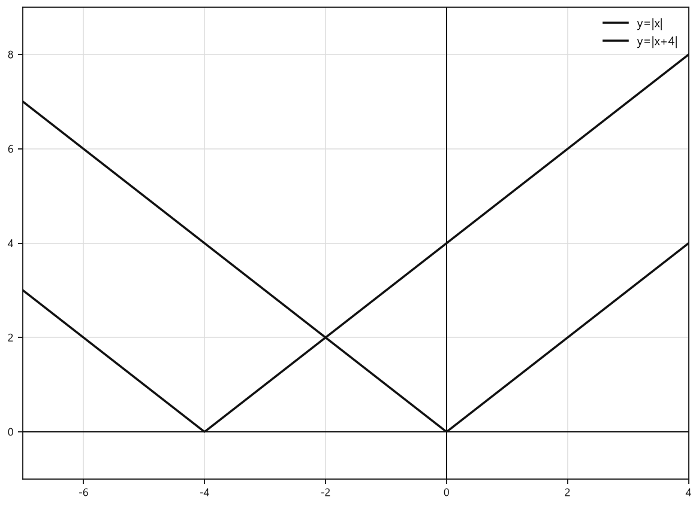
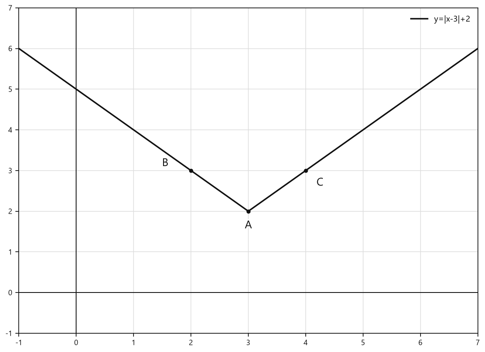
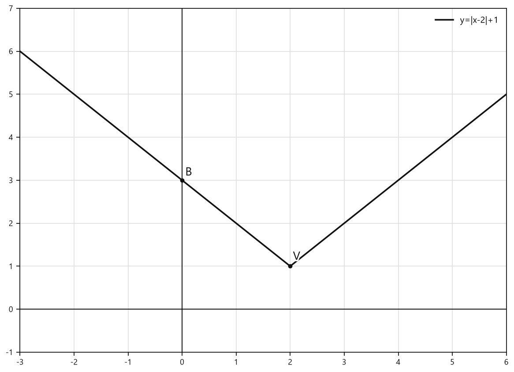
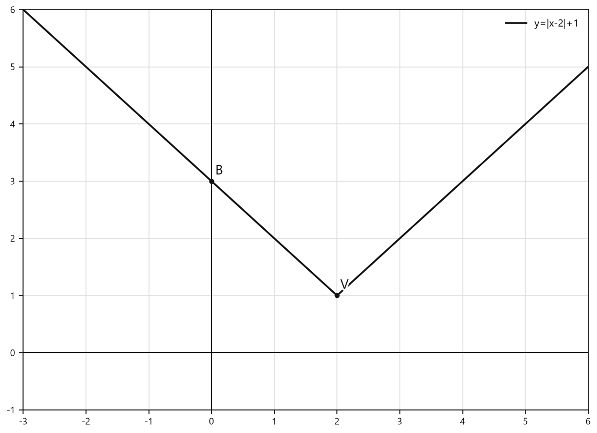
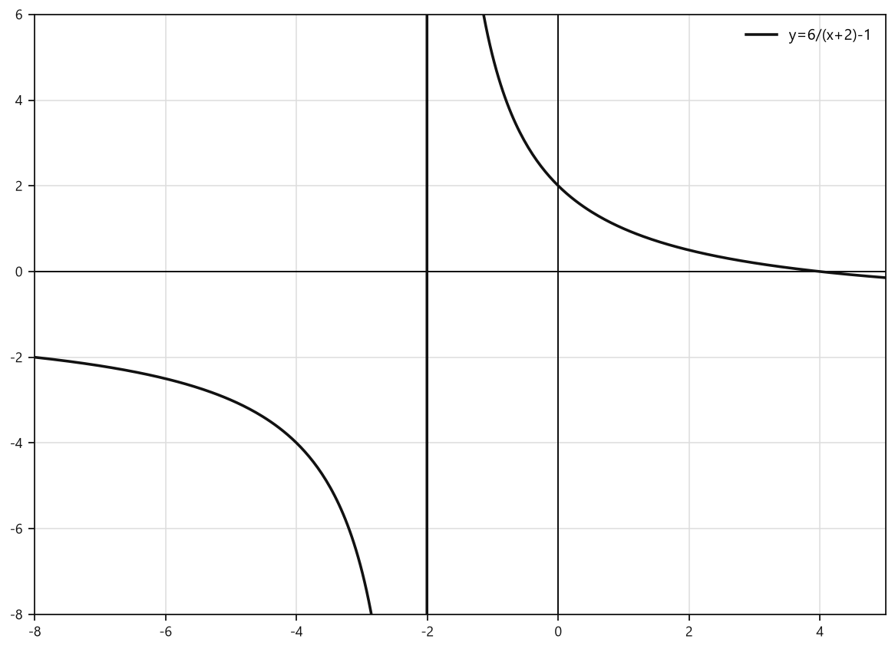

# Занятие 11. Построение графиков функций y = f(x) ± b, y = f(x ± a)

**Раздел:** Глава 2  
**Параграф учебника:** §9. Построение графиков функций y = f(x) ± b, y = f(x ± a)  
**Страницы:** 119–132

## Цели занятия

К концу занятия ты умеешь:

- определять, куда сдвигается график при изменении выражения вне функции;
- не путать сдвиг вправо и влево в формулах $f(x-a)$ и $f(x+a)$;
- строить графики функций по известному графику $y=f(x)$;
- записывать формулу функции после сдвига графика;
- представлять квадратный трёхчлен в виде $y=(x-m)^2+n$;
- находить координаты характерных точек нового графика.

Выбери блок своего уровня:

- **1–2 балла:** правила вертикальных и горизонтальных сдвигов;
- **3–4 балла:** простые формулы и выбор правильного графика;
- **5–6 баллов:** построение графиков модулей, квадратных и кубических функций;
- **7–8 баллов:** последовательные сдвиги и преобразование квадратного трёхчлена;
- **9–10 баллов:** самостоятельное построение нескольких графиков и работа с графиком $y=f(x)$.

---

## Теория к занятию

### 1. Сдвиг графика вдоль оси ординат

#### Простыми словами

Представим точку графика $(2;3)$. Если к каждому значению $y$ прибавить $4$, точка поднимется:

$$(2;3)\longrightarrow(2;7).$$

Если из каждого значения $y$ вычесть $4$, точка опустится:

$$(2;3)\longrightarrow(2;-1).$$

Координата $x$ не меняется. Весь график едет только вверх или вниз — без поворотов и внезапных путешествий в сторону.

#### Правило

**График функции $y = f(x)+b$ можно получить сдвигом графика функции $y = f(x)$ вдоль оси ординат на $b$ единиц вверх, если $b > 0$.**

**График функции $y = f(x)-b$ можно получить сдвигом графика функции $y = f(x)$ вдоль оси ординат на $b$ единиц вниз, если $b > 0$.**

#### Формулы

Если точка $(x_0;y_0)$ принадлежит графику $y=f(x)$, то:

- для $y=f(x)+b$ новая точка имеет координаты $(x_0;y_0+b)$;
- для $y=f(x)-b$ новая точка имеет координаты $(x_0;y_0-b)$.

Здесь $b>0$ — величина вертикального сдвига.

#### Правила

- $+b$ вне скобок — сдвиг вверх на $b$;
- $-b$ вне скобок — сдвиг вниз на $b$;
- координата $x$ не меняется.

#### Алгоритм

1. Определи исходный график $y=f(x)$.
2. Найди число $b$.
3. Если стоит $+b$, сдвинь график вверх на $b$.
4. Если стоит $-b$, сдвинь график вниз на $b$.
5. При необходимости перенеси несколько удобных точек.
6. Соедини точки той же линией или кривой, что и на исходном графике.

#### Ловушки

- $y=f(x)-5$ — это сдвиг **вниз**, а не влево.
- При вертикальном сдвиге меняется $y$, но не $x$.
- $y=f(x)+b$ и $y=f(x+b)$ — разные преобразования. Скобки здесь меняют всё, а не просто украшают формулу.

---

### 2. Сдвиг графика вдоль оси абсцисс

#### Простыми словами

Если изменяется выражение внутри скобок, меняется положение графика по горизонтали.

Главное правило такое:

- $x-a$ даёт сдвиг вправо;
- $x+a$ даёт сдвиг влево.

Почему знаки будто поменялись местами? Потому что мы меняем входное значение функции: чтобы получить прежний результат, значение $x$ приходится брать правее или левее.

#### Правило

**График функции $y = f(x - a)$ можно получить сдвигом графика функции $y = f(x)$ вдоль оси абсцисс на $a$ единиц вправо, если $a > 0$.**

**График функции $y = f(x + a)$ можно получить сдвигом графика функции $y = f(x)$ вдоль оси абсцисс на $a$ единиц влево, если $a > 0$.**

#### Формулы

Если точка $(x_0;y_0)$ принадлежит графику $y=f(x)$, то:

- для $y=f(x-a)$ новая точка имеет координаты $(x_0+a;y_0)$;
- для $y=f(x+a)$ новая точка имеет координаты $(x_0-a;y_0)$.

Здесь $a>0$ — величина горизонтального сдвига.

#### Правила

- $f(x-a)$ — сдвиг вправо на $a$;
- $f(x+a)$ — сдвиг влево на $a$;
- при горизонтальном сдвиге меняется $x$, но не $y$.

#### Алгоритм

1. Посмотри на выражение внутри скобок.
2. Представь его в виде $x-a$ или $x+a$.
3. Определи направление сдвига.
4. Перенеси характерные точки вдоль оси абсцисс.
5. Сохрани форму исходного графика.

#### Ловушки

- $y=(x-3)^2$ — вершина параболы перемещается вправо, в точку $(3;0)$.
- $y=(x+3)^2$ — вершина параболы перемещается влево, в точку $(-3;0)$.
- В выражении $(2x-3)^2$ нельзя сразу считать, что сдвиг равен $3$. Сначала преобразуем:

$$(2x-3)^2=\left(2\left(x-\frac32\right)\right)^2=4\left(x-\frac32\right)^2.$$

Значит, горизонтальный сдвиг равен $\frac32$, а не $3$.

---

### 3. Последовательные сдвиги

#### Простыми словами

В формуле могут встретиться сразу два вида сдвига:

- выражение внутри скобок отвечает за движение влево или вправо;
- число вне скобок отвечает за движение вверх или вниз.

Рассмотрим функцию:

$$y=|x-3|+2.$$

Здесь:

- $x-3$ сдвигает график вправо на $3$;
- $+2$ сдвигает его вверх на $2$.

Вершина графика $y=|x|$ была в точке $(0;0)$. После двух сдвигов она окажется в точке $(3;2)$.

#### Формула

График функции $y=f(x-a)+b$ получают:

- сдвигом вправо на $a$ единиц, если $a>0$;
- затем сдвигом вверх на $b$ единиц, если $b>0$.

Для отрицательных сдвигов направление меняется соответственно.

#### Алгоритм

1. Возьми график $y=f(x)$.
2. Посмотри на выражение внутри скобок и выполни горизонтальный сдвиг.
3. Посмотри на число вне скобок и выполни вертикальный сдвиг.
4. Проверь, куда переместилась вершина, начало графика или асимптота.
5. Нарисуй график, сохранив его форму.

#### Ловушки

- $y=\sqrt{x-3}+2$ начинается в точке $(3;2)$.
- $y=\sqrt{x+3}-2$ начинается в точке $(-3;-2)$.
- Горизонтальный сдвиг не меняет форму графика, а только переносит его влево или вправо.
- Вертикальный сдвиг не меняет область определения: допустимые значения $x$ остаются теми же.

---

### 4. Построение графиков основных функций

#### Простыми словами

Не нужно каждый раз составлять длинную таблицу значений. Если известен график исходной функции, можно перенести его характерные точки.

Например:

- у $y=|x|$ вершина $(0;0)$;
- у $y=|x-4|+3$ вершина $(4;3)$;
- у $y=(x+1)^3-2$ центральная точка кубической параболы перемещается из $(0;0)$ в $(-1;-2)$.

График не меняет форму: он просто переезжает на новое место.

#### Характерные точки

Для графика $y=|x|$:

- вершина: $(0;0)$;
- удобные точки: $(1;1)$ и $(-1;1)$.

Для графика $y=x^2$:

- вершина: $(0;0)$;
- удобные точки: $(1;1)$, $(-1;1)$, $(2;4)$, $(-2;4)$.

Для графика $y=x^3$:

- центральная точка: $(0;0)$;
- удобные точки: $(1;1)$, $(-1;-1)$, $(2;8)$, $(-2;-8)$.

#### Формулы

- $y=|x-a|+b$ имеет вершину $(a;b)$;
- $y=(x-a)^2+b$ имеет вершину $(a;b)$;
- $y=(x-a)^3+b$ имеет центральную точку $(a;b)$.

#### Правила

- Сначала найди точку, которая переносится проще всего.
- Для модуля и параболы это вершина.
- Для кубической параболы это центральная точка.
- После сдвига форма графика сохраняется.
- Если перед квадратом или кубом есть коэффициент, его нужно сохранить.

#### Ловушки

- У $y=|x+4|$ вершина $(-4;0)$, а не $(4;0)$.
- У $y=(x-2)^3+1$ центральная точка $(2;1)$.
- Коэффициент перед квадратом или кубом не исчезает при сдвиге.

---

### 5. Выделение полного квадрата

#### Простыми словами

Иногда функция записана так:

$$y=x^2+8x+10.$$

В таком виде координаты вершины сразу не видны. Преобразуем выражение, чтобы получить квадрат скобки.

#### Формула

$$x^2+8x+10=(x+4)^2-6.$$

Значит,

$$y=(x+4)^2-6.$$

График получают из графика $y=x^2$:

- сдвигом на $4$ единицы влево;
- сдвигом на $6$ единиц вниз.

Вершина графика: $(-4;-6)$.

#### Алгоритм

Для выражения $x^2+px+q$:

1. Раздели коэффициент при $x$ пополам.
2. Возведи полученное число в квадрат.
3. Добавь и вычти это число.
4. Объедини первые три слагаемых в квадрат суммы или разности.
5. Определи координаты вершины.

Для данного примера:

$$x^2+8x+10=x^2+8x+16-16+10,$$

$$x^2+8x+10=(x+4)^2-6.$$

#### Ловушки

- В выражении $x^2+8x$ число $8$ делим пополам: получаем $4$, а не $8$.
- $x^2+8x+10=(x+4)^2-6$, а не $(x+4)^2+6$.
- Знак внутри скобок противоположен координате вершины: $(x+4)^2$ означает координату $x=-4$.

---

## Сводка формул «выучить наизусть»

$$y=f(x)+b$$

Сдвиг графика вверх на $b$ единиц, если $b>0$.

$$y=f(x)-b$$

Сдвиг графика вниз на $b$ единиц, если $b>0$.

$$y=f(x-a)$$

Сдвиг графика вправо на $a$ единиц, если $a>0$.

$$y=f(x+a)$$

Сдвиг графика влево на $a$ единиц, если $a>0$.

$$y=f(x-a)+b$$

Сдвиг вправо на $a$ единиц и вверх на $b$ единиц.

$$y=f(x+a)-b$$

Сдвиг влево на $a$ единиц и вниз на $b$ единиц.

---

## Правила, которые нельзя путать

| Формула | Направление |
|---|---|
| $f(x)+b$ | вверх |
| $f(x)-b$ | вниз |
| $f(x-a)$ | вправо |
| $f(x+a)$ | влево |

Короткая памятка:

> Вне скобок знак показывает направление прямо.  
> Внутри скобок знак показывает направление наоборот.

---

# Разбор ключевых заданий

## Р1. Определение направления вертикального сдвига

### Условие

График функции $y=f(x)-3$ получен из графика функции $y=f(x)$ сдвигом вдоль оси:

1) ординат на $3$ единицы вверх;  
2) абсцисс на $3$ единицы вправо;  
3) абсцисс на $3$ единицы влево;  
4) ординат на $3$ единицы вниз.

Выберите правильный ответ.

### Решение

Число $-3$ стоит вне скобок.

Значит, изменяется координата $y$.

По правилу график функции $y=f(x)-b$ получают сдвигом вниз на $b$ единиц, если $b>0$.

Здесь:

$$b=3.$$

Следовательно, график сдвигается вдоль оси ординат на $3$ единицы вниз.

Ответ: 4).

---

## Р2. Сдвиг параболы вправо

### Условие

График какой функции получен из графика функции $y=2x^2$ сдвигом на $3$ единицы вправо?

1) $y=2x^2+3$;  
2) $y=(2x+3)^2$;  
3) $y=(2x-3)^2$;  
4) $y=2(x-3)^2$.

### Решение

Сдвиг вправо на $3$ единицы означает: вместо $x$ нужно записать $x-3$.

Исходная функция:

$$f(x)=2x^2.$$

Заменяем $x$ на $x-3$:

$$f(x-3)=2(x-3)^2.$$

Получаем:

$$y=2(x-3)^2.$$

Ответ: 4).

> Минус внутри скобок отправляет график вправо. Знак здесь как будто решил работать наоборот — но правило именно такое.

---

## Р3. Сдвиг кубической параболы

### Условие

Соотнесите функции с их преобразованиями относительно графика $y=x^3$:

а) $y=x^3$;  
б) $y=(x+1)^3$;  
в) $y=(x-2)^3$;  
г) $y=x^3-3$.

### Решение

#### а) $y=x^3$

Это исходная функция.

График не сдвигается.

#### б) $y=(x+1)^3$

Внутри скобок стоит $x+1$.

По правилу график сдвигается влево на $1$ единицу.

Центральная точка перемещается:

$$(0;0)\longrightarrow(-1;0).$$

#### в) $y=(x-2)^3$

Внутри скобок стоит $x-2$.

График сдвигается вправо на $2$ единицы.

Центральная точка перемещается:

$$(0;0)\longrightarrow(2;0).$$

#### г) $y=x^3-3$

Число $-3$ находится вне скобок.

График сдвигается вниз на $3$ единицы.

Центральная точка перемещается:

$$(0;0)\longrightarrow(0;-3).$$

Ответ:

- $y=x^3$ — исходный график;
- $y=(x+1)^3$ — сдвиг влево на $1$;
- $y=(x-2)^3$ — сдвиг вправо на $2$;
- $y=x^3-3$ — сдвиг вниз на $3$.

---

## Р4. Построение графиков функций с модулем

### Условие

С помощью преобразований графика $y=|x|$ постройте графики:

а) $y=|x+4|$;  
б) $y=|x-4|$;  
в) $y=|x-3|+2$.

### Решение

### а) $y=|x+4|$

Внутри модуля стоит $x+4$.

Значит, график сдвигается влево на $4$ единицы.

Вершина исходного графика $(0;0)$ переходит в точку $(-4;0)$.

Перенесём также точки $(1;1)$ и $(-1;1)$:

$$(1;1)\longrightarrow(-3;1),$$

$$(-1;1)\longrightarrow(-5;1).$$

Удобные точки:

$$(-4;0),\quad (-3;1),\quad (-5;1).$$

<!--geo-figure-spec
{
  "needed": true,
  "kind": "graph",
  "caption": "Графики $y=|x|$ и $y=|x+4|$",
  "axis": true,
  "grid": true,
  "xlim": [
    -7,
    4
  ],
  "ylim": [
    -1,
    9
  ],
  "curves": [
    {
      "expr": "abs(x)",
      "label": "y=|x|"
    },
    {
      "expr": "abs(x+4)",
      "label": "y=|x+4|"
    }
  ],
  "points": {},
  "labels": {}
}
-->

*Графики y=|x| и y=|x+4|*

### б) $y=|x-4|$

Внутри модуля стоит $x-4$.

Значит, график сдвигается вправо на $4$ единицы.

Вершина исходного графика $(0;0)$ переходит в точку $(4;0)$.

Точки $(1;1)$ и $(-1;1)$ переходят так:

$$(1;1)\longrightarrow(5;1),$$

$$(-1;1)\longrightarrow(3;1).$$

Удобные точки:

$$(4;0),\quad (3;1),\quad (5;1).$$

### в) $y=|x-3|+2$

Внутри модуля стоит $x-3$.

График сдвигается вправо на $3$ единицы.

Число $+2$ вне модуля поднимает график вверх на $2$ единицы.

Вершина перемещается:

$$(0;0)\longrightarrow(3;2).$$

Для соседних точек:

$$(1;1)\longrightarrow(4;3),$$

$$(-1;1)\longrightarrow(2;3).$$

Удобные точки:

$$(3;2),\quad (2;3),\quad (4;3).$$

<!--geo-figure-spec
{
  "needed": true,
  "kind": "graph",
  "caption": "График $y=|x-3|+2$",
  "axis": true,
  "grid": true,
  "xlim": [
    -1,
    7
  ],
  "ylim": [
    -1,
    7
  ],
  "curves": [
    {
      "expr": "abs(x-3)+2",
      "label": "y=|x-3|+2"
    }
  ],
  "points": {
    "A": [
      3,
      2
    ],
    "B": [
      2,
      3
    ],
    "C": [
      4,
      3
    ]
  },
  "labels": {
    "A": {
      "dx": 0,
      "dy": -0.35
    },
    "B": {
      "dx": -0.45,
      "dy": 0.18
    },
    "C": {
      "dx": 0.25,
      "dy": -0.3
    }
  }
}
-->

*График y=|x-3|+2*

Ответ:

- а) сдвиг влево на $4$ единицы;
- б) сдвиг вправо на $4$ единицы;
- в) сдвиг вправо на $3$ единицы и вверх на $2$ единицы.

---

## Р5. Запись формулы после сдвига параболы

### Условие

Из графика функции $y=x^2$ получили новые графики следующими сдвигами. Запишите их уравнения:

а) на $7$ единиц влево;  
б) на $4$ единицы вниз;  
в) на $9$ единиц вверх;  
г) на $1$ единицу вправо;  
д) на $2$ единицы влево и на $3$ единицы вверх;  
е) на $5$ единиц вправо и на $6$ единиц вниз.

### Решение

### а) Сдвиг влево на $7$

При сдвиге влево заменяем $x$ на $x+7$:

$$y=(x+7)^2.$$

### б) Сдвиг вниз на $4$

При сдвиге вниз вычитаем $4$:

$$y=x^2-4.$$

### в) Сдвиг вверх на $9$

При сдвиге вверх прибавляем $9$:

$$y=x^2+9.$$

### г) Сдвиг вправо на $1$

При сдвиге вправо заменяем $x$ на $x-1$:

$$y=(x-1)^2.$$

### д) Сдвиг влево на $2$ и вверх на $3$

Сначала выполняем сдвиг влево:

$$y=(x+2)^2.$$

Затем сдвигаем график вверх на $3$:

$$y=(x+2)^2+3.$$

### е) Сдвиг вправо на $5$ и вниз на $6$

Сначала сдвигаем график вправо на $5$ единиц.

Для этого вместо $x$ ставим $x-5$:

$$y=(x-5)^2.$$

Теперь сдвигаем полученный график вниз на $6$ единиц.

Для этого вычитаем $6$:

$$y=(x-5)^2-6.$$

Ответ:

$$
\begin{aligned}
\text{а)}\;&y=(x+7)^2;\\
\text{б)}\;&y=x^2-4;\\
\text{в)}\;&y=x^2+9;\\
\text{г)}\;&y=(x-1)^2;\\
\text{д)}\;&y=(x+2)^2+3;\\
\text{е)}\;&y=(x-5)^2-6.
\end{aligned}
$$

---

## Р6. Проверка похожих формул

### Условие

Какая из функций получена из графика $y=3x^2$ сдвигом на $1$ единицу вправо:

$$y=3(x-1)^2 \quad \text{или} \quad y=(3x-1)^2?$$

### Решение

При сдвиге вправо на $1$ единицу вместо $x$ во всей исходной функции ставим $x-1$.

Исходная функция:

$$f(x)=3x^2.$$

Заменяем $x$ на $x-1$:

$$f(x-1)=3(x-1)^2.$$

Значит, нужная функция:

$$y=3(x-1)^2.$$

Проверим вторую формулу:

$$y=(3x-1)^2.$$

Вынесем число $3$ из скобок:

$$y=\left(3\left(x-\frac13\right)\right)^2.$$

Здесь сдвиг происходит не на $1$ единицу, а на $\frac13$ единицы вправо, и ещё меняется форма графика из-за множителя $3$ внутри скобок.

Вот где обычно прячется ловушка: число перед $x$ нельзя просто «передвинуть» вместе со скобками.

Ответ:

$$y=3(x-1)^2.$$

---

## Р7. Построение графиков кубической функции

### Условие

С помощью преобразований графика $y=x^3$ постройте графики:

а) $y=(x-2)^3$;  
б) $y=x^3-3$;  
в) $y=(x+1)^3-2$;  
г) $y=(x-3)^3+1$.

### Решение

У графика $y=x^3$ центральная точка находится в начале координат:

$$(0;0).$$

При сдвиге графика эта точка тоже перемещается.

### а) $y=(x-2)^3$

В скобках стоит $x-2$.

Значит, график сдвигается вправо на $2$ единицы.

Точка $(0;0)$ переходит в точку:

$$(2;0).$$

### б) $y=x^3-3$

Число $-3$ стоит вне скобок.

Значит, весь график сдвигается вниз на $3$ единицы.

Точка $(0;0)$ переходит в точку:

$$(0;-3).$$

### в) $y=(x+1)^3-2$

Выражение $x+1$ можно записать как $x-(-1)$.

Значит, график сдвигается влево на $1$ единицу.

Число $-2$ означает сдвиг вниз на $2$ единицы.

Точка $(0;0)$ переходит в точку:

$$(-1;-2).$$

### г) $y=(x-3)^3+1$

Выражение $x-3$ даёт сдвиг вправо на $3$ единицы.

Число $+1$ даёт сдвиг вверх на $1$ единицу.

Точка $(0;0)$ переходит в точку:

$$(3;1).$$

Не перепутай: знак внутри скобок действует «наоборот» — $x-3$ ведёт вправо, а $x+1$ — влево. Графики любят такие маленькие сюрпризы.

Ответ:

- а) вправо на $2$;
- б) вниз на $3$;
- в) влево на $1$ и вниз на $2$;
- г) вправо на $3$ и вверх на $1$.

---

## Р8. Выделение полного квадрата

### Условие

Представьте функцию

$$y=x^2+8x+10$$

в виде

$$y=(x-m)^2+n$$

и определите координаты вершины графика.

### Решение

Нужно выделить полный квадрат из выражения $x^2+8x$.

Берём половину коэффициента при $x$:

$$\frac{8}{2}=4.$$

Её квадрат равен:

$$4^2=16.$$

Добавим $16$ и сразу вычтем $16$, чтобы значение выражения не изменилось:

$$y=x^2+8x+16-16+10.$$

Первые три слагаемых образуют квадрат суммы:

$$x^2+8x+16=(x+4)^2.$$

Поэтому:

$$y=(x+4)^2-16+10.$$

Вычислим постоянные слагаемые:

$$-16+10=-6.$$

Получаем:

$$y=(x+4)^2-6.$$

Сравним с формой $y=(x-m)^2+n$:

$$x+4=x-(-4).$$

Значит:

$$m=-4,\qquad n=-6.$$

Вершина графика имеет координаты:

$$(-4;-6).$$

График можно получить из графика $y=x^2$ так:

- сдвинуть его на $4$ единицы влево;
- затем сдвинуть на $6$ единиц вниз.

Ответ:

$$y=(x+4)^2-6,$$

вершина:

$$(-4;-6).$$

---

## Р9. Двойной сдвиг дробно-рациональной функции

### Условие

Постройте график функции

$$y=\frac{6}{x+3}-2,$$

преобразовав график функции

$$y=\frac{6}{x}.$$

### Решение

Исходный график:

$$y=\frac{6}{x}.$$

В новой функции в знаменателе вместо $x$ стоит $x+3$.

Выражение $x+3$ означает сдвиг графика влево на $3$ единицы.

Теперь рассмотрим число $-2$ вне дроби.

Оно сдвигает график вниз на $2$ единицы.

Значит, график

$$y=\frac{6}{x+3}-2$$

получают из графика $y=\frac{6}{x}$:

- сдвигом влево на $3$ единицы;
- сдвигом вниз на $2$ единицы.

У исходного графика вертикальная асимптота:

$$x=0.$$

После сдвига влево на $3$ единицы она становится такой:

$$x=-3.$$

У исходного графика горизонтальная асимптота:

$$y=0.$$

После сдвига вниз на $2$ единицы она становится такой:

$$y=-2.$$

Ответ: график $y=\frac{6}{x+3}-2$ получают сдвигом графика $y=\frac{6}{x}$ влево на $3$ единицы и вниз на $2$ единицы; асимптоты нового графика:

$$x=-3,\qquad y=-2.$$

---

## Р10. Работа с точками известного графика

### Условие

График функции $y=f(x)$ проходит через точки

$$(-5;-4),\ (-3;2),\ (0;-1),\ (2;-3).$$

Запишите точки графиков:

а) $y=f(x-2)$;  
б) $y=f(x+3)$;  
в) $y=f(x)-1$;  
г) $y=f(x)+4$.

### Решение

Для сдвига по горизонтали меняются абсциссы точек.

Для сдвига по вертикали меняются ординаты точек.

### а) $y=f(x-2)$

Выражение $x-2$ означает сдвиг вправо на $2$ единицы.

К каждой абсциссе прибавляем $2$:

$$(-5;-4)\to(-3;-4);$$

$$(-3;2)\to(-1;2);$$

$$(0;-1)\to(2;-1);$$

$$(2;-3)\to(4;-3).$$

### б) $y=f(x+3)$

Выражение $x+3$ означает сдвиг влево на $3$ единицы.

Из каждой абсциссы вычитаем $3$:

$$(-5;-4)\to(-8;-4);$$

$$(-3;2)\to(-6;2);$$

$$(0;-1)\to(-3;-1);$$

$$(2;-3)\to(-1;-3).$$

### в) $y=f(x)-1$

Число $-1$ вне функции означает сдвиг вниз на $1$ единицу.

Из каждой ординаты вычитаем $1$:

$$(-5;-4)\to(-5;-5);$$

$$(-3;2)\to(-3;1);$$

$$(0;-1)\to(0;-2);$$

$$(2;-3)\to(2;-4).$$

### г) $y=f(x)+4$

Число $+4$ вне функции означает сдвиг вверх на $4$ единицы.

К каждой ординате прибавляем $4$:

$$(-5;-4)\to(-5;0);$$

$$(-3;2)\to(-3;6);$$

$$(0;-1)\to(0;3);$$

$$(2;-3)\to(2;1).$$

Ответ:

$$
\begin{aligned}
\text{а)}\;&(-3;-4),\ (-1;2),\ (2;-1),\ (4;-3);\\
\text{б)}\;&(-8;-4),\ (-6;2),\ (-3;-1),\ (-1;-3);\\
\text{в)}\;&(-5;-5),\ (-3;1),\ (0;-2),\ (2;-4);\\
\text{г)}\;&(-5;0),\ (-3;6),\ (0;3),\ (2;1).
\end{aligned}
$$

---

# Самопроверка

## Задание 1

График какой функции получен из графика $y=\sqrt{x}$ сдвигом вверх на $5$ единиц?

1) $y=\sqrt{x-5}$  
2) $y=\sqrt{x}+5$  
3) $y=\sqrt{x+5}$  
4) $y=\sqrt{x}-5$  
5) $y=5\sqrt{x}$

### Ответ

При сдвиге вверх число прибавляется вне корня:

$$y=\sqrt{x}+5.$$

Ответ: 2).

---

## Задание 2

График какой функции получен из графика $y=-5x^2$ сдвигом вниз на $3$ единицы?

1) $y=-5x^2+3$  
2) $y=-5(x+3)^2$  
3) $y=-5x^2-3$  
4) $y=-(5x+3)^2$  
5) $y=-5(x-3)^2$

### Ответ

Сдвиг вниз на $3$ единицы означает вычесть $3$ вне выражения:

$$y=-5x^2-3.$$

Ответ: 3).

---

## Задание 3

Определите вершину параболы

$$y=(x-4)^2-5.$$

### Решение

Формула имеет вид:

$$y=(x-m)^2+n.$$

Сравниваем её с данной формулой:

$$m=4,\qquad n=-5.$$

Следовательно, вершина:

$$(4;-5).$$

Ответ: $(4;-5)$.

---

## Задание 4

Запишите формулу функции, полученной из графика $y=|x|$ сдвигом на $3$ единицы влево и на $2$ единицы вниз.

### Решение

Сначала сдвигаем график влево на $3$ единицы:

$$y=|x+3|.$$

Затем сдвигаем его вниз на $2$ единицы:

$$y=|x+3|-2.$$

Ответ:

$$y=|x+3|-2.$$

---

# Коротко перед выходом

1. Число **вне скобок** двигает график вверх или вниз.
2. Выражение **внутри скобок** двигает график влево или вправо.
3. $f(x-a)$ — сдвиг вправо.
4. $f(x+a)$ — сдвиг влево.
5. Вершина $y=|x-a|+b$ — точка $(a;b)$.
6. Вершина $y=(x-a)^2+b$ — точка $(a;b)$.
7. Для квадратного трёхчлена сначала выделяй полный квадрат.

Главная ловушка занятия: внутри скобок знак работает наоборот. Поэтому $x-3$ ведёт график вправо, а $x+3$ — влево. Знаки иногда любят проверять внимательность сильнее, чем сами вычисления.

## Практические задания

Выбери свой уровень и решай только этот блок. В блоке должна закрепиться вся тема параграфа. Ответы не приводятся.

### Уровень 1–2 балла

**С1.** График функции $y=(x+4)^2$ получен из графика функции $y=x^2$ сдвигом на 4 единицы вдоль оси абсцисс:
1) вправо  
2) влево  
3) вверх  
4) вниз  
5) сначала вправо, затем вверх

**С2.** Выберите функцию, график которой получен из графика $y=\sqrt{x}$ сдвигом на 3 единицы вверх:
1) $y=\sqrt{x-3}$  
2) $y=\sqrt{x+3}$  
3) $y=\sqrt{x}+3$  
4) $y=\sqrt{x}-3$  
5) $y=3\sqrt{x}$

**С3.** График функции $y=|x|-5$ получен из графика $y=|x|$ сдвигом:
1) на 5 единиц вверх вдоль оси ординат  
2) на 5 единиц вниз вдоль оси ординат  
3) на 5 единиц вправо вдоль оси абсцисс  
4) на 5 единиц влево вдоль оси абсцисс  
5) на 5 единиц вверх и вправо

**С4.** Выберите функцию, график которой получен из графика $y=3x^2$ сдвигом на 2 единицы вправо:
1) $y=3(x+2)^2$  
2) $y=3(x-2)^2$  
3) $y=3x^2+2$  
4) $y=3x^2-2$  
5) $y=(3x-2)^2$

**С5.** Какая функция получается из $y=x^3$ сдвигом на 6 единиц влево вдоль оси абсцисс?
1) $y=(x-6)^3$  
2) $y=(x+6)^3$  
3) $y=x^3+6$  
4) $y=x^3-6$  
5) $y=(6x)^3$

**С6.** Запишите формулу функции, график которой получен из графика $y=x^2$ сдвигом на 7 единиц вниз вдоль оси ординат.

**С7.** Запишите формулу функции, график которой получен из графика $y=|x|$ сдвигом на 3 единицы вправо вдоль оси абсцисс.

**С8.** Запишите формулу функции, график которой получен из графика $y=\sqrt{x}$ сдвигом на 4 единицы влево вдоль оси абсцисс.

**С9.** Запишите формулу функции, график которой получен из графика $y=x^3$ сдвигом на 2 единицы вправо и на 5 единиц вверх.

**С10.** Укажите координаты вершины параболы $y=(x-4)^2-3$.

**С11.** Укажите координаты вершины параболы $y=(x+2)^2+6$.

**С12.** Выберите функцию, график которой получен из графика $y=-2x^2$ сдвигом на 1 единицу влево и на 4 единицы вниз:
1) $y=-2(x-1)^2-4$  
2) $y=-2(x+1)^2-4$  
3) $y=-2(x+1)^2+4$  
4) $y=-2(x-1)^2+4$  
5) $y=-2x^2-5$

**С13.** График функции $y=(x+4)^2$ получен из графика функции $y=x^2$ сдвигом вдоль оси абсцисс на  
1) 4 единицы вправо; 2) 4 единицы влево; 3) 4 единицы вверх; 4) 4 единицы вниз; 5) 8 единиц влево.

**С14.** Выберите функцию, график которой получен из графика функции $y=\sqrt{x}$ сдвигом на 3 единицы вверх вдоль оси ординат:  
1) $y=\sqrt{x-3}$; 2) $y=\sqrt{x+3}$; 3) $y=\sqrt{x}+3$; 4) $y=\sqrt{x}-3$; 5) $y=3\sqrt{x}$.

**С15.** Запишите формулу функции, график которой получен из графика $y=|x|$ сдвигом на 2 единицы вправо вдоль оси абсцисс.

**С16.** Выберите функцию, график которой получен из графика функции $y=5x^2$ сдвигом на 1 единицу вправо вдоль оси абсцисс:  
1) $y=5x^2+1$; 2) $y=5(x+1)^2$; 3) $y=5(x-1)^2$; 4) $y=5x^2-1$; 5) $y=(5x-1)^2$.

**С17.** График функции $y=x^3-6$ получен из графика функции $y=x^3$ сдвигом вдоль оси ординат на  
1) 6 единиц вверх; 2) 6 единиц вниз; 3) 6 единиц вправо; 4) 6 единиц влево; 5) 12 единиц вниз.

**С18.** Запишите формулу функции, график которой получен из графика $y=x^2$ сдвигом на 3 единицы влево и на 2 единицы вверх.

**С19.** Выберите функцию, график которой получен из графика функции $y=\dfrac{4}{x}$ сдвигом на 2 единицы вправо вдоль оси абсцисс:  
1) $y=\dfrac{4}{x+2}$; 2) $y=\dfrac{4}{x-2}$; 3) $y=\dfrac{4}{x}+2$; 4) $y=\dfrac{4}{x}-2$; 5) $y=\dfrac{4}{2x}$.

**С20.** Запишите формулу функции, график которой получен из графика $y=x^3$ сдвигом на 5 единиц влево вдоль оси абсцисс.

**С21.** Выберите функцию, график которой получен из графика функции $y=|x|$ сдвигом на 3 единицы вниз вдоль оси ординат:  
1) $y=|x+3|$; 2) $y=|x-3|$; 3) $y=|x|+3$; 4) $y=|x|-3$; 5) $y=3|x|$.

**С22.** Запишите формулу функции, график которой получен из графика $y=\sqrt{x}$ сдвигом на 4 единицы вправо вдоль оси абсцисс и на 1 единицу вниз вдоль оси ординат.

**С23.** График функции $y=(x-7)^3$ получен из графика функции $y=x^3$ сдвигом вдоль оси абсцисс на  
1) 7 единиц вправо; 2) 7 единиц влево; 3) 7 единиц вверх; 4) 7 единиц вниз; 5) 14 единиц вправо.

**С24.** Выберите функцию, график которой получен из графика функции $y=-2x^2$ сдвигом на 2 единицы влево и на 3 единицы вниз:  
1) $y=-2(x-2)^2+3$; 2) $y=-2(x+2)^2-3$; 3) $y=-2(x-2)^2-3$; 4) $y=-2(x+2)^2+3$; 5) $y=-2x^2-6$.

**С25.** График функции $y=(x-4)^2$ получен из графика функции $y=x^2$ сдвигом вдоль оси:
1) ординат на 4 единицы вверх; 2) ординат на 4 единицы вниз; 3) абсцисс на 4 единицы вправо; 4) абсцисс на 4 единицы влево; 5) абсцисс на 2 единицы вправо.

**С26.** Выберите функцию, график которой получен из графика функции $y=\sqrt{x}$ сдвигом на 3 единицы вверх вдоль оси ординат:  
1) $y=\sqrt{x-3}$; 2) $y=\sqrt{x+3}$; 3) $y=\sqrt{x}+3$; 4) $y=\sqrt{x}-3$; 5) $y=3\sqrt{x}$.

**С27.** Запишите формулу функции, график которой получается из графика функции $y=|x|$ сдвигом на 2 единицы влево вдоль оси абсцисс.

**С28.** График функции $y=x^3+5$ получают из графика функции $y=x^3$ сдвигом вдоль оси:
1) абсцисс на 5 единиц вправо; 2) абсцисс на 5 единиц влево; 3) ординат на 5 единиц вверх; 4) ординат на 5 единиц вниз; 5) абсцисс на 2 единицы вправо.

**С29.** Выберите функцию, график которой получен из графика функции $y=3x^2$ сдвигом на 2 единицы вправо вдоль оси абсцисс:  
1) $y=3x^2+2$; 2) $y=3x^2-2$; 3) $y=3(x+2)^2$; 4) $y=3(x-2)^2$; 5) $y=(3x-2)^2$.

**С30.** График функции $y=\dfrac{4}{x+1}$ получают из графика функции $y=\dfrac{4}{x}$ сдвигом на 1 единицу влево вдоль оси абсцисс. Запишите формулу функции, которая получится после дополнительного сдвига этого графика на 3 единицы вниз вдоль оси ординат.

**С31.** Выберите функцию, график которой получен из графика функции $y=-x^2$ сдвигом на 4 единицы вниз вдоль оси ординат:  
1) $y=-(x-4)^2$; 2) $y=-(x+4)^2$; 3) $y=-x^2+4$; 4) $y=-x^2-4$; 5) $y=4-x^2$.

**С32.** Функция $y=f(x)$ задана на отрезке $[-2;3]$. Укажите область определения функции $y=f(x-4)$:  
1) $[-6;-1]$; 2) $[-2;3]$; 3) $[2;7]$; 4) $[-6;7]$; 5) $[-1;6]$.

**С33.** Запишите формулу функции, график которой получается из графика функции $y=x^3$ сдвигом на 3 единицы влево вдоль оси абсцисс и на 2 единицы вверх вдоль оси ординат.

**С34.** Выберите функцию, график которой получен из графика функции $y=|x|$ сдвигом на 5 единиц вправо вдоль оси абсцисс:  
1) $y=|x+5|$; 2) $y=|x-5|$; 3) $y=|x|+5$; 4) $y=|x|-5$; 5) $y=5|x|$.

**С35.** График функции $y=2x^2$ сдвинули на 1 единицу влево вдоль оси абсцисс. Запишите формулу полученной функции.

**С36.** Выберите функцию, график которой получен из графика функции $y=\dfrac{6}{x}$ сдвигом на 2 единицы вправо вдоль оси абсцисс и на 1 единицу вверх вдоль оси ординат:  
1) $y=\dfrac{6}{x+2}+1$; 2) $y=\dfrac{6}{x-2}+1$; 3) $y=\dfrac{6}{x-2}-1$; 4) $y=\dfrac{6}{x+1}-2$; 5) $y=\dfrac{6}{x}+3$.

### Уровень 3–4 балла

**С1.** График функции $y=(x+4)^2$ получен из графика функции $y=x^2$ сдвигом вдоль оси абсцисс. Укажите направление и величину сдвига.

**С2.** Запишите формулу функции, график которой получается из графика функции $y=\sqrt{x}$ сдвигом на $6$ единиц вверх вдоль оси ординат.

**С3.** Какая из функций получается из функции $y=3x^2$ сдвигом на $2$ единицы вправо вдоль оси абсцисс?

1) $y=3(x+2)^2$  
2) $y=3(x-2)^2$  
3) $y=3x^2+2$  
4) $y=3x^2-2$  
5) $y=(3x-2)^2$

**С4.** Запишите формулу функции, график которой получается из графика функции $y=|x|$ сдвигом на $3$ единицы влево и на $2$ единицы вниз.

**С5.** График функции $y=(x-5)^3+1$ получен из графика функции $y=x^3$. Укажите последовательно выполненные сдвиги вдоль координатных осей.

**С6.** Какая из функций получается из функции $y=-4x^2$ сдвигом на $3$ единицы вниз вдоль оси ординат?

1) $y=-4(x-3)^2$  
2) $y=-4(x+3)^2$  
3) $y=-4x^2+3$  
4) $y=-4x^2-3$  
5) $y=-(4x-3)^2$

**С7.** Представьте функцию $y=x^2-6x+11$ в виде $y=(x-m)^2+n$, где $m$ и $n$ — числа. Укажите координаты вершины её графика.

**С8.** График функции $y=f(x)$ получен из графика функции $y=2x^2$ сдвигом на $4$ единицы вправо вдоль оси абсцисс. Запишите формулу функции $f(x)$ и найдите значение $f(6)$.

**С9.** Запишите формулу функции, график которой получается из графика функции $y=\dfrac{4}{x}$ сдвигом на $2$ единицы влево вдоль оси абсцисс и на $3$ единицы вверх вдоль оси ординат.

**С10.** График функции $y=f(x)$ получен из графика функции $y=x^3$ сдвигом на $4$ единицы вниз вдоль оси ординат. Найдите абсциссу точки графика $y=f(x)$, в которой ордината равна $4$.

**С11.** График функции $y=f(x)$ получен из графика функции $y=-2x^2$ сдвигом на $3$ единицы вправо вдоль оси абсцисс и на $5$ единиц вверх вдоль оси ординат. Запишите формулу функции $f(x)$ и найдите её нули.

**С12.** В одной системе координат нужно построить графики функций $y=x^2$, $y=(x-2)^2+3$ и $y=(x+1)^2-2$. Для каждой из двух последних функций укажите сдвиги, с помощью которых её график получается из графика $y=x^2$.

**С13.** График функции $y=(x+4)^2$ получен из графика функции $y=x^2$ сдвигом вдоль оси абсцисс на 4 единицы

1) вправо  
2) влево  
3) вверх  
4) вниз  
5) вправо и вверх

**С14.** График какой функции получен из графика функции $y=\sqrt{x}$ сдвигом на 6 единиц вверх вдоль оси ординат?

1) $y=\sqrt{x-6}$  
2) $y=\sqrt{x+6}$  
3) $y=\sqrt{x}+6$  
4) $y=\sqrt{x}-6$  
5) $y=6\sqrt{x}$

**С15.** Запишите формулу функции, график которой получен из графика функции $y=|x|$ сдвигом на 3 единицы вправо вдоль оси абсцисс.

**С16.** График функции $y=2x^2-5$ получен из графика функции $y=2x^2$ сдвигом вдоль оси ординат. Укажите направление и величину сдвига.

1) на 5 единиц вверх  
2) на 5 единиц вниз  
3) на 2 единицы вверх  
4) на 2 единицы вниз  
5) на 5 единиц вправо

**С17.** Запишите формулу функции, график которой получается из графика функции $y=x^3$ сдвигом на 2 единицы влево вдоль оси абсцисс и на 4 единицы вниз вдоль оси ординат.

**С18.** Какая функция получена из функции $y=3x^2$ сдвигом её графика на 2 единицы вправо вдоль оси абсцисс?

1) $y=3(x+2)^2$  
2) $y=3(x-2)^2$  
3) $y=3x^2+2$  
4) $y=3x^2-2$  
5) $y=3(x-2)^2+2$

**С19.** Запишите формулу функции, график которой можно получить из графика функции $y=\dfrac{5}{x}$ сдвигом на 1 единицу влево вдоль оси абсцисс и на 3 единицы вверх вдоль оси ординат.

**С20.** График функции $y=(x-5)^3+2$ получен из графика функции $y=x^3$ последовательными сдвигами:

1) на 5 единиц влево и на 2 единицы вверх  
2) на 5 единиц вправо и на 2 единицы вверх  
3) на 5 единиц вправо и на 2 единицы вниз  
4) на 2 единицы вправо и на 5 единиц вверх  
5) на 2 единицы влево и на 5 единиц вниз

**С21.** Представьте функцию $y=x^2-6x+11$ в виде $y=(x-m)^2+n$.

**С22.** Запишите формулу функции, график которой получен из графика функции $y=-x^2$ сдвигом на 3 единицы влево вдоль оси абсцисс и на 2 единицы вниз вдоль оси ординат.

**С23.** График функции $y=f(x)$ получен из графика функции $y=x^2$ сдвигом на 4 единицы вправо вдоль оси абсцисс. Найдите значение $f(7)$.

**С24.** График функции $y=f(x)$ получен из графика функции $y=|x|$ сдвигом на 2 единицы влево вдоль оси абсцисс и на 3 единицы вверх вдоль оси ординат. Запишите формулу функции $f(x)$ и найдите её наименьшее значение.

**С25.** График функции $y=(x+4)^2$ получен из графика функции $y=x^2$ сдвигом вдоль оси абсцисс на 4 единицы:
1) вправо; 2) влево; 3) вверх; 4) вниз; 5) на 4 единицы вправо и вверх.

**С26.** Выберите функцию, график которой получен из графика функции $y=\sqrt{x}$ сдвигом на 6 единиц вверх вдоль оси ординат:  
1) $y=\sqrt{x-6}$; 2) $y=\sqrt{x+6}$; 3) $y=\sqrt{x}+6$; 4) $y=\sqrt{x}-6$; 5) $y=6\sqrt{x}$.

**С27.** Запишите формулу функции, график которой получается из графика функции $y=|x|$ сдвигом на 3 единицы вправо вдоль оси абсцисс и на 2 единицы вниз вдоль оси ординат.

**С28.** График функции $y=3(x-2)^2+5$ получают из графика функции $y=3x^2$ двумя последовательными сдвигами. Укажите направление и величину каждого сдвига.

**С29.** Выберите функцию, график которой получен из графика функции $y=-4x^2$ сдвигом на 3 единицы вниз вдоль оси ординат:  
1) $y=-4x^2+3$; 2) $y=-4x^2-3$; 3) $y=-4(x-3)^2$; 4) $y=-4(x+3)^2$; 5) $y=-(4x-3)^2$.

**С30.** Для построения графика функции $y=(x-5)^3-2$ используют график функции $y=x^3$. Укажите последовательность сдвигов и их величины.

**С31.** Запишите формулу функции, график которой получается из графика функции $y=\dfrac{4}{x}$ сдвигом на 2 единицы влево вдоль оси абсцисс и на 3 единицы вверх вдоль оси ординат.

**С32.** Найдите координаты вершины параболы $y=(x+1)^2-4$, используя её представление как сдвига графика функции $y=x^2$.

**С33.** Выберите функцию, график которой получается из графика функции $y=2x^2$ сдвигом на 4 единицы вправо вдоль оси абсцисс:  
1) $y=2(x+4)^2$; 2) $y=2(x-4)^2$; 3) $y=2x^2+4$; 4) $y=2x^2-4$; 5) $y=(2x-4)^2$.

**С34.** Функция $y=f(x)$ получена из функции $g(x)=x^3$ сдвигом на 5 единиц вниз вдоль оси ординат. Найдите значение $f(-2)$.

**С35.** График функции $y=f(x)$ получен из графика функции $g(x)=-2x^2$ сдвигом на 3 единицы вправо вдоль оси абсцисс и на 4 единицы вверх вдоль оси ординат. Запишите формулу функции $f(x)$.

**С36.** Представьте функцию $y=x^2+6x+5$ в виде $y=(x-m)^2+n$, а затем укажите сдвиг графика функции $y=x^2$, с помощью которого получается график данной функции.

### Уровень 5–6 баллов

**С1.** Определите, каким сдвигом графика функции $y=x^2$ получен график функции $y=(x+3)^2-4$.

**С2.** Выберите функцию, график которой получен из графика функции $y=5x^2$ сдвигом на 4 единицы вправо вдоль оси абсцисс.  
1) $y=5(x+4)^2$ 2) $y=5(x-4)^2$ 3) $y=5x^2+4$ 4) $y=5(x-4)^2+4$ 5) $y=5x^2-4$

**С3.** Запишите формулу функции, график которой получен из графика функции $y=\sqrt{x}$ сдвигом на 6 единиц вверх вдоль оси ординат.

**С4.** Запишите формулу функции, график которой можно получить из графика функции $y=\dfrac{4}{x}$ сдвигом на 2 единицы влево вдоль оси абсцисс и на 3 единицы вниз вдоль оси ординат.

**С5.** Точка $A(2;5)$ принадлежит графику функции $y=f(x)$. Найдите координаты точки этого графика после его сдвига на 3 единицы влево вдоль оси абсцисс и на 4 единицы вверх вдоль оси ординат.

**С6.** С помощью преобразований графика функции $y=|x|$ постройте график функции $y=|x-2|+1$. Укажите координаты вершины графика и его точки пересечения с осью ординат.

<!--geo-figure-spec
{
  "needed": true,
  "kind": "graph",
  "caption": "График функции $y=|x-2|+1$",
  "axis": true,
  "grid": true,
  "xlim": [
    -3,
    6
  ],
  "ylim": [
    -1,
    7
  ],
  "curves": [
    {
      "expr": "abs(x-2)+1",
      "label": "y=|x-2|+1"
    }
  ],
  "points": {
    "V": [
      2,
      1
    ],
    "B": [
      0,
      3
    ]
  },
  "labels": {
    "V": {
      "dx": 0.12,
      "dy": 0.22
    },
    "B": {
      "dx": 0.12,
      "dy": 0.18
    }
  }
}
-->

*График функции y=|x-2|+1*

**С7.** Представьте функцию $y=x^2-8x+19$ в виде $y=(x-m)^2+n$. Используя полученное представление, укажите координаты вершины параболы.

**С8.** График функции $y=f(x)$ получен из графика функции $g(x)=2x^2$ сдвигом на 3 единицы вправо вдоль оси абсцисс и на 2 единицы вниз вдоль оси ординат. Запишите формулу функции $f(x)$ и найдите значение $f(5)$.

**С9.** С помощью преобразований графика функции $y=x^3$ постройте график функции $y=(x+2)^3-1$. Найдите координаты точки графика, соответствующей точке $(0;0)$ исходного графика.

<!--geo-figure-spec
{
  "needed": true,
  "kind": "graph",
  "caption": "График функции $y=|x-2|+1$",
  "axis": true,
  "grid": true,
  "xlim": [
    -3,
    6
  ],
  "ylim": [
    -1,
    6
  ],
  "curves": [
    {
      "expr": "abs(x-2)+1",
      "label": "y=|x-2|+1"
    }
  ],
  "points": {
    "V": [
      2,
      1
    ],
    "B": [
      0,
      3
    ]
  },
  "labels": {
    "V": {
      "dx": 0.12,
      "dy": 0.18
    },
    "B": {
      "dx": 0.12,
      "dy": 0.18
    }
  }
}
-->

*График функции y=|x-2|+1*

**С10.** Область определения функции $f$ равна $[-2;7]$, а множество её значений равно $[-5;4]$. Укажите область определения и множество значений функции $y=f(x-3)+2$.

**С11.** Постройте график функции $y=\dfrac{6}{x+2}-1$, преобразовав график функции $y=\dfrac{6}{x}$. Укажите уравнения его вертикальной и горизонтальной асимптот.

<!--geo-figure-spec
{
  "needed": true,
  "kind": "graph",
  "caption": "График функции $y=\\frac{6}{x+2}-1$",
  "axis": true,
  "grid": true,
  "xlim": [
    -8,
    5
  ],
  "ylim": [
    -8,
    6
  ],
  "curves": [
    {
      "expr": "6/(x+2)-1",
      "label": "y=6/(x+2)-1"
    }
  ]
}
-->

*График функции y=\frac{6}{x+2}-1*

**С12.** График функции $y=f(x)$ получен из графика функции $g(x)=-2x^2$ сдвигом на 4 единицы вправо вдоль оси абсцисс и на 8 единиц вверх вдоль оси ординат. Запишите формулу функции $f(x)$ и найдите её нули.

**С13.** График функции $y=(x+4)^2$ получен из графика функции $y=x^2$ сдвигом вдоль оси абсцисс на  
1) $4$ единицы вправо; 2) $4$ единицы влево; 3) $4$ единицы вверх; 4) $4$ единицы вниз; 5) $8$ единиц влево.

**С14.** Выберите функцию, график которой получен из графика функции $y=\sqrt{x}$ сдвигом на $5$ единиц вверх вдоль оси ординат:  
1) $y=\sqrt{x-5}$; 2) $y=\sqrt{x+5}$; 3) $y=\sqrt{x}+5$; 4) $y=5\sqrt{x}$; 5) $y=\sqrt{x-5}+5$.

**С15.** Запишите формулу функции, график которой можно получить из графика функции $y=|x|$ сдвигом на $3$ единицы вправо вдоль оси абсцисс и на $2$ единицы вниз вдоль оси ординат.

**С16.** График функции $y=3(x-2)^2+4$ получен из графика функции $y=3x^2$ двумя последовательными сдвигами. Укажите направление и величину каждого сдвига.

**С17.** Выберите функцию, график которой получен из графика функции $y=-2x^2$ сдвигом на $3$ единицы вниз вдоль оси ординат:  
1) $y=-2x^2+3$; 2) $y=-2(x-3)^2$; 3) $y=-2x^2-3$; 4) $y=-2(x+3)^2$; 5) $y=-(2x-3)^2$.

**С18.** Функция $y=f(x)$ получена из функции $g(x)=2x^2$ сдвигом на $4$ единицы вправо вдоль оси абсцисс. Найдите значение $f(7)$.

**С19.** Запишите формулу функции, график которой получается из графика функции $y=x^3$ сдвигом на $2$ единицы влево вдоль оси абсцисс и на $5$ единиц вверх вдоль оси ординат.

**С20.** Выберите функцию, график которой получен из графика функции $y=\dfrac{6}{x}$ сдвигом на $2$ единицы вправо вдоль оси абсцисс и на $1$ единицу вниз вдоль оси ординат:  
1) $y=\dfrac{6}{x-2}-1$; 2) $y=\dfrac{6}{x+2}-1$; 3) $y=\dfrac{6}{x-2}+1$; 4) $y=\dfrac{6}{x+1}-2$; 5) $y=\dfrac{6}{x}-3$.

**С21.** Представьте функцию $y=x^2-10x+28$ в виде $y=(x-m)^2+n$. Укажите значения $m$ и $n$.

**С22.** График функции $y=f(x)$ получен из графика функции $g(x)=x^3$ сдвигом на $3$ единицы вниз вдоль оси ординат. Найдите ординату точки графика $y=f(x)$, имеющей абсциссу $-2$.

**С23.** Выберите функцию, график которой получен из графика функции $y=4x^2$ сдвигом на $2$ единицы влево вдоль оси абсцисс и на $3$ единицы вверх вдоль оси ординат:  
1) $y=4(x-2)^2+3$; 2) $y=4(x+2)^2+3$; 3) $y=4(x+2)^2-3$; 4) $y=4x^2+5$; 5) $y=4(x-3)^2+2$.

**С24.** График функции $y=f(x)$ получен из графика функции $g(x)=-2x^2$ сдвигом на $3$ единицы вправо вдоль оси абсцисс и на $8$ единиц вверх вдоль оси ординат. Найдите нули функции $y=f(x)$.

**С25.** График функции $y=f(x)-4$ получен из графика функции $y=f(x)$ сдвигом вдоль оси ординат на

1) $4$ единицы вверх;  
2) $4$ единицы вниз;  
3) $4$ единицы вправо;  
4) $4$ единицы влево;  
5) $8$ единиц вниз.

**С26.** Запишите формулу функции, график которой можно получить из графика функции $y=\sqrt{x}$ сдвигом на $3$ единицы влево вдоль оси абсцисс и на $2$ единицы вверх вдоль оси ординат.

**С27.** График функции $y=f(x)$ получен из графика функции $y=2x^2$ сдвигом на $5$ единиц вправо вдоль оси абсцисс. Найдите ординату точки графика функции $y=f(x)$ с абсциссой $8$.

**С28.** Запишите формулу функции, график которой можно получить из графика функции $y=\dfrac{6}{x}$ сдвигом на $2$ единицы влево вдоль оси абсцисс и на $3$ единицы вниз вдоль оси ординат.

**С29.** Представьте функцию $y=x^2-6x+11$ в виде $y=(x-m)^2+n$. Укажите, какими сдвигами графика функции $y=x^2$ можно получить график этой функции.

**С30.** График функции $y=f(x)$ получен из графика функции $y=-x^2$ сдвигом на $3$ единицы вправо вдоль оси абсцисс и на $4$ единицы вверх вдоль оси ординат. Найдите нули функции $y=f(x)$.

### Уровень 7–8 баллов

**С1.** Определите, каким сдвигом графика функции $y=x^3$ получен график функции $y=(x+4)^3-2$. Укажите направление и величину сдвига вдоль каждой координатной оси.

**С2.** Среди функций
$y=2(x-3)^2+1$, $y=2(x+3)^2+1$, $y=2(x-3)^2-1$, $y=2x^2+3$
выберите ту, график которой получен из графика функции $y=2x^2$ сдвигом на 3 единицы вправо и на 1 единицу вверх. Обоснуйте выбор.

**С3.** Запишите формулу функции, график которой можно получить из графика функции $y=|x|$ сдвигом на 5 единиц влево и на 2 единицы вниз. Укажите координаты вершины полученного графика.

**С4.** Функция $y=f(x)$ определена на всей числовой прямой. График функции $y=g(x)$ получен из графика функции $y=f(x)$ сдвигом на 4 единицы вправо и на 3 единицы вверх. Выразите $g(x)$ через $f(x)$ и найдите $g(4)$, если $f(0)=-3$.

**С5.** Представьте функцию $y=x^2-10x+21$ в виде $y=(x-m)^2+n$. С помощью полученного представления опишите преобразования графика функции $y=x^2$ и укажите координаты вершины параболы.

**С6.** График функции $y=f(x)$ получен из графика функции $y=g(x)=3x^2$ сдвигом на 2 единицы влево и на 5 единиц вниз. Запишите формулу функции $f$ и найдите значение $f(-2)$.

**С7.** Запишите формулу функции, график которой получается из графика функции $y=\sqrt{x}$ сдвигом на 3 единицы вправо и на 4 единицы вверх. Укажите область определения и множество значений полученной функции.

**С8.** График функции $y=f(x)$ проходит через точку $A(2;5)$. График функции $y=h(x)$ получен из него сдвигом на 3 единицы вправо и на 2 единицы вниз. Определите координаты соответствующей точки графика $y=h(x)$ и запишите формулу $h(x)$ через $f(x)$.

**С9.** Установите соответствие между функциями и преобразованиями графика функции $y=x^2$:

1) $y=(x+2)^2-3$;  
2) $y=(x-2)^2+3$;  
3) $y=(x+3)^2+2$;  
4) $y=(x-3)^2-2$.

А) сдвиг на 2 единицы вправо и на 3 единицы вверх;  
Б) сдвиг на 2 единицы влево и на 3 единицы вниз;  
В) сдвиг на 3 единицы вправо и на 2 единицы вниз;  
Г) сдвиг на 3 единицы влево и на 2 единицы вверх.

Запишите ответ в виде последовательности цифр и букв без пробелов.

**С10.** График функции $y=f(x)$ получен из графика функции $y=g(x)=x^3$ сдвигом на 4 единицы влево и на 6 единиц вверх. Найдите абсциссу точки пересечения графика функции $y=f(x)$ с осью ординат и ординату точки пересечения с прямой $x=2$.

**С11.** Графики функций $y=f(x)$ и $y=h(x)$ заданы формулами
$y=f(x)=2(x-1)^2-4$ и $y=h(x)=2(x+2)^2-4$.
Определите, каким сдвигом одного графика можно получить другой. Найдите координаты точек пересечения каждого графика с осью абсцисс.

**С12.** График функции $y=f(x)$ симметричен относительно прямой $x=2$. Рассмотрим функцию $y=g(x)=f(x-3)+4$. Определите, относительно какой вертикальной прямой симметричен график функции $y=g(x)$. Объясните, как изменилось положение оси симметрии после выполненных преобразований.

**С13.** График функции $y=(x-4)^3+2$ получен из графика функции $y=x^3$ последовательными сдвигами вдоль координатных осей. Укажите направление и величину каждого сдвига.

**С14.** Выберите функцию, график которой получается из графика функции $y=\sqrt{x}$ сдвигом на 3 единицы влево и на 4 единицы вверх.  
1) $y=\sqrt{x-3}+4$ 2) $y=\sqrt{x+3}+4$ 3) $y=\sqrt{x+4}+3$ 4) $y=\sqrt{x-4}+3$ 5) $y=\sqrt{x}+7$

**С15.** Представьте функцию $y=x^2-10x+23$ в виде $y=(x-m)^2+n$. С помощью полученного представления опишите преобразования графика функции $y=x^2$ и укажите координаты вершины параболы.

**С16.** График функции $y=f(x)$ получен из графика функции $y=2x^2$ сдвигом на 3 единицы вправо и на 5 единиц вниз. Запишите формулу функции $f$ и найдите значение $f(6)$.

**С17.** Для каждой функции укажите, каким сдвигом графика базовой функции она получена:  
а) $y=|x+2|-3$ из графика $y=|x|$;  
б) $y=(x-5)^3+1$ из графика $y=x^3$;  
в) $y=\dfrac{4}{x+1}-2$ из графика $y=\dfrac{4}{x}$.

**С18.** Выберите функцию, график которой получается из графика $y=-3x^2$ сдвигом на 2 единицы влево и на 1 единицу вверх.  
1) $y=-3(x-2)^2+1$ 2) $y=-3(x+2)^2+1$ 3) $y=-3(x+2)^2-1$ 4) $y=-3x^2+3$ 5) $y=-3(x-1)^2+2$

**С19.** В одной системе координат постройте графики функций $y=|x|$ и $y=|x-3|+2$. По графику или с помощью уравнений определите координаты точки пересечения этих графиков.

**С20.** Функция $y=f(x)$ определена на всей числовой прямой и принимает значения из промежутка $[-4;9]$. Определите множество значений функции $y=f(x)+6$ и множество значений функции $y=f(x-3)$.

**С21.** График функции $y=f(x)$ возрастает на промежутке $[-2;5]$ и убывает на промежутках $(-\infty;-2]$ и $[5;+\infty)$. Укажите промежутки возрастания и убывания функции $y=f(x-4)$.

**С22.** График функции $y=f(x)$ симметричен относительно прямой $x=1$. Какая из функций будет чётной? Обоснуйте выбор.  
1) $y=f(x+1)$ 2) $y=f(x-1)$ 3) $y=f(x)+1$ 4) $y=f(1-x)$ 5) $y=f(x-1)+1$

**С23.** С помощью преобразований графика функции $y=\dfrac{6}{x}$ постройте график функции $y=\dfrac{6}{x-2}+3$. Укажите асимптоты полученного графика и координаты точки, принадлежащей ему и соответствующей точке $(1;6)$ исходного графика.

**С24.** График функции $y=f(x)$ получен из графика функции $g(x)=-2x^2$ сдвигом на 4 единицы вправо и на 8 единиц вверх. Найдите нули функции $f$ и укажите координаты её вершины.

### Уровень 9–10 баллов

**С1.** График функции $y=f(x)$ получен из графика функции $y=3x^2-1$ сдвигом на 4 единицы влево вдоль оси абсцисс и на 5 единиц вниз вдоль оси ординат. Запишите формулу функции $y=f(x)$ и найдите координаты её вершины.

**С2.** График функции $y=f(x)$ получен из графика функции $g(x)=-2x^2$ сдвигом на 3 единицы вправо и на 4 единицы вверх. Найдите нули функции $y=f(x)$ и промежуток, на котором она принимает положительные значения.

**С3.** Функция $y=f(x)$ задана на множестве действительных чисел, причём её множество значений равно $[-6;4]$. Определите множество значений функции $y=f(x-5)+3$.

**С4.** Функция $y=f(x)$ возрастает на промежутке $(-\infty;2]$ и убывает на промежутке $[2;+\infty)$. Укажите промежутки возрастания и убывания функции $y=f(x+4)-7$.

**С5.** График функции $y=f(x)$ симметричен относительно прямой $x=2$. Какая из функций является чётной: $y=f(x-2)$, $y=f(x+2)$ или $y=f(x-2)+5$? Обоснуйте свой выбор.

**С6.** Из графика функции $y=\dfrac{6}{x}$ получили график функции $y=\dfrac{6}{x+2}-3$. Опишите последовательно выполненные сдвиги графика и укажите координаты его вертикальной и горизонтальной асимптот.

**С7.** Запишите функцию, график которой можно получить из графика функции $y=|x|$ сдвигом на 5 единиц вправо и на 2 единицы вверх. Найдите координаты вершины графика и решите уравнение, соответствующее пересечению этого графика с осью абсцисс.

**С8.** График функции $y=f(x)$ проходит через точки $A(-3;5)$, $B(1;-2)$ и $C(4;6)$. Для функции $y=f(x-2)+1$ найдите координаты точек, соответствующих точкам $A$, $B$ и $C$ исходного графика.

**С9.** В одной системе координат рассмотрены графики функций $y=(x-3)^2-4$ и $y=-(x+1)^2+12$. Найдите координаты всех точек их пересечения.

**С10.** Представьте функцию $y=x^2-10x+21$ в виде $y=(x-m)^2+n$. Опишите преобразования графика функции $y=x^2$ и найдите промежутки, на которых полученная функция принимает отрицательные значения.

**С11.** График функции $y=f(x)$ получен из графика функции $g(x)=x^3$ сдвигом на 2 единицы влево и на 7 единиц вниз. Найдите координаты точки пересечения графика $y=f(x)$ с прямой $x=3$, а также нуль функции $f$.

**С12.** График функции $y=f(x)$ получен из графика функции $g(x)=-3x^2$ сдвигом на 4 единицы вправо и на 6 единиц вверх. График функции $y=h(x)$ получен из графика функции $q(x)=\dfrac12x^2$ сдвигом на 2 единицы влево и на 3 единицы вниз. Определите, имеют ли графики функций $y=f(x)$ и $y=h(x)$ общие точки.

**С13.** График функции $y=f(x)$ получен из графика функции $y=g(x)=2x^2$ сдвигом на $4$ единицы вправо вдоль оси абсцисс и на $3$ единицы вниз вдоль оси ординат. Найдите ординату точки графика функции $y=f(x)$, абсцисса которой равна $x=9$.

**С14.** График функции $y=f(x)$ получен из графика функции $y=-2x^2$ сдвигом на $2$ единицы вправо вдоль оси абсцисс и на $3$ единицы вверх вдоль оси ординат. График функции $y=h(x)$ получен из графика функции $y=\frac12x^2$ сдвигом на $1$ единицу влево вдоль оси абсцисс и на $2$ единицы вниз вдоль оси ординат. Определите абсциссы общих точек графиков функций $y=f(x)$ и $y=h(x)$.

**С15.** Область значений функции $y=f(x)$ равна отрезку $[-6;4]$. Не строя график, найдите область значений функции $y=f(x+5)+7$.

**С16.** График функции $y=f(x)$ симметричен относительно прямой $x=3$. Среди функций
$y=f(x-3)$, $y=f(x+3)$, $y=f(3x)$, $y=f(x)+3$
выберите ту, график которой является графиком чётной функции.

**С17.** Представьте функцию $y=x^2-10x+21$ в виде $y=(x-m)^2+n$. Затем укажите последовательность сдвигов графика функции $y=x^2$, с помощью которых можно получить график данной функции, и назовите координаты его вершины.

**С18.** График функции $y=f(x)$ получен из графика функции $y=g(x)=x^3$ сдвигом на $4$ единицы влево вдоль оси абсцисс и на $6$ единиц вниз вдоль оси ординат. Найдите точку пересечения графика функции $y=f(x)$ с прямой $x=2$, а также нуль функции $f$.

## Чек-лист «ученик понял тему»

- Могу повторить определения и формулы параграфа своими словами и по учебнику.
- Решаю типовые задания своего уровня без подсказки.
- Вижу типичную ошибку и могу её объяснить.
