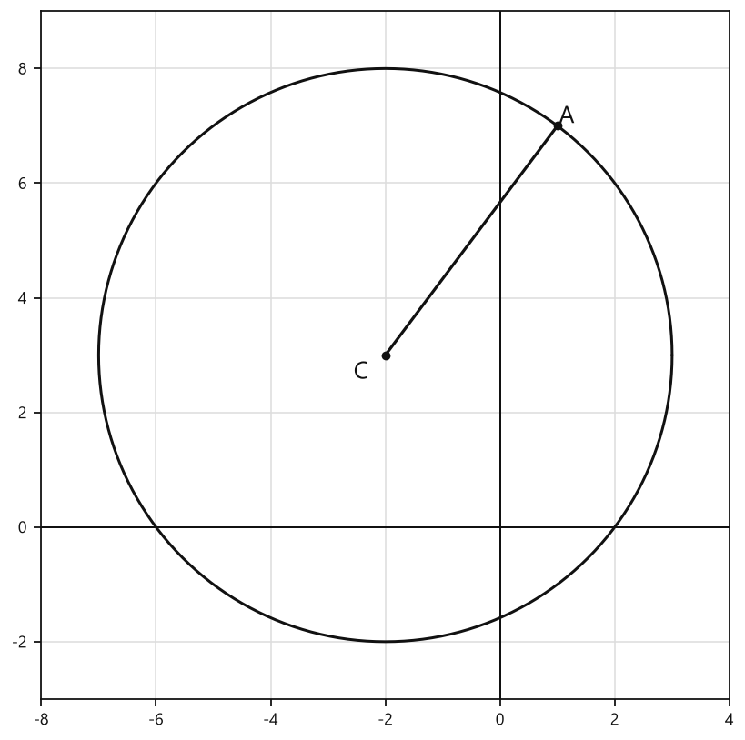
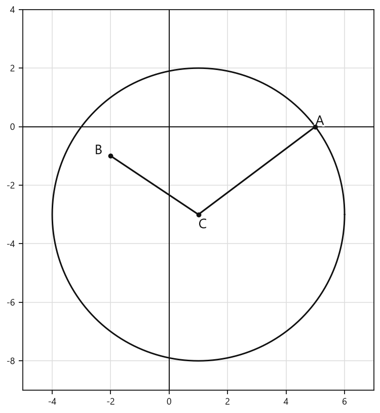
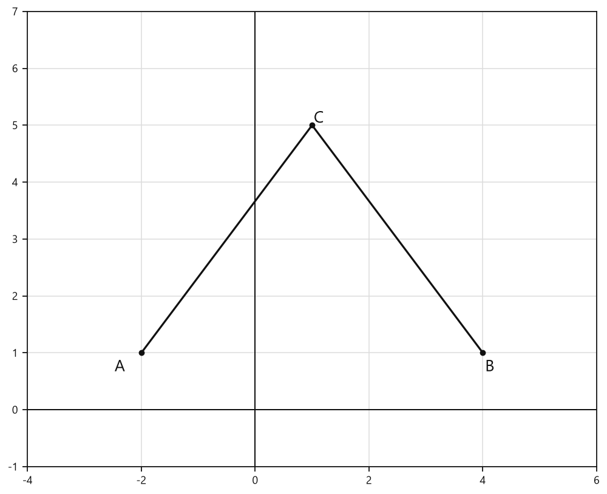

# Занятие 17. Формула длины отрезка с заданными координатами его концов. Уравнение окружности

**Раздел:** Глава 3  
**Параграф учебника:** §12. Формула длины отрезка с заданными координатами его концов. Уравнение окружности  
**Страницы:** 173–175

## Цели занятия

После занятия ты умеешь:

- находить расстояние между двумя точками по их координатам;
- применять теорему Пифагора для вывода формулы расстояния;
- составлять уравнение окружности по координатам центра и радиусу;
- проверять, принадлежит ли точка окружности;
- определять число решений системы по числу точек пересечения графиков.

Выбери блок своего уровня:

- **1–2 балла:** вспомнить формулы и найти расстояние между точками;
- **3–4 балла:** составить уравнение окружности;
- **5–6 баллов:** проверить принадлежность точки окружности;
- **7–8 баллов:** определить число решений системы графически;
- **9–10 баллов:** уверенно применять все приёмы в новых заданиях.

## Теория к занятию

### 1. Расстояние между двумя точками

#### Простыми словами

Рассмотрим две точки на координатной плоскости. Чтобы найти расстояние между ними, удобно представить прямоугольный треугольник:

- горизонтальный катет показывает, насколько отличаются координаты $x$;
- вертикальный катет показывает, насколько отличаются координаты $y$;
- расстояние между точками — гипотенуза.

Значит, сначала находим две разности координат, а затем применяем теорему Пифагора. Координатная плоскость и прямоугольный треугольник работают в команде.

#### Факт

Рассмотрим точки $M_1(x_1; y_1)$ и $M_2(x_2; y_2)$. Тогда

$$M_1A = |x_2-x_1|,$$

$$M_2A = |y_2-y_1|.$$

По теореме Пифагора:

$$M_1M_2=\sqrt{|x_2-x_1|^2+|y_2-y_1|^2}.$$

Так как квадрат числа не зависит от его знака, получаем формулу:

#### Формула

$$d=\sqrt{(x_2-x_1)^2+(y_2-y_1)^2}.$$

Здесь:

- $d$ — расстояние между точками;
- $(x_1; y_1)$ — координаты первой точки;
- $(x_2; y_2)$ — координаты второй точки.

#### Правила

1. Из второй координаты $x$ вычитаем первую координату $x$.
2. Из второй координаты $y$ вычитаем первую координату $y$.
3. Каждую полученную разность возводим в квадрат.
4. Складываем квадраты.
5. Из суммы извлекаем квадратный корень.

Например, если при вычитании получилось $-3$, то после возведения в квадрат будет

$$(-3)^2=9.$$

Поэтому порядок точек можно менять: расстояние останется тем же.

#### Алгоритм

Чтобы найти расстояние между точками $A(x_1; y_1)$ и $B(x_2; y_2)$:

$$AB=\sqrt{(x_2-x_1)^2+(y_2-y_1)^2}.$$

Дальше:

1. Подставить координаты точек в формулу.
2. Найти разность координат $x$.
3. Найти разность координат $y$.
4. Возвести обе разности в квадрат.
5. Сложить полученные числа.
6. Извлечь квадратный корень.

#### Ловушки

- В выражении $x_2-x_1$ нельзя терять знак координаты.
- Координаты $x$ вычитаем только из координат $x$, а координаты $y$ — только из координат $y$.
- Квадрат разности не равен разности квадратов:

$$(-2)^2=4,$$

но

$$2^2-(-2)^2=0.$$

- Расстояние не бывает отрицательным.

---

### 2. Окружность и её уравнение

#### Простыми словами

Окружность состоит из всех точек, которые находятся на одинаковом расстоянии от одной точки — центра.

Циркуль показывает эту идею буквально: одна ножка стоит в центре, а другая движется на одном и том же расстоянии. Это расстояние называется радиусом.

#### Определение. Окружность

Окружность — это множество точек плоскости, расстояние от каждой из которых до одной данной точки (центра окружности) является величиной постоянной, равной радиусу окружности $R$.

#### Вывод уравнения

Пусть центр окружности имеет координаты $C(x_0; y_0)$, а точка окружности — координаты $P(x; y)$.

Расстояние от точки $P$ до центра $C$ равно радиусу:

$$R=\sqrt{(x-x_0)^2+(y-y_0)^2}.$$

Возведём обе части в квадрат:

$$R^2=(x-x_0)^2+(y-y_0)^2.$$

Поменяем части равенства местами:

$$(x-x_0)^2+(y-y_0)^2=R^2.$$

Это и есть уравнение окружности.

#### Формула

Уравнение $(x - x_0)^2 + (y - y_0)^2 = R^2$ является уравнением окружности с центром в точке $(x_0; y_0)$ и радиусом $R$.

Здесь:

- $(x_0; y_0)$ — координаты центра;
- $R$ — радиус;
- $(x; y)$ — координаты любой точки окружности.

Обрати внимание на знаки. Если координата центра отрицательная, в скобке появится сложение:

$$y_0=-1 \quad \Rightarrow \quad y-y_0=y-(-1)=y+1.$$

Минус перед отрицательным числом — маленькая, но очень деятельная ловушка.

#### Чтобы составить уравнение окружности, нужно:

1. Определить координаты центра окружности $(x_0; y_0)$.
2. Определить радиус окружности $R$.
3. Подставить найденные значения $x_0, y_0$ и $R$ в уравнение окружности $(x - x_0)^2 + (y - y_0)^2 = R^2$.

#### Особый случай

Если центром окружности является начало координат, то её уравнение имеет вид

$$x^2+y^2=R^2.$$

Это получается потому, что $x_0=0$ и $y_0=0$:

$$(x-0)^2+(y-0)^2=R^2.$$

#### Ловушки

- Для центра $(4; -1)$ получаем:

$$(x-4)^2+(y+1)^2.$$

- Справа записываем $R^2$, а не $R$.
- В скобках координаты центра появляются со своими противоположными знаками.
- Окружность и круг — не одно и то же: окружность — только граница круга.

---

### 3. Проверка принадлежности точки окружности

#### Простыми словами

Чтобы проверить, лежит ли точка на окружности, подставляем её координаты в уравнение.

Если левая часть стала равна правой, точка лежит на окружности.

Если равенство не получилось, точка на окружности не лежит.

#### Факт

Если координаты точки удовлетворяют уравнению $(x - x_0)^2 + (y - y_0)^2 = R^2$, то эта точка принадлежит окружности с центром $C(x_0; y_0)$ и радиусом $R$.

#### Алгоритм

1. Записать уравнение окружности.
2. Подставить координату $x$ точки вместо $x$.
3. Подставить координату $y$ точки вместо $y$.
4. Вычислить левую часть.
5. Сравнить результат с $R^2$, то есть с правой частью уравнения.
6. Сделать вывод.

#### Ловушки

- Нужно подставить обе координаты точки.
- Равенство означает, что точка лежит на окружности.
- Если расстояние от точки до центра меньше радиуса, точка находится внутри окружности.
- Если расстояние от точки до центра больше радиуса, точка находится вне окружности.

Замечания учебника:

* Если координаты точки удовлетворяют уравнению $(x - x_0)^2 + (y - y_0)^2 = R^2$, то эта точка принадлежит окружности с центром $C(x_0; y_0)$ и радиусом $R$.
* Если точка $(x; y)$ не принадлежит окружности с центром $(x_0; y_0)$ и радиусом $R$, то ее координаты не удовлетворяют уравнению $(x - x_0)^2 + (y - y_0)^2 = R^2$. Действительно, если точка лежит вне окружности, то расстояние от нее до центра окружности больше радиуса, т. е. $\sqrt{(x - x_0)^2 + (y - y_0)^2} > R$, а если точка лежит внутри окружности, то меньше, т. е. $\sqrt{(x - x_0)^2 + (y - y_0)^2} < R$.
* Если центром окружности является начало координат, то ее уравнение имеет вид $x^2 + y^2 = R^2$.

---

### 4. Графический метод решения системы

#### Простыми словами

Каждое уравнение системы задаёт свой график.

Решение системы — это точка, которая одновременно лежит на обоих графиках. Поэтому нужно найти общие точки графиков.

- нет общих точек — нет решений;
- одна общая точка — одно решение;
- четыре общие точки — четыре решения.

Графики как будто встретились на координатной плоскости. Считаем только встречи по делу.

#### Алгоритм

1. Построить график первого уравнения.
2. Построить график второго уравнения.
3. Найти точки пересечения графиков.
4. Посчитать количество общих точек.
5. Записать это число как количество решений системы.

#### Ловушки

- Учитываются только точки, которые принадлежат обоим графикам.
- Вершина параболы не является решением сама по себе. Она должна лежать и на окружности.
- По неточному рисунку иногда трудно определить положение точки, поэтому нужно внимательно смотреть на координатную сетку.
- Не путай количество точек пересечения графиков с количеством нулей только одной функции.

## Сводка формул «выучить наизусть»

Расстояние между точками:

$$d=\sqrt{(x_2-x_1)^2+(y_2-y_1)^2}.$$

Уравнение окружности с центром $(x_0; y_0)$ и радиусом $R$:

$$(x-x_0)^2+(y-y_0)^2=R^2.$$

Окружность с центром в начале координат:

$$x^2+y^2=R^2.$$

## Правила, которые нельзя путать

- Координаты центра $(x_0; y_0)$ не являются координатами произвольной точки $(x; y)$.
- В уравнении окружности справа стоит $R^2$.
- Центр $(4; -1)$ даёт скобки $(x-4)^2+(y+1)^2$.
- Расстояние между точками всегда неотрицательно.
- Решения системы — это общие точки графиков.

## Разбор ключевых заданий

### Р1. Найдите расстояние между точками $A(-1; 3)$ и $B(2; 5)$.

#### Решение

Используем формулу расстояния между двумя точками:

$$d=\sqrt{(x_2-x_1)^2+(y_2-y_1)^2}.$$

Для точки $A$:

$$x_1=-1,\qquad y_1=3.$$

Для точки $B$:

$$x_2=2,\qquad y_2=5.$$

Подставим координаты:

$$AB=\sqrt{(2-(-1))^2+(5-3)^2}.$$

В первой скобке два минуса подряд превращаются в плюс:

$$AB=\sqrt{(2+1)^2+(5-3)^2}.$$

Вычислим разности:

$$AB=\sqrt{3^2+2^2}.$$

Возведём числа в квадрат:

$$AB=\sqrt{9+4}.$$

Сложим:

$$AB=\sqrt{13}.$$

Минус в координате не пропал: он просто встретился с ещё одним минусом и изменил знак.

**Ответ: $\sqrt{13}$.**

---

### Р2. Составьте уравнение окружности с центром в точке $(4; -1)$ и радиусом $\sqrt{3}$.

#### Решение

Используем уравнение окружности:

$$(x-x_0)^2+(y-y_0)^2=R^2.$$

Координаты центра:

$$x_0=4,\qquad y_0=-1.$$

Радиус:

$$R=\sqrt{3}.$$

Найдём квадрат радиуса:

$$R^2=(\sqrt{3})^2=3.$$

Подставим координаты центра:

$$(x-4)^2+(y-(-1))^2=3.$$

Упростим вторую скобку:

$$(x-4)^2+(y+1)^2=3.$$

**Ответ: $(x-4)^2+(y+1)^2=3$.**

---

### Р3. Составьте уравнение окружности с центром в начале координат и радиусом $4$.

#### Решение

Центр окружности находится в начале координат:

$$(x_0; y_0)=(0; 0).$$

Радиус равен:

$$R=4.$$

Используем уравнение окружности:

$$(x-x_0)^2+(y-y_0)^2=R^2.$$

Подставим значения:

$$(x-0)^2+(y-0)^2=4^2.$$

Упростим скобки и вычислим квадрат радиуса:

$$x^2+y^2=16.$$

**Ответ: $x^2+y^2=16$.**

---

### Р4. Принадлежит ли точка $P(2; 2)$ окружности

$$(x-1)^2+(y+2)^2=25?$$

#### Решение

Сначала определим центр окружности и квадрат радиуса:

$$C(1; -2),\qquad R^2=25.$$

Подставим координаты точки $P(2; 2)$ в левую часть уравнения:

$$(2-1)^2+(2+2)^2.$$

Вычислим:

$$1^2+4^2=1+16=17.$$

Сравним левую часть с правой:

$$17\ne25.$$

Равенство не получилось, поэтому координаты точки не удовлетворяют уравнению окружности.

Можно проверить результат через расстояние до центра:

$$CP=\sqrt{(2-1)^2+(2-(-2))^2}.$$

$$CP=\sqrt{1^2+4^2}=\sqrt{17}.$$

Радиус окружности равен:

$$R=\sqrt{25}=5.$$

Так как

$$\sqrt{17}\ne5,$$

точка не лежит на окружности.

**Ответ: точка $P(2; 2)$ не принадлежит окружности.**

---

### Р5. Составьте уравнение окружности с центром в точке $(-3; 2)$, проходящей через точку $A(1; 2)$.

#### Решение

Центр окружности:

$$C(-3; 2).$$

Радиусом будет расстояние от центра $C$ до точки $A$:

$$R=\sqrt{(1-(-3))^2+(2-2)^2}.$$

Упростим разности:

$$R=\sqrt{(1+3)^2+0^2}.$$

Возведём в квадрат:

$$R=\sqrt{4^2+0^2}.$$

$$R=\sqrt{16+0}=\sqrt{16}=4.$$

Теперь используем уравнение окружности:

$$(x-x_0)^2+(y-y_0)^2=R^2.$$

Подставим координаты центра и радиус:

$$(x-(-3))^2+(y-2)^2=4^2.$$

Упростим скобку с отрицательной координатой центра:

$$(x+3)^2+(y-2)^2=16.$$

Проверим точку $A(1; 2)$:

$$(1+3)^2+(2-2)^2=4^2+0^2=16.$$

Получилось верное равенство, значит, точка $A$ действительно лежит на окружности.

**Ответ: $(x+3)^2+(y-2)^2=16$.**

---

### Р6. Определите количество решений системы

$$
\begin{cases}
x^2+y^2=16,\\
y=-x^2+2x+4.
\end{cases}
$$

#### Решение

Рассмотрим первое уравнение:

$$x^2+y^2=16.$$

Это уравнение окружности с центром в начале координат и радиусом $4$.

Рассмотрим второе уравнение:

$$y=-x^2+2x+4.$$

Это уравнение параболы, ветви которой направлены вниз, потому что коэффициент при $x^2$ отрицательный.

Решения системы — это общие точки окружности и параболы.

Построим оба графика на одной координатной плоскости.

Графики пересекаются в четырёх точках.

Значит, системе соответствуют четыре решения.

Здесь не требуется находить сами координаты точек: нужно только посчитать их количество. График справился с задачей без лишней алгебраической акробатики.

**Ответ: $4$.**

---

### Р7. Найдите с помощью графиков функций $f(x)=\sqrt{x}$ и $h(x)=x^2$ корни уравнения

$$\sqrt{x}=x^2.$$

#### Решение

Рассмотрим графики функций:

$$y=\sqrt{x}$$

и

$$y=x^2.$$

Корни уравнения — это абсциссы точек пересечения этих графиков.

Сначала запишем область определения функции $y=\sqrt{x}$:

$$x\ge0.$$

Проверим точку с абсциссой $x=0$:

$$\sqrt{0}=0^2,$$

$$0=0.$$

Равенство верное, поэтому

$$x=0$$

является корнем.

Проверим точку с абсциссой $x=1$:

$$\sqrt{1}=1^2,$$

$$1=1.$$

Равенство также верное, поэтому

$$x=1$$

является корнем.

По графику других общих точек у функций нет.

Следовательно, корни уравнения:

$$x=0,\qquad x=1.$$

**Ответ: $0; 1$.**

## Практические задания

Выбери свой уровень и решай только этот блок. В блоке должна закрепиться вся тема параграфа. Ответы не приводятся.

### Уровень 1–2 балла

**С1.** Найдите расстояние между точками $A(1; 2)$ и $B(4; 6)$.

**С2.** Найдите расстояние между точками $C(-2; 3)$ и $D(1; 3)$.

**С3.** Найдите расстояние между точками $M(-1; -2)$ и $N(-1; 4)$.

**С4.** Выберите уравнение окружности с центром в точке $(2; -3)$ и радиусом $4$.

1) $(x+2)^2+(y-3)^2=16$  
2) $(x-2)^2+(y+3)^2=4$  
3) $(x-2)^2+(y+3)^2=16$  
4) $(x+2)^2+(y-3)^2=4$  
5) $(x-2)^2+(y-3)^2=16$

**С5.** Выберите центр окружности, заданной уравнением $(x+1)^2+(y-5)^2=9$.

1) $(1; 5)$  
2) $(-1; 5)$  
3) $(-1; -5)$  
4) $(5; -1)$  
5) $(1; -5)$

**С6.** Выберите радиус окружности, заданной уравнением $(x-4)^2+(y+2)^2=25$.

1) $2$  
2) $4$  
3) $5$  
4) $25$  
5) $\sqrt{5}$

**С7.** Составьте уравнение окружности с центром в точке $(-3; 1)$ и радиусом $2$.

**С8.** Составьте уравнение окружности с центром в начале координат и радиусом $6$.

**С9.** Принадлежит ли точка $A(3; 4)$ окружности $x^2+y^2=25$? Запишите «да» или «нет».

**С10.** Принадлежит ли точка $B(1; 2)$ окружности $(x-1)^2+(y+2)^2=16$? Запишите «да» или «нет».

**С11.** Выберите уравнение окружности с центром в точке $(0; 0)$ и радиусом $3$.

1) $x^2+y^2=3$  
2) $x^2+y^2=6$  
3) $x^2+y^2=9$  
4) $(x-3)^2+y^2=9$  
5) $x^2+(y-3)^2=9$

**С12.** Найдите расстояние между точками $P(-3; -1)$ и $Q(1; 2)$.

**С13.** Найдите расстояние между точками $A(1; 2)$ и $B(4; 6)$.

1) $3$  2) $4$  3) $5$  4) $6$  5) $7$

**С14.** Найдите расстояние между точками $C(-2; 1)$ и $D(1; 5)$.

1) $3$  2) $4$  3) $5$  4) $\sqrt{13}$  5) $\sqrt{20}$

**С15.** Выберите уравнение окружности с центром в точке $(3; -2)$ и радиусом $4$.

1) $(x+3)^2+(y-2)^2=16$  2) $(x-3)^2+(y+2)^2=16$  3) $(x-3)^2+(y-2)^2=4$  4) $(x+3)^2+(y+2)^2=16$  5) $(x-3)^2+(y+2)^2=4$

**С16.** Укажите центр окружности $(x+1)^2+(y-5)^2=9$.

1) $(1; -5)$  2) $(-1; 5)$  3) $(1; 5)$  4) $(-1; -5)$  5) $(5; -1)$

**С17.** Укажите радиус окружности $(x-4)^2+(y+3)^2=25$.

1) $3$  2) $4$  3) $5$  4) $25$  5) $\sqrt{5}$

**С18.** Определите, принадлежит ли точка $A(2; 3)$ окружности $x^2+y^2=13$.

1) Принадлежит окружности.  2) Находится внутри окружности.  3) Находится вне окружности.  4) Является центром окружности.  5) Определить невозможно.

**С19.** Определите, принадлежит ли точка $B(1; 1)$ окружности $(x-2)^2+(y+1)^2=5$.

1) Принадлежит окружности.  2) Находится внутри окружности.  3) Находится вне окружности.  4) Является центром окружности.  5) Определить невозможно.

**С20.** Составьте уравнение окружности с центром в начале координат и радиусом $6$.

**С21.** Составьте уравнение окружности с центром в точке $(-2; 4)$ и радиусом $\sqrt{7}$.

**С22.** Найдите радиус окружности, если её центр $C(1; -1)$, а точка $A(4; 3)$ принадлежит окружности.

**С23.** Выберите уравнение окружности, центром которой является точка $(-4; 2)$.

1) $(x-4)^2+(y+2)^2=9$  2) $(x+4)^2+(y-2)^2=9$  3) $(x+4)^2+(y+2)^2=9$  4) $(x-4)^2+(y-2)^2=9$  5) $(x+4)^2+(y-2)^2=3$

**С24.** Установите соответствие между окружностью и её радиусом.

А) $x^2+y^2=49$  
Б) $(x-1)^2+(y+2)^2=16$  
В) $(x+3)^2+(y-4)^2=25$

1) $4$  2) $5$  3) $7$

**С25.** Найдите расстояние между точками $A(1; 2)$ и $B(4; 6)$.

1) $3$  
2) $4$  
3) $5$  
4) $6$  
5) $7$

**С26.** Найдите расстояние между точками $C(-2; 1)$ и $D(1; 5)$.

1) $\sqrt{10}$  
2) $4$  
3) $5$  
4) $\sqrt{20}$  
5) $6$

**С27.** Какая точка является центром окружности $(x-3)^2+(y+2)^2=16$?

1) $(3; 2)$  
2) $(-3; -2)$  
3) $(3; -2)$  
4) $(-3; 2)$  
5) $(16; 16)$

**С28.** Чему равен радиус окружности $(x+1)^2+(y-4)^2=25$?

1) $2$  
2) $4$  
3) $5$  
4) $25$  
5) $\sqrt{5}$

**С29.** Выберите уравнение окружности с центром в точке $(2; -1)$ и радиусом $3$.

1) $(x+2)^2+(y-1)^2=9$  
2) $(x-2)^2+(y+1)^2=9$  
3) $(x-2)^2+(y-1)^2=3$  
4) $(x+2)^2+(y+1)^2=9$  
5) $(x-2)^2+(y+1)^2=3$

**С30.** Выберите уравнение окружности с центром в начале координат и радиусом $4$.

1) $x^2+y^2=4$  
2) $x^2+y^2=8$  
3) $x^2+y^2=16$  
4) $(x-4)^2+y^2=16$  
5) $x^2+(y-4)^2=16$

**С31.** Принадлежит ли точка $A(3; 4)$ окружности $x^2+y^2=25$?

1) Да  
2) Нет, точка находится внутри окружности  
3) Нет, точка находится вне окружности  
4) Да, но только при $x=4$  
5) Определить невозможно

**С32.** Принадлежит ли точка $B(1; 2)$ окружности $(x-1)^2+(y+1)^2=9$?

1) Да  
2) Нет, точка находится внутри окружности  
3) Нет, точка находится вне окружности  
4) Да, если $y=1$  
5) Определить невозможно

**С33.** Какое значение $y$ удовлетворяет уравнению окружности $x^2+y^2=25$ при $x=3$ и $y>0$?

1) $2$  
2) $3$  
3) $4$  
4) $5$  
5) $8$

**С34.** Какое значение $x$ удовлетворяет уравнению окружности $(x-2)^2+(y-1)^2=16$ при $y=1$ и $x>2$?

1) $4$  
2) $5$  
3) $6$  
4) $16$  
5) $18$

**С35.** Найдите длину отрезка с концами $M(-3; -2)$ и $N(-3; 4)$.

1) $2$  
2) $4$  
3) $5$  
4) $6$  
5) $8$

**С36.** Выберите уравнение окружности с центром в точке $(-4; 3)$, проходящей через точку $( -4; 7)$.

1) $(x-4)^2+(y+3)^2=4$  
2) $(x+4)^2+(y-3)^2=4$  
3) $(x+4)^2+(y-3)^2=16$  
4) $(x-4)^2+(y-3)^2=16$  
5) $(x+4)^2+(y+3)^2=16$

### Уровень 3–4 балла

**С1.** Найдите длину отрезка $AB$, если $A(1; 2)$ и $B(4; 6)$.

**С2.** Найдите расстояние между точками $C(-3; 1)$ и $D(1; 4)$.

**С3.** Найдите длину отрезка $MN$, если $M(-2; -1)$ и $N(3; -1)$.

**С4.** Составьте уравнение окружности с центром в точке $C(2; -3)$ и радиусом $R=4$.

**С5.** Составьте уравнение окружности с центром в начале координат и радиусом $R=5$.

**С6.** Определите центр и радиус окружности, заданной уравнением $(x-4)^2+(y+1)^2=9$.

**С7.** Определите центр и радиус окружности, заданной уравнением $x^2+(y-6)^2=16$.

**С8.** Принадлежит ли точка $A(3; 4)$ окружности $x^2+y^2=25$?

**С9.** Принадлежит ли точка $B(1; -2)$ окружности $(x-2)^2+(y+1)^2=5$?

**С10.** Запишите уравнение окружности с центром в точке $C(-1; 2)$, проходящей через точку $A(2; 6)$.

**С11.** Окружность задана уравнением $(x+3)^2+(y-2)^2=25$. Найдите расстояние от её центра до точки $P(0; 6)$ и определите, принадлежит ли точка $P$ этой окружности.

**С12.** Даны точки $A(1; 1)$ и $B(5; 4)$. Составьте уравнение окружности с центром в точке $A$, проходящей через точку $B$.

**С13.** Найдите длину отрезка $AB$, если $A(-2;1)$ и $B(2;4)$.

**С14.** Найдите расстояние между точками $M(3;-1)$ и $N(6;3)$.

**С15.** Составьте уравнение окружности с центром в точке $C(2;-3)$ и радиусом $5$.

**С16.** Составьте уравнение окружности с центром в начале координат и радиусом $6$.

**С17.** Определите центр и радиус окружности, заданной уравнением $(x-4)^2+(y+2)^2=9$.

**С18.** Определите центр и радиус окружности, заданной уравнением $x^2+(y-5)^2=16$.

**С19.** Принадлежит ли точка $A(3;4)$ окружности, заданной уравнением $x^2+y^2=25$?

**С20.** Принадлежит ли точка $B(1;-2)$ окружности $(x-1)^2+(y+1)^2=4$?

**С21.** Проверьте, лежит ли точка $P(4;1)$ на окружности с центром $C(1;1)$ и радиусом $3$.

**С22.** Найдите радиус окружности с центром в точке $C(-2;3)$, проходящей через точку $A(1;7)$.

**С23.** Найдите координаты точки $B$, если $A(2;-1)$, точка $B$ лежит на оси абсцисс и $AB=5$. Укажите все возможные точки $B$.

**С24.** Найдите абсциссы точек пересечения окружности $x^2+y^2=25$ с осью абсцисс.

**С25.** Найдите расстояние между точками $A(1;2)$ и $B(4;6)$.

**С26.** Найдите расстояние между точками $C(-3;1)$ и $D(1;4)$.

**С27.** Найдите расстояние от точки $M(5;-2)$ до начала координат.

**С28.** Составьте уравнение окружности с центром в точке $C(2;-3)$ и радиусом $4$.

**С29.** Составьте уравнение окружности с центром в начале координат и радиусом $5$.

**С30.** Укажите координаты центра и радиус окружности, заданной уравнением $(x-3)^2+(y+2)^2=16$.

**С31.** Укажите координаты центра и радиус окружности, заданной уравнением $(x+1)^2+(y-4)^2=9$.

**С32.** Принадлежит ли точка $A(3;4)$ окружности, заданной уравнением $x^2+y^2=25$?

**С33.** Принадлежит ли точка $B(2;-1)$ окружности, заданной уравнением $(x-1)^2+(y+2)^2=5$?

**С34.** Запишите уравнение окружности с центром в точке $O(-2;1)$, проходящей через точку $A(1;5)$.

**С35.** Запишите уравнение окружности с центром в точке $C(4;2)$, проходящей через точку $B(4;-1)$.

**С36.** Найдите радиус окружности $(x+2)^2+(y-3)^2=25$ и проверьте, принадлежит ли ей точка $P(1;7)$.

### Уровень 5–6 баллов

**С1.** Найдите расстояние между точками $A(-2; 1)$ и $B(4; 9)$.

**С2.** Найдите расстояние между точками $C(3; -5)$ и $D(-1; -2)$.

**С3.** Составьте уравнение окружности с центром в точке $O(2; -3)$ и радиусом $5$.

**С4.** Составьте уравнение окружности с центром в начале координат и радиусом $6$.

**С5.** Определите центр и радиус окружности, заданной уравнением $(x-4)^2+(y+1)^2=25$.

**С6.** Определите центр и радиус окружности, заданной уравнением $x^2+(y-3)^2=16$.

**С7.** Принадлежит ли точка $A(5; 1)$ окружности, заданной уравнением $(x-2)^2+(y+3)^2=25$? Ответ обоснуйте вычислениями.

**С8.** Принадлежит ли точка $B(-1; 4)$ окружности, заданной уравнением $x^2+(y-1)^2=10$? Ответ обоснуйте вычислениями.

**С9.** Точка $M(6; 2)$ принадлежит окружности с центром $O(2; -1)$. Найдите радиус этой окружности.

**С10.** Составьте уравнение окружности с центром в точке $C(-3; 4)$, проходящей через точку $A(1; 1)$.

**С11.** Найдите координату $y$, если точка $P(3; y)$ принадлежит окружности $x^2+y^2=25$ и $y>0$.

**С12.** Найдите длину отрезка $AB$, если $A(-5; 2)$, а середина отрезка $AB$ имеет координаты $M(1; 5)$.

**С13.** Найдите расстояние между точками $A(-2; 1)$ и $B(4; 9)$.

1) $8$  
2) $10$  
3) $\sqrt{68}$  
4) $12$  
5) $\sqrt{52}$

**С14.** Найдите расстояние между точками $C(3; -4)$ и $D(-5; 2)$.

1) $6$  
2) $8$  
3) $10$  
4) $\sqrt{68}$  
5) $\sqrt{52}$

**С15.** Составьте уравнение окружности с центром в точке $O(2; -3)$ и радиусом $5$.

1) $(x+2)^2+(y-3)^2=25$  
2) $(x-2)^2+(y+3)^2=5$  
3) $(x-2)^2+(y+3)^2=25$  
4) $(x+2)^2+(y-3)^2=5$  
5) $(x-2)^2+(y-3)^2=25$

**С16.** Составьте уравнение окружности с центром в начале координат и радиусом $7$.

1) $x^2+y^2=7$  
2) $x^2+y^2=14$  
3) $(x-7)^2+y^2=49$  
4) $x^2+y^2=49$  
5) $(x+7)^2+(y+7)^2=49$

**С17.** Определите, принадлежит ли точка $A(5; 1)$ окружности $(x-2)^2+(y+3)^2=25$.

1) Принадлежит окружности.  
2) Не принадлежит окружности, так как находится внутри неё.  
3) Не принадлежит окружности, так как находится вне неё.  
4) Принадлежит окружности только при $x=2$.  
5) Определить невозможно.

**С18.** Какая из точек принадлежит окружности $x^2+y^2=25$?

1) $(1; 4)$  
2) $(3; 4)$  
3) $(4; 4)$  
4) $(0; 4)$  
5) $(2; 5)$

**С19.** Найдите длину отрезка $AB$, если $A(-1; 2)$ и $B(5; 2)$.

**С20.** Найдите длину отрезка $CD$, если $C(4; -3)$ и $D(4; 6)$.

**С21.** Точка $M(1; 4)$ принадлежит окружности с центром в точке $O(-2; 0)$. Найдите радиус этой окружности.

**С22.** Точка $P(-3; 2)$ принадлежит окружности с центром в точке $O(1; -1)$. Запишите уравнение этой окружности.

**С23.** Составьте уравнение окружности с центром в точке $C(-4; 2)$, проходящей через точку $A(2; 10)$.

**С24.** Определите, какие из точек $A(3; 4)$, $B(-3; 4)$, $C(0; -5)$ принадлежат окружности $x^2+y^2=25$. Запишите буквы всех подходящих точек.

**С25.** Найдите расстояние между точками $A(-2; 3)$ и $B(4; -5)$.

**С26.** Составьте уравнение окружности с центром в точке $C(3; -2)$ и радиусом $5$.

**С27.** Укажите точку, принадлежащую окружности
$$
(x-1)^2+(y+2)^2=25.
$$

1) $(1; 2)$  
2) $(4; 2)$  
3) $(5; -2)$  
4) $(3; 1)$  
5) $(-3; -2)$

**С28.** Определите координаты центра и радиус окружности, заданной уравнением
$$
(x+4)^2+(y-1)^2=16.
$$

**С29.** Окружность имеет центр $C(-1; 4)$ и проходит через точку $A(2; 8)$. Найдите её радиус.

**С30.** При каком значении $a$ точка $A(a; 3)$ принадлежит окружности
$$
(x-2)^2+(y-3)^2=25?
$$
Укажите все значения $a$.

### Уровень 7–8 баллов

**С1.** Найдите расстояние между точками $A(-3; 4)$ и $B(5; -2)$.

**С2.** Точки $A(2; -1)$ и $B(8; 7)$ являются концами отрезка. Найдите координаты его середины и длину отрезка $AB$.

**С3.** Составьте уравнение окружности с центром в точке $C(-2; 3)$, проходящей через точку $A(1; 7)$.

<!--geo-figure-spec
{
  "needed": true,
  "kind": "plane",
  "caption": "Окружность с центром $C(-2;3)$, проходящая через точку $A(1;7)$",
  "equal": true,
  "axis": true,
  "xlim": [
    -8,
    4
  ],
  "ylim": [
    -3,
    9
  ],
  "points": {
    "C": [
      -2,
      3
    ],
    "A": [
      1,
      7
    ]
  },
  "segments": [
    [
      "C",
      "A"
    ]
  ],
  "polygons": [],
  "circles": [
    {
      "center": "C",
      "radius": 5
    }
  ],
  "labels": {
    "C": {
      "dx": -0.42,
      "dy": -0.3
    },
    "A": {
      "dx": 0.16,
      "dy": 0.16
    }
  },
  "right_angles": [],
  "angle_marks": [],
  "texts": []
}
-->

*Окружность с центром C(-2;3), проходящая через точку A(1;7)*

**С4.** Дана окружность
$$
(x-4)^2+(y+1)^2=25.
$$
Назовите координаты её центра и радиус. Определите, принадлежат ли этой окружности точки $M(7;3)$ и $N(0;-1)$.

**С5.** Выберите уравнение окружности с центром в точке $C(3;-2)$ и радиусом $4$.

1) $(x+3)^2+(y-2)^2=16$  
2) $(x-3)^2+(y+2)^2=4$  
3) $(x-3)^2+(y+2)^2=16$  
4) $(x+3)^2+(y+2)^2=16$  
5) $(x-3)^2+(y-2)^2=16$

**С6.** Точки $A(-4;1)$ и $B(2;5)$ являются концами диаметра окружности. Составьте уравнение этой окружности.

**С7.** Дана окружность с центром $C(1;-3)$, проходящая через точку $A(5;0)$. Точка $B(-2;-1)$ расположена относительно этой окружности внутри, на окружности или вне её? Обоснуйте ответ вычислением расстояний.

<!--geo-figure-spec
{
  "needed": true,
  "kind": "plane",
  "caption": "Окружность с центром $C(1;-3)$, проходящая через $A(5;0)$",
  "equal": true,
  "axis": true,
  "xlim": [
    -5,
    7
  ],
  "ylim": [
    -9,
    4
  ],
  "points": {
    "C": [
      1,
      -3
    ],
    "A": [
      5,
      0
    ],
    "B": [
      -2,
      -1
    ]
  },
  "segments": [
    [
      "C",
      "A"
    ],
    [
      "C",
      "B"
    ]
  ],
  "polygons": [],
  "circles": [
    {
      "center": "C",
      "radius": 5
    }
  ],
  "labels": {
    "C": {
      "dx": 0.15,
      "dy": -0.35
    },
    "A": {
      "dx": 0.15,
      "dy": 0.18
    },
    "B": {
      "dx": -0.42,
      "dy": 0.18
    }
  },
  "right_angles": [],
  "angle_marks": [],
  "texts": []
}
-->

*Окружность с центром C(1;-3), проходящая через A(5;0)*

**С8.** Найдите все значения $a$, при которых расстояние между точками $A(a;2)$ и $B(1;-2)$ равно $5$.

**С9.** Определите, какие из точек принадлежат окружности
$$
(x+1)^2+(y-2)^2=13:
$$
$A(2;4)$, $B(-3;0)$, $C(1;1)$, $D(-1;5)$. Ответ обоснуйте подстановкой координат.

**С10.** Составьте уравнение окружности, центр которой находится в точке $C(2;-4)$, а точка $A(-1;0)$ лежит на окружности. Затем проверьте, лежит ли на этой окружности точка $B(6;-1)$.

**С11.** Даны точки $A(-2;1)$, $B(4;1)$ и $C(1;5)$. Установите, какая из точек $A$ или $B$ находится ближе к точке $C$, и на сколько единиц отличается расстояние до точки $C$.

<!--geo-figure-spec
{
  "needed": true,
  "kind": "plane",
  "caption": "Точки $A(-2;1)$, $B(4;1)$ и $C(1;5)$",
  "equal": true,
  "axis": true,
  "xlim": [
    -4,
    6
  ],
  "ylim": [
    -1,
    7
  ],
  "points": {
    "A": [
      -2,
      1
    ],
    "B": [
      4,
      1
    ],
    "C": [
      1,
      5
    ]
  },
  "segments": [
    [
      "A",
      "C"
    ],
    [
      "B",
      "C"
    ]
  ],
  "polygons": [],
  "circles": [],
  "labels": {
    "A": {
      "dx": -0.38,
      "dy": -0.25
    },
    "B": {
      "dx": 0.12,
      "dy": -0.25
    },
    "C": {
      "dx": 0.12,
      "dy": 0.12
    }
  },
  "right_angles": [],
  "angle_marks": [],
  "texts": []
}
-->

*Точки A(-2;1), B(4;1) и C(1;5)*

**С12.** Окружность имеет уравнение
$$
(x-3)^2+(y+2)^2=36.
$$
Точки $P(3;4)$ и $Q(-3;-2)$ являются концами хорды этой окружности. Найдите длину хорды $PQ$ и определите, является ли она диаметром окружности.

**С13.** Найдите расстояние между точками $A(-3; 4)$ и $B(5; -2)$. Запишите результат в виде целого числа и укажите, какие действия позволяют проверить ответ.

**С14.** Составьте уравнение окружности с центром в точке $C(-2; 3)$, проходящей через точку $A(1; 7)$.

**С15.** Определите, принадлежит ли точка $M(4; -1)$ окружности, заданной уравнением $(x-1)^2+(y+3)^2=25$. Ответ обоснуйте вычислениями.

**С16.** Даны точки $A(-1; 2)$ и $B(5; 10)$. Найдите координаты середины отрезка $AB$, а затем составьте уравнение окружности с центром в этой точке и радиусом, равным половине длины отрезка $AB$.

**С17.** Окружность задана уравнением $(x+4)^2+(y-2)^2=49$. Укажите координаты её центра и радиус. Проверьте, лежит ли точка $P(0; 2)$ на этой окружности.

**С18.** Найдите все точки пересечения окружности $x^2+y^2=25$ с координатными осями. Запишите координаты всех полученных точек и объясните, почему других точек пересечения нет.

**С19.** Точки $A(2; -1)$ и $B(8; 7)$ являются концами диаметра окружности. Составьте уравнение этой окружности.

**С20.** Определите значение $a$, при котором точка $P(a; 4)$ принадлежит окружности $(x-3)^2+(y+1)^2=25$. Найдите все подходящие значения $a$.

**С21.** Даны окружность $(x-2)^2+(y-1)^2=16$ и точка $A(6; 1)$. Через точку $A$ проведена прямая, параллельная оси $Oy$. Найдите координаты точек пересечения этой прямой с окружностью.

**С22.** Установите, сколько общих точек имеют окружность $(x-1)^2+(y+2)^2=9$ и прямая $y=1$. Найдите координаты общих точек или обоснуйте их отсутствие.

**С23.** Найдите все значения $k$, при которых точка $A(1; k)$ находится на окружности с центром $C(-2; 3)$ и радиусом $5$. Для каждого найденного значения составьте проверку подстановкой в уравнение окружности.

**С24.** Определите количество общих точек окружности $x^2+y^2=16$ и параболы $y=-x^2+4x-4$. Для этого составьте систему уравнений, преобразуйте её к уравнению относительно одной переменной и обоснуйте полученный результат.

### Уровень 9–10 баллов

**С1.** Точки $A(-3; 4)$ и $B(5; -2)$ являются концами отрезка. Найдите длину отрезка $AB$.

**С2.** Точка $M(2; -1)$ равноудалена от точек $A(-4; 3)$ и $B(6; 5)$. Найдите значение параметра $t$, если $B(t; 5)$.

**С3.** На оси абсцисс найдите точку $P$, равноудалённую от точек $A(-2; 5)$ и $B(4; 1)$.

**С4.** Уравнение окружности имеет вид $(x-3)^2+(y+2)^2=49$. Найдите координаты её центра, радиус и длину диаметра.

**С5.** Составьте уравнение окружности с центром в точке $C(-4; 3)$, проходящей через точку $A(2; -5)$.

**С6.** Окружность задана уравнением $x^2+y^2-8x+6y+9=0$. Определите координаты центра и радиус окружности, приведя уравнение к стандартному виду.

**С7.** Найдите все значения $a$, при которых точка $A(a; 2)$ принадлежит окружности $(x-1)^2+(y+3)^2=25$.

**С8.** Даны окружность $(x+2)^2+(y-1)^2=20$ и точка $P(2; 3)$. Определите, находится ли точка $P$ внутри окружности, на окружности или вне окружности.

**С9.** Хорда окружности с центром $C(1; -2)$ имеет концы $A(-3; 1)$ и $B(5; 1)$. Составьте уравнение окружности и найдите расстояние от её центра до прямой, содержащей хорду $AB$.

**С10.** Окружность проходит через точки $A(1; 4)$ и $B(7; 4)$, а её центр лежит на оси ординат. Найдите уравнение окружности.

**С11.** Найдите координаты всех точек пересечения окружности $x^2+y^2=25$ и прямой $y=3$.

**С12.** Найдите все точки пересечения окружностей
$$
\begin{cases}
(x-2)^2+(y-1)^2=25,\\
(x+2)^2+(y-1)^2=25.
\end{cases}
$$

**С13.** Окружность проходит через точки $A(2;1)$ и $B(6;5)$, а её центр лежит на оси $Oy$. Составьте уравнение этой окружности.

**С14.** Даны точки $A(-2;3)$ и $B(4;-1)$. Найдите координаты точки $C$ на оси $Ox$, равноудалённой от точек $A$ и $B$.

**С15.** Определите количество общих точек окружности
$$
(x-1)^2+(y+2)^2=25
$$
и прямой
$$
3x+4y-12=0.
$$
Ответ обоснуйте вычислением расстояния от центра окружности до прямой.

**С16.** При каком значении параметра $a$ точка $P(3;-2)$ принадлежит окружности
$$
(x-a)^2+(y+1)^2=10?
$$
Запишите все значения параметра $a$.

**С17.** Окружность с центром $C(-1;4)$ проходит через точку $A(5;-4)$. Точка $B$ лежит на этой окружности и имеет абсциссу $3$. Найдите все возможные значения ординаты точки $B$.

**С18.** Определите количество решений системы
$$
\begin{cases}
(x-2)^2+(y+1)^2=9,\\
y=x^2-4x-1.
\end{cases}
$$
Ответ обоснуйте, исследовав точки пересечения графиков.

## Чек-лист «ученик понял тему»

- Могу повторить определения и формулы параграфа своими словами и по учебнику.
- Решаю типовые задания своего уровня без подсказки.
- Вижу типичную ошибку и могу её объяснить.
