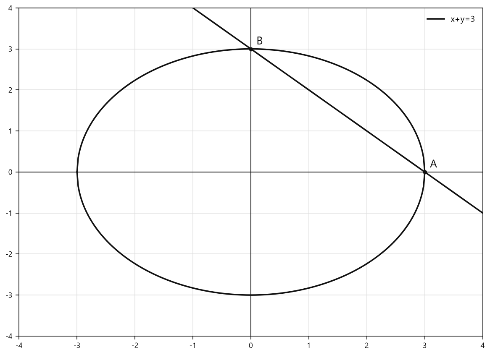
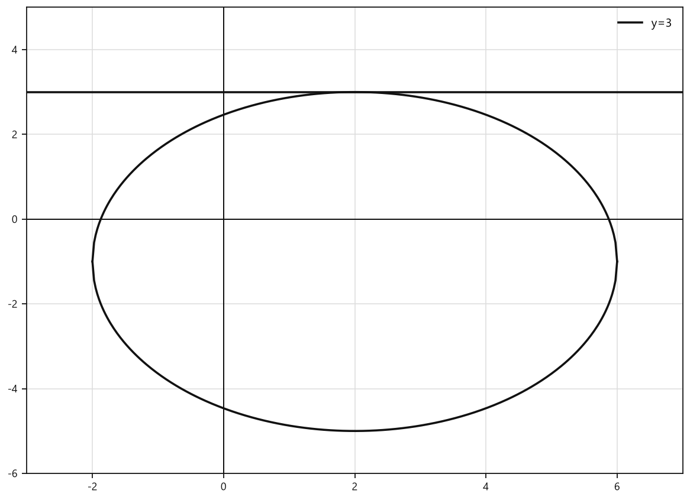
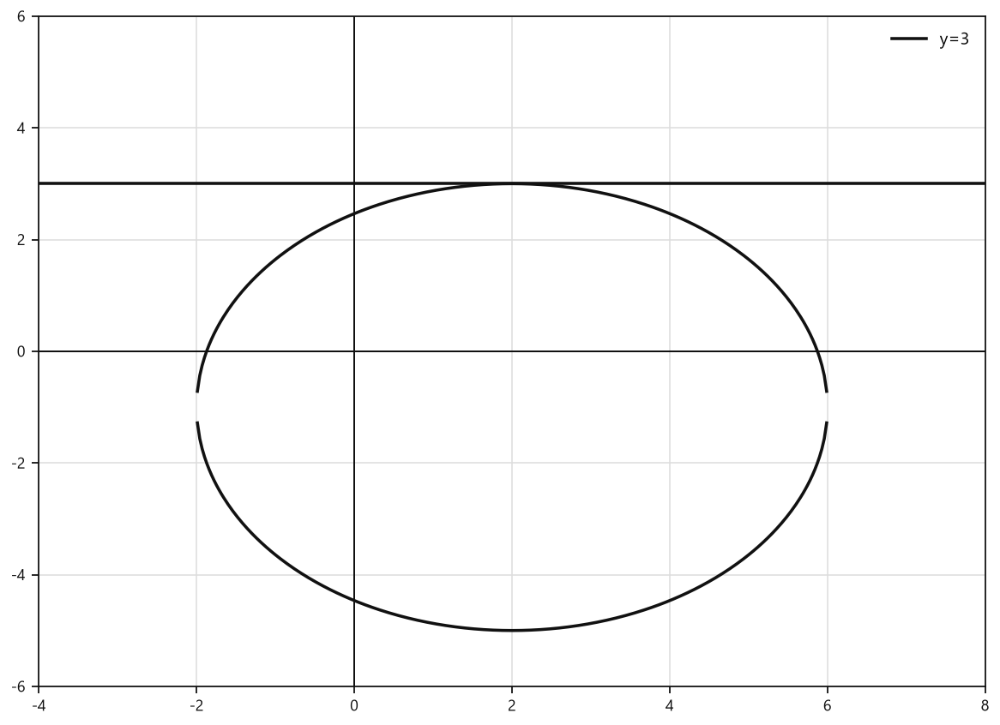

# Занятие 18. Уравнение окружности

**Раздел:** Глава 3  
**Параграф учебника:** §3.12. Уравнение окружности  
**Страницы:** 176–182

## Цели занятия

После занятия ты умеешь:

- находить расстояние между двумя точками по их координатам;
- определять центр и радиус окружности по её уравнению;
- проверять, лежит ли точка на окружности;
- составлять уравнение окружности по центру и радиусу;
- находить радиус по центру и точке окружности;
- решать системы уравнений графическим методом.

Выбери блок своего уровня:

- **1–2 балла:** распознаю центр и радиус окружности;
- **3–4 балла:** нахожу расстояния и проверяю точки;
- **5–6 баллов:** составляю уравнения окружностей;
- **7–8 баллов:** решаю системы графическим методом;
- **9–10 баллов:** уверенно применяю все приёмы и объясняю ход решения.

## Теория к занятию

### 1. Расстояние между двумя точками

#### Простыми словами

Рассмотрим две точки на координатной плоскости. Чтобы попасть от одной точки к другой, можно сначала пройти по горизонтали, а потом по вертикали. Эти два перемещения образуют катеты прямоугольного треугольника.

Расстояние между точками — гипотенуза этого треугольника. Поэтому используем теорему Пифагора.

#### Формула

**Формула длины отрезка с заданными координатами его концов**

$$d = \sqrt{(x_2 - x_1)^2 + (y_2 - y_1)^2}$$

Здесь:

- $d$ — длина отрезка;
- $(x_1; y_1)$ и $(x_2; y_2)$ — координаты концов отрезка.

#### Как пользоваться формулой

1. Вычитаем абсциссы двух точек.
2. Вычитаем ординаты двух точек.
3. Каждую разность возводим в квадрат.
4. Складываем результаты.
5. Из суммы извлекаем квадратный корень.

Порядок точек можно менять: если вместо $x_2-x_1$ взять $x_1-x_2$, после возведения в квадрат получится то же самое число.

#### Ловушки

- $4-(-6)=4+6=10$, а не $-2$.
- Координаты не складываем: нужны именно их разности.
- Если в координате есть минус, заключаем число в скобки.
- $(\sqrt{3})^2=3$.
- После вычисления корня ответ по возможности упрощаем:
  $$\sqrt{25}=5,\qquad \sqrt{18}=3\sqrt2.$$

Минус внутри скобок может выглядеть грозно, но после возведения в квадрат теряет всю свою власть.

---

### 2. Уравнение окружности

#### Простыми словами

Окружность — это множество точек, которые находятся на одинаковом расстоянии от одной точки. Эта особая точка называется центром, а одинаковое расстояние — радиусом.

Пусть произвольная точка окружности имеет координаты $(x;y)$, центр имеет координаты $C(x_0;y_0)$, а радиус равен $R$. Расстояние между точкой $(x;y)$ и центром должно быть равно $R$. Если применить формулу расстояния и возвести обе части в квадрат, получим уравнение окружности.

#### Уравнение окружности

**Уравнение окружности с центром в точке $C(x_0; y_0)$ и радиусом $R$ имеет вид:**

$$(x - x_0)^2 + (y - y_0)^2 = R^2$$

#### Как прочитать уравнение

Если уравнение записано так:

$$(x - x_0)^2 + (y - y_0)^2 = R^2,$$

то:

- центр окружности — $C(x_0;y_0)$;
- радиус — $R$;
- правая часть равна квадрату радиуса.

Например:

$$(x-3)^2+(y+4)^2=36.$$

Здесь:

$$x-3=x-3,\qquad y+4=y-(-4),$$

значит, центр имеет координаты $C(3;-4)$, а радиус:

$$R=\sqrt{36}=6.$$

#### Правила

- В скобках записана разность координаты точки и координаты центра.
- Запись $x+1$ можно заменить на $x-(-1)$.
- Запись $y+7$ означает $y-(-7)$.
- Запись $x^2$ означает $(x-0)^2$.
- Если справа стоит $8$, то это $R^2$, поэтому
  $$R=\sqrt8=2\sqrt2,$$
  а не $8$.

#### Ловушки

- В выражении $(y+7)^2$ координата центра по оси $Oy$ равна $-7$.
- Правая часть уравнения — квадрат радиуса.
- Знаки координат центра при чтении скобок меняются:
  $$x+5=x-(-5),\qquad y-2=y-2.$$
- Центр имеет координаты, которые стоят после знака «минус» в стандартной записи.

---

### 3. Как проверить, лежит ли точка на окружности

#### Простыми словами

Чтобы проверить точку, подставляем её координаты в уравнение окружности.

Если после подстановки левая часть равна правой, точка лежит на окружности. Если равенство не выполняется, точка на окружности не лежит.

Получается математический контроль на входе: равенство выполнено — точка проходит.

#### Алгоритм

1. Записать уравнение окружности.
2. Подставить координаты точки вместо $x$ и $y$.
3. Сначала вычислить выражения в скобках.
4. Возвести полученные числа в квадрат.
5. Сложить результаты.
6. Сравнить полученное число с правой частью уравнения.
7. Записать вывод.

#### Ловушки

- В выражении $(y+1)^2$ нужно подставлять координату именно вместо $y$:
  $$y=-3\quad\Rightarrow\quad y+1=-3+1=-2.$$
- Сначала считаем скобки, а уже потом возводим в квадрат.
- Сравниваем с $R^2$, а не с $R$.
- Если проверяется несколько точек, каждую точку проверяем отдельно.

---

### 4. Составление уравнения окружности

#### Простыми словами

Если известны центр и радиус, уравнение окружности составляется прямой подстановкой в формулу.

Если радиус не указан, но дана точка окружности, находим радиус как расстояние от центра до этой точки.

#### Алгоритм

1. Записать координаты центра $C(x_0;y_0)$.
2. Определить радиус $R$.
3. Найти квадрат радиуса $R^2$.
4. Подставить данные в формулу:
   $$(x-x_0)^2+(y-y_0)^2=R^2.$$
5. Проверить знаки в скобках.

#### Если радиус — отрезок

Если центр окружности — точка $A$, а точка $B$ лежит на окружности, то:

$$R=AB=\sqrt{(x_B-x_A)^2+(y_B-y_A)^2}.$$

#### Ловушки

- Для центра $(-1;1)$ получаем:
  $$(x-(-1))^2+(y-1)^2=(x+1)^2+(y-1)^2.$$
- Если $R=\sqrt2$, то справа будет:
  $$R^2=(\sqrt2)^2=2.$$
- Радиус не бывает отрицательным.
- Центр и точка на окружности — не одно и то же. Центр задаёт положение окружности, а точка на окружности помогает найти радиус.

---

### 5. Графический метод решения системы

#### Простыми словами

Каждое уравнение системы задаёт свой график. Решение системы — это точка, которая одновременно принадлежит обоим графикам. Значит, нужно найти общие точки графиков.

Например:

- $x+y=3$ — уравнение прямой;
- $x^2+y^2=9$ — уравнение окружности с центром $C(0;0)$ и радиусом $3$.

Перепишем первое уравнение:

$$y=3-x.$$

Это прямая. Второе уравнение задаёт окружность. При построении графиков они пересекаются в точках $A(3;0)$ и $B(0;3)$.

<!--geo-figure-spec
{
  "needed": true,
  "kind": "graph",
  "caption": "Графики $x+y=3$ и $x^2+y^2=9$",
  "axis": true,
  "grid": true,
  "xlim": [
    -4,
    4
  ],
  "ylim": [
    -4,
    4
  ],
  "curves": [
    {
      "expr": "3-x",
      "label": "x+y=3"
    },
    {
      "expr": "sqrt(9-x**2)",
      "label": "x^2+y^2=9"
    },
    {
      "expr": "-sqrt(9-x**2)",
      "label": ""
    }
  ],
  "points": {
    "A": [
      3,
      0
    ],
    "B": [
      0,
      3
    ]
  },
  "labels": {
    "A": {
      "dx": 0.15,
      "dy": 0.18
    },
    "B": {
      "dx": 0.15,
      "dy": 0.18
    }
  }
}
-->

*Графики x+y=3 и x^2+y^2=9*

Значит, решения системы — координаты этих общих точек:

$$(3;0)\quad\text{и}\quad(0;3).$$

#### Алгоритм

1. Определить, какой график задаёт каждое уравнение.
2. Построить оба графика в одной системе координат.
3. Найти точки пересечения графиков.
4. Записать координаты точек пересечения.
5. Проверить каждую найденную точку подстановкой в оба уравнения.

#### Ловушки

- Точка должна принадлежать сразу двум графикам.
- Если прямая и окружность пересекаются в двух точках, система имеет два решения.
- Если они касаются, система имеет одно решение.
- Если графики не пересекаются, решений нет.
- Проверка выполняется в обоих уравнениях, а не только в одном. Иначе второе уравнение может обидеться — и вполне заслуженно.

## Сводка формул «выучить наизусть»

$$d = \sqrt{(x_2 - x_1)^2 + (y_2 - y_1)^2}$$

$$(x - x_0)^2 + (y - y_0)^2 = R^2$$

Расстояние от точки $(x;y)$ до начала координат:

$$d=\sqrt{x^2+y^2}$$

Если окружность касается:

- оси абсцисс, то $R=|y_0|$;
- оси ординат, то $R=|x_0|$.

## Правила, которые нельзя путать

- В формуле длины отрезка вычитаются координаты, а не складываются.
- Если вычитаем отрицательное число, заменяем вычитание сложением:
  $$a-(-b)=a+b.$$
- В уравнении окружности справа стоит $R^2$, а не $R$.
- В выражении $y+7$ координата центра равна $-7$.
- В выражении $x^2$ координата центра по оси $Ox$ равна $0$.
- Центр — это $C(x_0;y_0)$, а не $C(-x_0;-y_0)$.
- Точка на окружности удовлетворяет уравнению точно, без приближённых вычислений.
- Решения системы — общие точки графиков.

## Разбор ключевых заданий

### Р1. Длина отрезка по координатам

**Условие.** Найдите длину отрезка $MN$, если $M(3;-6)$, $N(-1;4)$.

**Решение.**

Используем формулу длины отрезка:

$$d = \sqrt{(x_2-x_1)^2+(y_2-y_1)^2}.$$

У точки $M$:

$$x_1=3,\qquad y_1=-6.$$

У точки $N$:

$$x_2=-1,\qquad y_2=4.$$

Подставим координаты:

$$MN=\sqrt{(-1-3)^2+(4-(-6))^2}.$$

Вычислим разности:

$$-1-3=-4,$$

$$4-(-6)=4+6=10.$$

Получаем:

$$MN=\sqrt{(-4)^2+10^2}.$$

Возведём числа в квадрат:

$$MN=\sqrt{16+100}.$$

Сложим:

$$MN=\sqrt{116}.$$

Разложим $116$ на множители:

$$116=4\cdot29.$$

Так как $\sqrt4=2$, вынесем $2$ из-под корня:

$$MN=2\sqrt{29}.$$

Минус здесь был только до возведения в квадрат. Дальше он уже не участвует.

**Ответ:** $2\sqrt{29}$.

---

### Р2. Диагональ прямоугольника

**Условие.** Найдите длину диагонали прямоугольника, если его вершина $A(-7;1)$, а точка пересечения диагоналей $O(-3;-2)$.

**Решение.**

Диагонали прямоугольника пересекаются и делятся точкой пересечения пополам. Поэтому $AO$ — половина диагонали.

Сначала найдём длину отрезка $AO$:

$$AO=\sqrt{(-7-(-3))^2+(1-(-2))^2}.$$

Вычислим разности:

$$-7-(-3)=-7+3=-4,$$

$$1-(-2)=1+2=3.$$

Тогда:

$$AO=\sqrt{(-4)^2+3^2}.$$

Возведём в квадрат:

$$AO=\sqrt{16+9}.$$

$$AO=\sqrt{25}=5.$$

Вся диагональ состоит из двух таких половин:

$$d=2\cdot AO.$$

Подставим найденное значение:

$$d=2\cdot5=10.$$

**Ответ:** $10$.

---

### Р3. Координаты центра и радиус окружности

**Условие.** Определите координаты центра и радиус окружности:

а) $(x+1)^2+(y-1)^2=1$;

б) $x^2+(y+7)^2=4$;

в) $x^2+y^2=8$.

**Решение.**

Сравниваем каждое уравнение с формулой:

$$(x-x_0)^2+(y-y_0)^2=R^2.$$

#### а)

Преобразуем первую скобку:

$$x+1=x-(-1).$$

Значит:

$$x_0=-1,\qquad y_0=1.$$

Справа записано $R^2=1$, поэтому:

$$R=\sqrt1=1.$$

Получаем:

$$C(-1;1),\qquad R=1.$$

#### б)

Вместо $(x-0)^2$ записано просто $x^2$:

$$x^2=(x-0)^2.$$

Кроме того:

$$y+7=y-(-7).$$

Поэтому:

$$x_0=0,\qquad y_0=-7.$$

Справа:

$$R^2=4,\qquad R=\sqrt4=2.$$

Получаем:

$$C(0;-7),\qquad R=2.$$

#### в)

Запишем недостающие нулевые координаты центра:

$$x^2+y^2=(x-0)^2+(y-0)^2.$$

Значит:

$$C(0;0).$$

Справа:

$$R^2=8.$$

Тогда:

$$R=\sqrt8=\sqrt{4\cdot2}=2\sqrt2.$$

Справа стоит квадрат радиуса. Если записать радиусом сразу $8$, получится другая окружность.

**Ответ:**  
а) $C(-1;1)$, $R=1$;  
б) $C(0;-7)$, $R=2$;  
в) $C(0;0)$, $R=2\sqrt2$.

---

### Р4. Проверка принадлежности точки окружности

**Условие.** Какие из точек лежат на окружности

$$(x-1)^2+(y+1)^2=25?$$

а) $A(4;3)$;  
б) $B(4;-3)$;  
в) $C(-3;4)$;  
г) $D(-3;-4)$.

**Решение.**

Для каждой точки подставляем её координаты вместо $x$ и $y$. Правая часть во всех случаях равна $25$.

#### Точка $A(4;3)$

Подставим $x=4$, $y=3$:

$$(4-1)^2+(3+1)^2=3^2+4^2.$$

Вычислим:

$$9+16=25.$$

Равенство выполняется. Значит, точка $A$ лежит на окружности.

#### Точка $B(4;-3)$

Подставим $x=4$, $y=-3$:

$$(4-1)^2+(-3+1)^2=3^2+(-2)^2.$$

Вычислим:

$$9+4=13.$$

Получили:

$$13\ne25.$$

Значит, точка $B$ не лежит на окружности.

#### Точка $C(-3;4)$

Подставим $x=-3$, $y=4$:

$$(-3-1)^2+(4+1)^2=(-4)^2+5^2.$$

Вычислим:

$$16+25=41.$$

Получили:

$$41\ne25.$$

Значит, точка $C$ не лежит на окружности.

#### Точка $D(-3;-4)$

Подставим $x=-3$, $y=-4$:

$$(-3-1)^2+(-4+1)^2=(-4)^2+(-3)^2.$$

Вычислим:

$$16+9=25.$$

Равенство выполняется. Значит, точка $D$ лежит на окружности.

**Ответ:** точки $A$ и $D$.

---

### Р5. Уравнение окружности по центру и радиусу

**Условие.** Запишите уравнение окружности с центром $C(-1;1)$ и радиусом $\sqrt2$.

**Решение.**

Используем формулу:

$$(x-x_0)^2+(y-y_0)^2=R^2.$$

Координаты центра:

$$x_0=-1,\qquad y_0=1.$$

Радиус:

$$R=\sqrt2.$$

Подставим данные:

$$(x-(-1))^2+(y-1)^2=(\sqrt2)^2.$$

Упростим:

$$(x+1)^2+(y-1)^2=2.$$

**Ответ:** $$(x+1)^2+(y-1)^2=2.$$

---

### Р6. Окружность по центру и точке на окружности

**Условие.** Запишите уравнение окружности с центром в точке $A(2;4)$, если отрезок $AB$ является радиусом, а $B(5;7)$.

**Решение.**

Центр окружности — точка $A$, поэтому радиус равен длине отрезка $AB$.

Используем формулу расстояния между точками:

$$R=AB=\sqrt{(5-2)^2+(7-4)^2}.$$

Вычислим разности:

$$5-2=3,\qquad 7-4=3.$$

Тогда:

$$R=\sqrt{3^2+3^2}.$$

$$R=\sqrt{9+9}.$$

$$R=\sqrt{18}.$$

Для уравнения окружности нужен квадрат радиуса:

$$R^2=18.$$

Подставим координаты центра $A(2;4)$:

$$(x-2)^2+(y-4)^2=18.$$

Проверим, что точка $B(5;7)$ действительно лежит на этой окружности:

$$(5-2)^2+(7-4)^2=3^2+3^2=9+9=18.$$

Равенство выполняется.

**Ответ:** $$(x-2)^2+(y-4)^2=18.$$

---

### Р7. Расстояние от точки до начала координат

**Условие.** Найдите расстояние от начала координат до точки $K(-2;7)$.

**Решение.**

Начало координат имеет координаты:

$$O(0;0).$$

Используем формулу длины отрезка:

$$OK=\sqrt{(-2-0)^2+(7-0)^2}.$$

Вычислим разности:

$$-2-0=-2,\qquad 7-0=7.$$

Получаем:

$$OK=\sqrt{(-2)^2+7^2}.$$

Возведём в квадрат:

$$OK=\sqrt{4+49}.$$

$$OK=\sqrt{53}.$$

Число $53$ не содержит полного квадрата, поэтому корень дальше не упрощается.

**Ответ:** $\sqrt{53}$.

---

### Р8. Система «прямая и окружность»

**Условие.** Решите систему уравнений графическим методом:

$$
\begin{cases}
x+y=3,\\
x^2+y^2=9.
\end{cases}
$$

**Решение.**

Первое уравнение задаёт прямую:

$$x+y=3.$$

Выразим $y$ через $x$:

$$y=3-x.$$

Второе уравнение задаёт окружность:

$$x^2+y^2=9.$$

Сравним его с уравнением окружности:

$$(x-0)^2+(y-0)^2=3^2.$$

Значит, центр окружности:

$$C(0;0),$$

а радиус:

$$R=3.$$

Построим прямую и окружность в одной системе координат. Их общие точки:

$$(3;0)\quad\text{и}\quad(0;3).$$

Теперь проверим первую точку в обоих уравнениях:

$$3+0=3,$$

$$3^2+0^2=9.$$

Точка $(3;0)$ подходит.

Проверим вторую точку:

$$0+3=3,$$

$$0^2+3^2=9.$$

Точка $(0;3)$ также подходит.

**Ответ:** $(3;0)$ и $(0;3)$.

---

### Р9. Уравнение окружности, касающейся оси абсцисс

**Условие.** Определите радиус и запишите уравнение окружности с центром $M(2;7)$, касающейся оси абсцисс.

**Решение.**

Ось абсцисс — это ось $Ox$, её уравнение:

$$y=0.$$

Центр окружности имеет ординату $7$. Расстояние от точки $M(2;7)$ до оси абсцисс равно $|7|$:

$$R=|y_0|=|7|=7.$$

Используем формулу окружности:

$$(x-x_0)^2+(y-y_0)^2=R^2.$$

Подставим:

$$x_0=2,\qquad y_0=7,\qquad R=7.$$

Получаем:

$$(x-2)^2+(y-7)^2=7^2.$$

$$ (x-2)^2+(y-7)^2=49.$$

**Ответ:** $R=7$; $$(x-2)^2+(y-7)^2=49.$$

---

### Р10. Расстояние между центрами окружностей

**Условие.** Найдите расстояние между центрами окружностей:

$$x^2+y^2=4$$

и

$$(x-6)^2+(y+8)^2=64.$$

**Решение.**

Определим центры окружностей.

Первое уравнение можно записать так:

$$(x-0)^2+(y-0)^2=2^2.$$

Значит, центр первой окружности:

$$C_1(0;0).$$

Во втором уравнении:

$$x-6=x-6,\qquad y+8=y-(-8).$$

Поэтому центр второй окружности:

$$C_2(6;-8).$$

Теперь найдём расстояние между центрами:

$$C_1C_2=\sqrt{(6-0)^2+(-8-0)^2}.$$

Вычислим:

$$C_1C_2=\sqrt{6^2+(-8)^2}.$$

$$C_1C_2=\sqrt{36+64}.$$

$$C_1C_2=\sqrt{100}=10.$$

**Ответ:** $10$.

## Мини-проверка

1. Каков центр окружности $(x-4)^2+(y+2)^2=9$?  
2. Каков радиус окружности $x^2+y^2=16$?  
3. Лежит ли точка $(1;2)$ на окружности $x^2+y^2=5$?  
4. Запишите уравнение окружности с центром $(0;-3)$ и радиусом $4$.

### Ответы

1. $C(4;-2)$.  
2. $R=4$.  
3. Да, потому что $1^2+2^2=5$.  
4. $x^2+(y+3)^2=16$.

## Практические задания

Выбери свой уровень и решай только этот блок. В блоке должна закрепиться вся тема параграфа. Ответы не приводятся.

### Уровень 1–2 балла

**С1.** Укажите координаты центра и радиус окружности, заданной уравнением $(x-2)^2+(y+3)^2=16$.

**С2.** Укажите координаты центра и радиус окружности, заданной уравнением $x^2+(y-5)^2=9$.

**С3.** Укажите координаты центра окружности, заданной уравнением $(x+4)^2+y^2=25$.

**С4.** Какое из уравнений задаёт окружность с центром в точке $C(1;-2)$ и радиусом $4$?  
1) $(x+1)^2+(y-2)^2=4$ 2) $(x-1)^2+(y+2)^2=16$ 3) $(x-1)^2+(y-2)^2=16$ 4) $(x+1)^2+(y+2)^2=16$ 5) $(x-1)^2+(y+2)^2=4$

**С5.** Запишите уравнение окружности с центром в точке $C(-3;4)$ и радиусом $2$.

**С6.** Запишите уравнение окружности с центром в начале координат и радиусом $5$.

**С7.** Определите, лежит ли точка $A(4;1)$ на окружности $(x-1)^2+(y-1)^2=9$.

**С8.** Определите, лежит ли точка $B(2;-2)$ на окружности $x^2+(y+1)^2=10$.

**С9.** Выберите точку, лежащую на окружности $(x+2)^2+(y-1)^2=25$.  
1) $(1;5)$ 2) $(3;1)$ 3) $(-2;4)$ 4) $(0;-3)$ 5) $(-5;0)$

**С10.** Найдите расстояние между точками $A(1;2)$ и $B(4;6)$.

**С11.** Найдите расстояние от начала координат до точки $M(-6;8)$.

**С12.** Дана окружность $(x-2)^2+(y+1)^2=25$. Запишите уравнение окружности, центр которой симметричен центру данной окружности относительно оси ординат, а радиус равен радиусу данной окружности.

**С13.** Укажите координаты центра и радиус окружности, заданной уравнением $(x-4)^2+(y+3)^2=25$.

**С14.** Выберите уравнение окружности с центром в точке $(-2;1)$ и радиусом $3$.

1) $(x-2)^2+(y+1)^2=9$  
2) $(x+2)^2+(y-1)^2=9$  
3) $(x+2)^2+(y+1)^2=3$  
4) $(x-2)^2+(y-1)^2=3$  
5) $(x+2)^2+(y-1)^2=3$

**С15.** Определите, принадлежит ли точка $A(3;4)$ окружности $x^2+y^2=25$.

**С16.** Найдите радиус окружности $(x+1)^2+(y-6)^2=16$.

**С17.** Выберите точку, лежащую на окружности $(x-2)^2+(y+1)^2=9$.

1) $(2;1)$  
2) $(5;-1)$  
3) $(4;1)$  
4) $(-1;-1)$  
5) $(3;3)$

**С18.** Запишите уравнение окружности с центром в точке $C(0;-4)$ и радиусом $2$.

**С19.** Найдите расстояние между точками $A(1;2)$ и $B(4;6)$.

**С20.** Укажите центр окружности, заданной уравнением $x^2+(y-5)^2=49$.

1) $(5;0)$  
2) $(0;-5)$  
3) $(0;5)$  
4) $(5;7)$  
5) $(-5;0)$

**С21.** Точка $M(6;8)$ является точкой окружности с центром в начале координат. Найдите радиус этой окружности.

**С22.** Запишите уравнение окружности с центром в точке $A(3;2)$, проходящей через точку $B(6;6)$.

**С23.** Определите, какие из точек лежат на окружности $(x+1)^2+(y-2)^2=4$:  
а) $A(1;2)$; б) $B(-1;4)$; в) $C(0;0)$.

**С24.** Выберите верное утверждение об окружности, заданной уравнением $(x-5)^2+(y+2)^2=36$.

1) Центр окружности — точка $(5;2)$, радиус равен $6$.  
2) Центр окружности — точка $(-5;-2)$, радиус равен $36$.  
3) Центр окружности — точка $(5;-2)$, радиус равен $6$.  
4) Центр окружности — точка $(-5;2)$, радиус равен $36$.  
5) Центр окружности — точка $(5;-2)$, радиус равен $36$.

**С25.** Укажите координаты центра окружности $(x-4)^2+(y+3)^2=25$ и её радиус.  
1) $C(4;3)$, $R=5$  2) $C(-4;-3)$, $R=5$  3) $C(4;-3)$, $R=25$  4) $C(-4;3)$, $R=25$  5) $C(4;-3)$, $R=5$

**С26.** Укажите координаты центра окружности $x^2+(y-6)^2=16$ и её радиус.  
1) $C(0;6)$, $R=4$  2) $C(0;-6)$, $R=4$  3) $C(6;0)$, $R=16$  4) $C(0;6)$, $R=16$  5) $C(6;0)$, $R=4$

**С27.** Определите, лежит ли точка $A(3;4)$ на окружности $x^2+y^2=25$.  
1) Да  2) Нет  3) Только при $x=0$  4) Только при $y=0$  5) Нельзя определить

**С28.** Определите, лежит ли точка $B(1;-2)$ на окружности $(x-1)^2+(y+2)^2=9$.  
1) Да  2) Нет  3) Только при $x=1$  4) Только при $y=-2$  5) Нельзя определить

**С29.** Запишите уравнение окружности с центром $C(-2;5)$ и радиусом $3$.  
1) $(x+2)^2+(y-5)^2=3$  2) $(x-2)^2+(y+5)^2=9$  3) $(x+2)^2+(y-5)^2=9$  4) $(x-2)^2+(y-5)^2=9$  5) $(x+2)^2+(y+5)^2=9$

**С30.** Запишите уравнение окружности с центром в начале координат и радиусом $6$.  
1) $x^2+y^2=6$  2) $x^2+y^2=12$  3) $x^2+y^2=36$  4) $(x-6)^2+y^2=36$  5) $x^2+(y-6)^2=36$

**С31.** Укажите радиус окружности $(x+1)^2+(y-4)^2=49$.

**С32.** Укажите координаты центра окружности $x^2+(y+8)^2=1$.

**С33.** Проверьте, принадлежит ли точка $C(-2;1)$ окружности $(x+2)^2+(y-1)^2=4$.

**С34.** Запишите уравнение окружности с центром $C(3;-1)$, проходящей через точку $A(6;-1)$.

**С35.** Запишите уравнение окружности с центром $C(0;2)$, проходящей через точку $A(0;6)$.

**С36.** Выберите все верные утверждения.

1) Центр окружности $(x-2)^2+(y+5)^2=16$ имеет координаты $(2;-5)$.  
2) Радиус окружности $(x+3)^2+y^2=25$ равен $5$.  
3) Точка $(0;2)$ лежит на окружности $x^2+y^2=4$.  
4) Уравнение окружности с центром $(1;0)$ и радиусом $2$ имеет вид $(x+1)^2+y^2=4$.  
5) Уравнение окружности с центром $(0;-4)$ и радиусом $3$ имеет вид $x^2+(y+4)^2=9$.

### Уровень 3–4 балла

**С1.** Найдите расстояние между точками $A(2; 5)$ и $B(8; -3)$.

**С2.** Найдите расстояние от начала координат до точки $M(-6; 8)$.

**С3.** Определите координаты центра и радиус окружности, заданной уравнением $(x-4)^2+(y+3)^2=25$.

**С4.** Определите координаты центра и радиус окружности, заданной уравнением $x^2+(y-6)^2=49$.

**С5.** Укажите, какие из точек лежат на окружности $(x+2)^2+(y-1)^2=16$: $A(2;1)$, $B(-2;5)$, $C(0;-3)$, $D(-6;1)$.

**С6.** Проверьте, лежит ли точка $P(3;-2)$ на окружности $x^2+(y+1)^2=10$.

**С7.** Запишите уравнение окружности с центром в точке $C(-3;4)$ и радиусом $R=5$.

**С8.** Запишите уравнение окружности с центром в точке $O(0;-2)$ и радиусом $R=\sqrt{7}$.

**С9.** Точки $A(1;2)$ и $B(5;5)$ являются концами радиуса окружности, причём центр окружности находится в точке $A$. Запишите уравнение этой окружности.

**С10.** Дана окружность $(x-2)^2+(y+4)^2=36$. Запишите уравнение окружности, центр которой симметричен центру данной окружности относительно начала координат, а радиус равен радиусу данной окружности.

**С11.** Определите радиус окружности с центром в точке $M(3;-5)$, касающейся оси абсцисс. Запишите уравнение этой окружности.

**С12.** Решите систему уравнений:
$$
\begin{cases}
x^2+y^2=25,\\
x+y=1.
\end{cases}
$$

**С13.** Найдите длину отрезка $AB$, если $A(-2; 3)$, $B(4; -5)$.

**С14.** Найдите расстояние от точки $K(6; -8)$ до начала координат.

**С15.** Определите координаты центра и радиус окружности, заданной уравнением $(x-4)^2+(y+3)^2=49$.

**С16.** Определите координаты центра и радиус окружности, заданной уравнением $x^2+(y-6)^2=16$.

**С17.** Определите, лежит ли точка $A(3; 1)$ на окружности $(x-1)^2+(y+2)^2=25$.

**С18.** Определите, какие из точек $B(5; 0)$, $C(-3; 0)$ и $D(1; 4)$ лежат на окружности $(x-1)^2+y^2=16$.

**С19.** Запишите уравнение окружности с центром в точке $C(-2; 5)$ и радиусом $R=3$.

**С20.** Запишите уравнение окружности с центром в точке $O(0; 0)$ и радиусом $R=\sqrt{7}$.

**С21.** Запишите уравнение окружности с центром в точке $A(1; -2)$, проходящей через точку $B(4; 2)$.

**С22.** Дана окружность $(x+3)^2+(y-1)^2=25$. Запишите уравнение окружности, центр которой симметричен центру данной окружности относительно начала координат, а радиус равен радиусу данной окружности.

**С23.** Дана окружность $(x-2)^2+(y+4)^2=36$. Запишите уравнение окружности, центр которой симметричен центру данной окружности относительно оси ординат, а радиус в два раза меньше радиуса данной окружности.

**С24.** Найдите расстояние между центрами окружностей, заданных уравнениями $x^2+y^2=9$ и $(x-4)^2+(y-3)^2=16$.

**С25.** Найдите расстояние между точками $A(1; -2)$ и $B(7; 6)$.

**С26.** Найдите расстояние от начала координат до точки $M(-5; 12)$.

**С27.** Определите координаты центра и радиус окружности, заданной уравнением $(x - 4)^2 + (y + 3)^2 = 49$.

**С28.** Определите координаты центра и радиус окружности, заданной уравнением $x^2 + (y - 6)^2 = 10$.

**С29.** Проверьте, лежит ли точка $A(2; 1)$ на окружности $(x - 5)^2 + (y + 3)^2 = 25$.

**С30.** Какие из точек $B(1; 2)$, $C(-3; 0)$ и $D(2; -2)$ лежат на окружности $x^2 + (y - 1)^2 = 4$?

**С31.** Запишите уравнение окружности с центром в точке $C(-2; 5)$ и радиусом $R=4$.

**С32.** Запишите уравнение окружности с центром в точке $O(3; -1)$, проходящей через точку $A(6; 3)$.

**С33.** Дана окружность $(x + 2)^2 + (y - 4)^2 = 9$. Запишите уравнение окружности, центр которой симметричен центру данной окружности относительно начала координат, а радиус равен радиусу данной окружности.

**С34.** Дана окружность $(x - 5)^2 + (y + 1)^2 = 16$. Запишите уравнение окружности, центр которой симметричен центру данной окружности относительно оси ординат, а радиус в два раза меньше радиуса данной окружности.

**С35.** Определите радиус и запишите уравнение окружности с центром в точке $M(4; -7)$, касающейся оси абсцисс.

**С36.** Найдите расстояние между центрами окружностей, заданных уравнениями $x^2+y^2=25$ и $(x-6)^2+(y-8)^2=9$.

### Уровень 5–6 баллов

**С1.** Найдите длину отрезка $AB$, если $A(-2; 3)$ и $B(4; -5)$.

**С2.** Найдите расстояние от точки $K(6; -8)$ до начала координат.

**С3.** Найдите расстояния от точки $M(-5; 4)$ до оси абсцисс и до оси ординат.

**С4.** Определите координаты центра и радиус окружности, заданной уравнением $(x-4)^2+(y+3)^2=49$.

**С5.** Определите координаты центра и радиус окружности, заданной уравнением $x^2+(y-6)^2=16$.

**С6.** Верно ли, что точка $A(3; -1)$ является центром окружности $(x-3)^2+(y+1)^2=25$? Обоснуйте ответ.

**С7.** Какие из точек $A(4; 1)$, $B(-2; 1)$, $C(1; 4)$ и $D(1; -2)$ лежат на окружности $(x-1)^2+(y-1)^2=9$?

**С8.** Запишите уравнение окружности с центром в точке $C(-3; 2)$ и радиусом $R=5$.

**С9.** Запишите уравнение окружности с центром в точке $A(1; -2)$, проходящей через точку $B(4; 2)$.

**С10.** Дана окружность $(x+2)^2+(y-1)^2=16$. Запишите уравнение окружности, центр которой симметричен центру данной окружности относительно начала координат, а радиус равен радиусу данной окружности.

**С11.** Запишите уравнение окружности с центром в точке $M(3; -4)$, которая касается оси абсцисс.

**С12.** Решите систему уравнений:
$$
\begin{cases}
x^2+y^2=25,\\
x+y=1.
\end{cases}
$$
Выполните проверку найденных решений.

**С13.** Найдите расстояние между точками $A(-4; 3)$ и $B(2; -5)$.

**С14.** Найдите расстояние от начала координат до точки $M(-5; 12)$.

**С15.** Определите координаты центра и радиус окружности, заданной уравнением $(x+4)^2+(y-3)^2=49$.

**С16.** Определите координаты центра и радиус окружности, заданной уравнением $x^2+(y+6)^2=16$.

**С17.** Какие из точек $A(3; 4)$, $B(-1; 2)$, $C(0; -1)$ и $D(4; 0)$ лежат на окружности $x^2+(y-1)^2=16$?

**С18.** Запишите уравнение окружности с центром в точке $C(2; -5)$ и радиусом $R=4$.

**С19.** Запишите уравнение окружности с центром в точке $C(-3; 1)$, проходящей через точку $A(1; 4)$.

**С20.** Даны точки $A(-2; 3)$ и $B(4; 3)$. Запишите уравнение окружности, для которой точка $A$ является центром, а отрезок $AB$ — радиусом.

**С21.** Окружность задана уравнением $(x-5)^2+(y+2)^2=25$. Запишите уравнение окружности, центр которой симметричен центру данной окружности относительно начала координат, а радиус равен радиусу данной окружности.

**С22.** Окружность задана уравнением $(x+1)^2+(y-4)^2=36$. Запишите уравнение окружности, центр которой симметричен центру данной окружности относительно оси ординат, а радиус в два раза меньше радиуса данной окружности.

**С23.** Найдите радиус и запишите уравнение окружности с центром в точке $M(3; -7)$, которая касается оси абсцисс.

**С24.** Определите число общих точек окружностей, заданных уравнениями $x^2+y^2=25$ и $(x-6)^2+y^2=25$.

**С25.** Найдите длину отрезка $AB$, если $A(-2; 5)$ и $B(4; -3)$.

**С26.** Определите координаты центра и радиус окружности, заданной уравнением $$(x+4)^2+(y-6)^2=49.$$

**С27.** Установите, какие из точек $A(1; 2)$, $B(-2; 0)$, $C(4; 1)$ и $D(1; -4)$ лежат на окружности $$(x-1)^2+(y+1)^2=9.$$

**С28.** Запишите уравнение окружности с центром в точке $C(-3; 2)$ и радиусом $R=5$.

**С29.** Даны точки $A(2; -1)$ и $B(6; 2)$. Запишите уравнение окружности с центром в точке $A$, проходящей через точку $B$.

**С30.** Дана окружность $$(x-2)^2+(y+3)^2=16.$$ Запишите уравнение окружности, центр которой симметричен центру данной окружности относительно начала координат, а радиус в два раза меньше радиуса данной окружности.

### Уровень 7–8 баллов

**С1.** Найдите расстояние между точками $A(-4; 7)$ и $B(2; -1)$. Ответ запишите в виде корня.

**С2.** Точка $M(-3; 5)$ и точка $N(x; 5)$ находятся на расстоянии $8$ единиц друг от друга. Найдите все возможные значения $x$.

**С3.** Для окружности, заданной уравнением
$$(x+4)^2+(y-3)^2=49,$$
укажите координаты её центра и радиус. Обоснуйте ответ.

**С4.** Определите, какие из точек $A(1; 2)$, $B(-5; 2)$, $C(-1; 8)$ и $D(3; -2)$ лежат на окружности
$$(x+1)^2+(y-2)^2=16.$$

**С5.** Запишите уравнение окружности с центром в точке $C(3; -5)$, проходящей через точку $A(7; -2)$.

**С6.** Даны точки $A(-2; 1)$ и $B(4; 5)$. Запишите уравнения двух окружностей, для каждой из которых отрезок $AB$ является радиусом: в первом случае центр окружности находится в точке $A$, во втором — в точке $B$.

**С7.** Окружность имеет центр $C(-1; 4)$ и касается оси абсцисс. Запишите её уравнение. Укажите, почему радиус определяется однозначно.

**С8.** Дана окружность
$$(x-2)^2+(y+3)^2=25.$$
Запишите уравнения окружностей, полученных из данной симметрией её центра относительно:  
а) начала координат;  
б) оси ординат;  
в) оси абсцисс.  
Во всех случаях радиус окружности сохраните прежним.

**С9.** Даны окружности
$$(x-1)^2+(y-2)^2=9$$
и
$$(x-5)^2+(y-5)^2=16.$$
Найдите расстояние между их центрами и определите число общих точек окружностей. Обоснуйте вывод сравнением расстояния между центрами с радиусами.

**С10.** Решите систему уравнений графическим методом:
$$
\begin{cases}
x^2+y^2=25,\\
x-y=1.
\end{cases}
$$
Выполните проверку найденных пар чисел подстановкой в оба уравнения.

<!--geo-figure-spec
{
  "needed": true,
  "kind": "graph",
  "caption": "Графики окружности $(x-2)^2+(y+1)^2=16$ и прямой $y=3$",
  "axis": true,
  "grid": true,
  "xlim": [
    -3,
    7
  ],
  "ylim": [
    -6,
    5
  ],
  "curves": [
    {
      "expr": "-1+sqrt(16-(x-2)**2)",
      "label": "(x-2)^2+(y+1)^2=16"
    },
    {
      "expr": "-1-sqrt(16-(x-2)**2)",
      "label": ""
    },
    {
      "expr": "3",
      "label": "y=3"
    }
  ],
  "points": {}
}
-->

*Графики окружности (x-2)^2+(y+1)^2=16 и прямой y=3*

**С11.** Определите число решений системы уравнений:
$$
\begin{cases}
(x-2)^2+(y+1)^2=16,\\
y=3.
\end{cases}
$$
Решение обоснуйте геометрически и алгебраически.

<!--geo-figure-spec
{
  "needed": true,
  "kind": "graph",
  "caption": "Графики окружности $(x-2)^2+(y+1)^2=16$ и прямой $y=3$",
  "axis": true,
  "grid": true,
  "xlim": [
    -4,
    8
  ],
  "ylim": [
    -6,
    6
  ],
  "curves": [
    {
      "expr": "-1+sqrt(16-(x-2)**2)",
      "label": "(x-2)^2+(y+1)^2=16"
    },
    {
      "expr": "-1-sqrt(16-(x-2)**2)",
      "label": "(x-2)^2+(y+1)^2=16"
    },
    {
      "expr": "3",
      "label": "y=3"
    }
  ],
  "points": {}
}
-->

*Графики окружности (x-2)^2+(y+1)^2=16 и прямой y=3*

**С12.** Найдите все значения параметра $a$, при которых система
$$
\begin{cases}
x^2+y^2=16,\\
y=a
\end{cases}
$$
имеет:  
а) два решения;  
б) одно решение;  
в) не имеет решений.  
Ответ обоснуйте с помощью уравнения окружности и расположения прямой $y=a$ относительно неё.

**С13.** Найдите расстояние между точками $A(-2;5)$ и $B(4;-3)$.

**С14.** Точка $K(-6;8)$ и точка $L$, симметричная ей относительно начала координат, являются концами отрезка. Найдите длину отрезка $KL$ и координаты точки $L$.

**С15.** Определите координаты центра и радиус окружности, заданной уравнением
$$(x+4)^2+(y-3)^2=49.$$

**С16.** Для каждой из точек $A(3;1)$, $B(-1;4)$, $C(4;-2)$ определите, лежит ли она на окружности
$$(x-1)^2+(y+2)^2=16.$$

**С17.** Запишите уравнение окружности с центром в точке $C(-3;5)$, проходящей через точку $P(1;2)$.

**С18.** Даны точки $A(-2;1)$ и $B(4;9)$. Запишите уравнения двух окружностей, для которых отрезок $AB$ является радиусом: в первом случае центром является точка $A$, во втором — точка $B$.

**С19.** Окружность задана уравнением
$$(x-2)^2+(y+1)^2=25.$$
Запишите уравнение окружности, центр которой симметричен центру данной окружности относительно оси абсцисс, а радиус в два раза меньше радиуса данной окружности.

**С20.** Окружность с центром $M(5;-4)$ касается оси ординат. Найдите её радиус и запишите уравнение этой окружности.

**С21.** Найдите расстояние между центрами окружностей
$$x^2+y^2=16$$
и
$$(x-6)^2+(y+8)^2=100.$$
Определите, имеют ли эти окружности общие точки.

**С22.** Решите систему уравнений:
$$
\begin{cases}
x^2+y^2=25,\\
x-y=1.
\end{cases}
$$
Выполните проверку найденных решений.

**С23.** Решите систему уравнений:
$$
\begin{cases}
x^2+y^2=25,\\
(x-6)^2+y^2=25.
\end{cases}
$$
Интерпретируйте каждое уравнение как уравнение окружности.

**С24.** Определите число решений системы уравнений в зависимости от значения параметра $a$:
$$
\begin{cases}
x^2+y^2=16,\\
y=a.
\end{cases}
$$
Для каждого полученного случая укажите взаимное расположение прямой и окружности.

### Уровень 9–10 баллов

**С1.** Точки $A(-5; 4)$ и $B(3; -2)$ являются концами диаметра окружности. Запишите уравнение этой окружности.

**С2.** Окружность задана уравнением $(x-4)^2+(y+3)^2=49$. Найдите координаты точек этой окружности, лежащих на оси абсцисс.

**С3.** Дана окружность $(x+2)^2+(y-5)^2=25$. Прямая $y=1$ пересекает её в двух точках. Найдите расстояние между этими точками.

**С4.** Окружность с центром $C(3;-1)$ проходит через точку $A(-1;2)$. Запишите её уравнение и определите, лежит ли на этой окружности точка $B(6;3)$.

**С5.** Даны окружности
$$(x-1)^2+(y+2)^2=16$$
и
$$(x+5)^2+(y-6)^2=4.$$
Определите число их общих точек, не решая систему уравнений.

**С6.** Запишите уравнение окружности, которая касается оси ординат, имеет центр на прямой $y=2x-1$ и проходит через точку $A(2;1)$. Рассмотрите все возможные окружности.

**С7.** Окружность $(x-a)^2+(y+2)^2=25$ проходит через точку $B(1;1)$. Найдите значение параметра $a$ и координаты центра окружности.

**С8.** Найдите длину хорды окружности
$$(x-2)^2+(y+1)^2=34,$$
концы которой лежат на прямой $y=x-4$.

**С9.** Окружность проходит через точки $A(1;2)$, $B(5;2)$ и $C(3;6)$. Найдите координаты её центра и радиус, а затем запишите уравнение окружности.

**С10.** Для каждого значения параметра $a$ определите число решений системы
$$
\begin{cases}
x^2+y^2=25,\\
y=|x|+a.
\end{cases}
$$
Запишите промежутки значений $a$, при которых система имеет $0$, $1$, $2$, $3$ и $4$ решения.

**С11.** Дана окружность
$$(x-3)^2+(y+4)^2=9.$$
Найдите все значения параметра $k$, при которых прямая $y=kx-4$ имеет с окружностью ровно одну общую точку.

**С12.** Решите систему уравнений и выполните проверку:
$$
\begin{cases}
(x-1)^2+(y+2)^2=25,\\
(x-5)^2+(y-1)^2=10.
\end{cases}
$$

**С13.** Точки $A(-2; 3)$ и $B(4; -5)$ являются концами диагонали прямоугольника, стороны которого параллельны координатным осям. Найдите уравнение окружности, проходящей через все четыре вершины этого прямоугольника.

**С14.** Окружность задана уравнением $(x-2)^2+(y+3)^2=16$. Запишите уравнение окружности, симметричной данной относительно прямой $y=x$, и уравнение окружности, симметричной данной относительно начала координат.

**С15.** Окружность с центром $C(3; -2)$ касается прямой $y=4$. Запишите её уравнение. Затем определите, сколько общих точек имеет эта окружность с прямой $x=7$.

**С16.** Даны окружности
$(x-1)^2+(y-2)^2=25$ и $(x+5)^2+(y-6)^2=9$.
Определите число их общих точек, не находя координаты точек пересечения. Ответ обоснуйте с помощью расстояния между центрами и радиусов окружностей.

**С17.** Решите систему уравнений графическим методом:
$$
\begin{cases}
x^2+y^2=25,\\
y=|x|-1.
\end{cases}
$$
Укажите все пары координат, являющиеся решениями системы, и выполните проверку подстановкой в оба уравнения.

**С18.** Найдите, при каких значениях параметра $a$ система
$$
\begin{cases}
x^2+y^2=25,\\
y=|x|+a
\end{cases}
$$
имеет:  
а) одно решение;  
б) два решения;  
в) три решения;  
г) четыре решения;  
д) не имеет решений.

## Чек-лист «ученик понял тему»

- Могу повторить определения и формулы параграфа своими словами и по учебнику.
- Решаю типовые задания своего уровня без подсказки.
- Вижу типичную ошибку и могу её объяснить.
