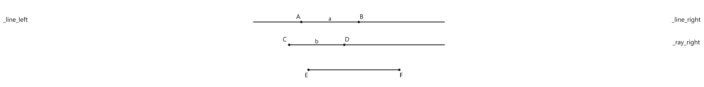
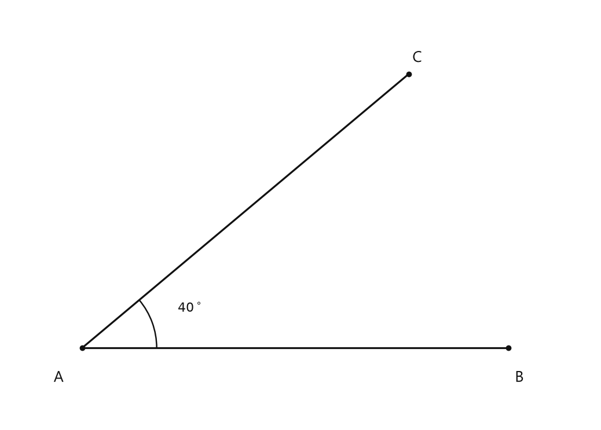
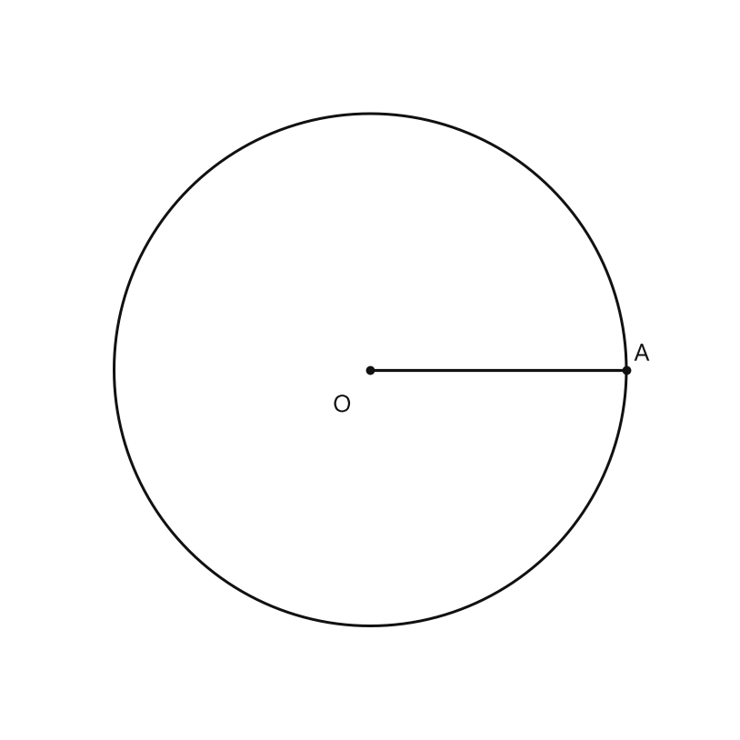
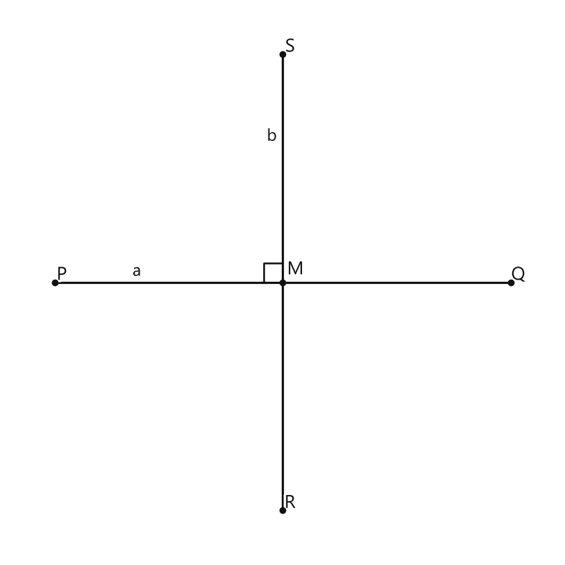
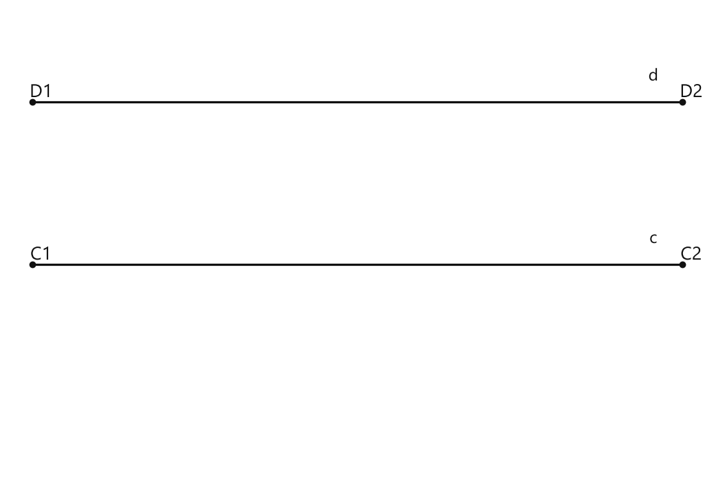
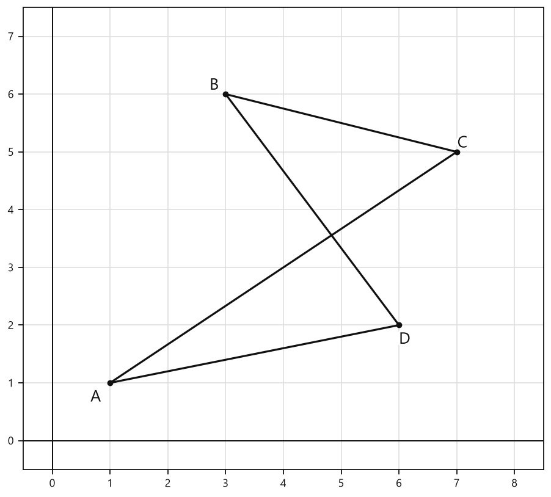
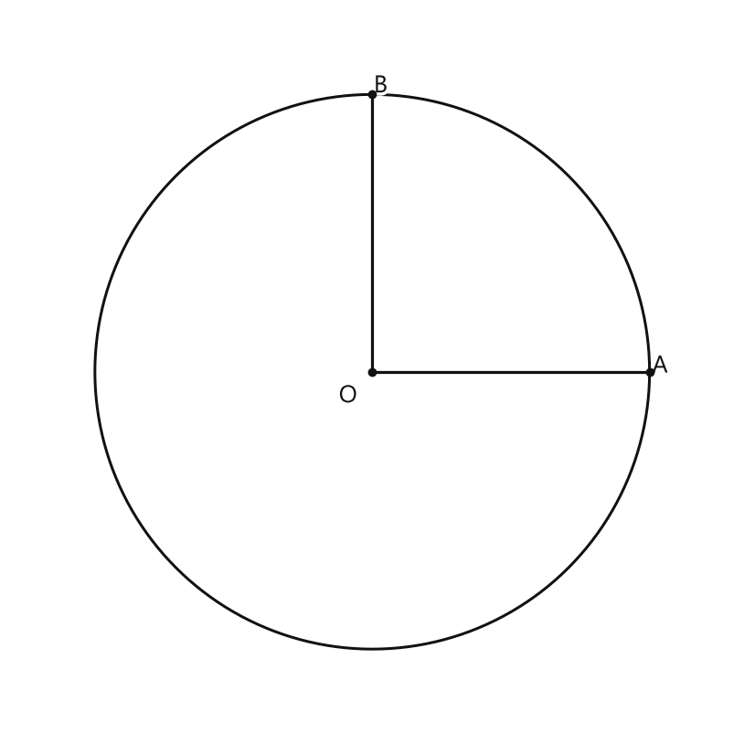
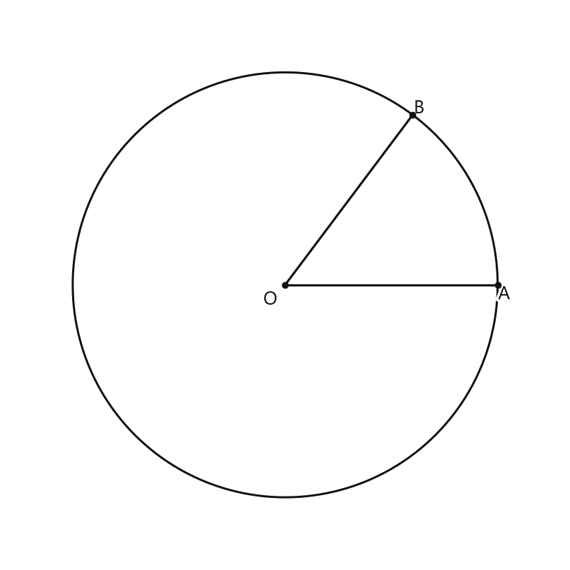
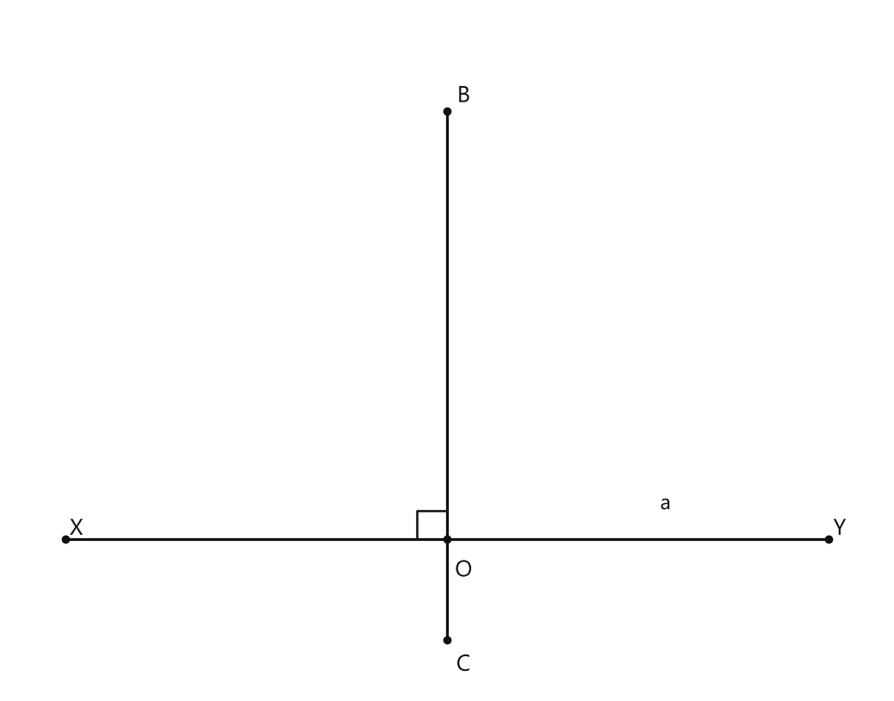

# Занятие 1. Повторение геометрического материала 5–6 классов

**Раздел:** Глава I. Начальные понятия геометрии  
**Параграф учебника:** §1. Повторение геометрического материала 5–6 классов  
**Страницы:** 13–17

## Цели занятия

К концу занятия ученик умеет:

- различать прямую, луч и отрезок;
- правильно обозначать прямые, лучи и отрезки;
- находить длину отрезка и переводить её в одни единицы измерения;
- различать окружность, круг и радиус;
- называть и классифицировать углы;
- распознавать пересекающиеся, параллельные и перпендикулярные прямые.

Выбирай блок по своей готовности:

- **1–2 балла:** распознать основные фигуры и виды углов;
- **3–4 балла:** правильно обозначать фигуры и измерять их;
- **5–6 баллов:** сравнивать отрезки и углы, применять определения;
- **7–8 баллов:** анализировать расположение фигур на чертеже;
- **9–10 баллов:** решать смешанные задачи и объяснять ход рассуждений.

## Теория к занятию

### Прямая, луч и отрезок

#### Простыми словами

Сначала посмотри, где у фигуры начало и конец.

- **прямая** не имеет ни начала, ни конца. На рисунке видна только её часть, но мысленно прямую продолжают в обе стороны;
- **луч** имеет начало, но не имеет конца: он продолжается в одну сторону;
- **отрезок** имеет и начало, и конец.

Можно представить дорогу:

- прямая — дорога, которая уходит в обе стороны;
- луч — дорога, начинающаяся от одного места и уходящая в одну сторону;
- отрезок — участок дороги между двумя точками.

#### Факт

Прямую можно представить как туго натянутую нить, бесконечную в обе стороны. Прямая изображается отрезком, который может быть продолжен в обе стороны.

Луч и отрезок — это части прямой. Луч можно представить как луч от лазерной указки, а отрезок — как карандаш. Луч состоит из точки прямой (начало луча) и всех ее точек, лежащих по одну сторону от данной точки. Отрезок состоит из двух точек прямой (концов отрезка) и всех ее точек, лежащих между двумя данными точками.

На чертеже прямая выглядит как отрезок, потому что весь бесконечный рисунок на лист не поместится. Поэтому проверь: если линию можно мысленно продолжить в обе стороны, это прямая.

#### Правила обозначения

- Прямую через точки $A$ и $B$ обозначают $AB$, $BA$ или маленькой буквой, например $a$.
- Отрезок через точки $A$ и $B$ обозначают $AB$, $BA$ или маленькой буквой.
- Луч обозначают двумя буквами.
- При обозначении луча первой записывают его начало.

Например, луч с началом в точке $A$ обозначают $\overrightarrow{AB}$, а не $\overrightarrow{BA}$.

Для прямой и отрезка порядок букв не меняет фигуру:

- $AB$ и $BA$ — одна и та же прямая;
- $AB$ и $BA$ — один и тот же отрезок.

А для луча порядок букв важен:

- $\overrightarrow{AB}$ начинается в точке $A$;
- $\overrightarrow{BA}$ начинается в точке $B$.

У луча первая буква — это его «старт». Если перепутать буквы, луч начнётся уже в другой точке.

#### Ловушки

- $AB$ и $BA$ обозначают один и тот же отрезок.
- Для луча порядок букв важен: $\overrightarrow{AB}\ne\overrightarrow{BA}$.
- Прямая не заканчивается в точках, которыми её обозначили.
- Отрезок — не вся прямая, а только её часть между двумя концами.

Если поменять буквы местами в обозначении луча, изменится его начало. Луч как будто сменит точку отправления — билет уже не тот.

---

### Измерение и сравнение отрезков

#### Простыми словами

Отрезки можно сравнивать:

- по рисунку;
- наложением;
- измерением их длин.

Сравнение «на глаз» подходит только для примерной оценки: рисунок может немного обманывать. Надёжнее измерить отрезки или наложить один на другой.

При наложении:

1. совмести один конец первого отрезка с концом второго;
2. сравни положение других концов.

Если совпали и другие концы, отрезки равны. Если один конец одного отрезка оказался между концами другого, этот отрезок короче.

#### Факт

Для сравнения отрезков их можно наложить друг на друга. Если отрезки совпадут своими концами, то они равны, если нет — то отрезок, который лежит внутри другого отрезка, считается меньшим.

Отрезок измеряется при помощи других отрезков, которые приняты за единицу длины: 1 мм, 1 см, 1 дм, 1 м, 1 км и т. д.

Чтобы сравнить длины по числам, сначала нужно записать их в одних единицах. Нельзя сравнивать, например, число сантиметров с числом миллиметров без перевода.

#### Правила

- Все длины в одной задаче обычно записывают в одних единицах.
- $1$ дм $=100$ мм.
- $1$ см $=10$ мм.
- Если размерность не указана, предполагается, что длины выражены в одних единицах.
- Равные отрезки на чертеже иногда обозначают одинаковым числом черточек.

Если единицы разные, сначала переведи их в одну единицу. Например:

$$
3\text{ см}=30\text{ мм}.
$$

Теперь обе длины записаны в миллиметрах, и их можно сравнивать.

#### Алгоритм перевода в одни единицы

1. Определи, в какую единицу нужно перевести все длины.
2. Переведи каждую величину.
3. Выполни действие с полученными числами.
4. Запиши ответ с единицей измерения.

Обычно удобно переводить всё в меньшую единицу. Например, метры — в сантиметры, а сантиметры — в миллиметры. Тогда чаще всего не появляются десятичные дроби.

#### Ловушки

- Нельзя складывать $3$ дм и $5$ см как числа $3+5$.
- При переводе в меньшую единицу число увеличивается.
- При переводе в большую единицу число уменьшается.
- Одинаковые черточки на отрезках означают равенство, а не обязательно конкретную длину.

Например, $3$ дм и $5$ см — это не $8$ дм. Сначала переведём дециметры в сантиметры:

$$
3\text{ дм}=30\text{ см}.
$$

Теперь складываем величины с одинаковыми единицами:

$$
3\text{ дм}+5\text{ см}=30\text{ см}+5\text{ см}=35\text{ см}.
$$

Единицы измерения здесь работают как общий «язык» для длин. Сначала переводим на один язык — потом считаем.

---

### Окружность, круг и радиус

#### Простыми словами

**Окружность** — это только замкнутая граница фигуры. Например, край обруча.

**Круг** — это внутренняя часть плоскости, ограниченная окружностью. Например, круглая крышка целиком.

**Радиус** — отрезок от центра до любой точки окружности.

Главное различие:

- окружность — только замкнутая линия;
- круг — внутренняя часть плоскости, ограниченная этой линией.

#### Определение. Окружность

**Окружность** — это замкнутая линия на плоскости, все точки которой находятся на одинаковом расстоянии от одной точки — центра окружности.

#### Определение. Круг

**Круг** — это внутренняя часть плоскости, ограниченная окружностью.

#### Определение. Радиус

Размеры окружности и круга определяются их **радиусом** — отрезком, который соединяет центр с точкой на окружности.

#### Правила

- Центр окружности не является точкой окружности, если это специально не указано.
- Все радиусы одной окружности равны.
- Радиус — это отрезок, а окружность — замкнутая линия.

Если из центра провести отрезки к разным точкам окружности, все они будут иметь одинаковую длину. У окружности нет «любимого» радиуса: все радиусы равны.

#### Ловушки

- Окружность и круг — не одно и то же.
- Слово «радиус» обозначает отрезок, а не только его длину.
- Внутренняя часть окружности — это круг, а не «внутренняя окружность».

---

### Угол и его обозначение

#### Простыми словами

Угол образуют два луча с общим началом.

- общее начало лучей — **вершина угла**;
- лучи — **стороны угла**.

Если угол обозначают тремя буквами, буква вершины всегда стоит посередине. Средняя буква — главный ориентир: сначала найди её, и только потом читай обозначение целиком.

#### Факт

Если из точки провести два луча, то получится угол. Эти лучи называются *сторонами* угла, а их общая точка — его *вершиной*. При обозначении угла тремя большими буквами вершина угла записывается в середине.

#### Правила обозначения

Если стороны угла — лучи $AB$ и $AC$, а вершина — точка $A$, то угол можно обозначить:

- $\angle BAC$;
- $\angle CAB$;
- $\angle A$, если другого угла с вершиной $A$ нет;
- числом или греческой буквой, если они указаны на чертеже.

Почему подходят $\angle BAC$ и $\angle CAB$? В обоих обозначениях средняя буква — $A$, то есть вершина одна и та же. Меняются только названия сторон местами.

#### Ловушки

- В записи $\angle BAC$ вершина — буква $A$, потому что она в середине.
- $\angle BAC$ и $\angle CAB$ — один и тот же угол.
- $\angle ABC$ имеет вершину $B$, а не $A$.
- Обозначение $\angle A$ можно использовать только тогда, когда на чертеже ясно, о каком угле с вершиной $A$ идёт речь.

Сначала находи среднюю букву. Если она не совпадает с вершиной на рисунке, обозначение выбрано неправильно.

---

### Сравнение и измерение углов

#### Простыми словами

Углы можно сравнивать наложением. Действуй по порядку:

1. совмести вершины углов;
2. совмести одну сторону одного угла с одной стороной другого;
3. сравни положение вторых сторон.

Угол также измеряют транспортиром. Величину угла записывают в градусах.

Развернутый угол выглядит как прямая. Его величина равна $180^\circ$.

#### Определение. Развернутый угол

Если стороны угла повернуть вокруг его вершины так, чтобы они образовали прямую, то получится *развернутый угол*.

#### Формула

$1^\circ$ — это $\frac{1}{180}$ часть развернутого угла.

Значит, развернутый угол разделён на $180$ равных частей, и каждая такая часть равна одному градусу.

#### Правила измерения транспортиром

1. Центр транспортира совмести с вершиной угла.
2. Одну сторону угла совмести с нулевой отметкой.
3. Выбери шкалу, которая начинается с этой стороны.
4. Сними показание на второй стороне угла.
5. Запиши величину с символом $^\circ$.

У транспортира две шкалы. Нужна та, которая начинается с $0^\circ$ у первой стороны угла. Иначе можно прочитать число с другой шкалы и получить не величину угла, а число до неё.

#### Ловушки

- Нельзя начинать отсчёт с неправильной шкалы транспортира.
- Угол и его градусная мера — связанные, но разные понятия.
- Развернутый угол имеет величину $180^\circ$, а не $360^\circ$.
- Если одна сторона угла совпадает с нулевой отметкой, это ещё не означает, что угол равен $0^\circ$.

Нулевая отметка показывает, откуда начинается отсчёт. Затем нужно посмотреть, где находится вторая сторона угла.

---

### Виды углов

#### Простыми словами

Сравним величину угла с $90^\circ$ — величиной прямого угла:

- угол меньше $90^\circ$ — **острый**;
- угол равен $90^\circ$ — **прямой**;
- угол больше $90^\circ$, но меньше $180^\circ$ — **тупой**.

По внешнему виду можно ошибиться, особенно если чертёж выполнен не точно. Поэтому лучше измерить угол или сравнить его с прямым углом.

#### Определение. Острый угол

Угол, меньший $90^\circ$, называется *острым*.

#### Определение. Прямой угол

Угол, равный $90^\circ$, называется *прямым*.

#### Определение. Тупой угол

Угол, больший $90^\circ$, но меньший $180^\circ$, называется *тупым углом*.

#### Алгоритм определения вида угла

1. Найди градусную меру угла.
2. Сравни её с $90^\circ$ и $180^\circ$.
3. Сделай вывод:
   - если $0^\circ<\alpha<90^\circ$, угол острый;
   - если $\alpha=90^\circ$, угол прямой;
   - если $90^\circ<\alpha<180^\circ$, угол тупой.

Если угол равен $180^\circ$, это уже развернутый угол.

#### Ловушки

- Угол $90^\circ$ не острый и не тупой, а прямой.
- Угол $180^\circ$ не тупой, а развернутый.
- Угол $30^\circ$ острый, хотя число маленькое: вид угла определяется не размером числа самого по себе, а его сравнением с $90^\circ$ и $180^\circ$.

Сначала сравнивай, потом называй вид угла. Иначе угол легко «переодеть» не в свой тип.

### Пересекающиеся, параллельные и перпендикулярные прямые

#### Простыми словами

Смотри: прямая не заканчивается на рисунке — она продолжается в обе стороны. Поэтому две прямые могут встретиться, а могут идти рядом и не встретиться.

- Если у двух прямых есть общая точка, они **пересекаются**.
- Если прямые на плоскости не пересекаются, они **параллельны**.
- Если при пересечении прямые образуют прямой угол, они **перпендикулярны**.

Перпендикулярные прямые — это пересекающиеся прямые, которые образуют угол $90^\circ$. Обычное пересечение — это просто встреча, а перпендикулярность ещё требует прямого угла. Как в дороге: мало пересечься, нужно ещё сделать это строго под углом «буквы Г».

#### Факт

На плоскости две прямые могут либо пересекаться, либо не пересекаться.

**Прямые на плоскости, которые не пересекаются, называются параллельными.**

**Две прямые, которые при пересечении образуют прямой угол, называются перпендикулярными.**

Если прямые пересекаются, но образуют угол, не равный $90^\circ$, то они пересекаются, но не являются перпендикулярными.

#### Обозначения

- $a\parallel b$ — прямые $a$ и $b$ параллельны;
- $a\perp b$ — прямые $a$ и $b$ перпендикулярны;
- $a\cap b=M$ — прямые $a$ и $b$ пересекаются в точке $M$.

Знак $\parallel$ похож на две прямые, которые идут рядом и не встречаются.

Знак $\perp$ напоминает букву «Т»: прямые пересеклись под прямым углом.

#### Важное замечание

**Совпадающие прямые будем считать одной прямой. Поэтому, если сказано «даны две прямые», это означает, что даны две различные несовпадающие прямые. Это касается также точек, лучей, отрезков и других фигур.**

#### Ловушки

- Перпендикулярные прямые обязательно пересекаются.
- Параллельные прямые не имеют общей точки.
- Если прямые пересекаются не под прямым углом, они не перпендикулярны.
- Отрезки могут не пересекаться, даже если прямые, на которых они лежат, пересекаются.

Почему так бывает? Прямая бесконечна, а отрезок имеет два конца. Прямые могут пересечься далеко за концами отрезков. Отрезки до этой встречи просто не дошли — у них такой маршрут не предусмотрен.

---

### Сводка формул «выучить наизусть»

- $1^\circ$ — это $\frac{1}{180}$ часть развернутого угла.
- Величина развернутого угла равна $180^\circ$.
- $1$ дм $=100$ мм.
- $1$ см $=10$ мм.
- $1$ м $=10$ дм $=100$ см $=1000$ мм.

### Правила, которые нельзя путать

- Прямая продолжается в обе стороны.
- Луч имеет начало, но не имеет конца.
- Отрезок имеет два конца.
- В обозначении луча первая буква — начало луча.
- В обозначении угла тремя буквами вершина стоит в середине.
- **Окружность** — это замкнутая линия на плоскости, все точки которой находятся на одинаковом расстоянии от одной точки — центра окружности.
- **Круг** — это внутренняя часть плоскости, ограниченная окружностью.
- Размеры окружности и круга определяются их **радиусом** — отрезком, который соединяет центр с точкой на окружности.
- Острый угол меньше $90^\circ$.
- Прямой угол равен $90^\circ$.
- Тупой угол больше $90^\circ$, но меньше $180^\circ$.
- Развернутый угол равен $180^\circ$.
- Параллельные прямые не пересекаются.
- Перпендикулярные прямые пересекаются под прямым углом.

## Разбор ключевых заданий

### Р1. Прямая, луч и отрезок

**Условие.** На рисунке изображены:

- прямая $a$ с точками $A$ и $B$;
- луч $b$ с началом в точке $C$ и точкой $D$ на луче;
- отрезок $EF$.

Назовите прямую, луч и отрезок.

<!--geo-figure-spec
{
  "needed": true,
  "kind": "plane",
  "caption": "Прямая, луч и отрезок",
  "equal": true,
  "axis": false,
  "xlim": [
    0,
    8
  ],
  "ylim": [
    0,
    3.4
  ],
  "points": {
    "A": [
      2,
      2.6
    ],
    "B": [
      4.4,
      2.6
    ],
    "C": [
      1.5,
      1.65
    ],
    "D": [
      3.8,
      1.65
    ],
    "E": [
      2.3,
      0.6
    ],
    "F": [
      6.1,
      0.6
    ],
    "_line_left": [
      -10,
      2.6
    ],
    "_line_right": [
      18,
      2.6
    ],
    "_ray_right": [
      18,
      1.65
    ]
  },
  "segments": [
    [
      "_line_left",
      "A"
    ],
    {
      "points": [
        "A",
        "B"
      ],
      "dashed": false,
      "label": "a",
      "t": 0.5
    },
    [
      "B",
      "_line_right"
    ],
    {
      "points": [
        "C",
        "D"
      ],
      "dashed": false,
      "label": "b",
      "t": 0.5
    },
    [
      "D",
      "_ray_right"
    ],
    [
      "E",
      "F"
    ]
  ],
  "polygons": [],
  "circles": [],
  "labels": {
    "A": {
      "dx": -0.12,
      "dy": 0.2
    },
    "B": {
      "dx": 0.12,
      "dy": 0.2
    },
    "C": {
      "dx": -0.18,
      "dy": 0.2
    },
    "D": {
      "dx": 0.12,
      "dy": 0.2
    },
    "E": {
      "dx": -0.08,
      "dy": -0.25
    },
    "F": {
      "dx": 0.08,
      "dy": -0.25
    }
  },
  "right_angles": [],
  "angle_marks": [],
  "texts": []
}
-->

*Прямая, луч и отрезок*

**Решение.**

1. На рисунке прямая обозначена маленькой буквой $a$.
2. На прямой $a$ лежат точки $A$ и $B$.
3. Прямую можно назвать по двум точкам, лежащим на ней.
4. Поэтому эту прямую можно обозначить $AB$, $BA$ или $a$.
5. Луч на рисунке обозначен маленькой буквой $b$.
6. Начало луча — точка $C$.
7. Точка $D$ лежит на этом луче.
8. В обозначении луча первой записывают точку, которая является его началом.
9. Поэтому луч обозначается $\overrightarrow{CD}$.
10. Отрезок имеет концы $E$ и $F$.
11. Поэтому отрезок обозначается $EF$ или $FE$.

Не меняй местами буквы у луча: $\overrightarrow{CD}$ начинается в точке $C$, а $\overrightarrow{DC}$ начинался бы в точке $D$. У луча порядок букв — не украшение, а инструкция по запуску.

**Ответ:** прямая $AB$ или $a$; луч $\overrightarrow{CD}$ или $b$; отрезок $EF$.

---

### Р2. Называние углов

**Условие.** Лучи $AB$ и $AC$ имеют общее начало в точке $A$. Угол между ними равен $40^\circ$. Назовите угол и определите его вид.

<!--geo-figure-spec
{
  "needed": true,
  "kind": "plane",
  "caption": "Угол $BAC=40^\\circ$",
  "equal": true,
  "axis": false,
  "xlim": [
    -0.7,
    4.8
  ],
  "ylim": [
    -0.7,
    3.2
  ],
  "points": {
    "A": [
      0,
      0
    ],
    "B": [
      4,
      0
    ],
    "C": [
      3.0642,
      2.5712
    ]
  },
  "segments": [
    [
      "A",
      "B"
    ],
    [
      "A",
      "C"
    ]
  ],
  "polygons": [],
  "circles": [],
  "labels": {
    "A": {
      "dx": -0.22,
      "dy": -0.28
    },
    "B": {
      "dx": 0.1,
      "dy": -0.28
    },
    "C": {
      "dx": 0.08,
      "dy": 0.15
    }
  },
  "right_angles": [],
  "angle_marks": [
    {
      "vertex": "A",
      "from": "B",
      "to": "C",
      "text": "$40^\\circ$",
      "radius": 0.7
    }
  ],
  "texts": []
}
-->

*Угол BAC=40^\circ*

**Решение.**

1. Даны лучи $AB$ и $AC$.
2. Их общая точка — $A$.
3. Общая точка двух лучей является вершиной угла.
4. Значит, вершина угла — точка $A$.
5. При обозначении угла тремя буквами вершину записывают в середине.
6. Поэтому угол можно обозначить $\angle BAC$.
7. Можно также записать $\angle CAB$.
8. В обеих записях в середине стоит буква $A$, поэтому это один и тот же угол.
9. По условию:

$$
\angle BAC=40^\circ.
$$

10. Сравним величину угла с $90^\circ$:

$$
40^\circ<90^\circ.
$$

11. **Острый угол** — это угол, меньший $90^\circ$.
12. Значит, данный угол острый.

Вершина в записи угла должна стоять в середине. Если она убежала на край, это уже другая запись и, возможно, другой угол.

**Ответ:** $\angle BAC=\angle CAB$; угол острый.

---

### Р3. Сравнение длин отрезков

**Условие.** Длина отрезка $AB$ равна $3$ дм $5$ см $2$ мм, а длина отрезка $CD$ равна $360$ мм. Сравните отрезки.

**Решение.**

1. Длины отрезков записаны в разных единицах.
2. Чтобы сравнить их, переведём обе длины в миллиметры.
3. Переведём $3$ дм в миллиметры:

$$
3\text{ дм}=3\cdot100\text{ мм}=300\text{ мм}.
$$

4. Переведём $5$ см в миллиметры:

$$
5\text{ см}=5\cdot10\text{ мм}=50\text{ мм}.
$$

5. В записи длины $AB$ уже есть $2$ мм.
6. Сложим все части длины $AB$:

$$
AB=300+50+2=352\text{ мм}.
$$

7. По условию длина второго отрезка равна:

$$
CD=360\text{ мм}.
$$

8. Теперь единицы одинаковые, поэтому сравним числа:

$$
352<360.
$$

9. Значит, длина отрезка $AB$ меньше длины отрезка $CD$.
10. Запишем результат:

$$
AB<CD.
$$

Можно найти и разницу длин:

$$
360-352=8\text{ мм}.
$$

Значит, отрезок $AB$ короче отрезка $CD$ на $8$ мм. Сначала переводим единицы, потом сравниваем — иначе миллиметры и дециметры начнут спорить, кто из них больше.

**Ответ:** $AB<CD$.

---

### Р4. Окружность, круг и радиус

**Условие.** Точка $O$ — центр окружности. Точка $A$ лежит на окружности. Отрезок $OA$ соединяет центр с точкой окружности. Назовите этот отрезок и объясните, чем окружность отличается от круга.

<!--geo-figure-spec
{
  "needed": true,
  "kind": "plane",
  "caption": "Окружность с центром $O$ и радиусом $OA$",
  "equal": true,
  "axis": false,
  "xlim": [
    -2.8,
    2.8
  ],
  "ylim": [
    -2.8,
    2.8
  ],
  "points": {
    "O": [
      0,
      0
    ],
    "A": [
      2,
      0
    ]
  },
  "segments": [
    {
      "points": [
        "O",
        "A"
      ],
      "dashed": false,
      "label": "",
      "t": 0.5
    }
  ],
  "polygons": [],
  "circles": [
    {
      "center": "O",
      "radius": 2
    }
  ],
  "labels": {
    "O": {
      "dx": -0.22,
      "dy": -0.28
    },
    "A": {
      "dx": 0.12,
      "dy": 0.12
    }
  },
  "right_angles": [],
  "angle_marks": [],
  "texts": []
}
-->

*Окружность с центром O и радиусом OA*

**Решение.**

1. Точка $O$ является центром окружности.
2. Точка $A$ лежит на окружности.
3. Отрезок $OA$ соединяет центр с точкой на окружности.
4. Такой отрезок называется радиусом.
5. Значит, $OA$ — радиус.
6. **Окружность** — это замкнутая линия на плоскости, все точки которой находятся на одинаковом расстоянии от одной точки — центра окружности.
7. **Круг** — это внутренняя часть плоскости, ограниченная окружностью.

Запомнить можно так: окружность — это граница, как ободок; круг — вся область внутри этой границы. У геометрического «бублика» тоже есть своя классификация.

**Ответ:** $OA$ — радиус; окружность — граница, круг — внутренняя часть, ограниченная окружностью.

---

### Р5. Определение вида угла

**Условие.** Определите вид каждого угла:

а) $\alpha=70^\circ$;  
б) $\beta=90^\circ$;  
в) $\gamma=125^\circ$;  
г) $\delta=180^\circ$.

**Решение.**

Сначала запишем границы для разных видов углов:

- острый угол меньше $90^\circ$;
- прямой угол равен $90^\circ$;
- тупой угол больше $90^\circ$, но меньше $180^\circ$;
- развернутый угол равен $180^\circ$.

а) Для угла $\alpha$ имеем:

$$
\alpha=70^\circ.
$$

Сравним:

$$
70^\circ<90^\circ.
$$

Значит, $\alpha$ — острый угол.

б) Для угла $\beta$ имеем:

$$
\beta=90^\circ.
$$

Значит, $\beta$ — прямой угол.

в) Для угла $\gamma$ имеем:

$$
\gamma=125^\circ.
$$

Проверим, между какими границами находится это число:

$$
90^\circ<125^\circ<180^\circ.
$$

Значит, $\gamma$ — тупой угол.

г) Для угла $\delta$ имеем:

$$
\delta=180^\circ.
$$

Значит, $\delta$ — развернутый угол.

Важная граница: $180^\circ$ не относится к тупому углу. Тупой угол должен быть меньше $180^\circ$, а ровно $180^\circ$ — это уже развернутый угол.

**Ответ:** $\alpha$ — острый; $\beta$ — прямой; $\gamma$ — тупой; $\delta$ — развернутый.

---

### Р6. Пересечение прямых

**Условие.** Прямые $a$ и $b$ имеют общую точку $M$. При пересечении они образуют углы по $90^\circ$. Запишите, как расположены прямые $a$ и $b$.

<!--geo-figure-spec
{
  "needed": true,
  "kind": "plane",
  "caption": "Перпендикулярные прямые $a$ и $b$",
  "equal": true,
  "axis": false,
  "xlim": [
    -3,
    3
  ],
  "ylim": [
    -3,
    3
  ],
  "points": {
    "M": [
      0,
      0
    ],
    "P": [
      -2.5,
      0
    ],
    "Q": [
      2.5,
      0
    ],
    "R": [
      0,
      -2.5
    ],
    "S": [
      0,
      2.5
    ]
  },
  "segments": [
    {
      "points": [
        "P",
        "Q"
      ],
      "dashed": false,
      "label": "a",
      "t": 0.18
    },
    {
      "points": [
        "R",
        "S"
      ],
      "dashed": false,
      "label": "b",
      "t": 0.82
    }
  ],
  "polygons": [],
  "circles": [],
  "labels": {
    "M": {
      "dx": 0.14,
      "dy": 0.14
    }
  },
  "right_angles": [
    {
      "vertex": "M",
      "from": "P",
      "to": "S"
    }
  ],
  "angle_marks": [],
  "texts": []
}
-->

*Перпендикулярные прямые a и b*

**Решение.**

1. У прямых $a$ и $b$ есть общая точка $M$.
2. Значит, прямые $a$ и $b$ пересекаются.
3. При пересечении они образуют углы по $90^\circ$.
4. Угол величиной $90^\circ$ является прямым.
5. Две прямые, которые при пересечении образуют прямой угол, называются перпендикулярными.
6. Перпендикулярность обозначают знаком $\perp$.
7. Поэтому записываем:

$$
a\perp b.
$$

Общая точка говорит: «прямые пересекаются», а угол $90^\circ$ добавляет: «и делают это перпендикулярно». У каждого факта своя работа.

**Ответ:** $a\perp b$.

---

### Р7. Параллельные прямые

**Условие.** Прямые $c$ и $d$ лежат в одной плоскости и не имеют общих точек. Определите их взаимное расположение и запишите обозначение.

<!--geo-figure-spec
{
  "needed": true,
  "kind": "plane",
  "caption": "Параллельные прямые $c$ и $d$",
  "equal": true,
  "axis": false,
  "xlim": [
    -3,
    3
  ],
  "ylim": [
    -1,
    3
  ],
  "points": {
    "C1": [
      -2.8,
      0.8
    ],
    "C2": [
      2.8,
      0.8
    ],
    "D1": [
      -2.8,
      2.2
    ],
    "D2": [
      2.8,
      2.2
    ]
  },
  "segments": [
    {
      "points": [
        "C1",
        "C2"
      ],
      "dashed": false,
      "label": "",
      "t": 0.5
    },
    {
      "points": [
        "D1",
        "D2"
      ],
      "dashed": false,
      "label": "",
      "t": 0.5
    }
  ],
  "polygons": [],
  "circles": [],
  "labels": {},
  "right_angles": [],
  "angle_marks": [],
  "texts": [
    {
      "xy": [
        2.55,
        1.02
      ],
      "text": "c"
    },
    {
      "xy": [
        2.55,
        2.42
      ],
      "text": "d"
    }
  ]
}
-->

*Параллельные прямые c и d*

**Решение.**

1. Прямые $c$ и $d$ находятся в одной плоскости.
2. По условию, у них нет общих точек.
3. Прямые на плоскости, которые не пересекаются, называются параллельными.
4. Значит, прямые $c$ и $d$ параллельны.
5. Параллельность обозначают знаком $\parallel$.
6. Поэтому записываем:

$$
c\parallel d.
$$

Параллельные прямые могут идти рядом сколько угодно долго, но встречаться не планируют.

**Ответ:** $c\parallel d$.

### Р8. Отрезки и содержащие их прямые

**Условие.** На координатной сетке заданы точки $A(1;1)$, $B(3;6)$, $C(7;5)$ и $D(6;2)$. Определите:

а) пересекаются ли отрезки $BC$ и $AD$;  
б) пересекаются ли отрезки $AC$ и $BD$;  
в) пересекаются ли прямые $BC$ и $AD$;  
г) пересекаются ли лучи $\overrightarrow{CB}$ и $\overrightarrow{AD}$.

<!--geo-figure-spec
{
  "needed": true,
  "kind": "plane",
  "caption": "Точки $A(1;1)$, $B(3;6)$, $C(7;5)$ и $D(6;2)$",
  "equal": true,
  "axis": true,
  "grid": true,
  "xlim": [
    -0.5,
    8.5
  ],
  "ylim": [
    -0.5,
    7.5
  ],
  "points": {
    "A": [
      1,
      1
    ],
    "B": [
      3,
      6
    ],
    "C": [
      7,
      5
    ],
    "D": [
      6,
      2
    ]
  },
  "segments": [
    [
      "B",
      "C"
    ],
    [
      "A",
      "D"
    ],
    [
      "A",
      "C"
    ],
    [
      "B",
      "D"
    ]
  ],
  "polygons": [],
  "circles": [],
  "labels": {
    "A": {
      "dx": -0.25,
      "dy": -0.25
    },
    "B": {
      "dx": -0.2,
      "dy": 0.15
    },
    "C": {
      "dx": 0.1,
      "dy": 0.15
    },
    "D": {
      "dx": 0.1,
      "dy": -0.25
    }
  },
  "right_angles": [],
  "angle_marks": [],
  "texts": []
}
-->

*Точки A(1;1), B(3;6), C(7;5) и D(6;2)*

**Решение.**

Сначала найдём, где пересекаются прямые, на которых лежат данные отрезки.

Потом проверим, попадает ли общая точка на сами отрезки или лучи. Прямая бесконечна в обе стороны, отрезок — нет. Вот где обычно прячется ловушка.

На координатной сетке удобно сравнивать, как меняются координаты точек:

- если при движении вправо координата $y$ уменьшается, линия идёт вниз;
- если при движении вправо координата $y$ увеличивается, линия идёт вверх.

#### а) Отрезки $BC$ и $AD$

Рассмотрим отрезок $BC$.

1. При движении от точки $B(3;6)$ к точке $C(7;5)$ координата $x$ увеличивается на $4$.
2. Координата $y$ уменьшается на $1$.
3. Значит, отрезок $BC$ при движении вправо идёт вниз: на каждые $4$ единицы вправо он опускается на $1$ единицу.

Теперь рассмотрим отрезок $AD$.

4. При движении от точки $A(1;1)$ к точке $D(6;2)$ координата $x$ увеличивается на $5$.
5. Координата $y$ увеличивается на $1$.
6. Значит, отрезок $AD$ при движении вправо идёт вверх: на каждые $5$ единиц вправо он поднимается на $1$ единицу.

Сначала сравним прямые около данных отрезков.

7. Возьмём вертикальную линию $x=6$.
8. От точки $B$ до этой линии нужно пройти $6-3=3$ единицы вправо.
9. За это время прямая $BC$ опустится на $\frac34$ единицы.
10. Поэтому её координата $y$ будет равна:

   $$6-\frac34=5\frac14.$$

11. Точка $D$ имеет координаты $(6;2)$.
12. Значит, при $x=6$ прямая $BC$ находится выше прямой $AD$.

Проверим, что происходит на продолжениях прямых.

13. При $x=13$ прямая $BC$ имеет координату $y=3\frac12$.
14. Прямая $AD$ при $x=13$ имеет координату $y=3\frac25$.
15. Значит, при $x=13$ прямая $BC$ всё ещё выше прямой $AD$.
16. При $x=14$ прямая $BC$ имеет координату $y=3\frac14$.
17. Прямая $AD$ при $x=14$ имеет координату $y=3\frac35$.
18. Теперь прямая $AD$ находится выше прямой $BC$.
19. Значит, прямые пересекаются между вертикальными линиями $x=13$ и $x=14$.
20. Эта точка находится правее точки $C$, у которой $x=7$, и правее точки $D$, у которой $x=6$.
21. Следовательно, точка пересечения находится за пределами отрезков $BC$ и $AD$.
22. Поэтому сами отрезки $BC$ и $AD$ не пересекаются.

**Вывод:** отрезки $BC$ и $AD$ не пересекаются.

#### б) Отрезки $AC$ и $BD$

Сравним положение отрезков на двух вертикальных линиях.

23. При движении от точки $A(1;1)$ к точке $C(7;5)$ координата $x$ увеличивается на $6$.
24. Координата $y$ увеличивается на $4$.
25. Значит, при увеличении $x$ на $1$ координата $y$ увеличивается на:

   $$\frac{4}{6}=\frac23.$$

Сначала возьмём $x=3$.

26. От точки $A$ до вертикальной линии $x=3$ нужно пройти $3-1=2$ единицы вправо.
27. Отрезок $AC$ поднимется на:

   $$2\cdot\frac23=\frac43.$$

28. Поэтому на отрезке $AC$ при $x=3$ координата $y$ равна:

   $$1+\frac43=\frac73.$$

29. Отрезок $BD$ начинается в точке $B(3;6)$.
30. Значит, при $x=3$ координата $y$ на отрезке $BD$ равна $6$.
31. При $x=3$ отрезок $BD$ находится выше отрезка $AC$.

Теперь возьмём $x=6$.

32. От точки $A$ до вертикальной линии $x=6$ нужно пройти $6-1=5$ единиц вправо.
33. Отрезок $AC$ поднимется на:

   $$5\cdot\frac23=\frac{10}{3}.$$

34. Поэтому на отрезке $AC$ при $x=6$ координата $y$ равна:

   $$1+\frac{10}{3}=\frac{13}{3}.$$

35. Точка $D$ имеет координаты $(6;2)$.
36. Значит, при $x=6$ отрезок $BD$ находится на высоте $y=2$.
37. При $x=6$ отрезок $AC$ находится выше отрезка $BD$.
38. При $x=3$ отрезок $BD$ был выше отрезка $AC$, а при $x=6$ оказался ниже.
39. Значит, отрезки пересекаются между вертикальными линиями $x=3$ и $x=6$.
40. Эти значения $x$ находятся внутри обоих отрезков: для $AC$ — между $1$ и $7$, для $BD$ — между $3$ и $6$.

**Вывод:** отрезки $AC$ и $BD$ пересекаются.

#### в) Прямые $BC$ и $AD$

1. В пункте а) мы установили, что продолжения отрезков $BC$ и $AD$ пересекаются.
2. Прямые продолжаются в обе стороны.
3. Поэтому точка пересечения принадлежит обеим прямым.
4. То, что она находится за пределами отрезков, для прямых значения не имеет.

**Вывод:** прямые $BC$ и $AD$ пересекаются.

#### г) Лучи $\overrightarrow{CB}$ и $\overrightarrow{AD}$

1. Луч $\overrightarrow{CB}$ начинается в точке $C$ и проходит через точку $B$.
2. При движении от $C(7;5)$ к $B(3;6)$ координата $x$ уменьшается.
3. Значит, луч $\overrightarrow{CB}$ направлен от точки $C$ влево.
4. Луч $\overrightarrow{AD}$ начинается в точке $A$ и проходит через точку $D$.
5. При движении от $A(1;1)$ к $D(6;2)$ координата $x$ увеличивается.
6. Значит, луч $\overrightarrow{AD}$ направлен вправо.
7. В пункте а) мы выяснили, что прямые $BC$ и $AD$ пересекаются правее точки $C$.
8. Поэтому точка пересечения лежит на продолжении луча $\overrightarrow{AD}$.
9. Но луч $\overrightarrow{CB}$ от точки $C$ направлен влево.
10. Значит, точка пересечения прямых не принадлежит лучу $\overrightarrow{CB}$.
11. Чтобы лучи пересекались, их общая точка должна принадлежать обоим лучам.
12. Следовательно, лучи $\overrightarrow{CB}$ и $\overrightarrow{AD}$ общей точки не имеют.

**Ответ:**  
а) не пересекаются;  
б) пересекаются;  
в) пересекаются;  
г) не пересекаются.

## Практические задания

Выбери свой уровень и решай только этот блок. В блоке должна закрепиться вся тема параграфа. Ответы не приводятся.

### Уровень 1–2 балла

**С1.** Выберите верное утверждение об окружности.  
1) Внутренняя часть плоскости, ограниченная окружностью  
2) Замкнутая линия, все точки которой находятся на одинаковом расстоянии от центра  
3) Отрезок, соединяющий две точки плоскости  
4) Прямая, не имеющая начала и конца  
5) Угол, равный $90^\circ$

**С2.** Выберите верное утверждение о круге.  
1) Круг — это только его граница  
2) Круг — это луч с началом в центре  
3) Круг — это внутренняя часть плоскости, ограниченная окружностью  
4) Круг — это угол, меньший $90^\circ$  
5) Круг — это прямая, перпендикулярная другой прямой

**С3.** Точка $O$ — центр окружности, а точка $A$ лежит на этой окружности. Как называется отрезок $OA$?  
1) Диаметр  
2) Радиус  
3) Хорда  
4) Луч  
5) Прямая

**С4.** Угол имеет величину $35^\circ$. Выберите его вид.  
1) Острый  
2) Прямой  
3) Тупой  
4) Развернутый  
5) Нулевой

**С5.** Угол имеет величину $90^\circ$. Выберите его вид.  
1) Острый  
2) Прямой  
3) Тупой  
4) Развернутый  
5) Полный

**С6.** Угол имеет величину $140^\circ$. Выберите его вид.  
1) Острый  
2) Прямой  
3) Тупой  
4) Развернутый  
5) Нулевой

**С7.** Как называется угол, стороны которого образуют одну прямую?  
1) Острый  
2) Прямой  
3) Тупой  
4) Развернутый  
5) Центральный

**С8.** Прямые $a$ и $b$ не пересекаются на плоскости. Выберите верное утверждение.  
1) Прямые $a$ и $b$ перпендикулярны  
2) Прямые $a$ и $b$ параллельны  
3) Прямые $a$ и $b$ совпадают  
4) Прямые $a$ и $b$ образуют прямой угол  
5) Прямые $a$ и $b$ являются лучами

**С9.** Прямые $m$ и $n$ пересекаются и образуют прямой угол. Как называются эти прямые?  
1) Параллельными  
2) Пересекающимися под острым углом  
3) Перпендикулярными  
4) Совпадающими  
5) Развернутыми

**С10.** На прямой отмечены точки $A$, $B$ и $C$, причём точка $B$ находится между точками $A$ и $C$. Назовите все отрезки с концами в этих точках.

**С11.** На одной прямой отмечены точки $A$, $B$ и $C$. Запишите луч с началом в точке $B$, проходящий через точку $A$.

**С12.** Определите, пересекаются ли отрезки $AB$ и $CD$, если точки расположены на одной прямой в порядке $A$, $B$, $C$, $D$. Выберите ответ.  
1) Да, отрезки пересекаются в точке $A$  
2) Да, отрезки пересекаются в точке $B$  
3) Да, отрезки пересекаются в точке $C$  
4) Нет, отрезки не пересекаются  
5) Нельзя определить

**С13.** Выберите прямой угол:  
1) $45^\circ$  2) $90^\circ$  3) $120^\circ$  4) $180^\circ$  5) $30^\circ$

**С14.** Выберите острый угол:  
1) $90^\circ$  2) $180^\circ$  3) $135^\circ$  4) $75^\circ$  5) $100^\circ$

**С15.** Выберите тупой угол:  
1) $30^\circ$  2) $90^\circ$  3) $180^\circ$  4) $145^\circ$  5) $60^\circ$

**С16.** Как называется угол, равный $180^\circ$?  
1) острый  2) прямой  3) тупой  4) развернутый  5) полный

**С17.** Точка $O$ — центр окружности, а точка $A$ лежит на окружности. Как называется отрезок $OA$?  
1) хорда  2) диаметр  3) радиус  4) сторона угла  5) луч

**С18.** Выберите верное утверждение об окружности.  
1) Это внутренняя часть плоскости, ограниченная линией.  
2) Это замкнутая линия, все точки которой равноудалены от центра.  
3) Это прямая, не имеющая концов.  
4) Это часть прямой между двумя точками.  
5) Это угол, равный $90^\circ$.

**С19.** Выберите верное утверждение о круге.  
1) Круг состоит только из своей граничной линии.  
2) Круг — это внутренняя часть плоскости, ограниченная окружностью.  
3) Круг — это прямая, которая не пересекает другую прямую.  
4) Круг — это отрезок, соединяющий центр с окружностью.  
5) Круг — это угол, меньший $90^\circ$.

**С20.** Прямые $a$ и $b$ пересекаются и образуют угол $90^\circ$. Как называются эти прямые?  
1) параллельные  2) перпендикулярные  3) совпадающие  4) наклонные  5) лучи

**С21.** Прямые $m$ и $n$ лежат в одной плоскости и не пересекаются. Как называются эти прямые?  
1) перпендикулярные  2) пересекающиеся  3) параллельные  4) совпадающие  5) лучи

**С22.** Укажите фигуру, которая имеет начало, но не имеет конца.  
1) прямая  2) отрезок  3) луч  4) окружность  5) круг

**С23.** Укажите фигуру, ограниченную двумя точками.  
1) прямая  2) луч  3) отрезок  4) окружность  5) угол

**С24.** Какую часть развернутого угла составляет $1^\circ$?  
1) $\frac{1}{90}$  2) $\frac{1}{180}$  3) $\frac{1}{360}$  4) $\frac{1}{100}$  5) $\frac{1}{60}$

**С25.** Выберите развернутый угол:  
1) $45^\circ$ 2) $90^\circ$ 3) $120^\circ$ 4) $180^\circ$ 5) $270^\circ$

**С26.** Как называется отрезок, соединяющий центр окружности с точкой на окружности?

**С27.** Выберите острый угол:  
1) $30^\circ$ 2) $90^\circ$ 3) $100^\circ$ 4) $180^\circ$ 5) $270^\circ$

**С28.** Угол $90^\circ$ является каким?

**С29.** Выберите правильное утверждение:  
1) Круг — это замкнутая линия.  
2) Окружность — это внутренняя часть плоскости.  
3) Радиус соединяет центр окружности с точкой на окружности.  
4) Тупой угол меньше $90^\circ$.  
5) Развернутый угол равен $90^\circ$.

**С30.** Угол $135^\circ$ является каким?

**С31.** Выберите пару перпендикулярных прямых:  
1) прямые, которые не пересекаются;  
2) прямые, образующие при пересечении угол $45^\circ$;  
3) прямые, образующие при пересечении прямой угол;  
4) совпадающие прямые;  
5) две стороны развернутого угла.

**С32.** Как называются две прямые на плоскости, которые не пересекаются?

**С33.** Выберите все углы, являющиеся тупыми:  
1) $15^\circ$ 2) $90^\circ$ 3) $105^\circ$ 4) $179^\circ$ 5) $180^\circ$

**С34.** Замкнутая линия, все точки которой находятся на одинаковом расстоянии от одной точки, называется чем?

**С35.** Выберите правильное сравнение:  
1) $60^\circ>90^\circ$  
2) $90^\circ<45^\circ$  
3) $120^\circ>90^\circ$  
4) $180^\circ<90^\circ$  
5) $30^\circ=90^\circ$

**С36.** Внутренняя часть плоскости, ограниченная окружностью, называется чем?

### Уровень 3–4 балла

**С1.** Запишите, чем окружность отличается от круга. Укажите, какая из этих фигур является замкнутой линией, а какая — частью плоскости.

**С2.** Точка $O$ — центр окружности, а точка $A$ лежит на окружности. Как называется отрезок $OA$? Что можно сказать о расстояниях от точки $O$ до любых других точек этой окружности?

**С3.** Радиус окружности равен $4$ см. Найдите длину отрезка, соединяющего центр окружности с любой точкой этой окружности.

**С4.** Определите вид угла:  
а) $38^\circ$;  
б) $90^\circ$;  
в) $127^\circ$;  
г) $180^\circ$.

**С5.** Угол $ABC$ равен $64^\circ$. Запишите, каким является этот угол, и назовите его стороны и вершину.

**С6.** Один из углов равен $90^\circ$. Другой угол меньше $90^\circ$. Запишите названия этих углов.

**С7.** Величина угла составляет $\frac{1}{3}$ развернутого угла. Найдите величину этого угла и определите его вид.

**С8.** Начертите отрезок $AB$ длиной $6$ см. Отметьте на нём точку $C$, для которой $AC=2$ см. Найдите длину отрезка $CB$.

**С9.** На одной прямой отмечены точки $A$, $B$ и $C$, причём точка $B$ находится между точками $A$ и $C$. Известно, что $AB=5$ см, а $BC=3$ см. Найдите длину отрезка $AC$.

**С10.** Прямые $a$ и $b$ пересекаются и образуют четыре прямых угла. Как называются эти прямые?

**С11.** Прямые $m$ и $n$ лежат в одной плоскости и не имеют общих точек. Как называются эти прямые?

**С12.** Луч $OA$ и луч $OB$ имеют общую вершину $O$ и образуют угол $150^\circ$. Определите вид угла и укажите, является ли он развернутым.

**С13.** Определите вид угла, величина которого равна $38^\circ$.

**С14.** Определите вид угла, величина которого равна $90^\circ$.

**С15.** Определите вид угла, величина которого равна $127^\circ$.

**С16.** Развернутый угол разделён лучом на два угла. Один из них равен $64^\circ$. Найдите величину второго угла.

**С17.** Угол $AOB$ равен $52^\circ$, а луч $OC$ делит его на два равных угла. Найдите величину угла $AOC$.

**С18.** Угол $MON$ равен $124^\circ$. Луч $MK$ делит этот угол на два угла, один из которых равен $57^\circ$. Найдите величину второго угла.

**С19.** На прямой $AB$ отмечена точка $C$, расположенная между точками $A$ и $B$. Запишите все отрезки, концы которых обозначены буквами $A$, $B$ и $C.

**С20.** На прямой $a$ отмечены точки $P$ и $Q$, а на прямой $b$ — точки $R$ и $S$. Прямые $a$ и $b$ не пересекаются. Укажите, какие из данных точек лежат на одной прямой.

**С21.** Прямые $m$ и $n$ пересекаются и образуют прямой угол. Как называются эти прямые?

**С22.** Прямые $p$ и $q$ лежат в одной плоскости и не пересекаются. Как называются эти прямые?

**С23.** Окружность имеет центр $O$ и радиус $6$ см. Точка $A$ лежит на этой окружности. Найдите длину отрезка $OA$.

**С24.** Даны две окружности: первая имеет центр $O_1$ и радиус $4$ см, вторая — центр $O_2$ и радиус $7$ см. Точки $A$ и $B$ лежат соответственно на первой и второй окружностях. Известно, что $O_1A$ и $O_2B$ являются радиусами. Сравните длины этих отрезков.

**С25.** Выберите все верные утверждения.

1) Окружность — замкнутая линия.  
2) Круг — внутренняя часть плоскости, ограниченная окружностью.  
3) Радиус соединяет две точки окружности.  
4) Все точки окружности находятся на одинаковом расстоянии от её центра.  
5) Окружность является внутренней частью круга.

**С26.** Радиус окружности равен $6$ см. Найдите длину отрезка, соединяющего центр окружности с любой точкой этой окружности.

**С27.** Определите вид каждого угла: $35^\circ$, $90^\circ$, $127^\circ$, $180^\circ$.

**С28.** Найдите величину развернутого угла, если его разделили на два угла величиной $68^\circ$ и $x^\circ$.

**С29.** Угол $AOB$ равен $74^\circ$. Запишите, каким является этот угол: острым, прямым, тупым или развернутым.

**С30.** Угол $KLM$ равен $90^\circ$. Запишите, каким является этот угол, и назовите прямые $LK$ и $LM$ по их взаимному расположению.

**С31.** Прямые $a$ и $b$ не пересекаются и лежат в одной плоскости. Как называются эти прямые?

**С32.** Прямые $c$ и $d$ пересекаются, образуя угол $90^\circ$. Как называются эти прямые?

**С33.** Известно, что $AB=7$ см, а $CD=7$ см. Сравните длины отрезков $AB$ и $CD$.

**С34.** На прямой $m$ отмечены точки $A$, $B$ и $C$, причём точка $B$ лежит между точками $A$ и $C$. Запишите все отрезки, концы которых являются отмеченными точками.

**С35.** На одной прямой отмечены точки $P$, $Q$ и $R$, причём точка $Q$ лежит между точками $P$ и $R$. На другой прямой отмечены точки $S$ и $T$. Сколько различных отрезков можно назвать, если концами отрезков являются пары отмеченных точек, лежащих на одной прямой?

**С36.** Лучи $OA$ и $OB$ имеют общую начальную точку $O$ и образуют угол $132^\circ$. Луч $OC$ делит этот угол на два угла: $\angle AOC=57^\circ$ и $\angle COB$. Найдите величину угла $\angle COB$ и определите его вид.

### Уровень 5–6 баллов

**С1.** На прямой $a$ отмечены точки $A$, $B$ и $C$, причём точка $B$ находится между точками $A$ и $C$. Запишите названия всех отрезков, концами которых являются эти точки.

**С2.** На прямой $m$ отмечены точки $P$, $Q$ и $R$, причём точка $Q$ находится между точками $P$ и $R$. Запишите названия всех лучей с началом в точке $Q$, проходящих через отмеченные точки.

**С3.** Даны точки $A$, $B$, $C$ и $D$. Через каждую пару точек проведена прямая. Сколько различных прямых можно назвать, если никакие три из данных точек не лежат на одной прямой?

**С4.** Величина угла $AOB$ равна $37^\circ$. Определите вид этого угла.

**С5.** Величина угла $KLM$ равна $90^\circ$. Определите вид этого угла и назовите прямые $LK$ и $LM$.

**С6.** Один из углов равен $125^\circ$, а другой — $180^\circ$. Определите вид каждого угла.

**С7.** Развёрнутый угол разделён лучом на два угла. Один из них равен $68^\circ$. Найдите величину второго угла.

**С8.** На отрезке $AB$ длиной $17$ см отмечена точка $C$. Длина отрезка $AC$ равна $9$ см. Найдите длину отрезка $CB$.

**С9.** Точка $O$ — центр окружности, а точка $A$ лежит на этой окружности. Радиус окружности равен $6$ см. Найдите длину отрезка $OA$.

**С10.** Радиус одной окружности равен $4$ см, а радиус другой окружности — $7$ см. Сравните длины отрезков, соединяющих центры окружностей с точками, лежащими на соответствующих окружностях.

**С11.** Прямые $a$ и $b$ не имеют общих точек на плоскости. Как называются такие прямые? Запишите обозначение их параллельности.

**С12.** Прямые $p$ и $q$ пересекаются, образуя четыре угла, каждый из которых равен $90^\circ$. Как называются такие прямые? Запишите обозначение их перпендикулярности.

**С13.** На прямой $AB$ отмечена точка $C$, причём $AC=7$ см, $CB=5$ см. Найдите длину отрезка $AB$.

**С14.** Точка $M$ лежит между точками $A$ и $B$. Известно, что $AB=18$ см, $AM=11$ см. Найдите длину отрезка $MB$.

**С15.** Угол $AOB$ равен $38^\circ$, а луч $OC$ находится внутри этого угла. Угол $AOC$ равен $17^\circ$. Найдите величину угла $COB$.

**С16.** Один из смежных углов равен $64^\circ$. Найдите величину второго угла.

**С17.** Определите вид каждого угла: $37^\circ$, $90^\circ$, $126^\circ$, $180^\circ$.

**С18.** На плоскости даны две прямые $a$ и $b$. Прямая $a$ пересекает прямую $b$ под прямым углом. Как называются эти прямые?

**С19.** Прямые $m$ и $n$ лежат в одной плоскости и не имеют общих точек. Как называются эти прямые?

**С20.** На рисунке изображены точки $A$, $B$, $C$ и $D$. Лучи $BA$ и $BC$ образуют угол $ABC$ величиной $42^\circ$, а лучи $BC$ и $BD$ образуют угол $CBD$ величиной $68^\circ$. Найдите величину угла $ABD$.

<!--geo-figure-spec
{
  "needed": true,
  "kind": "plane",
  "caption": "Круг с центром $O$ и радиусом 4 см",
  "equal": true,
  "axis": false,
  "xlim": [
    -5.2,
    5.2
  ],
  "ylim": [
    -5.2,
    5.2
  ],
  "points": {
    "O": [
      0,
      0
    ],
    "A": [
      4,
      0
    ],
    "B": [
      0,
      4
    ]
  },
  "segments": [
    [
      "O",
      "A"
    ],
    [
      "O",
      "B"
    ]
  ],
  "polygons": [],
  "circles": [
    {
      "center": "O",
      "radius": 4
    }
  ],
  "labels": {
    "O": {
      "dx": -0.35,
      "dy": -0.35
    },
    "A": {
      "dx": 0.15,
      "dy": 0.08
    },
    "B": {
      "dx": 0.12,
      "dy": 0.12
    }
  },
  "right_angles": [],
  "angle_marks": [],
  "texts": []
}
-->

*Круг с центром O и радиусом 4 см*

**С21.** На рисунке изображён круг с центром $O$ и радиусом $4$ см. Точки $A$ и $B$ лежат на окружности. Отрезки $OA$ и $OB$ являются радиусами. Какова длина каждого из отрезков $OA$ и $OB$?

<!--geo-figure-spec
{
  "needed": true,
  "kind": "plane",
  "caption": "Круг с центром $O$ и радиусом $4$ см",
  "equal": true,
  "axis": false,
  "xlim": [
    -5.2,
    5.2
  ],
  "ylim": [
    -5.2,
    5.2
  ],
  "points": {
    "O": [
      0,
      0
    ],
    "A": [
      4,
      0
    ],
    "B": [
      2.4,
      3.2
    ]
  },
  "segments": [
    {
      "points": [
        "O",
        "A"
      ],
      "dashed": false,
      "label": "",
      "t": 0.5
    },
    {
      "points": [
        "O",
        "B"
      ],
      "dashed": false,
      "label": "",
      "t": 0.5
    }
  ],
  "polygons": [],
  "circles": [
    {
      "center": "O",
      "radius": 4
    }
  ],
  "labels": {
    "O": {
      "dx": -0.28,
      "dy": -0.28
    },
    "A": {
      "dx": 0.12,
      "dy": -0.18
    },
    "B": {
      "dx": 0.12,
      "dy": 0.12
    }
  },
  "right_angles": [],
  "angle_marks": [],
  "texts": []
}
-->

*Круг с центром O и радиусом 4 см*

**С22.** На рисунке изображены прямая $a$ и отрезок $BC$. Отрезок $BC$ пересекает прямую $a$ в точке $O$ и образует с ней прямой угол. Как расположены прямая $a$ и прямая $BC$?

<!--geo-figure-spec
{
  "needed": true,
  "kind": "plane",
  "caption": "Прямая $a$ и отрезок $BC$ перпендикулярны",
  "equal": false,
  "axis": false,
  "xlim": [
    -1.2,
    5.2
  ],
  "ylim": [
    -1.2,
    4.2
  ],
  "points": {
    "B": [
      2,
      3.4
    ],
    "O": [
      2,
      0
    ],
    "C": [
      2,
      -0.8
    ],
    "X": [
      -0.8,
      0
    ],
    "Y": [
      4.8,
      0
    ]
  },
  "segments": [
    [
      "B",
      "C"
    ],
    [
      "X",
      "Y"
    ]
  ],
  "polygons": [],
  "circles": [],
  "labels": {
    "B": {
      "dx": 0.12,
      "dy": 0.12
    },
    "O": {
      "dx": 0.12,
      "dy": -0.25
    },
    "C": {
      "dx": 0.12,
      "dy": -0.2
    }
  },
  "right_angles": [
    {
      "vertex": "O",
      "from": "X",
      "to": "B"
    }
  ],
  "angle_marks": [],
  "texts": [
    {
      "xy": [
        3.6,
        0.28
      ],
      "text": "a"
    }
  ]
}
-->

*Прямая a и отрезок BC перпендикулярны*

**С23.** Даны две точки $P$ и $Q$, расстояние между которыми равно $6$ см. Постройте окружность с центром $P$, проходящую через точку $Q$. Укажите её радиус.

**С24.** Луч $OA$ делит развернутый угол $BOC$ на два угла. Угол $BOA$ равен $73^\circ$. Найдите величину угла $AOC$.

**С25.** На прямой $a$ отмечены точки $M$, $N$ и $K$, причём точка $N$ лежит между точками $M$ и $K$. Назовите все лучи с началом в точке $N$, проходящие через отмеченные точки.

**С26.** Луч $OC$ делит развёрнутый угол $AOB$ на два угла. Величина угла $AOC$ равна $68^\circ$. Найдите величину угла $COB$ и укажите вид каждого из двух получившихся углов.

**С27.** Отрезки $AB$ и $CD$ пересекаются в точке $P$. Точка $P$ лежит между точками $A$ и $B$, а также между точками $C$ и $D$. Назовите четыре луча, образованные этими отрезками и имеющие начало в точке $P$.

**С28.** Расстояние от центра окружности $O$ до точки $A$ этой окружности равно $7$ см. Точка $B$ также лежит на этой окружности. Найдите длину отрезка $OB$ и назовите этот отрезок.

**С29.** Прямые $m$ и $n$ пересекаются под прямым углом. Прямая $p$ параллельна прямой $m$. Определите, пересекается ли прямая $p$ с прямой $n$, и укажите вид образовавшихся углов.

**С30.** Угол $AOB$ разделён лучами $OC$ и $OD$ на три угла: $\angle AOC=35^\circ$, $\angle COD=90^\circ$, $\angle DOB=55^\circ$. Найдите величину угла $AOB$ и укажите его вид.

### Уровень 7–8 баллов

**С1.** На прямой $a$ отмечены точки $A$, $B$, $C$, причём точка $B$ лежит между точками $A$ и $C$. Запишите все отрезки и лучи, которые можно назвать, используя эти три точки. Укажите, какие из названных лучей совпадают.

**С2.** Точки $M$, $N$ и $K$ не лежат на одной прямой. Запишите названия всех прямых, отрезков и лучей, которые можно провести через эти точки. Укажите, сколько различных прямых и сколько различных отрезков получилось.

**С3.** На одной прямой отмечены точки $A$, $B$, $C$, $D$ в указанном порядке. Определите, пересекаются ли пары фигур:  
а) отрезки $AB$ и $CD$;  
б) отрезки $AC$ и $BD$;  
в) лучи $AB$ и $DC$;  
г) лучи $BA$ и $CD$;  
д) прямые $AC$ и $BD$.  
Каждый ответ обоснуйте.

**С4.** Прямые $a$ и $b$ пересекаются в точке $O$. Прямая $c$ проходит через точку $O$ и не совпадает ни с прямой $a$, ни с прямой $b$. Сколько различных точек пересечения имеют пары прямых $a$ и $b$, $a$ и $c$, $b$ и $c$? Может ли у трёх данных прямых быть только две различные точки пересечения? Ответ обоснуйте.

**С5.** Угол $AOB$ равен $37^\circ$, а луч $OC$ делит его на два угла так, что $\angle AOC=15^\circ$. Найдите $\angle COB$ и определите вид углов $AOB$, $AOC$ и $COB$.

**С6.** Луч $OC$ является общей стороной углов $AOC$ и $COB$, а лучи $OA$ и $OB$ являются противоположными. Известно, что $\angle AOC=68^\circ$. Найдите $\angle COB$ и укажите вид каждого из двух углов.

**С7.** Угол $AOB$ развёрнутый. Внутри него проведены лучи $OC$ и $OD$. Известно, что $\angle AOC=42^\circ$, $\angle COD=93^\circ$. Найдите $\angle DOB$ и определите вид углов $COD$ и $DOB$.

**С8.** Угол $AOB$ равен $156^\circ$. Луч $OC$ делит его на два угла, причём $\angle AOC:\angle COB=3:5$. Найдите величины этих углов и определите их вид.

**С9.** Угол $AOB$ равен $128^\circ$. Внутри него проведены лучи $OC$ и $OD$ в порядке $OA$, $OC$, $OD$, $OB$. Известно, что $\angle AOC=27^\circ$, а $\angle DOB=46^\circ$. Найдите $\angle COD$ и определите вид углов $AOC$, $COD$, $DOB$ и $AOB$.

**С10.** На плоскости даны окружность с центром $O$ и точки $A$, $B$, $C$ на этой окружности. Известно, что $OA=6$ см, $OB=6$ см, $OC=6$ см. Точка $D$ лежит внутри круга. Какие из утверждений верны:  
а) $OA$, $OB$ и $OC$ являются радиусами;  
б) отрезок $OD$ является радиусом;  
в) точка $O$ принадлежит окружности;  
г) точка $D$ принадлежит кругу;  
д) длина окружности определяется её диаметром, но не радиусом?  
Ответ обоснуйте для каждого утверждения.

**С11.** Начертите две различные параллельные прямые $a$ и $b$. На прямой $a$ отметьте точки $A$ и $B$, а на прямой $b$ — точки $C$ и $D$. Проведите отрезки $AC$, $BD$ и прямые $AB$, $CD$. Укажите:  
а) какие из проведённых прямых параллельны;  
б) какие из них пересекаются;  
в) может ли отрезок $AC$ пересекать отрезок $BD$?  
Ответ на каждый пункт обоснуйте.

**С12.** Даны две различные прямые $a$ и $b$, пересекающиеся в точке $O$. Один из образовавшихся углов равен $90^\circ$. На прямой $a$ отмечены точки $A$ и $B$ по разные стороны от $O$, а на прямой $b$ — точки $C$ и $D$ по разные стороны от $O$.  
а) Определите вид всех четырёх углов, образованных прямыми $a$ и $b$;  
б) укажите, какие прямые являются перпендикулярными;  
в) назовите все пары противоположных лучей;  
г) назовите все отрезки с концами в точках $A$, $B$, $C$, $D$, которые проходят через точку $O$.

**С13.** На прямой $a$ отмечены точки $A$, $B$, $C$, причём точка $B$ находится между точками $A$ и $C$. Запишите все различные лучи и отрезки, которые можно назвать с использованием этих трёх точек. Объясните, почему два луча имеют одинаковые названия только при совпадении их начальных точек и направлений.

**С14.** Даны точки $A$, $B$, $C$, $D$, расположенные на одной прямой именно в порядке $A$, $B$, $C$, $D$. Определите, какие из следующих пар отрезков пересекаются: $AC$ и $BD$; $AB$ и $CD$; $AD$ и $BC$; $AB$ и $BC$. Для каждой пары укажите точку пересечения или объясните, почему пересечения нет.

**С15.** На плоскости проведены две различные прямые $a$ и $b$, пересекающиеся в точке $O$. На прямой $a$ отмечены точки $A$ и $B$, а на прямой $b$ — точки $C$ и $D$, причём $O$ находится между $A$ и $B$, а также между $C$ и $D$. Назовите все различные лучи с началом в точке $O$, определённые данными точками, и все различные отрезки с концами в данных точках.

**С16.** Угол $AOB$ равен $37^\circ$, угол $BOC$ равен $53^\circ$, а луч $OB$ расположен внутри угла $AOC$. Определите величину угла $AOC$ и укажите его вид. Ответ обоснуйте сложением величин углов.

**С17.** Угол $MON$ является развернутым. Луч $OP$ делит его на два угла, причём $\angle MOP=4x+8^\circ$, а $\angle PON=2x+28^\circ$. Найдите $x$ и величины получившихся углов. Проверьте, что найденные углы образуют развернутый угол, и укажите их виды.

**С18.** Угол $XYZ$ равен $126^\circ$. Луч $XT$ расположен внутри этого угла, причём $\angle YXT$ в два раза больше, чем $\angle TXZ$. Найдите величины углов $\angle YXT$ и $\angle TXZ$. Укажите вид каждого угла и приведите обоснование.

**С19.** Лучи $OA$, $OB$, $OC$ и $OD$ расположены вокруг точки $O$ в указанном порядке. Известно, что $\angle AOB=48^\circ$, $\angle BOC=90^\circ$, $\angle COD=42^\circ$, а меньший угол между лучами $OD$ и $OA$ равен $180^\circ$. Определите величину угла $AOD$ по другой стороне и классифицируйте все четыре заданных угла.

**С20.** Точка $O$ — центр окружности радиуса $6$ см. Точки $A$, $B$ и $C$ лежат на этой окружности. Известно, что $AB=6$ см, $BC=9$ см, а отрезок $OC$ проведён как радиус. Назовите все радиусы, изображённые данными точками, и сравните их длины с отрезками $AB$ и $BC$. Какие из перечисленных отрезков имеют одинаковую длину?

**С21.** Даны две различные прямые $a$ и $b$, причём $a\parallel b$. На прямой $a$ отмечены точки $A$ и $B$, а на прямой $b$ — точки $C$ и $D$. Точки $A$ и $B$ соединены отрезком, а точки $C$ и $D$ — другим отрезком. Определите, могут ли отрезки $AB$ и $CD$ пересекаться. Ответ обоснуйте, используя положение прямых $a$ и $b$.

**С22.** Прямые $m$ и $n$ перпендикулярны и пересекаются в точке $O$. На прямой $m$ по разные стороны от точки $O$ отмечены точки $A$ и $B$, а на прямой $n$ по разные стороны от точки $O$ — точки $C$ и $D$. Назовите все пары перпендикулярных прямых и определите вид углов $\angle AOC$, $\angle COB$, $\angle BOD$ и $\angle DOA$. Объясните свой ответ.

**С23.** На плоскости проведены прямая $a$ и окружность с центром $O$ и радиусом $5$ см. Прямая $a$ проходит через точку $O$. На окружности отмечены точки $B$ и $C$, а точка $A$ лежит на прямой $a$ вне окружности. Запишите все отрезки, которые по условию являются радиусами, и определите, какие из лучей имеют общую начальную точку. Сколько точек пересечения может иметь прямая $a$ с данной окружностью? Обоснуйте ответ.

**С24.** Внутри развернутого угла $AOB$ проведены лучи $OC$ и $OD$. Луч $OC$ расположен ближе к лучу $OA$, чем луч $OD$, причём $\angle AOC=35^\circ$, $\angle COD=78^\circ$, а $\angle DOB$ на $17^\circ$ больше, чем $\angle AOC$. Определите, являются ли лучи $OA$ и $OB$ противоположными, и найдите величину угла $AOB$. Укажите виды углов $AOC$, $COD$ и $DOB$.

### Уровень 9–10 баллов

**С1.** На плоскости отмечены точки $A$, $B$, $C$, $D$, причём точки $A$, $B$, $C$ лежат на одной прямой, а точка $D$ не лежит на этой прямой. Определите, какие из перечисленных пар фигур пересекаются: отрезки $AB$ и $CD$; отрезки $AC$ и $BD$; прямая $AC$ и отрезок $BD$; луч $BA$ и луч $CD$. Ответ обоснуйте, если пересечение не следует из условия однозначно.

**С2.** Прямая $a$ пересекает прямую $b$ в точке $O$. На прямой $a$ по разные стороны от точки $O$ отмечены точки $A$ и $B$, а на прямой $b$ по разные стороны от точки $O$ — точки $C$ и $D$. Назовите все различные лучи с началом в точке $O$, которые определены отмеченными точками, и укажите пары противоположных лучей.

**С3.** На одной прямой в указанном порядке расположены точки $A$, $B$, $C$, $D$. Сколько различных отрезков и сколько различных лучей можно назвать, используя только эти точки? Запишите все отрезки и все лучи.

**С4.** Из точки $O$ выходят пять лучей $OA$, $OB$, $OC$, $OD$, $OE$, расположенных вокруг точки в таком порядке. Известно, что $\angle AOB=35^\circ$, $\angle BOC=55^\circ$, $\angle COD=90^\circ$, $\angle DOE=40^\circ$. Найдите величину угла $EOA$ и определите вид каждого из пяти углов между соседними лучами.

**С5.** Угол $AOB$ является развернутым. Внутри него проведены лучи $OC$ и $OD$, причём луч $OC$ расположен ближе к лучу $OA$, чем луч $OD$, $\angle AOC=38^\circ$, а $\angle DOB=47^\circ$. Найдите $\angle COD$ и определите его вид.

**С6.** Лучи $OA$, $OB$, $OC$ и $OD$ выходят из точки $O$. Луч $OC$ лежит внутри угла $AOB$, а луч $OD$ — внутри угла $BOA$, причём $\angle AOC=27^\circ$, $\angle COB=64^\circ$, $\angle BOD=41^\circ$. Определите величину угла $DOA$ и выясните, является ли он острым, прямым или тупым.

**С7.** Две прямые $a$ и $b$ пересекаются в точке $O$. Один из образовавшихся углов равен $72^\circ$. Найдите величины трёх остальных углов. Затем определите, сколько среди четырёх углов острых и сколько тупых.

**С8.** Прямые $a$ и $b$ перпендикулярны и пересекаются в точке $O$. На прямой $a$ выбраны точки $A$ и $B$ по разные стороны от $O$, а на прямой $b$ — точки $C$ и $D$ по разные стороны от $O$. Назовите все пары лучей, образующих прямой угол, и все пары противоположных лучей.

**С9.** Прямые $a$ и $b$ не пересекаются, а прямая $c$ пересекает каждую из них. Может ли одна из прямых $a$ и $b$ быть перпендикулярна прямой $c$, а другая — не быть перпендикулярна ей? Ответ обоснуйте, используя определение параллельных прямых и свойство прямого угла.

**С10.** Даны окружность с центром $O$ и точки $A$, $B$, $C$, $D$ на этой окружности. Известно, что отрезки $OA$, $OB$, $OC$, $OD$ имеют длину $4$ см. Точка $E$ находится внутри круга, ограниченного этой окружностью, и $OE=3$ см. Какие из отрезков являются радиусами данной окружности: $OA$, $OB$, $OC$, $OD$, $OE$? Найдите длину диаметра окружности.

**С11.** Окружность с центром $O$ проходит через точки $A$ и $B$. Точка $C$ лежит внутри круга, а точка $D$ — вне круга. Известно, что $OA=7$ см, $OB=7$ см, $OC=5$ см, $OD=9$ см. Определите, какие из точек лежат на окружности, внутри круга и вне круга. Найдите длину диаметра окружности.

**С12.** На плоскости проведены три различные прямые $a$, $b$ и $c$. Прямая $a$ перпендикулярна прямой $b$, а прямая $c$ перпендикулярна прямой $b$. Определите взаимное расположение прямых $a$ и $c$: они пересекаются, параллельны или могут иметь оба варианта расположения? Ответ обоснуйте и укажите, какие дополнительные сведения потребовались бы для выбора одного варианта, если это необходимо.

**С13.** Луч $OB$ расположен внутри развернутого угла $AOC$, а луч $OD$ — внутри угла $BOC$. Известно, что $\angle AOB=37^\circ$, а $\angle BOD$ в $2$ раза меньше угла $DOC$. Найдите величины углов $\angle BOD$ и $\angle DOC$ и укажите вид каждого из них.

**С14.** На окружности с центром $O$ отмечены точки $A$, $B$, $C$ и $D$. Известно, что $OA=OB=OC=OD=6$ см, причём точки $A$ и $C$ лежат на одной прямой с центром $O$, а точки $B$ и $D$ — на другой прямой с центром $O$. Прямые $AC$ и $BD$ перпендикулярны. Определите, какие из отрезков являются радиусами данной окружности, и найдите длину отрезка $AC$.

**С15.** Прямые $a$ и $b$ перпендикулярны, а прямая $c$ пересекает их в точках $M$ и $N$ соответственно. Луч $MN$ образует с лучом, лежащим на прямой $a$ и направленным от точки $M$ в сторону, противоположную точке пересечения прямых $a$ и $b$, угол $128^\circ$. Определите величины всех четырёх углов, образованных прямыми $a$ и $c$ в точке $M$, и укажите среди них острые, тупые и развернутые углы.

**С16.** На одной прямой в указанном порядке расположены точки $A$, $B$, $C$, $D$, а на другой прямой — точки $P$, $Q$, $R$, причём прямые пересекаются в точке $C$, которая не совпадает с $P$, $Q$ и $R$. Точка $C$ лежит между $P$ и $R$, а точка $Q$ находится на луче $CP$. Для каждой пары фигур определите, пересекаются ли они:  
а) отрезки $AB$ и $QR$;  
б) отрезки $AD$ и $PR$;  
в) лучи $DA$ и $CQ$;  
г) лучи $BC$ и $CR$.  
Ответ обоснуйте указанием общей точки или доказательством отсутствия общей точки.

**С17.** Развернутый угол $AOC$ разделён лучами $OB$ и $OD$ на три угла. Угол $\angle AOB$ на $18^\circ$ больше угла $\angle DOC$, а угол $\angle BOD$ составляет $\dfrac{3}{2}$ величины угла $\angle DOC$. Найдите величины всех трёх углов и определите их виды.

**С18.** Даны две различные прямые $a$ и $b$, пересекающиеся в точке $O$, и окружность с центром $O$, радиус которой равен $5$ см. Прямая $a$ пересекает окружность в точках $A$ и $C$, а прямая $b$ — в точках $B$ и $D$, причём $O$ лежит между $A$ и $C$, а также между $B$ и $D$. Известно, что один из углов, образованных прямыми $a$ и $b$, равен $64^\circ$. Найдите длины отрезков $OA$, $OC$, $OB$, $OD$ и величины всех углов, образованных этими прямыми.

## Чек-лист «ученик понял тему»

- Могу повторить определения и формулы параграфа своими словами и по учебнику.
- Решаю типовые задания своего уровня без подсказки.
- Вижу типичную ошибку и могу её объяснить.
