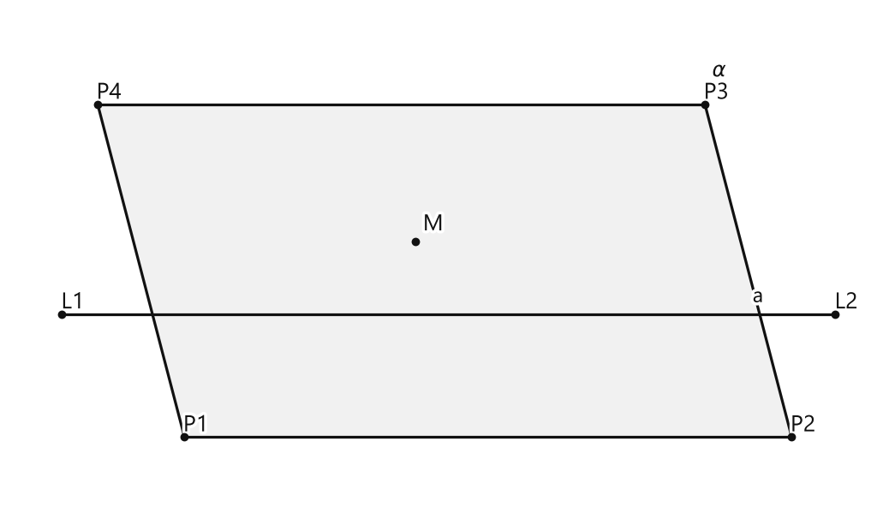
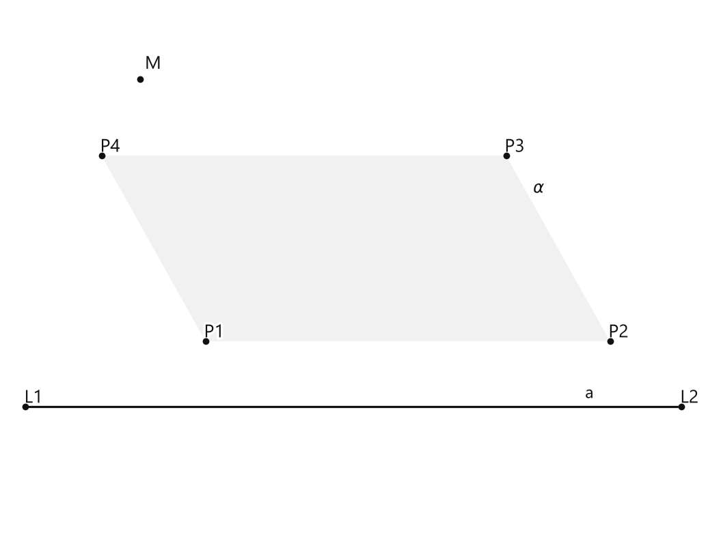

# Занятие 2. Предмет геометрии

**Раздел:** Глава I. Начальные понятия геометрии  
**Параграф учебника:** §2. Предмет геометрии  
**Страницы:** 18–18

## Цели занятия

После занятия ученик умеет:

- называть основные геометрические фигуры;
- правильно обозначать точки, прямые и плоскости;
- различать большую и малую буквы в обозначениях;
- понимать, что означает принадлежность точки прямой или плоскости;
- выбирать чертёжный инструмент для простейшего построения;
- подсчитывать отрезки, концами которых являются заданные точки.

Выбери блок своего уровня:

- **1–2 балла:** назвать основные фигуры и распознать их обозначения;
- **3–4 балла:** правильно обозначить точки, прямые и плоскости;
- **5–6 баллов:** объяснить принадлежность точки прямой или плоскости;
- **7–8 баллов:** выполнить простейшие построения с помощью инструментов;
- **9–10 баллов:** решить задачи на подсчёт отрезков и объяснить ход рассуждений.

## Теория к занятию

### Основные геометрические фигуры

#### Простыми словами

Геометрия изучает фигуры: как они выглядят, какими свойствами обладают и как расположены относительно друг друга.

Начинаем с трёх самых простых объектов:

- точки;
- прямой;
- плоскости.

Точку можно представить как отметку, показывающую место. Прямая — как ровную линию, которая продолжается в обе стороны без конца. Плоскость похожа на ровную поверхность, продолжающуюся во все стороны. В тетради мы рисуем только небольшой кусочек прямой или плоскости, потому что весь бесконечный объект на страницу не поместится — даже если очень попросить.

#### Определение

**Основные геометрические фигуры — точка, прямая и плоскость. Это абстрактные математические понятия, которые принимаются без определения.**

Это значит, что данные понятия не объясняют через другие, более простые понятия. Их принимают как исходные и используют дальше.

#### Обозначения

**Точка обозначается большой буквой латинского алфавита, прямая — двумя большими или одной малой буквой латинского алфавита.**

**Плоскость обозначается тремя большими буквами латинского или одной малой буквой греческого алфавита.**

Примеры:

- точки: $A$, $B$, $M$;
- прямые: $AB$, $BC$, $a$, $b$;
- плоскости: $ABC$, $\alpha$.

Смотри внимательно на размер буквы:

- $A$ — точка;
- $a$ — прямая.

Буквы похожи, но математический смысл у них разный. Регистр здесь работает почти как переключатель режима.

#### Принадлежность фигурам

Если точка лежит на прямой, говорят, что точка принадлежит прямой. Например, если точка $M$ лежит на прямой $b$, записывают:

$$M \in b.$$

Символ $\in$ читают: «принадлежит».

Если точка не лежит на прямой, записывают:

$$M \notin b.$$

Символ $\notin$ читают: «не принадлежит».

То же самое можно сказать о точке и плоскости:

$$A \in \alpha.$$

Здесь точка $A$ принадлежит плоскости $\alpha$.

#### Правила обозначения

Запомни такой порядок:

1. Точку обозначай одной большой буквой.
2. Прямую обозначай двумя большими или одной малой буквой.
3. Плоскость обозначай тремя большими или одной малой буквой греческого алфавита.
4. Для точек и прямых используй латинские буквы.
5. Для плоскости, обозначенной одной буквой, используй малую букву греческого алфавита, например $\alpha$.

Не путай:

- $A$ и $a$;
- прямую $AB$ и отрезок $AB$;
- точку $M$ и прямую $m$;
- плоскость $\alpha$ и угол, который иногда тоже обозначают греческой буквой.

#### Ловушки

- Запись $A$ не обозначает прямую: большая буква означает точку.
- Запись $ab$ не является правильным обозначением прямой по этому правилу: нужны две большие буквы или одна малая буква.
- Плоскость нельзя обозначить двумя большими буквами.
- Прямая может быть обозначена одной малой буквой, например $b$, но не одной большой буквой $B$.
- Если точка нарисована рядом с линией, это ещё не означает, что она лежит на этой линии. Нужно смотреть, находится ли точка прямо на линии.

---

### Чертёжные инструменты

#### Простыми словами

В первых главах геометрии чертёж нужен не для украшения страницы. По нему мы узнаём, где расположены фигуры, и выполняем построения.

У каждого инструмента своя работа:

- линейка помогает проводить прямые и измерять отрезки;
- транспортир помогает измерять и строить углы;
- циркуль помогает строить окружности;
- чертёжный треугольник помогает проводить перпендикулярные и параллельные прямые.

Если взять не тот инструмент, чертёж может получиться «примерно правильным», а в геометрии слово «примерно» часто приводит к неправильному ответу.

#### Замечание учебника

**В главах 1–4 все построения выполняются при помощи чертежных инструментов: линейки, чертежного треугольника, транспортира, циркуля. Горизонтальные (вертикальные) линии разметки в школьной тетради параллельны, горизонтальная и вертикальная линии перпендикулярны. Размеры одной клетки $0,5 \times 0,5$ см.**

#### Какой инструмент выбрать

- Чтобы провести отрезок или прямую, возьми линейку.
- Чтобы измерить или построить угол, возьми транспортир.
- Чтобы построить окружность, возьми циркуль.
- Чтобы провести перпендикулярную или параллельную прямую, используй чертёжный треугольник.

#### Ловушки

- Окружность строят циркулем, а не транспортиром.
- Угол измеряют транспортиром, а не линейкой.
- Перпендикулярные прямые образуют прямой угол величиной $90^\circ$.
- Сторона одной клетки равна $0,5$ см, а не $1$ см. Поэтому 6 клеток — это не 6 см. Клетчатая тетрадь иногда притворяется миллиметровкой, но мы её не слушаем.

---

### Прямая, отрезок и точки на чертеже

#### Простыми словами

Прямая продолжается в обе стороны без конца. На рисунке мы изображаем только её часть.

Если на прямой отметить две точки, например $A$ и $B$, то часть прямой между этими точками называется отрезком $AB$. Точки $A$ и $B$ — его концы.

Если даны несколько точек, из любых двух различных точек можно получить один отрезок. Например, из точек $A$ и $B$ получается отрезок $AB$.

#### Факт

Через любые две различные точки можно провести прямую.

Чтобы посчитать отрезки с концами в данных точках, нужно перечислить пары различных точек. Порядок букв не создаёт новый отрезок:

$$AB=BA.$$

Поэтому отрезки считают по одному разу.

#### Алгоритм подсчёта отрезков

Пусть даны точки $A$, $B$, $C$, $D$.

1. Соедини точку $A$ с остальными точками:
   
   $$AB,\ AC,\ AD.$$

2. Теперь возьми точку $B$ и соедини её только с точками, которые ещё не были использованы вместе с $B$:
   
   $$BC,\ BD.$$

3. Возьми точку $C$ и соедини её с оставшейся точкой:
   
   $$CD.$$

4. Не считай повторно отрезки $AB$ и $BA$: это один и тот же отрезок.

5. Не соединяй точку саму с собой: запись $AA$ отрезком не является.

#### Ловушки

- $AB$ и $BA$ — один отрезок, а не два.
- Концы отрезка должны быть различными точками.
- Даже если точки лежат на одной прямой, отрезки всё равно считают по парам концов.
- Нельзя считать «по два от каждой точки»: тогда каждый отрезок попадёт в подсчёт два раза — геометрия такое дублирование не одобряет.

---

## Сводка формул «выучить наизусть»

В этом параграфе специальных вычислительных формул нет.

Для подсчёта отрезков между $n$ точками можно использовать:

$$\frac{n(n-1)}{2}.$$

Здесь:

- $n$ — число данных точек;
- $n-1$ — число других точек, с которыми можно соединить одну выбранную точку;
- деление на $2$ нужно потому, что каждая пара точек посчитана дважды.

Для четырёх точек:

$$\frac{4\cdot3}{2}=6.$$

Для пяти точек:

$$\frac{5\cdot4}{2}=10.$$

## Правила, которые нельзя путать

- Точка обозначается большой буквой: $A$.
- Прямая обозначается двумя большими буквами или одной малой буквой: $AB$, $b$.
- Плоскость обозначается тремя большими буквами или одной малой буквой греческого алфавита: $ABC$, $\alpha$.
- $A$ и $a$ — разные обозначения.
- $AB$ и $BA$ — один и тот же отрезок.
- Символ $\in$ означает «принадлежит».
- Символ $\notin$ означает «не принадлежит».
- Линейка нужна для прямых и отрезков.
- Транспортир нужен для углов.
- Циркуль нужен для окружностей.
- Чертёжный треугольник нужен для построения перпендикулярных и параллельных прямых.

## Разбор ключевых заданий

### Р1. Названия основных геометрических фигур

**Условие.** Назовите основные геометрические фигуры.

**Решение.**

В определении названы три основные геометрические фигуры:

1. точка;
2. прямая;
3. плоскость.

**Ответ:** точка, прямая, плоскость.

---

### Р2. Распознавание обозначений

**Условие.** Определите, что обозначает каждая запись: $A$, $b$, $CD$, $\alpha$, $KLM$.

**Решение.**

1. Запись $A$ состоит из одной большой буквы латинского алфавита.
   
   По правилу это точка.

2. Запись $b$ состоит из одной малой буквы латинского алфавита.
   
   Так обозначают прямую.

3. Запись $CD$ состоит из двух больших букв латинского алфавита.
   
   Это может быть обозначение прямой. По двум буквам также обозначают отрезок с концами $C$ и $D$.

4. Запись $\alpha$ — это одна малая буква греческого алфавита.
   
   Так обозначают плоскость.

5. Запись $KLM$ состоит из трёх больших букв латинского алфавита.
   
   Это обозначение плоскости.

**Ответ:** $A$ — точка; $b$ — прямая; $CD$ — прямая или отрезок; $\alpha$ — плоскость; $KLM$ — плоскость.

---

### Р3. Выбор правильных обозначений

**Условие.** Из записей $P$, $p$, $PQ$, $pq$, $\beta$, $XYZ$ выберите обозначения точки, прямой и плоскости.

**Решение.**

1. $P$ — одна большая буква латинского алфавита.
   
   Это обозначение точки.

2. $p$ — одна малая буква латинского алфавита.
   
   Это обозначение прямой.

3. $PQ$ — две большие буквы латинского алфавита.
   
   Это обозначение прямой.

4. $pq$ — две малые буквы.
   
   Такое обозначение не подходит для прямой по данному правилу.

5. $\beta$ — одна малая буква греческого алфавита.
   
   Это обозначение плоскости.

6. $XYZ$ — три большие буквы латинского алфавита.
   
   Это обозначение плоскости.

**Ответ:** точка — $P$; прямые — $p$, $PQ$; плоскости — $\beta$, $XYZ$.

---

### Р4. Принадлежность точки прямой

**Условие.** Точка $M$ лежит на прямой $b$, а точка $N$ не лежит на прямой $b$. Запишите это с помощью математических символов.

**Решение.**

1. Слово «принадлежит» заменяем символом $\in$.
   
   Точка $M$ лежит на прямой $b$, поэтому:

   $$M \in b.$$

2. Слова «не принадлежит» заменяем символом $\notin$.
   
   Точка $N$ не лежит на прямой $b$, поэтому:

   $$N \notin b.$$

**Ответ:** $M \in b$, $N \notin b$.

---

### Р5. Принадлежность точки плоскости

**Условие.** Точка $A$ принадлежит плоскости $\alpha$, а точка $B$ не принадлежит плоскости $\alpha$. Запишите это математически.

**Решение.**

1. Точка $A$ принадлежит плоскости $\alpha$.
   
   Используем символ $\in$:

   $$A \in \alpha.$$

2. Точка $B$ не принадлежит плоскости $\alpha$.
   
   Используем символ $\notin$:

   $$B \notin \alpha.$$

**Ответ:** $A \in \alpha$, $B \notin \alpha$.

---

### Р6. Выбор чертёжного инструмента

**Условие.** Укажите инструмент, который используют для каждого построения:

1. провести отрезок $AB$;
2. построить угол $BCF$, равный $60^\circ$;
3. провести окружность с центром в точке $D$;
4. провести прямую, перпендикулярную прямой $AD$.

**Решение.**

1. Отрезок $AB$ проводят с помощью линейки.
2. Угол величиной $60^\circ$ строят с помощью транспортира.
3. Окружность с центром в точке $D$ строят с помощью циркуля.
4. Перпендикулярную прямую проводят с помощью чертёжного треугольника.

**Ответ:**  
1) линейка;  
2) транспортир;  
3) циркуль;  
4) чертёжный треугольник.

---

### Р7. Подсчёт отрезков между четырьмя точками

**Условие.** Даны четыре различные точки $A$, $B$, $C$, $D$. Сколько всего отрезков имеют концами эти точки?

**Решение.**

Будем соединять точки парами и не повторять уже использованные пары.

1. Из точки $A$ можно провести отрезки к трём другим точкам:

   $$AB,\ AC,\ AD.$$

2. Из точки $B$ соединяем её с точками, которые ещё не образовали пару с $B$:

   $$BC,\ BD.$$

3. Из точки $C$ остаётся соединить её с точкой $D$:

   $$CD.$$

Получили все отрезки:

$$AB,\ AC,\ AD,\ BC,\ BD,\ CD.$$

Всего их $6$.

Проверим результат по формуле:

$$\frac{n(n-1)}{2}=\frac{4\cdot3}{2}=6.$$

**Ответ:** $6$ отрезков.

---

### Р8. Подсчёт отрезков между пятью точками

**Условие.** Даны пять различных точек $A$, $B$, $C$, $D$, $K$. Сколько всего отрезков можно получить, если концами отрезков являются эти точки?

**Решение.**

Используем формулу:

$$\frac{n(n-1)}{2}.$$

Количество точек равно $5$, поэтому $n=5$.

Подставим это значение:

$$\frac{5(5-1)}{2}=\frac{5\cdot4}{2}.$$

Выполним умножение:

$$5\cdot4=20.$$

Разделим результат на $2$:

$$\frac{20}{2}=10.$$

Проверим ответ перечислением:

$$AB,\ AC,\ AD,\ AK,\ BC,\ BD,\ BK,\ CD,\ CK,\ DK.$$

Получилось $10$ отрезков. Отрезки $AB$ и $BA$ повторно не считаем, потому что это один и тот же отрезок. Перестановка букв новый отрезок не создаёт — такая «магия» в геометрии не работает.

**Ответ:** $10$ отрезков.

---

### Р9. Размер клетки

**Условие.** Размер одной клетки школьной тетради равен $0,5 \times 0,5$ см. Какова длина стороны прямоугольника, занимающего 6 клеток по горизонтали?

**Решение.**

1. Длина одной клетки по горизонтали равна $0,5$ см.

2. По горизонтали расположено $6$ клеток.

3. Чтобы найти общую длину, умножим длину одной клетки на количество клеток:

   $$6\cdot0,5=3\text{ см}.$$

**Ответ:** $3$ см.

### Р10. Перпендикулярные линии разметки

**Условие.** Горизонтальная и вертикальная линии разметки школьной тетради пересекаются. Какова величина угла между ними?

**Решение.**

По замечанию учебника горизонтальная и вертикальная линии разметки перпендикулярны.

Перпендикулярные прямые образуют прямой угол.

Величина прямого угла равна:

$$90^\circ.$$

**Ответ:** $90^\circ$.

## Практические задания

Выбери свой уровень и решай только этот блок. В блоке должна закрепиться вся тема параграфа. Ответы не приводятся.

### Уровень 1–2 балла

**С1.** Выберите основную геометрическую фигуру:  
1) отрезок  2) точка  3) угол  4) окружность  5) треугольник

**С2.** Выберите все основные геометрические фигуры:  
1) точка  2) прямая  3) отрезок  4) плоскость  5) угол

**С3.** Какое понятие относится к основным геометрическим фигурам?  
1) луч  2) прямая  3) окружность  4) квадрат  5) многоугольник

**С4.** Укажите понятие, которое в геометрии принимается без определения:  
1) точка  2) отрезок  3) угол  4) треугольник  5) окружность

**С5.** Выберите верное утверждение:  
1) Основными геометрическими фигурами являются отрезок, луч и угол.  
2) Основными геометрическими фигурами являются точка, прямая и плоскость.  
3) Основными геометрическими фигурами являются треугольник, квадрат и круг.  
4) Основными геометрическими фигурами являются прямая, луч и окружность.  
5) Основными геометрическими фигурами являются точка, отрезок и угол.

**С6.** Какая фигура является абстрактным математическим понятием, принимаемым без определения?  
1) квадрат  2) плоскость  3) окружность  4) луч  5) отрезок

**С7.** Выберите инструмент, используемый для построения прямых линий:  
1) циркуль  2) транспортир  3) линейка  4) ластик  5) карандаш

**С8.** Какой чертёжный инструмент используют для измерения и построения углов?  
1) линейку  2) циркуль  3) транспортир  4) чертёжный треугольник  5) ластик

**С9.** Выберите все чертёжные инструменты, указанные для выполнения построений:  
1) линейка  2) чертёжный треугольник  3) транспортир  4) циркуль  5) угольник для мебели

**С10.** В школьной тетради горизонтальная и вертикальная линии разметки:  
1) параллельны  2) перпендикулярны  3) совпадают  4) образуют острый угол  5) не пересекаются

**С11.** Каковы размеры одной клетки школьной тетради согласно условию?  
1) $1 \times 1$ см  2) $0,5 \times 0,5$ см  3) $0,5 \times 1$ см  4) $1 \times 2$ см  5) $2 \times 2$ см

**С12.** Выберите верное утверждение о линиях разметки школьной тетради:  
1) Горизонтальные и вертикальные линии параллельны.  
2) Горизонтальные линии перпендикулярны вертикальным линиям.  
3) Все линии разметки совпадают.  
4) Вертикальные линии не пересекают горизонтальные.  
5) Горизонтальные линии образуют с вертикальными острый угол.

**С13.** Выберите основную геометрическую фигуру:  
1) отрезок  
2) луч  
3) точка  
4) угол  
5) окружность

**С14.** Выберите все основные геометрические фигуры:  
1) точка  
2) прямая  
3) отрезок  
4) плоскость  
5) угол

**С15.** Какой чертёжный инструмент используют для проведения прямых линий?  
1) циркуль  
2) линейку  
3) транспортир  
4) чертёжный треугольник  
5) ластик

**С16.** Какой чертёжный инструмент используют для измерения углов?  
1) линейку  
2) циркуль  
3) транспортир  
4) чертёжный треугольник  
5) карандаш

**С17.** Какой чертёжный инструмент используют для построения окружности?  
1) линейку  
2) транспортир  
3) чертёжный треугольник  
4) циркуль  
5) угольник

**С18.** Установите соответствие между геометрической фигурой и её изображением: для каждой буквы выберите один номер.  
А) точка  
Б) прямая  
В) плоскость  

1) бесконечно протяжённая ровная линия  
2) ровная поверхность  
3) обозначение положения без размера

**С19.** Выберите утверждение, соответствующее карточке параграфа.  
1) Точка, прямая и плоскость принимаются без определения.  
2) Точка, прямая и плоскость имеют определения через окружность.  
3) Основными фигурами являются только отрезок и угол.  
4) Плоскость всегда изображают окружностью.  
5) Прямую строят только циркулем.

**С20.** В школьной тетради горизонтальные линии разметки расположены:  
1) перпендикулярно друг другу  
2) параллельно друг другу  
3) под углом $45^\circ$  
4) по окружности  
5) произвольно

**С21.** В школьной тетради вертикальные линии разметки расположены:  
1) параллельно друг другу  
2) перпендикулярно друг другу  
3) под углом $30^\circ$  
4) по диагонали  
5) произвольно

**С22.** Как расположены горизонтальная и вертикальная линии разметки школьной тетради?  
1) параллельно  
2) перпендикулярно  
3) совпадают  
4) являются дугами окружности  
5) не пересекаются

**С23.** Размер одной клетки школьной тетради равен $0{,}5 \times 0{,}5$ см. Какова длина стороны квадрата, составленного из четырёх клеток в ряд?  
1) $0{,}5$ см  
2) $1$ см  
3) $2$ см  
4) $4$ см  
5) $8$ см

**С24.** Выберите только те объекты, которые относятся к чертёжным инструментам, указанным в карточке параграфа:  
1) линейка  
2) транспортир  
3) циркуль  
4) термометр  
5) чертёжный треугольник

**С25.** Выберите основную геометрическую фигуру:  
1) отрезок  2) угол  3) точка  4) треугольник  5) окружность

**С26.** Выберите все основные геометрические фигуры:  
1) точка  2) прямая  3) отрезок  4) плоскость  5) угол

**С27.** Какое понятие принимается без определения?  
1) луч  2) точка  3) угол  4) отрезок  5) окружность

**С28.** Выберите фигуру, которая является основной геометрической фигурой:  
1) квадрат  2) прямая  3) треугольник  4) многоугольник  5) круг

**С29.** Выберите все понятия, которые относятся к основным геометрическим фигурам:  
1) плоскость  2) прямая  3) точка  4) луч  5) окружность

**С30.** Каким инструментом проводят прямые линии?  
1) циркулем  2) транспортиром  3) линейкой  4) ластиком  5) угольником без линейки

**С31.** Каким инструментом измеряют величину угла?  
1) линейкой  2) циркулем  3) транспортиром  4) карандашом  5) ластиком

**С32.** Каким инструментом выполняют построение окружности?  
1) циркулем  2) транспортиром  3) линейкой  4) чертёжным треугольником  5) ластиком

**С33.** Выберите все чертёжные инструменты, указанные для выполнения построений:  
1) линейка  2) чертёжный треугольник  3) транспортир  4) циркуль  5) ножницы

**С34.** В школьной тетради горизонтальные линии разметки и вертикальные линии разметки являются:  
1) перпендикулярными  2) параллельными  3) совпадающими  4) пересекающимися под острым углом  5) скрещивающимися

**С35.** Как расположены горизонтальная и вертикальная линии разметки в школьной тетради?  
1) параллельно  2) перпендикулярно  3) совпадают  4) не пересекаются  5) образуют острый угол

**С36.** Размер одной клетки школьной тетради равен:  
1) $1 \times 1$ см  2) $0{,}5 \times 0{,}5$ см  3) $0{,}5 \times 1$ см  4) $1 \times 2$ см  5) $2 \times 2$ см

### Уровень 3–4 балла

**С1.** Запишите названия трёх основных геометрических фигур, которые принимаются без определения.

**С2.** Из перечисленных объектов выберите только основные геометрические фигуры: точка, отрезок, прямая, плоскость, угол, окружность.

**С3.** Укажите, какие из перечисленных инструментов относятся к чертёжным инструментам: линейка, транспортир, циркуль, чертёжный треугольник, ластик.

**С4.** Установите соответствие между инструментом и его основным назначением:  
1) линейка;  
2) транспортир;  
3) циркуль.  
А) измерение и построение углов;  
Б) проведение прямых линий и измерение отрезков;  
В) построение окружностей.

**С5.** Верно ли утверждение: «Точка, прямая и плоскость являются основными геометрическими фигурами»? Запишите ответ «да» или «нет».

**С6.** Запишите, какие две линии разметки в школьной тетради параллельны друг другу: горизонтальные или вертикальные.

**С7.** Запишите, какие две линии разметки в школьной тетради перпендикулярны друг другу: горизонтальная и вертикальная или две горизонтальные.

**С8.** Одна клетка тетради имеет размеры $0{,}5 \times 0{,}5$ см. Найдите длину отрезка, равного четырём клеткам, если его концы находятся на одной горизонтальной линии.

**С9.** Одна клетка тетради имеет размеры $0{,}5 \times 0{,}5$ см. Найдите длину отрезка, равного шести клеткам, если его концы находятся на одной вертикальной линии.

**С10.** Начертите в тетради одну точку, одну прямую и изобразите часть плоскости. Подпишите построенные объекты буквами $A$, $a$ и $\alpha$ соответственно.

**С11.** С помощью линейки начертите прямую $b$. Отметьте на ней две точки $C$ и $D$ и измерьте длину отрезка $CD$ с точностью до миллиметра.

**С12.** С помощью чертёжного треугольника начертите две перпендикулярные прямые $m$ и $n$, пересекающиеся в точке $O$.

**С13.** Запишите названия трёх основных геометрических фигур, которые принимаются без определения.

**С14.** Какие из перечисленных объектов являются основными геометрическими фигурами: точка, отрезок, прямая, угол, плоскость, треугольник?

**С15.** Выберите один верный ответ. Основными геометрическими фигурами являются  
1) точка, отрезок, угол;  
2) точка, прямая, плоскость;  
3) прямая, луч, плоскость;  
4) круг, прямая, точка;  
5) точка, треугольник, плоскость.

**С16.** Укажите, какие чертёжные инструменты используют для построения геометрических фигур: линейка, чертёжный треугольник, транспортир, циркуль, ластик.

**С17.** Для построения прямой линии ученик использовал линейку. Для построения прямого угла он приложил к линии чертёжный треугольник. Назовите два использованных инструмента и укажите, какая линия образует прямой угол с горизонтальной линией.

**С18.** В тетради проведены горизонтальная и вертикальная линии. Как расположены эти линии по отношению друг к другу?

**С19.** Выберите все верные утверждения.  
1) Горизонтальные линии разметки в школьной тетради параллельны.  
2) Вертикальные линии разметки в школьной тетради перпендикулярны друг другу.  
3) Горизонтальная и вертикальная линии разметки перпендикулярны.  
4) Все линии разметки в тетради проходят под одним и тем же углом.  
5) Горизонтальные линии разметки пересекаются.

**С20.** Одна клетка школьной тетради имеет размеры $0{,}5 \times 0{,}5$ см. Найдите длину отрезка, концы которого расположены на расстоянии 8 клеток по горизонтали.

**С21.** Одна клетка школьной тетради имеет размеры $0{,}5 \times 0{,}5$ см. Найдите длину отрезка, концы которого расположены на расстоянии 6 клеток по вертикали.

**С22.** Начертите в тетради горизонтальный отрезок длиной $4$ см, используя разметку клеток. Сколько клеток должен занимать этот отрезок?

**С23.** Начертите в тетради вертикальный отрезок длиной $3$ см, используя разметку клеток. Сколько клеток должен занимать этот отрезок?

**С24.** На листе отмечены точка $A$ и точка $B$, расположенная на одной горизонтальной линии с точкой $A$ на расстоянии 10 клеток вправо. Одна клетка имеет размер $0{,}5 \times 0{,}5$ см. Начертите отрезок $AB$ с помощью линейки и укажите его длину.

**С25.** Запишите названия трёх основных геометрических фигур, которые принимаются без определения.

**С26.** Выберите из списка только основные геометрические фигуры: точка, отрезок, прямая, плоскость, угол, треугольник.

**С27.** Укажите, какие из перечисленных понятий являются абстрактными математическими понятиями: точка, длина карандаша, прямая, плоскость, клетка тетради.

**С28.** Запишите название чертёжного инструмента, которым измеряют величину угла.

**С29.** Какой чертёжный инструмент используют для проведения окружностей?

**С30.** Установите соответствие между чертёжным инструментом и его основным назначением. Запишите ответ в виде последовательности букв и цифр.

1. Линейка  
2. Транспортир  
3. Циркуль  

А. Проведение окружностей  
Б. Измерение величины угла  
В. Проведение прямых линий

**С31.** Перечислите четыре чертёжных инструмента, с помощью которых выполняются построения в главах 1–4.

**С32.** В школьной тетради одна клетка имеет размеры $0{,}5 \times 0{,}5$ см. Найдите длину отрезка, расположенного вдоль линии разметки и занимающего 8 клеток.

**С33.** Отрезок на чертеже занимает 6 клеток школьной тетради. Найдите его длину, если размер одной клетки вдоль отрезка равен $0{,}5$ см.

**С34.** Горизонтальная линия разметки и вертикальная линия разметки школьной тетради пересекаются. Как называются эти линии по отношению друг к другу?

**С35.** Определите, параллельны или перпендикулярны друг другу следующие линии разметки школьной тетради:  
а) две горизонтальные линии;  
б) горизонтальная и вертикальная линии.

**С36.** На листе проведены две горизонтальные линии и одна вертикальная линия разметки. Сколько пар параллельных линий и сколько пар перпендикулярных линий образовано?

### Уровень 5–6 баллов

**С1.** Запишите названия трёх основных геометрических фигур, которые принимаются без определения.

**С2.** Изобразите в тетради точку $A$, прямую $a$ и плоскость $\alpha$. Обозначьте каждую фигуру так, чтобы обозначения не повторялись.

**С3.** Выберите все геометрические фигуры, относящиеся к основным:  
1) точка; 2) отрезок; 3) прямая; 4) плоскость; 5) угол.

**С4.** Укажите чертёжный инструмент, с помощью которого обычно проводят прямую линию.

**С5.** Установите соответствие между инструментом и действием:  
А) линейка;  
Б) чертёжный треугольник;  
В) транспортир;  
Г) циркуль.  

1) измерение и построение углов;  
2) проведение прямых линий;  
3) построение окружностей;  
4) построение некоторых прямых углов и перпендикулярных линий.

**С6.** Назовите геометрическую фигуру, которую обозначают точкой на чертеже и одной заглавной латинской буквой.

**С7.** В тетради проведена горизонтальная линия разметки длиной $8$ клеток. Найдите её длину в сантиметрах, если размер одной клетки равен $0{,}5 \times 0{,}5$ см.

**С8.** Вертикальная линия разметки состоит из $14$ клеток. Найдите её длину в сантиметрах.

**С9.** На клетчатой разметке точка $A$ находится на горизонтальной линии, а точка $B$ — на вертикальной линии. Какой инструмент удобно использовать, чтобы провести через каждую из точек прямую, совпадающую с соответствующей линией разметки?

**С10.** Выберите верное утверждение:  
1) Основными геометрическими фигурами являются точка, отрезок и угол.  
2) Основными геометрическими фигурами являются точка, прямая и плоскость.  
3) Основными геометрическими фигурами являются прямая, луч и окружность.  
4) Основными геометрическими фигурами являются плоскость, треугольник и квадрат.  
5) Основными геометрическими фигурами являются точка, луч и плоскость.

**С11.** Начертите на клетчатой бумаге горизонтальный отрезок длиной $5$ см и вертикальный отрезок длиной $3$ см. Сколько клеток должен занимать каждый отрезок?

**С12.** Для выполнения чертежа требуется: провести прямую линию, построить прямой угол, измерить величину угла и начертить окружность. Запишите названия чертёжных инструментов, которые можно использовать для выполнения этих действий.

**С13.** Выберите верное утверждение.

1) Точка, прямая и плоскость — основные геометрические фигуры.  
2) Отрезок, луч и угол — основные геометрические фигуры.  
3) Круг, квадрат и треугольник — основные геометрические фигуры.  
4) Линейка, циркуль и транспортир — основные геометрические фигуры.  
5) Клетка тетради — основная геометрическая фигура.

**С14.** Запишите названия трёх основных геометрических фигур, изучаемых в начале курса геометрии.

**С15.** Установите соответствие между объектом и его ролью в геометрии. Запишите последовательность цифр.

А) точка  
Б) прямая  
В) плоскость  

1) основная геометрическая фигура  
2) чертёжный инструмент  
3) размер клетки тетради

**С16.** Из предложенных объектов выпишите только чертёжные инструменты: точка, линейка, прямая, чертёжный треугольник, плоскость, транспортир, циркуль.

**С17.** Выберите все верные утверждения.

1) Точка, прямая и плоскость принимаются без определения.  
2) Основные геометрические фигуры являются чертёжными инструментами.  
3) В главах 1–4 построения выполняются с помощью чертёжных инструментов.  
4) Размер одной клетки школьной тетради равен $0{,}5 \times 0{,}5$ см.  
5) Плоскость строят с помощью циркуля.

**С18.** Назовите четыре чертёжных инструмента, которые используются при построениях в главах 1–4.

**С19.** Начертите в тетради точку $A$, прямую $a$ и изобразите часть плоскости, на которой они расположены. Подпишите все три объекта.

**С20.** В школьной тетради проведены горизонтальная и вертикальная линии разметки. Определите, каким является угол между этими линиями: острым, прямым или тупым.

**С21.** Сколько сантиметров составляет длина 8 клеток школьной тетради, если размер одной клетки равен $0{,}5 \times 0{,}5$ см?

**С22.** Сколько квадратных сантиметров занимает прямоугольник из 6 клеток в длину и 4 клеток в ширину, если размер одной клетки равен $0{,}5 \times 0{,}5$ см?

**С23.** Для построения отрезка длиной $4$ см, окружности и угла выберите подходящие инструменты из списка: линейка, чертёжный треугольник, транспортир, циркуль. Укажите инструмент для каждого построения.

**С24.** Прочитайте утверждения и распределите их в две группы: «основные геометрические фигуры» и «чертёжные инструменты».

Точка, циркуль, плоскость, транспортир, прямая, линейка, чертёжный треугольник.

**С25.** Выберите только основные геометрические фигуры:  
1) точка; 2) отрезок; 3) прямая; 4) плоскость; 5) окружность.

**С26.** Установите соответствие между геометрическими объектами и их обозначениями: для каждого объекта запишите подходящую букву.

А) точка; Б) прямая; В) плоскость.  
1) $\alpha$; 2) $M$; 3) $a$.

**С27.** Какие чертёжные инструменты используют для выполнения построений в геометрии? Выберите все верные ответы.  
1) линейка; 2) чертёжный треугольник; 3) транспортир; 4) циркуль; 5) термометр.

**С28.** На странице тетради начертили прямоугольник размером $8$ клеток в длину и $5$ клеток в ширину. Определите длину и ширину прямоугольника в сантиметрах, если размер одной клетки равен $0{,}5 \times 0{,}5$ см.

**С29.** В тетради проведены горизонтальная и вертикальная линии разметки. Какое взаимное расположение имеют эти линии? Выберите верный ответ.  
1) параллельные; 2) перпендикулярные; 3) совпадающие; 4) скрещивающиеся; 5) нельзя определить.

**С30.** Запишите, какие из перечисленных объектов являются абстрактными математическими понятиями, принимаемыми без определения: точка, прямая, плоскость, лист бумаги, карандаш.

### Уровень 7–8 баллов

**С1.** Среди перечисленных объектов выберите только те, которые относятся к основным геометрическим фигурам: точка, отрезок, прямая, плоскость, окружность, треугольник.

**С2.** Запишите, какие основные геометрические фигуры можно выделить в описании: «На листе бумаги отмечены две точки, через них проведена линия, а рядом начерчен треугольник».

**С3.** Ученик сказал: «Точка на чертеже имеет размеры, поэтому точка не может быть основной геометрической фигурой». Согласны ли вы с этим утверждением? Обоснуйте ответ, учитывая различие между изображением и математическим понятием.

**С4.** На клетчатой бумаге отмечены точки $A$ и $B$. Укажите, каким чертёжным инструментом можно провести через них прямую. Назовите ещё один инструмент, который может понадобиться для проверки взаимного расположения горизонтальной и вертикальной линий.

**С5.** В тетради проведены горизонтальная и вертикальная линии разметки. Каково взаимное расположение этих линий? Каким чертёжным инструментом можно проверить это свойство?

**С6.** Размер одной клетки тетради равен $0{,}5 \times 0{,}5$ см. Найдите длину отрезка, совпадающего с четырьмя сторонами клеток подряд, если он расположен горизонтально.

**С7.** На клетчатой бумаге от точки $A$ отложили вправо шесть клеток, а затем вверх четыре клетки и получили точку $B$. Найдите горизонтальное и вертикальное расстояния между точками $A$ и $B$ в сантиметрах.

**С8.** Постройте с помощью линейки и чертёжного треугольника две пересекающиеся прямые так, чтобы одна из них была горизонтальной, а другая — вертикальной. Укажите, какое взаимное расположение имеют построенные прямые.

**С9.** На листе бумаги нужно изобразить точку $M$, прямую $a$ и плоскость $\alpha$. Опишите, чем математические объекты отличаются от их изображений на рисунке. Для каждого объекта укажите, что именно изображает его на чертеже.

**С10.** Ученик построил прямую, провёл на ней две точки и назвал их $A$ и $B$. Затем он утверждает, что получил три основные геометрические фигуры: две точки и одну прямую. Проверьте утверждение и объясните, какие объекты здесь являются основными геометрическими фигурами.

**С11.** Размер одной клетки клетчатой тетради равен $0{,}5 \times 0{,}5$ см. На горизонтальной линии разметки отмечены точки $P$ и $Q$, между которыми расположены семь клеток. Затем через точку $P$ провели вертикальную линию. Найдите длину отрезка $PQ$ и укажите взаимное расположение горизонтальной и вертикальной линий.

**С12.** Составьте последовательность действий для выполнения чертежа: отметить две точки $C$ и $D$, провести через них прямую, а через точку $C$ провести линию, перпендикулярную этой прямой, используя линейку и чертёжный треугольник. Укажите, какие геометрические фигуры должны быть получены в результате.

**С13.** Выберите все геометрические фигуры, названия которых относятся к основным понятиям геометрии:  
1) точка; 2) прямая; 3) плоскость; 4) отрезок; 5) окружность.

**С14.** В тетради начертили горизонтальную линию и отметили на ней точки $A$, $B$ и $C$. Объясните, какие чертёжные инструменты необходимы для выполнения этой работы и какую роль выполняет каждый из них.

**С15.** Укажите, какие из перечисленных объектов являются геометрическими фигурами, а какие — чертёжными инструментами: точка, линейка, прямая, циркуль, плоскость, транспортир, чертёжный треугольник.

**С16.** На клетчатом листе проведены горизонтальная и вертикальная линии. Определите длину каждой линии, если горизонтальная линия проходит через $14$ клеток, а вертикальная — через $9$ клеток. Ответ запишите в сантиметрах.

**С17.** Выберите единственное верное утверждение.  
1) Линейка является основной геометрической фигурой.  
2) Точка, прямая и плоскость принимаются без определения.  
3) Транспортир используется для проведения окружностей.  
4) Размер одной клетки тетради равен $1 \times 1$ см.  
5) Вертикальные линии разметки перпендикулярны друг другу.

**С18.** На рисунке изображены точка $M$, прямая $a$ и плоскость $\alpha$. Запишите названия всех изображённых объектов и укажите, какой из них обозначен одной латинской буквой, какой — заглавной латинской буквой, а какой — греческой буквой.

<!--geo-figure-spec
{
  "needed": true,
  "kind": "plane",
  "caption": "Точка $M$, прямая $a$ и плоскость $\\alpha$",
  "equal": true,
  "axis": false,
  "xlim": [
    -0.6,
    5.4
  ],
  "ylim": [
    0.2,
    3.6
  ],
  "points": {
    "M": [
      2.2,
      2.0
    ],
    "L1": [
      -0.25,
      1.5
    ],
    "L2": [
      5.1,
      1.5
    ],
    "P1": [
      0.6,
      0.65
    ],
    "P2": [
      4.8,
      0.65
    ],
    "P3": [
      4.2,
      2.95
    ],
    "P4": [
      0.0,
      2.95
    ]
  },
  "segments": [
    {
      "points": [
        "L1",
        "L2"
      ],
      "dashed": false,
      "label": "a",
      "t": 0.9
    },
    [
      "P1",
      "P2"
    ],
    [
      "P2",
      "P3"
    ],
    [
      "P3",
      "P4"
    ],
    [
      "P4",
      "P1"
    ]
  ],
  "polygons": [
    {
      "vertices": [
        "P1",
        "P2",
        "P3",
        "P4"
      ],
      "fill": 0.06
    }
  ],
  "circles": [],
  "labels": {
    "M": {
      "dx": 0.12,
      "dy": 0.12
    }
  },
  "texts": [
    {
      "xy": [
        4.3,
        3.18
      ],
      "text": "$\\alpha$"
    }
  ]
}
-->

*Точка M, прямая a и плоскость \alpha*

**С19.** В тетради нужно построить горизонтальную линию длиной $6$ см и вертикальную линию длиной $4$ см. Сколько клеток должна занимать каждая линия? Запишите последовательность действий при выполнении построения.

**С20.** Ученик утверждает: «Если объект изображён на бумаге, то он обязательно является чертёжным инструментом». Приведите два примера, опровергающих это утверждение, и кратко обоснуйте свой выбор.

**С21.** Выберите все действия, для которых в геометрии используют чертёжные инструменты:  
1) провести прямую линию;  
2) измерить угол;  
3) построить окружность;  
4) назвать точку;  
5) провести линию через заданные точки.

**С22.** На клетчатом листе отмечены точки $A$ и $B$. Точка $A$ находится на пересечении горизонтальной и вертикальной линий разметки, а точка $B$ расположена на $8$ клеток правее и на $5$ клеток выше точки $A$. Определите горизонтальное и вертикальное расстояния между точками $A$ и $B$ в сантиметрах.

<!--geo-figure-spec
{
  "needed": true,
  "kind": "plane",
  "caption": "Точка $M$, прямая $a$ и плоскость $\\alpha$",
  "equal": true,
  "axis": false,
  "xlim": [
    -0.8,
    5.5
  ],
  "ylim": [
    -0.6,
    4.2
  ],
  "points": {
    "M": [
      0.4,
      3.55
    ],
    "L1": [
      -0.65,
      0.55
    ],
    "L2": [
      5.35,
      0.55
    ],
    "P1": [
      1.0,
      1.15
    ],
    "P2": [
      4.7,
      1.15
    ],
    "P3": [
      3.75,
      2.85
    ],
    "P4": [
      0.05,
      2.85
    ]
  },
  "segments": [
    {
      "points": [
        "L1",
        "L2"
      ],
      "dashed": false,
      "label": "a",
      "t": 0.86
    }
  ],
  "polygons": [
    {
      "vertices": [
        "P1",
        "P2",
        "P3",
        "P4"
      ],
      "fill": 0.06
    }
  ],
  "circles": [],
  "labels": {
    "M": {
      "dx": 0.12,
      "dy": 0.14
    }
  },
  "texts": [
    {
      "xy": [
        4.05,
        2.55
      ],
      "text": "$\\alpha$"
    }
  ]
}
-->

*Точка M, прямая a и плоскость \alpha*

**С23.** Разделите перечисленные записи на три группы: обозначения точек, обозначения прямых и обозначения плоскостей: $P$, $q$, $\\beta$, $R$, $s$, $\\gamma$, $T$, $m$, $\\delta$. Запишите результат в виде трёх строк.

**С24.** На клетчатом листе требуется выполнить чертёж, содержащий точку $K$, горизонтальную прямую $p$, вертикальную прямую $q$ и плоскость $\\pi$, изображённую условным параллелограммом. Составьте план построения, указав необходимые чертёжные инструменты и порядок действий.

### Уровень 9–10 баллов

**С1.** На листе бумаги отмечены точки $A$, $B$ и $C$, причём точки $A$ и $B$ лежат на одной прямой, а точка $C$ этой прямой не принадлежит. Запишите, какие основные геометрические фигуры заданы условием, и назовите все прямые, которые можно провести через пары отмеченных точек.

**С2.** Из предложенных объектов выберите все, которые могут служить моделями точки в геометрическом чертеже: след острия карандаша, маленькая бусина, пересечение двух линий, пятно краски площадью $1\ \text{см}^2$, конец отрезка.

**С3.** На клетчатой бумаге с размером клетки $0{,}5 \times 0{,}5$ см отметьте точки $A$, $B$, $C$, $D$, если точка $B$ расположена на $6$ клеток правее и на $2$ клетки выше точки $A$, точка $C$ — на $4$ клетки левее и на $5$ клеток выше точки $A$, а точка $D$ — на $3$ клетки правее и на $4$ клетки ниже точки $A$. Через каждую пару точек проведите прямую. Укажите пары точек, соединяющие которые проведённые прямые совпадут.

**С4.** Ученик утверждает: «Точка — это маленький кружок, прямая — тонкая полоска, а плоскость — поверхность парты». Проанализируйте утверждение: для каждого из трёх объектов укажите, является ли названный предмет самим геометрическим понятием или только его наглядной моделью.

**С5.** Не используя циркуль и транспортир, составьте план построения с помощью линейки и чертёжного треугольника следующих объектов:  
1) двух пересекающихся прямых;  
2) двух перпендикулярных прямых;  
3) прямой и точки, не лежащей на этой прямой.  
Для каждого построения укажите, какое положение инструмента позволяет получить нужный результат.

**С6.** На клетчатом листе горизонтальная и вертикальная линии разметки перпендикулярны, а каждая клетка имеет размер $0{,}5 \times 0{,}5$ см. Точки $P$ и $Q$ находятся на одной горизонтальной линии разметки, расстояние между ними равно $7$ клеткам. Точки $R$ и $S$ находятся на одной вертикальной линии разметки, расстояние между ними равно $9$ клеткам. Найдите расстояния $PQ$ и $RS$ в сантиметрах и определите, какие из прямых $PQ$ и $RS$ перпендикулярны.

**С7.** Даны три точки $A$, $B$, $C$, не лежащие на одной прямой. Сколько различных прямых можно провести через пары этих точек? Изобразите возможные прямые и обозначьте каждую двумя буквами.

**С8.** На чертеже изображены две горизонтальные прямые $a$ и $b$, две вертикальные прямые $c$ и $d$, а также точки $M$ и $N$. Точка $M$ принадлежит прямой $a$ и не принадлежит прямой $b$, точка $N$ принадлежит прямой $d$ и не принадлежит прямой $c$. Составьте все верные записи принадлежности и непринадлежности точек прямым, используя знаки $\in$ и $\notin$.

**С9.** На клетчатой бумаге выбраны точки $A$ и $B$, расположенные на одной горизонтальной линии разметки на расстоянии $8$ клеток друг от друга. Точка $C$ расположена на $6$ клеток правее точки $A$ и на $4$ клетки выше неё. Постройте прямую $AB$ и прямую $AC$. Определите, под каким углом пересекаются эти прямые, и объясните, какие данные клетчатой разметки позволяют сделать вывод без транспортира.

**С10.** Требуется построить прямую, проходящую через точку $K$, и прямую, не проходящую через точку $K$, причём обе прямые должны быть перпендикулярны одной и той же вертикальной линии разметки клетчатой тетради. Опишите последовательность действий с использованием линейки и чертёжного треугольника и укажите взаимное положение полученных прямых.

**С11.** На клетчатом листе с размером клетки $0{,}5 \times 0{,}5$ см отмечены точки $A$, $B$, $C$ и $D. Точки $A$ и $B$ лежат на одной горизонтальной линии, точки $C$ и $D$ — на другой горизонтальной линии. Расстояние между $A$ и $B$ равно $10$ клеткам, между $C$ и $D$ — $6$ клеткам, а расстояние между горизонтальными линиями, содержащими эти пары точек, равно $4$ клеткам. Постройте прямые $AB$ и $CD$, определите их взаимное положение и вычислите расстояние между ними в сантиметрах.

**С12.** На листе изображены прямая $m$ и точка $T$, не принадлежащая этой прямой. Используя линейку, чертёжный треугольник и циркуль, разработайте способ построения через точку $T$ прямой, перпендикулярной прямой $m$. В описании укажите назначение каждого использованного инструмента и обоснуйте, почему построенная прямая проходит через $T$ и перпендикулярна $m$.

**С13.** В тетради проведены две линии разметки: горизонтальная и вертикальная. На горизонтальной линии отмечены точки $A$ и $B$, расстояние между которыми равно $7$ клеткам, а на вертикальной линии отмечены точки $C$ и $D$, расстояние между которыми равно $5$ клеткам. Найдите длины отрезков $AB$ и $CD$ в сантиметрах и укажите взаимное расположение прямых, содержащих эти отрезки.

**С14.** Используя линейку и чертёжный треугольник, выполните построение: проведите прямую $a$, отметьте на ней точки $A$ и $B$, через точку $A$ проведите прямую $b$, перпендикулярную прямой $a$, а через точку $B$ — прямую $c$, параллельную прямой $b$. Обозначьте точку пересечения прямых $b$ и $c$, если она существует, и объясните, почему в данном построении такая точка не появляется.

**С15.** На листе отмечены три точки $A$, $B$ и $C$, причём точки $A$ и $B$ лежат на одной прямой, а точка $C$ этой прямой не принадлежит. Через каждую пару отмеченных точек проводят прямую. Определите, сколько различных прямых получится, и перечислите пары точек, определяющие каждую из них.

**С16.** На клетчатой бумаге проведена горизонтальная прямая $a$. Точка $P$ находится на расстоянии $6$ клеток от прямой $a$, а точка $Q$ — на расстоянии $4$ клеток от прямой $a$ с противоположной стороны. Через точки $P$ и $Q$ проведена вертикальная прямая $b$. Найдите расстояние между точками $P$ и $Q$ в сантиметрах и укажите, какие из прямых $a$ и $b$ перпендикулярны.

**С17.** Ученик утверждает: «Если две прямые имеют общую точку, то они обязательно перпендикулярны». Приведите два различных примера расположения двух прямых, опровергающих это утверждение: в первом случае прямые должны пересекаться, но не быть перпендикулярными, а во втором — не иметь общих точек. Для каждого примера укажите, какие чертёжные инструменты достаточно использовать для его построения.

**С18.** На клетчатой бумаге нужно построить фигуру, используя только три прямые: горизонтальную прямую $a$, вертикальную прямую $b$ и наклонную прямую $c$. Прямая $a$ пересекает прямые $b$ и $c$, а прямые $b$ и $c$ пересекаются в точке, лежащей вне выбранного участка чертежа. Опишите последовательность построения и укажите, какие пары прямых перпендикулярны, а какие пересекаются не под прямым углом.

## Чек-лист «ученик понял тему»

- Могу повторить определения и формулы параграфа своими словами и по учебнику.
- Решаю типовые задания своего уровня без подсказки.
- Вижу типичную ошибку и могу её объяснить.
