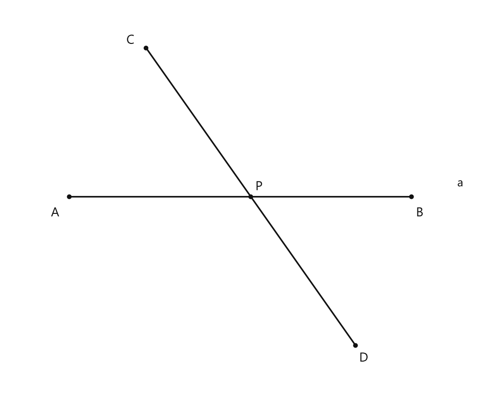
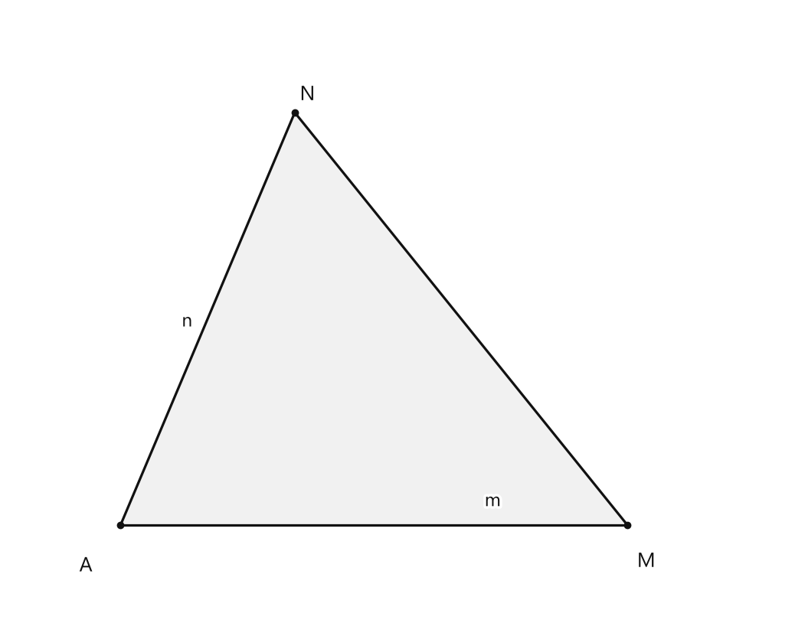
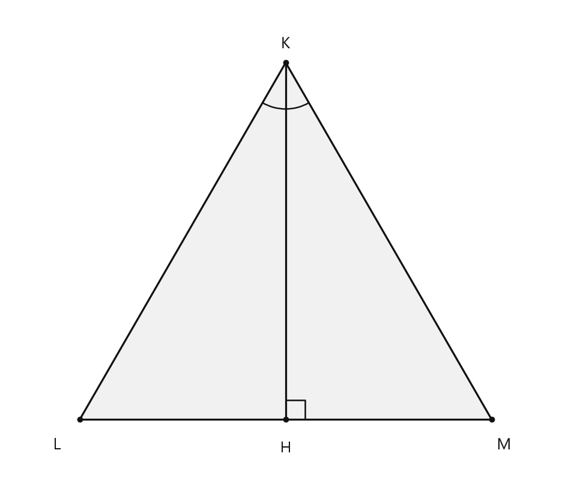

# Занятие 3. Геометрические фигуры

**Раздел:** Глава I. Начальные понятия геометрии  
**Параграф учебника:** §2. Геометрические фигуры  
**Страницы:** 19–23

## Цели занятия

После занятия ты сможешь:

- различать плоские и пространственные геометрические фигуры;
- объяснять, какие фигуры называются равными;
- применять определения отрезка и равностороннего треугольника;
- отличать аксиому от теоремы;
- называть три типа геометрических задач;
- находить площадь поверхности куба и прямоугольного параллелепипеда.

Выбери блок своего уровня:

- **1–2 балла** — узнаю основные фигуры и определения;
- **3–4 балла** — различаю аксиомы, теоремы и типы задач;
- **5–6 баллов** — решаю задачи на отрезки и площади;
- **7–8 баллов** — уверенно работаю с пространственными фигурами;
- **9–10 баллов** — объясняю решения и не попадаюсь на типичные ловушки.

## Теория к занятию

### 1. Планиметрия и стереометрия

#### Простыми словами

Геометрия изучает фигуры. Одни фигуры можно целиком разместить на плоскости, например на листе бумаги. Другие фигуры «выходят» за пределы плоскости: у них есть объём.

Изучением плоских фигур занимается планиметрия.

Изучением пространственных фигур занимается стереометрия.

Треугольник можно нарисовать на листе целиком — это плоская фигура. Куб на листе можно только изобразить, но сам куб плоским не станет. Рисунок — это изображение, а не превращение куба в картонную наклейку.

#### Определения

В *планиметрии* изучаются свойства плоских геометрических фигур, то есть тех, которые всеми своими точками могут быть расположены в одной плоскости.

В *стереометрии* рассматриваются свойства пространственных геометрических фигур, которые не могут целиком располагаться в одной плоскости.

#### Правила

- К плоским фигурам относятся треугольник, квадрат, окружность.
- К пространственным фигурам относятся куб, прямоугольный параллелепипед, пирамида, шар.
- Круг и шар — разные фигуры: круг плоский, а шар пространственный.
- Если пространственную фигуру рисуют на бумаге, это только её изображение.

#### Ловушки

- Куб, нарисованный на листе, не становится плоской фигурой.
- Окружность — это плоская фигура. Не путай её с шаром.
- Чтобы определить вид фигуры, спрашивай: «Можно ли расположить все её точки в одной плоскости?»

---

### 2. Равные геометрические фигуры

#### Простыми словами

Две фигуры равны, если одну можно полностью совместить с другой наложением.

Фигуру можно повернуть или перевернуть. Важно не то, как фигуры лежат на рисунке, а совпадут ли они при наложении.

Например, два одинаковых по размеру квадрата равны, даже если один из них повернули. А два квадрата разного размера не равны, даже если выглядят очень похоже.

#### Определение

Геометрические фигуры называются *равными*, если их можно совместить наложением.

#### Правила

Чтобы фигуры были равными:

- они должны иметь одинаковую форму;
- их размеры должны совпадать;
- при наложении должны совпасть все точки одной фигуры с точками другой.

Поворот или переворот фигуры равенству не мешает.

#### Ловушки

- Одинаковая форма ещё не означает равенство: размеры тоже должны быть одинаковыми.
- Если одна фигура больше другой, фигуры не равны.
- Разное положение фигур на плоскости не имеет значения.

---

### 3. Определения геометрических фигур

#### Простыми словами

Определение объясняет, что это за фигура и каким главным свойством она обладает.

Некоторые простейшие фигуры принимаются без определения. На этом занятии важно уверенно различать отрезок и равносторонний треугольник.

#### Определения

Отрезком называется часть прямой, ограниченная двумя точками.

Равносторонний треугольник — это треугольник, у которого все стороны равны.

#### Правила

- У отрезка есть два конца.
- Отрезок является частью прямой.
- У равностороннего треугольника равны все три стороны.
- Если равны только две стороны треугольника, этого недостаточно, чтобы назвать его равносторонним.

#### Ловушки

- Прямая не имеет концов и продолжается в обе стороны.
- Отрезок ограничен двумя точками.
- У равностороннего треугольника равны именно все стороны, а не только две.
- Три отмеченные точки сами по себе ещё не образуют отрезок. Отрезок задают двумя точками и частью прямой между ними.

---

### 4. Аксиомы

#### Простыми словами

В геометрии есть утверждения, с которых начинается рассуждение. Их принимают без доказательства. Такие утверждения называются аксиомами.

Аксиома — это исходное правило геометрии. Не нужно каждый раз доказывать, что оно работает: на нём строятся дальнейшие рассуждения.

#### Определение

Аксиомами называются утверждения об основных свойствах простейших фигур, которые принимаются без доказательства и не вызывают сомнений в своей истинности.

#### Аксиома

Через любые две точки плоскости можно провести прямую, и притом только одну.

#### Правила

Если даны две различные точки $M$ и $N$, то:

- через них можно провести прямую;
- эта прямая будет только одна;
- её можно обозначить $MN$.

#### Ловушки

- Через одну точку можно провести много разных прямых.
- Через две различные точки нельзя провести две разные прямые.
- Аксиому в рамках курса принимают без доказательства.

---

### 5. Теоремы

#### Простыми словами

Теорема — это верное утверждение, которое нужно подтвердить рассуждениями. Такое рассуждение называется доказательством.

При доказательстве используют аксиомы и теоремы, которые уже были доказаны раньше. Получается математическая цепочка: каждый шаг опирается на известное правило.

#### Определение

Теоремами называются верные утверждения, справедливость которых устанавливается путем логических рассуждений, называемых доказательством.

#### Теорема

Сумма углов треугольника равна $180^\circ$.

#### Формула

Если углы треугольника обозначены как $\angle A$, $\angle B$ и $\angle C$, то:

$$
\angle A+\angle B+\angle C=180^\circ.
$$

Если известны два угла, третий можно найти вычитанием их суммы из $180^\circ$:

$$
\angle C=180^\circ-\angle A-\angle B.
$$

#### Ловушки

- У треугольника три угла, и их сумма равна $180^\circ$.
- Из $180^\circ$ нужно вычесть оба известных угла.
- В ответе обязательно указывают градусы.
- Перед вычитанием удобно сначала сложить известные углы. Так меньше шансов потерять знак или число.

---

### 6. Типы геометрических задач

#### Простыми словами

Геометрическая задача может требовать:

- объяснить, почему утверждение верно;
- найти число, длину, угол или площадь;
- показать, как построить фигуру.

Значит, сначала полезно понять, какой вопрос задаёт условие. Если задача спрашивает «почему?», не надо сразу хвататься за линейку. Линейка тут может почувствовать себя лишней.

#### Факты

Выделяют три основных типа задач:

а) задачи на доказательство;  
б) задачи на вычисление;  
в) задачи на построение.

В задачах на доказательство нужно подтвердить истинность утверждения.

В задачах на вычисление нужно по некоторым известным числовым данным найти длину отрезка, величину угла, периметр, площадь фигуры, объем геометрического тела и т. д.

В задачах на построение необходимо найти способ построения какой-либо геометрической фигуры при помощи указанных чертежных инструментов.

#### Правила

- Если сказано «докажите, что…», это задача на доказательство.
- Если сказано «найдите длину, угол, площадь…», это задача на вычисление.
- Если сказано «постройте…», это задача на построение.
- При решении задач ссылаются на определения, аксиомы и теоремы.

#### Ловушки

- Задача на вычисление может требовать чертёж, но от этого она не становится задачей на построение.
- Теорема содержит общее доказанное свойство, а в задаче нужно применить известное свойство к конкретным данным.
- В задаче на доказательство одного рисунка недостаточно: нужно записать рассуждение.

---

## Сводка формул «выучить наизусть»

Сумма углов треугольника:

$$
\angle A+\angle B+\angle C=180^\circ.
$$

Площадь квадрата со стороной $a$:

$$
S=a^2.
$$

Площадь прямоугольника со сторонами $a$ и $b$:

$$
S=ab.
$$

Площадь поверхности куба с ребром $a$:

$$
S_{\text{пов}}=6a^2.
$$

Площадь поверхности прямоугольного параллелепипеда с длиной $a$, шириной $b$ и высотой $c$:

$$
S_{\text{пов}}=2(ab+bc+ac).
$$

## Правила, которые нельзя путать

- Планиметрия изучает плоские фигуры, стереометрия — пространственные.
- Отрезок ограничен двумя точками, а прямая не ограничена.
- Аксиома принимается без доказательства, а теорема требует доказательства.
- Равные фигуры можно полностью совместить наложением.
- В равностороннем треугольнике равны все стороны.
- Основные типы задач: на доказательство, вычисление и построение.
- Круг и шар — не одно и то же: круг плоский, шар пространственный.

## Разбор ключевых заданий

### Р1. Определить вид геометрической фигуры

**Условие.** Распредели фигуры на плоские и пространственные: треугольник, квадрат, окружность, куб, шар, пирамида.

**Решение.**

Сначала вспомним определение плоской фигуры.

Плоская фигура — это фигура, все точки которой можно расположить в одной плоскости.

Треугольник можно целиком расположить на листе.

Квадрат можно целиком расположить на листе.

Окружность тоже является плоской фигурой.

Теперь рассмотрим пространственные фигуры.

Куб нельзя целиком расположить в одной плоскости.

Шар нельзя целиком расположить в одной плоскости.

Пирамида также является пространственной фигурой.

**Ответ:** плоские — треугольник, квадрат, окружность; пространственные — куб, шар, пирамида.

---

### Р2. Проверить равенство фигур

**Условие.** Фигуры $A$ и $B$ имеют одинаковую форму и одинаковые размеры. Фигуру $B$ можно повернуть и полностью наложить на фигуру $A$. Являются ли фигуры равными?

**Решение.**

По условию фигуры имеют одинаковую форму и одинаковые размеры.

Фигуру $B$ можно повернуть.

После поворота фигуру $B$ можно полностью наложить на фигуру $A$.

Используем определение:

> Геометрические фигуры называются *равными*, если их можно совместить наложением.

Значит, фигуры $A$ и $B$ являются равными.

**Ответ:** да, фигуры $A$ и $B$ равны.

Поворот не мешает равенству. Фигурам не обязательно сразу лежать одинаково — это не конкурс на идеальную фотографию.

---

### Р3. Определить, что является отрезком

**Условие.** На прямой отмечены точки $A$ и $B$. Как называется часть этой прямой между точками $A$ и $B$?

**Решение.**

Рассматриваем часть прямой, расположенную между точками $A$ и $B$.

Эта часть ограничена двумя точками: $A$ и $B$.

Используем определение:

> Отрезком называется часть прямой, ограниченная двумя точками.

Следовательно, эта часть прямой является отрезком $AB$.

**Ответ:** отрезок $AB$.

---

### Р4. Использовать аксиому о прямой

**Условие.** Даны две различные точки $M$ и $N$. Сколько прямых можно провести через эти точки?

**Решение.**

Даны две различные точки $M$ и $N$.

Используем аксиому:

> Через любые две точки плоскости можно провести прямую, и притом только одну.

Значит, через точки $M$ и $N$ можно провести прямую $MN$.

Такая прямая будет только одна.

**Ответ:** одну прямую.

---

### Р5. Найти угол треугольника

**Условие.** В треугольнике два угла равны $48^\circ$ и $67^\circ$. Найди третий угол.

**Решение.**

Сумма углов треугольника равна $180^\circ$:

$$
\angle A+\angle B+\angle C=180^\circ.
$$

Два угла уже известны:

$$
\angle A=48^\circ,\qquad \angle B=67^\circ.
$$

Подставим эти значения в формулу:

$$
48^\circ+67^\circ+\angle C=180^\circ.
$$

Сначала найдём сумму известных углов:

$$
48^\circ+67^\circ=115^\circ.
$$

Получаем:

$$
115^\circ+\angle C=180^\circ.
$$

Чтобы найти $\angle C$, вычтем $115^\circ$ из $180^\circ$:

$$
\angle C=180^\circ-115^\circ.
$$

Выполним вычитание:

$$
\angle C=65^\circ.
$$

Проверим результат:

$$
48^\circ+67^\circ+65^\circ=180^\circ.
$$

Равенство выполняется.

**Ответ:** $65^\circ$.

---

### Р6. Найти площадь поверхности куба

**Условие.** Сумма длин всех рёбер куба равна $60$ см. Найди площадь поверхности куба. Площадь одной грани со стороной $a$ вычисляется по формуле $S=a^2$.

**Решение.**

У куба $12$ рёбер.

Все рёбра куба имеют одинаковую длину.

Пусть длина одного ребра равна $a$.

Тогда сумма длин всех рёбер равна:

$$
12a=60.
$$

Найдём длину одного ребра. Для этого разделим обе части равенства на $12$:

$$
a=\frac{60}{12}.
$$

Выполним деление:

$$
a=5\text{ см}.
$$

У куба $6$ одинаковых квадратных граней.

Площадь одной грани находится по формуле:

$$
S_1=a^2.
$$

Подставим $a=5$ см:

$$
S_1=5^2=25\text{ см}^2.
$$

Площадь всей поверхности равна сумме площадей шести граней:

$$
S_{\text{пов}}=6S_1.
$$

Подставим площадь одной грани:

$$
S_{\text{пов}}=6\cdot25.
$$

Выполним умножение:

$$
S_{\text{пов}}=150\text{ см}^2.
$$

Проверка:

$$
6\cdot25=150.
$$

Значит, площадь шести граней действительно равна $150\text{ см}^2$.

**Ответ:** $150\text{ см}^2$.

---

### Р7. Найти площадь поверхности прямоугольного параллелепипеда

**Условие.** Длина прямоугольного параллелепипеда равна $3$ см, ширина — $4$ см, высота — $5$ см. Найди площадь его поверхности.

**Решение.**

У прямоугольного параллелепипеда есть три пары одинаковых граней:

- две грани со сторонами $3$ см и $4$ см;
- две грани со сторонами $4$ см и $5$ см;
- две грани со сторонами $3$ см и $5$ см.

Обозначим:

$$
a=3\text{ см},\qquad b=4\text{ см},\qquad c=5\text{ см}.
$$

Площадь поверхности вычисляют по формуле:

$$
S_{\text{пов}}=2(ab+bc+ac).
$$

Подставим известные значения:

$$
S_{\text{пов}}=2(3\cdot4+4\cdot5+3\cdot5).
$$

Найдём площади трёх разных граней:

$$
3\cdot4=12,
$$

$$
4\cdot5=20,
$$

$$
3\cdot5=15.
$$

Сложим эти значения:

$$
12+20+15=47.
$$

Так как каждая такая грань встречается два раза, умножим на $2$:

$$
S_{\text{пов}}=2\cdot47=94\text{ см}^2.
$$

Проверим, сложив площади всех шести граней:

$$
2\cdot12+2\cdot20+2\cdot15=24+40+30=94\text{ см}^2.
$$

Проверка совпала. Значит, ни одна грань не спряталась от вычислений.

**Ответ:** $94\text{ см}^2$.

### Р8. Определить тип задачи

**Условие.** Определи тип каждой задачи:

1. Докажите, что сумма углов треугольника равна $180^\circ$.
2. Найдите площадь квадрата со стороной $6$ см.
3. Постройте отрезок заданной длины.

**Решение.**

Сначала смотрим, что требуется сделать в каждой задаче.

1. Нужно не вычислить число и не выполнить чертёж, а обосновать, почему утверждение верно.

Это задача на доказательство.

2. Нужно найти числовое значение площади.

Это задача на вычисление.

3. Нужно выполнить чертёж с помощью чертёжных инструментов.

Это задача на построение.

Запомни: доказать — объяснить, вычислить — найти число, построить — начертить. Задача сама подсказывает свой тип.

**Ответ:**

1. на доказательство;
2. на вычисление;
3. на построение.

---

### Р9. Определить расположение точек на прямой

**Условие.** На прямой $b$ точки $E$, $G$ и $H$ расположены так, что точки $E$ и $H$ лежат по одну сторону от точки $G$, а точки $H$ и $G$ — по одну сторону от точки $E$. Какая точка лежит между двумя другими?

**Решение.**

Точки $E$ и $H$ лежат по одну сторону от точки $G$.

Значит, точка $G$ не может находиться между точками $E$ и $H$.

Точки $H$ и $G$ лежат по одну сторону от точки $E$.

Значит, точка $E$ не может находиться между точками $H$ и $G$.

Из трёх точек остаётся точка $H$.

Следовательно, точка $H$ лежит между точками $E$ и $G$.

Здесь полезно проверять каждую точку по очереди: две уже «выбыли», а третья и есть ответ.

**Ответ:** точка $H$ лежит между точками $E$ и $G$.

---

### Р10. Подсчитать отрезки на рисунке

**Условие.** Прямые $m$ и $n$ пересекаются в точке $A$. На прямой $m$ отмечена точка $M$, на прямой $n$ — точка $N$. Проведена прямая $MN$. Сколько отрезков образовалось, если считать отрезки со сторонами треугольника $AMN$?

**Решение.**

Точка $A$ — общая точка прямых $m$ и $n$.

Точка $M$ лежит на прямой $m$.

Точка $N$ лежит на прямой $n$.

Прямая $MN$ соединяет точки $M$ и $N$.

Со сторонами треугольника связаны три отрезка:

$$
AM,\qquad AN,\qquad MN.
$$

Значит, образовались $3$ отрезка.

Эти три отрезка образуют треугольник $AMN$.

Не считаем прямые целиком: в условии спрашивают именно отрезки — иначе счёт быстро убежал бы в бесконечность.

**Ответ:** 3 отрезка; треугольник $AMN$.

---

### Р11. Определить элементы пространственных фигур

**Условие.** Укажи число вершин, рёбер и граней куба и треугольной пирамиды.

**Решение.**

Сначала считаем элементы куба.

У куба:

- $8$ вершин;
- $12$ рёбер;
- $6$ граней.

Теперь считаем элементы треугольной пирамиды.

У треугольной пирамиды:

- $4$ вершины;
- $6$ рёбер;
- $4$ грани.

У куба грани являются квадратами.

У треугольной пирамиды грани являются треугольниками.

Значит, при подсчёте нужно учитывать не только «наружные» элементы: у пространственной фигуры есть и невидимые на рисунке рёбра. Они не исчезают — просто прячутся от взгляда.

**Ответ:** куб — $8$ вершин, $12$ рёбер, $6$ граней; треугольная пирамида — $4$ вершины, $6$ рёбер, $4$ грани.

## Практические задания

Выбери свой уровень и решай только этот блок. В блоке должна закрепиться вся тема параграфа. Ответы не приводятся.

### Уровень 1–2 балла

**С1.** Выберите плоскую геометрическую фигуру.

1) куб  2) шар  3) отрезок  4) прямоугольный параллелепипед  5) треугольная пирамида

**С2.** Выберите пространственную геометрическую фигуру.

1) прямая  2) отрезок  3) треугольник  4) куб  5) угол

**С3.** Как называются геометрические фигуры, которые можно совместить наложением?

1) плоскими  2) пространственными  3) равными  4) прямыми  5) основными

**С4.** Выберите фигуру, которая является частью прямой, ограниченной двумя точками.

1) луч  2) отрезок  3) плоскость  4) угол  5) окружность

**С5.** Как называется треугольник, у которого все стороны равны?

1) прямоугольный  2) равнобедренный  3) разносторонний  4) равносторонний  5) тупоугольный

**С6.** Укажите утверждение, которое является аксиомой.

1) Сумма углов треугольника равна $180^\circ$.
2) Через любые две точки плоскости можно провести только одну прямую.
3) Все стороны равностороннего треугольника равны.
4) Отрезок ограничен двумя точками.
5) Равные фигуры можно совместить наложением.

**С7.** Укажите утверждение, которое является теоремой.

1) Через любые две точки плоскости можно провести только одну прямую.
2) Отрезок ограничен двумя точками.
3) Сумма углов треугольника равна $180^\circ$.
4) Все стороны равностороннего треугольника равны.
5) Планиметрия изучает плоские фигуры.

**С8.** Выберите задачу на вычисление.

1) Доказать равенство двух фигур.
2) Построить равносторонний треугольник.
3) Найти площадь поверхности куба.
4) Объяснить, что такое аксиома.
5) Провести прямую через две точки.

**С9.** Выберите задачу на построение.

1) Найти сумму углов треугольника.
2) Найти длину отрезка.
3) Доказать равенство фигур.
4) Провести прямую через две заданные точки.
5) Найти площадь поверхности параллелепипеда.

**С10.** Выберите задачу на доказательство.

1) Найти площадь поверхности куба.
2) Построить отрезок заданной длины.
3) Доказать, что сумма углов треугольника равна $180^\circ$.
4) Найти число граней куба.
5) Провести прямую через две точки.

**С11.** Сумма углов треугольника равна $180^\circ$. Один угол треугольника равен $60^\circ$, второй — $70^\circ$. Найдите величину третьего угла.

**С12.** Сумма длин всех рёбер куба равна $48$ см. Найдите длину одного ребра куба.

**С13.** Выберите плоскую геометрическую фигуру:  
1) куб; 2) шар; 3) отрезок; 4) прямоугольный параллелепипед; 5) треугольная пирамида.

**С14.** Выберите пространственную геометрическую фигуру:  
1) квадрат; 2) луч; 3) угол; 4) куб; 5) отрезок.

**С15.** Как называются геометрические фигуры, которые можно совместить наложением?  
1) плоскими; 2) равными; 3) пространственными; 4) подобными; 5) симметричными.

**С16.** Выберите утверждение, являющееся аксиомой:  
1) Сумма углов треугольника равна $180^\circ$.  
2) Через любые две точки плоскости можно провести прямую, и притом только одну.  
3) Все стороны равностороннего треугольника равны.  
4) Отрезок ограничен двумя точками.  
5) Куб имеет шесть граней.

**С17.** Выберите утверждение, являющееся теоремой:  
1) Через любые две точки плоскости можно провести только одну прямую.  
2) Отрезок является частью прямой.  
3) Сумма углов треугольника равна $180^\circ$.  
4) У равных фигур совпадают размеры.  
5) Планиметрия изучает плоские фигуры.

**С18.** Укажите фигуру, которая является частью прямой и ограничена двумя точками:  
1) луч; 2) угол; 3) отрезок; 4) окружность; 5) плоскость.

**С19.** На прямой $a$ отмечены точки $A$ и $B$. Сколько прямых можно провести через точки $A$ и $B$?

**С20.** Определите вид задачи: необходимо доказать, что сумма углов треугольника равна $180^\circ$.  
1) задача на вычисление; 2) задача на построение; 3) задача на доказательство; 4) задача на измерение; 5) задача на классификацию.

**С21.** Определите вид задачи: необходимо построить равносторонний треугольник по заданной стороне с помощью чертёжных инструментов.  
1) задача на доказательство; 2) задача на вычисление; 3) задача на построение; 4) задача на сравнение; 5) задача на измерение.

**С22.** Определите вид задачи: необходимо найти периметр треугольника, стороны которого равны $4$ см, $5$ см и $6$ см. Запишите только название типа задачи.

**С23.** Все стороны равностороннего треугольника имеют длину $7$ см. Найдите его периметр.

**С24.** Сумма углов треугольника равна $180^\circ$. Два его угла равны $50^\circ$ и $60^\circ$. Найдите величину третьего угла.

**С25.** Выберите утверждение, относящееся к планиметрии:  
1) изучаются свойства плоских геометрических фигур; 2) изучаются свойства пространственных геометрических фигур; 3) изучаются только числа; 4) изучаются только уравнения; 5) изучаются способы измерения времени.

**С26.** Выберите утверждение, относящееся к стереометрии:  
1) изучаются свойства пространственных геометрических фигур; 2) изучаются свойства только отрезков; 3) изучаются свойства плоских фигур; 4) изучаются только углы; 5) изучаются только треугольники.

**С27.** Две геометрические фигуры можно совместить наложением. Как называются такие фигуры?  
1) пересекающимися; 2) равными; 3) параллельными; 4) симметричными; 5) подобными.

**С28.** Выберите определение отрезка:  
1) часть прямой, ограниченная двумя точками; 2) часть плоскости, ограниченная тремя прямыми; 3) линия без начала и конца; 4) фигура с четырьмя сторонами; 5) часть окружности, ограниченная одной точкой.

**С29.** На прямой $a$ отмечены точки $A$ и $B$. Как называется часть прямой $a$, ограниченная точками $A$ и $B$?  
1) луч $AB$; 2) прямая $AB$; 3) отрезок $AB$; 4) угол $AB$; 5) плоскость $AB$.

**С30.** У треугольника $ABC$ длины всех трёх сторон равны $6$ см. Выберите название этого треугольника:  
1) равнобедренный; 2) прямоугольный; 3) разносторонний; 4) равносторонний; 5) тупоугольный.

**С31.** Выберите утверждение, которое является определением аксиомы:  
1) утверждение, принимаемое без доказательства; 2) утверждение, справедливость которого устанавливается доказательством; 3) задача на вычисление; 4) способ построения фигуры; 5) часть прямой.

**С32.** Выберите утверждение, которое является определением теоремы:  
1) утверждение, принимаемое без доказательства; 2) верное утверждение, справедливость которого устанавливается доказательством; 3) любая геометрическая фигура; 4) отрезок с равными концами; 5) условное обозначение точки.

**С33.** Через точки $M$ и $N$ проведены две разные прямые. Верно ли это согласно аксиоме о прямой через две точки?  
1) да, через любые две точки можно провести только одну прямую; 2) да, через любые две точки можно провести ровно две прямые; 3) нет, через две точки нельзя провести прямую; 4) нет, прямая проходит только через одну точку; 5) это зависит от длины отрезка $MN$.

**С34.** Углы треугольника равны $50^\circ$, $60^\circ$ и $70^\circ$. Найдите сумму углов этого треугольника:  
1) $120^\circ$; 2) $160^\circ$; 3) $180^\circ$; 4) $200^\circ$; 5) $360^\circ$.

**С35.** Определите тип задачи: по длинам трёх сторон треугольника требуется найти его периметр.  
1) задача на доказательство; 2) задача на вычисление; 3) задача на построение; 4) аксиома; 5) теорема.

**С36.** Определите тип задачи: требуется построить равносторонний треугольник с заданной стороной с помощью чертёжных инструментов.  
1) задача на доказательство; 2) задача на вычисление; 3) задача на построение; 4) определение; 5) аксиома.

### Уровень 3–4 балла

**С1.** Укажите, какие фигуры изучаются в планиметрии, а какие — в стереометрии: треугольник, куб, окружность, прямоугольный параллелепипед.

**С2.** Выберите верное утверждение об отрезке.  
1) Отрезок не имеет концов. 2) Отрезок — часть прямой, ограниченная двумя точками. 3) Отрезок состоит только из одной точки. 4) Отрезок всегда является пространственной фигурой. 5) Отрезок нельзя обозначить двумя буквами.

**С3.** Точки $A$, $B$ и $C$ лежат на одной прямой, причём точка $B$ находится между точками $A$ и $C$. Назовите все отрезки, изображённые на этой прямой с концами в данных точках.

**С4.** На прямой отмечены четыре точки $A$, $B$, $C$ и $D$. Сколько различных отрезков с концами в этих точках можно назвать?

**С5.** Точки $M$ и $N$ не совпадают. Сколько прямых можно провести через точки $M$ и $N$? Как называется утверждение, на которое опирается ваш ответ?

**С6.** Треугольник имеет стороны $7$ см, $7$ см и $7$ см. Как называется такой треугольник согласно определению?

**С7.** Периметр равностороннего треугольника равен $27$ см. Найдите длину его стороны.

**С8.** Установите соответствие между утверждением и его видом: к каждому утверждению из левого столбца подберите один вариант из правого столбца.  
А) Через любые две точки плоскости можно провести прямую, и притом только одну.  
Б) Сумма углов треугольника равна $180^\circ$.  
В) Две фигуры можно совместить наложением.  

1) определение равных геометрических фигур;  
2) аксиома;  
3) теорема.

**С9.** Один угол треугольника равен $48^\circ$, второй — $67^\circ$. Найдите величину третьего угла.

**С10.** Периметр равностороннего треугольника равен $42$ см. Найдите его сторону и сумму длин всех его сторон.

**С11.** Сумма длин всех рёбер куба равна $72$ см. Найдите длину ребра куба и площадь его поверхности. Площадь одной грани вычисляется по формуле $S=a^2$.

**С12.** Длина прямоугольного параллелепипеда равна $3$ см, ширина — $4$ см, высота — $6$ см. Найдите площадь его поверхности, используя формулу $S=2(ab+bc+ac)$, где $a$, $b$, $c$ — длина, ширина и высота параллелепипеда.

**С13.** Укажите, какая геометрия изучает свойства плоских фигур: планиметрия или стереометрия.

**С14.** Укажите, какая геометрия изучает свойства пространственных фигур, которые нельзя целиком расположить в одной плоскости: планиметрия или стереометрия.

**С15.** Выберите из перечисленных фигур равные фигуры: два отрезка длиной $6$ см; два треугольника, которые можно совместить наложением; два квадрата со сторонами $4$ см и $5$ см.

**С16.** Сформулируйте определение отрезка.

**С17.** Треугольник имеет стороны длиной $7$ см, $7$ см и $7$ см. Как называется такой треугольник по определению из параграфа?

**С18.** Разделите утверждения на аксиому и теорему:  
1) через любые две точки плоскости можно провести прямую, и притом только одну;  
2) сумма углов треугольника равна $180^\circ$.

**С19.** Объясните, чем аксиома отличается от теоремы: какое утверждение принимают без доказательства, а справедливость какого устанавливают доказательством?

**С20.** Определите тип задачи: доказательство, вычисление или построение.  
Нужно найти длину стороны равностороннего треугольника, если его периметр равен $24$ см.

**С21.** Определите тип задачи: доказательство, вычисление или построение.  
Нужно построить отрезок заданной длины с помощью линейки и циркуля.

**С22.** В треугольнике два угла равны $48^\circ$ и $67^\circ$. Найдите величину третьего угла.

**С23.** Сумма длин всех рёбер куба равна $72$ см. Найдите длину одного ребра и площадь поверхности куба, используя формулу площади квадрата $S=a^2$.

**С24.** Прямоугольный параллелепипед имеет длину $2$ см, ширину $5$ см и высоту $6$ см. Найдите площадь его поверхности, считая, что площади противоположных граней равны, а площадь прямоугольника со сторонами $a$ и $b$ вычисляется по формуле $S=ab$.

**С25.** Укажите, какое утверждение является аксиомой геометрии.

1) Сумма углов треугольника равна $180^\circ$.  
2) Через любые две точки плоскости можно провести только одну прямую.  
3) Все стороны равностороннего треугольника равны.  
4) Равные фигуры совмещаются наложением.  
5) Отрезок ограничен двумя точками.

**С26.** Запишите, какая геометрия изучает свойства плоских фигур: планиметрия или стереометрия.

**С27.** Определите, являются ли равными два отрезка длиной $7$ см, если один из них можно совместить с другим наложением.

**С28.** Треугольник $ABC$ имеет углы $A=48^\circ$ и $B=67^\circ$. Найдите величину угла $C$.

**С29.** В треугольнике один угол равен $90^\circ$, а второй — $35^\circ$. Найдите третий угол.

**С30.** Все стороны треугольника $KLM$ имеют длину $6$ см. Как называется такой треугольник согласно определению из параграфа?

**С31.** На прямой $a$ отмечены точки $P$ и $Q$. Сколько прямых можно провести через точки $P$ и $Q$?

**С32.** Часть прямой, ограниченная двумя точками $A$ и $B$, называется … . Запишите пропущенное слово.

**С33.** Установите соответствие между утверждением и его видом.

А) Через любые две точки плоскости можно провести только одну прямую.  
Б) Сумма углов треугольника равна $180^\circ$.  
В) Утверждение, справедливость которого устанавливается доказательством.

1) Теорема  
2) Аксиома  
3) Определение

Запишите ответ в виде последовательности цифр без пробелов.

**С34.** Прямоугольный параллелепипед имеет длину $2$ см, ширину $3$ см и высоту $4$ см. Найдите площадь его поверхности, если площади двух равных граней со сторонами $a$ и $b$ равны $ab$.

**С35.** Сумма длин всех рёбер куба равна $48$ см. Найдите длину ребра куба.

**С36.** Установите соответствие между геометрической фигурой и её описанием.

А) Отрезок  
Б) Равносторонний треугольник  
В) Стереометрическая фигура

1) Треугольник, у которого все стороны равны  
2) Часть прямой, ограниченная двумя точками  
3) Фигура, которая не может целиком располагаться в одной плоскости

Запишите ответ в виде последовательности цифр без пробелов.

### Уровень 5–6 баллов

**С1.** Выберите утверждение, которое является определением планиметрии.  
1) В планиметрии изучаются свойства пространственных фигур.  
2) В планиметрии изучаются свойства плоских геометрических фигур.  
3) В планиметрии изучаются только треугольники.  
4) В планиметрии изучаются только отрезки и прямые.  
5) В планиметрии изучаются способы построения тел.

**С2.** Распределите утверждения по двум группам: «аксиома» и «теорема».  
а) Утверждение принимается без доказательства.  
б) Справедливость утверждения устанавливается доказательством.  
в) Утверждение не вызывает сомнений в своей истинности и принимается без доказательства.  
г) Верность утверждения устанавливается логическими рассуждениями.

**С3.** Какие из перечисленных фигур являются пространственными: квадрат, куб, отрезок, прямоугольный параллелепипед, треугольник, треугольная пирамида? Запишите названия пространственных фигур.

**С4.** На прямой $a$ отмечены точки $A$, $B$ и $C$, причем точка $B$ лежит между точками $A$ и $C$. Назовите все отрезки, изображённые с концами в этих трёх точках.

**С5.** На прямой $m$ отмечены точки $P$ и $Q$, а вне этой прямой — точка $R$. Через каждую пару из точек $P$, $Q$, $R$ проведена прямая. Сколько различных прямых проведено? Назовите их.

**С6.** На прямой $b$ отмечены точки $E$, $G$ и $H$. Точки $E$ и $H$ лежат по одну сторону от точки $G$, а точки $H$ и $G$ — по одну сторону от точки $E$. Какая точка лежит между двумя другими?

**С7.** Прямые $p$ и $q$ пересекаются в точке $O$. На прямой $p$ отмечена точка $A$, отличная от $O$, а на прямой $q$ — точка $B$, отличная от $O$. Проведена прямая $AB$. Назовите все отрезки с концами в точках $A$, $B$ и $O$ и укажите фигуру, образованную этими отрезками.

**С8.** Треугольник $ABC$ равносторонний. Его периметр равен $27$ см. Найдите длину стороны $AB$.

**С9.** В треугольнике $KLM$ углы $K$ и $L$ равны соответственно $48^\circ$ и $67^\circ$. Найдите величину угла $M$.

**С10.** Объясните, почему через точки $A$ и $B$, не лежащие в одной точке, нельзя провести две различные прямые. Сошлитесь на аксиому о прямой, проходящей через две точки.

**С11.** Сумма длин всех рёбер куба равна $72$ см. Найдите площадь поверхности куба, если площадь одной грани со стороной $a$ вычисляется по формуле $S=a^2$.

**С12.** Длина прямоугольного параллелепипеда равна $4$ см, ширина — $6$ см, высота — $9$ см. Найдите площадь его поверхности, если площадь прямоугольника со сторонами $a$ и $b$ вычисляется по формуле $S=ab$.

**С13.** Выберите утверждение, которое является аксиомой.

1) Сумма углов треугольника равна $180^\circ$.  
2) Через любые две точки плоскости можно провести единственную прямую.  
3) Все стороны равностороннего треугольника равны.  
4) Равные фигуры можно совместить наложением.  
5) Площадь квадрата равна квадрату его стороны.

**С14.** Установите соответствие между геометрическим объектом и его описанием. Запишите последовательность цифр.

А) отрезок;  
Б) равносторонний треугольник;  
В) теорема;  
Г) стереометрия.

1) Раздел геометрии, изучающий пространственные фигуры.  
2) Часть прямой, ограниченная двумя точками.  
3) Верное утверждение, справедливость которого устанавливается доказательством.  
4) Треугольник, у которого все стороны равны.  
5) Утверждение, принимаемое без доказательства.

**С15.** Выберите все верные утверждения.

1) Фигуры называются равными, если их можно совместить наложением.  
2) Отрезок ограничен одной точкой.  
3) В планиметрии изучают плоские фигуры.  
4) Аксиома всегда требует доказательства.  
5) Сумма углов любого треугольника равна $180^\circ$.

**С16.** Треугольник $ABC$ имеет углы $A=47^\circ$ и $B=68^\circ$. Найдите величину угла $C$.

**С17.** Один из углов треугольника равен $90^\circ$, а второй на $18^\circ$ больше третьего. Найдите величины двух неизвестных углов треугольника.

**С18.** Периметр равностороннего треугольника равен $42$ см. Найдите длину его стороны.

**С19.** Сумма длин всех рёбер куба равна $72$ см. Найдите длину ребра куба.

**С20.** Найдите площадь поверхности куба, длина ребра которого равна $6$ см. Площадь одной грани куба со стороной $a$ вычисляется по формуле $S=a^2$.

**С21.** Длина прямоугольного параллелепипеда равна $4$ см, ширина — $7$ см, высота — $3$ см. Найдите площадь его поверхности, если площади противоположных граней равны, а площадь прямоугольника со сторонами $a$ и $b$ вычисляется по формуле $S=ab$.

**С22.** Установите соответствие между задачей и её типом. Запишите последовательность цифр.

А) Найти длину стороны квадрата, если известна его площадь.  
Б) Доказать, что две фигуры равны.  
В) Построить равносторонний треугольник по заданной стороне.

1) задача на доказательство;  
2) задача на вычисление;  
3) задача на построение.

**С23.** На прямой $a$ отмечены точки $A$, $B$ и $C$, причём точка $B$ лежит между точками $A$ и $C$. На этой же прямой отмечена точка $D$, причём точка $C$ лежит между точками $B$ и $D$. Запишите все отрезки с концами в отмеченных точках, которые изображены на прямой $a$.

**С24.** Прямые $m$ и $n$ пересекаются в точке $A$. На прямой $m$ отмечена точка $M$, отличная от $A$, а на прямой $n$ — точка $N$, отличная от $A$. Проведена прямая $MN$. Перечислите все отрезки, сторонами которых являются части прямых $m$, $n$ и $MN$.

**С25.** Укажите, какое утверждение является аксиомой:

1) Сумма углов треугольника равна $180^\circ$.
2) Через любые две точки плоскости можно провести прямую, и притом только одну.
3) Все стороны равностороннего треугольника равны.
4) Равные фигуры можно совместить наложением.
5) Отрезок ограничен двумя точками.

**С26.** Определите, к какому типу относится задача: «Постройте равносторонний треугольник по данной стороне с помощью линейки и циркуля».

**С27.** На прямой $a$ отмечены точки $A$, $B$ и $C$, причём точка $B$ лежит между точками $A$ и $C$. Сколько различных отрезков с концами в этих точках можно назвать?

**С28.** Угол треугольника $ABC$ при вершине $A$ равен $48^\circ$, а угол при вершине $B$ равен $67^\circ$. Найдите величину угла при вершине $C$.

**С29.** Сумма длин всех рёбер куба равна $72$ см. Найдите площадь поверхности куба, если площадь одной грани со стороной $a$ вычисляется по формуле $S=a^2$.

**С30.** Длина прямоугольного параллелепипеда равна $6$ см, ширина — $4$ см, высота — $3$ см. Найдите площадь его поверхности, используя формулу площади прямоугольника $S=ab$.

### Уровень 7–8 баллов

**С1.** Распределите утверждения на две группы: относящиеся к планиметрии и относящиеся к стереометрии. Обоснуйте каждое распределение:  
а) изучаются свойства треугольника;  
б) рассматриваются свойства куба;  
в) изучаются свойства окружности;  
г) рассматриваются свойства прямоугольного параллелепипеда.

**С2.** Определите, какие из утверждений являются аксиомами, а какие — теоремами. Объясните свой выбор:  
а) через любые две точки плоскости можно провести единственную прямую;  
б) сумма углов треугольника равна $180^\circ$;  
в) равные геометрические фигуры можно совместить наложением;  
г) справедливость утверждения устанавливается логическим доказательством.

**С3.** Даны две геометрические фигуры: треугольник $ABC$ со сторонами $4$ см, $5$ см и $6$ см и треугольник $DEF$ со сторонами $6$ см, $4$ см и $5$ см. Можно ли утверждать, что эти треугольники равны? Ответ обоснуйте, используя определение равных геометрических фигур.

**С4.** Приведите по одному примеру:  
а) отрезка;  
б) плоской геометрической фигуры;  
в) пространственной геометрической фигуры;  
г) равностороннего треугольника.  
Для каждого примера укажите признак, по которому он соответствует определению.

**С5.** На прямой $a$ отмечены точки $A$, $B$ и $C$, причем точка $B$ лежит между точками $A$ и $C$. Точка $D$ не принадлежит прямой $a$. Проведены отрезки $AB$, $BC$, $AC$, $AD$, $BD$ и $CD$. Сколько отрезков изображено? Какие из них имеют общую точку $B$? Запишите все названия отрезков, не содержащих точку $B$.

**С6.** На прямой $a$ отмечены точки $A$ и $B$. Вне прямой $a$ расположены точки $C$ и $D$ по разные стороны от нее. Прямые $CD$ и $a$ пересекаются в точке $P$, причем $P$ не совпадает с $A$ и $B$. Перечислите все отрезки, образованные отмеченными точками на прямой $a$ и на прямой $CD$, если рассматриваются только отрезки, у которых концы являются соседними отмеченными точками на соответствующей прямой.

<!--geo-figure-spec
{
  "needed": true,
  "kind": "plane",
  "caption": "Две пересекающиеся прямые $a$ и $CD$",
  "equal": false,
  "axis": false,
  "xlim": [
    -3.5,
    3.5
  ],
  "ylim": [
    -3.2,
    3.2
  ],
  "points": {
    "A": [
      -2.6,
      0
    ],
    "B": [
      2.3,
      0
    ],
    "P": [
      0,
      0
    ],
    "C": [
      -1.5,
      2.5
    ],
    "D": [
      1.5,
      -2.5
    ]
  },
  "segments": [
    [
      "A",
      "P"
    ],
    [
      "P",
      "B"
    ],
    [
      "C",
      "P"
    ],
    [
      "P",
      "D"
    ]
  ],
  "polygons": [],
  "circles": [],
  "labels": {
    "A": {
      "dx": -0.2,
      "dy": -0.28
    },
    "B": {
      "dx": 0.12,
      "dy": -0.28
    },
    "P": {
      "dx": 0.12,
      "dy": 0.16
    },
    "C": {
      "dx": -0.22,
      "dy": 0.12
    },
    "D": {
      "dx": 0.12,
      "dy": -0.22
    }
  },
  "right_angles": [],
  "angle_marks": [],
  "texts": [
    {
      "xy": [
        3.0,
        0.22
      ],
      "text": "a"
    }
  ]
}
-->

*Две пересекающиеся прямые a и CD*

**С7.** На прямой $b$ отмечены точки $E$, $G$ и $H$. Точки $E$ и $H$ лежат по одну сторону от точки $G$, а точки $H$ и $G$ — по одну сторону от точки $E$. Какая точка лежит между двумя другими? Запишите взаимное расположение точек на прямой $b$ слева направо, если известно, что точка $G$ находится левее точки $H$.

**С8.** Прямые $m$ и $n$ пересекаются в точке $A$. На прямой $m$ отмечена точка $M$, отличная от $A$, а на прямой $n$ — точка $N$, отличная от $A$. Проведена прямая $MN$.  
а) Назовите все отрезки, сторонами которых являются отрезки $AM$, $AN$ и $MN$.  
б) Какую геометрическую фигуру образуют эти три отрезка?  
в) Чему равна сумма углов этой фигуры, если ее углы обозначить через $\angle MAN$, $\angle AMN$ и $\angle MNA$?

<!--geo-figure-spec
{
  "needed": true,
  "kind": "plane",
  "caption": "Треугольник $AMN$",
  "equal": false,
  "axis": false,
  "xlim": [
    -0.7,
    4.2
  ],
  "ylim": [
    -0.6,
    3.5
  ],
  "points": {
    "A": [
      0,
      0
    ],
    "M": [
      3.2,
      0
    ],
    "N": [
      1.1,
      2.8
    ]
  },
  "segments": [
    [
      "A",
      "M"
    ],
    [
      "A",
      "N"
    ],
    [
      "M",
      "N"
    ]
  ],
  "polygons": [
    {
      "vertices": [
        "A",
        "M",
        "N"
      ],
      "fill": 0.06
    }
  ],
  "circles": [],
  "labels": {
    "A": {
      "dx": -0.22,
      "dy": -0.28
    },
    "M": {
      "dx": 0.12,
      "dy": -0.25
    },
    "N": {
      "dx": 0.08,
      "dy": 0.12
    }
  },
  "right_angles": [],
  "angle_marks": [],
  "texts": [
    {
      "xy": [
        2.35,
        0.16
      ],
      "text": "m"
    },
    {
      "xy": [
        0.42,
        1.38
      ],
      "text": "n"
    }
  ]
}
-->

*Треугольник AMN*

**С9.** В треугольнике $ABC$ углы $\angle A$ и $\angle B$ равны соответственно $48^\circ$ и $67^\circ$. Найдите величину угла $\angle C$ и обоснуйте вычисление теоремой о сумме углов треугольника.

**С10.** В равностороннем треугольнике $KLM$ проведена высота из вершины $K$ к стороне $LM$, а угол при вершине $K$ разделён этой высотой на два равных угла. Найдите величину каждого из трёх углов треугольника и величину каждого из двух образовавшихся углов при вершине $K$.

<!--geo-figure-spec
{
  "needed": true,
  "kind": "plane",
  "caption": "Равносторонний треугольник $KLM$ с высотой $KH$",
  "equal": true,
  "axis": false,
  "xlim": [
    -0.7,
    4.7
  ],
  "ylim": [
    -0.6,
    4
  ],
  "points": {
    "K": [
      2,
      3.464
    ],
    "L": [
      0,
      0
    ],
    "M": [
      4,
      0
    ],
    "H": [
      2,
      0
    ]
  },
  "segments": [
    [
      "K",
      "L"
    ],
    [
      "K",
      "M"
    ],
    [
      "L",
      "M"
    ],
    [
      "K",
      "H"
    ]
  ],
  "polygons": [
    {
      "vertices": [
        "K",
        "L",
        "M"
      ],
      "fill": 0.06
    }
  ],
  "circles": [],
  "labels": {
    "K": {
      "dx": 0,
      "dy": 0.18
    },
    "L": {
      "dx": -0.22,
      "dy": -0.25
    },
    "M": {
      "dx": 0.12,
      "dy": -0.25
    },
    "H": {
      "dx": 0,
      "dy": -0.28
    }
  },
  "right_angles": [
    {
      "vertex": "H",
      "from": "K",
      "to": "M"
    }
  ],
  "angle_marks": [
    {
      "vertex": "K",
      "from": "L",
      "to": "H",
      "text": "",
      "radius": 0.45
    },
    {
      "vertex": "K",
      "from": "H",
      "to": "M",
      "text": "",
      "radius": 0.45
    }
  ],
  "texts": []
}
-->

*Равносторонний треугольник KLM с высотой KH*

**С11.** У куба сумма длин всех рёбер равна $72$ см.  
а) Найдите длину ребра куба.  
б) Найдите площадь одной грани.  
в) Найдите площадь поверхности куба, то есть сумму площадей всех его граней.  
Запишите все использованные геометрические фигуры, являющиеся гранями куба.

**С12.** Прямоугольный параллелепипед имеет длину $8$ см, ширину $5$ см и высоту $3$ см.  
а) Назовите форму каждой его грани.  
б) Найдите площади всех граней, имеющих размеры $8$ см и $5$ см, $8$ см и $3$ см, $5$ см и $3$ см.  
в) Найдите площадь поверхности прямоугольного параллелепипеда.  
г) Укажите число его вершин, рёбер и граней.

**С13.** Распределите утверждения по двум группам: «аксиома» и «теорема». Для каждого утверждения кратко обоснуйте свой выбор.  
1) Через любые две точки плоскости можно провести единственную прямую.  
2) Сумма углов треугольника равна $180^\circ$.  
3) Две геометрические фигуры равны, если их можно совместить наложением.

**С14.** На прямой $a$ отмечены точки $A$, $B$ и $C$, причем точка $B$ лежит между точками $A$ и $C$. Известно, что $AB=7$ см, $BC=5$ см. Найдите длину отрезка $AC$. Объясните, почему для решения используется именно свойство отрезка, а не теорема о сумме углов треугольника.

**С15.** Точки $A$ и $B$ не совпадают. Через них проведены две прямые $a$ и $b$. Может ли такое расположение быть возможным? Ответ обоснуйте, ссылаясь на аксиому о прямой, проходящей через две точки.

**С16.** Углы треугольника $ABC$ относятся как $2:3:4$. Найдите величины всех углов треугольника. Запишите обоснование, используя теорему о сумме углов треугольника.

**С17.** В равностороннем треугольнике $MNP$ периметр равен $36$ см. Найдите длину каждой стороны. Обоснуйте, почему все три стороны имеют одинаковую длину.

**С18.** Даны два треугольника: у первого стороны имеют длины $5$ см, $7$ см и $8$ см, а у второго — $8$ см, $5$ см и $7$ см. Можно ли утверждать, что эти треугольники равны? Ответ обоснуйте определением равных геометрических фигур, а не только сравнением их периметров.

**С19.** Постройте с помощью линейки отрезок $AB$ длиной $6$ см. На этом отрезке отметьте точку $C$ так, чтобы $AC=2$ см. Найдите длину отрезка $CB$ и объясните, почему точка $C$ лежит между точками $A$ и $B$.

**С20.** Прямые $m$ и $n$ пересекаются в точке $O$. На прямой $m$ отмечены точки $A$ и $B$, а на прямой $n$ — точки $C$ и $D$, причем все четыре точки отличны от $O$. Сколько различных отрезков с концами в точках $A$, $B$, $C$, $D$ и $O$ можно выделить на чертеже? Перечислите их и объясните, какие из них лежат на одной прямой.

**С21.** В треугольнике $XYZ$ угол $X$ на $26^\circ$ больше угла $Y$, а угол $Z$ в два раза больше угла $Y$. Найдите величины всех углов треугольника. Выполните проверку найденных значений.

**С22.** Ребра куба имеют общую длину $72$ см. Найдите длину ребра куба и площадь его поверхности. Используйте формулу площади квадрата $S=a^2$. Запишите последовательность рассуждений и укажите, сколько квадратных граней имеет куб.

**С23.** Длина прямоугольного параллелепипеда равна $4$ см, ширина — $6$ см, высота — $9$ см. Найдите площадь его поверхности, если площадь прямоугольника со сторонами $a$ и $b$ вычисляется по формуле $S=ab$. Объясните, почему площади противоположных граней попарно равны.

**С24.** На плоскости отмечены три точки $A$, $B$ и $C$, не лежащие на одной прямой. Через каждую пару этих точек проведите прямую. Определите, сколько прямых и сколько отрезков с концами в данных точках получится. Затем объясните, почему через любые две из этих точек нельзя провести две различные прямые.

### Уровень 9–10 баллов

**С1.** Определите, какие из утверждений являются аксиомами, а какие — теоремами. Для каждого теоретического утверждения укажите, требуется ли его доказательство.

1) Через любые две точки плоскости можно провести только одну прямую.  
2) Сумма углов треугольника равна $180^\circ$.  
3) Отрезок ограничен двумя точками.  
4) Две равные геометрические фигуры можно совместить наложением.  
5) Все грани куба являются квадратами.

**С2.** Из предложенных объектов выберите все пространственные геометрические фигуры: треугольник, куб, отрезок, прямоугольный параллелепипед, окружность, треугольная пирамида, плоскость, квадрат. Для каждой выбранной фигуры укажите, почему её нельзя целиком расположить в одной плоскости.

**С3.** Точки $A$, $B$, $C$ и $D$ расположены на одной прямой, причём точка $B$ лежит между точками $A$ и $C$, а точка $C$ — между точками $B$ и $D$. Сколько различных отрезков с концами в данных точках можно назвать? Сколько из них содержат точку $B$ и сколько содержат точку $C$?

**С4.** На прямой $a$ отмечены точки $A$, $B$, $C$ и $D$, причём $A$ и $D$ являются крайними точками, а точки $B$ и $C$ расположены между ними. Прямая $b$ проходит через точку $B$ и не совпадает с прямой $a$. Точка $E$ принадлежит прямой $b$ и не принадлежит прямой $a$. Сколько различных отрезков с концами в точках $A$, $B$, $C$, $D$, $E$ изображено на рисунке, если учитывать только отрезки, целиком лежащие на одной из прямых $a$ или $b$?

**С5.** Через точки $P$ и $Q$ проведены две прямые $m$ и $n$. Объясните, может ли это быть возможно, если $P\ne Q$. Если прямые $m$ и $n$ различны, укажите, какое утверждение нарушается. Если $P=Q$, объясните, сколько различных прямых можно провести через эту точку.

**С6.** На прямой $r$ отмечены точки $K$, $L$, $M$, $N$, расположенные именно в таком порядке. Точки $X$ и $Y$ не принадлежат прямой $r$ и лежат по разные стороны от неё. Прямая $XY$ пересекает прямую $r$ в точке $T$, причём $T$ не совпадает ни с одной из точек $K$, $L$, $M$, $N$. Сколько различных отрезков имеют концами две из семи отмеченных точек и лежат на прямой $r$ или на прямой $XY$?

**С7.** Даны три различные точки $A$, $B$, $C$, не лежащие на одной прямой. Сколько различных прямых можно провести через пары этих точек? Сколько отрезков с концами в этих точках образуют эти прямые? Обоснуйте, почему никакие два полученных отрезка не лежат на одной прямой.

**С8.** У треугольника $ABC$ угол $A$ на $18^\circ$ больше угла $B$, а угол $C$ в два раза больше угла $B$. Найдите величины всех углов треугольника и определите, является ли он равносторонним.

**С9.** В треугольнике $KLM$ угол $K$ равен $2x+10^\circ$, угол $L$ равен $3x-5^\circ$, а внешний угол при вершине $M$, образованный продолжением стороны $LM$ и стороной $MK$, равен $115^\circ$. Найдите $x$ и величины углов треугольника.

**С10.** Докажите, что треугольник не может иметь одновременно два угла, каждый из которых больше $90^\circ$. Используйте теорему о сумме углов треугольника.

**С11.** Прямоугольный параллелепипед имеет длину $4$ см, ширину $6$ см и высоту $9$ см. Его грани являются прямоугольниками, площадь прямоугольника со сторонами $a$ и $b$ вычисляется по формуле $S=ab$. Найдите площадь поверхности параллелепипеда, не считая повторно совпадающие по размерам грани.

**С12.** Сумма длин всех рёбер куба равна сумме длин всех рёбер прямоугольного параллелепипеда с измерениями $3$ см, $5$ см и $10$ см. Найдите площадь поверхности куба, если площадь его квадратной грани со стороной $a$ вычисляется по формуле $S=a^2$.

**С13.** Из предложенных утверждений выберите все верные.

1) Любые две равные геометрические фигуры можно совместить наложением.  
2) Отрезок является частью прямой, ограниченной двумя точками.  
3) Прямая состоит только из тех точек, которые находятся между двумя заданными точками.  
4) Равносторонний треугольник имеет три равные стороны.  
5) Любые две точки плоскости определяют две различные прямые.

**С14.** Для каждого утверждения определите, является ли оно определением, аксиомой или теоремой.

а) Через любые две точки плоскости можно провести прямую, и притом только одну.  
б) Равными называются геометрические фигуры, которые можно совместить наложением.  
в) Сумма углов треугольника равна $180^\circ$.  
г) Отрезком называется часть прямой, ограниченная двумя точками.  
д) Верность утверждения устанавливается с помощью доказательства.

**С15.** На прямой $a$ отмечены четыре различные точки $A$, $B$, $C$ и $D$. Известно, что точка $B$ лежит между точками $A$ и $C$, а точка $C$ лежит между точками $B$ и $D$. Запишите все отрезки с концами в отмеченных точках, которые можно выделить на прямой $a$. Укажите, какие из них содержат точку $B$, а какие — точку $C$.

**С16.** Постройте треугольник $ABC$, если известно, что он равносторонний, а его сторона равна стороне данного отрезка $MN$. Опишите последовательность построения, используя только линейку и циркуль. Обоснуйте, почему построенный треугольник является равносторонним.

**С17.** В треугольнике $ABC$ угол $A$ в два раза больше угла $B$, а угол $C$ на $30^\circ$ меньше угла $A$. Найдите величины всех углов треугольника и определите, является ли он равносторонним.

**С18.** Прямоугольный параллелепипед имеет длину $6$ см, ширину $4$ см и высоту $3$ см. На его поверхности выделены все грани, причём противоположные грани равны. Найдите площадь поверхности параллелепипеда. Затем определите число его вершин, рёбер и граней и проверьте, что сумма площадей граней, имеющих форму прямоугольника со сторонами $6$ см и $4$ см, равна площади двух таких граней.

## Чек-лист «ученик понял тему»

- Могу повторить определения и формулы параграфа своими словами и по учебнику.
- Решаю типовые задания своего уровня без подсказки.
- Вижу типичную ошибку и могу её объяснить.
