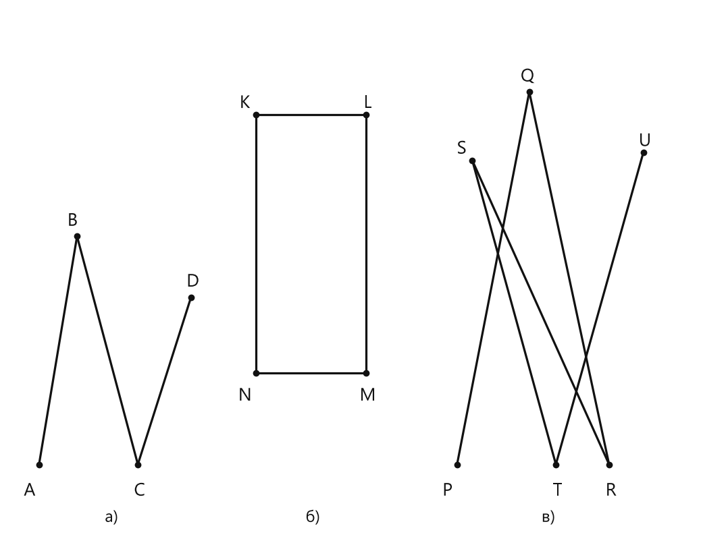

# Занятие 4. Прямая. Луч. Отрезок. Ломаная

**Раздел:** Глава I. Начальные понятия геометрии  
**Параграф учебника:** §3. Прямая. Луч. Отрезок. Ломаная  
**Страницы:** 24–34

## Цели занятия

К концу занятия ты научишься:

- различать прямую, луч и отрезок;
- определять, какие точки лежат между другими точками;
- находить длины частей отрезка;
- распознавать простые, непростые, замкнутые и незамкнутые ломаные;
- находить длину ломаной и периметр многоугольника;
- применять свойства середины отрезка.

Выбери блок своего уровня:

- **1–2 балла** — различаю основные фигуры и использую определения;
- **3–4 балла** — нахожу длины частей отрезка;
- **5–6 баллов** — решаю задачи на ломаные и многоугольники;
- **7–8 баллов** — составляю уравнения и работаю с буквенными данными;
- **9–10 баллов** — решаю составные задачи и объясняю ход решения.

## Теория к занятию

### 1. Прямая и положение точек на прямой

#### Простыми словами

Прямая продолжается бесконечно в обе стороны. На рисунке мы видим только небольшой кусок, но сама прямая не заканчивается у края листа.

Через две различные точки можно провести только одну прямую. А через одну точку — сколько угодно прямых.

Если три точки лежат на одной прямой, одна из них обязательно находится между двумя другими. Например, если точки расположены в порядке $A$, $B$, $C$, то точка $B$ лежит между точками $A$ и $C$.

#### Факт

Из трех точек на прямой одна и только одна точка лежит между двумя другими.

#### Аксиома прямой

Через любые две точки плоскости можно провести прямую, и притом только одну.

#### Пересекающиеся прямые

Две прямые называются **пересекающимися**, если они имеют общую точку.

#### Параллельные прямые

Две прямые называются **параллельными**, если они лежат в одной плоскости и не пересекаются.

#### Правила

- Прямую обозначают одной малой буквой или двумя большими буквами.
- Если прямая проходит через точки $A$ и $B$, её можно обозначить $AB$.
- Через две различные точки нельзя провести две разные прямые.
- Пересекающиеся прямые имеют общую точку.
- Параллельные прямые не имеют общих точек.

#### Ловушки

- Прямая не имеет концов.
- Нарисованный кусок прямой — это только часть бесконечной прямой.
- Если три точки лежат на одной прямой, одна из них находится между двумя другими.
- Не называй прямые параллельными только потому, что они пока не пересеклись на рисунке. Сначала нужно знать, что они лежат в одной плоскости и не пересекаются.

---

### 2. Луч

#### Простыми словами

Луч имеет начало, но не имеет конца. Он начинается в одной точке и продолжается бесконечно в одном направлении.

Представь линию света от фонарика: фонарик — начало, а световой луч продолжается вперёд. Только в геометрии луч идеальный и не «садится» от долгой работы.

#### Определение. Луч

**Лучом** называется часть прямой, ограниченная одной точкой.

#### Определение. Дополнительные (противоположные) лучи

Два луча называются дополнительными (противоположными), если они имеют общее начало и лежат на одной прямой.

#### Правила обозначения

Луч обозначается:

- одной малой буквой;
- двумя большими буквами латинского алфавита, причём на первом месте всегда записывается начало луча.

Например, в обозначении луча $AB$ точка $A$ — начало луча, а точка $B$ показывает направление луча.

Луч $BA$ начинается уже в точке $B$, поэтому это не тот же самый луч, что $AB$.

#### Алгоритм построения противоположного луча

1. Найди начало данного луча.
2. Проведи через начало луча прямую.
3. На этой же прямой выбери направление, противоположное данному лучу.
4. Полученный луч будет дополнительным.

#### Ловушки

- Луч $AB$ и луч $BA$ — разные лучи, если точки $A$ и $B$ различны.
- Первая буква обозначения луча — всегда его начало.
- Два луча противоположны не просто потому, что направлены в разные стороны.
- У них должно быть общее начало, и они должны лежать на одной прямой.

---

### 3. Отрезок и его длина

#### Простыми словами

Отрезок — это часть прямой, ограниченная двумя точками. Эти точки называют концами отрезка.

Прямая бесконечна, луч бесконечен в одном направлении, а отрезок имеет два конца и конечную длину. Наконец-то фигура, которая знает, где остановиться.

#### Определение. Отрезок

Отрезком называется часть прямой, ограниченная двумя точками.

#### Определение. Равные отрезки

Два отрезка называются равными, если их можно совместить наложением.

#### Определение. Расстояние между двумя точками

Расстоянием между двумя точками называется длина отрезка, соединяющего эти точки.

#### Свойства длины отрезка

Каждый отрезок имеет длину, выраженную положительным числом; равным отрезкам соответствуют равные длины, большему отрезку — большая длина. И наоборот.

Значит, длина отрезка не может быть отрицательной или равной нулю. Если один отрезок длиннее другого, то и его длина больше.

#### Аксиома измерения отрезков

Если на отрезке взять точку, то она разобьет данный отрезок на два отрезка, сумма длин которых равна длине данного отрезка.

Если точка $C$ лежит между точками $A$ и $B$, то:

$$AC+CB=AB.$$

Чтобы найти одну часть, можно из длины всего отрезка вычесть другую часть:

$$AC=AB-CB.$$

#### Аксиома откладывания отрезков

На любом луче от его начала можно отложить отрезок данной длины, и притом только один.

#### Середина отрезка

Серединой отрезка называется точка, которая делит отрезок на два равных отрезка.

Если $M$ — середина отрезка $AB$, то:

$$AM=MB.$$

Так как две равные части составляют весь отрезок, то:

$$AM=MB=\frac{AB}{2}.$$

#### Правила решения задач

Если известны длина всего отрезка и длина одной его части:

1. Запиши, на какие части разбит отрезок.
2. Используй равенство суммы частей и всего отрезка.
3. Найди неизвестную часть вычитанием.

Например, если $C$ лежит между $A$ и $B$, то:

$$AC+CB=AB,$$

поэтому:

$$AC=AB-CB.$$

Если части отрезка выражены через неизвестную величину:

1. Обозначь неизвестную длину буквой.
2. Вырази остальные длины через эту букву.
3. Составь равенство суммы частей и всего отрезка.
4. Реши полученное уравнение.
5. Найди именно ту длину, которую требуется определить.
6. Сделай проверку: сумма частей должна равняться длине всего отрезка.

#### Ловушки

- Длина отрезка всегда положительна.
- Если точка лежит между концами отрезка, длины частей складываются.
- Не путай обозначение отрезка $AB$ и его длину $AB$: нужный смысл определяется условием задачи.
- Середина делит отрезок на две равные части, а не просто на две «примерно одинаковые».
- Если в условии спрашивают $AC$, а ты нашёл $CB$, решение ещё не закончено.

---

### 4. Ломаная

#### Простыми словами

Ломаная состоит из отрезков, соединённых концами один за другим. Отрезки ломаной называют звеньями.

Каждое следующее звено должно менять направление. Если два соседних звена лежат на одной прямой, фигура уже не подходит под определение ломаной. Это не ломаная, а попытка пройти геометрию по прямой и сделать вид, что был поворот.

#### Определение. Ломаная

Ломаной называется геометрическая фигура, образованная отрезками, последовательно соединенными своими концами, у которой никакие два соседних звена не лежат на одной прямой. Длиной ломаной называется сумма длин ее звеньев.

#### Основные понятия

- Отрезки ломаной называются **звеньями**.
- Точки соединения звеньев называются **вершинами**.
- Длина ломаной равна сумме длин всех её звеньев.

Если ломаная состоит из звеньев $AB$, $BC$ и $CD$, то:

$$l=AB+BC+CD.$$

Здесь $l$ — длина всей ломаной.

#### Определение. Замкнутая и незамкнутая ломаная

Ломаная называется замкнутой, если начало ее первого звена совпадает с концом последнего. В противном случае она называется незамкнутой.

Замкнутая ломаная возвращается в свою начальную точку. Незамкнутая ломаная заканчивается в другой точке.

#### Определение. Простая и непростая ломаная

Ломаная называется простой, если она не имеет самопересечений и никакие два ее звена, кроме соседних, не имеют общих точек. В противном случае она называется непростой.

#### Алгоритм классификации ломаной

1. Посчитай звенья ломаной.
2. Проверь, совпадает ли начало первого звена с концом последнего.
3. Сделай вывод: ломаная замкнутая или незамкнутая.
4. Проверь, пересекаются ли несоседние звенья.
5. Сделай вывод: ломаная простая или непростая.

#### Ловушки

- Замкнутая ломаная не обязательно простая.
- Если несоседние звенья пересекаются, ломаная непростая.
- Число звеньев считают по отрезкам, а не по вершинам.
- В замкнутой ломаной последнее звено соединяется с первым.
- Длину ломаной находят сложением длин всех звеньев, а не расстоянием между её началом и концом.

---

### 5. Многоугольник

#### Простыми словами

Многоугольник получается из простой замкнутой ломаной. Значит, его граница замыкается и не пересекает сама себя.

Например, треугольник — это простая замкнутая трёхзвенная ломаная, а четырёхугольник — простая замкнутая четырёхзвенная ломаная.

#### Определение. Многоугольник

Простая замкнутая ломаная на плоскости называется **многоугольником**. Звенья этой ломаной называются **сторонами** этого многоугольника, а вершины — **вершинами** многоугольника.

#### Определение. Периметр многоугольника

**Периметром** многоугольника называется сумма длин его сторон.

Для четырёхугольника $ABCD$:

$$P_{ABCD}=AB+BC+CD+AD.$$

В периметр входят только стороны многоугольника. Диагонали в эту сумму не добавляют: они внутри фигуры и работают по другому делу.

#### Определение. Плоский многоугольник

Часть плоскости, ограниченная многоугольником, называется **плоским многоугольником**.

#### Замечание

Далее, рассматривая плоские многоугольники, слово «плоский» употреблять не будем.

#### Определение. Диагональ многоугольника

Отрезок, соединяющий вершины многоугольника, не принадлежащие одной стороне, называется его **диагональю**.

#### Названия многоугольников

- 3 стороны — треугольник;
- 4 стороны — четырёхугольник;
- 5 сторон — пятиугольник.

#### Ловушки

- Сторона многоугольника — это звено его граничной ломаной.
- Диагональ соединяет несоседние вершины.
- Соседние вершины уже соединены стороной, поэтому отрезок между ними диагональю не является.
- Периметр — сумма длин сторон, а не сумма диагоналей. Диагонали в периметр не пролезли.

---

## Сводка формул «выучить наизусть»

Если точка $C$ лежит между точками $A$ и $B$:

$$AC+CB=AB.$$

Длина части отрезка:

$$AC=AB-CB.$$

Длина ломаной:

$$l=l_1+l_2+\dots+l_n.$$

Периметр многоугольника:

$$P=\text{сумма длин всех его сторон}.$$

Если $M$ — середина отрезка $AB$:

$$AM=MB=\frac{AB}{2}.$$

Если точка разбивает отрезок на два отрезка, то расстояние между серединами этих частей равно:

$$\frac{1}{2}AB.$$

## Правила, которые нельзя путать

- Прямая бесконечна в обе стороны.
- Луч имеет начало, но не имеет конца.
- Отрезок имеет два конца.
- В обозначении луча первая буква — начало.
- Параллельные прямые не пересекаются.
- Пересекающиеся прямые имеют общую точку.
- Замкнутая ломаная возвращается в начальную вершину.
- Простая ломаная не имеет самопересечений.
- Периметр — сумма сторон.
- Диагональ соединяет несоседние вершины.

## Разбор ключевых заданий

### Р1. Нахождение длины части отрезка

**Условие.** На отрезке $AB$, равном $24$ см, взята точка $C$. Отрезок $AC$ на $6$ см больше отрезка $CB$. Найдите длину отрезка $AC$.

**Решение.**

Обозначим длину отрезка $CB$ буквой $x$:

$$CB=x\text{ см}.$$

Отрезок $AC$ на $6$ см больше, поэтому:

$$AC=x+6\text{ см}.$$

Точка $C$ лежит между точками $A$ и $B$.

Значит, сумма частей равна длине всего отрезка:

$$AC+CB=AB.$$

Подставим известные выражения:

$$(x+6)+x=24.$$

Раскроем скобки:

$$2x+6=24.$$

Вычтем $6$ из обеих частей уравнения:

$$2x=18.$$

Разделим обе части на $2$:

$$x=9.$$

Мы нашли длину отрезка $CB$:

$$CB=9\text{ см}.$$

Теперь найдём искомый отрезок $AC$:

$$AC=CB+6=9+6=15\text{ см}.$$

Проверим результат:

$$AC+CB=15+9=24\text{ см}.$$

Длина всего отрезка получилась правильной.

**Ответ: $15$ см.**

> Ловушка здесь классическая: найти $CB$ — это только половина дела. Вопрос спрашивает про $AC$, поэтому ещё раз смотрим на условие, а не на первый найденный результат.

---

### Р2. Нахождение расстояния между двумя точками

**Условие.** На отрезке $AB$ отмечены точки $C$ и $D$ в порядке $A$, $C$, $D$, $B$. Известно, что $AB=36$ см, $AD=23$ см, $BC=19$ см. Найдите длину отрезка $CD$.

**Дано:**

$$AB=36\text{ см},$$

$$AD=23\text{ см},$$

$$BC=19\text{ см}.$$

**Решение.**

Расположим точки в указанном порядке:

$$A,\ C,\ D,\ B.$$

Найдём расстояние от точки $A$ до точки $C$.

Отрезок $AB$ состоит из отрезков $AC$ и $CB$:

$$AB=AC+CB.$$

Выразим $AC$:

$$AC=AB-CB.$$

Подставим значения:

$$AC=36-19=17\text{ см}.$$

Теперь отрезок $AD$ состоит из отрезков $AC$ и $CD$:

$$AD=AC+CD.$$

Выразим $CD$:

$$CD=AD-AC.$$

Подставим найденное значение $AC$:

$$CD=23-17=6\text{ см}.$$

Проверим по всему отрезку:

$$AC+CD+DB=AB.$$

Сначала найдём $DB$:

$$DB=AB-AD=36-23=13\text{ см}.$$

Теперь проверим:

$$17+6+13=36.$$

Проверка выполняется.

**Ответ: $6$ см.**

> Важно учитывать порядок точек. Здесь $C$ находится левее $D$, поэтому сначала удобно найти $AC$, а затем убрать его из $AD$. Точки на прямой любят порядок — почти как очередь в столовой.

---

### Р3. Буквенная формула длины отрезка

**Условие.** На отрезке $AB$ отмечены точки $C$ и $D$ в порядке $A$, $C$, $D$, $B$. Известно, что $AB=a$, $AD=b$, $BC=c$. Выразите длину отрезка $CD$.

**Решение.**

Точки расположены так:

$$A,\ C,\ D,\ B.$$

Отрезок $AB$ состоит из трёх частей:

$$AB=AC+CD+DB.$$

Отрезок $AD$ состоит из двух частей:

$$AD=AC+CD.$$

Отрезок $BC$ также состоит из двух частей:

$$BC=CD+DB.$$

Сложим длины $AD$ и $BC$:

$$AD+BC=(AC+CD)+(CD+DB).$$

Перепишем сумму:

$$AD+BC=AC+CD+CD+DB.$$

В этой сумме длина $AB$ встречается вместе с ещё одним отрезком $CD$:

$$AD+BC=AB+CD.$$

Выразим $CD$:

$$CD=AD+BC-AB.$$

Подставим буквенные значения:

$$CD=b+c-a.$$

**Ответ: $CD=b+c-a$.**

### Р4. Определение точки, лежащей между двумя другими

**Условие.** На прямой отмечены точки $A$, $B$ и $C$ так, что $AB=14$ см, $BC=32$ см, $AC=18$ см. Определите, какая точка лежит между двумя другими.

**Решение.**

Если одна точка лежит между двумя другими, то расстояние между крайними точками равно сумме двух меньших отрезков.

Проверим точку $A$:

$$BA+AC=14+18=32.$$

Получили:

$$BA+AC=BC.$$

Значит, точка $A$ лежит между точками $B$ и $C$.

Для проверки вычислим суммы в двух других вариантах:

$$AB+BC=14+32=46\ne18,$$

$$AC+BC=18+32=50\ne14.$$

Равенства не получились, поэтому точки $B$ и $C$ не лежат между двумя другими.

**Ответ: точка $A$ лежит между точками $B$ и $C$.**

---

### Р5. Задача на разность частей отрезка

**Условие.** На отрезке $AB$, равном $56$ см, взята точка $M$. Отрезок $AM$ на $4$ см меньше отрезка $MB$. Найдите длину отрезка $BM$.

**Решение.**

Пусть:

$$AM=x\text{ см}.$$

Отрезок $AM$ на $4$ см меньше отрезка $MB$.

Значит:

$$MB=x+4\text{ см}.$$

Точка $M$ делит отрезок $AB$ на две части.

Поэтому:

$$AM+MB=AB.$$

Подставим известные выражения:

$$x+(x+4)=56.$$

Раскроем скобки:

$$2x+4=56.$$

Вычтем $4$ из обеих частей:

$$2x=52.$$

Разделим обе части на $2$:

$$x=26.$$

Мы нашли длину $AM$:

$$AM=26\text{ см}.$$

Теперь найдём $BM$:

$$BM=x+4=26+4=30\text{ см}.$$

Проверим длину всего отрезка:

$$AM+BM=26+30=56\text{ см}.$$

Получилась длина отрезка $AB$, значит вычисления верны.

**Ответ: $30$ см.**

---

### Р6. Задача с отношением частей отрезка

**Условие.** Точка $P$ лежит на отрезке $EF$, равном $24$ дм. Отрезок $EP$ в $3$ раза больше отрезка $PF$. Найдите расстояние от середины отрезка $PF$ до точки $E$.

**Решение.**

Пусть:

$$PF=x\text{ дм}.$$

Отрезок $EP$ в $3$ раза больше отрезка $PF$.

Значит:

$$EP=3x\text{ дм}.$$

Точка $P$ делит отрезок $EF$ на части $EP$ и $PF$.

Поэтому:

$$EP+PF=EF.$$

Подставим значения:

$$3x+x=24.$$

Сложим подобные слагаемые:

$$4x=24.$$

Разделим обе части на $4$:

$$x=6.$$

Значит:

$$PF=6\text{ дм}.$$

Найдём длину $EP$:

$$EP=3\cdot6=18\text{ дм}.$$

Пусть $N$ — середина отрезка $PF$.

Середина делит отрезок пополам:

$$PN=\frac{PF}{2}=\frac{6}{2}=3\text{ дм}.$$

Точка $N$ находится после точки $P$, поэтому расстояние от точки $E$ до точки $N$ состоит из двух частей:

$$EN=EP+PN.$$

Подставим найденные длины:

$$EN=18+3=21\text{ дм}.$$

Середина отрезка $PF$ — это не середина всего $EF$. Вот где часто прячется маленькая геометрическая ловушка.

**Ответ: $21$ дм.**

---

### Р7. Составная задача на отрезки

**Условие.** На отрезке $AB$ отмечены точки $K$ и $M$ так, что точка $K$ лежит между точками $A$ и $M$, $3AM=2MB$, $AK=2KM$, а отрезок $AK$ на $12$ см больше отрезка $KM$. Найдите расстояние между точками $A$ и $B$.

**Решение.**

Пусть:

$$KM=x\text{ см}.$$

По условию:

$$AK=2KM.$$

Значит:

$$AK=2x\text{ см}.$$

Точка $K$ лежит между точками $A$ и $M$.

Поэтому отрезок $AM$ состоит из отрезков $AK$ и $KM$:

$$AM=AK+KM.$$

Подставим найденные выражения:

$$AM=2x+x=3x\text{ см}.$$

По условию:

$$3AM=2MB.$$

Подставим $AM=3x$:

$$3\cdot3x=2MB.$$

Получаем:

$$9x=2MB.$$

Разделим обе части на $2$:

$$MB=\frac{9x}{2}=4{,}5x\text{ см}.$$

По условию отрезок $AK$ на $12$ см больше отрезка $KM$:

$$AK-KM=12.$$

Подставим $AK=2x$ и $KM=x$:

$$2x-x=12.$$

Получаем:

$$x=12.$$

Теперь найдём длины отрезков $AM$ и $MB$:

$$AM=3x=3\cdot12=36\text{ см},$$

$$MB=4{,}5x=4{,}5\cdot12=54\text{ см}.$$

Точка $M$ лежит на отрезке $AB$.

Значит:

$$AB=AM+MB.$$

Подставим значения:

$$AB=36+54=90\text{ см}.$$

Проверим условие $3AM=2MB$:

$$3AM=3\cdot36=108,$$

$$2MB=2\cdot54=108.$$

Равенство выполняется.

**Ответ: $90$ см.**

---

### Р8. Проверка возможности расположения трёх точек на одной прямой

**Условие.** Выясните, могут ли три точки $A$, $B$ и $C$ лежать на одной прямой, если:

а) $AB=5$ см, $BC=10$ см, $AC=8$ см;

б) $AB=6{,}8$ дм, $BC=12{,}3$ дм, $AC=5{,}5$ дм.

#### а) Решение

Если три точки лежат на одной прямой, то одна из них лежит между двумя другими.

Тогда один из трёх отрезков должен быть равен сумме двух остальных.

Проверим все варианты:

$$AB+AC=5+8=13\ne10,$$

$$AB+BC=5+10=15\ne8,$$

$$AC+BC=8+10=18\ne5.$$

Ни одно равенство не выполняется.

Значит, ни одна точка не может лежать между двумя другими.

**Ответ: точки не могут лежать на одной прямой.**

#### б) Решение

Снова проверим, равна ли длина одного отрезка сумме двух других.

Сложим длины $AB$ и $AC$:

$$AB+AC=6{,}8+5{,}5=12{,}3\text{ дм}.$$

Получили:

$$AB+AC=BC.$$

Значит, точка $A$ лежит между точками $B$ и $C$.

**Ответ: точки могут лежать на одной прямой; точка $A$ лежит между $B$ и $C$.**

> Для трёх точек на одной прямой одно расстояние должно быть суммой двух других. Если сумма не сходится, такая прямая не получится — геометрия проверяет числа строго.

---

### Р9. Длина ломаной

**Условие.** Дана пятизвенная незамкнутая ломаная. Каждое последующее звено, начиная со второго, в $2$ раза больше предыдущего. Длина ломаной равна $186$ см. Найдите длину самого большого звена.

**Решение.**

Пусть первое звено имеет длину:

$$x\text{ см}.$$

Каждое следующее звено в $2$ раза больше предыдущего.

Значит, длины пяти звеньев равны:

$$x,\quad 2x,\quad 4x,\quad 8x,\quad 16x.$$

Длина ломаной равна сумме длин всех её звеньев:

$$x+2x+4x+8x+16x=186.$$

Сложим подобные слагаемые:

$$31x=186.$$

Разделим обе части на $31$:

$$x=\frac{186}{31}=6.$$

Первое звено имеет длину $6$ см.

Самым большим является пятое звено:

$$16x=16\cdot6=96\text{ см}.$$

Проверим сумму длин звеньев:

$$6+12+24+48+96=186.$$

Длина ломаной совпала с условием.

**Ответ: $96$ см.**

---

### Р10. Длина трёхзвенной замкнутой ломаной

**Условие.** Дана трёхзвенная замкнутая ломаная $ABC$. Точки $M$, $K$, $N$ — середины её звеньев $AB$, $BC$ и $AC$. Точки $P$, $E$, $G$ — середины отрезков $MB$, $KC$ и $AN$.

Найдите длину ломаной $ABC$, если:

а) $PB+EC+GA=12$ см;

б) $AP+BE+CG=108$ см.

#### а) Решение

Точка $M$ — середина отрезка $AB$.

Значит:

$$MB=\frac12AB.$$

Точка $P$ — середина отрезка $MB$.

Поэтому:

$$PB=\frac12MB.$$

Подставим $MB=\frac12AB$:

$$PB=\frac12\cdot\frac12AB=\frac14AB.$$

Точка $K$ — середина отрезка $BC$.

Значит:

$$KC=\frac12BC.$$

Точка $E$ — середина отрезка $KC$.

Поэтому:

$$EC=\frac12KC=\frac14BC.$$

Точка $N$ — середина отрезка $AC$.

Значит:

$$AN=\frac12AC.$$

Точка $G$ — середина отрезка $AN$.

Поэтому:

$$GA=\frac12AN=\frac14AC.$$

Сложим три найденных отрезка:

$$PB+EC+GA=\frac14AB+\frac14BC+\frac14AC.$$

Вынесем общий множитель $\frac14$:

$$PB+EC+GA=\frac14(AB+BC+AC).$$

По условию:

$$\frac14(AB+BC+AC)=12.$$

Умножим обе части на $4$:

$$AB+BC+AC=48.$$

Длина замкнутой ломаной $ABC$ равна сумме её звеньев:

$$AB+BC+AC=48\text{ см}.$$

**Ответ: $48$ см.**

#### б) Решение

Отрезок $AP$ состоит из отрезков $AM$ и $MP$:

$$AP=AM+MP.$$

Так как $M$ — середина $AB$:

$$AM=\frac12AB.$$

Так как $P$ — середина $MB$:

$$MP=\frac12MB.$$

А поскольку $MB=\frac12AB$, получаем:

$$MP=\frac12\cdot\frac12AB=\frac14AB.$$

Тогда:

$$AP=\frac12AB+\frac14AB=\frac34AB.$$

Аналогично для отрезка $BE$:

$$BE=\frac34BC.$$

Для отрезка $CG$:

$$AG=\frac14AC,$$

$$CG=AC-AG,$$

$$CG=AC-\frac14AC=\frac34AC.$$

Сложим три отрезка:

$$AP+BE+CG=\frac34AB+\frac34BC+\frac34AC.$$

Вынесем общий множитель $\frac34$:

$$AP+BE+CG=\frac34(AB+BC+AC).$$

По условию:

$$\frac34(AB+BC+AC)=108.$$

Умножим обе части на $4$:

$$3(AB+BC+AC)=432.$$

Разделим обе части на $3$:

$$AB+BC+AC=144.$$

**Ответ: $144$ см.**

---

### Р11. Построение и классификация ломаных

**Условие.** Изобразите:

а) трёхзвенную простую незамкнутую ломаную;

б) четырёхзвенную простую замкнутую ломаную;

в) пятизвенную непростую незамкнутую ломаную.

**Решение.**

#### а) Трёхзвенная простая незамкнутая ломаная

Возьмём четыре точки $A$, $B$, $C$, $D$.

Последовательно соединим их отрезками:

$$AB,\ BC,\ CD.$$

Получилась ломаная с тремя звеньями.

Начало первого звена — точка $A$.

Конец последнего звена — точка $D$.

Точки $A$ и $D$ не совпадают, поэтому ломаная незамкнутая.

Несоседние звенья не пересекаются, поэтому ломаная простая.

#### б) Четырёхзвенная простая замкнутая ломаная

Возьмём четыре точки $K$, $L$, $M$, $N$.

Соединим их отрезками:

$$KL,\ LM,\ MN,\ NK.$$

Получилась ломаная с четырьмя звеньями.

Начало первого звена — точка $K$.

Конец последнего звена — также точка $K$.

Значит, ломаная замкнутая.

Звенья не пересекаются, кроме соседних.

Поэтому ломаная простая.

#### в) Пятизвенная непростая незамкнутая ломаная

Возьмём шесть точек $P$, $Q$, $R$, $S$, $T$, $U$.

Последовательно соединим их отрезками:

$$PQ,\ QR,\ RS,\ ST,\ TU.$$

Получилась ломаная с пятью звеньями.

Сделаем так, чтобы, например, звенья $PQ$ и $ST$ пересекались.

Эти звенья не являются соседними.

Значит, у ломаной есть самопересечение, и она непростая.

Начало первого звена — точка $P$.

Конец последнего звена — точка $U$.

Точки $P$ и $U$ не совпадают, поэтому ломаная незамкнутая.

<!--geo-figure-spec
{
  "needed": true,
  "kind": "plane",
  "caption": "Построение трёх ломаных",
  "equal": false,
  "axis": false,
  "xlim": [
    0,
    18
  ],
  "ylim": [
    0,
    7
  ],
  "points": {
    "A": [
      0.8,
      1
    ],
    "B": [
      1.8,
      4
    ],
    "C": [
      3.4,
      1
    ],
    "D": [
      4.8,
      3.2
    ],
    "K": [
      6.5,
      5.6
    ],
    "L": [
      9.4,
      5.6
    ],
    "M": [
      9.4,
      2.2
    ],
    "N": [
      6.5,
      2.2
    ],
    "P": [
      11.8,
      1
    ],
    "Q": [
      13.7,
      5.9
    ],
    "R": [
      15.8,
      1
    ],
    "S": [
      12.2,
      5
    ],
    "T": [
      14.4,
      1
    ],
    "U": [
      16.7,
      5.1
    ]
  },
  "segments": [
    [
      "A",
      "B"
    ],
    [
      "B",
      "C"
    ],
    [
      "C",
      "D"
    ],
    [
      "K",
      "L"
    ],
    [
      "L",
      "M"
    ],
    [
      "M",
      "N"
    ],
    [
      "N",
      "K"
    ],
    [
      "P",
      "Q"
    ],
    [
      "Q",
      "R"
    ],
    [
      "R",
      "S"
    ],
    [
      "S",
      "T"
    ],
    [
      "T",
      "U"
    ]
  ],
  "polygons": [],
  "circles": [],
  "labels": {
    "A": {
      "dx": -0.25,
      "dy": -0.35
    },
    "B": {
      "dx": -0.12,
      "dy": 0.2
    },
    "C": {
      "dx": 0.05,
      "dy": -0.35
    },
    "D": {
      "dx": 0.05,
      "dy": 0.2
    },
    "K": {
      "dx": -0.28,
      "dy": 0.15
    },
    "L": {
      "dx": 0.05,
      "dy": 0.15
    },
    "M": {
      "dx": 0.05,
      "dy": -0.3
    },
    "N": {
      "dx": -0.28,
      "dy": -0.3
    },
    "P": {
      "dx": -0.25,
      "dy": -0.35
    },
    "Q": {
      "dx": -0.05,
      "dy": 0.2
    },
    "R": {
      "dx": 0.05,
      "dy": -0.35
    },
    "S": {
      "dx": -0.28,
      "dy": 0.15
    },
    "T": {
      "dx": 0.05,
      "dy": -0.35
    },
    "U": {
      "dx": 0.05,
      "dy": 0.15
    }
  },
  "right_angles": [],
  "angle_marks": [],
  "texts": [
    {
      "xy": [
        2.7,
        0.3
      ],
      "text": "а)"
    },
    {
      "xy": [
        8,
        0.3
      ],
      "text": "б)"
    },
    {
      "xy": [
        14.2,
        0.3
      ],
      "text": "в)"
    }
  ]
}
-->

*Построение трёх ломаных*

**Ответ:**

- а) простая незамкнутая ломаная;
- б) простая замкнутая ломаная;
- в) непростая незамкнутая ломаная.

---

### Р12. Периметр многоугольника

**Условие.** Дан четырёхугольник $ABCD$, у которого:

$$AB=7\text{ см},$$

$$BC=5\text{ см},$$

$$CD=8\text{ см},$$

$$AD=6\text{ см}.$$

Найдите его периметр.

**Решение.**

Периметр многоугольника — это сумма длин всех его сторон.

У четырёхугольника $ABCD$ стороны такие:

$$AB,\ BC,\ CD,\ AD.$$

Запишем формулу периметра:

$$P_{ABCD}=AB+BC+CD+AD.$$

Подставим известные длины:

$$P_{ABCD}=7+5+8+6.$$

Выполним сложение:

$$P_{ABCD}=26\text{ см}.$$

**Ответ: $26$ см.**

---

### Р13. Диагонали многоугольника

**Условие.** В четырёхугольнике $ABCD$ назовите стороны и диагонали.

**Решение.**

Стороны соединяют соседние вершины четырёхугольника.

Поэтому его стороны:

$$AB,\ BC,\ CD,\ DA.$$

Диагонали соединяют вершины, которые не принадлежат одной стороне.

Вершины $A$ и $C$ не соседние, поэтому:

$$AC$$

— диагональ.

Вершины $B$ и $D$ также не соседние, поэтому:

$$BD$$

— диагональ.

**Ответ:**

Стороны: $AB$, $BC$, $CD$, $DA$.

Диагонали: $AC$, $BD$.

## Практические задания

Выбери свой уровень и решай только этот блок. В блоке должна закрепиться вся тема параграфа. Ответы не приводятся.

### Уровень 1–2 балла

**С1.** Выберите верное утверждение.

1) Через любые две точки можно провести две различные прямые.  
2) Через любые две точки можно провести только одну прямую.  
3) Через любые три точки всегда можно провести одну прямую.  
4) Через одну точку нельзя провести прямую.  
5) Прямая имеет два конца.

**С2.** Выберите верное описание луча.

1) Часть прямой, ограниченная двумя точками.  
2) Часть прямой, ограниченная одной точкой.  
3) Геометрическая фигура, состоящая из трёх отрезков.  
4) Замкнутая ломаная.  
5) Часть плоскости, ограниченная многоугольником.

**С3.** На прямой отмечены точки $A$, $B$ и $C$. Известно, что $AB=12$ см, $BC=7$ см, $AC=19$ см. Какая точка лежит между двумя другими?

**С4.** Отрезок $AB$ имеет длину $28$ см. На нём отмечена точка $C$, причём $AC=11$ см. Найдите длину отрезка $CB$.

**С5.** На отрезке $MN$ длиной $36$ см отмечена точка $K$. Отрезок $MK$ на $4$ см больше отрезка $KN$. Найдите длину отрезка $MK$.

**С6.** Выберите пару противоположных лучей.

1) Лучи $AB$ и $AC$ имеют общее начало $A$ и лежат на одной прямой в одну сторону.  
2) Лучи $BA$ и $BC$ имеют общее начало $B$ и лежат на одной прямой в разных направлениях.  
3) Лучи $AB$ и $BA$ имеют разные начала и лежат на одной прямой.  
4) Лучи $CA$ и $CB$ не имеют общей точки.  
5) Лучи $MN$ и $MP$ имеют общее начало $M$, но не лежат на одной прямой.

**С7.** Начертите трёхзвенную простую незамкнутую ломаную $ABCD$.

**С8.** Ломаная состоит из четырёх звеньев длиной $3$ см, $5$ см, $4$ см и $8$ см. Найдите длину ломаной.

**С9.** Выберите простую замкнутую ломаную.

1) $ABCD$, где звенья $AB$, $BC$, $CD$, $DA$ образуют замкнутую фигуру без самопересечений.  
2) $ABCD$, где начало первого звена не совпадает с концом последнего.  
3) $ABCDE$, у которой два звена пересекаются, кроме соседних.  
4) $ABC$, состоящая из двух звеньев.  
5) $ABCD$, у которой соседние звенья лежат на одной прямой.

**С10.** На отрезке $AB$ отмечена точка $M$, причём $AM=18$ см, а $MB=10$ см. Найдите расстояние между точками $A$ и $B$.

**С11.** Даны три точки $A$, $B$ и $C$. Известно, что $AB=7$ см, $BC=4$ см, $AC=12$ см. Могут ли эти точки лежать на одной прямой? Выберите ответ.

1) Да, точка $A$ лежит между $B$ и $C$.  
2) Да, точка $B$ лежит между $A$ и $C$.  
3) Да, точка $C$ лежит между $A$ и $B$.  
4) Нет, потому что ни одна сумма двух данных расстояний не равна третьему расстоянию.  
5) Нет, потому что все три точки совпадают.

**С12.** На отрезке $EF$ длиной $30$ см отмечены точки $M$ и $K$, причём $M$ лежит между $E$ и $K$, $EM=8$ см, $MK=9$ см. Найдите длину отрезка $KF$.

**С13.** Выберите отрезок среди перечисленных объектов:  
1) $AB$ 2) прямая $a$ 3) луч $CD$ 4) ломаная $MNK$ 5) плоскость $\alpha$.

**С14.** Выберите пару противоположных лучей:  
1) $\overrightarrow{AB}$ и $\overrightarrow{AC}$, если точки $B$ и $C$ лежат по одну сторону от $A$;  
2) $\overrightarrow{AB}$ и $\overrightarrow{BA}$;  
3) $\overrightarrow{AB}$ и $\overrightarrow{BC}$;  
4) $\overrightarrow{AC}$ и $\overrightarrow{CB}$;  
5) $\overrightarrow{AB}$ и $\overrightarrow{CD}$.

**С15.** На прямой отмечены точки $A$, $B$ и $C$, причём $AB=9$ см, $BC=4$ см, $AC=5$ см. Какая точка лежит между двумя другими?

**С16.** Отрезок $MN$ имеет длину $18$ см. На нём взята точка $K$, причём $MK=7$ см. Найдите длину отрезка $KN$.

**С17.** Выберите верное утверждение.  
1) Через любые две точки можно провести две различные прямые.  
2) Через любые две точки можно провести только одну прямую.  
3) Любые две прямые имеют общую точку.  
4) Луч ограничен двумя точками.  
5) Отрезок не имеет длины.

**С18.** На отрезке $AB$ длиной $30$ см взята точка $C$. Отрезок $AC$ на $6$ см больше отрезка $CB$. Найдите длину отрезка $AC$.

**С19.** Отрезок $PQ$ разделён точкой $R$ на два отрезка: $PR=8$ дм и $RQ=5$ дм. Найдите расстояние между точками $P$ и $Q$.

**С20.** Какая ломаная является замкнутой?  
1) $ABCD$, если $A$ и $D$ — разные точки;  
2) $KLMN$, если $K=N$;  
3) $PQRS$, если все вершины различны;  
4) $XYZT$, если начало первого звена не совпадает с концом последнего;  
5) $EFGH$, если первое и последнее звенья не имеют общей вершины.

**С21.** Дана ломаная $ABCD$ с длинами звеньев $AB=4$ см, $BC=7$ см и $CD=5$ см. Найдите длину ломаной.

**С22.** Выберите простую ломаную.  
1) Ломаная имеет самопересечение.  
2) Два несоседних звена имеют общую точку.  
3) Ломаная не имеет самопересечений, и несоседние звенья не имеют общих точек.  
4) Два соседних звена лежат на одной прямой.  
5) Начало первого звена совпадает с концом последнего.

**С23.** Сколько диагоналей имеет четырёхугольник $ABCD$? Выберите правильный вариант:  
1) $0$ 2) $1$ 3) $2$ 4) $3$ 5) $4$.

**С24.** Периметр треугольника $KLM$ равен $25$ см. Длины двух его сторон равны $7$ см и $9$ см. Найдите длину третьей стороны.

**С25.** Выберите верное утверждение.

1) Луч ограничен двумя точками. 2) Отрезок ограничен одной точкой. 3) Прямая имеет начало и конец. 4) Луч ограничен одной точкой. 5) Ломаная состоит из лучей.

**С26.** Выберите пару противоположных лучей.

1) $\overrightarrow{AB}$ и $\overrightarrow{AC}$, где точки $B$ и $C$ лежат по одну сторону от $A$  
2) $\overrightarrow{AB}$ и $\overrightarrow{BA}$  
3) $\overrightarrow{AB}$ и $\overrightarrow{AC}$, где точки $B$ и $C$ лежат на одной прямой по разные стороны от $A$  
4) $\overrightarrow{AB}$ и $\overrightarrow{BC}$  
5) $\overrightarrow{AC}$ и $\overrightarrow{CB}$

**С27.** Точки $A$, $B$ и $C$ лежат на одной прямой, причём $AB=9$ см, $BC=4$ см, $AC=13$ см. Какая точка лежит между двумя другими?

**С28.** На отрезке $MN$ длиной $25$ см отмечена точка $K$. Найдите длину отрезка $KN$, если $MK=11$ см.

**С29.** Отрезок $AB$ разделён точкой $C$ на два отрезка: $AC=7,5$ см и $CB=4,5$ см. Найдите длину отрезка $AB$.

**С30.** Выберите верное утверждение о равных отрезках.

1) Они обязательно имеют общую точку. 2) Их длины равны. 3) Они лежат на одной прямой. 4) Они имеют одинаковые концы. 5) Один из них обязательно является частью другого.

**С31.** На луче с началом в точке $O$ отложен отрезок $OP$ длиной $8$ см. От точки $P$ в том же направлении отложен отрезок $PQ$ длиной $5$ см. Найдите расстояние между точками $O$ и $Q$.

**С32.** Дана ломаная $ABCD$, у которой $AB=6$ см, $BC=9$ см, $CD=4$ см. Найдите длину этой ломаной.

**С33.** Определите вид ломаной $KLMN$, если её начало $K$ не совпадает с концом $N$, а звенья не имеют самопересечений и никакие два несоседних звена не имеют общих точек.

**С34.** Выберите простую замкнутую ломаную.

1) $ABCDA$, звенья не пересекаются, кроме соседних  
2) $ABCDE$, начало и конец различны, звенья не пересекаются  
3) $ABCDA$, звено $AB$ пересекает звено $CD$  
4) $ABCA$, соседние звенья $AB$ и $BC$ лежат на одной прямой  
5) $ABCDA$, звено $AB$ имеет общую точку со звеном $CD$

**С35.** Простая замкнутая ломаная имеет четыре звена длиной $3$ см, $5$ см, $4$ см и $6$ см. Найдите её периметр.

**С36.** В пятиугольнике $ABCDE$ выберите отрезок, который является диагональю.

1) $AB$ 2) $BC$ 3) $CD$ 4) $DE$ 5) $AC$

### Уровень 3–4 балла

**С1.** Отметьте точки $A$, $B$, $C$, не лежащие на одной прямой. Запишите все прямые, которые можно провести через пары этих точек, и все лучи с началом в точке $A$.

**С2.** На одной прямой отмечены точки $A$, $B$ и $C$. Известно, что $AB=17$ см, $BC=25$ см, $AC=42$ см. Какая точка лежит между двумя другими?

**С3.** На отрезке $AB$ длиной $64$ см взята точка $M$. Отрезок $AM$ на $8$ см меньше отрезка $MB$. Найдите длину отрезка $MB$.

**С4.** Точка $P$ лежит на отрезке $EF$ длиной $30$ дм. Отрезок $EP$ в $4$ раза больше отрезка $PF$. Найдите расстояние от точки $E$ до середины отрезка $PF$.

**С5.** На отрезке $AB$ отмечена точка $C$, причём $AC=15$ см, $CB=23$ см. Найдите длину отрезка $AB$ и расстояние между серединами отрезков $AC$ и $CB$.

**С6.** Точки $K$ и $M$ лежат на отрезке $AB$, причём точка $K$ лежит между точками $A$ и $M$. Известно, что $AK=2KM$, а $KM=7$ см и $MB=18$ см. Найдите длину отрезка $AB$.

**С7.** Даны три точки $A$, $B$ и $C$. Определите, могут ли они лежать на одной прямой, если $AB=9$ см, $BC=14$ см, $AC=23$ см. Ответ обоснуйте вычислением.

**С8.** Даны три точки $A$, $B$ и $C$. Определите, могут ли они лежать на одной прямой, если $AB=7{,}5$ дм, $BC=12{,}4$ дм, $AC=5{,}1$ дм. Ответ обоснуйте вычислением.

**С9.** Ломаная состоит из пяти звеньев. Длина первого звена равна $3$ см, а каждое последующее звено в $2$ раза длиннее предыдущего. Найдите длину всей ломаной.

**С10.** Длина четырёхзвенной ломаной равна $75$ см. Длины первых трёх звеньев равны $12$ см, $18$ см и $20$ см. Найдите длину четвёртого звена.

**С11.** Простая замкнутая ломаная имеет шесть звеньев. Как называется геометрическая фигура, образованная этой ломаной? Сколько у неё сторон и вершин?

**С12.** У многоугольника пять вершин. Сколько у него диагоналей? Запишите названия всех диагоналей пятиугольника $ABCDE$.

**С13.** На отрезке $AB$ длиной $48$ см отмечена точка $C$. Найдите длины отрезков $AC$ и $CB$, если $AC$ на $8$ см больше, чем $CB$.

**С14.** На прямой отмечены точки $M$, $K$ и $N$. Известно, что $MK=17$ см, $KN=25$ см, а $MN=8$ см. Какая из точек лежит между двумя другими?

**С15.** На отрезке $EF$ длиной $36$ дм отмечена точка $P$. Отрезок $EP$ в $2$ раза больше отрезка $PF$. Найдите расстояние от точки $E$ до середины отрезка $PF$.

**С16.** На отрезке $AB$ отмечена точка $M$, причём $AM=15$ см, а $MB=23$ см. Найдите длину отрезка $AB$ и расстояние между серединами отрезков $AM$ и $MB$.

**С17.** На отрезке $CD$ отмечены точки $K$ и $M$, причём точка $K$ лежит между точками $C$ и $M$. Известно, что $CK=2KM$, $KM=7$ см, а $MD=18$ см. Найдите длину отрезка $CD$.

**С18.** Могут ли три точки $A$, $B$ и $C$ лежать на одной прямой, если $AB=9$ см, $BC=14$ см, $AC=23$ см? Обоснуйте ответ вычислением.

**С19.** Ломаная состоит из четырёх звеньев длиной $6$ см, $9$ см, $12$ см и $15$ см. Найдите длину этой ломаной.

**С20.** Дана пятизвенная незамкнутая ломаная. Первое звено имеет длину $3$ см, а каждое следующее звено в $2$ раза больше предыдущего. Найдите длину ломаной и длину её последнего звена.

**С21.** Определите вид ломаной: она состоит из четырёх звеньев, её начало и конец совпадают, а два несоседних звена имеют общую точку, не являющуюся вершиной ломаной. Ответ запишите с указанием, является ли ломаная замкнутой или незамкнутой, простой или непростой.

**С22.** Начертите трёхзвенную простую замкнутую ломаную $ABC$. Назовите её вершины и звенья. Укажите, является ли полученная ломаная многоугольником.

**С23.** Даны пять точек, никакие три из которых не лежат на одной прямой. Сколько прямых можно провести через пары этих точек? Сколько отрезков соединяют пары этих точек?

**С24.** На отрезке $AB$ длиной $40$ см отмечены точки $M$ и $K$, причём точка $M$ лежит между точками $A$ и $K$, $AM=10$ см, а $MK=14$ см. Найдите расстояние между серединами отрезков $AM$ и $KB$.

**С25.** На отрезке $AB$ длиной $38$ см отмечена точка $C$. Отрезок $AC$ на $8$ см больше отрезка $CB$. Найдите длину отрезка $AC$.

**С26.** На прямой отмечены точки $M$, $K$ и $N$. Известно, что $MK=17$ см, $KN=25$ см, $MN=42$ см. Какая точка лежит между двумя другими?

**С27.** На отрезке $EF$ длиной $45$ дм отмечена точка $P$. Отрезок $EP$ в $2$ раза больше отрезка $PF$. Найдите расстояние от точки $E$ до середины отрезка $PF$.

**С28.** На отрезке $AB$ отмечены точки $C$ и $D$, причём точка $C$ лежит между точками $A$ и $D$. Известно, что $AB=52$ см, $AC=18$ см, $DB=21$ см. Найдите длину отрезка $CD$.

**С29.** Три точки $A$, $B$ и $C$ лежат на одной прямой, причём $AB=13$ см, $BC=9$ см. Найдите возможные значения длины отрезка $AC$.

**С30.** Отрезок $MN$ разделён точкой $K$ на два отрезка. Известно, что $MK=24$ см, а $KN$ на $7$ см короче отрезка $MK$. Найдите длину отрезка $MN$.

**С31.** На луче $OA$ от его начала отложен отрезок $OB$ длиной $16$ см. На том же луче точка $C$ расположена между точками $O$ и $B$, причём $OC=9$ см. Найдите длину отрезка $CB$.

**С32.** Дана ломаная $ABCD$, длины её звеньев равны $7$ см, $12$ см и $9$ см. Определите, является ли ломаная замкнутой, если $A$ и $D$ совпадают. Найдите её длину.

**С33.** Дана пятизвенная ломаная, длины первых двух звеньев которой равны $3$ см и $6$ см. Каждое следующее звено в $2$ раза больше предыдущего. Найдите длину всей ломаной.

**С34.** Ломаная состоит из четырёх звеньев. Её длина равна $50$ см, а длины первых трёх звеньев равны $8$ см, $15$ см и $11$ см. Найдите длину четвёртого звена.

**С35.** Четыре точки $A$, $B$, $C$ и $D$ соединены последовательно отрезками $AB$, $BC$ и $CD$. Известно, что точки $A$ и $D$ не совпадают, а никакие два несоседних звена не имеют общих точек. Как называется такая ломаная: замкнутая или незамкнутая; простая или непростая?

**С36.** Простая замкнутая ломаная имеет пять звеньев. Как называется фигура, образованная этой ломаной? Сколько у неё вершин и сторон?

### Уровень 5–6 баллов

**С1.** Отметьте четыре точки $A$, $B$, $C$ и $D$, никакие три из которых не лежат на одной прямой. Запишите все прямые, которые можно провести через пары этих точек, и все лучи с началом в точке $C$.

**С2.** На одной прямой отмечены точки $A$, $B$ и $C$. Известно, что $AB=17$ см, $BC=25$ см, $AC=42$ см. Определите, какая точка лежит между двумя другими.

**С3.** На отрезке $AB$ длиной $64$ см взята точка $M$. Отрезок $AM$ на $8$ см меньше отрезка $MB$. Найдите длину отрезка $MB$.

**С4.** Точка $P$ лежит на отрезке $EF$ длиной $30$ дм. Отрезок $EP$ в $4$ раза больше отрезка $PF$. Найдите расстояние от точки $E$ до середины отрезка $PF$.

**С5.** На отрезке $AB$ отмечена точка $C$, причём $AC=18$ см, а $CB=27$ см. Найдите расстояние между серединами отрезков $AC$ и $CB$.

**С6.** На отрезке $AB$ отмечены точки $K$ и $M так, что точка $K$ лежит между точками $A$ и $M$, $AK=2KM$, а $AK$ на $10$ см больше $KM$. Найдите длину отрезка $AM$.

**С7.** Даны три точки $A$, $B$ и $C$. Определите, могут ли они лежать на одной прямой, если $AB=7$ см, $BC=12$ см, $AC=5$ см. Ответ обоснуйте.

**С8.** Даны три точки $A$, $B$ и $C$. Определите, могут ли они лежать на одной прямой, если $AB=8$ дм, $BC=13$ дм, $AC=10$ дм. Ответ обоснуйте.

**С9.** Дана пятизвенная незамкнутая ломаная. Длина каждого последующего звена в $2$ раза больше длины предыдущего. Длина первого звена равна $3$ см. Найдите длину всей ломаной.

**С10.** Дана четырёхзвенная замкнутая ломаная $ABCD$. Длины её звеньев равны $7$ см, $9$ см, $7$ см и $9$ см. Найдите длину ломаной и определите, является ли она многоугольником, если известно, что она простая.

**С11.** Ломаная состоит из четырёх звеньев длиной $6$ см, $8$ см, $11$ см и $15$ см. Найдите длину ломаной. Определите, может ли эта ломаная быть замкнутой, если длина каждого звена сохраняется.

**С12.** На отрезке $AB$ длиной $40$ см отмечены точки $M$ и $K$, причём точка $M$ лежит между точками $A$ и $K$, а $MK=14$ см. Найдите расстояние между серединами отрезков $AM$ и $KB$.

**С13.** На отрезке $AB$ длиной $48$ см отмечена точка $C$. Отрезок $AC$ на $8$ см больше отрезка $CB$. Найдите длину отрезка $AC$.

**С14.** На прямой отмечены точки $A$, $B$ и $C$. Известно, что $AB=17$ см, $BC=29$ см, $AC=12$ см. Какая точка лежит между двумя другими?  
1) точка $A$  
2) точка $B$  
3) точка $C$  
4) определить невозможно  
5) все точки лежат в одной точке

**С15.** На отрезке $MN$ длиной $36$ дм отмечена точка $K$. Известно, что $MK:KN=2:1$. Найдите расстояние от точки $M$ до середины отрезка $KN$.

**С16.** На отрезке $AB$ отмечены точки $C$ и $D$ в порядке $A$, $C$, $D$, $B$. Известно, что $AB=64$ см, $AC=18$ см, $DB=21$ см. Найдите длину отрезка $CD$.

**С17.** На отрезке $EF$ отмечена точка $P$. Известно, что $EP=3PF$, а $EF=32$ см. Найдите длину отрезка $EP$.

**С18.** Укажите все верные утверждения.  
1) Через любые две точки можно провести только одну прямую.  
2) Луч ограничен двумя точками.  
3) Отрезок имеет два конца.  
4) Два противоположных луча имеют общее начало и лежат на одной прямой.  
5) Расстояние между двумя точками равно длине луча, соединяющего эти точки.

**С19.** Дана пятизвенная незамкнутая ломаная. Длина первого звена равна $3$ см, а каждое следующее звено в $2$ раза длиннее предыдущего. Найдите длину всей ломаной.

**С20.** Длина четырехзвенной ломаной равна $75$ см. Ее звенья последовательно имеют длины $12$ см, $18$ см, $21$ см и $x$ см. Найдите $x$.

**С21.** Ломаная состоит из пяти звеньев длиной $7$ см, $11$ см, $9$ см, $14$ см и $6$ см. Найдите длину ломаной. Является ли она замкнутой, если начало первого звена не совпадает с концом последнего?

**С22.** Простая замкнутая ломаная имеет шесть вершин. Сколько у неё сторон? Сколько её сторон являются диагоналями этой ломаной?

**С23.** На отрезке $AB$ длиной $50$ см отмечены точки $M$ и $K$ так, что точка $M$ лежит между точками $A$ и $K$, а точка $K$ лежит между точками $M$ и $B$. Найдите расстояние между серединами отрезков $AM$ и $KB$, если $MK=14$ см.

**С24.** На плоскости отмечены $8$ точек, никакие три из которых не лежат на одной прямой. Сколько отрезков можно провести, соединяя пары этих точек?

**С25.** На прямой расположены точки $A$, $B$ и $C$, причём $AB=17$ см, $BC=25$ см, $AC=42$ см. Определите, какая из точек лежит между двумя другими.

**С26.** На отрезке $MN$, равном $64$ см, отмечена точка $K$. Отрезок $MK$ на $8$ см меньше отрезка $KN$. Найдите длину отрезка $KN$.

**С27.** На отрезке $AB$ длиной $36$ см отмечены точки $M$ и $K$ в порядке $A$, $M$, $K$, $B$. Точка $M$ является серединой отрезка $AK$, а точка $K$ — серединой отрезка $MB$. Найдите длину отрезка $MK$.

**С28.** Дана пятизвенная незамкнутая ломаная. Длина первого звена равна $3$ см, а каждое следующее звено в $2$ раза длиннее предыдущего. Найдите длину всей ломаной.

**С29.** Выясните, могут ли три точки $P$, $Q$ и $R$ лежать на одной прямой, если $PQ=7{,}4$ дм, $QR=12{,}6$ дм, $PR=5{,}2$ дм.

**С30.** Дана простая замкнутая ломаная $ABCDE$. Её стороны имеют длины $AB=6$ см, $BC=9$ см, $CD=7$ см, $DE=8$ см и $EA=10$ см. Найдите периметр образованного ею многоугольника и назовите все его диагонали.

### Уровень 7–8 баллов

**С1.** На отрезке $AB$ длиной $48$ см отмечена точка $C$. Известно, что $AC$ на $8$ см больше, чем $CB$. Найдите длину отрезка $AC$.

**С2.** На прямой отмечены точки $A$, $B$ и $C$. Известно, что $AB=17$ см, $BC=29$ см, $AC=12$ см. Какая точка лежит между двумя другими? Обоснуйте ответ.

**С3.** На отрезке $EF$ длиной $30$ дм отмечена точка $P$. Известно, что $EP=4PF$. Найдите расстояние от точки $E$ до середины отрезка $PF$.

**С4.** На отрезке $AB$ отмечены точки $M$ и $K`, причём точка $M$ лежит между точками $A$ и $K$. Известно, что $AM=18$ см, $MK=10$ см, а $KB$ на $6$ см больше, чем $AM$. Найдите длину отрезка $AB$.

**С5.** Даны три точки $A$, $B$ и $C$. Выберите все утверждения, которые могут быть верными, если $AB=7$ см, $BC=11$ см, $AC=18$ см:

1) точки $A$, $B$ и $C$ лежат на одной прямой;  
2) точка $B$ лежит между точками $A$ и $C$;  
3) точка $A$ лежит между точками $B$ и $C$;  
4) точка $C$ лежит между точками $A$ и $B$;  
5) никакие две из данных точек не соединяются отрезком.

**С6.** На отрезке $AB$ длиной $54$ см отмечена точка $M$. Найдите расстояние между серединами отрезков $AM$ и $MB$. Обоснуйте, почему ответ не зависит от положения точки $M$.

**С7.** Для каждого случая определите, является ли ломаная простой или непростой, замкнутой или незамкнутой:  
а) ломаная $ABCD$, в которой $A$, $B$, $C$, $D$ — различные точки, а звено $DA$ отсутствует;  
б) ломаная $KLMNK$, у которой звенья $KL$, $LM$, $MN$, $NK$ образуют замкнутую фигуру без самопересечений;  
в) ломаная $PQRST$, у которой звенья $PQ$ и $ST$ имеют общую точку, не являющуюся вершиной.

**С8.** Дана пятизвенная незамкнутая ломаная $ABCDE$, длина первого звена которой равна $3$ см. Каждое следующее звено в $2$ раза длиннее предыдущего. Найдите длину всей ломаной и длину её наибольшего звена.

**С9.** Дана трёхзвенная замкнутая ломаная $ABC$ с длинами звеньев $AB$, $BC$ и $CA$. Точки $M$, $K$ и $N$ — середины соответственно звеньев $AB$, $BC$ и $CA$. Точки $P$, $E$ и $G$ — середины соответственно отрезков $MB$, $KC$ и $AN$. Известно, что $PB+EC+GA=18$ см. Найдите длину ломаной $ABC$.

**С10.** На отрезке $AB$ отмечены точки $M$ и $K$, причём точка $M$ лежит между точками $A$ и $K$. Известно, что $AB=46$ см, $MK=14$ см. Найдите расстояние между серединами отрезков $AM$ и $KB$. Приведите обоснование, не используя конкретное положение точек $M$ и $K$ на рисунке.

**С11.** На плоскости отмечено $n$ точек, никакие три из которых не лежат на одной прямой. Каждый отрезок соединяет ровно одну пару данных точек. Запишите формулу для числа всех таких отрезков и найдите это число при $n=12$.

**С12.** В пространстве отмечены точки $A$, $B$, $C$, $D$, $M$, $N$, $P$, $K$, $E$, $G$, являющиеся вершинами и точками на рёбрах куба: $ABCD$ и $MNPK$ — параллельные грани куба, причём рёбра куба соединяют соответствующие вершины $A$ и $M$, $B$ и $N$, $C$ и $P$, $D$ и $K$; точка $E$ лежит на ребре $MK$, а точка $G$ — на ребре $KD$.  
Из прямых $AD$, $MN$, $AM$, $NP$, $BC$ и $DC$ выпишите те, которые пересекает прямая $EG$. Затем запишите все простые ломаные с концами в точках $A$ и $P$, звеньями которых являются рёбра куба.

**С13.** На отрезке $AB$ длиной $72$ см отмечены точки $C$ и $D$ в порядке $A$–$C$–$D$–$B$. Известно, что $AC=2CD$, а $DB=3CD$. Найдите длины отрезков $AC$, $CD$ и $DB$.

**С14.** На прямой отмечены точки $A$, $B$ и $C$. Известно, что $AB=17$ см, $BC=25$ см, а расстояние между точками $A$ и $C$ равно $8$ см. Определите, какая точка лежит между двумя другими, и обоснуйте свой ответ.

**С15.** На отрезке $MN$ длиной $48$ дм взята точка $K$. Отрезок $MK$ в $3$ раза меньше отрезка $KN$. Найдите расстояние от точки $M$ до середины отрезка $KN$.

**С16.** На отрезке $AB$ отмечены точки $M$ и $K$ в порядке $A$–$M$–$K$–$B$. Известно, что $AM=MK$, $KB=2MK$, а $AB=48$ см. Найдите расстояние между серединами отрезков $AM$ и $KB$.

**С17.** На отрезке $CD$ длиной $60$ см отмечена точка $E$. Расстояние между серединами отрезков $CE$ и $ED$ равно $30$ см. Найдите длины отрезков $CE$ и $ED$, если $CE$ на $12$ см меньше $ED$.

**С18.** Точки $A$, $B$, $C$ и $D$ расположены на одной прямой в порядке $A$–$B$–$C$–$D$. Известно, что $AC=35$ см, $BD=41$ см, $AB=12$ см. Найдите длины отрезков $BC$ и $CD$.

**С19.** Дана пятизвенная незамкнутая ломаная $A_1A_2A_3A_4A_5A_6$. Каждое следующее звено, начиная со второго, на $3$ см длиннее предыдущего, а длина всей ломаной равна $95$ см. Найдите длины всех звеньев ломаной.

**С20.** Дана четырехзвенная ломаная $KLMNP$. Ее звенья имеют длины $7$ см, $11$ см, $7$ см и $15$ см. Определите длину ломаной и установите, может ли она быть простой замкнутой ломаной. Ответ обоснуйте.

**С21.** Изобразите пятизвенную ломаную $ABCDE$ так, чтобы она была одновременно замкнутой и непростой. Укажите две пары звеньев, имеющих общие точки, но не являющихся соседними.

**С22.** На плоскости отмечены пять точек $A$, $B$, $C$, $D$ и $E$, никакие три из которых не лежат на одной прямой. Сколько различных прямых можно провести через пары этих точек? Сколько различных отрезков соединяют пары этих точек?

**С23.** Простая замкнутая ломаная имеет $7$ вершин. Сколько у нее сторон и сколько диагоналей? Объясните, почему отрезок, соединяющий соседние вершины, диагональю не является.

**С24.** На отрезке $AB$ отмечены точки $M$ и $K$ в порядке $A$–$M$–$K$–$B$. Известно, что $AM=14$ см, $MK=18$ см, а расстояние между серединами отрезков $AM$ и $KB$ равно $25$ см. Найдите длину отрезка $AB$.

### Уровень 9–10 баллов

**С1.** На прямой в указанном порядке расположены точки $A$, $M$, $K$, $B$. Известно, что $AB=54$ см, $MK=18$ см, а расстояние между серединами отрезков $AM$ и $KB$ равно $24$ см. Найдите длины отрезков $AM$ и $KB$.

**С2.** На прямой расположены точки $A$, $B$ и $C$. Известно, что $AB=17$ см, $BC=25$ см, $AC=42$ см. Точка $D$ лежит между $A$ и $C$, причём $AD:DC=2:5$. Найдите расстояние между точками $B$ и $D$.

**С3.** Точки $M$ и $K$ лежат на отрезке $AB$, причём точка $M$ находится между $A$ и $K$. Известно, что $AM=2MK$, $KB=3MK$, а $AB=72$ см. Найдите расстояние между серединами отрезков $AM$ и $KB$.

**С4.** На отрезке $AB$ длиной $84$ см отмечены точки $M$ и $K$ в порядке $A$, $M$, $K$, $B$. Отрезок $MK$ в 2 раза длиннее отрезка $AM$, а отрезок $KB$ на $6$ см короче отрезка $MK$. Найдите расстояние между серединами отрезков $AK$ и $MB$.

**С5.** Три точки $A$, $B$ и $C$ имеют попарные расстояния $AB=13$ см, $BC=8$ см и $AC=21$ см. Может ли точка $B$ лежать между точками $A$ и $C$? Ответ обоснуйте. Рассмотрите также возможность расположения точки $C$ между точками $A$ и $B$.

**С6.** На луче с началом в точке $A$ отложены последовательно отрезки $AB=7$ см, $BC=11$ см и $CD=16$ см. На противоположном луче той же прямой от точки $A$ отложен отрезок $AE=9$ см. Найдите расстояния $BD$, $CE$ и $DE$.

**С7.** Дана незамкнутая пятизвенная ломаная $ABCDE$. Длины её звеньев образуют геометрическую прогрессию: первое звено имеет длину $3$ см, а каждое последующее в 2 раза длиннее предыдущего. Ломаную перестроили, заменив каждое звено отрезком, в 3 раза меньшим исходного, и добавили шестое звено длиной $32$ см. Найдите длину полученной ломаной.

**С8.** Длина шестизвенной ломаной равна $189$ см. Каждое последующее звено, начиная со второго, на $3$ см длиннее предыдущего. Найдите длины первого и последнего звеньев.

**С9.** Простая замкнутая ломаная имеет $8$ звеньев. Длины четырёх её последовательных звеньев равны $5$ см, $7$ см, $9$ см и $11$ см, а длины остальных четырёх звеньев соответственно на $2$ см меньше, чем длины этих звеньев. Найдите периметр многоугольника, образованного этой ломаной.

**С10.** Простая замкнутая ломаная $ABCDEF$ образует многоугольник. Точки $M$, $N$ и $K$ — середины сторон $AB$, $CD$ и $EF$ соответственно. Найдите длину ломаной $ABCDEF$, если $MB+NC+KF=27$ см, а $AM+DN+KE=33$ см.

**С11.** На плоскости отмечены $n$ точек, никакие три из которых не лежат на одной прямой. Из каждой точки провели отрезки ко всем остальным точкам. Получившиеся отрезки разбили на 5 групп так, чтобы в каждой группе было одинаковое число отрезков. При этом в каждой группе оказалось по 18 отрезков. Найдите $n$.

**С12.** На прямой расположены точки $A$, $B$, $C$, $D$, $E$ в указанном порядке. Известно, что $AC=28$ см, $BD=32$ см, $CE=36$ см, $AB=BC$, а $DE=2CD$. Найдите длину отрезка $AE$ и расстояние между серединами отрезков $AC$ и $DE$.

**С13.** На отрезке $AB$ длиной $78$ см отмечены точки $M$ и $K$ в порядке $A$–$M$–$K$–$B$, причём $MK=18$ см. Найдите расстояние между серединами отрезков $AM$ и $KB$. Обоснуйте, почему результат не зависит от положения точек $M$ и $K$ при сохранении указанных условий.

**С14.** На плоскости отмечены пять точек $A$, $B$, $C$, $D$ и $E$, никакие три из которых не лежат на одной прямой. Через каждую пару точек проведена прямая. Сколько всего различных прямых проведено? Сколько различных отрезков с концами в отмеченных точках можно получить? Сколько лучей с началом в отмеченных точках определено этими парами точек?

**С15.** Незамкнутая ломаная состоит из шести звеньев. Длина каждого последующего звена в $2$ раза больше длины предыдущего, а длина всей ломаной равна $189$ см. Найдите длину третьего и шестого звеньев, а также определите, во сколько раз длина всей ломаной больше длины первого звена.

**С16.** Вершины пятизвенной ломаной заданы последовательно координатами $A(0;0)$, $B(4;0)$, $C(4;3)$, $D(1;3)$, $E(1;1)$, $F(5;1)$. Определите, является ли ломаная $ABCDEF$ замкнутой, простой и самопересекающейся. Найдите её длину, считая, что единица длины на координатной плоскости равна $1$ см.

**С17.** На плоскости отмечено $n$ точек, никакие три из которых не лежат на одной прямой. Через каждую пару точек проводят прямую, отрезок и два луча с началом в одной из этих точек. Выведите формулы для числа различных прямых, отрезков и лучей, полученных таким способом. Затем найдите общее число всех этих объектов при $n=12$.

**С18.** Простая замкнутая ломаная имеет вершины $A$, $B$, $C$, $D$, $E$, $F$, перечисленные в порядке обхода, и образует шестиугольник. Длины её сторон соответственно равны $7$ см, $11$ см, $9$ см, $13$ см, $8$ см и $12$ см. Из всех отрезков, соединяющих пары её вершин, выберите те, которые являются диагоналями, и определите их количество. Найдите периметр полученного многоугольника.

## Чек-лист «ученик понял тему»

- Могу повторить определения и формулы параграфа своими словами и по учебнику.
- Решаю типовые задания своего уровня без подсказки.
- Вижу типичную ошибку и могу её объяснить.
