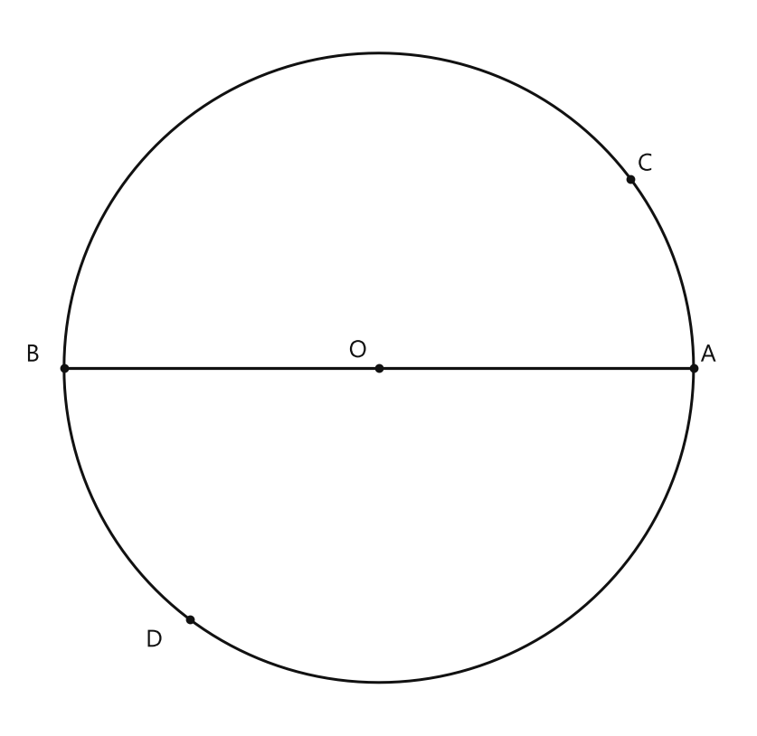
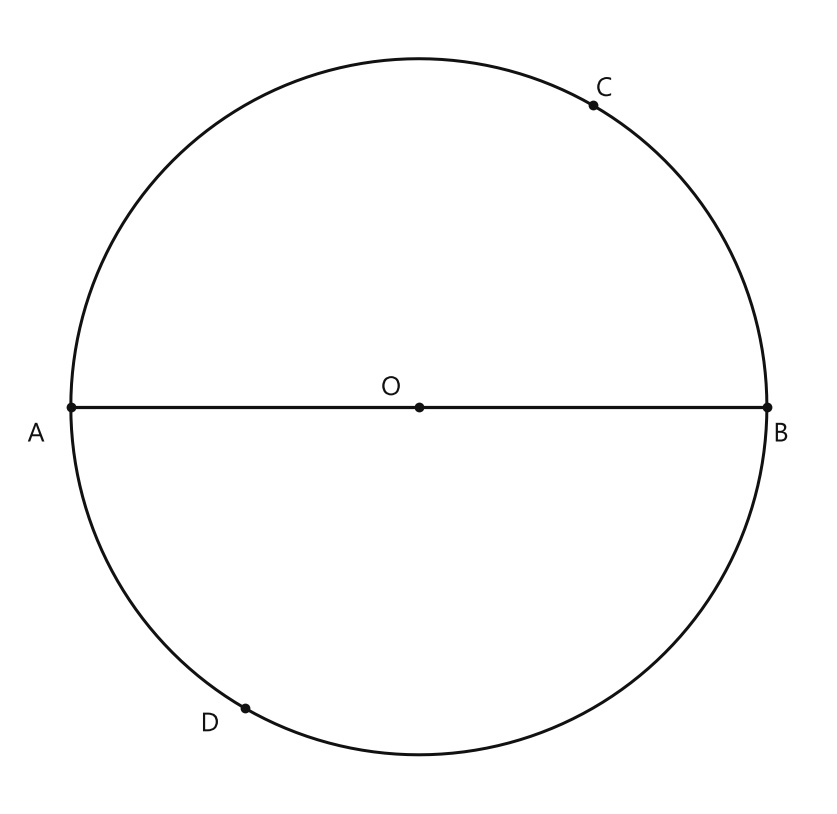
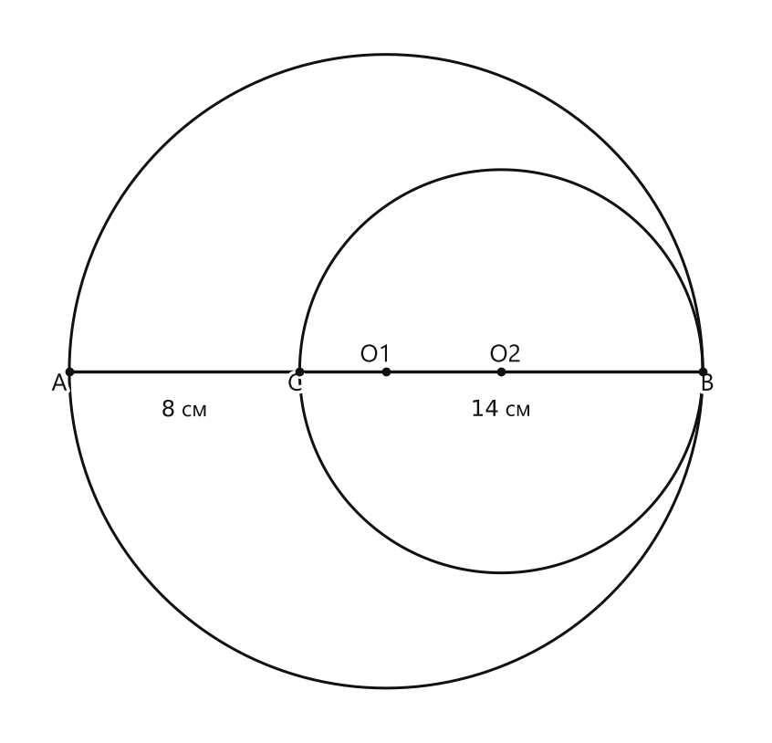
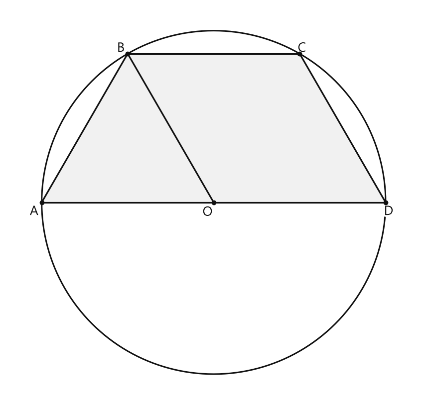

# Занятие 5. Окружность и круг

**Раздел:** Глава I. Начальные понятия геометрии  
**Параграф учебника:** §4. Окружность и круг  
**Страницы:** 35–39

## Цели занятия

К концу занятия ученик умеет:

- различать окружность и круг;
- называть радиус, хорду, диаметр и дугу;
- находить диаметр по радиусу и радиус по диаметру;
- отличать сектор, сегмент, полуокружность, полукруг и кольцо;
- решать задачи о шарах, окружностях и размерах автомобильных шин.

**Выбери блок своего уровня:**

- **1–2 балла:** узнаю основные элементы окружности;
- **3–4 балла:** применяю формулу $D=2R$;
- **5–6 баллов:** решаю задачи на хорды, диаметры и длины ломаных;
- **7–8 баллов:** применяю свойства окружности к реальным объектам;
- **9–10 баллов:** уверенно решаю смешанные задачи и объясняю ход решения.

## Теория к занятию

### Окружность и радиус

#### Простыми словами

Смотри: выберем точку $O$. Теперь отметим все точки, которые находятся от $O$ на одинаковом расстоянии. Эти точки образуют окружность.

Точка $O$ называется центром окружности. Отрезок от центра до любой точки окружности называется радиусом. У одной окружности радиусы могут смотреть в разные стороны, но длина у них одна и та же. Геометрия тут справедлива ко всем радиусам без исключения.

#### Определение

**Окружностью** называется геометрическая фигура, состоящая из всех точек плоскости, равноудаленных от данной точки, которая называется **центром окружности**.

**Радиусом** окружности называется отрезок, соединяющий центр окружности с любой точкой на окружности (или длина этого отрезка).

#### Формулы

Радиус обозначают буквами $R$ или $r$.

Если $C$ — точка окружности, а $O$ — центр, то $OC$ — радиус.

#### Правила

- Все радиусы одной окружности равны между собой.
- Радиус обязательно соединяет центр окружности с точкой окружности.
- Точка внутри окружности не является концом радиуса.

#### Ловушки

- Окружность — это только граница фигуры.
- Круг — это окружность вместе со всей областью внутри неё.
- Отрезок от центра до точки внутри круга не является радиусом окружности. Для радиуса второй конец должен лежать именно на окружности.

---

### Хорда, диаметр и дуга

#### Простыми словами

Хорда соединяет две точки окружности. Если такая хорда проходит через центр, она называется диаметром.

Диаметр состоит из двух радиусов: один идёт от центра к одному краю окружности, второй — от центра к противоположному краю. Поэтому диаметр в два раза длиннее радиуса.

Дуга — это часть самой окружности между двумя её точками. Внутренняя область круга в дугу не входит: дуга живёт на границе.

#### Определения

**Хордой окружности** называется отрезок, соединяющий две точки окружности.

**Диаметром окружности** называется хорда, проходящая через центр окружности.

**Дугой окружности** называется часть окружности, ограниченная двумя точками.

#### Свойства

- Диаметр состоит из двух радиусов.
- Поэтому диаметры окружности равны между собой.
- Любые две точки окружности разбивают ее на две дуги, которые дополняют друг друга до окружности.

#### Формулы

$$D=2R$$

Здесь:

- $D$ — диаметр;
- $R$ — радиус.

Если известен диаметр, радиус в два раза меньше:

$$R=\frac D2$$

#### Алгоритм

Чтобы найти диаметр по радиусу:

1. Запиши известный радиус.
2. Умножь радиус на $2$.
3. Запиши единицу измерения.

Чтобы найти радиус по диаметру:

1. Запиши известный диаметр.
2. Раздели диаметр на $2$.
3. Запиши единицу измерения.

#### Ловушки

- Диаметр — не любой отрезок между двумя точками окружности.
- Диаметр обязательно проходит через центр.
- В формуле $D=2R$ множитель $2$ означает, что диаметр состоит из двух радиусов. Он здесь не для украшения.

---

### Круг, сектор и сегмент

#### Простыми словами

Окружность — это только край, например край круглой тарелки. Круг — это и край, и всё пространство внутри него.

Сектор похож на кусок пирога: его границы — два радиуса и дуга.

Сегмент получается иначе: часть круга отсекают хордой. Поэтому его границы — дуга и хорда. Вот где обычно путают пирог с отрезанным кусочком.

#### Определения

**Кругом** называется часть плоскости, ограниченная окружностью.

Точки окружности также принадлежат кругу. Поэтому центр, радиус, хорда и диаметр у круга те же, что и у его окружности.

Часть круга, заключенная между двумя радиусами, называется *сектором*.

Часть круга, заключенная между дугой окружности и хордой, соединяющей концы дуги, называется *сегментом*.

#### Свойства

- Два радиуса разбивают круг на два сектора.
- Хорда разбивает круг на два сегмента.

#### Правила

- Видишь два радиуса и дугу между ними — это сектор.
- Видишь дугу и хорду, соединяющую её концы, — это сегмент.
- Сектор похож на «кусок пирога», а сегмент — на часть круга, отрезанную хордой.

#### Ловушки

- Сектор не ограничивается хордой.
- Сегмент не ограничивается двумя радиусами.
- Круг включает внутреннюю область, а окружность является только его границей.

---

### Полуокружность и полукруг

#### Простыми словами

Диаметр делит окружность на две дуги. Каждая из этих дуг называется полуокружностью.

Половина круга, ограниченная такой дугой и самим диаметром, называется полукругом. Названия похожи, но речь идёт о разных фигурах: полуокружность — это дуга, а полукруг — часть плоскости.

#### Определения

**Полуокружностью** называется дуга окружности, концы которой являются концами диаметра.

**Полукругом** называется часть круга, ограниченная полуокружностью и диаметром, соединяющим концы полуокружности.

#### Правила

- Концы полуокружности обязательно являются концами диаметра.
- Полукруг ограничен полуокружностью и диаметром.
- Если отрезок является только хордой, но не проходит через центр, он не делит окружность на полуокружности.

#### Ловушки

- Полуокружность — дуга, а полукруг — часть круга.
- Не всякая дуга является полуокружностью.
- Для полуокружности нужен именно диаметр, а не просто любая хорда.

---

### Центральный угол

#### Простыми словами

Угол может находиться внутри круга, но центральным он будет только тогда, когда его вершина совпадает с центром окружности.

Проверка короткая: сначала найди вершину угла, затем посмотри, является ли эта точка центром окружности. Если да — перед нами центральный угол.

#### Определение

Угол, вершина которого находится в центре окружности, называется *центральным углом*.

#### Правило

Если вершина угла — точка $O$, центр окружности, то угол может быть центральным.

#### Ловушки

- Если вершина находится на окружности, угол не является центральным.
- Важно положение вершины, а не длина сторон угла.
- Стороны центрального угла могут быть радиусами, но главное условие — вершина должна находиться в центре.

---

### Равные, пересекающиеся и концентрические окружности

#### Простыми словами

Если у двух окружностей одинаковые радиусы, то окружности равны.

Две окружности могут находиться отдельно и не иметь общих точек. Они могут пересекаться в двух точках. Ещё они могут иметь одну общую точку — тогда говорят, что окружности касаются. Встреча состоялась, но без второго пересечения.

Если у окружностей один и тот же центр, а радиусы разные, они называются концентрическими. Область между такими окружностями называют кольцом.

#### Свойства

Окружности (круги) равны, если равны их радиусы.

Две окружности могут не иметь общих точек, могут пересекаться в двух точках или касаться друг друга в одной точке.

Окружности разного радиуса с общим центром называются *концентрическими*.

Часть плоскости между двумя концентрическими окружностями называется *кольцом*.

#### Ловушки

- Общий центр и одинаковые радиусы дают совпадающие окружности, а не концентрические окружности разного радиуса.
- При пересечении окружности имеют две общие точки.
- При касании окружности имеют одну общую точку.
- Кольцо — это область между окружностями, а не одна из окружностей.

---

### Шар и сфера

#### Простыми словами

Если круг вращать вокруг своего диаметра, получится шар. Шар — это объёмное тело.

Сфера — только поверхность шара, его оболочка. Например, мяч целиком можно сравнить с шаром, а его наружную поверхность — со сферой.

У шара тоже есть центр, радиус и диаметр. Расстояние от центра до любой точки сферы одинаково и равно радиусу.

#### Определения

Если круг вращать около его диаметра, получится геометрическое тело, которое вы хорошо знаете, — шар.

Поверхность шара называется сферой. Сфера — это оболочка шара.

#### Свойства

Расстояние от центра шара до любой точки сферы равно радиусу шара.

Диаметр шара равен двум радиусам.

Если провести плоскость, пересекающую шар, то в сечении получится круг. Когда секущая плоскость будет проходить через центр шара, радиус $R$ полученного круга будет равен радиусу шара.

#### Формула

$$D=2R$$

#### Ловушки

- Шар — тело, сфера — поверхность шара.
- Расстояние от центра до любой точки сферы — радиус.
- Если таких расстояний несколько, их сумма состоит из нескольких радиусов. Это не один диаметр автоматически.
- Чтобы получить диаметр, нужно умножить один радиус на $2$.

---

### Размеры автомобильной шины

#### Простыми словами

Маркировка $185/60\ R15$ — это короткий «паспорт» шины. В нём спрятаны три размера:

- $185$ — ширина шины в миллиметрах;
- $60$ — высота профиля в процентах от ширины;
- $R15$ — внутренний диаметр шины в дюймах.

Здесь есть две разные единицы длины: миллиметры и дюймы. Сначала переведём всё в сантиметры, а уже потом будем складывать. Иначе миллиметры с сантиметрами начнут спорить прямо в вычислениях.

#### Формулы и правила

Ширина шины:

$$b=185\text{ мм}=18{,}5\text{ см}$$

Высота профиля равна $60\%$ ширины:

$$h=\frac{60}{100}\cdot b$$

Если ширину берём в миллиметрах, то:

$$h=\frac{60}{100}\cdot185\text{ мм}=111\text{ мм}=11{,}1\text{ см}$$

Внутренний диаметр шины равен $15$ дюймам. Так как $1$ дюйм $=2{,}54$ см, получаем:

$$d=15\cdot2{,}54\text{ см}$$

Наружный диаметр колеса складывается из внутреннего диаметра и двух высот профиля:

$$D=d+2h$$

Высота профиля добавляется дважды: один раз сверху и один раз снизу колеса. Колесо здесь симметрично, поэтому верх и низ получают по одинаковому «слою».

#### Ловушки

- Число $60$ — это не $60$ мм, а $60\%$ от ширины.
- В записи $R15$ число $15$ дано в дюймах.
- Перед сложением нужно перевести все длины в одни единицы.
- Высота профиля добавляется дважды: сверху и снизу колеса.

---

## Сводка формул «выучить наизусть»

$$D=2R$$

$$R=\frac D2$$

Для маркировки $185/60\ R15$:

$$h=\frac{60}{100}\cdot185\text{ мм}$$

$$d=15\cdot2{,}54\text{ см}$$

$$D_{\text{наружный}}=d+2h$$

## Правила, которые нельзя путать

- Окружность — граница, круг — часть плоскости внутри границы.
- Радиус соединяет центр с точкой окружности.
- Хорда соединяет две точки окружности.
- Диаметр — хорда, проходящая через центр.
- Сектор ограничен двумя радиусами и дугой.
- Сегмент ограничен дугой и хордой.
- Полуокружность — дуга, полукруг — часть круга.
- Центральный угол имеет вершину в центре окружности.
- Окружности с общим центром и разными радиусами называются концентрическими.
- Шар — тело, сфера — поверхность шара.
- Диаметр в два раза больше радиуса.

## Разбор ключевых заданий

### Р1. Элементы окружности

**Условие.** На окружности с центром $O$ отмечены точки $A$, $B$, $C$, $D$, $K$. На рисунке изображены отрезки $AB$, $CD$, $OK$, $OC$. Известно, что $AB$ проходит через центр $O$. Назовите радиусы, хорды, диаметр и дуги. Укажите один сектор и один сегмент.

#### Решение

Отрезок $OK$ соединяет центр $O$ с точкой $K$, которая лежит на окружности.

Значит, $OK$ — радиус.

Отрезок $OC$ соединяет центр $O$ с точкой $C$ окружности.

Значит, $OC$ — радиус.

Отрезок $AB$ соединяет две точки окружности.

По условию, отрезок $AB$ проходит через центр $O$.

Значит, $AB$ — диаметр.

Отрезок $CD$ соединяет две точки окружности.

Значит, $CD$ — хорда.

Дуга — это часть окружности между двумя её точками.

Поэтому можно назвать, например, такие дуги:

$$\overset{\frown}{AC},\qquad \overset{\frown}{CD},\qquad \overset{\frown}{DK}$$

Два радиуса $OK$ и $OC$ вместе с дугой $\overset{\frown}{KC}$ ограничивают сектор $KOC$.

Хорда $CD$ и дуга $\overset{\frown}{CD}$ ограничивают сегмент.

**Ответ:** радиусы $OK$, $OC$; хорда $CD$; диаметр $AB$; например, дуги $\overset{\frown}{AC}$, $\overset{\frown}{CD}$, $\overset{\frown}{DK}$; сектор $KOC$; сегмент между хордой $CD$ и дугой $\overset{\frown}{CD}$.

> Ловушка: $AB$ стал диаметром не потому, что выглядит длинным, а потому, что проходит через центр. В геометрии важны свойства, а не внешний вид.

---

### Р2. Диаметр по радиусу

**Условие.** В окружности с центром $O$ отрезок $OC$ является радиусом. Известно, что $OC=12{,}5$ см. Найдите длину диаметра $AB$.

#### Решение

Отрезок $OC$ является радиусом.

Значит,

$$R=OC=12{,}5\text{ см}$$

Диаметр состоит из двух радиусов.

Поэтому используем формулу:

$$D=2R$$

Подставим значение радиуса:

$$D=2\cdot12{,}5$$

Выполним умножение:

$$D=25\text{ см}$$

**Ответ:** $25$ см.

Проверка:

$$25:2=12{,}5\text{ см}$$

Получился исходный радиус, значит, вычисление выполнено правильно.

---

### Р3. Радиус по диаметру

**Условие.** Диаметр окружности $AB$ равен $118$ см. Найдите расстояние между центром $O$ и точкой $D$ окружности.

#### Решение

Точка $D$ лежит на окружности, а $O$ — её центр.

Поэтому расстояние $OD$ является радиусом:

$$OD=R$$

Диаметр равен двум радиусам:

$$D=2R$$

Чтобы найти радиус по диаметру, разделим диаметр на $2$:

$$R=\frac D2$$

Подставим значение диаметра:

$$R=\frac{118}{2}$$

Выполним деление:

$$R=59\text{ см}$$

Так как $OD$ — радиус, то

$$OD=59\text{ см}$$

**Ответ:** $59$ см.

Проверка:

$$2\cdot59=118\text{ см}$$

Диаметр снова равен $118$ см, значит, ответ верный.

---

### Р4. Сумма отрезков через радиус

**Условие.** В окружности с центром $O$ отрезки $OC$, $DO$ и $OB$ являются радиусами. Известно, что $AB+OC=48$ см, причём $AB$ — диаметр. Найдите $DO+OB$.

#### Решение

Отрезок $AB$ является диаметром.

Значит, он состоит из двух радиусов:

$$AB=2R$$

Отрезок $OC$ является радиусом:

$$OC=R$$

По условию:

$$AB+OC=48$$

Заменим $AB$ и $OC$ их выражениями через радиус:

$$2R+R=48$$

Сложим одинаковые слагаемые:

$$3R=48$$

Разделим обе части на $3$:

$$R=16\text{ см}$$

Отрезки $DO$ и $OB$ являются радиусами одной окружности.

Значит,

$$DO=R=16\text{ см}$$

$$OB=R=16\text{ см}$$

Найдём их сумму:

$$DO+OB=16+16$$

$$DO+OB=32\text{ см}$$

**Ответ:** $32$ см.

> Все радиусы одной окружности равны. Окружность не выдаёт одному радиусу зарплату больше другого.

### Р5. Замкнутая ломаная и хорды

**Условие.** Диаметр окружности равен $35$ см. Длины хорд $MK$ и $MN$ равны радиусу. Центр $O$ окружности лежит внутри угла $KMN$. Найдите длину замкнутой ломаной $OKMN$.

#### Решение

Сначала найдём радиус окружности.

Диаметр состоит из двух радиусов, поэтому:

$$R=\frac D2$$

Подставим значение диаметра:

$$R=\frac{35}{2}=17{,}5\text{ см}$$

Точка $K$ лежит на окружности.

Значит, отрезок $OK$ — радиус:

$$OK=17{,}5\text{ см}$$

По условию хорда $MK$ равна радиусу:

$$MK=17{,}5\text{ см}$$

По условию хорда $MN$ также равна радиусу:

$$MN=17{,}5\text{ см}$$

Точка $N$ лежит на окружности.

Значит, отрезок $NO$ — радиус:

$$NO=17{,}5\text{ см}$$

Замкнутая ломаная $OKMN$ состоит из четырёх звеньев:

$$OK,\ KM,\ MN,\ NO$$

Её длина равна сумме длин этих звеньев:

$$OK+KM+MN+NO$$

Подставим найденные значения:

$$17{,}5+17{,}5+17{,}5+17{,}5=70\text{ см}$$

**Ответ:** $70$ см.

Можно заметить короче: все четыре звена равны радиусу.

$$4R=4\cdot17{,}5=70\text{ см}$$

Вот и вся ломаная: четыре одинаковых «шага» по $17{,}5$ см.

---

### Р6. Две пересекающиеся окружности

**Условие.** Две окружности расположены так, что каждая проходит через центр другой окружности. Центры окружностей и точки их пересечения являются вершинами четырёхугольника. Диаметр одной окружности равен $7$ см. Найдите периметр четырёхугольника.

#### Решение

Обозначим центры окружностей через $O_1$ и $O_2$.

Точки пересечения окружностей обозначим через $A$ и $B$.

Пусть радиусы окружностей равны $R_1$ и $R_2$.

Первая окружность проходит через центр второй окружности.

Поэтому расстояние от $O_1$ до $O_2$ равно радиусу первой окружности:

$$O_1O_2=R_1$$

Вторая окружность проходит через центр первой окружности.

Поэтому:

$$O_1O_2=R_2$$

Значит, радиусы окружностей равны:

$$R_1=R_2=R$$

Точки $A$ и $B$ лежат на обеих окружностях.

Поэтому отрезки $O_1A$, $AO_2$, $O_2B$ и $BO_1$ являются радиусами:

$$O_1A=AO_2=O_2B=BO_1=R$$

Четырёхугольник имеет четыре стороны, и каждая из них равна радиусу.

Сначала найдём радиус по диаметру:

$$R=\frac D2$$

$$R=\frac72=3{,}5\text{ см}$$

Периметр четырёхугольника равен сумме четырёх радиусов:

$$P=4R$$

Подставим значение радиуса:

$$P=4\cdot3{,}5=14\text{ см}$$

**Ответ:** $14$ см.

Здесь рисунок может выглядеть хитро, но стороны четырёхугольника не прячутся: каждая из них — обычный радиус.

---

### Р7. Хорды равны радиусу

**Условие.** Хорды $AB$, $BC$, $CD$ равны радиусу окружности с центром в точке $O$ и диаметром $AD$. Периметр четырёхугольника $ABCD$ равен $60$ см. Найдите диаметр окружности.

#### Решение

Обозначим радиус окружности через $R$.

По условию хорды $AB$, $BC$ и $CD$ равны радиусу:

$$AB=R$$

$$BC=R$$

$$CD=R$$

Отрезок $AD$ — диаметр окружности.

Диаметр состоит из двух радиусов:

$$AD=2R$$

Периметр четырёхугольника равен сумме его сторон:

$$P=AB+BC+CD+AD$$

По условию периметр равен $60$ см.

Подставим вместо сторон их значения через $R$:

$$60=R+R+R+2R$$

Сложим одинаковые слагаемые:

$$60=5R$$

Чтобы найти $R$, разделим $60$ на $5$:

$$R=\frac{60}{5}=12\text{ см}$$

Теперь найдём диаметр:

$$D=2R$$

$$D=2\cdot12=24\text{ см}$$

**Ответ:** $24$ см.

Проверим:

$$12+12+12+24=60\text{ см}$$

Проверка сошлась — значит, диаметр не сбежал от нас и равен $24$ см.

---

### Р8. Маркировка автомобильной шины

**Условие.** На шине стоит маркировка $185/60\ R15$. Определите ширину шины, высоту профиля, внутренний диаметр и примерный наружный диаметр колеса. Считать, что $1$ дюйм $\approx2{,}54$ см.

#### Решение

Разберём маркировку по частям.

Первое число $185$ — ширина шины в миллиметрах:

$$185\text{ мм}=18{,}5\text{ см}$$

Значит, ширина шины равна $18{,}5$ см.

Число $60$ означает, что высота профиля составляет $60\%$ ширины шины.

Переведём $60\%$ в десятичную дробь:

$$60\%=0{,}6$$

Найдём высоту профиля:

$$h=0{,}6\cdot185\text{ мм}$$

$$h=111\text{ мм}$$

Переведём результат в сантиметры:

$$111\text{ мм}=11{,}1\text{ см}$$

Буква $R$ показывает вид конструкции шины, а число $15$ означает внутренний диаметр в дюймах.

Переведём $15$ дюймов в сантиметры:

$$d=15\cdot2{,}54\text{ см}$$

$$d=38{,}1\text{ см}$$

Наружный диаметр колеса состоит из внутреннего диаметра и двух высот профиля:

$$D=d+2h$$

Подставим найденные значения:

$$D=38{,}1+2\cdot11{,}1$$

$$D=38{,}1+22{,}2$$

$$D=60{,}3\text{ см}$$

**Ответ:** ширина — $18{,}5$ см; высота профиля — $11{,}1$ см; внутренний диаметр — $38{,}1$ см; примерный наружный диаметр — $60{,}3$ см.

> Число $60$ в маркировке не измеряется линейкой. Это проценты. Шина тоже не любит, когда проценты принимают за сантиметры.

---

### Р9. Диаметр шара

**Условие.** Сумма расстояний от центра шара до трёх точек на его поверхности равна $24$ см. Найдите диаметр шара.

#### Решение

Любая точка поверхности шара находится от его центра на расстоянии, равном радиусу шара.

Значит, каждое из трёх данных расстояний равно $R$.

По условию их сумма равна $24$ см:

$$R+R+R=24$$

Сложим одинаковые слагаемые:

$$3R=24$$

Разделим обе части на $3$:

$$R=\frac{24}{3}=8\text{ см}$$

Диаметр шара равен двум радиусам:

$$D=2R$$

Подставим значение радиуса:

$$D=2\cdot8=16\text{ см}$$

Проверим сумму трёх расстояний:

$$8+8+8=24\text{ см}$$

**Ответ:** $16$ см.

Три одинаковых расстояния по $8$ см дают радиус, а два таких радиуса — диаметр. Математика любит пары: $D=2R$.

## Практические задания

Выбери свой уровень и решай только этот блок. В блоке должна закрепиться вся тема параграфа. Ответы не приводятся.

### Уровень 1–2 балла

**С1.** Выберите фигуру, состоящую из всех точек плоскости, равноудалённых от данной точки.

1) круг  
2) окружность  
3) сектор  
4) сегмент  
5) кольцо

**С2.** Точка $O$ — центр окружности, а точка $A$ лежит на окружности. Как называется отрезок $OA$?

1) хорда  
2) диаметр  
3) радиус  
4) дуга  
5) сектор

**С3.** Выберите отрезок, который является диаметром окружности.

1) отрезок с концами на окружности, не проходящий через центр  
2) отрезок от центра до точки окружности  
3) отрезок, соединяющий две точки круга  
4) хорда, проходящая через центр окружности  
5) часть окружности между двумя точками

**С4.** Радиус окружности равен $9$ см. Найдите её диаметр.

1) $4{,}5$ см  
2) $9$ см  
3) $11$ см  
4) $18$ см  
5) $81$ см

**С5.** Диаметр окружности равен $26$ см. Найдите её радиус.

1) $13$ см  
2) $26$ см  
3) $52$ см  
4) $6{,}5$ см  
5) $676$ см

**С6.** Выберите все верные утверждения.

1) Все радиусы одной окружности равны.  
2) Диаметр состоит из двух радиусов.  
3) Хорда всегда проходит через центр окружности.  
4) Круг — это часть плоскости, ограниченная окружностью.  
5) Окружность и круг — одно и то же.

**С7.** На окружности отмечены точки $A$ и $B$. Как называется часть окружности, ограниченная точками $A$ и $B$?

1) хорда  
2) радиус  
3) дуга  
4) сектор  
5) диаметр

**С8.** Два радиуса окружности с центром $O$ делят круг на части. Как называются получившиеся части круга?

1) две хорды  
2) два сегмента  
3) два сектора  
4) две полуокружности  
5) два кольца

**С9.** Хорда окружности делит круг на две части. Как называются эти части?

1) радиусы  
2) сектора  
3) сегменты  
4) диаметры  
5) дуги

**С10.** Окружность имеет радиус $7$ см. Выберите верное равенство для её диаметра $D$.

1) $D=7$ см  
2) $D=14$ см  
3) $D=21$ см  
4) $D=49$ см  
5) $D=3{,}5$ см

**С11.** Две окружности имеют общий центр $O$ и разные радиусы. Как называются такие окружности?

1) пересекающиеся  
2) касающиеся  
3) концентрические  
4) равные  
5) параллельные

**С12.** Сумма расстояний от центра шара до трёх точек его поверхности равна $27$ см. Найдите диаметр шара.  

1) $3$ см  
2) $9$ см  
3) $18$ см  
4) $27$ см  
5) $54$ см

**С13.** Выберите фигуру, состоящую из всех точек плоскости, равноудалённых от данной точки:  
1) круг  2) окружность  3) сектор  4) сегмент  5) кольцо

**С14.** Точка $O$ — центр окружности, а точка $A$ лежит на окружности. Как называется отрезок $OA$?  
1) хорда  2) диаметр  3) радиус  4) дуга  5) секущая

**С15.** Выберите отрезок, который является диаметром окружности:  
1) отрезок, соединяющий центр окружности с точкой на окружности  
2) отрезок, соединяющий две точки круга  
3) хорда, проходящая через центр окружности  
4) часть окружности между двумя точками  
5) часть круга между дугой и хордой

**С16.** Радиус окружности равен $7$ см. Найдите её диаметр.

**С17.** Диаметр окружности равен $26$ см. Найдите её радиус.

**С18.** Какие окружности называют концентрическими?  
1) окружности одинакового радиуса без общих точек  
2) окружности разного радиуса с общим центром  
3) окружности с разными центрами, проходящие через одну точку  
4) окружности, пересекающиеся в двух точках  
5) окружности, имеющие общий диаметр

**С19.** Часть круга, заключённая между двумя радиусами, называется:  
1) дугой  2) хордой  3) сегментом  4) сектором  5) кольцом

**С20.** Отрезок $AB$ соединяет две точки окружности и проходит через её центр $O$. Как называется отрезок $AB$?

**С21.** Центральный угол $AOB$ имеет вершину в точке $O$, являющейся центром окружности. Выберите верное утверждение:  
1) угол $AOB$ является центральным  
2) угол $AOB$ является хордой  
3) угол $AOB$ является дугой  
4) угол $AOB$ является диаметром  
5) угол $AOB$ является сегментом

**С22.** Две окружности имеют общий центр и радиусы $4$ см и $9$ см. Как называется часть плоскости между этими окружностями?

**С23.** Радиус шара равен $15$ см. Найдите диаметр шара.

**С24.** Выберите верное утверждение:  
1) все радиусы одной окружности имеют разные длины  
2) диаметр окружности равен её радиусу  
3) диаметр окружности состоит из двух радиусов  
4) хорда всегда проходит через центр окружности  
5) круг состоит только из точек окружности

**С25.** Выберите определение окружности.  
1) Часть плоскости, ограниченная окружностью  
2) Отрезок, соединяющий две точки окружности  
3) Геометрическая фигура, состоящая из всех точек плоскости, равноудалённых от данной точки  
4) Часть круга между двумя радиусами  
5) Хорда, проходящая через центр окружности

**С26.** Точка $O$ — центр окружности, а точка $A$ принадлежит окружности. Как называется отрезок $OA$?  
1) Хорда  
2) Диаметр  
3) Радиус  
4) Дуга  
5) Сектор

**С27.** Выберите отрезок, который является диаметром окружности.  
1) Отрезок, соединяющий центр окружности с точкой на окружности  
2) Отрезок, соединяющий две точки круга и не проходящий через центр  
3) Хорда, проходящая через центр окружности  
4) Часть окружности между двумя точками  
5) Часть круга, ограниченная окружностью

**С28.** Радиус окружности равен $8$ см. Найдите её диаметр.  
1) $4$ см  
2) $8$ см  
3) $10$ см  
4) $16$ см  
5) $64$ см

**С29.** Диаметр окружности равен $26$ см. Найдите её радиус.  
1) $13$ см  
2) $26$ см  
3) $52$ см  
4) $6,5$ см  
5) $24$ см

**С30.** На окружности отмечены точки $A$ и $B$. Как называется часть окружности, ограниченная этими точками?  
1) Радиус  
2) Хорда  
3) Сектор  
4) Дуга  
5) Сегмент

**С31.** Даны окружность с центром $O$ и точки $A$, $B$, $C$ на окружности. Отрезок $AB$ проходит через точку $O$, а отрезок $OC$ соединяет центр с точкой окружности. Назовите диаметр и радиус.  
1) Диаметр $OC$, радиус $AB$  
2) Диаметр $AB$, радиус $OC$  
3) Диаметр $AC$, радиус $OB$  
4) Диаметр $OB$, радиус $AC$  
5) Диаметр $BC$, радиус $AO$

**С32.** Что получится при вращении круга вокруг его диаметра?  
1) Кольцо  
2) Сфера  
3) Шар  
4) Сегмент  
5) Окружность

**С33.** Две окружности имеют общий центр и разные радиусы. Как называются такие окружности?  
1) Пересекающиеся  
2) Концентрические  
3) Равные  
4) Касательные  
5) Параллельные

**С34.** Выберите часть круга, заключённую между двумя радиусами.  
1) Хорда  
2) Сегмент  
3) Сектор  
4) Дуга  
5) Кольцо

**С35.** Окружность разделена двумя точками $A$ и $B$ на две дуги. Как называются эти дуги по отношению друг к другу?  
1) Равные  
2) Пересекающиеся  
3) Дополнительные  
4) Концентрические  
5) Диаметральные

**С36.** Укажите верное утверждение.  
1) Все хорды окружности являются диаметрами  
2) Диаметр равен половине радиуса  
3) Все радиусы одной окружности равны  
4) Круг состоит только из точек окружности  
5) Сектор ограничен дугой и хордой

### Уровень 3–4 балла

**С1.** Запишите, как называются:  
а) точка, равноудалённая от всех точек окружности;  
б) отрезок, соединяющий центр окружности с точкой на окружности;  
в) хорда, проходящая через центр окружности.

**С2.** Радиус окружности равен $7$ см. Найдите её диаметр.

**С3.** Диаметр окружности равен $18$ см. Найдите радиус окружности.

**С4.** Отрезок $AB$ соединяет две точки окружности и проходит через её центр $O$. Как называется отрезок $AB$? Запишите два радиуса, из которых он состоит.

**С5.** На окружности отмечены точки $A$, $B$ и $C$. Назовите любые две дуги, ограниченные точками $A$ и $B$.

**С6.** Даны круг с центром $O$ и два радиуса $OA$ и $OB$. Как называется часть круга, заключённая между этими радиусами и дугой $AB$?

**С7.** Хорда $AB$ разделила круг на две части. Как называются эти части?

**С8.** Две окружности имеют общий центр $O$ и радиусы $4$ см и $9$ см. Как называются такие окружности? Как называется часть плоскости между ними?

**С9.** Радиус первой окружности равен $6$ см, а радиус второй — $6$ см. Можно ли утверждать, что ограниченные ими круги равны? Ответ обоснуйте свойством равных окружностей и кругов.

**С10.** Расстояние от центра шара до каждой из трёх точек его поверхности равно $8$ см. Найдите диаметр шара.

**С11.** Диаметр колеса равен $70$ см. Найдите длину окружности колеса, используя формулу $C=2\pi R$ и значение $\pi=3{,}14$.

**С12.** На отрезке $AB$ взята точка $C$, причём $AC=10$ см и $CB=6$ см. Отрезки $AB$ и $CB$ являются диаметрами двух окружностей. Найдите расстояние между центрами этих окружностей.

**С13.** Окружность с центром в точке $O$ имеет радиус $7$ см. Укажите, какие из отрезков являются радиусами, если $A$, $B$, $C$ — точки окружности: $OA$, $OB$, $AB$, $OC$.

**С14.** Окружность с центром в точке $O$ имеет диаметр $26$ см. Найдите её радиус.

**С15.** Радиус окружности равен $9$ см. Найдите длину её диаметра.

**С16.** Точки $A$ и $B$ принадлежат окружности с центром в точке $O$. Известно, что $OA=8{,}5$ см. Найдите длину отрезка $OB$.

**С17.** Отрезок $AB$ соединяет две точки окружности и проходит через её центр $O$. Как называется отрезок $AB$? Если $AO=11$ см, найдите длину $AB$.

**С18.** На окружности отмечены точки $A$, $B$ и $C$. Сколько дуг определяют точки $A$ и $B$? Назовите эти дуги, если одна из них проходит через точку $C$.

**С19.** Два радиуса $OA$ и $OB$ разделяют круг на части. Как называются получившиеся части круга?

**С20.** Хорда $AB$ разделяет круг на две части. Как называются эти части?

**С21.** Из двух окружностей с общим центром $O$ одна имеет радиус $5$ см, а другая — радиус $9$ см. Как называется часть плоскости между этими окружностями?

**С22.** Две окружности имеют общий центр и радиусы $4$ см и $10$ см. Являются ли эти окружности концентрическими? Найдите разность их радиусов.

**С23.** Сумма расстояний от центра шара до трёх точек его сферы равна $27$ см. Найдите диаметр шара.

**С24.** Диаметр шара равен $18$ см. Через его центр проведена секущая плоскость. Чему равен радиус круга, полученного в сечении?

**С25.** Радиус окружности равен $7$ см. Найдите её диаметр.

**С26.** Диаметр окружности равен $18$ см. Найдите радиус этой окружности.

**С27.** Точки $A$, $B$ и $C$ лежат на окружности с центром $O$. Отрезок $AB$ проходит через точку $O$. Как называется отрезок $AB$?

**С28.** Точки $M$ и $N$ лежат на окружности с центром $O$. Отрезок $MN$ не проходит через точку $O$. Как называется отрезок $MN$?

**С29.** На окружности с центром $O$ отмечены точки $A$, $B$ и $C$. Назовите любой радиус и любую хорду этой окружности, используя данные точки.

**С30.** Две окружности имеют общий центр, но разные радиусы. Как называются такие окружности?

**С31.** Часть круга заключена между двумя радиусами $OA$ и $OB$. Как называется эта часть круга?

**С32.** Часть круга ограничена дугой $AB$ окружности и хордой $AB$. Как называется эта часть круга?

**С33.** Диаметр шара равен $16$ см. Найдите его радиус.

**С34.** Сумма расстояний от центра шара до двух точек его поверхности равна $18$ см. Найдите диаметр шара.

**С35.** Окружности имеют общий центр и радиусы $5$ см и $9$ см. Как называется часть плоскости, расположенная между этими окружностями?

**С36.** Две окружности имеют радиусы $4$ см и $4$ см. Можно ли утверждать, что эти окружности равны? Укажите свойство, на основании которого сделан вывод.

### Уровень 5–6 баллов

**С1.** Запишите, как называются следующие элементы окружности: отрезок, соединяющий центр окружности с точкой на окружности; отрезок, соединяющий две точки окружности; хорда, проходящая через центр окружности.

**С2.** Радиус окружности равен $7$ см. Найдите её диаметр.

**С3.** Диаметр окружности равен $26$ см. Найдите радиус этой окружности.

**С4.** Точки $A$ и $B$ принадлежат окружности с центром $O$. Известно, что $OA=9$ см, $OB=9$ см. Как называются отрезки $OA$ и $OB$? Объясните, почему их длины равны.

**С5.** Отрезок $AB$ — диаметр окружности с центром $O$. Найдите длину $AB$, если $AO=11{,}5$ см.

**С6.** В круге проведены два радиуса $OA$ и $OB$. Как называются две части круга, на которые они разбивают круг?

**С7.** В круге проведена хорда $MN$, не проходящая через центр. На какие части она разбивает круг? Запишите названия этих частей.

**С8.** Две окружности имеют общий центр $O$ и радиусы $5$ см и $9$ см. Как называются такие окружности? Найдите ширину кольца, образованного этими окружностями.

**С9.** Радиус колеса равен $32$ см. Найдите длину окружности колеса, используя формулу $C=2\pi R$ и значение $\pi\approx3{,}14$.

**С10.** Диаметр колеса равен $70$ см. Какое расстояние приблизительно проедет велосипед за $20$ полных оборотов колеса? Ответ выразите в метрах, используя $\pi\approx3{,}14$.

**С11.** Сумма расстояний от центра шара до трёх точек его сферы равна $27$ см. Найдите радиус и диаметр шара.

**С12.** На отрезке $AB$ длиной $18$ см взята точка $C$ так, что $AC=6$ см. Отрезки $AB$ и $CB$ являются диаметрами двух окружностей. Найдите расстояние между центрами этих окружностей.

**С13.** На окружности с центром $O$ отмечены точки $A$, $B$, $C$ и $D$. Отрезок $AB$ проходит через центр $O$, отрезки $OC$ и $OD$ соединяют центр с точками окружности, а отрезок $CD$ соединяет две точки окружности. Назовите диаметр, два радиуса и хорду этой окружности.

**С14.** Радиус окружности равен $8{,}5$ см. Найдите её диаметр.

**С15.** Диаметр окружности равен $26$ см. Отрезки $AB$ и $BC$ являются хордами этой окружности и имеют длину, равную радиусу. Найдите длину ломаной $OABC$, если $O$ — центр окружности.

**С16.** Две окружности имеют общий центр $O$. Радиус меньшей окружности равен $7$ см, а радиус большей — $12$ см. Найдите ширину кольца, образованного этими окружностями.

**С17.** Диаметр окружности равен $18$ см. Точки $A$ и $B$ являются концами диаметра, а точка $C$ лежит на одной из полуокружностей. На сколько сантиметров длина диаметра больше длины радиуса?

**С18.** Две окружности расположены так, что центр каждой из них лежит на другой окружности. Диаметр каждой окружности равен $10$ см. Центры окружностей и точки их пересечения образуют четырёхугольник. Найдите его периметр.

**С19.** Хорды $AB$, $BC$ и $CD$ одной окружности равны её радиусу. Диаметр этой окружности равен $24$ см. Найдите периметр четырёхугольника $ABCD$, если $AD$ — диаметр окружности.

**С20.** Колесо имеет диаметр $56$ см. Длина окружности вычисляется по формуле $C=2\pi R$, где $\pi=3{,}14$. Какое расстояние проедет велосипед за $25$ полных оборотов колеса? Ответ выразите в метрах.

**С21.** Диаметр круглой клумбы равен $6$ м. Вокруг неё устроена дорожка в форме кольца. Радиус внешней окружности равен $4$ м. Найдите ширину дорожки.

**С22.** На отрезке $AB$ длиной $20$ см отмечена точка $C$, причём $AC=8$ см. Отрезки $AB$ и $CB$ являются диаметрами двух окружностей. Найдите расстояние между центрами этих окружностей.

**С23.** Радиус шара равен $9$ см. Найдите расстояние между двумя точками сферы, если одна из них является концом диаметра, а другая — противоположным концом этого диаметра.

**С24.** Плоскость проходит через центр шара радиусом $13$ см. Какую фигуру получают в сечении шара этой плоскостью и чему равен радиус полученной фигуры?

**С25.** Окружность имеет центр $O$ и радиус $7$ см. Точки $A$, $B$ и $C$ принадлежат окружности. Отрезок $AB$ проходит через точку $O$, а отрезки $OA$, $OC$ и $BC$ соединяют соответствующие точки. Назовите среди отрезков $OA$, $OC$ и $BC$ радиусы и хорду. Как называется отрезок $AB$?

**С26.** Диаметр окружности равен $18{,}4$ см. Найдите длину её радиуса.

**С27.** Радиус круга равен $15$ см. Через центр круга проведена хорда $AB$. Из точки $O$ к точке $A$ проведён радиус. Найдите длины отрезков $AB$ и $OA$.

**С28.** Хорды $AB$, $BC$ и $CD$ окружности равны её радиусу. Диаметр окружности $AD$ равен $28$ см. Найдите периметр четырёхугольника $ABCD$.

**С29.** Сумма расстояний от центра шара до пяти точек его сферы равна $45$ см. Найдите диаметр шара.

**С30.** Диаметр колеса равен $70$ см. Длина окружности вычисляется по формуле $C=2\pi R$, при этом $\pi\approx3{,}14$. Велосипед проехал $100$ м. Сколько полных оборотов совершило колесо?

### Уровень 7–8 баллов

**С1.** На окружности с центром $O$ отмечены точки $A$, $B$, $C$ и $D$. Отрезки $OA$, $OB$, $OC$, $OD$ соединяют центр с точками окружности; отрезки $AB$ и $CD$ соединяют пары точек окружности; отрезок $BD$ проходит через центр $O$. Назовите все радиусы, хорды и диаметры, изображённые в условии.

**С2.** Радиус окружности равен $7{,}5$ см. Найдите диаметр этой окружности. Во сколько раз длина диаметра больше длины радиуса?

**С3.** Диаметр круглой клумбы равен $8$ м. Вокруг неё сделали кольцевую дорожку, ограниченную двумя концентрическими окружностями. Радиус внешней окружности на $1{,}5$ м больше радиуса внутренней. Найдите радиус внешней окружности и ширину дорожки.

**С4.** Круг с центром $O$ разделён двумя радиусами $OA$ и $OB$ на два сектора. Хорда $AB$ также проведена. Укажите, какие две части круга образуются при проведении хорды $AB$, и какие две части образуются при проведении радиусов $OA$ и $OB$.

<!--geo-figure-spec
{
  "needed": true,
  "kind": "plane",
  "caption": "Окружность с диаметром $AB$ и точками $C$, $D$",
  "equal": true,
  "axis": false,
  "xlim": [
    -3.5,
    3.5
  ],
  "ylim": [
    -3.4,
    3.4
  ],
  "points": {
    "O": [
      0,
      0
    ],
    "A": [
      3,
      0
    ],
    "B": [
      -3,
      0
    ],
    "C": [
      2.4,
      1.8
    ],
    "D": [
      -1.8,
      -2.4
    ]
  },
  "segments": [
    [
      "A",
      "B"
    ]
  ],
  "polygons": [],
  "circles": [
    {
      "center": "O",
      "radius": 3
    }
  ],
  "labels": {
    "O": {
      "dx": -0.2,
      "dy": 0.16
    },
    "A": {
      "dx": 0.14,
      "dy": 0.12
    },
    "B": {
      "dx": -0.3,
      "dy": 0.12
    },
    "C": {
      "dx": 0.14,
      "dy": 0.14
    },
    "D": {
      "dx": -0.34,
      "dy": -0.2
    }
  },
  "right_angles": [],
  "angle_marks": [],
  "texts": []
}
-->

*Окружность с диаметром AB и точками C, D*

**С5.** На окружности с центром $O$ точки $A$ и $B$ являются концами диаметра. Точка $C$ лежит на одной из дуг $AB$, а точка $D$ — на другой дуге $AB$. Назовите две пары дуг, на которые точки $A$ и $B$ разбивают окружность, и укажите, какие из этих дуг являются полуокружностями.

<!--geo-figure-spec
{
  "needed": true,
  "kind": "plane",
  "caption": "Окружность с центром $O$, диаметром $AB$ и точками $C$, $D$",
  "equal": true,
  "axis": false,
  "xlim": [
    -3.5,
    3.5
  ],
  "ylim": [
    -3.4,
    3.4
  ],
  "points": {
    "O": [
      0,
      0
    ],
    "A": [
      -3,
      0
    ],
    "B": [
      3,
      0
    ],
    "C": [
      1.5,
      2.598076211
    ],
    "D": [
      -1.5,
      -2.598076211
    ]
  },
  "segments": [
    [
      "A",
      "B"
    ]
  ],
  "polygons": [],
  "circles": [
    {
      "center": "O",
      "radius": 3
    }
  ],
  "labels": {
    "O": {
      "dx": -0.24,
      "dy": 0.16
    },
    "A": {
      "dx": -0.3,
      "dy": -0.24
    },
    "B": {
      "dx": 0.12,
      "dy": -0.24
    },
    "C": {
      "dx": 0.1,
      "dy": 0.14
    },
    "D": {
      "dx": -0.3,
      "dy": -0.14
    }
  },
  "right_angles": [],
  "angle_marks": [],
  "texts": []
}
-->

*Окружность с центром O, диаметром AB и точками C, D*

**С6.** Диаметр колеса самоката равен $24$ см. Колесо совершило $250$ полных оборотов. Считая длину окружности по формуле $C=2\pi R$ и принимая $\pi=3{,}14$, определите расстояние, которое проехал самокат, в метрах.

**С7.** На отрезке $AB$ взята точка $C$, причём $AC=8$ см и $CB=14$ см. Отрезки $AB$ и $CB$ являются диаметрами двух окружностей. Найдите расстояние между центрами этих окружностей.

<!--geo-figure-spec
{
  "needed": true,
  "kind": "plane",
  "caption": "Отрезок $AB$ с точкой $C$ и окружностями с диаметрами $AB$ и $CB$",
  "equal": true,
  "axis": false,
  "xlim": [
    -2,
    24
  ],
  "ylim": [
    -12.5,
    12.5
  ],
  "points": {
    "A": [
      0,
      0
    ],
    "C": [
      8,
      0
    ],
    "B": [
      22,
      0
    ],
    "O1": [
      11,
      0
    ],
    "O2": [
      15,
      0
    ]
  },
  "segments": [
    [
      "A",
      "B"
    ],
    [
      "A",
      "C"
    ],
    [
      "C",
      "B"
    ]
  ],
  "polygons": [],
  "circles": [
    {
      "center": "O1",
      "radius": 11
    },
    {
      "center": "O2",
      "radius": 7
    }
  ],
  "labels": {
    "A": {
      "dx": -0.35,
      "dy": -0.45
    },
    "C": {
      "dx": -0.15,
      "dy": -0.45
    },
    "B": {
      "dx": 0.15,
      "dy": -0.45
    },
    "O1": {
      "dx": -0.35,
      "dy": 0.55
    },
    "O2": {
      "dx": 0.15,
      "dy": 0.55
    }
  },
  "right_angles": [],
  "angle_marks": [],
  "texts": [
    {
      "xy": [
        4,
        -1.35
      ],
      "text": "$8$ см"
    },
    {
      "xy": [
        15,
        -1.35
      ],
      "text": "$14$ см"
    }
  ]
}
-->

*Отрезок AB с точкой C и окружностями с диаметрами AB и CB*

**С8.** Две окружности имеют общий центр $O$, радиусы этих окружностей равны $5$ см и $9$ см. Найдите ширину кольца, образованного данными окружностями, и сумму длин диаметров обеих окружностей.

**С9.** Радиус шара равен $6$ см. Через центр шара проведена секущая плоскость. Какую фигуру получат в сечении? Найдите радиус и диаметр полученной фигуры.

**С10.** Две окружности имеют радиусы $4$ см и $7$ см, а расстояние между их центрами равно $3$ см. Определите, сколько общих точек могут иметь эти окружности, и обоснуйте свой ответ сравнением расстояния между центрами с радиусами окружностей.

**С11.** Хорды $AB$, $BC$ и $CD$ одной окружности равны её радиусу. Отрезок $AD$ является диаметром, а периметр четырёхугольника $ABCD$ равен $56$ см. Найдите радиус и диаметр окружности.

<!--geo-figure-spec
{
  "needed": true,
  "kind": "plane",
  "caption": "Окружность с диаметром $AD$ и равными хордами $AB$, $BC$, $CD$",
  "equal": true,
  "axis": false,
  "xlim": [
    -13.5,
    13.5
  ],
  "ylim": [
    -12.8,
    12.8
  ],
  "points": {
    "O": [
      0,
      0
    ],
    "A": [
      -11.2,
      0
    ],
    "B": [
      -5.6,
      9.6995
    ],
    "C": [
      5.6,
      9.6995
    ],
    "D": [
      11.2,
      0
    ]
  },
  "segments": [
    [
      "A",
      "B"
    ],
    [
      "B",
      "C"
    ],
    [
      "C",
      "D"
    ],
    [
      "D",
      "A"
    ],
    [
      "O",
      "B"
    ]
  ],
  "polygons": [
    {
      "vertices": [
        "A",
        "B",
        "C",
        "D"
      ],
      "fill": 0.06
    }
  ],
  "circles": [
    {
      "center": "O",
      "radius": 11.2
    }
  ],
  "labels": {
    "O": {
      "dx": -0.4,
      "dy": -0.65
    },
    "A": {
      "dx": -0.5,
      "dy": -0.6
    },
    "B": {
      "dx": -0.45,
      "dy": 0.35
    },
    "C": {
      "dx": 0.15,
      "dy": 0.35
    },
    "D": {
      "dx": 0.2,
      "dy": -0.6
    }
  },
  "right_angles": [],
  "angle_marks": [],
  "texts": []
}
-->

*Окружность с диаметром AD и равными хордами AB, BC, CD*

**С12.** Диаметр круглого стола равен $1{,}2$ м. На расстоянии $0{,}2$ м от края стола провели окружность, по которой наклеили декоративную ленту. Найдите длину этой окружности, используя формулу $C=2\pi R$ и значение $\pi=3{,}14$. Укажите также, на сколько сантиметров длина декоративной ленты меньше длины окружности края стола.

**С13.** Окружность с центром $O$ проходит через точки $A$, $B$, $C$ и $D$. Точки $A$ и $D$ лежат на одной прямой с центром $O$. Назовите все изображённые радиусы, все отрезки, соединяющие пары данных точек окружности, и диаметр. Укажите три различные дуги этой окружности.

**С14.** На окружности с центром $O$ точки $A$, $B$, $C$ и $D$ лежат на окружности, причём $AB$ — диаметр. Решите следующие задачи.
   
а) Если $OC=12{,}5$ см, найдите длину $AB$.
   
б) Если $AB=86$ см, найдите расстояние $DO$.
   
в) Если $AB+OC=54$ см, найдите сумму $DO+OB$.

**С15.** Диаметр окружности равен $28$ см. Хорды $MK$ и $MN$ равны радиусу этой окружности, причём центр $O$ находится внутри угла $KMN$. Найдите длину замкнутой ломаной $OKMN$.

**С16.** Две окружности имеют общий центр $O$, а их радиусы равны $5$ см и $11$ см. Точки $A$ и $B$ лежат на меньшей окружности, точки $C$ и $D$ — на большей. Определите, какие из перечисленных отрезков могут быть радиусами, а какие — хордами: $OA$, $OC$, $AB$, $CD$, $AC$. Обоснуйте каждый ответ.

**С17.** Расстояние между центрами двух окружностей равно $13$ см. Радиусы окружностей равны $5$ см и $8$ см. Определите, имеют ли окружности общие точки, и если имеют, то сколько. Ответ обоснуйте сравнением расстояния между центрами с радиусами окружностей.

**С18.** Две окружности одинакового радиуса проходят через центры друг друга. Их центры обозначены $O_1$ и $O_2$, а точки пересечения окружностей — $A$ и $B$. Диаметр каждой окружности равен $10$ см. Найдите периметр четырёхугольника $O_1AO_2B$.

**С19.** Хорды $AB$, $BC$ и $CD$ окружности равны её радиусу. Диаметр этой окружности имеет концы $A$ и $D$. Периметр четырёхугольника $ABCD$ равен $75$ см. Найдите радиус и диаметр окружности.

**С20.** В круге с центром $O$ проведены два радиуса $OA$ и $OB$, а также хорда $AB$. Назовите две части круга, на которые его разделяют эти радиусы, и две части круга, на которые его разделяет хорда $AB$. Укажите, какая из названных частей является сектором, а какая — сегментом.

**С21.** На боковой поверхности автомобильной шины указана маркировка $205/55\ R16$. Число $205$ обозначает ширину шины в миллиметрах, число $55$ — высоту профиля в процентах от ширины, а число $16$ — диаметр обода в дюймах. Считая $1$ дюйм равным $2{,}54$ см, найдите высоту профиля шины в сантиметрах, внутренний диаметр колеса в сантиметрах и примерный наружный диаметр колеса в сантиметрах.

**С22.** На окружности взяты точки $A$ и $B$. Одна из дуг $AB$ имеет длину $17$ см, а длина всей окружности равна $46$ см. Найдите длину второй дуги $AB$. Объясните, почему эти две дуги дополняют друг друга до полной окружности.

**С23.** На отрезке $AB$ взята точка $C$, причём $AC=8$ см. Отрезок $AB$ является диаметром окружности с центром $O_1$, а отрезок $CB$ — диаметром окружности с центром $O_2$. Расстояние между точками $A$ и $B$ равно $26$ см. Найдите расстояние $O_1O_2$.

**С24.** Диаметр шара равен $18$ см. Через шар проведены две секущие плоскости: первая проходит через центр шара, а вторая не проходит через центр. Как называются сечения шара этими плоскостями? Чему равен радиус круга, полученного в первой плоскости? Каково расстояние от центра шара до любой точки его поверхности? Обоснуйте ответы, используя определения и свойства шара.

### Уровень 9–10 баллов

**С1.** На окружности с центром $O$ отмечены точки $A$, $B$, $C$, $D$. Известно, что отрезки $AB$, $BC$ и $CD$ являются хордами, а отрезок $AD$ проходит через точку $O$. Назовите все диаметры и радиусы, изображённые среди отрезков $OA$, $OB$, $OC$, $OD$, $AB$, $BC$, $CD$, $AD$.

**С2.** Диаметр первой окружности равен $18$ см, а радиус второй окружности равен $9$ см. Сравните окружности по размеру и найдите сумму их радиусов.

**С3.** На окружности с центром $O$ точки $A$ и $B$ являются концами диаметра, а точка $C$ принадлежит одной из полуокружностей $AB$. Сколько дуг, хорд, диаметров и полуокружностей определяют точки $A$, $B$ и $C$? Ответ представьте четырьмя числами в указанном порядке.

**С4.** Диаметр колеса велосипеда равен $64$ см. Велосипедист проехал $128$ м. Используя $\pi=3{,}14$, определите количество полных оборотов колеса и длину пути, которая останется после этих оборотов.

**С5.** На отрезке $AB$ взята точка $C$, причём $AC=8$ см и $CB=14$ см. Отрезки $AB$ и $CB$ являются диаметрами двух окружностей. Найдите расстояние между центрами этих окружностей.

**С6.** Две окружности имеют общий центр $O$ и радиусы $5$ см и $13$ см. Найдите ширину кольца, образованного этими окружностями, и сумму диаметров окружностей.

**С7.** Две окружности имеют радиусы $6$ см и $10$ см. Расстояние между их центрами равно $16$ см. Определите, имеют ли окружности общие точки, и если имеют, то сколько.

**С8.** Две окружности имеют радиусы $7$ см и $12$ см, а расстояние между их центрами равно $4$ см. Определите, имеют ли окружности общие точки, и обоснуйте ответ сравнением расстояния между центрами с радиусами окружностей.

**С9.** На окружности отмечены четыре различные точки $A$, $B$, $C$, $D$. Сколько различных дуг с концами в этих точках можно назвать, если каждая пара концов определяет две дополняющие друг друга дуги? Сколько всего таких дуг получится?

**С10.** Диаметр окружности равен $35$ см. Хорды $MK$ и $MN$ имеют длину, равную радиусу окружности. Центр $O$ расположен внутри угла $KMN$. Найдите длину замкнутой ломаной $OKMN$.

**С11.** Две окружности одинакового радиуса пересекаются в точках $A$ и $B$. Центр первой окружности обозначен $O_1$, второй — $O_2$. Известно, что $O_1$ лежит на второй окружности, а $O_2$ — на первой. Точки $O_1$, $A$, $O_2$, $B$ являются вершинами четырёхугольника. Диаметр каждой окружности равен $9$ см. Найдите периметр этого четырёхугольника.

**С12.** Сумма расстояний от центра шара до четырёх точек его сферы равна $30$ см. Найдите радиус и диаметр шара. Затем определите радиус круга, полученного в сечении шара плоскостью, проходящей через его центр.

**С13.** В окружности с центром $O$ и диаметром $AD$ хорды $AB$, $BC$ и $CD$ равны между собой, причём длина каждой хорды равна радиусу окружности. Периметр четырёхугольника $ABCD$ равен $60$ см. Найдите радиус и диаметр окружности.

**С14.** Две окружности имеют центры $O_1$ и $O_2$, пересекаются в точках $P$ и $Q$, причём каждая окружность проходит через центр другой. Точки $O_1$, $P$, $O_2$, $Q$ являются вершинами четырёхугольника. Диаметр каждой окружности равен $9{,}5$ см. Найдите периметр этого четырёхугольника.

**С15.** Диаметр колеса велосипеда равен $64$ см. Велосипедист проехал $100$ м. Длина окружности вычисляется по формуле $C=2\pi R$, где $\pi=3{,}1415\ldots$. Используя калькулятор, определите число полных оборотов колеса.

**С16.** Три точки $A$, $B$ и $C$ принадлежат сфере одного шара. Сумма расстояний от центра шара до этих точек равна $27$ см. Через центр шара провели секущую плоскость. Найдите радиус круга, получившегося в сечении, и диаметр шара.

**С17.** На отрезке $AB$ длиной $26$ см выбрана точка $C$ так, что $AC=10$ см. Отрезок $AB$ является диаметром первой окружности, а отрезок $CB$ — диаметром второй окружности. Найдите расстояние между центрами этих окружностей и определите, пересекаются ли окружности.

**С18.** Даны две концентрические окружности с общим центром $O$. Радиус большей окружности на $6$ см больше радиуса меньшей, а сумма их диаметров равна $36$ см. Найдите радиусы обеих окружностей и ширину кольца, ограниченного ими.

## Чек-лист «ученик понял тему»

- Могу повторить определения и формулы параграфа своими словами и по учебнику.
- Решаю типовые задания своего уровня без подсказки.
- Вижу типичную ошибку и могу её объяснить.
