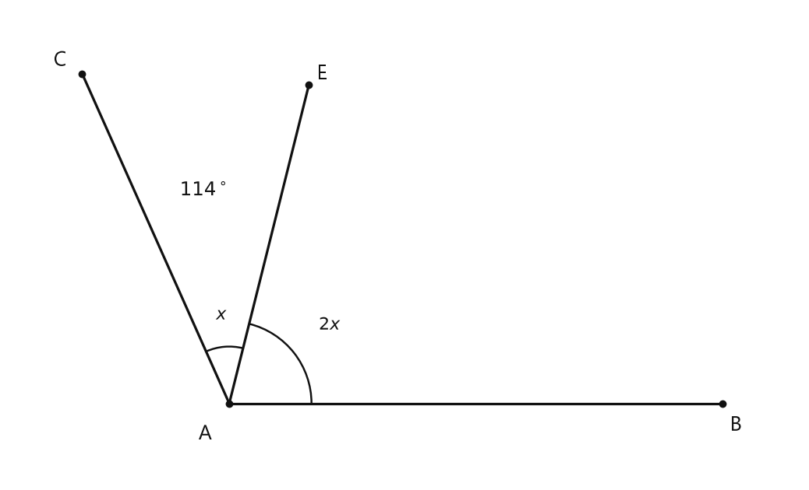
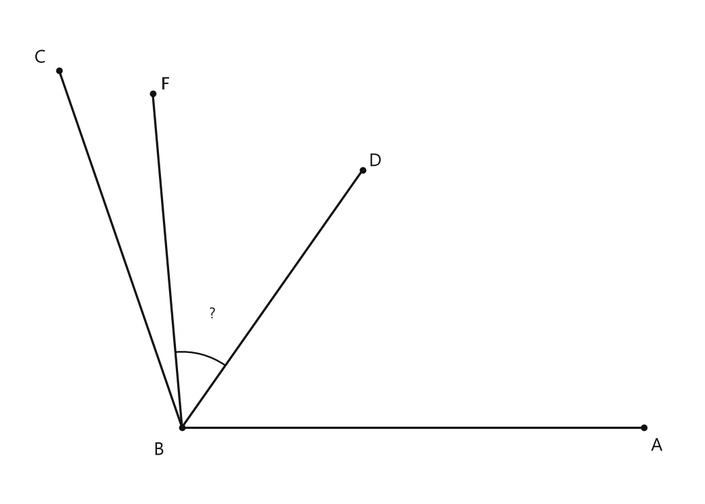
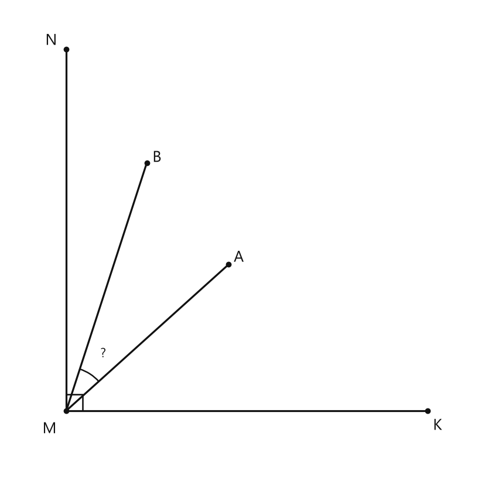

# Занятие 6. Угол. Виды углов

**Раздел:** Глава I. Начальные понятия геометрии  
**Параграф учебника:** §5. Угол. Виды углов  
**Страницы:** 40–45

## Цели занятия

После занятия ты умеешь:

- объяснять, что такое угол, вершина, стороны угла и биссектриса;
- различать острые, прямые, тупые, развернутые и полные углы;
- складывать и вычитать градусные меры, выраженные в градусах, минутах и секундах;
- находить неизвестную часть угла по сумме частей;
- находить угол между лучами, расположенными внутри другого угла;
- применять свойства биссектрисы.

Выбери блок своего уровня:

- **1–2 балла:** определения и виды углов;
- **3–4 балла:** измерение и арифметические действия с углами;
- **5–6 баллов:** задачи на части угла;
- **7–8 баллов:** несколько лучей внутри угла;
- **9–10 баллов:** составные задачи и уверенное объяснение решения.

## Теория к занятию

### Что такое угол

#### Простыми словами

Представь две спицы, выходящие из одной точки. Эти лучи — стороны угла, а общая точка — его вершина. Угол включает не только «раствор» между лучами, но и часть плоскости, которую эти лучи ограничивают.

#### Определение

**Угол** — это геометрическая фигура, образованная двумя лучами, выходящими из одной точки, и частью плоскости, которую они ограничивают.

Два угла называются **равными**, если их можно совместить наложением.

**Биссектрисой угла** называется луч, который выходит из вершины угла и делит его на два равных угла.

#### Правила

- В записи $\angle BAC$ средняя буква $A$ обозначает вершину угла.
- Стороны угла $\angle BAC$ — лучи $AB$ и $AC$.
- Биссектриса делит угол на две равные части:

$$
\angle BAK=\angle KAC.
$$

Смотри внимательно: луч-биссектриса начинается в вершине и проходит внутри угла. Он как аккуратный разделитель: налево и направо — поровну.

#### Ловушки

- В записи угла вершина всегда стоит **посередине**.
- Биссектриса — это **луч**, а не отрезок и не прямая.
- Биссектриса делит угол на **равные**, а не просто «какие-нибудь» части.
- Угол — не только две линии. Он включает ещё и часть плоскости между ними.

### Развернутый угол

#### Простыми словами

Если два луча выходят из одной точки в противоположных направлениях, вместе они образуют прямую. Угол между такими лучами называется развернутым.

#### Определение

**Развернутым углом** называется угол, стороны которого являются дополнительными лучами.

Развернутый угол равен $180^\circ$.

#### Правила

Если $\angle AOB$ — развернутый, то лучи $OA$ и $OB$ являются дополнительными.

#### Ловушки

- Развернутый угол равен $180^\circ$, а не $360^\circ$.
- Угол $360^\circ$ — полный.
- Если стороны угла совпадают, то это полный угол.

Можно запомнить так: $180^\circ$ — лучи «разошлись в разные стороны», а $360^\circ$ — один луч сделал полный круг и вернулся на своё место.

### Измерение углов

#### Простыми словами

Размер угла не зависит от длины его сторон. Если стороны сделать длиннее, угол не станет больше: изменится только длина лучей, а их направление останется прежним.

Углы измеряются в градусах, минутах и секундах.

#### Правило

**Градусом** называется $\frac{1}{180}$ часть развернутого угла и обозначается $1^\circ$; развернутый угол равен $180^\circ$; $\frac{1}{60}$ часть одного градуса называется **минутой** и обозначается $1'$; $\frac{1}{60}$ часть минуты называется **секундой** и обозначается $1''$.

Из этого следуют переводы:

$$
1^\circ=60',
$$

$$
1'=60''.
$$

#### Как складывать углы

Складываем по порядку:

1. секунды;
2. минуты;
3. градусы.

Если секунд получилось $60$ или больше, переводим полные $60''$ в $1'$:

$$
60''=1'.
$$

Если минут получилось $60$ или больше, переводим полные $60'$ в $1^\circ$:

$$
60'=1^\circ.
$$

#### Как вычитать углы

Сначала вычитаем секунды, потом минуты, потом градусы.

Если секунд в уменьшаемом меньше, чем секунд в вычитаемом, занимаем $1'$:

$$
1'=60''.
$$

Если минут не хватает, занимаем $1^\circ$:

$$
1^\circ=60'.
$$

При займе не забудь уменьшить на $1$ ту единицу, у которой мы заняли. Иначе одна минута или один градус появятся из воздуха — а геометрия такого фокуса не любит.

#### Ловушки

- Нельзя считать, что $1^\circ=100'$: здесь не десятичная система.
- Заём идёт по цепочке:

$$
1^\circ=60',\qquad 1'=60''.
$$

- Секунды сначала превращаются в минуты, а не сразу в градусы.
- Знак градуса относится к градусам, один штрих — к минутам, два штриха — к секундам.

### Виды углов по градусной мере

#### Простыми словами

Чтобы определить вид угла, сравни его градусную меру с $90^\circ$ и $180^\circ$.

#### Определение

Угол, равный $90^\circ$, называется прямым; угол, меньший $90^\circ$, — острым; угол, больший $90^\circ$, но меньший $180^\circ$, — тупым; угол, равный $360^\circ$, называется полным (его стороны совпадают).

#### Сводная таблица

| Вид угла | Градусная мера |
|---|---:|
| Острый | меньше $90^\circ$ |
| Прямой | $90^\circ$ |
| Тупой | больше $90^\circ$, но меньше $180^\circ$ |
| Развернутый | $180^\circ$ |
| Полный | $360^\circ$ |

#### Ловушки

- Угол $90^\circ$ — прямой, не острый и не тупой.
- Угол $180^\circ$ — развернутый, не тупой.
- Угол $360^\circ$ — полный.
- Угол $90^\circ1'$ больше $90^\circ$, но меньше $180^\circ$, поэтому он тупой.

Границы здесь важны: «меньше» и «равно» — не одно и то же. Угол $90^\circ$ ровно попал в команду прямых.

### Свойства градусной меры угла

#### Простыми словами

Чем сильнее раскрыт угол, тем больше его градусная мера. Равные углы имеют одинаковую градусную меру. И наоборот: если градусные меры равны, то равны и углы.

#### Свойство

Любой угол имеет градусную меру, выраженную некоторым положительным числом; равным углам соответствуют равные градусные меры, а большему углу — большая градусная мера. И наоборот.

#### Правила

- Если $\angle A=\angle B$, то их градусные меры равны.
- Если один угол больше другого, то и его градусная мера больше.
- По градусной мере можно определить вид угла.

### Сумма частей угла

#### Простыми словами

Если внутри большого угла провести ещё один луч, большой угол разделится на два меньших. Чтобы получить весь угол, складываем его части.

#### Аксиома измерения углов

Если внутри угла из его вершины провести луч, то он разобьет данный угол на два угла, сумма градусных мер которых равна градусной мере данного угла.

Если луч $AD$ проходит внутри угла $BAC$, то:

$$
\angle BAD+\angle DAC=\angle BAC.
$$

#### Алгоритм

1. Определи, на какие части разделён угол.
2. Обозначь неизвестную часть буквой, например $x$.
3. Вырази остальные части через $x$.
4. Сложи части и приравняй их к величине целого угла.
5. Найди одну часть делением или подбором.
6. Найди ту часть, которую спрашивают.
7. Запиши ответ с единицей измерения.

В задачах этого типа сначала ищем связь «части составляют целое». Это главный маршрут, а не декоративная надпись на полях.

#### Ловушки

- Не складывай углы, которые не составляют данный целый угол.
- Следи за порядком лучей на рисунке.
- Если одна часть в два раза больше другой, можно взять меньшую часть за $x$, а большую записать как $2x$.
- Часть большого угла не может быть больше самого большого угла.

### Угол между несколькими лучами

#### Простыми словами

Если внутри большого угла находятся два луча, то большой угол разбивается на несколько маленьких. Можно сложить соседние части или вычесть из большого угла уже известные части.

Если лучи расположены в порядке $BA$, $BD$, $BF$, $BC$, то:

$$
\angle ABC=\angle ABD+\angle DBF+\angle FBC.
$$

Отсюда нужный угол можно получить, если из всего угла вычесть крайние части.

Также полезна формула:

$$
\angle DBF=\angle ABF+\angle CBD-\angle ABC.
$$

Она получается так: в сумме $\angle ABF+\angle CBD$ угол $\angle ABC$ учитывается дважды, а нужный угол $\angle DBF$ остаётся один раз.

#### Ловушки

- Угол $\angle FBC$ — часть угла $\angle ABC$, поэтому:

$$
\angle FBC=\angle ABC-\angle ABF.
$$

- $\angle CBD$ и $\angle DBC$ обозначают один и тот же угол: вершина в обоих случаях находится в точке $B$.
- Сначала удобно найти маленькую недостающую часть, а затем искомый угол.
- Если получился отрицательный результат, проверь порядок лучей и выбранную формулу. В такой задаче «минус градусов» — это не новый вид угла, а сигнал перепроверить решение.

## Сводка формул «выучить наизусть»

$$
1^\circ=60',
$$

$$
1'=60'',
$$

$$
180^\circ \text{ — развернутый угол},
$$

$$
360^\circ \text{ — полный угол},
$$

$$
\angle BAD+\angle DAC=\angle BAC,
$$

$$
\angle DBF=\angle ABF+\angle CBD-\angle ABC.
$$

Для биссектрисы:

$$
\angle BAK=\angle KAC.
$$

Если луч делит угол на две части, а обе части имеют биссектрисы, то угол между этими биссектрисами равен половине исходного угла.

## Правила, которые нельзя путать

- $90^\circ$ — прямой угол.
- $180^\circ$ — развернутый угол.
- $360^\circ$ — полный угол.
- $1^\circ=60'$, а не $100'$.
- $1'=60''$.
- Средняя буква в обозначении угла — вершина.
- Биссектриса делит угол на два равных угла.
- Части одного угла при сложении дают целый угол.

## Разбор ключевых заданий

### Р1. Сложение и вычитание углов

**Условие.** Найдите сумму и разность углов $\alpha$ и $\beta$, если

$$
\alpha=62^\circ50'30'',
$$

$$
\beta=12^\circ20'40''.
$$

#### Сумма

Складываем секунды:

$$
30''+40''=70''.
$$

В окончательной записи секунд должно быть меньше $60$. Поэтому выделяем из $70''$ одну минуту:

$$
70''=1'10''.
$$

Теперь складываем минуты и добавленную минуту:

$$
50'+20'+1'=71'.
$$

Из $71'$ выделяем один градус:

$$
71'=1^\circ11'.
$$

Складываем градусы:

$$
62^\circ+12^\circ+1^\circ=75^\circ.
$$

Оставляем $11'$ и $10''$:

$$
\alpha+\beta=75^\circ11'10''.
$$

#### Разность

Вычитаем секунды:

$$
30''-40''.
$$

У нас не хватает секунд, поэтому занимаем $1'$:

$$
1'=60''.
$$

После займа имеем:

$$
30''+60''=90''.
$$

Вычитаем секунды:

$$
90''-40''=50''.
$$

Так как одну минуту заняли, минут осталось на одну меньше:

$$
50'-1'=49'.
$$

Вычитаем минуты:

$$
49'-20'=29'.
$$

Вычитаем градусы:

$$
62^\circ-12^\circ=50^\circ.
$$

Получаем:

$$
\alpha-\beta=50^\circ29'50''.
$$

**Ответ:** сумма — $75^\circ11'10''$; разность — $50^\circ29'50''$.

> Ловушка здесь классическая: в готовой записи не оставляем $70''$ или $71'$. Всё, что набралось до $60$, переводим в следующую единицу.

### Р2. Определение вида углов

**Условие.** Определите вид углов:

$$
35^\circ,\quad 90^\circ,\quad 127^\circ,\quad 180^\circ,\quad 360^\circ.
$$

#### Решение

Для угла $35^\circ$ сравним его с $90^\circ$:

$$
35^\circ<90^\circ.
$$

Значит, это острый угол.

Для угла $90^\circ$:

$$
90^\circ=90^\circ.
$$

Значит, это прямой угол.

Для угла $127^\circ$:

$$
90^\circ<127^\circ<180^\circ.
$$

Значит, это тупой угол.

Для угла $180^\circ$:

$$
180^\circ=180^\circ.
$$

Значит, это развернутый угол.

Для угла $360^\circ$:

$$
360^\circ=360^\circ.
$$

Значит, это полный угол.

**Ответ:** $35^\circ$ — острый; $90^\circ$ — прямой; $127^\circ$ — тупой; $180^\circ$ — развернутый; $360^\circ$ — полный.

### Р3. Неизвестная часть угла

**Условие.** Внутри угла $BAC$, равного $114^\circ$, из его вершины проведён луч $AE$. Угол $BAE$ в 2 раза больше угла $EAC$. Найдите величину угла $BAE$.

<!--geo-figure-spec
{
  "needed": true,
  "kind": "plane",
  "caption": "Угол $BAC$ с внутренним лучом $AE$",
  "equal": true,
  "axis": false,
  "xlim": [
    -2,
    5.2
  ],
  "ylim": [
    -0.7,
    3.6
  ],
  "points": {
    "A": [
      0,
      0
    ],
    "B": [
      4.5,
      0
    ],
    "E": [
      0.726,
      2.911
    ],
    "C": [
      -1.342,
      3.015
    ]
  },
  "segments": [
    [
      "A",
      "B"
    ],
    [
      "A",
      "E"
    ],
    [
      "A",
      "C"
    ]
  ],
  "labels": {
    "A": {
      "dx": -0.22,
      "dy": -0.28
    },
    "B": {
      "dx": 0.12,
      "dy": -0.2
    },
    "E": {
      "dx": 0.12,
      "dy": 0.1
    },
    "C": {
      "dx": -0.2,
      "dy": 0.12
    }
  },
  "angle_marks": [
    {
      "vertex": "A",
      "from": "B",
      "to": "E",
      "text": "$2x$",
      "radius": 0.75
    },
    {
      "vertex": "A",
      "from": "E",
      "to": "C",
      "text": "$x$",
      "radius": 0.52
    }
  ],
  "texts": [
    {
      "xy": [
        -0.22,
        1.95
      ],
      "text": "$114^\\circ$"
    }
  ]
}
-->

*Угол BAC с внутренним лучом AE*

**Дано:** $\angle BAC=114^\circ$, луч $AE$ проходит внутри угла $BAC$, $\angle BAE=2\angle EAC$.

#### Решение

Луч $AE$ разделил угол $BAC$ на два угла:

$$
\angle BAE+\angle EAC=\angle BAC.
$$

По условию $\angle BAE$ в два раза больше $\angle EAC$. Значит, если меньшую часть принять за одну равную долю, то большая часть состоит из двух таких долей.

Всего в угле $BAC$ будет:

$$
1+2=3
$$

равные доли.

Находим величину одной доли:

$$
114^\circ:3=38^\circ.
$$

Значит,

$$
\angle EAC=38^\circ.
$$

Угол $BAE$ состоит из двух таких долей:

$$
\angle BAE=2\cdot38^\circ.
$$

$$
\angle BAE=76^\circ.
$$

Проверим, составляют ли два угла исходный угол:

$$
38^\circ+76^\circ=114^\circ.
$$

Проверка выполнена.

**Ответ:** $76^\circ$.

> Если части относятся как $1:2$, не обязательно сразу бросаться в вычисления с неизвестными: сначала посчитай общее число долей. Здесь их три — геометрия на минутку стала похожа на разрезание пиццы.

### Р4. Два луча внутри угла

**Условие.** Внутри угла $ABC$ проведены лучи $BD$ и $BF$. Дано:

$$
\angle ABC=109^\circ,
$$

$$
\angle ABF=95^\circ,
$$

$$
\angle CBD=54^\circ.
$$

Луч $BD$ расположен между лучами $BA$ и $BF$, а луч $BF$ — между лучами $BD$ и $BC$. Найдите $\angle DBF$.

<!--geo-figure-spec
{
  "needed": true,
  "kind": "plane",
  "caption": "Угол $ABC$ с лучами $BD$ и $BF$ внутри",
  "equal": true,
  "axis": false,
  "xlim": [
    -1.65,
    4.9
  ],
  "ylim": [
    -0.65,
    4
  ],
  "points": {
    "B": [
      0,
      0
    ],
    "A": [
      4.4,
      0
    ],
    "D": [
      1.721,
      2.457
    ],
    "F": [
      -0.279,
      3.188
    ],
    "C": [
      -1.17,
      3.405
    ]
  },
  "segments": [
    [
      "B",
      "A"
    ],
    [
      "B",
      "D"
    ],
    [
      "B",
      "F"
    ],
    [
      "B",
      "C"
    ]
  ],
  "labels": {
    "B": {
      "dx": -0.22,
      "dy": -0.22
    },
    "A": {
      "dx": 0.12,
      "dy": -0.18
    },
    "D": {
      "dx": 0.12,
      "dy": 0.08
    },
    "F": {
      "dx": 0.12,
      "dy": 0.08
    },
    "C": {
      "dx": -0.18,
      "dy": 0.12
    }
  },
  "angle_marks": [
    {
      "vertex": "B",
      "from": "D",
      "to": "F",
      "text": "?",
      "radius": 0.72
    }
  ]
}
-->

*Угол ABC с лучами BD и BF внутри*

#### Решение

По условию луч $BF$ находится внутри угла $ABC$. Поэтому угол $ABC$ состоит из углов $ABF$ и $FBC$:

$$
\angle ABF+\angle FBC=\angle ABC.
$$

Чтобы найти $\angle FBC$, вычитаем известную часть из всего угла:

$$
\angle FBC=\angle ABC-\angle ABF.
$$

Подставляем данные:

$$
\angle FBC=109^\circ-95^\circ.
$$

$$
\angle FBC=14^\circ.
$$

Теперь рассмотрим угол $CBD$. Он состоит из углов $CBF$ и $FBD$. Эти углы равны соответственно $\angle FBC$ и $\angle DBF$, потому что порядок букв не меняет величину угла:

$$
\angle FBC+\angle DBF=\angle CBD.
$$

Значит,

$$
\angle DBF=\angle CBD-\angle FBC.
$$

Подставляем найденное значение:

$$
\angle DBF=54^\circ-14^\circ.
$$

$$
\angle DBF=40^\circ.
$$

Проверим другим способом:

$$
\angle ABF+\angle CBD-\angle ABC
=
95^\circ+54^\circ-109^\circ.
$$

$$
95^\circ+54^\circ-109^\circ=40^\circ.
$$

**Ответ:** $40^\circ$.

> Удобный маршрут — сначала найти маленький угол $FBC$. Большой угол не всегда нужно атаковать «в лоб»: иногда он лучше разбирается по кусочкам.

### Р5. Биссектрисы внутри угла

**Условие.** Известно, что

$$
\angle BAC=68^\circ.
$$

Луч $AM$ — биссектриса угла $BAC$, а луч $AK$ — биссектриса угла $MAC$. Найдите $\angle BAK$.

#### Решение

Луч $AM$ — биссектриса угла $BAC$. Значит, он делит этот угол на две равные части:

$$
\angle BAM=\angle MAC.
$$

Весь угол равен $68^\circ$, поэтому каждая половина равна:

$$
68^\circ:2=34^\circ.
$$

Следовательно,

$$
\angle BAM=34^\circ,
$$

$$
\angle MAC=34^\circ.
$$

Теперь луч $AK$ — биссектриса угла $MAC$. Он делит угол $MAC$ пополам:

$$
\angle MAK=34^\circ:2.
$$

$$
\angle MAK=17^\circ.
$$

Искомый угол $\angle BAK$ состоит из двух соседних углов:

$$
\angle BAK=\angle BAM+\angle MAK.
$$

Подставляем значения:

$$
\angle BAK=34^\circ+17^\circ.
$$

$$
\angle BAK=51^\circ.
$$

Проверим весь угол $BAC$:

$$
\angle BAK+\angle KAC=51^\circ+17^\circ=68^\circ.
$$

**Ответ:** $51^\circ$.

### Р6. Два луча внутри прямого угла

**Условие.** Внутри прямого угла $KMN$ проведены лучи $MA$ и $MB$. Дано:

$$
\angle KMN=90^\circ,
$$

$$
\angle KMB=72^\circ,
$$

$$
\angle AMN=48^\circ.
$$

Луч $MA$ расположен между лучами $MK$ и $MB$. Найдите $\angle AMB$.

<!--geo-figure-spec
{
  "needed": true,
  "kind": "plane",
  "caption": "Прямой угол $KMN$ с лучами $MA$ и $MB$ внутри",
  "equal": true,
  "axis": false,
  "xlim": [
    -0.7,
    4.9
  ],
  "ylim": [
    -0.7,
    4.8
  ],
  "points": {
    "M": [
      0,
      0
    ],
    "K": [
      4.3,
      0
    ],
    "A": [
      1.932,
      1.74
    ],
    "B": [
      0.958,
      2.948
    ],
    "N": [
      0,
      4.3
    ]
  },
  "segments": [
    [
      "M",
      "K"
    ],
    [
      "M",
      "A"
    ],
    [
      "M",
      "B"
    ],
    [
      "M",
      "N"
    ]
  ],
  "labels": {
    "M": {
      "dx": -0.2,
      "dy": -0.22
    },
    "K": {
      "dx": 0.12,
      "dy": -0.18
    },
    "A": {
      "dx": 0.12,
      "dy": 0.08
    },
    "B": {
      "dx": 0.12,
      "dy": 0.06
    },
    "N": {
      "dx": -0.18,
      "dy": 0.1
    }
  },
  "right_angles": [
    {
      "vertex": "M",
      "from": "K",
      "to": "N"
    }
  ],
  "angle_marks": [
    {
      "vertex": "M",
      "from": "A",
      "to": "B",
      "text": "?",
      "radius": 0.52
    }
  ]
}
-->

*Прямой угол KMN с лучами MA и MB внутри*

#### Решение

Весь угол $KMN$ — прямой, поэтому:

$$
\angle KMN=90^\circ.
$$

Луч $MB$ делит угол $KMN$ на два угла:

$$
\angle KMB+\angle BMN=\angle KMN.
$$

Сначала найдём угол $BMN$:

$$
\angle BMN=\angle KMN-\angle KMB.
$$

$$
\angle BMN=90^\circ-72^\circ=18^\circ.
$$

Теперь рассмотрим угол $AMN$.

Он состоит из углов $AMB$ и $BMN$:

$$
\angle AMB+\angle BMN=\angle AMN.
$$

Подставим известные значения:

$$
\angle AMB+18^\circ=48^\circ.
$$

Вычтем $18^\circ$:

$$
\angle AMB=48^\circ-18^\circ=30^\circ.
$$

Проверим расположение лучей:

$$
72^\circ+18^\circ=90^\circ,
$$

$$
30^\circ+18^\circ=48^\circ.
$$

Все части складываются правильно. Углы не разбежались по чертежу — уже хорошо.

**Ответ:** $30^\circ$.

### Р7. Отношение частей угла

**Условие.** Угол $NAK$ равен $48^\circ$. Луч $AB$ делит его на два угла так, что

$$
\angle NAB:\angle KAB=3:5.
$$

Найдите угол между биссектрисой угла $KAB$ и лучом $AN$.

#### Решение

Два получившихся угла вместе составляют весь угол $NAK$:

$$
\angle NAB+\angle KAB=48^\circ.
$$

Отношение $3:5$ означает, что весь угол разделён на:

$$
3+5=8
$$

равных долей.

Найдём величину одной доли:

$$
48^\circ:8=6^\circ.
$$

Тогда первый угол равен:

$$
\angle NAB=3\cdot6^\circ=18^\circ.
$$

Второй угол равен:

$$
\angle KAB=5\cdot6^\circ=30^\circ.
$$

Биссектриса делит угол $KAB$ на два равных угла:

$$
30^\circ:2=15^\circ.
$$

Искомый угол состоит из угла $NAB$ и одной половины угла $KAB$:

$$
18^\circ+15^\circ=33^\circ.
$$

Здесь важно не взять только $15^\circ$: биссектриса начинается внутри угла $KAB$, а луч $AN$ находится ещё за углом $NAB$. Минус один кусочек — и ответ уже уехал.

**Ответ:** $33^\circ$.

### Р8. Разность частей угла

**Условие.** Угол $BAC$ равен $130^\circ$. Луч $AK$ проходит внутри угла $BAC$. Угол $BAK$ на $30^\circ$ меньше угла $CAK$. Найдите угол $BAK$.

#### Решение

Обозначим меньшую часть угла — $\angle BAK$.

Вторая часть, $\angle CAK$, на $30^\circ$ больше первой.

Если из всего угла убрать эти дополнительные $30^\circ$, останутся две равные части:

$$
130^\circ-30^\circ=100^\circ.
$$

Каждая из двух равных частей равна:

$$
100^\circ:2=50^\circ.
$$

Значит:

$$
\angle BAK=50^\circ.
$$

Тогда вторая часть равна:

$$
\angle CAK=50^\circ+30^\circ=80^\circ.
$$

Проверим:

$$
50^\circ+80^\circ=130^\circ.
$$

И действительно:

$$
80^\circ-50^\circ=30^\circ.
$$

**Ответ:** $50^\circ$.

## Практические задания

Выбери свой уровень и решай только этот блок. В блоке должна закрепиться вся тема параграфа. Ответы не приводятся.

### Уровень 1–2 балла

**С1.** Укажите градусную меру прямого угла.

1) $45^\circ$ 2) $90^\circ$ 3) $100^\circ$ 4) $180^\circ$ 5) $360^\circ$

**С2.** Какой угол является острым?

1) $90^\circ$ 2) $120^\circ$ 3) $180^\circ$ 4) $75^\circ$ 5) $360^\circ$

**С3.** Укажите тупой угол.

1) $30^\circ$ 2) $89^\circ$ 3) $90^\circ$ 4) $135^\circ$ 5) $180^\circ$

**С4.** Какой угол называется развернутым?

1) Угол, равный $45^\circ$  
2) Угол, равный $90^\circ$  
3) Угол, равный $120^\circ$  
4) Угол, равный $180^\circ$  
5) Угол, равный $360^\circ$

**С5.** Сколько минут содержится в $1^\circ$?

1) $6$ 2) $30$ 3) $60$ 4) $90$ 5) $360$

**С6.** Вычислите: $42^\circ 35' + 16^\circ 20'$.

1) $58^\circ 45'$ 2) $58^\circ 55'$ 3) $59^\circ 05'$ 4) $57^\circ 55'$ 5) $59^\circ 45'$

**С7.** Вычислите: $75^\circ 10' - 23^\circ 40'$.

1) $51^\circ 30'$ 2) $52^\circ 30'$ 3) $51^\circ 70'$ 4) $51^\circ 20'$ 5) $52^\circ 20'$

**С8.** Угол $ABC$ равен $116^\circ$. Луч $BD$ проходит внутри этого угла и делит его на два угла. Один из них равен $48^\circ$. Найдите величину другого угла.

**С9.** Угол $KLM$ равен $90^\circ$. Луч $LN$ проходит внутри угла $KLM$, причём $\angle KLN=37^\circ$. Найдите $\angle NLM$.

**С10.** Угол $BAC$ равен $72^\circ$. Луч $AD$ — его биссектриса. Найдите величину угла $BAD$.

**С11.** Угол $MON$ равен $84^\circ$. Луч $MP$ делит его на два угла так, что $\angle MOP$ в 2 раза больше $\angle PON$. Найдите величину угла $MOP$.

**С12.** На прямой $AB$ взята точка $C$. В одной полуплоскости относительно прямой $AB$ проведён луч $CD$, причём $\angle ACD=125^\circ$. Найдите $\angle DCB$.

**С13.** Какой угол называется прямым?  
1) $45^\circ$  
2) $90^\circ$  
3) $120^\circ$  
4) $180^\circ$  
5) $360^\circ$

**С14.** Выберите величину острого угла.  
1) $90^\circ$  
2) $100^\circ$  
3) $180^\circ$  
4) $75^\circ$  
5) $360^\circ$

**С15.** Выберите величину тупого угла.  
1) $30^\circ$  
2) $89^\circ$  
3) $90^\circ$  
4) $135^\circ$  
5) $180^\circ$

**С16.** Какой угол является развернутым?  
1) Угол $45^\circ$  
2) Угол $90^\circ$  
3) Угол $120^\circ$  
4) Угол $180^\circ$  
5) Угол $360^\circ$

**С17.** Сколько острых углов среди углов $25^\circ$, $90^\circ$, $110^\circ$, $67^\circ$, $180^\circ$?

**С18.** Сколько тупых углов среди углов $30^\circ$, $91^\circ$, $145^\circ$, $90^\circ$, $179^\circ$?

**С19.** Найдите сумму углов $34^\circ$ и $56^\circ$.

**С20.** Найдите разность углов $125^\circ$ и $70^\circ$.

**С21.** Угол $ABC$ равен $84^\circ$. Луч $BD$ — его биссектриса. Найдите $\angle ABD$.

**С22.** Угол $KLM$ равен $126^\circ$. Луч $LN$ делит его на два равных угла. Найдите $\angle NLM$.

**С23.** Угол $AOC$ равен $90^\circ$. Внутри него проведён луч $OB$, причём $\angle AOB=35^\circ$. Найдите $\angle BOC$.

**С24.** Угол $MON$ равен $148^\circ$. Внутри него проведён луч $MK$, причём $\angle OMK=72^\circ$. Найдите $\angle KMN$.

**С25.** Выберите острый угол: 1) $90^\circ$; 2) $125^\circ$; 3) $180^\circ$; 4) $47^\circ$; 5) $360^\circ$.

**С26.** Выберите тупой угол: 1) $89^\circ$; 2) $90^\circ$; 3) $91^\circ$; 4) $180^\circ$; 5) $360^\circ$.

**С27.** Укажите градусную меру развернутого угла: 1) $45^\circ$; 2) $90^\circ$; 3) $120^\circ$; 4) $180^\circ$; 5) $360^\circ$.

**С28.** Угол $ABC$ равен $74^\circ$. Луч $BD$ делит его на два равных угла. Найдите $\angle ABD$.

**С29.** Угол $KLM$ равен $90^\circ$. Внутри него проведён луч $LN$, причём $\angle KLN=35^\circ$. Найдите $\angle NLM$.

**С30.** Угол $PQR$ равен $128^\circ$. Луч $QS$ проходит внутри угла $PQR$, причём $\angle PQS=52^\circ$. Найдите $\angle SQR$.

**С31.** Укажите полный угол: 1) угол, равный $90^\circ$; 2) угол, меньший $90^\circ$; 3) угол, больший $90^\circ$, но меньший $180^\circ$; 4) угол, равный $180^\circ$; 5) угол, равный $360^\circ$.

**С32.** Найдите сумму градусных мер углов $38^\circ 25'$ и $17^\circ 40'$.

**С33.** Найдите разность градусных мер углов $96^\circ 15'$ и $42^\circ 35'$.

**С34.** Угол $ABC$ равен $116^\circ$. Луч $BD$ делит его на два угла, причём $\angle ABD$ в 3 раза больше $\angle DBC$. Найдите $\angle DBC$.

**С35.** Угол $MON$ равен $64^\circ$. Луч $MK$ является его биссектрисой. Выберите верное утверждение: 1) $\angle MOK=16^\circ$; 2) $\angle MOK=24^\circ$; 3) $\angle MOK=32^\circ$; 4) $\angle MOK=64^\circ$; 5) $\angle MOK=128^\circ$.

**С36.** Угол $XYZ$ равен $150^\circ$. Луч $XT$ проходит внутри этого угла, причём $\angle YXT$ на $20^\circ$ больше $\angle TXZ$. Найдите $\angle YXT$.

### Уровень 3–4 балла

**С1.** Определите вид каждого угла: $35^\circ$, $90^\circ$, $127^\circ$, $180^\circ$, $360^\circ$.

**С2.** Из углов $1^\circ$, $45^\circ$, $89^\circ$, $90^\circ$, $91^\circ$, $150^\circ$, $180^\circ$ выберите все острые углы.

**С3.** Из углов $25^\circ$, $90^\circ$, $100^\circ$, $179^\circ$, $180^\circ$, $360^\circ$ выберите все тупые углы.

**С4.** Найдите сумму углов $\alpha=34^\circ 25' 40''$ и $\beta=18^\circ 16' 35''$.

**С5.** Найдите разность углов $\alpha=76^\circ 14' 20''$ и $\beta=25^\circ 38' 45''$.

**С6.** Угол $ABC$ равен $128^\circ$. Внутри него проведён луч $BD$. Угол $ABD$ в 3 раза больше угла $DBC$. Найдите величины углов $ABD$ и $DBC$.

**С7.** Внутри прямого угла $KLM$ проведён луч $LA$. Угол $KLA$ равен $37^\circ$. Найдите угол $ALM$.

**С8.** Внутри угла $ABC$ проведены лучи $BD$ и $BE$, причём луч $BE$ расположен внутри угла $ABD$. Известно, что $\angle ABC=116^\circ$, $\angle ABD=74^\circ$, $\angle ABE=39^\circ$. Найдите $\angle EBD$.

**С9.** Угол $BAC$ равен $72^\circ$, а луч $AM$ является его биссектрисой. Найдите градусную меру угла $BAM$.

**С10.** Угол $BAC$ равен $84^\circ$. Луч $AM$ — биссектриса угла $BAC$, а луч $AK$ — биссектриса угла $MAC$. Найдите градусную меру угла $BAK$.

**С11.** Угол $NAK$ равен $56^\circ$. Луч $AB$ делит его на два угла так, что $\angle NAB:\angle BAK=3:4$. Найдите угол между лучом $AN$ и биссектрисой угла $BAK$.

**С12.** Угол $AOB$ равен $140^\circ$. Внутри него расположен угол $COD$, равный $40^\circ$, причём стороны угла $COD$ расположены между сторонами угла $AOB$. Луч $OK$ — биссектриса угла $AOC$, а луч $OM$ — биссектриса угла $BOD$. Найдите угол $KOM$.

**С13.** Определите вид каждого угла: $35^\circ$, $90^\circ$, $127^\circ$, $180^\circ$, $360^\circ$.

**С14.** Среди данных углов укажите все острые: $12^\circ$, $89^\circ$, $90^\circ$, $91^\circ$, $145^\circ$, $179^\circ$.

**С15.** Среди данных углов укажите все тупые: $45^\circ$, $90^\circ$, $100^\circ$, $165^\circ$, $180^\circ$, $270^\circ$.

**С16.** Выполните сложение: $48^\circ 35' 40''+27^\circ 18' 35''$.

**С17.** Выполните вычитание: $103^\circ 12' 15''-46^\circ 28' 40''$.

**С18.** Один из углов на $35^\circ$ больше другого, а их сумма равна $125^\circ$. Найдите градусные меры углов.

**С19.** Угол $ABC$ равен $116^\circ$. Внутри него проведён луч $BD$, причём $\angle ABD$ в 3 раза больше $\angle DBC$. Найдите $\angle ABD$.

**С20.** Угол $KMN$ равен $94^\circ$. Внутри него проведены лучи $MA$ и $MB$ в порядке $MK$, $MA$, $MB$, $MN$. Известно, что $\angle KMA=28^\circ$ и $\angle BMN=36^\circ$. Найдите $\angle AMB$.

**С21.** Угол $ABC$ равен $72^\circ$, а луч $BD$ является его биссектрисой. Найдите $\angle ABD$ и $\angle DBC$.

**С22.** Угол $BAC$ равен $84^\circ$. Луч $AD$ — его биссектриса, а луч $AE$ — биссектриса угла $DAC$. Найдите $\angle BAE$.

**С23.** Угол $NAK$ равен $132^\circ$. Луч $AB$ проходит внутри этого угла, причём $\angle NAB$ на $12^\circ$ меньше, чем $\angle BAK$. Найдите $\angle NAB$ и $\angle BAK$.

**С24.** Угол $AOB$ равен $150^\circ$. Внутри него расположен угол $COD$, равный $50^\circ$, причём стороны углов расположены в порядке $OA$, $OC$, $OD$, $OB$. Найдите угол между биссектрисами углов $AOC$ и $DOB$.

**С25.** Определите вид каждого угла: $37^\circ$, $90^\circ$, $145^\circ$, $180^\circ$, $360^\circ$.

**С26.** Среди углов $12^\circ$, $89^\circ$, $90^\circ$, $91^\circ$, $179^\circ$, $180^\circ$ укажите все острые углы.

**С27.** Среди углов $45^\circ$, $100^\circ$, $180^\circ$, $270^\circ$, $360^\circ$ укажите все тупые и развернутые углы.

**С28.** Найдите сумму углов $\alpha=38^\circ 25' 40''$ и $\beta=21^\circ 18' 35''$.

**С29.** Найдите разность углов $\alpha=76^\circ 14' 20''$ и $\beta=35^\circ 28' 45''$.

**С30.** Угол $ABC$ равен $86^\circ$. Луч $BD$ делит его на два угла, причем $\angle ABD=2\angle DBC$. Найдите величину угла $ABD$.

**С31.** Угол $KLM$ равен $147^\circ$. Луч $LN$ проходит внутри этого угла, причем $\angle KLN$ на $15^\circ$ больше, чем $\angle NLM$. Найдите величину угла $NLM$.

**С32.** Угол $RST$ равен $90^\circ$. Внутри него проведены лучи $RU$ и $RV$. Известно, что $\angle SRU=28^\circ$, а $\angle VRT=19^\circ$. Лучи $RU$ и $RV$ расположены так, что луч $RU$ ближе к $RS$, чем луч $RV$. Найдите $\angle URV$.

**С33.** Угол $BAC$ равен $96^\circ$. Луч $AM$ является биссектрисой угла $BAC$, а луч $AK$ — биссектрисой угла $MAC$. Найдите величину угла $BAK$.

**С34.** Угол $NAK$ равен $72^\circ$. Луч $AB$ делит его на два угла так, что $\angle NAB:\angle BAK=4:5$. Найдите величину угла между лучом $AN$ и биссектрисой угла $BAK$.

**С35.** Выразите в минутах угол $7^\circ 24'$.

**С36.** Выразите в секундах угол $3^\circ 2' 15''$.

### Уровень 5–6 баллов

**С1.** Определите вид каждого угла: $37^\circ$, $90^\circ$, $128^\circ$, $180^\circ$, $360^\circ$.

**С2.** Среди углов $12^\circ$, $89^\circ$, $90^\circ$, $91^\circ$, $145^\circ$, $179^\circ$, $180^\circ$ укажите все острые углы.

**С3.** Среди углов $45^\circ$, $90^\circ$, $100^\circ$, $179^\circ$, $180^\circ$, $360^\circ$ укажите все тупые углы.

**С4.** Найдите сумму углов $\alpha=38^\circ 25'40''$ и $\beta=24^\circ 18'35''$.

**С5.** Найдите разность углов $\alpha=72^\circ 14'20''$ и $\beta=35^\circ 46'45''$.

**С6.** Угол $BAC$ равен $126^\circ$. Луч $AD$ проходит внутри этого угла, причём $\angle BAD$ в 2 раза больше, чем $\angle DAC$. Найдите $\angle BAD$ и $\angle DAC$.

**С7.** Внутри угла $ABC$, равного $118^\circ$, проведены лучи $BD$ и $BE$. Луч $BD$ расположен ближе к лучу $BA$, чем луч $BE$. Известно, что $\angle ABD=42^\circ$, а $\angle ABE=87^\circ$. Найдите $\angle DBE$.

**С8.** Внутри прямого угла $KMN$ проведены лучи $MA$ и $MB$. Луч $MA$ расположен ближе к лучу $MK$, чем луч $MB$. Известно, что $\angle KMA=24^\circ$, а $\angle BMN=18^\circ$. Найдите $\angle AMB$.

**С9.** Угол $BAC$ равен $68^\circ$, а луч $AM$ является его биссектрисой. Луч $AK$ является биссектрисой угла $MAC$. Найдите $\angle BAK$.

**С10.** Угол $NAK$ равен $84^\circ$. Луч $AB$ проходит внутри угла $NAK$ и делит его на углы $\angle NAB$ и $\angle BAK$ в отношении $2:5$. Найдите угол между лучом $AN$ и биссектрисой угла $BAK$.

**С11.** Точка $C$ лежит на прямой $AB$. В одной полуплоскости относительно прямой $AB$ проведены лучи $CD$ и $CE$. Угол $\angle DCB$ является прямым, а $\angle ACE=148^\circ$. Найдите $\angle DCE$.

**С12.** Внутри угла $AOB$ расположен угол $COD$. Лучи $OC$ и $OD$ делят угол $AOB$ на три угла: $\angle AOC=70^\circ$, $\angle COD=50^\circ$, $\angle DOB=40^\circ$. Найдите угол между биссектрисами углов $AOC$ и $DOB$.

**С13.** Определите вид каждого угла: $37^\circ$, $90^\circ$, $146^\circ$, $180^\circ$, $360^\circ$.

**С14.** Найдите сумму и разность углов $\alpha$ и $\beta$, если $\alpha=74^\circ 28' 35''$, $\beta=16^\circ 42' 50''$. Ответ запишите в градусах, минутах и секундах.

**С15.** Угол $ABC$ равен $86^\circ$. Луч $BD$ — биссектриса этого угла. Найдите градусную меру угла $ABD$.

**С16.** Угол $KLM$ равен $124^\circ$. Внутри него проведён луч $LN$, причём $\angle KLN=3\angle NLM$. Найдите величины углов $KLN$ и $NLM$.

**С17.** Внутри угла $ABC$ проведены лучи $BD$ и $BE$. Известно, что $\angle ABC=132^\circ$, $\angle ABD=47^\circ$, $\angle EBC=38^\circ$, причём луч $BD$ расположен ближе к лучу $BA$, чем луч $BE$. Найдите $\angle DBE$.

**С18.** Прямой угол $MON$ разделён лучами $MA$ и $MB$ на три угла. Известно, что $\angle MOA=24^\circ$, $\angle AOB=31^\circ$. Найдите $\angle BON$.

**С19.** Угол $XYZ$ равен $154^\circ$. Луч $YT$ делит его на два угла так, что $\angle XYT$ на $18^\circ$ больше, чем $\angle TYZ$. Найдите градусную меру каждого из двух углов.

**С20.** Угол $BAC$ равен $72^\circ$. Луч $AM$ — его биссектриса, а луч $AK$ — биссектриса угла $MAC$. Найдите $\angle BAK$.

**С21.** Угол $NAK$ равен $56^\circ$. Луч $AB$ делит его на два угла, причём $\angle NAB:\angle BAK=3:4$. Найдите угол между лучом $AN$ и биссектрисой угла $BAK$.

**С22.** Точки $A$, $O$, $B$ лежат на одной прямой, причём лучи $OA$ и $OB$ являются дополнительными. В одной полуплоскости относительно прямой $AB$ проведён луч $OC$, для которого $\angle AOC=118^\circ$. Найдите $\angle COB$ и определите его вид.

**С23.** Угол $ABC$ равен $128^\circ$. Луч $BD$ проходит внутри этого угла, причём $\angle ABD$ на $16^\circ$ меньше, чем $\angle DBC$. Найдите $\angle ABD$.

**С24.** Внутри угла $AOB$ расположен угол $COD$. Известно, что $\angle AOB=156^\circ$ и $\angle COD=48^\circ$. Луч $OK$ — биссектриса угла $AOC$, а луч $OM$ — биссектриса угла $BOD$. Найдите градусную меру угла $KOM$.

**С25.** Угол $BAC$ равен $142^\circ$. Луч $AK$ проходит внутри угла $BAC$, причём угол $BAK$ на $26^\circ$ меньше угла $KAC$. Найдите градусную меру угла $BAK$.

**С26.** Угол $NAK$ равен $64^\circ$. Луч $AB$ делит его на два угла так, что $\angle NAB:\angle BAK=3:5$. Найдите угол между биссектрисой угла $BAK$ и лучом $AN$.

**С27.** Точки $A$, $C$ и $B$ лежат на одной прямой, причём точка $C$ находится между точками $A$ и $B$. В одной полуплоскости относительно прямой $AB$ из точки $C$ проведены лучи $CD$ и $CE$. Известно, что $\angle ACD=90^\circ$, а $\angle BCE=148^\circ$. Найдите угол $DCE$.

**С28.** На циферблате часы показывают ровно $10$ ч $20$ мин. Найдите меньший угол между часовой и минутной стрелками.

**С29.** Внутри угла $AOB$ расположен угол $COD$: лучи $OC$ и $OD$ проходят внутри угла $AOB$. Известно, что $\angle AOB=150^\circ$, $\angle COD=54^\circ$. Луч $OK$ — биссектриса угла $AOC$, а луч $OM$ — биссектриса угла $BOD$. Найдите угол $KOM$.

**С30.** Определите вид каждого угла: $37^\circ$, $90^\circ$, $124^\circ$, $180^\circ$, $360^\circ$. Запишите названия углов в порядке их перечисления.

### Уровень 7–8 баллов

**С1.** Даны углы: $37^\circ$, $90^\circ$, $108^\circ$, $179^\circ$, $180^\circ$, $80^\circ 45'$, $1^\circ 20'$. Определите, сколько среди них острых, прямых, тупых и развернутых углов.

**С2.** Выполните действия и запишите результат в градусах, минутах и секундах:  
а) $48^\circ 37' 25''+76^\circ 45' 50''$;  
б) $135^\circ 12' 10''-48^\circ 35' 45''$.

**С3.** Угол $BAC$ равен $126^\circ$. Внутри него проведён луч $AD$, причём $\angle BAD$ в $2$ раза меньше, чем $\angle DAC$. Найдите градусные меры углов $\angle BAD$ и $\angle DAC$. Обоснуйте решение.

**С4.** Угол $KLM$ равен $90^\circ$. Внутри него проведены лучи $LA$ и $LB$. Известно, что $\angle KLA=24^\circ$, $\angle KLB=67^\circ$. Лучи $LA$ и $LB$ расположены внутри угла $KLM$ в порядке $LK$, $LA$, $LB$, $LM$. Найдите $\angle ALB$ и определите его вид.

**С5.** Угол $MON$ равен $154^\circ$. Луч $MP$ делит его на два угла, причём $\angle MOP$ на $18^\circ$ больше, чем $\angle PON$. Найдите величины углов $\angle MOP$ и $\angle PON$.

**С6.** Луч $OC$ является биссектрисой угла $AOB$, равного $84^\circ$, а луч $OD$ — биссектрисой угла $COB$. Найдите угол между лучами $OA$ и $OD$. Запишите, какие углы равны, и обоснуйте вычисления.

**С7.** Внутри угла $ABC$ проведены лучи $BD$ и $BE$. Лучи расположены в порядке $BA$, $BD$, $BE$, $BC$. Известно, что $\angle ABC=148^\circ$, $\angle ABD=39^\circ$, $\angle EBC=46^\circ$. Найдите $\angle DBE$ и определите его вид.

**С8.** Угол $NAK$ равен $72^\circ$. Луч $AB$ делит его на два угла так, что $\angle NAB:\angle BAK=5:4$. Найдите угол между лучом $AN$ и биссектрисой угла $BAK$.

**С9.** Точка $C$ лежит на прямой $AB$, а лучи $CD$ и $CE$ проведены в одной полуплоскости относительно прямой $AB$. Известно, что $\angle DCB=90^\circ$, $\angle ACE=137^\circ$. Найдите угол $DCE$, если луч $CE$ расположен между лучами $CA$ и $CD$. Обоснуйте, почему использованный угол является острым или тупым.

**С10.** Внутри угла $AOB$ расположены лучи $OC$ и $OD$ в порядке $OA$, $OC$, $OD$, $OB$. Биссектриса $OK$ угла $AOC$ и биссектриса $OM$ угла $DOB$ образуют угол $KOM$. Известно, что $\angle AOB=162^\circ$, а $\angle COD=54^\circ$. Найдите $\angle KOM$. Обоснуйте зависимость результата от данных углов.

**С11.** Определите угол между часовой и минутной стрелками часов в момент $7$ ч $20$ мин. Ответ обоснуйте, учитывая положение обеих стрелок и то, что за один час часовая стрелка перемещается на $30^\circ$.

**С12.** Луч $AD$ делит угол $BAC$ на два угла, а лучи $AK$ и $AE$ являются соответственно биссектрисами углов $BAD$ и $DAC$. Докажите, что $\angle KAE=\dfrac12\angle BAC$. Затем найдите $\angle KAE$, если $\angle BAC=136^\circ$.

**С13.** Выполните вычисления и запишите результат в градусах, минутах и секундах:  
а) $47^\circ 38' 25''+26^\circ 45' 50''$;  
б) $126^\circ 12' 10''-58^\circ 37' 45''$.

**С14.** Среди углов $0^\circ 45'$, $89^\circ 59'$, $90^\circ$, $90^\circ 1'$, $135^\circ$, $179^\circ 30'$ и $180^\circ$ определите количество острых, прямых, тупых и развернутых углов.

**С15.** Угол $ABC$ равен $156^\circ$. Внутри него проведены лучи $BD$ и $BE$. Известно, что $\angle ABD=48^\circ$, $\angle ABE=103^\circ$, а луч $BD$ расположен ближе к лучу $BA$, чем луч $BE$. Найдите $\angle DBE$ и $\angle EBC$.

**С16.** Угол $MON$ равен $132^\circ$. Луч $MK$ делит его на два угла, причем $\angle MOK$ в 3 раза меньше $\angle KON$. Найдите градусные меры углов $MOK$ и $KON$.

**С17.** Угол $RST$ равен $90^\circ$. Внутри него проведены лучи $RU$ и $RV$ в порядке $RS$, $RU$, $RV$, $RT$. Известно, что $\angle SRV=67^\circ$, а $\angle URT=38^\circ$. Найдите $\angle URV$.

**С18.** Луч $OD$ является биссектрисой угла $AOB$, равного $118^\circ$. Луч $OC$ расположен внутри угла $AOD$, причем $\angle AOC=25^\circ$. Найдите углы $COD$ и $COB$.

**С19.** Угол $KLM$ равен $144^\circ$. Луч $LN$ делит его на два угла в отношении $5:3$, считая от луча $LK$. Из вершины $L$ проведена биссектриса меньшей части угла. Найдите угол между этой биссектрисой и лучом $LM$.

**С20.** Угол $AOC$ равен $160^\circ$, а луч $OB$ расположен внутри него. Биссектриса угла $AOB$ образует с лучом $OA$ угол $28^\circ$. Найдите $\angle BOC$ и угол между биссектрисами углов $AOB$ и $BOC$.

**С21.** Прямая $AB$ проходит через точку $C$. В одной полуплоскости относительно прямой $AB$ проведены лучи $CD$ и $CE$. Известно, что $\angle ACD=90^\circ$, $\angle ACE=132^\circ$, а луч $CD$ расположен внутри угла $ACE$. Найдите $\angle DCE$ и определите его вид.

**С22.** В 4 ч 20 мин минутная стрелка часов направлена на число 4, а часовая стрелка находится между числами 4 и 5. Учитывая, что между соседними делениями циферблата $30^\circ$, найдите меньший угол между стрелками.

**С23.** Внутри угла $AOB$ расположены лучи $OC$ и $OD$ в порядке $OA$, $OC$, $OD$, $OB$. Известно, что $\angle AOB=150^\circ$, $\angle COD=54^\circ$, а биссектрисы углов $AOC$ и $DOB$ образуют угол $102^\circ$. Найдите углы $AOC$ и $DOB$.

**С24.** Луч $OM$ делит угол $AOB$ на два угла. Биссектриса $OK$ угла $AOM$ и биссектриса $OL$ угла $MOB$ образуют угол $76^\circ$. При этом $\angle AOM$ на $20^\circ$ больше, чем $\angle MOB$. Найдите градусную меру угла $AOB$ и определите его вид.

### Уровень 9–10 баллов

**С1.** Угол $AOB$ равен $156^\circ$. Внутри него проведены лучи $OC$ и $OD$ в порядке $OA$, $OC$, $OD$, $OB$. Известно, что $\angle AOC=38^\circ$, а $\angle DOB=47^\circ$. Найдите $\angle COD$ и определите его вид.

**С2.** Угол $ABC$ равен $127^\circ$. Луч $BD$ проходит внутри этого угла, причём $\angle ABD$ на $19^\circ$ больше, чем $\angle DBC$. Найдите градусные меры углов $\angle ABD$ и $\angle DBC$.

**С3.** Угол $MON$ является развернутым. В одной полуплоскости относительно прямой $MN$ проведены лучи $OA$ и $OB$ в порядке $OM$, $OA$, $OB$, $ON$. Известно, что $\angle MOA=34^\circ$, а $\angle BON=2\angle MOA+8^\circ$. Найдите $\angle AOB$ и определите его вид.

**С4.** Даны градусные меры углов:
$12^\circ 45'$, $89^\circ 59'$, $90^\circ$, $90^\circ 1'$, $179^\circ 30'$, $180^\circ$, $360^\circ$.
Сколько среди них острых, прямых, тупых, развернутых и полных углов?

**С5.** Луч $OM$ является биссектрисой угла $AOB$, равного $118^\circ$. Луч $ON$ является биссектрисой угла $MOB$. Найдите угол между лучами $OA$ и $ON$.

**С6.** Угол $KLM$ равен $84^\circ$. Внутри него проведены лучи $LA$ и $LB$ в порядке $LK$, $LA$, $LB$, $LM$. Известно, что $\angle KLA:\angle ALB:\angle BLM=2:3:2$. Найдите все три угла и определите вид каждого из них.

**С7.** Внутри угла $AOB$ проведены лучи $OC$ и $OD$ так, что они делят его на три угла в порядке $\angle AOC$, $\angle COD$, $\angle DOB$. Биссектрисы крайних углов образуют угол $72^\circ$. При этом $\angle AOB=144^\circ$. Найдите $\angle COD$.

**С8.** Угол $AOB$ равен $\alpha$, где $90^\circ<\alpha<180^\circ$. Внутри него проведён луч $OC$, причём $\angle AOC=2\angle COB$. Через биссектрисы углов $AOC$ и $COB$ проведены лучи $OM$ и $ON$. Выразите через $\alpha$ угол $MON$ и укажите, при каком условии он будет прямым.

**С9.** Угол $ABC$ равен $150^\circ$. Луч $BD$ проходит внутри угла $ABC$, причём $\angle ABD$ на $24^\circ$ меньше $\angle DBC$. Биссектриса угла $ABD$ образует с лучом $BC$ угол $102^\circ$. Проверьте, согласуются ли все приведённые данные, и обоснуйте вывод.

**С10.** На циферблате часовая стрелка показывает 7 часов, а минутная стрелка — 24 минуты. Считая, что за каждый час часовая стрелка перемещается на $30^\circ$, а за каждую минуту минутная стрелка перемещается на $6^\circ$, найдите меньший угол между стрелками. Определите его вид.

**С11.** В одной полуплоскости относительно прямой $AB$ из точки $O$, лежащей на прямой $AB$, проведены лучи $OC$ и $OD$. Луч $OC$ перпендикулярен прямой $AB$, а $\angle DOB=137^\circ$. Найдите углы $\angle AOD$ и $\angle COD$, если луч $OD$ расположен между лучами $OA$ и $OC$.

**С12.** Луч $OD$ делит угол $AOB$ на два угла: $\angle AOD$ и $\angle DOB$. Биссектриса $OK$ угла $AOD$ и биссектриса $OM$ угла $DOB$ образуют угол $58^\circ$. Известно, что $\angle AOD$ на $16^\circ$ больше $\angle DOB$. Найдите градусную меру угла $AOB$ и определите его вид.

**С13.** В момент времени 7 ч 40 мин найдите меньший угол между часовой и минутной стрелками. Ответ выразите в градусах.

**С14.** Внутри угла $AOB$, равного $156^\circ$, расположен угол $COD$, причём лучи $OC$ и $OD$ находятся соответственно между лучами $OA$ и $OB$. Известно, что $\angle COD=36^\circ$. Биссектриса угла $AOC$ и биссектриса угла $BOD$ пересекаются с вершиной в точке $O$. Найдите угол между этими биссектрисами.

**С15.** Внутри угла $AOB$ расположены лучи $OC$ и $OD$ в порядке $OA$, $OC$, $OD$, $OB$. Биссектриса угла $AOC$ образует с лучом $OA$ угол $18^\circ$, а биссектриса угла $BOD$ образует с лучом $OB$ угол $27^\circ$. Найдите градусную меру угла $COD$, если $\angle AOB=150^\circ$.

**С16.** Угол $ABC$ является развернутым. В одной полуплоскости относительно прямой $AC$ проведены лучи $BD$ и $BE$, причём луч $BD$ расположен между лучами $BA$ и $BE$. Известно, что $\angle ABD:\angle DBE:\angle EBC=2:3:4$. Найдите угол между лучом $BE$ и биссектрисой угла $ABD$.

**С17.** Угол $BAC$ равен $127^\circ 18'$. Луч $AD$ делит его на два угла, причём $\angle BAD$ на $18^\circ 42'$ больше $\angle DAC$. Найдите градусные меры углов $\angle BAD$ и $\angle DAC$.

**С18.** Угол $AOB$ является тупым. Внутри него проведены лучи $OC$ и $OD$, причём $\angle AOC=x^\circ$, $\angle COD=(x+20)^\circ$, $\angle DOB=(x+40)^\circ$. Известно, что биссектриса угла $COD$ делит угол $AOB$ на два угла, один из которых равен $70^\circ$. Найдите $x$ и определите вид угла $COD$.

## Чек-лист «ученик понял тему»

- Могу повторить определения и формулы параграфа своими словами и по учебнику.
- Решаю типовые задания своего уровня без подсказки.
- Вижу типичную ошибку и могу её объяснить.
