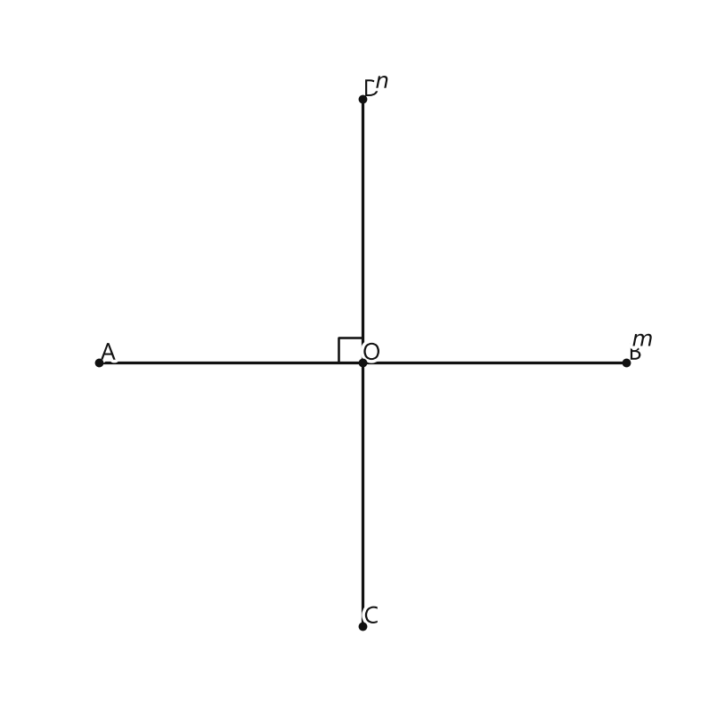
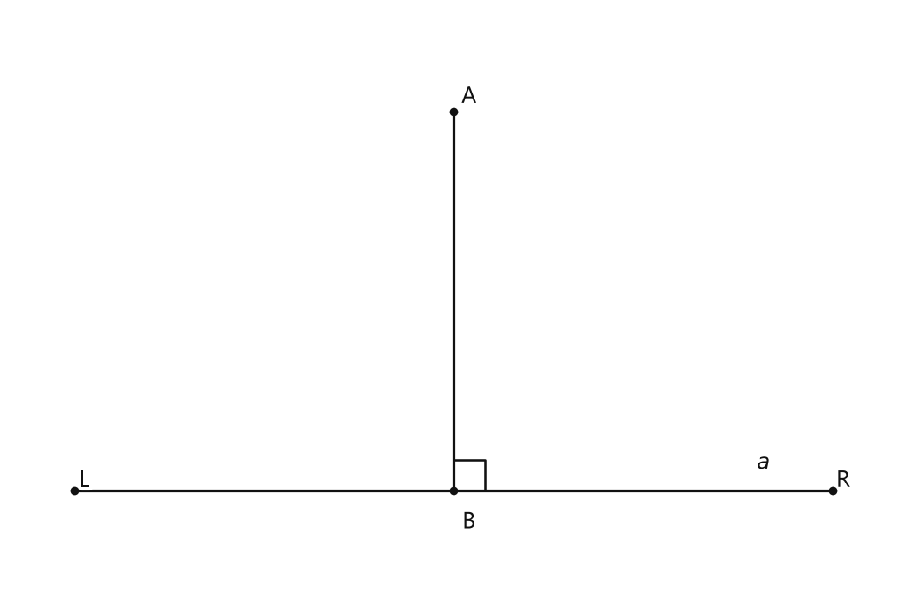
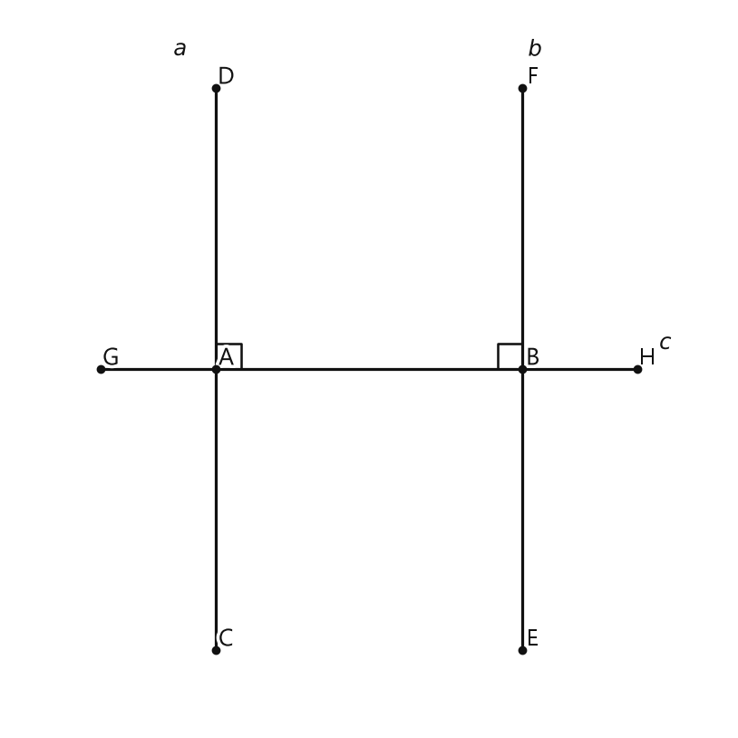
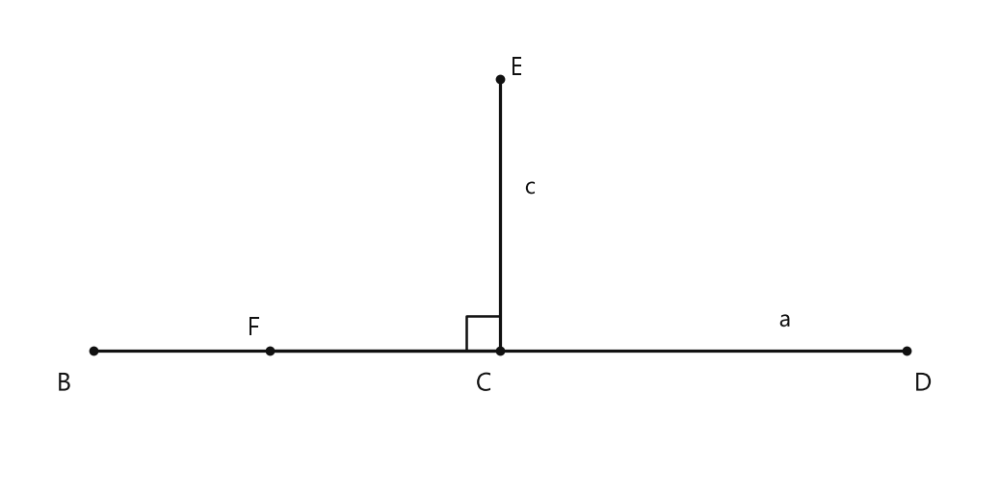
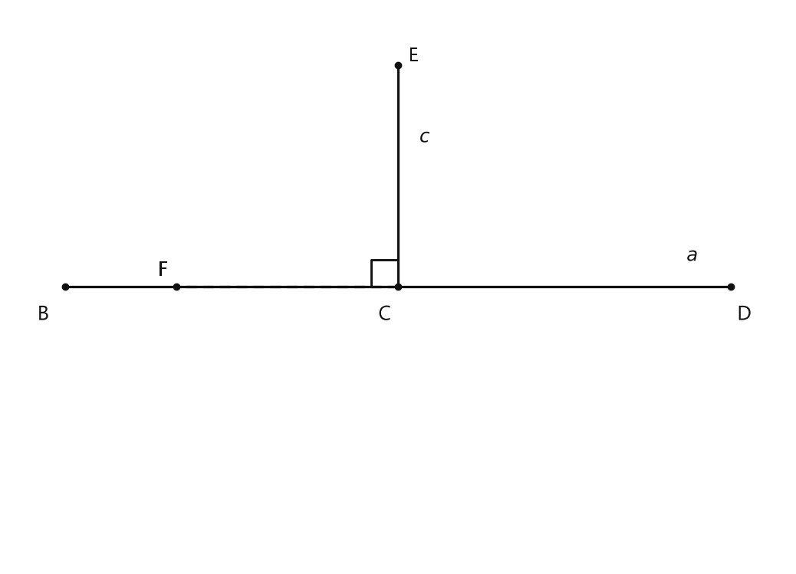
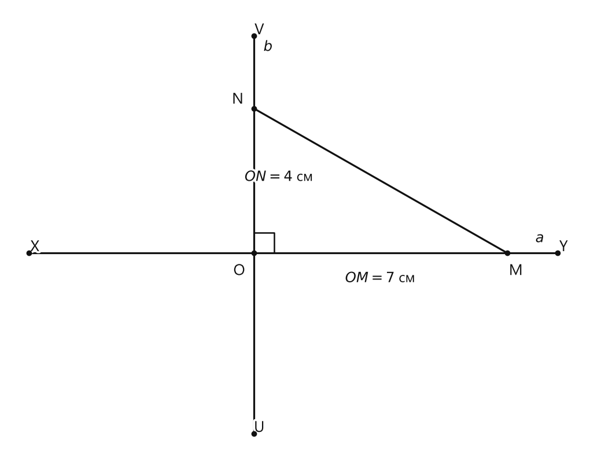

# Занятие 8. Перпендикулярные прямые

**Раздел:** Глава I. Начальные понятия геометрии  
**Параграф учебника:** §§7. Перпендикулярные прямые  
**Страницы:** 52–54

## Цели занятия

К концу занятия ученик умеет:

- распознавать перпендикулярные прямые, отрезки и лучи;
- правильно использовать знак $ \perp $;
- находить перпендикуляр и его основание;
- различать перпендикуляр, опущенный из точки, и перпендикуляр, восстановленный к прямой;
- применять теоремы о единственности перпендикуляра;
- использовать теорему о двух прямых, перпендикулярных третьей.

Выбирай блок своего уровня:

- **1–2 балла** — узнаю определения и обозначения;
- **3–4 балла** — применяю определения и теоремы в простых ситуациях;
- **5–6 баллов** — решаю задачи на перпендикуляр и его основание;
- **7–8 баллов** — связываю несколько фактов;
- **9–10 баллов** — объясняю решения и доказываю выводы.

## Теория к занятию

### 1. Перпендикулярные прямые

#### Простыми словами

Смотри: если две прямые пересеклись и один из углов равен $90^\circ$, то они образуют прямой угол. Такие прямые называют перпендикулярными.

На рисунке одна прямая будто стоит поперёк другой. Наклон на $1^\circ$ уже не подходит: перпендикулярность любит точность.

Обозначение:

$$
m \perp n.
$$

#### Определение

**Две прямые называются перпендикулярными, если они пересекаются под прямым углом.**

При пересечении перпендикулярных прямых образуются четыре прямых угла.

<!--geo-figure-spec
{
  "needed": true,
  "kind": "plane",
  "caption": "Перпендикулярные прямые $m$ и $n$",
  "equal": true,
  "axis": false,
  "xlim": [
    -3.2,
    3.2
  ],
  "ylim": [
    -3.2,
    3.2
  ],
  "points": {
    "A": [
      -2.4,
      0
    ],
    "B": [
      2.4,
      0
    ],
    "C": [
      0,
      -2.4
    ],
    "D": [
      0,
      2.4
    ],
    "O": [
      0,
      0
    ]
  },
  "segments": [
    [
      "A",
      "B"
    ],
    [
      "C",
      "D"
    ]
  ],
  "polygons": [],
  "circles": [],
  "labels": {},
  "right_angles": [
    {
      "vertex": "O",
      "from": "A",
      "to": "D"
    }
  ],
  "angle_marks": [],
  "texts": [
    {
      "xy": [
        2.55,
        0.2
      ],
      "text": "$m$"
    },
    {
      "xy": [
        0.18,
        2.55
      ],
      "text": "$n$"
    }
  ]
}
-->

*Перпендикулярные прямые m и n*

#### Правила

- Если угол равен $90^\circ$, то прямые, на которых лежат его стороны, перпендикулярны.
- Отрезки и лучи называются перпендикулярными, если они лежат на перпендикулярных прямых.
- Важно не только, как выглядят отрезки или лучи, а на каких прямых они лежат.
- Перпендикулярные прямые обязательно пересекаются.

#### Ловушки

- Угол $89^\circ$ не является прямым. «Почти $90^\circ$» в геометрии не считается.
- При пересечении двух перпендикулярных прямых образуется не один, а четыре прямых угла.
- Знак $\perp$ означает «перпендикулярно», а знак $\parallel$ — «параллельно». Это разные знаки и разные свойства.
- Если прямые не пересекаются, перпендикулярными они быть не могут.

---

### 2. Перпендикуляр и его основание

#### Простыми словами

Перпендикуляр — это отрезок, который образует прямой угол с данной прямой и одним концом доходит до неё.

Точка, в которой этот отрезок встречается с данной прямой, называется основанием перпендикуляра. Можно представить перпендикуляр как короткую «дорожку» от точки к прямой под углом $90^\circ$.

#### Определение

**Перпендикуляром к данной прямой называется отрезок, который лежит на прямой, перпендикулярной данной, один из концов которого (основание перпендикуляра) является точкой пересечения этих прямых.**

Если $AB$ — перпендикуляр к прямой $a$, то:

- $AB \perp a$;
- точка $B$ — основание перпендикуляра;
- точка $B$ — проекция точки $A$ на прямую $a$.

<!--geo-figure-spec
{
  "needed": true,
  "kind": "plane",
  "caption": "Перпендикуляр $AB$ к прямой $a$",
  "equal": true,
  "axis": false,
  "xlim": [
    -3.5,
    3.5
  ],
  "ylim": [
    -0.8,
    3.8
  ],
  "points": {
    "L": [
      -3,
      0
    ],
    "R": [
      3,
      0
    ],
    "A": [
      0,
      3
    ],
    "B": [
      0,
      0
    ]
  },
  "segments": [
    [
      "L",
      "R"
    ],
    [
      "A",
      "B"
    ]
  ],
  "polygons": [],
  "circles": [],
  "labels": {
    "A": {
      "dx": 0.12,
      "dy": 0.12
    },
    "B": {
      "dx": 0.12,
      "dy": -0.25
    }
  },
  "right_angles": [
    {
      "vertex": "B",
      "from": "A",
      "to": "R"
    }
  ],
  "angle_marks": [],
  "texts": [
    {
      "xy": [
        2.45,
        0.22
      ],
      "text": "$a$"
    }
  ]
}
-->

*Перпендикуляр AB к прямой a*

#### Формулы и обозначения

Если $AB$ перпендикулярен прямой $a$, записывают:

$$
AB \perp a.
$$

Если $B$ — основание перпендикуляра, то точка $B$ лежит на прямой $a$.

#### Правила

- Перпендикуляр — это отрезок, а не вся бесконечная прямая.
- Основание перпендикуляра обязательно лежит на данной прямой.
- В отрезке $AB$ точка $B$ — основание, если именно она лежит на данной прямой.
- Точка $A$ может находиться вне данной прямой.
- Точку $B$ также называют проекцией точки $A$ на прямую $a$.

#### Ловушки

- Не путай основание $B$ с самим перпендикуляром $AB$.
- Проекция лежит на прямой, а исходная точка может лежать вне неё.
- Если отрезок не образует с данной прямой угол $90^\circ$, перпендикуляром он не является.
- Название «основание» относится к точке, а не ко всему отрезку.

---

### 3. Перпендикуляр, опущенный и восстановленный

#### Простыми словами

Здесь важно, где находится исходная точка.

Если точка находится **вне** прямой, из неё перпендикуляр **опускают** на прямую.

Если точка уже находится **на** прямой, из неё перпендикуляр **восстанавливают** к этой прямой.

Название зависит не от того, нарисован отрезок вверх или вниз, а от положения точки. Рисунок может повернуться, а правило — нет.

#### Факты

**Точку $B$ (основание перпендикуляра) также называют проекцией точки $A$ на прямую $a$.**

**Если из точки $M$, которая не лежит на прямой $a$, провести перпендикуляр $MK$ к прямой $a$, то получится перпендикуляр, опущенный из точки $M$ на прямую $a$.**

**Если из точки $P$, лежащей на прямой $a$, провести перпендикуляр $PE$ к прямой $a$, то получится перпендикуляр, восстановленный (восставленный) к прямой $a$.**

#### Правило

- Если $M \notin a$, то перпендикуляр $MK$ опущен из точки $M$ на прямую $a$.
- Если $P \in a$, то перпендикуляр $PE$ восстановлен к прямой $a$.

#### Ловушки

- «Опущенный» не означает, что отрезок обязательно направлен вниз.
- «Восстановленный» начинается в точке, которая уже лежит на данной прямой.
- Сначала проверь, лежит ли точка на прямой. Только после этого выбирай название перпендикуляра.

---

### 4. Перпендикуляр через точку на прямой

#### Простыми словами

Через точку, которая лежит на данной прямой, можно провести ровно одну прямую, перпендикулярную этой прямой.

Прямых через точку можно провести сколько угодно, но направление под углом $90^\circ$ только одно. Второй «такой же» перпендикуляр совпал бы с первым.

#### Теорема

**Через точку, лежащую на данной прямой, можно провести прямую, перпендикулярную этой прямой, и только одну.**

#### Алгоритм

Чтобы построить перпендикуляр через точку $A$, лежащую на прямой $a$:

1. Отметить точку $A$ на прямой $a$.
2. Провести через точку $A$ прямую, образующую с прямой $a$ угол $90^\circ$.
3. Полученная прямая будет перпендикулярна прямой $a$.
4. По теореме это единственная прямая, перпендикулярная $a$ и проходящая через $A$.

#### Ловушки

- Через одну точку можно провести много прямых, но перпендикуляр к данной прямой — только один.
- Для этой теоремы точка должна лежать на данной прямой.
- Теорема говорит о прямой, а не о каком-либо одном отрезке.
- Если взять небольшой отрезок на построенной прямой, он тоже будет лежать на перпендикулярной прямой.

---

### 5. Перпендикуляр через точку вне прямой

#### Простыми словами

Пусть точка находится вне прямой. Через неё также можно провести перпендикуляр к этой прямой, причём только один.

То есть положение точки меняется, а главное свойство сохраняется: к данной прямой через любую точку есть единственный перпендикуляр.

#### Теорема

**Через точку, не лежащую на данной прямой, можно провести прямую, перпендикулярную этой прямой, и притом только одну.**

#### Алгоритм

Чтобы провести перпендикуляр через точку $A$, не лежащую на прямой $a$:

1. Отметить точку $A$ вне прямой $a$.
2. Провести через точку $A$ прямую, которая пересекает прямую $a$ под углом $90^\circ$.
3. Полученная прямая будет перпендикулярна прямой $a$.
4. Другой прямой через точку $A$, перпендикулярной $a$, быть не может.

#### Следствие

**Из двух последних теорем следует, что на плоскости через любую точку можно провести прямую, перпендикулярную данной прямой, и притом только одну.**

#### Ловушки

- Неважно, лежит точка на прямой или находится вне её: перпендикуляр через эту точку всё равно единственный.
- Единственность относится к прямой, а не к длине отрезка.
- Если через одну точку нарисовали две разные прямые, перпендикулярные одной и той же прямой, значит, в рисунке или рассуждении есть ошибка.
- Для вывода нужно говорить о перпендикулярности к одной и той же данной прямой.

---

### 6. Две прямые, перпендикулярные третьей

#### Простыми словами

Представим прямую $c$ как дорогу. Прямые $a$ и $b$ пересекают её под углом $90^\circ$:

$$
a \perp c,\qquad b \perp c.
$$

Такие прямые имеют одинаковое направление и не пересекаются. Значит, они параллельны.

Можно рассуждать и через единственность: если бы $a$ и $b$ пересеклись, через точку их пересечения проходили бы две разные прямые, перпендикулярные $c$. Но через точку можно провести только один такой перпендикуляр.

#### Теорема

**На плоскости две прямые, перпендикулярные третьей, параллельны между собой.**

#### Формула

Если

$$
a \perp c
$$

и

$$
b \perp c,
$$

то

$$
a \parallel b.
$$

#### Алгоритм

1. Найти прямую, к которой перпендикулярны обе данные прямые.
2. Записать оба условия перпендикулярности.
3. Убедиться, что третья прямая одна и та же.
4. Применить теорему.
5. Записать вывод о параллельности данных прямых.

#### Ловушки

- Обе прямые должны быть перпендикулярны одной и той же третьей прямой.
- Из условий $a \perp c$ и $b \parallel c$ нельзя сделать вывод $a \parallel b$.
- Перпендикулярность не «передаётся» на любую соседнюю прямую. Здесь работает конкретная теорема.

---

## Сводка формул «выучить наизусть»

Если две прямые пересекаются под углом $90^\circ$, то:

$$
a \perp b.
$$

Если две прямые перпендикулярны одной и той же прямой, то:

$$
a \perp c,\quad b \perp c
\quad\Longrightarrow\quad
a \parallel b.
$$

Для перпендикуляра $AB$ к прямой $a$:

$$
AB \perp a.
$$

При пересечении двух перпендикулярных прямых образуются:

$$
4 \text{ прямых угла}.
$$

## Правила, которые нельзя путать

- Перпендикулярные прямые пересекаются, а параллельные прямые не пересекаются.
- Перпендикуляр — это отрезок, а перпендикулярная прямая — бесконечная прямая.
- Основание перпендикуляра лежит на данной прямой.
- Из точки вне прямой перпендикуляр опускают.
- Из точки на прямой перпендикуляр восстанавливают.
- Через любую точку можно провести к данной прямой только один перпендикуляр.
- Две прямые, перпендикулярные третьей, параллельны.

## Разбор ключевых заданий

### Р1. Распознаём перпендикулярные прямые

**Условие.** Прямые $a$ и $b$ пересекаются, причём один из образовавшихся углов равен $90^\circ$. Как расположены прямые $a$ и $b$? Сколько прямых углов образуется при их пересечении?

**Решение.**

Один из углов между прямыми равен $90^\circ$.

Значит, прямые пересекаются под прямым углом.

По определению две прямые называются перпендикулярными, если они пересекаются под прямым углом.

Следовательно,

$$
a \perp b.
$$

При пересечении двух перпендикулярных прямых образуются четыре прямых угла.

**Ответ:** $a \perp b$; образуются $4$ прямых угла.

---

### Р2. Находим основание перпендикуляра

**Условие.** Отрезок $MK$ перпендикулярен прямой $a$. Точка $K$ лежит на прямой $a$. Какая точка является основанием перпендикуляра? Как называют точку $K$ относительно точки $M$?

**Решение.**

По условию:

$$
MK \perp a.
$$

Точка $K$ лежит на прямой $a$.

Перпендикуляр — это отрезок, один из концов которого является точкой пересечения перпендикулярной прямой с данной прямой.

Значит, точка $K$ — основание перпендикуляра $MK$.

Основание перпендикуляра также называют проекцией точки $M$ на прямую $a$.

**Ответ:** $K$ — основание перпендикуляра и проекция точки $M$ на прямую $a$.

---

### Р3. Опущенный или восстановленный?

**Условие.** Точка $M$ не лежит на прямой $a$. Отрезок $MK$ перпендикулярен прямой $a$, а точка $K$ лежит на прямой $a$. Как называется этот перпендикуляр?

**Решение.**

Точка $M$ не лежит на прямой $a$:

$$
M \notin a.
$$

Отрезок $MK$ перпендикулярен прямой $a$:

$$
MK \perp a.
$$

Точка $K$ лежит на прямой $a$, поэтому она является основанием перпендикуляра.

Перпендикуляр проведён из точки $M$, которая не лежит на прямой $a$.

По замечанию учебника такой перпендикуляр называется перпендикуляром, опущенным из точки $M$ на прямую $a$.

**Ответ:** $MK$ — перпендикуляр, опущенный из точки $M$ на прямую $a$.

Небольшая ловушка: слово «опущенный» описывает положение исходной точки, а не направление рисунка. Отрезок может быть нарисован и вверх — название не изменится.

---

### Р4. Восстановленный перпендикуляр

**Условие.** Точка $P$ лежит на прямой $a$. Через точку $P$ проведён отрезок $PE$, перпендикулярный прямой $a$. Как называется этот перпендикуляр?

**Решение.**

По условию точка $P$ лежит на прямой $a$:

$$
P \in a.
$$

Отрезок $PE$ перпендикулярен прямой $a$:

$$
PE \perp a.
$$

Перпендикуляр проведён из точки, которая уже лежит на данной прямой.

По замечанию учебника такой перпендикуляр называется перпендикуляром, восстановленным к прямой $a$.

**Ответ:** $PE$ — перпендикуляр, восстановленный к прямой $a$.

---

### Р5. Единственность перпендикуляра

**Условие.** Через точку $A$, лежащую на прямой $a$, провели прямую $b$, перпендикулярную прямой $a$. Можно ли через точку $A$ провести ещё одну прямую, перпендикулярную прямой $a$?

**Решение.**

Точка $A$ лежит на прямой $a$.

Прямая $b$ уже проведена через точку $A$ и перпендикулярна прямой $a$.

По теореме через точку, лежащую на данной прямой, можно провести прямую, перпендикулярную этой прямой, и только одну.

Значит, другой прямой через точку $A$, перпендикулярной прямой $a$, провести нельзя.

**Ответ:** нельзя; такая прямая только одна.

---

### Р6. Перпендикуляр через точку вне прямой

**Условие.** Точка $C$ не лежит на прямой $m$. Через точку $C$ провели прямую $n$, причём $n \perp m$. Сколько прямых, перпендикулярных прямой $m$, можно провести через точку $C$?

**Решение.**

По условию:

$$
C \notin m.
$$

Прямая $n$ проходит через точку $C$ и перпендикулярна прямой $m$:

$$
n \perp m.
$$

По теореме через точку, не лежащую на данной прямой, можно провести прямую, перпендикулярную этой прямой, и притом только одну.

Прямая $n$ уже является таким перпендикуляром.

Следовательно, через точку $C$ можно провести только одну прямую, перпендикулярную прямой $m$.

**Ответ:** одну прямую — $n$.

---

### Р7. Две прямые перпендикулярны третьей

**Условие.** Известно, что

$$
p \perp r
$$

и

$$
q \perp r.
$$

Как расположены прямые $p$ и $q$?

**Решение.**

Прямые $p$ и $q$ обе перпендикулярны одной и той же прямой $r$.

На плоскости две прямые, перпендикулярные третьей, параллельны между собой.

Поэтому

$$
p \parallel q.
$$

**Ответ:** $p \parallel q$.

---

### Р8. Проверяем возможность пересечения

**Условие.** На плоскости прямые $u$ и $v$ перпендикулярны прямой $w$. Могут ли прямые $u$ и $v$ пересекаться?

**Решение.**

Из условия:

$$
u \perp w
$$

и

$$
v \perp w.
$$

Представим, что прямые $u$ и $v$ пересеклись в точке $T$.

Тогда через точку $T$ проходят две прямые $u$ и $v$, каждая из которых перпендикулярна прямой $w$.

Но через любую точку можно провести только одну прямую, перпендикулярную данной прямой.

Получается противоречие: одна перпендикулярная прямая должна быть сразу и $u$, и $v$, а это разные прямые.

Значит, прямые $u$ и $v$ пересекаться не могут.

На плоскости две непересекающиеся прямые параллельны. Поэтому:

$$
u \parallel v.
$$

Здесь перпендикуляры к одной прямой «держат строй»: пересечься друг с другом им не разрешает единственность.

**Ответ:** пересекаться не могут; $u \parallel v$.

---

### Р9. Составляем вывод по рисунку

**Условие.** Прямая $c$ пересекает прямые $a$ и $b$. Угол между $a$ и $c$ равен $90^\circ$, угол между $b$ и $c$ также равен $90^\circ$. Докажите, что $a \parallel b$.

<!--geo-figure-spec
{
  "needed": true,
  "kind": "plane",
  "caption": "Прямые $a$ и $b$, перпендикулярные прямой $c$",
  "equal": true,
  "axis": false,
  "xlim": [
    -2.8,
    2.8
  ],
  "ylim": [
    -2.8,
    2.8
  ],
  "points": {
    "A": [
      -1.2,
      0
    ],
    "B": [
      1.2,
      0
    ],
    "C": [
      -1.2,
      -2.2
    ],
    "D": [
      -1.2,
      2.2
    ],
    "E": [
      1.2,
      -2.2
    ],
    "F": [
      1.2,
      2.2
    ],
    "G": [
      -2.1,
      0
    ],
    "H": [
      2.1,
      0
    ]
  },
  "segments": [
    [
      "C",
      "D"
    ],
    [
      "E",
      "F"
    ],
    [
      "G",
      "H"
    ]
  ],
  "polygons": [],
  "circles": [],
  "labels": {},
  "right_angles": [
    {
      "vertex": "A",
      "from": "D",
      "to": "B"
    },
    {
      "vertex": "B",
      "from": "A",
      "to": "F"
    }
  ],
  "angle_marks": [],
  "texts": [
    {
      "xy": [
        -1.48,
        2.5
      ],
      "text": "$a$"
    },
    {
      "xy": [
        1.3,
        2.5
      ],
      "text": "$b$"
    },
    {
      "xy": [
        2.32,
        0.2
      ],
      "text": "$c$"
    }
  ]
}
-->

*Прямые a и b, перпендикулярные прямой c*

**Решение.**

Угол между прямыми $a$ и $c$ равен $90^\circ$.

По определению перпендикулярных прямых:

$$
a \perp c.
$$

Угол между прямыми $b$ и $c$ также равен $90^\circ$.

Значит:

$$
b \perp c.
$$

Получилось, что прямые $a$ и $b$ перпендикулярны одной и той же прямой $c$.

По теореме о двух прямых, перпендикулярных третьей, эти прямые параллельны:

$$
a \parallel b.
$$

**Ответ:** $a \parallel b$.

---

### Р10. Выбираем верное утверждение

**Условие.** Какое утверждение верно?

1) Через точку, лежащую на прямой, можно провести две различные прямые, перпендикулярные данной.  
2) Перпендикулярные прямые не пересекаются.  
3) Через любую точку можно провести ровно одну прямую, перпендикулярную данной прямой.  
4) Две прямые, перпендикулярные третьей, также перпендикулярны между собой.  
5) Основание перпендикуляра не лежит на данной прямой.

**Решение.**

Проверим каждое утверждение.

1) Неверно.

Через точку, лежащую на данной прямой, можно провести только одну прямую, перпендикулярную этой прямой.

2) Неверно.

Перпендикулярные прямые пересекаются под прямым углом.

3) Верно.

Это следует из двух теорем о проведении перпендикуляра через точку, лежащую или не лежащую на данной прямой.

4) Неверно.

Две прямые, перпендикулярные одной и той же прямой, параллельны между собой.

5) Неверно.

Основание перпендикуляра — это точка пересечения перпендикулярных прямых. Поэтому оно лежит на данной прямой.

Верным является только утверждение 3.

**Ответ:** $3$.

## Мини-проверка

1. Что означает запись $a \perp b$?  
2. Сколько прямых углов образуется при пересечении перпендикулярных прямых?  
3. Какая точка называется основанием перпендикуляра?  
4. Как называется перпендикуляр из точки, не лежащей на прямой?  
5. Как называются две прямые, перпендикулярные одной и той же прямой?

**Ответы:**

1. Прямые $a$ и $b$ перпендикулярны.  
2. Четыре.  
3. Точка пересечения перпендикулярных прямых, лежащая на данной прямой.  
4. Перпендикуляр, опущенный на прямую.  
5. Параллельными.

## Практические задания

Выбери свой уровень и решай только этот блок. В блоке должна закрепиться вся тема параграфа. Ответы не приводятся.

### Уровень 1–2 балла

**С1.** Выберите определение перпендикулярных прямых.  
1) Прямые, которые не пересекаются  
2) Прямые, которые пересекаются под прямым углом  
3) Прямые, имеющие только одну общую точку  
4) Прямые, лежащие в одной плоскости  
5) Прямые, пересекающиеся под острым углом

**С2.** Прямые $a$ и $b$ пересекаются под углом $90^\circ$. Как расположены эти прямые?  
1) Параллельно  
2) Перпендикулярно  
3) Совпадают  
4) Не имеют общих точек  
5) Образуют острый угол

**С3.** Сколько прямых углов образуется при пересечении двух перпендикулярных прямых?  
1) Один  
2) Два  
3) Три  
4) Четыре  
5) Ни одного

**С4.** Отрезок $AB$ лежит на прямой, перпендикулярной прямой $a$, а точка $B$ является точкой пересечения этих прямых. Как называется отрезок $AB$?  
1) Основание  
2) Перпендикуляр к прямой $a$  
3) Параллельный отрезок  
4) Биссектриса  
5) Диаметр

**С5.** Точка $B$ является основанием перпендикуляра $AB$ к прямой $a$. Как ещё называют точку $B$?  
1) Центром точки $A$  
2) Проекцией точки $A$ на прямую $a$  
3) Серединой прямой $a$  
4) Вершиной прямой $a$  
5) Концом луча $a$

**С6.** Прямая $a$ проходит через точку $P$. Сколько прямых, перпендикулярных прямой $a$, можно провести через точку $P$?  
1) Ни одной  
2) Одну  
3) Две  
4) Три  
5) Бесконечно много

**С7.** Точка $M$ не лежит на прямой $a$. Через точку $M$ провели прямую $m$, перпендикулярную прямой $a$. Как называется отрезок, соединяющий $M$ с точкой пересечения прямых $m$ и $a$?  
1) Перпендикуляр, опущенный из точки $M$ на прямую $a$  
2) Перпендикуляр, восстановленный к прямой $a$  
3) Параллельный отрезок  
4) Средняя линия  
5) Диаметр

**С8.** Точка $P$ лежит на прямой $a$. Из точки $P$ провели перпендикуляр к прямой $a$. Как называется такой перпендикуляр?  
1) Опущенный  
2) Восстановленный  
3) Параллельный  
4) Средний  
5) Наклонный

**С9.** Выберите все верные утверждения.  
1) Перпендикулярные прямые пересекаются под прямым углом.  
2) При пересечении перпендикулярных прямых образуются четыре прямых угла.  
3) Перпендикулярные прямые не имеют общих точек.  
4) Через точку, не лежащую на данной прямой, можно провести только одну прямую, перпендикулярную данной.  
5) Две прямые, перпендикулярные третьей, пересекаются под острым углом.

**С10.** Прямые $b$ и $c$ перпендикулярны прямой $a$. Как расположены прямые $b$ и $c$?  
1) Перпендикулярно  
2) Параллельно  
3) Совпадают обязательно  
4) Пересекаются под острым углом  
5) Не имеют общего направления

**С11.** На прямой $a$ отмечена точка $B$. Через точку $B$ проведена прямая $b$, перпендикулярная прямой $a$. Укажите верное утверждение.  
1) Через точку $B$ можно провести две такие прямые  
2) Через точку $B$ можно провести только одну такую прямую  
3) Через точку $B$ нельзя провести такую прямую  
4) Прямая $b$ параллельна прямой $a$  
5) Прямая $b$ не пересекает прямую $a$

**С12.** Точка $A$ не лежит на прямой $a$. Отрезок $AB$ перпендикулярен прямой $a$, причём $B$ лежит на прямой $a$. Как называется точка $B$?  
1) Проекция точки $A$ на прямую $a$  
2) Середина отрезка $AB$  
3) Вершина прямой $a$  
4) Центр прямой $a$  
5) Точка, не лежащая на прямой $a$

**С13.** Выберите определение перпендикулярных прямых.  
1) Прямые, которые не пересекаются. 2) Прямые, которые пересекаются под прямым углом. 3) Прямые, имеющие только одну общую точку. 4) Прямые, расположенные на одинаковом расстоянии друг от друга. 5) Прямые, совпадающие на некотором участке.

**С14.** Какой угол образуют две перпендикулярные прямые при пересечении?  
1) Острый угол. 2) Тупой угол. 3) Развёрнутый угол. 4) Прямой угол. 5) Нулевой угол.

**С15.** Сколько прямых углов образуется при пересечении двух перпендикулярных прямых?  
1) Один. 2) Два. 3) Три. 4) Четыре. 5) Ни одного.

**С16.** Прямая $b$ перпендикулярна прямой $a$. Как записывают это утверждение?  
1) $a\parallel b$ 2) $a=b$ 3) $a\perp b$ 4) $a\cap b=\varnothing$ 5) $a\not\perp b$

**С17.** Отрезок $AB$ лежит на прямой, перпендикулярной прямой $c$, а точка $B$ является точкой пересечения этих прямых. Что представляет собой отрезок $AB$?  
1) Параллельную прямую. 2) Перпендикуляр к прямой $c$. 3) Биссектрису угла. 4) Луч, параллельный прямой $c$. 5) Отрезок, не связанный с прямой $c$.

**С18.** Точка $K$ лежит на прямой $m$. Сколько прямых, перпендикулярных прямой $m$, можно провести через точку $K$?  
1) Ни одной. 2) Одну. 3) Две. 4) Три. 5) Бесконечно много.

**С19.** Точка $P$ не лежит на прямой $n$. Сколько прямых, перпендикулярных прямой $n$, можно провести через точку $P$?  
1) Ни одной. 2) Одну. 3) Две. 4) Четыре. 5) Бесконечно много.

**С20.** Точка $M$ не лежит на прямой $a$. Отрезок $MK$ перпендикулярен прямой $a$, причём точка $K$ лежит на прямой $a$. Как называют точку $K$ относительно точки $M$ и прямой $a$?  
1) Центром прямой $a$. 2) Проекцией точки $M$ на прямую $a$. 3) Серединой отрезка $MK$. 4) Вершиной прямого угла. 5) Точкой, параллельной прямой $a$.

**С21.** Из точки $M$, не лежащей на прямой $a$, провели перпендикуляр $MK$ к прямой $a$. Как называют этот перпендикуляр?  
1) Восстановленным к прямой $a$. 2) Опущенным из точки $M$ на прямую $a$. 3) Параллельным прямой $a$. 4) Средней линией. 5) Биссектрисой.

**С22.** Из точки $P$, лежащей на прямой $a$, провели перпендикуляр $PE$ к прямой $a$. Как называют этот перпендикуляр?  
1) Опущенным из точки $P$. 2) Восстановленным к прямой $a$. 3) Параллельным прямой $a$. 4) Проекцией прямой $a$. 5) Диаметром.

**С23.** Прямые $p$ и $q$ перпендикулярны прямой $r$. Как расположены прямые $p$ и $q$ на плоскости?  
1) Перпендикулярны. 2) Пересекаются под острым углом. 3) Параллельны. 4) Совпадают с прямой $r$. 5) Обязательно пересекаются с прямой $r$ в одной точке.

**С24.** Установите соответствие между условием и названием объекта.

А) Точка $B$ лежит на прямой $a$, а отрезок $AB$ лежит на прямой, перпендикулярной $a$.  
Б) Точка $M$ не лежит на прямой $a$, отрезок $MK\perp a$, точка $K$ лежит на $a$.  
В) Точка $P$ лежит на прямой $a$, отрезок $PE\perp a$.

1) Перпендикуляр, восстановленный к прямой $a$.  
2) Проекция точки $M$ на прямую $a$.  
3) Перпендикуляр к прямой $a$.

**С25.** Выберите верное утверждение.

1) Перпендикулярные прямые не пересекаются.  
2) Перпендикулярные прямые пересекаются под прямым углом.  
3) Перпендикулярные прямые пересекаются под острым углом.  
4) Перпендикулярные прямые имеют только одну общую точку.  
5) Перпендикулярные прямые всегда совпадают.

**С26.** Прямые $a$ и $b$ пересекаются, и один из образовавшихся углов равен $90^\circ$. Выберите верное утверждение.

1) Прямые $a$ и $b$ параллельны.  
2) Прямые $a$ и $b$ перпендикулярны.  
3) Прямые $a$ и $b$ совпадают.  
4) Прямые $a$ и $b$ образуют угол $45^\circ$.  
5) Невозможно определить взаимное расположение прямых.

**С27.** При пересечении прямых $m$ и $n$ один из углов равен $90^\circ$. Сколько прямых углов образуется при этом пересечении?

1) 1  
2) 2  
3) 3  
4) 4  
5) 0

**С28.** Точка $B$ лежит на прямой $a$. Через точку $B$ провели прямую $b$, перпендикулярную прямой $a$. Выберите верное утверждение.

1) Через точку $B$ можно провести две такие прямые.  
2) Через точку $B$ можно провести только одну такую прямую.  
3) Через точку $B$ нельзя провести такую прямую.  
4) Такая прямая обязательно параллельна прямой $a$.  
5) Прямая $b$ совпадает с прямой $a$.

**С29.** Точка $M$ не лежит на прямой $c$. Отрезок $MK$ лежит на прямой, перпендикулярной $c$, а точка $K$ лежит на прямой $c$. Как называется отрезок $MK$?

1) Медиана  
2) Биссектриса  
3) Перпендикуляр, опущенный из точки $M$ на прямую $c$  
4) Параллельный отрезок  
5) Диаметр

**С30.** Точка $A$ не лежит на прямой $b$. Через точку $A$ провели прямую $c$, перпендикулярную прямой $b$. Сколько таких прямых можно провести через точку $A$?

1) Ни одной  
2) Одну  
3) Две  
4) Три  
5) Бесконечно много

**С31.** Прямые $p$ и $q$ перпендикулярны прямой $r$. Выберите верное утверждение.

1) Прямые $p$ и $q$ перпендикулярны.  
2) Прямые $p$ и $q$ параллельны.  
3) Прямые $p$ и $q$ совпадают.  
4) Прямые $p$ и $q$ пересекаются под углом $45^\circ$.  
5) Нельзя установить взаимное расположение прямых $p$ и $q$.

**С32.** Из точки $P$, лежащей на прямой $d$, провели перпендикуляр $PE$ к прямой $d$. Как называется этот перпендикуляр?

1) Опущенный  
2) Восстановленный  
3) Параллельный  
4) Срединный  
5) Наклонный

**С33.** Отрезок $AB$ лежит на прямой, перпендикулярной прямой $l$, а точка $B$ лежит на прямой $l$. Выберите верное утверждение.

1) Отрезок $AB$ перпендикулярен прямой $l$.  
2) Отрезок $AB$ параллелен прямой $l$.  
3) Отрезок $AB$ не имеет отношения к прямой $l$.  
4) Отрезок $AB$ совпадает с прямой $l$.  
5) Отрезок $AB$ образует с прямой $l$ угол $45^\circ$.

**С34.** Прямые $a$ и $b$ перпендикулярны. Выберите все верные утверждения.

1) Прямые $a$ и $b$ пересекаются.  
2) При их пересечении образуются четыре прямых угла.  
3) Прямые $a$ и $b$ параллельны.  
4) Угол между ними равен $90^\circ$.  
5) Угол между ними равен $180^\circ$.

**С35.** На плоскости через точку $T$ провели прямую $s$, перпендикулярную прямой $f$. Выберите верное утверждение.

1) Через точку $T$ можно провести только одну прямую, перпендикулярную $f$.  
2) Через точку $T$ можно провести ровно две такие прямые.  
3) Через точку $T$ нельзя провести такую прямую.  
4) Все прямые через $T$ перпендикулярны $f$.  
5) Прямая $s$ обязательно параллельна $f$.

**С36.** Прямые $u$ и $v$ перпендикулярны прямой $w$. Выберите верное утверждение о прямых $u$ и $v$.

1) Они пересекаются под прямым углом.  
2) Они параллельны между собой.  
3) Они совпадают с прямой $w$.  
4) Они образуют с прямой $w$ острые углы.  
5) Они не имеют общей плоскости.

### Уровень 3–4 балла

**С1.** Запишите, под каким углом пересекаются две перпендикулярные прямые.

**С2.** Верно ли утверждение: «Если две прямые пересекаются под прямым углом, то они перпендикулярны»? Запишите ответ «да» или «нет».

**С3.** Прямые $a$ и $b$ перпендикулярны. Сколько прямых углов образуется при их пересечении?

**С4.** Точка $A$ лежит на прямой $a$. Как называется отрезок $AB$, если точка $B$ лежит на прямой, перпендикулярной прямой $a$, и $AB\perp a$?

**С5.** Точка $M$ не лежит на прямой $a$. Из точки $M$ к прямой $a$ проведён перпендикуляр $MK$, причём $K\in a$. Как называется точка $K$ относительно точки $M$ и прямой $a$?

**С6.** Точка $P$ лежит на прямой $a$. Из точки $P$ к прямой $a$ проведён перпендикуляр $PE$. Как называется этот перпендикуляр: опущенным или восстановленным?

**С7.** Прямая $c$ перпендикулярна прямой $a$, а прямая $b$ также перпендикулярна прямой $a$. Как расположены прямые $b$ и $c$? Запишите ответ, используя знак $\parallel$.

**С8.** Через точку $A$, лежащую на прямой $m$, провели прямую $n$, перпендикулярную $m$. Сколько прямых, перпендикулярных прямой $m$, можно провести через точку $A$?

**С9.** Через точку $B$, не лежащую на прямой $p$, провели прямую $q$, перпендикулярную $p$. Сколько прямых, перпендикулярных прямой $p$, можно провести через точку $B$?

**С10.** Прямые $a$ и $b$ перпендикулярны. Луч $AC$ лежит на прямой $a$, а луч $AD$ — на прямой $b$. Найдите величину угла $CAD$.

**С11.** Отрезок $MN$ перпендикулярен отрезку $AB$. Известно, что отрезок $MN$ лежит на прямой $m$, а отрезок $AB$ — на прямой $a$. Пересекаются ли прямые $m$ и $a$? Обоснуйте ответ определением перпендикулярных прямых.

**С12.** Прямые $r$ и $s$ перпендикулярны прямой $t$. Известно, что точка $X$ лежит на прямой $r$, а точка $Y$ — на прямой $s$. Как расположены прямые $r$ и $s$? Запишите свойство, которое использовано для ответа.

**С13.** Запишите, каким является угол между двумя перпендикулярными прямыми.

**С14.** Прямые $a$ и $b$ пересекаются под прямым углом. Как называются прямые $a$ и $b$?

**С15.** Прямые $a$ и $b$ перпендикулярны. Сколько прямых углов образуется при их пересечении?

**С16.** Точка $B$ лежит на прямой $a$. Отрезок $AB$ лежит на прямой, перпендикулярной прямой $a$, и точка $A$ не лежит на прямой $a$. Как называется точка $B$ относительно отрезка $AB$ и прямой $a$?

**С17.** Точка $M$ не лежит на прямой $a$. Из точки $M$ к прямой $a$ проведён перпендикуляр $MK$. Как называется отрезок $MK$?

**С18.** Точка $P$ лежит на прямой $a$. Из точки $P$ к прямой $a$ проведён перпендикуляр $PE$. Как называется такой перпендикуляр?

**С19.** Через точку $A$, лежащую на прямой $m$, провели прямую $n$, перпендикулярную прямой $m$. Сколько прямых, проходящих через точку $A$ и перпендикулярных прямой $m$, можно провести?

**С20.** Через точку $B$, не лежащую на прямой $n$, провели прямую $p$, перпендикулярную прямой $n$. Сколько прямых, проходящих через точку $B$ и перпендикулярных прямой $n$, можно провести?

**С21.** Прямые $a$ и $b$ обе перпендикулярны прямой $c$. Как расположены прямые $a$ и $b$ относительно друг друга?

**С22.** Прямая $p$ перпендикулярна прямой $q$, а прямая $r$ параллельна прямой $p$. Как расположены прямые $r$ и $q$ относительно друг друга?

**С23.** Прямые $a$ и $b$ перпендикулярны. Один из углов, образованных при их пересечении, равен $90^\circ$. Найдите градусные меры трёх остальных углов.

**С24.** Прямая $k$ перпендикулярна прямой $l$. Прямая $m$ проходит через точку, не лежащую на прямой $l$, и перпендикулярна прямой $l$. Как расположены прямые $k$ и $m$?>xpath

**С25.** Прямые $a$ и $b$ пересекаются под углом $90^\circ$. Как называются эти прямые?

**С26.** Прямые $m$ и $n$ перпендикулярны. Какова градусная мера каждого из четырёх углов, образовавшихся при их пересечении?

**С27.** Отрезок $AB$ лежит на прямой, перпендикулярной прямой $c$, а точка $B$ принадлежит прямой $c$. Как называется отрезок $AB$ по отношению к прямой $c$?

**С28.** Точка $M$ не лежит на прямой $a$. Отрезок $MK$ перпендикулярен прямой $a$, причём точка $K$ лежит на прямой $a$. Как называется точка $K$ относительно точки $M$ и прямой $a$?

**С29.** Точка $P$ лежит на прямой $b$. Как называется перпендикуляр, проведённый из точки $P$ к прямой $b$?

**С30.** Через точку $A$, лежащую на прямой $c$, провели прямую $d$, перпендикулярную прямой $c$. Сколько прямых, перпендикулярных прямой $c$, можно провести через точку $A$?

**С31.** Через точку $B$, не лежащую на прямой $m$, провели прямую $n$, перпендикулярную прямой $m$. Сколько прямых, перпендикулярных прямой $m$, можно провести через точку $B$?

**С32.** Прямая $p$ перпендикулярна прямой $q$, а прямая $r$ также перпендикулярна прямой $q$. Как расположены прямые $p$ и $r$ на плоскости?

**С33.** Верно ли утверждение: если две прямые перпендикулярны одной и той же прямой, то они перпендикулярны между собой? Запишите ответ «да» или «нет».

**С34.** Верно ли утверждение: через любую точку плоскости можно провести ровно одну прямую, перпендикулярную данной прямой? Запишите ответ «да» или «нет».

**С35.** На прямой $a$ отмечены точки $B$ и $C$. Через точку $B$ проведена прямая $m$, перпендикулярная $a$, а через точку $C$ — прямая $n$, перпендикулярная $a$. Как расположены прямые $m$ и $n$?

**С36.** Прямая $s$ перпендикулярна прямой $t$. Луч $OA$ лежит на прямой $s$, а луч $OB$ лежит на прямой $t$; точка $O$ — их общая точка. Какова градусная мера угла $AOB$?

### Уровень 5–6 баллов

**С1.** Запишите, под каким углом пересекаются две перпендикулярные прямые.

**С2.** Сколько прямых, перпендикулярных прямой $a$, можно провести через точку $M$, лежащую на прямой $a$?

**С3.** Сколько прямых, перпендикулярных прямой $b$, можно провести через точку $P$, не лежащую на прямой $b$?

**С4.** Прямые $a$ и $b$ пересекаются под прямым углом. Как называются такие прямые?

**С5.** При пересечении прямых $m$ и $n$ один из углов равен $90^\circ$. Найдите величины трёх остальных углов.

**С6.** Отрезок $AB$ лежит на прямой, перпендикулярной прямой $c$, причём точка $B$ лежит на прямой $c$. Как называется отрезок $AB$ по отношению к прямой $c$?

**С7.** Точка $K$ не лежит на прямой $d$. Из точки $K$ к прямой $d$ проведён отрезок $KH$, причём $H$ лежит на прямой $d$, а $KH\perp d$. Как называется точка $H$ относительно точки $K$ и прямой $d$?

**С8.** Точка $R$ лежит на прямой $p$. Через точку $R$ провели прямую $q$, перпендикулярную прямой $p$. Как называется перпендикуляр $Rq$: опущенным или восстановленным к прямой $p$?

**С9.** Прямые $a$ и $c$ перпендикулярны прямой $b$. Как расположены прямые $a$ и $c$ относительно друг друга?

**С10.** Прямая $u$ перпендикулярна прямой $v$, а прямая $w$ перпендикулярна прямой $v$. Могут ли прямые $u$ и $w$ пересекаться? Ответ обоснуйте свойством двух прямых, перпендикулярных третьей.

**С11.** Прямые $r$ и $s$ пересекаются в точке $O$ под прямым углом. Луч $Ot$ лежит внутри одного из прямых углов, образованных этими прямыми, и делит этот угол на два угла. Один из них равен $35^\circ$. Найдите величину другого угла.

**С12.** Через точку $A$, лежащую на прямой $l$, провели прямую $m$, перпендикулярную $l$. Через точку $B$, не лежащую на прямой $l$, провели прямую $n$, перпендикулярную $l$. Как расположены прямые $m$ и $n$? Укажите теорему, которая позволяет сделать вывод.

**С13.** Прямые $a$ и $b$ пересекаются в точке $O$, причём один из образовавшихся углов равен $90^\circ$. Как называются прямые $a$ и $b$?

**С14.** Прямые $m$ и $n$ перпендикулярны. Найдите градусные меры всех углов, образованных при их пересечении.

**С15.** Точка $A$ лежит на прямой $a$. Сколько прямых, проходящих через точку $A$, можно провести перпендикулярно прямой $a$?

**С16.** Точка $B$ не лежит на прямой $b$. Через точку $B$ проведена прямая $c$, перпендикулярная прямой $b$. Как называется отрезок $BK$, если точка $K$ — точка пересечения прямых $b$ и $c$?

**С17.** Точка $M$ не лежит на прямой $p$. Отрезок $MN$ перпендикулярен прямой $p$, а точка $N$ лежит на прямой $p$. Укажите основание перпендикуляра и проекцию точки $M$ на прямую $p$.

**С18.** Точка $C$ лежит на прямой $c$. Отрезок $CD$ проведён перпендикулярно прямой $c$. Как называется перпендикуляр $CD$: опущенным или восстановленным?

**С19.** Прямые $r$ и $s$ перпендикулярны прямой $t$. Как расположены прямые $r$ и $s$ между собой? Ответ обоснуйте свойством двух прямых, перпендикулярных третьей.

**С20.** Прямая $q$ проходит через точку $P$, не лежащую на прямой $l$, и перпендикулярна прямой $l$. Через точку $P$ провели ещё одну прямую $w$. Может ли прямая $w$ также быть перпендикулярной прямой $l$? Ответ объясните.

**С21.** На прямой $a$ отмечена точка $K$. Постройте с помощью чертёжных инструментов прямую, проходящую через точку $K$ и перпендикулярную прямой $a$. Укажите, сколько таких прямых можно построить.

**С22.** Дана прямая $b$ и точка $M$, не лежащая на этой прямой. Постройте перпендикуляр $MN$ к прямой $b$. Обозначьте точку $N$ и укажите, что она является основанием перпендикуляра и проекцией точки $M$ на прямую $b$.

**С23.** Лучи $OA$ и $OB$ лежат на перпендикулярных прямых и имеют общую вершину $O$. Найдите угол между лучами $OA$ и $OB$, если он является одним из углов, образованных этими прямыми.

**С24.** Прямые $a$ и $b$ пересекаются в точке $O$ и перпендикулярны. На прямой $a$ выбраны точки $A$ и $C$, а на прямой $b$ — точки $B$ и $D$. Назовите все пары перпендикулярных отрезков, образованных отрезками $OA$, $OC$, $OB$ и $OD$.

**С25.** Прямые $a$ и $b$ пересекаются в точке $O$, причём один из образовавшихся углов равен $90^\circ$. Как называются прямые $a$ и $b$? Запишите обозначение их перпендикулярности.

**С26.** На прямой $a$ отмечена точка $B$. Через точку $B$ провели прямую $b$, перпендикулярную прямой $a$. Сколько прямых, проходящих через точку $B$ и перпендикулярных прямой $a$, можно провести? Обоснуйте ответ свойством перпендикулярных прямых.

**С27.** Точка $M$ не лежит на прямой $a$. Отрезок $MK$ лежит на прямой, перпендикулярной прямой $a$, а точка $K$ принадлежит прямой $a$. Как называется отрезок $MK$? Как называется точка $K$ относительно точки $M$ и прямой $a$?

**С28.** Прямые $b$ и $c$ перпендикулярны прямой $a$. Известно, что $b$ и $c$ лежат в одной плоскости. Как расположены прямые $b$ и $c$ относительно друг друга? Запишите ответ и укажите теорему, которая позволяет его получить.

**С29.** Отрезок $PE$ является перпендикуляром, восстановленным к прямой $a$ в точке $P$, а отрезок $MK$ — перпендикуляром, опущенным из точки $M$ на прямую $a$. Укажите, какая из точек $P$ или $M$ лежит на прямой $a$, а какая не лежит на ней.

**С30.** Прямые $a$ и $b$ пересекаются в точке $O$ и перпендикулярны. Лучи $OA$ и $OC$ лежат на прямой $a$ по разные стороны от точки $O$, а лучи $OB$ и $OD$ лежат на прямой $b$ по разные стороны от точки $O$. Сколько прямых углов образуется при пересечении прямых $a$ и $b$? Запишите названия всех этих углов.

### Уровень 7–8 баллов

**С1.** Прямые $a$ и $b$ пересекаются в точке $O$ под прямым углом. Луч $OC$ лежит внутри одного из прямых углов, образованных этими прямыми, и $\angle AOC=37^\circ$, где луч $OA$ принадлежит прямой $a$. Найдите углы между лучом $OC$ и четырьмя лучами прямых $a$ и $b$, выходящими из точки $O$.

**С2.** Прямые $a$ и $b$ перпендикулярны. Точка $M$ лежит на прямой $a$, а точка $N$ лежит на прямой $b$. Отрезок $MN$ пересекает прямые $a$ и $b$ только в своих концах. Может ли отрезок $MN$ быть перпендикулярным прямой $a$? Ответ обоснуйте.

**С3.** Через точку $P$, лежащую на прямой $c$, провели прямую $p$, перпендикулярную прямой $c$. Затем через точку $Q$, не лежащую на прямой $c$, провели прямую $q$, перпендикулярную прямой $c$. Определите взаимное расположение прямых $p$ и $q$ и обоснуйте ответ.

**С4.** На прямой $a$ отмечены точки $B$, $C$ и $D$, причём точка $C$ лежит между точками $B$ и $D$. Через точку $C$ проведена прямая $c$, перпендикулярная прямой $a$. Точка $E$ лежит на прямой $c$, а точка $F$ — на луче $CB$. Известно, что $\angle ECF=90^\circ$. Определите, на какой прямой лежит точка $E$, и обоснуйте ответ.

<!--geo-figure-spec
{
  "needed": true,
  "kind": "plane",
  "caption": "Прямая $c$ перпендикулярна прямой $a$ в точке $C$",
  "equal": true,
  "axis": false,
  "xlim": [
    -3.6,
    3.6
  ],
  "ylim": [
    -1.0,
    2.5
  ],
  "points": {
    "B": [
      -3,
      0
    ],
    "C": [
      0,
      0
    ],
    "D": [
      3,
      0
    ],
    "E": [
      0,
      2
    ],
    "F": [
      -1.7,
      0
    ]
  },
  "segments": [
    [
      "B",
      "D"
    ],
    [
      "C",
      "E"
    ],
    {
      "points": [
        "C",
        "F"
      ],
      "dashed": false,
      "label": "",
      "t": 0.5
    }
  ],
  "polygons": [],
  "circles": [],
  "labels": {
    "B": {
      "dx": -0.22,
      "dy": -0.25
    },
    "C": {
      "dx": -0.12,
      "dy": -0.25
    },
    "D": {
      "dx": 0.12,
      "dy": -0.25
    },
    "E": {
      "dx": 0.12,
      "dy": 0.08
    },
    "F": {
      "dx": -0.12,
      "dy": 0.16
    }
  },
  "right_angles": [
    {
      "vertex": "C",
      "from": "E",
      "to": "F"
    }
  ],
  "angle_marks": [],
  "texts": [
    {
      "xy": [
        2.1,
        0.22
      ],
      "text": "a"
    },
    {
      "xy": [
        0.22,
        1.2
      ],
      "text": "c"
    }
  ]
}
-->

*Прямая c перпендикулярна прямой a в точке C*

**С5.** Прямая $m$ пересекает прямую $n$ в точке $K$ и образует с ней угол $64^\circ$. Прямая $p$ проходит через точку $K$ и перпендикулярна прямой $n$. Найдите два угла, на которые прямая $p$ делит один из углов между прямыми $m$ и $n$.

**С6.** Отрезок $AB$ перпендикулярен отрезку $CD$, а их общая точка $O$ является внутренней точкой обоих отрезков. Известно, что $\angle AOC=90^\circ$, $AO=6$ см, $OB=4$ см, $CO=3$ см, $OD=5$ см. Назовите все пары перпендикулярных лучей с началом в точке $O$ и найдите длины отрезков $AB$ и $CD$.

**С7.** Точка $M$ не лежит на прямой $a$. Через точку $M$ провели две различные прямые $p$ и $q$, каждая из которых пересекает прямую $a$ и образует с ней прямой угол. Докажите, что такое построение невозможно.

**С8.** Прямые $a$ и $b$ перпендикулярны в точке $O$. Точка $M$ лежит на прямой $a$, точка $N$ — на прямой $b$, причём $OM=7$ см и $ON=4$ см. Отрезок $MN$ проведён. Определите, является ли отрезок $MN$ перпендикуляром к прямой $a$ или к прямой $b$. Ответ обоснуйте по определению перпендикуляра.

<!--geo-figure-spec
{
  "needed": true,
  "kind": "plane",
  "caption": "Прямые $a$ и $c$, перпендикулярные в точке $C$",
  "equal": true,
  "axis": false,
  "xlim": [
    -3.5,
    3.5
  ],
  "ylim": [
    -2.5,
    2.5
  ],
  "points": {
    "B": [
      -3,
      0
    ],
    "C": [
      0,
      0
    ],
    "D": [
      3,
      0
    ],
    "E": [
      0,
      2
    ],
    "F": [
      -2,
      0
    ]
  },
  "segments": [
    [
      "B",
      "D"
    ],
    [
      "C",
      "E"
    ],
    {
      "points": [
        "C",
        "F"
      ],
      "dashed": true,
      "label": "",
      "t": 0.5
    }
  ],
  "polygons": [],
  "circles": [],
  "labels": {
    "B": {
      "dx": -0.2,
      "dy": -0.25
    },
    "C": {
      "dx": -0.12,
      "dy": -0.25
    },
    "D": {
      "dx": 0.12,
      "dy": -0.25
    },
    "E": {
      "dx": 0.14,
      "dy": 0.08
    },
    "F": {
      "dx": -0.12,
      "dy": 0.15
    }
  },
  "right_angles": [
    {
      "vertex": "C",
      "from": "B",
      "to": "E"
    },
    {
      "vertex": "C",
      "from": "E",
      "to": "F"
    }
  ],
  "angle_marks": [],
  "texts": [
    {
      "xy": [
        2.65,
        0.28
      ],
      "text": "$a$"
    },
    {
      "xy": [
        0.24,
        1.35
      ],
      "text": "$c$"
    }
  ]
}
-->

*Прямые a и c, перпендикулярные в точке C*

**С9.** На плоскости даны прямая $a$ и точки $A$, $B$, $C$, не лежащие на ней. Известно, что через каждую из этих точек проведена прямая, перпендикулярная прямой $a$. Прямые, проведённые через точки $A$ и $B$, совпали. Может ли прямая, проведённая через точку $C$, пересекать эту прямую? Ответ обоснуйте.

**С10.** Прямые $a$ и $b$ пересекаются в точке $O$ и перпендикулярны. На прямой $a$ выбраны точки $A$ и $B$ по разные стороны от точки $O$, а на прямой $b$ — точки $C$ и $D$ по разные стороны от точки $O$. Известно, что $\angle AOC=90^\circ$, $\angle AOD=90^\circ$ и $\angle BOC=90^\circ$. Объясните, почему $\angle BOD$ также является прямым.

**С11.** Прямая $a$ проходит через точки $B$ и $C$. Точка $A$ не лежит на прямой $a$, а отрезок $AB$ перпендикулярен прямой $a$. Через точку $C$ проведён отрезок $CD$, перпендикулярный прямой $a$, причём точка $D$ не лежит на прямой $a$. Докажите, что прямые $AB$ и $CD$ параллельны.

<!--geo-figure-spec
{
  "needed": true,
  "kind": "plane",
  "caption": "Прямые $a$ и $b$, точки $M$, $N$ и отрезок $MN$",
  "equal": true,
  "axis": false,
  "xlim": [
    -3.4,
    4.6
  ],
  "ylim": [
    -2.9,
    3.4
  ],
  "points": {
    "X": [
      -3.1,
      0
    ],
    "M": [
      3.5,
      0
    ],
    "O": [
      0,
      0
    ],
    "Y": [
      4.2,
      0
    ],
    "U": [
      0,
      -2.5
    ],
    "N": [
      0,
      2
    ],
    "V": [
      0,
      3
    ]
  },
  "segments": [
    [
      "X",
      "Y"
    ],
    [
      "U",
      "V"
    ],
    [
      "M",
      "N"
    ]
  ],
  "polygons": [],
  "circles": [],
  "labels": {
    "M": {
      "dx": 0.12,
      "dy": -0.25
    },
    "N": {
      "dx": -0.22,
      "dy": 0.12
    },
    "O": {
      "dx": -0.2,
      "dy": -0.25
    }
  },
  "right_angles": [
    {
      "vertex": "O",
      "from": "M",
      "to": "N"
    }
  ],
  "angle_marks": [],
  "texts": [
    {
      "xy": [
        3.95,
        0.2
      ],
      "text": "$a$"
    },
    {
      "xy": [
        0.2,
        2.85
      ],
      "text": "$b$"
    },
    {
      "xy": [
        1.75,
        -0.35
      ],
      "text": "$OM=7$ см"
    },
    {
      "xy": [
        0.35,
        1.05
      ],
      "text": "$ON=4$ см"
    }
  ]
}
-->

*Прямые a и b, точки M, N и отрезок MN*

**С12.** Дана прямая $a$ и точки $M$, $N$, не лежащие на ней. Перпендикуляры $MK$ и $NL$ к прямой $a$ имеют основания $K$ и $L$ соответственно, причём точки $K$ и $L$ различны. Через точку $K$ проведена прямая $p$, перпендикулярная прямой $a$, а через точку $L$ — прямая $q$, перпендикулярная прямой $a$. Установите взаимное расположение прямых $MK$, $NL$, $p$ и $q$, используя определения и теоремы о перпендикулярных прямых.

**С13.** Прямые $a$ и $b$ пересекаются в точке $O$ и перпендикулярны. Луч $Oc$ лежит внутри одного из прямых углов, образованных этими прямыми, причём $\angle aOc=37^\circ$. Найдите угол между лучами $Oc$ и лучом прямой $b$, расположенным в том же прямом угле.

**С14.** Прямые $a$ и $b$ перпендикулярны и пересекаются в точке $O$. На прямой $a$ взяты точки $A$ и $C$, а на прямой $b$ — точки $B$ и $D$, причём лучи $OA$ и $OB$ образуют прямой угол. Докажите, что углы $\angle AOD$ и $\angle BOC$ равны.

**С15.** Точка $M$ не лежит на прямой $a$. Через точку $M$ провели две прямые $b$ и $c$, каждая из которых перпендикулярна прямой $a$. Обоснуйте, почему прямые $b$ и $c$ совпадают.

**С16.** Прямая $a$ пересекает прямые $b$ и $c$, причём $b\perp a$ и $c\perp a$. Точки пересечения обозначены соответственно $B$ и $C$. Докажите, что если $B\ne C$, то $b\parallel c$.

**С17.** На прямой $a$ отмечены точки $B$ и $C$. Через точку $B$ проведена прямая $b$, перпендикулярная $a$, а через точку $C$ — прямая $c$, также перпендикулярная $a$. На прямой $b$ взята точка $M$, а на прямой $c$ — точка $N$. Докажите, что $BM\parallel CN$.

**С18.** Прямая $a$ проходит через точки $B$ и $C$. Отрезок $MB$ перпендикулярен прямой $a$, а отрезок $NC$ перпендикулярен прямой $a$. Известно, что $MB=6$ см, $NC=6$ см и точки $M$ и $N$ лежат по одну сторону от прямой $a$. Какой вид имеет четырёхугольник $MNCB$? Обоснуйте ответ.

**С19.** Прямые $a$ и $b$ пересекаются в точке $O$ под прямым углом. Точка $M$ лежит на луче прямой $a$, а точка $N$ — на луче прямой $b$. Из точки $M$ восстановлен перпендикуляр $MK$ к прямой $a$, причём точка $K$ лежит на прямой $a$. На какой прямой может лежать точка $K$, если $N$ также лежит на прямой, перпендикулярной $a$? Ответ обоснуйте.

**С20.** Точка $P$ не лежит на прямой $a$. Через $P$ провели прямую $b$, перпендикулярную $a$, и обозначили точку их пересечения буквой $H$. Затем через точку $H$ провели прямую $c$, перпендикулярную $b$. Докажите, что прямая $c$ совпадает с прямой $a$.

**С21.** На плоскости проведены прямая $a$ и точка $P$, не лежащая на ней. Точка $H$ — основание перпендикуляра, опущенного из $P$ на прямую $a$. На прямой $a$ выбрана точка $K$, отличная от $H$. Через $K$ проведена прямая $b$, перпендикулярная $a$. Докажите, что $b\parallel PH$.

**С22.** Даны прямая $a$ и точка $P$, не лежащая на ней. Используя только линейку и угольник, опишите построение перпендикуляра из точки $P$ к прямой $a$. Укажите, какая точка является основанием перпендикуляра, и обоснуйте единственность построенной прямой.

**С23.** Даны прямая $a$ и точка $B$, лежащая на ней. Используя только линейку и угольник, опишите построение прямой, перпендикулярной $a$ и проходящей через точку $B$. Объясните, почему построенная прямая единственна.

**С24.** Прямые $a$ и $b$ пересекаются в точке $O$. На прямой $a$ взяты точки $A$ и $C$, расположенные по разные стороны от $O$, а на прямой $b$ — точки $B$ и $D$, также расположенные по разные стороны от $O$. Известно, что $\angle AOB=90^\circ$ и $\angle BOC=90^\circ$. Докажите, что все четыре угла, образованные прямыми $a$ и $b$, являются прямыми, а затем объясните, почему $a\perp b$.

### Уровень 9–10 баллов

**С1.** Прямые $a$ и $b$ пересекаются в точке $O$. Один из четырёх углов, образованных этими прямыми, равен $90^\circ$. Докажите, что прямые $a$ и $b$ перпендикулярны и все четыре образовавшихся угла являются прямыми.

**С2.** Точки $A$, $B$ и $C$ лежат на одной прямой $a$, причём точка $B$ находится между точками $A$ и $C$. Через точку $B$ проведена прямая $b$, перпендикулярная прямой $a$. Определите углы $ABb$, $CBb$ и угол между лучами, противоположными лучам $BA$ и $Bb$.

**С3.** Точка $M$ не лежит на прямой $a$. Отрезок $MK$ является перпендикуляром к прямой $a$, причём $K$ — основание перпендикуляра. На прямой $a$ выбрана точка $L$, отличная от $K$. Докажите, что отрезок $ML$ не является перпендикуляром к прямой $a$.

**С4.** На прямой $a$ отмечена точка $P$. Через точку $P$ проведены две прямые $b$ и $c$, каждая из которых перпендикулярна прямой $a$. Докажите, что прямые $b$ и $c$ совпадают.

**С5.** Прямая $a$ пересекает прямые $b$ и $c$ в точках $P$ и $Q$ соответственно. Известно, что $b\perp a$ и $c\perp a$. Докажите, что $b\parallel c$. Рассмотрите отдельно случай $P=Q$.

**С6.** Даны две различные параллельные прямые $a$ и $b$ и точка $M$, не лежащая ни на одной из них. Через точку $M$ проведена прямая $c$, перпендикулярная прямой $a$. Докажите, что $c\perp b$.

**С7.** Прямые $a$ и $b$ перпендикулярны. На прямой $a$ выбраны точки $P$ и $Q$, а на прямой $b$ — точки $R$ и $S$, причём точки $P$, $O$, $Q$ лежат на прямой $a$, а точки $R$, $O$, $S$ — на прямой $b$, где $O$ — точка пересечения прямых. Докажите, что лучи $OP$ и $OQ$ перпендикулярны каждому из лучей $OR$ и $OS$.

**С8.** Отрезок $AB$ не лежит на прямой $a$, точка $B$ принадлежит прямой $a$, а отрезок $AB$ перпендикулярен прямой $a$. На прямой $a$ выбрана точка $C$, отличная от $B$. Докажите, что треугольник $ABC$ имеет прямой угол при вершине $B$ и что отрезок $AC$ не является перпендикуляром к прямой $a$.

**С9.** Точка $K$ лежит на прямой $a$. Через точку $K$ проведена прямая $b$, перпендикулярная прямой $a$. На прямой $b$ выбраны точки $M$ и $N$, отличные от $K$, по разные стороны от точки $K$. Докажите, что прямые $KM$ и $KN$ перпендикулярны прямой $a$, а лучи $KM$ и $KN$ являются противоположными.

**С10.** Прямые $a$ и $b$ пересекаются в точке $O$ и не являются перпендикулярными. Через точку $O$ можно ли провести две различные прямые, каждая из которых перпендикулярна прямой $a$? Можно ли провести прямую, которая была бы перпендикулярна одновременно прямым $a$ и $b$? Ответ обоснуйте.

**С11.** Прямая $a$ пересекает прямые $b$ и $c$ в различных точках $P$ и $Q$. Известно, что один из углов, образованных прямыми $a$ и $b$, равен $90^\circ$, а один из углов, образованных прямыми $a$ и $c$, равен $90^\circ$. Докажите, что прямые $b$ и $c$ не пересекаются.

**С12.** На плоскости даны прямая $a$ и точки $M$, $N$, не лежащие на ней. Через точки $M$ и $N$ проведены прямые $b$ и $c$, перпендикулярные прямой $a$. Докажите, что если $M\ne N$, то прямые $b$ и $c$ различны и параллельны..calc

**С13.** Прямые $a$ и $b$ пересекаются в точке $O$ под прямым углом. На прямой $a$ выбраны точки $A$ и $C$, расположенные по разные стороны от точки $O$, а на прямой $b$ — точки $B$ и $D$, также расположенные по разные стороны от точки $O$. Известно, что $\angle AOB=90^\circ$. Укажите все пары перпендикулярных отрезков, концы которых принадлежат точкам $A$, $B$, $C$, $D$.

**С14.** Прямая $a$ проходит через точки $B$ и $C$. Точка $A$ не лежит на прямой $a$, а точка $D$ лежит на ней. Из точки $A$ проведён перпендикуляр $AB$ к прямой $a$, из точки $C$ проведён перпендикуляр $CD$ к прямой $a$. Докажите, что прямые $AB$ и $CD$ параллельны. Объясните, почему отрезок $AB$ является перпендикуляром, опущенным из точки $A$, а отрезок $CD$ — перпендикуляром, восстановленным к прямой $a$.

**С15.** На прямой $m$ выбраны точки $K$, $L$ и $N$. Через точку $K$ проведена прямая $p$, перпендикулярная прямой $m$, а через точку $L$ — прямая $q$, также перпендикулярная прямой $m$. Точка $N$ не совпадает ни с $K$, ни с $L$. Через неё проведена прямая $r$, перпендикулярная прямой $m$. Определите взаимное расположение прямых $p$, $q$ и $r$. Ответ обоснуйте, используя теорему о двух прямых, перпендикулярных третьей.

**С16.** Даны прямая $a$ и точка $M$, не лежащая на ней. Через точку $M$ проведены две прямые $p$ и $q$, причём $p\perp a$ и $q\perp a$. Точка пересечения прямых $p$ и $q$ обозначена буквой $M$. Верно ли, что $p$ и $q$ могут быть различными? Ответ обоснуйте, используя теорему о проведении перпендикуляра через точку, не лежащую на данной прямой.

**С17.** На прямой $a$ лежит точка $B$. Луч $BC$ расположен в одной полуплоскости относительно прямой $a$, а луч $BD$ — в другой. Известно, что $BC\perp a$ и $BD\perp a$. Докажите, что лучи $BC$ и $BD$ являются противоположными лучами, а точки $C$, $B$, $D$ лежат на одной прямой.

**С18.** Прямые $a$ и $b$ пересекаются в точке $O$. Лучи $OA$ и $OC$ являются противоположными лучами прямой $a$, а лучи $OB$ и $OD$ — противоположными лучами прямой $b$. Известно, что $\angle AOB=90^\circ$. Определите величины углов $\angle BOC$, $\angle COD$ и $\angle DOA$. Ответ обоснуйте свойствами углов, образованных при пересечении перпендикулярных прямых.

## Чек-лист «ученик понял тему»

- Могу повторить определения и формулы параграфа своими словами и по учебнику.
- Решаю типовые задания своего уровня без подсказки.
- Вижу типичную ошибку и могу её объяснить.
