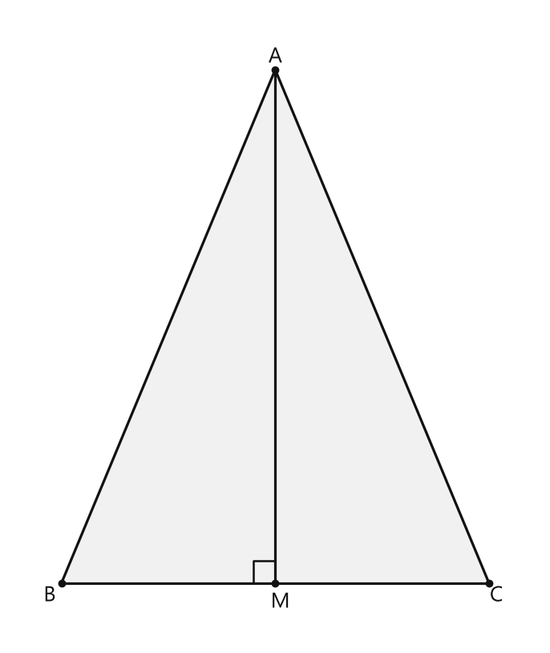
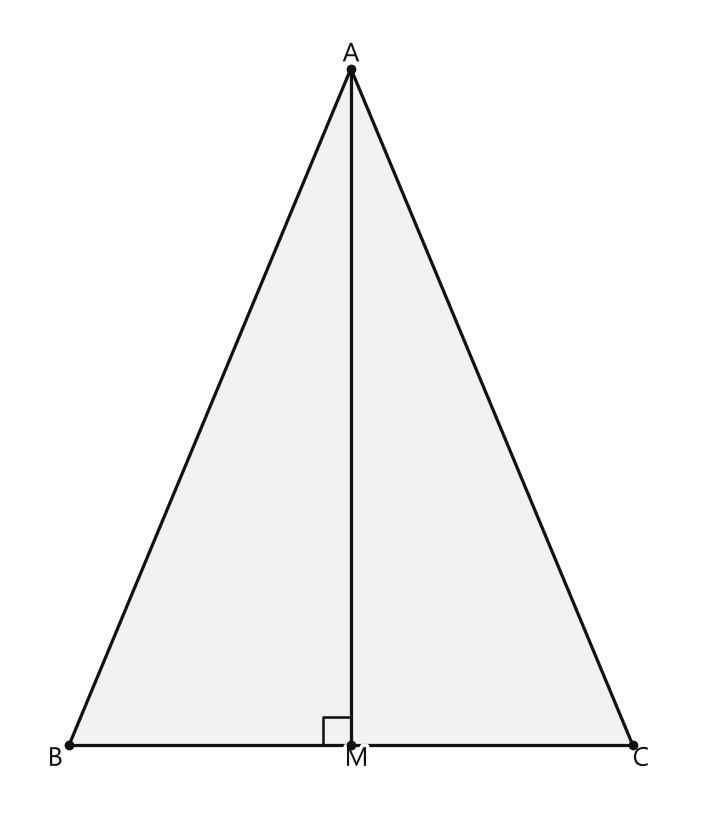

# Занятие 12. Высота, медиана и биссектриса треугольника

**Раздел:** Глава II. Признаки равенства треугольников  
**Параграф учебника:** §10. Высота, медиана и биссектриса треугольника  
**Страницы:** 71–74

## Цели занятия

К концу занятия ученик умеет:

- отличать высоту, медиану и биссектрису на чертеже;
- находить середину стороны по свойству медианы;
- использовать перпендикулярность при работе с высотой;
- применять свойство соответствующих высот, медиан и биссектрис в равных треугольниках;
- доказывать равенство треугольников с помощью первого и второго признаков;
- находить периметр треугольника по данным о медиане.

Выбери свой блок:

- **1–2 балла** — распознаю высоту, медиану и биссектрису;
- **3–4 балла** — нахожу длины отрезков и периметры;
- **5–6 баллов** — доказываю равенство треугольников;
- **7–8 баллов** — решаю задачи с несколькими медианами;
- **9–10 баллов** — уверенно объясняю, почему работает каждый шаг.

## Теория к занятию

### 1. Высота треугольника

#### Простыми словами

Смотри на отрезок из вершины треугольника к противоположной стороне.

Если он образует с этой стороной прямой угол $90^\circ$, то это высота.

Иногда высота встречает не саму сторону, а её продолжение. Это нормально: высота не обязана помещаться внутри треугольника.

#### Определение

**Высотой** треугольника (рис. 118, *а*) называется перпендикуляр, опущенный из вершины треугольника на противоположную сторону или на ее продолжение (отрезок $BH$).

#### Формулы

Если $BH$ — высота треугольника $ABC$, то:

$$BH \perp AC.$$

Это означает:

$$\angle BHA=90^\circ$$

или

$$\angle BHC=90^\circ.$$

Здесь:

- $B$ — вершина, из которой проведена высота;
- $H$ — точка пересечения высоты со стороной $AC$ или её продолжением;
- $BH$ — высота.

#### Правила

- Высота всегда перпендикулярна противоположной стороне или её продолжению.
- На чертеже высоту часто узнают по значку прямого угла.
- В остроугольном треугольнике высота лежит внутри треугольника.
- В тупоугольном треугольнике некоторые высоты проходят по продолжениям сторон.
- В прямоугольном треугольнике две высоты совпадают со сторонами, образующими прямой угол.

#### Ловушки

- Любой отрезок из вершины к противоположной стороне не является высотой.
- Если нет прямого угла, нужно проверить другие признаки: возможно, это медиана или биссектриса.
- Высота в тупоугольном треугольнике может находиться вне самого треугольника. Чертёж не сломался — так устроена фигура.

### 2. Медиана треугольника

#### Простыми словами

Медиана выходит из вершины и приходит в середину противоположной стороны.

То есть она делит противоположную сторону на два равных отрезка:

$$AM=MC.$$

Медиана может быть наклонной. Прямой угол ей не обязателен, угол пополам она тоже может не делить. У неё другая задача — найти середину стороны.

#### Определение

**Медианой** треугольника (рис. 118, *б*) называется отрезок, который соединяет вершину треугольника с серединой противоположной стороны (отрезок $BM$).

#### Формулы

Если $BM$ — медиана треугольника $ABC$, то точка $M$ — середина стороны $AC$:

$$AM=MC.$$

Следовательно:

$$AC=2AM=2MC.$$

Здесь:

- $B$ — вершина, из которой проведена медиана;
- $M$ — середина противоположной стороны $AC$;
- $BM$ — медиана.

#### Правила

Чтобы доказать, что отрезок является медианой, проверь три пункта:

1. отрезок выходит из вершины треугольника;
2. его конец лежит на противоположной стороне;
3. он делит эту сторону на два равных отрезка.

У треугольника три медианы — по одной из каждой вершины.

#### Ловушки

- Медиана делит пополам сторону, но не обязательно угол.
- Медиана не обязательно перпендикулярна стороне.
- Если $M$ — середина $AC$, то $AC$ состоит из двух равных частей:

$$AC=AM+MC=2AM.$$

Не перепутай маленький кусочек $AM$ со всей стороной $AC$.

### 3. Биссектриса треугольника

#### Простыми словами

Биссектриса треугольника выходит из вершины и делит угол этой вершины на два равных угла.

Она заканчивается на противоположной стороне.

Запомни различие:

- медиана смотрит на середину стороны;
- биссектриса смотрит на равенство углов.

#### Определение

**Биссектрисой** треугольника (рис. 118, *в*) называется отрезок биссектрисы угла треугольника, соединяющий вершину треугольника с точкой пересечения биссектрисы с противоположной стороной (отрезок $BK$).

#### Формулы

Если $BK$ — биссектриса угла $ABC$, то:

$$\angle ABK=\angle KBC.$$

Здесь:

- $B$ — вершина угла;
- $K$ — точка пересечения биссектрисы с противоположной стороной $AC$;
- $BK$ — биссектриса.

#### Правила

Чтобы доказать, что отрезок является биссектрисой, нужно показать:

1. он выходит из вершины угла;
2. он делит этот угол на два равных угла.

У треугольника три биссектрисы — по одной из каждой вершины.

#### Ловушки

- Биссектриса делит угол пополам, но не обязательно делит противоположную сторону пополам.
- Равенство $AK=KC$ говорит о медиане, а не само по себе о биссектрисе.
- Один прямой угол доказывает признак высоты, но не признак биссектрисы.

### 4. Свойство в равных треугольниках

#### Простыми словами

Равные треугольники имеют одинаковую форму и размер. Если один такой треугольник наложить на другой, соответствующие элементы совпадут.

Поэтому у соответствующих высот, медиан и биссектрис будут равные длины.

#### Свойство

В равных треугольниках равны соответствующие высоты, медианы и биссектрисы.

#### Правила

Сначала установи, какие вершины соответствуют друг другу.

Если:

$$\triangle ABC=\triangle A_1B_1C_1,$$

то:

- вершине $A$ соответствует вершина $A_1$;
- вершине $B$ соответствует вершина $B_1$;
- вершине $C$ соответствует вершина $C_1$.

Значит, высоте, медиане или биссектрисе, проведённой из $B$, соответствует такой же отрезок, проведённый из $B_1$.

#### Ловушки

- Нельзя сравнивать любые два отрезка только потому, что оба являются высотами или медианами.
- Нужно соблюдать соответствие вершин.
- Одинаковый периметр ещё не означает равенство треугольников. Периметр — это только сумма длин сторон.

### 5. Замечательные точки треугольника

#### Простыми словами

У треугольника есть три высоты, три медианы и три биссектрисы.

При пересечении такие отрезки образуют специальные точки. Их называют замечательными точками треугольника.

#### Факты

- Точка пересечения высот треугольника называется **ортоцентром**.
- Точка пересечения медиан треугольника называется **центроидом** или **центром тяжести**.
- Точка пересечения биссектрис треугольника называется **инцентром**.

Точки пересечения высот, биссектрис и медиан называются *замечательными точками треугольника*.

Если треугольник:

- остроугольный, точка пересечения его высот находится внутри треугольника;
- тупоугольный, продолжения высот пересекаются вне треугольника;
- прямоугольный, точка пересечения высот находится в вершине прямого угла.

## Сводка формул «выучить наизусть»

Для высоты:

$$BH\perp AC.$$

Для медианы:

$$AM=MC.$$

Для биссектрисы:

$$\angle ABK=\angle KBC.$$

Для периметра:

$$P=AB+BC+CA.$$

Если $M$ — середина $AC$:

$$AC=2AM.$$

## Правила, которые нельзя путать

| Отрезок | Что делит пополам | Главный признак |
|---|---|---|
| Высота | не обязательно что-либо делит пополам | перпендикулярность |
| Медиана | противоположную сторону | равенство двух частей стороны |
| Биссектриса | угол | равенство двух углов |

Короткая памятка:

- высота — **прямой угол**;
- медиана — **середина стороны**;
- биссектриса — **половина угла**.

## Разбор ключевых заданий

### Р1. Как различить высоту, медиану и биссектрису

#### Условие

В треугольнике $ABC$ проведены отрезки $BH$, $BM$ и $BK$.

- $BH\perp AC$;
- $AM=MC$;
- $\angle ABK=\angle KBC$.

Назовите каждый из отрезков.

#### Решение

1. Отрезок $BH$ перпендикулярен противоположной стороне $AC$:

$$BH\perp AC.$$

2. Перпендикуляр, проведённый из вершины к противоположной стороне, является высотой.

3. Значит, $BH$ — высота.

4. Отрезок $BM$ выходит из вершины $B$ и заканчивается в точке $M$ на противоположной стороне $AC$.

5. По условию:

$$AM=MC.$$

6. Значит, точка $M$ — середина стороны $AC$.

7. Следовательно, $BM$ — медиана.

8. Отрезок $BK$ делит угол $ABC$ на два равных угла:

$$\angle ABK=\angle KBC.$$

9. Следовательно, $BK$ — биссектриса.

Не угадывай по внешнему виду отрезка: сначала проверь его главный признак. Геометрия любит доказательства, а не гадание по линиям.

**Ответ:** $BH$ — высота, $BM$ — медиана, $BK$ — биссектриса.

### Р2. Периметр треугольника с медианой

#### Условие

В равнобедренном треугольнике $ABC$ с периметром $30$ см к его основанию $AC$ проведена медиана $BM$ длиной $6$ см. Найдите периметр треугольника $ABM$.

#### Дано

- $\triangle ABC$ — равнобедренный;
- основание — $AC$;
- $P_{ABC}=30$ см;
- $BM$ — медиана;
- $BM=6$ см.

#### Решение

1. В этой задаче слово «равнобедренный» означает, что боковые стороны равны:

$$AB=BC.$$

2. Так как $BM$ — медиана, точка $M$ — середина стороны $AC$.

3. Поэтому:

$$AM=\frac{AC}{2}.$$

4. Периметр треугольника $ABM$ равен:

$$P_{ABM}=AB+AM+BM.$$

5. Подставим выражения для $AM$ и $BM$:

$$P_{ABM}=AB+\frac{AC}{2}+6.$$

6. Периметр треугольника $ABC$ равен:

$$P_{ABC}=AB+BC+AC.$$

7. Так как $AB=BC$, получаем:

$$P_{ABC}=2AB+AC.$$

8. Разделим обе части равенства на $2$:

$$\frac{P_{ABC}}2=AB+\frac{AC}{2}.$$

9. По условию $P_{ABC}=30$ см, поэтому:

$$AB+\frac{AC}{2}=\frac{30}{2}=15\text{ см}.$$

10. Тогда:

$$P_{ABM}=15+6=21\text{ см}.$$

Медиана поделила основание пополам, а равенство боковых сторон помогло превратить половину большого периметра в две нужные стороны. Вот такой геометрический фокус — без шляпы и кролика.

**Ответ:** $21$ см.

### Р3. Найти периметр по двум медианам

#### Условие

В треугольнике $ABC$ проведены медианы $AM$ и $CK$. Известно, что $AC=12$ см, $AK=4$ см, $CM=5$ см. Найдите периметр треугольника $ABC$.

#### Дано

- $AM$ — медиана;
- $CK$ — медиана;
- $AC=12$ см;
- $AK=4$ см;
- $CM=5$ см.

#### Решение

1. Так как $CK$ — медиана, точка $K$ — середина стороны $AB$.

2. Поэтому две части стороны $AB$ равны:

$$AK=KB.$$

3. По условию:

$$AK=4\text{ см}.$$

4. Значит:

$$KB=4\text{ см}.$$

5. Сторона $AB$ состоит из отрезков $AK$ и $KB$:

$$AB=AK+KB.$$

6. Подставим известные длины:

$$AB=4+4=8\text{ см}.$$

7. Так как $AM$ — медиана, точка $M$ — середина стороны $BC$.

8. Поэтому:

$$CM=MB.$$

9. По условию:

$$CM=5\text{ см}.$$

10. Значит:

$$MB=5\text{ см}.$$

11. Сторона $BC$ состоит из отрезков $CM$ и $MB$:

$$BC=CM+MB.$$

12. Подставим известные длины:

$$BC=5+5=10\text{ см}.$$

13. Периметр треугольника равен сумме его сторон:

$$P_{ABC}=AB+BC+AC.$$

14. Подставим найденные значения:

$$P_{ABC}=8+10+12=30\text{ см}.$$

Медиана превращает один известный кусочек стороны в два одинаковых кусочка. Главное — не забыть сложить их обратно в целую сторону.

**Ответ:** $30$ см.

### Р4. Биссектриса в равнобедренном треугольнике

#### Условие

В треугольнике $ABC$ известно, что $AB=BC$. Биссектриса $BK$ делит угол $ABC$ пополам. Докажите, что биссектриса $BK$ делит треугольник $ABC$ на два равных треугольника.

#### Дано

- $AB=BC$;
- $BK$ — биссектриса угла $ABC$.

#### Доказать

$$\triangle ABK=\triangle CBK.$$

#### Доказательство

1. Рассмотрим треугольники $ABK$ и $CBK$.

2. Их стороны $AB$ и $BC$ равны по условию:

$$AB=BC.$$

3. Сторона $BK$ является общей для обоих треугольников:

$$BK=BK.$$

4. Так как $BK$ — биссектриса угла $ABC$, она делит его на два равных угла:

$$\angle ABK=\angle KBC.$$

5. В треугольниках $ABK$ и $CBK$ равны две стороны и угол между ними.

6. Следовательно, по первому признаку равенства треугольников:

$$\triangle ABK=\triangle CBK.$$

Здесь биссектриса делит угол пополам, а равные стороны и общая сторона помогают получить равенство двух треугольников. Всё работает командой.

**Ответ:** $\triangle ABK=\triangle CBK$.

### Р5. Высота становится биссектрисой

#### Условие

В треугольнике $ABC$ высота $AM$ делит сторону $BC$ пополам. Докажите, что отрезок $AM$ является биссектрисой треугольника $ABC$.

#### Дано

- $AM$ — высота треугольника $ABC$;
- $M$ лежит на стороне $BC$;
- $BM=MC$.

#### Доказать

$$\angle BAM=\angle MAC.$$

#### Доказательство

1. Так как $AM$ — высота, то:

$$AM\perp BC.$$

2. Поэтому углы $BMA$ и $AMC$ являются прямыми:

$$\angle BMA=\angle AMC=90^\circ.$$

3. По условию высота делит сторону $BC$ пополам:

$$BM=MC.$$

4. Отрезок $AM$ является общей стороной треугольников $ABM$ и $ACM$:

$$AM=AM.$$

5. В треугольниках $ABM$ и $ACM$ равны две стороны и угол между ними:

$$BM=MC,$$

$$AM=AM,$$

$$\angle BMA=\angle AMC.$$

6. Следовательно, по первому признаку равенства треугольников:

$$\triangle ABM=\triangle ACM.$$

7. У равных треугольников равны соответствующие углы, поэтому:

$$\angle BAM=\angle MAC.$$

8. Значит, отрезок $AM$ делит угол $BAC$ на два равных угла.

9. Следовательно, $AM$ — биссектриса треугольника $ABC$.

Здесь высота сначала дала прямые углы, а условие о середине стороны добавило равные отрезки. Вместе они доказали, что высота умеет быть ещё и биссектрисой.

**Ответ:** $AM$ является биссектрисой треугольника $ABC$.

### Р6. Соответствующие медианы в равных треугольниках

#### Условие

Треугольники $ABC$ и $A_1B_1C_1$ равны. Медиана $BM$ треугольника $ABC$ соответствует медиане $B_1M_1$ треугольника $A_1B_1C_1$. Если $BM=7$ см, найдите $B_1M_1$.

#### Решение

1. Треугольники $ABC$ и $A_1B_1C_1$ равны.

2. В равных треугольниках равны соответствующие медианы.

3. По условию медианы $BM$ и $B_1M_1$ являются соответствующими.

4. Значит:

$$BM=B_1M_1.$$

5. Подставим известную длину:

$$B_1M_1=BM=7\text{ см}.$$

У равных треугольников соответствующие детали тоже «подписаны одним размером»: если одна медиана 7 см, вторая не может внезапно стать 8 см.

**Ответ:** $7$ см.

### Р7. Задание с несколькими медианами

#### Условие

В треугольнике $ABC$ проведены медианы $AK$, $CM$ и $BN$. Из условия транскрипта дано:

$$AM+BK+CN=28\text{ дм}.$$

Требуется найти периметр треугольника $ABC$.

#### Проверка условия

По определению медианы:

- $AK$ — медиана, поэтому $K$ — середина стороны $BC$;
- $CM$ — медиана, поэтому $M$ — середина стороны $AB$;
- $BN$ — медиана, поэтому $N$ — середина стороны $AC$.

Значит:

$$AM=MB,$$

$$BK=KC,$$

$$CN=NA.$$

Теперь выразим стороны треугольника через данные отрезки:

$$AB=AM+MB=2AM,$$

$$BC=BK+KC=2BK,$$

$$AC=CN+NA=2CN.$$

Периметр треугольника $ABC$ равен:

$$P=AB+BC+AC.$$

Подставим найденные выражения:

$$P=2AM+2BK+2CN.$$

Вынесем 2 за скобки:

$$P=2(AM+BK+CN).$$

По условию:

$$AM+BK+CN=28\text{ дм}.$$

Поэтому:

$$P=2\cdot28=56\text{ дм}.$$

Ловушка здесь в названиях отрезков: сами $AM$, $BK$ и $CN$ не обязаны быть медианами. Но каждый из них является половиной соответствующей стороны. А три половинки — это уже почти весь периметр, осталось только умножить на 2.

**Ответ:** $56$ дм.

### Р8. Признак равенства с медианой

#### Условие

Докажите, что треугольники $ABC$ и $A_1B_1C_1$ равны, если:

$$AB=A_1B_1,$$

$$BM=B_1M_1,$$

$$\angle ABM=\angle A_1B_1M_1,$$

где $BM$ и $B_1M_1$ — медианы.

#### Дано

- $BM$ — медиана треугольника $ABC$;
- $B_1M_1$ — медиана треугольника $A_1B_1C_1$;
- $AB=A_1B_1$;
- $BM=B_1M_1$;
- $\angle ABM=\angle A_1B_1M_1$.

#### Доказать

$$\triangle ABC=\triangle A_1B_1C_1.$$

#### Доказательство

1. Так как $BM$ — медиана, точка $M$ — середина стороны $AC$.

2. Поэтому:

$$AM=MC.$$

3. Так как $B_1M_1$ — медиана, точка $M_1$ — середина стороны $A_1C_1$.

4. Поэтому:

$$A_1M_1=M_1C_1.$$

5. Рассмотрим треугольники $ABM$ и $A_1B_1M_1$.

6. В них по условию равны две стороны и угол между ними:

$$AB=A_1B_1,$$

$$BM=B_1M_1,$$

$$\angle ABM=\angle A_1B_1M_1.$$

7. По первому признаку равенства треугольников:

$$\triangle ABM=\triangle A_1B_1M_1.$$

8. Значит, равны соответствующие стороны:

$$AM=A_1M_1,$$

$$BM=B_1M_1.$$

9. Так как $M$ и $M_1$ — середины сторон, то:

$$AC=2AM,$$

$$A_1C_1=2A_1M_1.$$

10. Из равенства $AM=A_1M_1$ получаем:

$$AC=A_1C_1.$$

11. Теперь рассмотрим треугольники $BMC$ и $B_1M_1C_1$.

12. В них:

$$BM=B_1M_1,$$

$$MC=AM=A_1M_1=M_1C_1.$$

13. Углы $BMC$ и $B_1M_1C_1$ равны, потому что каждый из них дополняет соответствующий угол $BMA$ или $B_1M_1A_1$ до развёрнутого угла:

$$\angle BMC=\angle B_1M_1C_1.$$

14. Следовательно, по первому признаку равенства треугольников:

$$\triangle BMC=\triangle B_1M_1C_1.$$

15. Поэтому:

$$BC=B_1C_1.$$

16. В исходных треугольниках получены равенства трёх соответствующих сторон:

$$AB=A_1B_1,$$

$$AC=A_1C_1,$$

$$BC=B_1C_1.$$

17. Значит, по третьему признаку равенства треугольников:

$$\triangle ABC=\triangle A_1B_1C_1.$$

Медиана здесь работает как «разделитель»: она делит противоположную сторону пополам, поэтому маленький равный треугольник помогает восстановить большой.

**Ответ:** $\triangle ABC=\triangle A_1B_1C_1$.

### Р9. Признак равенства с биссектрисой

#### Условие

Докажите, что треугольники $ABC$ и $A_1B_1C_1$ равны, если:

$$AB=A_1B_1,$$

$$AK=A_1K_1,$$

$$\angle BAC=\angle B_1A_1C_1,$$

где $AK$ и $A_1K_1$ — биссектрисы соответствующих углов.

#### Дано

- $AK$ — биссектриса угла $A$;
- $A_1K_1$ — биссектриса угла $A_1$;
- $AB=A_1B_1$;
- $AK=A_1K_1$;
- $\angle BAC=\angle B_1A_1C_1$.

#### Доказательство

1. Так как $AK$ — биссектриса угла $BAC$, она делит этот угол пополам:

$$\angle BAK=\angle KAC.$$

2. Так как $A_1K_1$ — биссектриса угла $B_1A_1C_1$, то:

$$\angle B_1A_1K_1=\angle K_1A_1C_1.$$

3. По условию:

$$\angle BAC=\angle B_1A_1C_1.$$

Половины равных углов тоже равны, поэтому:

$$\angle BAK=\angle B_1A_1K_1,$$

$$\angle KAC=\angle K_1A_1C_1.$$

4. Рассмотрим треугольники $ABK$ и $A_1B_1K_1$.

5. В них равны две стороны и угол между ними:

$$AB=A_1B_1,$$

$$AK=A_1K_1,$$

$$\angle BAK=\angle B_1A_1K_1.$$

6. По первому признаку равенства треугольников:

$$\triangle ABK=\triangle A_1B_1K_1.$$

7. Из равенства этих треугольников получаем:

$$BK=B_1K_1,$$

$$\angle AKB=\angle A_1K_1B_1.$$

8. Точки $B$, $K$, $C$ лежат на одной прямой, а точки $B_1$, $K_1$, $C_1$ — на одной прямой.

9. Поэтому углы $\angle AKC$ и $\angle A_1K_1C_1$ являются дополнительными к равным углам $\angle AKB$ и $\angle A_1K_1B_1$:

$$\angle AKC=\angle A_1K_1C_1.$$

10. Рассмотрим треугольники $ACK$ и $A_1C_1K_1$.

11. В них:

$$AK=A_1K_1,$$

$$\angle CAK=\angle C_1A_1K_1,$$

$$\angle AKC=\angle A_1K_1C_1.$$

12. Следовательно, по второму признаку равенства треугольников:

$$\triangle ACK=\triangle A_1C_1K_1.$$

13. Значит:

$$AC=A_1C_1,$$

$$CK=C_1K_1.$$

14. Из равенства треугольников $ABK$ также имеем:

$$BK=B_1K_1.$$

15. Тогда:

$$BC=BK+KC,$$

$$B_1C_1=B_1K_1+K_1C_1.$$

16. Следовательно:

$$BC=B_1C_1.$$

17. В исходных треугольниках равны три соответствующие стороны:

$$AB=A_1B_1,$$

$$AC=A_1C_1,$$

$$BC=B_1C_1.$$

18. Поэтому по третьему признаку равенства треугольников:

$$\triangle ABC=\triangle A_1B_1C_1.$$

Биссектриса не просто «режет угол пополам»: она помогает разделить большой треугольник на два маленьких, а потом собрать доказательство обратно.

**Ответ:** $\triangle ABC=\triangle A_1B_1C_1$.

## Итоговая памятка

Перед решением спроси себя:

1. Отрезок перпендикулярен стороне? Значит, это кандидат в высоты.

2. Конец отрезка делит сторону пополам? Значит, это кандидат в медианы.

3. Отрезок делит угол пополам? Значит, это кандидат в биссектрисы.

4. Треугольники равны? Тогда соответствующие высоты, медианы и биссектрисы тоже равны.

5. В задаче с медианой ищи равенство двух частей стороны:

$$AM=MC.$$

6. Если проведены три медианы, каждый отрезок от вершины до середины стороны равен половине этой стороны. Например:

$$AB=2AM,\qquad BC=2BK,\qquad AC=2CN.$$

Главная формула памяти:

$$\boxed{\text{высота — }90^\circ,\quad \text{медиана — середина,\quad \text{биссектриса — равные углы}.}$$

## Практические задания

Выбери свой уровень и решай только этот блок. В блоке должна закрепиться вся тема параграфа. Ответы не приводятся.

### Уровень 1–2 балла

**С1.** Выберите отрезок, который является высотой треугольника:
1) отрезок, соединяющий вершину с серединой противоположной стороны; 2) перпендикуляр, опущенный из вершины на противоположную сторону; 3) отрезок, делящий угол пополам; 4) сторона треугольника; 5) отрезок, соединяющий середины двух сторон.

**С2.** Выберите отрезок, который является медианой треугольника:
1) перпендикуляр к стороне; 2) отрезок, делящий угол пополам; 3) отрезок, соединяющий вершину с серединой противоположной стороны; 4) высота треугольника; 5) сторона треугольника.

**С3.** Выберите отрезок, который является биссектрисой треугольника:
1) отрезок, соединяющий вершину с точкой пересечения биссектрисы с противоположной стороной; 2) перпендикуляр к противоположной стороне; 3) отрезок, соединяющий середины двух сторон; 4) сторона треугольника; 5) отрезок, соединяющий вершину с серединой противоположной стороны.

**С4.** В треугольнике $ABC$ точка $H$ лежит на стороне $AC$, а $BH \perp AC$. Как называется отрезок $BH$?

**С5.** В треугольнике $ABC$ точка $M$ — середина стороны $AC$. Как называется отрезок $BM$?

**С6.** В треугольнике $ABC$ отрезок $BK$ делит угол $ABC$ пополам, а точка $K$ лежит на стороне $AC$. Как называется отрезок $BK$?

**С7.** В треугольнике $ABC$ отрезок $AM$ является медианой, а $BC=14$ см. Найдите длину отрезка $BM$.

**С8.** В треугольнике $ABC$ отрезок $BH$ является высотой. Какой угол является прямым: $\angle BHC$ или $\angle ABC$?

**С9.** В треугольнике $ABC$ отрезок $BK$ является биссектрисой угла $ABC$. Сравните углы $\angle ABK$ и $\angle KBC$, записав знак $=$, $<$ или $>$.

**С10.** В равнобедренном треугольнике $ABC$ $AB=BC$. Из вершины $B$ к основанию $AC$ проведена медиана $BM$. Чему равны отрезки $AM$ и $MC$, если $AC=18$ см?

**С11.** В равных треугольниках $ABC$ и $A_1B_1C_1$ высота $BH$ соответствует высоте $B_1H_1$. Если $BH=7$ см, найдите $B_1H_1$.

**С12.** В треугольнике $ABC$ высота $AM$ делит сторону $BC$ пополам. Верно ли утверждение: «Отрезок $AM$ является медианой треугольника $ABC$»? Запишите «да» или «нет».

**С13.** В треугольнике $ABC$ отрезок $AD$ перпендикулярен прямой $BC$, причём точка $D$ лежит на прямой $BC$. Как называется отрезок $AD$?  
1) медиана 2) биссектриса 3) высота 4) сторона 5) диагональ

**С14.** В треугольнике $ABC$ точка $M$ — середина стороны $AC$. Как называется отрезок $BM$?  
1) высота 2) медиана 3) биссектриса 4) сторона 5) перпендикуляр

**С15.** В треугольнике $ABC$ отрезок $BK$ делит угол $ABC$ на два равных угла, а точка $K$ лежит на стороне $AC$. Как называется отрезок $BK$?  
1) медиана 2) высота 3) биссектриса 4) средняя линия 5) сторона

**С16.** Выберите отрезок, который является медианой треугольника $ABC$, если точка $K$ лежит на стороне $BC$.  
1) $AK$, если $AK\perp BC$  
2) $AK$, если $BK=KC$  
3) $AK$, если $\angle BAK=\angle KAC$  
4) $BK$, если $AB=BC$  
5) $CK$, если $\angle ACK=\angle KCB$

**С17.** Выберите отрезок, который является высотой треугольника $ABC$.  
1) $AM$, где $BM=MC$  
2) $BK$, где $\angle ABK=\angle KBC$  
3) $CN$, где $CN\perp AB$  
4) $AL$, где $\angle BAL=\angle LAC$  
5) $BM$, где $AM=MC$

**С18.** В треугольнике $ABC$ проведены три медианы. Сколько медиан имеет этот треугольник?

**С19.** В треугольнике $ABC$ проведены три высоты. Сколько высот имеет этот треугольник?

**С20.** В треугольнике $ABC$ медиана $BM$ делит сторону $AC$ на отрезки $AM$ и $MC$. Если $AM=7$ см, найдите длину $MC$.

**С21.** В треугольнике $ABC$ биссектриса $BK$ делит угол $ABC$ на углы $\angle ABK$ и $\angle KBC$. Если $\angle ABK=32^\circ$, найдите $\angle KBC$.

**С22.** В равнобедренном треугольнике $ABC$ с основанием $AC$ проведена медиана $BM$. Укажите верное равенство.  
1) $AM=AC$ 2) $AM=MC$ 3) $BM=MC$ 4) $AB=AM$ 5) $BC=BM$

**С23.** В равных треугольниках $ABC$ и $A_1B_1C_1$ соответствующие медианы проведены из вершин $B$ и $B_1$. Если медиана $BM=9$ см, найдите длину медианы $B_1M_1$.

**С24.** Установите соответствие между отрезком и его признаком в треугольнике $ABC$.

А) $AD\perp BC$  
Б) $BE$ делит угол $ABC$ пополам  
В) $CF$ соединяет вершину $C$ с серединой стороны $AB$

1) высота  
2) медиана  
3) биссектриса

**С25.** Выберите отрезок, который является медианой треугольника $ABC$, если точка $M$ лежит на стороне $AC$ и $AM=MC$.

1) $AB$ 2) $BC$ 3) $BM$ 4) $AC$ 5) $AM$

**С26.** Выберите отрезок, который является высотой треугольника $ABC$, если $H$ лежит на стороне $AC$ и $BH\perp AC$.

1) $AH$ 2) $BH$ 3) $CH$ 4) $AB$ 5) $BC$

**С27.** Выберите отрезок, который является биссектрисой угла $A$ треугольника $ABC$, если $K$ лежит на стороне $BC$ и $\angle BAK=\angle KAC$.

1) $AB$ 2) $AC$ 3) $BK$ 4) $AK$ 5) $CK$

**С28.** В треугольнике $ABC$ точка $M$ — середина стороны $AC$. Как называется отрезок $BM$?

1) высота 2) медиана 3) биссектриса 4) сторона 5) перпендикуляр

**С29.** В треугольнике $ABC$ отрезок $BH$ является высотой. Выберите верное утверждение.

1) $AH=HC$ 2) $\angle ABH=\angle HBC$ 3) $BH\perp AC$ 4) $AB=BC$ 5) $H$ — середина $AC$

**С30.** В треугольнике $ABC$ отрезок $BM$ является медианой, а $AC=18$ см. Найдите длину отрезка $AM$.

1) 6 см 2) 9 см 3) 12 см 4) 18 см 5) 36 см

**С31.** В треугольнике $ABC$ отрезок $AK$ является биссектрисой угла $A$. Угол $A$ равен $64^\circ$. Найдите $\angle BAK$.

1) $16^\circ$ 2) $24^\circ$ 3) $32^\circ$ 4) $64^\circ$ 5) $128^\circ$

**С32.** В равнобедренном треугольнике $ABC$ с основанием $AC$ отрезок $BM$ является медианой. Выберите верное утверждение.

1) $AB=AC$ 2) $BM\parallel AC$ 3) $AM=MC$ 4) $\angle ABM=90^\circ$ 5) $BC=AC$

**С33.** В треугольнике $ABC$ отрезок $AK$ является одновременно медианой и биссектрисой. Известно, что $BK=7$ см. Найдите длину стороны $KC$.

1) 3,5 см 2) 7 см 3) 14 см 4) 21 см 5) 49 см

**С34.** В треугольнике $ABC$ проведены три медианы. Сколько медиан имеет треугольник?

1) одну 2) две 3) три 4) четыре 5) шесть

**С35.** В равных треугольниках $ABC$ и $A_1B_1C_1$ соответствующие стороны и углы равны. Отрезок $BM$ — медиана треугольника $ABC$, а отрезок $B_1M_1$ — соответствующая медиана треугольника $A_1B_1C_1$. Выберите верное утверждение.

1) $BM>B_1M_1$ 2) $BM<B_1M_1$ 3) $BM=B_1M_1$ 4) $BM+ B_1M_1=0$ 5) сравнить длины невозможно

**С36.** В прямоугольном треугольнике $ABC$ угол $C$ прямой. Из вершины $C$ проведена высота $CH$ к стороне $AB$. Какая запись верна?

1) $CH\parallel AB$ 2) $CH\perp AB$ 3) $AH=HB$ 4) $\angle ACH=\angle HCB$ 5) $AC=BC$

### Уровень 3–4 балла

**С1.** В треугольнике $ABC$ отрезок $BM$ соединяет вершину $B$ с серединой стороны $AC$. Как называется отрезок $BM$?

**С2.** В треугольнике $ABC$ отрезок $BH$ перпендикулярен прямой $AC$, причём точка $H$ принадлежит стороне $AC$. Как называется отрезок $BH$?

**С3.** В треугольнике $ABC$ отрезок $BK$ соединяет вершину $B$ с точкой $K$ на стороне $AC$ и делит угол $ABC$ на два равных угла. Как называется отрезок $BK$?

**С4.** Сколько высот, медиан и биссектрис имеет треугольник?

**С5.** В равнобедренном треугольнике $ABC$ боковые стороны $AB$ и $BC$ равны, а основание $AC$ имеет длину $10$ см. Медиана $BM$ проведена к основанию. Найдите длины отрезков $AM$ и $MC$.

**С6.** В треугольнике $ABC$ медиана $AM$ делит сторону $BC$ на отрезки $BM$ и $MC$. Если $BM=7$ см, найдите длину стороны $BC$.

**С7.** В треугольнике $ABC$ биссектриса $BK$ делит угол $ABC$ на два равных угла. Если $\angle ABK=32^\circ$, найдите величину угла $KBC$.

**С8.** В треугольнике $ABC$ высота $CH$ перпендикулярна стороне $AB$. Если угол $AHC$ равен $90^\circ$, чему равен угол $BHC$?

**С9.** В равнобедренном треугольнике $ABC$ с основанием $AC$ проведена медиана $BM$. Периметр треугольника $ABC$ равен $32$ см, а периметр треугольника $ABM$ равен $25$ см. Найдите длину медианы $BM$.

**С10.** В треугольнике $ABC$ проведена медиана $AM$. Известно, что $AB=9$ см, $AC=13$ см, а $BM=8$ см. Найдите периметр треугольника $ABM$.

**С11.** В треугольнике $ABC$ высота $AM$ делит сторону $BC$ пополам. Докажите, что отрезок $AM$ является медианой треугольника $ABC$.

**С12.** В треугольнике $ABC$ $AB=BC$. Биссектриса $BK$ проведена из вершины $B$ к стороне $AC$. Докажите, что треугольники $ABK$ и $CBK$ равны.

**С13.** В треугольнике $ABC$ отрезок $BM$ соединяет вершину $B$ с серединой стороны $AC$. Как называется отрезок $BM$?

**С14.** В треугольнике $ABC$ отрезок $BH$ перпендикулярен прямой $AC$, причём точка $H$ лежит на прямой $AC$. Как называется отрезок $BH$?

**С15.** В треугольнике $ABC$ отрезок $BK$ делит угол $ABC$ на два равных угла и соединяет вершину $B$ с точкой $K$ на стороне $AC$. Как называется отрезок $BK$?

**С16.** В треугольнике $ABC$ медиана $AM$ проведена к стороне $BC$. Найдите длины отрезков $BM$ и $MC$, если $BC=18$ см.

**С17.** В треугольнике $ABC$ точка $H$ лежит на стороне $BC$, а $AH\perp BC$. Укажите, какой отрезок является высотой треугольника $ABC$, проведённой из вершины $A$.

**С18.** В равнобедренном треугольнике $ABC$ с основанием $AC$ проведена медиана $BM$. Известно, что $AM=7$ см. Найдите длину стороны $AC$.

**С19.** В треугольнике $ABC$ биссектриса $BK$ делит угол $ABC$ на два угла. Найдите $\angle ABK$, если $\angle ABC=64^\circ$.

**С20.** В равных треугольниках $ABC$ и $A_1B_1C_1$ соответствующие вершины обозначены одинаковыми буквами. Высота $BH$ треугольника $ABC$ равна $9$ см. Чему равна высота $B_1H_1$ треугольника $A_1B_1C_1$, если $H_1$ — основание соответствующей высоты?

**С21.** В равных треугольниках $ABC$ и $A_1B_1C_1$ медиана $CM$ треугольника $ABC$ равна $12$ см. Найдите длину соответствующей медианы $C_1M_1$ треугольника $A_1B_1C_1$.

**С22.** В равнобедренном треугольнике $ABC$ стороны $AB$ и $BC$ равны, а $BK$ — биссектриса угла $ABC$. Докажите, что треугольники $ABK$ и $KBC$ равны.

**С23.** В треугольнике $ABC$ высота $AH$ одновременно является медианой. Известно, что $BH=8$ см. Найдите длину стороны $BC$.

**С24.** В треугольнике $ABC$ проведены медианы $AM$, $BN$ и $CK$. Периметр треугольника $ABC$ равен $36$ см. Найдите периметр треугольника $ABM$, если $AB=10$ см, $BC=14$ см, а $AC=12$ см.

**С25.** В треугольнике $ABC$ отрезок $BM$ соединяет вершину $B$ с серединой стороны $AC$. Как называется отрезок $BM$?

**С26.** В треугольнике $ABC$ отрезок $CH$ перпендикулярен прямой $AB$, причём точка $H$ лежит на прямой $AB$. Как называется отрезок $CH$?

**С27.** В треугольнике $ABC$ отрезок $AK$ делит угол $A$ пополам и соединяет вершину $A$ с точкой $K$ на стороне $BC$. Как называется отрезок $AK$?

**С28.** В треугольнике $ABC$ медиана $AM$ проведена к стороне $BC$. Найдите длины отрезков $BM$ и $MC$, если $BC=18$ см.

**С29.** В треугольнике $DEF$ высота $DH$ проведена к стороне $EF$. Найдите длину стороны $EF$, если $EH=7$ см, а $HF=9$ см.

**С30.** В треугольнике $KLM$ биссектриса $KN$ делит угол $K$ пополам. Найдите $\angle LKN$, если $\angle LKM=74^\circ$.

**С31.** В равнобедренном треугольнике $ABC$ с основанием $AC$ проведена медиана $BM$. Найдите периметр треугольника $ABM$, если периметр треугольника $ABC$ равен $34$ см, а $AC=12$ см.

**С32.** В треугольнике $ABC$ проведена медиана $AM$. Найдите периметр треугольника $ABC$, если $AB=9$ см, $AC=13$ см, $BM=8$ см.

**С33.** В треугольнике $ABC$ проведены медианы $AM$ и $BN$. Известно, что $AC=16$ см, $CM=6$ см и $AN=5$ см. Найдите периметр треугольника $ABC$.

**С34.** В равнобедренном треугольнике $ABC$ с основанием $AC$ отрезок $BM$ является медианой. Докажите, что треугольники $ABM$ и $CBM$ равны.

**С35.** В треугольнике $ABC$ высота $AH$ делит сторону $BC$ пополам. Докажите, что отрезок $AH$ является медианой треугольника $ABC$.

**С36.** В треугольнике $ABC$ периметр равен $36$ см. Медиана $AK$ делит его на треугольники $ABK$ и $ACK$, периметры которых равны соответственно $21$ см и $25$ см. Найдите длину медианы $AK$.

### Уровень 5–6 баллов

**С1.** В треугольнике $ABC$ отрезок $BM$ соединяет вершину $B$ с точкой $M$ стороны $AC$, причём $AM=MC$. Как называется отрезок $BM$? Запишите определение, по которому сделан вывод.

**С2.** В треугольнике $ABC$ отрезок $BH$ перпендикулярен прямой $AC$, причём точка $H$ лежит на стороне $AC$. Как называется отрезок $BH$? Укажите вершину, из которой проведена высота, и сторону, к которой она проведена.

**С3.** В треугольнике $ABC$ отрезок $BK$ делит угол $ABC$ на два равных угла и пересекает сторону $AC$ в точке $K$. Как называется отрезок $BK$? Запишите равенство углов, подтверждающее ваш ответ.

**С4.** В равнобедренном треугольнике $ABC$ $AB=BC=13$ см, $AC=14$ см. Медиана $BM$ проведена к основанию $AC$ и равна $12$ см. Найдите периметр треугольника $ABM$.

**С5.** В треугольнике $ABC$ точка $K$ — середина стороны $AB$, а точка $M$ — середина стороны $BC$. Известно, что $AB=10$ см, $BC=14$ см, $AC=12$ см. Найдите периметр треугольника $BKM$.

**С6.** В треугольнике $ABC$ проведены медианы $AM$ и $CK$. Известно, что $AC=12$ см, $AK=4$ см и $CM=5$ см. Найдите периметр треугольника $ABC$.

**С7.** В треугольнике $ABC$ точка $M$ — середина стороны $BC$, а $AM\perp BC$. Докажите, что $AM$ является биссектрисой угла $A$.

**С8.** В треугольнике $ABC$ отрезок $BK$ является биссектрисой угла $B$, а $K$ лежит на стороне $AC$. Известно, что $AB=BC$. Докажите, что треугольники $ABK$ и $CBK$ равны.

**С9.** В равных треугольниках $ABC$ и $A_1B_1C_1$ медиана $BM$ соответствует медиане $B_1M_1$. Если $BM=7{,}5$ см, найдите длину медианы $B_1M_1$.

**С10.** В равных треугольниках $ABC$ и $A_1B_1C_1$ высота $CH$ соответствует высоте $C_1H_1$. Известно, что $C_1H_1=4{,}8$ см. Найдите длину высоты $CH$.

**С11.** Треугольник $ABC$ имеет периметр $30$ см. $AK$ — медиана, причём $K$ лежит на стороне $BC$. Периметр треугольника $ABK$ равен $18$ см, а периметр треугольника $ACK$ равен $24$ см. Найдите длину медианы $AK$.

**С12.** В треугольнике $ABC$ проведены три медианы: $AM$, $BK$ и $CN$, где $M$, $K$ и $N$ — середины противоположных сторон. Сумма отрезков $AM+BK+CN$ равна $27$ см. Найдите сумму расстояний от вершин треугольника до соответствующих середин противоположных сторон, если каждая из трёх медиан увеличена на $2$ см.

**С13.** В треугольнике $ABC$ точка $M$ лежит на стороне $AC$, причём $AM=MC$. Отрезок $BM$ является:
1) высотой; 2) медианой; 3) биссектрисой; 4) стороной треугольника; 5) перпендикуляром к $AC$.

**С14.** В треугольнике $ABC$ отрезок $BH$ является высотой. Запишите равенство, выражающее перпендикулярность высоты стороне $AC$.

**С15.** В равнобедренном треугольнике $ABC$ боковые стороны $AB$ и $BC$ равны, а медиана $BM$ к основанию $AC$ равна $7$ см. Периметр треугольника $ABC$ равен $32$ см. Найдите периметр треугольника $ABM$.

**С16.** В треугольнике $ABC$ медиана $AM$ делит сторону $BC$ на отрезки $BM$ и $MC$. Если $BC=18$ см, найдите длину каждого из этих отрезков.

**С17.** В треугольнике $ABC$ проведена биссектриса $BK$. Угол $ABK$ равен $28^\circ$. Найдите градусную меру угла $ABC$.

**С18.** В треугольнике $ABC$ стороны $AB$ и $BC$ равны. Биссектриса угла $ABC$ пересекает сторону $AC$ в точке $K$. Докажите, что треугольники $ABK$ и $CBK$ равны.

**С19.** В треугольнике $ABC$ высота $AH$ пересекает сторону $BC$ в точке $H$. Известно, что $BH=HC$. Докажите, что $AH$ является медианой треугольника $ABC$.

**С20.** Установите соответствие между отрезком и его определением. Запишите последовательность цифр для букв $А$, $Б$, $В$.
    
А) отрезок, соединяющий вершину треугольника с серединой противоположной стороны;  
Б) перпендикуляр, опущенный из вершины треугольника на противоположную сторону;  
В) отрезок биссектрисы угла треугольника до противоположной стороны.

1) высота; 2) медиана; 3) биссектриса.

**С21.** В треугольнике $ABC$ медиана $AK$ проведена к стороне $BC$. Периметр треугольника $ABK$ равен $19$ см, а периметр треугольника $ACK$ равен $23$ см. Найдите разность длин сторон $AB$ и $AC$, если $BK=KC$.

**С22.** В равных треугольниках $ABC$ и $A_1B_1C_1$ соответствующие стороны $AB$ и $A_1B_1$ равны. Медиана $CM$ первого треугольника соответствует медиане $C_1M_1$ второго треугольника. Если $CM=8$ см, найдите длину $C_1M_1$.

**С23.** В равнобедренном треугольнике $ABC$ основание $AC$ равно $16$ см, а боковые стороны $AB$ и $BC$ равны $10$ см. Медиана $BM$ проведена к основанию. Найдите периметр треугольника $ABM$.

**С24.** Дан треугольник $ABC$ с периметром $36$ см. $AK$ — его медиана. Периметр треугольника $ABK$ равен $21$ см, а периметр треугольника $ACK$ равен $25$ см. Найдите длину медианы $AK$.

**С25.** В равнобедренном треугольнике $ABC$ стороны $AB$ и $BC$ равны, а $BM$ — медиана к основанию $AC$. Периметр треугольника $ABC$ равен $32$ см, а $BM=7$ см. Найдите периметр треугольника $ABM$.

**С26.** В треугольнике $ABC$ проведены медианы $AM$ и $CK$. Известно, что $AC=14$ см, $AK=5$ см, $CM=6$ см. Найдите периметр треугольника $ABC$.

**С27.** В треугольнике $ABC$ точка $D$ лежит на стороне $BC$, причём $AD\perp BC$; точка $M$ лежит на стороне $AC$ и $AM=MC$; отрезок $BK$ делит угол $ABC$ пополам, причём точка $K$ лежит на стороне $AC$. Укажите, какой из отрезков $AD$, $AM$, $BK$ является высотой, медианой и биссектрисой треугольника $ABC$.

**С28.** В треугольнике $ABC$ стороны $AB$ и $BC$ равны. Биссектриса угла $ABC$ пересекает сторону $AC$ в точке $K$. Докажите, что треугольники $ABK$ и $CBK$ равны.

**С29.** В треугольнике $ABC$ отрезок $AM$ является высотой, причём точка $M$ — середина стороны $BC$. Докажите, что $AM$ является биссектрисой угла $BAC$.

**С30.** В треугольнике $ABC$ отрезок $AM$ является медианой. Периметр треугольника $ABC$ равен $38$ см, периметр треугольника $ABM$ равен $24$ см, а периметр треугольника $ACM$ равен $28$ см. Найдите длину медианы $AM$.

### Уровень 7–8 баллов

**С1.** В треугольнике $ABC$ точка $D$ лежит на стороне $BC$, причём $BD=DC$. Отрезок $AD$ образует с прямой $BC$ угол $90^\circ$. Кроме того, $\angle BAD=\angle DAC$. Назовите все отрезки, являющиеся одновременно высотой, медианой и биссектрисой треугольника $ABC$, и обоснуйте ответ.

**С2.** В равнобедренном треугольнике $ABC$ с основанием $AC$ боковая сторона равна $13$ см, а медиана $BM$, проведённая к основанию, равна $12$ см. Найдите периметр треугольника $ABC$ и периметры треугольников $ABM$ и $CBM$.

**С3.** В треугольнике $ABC$ отрезок $AD$ является медианой, а $BE$ — медианой. Известно, что $AC=18$ см, $BC=14$ см, $AE=6$ см и $CD=9$ см. Найдите периметр треугольника $ABC$ и длины отрезков $AB$, $BD$, $CE$.

**С4.** В треугольниках $ABC$ и $A_1B_1C_1$ выполнено $AB=A_1B_1$, $\angle ABC=\angle A_1B_1C_1$, а медианы $BM$ и $B_1M_1$ равны и образуют с соответствующими сторонами $BA$ и $B_1A_1$ равные углы. Докажите равенство треугольников $ABC$ и $A_1B_1C_1$.

**С5.** В треугольнике $ABC$ проведены медианы $AM$, $BN$ и $CK$. Известно, что $BM=7$ см, $CN=8$ см, $AK=6$ см. Найдите периметр треугольника $ABC$.

**С6.** В треугольнике $ABC$ биссектриса $BK$ делит сторону $AC$ на отрезки $AK=5$ см и $KC=7$ см. Известно, что периметр треугольника $ABK$ равен $18$ см, а периметр треугольника $BCK$ — $22$ см. Найдите длины сторон $AB$, $BC$ и $AC$, а также длину биссектрисы $BK$.

**С7.** В треугольнике $ABC$ высота $AD$ делит сторону $BC$ пополам. Докажите, что $AD$ является также медианой и биссектрисой треугольника $ABC$. Укажите признак равенства треугольников, использованный в доказательстве.

**С8.** В равнобедренном треугольнике $ABC$ с основанием $AC$ проведены медиана $BM$, высота $BH$ и биссектриса $BK$. Докажите, что точки $M$, $H$ и $K$ совпадают. Объясните, какие равенства сторон и углов используются в доказательстве.

**С9.** В треугольнике $ABC$ медиана $AK$ делит его на два треугольника $ABK$ и $ACK$. Периметр треугольника $ABC$ равен $36$ см, периметр треугольника $ABK$ равен $22$ см, а периметр треугольника $ACK$ равен $26$ см. Найдите длину медианы $AK$.

**С10.** В треугольнике $ABC$ проведена медиана $BM$, где $M$ — середина стороны $AC$. Докажите, что треугольники $ABM$ и $CBM$ имеют равные площади. Затем объясните, почему при разрезании треугольника $ABC$ по медиане $BM$ из полученных частей можно составить параллелограмм.

**С11.** В треугольнике $ABC$ проведены медиана $AM$ и биссектриса $BK$. Известно, что $AB=BC$, $AM=9$ см, $AK=6$ см и $KC=6$ см. Докажите, что $AM$ является также высотой, а $BK$ — медианой треугольника $ABC$. Найдите длину стороны $AC$.

**С12.** В треугольнике $ABC$ высота $AH$ проведена к прямой $BC$, причём точка $H$ лежит на продолжении стороны $BC$ за точку $C$. Известно, что $BH=15$ см, $CH=5$ см, $AB=17$ см и $AC=13$ см. Найдите длину высоты $AH$ и докажите, что треугольник $ABC$ не является равнобедренным.

**С13.** В треугольнике $ABC$ медиана $AK$ проведена к стороне $BC$. Периметр треугольника $ABC$ равен $36$ см, периметр треугольника $ABK$ равен $22$ см, а периметр треугольника $ACK$ — $26$ см. Найдите длину медианы $AK$.

**С14.** В треугольнике $ABC$ проведены медианы $AM$, $BK$ и $CN$. Известно, что $AM+BK+CN=28$ дм. Найдите периметр треугольника $ABC$, если медианы проведены к сторонам $BC$, $AC$ и $AB$ соответственно.

**С15.** В равнобедренном треугольнике $ABC$ $AB=BC$, а $BK$ — биссектриса угла $ABC$, пересекающая сторону $AC$ в точке $K$. Докажите, что $BK$ является также медианой треугольника $ABC$ и делит его на два равных треугольника.

**С16.** В треугольнике $ABC$ отрезок $AM$ является высотой, причём $M$ — середина стороны $BC$. Докажите, что $AM$ является биссектрисой угла $A$.

**С17.** В треугольниках $ABC$ и $A_1B_1C_1$ отрезки $BM$ и $B_1M_1$ являются медианами. Известно, что $AB=A_1B_1$, $BM=B_1M_1$ и $\angle ABM=\angle A_1B_1M_1$. Докажите, что $\triangle ABC=\triangle A_1B_1C_1$.

**С18.** В треугольнике $ABC$ точка $M$ лежит на стороне $AC$, причём $AM=MC$, и $BM\perp AC$. Какими отрезками одновременно являются $BM$: высотой, медианой или биссектрисой? Ответ обоснуйте, используя свойства равных треугольников.

**С19.** В треугольнике $ABC$ проведены высота $AH$, медиана $AM$ и биссектриса $AK$, причём точки $H$, $M$ и $K$ лежат на стороне $BC$. Известно, что $BH=HM=MK=KC$. Докажите, что треугольник $ABC$ равнобедренный, и укажите, какие из отрезков $AH$, $AM$, $AK$ совпадают.

**С20.** В треугольнике $ABC$ медиана $BM$ делит его на треугольники $ABM$ и $CBM$. Известно, что $AB=10$ см, $CB=14$ см, $AM=CM=6$ см, а $BM=8$ см. Найдите периметры треугольников $ABM$ и $CBM$, а затем объясните, могут ли эти треугольники быть равными.

**С21.** В равнобедренном треугольнике $ABC$ $AB=AC=13$ см, $BC=10$ см. Отрезок $AM$ — медиана к основанию $BC$. Найдите $AM$ и докажите, что $AM$ является также высотой и биссектрисой треугольника $ABC$.

<!--geo-figure-spec
{
  "needed": true,
  "kind": "plane",
  "caption": "Равнобедренный треугольник $ABC$, $AB=AC=13$ см, $BC=10$ см; медиана $AM$",
  "equal": true,
  "axis": false,
  "xlim": [
    -1.2,
    11.2
  ],
  "ylim": [
    -1.4,
    13.4
  ],
  "points": {
    "A": [
      5,
      12
    ],
    "B": [
      0,
      0
    ],
    "C": [
      10,
      0
    ],
    "M": [
      5,
      0
    ]
  },
  "segments": [
    [
      "A",
      "B"
    ],
    [
      "A",
      "C"
    ],
    [
      "B",
      "C"
    ],
    [
      "A",
      "M"
    ]
  ],
  "polygons": [
    {
      "vertices": [
        "A",
        "B",
        "C"
      ],
      "fill": 0.06
    }
  ],
  "circles": [],
  "labels": {
    "A": {
      "dx": 0,
      "dy": 0.3
    },
    "B": {
      "dx": -0.28,
      "dy": -0.3
    },
    "C": {
      "dx": 0.18,
      "dy": -0.3
    },
    "M": {
      "dx": 0.12,
      "dy": -0.45
    }
  },
  "right_angles": [
    {
      "vertex": "M",
      "from": "B",
      "to": "A"
    }
  ],
  "angle_marks": [],
  "texts": []
}
-->

*Равнобедренный треугольник ABC, AB=AC=13 см, BC=10 см; медиана AM*

**С22.** В треугольнике $ABC$ биссектриса $BK$ пересекает сторону $AC$ в точке $K$, причём $AK=6$ см, $KC=9$ см. Может ли отрезок $BK$ одновременно быть медианой треугольника $ABC$? Ответ обоснуйте.

**С23.** В треугольнике $ABC$ проведена высота $BH$. Треугольники $ABH$ и $CBH$ равны, причём $AH=CH=5$ см и $BH=12$ см. Найдите стороны $AB$, $BC$ и $AC$, а также определите, является ли $BH$ медианой и биссектрисой треугольника $ABC$.

<!--geo-figure-spec
{
  "needed": true,
  "kind": "plane",
  "caption": "Равнобедренный треугольник $ABC$ с медианой $AM$",
  "equal": true,
  "axis": false,
  "xlim": [
    -1,
    11
  ],
  "ylim": [
    -1,
    13
  ],
  "points": {
    "A": [
      5,
      12
    ],
    "B": [
      0,
      0
    ],
    "C": [
      10,
      0
    ],
    "M": [
      5,
      0
    ]
  },
  "segments": [
    [
      "A",
      "B"
    ],
    [
      "A",
      "C"
    ],
    [
      "B",
      "C"
    ],
    [
      "A",
      "M"
    ]
  ],
  "polygons": [
    {
      "vertices": [
        "A",
        "B",
        "C"
      ],
      "fill": 0.06
    }
  ],
  "circles": [],
  "labels": {
    "A": {
      "dx": 0,
      "dy": 0.25
    },
    "B": {
      "dx": -0.25,
      "dy": -0.25
    },
    "C": {
      "dx": 0.15,
      "dy": -0.25
    },
    "M": {
      "dx": 0.1,
      "dy": -0.25
    }
  },
  "right_angles": [
    {
      "vertex": "M",
      "from": "B",
      "to": "A"
    }
  ],
  "angle_marks": [],
  "texts": []
}
-->

*Равнобедренный треугольник ABC с медианой AM*

**С24.** В треугольнике $ABC$ отрезок $AK$ является биссектрисой угла $A$, а отрезок $BM$ — медианой. Известно, что треугольники $ABK$ и $ACK$ равны. Докажите, что треугольник $ABC$ равнобедренный и что биссектриса $AK$ является также медианой. Укажите, какие элементы треугольника можно сравнить для доказательства равенства треугольников $ABK$ и $ACK$.

### Уровень 9–10 баллов

**С1.** В равнобедренном треугольнике $ABC$ основание $AC$ имеет длину $16$ см, а периметр треугольника равен $40$ см. К основанию проведена медиана $BM$, длина которой равна $6$ см. Найдите периметр треугольника $ABM$.

**С2.** В треугольнике $ABC$ медиана $AK$ делит его на треугольники $ABK$ и $ACK$. Периметр треугольника $ABC$ равен $36$ см, периметр треугольника $ABK$ равен $22$ см, а периметр треугольника $ACK$ равен $28$ см. Найдите длину медианы $AK$.

**С3.** В треугольнике $ABC$ проведены медиана $AM$ и медиана $CK$. Известно, что $AC=14$ см, $AK=5$ см, а $CM=8$ см. Найдите периметр треугольника $ABC$.

**С4.** В треугольнике $ABC$ отрезок $AM$ является одновременно высотой и медианой, причём точка $M$ лежит на стороне $BC$. Докажите, что треугольник $ABC$ равнобедренный и отрезок $AM$ является биссектрисой угла $A$.

**С5.** В треугольнике $ABC$ стороны $AB$ и $AC$ равны. Точка $K$ лежит на стороне $BC$, причём $BK=KC$. Докажите, что отрезок $AK$ является одновременно медианой, биссектрисой и высотой треугольника $ABC$.

**С6.** В треугольнике $ABC$ отрезок $BK$ является биссектрисой угла $B$, причём $K$ лежит на стороне $AC$. Известно, что $AB=BC$, $AK=9$ см, а $KC=9$ см. Найдите длину стороны $AC$ и объясните, почему $BK$ является также медианой.

**С7.** В треугольнике $ABC$ отрезок $AK$ является одновременно медианой и биссектрисой угла $A$. Докажите, что $AB=AC$. Можно ли утверждать, что $AK$ является высотой? Ответ обоснуйте.

**С8.** В треугольниках $ABC$ и $A_1B_1C_1$ выполнены равенства $AB=A_1B_1$, $BM=B_1M_1$, $\angle ABM=\angle A_1B_1M_1$, где $BM$ и $B_1M_1$ — медианы треугольников, а точки $M$ и $M_1$ лежат на сторонах $AC$ и $A_1C_1$ соответственно. Докажите равенство треугольников $ABM$ и $A_1B_1M_1$, а затем равенство треугольников $ABC$ и $A_1B_1C_1$.

**С9.** В треугольнике $ABC$ проведена медиана $AK$. Известно, что $AB=13$ см, $AC=17$ см, $BK=KC=8$ см. Найдите периметры треугольников $ABK$ и $ACK$, а также сравните их.

**С10.** В треугольнике $ABC$ проведена биссектриса $BK$. Известно, что $\angle ABK=\angle KBC$, $AB=BC=10$ см и $AK=KC=6$ см. Докажите равенство треугольников $ABK$ и $CBK$, а затем найдите периметр треугольника $ABC$.

**С11.** В треугольнике $ABC$ проведена высота $AH$, причём точка $H$ лежит на продолжении стороны $BC$ за точку $C$. Укажите, какие углы треугольника являются тупыми, если $\angle B=38^\circ$, и найдите $\angle C$, если $\angle A=27^\circ$.

**С12.** В треугольнике $ABC$ проведены высота $AH$, медиана $AM$ и биссектриса $AK$, причём точки $H$, $M$ и $K$ лежат на стороне $BC$. Известно, что $BH=HM=MK=KC$. Докажите, что треугольник $ABC$ равнобедренный, и определите, какие из отрезков $AH$, $AM$ и $AK$ совпадают.

**С13.** В треугольнике $ABC$ с периметром $36$ см проведена медиана $AK$. Периметр треугольника $ABK$ равен $22$ см, а периметр треугольника $ACK$ — $26$ см. Найдите длину медианы $AK$.

**С14.** В треугольнике $ABC$ медиана $BM$ делит его периметр на два связанных с медианой треугольника $ABM$ и $CBM$. Докажите, что сумма периметров треугольников $ABM$ и $CBM$ на удвоенную длину медианы больше периметра треугольника $ABC$. Используя доказанное соотношение, найдите длину медианы, если периметр треугольника $ABC$ равен $42$ см, а периметры треугольников $ABM$ и $CBM$ равны соответственно $25$ см и $31$ см.

**С15.** В треугольнике $ABC$ медиана $AM$ равна $7$ см. Стороны $AB$ и $AC$ отличаются на $4$ см, а периметры треугольников $ABM$ и $ACM$ равны соответственно $19$ см и $23$ см. Найдите длины сторон $AB$, $AC$ и $BC$.

**С16.** В треугольнике $ABC$ известно, что $AB=AC$. Точка $D$ лежит на стороне $BC$, причём $AD$ является биссектрисой угла $A$, а $BD=DC$. Докажите, что отрезок $AD$ одновременно является медианой и высотой треугольника $ABC$.

**С17.** В треугольниках $ABC$ и $A_1B_1C_1$ выполнено: $AB=A_1B_1$, медианы $BM$ и $B_1M_1$ равны, а углы $ABM$ и $A_1B_1M_1$ равны. Докажите равенство треугольников $ABC$ и $A_1B_1C_1$, если точки $M$ и $M_1$ являются серединами сторон $AC$ и $A_1C_1$ соответственно.

**С18.** В треугольнике $ABC$ из вершины $B$ проведены высота $BH$, медиана $BM$ и биссектриса $BK$. Точки $H$, $M$ и $K$ лежат на стороне $AC$. Докажите, что в этом случае треугольник $ABC$ является равнобедренным, а отрезки $BH$, $BM$ и $BK$ совпадают.

## Чек-лист «ученик понял тему»

- Могу повторить определения и формулы параграфа своими словами и по учебнику.
- Решаю типовые задания своего уровня без подсказки.
- Вижу типичную ошибку и могу её объяснить.
