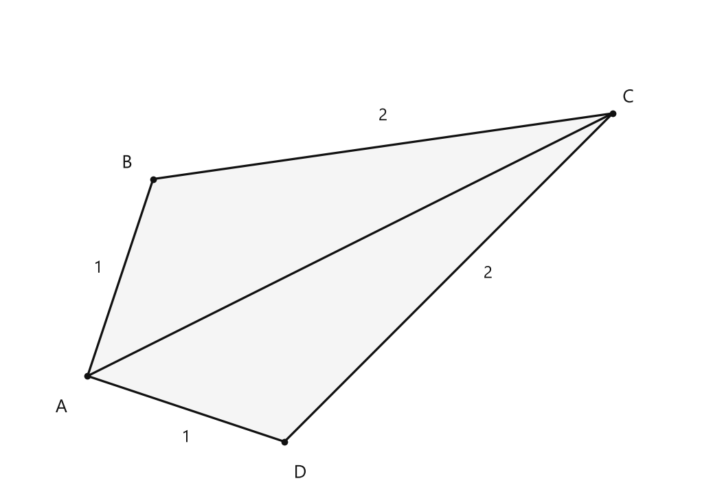
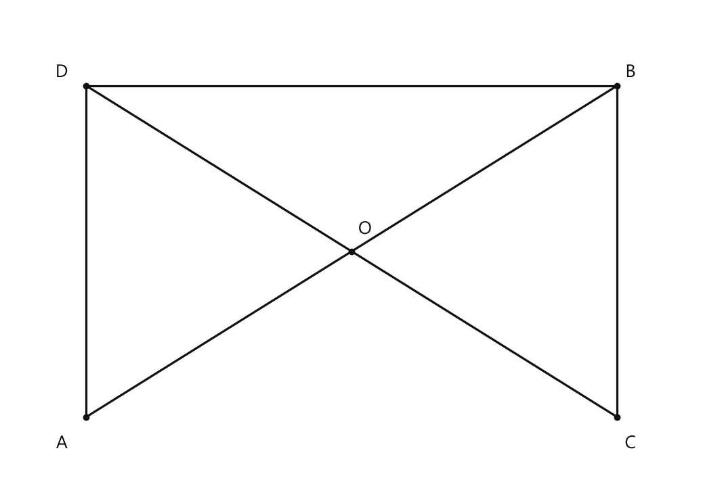
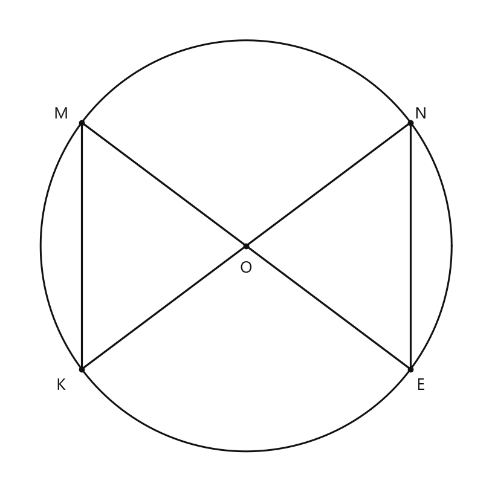
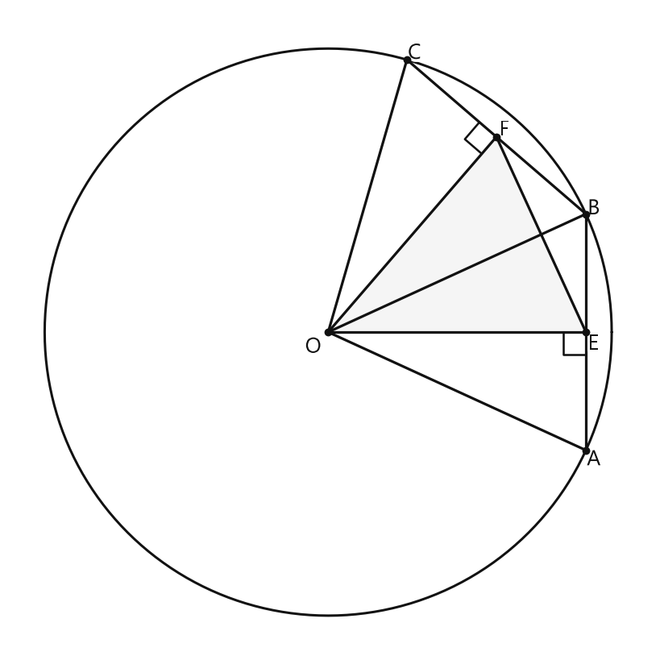

# Занятие 15. Третий признак равенства треугольников

**Раздел:** Глава II. Признаки равенства треугольников  
**Параграф учебника:** §13. Третий признак равенства треугольников  
**Страницы:** 85–88

## Цели занятия

К концу занятия ученик умеет:

- формулировать третий признак равенства треугольников;
- находить три пары равных сторон и правильно сопоставлять вершины;
- доказывать равенство треугольников по трём сторонам;
- использовать равенство треугольников для доказательства равенства углов и отрезков;
- понимать, почему три стороны задают треугольник однозначно;
- решать задачи на равные хорды, медианы и равнобедренные треугольники.

Выбери блок своего уровня:

- **1–2 балла:** знать формулировку признака;
- **3–4 балла:** применять признак в прямом доказательстве;
- **5–6 баллов:** строить цепочку доказательства;
- **7–8 баллов:** решать задачи с дополнительным построением;
- **9–10 баллов:** объяснять обратные утверждения и находить скрытые равные элементы.

## Теория к занятию

### 1. Третий признак равенства треугольников

#### Простыми словами

Смотри: у треугольника три стороны. Если у двух треугольников длины всех трёх соответствующих сторон одинаковы, то одинаковыми будут и сами треугольники: они совпадут по форме и размеру.

Треугольник можно повернуть или перевернуть, но от этого он не станет другим. Главное — правильно сопоставить вершины и стороны. Слово **соответственно** здесь не для красоты: оно следит за порядком.

#### Теорема

**Если три стороны одного треугольника соответственно равны трем сторонам другого треугольника, то такие треугольники равны.**

Например, если

$$
AB=A_1B_1,\qquad BC=B_1C_1,\qquad AC=A_1C_1,
$$

то

$$
\triangle ABC=\triangle A_1B_1C_1.
$$

#### Формулы

Для треугольников $ABC$ и $A_1B_1C_1$:

$$
AB=A_1B_1,
$$

$$
BC=B_1C_1,
$$

$$
AC=A_1C_1.
$$

Здесь:

- $AB$ и $A_1B_1$ — соответствующие стороны;
- $BC$ и $B_1C_1$ — соответствующие стороны;
- $AC$ и $A_1C_1$ — соответствующие стороны.

Когда равенство треугольников доказано, можно сравнивать их соответствующие углы и отрезки.

#### Правила

Чтобы применить третий признак, действуй по порядку:

1. Выбери два треугольника, которые нужно сравнить.
2. Найди три пары соответствующих сторон.
3. Запиши, почему каждая пара равна: по условию или потому, что это одна и та же сторона.
4. Сделай вывод: треугольники равны по трём сторонам.
5. Только после этого сравнивай нужные углы или отрезки.

Не путай:

- равенство треугольников и равенство только их площадей;
- соответствующие стороны и просто равные отрезки, которые оказались рядом;
- третий признак с первым: по первому признаку нужны две стороны и угол между ними.

Три стороны — это уже полный «паспорт» треугольника. А две стороны без третьей — пока только черновик паспорта.

#### Алгоритм доказательства

1. Выделить два треугольника.
2. Найти общую сторону, если она есть.
3. Записать равенства сторон по условию.
4. Получить три пары равных соответствующих сторон.
5. Применить третий признак равенства треугольников.
6. Сделать требуемый вывод о равенстве углов или отрезков.

#### Ловушки

- Если равны три угла, треугольники не обязательно равны: они могут иметь одну форму, но разные размеры.
- Если равны две стороны и угол, противолежащий одной из этих сторон, треугольники не обязательно равны.
- Нельзя писать «по трём сторонам», если доказаны только две пары равных сторон.
- Общая сторона считается равной самой себе:

$$
AC=AC.
$$

Это не хитрость, а обычное свойство равенства. Одна и та же линейка имеет одинаковую длину, даже если мы посмотрели на неё с двух сторон.

---

### 2. Почему три стороны задают треугольник однозначно

#### Простыми словами

Представь три жёсткие палочки с заданными длинами. Если соединить их концами, получится треугольник определённого размера и формы.

Его можно передвинуть, повернуть или отразить. Но новый по размеру и форме треугольник не получится. Поэтому говорят, что три стороны задают треугольник однозначно.

#### Факт

**Говорят, что три стороны задают треугольник однозначно.**

Это и есть смысл третьего признака равенства треугольников.

#### Правило

В задаче по третьему признаку не нужно сначала вычислять углы. Ищи три пары равных сторон.

Иногда две пары равенств записаны в условии, а третья появляется потому, что:

- сторона общая;
- отрезок разделён пополам;
- два отрезка равны по построению.

#### Ловушки

- Равные стороны должны принадлежать именно тем треугольникам, которые мы сравниваем.
- Нельзя использовать отрезок, который не является стороной рассматриваемого треугольника.
- Если треугольники равны, их соответствующие элементы равны. Но сначала равенство треугольников нужно доказать.

Иначе получится математическое «я так чувствую», а геометрия любит доказательства.

---

### 3. Применение признака к ломаной

#### Простыми словами

Рассмотрим простую замкнутую ломаную $ABCD$ и проведём диагональ $AC$. Она разделит фигуру на два треугольника:

$$
\triangle ABC\quad\text{и}\quad\triangle ADC.
$$

Если

$$
AB=AD,\qquad BC=DC,
$$

то у этих треугольников уже есть две пары равных сторон. Третья сторона общая:

$$
AC=AC.
$$

Значит, треугольники равны по третьему признаку.

#### Факт

Если

$$
AB=AD,\qquad BC=DC,
$$

то после проведения диагонали $AC$:

$$
\triangle ABC=\triangle ADC
$$

по третьему признаку равенства треугольников.

Следовательно,

$$
\angle B=\angle D,
$$

а также

$$
\angle BAC=\angle DAC.
$$

Поэтому луч $AC$ — биссектриса угла $BAD$.

#### Правило

В задачах с четырёхугольником или простой замкнутой ломаной часто помогает диагональ. Она превращает одну большую фигуру в два треугольника. А два треугольника доказывать обычно проще — геометрия тоже любит порядок.

После проведения диагонали:

1. назови два получившихся треугольника;
2. запиши две пары равных сторон по условию;
3. добавь общую сторону;
4. примени третий признак;
5. сравни нужные углы.

#### Ловушки

- Для доказательства, что $AC$ — биссектриса, нужно доказать равенство именно углов $\angle BAC$ и $\angle DAC$.
- Нельзя объявлять $AC$ биссектрисой только потому, что на рисунке всё выглядит симметрично.
- Сначала доказываем равенство треугольников, затем используем равенство соответствующих углов.
- Следи за порядком букв: от него зависит, какие углы считаются соответствующими.

---

### 4. Две стороны и медиана между ними

#### Простыми словами

Медиана — это отрезок внутри треугольника, а не его сторона. Поэтому нельзя сразу сказать: «даны три стороны» и применить третий признак.

Но медиана делит противоположную сторону пополам. Если продолжить медиану за точку её пересечения со стороной и отложить равный отрезок, появятся новые треугольники. Их уже можно сравнить по известным признакам.

#### Факт

Медиана треугольника делит противоположную сторону пополам:

если $BM$ — медиана треугольника $ABC$, то

$$
AM=MC.
$$

#### Алгоритм

Пусть в двух треугольниках известны:

$$
AB=A_1B_1,\qquad BC=B_1C_1,\qquad BM=B_1M_1,
$$

где $BM$ и $B_1M_1$ — медианы.

1. Продлить медиану $BM$ за точку $M$ до точки $D$ так, чтобы

$$
MD=BM.
$$

2. Так как $BM$ — медиана, то

$$
AM=MC.
$$

В треугольниках $AMD$ и $CMB$ две пары сторон равны:

$$
AM=MC,\qquad MD=MB.
$$

Углы $\angle AMD$ и $\angle CMB$ — вертикальные, поэтому они равны. Значит, эти треугольники равны по первому признаку.

3. Из равенства треугольников получаем:

$$
AD=BC.
$$

4. Аналогично построить точку $D_1$ для второй медианы и получить:

$$
A_1D_1=B_1C_1.
$$

5. Так как

$$
BC=B_1C_1,
$$

то

$$
AD=A_1D_1.
$$

6. Отрезки $BD$ и $B_1D_1$ тоже равны, потому что каждый состоит из двух равных медиан:

$$
BD=BM+MD=2BM,
$$

$$
B_1D_1=B_1M_1+M_1D_1=2B_1M_1.
$$

А $BM=B_1M_1$, значит,

$$
BD=B_1D_1.
$$

7. Теперь треугольники $ABD$ и $A_1B_1D_1$ имеют три пары равных сторон. По третьему признаку они равны.

8. Из равенства этих треугольников получаем равенство нужных углов. Затем по первому признаку сравниваем треугольники $ABM$ и $A_1B_1M_1$.

9. Получаем

$$
AM=A_1M_1.
$$

Так как $M$ и $M_1$ — середины сторон, то

$$
AC=2AM,\qquad A_1C_1=2A_1M_1.
$$

Следовательно,

$$
AC=A_1C_1.
$$

Теперь у исходных треугольников равны три соответствующие стороны, поэтому они равны по третьему признаку.

#### Ловушки

- Медиана не обязательно является высотой или биссектрисой.
- Нельзя считать $BM$ стороной треугольника $ABC$: это внутренний отрезок.
- Дополнительную точку нужно строить так, чтобы новый отрезок был равен медиане.
- Равенство медиан само по себе ещё не означает равенство треугольников. Медиане нужна помощь двух данных сторон и аккуратного построения.

---

### 5. Равные отрезки, пересекающиеся в одной точке

#### Простыми словами

Пусть отрезки $AB$ и $CD$ пересекаются в точке $O$. Даны равенства

$$
AB=CD,\qquad AD=BC.
$$

Проведём отрезок $BD$. Тогда треугольники $ABD$ и $CDB$ имеют:

- равные стороны $AB$ и $CD$;
- равные стороны $AD$ и $CB$;
- общую сторону $BD$.

Значит, они равны по третьему признаку.

После этого можно сравнить углы и рассмотреть маленький треугольник $BOD$.

#### Правило

Если

$$
AB=CD,\qquad AD=BC,
$$

то после проведения $BD$:

- $BD$ — общая сторона;
- $AB=CD$;
- $AD=BC$.

Следовательно,

$$
\triangle ABD=\triangle CDB
$$

по третьему признаку равенства треугольников.

Из равенства треугольников:

$$
\angle ABD=\angle CDB.
$$

Так как точки $A$, $O$, $B$ лежат на одной прямой, лучи $BO$ и $BA$ совпадают.

Так как точки $C$, $O$, $D$ лежат на одной прямой, лучи $DO$ и $DC$ совпадают.

Поэтому

$$
\angle OBD=\angle BDO.
$$

В треугольнике $BOD$ равны углы при вершинах $B$ и $D$.

Следовательно, треугольник $BOD$ равнобедренный.

Значит, его боковые стороны равны:

$$
BO=DO.
$$

#### Ловушки

- Общую сторону нужно назвать правильно: у треугольников $ABD$ и $CDB$ это $BD$.
- Нельзя перепутать углы больших треугольников с углами треугольника $BOD$.
- Равенство двух углов треугольника даёт равенство противоположных сторон.
- В этой задаче точка $O$ помогает связать большие треугольники с маленьким треугольником $BOD$. Геометрическая «стыковка деталей» — и всё работает.

---

### Сводка формул «выучить наизусть»

Третий признак:

$$
AB=A_1B_1,\qquad BC=B_1C_1,\qquad AC=A_1C_1
$$

следовательно,

$$
\triangle ABC=\triangle A_1B_1C_1.
$$

Для медианы:

$$
AM=MC.
$$

Для равнобедренного треугольника:

$$
\angle B=\angle C
\quad\Longrightarrow\quad
AC=AB.
$$

Для равных хорд окружности:

$$
MK=NE
\quad\Longrightarrow\quad
OM=ON,\quad OK=OE,
$$

а значит, соответствующие треугольники с радиусами равны по трём сторонам.

### Правила, которые нельзя путать

- **Первый признак:** две стороны и угол между ними.
- **Второй признак:** сторона и два прилежащих к ней угла.
- **Третий признак:** три стороны.
- Три равных угла не гарантируют равенство треугольников.
- Угол, противолежащий одной из данных сторон, не заменяет угол между сторонами.
- Равные треугольники имеют равные соответствующие элементы.

## Разбор ключевых заданий

### Р1. Равенство углов в простой замкнутой ломаной

**Условие.** У простой замкнутой ломаной $ABCD$:

$$
AB=AD,\qquad BC=DC.
$$

Доказать, что

$$
\angle B=\angle D,
$$

и луч $AC$ — биссектриса угла $BAD$.

<!--geo-figure-spec
{
  "needed": true,
  "kind": "plane",
  "caption": "Четырёхугольник $ABCD$ с диагональю $AC$",
  "equal": true,
  "axis": false,
  "xlim": [
    -0.6,
    4.7
  ],
  "ylim": [
    -0.9,
    2.8
  ],
  "points": {
    "A": [
      0,
      0
    ],
    "B": [
      0.5,
      1.5
    ],
    "C": [
      4,
      2
    ],
    "D": [
      1.5,
      -0.5
    ]
  },
  "segments": [
    [
      "A",
      "B"
    ],
    [
      "B",
      "C"
    ],
    [
      "C",
      "D"
    ],
    [
      "D",
      "A"
    ],
    [
      "A",
      "C"
    ]
  ],
  "polygons": [
    {
      "vertices": [
        "A",
        "B",
        "C",
        "D"
      ],
      "fill": 0.04
    }
  ],
  "labels": {
    "A": {
      "dx": -0.2,
      "dy": -0.24
    },
    "B": {
      "dx": -0.2,
      "dy": 0.12
    },
    "C": {
      "dx": 0.12,
      "dy": 0.12
    },
    "D": {
      "dx": 0.12,
      "dy": -0.24
    }
  },
  "texts": [
    {
      "xy": [
        0.08,
        0.82
      ],
      "text": "1"
    },
    {
      "xy": [
        0.75,
        -0.47
      ],
      "text": "1"
    },
    {
      "xy": [
        2.25,
        1.98
      ],
      "text": "2"
    },
    {
      "xy": [
        3.05,
        0.78
      ],
      "text": "2"
    }
  ]
}
-->

*Четырёхугольник ABCD с диагональю AC*

**Решение.**

Проведём диагональ $AC$.

Рассмотрим треугольники $ABC$ и $ADC$.

По условию:

$$
AB=AD.
$$

По условию также:

$$
BC=DC.
$$

Сторона $AC$ входит в оба треугольника, поэтому она общая:

$$
AC=AC.
$$

Получили три пары равных соответствующих сторон:

$$
AB=AD,\qquad BC=DC,\qquad AC=AC.
$$

Следовательно,

$$
\triangle ABC=\triangle ADC
$$

по третьему признаку равенства треугольников.

В равных треугольниках равны соответствующие углы. Поэтому

$$
\angle ABC=\angle CDA.
$$

Угол $\angle ABC$ — это угол $\angle B$, а угол $\angle CDA$ — это угол $\angle D$.

Значит,

$$
\angle B=\angle D.
$$

Кроме того, соответствующими являются углы

$$
\angle BAC\quad\text{и}\quad\angle DAC.
$$

Поэтому

$$
\angle BAC=\angle DAC.
$$

Луч $AC$ делит угол $BAD$ на два угла:

$$
\angle BAC\quad\text{и}\quad\angle CAD.
$$

Эти углы равны, значит, луч $AC$ — биссектриса угла $BAD$.

**Ответ:** $\angle B=\angle D$; луч $AC$ — биссектриса угла $BAD$.

---

### Р2. Два отрезка пересекаются

**Условие.** Два равных отрезка $AB$ и $CD$ пересекаются в точке $O$. Известно, что

$$
AB=CD,\qquad AD=BC.
$$

Доказать, что

$$
BO=DO.
$$

<!--geo-figure-spec
{
  "needed": true,
  "kind": "plane",
  "caption": "Пересекающиеся отрезки $AB$ и $CD$",
  "equal": true,
  "axis": false,
  "xlim": [
    -0.7,
    5.5
  ],
  "ylim": [
    -0.7,
    3.7
  ],
  "points": {
    "A": [
      0,
      0
    ],
    "B": [
      4.8,
      3
    ],
    "C": [
      4.8,
      0
    ],
    "D": [
      0,
      3
    ],
    "O": [
      2.4,
      1.5
    ]
  },
  "segments": [
    [
      "A",
      "B"
    ],
    [
      "C",
      "D"
    ],
    [
      "A",
      "D"
    ],
    [
      "B",
      "C"
    ],
    [
      "B",
      "D"
    ]
  ],
  "polygons": [],
  "labels": {
    "A": {
      "dx": -0.22,
      "dy": -0.24
    },
    "B": {
      "dx": 0.12,
      "dy": 0.12
    },
    "C": {
      "dx": 0.12,
      "dy": -0.24
    },
    "D": {
      "dx": -0.22,
      "dy": 0.12
    },
    "O": {
      "dx": 0.12,
      "dy": 0.2
    }
  },
  "texts": []
}
-->

*Пересекающиеся отрезки AB и CD*

**Решение.**

Проведём отрезок $BD$.

Рассмотрим треугольники $ABD$ и $CDB$.

По условию:

$$
AB=CD.
$$

Также по условию:

$$
AD=BC.
$$

Сторона $BD$ общая для этих треугольников:

$$
BD=DB.
$$

Значит, у треугольников $ABD$ и $CDB$ равны три соответствующие стороны:

$$
AB=CD,\qquad AD=BC,\qquad BD=DB.
$$

Следовательно,

$$
\triangle ABD=\triangle CDB
$$

по третьему признаку равенства треугольников.

Из равенства треугольников получаем равенство соответствующих углов:

$$
\angle ABD=\angle CDB.
$$

Точка $O$ лежит на отрезке $AB$. Поэтому луч $BO$ совпадает с лучом $BA$.

Точка $O$ лежит на отрезке $CD$. Поэтому луч $DO$ совпадает с лучом $DC$.

Значит,

$$
\angle OBD=\angle ABD,
$$

а

$$
\angle BDO=\angle CDB.
$$

Так как

$$
\angle ABD=\angle CDB,
$$

то

$$
\angle OBD=\angle BDO.
$$

В треугольнике $BOD$ равны углы при вершинах $B$ и $D$.

Следовательно, треугольник $BOD$ равнобедренный.

У равнобедренного треугольника стороны, лежащие напротив равных углов, равны. Поэтому

$$
BO=DO.
$$

**Ответ:** $BO=DO$.

---

### Р3. Докажем равенство треугольников по двум сторонам и медиане

**Условие.** В треугольниках $ABC$ и $A_1B_1C_1$ медианы $BM$ и $B_1M_1$ проведены к сторонам $AC$ и $A_1C_1$. Известно, что

$$
AB=A_1B_1,\qquad BC=B_1C_1,\qquad BM=B_1M_1.
$$

Доказать, что

$$
\triangle ABC=\triangle A_1B_1C_1.
$$

**Решение.**

Так как $BM$ — медиана треугольника $ABC$, точка $M$ — середина стороны $AC$.

Поэтому

$$
AM=MC.
$$

Продолжим отрезок $BM$ за точку $M$ до точки $D$ так, чтобы

$$
MD=BM.
$$

Рассмотрим треугольники $AMD$ и $CMB$.

У них равны стороны:

$$
AM=MC,
$$

потому что $M$ — середина стороны $AC$;

$$
MD=MB,
$$

по построению.

Углы $\angle AMD$ и $\angle CMB$ — вертикальные. Поэтому

$$
\angle AMD=\angle CMB.
$$

Значит,

$$
\triangle AMD=\triangle CMB
$$

по первому признаку равенства треугольников.

У равных треугольников равны соответствующие стороны. Поэтому

$$
AD=BC.
$$

Теперь выполним такое же построение во втором треугольнике.

Продолжим $B_1M_1$ за точку $M_1$ до точки $D_1$ так, чтобы

$$
M_1D_1=B_1M_1.
$$

Аналогично получаем:

$$
A_1D_1=B_1C_1.
$$

По условию:

$$
BC=B_1C_1.
$$

Значит,

$$
AD=A_1D_1.
$$

По условию также:

$$
AB=A_1B_1.
$$

Рассмотрим отрезки $BD$ и $B_1D_1$.

Так как точка $M$ лежит между $B$ и $D$, то

$$
BD=BM+MD.
$$

По построению $MD=BM$, поэтому

$$
BD=BM+BM=2BM.
$$

Аналогично:

$$
B_1D_1=B_1M_1+M_1D_1,
$$

$$
B_1D_1=B_1M_1+B_1M_1=2B_1M_1.
$$

По условию:

$$
BM=B_1M_1.
$$

Следовательно,

$$
BD=B_1D_1.
$$

Теперь у треугольников $ABD$ и $A_1B_1D_1$ равны три соответствующие стороны:

$$
AB=A_1B_1,
$$

$$
AD=A_1D_1,
$$

$$
BD=B_1D_1.
$$

Поэтому

$$
\triangle ABD=\triangle A_1B_1D_1
$$

по третьему признаку равенства треугольников.

Из равенства этих треугольников получаем:

$$
\angle ABD=\angle A_1B_1D_1.
$$

Точки $B$, $M$, $D$ лежат на одной прямой. Поэтому лучи $BM$ и $BD$ совпадают.

Точки $B_1$, $M_1$, $D_1$ также лежат на одной прямой. Поэтому лучи $B_1M_1$ и $B_1D_1$ совпадают.

Значит,

$$
\angle ABM=\angle A_1B_1M_1.
$$

Рассмотрим треугольники $ABM$ и $A_1B_1M_1$.

У них равны:

$$
AB=A_1B_1
$$

по условию;

$$
BM=B_1M_1
$$

по условию;

$$
\angle ABM=\angle A_1B_1M_1.
$$

Следовательно,

$$
\triangle ABM=\triangle A_1B_1M_1
$$

по первому признаку равенства треугольников.

Отсюда равны соответствующие стороны:

$$
AM=A_1M_1.
$$

Так как $BM$ и $B_1M_1$ — медианы, точки $M$ и $M_1$ являются серединами соответствующих сторон. Поэтому

$$
AC=2AM,
$$

$$
A_1C_1=2A_1M_1.
$$

Так как

$$
AM=A_1M_1,
$$

то

$$
AC=A_1C_1.
$$

Теперь у исходных треугольников равны три соответствующие стороны:

$$
AB=A_1B_1,
$$

$$
BC=B_1C_1,
$$

$$
AC=A_1C_1.
$$

Следовательно,

$$
\triangle ABC=\triangle A_1B_1C_1
$$

по третьему признаку равенства треугольников.

**Ответ:** $\triangle ABC=\triangle A_1B_1C_1$.

---

### Р4. Равные хорды и равные центральные углы

**Условие.** В окружности с центром $O$ проведены равные хорды $MK$ и $NE$:

$$
MK=NE.
$$

Доказать, что

$$
\angle MOK=\angle NOE.
$$

Сформулировать и доказать обратное утверждение.

<!--geo-figure-spec
{
  "needed": true,
  "kind": "plane",
  "caption": "Равные хорды $MK$ и $NE$ окружности с центром $O$",
  "equal": true,
  "axis": false,
  "xlim": [
    -5.8,
    5.8
  ],
  "ylim": [
    -5.8,
    5.8
  ],
  "points": {
    "O": [
      0,
      0
    ],
    "M": [
      -4,
      3
    ],
    "K": [
      -4,
      -3
    ],
    "N": [
      4,
      3
    ],
    "E": [
      4,
      -3
    ]
  },
  "segments": [
    [
      "M",
      "K"
    ],
    [
      "N",
      "E"
    ],
    [
      "O",
      "M"
    ],
    [
      "O",
      "K"
    ],
    [
      "O",
      "N"
    ],
    [
      "O",
      "E"
    ]
  ],
  "polygons": [],
  "circles": [
    {
      "center": "O",
      "radius": 5
    }
  ],
  "labels": {
    "O": {
      "dx": 0,
      "dy": -0.55
    },
    "M": {
      "dx": -0.5,
      "dy": 0.2
    },
    "K": {
      "dx": -0.5,
      "dy": -0.4
    },
    "N": {
      "dx": 0.25,
      "dy": 0.2
    },
    "E": {
      "dx": 0.25,
      "dy": -0.4
    }
  }
}
-->

*Равные хорды MK и NE окружности с центром O*

**Решение.**

Рассмотрим треугольники $MOK$ и $NOE$.

Отрезки $OM$, $OK$, $ON$, $OE$ — радиусы одной окружности.

Поэтому:

$$
OM=ON,
$$

$$
OK=OE.
$$

По условию:

$$
MK=NE.
$$

Получили три пары равных сторон:

$$
OM=ON,\qquad OK=OE,\qquad MK=NE.
$$

Значит,

$$
\triangle MOK=\triangle NOE
$$

по третьему признаку равенства треугольников.

У равных треугольников соответствующие углы равны.

Следовательно,

$$
\angle MOK=\angle NOE.
$$

**Обратное утверждение:**

Если две хорды одной окружности стягивают равные центральные углы, то эти хорды равны.

Пусть

$$
\angle MOK=\angle NOE.
$$

Так как $OM$, $OK$, $ON$, $OE$ — радиусы одной окружности, то:

$$
OM=ON,
$$

$$
OK=OE.
$$

Углы между этими сторонами равны:

$$
\angle MOK=\angle NOE.
$$

Значит,

$$
\triangle MOK=\triangle NOE
$$

по первому признаку равенства треугольников.

У равных треугольников соответствующие стороны равны.

Поэтому:

$$
MK=NE.
$$

**Ответ:** равные хорды стягивают равные центральные углы; равные центральные углы стягивают равные хорды.

---

### Р5. Четырёхугольник с двумя парами равных сторон

**Условие.** У четырёхугольника $ABCD$:

$$
AB=CD,\qquad BC=AD,
$$

и

$$
\angle BAD+\angle BCD=168^\circ.
$$

Найти $\angle BCD$.

**Решение.**

Проведём диагональ $BD$.

Она разделит четырёхугольник на треугольники $ABD$ и $CDB$.

Сравним эти треугольники.

По условию:

$$
AB=CD,
$$

$$
AD=CB.
$$

Сторона $BD$ у треугольников общая:

$$
BD=DB.
$$

Значит, три стороны одного треугольника соответственно равны трём сторонам другого.

Следовательно,

$$
\triangle ABD=\triangle CDB
$$

по третьему признаку равенства треугольников.

Соответствующие углы равных треугольников равны:

$$
\angle BAD=\angle BCD.
$$

Обозначим искомый угол через $x$:

$$
\angle BCD=x.
$$

Тогда:

$$
\angle BAD=x.
$$

Подставим это в условие:

$$
x+x=168^\circ.
$$

$$
2x=168^\circ.
$$

$$
x=84^\circ.
$$

Значит,

$$
\angle BCD=84^\circ.
$$

Диагональ здесь работает как разделитель: сначала превращает одну задачу про четырёхугольник в две про треугольники, а потом третий признак всё аккуратно сравнивает.

**Ответ:** $84^\circ$.

---

### Р6. Периметр треугольника, связанный с равными хордами

**Условие.** В окружности с центром $O$ хорды $AB$ и $BC$ равны. Точки $E$ и $F$ — середины хорд $AB$ и $BC$ соответственно. Известно, что

$$
OE=6\text{ дм},\qquad EF=5\text{ дм}.
$$

Найти периметр треугольника $EOF$.

<!--geo-figure-spec
{
  "needed": true,
  "kind": "plane",
  "caption": "Окружность с центром $O$: равные хорды $AB$ и $BC$",
  "equal": true,
  "axis": false,
  "xlim": [
    -7.4,
    7.5
  ],
  "ylim": [
    -7.3,
    7.5
  ],
  "points": {
    "O": [
      0,
      0
    ],
    "A": [
      6,
      -2.75
    ],
    "B": [
      6,
      2.75
    ],
    "C": [
      1.8333,
      6.3406
    ],
    "E": [
      6,
      0
    ],
    "F": [
      3.9167,
      4.5453
    ]
  },
  "segments": [
    [
      "A",
      "B"
    ],
    [
      "B",
      "C"
    ],
    [
      "O",
      "E"
    ],
    [
      "O",
      "F"
    ],
    [
      "E",
      "F"
    ],
    [
      "O",
      "A"
    ],
    [
      "O",
      "B"
    ],
    [
      "O",
      "C"
    ]
  ],
  "circles": [
    {
      "center": "O",
      "radius": 6.6003
    }
  ],
  "polygons": [
    {
      "vertices": [
        "O",
        "E",
        "F"
      ],
      "fill": 0.04
    }
  ],
  "labels": {
    "O": {
      "dx": -0.35,
      "dy": -0.35
    },
    "A": {
      "dx": 0.18,
      "dy": -0.22
    },
    "B": {
      "dx": 0.18,
      "dy": 0.12
    },
    "C": {
      "dx": 0.18,
      "dy": 0.15
    },
    "E": {
      "dx": 0.18,
      "dy": -0.28
    },
    "F": {
      "dx": 0.18,
      "dy": 0.16
    }
  },
  "right_angles": [
    {
      "vertex": "E",
      "from": "O",
      "to": "A"
    },
    {
      "vertex": "F",
      "from": "O",
      "to": "C"
    }
  ]
}
-->

*Окружность с центром O: равные хорды AB и BC*

**Решение.**

Нужно найти третью сторону треугольника $EOF$, то есть $OF$.

Докажем, что $OE=OF$.

Рассмотрим треугольники $OAB$ и $OCB$.

Отрезки $OA$ и $OC$ — радиусы одной окружности:

$$
OA=OC.
$$

Отрезок $OB$ — общий:

$$
OB=OB.
$$

По условию хорды равны:

$$
AB=BC.
$$

Следовательно,

$$
\triangle OAB=\triangle OCB
$$

по третьему признаку равенства треугольников.

Точки $E$ и $F$ — середины равных хорд $AB$ и $BC$.

Поэтому:

$$
AE=\frac{AB}{2},
$$

$$
CF=\frac{BC}{2}.
$$

Так как $AB=BC$, получаем:

$$
AE=CF.
$$

Из равенства треугольников $OAB$ и $OCB$ следуют равенства соответствующих углов:

$$
\angle OAB=\angle OCB.
$$

Точки $E$ и $F$ лежат на хордах $AB$ и $BC$ соответственно.

Поэтому:

$$
\angle OAE=\angle OCF.
$$

Теперь рассмотрим треугольники $OAE$ и $OCF$.

В них:

$$
OA=OC,
$$

$$
AE=CF,
$$

$$
\angle OAE=\angle OCF.
$$

Следовательно,

$$
\triangle OAE=\triangle OCF
$$

по первому признаку равенства треугольников.

Значит, соответствующие стороны равны:

$$
OE=OF.
$$

По условию:

$$
OE=6\text{ дм}.
$$

Следовательно:

$$
OF=6\text{ дм}.
$$

Также:

$$
EF=5\text{ дм}.
$$

Периметр треугольника равен сумме длин его сторон:

$$
P_{EOF}=OE+OF+EF.
$$

Подставим значения:

$$
P_{EOF}=6+6+5.
$$

$$
P_{EOF}=17\text{ дм}.
$$

**Ответ:** $17\text{ дм}$.

---

### Р7. Доказательство по условию с медианами

**Условие.** В треугольниках $ABC$ и $A_1B_1C_1$:

$$
AB=A_1B_1,\qquad BC=B_1C_1.
$$

Медианы $AM$ и $A_1M_1$ равны:

$$
AM=A_1M_1.
$$

Доказать, что треугольники равны.

**Решение.**

Медиана делит сторону треугольника пополам.

Поэтому $M$ — середина стороны $BC$, а $M_1$ — середина стороны $B_1C_1$:

$$
BM=MC,
$$

$$
B_1M_1=M_1C_1.
$$

По условию:

$$
BC=B_1C_1.
$$

Половины равных отрезков равны, значит:

$$
BM=B_1M_1,
$$

$$
MC=M_1C_1.
$$

Также по условию:

$$
AB=A_1B_1,
$$

$$
AM=A_1M_1.
$$

Рассмотрим треугольники $ABM$ и $A_1B_1M_1$.

В них:

$$
AB=A_1B_1,
$$

$$
AM=A_1M_1,
$$

$$
BM=B_1M_1.
$$

Следовательно,

$$
\triangle ABM=\triangle A_1B_1M_1
$$

по третьему признаку равенства треугольников.

Значит, соответствующие углы равны:

$$
\angle ABM=\angle A_1B_1M_1.
$$

Точки $B$, $M$, $C$ лежат на одной прямой, причём $M$ находится между $B$ и $C$.

Поэтому лучи $BM$ и $BC$ совпадают.

Аналогично, лучи $B_1M_1$ и $B_1C_1$ совпадают.

Значит:

$$
\angle ABC=\angle A_1B_1C_1.
$$

Теперь сравним исходные треугольники $ABC$ и $A_1B_1C_1$.

У них равны две стороны:

$$
AB=A_1B_1,
$$

$$
BC=B_1C_1,
$$

и углы между этими сторонами:

$$
\angle ABC=\angle A_1B_1C_1.
$$

Следовательно,

$$
\triangle ABC=\triangle A_1B_1C_1
$$

по первому признаку равенства треугольников.

**Ответ:** $\triangle ABC=\triangle A_1B_1C_1$.

## Практические задания

Выбери свой уровень и решай только этот блок. В блоке должна закрепиться вся тема параграфа. Ответы не приводятся.

### Уровень 1–2 балла

**С1.** Выберите условие, при котором треугольники $ABC$ и $A_1B_1C_1$ равны по третьему признаку:
1) $AB=A_1B_1$, $AC=A_1C_1$, $\angle A=\angle A_1$;
2) $\angle A=\angle A_1$, $\angle B=\angle B_1$, $AB=A_1B_1$;
3) $AB=A_1B_1$, $BC=B_1C_1$, $AC=A_1C_1$;
4) $\angle A=\angle A_1$, $\angle B=\angle B_1$, $\angle C=\angle C_1$;
5) $AB=A_1B_1$, $BC=B_1C_1$, $\angle A=\angle A_1$.

**С2.** В треугольниках $KLM$ и $PQR$ выполнено: $KL=PQ$, $LM=QR$, $KM=PR$. Какой вывод можно сделать?

1) Треугольники равны по первому признаку;
2) Треугольники равны по второму признаку;
3) Треугольники равны по третьему признаку;
4) Треугольники подобны;
5) Сделать вывод о равенстве треугольников нельзя.

**С3.** Известно, что $AB=DE$, $BC=EF$, $AC=DF$. Запишите обозначение равенства треугольников с соответствующими вершинами.

**С4.** Периметр треугольника $ABC$ равен $24$ см. Треугольник $DEF$ равен треугольнику $ABC$, причём $AB=DE$, $BC=EF$, $CA=FD$. Найдите периметр треугольника $DEF$.

**С5.** Выберите все верные утверждения.

1) Если три стороны одного треугольника соответственно равны трём сторонам другого, то треугольники равны.
2) Равенство трёх углов двух треугольников всегда означает их равенство.
3) При равенстве треугольников равны их соответствующие стороны.
4) Третий признак равенства треугольников использует равенство трёх сторон.
5) Равенство одной стороны двух треугольников достаточно для равенства треугольников.

**С6.** В треугольниках $ABC$ и $DEF$ стороны имеют длины $5$ см, $7$ см и $9$ см в каждом. Можно ли утверждать, что треугольники равны по третьему признаку?

**С7.** В треугольниках $ABC$ и $A_1B_1C_1$ известно, что $AB=A_1B_1$, $BC=B_1C_1$, $AC=A_1C_1$. Угол $B$ равен $42^\circ$. Чему равен угол $B_1$?

**С8.** У треугольников $MNP$ и $XYZ$ выполнено $MN=XY$, $NP=YZ$, $MP=XZ$. Выберите правильное соответствие вершин:
1) $M\leftrightarrow Y$, $N\leftrightarrow Z$, $P\leftrightarrow X$;
2) $M\leftrightarrow X$, $N\leftrightarrow Y$, $P\leftrightarrow Z$;
3) $M\leftrightarrow Z$, $N\leftrightarrow X$, $P\leftrightarrow Y$;
4) $M\leftrightarrow X$, $N\leftrightarrow Z$, $P\leftrightarrow Y$;
5) $M\leftrightarrow Y$, $N\leftrightarrow X$, $P\leftrightarrow Z$.

**С9.** Отрезки $AB$ и $CD$ равны, отрезки $BC$ и $AD$ равны. Диагональ $AC$ проведена. Сравните треугольники $ABC$ и $CDA$, если $AC$ — их общая сторона.

**С10.** В четырёхугольнике $ABCD$ диагональ $BD$ делит его на треугольники $ABD$ и $CBD$. Известно, что $AB=CB$, $AD=CD$. Какой признак позволяет доказать равенство этих треугольников?

1) Первый признак;
2) Второй признак;
3) Третий признак;
4) Равенство трёх углов;
5) Ни один признак.

**С11.** У равных треугольников $ABC$ и $DEF$ сторона $AB$ соответствует стороне $DE$. Сторона $AB$ равна $8$ см. Найдите длину стороны $DE$.

**С12.** Два треугольника имеют соответственно равные стороны: $4$ см, $6$ см и $8$ см. Периметр первого треугольника равен $18$ см. Найдите периметр второго треугольника.

**С13.** Выберите условие, достаточное для равенства двух треугольников по третьему признаку.

1) Равны три стороны одного треугольника и три угла другого треугольника  
2) Равны три стороны одного треугольника и соответственно три стороны другого треугольника  
3) Равны два угла одного треугольника и два угла другого треугольника  
4) Равны две стороны одного треугольника и один угол другого треугольника  
5) Равны площади двух треугольников

**С14.** В треугольниках $ABC$ и $DEF$ известно: $AB=DE$, $BC=EF$, $AC=DF$. Какой вывод верен?

1) $\triangle ABC=\triangle DFE$  
2) $\triangle ABC=\triangle EDF$  
3) $\triangle ABC=\triangle DEF$  
4) Треугольники имеют только равные площади  
5) Равенство треугольников установить нельзя

**С15.** Даны треугольники $KLM$ и $PQR$: $KL=PQ$, $LM=QR$, $KM=PR$. Укажите соответствующие вершины треугольников.

1) $K\leftrightarrow P$, $L\leftrightarrow Q$, $M\leftrightarrow R$  
2) $K\leftrightarrow Q$, $L\leftrightarrow R$, $M\leftrightarrow P$  
3) $K\leftrightarrow R$, $L\leftrightarrow P$, $M\leftrightarrow Q$  
4) $K\leftrightarrow P$, $L\leftrightarrow R$, $M\leftrightarrow Q$  
5) $K\leftrightarrow Q$, $L\leftrightarrow P$, $M\leftrightarrow R$

**С16.** В треугольниках $ABC$ и $A_1B_1C_1$ стороны равны: $AB=A_1B_1$, $BC=B_1C_1$, $AC=A_1C_1$. Выберите верное утверждение.

1) Треугольники равны по первому признаку  
2) Треугольники равны по второму признаку  
3) Треугольники равны по третьему признаку  
4) Треугольники равны только по двум углам  
5) Сделать вывод о равенстве нельзя

**С17.** Укажите пару треугольников, равенство которых можно доказать по третьему признаку:

1) Стороны первого треугольника $3$ см, $4$ см, $5$ см; стороны второго треугольника $3$ см, $4$ см, $6$ см  
2) Стороны первого треугольника $5$ см, $6$ см, $7$ см; стороны второго треугольника $7$ см, $5$ см, $6$ см  
3) У двух треугольников равны только две стороны  
4) У двух треугольников равны только два угла  
5) У двух треугольников равны только площади

**С18.** В треугольниках $MNP$ и $XYZ$ известно: $MN=XY=7$ см, $NP=YZ=4$ см, $MP=XZ=6$ см. Выберите правильную запись.

1) $\triangle MNP=\triangle XYZ$  
2) $\triangle MNP=\triangle XZY$  
3) $\triangle MNP=\triangle YXZ$  
4) Равенство треугольников невозможно доказать  
5) Можно доказать только равенство их площадей

**С19.** На отрезке $AC$ взята точка $B$. Известно, что $AB=DE$, $BC=EF$, $AC=DF$. Какой вывод следует из третьего признака?

1) $\triangle ABC=\triangle DEF$  
2) $\triangle ABC=\triangle DFE$  
3) $\triangle ABC$ и $\triangle DEF$ имеют равные только две стороны  
4) Угол $B$ равен углу $E$, но треугольники не равны  
5) Никакого вывода сделать нельзя

**С20.** Укажите лишнее условие среди данных для доказательства равенства треугольников по третьему признаку:

1) $AB=DE$  
2) $BC=EF$  
3) $AC=DF$  
4) $\angle A=\angle D$  
5) Три стороны одного треугольника соответственно равны трём сторонам другого

**С21.** В четырёхугольнике $ABCD$ диагональ $AC$ делит его на треугольники $ABC$ и $CDA$. Известно, что $AB=CD$, $BC=DA$. Какое ещё равенство достаточно добавить, чтобы доказать равенство этих треугольников по третьему признаку?

1) $AC=AC$  
2) $\angle BAC=\angle DCA$  
3) $\angle ABC=\angle CDA$  
4) $AB=BC$  
5) $AD=CD$

**С22.** В окружности с центром $O$ хорды $AB$ и $CD$ равны. Какие три равенства сторон позволяют доказать равенство треугольников $AOB$ и $COD$?

1) $OA=OC$, $OB=OD$, $AB=CD$  
2) $OA=OB$, $OC=OD$, $AB=CD$  
3) $OA=OD$, $OB=OC$, $AB\ne CD$  
4) $OA=OC$, $AB=OD$, $OB=CD$  
5) Равенство только хорд достаточно без других данных

**С23.** У треугольников $ABC$ и $A_1B_1C_1$ соответственно равны стороны $AB$ и $A_1B_1$, $BC$ и $B_1C_1$, $AC$ и $A_1C_1$. Запишите обозначение равенства треугольников с соответствующими вершинами.

**С24.** В треугольниках $PQR$ и $XYZ$ стороны имеют длины $PQ=XY=8$ см, $QR=YZ=5$ см, $PR=XZ=6$ см. Запишите, по какому признаку можно установить равенство этих треугольников.

**С25.** Выберите условие, при котором треугольники $ABC$ и $A_1B_1C_1$ равны по третьему признаку:
1) $AB=A_1B_1$, $BC=B_1C_1$, $\angle B=\angle B_1$; 2) $\angle A=\angle A_1$, $\angle B=\angle B_1$, $\angle C=\angle C_1$; 3) $AB=A_1B_1$, $BC=B_1C_1$, $AC=A_1C_1$; 4) $AB=A_1B_1$, $\angle A=\angle A_1$, $\angle B=\angle B_1$; 5) $\angle A=\angle A_1$, $AC=A_1C_1$, $\angle C=\angle C_1$.

**С26.** В треугольниках $ABC$ и $DEF$ известно: $AB=DE$, $BC=EF$, $AC=DF$. Запишите вывод о равенстве этих треугольников.

**С27.** Даны треугольники $KLM$ и $RST$: $KL=RS=5$ см, $LM=ST=7$ см, $KM=RT=8$ см. Определите, равны ли эти треугольники по третьему признаку.

**С28.** В треугольниках $ABC$ и $A_1B_1C_1$ стороны $AB$ и $A_1B_1$ равны, стороны $BC$ и $B_1C_1$ равны. Какое равенство третьих сторон необходимо добавить, чтобы применить третий признак?

**С29.** У треугольников $ABC$ и $DEF$ соответственно равны стороны $AB$ и $DE$, $AC$ и $DF$, $BC$ и $EF$. Укажите соответствие вершин при равенстве треугольников.

**С30.** В четырехугольнике $ABCD$ диагональ $AC$ разделяет его на треугольники $ABC$ и $CDA$. Известно, что $AB=CD$, $BC=AD$. Назовите третью пару равных сторон, достаточную для доказательства равенства этих треугольников.

**С31.** В четырехугольнике $ABCD$ $AB=CD$, $BC=AD$, а диагональ $AC$ проведена. Выберите верное утверждение:
1) $\triangle ABC=\triangle CDA$ по третьему признаку; 2) $\triangle ABC=\triangle CDA$ только по двум углам; 3) равенство треугольников доказать нельзя; 4) треугольники имеют только одну общую сторону; 5) $\triangle ABC=\triangle CDA$ по первому признаку.

**С32.** Отрезки $AB$ и $CD$ пересекаются в точке $O$. Известно, что $AO=DO$, $BO=CO$, а $AB=CD$. Определите, равны ли треугольники $AOC$ и $DOB$ по третьему признаку.

**С33.** В окружности с центром $O$ хорды $AB$ и $CD$ равны. Радиусы $OA$, $OB$, $OC$, $OD$ имеют одинаковую длину. Назовите три пары равных сторон, по которым можно доказать равенство треугольников $AOB$ и $COD$.

**С34.** Треугольники $ABC$ и $A_1B_1C_1$ равны по третьему признаку. Известно, что $AB=A_1B_1$, $BC=B_1C_1$, $AC=A_1C_1$. Запишите равенство их периметров.

**С35.** Для треугольников $ABC$ и $DEF$ даны равенства $AB=DE$, $BC=EF$, $AC=DF$. Если $\angle A=42^\circ$, найдите величину соответствующего угла треугольника $DEF$.

**С36.** Треугольники $ABC$ и $A_1B_1C_1$ имеют соответственно равные стороны: $AB=A_1B_1$, $BC=B_1C_1$, $AC=A_1C_1$. Выберите верное утверждение:
1) треугольники равны по третьему признаку; 2) треугольники равны только при равенстве их углов; 3) треугольники не имеют общих признаков равенства; 4) равенство треугольников следует только из равенства двух сторон; 5) равенство треугольников следует только из равенства одной стороны.

### Уровень 3–4 балла

**С1.** Сформулируйте третий признак равенства треугольников.

**С2.** В треугольниках $ABC$ и $A_1B_1C_1$ известно, что $AB=A_1B_1$, $BC=B_1C_1$, $AC=A_1C_1$. Докажите, что $\triangle ABC=\triangle A_1B_1C_1$.

**С3.** В треугольниках $ABC$ и $DEF$ стороны имеют длины $AB=DE=7$ см, $BC=EF=5$ см, $AC=DF=8$ см. Докажите равенство треугольников и укажите, какие углы равны.

**С4.** В четырехугольнике $ABCD$ известно, что $AB=CD$ и $BC=AD$. Диагональ $AC$ разделяет его на треугольники $ABC$ и $CDA$. Докажите равенство этих треугольников.

**С5.** В четырехугольнике $ABCD$ известно, что $AB=AD$ и $BC=CD$. Докажите, что $\angle BAC=\angle CAD$.

**С6.** В четырехугольнике $ABCD$ известно, что $AB=AD$, $BC=CD$, а $\angle BAC=36^\circ$. Найдите угол $CAD$.

**С7.** Точки $M$ и $K$ лежат по одну сторону от прямой $AB$. Известно, что $AM=BK$ и $BM=AK$. Докажите равенство треугольников $AMB$ и $BKA$.

**С8.** Отрезки $AB$ и $CD$ пересекаются в точке $O$. Известно, что $AO=CO$, $BO=DO$. Докажите равенство треугольников $AOD$ и $COB$.

**С9.** Отрезки $AB$ и $CD$ пересекаются в точке $O$. Известно, что $AB=CD$ и $AD=BC$. Докажите, что $AO=CO$.

**С10.** В окружности с центром $O$ хорды $AB$ и $CD$ равны. Докажите, что $\angle AOB=\angle COD$.

**С11.** В окружности с центром $O$ точки $E$ и $F$ — середины равных хорд $AB$ и $CD$ соответственно. Известно, что $OE=OF=4$ см и $EF=6$ см. Найдите периметр треугольника $EOF$.

**С12.** В треугольниках $ABC$ и $A_1B_1C_1$ стороны $AB=A_1B_1$, $BC=B_1C_1$, а медианы $AM$ и $A_1M_1$, проведённые к сторонам $BC$ и $B_1C_1$, равны. Докажите, что $\triangle ABC=\triangle A_1B_1C_1$.

**С13.** В четырёхугольнике $ABCD$ диагональ $AC$ является общей для треугольников $ABC$ и $CDA$, причём $AB=CD$ и $BC=AD$. Докажите, что $\angle BAC=\angle DCA$.

**С14.** В треугольниках $ABC$ и $A_1B_1C_1$ известно, что $AB=A_1B_1$, $BC=B_1C_1$, $AC=A_1C_1$. Докажите равенство треугольников.

**С15.** В четырёхугольнике $ABCD$ выполнено $AB=CD$, $BC=AD$, а $\angle BAD+\angle BCD=168^\circ$. Найдите $\angle BAD$.

**С16.** Отрезки $AB$ и $CD$ пересекаются в точке $O$. Известно, что $AO=CO$ и $BO=DO$. Докажите, что $\triangle AOD=\triangle COB$.

**С17.** В треугольниках $ABC$ и $DEF$ стороны имеют длины $AB=DE=7$ см, $BC=EF=5$ см, $AC=DF=6$ см. Найдите периметр треугольника $DEF$, если периметр треугольника $ABC$ равен $18$ см.

**С18.** В окружности с центром $O$ хорды $AB$ и $CD$ равны. Докажите, что $\triangle AOB=\triangle COD$ и $\angle AOB=\angle COD$.

**С19.** В треугольниках $ABC$ и $A_1B_1C_1$ стороны $AB$ и $A_1B_1$ равны, стороны $BC$ и $B_1C_1$ равны, а стороны $AC$ и $A_1C_1$ равны. Если $\angle A=42^\circ$, найдите угол $A_1$.

**С20.** Отрезок $AC$ — общая сторона треугольников $ABC$ и $ADC$. Известно, что $AB=AD$ и $BC=CD$. Докажите, что луч $AC$ является биссектрисой угла $BAD$.

**С21.** В треугольниках $KLM$ и $PQR$ выполнено $KL=PQ=8$ см, $LM=QR=6$ см, $KM=PR=10$ см. Найдите разность периметров этих треугольников.

**С22.** В треугольниках $ABC$ и $A_1B_1C_1$ стороны $AB=A_1B_1$ и $BC=B_1C_1$, а медианы $AM$ и $A_1M_1$ равны. Точки $M$ и $M_1$ — середины сторон $BC$ и $B_1C_1$ соответственно. Докажите, что $\triangle ABC=\triangle A_1B_1C_1$.

**С23.** В треугольнике $ABC$ точка $M$ лежит на стороне $AC$, причём $AM=CM$. В треугольнике $A_1B_1C_1$ точка $M_1$ лежит на стороне $A_1C_1$, причём $A_1M_1=M_1C_1$. Известно, что $AB=A_1B_1$, $BC=B_1C_1$ и $AM=A_1M_1$. Докажите равенство треугольников $ABC$ и $A_1B_1C_1$.

**С24.** Две равные хорды $AB$ и $CD$ окружности с центром $O$ расположены так, что центральный угол $AOB$ равен $76^\circ$. Найдите величину центрального угла $COD$.

**С25.** В треугольниках $ABC$ и $A_1B_1C_1$ известно: $AB=A_1B_1$, $BC=B_1C_1$, $AC=A_1C_1$. Докажите, что $\triangle ABC=\triangle A_1B_1C_1$.

**С26.** В четырёхугольнике $ABCD$ диагональ $AC$ делит его на треугольники $ABC$ и $CDA$. Известно, что $AB=CD$, $BC=AD$. Докажите, что $\angle BAC=\angle DCA$.

**С27.** Отрезки $AB$ и $CD$ пересекаются в точке $O$. Известно, что $AO=CO$ и $BO=DO$. Докажите равенство треугольников $AOD$ и $COB$.

**С28.** В треугольниках $ABC$ и $DEF$ стороны имеют длины $AB=DE=7$ см, $BC=EF=5$ см, $AC=DF=6$ см. Найдите периметр треугольника $DEF$.

**С29.** В треугольнике $ABC$ медиана $AM$ делит сторону $BC$ пополам. В треугольнике $A_1B_1C_1$ медиана $A_1M_1$ делит сторону $B_1C_1$ пополам. Известно, что $AB=A_1B_1$, $AC=A_1C_1$, $AM=A_1M_1$. Докажите равенство треугольников $ABC$ и $A_1B_1C_1$.

**С30.** В окружности с центром $O$ хорды $AB$ и $CD$ равны. Докажите, что $\triangle AOB=\triangle COD$ и $\angle AOB=\angle COD$.

**С31.** В четырёхугольнике $ABCD$ $AB=CD$, $BC=AD$, а $\angle BAD=72^\circ$. Найдите $\angle BCD$, если диагональ $AC$ делит четырёхугольник на треугольники $ABC$ и $CDA$.

**С32.** На отрезке $AB$ выбрана точка $M$. По разные стороны от прямой $AB$ построены треугольники $AMC$ и $BMD$, причём $AM=BM$, $AC=BD$, $MC=MD$. Докажите, что $\angle CAM=\angle DBM$.

**С33.** В треугольниках $ABC$ и $A_1B_1C_1$ стороны $AB=8$ см, $BC=11$ см, $AC=13$ см и $A_1B_1=8$ см, $B_1C_1=11$ см, $A_1C_1=13$ см. Найдите разность периметров этих треугольников.

**С34.** В равнобедренных треугольниках $ABC$ и $A_1BC$ общим основанием является $BC$, причём точки $A$ и $A_1$ лежат по разные стороны от прямой $BC$. Докажите, что $\triangle ABC=\triangle A_1BC$, если $AB=A_1B$.

**С35.** Точки $M$ и $N$ лежат по одну сторону от прямой $AB$. Известно, что $AM=BN$, $BM=AN$, а отрезок $AB$ является общей стороной треугольников $AMB$ и $BNA$. Докажите равенство треугольников $AMB$ и $BNA$.

**С36.** В треугольнике $ABC$ точка $M$ — середина стороны $BC$. Известно, что $AB=AC$, $DM=EM$, $BD=CE$, где точки $D$ и $E$ лежат на прямой $BC$ по разные стороны от точки $M$. Докажите, что $AD=AE$.

### Уровень 5–6 баллов

**С1.** Даны треугольники $ABC$ и $A_1B_1C_1$, у которых $AB=A_1B_1$, $BC=B_1C_1$, $AC=A_1C_1$. Докажите, что $\triangle ABC=\triangle A_1B_1C_1$.

**С2.** В треугольниках $AMB$ и $BKA$ точки $M$ и $K$ лежат по одну сторону от прямой $AB$. Известно, что $AM=BK$ и $BM=AK$. Докажите равенство треугольников $AMB$ и $BKA$.

**С3.** В четырехугольнике $ABCD$ стороны $AB$ и $CD$ равны, стороны $BC$ и $AD$ равны. Диагональ $AC$ проведена. Докажите, что $\angle BAC=\angle ACD$ и $\angle BCA=\angle CAD$.

**С4.** В окружности с центром $O$ хорды $MK$ и $NE$ равны. Докажите, что $\angle MOK=\angle NOE$.

**С5.** В окружности с центром $O$ хорды $AB$ и $BC$ равны. Точки $E$ и $F$ — середины хорд $AB$ и $BC$ соответственно. Известно, что $OE=6$ см, $EF=5$ см. Найдите периметр треугольника $EOF$.

**С6.** В четырехугольнике $ABCD$ стороны $AB=CD$, $BC=AD$, а $\angle BAD+\angle BCD=156^\circ$. Найдите $\angle BCD$. Считайте четырехугольник выпуклым.

**С7.** В треугольниках $ABC$ и $A_1B_1C_1$ выполнено $AB=A_1B_1$, $BC=B_1C_1$. Медианы $AM$ и $A_1M_1$, проведенные к сторонам $BC$ и $B_1C_1$, равны. Докажите, что $\triangle ABC=\triangle A_1B_1C_1$.

**С8.** Треугольники $ABC$ и $ABC_1$ равнобедренные с общим основанием $AB$, причем точки $C$ и $C_1$ лежат по разные стороны от прямой $AB$. Докажите, что $CC_1\perp AB$.

**С9.** Отрезки $AB$ и $CD$ пересекаются в точке $O$, причем $AO=DO$, $BO=CO$. Докажите, что $\triangle AOC=\triangle DOB$ и $\angle ACO=\angle OBD$.

**С10.** В треугольнике $ABC$ точка $M$ — середина стороны $BC$. В треугольнике $A_1B_1C_1$ точка $M_1$ — середина стороны $B_1C_1$. Известно, что $AB=A_1B_1$, $AC=A_1C_1$ и $AM=A_1M_1$. Докажите равенство треугольников $ABC$ и $A_1B_1C_1$.

**С11.** В простой замкнутой ломаной $ABCD$ выполнено $AB=AD$ и $BC=CD$. Диагональ $AC$ проведена. Докажите, что $\angle ABC=\angle CDA$ и луч $AC$ является биссектрисой угла $BAD$.

**С12.** В треугольниках $ABC$ и $A_1B_1C_1$ стороны $AB=A_1B_1$, $BC=B_1C_1$, а медианы $AM$ и $A_1M_1$, проведенные к сторонам $BC$ и $B_1C_1$, равны. Известно, что $AC=7$ см, $A_1C_1=7$ см, $BC=9$ см. Докажите равенство треугольников и укажите длину стороны $AB$, если $A_1B_1=8$ см.

**С13.** В треугольниках $ABC$ и $A_1B_1C_1$ известно, что $AB=A_1B_1$, $BC=B_1C_1$, $AC=A_1C_1$. Докажите, что $\triangle ABC=\triangle A_1B_1C_1$.

**С14.** В четырёхугольнике $ABCD$ диагональ $AC$ делит его на треугольники $ABC$ и $CDA$. Известно, что $AB=CD$, $BC=AD$. Докажите, что $\angle BAC=\angle DCA$ и $\angle BCA=\angle DAC$.

**С15.** Дан отрезок $AB$. Точки $M$ и $K$ лежат по одну сторону от прямой $AB$, причём $AM=BK$ и $BM=AK$. Докажите, что треугольники $AMB$ и $BKA$ равны.

**С16.** В окружности с центром $O$ хорды $AB$ и $CD$ равны. Докажите, что $\triangle AOB=\triangle COD$ и $\angle AOB=\angle COD$.

**С17.** В четырёхугольнике $ABCD$ известно, что $AB=CD$, $BC=AD$, а $\angle BAD=64^\circ$. Найдите $\angle BCD$.

**С18.** В треугольниках $ABC$ и $A_1B_1C_1$ стороны $AB$ и $A_1B_1$ равны, стороны $BC$ и $B_1C_1$ равны. Медианы $AM$ и $A_1M_1$, проведённые к сторонам $BC$ и $B_1C_1$ соответственно, также равны. Докажите, что $\triangle ABC=\triangle A_1B_1C_1$.

**С19.** В треугольнике $ABC$ точка $M$ — середина стороны $BC$. Известно, что $AB=AC$. Докажите, что $AM$ является биссектрисой угла $BAC$.

**С20.** В треугольниках $ABC$ и $ADC$ сторона $AC$ является общей, $AB=AD$, $BC=CD$. Докажите, что луч $AC$ является биссектрисой угла $BAD$.

**С21.** Отрезки $AB$ и $CD$ пересекаются в точке $O$. Известно, что $AO=BO$, $CO=DO$. Докажите, что $AC=BD$.

**С22.** В треугольнике $ABC$ стороны $AB=13$ см, $BC=14$ см, $AC=15$ см. В треугольнике $A_1B_1C_1$ стороны $A_1B_1=14$ см, $B_1C_1=15$ см, $A_1C_1=13$ см. Докажите равенство треугольников и укажите соответствие их вершин.

**С23.** Два равнобедренных треугольника $ABC$ и $AB_1C_1$ имеют общее основание $AC$, причём точки $B$ и $B_1$ лежат по разные стороны от прямой $AC$. Докажите, что прямая $BB_1$ перпендикулярна прямой $AC$.

**С24.** В треугольниках $ABC$ и $A_1B_1C_1$ стороны $AB=A_1B_1$, $BC=B_1C_1$, $AC=A_1C_1$. Периметр треугольника $ABC$ равен $37$ см, причём $AB=12$ см и $BC=14$ см. Найдите длину стороны $A_1C_1$.

**С25.** В треугольниках $ABC$ и $A_1B_1C_1$ известно, что $AB=A_1B_1$, $BC=B_1C_1$, $AC=A_1C_1$. Докажите, что $\triangle ABC=\triangle A_1B_1C_1$. Укажите, какие элементы треугольников получаются равными после установления их равенства.

**С26.** В выпуклом четырёхугольнике $ABCD$ стороны удовлетворяют условиям $AB=CD$ и $BC=AD$. Известно, что $\angle BAD+\angle BCD=168^\circ$. Найдите величины углов $\angle BAD$ и $\angle BCD$.

**С27.** На одной стороне отрезка $AB$ расположены точки $M$ и $K$. Известно, что $AM=BK$ и $AK=BM$. Докажите равенство треугольников $AMB$ и $BKA$. Какие стороны этих треугольников являются соответственно равными?

**С28.** В окружности с центром $O$ хорды $MK$ и $NE$ равны. Докажите, что $\angle MOK=\angle NOE$. Используйте третий признак равенства треугольников.

**С29.** В окружности с центром $O$ хорды $AB$ и $BC$ равны. Точки $E$ и $F$ — середины хорд $AB$ и $BC$ соответственно. Известно, что $OE=6$ дм, $EF=5$ дм. Найдите периметр треугольника $EOF$.

**С30.** В треугольниках $ABC$ и $A_1B_1C_1$ стороны $AB$ и $A_1B_1$ равны, стороны $BC$ и $B_1C_1$ равны. Медианы $AM$ и $A_1M_1$, проведённые к сторонам $BC$ и $B_1C_1$ соответственно, также равны. Докажите, что $\triangle ABC=\triangle A_1B_1C_1$.

### Уровень 7–8 баллов

**С1.** В треугольниках $ABC$ и $A_1B_1C_1$ известно, что $AB=A_1B_1$, $BC=B_1C_1$, $AC=A_1C_1$. Докажите, что $\triangle ABC=\triangle A_1B_1C_1$, и укажите, какие углы этих треугольников равны.

**С2.** В простой замкнутой ломаной $ABCD$ известно, что $AB=AD$ и $BC=CD$. Докажите, что $\angle ABC=\angle CDA$ и луч $AC$ является биссектрисой угла $BAD$.

**С3.** Отрезки $AB$ и $CD$ пересекаются в точке $O$. Известно, что $OA=OC$, $OB=OD$, а $AD=BC$. Докажите, что $\angle OAD=\angle OCB$ и $\angle ODA=\angle OBC$.

**С4.** В треугольниках $ABC$ и $A_1B_1C_1$ стороны имеют длины $AB=7$ см, $BC=9$ см, $AC=12$ см и $A_1B_1=7$ см, $B_1C_1=9$ см, $A_1C_1=12$ см. Докажите равенство треугольников и найдите периметр каждого из них.

**С5.** Дан отрезок $AB$. По одну сторону от прямой $AB$ расположены точки $M$ и $K$, причём $AM=BK$, $BM=AK$. Докажите равенство треугольников $AMB$ и $BKA$. Какое равенство третьих сторон следует из доказанного?

**С6.** В окружности с центром $O$ хорды $MK$ и $NE$ равны. Докажите, что $\angle MOK=\angle NOE$. Укажите, какие ещё равенства элементов треугольников с вершиной $O$ следуют из равенства хорд и радиусов.

**С7.** В окружности с центром $O$ хорды $AB$ и $BC$ равны. Точки $E$ и $F$ — середины хорд $AB$ и $BC$ соответственно. Известно, что $OE=6$ см и $EF=5$ см. Докажите равенство треугольников $OEA$ и $OFC$, а затем найдите периметр треугольника $EOF$, если $AB=BC=10$ см.

**С8.** В четырёхугольнике $ABCD$ диагональ $AC$ делит его на треугольники $ABC$ и $CDA$. Известно, что $AB=CD$, $BC=AD$, а $\angle BAD+\angle BCD=172^\circ$. Докажите равенство треугольников $ABC$ и $CDA$, затем найдите $\angle BCD$.

**С9.** В треугольниках $ABC$ и $A_1B_1C_1$ стороны $AB=A_1B_1$, $BC=B_1C_1$. Медианы $AM$ и $A_1M_1$, проведённые к сторонам $BC$ и $B_1C_1$, равны. Докажите равенство треугольников $ABC$ и $A_1B_1C_1$, предварительно обосновав равенство отрезков $BM$ и $B_1M_1$.

**С10.** В треугольниках $ABC$ и $ABC_1$ общим основанием является $AB$, причём $AC=BC$ и $AC_1=BC_1$. Точки $C$ и $C_1$ лежат по разные стороны от прямой $AB$, а $AC\ne AC_1$. Докажите, что $CC_1\perp AB$.

**С11.** Бумажный квадрат $ABCD$ сложили по диагонали $AC$. Докажите, что после складывания вершина $B$ совпадёт с вершиной $D$, используя равенство треугольников $ABC$ и $ADC$.

**С12.** Объясните, обязательно ли равны два четырёхугольника, если их соответствующие стороны соответственно равны. Приведите пример двух неравных четырёхугольников с равными соответствующими сторонами и сформулируйте признак равенства четырёхугольников, основанный на равенстве диагонали и сторон.

**С13.** В четырёхугольнике $ABCD$ известно, что $AB=CD$ и $BC=AD$. Диагональ $AC$ проведена. Докажите, что $\angle BAC=\angle DCA$ и $\angle BCA=\angle DAC$.

**С14.** Отрезок $AB$ имеет длину $12$ см. По одну сторону от прямой $AB$ расположены точки $M$ и $K$, причём $AM=BK=9$ см и $BM=AK=7$ см. Докажите, что треугольники $AMB$ и $BKA$ равны, и найдите длину отрезка $MK$, если $MK$ является общей стороне этих треугольников.

**С15.** В окружности с центром $O$ хорды $AB$ и $CD$ равны. Докажите, что $\triangle AOB$ и $\triangle COD$ равны, а затем установите равенство углов $\angle AOB$ и $\angle COD$.

**С16.** В окружности с центром $O$ центральные углы $\angle AOB$ и $\angle COD$ равны. Докажите, что хорды $AB$ и $CD$ равны.

**С17.** В четырёхугольнике $ABCD$ стороны удовлетворяют равенствам $AB=CD=8$ см и $BC=AD=11$ см. Известно, что $\angle BAD=64^\circ$. Найдите $\angle BCD$ и обоснуйте результат.

**С18.** В треугольниках $ABC$ и $A_1B_1C_1$ выполнено $AB=A_1B_1$, $BC=B_1C_1$, а медианы $AM$ и $A_1M_1$, проведённые к сторонам $BC$ и $B_1C_1$, соответственно равны. Докажите, что треугольники $ABC$ и $A_1B_1C_1$ равны.

**С19.** В треугольнике $ABC$ медиана $BM$ делит сторону $AC$ пополам. В треугольнике $A_1B_1C_1$ медиана $B_1M_1$ делит сторону $A_1C_1$ пополам. Известно, что $AB=A_1B_1$, $BC=B_1C_1$ и $BM=B_1M_1$. Докажите равенство треугольников $ABC$ и $A_1B_1C_1$.

**С20.** Два отрезка $AB$ и $CD$ пересекаются в точке $O$, причём $AO=CO$, $BO=DO$. Докажите, что $\triangle AOD$ и $\triangle COB$ равны, а затем докажите равенство углов $\angle OAD$ и $\angle OCB$.

**С21.** В треугольнике $ABC$ точка $M$ лежит на стороне $BC$, причём $BM=CM$. Точка $D$ расположена по другую сторону от прямой $BC$, причём $BD=CD$. Докажите, что прямые $AM$ и $DM$ перпендикулярны прямой $BC$.

**С22.** Треугольники $ABC$ и $A_1B_1C_1$ имеют соответственно равные стороны: $AB=A_1B_1=7$ см, $BC=B_1C_1=9$ см и $CA=C_1A_1=12$ см. Докажите их равенство. Найдите периметр каждого треугольника.

**С23.** Квадрат $ABCD$ сложили по диагонали $AC$. Докажите, что после сгибания вершина $B$ совпадёт с вершиной $D$, используя равенство треугольников $ABC$ и $ADC$.

**С24.** Обязательно ли равны два выпуклых четырёхугольника, если их соответствующие стороны имеют одинаковые длины? Приведите пример двух невыпуклых или выпуклых четырёхугольников с равными соответствующими сторонами, но разными диагоналями, и сформулируйте признак равенства четырёхугольников, основанный на равенстве их диагоналей и трёх сторон.

### Уровень 9–10 баллов

**С1.** В простой замкнутой ломаной $ABCD$ диагональ $AC$ разделяет её на треугольники $ABC$ и $CDA$. Известно, что $AB=CD$ и $BC=AD$. Докажите, что $AC$ является биссектрисой углов $BAD$ и $BCD$, а углы $ABC$ и $CDA$ равны.

**С2.** В окружности с центром $O$ хорды $MK$ и $NE$ равны. Докажите, что $\angle MOK=\angle NOE$. Сформулируйте обратное утверждение и докажите его.

**С3.** Квадрат $ABCD$ сложили по диагонали $AC$. Докажите, что после складывания вершины $B$ и $D$ совпадут. Обоснуйте, какие треугольники при этом совмещаются и по какому признаку они равны.

**С4.** В треугольниках $ABC$ и $A_1B_1C_1$ выполнено $AB=A_1B_1$, $BC=B_1C_1$. Медианы $AM$ и $A_1M_1$, проведённые к сторонам $BC$ и $B_1C_1$, соответственно равны. Докажите, что треугольники $ABC$ и $A_1B_1C_1$ равны.

**С5.** Два равных отрезка $AB$ и $CD$ пересекаются в точке $O$, причём $AD=BC$. Докажите, что $BO=DO$. Используйте равенство треугольников, содержащих отрезки $BO$ и $DO$.

**С6.** В треугольнике $ABC$ точка $K$ лежит внутри стороны $AC$, причём $AB=BC$ и $AK=CK$. Докажите, что $BK$ перпендикулярна $AC$ и является биссектрисой угла $ABC$.

**С7.** В окружности с центром $O$ хорды $AB$ и $BC$ равны. Точки $E$ и $F$ — середины хорд $AB$ и $BC$ соответственно. Известно, что $OE=7$ см и $EF=6$ см. Найдите периметр треугольника $OEF$.

**С8.** У выпуклого четырёхугольника $ABCD$ выполнено $AB=CD$, $BC=AD$, а $\angle BAD+\angle BCD=164^\circ$. Найдите величину угла $BCD$ и докажите, что найденное значение действительно следует из данных.

**С9.** Треугольники $ABC$ и $A_1B_1C_1$ имеют равные стороны $AB=A_1B_1$ и $AC=A_1C_1$. Медианы $BM$ и $B_1M_1$, проведённые к сторонам $AC$ и $A_1C_1$, равны. Докажите, что данные треугольники равны.

**С10.** Равнобедренные треугольники $ABC$ и $ABC_1$ имеют общее основание $AB$. Точки $C$ и $C_1$ лежат по разные стороны от прямой $AB$, причём $AC\ne AC_1$. Докажите, что прямая $CC_1$ перпендикулярна прямой $AB$.

**С11.** Объясните, почему равенство трёх соответствующих сторон является достаточным условием равенства треугольников, но равенство трёх соответствующих углов таким условием не является. Приведите конкретный пример двух неравных треугольников с равными соответствующими углами и различными соответствующими сторонами.

**С12.** Сформулируйте и докажите один признак равенства выпуклых четырёхугольников, использующий диагональ и третий признак равенства треугольников. Укажите, какие именно пары сторон и диагоналей должны быть соответственно равны.

**С13.** Дан отрезок $AB$. По одну сторону от прямой $AB$ расположены точки $M$ и $K$, причём $AM=BK$ и $BM=AK$. Докажите, что треугольники $AMB$ и $BKA$ равны. Объясните, какие стороны и почему являются соответственно равными.

**С14.** В выпуклом четырёхугольнике $ABCD$ выполнены равенства $AB=CD$ и $BC=AD$. Известно, что $\angle BAD+\angle BCD=168^\circ$. Найдите величины всех углов четырёхугольника и обоснуйте результат, используя третий признак равенства треугольников.

**С15.** В окружности с центром $O$ хорды $MK$ и $NE$ равны. Докажите, что $\angle MOK=\angle NOE$. Сформулируйте обратное утверждение: при каком условии на центральные углы соответствующие хорды равны? Докажите обратное утверждение.

**С16.** В треугольниках $ABC$ и $A_1B_1C_1$ выполнены равенства $AB=A_1B_1$, $BC=B_1C_1$, а медианы $AM$ и $A_1M_1$, проведённые к сторонам $BC$ и $B_1C_1$ соответственно, равны. Докажите, что треугольники $ABC$ и $A_1B_1C_1$ равны. При доказательстве разрешается продолжить медианы за их основания.

**С17.** Квадрат $ABCD$ сложили по диагонали $AC$, совместив полуплоскости по разные стороны от прямой $AC$. Докажите, что после складывания вершины $B$ и $D$ совпадут, используя третий признак равенства треугольников. Обоснуйте, почему совпадение вершин означает совпадение соответствующих сторон квадрата.

**С18.** Приведите пример двух невыпуклых или выпуклых четырёхугольников, у которых соответствующие стороны равны, но сами четырёхугольники не равны. Для выбранного примера укажите конкретные длины сторон и величину хотя бы одного угла, по которым можно установить, что четырёхугольники различны. Затем сформулируйте и докажите достаточный признак равенства выпуклых четырёхугольников, использующий их диагональ.

## Чек-лист «ученик понял тему»

- Могу повторить определения и формулы параграфа своими словами и по учебнику.
- Решаю типовые задания своего уровня без подсказки.
- Вижу типичную ошибку и могу её объяснить.
