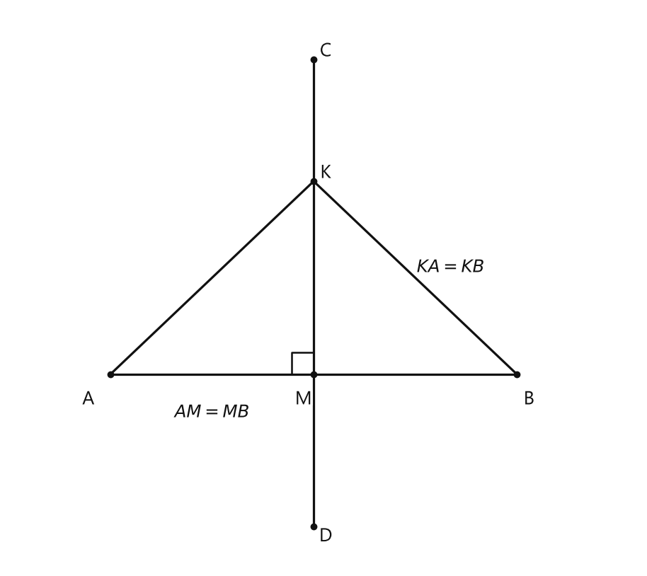
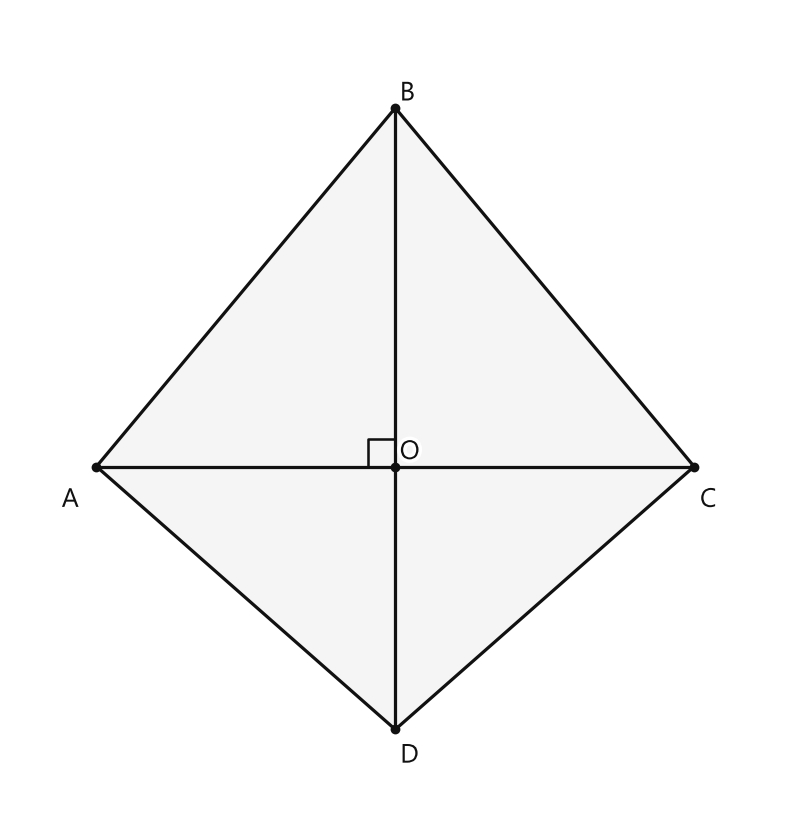

# Занятие 16. Серединный перпендикуляр к отрезку

**Раздел:** Глава II. Признаки равенства треугольников  
**Параграф учебника:** §14. Серединный перпендикуляр к отрезку  
**Страницы:** 89–92

## Цели занятия

К концу занятия ученик умеет:

- узнавать серединный перпендикуляр к отрезку;
- применять теорему о равноудалённых точках;
- доказывать перпендикулярность прямых с помощью серединного перпендикуляра;
- находить длины отрезков и периметры;
- доказывать, что три серединных перпендикуляра к сторонам треугольника пересекаются в одной точке;
- использовать свойство центра описанной окружности.

Выбери блок своего уровня:

- **1–2 балла:** определения и простые вычисления;
- **3–4 балла:** применение теоремы;
- **5–6 баллов:** доказательства по готовому плану;
- **7–8 баллов:** комбинированные задачи;
- **9–10 баллов:** полные доказательства ключевых задач.

## Теория к занятию

### Что такое серединный перпендикуляр

#### Простыми словами

У каждого отрезка есть середина. Если провести через эту середину прямую под прямым углом к отрезку, получится серединный перпендикуляр.

В названии спрятаны два главных признака:

- «серединный» — прямая проходит через середину отрезка;
- «перпендикуляр» — прямая образует с отрезком прямой угол.

#### Определение

**Серединным перпендикуляром к отрезку называется прямая, перпендикулярная этому отрезку и проходящая через его середину.**

Если прямая $CD$ — серединный перпендикуляр к отрезку $AB$, а точка пересечения — $M$, то:

$$CD \perp AB,$$

$$AM=MB.$$

#### Правила

Чтобы доказать, что прямая является серединным перпендикуляром к отрезку, нужно показать два факта:

1. прямая перпендикулярна отрезку;
2. она проходит через середину отрезка.

Только прямого угла недостаточно. Прямая может быть перпендикулярна отрезку, но проходить не через его середину. Получится перпендикуляр, но не серединный перпендикуляр. Середина здесь не для красоты — она обязательна.

### Теорема о серединном перпендикуляре

#### Простыми словами

Серединный перпендикуляр — это прямая, на которой находятся точки, одинаково удалённые от концов отрезка.

Работает и обратное правило:

- если точка лежит на серединном перпендикуляре, расстояния до концов отрезка равны;
- если расстояния до концов отрезка равны, точка лежит на серединном перпендикуляре.

#### Теорема

**Любая точка серединного перпендикуляра к отрезку равноудалена от концов этого отрезка. Если точка равноудалена от концов отрезка, то она лежит на серединном перпендикуляре к этому отрезку.**

Если точка $K$ лежит на серединном перпендикуляре к отрезку $AB$, то:

$$KA=KB.$$

Если известно, что:

$$KA=KB,$$

то точка $K$ лежит на серединном перпендикуляре к отрезку $AB$.

#### Чертёж

<!--geo-figure-spec
{
  "needed": true,
  "kind": "plane",
  "caption": "Серединный перпендикуляр к отрезку $AB$",
  "equal": true,
  "axis": false,
  "xlim": [
    -1,
    5.2
  ],
  "ylim": [
    -1.9,
    3.6
  ],
  "points": {
    "A": [
      0,
      0
    ],
    "M": [
      2,
      0
    ],
    "B": [
      4,
      0
    ],
    "K": [
      2,
      1.9
    ],
    "C": [
      2,
      3.1
    ],
    "D": [
      2,
      -1.5
    ]
  },
  "segments": [
    [
      "A",
      "B"
    ],
    {
      "points": [
        "C",
        "D"
      ],
      "dashed": false,
      "label": "",
      "t": 0.5
    },
    [
      "K",
      "A"
    ],
    [
      "K",
      "B"
    ]
  ],
  "polygons": [],
  "circles": [],
  "labels": {
    "A": {
      "dx": -0.22,
      "dy": -0.25
    },
    "M": {
      "dx": -0.1,
      "dy": -0.25
    },
    "B": {
      "dx": 0.12,
      "dy": -0.25
    },
    "K": {
      "dx": 0.12,
      "dy": 0.08
    },
    "C": {
      "dx": 0.12,
      "dy": 0.08
    },
    "D": {
      "dx": 0.12,
      "dy": -0.1
    }
  },
  "right_angles": [
    {
      "vertex": "M",
      "from": "A",
      "to": "K"
    }
  ],
  "angle_marks": [],
  "texts": [
    {
      "xy": [
        1,
        -0.38
      ],
      "text": "$AM=MB$"
    },
    {
      "xy": [
        3.35,
        1.05
      ],
      "text": "$KA=KB$"
    }
  ]
}
-->

*Серединный перпендикуляр к отрезку AB*

#### Почему теорема работает

Пусть $KM$ — серединный перпендикуляр к отрезку $AB$.

Тогда:

$$KM\perp AB,$$

$$AM=MB.$$

Рассмотрим треугольники $AKM$ и $BKM$.

У них:

$$AM=MB,$$

$$KM=KM,$$

$$\angle AMK=\angle KMB=90^\circ.$$

Значит, треугольники равны по двум катетам.

Поэтому соответствующие стороны равны:

$$KA=KB.$$

Теперь разберём обратное утверждение.

Пусть:

$$KA=KB.$$

Тогда треугольник $AKB$ равнобедренный, потому что его боковые стороны $KA$ и $KB$ равны.

В равнобедренном треугольнике высота, проведённая к основанию, одновременно является медианой. Значит, прямая, проведённая из точки $K$ к середине основания $AB$, перпендикулярна $AB$.

Следовательно, точка $K$ лежит на серединном перпендикуляре к $AB$.

### Геометрическое место точек

#### Простыми словами

Иногда требуется найти не одну точку, а все точки, у которых есть одно и то же свойство.

Например, нужно найти все точки, равноудалённые от точек $A$ и $B$. Они расположены на серединном перпендикуляре к отрезку $AB$.

Множество всех таких точек и называют геометрическим местом точек. Звучит серьёзно, а смысл простой: «все точки с одним общим свойством».

#### Определение

**Геометрическим местом точек плоскости (или пространства) называется множество всех точек плоскости (или пространства), обладающих общим свойством.**

#### Следствие

**Из доказанной теоремы следует, что серединный перпендикуляр к отрезку — это геометрическое место точек плоскости, равноудаленных от концов отрезка.**

То есть все точки $X$, для которых расстояния до $A$ и $B$ равны,

$$XA=XB,$$

образуют серединный перпендикуляр к отрезку $AB$:

$$\{X: XA=XB\}$$

— это серединный перпендикуляр к отрезку $AB$.

#### Ловушки

- Равноудалённость означает равенство расстояний, а не совпадение точек.
- Серединный перпендикуляр проходит через середину отрезка, а не через один из его концов.
- Если точка лежит на серединном перпендикуляре, расстояния до концов отрезка равны.
- Если расстояния до концов отрезка равны, точка лежит на серединном перпендикуляре.

### Как доказывать перпендикулярность диагоналей

Рассмотрим четырёхугольник $ABCD$, в котором:

$$AB=BC,$$

$$AD=DC.$$

Рассмотрим диагональ $AC$.

Точка $B$ равноудалена от концов отрезка $AC$, потому что:

$$AB=BC.$$

Точка $D$ тоже равноудалена от концов отрезка $AC$, потому что:

$$AD=DC.$$

По теореме о серединном перпендикуляре точки $B$ и $D$ лежат на серединном перпендикуляре к $AC$.

Через две точки проходит единственная прямая. Значит, серединный перпендикуляр проходит через точки $B$ и $D$, то есть совпадает с прямой $BD$.

Следовательно:

$$BD\perp AC.$$

Итак:

$$AC\perp BD.$$

#### Ловушка

Не нужно доказывать перпендикулярность диагоналей только по рисунку. Рисунок может быть неточным. Надёжный путь такой:

1. найти две точки, равноудалённые от концов одной диагонали;
2. провести через них прямую;
3. применить свойство серединного перпендикуляра.

### Серединные перпендикуляры треугольника

#### Факт

Серединные перпендикуляры к сторонам треугольника пересекаются в одной точке.

Рассмотрим треугольник $ABC$.

Пусть серединные перпендикуляры к сторонам $AC$ и $AB$ пересекаются в точке $O$.

Так как точка $O$ лежит на серединном перпендикуляре к $AC$, то:

$$OA=OC.$$

Так как точка $O$ лежит на серединном перпендикуляре к $AB$, то:

$$OA=OB.$$

Получили:

$$OB=OA,$$

$$OC=OA.$$

Значит:

$$OB=OC.$$

Точка $O$ равноудалена от концов отрезка $BC$. По теореме о серединном перпендикуляре точка $O$ лежит на серединном перпендикуляре к $BC$.

Таким образом, все три серединных перпендикуляра проходят через одну точку $O$.

#### Замечание

Так как:

$$OA=OB=OC,$$

окружность с центром $O$ и радиусом $OA$ проходит через все вершины треугольника.

Такая окружность называется окружностью, описанной около треугольника.

Точка $O$ является центром описанной окружности.

## Сводка формул «выучить наизусть»

Если $m$ — серединный перпендикуляр к $AB$, а $X\in m$, то:

$$XA=XB.$$

Если:

$$XA=XB,$$

то:

$$X\in m.$$

Для четырёхугольника:

$$AB=BC,\qquad AD=DC$$

следует:

$$AC\perp BD.$$

Для точки пересечения серединных перпендикуляров треугольника:

$$OA=OB=OC.$$

## Правила, которые нельзя путать

- Серединный перпендикуляр — это прямая, а не только часть прямой между какими-то точками.
- Он перпендикулярен отрезку и проходит через его середину.
- Равноудалённость от концов отрезка означает равенство расстояний до этих концов.
- Если точка лежит на серединном перпендикуляре, расстояния до концов равны.
- Если расстояния до концов равны, точка лежит на серединном перпендикуляре.
- В равнобедренном треугольнике высота к основанию является медианой.
- В доказательстве нужно объяснять, почему точка лежит на серединном перпендикуляре.

## Разбор ключевых заданий

### Р1. Четырёхугольник с равными соседними сторонами

**Условие.** В четырёхугольнике $ABCD$:

$$AB=BC,$$

$$AD=DC.$$

Докажите, что:

$$AC\perp BD.$$

#### Решение

Рассмотрим отрезок $AC$.

Точка $B$ равноудалена от концов этого отрезка, потому что:

$$AB=BC.$$

Точка $D$ также равноудалена от концов отрезка $AC$, потому что:

$$AD=DC.$$

По теореме о серединном перпендикуляре точки $B$ и $D$ лежат на серединном перпендикуляре к отрезку $AC$.

Через две точки проходит единственная прямая.

Значит, прямая $BD$ является серединным перпендикуляром к отрезку $AC$.

По определению серединного перпендикуляра:

$$BD\perp AC.$$

Следовательно:

$$AC\perp BD.$$

Ответ: $AC\perp BD$.

> Здесь прямой угол появляется не случайно. Две пары равных отрезков «подсказывают»: точки $B$ и $D$ лежат на одном серединном перпендикуляре.

### Р2. Три серединных перпендикуляра треугольника

**Условие.** Докажите, что серединные перпендикуляры к сторонам треугольника $ABC$ пересекаются в одной точке.

#### Решение

Пусть серединные перпендикуляры к сторонам $AC$ и $AB$ пересекаются в точке $O$.

Так как точка $O$ лежит на серединном перпендикуляре к $AC$, то:

$$OA=OC.$$

Так как точка $O$ лежит на серединном перпендикуляре к $AB$, то:

$$OA=OB.$$

Из равенств:

$$OA=OC,$$

$$OA=OB$$

следует:

$$OB=OC.$$

Значит, точка $O$ равноудалена от концов отрезка $BC$.

По теореме о серединном перпендикуляре точка $O$ лежит на серединном перпендикуляре к $BC$.

Следовательно, третий серединный перпендикуляр также проходит через точку $O$.

Ответ: все три серединных перпендикуляра пересекаются в одной точке $O$.

### Р3. Равноудалённая точка

**Условие.** Точка $M$ лежит на серединном перпендикуляре к отрезку $AB$. Известно, что:

$$AM+MB=15\text{ м}.$$

Найдите $MA$.

#### Решение

Точка $M$ лежит на серединном перпендикуляре к $AB$.

По теореме о серединном перпендикуляре:

$$MA=MB.$$

Обозначим общую длину этих отрезков буквой $x$:

$$MA=MB=x.$$

Тогда:

$$AM+MB=x+x=2x.$$

По условию:

$$2x=15.$$

Разделим обе части равенства на $2$:

$$x=7{,}5.$$

Значит:

$$MA=7{,}5\text{ м}.$$

Проверим:

$$7{,}5+7{,}5=15.$$

Ответ: $7{,}5\text{ м}$.

> Серединный перпендикуляр уже сделал половину работы: два отрезка стали равными. Осталось только аккуратно сложить их.

### Р4. Угол в прямоугольном и равнобедренном треугольнике

**Условие.** Прямая $a$ перпендикулярна отрезку $AB$ и проходит через его середину $K$. Точка $M$ принадлежит прямой $a$. Известно, что:

$$\angle AMB=84^\circ.$$

Найдите:

$$\angle BMK.$$

#### Решение

Прямая $a$ перпендикулярна $AB$ и проходит через середину $K$ отрезка $AB$.

Значит, по определению она является серединным перпендикуляром к $AB$.

Точка $M$ лежит на этом серединном перпендикуляре.

Следовательно:

$$MA=MB.$$

Треугольник $AMB$ равнобедренный.

Рассмотрим треугольники $AMK$ и $BMK$.

У них:

$$AM=BM,$$

$$MK=MK,$$

$$\angle AKM=\angle MKB=90^\circ.$$

Следовательно, треугольники равны по двум сторонам и углу между ними.

Поэтому соответствующие углы равны:

$$\angle AMK=\angle KMB.$$

Луч $MK$ делит угол $AMB$ на два угла:

$$\angle AMK+\angle KMB=\angle AMB.$$

Значит:

$$2\angle KMB=84^\circ.$$

Разделим обе части равенства на $2$:

$$\angle KMB=42^\circ.$$

Угол $\angle KMB$ — это тот же угол, что и $\angle BMK$:

$$\angle BMK=42^\circ.$$

Ответ: $42^\circ$.

> Здесь не пришлось угадывать угол по рисунку: два маленьких треугольника равны, поэтому угол $84^\circ$ честно делится пополам.

### Р5. Периметр через серединный перпендикуляр

**Условие.** Серединный перпендикуляр к стороне $AC$ треугольника $ABC$ пересекает сторону $BC$ в точке $K$. Известно, что:

$$AB=5\text{ см},\qquad BC=7\text{ см}.$$

Найдите периметр треугольника $ABK$.

#### Решение

Точка $K$ лежит на серединном перпендикуляре к отрезку $AC$.

По теореме о серединном перпендикуляре:

$$KA=KC.$$

Точка $K$ лежит на стороне $BC$. Поэтому отрезок $BC$ состоит из двух частей:

$$BK+KC=BC.$$

Периметр треугольника $ABK$ равен:

$$P_{ABK}=AB+BK+KA.$$

Так как:

$$KA=KC,$$

заменим $KA$ на $KC$:

$$P_{ABK}=AB+BK+KC.$$

По условию:

$$BK+KC=BC.$$

Значит:

$$P_{ABK}=AB+BC.$$

Подставим известные значения:

$$P_{ABK}=5+7.$$

$$P_{ABK}=12\text{ см}.$$

Ответ: $12\text{ см}$.

### Р6. Периметр четырёхугольника

**Условие.** Точки $M$ и $K$ лежат на серединном перпендикуляре к отрезку $AB$ по разные стороны от прямой $AB$. Известно, что:

$$MA=16\text{ см},\qquad KB=12\text{ см}.$$

Найдите периметр четырёхугольника $AMBK$.

#### Решение

Точка $M$ лежит на серединном перпендикуляре к $AB$.

Значит:

$$MA=MB.$$

По условию:

$$MA=16\text{ см}.$$

Следовательно:

$$MB=16\text{ см}.$$

Точка $K$ также лежит на серединном перпендикуляре к $AB$.

Значит:

$$KA=KB.$$

По условию:

$$KB=12\text{ см}.$$

Следовательно:

$$KA=12\text{ см}.$$

Периметр четырёхугольника $AMBK$ равен сумме его сторон:

$$P=AM+MB+BK+KA.$$

Подставим известные длины:

$$P=16+16+12+12.$$

Сгруппируем равные слагаемые:

$$P=32+24.$$

$$P=56\text{ см}.$$

Ответ: $56\text{ см}$.

> Рисунок может показывать много линий, но теорема видит только главное: $MA=MB$ и $KA=KB$.

### Р7. Серединный перпендикуляр к хорде

**Условие.** Докажите, что серединный перпендикуляр к хорде окружности проходит через центр окружности.

#### Решение

Пусть $AB$ — хорда окружности с центром $O$.

Точки $A$ и $B$ лежат на окружности.

Значит, отрезки $OA$ и $OB$ являются радиусами этой окружности.

Все радиусы одной окружности равны:

$$OA=OB.$$

Следовательно, точка $O$ равноудалена от концов отрезка $AB$.

По теореме о серединном перпендикуляре точка $O$ лежит на серединном перпендикуляре к отрезку $AB$.

Значит, серединный перпендикуляр к хорде $AB$ проходит через центр окружности $O$.

Ответ: серединный перпендикуляр к хорде проходит через центр окружности.

### Р8. Серединные перпендикуляры в равнобедренном треугольнике

**Условие.** В равнобедренном треугольнике $ABC$:

$$AB=BC.$$

Серединные перпендикуляры к боковым сторонам $BC$ и $AB$ пересекаются в точке $O$. Докажите, что расстояния от $O$ до точек $A$, $B$, $C$ равны.

#### Решение

Точка $O$ лежит на серединном перпендикуляре к отрезку $BC$.

По теореме о серединном перпендикуляре любая его точка равноудалена от концов отрезка.

Поэтому:

$$OB=OC.$$

Точка $O$ лежит на серединном перпендикуляре к отрезку $AB$.

Значит:

$$OA=OB.$$

Теперь сравним полученные равенства:

$$OA=OB,\qquad OB=OC.$$

Следовательно:

$$OA=OB=OC.$$

Значит, точка $O$ находится на одинаковом расстоянии от всех трёх вершин треугольника. Серединный перпендикуляр здесь работает как «линейка равных расстояний».

Ответ:

$$OA=OB=OC.$$

### Р9. Равенство отрезков в симметричной конфигурации

**Условие.** В равнобедренном треугольнике $ABC$ боковые стороны равны:

$$AB=BC.$$

Серединные перпендикуляры к сторонам $AB$ и $BC$ пересекаются в точке $O$. Пусть они пересекают соответственно стороны $AC$ и $AC$ в точках $N$ и $K$. Докажите, что соответствующие отрезки, расположенные симметрично относительно высоты треугольника, равны.

#### Решение

Так как:

$$AB=BC,$$

треугольник $ABC$ равнобедренный.

Его высота, проведённая из вершины $B$ к основанию $AC$, является осью симметрии треугольника.

При отражении относительно этой высоты:

- сторона $AB$ переходит в сторону $BC$;
- серединный перпендикуляр к $AB$ переходит в серединный перпендикуляр к $BC$;
- точка $N$ переходит в точку $K$;
- точка $O$ остаётся на оси симметрии.

При симметрии длины отрезков сохраняются. Поэтому отрезки, переходящие друг в друга, равны:

$$MN=KL,$$

а также:

$$MO=KO.$$

Главная ловушка: симметрия меняет расположение отрезка, но не его длину. Геометрия не «растягивает» фигуру, она только отражает её.

Ответ:

$$MN=KL,\qquad MO=KO.$$

### Р10. Общая хорда двух окружностей

**Условие.** Две окружности с центрами $O_1$ и $O_2$ пересекаются в точках $A$ и $B$. Докажите, что прямая $O_1O_2$ перпендикулярна общей хорде $AB$.

#### Решение

Точки $A$ и $B$ лежат на одной окружности с центром $O_1$.

Все радиусы одной окружности равны, поэтому:

$$O_1A=O_1B.$$

Значит, точка $O_1$ равноудалена от концов отрезка $AB$.

По теореме о серединном перпендикуляре точка $O_1$ лежит на серединном перпендикуляре к отрезку $AB$.

Точки $A$ и $B$ лежат также на окружности с центром $O_2$.

Поэтому:

$$O_2A=O_2B.$$

Значит, точка $O_2$ тоже равноудалена от концов отрезка $AB$.

Следовательно, точка $O_2$ также лежит на серединном перпендикуляре к $AB$.

Через две точки проходит единственная прямая.

Поэтому прямая, проходящая через точки $O_1$ и $O_2$, совпадает с серединным перпендикуляром к $AB$:

$$O_1O_2\text{ — серединный перпендикуляр к }AB.$$

По определению серединный перпендикуляр перпендикулярен отрезку.

Значит:

$$O_1O_2\perp AB.$$

Ответ:

$$O_1O_2\perp AB.$$

## Мини-проверка

1. Если точка лежит на серединном перпендикуляре к $AB$, то:

$$\boxed{XA=XB}.$$

2. Если:

$$XA=XB,$$

то точка $X$:

$$\boxed{\text{лежит на серединном перпендикуляре к }AB}.$$

3. Центр описанной окружности треугольника — это точка пересечения:

$$\boxed{\text{серединных перпендикуляров к его сторонам}}.$$

4. Если:

$$AB=BC,\qquad AD=DC,$$

то:

$$\boxed{AC\perp BD}.$$

5. Для задачи с $AM+MB=15$ и $AM=MB$ получаем:

$$\boxed{AM=7{,}5}.$$

## Практические задания

Выбери свой уровень и решай только этот блок. В блоке должна закрепиться вся тема параграфа. Ответы не приводятся.

### Уровень 1–2 балла

**С1.** Какая прямая называется серединным перпендикуляром к отрезку $AB$?

1) Прямая, проходящая через точку $A$ и перпендикулярная $AB$  
2) Прямая, параллельная $AB$ и проходящая через середину $AB$  
3) Прямая, перпендикулярная $AB$ и проходящая через середину $AB$  
4) Прямая, проходящая через точку $B$ и параллельная $AB$  
5) Прямая, содержащая отрезок $AB$

**С2.** Точка $M$ лежит на серединном перпендикуляре к отрезку $AB$. Выберите верное равенство.

1) $AM=AB$  
2) $MB=AB$  
3) $AM=MB$  
4) $AM+MB=AB$  
5) $AM\perp MB$

**С3.** Точка $K$ — середина отрезка $AB$, а прямая $l$ перпендикулярна $AB$ и проходит через $K$. Как называется прямая $l$?

1) Медиана отрезка $AB$  
2) Биссектриса угла $ABK$  
3) Серединный перпендикуляр к отрезку $AB$  
4) Высота треугольника $ABK$  
5) Диагональ отрезка $AB$

**С4.** Точка $P$ равноудалена от концов отрезка $CD$: $PC=PD$. Что можно утверждать?

1) Точка $P$ лежит на отрезке $CD$  
2) Точка $P$ лежит на серединном перпендикуляре к отрезку $CD$  
3) Точка $P$ является серединой отрезка $CD$  
4) Прямая $PC$ перпендикулярна $CD$  
5) $PC=CD$

**С5.** Какое множество точек является геометрическим местом точек, равноудалённых от концов отрезка $AB$?

1) Прямая $AB$  
2) Окружность с центром в точке $A$  
3) Окружность с центром в точке $B$  
4) Серединный перпендикуляр к отрезку $AB$  
5) Отрезок $AB$

**С6.** Точка $M$ лежит на серединном перпендикуляре к отрезку $AB$, причём $MA=9$ см. Найдите $MB$.

1) $3$ см  
2) $9$ см  
3) $18$ см  
4) $81$ см  
5) Невозможно определить

**С7.** Отрезок $AB$ имеет длину $14$ см. Прямая $l$ является серединным перпендикуляром к $AB$. На каком расстоянии от точки $A$ находится середина $K$ отрезка $AB$?

1) $3$ см  
2) $7$ см  
3) $14$ см  
4) $21$ см  
5) $28$ см

**С8.** Точки $M$ и $N$ лежат на серединном перпендикуляре к отрезку $AB$. Выберите верное утверждение.

1) $MA=AB$  
2) $NA=NB$  
3) $MN=AB$  
4) $MA=MN$  
5) $MB=AB$

**С9.** Точка $M$ лежит на серединном перпендикуляре к отрезку $AB$. Известно, что $AM+MB=26$ см. Найдите длину отрезка $AM$.

**С10.** Прямая $a$ перпендикулярна отрезку $AB$ и проходит через его середину $K$. Точка $M$ принадлежит прямой $a$, причём $\angle AMB=72^\circ$. Найдите $\angle BMK$.

**С11.** Серединный перпендикуляр к стороне $AC$ треугольника $ABC$ пересекает сторону $BC$ в точке $K$. Известно, что $AB=8$ см, $BK=5$ см и $KC=4$ см. Найдите периметр треугольника $ABK$.

**С12.** В треугольнике $ABC$ стороны $AB$ и $BC$ равны. Докажите, что прямая $AC$ является серединным перпендикуляром к отрезку $BD$, если точка $D$ лежит на прямой $AC$ и $DB=DC$.

**С13.** Выберите верное утверждение о серединном перпендикуляре к отрезку $AB$.

1) Он параллелен отрезку $AB$.  
2) Он проходит через один из концов отрезка $AB$.  
3) Он перпендикулярен отрезку $AB$ и проходит через его середину.  
4) Он делит отрезок $AB$ на три равные части.  
5) Он является биссектрисой любого угла.

**С14.** Точка $M$ лежит на серединном перпендикуляре к отрезку $AB$. Известно, что $MA=8$ см. Найдите $MB$.

**С15.** Точка $K$ — середина отрезка $AB$, а прямая $m$ перпендикулярна отрезку $AB$ и проходит через точку $K$. Как называется прямая $m$?

**С16.** Из точек $P$, $Q$, $R$ только одна лежит на серединном перпендикуляре к отрезку $AB$. Известно: $PA=PB$, $QA>QB$, $RA<RB$. Какая точка лежит на серединном перпендикуляре к отрезку $AB$?

**С17.** На серединном перпендикуляре к отрезку $CD$ взята точка $N$. Найдите $NC$, если $ND=13$ см.

**С18.** Выберите все верные утверждения.

1) Любая точка серединного перпендикуляра к отрезку равноудалена от концов этого отрезка.  
2) Серединный перпендикуляр проходит через середину отрезка.  
3) Серединный перпендикуляр всегда параллелен данному отрезку.  
4) Точка, равноудалённая от концов отрезка, лежит на его серединном перпендикуляре.  
5) Серединный перпендикуляр проходит только через один конец отрезка.

**С19.** Отрезок $AB$ имеет длину $18$ см. Прямая $l$ проходит через его середину и перпендикулярна отрезку $AB$. Найдите расстояние от середины отрезка $AB$ до точки $A$.

**С20.** Точка $M$ равноудалена от точек $A$ и $B$: $MA=MB$. Какой вывод можно сделать о положении точки $M$?

**С21.** В треугольнике $ABC$ точка $K$ лежит на серединном перпендикуляре к стороне $AC$. Известно, что $KA=6$ см. Найдите $KC$.

**С22.** Выберите верное равенство, если точка $P$ лежит на серединном перпендикуляре к отрезку $MN$.

1) $PM=PN$  
2) $PM=MN$  
3) $PN=MN$  
4) $PM=2PN$  
5) $MN=2PM$

**С23.** Серединные перпендикуляры к сторонам $AB$ и $BC$ треугольника $ABC$ пересекаются в точке $O$. Запишите два равенства расстояний, которые следуют из положения точки $O$ на этих серединных перпендикулярах.

**С24.** Две окружности пересекаются в точках $A$ и $B$, их центры — точки $O_1$ и $O_2$. Известно, что $O_1A=O_1B$ и $O_2A=O_2B$. Как расположена прямая $O_1O_2$ относительно отрезка $AB$?

**С25.** Выберите определение, соответствующее серединному перпендикуляру к отрезку $AB$.

1) Прямая, проходящая через конец отрезка $AB$ и перпендикулярная ему  
2) Прямая, перпендикулярная отрезку $AB$ и проходящая через его середину  
3) Прямая, параллельная отрезку $AB$ и проходящая через его середину  
4) Отрезок, соединяющий середину отрезка $AB$ с его концом  
5) Прямая, проходящая через середину отрезка $AB$ под углом $45^\circ$

**С26.** Точка $M$ лежит на серединном перпендикуляре к отрезку $AB$. Выберите верное равенство.

1) $MA=AB$  
2) $MB=AB$  
3) $MA=MB$  
4) $MA+MB=AB$  
5) $MA=2MB$

**С27.** Точка $K$ — середина отрезка $AB$, а прямая $c$ проходит через $K$ и перпендикулярна отрезку $AB$. Какая точка обязательно лежит на серединном перпендикуляре к отрезку $AB$?

1) Только точка $A$  
2) Только точка $B$  
3) Точка $K$  
4) Любая точка отрезка $AB$  
5) Ни одна точка

**С28.** Точка $M$ равноудалена от концов отрезка $AB$: $MA=MB$. На какой прямой лежит точка $M$?

1) На прямой $AB$  
2) На серединном перпендикуляре к отрезку $AB$  
3) На прямой, проходящей через точку $A$ и перпендикулярной $AB$  
4) На прямой, проходящей через точку $B$ и параллельной $AB$  
5) На любой прямой, проходящей через середину $AB$

**С29.** Точка $M$ лежит на серединном перпендикуляре к отрезку $AB$, причём $AM=9$ см. Найдите длину отрезка $MB$.

1) $4{,}5$ см  
2) $9$ см  
3) $18$ см  
4) $81$ см  
5) $0$ см

**С30.** Точка $M$ лежит на серединном перпендикуляре к отрезку $AB$, причём $AM+MB=18$ см. Найдите длину отрезка $AM$.

**С31.** Точки $M$ и $K$ лежат на серединном перпендикуляре к отрезку $AB$. Известно, что $MA=MB=16$ см и $KA=KB=12$ см. Найдите периметр четырёхугольника $AMBK$.

**С32.** Прямая $MK$ является серединным перпендикуляром к отрезку $AB$. Известно, что $\angle AMB=84^\circ$. Найдите $\angle BMK$.

**С33.** Серединный перпендикуляр к стороне $AC$ треугольника $ABC$ пересекает сторону $BC$ в точке $K$. Известно, что $AB=5$ см и $BC=7$ см. Найдите периметр треугольника $ABK$.

**С34.** В треугольнике $ABC$ точка $O$ лежит на серединном перпендикуляре к стороне $AB$ и на серединном перпендикуляре к стороне $BC$. Выберите верное утверждение.

1) $OA=OB=OC$  
2) $OA=AB=BC$  
3) $OB=AC$  
4) $OA+OB=OC$  
5) $OA=OC+OB$

**С35.** Хорда $AB$ окружности имеет середину $K$, а $O$ — центр окружности. Известно, что $OK\perp AB$. Выберите верное утверждение.

1) $O$ лежит на серединном перпендикуляре к хорде $AB$  
2) $O$ лежит на хорде $AB$  
3) $K$ является концом хорды $AB$  
4) $OK$ параллелен хорде $AB$  
5) $OA\ne OB$

**С36.** Две окружности с центрами $O_1$ и $O_2$ пересекаются в точках $A$ и $B$. Выберите верное утверждение.

1) $O_1O_2\parallel AB$  
2) $O_1O_2\perp AB$  
3) $O_1O_2=AB$  
4) $O_1A\perp O_2A$  
5) $O_1B\parallel O_2B$

### Уровень 3–4 балла

**С1.** Точка $M$ лежит на серединном перпендикуляре к отрезку $AB$. Известно, что $MA=8$ см. Найдите длину отрезка $MB$.

**С2.** Точка $K$ — середина отрезка $AB$, а прямая $c$ перпендикулярна отрезку $AB$ и проходит через точку $K$. Точка $M$ лежит на прямой $c$. Известно, что $AM=13$ см. Найдите $BM$.

**С3.** Точка $P$ равноудалена от концов отрезка $CD$: $PC=PD=10$ см. Как расположена точка $P$ относительно серединного перпендикуляра к отрезку $CD$?

**С4.** Точка $M$ лежит на серединном перпендикуляре к отрезку $AB$. Известно, что $AM+MB=24$ см. Найдите длины отрезков $AM$ и $MB$.

**С5.** Прямая $a$ перпендикулярна отрезку $AB$ и проходит через его середину $K$. Точка $M$ принадлежит прямой $a$, а $\angle AMB=70^\circ$. Найдите $\angle BMK$.

**С6.** Серединный перпендикуляр к стороне $AC$ треугольника $ABC$ пересекает сторону $BC$ в точке $K$. Известно, что $AB=9$ см, $BK=4$ см, $KC=6$ см. Найдите периметр треугольника $ABK$.

**С7.** Серединный перпендикуляр к отрезку $AB$ пересекает отрезок $AB$ в точке $K$. Точка $M$ лежит на этом серединном перпендикуляре. Известно, что $AK=5$ см и $MK=12$ см. Найдите длины отрезков $MA$ и $MB$.

**С8.** Точки $M$ и $N$ лежат на серединном перпендикуляре к отрезку $AB$ по разные стороны от прямой $AB$. Известно, что $MA=15$ см и $NB=11$ см. Найдите периметр четырёхугольника $AMBN$.

**С9.** В окружности с центром $O$ хорда $AB$ имеет длину $12$ см. Докажите, что серединный перпендикуляр к хорде $AB$ проходит через точку $O$.

**С10.** В треугольнике $ABC$ известно, что $AB=AC$. Точки $K$ и $L$ — середины отрезков $BC$ и $AB$ соответственно. Докажите, что серединные перпендикуляры к отрезкам $BC$ и $AB$ пересекаются на серединном перпендикуляре к отрезку $AC$.

**С11.** Две окружности с центрами $O_1$ и $O_2$ пересекаются в точках $A$ и $B$. Докажите, что прямая $O_1O_2$ является серединным перпендикуляром к отрезку $AB$.

**С12.** На одной стороне от прямой $a$ расположены точки $A$ и $B$, не лежащие на этой прямой. Постройте на прямой $a$ точку $M$, равноудалённую от точек $A$ и $B$. Укажите, какие линии нужно построить для выполнения построения.

**С13.** Точка $M$ лежит на серединном перпендикуляре к отрезку $AB$. Найдите $MB$, если $MA=18$ см.

**С14.** Серединный перпендикуляр к отрезку $CD$ проходит через точку $P$. Найдите длину $PC$, если $PD=7{,}5$ см.

**С15.** Отрезок $AB$ имеет длину $14$ см. Прямая $m$ перпендикулярна отрезку $AB$ и проходит через его середину $K$. Найдите расстояние от точки $K$ до точки $A$.

**С16.** Точка $N$ равноудалена от концов отрезка $EF$: $NE=NF$. На каком геометрическом месте точек лежит точка $N$?

**С17.** Точки $P$ и $Q$ лежат на серединном перпендикуляре к отрезку $AB$. Известно, что $PA=11$ см и $QB=15$ см. Найдите $PB$ и $QA$.

**С18.** Точка $K$ лежит на серединном перпендикуляре к отрезку $MN$. Известно, что $MK=2x+1$ см, а $NK=15$ см. Найдите $x$.

**С19.** Прямая $a$ перпендикулярна отрезку $AB$ и проходит через его середину. Точка $M$ лежит на прямой $a$, $MA=13$ см. Найдите $MB$.

**С20.** Серединный перпендикуляр к стороне $AC$ треугольника $ABC$ пересекает сторону $BC$ в точке $K$. Известно, что $AB=8$ см, $BK=5$ см и $KC=5$ см. Найдите периметр треугольника $ABK$.

**С21.** В четырёхугольнике $ABCD$ выполнено $AB=BC$ и $AD=DC$. Объясните, почему диагональ $AC$ является серединным перпендикуляром к диагонали $BD$.

**С22.** Серединные перпендикуляры к сторонам $AB$ и $BC$ треугольника $ABC$ пересекаются в точке $O$. Известно, что $OA=7$ см. Найдите $OB$ и $OC$.

**С23.** Две окружности с центрами $O_1$ и $O_2$ пересекаются в точках $A$ и $B$. Известно, что $O_1A=O_1B$ и $O_2A=O_2B$. Докажите, что прямая $O_1O_2$ перпендикулярна отрезку $AB$.

**С24.** По одну сторону от прямой $a$ расположены точки $A$ и $B$. Постройте на прямой $a$ точку $M$, для которой $MA=MB$. Укажите, каким геометрическим местом точек является множество всех точек, равноудалённых от $A$ и $B$.

**С25.** Точка $M$ лежит на серединном перпендикуляре к отрезку $AB$. Найдите длину отрезка $MB$, если $MA=13$ см.

**С26.** Точка $K$ лежит на серединном перпендикуляре к отрезку $AB$. Известно, что $KA+KB=28$ см. Найдите длину отрезка $KA$.

**С27.** Прямая $m$ перпендикулярна отрезку $AB$ и проходит через его середину $K$. Точка $M$ принадлежит прямой $m$, а $MA=10$ см. Найдите длину отрезка $MB$.

**С28.** Прямая $m$ является серединным перпендикуляром к отрезку $AB$ и пересекает его в точке $K$. Точка $M$ лежит на прямой $m$, причём $\angle AMB=70^\circ$. Найдите $\angle BMK$.

**С29.** Серединный перпендикуляр к стороне $AC$ треугольника $ABC$ пересекает сторону $BC$ в точке $K$. Известно, что $AB=9$ см, $BC=14$ см и $CK=7$ см. Найдите периметр треугольника $ABK$.

**С30.** В четырёхугольнике $ABCD$ выполнены равенства $AB=BC$ и $AD=DC$. Докажите, что диагональ $AC$ перпендикулярна диагонали $BD$.

**С31.** Хорда $AB$ окружности имеет середину $K$, а $O$ — центр окружности. Докажите, что прямая $OK$ перпендикулярна хорде $AB$.

**С32.** Точки $A$ и $B$ не совпадают. Опишите геометрическое место всех точек $M$ плоскости, для которых $MA=MB$. Укажите, как оно связано с отрезком $AB$.

**С33.** Точки $A$ и $B$ расположены по одну сторону от прямой $a$. Опишите построение точки $M$ на прямой $a$, для которой $MA=MB$.

**С34.** Отрезок $AB$ является основанием равнобедренного треугольника $ABC$, в котором $CA=CB$. Опишите геометрическое место возможных вершин $C$ таких треугольников.

**С35.** Две окружности с центрами $O_1$ и $O_2$ пересекаются в точках $A$ и $B$. Докажите, что прямая $O_1O_2$ перпендикулярна общей хорде $AB$.

**С36.** В треугольнике $ABC$ серединные перпендикуляры к сторонам $AB$ и $BC$ пересекаются в точке $O$. Докажите, что $OA=OB=OC$.

### Уровень 5–6 баллов

**С1.** Точка $M$ лежит на серединном перпендикуляре к отрезку $AB$. Известно, что $AM=3{,}6$ см. Найдите длину отрезка $BM$.

**С2.** Точка $K$ — середина отрезка $AB$, а прямая $m$ перпендикулярна отрезку $AB$ и проходит через точку $K$. Точка $M$ лежит на прямой $m$, причём $\angle AMB=72^\circ$. Найдите величину угла $BMK$.

**С3.** Серединный перпендикуляр к отрезку $AC$ пересекает сторону $BC$ треугольника $ABC$ в точке $K$. Известно, что $AB=8$ см, $BK=5$ см, $KC=4$ см. Найдите периметр треугольника $ABK$.

**С4.** Точки $M$ и $N$ лежат на серединном перпендикуляре к отрезку $AB$ по разные стороны от прямой $AB$. Известно, что $MA=13$ см и $NB=9$ см. Найдите периметр четырёхугольника $AMBN$.

**С5.** В равнобедренном треугольнике $ABC$ с основанием $AC$ точка $M$ лежит на серединном перпендикуляре к отрезку $AC$. Докажите, что $MA=MC$ и объясните, почему прямая $BM$ является серединным перпендикуляром к отрезку $AC$.

**С6.** В четырёхугольнике $ABCD$ известно, что $AB=BC$ и $AD=DC$. Докажите, что диагональ $AC$ является серединным перпендикуляром к диагонали $BD$.

**С7.** Точки $A$ и $B$ не лежат на одной прямой с точкой $M$. Известно, что $MA=MB=7$ см. На какой линии расположена точка $M$? Сформулируйте ответ с использованием понятия серединного перпендикуляра.

**С8.** Даны отрезок $AB$ длиной $10$ см и точка $M$, для которой $MA=MB=13$ см. Найдите расстояние от точки $M$ до прямой $AB$, если основание перпендикуляра из точки $M$ на прямую $AB$ является серединой отрезка $AB$.

**С9.** В окружности с центром $O$ хорда $AB$ не является диаметром. Докажите, что прямая $O K$, где $K$ — середина хорды $AB$, перпендикулярна хорде $AB$.

**С10.** Две окружности с центрами $O_1$ и $O_2$ пересекаются в точках $A$ и $B$. Докажите, что прямая $O_1O_2$ перпендикулярна общей хорде $AB$.

**С11.** На прямой $a$ требуется построить точку $M$, равноудалённую от точек $A$ и $B$, расположенных по одну сторону от прямой $a$. Опишите последовательность построения с помощью линейки и циркуля.

**С12.** Найдите геометрическое место вершин всех равнобедренных треугольников с данным основанием $AB$, если вершина треугольника не может лежать на прямой $AB`.

**С13.** Точка $M$ лежит на серединном перпендикуляре к отрезку $AB$. Известно, что $MA=3{,}8$ см. Найдите длину отрезка $MB$.

**С14.** Отрезок $AB$ имеет длину $12$ см. Прямая $a$ проходит через середину отрезка $AB$ и перпендикулярна ему. Точка $M$ лежит на прямой $a$, причём $MA=10$ см. Найдите периметр треугольника $AMB$.

**С15.** Точка $K$ лежит на серединном перпендикуляре к отрезку $AB$. Известно, что $KA=2x+1$ см, а $KB=3x-4$ см. Найдите $x$ и длины отрезков $KA$ и $KB$.

**С16.** Прямая $m$ перпендикулярна отрезку $AB$ и проходит через его середину $K$. Точка $M$ лежит на прямой $m$, причём $\angle AMB=70^\circ$. Найдите углы $\angle AMK$ и $\angle BMK$.

**С17.** В треугольнике $ABC$ серединный перпендикуляр к стороне $AC$ пересекает сторону $BC$ в точке $K$. Известно, что $AB=9$ см, $BK=4$ см, $KC=6$ см. Найдите периметр треугольника $ABK$.

**С18.** Точка $M$ равноудалена от концов отрезка $AB$, причём $MA=MB=13$ см. Середина отрезка $AB$ — точка $K$, $AK=5$ см. Найдите длину отрезка $MK$.

**С19.** В четырёхугольнике $ABCD$ выполнены равенства $AB=BC$ и $AD=DC$. Докажите, что диагональ $AC$ является серединным перпендикуляром к диагонали $BD$.

**С20.** Две точки $M$ и $N$ лежат на серединном перпендикуляре к отрезку $AB по одну сторону от прямой $AB$. Известно, что $MA=MB=17$ см и $NA=NB=10$ см. Найдите периметр четырёхугольника $AMBN$.

**С21.** Хорда $AB$ окружности имеет длину $14$ см. Центр окружности — точка $O$. Докажите, что прямая, проходящая через $O$ и середину хорды $AB$, перпендикулярна хорде $AB$.

**С22.** В треугольнике $ABC$ серединные перпендикуляры к сторонам $AB$ и $BC$ пересекаются в точке $O$. Известно, что $OA=7$ см. Найдите $OB$ и $OC$.

**С23.** Даны две точки $A$ и $B$, расположенные по одну сторону от прямой $a$. Опишите построение точки $M$ на прямой $a$, для которой $MA=MB$. Обоснуйте, почему построенная точка обладает требуемым свойством.

**С24.** Найдите геометрическое место вершин всех равнобедренных треугольников с данным основанием $AB$. Укажите, какие точки не могут быть вершинами таких треугольников.

**С25.** Точка $M$ лежит на серединном перпендикуляре к отрезку $AB$. Известно, что $MA=13$ см. Найдите длину отрезка $MB$.

**С26.** Серединный перпендикуляр к стороне $AC$ треугольника $ABC$ пересекает сторону $BC$ в точке $K$. Известно, что $AB=8$ см, $BK=5$ см и $KC=4$ см. Найдите периметр треугольника $ABK$.

**С27.** Прямая $a$ является серединным перпендикуляром к отрезку $AB$, а точка $M$ лежит на прямой $a$. Угол $AMB$ равен $70^\circ$. Найдите углы $AMK$ и $BMK$, где $K$ — середина отрезка $AB$.

**С28.** Точки $M$ и $N$ лежат на серединном перпендикуляре к отрезку $AB$ по одну сторону от прямой $AB$. Известно, что $MA=18$ см, $NB=11$ см. Найдите периметр четырёхугольника $AMBN$.

**С29.** В четырёхугольнике $ABCD$ выполнено $AB=BC$ и $AD=DC$. Докажите, что диагональ $AC$ является серединным перпендикуляром к диагонали $BD$.

**С30.** Две окружности с центрами $O_1$ и $O_2$ пересекаются в точках $A$ и $B$. Докажите, что прямая $O_1O_2$ является серединным перпендикуляром к отрезку $AB$.

### Уровень 7–8 баллов

**С1.** Точка $M$ лежит на серединном перпендикуляре к отрезку $AB$. Известно, что $MA=3x+2$ см, $MB=5x-6$ см. Найдите $x$ и длину отрезка $AB$, если $AB=8$ см.

**С2.** Прямая $a$ проходит через середину $K$ отрезка $AB$ и перпендикулярна ему. Точка $M$ лежит на прямой $a$, причем $\angle AMB=70^\circ$. Найдите углы треугольника $AMK$ и обоснуйте ответ.

**С3.** В четырехугольнике $ABCD$ стороны $AB$ и $BC$ равны, а стороны $AD$ и $CD$ равны. Диагонали $AC$ и $BD$ пересекаются в точке $O$.

<!--geo-figure-spec
{
  "needed": true,
  "kind": "plane",
  "caption": "Четырёхугольник $ABCD$ с диагоналями $AC$ и $BD$",
  "equal": true,
  "axis": false,
  "xlim": [
    -0.7,
    5.7
  ],
  "ylim": [
    -2.8,
    3.8
  ],
  "points": {
    "A": [
      0,
      0
    ],
    "B": [
      2.5,
      3
    ],
    "C": [
      5,
      0
    ],
    "D": [
      2.5,
      -2.2
    ],
    "O": [
      2.5,
      0
    ]
  },
  "segments": [
    [
      "A",
      "B"
    ],
    [
      "B",
      "C"
    ],
    [
      "C",
      "D"
    ],
    [
      "D",
      "A"
    ],
    [
      "A",
      "C"
    ],
    [
      "B",
      "D"
    ]
  ],
  "polygons": [
    {
      "vertices": [
        "A",
        "B",
        "C",
        "D"
      ],
      "fill": 0.04
    }
  ],
  "circles": [],
  "labels": {
    "A": {
      "dx": -0.22,
      "dy": -0.28
    },
    "B": {
      "dx": 0.1,
      "dy": 0.12
    },
    "C": {
      "dx": 0.12,
      "dy": -0.28
    },
    "D": {
      "dx": 0.12,
      "dy": -0.22
    },
    "O": {
      "dx": 0.12,
      "dy": 0.12
    }
  },
  "right_angles": [
    {
      "vertex": "O",
      "from": "A",
      "to": "B"
    }
  ],
  "angle_marks": [],
  "texts": []
}
-->

*Четырёхугольник ABCD с диагоналями AC и BD*

Докажите, что $AC\perp BD$.

**С4.** Серединный перпендикуляр к стороне $AC$ треугольника $ABC$ пересекает сторону $BC$ в точке $K$. Известно, что $AB=9$ см, $BK=4$ см и $KC=6$ см. Найдите периметр треугольника $ABK$ и периметр треугольника $ABC$.

**С5.** Точки $M$ и $N$ лежат на серединном перпендикуляре к отрезку $AB$ по разные стороны от прямой $AB$. Известно, что $MA=17$ см, $NB=10$ см, а $MN=21$ см. Найдите периметр четырехугольника $AMBN$.

**С6.** Окружность с центром $O$ пересекает хорду $AB$ в ее концах $A$ и $B$. Докажите, что серединный перпендикуляр к хорде $AB$ проходит через точку $O$. Затем найдите расстояние от $O$ до хорды $AB$, если радиус окружности равен $13$ см, а $AB=10$ см.

**С7.** В треугольнике $ABC$ известно, что $AB=AC=13$ см, а $BC=10$ см. Серединные перпендикуляры к сторонам $AB$ и $AC$ пересекаются в точке $O$. Найдите $OB$, $OC$ и расстояние от точки $O$ до стороны $BC$.

**С8.** В треугольнике $ABC$ серединные перпендикуляры к сторонам $AB$ и $BC$ пересекаются в точке $O$. Известно, что $OA=OB=OC=10$ см. Докажите, что точка $O$ лежит на серединном перпендикуляре к стороне $AC$. Объясните, почему серединные перпендикуляры ко всем трем сторонам треугольника проходят через одну точку.

**С9.** Даны точки $A$ и $B$, расположенные по одну сторону от прямой $a$. Расстояния от точки $A$ до прямой $a$ и от точки $B$ до прямой $a$ равны соответственно $6$ см и $2$ см. Перпендикулярные проекции точек $A$ и $B$ на прямую $a$ находятся на расстоянии $8$ см друг от друга. Постройте на прямой $a$ точку $M$, равноудалённую от $A$ и $B$, и обоснуйте единственность построения.

**С10.** Найдите геометрическое место вершин $C$ равнобедренных треугольников $ABC$ с данным основанием $AB$, если $AB=12$ см. Опишите это множество с учетом того, что треугольник должен быть невырожденным, и обоснуйте ответ.

**С11.** Две окружности с центрами $O_1$ и $O_2$ имеют разные радиусы и пересекаются в точках $A$ и $B$. Докажите, что прямая $O_1O_2$ перпендикулярна общей хорде $AB$. Укажите, какую точку отрезка $AB$ проходит прямая $O_1O_2$.

**С12.** В треугольнике $ABC$ точка $K$ является серединой стороны $BC$, а $AK\perp BC$. Докажите, что $AB=AC$. Затем докажите обратное утверждение: если в треугольнике $ABC$ $AB=AC$, то прямая $AK$, где $K$ — середина $BC$, перпендикулярна $BC$.

**С13.** Точка $M$ лежит на серединном перпендикуляре к отрезку $AB$. Известно, что $MA=3x+1$ см, $MB=5x-7$ см. Найдите длину отрезка $AB$, если $x=4$ и $AB$ перпендикулярен серединному перпендикуляру в точке $K$, причём $AK=6$ см.

**С14.** Прямая $l$ является серединным перпендикуляром к отрезку $AB$ и пересекает его в точке $K$. Точка $M$ лежит на прямой $l$, $MK=8$ см, $AK=15$ см. Найдите периметр треугольника $AMB$.

**С15.** В треугольнике $ABC$ серединный перпендикуляр к стороне $AC$ пересекает сторону $BC$ в точке $K$. Известно, что $AB=11$ см, $BK=6$ см, $KC=9$ см. Найдите периметр треугольника $ABK$ и обоснуйте равенство, использованное при решении.

**С16.** В четырёхугольнике $ABCD$ выполнены равенства $AB=BC$ и $AD=DC$. Диагонали $AC$ и $BD$ пересекаются в точке $O$. Докажите, что прямая $AC$ является серединным перпендикуляром к отрезку $BD$.

**С17.** Точки $M$ и $N$ лежат на серединном перпендикуляре к отрезку $AB по разные стороны от прямой $AB$. Известно, что $MA=17$ см, $NB=10$ см, а $MN=21$ см. Найдите периметр четырёхугольника $AMBN$.

**С18.** В треугольнике $ABC$ точка $O$ равноудалена от его вершин: $OA=OB=OC$. Докажите, что точка $O$ лежит на каждом из серединных перпендикуляров к отрезкам $AB$, $BC$ и $AC$.

**С19.** Серединные перпендикуляры к сторонам $AB$ и $BC$ треугольника $ABC$ пересекаются в точке $O$. Известно, что $OA=13$ см, $AB=10$ см, $BC=16$ см. Найдите длины отрезков $OB$ и $OC$, а также объясните, почему точка $O$ лежит на серединном перпендикуляре к стороне $AC$.

**С20.** Две окружности с центрами $O_1$ и $O_2$ пересекаются в точках $A$ и $B$. Докажите, что прямая $O_1O_2$ является серединным перпендикуляром к общей хорде $AB$.

**С21.** В равнобедренном треугольнике $ABC$ с основанием $AC$ выполнено $AB=BC=13$ см, $AC=10$ см. Серединный перпендикуляр к стороне $AB$ пересекает сторону $AC$ в точке $M$. Найдите длину отрезка $MC$ и периметр треугольника $BMC$.

**С22.** На одной стороне от прямой $a$ расположены точки $A$ и $B$, не лежащие на этой прямой. Постройте с помощью циркуля и линейки точку $M$ на прямой $a$, для которой $MA=MB$. Обоснуйте единственность построенной точки, если прямая $a$ не параллельна серединному перпендикуляру к отрезку $AB$.

**С23.** Найдите геометрическое место вершин $M$ всех равнобедренных треугольников $AMB$ с данным основанием $AB$, если основание треугольника имеет длину $12$ см. Опишите полученное множество точек и укажите, какие точки необходимо исключить.

**С24.** В треугольнике $ABC$ серединные перпендикуляры к сторонам $AB$ и $AC$ пересекаются в точке $O$. Известно, что $AB=14$ см, $AC=18$ см, а $BC=20$ см. Докажите, что $OA=OB=OC$, и объясните, почему окружность с центром $O$ и радиусом $OA$ проходит через все три вершины треугольника.

### Уровень 9–10 баллов

**С1.** Точка $M$ лежит на серединном перпендикуляре к отрезку $AB$. Известно, что $AM=3x+2$ см, $MB=5x-6$ см, а $AB=16$ см. Найдите длину отрезка $AM$.

**С2.** Отрезок $AB$ имеет длину $18$ см. Точка $M$ лежит на серединном перпендикуляре к этому отрезку, причём расстояние от точки $M$ до середины отрезка $AB$ равно $12$ см. Найдите площадь треугольника $AMB$.

**С3.** Прямая $a$ является серединным перпендикуляром к отрезку $AB$. Точка $M$ лежит на прямой $a$, а точка $K$ — середина отрезка $AB$. Известно, что $\angle AMB=60^\circ$ и $MK=6$ см. Найдите длину отрезка $AB$.

**С4.** В треугольнике $ABC$ серединный перпендикуляр к стороне $AC$ пересекает сторону $BC$ в точке $K$. Известно, что $AB=9$ см, $BK=4$ см, $KC=7$ см. Найдите периметр треугольника $ABK$.

**С5.** В треугольнике $ABC$ точка $M$ лежит на стороне $BC$, причём $AM$ является серединным перпендикуляром к отрезку $BC$. Известно, что $AB=13$ см, $AC=13$ см, а $BC=10$ см. Найдите длину отрезка $AM$.

**С6.** В четырёхугольнике $ABCD$ выполнены равенства $AB=BC$ и $AD=DC$. Диагонали $AC$ и $BD$ пересекаются в точке $O$. Докажите, что прямая $AC$ является серединным перпендикуляром к отрезку $BD$.

**С7.** В треугольнике $ABC$ серединные перпендикуляры к сторонам $AB$ и $AC$ пересекаются в точке $O$. Докажите, что точка $O$ лежит на серединном перпендикуляре к стороне $BC$, а также установите равенство $OA=OB=OC$.

**С8.** Две окружности с центрами $O_1$ и $O_2$ и различными радиусами пересекаются в точках $A$ и $B$. Докажите, что прямая $O_1O_2$ является серединным перпендикуляром к общей хорде $AB$.

**С9.** На плоскости даны отрезок $AB$ длиной $14$ см и точка $C$, не лежащая на прямой $AB$, причём $CA=CB=25$ см. Найдите расстояние от точки $C$ до прямой $AB$ и опишите геометрическое место точек плоскости, равноудалённых от $A$ и $B$.

**С10.** Точки $A$ и $B$ расположены по одну сторону от прямой $a$ и не равноудалены от неё. Постройте на прямой $a$ точку $M$, для которой $MA=MB$. Обоснуйте единственность построенной точки.

**С11.** Даны три не лежащие на одной прямой точки $A$, $B$ и $C$. Постройте окружность, проходящую через все три точки, используя только циркуль и линейку. Обоснуйте, почему построенная окружность существует и единственна.

**С12.** Найдите геометрическое место вершин $M$ всех треугольников $AMB$, имеющих заданное основание $AB$ и заданную длину боковых сторон $MA=MB=r$, где $r>\dfrac{AB}{2}$. Опишите это множество полностью и укажите, сколько различных треугольников можно получить, если вершины, расположенные по разные стороны от прямой $AB$, считать различными.

**С13.** На плоскости даны две точки $A$ и $B$, расположенные по одну сторону от прямой $a$. Постройте точку $M$ на прямой $a$, для которой $MA=MB$. Обоснуйте единственность построения.

**С14.** Точка $M$ лежит на серединном перпендикуляре к отрезку $AB$. Известно, что $MA=13$ см, а расстояние от точки $M$ до прямой $AB$ равно $5$ см. Найдите длину отрезка $AB$.

**С15.** В треугольнике $ABC$ серединный перпендикуляр к стороне $AC$ пересекает сторону $BC$ в точке $K$. Известно, что $AB=11$ см, $BK=6$ см, $KC=9$ см. Найдите периметр треугольника $ABK$ и докажите, что точка $K$ действительно лежит между $B$ и $C$.

**С16.** В выпуклом четырёхугольнике $ABCD$ выполнены равенства $AB=AD$ и $CB=CD$. Докажите, что диагональ $AC$ является серединным перпендикуляром к диагонали $BD$. Сформулируйте, какие равенства расстояний достаточно установить для применения теоремы о серединном перпендикуляре.

**С17.** Даны три не лежащие на одной прямой точки $A$, $B$ и $C$. Геометрическое место точек $X$, равноудалённых от точек $A$ и $B$, пересекается с геометрическим местом точек $X$, равноудалённых от точек $B$ и $C$, в точке $O$. Докажите, что $OA=OB=OC$, а точка $O$ является единственным центром окружности, проходящей через точки $A$, $B$ и $C$.

**С18.** Две окружности с центрами $O_1$ и $O_2$ пересекаются в различных точках $A$ и $B$. Докажите, что прямая $O_1O_2$ перпендикулярна отрезку $AB$ и проходит через его середину. Затем объясните, почему это утверждение остаётся верным, если радиусы окружностей равны.

## Чек-лист «ученик понял тему»

- Могу повторить определения и формулы параграфа своими словами и по учебнику.
- Решаю типовые задания своего уровня без подсказки.
- Вижу типичную ошибку и могу её объяснить.
