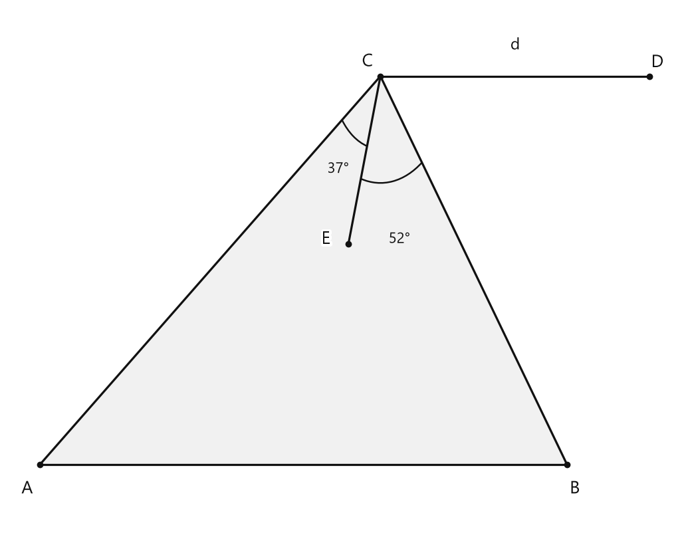
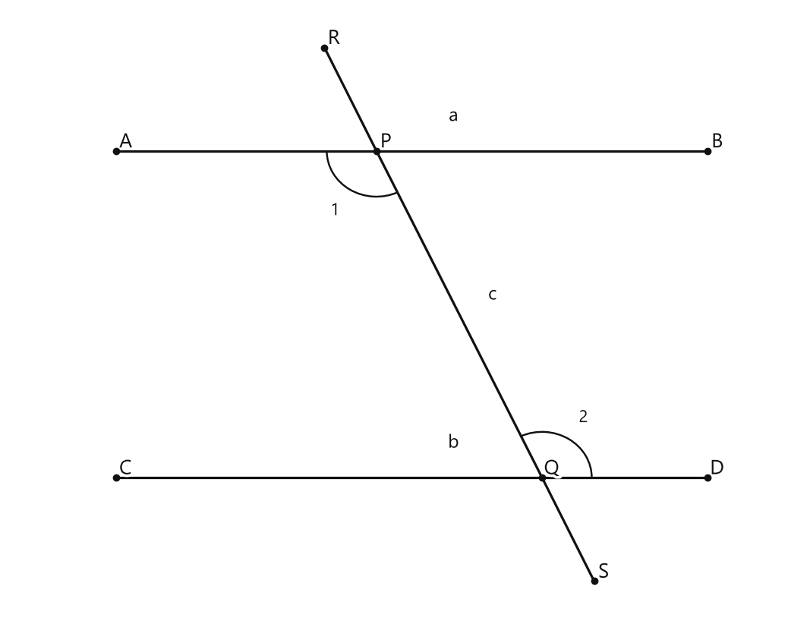

# Занятие 17. Параллельность прямых на плоскости

**Раздел:** Глава III. Параллельность прямых на плоскости  
**Параграф учебника:** §17. Параллельность прямых на плоскости  
**Страницы:** 96–96

## Цели занятия

После изучения полного параграфа ученик сможет:

- объяснять, что означает параллельность прямых;
- применять признаки и свойства параллельных прямых;
- использовать аксиому параллельных прямых;
- решать задачи на углы при пересечении прямых;
- распознавать типичные ошибки при работе с параллельными прямыми.

В предоставленном материале есть только вводная страница главы. Поэтому сейчас доступен лишь обзор темы, без теоретического аппарата и заданий.

## Теория к занятию

### О чём будет глава

#### Простыми словами

В этой главе будем изучать прямые, которые лежат на одной плоскости и не пересекаются. Такие прямые называют параллельными, но на данной странице само определение ещё не приведено.

На рисунке показаны две прямые $a$ и $b$. Их пересекают ещё две прямые. При пересечении образуются углы. По этим углам можно будет выяснять, параллельны ли прямые $a$ и $b$.

Одна из пересекающих прямых образует с параллельными прямыми прямые углы. Другая пересекает их под обычным наклоном. Оба случая важны: прямой угол — тоже угол, он не выходит из игры.

Пока это только знакомство с темой. Рисунок помогает увидеть расположение прямых, но сам по себе ничего не доказывает. Геометрия любит проверку: «на глаз» — это ещё не доказательство.

#### Определение / факт / теорема / свойство

**Определения:**  
На данной странице определения отсутствуют.

**Аксиомы:**  
На данной странице аксиомы отсутствуют.

**Свойства:**  
На данной странице свойства отсутствуют.

**Теоремы:**  
На данной странице теоремы отсутствуют.

**Признаки:**  
На данной странице признаки отсутствуют.

**Следствия:**  
На данной странице следствия отсутствуют.

#### Формулы

На данной странице формулы отсутствуют.

#### Правила

На данной странице правила и алгоритмы отсутствуют.

#### Ловушки

- Рисунок помогает разобраться в ситуации, но не является доказательством. Даже если прямые выглядят параллельными, это нужно подтвердить свойством или признаком.
- Нельзя добавлять на страницу определения и теоремы, которых в предоставленной карточке нет.
- Равенство отмеченных углов на рисунке относится к изображению. Числового условия задачи на странице нет.
- По одной вводной странице нельзя восстановить содержание всего параграфа. Для этого нужны следующие страницы с формулировками и упражнениями.

## Сводка формул «выучить наизусть»

На данной странице формулы отсутствуют.

## Правила, которые нельзя путать

На данной странице правила и алгоритмы отсутствуют.

## Разбор ключевых заданий

В предоставленном транскрипте ключевые разобранные задания учебника отсутствуют.

Упражнения параграфа также отсутствуют, поэтому составлять разбор заданий по этому материалу нельзя: пришлось бы выдумать условия и теоретические формулировки, которых нет на странице.

**Итог:** для полноценного занятия нужны страницы с содержанием §17, где приведены определения, признаки, свойства, теоремы и упражнения.

## Практические задания

Выбери свой уровень и решай только этот блок. В блоке должна закрепиться вся тема параграфа. Ответы не приводятся.

### Уровень 1–2 балла

**С1.** Запишите с помощью знака параллельности, что прямые $a$ и $b$ параллельны.

**С2.** Выберите запись, обозначающую параллельность прямых $m$ и $n$:  
1) $m\cap n$ 2) $m\parallel n$ 3) $m\perp n$ 4) $m\in n$ 5) $m=n$

**С3.** Из записей $a\parallel b$, $c\perp d$, $e\cap f$ выберите запись, которая обозначает параллельность прямых.

**С4.** Прямые $p$ и $q$ не имеют общих точек. Запишите обозначение их параллельности.

**С5.** Выберите пару прямых, обозначенную как параллельная:  
1) $r\perp s$ 2) $u\cap v$ 3) $k\parallel l$ 4) $x\in y$ 5) $c=d$

**С6.** Укажите все пары параллельных прямых в записи $a\parallel b$, $b\perp c$, $d\parallel e$.

**С7.** Запишите, какие прямые параллельны, если даны записи $g\parallel h$ и $h\cap t$.

**С8.** Среди пар прямых $AB$ и $CD$, $EF$ и $GH$, $KL$ и $MN$ параллельными являются $AB$ и $CD$. Запишите это с помощью знака $\parallel$.

**С9.** Выберите верное утверждение:  
1) Если $a\parallel b$, то прямые $a$ и $b$ обозначены знаком $\perp$.  
2) Если $a\parallel b$, то прямые $a$ и $b$ обозначены знаком $\parallel$.  
3) Если $a\parallel b$, то прямые $a$ и $b$ обозначены знаком $\cap$.  
4) Если $a\parallel b$, то прямые $a$ и $b$ обозначены знаком $\in$.  
5) Если $a\parallel b$, то прямые $a$ и $b$ обозначены знаком $=$.

**С10.** Даны прямые $x$, $y$, $z$, причём $x\parallel y$, а $y$ пересекает $z$. Запишите пару параллельных прямых.

**С11.** Заполните пропуск: $c\ \square\ d$, если прямые $c$ и $d$ параллельны.

**С12.** Выберите запись, в которой указано, что прямые $AB$ и $CD$ параллельны:  
1) $AB\perp CD$ 2) $AB\cap CD$ 3) $AB\parallel CD$ 4) $AB\in CD$ 5) $AB=CD$

**С13.** *(задание не сгенерировано — перезапустите практику)*

**С14.** *(задание не сгенерировано — перезапустите практику)*

**С15.** *(задание не сгенерировано — перезапустите практику)*

**С16.** *(задание не сгенерировано — перезапустите практику)*

**С17.** *(задание не сгенерировано — перезапустите практику)*

**С18.** *(задание не сгенерировано — перезапустите практику)*

**С19.** *(задание не сгенерировано — перезапустите практику)*

**С20.** *(задание не сгенерировано — перезапустите практику)*

**С21.** *(задание не сгенерировано — перезапустите практику)*

**С22.** *(задание не сгенерировано — перезапустите практику)*

**С23.** *(задание не сгенерировано — перезапустите практику)*

**С24.** *(задание не сгенерировано — перезапустите практику)*

**С25.** *(задание не сгенерировано — перезапустите практику)*

**С26.** *(задание не сгенерировано — перезапустите практику)*

**С27.** *(задание не сгенерировано — перезапустите практику)*

**С28.** *(задание не сгенерировано — перезапустите практику)*

**С29.** *(задание не сгенерировано — перезапустите практику)*

**С30.** *(задание не сгенерировано — перезапустите практику)*

**С31.** *(задание не сгенерировано — перезапустите практику)*

**С32.** *(задание не сгенерировано — перезапустите практику)*

**С33.** *(задание не сгенерировано — перезапустите практику)*

**С34.** *(задание не сгенерировано — перезапустите практику)*

**С35.** *(задание не сгенерировано — перезапустите практику)*

**С36.** *(задание не сгенерировано — перезапустите практику)*

### Уровень 3–4 балла

**С1.** Запишите обозначение того, что прямые $a$ и $b$ параллельны.

**С2.** Прямые $m$ и $n$ лежат в одной плоскости и не пересекаются. Запишите их взаимное расположение с помощью математического обозначения.

**С3.** Из прямых $a$, $b$ и $c$ известно, что $a\parallel b$ и $b\parallel c$. Как расположены прямые $a$ и $c$?

**С4.** Верно ли утверждение: если две прямые имеют общую точку, то они не являются параллельными? Ответьте «да» или «нет».

**С5.** Прямая $c$ пересекает параллельные прямые $a$ и $b$. Один из образовавшихся углов равен $65^\circ$. Чему равен соответствующий ему угол?

**С6.** Прямые $a$ и $b$ параллельны, а прямая $c$ пересекает их. Один из внутренних односторонних углов равен $112^\circ$. Найдите второй внутренний односторонний угол.

**С7.** Прямые $m$ и $n$ параллельны, а прямая $p$ пересекает их. Один из накрест лежащих углов равен $48^\circ$. Найдите второй накрест лежащий угол.

**С8.** Один из углов, образованных при пересечении двух параллельных прямых секущей, равен $37^\circ$. Найдите угол, смежный с ним.

**С9.** Прямые $a$ и $b$ параллельны. Секущая $c$ образует с прямой $a$ угол $74^\circ$. Какой угол образует секущая $c$ с прямой $b$, если рассматриваются соответствующие углы?

**С10.** Прямые $p$ и $q$ параллельны. При пересечении их секущей один из внутренних односторонних углов в $3$ раза больше другого. Найдите величины этих углов.

**С11.** Прямые $a$ и $b$ пересечены секущей $c$. Накрест лежащие углы равны $86^\circ$ и $86^\circ$. Можно ли сделать вывод, что $a\parallel b$? Ответ обоснуйте одним предложением.

**С12.** Прямые $m$ и $n$ пересечены секущей $k$. Внутренние односторонние углы равны $103^\circ$ и $77^\circ$. Можно ли сделать вывод, что $m\parallel n$? Ответ обоснуйте вычислением.

**С13.** *(задание не сгенерировано — перезапустите практику)*

**С14.** *(задание не сгенерировано — перезапустите практику)*

**С15.** *(задание не сгенерировано — перезапустите практику)*

**С16.** *(задание не сгенерировано — перезапустите практику)*

**С17.** *(задание не сгенерировано — перезапустите практику)*

**С18.** *(задание не сгенерировано — перезапустите практику)*

**С19.** *(задание не сгенерировано — перезапустите практику)*

**С20.** *(задание не сгенерировано — перезапустите практику)*

**С21.** *(задание не сгенерировано — перезапустите практику)*

**С22.** *(задание не сгенерировано — перезапустите практику)*

**С23.** *(задание не сгенерировано — перезапустите практику)*

**С24.** *(задание не сгенерировано — перезапустите практику)*

**С25.** *(задание не сгенерировано — перезапустите практику)*

**С26.** *(задание не сгенерировано — перезапустите практику)*

**С27.** *(задание не сгенерировано — перезапустите практику)*

**С28.** *(задание не сгенерировано — перезапустите практику)*

**С29.** *(задание не сгенерировано — перезапустите практику)*

**С30.** *(задание не сгенерировано — перезапустите практику)*

**С31.** *(задание не сгенерировано — перезапустите практику)*

**С32.** *(задание не сгенерировано — перезапустите практику)*

**С33.** *(задание не сгенерировано — перезапустите практику)*

**С34.** *(задание не сгенерировано — перезапустите практику)*

**С35.** *(задание не сгенерировано — перезапустите практику)*

**С36.** *(задание не сгенерировано — перезапустите практику)*

### Уровень 5–6 баллов

**С1.** Определите, какие пары прямых являются параллельными:  
а) две прямые, имеющие общую точку;  
б) две прямые, лежащие в одной плоскости и не пересекающиеся;  
в) две прямые, лежащие в разных плоскостях и не пересекающиеся.

**С2.** Запишите с помощью символа $\parallel$, какие прямые параллельны: прямые $a$ и $b$ не имеют общих точек и лежат в одной плоскости.

**С3.** Прямые $a$ и $b$ параллельны. Прямая $c$ пересекает прямую $a$. Может ли прямая $c$ не пересекать прямую $b$? Ответ обоснуйте.

**С4.** Сколько прямых, параллельных данной прямой $a$, можно провести через точку $M$, не лежащую на прямой $a$?

**С5.** Даны две прямые $a$ и $b$, пересекающиеся в точке $O$. Можно ли утверждать, что $a\parallel b$? Ответьте «да» или «нет» и объясните.

**С6.** Прямые $a$ и $b$ параллельны, а прямые $b$ и $c$ также параллельны. Как расположены прямые $a$ и $c$? Запишите ответ с помощью символа $\parallel$.

**С7.** На листе проведена прямая $a$ и отмечена точка $M$, не принадлежащая этой прямой. Опишите последовательность действий для построения через точку $M$ прямой, параллельной прямой $a$, используя линейку и угольник.

**С8.** Прямые $a$ и $b$ пересечены секущей $c$. Один из соответственных углов равен $68^\circ$. Известно, что второй соответственный угол также равен $68^\circ$. Можно ли сделать вывод, что $a\parallel b$? Запишите ответ и укажите основание вывода.

**С9.** При пересечении двух прямых секущей образовались соответственные углы величиной $47^\circ$ и $133^\circ$. Являются ли эти две прямые параллельными? Обоснуйте ответ.

**С10.** Прямые $a$ и $b$ пересечены секущей $c$. Один из внутренних односторонних углов равен $112^\circ$. Каким должен быть второй внутренний односторонний угол, чтобы прямые $a$ и $b$ были параллельными?

**С11.** Через точку $M$ проведены две прямые $a$ и $b$, каждая из которых параллельна прямой $c$. Могут ли прямые $a$ и $b$ быть различными? Ответ обоснуйте.

**С12.** Прямые $a$ и $b$ пересечены секущей $c$. Один из внутренних накрест лежащих углов равен $75^\circ$, а другой — $75^\circ$. Сделайте вывод о взаимном расположении прямых $a$ и $b$ и запишите его с помощью символа $\parallel$.

**С13.** Прямые $a$ и $b$ лежат в одной плоскости и не имеют общих точек. Как расположены эти прямые?

**С14.** Прямая $c$ пересекает прямые $a$ и $b$. При пересечении с прямой $a$ образовался угол $68^\circ$, а с прямой $b$ — соответствующий ему угол $68^\circ$. Сделайте вывод о взаимном расположении прямых $a$ и $b$.

**С15.** Прямые $a$ и $b$ перпендикулярны прямой $c$. Определите взаимное расположение прямых $a$ и $b$.

**С16.** Через точку $M$, не лежащую на прямой $a$, проведены две прямые $b$ и $c$. Прямая $b$ не пересекает прямую $a$, а прямая $c$ пересекает прямую $a$. Какая из прямых $b$ и $c$ параллельна прямой $a$?

**С17.** На плоскости проведены прямые $a$, $b$ и $c$. Известно, что $a\parallel b$ и $b\parallel c$. Определите взаимное расположение прямых $a$ и $c$.

**С18.** Прямая $m$ пересекает параллельные прямые $a$ и $b$. Один из образовавшихся острых углов равен $54^\circ$. Найдите градусную меру каждого тупого угла.

**С19.** Прямая $n$ пересекает прямые $p$ и $q$. Один из внутренних односторонних углов равен $117^\circ$, а другой — $63^\circ$. Параллельны ли прямые $p$ и $q$? Ответ обоснуйте вычислением суммы углов.

**С20.** Прямые $a$ и $b$ пересечены прямой $c$. Два накрест лежащих угла равны соответственно $72^\circ$ и $72^\circ$. Какой вывод можно сделать о прямых $a$ и $b$?

**С21.** Постройте с помощью линейки и угольника прямую $b$, параллельную данной прямой $a$ и проходящую через данную точку $M$, не лежащую на прямой $a$. Опишите последовательность построения.

**С22.** Прямые $a$ и $b$ параллельны. Точка $A$ лежит на прямой $a$, а точка $B$ — на прямой $b$. Через точку $A$ провели прямую $c$, перпендикулярную прямой $a$. Найдите угол между прямыми $c$ и $b$.

**С23.** Прямые $a$ и $b$ пересечены прямой $c$. Один из соответствующих углов на $${a}$$ равен $83^\circ$, а соответствующий ему угол на $b$ равен $97^\circ$. Могут ли прямые $a$ и $b$ быть параллельными? Ответ объясните.

**С24.** Даны две параллельные прямые $a$ и $b$. На прямой $a$ выбраны точки $A$ и $B$, а на прямой $b$ — точки $C$ и $D$. Отрезки $AC$ и $BD$ перпендикулярны прямым $a$ и $b$. Сравните длины отрезков $AC$ и $BD$, если расстояние между параллельными прямыми равно $6$ см.

**С25.** Прямые $a$ и $b$ пересечены прямой $c$. При этом образовавшиеся накрест лежащие углы равны $68^\circ$ и $68^\circ$. Определите, являются ли прямые $a$ и $b$ параллельными.

**С26.** Прямые $a$ и $b$ пересечены прямой $c$. Два соответственных угла имеют градусные меры $(3x+14)^\circ$ и $(5x-26)^\circ$. При каком значении $x$ прямые $a$ и $b$ параллельны?

**С27.** Прямые $a$ и $b$ параллельны и пересечены прямой $c$. Один из внутренних односторонних углов равен $117^\circ$. Найдите градусную меру другого внутреннего одностороннего угла.

**С28.** Прямые $a$ и $b$ пересечены прямой $c$. Один из соответственных углов равен $(4x+8)^\circ$, а другой — $(7x-34)^\circ$. Известно, что прямые $a$ и $b$ параллельны. Найдите градусную меру каждого из этих углов.

**С29.** Прямые $a$ и $b$ пересечены прямой $c$. Накрест лежащие углы имеют градусные меры $(6x-15)^\circ$ и $(3x+42)^\circ$. Определите значение $x$ и установите, параллельны ли прямые $a$ и $b$.

**С30.** Прямые $a$ и $b$ пересечены прямой $c$. Внутренние односторонние углы равны $(5x+10)^\circ$ и $(7x-10)^\circ$. Найдите значение $x$ и сделайте вывод о взаимном расположении прямых $a$ и $b$.

### Уровень 7–8 баллов

**С1.** Прямые $a$ и $b$ пересечены секущей $c$. Один из образовавшихся углов равен $58^\circ$. Найдите величины всех остальных углов и укажите, какие из них являются вертикальными, а какие — смежными с данным углом.

**С2.** Прямые $a$ и $b$ пересечены секущей $c$. Два накрест лежащих угла равны $73^\circ$ и $73^\circ$. Обоснуйте, что $a\parallel b$, и найдите величины остальных углов.

**С3.** Прямые $a$ и $b$ пересечены секущей $c$. Внутренние односторонние углы равны $4x+12^\circ$ и $6x-8^\circ$. Найдите $x$ и величины этих углов. Обоснуйте параллельность прямых $a$ и $b$.

**С4.** Прямые $a$ и $b$ пересечены секущей $c$. Один из соответственных углов на $24^\circ$ больше другого. Известно, что меньший из этих углов равен $3x+6^\circ$, а больший — $5x-18^\circ$. Найдите $x$ и определите, могут ли прямые $a$ и $b$ быть параллельными.

**С5.** Прямые $a$ и $b$ пересечены секущей $c$. Внутренние односторонние углы равны $7x-5^\circ$ и $4x+14^\circ$. При каком значении $x$ прямые $a$ и $b$ параллельны? Найдите величины всех углов, образованных этими прямыми и секущей.

**С6.** Прямые $a$ и $b$ пересечены секущей $c$. Один из углов равен $2x+15^\circ$, а вертикальный ему угол равен $5x-42^\circ$. Найдите $x$. Можно ли по этим данным сделать вывод, что $a\parallel b$? Обоснуйте ответ.

**С7.** На плоскости проведены прямые $a$ и $b$, пересечённые прямой $c$. Один из углов равен $112^\circ$, а угол, смежный с ним, обозначен через $3x+4^\circ$. Найдите $x$ и величину каждого из четырёх различных углов, образованных при пересечении прямых $a$ и $c$. Затем объясните, какие дополнительные данные нужны для вывода о параллельности $a$ и $b$.

**С8.** Прямые $a$ и $b$ пересечены секущей $c$. Один из внутренних односторонних углов равен $5x-7^\circ$, другой — $3x+27^\circ$. Известно, что $a\parallel b$. Найдите $x$ и величины этих углов. Запишите, каким свойством параллельных прямых вы воспользовались.

**С9.** Прямые $a$ и $b$ пересечены секущей $c$. Угол, расположенный внутри полосы между прямыми $a$ и $b$ слева от секущей $c$, равен $4x+9^\circ$, а внутренний угол справа от секущей равен $7x-18^\circ$. При каком значении $x$ можно утверждать, что $a\parallel b$? Укажите признак параллельности, применённый при решении.

**С10.** Прямые $a$ и $b$ пересечены секущей $c$. Два соответственных угла выражены через $x$ как $8x-13^\circ$ и $5x+32^\circ$. Найдите $x$, если $a\parallel b$. Затем найдите величины всех углов, образованных прямыми $a$, $b$ и секущей $c$, и обоснуйте результат.

**С11.** Через точку $M$, не лежащую на прямой $a$, проведены две прямые: $b$ и $c$. Прямая $b$ параллельна $a$. При пересечении прямой $a$ прямой $c$ один из углов равен $67^\circ$. Найдите острый угол между прямыми $b$ и $c$ и тупой угол между ними. Обоснуйте, почему величины углов можно перенести от точки пересечения прямых $a$ и $c$ к точке пересечения прямых $b$ и $c$.

**С12.** Прямые $a$ и $b$ пересечены двумя секущими $c$ и $d$. При пересечении с прямой $c$ один из накрест лежащих углов равен $3x+18^\circ$, а другой — $5x-26^\circ$. При пересечении с прямой $d$ один из соответственных углов равен $2y+14^\circ$, а другой — $6y-42^\circ$. Определите значения $x$ и $y$, при которых прямые $a$ и $b$ параллельны, и обоснуйте параллельность по каждому из двух наборов углов.

**С13.** Прямые $a$ и $b$ пересечены прямой $c$. Один из углов, образованных при пересечении прямых $a$ и $c$, равен $68^\circ$, а соответственный ему угол при пересечении прямых $b$ и $c$ также равен $68^\circ$. Докажите, что $a\parallel b$.

**С14.** Прямые $m$ и $n$ пересечены прямой $p$. Внутренние накрест лежащие углы равны $73^\circ$ и $73^\circ$. Найдите все остальные углы, образованные при пересечении этих прямых, и обоснуйте, что $m\parallel n$.

**С15.** Прямые $a$ и $b$ пересечены прямой $c$. Два односторонних внутренних угла имеют градусные меры $x^\circ$ и $(3x-12)^\circ$. Известно, что $a\parallel b$. Найдите $x$ и градусные меры всех углов, образованных при пересечении прямых $a$, $b$ и $c$.

**С16.** Прямые $r$ и $s$ пересечены прямой $t$. Один из внутренних односторонних углов на $24^\circ$ больше другого. Найдите их градусные меры, если $r\parallel s$. Объясните, почему найденные углы являются дополнительными.

**С17.** На плоскости проведены прямые $a$, $b$ и $c$. Известно, что $a\parallel b$ и $b\parallel c$. Докажите, что $a\parallel c$. Отдельно объясните, почему прямые $a$, $b$ и $c$ не могут иметь общую точку.

**С18.** Прямые $p$ и $q$ пересечены секущей $l$. Один из углов равен $116^\circ$. Угол, смежный с ним, обозначен через $x^\circ$, а вертикальный ему угол — через $y^\circ$. Найдите $x$ и $y$. Можно ли по этим данным сделать вывод, что $p\parallel q$? Ответ обоснуйте.

**С19.** Прямые $a$ и $b$ пересечены секущей $c$. Один из углов равен $42^\circ$, а один из внутренних односторонних углов равен $138^\circ$. Докажите, что $a\parallel b$, если угол $42^\circ$ и угол $138^\circ$ являются внутренними односторонними углами.

**С20.** Прямые $u$ и $v$ пересечены прямой $w$. Два соответственных угла имеют градусные меры $(5x-7)^\circ$ и $(3x+29)^\circ$. Найдите $x$ и определите, параллельны ли прямые $u$ и $v$.

**С21.** Через точку $A$, не лежащую на прямой $b$, проведены две прямые $a$ и $c$, каждая из которых параллельна прямой $b$. Докажите, что прямые $a$ и $c$ совпадают. Сформулируйте, какое свойство параллельных прямых использовано в доказательстве.

**С22.** Даны прямые $a$, $b$ и $c$, причём $a\parallel b$, а прямая $c$ пересекает прямую $a$. Докажите, что прямая $c$ пересекает и прямую $b$. Может ли прямая $c$ быть параллельной прямой $b$? Ответ обоснуйте.

**С23.** Прямые $m$ и $n$ пересечены секущей $p$. Один из внутренних накрест лежащих углов равен $(4x+8)^\circ$, а другой — $(7x-43)^\circ$. Известно, что $m\parallel n$. Найдите $x$ и градусные меры всех углов, образованных при пересечении прямых $m$, $n$ и $p$.

**С24.** Прямые $a$ и $b$ пересечены секущей $c$. Внутренние односторонние углы равны $(2x+15)^\circ$ и $(5x-6)^\circ$. Определите, при каком значении $x$ прямые $a$ и $b$ будут параллельны. После этого укажите градусные меры всех углов, образованных при пересечении прямых $a$, $b$ и $c$, и обоснуйте каждый использованный шаг.

### Уровень 9–10 баллов

**С1.** Прямые $a$ и $b$ пересечены секущей $c$. Один из внутренних односторонних углов равен $68^\circ$, а другой — $112^\circ$. Определите, могут ли прямые $a$ и $b$ быть параллельными, и обоснуйте ответ.

**С2.** Прямые $a$ и $b$ пересечены секущей $c$. Угол, образованный лучом секущей, направленным вверх вправо, и лучом прямой $a$, направленным вправо, равен $57^\circ$. Угол, образованный лучом секущей, направленным вверх вправо, и лучом прямой $b$, направленным вправо, также равен $57^\circ$. Докажите, что $a\parallel b$.

**С3.** Прямые $a$ и $b$ пересечены секущей $c$. Два соответственных угла имеют величины $(3x+14)^\circ$ и $(5x-26)^\circ$. Найдите $x$ и величины этих углов, если $a\parallel b$.

**С4.** Прямые $a$ и $b$ пересечены секущей $c$. Два внутренних односторонних угла имеют величины $(7x-9)^\circ$ и $(4x+30)^\circ$. Найдите $x$ и величины углов, если $a\parallel b$.

**С5.** Один из углов, образованных при пересечении параллельных прямых $a$ и $b$ секущей $c$, в $3$ раза больше другого. Найдите все образовавшиеся углы.

**С6.** Прямые $a$ и $b$ пересечены секущей $c$. Один из углов равен $4x^\circ$, а смежный с ним угол равен $(7x-18)^\circ$. Найдите $x$. Затем определите, какие из восьми углов равны между собой, если $a\parallel b$.

**С7.** Прямые $a$ и $b$ пересечены секущей $c$. Разность двух внутренних односторонних углов равна $36^\circ$. Найдите величины всех углов, если $a\parallel b$.

**С8.** Прямая $c$ пересекает прямые $a$ и $b$. Известно, что один из углов между $a$ и $c$ равен $72^\circ$, а один из углов между $b$ и $c$ равен $108^\circ$. Может ли из этих данных следовать, что $a\parallel b$? Рассмотрите оба возможных расположения указанных углов и обоснуйте вывод.

**С9.** На координатной плоскости заданы прямые $a$ и $b$, проходящие соответственно через точки $A(-3;5)$, $B(1;-1)$ и точки $C(2;4)$, $D(6;-2)$. Определите, параллельны ли прямые $a$ и $b$. Ответ обоснуйте вычислениями.

**С10.** Прямая $a$ проходит через точки $A(-2;7)$ и $B(4;-5)$. Прямая $b$ проходит через точку $C(3;1)$ и параллельна прямой $a$. Найдите ординату точки $D$ прямой $b$ с абсциссой $-5$.

**С11.** Прямая $a$ задана уравнением $y=-\frac{3}{4}x+5$. Найдите значение $k$, при котором прямая $b$, заданная уравнением $y=kx-2$, будет параллельна прямой $a$. Определите, совпадают ли эти прямые при найденном значении $k$.

**С12.** На координатной плоскости построены прямые $a$, $b$ и $c$. Прямая $a$ проходит через точки $A(-4;6)$ и $B(2;-3),$ прямая $b$ проходит через точки $C(-1;4)$ и $D(5;-5),$ а прямая $c$ задана уравнением $y=\frac{3}{2}x+1$. Определите взаимное расположение прямых $a$, $b$ и $c$: какие из них параллельны, а какие пересекаются.

**С13.** Прямые $a$ и $b$ пересечены секущей $c$. Один из образовавшихся углов равен $68^\circ$, а угол, смежный с ним, равен углу, расположенному при другой точке пересечения по разные стороны от секущей. Определите, параллельны ли прямые $a$ и $b$. Ответ обоснуйте, назвав признак параллельности прямых.

**С14.** Прямые $a$ и $b$ пересечены секущей $c$. Два внутренних односторонних угла имеют величины $(3x+14)^\circ$ и $(5x-10)^\circ$. Найдите $x$ и величины этих углов, если известно, что $a\parallel b$.

**С15.** Прямые $a$ и $b$ пересечены секущей $c$. Один из углов равен $(7x-18)^\circ$, а внутренний односторонний с ним угол равен $(4x+12)^\circ$. Известно, что прямые $a$ и $b$ параллельны. Найдите величину угла, смежного с углом $(7x-18)^\circ$.

**С16.** В треугольнике $ABC$ через вершину $C$ проведена прямая $d$, параллельная стороне $AB$. Луч $CE$ лежит внутри угла $ACD$, причём $\angle ACE=37^\circ$, а $\angle ECB=52^\circ$. Найдите величины углов $A$ и $B$ треугольника $ABC$, если луч $CB$ расположен между лучами $CA$ и $CE$.

<!--geo-figure-spec
{
  "needed": true,
  "kind": "plane",
  "caption": "Треугольник $ABC$ и прямая $d\\parallel AB$",
  "equal": false,
  "axis": false,
  "xlim": [
    -2.8,
    7.7
  ],
  "ylim": [
    -0.7,
    4.7
  ],
  "points": {
    "A": [
      -2.31,
      0
    ],
    "B": [
      5.91,
      0
    ],
    "C": [
      3,
      4
    ],
    "D": [
      7.2,
      4
    ],
    "E": [
      2.5,
      2.27
    ]
  },
  "segments": [
    [
      "A",
      "B"
    ],
    [
      "B",
      "C"
    ],
    [
      "C",
      "A"
    ],
    [
      "C",
      "D"
    ],
    [
      "C",
      "E"
    ]
  ],
  "polygons": [
    {
      "vertices": [
        "A",
        "B",
        "C"
      ],
      "fill": 0.06
    }
  ],
  "circles": [],
  "labels": {
    "A": {
      "dx": -0.2,
      "dy": -0.25
    },
    "B": {
      "dx": 0.12,
      "dy": -0.25
    },
    "C": {
      "dx": -0.2,
      "dy": 0.15
    },
    "D": {
      "dx": 0.12,
      "dy": 0.14
    },
    "E": {
      "dx": -0.35,
      "dy": 0.05
    }
  },
  "right_angles": [],
  "angle_marks": [
    {
      "vertex": "C",
      "from": "A",
      "to": "E",
      "text": "37°",
      "radius": 0.75
    },
    {
      "vertex": "C",
      "from": "E",
      "to": "B",
      "text": "52°",
      "radius": 1.1
    }
  ],
  "texts": [
    {
      "xy": [
        5.1,
        4.32
      ],
      "text": "d"
    }
  ]
}
-->

*Треугольник ABC и прямая d\parallel AB*

**С17.** На рисунке изображены две прямые $a$ и $b$, пересечённые прямой $c$. Известно, что $\angle 1=3x+20^\circ$ и $\angle 2=5x-16^\circ$. Углы $\angle 1$ и $\angle 2$ являются накрест лежащими. Найдите $x$ и определите величину каждого из восьми углов, образованных при пересечении прямых.

<!--geo-figure-spec
{
  "needed": true,
  "kind": "plane",
  "caption": "Прямые $a$, $b$ и секущая $c$",
  "equal": false,
  "axis": false,
  "xlim": [
    -0.7,
    5.8
  ],
  "ylim": [
    -0.7,
    4.8
  ],
  "points": {
    "A": [
      0.2,
      3.5
    ],
    "B": [
      5.2,
      3.5
    ],
    "C": [
      0.2,
      0.5
    ],
    "D": [
      5.2,
      0.5
    ],
    "P": [
      2.4,
      3.5
    ],
    "Q": [
      3.8,
      0.5
    ],
    "R": [
      1.96,
      4.45
    ],
    "S": [
      4.24,
      -0.45
    ]
  },
  "segments": [
    [
      "A",
      "B"
    ],
    [
      "C",
      "D"
    ],
    [
      "R",
      "P"
    ],
    [
      "P",
      "Q"
    ],
    [
      "Q",
      "S"
    ]
  ],
  "polygons": [],
  "circles": [],
  "labels": {},
  "right_angles": [],
  "angle_marks": [
    {
      "vertex": "P",
      "from": "A",
      "to": "Q",
      "text": "1",
      "radius": 0.42
    },
    {
      "vertex": "Q",
      "from": "P",
      "to": "D",
      "text": "2",
      "radius": 0.42
    }
  ],
  "texts": [
    {
      "xy": [
        3.05,
        3.82
      ],
      "text": "a"
    },
    {
      "xy": [
        3.05,
        0.82
      ],
      "text": "b"
    },
    {
      "xy": [
        3.38,
        2.18
      ],
      "text": "c"
    }
  ]
}
-->

*Прямые a, b и секущая c*

**С18.** Прямые $a$ и $b$ пересечены секущей $c$. Известно, что сумма двух внутренних односторонних углов равна $180^\circ$, а разность этих углов равна $46^\circ$. Найдите величины всех различных углов, образованных при пересечении прямых $a$ и $b$ секущей $c$, и сделайте вывод о взаимном расположении прямых $a$ и $b$.

## Чек-лист «ученик понял тему»

- Могу повторить определения и формулы параграфа своими словами и по учебнику.
- Решаю типовые задания своего уровня без подсказки.
- Вижу типичную ошибку и могу её объяснить.
