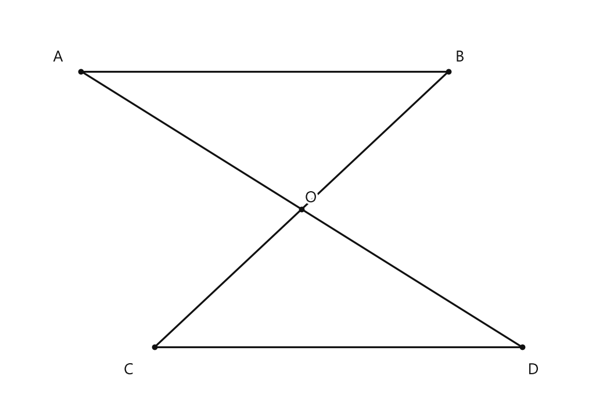
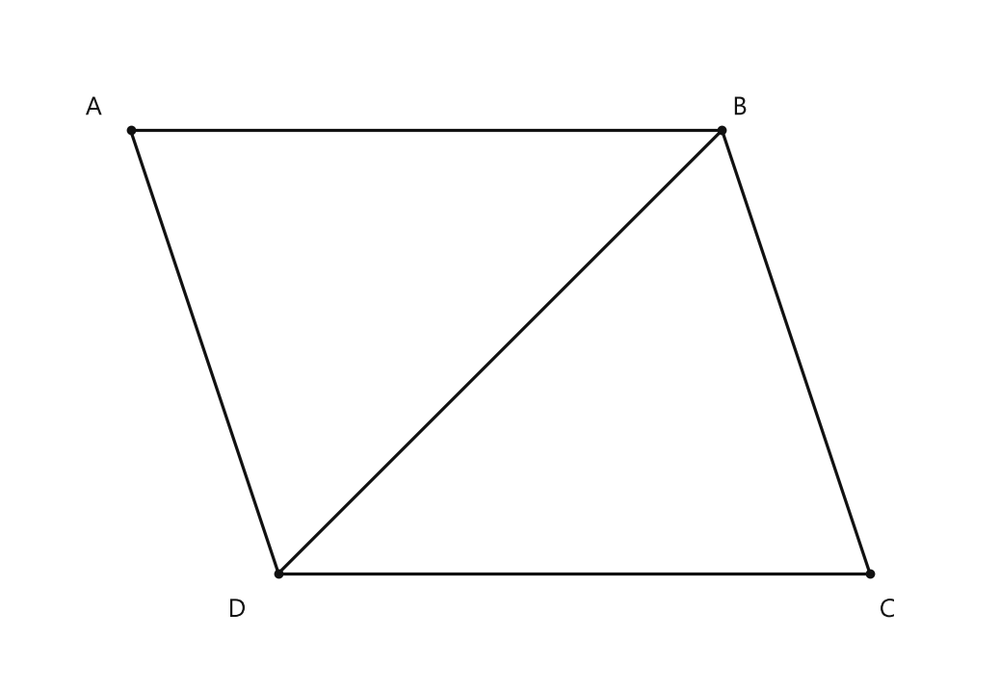

# Занятие 20. Свойства параллельных прямых

**Раздел:** Глава III. Параллельность прямых на плоскости  
**Параграф учебника:** §17. Свойства параллельных прямых  
**Страницы:** 110–115

## Цели занятия

После занятия ты умеешь:

- различать **признак** и **свойство** параллельных прямых;
- находить углы при параллельных прямых и секущей;
- применять равенство накрест лежащих и соответственных углов;
- находить внутренние односторонние углы;
- использовать следствие о перпендикулярных прямых;
- доказывать равенство треугольников и отрезков с помощью свойств параллельных прямых.

Выбери блок своего уровня:

- **1–2 балла:** распознать вид углов и найти один угол;
- **3–4 балла:** применить свойства к нескольким углам;
- **5–6 баллов:** решить задачи на отрезки и периметр;
- **7–8 баллов:** выполнить доказательство;
- **9–10 баллов:** выполнить несколько доказательств и объяснить выбор теоремы.

## Теория к занятию

### 1. Свойство накрест лежащих углов

#### Простыми словами

Представь две параллельные рельсы и одну прямую, которая их пересекает. Такая прямая называется **секущей**.

Углы, которые находятся между параллельными прямыми и по разные стороны секущей, называются внутренними накрест лежащими.

Если прямые параллельны, такие углы равны. Параллельность уже дана, поэтому доказывать её ещё раз не нужно.

#### Теорема

**Теорема (о свойстве накрест лежащих углов при параллельных прямых и секущей).**  
Если две параллельные прямые пересечены секущей, то внутренние накрест лежащие углы равны.

Если $a \parallel b$, а $\angle 1$ и $\angle 2$ — внутренние накрест лежащие углы, то

$$
\angle 1=\angle 2.
$$

#### Формулы

Если один внутренний накрест лежащий угол равен $74^\circ$, то второй угол тоже равен

$$
74^\circ.
$$

Здесь важно не просто увидеть два угла, а проверить их положение:

- оба угла находятся между параллельными прямыми;
- углы расположены по разные стороны секущей.

Только тогда можно применить это свойство.

#### Правила

- Сначала проверь: углы находятся **между параллельными прямыми**.
- Затем проверь: они расположены **по разные стороны секущей**.
- Если оба условия выполнены, углы равны.

#### Алгоритм

1. Указать, какие прямые параллельны.
2. Назвать секущую.
3. Определить, что углы внутренние накрест лежащие.
4. Записать равенство углов.
5. Найти неизвестную величину.

#### Ловушки

- Если углы лежат по одну сторону секущей, они не накрест лежащие.
- Если углы находятся снаружи параллельных прямых, они не внутренние.
- Не пиши «по признаку параллельности», если параллельность уже дана. Это как искать ключ от уже открытой двери.

---

### 2. Свойство соответственных углов

#### Простыми словами

Секущая пересекает две прямые в двух точках. Около каждой точки образуются углы.

**Соответственные углы** занимают одинаковое положение около этих точек. Например, оба находятся сверху и справа от секущей.

Если прямые параллельны, соответственные углы равны.

#### Теорема

**Теорема (о свойстве соответственных углов при параллельных прямых и секущей).**  
Если две параллельные прямые пересечены секущей, то соответственные углы равны.

Если $\angle 1$ и $\angle 2$ — соответственные углы, то

$$
\angle 1=\angle 2.
$$

#### Правила

- Ищи одинаковое положение углов у двух точек пересечения.
- Параллельность должна быть дана.
- Если по равенству соответственных углов нужно доказать параллельность, это уже **признак**, а не свойство.

#### Ловушки

- Равенство углов само по себе не означает, что мы применяем свойство.
- Если прямые ещё нужно доказать параллельными, используется признак параллельности.
- «Одинаковая форма» рисунка не заменяет проверку положения углов. Чертёж иногда любит притворяться убедительным.

---

### 3. Свойство внутренних односторонних углов

#### Простыми словами

Внутренние односторонние углы:

- находятся между параллельными прямыми;
- лежат по одну сторону секущей.

Такие углы обычно не равны. Их сумма равна $180^\circ$, то есть они вместе образуют развернутый угол.

#### Теорема

**Теорема (о свойстве односторонних углов при параллельных прямых и секущей).**  
Если две параллельные прямые пересечены секущей, то сумма внутренних односторонних углов равна $180^\circ$.

Если $\angle 1$ и $\angle 2$ — внутренние односторонние углы, то

$$
\angle 1+\angle 2=180^\circ.
$$

Отсюда:

$$
\angle 2=180^\circ-\angle 1.
$$

#### Формулы

Если $\angle 1=68^\circ$, то

$$
\angle 2=180^\circ-68^\circ=112^\circ.
$$

#### Правила

- Для односторонних углов используй сумму $180^\circ$.
- Если углы относятся как $2:3$, обозначай их $2x$ и $3x$.
- Не путай: накрест лежащие — равны, односторонние — в сумме дают $180^\circ$.

#### Ловушки

- Сумма $180^\circ$ относится именно к **внутренним односторонним** углам.
- Углы $70^\circ$ и $110^\circ$ не равны, но их сумма равна $180^\circ$.
- Нельзя складывать углы «на глаз» только потому, что они нарисованы рядом. Сначала определи их положение.

---

### 4. Следствие о перпендикулярных прямых

#### Простыми словами

Параллельные прямые имеют одно и то же направление. Поэтому если третья прямая образует прямой угол с одной из них, то с другой она тоже образует прямой угол.

#### Следствие

**Следствие.**  
Прямая, перпендикулярная одной из двух параллельных прямых, перпендикулярна и другой прямой.

Если

$$
a\parallel b,\qquad c\perp a,
$$

то

$$
c\perp b.
$$

#### Правила

- Дано $a\parallel b$ и $c\perp a$ — сразу делаем вывод $c\perp b$.
- Перпендикулярность означает, что угол между прямыми равен $90^\circ$.

#### Ловушки

- Параллельные прямые не обязаны быть горизонтальными на рисунке.
- Наклон рисунка ничего не меняет.
- Не нужно каждый раз доказывать, что угол равен $90^\circ$: это уже следует из перпендикулярности.

---

### 5. Признак и свойство параллельных прямых

#### Простыми словами

Свойство и признак работают в противоположных направлениях.

- **Свойство:** параллельность уже дана, и по ней находим равенство углов или их сумму.
- **Признак:** по углам доказываем, что прямые параллельны.

Например:

$$
a\parallel b
$$

дано в условии — применяем свойство.

А если дано равенство накрест лежащих углов и нужно доказать, что

$$
a\parallel b,
$$

то применяем признак параллельности.

#### Правила и алгоритмы

Чтобы не путать признаки и свойства параллельных прямых, нужно помнить следующее:  
а) если ссылаются на признак параллельности прямых, то требуется доказать параллельность некоторых прямых;  
б) если ссылаются на свойство параллельных прямых, то параллельные прямые даны, и нужно воспользоваться каким-то их свойством.

#### Ловушки

- В условии $a\parallel b$ — это почти сигнальная лампа: применяй свойство.
- Если сказано, что углы равны, и требуется доказать $a\parallel b$, применяй признак.
- Название теоремы должно соответствовать действию: сначала выясни, что дано и что требуется получить.

---

### 6. Равенство треугольников при параллельных отрезках

#### Простыми словами

Рассмотрим ситуацию: два отрезка равны и параллельны, а другие отрезки пересекаются. При этом образуются два треугольника.

Чтобы доказать равенство этих треугольников, нужно сравнить их стороны и углы:

- одна сторона одного треугольника равна стороне другого;
- два угла равны как внутренние накрест лежащие углы при параллельных прямых и секущих.

Значит, треугольники равны по стороне и двум прилежащим к ней углам.

#### Алгоритм доказательства

1. Найти равные стороны.
2. Найти два угла, связанные с параллельными прямыми.
3. Сослаться на свойство накрест лежащих углов.
4. Применить признак равенства треугольников по стороне и двум прилежащим к ней углам.
5. Сделать требуемый вывод.

#### Ловушки

- Общую сторону нельзя «придумать»: её нужно указать.
- Углы равны не потому, что «похожи», а потому что они накрест лежащие при параллельных прямых.
- В доказательстве важно назвать секущую.
- Сначала сравни элементы треугольников, а уже потом называй признак равенства. Иначе доказательство побежит впереди рассуждения.

---

## Сводка формул «выучить наизусть»

При $a\parallel b$ и секущей:

$$
\text{внутренние накрест лежащие углы равны;}
$$

$$
\text{соответственные углы равны;}
$$

$$
\angle 1+\angle 2=180^\circ
$$

для внутренних односторонних углов.

Если

$$
a\parallel b,\qquad c\perp a,
$$

то

$$
c\perp b.
$$

## Правила, которые нельзя путать

| Что дано | Что нужно доказать или найти | Что применяем |
|---|---|---|
| Прямые параллельны | Найти углы | Свойство параллельных прямых |
| Равны накрест лежащие углы | Доказать параллельность | Признак параллельности |
| Равны соответственные углы | Доказать параллельность | Признак параллельности |
| Внутренние односторонние углы в сумме $180^\circ$ | Доказать параллельность | Признак параллельности |
| Прямые параллельны, одна перпендикулярна секущей | Доказать вторую перпендикулярность | Следствие |

## Разбор ключевых заданий

### Р1. Свойство или признак?

#### Условие

Даны параллельные прямые $a$ и $b$, пересечённые секущей. Один из внутренних односторонних углов равен $80^\circ$. Найдите угол $\alpha$, являющийся вторым внутренним односторонним углом. Ученик записал: «Угол $\alpha$ равен $80^\circ$ по признаку параллельности прямых». Верна ли запись?

#### Решение

Параллельность прямых уже дана:

$$
a\parallel b.
$$

Углы являются внутренними односторонними.

Для таких углов при параллельных прямых сумма равна $180^\circ$:

$$
\alpha+80^\circ=180^\circ.
$$

Вычтем $80^\circ$ из обеих частей:

$$
\alpha=180^\circ-80^\circ.
$$

Вычислим:

$$
\alpha=100^\circ.
$$

Запись ученика неверна.

Нужно было сослаться на теорему о свойстве односторонних углов при параллельных прямых и секущей.

Признак здесь не применяется, потому что параллельность уже дана. Прямые не надо второй раз делать параллельными — они уже справились сами.

**Ответ:** ученик неправ; $\alpha=100^\circ$, применяется теорема о свойстве односторонних углов.

---

### Р2. Свойство или признак?

#### Условие

Две прямые $a$ и $b$ пересечены секущей. Накрест лежащие углы равны $75^\circ$. Как расположены прямые $a$ и $b$? Ученик записал: «$a\parallel b$ по свойству параллельных прямых». Верна ли запись?

#### Решение

По условию внутренние накрест лежащие углы равны:

$$
\angle 1=\angle 2=75^\circ.
$$

Если при пересечении двух прямых секущей накрест лежащие углы равны, то прямые параллельны.

Следовательно,

$$
a\parallel b.
$$

В этой задаче параллельность прямых не была дана.

Её нужно было доказать по равенству углов.

Значит, применяется **признак параллельности прямых**, а не свойство.

**Ответ:** ученик неправ; $a\parallel b$ по признаку параллельности прямых.

---

### Р3. Накрест лежащие углы

#### Условие

Даны параллельные прямые $m$ и $n$, пересечённые секущей. Один из внутренних накрест лежащих углов равен $62^\circ$. Найдите второй внутренний накрест лежащий угол.

#### Решение

По условию

$$
m\parallel n.
$$

Углы являются внутренними накрест лежащими.

По теореме о свойстве накрест лежащих углов они равны:

$$
\alpha=62^\circ.
$$

**Ответ:** $62^\circ$.

---

### Р4. Внутренние односторонние углы

#### Условие

Внутренние односторонние углы при двух параллельных прямых относятся как $2:3$. Найдите больший угол.

#### Решение

Обозначим углы через

$$
2x \quad \text{и} \quad 3x.
$$

Внутренние односторонние углы при параллельных прямых в сумме дают $180^\circ$:

$$
2x+3x=180^\circ.
$$

Сложим подобные слагаемые:

$$
5x=180^\circ.
$$

Разделим обе части на $5$:

$$
x=36^\circ.
$$

Больший угол соответствует числу $3$:

$$
3x=3\cdot36^\circ.
$$

Вычислим:

$$
3x=108^\circ.
$$

Проверим сумму углов:

$$
72^\circ+108^\circ=180^\circ.
$$

Всё сходится: геометрия иногда проверяет нас обычной арифметикой.

**Ответ:** $108^\circ$.

---

### Р5. Односторонние углы отличаются на $40^\circ$

#### Условие

Один из внутренних односторонних углов при двух параллельных прямых на $40^\circ$ меньше другого. Найдите меньший угол.

#### Решение

Пусть меньший угол равен $x^\circ$.

Тогда больший угол на $40^\circ$ больше:

$$
x^\circ+40^\circ.
$$

Внутренние односторонние углы в сумме дают $180^\circ$:

$$
x+x+40=180.
$$

Сложим подобные слагаемые:

$$
2x+40=180.
$$

Вычтем $40$ из обеих частей:

$$
2x=140.
$$

Разделим обе части на $2$:

$$
x=70.
$$

Значит, меньший угол равен

$$
70^\circ.
$$

Больший угол равен

$$
70^\circ+40^\circ=110^\circ.
$$

Проверим:

$$
70^\circ+110^\circ=180^\circ.
$$

**Ответ:** $70^\circ$.

---

### Р6. Перпендикулярная прямая

#### Условие

Даны параллельные прямые $a$ и $b$. Прямая $c$ перпендикулярна прямой $a$. Найдите угол между прямыми $c$ и $b$.

#### Решение

По условию

$$
a\parallel b.
$$

Также известно, что

$$
c\perp a.
$$

По следствию:

> Прямая, перпендикулярная одной из двух параллельных прямых, перпендикулярна и другой прямой.

Следовательно,

$$
c\perp b.
$$

Угол между перпендикулярными прямыми равен

$$
90^\circ.
$$

**Ответ:** $90^\circ$.

---

### Р7. Равенство треугольников

#### Условие

Отрезки $AB$ и $CD$ равны и параллельны. Отрезки $AD$ и $BC$ пересекаются в точке $O$. Докажите, что треугольники $AOB$ и $DOC$ равны.

<!--geo-figure-spec
{
  "needed": true,
  "kind": "plane",
  "caption": "Равные и параллельные отрезки $AB$ и $CD$",
  "equal": true,
  "axis": false,
  "xlim": [
    -0.8,
    5.6
  ],
  "ylim": [
    -0.7,
    3.7
  ],
  "points": {
    "A": [
      0,
      3
    ],
    "B": [
      4,
      3
    ],
    "C": [
      0.8,
      0
    ],
    "D": [
      4.8,
      0
    ],
    "O": [
      2.4,
      1.5
    ]
  },
  "segments": [
    [
      "A",
      "B"
    ],
    [
      "C",
      "D"
    ],
    [
      "A",
      "D"
    ],
    [
      "B",
      "C"
    ]
  ],
  "polygons": [],
  "circles": [],
  "labels": {
    "A": {
      "dx": -0.25,
      "dy": 0.15
    },
    "B": {
      "dx": 0.12,
      "dy": 0.15
    },
    "C": {
      "dx": -0.28,
      "dy": -0.25
    },
    "D": {
      "dx": 0.12,
      "dy": -0.25
    },
    "O": {
      "dx": 0.1,
      "dy": 0.12
    }
  },
  "right_angles": [],
  "angle_marks": [],
  "texts": []
}
-->

*Равные и параллельные отрезки AB и CD*

#### Решение

По условию:

$$
AB\parallel CD,
$$

и

$$
AB=CD.
$$

Рассмотрим треугольники $AOB$ и $DOC$.

Прямые $AB$ и $CD$ параллельны, а прямая $AD$ пересекает их.

По свойству накрест лежащих углов:

$$
\angle BAO=\angle CDO.
$$

Теперь рассмотрим прямую $BC$ как секущую для параллельных прямых $AB$ и $CD$.

По свойству накрест лежащих углов:

$$
\angle ABO=\angle DCO.
$$

У нас есть:

$$
AB=CD,
$$

$$
\angle BAO=\angle CDO,
$$

$$
\angle ABO=\angle DCO.
$$

Значит, треугольники $AOB$ и $DOC$ равны по стороне и двум прилежащим к ней углам.

Здесь используется **свойство** параллельных прямых: параллельность уже дана в условии. Признак параллельности тут не нужен — он пришёл бы на работу без приглашения.

**Ответ:** $\triangle AOB=\triangle DOC$.

---

### Р8. Равенство отрезков между параллельными прямыми

#### Условие

Параллельные прямые $AB$ и $CD$ пересечены параллельными прямыми $AD$ и $BC$. Докажите, что

$$
AB=CD
$$

и

$$
AD=BC.
$$

<!--geo-figure-spec
{
  "needed": true,
  "kind": "plane",
  "caption": "Параллелограмм $ABCD$: $AB\\parallel CD$, $AD\\parallel BC$",
  "equal": true,
  "axis": false,
  "xlim": [
    -0.8,
    5.8
  ],
  "ylim": [
    -0.7,
    3.8
  ],
  "points": {
    "A": [
      0,
      3
    ],
    "B": [
      4,
      3
    ],
    "C": [
      5,
      0
    ],
    "D": [
      1,
      0
    ]
  },
  "segments": [
    [
      "A",
      "B"
    ],
    [
      "B",
      "C"
    ],
    [
      "C",
      "D"
    ],
    [
      "D",
      "A"
    ],
    [
      "B",
      "D"
    ]
  ],
  "polygons": [],
  "circles": [],
  "labels": {
    "A": {
      "dx": -0.25,
      "dy": 0.15
    },
    "B": {
      "dx": 0.12,
      "dy": 0.15
    },
    "C": {
      "dx": 0.12,
      "dy": -0.25
    },
    "D": {
      "dx": -0.28,
      "dy": -0.25
    }
  },
  "right_angles": [],
  "angle_marks": [],
  "texts": []
}
-->

*Параллелограмм ABCD: AB\parallel CD, AD\parallel BC*

#### Решение

По условию:

$$
AB\parallel CD,
$$

и

$$
AD\parallel BC.
$$

Проведём диагональ $BD$.

Рассмотрим треугольники $ABD$ и $CDB$.

Сторона $BD$ входит в оба треугольника, поэтому она общая:

$$
BD=DB.
$$

Прямые $AB$ и $CD$ параллельны, а $BD$ — секущая.

По свойству накрест лежащих углов:

$$
\angle ABD=\angle CDB.
$$

Прямые $AD$ и $BC$ тоже параллельны, а $BD$ — их секущая.

По свойству накрест лежащих углов:

$$
\angle ADB=\angle CBD.
$$

Получились равные стороны и два прилежащих к ней угла:

$$
BD=DB,
$$

$$
\angle ABD=\angle CDB,
$$

$$
\angle ADB=\angle CBD.
$$

Следовательно, треугольники $ABD$ и $CDB$ равны по стороне и двум прилежащим к ней углам.

У равных треугольников соответствующие стороны равны.

Поэтому:

$$
AB=CD,
$$

и

$$
AD=BC.
$$

**Ответ:** $AB=CD$, $AD=BC$.

---

### Р9. Периметр параллелограмма

#### Условие

В четырёхугольнике $ABCD$

$$
AB\parallel DC,\qquad AD\parallel BC.
$$

Дано:

$$
AB=6\text{ см},
$$

а периметр четырёхугольника равен $20\text{ см}$. Найдите $AD$.

#### Решение

В четырёхугольнике $ABCD$ противоположные стороны параллельны:

$$
AB\parallel DC,
$$

$$
AD\parallel BC.
$$

По свойству отрезков между параллельными прямыми противоположные стороны равны:

$$
AB=CD,
$$

$$
AD=BC.
$$

Так как $AB=6\text{ см}$, то:

$$
CD=6\text{ см}.
$$

Обозначим длину стороны $AD$ через $AD$.

Тогда:

$$
BC=AD.
$$

Периметр четырёхугольника равен сумме его сторон:

$$
P=AB+BC+CD+DA.
$$

Подставим известные длины:

$$
20=6+AD+6+AD.
$$

Соберём известные числа:

$$
20=12+2AD.
$$

Вычтем $12$ из обеих частей:

$$
8=2AD.
$$

Разделим обе части на $2$:

$$
AD=4\text{ см}.
$$

Проверим периметр:

$$
6+4+6+4=20\text{ см}.
$$

**Ответ:** $4\text{ см}$.

---

### Р10. Биссектриса и параллельная прямая

#### Условие

В треугольнике $ABC$ проведена биссектриса $BK$. Через вершину $C$ проведена прямая, параллельная $BK$, которая пересекает продолжение стороны $AB$ в точке $E$. Докажите, что треугольник $BEC$ равнобедренный.

#### Решение

Так как $BK$ — биссектриса угла $ABC$, она делит этот угол на два равных угла:

$$
\angle ABK=\angle KBC.
$$

По условию:

$$
CE\parallel BK.
$$

Прямая $AB$ пересекает параллельные прямые $CE$ и $BK$.

По свойству соответственных углов:

$$
\angle BEC=\angle ABK.
$$

Теперь рассмотрим прямую $BC$ как секущую для параллельных прямых $CE$ и $BK$.

По свойству накрест лежащих углов:

$$
\angle ECB=\angle KBC.
$$

Но углы при вершине $B$ равны:

$$
\angle ABK=\angle KBC.
$$

Значит, равны и углы треугольника $BEC$:

$$
\angle BEC=\angle ECB.
$$

В треугольнике против равных углов лежат равные стороны.

Поэтому:

$$
BC=BE.
$$

Значит, треугольник $BEC$ равнобедренный.

В этой задаче параллельная прямая ловко «перенесла» углы биссектрисы в другой треугольник. Геометрический копировальный аппарат работает!

**Ответ:** $\triangle BEC$ равнобедренный, его равные стороны $BC$ и $BE$.

---

### Р11. Доказательство параллельности

#### Условие

В четырёхугольнике $ABCD$

$$
AB=CD,\qquad AB\parallel CD.
$$

Докажите, что

$$
BC\parallel AD.
$$

#### Решение

Проведём диагональ $AC$.

Рассмотрим треугольники $ABC$ и $CDA$.

Сторона $AC$ общая:

$$
AC=CA.
$$

По условию:

$$
AB=CD.
$$

Прямые $AB$ и $CD$ параллельны, а $AC$ — секущая.

По свойству накрест лежащих углов:

$$
\angle BAC=\angle DCA.
$$

В треугольниках $ABC$ и $CDA$ равны:

$$
AB=CD,
$$

$$
AC=CA,
$$

и углы между этими сторонами:

$$
\angle BAC=\angle DCA.
$$

Следовательно, треугольники $ABC$ и $CDA$ равны по двум сторонам и углу между ними.

У равных треугольников соответствующие углы равны:

$$
\angle BCA=\angle CAD.
$$

Эти углы являются накрест лежащими при прямых $BC$ и $AD$ и секущей $AC$.

Мы получили равенство накрест лежащих углов.

По признаку параллельности прямых:

$$
BC\parallel AD.
$$

Обрати внимание:

- $AB\parallel CD$ было дано, поэтому для них мы применяли **свойство** параллельных прямых;
- $BC\parallel AD$ требовалось доказать, поэтому в конце применили **признак** параллельности.

**Ответ:** $BC\parallel AD$.

---

### Р12. Биссектриса и угол при параллельной прямой

#### Условие

Точка $K$ лежит на биссектрисе угла $ABC$. Точка $M$ лежит на стороне $BC$, причём

$$
KM\parallel AB.
$$

Дано:

$$
\angle BKM=36^\circ.
$$

Найдите угол $CMK$.

#### Решение

Прямые $KM$ и $AB$ параллельны, а $BK$ — секущая.

По свойству соответственных углов:

$$
\angle ABK=\angle BKM.
$$

По условию:

$$
\angle BKM=36^\circ.
$$

Значит:

$$
\angle ABK=36^\circ.
$$

Так как $BK$ — биссектриса угла $ABC$, то она делит этот угол пополам:

$$
\angle ABK=\angle KBC.
$$

Следовательно:

$$
\angle KBC=36^\circ.
$$

Найдём весь угол $ABC$:

$$
\angle ABC=\angle ABK+\angle KBC.
$$

Подставим значения:

$$
\angle ABC=36^\circ+36^\circ=72^\circ.
$$

Прямые $KM$ и $AB$ параллельны, а $BC$ — секущая.

Угол $\angle CMK$ и угол $\angle ABC$ являются соответственными.

Поэтому:

$$
\angle CMK=\angle ABC.
$$

Значит:

$$
\angle CMK=72^\circ.
$$

В этой задаче сначала находим половину угла, а потом собираем весь угол. Биссектриса не прячет вторую половину — она просто честно делит угол пополам.

**Ответ:** $72^\circ$.

---

## Итоговая памятка

Если параллельность **дана**:

- накрест лежащие углы — **равны**;
- соответственные углы — **равны**;
- внутренние односторонние углы в сумме дают $180^\circ$;
- перпендикуляр к одной параллельной прямой перпендикулярен и другой.

Если параллельность **нужно доказать**:

- равенство накрест лежащих углов — признак;
- равенство соответственных углов — признак;
- сумма внутренних односторонних углов $180^\circ$ — признак.

Чтобы не путать признаки и свойства параллельных прямых, нужно помнить следующее:

а) если ссылаются на признак параллельности прямых, то требуется доказать параллельность некоторых прямых;

б) если ссылаются на свойство параллельных прямых, то параллельные прямые даны, и нужно воспользоваться каким-то их свойством.

Главный вопрос перед решением:

> Параллельность уже написана в условии или её ещё предстоит доказать?

Если параллельность уже дана — используем свойство.

Если равенство углов помогает доказать параллельность — используем признак.

Одна короткая проверка спасает от длинной ошибки.

## Практические задания

Выбери свой уровень и решай только этот блок. В блоке должна закрепиться вся тема параграфа. Ответы не приводятся.

### Уровень 1–2 балла

**С1.** Прямые $a$ и $b$ параллельны и пересечены секущей $c$. Внутренний накрест лежащий угол равен $68^\circ$. Найдите второй внутренний накрест лежащий угол.

**С2.** Прямые $m$ и $n$ параллельны и пересечены секущей $p$. Один из соответственных углов равен $115^\circ$. Чему равен соответствующий ему угол?

**С3.** Прямые $a$ и $b$ параллельны, а секущая $c$ образует с ними внутренние односторонние углы. Один из этих углов равен $47^\circ$. Найдите второй угол.

**С4.** Выберите верное утверждение о двух параллельных прямых, пересечённых секущей.

1) Внутренние накрест лежащие углы равны.  
2) Внутренние односторонние углы равны.  
3) Сумма соответственных углов равна $180^\circ$.  
4) Внутренние накрест лежащие углы в сумме дают $180^\circ$.  
5) Все образовавшиеся углы равны.

**С5.** Прямые $a$ и $b$ параллельны. Прямая $c$ перпендикулярна прямой $a$. Как расположены прямые $b$ и $c$? Выберите верный ответ.

1) Перпендикулярны  
2) Параллельны  
3) Совпадают  
4) Пересекаются под углом $45^\circ$  
5) Нельзя определить

**С6.** Внутренние односторонние углы при пересечении двух параллельных прямых секущей относятся как $2:3$. Найдите меньший угол.

**С7.** Один из внутренних односторонних углов при двух параллельных прямых и секущей на $30^\circ$ меньше другого. Найдите меньший угол.

**С8.** Прямые $a$ и $b$ пересечены секущей $c$. Дано: один из внутренних накрест лежащих углов равен $72^\circ$, второй внутренний накрест лежащий угол также равен $72^\circ$. Какой вывод можно сделать?

1) $a\parallel b$ по свойству параллельных прямых  
2) $a\parallel b$ по признаку параллельности прямых  
3) $a\perp b$  
4) $c\parallel a$  
5) Сделать вывод о прямых $a$ и $b$ нельзя

**С9.** Прямые $a$ и $b$ параллельны и пересечены секущей $c$. Один из углов равен $124^\circ$. Найдите смежный с ним угол.

**С10.** Прямоугольник $ABCD$ имеет $AB\parallel CD$ и $AD\parallel BC$. Угол $DAB$ равен $90^\circ$. Найдите угол $ABC$.

**С11.** Отрезки $AB$ и $CD$ параллельны и равны: $AB=CD=8$ см. Прямые $AD$ и $BC$ пересекаются в точке $O$. Выберите верное утверждение.

1) $\triangle AOB$ и $\triangle DOC$ равны по двум сторонам и углу между ними  
2) $\triangle AOB$ и $\triangle DOC$ равны по стороне и двум углам  
3) $\triangle AOB$ и $\triangle DOC$ не имеют общих свойств  
4) $AB$ и $CD$ перпендикулярны  
5) $AD$ и $BC$ параллельны

**С12.** В четырёхугольнике $ABCD$ стороны $AB$ и $CD$ параллельны и равны. Укажите, какая пара сторон также будет параллельной.

1) $AB$ и $BC$  
2) $BC$ и $CD$  
3) $AD$ и $BC$  
4) $AB$ и $AD$  
5) $AC$ и $BD$

**С13.** Прямые $a$ и $b$ параллельны и пересечены секущей $c$. Внутренний накрест лежащий угол равен $68^\circ$. Чему равен второй внутренний накрест лежащий угол?  
1) $22^\circ$ 2) $68^\circ$ 3) $112^\circ$ 4) $180^\circ$ 5) $248^\circ$

**С14.** Прямые $m$ и $n$ параллельны и пересечены секущей $p$. Один из соответственных углов равен $127^\circ$. Найдите величину другого соответственного угла.  
1) $53^\circ$ 2) $63^\circ$ 3) $127^\circ$ 4) $143^\circ$ 5) $180^\circ$

**С15.** Прямые $a$ и $b$ параллельны и пересечены секущей $c$. Один из внутренних односторонних углов равен $74^\circ$. Найдите второй внутренний односторонний угол.  
1) $74^\circ$ 2) $96^\circ$ 3) $106^\circ$ 4) $180^\circ$ 5) $254^\circ$

**С16.** Выберите утверждение, которое является свойством параллельных прямых, пересечённых секущей.  
1) Если соответственные углы равны, то прямые параллельны.  
2) Если внутренние накрест лежащие углы равны, то прямые параллельны.  
3) Внутренние накрест лежащие углы при параллельных прямых равны.  
4) Если сумма внутренних односторонних углов равна $180^\circ$, то прямые параллельны.  
5) Если внутренние односторонние углы равны, то прямые параллельны.

**С17.** Прямые $r$ и $s$ параллельны. Прямая $t$ перпендикулярна прямой $r$. Как расположена прямая $t$ относительно прямой $s$?  
1) Параллельна $s$ 2) Перпендикулярна $s$ 3) Совпадает с $s$ 4) Пересекает $s$ под углом $45^\circ$ 5) Невозможно определить

**С18.** Прямые $a$ и $b$ параллельны и пересечены секущей. Два внутренних односторонних угла обозначены $\alpha$ и $\beta$. Какая запись верна?  
1) $\alpha=\beta$ 2) $\alpha-\beta=180^\circ$ 3) $\alpha+\beta=90^\circ$ 4) $\alpha+\beta=180^\circ$ 5) $\alpha\cdot\beta=180^\circ$

**С19.** Прямые $p$ и $q$ параллельны и пересечены секущей $l$. Угол, вертикальный углу величиной $42^\circ$, является внутренним накрест лежащим с углом $x$. Найдите $x$. Ответ запишите в градусах.

**С20.** Прямые $c$ и $d$ параллельны и пересечены секущей $e$. Один из внутренних односторонних углов в $3$ раза больше другого. Найдите больший угол. Ответ запишите в градусах.

**С21.** Прямые $a$ и $b$ параллельны и пересечены секущей $c$. Один из внутренних односторонних углов на $36^\circ$ меньше другого. Найдите меньший угол. Ответ запишите в градусах.

**С22.** Прямые $m$ и $n$ параллельны. Прямая $k$ пересекает их. Один из соответственных углов равен $5x+10^\circ$, а другой — $7x-30^\circ$. Найдите $x$.

**С23.** Прямые $u$ и $v$ параллельны и пересечены секущей $w$. Угол $\alpha$ равен $2x+15^\circ$, а внутренний односторонний с ним угол $\beta$ равен $4x-15^\circ$. Найдите $x$.

**С24.** Прямые $a$ и $b$ параллельны. Прямая $c$ перпендикулярна прямой $a$. Выберите верное утверждение.  
1) Прямая $c$ параллельна прямой $b$.  
2) Прямая $c$ перпендикулярна прямой $b$.  
3) Прямая $c$ образует с прямой $b$ угол $45^\circ$.  
4) Прямые $c$ и $b$ совпадают.  
5) Положение прямой $c$ относительно прямой $b$ определить нельзя.

**С25.** Прямые $a$ и $b$ параллельны и пересечены секущей $c$. Внутренний накрест лежащий угол равен $68^\circ$. Чему равен второй внутренний накрест лежащий угол?

1) $22^\circ$ 2) $68^\circ$ 3) $112^\circ$ 4) $136^\circ$ 5) $180^\circ$

**С26.** Прямые $m$ и $n$ параллельны и пересечены секущей $p$. Один из соответственных углов равен $124^\circ$. Чему равен другой соответственный угол?

1) $56^\circ$ 2) $62^\circ$ 3) $124^\circ$ 4) $146^\circ$ 5) $180^\circ$

**С27.** Прямые $a$ и $b$ параллельны и пересечены секущей $c$. Один из внутренних односторонних углов равен $73^\circ$. Найдите второй внутренний односторонний угол.

1) $73^\circ$ 2) $97^\circ$ 3) $107^\circ$ 4) $117^\circ$ 5) $180^\circ$

**С28.** Прямые $r$ и $s$ параллельны. Прямая $t$ перпендикулярна прямой $r$. Как расположены прямые $t$ и $s$?

1) Пересекаются под углом $30^\circ$ 2) Перпендикулярны 3) Параллельны 4) Совпадают 5) Невозможно определить

**С29.** Выберите теорему, которую применяют, если даны две параллельные прямые и требуется найти равные внутренние накрест лежащие углы.

1) О свойстве накрест лежащих углов 2) О свойстве соответственных углов 3) О свойстве односторонних углов 4) О признаке параллельности прямых 5) О перпендикулярных прямых

**С30.** Выберите теорему, которую применяют, если даны две параллельные прямые и требуется найти сумму внутренних односторонних углов.

1) О свойстве накрест лежащих углов 2) О свойстве соответственных углов 3) О свойстве односторонних углов 4) О равенстве вертикальных углов 5) О признаке параллельности прямых

**С31.** Прямые $a$ и $b$ параллельны и пересечены секущей. Внутренние односторонние углы равны $x^\circ$ и $3x^\circ$. Найдите $x$.

1) $30$ 2) $45$ 3) $60$ 4) $90$ 5) $120$

**С32.** Прямые $c$ и $d$ параллельны и пересечены секущей. Внутренние односторонние углы отличаются на $36^\circ$. Найдите меньший угол.

1) $54^\circ$ 2) $62^\circ$ 3) $72^\circ$ 4) $78^\circ$ 5) $108^\circ$

**С33.** Прямые $p$ и $q$ параллельны и пересечены секущей. Один из внутренних односторонних углов в два раза больше другого. Найдите больший угол.

1) $60^\circ$ 2) $90^\circ$ 3) $100^\circ$ 4) $120^\circ$ 5) $135^\circ$

**С34.** Прямые $u$ и $v$ параллельны. Секущая образует с прямой $u$ угол $47^\circ$. Какой угол она образует с прямой $v$, если речь идёт о соответственных углах?

1) $43^\circ$ 2) $47^\circ$ 3) $90^\circ$ 4) $133^\circ$ 5) $180^\circ$

**С35.** Прямые $k$ и $l$ параллельны и пересечены секущей $h$. Один из внутренних накрест лежащих углов равен $115^\circ$. Найдите сумму этого угла и соответствующего ему внутреннего одностороннего угла.

1) $115^\circ$ 2) $145^\circ$ 3) $180^\circ$ 4) $230^\circ$ 5) $360^\circ$

**С36.** Прямая $x$ перпендикулярна прямой $y$. Прямая $z$ параллельна прямой $y$. Чему равен угол между прямыми $x$ и $z$?

1) $0^\circ$ 2) $45^\circ$ 3) $60^\circ$ 4) $90^\circ$ 5) $180^\circ$

### Уровень 3–4 балла

**С1.** Прямые $a$ и $b$ параллельны и пересечены секущей $c$. Один из внутренних накрест лежащих углов равен $68^\circ$. Найдите величину второго внутреннего накрест лежащего угла.

**С2.** Прямые $m$ и $n$ параллельны и пересечены секущей $p$. Один из соответственных углов равен $117^\circ$. Найдите величину другого соответственного угла.

**С3.** Прямые $a$ и $b$ параллельны, а секущая $c$ образует с ними внутренние односторонние углы. Один из этих углов равен $74^\circ$. Найдите второй угол.

**С4.** Внутренние односторонние углы при пересечении двух параллельных прямых секущей относятся как $3:7$. Найдите эти углы.

**С5.** Один из внутренних односторонних углов при двух параллельных прямых и секущей на $26^\circ$ больше другого. Найдите меньший угол.

**С6.** Прямая $c$ перпендикулярна прямой $a$. Прямые $a$ и $b$ параллельны. Докажите, что прямая $c$ перпендикулярна прямой $b$.

**С7.** Прямые $a$ и $b$ параллельны и пересечены секущей $c$. Угол, смежный с одним из внутренних накрест лежащих углов, равен $143^\circ$. Найдите внутренний накрест лежащий угол, не смежный с данным.

**С8.** Прямые $m$ и $n$ параллельны. Секущая $p$ образует с прямой $m$ угол $52^\circ$. Найдите два угла, которые секущая образует с прямой $n$: острый и тупой.

**С9.** Отрезки $AB$ и $CD$ параллельны и равны. Прямые $AD$ и $BC$ пересекаются в точке $O$. Докажите, что треугольники $AOB$ и $DOC$ равны.

**С10.** В четырёхугольнике $ABCD$ стороны $AB$ и $CD$ параллельны и равны. Докажите, что стороны $AD$ и $BC$ параллельны.

**С11.** В треугольнике $ABC$ проведена биссектриса $BK$. Через вершину $C$ проведена прямая $CE$, параллельная $BK$, которая пересекает продолжение стороны $AB$ в точке $E$. Докажите, что треугольник $BEC$ равнобедренный.

**С12.** В четырёхугольнике $ABCD$ противоположные стороны попарно параллельны: $AB \parallel CD$ и $AD \parallel BC$. Докажите, что противоположные углы этого четырёхугольника равны.

**С13.** Прямые $a$ и $b$ параллельны и пересечены секущей $c$. Один из внутренних накрест лежащих углов равен $68^\circ$. Найдите второй внутренний накрест лежащий угол.

**С14.** Прямые $m$ и $n$ параллельны и пересечены секущей $p$. Один из соответственных углов равен $127^\circ$. Найдите величину другого соответственного угла.

**С15.** Прямые $a$ и $b$ параллельны и пересечены секущей $c$. Один из внутренних односторонних углов равен $74^\circ$. Найдите второй внутренний односторонний угол.

**С16.** Внутренние односторонние углы при пересечении двух параллельных прямых секущей относятся как $4:5$. Найдите величину каждого из этих углов.

**С17.** Один из внутренних односторонних углов при пересечении двух параллельных прямых секущей на $36^\circ$ больше другого. Найдите величину меньшего угла.

**С18.** Прямые $a$ и $b$ параллельны и пересечены секущей $c$. Три из образовавшихся углов обозначены $\angle 1$, $\angle 2$ и $\angle 3$, причём $\angle 1$ и $\angle 2$ — соответственные, а $\angle 2$ и $\angle 3$ — внутренние односторонние. Если $\angle 1=112^\circ$, найдите $\angle 3$.

**С19.** Прямая $c$ перпендикулярна прямой $a$. Прямые $a$ и $b$ параллельны. Каков угол между прямыми $c$ и $b$? Обоснуйте ответ свойством параллельных прямых.

**С20.** В четырёхугольнике $ABCD$ стороны $AB$ и $CD$ параллельны. Секущая $AD$ образует с прямой $AB$ угол $58^\circ$. Найдите внутренний угол $D$ четырёхугольника.

**С21.** В четырёхугольнике $ABCD$ стороны $AB$ и $CD$ параллельны. Внутренний угол $A$ равен $116^\circ$. Найдите внутренний угол $D$.

**С22.** Даны параллельные прямые $a$ и $b$. Отрезок $AB$ соединяет точку $A$ на прямой $a$ с точкой $B$ на прямой $b$. Точка $O$ — середина отрезка $AB$. Другой отрезок $CD$ с концами на прямых $a$ и $b$ проходит через точку $O$. Докажите, что $O$ делит отрезок $CD$ пополам.

**С23.** В четырёхугольнике $ABCD$ стороны $AB$ и $CD$ равны и параллельны. Докажите, что стороны $AD$ и $BC$ параллельны.

**С24.** Прямые $a$ и $b$ параллельны. Секущая $c$ пересекает их в точках $A$ и $B$. Через точку $A$ проведена прямая $d$, перпендикулярная $a$. Докажите, что прямая $d$ перпендикулярна прямой $b$.

**С25.** Прямые $a$ и $b$ параллельны и пересечены секущей $c$. Один из внутренних накрест лежащих углов равен $68^\circ$. Найдите другой внутренний накрест лежащий угол.

**С26.** Прямые $m$ и $n$ параллельны и пересечены секущей $p$. Один из соответственных углов равен $117^\circ$. Найдите величину другого соответственного угла.

**С27.** Прямые $a$ и $b$ параллельны и пересечены секущей $c$. Один из внутренних односторонних углов равен $73^\circ$. Найдите второй внутренний односторонний угол.

**С28.** Внутренние односторонние углы при пересечении двух параллельных прямых секущей относятся как $4:5$. Найдите эти углы.

**С29.** Один из внутренних односторонних углов при пересечении двух параллельных прямых секущей на $32^\circ$ больше другого. Найдите меньший угол.

**С30.** Прямые $a$ и $b$ параллельны. Прямая $c$ перпендикулярна прямой $a$. Найдите угол между прямыми $b$ и $c$.

**С31.** Прямые $a$ и $b$ параллельны и пересечены секущей $c$. Один из углов равен $46^\circ$. Найдите сумму двух внутренних односторонних углов.

**С32.** Прямые $AB$ и $CD$ параллельны. Прямая $AC$ пересекает их в точках $A$ и $C$. Угол между лучами $AB$ и $AC$ равен $54^\circ$. Найдите угол между лучами $CA$ и $CD$, лежащий внутри полосы между параллельными прямыми.

**С33.** В четырёхугольнике $ABCD$ стороны $AB$ и $CD$ параллельны. Внутренний угол при вершине $A$ равен $72^\circ$. Найдите внутренний угол при вершине $D$, если вершины $A$ и $D$ лежат на одной боковой стороне четырёхугольника.

**С34.** В четырёхугольнике $ABCD$ стороны $AB$ и $CD$ параллельны, а диагональ $AC$ является секущей этих прямых. Угол $BAC$ равен $38^\circ$, угол $ACD$ равен $64^\circ$. Найдите угол $BAD$.

**С35.** Отрезки $AB$ и $CD$ лежат на параллельных прямых, причём $AB \parallel CD$ и $AB=CD$. Отрезки $AD$ и $BC$ пересекаются в точке $O$. Докажите, что треугольники $AOB$ и $DOC$ равны, указав равные элементы.

**С36.** Две параллельные прямые пересечены двумя параллельными секущими. Отрезок первой секущей между параллельными прямыми равен $7$ см. Найдите длину отрезка второй секущей между этими же параллельными прямыми.

### Уровень 5–6 баллов

**С1.** Прямые $a$ и $b$ параллельны и пересечены секущей $c$ в точках $A$ и $B$ соответственно. Один из внутренних накрест лежащих углов равен $68^\circ$. Найдите второй внутренний накрест лежащий угол.

**С2.** Прямые $m$ и $n$ параллельны и пересечены секущей $p$. Один из соответственных углов равен $127^\circ$. Найдите величину другого соответственного угла.

**С3.** Прямые $a$ и $b$ параллельны и пересечены секущей $c$. Внутренние односторонние углы равны $3x$ и $6x$. Найдите $x$ и величины этих углов.

**С4.** Прямые $p$ и $q$ параллельны и пересечены секущей $r$. Внутренние односторонние углы отличаются на $36^\circ$. Найдите величину меньшего угла.

**С5.** Прямые $a$ и $b$ параллельны. Прямая $c$ перпендикулярна прямой $a$. Как расположены прямые $c$ и $b$? Обоснуйте ответ свойством параллельных прямых.

**С6.** Прямые $a$ и $b$ параллельны и пересечены секущей $c$. Угол $\alpha$ является внутренним накрест лежащим с углом $54^\circ$, а угол $\beta$ — внутренним односторонним с углом $\alpha$. Найдите $\alpha$ и $\beta$.

**С7.** Отрезок $AB$ параллелен отрезку $CD$, причём $AB=CD$. Отрезки $AD$ и $BC$ пересекаются в точке $O$. Докажите, что треугольники $AOB$ и $DOC$ равны.

**С8.** В треугольнике $ABC$ отрезок $BK$ является биссектрисой угла $ABC$. Через точку $C$ проведена прямая $CE$, параллельная $BK$, которая пересекает продолжение стороны $AB$ за точкой $B$ в точке $E$. Докажите, что треугольник $BEC$ равнобедренный.

**С9.** В четырёхугольнике $ABCD$ стороны $AB$ и $CD$ параллельны и равны: $AB\parallel CD$, $AB=CD$. Докажите, что $AD\parallel BC$.

**С10.** В четырёхугольнике $ABCD$ противоположные стороны попарно параллельны: $AB\parallel CD$ и $AD\parallel BC$. Докажите, что его противоположные углы равны: $\angle A=\angle C$ и $\angle B=\angle D$.

**С11.** Две параллельные прямые $a$ и $b$ пересечены двумя секущими $c$ и $d$. Секущие пересекаются в точке $O$, расположенной между прямыми $a$ и $b$. Докажите, что если отрезок между прямыми $a$ и $b$ на секущей $c$ делится точкой $O$ пополам, то отрезок между этими прямыми на секущей $d$ также делится точкой $O$ пополам.

**С12.** Прямые $a$ и $b$ параллельны. Их пересекают две секущие $c$ и $d$, которые пересекаются в точке $E$ между прямыми $a$ и $b$. Обозначим точки пересечения прямой $c$ с прямыми $a$ и $b через $A$ и $C$, а прямой $d$ — через $B$ и $D$. Докажите, что если $EA=EC$, то $EB=ED$.

**С13.** Прямые $a$ и $b$ параллельны, а прямая $c$ пересекает их. Один из внутренних накрест лежащих углов равен $68^\circ$. Найдите величину второго внутреннего накрест лежащего угла.

**С14.** Прямые $m$ и $n$ параллельны, а секущая $p$ образует с прямой $m$ угол $117^\circ$. Найдите величину соответственного угла, образованного секущей $p$ с прямой $n$.

**С15.** Прямые $a$ и $b$ параллельны, а секущая $c$ образует с ними внутренние односторонние углы $\alpha$ и $\beta$. Угол $\alpha$ в 2 раза больше угла $\beta$. Найдите углы $\alpha$ и $\beta$.

**С16.** Прямые $p$ и $q$ параллельны, а секущая $r$ пересекает их. Один из внутренних односторонних углов на $35^\circ$ меньше другого. Найдите величины этих углов.

**С17.** Прямые $a$ и $b$ параллельны. Секущая $c$ образует с прямой $a$ угол $74^\circ$. Найдите сумму трех углов: внутреннего накрест лежащего угла, соответственного угла и внутреннего одностороннего угла, которые образованы секущей $c$ с прямыми $a$ и $b$.

**С18.** Прямые $m$ и $n$ параллельны. Прямая $l$ перпендикулярна прямой $m$. Докажите, что прямая $l$ перпендикулярна прямой $n$.

**С19.** Отрезки $AB$ и $CD$ параллельны и равны. Прямые $AD$ и $BC$ пересекаются в точке $O$. Докажите, что треугольники $AOB$ и $DOC$ равны.

**С20.** Прямые $a$ и $b$ параллельны. Прямые $c$ и $d$ также параллельны и пересекают прямые $a$ и $b$. Докажите, что отрезки прямых $c$ и $d$, заключённые между прямыми $a$ и $b$, равны.

**С21.** В четырёхугольнике $ABCD$ стороны $AB$ и $CD$ параллельны и равны. Докажите, что стороны $AD$ и $BC$ параллельны.

**С22.** В четырёхугольнике $ABCD$ противоположные стороны попарно параллельны: $AB \parallel CD$ и $AD \parallel BC$. Угол $A$ равен $72^\circ$. Найдите величины углов $B$, $C$ и $D$.

**С23.** В треугольнике $ABC$ проведена биссектриса $BK$ угла $ABC$. Через точку $C$ проведена прямая $CE$, параллельная $BK$, пересекающая продолжение стороны $AB$ за точкой $B$ в точке $E$. Докажите, что треугольник $BEC$ равнобедренный.

**С24.** В треугольнике $ABC$ сторона $AC$ равна $18$ см. Точки $M$ и $N$ лежат соответственно на сторонах $AB$ и $CB$, причём $MN \parallel AC$. Периметр треугольника $ABC$ равен $42$ см, а периметр треугольника $MBN$ равен $24$ см. Найдите длину отрезка $MN$.

**С25.** Прямые $a$ и $b$ параллельны и пересечены секущей $c$. Один из внутренних накрест лежащих углов равен $68^\circ$. Найдите второй внутренний накрест лежащий угол.

**С26.** Прямые $m$ и $n$ параллельны и пересечены секущей $p$. Один из внутренних односторонних углов равен $117^\circ$. Найдите второй внутренний односторонний угол.

**С27.** Внутренние односторонние углы, образованные секущей при пересечении двух параллельных прямых, относятся как $4:5$. Найдите эти углы.

**С28.** Прямые $AB$ и $CD$ параллельны, а прямые $AD$ и $BC$ также параллельны. Известно, что $AB=7$ см, $BC=11$ см. Найдите периметр четырёхугольника $ABCD$.

**С29.** Прямая $c$ перпендикулярна прямой $a$. Прямые $a$ и $b$ параллельны. Докажите, что прямая $c$ перпендикулярна прямой $b$.

**С30.** Отрезки $AB$ и $CD$ равны и параллельны. Прямые $AD$ и $BC$ пересекаются в точке $O$. Докажите, что треугольники $AOB$ и $DOC$ равны.

### Уровень 7–8 баллов

**С1.** Прямые $a$ и $b$ параллельны и пересечены секущей $c$. Один из внутренних накрест лежащих углов равен $68^\circ$. Найдите величину другого внутреннего накрест лежащего угла и укажите теорему, которую следует применить.

**С2.** Прямые $m$ и $n$ параллельны и пересечены секущей $p$. Один из внутренних односторонних углов на $27^\circ$ больше другого. Найдите оба угла.

**С3.** Внутренние односторонние углы, образованные секущей с двумя параллельными прямыми, относятся как $4:5$. Найдите величину каждого угла.

**С4.** Прямые $a$ и $b$ параллельны. Секущая образует с прямой $a$ угол $117^\circ$. Найдите острый угол между этой секущей и прямой $b$. Обоснуйте ответ.

**С5.** Прямая $c$ перпендикулярна прямой $a$, а прямая $b$ параллельна прямой $a$. Докажите, что прямая $c$ перпендикулярна прямой $b$. Укажите следствие, использованное в доказательстве.

**С6.** Отрезки $AB$ и $CD$ равны и параллельны, причём точки $A$ и $C$ лежат по одну сторону от прямой $BD$. Отрезки $AD$ и $BC$ пересекаются в точке $O$. Докажите, что треугольники $AOB$ и $DOC$ равны.

**С7.** Две параллельные прямые $a$ и $b$ пересечены двумя параллельными прямыми $c$ и $d$. Точки пересечения обозначены так: $A=a\cap c$, $B=a\cap d$, $C=b\cap d$, $D=b\cap c$. Докажите, что $AB=CD$.

**С8.** В треугольнике $ABC$ биссектриса угла $B$ пересекает сторону $AC$ в точке $K$. Через точку $C$ проведена прямая, параллельная $BK$, пересекающая продолжение стороны $AB$ за точку $B$ в точке $E$. Докажите, что треугольник $BEC$ равнобедренный.

**С9.** В четырёхугольнике $ABCD$ противоположные стороны параллельны: $AB\parallel CD$ и $AD\parallel BC$. Угол $A$ равен $73^\circ$. Найдите величины углов $B$, $C$ и $D$. Обоснуйте каждый найденный результат свойствами параллельных прямых.

**С10.** В равнобедренном треугольнике $ABC$ с основанием $AC$ через точку $M$ на стороне $AB$ проведена прямая $MN$, параллельная основанию $AC$, где точка $N$ лежит на стороне $BC$. Докажите, что треугольник $MBN$ равнобедренный.

**С11.** Концы отрезка $AB$ лежат на двух параллельных прямых $a$ и $b$. Точка $O$ — середина отрезка $AB$. Любой другой отрезок $CD$ с концами $C$ на прямой $a$ и $D$ на прямой $b$ проходит через точку $O$. Докажите, что точка $O$ является серединой отрезка $CD$.

**С12.** В четырёхугольнике $ABCD$ стороны $AB$ и $CD$ параллельны, а диагонали $AC$ и $BD$ пересекаются в точке $O$. Известно, что $\angle ABO=52^\circ$ и $\angle BCD=128^\circ$. Найдите углы $BAC$ и $ACD$, если точки $A$ и $C$ лежат по разные стороны от прямой $BD$. Обоснуйте применённые свойства параллельных прямых.

**С13.** Прямые $a$ и $b$ параллельны и пересечены секущей $c$. Один из внутренних накрест лежащих углов равен $67^\circ$. Найдите второй внутренний накрест лежащий угол и обоснуйте равенство этих углов.

**С14.** Прямые $m$ и $n$ параллельны. Секущая $p$ образует с прямой $m$ угол $124^\circ$. Найдите острый угол, образованный секущей $p$ с прямой $n$, и объясните, какое свойство параллельных прямых использовано.

**С15.** Прямые $a$ и $b$ параллельны и пересечены секущей $c$. Два внутренних односторонних угла относятся как $4:5$. Найдите величины этих углов.

**С16.** При пересечении двух параллельных прямых $a$ и $b$ секущей $c$ один из внутренних односторонних углов на $28^\circ$ больше другого. Найдите величину каждого из этих углов.

**С17.** Прямые $a$ и $b$ параллельны. Секущая $c$ пересекает их в точках $A$ и $B$. Внутри полосы между прямыми взята точка $C$. Угол между лучами $CA$ и $CB$ равен $118^\circ$, а угол между лучом $CA$ и прямой $a$ внутри треугольника $ACB$ равен $43^\circ$. Найдите угол между лучом $CB$ и прямой $b$ внутри треугольника $ACB$.

**С18.** Прямые $AB$ и $CD$ параллельны. Отрезки $AD$ и $BC$ пересекаются в точке $O$, причём $AO=12$ см, $OD=18$ см, $BO=8$ см. Докажите, что треугольники $AOB$ и $DOC$ подобны, и найдите длину отрезка $OC$.

**С19.** Отрезки $AB$ и $CD$ лежат на параллельных прямых, причём $AB=CD$. Отрезки $AD$ и $BC$ пересекаются в точке $O$. Докажите, что треугольники $AOB$ и $DOC$ равны.

**С20.** В четырёхугольнике $ABCD$ стороны $AB$ и $CD$ параллельны и равны: $AB\parallel CD$, $AB=CD$. Докажите, что $AD\parallel BC$, используя свойства углов при параллельных прямых.

**С21.** В четырёхугольнике $ABCD$ противоположные стороны параллельны: $AB\parallel CD$ и $AD\parallel BC$. Докажите, что противоположные углы этого четырёхугольника равны.

**С22.** В треугольнике $ABC$ биссектриса угла $B$ пересекает сторону $AC$ в точке $K$. Через точку $C$ проведена прямая $CE$, параллельная $BK$, а точка $E$ лежит на продолжении стороны $AB$ за точку $B$. Докажите, что треугольник $BEC$ равнобедренный.

**С23.** В равнобедренном треугольнике $ABC$ с основанием $AC$ проведена через точку $M$ на стороне $AB$ прямая $MN$, параллельная основанию $AC$; точка $N$ лежит на стороне $BC$. Докажите, что треугольник $MBN$ равнобедренный.

**С24.** В треугольнике $ABC$ через точку $M$ на стороне $AB$ проведена прямая $MN\parallel AC$, где $N\in BC$. Через точку $N$ проведена прямая $NP\parallel AB$, где $P\in AC$. Докажите, что четырёхугольник $AMNP$ имеет две пары равных противоположных углов и что его противоположные стороны параллельны.

### Уровень 9–10 баллов

**С1.** Прямые $a$ и $b$ параллельны и пересечены секущей $c$. Один из внутренних односторонних углов в $3$ раза больше другого. Найдите оба угла.

**С2.** Прямые $m$ и $n$ параллельны. Секущая $p$ образует с прямой $m$ угол $47^\circ$. Другая секущая $q$ пересекает обе параллельные прямые, причём острый угол между $q$ и прямой $n$ равен $2$ раза углу между $p$ и прямой $m$. Найдите тупой угол между прямыми $q$ и $m$.

**С3.** Прямые $a$ и $b$ параллельны и пересечены секущей $c$. Три внутренних угла, расположенных по одну сторону от секущей и обозначенных $\alpha$, $\beta$, $\gamma$, связаны условиями $\alpha=2\beta$, $\gamma=\beta+20^\circ$. Известно, что $\alpha$ и $\gamma$ являются внутренними односторонними углами. Найдите $\alpha$, $\beta$ и $\gamma$.

**С4.** Прямые $a$ и $b$ параллельны. Секущая $c$ пересекает их в точках $M$ и $N$. Биссектриса одного из внутренних углов при точке $M$ пересекает прямую $b$ в точке $P$. Докажите, что образовавшийся при точке $P$ угол между этой биссектрисой и прямой $b$ равен половине соответствующего внутреннего одностороннего угла при точке $M$.

**С5.** Отрезки $AB$ и $CD$ лежат на параллельных прямых, причём $AB\parallel CD$ и $AB=CD$. Отрезки $AC$ и $BD$ пересекаются в точке $O$. Докажите, что $AO=OC$ и $BO=OD$.

**С6.** Четырёхугольник $ABCD$ имеет параллельные противоположные стороны: $AB\parallel CD$ и $AD\parallel BC$. Известно, что $\angle A=3x+12^\circ$, а $\angle B=5x-8^\circ$. Найдите все углы четырёхугольника.

**С7.** В четырёхугольнике $ABCD$ стороны $AB$ и $CD$ параллельны, а диагональ $AC$ является секущей. Известно, что $\angle BAC=38^\circ$, $\angle ACD=2x+4^\circ$, а угол между лучами $AC$ и продолжением луча $AB$ за точку $A$ равен $x+12^\circ$. Найдите $x$.

**С8.** В треугольнике $ABC$ сторона $AB$ параллельна прямой $l$, проведённой через вершину $C$. На стороне $BC$ взята точка $M$, а на стороне $AC$ — точка $N$. Известно, что $MN\parallel AB$, $CM=8$ см, $MB=12$ см, $CN=10$ см. Докажите, что треугольники $CMN$ и $CBA$ подобны, и найдите длину отрезка $CA$.

**С9.** В треугольнике $ABC$ биссектриса угла $B$ пересекает сторону $AC$ в точке $K$. Через точку $C$ проведена прямая, параллельная $BK$, которая пересекает продолжение стороны $AB$ за точку $B$ в точке $E$. Докажите, что треугольник $BCE$ равнобедренный.

**С10.** Прямые $a$ и $b$ параллельны. Точка $A$ лежит на прямой $a$, точка $B$ — на прямой $b$. Точка $O$ — середина отрезка $AB$. Через $O$ проведён произвольный отрезок $CD$, концы которого лежат соответственно на прямых $a$ и $b$. Докажите, что $O$ является серединой отрезка $CD$.

**С11.** В равнобедренном треугольнике $ABC$ с основанием $AC$ проведён отрезок $MN$, параллельный основанию $AC$, где точка $M$ лежит на боковой стороне $AB$, а точка $N$ — на боковой стороне $BC$. Докажите, что треугольник $BMN$ равнобедренный. Если $AB=BC=17$ см, $AM=5$ см, найдите периметр треугольника $BMN$.

**С12.** В треугольнике $ABC$ через точку $M$ на стороне $AB$ проведена прямая $MN\parallel AC$, где $N\in BC$. Биссектрисы углов $BMN$ и $BNM$ пересекаются в точке $O$. Докажите, что если $O$ лежит на биссектрисе угла $A$ треугольника $ABC$, то углы $B$ и $C$ треугольника $ABC$ равны.

**С13.** В выпуклом четырёхугольнике $ABCD$ стороны $AB$ и $CD$ параллельны и равны: $AB \parallel CD$, $AB=CD$. Докажите, что $AD \parallel BC$.

**С14.** В треугольнике $ABC$ отрезок $BK$ — биссектриса угла $ABC$, точка $K$ лежит на стороне $AC$. Через точку $C$ проведена прямая, параллельная $BK$, пересекающая прямую $AB$ в точке $E$, причём точки $E$ и $A$ лежат по разные стороны от точки $B$. Докажите, что треугольник $BEC$ равнобедренный, и укажите его равные стороны.

**С15.** В треугольнике $ABC$ точки $M$ и $N$ лежат соответственно на сторонах $AB$ и $BC$, причём $MN\parallel AC$. Известно, что $AM=6$ см, $MB=9$ см, $BN=12$ см, $AC=20$ см. Найдите длины отрезков $CN$ и $MN$, а затем периметр трапеции $AMNC$.

**С16.** В выпуклом четырёхугольнике $ABCD$ противоположные стороны параллельны: $AB\parallel CD$ и $AD\parallel BC$. Углы при вершинах $A$ и $B$ относятся как $2:3$. Найдите все углы четырёхугольника и докажите равенство его противоположных углов.

**С17.** В треугольнике $ABC$ точки $M$ и $N$ лежат соответственно на сторонах $AB$ и $BC$, причём $MN\parallel AC$. Периметр треугольника $ABC$ равен $48$ см, а периметр треугольника $MBN$ равен $24$ см. Известно, что $AB=20$ см и $BC-AC=4$ см. Найдите длину стороны $AC$ и длину отрезка $MN$.

**С18.** Две параллельные прямые $a$ и $b$ пересечены двумя прямыми $AC$ и $BD$ в точке $O$, лежащей между прямыми $a$ и $b$. Точки $A,B$ лежат на прямой $a$, а точки $C,D$ — на прямой $b$. Известно, что $OA=OC$. Докажите, что точка $O$ является серединой отрезка $BD$, то есть $OB=OD$.

## Чек-лист «ученик понял тему»

- Могу повторить определения и формулы параграфа своими словами и по учебнику.
- Решаю типовые задания своего уровня без подсказки.
- Вижу типичную ошибку и могу её объяснить.
