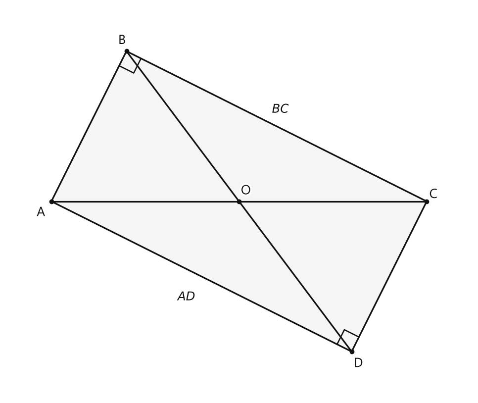
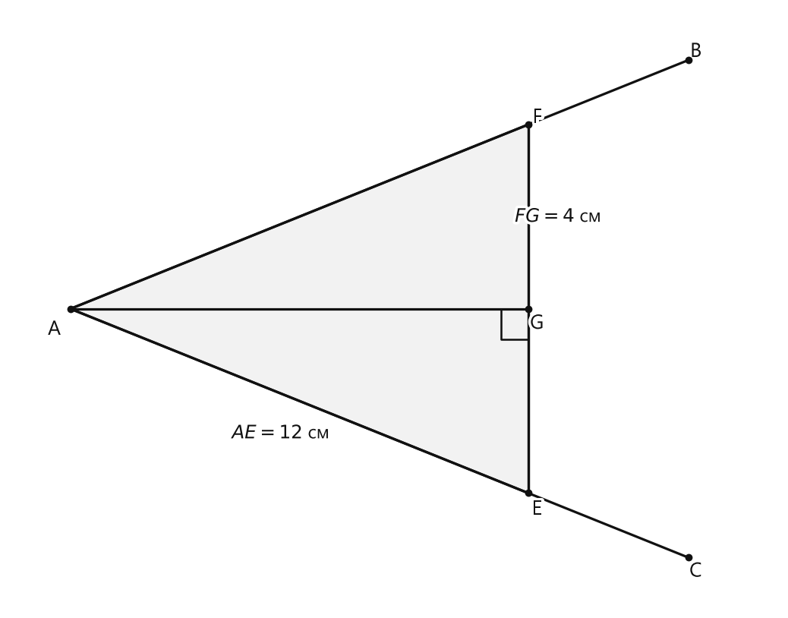

# Занятие 26. Признаки равенства прямоугольных треугольников

**Раздел:** Глава IV  
**Параграф учебника:** §23. Признаки равенства прямоугольных треугольников  
**Страницы:** 142–146

## Цели занятия

После занятия ученик умеет:

- распознавать прямоугольные треугольники и выделять в них катеты и гипотенузу;
- выбирать нужный признак равенства прямоугольных треугольников;
- доказывать равенство прямоугольных треугольников;
- использовать равенство треугольников для доказательства равенства отрезков и углов;
- решать задачи на расстояние от точки до прямой и на равные хорды;
- доказывать, что треугольник равнобедренный.

Выбери блок своего уровня:

- **1–2 балла:** различаю катеты и гипотенузу, называю признаки;
- **3–4 балла:** определяю признак по условию;
- **5–6 баллов:** выполняю доказательства по готовой схеме;
- **7–8 баллов:** решаю задачи с высотами, расстояниями и хордами;
- **9–10 баллов:** строю полное доказательство в несколько шагов.

## Теория к занятию

### 1. Первый признак: по двум катетам

#### Простыми словами

Смотри: в каждом прямоугольном треугольнике уже известен один угол — прямой, то есть $90^\circ$. Поэтому, если у двух таких треугольников равны оба катета, то совпадают две стороны и угол между ними. Этого достаточно для равенства треугольников.

Катеты — стороны, образующие прямой угол. Гипотенуза лежит напротив прямого угла. В первом признаке гипотенуза не нужна — сегодня она может немного отдохнуть.

#### Теорема

Если катеты одного прямоугольного треугольника соответственно равны двум катетам другого прямоугольного треугольника, то такие треугольники равны.

#### Формулы и обозначения

Если в прямоугольных треугольниках $ABC$ и $A_1B_1C_1$

$$
\angle C=\angle C_1=90^\circ,
$$

$$
AC=A_1C_1,\qquad BC=B_1C_1,
$$

то

$$
\triangle ABC=\triangle A_1B_1C_1.
$$

Здесь $AC$ и $BC$ — катеты первого треугольника, а $A_1C_1$ и $B_1C_1$ — катеты второго.

#### Правило

1. Найди прямые углы.
2. Убедись, что рассматриваются именно прямоугольные треугольники.
3. Проверь равенство двух катетов.

Если всё совпало, применяй первый признак.

#### Ловушки

- Не перепутай гипотенузу с катетом.
- Равенства только одного катета недостаточно.
- Прямой угол должен принадлежать каждому из рассматриваемых треугольников.

---

### 2. Второй признак: по катету и прилежащему острому углу

#### Простыми словами

Берём катет и острый угол, который находится рядом с этим катетом. Если в двух прямоугольных треугольниках такие катеты равны и такие углы равны, то треугольники равны.

**Прилежащий угол** имеет данный катет одной из своих сторон. Он стоит рядом с катетом, а не напротив него.

#### Теорема

Если катет и прилежащий к нему острый угол одного прямоугольного треугольника соответственно равны катету и прилежащему к нему острому углу другого прямоугольного треугольника, то такие треугольники равны.

#### Формулы и обозначения

Если

$$
\angle C=\angle C_1=90^\circ,
$$

$$
AC=A_1C_1,\qquad \angle A=\angle A_1,
$$

то

$$
\triangle ABC=\triangle A_1B_1C_1.
$$

Катет $AC$ прилежит к углу $A$.

#### Правило

Проверь два факта:

1. равны катеты;
2. равны острые углы, прилежащие к этим катетам.

После этого назови второй признак.

#### Ловушки

- Равный угол может оказаться противолежащим, а не прилежащим.
- Если дана гипотенуза, этот признак не подходит.
- Прямой угол отдельно доказывать не нужно: он уже есть у прямоугольного треугольника.

---

### 3. Третий признак: по катету и противолежащему острому углу

#### Простыми словами

Теперь катет и острый угол находятся напротив друг друга.

Почему этих данных достаточно? Сумма острых углов прямоугольного треугольника равна $90^\circ$. Поэтому, если один острый угол равен, то и второй острый угол тоже равен. После этого можно использовать признак равенства треугольников по стороне и двум прилежащим к ней углам.

#### Теорема

Если катет и противолежащий острый угол одного прямоугольного треугольника соответственно равны катету и противолежащему острому углу другого прямоугольного треугольника, то такие треугольники равны.

#### Формулы и обозначения

Если

$$
\angle C=\angle C_1=90^\circ,
$$

$$
AC=A_1C_1,\qquad \angle B=\angle B_1,
$$

то

$$
\triangle ABC=\triangle A_1B_1C_1.
$$

Катет $AC$ лежит напротив угла $B$.

#### Правило

1. Найди катет.
2. Проверь, что данный острый угол лежит напротив этого катета.
3. Проверь равенство катета и угла в двух треугольниках.
4. Примени третий признак.

#### Ловушки

- «Противолежащий» — это именно угол напротив данного катета.
- Не пропускай обоснование: сумма острых углов прямоугольного треугольника равна $90^\circ$.
- Угол $B$ должен быть острым, а не прямым.

---

### 4. Четвёртый признак: по гипотенузе и острому углу

#### Простыми словами

В прямоугольном треугольнике гипотенуза и один острый угол уже задают форму треугольника. Второй острый угол находится по правилу:

$$
\text{сумма острых углов}=90^\circ.
$$

Поэтому двух данных — гипотенузы и острого угла — достаточно.

#### Теорема

Если гипотенуза и острый угол одного прямоугольного треугольника соответственно равны гипотенузе и острому углу другого прямоугольного треугольника, то такие треугольники равны.

#### Формулы и обозначения

Если

$$
\angle C=\angle C_1=90^\circ,
$$

$$
AB=A_1B_1,\qquad \angle A=\angle A_1,
$$

то

$$
\triangle ABC=\triangle A_1B_1C_1.
$$

$AB$ и $A_1B_1$ — гипотенузы.

#### Правило

Если даны:

- равные гипотенузы;
- равные острые углы,

то применяй четвёртый признак.

Иногда острые углы в условии записаны разными числами. Например, $65^\circ$ и $25^\circ$. Это ещё не беда:

$$
65^\circ+25^\circ=90^\circ.
$$

Значит, второй острый угол в одном треугольнике может быть равен данному острому углу другого.

#### Ловушки

- Гипотенуза лежит напротив прямого угла.
- Углы $65^\circ$ и $25^\circ$ не равны, но дополняют друг друга до $90^\circ$.
- Не перепутай этот признак с третьим: здесь дана гипотенуза, а не катет.

---

### 5. Пятый признак: по катету и гипотенузе

#### Простыми словами

Если в двух прямоугольных треугольниках равны гипотенузы и один катет, то второй катет уже не может быть другим. Поэтому треугольники равны.

Этот признак особенно удобен, когда в условии почти нет углов. Стороны всё рассказали — углам даже слова не дали.

#### Теорема

Если катет и гипотенуза одного прямоугольного треугольника соответственно равны катету и гипотенузе другого прямоугольного треугольника, то такие треугольники равны.

#### Формулы и обозначения

Если

$$
\angle C=\angle C_1=90^\circ,
$$

$$
AC=A_1C_1,\qquad AB=A_1B_1,
$$

то

$$
\triangle ABC=\triangle A_1B_1C_1.
$$

$AC$ и $A_1C_1$ — катеты, $AB$ и $A_1B_1$ — гипотенузы.

#### Правило

1. Найди прямые углы.
2. Определи гипотенузы — они лежат напротив прямых углов.
3. Проверь равенство гипотенуз.
4. Проверь равенство соответствующих катетов.
5. Примени пятый признак.

#### Ловушки

- Два катета — это первый признак.
- Катет и гипотенуза — это пятый признак.
- Нельзя определять гипотенузу только по длине «на глаз». Сначала найди прямой угол.
- Следи за соответствием сторон: равные отрезки должны играть одинаковую роль в обоих треугольниках.

---

### Сводка формул «выучить наизусть»

Если два прямоугольных треугольника имеют соответственно равные:

1. два катета — треугольники равны;
2. катет и прилежащий острый угол — треугольники равны;
3. катет и противолежащий острый угол — треугольники равны;
4. гипотенузу и острый угол — треугольники равны;
5. катет и гипотенузу — треугольники равны.

Главный ориентир:

$$
\angle C=90^\circ
$$

означает, что $AB$ — гипотенуза, а $AC$ и $BC$ — катеты.

### Правила, которые нельзя путать

- **Прилежащий угол** имеет данный катет своей стороной.
- **Противолежащий угол** лежит напротив данного катета.
- **Гипотенуза** лежит напротив прямого угла.
- Если один острый угол равен, то второй тоже равен, поскольку сумма острых углов прямоугольного треугольника равна $90^\circ$.
- После доказательства равенства треугольников можно использовать равенство соответствующих сторон и углов.

## Разбор ключевых заданий

### Р1. Определение признака по данным сторонам и углам

#### Условие

Определите, по какому признаку равны прямоугольные треугольники.

а) Катеты одного треугольника равны $6$ см и $8$ см, катеты другого — $8$ см и $6$ см.

б) Гипотенузы двух треугольников равны $13$ см, один катет каждого треугольника равен $5$ см.

в) Гипотенузы двух треугольников равны $7$ см. Острые углы равны соответственно $65^\circ$ и $25^\circ$.

г) Катеты двух треугольников равны $9$ см, а острые углы, прилежащие к этим катетам, равны соответственно $40^\circ$ и $50^\circ$.

#### Решение

**а)**

У каждого треугольника даны два катета.

Длины соответствующих катетов равны:

$$
6=6,\qquad 8=8.
$$

Значит, прямоугольные треугольники равны по двум катетам.

**Ответ:** первый признак.

**б)**

У каждого треугольника даны гипотенуза и катет.

Гипотенузы равны:

$$
13=13.
$$

Катеты равны:

$$
5=5.
$$

Значит, треугольники равны по катету и гипотенузе.

**Ответ:** пятый признак.

**в)**

Гипотенузы равны:

$$
7=7.
$$

В первом треугольнике второй острый угол равен:

$$
90^\circ-65^\circ=25^\circ.
$$

Во втором треугольнике второй острый угол равен:

$$
90^\circ-25^\circ=65^\circ.
$$

Теперь в обоих треугольниках можно выбрать равные острые углы:

$$
65^\circ=65^\circ.
$$

Значит, треугольники равны по гипотенузе и острому углу.

**Ответ:** четвёртый признак.

**г)**

Данные углы дополняют друг друга до $90^\circ$:

$$
40^\circ+50^\circ=90^\circ.
$$

Поэтому второй острый угол первого треугольника равен $50^\circ$.

Второй острый угол второго треугольника равен $40^\circ$.

Можно выбрать равные острые углы, прилежащие к соответствующим катетам:

$$
40^\circ=40^\circ.
$$

Катеты также равны:

$$
9=9.
$$

Значит, треугольники равны по катету и прилежащему острому углу.

**Ответ:** второй признак.

> Ловушка задачи: $40^\circ$ и $50^\circ$ сами по себе не равны. Но в прямоугольном треугольнике острые углы в сумме дают $90^\circ$, поэтому нужные равные углы можно получить дополнительно.

---

### Р2. Равенство треугольников по катету и гипотенузе

#### Условие

На рисунке изображены треугольники $ABC$ и $CDA$. Углы $B$ и $D$ прямые, отрезок $AC$ — общая гипотенуза, а $BC=AD$. Докажите, что

а) $\triangle ABC=\triangle CDA$;

б) если точка $O$ лежит на отрезке $AC$, то $\triangle AOB=\triangle COD$.

<!--geo-figure-spec
{
  "needed": true,
  "kind": "plane",
  "caption": "Прямоугольные треугольники $ABC$ и $CDA$",
  "equal": true,
  "axis": false,
  "xlim": [
    -1.2,
    11.2
  ],
  "ylim": [
    -5.2,
    5.2
  ],
  "points": {
    "A": [
      0,
      0
    ],
    "B": [
      2,
      4
    ],
    "C": [
      10,
      0
    ],
    "D": [
      8,
      -4
    ],
    "O": [
      5,
      0
    ]
  },
  "segments": [
    [
      "A",
      "B"
    ],
    [
      "B",
      "C"
    ],
    [
      "C",
      "D"
    ],
    [
      "D",
      "A"
    ],
    [
      "A",
      "C"
    ],
    [
      "B",
      "O"
    ],
    [
      "O",
      "D"
    ]
  ],
  "polygons": [
    {
      "vertices": [
        "A",
        "B",
        "C"
      ],
      "fill": 0.04
    },
    {
      "vertices": [
        "A",
        "D",
        "C"
      ],
      "fill": 0.04
    }
  ],
  "circles": [],
  "labels": {
    "A": {
      "dx": -0.28,
      "dy": -0.3
    },
    "B": {
      "dx": -0.12,
      "dy": 0.28
    },
    "C": {
      "dx": 0.18,
      "dy": 0.18
    },
    "D": {
      "dx": 0.18,
      "dy": -0.32
    },
    "O": {
      "dx": 0.18,
      "dy": 0.28
    }
  },
  "right_angles": [
    {
      "vertex": "B",
      "from": "A",
      "to": "C"
    },
    {
      "vertex": "D",
      "from": "A",
      "to": "C"
    }
  ],
  "angle_marks": [],
  "texts": [
    {
      "xy": [
        6.1,
        2.45
      ],
      "text": "$BC$"
    },
    {
      "xy": [
        3.6,
        -2.55
      ],
      "text": "$AD$"
    }
  ]
}
-->

*Прямоугольные треугольники ABC и CDA*

#### Решение

**а)**

Рассмотрим треугольники $ABC$ и $CDA$.

По условию:

$$
\angle B=\angle D=90^\circ.
$$

Значит, оба треугольника прямоугольные.

Сторона $AC$ лежит напротив прямого угла в треугольнике $ABC$.

Сторона $CA$ лежит напротив прямого угла в треугольнике $CDA$.

Следовательно, $AC$ и $CA$ — гипотенузы этих треугольников.

Гипотенуза у треугольников общая:

$$
AC=CA.
$$

По условию равны катеты:

$$
BC=AD.
$$

Значит, у двух прямоугольных треугольников равны гипотенуза и катет.

Следовательно,

$$
\triangle ABC=\triangle CDA
$$

по пятому признаку равенства прямоугольных треугольников.

**б)**

В этой части есть важная проверка условия. Если известно только, что точка $O$ лежит на отрезке $AC$, то равенство $\triangle AOB=\triangle COD$ в общем случае не следует. Например, положение точки $O$ на $AC$ можно менять, и длины $AO$ и $OC$ обычно будут разными.

Для стандартного рисунка этой задачи точка $O$ — точка пересечения прямых $BC$ и $AD$. При таком расположении доказательство выполняется так.

Из равенства треугольников $ABC$ и $CDA$ получаем равенство соответствующих сторон:

$$
AB=CD.
$$

Так как $\angle B=90^\circ$ и точка $O$ лежит на прямой $BC$, то

$$
\angle ABO=90^\circ.
$$

Так как $\angle D=90^\circ$ и точка $O$ лежит на прямой $AD$, то

$$
\angle CDO=90^\circ.
$$

Значит, треугольники $AOB$ и $COD$ прямоугольные.

Углы $AOB$ и $COD$ — вертикальные:

$$
\angle AOB=\angle COD.
$$

Стороны $AB$ и $CD$ — катеты этих прямоугольных треугольников:

$$
AB=CD.
$$

Катет $AB$ лежит напротив угла $AOB$.

Катет $CD$ лежит напротив угла $COD$.

Следовательно,

$$
\triangle AOB=\triangle COD
$$

по третьему признаку равенства прямоугольных треугольников.

**Ответ:**  
а) $\triangle ABC=\triangle CDA$ по пятому признаку;  
б) $\triangle AOB=\triangle COD$ по третьему признаку при стандартном условии рисунка: $O$ — точка пересечения прямых $BC$ и $AD$. Условие «$O$ лежит на отрезке $AC$» само по себе недостаточно.

### Р3. Равные высоты в равнобедренном треугольнике

#### Условие

Докажите, что в равнобедренном треугольнике высоты, проведённые к боковым сторонам, равны между собой.

#### Дано

Треугольник $ABC$ равнобедренный:

$$
AB=BC.
$$

Высота $CK$ проведена к стороне $AB$, а высота $AM$ — к стороне $BC$:

$$
CK\perp AB,\qquad AM\perp BC.
$$

Доказать:

$$
CK=AM.
$$

#### Решение

Рассмотрим прямоугольные треугольники $BCK$ и $ABM$.

Они прямоугольные:

$$
\angle BKC=90^\circ,\qquad \angle AMB=90^\circ.
$$

Их гипотенузы равны по условию:

$$
BC=AB.
$$

Острый угол при вершине $B$ у обоих треугольников является одним и тем же углом треугольника $ABC$:

$$
\angle CBK=\angle ABM.
$$

Следовательно, прямоугольные треугольники $BCK$ и $ABM$ равны по гипотенузе и острому углу.

Значит, равны соответствующие катеты:

$$
CK=AM.
$$

**Ответ:**

$$
CK=AM.
$$

> Высоты здесь не обязаны быть медианами. Они просто перпендикулярны своим сторонам — и при этом оказываются равными. Геометрия умеет удивлять без фокусов.

---

### Р4. Если две высоты равны, треугольник равнобедренный

#### Условие

В треугольнике $ABC$ высота $CK$ проведена к стороне $AB$, а высота $AM$ — к стороне $BC$. Известно, что

$$
CK=AM.
$$

Докажите, что треугольник $ABC$ равнобедренный.

#### Решение

Рассмотрим прямоугольные треугольники $BCK$ и $ABM$.

Они прямоугольные:

$$
\angle BKC=90^\circ,\qquad \angle AMB=90^\circ.
$$

По условию соответствующие катеты равны:

$$
CK=AM.
$$

Углы при вершине $B$ равны, потому что это один и тот же угол треугольника $ABC$:

$$
\angle CBK=\angle ABM.
$$

Следовательно, треугольники $BCK$ и $ABM$ равны по катету и прилежащему острому углу.

У равных треугольников соответствующие стороны равны.

Поэтому

$$
BC=AB.
$$

Значит, в треугольнике $ABC$ равны две стороны.

Следовательно, треугольник $ABC$ равнобедренный.

**Ответ:** треугольник $ABC$ равнобедренный, его боковые стороны $AC$ и $BC$ равны.

> В условии равны высоты, а в итоге получаются равные стороны. Высоты словно передали сторонам своё равенство.

---

### Р5. Равноудалённость вершин от прямой через медиану

#### Условие

В треугольнике $ABC$ отрезок $BM$ — медиана, то есть $M$ — середина стороны $AC$. Докажите, что вершины $A$ и $C$ равноудалены от прямой $BM$.

#### Дано

$$
AM=CM.
$$

Из точек $A$ и $C$ проведены перпендикуляры к прямой $BM$:

$$
AH\perp BM,\qquad CK\perp BM.
$$

Доказать:

$$
AH=CK.
$$

#### Решение

Рассмотрим прямоугольные треугольники $AMH$ и $CMK$.

Они прямоугольные:

$$
\angle AHM=\angle CKM=90^\circ.
$$

Их гипотенузы равны, потому что $M$ — середина отрезка $AC$:

$$
AM=CM.
$$

Прямые $AC$ и $BM$ пересекаются в точке $M$.

Поэтому углы $\angle AMH$ и $\angle CMK$ — вертикальные:

$$
\angle AMH=\angle CMK.
$$

Следовательно, треугольники $AMH$ и $CMK$ равны по гипотенузе и острому углу.

Значит, равны соответствующие катеты:

$$
AH=CK.
$$

Длины $AH$ и $CK$ — это расстояния от точек $A$ и $C$ до прямой $BM$.

Поэтому

$$
d(A,BM)=d(C,BM).
$$

**Ответ:**

$$
d(A,BM)=d(C,BM).
$$

> Медиана делит сторону пополам, а прямая через неё «видит» вершины на одинаковом расстоянии. Симметрия без зеркала — почти магия, но всё доказано.

---

### Р6. Расстояние от точки до стороны угла

#### Условие

На сторонах угла $A$ взяты точки $M$ и $K$ так, что

$$
AM=AK=12\text{ см}.
$$

Расстояние от точки $M$ до прямой $AK$ равно $8$ см. Найдите расстояние от точки $K$ до прямой $AM$.

#### Решение

Проведём из точки $M$ перпендикуляр $MH$ к прямой $AK$.

Тогда расстояние от точки $M$ до прямой $AK$ равно длине этого перпендикуляра:

$$
MH=8\text{ см}.
$$

Проведём из точки $K$ перпендикуляр $KN$ к прямой $AM$.

Нужно найти $KN$.

Рассмотрим прямоугольные треугольники $AMH$ и $AKN$.

Они прямоугольные:

$$
\angle AHM=90^\circ,\qquad \angle ANK=90^\circ.
$$

Гипотенузы этих треугольников равны:

$$
AM=AK=12\text{ см}.
$$

Острые углы при вершине $A$ равны, потому что это один и тот же угол:

$$
\angle MAH=\angle KAN.
$$

Следовательно, треугольники $AMH$ и $AKN$ равны по гипотенузе и острому углу.

Поэтому соответствующие катеты равны:

$$
KN=MH.
$$

Подставим известное значение:

$$
KN=8\text{ см}.
$$

**Ответ:** $8$ см.

> Две точки находятся на одинаковом расстоянии от вершины угла. Поэтому их «высоты» до противоположных сторон тоже совпали.

---

### Р7. Равные хорды и расстояния от центра

#### Условие

Докажите, что равные хорды одной окружности находятся на одинаковом расстоянии от её центра. Сформулируйте обратное утверждение и докажите его.

#### Дано

В окружности с центром $O$ хорды $AB$ и $CD$ равны:

$$
AB=CD.
$$

Перпендикуляры $OM$ и $ON$ проведены из центра окружности к хордам $AB$ и $CD$ соответственно:

$$
OM\perp AB,\qquad ON\perp CD.
$$

Доказать:

$$
OM=ON.
$$

#### Решение

Используем свойство: перпендикуляр, проведённый из центра окружности к хорде, делит эту хорду пополам.

Поэтому

$$
AM=MB,
$$

$$
CN=ND.
$$

Так как хорды равны:

$$
AB=CD,
$$

то равны и их половины:

$$
AM=CN.
$$

Отрезки $OA$ и $OC$ — радиусы одной окружности.

Значит,

$$
OA=OC.
$$

Рассмотрим прямоугольные треугольники $OAM$ и $OCN$.

Они прямоугольные:

$$
\angle OMA=\angle ONC=90^\circ.
$$

Их гипотенузы равны:

$$
OA=OC.
$$

Один из катетов также равен:

$$
AM=CN.
$$

Следовательно, треугольники $OAM$ и $OCN$ равны по катету и гипотенузе.

Значит, соответствующие катеты равны:

$$
OM=ON.
$$

То есть равные хорды находятся на одинаковом расстоянии от центра окружности.

#### Обратное утверждение

Если хорды одной окружности находятся на одинаковом расстоянии от её центра, то эти хорды равны.

#### Доказательство обратного утверждения

Пусть

$$
OM=ON,
$$

где $OM$ и $ON$ — расстояния от центра окружности до хорд $AB$ и $CD$.

Рассмотрим прямоугольные треугольники $OAM$ и $OCN$.

Отрезки $OA$ и $OC$ — радиусы одной окружности, поэтому

$$
OA=OC.
$$

По условию

$$
OM=ON.
$$

Следовательно, треугольники $OAM$ и $OCN$ равны по двум катетам.

Значит, соответствующие катеты равны:

$$
AM=CN.
$$

Перпендикуляр из центра окружности делит хорду пополам.

Поэтому

$$
AB=2AM,
$$

$$
CD=2CN.
$$

Так как

$$
AM=CN,
$$

то

$$
AB=CD.
$$

**Ответ:** равные хорды равноудалены от центра; и наоборот, хорды, равноудалённые от центра, равны.

> Хорда и расстояние до неё — как две половинки одной подсказки: знаешь одну, можешь восстановить другую.

---

### Р8. Периметр треугольника с биссектрисой

#### Условие

Дан угол $BAC$. На стороне $AC$ взята точка $E$. Через точку $E$ проведена прямая, перпендикулярная биссектрисе угла $BAC$, которая пересекает луч $AB$ в точке $F$, а биссектрису — в точке $G$.

Известно:

$$
AE=12\text{ см},\qquad FG=4\text{ см}.
$$

Найдите периметр треугольника $AFE$.

<!--geo-figure-spec
{
  "needed": true,
  "kind": "plane",
  "caption": "Угол $BAC$, биссектриса $AG$ и треугольник $AFE$",
  "equal": false,
  "axis": false,
  "xlim": [
    -1.5,
    17.5
  ],
  "ylim": [
    -6.5,
    6.5
  ],
  "points": {
    "A": [
      0,
      0
    ],
    "G": [
      11.3137085,
      0
    ],
    "E": [
      11.3137085,
      -4
    ],
    "F": [
      11.3137085,
      4
    ],
    "B": [
      15.2735065,
      5.4
    ],
    "C": [
      15.2735065,
      -5.4
    ]
  },
  "segments": [
    [
      "A",
      "B"
    ],
    [
      "A",
      "C"
    ],
    [
      "A",
      "G"
    ],
    [
      "A",
      "E"
    ],
    [
      "A",
      "F"
    ],
    [
      "E",
      "F"
    ],
    [
      "E",
      "G"
    ],
    [
      "G",
      "F"
    ]
  ],
  "polygons": [
    {
      "vertices": [
        "A",
        "E",
        "F"
      ],
      "fill": 0.05
    }
  ],
  "circles": [],
  "labels": {
    "A": {
      "dx": -0.4,
      "dy": -0.45
    },
    "B": {
      "dx": 0.18,
      "dy": 0.18
    },
    "C": {
      "dx": 0.18,
      "dy": -0.3
    },
    "E": {
      "dx": 0.22,
      "dy": -0.35
    },
    "F": {
      "dx": 0.22,
      "dy": 0.15
    },
    "G": {
      "dx": 0.22,
      "dy": -0.32
    }
  },
  "right_angles": [
    {
      "vertex": "G",
      "from": "A",
      "to": "E"
    }
  ],
  "angle_marks": [],
  "texts": [
    {
      "xy": [
        5.2,
        -2.7
      ],
      "text": "$AE=12$ см"
    },
    {
      "xy": [
        12.05,
        2
      ],
      "text": "$FG=4$ см"
    }
  ]
}
-->

*Угол BAC, биссектриса AG и треугольник AFE*

#### Решение

Так как $AG$ — биссектриса угла $BAC$, она делит этот угол на два равных угла:

$$
\angle EAG=\angle GAF.
$$

По условию прямая $EF$ перпендикулярна биссектрисе $AG$.

Значит,

$$
\angle EGA=\angle AGF=90^\circ.
$$

Рассмотрим прямоугольные треугольники $AEG$ и $AFG$.

У них:

- катет $AG$ общий;
- острые углы при вершине $A$ равны:

$$
\angle EAG=\angle GAF.
$$

Следовательно, треугольники $AEG$ и $AFG$ равны по катету и прилежащему острому углу.

У равных треугольников соответствующие стороны равны:

$$
AE=AF,
$$

$$
EG=FG.
$$

По условию

$$
AE=12\text{ см},
$$

поэтому

$$
AF=12\text{ см}.
$$

Также

$$
FG=4\text{ см},
$$

значит,

$$
EG=4\text{ см}.
$$

Точка $G$ лежит на отрезке $EF$.

Поэтому весь отрезок $EF$ состоит из двух частей:

$$
EF=EG+GF.
$$

Подставим известные значения:

$$
EF=4+4=8\text{ см}.
$$

Периметр треугольника $AFE$ равен сумме его сторон:

$$
P=AE+AF+EF.
$$

Подставим найденные длины:

$$
P=12+12+8=32\text{ см}.
$$

**Ответ:** $32$ см.

> Биссектриса разделила угол пополам, а вместе с равенством прямоугольных треугольников помогла получить два одинаковых кусочка: $EG=FG$.

---

### Р9. Равенство высот и равнобедренный треугольник

#### Условие

Высоты треугольника $ABC$, проведённые из вершин $A$ и $C$, пересекаются в точке $H$. Известно, что

$$
AH=CH.
$$

Докажите, что треугольник $ABC$ равнобедренный.

#### Решение

Так как $AH$ — высота, проведённая из вершины $A$, то

$$
AH\perp BC.
$$

Так как $CH$ — высота, проведённая из вершины $C$, то

$$
CH\perp AB.
$$

Рассмотрим треугольник $AHC$.

По условию

$$
AH=CH.
$$

Значит, треугольник $AHC$ равнобедренный.

В равнобедренном треугольнике углы при основании равны:

$$
\angle HAC=\angle HCA.
$$

Теперь выразим эти углы через углы треугольника $ABC$.

Так как

$$
AH\perp BC,
$$

то угол $\angle HAC$ и угол $C$ в сумме дают $90^\circ$:

$$
\angle HAC=90^\circ-\angle C.
$$

Так как

$$
CH\perp AB,
$$

то угол $\angle HCA$ и угол $A$ в сумме дают $90^\circ$:

$$
\angle HCA=90^\circ-\angle A.
$$

Подставим эти выражения в равенство углов:

$$
90^\circ-\angle C=90^\circ-\angle A.
$$

Вычтем из обеих частей $90^\circ$:

$$
-\angle C=-\angle A.
$$

Следовательно,

$$
\angle A=\angle C.
$$

В треугольнике против равных углов лежат равные стороны:

$$
BC=AB.
$$

Значит, треугольник $ABC$ равнобедренный.

**Ответ:** $AB=BC$, треугольник $ABC$ равнобедренный.

> Равенство двух высот привело к равенству углов, а равенство углов — к равенству сторон. Геометрическая цепочка: высоты → углы → стороны.

## Практические задания

Выбери свой уровень и решай только этот блок. В блоке должна закрепиться вся тема параграфа. Ответы не приводятся.

### Уровень 1–2 балла

**С1.** Два прямоугольных треугольника имеют соответственно равные катеты. По какому признаку можно утверждать, что эти треугольники равны?  
1) по двум катетам 2) по катету и прилежащему острому углу 3) по катету и противолежащему острому углу 4) по гипотенузе и острому углу 5) по катету и гипотенузе

**С2.** У прямоугольных треугольников $ABC$ и $DEF$ $\angle B=\angle E=90^\circ$, $AB=DE$, $\angle A=\angle D$. Какой признак равенства применим?  
1) по двум катетам 2) по катету и прилежащему острому углу 3) по катету и противолежащему острому углу 4) по гипотенузе и острому углу 5) по катету и гипотенузе

**С3.** У прямоугольных треугольников $MNP$ и $RST$ $\angle N=\angle S=90^\circ$, $MP=RT$, $\angle M=\angle R$. По какому признаку равны треугольники?  
1) по двум катетам 2) по катету и прилежащему острому углу 3) по катету и противолежащему острому углу 4) по гипотенузе и острому углу 5) по катету и гипотенузе

**С4.** У прямоугольных треугольников $KLM$ и $PQR$ $\angle L=\angle Q=90^\circ$, $KM=PR$, $KL=PQ$. Какой признак равенства применим?  
1) по двум катетам 2) по катету и прилежащему острому углу 3) по катету и противолежащему острому углу 4) по гипотенузе и острому углу 5) по катету и гипотенузе

**С5.** У прямоугольных треугольников $ABC$ и $DEF$ $\angle B=\angle E=90^\circ$, $AC=DF$, $\angle C=\angle F$. По какому признаку равны треугольники?  
1) по двум катетам 2) по катету и прилежащему острому углу 3) по катету и противолежащему острому углу 4) по гипотенузе и острому углу 5) по катету и гипотенузе

**С6.** Выберите пару данных, которая позволяет установить равенство двух прямоугольных треугольников по первому признаку.  
1) равные гипотенузы и равные острые углы 2) равные катеты 3) равные катет и прилежащий острый угол 4) равные катет и противолежащий острый угол 5) равные катет и гипотенуза

**С7.** Выберите пару данных, которая позволяет установить равенство двух прямоугольных треугольников по пятому признаку.  
1) равные два катета 2) равные катет и прилежащий острый угол 3) равные катет и противолежащий острый угол 4) равные гипотенузы и острые углы 5) равные катет и гипотенуза

**С8.** В прямоугольных треугольниках $ABC$ и $DEF$ $\angle B=\angle E=90^\circ$, $AB=DE$, $AC=DF$. Какие стороны равны по условию?  
1) два катета 2) катет и прилежащий угол 3) катет и противолежащий угол 4) гипотенуза и острый угол 5) катет и гипотенуза

**С9.** В прямоугольном треугольнике $ABC$ $\angle B=90^\circ$, $AB=6$ см, $AC=10$ см. В другом прямоугольном треугольнике $DEF$ $\angle E=90^\circ$, $DE=6$ см, $DF=10$ см. По какому признаку можно доказать равенство этих треугольников?  
1) по двум катетам 2) по катету и прилежащему острому углу 3) по катету и противолежащему острому углу 4) по гипотенузе и острому углу 5) по катету и гипотенузе

**С10.** В прямоугольных треугольниках $KLM$ и $PQR$ $\angle L=\angle Q=90^\circ$, $KM=PR$, $\angle K=\angle P$. Выберите верное утверждение.  
1) треугольники равны по двум катетам 2) треугольники равны по катету и прилежащему острому углу 3) треугольники равны по катету и противолежащему острому углу 4) треугольники равны по гипотенузе и острому углу 5) треугольники равны по катету и гипотенузе

**С11.** В прямоугольных треугольниках $ABC$ и $DEF$ $\angle B=\angle E=90^\circ$, $AB=DE$, $\angle C=\angle F$. Выберите верное утверждение.  
1) $AB$ и $DE$ — гипотенузы 2) углы $C$ и $F$ прилежат к данным катетам 3) углы $C$ и $F$ противолежат данным катетам 4) $AB$ и $DE$ — катеты, а углы $C$ и $F$ прямые 5) треугольники равны по двум катетам

**С12.** В прямоугольных треугольниках $MNP$ и $RST$ $\angle N=\angle S=90^\circ$, $NP=ST$, $\angle M=\angle R$. Выберите верное утверждение.  
1) данные катеты и углы являются прилежащими 2) данные катеты и углы являются противолежащими 3) $NP$ и $ST$ — гипотенузы 4) треугольники равны по гипотенузе и острому углу 5) треугольники равны по двум катетам

**С13.** В прямоугольных треугольниках $ABC$ и $DEF$ $\angle B=\angle E=90^\circ$, $AB=DE$ и $BC=EF$. По какому признаку можно доказать равенство треугольников?
1) по двум катетам  
2) по катету и прилежащему острому углу  
3) по катету и противолежащему острому углу  
4) по гипотенузе и острому углу  
5) по катету и гипотенузе

**С14.** В прямоугольных треугольниках $KLM$ и $PQR$ $\angle L=\angle Q=90^\circ$, $KM=PR$ и $\angle K=\angle P$. Какой признак равенства применим?
1) по двум катетам  
2) по катету и прилежащему острому углу  
3) по катету и противолежащему острому углу  
4) по гипотенузе и острому углу  
5) по катету и гипотенузе

**С15.** В прямоугольных треугольниках $ABC$ и $DEF$ $\angle B=\angle E=90^\circ$, $AC=DF$ и $\angle C=\angle F$. Укажите признак равенства треугольников.
1) по двум катетам  
2) по катету и прилежащему острому углу  
3) по катету и противолежащему острому углу  
4) по гипотенузе и острому углу  
5) по катету и гипотенузе

**С16.** В прямоугольных треугольниках $MNP$ и $RST$ $\angle N=\angle S=90^\circ$, $MN=RS$ и $\angle M=\angle R$. Какой признак равенства использован?
1) по двум катетам  
2) по катету и прилежащему острому углу  
3) по катету и противолежащему острому углу  
4) по гипотенузе и острому углу  
5) по катету и гипотенузе

**С17.** В прямоугольных треугольниках $ABC$ и $DEF$ $\angle B=\angle E=90^\circ$, $AB=DE$ и $\angle C=\angle F$. По какому признаку равны треугольники?
1) по двум катетам  
2) по катету и прилежащему острому углу  
3) по катету и противолежащему острому углу  
4) по гипотенузе и острому углу  
5) по катету и гипотенузе

**С18.** В прямоугольных треугольниках $KLM$ и $PQR$ $\angle L=\angle Q=90^\circ$, $KL=PQ$ и $KM=PR$. Выберите признак равенства.
1) по двум катетам  
2) по катету и прилежащему острому углу  
3) по катету и противолежащему острому углу  
4) по гипотенузе и острому углу  
5) по катету и гипотенузе

**С19.** В прямоугольных треугольниках $XYZ$ и $ABC$ $\angle Y=\angle B=90^\circ$, $XZ=AC$ и $\angle X=\angle A$. Какая пара элементов задана для применения признака равенства?
1) два катета  
2) катет и прилежащий острый угол  
3) катет и противолежащий острый угол  
4) гипотенуза и острый угол  
5) катет и гипотенуза

**С20.** В прямоугольных треугольниках $DEF$ и $KLM$ $\angle E=\angle L=90^\circ$, $DF=KM$ и $\angle F=\angle M$. Какой признак следует применить?
1) по двум катетам  
2) по катету и прилежащему острому углу  
3) по катету и противолежащему острому углу  
4) по гипотенузе и острому углу  
5) по катету и гипотенузе

**С21.** В прямоугольных треугольниках $ABC$ и $KLM$ $\angle B=\angle L=90^\circ$, $AB=KL$ и $AC=KM$. Укажите признак равенства треугольников.
1) по двум катетам  
2) по катету и прилежащему острому углу  
3) по катету и противолежащему острому углу  
4) по гипотенузе и острому углу  
5) по катету и гипотенузе

**С22.** В прямоугольных треугольниках $PQR$ и $STU$ $\angle Q=\angle T=90^\circ$, $PQ=ST$ и $\angle R=\angle U$. Выберите верное основание для доказательства равенства треугольников.
1) два катета  
2) катет и прилежащий острый угол  
3) катет и противолежащий острый угол  
4) гипотенуза и острый угол  
5) катет и гипотенуза

**С23.** В прямоугольных треугольниках $ABC$ и $DEF$ $\angle B=\angle E=90^\circ$, $BC=EF$ и $\angle A=\angle D$. По какому признаку равны эти треугольники?
1) по двум катетам  
2) по катету и прилежащему острому углу  
3) по катету и противолежащему острому углу  
4) по гипотенузе и острому углу  
5) по катету и гипотенузе

**С24.** В прямоугольных треугольниках $MNP$ и $RST$ $\angle N=\angle S=90^\circ$, $MP=RT$ и $MN=RS$. Какой признак равенства прямоугольных треугольников используется?
1) по двум катетам  
2) по катету и прилежащему острому углу  
3) по катету и противолежащему острому углу  
4) по гипотенузе и острому углу  
5) по катету и гипотенузе

**С25.** Выберите признак равенства прямоугольных треугольников, если у них соответственно равны два катета.  
1) по гипотенузе и острому углу 2) по катету и гипотенузе 3) по двум катетам 4) по катету и прилежащему острому углу 5) по катету и противолежащему острому углу

**С26.** Выберите признак равенства прямоугольных треугольников, если у них соответственно равны катет и прилежащий к нему острый угол.  
1) первый 2) второй 3) третий 4) четвёртый 5) пятый

**С27.** Выберите признак равенства прямоугольных треугольников, если у них соответственно равны катет и противолежащий ему острый угол.  
1) первый 2) второй 3) третий 4) четвёртый 5) пятый

**С28.** Выберите признак равенства прямоугольных треугольников, если у них соответственно равны гипотенуза и острый угол.  
1) по двум катетам 2) по катету и прилежащему острому углу 3) по катету и противолежащему острому углу 4) по гипотенузе и острому углу 5) по катету и гипотенузе

**С29.** Выберите признак равенства прямоугольных треугольников, если у них соответственно равны катет и гипотенуза.  
1) первый 2) второй 3) третий 4) четвёртый 5) пятый

**С30.** В прямоугольных треугольниках $ABC$ и $DEF$ $\angle B=\angle E=90^\circ$, $AB=DE$, $BC=EF$. Выберите верное утверждение.  
1) $\triangle ABC=\triangle DEF$ по двум катетам 2) треугольники равны по гипотенузе и острому углу 3) треугольники равны по катету и гипотенузе 4) равенство треугольников установить нельзя 5) треугольники равны по катету и противолежащему углу

**С31.** В прямоугольных треугольниках $KLM$ и $PQR$ $\angle L=\angle Q=90^\circ$, $KM=PR$, $\angle K=\angle P$. Выберите верное утверждение.  
1) треугольники равны по двум катетам 2) треугольники равны по катету и прилежащему острому углу 3) треугольники равны по гипотенузе и острому углу 4) треугольники равны по катету и гипотенузе 5) равенство треугольников установить нельзя

**С32.** В прямоугольных треугольниках $ABC$ и $DEF$ $\angle B=\angle E=90^\circ$, $AC=DF$, $AB=DE$. Выберите признак, по которому равны эти треугольники.  
1) по двум катетам 2) по катету и прилежащему острому углу 3) по катету и противолежащему острому углу 4) по гипотенузе и острому углу 5) по катету и гипотенузе

**С33.** В прямоугольных треугольниках $RST$ и $XYZ$ $\angle S=\angle Y=90^\circ$, $RS=XY$, $\angle T=\angle Z$. Укажите, является ли данный угол прилежащим или противолежащим к указанному катету: угол $T$ к катету $RS$.  
1) прилежащим 2) противолежащим 3) прямым 4) развёрнутым 5) определить нельзя

**С34.** В прямоугольных треугольниках $ABC$ и $DEF$ $\angle B=\angle E=90^\circ$, $BC=EF$, $\angle A=\angle D$. Выберите признак равенства треугольников.  
1) по двум катетам 2) по катету и прилежащему острому углу 3) по катету и противолежащему острому углу 4) по гипотенузе и острому углу 5) по катету и гипотенузе

**С35.** В прямоугольных треугольниках $MNP$ и $QRS$ $\angle N=\angle R=90^\circ$, $MP=QS$, $\angle M=\angle Q$. Какие элементы равны соответственно?  
1) катеты 2) гипотенузы и острые углы 3) катет и гипотенуза 4) два прямых угла 5) два острых угла без гипотенуз

**С36.** Выберите набор данных, достаточный для доказательства равенства двух прямоугольных треугольников по пятому признаку.  
1) равные два острых угла 2) равные два катета 3) равные гипотенуза и острый угол 4) равные катет и гипотенуза 5) равные катет и прилежащий острый угол

### Уровень 3–4 балла

**С1.** Определите, по какому признаку равны прямоугольные треугольники $ABC$ и $DEF$, если $\angle C=\angle F=90^\circ$, $AC=DF=7$ см и $\angle A=\angle D=35^\circ$.

**С2.** Определите, по какому признаку равны прямоугольные треугольники $MNP$ и $RST$, если $\angle N=\angle S=90^\circ$, $MP=RT=13$ см и $MN=RS=5$ см.

**С3.** Определите, по какому признаку равны прямоугольные треугольники $KLM$ и $PQR$, если $\angle L=\angle Q=90^\circ$, $KL=PQ=8$ см и $LM=QR=15$ см.

**С4.** Определите, по какому признаку равны прямоугольные треугольники $XYZ$ и $ABC$, если $\angle Y=\angle B=90^\circ$, $XZ=AC=10$ см и $\angle X=\angle A=42^\circ$.

**С5.** Определите, по какому признаку равны прямоугольные треугольники $DEF$ и $GHI$, если $\angle E=\angle H=90^\circ$, $DF=GI=17$ см и $\angle F=\angle I=28^\circ$.

**С6.** В прямоугольных треугольниках $ABC$ и $DEF$ $\angle C=\angle F=90^\circ$, $AC=DF=6$ см, $BC=EF=8$ см. Докажите, что $\triangle ABC=\triangle DEF$.

**С7.** В прямоугольных треугольниках $KLM$ и $PQR$ $\angle L=\angle Q=90^\circ$, $KM=PR=12$ см, $KL=PQ=7$ см. Докажите, что $\triangle KLM=\triangle PQR$.

**С8.** В прямоугольных треугольниках $ABC$ и $DEF$ $\angle B=\angle E=90^\circ$, $AB=DE=9$ см, $\angle A=\angle D=38^\circ$. Докажите, что $\triangle ABC=\triangle DEF$.

**С9.** В прямоугольных треугольниках $MNP$ и $RST$ $\angle N=\angle S=90^\circ$, $MP=RT=14$ см, $\angle M=\angle R=51^\circ$. Докажите, что $\triangle MNP=\triangle RST$.

**С10.** В прямоугольных треугольниках $XYZ$ и $ABC$ $\angle Y=\angle B=90^\circ$, $XZ=AC=15$ см, $\angle Z=\angle C=24^\circ$. Докажите, что $\triangle XYZ=\triangle ABC$.

**С11.** В прямоугольных треугольниках $ABC$ и $ADC$ $\angle ABC=\angle ADC=90^\circ$. Общая сторона $AC$ является гипотенузой обоих треугольников, а $BC=AD$. Докажите, что $\triangle ABC=\triangle CDA$.

**С12.** В треугольнике $ABC$ высоты $AK$ и $CM$ пересекаются в точке $O$. Известно, что $\triangle AOM$ и $\triangle COK$ равны, причём $\angle AMO=\angle CKO=90^\circ$. Докажите, что $AB=BC$.

**С13.** Определите, по какому признаку равны прямоугольные треугольники $ABC$ и $KLM$, если $\angle B=\angle L=90^\circ$, $AB=KL$ и $BC=LM$.

**С14.** Определите, по какому признаку равны прямоугольные треугольники $DEF$ и $PQR$, если $\angle E=\angle Q=90^\circ$, $DF=PR$ и $\angle D=\angle P$.

**С15.** Определите, по какому признаку равны прямоугольные треугольники $MNP$ и $XYZ$, если $\angle N=\angle Y=90^\circ$, $MP=XZ$ и $MN=XY$.

**С16.** Определите, по какому признаку равны прямоугольные треугольники $ABC$ и $DEF$, если $\angle B=\angle E=90^\circ$, $AC=DF$ и $\angle A=\angle D$.

**С17.** Определите, по какому признаку равны прямоугольные треугольники $KLM$ и $RST$, если $\angle L=\angle S=90^\circ$, $KM=RT$ и $\angle M=\angle T$.

**С18.** В прямоугольных треугольниках $ABC$ и $DEF$ $\angle B=\angle E=90^\circ$, $AB=DE=7$ см, $AC=DF=25$ см. Докажите, что треугольники $ABC$ и $DEF$ равны.

**С19.** В прямоугольных треугольниках $KLM$ и $PQR$ $\angle L=\angle Q=90^\circ$, $KL=PQ=9$ см, $\angle K=\angle P=35^\circ$. Докажите, что треугольники $KLM$ и $PQR$ равны.

**С20.** В прямоугольных треугольниках $ABC$ и $KLM$ $\angle B=\angle L=90^\circ$, $BC=LM=6$ см, $\angle A=\angle K=40^\circ$. Докажите, что треугольники $ABC$ и $KLM$ равны.

**С21.** В прямоугольных треугольниках $DEF$ и $XYZ$ $\angle E=\angle Y=90^\circ$, $DF= XZ=13$ см, $\angle D=\angle X=28^\circ$. Докажите, что треугольники $DEF$ и $XYZ$ равны.

**С22.** В прямоугольных треугольниках $MNP$ и $RST$ $\angle N=\angle S=90^\circ$, $MN=RS=8$ см, $MP=RT=17$ см. Докажите, что треугольники $MNP$ и $RST$ равны.

**С23.** Треугольник $ABC$ прямоугольный, $\angle B=90^\circ$, $AB=12$ см, $BC=5$ см. Треугольник $DEF$ также прямоугольный, $\angle E=90^\circ$, $DE=5$ см, $EF=12$ см. Докажите, что треугольники $ABC$ и $DEF$ равны, указав соответствие вершин.

**С24.** В прямоугольном треугольнике $ABC$ $\angle C=90^\circ$. Из вершины $C$ проведена высота $CH$ к гипотенузе $AB$. Докажите, что треугольники $ACH$ и $CBH$ равны, если $AC=CB$.

**С25.** В прямоугольных треугольниках $ABC$ и $DEF$ $\angle B=\angle E=90^\circ$, $AB=DE=7$ см, $BC=EF=4$ см. По какому признаку равны эти треугольники?

**С26.** В прямоугольных треугольниках $KLM$ и $PQR$ $\angle L=\angle Q=90^\circ$, $KM=PR$, $\angle K=\angle P$. По какому признаку равны эти треугольники?

**С27.** В прямоугольных треугольниках $ABC$ и $DEF$ $\angle B=\angle E=90^\circ$, $AC=DF$, $\angle C=\angle F$. Укажите соответствующие равные стороны и сделайте вывод о равенстве треугольников.

**С28.** В прямоугольных треугольниках $MNP$ и $RST$ $\angle N=\angle S=90^\circ$, $MP=RT$, $MN=RS$. Докажите равенство треугольников.

**С29.** В прямоугольных треугольниках $ABC$ и $DEF$ $\angle B=\angle E=90^\circ$, $AB=DE$, $\angle C=\angle F$. Докажите равенство треугольников и укажите, какие стороны ещё равны.

**С30.** В прямоугольных треугольниках $KLM$ и $PQR$ $\angle L=\angle Q=90^\circ$, $LM=QR$, $\angle M=\angle R$. Докажите равенство треугольников.

**С31.** В прямоугольном треугольнике $ABC$ $\angle B=90^\circ$, $AB=6$ см, $BC=8$ см. В прямоугольном треугольнике $DEF$ $\angle E=90^\circ$, $DE=8$ см, $EF=6$ см. Докажите равенство треугольников по двум катетам.

**С32.** В прямоугольных треугольниках $ABC$ и $ADC$ $\angle ABC=\angle ADC=90^\circ$, $AC$ — общая сторона, $BC=AD$. Докажите равенство треугольников и укажите использованный признак.

**С33.** В прямоугольных треугольниках $MAB$ и $MCD$ $\angle MAB=\angle MCD=90^\circ$, $MB=MD$, $\angle MBA=\angle MDC$. Докажите равенство треугольников.

**С34.** Отрезок $AB$ пересекается с отрезком $CD$ в точке $O$. Известно, что $\angle AOC=\angle BOD=90^\circ$, $AO=BO$ и $CO=DO$. Докажите равенство прямоугольных треугольников $AOC$ и $BOD$.

**С35.** В треугольнике $ABC$ проведена высота $AD$ к стороне $BC$. Известно, что $AB=AC$. Докажите, что прямоугольные треугольники $ABD$ и $ACD$ равны, и сделайте вывод о равенстве отрезков $BD$ и $DC$.

**С36.** В треугольнике $ABC$ высоты $AD$ и $CE$ пересекаются в точке $H$, причём $AD=CE$. Докажите, что треугольник $ABC$ равнобедренный, если $AB=BC$ не предполагается.

### Уровень 5–6 баллов

**С1.** В прямоугольных треугольниках $ABC$ и $DEF$ $\angle B=\angle E=90^\circ$, $AB=DE=7$ см, $BC=EF=4$ см. Укажите признак, по которому треугольники равны.

**С2.** В прямоугольных треугольниках $KLM$ и $PQR$ $\angle L=\angle Q=90^\circ$, $KM=PR=13$ см, $\angle K=\angle P=35^\circ$. Докажите, что $\triangle KLM=\triangle PQR$.

**С3.** В прямоугольных треугольниках $ABC$ и $DEF$ $\angle B=\angle E=90^\circ$, $AC=DF=10$ см, $AB=DE=6$ см. Найдите длины сторон $BC$ и $EF$.

**С4.** В прямоугольных треугольниках $MNP$ и $RST$ $\angle N=\angle S=90^\circ$, $MN=RS$, $\angle M=\angle R$. Докажите, что $\triangle MNP=\triangle RST$, и укажите признак равенства.

**С5.** В прямоугольных треугольниках $ABC$ и $DEF$ $\angle B=\angle E=90^\circ$, $AB=DE=8$ см, $\angle C=\angle F=40^\circ$. Найдите гипотенузы $AC$ и $DF$, если $AC=15$ см.

**С6.** В прямоугольных треугольниках $KLM$ и $PQR$ $\angle L=\angle Q=90^\circ$, $KM=PR$, $LM=QR$. Докажите равенство треугольников и укажите признак, использованный в доказательстве.

**С7.** Отрезок $AB$ пересекается с отрезком $CD$ в точке $O$. Известно, что $\angle AOC=\angle BOD=90^\circ$, $AO=BO=5$ см, $CO=DO=9$ см. Докажите, что $\triangle AOC=\triangle BOD$.

**С8.** В треугольнике $ABC$ высоты $AK$ и $CM$ проведены к сторонам $BC$ и $AB соответственно. Известно, что $AK=CM$. Докажите, что если $AB=BC$, то треугольники $ABK$ и $CBM$ равны.

**С9.** В прямоугольных треугольниках $ABC$ и $ADC$ $\angle ABC=\angle ADC=90^\circ$, общая гипотенуза $AC$, а $BC=AD$. Докажите, что $\angle BAC=\angle DCA$.

**С10.** В равнобедренном треугольнике $ABC$ с основанием $AC$ проведены высоты $BK$ и $CM$ к сторонам $AC$ и $AB соответственно. Докажите, что прямоугольные треугольники $ABK$ и $CBM$ равны.

**С11.** Даны два прямоугольных треугольника $ABC$ и $DEF$, в которых $\angle B=\angle E=90^\circ$, $AB=DE$, $AC=DF$. В первом треугольнике $BC=12$ см, $AB=5$ см. Найдите катет $EF$ второго треугольника.

**С12.** В треугольнике $ABC$ высоты $AK$ и $CM$ к сторонам $BC$ и $AB$ пересекаются в точке $H$. Известно, что $AH=CH$. Докажите, что $AB=BC$.

**С13.** Прямоугольные треугольники $ABC$ и $DEF$ имеют прямые углы $\angle C=\angle F=90^\circ$. Известно, что $AC=DF$ и $\angle A=\angle D$. По какому признаку можно доказать равенство этих треугольников?

**С14.** Прямоугольные треугольники $KLM$ и $PQR$ имеют прямые углы $\angle L=\angle Q=90^\circ$. Известно, что $KM=PR$ и $\angle K=\angle P$. Докажите, что $\triangle KLM=\triangle PQR$.

**С15.** В прямоугольных треугольниках $ABC$ и $DEF$ $\angle B=\angle E=90^\circ$, $AB=DE=7$ см, $BC=EF=9$ см. Докажите равенство треугольников и укажите соответствующие гипотенузы.

**С16.** Прямоугольные треугольники $MNP$ и $RST$ имеют прямые углы $\angle N=\angle S=90^\circ$. Известно, что $MP=RT=13$ см и $MN=RS=5$ см. Докажите равенство треугольников и найдите длины катетов $NP$ и $ST$.

**С17.** В прямоугольных треугольниках $ABC$ и $DEF$ $\angle B=\angle E=90^\circ$, $AB=DE$, $\angle A=\angle D$. Запишите равенства сторон и углов, которые следуют из равенства треугольников.

**С18.** В прямоугольных треугольниках $KLM$ и $PQR$ $\angle L=\angle Q=90^\circ$, $KM=PR=10$ см, $\angle K=\angle P=30^\circ$. Докажите равенство треугольников. Какая сторона треугольника $KLM$ соответствует стороне $PR$?

**С19.** В прямоугольных треугольниках $ABC$ и $ADC$ $\angle ABC=\angle ADC=90^\circ$. Общая сторона $AC$ является гипотенузой обоих треугольников, а $BC=AD$. Докажите, что $\triangle ABC=\triangle CDA$, и укажите сторону, равную стороне $AB$.

**С20.** В треугольнике $ABC$ высота $AD$ проведена к стороне $BC$. Известно, что $AB=AC$. Докажите, что прямоугольные треугольники $ABD$ и $ACD$ равны. Какой вывод можно сделать о длинах отрезков $BD$ и $DC$?

**С21.** В треугольнике $ABC$ медиана $BM$ делит сторону $AC пополам: $AM=MC$. Через точки $A$ и $C$ проведены перпендикуляры к прямой $BM$, которые пересекают её в точках $D$ и $E$ соответственно. Докажите, что $AD=CE$.

**С22.** В окружности с центром $O$ хорды $AB$ и $CD$ равны: $AB=CD$. Перпендикуляры из точки $O$ к прямым $AB$ и $CD$ пересекают их в точках $M$ и $N$ соответственно. Докажите, что $OM=ON$.

**С23.** В окружности с центром $O$ расстояния от центра до хорд $AB$ и $CD$ равны: $OM=ON$, где $OM\perp AB$ и $ON\perp CD$. Докажите, что хорды $AB$ и $CD$ равны.

**С24.** В прямоугольном параллелепипеде $ABCDA_1B_1C_1D_1$ основание $ABCD$ — квадрат со стороной $6$ см. Высота $AA_1$ равна $8$ см. Докажите равенство прямоугольных треугольников $ADD_1$ и $BCC_1$, а затем найдите длину диагонали грани $ADD_1A_1$.

**С25.** Прямоугольные треугольники $ABC$ и $DEF$ имеют прямые углы $\angle B=\angle E=90^\circ$. Известно, что $AB=DE=7$ см и $BC=EF=24$ см. По какому признаку равны треугольники $ABC$ и $DEF$? Найдите длину гипотенузы каждого треугольника.

**С26.** Прямоугольные треугольники $KLM$ и $PQR$ имеют прямые углы $\angle L=\angle Q=90^\circ$. Известно, что $KL=PQ=9$ см и $\angle K=\angle P=35^\circ$. Докажите, что $\triangle KLM=\triangle PQR$, указав признак равенства.

**С27.** Прямоугольные треугольники $ABC$ и $DEF$ имеют прямые углы $\angle B=\angle E=90^\circ$. Гипотенузы $AC$ и $DF$ равны, а $\angle A=\angle D$. Докажите, что $AB=DE$ и $BC=EF$.

**С28.** В равнобедренном треугольнике $ABC$ с основанием $AC$ проведены высоты $BH$ и $CK$, где $H\in AC$, $K\in AB$. Докажите, что $BH=CK$, используя признак равенства прямоугольных треугольников.

**С29.** В треугольнике $ABC$ высоты $BK$ и $CM$ проведены к сторонам $AC$ и $AB соответственно. Известно, что $BK=CM$ и $\angle BAK=\angle CAM$. Докажите, что $AB=AC$.

**С30.** В окружности с центром $O$ хорды $AB$ и $CD$ равны. Перпендикуляры $OM$ и $ON$ проведены из центра к хордам $AB$ и $CD$ соответственно, где $M\in AB$, $N\in CD$. Докажите, что расстояния от центра окружности до этих хорд равны: $OM=ON$.

### Уровень 7–8 баллов

**С1.** Прямоугольные треугольники $ABC$ и $DEF$ имеют прямые углы $\angle C=\angle F=90^\circ$. Известно, что $AC=DF$ и $\angle A=\angle D$. По какому признаку равны треугольники $ABC$ и $DEF$? Запишите недостающие равенства соответствующих элементов.

**С2.** Прямоугольные треугольники $KLM$ и $PQR$ имеют прямые углы $\angle L=\angle Q=90^\circ$. Гипотенузы $KM$ и $PR$ равны, а катеты $KL$ и $PQ$ равны. Докажите равенство треугольников $KLM$ и $PQR$ и укажите соответствие вершин.

**С3.** В прямоугольных треугольниках $ABC$ и $A_1B_1C_1$ $\angle B=\angle B_1=90^\circ$, $AC=A_1C_1$, $\angle A=\angle A_1$. Докажите, что $AB=A_1B_1$ и $BC=B_1C_1$.

**С4.** В треугольнике $ABC$ проведена высота $BD$ к стороне $AC$, а в треугольнике $A_1B_1C_1$ — высота $B_1D_1$ к стороне $A_1C_1$. Известно, что $AB=A_1B_1$, $BD=B_1D_1$ и точки $D$ и $D_1$ лежат между концами соответствующих сторон. Докажите равенство прямоугольных треугольников $ABD$ и $A_1B_1D_1$. Какое равенство углов следует из этого?

**С5.** В равнобедренном треугольнике $ABC$ с основанием $AC$ проведены высоты $BD$ и $CE$ к сторонам $AC$ и $AB$ соответственно. Докажите, что $BD=CE$, используя признак равенства прямоугольных треугольников.

**С6.** В треугольнике $ABC$ высоты $BE$ и $CF$, проведённые к сторонам $AC$ и $AB$, равны. Точки $E$ и $F$ лежат на соответствующих сторонах треугольника. Докажите, что $AB=AC$.

**С7.** На сторонах угла $A$ взяты точки $M$ и $K$, причём $AM=AK=15$ см. Из точки $M$ опущен перпендикуляр $MN$ на луч $AK$, а из точки $K$ — перпендикуляр $KP$ на луч $AM$. Известно, что $MN=9$ см. Найдите $KP$ и обоснуйте равенство соответствующих прямоугольных треугольников.

**С8.** В окружности с центром $O$ хорды $AB$ и $CD$ равны. Перпендикуляры $OM$ и $ON$ проведены из центра окружности к хордам $AB$ и $CD$ соответственно. Докажите, что расстояния от центра окружности до этих хорд равны: $OM=ON$.

**С9.** В окружности с центром $O$ расстояния от центра до хорд $AB$ и $CD$ равны: $OM=ON$, где $OM\perp AB$ и $ON\perp CD$. Докажите, что хорды $AB$ и $CD$ равны.

**С10.** В треугольнике $ABC$ биссектриса угла $A$ пересекает сторону $BC$ в точке $D$. Из точки $D$ опущены перпендикуляры $DE$ и $DF$ на стороны $AB$ и $AC соответственно. Докажите равенство прямоугольных треугольников $ADE$ и $ADF$, а затем докажите, что $DE=DF$.

**С11.** В треугольнике $ABC$ высоты $AK$ и $CM$ к сторонам $BC$ и $AB$ пересекаются в точке $H$. Известно, что прямоугольные треугольники $AHM$ и $CHK$ равны, причём вершины соответствуют так: $A\leftrightarrow C$, $M\leftrightarrow K$, $H\leftrightarrow H$. Докажите, что $AB=BC$.

**С12.** В основании прямоугольного параллелепипеда лежит квадрат $ABCD$ площадью $64\text{ см}^2$. Периметр прямоугольного треугольника $D D_1 C$ равен $28\text{ см}$, где $DD_1$ — боковое ребро параллелепипеда. Диагональ грани $AA_1D_1D$ равна $13\text{ см}$. Найдите площадь полной поверхности параллелепипеда и обоснуйте используемое равенство прямоугольных треугольников.

**С13.** Даны прямоугольные треугольники $ABC$ и $DEF$, где $\angle C=\angle F=90^\circ$, $AC=DF=7$ см, $\angle A=\angle D=35^\circ$. Докажите равенство треугольников и укажите признак равенства прямоугольных треугольников, который применён.

**С14.** В прямоугольных треугольниках $ABC$ и $ADC$ $\angle B=\angle D=90^\circ$, а гипотенуза $AC$ является общей. Докажите, что если $AB=AD$, то $BC=CD$.

**С15.** В треугольнике $ABC$ высоты $BD$ и $CE$ равны, причём $D\in AC$, $E\in AB$. Докажите, что треугольник $ABC$ равнобедренный, и укажите его равные стороны.

**С16.** Из точки $M$ внутри угла $A$ опущены перпендикуляры $MN$ и $MK$ на стороны $AB$ и $AC$ соответственно. Известно, что $MN=MK$, а $AN=AK$. Докажите, что луч $AM$ является биссектрисой угла $A$.

**С17.** В окружности с центром $O$ хорды $AB$ и $CD$ равны. Перпендикуляры $OM$ и $ON$ проведены к этим хордам, причём $M\in AB$, $N\in CD$. Докажите, что $OM=ON$. Сформулируйте обратное утверждение для хорд, расположенных по одну сторону от центра, и докажите его.

**С18.** Дан угол $BAC$. На стороне $AC$ взята точка $E$. Через точку $E$ проведена прямая, перпендикулярная биссектрисе угла $BAC; она пересекает луч $AB$ в точке $F$, а биссектрису — в точке $G$. Известно, что $AE=12$ см и $FG=4$ см. Найдите периметр треугольника $AFE$.

**С19.** В остроугольном треугольнике $ABC$ высоты $AD$ и $CE$ пересекаются в точке $H$, где $D\in BC$, $E\in AB$. Известно, что $AH=CH$. Докажите, что $AB=BC$.

**С20.** В основании прямоугольного параллелепипеда лежит квадрат $ABCD$ площадью $36$ см$^2$. Периметр прямоугольного треугольника $DD_1C$ равен $24$ см, где $DD_1$ — боковое ребро параллелепипеда. Диагональ грани $AA_1D_1D$ равна $10$ см. Найдите площадь полной поверхности параллелепипеда.

**С21.** Даны точки $A(-4;4)$, $B(2;8)$ и $C(6;2)$. Докажите, что треугольник $ABC$ является равнобедренным и прямоугольным. Укажите вершину прямого угла и найдите площадь треугольника.

**С22.** В прямоугольных треугольниках $ABC$ и $DEF$ $\angle C=\angle F=90^\circ$, $AB=DE$, $\angle A=\angle D$. Докажите равенство треугольников. Затем докажите, что соответствующие катеты $AC$ и $DF$, а также $BC$ и $EF$ равны.

**С23.** В треугольнике $ABC$ точка $D$ лежит на стороне $BC$, причём $AD\perp BC$ и $BD=DC$. Докажите, что если $AB=AC$, то треугольники $ABD$ и $ACD$ равны. Используя равенство треугольников, докажите, что $AD$ является биссектрисой угла $A$.

**С24.** В прямоугольных треугольниках $ABC$ и $KLM$ $\angle C=\angle M=90^\circ$, $AB=KL=13$ см, $AC=KM=5$ см. Докажите равенство треугольников, найдите длины $BC$ и $LM$, а затем сравните площади треугольников $ABC$ и $KLM$.

### Уровень 9–10 баллов

**С1.** В прямоугольных треугольниках $ABC$ и $DEF$ $\angle C=\angle F=90^\circ$, $AC=DF=7$ см, $BC=EF=24$ см. Докажите равенство треугольников и найдите их гипотенузы.

**С2.** В треугольнике $ABC$ стороны $AB$ и $BC$ равны. Высоты $AM$ и $CN$ проведены к сторонам $BC$ и $AB$ соответственно. Докажите, что прямоугольные треугольники $ABM$ и $CBN$ равны, а затем установите равенство высот $AM$ и $CN$.

**С3.** В треугольнике $ABC$ высоты $AM$ и $CN$, проведённые к сторонам $BC$ и $AB$, равны. Докажите, что треугольник $ABC$ равнобедренный, то есть $AB=BC$. Сначала рассмотрите случай, когда угол $B$ острый.

**С4.** На сторонах угла $BAC$ взяты точки $M$ и $K$, причём $AM=AK=15$ см. Перпендикуляр из точки $M$ к прямой $AK$ имеет длину $9$ см. Найдите расстояние от точки $K$ до прямой $AM$ и обоснуйте равенство соответствующих прямоугольных треугольников.

**С5.** В окружности с центром $O$ хорды $AB$ и $CD$ равны. Перпендикуляры $OM$ и $ON$ проведены из центра к прямым $AB$ и $CD$ соответственно. Докажите, что $OM=ON$. Укажите признак равенства прямоугольных треугольников, применённый в доказательстве.

**С6.** В окружности с центром $O$ расстояния от центра до хорд $AB$ и $CD$ равны: $OM=ON$. Перпендикуляры $OM$ и $ON$ проведены к этим хордам. Докажите, что хорды $AB$ и $CD$ равны, если они расположены по одну сторону от центра $O$.

**С7.** В прямоугольном параллелепипеде $ABCDA_1B_1C_1D_1$ основание $ABCD$ — квадрат со стороной $6$ см. Периметр прямоугольного треугольника $DD_1C$ равен $24$ см, а диагональ грани $AA_1D_1D$ равна $10$ см. Найдите площадь полной поверхности параллелепипеда.

**С8.** На координатной плоскости заданы точки $A(-5;1)$, $B(1;5)$ и $C(5;-1)$. Докажите, что треугольник $ABC$ равнобедренный и прямоугольный, используя равенство прямоугольных треугольников, образованных сторонами треугольника и координатными осями.

**С9.** В остроугольном треугольнике $ABC$ высоты $BN$ и $CK$ пересекаются в точке $H$. Известно, что $CH=AB$. Найдите угол $C$ треугольника $ABC$, если разрешается использовать только признаки равенства прямоугольных треугольников и свойства прямоугольных треугольников.

**С10.** В треугольнике $ABC$ медиана $BM$ пересекает сторону $AC$ в точке $M$. Через точку $M$ проведена прямая, перпендикулярная $BM$. Докажите, что вершины $A$ и $C$ равноудалены от этой прямой.

**С11.** В треугольнике $ABC$ биссектриса угла $A$ пересекает сторону $BC$ в точке $D$. Из точек $B$ и $C$ проведены перпендикуляры $BE$ и $CF$ к биссектрисе $AD$. Докажите, что если $AB=AC$, то $BE=CF$.

**С12.** В треугольнике $ABC$ точки $M$ и $N$ лежат на стороне $AC$, причём $BM\perp AC$ и $BN\perp AC$ невозможно одновременно при $M\ne N$. Поэтому рассмотрите другой случай: точки $M$ и $N$ лежат на разных сторонах прямой $AC$, $BM\perp AC$, $BN\perp AC$, $AM=AN$ и $BM=BN$. Докажите, что лучи $AM$ и $AN$ образуют равные углы с прямой $AC$, а треугольники $ABM$ и $ABN$ равны.

**С13.** Даны точки $A(-4;4)$, $B(2;8)$ и $C(6;2)$. Докажите, что треугольник $ABC$ является равнобедренным и прямоугольным, используя координаты точек и признаки равенства прямоугольных треугольников.

**С14.** В окружности с центром $O$ хорды $AB$ и $CD$ равны. Перпендикуляры $OM$ и $ON$ проведены к хордам $AB$ и $CD$ соответственно. Докажите, что $OM=ON$. Сформулируйте и докажите обратное утверждение.

**С15.** Дан угол $BAC$. На стороне $AC$ взята точка $E$, причём $AE=12$ см. Через точку $E$ проведена прямая, перпендикулярная биссектрисе угла $BAC$; она пересекает луч $AB$ в точке $F$, а биссектрису — в точке $G$. Известно, что $FG=4$ см. Найдите периметр треугольника $AFE$.

**С16.** В основании прямоугольного параллелепипеда лежит квадрат $ABCD$ площадью $36\ \text{см}^2$. Периметр треугольника $DD_1C$ равен $24$ см. Диагональ грани $AA_1D_1D$ равна $10$ см. Найдите площадь полной поверхности параллелепипеда.

**С17.** В остроугольном треугольнике $ABC$ высоты $AK$ и $CM$ проведены к сторонам $BC$ и $AB$ соответственно. Докажите, что если $AK=CM$, то треугольник $ABC$ равнобедренный. В доказательстве используйте равенство соответствующих прямоугольных треугольников.

**С18.** В треугольнике $ABC$ высоты $AK$ и $CM$ пересекаются в точке $H$. Известно, что прямоугольные треугольники $AHC$ и $CHK$ равны. Докажите, что треугольник $ABC$ является равнобедренным. Укажите, какие стороны и углы исходного треугольника следуют равными из равенства данных прямоугольных треугольников.

## Чек-лист «ученик понял тему»

- Могу повторить определения и формулы параграфа своими словами и по учебнику.
- Решаю типовые задания своего уровня без подсказки.
- Вижу типичную ошибку и могу её объяснить.
