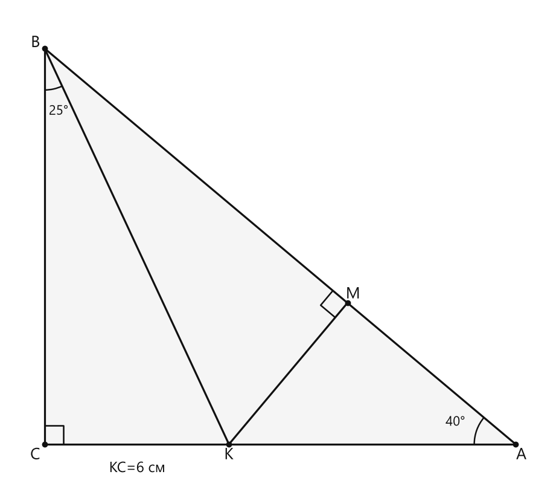
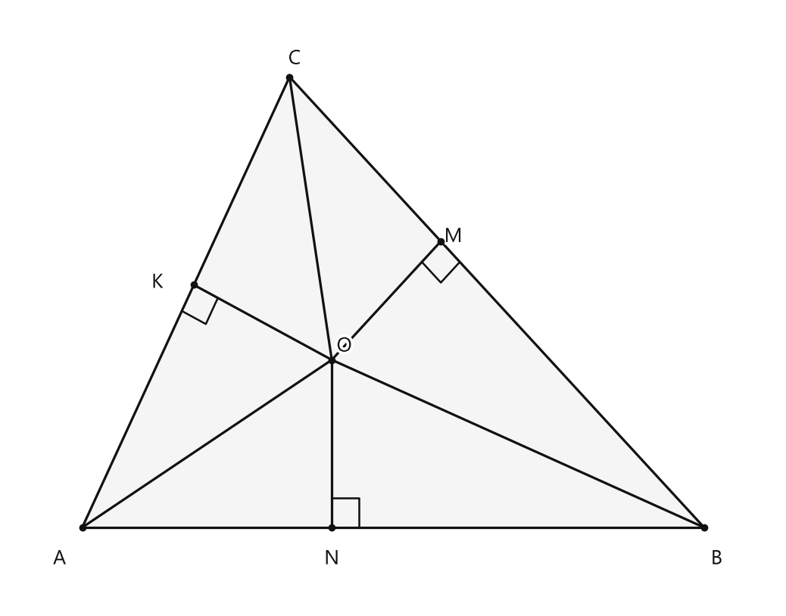
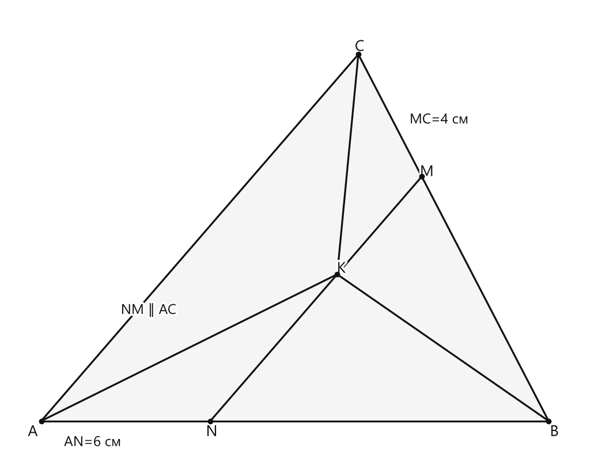

# Занятие 27. Свойство точек биссектрисы угла

**Раздел:** Глава IV. Сумма углов треугольника  
**Параграф учебника:** §24. Свойство точек биссектрисы угла  
**Страницы:** 147–149

## Цели занятия

После занятия ученик умеет:

- объяснять, что означает равноудалённость точки от сторон угла;
- применять свойство точек биссектрисы;
- распознавать биссектрису по равенству расстояний до сторон угла;
- доказывать, что биссектрисы треугольника пересекаются в одной точке;
- находить длины отрезков и углы в задачах с биссектрисами;
- использовать параллельность прямых вместе со свойством биссектрисы.

Выбери блок своего уровня:

- **1–2 балла:** понять теорему и решить Р1;
- **3–4 балла:** применять теорему к углам и расстояниям;
- **5–6 баллов:** решать задачи на пересечение биссектрис;
- **7–8 баллов:** разбирать задачи с параллельными отрезками;
- **9–10 баллов:** уверенно доказывать свойства и находить несколько величин за цепочку рассуждений.

## Теория к занятию

### 1. Что означает «равноудалена от сторон угла»

#### Простыми словами

Расстояние от точки до прямой — это длина перпендикуляра, проведённого из точки к этой прямой.

Представим угол с вершиной $A$ и точку $M$ внутри него. Проведём из точки $M$ перпендикуляры к сторонам угла:

- $MK\perp AB$;
- $MN\perp AC$.

Тогда расстояния от точки $M$ до сторон угла — это именно длины $MK$ и $MN$.

Если $MK=MN$, то точка $M$ находится на одинаковом расстоянии от обеих сторон. Важно: берём не любой отрезок до стороны, а именно перпендикуляр. Наклонный отрезок здесь не считается — у него другая «должность».

#### Теорема

**Любая точка биссектрисы угла равноудалена от сторон угла. Если точка внутри угла равноудалена от сторон угла, то она лежит на биссектрисе этого угла.**

В теореме два утверждения:

- если точка лежит на биссектрисе, расстояния до сторон угла равны;
- если точка внутри угла равноудалена от сторон, она лежит на биссектрисе.

#### Как работает доказательство

Пусть $AD$ — биссектриса угла $BAC$, а точка $M$ лежит на $AD$.

Из точки $M$ проведены перпендикуляры $MK$ и $MN$ к сторонам $AB$ и $AC$.

Рассмотрим прямоугольные треугольники $AKM$ и $ANM$.

У них:

- гипотенуза $AM$ общая;
- $\angle KAM=\angle NAM$, потому что $AD$ — биссектриса угла $BAC$.

Следовательно, треугольники равны по гипотенузе и острому углу.

Значит, их соответствующие катеты равны:

$$MK=MN.$$

Теперь рассмотрим обратное утверждение.

Пусть $MK=MN$. Тогда прямоугольные треугольники $AKM$ и $ANM$ равны по катету и гипотенузе.

Поэтому равны углы:

$$\angle KAM=\angle NAM.$$

Значит, луч $AM$ делит угол $BAC$ пополам. Следовательно, луч $AM$ является биссектрисой этого угла.

### 2. Биссектриса как геометрическое место точек

#### Простыми словами

Все точки, которые находятся внутри угла и находятся на одинаковом расстоянии от его сторон, лежат на биссектрисе.

Можно сказать так: биссектриса — это линия, на которой живут точки с равными расстояниями до сторон угла. Точка отошла в сторону — расстояния уже разные, и «пропуск на биссектрису» потерян.

#### Свойство

**Из доказанной теоремы следует, что биссектриса является геометрическим местом точек плоскости, находящихся внутри угла и равноудаленных от сторон угла.**

#### Правило

Если точка $M$ находится внутри угла $BAC$ и расстояния от неё до сторон $AB$ и $AC$ равны:

$$d(M,AB)=d(M,AC),$$

то можно сделать вывод:

$$AM\text{ — биссектриса }\angle BAC.$$

И наоборот, если $AM$ — биссектриса, то:

$$d(M,AB)=d(M,AC).$$

### 3. Точка пересечения биссектрис треугольника

#### Простыми словами

Проведём биссектрисы двух углов треугольника. Пусть они пересеклись в точке $O$.

Так как точка $O$ лежит на биссектрисе первого угла, она равноудалена от сторон этого угла.

Так как точка $O$ лежит на биссектрисе второго угла, она равноудалена и от сторон второго угла.

В итоге расстояния от точки $O$ до всех трёх сторон треугольника равны. Значит, точка $O$ равноудалена от сторон третьего угла. По обратному утверждению теоремы она лежит и на биссектрисе третьего угла.

Получается, все три биссектрисы проходят через одну точку. У них общий пункт назначения — и это не случайность.

#### Факт

**Точка пересечения биссектрис треугольника является центром вписанной в него окружности, которая касается всех трех сторон треугольника (имеет с каждой из сторон только одну общую точку).**

#### Алгоритм доказательства

1. Провести биссектрисы двух углов треугольника.
2. Обозначить их точку пересечения через $O$.
3. По теореме о свойстве точек биссектрисы получить равенство расстояний от $O$ до сторон первого угла.
4. По той же теореме получить равенство расстояний от $O$ до сторон второго угла.
5. Получить равенство трёх расстояний от $O$ до сторон треугольника.
6. Использовать обратное утверждение теоремы и доказать, что $O$ лежит на биссектрисе третьего угла.

### 4. Параллельный отрезок через точку пересечения биссектрис

Рассмотрим треугольник $ABC$. Биссектрисы углов $A$ и $B$ пересекаются в точке $K$.

Через $K$ проведён отрезок $NM$, параллельный $AC$, где $N\in AB$, а $M\in BC$.

#### Простыми словами

Сначала рассмотрим треугольник $ANK$.

- Луч $AK$ — биссектриса угла $A$, поэтому он делит угол $A$ пополам.
- Так как $NM\parallel AC$, появляются равные углы.
- В треугольнике $ANK$ получаются два равных угла.
- Значит, этот треугольник равнобедренный.

Поэтому:

$$NK=AN.$$

Теперь рассмотрим треугольник $KMC$.

- $CK$ — биссектриса угла $C$, потому что все биссектрисы треугольника проходят через одну точку.
- Из-за параллельности $KM\parallel AC$ получаются равные углы.
- Треугольник $KMC$ равнобедренный.

Поэтому:

$$KM=MC.$$

Отрезок $NM$ состоит из двух частей:

$$NM=NK+KM.$$

Значит:

$$NM=AN+MC.$$

#### Формула

Если $NM\parallel AC$ и $K$ — точка пересечения биссектрис треугольника, то:

$$NM=AN+MC.$$

Кроме того:

$$NK=AN,\qquad KM=MC.$$

#### Замечание

**Если $NM \parallel AC$ и отрезок $NM$ проходит через точку пересечения биссектрис, то периметр $\triangle NBM$ равен $AB + BC$.**

### Ловушки

- Расстояние от точки до прямой — это длина перпендикуляра, а не любого отрезка до прямой.
- Равенство расстояний даёт биссектрису только для точки, находящейся **внутри угла**.
- Не путай биссектрису с медианой: биссектриса делит угол пополам, а медиана делит сторону пополам.
- Высота перпендикулярна стороне или её продолжению.
- В задаче с параллельными прямыми сначала ищи равные углы, а уже потом — равнобедренные треугольники. Иначе рисунок превращается в карту без легенды.

## Сводка формул «выучить наизусть»

Если $M$ лежит на биссектрисе угла, то:

$$d(M,\text{первая сторона})=d(M,\text{вторая сторона}).$$

Если точка $M$ внутри угла равноудалена от его сторон, то:

$$M\text{ лежит на биссектрисе угла}.$$

Для параллельного отрезка через точку пересечения биссектрис:

$$NK=AN,$$

$$KM=MC,$$

$$NM=AN+MC.$$

## Правила, которые нельзя путать

- Биссектриса делит угол пополам.
- Медиана делит сторону пополам.
- Высота перпендикулярна стороне или её продолжению.
- Равноудалённость от сторон проверяется длинами перпендикуляров.
- Вписанная окружность имеет центр в точке пересечения биссектрис треугольника.

## Разбор ключевых заданий

### Р1. Расстояние от точки биссектрисы до сторон угла

**Условие.** В прямоугольном треугольнике $ABC$:

$$\angle C=90^\circ,\qquad \angle A=40^\circ.$$

На катете $AC$ взята точка $K$ так, что:

$$KC=6\text{ см},\qquad \angle KBC=25^\circ.$$

Найти расстояние от точки $K$ до прямой $AB$.

<!--geo-figure-spec
{
  "needed": true,
  "kind": "plane",
  "caption": "Прямоугольный треугольник $ABC$",
  "equal": true,
  "axis": false,
  "xlim": [
    -1.2,
    16.5
  ],
  "ylim": [
    -1.3,
    14.2
  ],
  "points": {
    "A": [
      15.334,
      0
    ],
    "B": [
      0,
      12.867
    ],
    "C": [
      0,
      0
    ],
    "K": [
      6,
      0
    ],
    "M": [
      9.858,
      4.596
    ]
  },
  "segments": [
    [
      "A",
      "B"
    ],
    [
      "B",
      "C"
    ],
    [
      "C",
      "A"
    ],
    [
      "B",
      "K"
    ],
    {
      "points": [
        "K",
        "M"
      ],
      "dashed": false,
      "label": "",
      "t": 0.5
    }
  ],
  "polygons": [
    {
      "vertices": [
        "A",
        "B",
        "C"
      ],
      "fill": 0.04
    }
  ],
  "labels": {
    "A": {
      "dx": 0.18,
      "dy": -0.35
    },
    "B": {
      "dx": -0.3,
      "dy": 0.18
    },
    "C": {
      "dx": -0.3,
      "dy": -0.35
    },
    "K": {
      "dx": 0,
      "dy": -0.35
    },
    "M": {
      "dx": 0.18,
      "dy": 0.28
    }
  },
  "right_angles": [
    {
      "vertex": "C",
      "from": "A",
      "to": "B"
    },
    {
      "vertex": "M",
      "from": "K",
      "to": "B"
    }
  ],
  "angle_marks": [
    {
      "vertex": "A",
      "from": "B",
      "to": "C",
      "text": "40°",
      "radius": 1.35
    },
    {
      "vertex": "B",
      "from": "C",
      "to": "K",
      "text": "25°",
      "radius": 1.35
    }
  ],
  "texts": [
    {
      "xy": [
        3,
        -0.78
      ],
      "text": "KC=6 см"
    }
  ]
}
-->

*Прямоугольный треугольник ABC*

**Решение.**

Расстояние от точки $K$ до прямой $AB$ обозначим через $KM$.

Так как $KM$ — расстояние до прямой, то:

$$KM\perp AB.$$

Найдём угол $ABC$.

В прямоугольном треугольнике сумма двух острых углов равна $90^\circ$:

$$\angle ABC=90^\circ-\angle A.$$

Подставим значение $\angle A$:

$$\angle ABC=90^\circ-40^\circ=50^\circ.$$

Угол $ABC$ состоит из углов $ABK$ и $KBC$:

$$\angle ABK=\angle ABC-\angle KBC.$$

Подставим известные значения:

$$\angle ABK=50^\circ-25^\circ=25^\circ.$$

По условию:

$$\angle KBC=25^\circ.$$

Значит:

$$\angle ABK=\angle KBC.$$

Следовательно, $BK$ — биссектриса угла $ABC$.

Точка $K$ лежит на биссектрисе угла $ABC$. Поэтому расстояния от неё до сторон $AB$ и $BC$ равны.

Расстояние от точки $K$ до стороны $AB$ равно $KM$.

Так как $KC\perp BC$, расстояние от точки $K$ до стороны $BC$ равно $KC$.

Следовательно:

$$KM=KC.$$

По условию:

$$KC=6\text{ см}.$$

Значит:

$$KM=6\text{ см}.$$

**Ответ: $6$ см.**

---

### Р2. Доказательство пересечения биссектрис треугольника в одной точке

**Условие.** Доказать, что биссектрисы треугольника пересекаются в одной точке.

**Дано:** в треугольнике $ABC$ проведены биссектрисы углов $A$ и $C$, пересекающиеся в точке $O$. Из точки $O$ опущены перпендикуляры:

- $ON$ к стороне $AB$;
- $OK$ к стороне $AC$;
- $OM$ к стороне $BC$.

<!--geo-figure-spec
{
  "needed": true,
  "kind": "plane",
  "caption": "Биссектрисы треугольника $ABC$",
  "equal": false,
  "axis": false,
  "xlim": [
    -0.7,
    6.7
  ],
  "ylim": [
    -0.7,
    4.6
  ],
  "points": {
    "A": [
      0,
      0
    ],
    "B": [
      6,
      0
    ],
    "C": [
      2,
      4
    ],
    "O": [
      2.40764,
      1.488
    ],
    "N": [
      2.40764,
      0
    ],
    "K": [
      1.07673,
      2.15346
    ],
    "M": [
      3.45982,
      2.54018
    ]
  },
  "segments": [
    [
      "A",
      "B"
    ],
    [
      "B",
      "C"
    ],
    [
      "C",
      "A"
    ],
    [
      "A",
      "O"
    ],
    [
      "C",
      "O"
    ],
    [
      "B",
      "O"
    ],
    [
      "O",
      "N"
    ],
    [
      "O",
      "K"
    ],
    [
      "O",
      "M"
    ]
  ],
  "polygons": [
    {
      "vertices": [
        "A",
        "B",
        "C"
      ],
      "fill": 0.04
    }
  ],
  "labels": {
    "A": {
      "dx": -0.22,
      "dy": -0.28
    },
    "B": {
      "dx": 0.12,
      "dy": -0.28
    },
    "C": {
      "dx": 0.05,
      "dy": 0.16
    },
    "O": {
      "dx": 0.12,
      "dy": 0.12
    },
    "N": {
      "dx": 0,
      "dy": -0.28
    },
    "K": {
      "dx": -0.35,
      "dy": 0.02
    },
    "M": {
      "dx": 0.12,
      "dy": 0.04
    }
  },
  "right_angles": [
    {
      "vertex": "N",
      "from": "O",
      "to": "B"
    },
    {
      "vertex": "K",
      "from": "O",
      "to": "A"
    },
    {
      "vertex": "M",
      "from": "O",
      "to": "B"
    }
  ],
  "angle_marks": [],
  "texts": []
}
-->

*Биссектрисы треугольника ABC*

**Доказательство.**

Точка $O$ лежит на биссектрисе угла $A$.

По свойству точек биссектрисы расстояния от точки $O$ до сторон угла $A$ равны:

$$ON=OK.$$

Точка $O$ лежит на биссектрисе угла $C$.

По тому же свойству:

$$OK=OM.$$

Получаем:

$$ON=OK=OM.$$

Значит, расстояния от точки $O$ до прямых $AB$ и $BC$ равны:

$$ON=OM.$$

Точка $O$ находится внутри угла $B$.

По обратному утверждению теоремы точка $O$ лежит на биссектрисе угла $B$.

Таким образом, биссектрисы углов $A$, $B$ и $C$ проходят через одну точку $O$.

**Ответ:** биссектрисы треугольника пересекаются в одной точке.

---

### Р3. Параллельный отрезок через точку пересечения биссектрис

**Условие.** В треугольнике $ABC$ биссектрисы углов $A$ и $B$ пересекаются в точке $K$. Через точку $K$ проведён отрезок $NM$, параллельный стороне $AC$, с концами на сторонах $AB$ и $BC$ соответственно. Известно:

$$AN=6\text{ см},\qquad MC=4\text{ см}.$$

Найти длину отрезка $NM$.

<!--geo-figure-spec
{
  "needed": true,
  "kind": "plane",
  "caption": "Треугольник $ABC$ и отрезок $NM\\parallel AC$",
  "equal": false,
  "axis": false,
  "xlim": [
    -1.2,
    19.5
  ],
  "ylim": [
    -1.1,
    11.2
  ],
  "points": {
    "A": [
      0,
      0
    ],
    "B": [
      18,
      0
    ],
    "C": [
      11.25,
      9.9216
    ],
    "K": [
      10.5,
      3.96864
    ],
    "N": [
      6,
      0
    ],
    "M": [
      13.5,
      6.6144
    ]
  },
  "segments": [
    [
      "A",
      "B"
    ],
    [
      "B",
      "C"
    ],
    [
      "C",
      "A"
    ],
    [
      "A",
      "K"
    ],
    [
      "B",
      "K"
    ],
    [
      "C",
      "K"
    ],
    {
      "points": [
        "N",
        "M"
      ],
      "dashed": false,
      "label": "",
      "t": 0.5
    }
  ],
  "polygons": [
    {
      "vertices": [
        "A",
        "B",
        "C"
      ],
      "fill": 0.04
    }
  ],
  "labels": {
    "A": {
      "dx": -0.3,
      "dy": -0.3
    },
    "B": {
      "dx": 0.2,
      "dy": -0.3
    },
    "C": {
      "dx": 0.05,
      "dy": 0.2
    },
    "K": {
      "dx": 0.15,
      "dy": 0.15
    },
    "N": {
      "dx": 0.05,
      "dy": -0.3
    },
    "M": {
      "dx": 0.18,
      "dy": 0.12
    }
  },
  "right_angles": [],
  "angle_marks": [],
  "texts": [
    {
      "xy": [
        3.8,
        3
      ],
      "text": "NM ∥ AC"
    },
    {
      "xy": [
        1.8,
        -0.58
      ],
      "text": "AN=6 см"
    },
    {
      "xy": [
        14.1,
        8.15
      ],
      "text": "MC=4 см"
    }
  ]
}
-->

*Треугольник ABC и отрезок NM\parallel AC*

**Решение.**

Биссектрисы углов $A$ и $B$ пересекаются в точке $K$.

По свойству биссектрис треугольника точка $K$ лежит также на биссектрисе угла $C$.

Рассмотрим треугольник $ANK$.

Так как $AK$ — биссектриса угла $A$, то:

$$\angle NAK=\angle CAK.$$

Так как $NM\parallel AC$, а точки $N$, $K$, $M$ лежат на одной прямой, то:

$$\angle AKN=\angle CAK.$$

Следовательно:

$$\angle NAK=\angle AKN.$$

В треугольнике $ANK$ равны углы при вершинах $A$ и $K$.

Значит, против них лежат равные стороны:

$$NK=AN.$$

По условию:

$$AN=6\text{ см}.$$

Поэтому:

$$NK=6\text{ см}.$$

Теперь рассмотрим треугольник $KMC$.

Так как $CK$ — биссектриса угла $C$, то:

$$\angle KCM=\angle KCA.$$

Так как $KM\parallel AC$, то:

$$\angle CKM=\angle KCA.$$

Следовательно:

$$\angle KCM=\angle CKM.$$

В треугольнике $KMC$ равны углы при вершинах $C$ и $K$.

Значит:

$$KM=MC.$$

По условию:

$$MC=4\text{ см}.$$

Поэтому:

$$KM=4\text{ см}.$$

Отрезок $NM$ состоит из отрезков $NK$ и $KM$:

$$NM=NK+KM.$$

Подставим найденные длины:

$$NM=6+4=10\text{ см}.$$

**Ответ: $10$ см.**

---

### Р4. Угол при точке на биссектрисе

**Условие.** Точка $K$ находится на равном расстоянии от сторон угла $BAC$, равного $52^\circ$. Из точки $K$ к стороне $AB$ проведён перпендикуляр $KB$. Найти угол $AKB$.

**Решение.**

Точка $K$ равноудалена от сторон угла $BAC$.

По условию точка находится внутри угла.

По обратному утверждению теоремы точка $K$ лежит на биссектрисе угла $BAC$.

Значит, биссектриса делит угол пополам:

$$\angle BAK=\frac{\angle BAC}{2}.$$

Подставим значение угла:

$$\angle BAK=\frac{52^\circ}{2}=26^\circ.$$

По условию:

$$KB\perp AB.$$

Значит:

$$\angle ABK=90^\circ.$$

Рассмотрим треугольник $AKB$.

Сумма его углов равна $180^\circ$:

$$\angle AKB=180^\circ-\angle BAK-\angle ABK.$$

Подставим найденные значения:

$$\angle AKB=180^\circ-26^\circ-90^\circ.$$

$$\angle AKB=64^\circ.$$

**Ответ: $64^\circ$.**

---

### Р5. Равноудалённая точка на стороне треугольника

**Условие.** В треугольнике $ABC$:

$$AC=BC.$$

На стороне $AC$ взята точка $M$, равноудалённая от прямых $AB$ и $BC$. Известно:

$$\angle ABM=35^\circ.$$

Найти угол $C$.

**Решение.**

Точка $M$ равноудалена от прямых $AB$ и $BC$.

Точка $M$ находится внутри угла $ABC$.

По обратному утверждению теоремы луч $BM$ является биссектрисой угла $ABC$.

Значит, он делит угол $ABC$ на два равных угла:

$$\angle ABM=\angle MBC.$$

По условию:

$$\angle ABM=35^\circ.$$

Следовательно:

$$\angle MBC=35^\circ.$$

Найдём весь угол $ABC$:

$$\angle ABC=\angle ABM+\angle MBC.$$

$$\angle ABC=35^\circ+35^\circ=70^\circ.$$

По условию:

$$AC=BC.$$

В треугольнике против равных сторон лежат равные углы:

- против стороны $AC$ лежит угол $B$;
- против стороны $BC$ лежит угол $A$.

Поэтому:

$$\angle A=\angle B.$$

Так как $\angle B=70^\circ$, получаем:

$$\angle A=70^\circ.$$

Сумма углов треугольника равна $180^\circ$:

$$\angle C=180^\circ-\angle A-\angle B.$$

Подставим значения:

$$\angle C=180^\circ-70^\circ-70^\circ.$$

$$\angle C=40^\circ.$$

**Ответ: $40^\circ$.**

## Итоговая самопроверка

Запомни главный ход:

1. Видишь биссектрису — вспоминаешь равные расстояния до сторон.
2. Видишь равные расстояния до сторон — проверяешь, находится ли точка внутри угла.
3. Если точка внутри угла, получаешь биссектрису.
4. В задачах с параллельными прямыми ищешь равные углы.
5. По равным углам находишь равные стороны в равнобедренном треугольнике.

Главная формула занятия:

$$\text{точка на биссектрисе}\Longleftrightarrow\text{равные расстояния до сторон угла}.$$

## Практические задания

Выбери свой уровень и решай только этот блок. В блоке должна закрепиться вся тема параграфа. Ответы не приводятся.

### Уровень 1–2 балла

**С1.** Выберите верное утверждение о точке, лежащей на биссектрисе угла.

1) Она равноудалена от сторон угла. 2) Она равноудалена от вершин угла. 3) Она лежит на одной из сторон угла. 4) Она делит угол на три равные части. 5) Она находится вне угла.

**С2.** Точка $K$ находится внутри угла и равноудалена от его сторон. Укажите, на какой линии лежит точка $K$.

**С3.** Точка $M$ лежит на биссектрисе угла $ABC$. Расстояние от точки $M$ до стороны $BA$ равно $4$ см. Чему равно расстояние от точки $M$ до стороны $BC$?

**С4.** Биссектриса угла $A$ делит его на два угла по $32^\circ$. Найдите величину угла $A$.

**С5.** Точка $P$ лежит на биссектрисе угла $MON$. Расстояние от точки $P$ до прямой $OM$ равно $7$ см. Выберите верное значение расстояния от точки $P$ до прямой $ON$.

1) $3{,}5$ см 2) $7$ см 3) $14$ см 4) $0$ см 5) определить невозможно

**С6.** Внутренняя точка $K$ угла $ABC$ находится на одинаковом расстоянии от прямых $BA$ и $BC$. Укажите, на какой линии лежит точка $K$.

**С7.** Угол $DEF$ равен $86^\circ$. Точка $K$ лежит на его биссектрисе. Найдите угол между лучом $DE$ и биссектрисой угла $DEF$.

**С8.** Точка $P$ лежит на биссектрисе угла $ABC$. Расстояние от точки $P$ до прямой $AB$ равно $0$ см. На какой стороне угла находится точка $P$?

**С9.** Биссектрисы углов треугольника пересекаются в одной точке. Выберите верное утверждение об этой точке.

1) Она равноудалена от всех трёх сторон треугольника. 2) Она равноудалена только от двух вершин. 3) Она лежит на всех трёх сторонах треугольника. 4) Она делит каждый угол на три равные части. 5) Она всегда совпадает с вершиной треугольника.

**С10.** Точка $K$ лежит на биссектрисе угла $ABC$. Расстояние от точки $K$ до прямой $BC$ равно $5{,}2$ см. Найдите расстояние от точки $K$ до прямой $BA$.

**С11.** Внутри угла $AOC$ взята точка $K$, равноудалённая от его сторон. Укажите верное утверждение.

1) $OK$ является биссектрисой угла $AOC$. 2) $AK$ является биссектрисой угла $AOC$. 3) $CK$ является биссектрисой угла $AOC$. 4) $K$ лежит на стороне $OA$. 5) $K$ лежит вне угла $AOC$.

**С12.** Биссектриса угла $KLM$ делит его на два равных угла. Один из них равен $27^\circ$. Найдите величину угла $KLM$.

**С13.** Точка $K$ лежит на биссектрисе угла $ABC$. Какое равенство верно для расстояний от точки $K$ до сторон угла?
1) $d(K,AB)=d(K,BC)$  
2) $d(K,AB)=d(K,AC)$  
3) $d(K,BC)=d(K,AC)$  
4) $d(K,AB)=2d(K,BC)$  
5) $d(K,BC)=2d(K,AB)$

**С14.** Расстояние от точки $M$, лежащей на биссектрисе угла, до одной из его сторон равно $7$ см. Чему равно расстояние от точки $M$ до другой стороны этого угла?

**С15.** Точка $P$ находится внутри угла $AOC$ и равноудалена от его сторон $OA$ и $OC$. На какой линии лежит точка $P$?
1) на стороне $OA$  
2) на стороне $OC$  
3) на биссектрисе угла $AOC$  
4) на луче $OA$  
5) на луче $OC$

**С16.** Точка $D$ лежит на биссектрисе угла $MON$. Расстояние от точки $D$ до прямой $OM$ равно $4{,}5$ см. Найдите расстояние от точки $D$ до прямой $ON$.

**С17.** Угол $ABC$ равен $64^\circ$. Луч $BD$ — его биссектриса. Найдите величину угла $ABD$.

**С18.** Внутри угла $XOY$ выбрана точка $K$. Расстояния от точки $K$ до прямых $OX$ и $OY$ равны соответственно $6$ см и $6$ см. Какое утверждение верно?
1) $K$ лежит на стороне $OX$  
2) $K$ лежит на стороне $OY$  
3) $K$ лежит на биссектрисе угла $XOY$  
4) $K$ лежит вне угла $XOY$  
5) $K$ нельзя расположить однозначно

**С19.** Луч $CE$ — биссектриса угла $ACB$. Расстояние от точки $E$ до прямой $CA$ равно $8$ см. Найдите расстояние от точки $E$ до прямой $CB$.

**С20.** Точка $T$ лежит внутри угла $KLM$ и находится на расстоянии $3$ см от прямой $LK$ и на расстоянии $5$ см от прямой $LM$. Лежит ли точка $T$ на биссектрисе угла $KLM$? Ответьте «да» или «нет».

**С21.** Угол $PQR$ равен $110^\circ$. Луч $QS$ — его биссектриса. Выберите верное равенство.
1) $\angle PQS=45^\circ$  
2) $\angle SQR=50^\circ$  
3) $\angle PQS=55^\circ$  
4) $\angle PQR=55^\circ$  
5) $\angle PQS=110^\circ$

**С22.** Точка $N$ лежит на биссектрисе угла $DEF$. Расстояние от точки $N$ до прямой $DE$ равно $2$ см. Выберите верное утверждение.
1) Расстояние от $N$ до $EF$ равно $1$ см.  
2) Расстояние от $N$ до $EF$ равно $2$ см.  
3) Расстояние от $N$ до $EF$ равно $4$ см.  
4) Точка $N$ лежит на прямой $DE$.  
5) Точка $N$ лежит на прямой $EF$.

**С23.** Внутри угла $ABC$ точка $M$ равноудалена от прямых $BA$ и $BC$. Какое условие позволяет сделать вывод, что $BM$ является биссектрисой угла $ABC$?
1) $M$ лежит внутри угла $ABC$  
2) $M$ лежит на стороне $BA$  
3) $M$ лежит на стороне $BC$  
4) $AB=BC$  
5) $\angle ABC=90^\circ$

**С24.** Луч $OT$ — биссектриса угла $AOB$, а точка $K$ лежит на луче $OT$. Расстояние от точки $K$ до прямой $OA$ равно $9$ см. Найдите расстояние от точки $K$ до прямой $OB$.

**С25.** Точка $K$ лежит на биссектрисе угла $AOB$. Расстояние от точки $K$ до прямой $OA$ равно $5$ см. Чему равно расстояние от точки $K$ до прямой $OB$?  
1) $2$ см 2) $3$ см 3) $5$ см 4) $10$ см 5) Нельзя определить

**С26.** Точка $M$ находится внутри угла $ABC$ и равноудалена от прямых $BA$ и $BC$. На каком луче лежит точка $M$?  
1) На луче $BA$ 2) На луче $BC$ 3) На биссектрисе угла $ABC$ 4) На стороне $AC$ 5) На высоте треугольника $ABC$

**С27.** Угол $AOB$ равен $64^\circ$. Луч $OK$ является его биссектрисой. Найдите угол $AOK$.  
1) $16^\circ$ 2) $32^\circ$ 3) $64^\circ$ 4) $96^\circ$ 5) $128^\circ$

**С28.** Точка $P$ лежит на биссектрисе угла $MON$. Расстояние от точки $P$ до прямой $MN$ равно $7$ см. Что можно утверждать о расстоянии от точки $P$ до прямой $MO$?  
1) Оно равно $3$ см 2) Оно равно $7$ см 3) Оно равно $14$ см 4) Оно меньше $7$ см 5) Его нельзя определить

**С29.** Точка $K$ находится внутри угла $ABC$. Расстояние от точки $K$ до прямой $BA$ равно $4$ см, а до прямой $BC$ — $4$ см. Какое утверждение верно?  
1) Точка $K$ лежит на луче $BA$ 2) Точка $K$ лежит на луче $BC$ 3) Точка $K$ лежит на биссектрисе угла $ABC$ 4) Точка $K$ лежит на стороне $AC$ 5) Точка $K$ не связана с биссектрисой угла $ABC$

**С30.** Угол $CDE$ равен $90^\circ$. Луч $DF$ является его биссектрисой. Найдите угол $CDF$.  
1) $30^\circ$ 2) $40^\circ$ 3) $45^\circ$ 4) $60^\circ$ 5) $90^\circ$

**С31.** Точка $T$ лежит на биссектрисе угла $XYZ$. Расстояние от точки $T$ до прямой $XY$ равно $6$ см. Найдите сумму расстояний от точки $T$ до прямых $XY$ и $YZ$.  
1) $6$ см 2) $9$ см 3) $12$ см 4) $18$ см 5) $36$ см

**С32.** Внутри угла $AOB$ взята точка $P$. Расстояние от точки $P$ до прямой $OA$ равно расстоянию от точки $P$ до прямой $OB$. Какое утверждение обязательно верно?  
1) $P$ лежит на стороне угла $AOB$ 2) $P$ лежит на биссектрисе угла $AOB$ 3) $P$ является вершиной угла 4) $P$ лежит вне угла $AOB$ 5) $P$ лежит на луче $OA$

**С33.** Луч $OK$ — биссектриса угла $AOB$, равного $118^\circ$. Точка $P$ лежит на луче $OK$. Найдите угол $KOB$.  
1) $29^\circ$ 2) $59^\circ$ 3) $60^\circ$ 4) $118^\circ$ 5) $236^\circ$

**С34.** Точка $M$ лежит на биссектрисе угла $CDE$. Расстояние от точки $M$ до прямой $DC$ равно $8$ см. Выберите верное равенство.  
1) $d(M,DC)=2d(M,DE)$ 2) $d(M,DE)=8$ см 3) $d(M,DE)=16$ см 4) $d(M,DE)=0$ 5) $d(M,DE)=4$ см

**С35.** Биссектрисы углов $A$ и $B$ треугольника $ABC$ пересекаются в точке $I$. Какое утверждение верно?  
1) Точка $I$ равноудалена только от сторон $AB$ и $AC$  
2) Точка $I$ равноудалена только от сторон $AB$ и $BC$  
3) Точка $I$ равноудалена от всех трёх сторон треугольника $ABC$  
4) Точка $I$ лежит на стороне $AB$  
5) Точка $I$ не связана с расстояниями до сторон треугольника

**С36.** Угол $LMN$ равен $72^\circ$. Точка $P$ находится внутри этого угла, а расстояния от неё до прямых $ML$ и $MN$ равны. Найдите угол между лучом $MP$ и лучом $MN$.  
1) $18^\circ$ 2) $24^\circ$ 3) $36^\circ$ 4) $72^\circ$ 5) $144^\circ$

### Уровень 3–4 балла

**С1.** Точка $K$ лежит на биссектрисе угла $A$, равного $64^\circ$. Расстояние от точки $K$ до одной стороны угла равно $5$ см. Найдите расстояние от точки $K$ до другой стороны угла.

**С2.** Точка $M$ находится внутри угла $ABC$. Расстояния от точки $M$ до прямых $BA$ и $BC$ равны $7$ см. На каком луче расположена точка $M$?

**С3.** В угле $BAC$, равном $52^\circ$, точка $K$ лежит на биссектрисе этого угла. При этом $KB\perp AB$, где точка $B$ лежит на стороне угла $AC$. Найдите угол $AKB$.

**С4.** Биссектрисы углов $A$ и $B$ треугольника $ABC$ пересекаются в точке $K$. Расстояние от точки $K$ до прямой $AB$ равно $3$ см. Найдите расстояния от точки $K$ до прямых $AC$ и $BC$.

**С5.** В угле $MON$ точка $P$ лежит на биссектрисе. Перпендикуляры $PA$ и $PB$ проведены к прямым $OM$ и $ON соответственно. Если $PA=8$ см, найдите длину $PB$.

**С6.** Внутри угла $XYZ$ взята точка $T$. Перпендикулярное расстояние от точки $T$ до прямой $YX$ равно $4{,}5$ см, а до прямой $YZ$ — $4{,}5$ см. Докажите, что луч $YT$ является биссектрисой угла $XYZ$.

**С7.** В равнобедренном треугольнике $ABC$ стороны $AC$ и $BC$ равны. Точка $M$ лежит на стороне $AC$ и равноудалена от прямых $AB$ и $BC$. Угол $ABM$ равен $35^\circ$. Найдите угол $C$.

**С8.** Угол $ABC$ равен $80^\circ$. Точка $K$ лежит внутри угла $ABC$ и равноудалена от его сторон. Найдите углы $ABK$ и $KBC$.

**С9.** В треугольнике $ABC$ биссектрисы углов $A$ и $B$ пересекаются в точке $K$. Через точку $K$ проведён отрезок $NM$, параллельный стороне $AC$, с концами $N$ на стороне $AB$ и $M$ на стороне $BC$. Известно, что $AN=6$ см, а $MC=4$ см. Найдите длину отрезка $NM$.

**С10.** Внутри угла $DEF$ взята точка $P$. Перпендикуляры $PA$ и $PB$ проведены к прямым $DE$ и $EF$. Если $PA=6$ см и $PB=6$ см, укажите геометрическое место точки $P$ внутри угла.

**С11.** Точка $K$ лежит на биссектрисе угла $ABC$. Перпендикуляры $KM$ и $KN$ проведены к прямым $BA$ и $BC$. Если $KM=2{,}8$ см, найдите $KN$ и объясните, какое свойство биссектрисы использовано.

**С12.** В треугольнике $ABC$ биссектрисы углов $A$ и $B$ пересекаются в точке $K$. Докажите, что точка $K$ равноудалена от всех трёх сторон треугольника.

**С13.** Точка $K$ лежит на биссектрисе угла $A$, равного $68^\circ$. Найдите расстояния от точки $K$ до сторон этого угла, если расстояние от $K$ до одной из сторон равно $5$ см.

**С14.** Точка $M$ находится внутри угла $ABC$ и равноудалена от его сторон $BA$ и $BC$. Объясните, почему луч $BM$ является биссектрисой угла $ABC$.

**С15.** Луч $BD$ — биссектриса угла $ABC$, равного $74^\circ$. Из точки $D$ опущены перпендикуляры $DK$ и $DL$ на прямые $BA$ и $BC$ соответственно. Найдите длину $DL$, если $DK=8$ см.

**С16.** Внутри угла $MON$ взята точка $P$. Расстояние от точки $P$ до прямой $OM$ равно $3{,}6$ см, а расстояние до прямой $ON$ равно $3{,}6$ см. На каком луче лежит точка $P$?

**С17.** Угол $ABC$ равен $52^\circ$. Точка $K$ лежит на его биссектрисе, причём $KB\perp BA$. Найдите угол $BKC$.

**С18.** Луч $CE$ является биссектрисой угла $ACD$. Из точки $E$ проведены перпендикуляры $EF$ и $EG$ к прямым $CA$ и $CD$. Найдите $EG$, если $EF=11$ см.

**С19.** В треугольнике $ABC$ точка $I$ лежит на биссектрисе угла $A$. Расстояние от точки $I$ до прямой $AB$ равно $4$ см. Найдите расстояние от точки $I$ до прямой $AC$.

**С20.** Точка $P$ лежит внутри угла $XYZ$. Расстояния от неё до прямых $YX$ и $YZ$ равны. Какую линию образуют все такие точки внутри угла $XYZ$?

**С21.** Угол $KLM$ равен $86^\circ$. Точка $P$ лежит на его биссектрисе. Из точки $P$ опущен перпендикуляр $PQ$ на прямую $LK$. Найдите угол между лучом $LP$ и лучом $LM$.

**С22.** В треугольнике $ABC$ биссектрисы углов $A$ и $B$ пересекаются в точке $I$. Расстояние от точки $I$ до прямой $AB$ равно $6$ см. Найдите расстояние от точки $I$ до прямой $AC$.

**С23.** Внутри угла $RST$ взята точка $P$, равноудалённая от прямых $RS$ и $ST$. Луч $SP$ делит угол $RST$ на два угла. Найдите каждый из них, если $\angle RST=124^\circ$.

**С24.** В треугольнике $ABC$ точка $I$ является точкой пересечения биссектрис углов $A$ и $B$. Расстояние от точки $I$ до прямой $AB$ равно $5$ см. Найдите расстояния от точки $I$ до прямых $BC$ и $AC$.

**С25.** Точка $K$ лежит на биссектрисе угла $A$. Расстояние от точки $K$ до одной стороны угла равно $7$ см. Найдите расстояние от точки $K$ до другой стороны угла.

**С26.** Точка $M$ находится внутри угла $ABC$ и равноудалена от прямых $BA$ и $BC$. Какой луч проходит через точку $M$?

**С27.** Луч $BD$ — биссектриса угла $ABC$, равного $64^\circ$. Из точки $D$ к сторонам угла проведены перпендикуляры $DM$ и $DN$. Найдите углы треугольника $BDM$, если $M\in BA$, а $N\in BC$.

**С28.** Точка $K$ лежит на биссектрисе угла $BAC$, равного $52^\circ$. Отрезок $KB$ перпендикулярен стороне $AB$. Найдите угол $AKB$.

**С29.** Биссектрисы углов $A$ и $B$ треугольника $ABC$ пересекаются в точке $I$. Расстояние от точки $I$ до прямой $AB$ равно $5$ см. Найдите расстояния от точки $I$ до прямых $AC$ и $BC$.

**С30.** Внутри угла $ABC$ взята точка $K$, равноудалённая от его сторон. Докажите, что луч $BK$ является биссектрисой угла $ABC$.

**С31.** Точка $K$ лежит на биссектрисе угла $BAC$, равного $80^\circ$. Из точки $K$ к сторонам $AB$ и $AC$ проведены перпендикуляры $KP$ и $KQ$ соответственно. Найдите угол $AKP$.

**С32.** Точка $K$ лежит на биссектрисе угла $ABC$, равного $60^\circ$. Расстояние $BK$ равно $10$ см. Найдите расстояние от точки $K$ до прямой $BA$.

**С33.** В треугольнике $ABC$ стороны $AC$ и $BC$ равны. На стороне $AC$ взята точка $M$, равноудалённая от прямых $AB$ и $BC$. Известно, что $\angle ABM=35^\circ$. Найдите величину угла $C$.

**С34.** В треугольнике $ABC$ биссектрисы углов $A$ и $B$ пересекаются в точке $K$. Через точку $K$ проведён отрезок $NM$, параллельный стороне $AC$, причём $N\in AB$, $M\in BC$. Известно, что $AN=6$ см, а $MC=4$ см. Найдите длину отрезка $NM$.

**С35.** Внутри угла $MON$, равного $90^\circ$, расположена точка $K$. Расстояние от точки $K$ до прямой $OM$ равно $6$ см, и расстояние от точки $K$ до прямой $ON$ также равно $6$ см. Найдите угол $MOK$.

**С36.** В треугольнике $ABC$ точка $I$ равноудалена от прямых $AB$ и $AC$ и находится внутри угла $A$. Докажите, что $I$ лежит на биссектрисе угла $A$.

### Уровень 5–6 баллов

**С1.** Внутри угла $A$ взята точка $K$, лежащая на биссектрисе этого угла. Перпендикуляры $KP$ и $KQ$ проведены к сторонам угла $AB$ и $AC$ соответственно. Если $KP=7$ см, найдите $KQ$.

**С2.** Точка $K$ находится внутри угла $BAC$ и удалена от прямых $AB$ и $AC$ на расстояния $5$ см и $5$ см соответственно. На каком луче лежит точка $K$?

**С3.** Угол $BAC$ равен $64^\circ$. Точка $K$ лежит на его биссектрисе, а $KH\perp AB$, где $H\in AB$. Найдите угол $AKH$.

**С4.** Внутри угла $ABC$ находится точка $K$, равноудалённая от его сторон $BA$ и $BC$. Известно, что расстояние от $K$ до прямой $BA$ равно $3{,}5$ см. Найдите расстояние от точки $K$ до прямой $BC$.

**С5.** В угле $MON$ точка $P$ лежит на биссектрисе. Перпендикуляры $PA$ и $PB$ проведены к прямым $OM$ и $ON соответственно. Если $PA=12$ см, найдите $PB$.

**С6.** Угол $ABC$ равен $52^\circ$. Точка $K$ лежит на его биссектрисе, а $KB\perp BA$. Найдите угол $AKB$, если $A$ и $C$ лежат на разных сторонах точки $B$ на прямой $BA$.

**С7.** Внутри угла $ABC$ взята точка $K$. Расстояние от точки $K$ до прямой $BA$ равно расстоянию от точки $K$ до прямой $BC$. Какое утверждение верно?  
1) $K$ лежит на стороне $BA$  
2) $K$ лежит на стороне $BC$  
3) $K$ лежит на биссектрисе угла $ABC$  
4) $K$ лежит на высоте треугольника $ABC$  
5) $K$ лежит на медиане треугольника $ABC$

**С8.** В треугольнике $ABC$ биссектрисы углов $A$ и $B$ пересекаются в точке $I$. Расстояние от точки $I$ до прямой $AB$ равно $4$ см. Найдите расстояния от точки $I$ до прямых $AC$ и $BC$.

**С9.** В треугольнике $ABC$ точка $I$ лежит на биссектрисе угла $A$ и на биссектрисе угла $B$. Расстояние от $I$ до прямой $AC$ равно $6$ см. Найдите расстояние от точки $I$ до прямой $BC$.

**С10.** Внутри угла $XOY$ отмечены точки $P$, $Q$ и $R$. Известно, что точка $P$ равноудалена от прямых $OX$ и $OY$, точка $Q$ лежит на биссектрисе угла $XOY$, а точка $R$ находится на стороне $OX$. Какие из точек обязательно лежат на биссектрисе угла $XOY$? Запишите соответствующие буквы.

**С11.** В треугольнике $ABC$ биссектрисы углов $A$ и $B$ пересекаются в точке $K$. Через точку $K$ проведён отрезок $NM$, параллельный стороне $AC$, причём $N\in AB$, $M\in BC$. Известно, что $AN=8$ см, а $MC=6$ см. Найдите длину отрезка $NM$.

**С12.** В равнобедренном треугольнике $ABC$ стороны $AC$ и $BC$ равны. На стороне $AC$ взята точка $M$, равноудалённая от прямых $AB$ и $BC$. Известно, что $\angle ABM=35^\circ$. Найдите величину угла $C$.

**С13.** Внутри угла $ABC$ взята точка $K$, лежащая на его биссектрисе. Расстояние от точки $K$ до стороны $BA$ равно $4{,}5$ см. Найдите расстояние от точки $K$ до стороны $BC$.

**С14.** Точка $M$ лежит внутри угла $A$, величина которого равна $68^\circ$. Расстояния от точки $M$ до сторон угла равны. Найдите величину угла между биссектрисой угла $A$ и лучом $AM$.

**С15.** Внутри угла $ABC$ взята точка $K$. Перпендикуляр $KH$ к прямой $BA$ равен $7$ см, а перпендикуляр $KL$ к прямой $BC$ равен $7$ см. Докажите, что луч $BK$ является биссектрисой угла $ABC$.

**С16.** Биссектриса угла $A$ пересекает его стороны в точках $B$ и $C$. Точка $M$ лежит на биссектрисе, а расстояние от неё до прямой $AB$ равно $3{,}8$ см. Найдите расстояние от точки $M$ до прямой $AC$.

**С17.** В треугольнике $ABC$ биссектрисы углов $A$ и $B$ пересекаются в точке $K$. Расстояние от точки $K$ до прямой $AB$ равно $5$ см. Найдите расстояния от точки $K$ до прямых $AC$ и $BC$.

**С18.** В угле $ABC$ точка $K$ находится внутри угла и равноудалена от его сторон. Известно, что $\angle ABK=31^\circ$. Найдите $\angle KBC$.

**С19.** В треугольнике $ABC$ луч $AK$ является биссектрисой угла $A$, а $KH\perp AB$ и $KL\perp AC$. Известно, что $KH=6$ см. Найдите $KL$ и объясните, какое свойство биссектрисы использовано.

**С20.** Внутри угла $ABC$ расположены точки $K$ и $M$, причём каждая из них равноудалена от прямых $BA$ и $BC$. Докажите, что точки $K$, $B$ и $M$ лежат на одной прямой.

**С21.** В треугольнике $ABC$ биссектрисы углов $A$ и $C$ пересекаются в точке $K$. Расстояние от точки $K$ до стороны $AB$ равно $4$ см. Найдите расстояние от точки $K$ до сторон $AC$ и $BC$.

**С22.** В треугольнике $ABC$ точка $K$ лежит внутри треугольника и равноудалена от прямых $AB$ и $AC$. Известно, что $\angle BAK=27^\circ$. Найдите $\angle BAC$.

**С23.** Внутри угла $ABC$ взята точка $K$, причём $\angle ABK=24^\circ$, а расстояния от точки $K$ до прямых $BA$ и $BC$ равны. Найдите величину угла $ABC$.

**С24.** В треугольнике $ABC$ биссектрисы углов $A$ и $B$ пересекаются в точке $K$. Через точку $K$ проведён отрезок $NM$, параллельный стороне $AC$, причём точка $N$ лежит на стороне $AB$, точка $M$ — на стороне $BC$, $AN=8$ см, $MC=6$ см. Найдите длину отрезка $NM$.

**С25.** Точка $K$ лежит на биссектрисе угла $A$, а расстояния от неё до сторон угла равны $7$ см. Найдите расстояние от точки $K$ до каждой из сторон угла.

**С26.** Внутри угла $ABC$ взята точка $K$. Перпендикуляры $KM$ и $KN$ проведены соответственно к сторонам $BA$ и $BC$, причём $KM=KN$. Как проходит луч $BK$ относительно угла $ABC$? Ответ обоснуйте свойством точек биссектрисы угла.

**С27.** Биссектрисы углов $A$ и $B$ треугольника $ABC$ пересекаются в точке $I$. Расстояние от точки $I$ до прямой $AB$ равно $3$ см. Найдите расстояния от точки $I$ до прямых $AC$ и $BC$.

**С28.** Луч $BD$ является биссектрисой угла $ABC$. Точка $K$ лежит на луче $BD$, а $KM\perp BA$ и $KN\perp BC$. Если $KM=8$ см и $\angle ABC=64^\circ$, найдите угол $KBM$.

**С29.** В равнобедренном треугольнике $ABC$ с основанием $AB$ на стороне $AC$ взята точка $M$. Известно, что точка $M$ равноудалена от прямых $AB$ и $BC$, а $\angle ABM=28^\circ$. Найдите величину угла $C$.

**С30.** В треугольнике $ABC$ биссектрисы углов $A$ и $B$ пересекаются в точке $K$. Через точку $K$ проведён отрезок $NM$, параллельный стороне $AC$, причём точка $N$ лежит на стороне $AB$, точка $M$ — на стороне $BC$. Известно, что $AN=6$ см, а $MC=4$ см. Найдите длину отрезка $NM$.

### Уровень 7–8 баллов

**С1.** Внутри угла $A$ величиной $64^\circ$ расположена точка $K$, лежащая на биссектрисе этого угла. Из точки $K$ опущены перпендикуляры $KM$ и $KN$ на стороны угла. Найдите длину $KN$, если $KM=7{,}5$ см. Обоснуйте ответ.

**С2.** Точка $P$ находится внутри угла $ABC$, равного $86^\circ$. Расстояния от точки $P$ до прямых $BA$ и $BC$ равны соответственно $4{,}2$ см и $4{,}2$ см. Докажите, что луч $BP$ является биссектрисой угла $ABC$, и найдите величину угла $ABP$.

**С3.** Внутри прямого угла $XOY$ находится точка $K$, причём расстояние от неё до прямой $OX$ равно $5$ см, а расстояние до прямой $OY$ — также $5$ см. Известно, что $OK=5\sqrt2$ см. Докажите, что точка $K$ лежит на биссектрисе угла $XOY$.

**С4.** В треугольнике $ABC$ биссектрисы углов $A$ и $B$ пересекаются в точке $I$. Докажите, что расстояния от точки $I$ до прямых $AB$, $BC$ и $AC$ равны.

**С5.** В треугольнике $ABC$ биссектрисы углов $A$ и $B$ пересекаются в точке $I$. Найдите угол $AIB$, если $\angle A=52^\circ$, а $\angle B=68^\circ$. Обоснуйте, почему точка $I$ лежит на биссектрисе угла $C$.

**С6.** В равнобедренном треугольнике $ABC$ известно, что $AC=BC$, а $\angle A=42^\circ$. На стороне $AC$ взята точка $M$, равноудалённая от прямых $AB$ и $BC$. Найдите углы $ABM$ и $C$.

**С7.** В треугольнике $ABC$ точка $I$ — точка пересечения биссектрис углов $A$ и $B$. Через точку $I$ проведён отрезок $NM$, параллельный стороне $AC$, причём $N\in AB$, $M\in BC$, $AN=6$ см, $MC=4$ см. Найдите длину отрезка $NM$. Обоснуйте все использованные свойства.

**С8.** Внутри угла $ABC$ величиной $74^\circ$ расположена точка $P$. Расстояния от точки $P$ до прямых $BA$ и $BC$ равны $3$ см. Через точку $P$ проведены перпендикуляры $PM$ и $PN$ к этим прямым. Найдите углы треугольника $BPM$, если $M\in BA$, $PM\perp BA$, а луч $BP$ лежит внутри угла $ABC$.

**С9.** В треугольнике $ABC$ точка $I$ равноудалена от прямых $AB$ и $BC$ и расположена внутри угла $ABC$. Известно, что $\angle ABC=96^\circ$, а расстояние от точки $I$ до каждой из этих прямых равно $8$ см. Докажите, что $BI$ — биссектриса угла $ABC$, и найдите углы треугольника, образованного точками $B$, $I$ и основанием перпендикуляра из $I$ на сторону $BA$.

**С10.** В угле $BAC$, равном $52^\circ$, точка $K$ лежит на биссектрисе угла. Из точки $K$ к стороне $AB$ проведён перпендикуляр $KB$, причём $B\in AB$. Найдите угол $AKB$ и докажите, что расстояние от точки $K$ до прямой $AC$ также равно длине $KB$.

**С11.** В треугольнике $ABC$ точка $I$ лежит внутри треугольника и равноудалена от прямых $AB$ и $AC$. Кроме того, $\angle BAI=27^\circ$. Докажите, что $AI$ является биссектрисой угла $A$, и найдите величину угла $A$. Если $\angle B=68^\circ$, найдите угол $C$.

**С12.** В треугольнике $ABC$ биссектрисы углов $A$ и $B$ пересекаются в точке $I$. Через точку $I$ проведена прямая, параллельная стороне $AC$, пересекающая стороны $AB$ и $BC$ в точках $N$ и $M$ соответственно. Известно, что $AB=15$ см, $BC=12$ см, $AN=5$ см. Найдите длины отрезков $NB$, $BM$, $MC$ и $NM$. Обоснуйте, что полученные данные согласуются со свойством точек биссектрисы угла.

**С13.** Внутри угла $A$ взята точка $K$. Расстояния от точки $K$ до прямых, содержащих стороны угла, равны. Луч $AK$ пересекает сторону угла в точке $M$. Найдите углы $\angle BAK$ и $\angle KAC$, если $\angle BAC=74^\circ$.

**С14.** Точка $K$ лежит на биссектрисе угла $BAC$, равного $60^\circ$. Перпендикуляры $KD$ и $KE$ проведены к прямым $AB$ и $AC$ соответственно. Докажите, что треугольники $ADK$ и $AEK$ равны, а затем найдите $KE$, если $AK=10$ см.

**С15.** В треугольнике $ABC$ биссектрисы углов $A$ и $B$ пересекаются в точке $I$. Докажите, что точка $I$ равноудалена от прямых $AB$, $BC$ и $AC$. Обоснуйте, почему точка $I$ лежит также на биссектрисе угла $C$.

**С16.** Внутри угла $BAC$ взята точка $K$, расстояние от которой до прямой $AB$ равно $4$ см. Известно, что $AK$ является биссектрисой угла $BAC$, а $\angle BAC=90^\circ$. Найдите расстояние от точки $K$ до прямой $AC$, если $K$ находится внутри угла.

**С17.** В равнобедренном треугольнике $ABC$ $AC=BC$. На стороне $AC$ взята точка $M$, равноудалённая от прямых $AB$ и $BC$. Известно, что $\angle ABM=32^\circ$. Найдите углы треугольника $ABC$ и обоснуйте ответ.

**С18.** Угол $BAC$ равен $84^\circ$. Точка $K$ лежит внутри угла, причём расстояние от неё до прямой $AB$ равно расстоянию до прямой $AC$. Луч $AK$ пересекает отрезок $BC$ в точке $M$. Найдите углы $\angle BAK$ и $\angle KAC$, а также угол между прямой $AK$ и прямой $BC$, если $\angle ABC=52^\circ$.

**С19.** Постройте геометрическое место точек, расположенных внутри угла $A$ и равноудалённых от его сторон. Дайте обоснование построения, используя свойство точек биссектрисы угла.

**С20.** В треугольнике $ABC$ биссектрисы углов $A$ и $B$ пересекаются в точке $I$. Через точку $I$ проведён отрезок $NM$, параллельный стороне $AC$, причём точка $N$ лежит на стороне $AB$, точка $M$ — на стороне $BC$. Известно, что $AN=6$ см и $MC=4$ см. Найдите длину отрезка $NM$ и обоснуйте решение.

**С21.** Внутри угла $BAC$ взята точка $K$. Из точки $K$ к прямым $AB$ и $AC$ проведены перпендикуляры $KD$ и $KE$, причём $KD=KE$. Докажите, что луч $AK$ является биссектрисой угла $BAC$. Укажите, какое условие о расположении точки $K$ необходимо для применения свойства биссектрисы.

**С22.** В треугольнике $ABC$ точка $I$ лежит внутри треугольника и равноудалена от прямых $AB$ и $AC$. Кроме того, $\angle BAI=27^\circ$. Найдите угол $BAC$ и объясните, почему луч $AI$ является биссектрисой этого угла.

**С23.** В треугольнике $ABC$ точка $I$ лежит на биссектрисе угла $A$ и на биссектрисе угла $B$. Докажите, что расстояния от точки $I$ до всех трёх прямых $AB$, $BC$ и $AC$ равны. Почему из этого следует, что биссектрисы углов $A$, $B$ и $C$ пересекаются в одной точке?

**С24.** В треугольнике $ABC$ через точку $I$ пересечения биссектрис углов $A$ и $B$ проведён отрезок $NM$, параллельный стороне $AC$; точка $N$ лежит на $AB$, а точка $M$ — на $BC$. Известно, что $AB=12$ см, $BC=18$ см и $AN=4$ см. Найдите $MC$ и $NM$. Обоснуйте, используя подобие треугольников и свойство точки пересечения биссектрис.

### Уровень 9–10 баллов

**С1.** Внутри угла $BAC$ величиной $68^\circ$ взята точка $K$, равноудалённая от его сторон. Из точки $K$ опущены перпендикуляры $KP$ и $KQ$ на лучи $AB$ и $AC$ соответственно. Найдите углы треугольника $AKP$ и докажите, что $K$ лежит на биссектрисе угла $BAC$.

**С2.** Угол $A$ треугольника $ABC$ равен $54^\circ$. Точка $K$ лежит внутри угла $A$ и находится на расстоянии $5$ см от каждой из его сторон. Найдите расстояния от точки $K$ до сторон угла $A$, если известно, что $KP\perp AB$, а $KQ\perp AC$.

**С3.** В угле $BAC$ точка $K$ лежит на биссектрисе. Перпендикуляры $KP$ и $KQ$ к сторонам $AB$ и $AC$ имеют длину $7$ см. Найдите расстояние $PQ$ между основаниями перпендикуляров, если $AK=14$ см, а $\angle BAC=60^\circ$.

**С4.** В треугольнике $ABC$ биссектрисы углов $A$ и $B$ пересекаются в точке $K$. Докажите, что расстояния от точки $K$ до прямых $AB$, $BC$ и $AC$ равны. Сформулируйте вывод о точке пересечения биссектрис треугольника.

**С5.** В треугольнике $ABC$ угол $A$ равен $72^\circ$, а угол $B$ равен $48^\circ$. Биссектрисы углов $A$ и $B$ пересекаются в точке $K$. Найдите углы треугольника $AKB$ и угол $AKC$.

**С6.** В треугольнике $ABC$ биссектрисы углов $A$ и $B$ пересекаются в точке $K$. Через $K$ проведена прямая, параллельная стороне $AC$, пересекающая стороны $AB$ и $BC$ в точках $N$ и $M$. Известно, что $AN=8$ см и $MC=6$ см. Найдите длину отрезка $NM$.

**С7.** В треугольнике $ABC$ биссектрисы углов $A$ и $B$ пересекаются в точке $K$. Через $K$ проведён отрезок $NM\parallel AC$, где $N\in AB$, $M\in BC$. Известно, что $AB=15$ см, $BC=12$ см, а $AN=5$ см. Найдите длины отрезков $NB$, $BM$ и $MC$.

**С8.** В треугольнике $ABC$ биссектрисы углов $A$ и $B$ пересекаются в точке $K$. Через точку $K$ проведена прямая, параллельная $AC$, с пересечениями $N\in AB$ и $M\in BC$. Известно, что $AB=18$ см, $BC=24$ см и $NM=10$ см. Найдите $AN$ и $MC$.

**С9.** В треугольнике $ABC$ биссектрисы углов $A$ и $B$ пересекаются в точке $K$. Через $K$ проведён отрезок $NM\parallel AC$, причём $N\in AB$, $M\in BC$. Докажите, что периметр треугольника $NBM$ равен сумме длин сторон $AB$ и $BC$.

**С10.** В треугольнике $ABC$ угол $A$ равен $50^\circ$, угол $B$ равен $70^\circ$. Точка $K$ находится внутри треугольника и равноудалена от прямых $AB$, $BC$ и $AC$. Докажите, что $K$ является точкой пересечения биссектрис треугольника, и найдите углы $KAB$, $KBC$ и $KCA$.

**С11.** Внутри угла $ABC$ величиной $84^\circ$ взята точка $K$. Расстояние от $K$ до луча $BA$ равно расстоянию от $K$ до луча $BC$. Перпендикуляр из $K$ к лучу $BA$ пересекает его в точке $P$, а перпендикуляр из $K$ к лучу $BC$ — в точке $Q$. Найдите угол $PKQ$ и докажите, что $BK$ является биссектрисой угла $ABC$.

**С12.** В треугольнике $ABC$ точка $K$ лежит внутри треугольника и равноудалена от прямых $AB$ и $BC$. Кроме того, $\angle ABK=26^\circ$, а $\angle BCA=58^\circ$. Докажите, что $K$ лежит на биссектрисе угла $B$, и найдите углы $A$ и $KAC$, если $AK$ является биссектрисой угла $A$.

**С13.** Внутри угла $BAC$, равного $68^\circ$, расположена точка $K$, причём расстояния от точки $K$ до лучей $AB$ и $AC$ равны. Перпендикуляры из точки $K$ к лучам $AB$ и $AC$ пересекают их соответственно в точках $M$ и $N$. Найдите угол $MKN$ и докажите, что треугольники $AKM$ и $AKN$ равны.

**С14.** В равнобедренном треугольнике $ABC$ с основанием $AB$ выполнено $AC=BC$. На стороне $AC$ взята точка $M$, равноудалённая от прямых $AB$ и $BC$. Известно, что $\angle ABM=35^\circ$. Найдите углы треугольника $ABC$.

**С15.** В треугольнике $ABC$ биссектрисы углов $A$ и $B$ пересекаются в точке $K$. Через точку $K$ проведён отрезок $NM$, параллельный стороне $AC$, причём точка $N$ лежит на стороне $AB$, а точка $M$ — на стороне $BC$. Известно, что $AN=7$ см и $MC=5$ см. Найдите длину отрезка $NM$.

**С16.** Докажите, что три биссектрисы углов треугольника пересекаются в одной точке, используя свойство точек биссектрисы угла. В доказательстве обоснуйте, почему точка пересечения биссектрис двух углов треугольника лежит и на биссектрисе третьего угла.

**С17.** Внутри угла $A$ расположена точка $P$. Расстояния от точки $P$ до сторон угла равны $4$ см. Перпендикуляры из точки $P$ к сторонам угла образуют с отрезками, соединяющими $P$ с вершиной угла, два прямоугольных треугольника. Известно, что угол между отрезком $AP$ и одной из сторон угла равен $27^\circ$. Найдите угол $A$ и углы, которые отрезок $AP$ образует со сторонами угла.

**С18.** В треугольнике $ABC$ точка $I$ лежит внутри треугольника и равноудалена от прямых $AB$ и $AC$, а также от прямых $AB$ и $BC$. Докажите, что точка $I$ является общей точкой биссектрис углов $A$, $B$ и $C$. Затем объясните, почему окружность с центром в точке $I$ и радиусом, равным расстоянию от $I$ до прямой $AB$, касается всех трёх сторон треугольника.

## Чек-лист «ученик понял тему»

- Могу повторить определения и формулы параграфа своими словами и по учебнику.
- Решаю типовые задания своего уровня без подсказки.
- Вижу типичную ошибку и могу её объяснить.
