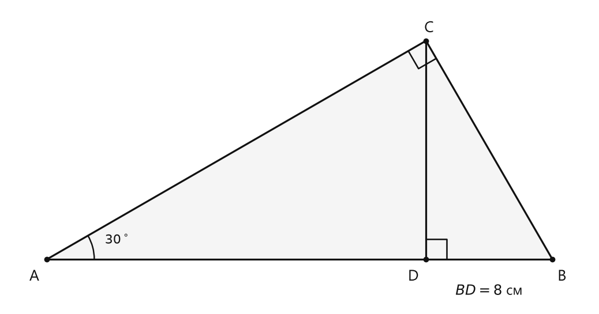
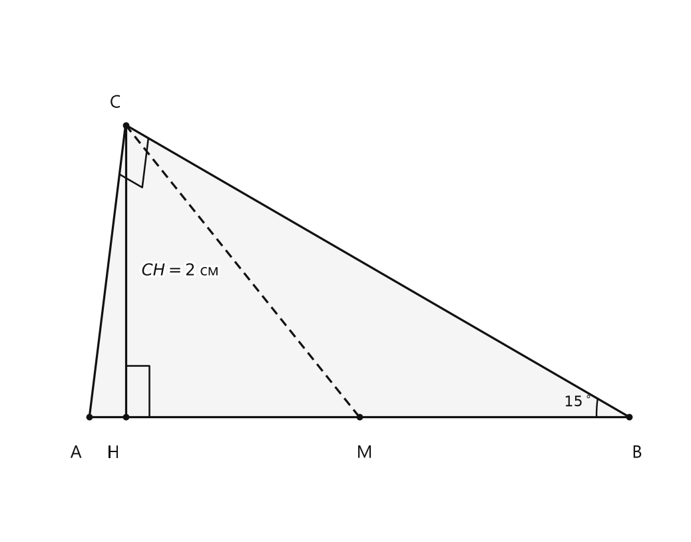

# Занятие 28. Свойство катета прямоугольного треугольника, лежащего против угла в 30°

**Раздел:** Глава IV. Сумма углов треугольника  
**Параграф учебника:** §25. Свойство катета прямоугольного треугольника, лежащего против угла в 30°  
**Страницы:** 150–153

## Цели занятия

После занятия ученик умеет:

- распознавать катет, лежащий против угла в $30^\circ$;
- применять теорему для нахождения катета или гипотенузы;
- использовать обратную теорему;
- решать задачи с высотой и медианой, проведёнными к гипотенузе;
- находить углы и стороны в треугольниках с углами $30^\circ$, $60^\circ$, $90^\circ$;
- объяснять, почему получен именно такой ответ.

Выбери блок своего уровня:

- **1–2 балла:** понять теоремы и решить простые задачи;
- **3–4 балла:** применять теоремы в прямоугольных треугольниках;
- **5–6 баллов:** решать задачи с медианой и высотой;
- **7–8 баллов:** соединять несколько свойств в одной задаче;
- **9–10 баллов:** уверенно решать задачи повышенной сложности без звёздочки.

## Теория к занятию

### 1. Катет против угла в $30^\circ$

#### Простыми словами

Смотри на прямоугольный треугольник. У него есть:

- два катета — стороны, образующие прямой угол;
- гипотенуза — сторона напротив прямого угла.

Если один из острых углов равен $30^\circ$, то катет напротив этого угла в два раза короче гипотенузы.

#### Теорема

> Катет прямоугольного треугольника, лежащий против угла в $30^\circ$, равен половине гипотенузы.

#### Формулы

Если катет $a$ лежит против угла $30^\circ$, а гипотенуза равна $c$, то

$$
a=\frac{c}{2}.
$$

Если известен катет $a$, то гипотенузу можно найти так:

$$
c=2a.
$$

Здесь:

- $a$ — катет, лежащий против угла $30^\circ$;
- $c$ — гипотенуза.

#### Как применять теорему

1. Найди прямой угол.
2. Определи гипотенузу: она лежит напротив прямого угла.
3. Найди угол $30^\circ$.
4. Посмотри, какой катет лежит напротив этого угла.
5. Если известна гипотенуза, раздели её на $2$.
6. Если известен катет, умножь его на $2$.

#### Ловушки

- Не любой катет равен половине гипотенузы, а только катет **напротив угла $30^\circ$**.
- Гипотенуза всегда лежит напротив прямого угла.
- Если катет равен $8$ см, то гипотенуза равна $16$ см, а не $4$ см. Здесь катет — половина гипотенузы, поэтому для поиска гипотенузы нужно умножать на $2$.

---

### 2. Обратная теорема

#### Простыми словами

Первая теорема говорит:

> если есть угол $30^\circ$, то катет напротив него равен половине гипотенузы.

Обратная теорема позволяет начать с длин сторон. Если в прямоугольном треугольнике катет равен половине гипотенузы, то можно сделать вывод об угле напротив этого катета.

#### Теорема

> Если в прямоугольном треугольнике катет равен половине гипотенузы, то этот катет лежит против угла в $30^\circ$.

#### Формулы

Если

$$
a=\frac{c}{2},
$$

то угол, лежащий напротив катета $a$, равен

$$
30^\circ.
$$

#### Как применять обратную теорему

1. Проверь, что треугольник прямоугольный.
2. Определи гипотенузу.
3. Найди половину гипотенузы.
4. Сравни её с данным катетом.
5. Если катет равен половине гипотенузы, то угол напротив этого катета равен $30^\circ$.

#### Ловушки

- В произвольном треугольнике эта теорема не применяется.
- Нельзя утверждать, что любой катет вдвое меньше гипотенузы.
- Сначала нужно проверить отношение длин сторон, а уже потом делать вывод об угле. Иначе получится математическое гадание.

---

### 3. Высота к гипотенузе в треугольнике с углом $30^\circ$

#### Простыми словами

Рассмотрим прямоугольный треугольник $ABC$, в котором $\angle C=90^\circ$ и $\angle A=30^\circ$. Из вершины прямого угла проведём высоту $CD$ к гипотенузе $AB$.

Высота разделит исходный треугольник на два маленьких прямоугольных треугольника:

- $\triangle ACD$;
- $\triangle BCD$.

В таком чертеже отрезки гипотенузы $BD$ и $AD$ относятся как $1:3$:

- $BD$ — меньшая часть;
- $AD$ — большая часть;
- вся гипотенуза $AB$ состоит из $4$ таких частей.

#### Факт

> Мы доказали, что $BC = 2BD$, $AB = 2BC = 4BD$, $AD = AB - BD = 3BD$, то есть в прямоугольном треугольнике с углом $30^\circ$ высота делит гипотенузу в отношении $1:3$.

#### Формулы

Если $BD$ — меньший отрезок гипотенузы, то

$$
BC=2BD,
$$

$$
AB=4BD,
$$

$$
AD=3BD.
$$

#### Алгоритм решения

1. Рассмотри маленький прямоугольный треугольник $CDB$.
2. Найди в нём угол $30^\circ$.
3. Примени теорему о катете напротив угла $30^\circ$ и получи

$$
BC=2BD.
$$

4. Рассмотри большой прямоугольный треугольник $ABC$.
5. В нём катет $BC$ лежит против угла $30^\circ$, поэтому

$$
AB=2BC.
$$

6. Получи

$$
AB=4BD.
$$

7. Так как $AB=AD+BD$, найди больший отрезок:

$$
AD=AB-BD=3BD.
$$

#### Ловушки

- Не перепутай $BD$ и $AD$: они относятся как $1:3$, а не как $3:1$.
- Высота $CD$ является катетом в маленьких треугольниках, но не гипотенузой исходного треугольника.
- Отношение $1:3$ появляется именно в этой ситуации — когда в прямоугольном треугольнике есть угол $30^\circ$ и проведена высота к гипотенузе.

---

### 4. Медиана к гипотенузе

#### Простыми словами

В прямоугольном треугольнике медиана, проведённая к гипотенузе, делит гипотенузу пополам. Её конец находится в середине гипотенузы.

Для такого треугольника выполняется специальное свойство: середина гипотенузы находится на одинаковом расстоянии от всех трёх вершин. Поэтому медиана к гипотенузе равна половине гипотенузы.

#### Факт

> В прямоугольном треугольнике медиана, проведенная к гипотенузе, равна половине гипотенузы.

#### Формула

Если $CM$ — медиана к гипотенузе $AB$, то

$$
CM=AM=BM=\frac{AB}{2}.
$$

#### Как применять свойство

- Если дана медиана к гипотенузе, сразу запиши, что она равна половине гипотенузы.
- Если известны гипотенуза и медиана, можно сравнить их длины.
- Если медиана равна одному из катетов, часто образуется равнобедренный или равносторонний треугольник.
- Угол между медианой и гипотенузой можно найти через получившийся равнобедренный или равносторонний треугольник.

#### Ловушки

- Медиана равна половине гипотенузы только в прямоугольном треугольнике.
- Медиана не обязана быть перпендикулярной гипотенузе.
- Не путай медиану с высотой: медиана идёт к середине стороны, а высота образует с этой стороной прямой угол.

---

### 5. Угол $15^\circ$ и высота к гипотенузе

#### Простыми словами

Для угла $15^\circ$ нет отдельной готовой формулы из этой темы. Но его можно связать с углом $30^\circ$.

Пусть к гипотенузе проведены:

- медиана $CM$;
- высота $CH$.

Так как $CM$ — медиана к гипотенузе, то

$$
CM=BM.
$$

Значит, треугольник $CMB$ равнобедренный. Если его угол при вершине $B$ равен $15^\circ$, то второй угол при основании тоже равен $15^\circ$.

Внешний угол тогда равен сумме двух внутренних углов:

$$
15^\circ+15^\circ=30^\circ.
$$

Теперь появляется знакомый угол $30^\circ$, и можно применить теорему о катете, лежащем против этого угла.

#### Формулы

Если $CH$ — высота, $CM$ — медиана к гипотенузе, то

$$
CM=\frac{AB}{2}.
$$

Если в прямоугольном треугольнике $CHM$ катет $CH$ лежит против угла $30^\circ$, то

$$
CH=\frac{CM}{2},
$$

откуда

$$
CM=2CH.
$$

Следовательно,

$$
AB=2CM=4CH.
$$

#### Ловушки

- Угол $30^\circ$ нужно получить с помощью свойств углов, а не просто назвать.
- Не забывай, что $CM$ — половина гипотенузы.
- Внешний угол равен сумме двух внутренних углов, не смежных с ним.
- В чертеже внимательно смотри, какой луч образует нужный угол. Геометрия любит проверять не только знания, но и направление взгляда.

---

## Сводка формул «выучить наизусть»

Катет напротив угла $30^\circ$:

$$
a=\frac{c}{2}.
$$

Гипотенуза:

$$
c=2a.
$$

Высота к гипотенузе в треугольнике с углом $30^\circ$:

$$
BD:AD=1:3.
$$

Если известен меньший отрезок гипотенузы:

$$
BC=2BD,
$$

$$
AB=4BD,
$$

$$
AD=3BD.
$$

Медиана к гипотенузе:

$$
CM=AM=BM=\frac{AB}{2}.
$$

## Правила, которые нельзя путать

- Катет напротив $30^\circ$ равен половине гипотенузы.
- Гипотенуза вдвое больше катета напротив $30^\circ$.
- Прямой угол находится между катетами.
- Гипотенуза лежит напротив прямого угла.
- Медиана к гипотенузе равна половине гипотенузы.
- Внешний угол равен сумме двух внутренних углов, не смежных с ним.
- В задаче с высотой отрезки гипотенузы относятся как $1:3$.

## Разбор ключевых заданий

### Р1. Высота к гипотенузе

#### Условие

В прямоугольном треугольнике $ABC$ угол $C$ равен $90^\circ$, угол $A$ равен $30^\circ$. Из вершины $C$ проведена высота $CD$ к гипотенузе $AB$. Известно, что $BD=8$ см. Найдите $AD$.

<!--geo-figure-spec
{
  "needed": true,
  "kind": "plane",
  "caption": "Прямоугольный треугольник $ABC$ с высотой $CD$",
  "equal": true,
  "axis": false,
  "xlim": [
    -2.5,
    34.5
  ],
  "ylim": [
    -3,
    16
  ],
  "points": {
    "A": [
      0,
      0
    ],
    "B": [
      32,
      0
    ],
    "C": [
      24,
      13.8564
    ],
    "D": [
      24,
      0
    ]
  },
  "segments": [
    [
      "A",
      "C"
    ],
    [
      "C",
      "B"
    ],
    [
      "A",
      "B"
    ],
    {
      "points": [
        "C",
        "D"
      ],
      "dashed": false,
      "label": "",
      "t": 0.5
    }
  ],
  "polygons": [
    {
      "vertices": [
        "A",
        "C",
        "D"
      ],
      "fill": 0.04
    },
    {
      "vertices": [
        "C",
        "D",
        "B"
      ],
      "fill": 0.04
    }
  ],
  "labels": {
    "A": {
      "dx": -0.8,
      "dy": -1.1
    },
    "B": {
      "dx": 0.6,
      "dy": -1.1
    },
    "C": {
      "dx": 0.2,
      "dy": 0.8
    },
    "D": {
      "dx": -0.8,
      "dy": -1.1
    }
  },
  "right_angles": [
    {
      "vertex": "C",
      "from": "A",
      "to": "B"
    },
    {
      "vertex": "D",
      "from": "C",
      "to": "B"
    }
  ],
  "angle_marks": [
    {
      "vertex": "A",
      "from": "C",
      "to": "B",
      "text": "$30^\\circ$",
      "radius": 3
    }
  ],
  "texts": [
    {
      "xy": [
        28,
        -2
      ],
      "text": "$BD=8$ см"
    }
  ]
}
-->

*Прямоугольный треугольник ABC с высотой CD*

#### Решение

Дано:

$$
\angle C=90^\circ,
$$

$$
\angle A=30^\circ,
$$

$$
CD\perp AB,
$$

$$
BD=8\text{ см}.
$$

Так как $CD$ перпендикулярна $AB$, угол $CDB$ прямой:

$$
\angle CDB=90^\circ.
$$

Значит, треугольник $CDB$ прямоугольный.

Так как $CD\perp AB$, угол $BCD$ и угол $A$ вместе составляют $90^\circ$. В большом треугольнике угол $B$ также дополняет угол $A$ до $90^\circ$.

Поэтому

$$
\angle BCD=\angle A=30^\circ.
$$

В треугольнике $CDB$ отрезок $BD$ лежит против угла $30^\circ$.

По теореме о катете, лежащем против угла $30^\circ$:

$$
BC=2BD.
$$

Подставим $BD=8$ см:

$$
BC=2\cdot8=16\text{ см}.
$$

Теперь рассмотрим большой прямоугольный треугольник $ABC$.

В нём катет $BC$ лежит против угла $A=30^\circ$.

По той же теореме:

$$
AB=2BC.
$$

Подставим найденное значение $BC$:

$$
AB=2\cdot16=32\text{ см}.
$$

Гипотенуза $AB$ состоит из двух отрезков:

$$
AB=AD+DB.
$$

Значит,

$$
AD=AB-BD.
$$

Подставим значения:

$$
AD=32-8=24\text{ см}.
$$

Проверим отношение отрезков:

$$
BD:AD=8:24=1:3.
$$

Получилось именно известное свойство высоты в таком треугольнике.

**Ответ: $24$ см.**

---

### Р2. Высота и медиана при угле $15^\circ$

#### Условие

Дан прямоугольный треугольник $ABC$, в котором $\angle C=90^\circ$, $\angle B=15^\circ$. К гипотенузе $AB$ проведены высота $CH$ и медиана $CM$. Известно, что $CH=2$ см. Найдите гипотенузу $AB$.

<!--geo-figure-spec
{
  "needed": true,
  "kind": "plane",
  "caption": "Прямоугольный треугольник $ABC$ с высотой $CH$ и медианой $CM$",
  "equal": false,
  "axis": false,
  "xlim": [
    -1.2,
    8.8
  ],
  "ylim": [
    -0.8,
    2.8
  ],
  "points": {
    "A": [
      0,
      0
    ],
    "B": [
      8,
      0
    ],
    "C": [
      0.535898,
      2
    ],
    "H": [
      0.535898,
      0
    ],
    "M": [
      4,
      0
    ]
  },
  "segments": [
    [
      "A",
      "C"
    ],
    [
      "C",
      "B"
    ],
    [
      "A",
      "B"
    ],
    {
      "points": [
        "C",
        "H"
      ],
      "dashed": false,
      "label": "",
      "t": 0.5
    },
    {
      "points": [
        "C",
        "M"
      ],
      "dashed": true,
      "label": "",
      "t": 0.5
    }
  ],
  "polygons": [
    {
      "vertices": [
        "A",
        "C",
        "H"
      ],
      "fill": 0.04
    },
    {
      "vertices": [
        "C",
        "H",
        "B"
      ],
      "fill": 0.04
    }
  ],
  "labels": {
    "A": {
      "dx": -0.2,
      "dy": -0.25
    },
    "B": {
      "dx": 0.12,
      "dy": -0.25
    },
    "C": {
      "dx": -0.15,
      "dy": 0.15
    },
    "H": {
      "dx": -0.18,
      "dy": -0.25
    },
    "M": {
      "dx": 0.08,
      "dy": -0.25
    }
  },
  "right_angles": [
    {
      "vertex": "C",
      "from": "A",
      "to": "B"
    },
    {
      "vertex": "H",
      "from": "C",
      "to": "B"
    }
  ],
  "angle_marks": [
    {
      "vertex": "B",
      "from": "A",
      "to": "C",
      "text": "$15^\\circ$",
      "radius": 0.48
    }
  ],
  "texts": [
    {
      "xy": [
        1.35,
        1
      ],
      "text": "$CH=2$ см"
    }
  ]
}
-->

*Прямоугольный треугольник ABC с высотой CH и медианой CM*

#### Решение

Дано:

$$
\angle C=90^\circ,
$$

$$
\angle B=15^\circ,
$$

$$
CH=2\text{ см}.
$$

Так как $CM$ — медиана к гипотенузе $AB$, точка $M$ является серединой $AB$.

Для медианы к гипотенузе в прямоугольном треугольнике выполняется:

$$
CM=AM=BM.
$$

В частности,

$$
CM=BM.
$$

Значит, треугольник $CMB$ равнобедренный.

Угол $CBM$ совпадает с углом $B$ большого треугольника:

$$
\angle CBM=15^\circ.
$$

В равнобедренном треугольнике углы при основании равны. Поэтому

$$
\angle MCB=15^\circ.
$$

Продолжение стороны $BM$ через точку $M$ образует луч $MA$. Поэтому угол $AMC$ является внешним углом треугольника $CMB$.

По свойству внешнего угла:

$$
\angle AMC=\angle MCB+\angle MBC.
$$

Подставим известные углы:

$$
\angle AMC=15^\circ+15^\circ=30^\circ.
$$

Точки $A$, $H$, $M$, $B$ лежат на одной прямой. Поэтому угол между $CM$ и $MH$ также равен $30^\circ$.

Треугольник $CHM$ прямоугольный, потому что $CH\perp AB$, а $HM$ лежит на $AB$.

В этом треугольнике катет $CH$ лежит против угла $30^\circ$.

По теореме:

$$
CH=\frac{CM}{2}.
$$

Значит,

$$
CM=2CH.
$$

Подставим $CH=2$ см:

$$
CM=2\cdot2=4\text{ см}.
$$

Медиана $CM$ равна половине гипотенузы:

$$
CM=\frac{AB}{2}.
$$

Отсюда

$$
AB=2CM.
$$

Подставим $CM=4$ см:

$$
AB=2\cdot4=8\text{ см}.
$$

Проверка:

$$
\frac{CM}{2}=\frac{4}{2}=2\text{ см}=CH.
$$

Условие теоремы выполнено.

**Ответ: $8$ см.**

---

### Р3. Нахождение гипотенузы по сумме сторон

#### Условие

В прямоугольном треугольнике $ABC$ угол $C$ равен $90^\circ$, угол $B$ равен $60^\circ$. Сумма $AB+BC$ равна $111$ см. Найдите $AB$.

#### Решение

В прямоугольном треугольнике сумма двух острых углов равна $90^\circ$.

Поэтому

$$
\angle A=90^\circ-60^\circ=30^\circ.
$$

Сторона $BC$ лежит напротив угла $A=30^\circ$.

Гипотенуза — это $AB$, потому что она лежит напротив прямого угла $C$.

По теореме:

$$
BC=\frac{AB}{2}.
$$

По условию:

$$
AB+BC=111.
$$

Заменим $BC$ выражением $\frac{AB}{2}$:

$$
AB+\frac{AB}{2}=111.
$$

Запишем $AB$ в виде двух половин:

$$
\frac{2AB}{2}+\frac{AB}{2}=111.
$$

Сложим дроби:

$$
\frac{3AB}{2}=111.
$$

Умножим обе части равенства на $2$:

$$
3AB=222.
$$

Разделим обе части на $3$:

$$
AB=74\text{ см}.
$$

Проверим результат. Найдём второй катет:

$$
BC=\frac{74}{2}=37\text{ см}.
$$

Тогда

$$
AB+BC=74+37=111\text{ см}.
$$

Условие выполнено.

**Ответ: $74$ см.**

---

### Р4. Обратная теорема

#### Условие

В прямоугольном треугольнике $ABC$ гипотенуза $AB=16$ см, катет $BC=8$ см. Найдите угол $A$.

#### Решение

Треугольник $ABC$ прямоугольный, а его гипотенуза равна

$$
AB=16\text{ см}.
$$

Найдём половину гипотенузы:

$$
\frac{AB}{2}=\frac{16}{2}=8\text{ см}.
$$

По условию

$$
BC=8\text{ см}.
$$

Значит,

$$
BC=\frac{AB}{2}.
$$

Катет $BC$ равен половине гипотенузы $AB$.

По обратной теореме катет $BC$ лежит против угла $30^\circ$.

Напротив катета $BC$ находится угол $A$.

Следовательно,

$$
\angle A=30^\circ.
$$

Проверка короткая и надёжная: половина $16$ равна $8$, значит, обратную теорему применили правильно.

**Ответ: $30^\circ$.**

---

### Р5. Угол между медианой и гипотенузой

#### Условие

В прямоугольном треугольнике $ABC$ гипотенуза $AB=15$ см, катет $BC=7{,}5$ см. К гипотенузе $AB$ проведена медиана $CM$. Найдите угол между прямыми $CM$ и $AB$.

#### Решение

Так как $CM$ — медиана к гипотенузе, она равна половине гипотенузы:

$$
CM=\frac{AB}{2}.
$$

Подставим $AB=15$ см:

$$
CM=\frac{15}{2}=7{,}5\text{ см}.
$$

По условию

$$
BC=7{,}5\text{ см}.
$$

Значит,

$$
BC=CM.
$$

Кроме того, для медианы к гипотенузе:

$$
BM=CM.
$$

Следовательно,

$$
BC=BM=CM.
$$

Треугольник $BCM$ равносторонний.

У каждого угла равностороннего треугольника величина $60^\circ$, поэтому

$$
\angle CMB=60^\circ.
$$

Луч $MB$ лежит на прямой $AB$. Поэтому угол между прямыми $CM$ и $AB$ равен

$$
60^\circ.
$$

**Ответ: $60^\circ$.**

---

### Р6. Равнобедренный треугольник с углом $120^\circ$

#### Условие

В равнобедренном треугольнике $ABC$ стороны $AB$ и $BC$ равны, угол $B$ равен $120^\circ$. Высота $AH$, проведённая к прямой $BC$, равна $16$ см. Найдите основание $AC$.

#### Решение

Так как

$$
AB=BC,
$$

то треугольник $ABC$ равнобедренный с основанием $AC$.

В равнобедренном треугольнике углы при основании равны:

$$
\angle A=\angle C.
$$

Сумма углов треугольника равна $180^\circ$.

Сумма углов $A$ и $C$ равна

$$
\angle A+\angle C=180^\circ-120^\circ=60^\circ.
$$

Так как эти углы равны, каждый из них равен половине $60^\circ$:

$$
\angle A=\angle C=30^\circ.
$$

Высота $AH$ перпендикулярна прямой $BC$, поэтому

$$
\angle AHC=90^\circ.
$$

Треугольник $AHC$ прямоугольный.

В нём:

- угол $C$ равен $30^\circ$;
- катет $AH=16$ см лежит против угла $30^\circ$;
- гипотенуза — $AC$.

По теореме о катете, лежащем против угла $30^\circ$:

$$
AH=\frac{AC}{2}.
$$

Значит,

$$
AC=2AH.
$$

Подставим значение $AH$:

$$
AC=2\cdot16=32\text{ см}.
$$

**Ответ: $32$ см.**

### Р7. Высота и медиана в треугольнике

#### Условие

В треугольнике $ABC$ проведены высота $BH$ и медиана $BM$ к стороне $AC$. Известно, что

$$
BM=\frac12AC,
$$

$$
\angle A=60^\circ,
$$

$$
HM=24\text{ см}.
$$

Точка $M$ — середина стороны $AC$. Найдите $HC$.

#### Решение

Так как $M$ — середина стороны $AC$, то

$$
AM=MC=\frac{AC}{2}.
$$

По условию

$$
BM=\frac12AC.
$$

Значит,

$$
BM=AM=MC.
$$

В частности,

$$
BM=AM.
$$

Следовательно, треугольник $ABM$ равнобедренный.

Так как точка $M$ лежит на стороне $AC$, то

$$
\angle BAM=\angle A=60^\circ.
$$

В равнобедренном треугольнике $ABM$ углы при основании равны:

$$
\angle ABM=\angle BAM=60^\circ.
$$

Тогда

$$
\angle AMB=180^\circ-60^\circ-60^\circ=60^\circ.
$$

Значит, треугольник $ABM$ равносторонний.

Высота $BH$ перпендикулярна стороне $AC$, поэтому

$$
\angle BHM=90^\circ.
$$

В равностороннем треугольнике угол при вершине $B$ равен $60^\circ$. Высота $BH$ делит этот угол на два угла по $30^\circ$, поэтому

$$
\angle HBM=30^\circ.
$$

В прямоугольном треугольнике $BHM$ сторона $BM$ является гипотенузой, а $HM$ лежит против угла $30^\circ$.

По свойству катета прямоугольного треугольника, лежащего против угла в $30^\circ$,

$$
HM=\frac12BM.
$$

Подставим $HM=24$ см:

$$
24=\frac12BM.
$$

Умножим обе части равенства на $2$:

$$
BM=48\text{ см}.
$$

Так как

$$
BM=MC,
$$

то

$$
MC=48\text{ см}.
$$

Точка $H$ лежит между точками $A$ и $M$, поэтому

$$
HC=HM+MC.
$$

Подставим известные значения:

$$
HC=24+48=72\text{ см}.
$$

Знак здесь именно «плюс»: от $H$ до $C$ нужно пройти сначала до $M$, а потом ещё от $M$ до $C$.

**Ответ: $72$ см.**

---

### Р8. Три угла и отрезки гипотенузы

#### Условие

Сумма двух углов треугольника равна третьему, а два меньших угла относятся как $1:2$. Большая сторона треугольника равна $48$ см. Найдите длины отрезков, на которые высота, опущенная из вершины большего угла, делит противоположную сторону.

#### Решение

Пусть два меньших угла равны $x$ и $2x$.

По условию третий угол равен их сумме:

$$
x+2x=3x.
$$

Сумма углов треугольника равна $180^\circ$:

$$
x+2x+3x=180^\circ.
$$

Сложим подобные слагаемые:

$$
6x=180^\circ.
$$

Разделим обе части на $6$:

$$
x=30^\circ.
$$

Значит, углы треугольника равны

$$
30^\circ,\quad 60^\circ,\quad 90^\circ.
$$

Большая сторона лежит против большего угла, поэтому сторона длиной $48$ см является гипотенузой.

Обозначим треугольник так: $\angle C=90^\circ$, $\angle A=30^\circ$, $\angle B=60^\circ$. Тогда

$$
AB=48\text{ см}.
$$

Пусть высота $CH$ делит гипотенузу $AB$ на отрезки $AH$ и $HB$.

Катет $BC$ лежит против угла $A=30^\circ$. Поэтому

$$
BC=\frac12AB=\frac{48}{2}=24\text{ см}.
$$

Рассмотрим прямоугольный треугольник $BCH$.

Так как

$$
CH\perp AB,
$$

то

$$
\angle BHC=90^\circ.
$$

В треугольнике $ABC$ угол $B$ равен $60^\circ$, значит, в треугольнике $BCH$

$$
\angle BCH=180^\circ-90^\circ-60^\circ=30^\circ.
$$

В треугольнике $BCH$ сторона $BH$ лежит против угла $30^\circ$, а гипотенуза — сторона $BC$.

По свойству катета, лежащего против угла в $30^\circ$,

$$
BH=\frac12BC.
$$

Подставим $BC=24$ см:

$$
BH=\frac{24}{2}=12\text{ см}.
$$

Гипотенуза $AB$ состоит из двух отрезков:

$$
AB=AH+HB.
$$

Отсюда

$$
AH=AB-HB.
$$

Подставим значения:

$$
AH=48-12=36\text{ см}.
$$

Проверим длины отрезков:

$$
AH+HB=36+12=48\text{ см}.
$$

Сумма совпала с длиной гипотенузы — значит, отрезки найдены верно. Геометрия тоже любит проверку, а не только уверенный вид.

**Ответ: $12$ см и $36$ см.**

## Практические задания

Выбери свой уровень и решай только этот блок. В блоке должна закрепиться вся тема параграфа. Ответы не приводятся.

### Уровень 1–2 балла

**С1.** В прямоугольном треугольнике один из острых углов равен $30^\circ$, а гипотенуза равна $18$ см. Найдите катет, лежащий против угла $30^\circ$.

**С2.** В прямоугольном треугольнике катет, лежащий против угла $30^\circ$, равен $7$ см. Найдите гипотенузу.

**С3.** Выберите верное утверждение для прямоугольного треугольника с углом $30^\circ$:
1) катет, лежащий против угла $30^\circ$, равен гипотенузе; 2) катет, лежащий против угла $30^\circ$, равен половине гипотенузы; 3) гипотенуза равна половине этого катета; 4) оба катета равны гипотенузе; 5) этот катет в два раза больше гипотенузы.

**С4.** В прямоугольном треугольнике $ABC$ $\angle C=90^\circ$, $\angle A=30^\circ$, $AB=26$ см. Найдите длину катета $BC$.

**С5.** В прямоугольном треугольнике $ABC$ $\angle C=90^\circ$, $BC=12$ см, $AB=24$ см. Какой угол лежит против катета $BC$?

**С6.** Выберите все верные утверждения. В прямоугольном треугольнике катет, лежащий против угла $30^\circ$, равен $9$ см:
1) гипотенуза равна $18$ см; 2) гипотенуза равна $4{,}5$ см; 3) данный катет равен половине гипотенузы; 4) данный катет в два раза меньше гипотенузы; 5) данный катет в два раза больше гипотенузы.

**С7.** В прямоугольном треугольнике один из острых углов равен $30^\circ$, а катет, лежащий против него, равен $15$ см. Найдите гипотенузу.

**С8.** В прямоугольном треугольнике гипотенуза равна $32$ см. Один из катетов равен $16$ см. Какой угол лежит против этого катета?

**С9.** В прямоугольном треугольнике $ABC$ $\angle C=90^\circ$, $\angle B=30^\circ$, $AC=11$ см. Найдите длину гипотенузы $AB$.

**С10.** Выберите верное равенство для прямоугольного треугольника $ABC$, в котором $\angle C=90^\circ$ и $\angle A=30^\circ$:
1) $AB=2BC$; 2) $BC=2AB$; 3) $AC=2AB$; 4) $AB=AC$; 5) $BC=AC$.

**С11.** В прямоугольном треугольнике $ABC$ $\angle C=90^\circ$, гипотенуза $AB=40$ см, а катет $AC$ лежит против угла $30^\circ$. Найдите $AC$.

**С12.** В прямоугольном треугольнике катет равен половине гипотенузы. Выберите величину угла, противолежащего этому катету:
1) $15^\circ$; 2) $30^\circ$; 3) $45^\circ$; 4) $60^\circ$; 5) $90^\circ$.

**С13.** В прямоугольном треугольнике катет, лежащий против угла $30^\circ$, равен $7$ см. Найдите гипотенузу.

**С14.** В прямоугольном треугольнике гипотенуза равна $18$ см. Угол, лежащий напротив катета $9$ см, равен $30^\circ$. Найдите этот катет.

**С15.** Выберите верное утверждение для прямоугольного треугольника.

1) Катет, лежащий против угла $30^\circ$, равен гипотенузе.  
2) Катет, лежащий против угла $30^\circ$, равен половине гипотенузы.  
3) Гипотенуза равна половине катета, лежащего против угла $30^\circ$.  
4) Каждый катет равен половине гипотенузы.  
5) Катет, лежащий против угла $30^\circ$, в два раза больше гипотенузы.

**С16.** В прямоугольном треугольнике $ABC$ угол $C$ равен $90^\circ$, угол $A$ равен $30^\circ$, а $AB=26$ см. Найдите $BC$.

**С17.** В прямоугольном треугольнике $KLM$ угол $M$ равен $90^\circ$, $KL=32$ см, $KM=16$ см. Каков угол $L$?

1) $15^\circ$  
2) $30^\circ$  
3) $45^\circ$  
4) $60^\circ$  
5) $90^\circ$

**С18.** В прямоугольном треугольнике $DEF$ угол $F$ равен $90^\circ$, угол $D$ равен $60^\circ$, а $EF=11$ см. Найдите гипотенузу $DE$.

**С19.** В прямоугольном треугольнике $ABC$ угол $C$ равен $90^\circ$, угол $B$ равен $30^\circ$, $AC=12$ см. Найдите $AB$.

**С20.** В прямоугольном треугольнике $PQR$ угол $Q$ равен $90^\circ$, а $PR=40$ см. Какой длины должен быть катет $PQ$, чтобы угол $R$ был равен $30^\circ$?

1) $10$ см  
2) $20$ см  
3) $30$ см  
4) $40$ см  
5) $80$ см

**С21.** В прямоугольном треугольнике $XYZ$ угол $Z$ равен $90^\circ$, угол $X$ равен $30^\circ$, $YZ=5{,}5$ см. Найдите $XY$.

**С22.** В прямоугольном треугольнике $ABC$ угол $C$ равен $90^\circ$. Катет $BC$ равен половине гипотенузы $AB$. Каков угол $A$?

1) $15^\circ$  
2) $30^\circ$  
3) $45^\circ$  
4) $60^\circ$  
5) $90^\circ$

**С23.** В прямоугольном треугольнике $RST$ угол $T$ равен $90^\circ$, угол $R$ равен $30^\circ$, а $ST=9$ см. Найдите $RS$.

**С24.** В прямоугольном треугольнике $ABC$ угол $C$ равен $90^\circ$, $AB=30$ см, $BC=15$ см. Определите величину угла $A$.

1) $15^\circ$  
2) $30^\circ$  
3) $45^\circ$  
4) $60^\circ$  
5) $90^\circ$

**С25.** В прямоугольном треугольнике $ABC$ $\angle C=90^\circ$, $\angle A=30^\circ$, $AB=18$ см. Найдите катет $BC$.

**С26.** В прямоугольном треугольнике $KLM$ $\angle M=90^\circ$, $\angle K=30^\circ$, $LM=7$ см. Найдите гипотенузу $KL$.

**С27.** Выберите верное утверждение для прямоугольного треугольника, в котором один из острых углов равен $30^\circ$.

1) Катет, лежащий против угла $30^\circ$, равен гипотенузе.  
2) Катет, лежащий против угла $30^\circ$, равен половине гипотенузы.  
3) Гипотенуза равна половине катета, лежащего против угла $30^\circ$.  
4) Оба катета равны половине гипотенузы.  
5) Катет, лежащий против угла $30^\circ$, вдвое больше гипотенузы.

**С28.** В прямоугольном треугольнике $PQR$ $\angle R=90^\circ$, $PQ=26$ см, $PR=13$ см. Определите, какой угол равен $30^\circ$.

1) $\angle P$  
2) $\angle Q$  
3) $\angle R$  
4) $\angle P$ и $\angle Q$  
5) Ни один угол

**С29.** В прямоугольном треугольнике $ABC$ $\angle C=90^\circ$, $\angle A=30^\circ$, $BC=11$ см. Найдите $AB$.

**С30.** В прямоугольном треугольнике $DEF$ $\angle F=90^\circ$, $EF=9$ см, $DF=9\sqrt3$ см. Выберите равенство, соответствующее гипотенузе $DE$.

1) $DE=9$ см  
2) $DE=9\sqrt2$ см  
3) $DE=18$ см  
4) $DE=18\sqrt3$ см  
5) $DE=27$ см

**С31.** В прямоугольном треугольнике $XYZ$ $\angle Z=90^\circ$, $\angle X=30^\circ$, $XY=32$ см. Найдите катет $YZ$.

**С32.** В прямоугольном треугольнике $ABC$ $\angle C=90^\circ$, $BC=8$ см, $AB=16$ см. Какой угол лежит напротив катета $BC$?

1) $30^\circ$  
2) $45^\circ$  
3) $60^\circ$  
4) $90^\circ$  
5) $120^\circ$

**С33.** В прямоугольном треугольнике $KLM$ $\angle M=90^\circ$, $\angle L=30^\circ$, $KM=6$ см. Найдите гипотенузу $KL$.

**С34.** В прямоугольном треугольнике $RST$ $\angle T=90^\circ$, $RS=20$ см, $RT=10$ см. Выберите верное утверждение.

1) $\angle S=30^\circ$  
2) $\angle R=30^\circ$  
3) $\angle T=30^\circ$  
4) $\angle R=60^\circ$  
5) Катет $RT$ не связан с углом $30^\circ$

**С35.** В прямоугольном треугольнике $ABC$ $\angle C=90^\circ$, $\angle B=30^\circ$, $AC=15$ см. Найдите гипотенузу $AB$.

**С36.** В прямоугольном треугольнике $MNP$ $\angle P=90^\circ$, $MN=24$ см, $MP=12$ см. Укажите катет, лежащий против угла $30^\circ$.

1) $MN$  
2) $MP$  
3) $NP$  
4) Оба катета  
5) Такой катет отсутствует

### Уровень 3–4 балла

**С1.** В прямоугольном треугольнике гипотенуза равна $18$ см, а один из острых углов равен $30^\circ$. Найдите катет, лежащий против угла $30^\circ$.

**С2.** В прямоугольном треугольнике катет, лежащий против одного из острых углов, равен $7{,}5$ см, а гипотенуза равна $15$ см. Найдите этот угол.

**С3.** В прямоугольном треугольнике $ABC$ $\angle C=90^\circ$, $\angle A=30^\circ$, $BC=12$ см. Найдите гипотенузу $AB$.

**С4.** В прямоугольном треугольнике $ABC$ $\angle C=90^\circ$, $\angle B=60^\circ$, $AC=14$ см. Найдите гипотенузу $AB$.

**С5.** В прямоугольном треугольнике катет равен $13$ см, а гипотенуза — $26$ см. Определите угол, лежащий против данного катета.

**С6.** В прямоугольном треугольнике гипотенуза равна $20$ см, а катет, лежащий против угла $30^\circ$, равен $10$ см. Найдите периметр треугольника.

**С7.** В прямоугольном треугольнике $ABC$ $\angle C=90^\circ$, $\angle B=60^\circ$, а сумма гипотенузы $AB$ и катета $BC$ равна $84$ см. Найдите длину гипотенузы $AB$.

**С8.** В прямоугольном треугольнике один из острых углов равен $30^\circ$, а катет, лежащий против этого угла, равен $6$ см. Найдите второй катет.

**С9.** В прямоугольном треугольнике катет, лежащий против угла $30^\circ$, равен $9$ см. Найдите гипотенузу и запишите ответ в виде пары чисел: сначала длина гипотенузы, затем длина указанного катета.

**С10.** В прямоугольном треугольнике $ABC$ $\angle C=90^\circ$, $\angle A=30^\circ$. Высота $CD$ проведена к гипотенузе $AB$, причём $BD=5$ см. Найдите отрезок $AD$.

**С11.** В прямоугольном треугольнике $ABC$ $\angle C=90^\circ$, $\angle A=30^\circ$. Медиана $CM$ проведена к гипотенузе $AB$, причём $CM=9$ см. Найдите катет $BC$.

**С12.** В прямоугольном треугольнике $ABC$ $\angle C=90^\circ$, $\angle A=30^\circ$, а периметр треугольника равен $30+10\sqrt3$ см. Найдите длину гипотенузы $AB$.

**С13.** В прямоугольном треугольнике один из острых углов равен $30^\circ$, а гипотенуза равна $18$ см. Найдите катет, лежащий против угла $30^\circ$.

**С14.** В прямоугольном треугольнике катет, лежащий против одного из острых углов, равен $7$ см, а гипотенуза — $14$ см. Найдите этот острый угол.

**С15.** В прямоугольном треугольнике $ABC$ угол $C$ прямой, $\angle A=30^\circ$, $BC=9$ см. Найдите длину гипотенузы $AB$.

**С16.** В прямоугольном треугольнике $KLM$ угол $M$ прямой, $KL=26$ см, $\angle K=60^\circ$. Найдите катет $LM$.

**С17.** В прямоугольном треугольнике $ABC$ угол $C$ прямой, $\angle B=30^\circ$, $AC=12$ см. Найдите длину катета $BC$.

**С18.** В прямоугольном треугольнике $PQR$ угол $Q$ прямой, $PR=20$ см, $PQ=10$ см. Определите величину угла $R$.

**С19.** В прямоугольном треугольнике $ABC$ угол $C$ прямой, $\angle A=30^\circ$, $AB=32$ см. Найдите периметр треугольника, если $BC$ — катет, лежащий против угла $30^\circ$.

**С20.** В прямоугольном треугольнике $DEF$ угол $F$ прямой, $\angle D=60^\circ$, $DE=15$ см. Найдите сумму длин катета $EF$ и гипотенузы $DE$.

**С21.** В прямоугольном треугольнике $ABC$ угол $C$ прямой, $\angle A=30^\circ$, $AB=24$ см. Высота $CD$ проведена к гипотенузе $AB$. Найдите отрезок $BD$, если $D$ лежит на отрезке $AB$.

**С22.** В прямоугольном треугольнике $ABC$ угол $C$ прямой, $\angle A=30^\circ$, а высота $CD$, проведённая к гипотенузе $AB$, делит её так, что $BD=6$ см. Найдите длину отрезка $AD$.

**С23.** В прямоугольном треугольнике $ABC$ угол $C$ прямой. На гипотенузе $AB$ взята точка $D$, причём $CD\perp AB$, $AD=27$ см и $BD=9$ см. Найдите меньший острый угол треугольника $ABC$.

**С24.** В прямоугольном треугольнике $ABC$ угол $C$ прямой, а высота $CD$ к гипотенузе $AB$ делит гипотенузу на отрезки $AD=15$ см и $DB=5$ см. Найдите длины катетов $AC$ и $BC$.

**С25.** В прямоугольном треугольнике $ABC$ угол $C$ равен $90^\circ$, а угол $A$ равен $30^\circ$. Найдите катет $BC$, если гипотенуза $AB$ равна $18$ см.

**С26.** В прямоугольном треугольнике $KLM$ угол $M$ равен $90^\circ$, а угол $L$ равен $30^\circ$. Найдите гипотенузу $KL$, если катет $KM$ равен $7$ см.

**С27.** В прямоугольном треугольнике $PQR$ гипотенуза $PQ$ равна $26$ см, а катет $QR$ равен $13$ см. Определите величину угла $P$.

**С28.** В прямоугольном треугольнике $ABC$ угол $C$ равен $90^\circ$, угол $A$ равен $30^\circ$, а катет $BC$ равен $9$ см. Найдите сумму длин гипотенузы $AB$ и катета $BC$.

**С29.** В прямоугольном треугольнике $DEF$ угол $F$ равен $90^\circ$, угол $D$ равен $30^\circ$. Найдите второй катет $EF$, если гипотенуза $DE$ равна $20$ см.

**С30.** В прямоугольном треугольнике $ABC$ угол $C$ равен $90^\circ$, угол $A$ равен $30^\circ$. Высота $CD$ проведена к гипотенузе $AB$, причём $BD=6$ см. Найдите длину гипотенузы $AB$.

**С31.** В прямоугольном треугольнике $ABC$ угол $C$ равен $90^\circ$, угол $B$ равен $30^\circ$. Высота $CD$ проведена к гипотенузе $AB$, причём $AD=3$ см. Найдите отрезок $DB$.

**С32.** В прямоугольном треугольнике $MNP$ угол $N$ равен $90^\circ$, катет $MP$ является гипотенузой, а катет $NP$ равен половине гипотенузы $MP$. Найдите угол $M$.

**С33.** В прямоугольном треугольнике $XYZ$ угол $Z$ равен $90^\circ$, угол $X$ равен $30^\circ$. Периметр треугольника равен $36$ см, а гипотенуза $XY$ равна $12$ см. Найдите длину катета $YZ$.

**С34.** В прямоугольном треугольнике $ABC$ угол $C$ равен $90^\circ$, угол $A$ равен $30^\circ$. Разность между гипотенузой $AB$ и катетом $BC$ равна $15$ см. Найдите длину катета $BC$.

**С35.** В прямоугольном треугольнике $DEF$ угол $F$ равен $90^\circ$, угол $E$ равен $30^\circ$. Сумма гипотенузы $DE$ и катета $EF$ равна $45$ см. Найдите длину гипотенузы $DE$.

**С36.** В прямоугольном треугольнике $ABC$ угол $C$ равен $90^\circ$, угол $A$ равен $30^\circ$. На гипотенузе $AB$ выбрана точка $D$, причём $CD$ — высота, $AD=12$ см. Найдите длины $AB$ и $BD$.

### Уровень 5–6 баллов

**С1.** В прямоугольном треугольнике $ABC$ $\angle C=90^\circ$, $\angle A=30^\circ$, $AB=18$ см. Найдите длину катета $BC$.

**С2.** В прямоугольном треугольнике $KLM$ $\angle M=90^\circ$, $\angle K=30^\circ$, $LM=13$ см. Найдите длину гипотенузы $KL$.

**С3.** В прямоугольном треугольнике $PQR$ $\angle R=90^\circ$, $\angle P=60^\circ$, $PQ=34$ см. Найдите длину катета $PR$.

**С4.** В прямоугольном треугольнике $ABC$ $\angle C=90^\circ$, $AB=16$ см, $BC=8$ см. Найдите величину угла $A$.

**С5.** В прямоугольном треугольнике $ABC$ $\angle C=90^\circ$, $\angle A=30^\circ$, сумма гипотенузы $AB$ и катета $BC$ равна $30$ см. Найдите периметр треугольника.

**С6.** В прямоугольном треугольнике $ABC$ $\angle C=90^\circ$, $\angle A=30^\circ$. К гипотенузе $AB$ проведена высота $CD$. Известно, что $BD=7$ см. Найдите длину отрезка $AD$.

**С7.** В прямоугольном треугольнике $ABC$ $\angle C=90^\circ$, $\angle A=30^\circ$. Высота $CD$ делит гипотенузу $AB$ на отрезки $AD$ и $DB$, причём $DB=9$ см. Найдите длину гипотенузы $AB$.

**С8.** В прямоугольном треугольнике $ABC$ $\angle C=90^\circ$, $\angle A=30^\circ$. К гипотенузе $AB$ проведена медиана $CM$. Найдите угол между прямыми $CM$ и $AB$.

**С9.** В прямоугольном треугольнике $ABC$ $\angle C=90^\circ$, $\angle A=30^\circ$, гипотенуза $AB$ равна $25$ см. Найдите длину катета $AC$.

**С10.** В прямоугольном треугольнике $ABC$ $\angle C=90^\circ$, катет $BC$ равен половине гипотенузы $AB$, а $AB=22$ см. Найдите величину угла $A$.

**С11.** В прямоугольном треугольнике $ABC$ $\angle C=90^\circ$, $\angle B=60^\circ$, сумма катетов равна $12+6\sqrt3$ см. Найдите длину гипотенузы $AB$.

**С12.** В прямоугольном треугольнике $ABC$ $\angle C=90^\circ$, $\angle A=30^\circ$. К гипотенузе $AB$ проведена высота $CD$, причём $AD=15$ см. Найдите длину катета $BC$.

**С13.** В прямоугольном треугольнике $ABC$ угол $C$ прямой, а $\angle A=30^\circ$. Найдите катет $BC$, если гипотенуза $AB=18$ см.

**С14.** В прямоугольном треугольнике один из углов равен $30^\circ$. Найдите гипотенузу, если катет, лежащий против этого угла, равен $7$ см.

**С15.** В прямоугольном треугольнике $ABC$ $\angle C=90^\circ$, $\angle A=30^\circ$, $BC=12$ см. Найдите длины гипотенузы $AB$ и катета $AC$.

**С16.** В прямоугольном треугольнике $ABC$ $\angle C=90^\circ$, $AB=20$ см, $BC=10$ см. Докажите, что $\angle A=30^\circ$.

**С17.** В прямоугольном треугольнике $ABC$ $\angle C=90^\circ$, $\angle B=60^\circ$, а сумма $AB+BC$ равна $111$ см. Найдите длину гипотенузы $AB$.

**С18.** В прямоугольном треугольнике $ABC$ $\angle C=90^\circ$, $\angle A=30^\circ$. Из вершины $C$ к гипотенузе $AB$ проведена высота $CD$. Найдите $AD$, если $BD=9$ см.

**С19.** В прямоугольном треугольнике $ABC$ $\angle C=90^\circ$, $\angle A=30^\circ$. Медиана $CM$, проведённая к гипотенузе $AB$, равна $13$ см. Найдите длину катета $BC$.

**С20.** В равнобедренном треугольнике $ABC$ $AB=BC$, $\angle B=120^\circ$. Из вершины $A$ к стороне $BC$ проведена высота $AH$, равная $16$ см. Найдите длину основания $AC$.

**С21.** В прямоугольном треугольнике $ABC$ $\angle C=90^\circ$, $\angle A=30^\circ$. Высота $CD$, проведённая к гипотенузе $AB$, равна $6$ см. Найдите длину катета $AC$.

**С22.** В прямоугольном треугольнике $ABC$ $\angle C=90^\circ$, $\angle A=30^\circ$, а медиана $CM$ проведена к гипотенузе $AB$. Найдите длину катета $BC$, если $CM=10$ см.

**С23.** В прямоугольном треугольнике $ABC$ $\angle C=90^\circ$, $\angle A=30^\circ$. Высота $CD$ делит гипотенузу $AB$ на отрезки $AD$ и $DB$, причём $DB=7$ см. Найдите длины $AD$ и $AB$.

**С24.** В прямоугольном треугольнике один из острых углов равен $30^\circ$, а катет, лежащий против этого угла, равен $6$ см. Найдите периметр треугольника. Ответ запишите в виде выражения с корнем.

**С25.** В прямоугольном треугольнике $ABC$ угол $C$ равен $90^\circ$, а угол $A$ равен $30^\circ$. Найдите длину гипотенузы $AB$, если $BC=7$ см.

**С26.** В прямоугольном треугольнике $KLM$ угол $M$ равен $90^\circ$. Известно, что $KL=18$ см, а $KM=9$ см. Определите величину угла $L$.

**С27.** В прямоугольном треугольнике $ABC$ угол $C$ равен $90^\circ$, угол $A$ равен $30^\circ$, а периметр треугольника равен $36+6\sqrt3$ см. Найдите длины всех его сторон.

**С28.** В прямоугольном треугольнике $ABC$ угол $C$ равен $90^\circ$, угол $A$ равен $30^\circ$. Высота $CD$, проведённая к гипотенузе $AB$, делит её на отрезки $AD$ и $DB$, причём $DB=5$ см. Найдите длину гипотенузы $AB$.

**С29.** В равнобедренном треугольнике $ABC$ боковые стороны $AB$ и $BC$ равны, а угол $B$ равен $120^\circ$. Высота $AH$ проведена к стороне $BC$, и $AH=6\sqrt3$ см. Найдите длину основания $AC$.

**С30.** В прямоугольном треугольнике $ABC$ угол $C$ равен $90^\circ$, $AB=20$ см, $BC=10$ см. Медиана $CM$ проведена к гипотенузе $AB$. Найдите угол между прямыми $CM$ и $AB$.

### Уровень 7–8 баллов

**С1.** В прямоугольном треугольнике $ABC$ угол $C$ равен $90^\circ$, а угол $A$ равен $30^\circ$. Катет $BC$ равен $9$ см. Найдите длины гипотенузы $AB$ и катета $AC$. Обоснуйте применение свойства катета, лежащего против угла в $30^\circ$.

**С2.** В прямоугольном треугольнике $KLM$ угол $M$ равен $90^\circ$, угол $K$ равен $30^\circ$, а гипотенуза $KL$ равна $26$ см. Найдите длину катета $LM$ и угол $L$.

**С3.** В прямоугольном треугольнике $ABC$ угол $C$ равен $90^\circ$, угол $B$ равен $60^\circ$, а сумма длин $AB$ и $BC$ равна $111$ см. Найдите длины всех сторон треугольника.

**С4.** В прямоугольном треугольнике $ABC$ угол $C$ равен $90^\circ$, угол $A$ равен $30^\circ$. К гипотенузе $AB$ проведена высота $CD$, причём $D$ лежит на отрезке $AB$ и $BD=8$ см. Найдите длину отрезка $AD$.

**С5.** В прямоугольном треугольнике $ABC$ угол $C$ равен $90^\circ$, $BC=7{,}5$ см, $AB=15$ см. Точка $M$ — середина гипотенузы $AB$. Найдите угол между прямыми $CM$ и $AB$. Обоснуйте ответ.

**С6.** В прямоугольном треугольнике $ABC$ угол $C$ равен $90^\circ$, угол $A$ равен $30^\circ$. Высота $CD$, проведённая к гипотенузе $AB$, равна $6$ см. Найдите длину отрезка $AD$.

**С7.** В прямоугольном треугольнике $ABC$ угол $C$ равен $90^\circ$, гипотенуза $AB=18$ см, а катет $BC=9$ см. Найдите углы $A$ и $B$, используя теорему, обратную свойству катета, лежащего против угла в $30^\circ$.

**С8.** Стороны прямоугольного треугольника равны $7$ см, $7\sqrt3$ см и $14$ см. Определите, какая из сторон является гипотенузой, и найдите величины острых углов треугольника. Ответ обоснуйте.

**С9.** В треугольнике $ABC$ проведена высота $AH$ к стороне $BC$. Точка $H$ лежит на отрезке $BC$, $AB=16$ см, $\angle B=30^\circ$, $AC=16$ см, $\angle C=30^\circ$. Найдите длины отрезков $BH$, $HC$ и $BC$.

**С10.** В прямоугольном треугольнике $ABC$ угол $C$ равен $90^\circ$, $AB=24$ см, $BC=12$ см. Точка $M$ — середина гипотенузы $AB$. Найдите угол $ACM$. Обоснуйте ответ с помощью свойства катета, лежащего против угла в $30^\circ$.

**С11.** В прямоугольном треугольнике $ABC$ угол $C$ равен $90^\circ$, угол $A$ равен $30^\circ$, гипотенуза $AB$ равна $48$ см. Высота $CH$ проведена к гипотенузе $AB$. Найдите длины отрезков $AH$ и $HB$.

**С12.** В прямоугольном треугольнике $ABC$ угол $C$ равен $90^\circ$, угол $A$ равен $30^\circ$. К гипотенузе $AB$ проведена высота $CD$, причём $BD=5$ см. Найдите длины отрезков $AB$, $BC$, $AC$, $AD$ и $CD$. Обоснуйте каждое найденное соотношение.

**С13.** В прямоугольном треугольнике $ABC$ угол $C$ прямой, а $\angle A=30^\circ$. Найдите длины катетов $AC$ и $BC$, если гипотенуза $AB=26$ см.

**С14.** В прямоугольном треугольнике $KLM$ угол $M$ прямой. Известно, что $KL=18$ см и $LM=9$ см. Определите, какой из острых углов равен $30^\circ$, и обоснуйте ответ.

**С15.** В прямоугольном треугольнике $ABC$ угол $C$ прямой, $\angle A=30^\circ$. Высота $CD$ проведена к гипотенузе $AB$, причём $BD=6$ см. Найдите $AB$, $BC$ и $AD$.

**С16.** В прямоугольном треугольнике $PQR$ угол $Q$ прямой, $\angle P=30^\circ$. Точка $M$ — середина гипотенузы $PR$. Найдите $QM$, если $QR=14$ см. Объясните, почему для решения можно использовать свойство катета, лежащего против угла в $30^\circ$.

**С17.** В прямоугольном треугольнике $ABC$ угол $C$ прямой, а катет $BC$ равен половине гипотенузы $AB$. Докажите, что $\angle A=30^\circ$, и найдите второй острый угол треугольника.

**С18.** В прямоугольном треугольнике $ABC$ угол $C$ прямой, $\angle A=30^\circ$, а высота $CD$ к гипотенузе делит её на отрезки $AD$ и $DB$. Найдите $AD$, если $DB=11$ см. Затем найдите длину катета $BC$.

**С19.** В треугольнике $ABC$ угол $C$ равен $90^\circ$, $\angle A=30^\circ$, а медиана $CM$ проведена к гипотенузе $AB$. Найдите $CM$ и периметр треугольника, если $BC=8$ см.

**С20.** В прямоугольном треугольнике $DEF$ угол $F$ прямой, $\angle D=30^\circ$. На гипотенузе $DE$ взята точка $M$, являющаяся её серединой. Найдите отрезки $DM$, $ME$ и $FM$, если $EF=12$ см.

**С21.** В прямоугольном треугольнике $ABC$ угол $C$ прямой, $\angle B=60^\circ$. Сумма гипотенузы $AB$ и катета $BC$ равна $84$ см. Найдите длины $AB$, $BC$ и $AC$.

**С22.** В прямоугольном треугольнике $KLM$ угол $L$ прямой. Высота $LH$ проведена к гипотенузе $KM$, причём $KH=5$ см, а $HM=45$ см. Найдите длины $KL$, $LM$ и $KM$, если угол $K$ равен $30^\circ$.

**С23.** В равнобедренном треугольнике $ABC$ боковые стороны $AB=BC$, а угол $B$ равен $120^\circ$. Высота $AH$ проведена к стороне $BC$, её длина равна $12$ см. Найдите длину основания $AC$ и обоснуйте применённый способ.

**С24.** В треугольнике $ABC$ проведена высота $BH$ к стороне $AC$, причём $\angle A=60^\circ$, $BH=9$ см и $HC=27$ см. Найдите длины сторон $AB$, $BC$ и $AC$, если угол $B$ тупой.

### Уровень 9–10 баллов

**С1.** В прямоугольном треугольнике $ABC$ угол $C$ прямой, а $\angle A=30^\circ$. Высота $CD$ делит гипотенузу $AB$ на отрезки $AD$ и $DB$. Найдите $AD$ и $AB$, если $DB=7$ см.

**С2.** В прямоугольном треугольнике $ABC$ угол $C$ прямой, $\angle B=60^\circ$, а $AB+BC=84$ см. Найдите длины катета $BC$ и гипотенузы $AB$.

**С3.** В прямоугольном треугольнике $ABC$ угол $C$ прямой. На гипотенузе $AB$ взята точка $D$ так, что $CD\perp AB$, $AD=12$ см, $DB=4$ см. Найдите углы треугольника $ABC$ и длины его катетов.

**С4.** В прямоугольном треугольнике $ABC$ угол $C$ прямой, $AB=26$ см, а катет $BC=13$ см. Докажите, что $\angle A=30^\circ$, и найдите второй катет.

**С5.** В прямоугольном треугольнике $ABC$ угол $C$ прямой, $\angle A=30^\circ$. Медиана $CM$ проведена к гипотенузе $AB$. Найдите $CM$, если катет $BC=9$ см, а также определите углы треугольника $BCM$.

**С6.** В прямоугольном треугольнике $ABC$ угол $C$ прямой, $\angle A=30^\circ$. Высота $CD$, проведённая к гипотенузе, равна $6\sqrt3$ см. Найдите длины отрезков $AD$, $DB$ и гипотенузу $AB$.

**С7.** В треугольнике $ABC$ угол $A=60^\circ$, угол $C=90^\circ$. Биссектриса угла $B$ пересекает сторону $AC$ в точке $K$, причём расстояние от точки $K$ до прямой $BA$ равно $5$ см. Найдите расстояние от точки $K$ до прямой $BC$ и длину $KC$.

**С8.** В равнобедренном треугольнике $ABC$ стороны $AB$ и $BC$ равны, а угол $B=120^\circ$. Высота $AH$ проведена к стороне $BC$ и равна $9$ см. Найдите длину основания $AC$ и боковую сторону $AB$.

**С9.** В треугольнике $ABC$ угол $A=60^\circ$. Высота $BH$ и медиана $BM$ проведены к стороне $AC$, причём $H$ лежит между $A$ и $M$, а $HM=10$ см. Известно, что $BM=\dfrac12 AC$. Найдите $HC$.

**С10.** В треугольнике $ABC$ два меньших угла относятся как $1:2$, а сумма этих углов равна третьему углу. Большая сторона треугольника равна $60$ см. Высота, проведённая из вершины большего угла, делит противоположную сторону на два отрезка. Найдите длины этих отрезков.

**С11.** В прямоугольном треугольнике $ABC$ угол $C$ прямой. Точка $D$ лежит на гипотенузе $AB$, причём $CD\perp AB$ и $CD=12$ см. Известно, что $\angle A=30^\circ$. Найдите площадь треугольника $ABC$ и длину медианы, проведённой из вершины $C$ к гипотенузе.

**С12.** В прямоугольном треугольнике $ABC$ угол $C$ прямой, $\angle A=30^\circ$. Точка $M$ — середина гипотенузы $AB$, а точка $D$ — основание высоты $CD$ на гипотенузу. Известно, что $MD=6$ см. Найдите длины катетов $AC$ и $BC$, высоту $CD$ и площадь треугольника $ABC$.

**С13.** В прямоугольном треугольнике один из острых углов равен $30^\circ$, а периметр треугольника равен $26+13\sqrt3$ см. Найдите площадь треугольника.

**С14.** В прямоугольном треугольнике $ABC$ $\angle C=90^\circ$, $\angle A=30^\circ$. К гипотенузе $AB$ проведена высота $CD$. Известно, что $BD=9$ см. Найдите длину отрезка $AD$.

**С15.** В равнобедренном треугольнике $ABC$ $AB=AC$, $\angle A=120^\circ$. Высота $BH$ проведена к стороне $AC$, причём $BH=12$ см. Найдите периметр треугольника $ABC$.

**С16.** В треугольнике $ABC$ проведены высота $BH$ и медиана $BM$ к стороне $AC$. Известно, что $BM=\dfrac12AC$, $\angle A=60^\circ$, а $HM=15$ см. Найдите длину отрезка $HC$.

**С17.** Газон имеет форму прямоугольника $ABCD$. Его диагональ $AC$ образует со стороной $AD$ угол $30^\circ$. Точка $O$ — середина диагонали $AC$, а точка $K$ — основание перпендикуляра, проведённого из вершины $D$ к диагонали $AC$. Известно, что $KO=8$ м. Найдите периметр треугольного участка $AOD$.

**С18.** В треугольнике $ABC$ высота $AH$ проведена к стороне $BC$. Известно, что $AB=2AH$ и $BH=6$ см. Докажите, что $\angle B=30^\circ$, и найдите длину стороны $AC$, если $\angle C=45^\circ$.

## Чек-лист «ученик понял тему»

- Могу повторить определения и формулы параграфа своими словами и по учебнику.
- Решаю типовые задания своего уровня без подсказки.
- Вижу типичную ошибку и могу её объяснить.
