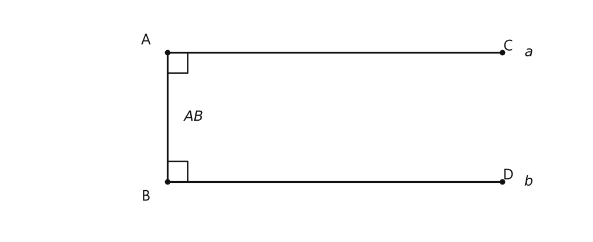
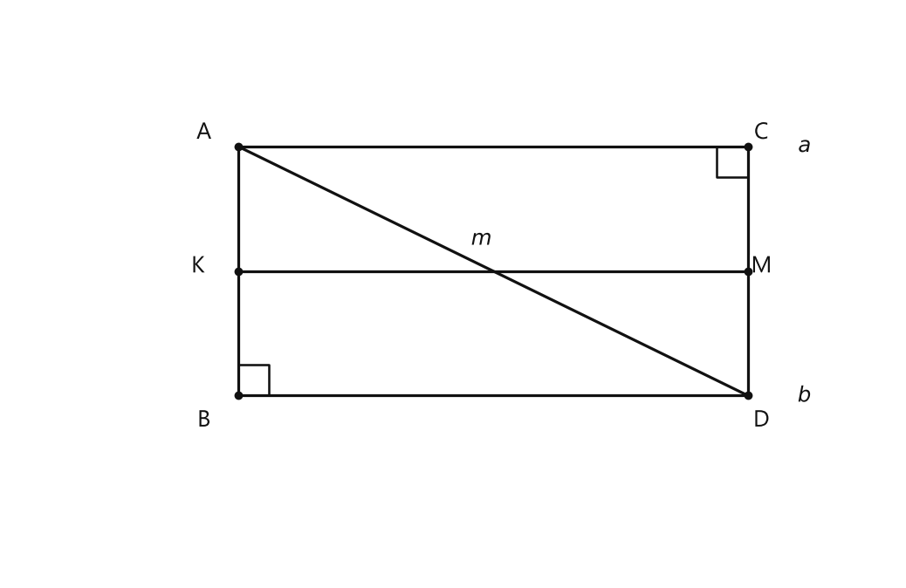
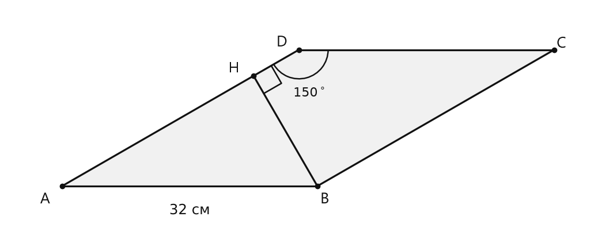
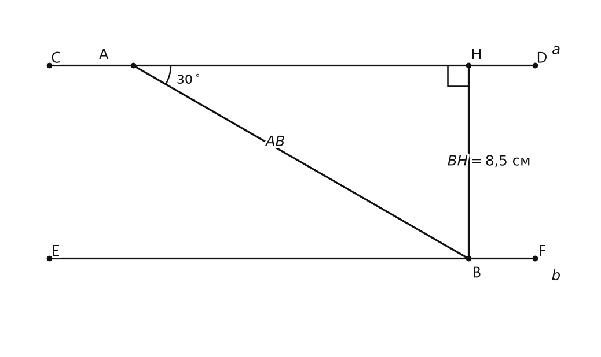
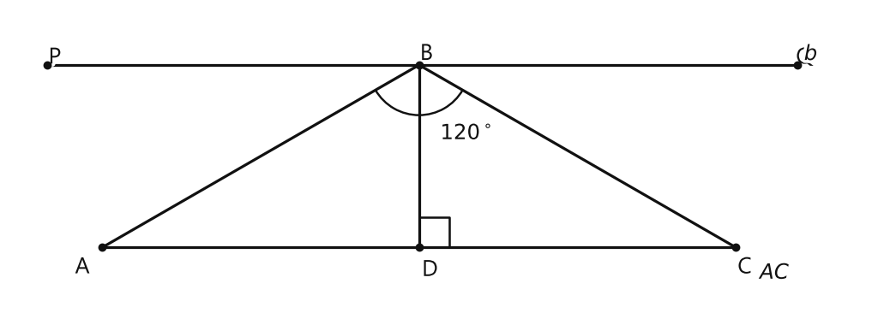
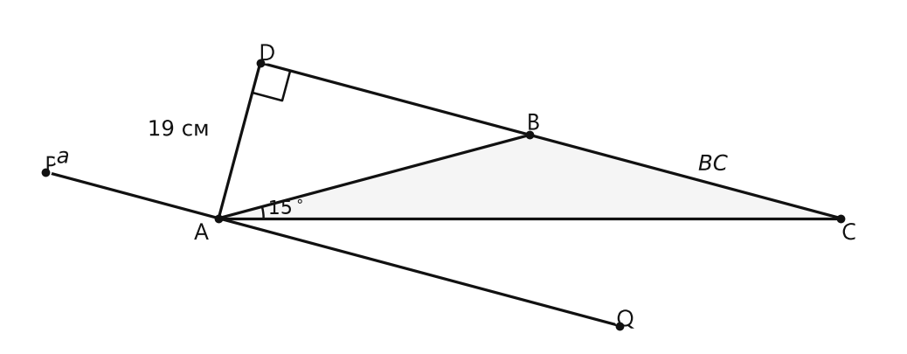
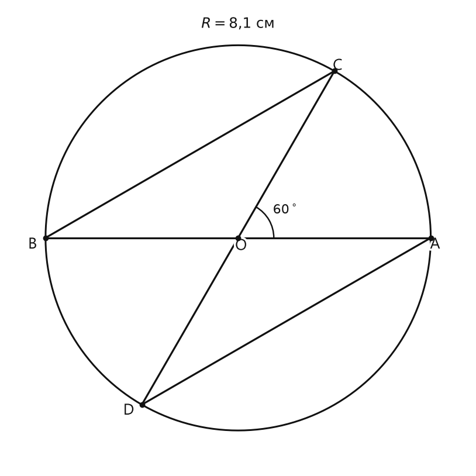

# Занятие 29. Расстояние между параллельными прямыми

**Раздел:** Глава IV. Сумма углов треугольника  
**Параграф учебника:** §26. Расстояние между параллельными прямыми  
**Страницы:** 154–157

## Цели занятия

После занятия ты умеешь:

- находить расстояние между параллельными прямыми;
- объяснять, почему все точки одной параллельной прямой равноудалены от другой;
- строить геометрическое место точек, равноудалённых от двух параллельных прямых;
- применять свойства прямоугольного треугольника;
- находить возможные расстояния между тремя параллельными прямыми;
- доказывать свойства отрезков, пересекающих параллельные прямые.

Выбери блок своего уровня:

- **1–2 балла:** понять определение и найти расстояние по перпендикуляру;
- **3–4 балла:** применять свойства параллельных прямых и секущей;
- **5–6 баллов:** решать задачи на прямоугольный треугольник;
- **7–8 баллов:** доказывать свойства и находить геометрическое место точек;
- **9–10 баллов:** решать задачи, где нужно соединить несколько приёмов.

## Теория к занятию

### 1. Что такое расстояние между параллельными прямыми

#### Простыми словами

Параллельные прямые не пересекаются и идут рядом. Чтобы измерить расстояние между ними, проводят отрезок, перпендикулярный обеим прямым.

Такой отрезок показывает самый короткий путь от одной прямой до другой. Если идти наклонно, получится длиннее — геометрия за лишние шаги не доплачивает.

Если из любой точки одной параллельной прямой провести перпендикуляр к другой прямой, длина этого перпендикуляра будет одной и той же.

#### Определение

**Расстоянием между параллельными прямыми называется расстояние от произвольной точки, взятой на одной из этих прямых, до другой прямой.**

Если $a \parallel b$, $A \in a$ и $AB \perp b$, то расстояние между прямыми $a$ и $b$ равно длине перпендикуляра $AB$.


<!--geo-figure-spec
{
  "needed": true,
  "kind": "plane",
  "caption": "Расстояние между параллельными прямыми $a$ и $b$",
  "equal": true,
  "axis": false,
  "xlim": [
    -0.7,
    6.9
  ],
  "ylim": [
    0.1,
    3.1
  ],
  "points": {
    "A": [
      1.4,
      2.5
    ],
    "B": [
      1.4,
      0.8
    ],
    "C": [
      5.8,
      2.5
    ],
    "D": [
      5.8,
      0.8
    ]
  },
  "segments": [
    {
      "points": [
        "A",
        "C"
      ],
      "dashed": false,
      "label": "",
      "t": 0.5
    },
    {
      "points": [
        "B",
        "D"
      ],
      "dashed": false,
      "label": "",
      "t": 0.5
    },
    {
      "points": [
        "A",
        "B"
      ],
      "dashed": false,
      "label": "",
      "t": 0.5
    }
  ],
  "labels": {
    "A": {
      "dx": -0.28,
      "dy": 0.16
    },
    "B": {
      "dx": -0.28,
      "dy": -0.2
    }
  },
  "right_angles": [
    {
      "vertex": "A",
      "from": "B",
      "to": "C"
    },
    {
      "vertex": "B",
      "from": "A",
      "to": "D"
    }
  ],
  "texts": [
    {
      "xy": [
        6.15,
        2.5
      ],
      "text": "$a$"
    },
    {
      "xy": [
        6.15,
        0.8
      ],
      "text": "$b$"
    },
    {
      "xy": [
        1.75,
        1.65
      ],
      "text": "$AB$"
    }
  ]
}
-->


*Расстояние между параллельными прямыми a и b*


#### Формула

Если $AB$ — общий перпендикуляр параллельных прямых $a$ и $b$, то

$$
d(a,b)=AB.
$$

Здесь:

- $d(a,b)$ — расстояние между прямыми $a$ и $b$;
- $AB$ — длина общего перпендикуляра.

#### Правила

- Расстояние между параллельными прямыми измеряют перпендикуляром.
- Наклонный отрезок расстоянием не является.
- Если отрезок перпендикулярен одной из параллельных прямых, то он перпендикулярен и другой.
- Поэтому такой отрезок называют общим перпендикуляром двух параллельных прямых.

#### Ловушки

- Не бери длину произвольной секущей: она обычно больше расстояния.
- Не путай расстояние между прямыми с длиной отрезка между двумя выбранными точками.
- Если прямые параллельны, достаточно найти один общий перпендикуляр.

---

### 2. Теорема о расстоянии между параллельными прямыми

#### Простыми словами

Выберем на одной из параллельных прямых две разные точки. Из каждой точки проведём перпендикуляр к другой прямой.

Получившиеся перпендикуляры будут иметь одинаковую длину. Значит, расстояние между параллельными прямыми в любом месте одинаково: прямые идут ровно, а не устраивают на плоскости американские горки.

#### Теорема

**Все точки одной из двух параллельных прямых равноудалены от другой прямой.**

Если $a \parallel b$, $A,C \in a$, $AB \perp b$, $CD \perp b$, то

$$
AB=CD.
$$

#### Почему это верно

Рассмотрим прямоугольные треугольники $ABD$ и $ACD$.

- $AD$ — общая гипотенуза.
- Углы $CAD$ и $BDA$ равны как внутренние накрест лежащие углы при параллельных прямых и секущей.
- Прямоугольные треугольники равны по гипотенузе и острому углу.

Следовательно,

$$
AB=CD.
$$

То есть перпендикуляры, проведённые из разных точек одной параллельной прямой к другой, равны. Поэтому все точки первой прямой находятся от второй на одном и том же расстоянии.

#### Правило

Чтобы доказать равенство расстояний от двух точек одной параллельной прямой до другой, удобно:

1. провести из этих точек перпендикуляры к другой прямой;
2. получить два прямоугольных треугольника;
3. доказать их равенство по гипотенузе и острому углу;
4. сделать вывод о равенстве перпендикуляров.

#### Ловушки

- Теорема работает именно для параллельных прямых.
- Перпендикуляры должны быть проведены к одной и той же прямой.
- Равенство расстояний не означает равенство любых отрезков на рисунке.

---

### 3. Геометрическое место точек, равноудалённых от двух параллельных прямых

#### Простыми словами

Представим две параллельные прямые и отрезок, перпендикулярный им. Его середина находится ровно посередине между прямыми.

Проведём через эту середину прямую, параллельную данным прямым. Любая точка этой средней прямой будет находиться на одинаковом расстоянии от обеих данных прямых.

Получается: все подходящие точки лежат на одной средней параллельной прямой.

#### Следствие

**Все точки, лежащие в одной полуплоскости относительно данной прямой и равноудаленные от нее, лежат на прямой, параллельной данной.**

Геометрическим местом точек, равноудалённых от двух данных параллельных прямых, является прямая, проходящая через середину общего перпендикуляра этих прямых и параллельная им.

Если $AB$ — общий перпендикуляр, а $K$ — его середина, то искомая прямая проходит через $K$ и параллельна данным прямым.

Расстояние от неё до каждой из данных прямых равно

$$
\frac{AB}{2}.
$$


<!--geo-figure-spec
{
  "needed": true,
  "kind": "plane",
  "caption": "Геометрическое место точек, равноудалённых от прямых $a$ и $b$",
  "equal": true,
  "axis": false,
  "xlim": [
    -0.8,
    7
  ],
  "ylim": [
    -0.8,
    4.2
  ],
  "points": {
    "A": [
      1.2,
      3
    ],
    "B": [
      1.2,
      0.8
    ],
    "K": [
      1.2,
      1.9
    ],
    "C": [
      5.7,
      3
    ],
    "D": [
      5.7,
      0.8
    ],
    "M": [
      5.7,
      1.9
    ]
  },
  "segments": [
    {
      "points": [
        "A",
        "C"
      ],
      "dashed": false,
      "label": "",
      "t": 0.5
    },
    {
      "points": [
        "B",
        "D"
      ],
      "dashed": false,
      "label": "",
      "t": 0.5
    },
    {
      "points": [
        "A",
        "B"
      ],
      "dashed": false,
      "label": "",
      "t": 0.5
    },
    {
      "points": [
        "C",
        "D"
      ],
      "dashed": false,
      "label": "",
      "t": 0.5
    },
    {
      "points": [
        "K",
        "M"
      ],
      "dashed": false,
      "label": "",
      "t": 0.5
    },
    {
      "points": [
        "A",
        "D"
      ],
      "dashed": false,
      "label": "",
      "t": 0.5
    }
  ],
  "labels": {
    "A": {
      "dx": -0.3,
      "dy": 0.12
    },
    "B": {
      "dx": -0.3,
      "dy": -0.22
    },
    "K": {
      "dx": -0.35,
      "dy": 0.04
    },
    "C": {
      "dx": 0.12,
      "dy": 0.12
    },
    "D": {
      "dx": 0.12,
      "dy": -0.22
    },
    "M": {
      "dx": 0.12,
      "dy": 0.04
    }
  },
  "right_angles": [
    {
      "vertex": "B",
      "from": "A",
      "to": "D"
    },
    {
      "vertex": "C",
      "from": "A",
      "to": "D"
    }
  ],
  "texts": [
    {
      "xy": [
        6.2,
        3
      ],
      "text": "$a$"
    },
    {
      "xy": [
        6.2,
        0.8
      ],
      "text": "$b$"
    },
    {
      "xy": [
        3.35,
        2.18
      ],
      "text": "$m$"
    }
  ]
}
-->


*Геометрическое место точек, равноудалённых от прямых a и b*


#### Алгоритм построения

1. Провести общий перпендикуляр к двум параллельным прямым.
2. Найти середину отрезка между прямыми.
3. Через найденную середину провести прямую, параллельную данным прямым.

#### Ловушки

- Искомая прямая проходит через середину расстояния между параллельными прямыми, а не через середину любого отрезка на рисунке.
- Она параллельна данным прямым.
- Точка, расположенная вне полосы между параллельными прямыми, не может быть равноудалена от обеих.

---

### 4. Связь с прямоугольным треугольником

#### Простыми словами

Иногда расстояние между параллельными прямыми является катетом прямоугольного треугольника. Тогда используем свойства прямоугольного треугольника, которые уже знаем.

Если катет лежит против угла $30^\circ$, то этот катет равен половине гипотенузы:

$$
\text{катет}=\frac{\text{гипотенуза}}{2}.
$$

Значит, если расстояние — катет напротив угла $30^\circ$, то достаточно разделить гипотенузу на $2$.

#### Правила

- Сначала найди прямоугольный треугольник.
- Определи, какой его катет является расстоянием между параллельными прямыми.
- Проверь, какой угол лежит напротив этого катета.
- Если этот угол равен $30^\circ$, используй свойство катета, лежащего против угла $30^\circ$.
- Не называй гипотенузой любую длинную сторону. Гипотенуза всегда лежит напротив прямого угла.

#### Ловушки

- При параллельных прямых внутренние односторонние углы в сумме дают $180^\circ$.
- Внутренние накрест лежащие углы равны.
- Угол $150^\circ$ иногда сначала нужно заменить на дополнительный к нему угол $30^\circ$.
- Расстояние — это перпендикуляр, а в прямоугольном треугольнике он может оказаться одним из катетов.

## Сводка формул «выучить наизусть»

$$
d(a,b)=AB
$$

если $AB$ — общий перпендикуляр параллельных прямых $a$ и $b$.

$$
d=\frac{AB}{2}
$$

для средней прямой, проходящей через середину общего перпендикуляра.

Если расстояние $d$ — катет прямоугольного треугольника, лежащий против угла $30^\circ$, а $l$ — гипотенуза, то

$$
d=\frac{l}{2}.
$$

## Правила, которые нельзя путать

- Расстояние между параллельными прямыми измеряется перпендикуляром.
- Наклонная секущая не равна расстоянию.
- Внутренние односторонние углы в сумме дают $180^\circ$.
- Внутренние накрест лежащие углы равны.
- Геометрическое место равноудалённых от двух параллельных прямых точек — средняя параллельная прямая.
- Если три прямые параллельны, расстояние между крайними прямыми зависит от расположения средней прямой: расстояния могут складываться или вычитаться.

## Разбор ключевых заданий

### Р1. Расстояние между прямыми в параллелограмме

**Условие.** В четырёхугольнике $ABCD$ стороны $AB$ и $CD$ параллельны, стороны $AD$ и $BC$ параллельны, $AB=32$ см, $\angle ADC=150^\circ$. Найти расстояние между прямыми $AD$ и $BC$.


<!--geo-figure-spec
{
  "needed": true,
  "kind": "plane",
  "caption": "Параллелограмм $ABCD$ и перпендикуляр $BH$",
  "equal": true,
  "axis": false,
  "xlim": [
    -0.4,
    9.2
  ],
  "ylim": [
    -0.35,
    3.55
  ],
  "points": {
    "A": [
      0.5,
      0.6
    ],
    "B": [
      4.7,
      0.6
    ],
    "C": [
      8.597,
      2.85
    ],
    "D": [
      4.397,
      2.85
    ],
    "H": [
      3.65,
      2.419
    ]
  },
  "segments": [
    [
      "A",
      "B"
    ],
    [
      "B",
      "C"
    ],
    [
      "C",
      "D"
    ],
    [
      "D",
      "A"
    ],
    [
      "B",
      "H"
    ]
  ],
  "polygons": [
    {
      "vertices": [
        "A",
        "B",
        "C",
        "D"
      ],
      "fill": 0.06
    }
  ],
  "labels": {
    "A": {
      "dx": -0.28,
      "dy": -0.22
    },
    "B": {
      "dx": 0.12,
      "dy": -0.22
    },
    "C": {
      "dx": 0.12,
      "dy": 0.1
    },
    "D": {
      "dx": -0.28,
      "dy": 0.12
    },
    "H": {
      "dx": -0.32,
      "dy": 0.12
    }
  },
  "right_angles": [
    {
      "vertex": "H",
      "from": "B",
      "to": "D"
    }
  ],
  "angle_marks": [
    {
      "vertex": "D",
      "from": "A",
      "to": "C",
      "text": "$150^\\circ$",
      "radius": 0.48
    }
  ],
  "texts": [
    {
      "xy": [
        2.6,
        0.2
      ],
      "text": "$32\\text{ см}$"
    }
  ]
}
-->


*Параллелограмм ABCD и перпендикуляр BH*


**Дано:**

- $AB\parallel CD$;
- $AD\parallel BC$;
- $AB=32$ см;
- $\angle ADC=150^\circ$.

Найти: расстояние между прямыми $AD$ и $BC$.

**Решение.**

1. Прямые $AB$ и $CD$ параллельны, а $AD$ — секущая.

2. Углы $BAD$ и $ADC$ — внутренние односторонние углы.

3. Поэтому их сумма равна $180^\circ$:

$$
\angle BAD+\angle ADC=180^\circ.
$$

4. Найдём угол $BAD$:

$$
\angle BAD=180^\circ-150^\circ=30^\circ.
$$

5. Из точки $B$ проведём перпендикуляр $BH$ к прямой $AD$.

6. Так как $AD\parallel BC$, этот перпендикуляр будет перпендикулярен и прямой $BC$.

7. Значит, $BH$ — расстояние между прямыми $AD$ и $BC$.

8. Треугольник $ABH$ прямоугольный.

9. Его гипотенуза $AB=32$ см.

10. Угол $BAH=30^\circ$, потому что луч $AH$ лежит на прямой $AD$.

11. Катет $BH$ лежит против угла $30^\circ$.

12. Поэтому он равен половине гипотенузы:

$$
BH=\frac{AB}{2}.
$$

13. Подставим значение $AB$:

$$
BH=\frac{32}{2}=16\text{ см}.
$$

**Ответ: $16$ см.**

Ловушка задачи: угол $150^\circ$ нельзя сразу использовать как угол $30^\circ$. Сначала нужно найти дополнительный угол. Минус $150^\circ$ от $180^\circ$ — и вот он, нужный $30^\circ$.

---

### Р2. Геометрическое место равноудалённых точек

**Условие.** Даны две параллельные прямые $a$ и $b$. Найти геометрическое место точек, равноудалённых от этих прямых.


```geo-figure
{
  "needed": true,
  "kind": "plane",
  "caption": "Средняя прямая $m$ между параллельными прямыми $a$ и $b$",
  "equal": true,
  "axis": false,
  "xlim": [-0.8, 6.5],
  "ylim": [-0.8, 4],
  "points": {
    "A": [1.2, 3],
    "B": [1.2, 0.8],
    "K": [1.2, 1.9]
  },
  "segments": [
    {"points": ["A", "B"], "dashed": false, "label": "", "t": 0.5}
  ],
  "texts": [
    {"xy": [5.6, 3], "text": "$a$"},
    {"xy": [5.6, 0.8], "text": "$b$"},
    {"xy": [5.6, 1.9], "text": "$m$"}
  ],
  "labels": {
    "A": {"dx": -0.3, "dy": 0.1},
    "B": {"dx": -0.3, "dy": -0.15},
    "K": {"dx": -0.3, "dy": 0.05}
  ],
  "right_angles": [
    {"vertex": "B", "from": "A", "to": "B"}
  ]
}
```


**Дано:**

- $a\parallel b$;
- $AB$ — общий перпендикуляр прямых $a$ и $b$;
- $K$ — середина отрезка $AB$.

**Решение.**

1. Через точку $K$ проведём прямую $m$, параллельную прямым $a$ и $b$.

2. Так как $K$ — середина отрезка $AB$, то

$$
AK=KB.
$$

3. Возьмём любую точку $M$ на прямой $m$.

4. Расстояние от точки $M$ до прямой $a$ равно длине перпендикуляра, проведённого к $a$.

5. Поскольку $m\parallel a$, это расстояние равно $AK$.

6. По такой же причине расстояние от точки $M$ до прямой $b$ равно $KB$.

7. Так как

$$
AK=KB,
$$

то расстояния от точки $M$ до прямых $a$ и $b$ равны.

8. Значит, все точки прямой $m$ равноудалены от прямых $a$ и $b$.

9. Если точка равноудалена от прямых $a$ и $b$, она должна находиться посередине между ними.

10. Поэтому такая точка лежит на прямой $m$.

**Ответ:** геометрическое место точек — прямая, проходящая через середину общего перпендикуляра двух данных параллельных прямых и параллельная им.

---

### Р3. Три параллельные прямые

**Условие.** Прямая $a$ параллельна прямой $b$, прямая $c$ параллельна прямой $b$. Расстояние между $a$ и $b$ равно $3$ см, а между $b$ и $c$ равно $5$ см. Чему может быть равно расстояние между прямыми $a$ и $c$? Рассмотреть все варианты.

**Дано:**

- $a\parallel b$;
- $c\parallel b$;
- $d(a,b)=3$ см;
- $d(b,c)=5$ см.

**Решение.**

Прямые $a$, $b$ и $c$ параллельны. Но по условию не сказано, где именно расположена прямая $b$.

Возможны два расположения.

#### Первый вариант: прямая $b$ находится между $a$ и $c$

Тогда расстояние от $a$ до $c$ состоит из двух частей:

$$
d(a,c)=d(a,b)+d(b,c).
$$

Подставим значения:

$$
d(a,c)=3+5=8\text{ см}.
$$

#### Второй вариант: прямые $a$ и $c$ находятся по одну сторону от прямой $b$

Тогда одна часть расстояния больше другой, поэтому расстояния вычитаются:

$$
d(a,c)=|d(b,c)-d(a,b)|.
$$

Подставим значения:

$$
d(a,c)=|5-3|=2\text{ см}.
$$

**Ответ: $2$ см или $8$ см.**

Ловушка: три параллельные прямые не обязаны стоять в порядке $a$, $b$, $c$. Средняя буква в названии не гарантирует среднее положение на рисунке.

---

### Р4. Секущая и расстояние между параллельными прямыми

**Условие.** Две параллельные прямые пересекаются секущей в точках $A$ и $B$. Прямая $AB$ составляет с одной из параллельных прямых угол $30^\circ$. Расстояние между параллельными прямыми равно $8{,}5$ см. Найти длину отрезка $AB$.


<!--geo-figure-spec
{
  "needed": true,
  "kind": "plane",
  "caption": "Секущая $AB$ и параллельные прямые",
  "equal": true,
  "axis": false,
  "xlim": [
    -0.2,
    6.8
  ],
  "ylim": [
    -0.2,
    3.9
  ],
  "points": {
    "A": [
      1.3,
      3.2
    ],
    "B": [
      5.3,
      0.8906
    ],
    "H": [
      5.3,
      3.2
    ],
    "C": [
      0.3,
      3.2
    ],
    "D": [
      6.1,
      3.2
    ],
    "E": [
      0.3,
      0.8906
    ],
    "F": [
      6.1,
      0.8906
    ]
  },
  "segments": [
    [
      "C",
      "A"
    ],
    [
      "A",
      "H"
    ],
    [
      "H",
      "D"
    ],
    [
      "E",
      "B"
    ],
    [
      "B",
      "F"
    ],
    [
      "A",
      "B"
    ],
    [
      "H",
      "B"
    ]
  ],
  "texts": [
    {
      "xy": [
        6.35,
        3.38
      ],
      "text": "$a$"
    },
    {
      "xy": [
        6.35,
        0.68
      ],
      "text": "$b$"
    },
    {
      "xy": [
        3.0,
        2.28
      ],
      "text": "$AB$"
    },
    {
      "xy": [
        5.55,
        2.05
      ],
      "text": "$BH=8{,}5\\text{ см}$"
    }
  ],
  "labels": {
    "A": {
      "dx": -0.35,
      "dy": 0.12
    },
    "B": {
      "dx": 0.1,
      "dy": -0.18
    },
    "H": {
      "dx": 0.1,
      "dy": 0.12
    }
  },
  "right_angles": [
    {
      "vertex": "H",
      "from": "A",
      "to": "B"
    }
  ],
  "angle_marks": [
    {
      "vertex": "A",
      "from": "H",
      "to": "B",
      "text": "$30^\\circ$",
      "radius": 0.45
    }
  ]
}
-->


*Секущая AB и параллельные прямые*


**Дано:**

- две параллельные прямые;
- $A$ и $B$ — точки их пересечения с секущей;
- $\angle A=30^\circ$;
- расстояние между параллельными прямыми равно $8{,}5$ см.

Найти: $AB$.

**Решение.**

1. Из точки $B$ проведём перпендикуляр $BH$ к прямой, проходящей через точку $A$.

2. Прямая через точку $A$ — одна из данных параллельных прямых.

3. Так как данные прямые параллельны, отрезок $BH$ перпендикулярен и другой параллельной прямой.

4. Значит, $BH$ — расстояние между параллельными прямыми:

$$
BH=8{,}5\text{ см}.
$$

5. Треугольник $ABH$ прямоугольный.

6. Угол $BAH$ равен $30^\circ$.

7. Катет $BH$ лежит против угла $30^\circ$.

8. Поэтому катет $BH$ равен половине гипотенузы $AB$:

$$
BH=\frac{AB}{2}.
$$

9. Чтобы найти гипотенузу, умножим обе части равенства на $2$:

$$
AB=2BH.
$$

10. Подставим значение $BH$:

$$
AB=2\cdot 8{,}5=17\text{ см}.
$$

**Ответ: $17$ см.**

---

### Р5. Равнобедренный треугольник и параллельная прямая

**Условие.** Через вершину $B$ равнобедренного треугольника $ABC$ проведена прямая $b$, параллельная основанию $AC$. Известно, что $\angle ABC=120^\circ$, $AB+BC=64$ см. Найти расстояние между прямой $b$ и прямой $AC$.


<!--geo-figure-spec
{
  "needed": true,
  "kind": "plane",
  "caption": "Равнобедренный треугольник $ABC$ и прямая $b$",
  "equal": true,
  "axis": false,
  "xlim": [
    -1,
    8.5
  ],
  "ylim": [
    0.8,
    4
  ],
  "points": {
    "A": [
      0,
      1.4
    ],
    "C": [
      6.928,
      1.4
    ],
    "B": [
      3.464,
      3.4
    ],
    "D": [
      3.464,
      1.4
    ],
    "P": [
      -0.6,
      3.4
    ],
    "Q": [
      7.6,
      3.4
    ]
  },
  "segments": [
    [
      "A",
      "B"
    ],
    [
      "B",
      "C"
    ],
    [
      "A",
      "C"
    ],
    [
      "B",
      "D"
    ],
    [
      "P",
      "Q"
    ]
  ],
  "texts": [
    {
      "xy": [
        7.75,
        3.52
      ],
      "text": "$b$"
    },
    {
      "xy": [
        7.35,
        1.12
      ],
      "text": "$AC$"
    },
    {
      "xy": [
        4,
        2.65
      ],
      "text": "$120^\\circ$"
    }
  ],
  "labels": {
    "A": {
      "dx": -0.22,
      "dy": -0.22
    },
    "B": {
      "dx": 0.08,
      "dy": 0.12
    },
    "C": {
      "dx": 0.1,
      "dy": -0.22
    },
    "D": {
      "dx": 0.12,
      "dy": -0.25
    }
  },
  "right_angles": [
    {
      "vertex": "D",
      "from": "B",
      "to": "C"
    }
  ],
  "angle_marks": [
    {
      "vertex": "B",
      "from": "A",
      "to": "C",
      "text": "",
      "radius": 0.55
    }
  ]
}
-->


*Равнобедренный треугольник ABC и прямая b*


**Дано:**

- $AB=BC$;
- $\angle ABC=120^\circ$;
- $AB+BC=64$ см;
- $b\parallel AC$.

Найти расстояние между $b$ и $AC$.

**Решение.**

1. Треугольник $ABC$ равнобедренный, поэтому его боковые стороны равны:

$$
AB=BC.
$$

2. Значит, сумма $AB+BC$ состоит из двух одинаковых отрезков:

$$
AB+BC=2AB.
$$

3. Найдём длину боковой стороны:

$$
2AB=64,
$$

$$
AB=32\text{ см}.
$$

4. Проведём высоту $BD$ к основанию $AC$.

5. В равнобедренном треугольнике высота, проведённая к основанию, является также биссектрисой угла при вершине.

6. Поэтому высота $BD$ делит угол $ABC$ пополам:

$$
\angle ABD=\frac{\angle ABC}{2}
=\frac{120^\circ}{2}
=60^\circ.
$$

7. Прямая $b$ проходит через точку $B$ и параллельна прямой $AC$.

8. Поэтому расстояние между прямыми $b$ и $AC$ равно перпендикуляру $BD$:

$$
d(b,AC)=BD.
$$

9. Треугольник $ABD$ прямоугольный, а его гипотенуза равна

$$
AB=32\text{ см}.
$$

10. В этом треугольнике один острый угол равен $60^\circ$.

11. Тогда второй острый угол равен

$$
90^\circ-60^\circ=30^\circ.
$$

12. Катет $BD$ лежит против угла $30^\circ$.

13. Поэтому он равен половине гипотенузы:

$$
BD=\frac{AB}{2}.
$$

14. Подставим значение $AB$:

$$
BD=\frac{32}{2}=16\text{ см}.
$$

**Ответ: $16$ см.**

### Р6. Параллельная прямая через вершину равнобедренного треугольника

**Условие.** Через вершину $A$ равнобедренного треугольника $ABC$ с основанием $AC$ проведена прямая $a$, параллельная боковой стороне $BC$. Расстояние между прямыми $a$ и $BC$ равно $19$ см, $\angle BAC=15^\circ$. Найти боковую сторону треугольника $ABC$.


<!--geo-figure-spec
{
  "needed": true,
  "kind": "plane",
  "caption": "Треугольник $ABC$ и прямая $a\\parallel BC$",
  "equal": true,
  "axis": false,
  "xlim": [
    -2,
    10.8
  ],
  "ylim": [
    -0.8,
    4
  ],
  "points": {
    "A": [
      1,
      1
    ],
    "B": [
      5.5,
      2.2058
    ],
    "C": [
      10,
      1
    ],
    "D": [
      1.603,
      3.25
    ],
    "P": [
      -1.5,
      1.6699
    ],
    "Q": [
      6.8,
      -0.553
    ]
  },
  "segments": [
    [
      "A",
      "B"
    ],
    [
      "B",
      "C"
    ],
    [
      "A",
      "C"
    ],
    [
      "D",
      "B"
    ],
    [
      "A",
      "D"
    ],
    [
      "P",
      "Q"
    ]
  ],
  "polygons": [
    {
      "vertices": [
        "A",
        "B",
        "C"
      ],
      "fill": 0.04
    }
  ],
  "texts": [
    {
      "xy": [
        -1.25,
        1.88
      ],
      "text": "$a$"
    },
    {
      "xy": [
        8.15,
        1.78
      ],
      "text": "$BC$"
    },
    {
      "xy": [
        0.42,
        2.28
      ],
      "text": "$19\\text{ см}$"
    }
  ],
  "labels": {
    "A": {
      "dx": -0.25,
      "dy": -0.22
    },
    "B": {
      "dx": 0.05,
      "dy": 0.16
    },
    "C": {
      "dx": 0.12,
      "dy": -0.22
    },
    "D": {
      "dx": 0.1,
      "dy": 0.12
    }
  },
  "right_angles": [
    {
      "vertex": "D",
      "from": "A",
      "to": "B"
    }
  ],
  "angle_marks": [
    {
      "vertex": "A",
      "from": "B",
      "to": "C",
      "text": "$15^\\circ$",
      "radius": 0.65
    }
  ]
}
-->


*Треугольник ABC и прямая a\parallel BC*


**Дано:**

- $AB=BC$;
- $AC$ — основание;
- $a\parallel BC$;
- расстояние между $a$ и $BC$ равно $19$ см;
- $\angle BAC=15^\circ$.

Найти: $AB$.

**Решение.**

1. Так как $AB=BC$, треугольник $ABC$ равнобедренный.

2. В равнобедренном треугольнике углы при основании равны:

$$
\angle BAC=\angle BCA=15^\circ.
$$

3. Найдём угол при вершине $B$:

$$
\angle ABC=180^\circ-15^\circ-15^\circ=150^\circ.
$$

4. Проведём из точки $A$ перпендикуляр $AH$ к прямой $BC$.

5. Так как $a\parallel BC$, расстояние между прямыми $a$ и $BC$ равно длине этого перпендикуляра:

$$
AH=19\text{ см}.
$$

6. Луч $BH$ направлен противоположно лучу $BC$. Поэтому угол $ABH$ дополняет угол $ABC$ до развернутого угла:

$$
\angle ABH=180^\circ-150^\circ=30^\circ.
$$

7. Треугольник $ABH$ прямоугольный, его гипотенуза — $AB$.

8. Сторона $AH$ лежит против угла $30^\circ$.

9. В прямоугольном треугольнике катет, лежащий против угла $30^\circ$, равен половине гипотенузы:

$$
AH=\frac{AB}{2}.
$$

10. Подставим известное значение $AH=19$ см:

$$
19=\frac{AB}{2}.
$$

11. Умножим обе части равенства на $2$:

$$
AB=38\text{ см}.
$$

**Ответ: $38$ см.**

> Ловушка здесь в угле $150^\circ$: в прямоугольном треугольнике появляется не он, а маленький угол $30^\circ$. Большой угол забрал слишком много места.

---

### Р7. Диаметры окружности и параллельные хорды

**Условие.** В окружности с центром $O$ и радиусом $8{,}1$ см проведены диаметры $AB$ и $CD$. Угол $AOC$ равен $60^\circ$. Доказать, что прямые $AD$ и $CB$ параллельны, и найти расстояние между ними.


<!--geo-figure-spec
{
  "needed": true,
  "kind": "plane",
  "caption": "Окружность с диаметрами $AB$ и $CD$",
  "equal": true,
  "axis": false,
  "xlim": [
    -9.7,
    9.7
  ],
  "ylim": [
    -9.7,
    9.7
  ],
  "points": {
    "O": [
      0,
      0
    ],
    "A": [
      8.1,
      0
    ],
    "B": [
      -8.1,
      0
    ],
    "C": [
      4.05,
      7.015
    ],
    "D": [
      -4.05,
      -7.015
    ]
  },
  "segments": [
    [
      "A",
      "B"
    ],
    [
      "C",
      "D"
    ],
    [
      "A",
      "D"
    ],
    [
      "C",
      "B"
    ]
  ],
  "circles": [
    {
      "center": "O",
      "radius": 8.1
    }
  ],
  "labels": {
    "A": {
      "dx": 0.18,
      "dy": -0.28
    },
    "B": {
      "dx": -0.55,
      "dy": -0.28
    },
    "C": {
      "dx": 0.14,
      "dy": 0.22
    },
    "D": {
      "dx": -0.55,
      "dy": -0.25
    },
    "O": {
      "dx": 0.12,
      "dy": -0.34
    }
  },
  "angle_marks": [
    {
      "vertex": "O",
      "from": "A",
      "to": "C",
      "text": "$60^\\circ$",
      "radius": 1.5
    }
  ],
  "texts": [
    {
      "xy": [
        0,
        9
      ],
      "text": "$R=8{,}1\\text{ см}$"
    }
  ]
}
-->


*Окружность с диаметрами AB и CD*


**Дано:**

- окружность с центром $O$;
- радиус $R=8{,}1$ см;
- $AB$ и $CD$ — диаметры;
- $\angle AOC=60^\circ$.

Найти: расстояние между прямыми $AD$ и $CB$.

**Решение.**

1. Так как $AB$ и $CD$ — диаметры, точки $B$ и $D$ лежат на продолжениях лучей $OA$ и $OC соответственно:

$$
OA=OB=OC=OD=R.
$$

2. Найдём центральный угол, опирающийся на хорду $AD$:

$$
\angle AOD=180^\circ-\angle AOC=180^\circ-60^\circ=120^\circ.
$$

3. Аналогично:

$$
\angle COB=180^\circ-\angle AOC=180^\circ-60^\circ=120^\circ.
$$

4. В треугольниках $AOD$ и $COB$:

$$
OA=OC,
$$

$$
OD=OB,
$$

$$
\angle AOD=\angle COB=120^\circ.
$$

5. Значит, треугольники $AOD$ и $COB$ равны по двум сторонам и углу между ними.

6. Поэтому соответствующие углы равны:

$$
\angle DAO=\angle OCB.
$$

7. В равнобедренном треугольнике $AOD$ углы при основании равны. Поэтому:

$$
\angle DAO=\frac{180^\circ-120^\circ}{2}=30^\circ.
$$

8. Таким же образом:

$$
\angle OCB=30^\circ.
$$

9. Угол $AOC$ равен $60^\circ$, то есть он складывается из двух углов по $30^\circ$ и угла между прямыми $AD$ и $CB$.

10. Поэтому углы, которые прямые $AD$ и $CB$ образуют с прямыми $AO$ и $CO$, занимают одинаковое положение.

11. Следовательно, прямые $AD$ и $CB$ параллельны:

$$
AD\parallel CB.
$$

12. Теперь найдём расстояние между этими параллельными прямыми.

13. Проведём из центра $O$ перпендикуляр $OM$ к хорде $AD$.

14. Перпендикуляр, проведённый из центра окружности к хорде, делит хорду пополам. Поэтому $M$ — середина хорды $AD$.

15. В равнобедренном треугольнике $AOD$ отрезок $OM$ является также биссектрисой угла $AOD$:

$$
\angle AOM=\frac{\angle AOD}{2}=\frac{120^\circ}{2}=60^\circ.
$$

16. Треугольник $AOM$ прямоугольный:

$$
\angle AMO=90^\circ.
$$

17. Тогда третий угол равен:

$$
\angle OAM=180^\circ-90^\circ-60^\circ=30^\circ.
$$

18. Сторона $OM$ лежит против угла $30^\circ$, а $OA$ — гипотенуза.

19. Поэтому:

$$
OM=\frac{OA}{2}=\frac{R}{2}.
$$

20. Подставим радиус окружности:

$$
OM=\frac{8{,}1}{2}=4{,}05\text{ см}.
$$

21. Аналогично расстояние от центра $O$ до прямой $CB$ равно:

$$
4{,}05\text{ см}.
$$

22. Прямые $AD$ и $CB$ находятся по разные стороны от центра $O$. Поэтому расстояние между ними равно сумме этих двух расстояний:

$$
d=4{,}05+4{,}05=8{,}1\text{ см}.
$$

**Ответ: $AD\parallel CB$, расстояние между ними равно $8{,}1$ см.**

> Красивый финал: расстояние между параллельными хордами получилось равным радиусу. Окружность как будто сама подставила ответ — но углы всё равно пришлось посчитать.

## Практические задания

Выбери свой уровень и решай только этот блок. В блоке должна закрепиться вся тема параграфа. Ответы не приводятся.

### Уровень 1–2 балла

**С1.** Выберите верное утверждение.

1) Расстояние между параллельными прямыми зависит от выбранной точки на одной из них.  
2) Расстояние между параллельными прямыми равно длине любого отрезка, соединяющего их точки.  
3) Расстояние между параллельными прямыми — это расстояние от точки одной прямой до другой прямой.  
4) Расстояние между параллельными прямыми всегда равно длине секущей.  
5) Расстояние между параллельными прямыми равно сумме длин этих прямых.

**С2.** Прямые $a$ и $b$ параллельны. Расстояние между ними равно $7$ см. Точка $A$ лежит на прямой $a$. Чему равно расстояние от точки $A$ до прямой $b$?

1) $3{,}5$ см  
2) $7$ см  
3) $14$ см  
4) $0$ см  
5) Нельзя определить

**С3.** Отрезок $AB$ перпендикулярен прямой $a$, а прямая $b$ параллельна прямой $a$. Точка $A$ лежит на прямой $a$, точка $B$ — на прямой $b$. Как называется отрезок $AB$?

1) секущая  
2) биссектриса  
3) общий перпендикуляр  
4) медиана  
5) диагональ

**С4.** Прямые $a$ и $b$ параллельны. Отрезок $AB$ соединяет точку $A$ на прямой $a$ с точкой $B$ на прямой $b$ и перпендикулярен обеим прямым. Если $AB=12$ см, найдите расстояние между прямыми $a$ и $b$.

**С5.** Прямые $a$ и $b$ параллельны, а прямая $c$ перпендикулярна прямой $a$. Выберите верное утверждение.

1) Прямая $c$ параллельна прямой $b$.  
2) Прямая $c$ перпендикулярна прямой $b$.  
3) Прямая $c$ совпадает с прямой $b$.  
4) Прямые $b$ и $c$ не пересекаются.  
5) Нельзя установить взаимное положение прямых $b$ и $c$.

**С6.** Расстояние между параллельными прямыми $m$ и $n$ равно $4{,}8$ см. Точка $P$ лежит на прямой $m$. Найдите расстояние от точки $P$ до прямой $n$.

**С7.** Две параллельные прямые пересечены перпендикуляром. Расстояние между прямыми равно $9$ см. Какова длина отрезка перпендикуляра между точками пересечения?

1) $4{,}5$ см  
2) $9$ см  
3) $18$ см  
4) $0$ см  
5) $81$ см

**С8.** Прямые $a$ и $b$ параллельны. Точки $A$ и $C$ лежат на прямой $a$, точки $B$ и $D$ — на прямой $b$. Отрезки $AB$ и $CD$ перпендикулярны прямым $a$ и $b$. Известно, что $AB=6$ см. Найдите $CD$.

**С9.** Расстояние между параллельными прямыми $a$ и $b$ равно $10$ см. Точка $M$ находится между этими прямыми и удалена от прямой $a$ на $4$ см. Найдите расстояние от точки $M$ до прямой $b$.

**С10.** Выберите все верные утверждения.

1) Все точки одной из двух параллельных прямых равноудалены от другой прямой.  
2) Общий перпендикуляр двух параллельных прямых перпендикулярен только одной из них.  
3) Если расстояние между двумя параллельными прямыми равно $5$ см, то расстояние от любой точки одной из них до другой равно $5$ см.  
4) Параллельные прямые пересекаются в одной точке.  
5) Расстояние между параллельными прямыми не может быть равно нулю.

**С11.** Даны две параллельные прямые $a$ и $b$. Расстояние между ними равно $14$ см. Прямая $c$ параллельна прямым $a$ и $b$ и расположена между ними так, что расстояние от $c$ до прямой $a$ равно $6$ см. Найдите расстояние между прямыми $c$ и $b$.

**С12.** Две параллельные прямые находятся на расстоянии $16$ см. Точка $K$ равноудалена от этих прямых и лежит между ними. Найдите расстояние от точки $K$ до каждой из прямых.

**С13.** Расстояние между параллельными прямыми $a$ и $b$ равно $7$ см. Каково расстояние от любой точки прямой $a$ до прямой $b$?  
1) $3{,}5$ см 2) $7$ см 3) $14$ см 4) зависит от выбранной точки 5) $0$ см

**С14.** Выберите отрезок, который может быть расстоянием между параллельными прямыми $a$ и $b$.  
1) отрезок, параллельный прямой $a$ 2) отрезок, соединяющий любые две точки прямой $a$ 3) отрезок, перпендикулярный прямой $a$ и имеющий один конец на каждой из прямых 4) отрезок, лежащий на прямой $a$ 5) отрезок, пересекающий только одну из прямых

**С15.** Прямые $a$ и $b$ параллельны. Расстояние между ними равно $4{,}2$ см. Точка $M$ лежит на прямой $a$. Найдите расстояние от точки $M$ до прямой $b$.  
1) $2{,}1$ см 2) $4{,}2$ см 3) $8{,}4$ см 4) $0$ см 5) определить невозможно

**С16.** Прямая $c$ перпендикулярна прямой $a$, а прямые $a$ и $b$ параллельны. Как расположена прямая $c$ относительно прямой $b$?  
1) параллельна 2) перпендикулярна 3) совпадает 4) пересекает под углом $45^\circ$ 5) определить невозможно

**С17.** Две параллельные прямые пересечены общей перпендикулярной. Расстояние между прямыми равно $9$ см. Чему равна длина отрезка общей перпендикулярной между этими прямыми?  
1) $3$ см 2) $4{,}5$ см 3) $9$ см 4) $18$ см 5) $81$ см

**С18.** Геометрическим местом точек, равноудалённых от двух данных параллельных прямых и лежащих между ними, является:  
1) одна из данных прямых 2) окружность 3) прямая, параллельная данным прямым 4) прямая, перпендикулярная данным прямым 5) любая точка плоскости

**С19.** Прямые $a$ и $b$ параллельны, расстояние между ними равно $6$ см. На прямой $a$ взята точка $A$. Запишите расстояние от точки $A$ до прямой $b$.

**С20.** Прямые $a$ и $b$ параллельны. Отрезок $AB$ перпендикулярен прямой $a$, причём $A\in a$, а $B\in b$. Длина отрезка $AB$ равна $11$ см. Найдите расстояние между прямыми $a$ и $b$.

**С21.** Прямые $a$ и $b$ параллельны. Расстояние между ними равно $5$ см. Точки $A$ и $C$ лежат на прямой $a$, а точки $B$ и $D$ — на прямой $b$. Найдите расстояние от точки $C$ до прямой $b$.

**С22.** Прямые $a$ и $b$ параллельны. Общий перпендикуляр этих прямых пересекает их в точках $A$ и $B$. Если $AB=8$ см, запишите расстояние между прямыми $a$ и $b$.

**С23.** Даны две параллельные прямые $a$ и $b$. Точка $M$ находится между ними и равноудалена от обеих прямых. Расстояние от точки $M$ до прямой $a$ равно $3{,}5$ см. Найдите расстояние между прямыми $a$ и $b$.

**С24.** Прямые $a$ и $b$ параллельны, расстояние между ними равно $12$ см. Точка $M$ лежит между этими прямыми и находится на одинаковом расстоянии от каждой из них. Найдите расстояние от точки $M$ до прямой $a$.

**С25.** Расстояние между двумя параллельными прямыми — это

1) длина любого отрезка, лежащего на одной из прямых  
2) расстояние от произвольной точки одной прямой до другой прямой  
3) длина отрезка, соединяющего любые две точки этих прямых  
4) сумма расстояний от двух точек до одной из прямых  
5) величина угла между параллельными прямыми

**С26.** Прямые $a$ и $b$ параллельны. Какой отрезок может задавать расстояние между ними?

1) отрезок, параллельный прямой $a$  
2) отрезок, перпендикулярный прямой $a$ и имеющий концы на прямых $a$ и $b$  
3) отрезок, лежащий на прямой $a$  
4) отрезок, соединяющий две точки прямой $b$  
5) любой отрезок с концами на прямых $a$ и $b$

**С27.** Прямые $a$ и $b$ параллельны. Расстояние от точки $A\in a$ до прямой $b$ равно $7$ см. Чему равно расстояние между прямыми $a$ и $b$?

1) $3{,}5$ см  
2) $7$ см  
3) $14$ см  
4) $49$ см  
5) определить невозможно

**С28.** Прямые $a$ и $b$ параллельны. Расстояние между ними равно $4{,}2$ см. Точка $B$ лежит на прямой $b$. Чему равно расстояние от точки $B$ до прямой $a$?

1) $2{,}1$ см  
2) $4{,}2$ см  
3) $8{,}4$ см  
4) $16{,}8$ см  
5) $0$ см

**С29.** Прямые $a$ и $b$ параллельны, а прямая $c$ перпендикулярна прямой $a$. Как расположена прямая $c$ относительно прямой $b$?

1) параллельна прямой $b$  
2) перпендикулярна прямой $b$  
3) совпадает с прямой $b$  
4) образует с прямой $b$ угол $45^\circ$  
5) определить невозможно

**С30.** Прямые $a$ и $b$ параллельны. Отрезок $AB$ перпендикулярен прямой $a$, причём $A\in a$ и $B\in b$. Длина отрезка $AB$ равна $9$ см. Найдите расстояние между прямыми $a$ и $b$.

1) $3$ см  
2) $9$ см  
3) $18$ см  
4) $81$ см  
5) $0$ см

**С31.** Прямые $a$ и $b$ параллельны. Точки $A$ и $B$ лежат на прямой $a$, а точки $C$ и $D$ — на прямой $b$. Все четыре точки расположены так, что отрезки $AC$ и $BD$ перпендикулярны прямой $a$. Сравните длины этих отрезков.

1) $AC<BD$  
2) $AC>BD$  
3) $AC=BD$  
4) $AC+BD$ равно расстоянию между прямыми  
5) сравнить невозможно

**С32.** Расстояние между параллельными прямыми $a$ и $b$ равно $6$ см. На прямой $a$ взяли точки $A$ и $B$. Чему равно расстояние от каждой из этих точек до прямой $b$?

1) $3$ см  
2) $6$ см  
3) $12$ см  
4) зависит от положения точек $A$ и $B$  
5) $0$ см

**С33.** Прямые $a$ и $b$ параллельны и находятся на расстоянии $10$ см друг от друга. Точка $M$ лежит между ними и равноудалена от обеих прямых. Чему равно расстояние от точки $M$ до каждой прямой?

1) $2$ см  
2) $5$ см  
3) $10$ см  
4) $20$ см  
5) $0$ см

**С34.** Геометрическим местом точек, равноудалённых от двух данных параллельных прямых, является

1) одна из данных прямых  
2) прямая, параллельная данным прямым и проходящая посередине между ними  
3) прямая, перпендикулярная данным прямым  
4) окружность с центром на одной из данных прямых  
5) любая прямая, пересекающая данные прямые

**С35.** Расстояние между параллельными прямыми $a$ и $b$ равно $12$ см. Прямая $c$ проходит между ними и равноудалена от обеих. Найдите расстояние между прямыми $a$ и $c$.

1) $3$ см  
2) $6$ см  
3) $12$ см  
4) $24$ см  
5) определить невозможно

**С36.** Две параллельные прямые пересечены перпендикуляром. Отрезок между точками пересечения имеет длину $8{,}5$ см. Найдите расстояние между параллельными прямыми.

1) $4{,}25$ см  
2) $8{,}5$ см  
3) $17$ см  
4) $72{,}25$ см  
5) определить невозможно

### Уровень 3–4 балла

**С1.** Прямые $a$ и $b$ параллельны. Расстояние между ними равно $7$ см. Каково расстояние от любой точки прямой $a$ до прямой $b$?

**С2.** Прямые $a$ и $b$ параллельны, а прямая $c$ перпендикулярна прямой $a$. Как расположена прямая $c$ относительно прямой $b$? Обоснуйте ответ.

**С3.** Прямые $a$, $b$ и $c$ попарно параллельны. Расстояние между прямыми $a$ и $b$ равно $4$ см, а расстояние между прямыми $b$ и $c$ равно $6$ см. Найдите возможные расстояния между прямыми $a$ и $c$.

**С4.** Две параллельные прямые пересечены секущей. Угол между секущей и одной из прямых равен $30^\circ$. Расстояние между параллельными прямыми равно $9$ см. Найдите длину отрезка секущей между параллельными прямыми.

**С5.** Две параллельные прямые пересечены секущей, причём отрезок секущей между точками пересечения равен $12$ см и образует с параллельными прямыми угол $45^\circ$. Найдите расстояние между параллельными прямыми.

**С6.** В параллелограмме $ABCD$ сторона $AB=18$ см, а высота, проведённая к стороне $AB$, равна $7$ см. Найдите расстояние между прямыми $AB$ и $CD$.

**С7.** В равнобедренном треугольнике $ABC$ с основанием $AC$ боковые стороны равны $20$ см, а угол при вершине $B$ равен $120^\circ$. Через вершину $B$ проведена прямая, параллельная основанию $AC$. Найдите расстояние между этой прямой и прямой $AC$.

**С8.** В равнобедренном треугольнике $ABC$ с основанием $AC$ боковые стороны равны $16$ см, а угол при вершине $A$ равен $30^\circ$. Через вершину $A$ проведена прямая, параллельная стороне $BC$. Найдите расстояние между этой прямой и прямой $BC$.

**С9.** В прямоугольном параллелепипеде $ABCDA_1B_1C_1D_1$ известно, что $AB=6$ дм, $AD=4$ дм, а объём равен $144$ дм$^3$. Найдите расстояние между прямыми $AD$ и $A_1D_1$.

**С10.** Даны две параллельные прямые $a$ и $b$. На прямой $a$ взята точка $A$, а на прямой $b$ — точка $B$. Расстояние между прямыми $a$ и $b$ равно $5$ см. Чему равна длина перпендикуляра, проведённого из точки $A$ к прямой $b$?

**С11.** Точка $M$ находится между двумя параллельными прямыми $a$ и $b$. Расстояние от точки $M$ до прямой $a$ равно $3$ см, а до прямой $b$ — $8$ см. Найдите расстояние между прямыми $a$ и $b$.

**С12.** Две параллельные прямые находятся на расстоянии $14$ см друг от друга. Найдите геометрическое место точек, равноудалённых от этих прямых, и укажите расстояние от каждой такой точки до каждой из данных прямых.

**С13.** Прямая $a$ параллельна прямой $b$. Из точки $A$ прямой $a$ к прямой $b$ проведён перпендикуляр $AB$. Как называется отрезок $AB$ и что он обозначает?

**С14.** Две параллельные прямые пересечены секущей. Угол между секущей и одной из прямых равен $30^\circ$. Расстояние между параллельными прямыми равно $6$ см. Найдите длину отрезка секущей между точками её пересечения с параллельными прямыми.

**С15.** Прямые $a$, $b$ и $c$ попарно параллельны, причём прямая $b$ расположена между прямыми $a$ и $c$. Расстояние между прямыми $a$ и $b$ равно $4$ см, а между прямыми $b$ и $c$ — $7$ см. Найдите расстояние между прямыми $a$ и $c$.

**С16.** Расстояние между параллельными прямыми $a$ и $b$ равно $8$ см. Точка $M$ находится между этими прямыми и удалена от прямой $a$ на $3$ см. Найдите расстояние от точки $M$ до прямой $b$.

**С17.** Найдите геометрическое место точек, равноудалённых от двух данных параллельных прямых $a$ и $b$. Опишите положение этой прямой относительно прямых $a$ и $b$.

**С18.** В параллелограмме $ABCD$ сторона $AB$ равна $10$ см, а угол $DAB$ равен $60^\circ$. Найдите расстояние между параллельными прямыми $AD$ и $BC$.

**С19.** В равнобедренном треугольнике $ABC$ с основанием $AC$ боковые стороны $AB$ и $BC$ равны $20$ см, а угол $ABC$ равен $120^\circ$. Через вершину $B$ проведена прямая, параллельная основанию $AC$. Найдите расстояние между этой прямой и прямой $AC$.

**С20.** В равнобедренном треугольнике $ABC$ с основанием $AC$ боковые стороны $AB$ и $BC$ равны $12$ см, а угол $BAC$ равен $30^\circ$. Через вершину $A$ проведена прямая, параллельная боковой стороне $BC$. Найдите расстояние между этой прямой и прямой $BC$.

**С21.** Объём прямоугольного параллелепипеда $ABCDA_1B_1C_1D_1$ равен $120$ дм$^3$, $AD=5$ дм, $DC=4$ дм. Найдите расстояние между параллельными прямыми $DC$ и $D_1C_1$.

**С22.** В окружности с центром $O$ и радиусом $5$ см проведены диаметры $AB$ и $CD$. Угол $AOC$ равен $90^\circ$. Докажите, что прямые $AD$ и $CB$ параллельны, и найдите расстояние между ними.

**С23.** Докажите, что все точки одной из двух параллельных прямых находятся на одинаковом расстоянии от другой прямой.

**С24.** Докажите, что прямая, равноудалённая от двух данных параллельных прямых, делит пополам любой отрезок, концы которого лежат на этих параллельных прямых.

**С25.** Прямые $a$, $b$ и $c$ попарно параллельны. Расстояние между прямыми $a$ и $b$ равно $4$ см, а между прямыми $b$ и $c$ — $7$ см. Найдите все возможные значения расстояния между прямыми $a$ и $c$.

**С26.** Две параллельные прямые пересечены секущей. Расстояние между параллельными прямыми равно $6$ см, а угол между секущей и каждой из них равен $30^\circ$. Найдите длину отрезка секущей между параллельными прямыми.

**С27.** Расстояние между параллельными прямыми $a$ и $b$ равно $10$ см. Точка $M$ лежит на прямой $a$. Чему равно расстояние от точки $M$ до прямой $b$?

**С28.** Точка $P$ находится между двумя параллельными прямыми $a$ и $b$ и удалена от прямой $a$ на $3$ см, а от прямой $b$ — на $5$ см. Найдите расстояние между прямыми $a$ и $b$.

**С29.** Прямые $a$ и $b$ параллельны. Точка $M$ лежит на прямой $a$, а точка $N$ — на прямой $b$. Отрезок $MN$ перпендикулярен прямым $a$ и $b$, его длина равна $8$ см. Найдите расстояние между прямыми $a$ и $b$.

**С30.** Расстояние между параллельными прямыми $a$ и $b$ равно $12$ см. Точка $P$ лежит между ними и равноудалена от прямых $a$ и $b$. Найдите расстояние от точки $P$ до каждой из этих прямых.

**С31.** Даны две параллельные прямые $a$ и $b$. Геометрическое место точек, равноудалённых от прямых $a$ и $b$, является прямой $c$. Как расположена прямая $c$ относительно прямых $a$ и $b$?

**С32.** В прямоугольнике $ABCD$ сторона $AB$ равна $14$ см, а сторона $BC$ — $9$ см. Найдите расстояние между прямыми $AB$ и $CD$.

**С33.** В параллелограмме $ABCD$ сторона $AB$ равна $16$ см, а высота, проведённая к стороне $AB$, равна $7$ см. Найдите расстояние между прямыми $AB$ и $CD$.

**С34.** В равнобедренном треугольнике $ABC$ боковые стороны $AB$ и $BC$ равны $13$ см, а основание $AC$ — $10$ см. Через вершину $B$ проведена прямая $b$, параллельная основанию $AC$. Найдите расстояние между прямыми $b$ и $AC$.

**С35.** В равнобедренном треугольнике $ABC$ с основанием $AC$ боковая сторона равна $10$ см, а угол при вершине $B$ равен $60^\circ$. Через вершину $B$ проведена прямая $b$, параллельная основанию $AC$. Найдите расстояние между прямыми $b$ и $AC$.

**С36.** Точка $M$ лежит между двумя параллельными прямыми $a$ и $b$. Через точку $M$ проведена прямая $c$, параллельная прямым $a$ и $b$. Расстояние от точки $M$ до прямой $a$ равно $4$ см, а расстояние от точки $M$ до прямой $b$ — $6$ см. Найдите расстояние между прямыми $a$ и $b$.

### Уровень 5–6 баллов

**С1.** Прямые $a$, $b$ и $c$ попарно параллельны. Расстояние между прямыми $a$ и $b$ равно $4$ см, а между прямыми $b$ и $c$ — $7$ см. Найдите все возможные значения расстояния между прямыми $a$ и $c$.

**С2.** Две параллельные прямые пересечены секущей в точках $A$ и $B$. Угол между секущей $AB$ и каждой из параллельных прямых равен $30^\circ$. Расстояние между параллельными прямыми равно $6$ см. Найдите длину отрезка $AB$.

**С3.** В параллелограмме $ABCD$ сторона $AB=18$ см, а угол $DAB$ равен $60^\circ$. Найдите расстояние между параллельными прямыми $AD$ и $BC$.

**С4.** В ромбе $ABCD$ сторона равна $10$ см, а угол $DAB$ равен $30^\circ$. Найдите расстояние между прямыми $AB$ и $CD$.

**С5.** В равнобедренном треугольнике $ABC$ боковые стороны $AB$ и $BC$ равны $20$ см, а угол $ABC$ равен $120^\circ$. Через вершину $B$ проведена прямая, параллельная основанию $AC$. Найдите расстояние между этой прямой и прямой $AC$.

**С6.** Даны две параллельные прямые $a$ и $b$. Общий перпендикуляр этих прямых имеет длину $14$ см. На прямой $a$ взята точка $A$, а на прямой $b$ — точка $B$. Найдите расстояние от точки $A$ до прямой $b$ и расстояние от точки $B$ до прямой $a$.

**С7.** Объём прямоугольного параллелепипеда $ABCDA_1B_1C_1D_1$ равен $144$ дм$^3$, $AD=6$ дм, $DC=4$ дм. Найдите расстояние между параллельными прямыми $DC$ и $D_1C_1$.

**С8.** Две параллельные прямые находятся на расстоянии $10{,}2$ см друг от друга. Точка $M$ лежит между ними, расстояние от точки $M$ до одной из прямых равно $3{,}7$ см. Найдите расстояние от точки $M$ до другой прямой.

**С9.** Три прямые $a$, $b$ и $c$ попарно параллельны. Расстояние между прямыми $a$ и $b$ равно $5$ см, а расстояние между прямыми $b$ и $c$ равно $8$ см. Прямая $b$ расположена между прямыми $a$ и $c$. Найдите расстояние между прямыми $a$ и $c$.

**С10.** Две параллельные прямые пересечены секущей. Отрезок секущей между точками пересечения с параллельными прямыми равен $12$ см и образует с каждой из них угол $45^\circ$. Найдите расстояние между параллельными прямыми.

**С11.** Точка $M$ лежит на прямой $a$, параллельной прямой $b$. Расстояние от точки $M$ до прямой $b$ равно $9$ см. На прямой $a$ выбрана другая точка $N$. Сравните расстояния от точек $M$ и $N$ до прямой $b$ и обоснуйте свой вывод.

**С12.** Выберите верное утверждение.

1) Расстояние между параллельными прямыми зависит от выбранной на одной из них точки.  
2) Любой отрезок, перпендикулярный одной из двух параллельных прямых, перпендикулярен и другой.  
3) Расстояние между двумя параллельными прямыми равно длине любого отрезка с концами на этих прямых.  
4) Прямая, равноудалённая от двух параллельных прямых, обязательно перпендикулярна им.  
5) Две различные параллельные прямые могут пересекаться.

**С13.** Прямые $a$, $b$ и $c$ попарно параллельны. Расстояние между прямыми $a$ и $b$ равно $3$ см, а между прямыми $b$ и $c$ — $5$ см. Найдите все возможные значения расстояния между прямыми $a$ и $c$.

**С14.** Две параллельные прямые пересечены секущей. Расстояние между прямыми равно $6$ см, а секущая образует с каждой из них угол $30^\circ$. Найдите длину отрезка секущей между параллельными прямыми.

**С15.** Докажите, что любая прямая, параллельная двум данным параллельным прямым и равноудалённая от них, проходит через середину каждого общего перпендикуляра этих прямых.

**С16.** В равнобедренном треугольнике $ABC$ боковые стороны $AB$ и $BC$ равны $28$ см, а $\angle ABC=120^\circ$. Через вершину $B$ проведена прямая $b$, параллельная основанию $AC$. Найдите расстояние между прямыми $b$ и $AC$.

**С17.** В равнобедренном треугольнике $ABC$ основание — $AC$, боковые стороны $AB$ и $BC$ равны $10$ см, а $\angle BAC=60^\circ$. Через вершину $A$ проведена прямая $a$, параллельная стороне $BC$. Найдите расстояние между прямыми $a$ и $BC$.

**С18.** Прямоугольный параллелепипед $ABCDA_1B_1C_1D_1$ имеет объём $120$ дм$^3$, $AD=5$ дм и $DC=4$ дм. Найдите расстояние между прямыми $DC$ и $D_1C_1$.

**С19.** В окружности с центром $O$ и радиусом $6$ см проведены диаметры $AB$ и $CD$. Угол $AOC$ равен $60^\circ$. Докажите, что прямые $AD$ и $CB$ параллельны, и найдите расстояние между ними.

**С20.** Даны две параллельные прямые $a$ и $b$. Постройте геометрическое место точек, равноудалённых от прямых $a$ и $b$. Опишите положение построенной прямой относительно прямых $a$ и $b$.

**С21.** В равнобедренном треугольнике $ABC$ основание $AB$, а точка $M$ лежит на отрезке $AB$. Докажите, что сумма расстояний от точки $M$ до прямых $AC$ и $BC$ равна высоте треугольника, проведённой к боковой стороне $AC$.

**С22.** Две параллельные прямые $a$ и $b$ находятся на расстоянии $8$ см. Точка $A$ лежит на прямой $a$. Из точки $A$ к прямой $b$ проведён отрезок $AB$, образующий с прямой $a$ угол $30^\circ$. Найдите длину отрезка $AB$.

**С23.** В параллелограмме $ABCD$ сторона $AB=18$ см, а угол $DAB=60^\circ$. Найдите расстояние между параллельными прямыми $AB$ и $CD$.

**С24.** Прямые $a$, $b$ и $c$ попарно параллельны. Расстояние между прямыми $a$ и $c$ равно $10$ см. Секущая пересекает эти прямые под углом $45^\circ$. Найдите длину отрезка секущей между точками её пересечения с прямыми $a$ и $c$.

**С25.** Прямые $a$, $b$ и $c$ попарно параллельны. Расстояние между прямыми $a$ и $b$ равно $3$ см, а между прямыми $b$ и $c$ — $5$ см. Найдите все возможные значения расстояния между прямыми $a$ и $c$.

**С26.** Две параллельные прямые пересечены секущей в точках $A$ и $B$. Секущая образует с каждой из параллельных прямых угол $30^\circ$. Расстояние между параллельными прямыми равно $6$ см. Найдите длину отрезка $AB$.

**С27.** В прямоугольном параллелепипеде $ABCDA_1B_1C_1D_1$ объём равен $180$ дм$^3$, $AD=6$ дм, $DC=5$ дм. Найдите расстояние между прямыми $DC$ и $D_1C_1$.

**С28.** В равнобедренном треугольнике $ABC$ боковые стороны $AB$ и $BC$ равны, а $\angle ABC=120^\circ$. Через вершину $B$ проведена прямая $b$, параллельная основанию $AC$. Известно, что $AB+BC=48$ см. Найдите расстояние между прямыми $b$ и $AC$.

**С29.** В равнобедренном треугольнике $ABC$ боковые стороны $AB$ и $AC$ равны. Через вершину $A$ проведена прямая $a$, параллельная основанию $BC$. Расстояние между прямыми $a$ и $BC$ равно $12\sqrt3$ см, а $\angle BAC=60^\circ$. Найдите длину боковой стороны треугольника.

**С30.** В окружности с центром $O$ и радиусом $6$ см проведены диаметры $AB$ и $CD$. Угол $AOC$ равен $60^\circ$. Докажите, что прямые $AD$ и $CB$ параллельны, и найдите расстояние между ними.

### Уровень 7–8 баллов

**С1.** Прямые $a$ и $b$ параллельны, прямые $b$ и $c$ также параллельны. Расстояние между прямыми $a$ и $b$ равно $4$ см, а между прямыми $b$ и $c$ — $7$ см. Найдите все возможные значения расстояния между прямыми $a$ и $c$. Обоснуйте каждый вариант.

**С2.** Две параллельные прямые пересечены секущей. Расстояние между параллельными прямыми равно $12$ см, а секущая образует с каждой из них острый угол $45^\circ$. Найдите длину отрезка секущей между точками пересечения с параллельными прямыми.

**С3.** Прямоугольный параллелепипед $ABCDA_1B_1C_1D_1$ имеет объём $216$ дм$^3$, $AD=6$ дм, $DC=4$ дм. Найдите расстояние между прямыми $DC$ и $D_1C_1$. Объясните, почему найденное расстояние является длиной ребра параллелепипеда.

**С4.** В равнобедренном треугольнике $ABC$ основание $AC$, а боковые стороны $AB=BC=26$ см. Угол $ABC$ равен $120^\circ$. Через вершину $B$ проведена прямая $b$, параллельная основанию $AC$. Найдите расстояние между прямыми $b$ и $AC$.

**С5.** В равнобедренном треугольнике $ABC$ основание $AC$, поэтому $AB=BC$. Угол $BAC$ равен $30^\circ$. Через вершину $A$ проведена прямая $a$, параллельная стороне $BC$. Расстояние между прямыми $a$ и $BC$ равно $15$ см. Найдите длину боковой стороны треугольника.

**С6.** В окружности с центром $O$ и радиусом $10$ см проведены диаметры $AB$ и $CD$. Угол $AOC$ равен $60^\circ$, точки $B$ и $D$ являются концами диаметров, противоположными точкам $A$ и $C$ соответственно. Докажите, что прямые $AD$ и $CB$ параллельны, и найдите расстояние между ними.

**С7.** Даны две параллельные прямые $a$ и $b$. На прямой $a$ взяты точки $M$ и $N$, а на прямой $b$ — точки $P$ и $Q$, причём $MP\perp a$ и $NQ\perp a$. Докажите, что $MP=NQ$ и что любой отрезок с концами на прямых $a$ и $b$, перпендикулярный этим прямым, имеет ту же длину.

**С8.** Даны две параллельные прямые $a$ и $b$ и прямая $c$, равноудалённая от $a$ и $b$ и лежащая между ними. Отрезок $MN$ имеет точку $K$ на прямой $c$, причём $M\in a$, $N\in b$, а $MN$ пересекает $c$ под прямым углом. Докажите, что $K$ — середина отрезка $MN$.

**С9.** В равнобедренном треугольнике $ABC$ основание $AB$, а боковые стороны лежат на прямых $AC$ и $BC$. Точка $M$ принадлежит отрезку $AB$. Докажите, что сумма расстояний от точки $M$ до прямых $AC$ и $BC$ равна высоте треугольника, проведённой к боковой стороне $AC$.

**С10.** Даны две параллельные прямые $a$ и $b$, расстояние между которыми равно $10$ см. На прямой $a$ взята точка $M$, а на прямой $b$ — точка $N$ так, что $MN\perp a$. На отрезке $MN$ постройте точку, равноудалённую от прямых $a$ и $b$, используя линейку и чертёжный треугольник. Опишите последовательность построения и обоснуйте её.

**С11.** Даны две параллельные прямые $a$ и $b$ и точка $P$, расположенная между ними. Расстояние от точки $P$ до прямой $a$ равно $6$ см, а до прямой $b$ — $9$ см. Через точку $P$ проведите прямую, параллельную $a$ и $b$. Найдите расстояние от этой прямой до каждой из данных прямых и обоснуйте результат.

**С12.** Прямые $a$, $b$ и $c$ попарно параллельны. Расстояние между прямыми $a$ и $c$ равно $18$ см, а расстояние между прямыми $a$ и $b$ вдвое меньше расстояния между прямыми $b$ и $c$. Найдите расстояния между прямыми $a$ и $b$, а также $b$ и $c$. Рассмотрите расположение прямых и объясните, почему другой вариант невозможен.

**С13.** Прямые $a$, $b$ и $c$ попарно параллельны. Расстояние между прямыми $a$ и $b$ равно $4$ см, а между прямыми $b$ и $c$ — $7$ см. Найдите все возможные значения расстояния между прямыми $a$ и $c$ и обоснуйте ответ.

**С14.** Две параллельные прямые пересечены секущей. Угол между секущей и одной из параллельных прямых равен $30^\circ$, а расстояние между параллельными прямыми — $9$ см. Найдите длину отрезка секущей между точками её пересечения с параллельными прямыми.

**С15.** Прямая $m$ равноудалена от двух параллельных прямых $a$ и $b$ и расположена между ними. Докажите, что она делит пополам любой отрезок, соединяющий точку прямой $a$ с точкой прямой $b$, если этот отрезок перпендикулярен прямым $a$ и $b$.

**С16.** В параллелограмме $ABCD$ сторона $AB=18$ см, высота, проведённая к стороне $AB$, равна $7$ см, а сторона $AD=9$ см. Найдите расстояние между прямыми $AD$ и $BC$. Обоснуйте использованную формулу через площадь параллелограмма.

**С17.** В равнобедренном треугольнике $ABC$ боковые стороны $AB$ и $BC$ равны $40$ см, а угол $ABC$ равен $120^\circ$. Через вершину $B$ проведена прямая, параллельная основанию $AC$. Найдите расстояние между этой прямой и прямой $AC$.

**С18.** В равнобедренном треугольнике $ABC$ с основанием $AC$ угол при вершине $A$ равен $30^\circ$, а боковая сторона $AB$ равна $24$ см. Через вершину $A$ проведена прямая, параллельная боковой стороне $BC$. Найдите расстояние между этой прямой и прямой $BC$.

**С19.** В прямоугольнике $ABCD$ сторона $AB=15$ см, диагональ $AC=17$ см. Найдите расстояние между прямыми $AD$ и $BC$, а затем расстояние между прямыми $AB$ и $CD$.

**С20.** Площадь параллелограмма $ABCD$ равна $144$ см$^2$, $AB=16$ см, $AD=12$ см. Найдите расстояния между прямыми $AB$ и $CD$, а также между прямыми $AD$ и $BC$, если угол $DAB$ острый.

**С21.** Точка $M$ находится между двумя параллельными прямыми $a$ и $b$ и равноудалена от них. Через точку $M$ проведена прямая $m$, параллельная прямым $a$ и $b$. Докажите, что любая точка прямой $m$ равноудалена от прямых $a$ и $b$.

**С22.** В равнобедренном треугольнике $ABC$ с основанием $AC$ точка $M$ лежит на отрезке $AC$. Докажите, что сумма расстояний от точки $M$ до прямых $AB$ и $BC$ равна высоте треугольника, проведённой к боковой стороне $AB$.

**С23.** При помощи линейки с параллельными краями предложите способ построения биссектрисы данного угла. Обоснуйте, почему построенная прямая делит угол пополам, используя свойства расстояния между параллельными прямыми.

**С24.** Даны три не лежащие на одной прямой точки $A$, $B$ и $C$. Опишите построение трёх попарно параллельных прямых, проходящих соответственно через точки $A$, $B$ и $C$, так, чтобы расстояния от средней прямой до двух крайних были равны. Обоснуйте построение.

### Уровень 9–10 баллов

**С1.** Прямоугольный параллелепипед $ABCDA_1B_1C_1D_1$ имеет объём $144\ \text{дм}^3$, причём $AD=6\ \text{дм}$ и $DC=4\ \text{дм}$. Найдите расстояние между параллельными прямыми $DC$ и $D_1C_1$.

**С2.** Прямые $a$, $b$ и $c$ попарно параллельны. Расстояние между прямыми $a$ и $b$ равно $7\ \text{см}$, а расстояние между прямыми $b$ и $c$ равно $11\ \text{см}$. Найдите все возможные значения расстояния между прямыми $a$ и $c$.

**С3.** Две параллельные прямые пересечены секущей. Отрезок секущей между точками пересечения равен $18\ \text{см}$ и образует с каждой из параллельных прямых угол $30^\circ$. Найдите расстояние между параллельными прямыми.

**С4.** В равнобедренном треугольнике $ABC$ боковые стороны $AB$ и $BC$ равны $34\ \text{см}$, а $\angle ABC=120^\circ$. Через вершину $B$ проведена прямая, параллельная основанию $AC$. Найдите расстояние между этой прямой и прямой $AC$.

**С5.** В равнобедренном треугольнике $ABC$ основание — $AC$, а $\angle BAC=15^\circ$. Через вершину $A$ проведена прямая, параллельная боковой стороне $BC$. Расстояние между этой прямой и прямой $BC$ равно $19\ \text{см}$. Найдите длину боковой стороны треугольника.

**С6.** В окружности радиуса $8{,}1\ \text{см}$ проведены диаметры $AB$ и $CD$. Точки $A$ и $C$ расположены так, что $\angle AOC=60^\circ$, где $O$ — центр окружности. Докажите, что прямые $AD$ и $CB$ параллельны, и найдите расстояние между ними.

**С7.** Даны две параллельные прямые $a$ и $b$. На прямой $a$ взяты две различные точки $A$ и $B$, а на прямой $b$ — точки $C$ и $D$, причём $AC\perp a$ и $BD\perp a$. Докажите, что четырёхугольник $ABDC$ является прямоугольником и что $AC=BD$.

**С8.** Даны две параллельные прямые $a$ и $b$ и точка $M$, равноудалённая от них и лежащая между прямыми. Через точку $M$ проведена произвольная прямая, пересекающая прямую $a$ в точке $A$, а прямую $b$ — в точке $B$. Докажите, что точка $M$ является серединой отрезка $AB$.

**С9.** Докажите, что множество всех точек, равноудалённых от двух данных параллельных прямых $a$ и $b$, является прямой, параллельной этим прямым. Укажите, где расположена эта прямая относительно общего перпендикуляра данных параллельных прямых.

**С10.** В равнобедренном треугольнике $ABC$ основание $AC$, высота $BH$ и боковая сторона $AB$ образуют угол $\angle ABH$. Точка $M$ лежит на основании $AC$. Докажите, что сумма расстояний от точки $M$ до прямых $AB$ и $BC$ равна длине высоты треугольника, проведённой к боковой стороне $AB$.

**С11.** Даны три неколлинеарные точки $A$, $B$ и $C$. Требуется провести через них три попарно параллельные прямые так, чтобы расстояние от прямой, проходящей через $B$, до каждой из двух других прямых было одинаковым. Опишите построение с помощью линейки и чертёжного треугольника и обоснуйте его.

**С12.** Трапеция $ABCD$ имеет основания $AB\parallel CD$, площадь $84\ \text{см}^2$, причём $AB=13\ \text{см}$ и $CD=15\ \text{см}$. Найдите расстояние между прямыми $AB$ и $CD$. Затем докажите формулу расстояния между основаниями трапеции через её площадь и длины оснований.

**С13.** Прямоугольный параллелепипед $ABCDA_1B_1C_1D_1$ имеет объём $144\ \text{дм}^3$, $AD=6\ \text{дм}$ и $DC=4\ \text{дм}$. Найдите расстояние между прямыми $DC$ и $D_1C_1$.

**С14.** В равнобедренном треугольнике $ABC$ боковые стороны $AB$ и $BC$ равны, $\angle ABC=120^\circ$, а $AB+BC=46\ \text{см}$. Через вершину $B$ проведена прямая $b$, параллельная основанию $AC$. Найдите расстояние между прямыми $b$ и $AC$.

**С15.** В равнобедренном треугольнике $ABC$ с основанием $AC$ точка $M$ принадлежит отрезку $AC$. Докажите, что сумма расстояний от точки $M$ до прямых $AB$ и $BC$ равна высоте треугольника, проведённой к боковой стороне.

**С16.** Даны три попарно различные параллельные прямые $a$, $b$ и $c$, причём прямая $b$ расположена между прямыми $a$ и $c$. Расстояние между прямыми $a$ и $b$ равно $7\ \text{см}$, а расстояние между прямыми $b$ и $c$ равно $11\ \text{см}$. Найдите расстояние от любой точки прямой, равноудалённой от прямых $a$ и $c$, до прямой $b$.

**С17.** В окружности с центром $O$ и радиусом $10\ \text{см}$ проведены диаметры $AB$ и $CD$, причём $\angle AOC=60^\circ$. Докажите, что прямые $AD$ и $CB$ параллельны, и найдите расстояние между этими прямыми.

**С18.** Дан угол $ABC$. С помощью линейки с параллельными краями постройте луч, проходящий через внутреннюю точку угла и делящий этот угол пополам. Опишите построение и обоснуйте, почему проведённый луч является биссектрисой угла.

## Чек-лист «ученик понял тему»

- Могу повторить определения и формулы параграфа своими словами и по учебнику.
- Решаю типовые задания своего уровня без подсказки.
- Вижу типичную ошибку и могу её объяснить.
