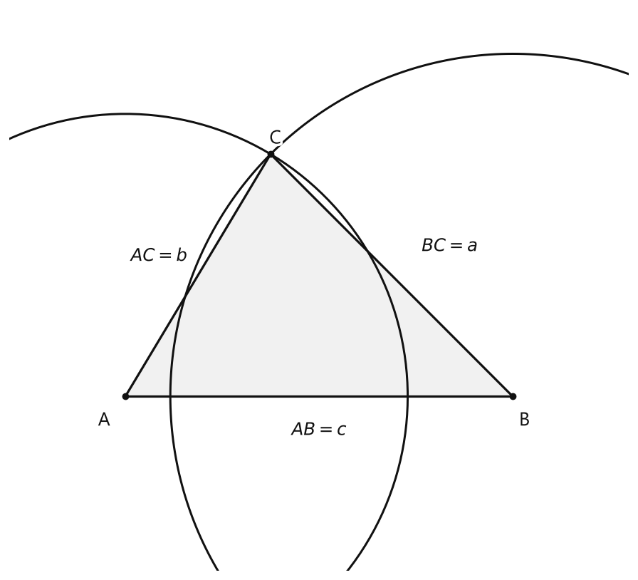
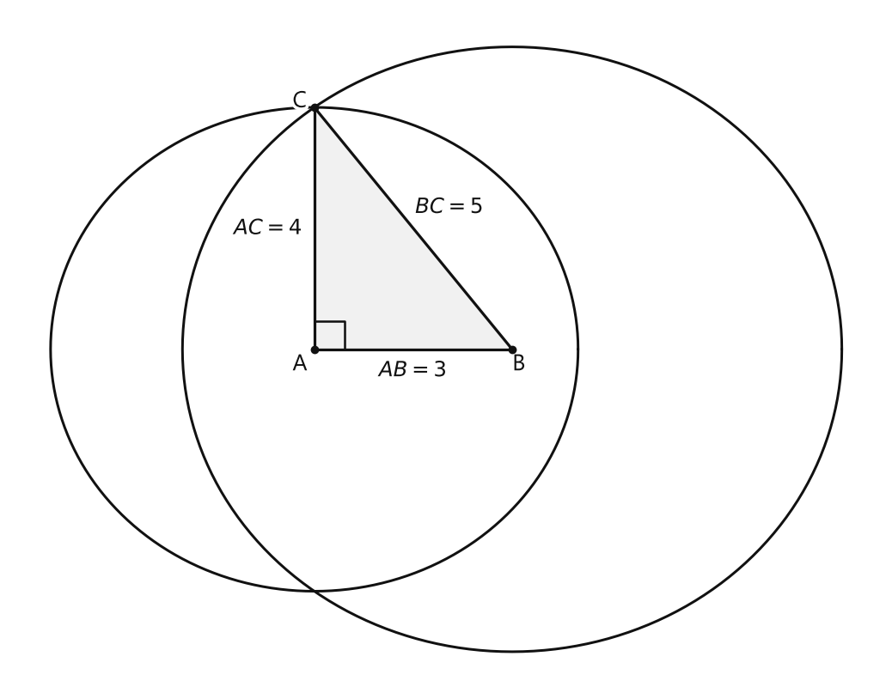
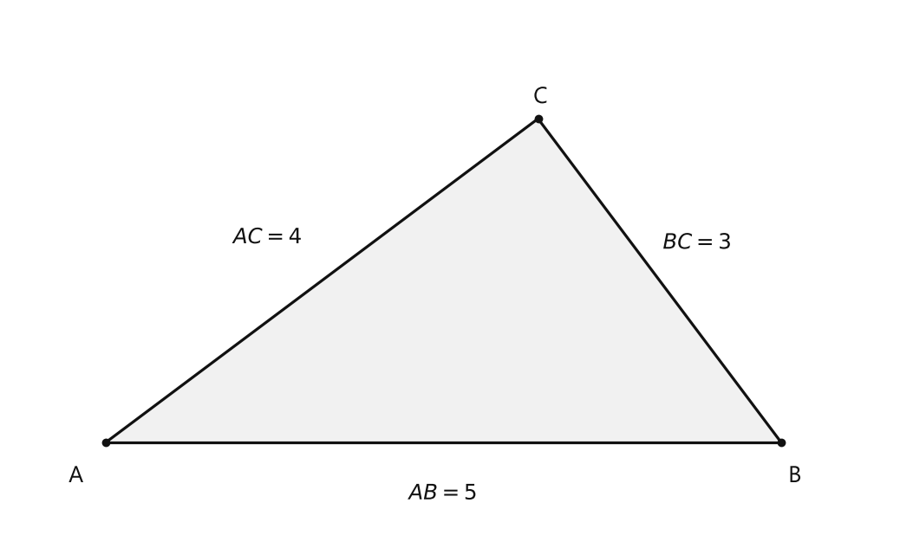

# Занятие 30. Задачи на построение

**Раздел:** Глава V  
**Параграф учебника:** §30. Задачи на построение  
**Страницы:** 162–162

## Цели занятия

После занятия ты сможешь:

- объяснить, что требуется сделать в задаче на построение;
- пользоваться циркулем и линейкой без делений;
- строить треугольник по трём сторонам;
- строить прямой угол без угольника;
- проверять, подходит ли построенная фигура условию.

Выбери блок своего уровня:

- **1–2 балла** — понять идею построения;
- **3–4 балла** — построить треугольник по трём сторонам;
- **5–6 баллов** — объяснить последовательность построения;
- **7–8 баллов** — построить прямой угол без угольника;
- **9–10 баллов** — самостоятельно оформить решение задачи на построение.

## Теория к занятию

### 1. В чём сущность задачи на построение

#### Простыми словами

В задаче на построение нужно не просто нарисовать фигуру, похожую на нужную. Нужно **получить её с помощью разрешённых инструментов**. В нашем параграфе это линейка и циркуль.

Линейкой проводят прямые линии. Циркулем переносят длины и проводят окружности. Можно сказать так: линейка отвечает за «ровно», а циркуль — за «точно».

#### Факт

В карточке параграфа указано:

> В чем сущность задачи на построение

Подробная формулировка из текста страницы в предоставленной карточке не приведена, поэтому не будем приписывать учебнику лишние слова.

#### Правила

- Линейкой проводят прямые линии, а не рисуют их «примерно ровно».
- Циркулем переносят длины.
- Каждое построение нужно объяснить.
- После построения проверь, выполнены ли все условия задачи.

#### Алгоритм оформления

1. **Анализ.** Представь, как должна выглядеть искомая фигура.
2. **Построение.** Выполни действия линейкой и циркулем.
3. **Доказательство.** Объясни, почему полученная фигура подходит.
4. **Исследование.** Выясни, всегда ли построение возможно и сколько решений оно имеет.

Не перепутай: красивый рисунок — ещё не решение. Геометрия любит точность больше, чем художественный талант.

#### Ловушки

- Нарисовать фигуру «на глаз» и считать задачу решённой.
- Перепутать построение отрезка с измерением его длины.
- Забыть доказать, что полученная фигура соответствует условию.
- Не проверить, пересекаются ли построенные окружности.
- Не обратить внимание на то, с какой стороны отрезка получилось пересечение окружностей.

---

### 2. Построение треугольника по трём сторонам

#### Простыми словами

Пусть известны три стороны треугольника. Сначала построим одну из них. Затем для каждой из её вершин зададим расстояние до третьей вершины с помощью окружности.

Например, нужно построить треугольник $ABC$, где:

- $AB=c$;
- $AC=b$;
- $BC=a$.

Сначала строим отрезок $AB$. Потом:

- окружность с центром $A$ и радиусом $b$ задаёт все точки, находящиеся от $A$ на расстоянии $b$;
- окружность с центром $B$ и радиусом $a$ задаёт все точки, находящиеся от $B$ на расстоянии $a$.

Их точка пересечения и будет вершиной $C$. Циркуль здесь работает как строгий контролёр расстояний: «От точки $A$ — ровно $b$, от точки $B$ — ровно $a».

#### Факт

Для построения треугольника по трём сторонам нужно построить две окружности с центрами в концах одной стороны и радиусами, равными двум другим сторонам.

#### Формулы

Если стороны треугольника равны $a$, $b$ и $c$, то построение возможно, когда выполняются неравенства треугольника:

$$
a<b+c,\qquad b<a+c,\qquad c<a+b.
$$

Здесь $a$, $b$, $c$ — длины сторон треугольника.

Для построения треугольника со сторонами $AB=c$, $AC=b$, $BC=a$:

- радиус окружности с центром $A$ равен $b$;
- радиус окружности с центром $B$ равен $a$.

#### Правила

1. Сначала построй одну заданную сторону.
2. Концы этой стороны используй как центры окружностей.
3. Радиусы окружностей возьми равными двум оставшимся сторонам.
4. Точку пересечения окружностей обозначь третьей вершиной.
5. Соедини найденную точку с концами первой стороны.

#### Алгоритм

Нужно построить треугольник $ABC$ по сторонам $AB=c$, $AC=b$, $BC=a$.

1. Проведи произвольную прямую.
2. Отметь на ней точку $A$.
3. Отложи на прямой отрезок $AB=c$.
4. С центром $A$ проведи окружность радиуса $b$.
5. С центром $B$ проведи окружность радиуса $a$.
6. Обозначь точку их пересечения буквой $C$.
7. Соедини точки $A$ и $C$.
8. Соедини точки $B$ и $C$.
9. Получен треугольник $ABC$.

Если окружности пересекаются в двух точках, можно выбрать любую из них. Получатся два треугольника, симметричных относительно прямой $AB$.

<!--geo-figure-spec
{
  "needed": true,
  "kind": "plane",
  "caption": "Построение треугольника $ABC$ по трём сторонам",
  "equal": true,
  "axis": false,
  "xlim": [
    -1.2,
    5.2
  ],
  "ylim": [
    -1.8,
    4
  ],
  "points": {
    "A": [
      0,
      0
    ],
    "B": [
      4,
      0
    ],
    "C": [
      1.5,
      2.5
    ]
  },
  "segments": [
    [
      "A",
      "B"
    ],
    [
      "A",
      "C"
    ],
    [
      "B",
      "C"
    ]
  ],
  "polygons": [
    {
      "vertices": [
        "A",
        "B",
        "C"
      ],
      "fill": 0.06
    }
  ],
  "circles": [
    {
      "center": "A",
      "radius": 2.915475947
    },
    {
      "center": "B",
      "radius": 3.535533906
    }
  ],
  "labels": {
    "A": {
      "dx": -0.22,
      "dy": -0.25
    },
    "B": {
      "dx": 0.12,
      "dy": -0.25
    },
    "C": {
      "dx": 0.05,
      "dy": 0.16
    }
  },
  "right_angles": [],
  "angle_marks": [],
  "texts": [
    {
      "xy": [
        2,
        -0.35
      ],
      "text": "$AB=c$"
    },
    {
      "xy": [
        0.35,
        1.45
      ],
      "text": "$AC=b$"
    },
    {
      "xy": [
        3.35,
        1.55
      ],
      "text": "$BC=a$"
    }
  ]
}
-->

*Построение треугольника ABC по трём сторонам*

#### Ловушки

- Если окружности не пересекаются, треугольник построить нельзя.
- Если окружности касаются, обычного треугольника не получится: три точки окажутся на одной прямой.
- Если одна окружность находится внутри другой и не пересекается с ней, построение также невозможно.
- Точку пересечения можно выбрать с одной или с другой стороны отрезка $AB$.
- Неравенства треугольника лучше проверить **до** построения. Это математический пропускной пункт.

---

### 3. Как построить прямой угол без угольника

#### Простыми словами

Прямой угол можно построить с помощью циркуля и линейки. Для этого удобно использовать свойства равнобедренного треугольника.

Пусть на одной прямой расположены точки $B$, $A$ и ещё одна точка $D$, причём $AB=AD$. Построим две окружности одинакового радиуса с центрами $B$ и $D$. Они пересекутся в точках $C$ и $E$.

Треугольники $BCA$ и $DCA$ имеют равные стороны:

- $BC=DC$, потому что это радиусы окружностей одного радиуса;
- $BA=AD$ по построению;
- $CA$ — общая сторона.

По третьему признаку равенства треугольников эти треугольники равны. Поэтому луч $AC$ делит угол $BAD$ пополам. Угол $BAD$ — развёрнутый, значит, каждый из двух углов равен $90^\circ$.

Так мы получаем прямой угол без угольника. Угольник в этой задаче не уволен, а просто не понадобился.

#### Факт

В карточке параграфа указано:

> Как построить прямой угол без угольника

Для практического построения используем циркуль и линейку.

#### Формула

Для прямоугольного треугольника выполняется теорема Пифагора:

$$
a^2+b^2=c^2,
$$

где $a$ и $b$ — катеты, а $c$ — гипотенуза.

Для выбранных длин:

$$
3^2+4^2=9+16=25=5^2.
$$

В этом занятии для построения прямого угла достаточно использовать свойства равнобедренного треугольника и равенство треугольников.

#### Алгоритм

1. Проведи прямую.
2. Отметь на ней точку $A$.
3. Отложи по разные стороны от точки $A$ равные отрезки $AB=AD$.
4. С центром $B$ проведи окружность произвольного радиуса.
5. С центром $D$ проведи окружность такого же радиуса.
6. Обозначь одну из точек пересечения окружностей буквой $C$.
7. Проведи луч $AC$.
8. Угол $CAB$ — прямой.

<!--geo-figure-spec
{
  "needed": true,
  "kind": "plane",
  "caption": "Построение прямого угла $CAB$",
  "equal": false,
  "axis": false,
  "xlim": [
    -4.6,
    8.6
  ],
  "ylim": [
    -5.6,
    5.6
  ],
  "points": {
    "A": [
      0,
      0
    ],
    "B": [
      3,
      0
    ],
    "C": [
      0,
      4
    ]
  },
  "segments": [
    [
      "A",
      "B"
    ],
    [
      "A",
      "C"
    ],
    [
      "B",
      "C"
    ]
  ],
  "polygons": [
    {
      "vertices": [
        "A",
        "B",
        "C"
      ],
      "fill": 0.06
    }
  ],
  "circles": [
    {
      "center": "A",
      "radius": 4
    },
    {
      "center": "B",
      "radius": 5
    }
  ],
  "labels": {
    "A": {
      "dx": -0.22,
      "dy": -0.25
    },
    "B": {
      "dx": 0.1,
      "dy": -0.25
    },
    "C": {
      "dx": -0.22,
      "dy": 0.1
    }
  },
  "right_angles": [
    {
      "vertex": "A",
      "from": "B",
      "to": "C"
    }
  ],
  "angle_marks": [],
  "texts": [
    {
      "xy": [
        1.5,
        -0.35
      ],
      "text": "$AB=3$"
    },
    {
      "xy": [
        -0.7,
        2
      ],
      "text": "$AC=4$"
    },
    {
      "xy": [
        2.05,
        2.35
      ],
      "text": "$BC=5$"
    }
  ]
}
-->

*Построение прямого угла CAB*

#### Ловушки

- Отрезки $AB$ и $AD$ должны быть равными.
- Радиусы окружностей с центрами $B$ и $D$ должны быть одинаковыми.
- Точку $C$ нужно брать как точку пересечения окружностей.
- Прямой угол получается в вершине $A$, а не в точке $C$.
- Если построить окружности разного радиуса, нужное равенство треугольников может исчезнуть. Математика такие сюрпризы не одобряет.

## Сводка формул «выучить наизусть»

Необходимые формулы:

$$
a<b+c,\qquad b<a+c,\qquad c<a+b.
$$

Условия теоремы Пифагора для прямоугольного треугольника:

$$
a^2+b^2=c^2.
$$

Для треугольника со сторонами $3$, $4$, $5$:

$$
3^2+4^2=5^2.
$$

## Правила, которые нельзя путать

- Линейкой проводят прямые, циркулем переносят длины.
- При построении треугольника радиусы окружностей равны двум заданным сторонам.
- Третья сторона треугольника получается после соединения найденной точки с концами первой стороны.
- Если окружности не пересекаются, построение треугольника невозможно.
- В тройке $3$, $4$, $5$ сторона $5$ — гипотенуза.
- Прямой угол находится напротив гипотенузы.
- При построении прямого угла равные отрезки откладывают по разные стороны от вершины угла.
- Построение нужно не только выполнить, но и обосновать.

## Разбор ключевых заданий

### Р1. Проверка возможности построения треугольника

**Условие.** Можно ли построить треугольник со сторонами $4$ см, $6$ см и $9$ см?

**Решение.**

Проверим неравенства треугольника.

Для стороны длиной $4$ см:

$$
4<6+9
$$

$$
4<15
$$

Неравенство верно.

Для стороны длиной $6$ см:

$$
6<4+9
$$

$$
6<13
$$

Неравенство верно.

Для стороны длиной $9$ см:

$$
9<4+6
$$

$$
9<10
$$

Неравенство верно.

Все три неравенства выполняются.

Значит, треугольник построить можно.

**Ответ:** можно.

---

### Р2. Построение треугольника по трём сторонам

**Условие.** Построй треугольник $ABC$, если $AB=5$ см, $AC=4$ см, $BC=3$ см.

<!--geo-figure-spec
{
  "needed": true,
  "kind": "plane",
  "caption": "Треугольник $ABC$ со сторонами $AB=5$, $AC=4$, $BC=3$",
  "equal": true,
  "axis": false,
  "xlim": [
    -0.7,
    5.8
  ],
  "ylim": [
    -0.7,
    3.2
  ],
  "points": {
    "A": [
      0,
      0
    ],
    "B": [
      5,
      0
    ],
    "C": [
      3.2,
      2.4
    ]
  },
  "segments": [
    [
      "A",
      "B"
    ],
    [
      "A",
      "C"
    ],
    [
      "B",
      "C"
    ]
  ],
  "polygons": [
    {
      "vertices": [
        "A",
        "B",
        "C"
      ],
      "fill": 0.06
    }
  ],
  "circles": [],
  "labels": {
    "A": {
      "dx": -0.22,
      "dy": -0.25
    },
    "B": {
      "dx": 0.1,
      "dy": -0.25
    },
    "C": {
      "dx": 0.02,
      "dy": 0.16
    }
  },
  "right_angles": [],
  "angle_marks": [],
  "texts": [
    {
      "xy": [
        2.5,
        -0.38
      ],
      "text": "$AB=5$"
    },
    {
      "xy": [
        1.2,
        1.52
      ],
      "text": "$AC=4$"
    },
    {
      "xy": [
        4.38,
        1.48
      ],
      "text": "$BC=3$"
    }
  ]
}
-->

*Треугольник ABC со сторонами AB=5, AC=4, BC=3*

**Построение.**

1. Проведи произвольную прямую.
2. Отметь на ней точку $A$.
3. Отложи от точки $A$ отрезок $AB=5$ см.
4. С центром $A$ проведи окружность радиуса $4$ см.
5. С центром $B$ проведи окружность радиуса $3$ см.
6. Обозначь точку пересечения окружностей буквой $C$.
7. Соедини точки $A$ и $C$.
8. Соедини точки $B$ и $C$.

**Доказательство.**

По построению:

$$
AB=5\text{ см},
$$

$$
AC=4\text{ см},
$$

$$
BC=3\text{ см}.
$$

Следовательно, построен треугольник $ABC$ с заданными сторонами.

Проверим возможность построения:

$$
3<4+5,
$$

$$
4<3+5,
$$

$$
5<3+4.
$$

Все неравенства верны.

**Ответ:** построен треугольник $ABC$ со сторонами $5$ см, $4$ см и $3$ см.

---

### Р3. Построение прямого угла

**Условие.** Построй прямой угол без угольника.

**Решение.**

1. Проведи прямую.
2. Отметь на ней точку $A$.
3. По разные стороны от точки $A$ отметь точки $B$ и $D$ так, чтобы $AB=AD$.
4. С центром $B$ проведи окружность произвольного радиуса.
5. С центром $D$ проведи окружность такого же радиуса.
6. Пусть одна из точек пересечения окружностей — $C$.
7. Проведи луч $AC$.

По построению:

$$
AB=AD,
$$

$$
BC=DC,
$$

$$
AC=AC.
$$

Треугольники $ABC$ и $ADC$ равны по третьему признаку равенства треугольников.

Значит, луч $AC$ делит развёрнутый угол $BAD$ на два равных угла.

Развёрнутый угол равен $180^\circ$, поэтому:

$$
\angle BAC=\frac{180^\circ}{2}=90^\circ.
$$

Следовательно, угол $BAC$ — прямой.

**Ответ:** $\angle BAC=90^\circ$.

---

### Р4. Найди ошибку в построении

**Условие.** Для построения треугольника со сторонами $AB=6$ см, $AC=5$ см и $BC=4$ см ученик выполнил такие действия:

1. Построил отрезок $AB=6$ см.
2. Провёл окружность с центром $A$ и радиусом $4$ см.
3. Провёл окружность с центром $B$ и радиусом $5$ см.
4. Точку пересечения окружностей назвал $C$.

Найди ошибку и исправь построение.

**Решение.**

По условию:

$$
AC=5\text{ см},
$$

$$
BC=4\text{ см}.
$$

Точка $C$ должна находиться от точки $A$ на расстоянии $5$ см. Поэтому окружность с центром $A$ должна иметь радиус $5$ см.

Точка $C$ должна находиться от точки $B$ на расстоянии $4$ см. Поэтому окружность с центром $B$ должна иметь радиус $4$ см.

Ученик поменял радиусы местами.

Исправленный порядок:

1. Построить отрезок $AB=6$ см.
2. С центром $A$ провести окружность радиуса $5$ см.
3. С центром $B$ провести окружность радиуса $4$ см.
4. Точку пересечения окружностей обозначить $C$.
5. Соединить $A$ с $C$ и $B$ с $C$.

Проверим возможность построения:

$$
4<5+6,
$$

$$
5<4+6,
$$

$$
6<4+5.
$$

Все неравенства верны.

**Ответ:** радиус окружности с центром $A$ должен быть $5$ см, а с центром $B$ — $4$ см.

---

### Р5. Исследование трёх сторон

**Условие.** Можно ли построить треугольник со сторонами $2$ см, $3$ см и $5$ см?

**Решение.**

Проверим неравенство для самой длинной стороны:

$$
5<2+3.
$$

Получаем:

$$
5<5.
$$

Это неверно.

Сторона длиной $5$ см равна сумме двух других сторон. Если попытаться построить такой треугольник, три точки окажутся на одной прямой. Обычного треугольника не получится.

**Ответ:** нельзя.

## Итог занятия

Задача на построение — это не конкурс на самый красивый рисунок. Главное — точные действия, правильный инструмент и объяснение результата.

Если нужно построить треугольник по трём сторонам:

1. проверь неравенства треугольника;
2. построй одну сторону;
3. проведи две окружности;
4. найди их точку пересечения;
5. соедини найденную точку с концами первой стороны;
6. объясни, почему длины сторон получились заданными.

Если нужно построить прямой угол:

1. на прямой выбери точку вершины;
2. отложи равные отрезки по разные стороны от неё;
3. построй две окружности одинакового радиуса;
4. соедини вершину с точкой пересечения окружностей;
5. обоснуй, что получился угол $90^\circ$.

Спойлер: угольник не обязателен — циркуль и линейка тоже умеют устраивать порядок.

## Практические задания

Выбери свой уровень и решай только этот блок. В блоке должна закрепиться вся тема параграфа. Ответы не приводятся.

### Уровень 1–2 балла

**С1.** Какое действие выполняют первым при построении треугольника по трём данным сторонам $a$, $b$ и $c$?

1) Строят окружность с центром в одной из точек  
2) Строят отрезок длиной $a$  
3) Проводят прямую, перпендикулярную данному отрезку  
4) Делят отрезок пополам  
5) Измеряют величину одного из углов

**С2.** Для построения треугольника $ABC$ по сторонам $AB=5$ см, $AC=4$ см и $BC=6$ см построили отрезок $AB=5$ см. Какими радиусами нужно провести окружности с центрами $A$ и $B$?

1) $4$ см и $6$ см  
2) $5$ см и $5$ см  
3) $6$ см и $4$ см  
4) $4$ см и $5$ см  
5) $6$ см и $5$ см

**С3.** Треугольник имеет стороны $3$ см, $4$ см и $5$ см. Какой отрезок удобно построить первым при построении этого треугольника?

1) Отрезок длиной $3$ см  
2) Отрезок длиной $4$ см  
3) Отрезок длиной $5$ см  
4) Любой из данных отрезков  
5) Отрезок длиной $12$ см

**С4.** При построении треугольника по трём сторонам две окружности пересеклись в точке $C$. Какие отрезки нужно провести после этого?

1) $AC$ и $BC$  
2) Только $AB$  
3) $AB$ и $AC$  
4) $AB$ и $BC$  
5) Только $BC$

**С5.** Даны отрезок $AB$ и точка $C$, не лежащая на нём. Какой инструмент можно использовать для проведения окружности с центром $A$?

1) Линейку без делений  
2) Циркуль  
3) Угольник  
4) Транспортир  
5) Только карандаш

**С6.** Какой набор инструментов достаточен для построения треугольника по трём сторонам?

1) Линейка с делениями и транспортир  
2) Циркуль и линейка без делений  
3) Только транспортир  
4) Только линейка с делениями  
5) Угольник и транспортир

**С7.** Нужно построить угол, равный прямому, без угольника. Какой объект можно использовать для такого построения?

1) Окружность  
2) Произвольный треугольник  
3) Отрезок, разделённый пополам  
4) Прямоугольник  
5) Ломаную линию

**С8.** На прямой отмечена точка $O$. Для построения прямого угла с вершиной $O$ циркулем построили окружность с центром $O$, пересекающую прямую в точках $A$ и $B$. Что нужно сделать дальше?

1) Провести окружность с центром $A$  
2) Провести окружность с центром $B$  
3) Провести окружности с центрами $A$ и $B$ одинакового радиуса  
4) Измерить угол $AOB$ транспортиром  
5) Соединить точки $A$ и $B$ отрезком

**С9.** На прямой отмечены точки $A$ и $B$. Окружности с центрами $A$ и $B$ имеют одинаковый радиус и пересекаются в точках $C$ и $D$. Какой отрезок проводят для построения прямого угла к прямой $AB$?

1) $AB$  
2) $AC$  
3) $CD$  
4) $BD$  
5) $AD$

**С10.** При построении треугольника по сторонам $AB=7$ см, $AC=5$ см и $BC=4$ см отрезок $AB$ уже построен. Какой радиус должна иметь окружность с центром $A$?

1) $4$ см  
2) $5$ см  
3) $7$ см  
4) $9$ см  
5) $12$ см

**С11.** Выберите все верные утверждения о задаче на построение.

1) В задаче требуется получить геометрическую фигуру с заданными свойствами.  
2) Для построения треугольника по трём сторонам используют окружности.  
3) Прямой угол обязательно строят только с помощью угольника.  
4) При построении треугольника по трём сторонам соединяют найденную точку с концами исходного отрезка.  
5) Для построения достаточно произвольно выбрать длины сторон треугольника.

**С12.** Даны три отрезка длиной $4$ см, $5$ см и $6$ см. Расположите действия в правильном порядке для построения треугольника по этим сторонам:

А) Провести окружность с центром в одном конце отрезка радиусом $5$ см.  
Б) Соединить точку пересечения окружностей с концами исходного отрезка.  
В) Провести отрезок длиной $6$ см.  
Г) Провести окружность с центром в другом конце отрезка радиусом $4$ см.

**С13.** Какие инструменты необходимы для построения треугольника по трём заданным сторонам?  
1) линейка и циркуль 2) только угольник 3) только транспортир 4) линейка и транспортир 5) только циркуль

**С14.** Выберите задачу, являющуюся задачей на построение.  
1) Найти площадь прямоугольника 2) Построить треугольник по трём сторонам 3) Вычислить значение выражения 4) Решить уравнение 5) Сравнить два числа

**С15.** Даны отрезки $a=3$ см, $b=4$ см и $c=5$ см. Какую фигуру требуется построить по этим данным?  
1) окружность 2) прямой угол 3) треугольник 4) квадрат 5) прямоугольник

**С16.** При построении треугольника по трём сторонам один из отрезков уже построен. Какой инструмент удобно использовать, чтобы отложить длину другого заданного отрезка?  
1) циркуль 2) транспортир 3) угольник 4) линейку без делений 5) ластик

**С17.** Какой объект получают при пересечении двух окружностей, построенных из концов отрезка как из центров?  
1) точку, которая может быть третьей вершиной треугольника 2) середину отрезка 3) прямую 4) прямой угол 5) квадрат

**С18.** Какой инструмент позволяет построить прямой угол без угольника?  
1) циркуль 2) транспортир 3) линейка без делений 4) ластик 5) карандаш без линейки

**С19.** Постройте отрезок $AB$ длиной $6$ см. С помощью циркуля и линейки постройте треугольник $ABC$ со сторонами $AB=6$ см, $AC=4$ см и $BC=5$ см.

**С20.** Постройте треугольник $ABC$ по сторонам $AB=5$ см, $AC=5$ см и $BC=6$ см.

**С21.** На луче $OA$ отметьте точку $B$ так, чтобы $OB=4$ см. Постройте прямой угол с вершиной $O$, одной стороной которого является луч $OA$.

**С22.** Постройте прямой угол с вершиной $O$ без использования угольника, используя циркуль и линейку.

**С23.** Даны три отрезка длиной $3$ см, $4$ см и $8$ см. Определите, можно ли построить треугольник с такими длинами сторон. Запишите ответ: «да» или «нет».

**С24.** Выберите верный порядок основных действий при построении треугольника по трём сторонам.  
1) Построить отрезок, из его концов провести дуги заданных радиусов, отметить точку их пересечения и соединить её с концами отрезка  
2) Построить окружность, измерить её длину, затем провести касательную  
3) Построить два луча, измерить угол между ними и провести биссектрису  
4) Построить квадрат, провести диагональ и соединить её концы с третьей точкой  
5) Построить прямую, отметить на ней три точки и измерить расстояния между ними

**С25.** Выберите инструменты, необходимые для выполнения задач на построение:  
1) линейка и транспортир; 2) циркуль и линейка; 3) угольник и транспортир; 4) только циркуль; 5) только линейка.

**С26.** Какой объект можно построить с помощью циркуля и линейки?  
1) отрезок заданной длины; 2) только таблицу; 3) только число; 4) только текст; 5) только координаты точки.

**С27.** Чтобы построить треугольник по трём заданным сторонам, сначала проводят отрезок, равный:  
1) любой из заданных сторон; 2) сумме двух сторон; 3) разности двух сторон; 4) половине большей стороны; 5) произведению двух сторон.

**С28.** При построении треугольника по сторонам $AB=4$ см, $AC=3$ см и $BC=5$ см после построения отрезка $AB$ нужно построить окружности с центрами:  
1) $A$ и $B$; 2) $A$ и $C$; 3) $B$ и $C$; 4) только $A$; 5) только $B$.

**С29.** При построении треугольника по сторонам $AB=5$ см, $AC=4$ см и $BC=3$ см радиус окружности с центром $A$ должен быть равен:  
1) $3$ см; 2) $4$ см; 3) $5$ см; 4) $7$ см; 5) $9$ см.

**С30.** При построении треугольника по трём сторонам точка пересечения двух построенных окружностей является:  
1) третьей вершиной треугольника; 2) серединой первой стороны; 3) концом первой стороны; 4) центром первой окружности; 5) точкой на продолжении первой стороны.

**С31.** Выберите длины сторон, по которым можно построить треугольник:  
1) $2$ см, $3$ см и $6$ см; 2) $2$ см, $4$ см и $6$ см; 3) $3$ см, $4$ см и $5$ см; 4) $1$ см, $2$ см и $4$ см; 5) $2$ см, $2$ см и $5$ см.

**С32.** При построении треугольника по сторонам $6$ см, $7$ см и $8$ см после проведения основания длиной $8$ см радиусы двух окружностей должны быть равны:  
1) $6$ см и $7$ см; 2) $8$ см и $8$ см; 3) $6$ см и $8$ см; 4) $7$ см и $8$ см; 5) $6$ см и $14$ см.

**С33.** Какой отрезок удобно использовать для построения прямого угла без угольника?  
1) диаметр окружности; 2) радиус окружности; 3) хорду, не проходящую через центр; 4) произвольную дугу; 5) отрезок, не связанный с окружностью.

**С34.** Для построения прямого угла без угольника сначала построили окружность и провели её диаметр $AB$. Точка $C$ выбрана на окружности так, что $C$ не совпадает с $A$ и $B$. Угол, который является прямым, имеет вершину:  
1) $A$; 2) $B$; 3) $C$; 4) в центре окружности; 5) вне окружности.

**С35.** Из точки $O$ на прямой отложили по разные стороны равные отрезки $OA$ и $OB$. Чтобы построить перпендикуляр к этой прямой в точке $O$, следует построить:  
1) окружности с центрами $A$ и $B$ одинакового радиуса, большего $OA$; 2) окружности с центрами $A$ и $B$ разных радиусов; 3) окружность только с центром $O$; 4) две окружности с радиусами $OA$ и $OB$ и одним центром; 5) отрезок, не проходящий через точки пересечения окружностей.

**С36.** Какое действие является последним при построении треугольника по трём сторонам после нахождения третьей вершины $C$?  
1) соединить точку $C$ с концами основания; 2) стереть основание; 3) измерить только одну сторону; 4) построить ещё одну окружность; 5) отметить середину основания.

### Уровень 3–4 балла

**С1.** Постройте треугольник $ABC$ по трём сторонам: $AB=5$ см, $BC=4$ см, $AC=6$ см, используя циркуль и линейку.

**С2.** Постройте треугольник $KLM$ по трём сторонам: $KL=7$ см, $LM=5$ см, $KM=4$ см, используя циркуль и линейку.

**С3.** Постройте треугольник $PQR$ по трём сторонам: $PQ=3$ см, $QR=5$ см, $PR=6$ см, используя циркуль и линейку.

**С4.** Постройте без угольника угол $ABC$, равный $90^\circ$, если луч $BA$ уже начерчен. Используйте только линейку и циркуль.

**С5.** На прямой $a$ дана точка $M$. Постройте без угольника перпендикуляр к прямой $a$, проходящий через точку $M$, используя линейку и циркуль.

**С6.** На прямой $b$ дана точка $N$. Постройте без угольника прямой угол с вершиной $N$, одна сторона которого лежит на луче прямой $b$.

**С7.** Дан отрезок $AB$ длиной $6$ см. Постройте треугольник $ABC$, в котором $AC=4$ см, $BC=5$ см, используя циркуль и линейку.

**С8.** Дан отрезок $DE$ длиной $8$ см. Постройте треугольник $DEF$, в котором $DF=5$ см, $EF=6$ см, используя циркуль и линейку.

**С9.** Дан отрезок $KL$ длиной $4$ см. Постройте треугольник $KLM$, в котором $KM=3$ см, $LM=3$ см. Отметьте построенную вершину $M$.

**С10.** Постройте треугольник $XYZ$ по сторонам $XY=6$ см, $YZ=7$ см и $XZ=8$ см. Запишите последовательность основных этапов построения.

**С11.** Постройте без угольника прямой угол с вершиной $O$. Для этого проведите сначала луч $OA$, а затем постройте луч $OB$, перпендикулярный лучу $OA$.

**С12.** Дан отрезок $AB$. Постройте без угольника его серединный перпендикуляр, используя только линейку и циркуль. Обозначьте точку пересечения серединного перпендикуляра с отрезком $AB$ буквой $M$.

**С13.** Постройте отрезок $AB$ длиной $6$ см с помощью линейки.

**С14.** Постройте отрезок $CD$ длиной $8$ см и разделите его пополам с помощью циркуля и линейки.

**С15.** Постройте угол $ABC$, равный углу, изображённому в условии: его стороны должны иметь общую вершину $B$, а величина угла должна быть $60^\circ$. Используйте только циркуль и линейку.

**С16.** Постройте треугольник $ABC$ по трём сторонам: $AB=5$ см, $BC=4$ см, $AC=6$ см.

**С17.** Постройте треугольник $KLM$ по трём сторонам: $KL=7$ см, $LM=5$ см, $KM=4$ см.

**С18.** Постройте треугольник $PQR$ по трём сторонам: $PQ=4$ см, $QR=4$ см, $PR=6$ см.

**С19.** Постройте треугольник $XYZ$ по трём сторонам: $XY=3$ см, $YZ=5$ см, $XZ=7$ см.

**С20.** Постройте прямой угол с вершиной $O$, не используя угольник. Для построения используйте циркуль и линейку.

**С21.** На прямой $a$ отметьте точку $M$. Постройте перпендикуляр к прямой $a$ через точку $M$, используя только циркуль и линейку.

**С22.** На луче $OA$ отметьте точку $B$. Постройте через точку $B$ прямую, перпендикулярную лучу $OA$, используя только циркуль и линейку.

**С23.** Постройте треугольник $ABC$ по трём сторонам: $AB=6$ см, $BC=5$ см, $AC=5$ см. Отметьте на построенном чертеже равные стороны.

**С24.** Постройте треугольник $DEF$ по трём сторонам: $DE=8$ см, $EF=6$ см, $DF=3$ см. Запишите последовательность основных построений, выполненных с помощью циркуля и линейки.

**С25.** Постройте отрезок $AB$ длиной $6$ см с помощью циркуля и линейки без делений.

**С26.** Постройте угол $ABC$, равный данному углу $MON$, используя циркуль и линейку без делений.

**С27.** Постройте треугольник $ABC$ по трём сторонам: $AB=5$ см, $BC=4$ см, $AC=6$ см.

**С28.** Постройте треугольник $KLM$ по трём сторонам: $KL=7$ см, $LM=5$ см, $KM=3$ см.

**С29.** Постройте треугольник $PQR$ по трём сторонам: $PQ=4$ см, $QR=4$ см, $PR=6$ см.

**С30.** Запишите последовательность основных построений для построения треугольника по трём сторонам $a$, $b$ и $c$, если сторона $AB=c$, сторона $AC=b$, а сторона $BC=a$.

**С31.** Можно ли построить треугольник по трём отрезкам длиной $3$ см, $5$ см и $9$ см? Ответ обоснуйте сравнением длины одного отрезка с суммой двух других.

**С32.** Можно ли построить треугольник по трём отрезкам длиной $5$ см, $7$ см и $11$ см? Ответ обоснуйте сравнением длины одного отрезка с суммой двух других.

**С33.** Постройте прямой угол $AOB$ без угольника, используя циркуль и линейку без делений. Укажите построение, при котором точка $O$ является серединой отрезка $AB$.

**С34.** На луче $OA$ отложите отрезок $OB=OA$. Постройте прямой угол с вершиной $O$, используя циркуль и линейку без делений. Запишите основные этапы построения.

**С35.** Постройте перпендикуляр к прямой $a$ через точку $M$, лежащую на прямой $a$, используя циркуль и линейку без делений.

**С36.** Постройте перпендикуляр к прямой $a$ через точку $N$, не лежащую на прямой $a$, используя циркуль и линейку без делений.

### Уровень 5–6 баллов

**С1.** Постройте отрезок $AB$ длиной $6$ см с помощью линейки и циркуля. Выполните проверку длины построенного отрезка.

**С2.** Постройте отрезок $CD$ длиной $4{,}5$ см. Используйте только линейку с делениями и циркуль.

**С3.** Постройте треугольник $ABC$ по трём сторонам: $AB=5$ см, $BC=4$ см, $AC=6$ см. Опишите последовательность построения.

**С4.** Постройте треугольник $KLM$ по трём сторонам: $KL=7$ см, $LM=5$ см, $KM=4$ см. Проверьте длины всех его сторон.

**С5.** Постройте треугольник $PQR$ по трём сторонам: $PQ=3$ см, $QR=5$ см, $PR=6$ см. Запишите, какие дуги окружностей используются при построении третьей вершины.

**С6.** Постройте треугольник $DEF$ по трём сторонам: $DE=6$ см, $EF=6$ см, $DF=4$ см. Проверьте построение измерением сторон.

**С7.** Постройте прямой угол с вершиной $O$ без использования угольника. Для этого проведите прямую $l$, отметьте на ней точки $A$ и $B$ так, чтобы $O$ была серединой отрезка $AB$, а затем с помощью циркуля постройте точку $C$, равноудалённую от $A$ и $B$. Проведите луч $OC$ и объясните, как проверить, что угол $AOC$ прямой.

**С8.** На прямой $m$ дана точка $O$. Постройте перпендикуляр к прямой $m$ через точку $O$, используя циркуль и линейку без делений. Запишите все основные этапы построения.

**С9.** Постройте прямой угол с вершиной $T$ без угольника. На одной прямой отметьте точки $A$ и $B$ по разные стороны от $T$ так, чтобы $TA=TB=3$ см, затем постройте точку $C$, для которой $CA=CB=5$ см. Проведите луч $TC$ и выполните проверку построения.

**С10.** Постройте треугольник $ABC$ по трём сторонам: $AB=8$ см, $AC=5$ см, $BC=6$ см. После построения измерьте углы треугольника и определите, есть ли среди них прямой угол.

**С11.** Постройте треугольник $XYZ$ по трём сторонам: $XY=4$ см, $YZ=7$ см, $XZ=5$ см. Затем постройте без угольника прямой угол с вершиной $X$ так, чтобы одна его сторона совпадала с лучом $XY$.

**С12.** Постройте треугольник $MNP$ по трём сторонам: $MN=5$ см, $NP=6$ см, $MP=7$ см. Для построения используйте циркуль и линейку без делений. Запишите, какие элементы построения позволяют однозначно определить положение точки $P$.

**С13.** Постройте треугольник $ABC$ по трём сторонам: $AB=5$ см, $BC=4$ см, $AC=6$ см. Опишите последовательность построения.

**С14.** Постройте треугольник $KLM$ по сторонам $KL=7$ см, $LM=5$ см, $KM=4$ см. Выполните проверку построения измерением сторон.

**С15.** Даны отрезок $AB=6$ см и числа $4$ см и $5$ см. Постройте треугольник $ABC$, если $AC=4$ см, а $BC=5$ см.

**С16.** Постройте треугольник $PQR$ по трём сторонам: $PQ=8$ см, $QR=6$ см, $PR=5$ см. Запишите, какие окружности и с какими радиусами используются при построении.

**С17.** Постройте треугольник $XYZ$ по основанию $XY=7$ см и сторонам $XZ=5$ см, $YZ=6$ см. Проверьте, что построенная точка $Z$ находится на одинаковых расстояниях от $X$ и $Y$, заданных в условии.

**С18.** Постройте треугольник $DEF$ по трём сторонам: $DE=4$ см, $EF=4$ см, $DF=6$ см. Укажите, какие два отрезка на чертеже имеют одинаковую длину.

**С19.** Постройте треугольник $ABC$ по трём сторонам: $AB=3$ см, $BC=5$ см, $CA=7$ см. Выполните построение с помощью циркуля и линейки без измерения углов.

**С20.** Даны прямая $a$ и точка $O$ на ней. Постройте прямой угол с вершиной $O$, одна сторона которого лежит на прямой $a$. Выполните построение только с помощью циркуля и линейки.

**С21.** Даны луч $OA$. Постройте луч $OB$, перпендикулярный лучу $OA$ и имеющий общую начальную точку $O$. Объясните, как проверить, что угол $AOB$ прямой.

**С22.** Даны прямая $m$ и точка $P$ на ней. Постройте перпендикуляр к прямой $m$ в точке $P$, используя циркуль и линейку.

**С23.** Даны прямая $b$ и точка $Q$, не лежащая на этой прямой. Постройте перпендикуляр из точки $Q$ к прямой $b$. Обозначьте точку пересечения перпендикуляра с прямой $b$ буквой $H$.

**С24.** Даны отрезок $AB=8$ см и точка $O$ на нём, причём $AO=3$ см. Постройте в точке $O$ прямой угол так, чтобы одна его сторона проходила по прямой $AB$. Выполните проверку построения с помощью равенства расстояний от выбранных точек на прямой $AB$.

**С25.** Постройте отрезок $AB$ длиной $6$ см. С помощью циркуля найдите его середину и обозначьте её точкой $M$.

**С26.** Постройте треугольник $ABC$ по трём сторонам: $AB=5$ см, $BC=6$ см, $AC=7$ см. Запишите последовательность основных построений.

**С27.** Постройте треугольник $KLM$ по трём сторонам: $KL=4$ см, $LM=5$ см, $KM=6$ см. Проверьте измерением, что длины его сторон соответствуют условию.

**С28.** Дан отрезок $AB$ длиной $7$ см. Постройте прямую, перпендикулярную отрезку $AB$ и проходящую через его середину.

**С29.** Дан луч $OA$. Постройте луч $OB$, перпендикулярный лучу $OA$, используя только циркуль и линейку без делений. Обозначьте полученный прямой угол.

**С30.** Постройте прямоугольный треугольник $ABC$ с катетами $AB=4$ см и $AC=3$ см, используя только циркуль и линейку без делений. Проверьте построение измерением угла $A$ и стороны $BC$.

### Уровень 7–8 баллов

**С1.** Постройте треугольник $ABC$ по трём сторонам: $AB=5$ см, $BC=6$ см, $CA=7$ см. Опишите последовательность построения и обоснуйте, что построенный треугольник имеет заданные стороны.

**С2.** Даны отрезки $a=4$ см, $b=5$ см и $c=8$ см. Постройте треугольник со сторонами $a$, $b$ и $c$. Укажите, какие окружности используются при построении, и объясните, почему их точка пересечения определяет третью вершину треугольника.

**С3.** Постройте треугольник $KLM$ по сторонам $KL=6$ см, $LM=4$ см и $MK=5$ см. Выполните построение только с помощью циркуля и линейки без делений. Запишите, какие равенства длин следуют из построения.

**С4.** Постройте треугольник $PQR$ по трём сторонам: $PQ=3$ см, $QR=7$ см, $RP=5$ см. После построения измерьте углы треугольника и определите, какой из них наибольший. Обоснуйте свой вывод сравнением сторон.

**С5.** Даны отрезки $a=2$ см, $b=3$ см и $c=6$ см. Требуется построить треугольник со сторонами $a$, $b$ и $c$. Определите, возможно ли такое построение, и обоснуйте ответ, не выполняя полного построения.

**С6.** Постройте отрезок, равный сумме двух данных отрезков $a=3$ см и $b=4$ см, используя циркуль и линейку. Затем постройте треугольник по сторонам $a$, $b$ и полученному отрезку. Объясните, почему построение треугольника в этом случае невозможно.

**С7.** На прямой $l$ дана точка $O$. Постройте перпендикуляр к прямой $l$ через точку $O$, используя только циркуль и линейку. Опишите построение и обоснуйте, почему построенная прямая перпендикулярна прямой $l$.

**С8.** На прямой $m$ дана точка $A$. Постройте прямой угол с вершиной $A$, одна сторона которого лежит на луче $AB$ этой прямой. Используйте только циркуль и линейку. Запишите последовательность построения и объясните, как убедиться, что полученный угол является прямым.

**С9.** Дана прямая $n$ и точка $C$, не лежащая на ней. Постройте перпендикуляр из точки $C$ к прямой $n$. Опишите все основные шаги построения и обоснуйте, почему основание перпендикуляра принадлежит прямой $n$.

**С10.** На прямой $p$ дана точка $B$. Постройте прямую, перпендикулярную прямой $p$ и проходящую через точку $B$, так, чтобы расстояние от $B$ до каждой из двух вспомогательных точек на прямой $p$ было равно $4$ см. Укажите, какие отрезки необходимо построить равными, и обоснуйте результат.

**С11.** Постройте треугольник $ABC$ по сторонам $AB=4$ см, $BC=5$ см и $AC=6$ см. Затем через вершину $A$ постройте прямую, перпендикулярную стороне $BC$. Опишите оба построения и объясните, какие инструменты используются на каждом этапе.

**С12.** Даны отрезки $a=5$ см, $b=6$ см и $c=7$ см. Постройте треугольник по этим сторонам двумя способами: сначала взяв за основу отрезок длины $a$, а затем — отрезок длины $b$. Сравните полученные построения и обоснуйте, почему в обоих случаях стороны построенных треугольников имеют заданные длины.

**С13.** Постройте треугольник $ABC$ по трём сторонам: $AB=6$ см, $BC=7$ см, $CA=5$ см. Опишите последовательность построения и обоснуйте, что построенный треугольник имеет заданные стороны.

**С14.** Постройте треугольник $KLM$ по трём сторонам: $KL=4$ см, $LM=8$ см, $MK=6$ см. Используйте только циркуль и линейку без делений. Запишите, какие окружности необходимо построить, и объясните выбор их радиусов.

**С15.** Даны отрезки $a=3$ см, $b=5$ см и $c=7$ см. Постройте треугольник, стороны которого равны $a$, $b$ и $c$. Укажите, какой отрезок следует выбрать в качестве основания, и докажите, что построение возможно.

**С16.** Даны отрезки $p=2$ см, $q=6$ см и $r=9$ см. Требуется построить треугольник со сторонами $p$, $q$ и $r$. Установите, возможно ли такое построение, и обоснуйте ответ неравенством для сторон треугольника.

**С17.** Постройте треугольник $ABC$ по трём сторонам: $AB=8$ см, $BC=5$ см, $CA=6$ см. После построения проведите медиану из вершины $A$, используя только циркуль и линейку. Обоснуйте построение середины отрезка $BC$.

**С18.** Постройте треугольник $DEF$ по трём сторонам: $DE=7$ см, $EF=4$ см, $FD=6$ см. Затем постройте биссектрису угла $D$. Запишите, какие равные отрезки используются при построении биссектрисы, и обоснуйте результат.

**С19.** Постройте отрезок, равный сумме двух данных отрезков $a=4$ см и $b=3$ см. Затем, используя полученный отрезок и данный отрезок $c=5$ см, постройте треугольник со сторонами $a+b$, $c$ и $6$ см. Обоснуйте возможность построения.

**С20.** Постройте отрезок, равный разности двух данных отрезков $m=9$ см и $n=4$ см. Затем постройте треугольник со сторонами $m-n$, $6$ см и $8$ см. Опишите построение и проверьте выполнение неравенств треугольника.

**С21.** Даны три отрезка длиной $5$ см, $5$ см и $8$ см. Постройте равнобедренный треугольник с боковыми сторонами $5$ см и основанием $8$ см. Объясните, почему точка пересечения двух окружностей определяет вершину треугольника.

**С22.** Постройте прямой угол с вершиной $O$, не используя угольник. На одной стороне угла отложите точку $A$ так, чтобы $OA=4$ см, а на другой стороне — точку $B$ так, чтобы $OB=3$ см. Проведите отрезок $AB$ и проверьте построение по равенству $AB=5$ см.

**С23.** На прямой $l$ дана точка $O$. Постройте перпендикуляр к прямой $l$ через точку $O$, используя циркуль и линейку. На построенном перпендикуляре отметьте точку $C$ так, чтобы $OC=6$ см, а на прямой $l$ по разные стороны от $O$ отметьте точки $A$ и $B$ так, чтобы $OA=OB=8$ см. Обоснуйте, что $OC\perp l$.

**С24.** На прямой $l$ дана точка $P$, а вне прямой — точка $Q$. Постройте через точку $Q$ прямую, перпендикулярную прямой $l$, используя только циркуль и линейку. Опишите построение и приведите обоснование того, что построенная прямая проходит через $Q$ и перпендикулярна $l$.

### Уровень 9–10 баллов

**С1.** Постройте треугольник $ABC$ по трём сторонам: $AB=7$ см, $BC=5$ см, $CA=6$ см. Опишите последовательность построения и обоснуйте, почему построенный треугольник единственный с точностью до наложения.

**С2.** Постройте треугольник $MNP$ по сторонам $MN=8$ см, $NP=10$ см и $PM=5$ см. Выполните построение только с помощью циркуля и линейки без делений. Запишите, какие окружности используются на последнем шаге.

**С3.** Дан отрезок $AB=9$ см. Постройте треугольник $ABC$, если $AC=6$ см и $BC=7$ см. Составьте краткий план построения и выполните проверку полученного результата измерением.

**С4.** Постройте треугольник $DEF$ по трём сторонам $DE=4$ см, $EF=4$ см и $FD=7$ см. Укажите, какие из построенных элементов позволяют установить, что треугольник равнобедренный.

**С5.** Постройте треугольник $KLM$ по трём сторонам $KL=5$ см, $LM=8$ см и $MK=12$ см. Объясните, почему при таком порядке построения сначала удобно построить отрезок $LM$.

**С6.** Даны отрезки $AB=6$ см и $CD=9$ см. Постройте треугольник $ABC$, если его третья сторона $AC$ равна $CD$, а сторона $BC=7$ см. Запишите все заданные длины в виде равенств и приведите обоснование построения.

**С7.** Постройте прямой угол с вершиной $O$ в точке, лежащей на прямой $a$, используя только циркуль и линейку без делений. На прямой $a$ выберите точки $A$ и $B$ так, чтобы $OA=OB$, затем завершите построение и обоснуйте, что полученный угол прямой.

**С8.** На прямой $b$ дана точка $P$. Постройте перпендикуляр к прямой $b$ через точку $P$ без угольника. Опишите построение так, чтобы в нём использовались две точки прямой $b$, симметричные относительно $P$.

**С9.** На прямой $c$ дана точка $Q$. Постройте прямой угол с вершиной $Q$, причём один из его лучей должен совпадать с лучом $Qc$. Используйте циркуль и линейку без делений и укажите, какие равенства отрезков подтверждают правильность построения.

**С10.** Дана прямая $d$ и точка $R$, не лежащая на этой прямой. Постройте перпендикуляр из точки $R$ к прямой $d$ циркулем и линейкой без делений. Опишите построение и обоснуйте, почему основание перпендикуляра принадлежит прямой $d$.

**С11.** Постройте треугольник $XYZ$ по трём сторонам $XY=6$ см, $YZ=9$ см и $XZ=11$ см. Затем без использования угольника постройте высоту треугольника, проведённую из вершины $X$, и обозначьте её основание буквой $H$. Укажите, какие построения нужно выполнить последовательно.

**С12.** Даны отрезок $AB=10$ см и точка $C$, не лежащая на прямой $AB$. Постройте треугольник $ABC$, если $AC=8$ см и $BC=6$ см. Затем через точку $C$ постройте прямую, перпендикулярную $AB$, используя только циркуль и линейку без делений. Обоснуйте каждый этап построения.

**С13.** Постройте треугольник $ABC$ по трём сторонам: $AB=5$ см, $BC=6$ см, $AC=7$ см. Опишите последовательность построения и обоснуйте, почему построенный треугольник имеет заданные стороны.

**С14.** На прямой $a$ дана точка $P$. С помощью только циркуля и линейки постройте прямую, перпендикулярную прямой $a$ и проходящую через точку $P$. Опишите построение и докажите, что полученные прямые перпендикулярны.

**С15.** Даны отрезок $BC=8$ см и точка $M$ — его середина. Постройте треугольник $ABC$, если $AB=6$ см, а медиана $AM=5$ см. Точка $A$ должна находиться по заданную сторону от прямой $BC$. Опишите построение и обоснуйте его.

**С16.** Постройте треугольник $ABC$, если $BC=7$ см, $AB=5$ см, $AC=4\sqrt2$ см, а высота $AH$, опущенная на сторону $BC$, равна $4$ см. Вершина $A$ должна находиться в заданной полуплоскости относительно прямой $BC$. Опишите последовательность построения и докажите, что все заданные условия выполнены.

**С17.** Дан отрезок $AB=10$ см. Постройте прямоугольный треугольник $ABC$ с гипотенузой $AB$, если один из катетов $AC=6$ см. Точка $C$ должна находиться в заданной полуплоскости относительно прямой $AB$. Опишите построение и обоснуйте, почему угол $ACB$ прямой.

**С18.** Дан угол $\angle AOB$ и отрезок $CD$. Постройте угол, равный $\angle AOB$, с вершиной в точке $C$, одной стороной на луче $CD$, а второй стороной — в заданной полуплоскости относительно прямой $CD$. Опишите построение и докажите равенство построенного угла углу $\angle AOB$.

## Чек-лист «ученик понял тему»

- Могу повторить определения и формулы параграфа своими словами и по учебнику.
- Решаю типовые задания своего уровня без подсказки.
- Вижу типичную ошибку и могу её объяснить.
