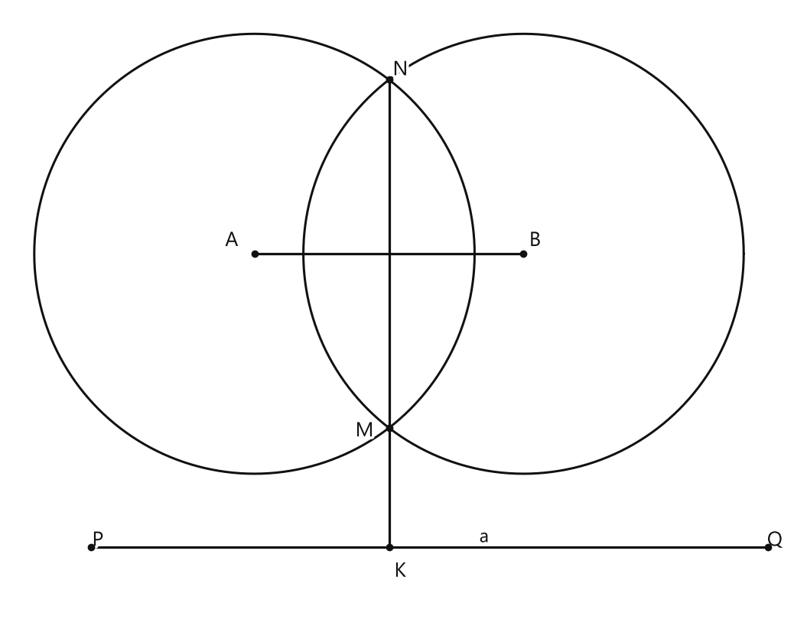

# Занятие 31. О задачах на построение

**Раздел:** Глава V. Задачи на построение  
**Параграф учебника:** §27. О задачах на построение  
**Страницы:** 163–166

## Цели занятия

К концу занятия ты сможешь:

- различать операции линейки и циркуля;
- откладывать данный отрезок на прямой;
- строить сумму и разность отрезков;
- понимать идею построения точки, равноудалённой от двух данных точек;
- знать 5 основных задач на построение;
- записывать построение как последовательность точных команд.

Выбирай блок своего уровня:

- **1–2 балла** — вспомнить, что умеют линейка и циркуль;
- **3–4 балла** — выполнить элементарные построения;
- **5–6 баллов** — объяснить идею построения;
- **7–8 баллов** — составить алгоритм построения;
- **9–10 баллов** — самостоятельно обосновать сложное построение.

## Теория к занятию

### Что называют задачами на построение

#### Простыми словами

Обычный рисунок можно делать линейкой с делениями, транспортиром или угольником. Но в задачах на построение разрешены только два инструмента:

- линейка без делений;
- циркуль.

У каждого инструмента своя работа:

- линейка проводит прямые;
- циркуль строит окружности и переносит расстояния.

Линейка здесь не измеряет, а циркуль не просто рисует круги. У каждого — свой набор команд.

#### Факт

Математиков всегда интересовали построения геометрических фигур, которые можно выполнить только при помощи циркуля и линейки.

В геометрии специально выделяют задачи на построение, которые могут быть решены с помощью этих двух инструментов.

#### Правила

Линейка считается односторонней и без делений.

При помощи такой линейки нельзя:

- измерять отрезки;
- откладывать отрезки;
- строить перпендикуляры, используя прямоугольную форму линейки;
- строить две параллельные прямые, проведя линии по краям линейки.

**Ловушки:**

- линейка без делений — это не измерительная линейка;
- «провести по краю» недостаточно, если требуется перпендикуляр;
- длину переносит циркуль, а не линейка;
- аккуратный рисунок ещё не является доказанным построением.

Красивый чертёж — это только начало. Геометрия ещё спросит: «А почему это работает?»

---

### Операции линейки

#### Простыми словами

Линейка умеет проводить прямые. Если даны две точки, через них можно провести прямую.

Измерять длину линейкой в такой задаче нельзя: делений на ней нет, и сантиметры сегодня официально не работают.

#### Операции линейки

При помощи линейки можно провести (построить):

а) произвольную прямую;

б) прямую, проходящую через две точки.

#### Правило

Если нужно построить прямую $AN$:

1. приложи линейку к точкам $A$ и $N$;
2. проведи прямую через эти точки.

Если нужно построить луч $BA$:

1. проведи прямую через точки $B$ и $A$;
2. выдели часть этой прямой, начинающуюся в точке $B$ и проходящую через точку $A$.

Если нужно построить отрезок $CM$:

1. проведи прямую через точки $C$ и $M$;
2. выдели часть между этими точками.

**Ловушки:**

- прямая не имеет конца;
- луч имеет начало, но не имеет конца;
- отрезок имеет два конца;
- точка $A$ в записи $AN$ должна лежать на построенной прямой.

Запись $AN$ говорит, через какие точки проходит прямая или отрезок. Буквы здесь не для красоты — они указывают на нужные точки.

---

### Операции циркуля

#### Простыми словами

Циркуль умеет:

- рисовать окружность с заданным центром;
- переносить длину одного отрезка на другую линию.

Если раствор циркуля равен длине отрезка $a$, то этим раствором можно сделать засечку на другой прямой. Расстояние просто «переезжает» на новое место.

#### Операции циркуля

При помощи циркуля можно:

а) построить произвольную окружность и окружность (дугу окружности) с данным центром и радиусом, равным данному отрезку;

б) отложить отрезок, равный данному отрезку, на некоторой прямой.

#### Правила

Чтобы построить окружность с центром $M$ и радиусом, равным отрезку $BC$, нужно:

1. установить иглу циркуля в точку $M$;
2. раздвинуть ножки циркуля на длину $BC$;
3. провести окружность или нужную дугу.

Чтобы перенести отрезок $BC$:

1. установить раствор циркуля по отрезку $BC$;
2. не менять раствор;
3. поставить иглу в новую начальную точку;
4. провести дугу и получить нужную засечку.

**Ловушки:**

- центр окружности — это не точка на окружности;
- радиус равен расстоянию от центра до любой точки окружности;
- нельзя «примерно» переносить длину на глаз;
- если радиус должен быть равен $BC$, игла ставится в новый центр, а раствор берётся по $BC$.

Если изменить раствор циркуля после измерения отрезка, длина потеряется. Циркуль такого предательства не прощает.

---

### Откладывание отрезка

#### Простыми словами

Нужно перенести длину $a$ на прямую $l$. Для этого:

1. выбираем начальную точку $M$ на прямой $l$;
2. устанавливаем раствор циркуля, равный $a$;
3. проводим дугу с центром $M$;
4. в пересечении дуги и прямой получаем точку $K$.

Тогда отрезок $MK$ будет равен отрезку $a$.

#### Откладывание отрезка

Для откладывания отрезка, равного данному отрезку $a$ (рис. 296, а) на прямой $l$ (рис. 296, б), следует: 1) отметить на прямой $l$ точку $M$; 2) радиусом, равным $a$, провести дугу окружности с центром в точке $M$ (сделать засечку на прямой $l$). В пересечении дуги и прямой $l$ получим точку $K$ и отрезок $MK$, равный $a$.

#### Алгоритм

Чтобы отложить отрезок $BC$ на прямой $AN$ от точки $A$:

1. отметить точку $A$ на прямой $AN$;
2. установить раствор циркуля по отрезку $BC$;
3. поставить иглу циркуля в точку $A$;
4. провести дугу;
5. обозначить точку пересечения дуги и прямой $AN$ буквой $Q$;
6. записать результат: $AQ=BC$.

#### Построение суммы и разности

Операция откладывания отрезка на прямой позволяет построить сумму и разность двух отрезков.

Для суммы на произвольной прямой откладывают последовательно два отрезка.

Например, сначала откладывают отрезок длины $a$, а от его конца — отрезок длины $b$. Весь полученный отрезок имеет длину $a+b$.

Для разности на большем отрезке от любого его конца откладывают меньший отрезок.

Например, если $a>b$, то на отрезке длины $a$ откладывают отрезок длины $b$. Оставшаяся часть имеет длину $a-b$.

**Ловушки:**

- для суммы отрезки откладываются последовательно в одном направлении;
- для разности сначала нужен больший отрезок;
- точка отсчёта должна быть указана;
- после построения обязательно записывай равенство длин.

---

### Идея построения равноудалённой точки

#### Простыми словами

Нужно найти на прямой $a$ точку, одинаково удалённую от точек $A$ и $B$.

Такая точка должна находиться на серединном перпендикуляре к отрезку $AB$. Почему именно там? Потому что любая точка серединного перпендикуляра находится на одинаковом расстоянии от концов отрезка.

Значит, план такой:

1. построить серединный перпендикуляр к отрезку $AB$;
2. найти его пересечение с прямой $a$.

#### Условие

На прямой $a$ нужно найти точку, которая находится на одинаковом расстоянии от точек $A$ и $B$, лежащих по одну сторону от прямой $a.

<!--geo-figure-spec
{
  "needed": true,
  "kind": "plane",
  "caption": "Построение точки K, равноудалённой от точек A и B",
  "equal": true,
  "axis": false,
  "xlim": [
    -1.5,
    8
  ],
  "ylim": [
    -0.8,
    6.6
  ],
  "points": {
    "A": [
      1.5,
      3.6
    ],
    "B": [
      4.8,
      3.6
    ],
    "M": [
      3.15,
      1.4628
    ],
    "N": [
      3.15,
      5.7372
    ],
    "K": [
      3.15,
      0
    ],
    "P": [
      -0.5,
      0
    ],
    "Q": [
      7.8,
      0
    ]
  },
  "segments": [
    [
      "A",
      "B"
    ],
    {
      "points": [
        "M",
        "N"
      ],
      "dashed": false,
      "label": "",
      "t": 0.5
    },
    {
      "points": [
        "M",
        "K"
      ],
      "dashed": false,
      "label": "",
      "t": 0.5
    },
    {
      "points": [
        "P",
        "Q"
      ],
      "dashed": false,
      "label": "a",
      "t": 0.58
    }
  ],
  "polygons": [],
  "circles": [
    {
      "center": "A",
      "radius": 2.7
    },
    {
      "center": "B",
      "radius": 2.7
    }
  ],
  "labels": {
    "A": {
      "dx": -0.28,
      "dy": 0.16
    },
    "B": {
      "dx": 0.14,
      "dy": 0.16
    },
    "M": {
      "dx": -0.3,
      "dy": -0.04
    },
    "N": {
      "dx": 0.14,
      "dy": 0.12
    },
    "K": {
      "dx": 0.14,
      "dy": -0.3
    }
  },
  "right_angles": [],
  "angle_marks": [],
  "texts": []
}
-->

*Построение точки K, равноудалённой от точек A и B*

#### Алгоритм

1. Взять радиус, больший половины отрезка $AB$.
2. Провести окружность с центром в точке $A$.
3. Тем же радиусом провести окружность с центром в точке $B$.
4. Обозначить точки пересечения окружностей буквами $M$ и $N$.
5. Провести прямую $MN$.
6. Обозначить точку пересечения прямых $MN$ и $a$ буквой $K$.
7. Получить искомую точку $K$.

#### Обоснование

Окружности имеют общий радиус.

Поэтому точка $M$ находится на одинаковом расстоянии от $A$ и $B$.

Точка $N$ также находится на одинаковом расстоянии от $A$ и $B$.

Значит, прямая $MN$ является серединным перпендикуляром к отрезку $AB$.

Точка $K$ лежит на прямой $MN$.

Следовательно, $KA=KB$.

**Ловушки:**

- радиусы двух окружностей должны быть одинаковыми;
- радиус должен быть достаточно большим, чтобы окружности пересеклись;
- прямую проводят через точки пересечения окружностей $M$ и $N$, а не через их центры;
- точка $K$ должна лежать одновременно на прямой $a$ и на прямой $MN$.

Если соединить центры окружностей вместо точек $M$ и $N$, получится совсем другая прямая. Это не маленькая ошибка, а геометрический сюжет с другим финалом.

---

### 5 основных задач на построение

#### Простыми словами

Многие более сложные построения состоят из нескольких простых операций. Поэтому полезно знать пять основных задач. Это своего рода набор деталей для геометрического конструктора.

#### Основные задачи

**Задача I.** Построение треугольника по трем сторонам.

**Задача II.** Построение угла, равного данному.

**Задача III.** Построение биссектрисы угла.

**Задача IV.** Построение середины отрезка.

**Задача V.** Построение прямой, перпендикулярной данной.

#### Правило

При решении сложной задачи нужно:

1. понять, какую фигуру требуется построить;
2. определить, какие базовые задачи для этого нужны;
3. записать последовательность операций линейки и циркуля;
4. проверить, что построенная фигура обладает требуемым свойством.

**Ловушки:**

- «построить середину» и «измерить половину» — не одно и то же;
- перпендикуляр нельзя получать только формой линейки;
- биссектриса делит угол на два равных угла;
- построение должно быть воспроизводимым: другой ученик по алгоритму должен получить тот же результат.

---

### Обозначения в треугольнике

#### Простыми словами

В треугольнике удобно заранее договориться, как обозначать стороны и специальные отрезки. Тогда запись становится короче и понятнее.

Вершины треугольника обозначают большими буквами $A$, $B$, $C$. Стороны, лежащие напротив этих вершин, обозначают соответствующими маленькими буквами $a$, $b$, $c$.

#### Замечание

В треугольнике $ABC$ стороны, противолежащие углам $A, B$ и $C$, будем соответственно обозначать $a, b$ и $c$, а сами эти углы — $\alpha, \beta$ и $\gamma$ (рис. 298). Медианы, проведенные к сторонам $a, b$ и $c$, будем обозначать $m_a, m_b$ и $m_c$, высоты — $h_a, h_b$ и $h_c$, биссектрисы — $l_a, l_b$ и $l_c$.

#### Правила

- стороне $a$ соответствует угол $A$;
- стороне $b$ соответствует угол $B$;
- стороне $c$ соответствует угол $C$;
- медиана к стороне $a$ обозначается $m_a$;
- высота к стороне $a$ обозначается $h_a$;
- биссектриса угла $A$ обозначается $l_a$.

**Ловушки:**

- сторона $a$ лежит напротив угла $A$, а не рядом с ним;
- индекс показывает, к какой стороне или от какого угла относится отрезок;
- буква $l$ в $l_a$ обозначает биссектрису, а не единицу длины.

---

## Сводка формул «выучить наизусть»

В параграфе формулы не приведены.

Главные равенства, которые используются при построениях:

$$AQ=CM,$$

$$BE=3\cdot BC,$$

$$KA=KB.$$

## Правила, которые нельзя путать

- Линейка проводит прямые, но не измеряет длины.
- Циркуль строит окружности и переносит отрезки.
- Для окружности с центром $M$ радиус берут отрезком, равным требуемому расстоянию.
- Для откладывания отрезка сначала отмечают начальную точку.
- Серединный перпендикуляр строят через точки пересечения двух окружностей равных радиусов.
- Точка, равноудалённая от $A$ и $B$, лежит на серединном перпендикуляре к $AB$.
- Прямая, луч и отрезок отличаются своими концами.

## Разбор ключевых заданий

### Р1. Построение прямой, луча и отрезка

**Условие.** При помощи линейки постройте прямую $AN$, луч $BA$, отрезок $CM$.

#### Решение

1. Приложим линейку к точкам $A$ и $N$.
2. Проведём через точки $A$ и $N$ прямую.
3. Получим прямую $AN$.
4. Приложим линейку к точкам $B$ и $A$.
5. Проведём через точки $B$ и $A$ прямую.
6. Выделим часть этой прямой, начинающуюся в точке $B$ и проходящую через точку $A$.
7. Получим луч $BA$.
8. Приложим линейку к точкам $C$ и $M$.
9. Проведём через точки $C$ и $M$ прямую.
10. Выделим часть между точками $C$ и $M$.
11. Получим отрезок $CM$.

Проверь результат:

- у прямой $AN$ нет концов;
- у луча $BA$ начало находится в точке $B$;
- у отрезка $CM$ есть два конца: $C$ и $M$.

Не перепутай: если у фигуры два конца — это отрезок; если один — луч; если концов нет — прямая. Геометрия любит порядок.

**Ответ:** построены прямая $AN$, луч $BA$ и отрезок $CM$.

---

### Р2. Откладывание отрезка $AQ$, равного $CM$

**Условие.** На прямой $AN$ при помощи циркуля отложите отрезок $AQ$, равный отрезку $CM$.

#### Решение

1. Берём раствор циркуля, равный длине отрезка $CM$.
2. Иглу циркуля устанавливаем в точку $A$.
3. Проводим дугу окружности.
4. Дуга пересекает прямую $AN$ в точке $Q$.
5. По построению расстояние от $A$ до $Q$ равно раствору циркуля.
6. Раствор циркуля был равен $CM$.
7. Следовательно,

$$AQ=CM.$$

Важно не менять раствор циркуля между измерением $CM$ и проведением дуги. Иначе циркуль перенесёт уже не тот отрезок — получится геометрическая версия «сохранить файл не туда».

**Ответ:** построен отрезок $AQ$, причём $AQ=CM$.

---

### Р3. Откладывание утроенного отрезка

**Условие.** На луче $BA$ от его начала отложите отрезок $BE$, равный утроенному отрезку $BC$.

#### Решение

1. Начало луча $BA$ — точка $B$.
2. Устанавливаем раствор циркуля по отрезку $BC$.
3. Ставим иглу циркуля в точку $B$.
4. На луче $BA$ делаем первую засечку.
5. Получаем промежуточную точку $E_1$.
6. Раствор циркуля не меняем.
7. Ставим иглу в точку $E_1$ и делаем вторую засечку на луче.
8. Получаем промежуточную точку $E_2$.
9. Снова сохраняем тот же раствор циркуля.
10. Ставим иглу в точку $E_2$ и делаем третью засечку.
11. Получаем точку $E$.
12. Отрезок $BE$ состоит из трёх отрезков, каждый из которых равен $BC$.
13. Поэтому

$$BE=BC+BC+BC.$$

14. Следовательно,

$$BE=3\cdot BC.$$

Не меняем раствор циркуля — иначе третий кусочек может оказаться «из другой коллекции».

**Ответ:** построен отрезок $BE$, причём $BE=3\cdot BC$.

---

### Р4. Построение окружности с данным радиусом

**Условие.** При помощи циркуля постройте окружность с центром в точке $M$ и радиусом, равным отрезку $BC$.

#### Решение

1. Устанавливаем раствор циркуля по отрезку $BC$.
2. Проверяем, что раствор циркуля не изменился.
3. Ставим иглу циркуля в точку $M$.
4. Поворачиваем циркуль вокруг точки $M$.
5. Проводим окружность.
6. Для любой точки $X$ этой окружности расстояние от центра $M$ до точки $X$ равно раствору циркуля.
7. Раствор циркуля равен длине отрезка $BC$.
8. Поэтому

$$MX=BC.$$

Циркуль здесь работает как аккуратный «круговой след»: игла держит центр, а карандаш держит нужное расстояние.

**Ответ:** построена окружность с центром $M$ и радиусом $BC$.

---

### Р5. Нахождение точек пересечения окружности и прямой

**Условие.** Окружность с центром в точке $M$ и радиусом $BC$ пересекает прямую $AN$ в точках $L$ и $T$. Найдите эти точки.

#### Решение

1. Рассматриваем построенную окружность с центром $M$ и радиусом $BC$.
2. Рассматриваем прямую $AN$.
3. Находим первую общую точку окружности и прямой $AN$.
4. Обозначаем её буквой $L$.
5. Находим вторую общую точку окружности и прямой $AN$.
6. Обозначаем её буквой $T$.
7. Точки $L$ и $T$ лежат на окружности с центром $M$ и радиусом $BC$.
8. Поэтому

$$ML=MT=BC.$$

9. Точки $L$ и $T$ лежат также на прямой $AN$.
10. Значит, это и есть искомые точки пересечения.

Сначала ищем именно общие точки двух фигур: одна точка на окружности — ещё не ответ, если она не лежит на прямой.

**Ответ:** точки пересечения — $L$ и $T$.

---

### Р6. Построение точек пересечения двух окружностей

**Условие.** Найдите точки $D$ и $F$ пересечения окружности с центром в точке $M$ и радиусом $BC$ с окружностью с центром в точке $K$ и радиусом $BC$.

#### Решение

1. Первая окружность имеет центр $M$ и радиус $BC$.
2. Вторая окружность имеет центр $K$ и такой же радиус $BC$.
3. Устанавливаем раствор циркуля по отрезку $BC$.
4. Проводим первую окружность с центром $M$.
5. Раствор циркуля не меняем.
6. Переносим иглу циркуля в точку $K$.
7. Проводим вторую окружность.
8. Находим одну общую точку окружностей.
9. Обозначаем её буквой $D$.
10. Находим вторую общую точку окружностей.
11. Обозначаем её буквой $F$.
12. Так как точка $D$ лежит на обеих окружностях, то

$$MD=KD=BC.$$

13. Так как точка $F$ также лежит на обеих окружностях, то

$$MF=KF=BC.$$

Одинаковый радиус здесь не случайность: именно поэтому обе окружности пересекаются симметрично относительно прямой $MK$.

**Ответ:** точки пересечения окружностей — $D$ и $F$.

---

### Р7. Построение точки пересечения хорды и отрезка

**Условие.** Постройте точку $G$ пересечения хорды $DF$ и отрезка $MK$.

#### Решение

1. Точки $D$ и $F$ лежат на одной окружности.
2. Поэтому отрезок $DF$ является хордой этой окружности.
3. При помощи линейки проводим прямую через точки $D$ и $F$.
4. На этой прямой рассматриваем отрезок $DF$.
5. При помощи линейки проводим прямую через точки $M$ и $K$.
6. На этой прямой рассматриваем отрезок $MK$.
7. Находим общую точку отрезков $DF$ и $MK$.
8. Обозначаем эту точку буквой $G$.

Важно найти пересечение именно отрезков, а не продолжений прямых. Иначе точка может «сбежать» за пределы нужной фигуры.

**Ответ:** $G$ — точка пересечения отрезков $DF$ и $MK$.

---

### Р8. Построение равноудалённой точки на прямой

**Условие.** На прямой $a$ построить точку $K$, которая находится на одинаковом расстоянии от точек $A$ и $B$, лежащих по одну сторону от прямой $a$.

#### Решение

1. Берём радиус, который больше половины отрезка $AB$.
2. С центром в точке $A$ проводим окружность выбранного радиуса.
3. Тем же раствором циркуля с центром в точке $B$ проводим вторую окружность.
4. Обозначаем точки пересечения окружностей буквами $M$ и $N$.
5. При помощи линейки проводим прямую через точки $M$ и $N$.
6. Находим точку пересечения прямой $MN$ с прямой $a$.
7. Обозначаем эту точку буквой $K$.
8. Точка $M$ равноудалена от точек $A$ и $B$, потому что радиусы окружностей равны:

$$MA=MB.$$

9. Точка $N$ также равноудалена от точек $A$ и $B$:

$$NA=NB.$$

10. Значит, точки $M$ и $N$ лежат на серединном перпендикуляре к отрезку $AB$.
11. Поэтому прямая $MN$ является серединным перпендикуляром к отрезку $AB$.
12. Точка $K$ лежит на прямой $MN$, то есть на серединном перпендикуляре к отрезку $AB$.
13. Любая точка серединного перпендикуляра к отрезку равноудалена от его концов.
14. Следовательно,

$$KA=KB.$$

15. Кроме того, точка $K$ лежит на прямой $a$.
16. Значит, точка $K$ удовлетворяет обоим требованиям задачи.

Здесь циркуль не угадывает нужную точку. Он сначала помогает построить целую прямую, на которой находятся все точки, равноудалённые от $A$ и $B$. Геометрия любит точность, а не гадание.

**Ответ:** точка $K$ — пересечение прямой $a$ с серединным перпендикуляром $MN$ к отрезку $AB$; $KA=KB$.

## Практические задания

Выбери свой уровень и решай только этот блок. В блоке должна закрепиться вся тема параграфа. Ответы не приводятся.

### Уровень 1–2 балла

**С1.** Какую фигуру можно построить с помощью линейки, проведя её через две данные точки?

1) окружность  
2) прямую  
3) дугу окружности  
4) биссектрису угла  
5) середину отрезка

**С2.** Какой инструмент используют, чтобы построить окружность с данным центром и радиусом, равным данному отрезку?

1) линейку  
2) транспортир  
3) циркуль  
4) угольник  
5) карандаш

**С3.** На прямой $l$ нужно отложить отрезок, равный данному отрезку $a$. Что следует сделать первым?

1) Провести окружность с центром в точке $M$  
2) Отметить на прямой $l$ точку $M$  
3) Провести прямую через две точки  
4) Найти середину отрезка $a$  
5) Построить биссектрису угла

**С4.** При откладывании отрезка $MK$, равного отрезку $a$, каким должен быть радиус дуги с центром в точке $M$?

1) равным половине отрезка $a$  
2) равным удвоенному отрезку $a$  
3) равным отрезку $a$  
4) равным длине прямой $l$  
5) произвольным

**С5.** Какая из перечисленных задач является одной из пяти основных задач на построение?

1) построение треугольника по трём сторонам  
2) вычисление площади круга  
3) нахождение длины окружности  
4) построение графика функции  
5) решение квадратного уравнения

**С6.** Какую фигуру строят в задаче о построении треугольника по трём сторонам?

1) окружность  
2) угол  
3) треугольник  
4) прямоугольник  
5) луч

**С7.** Какая задача соответствует построению угла, равного данному?

1) Задача I  
2) Задача II  
3) Задача III  
4) Задача IV  
5) Задача V

**С8.** Какая задача соответствует построению биссектрисы угла?

1) Задача I  
2) Задача II  
3) Задача III  
4) Задача IV  
5) Задача V

**С9.** Какая задача соответствует построению середины отрезка?

1) Задача I  
2) Задача II  
3) Задача III  
4) Задача IV  
5) Задача V

**С10.** Какая задача соответствует построению прямой, перпендикулярной данной?

1) Задача I  
2) Задача II  
3) Задача III  
4) Задача IV  
5) Задача V

**С11.** На прямой $AN$ нужно отложить отрезок $AQ$, равный отрезку $CM$. Какой инструмент необходим для выполнения этого действия?

1) только линейка  
2) только циркуль  
3) транспортир  
4) угольник  
5) только карандаш

**С12.** На прямой $a$ требуется построить точку, равноудалённую от точек $A$ и $B$. Искомая точка должна принадлежать:

1) только окружности с центром в $A$  
2) только окружности с центром в $B$  
3) прямой $a$ и серединному перпендикуляру к отрезку $AB$  
4) только отрезку $AB$  
5) любой прямой, проходящей через $A$

**С13.** Какую фигуру можно построить при помощи линейки, если заданы две точки $A$ и $B$?

1) окружность с центром в точке $A$; 2) прямую, проходящую через точки $A$ и $B$; 3) биссектрису угла; 4) середину отрезка $AB$; 5) окружность радиусом $AB$.

**С14.** Какую фигуру можно построить при помощи циркуля с центром в точке $M$ и радиусом, равным отрезку $AB$?

1) прямую $AB$; 2) луч $MA$; 3) окружность; 4) биссектрису угла; 5) середину отрезка $AB$.

**С15.** Укажите первый шаг при откладывании на прямой $l$ отрезка, равного данному отрезку $a$.

1) Провести прямую через две точки. 2) Отметить на прямой $l$ точку $M$. 3) Построить биссектрису угла. 4) Провести две окружности. 5) Найти середину отрезка $a$.

**С16.** На прямой $l$ отмечена точка $M$. Какой радиус нужно использовать для проведения дуги с центром в точке $M$, чтобы отложить отрезок, равный данному отрезку $AB$?

1) $AM$; 2) $BM$; 3) $AB$; 4) $lM$; 5) $2AB$.

**С17.** Какая из перечисленных задач является задачей I на построение?

1) Построение угла, равного данному. 2) Построение биссектрисы угла. 3) Построение середины отрезка. 4) Построение треугольника по трём сторонам. 5) Построение прямой, перпендикулярной данной.

**С18.** Какая из перечисленных задач является задачей II на построение?

1) Построение окружности. 2) Построение треугольника по трём сторонам. 3) Построение угла, равного данному. 4) Построение середины отрезка. 5) Откладывание отрезка на прямой.

**С19.** Какая из перечисленных задач является задачей III на построение?

1) Построение биссектрисы угла. 2) Построение прямой через две точки. 3) Построение окружности. 4) Построение треугольника по трём сторонам. 5) Откладывание отрезка.

**С20.** Какая из перечисленных задач является задачей IV на построение?

1) Построение равного угла. 2) Построение середины отрезка. 3) Построение окружности с данным центром. 4) Построение прямой через две точки. 5) Построение треугольника по трём сторонам.

**С21.** Какая из перечисленных задач является задачей V на построение?

1) Построение биссектрисы угла. 2) Построение середины отрезка. 3) Построение прямой, перпендикулярной данной. 4) Построение равного отрезка. 5) Построение окружности.

**С22.** На прямой $l$ выбрана точка $M$. Дуга окружности с центром $M$ пересекает прямую $l$ в точке $K$. Какой отрезок равен данному отрезку $a$?

1) $lM$; 2) $MK$; 3) $aM$; 4) $lK$; 5) $2MK$.

**С23.** Для построения прямой, проходящей через две точки $P$ и $Q$, используют:

1) только циркуль; 2) линейку; 3) транспортир; 4) угольник и циркуль; 5) масштабную линейку и транспортир.

**С24.** Выберите правильную последовательность действий при откладывании отрезка, равного отрезку $AB$, на прямой $l$:

1) отметить точку $M$ на $l$, провести дугу с центром $M$ и радиусом $AB$; 2) провести окружность с центром $A$, затем отметить точку $M$; 3) построить биссектрису угла, затем провести дугу; 4) провести прямую через точки $A$ и $B$, затем окружность; 5) отметить точку $M$ на $l$, провести дугу радиусом $AM$.

**С25.** Какой инструмент используют, чтобы провести прямую через две данные точки $A$ и $B$?

1) циркуль  
2) линейку  
3) транспортир  
4) угольник  
5) карандаш без линейки

**С26.** На прямой $l$ отмечена точка $M$. Какой радиус нужно взять для построения отрезка $MK$, равного данному отрезку $a$?

1) равный половине $a$  
2) равный удвоенному $a$  
3) равный $a$  
4) произвольный  
5) равный длине прямой $l$

**С27.** Какой инструмент позволяет построить окружность с данным центром и радиусом, равным данному отрезку?

1) линейка  
2) циркуль  
3) транспортир  
4) угольник  
5) карандаш

**С28.** Укажите правильную последовательность действий для откладывания на прямой $l$ от точки $M$ отрезка, равного отрезку $a$.

1) Провести через $M$ произвольную прямую и построить биссектрису.  
2) Отметить точку $M$, провести дугу радиусом $a$ и получить точку $K$ на прямой $l$.  
3) Построить окружность с центром в точке $K$, затем отметить точку $M$.  
4) Провести две окружности с центрами в концах отрезка $a$.  
5) Измерить угол между прямой $l$ и отрезком $a$.

**С29.** Какую из пяти основных задач на построение решают с помощью трёх данных сторон треугольника?

1) построение угла, равного данному  
2) построение биссектрисы угла  
3) построение середины отрезка  
4) построение треугольника по трём сторонам  
5) построение перпендикуляра к данной прямой

**С30.** Даны угол $AOB$ и луч $OC$. Какая основная задача на построение позволяет получить угол, равный $\angle AOB$, с вершиной в точке $C$?

1) построение треугольника по трём сторонам  
2) построение угла, равного данному  
3) построение середины отрезка  
4) построение окружности  
5) построение прямой через две точки

**С31.** Какую линию нужно построить, чтобы разделить данный угол на две равные части?

1) медиану  
2) высоту  
3) биссектрису  
4) серединный перпендикуляр  
5) хорду

**С32.** Какую основную задачу на построение выполняют, чтобы разделить отрезок $AB$ на две равные части?

1) построение середины отрезка  
2) построение угла, равного данному  
3) построение треугольника по трём сторонам  
4) построение окружности  
5) построение произвольной прямой

**С33.** Какая основная задача на построение позволяет провести через точку $P$ прямую, перпендикулярную данной прямой $l$?

1) построение биссектрисы угла  
2) построение середины отрезка  
3) построение прямой, перпендикулярной данной  
4) откладывание отрезка  
5) построение треугольника по трём сторонам

**С34.** Даны точки $A$ и $B$, расположенные по одну сторону от прямой $a$. На прямой $a$ требуется построить точку $P$, для которой $PA=PB$. Какой объект сначала следует использовать для нахождения искомой точки?

1) окружность с центром в точке $A$  
2) биссектрису произвольного угла  
3) серединный перпендикуляр к отрезку $AB$  
4) прямую, проходящую через точки $A$ и $B$  
5) окружность с центром в точке $P$

**С35.** При построении треугольника $ABC$ по сторонам $AB$, $AC$ и $BC$ сначала построили отрезок $AB$. Какие два объекта нужно построить, чтобы получить точку $C$?

1) две окружности с центрами в $A$ и $B$ и радиусами $AC$ и $BC$  
2) две прямые, проходящие через $A$ и $B$  
3) две биссектрисы углов при $A$ и $B$  
4) середину отрезка $AB$ и перпендикуляр к нему  
5) окружность с центром в $C$ и прямую $AB$

**С36.** При построении середины отрезка $AB$ циркулем проводят две окружности одинакового радиуса с центрами в точках $A$ и $B$. Что затем нужно построить?

1) прямую через точки $A$ и $B$  
2) хорду одной из окружностей  
3) прямую через точки пересечения этих окружностей  
4) окружность с центром в середине $AB$  
5) луч с началом в точке $A$

### Уровень 3–4 балла

**С1.** Даны точки $A$ и $B$. При помощи линейки постройте прямую, проходящую через точки $A$ и $B$.

**С2.** Даны точки $A$ и $B$. При помощи линейки постройте луч с началом в точке $B$, проходящий через точку $A$.

**С3.** Дан отрезок $AB$ и прямая $l$. При помощи циркуля отложите на прямой $l$ от её точки $M$ отрезок $MK$, равный отрезку $AB$.

**С4.** Даны точка $O$ и отрезок $AB$. При помощи циркуля постройте окружность с центром в точке $O$ и радиусом, равным отрезку $AB$.

**С5.** Даны прямая $l$ и точка $A$, не лежащая на прямой $l$. Постройте прямую, проходящую через точку $A$ и перпендикулярную прямой $l$.

**С6.** Дан отрезок $AB$. Постройте его середину при помощи циркуля и линейки.

**С7.** Дан угол $ABC$. Постройте его биссектрису при помощи циркуля и линейки.

**С8.** Дан угол $ABC$ и луч $Ox$. Постройте на луче $Ox$ угол, равный углу $ABC$.

**С9.** Даны три отрезка $a$, $b$ и $c$, длины которых удовлетворяют неравенству треугольника. Постройте треугольник $ABC$, у которого $AB=c$, $AC=b$, $BC=a$.

**С10.** Даны точки $A$ и $B$, лежащие по одну сторону от прямой $l$. Постройте на прямой $l$ точку $M$, равноудалённую от точек $A$ и $B$.

**С11.** Дан отрезок $AB$. Постройте прямую, перпендикулярную отрезку $AB$ и проходящую через его середину.

**С12.** Даны прямая $l$, точка $A$ на этой прямой и отрезок $BC$. Постройте на прямой $l$ точку $D$ так, чтобы $AD=BC$. Рассмотрите оба возможных положения точки $D$ на прямой $l$.

**С13.** На листе отмечены точки $A$ и $B$. При помощи линейки постройте прямую, проходящую через точки $A$ и $B$.

**С14.** На прямой $l$ отмечена точка $M$. Дан отрезок $AB$. При помощи циркуля отложите на прямой $l$ от точки $M$ отрезок $MK$, равный отрезку $AB$.

**С15.** Дан отрезок $AB$. При помощи циркуля постройте окружность с центром в точке $A$ и радиусом, равным отрезку $AB$.

**С16.** На прямой $l$ отмечена точка $M$. Дан отрезок $AB$. Постройте на прямой $l$ точки $K$ и $N$, для которых $MK=MN=AB$.

**С17.** Дан угол $ABC$. При помощи циркуля и линейки постройте угол $DEF$, равный углу $ABC$.

**С18.** Дан угол $ABC$. При помощи циркуля и линейки постройте биссектрису угла $ABC$.

**С19.** Дан отрезок $AB$. При помощи циркуля и линейки постройте его середину.

**С20.** Дана прямая $l$ и точка $A$, не лежащая на этой прямой. При помощи циркуля и линейки постройте прямую, проходящую через точку $A$ и перпендикулярную прямой $l$.

**С21.** Дана прямая $l$ и точка $A$, лежащая на этой прямой. При помощи циркуля и линейки постройте прямую, проходящую через точку $A$ и перпендикулярную прямой $l$.

**С22.** Даны три отрезка $AB$, $CD$ и $EF$, длины которых удовлетворяют неравенству треугольника. При помощи циркуля и линейки постройте треугольник, стороны которого равны этим трём отрезкам.

**С23.** На прямой $a$ лежат точки $A$ и $B$, а точка $C$ не лежит на прямой $a$. При помощи циркуля и линейки постройте точку $D$ на прямой $a$, такую, что $DC=DA$.

**С24.** Дан отрезок $AB$. При помощи циркуля и линейки постройте две окружности с центрами в точках $A$ и $B$ и радиусами, равными отрезку $AB$. Обозначьте одну из точек их пересечения буквой $C$. Затем постройте треугольник $ABC$.

**С25.** На прямой $l$ отметьте точку $M$. Постройте при помощи циркуля точку $K$ так, чтобы $MK$ был равен данному отрезку $AB$.

**С26.** Даны точки $A$ и $B$. Постройте прямую, проходящую через точки $A$ и $B$.

**С27.** Дана точка $O$ и отрезок $CD$. Постройте окружность с центром в точке $O$ и радиусом, равным отрезку $CD$.

**С28.** На луче $l$ с началом в точке $A$ постройте точку $B$ так, чтобы $AB$ был равен данному отрезку $MN$.

**С29.** Даны три отрезка $a$, $b$ и $c$. Постройте треугольник, стороны которого равны этим отрезкам.

**С30.** Дан угол $ABC$. Постройте угол, равный углу $ABC$, с вершиной в точке $O$ и одной стороной на луче $l$.

**С31.** Дан угол $ABC$. Постройте его биссектрису.

**С32.** Дан отрезок $AB$. Постройте его середину.

**С33.** Дана прямая $l$ и точка $M$, не лежащая на этой прямой. Постройте через точку $M$ прямую, перпендикулярную прямой $l$.

**С34.** Дана прямая $l$ и точка $A$, лежащая на этой прямой. Постройте через точку $A$ прямую, перпендикулярную прямой $l$.

**С35.** Даны точки $A$ и $B$, лежащие по одну сторону от прямой $l$. Постройте на прямой $l$ точку $M$, равноудалённую от точек $A$ и $B$.

**С36.** Дан отрезок $AB$. Постройте на нём точку $C$ так, чтобы $AC=CB$.

### Уровень 5–6 баллов

**С1.** На листе отмечены точки $A$ и $B$. При помощи линейки постройте прямую, проходящую через точки $A$ и $B$.

**С2.** Даны прямая $l$ и точка $M$ на ней. При помощи циркуля отложите на прямой $l$ от точки $M$ в выбранном направлении отрезок $MK$, равный данному отрезку $a$.

**С3.** Даны точка $O$ и отрезок $AB$. При помощи циркуля постройте окружность с центром в точке $O$ и радиусом, равным отрезку $AB$.

**С4.** Даны прямая $l$ и отрезок $AB$. При помощи циркуля постройте на прямой $l$ точку $C$, такую, что $MC=AB$, где $M$ — заранее отмеченная точка прямой $l$.

**С5.** Дан угол $ABC$. При помощи линейки и циркуля постройте угол $KLM$, равный углу $ABC$.

**С6.** Дан угол $ABC$. При помощи линейки и циркуля постройте его биссектрису.

**С7.** Дан отрезок $AB$. При помощи линейки и циркуля постройте его середину.

**С8.** Даны прямая $l$ и точка $A$, не лежащая на прямой $l$. При помощи линейки и циркуля постройте через точку $A$ прямую, перпендикулярную прямой $l$.

**С9.** Даны прямая $l$ и точка $A$, лежащая на прямой $l$. При помощи линейки и циркуля постройте через точку $A$ прямую, перпендикулярную прямой $l$.

**С10.** Даны три отрезка с длинами $a=5$ см, $b=4$ см и $c=6$ см. При помощи линейки и циркуля постройте треугольник $ABC$, стороны которого имеют длины $AB=c$, $AC=b$ и $BC=a$.

**С11.** Даны три отрезка с длинами $a=3$ см, $b=4$ см и $c=5$ см. При помощи линейки и циркуля постройте треугольник $ABC$, стороны которого имеют длины $AB=c$, $AC=b$ и $BC=a$.

**С12.** Даны точки $A$ и $B$, лежащие по одну сторону от прямой $l$. При помощи линейки и циркуля постройте на прямой $l$ точку $M$, равноудалённую от точек $A$ и $B$. Затем проверьте построение, сравнив отрезки $MA$ и $MB$.

**С13.** На луче $l$ с началом в точке $M$ при помощи циркуля отложите отрезок $MK$, равный данному отрезку $AB$.

**С14.** На прямой $a$ отметьте точку $P$. Постройте окружность с центром в точке $P$ и радиусом, равным данному отрезку $CD$.

**С15.** Даны три отрезка $a$, $b$ и $c$, длины которых равны соответственно $5$ см, $4$ см и $6$ см. Постройте треугольник $ABC$, стороны которого равны этим отрезкам: $AB=6$ см, $AC=5$ см, $BC=4$ см.

**С16.** Даны отрезок $AB$ и луч $l$ с началом в точке $O$. Постройте на луче $l$ отрезок $OM$, равный отрезку $AB$.

**С17.** Даны угол $ABC$ и луч $l$ с началом в точке $O$. Постройте угол $KOL$, равный углу $ABC$.

**С18.** Даны угол $ABC$ и луч $l$ с началом в точке $B$. Постройте биссектрису угла $ABC$.

**С19.** Постройте середину отрезка $AB$ с помощью циркуля и линейки. Обозначьте построенную точку буквой $M$.

**С20.** Даны прямая $a$ и точка $P$, не лежащая на этой прямой. Постройте через точку $P$ прямую, перпендикулярную прямой $a$.

**С21.** Даны прямая $a$ и точка $M$, лежащая на этой прямой. Постройте через точку $M$ прямую, перпендикулярную прямой $a$.

**С22.** На прямой $a$ даны точки $A$ и $B$. Постройте точку $X$ на прямой $a$, равноудалённую от точек $A$ и $B$, если точка $X$ должна лежать между точками $A$ и $B$.

**С23.** Даны отрезок $AB$ и точка $C$, не лежащая на прямой $AB$. Постройте треугольник $ABC$, если его стороны должны удовлетворять условиям $AB=6$ см, $AC=5$ см и $BC=4$ см.

**С24.** Даны угол $ABC$ и отрезок $MN$. Постройте угол $KOL$, равный углу $ABC$, а затем на одном из его лучей отложите от вершины $O$ отрезок $OP$, равный отрезку $MN$.

**С25.** На прямой $l$ дана точка $M$ и дан отрезок $AB$. Постройте точку $K$ на прямой $l$ так, чтобы $MK=AB$.

**С26.** Дан угол $ABC$. Постройте угол $KLM$, равный углу $ABC$, причём вершина $L$ и луч $LK$ должны быть заранее заданными.

**С27.** Дан угол $ABC$. Постройте его биссектрису.

**С28.** Дан отрезок $AB$. Постройте его середину $M$.

**С29.** Через точку $M$, не лежащую на прямой $l$, постройте прямую, перпендикулярную прямой $l$.

**С30.** Постройте треугольник $ABC$ по трём сторонам: $AB=5$ см, $BC=4$ см, $AC=6$ см. Укажите, какие окружности нужно построить и с какими центрами и радиусами.

### Уровень 7–8 баллов

**С1.** Даны отрезки $AB$ и $CD$. На прямой $l$ с отмеченной точкой $M$ постройте отрезок $MN$, равный сумме отрезков $AB$ и $CD$. Запишите последовательность построений и обоснуйте результат.

**С2.** Даны отрезок $AB$ и луч $OC$. На луче $OC$ постройте точку $D$ так, чтобы $OD=3AB$. Опишите построение и объясните, почему полученный отрезок имеет требуемую длину.

**С3.** Даны три отрезка $a$, $b$ и $c$, причём каждый из них меньше суммы двух других. Постройте треугольник $ABC$, у которого $AB=c$, $AC=b$, $BC=a$. Запишите этапы построения и обоснуйте, какие окружности используются.

**С4.** Дан угол $AOB$ и луч $OC$. Постройте угол $COD$, равный углу $AOB$, так, чтобы луч $OD$ лежал по указанную сторону от луча $OC$. Опишите построение и приведите обоснование равенства углов.

**С5.** Дан угол $ABC$. Постройте его биссектрису. Запишите последовательность построений и обоснуйте, почему построенный луч делит угол на два равных угла.

**С6.** Дан отрезок $AB$. Постройте его середину. Запишите последовательность построений и объясните, почему найденная точка является серединой отрезка $AB$.

**С7.** Даны прямая $l$ и точка $P$, не лежащая на прямой $l$. Постройте через точку $P$ прямую, перпендикулярную прямой $l$. Опишите построение и обоснуйте перпендикулярность построенной прямой и прямой $l$.

**С8.** Даны прямая $l$ и точка $P$, лежащая на прямой $l$. Постройте прямую, проходящую через точку $P$ и перпендикулярную прямой $l$. Укажите, как выбрать точки для построения, и обоснуйте результат.

**С9.** Даны отрезки $AB$, $CD$ и прямая $l$ с точкой $M$. Постройте на прямой $l$ точку $N$, для которой $MN=AB+CD$. Постройте также точку $K$ на той же прямой, для которой $MK=|AB-CD|$. Рассмотрите оба возможных направления от точки $M$ на прямой $l$ и опишите построение.

**С10.** Даны отрезки $a$, $b$ и угол $AOB$. Постройте треугольник $OCD$, у которого $OC=a$, $OD=b$, а угол $COD$ равен углу $AOB$. Запишите последовательность построений и обоснуйте соответствие построенного треугольника условию.

**С11.** Дан треугольник $ABC$. Постройте его медиану, проведённую из вершины $A$, и высоту, проведённую из вершины $A$. Опишите построение каждой линии отдельно и укажите, какие построенные точки используются для получения медианы и высоты.

**С12.** Даны треугольник $ABC$ и точка $P$, не лежащая на прямой $BC$. Постройте треугольник $PQR$, равный треугольнику $ABC$, если сторона $PQ$ должна лежать на заданном луче с началом в точке $P$, а точка $R$ должна находиться по заранее выбранную сторону от прямой $PQ$. Запишите последовательность построений с использованием циркуля и линейки и обоснуйте равенство построенных треугольников.

**С13.** Даны отрезки $a$, $b$ и $c$, причём $a=5$ см, $b=4$ см, $c=6$ см. Постройте треугольник $ABC$, у которого $AB=c$, $AC=b$, $BC=a$. Запишите последовательность построения и обоснуйте, почему построенный треугольник имеет заданные стороны.

**С14.** Дан угол $\alpha$ с вершиной $O$ и лучом $OA$. Постройте угол $\beta$, равный углу $\alpha$, с вершиной $M$ и начальной стороной $MN$. Запишите последовательность построения и обоснуйте равенство углов.

**С15.** Дан угол $ABC$. Постройте его биссектрису. Укажите все точки, которые необходимо построить циркулем, и объясните, почему проведённый луч делит угол $ABC$ на два равных угла.

**С16.** Дан отрезок $AB$ длиной $7$ см. Постройте его середину $M$ только с помощью линейки и циркуля. Запишите последовательность построения и объясните, почему точка $M$ является серединой отрезка $AB$.

**С17.** Дана прямая $l$ и точка $P$, не лежащая на этой прямой. Постройте прямую, проходящую через точку $P$ и перпендикулярную прямой $l$. Запишите последовательность построения и обоснуйте результат.

**С18.** На прямой $l$ дана точка $A$. Постройте точку $B$ на этой прямой так, чтобы $AB=4$ см, а затем постройте точку $C$ на той же прямой так, чтобы $BC=7$ см и точки $A$, $B$, $C$ лежали в указанном порядке. Опишите построение циркулем.

**С19.** Даны две точки $A$ и $B$, расположенные по одну сторону от прямой $l$. Постройте на прямой $l$ точку $M$, равноудалённую от точек $A$ и $B$. Обоснуйте, почему построенная точка удовлетворяет условию задачи.

**С20.** Даны две пересекающиеся прямые $a$ и $b$ с точкой пересечения $O$. На прямой $a$ постройте точку $A$, отличную от $O$, а затем постройте точку $B$ на прямой $b$ так, чтобы $OB=OA$. Соедините точки $A$ и $B$ и постройте середину отрезка $AB$.

**С21.** Дан отрезок $AB$ и точка $P$, не лежащая на прямой $AB$. Постройте треугольник $APB$ и его биссектрису угла $APB$. Запишите последовательность построения биссектрисы и укажите, какие отрезки должны быть равны на вспомогательной окружности.

**С22.** Даны прямая $l$, точка $M$ на ней и отрезок $a$. Постройте на прямой $l$ все точки, удалённые от точки $M$ на расстояние, равное длине отрезка $a$. Объясните, почему полученные точки являются всеми решениями задачи.

**С23.** Даны отрезки $a=5$ см, $b=6$ см и $c=12$ см. Требуется построить треугольник со сторонами $a$, $b$ и $c$. Определите, возможно ли такое построение, и обоснуйте свой вывод. Если построение возможно, выполните его.

**С24.** Даны угол $ABC$ и точка $P$ внутри этого угла. Постройте через точку $P$ прямую, перпендикулярную биссектрисе угла $ABC$. Запишите последовательность построения: сначала постройте биссектрису угла, затем выполните построение перпендикулярной прямой через точку $P$.

### Уровень 9–10 баллов

**С1.** Даны отрезки $a$, $b$ и $c$, причём каждый из них меньше суммы двух других. Постройте треугольник $ABC$, для которого $AB=c$, $AC=b$, $BC=a$. Укажите, какие окружности используются на последнем шаге построения.

**С2.** Дан отрезок $AB$ и точка $C$, не лежащая на прямой $AB$. Постройте треугольник $ABC$, равный треугольнику с заданными сторонами $AB$, $AC$ и $BC$, если отрезок $AB$ уже выбран в качестве его основания.

**С3.** Дан угол $\alpha$ с вершиной $O$ и луч $OM$. Постройте луч $ON$ так, чтобы $\angle MON=\alpha$, причём луч $ON$ лежал по заданную сторону от прямой $OM$. Опишите построение дуги, используемой для переноса угла.

**С4.** Дан угол $ABC$, величина которого меньше $180^\circ$. Постройте его биссектрису. Затем на биссектрисе отметьте точку $D$, удалённую от вершины $B$ на расстояние, равное заданному отрезку $p$.

**С5.** Дан отрезок $AB$. Постройте его середину $M$, используя две окружности одинакового радиуса с центрами в точках $A$ и $B$. Радиус окружностей выберите так, чтобы они пересекались в двух точках.

**С6.** Дан отрезок $AB$ и точка $C$, не лежащая на прямой $AB$. Постройте через точку $C$ прямую, перпендикулярную прямой $AB$, используя окружность с центром в точке $C$.

**С7.** Дана прямая $l$ и точка $P$, не лежащая на этой прямой. Постройте через точку $P$ прямую, перпендикулярную прямой $l$, не используя готовый прямой угол. Обоснуйте выбор точек, симметричных относительно искомой прямой.

**С8.** На прямой $l$ даны точки $A$ и $B$. Постройте точку $P$ на прямой $l$, для которой расстояния до двух данных точек $C$ и $D$, лежащих по одну сторону от прямой $l$, равны: $PC=PD$. Данные точки $C$ и $D$ не лежат на прямой $l$.

**С9.** Даны две пересекающиеся прямые $a$ и $b$ и точка $P$, не лежащая ни на одной из них. Постройте точку $Q$ на прямой $a$ и точку $R$ на прямой $b$ так, чтобы точка $P$ была серединой отрезка $QR$.

**С10.** Даны отрезок $AB$ и точка $P$, не лежащая на прямой $AB$. Постройте точку $Q$ на прямой $AB$ так, чтобы $PQ=QA$. Рассмотрите все возможные положения точки $Q$ и укажите, при каком условии построение даёт две точки.

**С11.** Даны угол $ABC$ и отрезок $p$. Постройте внутри угла точку $P$, равноудалённую от его сторон и находящуюся от вершины $B$ на расстоянии $p$. Укажите все этапы построения и обоснуйте единственность полученной точки.

**С12.** Даны отрезки $a$, $b$ и $c$, причём $a<b+c$, $b<a+c$, $c<a+b$. Постройте все треугольники $ABC$, для которых $BC=a$, $CA=b$, $AB=c$, а затем постройте в каждом из них медиану, проведённую из вершины $A$.

**С13.** Даны отрезок $AB$ и прямая $l$, не проходящая через точки $A$ и $B$. Постройте на прямой $l$ точку $M$, равноудалённую от точек $A$ и $B$. Опишите последовательность построения и обоснуйте, почему построенная точка обладает требуемым свойством.

**С14.** Дан угол $ABC$ и отрезок $a$. Постройте луч $BD$ внутри угла $ABC$ так, чтобы расстояние от точки $D$ до точки $B$ было равно $a$, а луч $BD$ делил угол $ABC$ пополам. Укажите, какие основные задачи на построение используются при выполнении построения.

**С15.** Даны отрезки $a$, $b$ и $c$, причём каждый из них меньше суммы двух других. Постройте треугольник $ABC$, для которого $AB=c$, $AC=b$, $BC=a$. Затем постройте медиану, проведённую из вершины $A$, и высоту, проведённую из вершины $A$. Опишите построение обеих линий.

**С16.** Даны прямая $l$, точка $A$, не лежащая на прямой $l$, и отрезок $a$. Постройте точку $B$ на прямой $l$ так, чтобы $AB=a$, если такая точка существует. Укажите все возможные случаи расположения точки $B$ и объясните, как установить с помощью построения, существует ли решение.

**С17.** Даны отрезок $AB$ и точка $C$, не лежащая на прямой $AB$. Постройте треугольник $ABD$, в котором $AD=BD$, а точка $D$ лежит по другую сторону от прямой $AB$ по сравнению с точкой $C$. Затем постройте прямую $CD$. Обоснуйте выбор точки $D$ среди точек, полученных при построении.

**С18.** Даны угол $ABC$, точка $M$ внутри него и отрезок $a$. Постройте отрезок $PQ$ с концами на разных сторонах угла $ABC$ так, чтобы точка $M$ была серединой отрезка $PQ$, а длина $PQ$ была равна $a$. Опишите построение и укажите, при каких положениях точки $M$ такое построение возможно.

## Чек-лист «ученик понял тему»

- Могу повторить определения и формулы параграфа своими словами и по учебнику.
- Решаю типовые задания своего уровня без подсказки.
- Вижу типичную ошибку и могу её объяснить.
