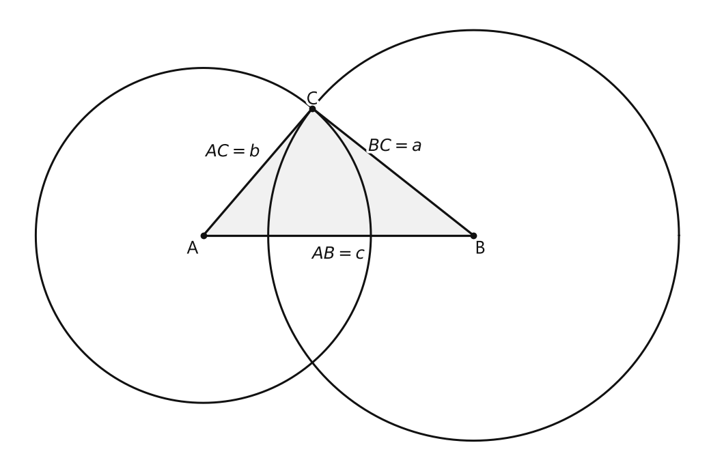
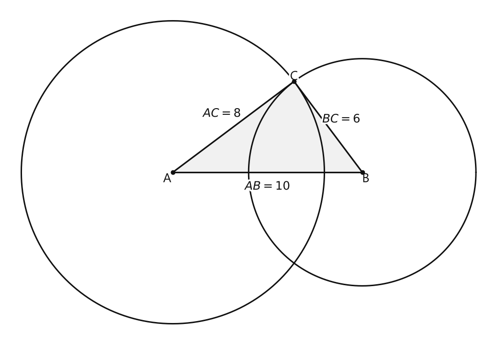
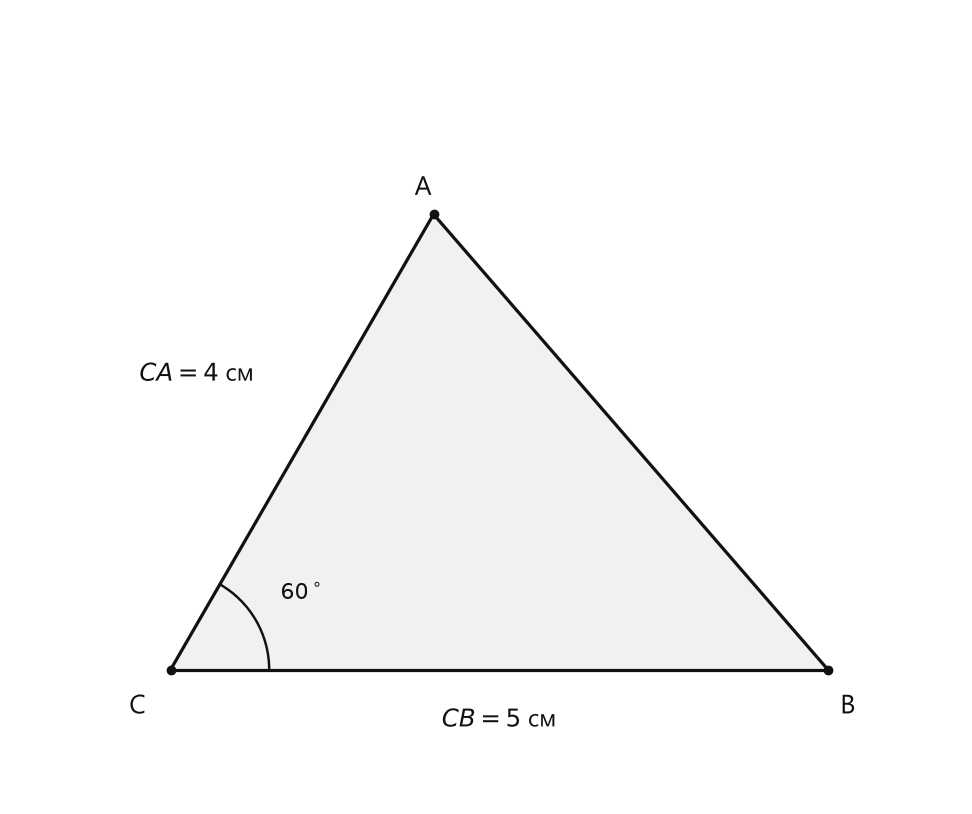
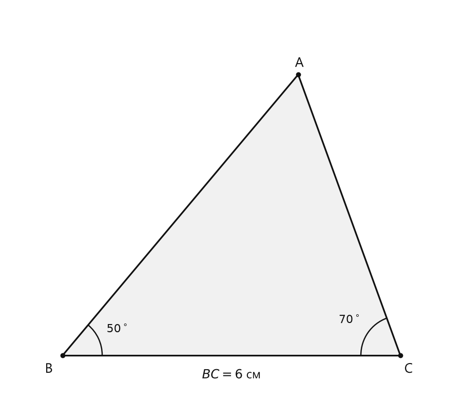
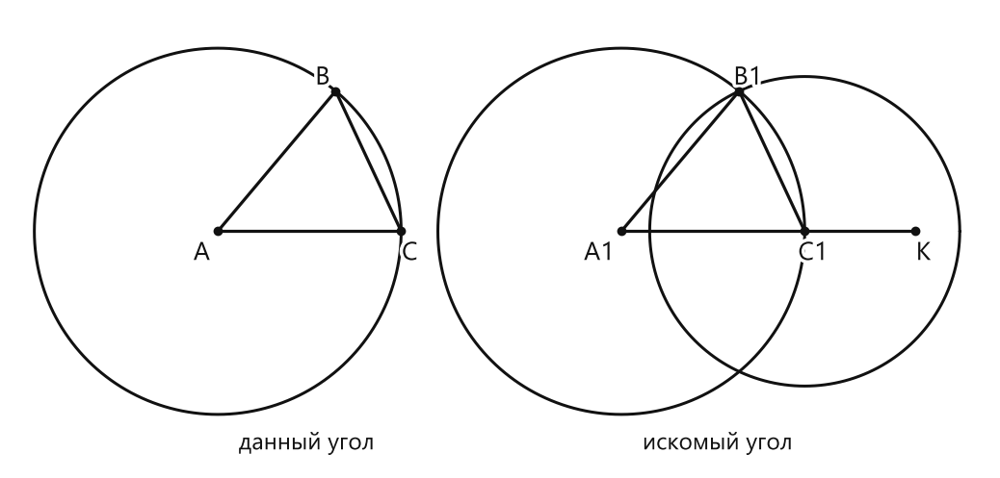

# Занятие 32. Построение треугольника по трем сторонам. Построение угла, равного данному

**Раздел:** Глава V. Задачи на построение  
**Параграф учебника:** §28. Построение треугольника по трем сторонам. Построение угла, равного данному  
**Страницы:** 167–169

## Цели занятия

К концу занятия ученик сможет:

- проверять, существует ли треугольник с заданными сторонами;
- строить треугольник по трём сторонам;
- строить угол, равный данному;
- строить треугольник по двум сторонам и углу между ними;
- строить треугольник по стороне и двум прилежащим к ней углам;
- объяснять единственность построенной фигуры.

Выбери блок своего уровня:

- **1–2 балла:** повторить алгоритмы построения по готовым шагам;
- **3–4 балла:** самостоятельно построить треугольник по трём сторонам;
- **5–6 баллов:** построить угол, равный данному, и объяснить построение;
- **7–8 баллов:** построить треугольник по двум сторонам и углу между ними;
- **9–10 баллов:** построить треугольник по стороне и двум прилежащим углам, обосновать существование и единственность.

## Теория к занятию

### Треугольник по трём сторонам

#### Простыми словами

Представим, что у нас есть три отрезка заданной длины. Нужно соединить их так, чтобы получился треугольник.

Сначала построим одну сторону, например $AB=c$.  
Точка $C$ должна находиться:

- на расстоянии $b$ от точки $A$;
- на расстоянии $a$ от точки $B$.

Все точки, находящиеся на расстоянии $b$ от $A$, лежат на окружности с центром $A$ и радиусом $b$.  
Все точки, находящиеся на расстоянии $a$ от $B$, лежат на окружности с центром $B$ и радиусом $a$.

Значит, точка пересечения этих окружностей и будет третьей вершиной $C$. Окружности здесь работают как два очень точных «радара расстояния».

Но окружности должны пересечься. Для этого длины сторон должны удовлетворять неравенству треугольника.

#### Следствие

> Если для чисел $a, b$ и $c$ выполняется неравенство треугольника, то существует, и причем единственный, треугольник со сторонами, равными $a, b$ и $c$.

#### Неравенство треугольника

Для существования треугольника необходимо, чтобы выполнялись неравенства:

$$
a < b+c,\qquad b<a+c,\qquad c<a+b.
$$

Каждая сторона треугольника меньше суммы двух других сторон.

Например, стороны $6$, $8$ и $10$ подходят:

$$
6<8+10,
$$

$$
8<6+10,
$$

$$
10<6+8.
$$

А стороны $2$, $3$ и $5$ треугольник не образуют, потому что:

$$
5\not<2+3.
$$

Если сумма двух сторон равна третьей, получается отрезок, а не треугольник. Фигура как будто решила «сэкономить» на одной вершине.

#### Задача I. Построить треугольник со сторонами $a, b$ и $c$.

> **Решение.** Пусть даны отрезки $a, b$ и $c$. На произвольной прямой откладываем отрезок $AB = c$ (рис. 300). Строим окружность с центром в точке $A$ радиусом $b$. Строим окружность с центром в точке $B$ радиусом $a$. Находим точку $C$ пересечения этих окружностей. Проводим отрезки $AC$ и $BC$. Треугольник $ABC$ — искомый, так как у него $BC = a, AC = b, AB = c$ по построению.

<!--geo-figure-spec
{
  "needed": true,
  "kind": "plane",
  "caption": "Построение треугольника со сторонами $BC=a$, $AC=b$, $AB=c$",
  "equal": true,
  "axis": false,
  "xlim": [
    -3.6,
    9.2
  ],
  "ylim": [
    -4.2,
    4.2
  ],
  "points": {
    "A": [
      0,
      0
    ],
    "B": [
      5,
      0
    ],
    "C": [
      2.017,
      2.3541
    ]
  },
  "segments": [
    [
      "A",
      "B"
    ],
    [
      "A",
      "C"
    ],
    [
      "B",
      "C"
    ]
  ],
  "polygons": [
    {
      "vertices": [
        "A",
        "B",
        "C"
      ],
      "fill": 0.06
    }
  ],
  "circles": [
    {
      "center": "A",
      "radius": 3.1
    },
    {
      "center": "B",
      "radius": 3.8
    }
  ],
  "labels": {
    "A": {
      "dx": -0.2,
      "dy": -0.25
    },
    "B": {
      "dx": 0.12,
      "dy": -0.25
    },
    "C": {
      "dx": 0,
      "dy": 0.16
    }
  },
  "texts": [
    {
      "xy": [
        2.5,
        -0.35
      ],
      "text": "$AB=c$"
    },
    {
      "xy": [
        0.55,
        1.55
      ],
      "text": "$AC=b$"
    },
    {
      "xy": [
        3.55,
        1.65
      ],
      "text": "$BC=a$"
    }
  ]
}
-->

*Построение треугольника со сторонами BC=a, AC=b, AB=c*

#### Алгоритм

1. На произвольной прямой отложить отрезок $AB=c$.
2. Построить окружность с центром $A$ и радиусом $b$.
3. Построить окружность с центром $B$ и радиусом $a$.
4. Отметить точку $C$ пересечения окружностей.
5. Провести отрезки $AC$ и $BC$.
6. Получить треугольник $ABC$.

#### Почему построение правильное

По построению:

$$
AB=c,
$$

$$
AC=b,
$$

$$
BC=a.
$$

Значит, у треугольника $ABC$ получились именно заданные длины сторон.

Если окружности пересекаются в двух точках, можно выбрать любую из них. Получатся два треугольника, симметричных относительно прямой $AB$. По форме это одно и то же решение, только отражённое, как изображение в зеркале.

#### Ловушки

- Не перепутай радиусы окружностей: из точки $A$ откладываем $b$, из точки $B$ — $a$.
- Если окружности не пересекаются, треугольник построить нельзя.
- При равенстве суммы двух сторон третьей стороне получается вырожденная фигура, а не треугольник.
- Две точки пересечения окружностей дают зеркальные изображения одной и той же фигуры. По форме решение одно.

---

### Построение угла, равного данному

#### Простыми словами

Чтобы перенести угол, транспортир не нужен. Построим внутри данного угла маленький треугольник, а затем сделаем такой же треугольник возле нового луча.

Если два треугольника равны по трём сторонам, то равны и их соответствующие углы. Поэтому новый угол получится точно таким же, как данный.

Главное — не менять первый радиус и правильно перенести длину третьей стороны. Циркуль любит порядок, а не импровизацию.

#### Задача II. Построить угол, равный данному углу.

> **Решение.** Пусть дан угол $A$ (рис. 301, а). Нужно построить угол $A_1$, равный углу $A$. Идея решения состоит в том, чтобы построить некоторый треугольник $ABC$ с углом $A$ и равный ему треугольник $A_1B_1C_1$.

> Строим произвольный луч $A_1K$ (рис. 301, б). Произвольным, но одним и тем же радиусом строим дуги с центрами в точках $A$ и $A_1$. Получаем $AB = AC = A_1C_1$. Строим дугу окружности с центром в точке $C_1$ радиусом, равным $CB$, до пересечения ее с уже построенной дугой в точке $B_1$. Строим луч $A_1B_1$. Угол $A_1$ — искомый. Действительно, так как $\triangle ABC$ и $\triangle A_1B_1C_1$ равны по трем сторонам ($AB = A_1B_1$, $AC = A_1C_1$, $BC = B_1C_1$ по построению), то $\angle A_1 = \angle A$ как соответствующие в двух равных треугольниках.

#### Алгоритм

1. Дан угол $A$.
2. Построить произвольный луч $A_1K$.
3. Одним и тем же радиусом провести дугу с центром $A$ и дугу с центром $A_1$.
4. На сторонах данного угла получить точки $B$ и $C$.
5. На новом луче получить точку $C_1$.
6. Из точки $C_1$ провести дугу радиусом $CB$.
7. Отметить точку пересечения дуг $B_1$.
8. Провести луч $A_1B_1$.
9. Получить угол $A_1$, равный данному углу $A$.

#### Почему построение правильное

По первой дуге:

$$
AB=AC=A_1C_1.
$$

По второй дуге:

$$
CB=C_1B_1.
$$

Кроме того, точка $B_1$ лежит на дуге с центром $A_1$ с тем же радиусом, поэтому:

$$
A_1B_1=AB.
$$

Получаем:

$$
AB=A_1B_1,
$$

$$
AC=A_1C_1,
$$

$$
BC=B_1C_1.
$$

Значит, треугольники $ABC$ и $A_1B_1C_1$ равны по трём сторонам.

Поэтому их соответствующие углы равны:

$$
\angle A=\angle A_1.
$$

#### Ловушки

- Радиус первой дуги в обоих углах должен быть одним и тем же.
- Второй радиус равен не $AB$, а $CB$.
- Новый луч нельзя проводить куда угодно: его начало должно быть в точке $A_1$.
- Если нужен угол в определённой полуплоскости, луч выбирают заранее в нужном направлении.

---

### Построение треугольника по двум сторонам и углу между ними

#### Простыми словами

Даны две стороны и угол между ними. Сначала переносим этот угол. Затем на его сторонах откладываем заданные отрезки.

Один конец каждой стороны находится в вершине угла. После этого остаётся соединить два свободных конца. Последний отрезок — финальный штрих, а не место для творчества.

#### Условие существования

Построение возможно, если данный угол $\gamma$ удовлетворяет условию:

$$
0^\circ<\gamma<180^\circ.
$$

#### Алгоритм

Пусть даны стороны $a$ и $b$ и угол $\gamma$ между ними.

1. Построить угол $C$, равный углу $\gamma$.
2. На одной стороне угла отложить отрезок $CB=a$.
3. На другой стороне угла отложить отрезок $CA=b$.
4. Соединить точки $A$ и $B$ отрезком $AB$.
5. Получить треугольник $ABC$.

По построению:

$$
CB=a,\qquad CA=b,\qquad \angle C=\gamma.
$$

Значит, построенный треугольник имеет заданные две стороны и угол между ними.

#### Ловушки

- Угол должен быть расположен именно между данными сторонами.
- Отрезки $a$ и $b$ откладываются от вершины угла.
- Нельзя сначала построить стороны, а угол поставить «примерно рядом».
- Угол $180^\circ$ даёт прямую, а не треугольник.

---

### Построение треугольника по стороне и двум прилежащим к ней углам

#### Простыми словами

Сначала построим заданную сторону $BC$. Затем в её концах построим два луча:

- в точке $B$ — под углом $\beta$;
- в точке $C$ — под углом $\gamma$.

Оба луча направляем в одну полуплоскость относительно прямой $BC$. Точка их пересечения будет вершиной $A$.

Если сумма углов меньше $180^\circ$, лучи пересекутся и треугольник получится.

#### Условие существования

Построение возможно, если:

$$
\beta+\gamma<180^\circ.
$$

#### Алгоритм

Пусть дана сторона $a$ и углы $\beta$ и $\gamma$.

1. На произвольной прямой $l$ отложить отрезок $BC=a$.
2. От луча $BC$ в одну полуплоскость отложить угол, равный углу $\beta$.
3. От луча $CB$ в ту же полуплоскость отложить угол, равный углу $\gamma$.
4. Отметить точку $A$, в которой пересекаются стороны углов.
5. Получить треугольник $ABC$.

По построению:

$$
BC=a,\qquad \angle B=\beta,\qquad \angle C=\gamma.
$$

#### Ловушки

- Оба угла откладываются в одну полуплоскость относительно прямой $BC$.
- Если отложить углы по разные стороны, получится другая конфигурация.
- При $\beta+\gamma=180^\circ$ лучи не пересекутся внутри треугольника.
- Угол $\beta$ откладывается в точке $B$, угол $\gamma$ — в точке $C$. Буквы здесь не для украшения.

---

## Сводка формул «выучить наизусть»

Неравенство треугольника:

$$
a<b+c,\qquad b<a+c,\qquad c<a+b.
$$

Условие существования треугольника по двум сторонам и углу между ними:

$$
0^\circ<\gamma<180^\circ.
$$

Условие существования треугольника по стороне и двум прилежащим углам:

$$
\beta+\gamma<180^\circ.
$$

Для треугольника, построенного по трём сторонам:

$$
BC=a,\qquad AC=b,\qquad AB=c.
$$

## Правила, которые нельзя путать

- Радиус окружности с центром $A$ равен $b$, а радиус окружности с центром $B$ равен $a$.
- При построении равного угла первый радиус должен быть одинаковым для обеих дуг.
- Вторую дугу строят радиусом $CB$.
- При построении по стороне и двум углам оба угла откладывают в одну полуплоскость.
- Неравенство треугольника строгое: знак должен быть $<$, а не $\leq$.
- Единственность означает единственную форму фигуры; зеркальные варианты не считаются разными решениями.

## Разбор ключевых заданий

### Р1. Построить треугольник по трём сторонам

**Условие.** Построить треугольник со сторонами $6$, $8$ и $10$ клеточек.

**Проверим существование треугольника.**

Сначала сравним каждую сторону с суммой двух других:

$$
6<8+10,
$$

$$
8<6+10,
$$

$$
10<6+8.
$$

Все три неравенства верны. Значит, окружности пересекутся, и треугольник построить можно.

**Построение.**

1. Построить отрезок $AB=10$ клеточек.
2. С центром в точке $A$ провести окружность радиусом $8$ клеточек.
3. С центром в точке $B$ провести окружность радиусом $6$ клеточек.
4. Обозначить точку их пересечения буквой $C$.
5. Провести отрезки $AC$ и $BC$.

<!--geo-figure-spec
{
  "needed": true,
  "kind": "plane",
  "caption": "Построение треугольника со сторонами $AB=10$, $AC=8$, $BC=6$",
  "equal": true,
  "axis": false,
  "xlim": [
    -8.8,
    16.8
  ],
  "ylim": [
    -8.8,
    8.8
  ],
  "points": {
    "A": [
      0,
      0
    ],
    "B": [
      10,
      0
    ],
    "C": [
      6.4,
      4.8
    ]
  },
  "segments": [
    [
      "A",
      "B"
    ],
    [
      "A",
      "C"
    ],
    [
      "B",
      "C"
    ]
  ],
  "polygons": [
    {
      "vertices": [
        "A",
        "B",
        "C"
      ],
      "fill": 0.06
    }
  ],
  "circles": [
    {
      "center": "A",
      "radius": 8
    },
    {
      "center": "B",
      "radius": 6
    }
  ],
  "labels": {
    "A": {
      "dx": -0.3,
      "dy": -0.35
    },
    "B": {
      "dx": 0.18,
      "dy": -0.35
    },
    "C": {
      "dx": 0,
      "dy": 0.25
    }
  },
  "texts": [
    {
      "xy": [
        5,
        -0.75
      ],
      "text": "$AB=10$"
    },
    {
      "xy": [
        2.6,
        3.1
      ],
      "text": "$AC=8$"
    },
    {
      "xy": [
        8.9,
        2.8
      ],
      "text": "$BC=6$"
    }
  ]
}
-->

*Построение треугольника со сторонами AB=10, AC=8, BC=6*

**Проверка.**

Точка $C$ лежит на окружности с центром $A$ и радиусом $8$, поэтому:

$$
AC=8.
$$

Точка $C$ лежит на окружности с центром $B$ и радиусом $6$, поэтому:

$$
BC=6.
$$

Отрезок $AB$ построен длиной $10$, значит:

$$
AB=10.
$$

Таким образом:

$$
AB=10,
$$

$$
AC=8,
$$

$$
BC=6.
$$

Значит, получен треугольник с заданными сторонами.

**Ответ:** треугольник построен.

---

### Р2. Построить треугольник по двум сторонам и углу между ними

**Условие.** Даны отрезки $a=5$ см и $b=4$ см, а также угол $\gamma=60^\circ$. Построить треугольник $ABC$, в котором $CB=a$, $CA=b$, а угол между этими сторонами равен $\gamma$.

<!--geo-figure-spec
{
  "needed": true,
  "kind": "plane",
  "caption": "Построение треугольника по двум сторонам и углу между ними",
  "equal": true,
  "axis": false,
  "xlim": [
    -1.2,
    6
  ],
  "ylim": [
    -1,
    5
  ],
  "points": {
    "C": [
      0,
      0
    ],
    "B": [
      5,
      0
    ],
    "A": [
      2,
      3.4641
    ]
  },
  "segments": [
    [
      "C",
      "B"
    ],
    [
      "C",
      "A"
    ],
    [
      "A",
      "B"
    ]
  ],
  "polygons": [
    {
      "vertices": [
        "C",
        "B",
        "A"
      ],
      "fill": 0.06
    }
  ],
  "labels": {
    "C": {
      "dx": -0.25,
      "dy": -0.28
    },
    "B": {
      "dx": 0.15,
      "dy": -0.28
    },
    "A": {
      "dx": -0.08,
      "dy": 0.2
    }
  },
  "angle_marks": [
    {
      "vertex": "C",
      "from": "B",
      "to": "A",
      "text": "$60^\\circ$",
      "radius": 0.75
    }
  ],
  "texts": [
    {
      "xy": [
        2.5,
        -0.38
      ],
      "text": "$CB=5$ см"
    },
    {
      "xy": [
        0.2,
        2.25
      ],
      "text": "$CA=4$ см"
    }
  ]
}
-->

*Построение треугольника по двум сторонам и углу между ними*

**Решение.**

1. Построить угол $C$, равный $60^\circ$.
2. На одной стороне угла отложить отрезок $CB=5$ см.
3. На другой стороне угла отложить отрезок $CA=4$ см.
4. Соединить точки $A$ и $B$.

Проверим, что получилось:

$$
CB=5\text{ см},
$$

$$
CA=4\text{ см},
$$

$$
\angle C=60^\circ.
$$

Угол $C$ находится между сторонами $CB$ и $CA$, поэтому условие задачи выполнено.

Единственность следует из первого признака равенства треугольников: по двум сторонам и углу между ними.

**Ответ:** треугольник $ABC$ построен.

---

### Р3. Построить треугольник по стороне и двум прилежащим углам

**Условие.** Дана сторона $BC=6$ см, угол $\beta=50^\circ$ и угол $\gamma=70^\circ$. Построить треугольник $ABC$, в котором $\angle B=50^\circ$, а $\angle C=70^\circ$.

<!--geo-figure-spec
{
  "needed": true,
  "kind": "plane",
  "caption": "Построение треугольника по стороне и двум прилежащим углам",
  "equal": true,
  "axis": false,
  "xlim": [
    -1,
    7
  ],
  "ylim": [
    -1,
    6.2
  ],
  "points": {
    "B": [
      0,
      0
    ],
    "C": [
      6,
      0
    ],
    "A": [
      4.185,
      4.987
    ]
  },
  "segments": [
    [
      "B",
      "C"
    ],
    [
      "B",
      "A"
    ],
    [
      "C",
      "A"
    ]
  ],
  "polygons": [
    {
      "vertices": [
        "B",
        "C",
        "A"
      ],
      "fill": 0.06
    }
  ],
  "labels": {
    "B": {
      "dx": -0.25,
      "dy": -0.25
    },
    "C": {
      "dx": 0.15,
      "dy": -0.25
    },
    "A": {
      "dx": 0.02,
      "dy": 0.2
    }
  },
  "angle_marks": [
    {
      "vertex": "B",
      "from": "C",
      "to": "A",
      "text": "$50^\\circ$",
      "radius": 0.7
    },
    {
      "vertex": "C",
      "from": "B",
      "to": "A",
      "text": "$70^\\circ$",
      "radius": 0.7
    }
  ],
  "texts": [
    {
      "xy": [
        3,
        -0.35
      ],
      "text": "$BC=6$ см"
    }
  ]
}
-->

*Построение треугольника по стороне и двум прилежащим углам*

**Решение.**

Сначала проверим, смогут ли два построенных луча встретиться:

$$
\beta+\gamma=50^\circ+70^\circ=120^\circ,
$$

$$
120^\circ<180^\circ.
$$

Условие выполнено, значит, построение возможно.

Теперь выполняем построение:

1. На произвольной прямой отложить $BC=6$ см.
2. В точке $B$ построить луч, образующий с лучом $BC$ угол $50^\circ$.
3. В точке $C$ построить луч, образующий с лучом $CB$ угол $70^\circ$.
4. Оба угла отложить в одной полуплоскости относительно прямой $BC$.
5. Обозначить точку пересечения лучей буквой $A$.
6. Получить треугольник $ABC$.

По построению:

$$
BC=6\text{ см},
$$

$$
\angle B=50^\circ,
$$

$$
\angle C=70^\circ.
$$

Значит, получен треугольник с заданной стороной и двумя прилежащими к ней углами.

Единственность следует из второго признака равенства треугольников: по стороне и двум прилежащим к ней углам.

**Ответ:** треугольник $ABC$ построен.

---

### Р4. Проверить, можно ли построить треугольник по трём сторонам

**Условие.** Можно ли построить треугольник со сторонами $4$ см, $7$ см и $12$ см?

**Решение.**

Проверим неравенство треугольника:

$$
4<7+12,
$$

$$
7<4+12,
$$

$$
12<4+7.
$$

Вычислим суммы:

$$
4<19,
$$

$$
7<16,
$$

$$
12<11.
$$

Первые два неравенства верны. Третье неравенство неверно, потому что $12$ не меньше $11$.

Сторона $12$ см длиннее суммы двух других сторон:

$$
4+7=11\text{ см}.
$$

Поэтому три таких отрезка нельзя соединить в треугольник. Они выстроятся в прямую, но третья вершина не появится.

**Ответ:** построить треугольник нельзя.

---

### Р5. Построить угол, равный данному

**Условие.** Дан угол $A$ с точками $B$ и $C$ на его сторонах. Построить угол с вершиной $A_1$, равный углу $A$.

<!--geo-figure-spec
{
  "needed": true,
  "kind": "plane",
  "caption": "Построение угла $A_1$, равного углу $A$",
  "equal": true,
  "axis": false,
  "xlim": [
    -2.8,
    10.5
  ],
  "ylim": [
    -3.2,
    3
  ],
  "points": {
    "A": [
      0,
      0
    ],
    "B": [
      1.606969,
      1.915111
    ],
    "C": [
      2.5,
      0
    ],
    "A1": [
      5.5,
      0
    ],
    "C1": [
      8,
      0
    ],
    "B1": [
      7.106969,
      1.915111
    ],
    "K": [
      9.5,
      0
    ]
  },
  "segments": [
    [
      "A",
      "B"
    ],
    [
      "A",
      "C"
    ],
    [
      "B",
      "C"
    ],
    [
      "A1",
      "C1"
    ],
    [
      "C1",
      "K"
    ],
    [
      "A1",
      "B1"
    ],
    [
      "B1",
      "C1"
    ]
  ],
  "polygons": [],
  "circles": [
    {
      "center": "A",
      "radius": 2.5
    },
    {
      "center": "A1",
      "radius": 2.5
    },
    {
      "center": "C1",
      "radius": 2.113091
    }
  ],
  "labels": {
    "A": {
      "dx": -0.22,
      "dy": -0.3
    },
    "B": {
      "dx": -0.18,
      "dy": 0.18
    },
    "C": {
      "dx": 0.12,
      "dy": -0.3
    },
    "A1": {
      "dx": -0.3,
      "dy": -0.3
    },
    "B1": {
      "dx": 0.12,
      "dy": 0.18
    },
    "C1": {
      "dx": 0.12,
      "dy": -0.3
    },
    "K": {
      "dx": 0.12,
      "dy": -0.3
    }
  },
  "texts": [
    {
      "xy": [
        1.2,
        -2.9
      ],
      "text": "данный угол"
    },
    {
      "xy": [
        6.8,
        -2.9
      ],
      "text": "искомый угол"
    }
  ]
}
-->

*Построение угла A_1, равного углу A*

**Решение.**

1. Построить произвольный луч $A_1K$.
2. Одним и тем же радиусом провести дугу с центром $A$ и дугу с центром $A_1$.
3. На сторонах данного угла отметить точки $B$ и $C$.
4. На новом луче отметить точку $C_1$.
5. Из точки $C_1$ провести дугу радиусом $CB$.
6. Отметить точку $B_1$ пересечения этой дуги с дугой, построенной из точки $A_1$.
7. Провести луч $A_1B_1$.

Проверим длины сторон двух построенных треугольников.

Первая дуга была проведена одним и тем же радиусом, поэтому:

$$
AC=A_1C_1.
$$

Точка $B_1$ лежит на дуге с центром $A_1$, построенной радиусом $AB$, поэтому:

$$
AB=A_1B_1.
$$

Дуга с центром $C_1$ построена радиусом $CB$, поэтому:

$$
BC=B_1C_1.
$$

Следовательно, треугольники $ABC$ и $A_1B_1C_1$ равны по трём сторонам.

Значит, соответствующие углы равны:

$$
\angle A=\angle A_1.
$$

**Ответ:** угол $A_1$ построен, причём $\angle A_1=\angle A$.

---

### Р6. Построить угол, равный данному, в заданной полуплоскости

**Условие.** Дан угол $A$ и луч $l$ с началом в точке $K$. Построить угол, равный углу $A$, с вершиной в точке $K$, расположенный в нижней полуплоскости относительно прямой, содержащей луч $l$.

**Решение.**

1. Луч $l$ уже имеет начало в точке $K$. Он будет одной стороной нового угла.

2. На сторонах данного угла $A$ выбрать точки $B$ и $C$ так, чтобы они находились на одинаковом расстоянии от вершины $A$:
   
   построить дугу с центром в точке $A$ произвольного радиуса.

   Пусть эта дуга пересекает стороны угла в точках $B$ и $C$.

   Тогда $AB=AC$.

3. Тем же радиусом построить дугу с центром в точке $K$.

   Она пересечёт луч $l$ в точке $C_1$.

   Тогда $KC_1=AC$.

4. Из точки $C_1$ построить дугу радиусом $BC$.

5. Выбрать точку её пересечения с первой дугой в нижней полуплоскости и обозначить её $B_1$.

   Тогда $C_1B_1=CB$.

6. Провести луч $KB_1$.

7. Получен угол между лучами $KC_1$ и $KB_1$.

По построению:

$$
KC_1=AC,
$$

$$
KB_1=AB,
$$

$$
C_1B_1=CB.
$$

Значит, треугольники $ABC$ и $KC_1B_1$ равны по трем сторонам. Поэтому соответствующие углы равны:

$$
\angle C_1KB_1=\angle A.
$$

Направление второй стороны выбрано в нижней полуплоскости, поэтому угол построен именно там. А то, что он оказался «не на той стороне», — не ошибка циркуля, а ошибка выбора точки пересечения.

**Ответ:** угол с вершиной $K$ в нижней полуплоскости построен.

---

### Р7. Построить сумму двух углов

**Условие.** Даны два угла $\alpha$ и $\beta$. Построить угол, равный их сумме.

**Решение.**

1. Построить произвольный луч $OA$.

2. От луча $OA$ в выбранной полуплоскости построить угол, равный $\alpha$.

   Обозначим его второй стороной луч $OB$.

   Тогда:

   $$
   \angle AOB=\alpha.
   $$

3. От луча $OB$ в той же полуплоскости построить угол, равный $\beta$.

   Обозначим его второй стороной луч $OC$.

   Тогда:

   $$
   \angle BOC=\beta.
   $$

4. Луч $OB$ находится внутри угла $AOC$, поэтому этот угол состоит из двух углов:

   $$
   \angle AOC=\angle AOB+\angle BOC.
   $$

5. Подставим значения углов:

   $$
   \angle AOC=\alpha+\beta.
   $$

Важно: второй угол нужно откладывать от второй стороны первого, а не строить где-то отдельно. Иначе получится два красивых угла, но не их сумма.

**Ответ:** построен угол, равный $\alpha+\beta$.

---

### Р8. Построить разность двух углов

**Условие.** Даны два угла $\alpha$ и $\beta$, причём $\alpha>\beta$. Построить угол, равный их разности.

**Решение.**

1. Построить произвольный луч $OA$.

2. От луча $OA$ построить угол, равный $\alpha$.

   Обозначим его второй стороной луч $OB$.

   Тогда:

   $$
   \angle AOB=\alpha.
   $$

3. Внутри угла $AOB$ от луча $OA$ построить угол, равный $\beta$.

   Обозначим новый луч $OC$.

   Тогда:

   $$
   \angle AOC=\beta.
   $$

4. Луч $OC$ находится внутри угла $AOB$, поэтому:

   $$
   \angle AOB=\angle AOC+\angle COB.
   $$

5. Подставим известные значения:

   $$
   \alpha=\beta+\angle COB.
   $$

6. Выразим оставшийся угол:

   $$
   \angle COB=\alpha-\beta.
   $$

Угол нужно откладывать внутри большего угла $\alpha$. Если начать строить его снаружи, разность внезапно превратится в совсем другой угол — геометрия тоже умеет устраивать ловушки.

**Ответ:** построен угол, равный $\alpha-\beta$.

## Практические задания

Выбери свой уровень и решай только этот блок. В блоке должна закрепиться вся тема параграфа. Ответы не приводятся.

### Уровень 1–2 балла

**С1.** Даны отрезки $a$, $b$ и $c$. Выберите условие, при котором существует треугольник со сторонами $a$, $b$ и $c$.

1) $a+b<c$  
2) $a+b=c$  
3) $a+b>c$, $a+c>b$, $b+c>a$  
4) $a=b=c=0$  
5) $a+b+c<0$

**С2.** При построении треугольника по трём сторонам на прямой сначала откладывают отрезок $AB=c$. Какой отрезок нужно отложить следующим?

1) $AC=a$  
2) $BC=b$  
3) $AC=b$  
4) $BC=c$  
5) $AB=a$

**С3.** При построении треугольника со сторонами $BC=a$, $AC=b$ и $AB=c$ с каким радиусом проводят окружность с центром в точке $A$?

1) $a$  
2) $b$  
3) $c$  
4) $a+b$  
5) $a-c$

**С4.** При построении треугольника со сторонами $BC=a$, $AC=b$ и $AB=c$ с каким радиусом проводят окружность с центром в точке $B$?

1) $a$  
2) $b$  
3) $c$  
4) $b+c$  
5) $b-a$

**С5.** После построения двух окружностей при построении треугольника по трём сторонам точка $C$ является:

1) центром первой окружности  
2) точкой на отрезке $AB$  
3) точкой пересечения построенных окружностей  
4) серединой отрезка $AB$  
5) началом исходной прямой

**С6.** Даны три отрезка длиной $5$ см, $6$ см и $8$ см. Выберите верное утверждение.

1) Треугольник построить нельзя, так как $5+6<8$  
2) Треугольник построить нельзя, так как $5+8<6$  
3) Треугольник построить можно, так как выполняется неравенство треугольника  
4) Треугольник построить можно только с прямым углом  
5) Треугольник построить можно только с равными сторонами

**С7.** При построении угла, равного данному углу $A$, сначала строят:

1) окружность с центром в точке $B$  
2) произвольный луч с началом в точке $A_1$  
3) отрезок $A_1B_1$  
4) окружность с центром в точке $B_1$  
5) прямую через точки $A$ и $A_1$

**С8.** При построении угла, равного данному, дуги с центрами в вершинах $A$ и $A_1$ проводят:

1) разными радиусами  
2) одним и тем же радиусом  
3) радиусами $AB$ и $AC$  
4) радиусами $BC$ и $B_1C_1$  
5) без радиуса

**С9.** В данном угле $A$ дуга пересекает его стороны в точках $B$ и $C$. При построении равного угла дуга с центром в точке $A_1$ пересекает луч $A_1K$ в точке:

1) $B_1$  
2) $C_1$  
3) $K$  
4) $A$  
5) $C$

**С10.** При построении угла, равного данному, дуга с центром в точке $C_1$ должна иметь радиус:

1) $A_1C_1$  
2) $AB$  
3) $BC$  
4) $AC$  
5) $A_1B_1$

**С11.** Даны угол $A$ и луч $A_1K$. Установите правильную последовательность действий для построения угла, равного углу $A$.

А) Провести луч $A_1B_1$.  
Б) Построить дуги с центрами $A$ и $A_1$ одним и тем же радиусом.  
В) Построить дугу с центром $C_1$ радиусом $CB$.  
Г) Получить точки $B$, $C$ и $C_1$.

Запишите последовательность букв.

**С12.** Даны отрезки $AB=7$ см, $AC=5$ см и $BC=6$ см. На прямой отложен отрезок $A_1B_1=6$ см. Для построения треугольника $A_1B_1C_1$, равного треугольнику $ABC$, укажите радиусы окружностей с центрами $A_1$ и $B_1$.

**С13.** Для построения треугольника $ABC$ по трём сторонам $BC=a$, $AC=b$, $AB=c$ сначала на прямой откладывают отрезок:

1) $AB=a$  
2) $AB=b$  
3) $AB=c$  
4) $AC=c$  
5) $BC=c$

**С14.** При построении треугольника со сторонами $BC=a$, $AC=b$, $AB=c$ окружность с центром в точке $A$ строят радиусом:

1) $a$  
2) $b$  
3) $c$  
4) $a+b$  
5) $b+c$

**С15.** При построении треугольника со сторонами $BC=a$, $AC=b$, $AB=c$ окружность с центром в точке $B$ строят радиусом:

1) $a$  
2) $b$  
3) $c$  
4) $a+b$  
5) $a+c$

**С16.** Выберите набор длин, из которых можно построить треугольник.

1) $2\text{ см}, 3\text{ см}, 6\text{ см}$  
2) $4\text{ см}, 5\text{ см}, 8\text{ см}$  
3) $1\text{ см}, 2\text{ см}, 3\text{ см}$  
4) $3\text{ см}, 4\text{ см}, 8\text{ см}$  
5) $2\text{ см}, 2\text{ см}, 5\text{ см}$

**С17.** Отрезки имеют длины $5\text{ см}$, $6\text{ см}$ и $9\text{ см}$. Выберите правильное утверждение.

1) Треугольник построить нельзя, так как $5+6<9$  
2) Треугольник построить нельзя, так как $5+9<6$  
3) Треугольник построить можно  
4) Треугольник построить можно только с помощью транспортира  
5) Треугольник построить можно только по двум сторонам

**С18.** Установите правильную последовательность действий при построении треугольника по трём сторонам.

1) Провести $AC$ и $BC$; построить окружность с центром $A$; отложить $AB$; построить окружность с центром $B$  
2) Отложить $AB$; построить окружности с центрами $A$ и $B$; провести $AC$ и $BC$  
3) Построить окружности с центрами $A$ и $B$; отложить $AB$; провести $AC$ и $BC$  
4) Отложить $AB$; провести $AC$ и $BC$; построить окружности  
5) Провести $AC$; отложить $AB$; провести $BC$; построить окружности

**С19.** При построении угла, равного данному углу $A$, произвольным, но одним и тем же радиусом строят дуги с центрами:

1) только в точке $A$  
2) только в точке $A_1$  
3) в точках $B$ и $C$  
4) в точках $A$ и $A_1$  
5) в точках $B_1$ и $C_1$

**С20.** Дан угол $A$ и луч $A_1K$. После построения равных дуг с центрами $A$ и $A_1$ получили точки $B$, $C$ и $C_1$. Какой отрезок откладывают при следующем построении?

1) $AB$  
2) $AC$  
3) $BC$  
4) $A_1C_1$  
5) $A_1K$

**С21.** При построении угла, равного углу $A$, дуга с центром $C_1$ должна иметь радиус:

1) $AB$  
2) $AC$  
3) $A_1C_1$  
4) $BC$  
5) $A_1K$

**С22.** Дан угол $A$ и луч $A_1K$. Постройте угол, равный углу $A$, с вершиной в точке $A_1$, используя циркуль и линейку. Запишите последовательность основных действий.

**С23.** Даны отрезки длиной $4\text{ см}$, $5\text{ см}$ и $7\text{ см}$. Постройте треугольник, стороны которого имеют эти длины. На произвольной прямой отложите $AB=7\text{ см}$.

**С24.** Дан угол $A$ и луч $A_1K$. Постройте угол, равный углу $A$, так, чтобы один из его лучей совпадал с лучом $A_1K$. Обозначьте второй луч через $A_1B_1$.

**С25.** Для построения треугольника со сторонами $a$, $b$ и $c$ на произвольной прямой сначала откладывают отрезок $AB$, равный:

1) $a$  
2) $b$  
3) $c$  
4) $a+b$  
5) $b+c$

**С26.** При построении треугольника по трём сторонам отрезок $AB=c$. С каким радиусом строят окружность с центром в точке $A$?

1) $a$  
2) $b$  
3) $c$  
4) $a+c$  
5) $b+c$

**С27.** При построении треугольника по трём сторонам отрезок $AB=c$. С каким радиусом строят окружность с центром в точке $B$?

1) $a$  
2) $b$  
3) $c$  
4) $a+b$  
5) $b+c$

**С28.** Выберите набор длин, из которых можно построить треугольник.

1) $2$, $3$, $5$  
2) $4$, $6$, $9$  
3) $1$, $2$, $4$  
4) $3$, $3$, $7$  
5) $2$, $2$, $5$

**С29.** Выберите условие, при котором треугольник со сторонами $a$, $b$ и $c$ существует.

1) $a+b<c$  
2) $a+b=c$  
3) $a+b>c$, $a+c>b$, $b+c>a$  
4) $a=b=c=0$  
5) $a+b+c<\max(a,b,c)$

**С30.** Для построения угла, равного данному углу $A$, сначала строят:

1) произвольный треугольник  
2) произвольный луч с началом в новой вершине  
3) окружность с центром в точке $B$  
4) отрезок, равный стороне $AB$  
5) прямую, проходящую через вершину угла $A$

**С31.** При копировании данного угла дуги с центрами в вершинах исходного и нового углов строят с:

1) разными радиусами  
2) одним и тем же радиусом  
3) радиусами, равными сторонам исходного угла  
4) радиусами, равными $0$  
5) радиусами, большими расстояния между вершинами

**С32.** На исходном угле дуга пересекает его стороны в точках $B$ и $C$. На новом луче соответствующая точка обозначена $C_1$. Какой радиус используют для построения второй дуги с центром в точке $C_1$?

1) $AB$  
2) $AC$  
3) $BC$  
4) $A_1C_1$  
5) $AB+AC$

**С33.** При построении угла, равного данному, после нахождения точки $B_1$ проводят:

1) луч $A_1C_1$  
2) луч $A_1B_1$  
3) прямую $BC$  
4) отрезок $AB$  
5) окружность с центром в точке $A_1$

**С34.** Даны три отрезка длиной $5$ см, $7$ см и $9$ см. Укажите последовательность построения треугольника по этим трём сторонам.

1) Построить две окружности с центрами в концах отрезка длиной $5$ см и радиусами $7$ см и $9$ см, соединить точку их пересечения с концами отрезка.  
2) Построить окружность радиусом $5$ см, затем окружность радиусом $7$ см.  
3) Отложить на прямой отрезок длиной $7$ см, построить окружности радиусами $5$ см и $9$ см, не соединяя точку пересечения с концами отрезка.  
4) Отложить на прямой отрезок длиной $9$ см и построить только одну окружность радиусом $5$ см.  
5) Построить три окружности с центрами в одной точке.

**С35.** Даны угол $A$ и луч $A_1K$. Для построения угла, равного углу $A$, дуга с центром в точке $A_1$ пересекает луч $A_1K$ в точке:

1) $B$  
2) $C$  
3) $B_1$  
4) $C_1$  
5) $K$

**С36.** Даны два угла: $\angle A=40^\circ$ и $\angle B=25^\circ$. После построения угла, равного каждому из них, можно построить угол, равный:

1) только $15^\circ$  
2) только $65^\circ$  
3) $15^\circ$ и $65^\circ$  
4) только $100^\circ$  
5) $40^\circ+25^\circ+15^\circ$

### Уровень 3–4 балла

**С1.** Постройте треугольник $ABC$ по трём сторонам: $AB=6$ см, $AC=5$ см, $BC=7$ см. Запишите последовательность основных построений.

**С2.** Даны три отрезка: $a=4$ см, $b=6$ см, $c=8$ см. Постройте треугольник со сторонами $a$, $b$ и $c$.

**С3.** Проверьте, существует ли треугольник со сторонами $5$ см, $7$ см и $13$ см. Ответ обоснуйте неравенством треугольника.

**С4.** Проверьте, существует ли треугольник со сторонами $6$ см, $8$ см и $10$ см. Если существует, постройте его.

**С5.** При построении треугольника отрезок $AB$ выбран равным $9$ см. Окружность с центром в точке $A$ имеет радиус $6$ см, а окружность с центром в точке $B$ — радиус $7$ см. Укажите длины сторон $AC$ и $BC$ построенного треугольника.

**С6.** Постройте угол, равный данному углу $A$, с вершиной в точке $K$ и одной стороной на заданном луче $Kl$.

**С7.** Даны угол $A$ и луч $Kp$. Постройте угол $BKC$, равный углу $A$, расположив его в верхней полуплоскости относительно прямой, содержащей луч $Kp$, причём луч $KC$ должен совпадать с лучом $Kp$.

**С8.** При построении угла, равного данному углу $A$, дуга с центром в вершине $A$ пересекает стороны угла в точках $B$ и $C$. На новом луче получена точка $C_1$. Какой радиус должна иметь дуга с центром в точке $C_1$, чтобы получить точку $B_1$?

**С9.** Восстановите порядок действий при построении треугольника по трём сторонам. Запишите номера действий в правильной последовательности:  
1) Провести отрезки $AC$ и $BC$.  
2) Построить окружность с центром в точке $B$ и радиусом $a$.  
3) На прямой отложить отрезок $AB=c$.  
4) Построить окружность с центром в точке $A$ и радиусом $b$.  
5) Обозначить точку пересечения окружностей буквой $C$.

**С10.** Даны угол $A$ и луч $Kp$. Постройте угол с вершиной $K$, равный углу $A$, так, чтобы одна его сторона совпала с лучом $Kp$, а другая сторона лежала в нижней полуплоскости относительно прямой, содержащей луч $Kp$.

**С11.** Постройте угол, равный сумме двух данных углов $A$ и $B$. Вершиной построенного угла должна быть точка $K$, а одна его сторона должна совпадать с заданным лучом $Kp$.

**С12.** Даны два угла $A$ и $B$, причём угол $A$ больше угла $B$. Постройте угол, равный разности углов $A$ и $B$, с вершиной в точке $K$ и одной стороной на заданном луче $Kp$.

**С13.** Постройте треугольник со сторонами $4$ см, $5$ см и $6$ см.

**С14.** Постройте треугольник со сторонами $3$ см, $4$ см и $5$ см. Укажите, какие окружности использованы при построении.

**С15.** Даны отрезки $a=7$ см, $b=5$ см и $c=6$ см. Постройте треугольник $ABC$, если $AB=c$, $AC=b$, $BC=a$.

**С16.** Проверьте, существует ли треугольник со сторонами $2$ см, $3$ см и $6$ см. Ответ обоснуйте неравенством треугольника.

**С17.** Проверьте, существует ли треугольник со сторонами $5$ см, $7$ см и $10$ см. Если треугольник существует, постройте его.

**С18.** На прямой $l$ отложите отрезок $AB=6$ см. Постройте треугольник $ABC$, если $AC=5$ см и $BC=4$ см.

**С19.** Изобразите произвольный острый угол $A$. Постройте луч $A_1K$ и угол $KA_1B_1$, равный углу $A$.

**С20.** Изобразите произвольный тупой угол $A$. Постройте угол с вершиной в точке $K$, равный углу $A$.

**С21.** Даны угол $A$ и луч $l$ с началом в точке $K$. Постройте угол с вершиной $K$, равный углу $A$ и расположенный в верхней полуплоскости относительно прямой, содержащей луч $l$.

**С22.** Изобразите треугольник $ABC$ и луч $A_1K$. Постройте угол $KA_1B_1$, равный углу $A$ треугольника $ABC$, используя построение равных треугольников по трём сторонам.

**С23.** Изобразите два угла $A$ и $B$, причём угол $A$ меньше угла $B$. Постройте угол, равный разности углов $B$ и $A$.

**С24.** Изобразите два угла $A$ и $B$. Постройте угол, равный сумме углов $A$ и $B$.

**С25.** Постройте треугольник $ABC$ по трём сторонам: $AB=5$ см, $BC=6$ см, $AC=7$ см. Запишите последовательность основных построений.

**С26.** Даны три отрезка длиной $4$ см, $5$ см и $8$ см. Постройте треугольник, стороны которого равны данным отрезкам.

**С27.** Постройте треугольник $MNK$, если $MN=6$ см, $NK=7$ см, $MK=9$ см. Укажите, какие окружности нужно построить и как определить точку $K$.

**С28.** Проверьте, существует ли треугольник со сторонами $3$ см, $4$ см и $8$ см. Ответ обоснуйте неравенством треугольника.

**С29.** Проверьте, существует ли треугольник со сторонами $6$ см, $8$ см и $10$ см. Если существует, постройте его.

**С30.** Изобразите произвольный острый угол $A$. На произвольном луче с началом в точке $K$ постройте угол, равный углу $A$.

**С31.** Изобразите произвольный тупой угол $B$. Постройте угол с вершиной $K$, равный углу $B$, используя циркуль и линейку.

**С32.** Даны угол $A$ и луч $l$ с началом в точке $K$. Постройте угол с вершиной $K$, равный углу $A$ и расположенный по одну сторону с углом $A$ относительно прямой, содержащей луч $l$.

**С33.** Даны угол $A$ и луч $l$ с началом в точке $K$. Постройте угол с вершиной $K$, равный углу $A$ и расположенный в нижней полуплоскости относительно прямой $l$.

**С34.** Изобразите произвольный треугольник $ABC$ и прямую $l$, не пересекающую этот треугольник. Постройте треугольник $MNK$, равный треугольнику $ABC$, если сторона $MK$ должна лежать на прямой $l$, $MN=AB$, а $NK=BC$.

**С35.** Постройте треугольник $ABC$ по двум сторонам $AB=6$ см и $AC=4$ см и углу $BAC$, равному данному углу $D$.

**С36.** Постройте треугольник $ABC$ по стороне $AB=7$ см и двум данным углам: $\angle BAC=\angle D$ и $\angle ABC=\angle E$.

### Уровень 5–6 баллов

**С1.** Постройте треугольник $ABC$ со сторонами $AB=6$ см, $BC=5$ см и $AC=7$ см.

**С2.** Постройте треугольник $MNK$ со сторонами $MN=4$ см, $NK=6$ см и $MK=8$ см.

**С3.** Даны отрезки $a=5$ см, $b=6$ см и $c=9$ см. Постройте треугольник, стороны которого равны данным отрезкам.

**С4.** Постройте треугольник $DEF$, если $DE=7$ см, $EF=3$ см и $DF=5$ см.

**С5.** Даны три отрезка: $a=8$ см, $b=6$ см и $c=4$ см. Постройте треугольник со сторонами, равными этим отрезкам, и обозначьте его вершины $A$, $B$, $C$ так, чтобы $AB=c$, $AC=b$, $BC=a$.

**С6.** На прямой $l$ выберите точку $P$ и постройте отрезок $PQ=7$ см. Постройте треугольник $PQR$, если $PR=5$ см и $QR=6$ см.

**С7.** Изобразите произвольный острый угол $ABC$. Постройте угол $A_1B_1C_1$, равный углу $ABC$.

**С8.** Изобразите произвольный тупой угол $MNK$. Постройте угол $M_1N_1K_1$, равный углу $MNK$.

**С9.** Дан угол $A$ и луч $l$ с началом в точке $K$. Постройте угол с вершиной $K$, равный углу $A$, расположив его внутри полуплоскости, лежащей ниже прямой $l$.

**С10.** Дан угол $ABC$ и луч $KD$. Постройте луч $KE$ так, чтобы угол $DKE$ был равен углу $ABC$.

**С11.** Даны два угла: $ABC$ и $DEF$. Постройте угол, равный сумме углов $ABC$ и $DEF$.

**С12.** Даны два неравных угла: $ABC$ и $DEF$, причём $\angle ABC>\angle DEF$. Постройте угол, равный разности углов $ABC$ и $DEF$.

**С13.** Постройте треугольник $ABC$ со сторонами $AB=5$ см, $AC=6$ см и $BC=7$ см. Запишите последовательность основных построений.

**С14.** Постройте треугольник $MNK$ со сторонами $MN=4$ см, $NK=6$ см и $MK=8$ см. Укажите, какие окружности нужно построить и с какими радиусами.

**С15.** Даны отрезки $a=3$ см, $b=5$ см и $c=7$ см. Постройте треугольник со сторонами $a$, $b$ и $c$. В качестве основания используйте отрезок длиной $c$.

**С16.** Можно ли построить треугольник со сторонами $4$ см, $6$ см и $11$ см? Обоснуйте ответ с помощью неравенства треугольника.

**С17.** Можно ли построить треугольник со сторонами $5$ см, $7$ см и $9$ см? Если можно, выполните построение циркулем и линейкой.

**С18.** Изобразите произвольный угол $ABC$. На луче $KL$ с началом в точке $K$ постройте угол $LKM$, равный углу $ABC$.

**С19.** Изобразите тупой угол $PQR$. Постройте с вершиной $O$ угол $XОY$, равный углу $PQR$. Укажите, какие дуги и отрезки нужно построить для переноса угла.

**С20.** Изобразите угол $A$ и луч $l$ с началом в точке $K$. Постройте угол с вершиной $K$, равный углу $A$ и расположенный в нижней полуплоскости относительно прямой, содержащей луч $l$.

**С21.** Изобразите два угла: $\angle A=40^\circ$ и $\angle B=30^\circ$. Постройте угол, равный их сумме. Измерьте построенный угол транспортиром и запишите его величину.

**С22.** Изобразите два угла: $\angle C=75^\circ$ и $\angle D=25^\circ$. Постройте угол, равный разности этих углов. Измерьте построенный угол транспортиром и запишите его величину.

**С23.** Даны отрезки $AB=6$ см, $AC=4$ см и $BC=5$ см. Постройте треугольник $ABC$. Затем постройте угол $K$, равный углу $A$ треугольника $ABC$.

**С24.** Постройте треугольник $ABC$ по сторонам $AB=7$ см, $AC=5$ см и $BC=6$ см. Затем на луче $KM$ постройте угол $MKN$, равный углу $BAC$. Укажите равные стороны двух треугольников, использованных при переносе угла.

**С25.** Постройте треугольник $ABC$ по трём сторонам: $AB=7$ см, $AC=5$ см, $BC=6$ см. Запишите последовательность основных действий построения.

**С26.** Даны три отрезка длиной $4$ см, $6$ см и $9$ см. Постройте треугольник, стороны которого равны этим отрезкам. Обозначьте вершины треугольника и укажите, какой отрезок выбран за его основание.

**С27.** Проверьте, можно ли построить треугольник со сторонами $3$ см, $4$ см и $8$ см. Ответ обоснуйте с помощью неравенства треугольника.

**С28.** Изобразите произвольный угол $ABC$. Постройте с помощью циркуля и линейки угол $A_1B_1C_1$, равный углу $ABC$. Запишите, какие равенства отрезков используются при построении.

**С29.** Дан угол $M$. Постройте угол с вершиной в точке $K$, равный углу $M$, так, чтобы одна его сторона совпадала с заданным лучом $Kl$. Вторая сторона построенного угла должна лежать в верхней полуплоскости относительно прямой, содержащей луч $Kl$.

**С30.** Даны два угла $A$ и $B$, причём угол $A$ больше угла $B$. Постройте угол, равный разности углов $A$ и $B$. Используйте построение угла, равного данному, и укажите порядок выполнения построений.

### Уровень 7–8 баллов

**С1.** Постройте треугольник $ABC$ по трём сторонам: $AB=7$ см, $BC=5$ см, $AC=6$ см. Запишите последовательность основных этапов построения и обоснуйте, почему построенный треугольник имеет заданные стороны.

**С2.** Даны три отрезка длиной $4$ см, $6$ см и $9$ см. Постройте треугольник, стороны которого равны этим отрезкам. Укажите, какой отрезок следует выбрать в качестве стороны $AB$, а какие — в качестве радиусов окружностей с центрами в точках $A$ и $B$.

**С3.** Даны отрезки длиной $3$ см, $5$ см и $8$ см. Можно ли построить треугольник с такими сторонами? Обоснуйте ответ с помощью неравенства треугольника.

**С4.** Даны отрезки длиной $5$ см, $7$ см и $11$ см. Постройте треугольник $ABC$ так, чтобы $AB=7$ см, $AC=11$ см и $BC=5$ см. Для построения используйте циркуль и линейку без делений.

**С5.** Дан треугольник $ABC$ и прямая $l$, не пересекающая этот треугольник. Постройте треугольник $MNK$, равный треугольнику $ABC$, если сторона $MK$ должна лежать на прямой $l$, $MN=AB$, а $NK=BC$. Опишите, какие окружности нужно построить и в каком порядке.

**С6.** Изобразите тупой угол $ABC$. На луче $KM$ постройте угол $MKN$, равный углу $ABC$, расположив его по заданную сторону от луча $KM$. Обоснуйте равенство построенных углов через равенство треугольников.

**С7.** Дан угол $A$ и луч $l$ с началом в точке $K$. Постройте угол с вершиной $K$, равный углу $A$ и расположенный в нижней полуплоскости относительно прямой, содержащей луч $l$. Запишите, какие дуги и отрезки необходимо построить.

**С8.** Даны два угла $\alpha$ и $\beta$, причём $\alpha>\beta$. С помощью циркуля и линейки постройте угол, равный $\alpha+\beta$, и угол, равный $\alpha-\beta$. Для каждого построения укажите, на каком луче откладывается второй угол.

**С9.** Постройте треугольник $ABC$ по сторонам $AB=8$ см, $AC=6$ см и медиане $AM=5$ см, проведённой к стороне $BC$. Опишите построение и обоснуйте, почему точка $M$ является серединой стороны $BC$.

**С10.** Постройте треугольник $ABC$ по сторонам $AB=7$ см, $AC=5$ см и медиане $BM=4$ см, проведённой к стороне $AC$. Запишите последовательность построения с использованием окружностей и равных отрезков.

**С11.** Постройте треугольник $ABC$ по сторонам $AB=6$ см, $BC=8$ см и медиане $CM=5$ см, проведённой к стороне $AB$. Обоснуйте, что построенная точка $M$ является серединой отрезка $AB$, а затем объясните, почему треугольник определяется однозначно с точностью до наложения.

**С12.** Постройте треугольник $ABC$ по двум сторонам $AB=6$ см и $AC=8$ см и медиане $AM=5$ см, проведённой к третьей стороне $BC$. Опишите построение через вспомогательный треугольник и построение треугольника по трём сторонам. Обоснуйте, что полученный треугольник удовлетворяет всем данным условиям.

**С13.** Постройте треугольник $ABC$ по трём сторонам: $AB=7$ см, $BC=5$ см, $AC=8$ см. Опишите последовательность построения и обоснуйте, почему построенный треугольник удовлетворяет условию.

**С14.** Даны три отрезка длиной $4$ см, $6$ см и $9$ см. Постройте треугольник, стороны которого равны данным отрезкам. Укажите, какие окружности следует построить, если отрезок длиной $9$ см выбран в качестве основания.

**С15.** Даны три отрезка длиной $3$ см, $5$ см и $9$ см. Можно ли построить треугольник с такими сторонами? Ответ обоснуйте проверкой неравенства треугольника.

**С16.** Изображён треугольник $ABC$, где $AB=6$ см, $AC=8$ см, $BC=10$ см, и прямая $l$, не пересекающая этот треугольник. На прямой $l$ выбрана точка $M$. Постройте треугольник $MNK$, равный треугольнику $ABC$, так, чтобы $MK=AB$, $NK=BC$, а точка $M$ была вершиной, соответствующей вершине $A$.

**С17.** Дан тупой угол $ABC$. На луче $l$ с началом в точке $K$ постройте угол, равный углу $ABC$, расположенный в заданной полуплоскости относительно прямой, содержащей луч $l$. Опишите построение и докажите равенство полученных углов.

**С18.** Даны угол $ABC$ и луч $l$ с началом в точке $K$. Постройте угол $NKL$, равный углу $ABC$, если луч $KN$ должен совпадать с лучом $l$, а луч $KL$ должен лежать в верхней полуплоскости относительно прямой $l$. Обоснуйте построение равенством треугольников.

**С19.** Даны два угла $A$ и $B$, причём угол $A$ больше угла $B$. Постройте угол, равный сумме углов $A$ и $B$, используя только циркуль и линейку. Запишите последовательность основных построений.

**С20.** Даны два угла $A$ и $B$, причём угол $A$ больше угла $B$. Постройте угол, равный разности углов $A$ и $B$. Укажите, на каком этапе используется построение угла, равного данному.

**С21.** Постройте треугольник $ABC$ по сторонам $AB=5$ см, $BC=6$ см и медиане $BM=4$ см, проведённой к стороне $AC$. Для этого сначала постройте вспомогательный треугольник $BAA_1$ со сторонами $BA=5$ см, $BA_1=6$ см и $AA_1=8$ см, затем используйте свойство точки $M$ как середины отрезка $AA_1$. Опишите построение и докажите, что $BM$ является медианой треугольника $ABC$.

**С22.** Постройте треугольник $ABC$ по сторонам $AB=6$ см, $BC=7$ см и медиане $AM=5$ см, проведённой к стороне $BC$. Составьте вспомогательный треугольник, одна из сторон которого равна удвоенной длине медианы, и объясните, как получить точку $C$ после построения середины соответствующего отрезка.

**С23.** Даны две стороны треугольника $AB=7$ см и $AC=5$ см и медиана $BM=4$ см, проведённая к третьей стороне $AC$. Постройте такой треугольник. Перед построением проверьте, что вспомогательный треугольник, используемый в построении, существует.

**С24.** Постройте треугольник $ABC$ по двум сторонам $AB=5$ см, $BC=6$ см и медиане $CM=4$ см, проведённой к стороне $AB$. Опишите построение, назовите вспомогательный треугольник и докажите, что полученный треугольник имеет заданные стороны и медиану.

### Уровень 9–10 баллов

**С1.** Постройте треугольник $ABC$ по трём сторонам: $AB=7$ см, $AC=9$ см, $BC=12$ см. Опишите последовательность построения и обоснуйте, что построенный треугольник имеет заданные стороны.

**С2.** Даны три отрезка длиной $5$ см, $6$ см и $10$ см. Постройте треугольник, стороны которого равны этим отрезкам. Укажите, какой отрезок следует выбрать за основание, и выполните построение с помощью циркуля и линейки.

**С3.** Требуется построить треугольник со сторонами $8$ см, $11$ см и $19$ см. Определите, возможно ли такое построение. Ответ обоснуйте неравенством треугольника.

**С4.** На прямой $l$ выбрана точка $A$. Постройте треугольник $ABC$, если $AB=6$ см, $AC=8$ см, $BC=10$ см, причём сторона $AB$ должна лежать на прямой $l$. Запишите этапы построения.

**С5.** Дан треугольник $ABC$ и прямая $l$, не пересекающая этот треугольник. Постройте треугольник $MNK$, равный треугольнику $ABC$, если сторона $MK$ должна лежать на прямой $l$, $MN=AB$, а $NK=BC$. Укажите, какие окружности нужно построить и какие отрезки соединить.

**С6.** Дан угол $ABC$ и луч $KL$. Постройте угол $LKM$, равный углу $ABC$, так, чтобы внутренняя область построенного угла лежала по заданную сторону от луча $KL$. Опишите построение с использованием циркуля и линейки.

**С7.** Дан тупой угол $A$ и луч $OX$. Постройте угол $XOY$, равный углу $A$, причём луч $OY$ должен быть расположен в нижней полуплоскости относительно прямой, содержащей луч $OX$. Обоснуйте равенство построенных углов.

**С8.** Даны два угла $A$ и $B$, причём угол $A$ больше угла $B$. Постройте угол, равный сумме углов $A$ и $B$, а затем угол, равный их разности. Для каждого построения укажите порядок переноса углов на один и тот же луч.

**С9.** Постройте треугольник $ABC$ по двум сторонам $AB=9$ см и $AC=7$ см и медиане $BM=6$ см, проведённой к стороне $AC$. Укажите, какую вспомогательную фигуру необходимо построить сначала, чтобы свести задачу к построению треугольника по трём сторонам.

**С10.** Постройте треугольник $ABC$ по сторонам $AB=10$ см, $BC=8$ см и медиане $CM=7$ см, проведённой к стороне $AB$. Обоснуйте, почему после построения вспомогательного треугольника можно восстановить искомый треугольник.

**С11.** Постройте треугольник $ABC$ по сторонам $AB=8$ см, $AC=5$ см и медиане $AM=6$ см, проведённой к стороне $BC$. Опишите построение и определите, сколько фигур разной формы удовлетворяет условию.

**С12.** Даны три отрезка длиной $7$ см, $9$ см и $15$ см. Постройте треугольник по этим отрезкам двумя способами: в первом случае за основание примите отрезок длиной $7$ см, во втором — отрезок длиной $9$ см. Сравните построенные треугольники и укажите, почему они имеют одинаковые стороны и одинаковую форму.

**С13.** Даны три отрезка длиной $5$ см, $6$ см и $9$ см. Постройте треугольник, стороны которого равны данным отрезкам. Опишите последовательность построения и обоснуйте, почему полученный треугольник единственный с точностью до положения на плоскости.

**С14.** Дан треугольник $ABC$ и прямая $l$, не пересекающая этот треугольник. Постройте треугольник $MNK$, равный треугольнику $ABC$, так, чтобы точка $M$ лежала на прямой $l$, сторона $MK$ лежала на $l$, а вершина $N$ находилась в заданной полуплоскости относительно прямой $l$. При этом должно выполняться соответствие $MN=AB$, $NK=BC$, $MK=AC$.

**С15.** Дан тупой угол $\angle BAC$ и луч $K\ell$. Постройте угол с вершиной $K$, равный углу $\angle BAC$, так, чтобы его внутренняя область находилась в полуплоскости, противоположной точке $A$ относительно прямой, содержащей луч $K\ell$, а одна сторона построенного угла совпадала с лучом $K\ell$. Запишите обоснование построения.

**С16.** Даны два угла $\alpha$ и $\beta$, причём $\alpha>\beta$. Постройте угол, равный сумме углов $\alpha$ и $\beta$, и угол, равный их разности. Для каждого построения укажите, какие дуги и отрезки необходимо построить, чтобы обосновать равенство полученного угла требуемому.

**С17.** Постройте треугольник $ABC$ по двум сторонам $AB=9$ см и $AC=6$ см и медиане $CM=4$ см, проведённой к стороне $AB$. Укажите построения, с помощью которых определяется точка $M$, а затем вершина $C$.

**С18.** Постройте треугольник $ABC$ по сторонам $AC=7$ см, $BC=5$ см и медиане $CM=4$ см, проведённой к неизвестной стороне $AB$. Используйте вспомогательную точку $C_1$, симметричную точке $C$ относительно середины $M$ стороны $AB$. Опишите построение и обоснуйте, почему после нахождения $A$ и $B$ выполняются все заданные условия.

## Чек-лист «ученик понял тему»

- Могу повторить определения и формулы параграфа своими словами и по учебнику.
- Решаю типовые задания своего уровня без подсказки.
- Вижу типичную ошибку и могу её объяснить.
