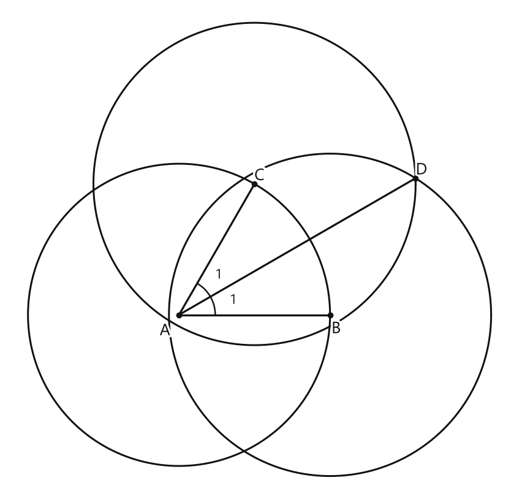
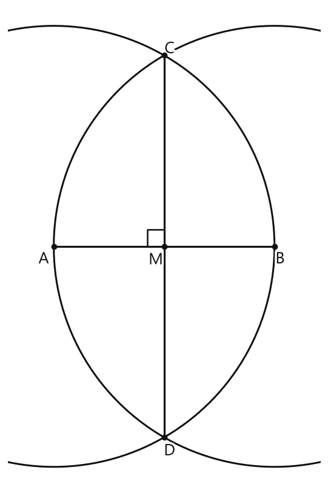
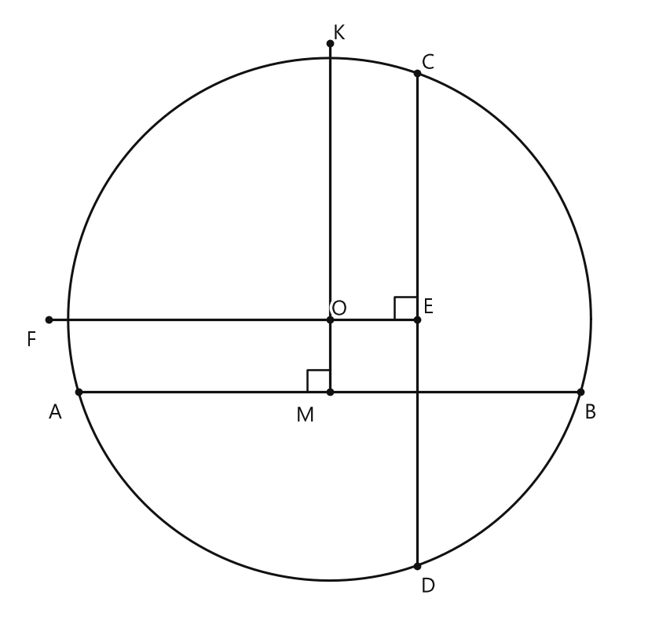
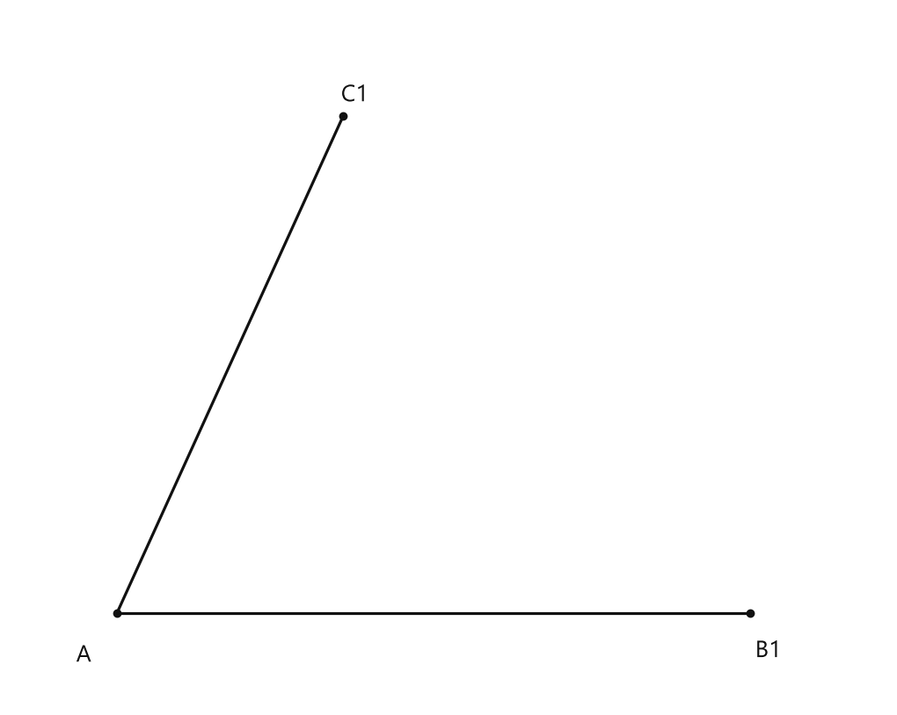
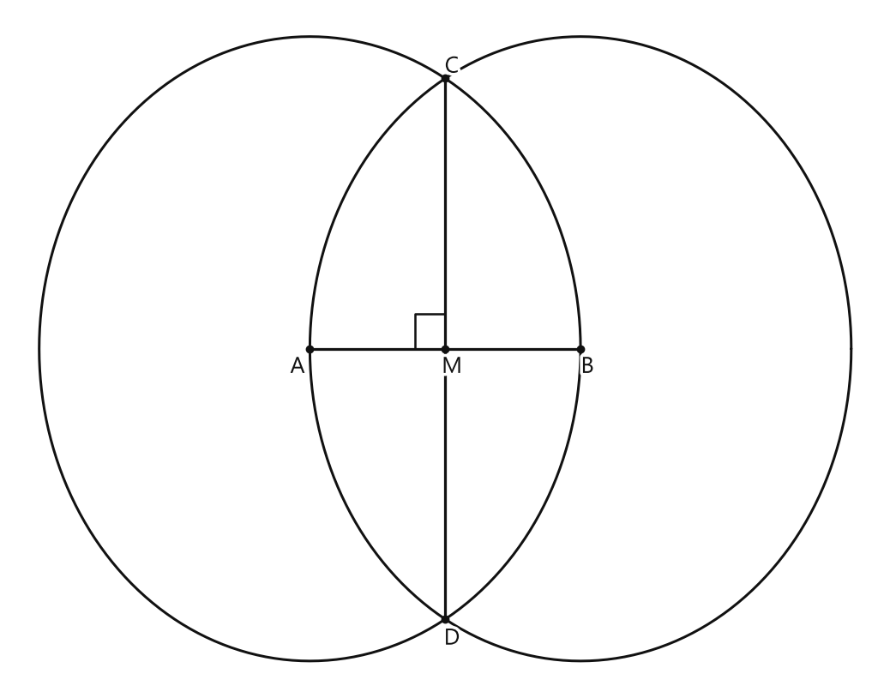
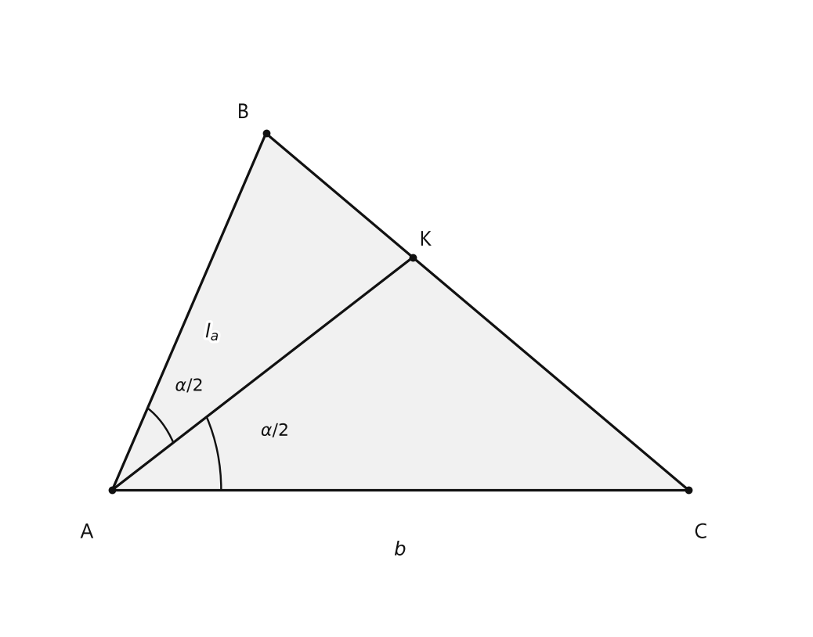
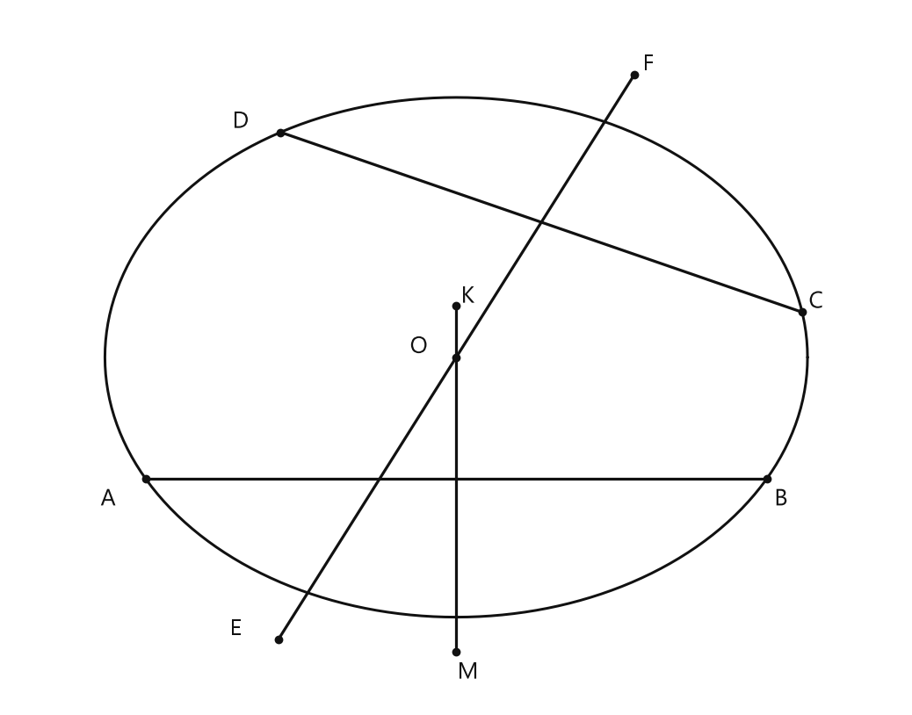

# Занятие 33. Построение биссектрисы угла. Построение середины отрезка

**Раздел:** Глава V. Задачи на построение  
**Параграф учебника:** §29. Построение биссектрисы угла. Построение середины отрезка  
**Страницы:** 170–171

## Цели занятия

После занятия ученик умеет:

- строить биссектрису данного угла циркулем и линейкой;
- объяснять, почему построенный луч действительно является биссектрисой;
- строить середину отрезка;
- строить серединный перпендикуляр к отрезку;
- находить центр данной окружности по двум хордам;
- решать задачу на построение треугольника по стороне, углу и биссектрисе.

Выбери блок своего уровня:

- **1–2 балла:** знать определения и последовательность построений;
- **3–4 балла:** выполнять построение биссектрисы и середины отрезка;
- **5–6 баллов:** объяснять построения с опорой на равенство треугольников;
- **7–8 баллов:** решать задачи на построение треугольника и центра окружности;
- **9–10 баллов:** уверенно обосновывать каждый шаг и находить ошибки в построениях.

## Теория к занятию

### 1. Построение биссектрисы угла

#### Простыми словами

Биссектриса делит угол на две равные части. Но проводить луч «примерно посередине» нельзя: чертёж может обмануть. Построим его точно с помощью циркуля.

Пусть вершина угла — точка $A$.

Сначала проводим дугу с центром в $A$. Она пересечёт стороны угла в точках $B$ и $C$. Так как $B$ и $C$ лежат на одной окружности с центром $A$, расстояния до них равны: $AB=AC$.

Теперь из точек $B$ и $C$ проводим дуги одинакового радиуса. Их пересечение обозначаем $D$. Получается, что $BD=CD$.

Треугольники $ABD$ и $ACD$ имеют по три равные стороны. Поэтому они равны, а углы $\angle BAD$ и $\angle CAD$ равны. Значит, луч $AD$ — биссектриса.

Геометрический «делитель угла» найден. И всё это без транспортира — циркуль сегодня главный герой.

#### Определение / факт / теорема / свойство

**Решение.** Пусть дан угол $A$ (рис. 305). Нужно построить его биссектрису. Произвольным радиусом строим дугу окружности с центром в точке $A$, которая пересекает стороны угла $A$ в точках $B$ и $C$. Далее одинаковым радиусом (большим $BC$) строим две дуги с центрами в точках $B$ и $C$ до их пересечения в точке $D$. Строим луч $AD$, который является искомой биссектрисой. Доказательство следует из того, что $\triangle ABD = \triangle ACD$ по трем сторонам ($AB = AC$, $BD = CD$ как радиусы, сторона $AD$ — общая), откуда $\angle BAD = \angle CAD$.

<!--geo-figure-spec
{
  "needed": true,
  "kind": "plane",
  "caption": "Построение биссектрисы угла $A$",
  "equal": true,
  "axis": false,
  "xlim": [
    -3.4,
    6.5
  ],
  "ylim": [
    -3.5,
    6.1
  ],
  "points": {
    "A": [
      0,
      0
    ],
    "B": [
      3,
      0
    ],
    "C": [
      1.5,
      2.598
    ],
    "D": [
      4.698,
      2.712
    ]
  },
  "segments": [
    [
      "A",
      "B"
    ],
    [
      "A",
      "C"
    ],
    [
      "A",
      "D"
    ]
  ],
  "polygons": [],
  "circles": [
    {
      "center": "A",
      "radius": 3
    },
    {
      "center": "B",
      "radius": 3.2
    },
    {
      "center": "C",
      "radius": 3.2
    }
  ],
  "labels": {
    "A": {
      "dx": -0.28,
      "dy": -0.32
    },
    "B": {
      "dx": 0.12,
      "dy": -0.28
    },
    "C": {
      "dx": 0.1,
      "dy": 0.16
    },
    "D": {
      "dx": 0.12,
      "dy": 0.16
    }
  },
  "right_angles": [],
  "angle_marks": [
    {
      "vertex": "A",
      "from": "B",
      "to": "D",
      "text": "1",
      "radius": 0.72
    },
    {
      "vertex": "A",
      "from": "D",
      "to": "C",
      "text": "1",
      "radius": 0.72
    }
  ],
  "texts": []
}
-->

*Построение биссектрисы угла A*

#### Формулы

При построении получаем:

$$AB=AC,$$

$$BD=CD,$$

$$AD=AD.$$

Из равенства треугольников:

$$\triangle ABD=\triangle ACD.$$

Следовательно,

$$\angle BAD=\angle CAD.$$

Буквы обозначают:

- $A$ — вершина угла;
- $B$ и $C$ — точки пересечения первой дуги со сторонами угла;
- $D$ — точка пересечения двух последующих дуг;
- $AD$ — искомая биссектриса.

#### Правила

1. Первую дугу проводят с центром в вершине угла.
2. Радиус первой дуги может быть произвольным.
3. Вторые две дуги проводят одинаковым радиусом.
4. Этот радиус должен быть больше $BC$, иначе дуги могут не пересечься.
5. Искомый луч проводят из вершины угла через точку пересечения дуг.

#### Алгоритм

1. Дан угол с вершиной $A$.
2. Произвольным радиусом строим дугу с центром в точке $A$.
3. Точки пересечения дуги со сторонами угла обозначаем $B$ и $C$.
4. Одинаковым радиусом, большим $BC$, строим дуги с центрами в точках $B$ и $C$.
5. Точку пересечения дуг обозначаем $D$.
6. Проводим луч $AD$.
7. Луч $AD$ — биссектриса данного угла.

#### Ловушки

- Если радиусы двух последних дуг разные, равенство $BD=CD$ не получится.
- Нельзя проводить биссектрису через произвольную точку внутри угла.
- Первая дуга должна иметь центр именно в вершине угла.
- Биссектриса — это луч, а не вся прямая через вершину.
- Не перепутай точки: луч нужно проводить через $A$ и $D$, а не через $B$ и $C$.

---

### 2. Построение середины отрезка

#### Простыми словами

Нужно разделить отрезок $AB$ на две равные части. Линейкой с делениями это можно сделать измерением, но в задачах на построение обычно используют циркуль и линейку без измерительной шкалы.

Строим две дуги одинакового радиуса: одну с центром в $A$, другую — с центром в $B$. Дуги пересекаются в точках $C$ и $D$.

Точки $C$ и $D$ одинаково удалены от $A$ и $B$. Поэтому прямая $CD$ проходит через середину $AB$ и перпендикулярна этому отрезку. Точку пересечения $CD$ и $AB$ обозначаем $M$. Тогда $AM=MB$.

Это точное деление пополам. Никакого «ну вроде по центру» — циркуль требует доказательств, как строгий, но справедливый проверяющий.

#### Определение / факт / теорема / свойство

**Решение.** Пусть $AB$ — данный отрезок. Радиусом, равным $AB$, строим две дуги с центрами в точках $A$ и $B$ до их пересечения в точках $C$ и $D$ (рис. 306).

Через точки $C$ и $D$ проводим прямую. В пересечении прямых $CD$ и $AB$ получаем точку $M$ — середину отрезка $AB$. Докажем это. Так как точки $C$ и $D$ равноудалены от концов отрезка $AB$ ($CA = CB = DA = DB$ как радиусы), то они лежат на серединном перпендикуляре к этому отрезку. Поскольку две точки задают единственную прямую, то $CD$ — серединный перпендикуляр к отрезку $AB$. Следовательно, $AM = MB$.

<!--geo-figure-spec
{
  "needed": true,
  "kind": "plane",
  "caption": "Построение середины отрезка $AB$",
  "equal": true,
  "axis": false,
  "xlim": [
    -1,
    5.8
  ],
  "ylim": [
    -5.2,
    5.2
  ],
  "points": {
    "A": [
      0,
      0
    ],
    "B": [
      4.8,
      0
    ],
    "C": [
      2.4,
      4.1569
    ],
    "D": [
      2.4,
      -4.1569
    ],
    "M": [
      2.4,
      0
    ]
  },
  "segments": [
    [
      "A",
      "B"
    ],
    [
      "C",
      "D"
    ]
  ],
  "polygons": [],
  "circles": [
    {
      "center": "A",
      "radius": 4.8
    },
    {
      "center": "B",
      "radius": 4.8
    }
  ],
  "labels": {
    "A": {
      "dx": -0.22,
      "dy": -0.28
    },
    "B": {
      "dx": 0.12,
      "dy": -0.28
    },
    "C": {
      "dx": 0.12,
      "dy": 0.14
    },
    "D": {
      "dx": 0.12,
      "dy": -0.3
    },
    "M": {
      "dx": -0.18,
      "dy": -0.3
    }
  },
  "right_angles": [
    {
      "vertex": "M",
      "from": "A",
      "to": "C"
    }
  ],
  "angle_marks": [],
  "texts": []
}
-->

*Построение середины отрезка AB*

#### Формулы

Для середины отрезка $AB$:

$$AM=MB.$$

Для точек пересечения дуг:

$$CA=CB,$$

$$DA=DB.$$

Для серединного перпендикуляра:

$$CD\perp AB.$$

#### Правила

1. Радиус обеих дуг должен быть одинаковым.
2. Радиус удобно брать равным длине $AB$.
3. Дуги должны пересечься в двух точках — $C$ и $D$.
4. Прямую проводят через точки $C$ и $D$.
5. Точка пересечения прямых $CD$ и $AB$ — середина отрезка.

#### Алгоритм

1. Дан отрезок $AB$.
2. Радиусом, равным $AB$, строим дугу с центром в точке $A$.
3. Тем же радиусом строим дугу с центром в точке $B$.
4. Точки пересечения дуг обозначаем $C$ и $D$.
5. Через точки $C$ и $D$ проводим прямую.
6. Точку пересечения прямых $CD$ и $AB$ обозначаем $M$.
7. Получаем $AM=MB$.

#### Ловушки

- Если радиусы дуг различны, точка пересечения не обязана быть серединой.
- Одной точки пересечения дуг недостаточно для проведения прямой.
- Не следует путать середину отрезка и середину любой его части.
- Прямая $CD$ является серединным перпендикуляром, поэтому она перпендикулярна $AB$.
- Не нужно искать середину точным измерением: здесь её находят построением.

#### Замечание

Указанный способ построения середины отрезка также является и способом построения серединного перпендикуляра к отрезку.

---

### 3. Построение треугольника по стороне, прилежащему углу и биссектрисе

#### Простыми словами

Даны:

- сторона $AC=b$;
- угол $A=\alpha$;
- биссектриса $AK=l_a$.

Нужно построить треугольник $ABC$.

Сначала строим угол $\alpha$. Затем проводим его биссектрису. Она делит угол $A$ пополам, поэтому угол между $AK$ и $AC$ равен $\frac{\alpha}{2}$.

Теперь у нас есть треугольник $AKC$: известны две его стороны $AC=b$ и $AK=l_a$, а также угол между ними. Такой треугольник можно построить по двум сторонам и углу между ними.

После этого достраиваем треугольник до $ABC$. Здесь важно не перепутать: $AK$ — не просто отрезок внутри треугольника, а именно биссектриса угла $A$.

#### Формулировка учебника

Предположим, что задача решена, и сделаем чертеж искомого треугольника $ABC$ (рис. 307). Пусть $AC = b$, $\angle A = \alpha$, биссектриса $AK = l_a$. Так как $AK$ — биссектриса, то $\angle KAC = \frac{\alpha}{2}$. Треугольник $AKC$ можно построить по двум сторонам и углу между ними: $AC = b$, $AK = l_a$, $\angle KAC = \frac{\alpha}{2}$. Далее треугольник $AKC$ легко достроить до искомого треугольника $ABC$.

#### Формулы

Так как $AK$ — биссектриса, то:

$$\angle KAC=\frac{\alpha}{2}.$$

Данные отрезки:

$$AC=b,$$

$$AK=l_a.$$

#### Алгоритм

1. Строим $\angle EAF=\alpha$.
2. Строим биссектрису $AG$ угла $EAF$.
3. Получаем $\angle GAF=\frac{\alpha}{2}$.
4. На луче $AF$ откладываем отрезок $AC=b$.
5. На луче $AG$ откладываем отрезок $AK=l_a$.
6. Через точки $C$ и $K$ проводим прямую.
7. Точку пересечения луча $CK$ и луча $AE$ обозначаем $B$.
8. Треугольник $ABC$ — искомый.

#### Ловушки

- На луче биссектрисы откладывают $AK=l_a$, а не произвольный отрезок.
- Угол между $AC$ и $AK$ равен $\frac{\alpha}{2}$, а не $\alpha$.
- Точка $B$ получается пересечением лучей $CK$ и $AE$.
- Если не построить биссектрису исходного угла, условие задачи не будет выполнено.
- Сначала строим угол и его биссектрису, а уже потом откладываем заданные отрезки. Иначе чертёж может превратиться в геометрический бутерброд без начинки.

---

### 4. Построение центра данной окружности

#### Простыми словами

Хорда — это отрезок, соединяющий две точки окружности. Центр окружности находится на одинаковом расстоянии от концов любой хорды. Значит, центр лежит на серединном перпендикуляре к этой хорде.

Одной хорды недостаточно: её серединный перпендикуляр — целая прямая, и на ней много точек. Поэтому берём две непараллельные хорды, строим к каждой серединный перпендикуляр. Точка пересечения этих двух прямых и будет центром окружности.

Две хорды — два указателя направления к центру. Один указатель может показать целую очередь возможных точек.

#### Формулировка учебника

Мы знаем, что серединный перпендикуляр к хорде проходит через центр окружности. Серединные перпендикуляры к двум хордам окружности будут пересекаться в ее центре. Отсюда построение.

Строим хорду $AB$ (рис. 309) и к ней серединный перпендикуляр $MK$ (основная задача). Строим хорду $CD$ (не параллельную $AB$) и к ней серединный перпендикуляр $EF$. Точка $O$ пересечения прямых $MK$ и $EF$ — центр окружности.

<!--geo-figure-spec
{
  "needed": true,
  "kind": "plane",
  "caption": "Построение центра окружности по двум непараллельным хордам",
  "equal": true,
  "axis": false,
  "xlim": [
    -3.3,
    3.3
  ],
  "ylim": [
    -3.2,
    3.2
  ],
  "points": {
    "O": [
      0,
      0
    ],
    "A": [
      -2.593742,
      -0.75
    ],
    "B": [
      2.593742,
      -0.75
    ],
    "C": [
      0.9,
      2.545584
    ],
    "D": [
      0.9,
      -2.545584
    ],
    "M": [
      0,
      -0.75
    ],
    "K": [
      0,
      2.85
    ],
    "E": [
      0.9,
      0
    ],
    "F": [
      -2.9,
      0
    ]
  },
  "segments": [
    [
      "A",
      "B"
    ],
    [
      "C",
      "D"
    ],
    [
      "M",
      "K"
    ],
    [
      "E",
      "F"
    ]
  ],
  "polygons": [],
  "circles": [
    {
      "center": "O",
      "radius": 2.7
    }
  ],
  "labels": {
    "O": {
      "dx": 0.1,
      "dy": 0.1
    },
    "A": {
      "dx": -0.24,
      "dy": -0.22
    },
    "B": {
      "dx": 0.1,
      "dy": -0.22
    },
    "C": {
      "dx": 0.12,
      "dy": 0.1
    },
    "D": {
      "dx": 0.12,
      "dy": -0.22
    },
    "M": {
      "dx": -0.25,
      "dy": -0.25
    },
    "K": {
      "dx": 0.1,
      "dy": 0.1
    },
    "E": {
      "dx": 0.12,
      "dy": 0.12
    },
    "F": {
      "dx": -0.18,
      "dy": -0.22
    }
  },
  "right_angles": [
    {
      "vertex": "M",
      "from": "A",
      "to": "K"
    },
    {
      "vertex": "E",
      "from": "C",
      "to": "F"
    }
  ],
  "angle_marks": [],
  "texts": []
}
-->

*Построение центра окружности по двум непараллельным хордам*

#### Алгоритм

1. На окружности выбираем хорду $AB$.
2. Строим серединный перпендикуляр $MK$ к хорде $AB$.
3. Выбираем хорду $CD$, не параллельную $AB$.
4. Строим серединный перпендикуляр $EF$ к хорде $CD$.
5. Точку пересечения прямых $MK$ и $EF$ обозначаем $O$.
6. Точка $O$ — центр окружности.

#### Ловушки

- Хорды $AB$ и $CD$ не должны быть параллельными.
- Одного серединного перпендикуляра недостаточно.
- Нужно строить именно серединные перпендикуляры, а не произвольные перпендикуляры.
- Центр окружности — точка пересечения двух построенных прямых.
- Если две выбранные хорды параллельны, их серединные перпендикуляры тоже могут оказаться параллельными. Пересечения не будет — план строительства центра придётся переделать.

---

## Сводка формул «выучить наизусть»

Для биссектрисы:

$$AB=AC,$$

$$BD=CD,$$

$$\angle BAD=\angle CAD.$$

Для середины отрезка:

$$AM=MB.$$

Для серединного перпендикуляра:

$$CD\perp AB,$$

$$CA=CB,$$

$$DA=DB.$$

Для задачи с биссектрисой треугольника:

$$\angle KAC=\frac{\alpha}{2},$$

$$AC=b,$$

$$AK=l_a.$$

## Правила, которые нельзя путать

- **Биссектриса угла** делит угол на два равных угла.
- **Середина отрезка** делит отрезок на два равных отрезка.
- Для биссектрисы первый центр дуги — вершина угла.
- Для середины отрезка центры дуг — концы отрезка.
- Для построения биссектрисы равными должны быть $BD$ и $CD$.
- Для построения середины отрезка равными должны быть расстояния от точек $C$ и $D$ до концов $A$ и $B$.
- Серединный перпендикуляр перпендикулярен отрезку и проходит через его середину.
- Центр окружности находят пересечением серединных перпендикуляров к двум непараллельным хордам.

## Разбор ключевых заданий

### Р1. Построить биссектрису данного угла

**Условие.** Дан угол $A$ со сторонами $AB_1$ и $AC_1$. Построить его биссектрису.

<!--geo-figure-spec
{
  "needed": true,
  "kind": "plane",
  "caption": "Данный угол $A$",
  "equal": true,
  "axis": false,
  "xlim": [
    -0.7,
    5.1
  ],
  "ylim": [
    -0.6,
    4.0
  ],
  "points": {
    "A": [
      0,
      0
    ],
    "B1": [
      4.2,
      0
    ],
    "C1": [
      1.5,
      3.3
    ]
  },
  "segments": [
    [
      "A",
      "B1"
    ],
    [
      "A",
      "C1"
    ]
  ],
  "polygons": [],
  "circles": [],
  "labels": {
    "A": {
      "dx": -0.22,
      "dy": -0.28
    },
    "B1": {
      "dx": 0.12,
      "dy": -0.25
    },
    "C1": {
      "dx": 0.08,
      "dy": 0.14
    }
  },
  "right_angles": [],
  "angle_marks": [],
  "texts": []
}
-->

*Данный угол A*

**Решение.**

1. Произвольным радиусом строим дугу с центром в точке $A$.
2. Дуга пересекает стороны угла в точках $B$ и $C$.
3. Поэтому $AB=AC$ как радиусы одной окружности.
4. Радиусом, большим $BC$, строим дугу с центром в точке $B$.
5. Тем же радиусом строим дугу с центром в точке $C$.
6. Точку пересечения этих дуг обозначаем $D$.
7. Проводим луч $AD$.
8. В треугольниках $ABD$ и $ACD$ имеем:

$$AB=AC,$$

$$BD=CD,$$

$$AD=AD.$$

9. Следовательно,

$$\triangle ABD=\triangle ACD$$

по трем сторонам.

10. Поэтому соответствующие углы равны:

$$\angle BAD=\angle CAD.$$

11. Значит, луч $AD$ является биссектрисой угла $A$.

*Типичная ошибка: провести луч через точку внутри угла, не доказав равенство его частей. В геометрии «выглядит ровно» — ещё не доказательство.*

**Ответ:** луч $AD$ — биссектриса угла $A$.

---

### Р2. Построить середину отрезка

**Условие.** Дан отрезок $AB$. Построить его середину и серединный перпендикуляр.

<!--geo-figure-spec
{
  "needed": true,
  "kind": "plane",
  "caption": "Середина отрезка $AB$ и серединный перпендикуляр",
  "equal": false,
  "axis": false,
  "xlim": [
    -5.3,
    10.1
  ],
  "ylim": [
    -5.2,
    5.2
  ],
  "points": {
    "A": [
      0,
      0
    ],
    "B": [
      4.8,
      0
    ],
    "C": [
      2.4,
      4.1569
    ],
    "D": [
      2.4,
      -4.1569
    ],
    "M": [
      2.4,
      0
    ]
  },
  "segments": [
    [
      "A",
      "B"
    ],
    [
      "C",
      "D"
    ]
  ],
  "polygons": [],
  "circles": [
    {
      "center": "A",
      "radius": 4.8
    },
    {
      "center": "B",
      "radius": 4.8
    }
  ],
  "labels": {
    "A": {
      "dx": -0.22,
      "dy": -0.28
    },
    "B": {
      "dx": 0.12,
      "dy": -0.28
    },
    "C": {
      "dx": 0.12,
      "dy": 0.18
    },
    "D": {
      "dx": 0.12,
      "dy": -0.3
    },
    "M": {
      "dx": 0.12,
      "dy": -0.28
    }
  },
  "right_angles": [
    {
      "vertex": "M",
      "from": "A",
      "to": "C"
    }
  ],
  "angle_marks": [],
  "texts": []
}
-->

*Середина отрезка AB и серединный перпендикуляр*

**Решение.**

1. Радиусом, равным $AB$, строим дугу с центром в точке $A$.
2. Тем же радиусом строим дугу с центром в точке $B$.
3. Дуги пересекаются в точках $C$ и $D$.
4. Так как радиусы одинаковы, то:

$$CA=CB,$$

$$DA=DB.$$

5. Значит, точки $C$ и $D$ равноудалены от концов отрезка $AB$.
6. Следовательно, точки $C$ и $D$ лежат на серединном перпендикуляре к отрезку $AB$.
7. Через точки $C$ и $D$ проводим прямую.
8. Обозначим её пересечение с $AB$ точкой $M$.
9. Прямая $CD$ является серединным перпендикуляром к отрезку $AB$.
10. Поэтому:

$$AM=MB.$$

11. Точка $M$ — середина отрезка $AB$.

*Циркуль здесь работает без линейки с делениями. Никаких «примерно пополам»: только точное пополам.*

**Ответ:** $M$ — середина отрезка $AB$, прямая $CD$ — серединный перпендикуляр.

### Р3. Построить треугольник по стороне $b$, прилежащему углу $\alpha$ и биссектрисе $l_a$

**Условие.** Построить треугольник $ABC$, если даны сторона $AC=b$, угол $A=\alpha$ и биссектриса $AK=l_a$.

<!--geo-figure-spec
{
  "needed": true,
  "kind": "plane",
  "caption": "Построение треугольника $ABC$",
  "equal": false,
  "axis": false,
  "xlim": [
    -0.8,
    5.4
  ],
  "ylim": [
    -0.8,
    2.8
  ],
  "points": {
    "A": [
      0,
      0
    ],
    "B": [
      1.2,
      2.078461
    ],
    "C": [
      4.5,
      0
    ],
    "K": [
      2.347826,
      1.355521
    ]
  },
  "segments": [
    [
      "A",
      "B"
    ],
    [
      "B",
      "C"
    ],
    [
      "C",
      "A"
    ],
    [
      "A",
      "K"
    ]
  ],
  "polygons": [
    {
      "vertices": [
        "A",
        "B",
        "C"
      ],
      "fill": 0.06
    }
  ],
  "circles": [],
  "labels": {
    "A": {
      "dx": -0.2,
      "dy": -0.25
    },
    "B": {
      "dx": -0.18,
      "dy": 0.12
    },
    "C": {
      "dx": 0.1,
      "dy": -0.25
    },
    "K": {
      "dx": 0.1,
      "dy": 0.1
    }
  },
  "right_angles": [],
  "angle_marks": [
    {
      "vertex": "A",
      "from": "B",
      "to": "K",
      "text": "$\\alpha/2$",
      "radius": 0.55
    },
    {
      "vertex": "A",
      "from": "K",
      "to": "C",
      "text": "$\\alpha/2$",
      "radius": 0.85
    }
  ],
  "texts": [
    {
      "xy": [
        2.25,
        -0.35
      ],
      "text": "$b$"
    },
    {
      "xy": [
        0.78,
        0.92
      ],
      "text": "$l_a$"
    }
  ]
}
-->

*Построение треугольника ABC*

**Решение.**

Сначала построим угол $A$ и его биссектрису. Затем построим небольшой треугольник $AKC$. После этого найдём вершину $B$.

1. Строим угол $\angle EAF=\alpha$.

2. Строим биссектрису $AG$ этого угла.

3. Так как $AG$ — биссектриса, она делит угол пополам:

$$\angle GAF=\frac{\alpha}{2}.$$

4. На луче $AF$ откладываем отрезок:

$$AC=b.$$

5. На луче $AG$ откладываем отрезок:

$$AK=l_a.$$

6. Теперь известны две стороны треугольника $AKC$: $AC$ и $AK$, а также угол между ними $\angle CAK$. Поэтому треугольник $AKC$ построен по двум сторонам и углу между ними.

7. Через точки $C$ и $K$ проводим прямую.

8. Находим точку $B$ пересечения луча $CK$ с лучом $AE$.

9. Получаем треугольник $ABC$.

10. Проверяем построенную фигуру:

$$AC=b,$$

$$\angle A=\alpha,$$

$$AK=l_a.$$

Точка $K$ лежит на биссектрисе $AG$, поэтому $AK$ является биссектрисой угла $A$.

*Секрет задачи: сначала строим маленький треугольник $AKC$, а потом достраиваем большой. Геометрия тоже любит начинать с малого.*

**Ответ:** построенный треугольник $ABC$.

---

### Р4. Построить центр данной окружности

**Условие.** Дана окружность. Построить её центр.

<!--geo-figure-spec
{
  "needed": true,
  "kind": "plane",
  "caption": "Окружность с хордами $AB$ и $CD$",
  "equal": false,
  "axis": false,
  "xlim": [
    -3.8,
    3.8
  ],
  "ylim": [
    -4,
    4
  ],
  "points": {
    "O": [
      0,
      0
    ],
    "A": [
      -2.653,
      -1.4
    ],
    "B": [
      2.653,
      -1.4
    ],
    "C": [
      2.954,
      0.521
    ],
    "D": [
      -1.5,
      2.598
    ],
    "M": [
      0,
      -3.4
    ],
    "K": [
      0,
      0.6
    ],
    "E": [
      -1.52,
      -3.26
    ],
    "F": [
      1.52,
      3.26
    ]
  },
  "segments": [
    [
      "A",
      "B"
    ],
    [
      "C",
      "D"
    ],
    [
      "M",
      "K"
    ],
    [
      "E",
      "F"
    ]
  ],
  "polygons": [],
  "circles": [
    {
      "center": "O",
      "radius": 3
    }
  ],
  "labels": {
    "O": {
      "dx": -0.32,
      "dy": 0.12
    },
    "A": {
      "dx": -0.32,
      "dy": -0.24
    },
    "B": {
      "dx": 0.12,
      "dy": -0.24
    },
    "C": {
      "dx": 0.12,
      "dy": 0.12
    },
    "D": {
      "dx": -0.34,
      "dy": 0.12
    },
    "M": {
      "dx": 0.1,
      "dy": -0.24
    },
    "K": {
      "dx": 0.1,
      "dy": 0.1
    },
    "E": {
      "dx": -0.36,
      "dy": 0.12
    },
    "F": {
      "dx": 0.12,
      "dy": 0.12
    }
  },
  "right_angles": [],
  "angle_marks": [],
  "texts": []
}
-->

*Окружность с хордами AB и CD*

**Решение.**

Центр окружности находится на серединном перпендикуляре к любой её хорде. Поэтому нам понадобятся две хорды.

1. На окружности выбираем хорду $AB$.

2. Строим середину отрезка $AB$ способом с двумя дугами.

Для этого:

- из точки $A$ проводим дугу радиусом, большим половины $AB$;
- из точки $B$ тем же радиусом проводим вторую дугу;
- через точки пересечения дуг проводим прямую.

Эта прямая является серединным перпендикуляром к хорде $AB$. Обозначим её $MK$.

3. Выбираем вторую хорду $CD$, не параллельную $AB$.

4. Тем же способом строим серединный перпендикуляр $EF$ к хорде $CD$.

5. Прямые $MK$ и $EF$ пересекаются в точке $O$.

6. Серединный перпендикуляр к хорде проходит через центр окружности.

7. Значит, центр окружности лежит и на прямой $MK$, и на прямой $EF$.

8. Их общая точка $O$ и есть центр данной окружности.

*Одна хорда оставляет несколько возможных мест для центра. Вторая хорда убирает неопределённость — математический детектив раскрыт.*

**Ответ:** точка $O$ — центр данной окружности.

---

### Р5. Найти ошибку в построении биссектрисы

**Условие.** При построении биссектрисы угла первую дугу провели с центром в вершине $A$, а две следующие дуги — с центрами в точках $B$ и $C$, но радиусы этих дуг оказались разными. Можно ли утверждать, что луч $AD$ является биссектрисой угла?

**Решение.**

В правильном построении две последние дуги имеют одинаковые радиусы. Поэтому их расстояния до точки пересечения $D$ равны:

$$BD=CD.$$

Разберём, что изменилось в условии.

1. Для доказательства биссектрисы необходимо получить равенство:

$$BD=CD.$$

2. Это равенство получается только тогда, когда дуги с центрами в точках $B$ и $C$ построены одинаковым радиусом.

3. По условию радиусы этих дуг разные.

4. Поэтому равенство $BD=CD$ не гарантировано.

5. Значит, треугольники $ABD$ и $ACD$ нельзя считать равными по трём сторонам.

6. Равенство углов:

$$\angle BAD=\angle CAD$$

не доказано.

7. Следовательно, нельзя утверждать, что луч $AD$ делит угол пополам.

*Одинаковый радиус здесь не украшение чертежа, а главный «пропуск» к равенству треугольников.*

**Ответ:** нельзя утверждать, что луч $AD$ является биссектрисой.

---

## Самопроверка

1. Какой точкой обозначают вершину данного угла?
2. Почему при построении биссектрисы равны отрезки $AB$ и $AC$?
3. Почему радиус двух последних дуг должен быть одинаковым?
4. Каким условием характеризуется середина отрезка $AB$?
5. Почему прямая через точки $C$ и $D$ является серединным перпендикуляром?
6. Сколько хорд нужно построить для нахождения центра окружности?
7. Почему эти хорды не должны быть параллельными?
8. Чему равен угол между стороной $AC$ и биссектрисой $AK$ в задаче на построение?

**Короткие ответы:**

1. Точкой $A$.
2. Они являются радиусами одной окружности.
3. Чтобы получить $BD=CD$.
4. $AM=MB$.
5. Точки $C$ и $D$ равноудалены от концов отрезка $AB$.
6. Две.
7. Их серединные перпендикуляры должны пересекаться.
8. $\frac{\alpha}{2}$.

## Практические задания

Выбери свой уровень и решай только этот блок. В блоке должна закрепиться вся тема параграфа. Ответы не приводятся.

### Уровень 1–2 балла

**С1.** Для построения биссектрисы угла с вершиной $A$ дугу окружности сначала проводят с центром в точке

1) $A$  
2) $B$  
3) $C$  
4) $D$  
5) $M$

**С2.** Дуга с центром в вершине угла пересекла его стороны в точках $B$ и $C$. Какое равенство используется при построении биссектрисы?

1) $AB=BC$  
2) $AC=BC$  
3) $AB=AC$  
4) $AD=BC$  
5) $BD=AC$

**С3.** После построения дуги с центром в вершине угла и получения точек $B$ и $C$ нужно построить две дуги с центрами в точках

1) $A$ и $D$  
2) $A$ и $B$  
3) $B$ и $C$  
4) $C$ и $D$  
5) $A$ и $C$

**С4.** При построении биссектрисы две дуги с центрами в точках $B$ и $C$ должны иметь

1) разные радиусы, меньшие $BC$  
2) одинаковые радиусы, большие $BC$  
3) одинаковые радиусы, равные $BC$  
4) разные радиусы, большие $BC$  
5) радиусы, равные $AB$ и $AC$

**С5.** Дуги с центрами в точках $B$ и $C$ пересеклись в точке $D$. Какой объект нужно построить следующим шагом?

1) отрезок $BC$  
2) луч $AD$  
3) прямую $BD$  
4) окружность с центром $D$  
5) отрезок $CD$

**С6.** При построении биссектрисы угла получены точки $B$, $C$ и $D$, причём $AB=AC$ и $BD=CD$. Какие треугольники сравнивают для обоснования построения?

1) $\triangle ABC$ и $\triangle BCD$  
2) $\triangle ABD$ и $\triangle ACD$  
3) $\triangle ABC$ и $\triangle ACD$  
4) $\triangle ABD$ и $\triangle BCD$  
5) $\triangle ACD$ и $\triangle ABC$

**С7.** Дан отрезок $AB$. Для построения его середины первую дугу проводят с центром в точке

1) $A$  
2) $B$  
3) $C$  
4) $D$  
5) $M$

**С8.** Дан отрезок $AB$. Какой радиус используют для построения двух дуг с центрами в точках $A$ и $B$?

1) $AB$  
2) $\dfrac{AB}{2}$  
3) $2AB$  
4) произвольный радиус, меньший $AB$  
5) радиус, равный длине любого другого отрезка

**С9.** Дуги с центрами в точках $A$ и $B$ пересеклись в точках $C$ и $D$. Какой объект проводят через эти точки?

1) луч $AC$  
2) отрезок $CD$  
3) прямую $CD$  
4) окружность с центром $C$  
5) прямую $AB$

**С10.** Прямая $CD$ пересекла отрезок $AB$ в точке $M$. Какое равенство верно для точки $M$?

1) $AM=AB$  
2) $BM=AB$  
3) $AM=CM$  
4) $AM=MB$  
5) $AB=CD$

**С11.** Установите правильную последовательность действий при построении биссектрисы угла.

1) Провести луч через вершину угла и точку пересечения двух дуг.  
2) Из точек пересечения первой дуги со сторонами угла провести две дуги одинакового радиуса.  
3) Провести дугу с центром в вершине угла.  

Запишите последовательность номеров действий.

**С12.** Установите правильную последовательность действий при построении середины отрезка $AB$.

1) Через точки пересечения дуг провести прямую.  
2) Середину отрезка получить в точке пересечения этой прямой с отрезком $AB$.  
3) Построить две дуги с центрами в точках $A$ и $B$ радиусом $AB$.  

Запишите последовательность номеров действий.

**С13.** Дан угол $A$. Какой инструмент используют для построения дуги окружности с центром в точке $A$?

1) линейку 2) циркуль 3) транспортир 4) угольник 5) карандаш

**С14.** При построении биссектрисы угла дуга с центром в вершине угла пересекает его стороны в точках $B$ и $C$. Как должны быть связаны отрезки $AB$ и $AC$?

1) $AB<AC$ 2) $AB>AC$ 3) $AB=AC$ 4) $AB+AC=BC$ 5) $AB=2AC$

**С15.** Какой следующий шаг выполняют после построения дуги с центром в вершине угла, пересекающей его стороны в точках $B$ и $C$?

1) проводят прямую $BC$  
2) строят две дуги с центрами в $B$ и $C$ одинаковым радиусом  
3) измеряют угол транспортиром  
4) строят окружность с центром в $A$  
5) проводят перпендикуляр к стороне угла

**С16.** При построении биссектрисы угла две дуги с центрами в точках $B$ и $C$ пересекаются в точке $D$. Какой луч нужно провести?

1) $BC$ 2) $BD$ 3) $CD$ 4) $AD$ 5) $AC$

**С17.** Выберите верное утверждение о построении биссектрисы угла $A$.

1) Точка $D$ должна лежать на стороне угла.  
2) Проводят луч $AD$.  
3) Проводят луч $BC$.  
4) Дуги строят с центрами только в точке $A$.  
5) Отрезки $AB$ и $AC$ должны быть разной длины.

**С18.** Какой радиус используют для построения двух дуг с центрами в точках $B$ и $C$ при построении биссектрисы угла?

1) произвольный радиус, не связанный с $BC$  
2) радиус, равный $AB$  
3) одинаковый радиус, больший $BC$  
4) радиус, равный углу $A$  
5) радиус, меньший $BC$

**С19.** Дан отрезок $AB$. Какой инструмент используют для построения дуги с центром в точке $A$?

1) линейку 2) циркуль 3) транспортир 4) угольник 5) миллиметровую бумагу

**С20.** При построении середины отрезка $AB$ дуги с центрами в точках $A$ и $B$ строят радиусом, равным:

1) половине $AB$ 2) $AB$ 3) двойной длине $AB$ 4) длине $AC$ 5) произвольным нулевым радиусом

**С21.** Дуги с центрами в точках $A$ и $B$ пересекаются в точках $C$ и $D$. Что проводят следующим шагом?

1) прямую $CD$ 2) луч $AC$ 3) отрезок $BC$ 4) окружность с центром $C$ 5) луч $AD$

**С22.** Точка $M$ — пересечение прямых $CD$ и $AB$. Что верно для точки $M$ при правильном построении середины отрезка?

1) $AM=AB$ 2) $MB=AB$ 3) $AM=MB$ 4) $AM=2MB$ 5) $MB=2AM$

**С23.** Выберите правильную последовательность построения середины отрезка $AB$.

1) Построить дуги с центрами $A$ и $B$, провести $CD$, найти $M$ на пересечении $CD$ и $AB$.  
2) Провести $CD$, затем построить дуги с центрами $A$ и $B$.  
3) Измерить угол $A$, затем провести луч $AD$.  
4) Построить дугу только с центром $A$, затем провести $AB$.  
5) Провести перпендикуляр через точку $A$, затем построить окружность.

**С24.** Как называется прямая $CD$, построенная через точки пересечения дуг с центрами в $A$ и $B$?

1) биссектриса угла $A$  
2) сторона треугольника  
3) серединный перпендикуляр к отрезку $AB$  
4) медиана угла  
5) диагональ отрезка

**С25.** При построении биссектрисы угла $A$ дуга с центром в точке $A$ пересекла стороны угла в точках $B$ и $C$. Какое равенство следует из построения?

1) $AB=BC$ 2) $AB=AC$ 3) $AC=BC$ 4) $AB=2AC$ 5) $BC=2AB$

**С26.** При построении биссектрисы угла точки $B$ и $C$ получены пересечением дуги с центром в вершине угла со сторонами угла. Что нужно сделать следующим шагом?

1) Провести прямую $BC$  
2) Построить окружность с центром в точке $A$  
3) Построить две дуги с центрами в точках $B$ и $C$ одинакового радиуса  
4) Разделить отрезок $BC$ пополам  
5) Провести луч $BC$

**С27.** При построении биссектрисы угла две дуги с центрами в точках $B$ и $C$ пересеклись в точке $D$. Какую линию проводят далее?

1) Луч $AD$ 2) Прямую $BD$ 3) Отрезок $CD$ 4) Прямую $AC$ 5) Луч $BD$

**С28.** При построении биссектрисы угла радиус двух дуг с центрами в точках $B$ и $C$ должен быть:

1) равен $AB$ 2) меньше $BC$ 3) равен $BC$ 4) больше $BC$ 5) равен нулю

**С29.** Даны угол $A$, точки $B$ и $C$ на его сторонах и точка $D$, причём $AB=AC$, $DB=DC$. Какой луч является биссектрисой угла $A$?

1) $AB$ 2) $AC$ 3) $BC$ 4) $AD$ 5) $BD$

**С30.** Для обоснования построения биссектрисы угла рассматривают треугольники $ABD$ и $ACD$. Какой признак равенства треугольников используют?

1) По двум сторонам и углу между ними  
2) По трём сторонам  
3) По стороне и двум углам  
4) По одному углу  
5) По двум углам

**С31.** Дан отрезок $AB$. Как нужно расположить циркуль при построении двух дуг для нахождения середины отрезка?

1) Центр в точке $A$, затем в точке $B$, радиус один и тот же  
2) Центр в точке $A$ оба раза, радиусы разные  
3) Центр в точке $B$ оба раза, радиусы разные  
4) Центр в середине отрезка $AB$  
5) Центры в точках $A$ и $B$, радиусы обязательно разные

**С32.** При построении середины отрезка $AB$ дуги с центрами в точках $A$ и $B$ пересеклись в точках $C$ и $D$. Что строят через точки $C$ и $D$?

1) Окружность 2) Луч $CD$ 3) Прямую $CD$ 4) Отрезок $AB$ 5) Луч $AC$

**С33.** Прямые $AB$ и $CD$ пересеклись в точке $M$, где $AB$ — данный отрезок, а $C$ и $D$ — точки пересечения построенных дуг. Какое равенство показывает, что $M$ — середина отрезка $AB$?

1) $AC=CD$ 2) $AM=AB$ 3) $AM=MB$ 4) $CM=DM$ 5) $AC=BM$

**С34.** При построении середины отрезка $AB$ дуги с центрами в точках $A$ и $B$ имеют радиус, равный:

1) $AB$ 2) $\dfrac{AB}{2}$ 3) $2AB$ 4) $AC$ только 5) $0$

**С35.** Точки $C$ и $D$ равноудалены от концов отрезка $AB$: $CA=CB$ и $DA=DB$. Какую прямую строят точки $C$ и $D$?

1) Прямую, проходящую через середину отрезка $AB$ и перпендикулярную ему  
2) Прямую, совпадающую с отрезком $AB$  
3) Прямую, параллельную отрезку $AB$  
4) Прямую, проходящую через точку $A$  
5) Прямую, проходящую через точку $B$

**С36.** Установите правильную последовательность действий при построении середины отрезка $AB$.

1) Провести прямую через точки пересечения дуг; отметить её пересечение с $AB$  
2) Построить две дуги радиусом $AB$ с центрами в точках $A$ и $B$  
3) Получить середину отрезка $AB$

Запишите последовательность цифр.

### Уровень 3–4 балла

**С1.** Дан угол $ABC$. Опишите последовательность действий для построения его биссектрисы с помощью циркуля и линейки.

**С2.** При построении биссектрисы угла $ABC$ дуга с центром в точке $B$ пересекла стороны угла в точках $M$ и $N$. Как построить точку $P$, лежащую на биссектрисе этого угла?

**С3.** При построении биссектрисы угла $ABC$ получены точки $M$, $N$ и $P$, причём $BM=BN$, $PM=PN$. Какой луч нужно провести, чтобы получить биссектрису угла $ABC$?

**С4.** Объясните, почему при построении биссектрисы угла $ABC$ радиусы дуг с центрами в точках $M$ и $N$ должны быть одинаковыми.

**С5.** В треугольниках $BMP$ и $BNP$ выполнено $BM=BN$, $PM=PN$, а сторона $BP$ является общей. По какому признаку равны эти треугольники? Какое равенство углов следует из их равенства?

**С6.** Дан отрезок $AB$. Опишите последовательность действий для построения его середины с помощью циркуля и линейки.

**С7.** При построении середины отрезка $AB$ дуги с центрами в точках $A$ и $B$ пересеклись в точках $C$ и $D$. Какие прямые нужно провести, чтобы найти середину отрезка $AB$?

**С8.** При построении середины отрезка $AB$ точка $C$ получена как пересечение двух дуг с центрами $A$ и $B$. Запишите все равенства расстояний, которые следуют из построения, если радиусы дуг равны $AB$.

**С9.** Точки $C$ и $D$ равноудалены от концов отрезка $AB$: $CA=CB$ и $DA=DB$. На какой прямой лежат точки $C$ и $D$? Как называется эта прямая относительно отрезка $AB$?

**С10.** При построении середины отрезка $AB$ прямая $CD$ пересекла отрезок $AB$ в точке $M$. Какое равенство отрезков нужно получить? Что можно утверждать о точке $M$?

**С11.** Восстановите пропуски в описании построения биссектрисы угла $ABC$: произвольным радиусом строят дугу с центром в точке $B$, которая пересекает стороны угла в точках $M$ и $N$. Затем одинаковым радиусом, большим $MN$, строят две дуги с центрами в точках $M$ и $N$ до их пересечения в точке ____. После этого проводят луч ____.

**С12.** Восстановите пропуски в описании построения середины отрезка $AB$: радиусом, равным $AB$, строят две дуги с центрами в точках ____ и ____ до их пересечения в точках $C$ и $D$. Через точки $C$ и $D$ проводят ____. В её пересечении с прямой $AB$ получают точку ____.

**С13.** Дан угол $A$. Опишите последовательность действий для построения его биссектрисы с помощью циркуля и линейки.

**С14.** При построении биссектрисы угла $A$ дуга с центром в точке $A$ пересекла стороны угла в точках $B$ и $C$. Как построить точку $D$, чтобы луч $AD$ был биссектрисой угла?

**С15.** При построении биссектрисы угла точки $B$ и $C$ получены пересечением дуги с центром в вершине угла со сторонами угла. Какое условие должен выполнять радиус дуг с центрами $B$ и $C$?

**С16.** Восстановите пропущенное действие в алгоритме построения биссектрисы угла:  
1) произвольным радиусом проводят дугу с центром в вершине угла;  
2) отмечают точки $B$ и $C$ её пересечения со сторонами угла;  
3) одинаковым радиусом проводят дуги с центрами в точках $B$ и $C$;  
4) …  
5) проводят луч из вершины угла через полученную точку.

**С17.** При построении биссектрисы угла $A$ дуга с центром в точке $A$ пересекает стороны угла в точках $B$ и $C$. Объясните, почему $AB=AC$.

**С18.** При построении биссектрисы угла $A$ получены точки $B$, $C$ и $D$, причём $AB=AC$, $BD=CD$, а отрезок $AD$ является общим для треугольников $ABD$ и $ACD$. По какому признаку равны эти треугольники?

**С19.** Дан отрезок $AB$. Опишите последовательность действий для построения его середины с помощью циркуля и линейки.

**С20.** При построении середины отрезка $AB$ дуги с центрами в точках $A$ и $B$ пересеклись в точках $C$ и $D$. Какую прямую нужно провести далее и где получится середина отрезка $AB$?

**С21.** При построении середины отрезка $AB$ радиус каждой из двух дуг выбран равным $AB$. Как соотносятся расстояния от точек $C$ и $D$ до концов отрезка $AB$?

**С22.** Восстановите пропущенное действие в алгоритме построения середины отрезка $AB$:  
1) радиусом, равным $AB$, проводят дугу с центром в точке $A$;  
2) тем же радиусом проводят дугу с центром в точке $B$;  
3) отмечают точки пересечения дуг $C$ и $D$;  
4) …  
5) точку пересечения полученной прямой с $AB$ обозначают буквой $M$.

**С23.** При построении середины отрезка $AB$ прямая $CD$ пересекла отрезок $AB$ в точке $M$. Какое равенство должно выполняться, чтобы $M$ была серединой отрезка $AB$?

**С24.** Для построения середины отрезка $AB$ ученик провёл две дуги с центрами в точках $A$ и $B$, но взял для них разные радиусы. Почему такой способ не гарантирует получения середины отрезка $AB$?

**С25.** Дан угол $ABC$. Запишите последовательность действий для построения его биссектрисы с помощью циркуля и линейки.

**С26.** При построении биссектрисы угла $ABC$ дуга с центром в точке $B$ пересекла стороны угла в точках $M$ и $N$. С какими центрами и каким радиусом нужно построить следующие две дуги?

**С27.** При построении биссектрисы угла $ABC$ две дуги с центрами $M$ и $N$ пересеклись в точке $P$. Какой луч нужно провести, чтобы получить биссектрису угла?

**С28.** Почему при построении биссектрисы угла $ABC$ радиусы дуг с центрами в точках $M$ и $N$ должны быть одинаковыми?

**С29.** Даны две стороны угла $ABC$. При построении дуги с центром в вершине угла получены точки $M$ и $N$ на его сторонах. Запишите равенства, которые используются для доказательства того, что луч $BP$ является биссектрисой угла, где $P$ — точка пересечения двух следующих дуг.

**С30.** Угол $ABC$ построен. Дуга с центром $B$ пересекает его стороны в точках $M$ и $N$, а дуги с центрами $M$ и $N$ пересекаются в точке $P$. Назовите три пары равных сторон треугольников $BMP$ и $BNP$.

**С31.** Дан отрезок $AB$. Составьте план его деления пополам с помощью циркуля и линейки.

**С32.** При построении середины отрезка $AB$ циркулем с центром в точке $A$ построена дуга, а затем такая же дуга с центром в точке $B$. Дуги пересеклись в точках $C$ и $D$. Какую прямую нужно провести далее?

**С33.** При построении середины отрезка $AB$ прямая, проведённая через точки $C$ и $D$, пересекла отрезок $AB$ в точке $M$. Какое равенство должно выполняться для точки $M$?

**С34.** Почему при построении середины отрезка $AB$ радиус дуг с центрами $A$ и $B$ выбирают равным длине отрезка $AB$?

**С35.** При построении середины отрезка $AB$ дуги с центрами $A$ и $B$ пересеклись только в одной точке. Можно ли провести через точки пересечения прямую, которая определит середину отрезка? Объясните ответ.

**С36.** Отрезок $AB$ и угол $KLM$ даны. Опишите, какие построения нужно выполнить, чтобы одновременно получить середину отрезка $AB$ и биссектрису угла $KLM$.

### Уровень 5–6 баллов

**С1.** Дан угол $ABC$. Опишите последовательность действий для построения его биссектрисы с помощью циркуля и линейки. Обозначьте точки пересечения дуг со сторонами угла и точку пересечения вспомогательных дуг.

**С2.** Дан угол $MON$. Циркулем произвольного радиуса с центром в точке $O$ проведена дуга, пересекающая стороны угла в точках $P$ и $Q$. Опишите дальнейшие построения, позволяющие провести биссектрису угла $MON$.

**С3.** При построении биссектрисы угла $ABC$ дуга с центром в точке $B$ пересекла стороны угла в точках $P$ и $Q$. Затем из точек $P$ и $Q$ построены дуги одинакового радиуса, которые пересеклись в точке $R$. Какой луч нужно провести и почему он является биссектрисой угла $ABC$?

**С4.** При построении биссектрисы угла $ABC$ точки $P$ и $Q$ лежат на его сторонах, причём $BP=BQ$. Дуги с центрами в точках $P$ и $Q$ проведены одним и тем же радиусом и пересеклись в точке $R$. Сравните треугольники $BPR$ и $BQR$ и сделайте вывод о равенстве углов $PBR$ и $RBQ$.

**С5.** Дан отрезок $AB$. Опишите построение его середины с помощью циркуля и линейки, используя две дуги с центрами в концах отрезка. Укажите, какие точки следует соединить прямой и где будет находиться середина отрезка.

**С6.** При построении середины отрезка $AB$ дуги с центрами в точках $A$ и $B$ пересеклись в точках $C$ и $D$. Через точки $C$ и $D$ проведена прямая, пересекающая $AB$ в точке $M$. Объясните, почему $M$ является серединой отрезка $AB$.

**С7.** Дан отрезок $CD$. Постройте его середину циркулем и линейкой. Радиус дуг, проводимых из точек $C$ и $D$, возьмите равным длине отрезка $CD$. Запишите обозначение точки, полученной в результате построения.

**С8.** При построении середины отрезка $EF$ из точек $E$ и $F$ проведены дуги одинакового радиуса, пересекающиеся в точках $K$ и $L$. Какие равенства расстояний нужно записать, чтобы обосновать, что прямая $KL$ является серединным перпендикуляром к отрезку $EF$?

**С9.** Дан угол $XYZ$. Постройте его биссектрису. После построения обозначьте точку пересечения первой дуги со сторонами угла буквами $P$ и $Q$, точку пересечения двух дополнительных дуг — буквой $R$, а биссектрису — лучом $XR$. Запишите равенства, подтверждающие правильность построения.

**С10.** Дан отрезок $AB$. Постройте его середину и серединный перпендикуляр. В описании построения укажите, почему выбранный радиус дуг должен быть не меньше длины отрезка $AB$.

**С11.** Постройте треугольник $ABC$ по заданным отрезкам $AB$ и $AC$ и заданному углу $BAC$. После построения проведите биссектрису угла $BAC$. Опишите порядок выполнения всех построений.

**С12.** Дана окружность без отмеченного центра. Постройте её центр с помощью циркуля и линейки: проведите две хорды окружности, постройте их серединные перпендикуляры и найдите точку пересечения этих перпендикуляров. кратко объясните, почему найденная точка является центром окружности.

**С13.** Дан угол $ABC$. Опишите последовательность действий для построения его биссектрисы с помощью циркуля и линейки.

**С14.** Дан отрезок $AB$. Опишите последовательность действий для построения его середины с помощью циркуля и линейки.

**С15.** При построении биссектрисы угла $ABC$ дуга с центром в точке $B$ пересекла стороны угла в точках $P$ и $Q$. Какой радиус следует выбрать для построения дуг с центрами в точках $P$ и $Q$? Укажите необходимое условие для этого радиуса.

**С16.** При построении биссектрисы угла $ABC$ дуги с центрами в точках $P$ и $Q$ пересеклись в точке $D$. Какую линию нужно провести, чтобы получить биссектрису угла? Объясните, почему построенная линия является биссектрисой.

**С17.** При построении биссектрисы угла $ABC$ дуга с центром в вершине $B$ пересекла стороны угла в точках $P$ и $Q$. Известно, что $BP=6$ см. Какова длина $BQ$?

**С18.** При построении биссектрисы угла $ABC$ получены точки $P$, $Q$ и $D$, причём $BP=BQ$, $DP=DQ$, а отрезок $BD$ является общим для треугольников $BPD$ и $BQD$. По какому признаку равны эти треугольники?

**С19.** Дан отрезок $AB$ длиной $8$ см. Для построения его середины из точек $A$ и $B$ проведены две дуги одним и тем же радиусом, равным $8$ см, которые пересеклись в точках $C$ и $D$. Какую линию нужно провести через точки $C$ и $D$?

**С20.** Дан отрезок $AB$ длиной $10$ см. После построения серединного перпендикуляра к нему получена точка $M$ пересечения этого перпендикуляра с отрезком $AB$. Найдите длины отрезков $AM$ и $MB$.

**С21.** При построении середины отрезка $AB$ дуги с центрами в точках $A$ и $B$ не пересеклись. Как следует изменить радиус дуг, чтобы построение стало возможным? Укажите условие, которому должен удовлетворять радиус $r$.

**С22.** Ученик строит середину отрезка $AB$, проводя из точек $A$ и $B$ дуги радиусом $4$ см. Длина отрезка $AB$ равна $10$ см. Объясните, почему такой способ построения не сработает, и укажите наименьшее целое значение радиуса, при котором дуги смогут пересечься.

**С23.** Дан угол $ABC$. При его построении точка $P$ лежит на луче $BA$, точка $Q$ — на луче $BC$, причём $BP=BQ$. Точка $D$ выбрана так, что $DP=DQ$. Докажите, что луч $BD$ является биссектрисой угла $ABC$.

**С24.** Дан отрезок $AB$. Точки $C$ и $D$ расположены по разные стороны от прямой $AB$, причём $CA=CB$ и $DA=DB$. Докажите, что прямая $CD$ проходит через середину отрезка $AB$ и перпендикулярна ему.

**С25.** Дан угол $ABC$. Опишите последовательность действий для построения его биссектрисы с помощью циркуля и линейки. Укажите, какие дуги нужно провести и какие точки соединить.

**С26.** При построении биссектрисы угла $ABC$ дуга с центром в точке $B$ пересекла стороны угла в точках $M$ и $N$. Затем из точек $M$ и $N$ провели дуги одинакового радиуса, которые пересеклись в точке $P$. Какую линию нужно провести после этого? Почему построенная линия является биссектрисой угла $ABC$?

**С27.** Дан отрезок $AB$. Опишите построение его середины с помощью циркуля и линейки, если радиус дуг, проведённых из точек $A$ и $B$, равен длине отрезка $AB$.

**С28.** При построении середины отрезка $AB$ дуги с центрами в точках $A$ и $B$ пересеклись в точках $C$ и $D$. Какую прямую нужно провести далее? Как получить точку $M$, являющуюся серединой отрезка $AB$?

**С29.** Объясните, почему при построении середины отрезка $AB$ точка пересечения прямых $AB$ и $CD$ делит отрезок $AB$ пополам, если $CA=CB$ и $DA=DB$.

**С30.** Дан угол $ABC$ и отрезок $MN$. Составьте план построения:  
1) биссектрисы угла $ABC$;  
2) середины отрезка $MN$.  
Для каждого построения укажите, какие равенства расстояний используются для проверки результата.

### Уровень 7–8 баллов

**С1.** Постройте биссектрису угла $ABC$ с помощью циркуля и линейки. Опишите последовательность построения и обоснуйте, почему построенный луч делит угол пополам.

**С2.** Постройте биссектрису острого угла $A$, стороны которого заданы лучами $AB$ и $AC$. Укажите все вспомогательные точки, которые необходимо получить в процессе построения, и докажите равенство образовавшихся углов.

**С3.** Дан угол $MON$. Постройте его биссектрису так, чтобы сначала дуга с центром в вершине угла пересекла его стороны в точках $P$ и $Q$, а затем две дуги с центрами $P$ и $Q$ пересеклись в точке $R$. Запишите, какие равенства отрезков используются в доказательстве.

**С4.** Постройте середину отрезка $AB$ с помощью циркуля и линейки, используя дуги радиуса $AB$. Обозначьте точки пересечения дуг буквами $C$ и $D$, а середину отрезка — буквой $M$. Обоснуйте, почему $AM=MB$.

**С5.** Дан отрезок $KL$. Постройте его середину, проведя через точки пересечения двух равных дуг прямую. Объясните, почему эта прямая является серединным перпендикуляром к отрезку $KL$.

**С6.** Постройте биссектрису угла $XYZ$, а затем разделите построенный отрезок $YT$, где $T$ — точка биссектрисы на стороне угла, пополам. Обозначьте середину отрезка $YT$ буквой $M$ и обоснуйте оба построения.

**С7.** Дан отрезок $AB$ и точка $C$, не лежащая на прямой $AB$. Постройте отрезок, соединяющий точку $C$ с серединой отрезка $AB$. Для построения середины используйте две дуги с центрами $A$ и $B$, пересекающиеся в точках $D$ и $E$. Запишите доказательство правильности построения.

**С8.** Дан угол $AOB$ и точка $C$ внутри него. Постройте луч, который является биссектрисой угла $AOB$, не используя транспортир. После построения проверьте результат с помощью равенства треугольников и укажите признак равенства, который применяется.

**С9.** Дан отрезок $AB$. Постройте его середину двумя способами: сначала используя дуги радиуса $AB$, а затем используя дуги любого одинакового радиуса, большего половины длины $AB$. Сравните построения и обоснуйте, почему в обоих случаях получается одна и та же точка.

**С10.** Дан угол $KLM$, величина которого не задана. Постройте его биссектрису. Затем на построенном луче отметьте точку $N$ и постройте середину отрезка $LN$. Докажите, что полученная точка одновременно лежит на биссектрисе угла $KLM$ и делит отрезок $LN$ пополам.

**С11.** Дан треугольник $ABC$. Постройте биссектрису угла $A$ и серединный перпендикуляр к стороне $BC$. Обозначьте точку пересечения построенных линий буквой $O$. Опишите построение и обоснуйте, какие равенства отрезков и углов следуют из выполненных построений.

**С12.** Дан угол $PQR$ и отрезок $AB$. Постройте луч, делящий угол $PQR$ пополам, а затем постройте отрезок, равный половине $AB$, используя только циркуль и линейку. Для каждого этапа укажите вспомогательные точки, последовательность действий и доказательство правильности построения.

**С13.** Дан угол $ABC$. Опишите последовательность действий для построения его биссектрисы с помощью циркуля и линейки. Укажите, какие радиусы выбираются на каждом этапе построения, и обоснуйте, почему построенный луч делит угол пополам.

**С14.** Дан неразвёрнутый угол $MON$. Циркулем с центром в точке $O$ проведена дуга, пересекающая стороны угла в точках $P$ и $Q$. Затем из точек $P$ и $Q$ проведены дуги одинакового радиуса, пересекающиеся в точке $R$. Сформулируйте признак, позволяющий заключить, что луч $OR$ является биссектрисой угла $MON$, и приведите доказательство.

**С15.** Постройте биссектрису угла $XYZ$, если известно, что расстояние между точками пересечения первой дуги со сторонами угла равно $4$ см. Укажите, каким должен быть радиус двух дуг с центрами в этих точках, чтобы они пересеклись.

**С16.** Дан угол $ABC$, стороны которого имеют общую точку $B$. Построение биссектрисы начали дугой с центром в $B$, пересекающей стороны угла в точках $M$ и $N$. Объясните, почему для построения точки пересечения второй пары дуг нельзя выбирать радиус, меньший половины длины отрезка $MN$.

**С17.** Дан отрезок $AB$ длиной $8$ см. Постройте его середину с помощью циркуля и линейки, используя дуги радиуса $AB$. Запишите последовательность построений и докажите, что полученная точка делит отрезок $AB$ пополам.

**С18.** Дан отрезок $CD$. Дугами с центрами в точках $C$ и $D$, проведёнными одинаковым радиусом, получены точки $E$ и $F$, лежащие по разные стороны от прямой $CD$. Постройте середину отрезка $CD$ и объясните, почему прямая $EF$ перпендикулярна отрезку $CD$.

**С19.** Отрезок $AB$ имеет длину $6$ см. Дугами с центрами в точках $A$ и $B$ построены точки $C$ и $D$, причём $AC=BC=AD=BD=5$ см. Через $C$ и $D проведена прямая, пересекающая $AB$ в точке $M$. Обоснуйте, что $M$ — середина отрезка $AB$, не используя измерение отрезков линейкой.

**С20.** Постройте центр данной окружности, если на окружности выбраны три точки $A$, $B$ и $C$, не лежащие на одной прямой. Используйте построение серединных перпендикуляров к хордам. Объясните, почему достаточно построить только два таких перпендикуляра.

**С21.** Дан угол $ABC$ и отрезок $MN$. Постройте отрезок, равный половине $MN$, а затем постройте биссектрису угла $ABC$. Запишите построения в таком порядке, чтобы каждое следующее действие опиралось только на уже построенные объекты.

**С22.** Дан треугольник $ABC$. Постройте биссектрису угла $A$ и серединный перпендикуляр к стороне $BC$. Назовите все вспомогательные точки, которые необходимо получить при построении, и обоснуйте каждое из двух построений.

**С23.** Дан угол $KLM$. На его сторонах выбраны точки $P$ и $Q$ так, что $LP=LQ$. Постройте точку $T$, равноудалённую от точек $P$ и $Q$, лежащую внутри угла, а затем луч $LT$. Докажите, что построенный луч является биссектрисой угла $KLM$.

**С24.** Дан отрезок $AB$ и точка $P$, не лежащая на прямой $AB$. Постройте прямую, проходящую через точку $P$ и середину отрезка $AB$, используя только циркуль и линейку. Для построения середины сначала проведите дуги с центрами в точках $A$ и $B$, а затем обоснуйте положение полученной точки.

### Уровень 9–10 баллов

**С1.** Дан угол $ABC$, причём точки $A$ и $C$ лежат на его сторонах. С помощью циркуля и линейки постройте биссектрису угла $ABC$. Опишите последовательность построений и обоснуйте, почему построенный луч является биссектрисой.

**С2.** Дан отрезок $AB$. С помощью циркуля и линейки постройте его середину, используя дуги окружностей с центрами в точках $A$ и $B$. Опишите построение и докажите, что полученная точка делит отрезок $AB$ пополам.

**С3.** Дан угол $ABC$. При построении его биссектрисы первая дуга пересекла стороны угла в точках $M$ и $N$. Затем из точек $M$ и $N$ были проведены дуги одинакового радиуса, пересекающиеся в точке $P$. Объясните, почему для второго шага радиус должен быть больше длины $MN$, и докажите, что луч $BP$ является биссектрисой угла $ABC$.

**С4.** Дан отрезок $AB$. Для построения его середины из точек $A$ и $B$ проведены дуги одинакового радиуса, пересекающиеся в точках $C$ и $D$. Прямая $CD$ пересекает отрезок $AB$ в точке $M$. Докажите, что $AM=MB$ и что $CD\perp AB$.

**С5.** Дан угол $ABC$, величина которого не указана. Постройте луч $BD$, делящий этот угол на два равных угла, причём точка $D$ должна находиться внутри угла. Запишите все необходимые условия выбора радиусов циркуля и объясните, какие равенства расстояний используются в доказательстве.

**С6.** Дан отрезок $AB$. Требуется построить точку $M$ такую, чтобы $AM:MB=1:1$, но нельзя измерять отрезок линейкой. Выполните построение циркулем и линейкой и докажите результат через равенство расстояний от точек пересечения дуг до концов отрезка.

**С7.** Дан треугольник $ABC$. Постройте биссектрису угла $A$ и середину стороны $BC$. Обозначьте точку пересечения биссектрисы с противоположной стороной через $D$, а середину стороны $BC$ — через $M$. Опишите построения, не используя измерительных делений линейки.

**С8.** Дан треугольник $ABC$. С помощью циркуля и линейки постройте биссектрисы углов $A$ и $B$. Обозначьте их точку пересечения через $I$. Обоснуйте, почему для каждой биссектрисы можно применять одну и ту же схему построения, независимо от величин углов.

**С9.** Дан отрезок $AB$ и точка $P$, не лежащая на прямой $AB$. Постройте середину отрезка $AB$, используя две дуги с центрами в $A$ и $B$, а затем проведите через найденную середину и точку $P$ прямую. Докажите, что построенная прямая пересекает отрезок $AB$ в его середине.

**С10.** Дан угол $ABC$ и точка $P$ внутри него. Требуется построить луч, являющийся биссектрисой угла $ABC$, причём построение должно включать точку $P$ только в качестве дополнительной точки чертежа. Выполните построение стандартным способом и объясните, почему положение точки $P$ не влияет на результат.

**С11.** На плоскости даны три точки $A$, $B$, $C$, не лежащие на одной прямой. Постройте центр окружности, проходящей через эти точки: сначала постройте середины отрезков $AB$ и $BC$, затем проведите через них серединные перпендикуляры к этим отрезкам. Опишите построение и обоснуйте, почему точка пересечения построенных прямых является центром искомой окружности.

**С12.** Дан треугольник $ABC$. Постройте биссектрису угла $A$ и серединный перпендикуляр к стороне $BC$. Пусть построенные прямые пересекаются в точке $P$. Опишите все этапы построения и укажите, какие равенства расстояний доказывают правильность каждой из двух построенных линий.

**С13.** Постройте треугольник $ABC$ по стороне $BC$, прилежащему к ней углу $\angle ACB$ и длине биссектрисы угла $\angle BAC$: $BC=6$ см, $\angle ACB=60^\circ$, $l_a=4$ см. Опишите последовательность построения и обоснуйте, почему построенный треугольник удовлетворяет всем данным условиям.

**С14.** Дан угол $\angle ABC$ и точка $P$, расположенная внутри этого угла. С помощью циркуля и линейки постройте луч, исходящий из точки $B$, который проходит через точку $P$. Укажите способ проверки того, является ли построенный луч биссектрисой угла $\angle ABC$. Если он не является биссектрисой, постройте биссектрису данного угла.

**С15.** Дан отрезок $AB$. Не измеряя его длину, постройте точку $M$, которая делит отрезок $AB$ в отношении $AM:MB=1:1$, и прямую, перпендикулярную отрезку $AB$ и проходящую через точку $M$. Обоснуйте, почему построенная прямая проходит через середину отрезка $AB$.

**С16.** Дана окружность без отмеченного центра. Постройте её центр, используя только циркуль и линейку. Для построения разрешается выбрать на окружности любые четыре точки. Опишите, какие отрезки необходимо построить и почему их пересечение является центром данной окружности.

**С17.** Дан угол $\angle A$, одна из его сторон и точка $P$ внутри угла. Постройте отрезок с концами на сторонах угла, проходящий через точку $P$, так, чтобы луч $AP$ являлся биссектрисой угла $\angle A$. Сформулируйте условие, при котором такое построение возможно, и объясните, почему концы построенного отрезка находятся на одинаковом расстоянии от точки $A$.

**С18.** Дан отрезок $AB$ и точка $P$, не лежащая на прямой $AB$. Постройте отрезок $CD$, для которого точка $P$ является серединой, а точки $C$ и $D$ лежат соответственно по разные стороны от прямой $AB$. Дополнительно постройте серединный перпендикуляр к отрезку $CD$ и укажите, как проверить правильность построения.

## Чек-лист «ученик понял тему»

- Могу повторить определения и формулы параграфа своими словами и по учебнику.
- Решаю типовые задания своего уровня без подсказки.
- Вижу типичную ошибку и могу её объяснить.
