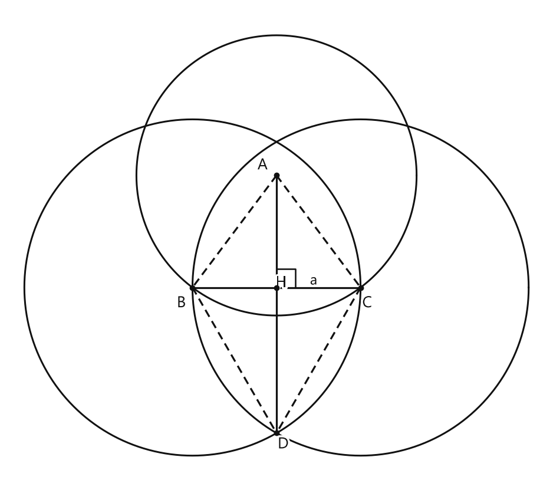
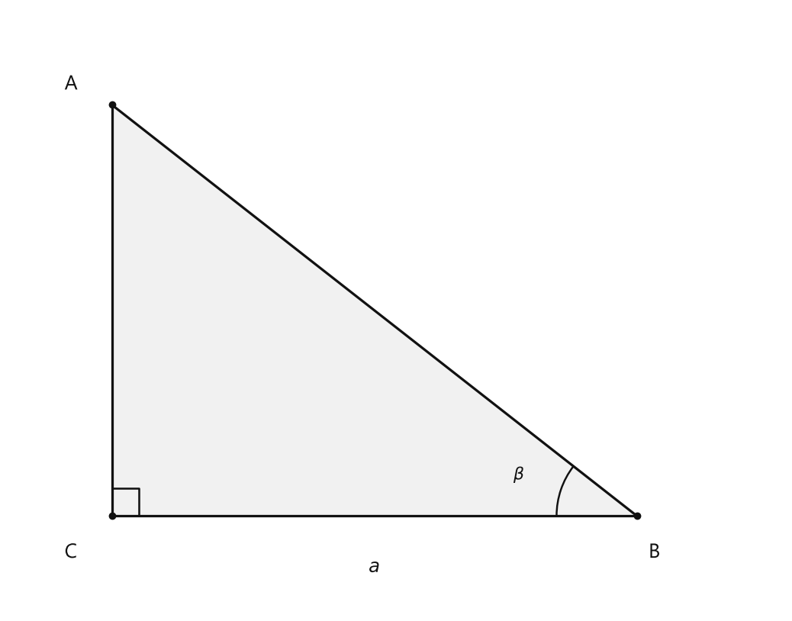
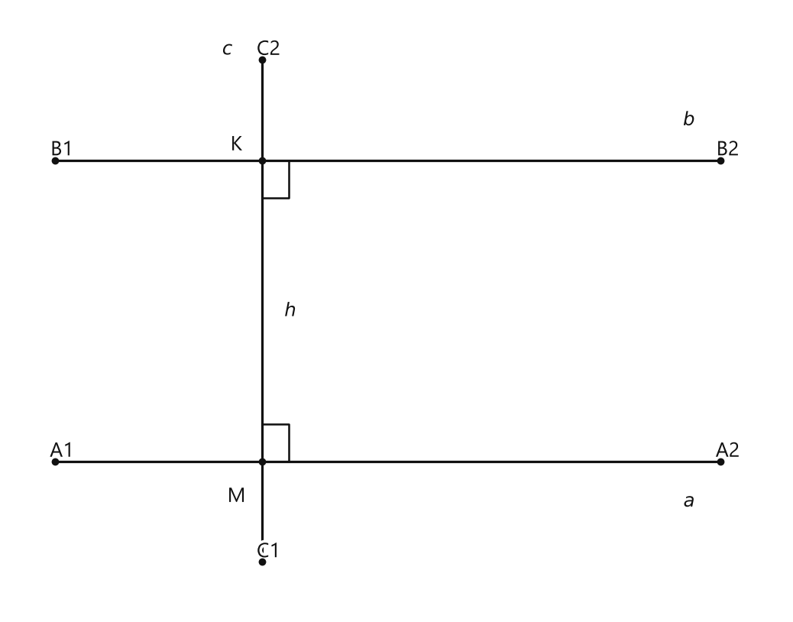
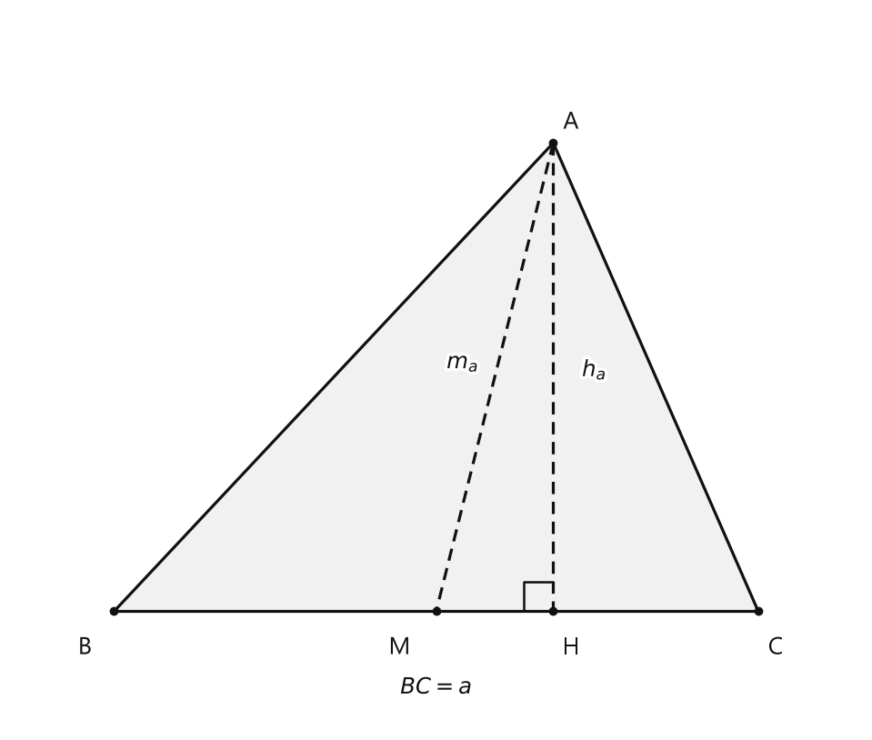
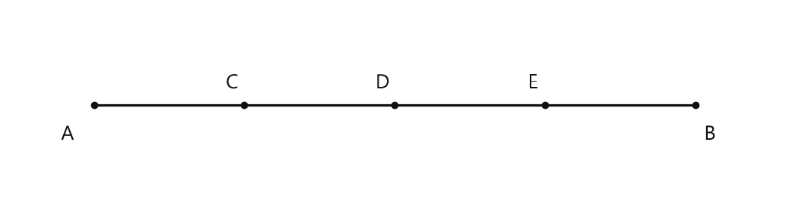

# Занятие 34. Построение прямой, перпендикулярной данной

**Раздел:** Глава V. Задачи на построение  
**Параграф учебника:** §30. Построение прямой, перпендикулярной данной  
**Страницы:** 172–175

## Цели занятия

После занятия ты умеешь:

- строить прямую, перпендикулярную данной;
- объяснять, почему построенная прямая перпендикулярна данной;
- выполнять основные этапы решения задачи на построение;
- строить прямоугольный треугольник по катету и прилежащему острому углу;
- строить параллельную прямую на заданном расстоянии;
- строить треугольник по основанию, высоте и медиане.

Выбери блок своего уровня:

- **1–2 балла** — повторить алгоритм построения перпендикуляра;
- **3–4 балла** — выполнить базовые построения;
- **5–6 баллов** — разобрать ключевые задачи;
- **7–8 баллов** — объяснить доказательства;
- **9–10 баллов** — решить задачу полностью: анализ, построение, доказательство.

## Теория к занятию

### 1. Построение перпендикуляра через данную точку

#### Простыми словами

Нужно через точку $A$ провести прямую, которая образует с прямой $a$ угол $90^\circ$.

Сначала с помощью циркуля найдём на прямой $a$ две точки $B$ и $C$, одинаково удалённые от точки $A$. Затем построим точку $D$, одинаково удалённую от $B$ и $C$. После этого проведём прямую через $A$ и $D$.

Почему это сработает? Прямая через точки, равноудалённые от концов отрезка $BC$, является серединным перпендикуляром к этому отрезку. А отрезок $BC$ лежит на прямой $a$.

#### Определение / факт / теорема / свойство

**Алгоритм построения прямой, перпендикулярной данной и проходящей через данную точку $A$**

1. Проводим дугу с центром в точке $A$, которая пересекает прямую $a$ в точках $B$ и $C$.
2. Из точек $B$ и $C$ как из центров одним и тем же радиусом (большим или равным $BC$) проводим дуги до пересечения их в точке $D$.
3. Строим прямую $AD$. Получаем $AD \perp a$.

#### Доказательство

Так как точки $A$ и $D$ равноудалены от концов отрезка $BC$ ($AB = AC$, $BD = CD$ как радиусы), то $AD$ — серединный перпендикуляр к отрезку $BC$. Следовательно, $AD \perp a$.

Разберём смысл доказательства по шагам:

- $AB = AC$, потому что эти отрезки являются радиусами одной окружности.
- $BD = CD$, потому что дуги построены с одинаковыми радиусами.
- Значит, точки $A$ и $D$ находятся на одинаковом расстоянии от точек $B$ и $C$.
- Поэтому прямая $AD$ является серединным перпендикуляром к отрезку $BC$.
- Отрезок $BC$ лежит на прямой $a$, значит, $AD \perp a$.

#### Правила

- Дуги с центрами в $B$ и $C$ проводят **одним и тем же радиусом**.
- Этот радиус должен быть **большим или равным $BC$**.
- В конце обязательно соединяем точки $A$ и $D$.
- Точка $D$ должна появиться как пересечение дуг, а не как точка, выбранная «примерно на глаз». Циркуль тут работает, а не украшает пенал.

#### Ловушки

- Если радиус дуг меньше $BC$, дуги не пересекутся.
- Если взять разные радиусы, равенство $BD = CD$ потеряется.
- Точка $A$ может лежать как вне прямой $a$, так и на ней.
- Перпендикуляр — это не просто «почти вертикальная» прямая, а прямая, образующая угол $90^\circ$.

---

### 2. Этапы решения задачи на построение

#### Простыми словами

В задаче на построение нужно не только провести нужные линии циркулем и линейкой. Нужно ещё объяснить, почему получилась именно требуемая фигура.

Поэтому решение может состоять из четырёх частей:

1. сначала представляем, как будет выглядеть готовая фигура;
2. затем выполняем построение;
3. после этого доказываем, что построенная фигура подходит;
4. если требуется, проверяем, при каких условиях решение существует.

В простых задачах некоторые части можно не записывать. Но если в условии просят полный разбор, лучше пройти все этапы — геометрия любит порядок.

#### Определение / факт / теорема / свойство

**Этапы решения задачи на построение**

1. **Анализ.** На этом этапе предполагают, что задача решена, делают чертеж с изображением искомой фигуры и указывают идею решения задачи.
2. **Построение.** На этом этапе дают описание последовательности шагов, приводящих к построению искомой фигуры, то есть алгоритм построения. Иногда на этом этапе проводят и сами операции построения на произвольно взятых отрезках, углах и других фигурах. В сложных задачах обычно указывают лишь шаги построения, ссылаясь на основные и ключевые задачи.
3. **Доказательство.** На этом этапе доказывают, что построенная фигура удовлетворяет требованию задачи. Иногда это следует непосредственно из построения.
4. **Исследование.** На данном этапе определяют, при какой величине заданных в условии отрезков и углов существует решение и число решений.

При записи решения задачи на построение этапы анализа и исследования в школе необязательны, если в условии задачи нет специальных указаний.

#### Правила

- В простых задачах достаточно указать построение и доказательство.
- Если условие просит исследование, нужно проверить существование решения.
- В доказательстве ссылайся на конкретные равенства и свойства.
- Фраза «видно из рисунка» не заменяет доказательство: рисунок может немного исказиться, а равенства — нет.

#### Ловушки

- Анализ — это поиск идеи, а не само выполнение построения.
- Доказательство должно объяснять, почему результат подходит под условие.
- Исследование — это проверка условий существования решения, а не повторение уже сделанных шагов.

---

### 3. Построение прямоугольного треугольника по катету и прилежащему острому углу

#### Простыми словами

Нужно построить треугольник, у которого:

- один угол прямой;
- один катет имеет заданную длину;
- угол рядом с этим катетом равен заданному углу.

Сначала построим прямой угол. Затем на одной его стороне отложим заданный катет. В конце этого катета построим заданный угол. Пересечение сторон углов даст третью вершину треугольника.

#### Условие

Даны катет $a$ и прилежащий к нему острый угол $\beta$. Требуется построить прямоугольный треугольник.

#### Построение

1. Строим прямой угол.
2. На одной стороне прямого угла от его вершины откладываем отрезок $CB = a$.
3. Строим $\angle B = \beta$.
4. В пересечении стороны угла $B$ со стороной прямого угла получаем точку $A$.

#### Доказательство

Треугольник $ABC$ — искомый, так как по построению $\angle C = 90^\circ$, $BC = a$ — катет, $\angle B = \beta$ — прилежащий острый угол.

Проверим по отдельности:

- $\angle C = 90^\circ$, потому что в точке $C$ был построен прямой угол;
- $BC = a$, потому что такой отрезок отложили при построении;
- $\angle B = \beta$, потому что в точке $B$ построили угол, равный $\beta$.

Значит, треугольник $ABC$ соответствует всем условиям задачи.

#### Ловушки

- Угол $\beta$ строят именно в точке $B$, а не в точке $C$.
- Отрезок $CB$ должен быть равен заданному катету $a$.
- Прямой угол должен находиться при вершине $C$.
- Если перепутать точки $B$ и $C$, треугольник всё ещё может получиться, но уже не тот, который просили построить.

---

### 4. Построение параллельной прямой на заданном расстоянии

#### Простыми словами

Пусть дана прямая $a$, а расстояние до новой прямой должно быть равно $h$.

Сначала построим к прямой $a$ перпендикуляр. На этом перпендикуляре отложим отрезок длиной $h$. Через полученную точку проведём ещё одну прямую, перпендикулярную тому же перпендикуляру.

Получатся две прямые, перпендикулярные одной и той же прямой. Значит, они параллельны. А отрезок длиной $h$ между ними будет перпендикулярным расстоянием.

#### Условие

Дана прямая $a$ и отрезок $h$, равный расстоянию между параллельными прямыми $a$ и $b$. Требуется построить прямую $b$, параллельную прямой $a$ и находящуюся от прямой $a$ на расстоянии $h$.

#### Факт

На плоскости две прямые, перпендикулярные третьей, параллельны между собой.

#### Построение

1. Отмечаем на прямой $a$ точку $M$ и строим прямую $c$, перпендикулярную прямой $a$ и проходящую через точку $M$.
2. Откладываем на прямой $c$ перпендикуляр $MK = h$.
3. Строим прямую $b$, перпендикулярную прямой $c$ и проходящую через точку $K$.
4. Получаем $b \parallel a$.

#### Доказательство

Так как $a \perp c$ и $b \perp c$ и на плоскости две прямые, перпендикулярные третьей, параллельны между собой, то $a \parallel b$. Расстояние между параллельными прямыми равно длине перпендикуляра, опущенного из любой точки одной из прямых на другую прямую: $KM \perp a$, $KM = h$.

Итак:

- $c$ перпендикулярна $a$;
- $b$ перпендикулярна $c$;
- поэтому $b$ параллельна $a$;
- отрезок $KM$ перпендикулярен прямой $a$ и имеет длину $h$;
- значит, расстояние между прямыми $a$ и $b$ равно $h$.

#### Ловушки

- Отрезок $MK$ должен быть перпендикулярен прямой $a$.
- Через $K$ нужно строить перпендикуляр к $c$, а не к $a$.
- Если провести через $K$ произвольную прямую, расстояние между прямыми не будет гарантированно равно $h$.
- Здесь используются два разных перпендикуляра: сначала $c \perp a$, затем $b \perp c$. Один перпендикуляр — хорошо, два — уже параллельная прямая.

---

### 5. Построение треугольника по основанию, высоте и медиане

#### Простыми словами

Пусть основание треугольника — $BC$. Медиана $AM$ проходит к середине основания, поэтому точку $M$ нужно получить делением основания пополам.

Высота $AH$ перпендикулярна основанию. Значит, около точки $M$ можно построить прямоугольный треугольник с катетом $AH = h_a$ и гипотенузой $AM = m_a$. После этого отложим по обе стороны от точки $M$ равные половины основания.

Так постепенно и собирается весь треугольник: сначала «скелет», потом боковые стороны.

#### Условие

Даны основание $a$, высота $h_a$ и медиана $m_a$, проведённые к этому основанию. Требуется построить треугольник $ABC$.

#### Формулы

$$BC = a$$

$$AH = h_a$$

$$AM = m_a$$

$$BM = MC = \frac{a}{2}$$

Здесь $BC$ — основание, $AH$ — высота, $AM$ — медиана, $M$ — середина основания.

#### Построение

1. Строим прямой угол $H$.
2. На одной его стороне откладываем отрезок $AH = h_a$.
3. Из точки $A$ как из центра делаем засечку на второй стороне угла радиусом $m_a$ — получаем точку $M$.
4. Делим отрезок $a$ пополам.
5. На прямой $HM$ откладываем по разные стороны от точки $M$ отрезки $MB = \frac{a}{2}$ и $MC = \frac{a}{2}$.
6. Проводим отрезки $CA$ и $BA$.
7. Получаем искомый $\triangle ABC$.

#### Доказательство

$\triangle ABC$ — искомый, так как у него высота $AH = h_a$, медиана $AM = m_a$, сторона $BC = a$ по построению.

Проверим условия:

- $BC = a$, потому что отрезки $MB$ и $MC$ построены длиной $\frac{a}{2}$;
- $BM = MC$, поэтому $M$ — середина отрезка $BC$;
- $AM = m_a$, потому что точку $M$ построили на расстоянии $m_a$ от точки $A$;
- $AH = h_a$, потому что такой отрезок отложили;
- $AH \perp BC$, потому что $AH$ лежит на стороне прямого угла, а $BC$ лежит на другой его стороне.

Следовательно, $AH$ — высота, $AM$ — медиана, а $\triangle ABC$ удовлетворяет условию задачи.

#### Ловушки

- Медиана идёт к середине основания, поэтому сначала нужно найти точку $M$.
- Высота должна быть перпендикулярна стороне или её продолжению.
- Отрезки $MB$ и $MC$ равны между собой.
- Не нужно откладывать весь отрезок $a$ от точки $M$: иначе основание станет в два раза длиннее. Геометрический «дубликат» здесь не нужен.

---

## Сводка формул «выучить наизусть»

$$AB = AC$$

$$BD = CD$$

$$BC = a$$

$$AH = h_a$$

$$AM = m_a$$

$$BM = MC = \frac{a}{2}$$

$$AD \perp a$$

$$a \perp c,\quad b \perp c \Longrightarrow a \parallel b$$

## Правила, которые нельзя путать

- Перпендикулярные прямые пересекаются под углом $90^\circ$.
- Параллельные прямые не пересекаются.
- Чтобы построить перпендикуляр через точку, используют равенства $AB = AC$ и $BD = CD$.
- При построении параллельной прямой через заданное расстояние сначала строят перпендикуляр, равный этому расстоянию.
- Медиана делит сторону пополам.
- Высота перпендикулярна стороне или её продолжению.
- При построении треугольника по основанию $a$ от точки $M$ откладывают две половины: $\frac{a}{2}$ в одну сторону и $\frac{a}{2}$ в другую.

## Разбор ключевых заданий

### Р1. Построить прямую, перпендикулярную прямой $a$ и проходящую через точку $A$

#### Условие

Даны прямая $a$ и точка $A$, не принадлежащая прямой $a$. Построить прямую, проходящую через точку $A$ и перпендикулярную прямой $a$.

<!--geo-figure-spec
{
  "needed": true,
  "kind": "plane",
  "caption": "Построение прямой $AD$, перпендикулярной прямой $a$",
  "equal": true,
  "axis": false,
  "xlim": [
    -2.3,
    7.3
  ],
  "ylim": [
    -3.3,
    5
  ],
  "points": {
    "A": [
      2.5,
      2
    ],
    "B": [
      1,
      0
    ],
    "C": [
      4,
      0
    ],
    "D": [
      2.5,
      -2.598
    ],
    "H": [
      2.5,
      0
    ]
  },
  "segments": [
    {
      "points": [
        "B",
        "C"
      ],
      "label": "a",
      "t": 0.72
    },
    [
      "A",
      "D"
    ],
    {
      "points": [
        "A",
        "B"
      ],
      "dashed": true
    },
    {
      "points": [
        "A",
        "C"
      ],
      "dashed": true
    },
    {
      "points": [
        "B",
        "D"
      ],
      "dashed": true
    },
    {
      "points": [
        "C",
        "D"
      ],
      "dashed": true
    }
  ],
  "polygons": [],
  "circles": [
    {
      "center": "A",
      "radius": 2.5
    },
    {
      "center": "B",
      "radius": 3
    },
    {
      "center": "C",
      "radius": 3
    }
  ],
  "labels": {
    "A": {
      "dx": -0.25,
      "dy": 0.18
    },
    "B": {
      "dx": -0.2,
      "dy": -0.28
    },
    "C": {
      "dx": 0.12,
      "dy": -0.28
    },
    "D": {
      "dx": 0.12,
      "dy": -0.2
    }
  },
  "right_angles": [
    {
      "vertex": "H",
      "from": "A",
      "to": "C"
    }
  ],
  "angle_marks": [],
  "texts": []
}
-->

*Построение прямой AD, перпендикулярной прямой a*

#### Решение

1. Проводим дугу с центром в точке $A$.

2. Дуга пересекает прямую $a$ в точках $B$ и $C$.

3. Поэтому $AB = AC$ как радиусы одной окружности.

4. Из точки $B$ проводим дугу радиусом, равным или большим $BC$.

5. Из точки $C$ проводим дугу тем же радиусом.

6. Дуги пересекаются в точке $D$.

7. Поэтому $BD = CD$ как радиусы дуг одного радиуса.

8. Строим прямую $AD$.

9. Точки $A$ и $D$ равноудалены от концов отрезка $BC$.

10. Значит, $AD$ — серединный перпендикуляр к отрезку $BC$.

11. Отрезок $BC$ лежит на прямой $a$.

12. Следовательно, $AD \perp a$.

Точка $D$ получена пересечением двух дуг, поэтому равенство $BD = CD$ не случайность, а результат построения. Циркуль всё проверил за нас — но запись доказательства всё равно нужна.

**Ответ:** построена прямая $AD$, проходящая через точку $A$ и перпендикулярная прямой $a$.

---

### Р2. Построить прямоугольный треугольник по катету и прилежащему острому углу

#### Условие

Даны катет $a$ и прилежащий к нему острый угол $\beta$. Построить прямоугольный треугольник $ABC$, в котором $BC = a$, $\angle B = \beta$, $\angle C = 90^\circ$.

<!--geo-figure-spec
{
  "needed": true,
  "kind": "plane",
  "caption": "Прямоугольный треугольник $ABC$: $BC=a$, $\\angle B=\\beta$, $\\angle C=90^\\circ$",
  "equal": false,
  "axis": false,
  "xlim": [
    -0.7,
    4.6
  ],
  "ylim": [
    -0.65,
    3.45
  ],
  "points": {
    "C": [
      0,
      0
    ],
    "B": [
      3.6,
      0
    ],
    "A": [
      0,
      2.8
    ]
  },
  "segments": [
    [
      "A",
      "B"
    ],
    [
      "B",
      "C"
    ],
    [
      "C",
      "A"
    ]
  ],
  "polygons": [
    {
      "vertices": [
        "A",
        "B",
        "C"
      ],
      "fill": 0.06
    }
  ],
  "circles": [],
  "labels": {
    "A": {
      "dx": -0.28,
      "dy": 0.14
    },
    "B": {
      "dx": 0.12,
      "dy": -0.25
    },
    "C": {
      "dx": -0.28,
      "dy": -0.25
    }
  },
  "right_angles": [
    {
      "vertex": "C",
      "from": "A",
      "to": "B"
    }
  ],
  "angle_marks": [
    {
      "vertex": "B",
      "from": "C",
      "to": "A",
      "text": "$\\beta$",
      "radius": 0.55
    }
  ],
  "texts": [
    {
      "xy": [
        1.8,
        -0.35
      ],
      "text": "$a$"
    }
  ]
}
-->

*Прямоугольный треугольник ABC: BC=a, \angle B=\beta, \angle C=90^\circ*

#### Решение

1. Строим произвольную прямую $l$.

2. Выбираем на ней точку $C$.

3. Через точку $C$ строим прямую, перпендикулярную $l$.

4. Получаем прямой угол с вершиной $C$.

5. На одной стороне прямого угла откладываем отрезок $CB = a$.

6. В точке $B$ строим угол $\angle B = \beta$.

7. Сторона угла $B$ пересекает вторую сторону прямого угла в точке $A$.

8. По построению $\angle C = 90^\circ$.

9. По построению $BC = a$.

10. По построению $\angle B = \beta$.

11. Следовательно, треугольник $ABC$ является искомым.

Сначала мы получили прямой угол, затем нужный катет и нужный прилежащий угол. Все три условия выполнены — треугольник прошёл геометрическую проверку.

**Ответ:** построен прямоугольный треугольник $ABC$ с $BC = a$, $\angle B = \beta$ и $\angle C = 90^\circ$.

---

### Р3. Построить прямую, параллельную данной, если расстояние между прямыми равно заданному отрезку

#### Условие

Даны прямая $a$ и отрезок $h$. Построить прямую $b$, параллельную прямой $a$, если расстояние между прямыми $a$ и $b$ должно быть равно $h$.

<!--geo-figure-spec
{
  "needed": true,
  "kind": "plane",
  "caption": "Построение прямой $b$, параллельной прямой $a$",
  "equal": false,
  "axis": false,
  "xlim": [
    -2.8,
    5.8
  ],
  "ylim": [
    -1.2,
    3.6
  ],
  "points": {
    "M": [
      0,
      0
    ],
    "K": [
      0,
      2.4
    ],
    "A1": [
      -2.3,
      0
    ],
    "A2": [
      5.1,
      0
    ],
    "B1": [
      -2.3,
      2.4
    ],
    "B2": [
      5.1,
      2.4
    ],
    "C1": [
      0,
      -0.8
    ],
    "C2": [
      0,
      3.2
    ]
  },
  "segments": [
    [
      "A1",
      "A2"
    ],
    [
      "B1",
      "B2"
    ],
    [
      "C1",
      "M"
    ],
    {
      "points": [
        "M",
        "K"
      ],
      "dashed": false,
      "label": "",
      "t": 0.5
    },
    [
      "K",
      "C2"
    ]
  ],
  "polygons": [],
  "circles": [],
  "labels": {
    "M": {
      "dx": -0.28,
      "dy": -0.28
    },
    "K": {
      "dx": -0.28,
      "dy": 0.12
    }
  },
  "right_angles": [
    {
      "vertex": "M",
      "from": "K",
      "to": "A2"
    },
    {
      "vertex": "K",
      "from": "M",
      "to": "B2"
    }
  ],
  "angle_marks": [],
  "texts": [
    {
      "xy": [
        4.75,
        -0.32
      ],
      "text": "$a$"
    },
    {
      "xy": [
        4.75,
        2.72
      ],
      "text": "$b$"
    },
    {
      "xy": [
        -0.38,
        3.28
      ],
      "text": "$c$"
    },
    {
      "xy": [
        0.32,
        1.2
      ],
      "text": "$h$"
    }
  ]
}
-->

*Построение прямой b, параллельной прямой a*

#### Решение

1. Отмечаем на прямой $a$ точку $M$.

2. Через точку $M$ строим прямую $c$, перпендикулярную прямой $a$.

3. На прямой $c$ откладываем отрезок $MK = h$.

   Точку $K$ можно выбрать с любой стороны от прямой $a$. Поэтому построить можно две такие прямые — по одной с каждой стороны от $a$.

4. Через точку $K$ строим прямую $b$, перпендикулярную прямой $c$.

5. Теперь $a \perp c$ и $b \perp c$.

6. На плоскости две прямые, перпендикулярные третьей, параллельны между собой.

7. Следовательно, $a \parallel b$.

8. Отрезок $KM$ перпендикулярен прямой $a$ и соединяет точку прямой $a$ с точкой прямой $b$.

9. По построению $KM = h$.

10. Значит, расстояние между прямыми $a$ и $b$ равно $h$.

Вот полезная проверка: обе прямые перпендикулярны одной и той же прямой $c$. Значит, они не «разбегутся» и не встретятся — идут параллельно.

**Ответ:** построена прямая $b$, для которой $b \parallel a$, а расстояние между $a$ и $b$ равно $h$.

---

### Р4. Построить треугольник по основанию, высоте и медиане

#### Условие

Даны основание $a$, высота $h_a$ и медиана $m_a$, проведённые к основанию. Построить треугольник $ABC$, для которого:

$$BC = a$$

$$AH = h_a$$

$$AM = m_a$$

Точки $H$ и $M$ лежат на прямой $BC$, причём $AH \perp BC$, а $M$ — середина отрезка $BC$.

<!--geo-figure-spec
{
  "needed": true,
  "kind": "plane",
  "caption": "Треугольник $ABC$ с высотой $AH$ и медианой $AM$",
  "equal": true,
  "axis": false,
  "xlim": [
    -2.9,
    2.9
  ],
  "ylim": [
    -0.8,
    4.1
  ],
  "points": {
    "A": [
      0.8,
      3.2
    ],
    "H": [
      0.8,
      0
    ],
    "M": [
      0,
      0
    ],
    "B": [
      -2.2,
      0
    ],
    "C": [
      2.2,
      0
    ]
  },
  "segments": [
    [
      "A",
      "B"
    ],
    [
      "A",
      "C"
    ],
    [
      "B",
      "C"
    ],
    {
      "points": [
        "A",
        "H"
      ],
      "dashed": true
    },
    {
      "points": [
        "A",
        "M"
      ],
      "dashed": true
    }
  ],
  "polygons": [
    {
      "vertices": [
        "A",
        "B",
        "C"
      ],
      "fill": 0.06
    }
  ],
  "circles": [],
  "labels": {
    "A": {
      "dx": 0.12,
      "dy": 0.14
    },
    "H": {
      "dx": 0.12,
      "dy": -0.25
    },
    "M": {
      "dx": -0.25,
      "dy": -0.25
    },
    "B": {
      "dx": -0.2,
      "dy": -0.25
    },
    "C": {
      "dx": 0.12,
      "dy": -0.25
    }
  },
  "right_angles": [
    {
      "vertex": "H",
      "from": "A",
      "to": "M"
    }
  ],
  "angle_marks": [],
  "texts": [
    {
      "xy": [
        1.08,
        1.65
      ],
      "text": "$h_a$"
    },
    {
      "xy": [
        0.18,
        1.7
      ],
      "text": "$m_a$"
    },
    {
      "xy": [
        0,
        -0.52
      ],
      "text": "$BC=a$"
    }
  ]
}
-->

*Треугольник ABC с высотой AH и медианой AM*

#### Решение

1. Строим отрезок $BC = a$.

2. Строим середину отрезка $BC$.

3. Обозначаем середину точкой $M$.

4. Тогда $M$ — середина отрезка $BC$, поэтому

$$BM = MC = \frac{a}{2}.$$

5. Через точку $M$ проводим прямую, перпендикулярную прямой $BC$.

6. На этой перпендикулярной прямой строим окружность с центром в точке $M$ и радиусом $m_a$.

7. Строим прямую, параллельную $BC$, на расстоянии $h_a$ от прямой $BC$.

8. Точка пересечения этой параллельной прямой с построенной окружностью обозначается буквой $A$.

   Если пересечений два, можно выбрать любую из двух точек. Получатся два симметричных треугольника.

9. Через точку $A$ проводим перпендикуляр к прямой $BC$.

10. Точку пересечения этого перпендикуляра с прямой $BC$ обозначаем буквой $H$.

11. Так как $AH \perp BC$, то $AH$ — высота треугольника.

12. По построению $AH = h_a$.

13. Точка $A$ лежит на окружности с центром $M$ и радиусом $m_a$.

14. Поэтому

$$AM = m_a.$$

15. Так как $M$ — середина $BC$, то $AM$ — медиана треугольника.

16. Соединяем точку $A$ с точками $B$ и $C$.

17. Получаем треугольник $ABC$, у которого основание $BC = a$, высота $AH = h_a$, а медиана $AM = m_a$.

Здесь главное не перепутать роли: высота ищет прямой угол, а медиана сначала ищет середину основания. У каждой линии своя работа — геометрия любит порядок.

**Ответ:** построен треугольник $ABC$ с основанием $BC = a$, высотой $AH = h_a$ и медианой $AM = m_a$.

---

### Р5. Разделить данный отрезок на четыре равные части

#### Условие

Дан отрезок $AB$. Разделить его на четыре равные части циркулем и линейкой.

<!--geo-figure-spec
{
  "needed": true,
  "kind": "plane",
  "caption": "Деление отрезка $AB$ на четыре равные части",
  "equal": true,
  "axis": false,
  "xlim": [
    -0.7,
    5.7
  ],
  "ylim": [
    -0.8,
    0.8
  ],
  "points": {
    "A": [
      0,
      0
    ],
    "B": [
      5,
      0
    ],
    "C": [
      1.25,
      0
    ],
    "D": [
      2.5,
      0
    ],
    "E": [
      3.75,
      0
    ]
  },
  "segments": [
    [
      "A",
      "C"
    ],
    [
      "C",
      "D"
    ],
    [
      "D",
      "E"
    ],
    [
      "E",
      "B"
    ]
  ],
  "polygons": [],
  "circles": [],
  "labels": {
    "A": {
      "dx": -0.22,
      "dy": -0.25
    },
    "B": {
      "dx": 0.12,
      "dy": -0.25
    },
    "C": {
      "dx": -0.1,
      "dy": 0.18
    },
    "D": {
      "dx": -0.1,
      "dy": 0.18
    },
    "E": {
      "dx": -0.1,
      "dy": 0.18
    }
  },
  "right_angles": [],
  "angle_marks": [],
  "texts": []
}
-->

*Деление отрезка AB на четыре равные части*

#### Решение

1. Строим середину отрезка $AB$.

2. Обозначим её точкой $D$.

3. Тогда

$$AD = DB.$$

4. Строим середину отрезка $AD$.

5. Обозначим её точкой $C$.

6. Тогда

$$AC = CD.$$

7. Строим середину отрезка $DB$.

8. Обозначим её точкой $E$.

9. Тогда

$$DE = EB.$$

10. Отрезки $AD$ и $DB$ равны, потому что точка $D$ — середина отрезка $AB$.

11. Каждый из отрезков $AD$ и $DB$ разделён пополам.

12. Поэтому половины этих отрезков равны между собой.

13. Следовательно,

$$AC = CD = DE = EB.$$

**Ответ:** отрезок разделён точками $C$, $D$, $E$ на четыре равные части.

---

## Мини-проверка

1. Каким радиусом проводят дуги из точек $B$ и $C$?

2. Почему прямая $AD$ перпендикулярна прямой $a$?

3. Почему две прямые, перпендикулярные одной и той же прямой, параллельны?

4. Что делает медиана с основанием треугольника?

5. Какие условия нужны для построения треугольника по основанию, высоте и медиане?

### Ответы

1. Одним и тем же радиусом, большим или равным $BC$.

2. Потому что точки $A$ и $D$ равноудалены от концов отрезка $BC$, поэтому $AD$ — серединный перпендикуляр к $BC$.

3. Это свойство параллельности прямых.

4. Делит его пополам.

5. Строят отрезок $BC = a$, его середину $M$, перпендикулярную высоту $AH = h_a$ и медиану $AM = m_a$.

## Практические задания

Выбери свой уровень и решай только этот блок. В блоке должна закрепиться вся тема параграфа. Ответы не приводятся.

### Уровень 1–2 балла

**С1.** Дана прямая $a$ и точка $A$, не лежащая на ней. Какой объект нужно построить, чтобы получить прямую, перпендикулярную $a$ и проходящую через $A$?

1) окружность с центром в $A$  
2) прямую $AD$  
3) отрезок $BC$  
4) окружность с центром в $D$  
5) прямую $BC$

**С2.** При построении прямой, перпендикулярной данной прямой $a$ и проходящей через точку $A$, дуга с центром в $A$ пересекает прямую $a$ в точках $B$ и $C$. Какой следующий шаг выполняют?

1) проводят прямую $BC$  
2) проводят дуги с центрами в $B$ и $C$ одинакового радиуса  
3) проводят окружность с центром в $A$ через точку $B$  
4) откладывают на прямой $a$ отрезок $AB$  
5) соединяют точки $A$ и $B$

**С3.** Выберите правильное условие для радиуса дуг с центрами в точках $B$ и $C$ при построении перпендикуляра.

1) радиусы должны быть разными  
2) радиус должен быть меньше половины $BC$  
3) радиусы должны быть одинаковыми и не меньше $BC$  
4) радиус должен быть равен $AB$  
5) радиус должен быть равен $AC$

**С4.** После пересечения дуг с центрами в $B$ и $C$ получили точку $D$. Какую прямую проводят последней?

1) $BC$  
2) $BD$  
3) $CD$  
4) $AD$  
5) $AC$

**С5.** Дана прямая $a$ и точка $A$, лежащая на ней. Какой объект сначала строят с центром в точке $A$, чтобы отметить на прямой $a$ точки $B$ и $C$?

1) отрезок  
2) угол  
3) дугу окружности  
4) перпендикуляр  
5) параллельную прямую

**С6.** Восстановите правильный порядок действий при построении прямой $AD$, перпендикулярной прямой $a$ и проходящей через точку $A$:

а) соединить точки $A$ и $D$;  
б) провести дуги с центрами в $B$ и $C$ одинакового радиуса;  
в) провести дугу с центром в $A$, пересекающую $a$ в $B$ и $C$.

Запишите последовательность букв.

**С7.** Дана прямая $a$, точка $A$ и построены точки $B$, $C$ на прямой $a$. Какое утверждение соответствует построению перпендикуляра через $A$?

1) $AB=AC$  
2) $BD=CD$  
3) $AD\perp a$  
4) $AD\parallel a$  
5) $BC\perp AD$

**С8.** На каком этапе решения задачи на построение описывают последовательность выполняемых построений?

1) анализ  
2) построение  
3) доказательство  
4) исследование  
5) проверка чертежа

**С9.** На каком этапе решения задачи на построение доказывают, что полученная фигура удовлетворяет условию задачи?

1) анализ  
2) построение  
3) доказательство  
4) исследование  
5) измерение

**С10.** На каком этапе решения задачи на построение определяют, при каких данных существует решение?

1) анализ  
2) построение  
3) доказательство  
4) исследование  
5) обозначение точек

**С11.** Дана прямая $a$ и точка $A$. Установите соответствие между объектом и его назначением.

1. Дуга с центром в $A$  
2. Дуги с центрами в $B$ и $C$  
3. Прямая $AD$

а) позволяет получить точки $B$ и $C$ на прямой $a$  
б) определяет искомую прямую  
в) позволяет получить точку $D$

Запишите последовательность цифр и букв.

**С12.** Даны прямая $a$ и точка $A$, не лежащая на ней. Выберите все верные утверждения.

1) Сначала проводят дугу с центром в $A$.  
2) Точки $B$ и $C$ лежат на прямой $a$.  
3) Дуги с центрами в $B$ и $C$ должны иметь одинаковые радиусы.  
4) Искомой прямой является $BC$.  
5) Искомая прямая проходит через точки $A$ и $D$.

**С13.** Дана прямая $a$ и точка $A$, не лежащая на ней. Выберите правильный первый шаг построения прямой, проходящей через $A$ и перпендикулярной прямой $a$:

1) провести дугу с центром в точке $A$;  
2) провести окружность с центром в точке $B$;  
3) построить серединный перпендикуляр к отрезку $AD$;  
4) провести параллельную прямую через точку $A$;  
5) соединить точки $B$ и $C$.

**С14.** При построении прямой, перпендикулярной прямой $a$ и проходящей через точку $A$, дуга с центром в $A$ пересекла прямую $a$ в точках $B$ и $C$. Что нужно сделать следующим шагом?

1) провести прямую $BC$;  
2) из точек $B$ и $C$ провести дуги одинакового радиуса;  
3) провести окружность с центром в $A$;  
4) построить биссектрису угла $BAC$;  
5) отметить середину отрезка $BC$.

**С15.** Дана прямая $a$ и точка $A$, не лежащая на ней. После проведения одинаковых дуг с центрами $B$ и $C$ они пересеклись в точке $D$. Какую прямую следует построить?

1) $BC$;  
2) $AD$;  
3) $BD$;  
4) $CD$;  
5) прямую, параллельную $a$.

**С16.** Дуга с центром в точке $A$ пересекает прямую $a$ в точках $B$ и $C$. Какое равенство расстояний верно?

1) $AB=AC$;  
2) $AB=BC$;  
3) $AC=BC$;  
4) $AD=AB$;  
5) $BD=AC$.

**С17.** Из точек $B$ и $C$ провели дуги одним и тем же радиусом. Дуги пересеклись в точке $D$. Выберите верное равенство.

1) $BD=CD$;  
2) $AB=BD$;  
3) $AC=CD$;  
4) $AD=BC$;  
5) $AB=AC$.

**С18.** При построении прямой $AD$, перпендикулярной прямой $a$, точка $A$ лежит вне прямой $a$, а точки $B$ и $C$ лежат на прямой $a$. Какой угол является прямым?

1) $\angle BAC$;  
2) $\angle ABD$;  
3) угол между прямыми $AD$ и $a$;  
4) $\angle BCD$;  
5) угол между прямыми $AB$ и $AC$.

**С19.** Расположите этапы решения задачи на построение в правильном порядке. Запишите последовательность номеров.

1) доказательство;  
2) исследование;  
3) анализ;  
4) построение.

**С20.** На каком этапе решения задачи на построение предполагают, что задача уже решена, и выполняют чертёж искомой фигуры?

1) на этапе анализа;  
2) на этапе построения;  
3) на этапе доказательства;  
4) на этапе исследования;  
5) ни на одном из перечисленных этапов.

**С21.** На каком этапе обосновывают, что построенная фигура удовлетворяет условию задачи?

1) анализ;  
2) построение;  
3) доказательство;  
4) исследование;  
5) измерение.

**С22.** Даны прямая $a$ и точка $A$, не лежащая на ней. Выберите все действия, которые относятся к построению прямой, проходящей через $A$ и перпендикулярной $a$.

1) провести дугу с центром в $A$;  
2) отметить точки $B$ и $C$ пересечения этой дуги с $a$;  
3) из $B$ и $C$ провести дуги одинакового радиуса;  
4) соединить точки $A$ и $D$;  
5) провести через $A$ прямую, параллельную $a$.

**С23.** При построении перпендикуляра к прямой $a$ дуги с центрами в точках $B$ и $C$ должны иметь:

1) разные радиусы;  
2) одинаковые радиусы;  
3) центры в точках $A$ и $D$;  
4) радиус, равный $AB$;  
5) радиус, меньший длины $BC$.

**С24.** Установите соответствие между этапом решения задачи на построение и его содержанием. Запишите последовательность букв.

1. Анализ  
2. Построение  
3. Доказательство  

А) описание последовательности выполняемых построений;  
Б) обоснование того, что построенная фигура удовлетворяет условию;  
В) предположение, что задача решена, и изображение искомой фигуры.

**С25.** Выберите правильную последовательность построения прямой, перпендикулярной данной прямой $a$ и проходящей через точку $A$, не лежащую на прямой $a$.

1) Провести через $A$ произвольную прямую, затем построить её биссектрису.  
2) Провести дугу с центром в $A$, отметить точки $B$ и $C$ её пересечения с прямой $a$, затем из $B$ и $C$ равными радиусами построить точку $D$ и провести $AD$.  
3) Отложить от точки $A$ на прямой $a$ два равных отрезка и соединить их концы.  
4) Провести окружность с центром в $A$ и соединить любые две точки окружности.  
5) Построить параллельную прямую через точку $A$.

**С26.** Дана прямая $a$ и точка $A$ на ней. Какой объект нужно построить первым по алгоритму построения перпендикуляра через точку $A$?

1) Дугу с центром в точке $A$.  
2) Окружность с центром в точке $B$.  
3) Прямую, параллельную $a$.  
4) Биссектрису угла.  
5) Медиану треугольника.

**С27.** При построении прямой, перпендикулярной прямой $a$ и проходящей через точку $A$, дуга с центром в $A$ пересекла прямую $a$ в точках $B$ и $C$. Из каких точек проводят следующие дуги?

1) Из $A$ и $B$.  
2) Из $B$ и $C$.  
3) Из $A$ и $C$.  
4) Из $D$ и $A$.  
5) Из середины $BC$ и точки $A$.

**С28.** Какое условие должно выполняться для радиусов дуг, проведённых из точек $B$ и $C$ при построении перпендикуляра?

1) Радиусы должны быть разными.  
2) Радиусы должны быть равными.  
3) Один радиус должен быть равен $AB$.  
4) Радиусы должны быть меньше половины $BC$.  
5) Радиусы не должны пересекаться.

**С29.** Дана прямая $a$, точка $A$ вне её и точки $B$, $C$, полученные пересечением дуги с центром в $A$ и прямой $a$. Какой отрезок проводят после построения точки $D$ пересечения дуг с центрами в $B$ и $C$?

1) $BC$.  
2) $AB$.  
3) $CD$.  
4) $AD$.  
5) $BD$.

**С30.** Установите соответствие между этапом решения задачи на построение и его содержанием. К каждой позиции первого столбца подберите позицию из второго столбца.

| Этап | Содержание |
|---|---|
| А) анализ | 1) описание последовательности операций |
| Б) построение | 2) проверка существования решения |
| В) доказательство | 3) предположение, что задача решена, и указание идеи |
| Г) исследование | 4) обоснование того, что построенная фигура удовлетворяет условию |

Запишите последовательность цифр, соответствующих буквам А, Б, В, Г.

**С31.** Восстановите пропущенное действие в алгоритме построения прямой $AD$, перпендикулярной прямой $a$: «Из точек $B$ и $C$ как из центров одним и тем же радиусом проводят дуги до пересечения в точке $D$. Затем …»

1) проводят прямую $BC$;  
2) проводят прямую $AD$;  
3) проводят прямую $AB$;  
4) проводят окружность с центром в $D$;  
5) проводят биссектрису угла $A$.

**С32.** Дана прямая $a$ и точка $A$, не лежащая на ней. Отметьте точки $B$ и $C$ на прямой $a$ так, чтобы $AB=AC$. Какое построение следует выполнить далее, чтобы получить точку $D$ для проведения перпендикуляра?

1) Провести из $A$ и $B$ дуги разными радиусами.  
2) Провести из $B$ и $C$ дуги одинаковыми радиусами, не меньшими $BC$.  
3) Провести из $A$ и $C$ дуги одинаковыми радиусами, не меньшими $AC$.  
4) Провести из $B$ и $C$ дуги радиусами, меньшими $BC$.  
5) Провести окружность с центром в середине $BC$.

**С33.** Выберите верное утверждение о построении прямой $AD$, перпендикулярной прямой $a$.

1) Точка $D$ должна лежать на прямой $a$.  
2) Точка $D$ является центром первой дуги.  
3) Прямая $AD$ является искомой прямой.  
4) Прямая $BC$ всегда перпендикулярна $a$.  
5) Точки $B$ и $C$ выбираются на разных прямых.

**С34.** Даны прямая $a$ и точка $A$ вне этой прямой. Расположите действия в правильном порядке:

А) Провести прямую $AD$.  
Б) Провести дугу с центром в $A$, пересекающую $a$ в точках $B$ и $C$.  
В) Из точек $B$ и $C$ равными радиусами провести дуги до пересечения в точке $D$.

Запишите последовательность букв.

**С35.** Выберите все верные утверждения.

1) Для построения перпендикуляра через точку $A$ сначала используют дугу с центром в $A$.  
2) Точки $B$ и $C$ лежат на данной прямой.  
3) Дуги с центрами в $B$ и $C$ проводят обязательно разными радиусами.  
4) После построения точки $D$ проводят прямую $AD$.  
5) На этапе доказательства описывают последовательность операций построения.

**С36.** Дана прямая $a$ и точка $A$, лежащая на ней. Опишите построение прямой, проходящей через $A$ и перпендикулярной прямой $a$, используя циркуль и линейку.

### Уровень 3–4 балла

**С1.** Дана прямая $a$ и точка $A$, не лежащая на ней. Запишите последовательность действий для построения прямой, проходящей через точку $A$ и перпендикулярной прямой $a$.

**С2.** Дана прямая $a$ и точка $A$ на ней. Опишите построение прямой, проходящей через точку $A$ и перпендикулярной прямой $a$, с помощью циркуля и линейки.

**С3.** При построении перпендикуляра к прямой $a$ через точку $A$ дуга с центром в точке $A$ пересекла прямую в точках $B$ и $C$. Какое условие должны выполнять радиусы дуг с центрами в точках $B$ и $C$?

**С4.** При построении перпендикуляра к прямой $a$ через точку $A$ точки $B$ и $C$ лежат на прямой $a$, а точка $D$ получена пересечением дуг с центрами $B$ и $C$. Какая прямая является искомым перпендикуляром?

**С5.** Дана прямая $a$ и точка $A$, не лежащая на ней. Дуга с центром $A$ пересекает прямую $a$ в точках $B$ и $C$. Объясните, почему точка $D$, равноудалённая от $B$ и $C$, лежит на перпендикуляре к отрезку $BC$, проходящем через его середину.

**С6.** В последовательности построения допущена ошибка: после получения точек $B$ и $C$ на прямой $a$ из них провели дуги разными радиусами. Укажите, почему такое построение не гарантирует получения перпендикуляра к прямой $a$.

**С7.** Дана прямая $a$ и точка $A$, не лежащая на ней. При построении выбраны точки $B$ и $C$ так, что $AB=AC$. Затем построены дуги радиуса $r$, где $r\geq BC$, с центрами $B$ и $C$, пересекающиеся в точке $D$. Запишите, какие равенства расстояний следуют из построения.

**С8.** Дана прямая $a$ и точка $A$, не лежащая на ней. После проведения дуги с центром $A$ получены точки $B$ и $C$ на прямой $a$. Составьте краткую запись построения искомой прямой, используя точки $A$, $B$, $C$ и $D$.

**С9.** Выполните построение прямой, перпендикулярной данной прямой $a$ и проходящей через точку $A$, лежащую на прямой $a$. Опишите построение по этапам.

**С10.** Выполните построение прямой, перпендикулярной данной прямой $a$ и проходящей через точку $A$, не лежащую на прямой $a$. В описании укажите, как выбираются точки $B$ и $C$ и каким образом строится точка $D$.

**С11.** В задаче на построение требуется через точку $A$ провести прямую, перпендикулярную прямой $a$. Запишите по порядку четыре этапа решения задачи на построение, если требуется привести полный разбор: анализ, построение, доказательство, исследование.

**С12.** Дана прямая $a$ и точка $A$, не лежащая на ней. Для построения перпендикуляра выбраны точки $B$ и $C$ на прямой $a$, причём $AB=AC$. Точка $D$ построена так, что $DB=DC$ и $D$ не лежит на прямой $a$. Докажите, что прямая $AD$ перпендикулярна прямой $a$.

**С13.** Дана прямая $a$ и точка $A$, не принадлежащая этой прямой. С помощью циркуля и линейки постройте прямую, проходящую через точку $A$ и перпендикулярную прямой $a$.

**С14.** Дана прямая $b$ и точка $P$, лежащая на этой прямой. Постройте прямую, проходящую через точку $P$ и перпендикулярную прямой $b$.

**С15.** Укажите правильную последовательность первых действий при построении прямой, перпендикулярной данной прямой $a$ и проходящей через точку $A$, не лежащую на $a$:
1) провести дуги из точек пересечения;
2) провести дугу с центром в точке $A$;
3) соединить точку $A$ с точкой пересечения дуг;
4) отметить точки $B$ и $C$ пересечения дуги с прямой $a$.

**С16.** При построении перпендикуляра через точку $A$ дуга с центром в точке $A$ пересекла прямую $a$ в точках $B$ и $C$. Какое условие должно выполняться для радиуса дуг, проведённых из точек $B$ и $C$?

**С17.** Дана прямая $c$ и точка $K$, не лежащая на ней. После проведения дуги с центром в точке $K$ получены точки $M$ и $N$ на прямой $c$. Опишите следующие два шага построения перпендикуляра к прямой $c$ через точку $K$.

**С18.** Дана прямая $d$ и точка $T$, лежащая на ней. При построении перпендикуляра через точку $T$ дуга с центром в точке $T$ пересекла прямую $d$ в точках $E$ и $F$. Запишите, какие точки нужно соединить после построения пересекающихся дуг с центрами $E$ и $F$.

**С19.** Дана прямая $p$ и точка $Q$, не лежащая на ней. Для построения перпендикуляра проведены дуги с центрами в точках $U$ и $V$, полученных как точки пересечения первой дуги с прямой $p$. Объясните, почему для второй пары дуг выбирают одинаковый радиус.

**С20.** Дана прямая $r$ и точка $L$, не лежащая на ней. Постройте прямую, перпендикулярную прямой $r$ и проходящую через точку $L$, используя циркуль и линейку. Запишите построение по шагам.

**С21.** При построении прямой, перпендикулярной прямой $s$ и проходящей через точку $H$, получили точки $X$ и $Y$ пересечения первой дуги с прямой $s$. Дуги с центрами $X$ и $Y$ пересеклись в точке $Z$. Какую прямую следует провести и каким будет её положение относительно прямой $s$?

**С22.** Дана прямая $q$ и точка $R$, не лежащая на ней. Ученик провёл дугу с центром в точке $R$, но она не пересекла прямую $q$. Можно ли продолжить построение перпендикуляра? Укажите, какое действие нужно выполнить сначала.

**С23.** Дана прямая $t$ и точка $W$, не лежащая на ней. После построения точек $G$ и $J$ на прямой $t$ требуется провести две дуги, пересекающиеся в точке $N$. Запишите условие, которому должен удовлетворять радиус этих дуг.

**С24.** Дана прямая $l$ и точка $S$, лежащая на ней. Составьте краткий план построения прямой, перпендикулярной прямой $l$ и проходящей через точку $S$, указав:  
а) какие точки получают на прямой $l$;  
б) из каких точек проводят дуги;  
в) какие точки соединяют в конце построения.

**С25.** Дана прямая $a$ и точка $A$, не лежащая на ней. Опишите последовательность построения прямой, проходящей через точку $A$ и перпендикулярной прямой $a$.

**С26.** Дана прямая $a$ и точка $A$ на ней. Опишите построение прямой, проходящей через точку $A$ и перпендикулярной прямой $a$, используя циркуль и линейку.

**С27.** При построении прямой, перпендикулярной данной прямой $a$ и проходящей через точку $A$, дуга с центром в $A$ пересекла прямую $a$ в точках $B$ и $C$. Какое условие необходимо выполнить при выборе радиуса дуг с центрами в $B$ и $C$?

**С28.** Даны прямая $a$ и точка $A$, не лежащая на этой прямой. После проведения дуги с центром в $A$ получены точки $B$ и $C$ на прямой $a$. Запишите следующий шаг построения.

**С29.** Даны прямая $a$ и точка $A$, не лежащая на ней. При построении перпендикуляра точки $B$ и $C$ лежат на прямой $a$, а точка $D$ получена пересечением дуг с центрами $B$ и $C$. Какую прямую нужно провести?

**С30.** Дана прямая $a$ и точка $A$, не лежащая на ней. Опишите построение прямой $AD$, перпендикулярной прямой $a$, если дуга с центром $A$ пересекает $a$ в точках $B$ и $C$.

**С31.** Даны прямая $a$ и точка $A$, не лежащая на ней. Для построения перпендикуляра выбраны точки $B$ и $C$ на прямой $a$, причём $AB=AC$. Объясните, почему точка $D$, равноудалённая от $B$ и $C$, лежит на перпендикуляре к прямой $a$, проходящем через $A$.

**С32.** Дана прямая $a$ и точка $A$, не лежащая на ней. Постройте прямую, проходящую через $A$ и перпендикулярную $a$. В записи построения укажите, какие точки получают пересечением первой дуги с прямой $a$.

**С33.** Дана прямая $a$ и точка $A$ на ней. Точка $B$ выбрана на прямой $a$. Постройте точку $C$ на прямой $a$ так, чтобы $AB=AC$, а затем постройте прямую, проходящую через $A$ и перпендикулярную $a$.

**С34.** При построении перпендикуляра к прямой $a$ через точку $A$ первая дуга пересекла прямую $a$ в точках $B$ и $C$. Укажите, какие два отрезка должны быть равны после проведения дуг с центрами $B$ и $C$.

**С35.** Дана прямая $a$ и точка $A$, не лежащая на ней. Составьте краткий план решения задачи на построение прямой, проходящей через $A$ и перпендикулярной $a$: назовите три последовательных действия с циркулем и линейкой.

**С36.** Дана прямая $a$ и точка $A$, не лежащая на ней. При построении перпендикуляра дуги с центрами $B$ и $C$ пересеклись в точке $D$, причём $BD=CD$. Запишите, какие равенства отрезков позволяют обосновать, что прямая $AD$ перпендикулярна прямой $a$.

### Уровень 5–6 баллов

**С1.** Дана прямая $a$ и точка $A$, лежащая на прямой $a$. С помощью циркуля и линейки постройте прямую, проходящую через точку $A$ и перпендикулярную прямой $a$.

**С2.** Дана прямая $b$ и точка $P$, не лежащая на ней. Постройте с помощью циркуля и линейки прямую, проходящую через точку $P$ и перпендикулярную прямой $b$.

**С3.** На прямой $m$ отмечена точка $K$. Опишите последовательность построения прямой, проходящей через $K$ и перпендикулярной прямой $m$, используя циркуль и линейку.

**С4.** Даны прямая $a$ и точка $A$, не лежащая на ней. Выполните построение перпендикуляра из точки $A$ к прямой $a$. Обозначьте точку пересечения построенной прямой с прямой $a$ буквой $H$.

**С5.** Даны прямая $p$ и точка $B$ на этой прямой. При построении перпендикуляра через $B$ дуга с центром в $B$ пересекает прямую $p$ в точках $C$ и $D$. Опишите дальнейшие действия, необходимые для завершения построения.

**С6.** Даны прямая $q$ и точка $M$, не лежащая на ней. После проведения дуги с центром в $M$ прямая $q$ пересечена в точках $N$ и $K$. Какой следующий шаг нужно выполнить, чтобы построить прямую, перпендикулярную $q$ и проходящую через $M$?

**С7.** Дана прямая $r$ и точка $T$ на ней. Из точек $U$ и $V$, полученных при пересечении прямой $r$ дугой с центром в $T$, проведены дуги одинакового радиуса. Эти дуги пересеклись в точке $W$, не лежащей на прямой $r$. Постройте искомую прямую и укажите, какие точки она должна проходить.

**С8.** Даны прямая $l$ и точка $P$, не лежащая на ней. При построении перпендикуляра из $P$ к $l$ точки пересечения первой дуги с прямой $l$ обозначены $A$ и $B$. Составьте краткое описание построения с использованием точки пересечения двух дуг, проведённых из $A$ и $B$.

**С9.** Даны прямая $a$ и две точки $A$ и $B$, лежащие на ней. Постройте через точку $A$ прямую, перпендикулярную $a$, а через точку $B$ — вторую прямую, перпендикулярную $a$. Сравните построенные прямые.

**С10.** Дана прямая $m$ и точки $P$ и $Q$, лежащие по одну сторону от неё. Постройте на прямой $m$ точку $H$, равноудалённую от точек $P$ и $Q$, используя построение перпендикуляра к отрезку $PQ$.

**С11.** Дан треугольник $ABC$. Постройте прямую, проходящую через вершину $A$ и перпендикулярную прямой $BC$. Обозначьте точку пересечения построенной прямой с прямой $BC$ буквой $H$.

**С12.** Дана прямая $a$ и точка $A$, не лежащая на ней. Выполните построение прямой, проходящей через $A$ и перпендикулярной $a$. Запишите решение по этапам: построение и доказательство того, что полученная прямая перпендикулярна прямой $a$.

**С13.** Дана прямая $a$ и точка $A$, лежащая на этой прямой. Постройте с помощью циркуля и линейки прямую, проходящую через точку $A$ и перпендикулярную прямой $a$.

**С14.** Даны прямая $b$ и точка $B$, не лежащая на этой прямой. Постройте прямую, проходящую через точку $B$ и перпендикулярную прямой $b$.

**С15.** На прямой $c$ выберите точку $C$. С помощью циркуля и линейки постройте прямую, проходящую через $C$ и перпендикулярную прямой $c$. Запишите, какие точки получают на первом шаге построения.

**С16.** Даны прямая $d$ и точка $D$, не лежащая на ней. При построении перпендикуляра через $D$ дуга с центром $D$ пересекла прямую $d$ в точках $E$ и $F$. Опишите дальнейшие действия построения.

**С17.** Даны прямая $m$ и точка $M$, не лежащая на ней. При построении перпендикуляра через $M$ точки $P$ и $Q$ лежат на прямой $m$, причём $PQ=6$ см. Какой наименьший радиус можно выбрать для дуг с центрами $P$ и $Q$?

**С18.** Даны прямая $n$ и точка $N$, не лежащая на ней. Дуга с центром $N$ пересекает прямую $n$ в точках $R$ и $S$, причём $RS=8$ см. Из точек $R$ и $S$ проводят дуги радиусом $5$ см. Обозначьте точку их пересечения, лежащую по другую сторону от прямой $n$, чем точка $N$, и постройте искомую прямую.

**С19.** Даны прямая $p$ и точка $T$ на ней. Дуга с центром $T$ пересекает прямую $p$ в точках $U$ и $V$. Дуги с центрами $U$ и $V$ проведены одинаковым радиусом $r$, причём $r\geq UV$. Объясните, почему точка пересечения этих дуг вместе с точкой $T$ определяет прямую, перпендикулярную $p$.

**С20.** Даны прямая $q$ и точка $Q$, не лежащая на ней. Выполните построение перпендикуляра к прямой $q$ через точку $Q$, а затем проведите проверку построения с помощью угольника. Запишите, какой угол должен получиться между построенной прямой и прямой $q$.

**С21.** Дан отрезок $AB$ длиной $7$ см. Постройте его серединный перпендикуляр. Укажите точку пересечения построенной прямой с отрезком $AB$ и назовите её свойство.

**С22.** Дан отрезок $CD$ длиной $10$ см. Постройте серединный перпендикуляр к отрезку $CD$. Отметьте на построенной прямой произвольную точку $E$ и сравните расстояния $EC$ и $ED$.

**С23.** Дан отрезок $KL$ длиной $6$ см. Постройте его серединный перпендикуляр. На построенной прямой выберите точку $M$ и постройте окружность с центром $M$, проходящую через точку $K$. Объясните, почему эта окружность проходит также через точку $L$.

**С24.** Даны прямая $a$ и точка $A$, не лежащая на ней. Выполните построение прямой, проходящей через $A$ и перпендикулярной $a$. Запишите решение по этапам: анализ, построение, доказательство.

**С25.** Дана прямая $a$ и точка $A$, не лежащая на ней. С помощью циркуля и линейки постройте прямую, проходящую через точку $A$ и перпендикулярную прямой $a$. Запишите последовательность основных шагов построения.

**С26.** Дана прямая $b$ и точка $B$, лежащая на ней. Постройте через точку $B$ прямую, перпендикулярную прямой $b$. Запишите, какие дуги нужно провести и из каких центров.

**С27.** На рисунке изображена прямая $c$ и точка $C$, не лежащая на этой прямой. При построении перпендикуляра через точку $C$ дуга с центром $C$ пересекла прямую $c$ в точках $M$ и $N$. Из точек $M$ и $N$ провели дуги одинакового радиуса, пересекающиеся в точке $P$. Какую прямую следует провести, чтобы получить искомый перпендикуляр? Укажите, почему она будет перпендикулярна прямой $c$.

**С28.** Дана прямая $d$ и точка $D$, не лежащая на ней. Опишите построение прямой, проходящей через $D$ и перпендикулярной прямой $d$, по этапам «построение» и «доказательство».

**С29.** Даны отрезок $AB$ и его середина $M$. С помощью циркуля и линейки постройте прямую, проходящую через точку $M$ и перпендикулярную отрезку $AB$. Укажите, какие точки пересечения дуг используются при построении.

**С30.** Даны прямая $p$ и точка $E$, не лежащая на ней. Для построения перпендикуляра через $E$ выбрали точки $F$ и $G$ пересечения дуги с центром $E$ с прямой $p$. Затем из точек $F$ и $G$ провели дуги одинакового радиуса, большего или равного $FG$, и получили точку $H$ их пересечения. Запишите итоговую прямую и обоснуйте, что построение выполнено правильно.

### Уровень 7–8 баллов

**С1.** Дана прямая $a$ и точка $A$, не лежащая на этой прямой. Постройте с помощью циркуля и линейки прямую, проходящую через точку $A$ и перпендикулярную прямой $a$. Запишите последовательность построения и обоснуйте, почему построенная прямая перпендикулярна прямой $a$.

**С2.** Даны прямая $b$ и точка $B$ на ней. Постройте прямую, перпендикулярную прямой $b$ и проходящую через точку $B$. Запишите построение и укажите, почему оно возможно при любом положении точки $B$ на прямой $b$.

**С3.** Даны прямая $c$ и отрезок $AB$. Постройте две прямые, перпендикулярные прямой $c$, расстояние между которыми равно длине отрезка $AB$. Опишите построение и обоснуйте, как используется данный отрезок.

**С4.** Даны прямая $m$ и точка $P$, не лежащая на ней. Постройте точку $Q$ на прямой $m$ так, чтобы отрезок $PQ$ был перпендикулярен прямой $m$. Затем постройте через точку $P$ прямую, параллельную прямой $m$. Запишите этапы построения и объясните, почему построенные прямые параллельны.

**С5.** Дан отрезок $AB$. Постройте его серединный перпендикуляр. На построенной прямой отметьте точку $C$ и докажите, что $CA=CB$.

**С6.** Даны две точки $A$ и $B$, расположенные в одной полуплоскости относительно прямой $l$. Постройте на прямой $l$ точку $M$, равноудалённую от точек $A$ и $B$. Обоснуйте единственность построенной точки.

**С7.** Дан треугольник $ABC$. Постройте прямую, проходящую через вершину $A$ и перпендикулярную стороне $BC$. Точку пересечения этой прямой со стороной $BC$ обозначьте $H$. Запишите, какую фигуру называют отрезком $AH$, и укажите условие, которому он удовлетворяет.

**С8.** Дан остроугольный треугольник $ABC$. Постройте все три высоты треугольника и обозначьте их точками пересечения со сторонами: $H_a\in BC$, $H_b\in AC$, $H_c\in AB$. Докажите, что построенные отрезки являются высотами треугольника.

**С9.** Дан тупоугольный треугольник $ABC$, причём $\angle A>90^\circ$. Постройте высоты, проведённые из вершин $B$ и $C$, используя продолжения сторон $AC$ и $AB. Объясните, почему для построения необходимо продолжить стороны треугольника.

**С10.** Дан прямоугольный треугольник $ABC$ с прямым углом $C$. Постройте высоту $CH$ к гипотенузе $AB$. Запишите полный план решения: анализ, построение, доказательство и исследование существования решения.

**С11.** Даны прямая $p$ и точка $A$, не лежащая на ней, а также отрезок $h$. Постройте прямую, параллельную прямой $p$, проходящую через точку $A$, если расстояние между построенной прямой и прямой $p$ должно быть равно длине отрезка $h$. Обоснуйте, почему задача имеет два решения.

**С12.** Дан неравнобедренный треугольник $ABC$. На биссектрисе угла $B$ постройте точку $P$, равноудалённую от вершин $A$ и $C$. Используйте серединный перпендикуляр к отрезку $AC$. Запишите анализ, построение, доказательство и исследование числа решений.

**С13.** Дан отрезок $AB$. Постройте его середину, используя только циркуль и линейку. Запишите последовательность построения и обоснуйте, почему построенная точка является серединой отрезка.

**С14.** На прямой $a$ дана точка $A$. Постройте через точку $A$ прямую, перпендикулярную прямой $a$. Опишите построение и докажите, что построенная прямая перпендикулярна $a$.

**С15.** Точка $A$ не лежит на прямой $a$. Постройте через точку $A$ прямую, перпендикулярную прямой $a$. Укажите, какие окружности или дуги необходимо провести, и объясните назначение каждого шага.

**С16.** Дан отрезок $BC$. Постройте серединный перпендикуляр к этому отрезку. Докажите, что любая точка построенной прямой равноудалена от точек $B$ и $C$.

**С17.** В одной полуплоскости относительно прямой $m$ расположены точки $A$ и $B$. Постройте на прямой $m$ точку $M$, равноудалённую от точек $A$ и $B$. Опишите построение и обоснуйте единственность полученной точки, если прямые $AB$ и $m$ не параллельны.

**С18.** Дан треугольник $ABC$. Постройте серединные перпендикуляры к сторонам $AB$ и $AC$, а затем найдите их точку пересечения $O$. Докажите, что $OA=OB=OC$.

**С19.** Дан остроугольный треугольник $ABC$. Постройте высоту, проведённую из вершины $A$ к стороне $BC$. Опишите построение в случае, когда точка $A$ не лежит на прямой $BC$, и докажите, что построенный отрезок является высотой треугольника.

**С20.** Дан прямоугольный треугольник $ABC$ с прямым углом при вершине $A$. Постройте высоту $AH$ к гипотенузе $BC$. Укажите, какую основную задачу на построение необходимо применить, и обоснуйте результат.

**С21.** Дан отрезок $AB$ и точка $C$, не лежащая на прямой $AB$. Постройте через точку $C$ прямую, параллельную прямой $AB$, используя построение перпендикулярных прямых. Запишите последовательность построения и докажите параллельность полученной прямой и $AB$.

**С22.** Дан отрезок $AB$ и отрезок $h$, длина которого положительна. Постройте все прямые, параллельные прямой $AB$ и находящиеся от неё на расстоянии, равном длине отрезка $h$. Опишите построение и укажите число решений.

**С23.** Дан треугольник $ABC$, основание $BC$ и отрезки $h$ и $m$, причём $h>0$, $m>0$. Постройте треугольник $ABC$, если высота $AH=h$, а медиана $AM=m$, проведённые к основанию $BC$. Исследуйте, при каких соотношениях между $h$ и $m$ задача имеет решения и сколько их может быть.

**С24.** Дан неравнобедренный треугольник $ABC$. На биссектрисе угла $B$ постройте точку $P$, равноудалённую от вершин $A$ и $C$. Опишите анализ и построение, докажите правильность построения и объясните, почему искомая точка единственна.

### Уровень 9–10 баллов

**С1.** Дан отрезок $AB$. Постройте его середину, используя построение перпендикулярной прямой к данной прямой. Запишите последовательность действий и обоснуйте результат.

**С2.** Дана прямая $a$ и точка $A$, не лежащая на этой прямой. Постройте отрезок, являющийся расстоянием от точки $A$ до прямой $a$. Укажите, почему построенный отрезок имеет наименьшую возможную длину среди всех отрезков, соединяющих $A$ с точками прямой $a$.

**С3.** На прямой $a$ даны точки $B$ и $C$. Постройте точку $D$, равноудалённую от $B$ и $C$, так, чтобы $D$ лежала в заданной полуплоскости относительно прямой $a$. Запишите этапы анализа, построения и доказательства.

**С4.** Даны прямая $a$ и точка $A$ на ней. Постройте прямую, проходящую через $A$ и перпендикулярную прямой $a$, причём все окружности и дуги разрешается проводить только с центрами в точках, полученных в процессе построения. Опишите построение и докажите его правильность.

**С5.** Дана прямая $a$ и точка $A$, не лежащая на ней. На прямой $a$ постройте точку $B$, для которой отрезок $AB$ имеет заданную длину $d$. Исследуйте, при каких соотношениях между расстоянием от $A$ до прямой $a$ и числом $d$ задача имеет два, одно или ни одного решения.

**С6.** Дан отрезок $AB$ и точка $C$, не лежащая на прямой $AB$. Постройте через точку $C$ прямую, перпендикулярную $AB$, а затем на этой прямой точку $D$, такую, что $CD=AB$. Укажите все возможные положения точки $D$ и обоснуйте их количество.

**С7.** Дан треугольник $ABC$. Постройте высоту, проведённую из вершины $A$ к прямой $BC$, если точка $A$ лежит вне прямой $BC$. Запишите решение по этапам «анализ — построение — доказательство» и укажите, как изменится построение, если основание высоты окажется вне отрезка $BC$.

**С8.** Дан остроугольный треугольник $ABC$. Постройте все три его высоты и точку их пересечения. Объясните, почему достаточно построить только две высоты, чтобы получить третью точку пересечения.

**С9.** Дан треугольник $ABC$ и точка $P$ внутри него. Постройте через $P$ прямые, перпендикулярные каждой из прямых $AB$, $BC$ и $CA$. Для каждой прямой укажите, какие построенные точки используются в качестве центров дуг.

**С10.** Даны две пересекающиеся прямые $a$ и $b$ и отрезок $h$. Постройте прямую, параллельную прямой $a$ и находящуюся от неё на расстоянии $h$, так чтобы она проходила через заданную полуплоскость относительно прямой $a$. Используйте построение перпендикулярной прямой и обоснуйте параллельность построенной прямой прямой $a$.

**С11.** Даны две точки $A$ и $B$, расположенные в одной полуплоскости относительно прямой $m$. Постройте на прямой $m$ точку $M$, равноудалённую от $A$ и $B$. Исследуйте, всегда ли такая точка существует и единственна, и докажите свой вывод с помощью построения серединного перпендикуляра к отрезку $AB$.

**С12.** Дан неравнобедренный треугольник $ABC$. На биссектрисе угла $B$ постройте точку $P$, равноудалённую от вершин $A$ и $C$. Опишите анализ, построение, доказательство и исследование задачи: определите, почему условие неравнобедренности треугольника существенно для единственности построенной точки.

**С13.** Дана прямая $a$ и точка $A$, не лежащая на ней. С помощью циркуля и линейки постройте прямую, проходящую через точку $A$ и перпендикулярную прямой $a$. Запишите последовательность построения и докажите, что построенная прямая обладает требуемым свойством.

**С14.** Даны прямая $m$ и две точки $A$ и $B$, лежащие в одной полуплоскости относительно прямой $m$. Постройте на прямой $m$ точку $M$, равноудалённую от точек $A$ и $B$. Обоснуйте единственность построенной точки в случае, когда отрезок $AB$ не перпендикулярен прямой $m$.

**С15.** Даны прямая $a$ и отрезок $h$. Постройте все прямые, параллельные прямой $a$ и находящиеся от неё на расстоянии $h$. Опишите построение и укажите, сколько прямых получится, если $h>0$.

**С16.** Дан отрезок $AB$ и отрезки $h$ и $m$, причём $m>h$. Постройте треугольник $ABC$, для которого $AB$ — основание, $h$ — высота, проведённая к основанию $AB$, а $m$ — медиана, проведённая к основанию $AB$. Исследуйте, при каких значениях $h$ и $m$ задача имеет решения и сколько различных треугольников может быть построено.

**С17.** Дан неравнобедренный треугольник $ABC$. На биссектрисе угла $B$ постройте точку $P$, равноудалённую от вершин $A$ и $C$. Докажите, что построенная точка лежит на пересечении биссектрисы угла $B$ и серединного перпендикуляра к отрезку $AC$. Исследуйте, может ли точка $P$ совпасть с вершиной $B$.

**С18.** Дан отрезок $AC$ и точка $B$, не лежащая на прямой $AC$. Постройте прямоугольник $ABCD$, в котором $AB$ — одна из сторон, а диагональ $AC$ совпадает с данным отрезком. Опишите построение, используя построение прямых, перпендикулярных данным, и докажите, что полученная фигура является прямоугольником.

## Чек-лист «ученик понял тему»

- Могу повторить определения и формулы параграфа своими словами и по учебнику.
- Решаю типовые задания своего уровня без подсказки.
- Вижу типичную ошибку и могу её объяснить.
