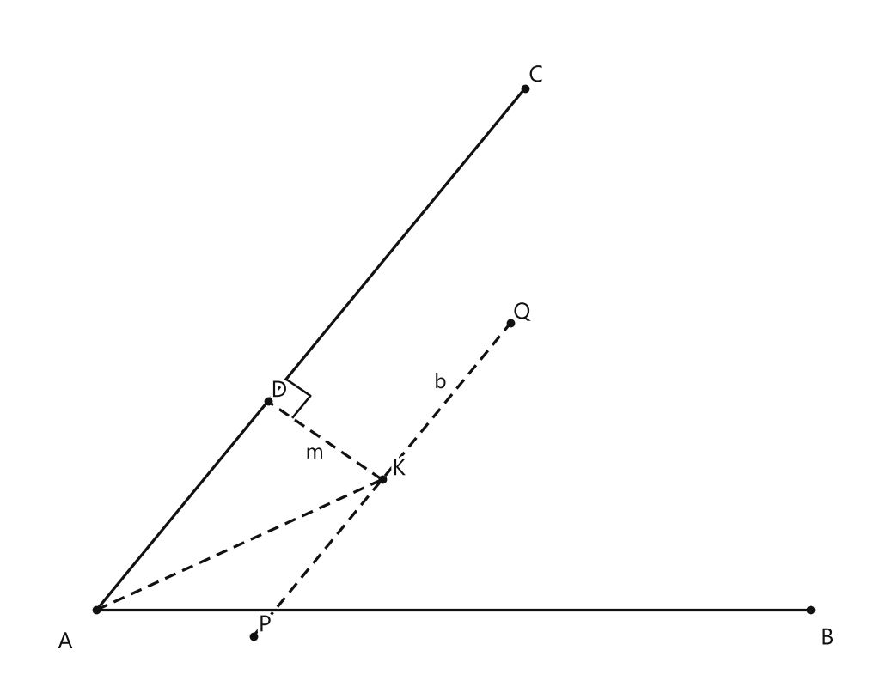
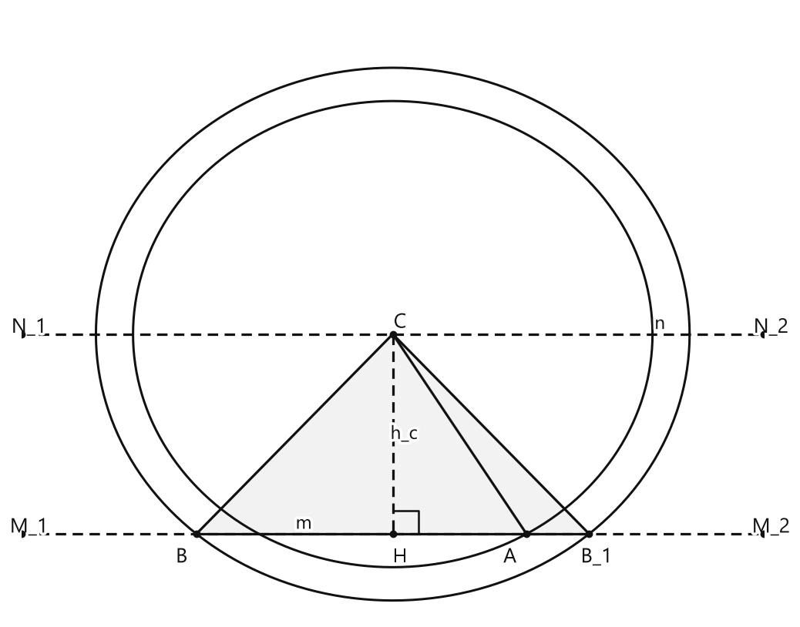

# Занятие 35. Геометрическое место точек

**Раздел:** Глава V. Задачи на построение  
**Параграф учебника:** §31. Геометрическое место точек  
**Страницы:** 176–179

## Цели занятия

К концу занятия ученик умеет:

- объяснять, что такое геометрическое место точек;
- узнавать основные ГМТ: окружность, серединный перпендикуляр, биссектрису;
- строить ГМТ точек на заданном расстоянии от прямой;
- находить ГМТ по условию на расстояния;
- решать задачи на построение методом пересечения двух ГМТ;
- выполнять построение треугольника по сторонам и высоте.

Выбери блок своего уровня:

- **1–2 балла:** узнаю определения и основные ГМТ;
- **3–4 балла:** нахожу ГМТ по простому условию;
- **5–6 баллов:** применяю метод пересечения двух ГМТ;
- **7–8 баллов:** выполняю полное построение и доказательство;
- **9–10 баллов:** исследую число решений задачи.

## Теория к занятию

### 1. Что такое геометрическое место точек

#### Простыми словами

Представь, что точка может двигаться по плоскости, но у неё есть правило. Например, она должна находиться на одном и том же расстоянии от другой точки.

Все положения, в которых это правило выполняется, и есть геометрическое место точек, или сокращённо ГМТ.

Например, если точка находится на расстоянии $r$ от точки $O$, то она движется по окружности с центром $O$ и радиусом $r$. Точка вроде бы гуляет, но строго по маршруту.

#### Определение

**Геометрическим местом точек (ГМТ) называется множество всех точек, обладающих общим свойством.**

#### Как находить ГМТ

1. Внимательно прочитай условие и найди свойство искомой точки.
2. Вспомни фигуру, состоящую из всех точек с таким свойством.
3. Проверь два момента:
   - каждая точка найденной фигуры подходит;
   - других подходящих точек нет.

#### Ловушки

- ГМТ — это обычно не одна точка, а целая фигура.
- Нужно учитывать всё условие, а не только удобную его часть.
- Если точка должна находиться внутри угла, берём только часть биссектрисы внутри этого угла.
- Следи, какие точки уже даны, а какую точку нужно построить. Буквы в геометрии не меняются местами по настроению.

---

### 2. Основные примеры ГМТ

#### Простыми словами

Некоторые ГМТ встречаются особенно часто. Если научиться узнавать их по условию, многие задачи на построение становятся намного короче.

#### Факты

1. **Окружность — это геометрическое место точек плоскости, равноудаленных от данной точки.**

2. **Серединный перпендикуляр — это геометрическое место точек плоскости, равноудаленных от концов отрезка.**

3. **Биссектриса — геометрическое место точек плоскости, находящихся внутри угла и равноудаленных от сторон угла.**

4. **Геометрическое место точек, находящихся на заданном расстоянии $h$ от данной прямой $a$, — две прямые $m$ и $n$, параллельные данной, находящиеся в разных полуплоскостях от этой прямой на заданном расстоянии от нее.**

5. **Геометрическое место точек, равноудаленных от двух данных параллельных прямых $a$ и $b$, есть параллельная им прямая $n$, проходящая через середину $M$ их общего перпендикуляра $AB$.**

В пространстве геометрическим местом точек, равноудаленных от данной точки, является сфера.

#### Формулы и обозначения

Если точка $M$ находится на расстоянии $r$ от точки $O$, записываем:

$$
OM=r.
$$

Все такие точки образуют окружность с центром $O$ и радиусом $r$.

Если точка $M$ равноудалена от точек $A$ и $B$, записываем:

$$
MA=MB.
$$

Все такие точки лежат на серединном перпендикуляре к отрезку $AB$.

Если расстояние от точки $M$ до прямой $a$ равно $h$, записываем:

$$
d(M,a)=h.
$$

Все такие точки лежат на двух прямых, параллельных прямой $a$: одна прямая находится по одну сторону от $a$, другая — по другую.

#### Правила

- Равенство расстояний до **двух точек** приводит к серединному перпендикуляру.
- Равенство расстояний до **сторон угла** приводит к биссектрисе.
- Заданное расстояние до **прямой** приводит к двум параллельным прямым.
- Равное расстояние до двух параллельных прямых приводит к одной средней параллельной.

#### Ловушки

- Окружность и круг — не одно и то же. Окружность — это граница, а круг включает и всё внутри неё.
- Серединный перпендикуляр проходит через середину отрезка и перпендикулярен этому отрезку.
- Угол имеет две биссектрисы как прямые. Но внутри данного угла находится только одна нужная часть биссектрисы.
- На заданном расстоянии $h$ от прямой находятся две параллельные прямые, а не одна. Одна не успеет охватить всю плоскость.

---

### 3. Метод геометрических мест точек

#### Простыми словами

Иногда искомая точка должна выполнить сразу два условия.

Тогда для первого условия находим своё ГМТ, а для второго — другое ГМТ. Искомая точка должна принадлежать обеим фигурам, поэтому она находится в месте их пересечения.

Это похоже на два фильтра: сначала оставили точки первого типа, затем из них выбрали точки второго типа. Остались только подходящие.

#### Правило и алгоритм

**Одним из методов решения задач на построение является метод пересечения двух геометрических мест точек. Суть его состоит в следующем. Пусть искомая точка удовлетворяет, например, некоторым двум условиям: геометрическое место точек, удовлетворяющих первому условию, — это некоторая фигура $F_1$ (окружность, биссектриса угла, серединный перпендикуляр и т. д.), а геометрическое место точек, удовлетворяющих другому условию, — это фигура $F_2$. Искомая точка, принадлежащая и фигуре $F_1$, и фигуре $F_2$, является точкой их пересечения. В частности, методом пересечения двух геометрических мест точек решена основная задача о построении треугольника по трем сторонам.**

#### Алгоритм

1. Обозначь искомую точку.
2. Запиши первое условие для этой точки.
3. Определи ГМТ, которое соответствует первому условию.
4. Запиши второе условие.
5. Определи второе ГМТ.
6. Построй обе фигуры.
7. Найди их точки пересечения.
8. Докажи, что построенная точка выполняет оба условия.
9. Проверь, сколько решений получилось.

#### Ловушки

- Не начинай строить «примерно подходящую» фигуру. Сначала выясни, какое условие она выполняет.
- Две фигуры могут пересекаться в двух точках, в одной точке или не пересекаться.
- После построения обязательно проверь оба условия.
- Две симметричные точки — не обязательно ошибка. Иногда задача действительно имеет два решения.

---

### 4. Задача о точке внутри угла

#### Простыми словами

Точка должна выполнять два условия:

1. быть равноудалённой от сторон угла;
2. находиться на расстоянии $m$ от одной из сторон.

Разберём условия по очереди.

- Равноудалённость от сторон угла даёт биссектрису.
- Расстояние $m$ от стороны даёт прямую, параллельную этой стороне и удалённую от неё на $m$.

Искомая точка — пересечение биссектрисы и этой параллельной прямой.

Почему здесь появляется параллельная прямая? Потому что расстояние между параллельными прямыми измеряется перпендикуляром и везде одинаково. Такая прямая — настоящий геометрический «режим фиксированной высоты».

#### Факты

**Биссектриса — геометрическое место точек плоскости, находящихся внутри угла и равноудаленных от сторон угла.**

**Геометрическое место точек, находящихся на заданном расстоянии $h$ от данной прямой $a$, — две прямые $m$ и $n$, параллельные данной, находящиеся в разных полуплоскостях от этой прямой на заданном расстоянии от нее.**

#### Правило построения

1. Построй прямую, параллельную одной стороне угла, на расстоянии $m$.
2. Построй биссектрису угла.
3. Найди точку пересечения биссектрисы и построенной параллельной прямой.
4. Проверь, что эта точка находится внутри угла.

#### Ловушки

- Прямую нужно проводить на расстоянии $m$ перпендикулярно стороне, а не откладывать отрезок длины $m$ вдоль стороны.
- Искомая точка должна находиться внутри угла.
- У прямой, параллельной стороне угла, есть положение и по одну, и по другую сторону от этой стороны. Подходит только то, которое даёт точку внутри данного угла.

---

### 5. Построение треугольника по двум сторонам и высоте

#### Простыми словами

Даны стороны $a$ и $b$, а также высота $h_c$, опущенная на сторону $c$.

Пусть сторона $c$ — это основание $AB$, а высота проведена из вершины $C$.

Высота перпендикулярна основанию, поэтому вершина $C$ находится на расстоянии $h_c$ от прямой $AB$. Значит, сначала строим прямую, параллельную $AB$, на расстоянии $h_c$. На этой прямой будет находиться точка $C$.

Теперь используем длины сторон:

- $BC=a$, поэтому точка $B$ должна лежать на окружности с центром $C$ и радиусом $a$;
- $AC=b$, поэтому точка $A$ должна лежать на окружности с центром $C$ и радиусом $b$.

Получается несколько ГМТ, а вершины треугольника находятся на их пересечениях. Окружности здесь не для красоты — они строго следят за длинами сторон.

#### Алгоритм построения

1. Построй прямые $m$ и $n$, параллельные друг другу, чтобы расстояние между ними было равно $h_c$.
2. На прямой $n$ выбери точку $C$.
3. Построй окружность с центром $C$ и радиусом $a$.
4. Найди точки пересечения этой окружности с прямой $m$.
5. Обозначь их через $B$ и $B_1$.
6. Построй окружность с центром $C$ и радиусом $b$.
7. Найди на прямой $m$ точку $A$, лежащую на этой окружности.
8. Соедини точки $A$, $B$ и $C$.
9. Если есть точка $B_1$, построй также треугольник с вершинами $A$, $B_1$ и $C$.

#### Исследование числа решений

Задача может иметь решение, только если

$$
h\leq a
\quad\text{и}\quad
h<b.
$$

Если $h<a$, $h<b$ и $a\ne b$, то задача имеет два решения.

Если $a=h$ и $a<b$, то треугольник прямоугольный, и задача имеет одно решение.

Если $h<a$ и $a=b$, то задача имеет одно решение — равнобедренный треугольник.

Если $h>a$ или $h>b$, задача не имеет решения.

#### Ловушки

- Высота не может быть больше наклонной стороны. Поэтому сравниваем $h$ именно с длинами сторон.
- Два симметричных треугольника могут оказаться одинаковыми по форме. Тогда это одно решение, а не два разных.
- Точка $A$ должна лежать на прямой $m$, потому что эта прямая содержит основание треугольника.
- Окружность радиуса $a$ задаёт сторону $BC$, а окружность радиуса $b$ — сторону $AC$. Буквы здесь работают, а не просто сидят на рисунке.

## Сводка формул «выучить наизусть»

$$
OM=r
$$

ГМТ — окружность с центром $O$ и радиусом $r$.

$$
MA=MB
$$

ГМТ — серединный перпендикуляр к отрезку $AB$.

$$
d(M,a)=h
$$

ГМТ — две прямые, параллельные прямой $a$, на расстоянии $h$ от неё.

Для высоты треугольника:

$$
h\leq a,
\qquad
h<b.
$$

## Правила, которые нельзя путать

- Окружность — точки на одинаковом расстоянии от **одной точки**.
- Серединный перпендикуляр — точки на одинаковом расстоянии от **двух точек**.
- Биссектриса — точки на одинаковом расстоянии от **сторон угла**.
- Расстояние до прямой задаёт **две параллельные прямые**.
- Два условия одновременно дают **пересечение двух ГМТ**.
- Внутри угла берём только внутреннюю биссектрису.

## Разбор ключевых заданий

### Р1. Точка внутри угла на заданном расстоянии от его сторон

#### Условие

Дан угол $BAC$ и отрезок длины $m$. Построить внутри угла $BAC$ точку $K$, которая равноудалена от сторон угла и находится от стороны $AC$ на расстоянии $m$.

<!--geo-figure-spec
{
  "needed": true,
  "kind": "plane",
  "caption": "Построение точки $K$ внутри угла $BAC$",
  "equal": false,
  "axis": false,
  "xlim": [
    -0.6,
    5.5
  ],
  "ylim": [
    -0.6,
    4.6
  ],
  "points": {
    "A": [
      0,
      0
    ],
    "B": [
      5,
      0
    ],
    "C": [
      3,
      4
    ],
    "K": [
      2,
      1
    ],
    "D": [
      1.2,
      1.6
    ],
    "P": [
      1.1,
      -0.2
    ],
    "Q": [
      2.9,
      2.2
    ]
  },
  "segments": [
    [
      "A",
      "B"
    ],
    [
      "A",
      "C"
    ],
    {
      "points": [
        "A",
        "K"
      ],
      "dashed": true,
      "label": "",
      "t": 0.5
    },
    {
      "points": [
        "P",
        "Q"
      ],
      "dashed": true,
      "label": "b",
      "t": 0.78
    },
    {
      "points": [
        "K",
        "D"
      ],
      "dashed": true,
      "label": "m",
      "t": 0.5
    }
  ],
  "polygons": [],
  "circles": [],
  "labels": {
    "A": {
      "dx": -0.22,
      "dy": -0.25
    },
    "B": {
      "dx": 0.12,
      "dy": -0.22
    },
    "C": {
      "dx": 0.08,
      "dy": 0.1
    },
    "K": {
      "dx": 0.12,
      "dy": 0.08
    }
  },
  "right_angles": [
    {
      "vertex": "D",
      "from": "K",
      "to": "C"
    }
  ],
  "angle_marks": [],
  "texts": []
}
-->

*Построение точки K внутри угла BAC*

#### Решение

**Анализ.**

Точка $K$ должна быть равноудалена от сторон угла $BAC$.

Значит, точка $K$ лежит на биссектрисе угла $BAC$.

Точка $K$ должна находиться от стороны $AC$ на расстоянии $m$.

Значит, точка $K$ лежит на прямой, параллельной $AC$ и находящейся от неё на расстоянии $m$.

Получается, что точка $K$ должна принадлежать двум ГМТ:

- биссектрисе угла $BAC$;
- прямой, параллельной $AC$ на расстоянии $m$ от неё.

Следовательно, $K$ — точка пересечения этих двух линий.

**Построение.**

1. Через точку $A$ проведём прямую, перпендикулярную $AC$.

2. На этой перпендикулярной прямой отложим отрезок длины $m$ в сторону внутренней области угла.

3. Через полученную точку проведём прямую $b$, перпендикулярную построенному перпендикуляру.

4. Прямые $b$ и $AC$ перпендикулярны одной и той же прямой.

5. Значит, $b\parallel AC$.

6. Расстояние между прямыми $b$ и $AC$ равно $m$.

7. Построим биссектрису угла $BAC$.

8. Обозначим точку пересечения биссектрисы и прямой $b$ через $K$.

9. Выберем ту точку пересечения, которая находится внутри угла $BAC$.

**Доказательство.**

Точка $K$ лежит на биссектрисе угла $BAC$.

Следовательно, точка $K$ равноудалена от сторон угла $BAC$.

Прямые $b$ и $AC$ параллельны.

Расстояние между ними равно $m$.

Следовательно, расстояние от точки $K$ до стороны $AC$ равно $m$.

Точка $K$ удовлетворяет обоим условиям задачи.

**Ответ:** точка $K$ — пересечение биссектрисы угла $BAC$ и прямой, параллельной $AC$ на расстоянии $m$ от неё.

---

### Р2. Треугольник по двум сторонам и высоте

#### Условие

Построить треугольник $ABC$ по сторонам

$$
BC=a,\qquad AC=b
$$

и высоте $h_c$, опущенной на сторону $AB$.

Рассмотреть случай

$$
h_c<a,\qquad h_c<b,\qquad a\ne b.
$$

#### Решение

**Анализ.**

Высота $CH$ перпендикулярна стороне $AB$.

Значит, расстояние от точки $C$ до прямой $AB$ равно $h_c$.

Следовательно, прямая $AB$ должна находиться от точки $C$ на расстоянии $h_c$.

Проведём две прямые $m$ и $n$, параллельные друг другу и находящиеся на расстоянии $h_c$.

Точку $C$ выберем на прямой $n$.

Точка $B$ должна находиться от точки $C$ на расстоянии $a$:

$$
CB=a.
$$

Поэтому точка $B$ лежит на окружности с центром $C$ и радиусом $a$.

Точка $A$ должна находиться от точки $C$ на расстоянии $b$:

$$
CA=b.
$$

Поэтому точка $A$ лежит на окружности с центром $C$ и радиусом $b$.

Обе точки $A$ и $B$ должны лежать на прямой $m$.

Условия $h_c<a$ и $h_c<b$ нужны для того, чтобы соответствующие окружности пересекали прямую $m$. Иначе окружность до прямой не «дотянется».

<!--geo-figure-spec
{
  "needed": true,
  "kind": "plane",
  "caption": "Построение треугольников $ABC$ и $AB_1C$",
  "equal": false,
  "axis": false,
  "xlim": [
    -1,
    7
  ],
  "ylim": [
    -1,
    6.3
  ],
  "points": {
    "C": [
      3,
      2.4
    ],
    "H": [
      3,
      0
    ],
    "A": [
      4.442,
      0
    ],
    "B": [
      0.883,
      0
    ],
    "B_1": [
      5.117,
      0
    ],
    "M_1": [
      -1,
      0
    ],
    "M_2": [
      7,
      0
    ],
    "N_1": [
      -1,
      2.4
    ],
    "N_2": [
      7,
      2.4
    ]
  },
  "segments": [
    {
      "points": [
        "M_1",
        "M_2"
      ],
      "dashed": true,
      "label": "m",
      "t": 0.38
    },
    {
      "points": [
        "N_1",
        "N_2"
      ],
      "dashed": true,
      "label": "n",
      "t": 0.86
    },
    [
      "A",
      "B"
    ],
    [
      "B",
      "C"
    ],
    [
      "C",
      "A"
    ],
    [
      "A",
      "B_1"
    ],
    [
      "B_1",
      "C"
    ],
    {
      "points": [
        "C",
        "H"
      ],
      "dashed": true,
      "label": "h_c",
      "t": 0.5
    }
  ],
  "polygons": [
    {
      "vertices": [
        "A",
        "B",
        "C"
      ],
      "fill": 0.05
    },
    {
      "vertices": [
        "A",
        "B_1",
        "C"
      ],
      "fill": 0.05
    }
  ],
  "circles": [
    {
      "center": "C",
      "radius": 3.2
    },
    {
      "center": "C",
      "radius": 2.8
    }
  ],
  "labels": {
    "A": {
      "dx": -0.18,
      "dy": -0.28
    },
    "B": {
      "dx": -0.16,
      "dy": -0.28
    },
    "B_1": {
      "dx": 0.08,
      "dy": -0.28
    },
    "C": {
      "dx": 0.08,
      "dy": 0.14
    },
    "H": {
      "dx": 0.08,
      "dy": -0.28
    }
  },
  "right_angles": [
    {
      "vertex": "H",
      "from": "C",
      "to": "A"
    }
  ],
  "angle_marks": [],
  "texts": []
}
-->

*Построение треугольников ABC и AB_1C*

**Построение.**

1. Строим параллельные прямые $m$ и $n$ так, чтобы расстояние между ними было равно $h_c$.

2. На прямой $n$ выбираем точку $C$.

3. Строим окружность с центром $C$ и радиусом $a$.

4. Окружность пересекает прямую $m$ в точках $B$ и $B_1$.

5. Строим окружность с центром $C$ и радиусом $b$.

6. Одну из точек пересечения этой окружности с прямой $m$ обозначаем через $A$.

7. Соединяем точки $A$, $B$ и $C$.

8. Соединяем точки $A$, $B_1$ и $C$.

Получаем два треугольника: $ABC$ и $AB_1C$.

**Доказательство.**

Точки $A$, $B$ и $B_1$ лежат на прямой $m$.

Значит, прямая $AB$ совпадает с прямой $m$.

Точка $C$ лежит на прямой $n$.

Расстояние между параллельными прямыми $m$ и $n$ равно $h_c$.

Поэтому расстояние от точки $C$ до прямой $AB$ равно $h_c$.

Перпендикуляр из точки $C$ к прямой $AB$ является высотой треугольника.

По построению

$$
CB=a.
$$

По построению

$$
CB_1=a.
$$

По построению

$$
CA=b.
$$

Значит, треугольники $ABC$ и $AB_1C$ имеют заданные стороны $a$ и $b$ и заданную высоту $h_c$.

**Ответ:** треугольники $ABC$ и $AB_1C$.

---

### Р3. ГМТ точек, равноудалённых от двух данных точек

#### Условие

На плоскости даны точки $A$ и $B$. Найти геометрическое место точек $M$, для которых

$$
AM=BM.
$$

#### Решение

Условие

$$
AM=BM
$$

означает, что точка $M$ находится на одинаковом расстоянии от точек $A$ и $B$.

Поэтому используем свойство серединного перпендикуляра: он является геометрическим местом точек, равноудалённых от концов отрезка.

**Построение.**

1. Строим середину $O$ отрезка $AB$.

2. Через точку $O$ проводим прямую, перпендикулярную отрезку $AB$.

Полученная прямая — серединный перпендикуляр к отрезку $AB$.

Любая точка этой прямой равноудалена от точек $A$ и $B$.

И наоборот, любая точка, равноудалённая от $A$ и $B$, лежит на этой прямой.

Значит, других точек в искомом геометрическом месте нет.

**Ответ:** серединный перпендикуляр к отрезку $AB$.

---

### Р4. ГМТ точек, для которых $AM< BM$

#### Условие

На плоскости даны точки $A$ и $B$. Найти геометрическое место точек $M$, для которых

$$
AM< BM.
$$

#### Решение

Сначала найдём границу искомого множества.

Если

$$
AM=BM,
$$

то точка $M$ лежит на серединном перпендикуляре к отрезку $AB$.

Этот перпендикуляр делит плоскость на две полуплоскости:

- одну, содержащую точку $A$;
- другую, содержащую точку $B$.

Возьмём точку $M$ в полуплоскости, содержащей точку $A$.

В этой полуплоскости точка $M$ ближе к $A$, чем к $B$. Поэтому

$$
AM< BM.
$$

Если же точка $M$ находится в полуплоскости, содержащей точку $B$, то

$$
AM>BM.
$$

Сам серединный перпендикуляр в искомое множество не входит: для его точек выполняется равенство

$$
AM=BM,
$$

а не строгое неравенство.

Итак, нужно взять только одну полуплоскость — ту, где находится точка $A$.

**Ответ:** открытая полуплоскость, содержащая точку $A$, ограниченная серединным перпендикуляром к отрезку $AB$.

---

### Р5. ГМТ точек, равноудалённых от двух пересекающихся прямых

#### Условие

Даны две пересекающиеся прямые. Найти геометрическое место точек, равноудалённых от этих прямых.

#### Решение

Две пересекающиеся прямые образуют четыре угла.

Рассмотрим один из этих углов.

Точки, равноудалённые от его сторон, лежат на биссектрисе этого угла.

Для вертикального угла подходит та же прямая: его биссектриса является продолжением биссектрисы первого угла.

Для двух других углов подходит вторая биссектриса.

Значит, все точки, равноудалённые от данных пересекающихся прямых, лежат на двух биссектрисах.

Эти биссектрисы перпендикулярны друг другу: они делят четыре угла на равные части.

**Ответ:** две биссектрисы углов, образованных данными пересекающимися прямыми.

---

### Р6. ГМТ центров окружностей, проходящих через две данные точки

#### Условие

Даны точки $A$ и $B$. Найти геометрическое место центров окружностей, каждая из которых проходит через точки $A$ и $B$.

#### Решение

Пусть $O$ — центр одной из таких окружностей.

Окружность проходит через точки $A$ и $B$.

Значит, отрезки $OA$ и $OB$ являются радиусами одной окружности.

Все радиусы одной окружности равны, поэтому

$$
OA=OB.
$$

Следовательно, точка $O$ равноудалена от концов отрезка $AB$.

По свойству серединного перпендикуляра точка $O$ лежит на серединном перпендикуляре к отрезку $AB$.

Теперь проверим обратное утверждение.

Возьмём любую точку $O$ на серединном перпендикуляре к отрезку $AB$.

Тогда

$$
OA=OB.
$$

Проведём окружность с центром $O$ и радиусом $OA$.

Точка $A$ лежит на этой окружности.

Так как $OB=OA$, точка $B$ тоже лежит на этой окружности.

Значит, любая точка серединного перпендикуляра подходит в качестве центра.

**Ответ:** серединный перпендикуляр к отрезку $AB$.

---

### Р7. Построение прямоугольного треугольника по двум катетам

#### Условие

Построить прямоугольный треугольник по катетам $a$ и $b$.

#### Решение

Пусть прямой угол находится в точке $A$.

Тогда один катет можно расположить на прямой, а второй — на перпендикуляре к этой прямой.

**Построение.**

1. Строим прямую $l$.

2. На прямой $l$ откладываем отрезок

$$
AB=a.
$$

3. В точке $A$ строим перпендикуляр к прямой $l$.

4. На этом перпендикуляре откладываем отрезок

$$
AC=b.
$$

5. Соединяем точки $B$ и $C$.

Так как точка $B$ лежит на прямой $l$, а $AC$ построен перпендикулярно этой прямой, то

$$
AB\perp AC.
$$

Следовательно,

$$
\angle A=90^\circ.
$$

Значит, треугольник $ABC$ прямоугольный, а его катеты имеют заданные длины.

Прямой угол лучше построить сразу: потом стороны уже не будут спорить, кто из них перпендикулярнее.

**Ответ:** построенный треугольник $ABC$, где $AB=a$, $AC=b$ и $\angle A=90^\circ$.

---

### Р8. Построение прямоугольника по двум сторонам

#### Условие

Построить прямоугольник по двум сторонам $a$ и $b$.

#### Решение

**Построение.**

1. Строим отрезок

$$
AB=a.
$$

2. В точке $A$ строим перпендикуляр к прямой $AB$.

3. На этом перпендикуляре откладываем отрезок

$$
AD=b.
$$

4. Через точку $B$ проводим прямую, параллельную $AD$.

5. Через точку $D$ проводим прямую, параллельную $AB$.

6. Точку пересечения построенных прямых обозначаем через $C$.

Получили четырёхугольник $ABCD$.

По построению

$$
AB\parallel CD,
\qquad
AD\parallel BC.
$$

Кроме того,

$$
AB\perp AD.
$$

Так как противоположные стороны параллельны, углы при соседних сторонах являются смежными.

Угол $A$ прямой, поэтому остальные углы тоже прямые.

Следовательно, $ABCD$ — прямоугольник.

Его стороны равны:

$$
AB=CD=a,
\qquad
AD=BC=b.
$$

**Ответ:** прямоугольник $ABCD$ со сторонами $AB=CD=a$ и $AD=BC=b$.

---

## Самопроверка

1. Какое ГМТ задаёт условие $MA=MB$?
2. Какое ГМТ задаёт расстояние $h$ от прямой?
3. Почему точка, равноудалённая от сторон угла, лежит на биссектрисе?
4. Что нужно пересечь, если точка должна удовлетворять двум условиям?
5. При каких условиях задача о треугольнике по двум сторонам и высоте не имеет решения?

### Ответы

1. Серединный перпендикуляр к отрезку $AB$.
2. Две прямые, параллельные данной прямой и находящиеся от неё на расстоянии $h$.
3. Потому что биссектриса является ГМТ точек, равноудалённых от сторон угла.
4. Два геометрических места точек.
5. Если $h>a$ или $h>b$.

## Практические задания

Выбери свой уровень и решай только этот блок. В блоке должна закрепиться вся тема параграфа. Ответы не приводятся.

### Уровень 1–2 балла

**С1.** Выберите верное определение геометрического места точек.

1) Фигура, состоящая только из двух точек  
2) Множество всех точек, обладающих общим свойством  
3) Любая замкнутая линия  
4) Отрезок, соединяющий две точки  
5) Фигура, ограниченная прямыми

**С2.** Какое геометрическое место точек состоит из точек, равноудалённых от данной точки $O$?

1) Прямая  
2) Биссектриса угла  
3) Окружность с центром $O$  
4) Серединный перпендикуляр  
5) Две параллельные прямые

**С3.** Даны точки $A$ и $B$. Какое геометрическое место точек $M$ задаётся условием $MA=MB$?

1) Окружность с центром $A$  
2) Прямая $AB$  
3) Серединный перпендикуляр к отрезку $AB$  
4) Биссектриса любого угла  
5) Две прямые, параллельные $AB$

**С4.** Даны две пересекающиеся прямые. Какое геометрическое место точек равноудалено от этих прямых?

1) Одна из данных прямых  
2) Окружность  
3) Серединный перпендикуляр  
4) Две биссектрисы углов, образованных этими прямыми  
5) Две параллельные прямые

**С5.** Дана прямая $a$. Геометрическое место точек, находящихся на расстоянии $h$ от прямой $a$, состоит из

1) одной прямой $a$  
2) двух прямых, параллельных $a$ и находящихся на расстоянии $h$ от неё  
3) окружности радиуса $h$  
4) серединного перпендикуляра к прямой $a$  
5) двух перпендикулярных прямых

**С6.** Точки $A$ и $B$ являются концами отрезка. Как построить геометрическое место точек $M$, для которых $MA=MB$?

1) Провести окружность с центром $A$  
2) Провести окружность с центром $B$  
3) Провести прямую $AB$  
4) Построить серединный перпендикуляр к отрезку $AB$  
5) Построить биссектрису угла $AOB$

**С7.** Даны стороны угла с вершиной $O$. Какая линия является геометрическим местом точек, равноудалённых от сторон этого угла и расположенных внутри угла?

1) Сторона угла  
2) Биссектриса угла  
3) Окружность с центром $O$  
4) Серединный перпендикуляр  
5) Прямая, перпендикулярная одной из сторон угла

**С8.** Даны две параллельные прямые $a$ и $b$. Что является геометрическим местом точек, равноудалённых от этих прямых?

1) Прямая, параллельная данным и проходящая посередине между ними  
2) Прямая $a$  
3) Прямая $b$  
4) Окружность, касающаяся обеих прямых  
5) Две прямые, перпендикулярные данным

**С9.** Даны точки $A$ и $B$. Найдите геометрическое место центров окружностей, проходящих через точки $A$ и $B$.

1) Прямая $AB$  
2) Окружность с центром $A$  
3) Серединный перпендикуляр к отрезку $AB$  
4) Биссектриса угла $AOB$  
5) Две прямые, параллельные $AB$

**С10.** Внутри данного угла требуется построить точку, равноудалённую от его сторон и находящуюся на расстоянии $m$ от одной из сторон. Какие два геометрических места точек нужно пересечь?

1) Две окружности  
2) Биссектрису угла и прямую, параллельную стороне угла на расстоянии $m$  
3) Две стороны угла  
4) Прямую угла и окружность  
5) Две прямые, перпендикулярные сторонам угла

**С11.** Дан отрезок $AB$. Какое геометрическое место вершин $M$ прямоугольных треугольников с гипотенузой $AB$?

1) Прямая $AB$  
2) Окружность с диаметром $AB$, без точек $A$ и $B$  
3) Серединный перпендикуляр к $AB$  
4) Две прямые, параллельные $AB$  
5) Окружность с центром $A$ и радиусом $AB$

**С12.** При построении треугольника методом геометрических мест точек искомую вершину находят как

1) середину любого данного отрезка  
2) точку пересечения двух подходящих геометрических мест точек  
3) центр произвольной окружности  
4) конец одного из данных отрезков  
5) точку пересечения двух сторон данного треугольника

**С13.** Геометрическим местом точек называется:

1) одна произвольная точка  
2) множество всех точек, обладающих общим свойством  
3) только окружность  
4) только прямая  
5) любая геометрическая фигура

**С14.** Выберите геометрическое место точек плоскости, равноудалённых от данной точки $O$ на расстояние $r$.

1) прямая  
2) луч  
3) окружность с центром $O$ и радиусом $r$  
4) серединный перпендикуляр  
5) биссектриса угла

**С15.** На плоскости даны точки $A$ и $B$. Какую фигуру образуют все точки $M$, для которых $MA=MB$?

1) окружность с центром $A$  
2) окружность с центром $B$  
3) прямая $AB$  
4) серединный перпендикуляр к отрезку $AB$  
5) биссектриса произвольного угла

**С16.** Даны две пересекающиеся прямые $a$ и $b$. Геометрическим местом точек, равноудалённых от этих прямых, являются:

1) две параллельные прямые  
2) окружность  
3) две биссектрисы углов, образованных прямыми $a$ и $b$  
4) серединный перпендикуляр  
5) прямая, перпендикулярная обеим данным прямым

**С17.** Выберите геометрическое место точек, находящихся на расстоянии $h$ от данной прямой $a$.

1) одна окружность  
2) две прямые, параллельные прямой $a$ и находящиеся на расстоянии $h$ от неё  
3) серединный перпендикуляр к прямой $a$  
4) биссектриса любого угла  
5) две перпендикулярные прямые

**С18.** Даны две параллельные прямые $a$ и $b$. Геометрическое место точек, равноудалённых от них, — это:

1) прямая, параллельная данным и проходящая посередине между ними  
2) любая прямая, перпендикулярная данным  
3) окружность, касающаяся обеих прямых  
4) серединный перпендикуляр к одной из прямых  
5) одна из данных прямых

**С19.** Дан отрезок $AB$. Как построить геометрическое место точек $M$, для которых $MA=MB$?

1) построить окружность с центром $A$  
2) построить окружность с центром $B$  
3) построить серединный перпендикуляр к отрезку $AB$  
4) построить прямую $AB$  
5) построить биссектрису угла $A$

**С20.** Дан угол $AOB$. Какую линию следует построить, чтобы получить геометрическое место точек внутри угла, равноудалённых от его сторон?

1) высоту  
2) медиану  
3) биссектрису угла $AOB$  
4) серединный перпендикуляр  
5) окружность с центром $O$

**С21.** Даны две точки $A$ и $B$. Выберите все верные утверждения о точках $M$, для которых $AM=MB$.

1) точка $M$ лежит на серединном перпендикуляре к $AB$  
2) точка $M$ равноудалена от концов отрезка $AB$  
3) точка $M$ обязательно лежит на отрезке $AB$  
4) точка $M$ может лежать вне отрезка $AB$  
5) точка $M$ обязательно совпадает с серединой отрезка $AB$

**С22.** Дан отрезок $AB$. Геометрическое место вершин $M$ прямоугольных треугольников $AMB$ с гипотенузой $AB$ расположено:

1) на окружности с диаметром $AB$, кроме точек $A$ и $B$  
2) на прямой $AB$  
3) на серединном перпендикуляре к $AB$  
4) на двух прямых, параллельных $AB$  
5) на окружности с центром $A$

**С23.** Даны две точки $A$ и $B$. Выберите геометрическое место центров окружностей, проходящих через обе точки $A$ и $B$.

1) прямая $AB$  
2) серединный перпендикуляр к отрезку $AB$  
3) окружность с центром $A$  
4) биссектриса угла $A$  
5) две прямые, параллельные $AB$

**С24.** Искомая точка должна находиться на расстоянии $m$ от прямой $a$ и быть равноудалённой от двух пересекающихся прямых $b$ и $c$. Какие два геометрических места точек нужно пересечь?

1) прямую $a$ и окружность  
2) две прямые, параллельные $a$, и биссектрисы углов между $b$ и $c$  
3) прямую $a$ и серединный перпендикуляр  
4) окружность и серединный перпендикуляр  
5) две окружности с центрами $b$ и $c$

**С25.** Выберите геометрическое место точек, равноудалённых от данной точки $O$.

1) прямая  
2) окружность с центром $O$  
3) биссектриса угла  
4) серединный перпендикуляр  
5) две параллельные прямые

**С26.** Точки $A$ и $B$ являются концами отрезка. Выберите геометрическое место точек $M$, для которых $MA=MB$.

1) окружность с центром $A$  
2) окружность с центром $B$  
3) серединный перпендикуляр к отрезку $AB$  
4) прямая $AB$  
5) две параллельные прямые

**С27.** Даны две пересекающиеся прямые $a$ и $b$. Выберите геометрическое место точек, равноудалённых от прямых $a$ и $b$.

1) прямая $a$  
2) прямая $b$  
3) окружность  
4) две биссектрисы углов, образованных прямыми $a$ и $b$  
5) серединный перпендикуляр

**С28.** Дана прямая $a$. Выберите геометрическое место точек, находящихся на расстоянии $h$ от прямой $a$, где $h>0$.

1) одна прямая, совпадающая с $a$  
2) окружность радиуса $h$  
3) две прямые, параллельные $a$ и находящиеся от неё на расстоянии $h$  
4) биссектриса любого угла  
5) серединный перпендикуляр к прямой $a$

**С29.** Даны две параллельные прямые $a$ и $b$. Выберите геометрическое место точек, равноудалённых от этих прямых.

1) две прямые, перпендикулярные $a$ и $b$  
2) одна прямая, параллельная $a$ и $b$ и расположенная между ними  
3) окружность  
4) прямая $a$  
5) серединный перпендикуляр к любой хорде

**С30.** Даны точки $A$ и $B$. Выберите геометрическое место центров окружностей, проходящих через точки $A$ и $B$.

1) прямая $AB$  
2) окружность с центром $A$  
3) серединный перпендикуляр к отрезку $AB$  
4) две прямые, параллельные $AB$  
5) биссектриса угла $A$

**С31.** Даны точки $A$ и $B$. Выберите геометрическое место точек $M$, для которых $AM< BM$.

1) серединный перпендикуляр к $AB$  
2) полуплоскость, содержащая точку $A$ и ограниченная серединным перпендикуляром к $AB$  
3) полуплоскость, содержащая точку $B$ и ограниченная серединным перпендикуляром к $AB$  
4) окружность с центром $A$  
5) прямая $AB$

**С32.** На плоскости дан угол $ABC$. Выберите геометрическое место точек, находящихся внутри угла $ABC$ и равноудалённых от его сторон.

1) сторона $AB$  
2) сторона $BC$  
3) биссектриса угла $ABC$  
4) окружность с центром $B$  
5) прямая, перпендикулярная $AB$

**С33.** Даны точки $A$ и $B$. Постройте геометрическое место точек $M$, для которых $MA=MB$.

**С34.** Дана прямая $a$ и отрезок длины $h$. Постройте геометрическое место точек, находящихся от прямой $a$ на расстоянии, равном длине отрезка $h$.

**С35.** Даны две пересекающиеся прямые $a$ и $b$. Постройте геометрическое место точек, равноудалённых от прямых $a$ и $b$.

**С36.** Искомая точка должна удовлетворять двум условиям: находиться на окружности $F_1$ и на прямой $F_2$. Каким способом можно найти искомую точку?

1) построить только окружность $F_1$  
2) построить только прямую $F_2$  
3) найти точку пересечения фигур $F_1$ и $F_2$  
4) провести через точку произвольную прямую  
5) построить серединный перпендикуляр к любой стороне

### Уровень 3–4 балла

**С1.** Дайте определение геометрического места точек.

**С2.** На плоскости дана точка $A$. Опишите геометрическое место точек $M$, для которых $AM=4$ см.

**С3.** На плоскости даны точки $A$ и $B$. Постройте геометрическое место точек $M$, для которых $MA=MB$.

**С4.** На плоскости даны точки $A$ и $B$. Укажите, какой отрезок является основанием равнобедренного треугольника $AMB$, если $MA=MB$.

**С5.** На плоскости даны точки $A$ и $B$. Найдите геометрическое место точек $M$, для которых $MA<MB$.

**С6.** Дана прямая $a$. Постройте геометрическое место точек, находящихся от прямой $a$ на расстоянии $3$ см.

**С7.** Даны две параллельные прямые $a$ и $b$. Общее расстояние между ними равно $8$ см. Найдите геометрическое место точек, равноудалённых от прямых $a$ и $b$.

**С8.** Даны две пересекающиеся прямые $a$ и $b$. Найдите геометрическое место точек, равноудалённых от этих прямых.

**С9.** Даны точки $A$ и $B$. Постройте геометрическое место центров окружностей, проходящих через точки $A$ и $B$.

**С10.** Дана окружность с центром $O$ и радиусом $5$ см. Укажите геометрическое место точек, удалённых от точки $O$ на расстояние $5$ см.

**С11.** Постройте внутри данного угла $\angle ABC$ точку $M$, которая находится на расстоянии $2$ см от каждой стороны угла.

**С12.** Дан отрезок $AB$ длиной $6$ см. Найдите геометрическое место вершин $C$ прямоугольных треугольников $ACB$, в которых $AB$ является гипотенузой.

**С13.** На плоскости даны точки $A$ и $B$. Постройте геометрическое место точек $M$, для которых $MA=MB$.

**С14.** На плоскости даны точки $A$ и $B$. Постройте геометрическое место точек $M$, для которых $MA=5$ см.

**С15.** Дана прямая $a$. Постройте геометрическое место точек, находящихся от прямой $a$ на расстоянии $3$ см.

**С16.** Даны две пересекающиеся прямые $a$ и $b$. Постройте геометрическое место точек, равноудалённых от прямых $a$ и $b$.

**С17.** Даны две параллельные прямые $a$ и $b$. Постройте геометрическое место точек, равноудалённых от прямых $a$ и $b$.

**С18.** Дан отрезок $AB$. Постройте геометрическое место центров окружностей, проходящих через точки $A$ и $B$.

**С19.** Дан отрезок $AB$. Постройте геометрическое место вершин прямоугольных треугольников $AMB$, у которых $AB$ является гипотенузой.

**С20.** Изобразите остроугольный треугольник $ABC$. Постройте высоту $AH$.

**С21.** Изобразите треугольник $ABC$. Постройте точку пересечения его высот.

**С22.** Дан угол $\alpha$. Постройте угол $\beta$, если $\alpha+\beta=90^\circ$.

**С23.** Постройте равнобедренный треугольник по основанию $AB$ и высоте $h$, проведённой к основанию.

**С24.** Постройте прямоугольный треугольник по гипотенузе $c$ и одному из острых углов $\alpha$.

**С25.** На плоскости даны точки $A$ и $B$. Постройте геометрическое место точек $M$, для которых $MA=MB$.

**С26.** На плоскости даны точки $A$ и $B$. Постройте геометрическое место точек $M$, для которых $MA=5$ см.

**С27.** На плоскости даны точки $A$ и $B$. Постройте геометрическое место точек $M$, для которых $MA<MB$.

**С28.** Даны две пересекающиеся прямые $a$ и $b$. Постройте геометрическое место точек, равноудалённых от прямых $a$ и $b$.

**С29.** Даны две параллельные прямые $a$ и $b$. Расстояние между ними равно $6$ см. Постройте геометрическое место точек, равноудалённых от прямых $a$ и $b$.

**С30.** Дан отрезок $AB$ длиной $8$ см. Постройте геометрическое место центров окружностей, проходящих через точки $A$ и $B$.

**С31.** Дан отрезок $AB$. Постройте геометрическое место вершин прямоугольных треугольников $AMB$, в которых $AB$ является гипотенузой.

**С32.** Изобразите угол $AOB$. Постройте геометрическое место точек, находящихся внутри угла $AOB$ и равноудалённых от его сторон.

**С33.** Дана прямая $a$. Постройте геометрическое место точек, находящихся от прямой $a$ на расстоянии $3$ см.

**С34.** Внутри данного угла $AOB$ постройте точку $M$, которая находится на расстоянии $2$ см от стороны $OA$ и равноудалена от сторон угла.

**С35.** Постройте треугольник $ABC$ по стороне $AB=6$ см, высоте $CH=4$ см, опущенной на сторону $AB$, и углу $ABC=60^\circ$.

**С36.** Постройте прямоугольный треугольник $ABC$ по гипотенузе $AB=8$ см и высоте $CH=3$ см, опущенной из вершины прямого угла $C$ на гипотенузу $AB$.

### Уровень 5–6 баллов

**С1.** На плоскости даны точки $A$ и $B$. Постройте геометрическое место точек $M$, для которых $AM=4$ см. Укажите название полученной фигуры.

**С2.** Дан отрезок $AB$ длиной $6$ см. Постройте геометрическое место точек $M$, для которых $MA=MB$. Укажите название полученной фигуры.

**С3.** На плоскости даны точки $A$ и $B$. Постройте геометрическое место точек $M$, для которых $MA<MB$. Опишите, какую из двух полуплоскостей относительно серединного перпендикуляра к отрезку $AB$ нужно выбрать.

**С4.** Даны две пересекающиеся прямые $a$ и $b$. Постройте геометрическое место точек, равноудалённых от прямых $a$ и $b$. Назовите построенные прямые.

**С5.** Дан угол $AOB$. Постройте внутри угла точку $M$, находящуюся от каждой его стороны на расстоянии $2$ см.

**С6.** Даны две параллельные прямые $a$ и $b$. Постройте геометрическое место точек, равноудалённых от прямых $a$ и $b$.

**С7.** Даны точки $A$ и $B$. Найдите геометрическое место центров окружностей, проходящих через точки $A$ и $B$. Постройте это геометрическое место.

**С8.** Дан отрезок $AB$ длиной $8$ см. Постройте геометрическое место вершин $C$ прямоугольных треугольников $ACB$ с гипотенузой $AB$. Укажите, какие точки построенной фигуры не могут быть вершинами невырожденного треугольника.

**С9.** Постройте прямоугольный треугольник $ABC$ по гипотенузе $AB=6$ см и острому углу $\angle A=40^\circ$.

**С10.** Постройте равнобедренный треугольник с основанием $AB=6$ см и высотой, проведённой к основанию, $4$ см.

**С11.** Постройте треугольник $ABC$ по стороне $AB=7$ см, высоте $CH=3$ см и углу $\angle A=50^\circ$, если высота $CH$ проведена к стороне $AB$.

**С12.** Постройте треугольник $ABC$ по стороне $AB=8$ см, высоте $CH=3$ см, проведённой к стороне $AB$, и стороне $AC=5$ см. Укажите все точки, которые необходимо рассмотреть как возможное положение вершины $C$.

**С13.** На плоскости даны точки $A$ и $B$. Постройте геометрическое место точек $M$, для которых $MA=MB$.

**С14.** На плоскости даны точки $A$ и $B$. Постройте геометрическое место точек $M$, для которых $MA<MB$.

**С15.** Дан отрезок $AB$ длиной $6$ см. Постройте геометрическое место вершин $M$ равнобедренных треугольников $AMB$, в которых $AB$ — основание.

**С16.** Дан отрезок $AB$ длиной $5$ см. Постройте геометрическое место вершин $M$ равнобедренных треугольников $AMB$, в которых $AB$ — боковая сторона, то есть $AB=AM$.

**С17.** Даны две пересекающиеся прямые $a$ и $b$. Постройте геометрическое место точек, равноудалённых от прямых $a$ и $b$.

**С18.** Даны две параллельные прямые $a$ и $b$, расстояние между которыми равно $4$ см. Постройте геометрическое место точек, равноудалённых от прямых $a$ и $b$.

**С19.** Даны точки $A$ и $B$. Постройте геометрическое место центров окружностей, проходящих через точки $A$ и $B$.

**С20.** Дан угол $AOB$ и отрезок длиной $2$ см. Постройте внутри угла точку $M$, равноудалённую от его сторон и находящуюся на расстоянии $2$ см от стороны $OA$.

**С21.** Дан острый угол $AOB$. Постройте угол $BOC$, величина которого вместе с величиной угла $AOB$ равна $90^\circ$.

**С22.** Постройте прямоугольный треугольник $ABC$ по катетам $AB=4$ см и $AC=3$ см. Укажите, какие геометрические места точек используются при построении вершины $C$.

**С23.** Постройте равнобедренный треугольник $ABC$ с основанием $AB=6$ см и высотой $CH=4$ см, где $H$ — основание высоты. Укажите геометрическое место точки $C$ до выбора одной из двух симметричных вершин.

**С24.** Дан отрезок $AB$ длиной $6$ см. Постройте геометрическое место точек $C$, для которых угол $ACB$ прямой. Укажите, какая окружность является этим геометрическим местом.

**С25.** На плоскости даны точки $A$ и $B$. Постройте геометрическое место точек $M$, для которых $MA=MB$.

**С26.** На плоскости даны точки $A$ и $B$. Постройте геометрическое место точек $M$, для которых $MA=4$ см. Укажите название полученной фигуры.

**С27.** Даны две пересекающиеся прямые $a$ и $b$. Постройте геометрическое место точек, равноудалённых от прямых $a$ и $b$.

**С28.** Дана прямая $a$. Постройте геометрическое место точек, находящихся от неё на расстоянии $3$ см. Сколько прямых входит в это геометрическое место?

**С29.** Дан отрезок $AB$. Постройте геометрическое место вершин $M$ прямоугольных треугольников $AMB$, в которых $AB$ является гипотенузой.

**С30.** Постройте треугольник $ABC$ по стороне $AB=6$ см, высоте $CH=4$ см, опущенной на сторону $AB$, и стороне $AC=5$ см. Укажите, какие два геометрических места точек используются при построении вершины $C$.

### Уровень 7–8 баллов

**С1.** На плоскости даны точки $A$ и $B$. Постройте геометрическое место всех точек $M$, для которых $MA=MB$. Обоснуйте, почему построенная фигура является искомым геометрическим местом.

**С2.** На плоскости даны точки $A$ и $B$. Постройте геометрическое место точек $M$, для которых $MA<MB$. Укажите, в какой из двух полуплоскостей относительно серединного перпендикуляра к отрезку $AB$ должны находиться такие точки.

**С3.** Даны две пересекающиеся прямые $a$ и $b$. Постройте геометрическое место всех точек, равноудалённых от прямых $a$ и $b$. Объясните, почему искомое множество состоит из двух лучей или двух прямых.

**С4.** Даны две параллельные прямые $a$ и $b$. Расстояние между ними равно $6$ см. Постройте геометрическое место точек, равноудалённых от прямых $a$ и $b$. Найдите расстояние от любой точки этого геометрического места до каждой из данных прямых.

**С5.** Дан отрезок $AB$ длиной $8$ см. Постройте геометрическое место центров окружностей, проходящих через точки $A$ и $B$. На построенном геометрическом месте отметьте точку $O$, для которой радиус окружности, проходящей через $A$ и $B$, равен $5$ см.

**С6.** Дан отрезок $AB$ длиной $10$ см. Постройте геометрическое место вершин $C$ прямоугольных треугольников $ACB$, в которых $AB$ является гипотенузой. Укажите, какие точки построенного множества нельзя использовать в качестве вершины невырожденного треугольника.

**С7.** Постройте внутри данного угла $\angle ABC$ точку $M$, равноудалённую от его сторон и находящуюся на расстоянии $3$ см от стороны $BA$. Опишите построение через пересечение двух геометрических мест точек.

**С8.** Постройте треугольник $ABC$ по стороне $AB=7$ см, высоте $CH=4$ см, опущенной на сторону $AB$, и медиане $CM=5$ см, проведённым к стороне $AB$. Обоснуйте построение методом пересечения геометрических мест точек.

**С9.** Постройте равнобедренный треугольник $ABC$ с основанием $AB=8$ см и высотой $CH=6$ см. Опишите два геометрических места, которым должна принадлежать вершина $C$, и объясните выбор точки пересечения.

**С10.** Постройте прямоугольный треугольник $ABC$ по гипотенузе $AB=10$ см и высоте $CH=4$ см, опущенной на гипотенузу $AB$. Опишите последовательность построения и обоснуйте, почему все возможные вершины $C$ найдены.

**С11.** Постройте треугольник $ABC$ по стороне $AB=6$ см, высоте $CH=3$ см, опущенной на прямую $AB$, и углу $\angle ABC=45^\circ$. Рассмотрите отдельно случаи, когда вершина $C$ находится по разные стороны от прямой $AB$.

**С12.** На плоскости даны точки $A$ и $B$, $AB=6$ см. Требуется построить все точки $M$, для которых $MA=MB$ и расстояние от точки $M$ до прямой $AB$ равно $4$ см. Опишите построение как пересечение двух геометрических мест и определите количество полученных точек.

**С13.** Даны точки $A$ и $B$, $AB=6$ см. Постройте геометрическое место точек $M$, для которых $AM=MB$. Объясните, почему построенная фигура обладает указанным свойством.

**С14.** Даны точки $A$ и $B$, $AB=8$ см. Постройте геометрическое место точек $M$, для которых $AM=5$ см. Укажите, сколько точек этого множества находятся на серединном перпендикуляре к отрезку $AB$.

**С15.** Даны две пересекающиеся прямые $a$ и $b$, образующие четыре угла. Постройте геометрическое место точек, равноудалённых от прямых $a$ и $b$. Укажите, в каких углах расположены построенные точки, и обоснуйте ответ.

**С16.** Даны две параллельные прямые $a$ и $b$, расстояние между которыми равно $6$ см. Постройте геометрическое место точек, равноудалённых от прямых $a$ и $b$. Найдите расстояние от любой точки построенного множества до каждой из данных прямых.

**С17.** Даны точки $A$ и $B$, $AB=7$ см. Постройте геометрическое место вершин $M$ равнобедренных треугольников $AMB$, в которых $AB$ является основанием, а боковая сторона равна $5$ см. Укажите, сколько частей имеет построенное геометрическое место.

**С18.** Даны точки $A$ и $B$, $AB=6$ см. Постройте геометрическое место точек $M$, для которых треугольник $AMB$ является равнобедренным с боковыми сторонами $AM$ и $MB$, а $AM=MB=4$ см. Постройте все возможные треугольники и объясните их количество.

**С19.** Даны точки $A$ и $B$, $AB=6$ см. Постройте геометрическое место центров всех окружностей радиуса $5$ см, проходящих через точку $A$. Затем выделите на нём точки, являющиеся центрами окружностей, проходящих также через точку $B$.

**С20.** Даны точки $A$ и $B$, $AB=10$ см. Постройте геометрическое место точек $M$, для которых $AM<MB$. Опишите, какую полуплоскость относительно серединного перпендикуляра к отрезку $AB$ образует это множество.

**С21.** Постройте прямоугольный треугольник $ABC$ по катетам $AB=4$ см и $AC=3$ см. После построения укажите два геометрических места точек, пересечением которых определяется вершина $C$, и обоснуйте выбор этих мест.

**С22.** Постройте равнобедренный треугольник $ABC$ с основанием $AB=8$ см и высотой $CH=3$ см. Укажите все возможные положения вершины $C$ и обоснуйте, почему других положений нет.

**С23.** Постройте треугольник $ABC$ по стороне $AB=7$ см, высоте $CH=4$ см и стороне $AC=6$ см. Выполните построение всех возможных треугольников и объясните, почему полученные варианты исчерпывают все решения.

**С24.** Постройте прямоугольный треугольник $ABC$ по гипотенузе $AB=10$ см и высоте $CH=4$ см, опущенной на гипотенузу $AB$. Опишите последовательность построения с использованием геометрических мест точек и укажите, сколько решений имеет задача.

### Уровень 9–10 баллов

**С1.** Даны точки $A$ и $B$. Найдите геометрическое место точек $M$, для которых треугольник $AMB$ равнобедренный с основанием $AB$. Укажите, какие точки необходимо исключить.

**С2.** Даны точки $A$ и $B$. Найдите геометрическое место точек $M$, для которых треугольник $AMB$ равнобедренный с боковыми сторонами $AM$ и $MB$, а основание $AB$ равно одной из боковых сторон.

**С3.** Даны пересекающиеся прямые $a$ и $b$. Найдите геометрическое место точек плоскости, равноудалённых от прямых $a$ и $b$. Укажите, какая часть найденного множества соответствует точкам, лежащим внутри одного из углов, образованных этими прямыми.

**С4.** Даны две различные параллельные прямые $a$ и $b$. Постройте геометрическое место точек, равноудалённых от прямых $a$ и $b$. Опишите последовательность построения с помощью циркуля и линейки.

**С5.** Даны точка $A$ и прямая $a$, не проходящая через $A$. Постройте точку $M$, которая находится на расстоянии $4$ см от прямой $a$ и равноудалена от точки $A$ и основания перпендикуляра, проведённого из $M$ на прямую $a$. Рассмотрите все возможные положения точки $M$.

**С6.** Даны точки $A$ и $B$ и число $r$, причём $r>\dfrac{AB}{2}$. Постройте все центры окружностей радиуса $r$, проходящих через точку $A$ и касающихся точки $B$, то есть имеющих расстояние $r$ от обеих точек. Обоснуйте количество решений.

**С7.** Даны точки $A$ и $B$ и прямая $a$, не проходящая через эти точки. Постройте точку $M$ на прямой $a$, для которой $MA=MB$. Опишите условие существования решения и случай единственности решения.

**С8.** Даны угол $ABC$ и число $h>0$. Постройте все точки $M$, лежащие внутри угла $ABC$ и находящиеся на расстоянии $h$ от каждой из его сторон. Укажите, при каком условии построение имеет две точки, одну точку или не имеет решений, если дополнительно требуется, чтобы точка $M$ лежала внутри заданного отрезка биссектрисы угла.

**С9.** Даны точки $A$ и $B$ и отрезок длины $h$, причём $0<h<\dfrac{AB}{2}$. Постройте геометрическое место вершин $C$ прямоугольных треугольников $ABC$, у которых гипотенуза $AB$, а высота, проведённая к гипотенузе, равна $h$. Определите число возможных точек $C$.

**С10.** Постройте треугольник $ABC$ по стороне $AB=c$, высоте $CH=h$ и медиане $CM=m$, проведённым к стороне $AB$. Сформулируйте условие существования треугольника и укажите, как определить все возможные положения вершины $C$.

**С11.** Постройте треугольник $ABC$ по стороне $AB=c$, высоте $CH=h$, проведённой к стороне $AB$, и стороне $AC=b$. Рассмотрите случаи $b<h$, $b=h$ и $b>h$, указав число возможных треугольников в каждом случае.

**С12.** Даны отрезок $AB$ и прямая $l$, не пересекающая отрезок $AB$. Постройте все треугольники $AMB$, у которых $AM=BM$, а вершина $M$ лежит на прямой $l$. Для каждого возможного положения $M$ укажите, как связаны геометрические места точек, использованные при построении.

**С13.** Даны две точки $A$ и $B$ и прямая $a$, не проходящая через них. Постройте все точки $M$, для которых $MA=MB$ и расстояние от точки $M$ до прямой $a$ равно заданному отрезку $h$. Укажите, при каком расположении прямой $a$ и величине $h$ построение может иметь $0$, $1$ или $2$ решения.

**С14.** Даны пересекающиеся прямые $a$ и $b$, а также точка $P$, не лежащая ни на одной из них. Постройте все точки $M$, равноудалённые от прямых $a$ и $b$ и находящиеся на расстоянии $PM=r$, где $r$ — заданный отрезок. Обоснуйте, почему построенные точки образуют полный набор решений.

**С15.** Дан отрезок $AB$ и точка $C$, не лежащая на прямой $AB$. Постройте треугольник $ABC$, если известно, что вершина $C$ должна быть равноудалена от точек $A$ и $B$, а расстояние от неё до прямой $AB$ равно заданному отрезку $h$. Исследуйте количество решений в зависимости от положения точки $C$ относительно серединного перпендикуляра к отрезку $AB$.

**С16.** Даны две параллельные прямые $a$ и $b$, расстояние между которыми равно $d$, и точка $P$, расположенная между ними. Постройте все точки $M$, равноудалённые от прямых $a$ и $b$ и удовлетворяющие условию $PM=r$, где $r$ — заданный отрезок. Для каждого возможного случая расположения окружности с центром $P$ и радиусом $r$ относительно искомого геометрического места определите число решений.

**С17.** Даны отрезок $AB$ и точка $P$, не лежащая на прямой $AB$. Постройте все точки $M$, для которых $MA=MB$ и $\angle AMP=90^\circ$. Опишите два геометрических места точек, используемых при построении, и установите условие существования решений.

**С18.** Дан отрезок $AB$. Постройте все вершины $C$ прямоугольных треугольников $ACB$, у которых медиана, проведённая из вершины прямого угла к гипотенузе $AB$, равна заданному отрезку $m$. Обоснуйте построение с помощью метода пересечения двух геометрических мест точек и укажите условие существования таких треугольников.

## Чек-лист «ученик понял тему»

- Могу повторить определения и формулы параграфа своими словами и по учебнику.
- Решаю типовые задания своего уровня без подсказки.
- Вижу типичную ошибку и могу её объяснить.
