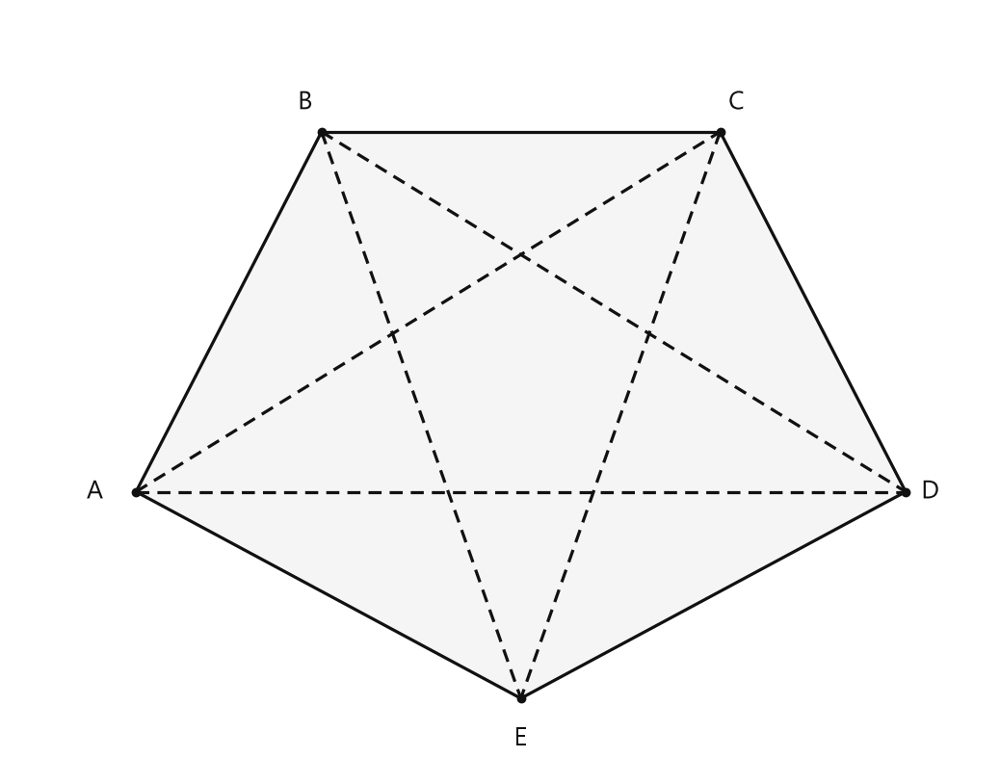

# Занятие 1. Многоугольник

**Раздел:** Глава 1. Четырехугольники  
**Параграф учебника:** §1. Многоугольник  
**Страницы:** 17–22

## Цели занятия

После занятия ученик умеет:

- распознавать многоугольники, выпуклые и невыпуклые многоугольники;
- различать стороны, вершины, углы, соседние и противоположные элементы;
- находить сумму углов выпуклого $n$-угольника;
- находить число сторон по сумме углов;
- находить число диагоналей многоугольника;
- решать задачи на углы и периметр многоугольника.

Выбери блок своего уровня:

- **1–2 балла:** определения и простые вычисления;
- **3–4 балла:** применение формул;
- **5–6 баллов:** задачи на отношения и неизвестные углы;
- **7–8 баллов:** задачи с несколькими шагами;
- **9–10 баллов:** доказательства и задачи повышенной сложности.

## Теория к занятию

### 1. Что такое многоугольник

#### Простыми словами

Многоугольник — это фигура, граница которой состоит из отрезков. Эта граница должна замкнуться: начальная и конечная точки совпадают.

Важно ещё одно условие: отрезки не должны пересекаться сами с собой. Если ломаная пересекла себя, она уже не является простой.

#### Определение

Многоугольником называется простая замкнутая ломаная вместе с частью плоскости, которую она ограничивает.

Точки, в которых соединяются соседние отрезки, называются **вершинами многоугольника**. Отрезки, из которых состоит ломаная, называются **сторонами многоугольника**.

Периметром многоугольника называется сумма длин его сторон.

#### Формула

Если длины сторон многоугольника равны $a_1,a_2,\ldots,a_n$, то его периметр:

$$
P=a_1+a_2+\ldots+a_n.
$$

#### Правила

- Число сторон многоугольника равно числу его вершин и числу его углов.
- Треугольник имеет $3$ стороны.
- Четырёхугольник имеет $4$ стороны.
- Пятиугольник имеет $5$ сторон.
- $n$-угольник имеет $n$ сторон.

Смотри на границу фигуры: сколько отрезков в ней, столько и сторон. Здесь всё честно, без геометрического подвоха.

#### Ловушки

- Замкнутая ломаная с самопересечением не является простой ломаной.
- Не путай сторону и диагональ: сторона соединяет соседние вершины, а диагональ — несоседние.
- Периметр — это сумма длин сторон. Углы в периметр не входят: градусы и сантиметры дружат только на разных строках решения.

---

### 2. Выпуклый и невыпуклый многоугольник

#### Простыми словами

У выпуклого многоугольника нет «впадин». Если взять любую его сторону и продолжить её в обе стороны до прямой, весь многоугольник окажется по одну сторону от этой прямой.

У невыпуклого многоугольника найдётся сторона, относительно прямой которой фигура окажется по разные стороны.

#### Определение

Многоугольник называется *выпуклым*, если он лежит в одной полуплоскости относительно прямой, содержащей любую его сторону. В противном случае он называется *невыпуклым*.

#### Свойство

* Каждый угол выпуклого многоугольника меньше $180^\circ$. Невыпуклый многоугольник имеет, по крайней мере, один угол, больший $180^\circ$.

#### Как проверить выпуклость

1. Выбери любую сторону многоугольника.
2. Проведи мысленно прямую, содержащую эту сторону.
3. Проверь, лежит ли вся фигура в одной полуплоскости.
4. Так же проверь остальные стороны.

Если для каждой стороны условие выполняется, многоугольник выпуклый.

#### Ловушки

- У выпуклого многоугольника каждый угол меньше $180^\circ$.
- Если одна вершина как будто «загнулась внутрь», многоугольник может быть невыпуклым.
- Одного красивого рисунка недостаточно. Рисунок иногда притворяется правильным — проверяй фигуру по определению.

---

### 3. Соседние и противоположные элементы четырёхугольника

#### Простыми словами

Соседними называют элементы, которые находятся рядом и имеют общую вершину или сторону.

В четырёхугольнике противоположные стороны, вершины и углы находятся напротив друг друга. У них нет общей вершины.

#### Определения и факты

Стороны многоугольника, имеющие общую вершину, называются *соседними сторонами*; вершины, являющиеся концами одной стороны, — *соседними вершинами*, а углы при этих вершинах — *соседними углами многоугольника*.

У четырехугольника четыре стороны, четыре вершины, четыре внутренних угла, две диагонали.

Две несоседние стороны называются *противоположными* (или *противолежащими*) сторонами, две несоседние вершины — *противоположными вершинами*, а углы при этих вершинах — *противоположными углами* четырехугольника.

#### Пример

В четырёхугольнике $ABCD$:

- $AB$ и $BC$ — соседние стороны, потому что у них общая вершина $B$;
- $AB$ и $CD$ — противоположные стороны;
- $A$ и $B$ — соседние вершины, потому что они соединены стороной $AB$;
- $A$ и $C$ — противоположные вершины;
- $\angle A$ и $\angle B$ — соседние углы;
- $\angle A$ и $\angle C$ — противоположные углы.

#### Ловушки

- Вершины $A$ и $C$ в четырёхугольнике противоположные, а не соседние.
- Стороны $AB$ и $BC$ соседние, потому что имеют общую вершину $B$.
- Стороны $AB$ и $CD$ противоположные. Их названия выглядят похоже, но общих вершин у них нет.

---

### 4. Диагональ многоугольника

#### Простыми словами

Диагональ — это отрезок, который соединяет две вершины, не являющиеся соседними.

В четырёхугольнике из каждой вершины нельзя провести диагональ:

- в саму себя;
- к двум соседним вершинам, потому что это уже стороны.

Значит, из одной вершины можно провести $4-3=1$ диагональ. Всего вершин четыре, но каждую диагональ мы посчитаем дважды — из обоих её концов. Поэтому диагоналей $2$.

#### Определение

Диагональю многоугольника называется отрезок, который соединяет две несоседние вершины многоугольника.

#### Формула

Число диагоналей $n$-угольника:

$$
N_d=\frac{n(n-3)}{2}.
$$

Здесь:

- $n$ — число сторон и вершин многоугольника;
- $N_d$ — число диагоналей.

#### Алгоритм

Чтобы найти число диагоналей:

1. Определи число сторон $n$.
2. Найди разность $n-3$.
3. Умножь $n$ на $n-3$.
4. Раздели произведение на $2$.

#### Ловушки

- Из вершины нельзя провести диагональ в саму себя.
- Отрезок к соседней вершине является стороной, а не диагональю.
- При подсчёте «из каждой вершины» каждая диагональ учитывается дважды. Поэтому в формуле есть деление на $2$.

---

### 5. Сумма углов выпуклого $n$-угольника

#### Простыми словами

Выберем одну вершину выпуклого многоугольника и проведём из неё все диагонали к несоседним вершинам.

Так многоугольник разобьётся на треугольники. Для $n$-угольника получится $n-2$ треугольника.

Сумма углов каждого треугольника равна $180^\circ$. Поэтому сумму углов многоугольника найдём так:

$$
180^\circ\cdot(n-2).
$$

#### Теорема

Сумма углов выпуклого $n$-угольника равна $180^\circ(n - 2)$.

#### Формула

$$
S=180^\circ(n-2).
$$

Здесь:

- $S$ — сумма внутренних углов;
- $n$ — число сторон многоугольника.

#### Алгоритм нахождения суммы углов

1. Определи число сторон $n$.
2. Вычисли $n-2$.
3. Умножь результат на $180^\circ$.

#### Алгоритм нахождения числа сторон

Если известна сумма углов $S$, начинаем с формулы:

$$
S=180^\circ(n-2).
$$

Разделим обе части на $180^\circ$:

$$
n-2=\frac{S}{180^\circ}.
$$

Прибавим $2$:

$$
n=\frac{S}{180^\circ}+2.
$$

#### Ловушки

- Для четырёхугольника получаем:
  
  $$
  S=180^\circ(4-2)=360^\circ.
  $$

- В формуле стоит $n-2$, а не $n$. Два — не случайный пассажир: именно столько треугольников «не хватает» по сравнению с числом сторон.
- Если число сторон получилось нецелым, проверь вычисления. У многоугольника не бывает $7{,}5$ сторон.

---

### 6. Внешние углы выпуклого многоугольника

#### Простыми словами

Внешний угол получают, если одну сторону многоугольника продолжить за вершину. Внутренний и внешний углы при этой вершине являются смежными, поэтому их сумма равна $180^\circ$.

При обходе всего выпуклого многоугольника направление изменяется на один полный оборот. Один полный оборот — это $360^\circ$. Поэтому сумма внешних углов, взятых по одному при каждой вершине, равна $360^\circ$.

#### Определение

Внешним углом выпуклого многоугольника называется угол, смежный с его внутренним углом.

#### Свойство

* Сумма внешних углов выпуклого многоугольника, взятых по одному при каждой вершине, равна $360^\circ$.

#### Формула для одного внешнего угла равностороннего по углам многоугольника

Если все внутренние углы равны, то и внешние углы равны. Поэтому каждый внешний угол равен:

$$
\frac{360^\circ}{n}.
$$

#### Правила

- Внутренний и внешний углы при одной вершине в сумме дают $180^\circ$.
- При каждой вершине берут только один внешний угол.
- Сумма выбранных внешних углов равна $360^\circ$.

#### Ловушки

- Не складывай два внешних угла при каждой вершине: свойство относится только к одному углу при каждой вершине.
- Внешний угол выпуклого многоугольника меньше $180^\circ$.
- Если известен внутренний угол $\alpha$, внешний угол можно найти так:

$$
180^\circ-\alpha.
$$

---

## Сводка формул «выучить наизусть»

Периметр:

$$
P=a_1+a_2+\ldots+a_n.
$$

Сумма углов выпуклого $n$-угольника:

$$
S=180^\circ(n-2).
$$

Число диагоналей $n$-угольника:

$$
N_d=\frac{n(n-3)}{2}.
$$

Сумма внешних углов выпуклого многоугольника:

$$
360^\circ.
$$

## Правила, которые нельзя путать

- Сторона соединяет соседние вершины.
- Диагональ соединяет несоседние вершины.
- Сумма углов измеряется в градусах.
- Периметр измеряется в единицах длины.
- Для суммы углов используется $n-2$.
- Для числа диагоналей используется $n(n-3):2$.
- В выпуклом многоугольнике каждый угол меньше $180^\circ$.
- Внешние углы берут по одному при каждой вершине.

## Разбор ключевых заданий

### Р1. Сумма углов многоугольника

**Условие.** Найдите сумму углов выпуклого шестиугольника.

**Решение.**

У шестиугольника:

$$
n=6.
$$

Используем формулу суммы углов:

$$
S=180^\circ(n-2).
$$

Подставим $n=6$:

$$
S=180^\circ(6-2).
$$

Вычислим разность:

$$
6-2=4.
$$

Умножим:

$$
S=180^\circ\cdot4.
$$

$$
S=720^\circ.
$$

**Ответ:** $720^\circ$.

Шесть углов — и уже $720^\circ$. Многоугольник уверенно набирает градусы.

---

### Р2. Сумма углов десятиугольника

**Условие.** Найдите сумму углов выпуклого десятиугольника.

**Решение.**

Число сторон:

$$
n=10.
$$

Применим формулу:

$$
S=180^\circ(n-2).
$$

Подставим $n=10$:

$$
S=180^\circ(10-2).
$$

Вычислим разность:

$$
10-2=8.
$$

Умножим:

$$
S=180^\circ\cdot8.
$$

$$
S=1440^\circ.
$$

**Ответ:** $1440^\circ$.

---

### Р3. Сумма углов семнадцатиугольника

**Условие.** Найдите сумму углов выпуклого семнадцатиугольника.

**Решение.**

Число сторон:

$$
n=17.
$$

Используем формулу:

$$
S=180^\circ(n-2).
$$

Подставим значение $n$:

$$
S=180^\circ(17-2).
$$

Вычислим разность:

$$
17-2=15.
$$

Умножим:

$$
S=180^\circ\cdot15.
$$

$$
S=2700^\circ.
$$

**Ответ:** $2700^\circ$.

---

### Р4. Нахождение неизвестного угла четырёхугольника

**Условие.** В выпуклом четырёхугольнике $ABCD$ углы $A$, $B$ и $C$ равны соответственно $75^\circ$, $90^\circ$ и $85^\circ$. Найдите угол $D$.

**Решение.**

У четырёхугольника $4$ стороны. Найдём сумму его углов:

$$
S=180^\circ(4-2).
$$

$$
S=180^\circ\cdot2.
$$

$$
S=360^\circ.
$$

Запишем сумму четырёх углов:

$$
75^\circ+90^\circ+85^\circ+\angle D=360^\circ.
$$

Сложим известные углы:

$$
75^\circ+90^\circ=165^\circ.
$$

$$
165^\circ+85^\circ=250^\circ.
$$

Получим:

$$
250^\circ+\angle D=360^\circ.
$$

Вычтем $250^\circ$ из обеих частей:

$$
\angle D=360^\circ-250^\circ.
$$

$$
\angle D=110^\circ.
$$

Проверим сумму:

$$
75^\circ+90^\circ+85^\circ+110^\circ=360^\circ.
$$

**Ответ:** $\angle D=110^\circ$.

---

### Р5. Нахождение неизвестного угла пятиугольника

**Условие.** В выпуклом пятиугольнике $ABCDE$ углы $A$, $B$, $D$ и $E$ равны соответственно $97^\circ$, $88^\circ$, $103^\circ$ и $112^\circ$. Найдите угол $C$.

**Решение.**

У пятиугольника $5$ сторон. Найдём сумму его углов:

$$
S=180^\circ(5-2).
$$

$$
S=180^\circ\cdot3.
$$

$$
S=540^\circ.
$$

Запишем сумму всех углов:

$$
97^\circ+88^\circ+\angle C+103^\circ+112^\circ=540^\circ.
$$

Сложим известные углы:

$$
97^\circ+88^\circ=185^\circ.
$$

$$
185^\circ+103^\circ=288^\circ.
$$

$$
288^\circ+112^\circ=400^\circ.
$$

Получим:

$$
400^\circ+\angle C=540^\circ.
$$

Вычтем $400^\circ$:

$$
\angle C=540^\circ-400^\circ.
$$

$$
\angle C=140^\circ.
$$

Проверка:

$$
97^\circ+88^\circ+140^\circ+103^\circ+112^\circ=540^\circ.
$$

**Ответ:** $\angle C=140^\circ$.

---

### Р6. Сумма внешних углов

**Условие.** У шестиугольника $ABCDEF$ все внутренние углы равны. Найдите сумму внешних углов $\angle1+\angle2+\angle3$, взятых по одному при вершинах $A$, $C$ и $E$.

**Решение.**

У шестиугольника шесть вершин, значит, мы берём шесть внешних углов — по одному при каждой вершине.

По свойству сумма этих углов равна $360^\circ$:

$$
\angle1+\angle2+\angle3+\angle4+\angle5+\angle6=360^\circ.
$$

Все внутренние углы равны.

Внутренний и внешний углы при одной вершине в сумме дают $180^\circ$. Поэтому все внешние углы тоже равны.

Обозначим каждый внешний угол через $x$:

$$
6x=360^\circ.
$$

Разделим обе части на $6$:

$$
x=60^\circ.
$$

Нужно найти сумму трёх внешних углов:

$$
\angle1+\angle2+\angle3=3x.
$$

Подставим $x=60^\circ$:

$$
\angle1+\angle2+\angle3=3\cdot60^\circ.
$$

$$
\angle1+\angle2+\angle3=180^\circ.
$$

**Ответ:** $180^\circ$.

Три одинаковых внешних угла — это ровно половина полного оборота. Геометрия снова аккуратно поделила круг.

### Р7. Число диагоналей шестиугольника

**Условие.** Найдите число диагоналей шестиугольника.

**Решение.**

У шестиугольника $6$ сторон, поэтому:

$$
n=6.
$$

Используем формулу числа диагоналей:

$$
N_d=\frac{n(n-3)}{2}.
$$

Подставим $n=6$:

$$
N_d=\frac{6(6-3)}{2}.
$$

Сначала найдём разность в скобках:

$$
6-3=3.
$$

Тогда:

$$
N_d=\frac{6\cdot3}{2}.
$$

$$
N_d=\frac{18}{2}.
$$

$$
N_d=9.
$$

Можно проверить результат другим способом.

Из каждой вершины шестиугольника можно провести $3$ диагонали.

Всего получится:

$$
6\cdot3=18
$$

«выходов» диагоналей.

Но каждую диагональ мы посчитали два раза — из каждой её вершины.

Поэтому:

$$
18:2=9.
$$

Двойной счёт исправлен, диагонали вернулись в строй.

**Ответ:** $9$ диагоналей.

---

### Р8. Все диагонали пятиугольника

**Условие.** Найдите число диагоналей пятиугольника и перечислите их для пятиугольника $ABCDE$.

**Решение.**

У пятиугольника $5$ сторон:

$$
n=5.
$$

Используем формулу:

$$
N_d=\frac{n(n-3)}{2}.
$$

Подставим $n=5$:

$$
N_d=\frac{5(5-3)}{2}.
$$

Вычислим:

$$
5-3=2.
$$

Тогда:

$$
N_d=\frac{5\cdot2}{2}.
$$

$$
N_d=5.
$$

Теперь перечислим диагонали.

Диагональ соединяет несоседние вершины.

Из вершины $A$ получаем диагонали:

$$
AC,\quad AD.
$$

Из вершины $B$ добавляется:

$$
BD,\quad BE.
$$

Из вершины $C$ добавляется:

$$
CE.
$$

Остальные отрезки уже были названы раньше, только в обратном порядке.

Например, $CA$ и $AC$ — это одна и та же диагональ. Геометрия не считает её дважды только за смену направления.

Итак, диагонали:

$$
AC,\quad AD,\quad BD,\quad BE,\quad CE.
$$

Их действительно пять.

<!--geo-figure-spec
{
  "needed": true,
  "kind": "plane",
  "caption": "Пятиугольник $ABCDE$ и все его диагонали",
  "equal": false,
  "axis": false,
  "xlim": [
    -0.9,
    6.2
  ],
  "ylim": [
    -1.1,
    4.6
  ],
  "points": {
    "A": [
      0,
      1
    ],
    "B": [
      1.35,
      3.7
    ],
    "C": [
      4.25,
      3.7
    ],
    "D": [
      5.6,
      1
    ],
    "E": [
      2.8,
      -0.55
    ]
  },
  "segments": [
    [
      "A",
      "B"
    ],
    [
      "B",
      "C"
    ],
    [
      "C",
      "D"
    ],
    [
      "D",
      "E"
    ],
    [
      "E",
      "A"
    ],
    {
      "points": [
        "A",
        "C"
      ],
      "dashed": true,
      "label": "",
      "t": 0.5
    },
    {
      "points": [
        "A",
        "D"
      ],
      "dashed": true,
      "label": "",
      "t": 0.5
    },
    {
      "points": [
        "B",
        "D"
      ],
      "dashed": true,
      "label": "",
      "t": 0.5
    },
    {
      "points": [
        "B",
        "E"
      ],
      "dashed": true,
      "label": "",
      "t": 0.5
    },
    {
      "points": [
        "C",
        "E"
      ],
      "dashed": true,
      "label": "",
      "t": 0.5
    }
  ],
  "polygons": [
    {
      "vertices": [
        "A",
        "B",
        "C",
        "D",
        "E"
      ],
      "fill": 0.04
    }
  ],
  "circles": [],
  "labels": {
    "A": {
      "dx": -0.3,
      "dy": 0
    },
    "B": {
      "dx": -0.12,
      "dy": 0.22
    },
    "C": {
      "dx": 0.12,
      "dy": 0.22
    },
    "D": {
      "dx": 0.18,
      "dy": 0
    },
    "E": {
      "dx": 0,
      "dy": -0.3
    }
  },
  "right_angles": [],
  "angle_marks": [],
  "texts": []
}
-->

*Пятиугольник ABCDE и все его диагонали*

**Ответ:** $5$ диагоналей: $AC$, $AD$, $BD$, $BE$, $CE$.

---

### Р9. Периметр по сумме углов

**Условие.** Сумма углов выпуклого многоугольника равна $900^\circ$. Все его стороны равны $6$ см. Найдите периметр.

**Решение.**

Сумма углов выпуклого $n$-угольника вычисляется по формуле:

$$
180^\circ(n-2).
$$

По условию эта сумма равна $900^\circ$:

$$
180^\circ(n-2)=900^\circ.
$$

Разделим обе части на $180^\circ$:

$$
n-2=\frac{900}{180}.
$$

$$
n-2=5.
$$

Прибавим $2$ к обеим частям:

$$
n=7.
$$

Значит, у многоугольника $7$ сторон.

Все стороны имеют длину $6$ см.

Периметр равен сумме длин всех сторон:

$$
P=7\cdot6\text{ см}.
$$

$$
P=42\text{ см}.
$$

**Ответ:** $42$ см.

---

### Р10. Число сторон по равным углам

**Условие.** Определите число сторон выпуклого многоугольника, если все его углы равны и каждый угол равен $108^\circ$.

**Решение.**

Пусть у многоугольника $n$ сторон.

Сумма его углов равна:

$$
S=180^\circ(n-2).
$$

Все углы равны $108^\circ$.

Так как углов $n$, их сумма также равна:

$$
S=108^\circ n.
$$

Получаем равенство:

$$
108n=180(n-2).
$$

Раскроем скобки справа:

$$
108n=180n-360.
$$

Перенесём $108n$ в правую часть:

$$
360=180n-108n.
$$

Выполним вычитание:

$$
360=72n.
$$

Разделим обе части на $72$:

$$
n=5.
$$

Проверим результат.

Сумма углов пятиугольника:

$$
180^\circ(5-2)=540^\circ.
$$

Сумма пяти углов по $108^\circ$:

$$
5\cdot108^\circ=540^\circ.
$$

Обе суммы совпали.

**Ответ:** $5$ сторон.

---

### Р11. Углы четырёхугольника по отношению

**Условие.** Найдите углы четырёхугольника $MNPK$, если

$$
\angle M:\angle N:\angle P:\angle K=2:7:3:8.
$$

**Решение.**

Сумма углов четырёхугольника равна:

$$
360^\circ.
$$

Отношение показывает, на сколько равных частей разделены углы.

Сложим все части:

$$
2+7+3+8=20.
$$

Значит, $360^\circ$ приходится на $20$ частей.

Найдём величину одной части:

$$
\frac{360^\circ}{20}=18^\circ.
$$

Теперь умножим одну часть на число частей каждого угла:

$$
\angle M=2\cdot18^\circ=36^\circ.
$$

$$
\angle N=7\cdot18^\circ=126^\circ.
$$

$$
\angle P=3\cdot18^\circ=54^\circ.
$$

$$
\angle K=8\cdot18^\circ=144^\circ.
$$

Проверим сумму:

$$
36^\circ+126^\circ+54^\circ+144^\circ=360^\circ.
$$

**Ответ:** $\angle M=36^\circ$, $\angle N=126^\circ$, $\angle P=54^\circ$, $\angle K=144^\circ$.

---

### Р12. Четырёхугольник с двумя прямыми углами

**Условие.** У четырёхугольника два противоположных угла прямые. Третий угол на $20^\circ$ меньше четвёртого. Найдите наибольший угол.

**Решение.**

Два противоположных угла прямые, значит, каждый из них равен $90^\circ$:

$$
90^\circ\quad\text{и}\quad90^\circ.
$$

Пусть четвёртый угол равен $x^\circ$.

Тогда третий угол на $20^\circ$ меньше:

$$
x^\circ-20^\circ.
$$

Сумма углов четырёхугольника равна $360^\circ$.

Составим уравнение:

$$
90^\circ+90^\circ+x^\circ+(x^\circ-20^\circ)=360^\circ.
$$

Сложим числа без $x$:

$$
180^\circ-20^\circ=160^\circ.
$$

Получим:

$$
2x^\circ+160^\circ=360^\circ.
$$

Вычтем $160^\circ$:

$$
2x^\circ=200^\circ.
$$

Разделим на $2$:

$$
x=100.
$$

Четвёртый угол равен $100^\circ$.

Третий угол равен:

$$
100^\circ-20^\circ=80^\circ.
$$

Углы четырёхугольника равны $90^\circ$, $90^\circ$, $80^\circ$ и $100^\circ$.

Наибольший из них:

$$
100^\circ.
$$

**Ответ:** $100^\circ$.

---

### Р13. Три равных угла

**Условие.** У четырёхугольника три угла равны, а четвёртый в два раза больше каждого из них. Найдите все углы.

**Решение.**

Пусть каждый из трёх равных углов равен $x^\circ$.

Тогда четвёртый угол равен:

$$
2x^\circ.
$$

Сумма углов четырёхугольника равна $360^\circ$.

Составим уравнение:

$$
x^\circ+x^\circ+x^\circ+2x^\circ=360^\circ.
$$

Сложим подобные слагаемые:

$$
5x^\circ=360^\circ.
$$

Разделим обе части на $5$:

$$
x=72.
$$

Значит, три угла равны:

$$
72^\circ,\quad72^\circ,\quad72^\circ.
$$

Четвёртый угол:

$$
2\cdot72^\circ=144^\circ.
$$

Проверка:

$$
72^\circ+72^\circ+72^\circ+144^\circ=360^\circ.
$$

**Ответ:** $72^\circ$, $72^\circ$, $72^\circ$, $144^\circ$.

---

### Р14. Периметр четырёхугольника

**Условие.** Периметр четырёхугольника равен $6$ м. Одна сторона равна $120$ см, а три оставшиеся стороны равны между собой. Найдите длину каждой из неизвестных сторон в сантиметрах.

**Решение.**

Сначала переведём периметр в сантиметры:

$$
6\text{ м}=600\text{ см}.
$$

Пусть каждая из трёх неизвестных сторон равна $x$ см.

Периметр — это сумма четырёх сторон, поэтому:

$$
120+x+x+x=600.
$$

Запишем короче:

$$
120+3x=600.
$$

Вычтем $120$ из обеих частей:

$$
3x=480.
$$

Разделим обе части на $3$:

$$
x=160.
$$

Значит, каждая неизвестная сторона равна $160$ см.

Проверим периметр:

$$
120+160+160+160=600\text{ см}.
$$

**Ответ:** по $160$ см.

---

### Р15. Периметр и отношение сторон

**Условие.** Периметр четырёхугольника равен $78$ см. Две соседние стороны относятся как $1:3$, третья сторона равна $24$ см, а четвёртая составляет $75\%$ третьей стороны. Найдите наименьшую сторону.

**Решение.**

Пусть две соседние стороны равны $x$ см и $3x$ см.

Найдём четвёртую сторону.

Она составляет $75\%$ от $24$ см:

$$
75\%\cdot24\text{ см}=0{,}75\cdot24\text{ см}.
$$

$$
0{,}75\cdot24=18.
$$

Четвёртая сторона равна $18$ см.

Составим выражение для периметра:

$$
x+3x+24+18=78.
$$

Сложим известные числа:

$$
4x+42=78.
$$

Вычтем $42$:

$$
4x=36.
$$

Разделим на $4$:

$$
x=9.
$$

Первая из двух соседних сторон равна $9$ см.

Вторая сторона:

$$
3x=3\cdot9=27\text{ см}.
$$

Все стороны имеют длины:

$$
9\text{ см},\quad27\text{ см},\quad24\text{ см},\quad18\text{ см}.
$$

Наименьшая сторона равна $9$ см.

**Ответ:** $9$ см.

---

### Р16. Число сторон по числу диагоналей

**Условие.** У некоторого выпуклого многоугольника число диагоналей равно числу его сторон. Найдите сумму углов этого многоугольника.

**Решение.**

Пусть у многоугольника $n$ сторон.

По условию число диагоналей равно числу сторон:

$$
N_d=n.
$$

Используем формулу числа диагоналей:

$$
N_d=\frac{n(n-3)}{2}.
$$

Подставим условие задачи:

$$
\frac{n(n-3)}{2}=n.
$$

Число сторон $n$ не равно нулю.

Разделим обе части на $n$:

$$
\frac{n-3}{2}=1.
$$

Умножим обе части на $2$:

$$
n-3=2.
$$

Прибавим $3$:

$$
n=5.
$$

Значит, это пятиугольник.

Сумма его углов:

$$
S=180^\circ(5-2).
$$

$$
S=180^\circ\cdot3.
$$

$$
S=540^\circ.
$$

Проверим число диагоналей:

$$
N_d=\frac{5(5-3)}{2}.
$$

$$
N_d=\frac{5\cdot2}{2}=5.
$$

Число диагоналей действительно равно числу сторон.

**Ответ:** $540^\circ$.

---

### Р17. Угол между биссектрисами

**Условие.** $ABCD$ — выпуклый четырёхугольник, $\angle A=80^\circ$, $\angle D=70^\circ$. Найдите угол между биссектрисами углов $B$ и $C$, обращённый к стороне $BC$.

**Решение.**

Сумма углов четырёхугольника равна $360^\circ$:

$$
\angle A+\angle B+\angle C+\angle D=360^\circ.
$$

Подставим известные значения:

$$
80^\circ+\angle B+\angle C+70^\circ=360^\circ.
$$

Сложим известные углы:

$$
\angle B+\angle C+150^\circ=360^\circ.
$$

Вычтем $150^\circ$:

$$
\angle B+\angle C=210^\circ.
$$

Биссектриса делит угол пополам.

Поэтому биссектриса угла $B$ образует с каждой его стороной угол:

$$
\frac{\angle B}{2}.
$$

Биссектриса угла $C$ образует с каждой его стороной угол:

$$
\frac{\angle C}{2}.
$$

Рассмотрим угол между биссектрисами, который обращён к стороне $BC$.

Вместе с двумя половинами углов $B$ и $C$ он образует развернутый угол:

$$
180^\circ.
$$

Поэтому искомый угол равен:

$$
180^\circ-\frac{\angle B}{2}-\frac{\angle C}{2}.
$$

Объединим две дроби:

$$
180^\circ-\frac{\angle B+\angle C}{2}.
$$

Подставим найденную сумму:

$$
180^\circ-\frac{210^\circ}{2}.
$$

$$
180^\circ-105^\circ=75^\circ.
$$

**Ответ:** $75^\circ$.

---

### Р18. Наибольшая и наименьшая длина стороны пятиугольника

**Условие.** Длины сторон пятиугольника $ABCDE$ выражены целыми числами. Известно, что

$$
AB=1\text{ см},\quad BC=3\text{ см},\quad CD=5\text{ см},\quad DE=10\text{ см}.
$$

Какую наибольшую и какую наименьшую длину может иметь сторона $AE$?

**Решение.**

Обозначим неизвестную сторону:

$$
AE=x.
$$

По свойству ломаной длина любой стороны многоугольника меньше суммы длин остальных сторон.

Сначала рассмотрим сторону $AE$:

$$
x<1+3+5+10.
$$

$$
x<19.
$$

Сторона имеет целую длину.

Поэтому наибольшее целое число, меньшее $19$, равно:

$$
x_{\max}=18\text{ см}.
$$

Теперь рассмотрим сторону $DE=10$ см.

Она также должна быть меньше суммы остальных сторон:

$$
10<1+3+5+x.
$$

$$
10<9+x.
$$

Вычтем $9$:

$$
x>1.
$$

Так как $x$ — целое число, наименьшее возможное значение:

$$
x_{\min}=2\text{ см}.
$$

Проверим найденные значения:

$$
18<1+3+5+10=19;
$$

$$
10<1+3+5+2=11.
$$

Оба значения подходят.

**Ответ:** наибольшая длина — $18$ см, наименьшая — $2$ см.

---

### Р19. Наибольшее число острых углов

**Условие.** Определите, какое наибольшее число острых углов может иметь выпуклый многоугольник.

**Решение.**

Острый угол меньше $90^\circ$.

Внешний угол выпуклого многоугольника смежный с внутренним углом.

Смежные углы в сумме дают $180^\circ$.

Поэтому, если внутренний угол острый, то соответствующий внешний угол больше:

$$
180^\circ-90^\circ=90^\circ.
$$

Сумма внешних углов выпуклого многоугольника, взятых по одному при каждой вершине, равна:

$$
360^\circ.
$$

Предположим, что острых углов хотя бы $4$.

Тогда сумма только соответствующих им внешних углов была бы больше:

$$
4\cdot90^\circ=360^\circ.
$$

Но сумма всех внешних углов равна ровно $360^\circ$.

Получилось противоречие: часть суммы оказалась больше всей суммы.

Значит, острых углов может быть не больше трёх.

Три острых угла возможны, например, у равностороннего треугольника:

$$
60^\circ,\quad60^\circ,\quad60^\circ.
$$

Все его углы острые.

Следовательно, наибольшее число острых углов равно:

$$
3.
$$

**Ответ:** $3$.

## Практические задания

Выбери свой уровень и решай только этот блок. В блоке должна закрепиться вся тема параграфа. Ответы не приводятся.

### Уровень 1–2 балла

**С1.** Выберите определение многоугольника.

1) Замкнутая кривая, ограничивающая круг  
2) Простая замкнутая ломаная вместе с частью плоскости, которую она ограничивает  
3) Отрезок, соединяющий две точки  
4) Незамкнутая ломаная  
5) Две пересекающиеся прямые

**С2.** Какой многоугольник называется выпуклым?

1) Тот, у которого все стороны равны  
2) Тот, у которого все углы прямые  
3) Тот, который лежит в одной полуплоскости относительно прямой, содержащей любую его сторону  
4) Тот, у которого есть диагональ  
5) Тот, у которого число сторон равно числу углов

**С3.** Выберите отрезок, который является диагональю многоугольника.

1) Отрезок, соединяющий соседние вершины  
2) Отрезок, соединяющий любые две точки стороны  
3) Отрезок, соединяющий две несоседние вершины  
4) Отрезок, лежащий вне многоугольника  
5) Отрезок, соединяющий вершину с серединой стороны

**С4.** Сколько сторон имеет шестиугольник?

1) 5  
2) 6  
3) 7  
4) 8  
5) 4

**С5.** Найдите сумму углов выпуклого пятиугольника.

1) $360^\circ$  
2) $540^\circ$  
3) $720^\circ$  
4) $900^\circ$  
5) $180^\circ$

**С6.** Найдите сумму углов выпуклого восьмиугольника.

1) $720^\circ$  
2) $900^\circ$  
3) $1080^\circ$  
4) $1260^\circ$  
5) $1440^\circ$

**С7.** Сумма углов выпуклого многоугольника равна $1260^\circ$. Сколько сторон у этого многоугольника?

1) 7  
2) 8  
3) 9  
4) 10  
5) 11

**С8.** Найдите число диагоналей выпуклого пятиугольника.

1) 3  
2) 4  
3) 5  
4) 6  
5) 7

**С9.** Найдите число диагоналей выпуклого семиугольника.

1) 7  
2) 10  
3) 12  
4) 14  
5) 21

**С10.** Все внутренние углы выпуклого шестиугольника равны. Чему равен каждый угол?

1) $90^\circ$  
2) $108^\circ$  
3) $120^\circ$  
4) $135^\circ$  
5) $150^\circ$

**С11.** Внешний угол выпуклого многоугольника является углом, смежным с его внутренним углом. Чему равна сумма внешних углов, взятых по одному при каждой вершине?

1) $180^\circ$  
2) $270^\circ$  
3) $360^\circ$  
4) $540^\circ$  
5) $720^\circ$

**С12.** Периметр выпуклого четырёхугольника равен $34$ см. Три его стороны имеют длины $6$ см, $8$ см и $9$ см. Найдите длину четвёртой стороны.

1) $9$ см  
2) $10$ см  
3) $11$ см  
4) $12$ см  
5) $13$ см

**С13.** Какое из перечисленных утверждений является определением многоугольника?

1) Замкнутая ломаная без ограниченной части плоскости  
2) Простая замкнутая ломаная вместе с частью плоскости, которую она ограничивает  
3) Любая незамкнутая ломаная  
4) Окружность вместе с кругом  
5) Отрезок вместе с одной из полуплоскостей

**С14.** Какой многоугольник является выпуклым?

1) Многоугольник, имеющий угол $200^\circ$  
2) Многоугольник, который не лежит в одной полуплоскости относительно одной из своих сторон  
3) Многоугольник, каждый угол которого меньше $180^\circ$  
4) Любая замкнутая ломаная  
5) Многоугольник без диагоналей

**С15.** Диагональю многоугольника называется отрезок, соединяющий:

1) любые две точки многоугольника  
2) соседние вершины многоугольника  
3) середины двух сторон многоугольника  
4) две несоседние вершины многоугольника  
5) вершину и точку на противоположной стороне

**С16.** Сколько диагоналей имеет выпуклый пятиугольник?

1) 3  
2) 4  
3) 5  
4) 6  
5) 7

**С17.** Сколько диагоналей имеет выпуклый восьмиугольник?

1) 12  
2) 16  
3) 20  
4) 24  
5) 28

**С18.** Найдите сумму углов выпуклого шестиугольника.

1) $360^\circ$  
2) $540^\circ$  
3) $720^\circ$  
4) $900^\circ$  
5) $1080^\circ$

**С19.** Найдите сумму углов выпуклого девятиугольника.

1) $900^\circ$  
2) $1080^\circ$  
3) $1260^\circ$  
4) $1440^\circ$  
5) $1620^\circ$

**С20.** Сумма углов выпуклого многоугольника равна $1260^\circ$. Сколько сторон у этого многоугольника?

1) 7  
2) 8  
3) 9  
4) 10  
5) 11

**С21.** Сумма внешних углов выпуклого многоугольника, взятых по одному при каждой вершине, равна:

1) $180^\circ$  
2) $270^\circ$  
3) $360^\circ$  
4) $540^\circ$  
5) $720^\circ$

**С22.** Один из углов выпуклого многоугольника равен $180^\circ$.

1) Такое возможно у любого выпуклого многоугольника  
2) Такое возможно только у треугольника  
3) Такое возможно только у четырехугольника  
4) У выпуклого многоугольника такой угол быть не может  
5) Такой угол обязательно является внешним

**С23.** Все стороны выпуклого девятиугольника равны $4$ см. Найдите его периметр.

1) $13$ см  
2) $27$ см  
3) $32$ см  
4) $36$ см  
5) $40$ см

**С24.** Выберите верное утверждение.

1) В любом многоугольнике сторона больше суммы длин остальных сторон  
2) В выпуклом многоугольнике каждый угол больше $180^\circ$  
3) Число диагоналей четырехугольника равно $1$  
4) Сумма углов выпуклого треугольника равна $360^\circ$  
5) Сумма внешних углов выпуклого многоугольника зависит от числа его сторон

**С25.** Выберите определение, соответствующее многоугольнику.

1) Окружность вместе с частью плоскости, которую она ограничивает. 2) Простая замкнутая ломаная вместе с частью плоскости, которую она ограничивает. 3) Любая незамкнутая ломаная. 4) Отрезок вместе с одной из полуплоскостей. 5) Кривая, имеющая самопересечения.

**С26.** Сколько сторон имеет выпуклый многоугольник, если сумма его внутренних углов равна $720^\circ$?

1) 4 2) 5 3) 6 4) 7 5) 8

**С27.** Найдите сумму углов выпуклого семиугольника.

1) $720^\circ$ 2) $900^\circ$ 3) $1080^\circ$ 4) $1260^\circ$ 5) $1440^\circ$

**С28.** Выберите формулу для нахождения числа диагоналей выпуклого $n$-угольника.

1) $\dfrac{n(n-2)}{2}$ 2) $\dfrac{n(n-3)}{2}$ 3) $\dfrac{n(n+3)}{2}$ 4) $n(n-3)$ 5) $180^\circ(n-2)$

**С29.** Сколько диагоналей имеет выпуклый восьмиугольник?

1) 16 2) 18 3) 20 4) 24 5) 40

**С30.** Периметр выпуклого пятиугольника равен $42$ см. Четыре его стороны имеют длины $6$ см, $8$ см, $9$ см и $11$ см. Найдите длину пятой стороны.

1) 6 см 2) 7 см 3) 8 см 4) 9 см 5) 10 см

**С31.** Выберите верное утверждение о диагонали многоугольника.

1) Диагональ соединяет любые две точки стороны многоугольника. 2) Диагональ соединяет две соседние вершины. 3) Диагональ соединяет две несоседние вершины многоугольника. 4) Диагональ всегда является его стороной. 5) Диагональ существует только у треугольника.

**С32.** Внешний угол выпуклого многоугольника, смежный с внутренним углом $125^\circ$, равен:

1) $35^\circ$ 2) $45^\circ$ 3) $55^\circ$ 4) $65^\circ$ 5) $125^\circ$

**С33.** Чему равна сумма внешних углов выпуклого многоугольника, взятых по одному при каждой вершине?

1) $180^\circ$ 2) $270^\circ$ 3) $360^\circ$ 4) $540^\circ$ 5) зависит от числа сторон

**С34.** Все внутренние углы выпуклого шестиугольника равны. Найдите величину каждого угла.

1) $100^\circ$ 2) $110^\circ$ 3) $120^\circ$ 4) $135^\circ$ 5) $150^\circ$

**С35.** Сколько сторон имеет выпуклый многоугольник, если число его диагоналей равно $9$?

1) 5 2) 6 3) 7 4) 8 5) 9

**С36.** Выберите все верные утверждения.

1) Каждый угол выпуклого многоугольника меньше $180^\circ$. 2) У невыпуклого многоугольника каждый угол меньше $180^\circ$. 3) Сумма углов выпуклого четырехугольника равна $360^\circ$. 4) У пятиугольника нет диагоналей. 5) Длина любой стороны многоугольника меньше суммы длин остальных сторон.

### Уровень 3–4 балла

**С1.** Выберите верное утверждение.

1) Многоугольник — это незамкнутая ломаная.  
2) Диагональ соединяет две соседние вершины многоугольника.  
3) Многоугольник состоит из простой замкнутой ломаной и части плоскости, которую она ограничивает.  
4) Любой многоугольник является выпуклым.  
5) Диагональю называется любая сторона многоугольника.

**С2.** Определите, является ли многоугольник выпуклым, если каждый его внутренний угол меньше $180^\circ$.

**С3.** Найдите сумму внутренних углов выпуклого шестиугольника.

**С4.** Найдите сумму внутренних углов выпуклого десятиугольника.

**С5.** Сумма внутренних углов выпуклого многоугольника равна $1260^\circ$. Найдите число его сторон.

**С6.** Найдите число диагоналей выпуклого пятиугольника.

**С7.** Найдите число диагоналей выпуклого восьмиугольника.

**С8.** У выпуклого семиугольника все внутренние углы равны. Найдите величину каждого внутреннего угла.

**С9.** У выпуклого многоугольника все внутренние углы равны, и каждый из них равен $120^\circ$. Найдите число сторон многоугольника.

**С10.** Сумма внутренних углов выпуклого многоугольника равна $1800^\circ$. Все его стороны равны $7$ см. Найдите периметр многоугольника.

**С11.** У выпуклого четырехугольника три угла равны соответственно $75^\circ$, $110^\circ$ и $95^\circ$. Найдите четвертый угол.

**С12.** У пятиугольника четыре стороны имеют длины $4$ см, $7$ см, $9$ см и $12$ см. Длина пятой стороны выражена целым числом сантиметров. Укажите наименьшую и наибольшую возможные длины пятой стороны.

**С13.** Найдите сумму углов выпуклого восьмиугольника.

**С14.** Найдите сумму углов выпуклого двенадцатиугольника.

**С15.** Сумма углов выпуклого многоугольника равна $1260^\circ$. Сколько сторон у этого многоугольника?

**С16.** Все углы выпуклого многоугольника равны, и каждый из них равен $120^\circ$. Определите число сторон многоугольника.

**С17.** Все углы выпуклого многоугольника равны, и каждый из них равен $135^\circ$. Определите число сторон многоугольника.

**С18.** Найдите углы четырехугольника $ABCD$, если $\angle A:\angle B:\angle C:\angle D=2:3:4:6$.

**С19.** В четырехугольнике два противоположных угла равны $90^\circ$. Третий угол на $30^\circ$ меньше четвёртого. Найдите величину четвёртого угла.

**С20.** В четырехугольнике три угла равны между собой, а четвёртый угол в два раза больше каждого из них. Найдите величины всех углов четырехугольника.

**С21.** Периметр четырехугольника равен $5$ м. Одна сторона равна $140$ см, а три остальные стороны равны между собой. Найдите длину каждой из трёх равных сторон в сантиметрах.

**С22.** Периметр четырехугольника равен $84$ см. Две соседние стороны относятся как $1:2$, третья сторона равна $24$ см, а четвёртая сторона равна $75\%$ длины третьей стороны. Найдите длину наименьшей стороны.

**С23.** Число диагоналей выпуклого многоугольника равно числу его сторон. Сколько сторон имеет этот многоугольник?

**С24.** Сколько диагоналей имеет выпуклый девятиугольник?

**С25.** Найдите сумму внутренних углов выпуклого восьмиугольника.

**С26.** Сумма внутренних углов выпуклого многоугольника равна $1260^\circ$. Сколько сторон имеет этот многоугольник?

**С27.** Найдите число диагоналей выпуклого семиугольника.

**С28.** Сколько диагоналей можно провести из одной вершины выпуклого девятиугольника?

**С29.** Все внутренние углы выпуклого шестиугольника равны. Найдите величину каждого угла.

**С30.** В выпуклом пятиугольнике четыре угла равны $110^\circ$, $120^\circ$, $95^\circ$ и $130^\circ$. Найдите пятый угол.

**С31.** Углы выпуклого четырёхугольника относятся как $2:3:4:6$. Найдите величину каждого угла.

**С32.** Два внешних угла выпуклого пятиугольника равны $70^\circ$ и $85^\circ$, а остальные три внешних угла равны между собой. Найдите величину каждого из трёх равных внешних углов.

**С33.** Периметр выпуклого пятиугольника равен $42$ см. Четыре его стороны имеют длины $7$ см, $9$ см, $8$ см и $6$ см. Найдите длину пятой стороны.

**С34.** Стороны выпуклого четырёхугольника имеют длины $5$ см, $8$ см, $11$ см и $x$ см. Известно, что $x$ — целое число и является наибольшей стороной. Найдите наименьшее возможное значение $x$.

**С35.** У выпуклого многоугольника число диагоналей равно $14$. Найдите число его сторон.

**С36.** У выпуклого многоугольника все внутренние углы равны, и каждый из них равен $150^\circ$. Найдите число диагоналей этого многоугольника.

### Уровень 5–6 баллов

**С1.** Найдите сумму внутренних углов выпуклого восьмиугольника.

**С2.** Сумма внутренних углов выпуклого многоугольника равна $1260^\circ$. Сколько сторон имеет этот многоугольник?

**С3.** Найдите число диагоналей выпуклого девятиугольника.

**С4.** Выпуклый многоугольник имеет $14$ сторон. Найдите сумму его внутренних углов и число его диагоналей.

**С5.** Все внутренние углы выпуклого многоугольника равны, и каждый из них равен $150^\circ$. Определите число сторон многоугольника.

**С6.** В выпуклом пятиугольнике четыре угла равны соответственно $110^\circ$, $125^\circ$, $135^\circ$ и $140^\circ$. Найдите пятый угол.

**С7.** Углы выпуклого четырехугольника относятся как $2:3:4:6$. Найдите величину каждого угла.

**С8.** У выпуклого шестиугольника все внутренние углы равны между собой. Найдите величину каждого внутреннего угла и каждого внешнего угла, взятого по одному при каждой вершине.

**С9.** Периметр выпуклого пятиугольника равен $42$ см. Четыре его стороны имеют длины $7$ см, $9$ см, $8$ см и $11$ см. Найдите длину пятой стороны.

**С10.** Периметр выпуклого четырехугольника равен $78$ см. Одна сторона равна $18$ см, а три остальные стороны равны между собой. Найдите длину каждой из трех равных сторон.

**С11.** Внешние углы выпуклого пятиугольника, взятые по одному при каждой вершине, равны $65^\circ$, $72^\circ$, $81^\circ$ и $94^\circ$. Найдите пятый внешний угол.

**С12.** Число диагоналей выпуклого многоугольника на $15$ больше числа его сторон. Найдите число сторон этого многоугольника и сумму его внутренних углов.

**С13.** Сумма углов выпуклого многоугольника равна $1440^\circ$. Сколько сторон имеет этот многоугольник?

**С14.** Найдите число диагоналей выпуклого девятиугольника.

**С15.** Все углы выпуклого многоугольника равны, и каждый из них равен $150^\circ$. Определите число сторон многоугольника.

**С16.** Найдите углы выпуклого четырехугольника $ABCD$, если
$\angle A:\angle B:\angle C:\angle D=3:4:5:6$.

**С17.** Внешние углы выпуклого пятиугольника, взятые по одному при каждой вершине, равны $60^\circ$, $75^\circ$, $80^\circ$, $65^\circ$ и $x^\circ$. Найдите $x$.

**С18.** Длины четырех сторон выпуклого пятиугольника равны $1$ см, $3$ см, $5$ см и $10$ см. Длина пятой стороны выражена целым числом сантиметров. Найдите все возможные значения длины пятой стороны.

**С19.** Периметр выпуклого шестиугольника равен $54$ см. Пять его сторон имеют длины $7$ см, $9$ см, $11$ см, $8$ см и $6$ см. Найдите длину шестой стороны.

**С20.** Сколько диагоналей можно провести из одной вершины выпуклого двенадцатиугольника? Сколько всего диагоналей имеет этот многоугольник?

**С21.** У выпуклого четырехугольника три угла равны $82^\circ$, $116^\circ$ и $97^\circ$. Найдите четвертый угол.

**С22.** В выпуклом семиугольнике пять внешних углов равны $45^\circ$, $50^\circ$, $55^\circ$, $60^\circ$ и $70^\circ$. Два оставшихся внешних угла относятся как $2:3$. Найдите эти два угла.

**С23.** Длины трех сторон выпуклого четырехугольника равны $4$ см, $7$ см и $12$ см. Четвертая сторона выражена целым числом сантиметров. Найдите наименьшее возможное значение длины четвертой стороны.

**С24.** У выпуклого пятиугольника четыре внутренних угла равны $110^\circ$, $125^\circ$, $135^\circ$ и $145^\circ$. Найдите пятый внутренний угол и соответствующий ему внешний угол.

**С25.** Найдите сумму внутренних углов выпуклого двенадцатиугольника.

**С26.** Число диагоналей выпуклого многоугольника равно $27$. Сколько сторон имеет этот многоугольник?

**С27.** Все внутренние углы выпуклого восьмиугольника равны между собой. Найдите величину каждого угла.

**С28.** Углы выпуклого четырехугольника относятся как $3:4:5:6$. Найдите величины всех его углов.

**С29.** Периметр пятиугольника равен $42$ см. Четыре его стороны имеют длины $6$ см, $8$ см, $9$ см и $11$ см. Найдите длину пятой стороны и проверьте, может ли существовать такой пятиугольник.

**С30.** Три внешних угла выпуклого четырехугольника равны $75^\circ$, $110^\circ$ и $95^\circ$. Найдите четвертый внешний угол и соответствующий ему внутренний угол.

### Уровень 7–8 баллов

**С1.** Найдите сумму внутренних углов выпуклого четырнадцатиугольника. Объясните, какую формулу использовали.

**С2.** Сумма внутренних углов выпуклого многоугольника равна $1980^\circ$. Определите число его сторон.

**С3.** В выпуклом пятиугольнике углы относятся как $2:3:4:5:6$. Найдите величину каждого угла.

**С4.** В выпуклом шестиугольнике пять внутренних углов равны соответственно $115^\circ$, $128^\circ$, $142^\circ$, $136^\circ$ и $119^\circ$. Найдите шестой угол и проверьте, является ли данный многоугольник выпуклым.

**С5.** Периметр выпуклого $n$-угольника равен $84$ см, а сумма его внутренних углов равна $1260^\circ$. Все стороны многоугольника равны. Найдите длину каждой стороны.

**С6.** В выпуклом восьмиугольнике все внешние углы, взятые по одному при каждой вершине, равны между собой. Найдите величину каждого внешнего и соответствующего ему внутреннего угла.

**С7.** Найдите число диагоналей выпуклого девятиугольника. Затем определите, сколько всего отрезков соединяют пары его вершин, если к диагоналям добавить все стороны многоугольника.

**С8.** Число диагоналей выпуклого многоугольника в 2 раза больше числа его сторон. Определите число сторон многоугольника и сумму его внутренних углов.

**С9.** Докажите, что в любом выпуклом четырёхугольнике сумма длин диагоналей больше длины каждой из двух противоположных сторон. Используйте неравенство треугольника.

**С10.** Стороны выпуклого пятиугольника имеют длины $4$ см, $7$ см, $9$ см, $12$ см и $x$ см. Известно, что $x$ — целое число. Найдите наименьшее и наибольшее возможные значения $x$, используя свойство ломаной.

**С11.** В выпуклом четырёхугольнике два противоположных угла равны $90^\circ$. Третий угол на $24^\circ$ меньше четвёртого. Найдите все углы четырёхугольника и укажите его наибольший угол.

**С12.** Докажите, что выпуклый многоугольник не может иметь все внутренние углы острыми. Затем определите наибольшее возможное число острых углов выпуклого многоугольника и обоснуйте свой ответ.

**С13.** Выпуклый четырёхугольник $ABCD$ имеет углы $\angle A=80^\circ$ и $\angle D=70^\circ$. Найдите величину угла, образованного внутренними биссектрисами углов $B$ и $C$, если этот угол лежит внутри четырёхугольника. Обоснуйте полученный результат.

**С14.** У выпуклого многоугольника число диагоналей равно числу его сторон, увеличенному на $5$. Найдите число сторон многоугольника и сумму его внутренних углов.

**С15.** Длины сторон выпуклого пятиугольника $ABCDE$ выражены целыми числами. Известно, что $AB=2$ см, $BC=4$ см, $CD=7$ см, $DE=11$ см. Определите наименьшую и наибольшую возможные длины стороны $EA$. Обоснуйте, что обе границы достижимы.

**С16.** Докажите, что выпуклый многоугольник не может иметь больше трёх острых углов. Приведите пример выпуклого многоугольника, у которого ровно три угла острые.

**С17.** Углы выпуклого пятиугольника относятся как $2:3:4:5:6$. Найдите величину каждого угла и определите, является ли этот пятиугольник равносоставленным по углам с каким-либо правильным многоугольником.

**С18.** Сумма внутренних углов выпуклого многоугольника на $1260^\circ$ больше суммы внутренних углов выпуклого шестиугольника. Найдите число сторон многоугольника и число его диагоналей.

**С19.** Внешние углы выпуклого пятиугольника, взятые по одному при каждой вершине, относятся как $1:2:3:4:5$. Найдите все внешние углы и соответствующие им внутренние углы многоугольника.

**С20.** У выпуклого шестиугольника четыре угла равны между собой, а два оставшихся угла равны $110^\circ$ и $150^\circ$. Найдите величину каждого из четырёх равных углов и проверьте, могут ли все углы найденного шестиугольника быть меньше $180^\circ$.

**С21.** Периметр выпуклого четырёхугольника равен $96$ см. Одна сторона равна $18$ см, вторая на $6$ см больше первой, а две оставшиеся стороны равны между собой. Найдите длины всех сторон и проверьте выполнение свойства ломаной.

**С22.** В выпуклом семиугольнике пять углов равны $140^\circ$, один угол равен $125^\circ$, а один угол неизвестен. Найдите неизвестный угол и величину внешнего угла при этой вершине.

**С23.** В выпуклом восьмиугольнике из одной вершины провели все диагонали. Затем из другой вершины провели все диагонали, не совпадающие с уже проведёнными. Сколько всего отрезков получили? Объясните, почему среди них нет повторяющихся диагоналей.

**С24.** Докажите, что сумма длин диагоналей выпуклого четырёхугольника больше полупериметра этого четырёхугольника. В доказательстве используйте неравенство для сторон многоугольника и треугольники, образованные диагоналями.

### Уровень 9–10 баллов

**С1.** Число диагоналей выпуклого многоугольника равно числу его сторон. Найдите число сторон многоугольника и сумму его внутренних углов.

**С2.** Все внутренние углы выпуклого многоугольника равны между собой, а каждый внешний угол равен $24^\circ$. Определите число сторон многоугольника и величину каждого внутреннего угла.

**С3.** В выпуклом четырёхугольнике три угла относятся как $2:3:4$, а четвёртый угол на $20^\circ$ больше наименьшего из этих трёх углов. Найдите все углы четырёхугольника.

**С4.** Длины четырёх сторон выпуклого пятиугольника равны $2$ см, $4$ см, $7$ см и $11$ см. Длина пятой стороны выражена целым числом сантиметров. Найдите все возможные значения длины пятой стороны.

**С5.** Докажите, что выпуклый $n$-угольник не может иметь более $n-2$ острых углов. Укажите, при каких значениях $n$ это ограничение достигается.

**С6.** Внешние углы выпуклого пятиугольника относятся как $1:2:3:4:5$. Найдите наибольший внутренний угол этого пятиугольника.

**С7.** Сумма внутренних углов выпуклого многоугольника на $540^\circ$ больше суммы внутренних углов выпуклого шестиугольника. Найдите число диагоналей этого многоугольника.

**С8.** В выпуклом четырёхугольнике сумма длин двух противоположных сторон равна $19$ см, а сумма длин двух других противоположных сторон равна $23$ см. Докажите, что сумма длин диагоналей этого четырёхугольника больше $23$ см.

**С9.** В выпуклом четырёхугольнике $ABCD$ углы $A$ и $D$ равны соответственно $86^\circ$ и $74^\circ$. Биссектрисы углов $B$ и $C$ пересекаются в точке $M$. Найдите угол $BMC$, обращённый к стороне $BC$.

**С10.** Сумма внутренних углов выпуклого многоугольника равна $1440^\circ$. Все его стороны имеют длину $4{,}5$ см. Найдите периметр этого многоугольника.

**С11.** В выпуклом пятиугольнике $ABCDE$ длины сторон $AB$, $BC$, $CD$ и $DE$ равны соответственно $3$ см, $5$ см, $8$ см и $12$ см. Длина стороны $EA$ выражена целым числом сантиметров. Найдите наибольшее и наименьшее возможные значения длины стороны $EA$.

**С12.** Докажите, что сумма длин диагоналей выпуклого четырёхугольника больше его полупериметра.

**С13.** В выпуклом четырёхугольнике $ABCD$ углы $A$ и $D$ равны соответственно $80^\circ$ и $70^\circ$. Найдите меньший угол между биссектрисами углов $B$ и $C$, если биссектрисы пересекаются внутри четырёхугольника.

**С14.** Четыре магазина расположены в вершинах прямоугольника $ABCD$. Склад необходимо разместить в такой точке $M$ плоскости, чтобы сумма расстояний $MA+MB+MC+MD$ была наименьшей. Определите положение точки $M$ и обоснуйте свой ответ.

**С15.** Длины сторон выпуклого пятиугольника $ABCDE$ выражены целыми числами. Известно, что $AB=2$ см, $BC=4$ см, $CD=7$ см, $DE=11$ см. Определите наибольшую и наименьшую возможные длины стороны $EA$.

**С16.** Определите наибольшее возможное число острых углов выпуклого многоугольника. Докажите, что найденное число нельзя увеличить, и приведите пример многоугольника, у которого столько острых углов.

**С17.** Число диагоналей выпуклого $n$-угольника на $27$ больше числа его сторон. Найдите сумму внутренних углов этого многоугольника.

**С18.** В выпуклом пятиугольнике внешние углы, взятые по одному при каждой вершине и идущие в порядке обхода вершин, относятся как $1:2:3:4:5$. Найдите величины всех внутренних углов пятиугольника.

## Чек-лист «ученик понял тему»

- Могу повторить определения и формулы параграфа своими словами и по учебнику.
- Решаю типовые задания своего уровня без подсказки.
- Вижу типичную ошибку и могу её объяснить.
