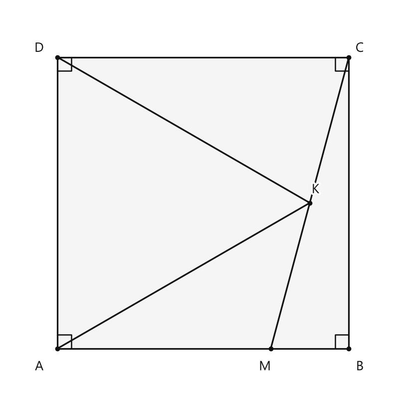
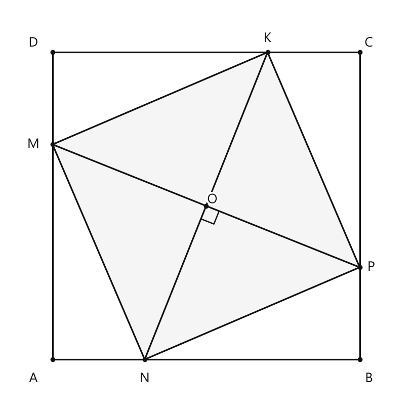
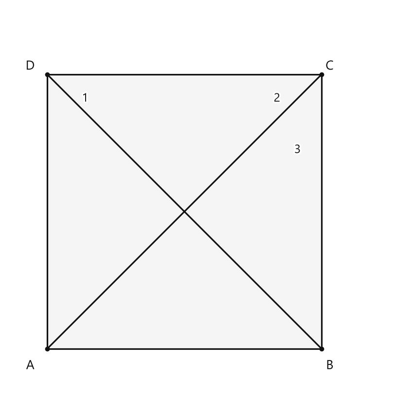
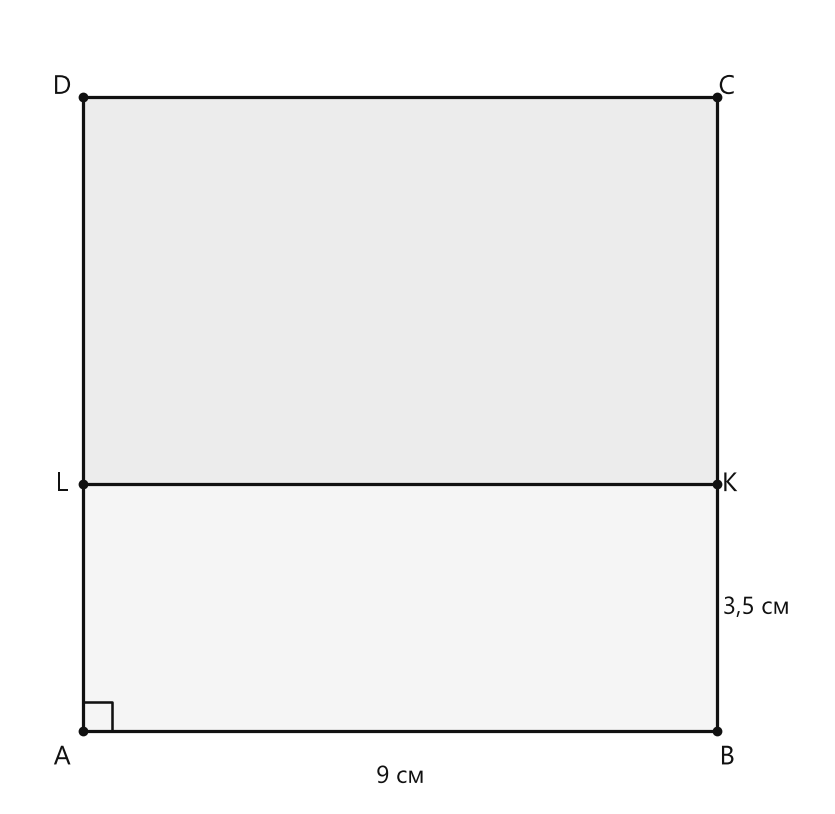
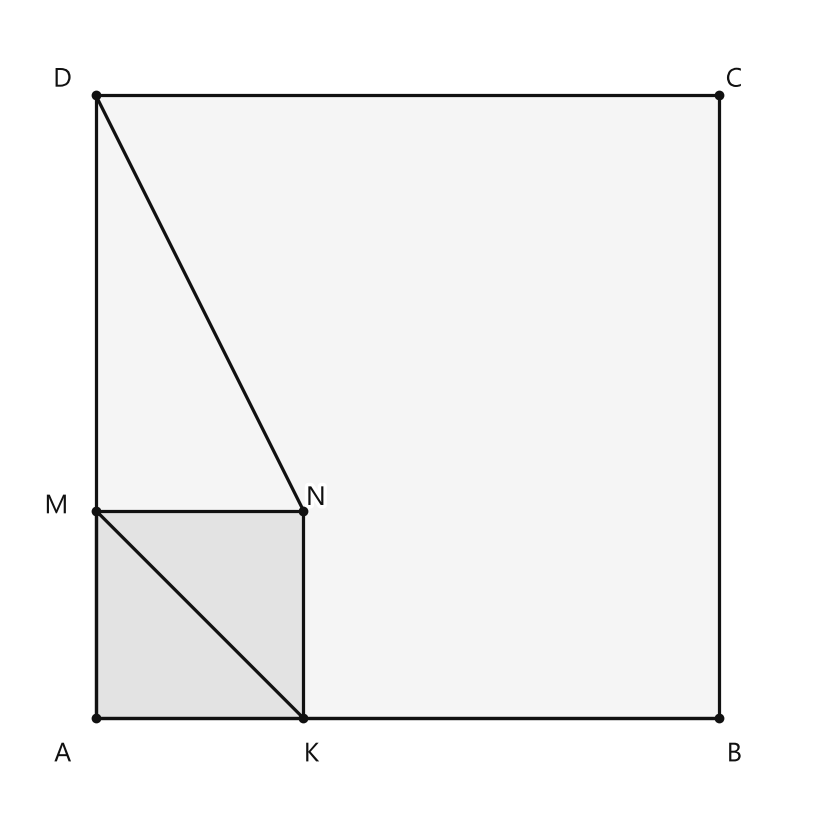
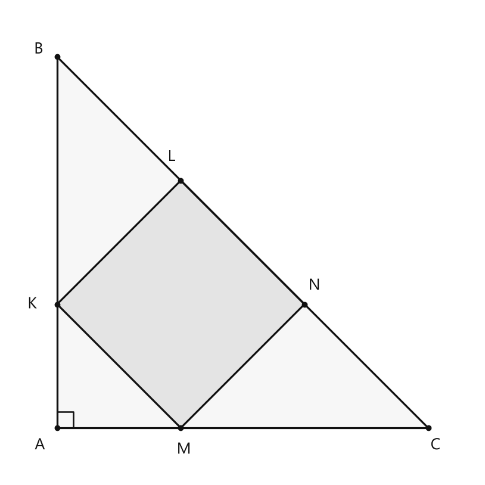

# Занятие 6. Квадрат

**Раздел:** Глава 1. Четырехугольники  
**Параграф учебника:** §6. Квадрат  
**Страницы:** 47–53

## Цели занятия

К концу занятия ученик умеет:

- распознавать квадрат и отличать его от прямоугольника и ромба;
- применять свойства диагоналей и осей симметрии квадрата;
- находить сторону, диагональ, периметр и расстояние от центра до стороны;
- доказывать, что четырехугольник является квадратом;
- решать задачи на разбиение квадрата на прямоугольники и треугольники;
- составлять алгоритм построения квадрата по диагонали.

Выбирай блок своего уровня:

- **1–2 балла:** определение, периметр, стороны и углы;
- **3–4 балла:** диагонали, центр, симметрия;
- **5–6 баллов:** задачи на разбиение и доказательство;
- **7–8 баллов:** признаки квадрата;
- **9–10 баллов:** составные доказательства и построения.

## Теория к занятию

### Что такое квадрат

#### Простыми словами

Квадрат похож сразу на две знакомые фигуры:

- как прямоугольник, он имеет четыре прямых угла;
- как ромб, он имеет четыре равные стороны.

Поэтому квадрат наследует свойства и прямоугольника, и ромба. Удобно: одна фигура, а полезных свойств — целый рюкзак.

#### Определение

**Квадратом называется прямоугольник, у которого все стороны равны.**

#### Формулы

Если сторона квадрата равна $a$, то его периметр:

$$P=4a.$$

Отсюда:

$$a=\frac P4.$$

Площадь квадрата:

$$S=a^2.$$

Диагональ квадрата:

$$d=a\sqrt2.$$

Отсюда:

$$a=\frac d{\sqrt2}=\frac{d\sqrt2}{2}.$$

Здесь:

- $a$ — сторона квадрата;
- $P$ — периметр;
- $S$ — площадь;
- $d$ — диагональ.

#### Правила

- Если дан периметр, чтобы найти сторону, делим периметр на $4$.
- Если проведена диагональ, она не равна стороне. Диагональ проходит через квадрат из одной вершины в противоположную.
- У квадрата четыре равные стороны и четыре прямых угла.

#### Ловушки

- Прямоугольник с равными сторонами — квадрат.
- Ромб с прямым углом — квадрат.
- Не каждый ромб является квадратом: у ромба углы могут быть не прямыми.
- Не каждый прямоугольник является квадратом: его соседние стороны могут иметь разную длину.

---

### Квадрат и другие четырехугольники

#### Простыми словами

Квадрат — это одновременно:

- прямоугольник;
- ромб;
- параллелограмм.

Но обратное утверждение неверно. Например, прямоугольнику могут быть нужны равные стороны, а ромбу — прямой угол. Без этого до квадрата он пока не дорос.

#### Свойства

- **Квадрат является параллелограммом с равными сторонами, у которого все углы прямые.**
- **Квадрат обладает всеми свойствами прямоугольника и ромба.**

Поэтому у квадрата:

- противоположные стороны параллельны;
- противоположные стороны равны;
- все углы равны $90^\circ$.

#### Правила

Чтобы доказать, что фигура является квадратом, можно доказать два факта:

1. фигура является прямоугольником;
2. все её стороны равны.

Также можно применить признак квадрата.

#### Ловушки

- Если все стороны равны, это ещё не обязательно квадрат. Возможно, перед нами ромб.
- Если все углы прямые, это ещё не обязательно квадрат. Возможно, перед нами прямоугольник.
- Для квадрата нужны оба свойства: равные стороны и прямые углы.

---

### Диагонали квадрата

#### Простыми словами

Проведём в квадрате две диагонали. Они пересекутся в одной точке. Эта точка является центром квадрата.

Диагонали квадрата обладают сразу несколькими свойствами:

- имеют одинаковую длину;
- пересекаются под прямым углом;
- делят углы квадрата пополам;
- точкой пересечения делятся пополам.

Получается настоящий геометрический швейцарский нож: одна пара отрезков умеет почти всё.

#### Свойства

- **Диагонали квадрата равны, взаимно перпендикулярны и лежат на биссектрисах его углов.**
- **Точка пересечения диагоналей — центр квадрата.**
- **Диагональ квадрата делит его на два равных равнобедренных прямоугольных треугольника.**
- **Две диагонали делят квадрат на 4 равных равнобедренных прямоугольных треугольника.**

Пусть диагонали $AC$ и $BD$ пересекаются в точке $O$. Тогда:

$$AC=BD,$$

$$AC\perp BD,$$

$$AO=OC=\frac{AC}{2},$$

$$BO=OD=\frac{BD}{2}.$$

Точка $O$ — центр квадрата. Расстояние от центра до любой стороны равно половине стороны:

$$r=\frac a2.$$

#### Правила

- Диагонали делятся точкой пересечения пополам.
- Каждая диагональ является биссектрисой двух противоположных углов.
- Угол между диагоналями равен $90^\circ$.
- Диагональ делит квадрат на два равных равнобедренных прямоугольных треугольника.

#### Ловушки

- Половина диагонали и половина стороны — разные отрезки.
- Диагональ квадрата больше его стороны: $d=a\sqrt2$.
- Треугольники внутри квадрата не равносторонние. Они равнобедренные и прямоугольные.

---

### Симметрия квадрата

#### Простыми словами

Если мысленно сложить квадрат:

- по одной диагонали;
- по другой диагонали;
- по прямой через середины одной пары противоположных сторон;
- по прямой через середины другой пары противоположных сторон,

то части квадрата совпадут.

Значит, у квадрата четыре оси симметрии.

#### Свойство

**У квадрата, как у любого параллелограмма, имеется один центр симметрии (в точке пересечения диагоналей) и четыре оси симметрии (две из них содержат диагонали, две проходят через середины противоположных сторон).**

#### Правила

- Центр симметрии — точка пересечения диагоналей.
- Оси симметрии проходят:
  - по диагоналям;
  - через середины двух пар противоположных сторон.

#### Ловушки

- Сторона квадрата не является осью симметрии.
- У прямоугольника обычно две оси симметрии, а у квадрата — четыре.
- Центр симметрии — это точка, а ось симметрии — прямая. Не смешиваем точку и прямую: они этого не любят.

---

### Признаки квадрата

#### Простыми словами

Признак квадрата помогает быстро установить, что фигура является квадратом. Не всегда нужно проверять все стороны и все углы: иногда достаточно нескольких важных свойств.

#### Признаки

- **Если у ромба есть прямой угол, то это квадрат.**
- **Если у параллелограмма диагонали равны и перпендикулярны, то это квадрат.**
- **Если у четырехугольника диагонали равны, перпендикулярны и точкой пересечения делятся пополам, то это квадрат.**

#### Алгоритм доказательства по третьему признаку

1. Доказать, что точка пересечения диагоналей делит обе диагонали пополам.
2. Сделать вывод: четырехугольник является параллелограммом.
3. Использовать равенство диагоналей.
4. Сделать вывод: параллелограмм является прямоугольником.
5. Использовать перпендикулярность диагоналей.
6. Сделать вывод: параллелограмм является ромбом.
7. Прямоугольник с равными сторонами является квадратом.

#### Ловушки

- В третьем признаке нужны все три условия:
  - диагонали равны;
  - диагонали перпендикулярны;
  - диагонали точкой пересечения делятся пополам.
- Одного равенства диагоналей недостаточно для любого четырехугольника. Это свойство даёт прямоугольник именно у параллелограмма.
- Одной перпендикулярности диагоналей тоже недостаточно для любого четырехугольника. Ромб можно получить при наличии параллелограмма.

---

## Сводка формул «выучить наизусть»

$$P=4a,$$

$$a=\frac P4,$$

$$S=a^2,$$

$$d=a\sqrt2,$$

$$a=\frac d{\sqrt2},$$

$$r=\frac a2.$$

## Правила, которые нельзя путать

- Квадрат — это прямоугольник с равными сторонами.
- Диагонали квадрата равны и перпендикулярны.
- Диагональ квадрата делит угол пополам.
- Половина стороны и половина диагонали — разные величины.
- У квадрата четыре оси симметрии и один центр симметрии.
- Ромб с прямым углом — квадрат.
- Прямоугольник с равными сторонами — квадрат.

## Разбор ключевых заданий

### Р1. Углы в квадрате и равностороннем треугольнике

**Условие.** Квадрат $ABCD$ и равносторонний треугольник $AKD$ имеют общую сторону $AD$. Прямая $MC$ проходит через точку $K$ и пересекает сторону $AB$ в точке $M$. Найдите $\angle BMC$.

**Дано:**

- $ABCD$ — квадрат;
- $AKD$ — равносторонний треугольник;
- точки $M$, $K$, $C$ лежат на одной прямой;
- требуется найти $\angle BMC$.

<!--geo-figure-spec
{
  "needed": true,
  "kind": "plane",
  "caption": "Квадрат $ABCD$ и равносторонний треугольник $AKD$",
  "equal": true,
  "axis": false,
  "xlim": [
    -0.7,
    4.7
  ],
  "ylim": [
    -0.7,
    4.7
  ],
  "points": {
    "A": [
      0,
      0
    ],
    "B": [
      4,
      0
    ],
    "C": [
      4,
      4
    ],
    "D": [
      0,
      4
    ],
    "K": [
      3.4641,
      2
    ],
    "M": [
      2.9282,
      0
    ]
  },
  "segments": [
    [
      "A",
      "B"
    ],
    [
      "B",
      "C"
    ],
    [
      "C",
      "D"
    ],
    [
      "D",
      "A"
    ],
    [
      "A",
      "K"
    ],
    [
      "K",
      "D"
    ],
    [
      "M",
      "C"
    ]
  ],
  "polygons": [
    {
      "vertices": [
        "A",
        "B",
        "C",
        "D"
      ],
      "fill": 0.04
    }
  ],
  "circles": [],
  "labels": {
    "A": {
      "dx": -0.25,
      "dy": -0.25
    },
    "B": {
      "dx": 0.15,
      "dy": -0.25
    },
    "C": {
      "dx": 0.15,
      "dy": 0.12
    },
    "D": {
      "dx": -0.25,
      "dy": 0.12
    },
    "K": {
      "dx": 0.08,
      "dy": 0.18
    },
    "M": {
      "dx": -0.08,
      "dy": -0.25
    }
  },
  "right_angles": [
    {
      "vertex": "A",
      "from": "B",
      "to": "D"
    },
    {
      "vertex": "B",
      "from": "A",
      "to": "C"
    },
    {
      "vertex": "C",
      "from": "B",
      "to": "D"
    },
    {
      "vertex": "D",
      "from": "A",
      "to": "C"
    }
  ],
  "angle_marks": [],
  "texts": []
}
-->

*Квадрат ABCD и равносторонний треугольник AKD*

**Решение.**

В равностороннем треугольнике все углы равны $60^\circ$.

$$\angle ADK=60^\circ.$$

В квадрате все углы прямые.

$$\angle ADC=90^\circ.$$

Луч $DK$ расположен внутри угла $ADC$, поэтому:

$$\angle KDC=90^\circ-60^\circ=30^\circ.$$

Сторона равностороннего треугольника равна его стороне $AD$:

$$KD=AD.$$

У квадрата все стороны равны:

$$AD=CD.$$

Значит:

$$KD=CD.$$

Следовательно, треугольник $KDC$ равнобедренный. Его основание — $KC$.

Углы при основании равны:

$$\angle KCD=\angle CKD.$$

Сумма углов треугольника равна $180^\circ$. Поэтому сумма двух равных углов при основании равна:

$$180^\circ-30^\circ=150^\circ.$$

Каждый из них равен:

$$\angle KCD=\frac{150^\circ}{2}=75^\circ.$$

В квадрате $ABCD$:

$$AB\parallel CD.$$

Прямая $MC$ пересекает эти параллельные прямые. Поэтому соответствующие углы равны:

$$\angle BMC=\angle KCD=75^\circ.$$

Ответ: $75^\circ$.

*Ловушка: построенный рядом треугольник не отменяет прямой угол квадрата. Геометрия не работает по принципу «новая фигура — старые углы исчезли».*

---

### Р2. Точки на сторонах квадрата

**Условие.** На сторонах квадрата $ABCD$ отмечены точки $N$, $P$, $K$, $M$ так, что

$$AN=BP=CK=DM.$$

Докажите, что

$$NK\perp PM$$

и

$$NK=PM.$$

**Дано:**

- $ABCD$ — квадрат;
- $N\in AB$, $P\in BC$, $K\in CD$, $M\in DA$;
- $AN=BP=CK=DM$.

<!--geo-figure-spec
{
  "needed": true,
  "kind": "plane",
  "caption": "Квадрат $ABCD$ с точками $N$, $P$, $K$, $M$",
  "equal": true,
  "axis": false,
  "xlim": [
    -0.6,
    4.6
  ],
  "ylim": [
    -0.6,
    4.6
  ],
  "points": {
    "A": [
      0,
      0
    ],
    "B": [
      4,
      0
    ],
    "C": [
      4,
      4
    ],
    "D": [
      0,
      4
    ],
    "N": [
      1.2,
      0
    ],
    "P": [
      4,
      1.2
    ],
    "K": [
      2.8,
      4
    ],
    "M": [
      0,
      2.8
    ],
    "O": [
      2,
      2
    ]
  },
  "segments": [
    [
      "A",
      "B"
    ],
    [
      "B",
      "C"
    ],
    [
      "C",
      "D"
    ],
    [
      "D",
      "A"
    ],
    [
      "N",
      "P"
    ],
    [
      "P",
      "K"
    ],
    [
      "K",
      "M"
    ],
    [
      "M",
      "N"
    ],
    [
      "N",
      "K"
    ],
    [
      "P",
      "M"
    ]
  ],
  "polygons": [
    {
      "vertices": [
        "N",
        "P",
        "K",
        "M"
      ],
      "fill": 0.04
    }
  ],
  "circles": [],
  "labels": {
    "A": {
      "dx": -0.25,
      "dy": -0.25
    },
    "B": {
      "dx": 0.12,
      "dy": -0.25
    },
    "C": {
      "dx": 0.12,
      "dy": 0.12
    },
    "D": {
      "dx": -0.25,
      "dy": 0.12
    },
    "N": {
      "dx": 0,
      "dy": -0.25
    },
    "P": {
      "dx": 0.15,
      "dy": 0
    },
    "K": {
      "dx": 0,
      "dy": 0.18
    },
    "M": {
      "dx": -0.25,
      "dy": 0
    }
  },
  "right_angles": [
    {
      "vertex": "O",
      "from": "N",
      "to": "P"
    }
  ],
  "angle_marks": [],
  "texts": []
}
-->

*Квадрат ABCD с точками N, P, K, M*

**Доказательство.**

У квадрата все стороны равны:

$$AB=BC=CD=DA.$$

По условию:

$$AN=BP=CK=DM.$$

Вычтем равные отрезки из равных сторон квадрата:

$$NB=PC=KD=AM.$$

Рассмотрим прямоугольные треугольники $MAN$, $NBP$, $PCK$, $KDM$.

У этих треугольников соответственно равны два катета:

$$AM=NB=PC=KD,$$

$$AN=BP=CK=DM.$$

Следовательно, треугольники равны по двум катетам.

Значит, равны их гипотенузы:

$$MN=NP=PK=KM.$$

Таким образом, четырехугольник $MNPK$ — ромб.

Теперь докажем, что один из его углов прямой.

В прямоугольном треугольнике $MAN$ сумма острых углов равна $90^\circ$:

$$\angle AMN+\angle ANM=90^\circ.$$

Из равенства прямоугольных треугольников следует:

$$\angle KMD=\angle ANM.$$

Поэтому:

$$\angle AMN+\angle KMD=90^\circ.$$

Луч $MA$ и луч $MD$ являются противоположными лучами. Поэтому три угла, расположенные между ними,

$$\angle AMN,\quad \angle NMK,\quad \angle KMD,$$

в сумме дают развернутый угол:

$$\angle AMN+\angle NMK+\angle KMD=180^\circ.$$

Подставим $\angle AMN+\angle KMD=90^\circ$:

$$90^\circ+\angle NMK=180^\circ.$$

Отсюда:

$$\angle NMK=90^\circ.$$

Ромб с прямым углом является квадратом. Значит, $MNPK$ — квадрат.

Диагонали квадрата равны и перпендикулярны. Диагоналями четырехугольника $MNPK$ являются $NK$ и $PM$.

Поэтому:

$$NK\perp PM,$$

$$NK=PM.$$

Что и требовалось доказать.

*Четыре равные стороны дают ромб. Добавили один прямой угол — и ромб получил повышение до квадрата.*

---

### Р3. Сумма углов, образованных диагоналями

**Условие.** В квадрате $ABCD$ проведены диагонали $AC$ и $BD$. Угол $\angle BDC$ обозначен как угол $1$, угол $\angle ACD$ — как угол $2$, угол $\angle BCA$ — как угол $3$. Найдите сумму углов $1$, $2$ и $3$.

**Дано:**

- $ABCD$ — квадрат;
- проведены диагонали $AC$ и $BD$;
- требуется найти $\angle BDC+\angle ACD+\angle BCA$.

<!--geo-figure-spec
{
  "needed": true,
  "kind": "plane",
  "caption": "Диагонали квадрата $ABCD$",
  "equal": true,
  "axis": false,
  "xlim": [
    -0.6,
    5
  ],
  "ylim": [
    -0.6,
    5
  ],
  "points": {
    "A": [
      0,
      0
    ],
    "B": [
      4,
      0
    ],
    "C": [
      4,
      4
    ],
    "D": [
      0,
      4
    ]
  },
  "segments": [
    [
      "A",
      "B"
    ],
    [
      "B",
      "C"
    ],
    [
      "C",
      "D"
    ],
    [
      "D",
      "A"
    ],
    [
      "A",
      "C"
    ],
    [
      "B",
      "D"
    ]
  ],
  "polygons": [
    {
      "vertices": [
        "A",
        "B",
        "C",
        "D"
      ],
      "fill": 0.04
    }
  ],
  "circles": [],
  "labels": {
    "A": {
      "dx": -0.25,
      "dy": -0.25
    },
    "B": {
      "dx": 0.12,
      "dy": -0.25
    },
    "C": {
      "dx": 0.12,
      "dy": 0.12
    },
    "D": {
      "dx": -0.25,
      "dy": 0.12
    }
  },
  "right_angles": [],
  "angle_marks": [],
  "texts": [
    {
      "xy": [
        0.55,
        3.65
      ],
      "text": "1"
    },
    {
      "xy": [
        3.35,
        3.65
      ],
      "text": "2"
    },
    {
      "xy": [
        3.65,
        2.9
      ],
      "text": "3"
    }
  ]
}
-->

*Диагонали квадрата ABCD*

**Решение.**

Диагонали квадрата являются биссектрисами его углов.

Каждый угол квадрата равен $90^\circ$.

Диагональ делит прямой угол пополам, поэтому каждый угол между диагональю и стороной равен:

$$\frac{90^\circ}{2}=45^\circ.$$

Следовательно:

$$\angle BDC=45^\circ,$$

$$\angle ACD=45^\circ,$$

$$\angle BCA=45^\circ.$$

Найдём их сумму:

$$45^\circ+45^\circ+45^\circ=135^\circ.$$

Ответ: $135^\circ$.

---

### Р4. Сумма периметров двух прямоугольников

**Условие.** Квадрат $ABCD$ имеет периметр $36$ см. Отрезок $KL$ делит его на прямоугольники $ABKL$ и $LKCD$. Известно, что $BK=3{,}5$ см. Найдите сумму периметров этих прямоугольников.

**Дано:**

- $ABCD$ — квадрат;
- $P_{ABCD}=36$ см;
- $BK=3{,}5$ см;
- $KL$ делит квадрат на два прямоугольника.

<!--geo-figure-spec
{
  "needed": true,
  "kind": "plane",
  "caption": "Квадрат, разделённый на два прямоугольника",
  "equal": true,
  "axis": false,
  "xlim": [
    -1,
    10.5
  ],
  "ylim": [
    -1,
    10.2
  ],
  "points": {
    "A": [
      0,
      0
    ],
    "B": [
      9,
      0
    ],
    "C": [
      9,
      9
    ],
    "D": [
      0,
      9
    ],
    "K": [
      9,
      3.5
    ],
    "L": [
      0,
      3.5
    ]
  },
  "segments": [
    [
      "A",
      "B"
    ],
    [
      "B",
      "C"
    ],
    [
      "C",
      "D"
    ],
    [
      "D",
      "A"
    ],
    [
      "K",
      "L"
    ]
  ],
  "polygons": [
    {
      "vertices": [
        "A",
        "B",
        "K",
        "L"
      ],
      "fill": 0.04
    },
    {
      "vertices": [
        "L",
        "K",
        "C",
        "D"
      ],
      "fill": 0.08
    }
  ],
  "circles": [],
  "labels": {
    "A": {
      "dx": -0.3,
      "dy": -0.38
    },
    "B": {
      "dx": 0.14,
      "dy": -0.38
    },
    "C": {
      "dx": 0.14,
      "dy": 0.14
    },
    "D": {
      "dx": -0.3,
      "dy": 0.14
    },
    "K": {
      "dx": 0.18,
      "dy": 0
    },
    "L": {
      "dx": -0.3,
      "dy": 0
    }
  },
  "right_angles": [
    {
      "vertex": "A",
      "from": "B",
      "to": "D"
    }
  ],
  "angle_marks": [],
  "texts": [
    {
      "xy": [
        9.55,
        1.75
      ],
      "text": "3,5 см"
    },
    {
      "xy": [
        4.5,
        -0.65
      ],
      "text": "9 см"
    }
  ]
}
-->

*Квадрат, разделённый на два прямоугольника*

**Решение.**

Сначала найдём сторону квадрата.

Периметр квадрата равен четырём его сторонам, поэтому:

$$a=\frac P4.$$

Подставим значение периметра:

$$a=\frac{36}{4}=9\text{ см}.$$

Первый прямоугольник имеет стороны $9$ см и $3{,}5$ см.

Его периметр:

$$P_1=2(9+3{,}5).$$

$$P_1=2\cdot12{,}5=25\text{ см}.$$

Высота второго прямоугольника — оставшаяся часть стороны квадрата:

$$9-3{,}5=5{,}5\text{ см}.$$

Второй прямоугольник имеет стороны $9$ см и $5{,}5$ см.

Его периметр:

$$P_2=2(9+5{,}5).$$

$$P_2=2\cdot14{,}5=29\text{ см}.$$

Найдём сумму периметров:

$$P_1+P_2=25+29=54\text{ см}.$$

Ответ: $54$ см.

*Общий отрезок $KL$ входит в периметр обоих прямоугольников, поэтому при сложении он учитывается два раза. Здесь это не ошибка, а условие задачи в действии.*

### Р5. Периметр внешнего многоугольника

**Условие.** Периметр квадрата $ABCD$ равен $72$ см. Внутри него расположен квадрат $AKMN$, причём точка $K$ лежит на стороне $AB$, а точка $M$ — на стороне $AD$. Известно, что

$$AK=\frac12KB.$$

Найдите периметр многоугольника $KBCDNM$.

**Дано:**

- $ABCD$ — квадрат;
- $AKMN$ — квадрат;
- $P_{ABCD}=72$ см;
- $AK=\frac12KB$.

<!--geo-figure-spec
{
  "needed": true,
  "kind": "plane",
  "caption": "Квадраты $ABCD$ и $AKMN$; многоугольник $KBCDNM$",
  "equal": true,
  "axis": false,
  "xlim": [
    -0.8,
    6.8
  ],
  "ylim": [
    -0.8,
    6.8
  ],
  "points": {
    "A": [
      0,
      0
    ],
    "B": [
      6,
      0
    ],
    "C": [
      6,
      6
    ],
    "D": [
      0,
      6
    ],
    "K": [
      2,
      0
    ],
    "M": [
      0,
      2
    ],
    "N": [
      2,
      2
    ]
  },
  "segments": [
    [
      "A",
      "B"
    ],
    [
      "B",
      "C"
    ],
    [
      "C",
      "D"
    ],
    [
      "D",
      "A"
    ],
    [
      "A",
      "K"
    ],
    [
      "K",
      "N"
    ],
    [
      "N",
      "M"
    ],
    [
      "M",
      "A"
    ],
    [
      "K",
      "B"
    ],
    [
      "D",
      "N"
    ],
    [
      "M",
      "K"
    ]
  ],
  "polygons": [
    {
      "vertices": [
        "A",
        "B",
        "C",
        "D"
      ],
      "fill": 0.04
    },
    {
      "vertices": [
        "A",
        "K",
        "N",
        "M"
      ],
      "fill": 0.08
    }
  ],
  "circles": [],
  "labels": {
    "A": {
      "dx": -0.32,
      "dy": -0.35
    },
    "B": {
      "dx": 0.15,
      "dy": -0.35
    },
    "C": {
      "dx": 0.15,
      "dy": 0.15
    },
    "D": {
      "dx": -0.32,
      "dy": 0.15
    },
    "K": {
      "dx": 0.08,
      "dy": -0.35
    },
    "M": {
      "dx": -0.38,
      "dy": 0.04
    },
    "N": {
      "dx": 0.12,
      "dy": 0.12
    }
  },
  "right_angles": [],
  "angle_marks": [],
  "texts": []
}
-->

*Квадраты ABCD и AKMN; многоугольник KBCDNM*

**Решение.**

У большого квадрата все четыре стороны равны.

Поэтому его сторона равна:

$$AB=\frac{P_{ABCD}}{4}.$$

$$AB=\frac{72}{4}=18\text{ см}.$$

Пусть:

$$AK=x.$$

По условию $AK$ в два раза меньше $KB$, значит:

$$KB=2x.$$

Сторона $AB$ состоит из двух отрезков $AK$ и $KB$:

$$AK+KB=AB.$$

Подставим известные выражения:

$$x+2x=18.$$

$$3x=18.$$

$$x=6\text{ см}.$$

Значит, сторона маленького квадрата равна:

$$AK=AM=MN=NK=6\text{ см}.$$

Теперь найдём остальные отрезки внешнего многоугольника:

$$KB=AB-AK=18-6=12\text{ см};$$

$$BC=CD=18\text{ см};$$

$$DN=AD-AM=18-6=12\text{ см};$$

$$NM=6\text{ см};$$

$$MK=6\text{ см}.$$

Периметр многоугольника $KBCDNM$ складывается из его шести сторон:

$$P=KB+BC+CD+DN+NM+MK.$$

Подставим длины:

$$P=12+18+18+12+6+6.$$

$$P=72\text{ см}.$$

**Ответ:** $72$ см.

*Ловушка: в этот периметр не входят стороны маленького квадрата $AK$ и $AN$ — они находятся внутри фигуры и по внешней границе не идут.*

---

### Р6. Расстояние от центра квадрата до стороны

**Условие.** Периметр квадрата равен $48$ см. Найдите расстояние от центра квадрата до любой его стороны.

**Решение.**

Пусть сторона квадрата равна $a$.

Периметр квадрата состоит из четырёх равных сторон:

$$P=4a.$$

Отсюда:

$$a=\frac{P}{4}.$$

Подставим значение периметра:

$$a=\frac{48}{4}=12\text{ см}.$$

Центр квадрата находится посередине между двумя противоположными сторонами.

Поэтому расстояние от центра до одной стороны равно половине стороны квадрата:

$$r=\frac a2.$$

$$r=\frac{12}{2}=6\text{ см}.$$

**Ответ:** $6$ см.

*Центр не «прилипает» к стороне: он находится ровно посередине между двумя противоположными сторонами.*

---

### Р7. Гипотенуза треугольника с помещённым квадратом

**Условие.** В равнобедренный прямоугольный треугольник помещён квадрат так, что две его вершины лежат на гипотенузе, а две другие — на катетах. Периметр квадрата равен $112$ см. Найдите гипотенузу треугольника.

**Дано:**

- треугольник равнобедренный прямоугольный;
- квадрат расположен так, что две его вершины лежат на гипотенузе, а две другие — на катетах;
- периметр квадрата равен $112$ см.

<!--geo-figure-spec
{
  "needed": true,
  "kind": "plane",
  "caption": "Квадрат внутри равнобедренного прямоугольного треугольника",
  "equal": true,
  "axis": false,
  "xlim": [
    -0.8,
    6.8
  ],
  "ylim": [
    -0.8,
    6.8
  ],
  "points": {
    "A": [
      0,
      0
    ],
    "B": [
      0,
      6
    ],
    "C": [
      6,
      0
    ],
    "K": [
      0,
      2
    ],
    "M": [
      2,
      0
    ],
    "N": [
      4,
      2
    ],
    "L": [
      2,
      4
    ]
  },
  "segments": [
    [
      "A",
      "B"
    ],
    [
      "B",
      "C"
    ],
    [
      "C",
      "A"
    ],
    [
      "K",
      "M"
    ],
    [
      "M",
      "N"
    ],
    [
      "N",
      "L"
    ],
    [
      "L",
      "K"
    ]
  ],
  "polygons": [
    {
      "vertices": [
        "A",
        "B",
        "C"
      ],
      "fill": 0.03
    },
    {
      "vertices": [
        "K",
        "M",
        "N",
        "L"
      ],
      "fill": 0.08
    }
  ],
  "circles": [],
  "labels": {
    "A": {
      "dx": -0.28,
      "dy": -0.28
    },
    "B": {
      "dx": -0.3,
      "dy": 0.12
    },
    "C": {
      "dx": 0.12,
      "dy": -0.28
    },
    "K": {
      "dx": -0.4,
      "dy": 0
    },
    "M": {
      "dx": 0.05,
      "dy": -0.35
    },
    "N": {
      "dx": 0.16,
      "dy": 0.3
    },
    "L": {
      "dx": -0.15,
      "dy": 0.38
    }
  },
  "right_angles": [
    {
      "vertex": "A",
      "from": "B",
      "to": "C"
    }
  ],
  "angle_marks": [],
  "texts": []
}
-->

*Квадрат внутри равнобедренного прямоугольного треугольника*

**Решение.**

Сначала найдём сторону квадрата:

$$a=\frac{P}{4}.$$

$$a=\frac{112}{4}=28\text{ см}.$$

По расположению квадрата на рисунке каждый катет треугольника состоит из двух отрезков, равных стороне квадрата.

Поэтому длина каждого катета равна:

$$x=2a.$$

$$x=2\cdot28=56\text{ см}.$$

Треугольник равнобедренный прямоугольный, поэтому его гипотенуза в $\sqrt2$ раз больше катета:

$$c=x\sqrt2.$$

Подставим $x=56$ см:

$$c=56\sqrt2\text{ см}.$$

**Ответ:** $56\sqrt2$ см.

*Здесь важно не перепутать катет и гипотенузу: гипотенуза — самая длинная сторона треугольника, поэтому ответ не может быть просто $56$ см.*

---

### Р8. Доказательство по равным сторонам и углам

**Условие.** Докажите, что если у четырехугольника все стороны и все углы равны, то это квадрат.

**Доказательство.**

Пусть у данного четырёхугольника все стороны равны.

Тогда по определению этот четырёхугольник является ромбом.

Теперь рассмотрим его углы.

Сумма углов четырёхугольника равна $360^\circ$.

Так как все четыре угла равны, каждый из них равен:

$$\frac{360^\circ}{4}=90^\circ.$$

Значит, у четырёхугольника все углы прямые.

Следовательно, он является прямоугольником.

Мы получили прямоугольник, у которого все стороны равны.

По определению это квадрат.

**Ответ:** четырёхугольник является квадратом.

*Коротко: равные стороны дают ромб, равные прямые углы дают прямоугольник. Ромб и прямоугольник встретились — получился квадрат.*

---

### Р9. Построение квадрата по диагонали

**Условие.** Составьте алгоритм построения с помощью циркуля и линейки квадрата по его диагонали $d$.

**Алгоритм построения.**

1. Построить отрезок $AC$ длины $d$.
2. С помощью циркуля и линейки найти середину отрезка $AC$ и обозначить её точкой $O$.
3. Через точку $O$ провести прямую, перпендикулярную $AC$.
4. На этой прямой отложить по разные стороны от точки $O$ отрезки $OB$ и $OD$, равные $OA$.
5. Соединить точки $A$, $B$, $C$, $D$ последовательно.

Получится квадрат $ABCD$.

**Почему построение верно.**

Точка $O$ — середина отрезка $AC$, поэтому:

$$OA=OC.$$

По построению:

$$OB=OD.$$

Значит, обе диагонали делятся точкой $O$ пополам.

Кроме того, по построению:

$$AC\perp BD.$$

Длины диагоналей равны, потому что:

$$AC=2OA,$$

$$BD=2OB,$$

а отрезки $OA$ и $OB$ построены равными.

Следовательно, диагонали четырёхугольника равны, перпендикулярны и точкой пересечения делятся пополам.

По признаку квадрата четырёхугольник $ABCD$ является квадратом.

**Ответ:** квадрат построен.

---

## Самопроверка

1. Какое условие отличает квадрат от обычного прямоугольника?
2. Чему равна сторона квадрата с периметром $64$ см?
3. Как связаны диагональ и сторона квадрата?
4. Сколько осей симметрии у квадрата?
5. Почему ромб с прямым углом является квадратом?

**Короткие ответы:**

1. Все стороны равны.
2. $16$ см.
3. $d=a\sqrt2$.
4. Четыре.
5. Он является прямоугольником с равными сторонами.

## Практические задания

Выбери свой уровень и решай только этот блок. В блоке должна закрепиться вся тема параграфа. Ответы не приводятся.

### Уровень 1–2 балла

**С1.** Выберите верное утверждение о квадрате.

1) У квадрата только две равные стороны. 2) Все углы квадрата прямые. 3) Диагонали квадрата не пересекаются. 4) Квадрат не является прямоугольником. 5) Квадрат не является ромбом.

**С2.** Сторона квадрата равна $7$ см. Найдите его периметр.

**С3.** Периметр квадрата равен $32$ см. Найдите длину его стороны.

**С4.** Выберите все свойства диагоналей квадрата.

1) Диагонали равны. 2) Диагонали взаимно перпендикулярны. 3) Диагонали делятся точкой пересечения пополам. 4) Диагонали всегда имеют разную длину. 5) Диагонали не пересекаются.

**С5.** Квадрат $ABCD$ имеет сторону $6$ см. Найдите площадь квадрата.

**С6.** Точка $O$ — точка пересечения диагоналей квадрата $ABCD$. Выберите верное утверждение.

1) $O$ — центр квадрата. 2) $O$ совпадает с вершиной $A$. 3) $O$ лежит только на стороне $AB$. 4) $O$ не принадлежит диагоналям. 5) $O$ находится вне квадрата.

**С7.** Диагональ квадрата делит его на два равных треугольника. Какими являются эти треугольники?

1) Равносторонними. 2) Равнобедренными прямоугольными. 3) Разносторонними тупоугольными. 4) Равнобедренными тупоугольными. 5) Разносторонними остроугольными.

**С8.** В квадрате $ABCD$ угол $A$ равен $90^\circ$. Найдите угол $C$.

**С9.** Выберите верное утверждение.

1) У квадрата одна ось симметрии. 2) У квадрата две оси симметрии. 3) У квадрата четыре оси симметрии. 4) У квадрата нет осей симметрии. 5) У квадрата шесть осей симметрии.

**С10.** Ромб имеет прямой угол. Какой вывод можно сделать?

1) Это трапеция. 2) Это прямоугольник, но не квадрат. 3) Это квадрат. 4) Это произвольный четырёхугольник. 5) Никакого вывода сделать нельзя.

**С11.** У четырёхугольника диагонали равны, взаимно перпендикулярны и точкой пересечения делятся пополам. Какой вывод можно сделать?

1) Четырёхугольник является квадратом. 2) Четырёхугольник является только трапецией. 3) Четырёхугольник является только прямоугольником. 4) Четырёхугольник является только ромбом. 5) Четырёхугольник не имеет диагоналей.

**С12.** Периметр квадрата равен $40$ см. Найдите расстояние от центра квадрата до каждой из его сторон.

**С13.** Выберите верное утверждение о квадрате.

1) Все его углы острые. 2) Все его стороны равны, а все углы прямые. 3) Только две его стороны равны. 4) У него нет диагоналей. 5) Его диагонали не пересекаются.

**С14.** Сторона квадрата равна $7$ см. Найдите его периметр.

**С15.** Периметр квадрата равен $36$ см. Найдите длину его стороны.

**С16.** Укажите фигуру, которая является одновременно прямоугольником и ромбом.

1) Трапеция 2) Параллелограмм 3) Квадрат 4) Треугольник 5) Круг

**С17.** Квадрат $ABCD$ имеет сторону $5$ см. Найдите длину стороны $BC$.

**С18.** Выберите верное утверждение о диагоналях квадрата.

1) Диагонали квадрата не равны. 2) Диагонали квадрата параллельны. 3) Диагонали квадрата равны и взаимно перпендикулярны. 4) Только одна диагональ квадрата делится пополам. 5) Диагонали квадрата не пересекаются.

**С19.** Периметр квадрата равен $48$ см. Найдите расстояние от центра квадрата до любой его стороны.

**С20.** Квадрат $ABCD$ разделён диагональю $AC$ на два треугольника. Выберите верное утверждение.

1) Треугольники не равны. 2) Оба треугольника равносторонние. 3) Оба треугольника равнобедренные прямоугольные. 4) Один треугольник тупоугольный. 5) Диагональ является стороной только одного треугольника.

**С21.** Вершины квадрата имеют координаты $A(0;0)$, $B(4;0)$, $C(4;4)$ и $D(0;4)$. Найдите длину стороны квадрата.

**С22.** Выберите фигуру, у которой все стороны равны и все углы прямые.

1) Ромб 2) Прямоугольник 3) Квадрат 4) Параллелограмм 5) Трапеция

**С23.** Диагонали четырёхугольника равны, взаимно перпендикулярны и точкой пересечения делятся пополам. Какую фигуру образует этот четырёхугольник?

1) Квадрат 2) Трапецию 3) Произвольный параллелограмм 4) Прямоугольный треугольник 5) Окружность

**С24.** Сколько осей симметрии имеет квадрат?

1) Одну 2) Две 3) Три 4) Четыре 5) Пять

**С25.** Выберите верное утверждение о квадрате.  
1) Все его углы острые. 2) Все его стороны равны, а все углы прямые. 3) Только две его стороны равны. 4) У него нет диагоналей. 5) Его диагонали не пересекаются.

**С26.** Квадрат имеет сторону $7$ см. Найдите его периметр.

**С27.** Периметр квадрата равен $36$ см. Найдите длину его стороны.

**С28.** Выберите все свойства диагоналей квадрата.  
1) Диагонали равны. 2) Диагонали взаимно перпендикулярны. 3) Диагонали не пересекаются. 4) Диагонали делятся точкой пересечения пополам. 5) Диагонали являются сторонами квадрата.

**С29.** В квадрате $ABCD$ точка $O$ — точка пересечения диагоналей. Как называется точка $O$ относительно квадрата?

**С30.** Сторона квадрата равна $9$ см. Найдите сумму длин всех его сторон.

**С31.** Выберите верное утверждение.  
1) Квадрат является только трапецией. 2) Квадрат является прямоугольником и ромбом. 3) Квадрат не является параллелограммом. 4) У квадрата только один прямой угол. 5) У квадрата все стороны имеют разные длины.

**С32.** Диагональ квадрата делит его на два треугольника. Укажите вид этих треугольников.  
1) Равносторонние 2) Равнобедренные прямоугольные 3) Разносторонние тупоугольные 4) Равнобедренные тупоугольные 5) Прямоугольные разносторонние

**С33.** Периметр квадрата равен $52$ см. Найдите длину его стороны.

**С34.** У квадрата $ABCD$ диагонали $AC$ и $BD$ пересекаются в точке $O$. Запишите равенство, выражающее деление диагонали $AC$ точкой $O$ пополам.

**С35.** Выберите верное утверждение о симметрии квадрата.  
1) У квадрата четыре оси симметрии. 2) У квадрата нет осей симметрии. 3) У квадрата одна ось симметрии. 4) Осями симметрии являются только две стороны. 5) У квадрата три оси симметрии.

**С36.** У ромба один из углов прямой. Какой вывод можно сделать о таком ромбе?

### Уровень 3–4 балла

**С1.** Сформулируйте определение квадрата.

**С2.** Перечислите свойства диагоналей квадрата.

**С3.** Периметр квадрата равен $28$ см. Найдите длину его стороны.

**С4.** Сторона квадрата равна $9$ см. Найдите его периметр.

**С5.** Расстояние от центра квадрата до одной из его сторон равно $6$ см. Найдите сторону квадрата.

**С6.** Периметр квадрата равен $52$ см. Найдите расстояние от точки пересечения диагоналей до каждой стороны квадрата.

**С7.** Диагонали квадрата пересекаются в точке $O$. Известно, что $AC=18$ см. Найдите $AO$ и $BD$.

**С8.** Квадрат $ABCD$ имеет сторону $10$ см. Найдите периметр треугольника $ABC$.

**С9.** Квадрат $ABCD$ разделён диагоналями $AC$ и $BD$ на четыре треугольника. Сколько из этих треугольников являются равнобедренными прямоугольными?

**С10.** Докажите, что диагональ квадрата делит его на два равных равнобедренных прямоугольных треугольника.

**С11.** У ромба один из углов равен $90^\circ$. Является ли этот ромб квадратом? Ответ обоснуйте.

**С12.** Составьте алгоритм построения квадрата по заданной диагонали $AC$.

**С13.** Периметр квадрата равен $44$ см. Найдите длину его стороны.

**С14.** Сторона квадрата равна $9$ см. Найдите его периметр.

**С15.** Периметр квадрата $ABCD$ равен $52$ см. Найдите расстояние от точки пересечения диагоналей до стороны $AB$.

**С16.** Диагонали квадрата пересекаются в точке $O$. Укажите все пары равных отрезков, если диагонали квадрата обозначены $AC$ и $BD$.

**С17.** Квадрат $ABCD$ имеет сторону $8$ см. Найдите периметр прямоугольника, одна из сторон которого совпадает со стороной квадрата, а другая равна $3$ см.

**С18.** Диагонали квадрата равны $14$ см. На какие отрезки каждая диагональ делится точкой пересечения диагоналей?

**С19.** У ромба один из углов равен $90^\circ$. Определите вид этого ромба.

**С20.** У параллелограмма диагонали равны, перпендикулярны и точкой пересечения делятся пополам. Какой это четырехугольник?

**С21.** Сторона квадрата равна $6$ см. Найдите сумму длин его диагоналей, если диагональ квадрата равна $6\sqrt2$ см.

**С22.** Квадрат $ABCD$ разделён диагональю $AC$ на два треугольника. Назовите вид каждого из получившихся треугольников по сторонам и по углам.

**С23.** Перечислите все оси симметрии квадрата $ABCD$: две диагонали и две прямые, проходящие через середины противоположных сторон. Сколько всего осей симметрии имеет квадрат?

**С24.** Составьте последовательность действий для построения квадрата по заданной диагонали $AC$: постройте середину диагонали, проведите через неё перпендикуляр к $AC$, отложите на этом перпендикуляре отрезки, равные половине $AC$, и соедините полученные точки с концами диагонали.

**С25.** Сторона квадрата равна $8$ см. Найдите его периметр и площадь.

**С26.** Периметр квадрата равен $52$ см. Найдите длину его стороны.

**С27.** Диагонали квадрата пересекаются в точке $O$. Запишите, какие из утверждений верны:  
1) $AC=BD$;  
2) $AC\perp BD$;  
3) $AO=OC$;  
4) $BO=OD$;  
5) $AC=2AO$.

**С28.** Периметр квадрата равен $36$ см. Найдите расстояние от точки пересечения его диагоналей до любой стороны.

**С29.** У квадрата $ABCD$ диагонали пересекаются в точке $O$. Угол $AOB$ равен $90^\circ$. Найдите углы треугольника $AOB$.

**С30.** Квадрат разделён одной диагональю на два треугольника. Укажите вид каждого из полученных треугольников по сторонам и по углам.

**С31.** В квадрате $ABCD$ точка $O$ — точка пересечения диагоналей. Известно, что $AC=14$ см. Найдите $AO$ и $OC$.

**С32.** Докажите, что диагональ квадрата делит его на два равных треугольника.

**С33.** Четырёхугольник является ромбом, и один из его углов равен $90^\circ$. Докажите, что этот четырёхугольник является квадратом.

**С34.** У четырёхугольника диагонали равны, перпендикулярны и точкой пересечения делятся пополам. Какой это четырёхугольник? Обоснуйте ответ, используя признак квадрата.

**С35.** Составьте алгоритм построения квадрата по заданной диагонали $AC$. Укажите последовательность построения с помощью циркуля и линейки.

**С36.** На сторонах квадрата $ABCD$ отмечены точки $K$, $L$, $M$, $N$ так, что $AK=BL=CM=DN$, причём точки расположены соответственно на сторонах $AB$, $BC$, $CD$, $DA$. Докажите, что четырёхугольник $KLMN$ является квадратом.

### Уровень 5–6 баллов

**С1.** Периметр квадрата равен $52$ см. Найдите длину его стороны.

**С2.** Сторона квадрата равна $9$ см. Найдите его периметр и площадь.

**С3.** Периметр квадрата равен $64$ см. Найдите расстояние от центра квадрата до любой его стороны.

**С4.** Диагонали квадрата пересекаются в точке $O$. Угол между диагональю и стороной квадрата равен $x^\circ$. Найдите $x$.

**С5.** Квадрат $ABCD$ имеет сторону $12$ см. Точка $O$ — точка пересечения его диагоналей. Найдите длину отрезка $AO$, если диагональ квадрата равна $12\sqrt2$ см.

**С6.** В квадрате $ABCD$ проведены обе диагонали. На сколько равных треугольников они делят квадрат? Укажите вид этих треугольников по сторонам и по углам.

**С7.** Периметр квадрата $ABCD$ равен $40$ см. Точка $K$ лежит на стороне $BC$, причём $BK=6$ см. Найдите сумму периметров прямоугольников $ABKL$ и $LKCD$, где $L$ — точка на стороне $AD$, а $KL\parallel AB$.

**С8.** На сторонах квадрата $ABCD$ отмечены точки $N$, $P$, $K$, $M$ так, что $AN=BP=CK=DM=3$ см. Докажите, что четырёхугольник $NPKM$ является квадратом, если сторона исходного квадрата равна $10$ см.

**С9.** Квадрат $ABCD$ сложили по диагонали $AC$. Объясните, почему после складывания вершины $B$ и $D$ совпадут.

**С10.** Докажите, что четырёхугольник, у которого все стороны равны и все углы равны, является квадратом.

**С11.** Составьте последовательность действий для построения квадрата по заданной диагонали $AC$ с помощью циркуля и линейки. Укажите, как найти вторую диагональ и вершины квадрата.

**С12.** У параллелограмма диагонали равны, взаимно перпендикулярны и точкой пересечения делятся пополам. Докажите, что этот параллелограмм является квадратом.

**С13.** Периметр квадрата равен $52$ см. Найдите расстояние от точки пересечения диагоналей до любой стороны квадрата.

**С14.** Сторона квадрата равна $9$ см. Найдите длину его диагонали и периметр треугольника, на который диагональ делит квадрат.

**С15.** Диагональ квадрата равна $14\sqrt2$ см. Найдите сторону и площадь квадрата.

**С16.** Квадрат $ABCD$ имеет сторону $16$ см. Точка $K$ лежит на стороне $AB$, причём $AK=6$ см. Найдите периметры прямоугольников $AKMD$ и $KBCM$, если через точку $K$ проведён отрезок $KM$, перпендикулярный сторонам $AB$ и $CD$, а $M$ лежит на стороне $CD$.

**С17.** Периметр квадрата $ABCD$ равен $64$ см. На стороне $AB$ взята точка $K$, причём $AK=3KB$. Найдите периметр многоугольника $KBCDK$ без повторного учёта отрезка $KD$.

**С18.** В квадрате $ABCD$ диагонали пересекаются в точке $O$. Найдите углы треугольника $AOB$ и укажите вид этого треугольника.

**С19.** Докажите, что диагональ квадрата делит его на два равных равнобедренных прямоугольных треугольника.

**С20.** В квадрате $ABCD$ точка $O$ — точка пересечения диагоналей. Отрезок $MN$ проходит через $O$, причём $M$ и $N$ лежат на противоположных сторонах квадрата. Докажите, что $OM=ON$.

**С21.** У ромба один из углов равен $90^\circ$. Докажите, что этот ромб является квадратом.

**С22.** У четырёхугольника диагонали равны, перпендикулярны и точкой пересечения делятся пополам. Докажите, что этот четырёхугольник является квадратом.

**С23.** Периметр квадрата равен $40$ см. На каждой его стороне внутрь квадрата отложен отрезок длиной $6$ см; концы соседних отрезков соединены. Найдите периметр получившегося четырёхугольника.

**С24.** Составьте последовательность построения квадрата по его диагонали $d$ с помощью циркуля и линейки. Укажите, как найти центр диагонали и построить вторую диагональ.

**С25.** Периметр квадрата равен $52$ см. Найдите длину его стороны и расстояние от центра квадрата до каждой из его сторон.

**С26.** Сторона квадрата равна $8$ см. Найдите его периметр, площадь и длину диагонали.

**С27.** Квадрат $ABCD$ имеет сторону $16$ см. На стороне $BC$ взята точка $K$ так, что $BK=5$ см. Через точку $K$ проведён отрезок $KL$, параллельный сторонам $AB$ и $CD$, где точка $L$ лежит на стороне $AD$. Найдите сумму периметров прямоугольников $ABKL$ и $LKCD$.

**С28.** Докажите, что четырёхугольник является квадратом, если его диагонали равны, взаимно перпендикулярны и точкой пересечения делятся пополам.

**С29.** Составьте алгоритм построения квадрата по заданной диагонали $AC$ с помощью циркуля и линейки.

**С30.** В окружности проведены два взаимно перпендикулярных диаметра $AC$ и $BD$. Докажите, что точки $A$, $B$, $C$, $D$ являются вершинами квадрата.

### Уровень 7–8 баллов

**С1.** В квадрате $ABCD$ диагонали пересекаются в точке $O$. Угол между диагональю $AC$ и стороной $AB$ равен $\alpha$. Найдите углы треугольника $AOB$ и обоснуйте, почему этот треугольник является равнобедренным.

**С2.** Периметр квадрата $ABCD$ равен $52$ см. Точка $K$ лежит на стороне $BC$, причём $BK=7$ см. Найдите сумму периметров прямоугольников $ABKL$ и $LKCD$, если $L$ — точка на стороне $AD$, соединённая с $K$ отрезком, параллельным сторонам квадрата.

**С3.** В квадрате $ABCD$ на сторонах $AB$, $BC$, $CD$, $DA$ соответственно отмечены точки $N$, $P$, $K$, $M$, причём $AN=BP=CK=DM$. Докажите, что четырёхугольник $NPKM$ является квадратом.

**С4.** Сторона квадрата равна $10$ см. Внутри него проведены обе диагонали. Найдите площадь каждого из четырёх треугольников, на которые диагонали разделили квадрат, и их периметр, если ответ выразить через длину диагонали квадрата.

**С5.** Докажите, что в квадрате отрезок, соединяющий середины двух противоположных сторон, проходит через точку пересечения диагоналей и перпендикулярен этим сторонам. Укажите все четыре оси симметрии квадрата.

**С6.** Периметр квадрата равен $48$ см. Из его центра $O$ опущен перпендикуляр $OH$ на сторону квадрата. Найдите длину $OH$, а затем расстояние от точки $O$ до каждой из остальных сторон.

**С7.** На стороне $AB$ квадрата $ABCD$ взята точка $K$ так, что $AK=3$ см, $KB=5$ см. На стороне $BC$ взята точка $M$ так, что $BM=3$ см, $MC=5$ см. Докажите, что $KM$ является диагональю некоторого квадрата, и найдите длину $KM$.

**С8.** В окружности проведены два взаимно перпендикулярных диаметра $AC$ и $BD$. Докажите, что четырёхугольник $ABCD$, вершины которого расположены на окружности в указанном порядке, является квадратом.

**С9.** Четырёхугольник $ABCD$ имеет диагонали $AC$ и $BD$, которые равны, перпендикулярны и пересекаются в точке $O$, причём $AO=OC$ и $BO=OD$. Докажите, что $ABCD$ является квадратом.

**С10.** В равнобедренный прямоугольный треугольник с катетами $AB$ и $AC$ помещён квадрат $AKMN$: вершина $A$ является общей вершиной треугольника и квадрата, вершины $K$ и $M$ лежат соответственно на катетах $AB$ и $AC$, а вершина $N$ лежит на гипотенузе $BC$. Периметр квадрата равен $40$ см. Найдите длину гипотенузы треугольника.

**С11.** Составьте последовательность построения квадрата по его диагонали $AC$ с помощью циркуля и линейки. Длина заданного отрезка $AC$ равна $8$ см. Укажите, какие точки и линии необходимо построить, чтобы получить вершины квадрата.

**С12.** В квадрате $ABCD$ точка $K$ лежит на стороне $AD$, а точка $M$ — на стороне $CD$. Известно, что $\angle AKB=60^\circ$ и $\angle DKM=60^\circ$. Докажите, что $\angle MBK=45^\circ$.

**С13.** Периметр квадрата равен $56$ см. Найдите расстояние от точки пересечения его диагоналей до любой стороны и длину диагонали квадрата.

**С14.** Квадрат $ABCD$ разделён отрезком $EF$, соединяющим середины противоположных сторон $AB$ и $CD$, на два прямоугольника. Периметр квадрата равен $48$ см. Найдите сумму периметров полученных прямоугольников и объясните, почему она не зависит от положения отрезка $EF$ на этих сторонах.

**С15.** На сторонах квадрата $ABCD$ выбраны точки $K$, $L$, $M$, $N$ так, что $AK=BL=CM=DN=4$ см. Сторона квадрата равна $10$ см. Докажите, что четырёхугольник $KLMN$ является квадратом, и найдите его периметр.

**С16.** Диагональ квадрата равна $12\sqrt2$ см. Найдите площадь квадрата, расстояние от центра квадрата до его стороны и радиус окружности, описанной около квадрата.

**С17.** В квадрате $ABCD$ точка $O$ — точка пересечения диагоналей. Докажите, что треугольники $AOB$, $BOC$, $COD$ и $DOA$ равны. Укажите вид каждого из этих треугольников и найдите их углы.

**С18.** Докажите, что четырёхугольник, диагонали которого равны $10$ см, взаимно перпендикулярны и точкой пересечения делятся пополам, является квадратом. Опишите, какие свойства параллелограмма и ромба используются в доказательстве.

**С19.** Квадрат со стороной $14$ см разделён двумя взаимно перпендикулярными отрезками, проходящими через его центр и соединяющими середины противоположных сторон, на четыре равных квадрата. Найдите сумму периметров этих четырёх квадратов и сравните её с периметром исходного квадрата.

**С20.** В равнобедренный прямоугольный треугольник с катетами по $18$ см вписан квадрат так, что одна сторона квадрата лежит на гипотенузе, а две его вершины находятся на катетах. Найдите сторону и периметр квадрата.

**С21.** На стороне $AB$ квадрата $ABCD$ взята точка $K$, причём $AK=3$ см, $KB=5$ см. Через точку $K$ проведён отрезок, перпендикулярный $AB$, до стороны $CD$. Найдите сумму периметров двух прямоугольников, на которые этот отрезок делит квадрат, и площадь каждого из них.

**С22.** Постройте с помощью циркуля и линейки квадрат по заданной диагонали $AC$. Запишите последовательность построений и обоснуйте, почему построенная фигура является квадратом.

**С23.** В квадрате $ABCD$ на диагонали $AC$ выбрана точка $K$ так, что $AK:KC=1:2$. Через точку $K$ проведены прямые, параллельные сторонам квадрата; они пересекают стороны $AB$ и $CD$ в точках $M$ и $N$. Найдите площадь прямоугольника, образованного этими прямыми и сторонами квадрата, если сторона квадрата равна $12$ см.

**С24.** На сторонах квадрата $ABCD$ взяты точки $K$ и $M$ так, что $K$ лежит на стороне $AD$, $M$ — на стороне $CD$, а $\angle AKB=\angle DKM=60^\circ$. Докажите, что $\angle MBK=45^\circ$, используя свойства квадрата и равенство подходящих треугольников.

### Уровень 9–10 баллов

**С1.** Квадрат $ABCD$ имеет сторону $12$ см. Точки $K$ и $M$ расположены соответственно на сторонах $AB$ и $CD$, причём $AK=CM=5$ см. Найдите длину отрезка $KM$ и периметр четырёхугольника $AKMD$.

**С2.** На сторонах квадрата $ABCD$ со стороной $18$ см взяты точки $K\in AB$, $L\in BC$, $M\in CD$, $N\in DA$ так, что $AK=BL=CM=DN=7$ см. Докажите, что четырёхугольник $KLMN$ является квадратом, и найдите его площадь.

**С3.** Диагонали квадрата $ABCD$ пересекаются в точке $O$. На луче $OB$ за точку $B$ взята точка $E$ так, что $BE=OB$. Найдите площадь квадрата $ABCD$, если $CE=10\sqrt{2}$ см.

**С4.** Периметр квадрата $ABCD$ равен $56$ см. Точка $K$ лежит на стороне $AB$, причём $AK:KB=3:4$. Через $K$ проведена прямая, перпендикулярная $AB$, до пересечения со стороной $CD$ в точке $L$. Найдите сумму периметров прямоугольников $AKLD$ и $KBCL$.

**С5.** В квадрате $ABCD$ на диагонали $AC$ выбрана точка $K$, причём $AK=6$ см, $KC=10$ см. Найдите расстояние от точки $K$ до каждой из сторон $AB$ и $CD$, если сторона квадрата равна $8\sqrt{2}$ см.

**С6.** Квадраты $ABCD$ и $AEFG$ расположены по одну сторону от общей стороны $AB$, причём их стороны равны соответственно $10$ см и $6$ см. Вершины $D$ и $G$ соединены отрезком. Найдите длину $DG$ и площадь треугольника $ADG$.

**С7.** В окружности проведены два взаимно перпендикулярных диаметра $AC$ и $BD$. Докажите, что четырёхугольник $ABCD$ является квадратом. Найдите его сторону, если радиус окружности равен $7$ см.

**С8.** У четырёхугольника $ABCD$ диагонали $AC$ и $BD$ равны, перпендикулярны и пересекаются в точке $O$, причём $AO=OC$ и $BO=OD$. Докажите, что $ABCD$ является квадратом. Укажите, какие свойства диагоналей используются в доказательстве.

**С9.** В равнобедренный прямоугольный треугольник $ABC$ с прямым углом $C$ вписан квадрат $CDEF$: вершины $D$ и $E$ лежат соответственно на катетах $CA$ и $CB$, а вершина $F$ лежит на гипотенузе $AB$. Периметр квадрата равен $48$ см. Найдите длину гипотенузы треугольника $ABC$.

**С10.** На сторонах квадрата $ABCD$ со стороной $20$ см выбраны точки $K\in AB$ и $M\in CD$. Отрезок $KM$ перпендикулярен отрезку $PL$, где $P\in BC$, $L\in AD$, причём $KM$ и $PL$ соединяют противоположные стороны квадрата. Докажите, что $KM=PL$.

**С11.** На сторонах параллелограмма $ABCD$ построены наружу квадраты: на $AB$, $BC$, $CD$ и $DA$. Докажите, что центры этих четырёх квадратов являются вершинами квадрата.

**С12.** На стороне $AD$ квадрата $ABCD$ взята точка $K$, а на стороне $CD$ — точка $M$. Известно, что $\angle AKB=\angle DKM=60^\circ$. Докажите, что $\angle MBK=45^\circ$.

**С13.** В квадрате $ABCD$ со стороной $14$ см на сторонах $AB$, $BC$, $CD$, $DA$ соответственно отмечены точки $N$, $P$, $K$, $M$ так, что $AN=BP=CK=DM=t$ см, причём $0<t<7$. Четырёхугольник $NPKM$ соединён последовательно. Найдите $t$, если площадь квадрата $NPKM$ равна $106\ \text{см}^2$. Обоснуйте, что $NPKM$ действительно является квадратом.

**С14.** Диагонали выпуклого четырёхугольника $ABCD$ пересекаются в точке $O$, причём $AO=OC$, $BO=OD$, $AC=BD$ и $AC\perp BD$. Докажите, что $ABCD$ является квадратом. Укажите, какие свойства квадрата используются в доказательстве в прямом и обратном направлениях.

**С15.** В квадрате $ABCD$ со стороной $18$ см точка $K$ лежит на стороне $AB$ и делит её так, что $AK:KB=1:3$. Внутри квадрата построен квадрат $AKMN$ так, что вершины расположены в порядке $A$, $K$, $M$, $N$. Найдите периметр многоугольника $KBCDNM$.

**С16.** На каждой стороне параллелограмма $ABCD$ внешним образом построен квадрат: на сторонах $AB$, $BC$, $CD$, $DA$ построены соответственно квадраты $ABEF$, $BCGH$, $CDKL$, $DAMN$. Обозначьте центры этих квадратов соответственно $O_1$, $O_2$, $O_3$, $O_4$. Докажите, что четырёхугольник $O_1O_2O_3O_4$ является квадратом.

**С17.** Составьте алгоритм построения с помощью циркуля и линейки квадрата по заданной диагонали $AC=d$. В алгоритме укажите построение середины диагонали, перпендикуляра к диагонали и двух других вершин квадрата. Обоснуйте, почему построенная фигура является квадратом.

**С18.** В равнобедренном прямоугольном треугольнике $ABC$ угол $A$ прямой. Внутри треугольника расположен квадрат $KLMN$, причём сторона $LM$ лежит на гипотенузе $BC$, вершины $K$ и $N$ лежат соответственно на катетах $AB$ и $AC$, а стороны $KL$ и $MN$ перпендикулярны гипотенузе. Периметр квадрата равен $112$ см. Найдите длину гипотенузы $BC$.

## Чек-лист «ученик понял тему»

- Могу повторить определения и формулы параграфа своими словами и по учебнику.
- Решаю типовые задания своего уровня без подсказки.
- Вижу типичную ошибку и могу её объяснить.
