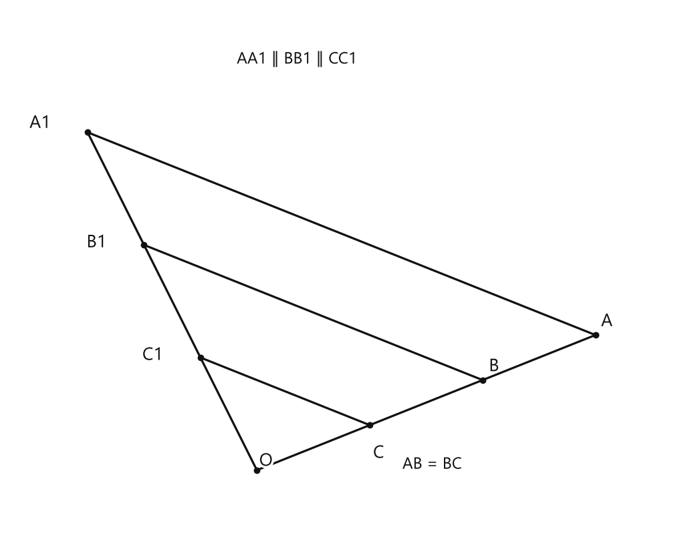
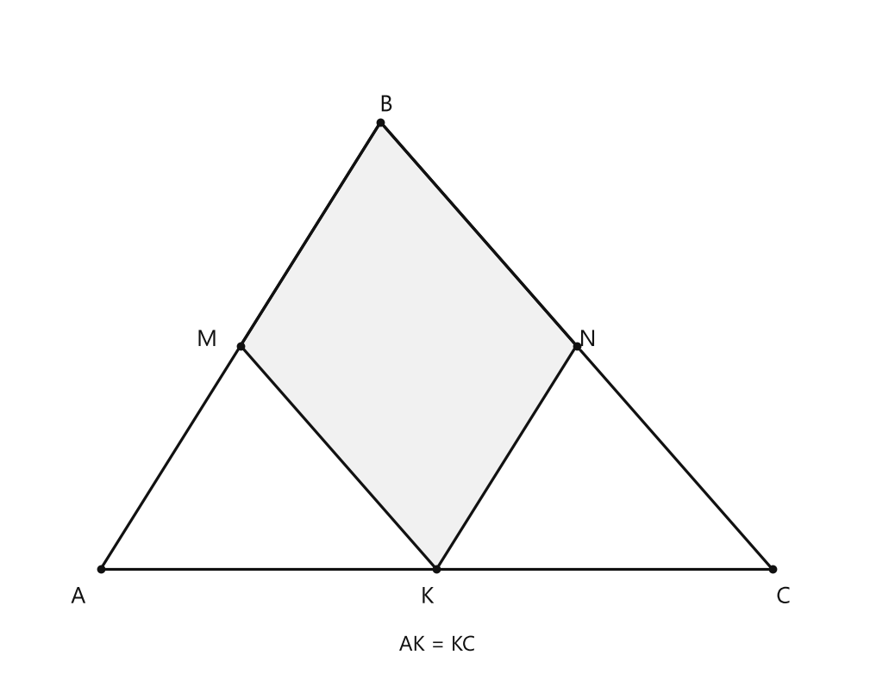
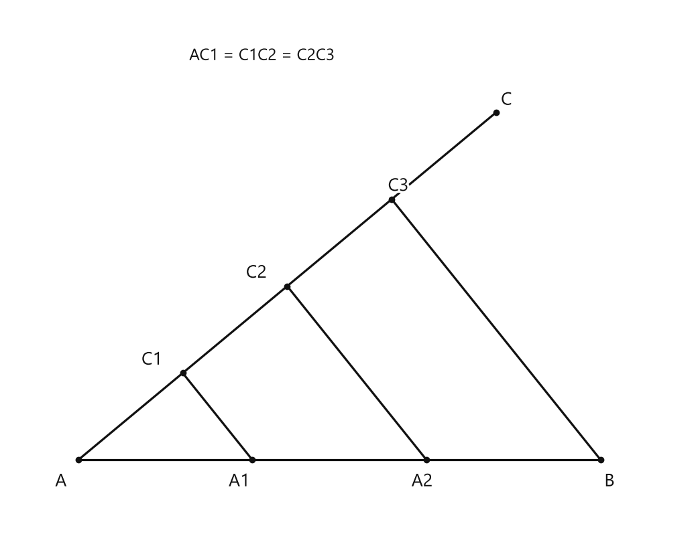
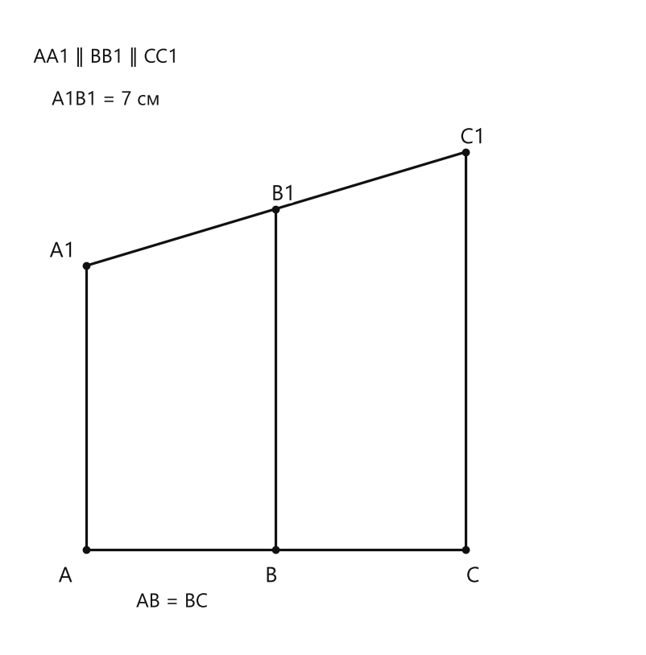
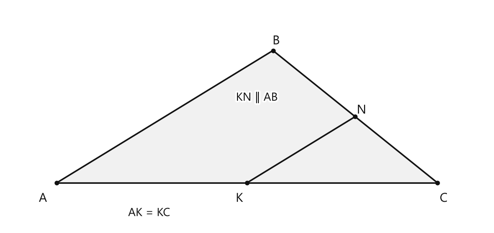
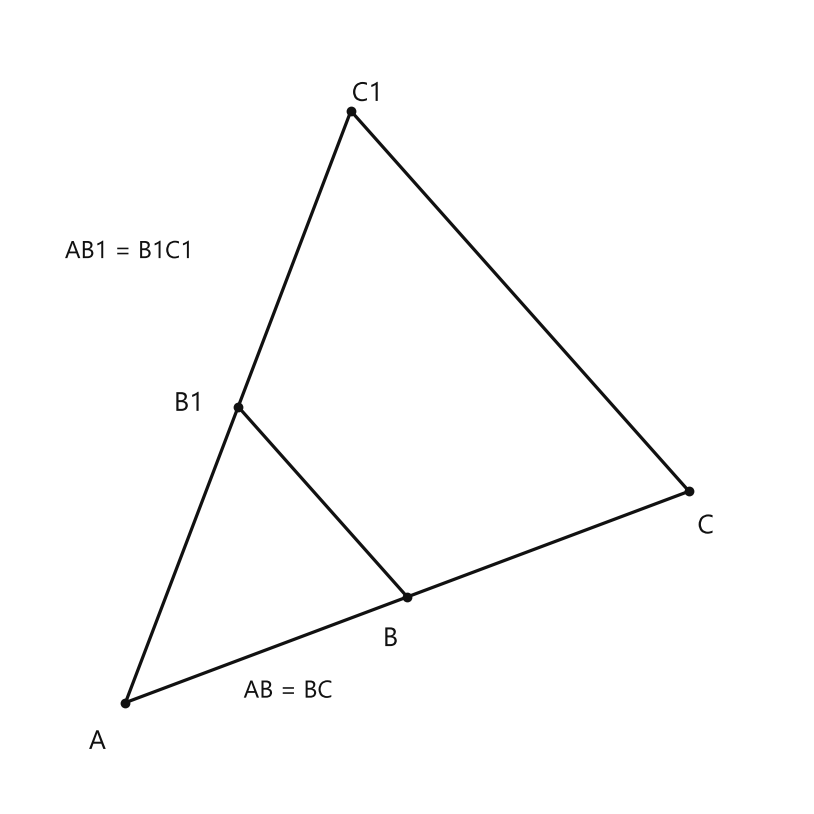

# Занятие 7. Теорема Фалеса

**Раздел:** Глава 1. Четырехугольники  
**Параграф учебника:** §7. Теорема Фалеса  
**Страницы:** 54–56

## Цели занятия

После занятия ты умеешь:

- узнавать на рисунке ситуацию, к которой применяется теорема Фалеса;
- находить равные отрезки на сторонах угла или треугольника;
- применять теорему Фалеса при работе с параллелограммом;
- использовать обратную теорему Фалеса;
- делить отрезок на несколько равных частей с помощью циркуля и линейки;
- составлять периметр фигуры из найденных отрезков.

Выбери блок своего уровня:

- **1–2 балла:** понять формулировку теоремы и найти равные отрезки;
- **3–4 балла:** решать задачи на один шаг;
- **5–6 баллов:** применять теорему в треугольнике и параллелограмме;
- **7–8 баллов:** выполнять построение деления отрезка;
- **9–10 баллов:** решать составные задачи и объяснять каждый переход.

## Теория к занятию

### Теорема Фалеса

#### Простыми словами

Рассмотрим угол. На одной его стороне от вершины откладываем равные отрезки. Затем через их концы проводим параллельные прямые.

Эти параллельные прямые пересекают вторую сторону угла. Теорема Фалеса говорит: на второй стороне тоже получатся равные отрезки.

Например, было:

- $AB = BC$;

через точки $A$, $B$, $C$ провели параллельные прямые:

- $AA_1 \parallel BB_1 \parallel CC_1$.

Тогда на второй стороне угла:

- $A_1B_1 = B_1C_1$.

Параллельные прямые как будто аккуратно переносят равенство отрезков с одной стороны угла на другую. Геометрический «копировальный аппарат» работает, но только при наличии параллельности.

#### Теорема

> Если на одной стороне угла отложить равные отрезки и через их концы провести параллельные прямые, пересекающие другую сторону угла, то на другой стороне угла отложатся равные отрезки.

<!--geo-figure-spec
{
  "needed": true,
  "kind": "plane",
  "caption": "Теорема Фалеса",
  "equal": true,
  "axis": false,
  "xlim": [
    -2.2,
    3.8
  ],
  "ylim": [
    -0.5,
    4.1
  ],
  "points": {
    "O": [
      0,
      0
    ],
    "C": [
      1,
      0.4
    ],
    "B": [
      2,
      0.8
    ],
    "A": [
      3,
      1.2
    ],
    "C1": [
      -0.5,
      1
    ],
    "B1": [
      -1,
      2
    ],
    "A1": [
      -1.5,
      3
    ]
  },
  "segments": [
    [
      "O",
      "C"
    ],
    [
      "C",
      "B"
    ],
    [
      "B",
      "A"
    ],
    [
      "O",
      "C1"
    ],
    [
      "C1",
      "B1"
    ],
    [
      "B1",
      "A1"
    ],
    [
      "C",
      "C1"
    ],
    [
      "B",
      "B1"
    ],
    [
      "A",
      "A1"
    ]
  ],
  "polygons": [],
  "circles": [],
  "labels": {
    "C": {
      "dx": 0.08,
      "dy": -0.25
    },
    "B": {
      "dx": 0.1,
      "dy": 0.12
    },
    "A": {
      "dx": 0.1,
      "dy": 0.12
    },
    "C1": {
      "dx": -0.42,
      "dy": 0.02
    },
    "B1": {
      "dx": -0.42,
      "dy": 0.02
    },
    "A1": {
      "dx": -0.42,
      "dy": 0.08
    }
  },
  "right_angles": [],
  "angle_marks": [],
  "texts": [
    {
      "xy": [
        1.55,
        0.05
      ],
      "text": "AB = BC"
    },
    {
      "xy": [
        0.35,
        3.65
      ],
      "text": "AA1 ∥ BB1 ∥ CC1"
    }
  ]
}
-->

*Теорема Фалеса*

#### Формулы

Если на одной стороне угла отложены равные отрезки:

$$AB = BC,$$

а через их концы проведены параллельные прямые, то на другой стороне:

$$A_1B_1 = B_1C_1.$$

Если равных отрезков несколько, например

$$AB = BC = CD,$$

то соответствующие отрезки на другой стороне также равны:

$$A_1B_1 = B_1C_1 = C_1D_1.$$

Буквы обозначают точки. Запись $A_1B_1$ обозначает длину отрезка между точками $A_1$ и $B_1$.

#### Правила

- Сначала найди параллельные прямые.
- Затем посмотри, какие последовательные отрезки на одной стороне угла равны.
- Равные отрезки должны идти друг за другом.
- После этого по теореме Фалеса запиши равенство соответствующих отрезков на другой стороне.
- Теорема может работать не только со сторонами угла, но и с двумя произвольными пересекающимися прямыми.

#### Алгоритм применения

1. Найди две стороны угла или две пересекающиеся прямые.
2. Найди параллельные прямые, которые пересекают эти стороны.
3. Проверь равенство последовательных отрезков на одной стороне.
4. По теореме Фалеса запиши равенство соответствующих отрезков на другой стороне.
5. Используй полученное равенство для вычисления неизвестной длины.

#### Ловушки

- Если прямые не параллельны, теорему Фалеса применять нельзя.
- Равенство отрезков должно быть дано в условии или доказано.
- Не перепутай соответствующие отрезки.
- Равные отрезки должны быть расположены последовательно. Просто «два одинаковых кусочка где-то на рисунке» ещё не дают нужного вывода.

---

### Обратная теорема Фалеса

#### Простыми словами

В обычной теореме Фалеса сначала известна параллельность, а затем мы получаем равенство отрезков.

В обратной теореме всё наоборот: равенство отрезков уже дано, а нужно сделать вывод о параллельности прямых.

Но есть обязательное условие: равные отрезки на каждой стороне угла должны быть отложены **от вершины угла**. Если начать откладывать их не от вершины, вывод может оказаться неверным. Геометрия порядок любит почти так же сильно, как учебник любит нумерацию.

#### Теорема

> Если на сторонах угла от его вершины отложить равные отрезки ($AB = BC$, $AB_1 = B_1C_1$), то прямые, проходящие через их концы, будут параллельны ($BB_1 \parallel CC_1$).

#### Формулы

Если

$$AB = BC$$

и

$$AB_1 = B_1C_1,$$

то

$$BB_1 \parallel CC_1.$$

#### Правила

- Равные отрезки должны откладываться от одной вершины угла.
- На каждой стороне угла сравниваются соседние последовательные отрезки.
- Только после проверки этих условий можно сделать вывод о параллельности соответствующих прямых.

#### Алгоритм

1. Найди вершину угла.
2. Проверь, что равные отрезки начинаются от этой вершины.
3. Проверь равенство последовательных отрезков на первой стороне.
4. Проверь равенство последовательных отрезков на второй стороне.
5. Проведи или рассмотри прямые через соответствующие концы отрезков.
6. Сделай вывод об их параллельности по обратной теореме Фалеса.

#### Ловушки

- Равные отрезки, отложенные не от вершины, не гарантируют параллельность.
- Нельзя применять обратную теорему только потому, что на рисунке «похоже».
- Нужно отдельно проверить равенства на каждой стороне угла.

---

### Теорема Фалеса в треугольнике

#### Простыми словами

Две стороны треугольника образуют угол. Поэтому теорему Фалеса можно применять внутри треугольника.

Пусть $K$ — середина стороны $AC$. Это значит:

$$AK = KC.$$

Если через $K$ провести прямую, параллельную стороне $AB$, то она пересечёт сторону $BC$ в такой точке $N$, что:

$$BN = NC.$$

То есть середина одной стороны помогает найти середину другой. Половинки словно договариваются между собой: «Раз у тебя поровну, то и у меня поровну».

#### Факт

Если

$$AK = KC$$

и

$$KN \parallel AB,$$

то

$$BN = NC.$$

Если

$$AK = KC$$

и

$$KM \parallel BC,$$

то

$$AM = MB.$$

#### Формулы

Если $K$ — середина $AC$, то

$$AC = 2AK = 2KC.$$

Если $N$ — середина $BC$, то

$$BC = 2BN = 2NC.$$

Если $M$ — середина $AB$, то

$$AB = 2AM = 2MB.$$

#### Правила

- Слово «середина» означает два равных отрезка.
- Параллельность позволяет применить теорему Фалеса.
- Если известна половина стороны, всю сторону найдём умножением на $2$.
- Если известна вся сторона и нужно найти половину, делим на $2$.

#### Ловушки

- Не путай середину стороны с произвольной точкой.
- Если $K$ — середина $AC$, то $AK = KC$, а не $AK = AC$.
- Периметр треугольника — это сумма длин всех трёх его сторон.

---

### Деление отрезка на $n$ равных частей

#### Простыми словами

Чтобы разделить отрезок $AB$ на три равные части, построим вспомогательный луч из точки $A$.

На этом луче циркулем отложим три одинаковых отрезка. Затем последний конец получившейся цепочки соединим с точкой $B$. Через промежуточные точки проведём прямые, параллельные соединённому отрезку.

По теореме Фалеса эти параллельные прямые разделят исходный отрезок на три равные части. Параллельность снова берёт работу на себя — но только если всё построено аккуратно.

#### Алгоритм

Пусть дан отрезок $AB$.

1. Провести из точки $A$ произвольный луч $AC$.
2. С помощью циркуля отложить на нём три равных отрезка:

   $$AC_1 = C_1C_2 = C_2C_3.$$

3. Соединить точки $C_3$ и $B$.
4. Через точку $C_1$ провести прямую, параллельную $C_3B$.
5. Через точку $C_2$ провести прямую, параллельную $C_3B$.
6. Обозначить точки пересечения этих прямых с $AB$ через $A_1$ и $A_2$.
7. По теореме Фалеса получить:

   $$AA_1 = A_1A_2 = A_2B.$$

Для деления отрезка на $n$ равных частей на вспомогательном луче нужно отложить $n$ равных отрезков.

#### Ловушки

- Все отрезки на вспомогательном луче должны быть равными.
- Параллельные прямые проводят через промежуточные точки.
- С точкой $B$ соединяют именно последнюю точку $C_3$.
- Если одна из построенных прямых не параллельна нужной, равного деления не получится. Один «почти параллельный» — и математика уже заметила подвох.

---

### Сводка формул «выучить наизусть»

Если

$$AB = BC$$

и

$$AA_1 \parallel BB_1 \parallel CC_1,$$

то

$$A_1B_1 = B_1C_1.$$

Если

$$AK = KC$$

и

$$KN \parallel AB,$$

то

$$BN = NC.$$

Если

$$AK = KC$$

и

$$KM \parallel BC,$$

то

$$AM = MB.$$

Для середины отрезка:

$$AC = 2AK,$$

$$BC = 2BN,$$

$$AB = 2AM.$$

При делении отрезка на три равные части:

$$AA_1 = A_1A_2 = A_2B.$$

### Правила, которые нельзя путать

- Теорема Фалеса: равные отрезки на одной стороне и параллельные прямые дают равные отрезки на другой стороне.
- Обратная теорема Фалеса: равные отрезки, отложенные от вершины угла, дают параллельность соответствующих прямых.
- В прямой теореме сначала известна параллельность.
- В обратной теореме параллельность нужно доказать.
- «Середина» означает два равных отрезка.
- Периметр — сумма длин всех сторон фигуры.

## Разбор ключевых заданий

### Р1. Применение теоремы Фалеса в параллелограмме

**Условие.** Точка $K$ — середина стороны $AC$ треугольника $ABC$, $MBNK$ — параллелограмм. Периметр параллелограмма равен $34$ см, сторона $AC = 16$ см. Найдите периметр треугольника $ABC$.

<!--geo-figure-spec
{
  "needed": true,
  "kind": "plane",
  "caption": "Треугольник ABC и параллелограмм MBNK",
  "equal": true,
  "axis": false,
  "xlim": [
    -0.8,
    7
  ],
  "ylim": [
    -1,
    5
  ],
  "points": {
    "A": [
      0,
      0
    ],
    "C": [
      6,
      0
    ],
    "B": [
      2.5,
      4
    ],
    "K": [
      3,
      0
    ],
    "M": [
      1.25,
      2
    ],
    "N": [
      4.25,
      2
    ]
  },
  "segments": [
    [
      "A",
      "B"
    ],
    [
      "B",
      "C"
    ],
    [
      "C",
      "A"
    ],
    [
      "M",
      "B"
    ],
    [
      "B",
      "N"
    ],
    [
      "N",
      "K"
    ],
    [
      "K",
      "M"
    ]
  ],
  "polygons": [
    {
      "vertices": [
        "M",
        "B",
        "N",
        "K"
      ],
      "fill": 0.06
    }
  ],
  "circles": [],
  "labels": {
    "A": {
      "dx": -0.2,
      "dy": -0.25
    },
    "B": {
      "dx": 0.05,
      "dy": 0.15
    },
    "C": {
      "dx": 0.1,
      "dy": -0.25
    },
    "K": {
      "dx": -0.08,
      "dy": -0.25
    },
    "M": {
      "dx": -0.3,
      "dy": 0.05
    },
    "N": {
      "dx": 0.1,
      "dy": 0.05
    }
  },
  "right_angles": [],
  "angle_marks": [],
  "texts": [
    {
      "xy": [
        3,
        -0.68
      ],
      "text": "AK = KC"
    }
  ]
}
-->

*Треугольник ABC и параллелограмм MBNK*

**Решение.**

Так как $MBNK$ — параллелограмм, его противоположные стороны параллельны:

$$KN \parallel MB,$$

$$KM \parallel BN.$$

Точка $K$ — середина $AC$, поэтому:

$$AK = KC.$$

Так как сторона $MB$ лежит на прямой $AB$, из равенства $KN \parallel MB$ получаем:

$$KN \parallel AB.$$

Теперь у нас есть:

- $AK = KC$;
- $KN \parallel AB$.

По теореме Фалеса:

$$BN = NC.$$

Значит, $BN$ — половина стороны $BC$:

$$BC = 2BN.$$

Также $KM \parallel BN$, а сторона $BN$ лежит на прямой $BC$. Поэтому:

$$KM \parallel BC.$$

Используем теорему Фалеса ещё раз:

$$AM = MB.$$

Значит:

$$AB = 2MB.$$

Периметр параллелограмма равен сумме его сторон:

$$P_{MBNK} = MB + BN + NK + KM.$$

В параллелограмме противоположные стороны равны:

$$NK = MB,$$

$$KM = BN.$$

Подставим эти равенства:

$$P_{MBNK} = MB + BN + MB + BN.$$

$$P_{MBNK} = 2MB + 2BN.$$

По условию:

$$2MB + 2BN = 34.$$

Но

$$AB = 2MB,$$

а

$$BC = 2BN.$$

Следовательно:

$$AB + BC = 34.$$

Периметр треугольника равен:

$$P_{ABC} = AB + BC + AC.$$

Подставим известные значения:

$$P_{ABC} = 34 + 16.$$

$$P_{ABC} = 50\text{ см}.$$

**Ответ: $50$ см.**

*Типичная ловушка: периметр параллелограмма не равен просто $AB + BC$. Но здесь две пары его сторон как раз составляют стороны треугольника, поэтому после удвоения получаем $AB + BC = 34$ см.*

---

### Р2. Деление отрезка на три равные части

**Условие.** С помощью циркуля и линейки разделите данный отрезок $AB$ на три равные части.

<!--geo-figure-spec
{
  "needed": true,
  "kind": "plane",
  "caption": "Деление отрезка AB на три равные части",
  "equal": true,
  "axis": false,
  "xlim": [
    -0.8,
    7
  ],
  "ylim": [
    -0.8,
    5.2
  ],
  "points": {
    "A": [
      0,
      0
    ],
    "B": [
      6,
      0
    ],
    "C": [
      4.8,
      4
    ],
    "C1": [
      1.2,
      1
    ],
    "C2": [
      2.4,
      2
    ],
    "C3": [
      3.6,
      3
    ],
    "A1": [
      2,
      0
    ],
    "A2": [
      4,
      0
    ]
  },
  "segments": [
    [
      "A",
      "B"
    ],
    [
      "A",
      "C1"
    ],
    [
      "C1",
      "C2"
    ],
    [
      "C2",
      "C3"
    ],
    [
      "C3",
      "C"
    ],
    [
      "C3",
      "B"
    ],
    {
      "points": [
        "C1",
        "A1"
      ],
      "dashed": false,
      "label": "",
      "t": 0.5
    },
    {
      "points": [
        "C2",
        "A2"
      ],
      "dashed": false,
      "label": "",
      "t": 0.5
    }
  ],
  "polygons": [],
  "circles": [],
  "labels": {
    "A": {
      "dx": -0.2,
      "dy": -0.25
    },
    "B": {
      "dx": 0.1,
      "dy": -0.25
    },
    "C": {
      "dx": 0.12,
      "dy": 0.14
    },
    "C1": {
      "dx": -0.35,
      "dy": 0.15
    },
    "C2": {
      "dx": -0.35,
      "dy": 0.15
    },
    "C3": {
      "dx": 0.08,
      "dy": 0.15
    },
    "A1": {
      "dx": -0.15,
      "dy": -0.25
    },
    "A2": {
      "dx": -0.05,
      "dy": -0.25
    }
  },
  "right_angles": [],
  "angle_marks": [],
  "texts": [
    {
      "xy": [
        2.1,
        4.65
      ],
      "text": "AC1 = C1C2 = C2C3"
    }
  ]
}
-->

*Деление отрезка AB на три равные части*

**Решение.**

Пусть дан отрезок $AB$.

Проведём из точки $A$ произвольный луч $AC$.

С помощью циркуля отложим на луче три равных отрезка:

$$AC_1 = C_1C_2 = C_2C_3.$$

Соединим точку $C_3$ с точкой $B$.

Через точку $C_1$ проведём прямую, параллельную $C_3B$.

Через точку $C_2$ проведём прямую, параллельную $C_3B$.

Пусть эти прямые пересекают отрезок $AB$ в точках $A_1$ и $A_2$.

На луче $AC$ отложены равные последовательные отрезки:

$$AC_1 = C_1C_2 = C_2C_3.$$

Проведённые прямые параллельны:

$$A_1C_1 \parallel A_2C_2 \parallel BC_3.$$

По теореме Фалеса соответствующие отрезки на $AB$ равны:

$$AA_1 = A_1A_2 = A_2B.$$

Следовательно, отрезок $AB$ разделён на три равные части.

**Ответ: $AA_1 = A_1A_2 = A_2B$.**

---

### Р3. Нахождение длины отрезка по равенству частей

**Условие.** Через точки $A$, $B$ и $C$ одной прямой проведены параллельные прямые, пересекающие другую прямую в точках $A_1$, $B_1$ и $C_1$. Известно, что $AB = BC$ и $A_1B_1 = 7$ см. Найдите $B_1C_1$.

<!--geo-figure-spec
{
  "needed": true,
  "kind": "plane",
  "caption": "Параллельные прямые переносят равенство отрезков",
  "equal": true,
  "axis": false,
  "xlim": [
    -0.8,
    5.8
  ],
  "ylim": [
    -1,
    5.7
  ],
  "points": {
    "A": [
      0,
      0
    ],
    "B": [
      2,
      0
    ],
    "C": [
      4,
      0
    ],
    "A1": [
      0,
      3
    ],
    "B1": [
      2,
      3.6
    ],
    "C1": [
      4,
      4.2
    ]
  },
  "segments": [
    [
      "A",
      "B"
    ],
    [
      "B",
      "C"
    ],
    [
      "A1",
      "B1"
    ],
    [
      "B1",
      "C1"
    ],
    [
      "A",
      "A1"
    ],
    [
      "B",
      "B1"
    ],
    [
      "C",
      "C1"
    ]
  ],
  "polygons": [],
  "circles": [],
  "labels": {
    "A": {
      "dx": -0.22,
      "dy": -0.28
    },
    "B": {
      "dx": -0.05,
      "dy": -0.28
    },
    "C": {
      "dx": 0.08,
      "dy": -0.28
    },
    "A1": {
      "dx": -0.25,
      "dy": 0.15
    },
    "B1": {
      "dx": 0.08,
      "dy": 0.15
    },
    "C1": {
      "dx": 0.08,
      "dy": 0.15
    }
  },
  "right_angles": [],
  "angle_marks": [],
  "texts": [
    {
      "xy": [
        0.9,
        -0.55
      ],
      "text": "AB = BC"
    },
    {
      "xy": [
        0.2,
        4.75
      ],
      "text": "A1B1 = 7 см"
    },
    {
      "xy": [
        0.2,
        5.2
      ],
      "text": "AA1 ∥ BB1 ∥ CC1"
    }
  ]
}
-->

*Параллельные прямые переносят равенство отрезков*

**Решение.**

По условию:

$$AB = BC.$$

Через точки $A$, $B$ и $C$ проведены параллельные прямые.

Значит, выполнено условие теоремы Фалеса.

По теореме Фалеса соответствующие отрезки на другой прямой равны:

$$A_1B_1 = B_1C_1.$$

Из условия:

$$A_1B_1 = 7\text{ см}.$$

Поэтому:

$$B_1C_1 = 7\text{ см}.$$

**Ответ: $7$ см.**

*Здесь всё по инструкции: равные отрезки на одной прямой и параллельные линии дают равные отрезки на другой. Геометрия без фокусов — только порядок действий.*

---

### Р4. Периметр треугольника с серединой стороны

**Условие.** В треугольнике $ABC$ точка $K$ — середина стороны $AC$, $AC = 18$ см. Через $K$ проведена прямая $KN$, параллельная $AB$, где $N$ лежит на стороне $BC$. Известно, что $BN = 5$ см и $AB = 12$ см. Найдите периметр треугольника $ABC$.

<!--geo-figure-spec
{
  "needed": true,
  "kind": "plane",
  "caption": "Середина стороны треугольника",
  "equal": true,
  "axis": false,
  "xlim": [
    -0.8,
    6.8
  ],
  "ylim": [
    -0.7,
    2.8
  ],
  "points": {
    "A": [
      0,
      0
    ],
    "C": [
      6,
      0
    ],
    "B": [
      3.4074,
      2.0951
    ],
    "K": [
      3,
      0
    ],
    "N": [
      4.7037,
      1.0476
    ]
  },
  "segments": [
    [
      "A",
      "B"
    ],
    [
      "B",
      "C"
    ],
    [
      "C",
      "A"
    ],
    [
      "K",
      "N"
    ]
  ],
  "polygons": [
    {
      "vertices": [
        "A",
        "B",
        "C"
      ],
      "fill": 0.06
    }
  ],
  "circles": [],
  "labels": {
    "A": {
      "dx": -0.22,
      "dy": -0.25
    },
    "B": {
      "dx": 0.05,
      "dy": 0.15
    },
    "C": {
      "dx": 0.1,
      "dy": -0.25
    },
    "K": {
      "dx": -0.12,
      "dy": -0.25
    },
    "N": {
      "dx": 0.1,
      "dy": 0.1
    }
  },
  "right_angles": [],
  "angle_marks": [],
  "texts": [
    {
      "xy": [
        1.45,
        -0.48
      ],
      "text": "AK = KC"
    },
    {
      "xy": [
        3.15,
        1.35
      ],
      "text": "KN ∥ AB"
    }
  ]
}
-->

*Середина стороны треугольника*

**Решение.**

Точка $K$ — середина стороны $AC$.

Поэтому:

$$AK = KC.$$

По условию:

$$KN \parallel AB.$$

На стороне $BC$ точка $N$ делит отрезок так, что по теореме Фалеса:

$$BN = NC.$$

Из условия:

$$BN = 5\text{ см}.$$

Значит:

$$NC = 5\text{ см}.$$

Сторона $BC$ состоит из двух отрезков:

$$BC = BN + NC.$$

Подставим известные длины:

$$BC = 5 + 5.$$

$$BC = 10\text{ см}.$$

Теперь найдём периметр треугольника:

$$P_{ABC} = AB + BC + AC.$$

Подставим значения:

$$P_{ABC} = 12 + 10 + 18.$$

$$P_{ABC} = 40\text{ см}.$$

**Ответ: $40$ см.**

---

### Р5. Обратная теорема Фалеса

**Условие.** На сторонах угла с вершиной $A$ отложены отрезки $AB$, $BC$ и $AB_1$, $B_1C_1$. Известно, что

$$AB = BC$$

и

$$AB_1 = B_1C_1.$$

Докажите, что

$$BB_1 \parallel CC_1.$$

<!--geo-figure-spec
{
  "needed": true,
  "kind": "plane",
  "caption": "Обратная теорема Фалеса",
  "equal": true,
  "axis": false,
  "xlim": [
    -0.8,
    4.8
  ],
  "ylim": [
    -0.7,
    4.9
  ],
  "points": {
    "A": [
      0,
      0
    ],
    "B": [
      2,
      0.75
    ],
    "C": [
      4,
      1.5
    ],
    "B1": [
      0.8,
      2.1
    ],
    "C1": [
      1.6,
      4.2
    ]
  },
  "segments": [
    [
      "A",
      "B"
    ],
    [
      "B",
      "C"
    ],
    [
      "A",
      "B1"
    ],
    [
      "B1",
      "C1"
    ],
    [
      "B",
      "B1"
    ],
    [
      "C",
      "C1"
    ]
  ],
  "polygons": [],
  "circles": [],
  "labels": {
    "A": {
      "dx": -0.2,
      "dy": -0.28
    },
    "B": {
      "dx": -0.12,
      "dy": -0.3
    },
    "C": {
      "dx": 0.12,
      "dy": -0.25
    },
    "B1": {
      "dx": -0.35,
      "dy": 0.02
    },
    "C1": {
      "dx": 0.12,
      "dy": 0.12
    }
  },
  "right_angles": [],
  "angle_marks": [],
  "texts": [
    {
      "xy": [
        1.15,
        0.08
      ],
      "text": "AB = BC"
    },
    {
      "xy": [
        0.02,
        3.2
      ],
      "text": "AB1 = B1C1"
    }
  ]
}
-->

*Обратная теорема Фалеса*

**Решение.**

Рассмотрим две стороны угла с вершиной $A$.

На первой стороне от вершины $A$ отложены последовательные отрезки $AB$ и $BC$.

По условию:

$$AB = BC.$$

На второй стороне от вершины $A$ отложены последовательные отрезки $AB_1$ и $B_1C_1$.

По условию:

$$AB_1 = B_1C_1.$$

Равные отрезки на обеих сторонах угла отложены именно от его вершины $A$.

Значит, можно применить обратную теорему Фалеса.

По обратной теореме Фалеса прямые, проходящие через соответствующие концы этих отрезков, параллельны.

Следовательно:

$$BB_1 \parallel CC_1.$$

**Ответ: $BB_1 \parallel CC_1$.**

*Условие «от вершины $A$» здесь обязательно. Если равные отрезки отложить не от вершины, параллельность может не получиться.*

## Практические задания

Выбери свой уровень и решай только этот блок. В блоке должна закрепиться вся тема параграфа. Ответы не приводятся.

### Уровень 1–2 балла

**С1.** Выберите верное продолжение теоремы Фалеса: если на одной стороне угла отложить равные отрезки и через их концы провести параллельные прямые, пересекающие другую сторону угла, то на другой стороне угла отложатся…

1) равные отрезки 2) перпендикулярные отрезки 3) отрезки разной длины 4) только два равных отрезка 5) отрезки, сумма которых равна первой стороне

**С2.** На сторонах угла от вершины $O$ отложены отрезки $OA=AB=BC$. Через точки $A$, $B$ и $C$ проведены параллельные прямые, пересекающие вторую сторону угла в точках $A_1$, $B_1$ и $C_1$. Запишите равенство отрезков, которое следует из теоремы Фалеса.

**С3.** На одной стороне угла последовательно отложены равные отрезки длиной $4$ см. Через их концы проведены параллельные прямые, пересекающие другую сторону угла. Сколько сантиметров составляет каждый из получившихся отрезков на другой стороне угла, если первый из них равен $7$ см?

**С4.** На сторонах угла от вершины $O$ отложены отрезки $OA=AB=6$ см и $OA_1=A_1B_1$. Прямые $AA_1$ и $BB_1$ проведены через соответствующие концы отрезков. Как расположены прямые $AA_1$ и $BB_1$ согласно обратной теореме Фалеса?

1) Пересекаются под прямым углом 2) Параллельны 3) Совпадают 4) Перпендикулярны сторонам угла 5) Нельзя определить

**С5.** Отрезок $AB$ разделили точками $C$ и $D$ на три равные части. Длина отрезка $AB$ равна $24$ см. Найдите длину каждого из отрезков $AC$, $CD$ и $DB$.

**С6.** Из вершины угла $O$ на одной его стороне отложены равные отрезки $OA=AB=BC=CD$. Через точки $A$, $B$, $C$ и $D$ проведены параллельные прямые до пересечения со второй стороной угла. На второй стороне получены точки $A_1$, $B_1$, $C_1$ и $D_1$. Укажите равенство, которое обязательно выполняется.

1) $OA_1=A_1B_1=B_1C_1=C_1D_1$ 2) $OA_1=2A_1B_1$ 3) $A_1B_1=B_1C_1+C_1D_1$ 4) $OA_1=A_1B_1+C_1D_1$ 5) $A_1B_1=2B_1C_1$

**С7.** В треугольнике $ABC$ точка $M$ — середина стороны $AB$, а через точку $M$ проведена прямая $MN$, параллельная стороне $AC$ и пересекающая сторону $BC$ в точке $N$. Если $BN=5$ см, найдите длину отрезка $NC$.

**С8.** В треугольнике $ABC$ точки $M$ и $N$ лежат соответственно на сторонах $AB$ и $AC$. Известно, что $AM=MB$ и $AN=NC$. Как расположена прямая $MN$ относительно стороны $BC$?

1) $MN\parallel BC$ 2) $MN\perp BC$ 3) $MN$ совпадает с $BC$ 4) $MN\parallel AB$ 5) Положение определить нельзя

**С9.** В треугольнике $ABC$ точки $M$ и $N$ лежат на сторонах $AB$ и $AC$, причём $AM=MB=4$ см и $AN=NC=6$ см. Через точку $M$ проведена прямая, параллельная $BC$, пересекающая $AC$ в точке $N_1$. Найдите длину отрезка $AN_1$.

**С10.** Отрезок $AB$ необходимо разделить на 4 равные части с помощью циркуля и линейки. Из вершины $A$ проведите дополнительный луч и отложите на нём четыре равных отрезка $AA_1=A_1A_2=A_2A_3=A_3A_4$. Какую прямую следует провести через точку $A_4$, чтобы затем построить точки деления на отрезке $AB$?

1) Прямую, параллельную $AB$ 2) Прямую, перпендикулярную $AB$ 3) Произвольную прямую через $A_4$ 4) Прямую через $A_4$ и $B$ 5) Прямую через $A_4$ и $A$

**С11.** В угле с вершиной $O$ на одной стороне отложены равные отрезки $OA=AB=BC$. Через точки $A$, $B$ и $C` проведены параллельные прямые, пересекающие вторую сторону угла в точках $A_1$, $B_1$ и $C_1$. Если $A_1B_1=3$ см, найдите длину отрезка $B_1C_1$.

**С12.** В треугольнике $ABC$ точки $M$ и $N$ лежат соответственно на сторонах $AB$ и $AC$. Известно, что $AM=3$ см, $MB=6$ см, $AN=4$ см и $NC=8$ см. Через точки $M$ и $N$ проведена прямая $MN$. Параллельна ли она стороне $BC$? Укажите ответ «да» или «нет».

**С13.** На одной стороне угла отложены равные отрезки $AB=BC=CD$. Через точки $B$, $C$ и $D$ проведены параллельные прямые, пересекающие другую сторону угла в точках $B_1$, $C_1$ и $D_1$. Выберите верное утверждение.

1) $AB_1=B_1C_1=C_1D_1$  
2) $AB_1=2B_1C_1$  
3) $AB_1=B_1C_1+C_1D_1$  
4) $AB_1>C_1D_1$  
5) $AB_1<B_1C_1$

**С14.** На сторонах угла от его вершины отложены отрезки $AB=BC$ и $AB_1=B_1C_1$. Прямые $BB_1$ и $CC_1$ проведены через концы соответствующих отрезков. Выберите верное утверждение.

1) $BB_1\perp CC_1$  
2) $BB_1\parallel CC_1$  
3) $BB_1=CC_1$  
4) $BB_1$ и $CC_1$ пересекаются в вершине угла  
5) Недостаточно данных для определения взаимного положения прямых

**С15.** На одной стороне угла отложены равные отрезки $AB=BC=CD=4$ см. Через точки $B$, $C$ и $D$ проведены параллельные прямые, пересекающие другую сторону угла в точках $B_1$, $C_1$ и $D_1$. Найдите длину отрезка $C_1D_1$, если $AB_1=4$ см.

**С16.** На одной стороне угла отложены равные отрезки $AB=BC=CD$. Через точки $B$, $C$ и $D$ проведены параллельные прямые, пересекающие другую сторону угла в точках $B_1$, $C_1$ и $D_1$. Известно, что $B_1C_1=7$ см. Найдите длину отрезка $A B_1$, если $A$ — вершина угла.

**С17.** Прямые $a$, $b$ и $c$ параллельны. Они пересекают одну секущую в точках $A$, $B$, $C$, а другую — в точках $A_1$, $B_1$, $C_1$. Известно, что $AB=BC$. Выберите верное утверждение.

1) $A_1B_1=B_1C_1$  
2) $A_1B_1=2B_1C_1$  
3) $A_1B_1>B_1C_1$  
4) $A_1B_1<B_1C_1$  
5) Равенство отрезков установить нельзя

**С18.** Параллельные прямые $a$, $b$, $c$ пересекают две секущие. На первой секущей отрезки между соседними параллельными прямыми равны $5$ см и $5$ см. Найдите длину второго из соответствующих отрезков на второй секущей, если первый равен $8$ см.

**С19.** Параллельные прямые $a$, $b$, $c$ пересекают две секущие в точках $A$, $B$, $C$ и $A_1$, $B_1$, $C_1$ соответственно. Известно, что $AB=6$ см, $BC=9$ см и $A_1B_1=4$ см. Найдите длину $B_1C_1$.

**С20.** Параллельные прямые $a$, $b$, $c$ пересекают две секущие в точках $A$, $B$, $C$ и $A_1$, $B_1$, $C_1$ соответственно. Известно, что $AB=8$ см, $BC=12$ см и $A_1C_1=15$ см. Найдите длину отрезка $A_1B_1$.

**С21.** На сторонах угла от его вершины отложены равные отрезки $AB=BC$ и $AB_1=B_1C_1$. Через точки $B$ и $B_1$, а также через точки $C$ и $C_1$ проведены прямые. Выберите верное утверждение.

1) Прямые $BB_1$ и $CC_1$ параллельны  
2) Прямые $BB_1$ и $CC_1$ перпендикулярны  
3) Прямые $BB_1$ и $CC_1$ совпадают  
4) Прямые $BB_1$ и $CC_1$ пересекаются в середине отрезка $BC$  
5) Параллельность этих прямых зависит только от величины угла

**С22.** На сторонах угла выбраны точки $B$, $C$ и $B_1$, $C_1$. Известно, что $AB=BC$, $AB_1=B_1C_1$, где $A$ — вершина угла. Какое условие необходимо добавить, чтобы применить обратную теорему Фалеса?

1) $AB=AB_1$  
2) Через соответствующие концы отрезков проведены прямые $BB_1$ и $CC_1$  
3) Угол является прямым  
4) Отрезки $BC$ и $B_1C_1$ перпендикулярны  
5) Точки $B$ и $C$ совпадают

**С23.** Отрезок $AB$ нужно разделить на $4$ равные части с помощью теоремы Фалеса. На вспомогательном луче из точки $A$ отмечены точки $C_1$, $C_2$, $C_3$, $C_4$ так, что $AC_1=C_1C_2=C_2C_3=C_3C_4$. Через точку $C_4$ проведена прямая, параллельная $C_1B$, пересекающая отрезок $AB$ в точке $B_4$. Выберите верное утверждение.

1) $AB_4=\dfrac14AB$  
2) $AB_4=\dfrac12AB$  
3) $AB_4=\dfrac34AB$  
4) $AB_4=AB$  
5) $AB_4=4AB$

**С24.** Отрезок $AB$ разделили на $5$ равных частей с помощью теоремы Фалеса. Длина всего отрезка $AB$ равна $35$ см. Найдите длину одной части.

**С25.** На одной стороне угла от вершины последовательно отложены равные отрезки $AB=BC=CD$. Через точки $B$, $C$ и $D$ проведены параллельные прямые, пересекающие другую сторону угла в точках $B_1$, $C_1$ и $D_1$. Выберите верное утверждение.  
1) $AB_1=B_1C_1=C_1D_1$  
2) $AB_1=2B_1C_1=C_1D_1$  
3) $AB_1=B_1C_1=2C_1D_1$  
4) $AB_1+B_1C_1=C_1D_1$  
5) $AB_1>B_1C_1>C_1D_1$

**С26.** На сторонах угла от его вершины отложены отрезки $AB=BC=6$ см и $AB_1=B_1C_1$. Через точки $B$ и $C$ проведены прямые, параллельные друг другу, пересекающие вторую сторону угла в точках $B_1$ и $C_1$. Выберите верное утверждение.  
1) Прямые $BB_1$ и $CC_1$ перпендикулярны  
2) Прямые $BB_1$ и $CC_1$ параллельны  
3) Прямые $BB_1$ и $CC_1$ совпадают  
4) Прямые $BB_1$ и $CC_1$ пересекаются в вершине угла  
5) Положение прямых определить нельзя

**С27.** Параллельные прямые пересекают стороны угла. На одной стороне угла они отсекают последовательно от вершины отрезки длиной $4$ см, $4$ см и $4$ см. Найдите длину среднего отрезка на другой стороне угла, если первый отрезок на этой стороне равен $7$ см.

**С28.** Прямые $a$, $b$ и $c$ параллельны и пересекают две стороны угла. На одной стороне угла отрезки между соседними прямыми имеют длины $5$ см и $8$ см. На другой стороне первый из соответствующих отрезков имеет длину $10$ см. Найдите длину второго соответствующего отрезка.

**С29.** Отрезок $AB$ нужно разделить на 3 равные части с помощью теоремы Фалеса. На вспомогательной лучевой линии из точки $A$ отложены последовательно равные отрезки $AA_1=A_1A_2=A_2A_3$. Через точку $A_3$ проведена прямая, параллельная прямой $A_1B$. Выберите верное утверждение.  
1) Прямая через $A_3$ не используется  
2) Точка пересечения этой прямой с $AB$ делит $AB$ пополам  
3) Точки пересечения через $A_1$ и $A_2$ делят $AB$ на 3 равные части  
4) Получается только один отрезок на $AB$  
5) Деление возможно только при $AA_1=2$ см

**С30.** На одной стороне угла отложены равные отрезки $AB=BC=CD=5$ см. Через точки $B$, $C$ и $D$ проведены параллельные прямые, пересекающие другую сторону угла в точках $B_1$, $C_1$ и $D_1$. Найдите длину $B_1C_1$, если $AB_1=4$ см.

**С31.** На двух пересекающихся прямых от точки $O$ отложены отрезки $OA=AB=6$ см и $OC=CD=9$ см. Через точки $A$ и $C$ проведена прямая, а через точки $B$ и $D$ — прямая, параллельная первой. Выберите верное утверждение.  
1) Прямые $AC$ и $BD$ параллельны  
2) Прямые $AC$ и $BD$ перпендикулярны  
3) Прямые $AC$ и $BD$ совпадают  
4) Прямые $AC$ и $BD$ пересекаются в точке $O$  
5) Параллельность установить нельзя

**С32.** Параллельные прямые пересекают стороны угла. На одной стороне угла от вершины отложены равные отрезки $3$ см, $3$ см и $3$ см. На другой стороне расстояние от вершины до первой параллельной прямой равно $5$ см. Найдите расстояние от вершины до третьей параллельной прямой.

**С33.** На сторонах угла от его вершины отложены отрезки $AB=BC=4$ см и $AB_1=B_1C_1=6$ см. Через точки $B$ и $C$ проведены прямые $BB_1$ и $CC_1$. Выберите верное утверждение.  
1) $BB_1\parallel CC_1$  
2) $BB_1\perp CC_1$  
3) $BB_1$ и $CC_1$ пересекаются в точке $B$  
4) $BB_1$ и $CC_1$ пересекаются в вершине угла  
5) Равенство отрезков не связано с параллельностью этих прямых

**С34.** Три параллельные прямые пересекают две стороны угла. На первой стороне длины двух последовательных отрезков равны $7$ см и $7$ см. На второй стороне длина первого из соответствующих отрезков равна $12$ см. Найдите длину второго соответствующего отрезка.

**С35.** Отрезок $MN$ нужно разделить на 4 равные части. На вспомогательной лучевой линии из точки $M$ отложены последовательно четыре равных отрезка $MA_1=A_1A_2=A_2A_3=A_3A_4$. Выберите правильное количество внутренних точек, которые должны получиться на отрезке $MN$ после проведения параллельных прямых по алгоритму деления отрезка.

1) одна  
2) две  
3) три  
4) четыре  
5) пять

**С36.** Параллельные прямые пересекают стороны угла. На одной стороне угла от вершины последовательно отложены равные отрезки длиной $8$ см. На другой стороне длина каждого соответствующего отрезка равна $11$ см. Найдите длину третьего отрезка на второй стороне угла.

### Уровень 3–4 балла

**С1.** В угле $AOB$ на луче $OA$ отложены отрезки $OA_1=A_1A_2=A_2A_3=4$ см. Через точки $A_1$, $A_2$, $A_3$ проведены параллельные прямые, пересекающие луч $OB$ соответственно в точках $B_1$, $B_2$, $B_3$. Найдите длины отрезков $B_1B_2$ и $B_2B_3$, если $OB_1=6$ см.

**С2.** В треугольнике $ABC$ точка $M$ — середина стороны $AB$, а через точку $M$ проведена прямая $MN\parallel BC$, пересекающая сторону $AC$ в точке $N$. Найдите длину $AN$, если $AC=18$ см.

**С3.** На сторонах угла $AOB$ от его вершины отложены отрезки $OA_1=6$ см и $OA_1=A_1A_2$, $OB_1=9$ см и $OB_1=B_1B_2$. Через точки $A_1$ и $A_2$ проведены параллельные прямые, пересекающие луч $OB$ соответственно в точках $B_1$ и $B_2$. Найдите длину $OB_2$.

**С4.** Выберите единственное верное утверждение.

1) Если через концы любых двух равных отрезков провести прямые, то эти прямые параллельны.  
2) Теорема Фалеса применяется только в треугольниках.  
3) Если на одной стороне угла отложены равные отрезки и через их концы проведены параллельные прямые, то на другой стороне угла отложатся равные отрезки.  
4) Для применения теоремы Фалеса необходимо, чтобы угол был прямым.  
5) Теорема Фалеса позволяет делить отрезок только на две равные части.

**С5.** Отрезок $AB$ длиной $24$ см требуется разделить на $6$ равных частей с помощью циркуля и линейки. На вспомогательном луче $AC$ отложены подряд шесть равных отрезков. Через конец последнего отрезка проведена прямая, параллельная $BC$, а через остальные точки — прямые, параллельные этой прямой. Найдите длину каждой части отрезка $AB$.

**С6.** В треугольнике $ABC$ точки $M$ и $N$ лежат соответственно на сторонах $AB$ и $AC$, причём $AM=MB$ и $MN\parallel BC$. Найдите длину отрезка $AN$, если $AC=15$ см.

**С7.** В угле $AOB$ через точки $A_1$, $A_2$, $A_3$ на луче $OA$ проведены параллельные прямые, пересекающие луч $OB$ в точках $B_1$, $B_2$, $B_3$. Известно, что $OA_1=A_1A_2=A_2A_3$, $OB_1=5$ см и $B_2B_3=5$ см. Найдите длину отрезка $B_1B_2$.

**С8.** В треугольнике $ABC$ через точку $M$ на стороне $AB$ проведена прямая $MN\parallel BC$, где $N\in AC$. Известно, что $AM=4$ см, $MB=6$ см, $AN=6$ см. Найдите длину стороны $AC$.

**С9.** Точка $K$ — середина стороны $AC$ треугольника $ABC$. Через точку $K$ проведена прямая $KM\parallel AB$, пересекающая сторону $BC$ в точке $M$. Найдите периметр треугольника $ABC$, если $AC=18$ см, $BC=14$ см, а $KM=7$ см.

**С10.** В треугольнике $ABC$ точки $M$ и $N$ лежат на сторонах $AB$ и $AC$ соответственно, причём $AM=MB$ и $AN=NC$. Докажите, что $MN\parallel BC$, используя обратную теорему Фалеса.

**С11.** В угле $AOB$ на луче $OA$ точки $A_1$, $A_2$, $A_3$, $A_4$ делят отрезок $OA_4$ на четыре равные части. Через точки $A_1$, $A_2$, $A_3$, $A_4$ проведены параллельные прямые, пересекающие луч $OB$ в точках $B_1$, $B_2$, $B_3$, $B_4$. Найдите длину $OB_4$, если $OB_1=3$ см.

**С12.** На отрезке $AB$ длиной $35$ см построением с помощью циркуля и линейки отметили точки $C_1$, $C_2$, $C_3$, $C_4$ так, что $AC_1=C_1C_2=C_2C_3=C_3C_4=C_4B$. Опишите последовательность построения, используя вспомогательный луч и параллельные прямые.

**С13.** На одной стороне угла от его вершины последовательно отложены равные отрезки $AB=BC=CD=4$ см. Через точки $B$, $C$ и $D$ проведены параллельные прямые, пересекающие другую сторону угла в точках $B_1$, $C_1$ и $D_1$ соответственно. Найдите длину отрезка $C_1D_1$.

**С14.** В треугольнике $ABC$ точка $D$ лежит на стороне $AB$, точка $E$ — на стороне $AC$, причём $DE\parallel BC$. Известно, что $AD=6$ см, $DB=4$ см, $AE=9$ см. Найдите длину отрезка $EC$.

**С15.** На сторонах угла от его вершины $O$ отложены равные отрезки $OA_1=A_1A_2=A_2A_3=3$ см. Через точки $A_1$, $A_2$ и $A_3$ проведены параллельные прямые, пересекающие вторую сторону угла в точках $B_1$, $B_2$ и $B_3$. Найдите $B_1B_3$, если $B_1B_2=5$ см.

**С16.** В треугольнике $ABC$ точка $D$ — середина стороны $AB$. Через точку $D$ проведена прямая, параллельная стороне $BC$ и пересекающая сторону $AC$ в точке $E$. Выберите длину отрезка $AE$, если $AC=18$ см.

1) $6$ см  
2) $8$ см  
3) $9$ см  
4) $12$ см  
5) $15$ см

**С17.** Две пересекающиеся прямые имеют общую точку $O$. На первой прямой последовательно отмечены точки $A$, $B$, $C$, причём $OA=4$ см и $AB=6$ см. На второй прямой отмечены точки $A_1$, $B_1$, $C_1$ так, что $OA_1=6$ см, а прямые $AA_1$, $BB_1$ и $CC_1$ параллельны. Найдите длину отрезка $B_1C_1$.

**С18.** В треугольнике $ABC$ точка $K$ — середина стороны $AC$. Через точку $K$ проведена прямая, параллельная стороне $AB$ и пересекающая сторону $BC$ в точке $N$. Найдите длину отрезка $BN$, если $BC=20$ см.

**С19.** В треугольнике $ABC$ точка $D$ лежит на стороне $AB$, точка $E$ — на стороне $AC$, причём $DE\parallel BC$. Известно, что $AD=5$ см, $DB=7$ см, $AC=24$ см. Найдите длину отрезка $AE$.

**С20.** Отрезок $AB$ длиной $12$ см требуется разделить на четыре равные части с помощью циркуля и линейки. Запишите последовательность основных построений: проведение вспомогательного луча из точки $A$, откладывание на нём равных отрезков, проведение параллельной прямой и получение точек деления на отрезке $AB$.

**С21.** На сторонах угла от его вершины $O$ отложены отрезки $OA=AB=BC=5$ см и $OD=DE=EF=7$ см. Через точки $A$, $B$, $C$ проведены параллельные прямые, пересекающие вторую сторону угла в точках $D$, $E$, $F$ соответственно. Найдите длину отрезка $EF$.

**С22.** Три параллельные прямые пересекают две стороны угла. На одной стороне угла получены последовательные отрезки длиной $3$ см, $4$ см и $x$ см, а на другой — соответственно $6$ см, $8$ см и $12$ см. Найдите $x$.

**С23.** В треугольнике $ABC$ точка $M$ — середина стороны $BC$. Через точку $M$ проведена прямая, параллельная стороне $AC$ и пересекающая сторону $AB$ в точке $K$. Выберите длину отрезка $AK$, если $AB=18$ см.

1) $3$ см  
2) $6$ см  
3) $8$ см  
4) $9$ см  
5) $12$ см

**С24.** На одной стороне угла от его вершины последовательно отложены равные отрезки $OA_1=A_1A_2=A_2A_3=A_3A_4$. Через точки $A_1$, $A_2$, $A_3$ и $A_4$ проведены параллельные прямые, пересекающие другую сторону угла в точках $B_1$, $B_2$, $B_3$ и $B_4$. Найдите длину отрезка $B_1B_4$, если $B_1B_2=2{,}5$ см.

**С25.** В треугольнике $ABC$ точки $D$ и $E$ лежат соответственно на сторонах $AB$ и $AC$, причём $DE \parallel BC$. Известно, что $AD=4$ см, $DB=6$ см, $AE=8$ см. Найдите длину отрезка $EC$.

**С26.** Из вершины угла $A$ на одной его стороне последовательно отложены равные отрезки $AB=BC=CD=5$ см. Через точки $B$, $C$ и $D$ проведены параллельные прямые, пересекающие другую сторону угла в точках $B_1$, $C_1$ и $D_1$. Найдите длины отрезков $B_1C_1$ и $C_1D_1$, если $AB_1=7$ см.

**С27.** В треугольнике $ABC$ точка $M$ лежит на стороне $AB$, а точка $N$ — на стороне $AC$. Известно, что $AM=MB$ и $AN=NC$. Как расположены прямые $MN$ и $BC$? Запишите вывод с использованием обратной теоремы Фалеса.

**С28.** Опишите построение с помощью циркуля и линейки, позволяющее разделить данный отрезок $AB$ на 4 равные части, используя теорему Фалеса.

**С29.** Три параллельные прямые $a$, $b$ и $c$ пересекают две секущие. На первой секущей отрезки между прямыми $a$ и $b$, а также $b$ и $c$ имеют длины $6$ см и $9$ см соответственно. На второй секущей первый из этих отрезков равен $8$ см. Найдите длину второго отрезка.

**С30.** В трапеции $ABCD$ основания $AB$ и $CD$ параллельны, диагонали $AC$ и $BD$ пересекаются в точке $O$. Известно, что $AO=6$ см, $OC=9$ см, $BO=8$ см. Найдите длину отрезка $OD$.

**С31.** В треугольнике $ABC$ точка $M$ — середина стороны $AB$. Через точку $M$ проведена прямая, параллельная стороне $BC, и пересекающая сторону $AC$ в точке $N$. Найдите длину отрезка $AN$, если $AC=18$ см.

**С32.** Из вершины угла $A$ на одной стороне отложены равные отрезки $AB=BC=CD=4$ см. Через точки $B$, $C$ и $D проведены параллельные прямые, пересекающие другую сторону угла в точках $B_1$, $C_1$ и $D_1$. Найдите длину отрезка $B_1D_1$, если $B_1C_1=3$ см.

**С33.** Параллельные прямые $a$, $b$ и $c$ пересекают две произвольные секущие. На первой секущей расстояния между соседними параллельными прямыми равны $4$ см и $7$ см. На второй секущей расстояние между прямыми $a$ и $b$ равно $10$ см. Найдите расстояние между прямыми $b$ и $c$ на второй секущей.

**С34.** В треугольнике $ABC$ точки $D$ и $E$ лежат соответственно на сторонах $AB$ и $AC$, причём $DE \parallel BC$. Известно, что $AD=5$ см, $DB=3$ см, $AE=10$ см. Найдите длину стороны $AC$.

**С35.** Опишите построение с помощью циркуля и линейки, позволяющее разделить данный отрезок $AB$ на 3 равные части, используя теорему Фалеса. Укажите, какие параллельные прямые необходимо провести.

**С36.** На сторонах угла с вершиной $O$ выбраны точки $A$, $B$, $C$ на одной стороне и точки $A_1$, $B_1$, $C_1$ — на другой. Через точки с одинаковыми буквами проведены прямые $AA_1$, $BB_1$, $CC_1$, причём $AA_1 \parallel BB_1 \parallel CC_1$. Известно, что $AB=BC=6$ см и $OA_1=5$ см. Найдите длину отрезка $B_1C_1$, если $OB_1=10$ см.

### Уровень 5–6 баллов

**С1.** В угле с вершиной $O$ на одной стороне отложены последовательно равные отрезки $OA_1=A_1A_2=A_2A_3=4$ см. Через точки $A_1$, $A_2$ и $A_3$ проведены параллельные прямые, пересекающие другую сторону угла в точках $B_1$, $B_2$ и $B_3$. Найдите длину отрезка $B_1B_3$, если $B_1B_2=5$ см.

**С2.** Прямые $a$, $b$ и $c$ параллельны и пересекают две стороны угла. На одной стороне угла отрезки между соседними параллельными равны $6$ см и $9$ см. Соответствующий первый отрезок на другой стороне равен $8$ см. Найдите длину второго отрезка на другой стороне.

**С3.** В треугольнике $ABC$ точка $M$ лежит на стороне $AB$, причём $AM=MB$. Через точку $M$ проведена прямая, параллельная стороне $BC$, пересекающая сторону $AC$ в точке $N$. Найдите длину $AN$, если $AC=18$ см.

**С4.** В треугольнике $ABC$ точки $M$ и $N$ лежат соответственно на сторонах $AB$ и $AC$, причём $AM=MB$ и $AN=NC$. Докажите, что $MN\parallel BC$.

**С5.** В треугольнике $ABC$ точки $M$ и $N$ лежат соответственно на сторонах $AB$ и $AC$, причём $MN\parallel BC$. Найдите длину $AC$, если $AM=5$ см, $MB=7$ см, а $AN=10$ см.

**С6.** В треугольнике $ABC$ точки $M$ и $N$ лежат соответственно на сторонах $AB$ и $AC$, причём $MN\parallel BC$. Известно, что $AM:MB=2:3$, $AC=25$ см. Найдите длину отрезка $AN$.

**С7.** На сторонах угла с вершиной $O$ отложены от вершины точки $A$, $B$ и $C$ на одной стороне и точки $A_1$, $B_1$ и $C_1$ на другой стороне так, что $OA=AB=BC$ и $OA_1=A_1B_1=B_1C_1$. Прямые $AA_1$, $BB_1$ и $CC_1$ соединяют соответствующие точки. Найдите $B_1C_1$, если $AB=7$ см.

**С8.** Отрезок $AB$ длиной $15$ см требуется разделить на $5$ равных частей с помощью циркуля и линейки. Опишите последовательность построения, используя теорему Фалеса.

**С9.** Отрезок $CD$ длиной $24$ см разделён точками $M$, $N$ и $P$ на четыре равные части. Через точки $M$, $N$ и $P$ проведены параллельные прямые, пересекающие другую сторону угла. Известно, что первый из полученных отрезков на другой стороне равен $3{,}5$ см. Найдите расстояние между точками пересечения, соответствующими точкам $C$ и $P$.

**С10.** В треугольнике $ABC$ точка $M$ — середина стороны $AB$, а через $M$ проведена прямая $MN\parallel BC$, где $N$ лежит на стороне $AC$. Найдите периметр треугольника $ABC$, если $AC=16$ см, $BC=11$ см и $AM=6$ см.

**С11.** В треугольнике $ABC$ точки $M$ и $N$ лежат соответственно на сторонах $AB$ и $AC$, причём $MN\parallel BC$. Известно, что $AM=8$ см, $MB=4$ см, а периметр треугольника $AMN$ равен $18$ см. Найдите периметр треугольника $ABC$.

**С12.** В треугольнике $ABC$ точка $M$ — середина стороны $AB$. Через точку $M$ проведена прямая $MK\parallel AC$, пересекающая сторону $BC$ в точке $K$. Известно, что $BK=9$ см, $KC=7$ см, а $AC=12$ см. Найдите периметр четырёхугольника $AMKC$.

**С13.** В угле с вершиной $O$ на одной стороне отложены последовательно равные отрезки $OA_1=A_1A_2=A_2A_3=5$ см. Через точки $A_1$, $A_2$, $A_3$ проведены параллельные прямые, пересекающие другую сторону угла в точках $B_1$, $B_2$, $B_3$ соответственно. Найдите длину отрезка $B_2B_3$, если $B_1B_2=7$ см.

**С14.** На сторонах угла с вершиной $O$ отложены точки $A$, $B$, $C$ и $A_1$, $B_1$, $C_1$ так, что $OA=AB=BC$ и $OA_1=A_1B_1=B_1C_1$. Через точки $A$ и $A_1$, $B$ и $B_1$, $C$ и $C_1$ проведены соответственно параллельные прямые. Найдите $B_1C_1$, если $AB=6$ см и $A_1B_1=9$ см.

**С15.** В треугольнике $ABC$ точка $M$ — середина стороны $AB$. Через точку $M$ проведена прямая, параллельная стороне $BC$, пересекающая сторону $AC$ в точке $N$. Найдите длину $AN$, если $AC=18$ см.

**С16.** В треугольнике $ABC$ точки $M$ и $N$ лежат соответственно на сторонах $AB$ и $AC$, причём $AM=MB$ и $MN\parallel BC$. Найдите длину стороны $AC$, если $AN=7$ см.

**С17.** В треугольнике $ABC$ точки $M$ и $N$ лежат соответственно на сторонах $AB$ и $AC$, причём $AM:MB=2:1$ и $MN\parallel BC$. Найдите длину отрезка $AN$, если $AC=21$ см.

**С18.** В треугольнике $ABC$ точки $M$ и $N$ лежат соответственно на сторонах $AB$ и $AC$, причём $AM=4$ см, $MB=6$ см, $AN=8$ см и $MN\parallel BC$. Найдите длину стороны $AC$.

**С19.** В треугольнике $ABC$ через точку $M$ на стороне $AB$ проведены прямые $MN\parallel BC$ и $MK\parallel AC$, где $N\in AC$, а $K\in BC$. Известно, что $AM=6$ см, $MB=4$ см, $AC=15$ см, $BC=20$ см. Найдите периметр четырёхугольника $MNCK$.

**С20.** В треугольнике $ABC$ точки $M$ и $N$ лежат соответственно на сторонах $AB$ и $AC$, причём $MN\parallel BC$. Известно, что $AM=9$ см, $AB=15$ см, $BC=18$ см и $AC=20$ см. Найдите периметр трапеции $BMNC$.

**С21.** Дано два отрезка $AB=12$ см и $CD=8$ см. Постройте с помощью циркуля и линейки отрезок, равный сумме $AB+CD$, а затем разделите полученный отрезок на $4$ равные части способом, основанным на теореме Фалеса. Запишите длину одной полученной части.

**С22.** Отрезок $AB$ имеет длину $15$ см. Используя теорему Фалеса, опишите построение точки $M$ отрезка $AB$, для которой $AM:MB=2:3$. Укажите длину отрезка $AM$.

**С23.** В треугольнике $ABC$ на стороне $AB$ отмечены точки $M$ и $N$ так, что $AM=MN=NB$. Через точки $M$ и $N$ проведены прямые, параллельные стороне $BC$, пересекающие сторону $AC$ в точках $P$ и $Q$ соответственно. Найдите длины отрезков $AP$ и $PQ$, если $AC=24$ см.

**С24.** В угле с вершиной $O$ на одной стороне последовательно отложены равные отрезки $OA_1=A_1A_2=A_2A_3=A_3A_4=4$ см. Через точки $A_1$, $A_2$, $A_3$, $A_4$ проведены параллельные прямые, пересекающие другую сторону угла в точках $B_1$, $B_2$, $B_3$, $B_4$. Найдите длину $B_1B_4$, если $B_2B_3=6$ см.

**С25.** В треугольнике $ABC$ точка $D$ — середина стороны $AB$, а через точку $D$ проведена прямая, параллельная стороне $BC$ и пересекающая сторону $AC$ в точке $E$. Найдите длины отрезков $AE$ и $EC$, если $AC=18$ см.

**С26.** Из вершины $O$ угла проведены два луча. На первом луче отложены равные отрезки $OA=AB=BC=4$ см, а через точки $A$, $B$ и $C$ проведены параллельные прямые, пересекающие второй луч соответственно в точках $A_1$, $B_1$ и $C_1$. Найдите длины отрезков $A_1B_1$ и $B_1C_1$, если $OA_1=6$ см.

**С27.** В треугольнике $ABC$ точки $D$ и $E$ являются серединами сторон $AB$ и $AC соответственно. Укажите, параллельны ли прямые $DE$ и $BC$, и найдите длину отрезка $DE$, если $BC=14$ см.

**С28.** Три параллельные прямые пересекают две секущие. На первой секущей последовательные отрезки между параллельными прямыми имеют длины $4$ см и $6$ см, а на второй секущей соответствующие отрезки имеют длины $8$ см и $x$ см. Найдите $x$.

**С29.** В треугольнике $ABC$ точка $K$ — середина стороны $AC$, через точку $K$ проведена прямая, параллельная стороне $AB$ и пересекающая сторону $BC$ в точке $N$. Найдите периметр четырёхугольника $ABNK$, если $AB=10$ см, $BC=14$ см, $AC=16$ см.

**С30.** Отрезок $AB$ имеет длину $15$ см. Опишите построение с помощью линейки и циркуля, позволяющее разделить отрезок $AB$ на $5$ равных частей, используя теорему Фалеса.

### Уровень 7–8 баллов

**С1.** В треугольнике $ABC$ точка $D$ лежит на стороне $AB$, причём $AD=5$ см, $DB=10$ см. Через точку $D$ проведена прямая, параллельная $BC$, пересекающая сторону $AC$ в точке $E$. Найдите длину отрезка $AE$, если $AC=18$ см.

**С2.** Из вершины $O$ проведены два луча. На первом луче последовательно отмечены точки $A_1$, $A_2$, $A_3$, причём $OA_1=3$ см, $A_1A_2=5$ см, $A_2A_3=7$ см. Через эти точки проведены параллельные прямые, пересекающие второй луч в точках $B_1$, $B_2$, $B_3$. Известно, что $OB_1=6$ см и $B_2B_3=14$ см. Найдите длину отрезка $B_1B_2$.

**С3.** На двух лучах с общей вершиной $O$ отмечены точки $A$, $B$, $C$ на первом луче и точки $A_1$, $B_1$, $C_1$ на втором. Известно, что $OA=AB=BC$ и $OA_1=A_1B_1=B_1C_1$. Обоснуйте, что $AA_1\parallel BB_1\parallel CC_1$.

**С4.** В треугольнике $ABC$ точка $D$ — середина стороны $AB$, а точка $E$ — середина стороны $AC$. Докажите, что $DE\parallel BC$. Найдите длину отрезка $DE$, если $BC=14$ см.

**С5.** В треугольнике $ABC$ точка $D$ лежит на стороне $AB$, причём $AB=20$ см и $AD=8$ см. Через $D$ проведена прямая, параллельная $BC$, пересекающая сторону $AC$ в точке $E$. Найдите длину отрезка $AE$, если $AC=15$ см.

**С6.** Три параллельные прямые пересекают две секущие. На первой секущей последовательные отрезки между параллельными прямыми имеют длины $4$ см, $6$ см и $8$ см. На второй секущей первый и второй соответствующие отрезки имеют длины $10$ см и $15$ см. Найдите длину третьего соответствующего отрезка.

**С7.** В треугольнике $ABC$ точка $K$ — середина стороны $AC$. Через $K$ проведены прямые, параллельные $AB$ и $BC$, которые пересекают соответственно стороны $BC$ и $AB$ в точках $N$ и $M$. Четырёхугольник $MBNK$ является параллелограммом. Найдите периметр треугольника $ABC$, если периметр параллелограмма $MBNK$ равен $34$ см, а $AC=16$ см. Обоснуйте используемые равенства отрезков.

**С8.** Постройте с помощью циркуля и линейки деление данного отрезка $AB$ на 5 равных частей. Опишите последовательность построения и обоснуйте, почему полученные части имеют одинаковую длину.

**С9.** В треугольнике $ABC$ на стороне $AB$ отмечена точка $D$, причём $AD=DB=6$ см, а на стороне $AC$ отмечена точка $E$, причём $AE=EC=9$ см. Докажите, что $DE\parallel BC$. Найдите длину $BC$, если $DE=7$ см.

**С10.** Две произвольные прямые пересечены тремя параллельными прямыми. На первой прямой последовательные отрезки между параллельными имеют длины $4$ см, $6$ см и $8$ см. На второй прямой соответствующие первый и второй отрезки имеют длины $10$ см и $15$ см. Найдите длину третьего соответствующего отрезка. Обоснуйте применение теоремы Фалеса.

**С11.** Из вершины $O$ проведены два луча. На первом луче отложены равные отрезки $OA_1=A_1A_2=A_2A_3$, а через точки $A_1$, $A_2$, $A_3$ проведены параллельные прямые, пересекающие второй луч в точках $B_1$, $B_2$, $B_3$. Известно, что $OB_1=5$ см. Найдите длины отрезков $B_1B_2$ и $B_2B_3$.

**С12.** На двух перпендикулярных лучах с общей вершиной $O$ отмечены точки $A$, $B$, $C$, $D$: точки $A$ и $B$ лежат на первом луче, точки $C$ и $D$ — на втором, причём $OA=2$ см, $AB=3$ см, $OC=5$ см, $CD=3$ см. Рассмотрите прямые $AC$ и $BD$. Объясните, почему из равенства отрезков $AB=CD$ нельзя сделать вывод, что $AC\parallel BD$.

**С13.** В треугольнике $ABC$ точка $D$ лежит на стороне $AB$, причём $AD=4$ см, $DB=6$ см. Через точку $D$ проведена прямая $DE$, параллельная $BC$, и точка $E$ лежит на стороне $AC$. Найдите длину отрезка $EC$, если $AE=6$ см. Обоснуйте применённое равенство отношений.

**С14.** Из вершины угла на одной его стороне последовательно отложены три равных отрезка: $AB=BC=CD$. Через точки $B$ и $C$ проведены параллельные прямые, пересекающие другую сторону угла в точках $B_1$ и $C_1$. Известно, что $AA_1=21$ см, где $A_1$ — точка пересечения первой стороны угла с другой стороной, а $A_1B_1$, $B_1C_1$ и $C_1D_1$ — соответствующие отрезки на второй стороне. Найдите длины всех трёх равных отрезков на второй стороне угла.

**С15.** На сторонах угла с вершиной $O$ отмечены точки $A$, $B$, $C$ и $A_1$, $B_1$, $C_1$ так, что точки на каждой стороне идут от вершины в указанном порядке. Известно, что $OA=AB=BC$ и $OA_1=A_1B_1=B_1C_1$. Докажите, что прямые $AA_1$, $BB_1$ и $CC_1$ параллельны.

**С16.** В треугольнике $ABC$ точка $D$ лежит на стороне $AB$, причём $AD=8$ см, $DB=12$ см. Через точку $D$ проведена прямая $DE\parallel BC$, где $E\in AC$. Найдите $AE$ и $DE$, если $AC=25$ см, а $BC=18$ см. Запишите обоснование с использованием теоремы Фалеса.

**С17.** В треугольнике $ABC$ точка $K$ — середина стороны $AC$. Через точку $K$ проведена прямая, параллельная стороне $BC$, пересекающая сторону $AB$ в точке $M$. Известно, что $AC=18$ см, $AB=16$ см, $BC=13$ см. Найдите периметр четырёхугольника $BMKC$ и обоснуйте найденные равенства отрезков.

**С18.** Три параллельные прямые пересекают две секущие. На первой секущей последовательные отрезки между параллельными прямыми имеют длины $5$ см и $8$ см. На второй секущей первый из соответствующих отрезков равен $7{,}5$ см. Найдите длину второго отрезка на второй секущей. Обоснуйте составленную пропорцию.

**С19.** Прямые $a$, $b$ и $c$ параллельны и пересекают две секущие. На первой секущей точки пересечения идут в порядке $A$, $B$, $C$, причём $AB=4$ см и $BC=7$ см. На второй секущей соответствующие точки обозначены $A_1$, $B_1$, $C_1$, причём $A_1B_1=10$ см. Найдите $B_1C_1$ и объясните, почему можно применить теорему Фалеса.

**С20.** Отрезок $AB$ имеет длину $15$ см. Опишите построение с помощью циркуля и линейки, позволяющее разделить его на пять равных частей. Укажите, какие параллельные прямые нужно провести, и обоснуйте, почему полученные части отрезка $AB$ равны.

**С21.** В треугольнике $ABC$ точки $D\in AB$ и $E\in AC$ таковы, что $DE\parallel BC$, $AD=6$ см, $DB=9$ см и $AE=8$ см. Через точку $E$ проведена прямая $EF\parallel AB$, где $F\in BC$. Найдите длины $EC$, $BF$ и $FC$. Обоснуйте решение двумя применениями теоремы Фалеса.

**С22.** На одной стороне угла от вершины $O$ последовательно отмечены точки $A$, $B$, $C$, причём $OA=3$ см, $OB=8$ см, $OC=13$ см. На другой стороне отмечены точки $A_1$, $B_1$, $C_1$, причём $OA_1=4$ см, $OB_1=9$ см, $OC_1=14$ см. Докажите, что прямые $BB_1$ и $CC_1$ не являются параллельными, несмотря на равенство $AB=BC$ и $A_1B_1=B_1C_1$. Объясните, какое необходимое условие теоремы, обратной теореме Фалеса, здесь нарушено.

**С23.** Из вершины угла на одной стороне последовательно отложены отрезки $AB=4$ см, $BC=6$ см и $CD=9$ см. Через точки $B$, $C$ и $D$ проведены параллельные прямые, пересекающие другую сторону угла в точках $B_1$, $C_1$ и $D_1$. Известно, что расстояние от вершины угла до точки $D_1$ равно $38$ см. Найдите длины отрезков $AB_1$, $B_1C_1$ и $C_1D_1$.

**С24.** В треугольнике $ABC$ точка $M$ — середина стороны $BC$, причём $AB=18$ см, $AC=14$ см и $BC=20$ см. Через точку $M$ проведена прямая $MN\parallel AC$, где $N\in AB$. Через точку $N$ проведена прямая $NK\parallel BC$, где $K\in AC$. Найдите периметр четырёхугольника $MNKC$. Обоснуйте равенство соответствующих отрезков с помощью теоремы Фалеса.

### Уровень 9–10 баллов

**С1.** В треугольнике $ABC$ точка $M$ лежит на стороне $AB$, причём $AM=MB=7$ см. Через точку $M$ проведена прямая, параллельная $BC$, пересекающая сторону $AC$ в точке $N$. Найдите длины отрезков $AN$ и $NC$, если $AC=20$ см.

**С2.** В треугольнике $ABC$ на стороне $AB$ выбрана точка $M$ так, что $AM=5$ см и $MB=8$ см. На стороне $AC$ выбрана точка $N$ так, что $AN=x$ см и $NC=12$ см. При каком значении $x$ выполняется условие $MN\parallel BC$?

**С3.** Из вершины $O$ угла проведены два луча. На одном луче последовательно отложены отрезки $OA_1=3$ см, $A_1A_2=5$ см и $A_2A_3=7$ см. Через точки $A_1$, $A_2$, $A_3$ проведены параллельные прямые, пересекающие второй луч соответственно в точках $B_1$, $B_2$, $B_3$. Если $OB_1=4$ см, найдите длину отрезка $B_2B_3$.

**С4.** В трапеции $ABCD$ основания $AB$ и $CD$ параллельны, диагонали $AC$ и $BD$ пересекаются в точке $O$. Известно, что $AO=9$ см, $OC=6$ см, $AB=15$ см, $AD=7$ см и $BC=8$ см. Найдите периметр трапеции.

**С5.** В треугольнике $ABC$ точка $M$ — середина стороны $AC$, причём $AM=MC=8$ см. Через точку $M$ проведена прямая, параллельная стороне $BC$, пересекающая сторону $AB$ в точке $K$. Известно, что $KB=9$ см, $BC=14$ см. Найдите периметр треугольника $ABC$.

**С6.** Две стороны угла с вершиной $O$ пересечены тремя параллельными прямыми. На одной стороне угла расстояния между соседними точками пересечения равны $4$ см и $7$ см. На другой стороне угла первый отрезок равен $6$ см. Найдите длину второго отрезка и расстояние от вершины угла до третьей точки пересечения на этой стороне.

**С7.** Прямые $a$, $b$ и $c$ параллельны и пересекают две секущие. На первой секущей отрезки между прямыми $a$ и $b$, а также $b$ и $c$ имеют длины $6$ см и $9$ см соответственно. На второй секущей отрезок между прямыми $a$ и $b$ равен $8$ см. Найдите длину отрезка между прямыми $b$ и $c$ на второй секущей.

**С8.** Разработайте построение с помощью циркуля и линейки, позволяющее разделить данный отрезок $AB$ на пять равных частей, используя теорему Фалеса. Запишите последовательность построения и обоснуйте, почему полученные части равны.

**С9.** На сторонах угла с вершиной $O$ выбраны точки $A$, $B$, $C$ на одном луче и точки $A_1$, $B_1$, $C_1$ на другом. Известно, что $AB=BC$, $A_1B_1=B_1C_1$, но отрезки $OA$ и $OA_1$ не являются равными. Можно ли на основании этих данных утверждать, что $BB_1\parallel CC_1$? Ответ обоснуйте построением или контрпримером.

**С10.** В треугольнике $ABC$ точки $M$ и $N$ лежат соответственно на сторонах $AB$ и $AC$. Известно, что $AM=6$ см, $MB=9$ см, $AN=8$ см и $NC=x$ см. Через точки $M$ и $N$ проведена прямая $MN$. При каком значении $x$ эта прямая будет параллельна $BC$?

**С11.** В треугольнике $ABC$ через точку $M$ на стороне $AB$ проведена прямая, параллельная $BC$, пересекающая сторону $AC$ в точке $N$. Через точку $N$ проведена прямая, параллельная $AB$, пересекающая сторону $BC$ в точке $K$. Известно, что $AM=5$ см, $MB=10$ см и $AC=18$ см. Найдите длину отрезка $CK$.

**С12.** Из вершины $O$ угла на одном луче отложены последовательно равные отрезки $OA_1=A_1A_2=A_2A_3=A_3A_4$. Через точки $A_1$, $A_2$, $A_3$, $A_4$ проведены параллельные прямые, пересекающие второй луч в точках $B_1$, $B_2$, $B_3$, $B_4$. Докажите, что $B_1B_2=B_2B_3=B_3B_4$. Затем найдите длину $OB_4$, если $OB_1=3$ см и $A_1A_2=4$ см.

**С13.** В треугольнике $ABC$ точки $M$ и $N$ лежат соответственно на сторонах $AB$ и $AC$, причём $MN \parallel BC$. Известно, что $AM:MB=3:2$, а $AC=20$ см. Найдите длину отрезка $AN$ и площадь треугольника $AMN$, если площадь треугольника $ABC$ равна $150$ см$^2$.

**С14.** На сторонах угла с вершиной $O$ отмечены точки $A_1,A_2,A_3,A_4$ на одном луче и $B_1,B_2,B_3,B_4$ — на другом. Прямые $A_1B_1$, $A_2B_2$, $A_3B_3$ и $A_4B_4$ параллельны. Известно, что $OA_1=5$ см, $A_1A_2=3$ см, $A_2A_3=7$ см, $A_3A_4=4$ см, а $OB_1=8$ см. Найдите длины отрезков $B_1B_2$, $B_2B_3$ и $B_3B_4$.

**С15.** Две непараллельные прямые пересекаются в точке $O$. На первой прямой по одну сторону от точки $O$ последовательно отмечены точки $A$, $B$, $C$, причём $OA=6$ см, $AB=4$ см, $BC=8$ см. Через точки $A$, $B$, $C$ проведены параллельные прямые, пересекающие вторую прямую соответственно в точках $A_1$, $B_1$, $C_1$. Известно, что $A_1B_1=5$ см. Найдите длины отрезков $B_1C_1$ и $OC_1$.

**С16.** В угле с вершиной $O$ на одном луче отмечены точки $A$ и $B$, а на другом — точки $C$ и $D$, причём точки расположены от вершины в порядке $O,A,B$ и $O,C,D$. Известно, что $OA=7$ см, $AB=5$ см, $OC=10,5$ см и $CD=7,5$ см. Прямые $AC$ и $BD$ пересекаются. Определите, могут ли эти прямые быть параллельными, и обоснуйте ответ с помощью теоремы, обратной теореме Фалеса.

**С17.** Отрезок $AB$ длиной $14$ см требуется разделить на $6$ равных частей с помощью циркуля и линейки. Опишите последовательность построений, используя вспомогательный луч с началом в точке $A$, проведение параллельных прямых и теорему Фалеса. Укажите, какие отрезки на вспомогательном луче нужно отложить и через какие точки провести параллельные прямые.

**С18.** В треугольнике $ABC$ точка $M$ — середина стороны $AB$. Через точку $M$ проведена прямая, параллельная стороне $BC$, пересекающая сторону $AC$ в точке $N$. На отрезке $MN$ отмечена точка $K$ так, что $MK:KN=2:1$. Через точку $K$ проведена прямая, параллельная стороне $AC$, пересекающая сторону $AB$ в точке $P$ и сторону $BC$ в точке $Q$. Известно, что $AB=18$ см, $BC=15$ см, $AC=21$ см. Найдите периметр четырёхугольника $MPQN$.

## Чек-лист «ученик понял тему»

- Могу повторить определения и формулы параграфа своими словами и по учебнику.
- Решаю типовые задания своего уровня без подсказки.
- Вижу типичную ошибку и могу её объяснить.
