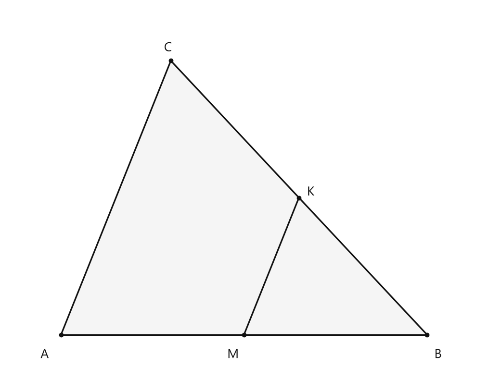
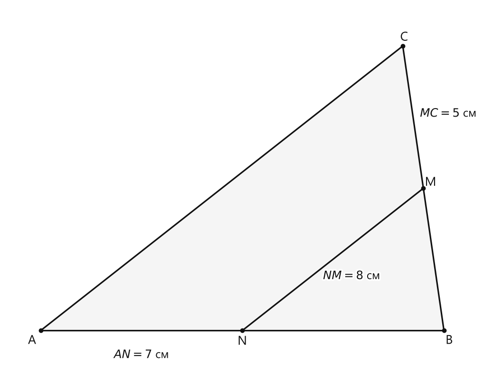
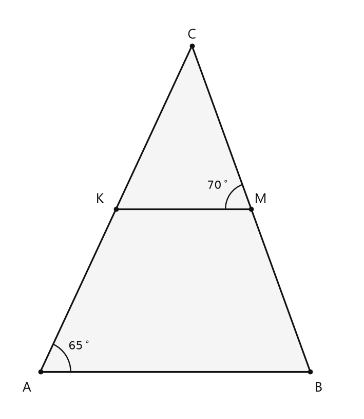
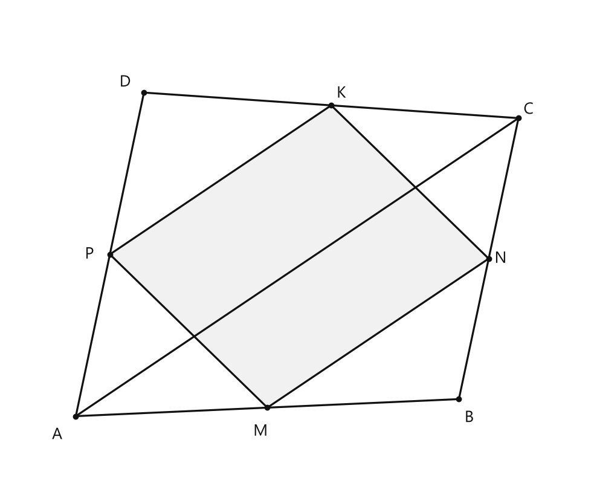
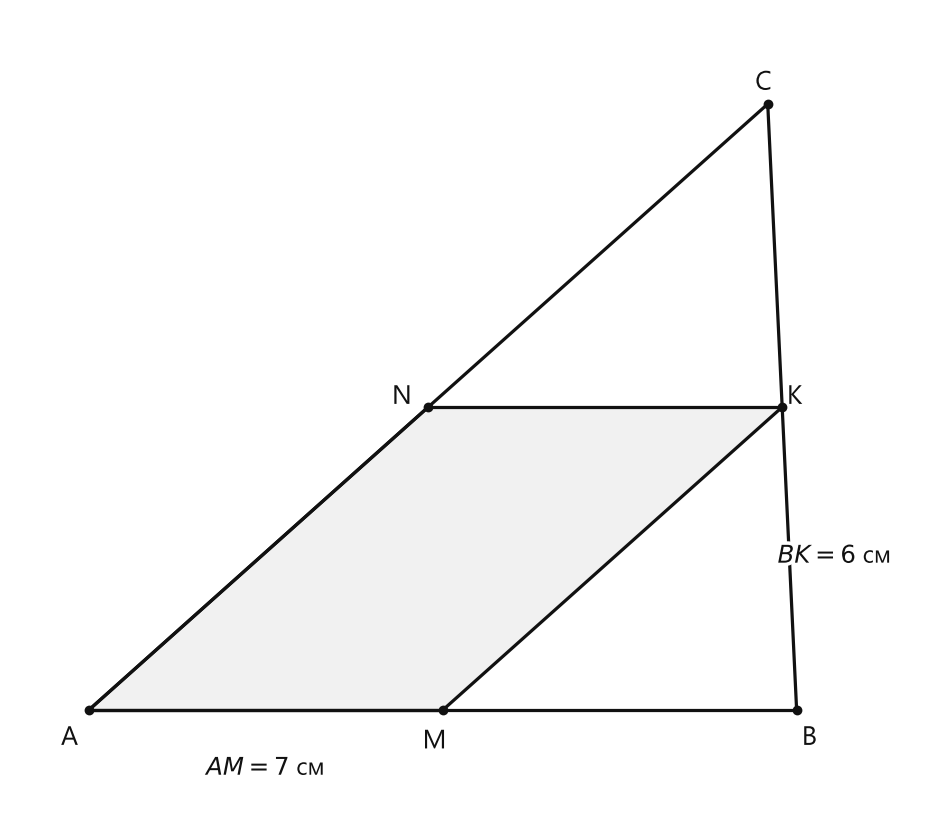
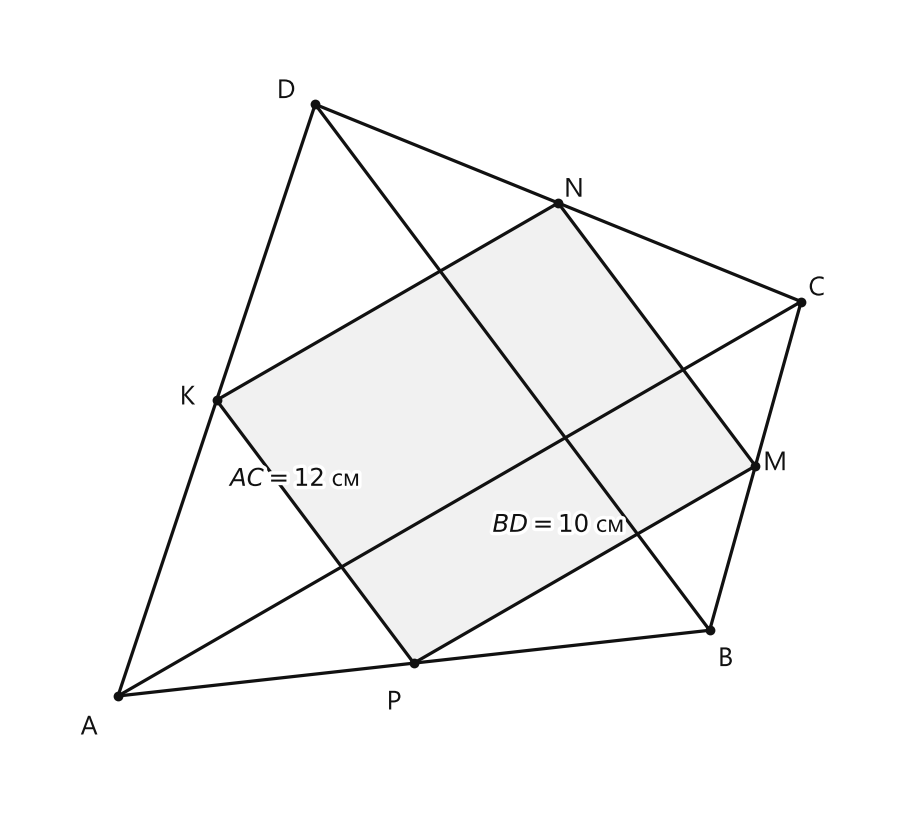
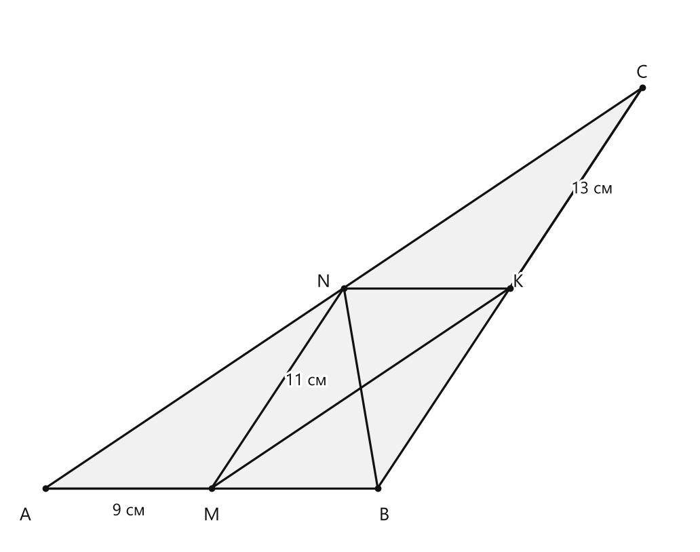
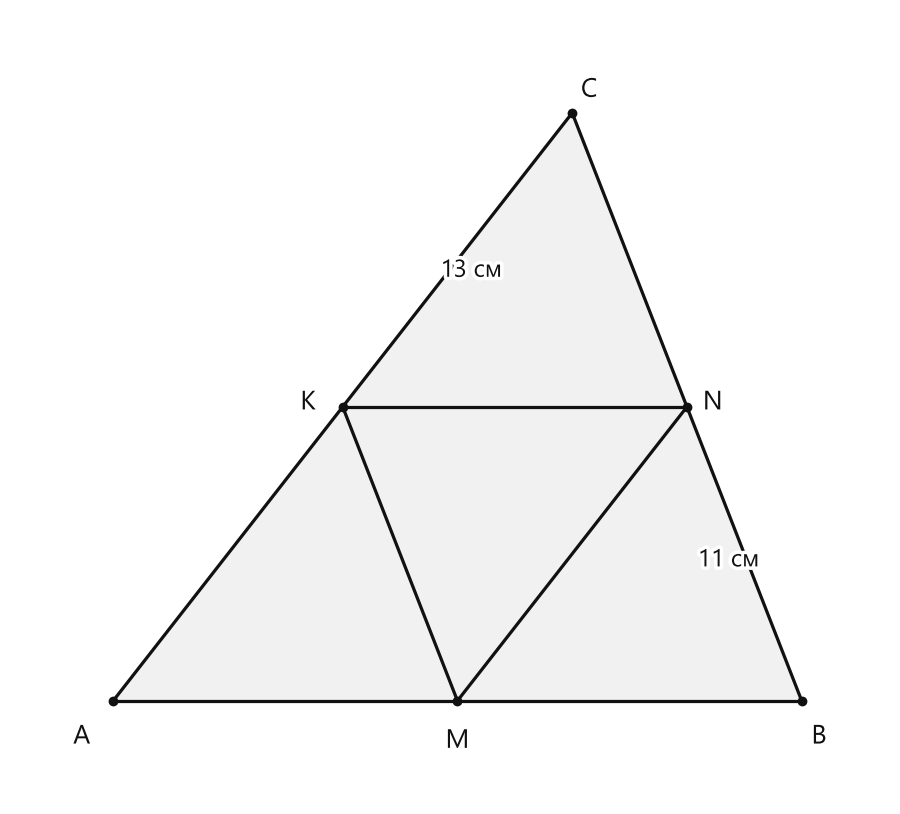

# Занятие 8. Средняя линия треугольника

**Раздел:** Глава 1. Четырехугольники  
**Параграф учебника:** §8. Средняя линия треугольника  
**Страницы:** 57–62

## Цели занятия

После занятия ученик умеет:

- распознавать среднюю линию треугольника;
- применять свойство средней линии;
- находить стороны и периметр треугольника по средней линии;
- находить углы с помощью параллельности;
- доказывать, что середины сторон четырехугольника образуют параллелограмм;
- применять свойства четырехугольника, образованного серединами сторон.

Выбери блок своего уровня:

- **1–2 балла:** определение и одна формула;
- **3–4 балла:** вычисление сторон, углов и периметров;
- **5–6 баллов:** доказательства по свойству средней линии;
- **7–8 баллов:** задачи с четырьмя угольниками;
- **9–10 баллов:** цепочки рассуждений и задачи повышенной сложности.

## Теория к занятию

### 1. Что такое средняя линия треугольника

#### Простыми словами

Смотри: у треугольника есть три стороны. На двух из них отмечаем середины и соединяем эти точки отрезком. Такой отрезок называется средней линией треугольника.

Например, в треугольнике $ABC$ точки $M$ и $K$ — середины сторон $AB$ и $BC$. Тогда отрезок $MK$ — средняя линия.

У треугольника три стороны, поэтому можно провести три средние линии. Треугольник не жадничает — делится сразу на три.

#### Определение

**Средней линией треугольника называется отрезок, который соединяет середины двух сторон треугольника.**

Пусть в треугольнике $ABC$ точки $M$ и $K$ — середины сторон $AB$ и $BC$. Тогда $MK$ — средняя линия.


<!--geo-figure-spec
{
  "needed": true,
  "kind": "plane",
  "caption": "Средняя линия $MK$ треугольника $ABC$",
  "equal": true,
  "axis": false,
  "xlim": [
    -0.6,
    4.6
  ],
  "ylim": [
    -0.55,
    3.6
  ],
  "points": {
    "A": [
      0,
      0
    ],
    "B": [
      4,
      0
    ],
    "C": [
      1.2,
      3
    ],
    "M": [
      2,
      0
    ],
    "K": [
      2.6,
      1.5
    ]
  },
  "segments": [
    [
      "A",
      "B"
    ],
    [
      "B",
      "C"
    ],
    [
      "C",
      "A"
    ],
    {
      "points": [
        "M",
        "K"
      ],
      "dashed": false,
      "label": "",
      "t": 0.5
    }
  ],
  "polygons": [
    {
      "vertices": [
        "A",
        "B",
        "C"
      ],
      "fill": 0.04
    }
  ],
  "circles": [],
  "labels": {
    "A": {
      "dx": -0.18,
      "dy": -0.22
    },
    "B": {
      "dx": 0.12,
      "dy": -0.22
    },
    "C": {
      "dx": -0.03,
      "dy": 0.14
    },
    "M": {
      "dx": -0.12,
      "dy": -0.22
    },
    "K": {
      "dx": 0.13,
      "dy": 0.06
    }
  },
  "right_angles": [],
  "angle_marks": [],
  "texts": []
}
-->


*Средняя линия MK треугольника ABC*


#### Правила

Чтобы отрезок был средней линией:

1. его концы должны лежать на сторонах треугольника;
2. каждый конец должен быть серединой соответствующей стороны.

Если точка просто лежит на стороне, но не делит её пополам, то средняя линия не получится. Это будет обычный отрезок.

#### Ловушки

- Средняя линия соединяет **середины двух сторон**, а не любые точки.
- Средняя линия не является стороной треугольника.
- У треугольника три средние линии.
- Слово «средняя» не означает, что отрезок обязательно проходит через центр треугольника.

---

### 2. Свойство средней линии

#### Простыми словами

Средняя линия соединяет середины двух сторон. Третья сторона треугольника называется основанием по отношению к этой средней линии.

Средняя линия параллельна основанию и в два раза короче него.

Например, если основание равно $14$ см, то средняя линия равна $7$ см. А если средняя линия равна $8$ см, то основание равно $16$ см. Здесь главное — не поменять местами «половину» и «в два раза».

#### Теорема

**Средняя линия треугольника параллельна основанию и равна его половине.**

Если $MK$ — средняя линия треугольника $ABC$, а $AC$ — основание, то

$$
MK \parallel AC,
$$

$$
MK=\frac{1}{2}AC.
$$

Отсюда также:

$$
AC=2MK.
$$

#### Формулы

Если известна средняя линия:

$$
\text{основание}=2\cdot\text{средняя линия}.
$$

Если известно основание:

$$
\text{средняя линия}=\frac{\text{основание}}{2}.
$$

В записи

$$
MK=\frac12AC
$$

- $MK$ — средняя линия;
- $AC$ — основание;
- знак $\parallel$ означает «параллельно».

#### Алгоритм вычисления

1. Проверь, какие точки являются серединами сторон.
2. Назови среднюю линию.
3. Определи основание, которому она параллельна.
4. Запиши формулу $MK=\frac12AC$ или $AC=2MK$.
5. Подставь известное значение.
6. Проверь результат: основание должно быть в два раза длиннее средней линии.

#### Ловушки

- Средняя линия — это половина основания, а не наоборот.
- Если средняя линия равна $8$ см, основание равно $16$ см, а не $4$ см.
- Параллельность помогает находить углы: при параллельных прямых можно использовать уже изученные свойства углов.
- Все три средние линии треугольника параллельны соответствующим сторонам.

---

### 3. Периметр треугольника по средним линиям

#### Простыми словами

Каждая сторона треугольника в два раза длиннее соответствующей средней линии.

Поэтому можно:

1. сложить длины трёх средних линий;
2. умножить полученную сумму на $2$.

Так мы найдём периметр всего треугольника.

#### Формула

Если средние линии равны $m$, $n$ и $k$, то

$$
P_{\triangle}=2(m+n+k).
$$

И наоборот, периметр треугольника в два раза больше периметра треугольника, образованного его средними линиями:

$$
P_{\triangle}=2P_{\text{средних линий}}.
$$

#### Правила

- Средней линии длиной $3$ м соответствует сторона длиной $6$ м.
- Средним линиям $3$ м, $4$ м и $5$ м соответствуют стороны $6$ м, $8$ м и $10$ м.
- Нужно учитывать все три средние линии. Умножить одну среднюю линию на $2$ недостаточно для нахождения периметра.

#### Ловушки

- Сумму средних линий нужно умножить на $2$ один раз.
- Если периметр треугольника равен $210$ м, сумма средних линий равна $105$ м.
- Отношение средних линий такое же, как отношение соответствующих сторон.

---

### 4. Середины сторон четырехугольника

#### Простыми словами

Рассмотрим произвольный четырехугольник $ABCD$. Отметим середины его сторон:

- $M$ — середина $AB$;
- $N$ — середина $BC$;
- $K$ — середина $CD$;
- $P$ — середина $DA$.

Соединим точки $M$, $N$, $K$, $P$. Получится четырехугольник $MNKP$.

Рассмотрим сначала треугольник $ABC$. В нём точки $M$ и $N$ — середины двух сторон, значит, $MN$ — средняя линия:

$$
MN\parallel AC,\qquad MN=\frac12AC.
$$

Теперь рассмотрим треугольник $ADC$. В нём точки $P$ и $K$ — середины двух сторон, значит, $PK$ — средняя линия:

$$
PK\parallel AC,\qquad PK=\frac12AC.
$$

Следовательно,

$$
MN\parallel PK,\qquad MN=PK.
$$

У четырехугольника $MNKP$ одна пара противоположных сторон равна и параллельна. Значит, $MNKP$ — параллелограмм.

#### Факт

Середины сторон четырехугольника являются вершинами параллелограмма.

#### Следствия

1. **Если диагонали $AC$ и $BD$ равны, то $MNKP$ — ромб и отрезки $MK$ и $PN$ взаимно перпендикулярны.**

2. **Если отрезки $MK$ и $PN$ взаимно перпендикулярны, то $MNKP$ — ромб и диагонали $AC$ и $BD$ равны.**

3. **Если диагонали $AC$ и $BD$ взаимно перпендикулярны, то $MNKP$ — прямоугольник, и отрезки $MK$ и $PN$ равны.**

4. **Если отрезки $MK$ и $PN$ равны, то $MNKP$ — прямоугольник и диагонали $AC$ и $BD$ взаимно перпендикулярны.**

#### Ловушки

- $MNKP$ будет параллелограммом даже тогда, когда исходный четырехугольник не является параллелограммом.
- Не перепутай стороны и диагонали нового параллелограмма.
- Отрезки $MN$ и $PK$ связаны с диагональю $AC$.
- Отрезки $MK$ и $PN$ связаны с диагональю $BD$.

---

### 5. Доказательство свойства средней линии

Пусть $M$ и $K$ — середины сторон $AB$ и $BC$ треугольника $ABC$.

#### Дано

$MK$ — средняя линия треугольника $ABC$.

#### Доказать

$$
MK\parallel AC,
$$

$$
MK=\frac12AC.
$$

#### Доказательство

Проведём через точку $M$ прямую, параллельную $AC$.

По теореме Фалеса эта прямая пройдёт через середину отрезка $BC$, то есть через точку $K$.

Значит,

$$
MK\parallel AC.
$$

Теперь через точку $K$ проведём прямую $KN$, параллельную $AB$, где $N\in AC$.

По теореме Фалеса точка $N$ является серединой отрезка $AC$, поэтому

$$
AN=NC.
$$

У четырехугольника $AMKN$ противоположные стороны параллельны:

$$
AM\parallel KN,
$$

$$
MK\parallel AN.
$$

Значит, $AMKN$ — параллелограмм.

У параллелограмма противоположные стороны равны, поэтому

$$
MK=AN.
$$

Так как $AN=NC$, то отрезок $AN$ является половиной отрезка $AC$:

$$
AN=\frac12AC.
$$

Следовательно,

$$
MK=\frac12AC.
$$

Теорема доказана.

## Сводка формул «выучить наизусть»

Если $MK$ — средняя линия треугольника, а $AC$ — основание, то

$$
MK\parallel AC,
$$

$$
MK=\frac12AC,
$$

$$
AC=2MK.
$$

Если средние линии равны $m$, $n$ и $k$, то

$$
P_{\triangle}=2(m+n+k).
$$

Если $M$, $N$, $K$, $P$ — середины сторон четырехугольника $ABCD$, то

$$
MN\parallel AC,\qquad MN=\frac12AC,
$$

$$
PK\parallel AC,\qquad PK=\frac12AC,
$$

$$
NK\parallel BD,\qquad NK=\frac12BD,
$$

$$
MP\parallel BD,\qquad MP=\frac12BD.
$$

## Правила, которые нельзя путать

- Средняя линия соединяет середины двух сторон.
- Средняя линия параллельна третьей стороне.
- Средняя линия равна половине третьей стороны.
- Сторона треугольника в два раза больше соответствующей средней линии.
- Середины сторон любого четырехугольника образуют параллелограмм.
- В параллелограмме противоположные стороны параллельны и равны.
- В задаче на угол сначала ищи параллельные прямые, а затем применяй свойства углов.

## Разбор ключевых заданий

### Р1. Разделение отрезка на равные части

#### Условие

Разделить данный отрезок:

а) на $5$ равных частей;  
б) в отношении $2:1$ при помощи циркуля и линейки.

#### Решение

##### а) Деление на пять равных частей

Пусть дан отрезок $AB$.

Проведём из точки $A$ произвольный луч.

На луче циркулем отложим пять равных отрезков:

$$
AA_1=A_1A_2=A_2A_3=A_3A_4=A_4A_5.
$$

Соединим точку $A_5$ с точкой $B$.

Через точки $A_1$, $A_2$, $A_3$, $A_4$ проведём прямые, параллельные $A_5B$.

По теореме Фалеса эти прямые разделят отрезок $AB$ на пять равных частей.

##### б) Деление в отношении $2:1$

Пусть требуется разделить $AB$ точкой $C$ так, чтобы

$$
AC:CB=2:1.
$$

Проведём из точки $A$ произвольный луч.

Отложим на нём три равных отрезка:

$$
AA_1=A_1A_2=A_2A_3.
$$

Соединим точку $A_3$ с точкой $B$.

Через точку $A_2$ проведём прямую, параллельную $A_3B$.

Эта прямая пересечёт $AB$ в точке $C$.

По теореме Фалеса

$$
AC:CB=2:1.
$$

#### Ответ

а) Отрезок разделён на пять равных частей.  
б) Точка делит отрезок в отношении $2:1$.

---

### Р2. Нахождение периметра по средней линии

#### Условие

$NM$ — средняя линия треугольника $ABC$. Точки $N$ и $M$ — середины сторон $AB$ и $BC$. Известно:

$$
AN=7\text{ см},\qquad NM=8\text{ см},\qquad MC=5\text{ см}.
$$

Найдите периметр треугольника $ABC$.


<!--geo-figure-spec
{
  "needed": true,
  "kind": "plane",
  "caption": "Средняя линия $NM$ треугольника $ABC$",
  "equal": true,
  "axis": false,
  "xlim": [
    -1.2,
    15.5
  ],
  "ylim": [
    -1.3,
    11.3
  ],
  "points": {
    "A": [
      0,
      0
    ],
    "B": [
      14,
      0
    ],
    "C": [
      12.5714,
      9.8974
    ],
    "N": [
      7,
      0
    ],
    "M": [
      13.2857,
      4.9487
    ]
  },
  "segments": [
    [
      "A",
      "B"
    ],
    [
      "B",
      "C"
    ],
    [
      "C",
      "A"
    ],
    [
      "N",
      "M"
    ]
  ],
  "polygons": [
    {
      "vertices": [
        "A",
        "B",
        "C"
      ],
      "fill": 0.04
    }
  ],
  "circles": [],
  "labels": {
    "A": {
      "dx": -0.3,
      "dy": -0.35
    },
    "B": {
      "dx": 0.18,
      "dy": -0.35
    },
    "C": {
      "dx": 0.05,
      "dy": 0.3
    },
    "N": {
      "dx": 0,
      "dy": -0.38
    },
    "M": {
      "dx": 0.25,
      "dy": 0.2
    }
  },
  "right_angles": [],
  "angle_marks": [],
  "texts": [
    {
      "xy": [
        3.5,
        -0.85
      ],
      "text": "$AN=7$ см"
    },
    {
      "xy": [
        10.8,
        1.9
      ],
      "text": "$NM=8$ см"
    },
    {
      "xy": [
        14.15,
        7.55
      ],
      "text": "$MC=5$ см"
    }
  ]
}
-->


*Средняя линия NM треугольника ABC*


#### Решение

Точка $N$ — середина стороны $AB$. Значит, она делит эту сторону на два равных отрезка:

$$
AN=NB.
$$

По условию $AN=7$ см, поэтому

$$
NB=7\text{ см}.
$$

Тогда

$$
AB=AN+NB=7+7=14\text{ см}.
$$

Точка $M$ — середина стороны $BC$. Поэтому

$$
BM=MC.
$$

По условию $MC=5$ см, значит,

$$
BM=5\text{ см}.
$$

Тогда

$$
BC=BM+MC=5+5=10\text{ см}.
$$

Отрезок $NM$ — средняя линия. Ему соответствует основание $AC$, поэтому

$$
NM=\frac12AC.
$$

Отсюда

$$
AC=2NM.
$$

Подставим $NM=8$ см:

$$
AC=2\cdot8=16\text{ см}.
$$

Периметр треугольника равен сумме его сторон:

$$
P=AB+BC+AC.
$$

Подставим найденные длины:

$$
P=14+10+16=40\text{ см}.
$$

Проверим результат другим способом. Три соответствующие средние линии имеют длины $7$ см, $5$ см и $8$ см. Их сумма равна

$$
7+5+8=20\text{ см}.
$$

Периметр треугольника в два раза больше этой суммы:

$$
2\cdot20=40\text{ см}.
$$

Ответ совпал. Геометрия и арифметика пожали друг другу руки.

#### Ответ

$$
\boxed{40\text{ см}}
$$

---

### Р3. Нахождение угла

#### Условие

В треугольнике $ABC$ точки $M$ и $K$ — середины сторон $BC$ и $AC$. Известно:

$$
\angle A=65^\circ,\qquad \angle KMC=70^\circ.
$$

Найдите величину угла $C$.


<!--geo-figure-spec
{
  "needed": true,
  "kind": "plane",
  "caption": "Точки $M$ и $K$ — середины сторон треугольника $ABC$",
  "equal": true,
  "axis": false,
  "xlim": [
    -0.5,
    4.7
  ],
  "ylim": [
    -0.6,
    5.4
  ],
  "points": {
    "A": [
      0,
      0
    ],
    "B": [
      4,
      0
    ],
    "C": [
      2.2465,
      4.8177
    ],
    "M": [
      3.12325,
      2.40885
    ],
    "K": [
      1.12325,
      2.40885
    ]
  },
  "segments": [
    [
      "A",
      "B"
    ],
    [
      "B",
      "C"
    ],
    [
      "C",
      "A"
    ],
    [
      "M",
      "K"
    ]
  ],
  "polygons": [
    {
      "vertices": [
        "A",
        "B",
        "C"
      ],
      "fill": 0.04
    }
  ],
  "circles": [],
  "labels": {
    "A": {
      "dx": -0.2,
      "dy": -0.24
    },
    "B": {
      "dx": 0.12,
      "dy": -0.24
    },
    "C": {
      "dx": 0,
      "dy": 0.16
    },
    "M": {
      "dx": 0.14,
      "dy": 0.14
    },
    "K": {
      "dx": -0.24,
      "dy": 0.14
    }
  },
  "right_angles": [],
  "angle_marks": [
    {
      "vertex": "A",
      "from": "B",
      "to": "C",
      "text": "$65^\\circ$",
      "radius": 0.45
    },
    {
      "vertex": "M",
      "from": "K",
      "to": "C",
      "text": "$70^\\circ$",
      "radius": 0.38
    }
  ],
  "texts": []
}
-->


*Точки M и K — середины сторон треугольника ABC*


#### Решение

Точки $M$ и $K$ — середины сторон $BC$ и $AC$.

Значит, отрезок $MK$ является средней линией треугольника $ABC$.

Средняя линия $MK$ параллельна третьей стороне $AB$:

$$
MK\parallel AB.
$$

Угол $\angle KMC$ образован лучами $MK$ и $MC$.

Луч $MC$ лежит на прямой $BC$. Поэтому угол $\angle KMC$ — это угол между прямыми, параллельными $AB$ и $BC$.

Следовательно,

$$
\angle KMC=\angle B.
$$

По условию $\angle KMC=70^\circ$, значит,

$$
\angle B=70^\circ.
$$

Сумма углов треугольника равна $180^\circ$:

$$
\angle A+\angle B+\angle C=180^\circ.
$$

Подставим известные значения:

$$
65^\circ+70^\circ+\angle C=180^\circ.
$$

Перенесём известные углы в правую часть:

$$
\angle C=180^\circ-65^\circ-70^\circ.
$$

Вычислим:

$$
\angle C=45^\circ.
$$

Параллельность здесь — главный помощник: она превращает незнакомый угол в уже известный. Без неё угол пришлось бы искать почти с фонариком.

#### Ответ

$$
\boxed{45^\circ}
$$

---

### Р4. Средние линии и периметр

#### Условие

Средние линии треугольника равны $3$ м, $4$ м и $5$ м. Найдите периметр треугольника.

#### Решение

Каждая сторона треугольника в два раза больше соответствующей средней линии.

Поэтому длины сторон равны:

$$
2\cdot3=6\text{ м},
$$

$$
2\cdot4=8\text{ м},
$$

$$
2\cdot5=10\text{ м}.
$$

Периметр треугольника — это сумма его сторон:

$$
P=6+8+10.
$$

$$
P=24\text{ м}.
$$

Проверим результат по общей формуле:

$$
P=2(3+4+5).
$$

Сначала найдём сумму средних линий:

$$
3+4+5=12\text{ м}.
$$

Теперь умножим её на $2$:

$$
P=2\cdot12=24\text{ м}.
$$

#### Ответ

$$
\boxed{24\text{ м}}
$$

---

### Р5. Периметр и отношение средних линий

#### Условие

Периметр треугольника равен $210$ м. Его средние линии относятся как

$$
3:5:7.
$$

Найдите наибольшую сторону треугольника.

#### Решение

Средние линии относятся как $3:5:7$. Значит, их можно записать так:

$$
3x,\qquad 5x,\qquad 7x.
$$

Сложим их:

$$
3x+5x+7x=15x.
$$

Периметр треугольника в два раза больше суммы средних линий:

$$
2\cdot15x=210.
$$

Выполним умножение:

$$
30x=210.
$$

Разделим обе части равенства на $30$:

$$
x=7.
$$

Теперь найдём средние линии:

$$
3x=3\cdot7=21\text{ м},
$$

$$
5x=5\cdot7=35\text{ м},
$$

$$
7x=7\cdot7=49\text{ м}.
$$

Наибольшая средняя линия равна $49$ м. Соответствующая ей сторона в два раза больше:

$$
2\cdot49=98\text{ м}.
$$

Проверим периметр найденных сторон:

$$
42+70+98=210\text{ м}.
$$

Проверка сошлась: арифметика сегодня решила не устраивать драму.

#### Ответ

$$
\boxed{98\text{ м}}
$$

### Р6. Доказательство: середины сторон четырехугольника

#### Условие

Пусть $M$, $N$, $K$, $P$ — середины сторон четырехугольника $ABCD$ соответственно. Докажите, что четырехугольник $MNKP$ является параллелограммом.


<!--geo-figure-spec
{
  "needed": true,
  "kind": "plane",
  "caption": "Четырёхугольник $MNKP$, образованный серединами сторон $ABCD$",
  "equal": true,
  "axis": false,
  "xlim": [
    -0.8,
    6
  ],
  "ylim": [
    -0.8,
    4.8
  ],
  "points": {
    "A": [
      0,
      0
    ],
    "B": [
      4.5,
      0.2
    ],
    "C": [
      5.2,
      3.5
    ],
    "D": [
      0.8,
      3.8
    ],
    "M": [
      2.25,
      0.1
    ],
    "N": [
      4.85,
      1.85
    ],
    "K": [
      3,
      3.65
    ],
    "P": [
      0.4,
      1.9
    ]
  },
  "segments": [
    [
      "A",
      "B"
    ],
    [
      "B",
      "C"
    ],
    [
      "C",
      "D"
    ],
    [
      "D",
      "A"
    ],
    [
      "M",
      "N"
    ],
    [
      "N",
      "K"
    ],
    [
      "K",
      "P"
    ],
    [
      "P",
      "M"
    ],
    [
      "A",
      "C"
    ]
  ],
  "polygons": [
    {
      "vertices": [
        "M",
        "N",
        "K",
        "P"
      ],
      "fill": 0.06
    }
  ],
  "circles": [],
  "labels": {
    "A": {
      "dx": -0.22,
      "dy": -0.22
    },
    "B": {
      "dx": 0.12,
      "dy": -0.22
    },
    "C": {
      "dx": 0.12,
      "dy": 0.1
    },
    "D": {
      "dx": -0.22,
      "dy": 0.12
    },
    "M": {
      "dx": -0.08,
      "dy": -0.28
    },
    "N": {
      "dx": 0.14,
      "dy": 0
    },
    "K": {
      "dx": 0.12,
      "dy": 0.14
    },
    "P": {
      "dx": -0.24,
      "dy": 0
    }
  },
  "right_angles": [],
  "angle_marks": [],
  "texts": []
}
-->


*Четырёхугольник MNKP, образованный серединами сторон ABCD*


#### Доказательство

Рассмотрим треугольник $ABC$.

Точка $M$ — середина стороны $AB$.

Точка $N$ — середина стороны $BC$.

Значит, $MN$ — средняя линия треугольника $ABC$.

По свойству средней линии

$$
MN\parallel AC,
$$

$$
MN=\frac12AC.
$$

Теперь рассмотрим треугольник $ADC$.

Точка $P$ — середина стороны $AD$.

Точка $K$ — середина стороны $CD$.

Значит, $PK$ — средняя линия треугольника $ADC$.

По свойству средней линии

$$
PK\parallel AC,
$$

$$
PK=\frac12AC.
$$

Получили:

$$
MN\parallel PK,
$$

потому что обе прямые параллельны $AC$.

Также

$$
MN=PK,
$$

потому что оба отрезка равны половине $AC$.

В четырехугольнике $MNKP$ одна пара противоположных сторон равна и параллельна.

Если в четырехугольнике одна пара противоположных сторон равна и параллельна, то этот четырехугольник является параллелограммом.

Следовательно,

$$
MNKP
$$

— параллелограмм.

Вот и весь секрет: середины сторон «видят» одну и ту же диагональ $AC$, поэтому получают равные и параллельные отрезки.

#### Ответ

Четырехугольник $MNKP$ является параллелограммом.

---

### Р7. Отрезки и периметр четырехугольника

#### Условие

Периметр треугольника $ABC$ равен $44$ см. Точки $M$, $K$, $N$ — середины сторон $AB$, $BC$, $AC$ соответственно. Известно:

$$
BK=6\text{ см},\qquad AM=7\text{ см}.
$$

Найдите:

а) длину средней линии $MK$;  
б) периметр четырехугольника $AMKN$.


<!--geo-figure-spec
{
  "needed": true,
  "kind": "plane",
  "caption": "Треугольник $ABC$ и четырёхугольник $AMKN$",
  "equal": true,
  "axis": false,
  "xlim": [
    -1.5,
    16.8
  ],
  "ylim": [
    -1.8,
    13.8
  ],
  "points": {
    "A": [
      0,
      0
    ],
    "B": [
      14,
      0
    ],
    "C": [
      13.4286,
      11.9864
    ],
    "M": [
      7,
      0
    ],
    "K": [
      13.7143,
      5.9932
    ],
    "N": [
      6.7143,
      5.9932
    ]
  },
  "segments": [
    [
      "A",
      "B"
    ],
    [
      "B",
      "C"
    ],
    [
      "C",
      "A"
    ],
    [
      "A",
      "M"
    ],
    [
      "M",
      "K"
    ],
    [
      "K",
      "N"
    ],
    [
      "N",
      "A"
    ]
  ],
  "polygons": [
    {
      "vertices": [
        "A",
        "M",
        "K",
        "N"
      ],
      "fill": 0.06
    }
  ],
  "circles": [],
  "labels": {
    "A": {
      "dx": -0.38,
      "dy": -0.55
    },
    "B": {
      "dx": 0.25,
      "dy": -0.55
    },
    "C": {
      "dx": -0.08,
      "dy": 0.42
    },
    "M": {
      "dx": -0.16,
      "dy": -0.62
    },
    "K": {
      "dx": 0.25,
      "dy": 0.2
    },
    "N": {
      "dx": -0.52,
      "dy": 0.2
    }
  },
  "right_angles": [],
  "angle_marks": [],
  "texts": [
    {
      "xy": [
        3.5,
        -1.15
      ],
      "text": "$AM=7$ см"
    },
    {
      "xy": [
        14.75,
        3.05
      ],
      "text": "$BK=6$ см"
    }
  ]
}
-->


*Треугольник ABC и четырёхугольник AMKN*


#### Решение

Сначала найдём стороны треугольника $ABC$.

Точка $M$ — середина стороны $AB$.

Значит, $AM=MB$.

Поэтому вся сторона $AB$ в два раза больше отрезка $AM$:

$$
AB=2AM.
$$

Подставим известную длину:

$$
AB=2\cdot7=14\text{ см}.
$$

Точка $K$ — середина стороны $BC$.

Значит, $BK=KC$.

Поэтому

$$
BC=2BK.
$$

Подставим известную длину:

$$
BC=2\cdot6=12\text{ см}.
$$

Периметр треугольника равен сумме его сторон:

$$
P_{ABC}=AB+BC+AC.
$$

Отсюда

$$
AC=P_{ABC}-AB-BC.
$$

Подставим данные:

$$
AC=44-14-12=18\text{ см}.
$$

Теперь рассмотрим отрезок $MK$.

Точки $M$ и $K$ — середины сторон $AB$ и $BC$ треугольника $ABC$.

Значит, $MK$ — средняя линия треугольника $ABC$.

Она параллельна третьей стороне $AC$ и равна её половине:

$$
MK=\frac12AC.
$$

Тогда

$$
MK=\frac12\cdot18=9\text{ см}.
$$

Теперь найдём периметр четырехугольника $AMKN$.

Его стороны:

$$
AM,\quad MK,\quad KN,\quad NA.
$$

Длина $AM$ уже известна:

$$
AM=7\text{ см}.
$$

Отрезок $NK$ соединяет середины сторон $AC$ и $BC$.

Значит, $NK$ — средняя линия треугольника $ABC$.

Она равна половине стороны $AB$:

$$
NK=\frac12AB=\frac12\cdot14=7\text{ см}.
$$

Точка $N$ — середина стороны $AC$.

Поэтому

$$
AN=\frac12AC=\frac12\cdot18=9\text{ см}.
$$

Периметр четырехугольника равен сумме его сторон:

$$
P_{AMKN}=AM+MK+KN+NA.
$$

Подставим найденные длины:

$$
P_{AMKN}=7+9+7+9.
$$

$$
P_{AMKN}=32\text{ см}.
$$

#### Ответ

а)

$$
\boxed{MK=9\text{ см}}
$$

б)

$$
\boxed{P_{AMKN}=32\text{ см}}
$$

---

### Р8. Периметр четырехугольника, образованного серединами сторон

#### Условие

Точки $P$, $M$, $N$, $K$ — середины сторон четырехугольника $ABCD$. Диагонали четырехугольника равны:

$$
AC=12\text{ см},\qquad BD=10\text{ см}.
$$

Найдите периметр четырехугольника $PMNK$.


<!--geo-figure-spec
{
  "needed": true,
  "kind": "plane",
  "caption": "Четырёхугольник $PMNK$ и диагонали $AC$, $BD$",
  "equal": true,
  "axis": false,
  "xlim": [
    -0.8,
    6
  ],
  "ylim": [
    -0.8,
    5.2
  ],
  "points": {
    "A": [
      0,
      0
    ],
    "B": [
      4.5,
      0.5
    ],
    "C": [
      5.1961524,
      3
    ],
    "D": [
      1.5,
      4.5
    ],
    "P": [
      2.25,
      0.25
    ],
    "M": [
      4.8480762,
      1.75
    ],
    "N": [
      3.3480762,
      3.75
    ],
    "K": [
      0.75,
      2.25
    ]
  },
  "segments": [
    [
      "A",
      "B"
    ],
    [
      "B",
      "C"
    ],
    [
      "C",
      "D"
    ],
    [
      "D",
      "A"
    ],
    [
      "P",
      "M"
    ],
    [
      "M",
      "N"
    ],
    [
      "N",
      "K"
    ],
    [
      "K",
      "P"
    ],
    [
      "A",
      "C"
    ],
    [
      "B",
      "D"
    ]
  ],
  "polygons": [
    {
      "vertices": [
        "P",
        "M",
        "N",
        "K"
      ],
      "fill": 0.06
    }
  ],
  "circles": [],
  "labels": {
    "A": {
      "dx": -0.22,
      "dy": -0.24
    },
    "B": {
      "dx": 0.12,
      "dy": -0.22
    },
    "C": {
      "dx": 0.12,
      "dy": 0.1
    },
    "D": {
      "dx": -0.22,
      "dy": 0.1
    },
    "P": {
      "dx": -0.15,
      "dy": -0.3
    },
    "M": {
      "dx": 0.15,
      "dy": 0.02
    },
    "N": {
      "dx": 0.12,
      "dy": 0.1
    },
    "K": {
      "dx": -0.22,
      "dy": 0.02
    }
  },
  "right_angles": [],
  "angle_marks": [],
  "texts": [
    {
      "xy": [
        1.35,
        1.65
      ],
      "text": "$AC=12$ см"
    },
    {
      "xy": [
        3.35,
        1.3
      ],
      "text": "$BD=10$ см"
    }
  ]
}
-->


*Четырёхугольник PMNK и диагонали AC, BD*


#### Решение

По доказанному свойству середины сторон четырехугольника $PMNK$ является параллелограммом.

Рассмотрим его стороны.

Одна пара сторон образована средними линиями треугольников, в которых основанием является диагональ $AC$.

Поэтому каждая из этих сторон равна половине $AC$:

$$
\frac12AC=\frac12\cdot12=6\text{ см}.
$$

Другая пара сторон образована средними линиями треугольников, в которых основанием является диагональ $BD$.

Поэтому каждая из этих сторон равна половине $BD$:

$$
\frac12BD=\frac12\cdot10=5\text{ см}.
$$

У параллелограмма противоположные стороны равны.

Значит, его периметр равен:

$$
P_{PMNK}=2\cdot6+2\cdot5.
$$

$$
P_{PMNK}=12+10=22\text{ см}.
$$

Можно записать короче:

$$
P_{PMNK}=AC+BD=12+10=22\text{ см}.
$$

#### Ответ

$$
\boxed{22\text{ см}}
$$

> **На заметку.** Пункт 110б из карточки содержит противоречивые данные: при $AC=BD$ четырехугольник, образованный серединами сторон, является ромбом, а указанный угол $\angle KPN=32^\circ$ не согласуется с требуемым следствием о взаимной перпендикулярности. Поэтому этот подпункт не включён в обязательный разбор.

---

### Р9. Отрезок между серединами медиан

#### Условие

Сторона $AC$ треугольника $ABC$ равна $24$ см. Найдите длину отрезка, соединяющего середины медиан $AK$ и $CM$.

#### Решение

Пусть $E$ — середина медианы $AK$.

Пусть $F$ — середина медианы $CM$.

Так как $K$ — середина стороны $BC$, отрезок $AK$ является медианой.

Так как $M$ — середина стороны $AB$, отрезок $CM$ также является медианой.

Для решения удобно использовать координаты.

Расположим сторону $AC$ горизонтально:

$$
A=(0;0),\qquad C=(24;0).
$$

Пусть координаты точки $B$ имеют вид:

$$
B=(x;y).
$$

Координаты середины отрезка получают так: складывают соответствующие координаты его концов и делят каждую сумму на $2$.

Точка $K$ — середина $BC$:

$$
K=\left(\frac{x+24}{2};\frac y2\right).
$$

Точка $E$ — середина $AK$:

$$
E=\left(\frac{\frac{x+24}{2}}2;\frac{\frac y2}2\right).
$$

Значит,

$$
E=\left(\frac{x+24}{4};\frac y4\right).
$$

Точка $M$ — середина $AB$:

$$
M=\left(\frac x2;\frac y2\right).
$$

Точка $F$ — середина $CM$:

$$
F=\left(\frac{24+\frac x2}{2};\frac{\frac y2}{2}\right).
$$

Значит,

$$
F=\left(12+\frac x4;\frac y4\right).
$$

У точек $E$ и $F$ одинаковые вторые координаты:

$$
\frac y4=\frac y4.
$$

Следовательно, отрезок $EF$ параллелен $AC$.

Найдём его длину по первым координатам:

$$
EF=\left(12+\frac x4\right)-\frac{x+24}{4}.
$$

Раскроем скобки:

$$
EF=12+\frac x4-\frac x4-\frac{24}{4}.
$$

Так как

$$
\frac{24}{4}=6,
$$

получаем:

$$
EF=12-6=6\text{ см}.
$$

То есть отрезок между серединами этих двух медиан равен четверти стороны $AC$:

$$
EF=\frac14AC=\frac14\cdot24=6\text{ см}.
$$

#### Ответ

$$
\boxed{6\text{ см}}
$$

---

## Мини-проверка

1. Средняя линия треугольника соединяет:

   $$
   \boxed{\text{середины двух сторон}}
   $$

2. Средняя линия равна:

   $$
   \boxed{\text{половине основания}}
   $$

3. Если средняя линия равна $9$ см, основание равно:

   $$
   \boxed{18\text{ см}}
   $$

4. Если средние линии равны $2$ см, $5$ см и $7$ см, периметр треугольника равен:

   $$
   2(2+5+7)=28\text{ см}.
   $$

5. Середины сторон четырехугольника образуют:

   $$
   \boxed{\text{параллелограмм}}
   $$

## Практические задания

Выбери свой уровень и решай только этот блок. В блоке должна закрепиться вся тема параграфа. Ответы не приводятся.

### Уровень 1–2 балла

**С1.** Выберите верное утверждение о средней линии треугольника.

1) Отрезок, соединяющий вершину треугольника с серединой противоположной стороны  
2) Отрезок, соединяющий середины двух сторон треугольника  
3) Отрезок, соединяющий две вершины треугольника  
4) Отрезок, перпендикулярный стороне треугольника  
5) Отрезок, делящий угол треугольника пополам

**С2.** В треугольнике $ABC$ точки $M$ и $N$ — середины сторон $AB$ и $AC$ соответственно. Выберите верное утверждение.

1) $MN \perp BC$  
2) $MN = BC$  
3) $MN \parallel BC$ и $MN=\dfrac{BC}{2}$  
4) $MN \parallel AB$ и $MN=\dfrac{AB}{2}$  
5) $MN=2BC$

**С3.** В треугольнике $ABC$ отрезок $MN$ соединяет середины сторон $AB$ и $BC$. Какой стороне треугольника параллелен отрезок $MN$?

1) $AB$  
2) $BC$  
3) $AC$  
4) $MN$  
5) Ни одной стороне

**С4.** В треугольнике $ABC$ отрезок $MN$ — средняя линия, параллельная стороне $AC$. Если $AC=18$ см, найдите длину $MN$.

**С5.** В треугольнике $ABC$ точки $M$ и $N$ — середины сторон $AB$ и $BC$. Если $MN=7$ см, найдите длину стороны $AC$.

**С6.** В треугольнике $ABC$ средние линии равны $4$ см, $6$ см и $8$ см. Найдите периметр треугольника $ABC$.

**С7.** В треугольнике $ABC$ точки $M$ и $N$ — середины сторон $AB$ и $AC$. Запишите, чему равна длина $MN$, если $BC=15$ см.

**С8.** В треугольнике $ABC$ точки $M$ и $N$ — середины сторон $AB$ и $BC$. Запишите, с какой стороной параллелен отрезок $MN$, если $AC=12$ см.

**С9.** Периметр треугольника $ABC$ равен $30$ см. Треугольник, вершинами которого являются середины сторон треугольника $ABC$, имеет периметр

1) $10$ см  
2) $15$ см  
3) $20$ см  
4) $30$ см  
5) $60$ см

**С10.** В треугольнике $ABC$ точки $M$, $N$ и $K$ — середины сторон $AB$, $BC$ и $AC$ соответственно. Если $AB=10$ см, найдите длину средней линии $NK$.

**С11.** В треугольнике $ABC$ точки $M$ и $N$ — середины сторон $AB$ и $AC$. Если $MN=5$ см, выберите длину стороны $BC$.

1) $2{,}5$ см  
2) $5$ см  
3) $7{,}5$ см  
4) $10$ см  
5) $15$ см

**С12.** В треугольнике $ABC$ сторона $BC$ равна $20$ см. Точки $M$ и $N$ — середины сторон $AB$ и $AC$. Найдите длину средней линии $MN$.

**С13.** Выберите верное утверждение о средней линии треугольника.

1) Она соединяет вершину треугольника с серединой противоположной стороны.  
2) Она соединяет середины двух сторон треугольника.  
3) Она делит треугольник на два равных треугольника.  
4) Она всегда перпендикулярна третьей стороне.  
5) Она равна третьей стороне треугольника.

**С14.** В треугольнике $ABC$ точки $M$ и $N$ — середины сторон $AB$ и $AC$. Как расположена средняя линия $MN$ относительно стороны $BC$?

1) Перпендикулярна $BC$  
2) Совпадает с $BC$  
3) Параллельна $BC$  
4) Пересекает $BC$ в её середине  
5) Образует с $BC$ угол $45^\circ$

**С15.** Средняя линия треугольника равна $7$ см. Найдите длину стороны треугольника, которой она параллельна.

1) $3{,}5$ см  
2) $7$ см  
3) $10{,}5$ см  
4) $14$ см  
5) $49$ см

**С16.** Сторона треугольника, которой параллельна средняя линия, равна $18$ см. Найдите длину средней линии.

1) $6$ см  
2) $9$ см  
3) $18$ см  
4) $36$ см  
5) $81$ см

**С17.** В треугольнике $ABC$ точки $M$ и $N$ — середины сторон $AB$ и $BC$. Если $AC=24$ см, то чему равна длина $MN$?

1) $6$ см  
2) $8$ см  
3) $12$ см  
4) $24$ см  
5) $48$ см

**С18.** В треугольнике $ABC$ отрезок $MN$ соединяет середины сторон $AB$ и $AC$. Какое равенство является верным?

1) $MN=BC$  
2) $MN=2BC$  
3) $MN=\dfrac{BC}{2}$  
4) $MN=AB+AC$  
5) $MN=AB-AC$

**С19.** В треугольнике $ABC$ точки $M$ и $N$ — середины сторон $AB$ и $BC$. Если $MN=5$ см, а $AB=8$ см, найдите длину стороны $AC$.

1) $2{,}5$ см  
2) $5$ см  
3) $8$ см  
4) $10$ см  
5) $16$ см

**С20.** В треугольнике $ABC$ точки $M$ и $N$ — середины сторон $AB$ и $AC. Периметр треугольника $ABC$ равен $30$ см, $AB=10$ см, $AC=8$ см. Найдите длину стороны $BC$.

1) $6$ см  
2) $8$ см  
3) $10$ см  
4) $12$ см  
5) $14$ см

**С21.** В треугольнике $ABC$ точки $M$ и $N$ — середины сторон $AB$ и $BC$. Если $AB=14$ см, $BC=10$ см и $AC=16$ см, найдите периметр треугольника $BMN$.

1) $12$ см  
2) $15$ см  
3) $18$ см  
4) $20$ см  
5) $24$ см

**С22.** Средние линии треугольника равны $4$ см, $6$ см и $8$ см. Найдите периметр исходного треугольника.

1) $9$ см  
2) $18$ см  
3) $24$ см  
4) $36$ см  
5) $48$ см

**С23.** В треугольнике $ABC$ точки $M$ и $N$ — середины сторон $AB$ и $AC$. Периметр треугольника $AMN$ равен $13$ см, а $BC=10$ см. Найдите периметр треугольника $ABC$.

1) $18$ см  
2) $20$ см  
3) $23$ см  
4) $26$ см  
5) $30$ см

**С24.** В треугольнике $ABC$ точки $M$, $N$ и $K$ — середины сторон $AB$, $BC$ и $AC$ соответственно. Укажите все отрезки, которые являются средними линиями треугольника $ABC$.

1) $MN$  
2) $NK$  
3) $MK$  
4) $AB$  
5) $AC$

**С25.** В треугольнике $ABC$ точки $M$ и $N$ — середины сторон $AB$ и $AC$ соответственно. Как называется отрезок $MN$?

**С26.** В треугольнике $ABC$ отрезок $MN$ соединяет середины сторон $AB$ и $AC$. Выберите верное утверждение.  
1) $MN \perp BC$  
2) $MN \parallel BC$  
3) $MN = BC$  
4) $MN \parallel AB$  
5) $MN \perp AC$

**С27.** В треугольнике $ABC$ отрезок $MN$ — средняя линия, $M \in AB$, $N \in AC$. Если $BC=18$ см, найдите $MN$.

**С28.** В треугольнике $ABC$ отрезок $MN$ — средняя линия, $M \in AB$, $N \in AC$. Если $MN=7$ см, найдите $BC$.

**С29.** В треугольнике $ABC$ точки $M$ и $N$ — середины сторон $AB$ и $BC$. Если $AC=16$ см, выберите длину средней линии $MN$.  
1) $4$ см  
2) $8$ см  
3) $16$ см  
4) $24$ см  
5) $32$ см

**С30.** В треугольнике $ABC$ точки $M$ и $N$ — середины сторон $AB$ и $BC$. Какая сторона параллельна средней линии $MN$?

**С31.** Средние линии треугольника имеют длины $5$ см, $6$ см и $9$ см. Найдите периметр треугольника.

**С32.** Периметр треугольника равен $48$ см. Найдите периметр треугольника, вершинами которого являются середины его сторон.

**С33.** В треугольнике $ABC$ точки $M$, $N$ и $K$ — середины сторон $AB$, $BC$ и $AC$ соответственно. Выберите все верные утверждения.  
1) $MN \parallel AC$  
2) $NK \parallel AB$  
3) $MK \parallel BC$  
4) $MN=AB$  
5) $NK=BC$

**С34.** В треугольнике $ABC$ точки $M$ и $N$ — середины сторон $AB$ и $AC$. Если $AB=14$ см, $AC=18$ см, $BC=20$ см, найдите периметр треугольника $AMN$.

**С35.** В треугольнике $ABC$ точки $M$ и $N$ — середины сторон $AB$ и $BC$. Если $AM=6$ см и $BN=5$ см, найдите длины сторон $AB$ и $BC$.

**С36.** В треугольнике $ABC$ точки $M$, $N$ и $K$ — середины сторон $AB$, $BC$ и $AC$ соответственно. Периметр треугольника $MNK$ равен $15$ см. Найдите периметр треугольника $ABC$.

### Уровень 3–4 балла

**С1.** В треугольнике $ABC$ точки $M$ и $N$ — середины сторон $AB$ и $AC$ соответственно. Укажите, чему равен отрезок $MN$, если $BC=18$ см.

**С2.** В треугольнике $ABC$ отрезок $MN$ соединяет середины сторон $AB$ и $AC$. Найдите длину стороны $BC$, если $MN=7$ см.

**С3.** В треугольнике $ABC$ точки $M$ и $N$ — середины сторон $AB$ и $BC$ соответственно. Найдите угол $BMN$, если $\angle A=48^\circ$.

**С4.** В треугольнике $ABC$ отрезок $MN$ соединяет середины сторон $AB$ и $AC$. Найдите периметр треугольника $ABC$, если $MN=6$ см, $AB=14$ см, а $AC=16$ см.

**С5.** Средние линии треугольника равны $5$ см, $7$ см и $9$ см. Найдите периметр этого треугольника.

**С6.** Периметр треугольника равен $54$ см. Найдите периметр треугольника, вершинами которого являются середины сторон данного треугольника.

**С7.** В треугольнике $ABC$ точки $M$, $N$ и $K$ — середины сторон $AB$, $BC$ и $AC$ соответственно. Найдите длину отрезка $MK$, если $BC=20$ см.

**С8.** В треугольнике $ABC$ точки $M$ и $N$ — середины сторон $AB$ и $BC$ соответственно. Найдите периметр треугольника $BMN$, если $AB=12$ см, $BC=18$ см, а $AC=16$ см.

**С9.** В треугольнике $ABC$ точки $M$ и $N$ — середины сторон $AB$ и $AC$ соответственно. Найдите периметр четырёхугольника $BMNC$, если $AB=10$ см, $BC=15$ см, $AC=14$ см.

**С10.** В треугольнике $ABC$ точки $M$ и $N$ — середины сторон $AB$ и $BC$ соответственно. Отрезок $MN$ равен $8$ см, а сторона $AB$ равна $12$ см. Найдите периметр треугольника $ABC$, если сторона $AC$ равна $14$ см.

**С11.** В треугольнике $ABC$ точки $M$ и $N$ — середины сторон $AB$ и $AC$ соответственно. Докажите, что четырёхугольник $BMNC$ является трапецией, и найдите его периметр, если $AB=10$ см, $BC=13$ см, $AC=15$ см.

**С12.** В треугольнике $ABC$ точки $M$, $N$ и $K$ — середины сторон $AB$, $BC$ и $AC$ соответственно. Периметр треугольника $MNK$ равен $24$ см. Найдите периметр треугольника $ABC$.

**С13.** В треугольнике $ABC$ точки $M$ и $N$ — середины сторон $AB$ и $AC$ соответственно. Как называется отрезок $MN$?

1) медиана  2) высота  3) средняя линия  4) биссектриса  5) диагональ

**С14.** В треугольнике $ABC$ точки $M$ и $N$ — середины сторон $AB$ и $AC$ соответственно. Известно, что $BC=18$ см. Найдите длину средней линии $MN$.

**С15.** В треугольнике $ABC$ точки $M$ и $N$ — середины сторон $AB$ и $AC$ соответственно. Длина средней линии $MN$ равна $7$ см, а стороны $AB$ и $AC$ равны $12$ см и $16$ см. Найдите периметр треугольника $ABC$.

**С16.** В треугольнике $ABC$ точки $M$ и $N$ — середины сторон $AB$ и $BC$ соответственно. Найдите величину угла $BMN$, если $\angle A=48^\circ$.

**С17.** Средние линии треугольника равны $5$ см, $8$ см и $11$ см. Найдите длины сторон этого треугольника.

**С18.** Периметр треугольника равен $54$ см. Найдите периметр треугольника, вершинами которого являются середины сторон данного треугольника.

**С19.** Средняя линия треугольника равна $9$ см. Сторона треугольника, параллельная этой средней линии, на $6$ см больше другой стороны треугольника. Найдите длину этой стороны.

**С20.** В треугольнике $ABC$ точки $M$ и $N$ — середины сторон $AB$ и $BC$ соответственно. Известно, что $AM=6$ см, $BN=8$ см и $AC=14$ см. Найдите периметр четырехугольника $AMNC$.

**С21.** В треугольнике $ABC$ точки $M$, $N$ и $K$ — середины сторон $AB$, $BC$ и $AC$ соответственно. Запишите, каким сторонам треугольника $ABC$ параллельны средние линии $MN$, $NK$ и $MK$.

**С22.** В треугольнике $ABC$ средняя линия $MN$ соединяет середины сторон $AB$ и $BC$. Медиана $BK$ проведена к стороне $AC$. Отрезки $MN$ и $BK$ пересекаются в точке $O$. Известно, что $BK=18$ см. Найдите длину отрезка $BO$.

**С23.** В треугольнике $ABC$ медианы $AK$ и $CM$ пересекаются в точке $O$. Точки $P$ и $Q$ — середины отрезков $AO$ и $CO$ соответственно. Докажите, что $PQ$ является средней линией треугольника $AOC$, и найдите $PQ$, если $AC=24$ см.

**С24.** В выпуклом четырехугольнике $ABCD$ точки $M$, $N$, $K$ и $P$ — середины сторон $AB$, $BC$, $CD$ и $DA соответственно. Диагонали четырехугольника равны $AC=16$ см и $BD=12$ см. Найдите периметр четырехугольника $MNKP$.

**С25.** В треугольнике $ABC$ точки $M$ и $N$ — середины сторон $AB$ и $AC$ соответственно. Длина стороны $BC$ равна $18$ см. Найдите длину средней линии $MN$.

**С26.** В треугольнике $ABC$ отрезок $MN$ соединяет середины сторон $AB$ и $BC$. Известно, что $MN=7$ см и $AC=14$ см. Найдите длину стороны $AC$ и укажите взаимное расположение прямых $MN$ и $AC$.

**С27.** Средние линии треугольника равны $5$ см, $8$ см и $11$ см. Найдите периметр треугольника.

**С28.** Периметр треугольника равен $54$ см. Две его стороны равны $16$ см и $21$ см. Найдите длину средней линии, параллельной третьей стороне.

**С29.** В треугольнике $ABC$ точки $M$ и $N$ — середины сторон $AB$ и $BC$. Угол $ABC$ равен $64^\circ$. Найдите угол между прямыми $MN$ и $AB$.

**С30.** В треугольнике $ABC$ точки $M$, $N$ и $K$ — середины сторон $AB$, $BC$ и $AC$ соответственно. Длины сторон треугольника $ABC$ равны $10$ см, $14$ см и $18$ см. Найдите периметр треугольника $MNK$.

**С31.** В треугольнике $ABC$ точки $M$ и $N$ — середины сторон $AB$ и $AC$. Периметр треугольника $ABC$ равен $46$ см, а $AB=12$ см и $AC=16$ см. Найдите периметр треугольника $AMN$.

**С32.** В треугольнике $ABC$ точки $M$ и $N$ — середины сторон $AB$ и $BC$. Длина стороны $AC$ равна $20$ см. Найдите длину отрезка $MN$ и расстояние между параллельными прямыми $MN$ и $AC$, если высота треугольника $ABC$, проведённая к стороне $AC$, равна $12$ см.

**С33.** Докажите, что три средние линии треугольника разбивают его на четыре треугольника, равных по площади.

**С34.** В треугольнике $ABC$ точки $M$ и $N$ — середины сторон $AB$ и $BC$, а точка $K$ — середина стороны $AC$. Длина стороны $AB$ равна $12$ см, $BC=16$ см, $AC=20$ см. Найдите периметр четырёхугольника $AMNK$.

**С35.** В треугольнике $ABC$ точки $M$ и $N$ — середины сторон $AB$ и $BC$. Средняя линия $MN$ пересекает медиану $BK$ в точке $O$, где $K$ — середина стороны $AC$. Найдите длину отрезка $MO$, если $MN=9$ см.

**С36.** В треугольнике $ABC$ точки $M$ и $N$ — середины сторон $AB$ и $BC$. Известно, что $MN=6$ см, $AB=10$ см и $BC=14$ см. Найдите периметр четырёхугольника $AMNC$.

### Уровень 5–6 баллов

**С1.** В треугольнике $ABC$ точки $M$ и $N$ — середины сторон $AB$ и $AC$ соответственно. Известно, что $BC=18$ см. Найдите длину средней линии $MN$.

**С2.** Средняя линия $MN$ треугольника $ABC$ параллельна стороне $BC$ и равна $7$ см. Найдите длину стороны $BC$.

**С3.** В треугольнике $ABC$ точки $M$ и $N$ — середины сторон $AB$ и $AC$ соответственно. Найдите периметр треугольника $ABC$, если $AM=5$ см, $AN=8$ см, $MN=6$ см.

**С4.** В треугольнике $ABC$ точки $M$, $N$ и $K$ — середины сторон $AB$, $AC$ и $BC$ соответственно. Найдите периметр треугольника $ABC$, если $MK=9$ см, $NK=7$ см, $MN=11$ см.

**С5.** В треугольнике $ABC$ точки $M$ и $N$ — середины сторон $AB$ и $BC$ соответственно. Прямая $MN$ образует со стороной $AC$ угол $38^\circ$. Найдите угол между прямыми $MN$ и $AC$.

**С6.** В треугольнике $ABC$ точки $M$ и $N$ — середины сторон $AB$ и $AC$ соответственно. Известно, что $AB=14$ см, $AC=18$ см, $BC=22$ см. Найдите периметр четырехугольника $BMNC$.

**С7.** Средние линии треугольника равны $4$ см, $6$ см и $8$ см. Найдите периметр этого треугольника.

**С8.** Периметр треугольника равен $72$ см. Его средние линии относятся как $2:3:4$. Найдите длину наибольшей стороны треугольника.

**С9.** В треугольнике $ABC$ точки $M$ и $N$ — середины сторон $AB$ и $BC$, а точка $K$ — середина стороны $AC$. Докажите, что четырехугольник $AMNK$ является параллелограммом.

**С10.** В треугольнике $ABC$ точки $M$ и $K$ — середины сторон $AB$ и $BC$, а $BN$ — медиана, где $N$ — середина стороны $AC$. Отрезки $MK$ и $BN$ пересекаются в точке $O$. Найдите $BO$, если $BN=18$ см.

**С11.** В треугольнике $ABC$ точки $K$ и $M$ — середины сторон $AB$ и $BC$ соответственно. Отрезок $KM$ пересекается с отрезком $BF$ в точке $O$, где точка $F$ лежит на стороне $AC$. Найдите $BO$, если $BF=26$ см.

**С12.** В выпуклом четырехугольнике $ABCD$ точки $M$, $N$, $K$ и $P$ — середины сторон $AB$, $BC$, $CD$ и $AD соответственно. Диагонали четырехугольника равны: $AC=16$ см и $BD=12$ см. Найдите периметр четырехугольника $MNKP$.

**С13.** В треугольнике $ABC$ точки $M$ и $N$ — середины сторон $AB$ и $AC$ соответственно. Известно, что $MN=7$ см, $AB=12$ см. Найдите длину стороны $BC$.

**С14.** В треугольнике $ABC$ точки $M$ и $N$ — середины сторон $AB$ и $BC$ соответственно. Угол $C$ равен $46^\circ$. Найдите угол между прямыми $MN$ и $AC$.

**С15.** Средние линии треугольника равны $5$ см, $8$ см и $11$ см. Найдите периметр треугольника.

**С16.** Периметр треугольника равен $72$ см. Две его средние линии имеют длины $10$ см и $14$ см. Найдите длину третьей средней линии.

**С17.** В треугольнике $ABC$ точка $M$ — середина стороны $AB$, а точка $N$ — середина стороны $AC$. Известно, что $BC=18$ см и $MN=9$ см. Объясните, почему $MN$ является средней линией треугольника $ABC$, и укажите взаимное расположение прямых $MN$ и $BC$.

**С18.** В треугольнике $ABC$ точки $M$ и $N$ — середины сторон $AB$ и $BC$ соответственно. Длины сторон $AB$, $BC$ и $AC$ равны $16$ см, $22$ см и $18$ см. Найдите периметр треугольника $BMN$.

**С19.** В треугольнике $ABC$ точки $M$, $N$ и $K$ — середины сторон $AB$, $BC$ и $AC$ соответственно. Периметр треугольника $MNK$ равен $27$ см. Найдите периметр треугольника $ABC$.

**С20.** В треугольнике $ABC$ точки $M$ и $N$ — середины сторон $AB$ и $AC$. Известно, что $MN=6$ см, $AM=5$ см, $AN=8$ см. Найдите периметр треугольника $AMN$.

**С21.** В треугольнике $ABC$ точки $M$ и $N$ — середины сторон $AB$ и $BC$. Известно, что $BM=4$ см, $BN=6$ см, а периметр треугольника $ABC$ равен $38$ см. Найдите периметр треугольника $BMN$.

**С22.** Докажите, что отрезки, соединяющие середины сторон произвольного треугольника $ABC$, разбивают его на четыре треугольника с равными площадями.

**С23.** В треугольнике $ABC$ точки $K$ и $M$ — середины сторон $AB$ и $BC$, а точка $N$ — середина стороны $AC$. Медиана $BN$ пересекает среднюю линию $KM$ в точке $O$. Известно, что $BO=9$ см и $KO=4$ см. Найдите длины отрезков $ON$ и $OM$.

**С24.** В треугольнике $ABC$ медианы $AK$ и $CM$ проведены к сторонам $BC$ и $AB соответственно. Точки $P$ и $Q$ — середины медиан $AK$ и $CM$. Известно, что $AC=26$ см. Найдите длину отрезка $PQ$ и укажите, каким образом расположены прямые $PQ$ и $AC$.

**С25.** В треугольнике $ABC$ точки $M$ и $N$ — середины сторон $AB$ и $AC$ соответственно. Известно, что $BC=18$ см. Найдите длину средней линии $MN$.

**С26.** В треугольнике $ABC$ точки $M$, $N$ и $K$ — середины сторон $AB$, $BC$ и $AC$ соответственно. Длины средних линий треугольника равны $7$ см, $9$ см и $11$ см. Найдите периметр треугольника $ABC$.

**С27.** В треугольнике $ABC$ точки $M$ и $N$ — середины сторон $AB$ и $BC$ соответственно. Угол $A$ равен $48^\circ$, а угол $B$ равен $76^\circ$. Найдите величину угла между прямыми $MN$ и $AB$.

**С28.** В треугольнике $ABC$ точки $K$ и $M$ — середины сторон $AB$ и $BC$, а $BN$ — медиана. Отрезки $KM$ и $BN$ пересекаются в точке $O$. Известно, что $AK=8$ см, $BO=6$ см и $ON=4$ см. Найдите длину отрезка $KM$.

**С29.** В выпуклом четырёхугольнике $ABCD$ точки $M$, $N$, $K$ и $P$ — середины сторон $AB$, $BC$, $CD$ и $DA$ соответственно. Диагонали четырёхугольника равны $AC=14$ см и $BD=10$ см. Найдите периметр четырёхугольника $MNKP$.

**С30.** В треугольнике $ABC$ точки $M$ и $N$ — середины сторон $AB$ и $AC$, а точка $K$ — середина стороны $BC$. Докажите, что периметр треугольника $MNK$ в два раза меньше периметра треугольника $ABC$.

### Уровень 7–8 баллов

**С1.** Постройте отрезок, равный половине данного отрезка $AB$, используя только циркуль и линейку. Обоснуйте, почему построенный отрезок имеет требуемую длину.

**С2.** В треугольнике $ABC$ точки $M$ и $N$ — середины сторон $AB$ и $AC$ соответственно. Известно, что $BC=18$ см, $AM=7$ см, $AN=5$ см. Найдите периметр треугольника $ABC$.

**С3.** В треугольнике $ABC$ точки $M$ и $N$ — середины сторон $AB$ и $BC$ соответственно. Угол между прямыми $MN$ и $AC$ равен $37^\circ$. Найдите угол $A$ треугольника $ABC$ и обоснуйте ответ.

**С4.** В треугольнике $ABC$ точки $M$, $N$ и $K$ — середины сторон $AB$, $BC$ и $AC$ соответственно. Известно, что $AM=6$ см, $BN=8$ см, $CK=5$ см. Найдите периметр треугольника $MNK$ и периметр треугольника $ABC$.

**С5.** Средние линии некоторого треугольника имеют длины $4$ см, $7$ см и $9$ см. Найдите длины сторон треугольника и его периметр.

**С6.** Периметр треугольника равен $156$ см. Его средние линии относятся как $2:3:4$. Найдите длину наибольшей стороны треугольника.

**С7.** В треугольнике $ABC$ точки $M$ и $N$ — середины сторон $AB$ и $BC$, а точка $K$ — середина стороны $AC$. Докажите, что треугольники $AMK$, $BMN$, $CNK$ и $MNK$ имеют равные площади.

**С8.** В треугольнике $ABC$ отрезок $MN$ соединяет середины сторон $AB$ и $BC$. Медиана $BK$ пересекает $MN$ в точке $O$, где $K$ — середина стороны $AC$. Докажите, что точка $O$ делит пополам и отрезок $MN$, и медиану $BK$.

**С9.** В треугольнике $ABC$ точки $K$ и $M$ — середины сторон $AB$ и $BC$, точка $N$ — середина стороны $AC$. Средняя линия $KM$ и медиана $BN$ пересекаются в точке $O$. Периметр четырехугольника $AKON$ равен $80$ см, а периметр треугольника $KBO$ равен $48$ см. Найдите длину стороны $AC$.

**С10.** В выпуклом четырехугольнике $ABCD$ точки $M$, $N$, $K$ и $P$ — середины сторон $AB$, $BC$, $CD$ и $DA$ соответственно. Диагонали четырехугольника имеют длины $AC=14$ см и $BD=10$ см. Найдите периметр четырехугольника $MNKP$.

**С11.** В выпуклом четырехугольнике $ABCD$ точки $M$, $N$, $K$ и $P$ — середины сторон $AB$, $BC$, $CD$ и $DA$ соответственно. Известно, что диагонали $AC$ и $BD$ перпендикулярны. Докажите, что четырехугольник $MNKP$ является прямоугольником.

**С12.** В выпуклом четырехугольнике $ABCD$ точки $M$, $N$, $K$ и $P$ — середины сторон $AB$, $BC$, $CD$ и $DA$ соответственно. Периметр треугольника $MNP$ равен периметру треугольника $MKP$. Докажите, что диагонали $AC$ и $BD$ перпендикулярны.

**С13.** В треугольнике $ABC$ точки $M$ и $N$ — середины сторон $AB$ и $AC$ соответственно. Известно, что $MN=7$ см, $AM=5$ см, $AN=6$ см. Найдите периметр треугольника $ABC$.

**С14.** В треугольнике $ABC$ точки $K$ и $M$ — середины сторон $AB$ и $BC$ соответственно. Угол между прямыми $KM$ и $AC$ равен $38^\circ$. Найдите угол $A$ треугольника $ABC$, если угол $B$ равен $74^\circ$. Обоснуйте ответ.

**С15.** Средние линии треугольника равны $8$ см, $11$ см и $14$ см. Найдите периметр треугольника и его наибольшую сторону.

**С16.** Периметр треугольника $ABC$ равен $96$ см. Три его средние линии относятся как $3:4:5$. Найдите длины сторон треугольника $ABC$.

**С17.** В треугольнике $ABC$ точки $M$, $N$ и $K$ — середины сторон $AB$, $AC$ и $BC$ соответственно. Известно, что $AM=9$ см, $BN=11$ см, $CK=13$ см. Найдите периметр четырехугольника $MNK$ и периметр треугольника $ABC$.


<!--geo-figure-spec
{
  "needed": true,
  "kind": "plane",
  "caption": "Треугольник $ABC$: $M$, $N$, $K$ — середины сторон $AB$, $AC$, $BC$",
  "equal": true,
  "axis": false,
  "xlim": [
    -2,
    35
  ],
  "ylim": [
    -3,
    26
  ],
  "points": {
    "A": [
      0,
      0
    ],
    "B": [
      18,
      0
    ],
    "C": [
      32.333333,
      21.692292
    ],
    "M": [
      9,
      0
    ],
    "N": [
      16.166667,
      10.846146
    ],
    "K": [
      25.166667,
      10.846146
    ]
  },
  "segments": [
    [
      "A",
      "B"
    ],
    [
      "B",
      "C"
    ],
    [
      "C",
      "A"
    ],
    [
      "M",
      "N"
    ],
    [
      "N",
      "K"
    ],
    [
      "K",
      "M"
    ],
    [
      "B",
      "N"
    ],
    {
      "points": [
        "A",
        "M"
      ],
      "dashed": false,
      "label": "",
      "t": 0.5
    },
    {
      "points": [
        "C",
        "K"
      ],
      "dashed": false,
      "label": "",
      "t": 0.5
    }
  ],
  "polygons": [
    {
      "vertices": [
        "A",
        "B",
        "C"
      ],
      "fill": 0.06
    }
  ],
  "circles": [],
  "labels": {
    "A": {
      "dx": -1.1,
      "dy": -1.5
    },
    "B": {
      "dx": 0.35,
      "dy": -1.5
    },
    "C": {
      "dx": 0,
      "dy": 0.8
    },
    "M": {
      "dx": 0,
      "dy": -1.5
    },
    "N": {
      "dx": -1.1,
      "dy": 0.3
    },
    "K": {
      "dx": 0.45,
      "dy": 0.3
    }
  },
  "right_angles": [],
  "angle_marks": [],
  "texts": [
    {
      "xy": [
        4.5,
        -1.25
      ],
      "text": "9 см"
    },
    {
      "xy": [
        14.1,
        5.8
      ],
      "text": "11 см"
    },
    {
      "xy": [
        29.6,
        16.2
      ],
      "text": "13 см"
    }
  ]
}
-->


*Треугольник ABC: M, N, K — середины сторон AB, AC, BC*


**С18.** В треугольнике $ABC$ точки $M$ и $N$ — середины сторон $AB$ и $BC$, а точка $K$ — середина стороны $AC$. Прямые $MN$ и $BK$ пересекаются в точке $O$. Докажите, что $O$ является серединой каждого из отрезков $MN$ и $BK$.

**С19.** В треугольнике $ABC$ точки $M$ и $N$ — середины сторон $AB$ и $BC$, а точка $K$ — середина стороны $AC$. Известно, что $AM=8$ см, $CN=10$ см, $AK=KC=7$ см. Прямые $MN$ и $BK$ пересекаются в точке $O$. Найдите периметры треугольников $MBO$ и $KCO$.

**С20.** В треугольнике $ABC$ точки $M$ и $N$ — середины сторон $AB$ и $BC$ соответственно. Точка $F$ лежит на стороне $AC$, причем $AF:FC=2:1$. Отрезки $BF$ и $MN$ пересекаются в точке $O$. Докажите, что $BO:OF=2:1$.

**С21.** В выпуклом четырехугольнике $ABCD$ точки $M$, $N$, $K$ и $P$ — середины сторон $AB$, $BC$, $CD$ и $DA соответственно. Диагонали четырехугольника имеют длины $AC=18$ см и $BD=26$ см. Найдите периметр четырехугольника $MNKP$.


<!--geo-figure-spec
{
  "needed": true,
  "kind": "plane",
  "caption": "Треугольник $ABC$: $M$, $N$, $K$ — середины сторон $AB$, $BC$, $AC$; $BN=11$ см, $CK=13$ см",
  "equal": true,
  "axis": false,
  "xlim": [
    -0.7,
    5.4
  ],
  "ylim": [
    -0.7,
    4.8
  ],
  "points": {
    "A": [
      0,
      0
    ],
    "B": [
      4.8,
      0
    ],
    "C": [
      3.2,
      4.0988
    ],
    "M": [
      2.4,
      0
    ],
    "N": [
      4,
      2.0494
    ],
    "K": [
      1.6,
      2.0494
    ]
  },
  "segments": [
    [
      "A",
      "B"
    ],
    {
      "points": [
        "B",
        "N"
      ],
      "dashed": false,
      "label": "11 см",
      "t": 0.5
    },
    [
      "N",
      "C"
    ],
    {
      "points": [
        "C",
        "K"
      ],
      "dashed": false,
      "label": "13 см",
      "t": 0.5
    },
    [
      "K",
      "A"
    ],
    [
      "M",
      "N"
    ],
    [
      "N",
      "K"
    ],
    [
      "K",
      "M"
    ]
  ],
  "polygons": [
    {
      "vertices": [
        "A",
        "B",
        "C"
      ],
      "fill": 0.06
    }
  ],
  "circles": [],
  "labels": {
    "A": {
      "dx": -0.22,
      "dy": -0.25
    },
    "B": {
      "dx": 0.12,
      "dy": -0.25
    },
    "C": {
      "dx": 0.12,
      "dy": 0.16
    },
    "M": {
      "dx": 0,
      "dy": -0.28
    },
    "N": {
      "dx": 0.18,
      "dy": 0.03
    },
    "K": {
      "dx": -0.24,
      "dy": 0.03
    }
  },
  "right_angles": [],
  "angle_marks": [],
  "texts": []
}
-->


*Треугольник ABC: M, N, K — середины сторон AB, BC, AC; BN=11 см, CK=13 см*


**С22.** В выпуклом четырехугольнике $ABCD$ точки $M$, $N$, $K$ и $P$ — середины сторон $AB$, $BC$, $CD$ и $DA$ соответственно. Известно, что $AC=BD$. Докажите, что четырехугольник $MNKP$ является ромбом и его диагонали взаимно перпендикулярны.

**С23.** В выпуклом четырехугольнике $ABCD$ точки $M$, $N$, $K$ и $P$ — середины сторон $AB$, $BC$, $CD$ и $DA$ соответственно. Известно, что $AC\perp BD$. Докажите, что четырехугольник $MNKP$ является прямоугольником.

**С24.** В треугольнике $ABC$ точка $D$ лежит на стороне $AC$, причем $CD=AB$. Точки $M$ и $N$ — середины отрезков $AD$ и $BC$ соответственно. Известно, что $\angle BAC=68^\circ$. Найдите угол $NMC$, если $\angle ACB=44^\circ$. Обоснуйте, какие параллельности и равенства отрезков используются в решении.

```geo-figure
{
  "needed": true,
  "kind": "plane",
  "caption": "Треугольник $ABC$, точка $D$ на стороне $AC$ и середины $M$, $N$",
  "equal": true,
  "axis": false,
  "xlim": [-0.7, 5.4],
  "ylim": [-0.7, 3.8],
  "points": {
    "A": [0, 0],
    "D": [2.1, 0],
    "C": [4.8, 0],
    "B": [1.5, 3.1],
    "M": [1.05, 0],
    "N": [3.15, 1.55]
  },
  "segments": [
    ["A", "B"],
    ["B", "C"],
    ["A", "C"],
    ["B", "D"],
    ["M", "N"],
    ["M", "C"]
  ],
  "polygons": [
    {"vertices": ["A", "B", "C"], "fill": 0.06}
  ],
  "circles": [],
  "labels": {
    "A": {"dx": -0.2, "dy": -0.22},
    "B": {"dx": -0.15, "dy": 0.12},
    "C": {"dx": 0.12, "dy": -0.22},
    "D": {"dx": 0, "dy": -0.25},
    "M": {"dx": -0.1, "dy": -0.25},
    "N": {"dx": 0.12, "dy": 0.05}
  },
  "right_angles": [],
  "angle_marks": [],
  "texts": []
}

### Уровень 9–10 баллов

**С1.** В треугольнике $ABC$ точки $M$ и $N$ — середины сторон $AB$ и $AC$ соответственно. Известно, что $MN=7{,}5$ см, $AM=6$ см и $AN=8$ см. Найдите длины сторон $AB$, $AC$ и $BC$ и периметр треугольника $ABC$.

**С2.** Средние линии треугольника относятся как $4:5:6$, а периметр треугольника равен $120$ см. Найдите длины всех сторон треугольника и его наибольшую среднюю линию.

**С3.** В треугольнике $ABC$ точки $M$ и $N$ — середины сторон $AB$ и $AC$. Угол между прямыми $MN$ и $BC$ равен $3x+8^\circ$, а угол между прямыми $BC$ и высотой, проведённой из вершины $A$, равен $5x-12^\circ$. Найдите угол $A$ треугольника $ABC$.

**С4.** В треугольнике $ABC$ точки $M$, $N$ и $K$ — середины сторон $AB$, $BC$ и $AC$ соответственно. Периметр треугольника $MNK$ равен $27$ см. Разность между наибольшей и наименьшей сторонами треугольника $ABC$ равна $8$ см. Найдите длины всех сторон треугольника $ABC$, если его средние линии относятся как $3:4:5$.

**С5.** В треугольнике $ABC$ точки $M$ и $N$ — середины сторон $AB$ и $AC$, а точка $P$ — середина стороны $BC$. Докажите, что треугольники $AMP$, $BMN$, $CNP$ и $MNP$ имеют равные площади.

**С6.** В треугольнике $ABC$ точки $M$ и $K$ — середины сторон $AB$ и $BC$, а $BN$ — медиана, где $N$ — середина стороны $AC$. Отрезки $MK$ и $BN$ пересекаются в точке $O$. Докажите, что точка $O$ является серединой каждого из отрезков $MK$ и $BN$.

**С7.** В треугольнике $ABC$ точки $M$ и $K$ — середины сторон $AB$ и $BC$. Точка $F$ расположена на стороне $AC$. Отрезки $MK$ и $BF$ пересекаются в точке $O$. Докажите, что $BO=OF$.

**С8.** В выпуклом четырёхугольнике $ABCD$ точки $M$, $N$, $K$ и $P$ — середины сторон $AB$, $BC$, $CD$ и $DA соответственно. Диагонали $AC$ и $BD$ равны. Докажите, что четырёхугольник $MNKP$ является ромбом и его диагонали взаимно перпендикулярны.

**С9.** В выпуклом четырёхугольнике $ABCD$ точки $M$, $N$, $K$ и $P$ — середины сторон $AB$, $BC$, $CD$ и $DA соответственно. Диагонали $AC$ и $BD$ взаимно перпендикулярны. Докажите, что четырёхугольник $MNKP$ является прямоугольником и отрезки $MK$ и $NP$ равны.

**С10.** В выпуклом четырёхугольнике $ABCD$ точки $M$, $N$, $K$ и $P$ — середины сторон $AB$, $BC$, $CD$ и $DA$ соответственно. Периметры треугольников $MNP$ и $MKP$ равны. Докажите, что диагонали $AC$ и $BD$ взаимно перпендикулярны.

**С11.** В треугольнике $ABC$ точка $K$ — середина стороны $BC$, а точка $M$ — середина стороны $AB$. Точки $P$ и $Q$ являются серединами медиан $AK$ и $CM$ соответственно. Найдите длину отрезка $PQ$, если $AC=28$ см.

**С12.** В треугольнике $ABC$ точки $M$, $N$ и $K$ — середины сторон $AB$, $BC$ и $AC$ соответственно. Известно, что $MN=9$ см, $NK=12$ см, а угол $MNK$ равен $60^\circ$. Найдите площадь треугольника $ABC$ и его периметр.

**С13.** В треугольнике $ABC$ точки $K$ и $M$ — середины сторон $BC$ и $AB$ соответственно. Точки $P$ и $Q$ — середины медиан $AK$ и $CM$. Найдите длину отрезка $PQ$, если $AC=24$ см.

**С14.** В треугольнике $ABC$ точка $D$ лежит на стороне $AC$, причём $CD=AB$. Точки $M$ и $N$ — середины отрезков $AD$ и $BC$ соответственно. Найдите величину угла $NMC$, если $\angle BAC=72^\circ$. Обоснуйте ответ.

**С15.** В выпуклом четырёхугольнике $ABCD$ точки $M$, $N$, $K$ и $P$ — середины сторон $AB$, $BC$, $CD$ и $AD$ соответственно. Известно, что периметр треугольника $MNP$ равен периметру треугольника $MKP$. Докажите, что диагонали $AC$ и $BD$ перпендикулярны.

**С16.** В треугольнике $ABC$ точки $K$, $M$ и $N$ — середины сторон $AB$, $BC$ и $AC соответственно. Средняя линия $KM$ и медиана $BN$ пересекаются в точке $O$. Периметр четырёхугольника $AKON$ равен $80$ см, а периметр треугольника $KBO$ равен $48$ см. Найдите длину стороны $AC$.

**С17.** В треугольнике со сторонами $13$ см, $14$ см и $15$ см проведены три средние линии. Найдите периметр центрального треугольника, образованного этими средними линиями, и сумму периметров четырёх треугольников, на которые средние линии разбивают исходный треугольник.

**С18.** В треугольнике $ABC$ точки $X$ и $Y$ лежат соответственно на сторонах $AB$ и $BC$, а отрезок $XY$ параллелен стороне $AC$. Известно, что $XY=\dfrac12AC$. Докажите, что точки $X$ и $Y$ являются серединами сторон $AB$ и $BC$ соответственно.

## Чек-лист «ученик понял тему»

- Могу повторить определения и формулы параграфа своими словами и по учебнику.
- Решаю типовые задания своего уровня без подсказки.
- Вижу типичную ошибку и могу её объяснить.
