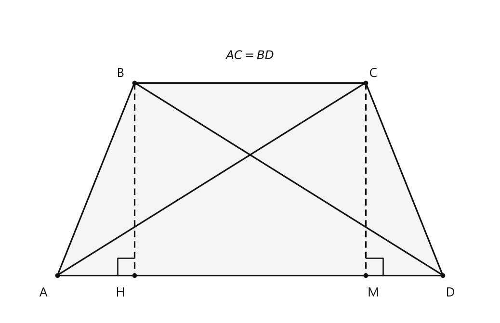
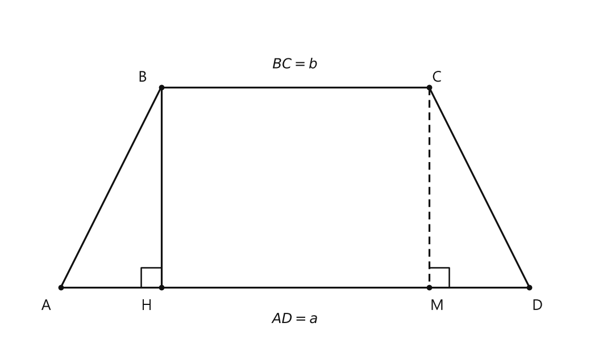
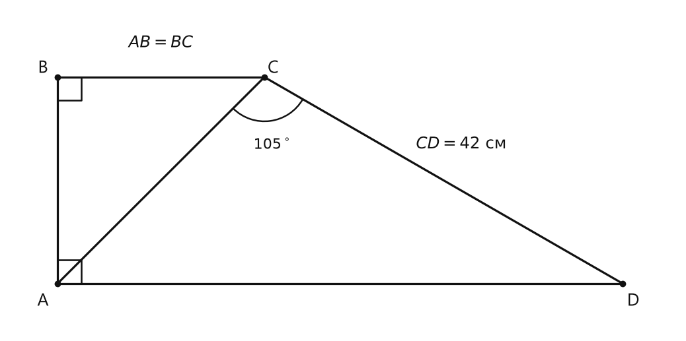
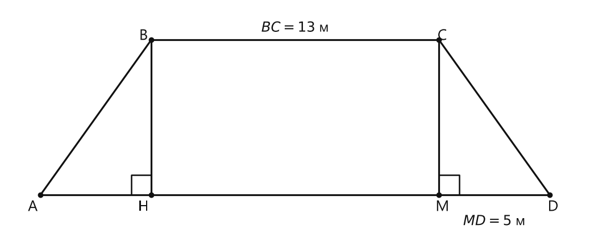
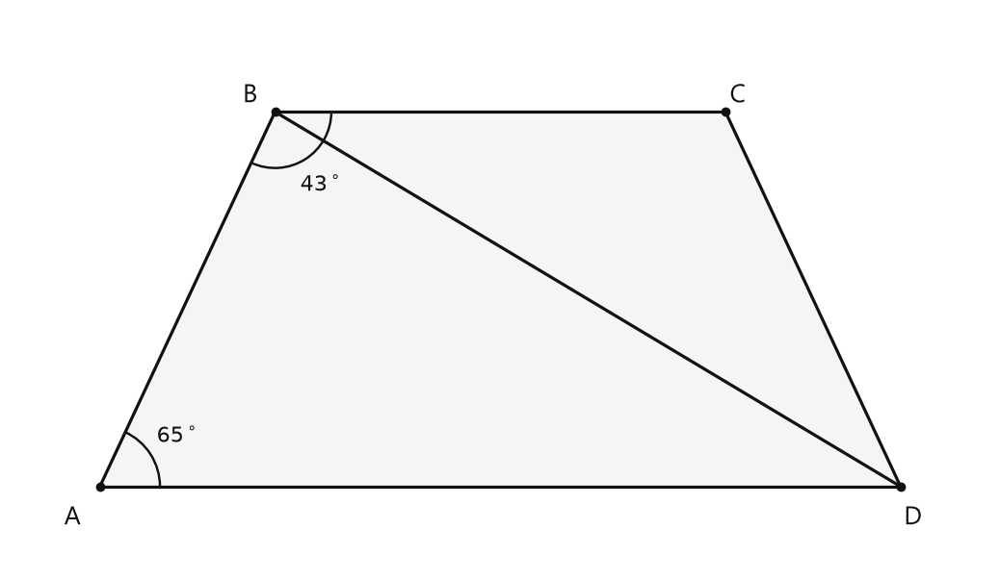

# Занятие 10. Равнобедренная и прямоугольная трапеции

**Раздел:** Глава 1. Четырехугольники  
**Параграф учебника:** §11. Равнобедренная и прямоугольная трапеции  
**Страницы:** 68–71

## Цели занятия

После занятия ты сможешь:

- распознавать равнобедренную и прямоугольную трапеции;
- применять свойства равнобедренной трапеции;
- использовать признаки равнобедренной трапеции;
- находить основания, среднюю линию и высоту трапеции;
- решать задачи с прямоугольными треугольниками внутри трапеции;
- составлять алгоритм построения равнобедренной трапеции.

Выбирай блок по уровню:

- **1–2 балла** — определения и простые свойства;
- **3–4 балла** — формулы и стандартные задачи;
- **5–6 баллов** — доказательства и задачи на высоту;
- **7–8 баллов** — составные задачи;
- **9–10 баллов** — доказательства и построения.

## Теория к занятию

### 1. Равнобедренная трапеция

#### Простыми словами

У трапеции две параллельные стороны — это основания. Две другие стороны — боковые.

Если боковые стороны равны, то трапеция имеет особый порядок:

- углы возле одного основания равны;
- диагонали равны.

Слово «равнобедренная» здесь относится именно к боковым сторонам, а не к основаниям.

#### Определение

Трапеция, у которой боковые стороны равны, называется равнобедренной.

Если в трапеции $ABCD$ основаниями являются $AD$ и $BC$, то боковые стороны — $AB$ и $CD$. Поэтому:

$$
AB=CD.
$$

#### Теорема (свойства равнобедренной трапеции)

1) У равнобедренной трапеции углы при основании равны.
2) У равнобедренной трапеции диагонали равны.

Для трапеции $ABCD$ с основаниями $AD$ и $BC$ это означает:

$$
\angle A=\angle D,
$$

$$
\angle B=\angle C,
$$

$$
AC=BD.
$$

#### Когда применять

Если в условии сказано, что трапеция равнобедренная, можно использовать:

- равенство боковых сторон;
- равенство углов при одном основании;
- равенство диагоналей;
- сумму углов, прилежащих к одной боковой стороне;
- равенство сумм противоположных углов $180^\circ$.

#### Правила

- Углы при **одном основании** равны.
- Углы, прилежащие к одной боковой стороне, в любой трапеции в сумме дают $180^\circ$, потому что основания параллельны.
- Диагонали равнобедренной трапеции равны.
- Обратно это работает только по специальному признаку: если диагонали равны, трапецию ещё нужно назвать равнобедренной с помощью доказательства.

#### Ловушки

- Не путай равные углы при одном основании с противоположными углами.
- Равные диагонали есть не у каждой трапеции.
- Если основания названы $AD$ и $BC$, то боковые стороны — $AB$ и $CD$.

---

### 2. Признаки равнобедренной трапеции

#### Простыми словами

Свойство говорит:

> если трапеция равнобедренная, то у неё равны углы при основании и диагонали.

Признак позволяет рассуждать в обратную сторону:

> если у трапеции равны углы при основании или диагонали, то трапеция равнобедренная.

Но обратное утверждение нельзя просто объявить. Его надо доказать.

#### Признак равнобедренной трапеции

Если углы при основании трапеции равны, то она — равнобедренная.

#### Признак равнобедренной трапеции

Если у трапеции диагонали равны, то она — равнобедренная.

#### Алгоритм доказательства по равным диагоналям

Пусть в трапеции $ABCD$ основаниями являются $AD$ и $BC$, а диагонали равны:

$$
AC=BD.
$$

1. Провести высоты $BH$ и $CM$ к большему основанию.
2. Использовать равенство высот:

$$
BH=CM.
$$

Это расстояния между параллельными прямыми.
3. Рассмотреть прямоугольные треугольники $AMC$ и $DHB$.
4. Доказать их равенство по катету и гипотенузе.
5. Получить равенство углов:

$$
\angle CAD=\angle BDA.
$$

6. Рассмотреть треугольники $ACD$ и $DBA$.
7. Доказать их равенство по двум сторонам и углу между ними.
8. Получить равенство боковых сторон:

$$
AB=CD.
$$

9. По определению трапеция равнобедренная.

#### Ловушки

- Равенство диагоналей — это условие для применения признака, а не определение равнобедренной трапеции.
- Сначала проверь, какие стороны являются основаниями.
- В доказательстве нужно назвать признак равенства треугольников. Одного слова «равны» недостаточно: геометрия любит точность.

---

### 3. Высота равнобедренной трапеции

#### Простыми словами

Пусть в равнобедренной трапеции большее основание равно $a$, а меньшее — $b$, причём $a>b$.

Если из вершины меньшего основания провести высоту к большему основанию, то по краям появятся два равных отрезка. Они показывают, насколько большее основание длиннее меньшего.

Каждый такой отрезок равен:

$$
\frac{a-b}{2}.
$$

От высоты до дальнего конца большего основания получится отрезок:

$$
\frac{a+b}{2}.
$$

#### Формулы

Если $AD=a$, $BC=b$, а $BH$ — высота, то:

$$
AH=MD=\frac{a-b}{2},
$$

$$
HM=b,
$$

$$
HD=\frac{a+b}{2}.
$$

Средняя линия трапеции равна полусумме оснований:

$$
m=\frac{a+b}{2}.
$$

Поэтому в таком расположении:

$$
HD=m.
$$

#### Когда применять

Эти формулы подходят, если:

- трапеция равнобедренная;
- известны оба основания;
- высота проведена из вершины меньшего основания;
- нужно найти часть большего основания, всё большее основание или среднюю линию.

#### Ловушки

- Полуразность оснований:

$$
\frac{a-b}{2},
$$

а не $\frac{a+b}{2}$.
- Средняя линия — это полусумма оснований:

$$
m=\frac{a+b}{2}.
$$
- Большее основание должно быть действительно больше меньшего: $a>b$.
- В уравнении для большего основания не потеряй один из двух одинаковых краевых отрезков:

$$
a=AH+b+MD.
$$

---

### 4. Прямоугольная трапеция

#### Простыми словами

Если у трапеции есть один прямой угол, то из-за параллельности оснований соседний угол тоже будет прямым.

Значит, одна боковая сторона перпендикулярна обоим основаниям. Она и является высотой.

#### Определение

Трапеция, у которой есть прямой угол, называется прямоугольной трапецией.

#### Свойство

Высота прямоугольной трапеции равна ее меньшей боковой стороне.

Если $\angle A=90^\circ$ в трапеции $ABCD$ с основаниями $AD$ и $BC$, то:

$$
AB=h.
$$

Вторая боковая сторона $CD$ может быть наклонной. Вместе с разностью оснований и высотой она образует прямоугольный треугольник. Поэтому $CD$ является гипотенузой и больше высоты.

#### Формулы

Средняя линия трапеции:

$$
m=\frac{AD+BC}{2}.
$$

Если в прямоугольном треугольнике известна гипотенуза и угол $30^\circ$, используем свойство прямоугольного треугольника:

$$
h=\frac{CD}{2},
$$

если $h$ лежит против угла $30^\circ$.

#### Ловушки

- Высота — не любая боковая сторона.
- В прямоугольной трапеции высотой является меньшая боковая сторона.
- Наклонная боковая сторона может быть гипотенузой, а гипотенуза всегда самая длинная.
- Сначала найди прямоугольный треугольник и определи, где находится угол $30^\circ$.

---

### 5. Следствие о диагоналях

#### Простыми словами

В равнобедренной трапеции диагонали пересекаются не случайно. Их части и некоторые углы связаны равенствами.

#### Следствие

В равнобедренной трапеции $\angle ADB = \angle DAC$, $AO = DO$ и $BO = CO$ (см. рис. 124).

Здесь $O$ — точка пересечения диагоналей $AC$ и $BD$.

#### Когда применять

Следствие можно использовать, если в задаче есть:

- точка пересечения диагоналей;
- равенство отрезков диагоналей;
- равенство углов, образованных диагональю и основанием.

Если равнобедренность ещё не дана, её можно доказать с помощью признака.

#### Ловушки

- Не путай:

$$
AO=DO
$$

и

$$
AO=CO.
$$

- Равенства относятся к отрезкам разных диагоналей.
- Следствие действует именно для равнобедренной трапеции.

---

## Сводка формул «выучить наизусть»

Для трапеции с основаниями $a$ и $b$ средняя линия равна:

$$
m=\frac{a+b}{2},
$$

где $m$ — средняя линия.

Для равнобедренной трапеции:

$$
AB=CD,
$$

$$
\angle A=\angle D,
$$

$$
\angle B=\angle C,
$$

$$
AC=BD.
$$

Если высота из вершины меньшего основания делит большее основание на отрезки, то их длины:

$$
\frac{a-b}{2}
\quad\text{и}\quad
\frac{a+b}{2}.
$$

Для прямоугольной трапеции:

$$
h=\text{меньшая боковая сторона}.
$$

В прямоугольном треугольнике катет, лежащий против угла $30^\circ$, равен половине гипотенузы:

$$
\text{катет против угла }30^\circ=\frac12\text{ гипотенузы}.
$$

## Правила, которые нельзя путать

- Равные углы при одном основании — свойство равнобедренной трапеции. Если такие углы даны, это может быть признаком равнобедренной трапеции.
- Равные диагонали — свойство равнобедренной трапеции. Если диагонали равны, это также может быть признаком равнобедренной трапеции.
- Средняя линия — полусумма оснований.
- В прямоугольной трапеции меньшая боковая сторона является высотой, а большая боковая сторона может быть гипотенузой.
- Сумма углов, прилежащих к одной боковой стороне трапеции, равна $180^\circ$.
- В равнобедренной трапеции сумма противоположных углов также равна $180^\circ$.

## Разбор ключевых заданий

### Р1. Признак равнобедренной трапеции по диагоналям

**Условие.**  
Дана трапеция $ABCD$ с основаниями $AD$ и $BC$. Диагонали равны:

$$
AC=BD.
$$

Доказать, что трапеция равнобедренная.

<!--geo-figure-spec
{
  "needed": true,
  "kind": "plane",
  "caption": "Трапеция $ABCD$ с основаниями $AD$ и $BC$ и равными диагоналями $AC=BD$",
  "equal": true,
  "axis": false,
  "xlim": [
    -0.8,
    6.8
  ],
  "ylim": [
    -0.65,
    4.2
  ],
  "points": {
    "A": [
      0,
      0
    ],
    "B": [
      1.2,
      3
    ],
    "C": [
      4.8,
      3
    ],
    "D": [
      6,
      0
    ],
    "H": [
      1.2,
      0
    ],
    "M": [
      4.8,
      0
    ]
  },
  "segments": [
    [
      "A",
      "B"
    ],
    [
      "B",
      "C"
    ],
    [
      "C",
      "D"
    ],
    [
      "D",
      "A"
    ],
    [
      "A",
      "C"
    ],
    [
      "B",
      "D"
    ],
    {
      "points": [
        "B",
        "H"
      ],
      "dashed": true,
      "label": "",
      "t": 0.5
    },
    {
      "points": [
        "C",
        "M"
      ],
      "dashed": true,
      "label": "",
      "t": 0.5
    }
  ],
  "polygons": [
    {
      "vertices": [
        "A",
        "B",
        "C",
        "D"
      ],
      "fill": 0.04
    }
  ],
  "circles": [],
  "labels": {
    "A": {
      "dx": -0.22,
      "dy": -0.28
    },
    "B": {
      "dx": -0.22,
      "dy": 0.14
    },
    "C": {
      "dx": 0.12,
      "dy": 0.14
    },
    "D": {
      "dx": 0.12,
      "dy": -0.28
    },
    "H": {
      "dx": -0.22,
      "dy": -0.28
    },
    "M": {
      "dx": 0.12,
      "dy": -0.28
    }
  },
  "right_angles": [
    {
      "vertex": "H",
      "from": "A",
      "to": "B"
    },
    {
      "vertex": "M",
      "from": "D",
      "to": "C"
    }
  ],
  "angle_marks": [],
  "texts": [
    {
      "xy": [
        3,
        3.42
      ],
      "text": "$AC=BD$"
    }
  ]
}
-->

*Трапеция ABCD с основаниями AD и BC и равными диагоналями AC=BD*

**Доказательство.**

Проведём высоты $BH$ и $CM$.

Так как основания трапеции параллельны, они находятся на одинаковом расстоянии друг от друга. Поэтому:

$$
BH=CM.
$$

Рассмотрим прямоугольные треугольники $AMC$ и $DHB$.

У них:

$$
AC=BD
$$

по условию;

$$
CM=BH
$$

как расстояния между параллельными прямыми.

Оба треугольника прямоугольные. Значит, они равны по катету и гипотенузе:

$$
\triangle AMC=\triangle DHB.
$$

У равных треугольников равны соответствующие углы. Поэтому:

$$
\angle CAD=\angle BDA.
$$

Теперь рассмотрим треугольники $ACD$ и $DBA$.

У них:

$$
AC=DB;
$$

$$
AD=DA;
$$

$$
\angle CAD=\angle BDA.
$$

Значит, треугольники равны по двум сторонам и углу между ними:

$$
\triangle ACD=\triangle DBA.
$$

У равных треугольников соответствующие стороны равны:

$$
AB=CD.
$$

По определению трапеция $ABCD$ является равнобедренной.

**Ответ:** трапеция $ABCD$ равнобедренная.

> Равные диагонали запустили цепочку: сначала равные прямоугольные треугольники, затем равные боковые стороны. Геометрическое домино сработало.

---

### Р2. Отрезки, на которые высота делит большее основание

**Условие.**  
В равнобедренной трапеции $ABCD$ основания равны:

$$
AD=a,\qquad BC=b,
$$

где $a>b$. Высота $BH$ проведена из вершины $B$ на основание $AD$. Доказать, что

$$
AH=\frac{a-b}{2},
\qquad
HD=\frac{a+b}{2}.
$$

<!--geo-figure-spec
{
  "needed": true,
  "kind": "plane",
  "caption": "Высота $BH$ в равнобедренной трапеции $ABCD$",
  "equal": true,
  "axis": false,
  "xlim": [
    -0.8,
    7.8
  ],
  "ylim": [
    -0.8,
    4.2
  ],
  "points": {
    "A": [
      0,
      0
    ],
    "B": [
      1.5,
      3
    ],
    "C": [
      5.5,
      3
    ],
    "D": [
      7,
      0
    ],
    "H": [
      1.5,
      0
    ],
    "M": [
      5.5,
      0
    ]
  },
  "segments": [
    [
      "A",
      "B"
    ],
    [
      "B",
      "C"
    ],
    [
      "C",
      "D"
    ],
    [
      "D",
      "A"
    ],
    {
      "points": [
        "B",
        "H"
      ],
      "dashed": false,
      "label": "",
      "t": 0.5
    },
    {
      "points": [
        "C",
        "M"
      ],
      "dashed": true,
      "label": "",
      "t": 0.5
    }
  ],
  "polygons": [],
  "circles": [],
  "labels": {
    "A": {
      "dx": -0.22,
      "dy": -0.28
    },
    "B": {
      "dx": -0.28,
      "dy": 0.14
    },
    "C": {
      "dx": 0.12,
      "dy": 0.14
    },
    "D": {
      "dx": 0.12,
      "dy": -0.28
    },
    "H": {
      "dx": -0.22,
      "dy": -0.28
    },
    "M": {
      "dx": 0.12,
      "dy": -0.28
    }
  },
  "right_angles": [
    {
      "vertex": "H",
      "from": "A",
      "to": "B"
    },
    {
      "vertex": "M",
      "from": "D",
      "to": "C"
    }
  ],
  "angle_marks": [],
  "texts": [
    {
      "xy": [
        3.5,
        -0.48
      ],
      "text": "$AD=a$"
    },
    {
      "xy": [
        3.5,
        3.34
      ],
      "text": "$BC=b$"
    }
  ]
}
-->

*Высота BH в равнобедренной трапеции ABCD*

**Доказательство.**

Проведём вторую высоту $CM$.

Рассмотрим прямоугольные треугольники $AHB$ и $DMC$.

У них:

- $AB=CD$, потому что трапеция равнобедренная;
- $BH=CM$, потому что это расстояния между параллельными основаниями.

Следовательно, треугольники равны по катету и гипотенузе:

$$
\triangle AHB=\triangle DMC.
$$

Поэтому соответствующие отрезки равны:

$$
AH=MD.
$$

Четырёхугольник $HBCM$ — прямоугольник: его противоположные стороны лежат на параллельных прямых, а углы прямые.

Значит:

$$
HM=BC=b.
$$

Большое основание состоит из трёх частей:

$$
AD=AH+HM+MD.
$$

Подставим известные обозначения:

$$
a=AH+b+AH.
$$

Сложим два одинаковых отрезка:

$$
a=2AH+b.
$$

Перенесём $b$ в левую часть:

$$
2AH=a-b.
$$

Разделим обе части на $2$:

$$
AH=\frac{a-b}{2}.
$$

Так как $AH=MD$, получаем:

$$
MD=\frac{a-b}{2}.
$$

Теперь найдём $HD$. Это часть большего основания от точки $H$ до точки $D$:

$$
HD=AD-AH.
$$

Подставим значения:

$$
HD=a-\frac{a-b}{2}.
$$

Представим число $a$ в виде дроби со знаменателем $2$:

$$
HD=\frac{2a-a+b}{2}.
$$

Упростим числитель:

$$
HD=\frac{a+b}{2}.
$$

**Ответ:**

$$
AH=\frac{a-b}{2},
\qquad
HD=\frac{a+b}{2}.
$$

> Здесь важно не перепутать «сколько добавилось» и «сколько получилось целиком»: по краям стоит полуразность, а отрезок $HD$ равен полусумме оснований.

---

### Р3. Прямоугольная трапеция и угол $30^\circ$

**Условие.**  
$ABCD$ — прямоугольная трапеция с основаниями $BC$ и $AD$. Меньшая боковая сторона равна меньшему основанию. Большая боковая сторона равна $42$ см и образует с диагональю $AC$ угол, равный $105^\circ$. Найти высоту трапеции.

<!--geo-figure-spec
{
  "needed": true,
  "kind": "plane",
  "caption": "Прямоугольная трапеция $ABCD$",
  "equal": true,
  "axis": false,
  "xlim": [
    -5,
    63
  ],
  "ylim": [
    -5,
    28
  ],
  "points": {
    "A": [
      0,
      0
    ],
    "B": [
      0,
      21
    ],
    "C": [
      21,
      21
    ],
    "D": [
      57.373,
      0
    ]
  },
  "segments": [
    [
      "A",
      "B"
    ],
    [
      "B",
      "C"
    ],
    [
      "C",
      "D"
    ],
    [
      "D",
      "A"
    ],
    [
      "A",
      "C"
    ]
  ],
  "polygons": [],
  "circles": [],
  "labels": {
    "A": {
      "dx": -1.5,
      "dy": -1.8
    },
    "B": {
      "dx": -1.5,
      "dy": 0.9
    },
    "C": {
      "dx": 0.9,
      "dy": 0.9
    },
    "D": {
      "dx": 1.1,
      "dy": -1.8
    }
  },
  "right_angles": [
    {
      "vertex": "A",
      "from": "B",
      "to": "D"
    },
    {
      "vertex": "B",
      "from": "A",
      "to": "C"
    }
  ],
  "angle_marks": [
    {
      "vertex": "C",
      "from": "A",
      "to": "D",
      "text": "$105^\\circ$",
      "radius": 4.5
    }
  ],
  "texts": [
    {
      "xy": [
        10.5,
        24.5
      ],
      "text": "$AB=BC$"
    },
    {
      "xy": [
        41,
        14.2
      ],
      "text": "$CD=42\\ \\text{см}$"
    }
  ]
}
-->

*Прямоугольная трапеция ABCD*

**Решение.**

Пусть меньшая боковая сторона — $AB$, а меньшее основание — $BC$.

Так как трапеция прямоугольная, два угла при боковой стороне $AB$ прямые:

$$
\angle A=\angle B=90^\circ.
$$

По условию меньшая боковая сторона равна меньшему основанию:

$$
AB=BC.
$$

Рассмотрим треугольник $ABC$.

У него:

$$
\angle ABC=90^\circ,
$$

$$
AB=BC.
$$

Значит, треугольник $ABC$ — прямоугольный равнобедренный. Его острые углы равны, а их сумма равна $90^\circ$:

$$
\angle ACB=45^\circ.
$$

Диагональ $AC$ разделяет угол $BCD$ на два угла:

$$
\angle BCD=\angle ACB+\angle ACD.
$$

По условию:

$$
\angle ACD=105^\circ.
$$

Поэтому:

$$
\angle BCD=45^\circ+105^\circ.
$$

$$
\angle BCD=150^\circ.
$$

Углы $C$ и $D$ прилежат к одной боковой стороне $CD$. В трапеции их сумма равна $180^\circ$:

$$
\angle D=180^\circ-150^\circ.
$$

$$
\angle D=30^\circ.
$$

Проведём высоту $CH$ к большему основанию $AD$.

Рассмотрим прямоугольный треугольник $CHD$.

В нём:

- угол $D$ равен $30^\circ$;
- гипотенуза $CD=42$ см;
- катет $CH$ лежит против угла $30^\circ$.

По свойству прямоугольного треугольника:

$$
CH=\frac{CD}{2}.
$$

Подставим длину боковой стороны:

$$
CH=\frac{42}{2}.
$$

$$
CH=21\text{ см}.
$$

Отрезок $CH$ — высота трапеции.

**Ответ:** $21$ см.

> Угол $105^\circ$ выглядит грозно, но он нужен только для получения угла $30^\circ$. А дальше работает знакомое правило: катет против $30^\circ$ равен половине гипотенузы.

### Р4. Средняя линия равнобедренной трапеции

**Условие.**  
В равнобедренной трапеции $ABCD$ меньшее основание $BC$ равно $13$ м. Высоты $BH$ и $CM$ проведены к большему основанию $AD$. Известно, что $MD=5$ м. Найти среднюю линию трапеции.

<!--geo-figure-spec
{
  "needed": true,
  "kind": "plane",
  "caption": "Равнобедренная трапеция $ABCD$ с высотами $BH$ и $CM$",
  "equal": true,
  "axis": false,
  "xlim": [
    -1.5,
    24.5
  ],
  "ylim": [
    -1.8,
    8.5
  ],
  "points": {
    "A": [
      0,
      0
    ],
    "B": [
      5,
      7
    ],
    "C": [
      18,
      7
    ],
    "D": [
      23,
      0
    ],
    "H": [
      5,
      0
    ],
    "M": [
      18,
      0
    ]
  },
  "segments": [
    [
      "A",
      "B"
    ],
    [
      "B",
      "C"
    ],
    [
      "C",
      "D"
    ],
    [
      "D",
      "A"
    ],
    [
      "B",
      "H"
    ],
    [
      "C",
      "M"
    ]
  ],
  "polygons": [],
  "circles": [],
  "labels": {
    "A": {
      "dx": -0.35,
      "dy": -0.55
    },
    "B": {
      "dx": -0.35,
      "dy": 0.18
    },
    "C": {
      "dx": 0.15,
      "dy": 0.18
    },
    "D": {
      "dx": 0.15,
      "dy": -0.55
    },
    "H": {
      "dx": -0.35,
      "dy": -0.55
    },
    "M": {
      "dx": 0.15,
      "dy": -0.55
    }
  },
  "right_angles": [
    {
      "vertex": "H",
      "from": "A",
      "to": "B"
    },
    {
      "vertex": "M",
      "from": "D",
      "to": "C"
    }
  ],
  "angle_marks": [],
  "texts": [
    {
      "xy": [
        11.5,
        7.55
      ],
      "text": "$BC=13$ м"
    },
    {
      "xy": [
        20.5,
        -1.2
      ],
      "text": "$MD=5$ м"
    }
  ]
}
-->

*Равнобедренная трапеция ABCD с высотами BH и CM*

**Решение.**

Так как трапеция равнобедренная, боковые стороны равны:

$$
AB=CD.
$$

Высоты $BH$ и $CM$ перпендикулярны основанию $AD$.

Рассмотрим прямоугольные треугольники $ABH$ и $DCM$:

- $AB=CD$;
- $BH=CM$ — обе высоты трапеции;
- углы $AHB$ и $DMC$ — прямые.

Значит, треугольники равны по гипотенузе и катету. Поэтому:

$$
AH=MD.
$$

По условию:

$$
MD=5\text{ м}.
$$

Следовательно:

$$
AH=5\text{ м}.
$$

Так как $BH$ и $CM$ перпендикулярны одной и той же прямой $AD$, то $BH\parallel CM$. Четырёхугольник $BHMC$ — прямоугольник, поэтому:

$$
HM=BC=13\text{ м}.
$$

Большее основание состоит из трёх частей:

$$
AD=AH+HM+MD.
$$

Подставим известные длины:

$$
AD=5+13+5.
$$

$$
AD=23\text{ м}.
$$

Средняя линия трапеции равна полусумме оснований:

$$
m=\frac{AD+BC}{2}.
$$

$$
m=\frac{23+13}{2}.
$$

$$
m=\frac{36}{2}.
$$

$$
m=18\text{ м}.
$$

**Ответ:** $18$ м.

> У равнобедренной трапеции «лишние кусочки» по краям одинаковые. Трапеция как будто аккуратно центрируется над большим основанием.

---

### Р5. Боковые стороны по углам и средней линии

**Условие.**  
В трапеции $ABCD$ с основаниями $AD$ и $BC$ углы $A$ и $D$ равны. Боковая сторона $AB=12{,}4$ см, средняя линия равна $15$ см. Найти периметр трапеции.

**Решение.**

Углы $A$ и $D$ — углы при основании $AD$.

Если углы при одном основании трапеции равны, то трапеция равнобедренная. Поэтому её боковые стороны равны:

$$
AB=CD.
$$

По условию:

$$
AB=12{,}4\text{ см}.
$$

Значит:

$$
CD=12{,}4\text{ см}.
$$

Средняя линия трапеции равна полусумме оснований:

$$
\frac{AD+BC}{2}=15.
$$

Умножим обе части равенства на $2$:

$$
AD+BC=30\text{ см}.
$$

Периметр трапеции равен сумме всех её сторон:

$$
P=AB+BC+CD+AD.
$$

Соберём основания и боковые стороны:

$$
P=(AD+BC)+(AB+CD).
$$

Подставим найденные суммы:

$$
P=30+12{,}4+12{,}4.
$$

$$
P=30+24{,}8.
$$

$$
P=54{,}8\text{ см}.
$$

**Ответ:** $54{,}8$ см.

> Средняя линия уже спрятала половину суммы оснований. Умножили её на два — и основания появились полностью.

---

### Р6. Сумма противоположных углов

**Условие.**  
Доказать, что сумма противоположных углов равнобедренной трапеции равна $180^\circ$.

**Доказательство.**

Рассмотрим равнобедренную трапецию $ABCD$ с основаниями $AD$ и $BC$.

Так как трапеция равнобедренная, углы при основании $AD$ равны:

$$
\angle A=\angle D.
$$

Основания трапеции параллельны:

$$
AD\parallel BC.
$$

Боковая сторона $AB$ пересекает параллельные прямые $AD$ и $BC$. Поэтому внутренние односторонние углы $A$ и $B$ в сумме дают $180^\circ$:

$$
\angle A+\angle B=180^\circ.
$$

Заменим $\angle A$ равным ему углом $\angle D$:

$$
\angle D+\angle B=180^\circ.
$$

Следовательно:

$$
\angle B+\angle D=180^\circ.
$$

Теперь рассмотрим боковую сторону $CD$. Углы $C$ и $D$ — внутренние односторонние, поэтому:

$$
\angle C+\angle D=180^\circ.
$$

Так как $\angle A=\angle D$, можно записать:

$$
\angle A+\angle C=180^\circ.
$$

Итак, сумма каждой пары противоположных углов равна $180^\circ$:

$$
\angle A+\angle C=180^\circ,
\qquad
\angle B+\angle D=180^\circ.
$$

**Ответ:**

$$
\angle A+\angle C=180^\circ,
\qquad
\angle B+\angle D=180^\circ.
$$

> Параллельные основания здесь работают как «угловой обменник»: соседние углы дополняют друг друга до $180^\circ$, а равные углы при основании помогают получить противоположные.

---

### Р7. Нахождение угла по рисунку

**Условие.**  
$ABCD$ — равнобедренная трапеция. Известно:

$$
\angle A=65^\circ,
\qquad
\angle B=43^\circ.
$$

Найти угол $CDB$, где $BD$ — диагональ.

<!--geo-figure-spec
{
  "needed": true,
  "kind": "plane",
  "caption": "Равнобедренная трапеция $ABCD$ с диагональю $BD$",
  "equal": true,
  "axis": false,
  "xlim": [
    -0.7,
    7.1
  ],
  "ylim": [
    -0.65,
    3.8
  ],
  "points": {
    "A": [
      0,
      0
    ],
    "B": [
      1.4,
      3
    ],
    "C": [
      5,
      3
    ],
    "D": [
      6.4,
      0
    ]
  },
  "segments": [
    [
      "A",
      "B"
    ],
    [
      "B",
      "C"
    ],
    [
      "C",
      "D"
    ],
    [
      "D",
      "A"
    ],
    [
      "B",
      "D"
    ]
  ],
  "polygons": [
    {
      "vertices": [
        "A",
        "B",
        "C",
        "D"
      ],
      "fill": 0.04
    }
  ],
  "circles": [],
  "labels": {
    "A": {
      "dx": -0.22,
      "dy": -0.25
    },
    "B": {
      "dx": -0.2,
      "dy": 0.13
    },
    "C": {
      "dx": 0.1,
      "dy": 0.13
    },
    "D": {
      "dx": 0.1,
      "dy": -0.25
    }
  },
  "right_angles": [],
  "angle_marks": [
    {
      "vertex": "A",
      "from": "B",
      "to": "D",
      "text": "$65^\\circ$",
      "radius": 0.48
    },
    {
      "vertex": "B",
      "from": "A",
      "to": "C",
      "text": "$43^\\circ$",
      "radius": 0.45
    }
  ],
  "texts": []
}
-->

*Равнобедренная трапеция ABCD с диагональю BD*

**Решение.**

В равнобедренной трапеции углы при одном основании равны.

Углы $B$ и $C$ расположены при основании $BC$, поэтому:

$$
\angle B=\angle C.
$$

По условию:

$$
\angle B=43^\circ.
$$

Значит:

$$
\angle C=43^\circ.
$$

Рассмотрим треугольник $BCD$.

Угол $CBD$ — это угол трапеции $B$, потому что диагональ $BD$ находится внутри угла $B$ и отделяет от него угол треугольника:

$$
\angle CBD=43^\circ.
$$

Угол $BCD$ — это угол трапеции $C$:

$$
\angle BCD=43^\circ.
$$

Сумма углов треугольника равна $180^\circ$:

$$
\angle CDB+\angle CBD+\angle BCD=180^\circ.
$$

Подставим известные углы:

$$
\angle CDB+43^\circ+43^\circ=180^\circ.
$$

$$
\angle CDB=180^\circ-43^\circ-43^\circ.
$$

$$
\angle CDB=94^\circ.
$$

**Ответ:** $94^\circ$.

> В треугольнике два угла уже «заняли» по $43^\circ$. Третьему остаётся $94^\circ` — места хватило.

---

### Р8. Средняя линия прямоугольной трапеции

**Условие.**  
$ABCD$ — прямоугольная трапеция с основаниями $AD$ и $BC$. Известно:

$$
\angle A=90^\circ,
\qquad
BC=7\text{ см},
\qquad
CD=8\text{ см},
\qquad
\angle C=120^\circ.
$$

Найти среднюю линию трапеции.

**Решение.**

Так как $\angle A=90^\circ$, трапеция является прямоугольной.

Основания $AD$ и $BC$ параллельны. Поэтому углы $C$ и $D$, прилежащие к боковой стороне $CD$, в сумме дают $180^\circ$:

$$
\angle C+\angle D=180^\circ.
$$

Найдём угол $D$:

$$
\angle D=180^\circ-120^\circ.
$$

$$
\angle D=60^\circ.
$$

Проведём из вершины $C$ высоту $CH$ к основанию $AD$.

Треугольник $CHD$ прямоугольный:

$$
\angle CHD=90^\circ.
$$

В нём:

- гипотенуза $CD=8$ см;
- угол $D=60^\circ$;
- значит, угол $C$ треугольника $CHD$ равен $30^\circ$.

В прямоугольном треугольнике катет, лежащий против угла $30^\circ$, равен половине гипотенузы. Поэтому:

$$
HD=\frac{CD}{2}.
$$

$$
HD=\frac{8}{2}=4\text{ см}.
$$

Большое основание состоит из меньшего основания $BC$ и отрезка $HD$:

$$
AD=BC+HD.
$$

$$
AD=7+4.
$$

$$
AD=11\text{ см}.
$$

Средняя линия трапеции равна полусумме оснований:

$$
m=\frac{AD+BC}{2}.
$$

$$
m=\frac{11+7}{2}.
$$

$$
m=\frac{18}{2}.
$$

$$
m=9\text{ см}.
$$

**Ответ:** $9$ см.

> Здесь не нужно звать в помощь новую формулу: угол $30^\circ$ уже знает секрет — катет напротив него вдвое короче гипотенузы.

---

### Р9. Диагональ равнобедренной трапеции

**Условие.**  
Диагональ равнобедренной трапеции равна $6$ см и образует с основанием угол $60^\circ$. Найти среднюю линию трапеции.

**Решение.**

Пусть диагональ равна:

$$
d=6\text{ см}.
$$

Проведём из конца диагонали перпендикуляр к основанию. Получится прямоугольный треугольник, в котором диагональ — гипотенуза.

Диагональ образует с основанием угол $60^\circ$. Поэтому второй острый угол прямоугольного треугольника равен:

$$
90^\circ-60^\circ=30^\circ.
$$

Горизонтальная проекция диагонали лежит против угла $30^\circ$. Значит, она равна половине диагонали:

$$
x=\frac{d}{2}.
$$

Подставим $d=6$ см:

$$
x=\frac{6}{2}=3\text{ см}.
$$

В равнобедренной трапеции горизонтальная проекция диагонали равна средней линии. Это видно, если опустить высоты из концов меньшего основания: крайние отрезки большого основания равны, поэтому проекция диагонали состоит из одного крайнего отрезка и меньшего основания, то есть равна полусумме оснований.

Следовательно:

$$
m=x=3\text{ см}.
$$

**Ответ:** $3$ см.

> Диагональ здесь — наклонная линейка. Её «тень» на основании как раз равна средней линии.

---

### Р10. Алгоритм построения равнобедренной трапеции

#### а) Построение по двум основаниям и боковой стороне

**Дано:**

$$
AD=a,\qquad BC=b,\qquad AB=CD=c.
$$

Пусть $a>b$, то есть $AD$ — большее основание, а $BC$ — меньшее.

В равнобедренной трапеции, если из концов меньшего основания провести высоты к большему основанию, по краям большого основания получатся равные отрезки. Каждый из них равен:

$$
x=\frac{a-b}{2}.
$$

**Алгоритм.**

1. Построить отрезок $AD=a$.
2. От точки $A$ на отрезке $AD$ отложить отрезок длины

$$
x=\frac{a-b}{2}.
$$

Получить точку $H$.

3. От точки $D$ в сторону точки $A$ отложить такой же отрезок длины $x$. Получить точку $M$.
4. Через точки $H$ и $M$ провести перпендикуляры к $AD$.
5. На перпендикуляре через $H$ отложить отрезок

$$
HB=c.
$$

6. На перпендикуляре через $M$ отложить отрезок

$$
MC=c
$$

в одну и ту же сторону от основания $AD$.
7. Соединить точки $B$ и $C$.
8. Получится равнобедренная трапеция $ABCD$:

$$
AB=CD=c,
\qquad
BC\parallel AD.
$$

Действительно:

$$
HM=AD-AH-MD.
$$

Так как $AH=MD=x$, получаем:

$$
HM=a-2x.
$$

Подставим $x=\frac{a-b}{2}$:

$$
HM=a-(a-b)=b.
$$

Значит:

$$
BC=HM=b.
$$

**Проверка существования.**

В прямоугольном треугольнике с гипотенузой $c$ и катетом $x$ второй катет должен быть положительным. Поэтому:

$$
c>\frac{a-b}{2}.
$$

Если это условие не выполняется, боковая сторона не сможет «подняться» над основанием, и построение невозможно.

#### б) Построение по диагонали и двум основаниям

**Дано:**

$$
AD=a,\qquad BC=b,\qquad AC=BD=d.
$$

Пусть $a>b$.

В равнобедренной трапеции горизонтальная проекция диагонали равна средней линии. Поэтому её длина равна:

$$
x=\frac{a+b}{2}.
$$

**Алгоритм.**

1. Построить отрезок $AD=a$.
2. На отрезке $AD$ от точки $A$ отложить отрезок длины

$$
x=\frac{a+b}{2}.
$$

Получить точку $N$.
3. Через точку $N$ провести перпендикуляр к $AD$.
4. Построить окружность с центром $A$ и радиусом $d$.
5. Точку пересечения этой окружности с перпендикуляром обозначить $C$.
6. Через точку $C$ провести прямую, параллельную $AD$.
7. На этой прямой от точки $C$ в сторону точки $A$ отложить отрезок длины $b$. Получить точку $B$.
8. Соединить $A$ с $B$ и $C$ с $D$.
9. Проверить длины диагоналей:

$$
AC=d,
\qquad
BD=d.
$$

Почему в построении появляется именно

$$
x=\frac{a+b}{2}?
$$

Если из точек $B$ и $C$ опустить высоты на $AD$, крайние отрезки большого основания будут равны. Тогда горизонтальная проекция диагонали $AC$ состоит из левого крайнего отрезка и меньшего основания:

$$
x=\frac{a-b}{2}+b.
$$

Приведём к общему знаменателю:

$$
x=\frac{a-b+2b}{2}.
$$

$$
x=\frac{a+b}{2}.
$$

**Проверка существования.**

В прямоугольном треугольнике диагональ $d$ является гипотенузой, а её горизонтальная проекция равна

$$
\frac{a+b}{2}.
$$

Высота должна быть положительной, поэтому:

$$
d^2-\left(\frac{a+b}{2}\right)^2>0.
$$

Это равносильно условию:

$$
d>\frac{a+b}{2}.
$$

Если диагональ не длиннее своей горизонтальной проекции, трапеция не поднимется над основанием. Чертёж может быть красивым, но невозможным — геометрия такой сюжет не одобрит.

## Самопроверка

### Уровень 1–2 балла

1. Какая трапеция называется равнобедренной?
2. Чему равны углы при одном основании равнобедренной трапеции?
3. Какая боковая сторона прямоугольной трапеции является высотой?

### Уровень 3–4 балла

4. Основания равнобедренной трапеции равны $18$ см и $10$ см. Найдите среднюю линию.
5. Боковые стороны равнобедренной трапеции равны $7$ см. Чему равна их сумма?

### Уровень 5–6 баллов

6. В равнобедренной трапеции большее основание равно $26$ см, меньшее — $14$ см. Найдите отрезки, на которые высота делит большее основание.
7. Докажите, что в равнобедренной трапеции сумма противоположных углов равна $180^\circ$.

### Уровень 7–8 баллов

8. В равнобедренной трапеции диагонали равны $10$ см. Что можно утверждать о боковых сторонах?
9. В прямоугольной трапеции большая боковая сторона равна $10$ см и образует с основанием угол $60^\circ$. Найдите высоту.

### Уровень 9–10 баллов

10. Докажите признак равнобедренной трапеции по равным диагоналям.
11. Составьте алгоритм построения равнобедренной трапеции по двум основаниям и боковой стороне.

## Практические задания

Выбери свой уровень и решай только этот блок. В блоке должна закрепиться вся тема параграфа. Ответы не приводятся.

### Уровень 1–2 балла

**С1.** Выберите равнобедренную трапецию:  
1) трапеция, у которой диагонали перпендикулярны; 2) трапеция, у которой боковые стороны равны; 3) трапеция, у которой основания равны; 4) трапеция, у которой все углы равны; 5) трапеция, у которой одна диагональ больше другой.

**С2.** Выберите прямоугольную трапецию:  
1) трапеция с двумя равными боковыми сторонами; 2) трапеция с равными диагоналями; 3) трапеция, у которой есть прямой угол; 4) трапеция с равными основаниями; 5) трапеция без прямых углов.

**С3.** В равнобедренной трапеции $ABCD$ основания $AD$ и $BC$. Угол $A$ равен $68^\circ$. Найдите угол $D$.

**С4.** В равнобедренной трапеции $MNKP$ основания $MN$ и $KP$. Угол $M$ равен $115^\circ$. Найдите угол $N$.

**С5.** В равнобедренной трапеции $ABCD$ диагональ $AC$ равна $14$ см. Найдите длину диагонали $BD$.

**С6.** В трапеции $ABCD$ основания $AD$ и $BC$, причём углы $A$ и $D$ равны. Какой вывод следует сделать?

1) Трапеция прямоугольная. 2) Трапеция равнобедренная. 3) Трапеция имеет равные основания. 4) Диагонали перпендикулярны. 5) Все углы трапеции равны.

**С7.** В трапеции $ABCD$ основания $AD$ и $BC$, диагонали $AC$ и $BD$ равны. Какой вывод следует сделать?

1) Трапеция равнобедренная. 2) Трапеция прямоугольная. 3) Основания равны. 4) Диагонали перпендикулярны. 5) Все стороны равны.

**С8.** В равнобедренной трапеции $ABCD$ основания $AD$ и $BC$. Угол $A$ равен $72^\circ$. Найдите угол $B$.

**С9.** В равнобедренной трапеции $ABCD$ основания $AD$ и $BC$. Высота $BH$ проведена к большему основанию $AD$, причём $AH=6$ см и $HD=10$ см. Найдите длину большего основания $AD$.

**С10.** В равнобедренной трапеции $ABCD$ основания $AD$ и $BC$. Меньшее основание $BC=8$ см, а высота, проведённая из вершины $B$, делит большее основание на отрезки $6$ см и $6$ см. Найдите длину большего основания.

**С11.** В прямоугольной трапеции $ABCD$ основания $AD$ и $BC$, угол $A$ прямой. Меньшая боковая сторона равна $7$ см. Найдите высоту трапеции.

**С12.** В прямоугольной трапеции $ABCD$ основания $AD$ и $BC$. Диагонали трапеции равны. Какой вывод следует сделать?

1) Трапеция равнобедренная. 2) Трапеция имеет четыре прямых угла. 3) Основания равны. 4) Боковые стороны перпендикулярны. 5) Диагонали перпендикулярны.

**С13.** Выберите трапецию, которая является равнобедренной.

1) трапеция с равными боковыми сторонами  
2) трапеция с равными основаниями  
3) трапеция с перпендикулярными диагоналями  
4) трапеция с одним прямым углом  
5) трапеция с равными диагоналями и неравными боковыми сторонами

**С14.** Выберите трапецию, которая является прямоугольной.

1) трапеция с равными боковыми сторонами  
2) трапеция с одним прямым углом  
3) трапеция с равными диагоналями  
4) трапеция с равными углами при основании  
5) трапеция с перпендикулярными основаниями

**С15.** В равнобедренной трапеции $ABCD$ основаниями являются $AD$ и $BC$, а боковые стороны $AB$ и $CD$ равны. Выберите верное утверждение.

1) $\angle A=\angle B$  
2) $\angle A=\angle D$  
3) $\angle A=\angle C$  
4) $\angle B=\angle D$  
5) все четыре угла равны

**С16.** В равнобедренной трапеции $ABCD$ основаниями являются $AD$ и $BC$. Выберите верное утверждение о диагоналях.

1) $AC=BD$  
2) $AB=CD$  
3) $AD=BC$  
4) $AC\perp BD$  
5) $AC=AB$

**С17.** У трапеции $ABCD$ с основаниями $AD$ и $BC$ равны углы при основании $AD$: $\angle A=\angle D$. Выберите вывод, который следует из условия.

1) трапеция равнобедренная  
2) трапеция прямоугольная  
3) основания трапеции равны  
4) диагонали трапеции перпендикулярны  
5) все углы трапеции прямые

**С18.** У трапеции $MNKP$ диагонали равны: $MK=NP$. Выберите вывод, который следует из условия.

1) трапеция равнобедренная  
2) трапеция прямоугольная  
3) боковые стороны перпендикулярны  
4) основания равны  
5) диагонали перпендикулярны

**С19.** В равнобедренной трапеции один из углов при большем основании равен $68^\circ$. Чему равен второй угол при этом основании?

1) $22^\circ$  
2) $68^\circ$  
3) $90^\circ$  
4) $112^\circ$  
5) $136^\circ$

**С20.** В равнобедренной трапеции один из углов при меньшем основании равен $115^\circ$. Чему равен второй угол при этом основании?

1) $65^\circ$  
2) $75^\circ$  
3) $90^\circ$  
4) $115^\circ$  
5) $180^\circ$

**С21.** В равнобедренной трапеции $ABCD$ основания $AD$ и $BC$ равны соответственно $18$ см и $10$ см. Найдите среднюю линию трапеции.

**С22.** Средняя линия трапеции равна $14$ см, а одно из оснований равно $9$ см. Найдите другое основание.

**С23.** В прямоугольной трапеции одна боковая сторона перпендикулярна основаниям и равна $7$ см. Найдите высоту трапеции.

**С24.** В равнобедренной трапеции диагональ $AC$ равна $12$ см. Найдите длину диагонали $BD$.

**С25.** Выберите равнобедренную трапецию:  
1) трапеция с равными основаниями; 2) трапеция с равными боковыми сторонами; 3) трапеция с равными диагоналями и перпендикулярными основаниями; 4) трапеция с прямым углом; 5) трапеция с равными всеми углами.

**С26.** Выберите прямоугольную трапецию:  
1) трапеция с равными боковыми сторонами; 2) трапеция с двумя прямыми углами; 3) трапеция с равными диагоналями; 4) трапеция с равными основаниями; 5) трапеция с равными углами при каждом основании.

**С27.** В равнобедренной трапеции один из углов при большем основании равен $68^\circ$. Найдите второй угол при этом основании.

**С28.** В равнобедренной трапеции один из углов равен $112^\circ$. Найдите угол, прилежащий к нему.

**С29.** Основания равнобедренной трапеции равны $18$ см и $10$ см. Найдите её среднюю линию.

**С30.** Боковые стороны равнобедренной трапеции равны по $7$ см, а основания — $16$ см и $10$ см. Найдите её периметр.

**С31.** В равнобедренной трапеции одна диагональ равна $13$ см. Чему равна другая диагональ?

**С32.** В трапеции углы при одном из оснований равны $74^\circ$. Какой вывод можно сделать о трапеции?

1) Она обязательно прямоугольная.  
2) Она обязательно равнобедренная.  
3) Она обязательно имеет равные основания.  
4) Она обязательно имеет перпендикулярные диагонали.  
5) Сделать вывод о виде трапеции нельзя.

**С33.** В трапеции диагонали равны. Какой вывод можно сделать о трапеции?

1) Она равнобедренная.  
2) Она прямоугольная.  
3) Она имеет равные основания.  
4) Она имеет четыре прямых угла.  
5) Она является параллелограммом.

**С34.** В прямоугольной трапеции меньшая боковая сторона равна $9$ см. Найдите высоту трапеции.

**С35.** Основания трапеции равны $12$ см и $20$ см. Найдите её среднюю линию.

**С36.** В равнобедренной трапеции высота, проведённая из вершины меньшего основания, делит большее основание на отрезки $7$ см и $13$ см. Найдите меньшее основание.

### Уровень 3–4 балла

**С1.** Сформулируйте определение равнобедренной трапеции.

**С2.** Сформулируйте определение прямоугольной трапеции.

**С3.** В равнобедренной трапеции $ABCD$ основаниями являются $AD$ и $BC$. Известно, что $\angle A=68^\circ$. Найдите углы $B$, $C$ и $D$.

**С4.** В равнобедренной трапеции диагональ $AC$ равна $14$ см. Найдите длину диагонали $BD$.

**С5.** В трапеции $ABCD$ основания $AD$ и $BC$ параллельны, а $\angle A=\angle D$. Боковая сторона $AB$ равна $9$ см. Докажите, что трапеция является равнобедренной, и найдите длину стороны $CD$.

**С6.** В равнобедренной трапеции $ABCD$ основания $AD$ и $BC$ равны соответственно $18$ см и $10$ см. Высота $BH$ проведена из вершины $B$ к большему основанию $AD$. Найдите длины отрезков $AH$ и $HD$, если $H$ лежит на отрезке $AD$.

**С7.** В равнобедренной трапеции меньшее основание равно $12$ см, а высота, проведённая из вершины меньшего основания, делит большее основание на отрезки длиной $8$ см и $20$ см. Найдите длину большего основания.

**С8.** В равнобедренной трапеции основания равны $9$ см и $17$ см, а боковая сторона равна $5$ см. Найдите высоту трапеции.

**С9.** В равнобедренной трапеции $ABCD$ основания $AD$ и $BC$ равны $20$ см и $8$ см, а боковая сторона равна $10$ см. Найдите периметр трапеции.

**С10.** В прямоугольной трапеции $ABCD$ основания $AD$ и $BC$ параллельны, $\angle A=\angle B=90^\circ$, $BC=7$ см, $CD=10$ см, $\angle C=120^\circ$. Найдите высоту трапеции.

**С11.** В прямоугольной трапеции основания равны $12$ см и $20$ см, а большая боковая сторона равна $10$ см. Найдите высоту трапеции.

**С12.** В прямоугольной трапеции $ABCD$ основания $AD$ и $BC$ параллельны, $\angle A=\angle B=90^\circ$, высота равна $6$ см, а большая боковая сторона образует с меньшим основанием угол $45^\circ$. Найдите разность оснований трапеции.

**С13.** В равнобедренной трапеции $ABCD$ основаниями являются $AD$ и $BC$. Угол $A$ равен $68^\circ$. Найдите остальные углы трапеции.

**С14.** В равнобедренной трапеции длины оснований равны $10$ см и $18$ см, а боковая сторона равна $10$ см. Найдите высоту трапеции.

**С15.** Основания равнобедренной трапеции равны $14$ см и $26$ см. Найдите длины отрезков большего основания, на которые его делит высота, проведённая из вершины меньшего основания.

**С16.** В равнобедренной трапеции основания равны $12$ см и $20$ см, а средняя линия равна $16$ см. Найдите периметр трапеции, если её боковая сторона равна $7$ см.

**С17.** В трапеции $ABCD$ основаниями являются $AD$ и $BC$. Диагонали $AC$ и $BD$ равны $15$ см. Какой вывод можно сделать о трапеции? Запишите название соответствующего признака.

**С18.** В равнобедренной трапеции $ABCD$ основания $AD$ и $BC$, причём $\angle A=72^\circ$. Найдите сумму углов $B$ и $D$.

**С19.** В прямоугольной трапеции $ABCD$ основания $AD$ и $BC$ параллельны, $\angle A=\angle B=90^\circ$, $CD=8$ см, $\angle C=135^\circ$. Найдите высоту трапеции.

**С20.** В прямоугольной трапеции основания равны $9$ см и $17$ см. Найдите её среднюю линию.

**С21.** В прямоугольной трапеции $ABCD$ основаниями являются $AD$ и $BC$, $\angle A=\angle B=90^\circ$, высота равна $7$ см, а $\angle D=45^\circ$. Найдите разность длин оснований.

**С22.** Диагональ равнобедренной трапеции равна $10$ см и образует с большим основанием угол $60^\circ$. Меньшее основание равно $3$ см. Найдите среднюю линию трапеции.

**С23.** В равнобедренной трапеции $ABCD$ диагонали пересекаются в точке $O$. Известно, что $AO=9$ см. Найдите длину отрезка $DO$.

**С24.** В трапеции $ABCD$ основаниями являются $AD$ и $BC$, углы $A$ и $D$ равны. Боковая сторона $AB$ равна $11$ см, а средняя линия трапеции равна $18$ см. Найдите периметр трапеции.

**С25.** Равнобедренная трапеция $ABCD$ имеет основания $AD$ и $BC$. Угол $A$ равен $68^\circ$. Найдите углы $B$, $C$ и $D$.

**С26.** В равнобедренной трапеции $MNKP$ основаниями являются $MK$ и $NP$. Диагональ $MP$ равна $14$ см. Найдите длину диагонали $NK$.

**С27.** В трапеции $ABCD$ основания $AD$ и $BC$, причём $\angle A=\angle D=72^\circ$. Укажите, каким является данный вид трапеции, и назовите её боковые стороны.

**С28.** Основания равнобедренной трапеции равны $12$ см и $20$ см. Найдите длину её средней линии.

**С29.** В равнобедренной трапеции высота, проведённая из вершины меньшего основания, делит большее основание на два отрезка. Основания трапеции равны $18$ см и $10$ см. Найдите длины этих отрезков.

**С30.** Основания равнобедренной трапеции равны $9$ см и $21$ см, а боковая сторона равна $8$ см. Найдите периметр трапеции.

**С31.** Один из углов при большем основании равнобедренной трапеции равен $57^\circ$. Найдите угол при меньшем основании, прилежащий к той же боковой стороне.

**С32.** $ABCD$ — прямоугольная трапеция с основаниями $AD$ и $BC$. Меньшая боковая сторона равна $6$ см, а большая боковая сторона — $10$ см. Найдите высоту трапеции.

**С33.** Основания прямоугольной трапеции равны $8$ см и $16$ см. Найдите длину её средней линии.

**С34.** $ABCD$ — прямоугольная трапеция с основаниями $AD$ и $BC$, причём $AD=18$ см, $BC=10$ см, $\angle D=45^\circ$. Найдите высоту трапеции.

**С35.** В трапеции $ABCD$ диагонали $AC$ и $BD$ равны. Какой вывод можно сделать о виде этой трапеции? Назовите признак, на котором основан вывод.

**С36.** $ABCD$ — прямоугольная трапеция с основаниями $AD$ и $BC$. Известно, что $\angle A=90^\circ$ и $\angle C=120^\circ$. Найдите углы $B$ и $D$.

### Уровень 5–6 баллов

**С1.** В равнобедренной трапеции $ABCD$ основания $AD$ и $BC$ параллельны. Угол $A$ равен $68^\circ$. Найдите остальные углы трапеции.

**С2.** В равнобедренной трапеции $ABCD$ меньшее основание $BC$ равно $14$ см. Высота, проведённая из вершины $B$ к большему основанию $AD$, отсекает от него отрезок $AH=6$ см. Найдите большее основание трапеции.

**С3.** В равнобедренной трапеции основания равны $12$ см и $26$ см, а боковая сторона равна $13$ см. Найдите периметр трапеции.

**С4.** В равнобедренной трапеции $ABCD$ основания $AD$ и $BC$ параллельны. Докажите, что сумма противоположных углов трапеции равна $180^\circ$.

**С5.** В трапеции $ABCD$ основаниями являются $AD$ и $BC$. Диагонали $AC$ и $BD$ равны. Докажите, что трапеция является равнобедренной.

**С6.** В равнобедренной трапеции $ABCD$ основания $AD$ и $BC$ равны $24$ см и $10$ см. Высота, проведённая из вершины $B$ к основанию $AD$, делит его на два отрезка. Найдите длины этих отрезков.

**С7.** В равнобедренной трапеции $ABCD$ диагональ $AC$ равна $10$ см и образует с большим основанием угол $30^\circ$. Найдите высоту трапеции.

**С8.** В равнобедренной трапеции $ABCD$ основания $AD$ и $BC$ равны $18$ см и $8$ см, а высота равна $12$ см. Найдите длину боковой стороны.

**С9.** В равнобедренной трапеции $ABCD$ диагонали пересекаются в точке $O$. Известно, что $AO=DO$. Докажите, что трапеция является равнобедренной.

**С10.** В прямоугольной трапеции $ABCD$ основания $AD$ и $BC$ параллельны, углы $A$ и $B$ прямые, $BC=9$ см, $CD=15$ см, $\angle C=120^\circ$. Найдите высоту и среднюю линию трапеции.

**С11.** В прямоугольной трапеции $ABCD$ основания $AD$ и $BC$ параллельны, угол $D$ прямой, $\angle BAD=45^\circ$, $AD=16$ см, а боковая сторона $CD=6$ см. Найдите среднюю линию трапеции.

**С12.** В прямоугольной трапеции $ABCD$ основания $AD$ и $BC$ параллельны. Меньшая боковая сторона равна $8$ см, отношение оснований $BC:AD=3:5$, а угол $BCD$ равен $135^\circ$. Найдите среднюю линию трапеции.

**С13.** В равнобедренной трапеции $ABCD$ основания $AD$ и $BC$ параллельны. Угол $A$ равен $68^\circ$. Найдите углы $B$, $C$ и $D$.

**С14.** Средняя линия трапеции равна $17$ см, а одно из её оснований — $12$ см. Найдите второе основание.

**С15.** В равнобедренной трапеции основания равны $10$ см и $24$ см, а боковая сторона равна $9$ см. Найдите периметр трапеции.

**С16.** В трапеции $ABCD$ основаниями являются $AD$ и $BC$. Диагонали $AC$ и $BD$ равны $13$ см. Определите, является ли трапеция равнобедренной. Запишите обоснование.

**С17.** $ABCD$ — прямоугольная трапеция, $AD \parallel BC$, $\angle A=90^\circ$, $BC=8$ см, $CD=10$ см, $\angle C=120^\circ$. Найдите среднюю линию трапеции.

**С18.** В равнобедренной трапеции основания равны $18$ см и $10$ см, а боковая сторона равна $5$ см. Найдите высоту трапеции.

**С19.** Диагональ равнобедренной трапеции равна $10$ см и образует с большим основанием угол $60^\circ$. Найдите высоту трапеции.

**С20.** Докажите, что сумма противоположных углов равнобедренной трапеции равна $180^\circ$.

**С21.** В трапеции $ABCD$ основаниями являются $AD$ и $BC$, а диагонали пересекаются в точке $O$. Известно, что $AO=DO$. Докажите, что трапеция $ABCD$ равнобедренная.

**С22.** $ABCD$ — прямоугольная трапеция, $AD \parallel BC$, $AB=6$ см, $BC:AD=2:3$, $\angle BCD=135^\circ$. Найдите среднюю линию трапеции.

**С23.** В равнобедренной трапеции основания равны $20$ см и $12$ см, а высота равна $6$ см. Найдите длину боковой стороны и периметр трапеции.

**С24.** Составьте последовательность действий для построения равнобедренной трапеции по двум основаниям $a$ и $b$ и боковой стороне $c$, если построение возможно. Укажите, при каком условии на числа $a$, $b$ и $c$ такая трапеция существует.

**С25.** В равнобедренной трапеции $ABCD$ основаниями являются $AD$ и $BC$. Угол $A$ равен $68^\circ$. Найдите градусные меры остальных углов трапеции.

**С26.** В равнобедренной трапеции $ABCD$ меньшее основание $BC$ равно $14$ см. Высота $BH$, проведённая из вершины $B$ к большему основанию $AD$, отсекает на основании отрезок $HD=5$ см. Найдите длину средней линии трапеции.

**С27.** В трапеции $ABCD$ основаниями являются $AD$ и $BC$, углы $A$ и $D$ равны, боковая сторона $AB$ равна $9$ см, а средняя линия равна $16$ см. Найдите периметр трапеции.

**С28.** В трапеции $ABCD$ основаниями являются $AD$ и $BC$, а диагонали $AC$ и $BD$ равны. Меньшее основание равно $10$ см, большее основание равно $18$ см, боковая сторона равна $5$ см. Найдите периметр трапеции.

**С29.** $ABCD$ — прямоугольная трапеция с основаниями $AD$ и $BC$, причём $\angle A=\angle B=90^\circ$. Основания равны $17$ см и $9$ см, а боковая сторона $CD$ равна $10$ см. Найдите высоту и среднюю линию трапеции.

**С30.** $ABCD$ — прямоугольная трапеция с основаниями $AD$ и $BC$, причём $\angle A=\angle B=90^\circ$, $BC$ — меньшее основание и $BC=7$ см. Боковая сторона $CD$ равна $8\sqrt2$ см, а угол $C$ равен $135^\circ$. Найдите большее основание и среднюю линию трапеции.

### Уровень 7–8 баллов

**С1.** В равнобедренной трапеции $ABCD$ основания $AD$ и $BC$ параллельны, $\angle A=68^\circ$. Найдите углы $B$, $C$ и $D$.

**С2.** В равнобедренной трапеции $ABCD$ основания $AD$ и $BC$ равны соответственно $26$ см и $14$ см, а боковая сторона равна $10$ см. Найдите высоту трапеции.

**С3.** В трапеции $ABCD$ основания $AD$ и $BC$ равны $24$ см и $12$ см. Углы $A$ и $D$ равны, а боковая сторона $AB$ равна $9$ см. Найдите периметр трапеции и обоснуйте, что трапеция равнобедренная.

**С4.** Докажите, что сумма противоположных углов равнобедренной трапеции равна $180^\circ$.

**С5.** В трапеции $ABCD$ основания $AD$ и $BC$ параллельны, диагонали $AC$ и $BD$ равны. Докажите, что трапеция является равнобедренной.

**С6.** В равнобедренной трапеции $ABCD$ основание $AD$ равно $30$ см, основание $BC$ равно $18$ см. Из вершины $B$ проведена высота $BH$ к основанию $AD$, причём $H$ лежит на отрезке $AD$. Найдите $AH$ и $HD$.

**С7.** В равнобедренной трапеции $ABCD$ основания $AD$ и $BC$ параллельны, $AD+BC=52$ см. Диагональ $BD$ является биссектрисой угла $D$, а высота $BH$ пересекает основание $AD$ в точке $H$, причём $AH=10$ см. Найдите боковую сторону трапеции.

**С8.** $ABCD$ — прямоугольная трапеция с основаниями $AD$ и $BC$, причём $\angle A=\angle B=90^\circ$, $BC=8$ см, $CD=10$ см, $\angle C=120^\circ$. Найдите высоту и среднюю линию трапеции.

**С9.** $ABCD$ — прямоугольная трапеция с основаниями $AD$ и $BC$, причём $\angle A=\angle B=90^\circ$. Меньшая боковая сторона равна $6$ см, $BC:AD=2:5$, а угол $C$ равен $135^\circ$. Найдите оба основания и среднюю линию трапеции.

**С10.** Диагональ равнобедренной трапеции равна $12$ см и образует с большим основанием угол $60^\circ$. Найдите среднюю линию трапеции, если высота трапеции равна длине перпендикулярной составляющей этой диагонали.

**С11.** В равнобедренной трапеции $ABCD$ основания $AD$ и $BC$ параллельны, диагонали пересекаются в точке $O$, причём $AO=DO$. Докажите, что $AO=DO$ и $BO=CO$ являются следствиями равенства диагоналей и параллельности оснований.

**С12.** Составьте последовательность действий для построения равнобедренной трапеции $ABCD$ по двум основаниям $AD=a$, $BC=b$ и боковой стороне $AB=c$, где $a>b$ и $c>\dfrac{a-b}{2}$. Укажите, какие построения необходимо выполнить и почему полученная трапеция является равнобедренной.

**С13.** В равнобедренной трапеции $ABCD$ основаниями являются $AD$ и $BC$. Угол $A$ равен $68^\circ$. Найдите величины всех углов трапеции и обоснуйте каждый шаг решения.

**С14.** В равнобедренной трапеции $ABCD$ основания $AD$ и $BC$ равны соответственно $26$ см и $14$ см. Высота $BH$ проведена к большему основанию $AD$, причём $H$ лежит на отрезке $AD$ и $HD=6$ см. Найдите длину средней линии трапеции и длину боковой стороны $AB$, если её высота равна $8$ см.

**С15.** В трапеции $ABCD$ основаниями являются $AD$ и $BC$, причём $\angle A=\angle D$. Боковая сторона $AB$ равна $12$ см, а средняя линия трапеции равна $17$ см. Найдите периметр трапеции. Ответ обоснуйте.

**С16.** Докажите, что в равнобедренной трапеции сумма противоположных углов равна $180^\circ$. В доказательстве используйте свойства углов при параллельных прямых и свойство углов при основании равнобедренной трапеции.

**С17.** В трапеции $ABCD$ основаниями являются $AD$ и $BC$. Диагонали $AC$ и $BD$ равны. Докажите, что трапеция $ABCD$ является равнобедренной.

**С18.** В равнобедренной трапеции $ABCD$ основание $AD$ в $3$ раза больше основания $BC$, а высота $BH$, проведённая из вершины $B$ к основанию $AD$, делит основание $AD$ так, что $HD=9$ см. Найдите длины оснований и длину средней линии трапеции.

**С19.** В прямоугольной трапеции $ABCD$ основаниями являются $AD$ и $BC$, $\angle A=\angle B=90^\circ$, $BC=9$ см, $CD=10$ см, а $\angle C=120^\circ$. Найдите высоту трапеции и её среднюю линию.

**С20.** В прямоугольной трапеции $ABCD$ основаниями являются $AD$ и $BC$, $\angle A=\angle B=90^\circ$. Известно, что $AD=18$ см, $CD=10$ см, а угол между боковой стороной $CD$ и основанием $BC$ равен $135^\circ$. Найдите высоту трапеции, второе основание $BC$ и среднюю линию трапеции.

**С21.** Диагональ равнобедренной трапеции равна $12$ см и образует с большим основанием угол $60^\circ$. Найдите длину средней линии трапеции. Обоснуйте, почему для решения достаточно рассмотреть проекцию диагонали на направление оснований.

**С22.** В равнобедренной трапеции $ABCD$ основания $AD$ и $BC$ параллельны, $AD+BC=48$ см. Высота $BH$ проведена к основанию $AD$, причём $AH=8$ см. Диагональ $BD$ является биссектрисой угла $D$. Найдите длину боковой стороны $CD$.

**С23.** Составьте и обоснуйте алгоритм построения равнобедренной трапеции $ABCD$ по двум основаниям $AD=a$, $BC=b$ и боковой стороне $AB=c$, где $a>b$ и $c>\dfrac{a-b}{2}$. Укажите, какие построения необходимо выполнить и почему полученная фигура является равнобедренной трапецией.

**С24.** В трапеции $ABCD$ основаниями являются $AD$ и $BC$, диагонали пересекаются в точке $O$. Известно, что $AO=DO$ и $\angle A=\angle D$. Докажите, что трапеция является равнобедренной, и укажите, какие свойства и признаки равнобедренной трапеции использованы в доказательстве.

### Уровень 9–10 баллов

**С1.** В равнобедренной трапеции $ABCD$ основаниями являются $AD$ и $BC$, причём $AD>BC$. Диагональ $AC$ образует с большим основанием угол $37^\circ$. Найдите все углы трапеции.

**С2.** В равнобедренной трапеции $ABCD$ основания $AD$ и $BC$ равны соответственно $26$ см и $14$ см, а боковая сторона равна $10$ см. Высоты, проведённые из вершин меньшего основания к большему основанию, делят большее основание на три отрезка. Найдите длины этих отрезков и высоту трапеции.

**С3.** В равнобедренной трапеции $ABCD$ основания $AD$ и $BC$ параллельны, $AD=32$ см, $BC=12$ см. Диагональ $AC$ перпендикулярна боковой стороне $CD$. Найдите высоту трапеции и её боковую сторону.

**С4.** В трапеции $ABCD$ основаниями являются $AD$ и $BC$, причём $AD\parallel BC$. Углы при основании $AD$ равны. Диагонали $AC$ и $BD$ пересекаются в точке $O$, причём $AO=9$ см, $OC=6$ см, $BO=12$ см. Найдите длину $OD$ и докажите, что трапеция равнобедренная.

**С5.** В равнобедренной трапеции $ABCD$ основания $AD$ и $BC$ равны $30$ см и $18$ см. Диагональ $BD$ является биссектрисой угла $D$. Найдите боковую сторону трапеции и её высоту.

**С6.** В равнобедренной трапеции $ABCD$ основания $AD$ и $BC$ параллельны, $AD=24$ см, $BC=10$ см, а диагональ $AC$ равна $15$ см. Найдите высоту трапеции, боковую сторону и площадь трапеции.

**С7.** В равнобедренной трапеции $ABCD$ основания $AD$ и $BC$ параллельны. Высота $BH$ проведена из вершины $B$ к основанию $AD$, причём $AH=7$ см, $HD=19$ см, а боковая сторона $AB$ равна $25$ см. Найдите основания трапеции, её высоту и площадь.

**С8.** В равнобедренной трапеции $ABCD$ основания $AD$ и $BC$ параллельны. Средняя линия равна $17$ см, а разность оснований равна $10$ см. Боковая сторона образует с большим основанием угол $53^\circ$. Найдите высоту трапеции и площадь трапеции. Ответ округлите до десятых.

**С9.** В прямоугольной трапеции $ABCD$ основаниями являются $AD$ и $BC$, причём $AD\parallel BC$, $\angle A=\angle B=90^\circ$. Меньшее основание $BC=9$ см, боковая сторона $CD=15$ см, а угол $C$ равен $120^\circ$. Найдите высоту, большее основание и среднюю линию трапеции.

**С10.** В прямоугольной трапеции $ABCD$ основаниями являются $AD$ и $BC$, причём $AD\parallel BC$, $\angle A=\angle B=90^\circ$. Большая боковая сторона $CD=10$ см, угол $D$ равен $45^\circ$, а большее основание на $6$ см длиннее меньшего. Найдите основания, высоту и площадь трапеции.

**С11.** В прямоугольной трапеции $ABCD$ основаниями являются $AD$ и $BC$, причём $AD\parallel BC$, $\angle A=\angle B=90^\circ$. Меньшая боковая сторона равна $8$ см, а отношение оснований $BC:AD=3:5$. Диагональ $AC$ образует с меньшим основанием угол $45^\circ$. Найдите основания, большую боковую сторону и площадь трапеции.

**С12.** В трапеции $ABCD$ основаниями являются $AD$ и $BC$, причём $AD\parallel BC$. Диагонали пересекаются в точке $O$, и $AO=DO$. Докажите, что трапеция равнобедренная. Затем, если $AD=25$ см, $BC=9$ см, а высота трапеции равна $12$ см, найдите её периметр.

**С13.** Докажите признак равнобедренной трапеции: если диагонали трапеции равны, то трапеция является равнобедренной. В доказательстве рассмотрите треугольники, образованные диагоналями и одним из оснований трапеции.

**С14.** В равнобедренной трапеции длина диагонали равна $16$ см. Диагональ образует с большим основанием угол $60^\circ$. Найдите длину средней линии трапеции. Ответ запишите в сантиметрах.

**С15.** Прямоугольная трапеция $ABCD$ имеет основания $AD$ и $BC$, причём $\angle A=\angle B=90^\circ$. Известно, что $BC=8$ см, $CD=10$ см, а $\angle C=120^\circ$. Найдите среднюю линию трапеции. Ответ запишите в сантиметрах.

**С16.** В трапеции $ABCD$ основаниями являются $AD$ и $BC$, диагонали $AC$ и $BD$ пересекаются в точке $O$. Известно, что $AO=DO$. Докажите, что трапеция $ABCD$ равнобедренная. Затем объясните, какие равенства отрезков и углов следуют из доказанного.

**С17.** Составьте последовательность построения равнобедренной трапеции $ABCD$ по длинам оснований $AD=a$, $BC=b$ и диагонали $AC=d$, где $a>b>0$ и $d>\dfrac{a+b}{2}$. Укажите, какие окружности и отрезки необходимо построить, чтобы однозначно получить вершины трапеции.

**С18.** Прямоугольная трапеция $ABCD$ имеет основания $AD$ и $BC$, причём $\angle A=\angle B=90^\circ$, $AD=20$ см, $BC=8$ см, $CD=13$ см. Найдите:
1. высоту трапеции;
2. её среднюю линию;
3. площадь трапеции;
4. длину каждой диагонали.

## Чек-лист «ученик понял тему»

- Могу повторить определения и формулы параграфа своими словами и по учебнику.
- Решаю типовые задания своего уровня без подсказки.
- Вижу типичную ошибку и могу её объяснить.
