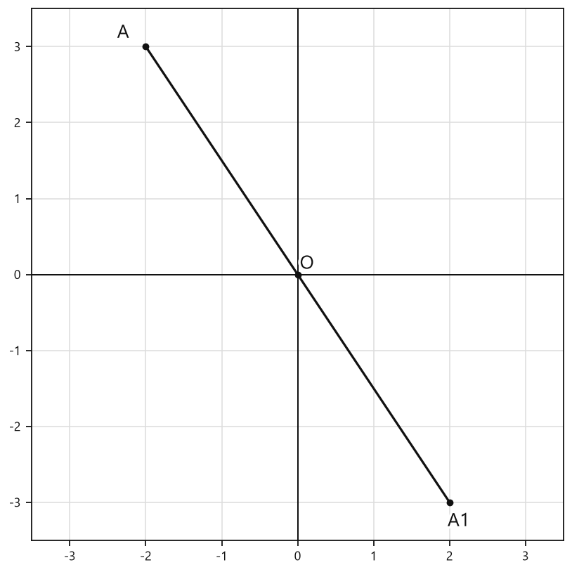
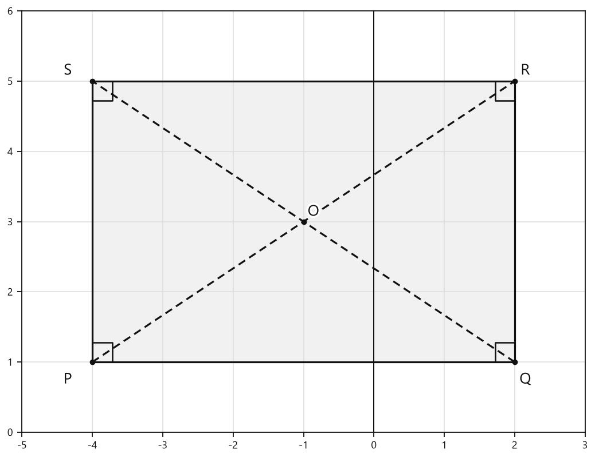

# Занятие 11. Центральная и осевая симметрия

**Раздел:** Глава 1. Четырехугольники  
**Параграф учебника:** §12. Центральная и осевая симметрия  
**Страницы:** 72–72

> В предоставленной карточке теоретического аппарата есть определения центральной симметрии, но нет определения и свойств осевой симметрии. Поэтому ниже разобрана только центральная симметрия — без добавления формулировок «из головы». Геометрия любит точность: лишняя ось здесь была бы уже не симметрией, а самодеятельностью.

## Цели занятия

После занятия ученик умеет:

- объяснять, что значит симметрия относительно точки;
- определять, являются ли две точки симметричными относительно данного центра;
- находить центр симметрии двух симметричных точек;
- распознавать центрально-симметричную фигуру;
- применять определения при решении простых задач.

Выбери блок своего уровня:

- **1–2 балла** — узнаю определения и центр симметрии;
- **3–4 балла** — проверяю симметричность точек и фигур;
- **5–6 баллов** — нахожу неизвестную точку или центр;
- **7–8 баллов** — применяю определения в задачах с отрезками;
- **9–10 баллов** — объясняю свойства фигур и обосновываю ответ.

## Теория к занятию

### Центральная симметрия — симметрия относительно точки

#### Простыми словами

Представь поворот фигуры на $180^\circ$ вокруг точки $O$. При таком повороте точка $A$ переходит в точку $A_1$.

Точка $O$ при этом оказывается ровно посередине между $A$ и $A_1$:

- точки $A$, $O$, $A_1$ лежат на одной прямой;
- расстояния $AO$ и $OA_1$ равны;
- точка $O$ — середина отрезка $AA_1$.

Центр симметрии — это не «главная точка с короной», а середина отрезка, соединяющего симметричные точки.

#### Определение

Точки $A$ и $A_1$ называются симметричными относительно точки $O$ (центра симметрии), если точка $O$ является серединой отрезка $AA_1$ (рис. 131, а).

#### Формулы

Если точка $O$ — середина отрезка $AA_1$, то

$$AO=OA_1.$$

Если известна длина всего отрезка $AA_1$, то

$$AO=OA_1=\frac{AA_1}{2}.$$

Если известны координаты точек, то координаты середины отрезка можно находить по формуле

$$O\left(\frac{x_A+x_{A_1}}{2};\frac{y_A+y_{A_1}}{2}\right).$$

Здесь $x_A$, $y_A$ — координаты точки $A$, а $x_{A_1}$, $y_{A_1}$ — координаты точки $A_1$.

#### Правила

Чтобы проверить, симметричны ли точки относительно точки $O$:

1. Проверь, что точки $A$, $O$, $A_1$ лежат на одной прямой.
2. Проверь равенство $AO=OA_1$.
3. Убедись, что точка $O$ находится между точками $A$ и $A_1$.
4. Сделай вывод: $O$ является серединой отрезка $AA_1$.

Если хотя бы одно условие не выполнено, центральной симметрии нет. Равных расстояний без одной прямой недостаточно: два луча могут разбежаться, как непослушные шнурки.

#### Ловушки

- Равенство расстояний без требования лежать на одной прямой ещё не доказывает, что $O$ — середина отрезка.
- Центр симметрии должен находиться между симметричными точками.
- Не путай центральную симметрию с отражением: здесь фигура как бы поворачивается на $180^\circ$.
- Если точка совпадает с центром симметрии, это не ошибка: центр симметрии считается симметричным сам себе.

---

### Симметричные фигуры относительно точки

#### Простыми словами

Теперь правило применяется не к одной паре точек, а ко всем точкам фигур.

Каждой точке фигуры $F$ должна соответствовать точка фигуры $F_1$, симметричная ей относительно одной и той же точки $O$.

Например, точке $A$ фигуры $F$ соответствует точка $A_1$ фигуры $F_1$, а точке $B$ — точка $B_1$. Для каждой такой пары точка $O$ должна быть серединой соединяющего отрезка.

Если хотя бы для одной точки соответствующей симметричной точки нет, фигуры не являются симметричными относительно точки $O$. Симметрия строгая: «почти подошло» не считается.

#### Определение

Две фигуры $F$ и $F_1$ называются симметричными относительно некоторой точки $O$, если каждой точке одной фигуры соответствует симметричная ей точка другой фигуры относительно точки $O$ (рис. 131, б).

#### Формулы

Для соответствующих точек $A$ и $A_1$, $B$ и $B_1$ выполняется:

$$O\text{ — середина }AA_1,$$

$$O\text{ — середина }BB_1.$$

Следовательно,

$$AO=OA_1,\qquad BO=OB_1.$$

#### Правила

Чтобы установить симметрию двух фигур:

1. Найди предполагаемый центр $O$.
2. Определи соответствующие точки фигур.
3. Соедини соответствующие точки отрезками.
4. Проверь, что $O$ — середина каждого такого отрезка.
5. Сделай вывод.

Важно: все пары точек должны быть связаны с одной и той же точкой $O$. Нельзя для одной пары выбрать один центр, а для другой — другой: это уже не симметрия, а математическая самодеятельность.

#### Ловушки

- Недостаточно, чтобы фигуры имели одинаковую форму и размеры.
- Важно, чтобы точки соответствовали друг другу относительно одного и того же центра.
- Если центр для одной пары точек один, а для другой — другой, центральной симметрии нет.
- Одинаковые фигуры не обязательно симметричны относительно точки.

---

### Центрально-симметричная фигура

#### Простыми словами

Фигура является центрально-симметричной, если при симметрии относительно некоторой точки она переходит сама в себя.

Это значит: у каждой точки фигуры есть симметричная ей точка, и эта точка тоже принадлежит той же фигуре.

Например, у окружности центр является центром симметрии. Если провести через центр и любую точку окружности прямую, то на противоположной стороне окружности найдётся точка на таком же расстоянии от центра.

#### Определение

Фигура имеет центр симметрии (является центрально-симметричной фигурой), если каждой точке данной фигуры соответствует симметричная ей точка этой же фигуры относительно некоторой точки — центра симметрии (рис. 131, в).

#### Замечание учебника

Центр симметрии считается симметричным сам себе.

#### Правила

Чтобы доказать, что фигура имеет центр симметрии:

1. Назови предполагаемый центр $O$.
2. Возьми произвольную точку фигуры.
3. Построй точку, симметричную ей относительно $O$.
4. Проверь, что построенная точка также принадлежит данной фигуре.
5. Сделай вывод.

Слово «произвольную» здесь важно: нужно рассуждать не об одной удачно выбранной точке, а о любой точке фигуры.

#### Ловушки

- Центр симметрии может принадлежать фигуре, но это не обязательно.
- Для центрально-симметричной фигуры важна симметрия каждой точки, а не только внешнего вида.
- Наличие оси симметрии само по себе не доказывает наличие центра симметрии.
- У фигуры может быть более одного особого элемента, но центр симметрии определяется именно условием из определения.

---

### Осевая симметрия — симметрия относительно прямой

Центральная симметрия выполняется относительно точки. Осевая симметрия выполняется относительно прямой, которую называют осью симметрии.

Представь зеркало: одна часть фигуры отражается в другую. Если точка $A$ переходит в точку $A_1$ при осевой симметрии, то ось симметрии:

- перпендикулярна отрезку $AA_1$;
- проходит через его середину.

Значит, ось симметрии является серединным перпендикуляром к отрезку, соединяющему симметричные точки.

Например, у равнобедренного треугольника ось симметрии проходит через вершину и середину основания. А у прямоугольника таких осей две — его стороны не перепутают, но и лишних осей не подарят.

В предоставленной карточке учебника формулировка определения осевой симметрии отсутствует, поэтому основные определения этого занятия относятся к центральной симметрии.

---

### Сводка формул «выучить наизусть»

Если точка $O$ — середина отрезка $AA_1$, то

$$AO=OA_1.$$

Если известна длина отрезка $AA_1$, то

$$AO=OA_1=\frac{AA_1}{2}.$$

Координаты середины отрезка с концами $A(x_A;y_A)$ и $A_1(x_{A_1};y_{A_1})$:

$$O\left(\frac{x_A+x_{A_1}}{2};\frac{y_A+y_{A_1}}{2}\right).$$

### Правила, которые нельзя путать

- Центральная симметрия выполняется относительно **точки**.
- Осевая симметрия выполняется относительно **прямой**, но определение осевой симметрии в предоставленной карточке отсутствует.
- При центральной симметрии центр является серединой отрезка, соединяющего симметричные точки.
- Равенство расстояний без коллинеарности точек недостаточно.
- Центр симметрии симметричен сам себе.
- При осевой симметрии ось перпендикулярна отрезку между симметричными точками и проходит через его середину.

## Разбор ключевых заданий

### Р1. Проверка симметричности точек

**Условие.** Точки $A$, $O$ и $A_1$ лежат на одной прямой. Известно, что $AO=6$ см и $OA_1=6$ см. Являются ли точки $A$ и $A_1$ симметричными относительно точки $O$?

**Решение.**

По условию точки $A$, $O$ и $A_1$ лежат на одной прямой.

Длины отрезков от точки $O$ до точек $A$ и $A_1$ равны:

$$AO=6\text{ см},$$

$$OA_1=6\text{ см}.$$

Значит,

$$AO=OA_1.$$

Точка $O$ находится между точками $A$ и $A_1$.

Следовательно, точка $O$ является серединой отрезка $AA_1$.

По определению точки $A$ и $A_1$ симметричны относительно точки $O$.

**Ответ:** да, точки $A$ и $A_1$ симметричны относительно точки $O$.

> Здесь всё сошлось: одна прямая и равные расстояния. Симметрия поставила две галочки и прошла проверку.

---

### Р2. Нахождение расстояния между симметричными точками

**Условие.** Точки $A$ и $A_1$ симметричны относительно точки $O$. Найдите длину отрезка $AA_1$, если $AO=4{,}5$ см.

**Решение.**

Точки $A$ и $A_1$ симметричны относительно точки $O$.

Значит, точка $O$ является серединой отрезка $AA_1$.

Поэтому половины отрезка равны:

$$AO=OA_1.$$

Из условия:

$$AO=4{,}5\text{ см}.$$

Тогда

$$OA_1=4{,}5\text{ см}.$$

Весь отрезок состоит из двух половин:

$$AA_1=AO+OA_1.$$

Подставим известные значения:

$$AA_1=4{,}5+4{,}5=9\text{ см}.$$

**Ответ:** $9$ см.

---

### Р3. Нахождение центра симметрии

**Условие.** Точки $A$ и $A_1$ симметричны относительно точки $O$. Известно, что $AA_1=18$ см. Найдите $AO$.

**Решение.**

Точка $O$ является серединой отрезка $AA_1$.

Значит, отрезок $AA_1$ разделён на две равные части:

$$AO=OA_1.$$

Длина каждой половины равна половине длины всего отрезка:

$$AO=\frac{AA_1}{2}.$$

Подставим значение $AA_1=18$ см:

$$AO=\frac{18}{2}=9\text{ см}.$$

**Ответ:** $9$ см.

> Делим весь отрезок на две равные части. Симметрия не оставляет одну половину «на потом».

---

### Р4. Проверка по координатам

**Условие.** Даны точки $A(2;5)$, $A_1(-4;-1)$ и $O(-1;2)$. Проверьте, симметричны ли точки $A$ и $A_1$ относительно точки $O$.

**Решение.**

Чтобы проверить симметрию, найдём координаты середины отрезка $AA_1$.

Для первой координаты середины используем формулу:

$$x_O=\frac{x_A+x_{A_1}}{2}.$$

Подставим координаты точек:

$$x_O=\frac{2+(-4)}{2}.$$

Сначала выполним действие в числителе:

$$x_O=\frac{-2}{2}=-1.$$

Для второй координаты середины:

$$y_O=\frac{y_A+y_{A_1}}{2}.$$

Подставим значения:

$$y_O=\frac{5+(-1)}{2}.$$

Получаем:

$$y_O=\frac{4}{2}=2.$$

Значит, середина отрезка $AA_1$ имеет координаты

$$O(-1;2).$$

Данные координаты совпадают с координатами точки $O$.

Следовательно, точка $O$ является серединой отрезка $AA_1$.

По определению точки $A$ и $A_1$ симметричны относительно точки $O$.

**Ответ:** да, точки симметричны относительно точки $O(-1;2)$.

---

### Р5. Нахождение симметричной точки

**Условие.** Точка $A(3;-2)$ симметрична точке $A_1$ относительно точки $O(1;4)$. Найдите координаты точки $A_1$.

**Решение.**

Точка $O$ является серединой отрезка $AA_1$.

Используем формулу координат середины:

$$O\left(\frac{x_A+x_{A_1}}{2};\frac{y_A+y_{A_1}}{2}\right).$$

Сначала найдём первую координату точки $A_1$.

Подставим известные значения в формулу для координаты $x$:

$$1=\frac{3+x_{A_1}}{2}.$$

Умножим обе части равенства на $2$:

$$2=3+x_{A_1}.$$

Выразим $x_{A_1}$:

$$x_{A_1}=2-3=-1.$$

Теперь найдём вторую координату точки $A_1$.

Подставим известные значения:

$$4=\frac{-2+y_{A_1}}{2}.$$

Умножим обе части равенства на $2$:

$$8=-2+y_{A_1}.$$

Выразим $y_{A_1}$:

$$y_{A_1}=8+2=10.$$

Следовательно,

$$A_1(-1;10).$$

Проверим результат по формуле середины:

$$\frac{3+(-1)}{2}=\frac{2}{2}=1,$$

$$\frac{-2+10}{2}=\frac{8}{2}=4.$$

Получили координаты точки $O(1;4)$.

Значит, найденная точка подходит.

**Ответ:** $A_1(-1;10)$.

---

### Р6. Распознавание центрально-симметричной фигуры

**Условие.** Окружность имеет центр $O$. Объясните, почему точка $O$ является центром симметрии окружности.

**Решение.**

Возьмём произвольную точку $A$ окружности.

Проведём прямую через точки $A$ и $O$.

На этой прямой с другой стороны от точки $O$ отметим точку $A_1$ так, чтобы

$$OA_1=OA.$$

Точка $O$ лежит между точками $A$ и $A_1$.

Значит, точка $O$ является серединой отрезка $AA_1$.

Следовательно, точки $A$ и $A_1$ симметричны относительно точки $O$.

Так как $OA$ — радиус окружности, то

$$OA_1=OA$$

тоже является радиусом этой окружности.

Значит, точка $A_1$ принадлежит данной окружности.

Мы взяли произвольную точку $A$ и получили, что симметричная ей точка $A_1$ также принадлежит окружности.

Следовательно, каждой точке окружности соответствует симметричная ей точка этой же окружности.

По определению окружность является центрально-симметричной фигурой, а точка $O$ — её центром симметрии.

**Ответ:** точка $O$ является центром симметрии окружности, потому что каждой точке окружности соответствует симметричная ей точка этой же окружности относительно $O$.

## Практические задания

Выбери свой уровень и решай только этот блок. В блоке должна закрепиться вся тема параграфа. Ответы не приводятся.

### Уровень 1–2 балла

**С1.** Точка $O$ — середина отрезка $AA_1$. Как называются точки $A$ и $A_1$?

1) совпадающими  
2) симметричными относительно точки $O$  
3) соседними  
4) перпендикулярными  
5) параллельными

**С2.** Точка $O$ является центром симметрии отрезка $AB$. Какая точка симметрична точке $A$ относительно точки $O$?

1) точка $A$  
2) точка $B$  
3) точка $O$  
4) середина отрезка $AB$  
5) определить невозможно

**С3.** Точка $O$ — середина отрезка $AA_1$. Выберите верное утверждение.

1) $A$ и $A_1$ симметричны относительно точки $O$  
2) $A$ и $O$ симметричны относительно точки $A_1$  
3) $A_1$ и $O$ симметричны относительно точки $A$  
4) точки $A$ и $A_1$ совпадают  
5) отрезок $AA_1$ не имеет середины

**С4.** Точка $O$ является серединой отрезка $BB_1$. Как расположены точки $B$, $O$ и $B_1$?

1) точка $O$ лежит вне отрезка $BB_1$  
2) точка $B$ является серединой отрезка $OB_1$  
3) точка $O$ является серединой отрезка $BB_1$  
4) точки $B$ и $B_1$ лежат по одну сторону от точки $O$  
5) точки $B$ и $O$ совпадают

**С5.** Фигуры $F$ и $F_1$ называются симметричными относительно точки $O$, если каждой точке одной фигуры соответствует:

1) любая точка другой фигуры  
2) такая же точка другой фигуры  
3) симметричная ей относительно точки $O$ точка другой фигуры  
4) середина другой фигуры  
5) точка, лежащая на прямой, не проходящей через $O$

**С6.** Для точки $C$ симметричной относительно точки $O$ является точка $C_1$. Какое условие должно выполняться?

1) $O$ — середина отрезка $CC_1$  
2) $C$ — середина отрезка $OC_1$  
3) $C_1$ — середина отрезка $OC$  
4) точки $C$ и $C_1$ совпадают независимо от положения $O$  
5) отрезки $OC$ и $OC_1$ перпендикулярны

**С7.** Фигура имеет центр симметрии $O$. Как называется такая фигура?

1) центрально-симметричная  
2) осесимметричная  
3) ограниченная  
4) выпуклая  
5) равносторонняя

**С8.** У фигуры $F$ каждой точке соответствует симметричная ей относительно точки $O$ точка этой же фигуры. Что можно утверждать?

1) фигура имеет центр симметрии $O$  
2) фигура не имеет центра симметрии  
3) точка $O$ не связана с фигурой  
4) фигура состоит только из одной точки  
5) все точки фигуры совпадают с точкой $O$

**С9.** Точка $O$ является центром симметрии фигуры. Какая точка симметрична точке $O$ относительно точки $O$?

1) любая точка фигуры  
2) точка, лежащая вне фигуры  
3) сама точка $O$  
4) середина любого отрезка фигуры  
5) определить невозможно

**С10.** Выберите фигуру, которая по условию имеет центр симметрии.

1) фигура, каждой точке которой соответствует симметричная ей точка этой же фигуры относительно точки $O$  
2) фигура, у которой есть только одна вершина  
3) фигура, у которой все точки лежат на одной прямой  
4) фигура, у которой нет ни одной пары точек  
5) фигура, состоящая из двух произвольных точек

**С11.** Точки $D$ и $D_1$ симметричны относительно точки $P$, а точки $E$ и $E_1$ симметричны относительно точки $P$. Какая фигура образована точками $D$, $D_1$, $E$, $E_1$?

1) две пары точек, симметричных относительно точки $P$  
2) четыре точки, симметричные относительно разных центров  
3) одна пара совпадающих точек  
4) две пары точек, симметричных относительно разных точек  
5) четыре точки, не связанные условием

**С12.** Точка $M$ — середина отрезка $XX_1$. Точка $N$ — середина отрезка $YY_1$. Укажите все верные утверждения.

1) $X$ и $X_1$ симметричны относительно точки $M$  
2) $Y$ и $Y_1$ симметричны относительно точки $N$  
3) $M$ является серединой отрезка $YY_1$  
4) $N$ является серединой отрезка $XX_1$  
5) точки $M$ и $N$ обязательно совпадают

**С13.** Точка $O$ является серединой отрезка $AA_1$. Как называют точки $A$ и $A_1$ относительно точки $O$? Выберите один вариант.  
1) совпадающими  
2) симметричными относительно точки $O$  
3) симметричными относительно прямой $AA_1$  
4) противоположными  
5) параллельными

**С14.** Отрезок $AA_1$ имеет середину $O$. Какая точка является центром симметрии точек $A$ и $A_1$? Выберите один вариант.  
1) $A$  
2) $A_1$  
3) $O$  
4) любая точка отрезка $AA_1$  
5) такая точка не существует

**С15.** Точка $O$ — центр симметрии фигуры $F$. Какой точке фигуры $F$ соответствует при центральной симметрии сама точка $O$? Выберите один вариант.  
1) только точке, отличной от $O$  
2) точке $O$  
3) любой точке фигуры  
4) ближайшей к $O$ точке  
5) такой точки нет

**С16.** Две фигуры $F$ и $F_1$ симметричны относительно точки $O$. Что каждой точке фигуры $F$ соответствует в фигуре $F_1$? Выберите один вариант.  
1) произвольная точка  
2) точка, симметричная ей относительно $O$  
3) точка, лежащая на перпендикуляре к $F$  
4) точка, равноудалённая от любой вершины  
5) точка, совпадающая с центром $O$

**С17.** На прямой в указанном порядке расположены точки $A$, $O$, $A_1$, причём $OA=OA_1$. Какими являются точки $A$ и $A_1$ относительно точки $O$? Выберите один вариант.  
1) симметричными относительно точки $O$  
2) симметричными относительно прямой $AA_1$  
3) совпадающими  
4) параллельными  
5) перпендикулярными

**С18.** Укажите фигуру, которая является центрально-симметричной. Выберите один вариант.  
1) квадрат  
2) произвольный треугольник  
3) произвольный угол  
4) незамкнутый луч  
5) окружность без указанного центра

**С19.** Укажите фигуру, которая не является центрально-симметричной. Выберите один вариант.  
1) прямоугольник  
2) параллелограмм  
3) отрезок  
4) окружность  
5) произвольный треугольник

**С20.** Прямоугольник $ABCD$ имеет центр симметрии $O$, являющийся точкой пересечения его диагоналей. Какая точка симметрична точке $A$ относительно $O$? Выберите один вариант.  
1) $B$  
2) $C$  
3) $D$  
4) $O$  
5) определить невозможно

**С21.** Квадрат $ABCD$ имеет центр симметрии $O$, являющийся точкой пересечения его диагоналей. Какая точка симметрична точке $B$ относительно $O$? Выберите один вариант.  
1) $A$  
2) $C$  
3) $D$  
4) $O$  
5) определить невозможно

**С22.** Даны точка $O$ и точка $A$, не совпадающая с $O$. Постройте точку $A_1$, симметричную точке $A$ относительно точки $O$. Какое условие должно выполняться? Выберите один вариант.  
1) $O$ — середина отрезка $AA_1$  
2) $A$ — середина отрезка $OA_1$  
3) $A_1$ лежит на перпендикуляре к $OA$ через $O$  
4) $A$, $A_1$ и $O$ не лежат на одной прямой  
5) $OA=AA_1$

**С23.** Фигура имеет центр симметрии $O$. Какая точка фигуры при центральной симметрии относительно $O$ переходит в себя? Выберите один вариант.  
1) любая вершина фигуры  
2) точка, ближайшая к $O$  
3) точка $O$  
4) середина любой стороны  
5) любая точка границы

**С24.** Укажите утверждение, соответствующее определению центрально-симметричной фигуры. Выберите один вариант.  
1) Каждая точка фигуры имеет симметричную ей точку относительно некоторой прямой.  
2) Каждая точка фигуры соответствует симметричной ей точке этой же фигуры относительно некоторой точки.  
3) Все стороны фигуры равны.  
4) Все углы фигуры прямые.  
5) Фигура имеет ось симметрии.

**С25.** Точки $A$ и $A_1$ симметричны относительно точки $O$. Выберите верное утверждение.

1) Точка $O$ является серединой отрезка $AA_1$  
2) Точка $A$ является серединой отрезка $OA_1$  
3) Точка $A_1$ является серединой отрезка $OA$  
4) Отрезки $OA$ и $OA_1$ имеют разные длины  
5) Точки $A$, $O$, $A_1$ не лежат на одной прямой

**С26.** Точка $O$ является серединой отрезка $BB_1$. Как называются точки $B$ и $B_1$?

1) симметричными относительно точки $O$  
2) симметричными относительно прямой $O$  
3) параллельными  
4) равными  
5) перпендикулярными

**С27.** На координатной плоскости точка $O(0;0)$ — центр симметрии. Найдите координаты точки, симметричной точке $A(3;2)$ относительно точки $O$.

**С28.** На координатной плоскости точка $O(0;0)$ — центр симметрии. Какая из точек симметрична точке $B(-4;1)$ относительно точки $O$?

1) $(4;1)$  
2) $(-4;-1)$  
3) $(4;-1)$  
4) $(-1;4)$  
5) $(1;-4)$

**С29.** Точка $O(2;1)$ — центр симметрии. Найдите координаты точки $A_1$, симметричной точке $A(5;4)$ относительно точки $O$.

**С30.** Точки $C(1;3)$ и $C_1(5;7)$ симметричны относительно точки $O$. Найдите координаты точки $O$.

**С31.** Точка $O$ является центром симметрии отрезка $DD_1$. Длина отрезка $DD_1$ равна $14$ см. Найдите длину отрезка $OD$.

**С32.** Отрезки $AB$ и $A_1B_1$ симметричны относительно точки $O$. При этом $O$ — середина отрезка $AA_1$, а $OA=3$ см. Найдите длину отрезка $AA_1$.

**С33.** Выберите все фигуры, которые являются центрально-симметричными.

1) отрезок  
2) окружность  
3) квадрат  
4) треугольник  
5) произвольный угол

**С34.** Прямоугольник $ABCD$ имеет центр симметрии $O$. Какая точка является симметричной точке $A$ относительно точки $O$?

1) $A$  
2) $B$  
3) $C$  
4) $D$  
5) определить невозможно

**С35.** На рисунке изображены точки $A$, $O$ и $A_1$. Точка $O(0;0)$ является серединой отрезка $AA_1$, точка $A$ имеет координаты $(-2;3)$, а точка $A_1$ расположена симметрично ей относительно $O$. Найдите координаты точки $A_1$.

<!--geo-figure-spec
{
  "needed": true,
  "kind": "plane",
  "caption": "Точки $A(-2;3)$, $O(0;0)$ и $A_1(2;-3)$",
  "equal": true,
  "axis": true,
  "xlim": [
    -3.5,
    3.5
  ],
  "ylim": [
    -3.5,
    3.5
  ],
  "points": {
    "A": [
      -2,
      3
    ],
    "O": [
      0,
      0
    ],
    "A1": [
      2,
      -3
    ]
  },
  "segments": [
    {
      "points": [
        "A",
        "A1"
      ],
      "dashed": false,
      "label": "",
      "t": 0.5
    }
  ],
  "polygons": [],
  "circles": [],
  "labels": {
    "A": {
      "dx": -0.3,
      "dy": 0.18
    },
    "O": {
      "dx": 0.12,
      "dy": 0.14
    },
    "A1": {
      "dx": 0.12,
      "dy": -0.25
    }
  },
  "right_angles": [],
  "angle_marks": [],
  "texts": []
}
-->

*Точки A(-2;3), O(0;0) и A_1(2;-3)*

**С36.** Фигура $F_1$ симметрична фигуре $F$ относительно точки $O$. Точка $M$ принадлежит фигуре $F$, а точка $M_1$ принадлежит фигуре $F_1$ и симметрична точке $M$ относительно точки $O$. Выберите верное утверждение.

1) Точка $O$ является серединой отрезка $MM_1$  
2) Точка $M$ является серединой отрезка $OM_1$  
3) Точка $M_1$ является серединой отрезка $OM$  
4) Отрезок $MM_1$ не проходит через точку $O$  
5) Фигуры $F$ и $F_1$ обязательно совпадают

### Уровень 3–4 балла

**С1.** Точка $O$ является серединой отрезка $AA_1$. Как называются точки $A$ и $A_1$ относительно точки $O$?

**С2.** Точки $B$ и $B_1$ симметричны относительно точки $O$. Известно, что $OB=6$ см. Найдите длину отрезка $OB_1$.

**С3.** Точка $O$ — середина отрезка $CC_1$. Известно, что $CC_1=14$ см. Найдите расстояние от точки $O$ до точки $C$.

**С4.** На координатной плоскости даны точки $A(2;3)$ и $O(0;0)$. Найдите координаты точки $A_1$, симметричной точке $A$ относительно точки $O$.

**С5.** На координатной плоскости даны точки $B(-4;1)$ и $O(0;0)$. Найдите координаты точки $B_1$, симметричной точке $B$ относительно точки $O$.

**С6.** Точка $O(3;-2)$ является центром симметрии. Найдите координаты точки $P_1$, симметричной точке $P(7;4)$ относительно точки $O$.

**С7.** Точка $O(-1;5)$ является серединой отрезка $MM_1$. Известно, что $M(2;1)$. Найдите координаты точки $M_1$.

**С8.** Точки $A(1;2)$ и $A_1(7;6)$ симметричны относительно точки $O$. Найдите координаты точки $O$.

**С9.** Точки $B(-3;4)$ и $B_1(5;-2)$ симметричны относительно точки $O$. Найдите координаты точки $O$.

**С10.** Даны точки $C(4;-1)$ и $O(2;3)$. Постройте точку $C_1$, симметричную точке $C$ относительно точки $O$, и запишите её координаты.

**С11.** На координатной плоскости даны точки $A(1;1)$, $B(4;1)$, $C(4;3)$, $D(1;3)$ и точка $O(2{,}5;2)$. Проверьте, является ли точка $O$ центром симметрии фигуры $ABCD$. Ответ обоснуйте, указав симметричные пары вершин.

**С12.** Фигура состоит из точек $P(1;2)$, $Q(3;2)$, $R(3;4)$ и $S(1;4)$. Определите, имеет ли эта фигура центр симметрии. Если имеет, укажите координаты центра и назовите пары симметричных точек.

**С13.** Точка $O$ является серединой отрезка $AA_1$. Как называют точки $A$ и $A_1$?

**С14.** Точка $M$ — середина отрезка $BC$. Относительно какой точки симметричны точки $B$ и $C$?

**С15.** Точки $P$ и $P_1$ симметричны относительно точки $O$. Известно, что $OP=6$ см. Найдите длину отрезка $PP_1$.

**С16.** Точка $O$ — середина отрезка $KK_1$, причём $OK=4{,}5$ см. Найдите длину отрезка $KK_1$.

**С17.** На координатной плоскости даны точки $A(2;1)$ и $A_1(-2;-1)$. Определите координаты точки, относительно которой симметричны точки $A$ и $A_1$.

**С18.** Точка $O(3;-2)$ является центром симметрии. Найдите координаты точки, симметричной точке $A(7;4)$ относительно точки $O$.

**С19.** Точка $O(-1;5)$ является центром симметрии. Найдите координаты точки, симметричной точке $B(-6;2)$ относительно точки $O$.

**С20.** Даны точки $C(1;3)$ и $C_1(5;-1)$. Проверьте, являются ли они симметричными относительно точки $O(3;1)$.

**С21.** Точки $D(-4;6)$ и $D_1(2;0)$ симметричны относительно точки $O$. Найдите координаты точки $O$.

**С22.** У отрезка $AB$ концы имеют координаты $A(-3;2)$ и $B(5;8)$. Найдите координаты точки $O$, относительно которой точки $A$ и $B$ симметричны.

**С23.** Прямоугольник $ABCD$ имеет вершины $A(1;1)$, $B(7;1)$, $C(7;5)$ и $D(1;5)$. Найдите координаты его центра симметрии.

**С24.** Квадрат $KLMN$ имеет вершины $K(-2;-2)$, $L(4;-2)$, $M(4;4)$ и $N(-2;4)$. Определите, имеет ли квадрат центр симметрии, и укажите координаты этого центра.

**С25.** Точка $O$ является серединой отрезка $AA_1$. Как расположены точки $A$ и $A_1$ относительно точки $O$?

**С26.** Точки $B(3; 5)$ и $B_1(-3; -5)$ симметричны относительно точки $O$. Найдите координаты точки $O$.

**С27.** Точка $O(2; -1)$ — центр симметрии. Найдите точку, симметричную точке $A(5; 3)$ относительно точки $O$.

**С28.** Точка $O(-4; 2)$ — центр симметрии. Найдите координаты точки, симметричной точке $B(-1; 6)$ относительно точки $O$.

**С29.** Точки $C(7; -2)$ и $C_1(1; 4)$ симметричны относительно точки $O$. Найдите координаты точки $O$.

**С30.** Дана точка $M(-6; 8)$. Найдите координаты точки, симметричной ей относительно начала координат.

**С31.** Дана точка $N(4; -7)$. Найдите координаты точки, симметричной ей относительно начала координат.

**С32.** Точка $O(1; 3)$ является центром симметрии отрезка $AB$, где $A(-2; 5)$. Найдите координаты точки $B$.

**С33.** Точка $O(-2; 4)$ является центром симметрии отрезка $CD$, где $D(3; -1)$. Найдите координаты точки $C$.

**С34.** Определите, симметричны ли точки $P(2; 6)$ и $P_1(-4; 0)$ относительно точки $O(-1; 3)$. Ответ обоснуйте вычислением координат середины отрезка $PP_1$.

**С35.** Определите, симметричны ли точки $Q(-5; 2)$ и $Q_1(3; 6)$ относительно точки $O(-1; 4)$. Ответ обоснуйте вычислением координат середины отрезка $QQ_1$.

**С36.** Запишите координаты точки, симметричной точке $R(a; b)$ относительно начала координат.

### Уровень 5–6 баллов

**С1.** Точка $O$ является серединой отрезка $AA_1$. Как называются точки $A$ и $A_1$ относительно точки $O$?

**С2.** Точки $B$ и $B_1$ симметричны относительно точки $O$. Известно, что $OB=6$ см. Найдите длину отрезка $OB_1$.

**С3.** Точка $O$ — середина отрезка $CC_1$. Известно, что $CC_1=14$ см. Найдите расстояния $OC$ и $OC_1$.

**С4.** Отметьте точку $A_1$, симметричную точке $A$ относительно точки $O$, если $OA=3$ см. Опишите положение точки $A_1$ относительно точек $O$ и $A$.

**С5.** Точки $D$ и $D_1$ расположены по разные стороны от точки $O$, причём $OD=4{,}5$ см и $OD_1=4{,}5$ см. Является ли точка $O$ серединой отрезка $DD_1$? Сделайте вывод о симметрии точек $D$ и $D_1$ относительно точки $O$.

**С6.** Точка $O$ является серединой отрезка $EE_1$. Известно, что $OE=2{,}8$ см. Найдите длину отрезка $EE_1$.

**С7.** На отрезке $FF_1$ точка $O$ расположена так, что $FO=7$ см, а $OF_1=5$ см. Симметричны ли точки $F$ и $F_1$ относительно точки $O$? Ответ обоснуйте.

**С8.** Фигура $F_1$ симметрична фигуре $F$ относительно точки $O$. Точке $A$ фигуры $F$ соответствует точка $A_1$ фигуры $F_1$, а точке $B$ — точка $B_1$. Известно, что $O$ — середина отрезков $AA_1$ и $BB_1$. Какие точки соответствуют точкам $A$ и $B$ при данной симметрии?

**С9.** Даны точки $P$, $Q$ и $O$. Точка $O$ является серединой отрезка $PQ$, причём $PQ=12$ см. Точка $R$ лежит на отрезке $PQ$, и $OR=2$ см. Найдите расстояния от точки $R$ до точек $P$ и $Q$, если точка $R$ расположена ближе к точке $P$.

**С10.** Фигура имеет центр симметрии $O$. Точка $O$ принадлежит этой фигуре. Какой точке фигуры соответствует точка $O$ при симметрии относительно её центра?

**С11.** Точки $A$ и $A_1$ симметричны относительно точки $O$, а точки $B$ и $B_1$ симметричны относительно той же точки $O$. Известно, что $AB=9$ см. Найдите длину отрезка $A_1B_1$.

**С12.** Фигура $F_1$ симметрична фигуре $F$ относительно точки $O$. Точка $C$ принадлежит фигуре $F$, а точка $C_1$ — фигуре $F_1$. Известно, что $O$ не является серединой отрезка $CC_1$. Может ли точка $C_1$ соответствовать точке $C$ при симметрии относительно точки $O$? Ответ обоснуйте.

**С13.** Точка $O$ является серединой отрезка $AA_1$. Назовите точки, симметричные относительно точки $O$.

**С14.** Постройте точку $B_1$, симметричную точке $B$ относительно точки $O$, если $O$ не совпадает с $B$. Запишите, какие отрезки и углы необходимо сравнить для проверки построения.

**С15.** Точки $M$ и $M_1$ симметричны относительно точки $O$. Известно, что $OM=7$ см. Найдите длину отрезка $MM_1$.

**С16.** Точка $O$ является серединой отрезка $CC_1$, причём $CC_1=18$ см. Найдите расстояние от точки $O$ до точки $C_1$.

**С17.** На координатной плоскости даны точки $A(3;5)$ и $O(1;2)$. Найдите координаты точки $A_1$, симметричной точке $A$ относительно точки $O$.

**С18.** На координатной плоскости даны точки $B(-4;1)$ и $B_1(2;-5)$. Найдите координаты центра симметрии $O$, относительно которого точки $B$ и $B_1$ симметричны.

**С19.** Точка $O(0;0)$ — центр симметрии. Точка $C(-6;4)$ принадлежит фигуре. Запишите координаты точки фигуры, симметричной точке $C$ относительно точки $O$.

**С20.** Фигура $F_1$ симметрична фигуре $F$ относительно точки $O$. Точкам $A$, $B$ и $C$ фигуры $F$ соответствуют точки $A_1$, $B_1$ и $C_1$ фигуры $F_1$. Заполните пропуски: точка $O$ является __________ отрезков $AA_1$, $BB_1$ и $CC_1$.

**С21.** Выберите все верные утверждения о симметрии относительно точки $O$:
1) точка $O$ является серединой отрезка, соединяющего симметричные точки;  
2) точка, совпадающая с центром симметрии, переходит в другую точку;  
3) если точка принадлежит фигуре, то симметричная ей точка принадлежит симметричной фигуре;  
4) симметричные точки находятся на одинаковом расстоянии от центра симметрии;  
5) центр симметрии является концом каждого отрезка, соединяющего симметричные точки.

**С22.** На координатной плоскости даны точки $D(7;-2)$ и $O(3;4)$. Найдите координаты точки $D_1$, симметричной точке $D$ относительно точки $O$. Выполните проверку с помощью координат середины отрезка $DD_1$.

**С23.** Фигура $F_1$ симметрична фигуре $F$ относительно точки $O$. Точка $P$ принадлежит обеим фигурам $F$ и $F_1$. Что можно утверждать о точке $P$ относительно точки $O$, если $P$ является соответствующей самой себе точкой при этой симметрии?

**С24.** Треугольник $A_1B_1C_1$ симметричен треугольнику $ABC$ относительно точки $O$. Известно, что $O$ — середина отрезка $AA_1$, $B(2;1)$, $B_1(-4;5)$ и $C(3;-2)$. Найдите координаты точки $C_1$ и координаты центра симметрии $O$.

**С25.** Точки $A$ и $A_1$ симметричны относительно точки $O$. Известно, что $AO=7$ см. Найдите длину отрезка $AA_1$.

**С26.** Точки $B(-4; 3)$ и $B_1(6; -5)$ симметричны относительно точки $O$. Найдите координаты точки $O$.

**С27.** На отрезке $CC_1$ точка $O$ является серединой. Известно, что $CO=4{,}5$ см. Объясните, почему точки $C$ и $C_1$ симметричны относительно точки $O$, и найдите длину отрезка $CC_1$.

**С28.** Треугольник $ABC$ и треугольник $A_1B_1C_1$ симметричны относительно точки $O$. Точке $A$ соответствует точка $A_1$, точке $B$ — точка $B_1$, точке $C$ — точка $C_1$. Запишите, какие точки являются серединами отрезков, соединяющих соответствующие вершины.

**С29.** Точка $O(2; -1)$ является центром симметрии. Постройте координаты точек, симметричных точкам $M(5; 3)$ и $N(-2; 4)$ относительно точки $O$.

**С30.** Определите, является ли отрезок $AB$ центрально-симметричной фигурой относительно точки $O$, если $O$ — середина отрезка $AB$. Ответ обоснуйте определением центрально-симметричной фигуры.

### Уровень 7–8 баллов

**С1.** На координатной плоскости даны точки $A(2;5)$ и $O(0;1)$. Постройте точку $A_1$, симметричную точке $A$ относительно точки $O$, и укажите её координаты.

**С2.** Точка $O(-2;3)$ является центром симметрии. Точка $B(4;-1)$ переходит при центральной симметрии в точку $B_1$. Найдите координаты точки $B_1$ и проверьте, что точка $O$ является серединой отрезка $BB_1$.

**С3.** Даны точки $C(-3;2)$ и $C_1(5;8)$. Определите, существует ли точка $O$, относительно которой точки $C$ и $C_1$ симметричны. Если существует, найдите её координаты и обоснуйте ответ.

**С4.** Треугольник $ABC$ имеет вершины $A(1;1)$, $B(5;1)$, $C(2;4)$. Постройте треугольник $A_1B_1C_1$, симметричный ему относительно точки $O(3;2)$, и запишите координаты всех его вершин.

**С5.** Прямоугольник $ABCD$ имеет вершины $A(1;1)$, $B(6;1)$, $C(6;4)$ и $D(1;4)$. Найдите точку, относительно которой этот прямоугольник отображается в себя при центральной симметрии. Обоснуйте, что каждой вершине соответствует вершина того же прямоугольника.

**С6.** На отрезке $AB$ точка $O$ является серединой. Докажите, что центральная симметрия с центром $O$ переводит отрезок $AB$ в себя. Используйте определение симметричных точек и рассмотрите произвольную точку отрезка $AB$.

**С7.** Даны параллелограмм $ABCD$, его диагонали пересекаются в точке $O$. Объясните, почему при центральной симметрии с центром $O$ вершина $A$ переходит в вершину $C$, а вершина $B$ — в вершину $D$. Сделайте вывод о симметрии параллелограмма.

**С8.** Точка $O$ — середина каждого из отрезков $AA_1$, $BB_1$ и $CC_1$. Треугольник $ABC$ и треугольник $A_1B_1C_1$ расположены по разные стороны от точки $O$. Докажите, что эти треугольники симметричны относительно точки $O$.

**С9.** Известно, что фигура $F_1$ симметрична фигуре $F$ относительно точки $O$. Точка $X$ принадлежит фигуре $F$, а точка $X_1$ соответствует ей в фигуре $F_1$. Точка $Y$ принадлежит одновременно фигурам $F$ и $F_1$. Докажите, что $Y=O$.

**С10.** На координатной плоскости даны точки $P(-4;1)$, $Q(2;1)$, $R(2;5)$ и $S(-4;5)$. Определите все центры симметрии четырёхугольника $PQRS$. Для каждого найденного центра обоснуйте, какие вершины переходят друг в друга.

<!--geo-figure-spec
{
  "needed": true,
  "kind": "plane",
  "caption": "Прямоугольник $PQRS$ и его центр симметрии $O$",
  "equal": true,
  "axis": true,
  "xlim": [
    -5,
    3
  ],
  "ylim": [
    0,
    6
  ],
  "points": {
    "P": [
      -4,
      1
    ],
    "Q": [
      2,
      1
    ],
    "R": [
      2,
      5
    ],
    "S": [
      -4,
      5
    ],
    "O": [
      -1,
      3
    ]
  },
  "segments": [
    [
      "P",
      "Q"
    ],
    [
      "Q",
      "R"
    ],
    [
      "R",
      "S"
    ],
    [
      "S",
      "P"
    ],
    {
      "points": [
        "P",
        "R"
      ],
      "dashed": true,
      "label": "",
      "t": 0.5
    },
    {
      "points": [
        "Q",
        "S"
      ],
      "dashed": true,
      "label": "",
      "t": 0.5
    }
  ],
  "polygons": [
    {
      "vertices": [
        "P",
        "Q",
        "R",
        "S"
      ],
      "fill": 0.06
    }
  ],
  "labels": {
    "P": {
      "dx": -0.35,
      "dy": -0.25
    },
    "Q": {
      "dx": 0.15,
      "dy": -0.25
    },
    "R": {
      "dx": 0.15,
      "dy": 0.15
    },
    "S": {
      "dx": -0.35,
      "dy": 0.15
    },
    "O": {
      "dx": 0.14,
      "dy": 0.14
    }
  },
  "right_angles": [
    {
      "vertex": "P",
      "from": "S",
      "to": "Q"
    },
    {
      "vertex": "Q",
      "from": "P",
      "to": "R"
    },
    {
      "vertex": "R",
      "from": "Q",
      "to": "S"
    },
    {
      "vertex": "S",
      "from": "R",
      "to": "P"
    }
  ]
}
-->

*Прямоугольник PQRS и его центр симметрии O*

**С11.** Даны две фигуры: треугольник $ABC$ с вершинами $A(0;1)$, $B(3;1)$, $C(1;4)$ и треугольник $A_1B_1C_1$ с вершинами $A_1(6;3)$, $B_1(3;3)$, $C_1(5;0)$. Определите, симметричны ли эти треугольники относительно некоторой точки. Если да, найдите центр симметрии и установите соответствие между вершинами.

**С12.** Четырёхугольник $ABCD$ имеет вершины $A(-2;0)$, $B(2;2)$, $C(6;0)$ и $D(2;-2)$. Докажите, что он является центрально-симметричной фигурой, найдите его центр симметрии и укажите, в какие вершины переходят точки $A$, $B$, $C$ и $D$.

**С13.** Точки $A(-4;3)$ и $A_1(2;-5)$ симметричны относительно точки $O$. Найдите координаты точки $O$ и обоснуйте, что она является серединой отрезка $AA_1$.

**С14.** Точка $O(3;-2)$ является центром симметрии. Постройте точки, симметричные относительно $O$ точкам $A(-1;4)$, $B(5;1)$ и $C(2;-6)$. Запишите координаты полученных точек.

**С15.** Точка $A_1(7;-4)$ симметрична точке $A(-3;2)$ относительно точки $O$. Найдите координаты точки $O$. Затем постройте точку $B_1$, симметричную точке $B(4;5)$ относительно найденного центра.

**С16.** Даны точки $A(-2;1)$, $B(4;5)$ и точка $O(1;3)$. Постройте точки $A_1$ и $B_1$, симметричные точкам $A$ и $B$ относительно $O$. Определите, чему равны длины отрезков $AA_1$ и $BB_1$, если единичный отрезок координатной плоскости равен $1$ см.

**С17.** Отрезок $AB$ с концами $A(-5;2)$ и $B(3;6)$ отображён центральной симметрией относительно точки $O(1;4)$. Найдите координаты концов отрезка $A_1B_1$ и докажите, что точка $O$ является серединой одновременно отрезков $AA_1$ и $BB_1$.

**С18.** Треугольник $ABC$ имеет вершины $A(-2;1)$, $B(3;4)$ и $C(1;-3)$. Постройте треугольник $A_1B_1C_1$, симметричный ему относительно точки $O(2;0)$. Запишите координаты всех вершин полученного треугольника.

**С19.** Четырёхугольник $ABCD$ имеет вершины $A(-4;-1)$, $B(2;3)$, $C(5;-2)$ и $D(-1;-6)$. Проведена центральная симметрия относительно точки $O(1;-1)$. Найдите координаты вершин симметричного четырёхугольника и установите, какие стороны исходного и полученного четырёхугольников являются соответствующими.

**С20.** Даны точки $A(-6;2)$ и $A_1(4;-4)$. Точка $B(1;5)$ симметрична точке $B_1$ относительно той же точки $O$, относительно которой симметричны точки $A$ и $A_1$. Найдите координаты точек $O$ и $B_1$.

**С21.** Докажите, что если точка $O$ является центром симметрии отрезка $AB$, то она является серединой этого отрезка. Рассмотрите отрезок с концами $A(-3;4)$ и $B(5;-2)$ и подтвердите результат вычислением координат его середины.

**С22.** Точка $O(0;0)$ — центр симметрии фигуры. Вершины треугольника $ABC$ имеют координаты $A(1;4)$, $B(-3;2)$ и $C(5;-1)$. Определите координаты точек, симметричных вершинам $A$, $B$ и $C$ относительно $O$. Может ли данный треугольник совпадать со своей симметричной фигурой? Обоснуйте ответ.

**С23.** Параллелограмм $ABCD$ имеет вершины $A(-4;1)$, $B(2;5)$, $C(6;-1)$ и $D(0;-5)$. Докажите координатным способом, что его диагонали пересекаются в точке $O(1;0)$ и что эта точка является центром симметрии параллелограмма.

**С24.** Фигура состоит из отрезков $AB$, $BC$, $CD$ и $DA$, где $A(-5;3)$, $B(1;7)$, $C(5;-1)$ и $D(-1;-5)$. Найдите точку $O$, относительно которой эта фигура переходит в себя при центральной симметрии. Проверьте найденный результат, показав, что точки $A$ и $C$, а также $B$ и $D$ являются симметричными относительно $O$.

### Уровень 9–10 баллов

**С1.** Точка $O(3;-2)$ является центром симметрии. Найдите координаты точки $A_1$, симметричной точке $A(-5;4)$ относительно точки $O$.

**С2.** Точки $A(-4;7)$ и $A_1(6;-1)$ симметричны относительно точки $O$. Найдите координаты точки $O$ и проверьте, является ли точка $B(1;3)$ симметричной точке $B_1(9;-5)$ относительно того же центра.

**С3.** При центральной симметрии относительно точки $O(-2;5)$ точка $A$ переходит в точку $A_1(7;-3)$. Найдите координаты точки $A$. Затем определите, в какую точку переходит начало координат.

**С4.** Четырёхугольник $ABCD$ имеет вершины $A(-6;1)$, $B(-1;5)$, $C(7;-1)$ и $D(2;-5)$. Докажите, что он обладает центром симметрии, и найдите координаты этого центра.

**С5.** Даны точки $A(-3;4)$, $B(2;8)$ и точка $O(1;3)$. Постройте в координатной плоскости точки $A_1$ и $B_1$, симметричные точкам $A$ и $B$ относительно точки $O$. Найдите координаты всех построенных точек и периметр четырёхугольника $ABA_1B_1$, если его стороны соединяются в указанном порядке.

**С6.** Треугольник $ABC$ с вершинами $A(1;2)$, $B(5;2)$, $C(3;6)$ симметрично отображён относительно точки $O(3;4)$. Найдите координаты вершин полученного треугольника и сравните площади исходного и полученного треугольников.

**С7.** Точка $O$ является центром симметрии отрезка $AA_1$. Известно, что $A(-2;9)$, а точка $A_1$ лежит на прямой $y=2x-1$. Найдите координаты точки $A_1$ и точки $O$, если абсцисса точки $O$ равна $4$.

**С8.** Найдите все значения параметра $a$, при которых точка $O(a;2)$ является центром симметрии для пары точек $A(-1;6)$ и $A_1(5;-2)$.

**С9.** Фигура состоит из всех точек координатной плоскости, удовлетворяющих условиям $-4\le x\le 4$ и $x^2+y^2\le 9$. Определите, имеет ли эта фигура центр симметрии. Если имеет, укажите все её центры и обоснуйте ответ через соответствие симметричных точек.

**С10.** Фигура $F$ состоит из отрезка с концами $A(-5;2)$ и $B(1;8)$, а фигура $F_1$ — из отрезка с концами $C(7;-4)$ и $D(13;2)$. Установите, являются ли фигуры $F$ и $F_1$ симметричными относительно некоторой точки. Если да, найдите эту точку и определите, в какую точку переходит середина отрезка $AB$.

**С11.** Вершины выпуклого шестиугольника расположены последовательно и имеют координаты $A(-6;0)$, $B(-3;4)$, $C(2;5)$, $D(6;0)$, $E(3;-4)$, $F(-2;-5)$. Докажите, что шестиугольник является центрально-симметричной фигурой, и найдите его центр симметрии.

**С12.** Прямоугольник $ABCD$ имеет центр симметрии $O(2;-1)$ и сторону $AB$, соединяющую точки $A(-3;2)$ и $B(4;2)$. Найдите координаты вершин $C$ и $D$, а также длину диагонали прямоугольника.

**С13.** Точки $A(-7;4)$ и $A_1(3;-2)$ симметричны относительно точки $O$. Точка $B(5;6)$ симметрична точке $B_1$ относительно той же точки $O$. Найдите координаты точки $B_1$.

**С14.** Параллелограмм $ABCD$ задан координатами $A(-4;1)$, $B(2;5)$, $C(8;-1)$ и $D(2;-5)$. Установите, имеет ли он центр симметрии, и если имеет, найдите координаты этого центра. Ответ обоснуйте, используя определение симметричных точек.

**С15.** Точка $P(a;2a-1)$ симметрична точке $P_1(7;-5)$ относительно точки $O(2;1)$. Найдите значение $a$ и координаты точки $P$.

**С16.** Даны точки $A(-6;3)$, $B(-2;7)$ и $C(4;1)$. Постройте мысленно их образы $A_1$, $B_1$, $C_1$ при центральной симметрии относительно точки $O(1;2)$ и определите, какая из точек $A_1$, $B_1$, $C_1$ лежит на оси $Ox$. Запишите её координаты.

**С17.** Отрезок $AB$ имеет концы $A(-3;5)$ и $B(7;-1)$. Точка $O(2;2)$ является серединой отрезка $AB$. Точка $C(4;6)$ симметрична точке $C_1$ относительно точки $O$. Найдите координаты $C_1$ и периметр четырехугольника $ACBC_1$, если его стороны идут в порядке $AC$, $CB$, $BC_1$, $C_1A$.

**С18.** Треугольник $ABC$ с вершинами $A(-5;-2)$, $B(1;4)$ и $C(3;-6)$ преобразуют центральной симметрией относительно точки $O(2;-1)$. Найдите координаты вершин образа $A_1B_1C_1$, а затем определите, пересекаются ли отрезки $AA_1$, $BB_1$ и $CC_1$ в одной точке. Дайте обоснование по определению центральной симметрии.

## Чек-лист «ученик понял тему»

- Могу повторить определения и формулы параграфа своими словами и по учебнику.
- Решаю типовые задания своего уровня без подсказки.
- Вижу типичную ошибку и могу её объяснить.
