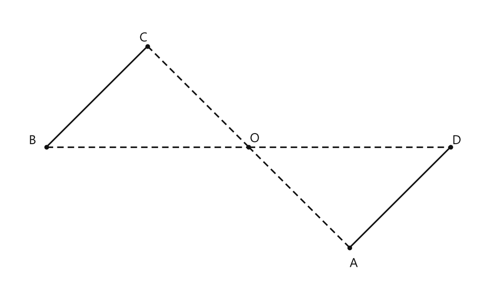
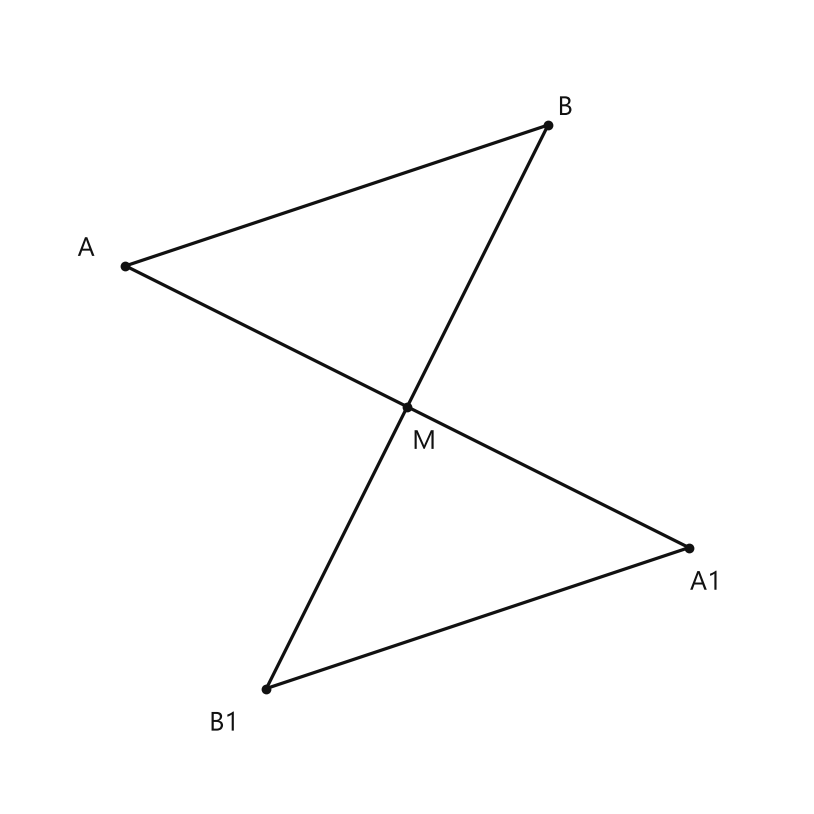
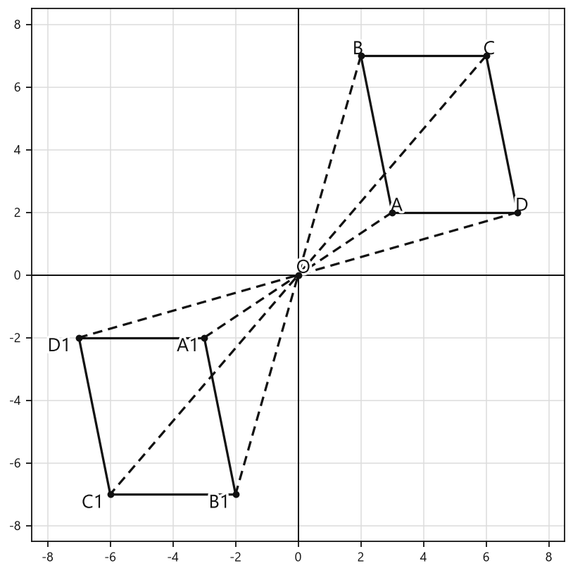

# Занятие 12. Симметрия

**Раздел:** Глава 1. Четырехугольники  
**Параграф учебника:** §5. Симметрия  
**Страницы:** 73–78

## Цели занятия

К концу занятия ученик умеет:

- распознавать центральную, осевую и зеркальную симметрию;
- находить центр и оси симметрии известных фигур;
- строить симметричные точки, отрезки, прямые и многоугольники;
- применять свойства симметричных фигур;
- находить координаты точек после симметрии;
- определять формулу прямой после симметричного отображения.

Выбирай блок своего уровня:

- **1–2 балла** — узнаю виды симметрии и простые фигуры;
- **3–4 балла** — строю симметричные точки и фигуры;
- **5–6 баллов** — применяю свойства симметрии;
- **7–8 баллов** — решаю координатные задачи;
- **9–10 баллов** — доказываю свойства и объясняю построения.

## Теория к занятию

### 1. Центральная симметрия

#### Простыми словами

Представь поворот всей фигуры на $180^\circ$ вокруг точки $O$. Точка $A$ окажется в точке $A_1$, а точка $O$ будет ровно посередине отрезка $AA_1$.

Так работает центральная симметрия: центр — не «зеркало», а точка, вокруг которой фигура мысленно делает пол-оборота.

#### Определение

Две точки $A$ и $A_1$ называются симметричными относительно некоторой точки $O$ (центра симметрии), если точка $O$ является серединой отрезка $AA_1$.

#### Центрально-симметричная фигура

Фигура называется центрально-симметричной, если каждой точке данной фигуры соответствует симметричная ей точка этой же фигуры относительно некоторого центра симметрии.

Например, у параллелограмма центр симметрии — точка пересечения диагоналей. При повороте на $180^\circ$ вокруг этой точки параллелограмм совмещается сам с собой.

#### Формулы

Если точка $A(x;y)$ симметрична точке $A_1(x_1;y_1)$ относительно начала координат $O(0;0)$, то

$$
x_1=-x,\qquad y_1=-y.
$$

При симметрии относительно начала координат обе координаты меняют знак.

Если центр симметрии имеет координаты $O(a;b)$, то

$$
x_1=2a-x,\qquad y_1=2b-y.
$$

Здесь $A(x;y)$ — исходная точка, $A_1(x_1;y_1)$ — симметричная ей точка.

#### Свойства центральной симметрии

1. Прямые, симметричные относительно точки, параллельны между собой.
2. Отрезки, симметричные относительно точки, равны и параллельны.
3. Треугольники, симметричные относительно точки, равны между собой.

Почему отрезки и треугольники равны? Поворот на $180^\circ$ не меняет длины отрезков и величины углов. Фигура меняет положение, но не размер.

#### Правила построения

Чтобы построить симметричную точку $A_1$:

1. Провести прямую $AO$.
2. На продолжении этой прямой отложить отрезок $OA_1$, равный $OA$.
3. Получить точку $A_1$ так, чтобы $O$ была серединой отрезка $AA_1$.

Точка $A_1$ должна оказаться по другую сторону от $O$. Если поставить её с той же стороны, симметрия решит, что сегодня она не работает.

Чтобы построить прямую, симметричную данной относительно центра:

1. Взять две точки на данной прямой.
2. Построить две симметричные им точки относительно центра.
3. Провести прямую через построенные точки.

Чтобы построить симметричный отрезок:

1. Построить точки, симметричные концам данного отрезка относительно центра.
2. Соединить построенные точки отрезком.

Чтобы построить симметричный многоугольник:

1. Построить точки, симметричные его вершинам относительно центра.
2. Соединить их соответствующими отрезками.

#### Ловушки

- Центр симметрии — **середина** отрезка между симметричными точками, а не одна из его вершин.
- При симметрии относительно начала координат меняются знаки обеих координат.
- Если центр симметрии не лежит на исходной прямой, то симметричная ей прямая будет параллельна исходной.
- Не перепутай центральную симметрию с отражением относительно оси: при центральной симметрии происходит поворот на $180^\circ$.

---

### 2. Осевая симметрия

#### Простыми словами

Ось симметрии можно представить как линию сгиба. Если мысленно сложить фигуру по этой линии, её части совпадут.

У симметричных точек:

- отрезок, соединяющий эти точки, перпендикулярен оси;
- ось проходит через середину этого отрезка;
- расстояния от точек до оси одинаковы.

#### Определение

Точки $A$ и $A_1$ называются симметричными относительно некоторой прямой $l$ (оси симметрии), если прямая $l$ является серединным перпендикуляром к отрезку $AA_1$. Точки, принадлежащие оси симметрии, считаются симметричными сами себе.

#### Симметричные фигуры относительно прямой

Две фигуры $F$ и $F_1$ называются симметричными относительно некоторой прямой $l$, если каждой точке одной фигуры соответствует симметричная ей точка другой фигуры относительно прямой $l$.

#### Осесимметричная фигура

Фигура имеет ось симметрии (является осесимметричной фигурой), если каждой точке данной фигуры соответствует симметричная ей точка этой же фигуры относительно некоторой прямой — оси симметрии.

#### Формулы

При симметрии относительно оси $Ox$:

$$
(x;y)\longrightarrow(x;-y).
$$

Координата $x$ сохраняется, а знак координаты $y$ меняется.

При симметрии относительно оси $Oy$:

$$
(x;y)\longrightarrow(-x;y).
$$

Знак координаты $x$ меняется, а координата $y$ сохраняется.

При симметрии относительно прямой $y=x$:

$$
(x;y)\longrightarrow(y;x).
$$

Координаты меняются местами.

#### Свойства осевой симметрии

1. Прямые, симметричные относительно оси, пересекаются в точке, лежащей на оси симметрии, либо параллельны между собой.
2. Отрезки, симметричные относительно оси, равны.
3. Треугольники, симметричные относительно оси, равны.

#### Известные фигуры и число осей

- прямоугольник — $2$ оси;
- квадрат — $4$ оси;
- ромб — $2$ оси;
- равнобедренная трапеция — $1$ ось;
- равносторонний треугольник — $3$ оси;
- окружность — бесконечно много осей;
- параллелограмм общего вида — осей симметрии не имеет.

У ромба осями симметрии являются его диагонали. У прямоугольника осями являются прямые, проходящие через середины противоположных сторон. У квадрата подходят оба вида прямых: и через середины сторон, и диагонали.

#### Правило построения

Чтобы построить точку $A_1$, симметричную точке $A$ относительно оси $l$:

1. Провести через точку $A$ перпендикуляр к прямой $l$.
2. Обозначить точку пересечения с осью через $H$.
3. На продолжении перпендикуляра отложить отрезок $HA_1$, равный $HA$.
4. Получить точку $A_1$.

В результате точка $H$ будет серединой отрезка $AA_1$, а прямая $l$ — серединным перпендикуляром к этому отрезку.

#### Ловушки

- Ось симметрии является **серединным перпендикуляром**, а не просто перпендикулярной прямой.
- Точки на оси остаются на месте: они симметричны сами себе.
- При симметрии относительно $Ox$ меняется знак $y$, а при симметрии относительно $Oy$ — знак $x$.
- У ромба диагонали являются осями симметрии, а у обычного параллелограмма — нет. Геометрия любит такие сюрпризы.

---

### 3. Доказательство оси симметрии равнобедренного треугольника

#### Простыми словами

В равнобедренном треугольнике две боковые стороны равны. Если провести из вершины биссектрису к основанию, она одновременно будет высотой и медианой.

Значит, она делит основание пополам и перпендикулярна ему. Поэтому эта прямая является серединным перпендикуляром к основанию: концы основания симметричны относительно неё.

#### Факт

Биссектриса, проведенная к основанию равнобедренного треугольника, является его осью симметрии.

#### Основная идея доказательства

Пусть $ABC$ — равнобедренный треугольник, $AB=BC$, а $BK$ — биссектриса к основанию $AC$.

Так как биссектриса в равнобедренном треугольнике является также высотой и медианой, то

$$
AC\perp BK,\qquad AK=KC.
$$

Следовательно, точки $A$ и $C$ симметричны относительно прямой $BK$.

Точка $B$ лежит на оси, поэтому симметрична сама себе.

При симметрии относительно прямой $BK$ сторона $BA$ переходит в сторону $BC$, а сторона $BC$ — в сторону $BA$.

Любая точка одной боковой стороны переходит в соответствующую точку другой боковой стороны.

Значит, прямая $BK$ — ось симметрии треугольника $ABC$.

#### Ловушки

- Ось проходит через вершину равнобедренного треугольника и середину основания.
- У равностороннего треугольника таких осей уже три.
- В произвольном треугольнике биссектриса не обязана быть осью симметрии. Равенство двух боковых сторон здесь играет главную роль.

---

### 4. Оси симметрии прямоугольника

#### Простыми словами

Прямоугольник можно мысленно сложить пополам двумя способами:

- по прямой, проходящей через середины верхней и нижней сторон;
- по прямой, проходящей через середины левой и правой сторон.

В обоих случаях половины совпадут. Поэтому у прямоугольника две оси симметрии.

#### Факт

Прямая, проходящая через середины противоположных сторон прямоугольника, является его осью симметрии.

У прямоугольника две такие прямые.

#### Ловушки

- Диагонали прямоугольника не являются его осями симметрии, если прямоугольник не является квадратом.
- У квадрата диагонали тоже становятся осями, поэтому осей четыре.
- Ось должна проходить через середины противоположных сторон, а не просто через две вершины.

---

### 5. Зеркальная симметрия

#### Простыми словами

Зеркальная симметрия — это пространственный вариант осевой симметрии. На плоскости роль «зеркала» играет прямая, а в пространстве — плоскость.

Точка и её отражение соединяются отрезком, который перпендикулярен плоскости зеркала. Плоскость проходит через середину этого отрезка.

#### Определение

Точки $A$ и $A_1$ симметричны относительно плоскости, если плоскость проходит через середину отрезка $AA_1$ и перпендикулярна этому отрезку. То есть $AA_1 \perp \alpha$ и $AM = MA_1$.

#### Примеры

- шар имеет плоскость симметрии относительно любой плоскости, проходящей через его центр;
- у прямоугольного параллелепипеда три плоскости симметрии;
- плоскость зеркала задаёт зеркальное отражение предмета.

#### Ловушки

- Осевая симметрия происходит на плоскости относительно прямой.
- Зеркальная симметрия происходит в пространстве относительно плоскости.
- В обоих случаях отрезок между симметричными точками перпендикулярен «зеркалу» и делится им пополам.

---

## Сводка формул «выучить наизусть»

Центральная симметрия относительно начала координат:

$$
(x;y)\longrightarrow(-x;-y).
$$

Центральная симметрия относительно точки $O(a;b)$:

$$
(x;y)\longrightarrow(2a-x;2b-y).
$$

Симметрия относительно оси $Ox$:

$$
(x;y)\longrightarrow(x;-y).
$$

Симметрия относительно оси $Oy$:

$$
(x;y)\longrightarrow(-x;y).
$$

Симметрия относительно прямой $y=x$:

$$
(x;y)\longrightarrow(y;x).
$$

Для графика $y=f(x)$:

- относительно начала координат:

$$
y=-f(-x);
$$

- относительно оси $Ox$:

$$
y=-f(x);
$$

- относительно оси $Oy$:

$$
y=f(-x).
$$

## Правила, которые нельзя путать

- Центр симметрии — точка, ось симметрии — прямая, плоскость симметрии — плоскость.
- При центральной симметрии относительно начала координат меняются знаки $x$ и $y$.
- При симметрии относительно $Ox$ меняется знак $y$.
- При симметрии относительно $Oy$ меняется знак $x$.
- Симметричные отрезки равны.
- Симметричные треугольники равны.
- У параллелограмма есть центр симметрии — точка пересечения диагоналей.
- У обычного параллелограмма нет оси симметрии.

## Разбор ключевых заданий

### Р1. Центральная симметрия прямой

**Условие.** Построить фигуру, симметричную прямой $BC$ относительно точки $O$, причём точка $O$ не лежит на прямой $BC$.

<!--geo-figure-spec
{
  "needed": true,
  "kind": "plane",
  "caption": "Прямая $BC$ и её образ $AD$ при симметрии относительно точки $O$",
  "equal": true,
  "axis": false,
  "xlim": [
    -0.8,
    8.8
  ],
  "ylim": [
    -1.8,
    3.8
  ],
  "points": {
    "B": [
      0,
      1
    ],
    "C": [
      2,
      3
    ],
    "O": [
      4,
      1
    ],
    "A": [
      6,
      -1
    ],
    "D": [
      8,
      1
    ]
  },
  "segments": [
    {
      "points": [
        "B",
        "C"
      ],
      "dashed": false,
      "label": ""
    },
    {
      "points": [
        "A",
        "D"
      ],
      "dashed": false,
      "label": ""
    },
    {
      "points": [
        "B",
        "O"
      ],
      "dashed": true,
      "label": ""
    },
    {
      "points": [
        "O",
        "D"
      ],
      "dashed": true,
      "label": ""
    },
    {
      "points": [
        "C",
        "O"
      ],
      "dashed": true,
      "label": ""
    },
    {
      "points": [
        "O",
        "A"
      ],
      "dashed": true,
      "label": ""
    }
  ],
  "polygons": [],
  "circles": [],
  "labels": {
    "B": {
      "dx": -0.28,
      "dy": 0.12
    },
    "C": {
      "dx": -0.08,
      "dy": 0.16
    },
    "O": {
      "dx": 0.12,
      "dy": 0.16
    },
    "A": {
      "dx": 0.08,
      "dy": -0.32
    },
    "D": {
      "dx": 0.12,
      "dy": 0.12
    }
  },
  "texts": []
}
-->

*Прямая BC и её образ AD при симметрии относительно точки O*

**Решение.**

1. Выберем на прямой $BC$ две точки $B$ и $C$.
2. Построим точку $D$, симметричную точке $B$ относительно точки $O$.
3. Для этого проведём прямую $BO$.
4. На продолжении прямой $BO$ построим точку $D$ так, чтобы

$$
OB=OD.
$$

5. Тогда точка $O$ является серединой отрезка $BD$, поэтому точки $B$ и $D$ симметричны относительно $O$.
6. Построим точку $A$, симметричную точке $C$ относительно точки $O$.
7. Для этого проведём прямую $CO$.
8. На продолжении прямой $CO$ построим точку $A$ так, чтобы

$$
OC=OA.
$$

9. Тогда точка $O$ является серединой отрезка $CA$.
10. Проведём прямую $AD$.
11. Прямая $AD$ является образом прямой $BC$ при центральной симметрии.
12. По свойству центральной симметрии прямые $BC$ и $AD$ параллельны.

Ответ: прямая $AD$, параллельная прямой $BC$.

---

### Р2. Построение симметричного отрезка относительно точки

**Условие.** Даны отрезок $AB$ и точка $M$, не лежащая на прямой $AB$. Построить отрезок $A_1B_1$, симметричный отрезку $AB$ относительно точки $M$.

<!--geo-figure-spec
{
  "needed": true,
  "kind": "plane",
  "caption": "Отрезок $AB$ и его образ $A_1B_1$ относительно точки $M$",
  "equal": true,
  "axis": false,
  "xlim": [
    -2.8,
    2.8
  ],
  "ylim": [
    -2.8,
    2.8
  ],
  "points": {
    "A": [
      -2,
      1
    ],
    "B": [
      1,
      2
    ],
    "M": [
      0,
      0
    ],
    "A1": [
      2,
      -1
    ],
    "B1": [
      -1,
      -2
    ]
  },
  "segments": [
    [
      "A",
      "B"
    ],
    [
      "A1",
      "B1"
    ],
    [
      "A",
      "M"
    ],
    [
      "M",
      "A1"
    ],
    [
      "B",
      "M"
    ],
    [
      "M",
      "B1"
    ]
  ],
  "polygons": [],
  "circles": [],
  "labels": {
    "A": {
      "dx": -0.28,
      "dy": 0.12
    },
    "B": {
      "dx": 0.12,
      "dy": 0.12
    },
    "M": {
      "dx": 0.12,
      "dy": -0.25
    },
    "A1": {
      "dx": 0.12,
      "dy": -0.25
    },
    "B1": {
      "dx": -0.3,
      "dy": -0.25
    }
  },
  "texts": []
}
-->

*Отрезок AB и его образ A_1B_1 относительно точки M*

**Решение.**

1. Проведём прямую $AM$.
2. На продолжении прямой $AM$ за точку $M$ построим точку $A_1$ так, чтобы

$$
MA=MA_1.
$$

3. Тогда точка $M$ является серединой отрезка $AA_1$.
4. Проведём прямую $BM$.
5. На продолжении прямой $BM$ за точку $M$ построим точку $B_1$ так, чтобы

$$
MB=MB_1.
$$

6. Тогда точка $M$ является серединой отрезка $BB_1$.
7. Соединим точки $A_1$ и $B_1$.
8. Получим отрезок $A_1B_1$, симметричный отрезку $AB$ относительно точки $M$.
9. По свойству центральной симметрии

$$
A_1B_1=AB,
$$

а отрезки $A_1B_1$ и $AB$ параллельны.

Ответ: отрезок $A_1B_1$, построенный так, чтобы $M$ была серединой отрезков $AA_1$ и $BB_1$.

*Типичная ошибка: построить точки по ту же сторону от $M$. Тогда точка $M$ не будет серединой нужного отрезка — симметрия отменяется, как непрочитанное сообщение.*

---

### Р3. Симметрия треугольника относительно вершины

**Условие.** Построить треугольник $A_1B_1C_1$, симметричный треугольнику $ABC$ относительно вершины $C$.

**Решение.**

1. Точка $C$ является центром симметрии.
2. Поэтому точка $C$ переходит сама в себя:

$$
C_1=C.
$$

3. Проведём прямую $AC$.
4. На продолжении прямой $AC$ за точку $C$ построим точку $A_1$ так, чтобы

$$
CA=CA_1.
$$

5. Тогда точка $C$ является серединой отрезка $AA_1$.
6. Проведём прямую $BC$.
7. На продолжении прямой $BC$ за точку $C$ построим точку $B_1$ так, чтобы

$$
CB=CB_1.
$$

8. Тогда точка $C$ является серединой отрезка $BB_1$.
9. Соединим точки $A_1$, $B_1$ и $C_1$.
10. Получим треугольник $A_1B_1C_1$.
11. По свойству центральной симметрии треугольники $ABC$ и $A_1B_1C_1$ равны.

Ответ: треугольник $A_1B_1C_1$, где $C_1=C$, а $C$ является серединой отрезков $AA_1$ и $BB_1$.

---

### Р4. Симметрия прямой относительно начала координат

**Условие.** Построить прямую, симметричную графику функции $y=2x+4$ относительно начала координат. Найти формулу полученной прямой.

**Решение.**

1. При центральной симметрии относительно начала координат каждая точка $(x;y)$ переходит в точку $(-x;-y)$:

$$
(x;y)\longrightarrow(-x;-y).
$$

2. Пусть $(x;y)$ — точка исходной прямой. Она удовлетворяет уравнению

$$
y=2x+4.
$$

3. После симметрии её координаты станут $(-x;-y)$.

4. В уравнении исходной прямой заменим $x$ на $-x$, а $y$ на $-y$:

$$
-y=2(-x)+4.
$$

5. Упростим правую часть:

$$
-y=-2x+4.
$$

6. Умножим обе части уравнения на $-1$:

$$
y=2x-4.
$$

7. Проверим результат по точке пересечения исходной прямой с осью $Oy$.

8. При $x=0$ получаем точку $(0;4)$.

9. При симметрии относительно начала координат:

$$
(0;4)\longrightarrow(0;-4).
$$

10. Для полученной прямой $y=2x-4$ при $x=0$ имеем:

$$
y=-4.
$$

11. Проверка прошла: точка действительно перешла в $(0;-4)$. Знак у свободного члена поменялся, а наклон прямой остался тем же — симметрия не всегда переворачивает всё подряд.

Ответ:

$$
\boxed{y=2x-4}.
$$

---

### Р5. Координаты при центральной симметрии

**Условие.** Даны вершины параллелограмма:

$$
A(3;2),\quad B(2;7),\quad C(6;7),\quad D(7;2).
$$

Построить параллелограмм $A_1B_1C_1D_1$, симметричный ему относительно начала координат $O(0;0)$.

<!--geo-figure-spec
{
  "needed": true,
  "kind": "plane",
  "caption": "Параллелограмм $ABCD$ и его образ $A_1B_1C_1D_1$ относительно начала координат $O$",
  "equal": true,
  "axis": true,
  "grid": true,
  "xlim": [
    -8.5,
    8.5
  ],
  "ylim": [
    -8.5,
    8.5
  ],
  "points": {
    "A": [
      3,
      2
    ],
    "B": [
      2,
      7
    ],
    "C": [
      6,
      7
    ],
    "D": [
      7,
      2
    ],
    "A1": [
      -3,
      -2
    ],
    "B1": [
      -2,
      -7
    ],
    "C1": [
      -6,
      -7
    ],
    "D1": [
      -7,
      -2
    ],
    "O": [
      0,
      0
    ]
  },
  "segments": [
    [
      "A",
      "B"
    ],
    [
      "B",
      "C"
    ],
    [
      "C",
      "D"
    ],
    [
      "D",
      "A"
    ],
    [
      "A1",
      "B1"
    ],
    [
      "B1",
      "C1"
    ],
    [
      "C1",
      "D1"
    ],
    [
      "D1",
      "A1"
    ],
    {
      "points": [
        "A",
        "A1"
      ],
      "dashed": true,
      "label": "",
      "t": 0.5
    },
    {
      "points": [
        "B",
        "B1"
      ],
      "dashed": true,
      "label": "",
      "t": 0.5
    },
    {
      "points": [
        "C",
        "C1"
      ],
      "dashed": true,
      "label": "",
      "t": 0.5
    },
    {
      "points": [
        "D",
        "D1"
      ],
      "dashed": true,
      "label": "",
      "t": 0.5
    }
  ],
  "polygons": [],
  "circles": [],
  "labels": {
    "A": {
      "dx": 0.14,
      "dy": 0.2
    },
    "B": {
      "dx": -0.1,
      "dy": 0.2
    },
    "C": {
      "dx": 0.1,
      "dy": 0.2
    },
    "D": {
      "dx": 0.14,
      "dy": 0.2
    },
    "A1": {
      "dx": -0.52,
      "dy": -0.28
    },
    "B1": {
      "dx": -0.52,
      "dy": -0.28
    },
    "C1": {
      "dx": -0.55,
      "dy": -0.28
    },
    "D1": {
      "dx": -0.62,
      "dy": -0.28
    },
    "O": {
      "dx": 0.16,
      "dy": 0.22
    }
  },
  "texts": []
}
-->

*Параллелограмм ABCD и его образ A_1B_1C_1D_1 относительно начала координат O*

**Решение.**

1. При симметрии относительно начала координат точка $(x;y)$ переходит в точку $(-x;-y)$.

2. Значит, у каждой точки меняются знаки обеих координат.

3. Для точки $A(3;2)$ получаем:

$$
A_1(-3;-2).
$$

4. Для точки $B(2;7)$ получаем:

$$
B_1(-2;-7).
$$

5. Для точки $C(6;7)$ получаем:

$$
C_1(-6;-7).
$$

6. Для точки $D(7;2)$ получаем:

$$
D_1(-7;-2).
$$

7. Отметим найденные точки на координатной плоскости.

8. Соединим точки $A_1$, $B_1$, $C_1$, $D_1$ последовательно.

9. Получим параллелограмм $A_1B_1C_1D_1$. Симметрия сохранила длины и параллельность сторон — фигура не исчезла, а просто «переехала» на другую сторону начала координат.

Ответ:

$$
A_1(-3;-2),\quad B_1(-2;-7),\quad C_1(-6;-7),\quad D_1(-7;-2).
$$

---

### Р6. Ось симметрии равнобедренного треугольника

**Условие.** Доказать, что биссектриса, проведённая из вершины равнобедренного треугольника к основанию, является его осью симметрии.

**Решение.**

1. Пусть $ABC$ — равнобедренный треугольник с основанием $AC$.

2. Значит, боковые стороны равны:

$$
AB=BC.
$$

3. Пусть $BK$ — биссектриса треугольника $ABC$, проведённая к основанию $AC$.

4. В равнобедренном треугольнике биссектриса, проведённая к основанию, является одновременно высотой и медианой.

5. Поэтому:

$$
AC\perp BK,\qquad AK=KC.
$$

6. Отрезок $AC$ делится точкой $K$ пополам, а прямая $BK$ перпендикулярна ему.

7. Значит, прямая $BK$ является серединным перпендикуляром к отрезку $AC$.

8. По свойству серединного перпендикуляра точки $A$ и $C$ симметричны относительно прямой $BK$.

9. Точка $B$ лежит на оси $BK$, поэтому при симметрии относительно этой прямой она переходит сама в себя.

10. Сторона $AB$ при симметрии переходит в сторону $BC$, а сторона $BC$ — в сторону $AB$.

11. Следовательно, треугольник $ABC$ совмещается сам с собой при симметрии относительно прямой $BK$.

12. Значит, прямая $BK$ является его осью симметрии. Биссектриса здесь работает сразу в трёх должностях: биссектриса, высота и медиана.

Ответ: биссектриса $BK$, проведённая к основанию, является осью симметрии равнобедренного треугольника.

---

### Р7. Симметрия параллелограмма относительно оси $Oy$

**Условие.** Даны вершины параллелограмма:

$$
A(3;2),\quad B(2;7),\quad C(6;7),\quad D(7;2).
$$

Построить параллелограмм $A_1B_1C_1D_1$, симметричный ему относительно оси $Oy$.

**Решение.**

1. При симметрии относительно оси $Oy$ расстояние точки от оси сохраняется, но сторона расположения меняется.

2. Поэтому координаты изменяются так:

$$
(x;y)\longrightarrow(-x;y).
$$

3. Первая координата меняет знак, а вторая остаётся прежней.

4. Для точки $A(3;2)$:

$$
A_1(-3;2).
$$

5. Для точки $B(2;7)$:

$$
B_1(-2;7).
$$

6. Для точки $C(6;7)$:

$$
C_1(-6;7).
$$

7. Для точки $D(7;2)$:

$$
D_1(-7;2).
$$

8. Отметим найденные точки на координатной плоскости.

9. Соединим точки $A_1$, $B_1$, $C_1$, $D_1$ последовательно.

10. Получим параллелограмм $A_1B_1C_1D_1$. Вторая координата не изменилась — ось $Oy$ меняет левое и правое местами, но не трогает «вверх» и «вниз».

Ответ:

$$
A_1(-3;2),\quad B_1(-2;7),\quad C_1(-6;7),\quad D_1(-7;2).
$$

---

### Р8. Симметрия графика относительно оси $Ox$

**Условие.** Построить прямую, симметричную графику функции $y=x+3$ относительно оси $Ox$. Найти формулу полученной функции.

**Решение.**

1. При симметрии относительно оси $Ox$ абсцисса точки не меняется, а ордината меняет знак:

$$
(x;y)\longrightarrow(x;-y).
$$

2. В исходной функции значение $y$ заменяем на $-y$:

$$
-y=x+3.
$$

3. Умножим обе части уравнения на $-1$:

$$
y=-x-3.
$$

4. Проверим результат по точке исходного графика при $x=0$.

5. Для исходной функции:

$$
y=0+3=3.
$$

6. Получаем точку $(0;3)$.

7. При симметрии относительно оси $Ox$ она переходит в точку $(0;-3)$.

8. Для полученной функции при $x=0$ имеем:

$$
y=-0-3=-3.
$$

9. Проверка совпала. Здесь меняется только «высота» точки: вправо-влево график не шагает, а вверх-вниз переворачивается.

Ответ:

$$
\boxed{y=-x-3}.
$$

---

### Р9. Оси симметрии фигур

**Условие.** Определить количество осей симметрии у прямоугольника, квадрата, ромба, равнобедренной трапеции и равностороннего треугольника.

**Решение.**

1. У прямоугольника оси симметрии проходят через середины двух пар противоположных сторон:

$$
2\text{ оси}.
$$

2. У квадрата две оси проходят через середины противоположных сторон, ещё две оси являются диагоналями:

$$
4\text{ оси}.
$$

3. У ромба его диагонали являются осями симметрии:

$$
2\text{ оси}.
$$

4. У равнобедренной трапеции ось симметрии проходит через середины оснований и перпендикулярна основаниям:

$$
1\text{ ось}.
$$

5. У равностороннего треугольника каждая медиана является также биссектрисой и высотой.

6. Каждая из трёх медиан является осью симметрии:

$$
3\text{ оси}.
$$

Ответ: прямоугольник — $2$, квадрат — $4$, ромб — $2$, равнобедренная трапеция — $1$, равносторонний треугольник — $3$.

---

### Р10. Зеркальная симметрия

**Условие.** Точка $A$ и точка $A_1$ симметричны относительно плоскости $\alpha$. Что можно утверждать о положении отрезка $AA_1$ и точке его пересечения с плоскостью?

**Решение.**

1. По определению зеркальной симметрии плоскость $\alpha$ проходит через середину отрезка $AA_1$ и перпендикулярна этому отрезку.

2. Поэтому:

$$
AA_1\perp\alpha.
$$

3. Обозначим точку пересечения отрезка $AA_1$ с плоскостью $\alpha$ буквой $M$:

$$
M=AA_1\cap\alpha.
$$

4. Так как плоскость проходит через середину отрезка, точка $M$ делит отрезок $AA_1$ на две равные части:

$$
AM=MA_1.
$$

5. Значит, отрезок $AA_1$ перпендикулярен плоскости $\alpha$, а точка $M$ является его серединой.

Ответ:

$$
AA_1\perp\alpha,\qquad AM=MA_1.
$$

## Практические задания

Выбери свой уровень и решай только этот блок. В блоке должна закрепиться вся тема параграфа. Ответы не приводятся.

### Уровень 1–2 балла

**С1.** Какая из фигур является центрально-симметричной?

1) равнобедренный треугольник  
2) параллелограмм  
3) равносторонний треугольник  
4) угол  
5) равнобедренная трапеция

**С2.** Точка $A(3; -2)$ симметрична точке $A_1$ относительно начала координат $O(0; 0)$. Укажите координаты точки $A_1$.

1) $(-3; 2)$  
2) $(3; 2)$  
3) $(-3; -2)$  
4) $(2; -3)$  
5) $(-2; 3)$

**С3.** Точка $B(-4; 5)$ симметрична точке $B_1$ относительно оси $Oy$. Укажите координаты точки $B_1$.

1) $(-4; -5)$  
2) $(4; 5)$  
3) $(4; -5)$  
4) $(-5; 4)$  
5) $(5; -4)$

**С4.** Какую фигуру можно совместить с самой собой поворотом на $180^\circ$ вокруг точки пересечения её диагоналей?

1) равнобедренный треугольник  
2) параллелограмм  
3) равнобедренная трапеция  
4) произвольный угол  
5) равносторонний треугольник

**С5.** Отрезки $AB$ и $A_1B_1$ симметричны относительно точки $O$. Какое утверждение верно?

1) $AB>A_1B_1$  
2) $AB<A_1B_1$  
3) $AB=A_1B_1$  
4) $AB$ перпендикулярен $A_1B_1$  
5) отрезки имеют только одну общую точку

**С6.** Укажите количество осей симметрии квадрата.

1) $1$  
2) $2$  
3) $3$  
4) $4$  
5) $8$

**С7.** Укажите количество осей симметрии равностороннего треугольника.

1) $0$  
2) $1$  
3) $2$  
4) $3$  
5) $6$

**С8.** Прямоугольник имеет длину $8$ см и ширину $5$ см. Сколько осей симметрии у этого прямоугольника?

1) $0$  
2) $1$  
3) $2$  
4) $4$  
5) $8$

**С9.** Точка $M$ является серединой отрезка $AA_1$. Как называются точки $A$ и $A_1$ относительно точки $M$?

1) совпадающими  
2) симметричными относительно точки $M$  
3) симметричными относительно прямой $M$  
4) перпендикулярными  
5) параллельными

**С10.** Постройте точку $A_1$, симметричную точке $A$ относительно точки $O$, если точка $O$ не совпадает с точкой $A$.

**С11.** На координатной плоскости дана прямая $y=2x+3$. Какая функция задаёт прямую, симметричную ей относительно начала координат?

1) $y=2x-3$  
2) $y=-2x+3$  
3) $y=-2x-3$  
4) $y=2x+3$  
5) $y=-\frac12x-3$

**С12.** Ось $l$ является серединным перпендикуляром к отрезку $AA_1$. Как расположены точки $A$ и $A_1$?

1) они симметричны относительно оси $l$  
2) они симметричны относительно точки $l$  
3) они лежат на оси $l$  
4) они находятся на одном луче  
5) они совпадают с концами одного диаметра

**С13.** Какая из фигур является центрально-симметричной?

1) равнобедренный треугольник  2) квадрат  3) равносторонний треугольник  4) угол  5) произвольная трапеция

**С14.** Укажите центр симметрии параллелограмма $ABCD$.

1) вершина $A$  2) середина стороны $AB$  3) точка пересечения диагоналей  4) середина стороны $BC$  5) любая точка на диагонали $AC$

**С15.** Сколько осей симметрии имеет квадрат?

1) $0$  2) $1$  3) $2$  4) $3$  5) $4$

**С16.** Какая фигура имеет ровно одну ось симметрии?

1) квадрат  2) равносторонний треугольник  3) равнобедренный треугольник, не являющийся равносторонним  4) параллелограмм  5) ромб, не являющийся квадратом

**С17.** Точка $A_1$ симметрична точке $A$ относительно точки $O$. Какое утверждение верно?

1) $O$ является серединой отрезка $AA_1$  2) $AO=AA_1$  3) $A_1O=AA_1$  4) $AA_1\perp AO$  5) точки $A$, $A_1$ и $O$ не лежат на одной прямой

**С18.** Точка $A(3; -2)$ преобразована симметрией относительно начала координат. Укажите координаты полученной точки.

1) $(3; 2)$  2) $(-3; -2)$  3) $(-3; 2)$  4) $(2; -3)$  5) $(-2; 3)$

**С19.** Точка $B(-4; 5)$ преобразована симметрией относительно оси $Oy$. Укажите координаты полученной точки.

1) $(-4; -5)$  2) $(4; 5)$  3) $(4; -5)$  4) $(5; -4)$  5) $(-5; 4)$

**С20.** Точка $C(-2; 6)$ преобразована симметрией относительно оси $Ox$. Укажите координаты полученной точки.

1) $(2; 6)$  2) $(-2; -6)$  3) $(2; -6)$  4) $(6; -2)$  5) $(-6; 2)$

**С21.** Какая прямая получится при симметрии графика функции $y=2x+1$ относительно начала координат?

1) $y=2x-1$  2) $y=-2x+1$  3) $y=-2x-1$  4) $y=x+2$  5) $y=-x+2$

**С22.** Какая прямая получится при симметрии графика функции $y=x-3$ относительно оси $Ox$?

1) $y=x+3$  2) $y=-x-3$  3) $y=-x+3$  4) $y=3x-1$  5) $y=x-3$

**С23.** Отрезок $AB$ и ось симметрии $l$ не пересекаются. Что необходимо построить сначала, чтобы получить отрезок, симметричный $AB$ относительно $l$?

1) середину отрезка $AB$  2) точки, симметричные точкам $A$ и $B$ относительно оси $l$  3) биссектрису угла $A$  4) диагональ фигуры  5) перпендикуляр к отрезку $AB$

**С24.** Сколько осей симметрии имеет равнобедренная трапеция, не являющаяся параллелограммом?

1) $0$  2) $1$  3) $2$  4) $3$  5) $4$

**С25.** Выберите центрально-симметричную фигуру:  
1) равнобедренный треугольник; 2) параллелограмм; 3) равносторонний треугольник; 4) равнобедренная трапеция; 5) угол.

**С26.** Точка $O$ является серединой отрезка $AA_1$. Как называются точки $A$ и $A_1$ относительно точки $O$?  
1) совпадающими; 2) симметричными; 3) соседними; 4) равноудалёнными от прямой; 5) параллельными.

**С27.** Укажите фигуру, которая имеет ровно две оси симметрии:  
1) квадрат; 2) прямоугольник, не являющийся квадратом; 3) равносторонний треугольник; 4) равнобедренный треугольник; 5) параллелограмм, не являющийся прямоугольником.

**С28.** Точка $A(3; -2)$ преобразована симметрией относительно начала координат. Запишите координаты образа $A_1$.

**С29.** Точка $B(-4; 5)$ преобразована симметрией относительно оси $Oy$. Запишите координаты образа $B_1$.

**С30.** Выберите верное утверждение об отрезках, симметричных относительно одной точки:  
1) они всегда перпендикулярны; 2) они равны и параллельны; 3) они имеют общую середину на оси; 4) они всегда имеют общую конечную точку; 5) они не имеют равных длин.

**С31.** Точка $C(-2; -6)$ преобразована симметрией относительно оси $Ox$. Запишите координаты образа $C_1$.

**С32.** Прямая $y=2x+3$ преобразована симметрией относительно оси $Ox$. Выберите формулу образа этой прямой:  
1) $y=2x-3$; 2) $y=-2x+3$; 3) $y=-2x-3$; 4) $y=2x+3$; 5) $y=-\frac12x-3$.

**С33.** Вершины параллелограмма имеют координаты $A(1;2)$, $B(5;2)$, $C(7;6)$, $D(3;6)$. Запишите координаты точки $A_1$, симметричной точке $A$ относительно начала координат.

**С34.** Выберите фигуру, имеющую одну ось симметрии:  
1) квадрат; 2) прямоугольник, не являющийся квадратом; 3) равнобедренный треугольник; 4) равносторонний треугольник; 5) параллелограмм, не являющийся прямоугольником.

**С35.** Прямая $l$ является осью симметрии отрезка $AA_1$. Запишите, как расположены прямая $l$ и отрезок $AA_1$ относительно друг друга.

**С36.** Точка $M(0;4)$ преобразована симметрией относительно оси $Oy$. Запишите координаты образа $M_1$.

### Уровень 3–4 балла

**С1.** Какие из следующих фигур являются центрально-симметричными: квадрат, параллелограмм, угол, равносторонний треугольник? Для каждой центрально-симметричной фигуры укажите положение её центра симметрии.

**С2.** Точка $O$ является серединой отрезка $AA_1$, причём $OA=4$ см. Найдите длину отрезка $AA_1$.

**С3.** Постройте отрезок $A_1B_1$, симметричный отрезку $AB$ относительно точки $O$. Точка $O$ не лежит на отрезке $AB$. Опишите последовательность построения.

**С4.** Диагонали параллелограмма $ABCD$ пересекаются в точке $O$. Назовите точку, симметричную вершине $A$ относительно точки $O$, и точку, симметричную вершине $B$ относительно точки $O$.

**С5.** Прямые $a$ и $a_1$ симметричны относительно точки $O$. Прямая $a$ не проходит через точку $O$. Как расположены прямые $a$ и $a_1$ относительно друг друга?

**С6.** На координатной плоскости дана точка $A(3;-5)$. Найдите координаты точки $A_1$, симметричной точке $A$ относительно начала координат.

**С7.** На координатной плоскости дан график функции $y=3x-2$. Запишите формулу функции, график которой симметричен данному графику относительно начала координат.

**С8.** На координатной плоскости дан параллелограмм $ABCD$ с вершинами $A(1;2)$, $B(1;6)$, $C(5;6)$, $D(5;2)$. Найдите координаты вершин параллелограмма, симметричного ему относительно начала координат.

**С9.** Точки $A$ и $A_1$ симметричны относительно прямой $l$. Известно, что расстояние от точки $A$ до прямой $l$ равно $7$ см. Найдите расстояние между точками $A$ и $A_1$.

**С10.** Постройте отрезок $A_1B_1$, симметричный отрезку $AB$ относительно прямой $l$, не пересекающей отрезок $AB$. Опишите последовательность построения.

**С11.** Сколько осей симметрии имеют следующие фигуры: прямоугольник, квадрат, ромб, равнобедренная трапеция, равносторонний треугольник?

**С12.** На координатной плоскости дан график функции $y=-2x+5$. Запишите формулу функции, график которой симметричен данному графику относительно оси $Ox$.

**С13.** Какие из фигур являются центрально-симметричными? Укажите центр симметрии каждой такой фигуры: квадрат, прямоугольник, параллелограмм, равнобедренный треугольник, окружность.

**С14.** Даны точка $O$ и отрезок $AB$, не проходящий через точку $O$. Постройте отрезок $A_1B_1$, симметричный отрезку $AB$ относительно точки $O$.

**С15.** Даны точка $O$ и треугольник $ABC$. Постройте треугольник $A_1B_1C_1$, симметричный треугольнику $ABC$ относительно точки $O$.

**С16.** Прямая $a$ не проходит через точку $O$. Постройте прямую $a_1$, симметричную прямой $a$ относительно точки $O$.

**С17.** На координатной плоскости дана точка $A(-3; 4)$. Найдите координаты точки $A_1$, симметричной точке $A$ относительно начала координат.

**С18.** На координатной плоскости даны вершины параллелограмма $ABCD$: $A(1; 2)$, $B(4; 2)$, $C(6; 5)$, $D(3; 5)$. Найдите координаты вершин параллелограмма, симметричного $ABCD$ относительно начала координат.

**С19.** График функции $y=3x-2$ преобразовали симметрично относительно начала координат. Запишите формулу функции, графиком которой является полученная прямая.

**С20.** Назовите все фигуры из списка, имеющие ось симметрии: равнобедренный треугольник, произвольный параллелограмм, прямоугольник, квадрат, равносторонний треугольник.

**С21.** Сколько осей симметрии имеют следующие фигуры: прямоугольник, квадрат, ромб, равносторонний треугольник?

**С22.** Даны отрезок $AB$ и прямая $l$, не пересекающая отрезок $AB$. Постройте отрезок $A_1B_1$, симметричный отрезку $AB$ относительно прямой $l$.

**С23.** Даны треугольник $ABC$ и прямая $l$, проходящая через вершину $C$. Постройте треугольник $A_1B_1C_1$, симметричный треугольнику $ABC$ относительно прямой $l$.

**С24.** На координатной плоскости дана прямая $y=-2x+5$. Постройте прямую, симметричную данной относительно оси $Oy$, и запишите её уравнение.

**С25.** Укажите, какие из фигур являются центрально-симметричными: параллелограмм, равнобедренный треугольник, окружность, отрезок, имеющий центр симметрии в своей середине. Для каждой центрально-симметричной фигуры назовите её центр симметрии.

**С26.** Точка $O$ — центр симметрии отрезка $AB$. Известно, что $AO=7$ см. Найдите длину отрезка $AB$.

**С27.** Точки $A$ и $A_1$ симметричны относительно точки $O$. Точка $B$ лежит на прямой $AA_1$ между точками $A$ и $O$, причём $AB=3$ см и $BO=5$ см. Найдите длину отрезка $AA_1$.

**С28.** Прямая $a$ не проходит через центр $O$. Построены точки $A_1$ и $B_1$, симметричные относительно $O$ точкам $A$ и $B$, лежащим на прямой $a$. Как расположены прямые $a$ и $A_1B_1$? Запишите свойство, которое используется.

**С29.** На координатной плоскости точка $A$ имеет координаты $(-4; 3)$. Найдите координаты точки $A_1$, симметричной точке $A$ относительно начала координат.

**С30.** На координатной плоскости даны точки $A(-2; 1)$, $B(3; 1)$ и $C(3; 4)$. Запишите координаты точек $A_1$, $B_1$ и $C_1$, симметричных им относительно начала координат.

**С31.** Прямоугольник $ABCD$ имеет стороны $AB=8$ см и $BC=5$ см. Сколько осей симметрии имеет этот прямоугольник? Укажите, через какие точки они проходят.

**С32.** Сколько осей симметрии имеют: а) квадрат; б) ромб, не являющийся квадратом; в) равносторонний треугольник? Запишите ответы по порядку.

**С33.** Отрезок $AB$ не пересекает ось симметрии $l$. Постройте отрезок $A_1B_1$, симметричный отрезку $AB$ относительно прямой $l$. Опишите последовательность построения.

**С34.** Треугольник $ABC$ равнобедренный, $AB=AC$, а $M$ — середина основания $BC$. Докажите, что прямая $AM$ является осью симметрии треугольника $ABC$.

**С35.** На координатной плоскости дана прямая $y=3x-2$. Запишите уравнение прямой, симметричной данной относительно оси $Ox$.

**С36.** На координатной плоскости дана прямая $y=-2x+5$. Запишите уравнение прямой, симметричной данной относительно начала координат.

### Уровень 5–6 баллов

**С1.** Какие из перечисленных фигур являются центрально-симметричными? Выберите один вариант ответа.  
1) равнобедренный треугольник и угол  
2) квадрат и параллелограмм  
3) равносторонний треугольник и прямоугольная трапеция  
4) только равносторонний треугольник  
5) только угол

**С2.** Точка $O(0;0)$ является центром симметрии. Найдите координаты точки $A_1$, симметричной точке $A(-4;7)$ относительно точки $O$.

**С3.** Постройте отрезок $A_1B_1$, симметричный отрезку $AB$ относительно точки $M$, если $M$ не принадлежит прямой $AB$. Опишите последовательность построения.

**С4.** На координатной плоскости построен график функции $y=3x-2$. Найдите формулу функции, график которой симметричен данному относительно начала координат.

**С5.** Параллелограмм $ABCD$ имеет вершины $A(2;1)$, $B(5;1)$, $C(7;4)$, $D(4;4)$. Найдите координаты вершин параллелограмма $A_1B_1C_1D_1$, симметричного параллелограмму $ABCD$ относительно начала координат.

**С6.** Какая фигура имеет ровно четыре оси симметрии? Выберите один вариант ответа.  
1) прямоугольник, не являющийся квадратом  
2) ромб, не являющийся квадратом  
3) квадрат  
4) равносторонний треугольник  
5) равнобедренная трапеция

**С7.** Постройте треугольник $A_1B_1C_1$, симметричный треугольнику $ABC$ относительно точки $C$. Укажите, какие точки совпадут после построения и какие равенства отрезков можно записать.

**С8.** Точка $M(3;-2)$ — центр симметрии. Найдите координаты точки $B$, если точка $B_1(8;5)$ симметрична ей относительно точки $M$.

**С9.** Изобразите отрезок $AB$ и прямую $l$, не пересекающую отрезок $AB$. Постройте отрезок $A_1B_1$, симметричный отрезку $AB$ относительно прямой $l$. Опишите, как построить точки $A_1$ и $B_1$.

**С10.** График функции $y=-2x+5$ симметрично отразили относительно оси $Ox$. Найдите формулу функции, график которой получен в результате отражения.

**С11.** Параллелограмм $ABCD$ имеет вершины $A(1;3)$, $B(4;3)$, $C(6;6)$, $D(3;6)$. Найдите координаты вершин параллелограмма $A_1B_1C_1D_1$, симметричного параллелограмму $ABCD$ относительно оси $Oy$.

**С12.** У равнобедренного треугольника $ABC$ стороны $AC$ и $BC$ равны, а $AB$ — основание. Биссектриса угла $C$ пересекает основание $AB$ в точке $M$. Докажите, что прямая $CM$ является осью симметрии треугольника $ABC$.

**С13.** Укажите, какие из фигур являются центрально-симметричными: квадрат, прямоугольник, равнобедренный треугольник, параллелограмм, окружность. Для каждой центрально-симметричной фигуры назовите её центр симметрии.

**С14.** Отрезок $AB$ имеет длину $6$ см. Точка $O$ не принадлежит отрезку $AB$ и является центром симметрии. Постройте отрезок $A_1B_1$, симметричный отрезку $AB$ относительно точки $O$. Укажите взаимное расположение и длину отрезков $AB$ и $A_1B_1$.

**С15.** Точка $O$ — середина диагоналей параллелограмма $ABCD$. Докажите, что поворотом на $180^\circ$ вокруг точки $O$ параллелограмм совмещается сам с собой. Назовите пары вершин, переходящих друг в друга.

**С16.** На координатной плоскости даны точки $A(2;1)$, $B(5;1)$ и $C(5;4)$. Постройте треугольник $A_1B_1C_1$, симметричный треугольнику $ABC$ относительно начала координат. Запишите координаты точек $A_1$, $B_1$ и $C_1$.

**С17.** Прямая задаётся уравнением $y=-3x+2$. Постройте прямую, симметричную ей относительно начала координат. Запишите уравнение построенной прямой в виде $y=kx+b$.

**С18.** На координатной плоскости даны вершины прямоугольника $A(-4;1)$, $B(2;1)$, $C(2;5)$, $D(-4;5)$. Постройте фигуру, симметричную этому прямоугольнику относительно оси $Oy$. Запишите координаты всех полученных вершин.

**С19.** Сколько осей симметрии имеют следующие фигуры: прямоугольник, который не является квадратом; квадрат; ромб, который не является квадратом; равнобедренный треугольник; равносторонний треугольник?

**С20.** Изобразите отрезок $AB$ и прямую $l$, пересекающую отрезок $AB$ под прямым углом в его середине. Докажите, что отрезок $AB$ симметричен самому себе относительно прямой $l$.

**С21.** Треугольник $ABC$ — равнобедренный, $AB=AC$, а $M$ — середина основания $BC$. Постройте ось симметрии треугольника $ABC$. Укажите, какие элементы треугольника переходят друг в друга при симметрии относительно этой оси.

**С22.** На координатной плоскости дана прямая $y=2x-5$. Постройте прямую, симметричную данной относительно оси $Ox$. Запишите формулу функции, графиком которой является построенная прямая.

**С23.** Изобразите треугольник $ABC$ и точку $O$, не принадлежащую его сторонам. Постройте треугольник $A_1B_1C_1$, центрально-симметричный треугольнику $ABC$ относительно точки $O$. Проведите отрезки $AA_1$, $BB_1$ и $CC_1$. Как должны располагаться точка $O$ и эти отрезки?

**С24.** На координатной плоскости даны точки $A(-1;2)$, $B(3;2)$, $C(3;6)$, $D(-1;6)$. Постройте прямоугольник $A_1B_1C_1D_1$, симметричный прямоугольнику $ABCD$ относительно прямой $y=x$. Запишите координаты вершин $A_1$, $B_1$, $C_1$ и $D_1$.

**С25.** На координатной плоскости даны точки $A(-2; 3)$, $B(4; 3)$ и центр симметрии $O(1; -1)$. Постройте точки $A_1$ и $B_1$, симметричные точкам $A$ и $B$ относительно точки $O$, и запишите их координаты.

**С26.** Дана прямая $y=-3x+2$. Найдите уравнение прямой, симметричной ей относительно начала координат, в виде $y=kx+b$.

**С27.** Даны вершины параллелограмма $ABCD$: $A(1; 2)$, $B(5; 2)$, $C(7; 6)$, $D(3; 6)$. Постройте параллелограмм $A_1B_1C_1D_1$, симметричный ему относительно оси $Oy$, и запишите координаты всех его вершин.

**С28.** Постройте отрезок $A_1B_1$, симметричный отрезку $AB$ относительно прямой $l$. Прямая $l$ не пересекает отрезок $AB$. Опишите последовательность построения с помощью циркуля и линейки.

**С29.** Определите число осей симметрии каждой фигуры: прямоугольника, не являющегося квадратом; квадрата; ромба, не являющегося квадратом; равнобедренной трапеции; равностороннего треугольника.

**С30.** Дана равнобедренная трапеция $ABCD$ с основаниями $AD$ и $BC$, причём $AB=CD$. Прямая $l$ проходит через середины оснований $AD$ и $BC$ и перпендикулярна этим основаниям. Объясните, почему прямая $l$ является осью симметрии трапеции.

### Уровень 7–8 баллов

**С1.** Определите, какие из фигур являются центрально-симметричными: прямоугольник, равнобедренная трапеция, ромб, равносторонний треугольник, окружность. Для каждой центрально-симметричной фигуры укажите положение центра симметрии и обоснуйте свой ответ.

**С2.** Дан отрезок $AB$ длиной $6$ см и точка $O$, не принадлежащая прямой $AB$. Постройте отрезок $A_1B_1$, симметричный отрезку $AB$ относительно точки $O$. Измерьте длину построенного отрезка и сравните направления отрезков $AB$ и $A_1B_1$.

**С3.** Дан треугольник $ABC$ и точка $O$, являющаяся серединой отрезка $AC$. Постройте треугольник $A_1B_1C_1$, симметричный треугольнику $ABC$ относительно точки $O$. Докажите, что четырехугольник $ABA_1B_1$ является параллелограммом.

**С4.** На координатной плоскости задана прямая $y=3x-5$. Постройте прямую, симметричную данной относительно начала координат $O(0;0)$, и запишите формулу полученной прямой в виде $y=kx+b$. Обоснуйте, как изменяются координаты точек при центральной симметрии относительно начала координат.

**С5.** На координатной плоскости задан параллелограмм $ABCD$ с вершинами $A(1;2)$, $B(4;6)$, $C(9;6)$, $D(6;2)$. Постройте параллелограмм $A_1B_1C_1D_1$, симметричный ему относительно начала координат. Запишите координаты всех вершин построенного параллелограмма и докажите, что полученная фигура является параллелограммом.

**С6.** В равнобедренном треугольнике $ABC$ стороны $AB$ и $BC$ равны, а $M$ — середина основания $AC$. Докажите, что прямая $BM$ является осью симметрии треугольника $ABC$. Укажите пары симметричных точек и отрезков.

**С7.** Прямоугольник $ABCD$ имеет длину $10$ см и ширину $6$ см. Назовите все его оси симметрии и центр симметрии. Для каждой оси укажите, какие стороны или вершины прямоугольника переходят друг в друга при осевой симметрии.

**С8.** Укажите число осей симметрии у каждой фигуры: квадрат, ромб, равнобедренная трапеция, равносторонний треугольник, параллелограмм. Ответ обоснуйте свойствами осевой симметрии, а не только внешним видом фигур.

**С9.** Дан отрезок $AB$ длиной $5$ см и прямая $l$, не пересекающая отрезок $AB$. Постройте отрезок $A_1B_1$, симметричный отрезку $AB$ относительно прямой $l$. Докажите, что $A_1B_1=AB$, и объясните, почему прямые $AB$ и $A_1B_1$ могут быть либо параллельными, либо пересекаться на оси $l$.

**С10.** Дан треугольник $ABC$. Постройте треугольник $A_1B_1C_1$, симметричный ему относительно оси $l$, проходящей через вершину $C$ и не совпадающей ни с одной из сторон треугольника. Докажите, что точка $C$ при этом остается неподвижной, а треугольники $ABC$ и $A_1B_1C_1$ равны.

**С11.** На координатной плоскости задана прямая $y=-2x+7$. Постройте прямую, симметричную ей относительно оси $Oy$, и запишите формулу полученной прямой. Найдите координаты точки пересечения исходной и построенной прямых и объясните, почему эта точка лежит на оси симметрии.

**С12.** На координатной плоскости задан график функции $y=x^2-4$. Постройте его образ при центральной симметрии относительно начала координат. Определите, является ли полученная фигура графиком функции вида $y=f(x)$, и обоснуйте ответ по координатам симметричных точек.

**С13.** Определите, какие из фигур являются центрально-симметричными: ромб, равнобедренная трапеция, окружность, равносторонний треугольник, луч, отрезок. Для каждой центрально-симметричной фигуры укажите положение центра симметрии и обоснуйте ответ.

**С14.** Точки $A(2;5)$ и $A_1(-4;-1)$ симметричны относительно точки $O$. Найдите координаты точки $O$. Затем определите координаты точки $B_1$, симметричной точке $B(7;-3)$ относительно точки $O$.

**С15.** Точка $O$ не принадлежит прямой $l$. На прямой $l$ выбраны точки $A$ и $B$. Опишите построение прямой, симметричной прямой $l$ относительно точки $O$, используя циркуль и линейку. Обоснуйте, почему построенная прямая параллельна прямой $l$.

**С16.** Даны точки $A(-3;4)$, $B(1;6)$ и $C(5;2)$. Постройте координаты точек $A_1$, $B_1$, $C_1$, симметричных им относительно начала координат. Докажите, что треугольники $ABC$ и $A_1B_1C_1$ равны и соответствующие стороны параллельны.

**С17.** Прямоугольник $ABCD$ имеет длину $10$ см и ширину $6$ см. Через середины двух противоположных длинных сторон проведена прямая $l$. Объясните, почему $l$ является осью симметрии прямоугольника, и найдите расстояние между точками, симметричными относительно $l$ вершинам короткой стороны прямоугольника.

**С18.** На координатной плоскости задана прямая $y=-3x+5$. Найдите формулу прямой, симметричной ей относительно начала координат. Укажите координаты точки пересечения исходной и полученной прямых и объясните, почему эта точка является центром симметрии обеих прямых.

**С19.** Параллелограмм $ABCD$ задан координатами $A(1;2)$, $B(6;2)$, $C(8;6)$, $D(3;6)$. Постройте параллелограмм, симметричный ему относительно точки пересечения диагоналей. Запишите координаты его вершин и обоснуйте, почему построенная фигура совпадает с исходной.

**С20.** Изобразите отрезок $AB$ и прямую $l$, не пересекающую этот отрезок. Выполните построение отрезка $A_1B_1$, симметричного отрезку $AB$ относительно прямой $l$. Запишите последовательность построения и докажите, что $AB=A_1B_1$.

**С21.** В равнобедренном треугольнике $ABC$ стороны $AC$ и $BC$ равны, а основание $AB=12$ см. Биссектриса угла $C$ пересекает основание в точке $M$. Докажите, что прямая $CM$ является осью симметрии треугольника, и найдите длину отрезка $AM$.

**С22.** Изобразите треугольник $ABC$ и проведите через вершину $C$ прямую $l$, не совпадающую со сторонами треугольника. Постройте треугольник $A_1B_1C_1$, симметричный треугольнику $ABC$ относительно прямой $l$. Объясните, почему точка $C_1$ совпадает с точкой $C$.

**С23.** Для каждой фигуры укажите число осей симметрии и обоснуйте ответ: квадрат, ромб, прямоугольник, равнобедренная трапеция, равносторонний треугольник, окружность. Укажите также, какие из этих фигур имеют центр симметрии.

**С24.** На координатной плоскости задана прямая $y=2x-4$. Постройте прямую, симметричную ей относительно оси $Oy$, и найдите её уравнение. Затем постройте прямую, симметричную исходной относительно оси $Ox$, и найдите её уравнение. Для каждой пары укажите точку пересечения с соответствующей осью симметрии.

### Уровень 9–10 баллов

**С1.** Для каждой фигуры укажите все центры симметрии: квадрат, прямоугольник, ромб, равнобедренная трапеция, окружность, прямая, луч, угол, равносторонний треугольник. Обоснуйте ответы свойствами центральной симметрии.

**С2.** Точки $A(-4;3)$ и $B(2;-5)$ являются концами отрезка. Постройте отрезок, симметричный отрезку $AB$ относительно точки $M(1;2)$, и укажите координаты его концов. Докажите, что полученный отрезок равен исходному и параллелен ему.

**С3.** Прямая $l$ задана уравнением $y=-3x+7$. Найдите уравнение прямой, симметричной прямой $l$ относительно начала координат. Укажите точку пересечения полученной прямой с осью $Oy$ и объясните, почему симметричные прямые параллельны.

**С4.** Треугольник $ABC$ имеет координаты вершин $A(-2;1)$, $B(4;1)$, $C(1;5)$. Постройте треугольник $A_1B_1C_1$, симметричный ему относительно точки $O(1;2)$. Найдите координаты вершин нового треугольника и его площадь.

**С5.** Параллелограмм $ABCD$ задан координатами $A(-3;2)$, $B(1;6)$, $C(7;6)$, $D(3;2)$. Постройте фигуру, симметричную ему относительно оси $Oy$. Найдите координаты новых вершин и докажите, что полученная фигура является параллелограммом.

**С6.** Прямая $m$ пересекает ось симметрии $l$ в точке $P$. Отрезок $AB$ является частью прямой $m$, причём $A$ и $B$ не лежат на $l$. Постройте отрезок $A_1B_1$, симметричный отрезку $AB$ относительно оси $l$. Обоснуйте, почему прямые $m$ и $m_1$ пересекаются именно в точке $P$.

**С7.** В равнобедренной трапеции $ABCD$ основания $AD$ и $BC$ параллельны, $AB=CD$, а диагонали пересекаются в точке $O$. Докажите, что прямая, проходящая через середины оснований $AD$ и $BC$, является осью симметрии трапеции. Укажите, какие отрезки и углы переходят друг в друга при этой симметрии.

**С8.** У прямоугольника $ABCD$ длина $AB=12$ см, ширина $BC=5$ см. Точка $M$ — середина стороны $AB$, а точка $N$ — середина стороны $CD$. Найдите расстояние между точками $M$ и $N$, а также количество осей симметрии прямоугольника. Объясните, почему прямая $MN$ является осью симметрии.

**С9.** На координатной плоскости задан график функции $y=2x-6$. Постройте график, симметричный ему относительно оси $Ox$, и найдите формулу функции, задающей полученную прямую. Определите координаты точки пересечения исходной и полученной прямых.

**С10.** На координатной плоскости задана окружность с центром $C(3;-2)$ и радиусом $4$. Постройте окружность, симметричную данной относительно начала координат. Запишите уравнение полученной окружности и определите, пересекает ли она ось $Ox$.

**С11.** Треугольник $ABC$ симметричен треугольнику $A_1B_1C_1$ относительно прямой $l$. Точка $C$ лежит на прямой $l$, $AB=10$ см, $AC=13$ см, $BC=14$ см. Найдите длины сторон треугольника $A_1B_1C_1$ и его периметр. Объясните, почему вершина $C_1$ совпадает с точкой $C$.

**С12.** Известно, что четырёхугольник $ABCD$ имеет центр симметрии $O$, причём $A$ и $C$ — симметричные относительно $O$, а $B$ и $D$ — симметричные относительно $O$. Докажите, что $ABCD$ является параллелограммом. Затем установите, какие его диагонали равны и в каких точках они пересекаются.

**С13.** На координатной плоскости задан треугольник $ABC$ с вершинами $A(-4;1)$, $B(2;5)$ и $C(5;-2)$. Постройте треугольник $A_1B_1C_1$, симметричный треугольнику $ABC$ относительно точки $M(1;2)$. Укажите координаты вершин $A_1$, $B_1$ и $C_1$, а также докажите, что треугольники $ABC$ и $A_1B_1C_1$ равны.

**С14.** Прямая $p$ задана уравнением $y=-3x+7$. Постройте прямую $p_1$, симметричную прямой $p$ относительно точки $O(0;0)$. Запишите уравнение прямой $p_1$ и найдите координаты точки её пересечения с прямой $q$, заданной уравнением $y=x-1$.

**С15.** Дан прямоугольник $ABCD$, в котором $AB=12$ см, $BC=8$ см. Точка $M$ — середина стороны $AB$, а точка $N$ — середина стороны $CD$. Докажите, что прямая $MN$ является осью симметрии прямоугольника. Затем найдите площадь части прямоугольника, лежащей по одну сторону от прямой $MN$.

**С16.** Изобразите отрезок $AB$ и точку $O$, не принадлежащую прямой $AB$. Постройте отрезок $A_1B_1$, симметричный отрезку $AB$ относительно точки $O$, а затем отрезок $A_2B_2$, симметричный отрезку $A_1B_1$ относительно той же точки $O$. Сформулируйте и докажите, как расположены отрезки $AB$ и $A_2B_2$.

**С17.** На координатной плоскости задан параллелограмм $ABCD$ с вершинами $A(-3;2)$, $B(1;6)$, $C(7;6)$ и $D(3;2)$. Постройте его образ при осевой симметрии относительно прямой $y=x$. Обозначьте вершины образа соответственно $A_1B_1C_1D_1$, запишите их координаты и определите, какие стороны исходного и полученного параллелограммов параллельны.

**С18.** Фигура составлена из квадрата со стороной $10$ см и равнобедренного треугольника, прикреплённого к одной из сторон квадрата так, что основание треугольника совпадает с этой стороной квадрата, а боковые стороны треугольника равны по $13$ см. Определите все оси симметрии полученной фигуры и найдите её площадь. Результат обоснуйте свойствами осевой симметрии.

## Чек-лист «ученик понял тему»

- Могу повторить определения и формулы параграфа своими словами и по учебнику.
- Решаю типовые задания своего уровня без подсказки.
- Вижу типичную ошибку и могу её объяснить.
