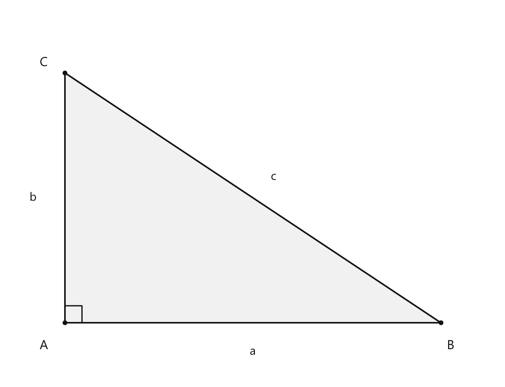
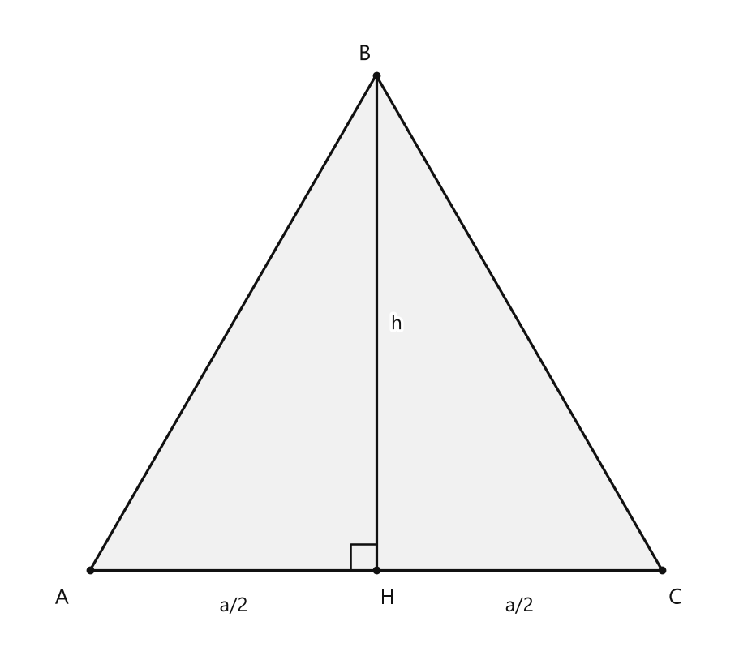
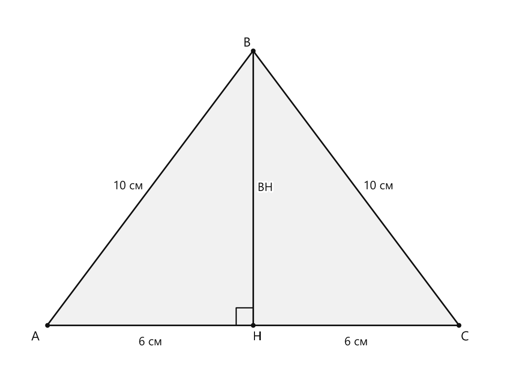
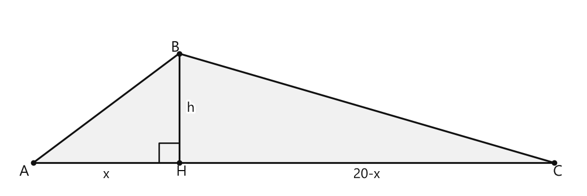

# Занятие 16. Теорема Пифагора

**Раздел:** Глава 2. Площади многоугольников  
**Параграф учебника:** §16. Теорема Пифагора  
**Страницы:** 100–108

## Цели занятия

После занятия ты умеешь:

- применять теорему Пифагора для нахождения стороны прямоугольного треугольника;
- распознавать прямоугольный треугольник по трём сторонам;
- находить площадь прямоугольного, равнобедренного и равностороннего треугольника;
- находить диагональ прямоугольника, квадрата и параллелограмма;
- решать задачи на высоту треугольника;
- использовать известные Пифагоровы тройки.

Выбирай блок своего уровня:

- **1–2 балла:** базовая формула и нахождение гипотенузы;
- **3–4 балла:** нахождение катета и площади;
- **5–6 баллов:** обратная теорема и равнобедренные треугольники;
- **7–8 баллов:** высота произвольного треугольника;
- **9–10 баллов:** составные задачи и доказательства.

## Теория к занятию

### Прямоугольный треугольник и обозначения

#### Простыми словами

Сначала ищем прямой угол — угол $90^\circ$.

Две стороны, которые образуют этот угол, называются катетами.

Сторона напротив прямого угла называется гипотенузой. Она всегда самая длинная.

Представь прямой угол как «угол-указатель»: он сразу показывает, какая сторона будет гипотенузой.

#### Факт

Если треугольник $ABC$ прямоугольный и $\angle C = 90^\circ$, то $AC$ и $BC$ — катеты, а $AB$ — гипотенуза.

Катеты, лежащие против углов $A$ и $B$, будем соответственно обозначать $a$ и $b$, гипотенузу — $c$.

#### Формулы

Катеты:

- $a$ и $b$ — катеты;
- $c$ — гипотенуза.

Гипотенуза всегда больше каждого катета:

$$c>a,\qquad c>b.$$

#### Правила

- Сначала найди прямой угол.
- Две стороны, образующие прямой угол, — катеты.
- Сторона напротив прямого угла — гипотенуза.
- Не выбирай гипотенузу по её положению на рисунке. Она определяется прямым углом.

#### Ловушки

- Гипотенуза может быть горизонтальной, вертикальной или наклонной.
- Самая длинная сторона прямоугольного треугольника — гипотенуза.
- Стороны, прилегающие к прямому углу, — катеты.

---

### Теорема Пифагора

#### Простыми словами

У прямоугольного треугольника есть важная связь между сторонами:

- берём квадрат первого катета;
- прибавляем квадрат второго катета;
- получаем квадрат гипотенузы.

Складываются именно квадраты длин, а не сами длины. Поэтому запись $a+b=c$ здесь не подходит: Пифагор такой фокус не одобрит.

#### Теорема

В прямоугольном треугольнике сумма квадратов катетов равна квадрату гипотенузы, то есть $a^2 + b^2 = c^2$.

<!--geo-figure-spec
{
  "needed": true,
  "kind": "plane",
  "caption": "Прямоугольный треугольник $ABC$",
  "equal": true,
  "axis": false,
  "xlim": [
    -0.7,
    5.2
  ],
  "ylim": [
    -0.7,
    3.8
  ],
  "points": {
    "A": [
      0,
      0
    ],
    "B": [
      4.5,
      0
    ],
    "C": [
      0,
      3
    ]
  },
  "segments": [
    [
      "A",
      "B"
    ],
    [
      "B",
      "C"
    ],
    [
      "C",
      "A"
    ]
  ],
  "polygons": [
    {
      "vertices": [
        "A",
        "B",
        "C"
      ],
      "fill": 0.06
    }
  ],
  "labels": {
    "A": {
      "dx": -0.25,
      "dy": -0.28
    },
    "B": {
      "dx": 0.12,
      "dy": -0.28
    },
    "C": {
      "dx": -0.25,
      "dy": 0.12
    }
  },
  "right_angles": [
    {
      "vertex": "A",
      "from": "B",
      "to": "C"
    }
  ],
  "angle_marks": [],
  "texts": [
    {
      "xy": [
        2.25,
        -0.35
      ],
      "text": "a"
    },
    {
      "xy": [
        -0.38,
        1.5
      ],
      "text": "b"
    },
    {
      "xy": [
        2.5,
        1.75
      ],
      "text": "c"
    }
  ]
}
-->

*Прямоугольный треугольник ABC*

На рисунке треугольник $ABC$ прямоугольный, $\angle A=90^\circ$, катеты имеют длины $a$ и $b$, гипотенуза имеет длину $c$.

#### Формулы

Если нужно найти гипотенузу:

$$c=\sqrt{a^2+b^2}.$$

Если нужно найти катет:

$$a=\sqrt{c^2-b^2},$$

$$b=\sqrt{c^2-a^2}.$$

#### Алгоритм

1. Найди прямой угол.
2. Определи катеты и гипотенузу.
3. Запиши теорему Пифагора:
   $$a^2+b^2=c^2.$$
4. Подставь известные длины.
5. Возведи длины в квадрат.
6. Найди неизвестный квадрат.
7. Если неизвестна длина стороны, извлеки квадратный корень.
8. Проверь результат: гипотенуза должна быть больше каждого катета.

#### Ловушки

- Для нахождения гипотенузы квадраты катетов складывают.
- Для нахождения катета из квадрата гипотенузы вычитают квадрат другого катета.
- Нельзя забывать квадрат у длины.
- Длина стороны не бывает отрицательной.
- Если под корнем получилось отрицательное число, нужно проверить вычисления и данные задачи.

---

### Следствие для нахождения катета

#### Простыми словами

Начинаем с теоремы Пифагора:

$$a^2+b^2=c^2.$$

Чтобы найти $a^2$, вычитаем $b^2$ из обеих частей равенства:

$$a^2=c^2-b^2.$$

Затем находим длину катета $a$. Так как длина положительна, берём положительный квадратный корень.

#### Следствие

Из равенства $a^2 + b^2 = c^2$ следует $a^2 = c^2 - b^2$. С учетом $a > 0$ получаем $a = \sqrt{c^2 - b^2}$. Аналогично, $b = \sqrt{c^2 - a^2}$. Говорят, что катет равен квадратному корню из разности квадрата гипотенузы и квадрата другого катета.

#### Формулы

$$a=\sqrt{c^2-b^2},\qquad b=\sqrt{c^2-a^2}.$$

#### Правила

- Гипотенуза должна быть известна.
- Из квадрата гипотенузы вычитаем квадрат другого катета.
- После этого извлекаем квадратный корень.
- Ответ записываем положительным числом.

#### Ловушки

- Нельзя писать $a=c-b$.
- Нельзя вычитать сами длины вместо их квадратов.
- Нельзя извлекать корень до вычисления разности, если это приводит к ошибкам в преобразованиях.
- Найденный катет должен быть меньше гипотенузы.

---

### Равнобедренный прямоугольный треугольник и квадрат

#### Простыми словами

В равнобедренном прямоугольном треугольнике катеты равны. Пусть каждый из них равен $a$.

Тогда по теореме Пифагора:

$$a^2+a^2=c^2.$$

Получаем:

$$2a^2=c^2.$$

После извлечения корня:

$$c=a\sqrt2.$$

Диагональ квадрата тоже является гипотенузой равнобедренного прямоугольного треугольника. Поэтому для квадрата действует та же формула.

#### Полезно запомнить!

Гипотенуза равнобедренного прямоугольного треугольника с катетом $a$ равна $a\sqrt{2}$.

Катет равнобедренного прямоугольного треугольника с гипотенузой $c$ равен $\frac{c}{\sqrt{2}}$.

Диагональ $d$ квадрата со стороной $a$ равна $a\sqrt{2}$.

Сторона квадрата с диагональю $d$ равна $\frac{d}{\sqrt{2}}$.

#### Формулы

$$c=a\sqrt2,$$

$$a=\frac{c}{\sqrt2},$$

$$d=a\sqrt2,$$

$$a=\frac{d}{\sqrt2}.$$

Площадь квадрата:

$$S=a^2.$$

#### Ловушки

- Диагональ квадрата — это не его сторона.
- При нахождении диагонали сторону умножаем на $\sqrt2$.
- При нахождении стороны по диагонали делим на $\sqrt2$.
- Площадь квадрата находим по стороне: $S=a^2$.

---

### Равносторонний треугольник

#### Простыми словами

Проведём высоту в равностороннем треугольнике.

Она делит треугольник на два равных прямоугольных треугольника:

- одна сторона каждого маленького треугольника равна $\frac a2$;
- гипотенуза равна $a$;
- высота является вторым катетом.

По теореме Пифагора сначала находим высоту, а затем используем формулу площади треугольника.

#### Формулы

**Высота равностороннего треугольника:**

$$h=\frac{a\sqrt3}{2}.$$

**Площадь равностороннего треугольника:**

$$S=\frac{a^2\sqrt3}{4}.$$

Здесь $a$ — сторона треугольника, $h$ — его высота, $S$ — площадь.

#### Алгоритм

1. Если известна сторона, найди высоту по формуле:
   $$h=\frac{a\sqrt3}{2}.$$
2. Найди площадь по формуле:
   $$S=\frac{a^2\sqrt3}{4}.$$
3. Если известна площадь, подставь её в формулу площади и найди сторону.
4. Периметр равностороннего треугольника найди так:
   $$P=3a.$$

#### Ловушки

- В формуле площади стоит $a^2$, а не $a$.
- Высота не равна $\frac a2$. Отрезок $\frac a2$ — это половина стороны.
- Высота равна $\frac{a\sqrt3}{2}$.
- Периметр равен $3a$, потому что все три стороны равны $a$.

---

### Теорема, обратная теореме Пифагора

#### Простыми словами

Теорема Пифагора применяется, когда уже известно, что треугольник прямоугольный.

Обратная теорема помогает установить, является ли треугольник прямоугольным.

Для этого:

1. находим наибольшую сторону;
2. возводим все стороны в квадрат;
3. проверяем, равен ли квадрат наибольшей стороны сумме квадратов двух других сторон.

Если равенство выполняется, треугольник прямоугольный. Наибольшая сторона в этом случае становится гипотенузой.

#### Теорема

Если в треугольнике сумма квадратов двух сторон равна квадрату третьей стороны, то этот треугольник прямоугольный, т. е. если для сторон треугольника $ABC$ справедливо равенство $a^2 + b^2 = c^2$, то $\angle C = 90^\circ$.

#### Алгоритм

1. Выбери наибольшую сторону.
2. Обозначь её буквой $c$.
3. Две другие стороны обозначь $a$ и $b$.
4. Возведи все три стороны в квадрат.
5. Проверь равенство:
   $$a^2+b^2=c^2.$$
6. Если равенство верно, треугольник прямоугольный.
7. Если равенство неверно, треугольник не является прямоугольным.

#### Ловушки

- Справа в равенстве должна стоять наибольшая сторона.
- Нельзя проверять равенство с произвольной стороной справа.
- Нужно сравнивать квадраты, а не сами длины.
- Перед решением проверь, могут ли данные отрезки быть сторонами треугольника.

---

### Медиана к гипотенузе и высота в прямоугольном треугольнике

#### Простыми словами

В прямоугольном треугольнике гипотенуза — самая длинная сторона.

Медиана, проведённая к гипотенузе, делит её пополам. Поэтому её длина равна половине гипотенузы:

$$m_c=\frac c2.$$

Высоту к гипотенузе можно найти через площадь.

Площадь прямоугольного треугольника можно записать двумя способами:

- через катеты:
  $$S=\frac{ab}{2};$$
- через гипотенузу и высоту к ней:
  $$S=\frac{ch}{2}.$$

Приравниваем эти выражения:

$$\frac{ab}{2}=\frac{ch}{2}.$$

Отсюда:

$$h_c=\frac{ab}{c}.$$

#### Формулы

Медиана к гипотенузе:

$$m_c=\frac c2.$$

Высота к гипотенузе:

$$h_c=\frac{ab}{c}.$$

#### Ловушки

- Формула $m_c=\frac c2$ работает именно для медианы к гипотенузе.
- Высота к гипотенузе не обязана быть равна половине гипотенузы.
- В формуле высоты используются оба катета.
- Не перепутай медиану и высоту: названия похожи, а задачи разные.

---

### Высота равнобедренного треугольника

#### Простыми словами

Проведём высоту из вершины равнобедренного треугольника к основанию.

В равнобедренном треугольнике такая высота одновременно является медианой. Значит, она делит основание пополам.

Получается прямоугольный треугольник:

- гипотенуза — боковая сторона $b$;
- один катет — половина основания $\frac a2$;
- второй катет — высота $h$.

По теореме Пифагора находим высоту.

#### Формула

Если основание равно $a$, а боковая сторона равна $b$, то половина основания равна $\frac a2$, а высота:

$$h=\sqrt{b^2-\left(\frac a2\right)^2}.$$

Площадь:

$$S=\frac12ah.$$

#### Ловушки

- Пополам делится основание, а не боковая сторона.
- Из квадрата боковой стороны вычитается квадрат половины основания.
- Высота должна быть положительной.
- Не забудь после нахождения высоты подставить её в формулу площади.

---

### Высота произвольного треугольника

#### Простыми словами

В произвольном треугольнике проводим высоту к выбранной стороне.

Высота делит эту сторону на два отрезка. Обозначим всю выбранную сторону через $c$, а одну часть через $x$. Тогда вторая часть равна $c-x$.

Получаются два прямоугольных треугольника. Для каждого записываем теорему Пифагора. После этого находим $x$, а затем высоту.

#### Алгоритм

Пусть основание равно $c$, высота делит его на отрезки $x$ и $c-x$.

1. Запиши теорему Пифагора для первого прямоугольного треугольника.
2. Запиши теорему Пифагора для второго прямоугольного треугольника.
3. В обоих равенствах вырази квадрат высоты.
4. Приравняй полученные выражения.
5. Найди $x$.
6. Подставь $x$ в одну из формул.
7. Найди высоту.
8. Проверь результат по второму прямоугольному треугольнику.

#### Ловушки

- Части основания должны в сумме давать всё основание:
  $$x+(c-x)=c.$$
- Если высота падает на продолжение стороны, нужно внимательно учитывать расположение точки.
- Не смешивай стороны из разных прямоугольных треугольников в одной записи.
- После решения полезно проверить найденную высоту вторым равенством. Математика тоже любит контрольную проверку.

---

## Сводка формул «выучить наизусть»

Теорема Пифагора:

$$a^2+b^2=c^2.$$

Гипотенуза:

$$c=\sqrt{a^2+b^2}.$$

Катеты:

$$a=\sqrt{c^2-b^2},\qquad b=\sqrt{c^2-a^2}.$$

Площадь прямоугольного треугольника:

$$S=\frac{ab}{2}.$$

Высота к гипотенузе:

$$h_c=\frac{ab}{c}.$$

Медиана к гипотенузе:

$$m_c=\frac c2.$$

Высота равностороннего треугольника:

$$h=\frac{a\sqrt3}{2}.$$

Площадь равностороннего треугольника:

$$S=\frac{a^2\sqrt3}{4}.$$

Высота равнобедренного треугольника:

$$h=\sqrt{b^2-\left(\frac a2\right)^2}.$$

Диагональ квадрата:

$$d=a\sqrt2.$$

Сторона квадрата по диагонали:

$$a=\frac d{\sqrt2}.$$

## Правила, которые нельзя путать

- Гипотенуза расположена напротив прямого угла.
- Для нахождения гипотенузы квадраты катетов складывают.
- Для нахождения катета из квадрата гипотенузы вычитают квадрат другого катета.
- Обратную теорему Пифагора применяют к наибольшей стороне.
- В равнобедренном треугольнике высота к основанию делит основание пополам.
- Площадь прямоугольного треугольника равна половине произведения катетов.
- Площадь квадрата равна квадрату его стороны, а не квадрату диагонали.

## Разбор ключевых заданий

### Р1. Высота и площадь равностороннего треугольника

**Условие.** Найти высоту и площадь равностороннего треугольника со стороной $a$.

Рассмотрим равносторонний треугольник $ABC$. Высота $BH$ проведена к стороне $AC$.

<!--geo-figure-spec
{
  "needed": true,
  "kind": "plane",
  "caption": "Равносторонний треугольник $ABC$ с высотой $BH$",
  "equal": true,
  "axis": false,
  "xlim": [
    -0.7,
    5.7
  ],
  "ylim": [
    -0.7,
    4.9
  ],
  "points": {
    "A": [
      0,
      0
    ],
    "B": [
      2.5,
      4.3301
    ],
    "C": [
      5,
      0
    ],
    "H": [
      2.5,
      0
    ]
  },
  "segments": [
    [
      "A",
      "B"
    ],
    [
      "B",
      "C"
    ],
    [
      "C",
      "A"
    ],
    {
      "points": [
        "B",
        "H"
      ],
      "dashed": false,
      "label": "",
      "t": 0.5
    }
  ],
  "polygons": [
    {
      "vertices": [
        "A",
        "B",
        "C"
      ],
      "fill": 0.06
    }
  ],
  "labels": {
    "A": {
      "dx": -0.25,
      "dy": -0.25
    },
    "B": {
      "dx": -0.1,
      "dy": 0.18
    },
    "C": {
      "dx": 0.12,
      "dy": -0.25
    },
    "H": {
      "dx": 0.1,
      "dy": -0.25
    }
  },
  "right_angles": [
    {
      "vertex": "H",
      "from": "B",
      "to": "A"
    }
  ],
  "angle_marks": [],
  "texts": [
    {
      "xy": [
        2.68,
        2.15
      ],
      "text": "h"
    },
    {
      "xy": [
        1.25,
        -0.32
      ],
      "text": "a/2"
    },
    {
      "xy": [
        3.75,
        -0.32
      ],
      "text": "a/2"
    }
  ]
}
-->

*Равносторонний треугольник ABC с высотой BH*

**Дано:** $AB=BC=AC=a$, $BH=h$, $AH=HC=\frac a2$.

**Решение:**

Высота равностороннего треугольника является медианой.

Значит, она делит основание пополам:

$$AH=\frac a2.$$

Треугольник $ABH$ прямоугольный, потому что $BH$ — высота.

Гипотенуза этого треугольника — $AB$, поэтому:

$$AB^2=AH^2+BH^2.$$

Выразим квадрат высоты:

$$BH^2=AB^2-AH^2.$$

Подставим известные значения:

$$h^2=a^2-\left(\frac a2\right)^2.$$

Возведём дробь в квадрат:

$$h^2=a^2-\frac{a^2}{4}.$$

Представим $a^2$ в виде дроби со знаменателем $4$:

$$h^2=\frac{4a^2}{4}-\frac{a^2}{4}.$$

$$h^2=\frac{3a^2}{4}.$$

Высота является длиной, поэтому $h>0$:

$$h=\sqrt{\frac{3a^2}{4}}.$$

Получаем:

$$h=\frac{a\sqrt3}{2}.$$

Теперь найдём площадь треугольника:

$$S=\frac12ah.$$

Подставим найденную высоту:

$$S=\frac12a\cdot\frac{a\sqrt3}{2}.$$

Перемножим числители и знаменатели:

$$S=\frac{a^2\sqrt3}{4}.$$

**Ответ:**

$$h=\frac{a\sqrt3}{2},\qquad S=\frac{a^2\sqrt3}{4}.$$

---

### Р2. Прямоугольный треугольник с отношением катетов $3:4$

**Условие.** В прямоугольном треугольнике катеты относятся как $3:4$, гипотенуза равна $30$ см. Найти площадь треугольника.

**Дано:** катеты $3x$ см и $4x$ см, гипотенуза $30$ см.

**Решение:**

Отношение катетов равно $3:4$.

Поэтому обозначим катеты через $3x$ и $4x$.

Гипотенуза равна $30$ см.

Запишем теорему Пифагора:

$$(3x)^2+(4x)^2=30^2.$$

Возведём выражения в квадрат:

$$9x^2+16x^2=900.$$

Сложим подобные слагаемые:

$$25x^2=900.$$

Разделим обе части на $25$:

$$x^2=36.$$

Так как $x$ обозначает длину, берём положительное значение:

$$x=6.$$

Найдём первый катет:

$$3x=3\cdot6=18\text{ см}.$$

Найдём второй катет:

$$4x=4\cdot6=24\text{ см}.$$

Площадь прямоугольного треугольника равна половине произведения катетов:

$$S=\frac{18\cdot24}{2}.$$

Вычислим произведение:

$$S=\frac{432}{2}=216\text{ см}^2.$$

Проверим теорему Пифагора:

$$18^2+24^2=324+576=900.$$

$$30^2=900.$$

Равенство выполняется, значит, стороны найдены правильно. Пифагор поставил зачёт.

**Ответ:** $216\text{ см}^2$.

### Р3. Медиана и высота в треугольнике со сторонами $7$, $24$, $25$

**Условие.** Стороны треугольника равны $7$ см, $24$ см и $25$ см. Найти:

а) медиану, проведённую к наибольшей стороне;  
б) высоту, проведённую из вершины наибольшего угла.

**Решение:**

Наибольшая сторона равна $25$ см.

Проверим, может ли треугольник быть прямоугольным:

$$7^2+24^2=49+576=625.$$

$$25^2=625.$$

Получили:

$$7^2+24^2=25^2.$$

По теореме, обратной теореме Пифагора, треугольник прямоугольный.

Стороны $7$ см и $24$ см — катеты.

Сторона $25$ см — гипотенуза.

#### а) Медиана к наибольшей стороне

Наибольшая сторона — гипотенуза.

Медиана, проведённая к гипотенузе, равна половине гипотенузы:

$$m_c=\frac c2.$$

Подставим $c=25$ см:

$$m_c=\frac{25}{2}=12{,}5\text{ см}.$$

#### б) Высота из вершины наибольшего угла

Наибольший угол прямоугольного треугольника равен $90^\circ$.

Высота из этого угла проведена к гипотенузе.

Обозначим эту высоту через $h_c$.

Площадь прямоугольного треугольника можно найти двумя способами:

$$S=\frac{ab}{2},$$

где $a$ и $b$ — катеты, и

$$S=\frac{ch_c}{2},$$

где $c$ — гипотенуза.

Приравняем выражения для площади:

$$\frac{ab}{2}=\frac{ch_c}{2}.$$

Умножим обе части равенства на $2$:

$$ab=ch_c.$$

Отсюда:

$$h_c=\frac{ab}{c}.$$

Подставим значения:

$$h_c=\frac{7\cdot24}{25}.$$

$$h_c=\frac{168}{25}=6{,}72\text{ см}.$$

**Ответ:** а) $12{,}5$ см; б) $6{,}72$ см.

---

### Р4. Площадь равнобедренного треугольника

**Условие.** Найти площадь равнобедренного треугольника со сторонами $10$ см, $10$ см и $12$ см.

**Дано:** боковые стороны $10$ см, основание $12$ см.

Проведём высоту к основанию. В равнобедренном треугольнике эта высота делит основание пополам.

<!--geo-figure-spec
{
  "needed": true,
  "kind": "plane",
  "caption": "Равнобедренный треугольник $ABC$ с высотой $BH$",
  "equal": true,
  "axis": false,
  "xlim": [
    -7.2,
    7.2
  ],
  "ylim": [
    -1.1,
    9.3
  ],
  "points": {
    "A": [
      -6,
      0
    ],
    "B": [
      0,
      8
    ],
    "C": [
      6,
      0
    ],
    "H": [
      0,
      0
    ]
  },
  "segments": [
    [
      "A",
      "B"
    ],
    [
      "B",
      "C"
    ],
    [
      "C",
      "A"
    ],
    [
      "B",
      "H"
    ]
  ],
  "polygons": [
    {
      "vertices": [
        "A",
        "B",
        "C"
      ],
      "fill": 0.06
    }
  ],
  "labels": {
    "A": {
      "dx": -0.35,
      "dy": -0.35
    },
    "B": {
      "dx": -0.18,
      "dy": 0.22
    },
    "C": {
      "dx": 0.18,
      "dy": -0.35
    },
    "H": {
      "dx": 0.12,
      "dy": -0.35
    }
  },
  "right_angles": [
    {
      "vertex": "H",
      "from": "B",
      "to": "A"
    }
  ],
  "angle_marks": [],
  "texts": [
    {
      "xy": [
        -3,
        -0.5
      ],
      "text": "6 см"
    },
    {
      "xy": [
        3,
        -0.5
      ],
      "text": "6 см"
    },
    {
      "xy": [
        -3.65,
        4.05
      ],
      "text": "10 см"
    },
    {
      "xy": [
        3.65,
        4.05
      ],
      "text": "10 см"
    },
    {
      "xy": [
        0.35,
        4
      ],
      "text": "BH"
    }
  ]
}
-->

*Равнобедренный треугольник ABC с высотой BH*

**Дано:** $AB=BC=10$ см, $AC=12$ см, $AH=HC=6$ см.

**Решение:**

Так как треугольник равнобедренный, высота $BH$ делит основание $AC$ пополам:

$$AH=HC=\frac{AC}{2}.$$

$$AH=HC=\frac{12}{2}=6\text{ см}.$$

Треугольник $ABH$ прямоугольный.

Для него гипотенуза $AB=10$ см, а катеты — $AH=6$ см и $BH$.

По теореме Пифагора:

$$AB^2=AH^2+BH^2.$$

Выразим $BH^2$:

$$BH^2=AB^2-AH^2.$$

Подставим значения:

$$BH^2=10^2-6^2.$$

$$BH^2=100-36=64.$$

Так как длина отрезка положительна:

$$BH=\sqrt{64}=8\text{ см}.$$

Теперь найдём площадь треугольника:

$$S=\frac12\cdot AC\cdot BH.$$

$$S=\frac12\cdot12\cdot8.$$

$$S=6\cdot8=48\text{ см}^2.$$

Высота найдена, площадь тоже. Равнобедренность здесь хорошо поработала — поделила основание пополам.

**Ответ:** $48\text{ см}^2$.

---

### Р5. Высота треугольника со сторонами $7$, $15$, $20$

**Условие.** Найти высоту треугольника со сторонами $7$ см, $15$ см и $20$ см, проведённую к стороне длиной $20$ см.

**Дано:** $AB=7$ см, $BC=15$ см, $AC=20$ см. Высота $BH$ проведена к $AC$.

Обозначим:

$$AH=x\text{ см}.$$

Тогда оставшаяся часть основания равна:

$$HC=20-x\text{ см}.$$

<!--geo-figure-spec
{
  "needed": true,
  "kind": "plane",
  "caption": "Треугольник $ABC$ с высотой $BH$",
  "equal": true,
  "axis": false,
  "xlim": [
    -1,
    21
  ],
  "ylim": [
    -1,
    6
  ],
  "points": {
    "A": [
      0,
      0
    ],
    "B": [
      5.6,
      4.2
    ],
    "C": [
      20,
      0
    ],
    "H": [
      5.6,
      0
    ]
  },
  "segments": [
    [
      "A",
      "B"
    ],
    [
      "B",
      "C"
    ],
    [
      "C",
      "A"
    ],
    [
      "B",
      "H"
    ]
  ],
  "polygons": [
    {
      "vertices": [
        "A",
        "B",
        "C"
      ],
      "fill": 0.06
    }
  ],
  "labels": {
    "A": {
      "dx": -0.35,
      "dy": -0.35
    },
    "B": {
      "dx": -0.15,
      "dy": 0.22
    },
    "C": {
      "dx": 0.15,
      "dy": -0.35
    },
    "H": {
      "dx": 0.1,
      "dy": -0.35
    }
  },
  "right_angles": [
    {
      "vertex": "H",
      "from": "B",
      "to": "A"
    }
  ],
  "angle_marks": [],
  "texts": [
    {
      "xy": [
        2.8,
        -0.45
      ],
      "text": "x"
    },
    {
      "xy": [
        12.8,
        -0.45
      ],
      "text": "20-x"
    },
    {
      "xy": [
        6.05,
        2.1
      ],
      "text": "h"
    }
  ]
}
-->

*Треугольник ABC с высотой BH*

**Решение:**

Треугольники $ABH$ и $CBH$ прямоугольные, потому что $BH$ — высота.

В треугольнике $ABH$ по теореме Пифагора:

$$AB^2=AH^2+BH^2.$$

Выразим $BH^2$:

$$BH^2=AB^2-AH^2.$$

Подставим известные длины:

$$BH^2=7^2-x^2.$$

В треугольнике $CBH$ также применим теорему Пифагора:

$$BC^2=HC^2+BH^2.$$

Выразим $BH^2$:

$$BH^2=BC^2-HC^2.$$

Подставим значения:

$$BH^2=15^2-(20-x)^2.$$

Оба выражения равны $BH^2$, поэтому приравняем их:

$$7^2-x^2=15^2-(20-x)^2.$$

Раскроем скобки:

$$49-x^2=225-(400-40x+x^2).$$

Раскроем внешние скобки:

$$49-x^2=225-400+40x-x^2.$$

Упростим правую часть:

$$49-x^2=-175+40x-x^2.$$

Прибавим $x^2$ к обеим частям:

$$49=-175+40x.$$

Прибавим $175$ к обеим частям:

$$224=40x.$$

Разделим обе части на $40$:

$$x=5{,}6.$$

Значит:

$$AH=5{,}6\text{ см}.$$

Теперь найдём высоту из прямоугольного треугольника $ABH$:

$$BH=\sqrt{AB^2-AH^2}.$$

$$BH=\sqrt{7^2-5{,}6^2}.$$

$$BH=\sqrt{49-31{,}36}.$$

$$BH=\sqrt{17{,}64}=4{,}2\text{ см}.$$

Проверим результат по второму прямоугольному треугольнику:

$$HC=20-5{,}6=14{,}4\text{ см}.$$

$$BH^2=15^2-14{,}4^2.$$

$$BH^2=225-207{,}36=17{,}64.$$

$$BH=\sqrt{17{,}64}=4{,}2\text{ см}.$$

Оба способа дали одну и ту же высоту. Значит, вычисления выполнены верно.

**Ответ:** $4{,}2$ см.

---

### Р6. Сторона прямоугольника и диагональ

**Условие.** Сторона прямоугольника равна $12$ см, диагональ равна $13$ см. Найти площадь прямоугольника.

**Дано:** одна сторона $a=12$ см, диагональ $d=13$ см.

Диагональ прямоугольника делит его на два прямоугольных треугольника.

Обозначим вторую сторону через $b$.

**Решение:**

В получившемся прямоугольном треугольнике катеты равны $12$ см и $b$, а гипотенуза равна $13$ см.

По теореме Пифагора:

$$12^2+b^2=13^2.$$

Вычислим квадраты:

$$144+b^2=169.$$

Выразим $b^2$:

$$b^2=169-144.$$

$$b^2=25.$$

Длина стороны положительна, поэтому:

$$b=\sqrt{25}=5\text{ см}.$$

Теперь найдём площадь прямоугольника:

$$S=ab.$$

$$S=12\cdot5=60\text{ см}^2.$$

**Ответ:** $60\text{ см}^2$.

---

### Р7. Диагональ и площадь квадрата

**Условие.** Найти площадь квадрата с диагональю $4$ см.

**Дано:** $d=4$ см.

**Решение:**

Диагональ квадрата образует с двумя его сторонами прямоугольный треугольник.

Для квадрата справедливо:

$$d=a\sqrt2.$$

Выразим сторону:

$$a=\frac d{\sqrt2}.$$

Подставим значение диагонали:

$$a=\frac4{\sqrt2}=2\sqrt2\text{ см}.$$

Площадь квадрата равна квадрату его стороны:

$$S=a^2.$$

$$S=(2\sqrt2)^2.$$

$$S=4\cdot2=8\text{ см}^2.$$

Можно решить ещё короче. Из формулы $d=a\sqrt2$ после возведения в квадрат получаем:

$$d^2=2a^2.$$

Так как $S=a^2$, то:

$$S=\frac{d^2}{2}.$$

$$S=\frac{4^2}{2}=\frac{16}{2}=8\text{ см}^2.$$

**Ответ:** $8\text{ см}^2$.

---

### Р8. Проверка, является ли треугольник прямоугольным

**Условие.** Определить, является ли треугольник со сторонами $20$ мм, $21$ мм и $29$ мм прямоугольным.

**Решение:**

Сначала выбираем наибольшую сторону:

$$c=29\text{ мм}.$$

Именно она могла бы быть гипотенузой.

Проверим равенство из теоремы, обратной теореме Пифагора:

$$20^2+21^2=400+441=841.$$

Вычислим квадрат наибольшей стороны:

$$29^2=841.$$

Получили:

$$20^2+21^2=29^2.$$

Следовательно, по теореме, обратной теореме Пифагора, треугольник прямоугольный.

Наибольшая сторона $29$ мм является его гипотенузой.

**Ответ:** да, треугольник прямоугольный.

---

### Р9. Площадь ромба по периметру и диагонали

**Условие.** Периметр ромба равен $100$ см, одна диагональ равна $48$ см. Найти площадь ромба.

**Дано:** $P=100$ см, $d_1=48$ см.

**Решение:**

У ромба все стороны равны, поэтому его сторона равна четверти периметра:

$$a=\frac P4.$$

$$a=\frac{100}{4}=25\text{ см}.$$

Диагонали ромба перпендикулярны и делятся точкой пересечения пополам.

Половина первой диагонали равна:

$$\frac{d_1}{2}=\frac{48}{2}=24\text{ см}.$$

Пусть вторая диагональ равна $d_2$.

Половины диагоналей и сторона ромба образуют прямоугольный треугольник.

Для него гипотенуза равна $25$ см, а один катет равен $24$ см:

$$25^2=24^2+\left(\frac{d_2}{2}\right)^2.$$

Подставим значения:

$$625=576+\left(\frac{d_2}{2}\right)^2.$$

Выразим квадрат второго катета:

$$\left(\frac{d_2}{2}\right)^2=625-576.$$

$$\left(\frac{d_2}{2}\right)^2=49.$$

Длина отрезка положительна:

$$\frac{d_2}{2}=\sqrt{49}=7.$$

Значит:

$$d_2=14\text{ см}.$$

Площадь ромба равна половине произведения его диагоналей:

$$S=\frac{d_1d_2}{2}.$$

$$S=\frac{48\cdot14}{2}.$$

$$S=24\cdot14=336\text{ см}^2.$$

**Ответ:** $336\text{ см}^2$.

---

### Р10. Площадь квадрата по площадям квадратов на сторонах треугольника

**Условие.** На сторонах прямоугольного треугольника построены квадраты. Площадь квадрата на одном катете равна $64\text{ см}^2$, а площадь квадрата на гипотенузе — $289\text{ см}^2$. Найти площадь квадрата на другом катете.

**Решение:**

Площадь квадрата со стороной $x$ равна $x^2$.

Поэтому площадь квадрата на одном катете равна $a^2$:

$$a^2=64.$$

Площадь квадрата на гипотенузе равна $c^2$:

$$c^2=289.$$

Для прямоугольного треугольника:

$$a^2+b^2=c^2.$$

Выразим квадрат второго катета:

$$b^2=c^2-a^2.$$

Подставим известные площади квадратов:

$$b^2=289-64.$$

$$b^2=225.$$

Площадь квадрата на другом катете как раз равна $b^2$:

$$S=225\text{ см}^2.$$

**Ответ:** $225\text{ см}^2$.

## Практические задания

Выбери свой уровень и решай только этот блок. В блоке должна закрепиться вся тема параграфа. Ответы не приводятся.

### Уровень 1–2 балла

**С1.** Выберите формулу теоремы Пифагора для прямоугольного треугольника с катетами $a$, $b$ и гипотенузой $c$:

1) $a+b=c$ 2) $a^2+b^2=c^2$ 3) $a^2-b^2=c^2$ 4) $a+b=c^2$ 5) $ab=c^2$

**С2.** В прямоугольном треугольнике катеты равны $6$ см и $8$ см. Найдите гипотенузу.

**С3.** В прямоугольном треугольнике гипотенуза равна $13$ см, а один катет — $5$ см. Найдите второй катет.

**С4.** Выберите тройку чисел, которая может быть длинами сторон прямоугольного треугольника:

1) $4$, $5$, $6$ 2) $6$, $8$, $10$ 3) $5$, $6$, $8$ 4) $7$, $8$, $10$ 5) $2$, $3$, $4$

**С5.** Стороны треугольника равны $9$ см, $12$ см и $15$ см. Определите, является ли треугольник прямоугольным.

**С6.** Сторона прямоугольника равна $9$ см, а диагональ — $15$ см. Найдите другую сторону прямоугольника.

**С7.** Найдите площадь прямоугольного треугольника с катетами $7$ см и $24$ см.

**С8.** Найдите гипотенузу равнобедренного прямоугольного треугольника с катетом $5$ см.

**С9.** Найдите диагональ квадрата со стороной $7$ см.

**С10.** Найдите сторону квадрата, если его диагональ равна $10\sqrt{2}$ см.

**С11.** Равнобедренный треугольник имеет основание $14$ см и боковые стороны по $25$ см. Найдите его высоту, проведённую к основанию.

**С12.** Равносторонний треугольник имеет сторону $8$ см. Найдите его высоту.

**С13.** В прямоугольном треугольнике катеты равны $6$ см и $8$ см. Найдите гипотенузу.
1) $10$ см 2) $12$ см 3) $14$ см 4) $48$ см 5) $100$ см

**С14.** В прямоугольном треугольнике гипотенуза равна $13$ см, а один из катетов — $5$ см. Найдите второй катет.
1) $8$ см 2) $10$ см 3) $12$ см 4) $18$ см 5) $144$ см

**С15.** Какие из указанных чисел могут быть сторонами прямоугольного треугольника?
1) $4$, $5$, $6$ 2) $6$, $8$, $10$ 3) $5$, $6$, $7$ 4) $7$, $8$, $9$ 5) $8$, $9$, $10$

**С16.** Стороны треугольника равны $9$ см, $12$ см и $15$ см. Выберите верное утверждение.
1) Треугольник остроугольный.
2) Треугольник тупоугольный.
3) Треугольник прямоугольный, гипотенуза равна $12$ см.
4) Треугольник прямоугольный, гипотенуза равна $15$ см.
5) Такой треугольник не существует.

**С17.** Диагональ квадрата со стороной $7$ см равна:
1) $7$ см 2) $14$ см 3) $7\sqrt{2}$ см 4) $49$ см 5) $\frac{7\sqrt{2}}{2}$ см

**С18.** Сторона квадрата с диагональю $10\sqrt{2}$ см равна:
1) $5$ см 2) $10$ см 3) $20$ см 4) $10\sqrt{2}$ см 5) $100$ см

**С19.** Стороны прямоугольника равны $9$ см и $12$ см. Выберите длину его диагонали.
1) $15$ см 2) $18$ см 3) $21$ см 4) $108$ см 5) $225$ см

**С20.** Площадь квадрата с диагональю $8$ см равна:
1) $8$ см$^2$ 2) $16$ см$^2$ 3) $32$ см$^2$ 4) $64$ см$^2$ 5) $128$ см$^2$

**С21.** Высота равностороннего треугольника со стороной $a$ выражается формулой:
1) $h=a\sqrt{3}$ 2) $h=\frac{a\sqrt{3}}{2}$ 3) $h=\frac{a}{2}$ 4) $h=\frac{a^2\sqrt{3}}{4}$ 5) $h=\frac{2a}{\sqrt{3}}$

**С22.** Найдите высоту равностороннего треугольника со стороной $6$ см.
1) $3$ см 2) $6\sqrt{3}$ см 3) $3\sqrt{3}$ см 4) $9\sqrt{3}$ см 5) $18$ см

**С23.** В прямоугольном треугольнике катеты равны $5$ см и $12$ см. Запишите длину гипотенузы в сантиметрах.

**С24.** Определите, является ли треугольник прямоугольным, если его стороны равны $10$ см, $24$ см и $26$ см. Запишите ответ: «да» или «нет».

**С25.** В прямоугольном треугольнике катеты равны $6$ см и $8$ см. Найдите гипотенузу.

**С26.** В прямоугольном треугольнике катет равен $12$ см, а гипотенуза — $13$ см. Найдите второй катет.

**С27.** Выберите верное равенство для прямоугольного треугольника с катетами $a$ и $b$ и гипотенузой $c$.

1) $a+b=c$  
2) $a^2+b^2=c^2$  
3) $a^2-b^2=c^2$  
4) $a+b=c^2$  
5) $a^2+b^2=c$

**С28.** Стороны треугольника равны $9$ см, $12$ см и $15$ см. Определите, является ли этот треугольник прямоугольным.

**С29.** Сторона прямоугольника равна $5$ см, а диагональ — $13$ см. Найдите вторую сторону прямоугольника.

**С30.** Найдите площадь прямоугольного треугольника с катетами $9$ см и $12$ см.

**С31.** Диагональ квадрата равна $6\sqrt{2}$ см. Найдите сторону квадрата.

**С32.** Сторона квадрата равна $7$ см. Найдите длину его диагонали.

**С33.** Равнобедренный треугольник имеет основание $12$ см и боковые стороны по $10$ см. Найдите его высоту, проведённую к основанию.

**С34.** Равносторонний треугольник имеет сторону $8$ см. Выберите его высоту.

1) $2\sqrt{3}$ см  
2) $4\sqrt{3}$ см  
3) $8\sqrt{3}$ см  
4) $16\sqrt{3}$ см  
5) $4$ см

**С35.** Стороны треугольника равны $\sqrt{2}$ см, $\sqrt{3}$ см и $\sqrt{5}$ см. Определите, является ли треугольник прямоугольным.

**С36.** Стороны прямоугольного треугольника относятся как $3:4$, а гипотенуза равна $20$ см. Найдите меньший катет.

### Уровень 3–4 балла

**С1.** Катеты прямоугольного треугольника равны $6$ см и $8$ см. Найдите гипотенузу.

**С2.** Катет прямоугольного треугольника равен $12$ см, а гипотенуза — $13$ см. Найдите второй катет.

**С3.** Катеты прямоугольного треугольника относятся как $3:4$, а гипотенуза равна $25$ см. Найдите длины катетов.

**С4.** Стороны треугольника равны $9$ см, $12$ см и $15$ см. Является ли этот треугольник прямоугольным?

**С5.** Стороны прямоугольника равны $9$ см и $12$ см. Найдите длину его диагонали.

**С6.** Диагональ квадрата равна $8\sqrt{2}$ см. Найдите сторону квадрата.

**С7.** Найдите площадь прямоугольного треугольника с катетами $5$ см и $12$ см.

**С8.** Площадь квадрата равна $72$ см$^2$. Найдите длину его диагонали.

**С9.** Сторона равностороннего треугольника равна $8$ см. Найдите его высоту и площадь.

**С10.** Основание равнобедренного треугольника равно $16$ см, а боковая сторона — $10$ см. Найдите площадь треугольника.

**С11.** Выберите треугольник, который является прямоугольным.

1) со сторонами $6$ см, $8$ см и $11$ см  
2) со сторонами $7$ см, $24$ см и $25$ см  
3) со сторонами $8$ см, $10$ см и $12$ см  
4) со сторонами $9$ см, $10$ см и $12$ см  
5) со сторонами $5$ см, $6$ см и $8$ см

**С12.** На координатной плоскости даны точки $A(1;2)$ и $B(7;10)$. Найдите длину отрезка $AB$.

**С13.** В прямоугольном треугольнике катеты равны $9$ см и $12$ см. Найдите гипотенузу.

**С14.** В прямоугольном треугольнике гипотенуза равна $17$ см, а один из катетов — $8$ см. Найдите второй катет.

**С15.** Стороны прямоугольника равны $15$ см и $8$ см. Найдите длину его диагонали.

**С16.** Диагональ квадрата равна $10\sqrt{2}$ см. Найдите сторону квадрата.

**С17.** На сторонах прямоугольного треугольника построены квадраты. Площадь квадрата, построенного на одном катете, равна $36$ см$^2$, а площадь квадрата, построенного на другом катете, — $64$ см$^2$. Найдите площадь квадрата, построенного на гипотенузе.

**С18.** Определите, является ли треугольник со сторонами $12$ см, $16$ см и $20$ см прямоугольным.

**С19.** Найдите площадь треугольника со сторонами $9$ см, $12$ см и $15$ см.

**С20.** Равнобедренный треугольник имеет основание $16$ см и боковые стороны по $10$ см. Найдите его площадь.

**С21.** Равносторонний треугольник имеет сторону $6$ см. Найдите его высоту и площадь.

**С22.** Сумма катетов прямоугольного треугольника равна $14$ см, а гипотенуза — $10$ см. Найдите катеты.

**С23.** В прямоугольном треугольнике один катет на $2$ см больше другого, а гипотенуза на $2$ см больше большего катета. Найдите площадь треугольника.

**С24.** Найдите длину отрезка $AB$, если $A(1;2)$ и $B(7;10)$.

**С25.** В прямоугольном треугольнике катеты равны $5$ см и $12$ см. Найдите длину гипотенузы.

**С26.** В прямоугольном треугольнике гипотенуза равна $17$ см, а один из катетов — $15$ см. Найдите длину второго катета.

**С27.** Одна сторона прямоугольника равна $9$ см, а диагональ — $15$ см. Найдите площадь прямоугольника.

**С28.** Найдите площадь квадрата, диагональ которого равна $10$ см.

**С29.** Определите, является ли треугольник со сторонами $9$ см, $12$ см и $15$ см прямоугольным. Если является, найдите его площадь.

**С30.** Сторона ромба равна $13$ см, а одна из его диагоналей — $10$ см. Найдите площадь ромба.

**С31.** Основание равнобедренного треугольника равно $16$ см, а боковая сторона — $17$ см. Найдите площадь треугольника.

**С32.** Сторона равностороннего треугольника равна $6$ см. Найдите его высоту и площадь.

**С33.** Сумма катетов прямоугольного треугольника равна $14$ см, а гипотенуза — $10$ см. Найдите катеты треугольника.

**С34.** Один из катетов прямоугольного треугольника на $4$ см больше другого катета, а гипотенуза на $4$ см больше большего катета. Найдите площадь треугольника.

**С35.** На координатной плоскости даны точки $A(1;2)$ и $B(7;10)$. Найдите длину отрезка $AB$.

**С36.** Стороны треугольника равны $13$ см, $14$ см и $15$ см. Найдите наименьшую высоту треугольника.

### Уровень 5–6 баллов

**С1.** В прямоугольном треугольнике катеты равны $9$ см и $12$ см. Найдите длину гипотенузы.

**С2.** В прямоугольном треугольнике гипотенуза равна $13$ см, а один из катетов — $5$ см. Найдите длину второго катета.

**С3.** Стороны прямоугольника равны $12$ см и $13$ см. Найдите площадь прямоугольника.

**С4.** Определите, является ли треугольник со сторонами $10$ см, $24$ см и $26$ см прямоугольным. Ответ обоснуйте вычислениями.

**С5.** Диагональ квадрата равна $8\sqrt{2}$ см. Найдите сторону и площадь квадрата.

**С6.** Найдите площадь ромба, если его сторона равна $13$ см, а одна из диагоналей — $10$ см.

**С7.** Основание равнобедренного треугольника равно $14$ см, а боковая сторона — $25$ см. Найдите площадь треугольника.

**С8.** Сторона равностороннего треугольника равна $8$ см. Найдите его высоту и площадь.

**С9.** Стороны треугольника равны $13$ см, $14$ см и $15$ см. Найдите длину наименьшей высоты треугольника.

**С10.** Сумма катетов прямоугольного треугольника равна $21$ см, а гипотенуза — $15$ см. Найдите длины катетов.

**С11.** На координатной плоскости заданы точки $A(2;4)$ и $B(8;12)$. Найдите длину отрезка $AB$.

**С12.** В прямоугольной трапеции $ABCD$ основания $AD$ и $BC$ равны соответственно $14$ см и $8$ см, а боковая сторона $CD$ равна $10$ см. Найдите высоту трапеции и её площадь.

**С13.** В прямоугольном треугольнике катеты равны $9$ см и $40$ см. Найдите гипотенузу.

**С14.** В прямоугольном треугольнике гипотенуза равна $17$ см, а один из катетов — $8$ см. Найдите второй катет.

**С15.** Определите, является ли треугольник прямоугольным, если его стороны равны $12$ см, $16$ см и $20$ см. Ответ обоснуйте вычислением.

**С16.** Стороны треугольника равны $7$ см, $24$ см и $25$ см. Найдите медиану, проведённую к стороне длиной $25$ см.

**С17.** Найдите площадь прямоугольного треугольника с катетами $10$ см и $24$ см.

**С18.** Стороны равнобедренного треугольника равны $13$ см, $13$ см и $10$ см. Найдите его площадь.

**С19.** Найдите высоту равностороннего треугольника со стороной $12$ см и его площадь.

**С20.** Диагональ квадрата равна $10\sqrt{2}$ см. Найдите сторону и площадь квадрата.

**С21.** Прямоугольник имеет одну сторону длиной $15$ см и диагональ длиной $17$ см. Найдите его площадь.

**С22.** Найдите площадь ромба, если его сторона равна $13$ см, а одна диагональ — $10$ см.

**С23.** Треугольник имеет стороны $13$ см, $14$ см и $15$ см. Найдите его наименьшую высоту.

**С24.** На координатной плоскости даны точки $A(1;2)$ и $B(7;10)$. Найдите длину отрезка $AB$.

**С25.** В прямоугольном треугольнике катеты равны $9$ см и $40$ см. Найдите гипотенузу.

**С26.** Одна сторона прямоугольника равна $15$ см, а диагональ — $17$ см. Найдите площадь прямоугольника.

**С27.** Определите, является ли треугольник со сторонами $10$ см, $24$ см и $26$ см прямоугольным. Ответ обоснуйте с помощью теоремы, обратной теореме Пифагора.

**С28.** Найдите площадь ромба, если его сторона равна $13$ см, а одна из диагоналей — $10$ см.

**С29.** Найдите площадь равнобедренного треугольника, если его основание равно $16$ см, а боковая сторона — $17$ см.

**С30.** На координатной плоскости даны точки $A(-2; 1)$ и $B(4; 9)$. Найдите длину отрезка $AB$.

### Уровень 7–8 баллов

**С1.** В прямоугольном треугольнике катеты равны $9$ см и $40$ см. Найдите гипотенузу. Обоснуйте применённую формулу.

**С2.** В прямоугольном треугольнике гипотенуза равна $17$ дм, а один из катетов — $8$ дм. Найдите второй катет.

**С3.** Стороны треугольника равны $12$ см, $35$ см и $37$ см. Определите, является ли треугольник прямоугольным. Ответ обоснуйте вычислениями.

**С4.** Стороны прямоугольника равны $15$ см и $8$ см. Найдите диагональ прямоугольника и его площадь.

**С5.** Периметр ромба равен $52$ см, а одна из его диагоналей равна $20$ см. Найдите длину второй диагонали и площадь ромба.

**С6.** Равнобедренный треугольник имеет основание $16$ см и боковые стороны по $17$ см. Найдите его высоту, проведённую к основанию, и площадь.

**С7.** Равносторонний треугольник имеет сторону $12$ см. Найдите его высоту и площадь. Ответ запишите с корнем.

**С8.** В равностороннем треугольнике площадь равна $36\sqrt3$ см$^2$. Найдите длину его стороны и высоту.

**С9.** Сумма катетов прямоугольного треугольника равна $17$ см, а гипотенуза равна $13$ см. Найдите длины катетов и площадь треугольника.

**С10.** Один катет прямоугольного треугольника на $7$ см больше другого, а гипотенуза равна $13$ см. Найдите катеты и площадь треугольника.

**С11.** В треугольнике со сторонами $13$ см, $14$ см и $15$ см найдите наименьшую высоту. Обоснуйте, к какой стороне она проведена, и используйте теорему Пифагора для вычисления площади треугольника.

**С12.** На координатной плоскости даны точки $A(-2;3)$, $B(4;11)$ и $C(6;5)$. Найдите длины отрезков $AB$, $BC$ и $AC$. Определите, является ли треугольник $ABC$ прямоугольным, и обоснуйте ответ.

**С13.** В прямоугольном треугольнике катеты относятся как $5:12$, а гипотенуза равна $26$ см. Найдите площадь треугольника.

**С14.** В прямоугольном треугольнике один катет равен $7$ см, а гипотенуза — $25$ см. Найдите второй катет и площадь треугольника.

**С15.** Стороны треугольника равны $10$ см, $24$ см и $26$ см. Докажите, что треугольник прямоугольный, и найдите его площадь.

**С16.** Прямоугольник имеет диагональ $17$ см, а одна из его сторон на $7$ см больше другой. Найдите площадь прямоугольника.

**С17.** В равнобедренном треугольнике боковая сторона равна $25$ см, а основание — $14$ см. Найдите высоту, проведённую к основанию, и площадь треугольника.

**С18.** Найдите площадь ромба, если его сторона равна $17$ см, а одна из диагоналей равна $16$ см. Обоснуйте использование теоремы Пифагора.

**С19.** Стороны треугольника равны $13$ см, $14$ см и $15$ см. Найдите высоту, проведённую к стороне длиной $14$ см.

**С20.** В равностороннем треугольнике площадь равна $36\sqrt3$ см$^2$. Найдите его сторону, высоту и периметр.

**С21.** В прямоугольной трапеции $ABCD$ основания $AD$ и $BC$ перпендикулярны боковой стороне $AB$, причём $AD=17$ см, $BC=9$ см, $CD=10$ см. Найдите высоту трапеции и её площадь.

**С22.** В треугольнике $ABC$ медиана $BM$ к стороне $AC$ равна $13$ см, $AB=14$ см, $BC=10$ см. Найдите длину стороны $AC$ и площадь треугольника $ABC$.

**С23.** На гипотенузе $AB$ прямоугольного треугольника $ABC$ с катетами $AC=12$ см и $BC=16$ см выбрана точка $M$ так, что $AM=BM$. Найдите расстояние от точки $M$ до вершины прямого угла $C$ и объясните, почему точка $M$ является серединой гипотенузы.

**С24.** В треугольнике $ABC$ стороны равны $AB=6$ см и $BC=8$ см, а медиана $BM$ равна $5$ см. Найдите длину стороны $AC$, определите вид треугольника $ABC$ и вычислите его площадь.

### Уровень 9–10 баллов

**С1.** В прямоугольном треугольнике гипотенуза на $5$ см больше одного катета, а другой катет на $4$ см меньше гипотенузы. Найдите длины всех сторон треугольника.

**С2.** Катеты прямоугольного треугольника относятся как $5:12$, а его площадь равна $270\ \text{см}^2$. Найдите гипотенузу треугольника.

**С3.** В прямоугольном треугольнике один катет равен $3\sqrt{2}$ см, а гипотенуза — $5\sqrt{2}$ см. Найдите второй катет и площадь треугольника.

**С4.** Диагонали ромба равны $16$ см и $30$ см. Найдите сторону ромба, его периметр и площадь.

**С5.** В равнобедренном треугольнике боковая сторона равна $17$ см, а высота, проведённая к основанию, — $8$ см. Найдите основание и площадь треугольника.

**С6.** Стороны треугольника равны $9$ см, $40$ см и $41$ см. Докажите, что треугольник прямоугольный, а затем найдите длину медианы, проведённой к гипотенузе.

**С7.** Стороны треугольника равны $13$ см, $14$ см и $15$ см. Найдите длину наименьшей высоты этого треугольника. Используйте теорему Пифагора для вычисления высоты.

**С8.** В параллелограмме одна диагональ длиной $25$ см перпендикулярна стороне длиной $7$ см, а другая сторона равна $24$ см. Найдите площадь параллелограмма и высоту, проведённую к стороне длиной $24$ см.

**С9.** Медианы треугольника, проведённые к двум сторонам, равны $6$ см и $8$ см и взаимно перпендикулярны. Найдите длину третьей медианы и площадь треугольника.

**С10.** На гипотенузе прямоугольного треугольника с катетами $9$ см и $12$ см выбрана точка $P$. Расстояния от точки $P$ до обоих катетов равны $x$ см и $y$ см. Найдите наименьшее возможное значение $x^2+y^2$ и расстояние от точки, при котором оно достигается, до вершины прямого угла.

**С11.** В треугольнике $ABC$ медиана $BM$ к стороне $AC$ равна $10$ см, причём $AB=13$ см и $BC=15$ см. Найдите длину стороны $AC$ и площадь треугольника $ABC$.

**С12.** На координатной плоскости даны точки $A(-3;2)$, $B(5;8)$ и $C(5;2)$. Определите вид треугольника $ABC$, найдите длины его сторон, площадь и длину медианы, проведённой из вершины $C$ к стороне $AB$.

**С13.** В треугольнике $ABC$ медианы, проведённые к сторонам $AB$ и $BC$, взаимно перпендикулярны и имеют длины $8$ см и $15$ см соответственно. Найдите длину третьей медианы.

**С14.** В треугольнике $ABC$ стороны $AB=6$ см и $BC=8$ см, а медиана $BM$, проведённая к стороне $AC$, равна $5$ см. Найдите площадь треугольника $ABC$.

**С15.** Медианы треугольника имеют длины $3$ см, $4$ см и $5$ см. Найдите площадь исходного треугольника.

**С16.** Равнобедренная трапеция имеет основания $10$ см и $28$ см, а боковые стороны равны $15$ см. Найдите высоту и площадь трапеции.

**С17.** Даны отрезки $m$ и $n$, причём $m>n$. Опишите построение отрезка $x$, равного $\sqrt{m^2-n^2}$, с помощью циркуля и линейки. Укажите, какую фигуру следует построить на первом этапе и какие элементы этой фигуры использовать для получения отрезка $x$.

**С18.** Стороны треугольника равны $5$ см, $13$ см и $14$ см. Найдите высоту треугольника, проведённую к стороне длиной $14$ см.

## Чек-лист «ученик понял тему»

- Могу повторить определения и формулы параграфа своими словами и по учебнику.
- Решаю типовые задания своего уровня без подсказки.
- Вижу типичную ошибку и могу её объяснить.
