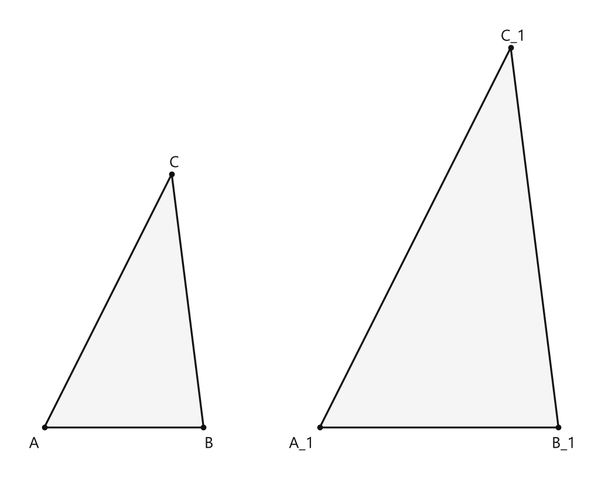
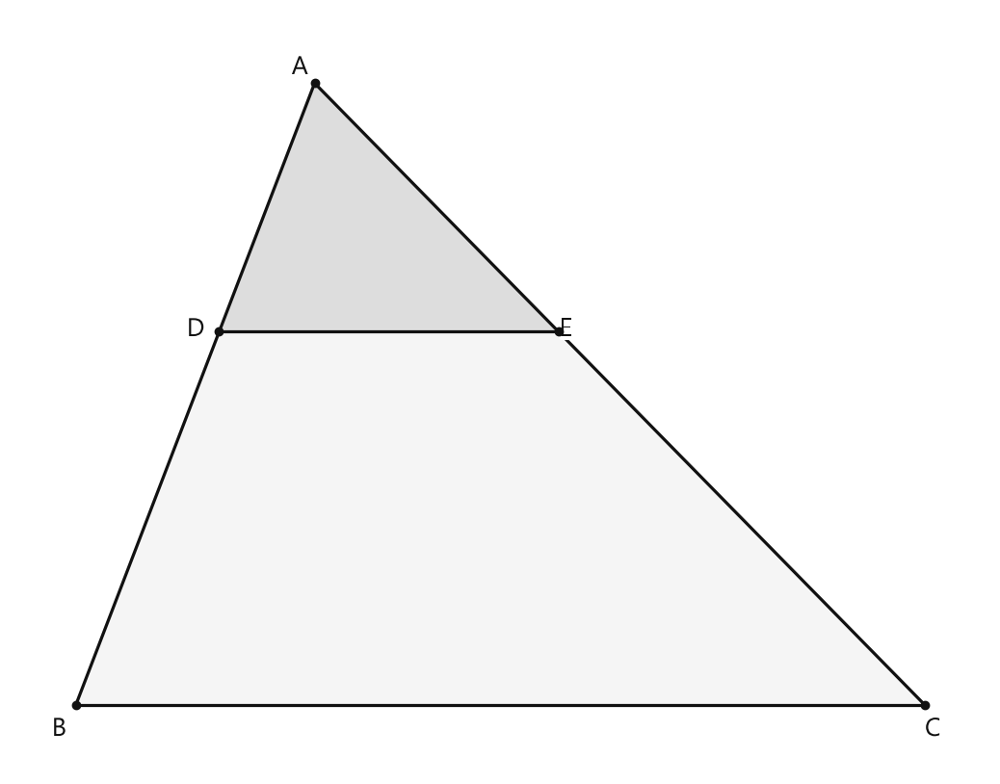
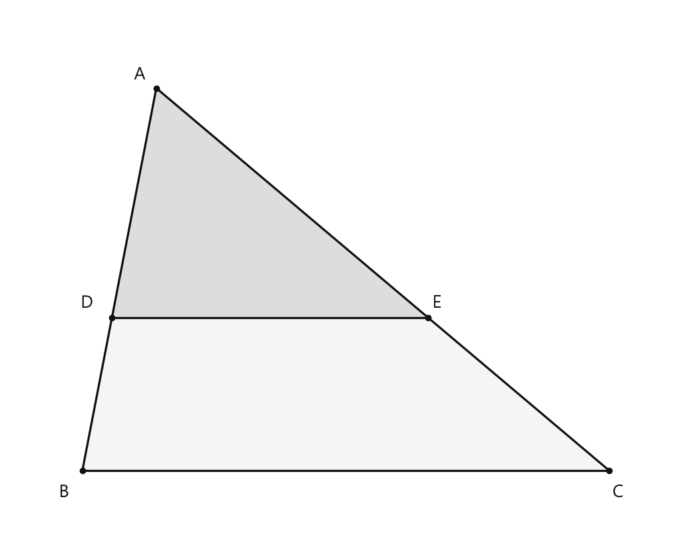

# Занятие 19. Подобие

**Раздел:** Глава III. Подобие треугольников  
**Параграф учебника:** §19. Подобие  
**Страницы:** 126–126

## Цели занятия

После занятия ученик умеет:

- объяснять, какие треугольники называют подобными;
- находить коэффициент подобия по соответствующим сторонам;
- составлять отношения соответствующих сторон;
- находить неизвестную сторону подобного треугольника;
- правильно записывать обозначение подобия треугольников.

Выбери блок своего уровня:

- **1–2 балла:** узнаю подобные треугольники и нахожу простое отношение сторон;
- **3–4 балла:** нахожу коэффициент подобия и неизвестную сторону;
- **5–6 баллов:** решаю задачи на масштабирование треугольников;
- **7–8 баллов:** уверенно использую несколько отношений соответствующих сторон;
- **9–10 баллов:** решаю смешанные задачи и объясняю, почему треугольники подобны.

## Теория к занятию

### 1. Что такое подобие

#### Простыми словами

Подобные треугольники имеют одинаковую форму, но могут быть разного размера. Один можно мысленно увеличить или уменьшить, и получится другой.

Представь фотографию: маленькая и большая копии выглядят одинаково. Меняется только размер, а форма сохраняется. В геометрии это и называют подобием.

У подобных треугольников:

- соответствующие углы равны;
- соответствующие стороны пропорциональны.

Это значит, что все стороны одного треугольника увеличились или уменьшились в одно и то же число раз. Нельзя одну сторону увеличить в 2 раза, а другую — в 3: форма тогда изменится, и треугольники перестанут быть подобными.

#### Определение / факт / теорема / свойство

Треугольник $A_1B_1C_1$ получен из $ABC$ уменьшением в 2 раза.

Треугольник $A_2B_2C_2$ получен из $ABC$ увеличением в 1,5 раза.

Углы треугольников $ABC$, $A_1B_1C_1$ и $A_2B_2C_2$ соответственно равны.

#### Формулы

Для треугольников $ABC$ и $A_1B_1C_1$:

$$
\frac{AB}{A_1B_1}=
\frac{BC}{B_1C_1}=
\frac{AC}{A_1C_1}=2
$$

Здесь:

- $AB$, $BC$, $AC$ — стороны первого треугольника;
- $A_1B_1$, $B_1C_1$, $A_1C_1$ — соответствующие стороны второго треугольника;
- число $2$ показывает, во сколько раз стороны первого треугольника больше соответствующих сторон второго.

Для треугольников $ABC$ и $A_2B_2C_2$:

$$
\frac{AB}{A_2B_2}=
\frac{BC}{B_2C_2}=
\frac{AC}{A_2C_2}=
\frac{2}{3}
$$

Здесь коэффициент $\frac{2}{3}$ означает, что сторона $ABC$ равна $\frac{2}{3}$ соответствующей стороны треугольника $A_2B_2C_2$.

Почему так получилось? Второй треугольник увеличили в $1{,}5=\frac{3}{2}$ раза, поэтому при сравнении «первый к второму» получаем обратное число:

$$
\frac{1}{\frac{3}{2}}=\frac{2}{3}.
$$

#### Правила

- Сопоставляй вершины в одинаковом порядке: $A$ соответствует $A_1$, $B$ — $B_1$, $C$ — $C_1$.
- Сторону $AB$ сравнивай со стороной $A_1B_1$, а не с произвольной стороной.
- Если второй треугольник уменьшен в 2 раза, то соответствующая сторона первого в 2 раза больше.
- Если второй треугольник увеличен в 1,5 раза, то сторона второго равна $\frac{3}{2}$ соответствующей стороны первого.
- Коэффициент зависит от того, какой треугольник записан в числителе, а какой — в знаменателе.

#### Ловушки

- Нельзя сравнивать $AB$ с $B_1C_1$: буквы должны стоять в соответствующем порядке.
- Коэффициент зависит от направления отношения.
- «Увеличили в 1,5 раза» и «увеличили на 1,5» — не одно и то же.
- Если отношение записано как $\frac{AB}{A_1B_1}$, сначала идёт сторона первого треугольника, затем сторона второго.
- Уменьшение в 2 раза — это деление на 2, а не вычитание 2. Минус здесь вообще не приглашали.

---

### 2. Обозначение подобных треугольников

#### Простыми словами

Чтобы коротко записать, какие треугольники имеют одинаковую форму, используют знак подобия $\sim$.

Запись

$$
\triangle ABC\sim\triangle A_1B_1C_1
$$

читается: треугольник $ABC$ подобен треугольнику $A_1B_1C_1$.

Порядок букв здесь очень важен. Он показывает соответствующие вершины:

$$
A\leftrightarrow A_1,\qquad
B\leftrightarrow B_1,\qquad
C\leftrightarrow C_1.
$$

Поэтому сторонам $AB$, $BC$, $AC$ соответствуют стороны $A_1B_1$, $B_1C_1$, $A_1C_1$.

#### Определение / факт / теорема / свойство

$$
\triangle ABC \sim \triangle A_1B_1C_1,\ k=2
$$

$$
\triangle ABC \sim \triangle A_2B_2C_2,\ k=\frac{2}{3}
$$

#### Формулы

Если

$$
\triangle ABC\sim\triangle A_1B_1C_1,
$$

то соответствующие стороны:

$$
AB\leftrightarrow A_1B_1,
\qquad
BC\leftrightarrow B_1C_1,
\qquad
AC\leftrightarrow A_1C_1.
$$

Коэффициент подобия обозначается буквой $k$.

Если отношение составлено так:

$$
\frac{AB}{A_1B_1}=k,
$$

то

$$
AB=k\cdot A_1B_1.
$$

Например, при $k=2$:

$$
AB=2\cdot A_1B_1.
$$

Если нужно найти сторону меньшего треугольника, можно разделить сторону большего треугольника на коэффициент увеличения.

#### Правила

- Сначала выпиши соответствие вершин.
- Затем составь отношения соответствующих сторон в том же порядке.
- Если

$$
\frac{AB}{A_1B_1}=k,
$$

то

$$
AB=k\cdot A_1B_1.
$$

- Если известна сторона большего треугольника и нужно найти соответствующую сторону меньшего, раздели известную сторону на число увеличения.
- Если известна сторона меньшего треугольника и нужно найти соответствующую сторону большего, умножь на число увеличения.

#### Алгоритм

1. Определи соответствующие вершины.
2. Запиши соответствующие стороны.
3. Выбери отношение, в котором есть известная и неизвестная стороны.
4. Подставь числа.
5. Реши полученное равенство.
6. Проверь, соответствует ли результат увеличению или уменьшению.

#### Ловушки

- Запись $\triangle ABC\sim\triangle A_1B_1C_1$ нельзя читать без учёта порядка букв.
- Если $k=2$, второй треугольник не обязательно «в два раза больше»: всё зависит от того, как составлено отношение.
- Коэффициент подобия не равен разности соответствующих сторон.
- Равные углы сами по себе не означают равенство сторон: треугольники могут быть одинаковой формы, но разного размера.
- Если поменять местами числитель и знаменатель, коэффициент тоже изменится: вместо $2$ получится $\frac{1}{2}$.

---

## Сводка формул «выучить наизусть»

Для уменьшения в 2 раза:

$$
\frac{AB}{A_1B_1}=
\frac{BC}{B_1C_1}=
\frac{AC}{A_1C_1}=2
$$

Для увеличения в 1,5 раза:

$$
\frac{AB}{A_2B_2}=
\frac{BC}{B_2C_2}=
\frac{AC}{A_2C_2}=
\frac{2}{3}
$$

Обозначения:

$$
\triangle ABC \sim \triangle A_1B_1C_1,\ k=2
$$

$$
\triangle ABC \sim \triangle A_2B_2C_2,\ k=\frac{2}{3}
$$

## Правила, которые нельзя путать

- Соответствующие стороны должны соединять соответствующие вершины.
- Коэффициент зависит от порядка, в котором записано отношение.
- Уменьшение в 2 раза означает умножение на $\frac{1}{2}$.
- Увеличение в 1,5 раза означает умножение на $\frac{3}{2}$.
- В записи подобия порядок вершин важен.
- Если первый треугольник сравнивают со вторым, отношение записывают как «сторона первого делится на соответствующую сторону второго».
- При обратном порядке получится обратный коэффициент.

## Разбор ключевых заданий

### Р1. Найти коэффициент подобия при уменьшении

**Условие.**  
Стороны треугольника $ABC$ равны $AB=18$, $BC=12$, $AC=8$. Стороны треугольника $A_1B_1C_1$ равны $A_1B_1=9$, $B_1C_1=6$, $A_1C_1=4$. Найдите коэффициент $k$ в записи $\triangle ABC\sim\triangle A_1B_1C_1$.

**Решение.**

Из записи подобия видим соответствие вершин:

$$
A\leftrightarrow A_1,
\qquad
B\leftrightarrow B_1,
\qquad
C\leftrightarrow C_1.
$$

Значит, соответствующие стороны такие:

$$
AB\leftrightarrow A_1B_1,
\qquad
BC\leftrightarrow B_1C_1,
\qquad
AC\leftrightarrow A_1C_1.
$$

Найдём коэффициент по первой паре сторон:

$$
k=\frac{AB}{A_1B_1}.
$$

Подставим значения:

$$
k=\frac{18}{9}.
$$

Выполним деление:

$$
k=2.
$$

Проверим остальные пары сторон:

$$
\frac{BC}{B_1C_1}=\frac{12}{6}=2,
$$

$$
\frac{AC}{A_1C_1}=\frac{8}{4}=2.
$$

Все три отношения равны одному числу. Значит, коэффициент найден верно. Треугольник $ABC$ действительно в 2 раза больше треугольника $A_1B_1C_1$.

**Ответ:** $k=2$.

---

### Р2. Найти неизвестную сторону уменьшенного треугольника

**Условие.**  
Треугольник $A_1B_1C_1$ получен из треугольника $ABC$ уменьшением в 2 раза. Известно, что $AB=20$. Найдите $A_1B_1$.

**Решение.**

Стороне $AB$ соответствует сторона $A_1B_1$.

Треугольник $A_1B_1C_1$ уменьшен в 2 раза, поэтому его соответствующая сторона в 2 раза меньше:

$$
A_1B_1=\frac{AB}{2}.
$$

Подставим значение $AB=20$:

$$
A_1B_1=\frac{20}{2}.
$$

Выполним деление:

$$
A_1B_1=10.
$$

Проверим результат:

$$
10\cdot2=20.
$$

Получили исходную сторону $AB$, значит вычисление выполнено правильно.

Не перепутай: уменьшение в 2 раза — это деление на 2, а не вычитание 2. Геометрия не торгуется на рынке.

**Ответ:** $A_1B_1=10$.

---

### Р3. Проверить, являются ли отношения соответствующих сторон равными

**Условие.**  
Для двух треугольников известны стороны:

$$
AB=15,\quad BC=10,\quad AC=8,
$$

$$
A_1B_1=10,\quad B_1C_1=\frac{20}{3},\quad A_1C_1=\frac{16}{3}.
$$

Проверьте, равны ли отношения соответствующих сторон.

**Решение.**

Сравним соответствующие стороны в указанном порядке.

Первое отношение:

$$
\frac{AB}{A_1B_1}=\frac{15}{10}.
$$

Сократим дробь на $5$:

$$
\frac{15}{10}=\frac{3}{2}.
$$

Второе отношение:

$$
\frac{BC}{B_1C_1}
=
\frac{10}{\frac{20}{3}}.
$$

Деление на дробь заменим умножением на обратную дробь:

$$
\frac{10}{\frac{20}{3}}
=
10\cdot\frac{3}{20}.
$$

Сократим $10$ и $20$:

$$
10\cdot\frac{3}{20}
=
\frac{30}{20}
=
\frac{3}{2}.
$$

Третье отношение:

$$
\frac{AC}{A_1C_1}
=
\frac{8}{\frac{16}{3}}.
$$

Заменим деление умножением на обратную дробь:

$$
\frac{8}{\frac{16}{3}}
=
8\cdot\frac{3}{16}.
$$

Сократим $8$ и $16$:

$$
8\cdot\frac{3}{16}
=
\frac{24}{16}
=
\frac{3}{2}.
$$

Все три отношения имеют одно и то же значение:

$$
\frac{AB}{A_1B_1}
=
\frac{BC}{B_1C_1}
=
\frac{AC}{A_1C_1}
=
\frac{3}{2}.
$$

Значит, отношения соответствующих сторон равны.

Здесь дроби не пытаются запутать решение — они просто проверяют, одинаковый ли масштаб у всех сторон.

**Ответ:** отношения равны; коэффициент подобия $k=\frac{3}{2}$.

---

### Р4. Найти сторону увеличенного треугольника

**Условие.**  
Треугольник $A_2B_2C_2$ получен из треугольника $ABC$ увеличением в 1,5 раза. Известно, что $BC=12$. Найдите $B_2C_2$.

**Решение.**

Стороне $BC$ соответствует сторона $B_2C_2$.

При увеличении в $1{,}5$ раза соответствующая сторона умножается на $1{,}5$:

$$
B_2C_2=BC\cdot1{,}5.
$$

Запишем $1{,}5$ в виде дроби:

$$
1{,}5=\frac{3}{2}.
$$

Тогда

$$
B_2C_2=BC\cdot\frac{3}{2}.
$$

Подставим $BC=12$:

$$
B_2C_2=12\cdot\frac{3}{2}.
$$

Сначала разделим $12$ на $2$:

$$
12:2=6.
$$

Затем умножим результат на $3$:

$$
6\cdot3=18.
$$

Следовательно,

$$
B_2C_2=18.
$$

Проверим увеличение:

$$
\frac{18}{12}=\frac{3}{2}=1{,}5.
$$

Проверка совпала с условием.

**Ответ:** $B_2C_2=18$.

---

### Р5. Использовать коэффициент $\frac{2}{3}$

**Условие.**  
Для треугольников $ABC$ и $A_2B_2C_2$ известно:

$$
AB=18,\qquad A_2B_2=27.
$$

Найдите отношение $\frac{AB}{A_2B_2}$ и коэффициент подобия в записи $\triangle ABC\sim\triangle A_2B_2C_2$.

**Решение.**

Стороны $AB$ и $A_2B_2$ являются соответствующими.

Составим их отношение в указанном порядке:

$$
\frac{AB}{A_2B_2}=\frac{18}{27}.
$$

Сократим числитель и знаменатель на $9$:

$$
\frac{18}{27}=\frac{2}{3}.
$$

Значит,

$$
\frac{AB}{A_2B_2}=\frac{2}{3}.
$$

Коэффициент подобия в этой записи равен этому же отношению:

$$
k=\frac{2}{3}.
$$

Проверим обратным действием:

$$
27\cdot\frac{2}{3}=9\cdot2=18.
$$

Получили длину стороны $AB$, поэтому ответ верный.

**Ответ:** $\frac{AB}{A_2B_2}=\frac{2}{3}$, $k=\frac{2}{3}$.

---

### Р6. Составить запись подобия

**Условие.**  
Треугольник $A_1B_1C_1$ имеет стороны, полученные уменьшением соответствующих сторон треугольника $ABC$ в 2 раза. Запишите обозначение подобия и все отношения соответствующих сторон.

**Решение.**

По условию вершинам соответствуют:

$$
A\leftrightarrow A_1,
\qquad
B\leftrightarrow B_1,
\qquad
C\leftrightarrow C_1.
$$

Запишем подобие треугольников:

$$
\triangle ABC\sim\triangle A_1B_1C_1.
$$

Треугольник $A_1B_1C_1$ в 2 раза меньше треугольника $ABC$.

Значит, каждая сторона треугольника $ABC$ в 2 раза больше соответствующей стороны треугольника $A_1B_1C_1$:

$$
\frac{AB}{A_1B_1}=2,
$$

$$
\frac{BC}{B_1C_1}=2,
$$

$$
\frac{AC}{A_1C_1}=2.
$$

Объединим эти равенства:

$$
\frac{AB}{A_1B_1}
=
\frac{BC}{B_1C_1}
=
\frac{AC}{A_1C_1}
=
2.
$$

Следи за порядком букв: поменяем соответствующие вершины — и получим уже не ту запись. Буквы здесь работают как адреса, а не как случайные пассажиры.

**Ответ:**

$$
\triangle ABC\sim\triangle A_1B_1C_1,
$$

$$
\frac{AB}{A_1B_1}
=
\frac{BC}{B_1C_1}
=
\frac{AC}{A_1C_1}
=
2.
$$

## Практические задания

Выбери свой уровень и решай только этот блок. В блоке должна закрепиться вся тема параграфа. Ответы не приводятся.

### Уровень 1–2 балла

**С1.** Треугольник $A_1B_1C_1$ получен из треугольника $ABC$ уменьшением в $2$ раза. Какой коэффициент подобия указан для записи $\triangle ABC \sim \triangle A_1B_1C_1$?

1) $\frac12$ 2) $1$ 3) $2$ 4) $3$ 5) $4$

**С2.** Треугольник $A_2B_2C_2$ получен из треугольника $ABC$ увеличением в $1{,}5$ раза. Какое равенство отношений соответствующих сторон верно?

1) $\frac{AB}{A_2B_2}=\frac{BC}{B_2C_2}=\frac{AC}{A_2C_2}=\frac32$
2) $\frac{AB}{A_2B_2}=\frac{BC}{B_2C_2}=\frac{AC}{A_2C_2}=\frac23$
3) $\frac{AB}{A_2B_2}=\frac{BC}{B_2C_2}=\frac{AC}{A_2C_2}=2$
4) $\frac{AB}{A_2B_2}=\frac{BC}{B_2C_2}=\frac{AC}{A_2C_2}=1$
5) $\frac{AB}{A_2B_2}=\frac{BC}{B_2C_2}=\frac{AC}{A_2C_2}=\frac12$

**С3.** Запишите подобие треугольников, если соответствующие вершины имеют порядок $A\leftrightarrow A_1$, $B\leftrightarrow B_1$, $C\leftrightarrow C_1$.

1) $\triangle ABC\sim\triangle A_1C_1B_1$
2) $\triangle ABC\sim\triangle B_1A_1C_1$
3) $\triangle ABC\sim\triangle A_1B_1C_1$
4) $\triangle ABC\sim\triangle C_1B_1A_1$
5) $\triangle ABC\sim\triangle B_1C_1A_1$

**С4.** Треугольники $ABC$ и $A_1B_1C_1$ подобны, причём $\frac{AB}{A_1B_1}=2$. Чему равно отношение $\frac{BC}{B_1C_1}$?

1) $\frac12$ 2) $1$ 3) $2$ 4) $3$ 5) $4$

**С5.** Треугольники $ABC$ и $A_2B_2C_2$ подобны, причём $\frac{BC}{B_2C_2}=\frac23$. Чему равно отношение $\frac{AC}{A_2C_2}$?

1) $\frac13$ 2) $\frac12$ 3) $\frac23$ 4) $1$ 5) $2$

**С6.** В треугольниках $ABC$ и $A_1B_1C_1$ стороны $AB$ и $A_1B_1$, $BC$ и $B_1C_1$, $AC$ и $A_1C_1$ являются соответствующими. Какой отрезок соответствует стороне $BC$?

1) $AB$ 2) $A_1B_1$ 3) $AC$ 4) $B_1C_1$ 5) $A_1C_1$

**С7.** В треугольниках $ABC$ и $A_2B_2C_2$ стороны $AB$ и $A_2B_2$, $BC$ и $B_2C_2$, $AC$ и $A_2C_2$ являются соответствующими. Какой отрезок соответствует стороне $AC$?

1) $AB$ 2) $A_2B_2$ 3) $BC$ 4) $B_2C_2$ 5) $A_2C_2$

**С8.** Треугольник $A_1B_1C_1$ получен из треугольника $ABC$ уменьшением в $2$ раза. Как изменились стороны треугольника $ABC$?

1) Увеличились в $2$ раза.
2) Уменьшились в $2$ раза.
3) Не изменились.
4) Увеличились в $4$ раза.
5) Уменьшились в $4$ раза.

**С9.** Треугольник $A_2B_2C_2$ получен из треугольника $ABC$ увеличением в $1{,}5$ раза. Как изменились его стороны по сравнению со сторонами треугольника $ABC$?

1) Уменьшились в $1{,}5$ раза.
2) Увеличились в $1{,}5$ раза.
3) Увеличились в $2$ раза.
4) Не изменились.
5) Уменьшились в $2$ раза.

**С10.** Выберите верное равенство для треугольников $ABC$ и $A_1B_1C_1$, если треугольник $A_1B_1C_1$ получен уменьшением треугольника $ABC$ в $2$ раза.

1) $\frac{AB}{A_1B_1}=1$
2) $\frac{AB}{A_1B_1}=\frac12$
3) $\frac{AB}{A_1B_1}=2$
4) $\frac{AB}{A_1B_1}=3$
5) $\frac{AB}{A_1B_1}=4$

**С11.** Треугольники $ABC$ и $A_2B_2C_2$ подобны, и $\frac{AB}{A_2B_2}=\frac23$. Если $AB=8$ см, чему равна длина $A_2B_2$?

1) $ \frac{16}{3}$ см 2) $6$ см 3) $8$ см 4) $12$ см 5) $16$ см

**С12.** Треугольники $ABC$ и $A_1B_1C_1$ подобны, причём $\frac{AB}{A_1B_1}=2$. Если $A_1B_1=5$ см, чему равна длина $AB$?

1) $2{,}5$ см 2) $5$ см 3) $7$ см 4) $10$ см 5) $15$ см

**С13.** Стороны треугольника $ABC$ равны $6$ см, $8$ см и $10$ см. Соответствующие стороны треугольника $A_1B_1C_1$ в 2 раза меньше. Чему равен коэффициент $k$ подобия $\triangle ABC \sim \triangle A_1B_1C_1$?

1) $\dfrac12$ 2) $1$ 3) $2$ 4) $4$ 5) $8$

**С14.** Треугольник $A_2B_2C_2$ получен из треугольника $ABC$ увеличением в $1{,}5$ раза. Выберите верное равенство.

1) $\dfrac{AB}{A_2B_2}=\dfrac32$ 2) $\dfrac{AB}{A_2B_2}=\dfrac23$ 3) $\dfrac{AB}{A_2B_2}=1{,}5$ 4) $\dfrac{AB}{A_2B_2}=2$ 5) $\dfrac{AB}{A_2B_2}=3$

**С15.** Запишите обозначение подобия треугольников, если соответствующими вершинами являются $A$ и $A_1$, $B$ и $B_1$, $C$ и $C_1$.

1) $\triangle ABC=\triangle A_1C_1B_1$ 2) $\triangle ABC\sim\triangle A_1B_1C_1$ 3) $\triangle ACB\sim\triangle A_1B_1C_1$ 4) $\triangle ABC\perp\triangle A_1B_1C_1$ 5) $\triangle ABC\parallel\triangle A_1B_1C_1$

**С16.** Для подобных треугольников $\triangle ABC\sim\triangle A_1B_1C_1$ известно, что $AB=12$ см и $A_1B_1=6$ см. Найдите отношение $\dfrac{AB}{A_1B_1}$.

1) $\dfrac12$ 2) $1$ 3) $2$ 4) $6$ 5) $18$

**С17.** В подобных треугольниках $\triangle ABC\sim\triangle A_1B_1C_1$ сторона $BC=14$ см, а соответствующая ей сторона $B_1C_1=7$ см. Чему равна соответствующая сторона $A_1B_1$, если $AB=10$ см?

1) $3{,}5$ см 2) $5$ см 3) $7$ см 4) $20$ см 5) $28$ см

**С18.** В подобных треугольниках $\triangle ABC\sim\triangle A_2B_2C_2$ сторона $AB=8$ см, а соответствующая сторона $A_2B_2=12$ см. Чему равен коэффициент $\dfrac{AB}{A_2B_2}$?

1) $\dfrac23$ 2) $\dfrac32$ 3) $2$ 4) $4$ 5) $20$

**С19.** Треугольник $A_1B_1C_1$ получен из треугольника $ABC$ уменьшением в 2 раза. Сторона $BC$ равна $18$ см. Найдите длину соответствующей стороны $B_1C_1$.

1) $6$ см 2) $9$ см 3) $16$ см 4) $20$ см 5) $36$ см

**С20.** Треугольник $A_2B_2C_2$ получен из треугольника $ABC$ увеличением в $1{,}5$ раза. Сторона $AC$ равна $10$ см. Найдите длину соответствующей стороны $A_2C_2$.

1) $5$ см 2) $\dfrac{20}{3}$ см 3) $10$ см 4) $15$ см 5) $20$ см

**С21.** Для подобных треугольников $\triangle ABC\sim\triangle A_1B_1C_1$ известно, что $\dfrac{AB}{A_1B_1}=2$. Выберите все верные равенства.

1) $\dfrac{BC}{B_1C_1}=2$ 2) $\dfrac{AC}{A_1C_1}=2$ 3) $\dfrac{A_1B_1}{AB}=2$ 4) $\dfrac{B_1C_1}{BC}=2$ 5) $\dfrac{AC}{A_1C_1}=\dfrac12$

**С22.** У подобных треугольников $\triangle ABC\sim\triangle A_2B_2C_2$ соответствующие стороны относятся как $\dfrac{AB}{A_2B_2}=\dfrac{BC}{B_2C_2}=\dfrac{AC}{A_2C_2}=\dfrac23$. Если $A_2B_2=15$ см, найдите $AB$.

1) $6$ см 2) $10$ см 3) $12$ см 4) $17$ см 5) $22{,}5$ см

**С23.** У подобных треугольников $\triangle ABC\sim\triangle A_1B_1C_1$ стороны первого треугольника в 2 раза больше соответствующих сторон второго. Как соотносятся их периметры?

1) Периметр $\triangle ABC$ в 2 раза меньше периметра $\triangle A_1B_1C_1$  
2) Периметры равны  
3) Периметр $\triangle ABC$ в 2 раза больше периметра $\triangle A_1B_1C_1$  
4) Периметр $\triangle ABC$ на $2$ см больше  
5) Периметр $\triangle ABC$ в 4 раза больше периметра $\triangle A_1B_1C_1$

**С24.** Для подобных треугольников $\triangle ABC\sim\triangle A_1B_1C_1$ известно, что $AB=16$ см, $A_1B_1=8$ см и $A_1C_1=5$ см. Найдите длину стороны $AC$.

1) $2{,}5$ см 2) $5$ см 3) $8$ см 4) $10$ см 5) $32$ см

**С25.** Треугольник $A_1B_1C_1$ получен из треугольника $ABC$ уменьшением в $2$ раза. Выберите верное обозначение подобия треугольников.

1) $\triangle ABC \sim \triangle A_1C_1B_1$  
2) $\triangle ABC \sim \triangle B_1A_1C_1$  
3) $\triangle ABC \sim \triangle A_1B_1C_1$  
4) $\triangle ABC \sim \triangle C_1B_1A_1$  
5) $\triangle ABC \sim \triangle B_1C_1A_1$

**С26.** Для подобных треугольников $\triangle ABC$ и $\triangle A_1B_1C_1$ известно, что $AB=14$ см, $A_1B_1=7$ см. Чему равен коэффициент подобия $k=\dfrac{AB}{A_1B_1}$?

1) $0{,}5$  
2) $1$  
3) $2$  
4) $7$  
5) $21$

**С27.** Треугольники $\triangle ABC$ и $\triangle A_1B_1C_1$ подобны, причём $\dfrac{AB}{A_1B_1}=2$. Найдите $A_1B_1$, если $AB=18$ см.

1) $4$ см  
2) $9$ см  
3) $16$ см  
4) $20$ см  
5) $36$ см

**С28.** Треугольники $\triangle ABC$ и $\triangle A_1B_1C_1$ подобны, причём $\dfrac{AB}{A_1B_1}=2$. Найдите $BC$, если $B_1C_1=6$ см.

1) $3$ см  
2) $4$ см  
3) $8$ см  
4) $12$ см  
5) $18$ см

**С29.** Треугольники $\triangle ABC$ и $\triangle A_1B_1C_1$ подобны. Укажите равенство соответствующих углов.

1) $\angle A=\angle B_1$  
2) $\angle B=\angle C_1$  
3) $\angle C=\angle A_1$  
4) $\angle A=\angle A_1$  
5) $\angle B=\angle A_1$

**С30.** Треугольники $\triangle ABC$ и $\triangle A_1B_1C_1$ подобны, причём $\dfrac{AB}{A_1B_1}=2$. Какое равенство отношений соответствующих сторон верно?

1) $\dfrac{AB}{A_1B_1}=\dfrac{AC}{B_1C_1}$  
2) $\dfrac{AB}{A_1B_1}=\dfrac{BC}{B_1C_1}$  
3) $\dfrac{AB}{A_1B_1}=\dfrac{BC}{A_1C_1}$  
4) $\dfrac{AB}{A_1B_1}=\dfrac{A_1B_1}{AB}$  
5) $\dfrac{AB}{A_1B_1}=\dfrac{A_1C_1}{AC}$

**С31.** Стороны треугольника $ABC$ равны $6$ см, $8$ см и $10$ см. Треугольник $A_1B_1C_1$ получен уменьшением треугольника $ABC$ в $2$ раза. Какова длина стороны $A_1B_1$, соответствующей стороне $AB=8$ см?

1) $2$ см  
2) $4$ см  
3) $6$ см  
4) $10$ см  
5) $16$ см

**С32.** Треугольник $A_2B_2C_2$ получен из треугольника $ABC$ увеличением в $1{,}5$ раза. Найдите $A_2C_2$, если $AC=12$ см.

1) $8$ см  
2) $10$ см  
3) $13{,}5$ см  
4) $18$ см  
5) $24$ см

**С33.** Для треугольников $\triangle ABC$ и $\triangle A_2B_2C_2$ известно, что $AB=10$ см и $A_2B_2=15$ см. Какое значение имеет отношение $\dfrac{AB}{A_2B_2}$?

1) $\dfrac{1}{3}$  
2) $\dfrac{2}{3}$  
3) $1$  
4) $\dfrac{3}{2}$  
5) $2$

**С34.** Треугольник $A_1B_1C_1$ получен из треугольника $ABC$ уменьшением в $2$ раза. Выберите все верные равенства.

1) $\dfrac{AB}{A_1B_1}=2$  
2) $\dfrac{BC}{B_1C_1}=2$  
3) $\dfrac{AC}{A_1C_1}=2$  
4) $\dfrac{AB}{A_1B_1}=\dfrac{1}{2}$  
5) $\dfrac{BC}{A_1C_1}=2$

**С35.** Треугольники $\triangle ABC$ и $\triangle A_1B_1C_1$ подобны, причём $\dfrac{AB}{A_1B_1}=2$. Если $BC=16$ см, найдите $B_1C_1$.

1) $4$ см  
2) $8$ см  
3) $14$ см  
4) $18$ см  
5) $32$ см

**С36.** Треугольники $\triangle ABC$ и $\triangle A_2B_2C_2$ подобны, причём $\dfrac{AB}{A_2B_2}=\dfrac{2}{3}$. Найдите $A_2B_2$, если $AB=8$ см.

1) $4$ см  
2) $5\dfrac{1}{3}$ см  
3) $6$ см  
4) $10$ см  
5) $12$ см

### Уровень 3–4 балла

**С1.** Треугольник $ABC$ уменьшили в $2$ раза и получили треугольник $A_1B_1C_1$. Запишите отношение $\dfrac{AB}{A_1B_1}$.

**С2.** Треугольники $ABC$ и $A_1B_1C_1$ подобны, причём $\dfrac{AB}{A_1B_1}=3$. Во сколько раз треугольник $ABC$ больше треугольника $A_1B_1C_1$?

**С3.** Треугольник $A_2B_2C_2$ получен из треугольника $ABC$ увеличением в $1{,}5$ раза. Запишите коэффициент подобия при отношении сторон треугольника $ABC$ к соответствующим сторонам треугольника $A_2B_2C_2$.

**С4.** Известно, что $\triangle ABC\sim\triangle A_1B_1C_1$ и $\dfrac{AB}{A_1B_1}=2$. Найдите $A_1B_1$, если $AB=14$ см.

**С5.** Известно, что $\triangle ABC\sim\triangle A_1B_1C_1$, причём треугольник $A_1B_1C_1$ получен уменьшением треугольника $ABC$ в $2$ раза. Найдите $BC$, если $B_1C_1=6$ см.

**С6.** Треугольник $ABC$ и треугольник $A_2B_2C_2$ подобны, причём $\dfrac{AB}{A_2B_2}=\dfrac{2}{3}$. Найдите $A_2B_2$, если $AB=8$ см.

**С7.** Треугольник $A_2B_2C_2$ получен из треугольника $ABC$ увеличением в $1{,}5$ раза. Найдите $B_2C_2$, если $BC=12$ см.

**С8.** Треугольники $ABC$ и $A_1B_1C_1$ подобны. Известно, что $AB=18$ см и $A_1B_1=6$ см. Найдите коэффициент подобия $\dfrac{AB}{A_1B_1}$.

**С9.** Треугольники $ABC$ и $A_1B_1C_1$ подобны, причём $\dfrac{AB}{A_1B_1}=2$. Найдите $AC$, если $A_1C_1=9$ см.

**С10.** Треугольники $ABC$ и $A_2B_2C_2$ подобны, причём $\dfrac{AB}{A_2B_2}=\dfrac{2}{3}$. Найдите $BC$, если $B_2C_2=15$ см.

**С11.** Длины сторон треугольника $ABC$ равны $5$ см, $7$ см и $9$ см. Треугольник $A_1B_1C_1$ получен уменьшением треугольника $ABC$ в $2$ раза. Найдите длины его соответствующих сторон.

**С12.** Длины сторон треугольника $ABC$ равны $6$ см, $8$ см и $10$ см. Треугольник $A_2B_2C_2$ получен увеличением треугольника $ABC$ в $1{,}5$ раза. Найдите длины его соответствующих сторон.

**С13.** Треугольник $A_1B_1C_1$ получен из треугольника $ABC$ уменьшением в $2$ раза. Запишите отношение соответствующих сторон $\dfrac{AB}{A_1B_1}$.

**С14.** Треугольники $ABC$ и $A_1B_1C_1$ подобны, причём $\dfrac{AB}{A_1B_1}=3$. Найдите сторону $A_1B_1$, если $AB=18$ см.

**С15.** Треугольники $ABC$ и $A_1B_1C_1$ подобны, причём $\dfrac{AB}{A_1B_1}=2$. Найдите сторону $AB$, если $A_1B_1=7$ см.

**С16.** Треугольник $A_1B_1C_1$ получен из треугольника $ABC$ уменьшением в $2$ раза. Найдите $B_1C_1$, если $BC=14$ см.

**С17.** Треугольник $A_2B_2C_2$ получен из треугольника $ABC$ увеличением в $1{,}5$ раза. Найдите сторону $A_2B_2$, если $AB=8$ см.

**С18.** Треугольники $ABC$ и $A_1B_1C_1$ подобны. Известно, что $AB=15$ см, $A_1B_1=5$ см и $BC=21$ см. Найдите $B_1C_1$.

**С19.** Треугольники $ABC$ и $A_2B_2C_2$ подобны, причём $\dfrac{AB}{A_2B_2}=\dfrac{2}{3}$. Найдите сторону $A_2B_2$, если $AB=12$ см.

**С20.** Треугольники $ABC$ и $A_2B_2C_2$ подобны, причём $\dfrac{AB}{A_2B_2}=\dfrac{2}{3}$. Найдите сторону $AB$, если $A_2B_2=15$ см.

**С21.** Треугольники $ABC$ и $A_1B_1C_1$ подобны. Известно, что $AB=20$ см, $A_1B_1=8$ см и $AC=15$ см. Найдите $A_1C_1$.

**С22.** Треугольники $ABC$ и $A_2B_2C_2$ подобны. Известно, что $AB=10$ см, $A_2B_2=15$ см и $BC=12$ см. Найдите $B_2C_2$.

**С23.** Треугольники $ABC$ и $A_1B_1C_1$ подобны. Угол $A$ треугольника $ABC$ равен $48^\circ$, а угол $B$ равен $67^\circ$. Найдите углы $A_1$ и $B_1$ треугольника $A_1B_1C_1$.

**С24.** Треугольники $ABC$ и $A_2B_2C_2$ подобны. Известно, что $AB=16$ см, $BC=12$ см, $AC=20$ см и $A_2B_2=8$ см. Найдите стороны $B_2C_2$ и $A_2C_2$.

**С25.** Треугольники $ABC$ и $A_1B_1C_1$ подобны, причём $\dfrac{AB}{A_1B_1}=2$. Найдите длину стороны $A_1B_1$, если $AB=14$ см.

**С26.** Треугольники $ABC$ и $A_1B_1C_1$ подобны с коэффициентом подобия $k=2$, то есть $\dfrac{AB}{A_1B_1}=2$. Найдите длину стороны $BC$, если $B_1C_1=6$ см.

**С27.** Стороны треугольника $ABC$ равны $9$ см, $12$ см и $15$ см. Треугольник $A_1B_1C_1$ получен из него уменьшением в $3$ раза. Найдите длину стороны $A_1C_1$, соответствующей стороне $AC=15$ см.

**С28.** Треугольники $ABC$ и $A_1B_1C_1$ подобны, причём $\dfrac{AB}{A_1B_1}=\dfrac{BC}{B_1C_1}=\dfrac{AC}{A_1C_1}=2$. Найдите $AC$, если $A_1C_1=8$ см.

**С29.** Треугольник $ABC$ со сторонами $AB=10$ см, $BC=14$ см и $AC=18$ см подобен треугольнику $A_1B_1C_1$, причём $\dfrac{AB}{A_1B_1}=2$. Найдите периметр треугольника $A_1B_1C_1$.

**С30.** Треугольники $ABC$ и $A_1B_1C_1$ подобны. Известно, что $AB=12$ см, а соответствующая ему сторона $A_1B_1=8$ см. Во сколько раз треугольник $ABC$ больше треугольника $A_1B_1C_1$ по длине соответствующих сторон?

**С31.** Треугольник $A_2B_2C_2$ получен из треугольника $ABC$ увеличением в $1{,}5$ раза. Найдите длину стороны $B_2C_2$, если $BC=10$ см.

**С32.** Треугольники $ABC$ и $A_2B_2C_2$ подобны, причём $\dfrac{AB}{A_2B_2}=\dfrac{BC}{B_2C_2}=\dfrac{AC}{A_2C_2}=\dfrac{2}{3}$. Найдите длину стороны $AB$, если $A_2B_2=15$ см.

**С33.** В подобных треугольниках $ABC$ и $A_2B_2C_2$ сторона $AC=16$ см соответствует стороне $A_2C_2=24$ см. Найдите коэффициент $\dfrac{AC}{A_2C_2}$.

**С34.** В треугольниках $ABC$ и $A_1B_1C_1$ равны углы $\angle A=\angle A_1$, $\angle B=\angle B_1$ и $\angle C=\angle C_1$. Запишите обозначение подобия этих треугольников с учётом соответствия вершин.

**С35.** Треугольники $ABC$ и $A_1B_1C_1$ подобны, причём $\dfrac{AB}{A_1B_1}=2$. Какова длина стороны $A_1C_1$, если $AC=20$ см?

**С36.** Треугольник $ABC$ имеет стороны $AB=8$ см, $BC=11$ см и $AC=13$ см. Треугольник $A_2B_2C_2$ подобен ему, причём $\dfrac{AB}{A_2B_2}=\dfrac{2}{3}$. Найдите периметр треугольника $A_2B_2C_2$.

### Уровень 5–6 баллов

**С1.** Треугольники $ABC$ и $A_1B_1C_1$ подобны, причём вершины указаны в соответствующем порядке. Известно, что $AB=18$ см, а $A_1B_1=9$ см. Найдите коэффициент подобия треугольника $ABC$ к треугольнику $A_1B_1C_1$.

**С2.** Треугольники $ABC$ и $A_1B_1C_1$ подобны, причём вершины указаны в соответствующем порядке. Коэффициент подобия треугольника $ABC$ к треугольнику $A_1B_1C_1$ равен $3$. Найдите $B_1C_1$, если $BC=21$ см.

**С3.** Треугольники $ABC$ и $A_1B_1C_1$ подобны, причём вершины указаны в соответствующем порядке. Коэффициент подобия треугольника $ABC$ к треугольнику $A_1B_1C_1$ равен $2$. Найдите $AC$, если $A_1C_1=7$ см.

**С4.** Треугольники $ABC$ и $A_1B_1C_1$ подобны, причём вершины указаны в соответствующем порядке. Известно, что $AB=16$ см, $BC=20$ см и $A_1B_1=12$ см. Найдите $B_1C_1$.

**С5.** Треугольники $ABC$ и $A_1B_1C_1$ подобны, причём вершины указаны в соответствующем порядке. Соответствующие стороны треугольников равны $AB=15$ см, $BC=18$ см, $AC=21$ см и $A_1B_1=10$ см. Найдите периметр треугольника $A_1B_1C_1$.

**С6.** Треугольники $ABC$ и $A_1B_1C_1$ подобны, причём вершины указаны в соответствующем порядке. Коэффициент подобия треугольника $ABC$ к треугольнику $A_1B_1C_1$ равен $\frac{2}{3}$. Найдите $AC$, если $A_1C_1=18$ см.

**С7.** Треугольники $ABC$ и $A_1B_1C_1$ подобны, причём вершины указаны в соответствующем порядке. Известно, что $AB=24$ см, $BC=30$ см и $A_1B_1=16$ см. Найдите коэффициент подобия треугольника $ABC$ к треугольнику $A_1B_1C_1$ и длину $B_1C_1$.

**С8.** Треугольники $ABC$ и $A_1B_1C_1$ подобны, причём вершины указаны в соответствующем порядке. Угол $A$ равен $47^\circ$, угол $B$ равен $68^\circ$. Найдите величину угла $C_1$.

**С9.** Треугольники $ABC$ и $A_1B_1C_1$ подобны, причём вершины указаны в соответствующем порядке. Стороны треугольника $ABC$ равны $AB=12$ см, $BC=15$ см и $AC=18$ см. Периметр треугольника $A_1B_1C_1$ равен $30$ см. Найдите длины его сторон.

**С10.** Треугольники $ABC$ и $A_1B_1C_1$ подобны, причём вершины указаны в соответствующем порядке. Известно, что $AB=14$ см, $BC=21$ см, $A_1B_1=8$ см и $B_1C_1=12$ см. Найдите коэффициент подобия треугольника $ABC$ к треугольнику $A_1B_1C_1$ и длину $AC$, если $A_1C_1=10$ см.

**С11.** Треугольники $ABC$ и $A_1B_1C_1$ подобны, причём вершины указаны в соответствующем порядке. Коэффициент подобия треугольника $ABC$ к треугольнику $A_1B_1C_1$ равен $2$. Периметр треугольника $ABC$ равен $45$ см. Найдите периметр треугольника $A_1B_1C_1$.

**С12.** Треугольники $ABC$ и $A_1B_1C_1$ подобны, причём вершины указаны в соответствующем порядке. Стороны треугольника $ABC$ равны $AB=10$ см, $BC=14$ см и $AC=16$ см. Сторона $A_1B_1$ на $3$ см меньше стороны $AB$. Найдите коэффициент подобия треугольника $ABC$ к треугольнику $A_1B_1C_1$ и периметр треугольника $A_1B_1C_1$.

**С13.** Треугольники $ABC$ и $A_1B_1C_1$ подобны, причём вершины $A$, $B$, $C$ соответствуют вершинам $A_1$, $B_1$, $C_1$. Известно, что $AB=18$ см, а $A_1B_1=6$ см. Найдите коэффициент подобия треугольника $ABC$ к треугольнику $A_1B_1C_1$.

**С14.** Треугольники $ABC$ и $A_1B_1C_1$ подобны с коэффициентом подобия $k=3$. Найдите сторону $BC$, если $B_1C_1=7$ см.

**С15.** Треугольники $ABC$ и $A_1B_1C_1$ подобны, причём $AB=15$ см, $BC=21$ см, $AC=24$ см, а $A_1B_1=10$ см. Найдите стороны $B_1C_1$ и $A_1C_1$.

**С16.** Треугольники $ABC$ и $A_1B_1C_1$ подобны. Известно, что $AB=12$ см, $BC=16$ см и $B_1C_1=20$ см. Найдите сторону $A_1B_1$.

**С17.** Стороны одного треугольника равны $8$ см, $12$ см и $14$ см, а стороны другого треугольника, соответствующие им, равны $12$ см, $18$ см и $21$ см. Определите, подобны ли эти треугольники. Ответ обоснуйте вычислением отношений соответствующих сторон.

**С18.** Треугольники $ABC$ и $A_1B_1C_1$ подобны, причём $A$ соответствует $A_1$, $B$ — $B_1$, $C$ — $C_1$. Периметр треугольника $ABC$ равен $42$ см, а коэффициент подобия треугольника $ABC$ к треугольнику $A_1B_1C_1$ равен $2$. Найдите периметр треугольника $A_1B_1C_1$.

**С19.** Треугольник $A_1B_1C_1$ получен из треугольника $ABC$ уменьшением в $2$ раза. Найдите стороны треугольника $A_1B_1C_1$, если $AB=14$ см, $BC=18$ см, $AC=22$ см.

**С20.** Треугольник $A_2B_2C_2$ получен из треугольника $ABC$ увеличением в $1{,}5$ раза. Найдите стороны треугольника $ABC$, если $A_2B_2=15$ см, $B_2C_2=18$ см, $A_2C_2=21$ см.

**С21.** Треугольники $ABC$ и $A_1B_1C_1$ подобны. Известно, что $AB=9$ см, $AC=15$ см, $A_1B_1=12$ см и $A_1C_1=20$ см. Найдите коэффициент подобия треугольника $ABC$ к треугольнику $A_1B_1C_1$ и сторону $BC$, если $B_1C_1=16$ см.

**С22.** В треугольниках $ABC$ и $A_1B_1C_1$ соответствующие стороны пропорциональны: $AB=10$ см, $BC=14$ см, $AC=18$ см, $A_1B_1=15$ см, $B_1C_1=21$ см, $A_1C_1=27$ см. Запишите отношение $\frac{AB}{A_1B_1}$ и сделайте вывод о подобии треугольников.

**С23.** Треугольники $ABC$ и $A_1B_1C_1$ подобны с коэффициентом подобия $k= \frac{2}{3}$ для перехода от треугольника $ABC$ к треугольнику $A_1B_1C_1$. Найдите периметр треугольника $ABC$, если периметр треугольника $A_1B_1C_1$ равен $36$ см.

**С24.** Треугольники $ABC$ и $A_1B_1C_1$ подобны, причём вершины $A$, $B$, $C$ соответствуют вершинам $A_1$, $B_1$, $C_1$. Стороны треугольника $ABC$ равны $16$ см, $20$ см и $28$ см, а периметр треугольника $A_1B_1C_1$ равен $48$ см. Найдите длины сторон треугольника $A_1B_1C_1$.

**С25.** Треугольники $ABC$ и $A_1B_1C_1$ подобны, причём $\triangle ABC\sim\triangle A_1B_1C_1$. Известно, что $AB=18$ см, $BC=24$ см, $AC=30$ см, а коэффициент подобия равен $2$. Найдите длины сторон $A_1B_1$, $B_1C_1$ и $A_1C_1$.

**С26.** Треугольники $MNP$ и $M_1N_1P_1$ подобны, причём $\triangle MNP\sim\triangle M_1N_1P_1$. Дано: $MN=15$ см, $M_1N_1=10$ см и $NP=12$ см. Найдите длину стороны $N_1P_1$ и коэффициент подобия треугольника $MNP$ к треугольнику $M_1N_1P_1$.

**С27.** Периметр треугольника $ABC$ равен $42$ см. Треугольник $A_1B_1C_1$ подобен ему, причём $\triangle ABC\sim\triangle A_1B_1C_1$, а соответствующие стороны треугольника $ABC$ в $3$ раза больше сторон треугольника $A_1B_1C_1$. Найдите периметр треугольника $A_1B_1C_1$.

**С28.** Треугольники $ABC$ и $A_1B_1C_1$ подобны, причём $\triangle ABC\sim\triangle A_1B_1C_1$. Углы треугольника $ABC$ равны $48^\circ$, $67^\circ$ и $65^\circ$, причём $\angle A=48^\circ$ и $\angle B=67^\circ$. Найдите величины углов $\angle A_1$, $\angle B_1$ и $\angle C_1$.

**С29.** Проверьте, являются ли подобными треугольники $ABC$ и $DEF$, если их стороны имеют соответственно длины $AB=8$ см, $BC=10$ см, $AC=12$ см и $DE=12$ см, $EF=15$ см, $DF=18$ см. Если треугольники подобны, укажите коэффициент подобия $\triangle ABC$ к $\triangle DEF$.

**С30.** Треугольники $KLM$ и $K_1L_1M_1$ подобны, причём $\triangle KLM\sim\triangle K_1L_1M_1$. Стороны треугольника $KLM$ равны $KL=14$ см, $LM=21$ см и $KM=28$ см. Сторона $K_1L_1$ равна $8$ см. Найдите длины сторон $L_1M_1$ и $K_1M_1$.

### Уровень 7–8 баллов

**С1.** Даны треугольники $ABC$ и $A_1B_1C_1$: $AB=12$ см, $BC=15$ см, $AC=18$ см; $A_1B_1=8$ см, $B_1C_1=10$ см, $A_1C_1=12$ см. Докажите, что треугольники подобны, и укажите коэффициент подобия $\triangle ABC\sim\triangle A_1B_1C_1$.

**С2.** Треугольники $ABC$ и $DEF$ подобны, причём вершинам $A$, $B$, $C$ соответственно соответствуют вершины $D$, $E$, $F$. Известно, что $AB=14$ см, $BC=18$ см, $AC=22$ см, а $DE=21$ см. Найдите длины сторон $EF$ и $DF$.

**С3.** Треугольники $KLM$ и $PQR$ подобны, причём $K\leftrightarrow P$, $L\leftrightarrow Q$, $M\leftrightarrow R$. Стороны первого треугольника равны $KL=9$ см, $LM=12$ см, $KM=15$ см, а стороны второго треугольника равны $PQ=6$ см, $QR=8$ см, $PR=10$ см. Запишите равенство отношений соответствующих сторон и укажите, во сколько раз первый треугольник больше второго.

**С4.** На рисунке изображены треугольники $ABC$ и $A_1B_1C_1$. Известно, что $AB=10$ см, $BC=14$ см, $AC=16$ см, $A_1B_1=15$ см, $B_1C_1=21$ см, $A_1C_1=24$ см. Докажите подобие треугольников и определите, во сколько раз периметр $\triangle A_1B_1C_1$ больше периметра $\triangle ABC$.

<!--geo-figure-spec
{
  "needed": true,
  "kind": "plane",
  "caption": "Треугольники $ABC$ и $A_1B_1C_1$",
  "equal": false,
  "axis": false,
  "xlim": [
    -0.7,
    10.5
  ],
  "ylim": [
    -0.7,
    6.9
  ],
  "points": {
    "A": [
      0,
      0
    ],
    "B": [
      3,
      0
    ],
    "C": [
      2.4,
      4.1569
    ],
    "A_1": [
      5.2,
      0
    ],
    "B_1": [
      9.7,
      0
    ],
    "C_1": [
      8.8,
      6.2354
    ]
  },
  "segments": [
    [
      "A",
      "B"
    ],
    [
      "B",
      "C"
    ],
    [
      "C",
      "A"
    ],
    [
      "A_1",
      "B_1"
    ],
    [
      "B_1",
      "C_1"
    ],
    [
      "C_1",
      "A_1"
    ]
  ],
  "polygons": [
    {
      "vertices": [
        "A",
        "B",
        "C"
      ],
      "fill": 0.04
    },
    {
      "vertices": [
        "A_1",
        "B_1",
        "C_1"
      ],
      "fill": 0.04
    }
  ],
  "labels": {
    "A": {
      "dx": -0.2,
      "dy": -0.28
    },
    "B": {
      "dx": 0.1,
      "dy": -0.28
    },
    "C": {
      "dx": 0.05,
      "dy": 0.18
    },
    "A_1": {
      "dx": -0.35,
      "dy": -0.28
    },
    "B_1": {
      "dx": 0.1,
      "dy": -0.28
    },
    "C_1": {
      "dx": 0.05,
      "dy": 0.18
    }
  },
  "right_angles": [],
  "angle_marks": [],
  "texts": []
}
-->

*Треугольники ABC и A_1B_1C_1*

**С5.** В треугольниках $ABC$ и $DEF$ известны углы: $\angle A=\angle D=48^\circ$, $\angle B=\angle E=67^\circ$. Обоснуйте подобие треугольников, установите соответствие вершин и найдите величину угла $F$.

**С6.** Треугольники $ABC$ и $A_1B_1C_1$ подобны, причём $AB:A_1B_1=4:3$. Известно, что $BC=20$ см и $AC=28$ см. Найдите $B_1C_1$ и $A_1C_1$, если меньший треугольник обозначен $A_1B_1C_1$.

**С7.** В треугольнике $ABC$ проведён отрезок $DE$, параллельный стороне $BC$, где $D\in AB$, $E\in AC$. Известно, что $AD=6$ см, $DB=9$ см, $AE=8$ см и $BC=20$ см. Докажите, что $\triangle ADE\sim\triangle ABC$, и найдите длину отрезка $DE$.

<!--geo-figure-spec
{
  "needed": true,
  "kind": "plane",
  "caption": "Треугольник $ABC$ с отрезком $DE$, параллельным $BC$",
  "equal": false,
  "axis": false,
  "xlim": [
    -1.5,
    21.5
  ],
  "ylim": [
    -1.5,
    15.5
  ],
  "points": {
    "A": [
      5.625,
      13.905
    ],
    "B": [
      0,
      0
    ],
    "C": [
      20,
      0
    ],
    "D": [
      3.375,
      8.343
    ],
    "E": [
      11.375,
      8.343
    ]
  },
  "segments": [
    [
      "A",
      "B"
    ],
    [
      "B",
      "C"
    ],
    [
      "C",
      "A"
    ],
    [
      "D",
      "E"
    ]
  ],
  "polygons": [
    {
      "vertices": [
        "A",
        "B",
        "C"
      ],
      "fill": 0.04
    },
    {
      "vertices": [
        "A",
        "D",
        "E"
      ],
      "fill": 0.1
    }
  ],
  "labels": {
    "A": {
      "dx": -0.35,
      "dy": 0.35
    },
    "B": {
      "dx": -0.4,
      "dy": -0.55
    },
    "C": {
      "dx": 0.2,
      "dy": -0.55
    },
    "D": {
      "dx": -0.55,
      "dy": 0.05
    },
    "E": {
      "dx": 0.18,
      "dy": 0.05
    }
  },
  "right_angles": [],
  "angle_marks": [],
  "texts": []
}
-->

*Треугольник ABC с отрезком DE, параллельным BC*

**С8.** На сторонах $AB$ и $AC$ треугольника $ABC$ выбраны точки $D$ и $E$ так, что $AD=5$ см, $AB=15$ см, $AE=7$ см, $AC=21$ см. Докажите, что $\triangle ADE\sim\triangle ABC$, если $\angle A$ является общим углом этих треугольников. Найдите отношение их площадей, используя коэффициент подобия.

**С9.** Треугольники $ABC$ и $A_1B_1C_1$ подобны. Известно, что $AB=9$ см, $BC=12$ см, $AC=15$ см, а площадь треугольника $A_1B_1C_1$ равна $96$ см$^2$. Коэффициент подобия $\triangle ABC\sim\triangle A_1B_1C_1$ равен $\frac{3}{2}$. Найдите площадь треугольника $ABC$ и длины сторон $A_1B_1$, $B_1C_1$, $A_1C_1$.

**С10.** Даны треугольники $ABC$ и $DEF$, у которых $AB=8$ см, $BC=11$ см, $AC=14$ см, $DE=12$ см, $EF=16{,}5$ см, $DF=21$ см. Определите, подобны ли эти треугольники при соответствии $A\leftrightarrow D$, $B\leftrightarrow E$, $C\leftrightarrow F$. Ответ обоснуйте вычислением трёх отношений соответствующих сторон.

**С11.** В треугольнике $ABC$ точки $D$ и $E$ лежат соответственно на сторонах $AB$ и $AC$, причём $DE\parallel BC$. Известно, что $AD:DB=2:3$, $AC=25$ см и $BC=30$ см. Найдите длины $AE$ и $DE$, а также объясните, почему треугольники $ADE$ и $ABC$ подобны.

<!--geo-figure-spec
{
  "needed": true,
  "kind": "plane",
  "caption": "Треугольник $ABC$ с отрезком $DE$, параллельным $BC$",
  "equal": false,
  "axis": false,
  "xlim": [
    -0.8,
    6.5
  ],
  "ylim": [
    -0.7,
    5.2
  ],
  "points": {
    "A": [
      0.8,
      4.3
    ],
    "B": [
      0,
      0
    ],
    "C": [
      5.7,
      0
    ],
    "D": [
      0.32,
      1.72
    ],
    "E": [
      3.74,
      1.72
    ]
  },
  "segments": [
    [
      "A",
      "B"
    ],
    [
      "B",
      "C"
    ],
    [
      "C",
      "A"
    ],
    [
      "D",
      "E"
    ]
  ],
  "polygons": [
    {
      "vertices": [
        "A",
        "B",
        "C"
      ],
      "fill": 0.04
    },
    {
      "vertices": [
        "A",
        "D",
        "E"
      ],
      "fill": 0.1
    }
  ],
  "labels": {
    "A": {
      "dx": -0.18,
      "dy": 0.15
    },
    "B": {
      "dx": -0.2,
      "dy": -0.25
    },
    "C": {
      "dx": 0.1,
      "dy": -0.25
    },
    "D": {
      "dx": -0.27,
      "dy": 0.16
    },
    "E": {
      "dx": 0.1,
      "dy": 0.16
    }
  },
  "right_angles": [],
  "angle_marks": [],
  "texts": []
}
-->

*Треугольник ABC с отрезком DE, параллельным BC*

**С12.** Треугольники $ABC$ и $A_1B_1C_1$ подобны, причём $A\leftrightarrow A_1$, $B\leftrightarrow B_1$, $C\leftrightarrow C_1$. Их периметры равны соответственно $42$ см и $70$ см. Известно, что $AB=12$ см, $BC=15$ см и $A_1C_1=20$ см. Найдите длины сторон $AC$, $A_1B_1$ и $B_1C_1$, а затем запишите коэффициент подобия $\triangle ABC\sim\triangle A_1B_1C_1$.

**С13.** Треугольники $ABC$ и $A_1B_1C_1$ подобны, причём вершины указаны в соответствующем порядке. Известно, что $AB=18$ см, $BC=24$ см, $AC=30$ см, а $A_1B_1=12$ см. Найдите стороны $B_1C_1$ и $A_1C_1$. Укажите коэффициент подобия треугольника $ABC$ к треугольнику $A_1B_1C_1$.

**С14.** Треугольник $A_2B_2C_2$ получен из треугольника $ABC$ увеличением в $1{,}5$ раза. Стороны треугольника $ABC$ равны $14$ см, $18$ см и $22$ см. Найдите периметр треугольника $A_2B_2C_2$ и объясните, во сколько раз периметр увеличился.

**С15.** Известно, что $\triangle ABC\sim\triangle A_1B_1C_1$, причём $AB=21$ см, $BC=27$ см, $A_1B_1=14$ см, а $B_1C_1=18$ см. Найдите коэффициент подобия и длину стороны $AC$, если $A_1C_1=16$ см.

**С16.** У треугольников $ABC$ и $DEF$ соответственно равны стороны $AB=10$ см, $BC=14$ см, $AC=16$ см и $DE=15$ см, $EF=21$ см, $DF=24$ см. Определите, подобны ли эти треугольники при соответствии вершин $A\leftrightarrow D$, $B\leftrightarrow E$, $C\leftrightarrow F$. Запишите равенство отношений соответствующих сторон и обоснуйте ответ.

**С17.** Треугольники $ABC$ и $A_1B_1C_1$ подобны. Стороны первого треугольника равны $AB=16$ см, $BC=20$ см и $AC=28$ см, а стороны второго треугольника равны $A_1B_1=24$ см и $B_1C_1=30$ см. Найдите $A_1C_1$ и периметр второго треугольника.

**С18.** В подобных треугольниках $ABC$ и $A_1B_1C_1$ сторонам $AB$ и $A_1B_1$ соответствуют длины $15$ см и $25$ см. Угол $B$ равен $48^\circ$, угол $C$ равен $67^\circ$. Найдите коэффициент подобия треугольника $ABC$ к треугольнику $A_1B_1C_1$ и величины углов $B_1$ и $C_1$.

**С19.** Треугольник $ABC$ подобен треугольнику $A_1B_1C_1$. Периметр треугольника $ABC$ равен $42$ см, а периметр треугольника $A_1B_1C_1$ равен $63$ см. Сторона $AB=12$ см. Найдите соответствующую ей сторону $A_1B_1$ и коэффициент подобия треугольника $ABC$ к треугольнику $A_1B_1C_1$.

**С20.** Два подобных треугольника имеют стороны первого треугольника $9$ см, $12$ см и $15$ см. Периметр второго треугольника равен $48$ см. Найдите стороны второго треугольника, если вершины треугольников записаны в соответствующем порядке.

**С21.** Известно, что $\triangle ABC\sim\triangle A_1B_1C_1$, а коэффициент подобия треугольника $ABC$ к треугольнику $A_1B_1C_1$ равен $2$. Стороны второго треугольника равны $A_1B_1=7$ см, $B_1C_1=9$ см и $A_1C_1=12$ см. Найдите стороны первого треугольника и его периметр.

**С22.** В треугольниках $ABC$ и $DEF$ стороны имеют длины $AB=12$ см, $BC=18$ см, $AC=24$ см и $DE=16$ см, $EF=24$ см, $DF=32$ см. Установите соответствие вершин $A$, $B$, $C$ с вершинами $D$, $E$, $F$, при котором треугольники будут подобными. Затем найдите коэффициент подобия треугольника $ABC$ к треугольнику $DEF$.

**С23.** Треугольники $ABC$ и $A_1B_1C_1$ подобны, причём сторона $AB$ соответствует стороне $A_1B_1$. Разность этих сторон равна $10$ см, а их сумма равна $50$ см. Периметр треугольника $ABC$ равен $36$ см. Найдите периметр треугольника $A_1B_1C_1$ и коэффициент подобия, если сторона $A_1B_1$ длиннее стороны $AB$.

**С24.** Треугольник $ABC$ подобен треугольнику $A_1B_1C_1$. Стороны первого треугольника равны $AB=10$ см, $BC=14$ см и $AC=18$ см. Сторона $A_1B_1$ второго треугольника на $6$ см больше стороны $AB$, соответствующей ей. Найдите коэффициент подобия треугольника $ABC$ к треугольнику $A_1B_1C_1$, стороны второго треугольника и его периметр.

### Уровень 9–10 баллов

**С1.** Треугольники $ABC$ и $A_1B_1C_1$ подобны, причём вершины соответствуют в указанном порядке. Известно, что $AB=14$ см, $BC=18$ см, $AC=22$ см, а $A_1B_1=21$ см. Найдите длины сторон $B_1C_1$ и $A_1C_1$.

**С2.** Треугольники $KLM$ и $K_1L_1M_1$ подобны, причём $\triangle KLM\sim\triangle K_1L_1M_1$. Стороны первого треугольника равны $KL=12$ см, $LM=15$ см и $KM=18$ см, а периметр второго треугольника равен $30$ см. Найдите стороны второго треугольника.

**С3.** Треугольники $ABC$ и $DEF$ подобны. Сторонам $AB$, $BC$, $CA$ соответствуют стороны $DE$, $EF$, $FD$. Известно, что $AB=9$ см, $BC=12$ см, $CA=15$ см, а $DE+EF=28$ см. Найдите длину стороны $FD$.

**С4.** Треугольники $PQR$ и $P_1Q_1R_1$ подобны, причём коэффициент подобия первого треугольника ко второму равен $\frac{3}{5}$. Найдите периметр треугольника $PQR$, если стороны второго треугольника равны $P_1Q_1=20$ см, $Q_1R_1=25$ см и $R_1P_1=30$ см.

**С5.** Треугольники $ABC$ и $A_1B_1C_1$ подобны, причём $\triangle ABC\sim\triangle A_1B_1C_1$. Известно, что $AB=2x+3$, $A_1B_1=15$, $BC=4x-1$, $B_1C_1=25$. Найдите $x$ и коэффициент подобия треугольника $ABC$ к треугольнику $A_1B_1C_1$.

**С6.** Треугольники $XYZ$ и $X_1Y_1Z_1$ подобны. В первом треугольнике $\angle X=48^\circ$, $\angle Y=67^\circ$, а сторона $XZ=16$ см. Во втором треугольнике сторона $X_1Z_1=24$ см. Найдите углы $\angle Z_1$ и $\angle Y_1$, а также сторону $X_1Y_1$, если $XY=14$ см.

**С7.** Треугольники $ABC$ и $A_1B_1C_1$ подобны. В треугольнике $ABC$ стороны равны $AB=10$ см, $BC=14$ см, $AC=16$ см. В треугольнике $A_1B_1C_1$ сторона $A_1B_1$ больше стороны $AB$ на $6$ см. Найдите периметр треугольника $A_1B_1C_1$.

**С8.** Два подобных треугольника имеют соответствующие стороны $8$ см и $12$ см. Разность их периметров равна $18$ см. Найдите периметры обоих треугольников, если сумма трёх сторон меньшего треугольника равна $36$ см.

**С9.** Треугольники $ABC$ и $DEF$ подобны, причём $\triangle ABC\sim\triangle DEF$. Известно, что $AB=5$ см, $BC=7$ см, $CA=8$ см, а высота, проведённая из вершины $D$ к стороне $EF$, равна $12$ см. Найдите высоту, проведённую из вершины $A$ к стороне $BC$, если $EF=14$ см.

**С10.** Треугольники $ABC$ и $A_1B_1C_1$ подобны, причём $\triangle ABC\sim\triangle A_1B_1C_1$. Стороны первого треугольника равны $AB=12$ см, $BC=15$ см и $CA=21$ см. Стороны второго треугольника имеют вид $A_1B_1=2x+1$, $B_1C_1=2x+4$, $C_1A_1=3x+2$. Найдите $x$ и длины сторон второго треугольника.

**С11.** Треугольники $MNP$ и $M_1N_1P_1$ подобны, причём $\triangle MNP\sim\triangle M_1N_1P_1$. Периметры треугольников относятся как $4:7$. Стороны первого треугольника отличаются друг от друга на $3$ см и $6$ см, а наибольшая сторона равна $15$ см. Найдите стороны второго треугольника.

**С12.** Треугольники $ABC$ и $A_1B_1C_1$ подобны, причём $\triangle ABC\sim\triangle A_1B_1C_1$. В первом треугольнике $AB=9$ см, $BC=12$ см, $CA=15$ см. Точка $D$ лежит на стороне $AC$, причём $AD=6$ см. Во втором треугольнике соответствующая сторона $A_1C_1=25$ см. Найдите длину отрезка $A_1D_1$, где точка $D_1$ лежит на стороне $A_1C_1$ и соответствует точке $D$ при подобии.

**С13.** Треугольники $ABC$ и $A_1B_1C_1$ подобны, причём вершины указаны в соответствующем порядке: $\triangle ABC\sim\triangle A_1B_1C_1$. Периметр треугольника $ABC$ равен $42$ см, а сторона $A_1B_1=8$ см. Известно, что $AB-A_1B_1=4$ см. Найдите длины сторон $AB$, $BC$ и $AC$, если $BC:AC=5:4$.

**С14.** Треугольник $A_1B_1C_1$ получен из треугольника $ABC$ уменьшением в $3$ раза, а треугольник $A_2B_2C_2$ — из треугольника $A_1B_1C_1$ увеличением в $2{,}5$ раза. Известно, что $A_2B_2=15$ см и $B_2C_2=20$ см. Найдите стороны $AB$ и $BC$ треугольника $ABC$, а также отношение площадей треугольников $ABC$ и $A_2B_2C_2$.

**С15.** Треугольники $ABC$ и $DEF$ подобны, причём $A$ соответствует $D$, $B$ соответствует $E$, а $C$ соответствует $F$. Угол $A$ на $18^\circ$ больше угла $B$, а угол $C$ в два раза меньше угла $A$. Стороны $DE=14$ см и $EF=21$ см. Найдите углы треугольника $ABC$ и длину стороны $AC$, если $BC=30$ см.

**С16.** На координатной плоскости заданы точки $A(1;1)$, $B(7;1)$, $C(1;5)$ и $A_1(2;2)$, $B_1(5;2)$, $C_1(2;4)$. Известно, что $\triangle ABC\sim\triangle A_1B_1C_1$ при соответствии вершин $A\leftrightarrow A_1$, $B\leftrightarrow B_1$, $C\leftrightarrow C_1$. Определите коэффициент подобия $k$ треугольника $ABC$ к треугольнику $A_1B_1C_1$, найдите длину отрезка $B_1C_1$ и периметр треугольника $ABC$.

**С17.** Треугольники $ABC$ и $A_1B_1C_1$ подобны. В первом треугольнике стороны, прилежащие к углу $A$, равны $AB=12$ см и $AC=18$ см. Во втором треугольнике соответствующие им стороны равны $A_1B_1=20$ см и $A_1C_1=30$ см. Биссектриса угла $A$ пересекает сторону $BC$ в точке $D$, а биссектриса угла $A_1$ — сторону $B_1C_1$ в точке $D_1$. Найдите отношение $BD:B_1D_1$, если соответствие вершин задано как $A\leftrightarrow A_1$, $B\leftrightarrow B_1$, $C\leftrightarrow C_1$.

**С18.** Треугольники $ABC$ и $A_1B_1C_1$ подобны, причём $AB$ соответствует $A_1B_1$, $BC$ — $B_1C_1$, а $AC$ — $A_1C_1$. В треугольнике $ABC$ сторона $AB$ на $5$ см меньше стороны $BC$, а сторона $AC$ на $5$ см больше стороны $AB$. Периметр треугольника $ABC$ равен $45$ см. Периметр треугольника $A_1B_1C_1$ равен $72$ см. Найдите длины всех сторон обоих треугольников.

## Чек-лист «ученик понял тему»

- Могу повторить определения и формулы параграфа своими словами и по учебнику.
- Решаю типовые задания своего уровня без подсказки.
- Вижу типичную ошибку и могу её объяснить.
