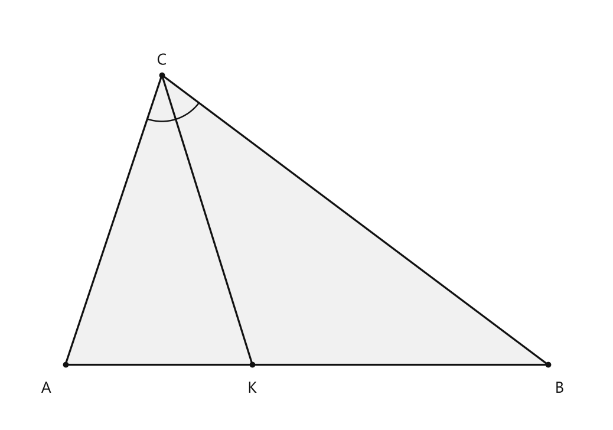
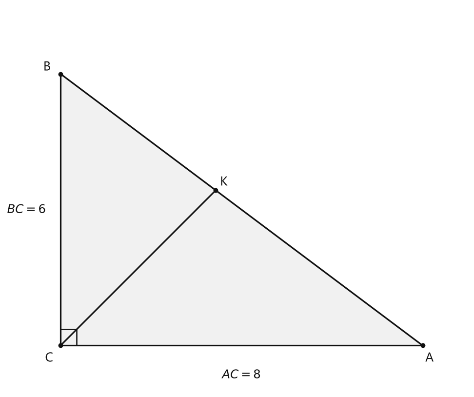
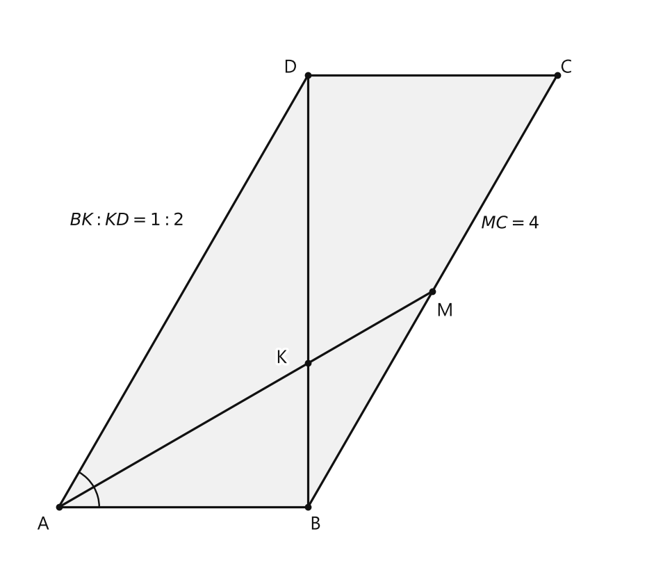
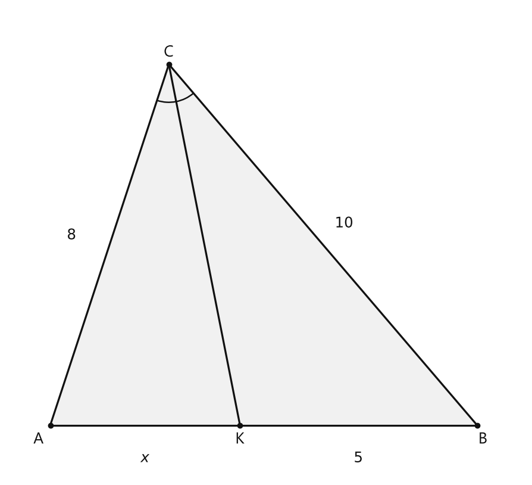
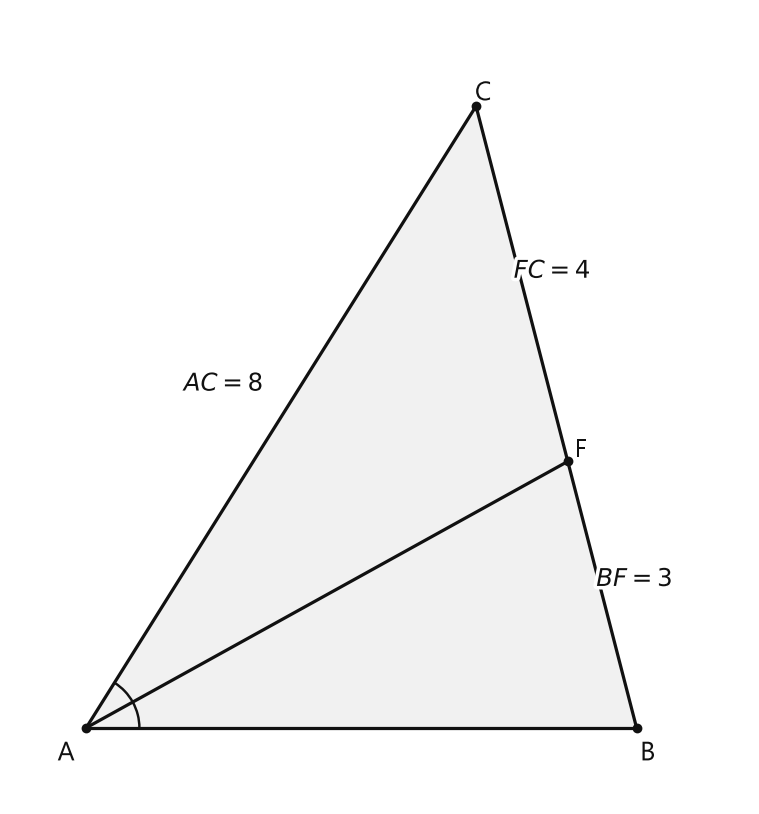
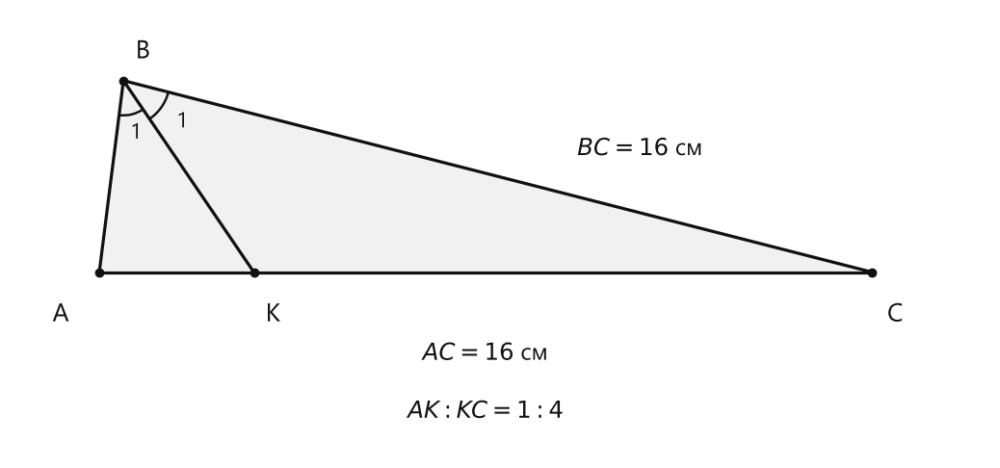
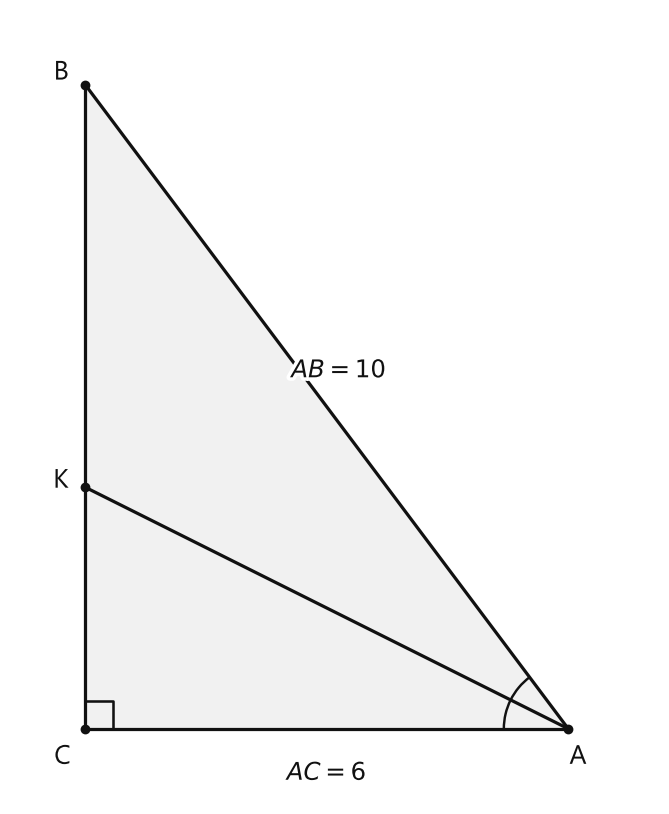

# Занятие 23. Свойство биссектрисы треугольника

**Раздел:** Глава 3. Подобие треугольников  
**Параграф учебника:** §22. Свойство биссектрисы треугольника  
**Страницы:** 148–150

## Цели занятия

После занятия ты умеешь:

- применять свойство биссектрисы треугольника;
- составлять пропорцию по прилежащим сторонам и отрезкам противоположной стороны;
- находить части стороны, на которые её делит биссектриса;
- решать задачи с биссектрисой в прямоугольном треугольнике;
- использовать свойства параллелограмма вместе со свойством биссектрисы;
- находить длину биссектрисы в прямоугольном треугольнике.

Выбирай блок своего уровня:

- **1–2 балла:** понять теорему и составить пропорцию;
- **3–4 балла:** решать задачи на отрезки;
- **5–6 баллов:** применять теорему в параллелограмме;
- **7–8 баллов:** решать составные задачи;
- **9–10 баллов:** уверенно находить длину самой биссектрисы.

## Теория к занятию

### 1. Что делает биссектриса треугольника

**Простыми словами.**  
Биссектриса делит угол на два равных угла. Но противоположную сторону она обычно делит не пополам, а на части, которые относятся так же, как две стороны, прилежащие к этому углу.

Например, если одна прилежащая сторона в 2 раза длиннее другой, то и соответствующий ей отрезок противоположной стороны будет в 2 раза длиннее. Биссектриса умеет делить угол пополам, а сторону — только «по пропорции».

**Теорема. Биссектриса треугольника делит противолежащую сторону на части, пропорциональные прилежащим сторонам.**

Дано: $\triangle ABC$, $CK$ — биссектриса.  
Доказать: $\frac{BK}{KA} = \frac{BC}{AC}$.

<!--geo-figure-spec
{
  "needed": true,
  "kind": "plane",
  "caption": "Биссектриса $CK$ треугольника $ABC$",
  "equal": true,
  "axis": false,
  "xlim": [
    -0.6,
    5.6
  ],
  "ylim": [
    -0.6,
    3.7
  ],
  "points": {
    "A": [
      0,
      0
    ],
    "B": [
      5,
      0
    ],
    "C": [
      1,
      3
    ],
    "K": [
      1.937129434,
      0
    ]
  },
  "segments": [
    [
      "A",
      "B"
    ],
    [
      "B",
      "C"
    ],
    [
      "C",
      "A"
    ],
    [
      "C",
      "K"
    ]
  ],
  "polygons": [
    {
      "vertices": [
        "A",
        "B",
        "C"
      ],
      "fill": 0.06
    }
  ],
  "circles": [],
  "labels": {
    "A": {
      "dx": -0.2,
      "dy": -0.25
    },
    "B": {
      "dx": 0.12,
      "dy": -0.25
    },
    "C": {
      "dx": 0,
      "dy": 0.15
    },
    "K": {
      "dx": 0,
      "dy": -0.25
    }
  },
  "right_angles": [],
  "angle_marks": [
    {
      "vertex": "C",
      "from": "A",
      "to": "K",
      "text": "",
      "radius": 0.48
    },
    {
      "vertex": "C",
      "from": "K",
      "to": "B",
      "text": "",
      "radius": 0.48
    }
  ],
  "texts": []
}
-->

*Биссектриса CK треугольника ABC*

**Формула:**

$$\frac{BK}{KA}=\frac{BC}{AC}.$$

Здесь:

- $BK$ и $KA$ — части стороны $AB$;
- $BC$ и $AC$ — стороны, прилежащие к углу $C$;
- $CK$ — биссектриса угла $C$.

Эту же пропорцию можно записать наоборот:

$$\frac{KA}{BK}=\frac{AC}{BC}.$$

Важно сохранять соответствие. Если сверху стоит $BK$, ему соответствует $BC$. Если сверху стоит $KA$, ему соответствует $AC$. Пропорция не любит перестановок «на глаз» — сразу начинает выдавать неправильные ответы.

### 2. Как применять свойство

**Алгоритм.**

1. Найди угол, который делит биссектриса.
2. Найди сторону, противоположную этому углу.
3. Определи части этой стороны.
4. Сопоставь каждую часть с прилежащей стороной.
5. Запиши пропорцию.
6. Реши получившееся уравнение.
7. Проверь, что отрезки положительны и их сумма равна всей стороне.

Например, $CK$ — биссектриса, $BC=6$, $AC=8$:

$$\frac{BK}{KA}=\frac{BC}{AC}=\frac{6}{8}=\frac{3}{4}.$$

Значит, $BK$ и $KA$ относятся как $3:4$.

Если известно, что $BK+KA=14$, удобно обозначить:

$$BK=3x,\qquad KA=4x.$$

Тогда:

$$3x+4x=14.$$

**Ловушки:**

- Биссектриса не обязана делить сторону пополам.
- В пропорции используются стороны, прилежащие именно к тому углу, который делит биссектриса.
- Если в числителе стоит $BK$, ему соответствует $BC$, а не $AC$.
- Если известна сумма частей, обозначай их через соответствующие части отношения, например $3x$ и $4x$.

### 3. Биссектриса в прямоугольном треугольнике

В прямоугольном треугольнике сначала может понадобиться найти гипотенузу по теореме Пифагора:

$$c^2=a^2+b^2.$$

Например, если катеты равны $6$ см и $8$ см, то:

$$AB=\sqrt{6^2+8^2}=10\text{ см}.$$

После этого применяем свойство биссектрисы.

Если биссектриса делит гипотенузу на $AK=x$ и $KB=10-x$, то:

$$\frac{AK}{KB}=\frac{AC}{BC}.$$

То есть порядок сторон в пропорции должен совпадать с порядком отрезков. Сначала Пифагор, потом биссектриса: у биссектрисы нет встроенного калькулятора длины гипотенузы.

### 4. Биссектриса в параллелограмме

В параллелограмме противоположные стороны равны:

$$AB=CD,\qquad AD=BC.$$

Если биссектриса угла $A$ пересекает диагональ $BD$ в точке $K$, то в треугольнике $ABD$ применяем свойство биссектрисы:

$$\frac{BK}{KD}=\frac{AB}{AD}.$$

Если эта же биссектриса пересекает сторону $BC$ в точке $M$, то из параллельности $AD$ и $BC$ можно получить равенство углов. Вместе с равенством углов биссектрисы это иногда приводит к равнобедренному треугольнику. Например:

$$AB=BM.$$

Тогда сторона $BC$ состоит из двух частей:

$$BC=BM+MC.$$

После этого используем равенство противоположных сторон:

$$BC=AD.$$

**Ловушки:**

- В параллелограмме равны противоположные стороны, а не соседние.
- Диагональ может делиться биссектрисой на неравные части.
- Если $BK:KD=1:2$, то:

$$\frac{BK}{KD}=\frac{1}{2},$$

а не наоборот.
- Периметр параллелограмма:

$$P=2(AB+AD).$$

## Сводка формул «выучить наизусть»

Свойство биссектрисы:

$$\frac{BK}{KA}=\frac{BC}{AC}.$$

Теорема Пифагора:

$$c^2=a^2+b^2.$$

Свойства параллелограмма:

$$AB=CD,\qquad AD=BC.$$

Периметр параллелограмма:

$$P=2(AB+AD).$$

## Правила, которые нельзя путать

- Биссектриса делит угол пополам, а противоположную сторону — пропорционально.
- Отрезки противоположной стороны сопоставляются с прилежащими сторонами.
- Сначала устанавливаем соответствие, затем записываем пропорцию.
- В параллелограмме равны противоположные стороны.
- Периметр — это сумма всех четырёх сторон, то есть удвоенная сумма двух соседних сторон.

# Разбор ключевых заданий

## Р1. Отрезки гипотенузы

**Условие.**  
Катеты прямоугольного треугольника равны $6$ см и $8$ см. Биссектриса прямого угла делит гипотенузу на отрезки $AK$ и $KB$. Найдите их длины.

Пусть $\angle C=90^\circ$, $BC=6$ см, $AC=8$ см, $CK$ — биссектриса.

<!--geo-figure-spec
{
  "needed": true,
  "kind": "plane",
  "caption": "Биссектриса $CK$ прямого угла",
  "equal": true,
  "axis": false,
  "xlim": [
    -1.2,
    9
  ],
  "ylim": [
    -1,
    7.5
  ],
  "points": {
    "C": [
      0,
      0
    ],
    "A": [
      8,
      0
    ],
    "B": [
      0,
      6
    ],
    "K": [
      3.428571,
      3.428571
    ]
  },
  "segments": [
    [
      "A",
      "B"
    ],
    [
      "B",
      "C"
    ],
    [
      "C",
      "A"
    ],
    [
      "C",
      "K"
    ]
  ],
  "polygons": [
    {
      "vertices": [
        "A",
        "B",
        "C"
      ],
      "fill": 0.06
    }
  ],
  "circles": [],
  "labels": {
    "A": {
      "dx": 0.15,
      "dy": -0.28
    },
    "B": {
      "dx": -0.3,
      "dy": 0.15
    },
    "C": {
      "dx": -0.25,
      "dy": -0.28
    },
    "K": {
      "dx": 0.18,
      "dy": 0.18
    }
  },
  "right_angles": [
    {
      "vertex": "C",
      "from": "A",
      "to": "B"
    }
  ],
  "angle_marks": [],
  "texts": [
    {
      "xy": [
        4,
        -0.65
      ],
      "text": "$AC=8$"
    },
    {
      "xy": [
        -0.75,
        3
      ],
      "text": "$BC=6$"
    }
  ]
}
-->

*Биссектриса CK прямого угла*

**Решение.**

Сначала найдём гипотенузу $AB$ по теореме Пифагора:

$$AB=\sqrt{AC^2+BC^2}.$$

Подставим известные длины:

$$AB=\sqrt{8^2+6^2}.$$

$$AB=\sqrt{64+36}.$$

$$AB=\sqrt{100}=10\text{ см}.$$

Обозначим неизвестный отрезок $AK$ через $x$:

$$AK=x.$$

Так как вся гипотенуза равна $10$ см, второй отрезок равен:

$$KB=10-x.$$

Биссектриса $CK$ делит сторону $AB$ пропорционально сторонам $AC$ и $BC$:

$$\frac{AK}{KB}=\frac{AC}{BC}.$$

Подставим значения:

$$\frac{x}{10-x}=\frac{8}{6}.$$

Сократим дробь:

$$\frac{x}{10-x}=\frac{4}{3}.$$

Перемножим по диагонали:

$$3x=4(10-x).$$

Раскроем скобки:

$$3x=40-4x.$$

Перенесём $-4x$ в левую часть:

$$7x=40.$$

Разделим обе части на $7$:

$$x=\frac{40}{7}=5\frac{5}{7}.$$

Значит:

$$AK=5\frac{5}{7}\text{ см}.$$

Найдём второй отрезок:

$$KB=10-\frac{40}{7}.$$

Представим $10$ в виде дроби со знаменателем $7$:

$$KB=\frac{70}{7}-\frac{40}{7}=\frac{30}{7}=4\frac{2}{7}\text{ см}.$$

Проверим отношение:

$$\frac{AK}{KB}=\frac{40/7}{30/7}=\frac{40}{30}=\frac{4}{3}=\frac{8}{6}.$$

Пропорция выполняется. Биссектриса действительно разделила гипотенузу не пополам, а «по размеру» катетов.

**Ответ:** $AK=5\frac{5}{7}$ см, $KB=4\frac{2}{7}$ см.

## Р2. Биссектриса в параллелограмме

**Условие.**  
В параллелограмме $ABCD$ биссектриса угла $A$ пересекает диагональ $BD$ в точке $K$, а сторону $BC$ — в точке $M$. Известно, что $MC=4$ см и $BK:KD=1:2$. Найдите периметр параллелограмма.

Дано:

$$MC=4\text{ см},\qquad \frac{BK}{KD}=\frac{1}{2}.$$

<!--geo-figure-spec
{
  "needed": true,
  "kind": "plane",
  "caption": "Биссектриса $AM$ в параллелограмме $ABCD$",
  "equal": true,
  "axis": false,
  "xlim": [
    -0.8,
    9.3
  ],
  "ylim": [
    -0.8,
    8.0
  ],
  "points": {
    "A": [
      0,
      0
    ],
    "B": [
      4,
      0
    ],
    "C": [
      8,
      6.92820323
    ],
    "D": [
      4,
      6.92820323
    ],
    "K": [
      4,
      2.30940108
    ],
    "M": [
      6,
      3.46410162
    ]
  },
  "segments": [
    [
      "A",
      "B"
    ],
    [
      "B",
      "C"
    ],
    [
      "C",
      "D"
    ],
    [
      "D",
      "A"
    ],
    [
      "B",
      "D"
    ],
    [
      "A",
      "M"
    ]
  ],
  "polygons": [
    {
      "vertices": [
        "A",
        "B",
        "C",
        "D"
      ],
      "fill": 0.06
    }
  ],
  "circles": [],
  "labels": {
    "A": {
      "dx": -0.25,
      "dy": -0.28
    },
    "B": {
      "dx": 0.12,
      "dy": -0.28
    },
    "C": {
      "dx": 0.15,
      "dy": 0.12
    },
    "D": {
      "dx": -0.28,
      "dy": 0.12
    },
    "K": {
      "dx": -0.42,
      "dy": 0.08
    },
    "M": {
      "dx": 0.2,
      "dy": -0.32
    }
  },
  "right_angles": [],
  "angle_marks": [
    {
      "vertex": "A",
      "from": "B",
      "to": "M",
      "text": "",
      "radius": 0.65
    },
    {
      "vertex": "A",
      "from": "M",
      "to": "D",
      "text": "",
      "radius": 0.65
    }
  ],
  "texts": [
    {
      "xy": [
        7.25,
        4.55
      ],
      "text": "$MC=4$"
    },
    {
      "xy": [
        1.1,
        4.6
      ],
      "text": "$BK:KD=1:2$"
    }
  ]
}
-->

*Биссектриса AM в параллелограмме ABCD*

**Решение.**

Рассмотрим треугольник $ABD$.

$AK$ — биссектриса угла $A$, поэтому по свойству биссектрисы:

$$\frac{BK}{KD}=\frac{AB}{AD}.$$

По условию:

$$\frac{BK}{KD}=\frac{1}{2}.$$

Значит:

$$\frac{AB}{AD}=\frac{1}{2}.$$

Пусть:

$$AB=x.$$

Тогда:

$$AD=2x.$$

Теперь рассмотрим треугольник $ABM$.

Так как $AD\parallel BC$, а точки $B$ и $M$ лежат на прямой $BC$, то:

$$AD\parallel BM.$$

Так как $AM$ — биссектриса угла $A$, то:

$$\angle BAM=\angle MAD.$$

Из-за параллельности прямых $BM$ и $AD$ углы $\angle MAD$ и $\angle AMB$ равны:

$$\angle MAD=\angle AMB.$$

Следовательно:

$$\angle BAM=\angle AMB.$$

В треугольнике $ABM$ равные углы лежат против равных сторон, поэтому:

$$AB=BM.$$

Так как $AB=x$, получаем:

$$BM=x.$$

Сторона $BC$ состоит из отрезков $BM$ и $MC$:

$$BC=BM+MC.$$

Подставим известные выражения:

$$BC=x+4.$$

В параллелограмме противоположные стороны равны:

$$BC=AD.$$

Поэтому:

$$x+4=2x.$$

Вычтем $x$ из обеих частей:

$$4=x.$$

Значит:

$$AB=4\text{ см},\qquad AD=8\text{ см}.$$

Периметр параллелограмма:

$$P=2(AB+AD).$$

$$P=2(4+8).$$

$$P=24\text{ см}.$$

Проверка: стороны параллелограмма равны $4$, $8$, $4$, $8$, поэтому их сумма равна $24$ см.

**Ответ:** $24$ см.

## Р3. Нахождение неизвестного отрезка

**Условие.**  
В треугольнике биссектриса делит противоположную сторону на отрезки $x$ см и $5$ см. Прилежащие к углу стороны равны $8$ см и $10$ см. Известно, что отрезку $x$ соответствует сторона $8$ см, а отрезку $5$ — сторона $10$ см. Найдите $x$.

<!--geo-figure-spec
{
  "needed": true,
  "kind": "plane",
  "caption": "Треугольник ABC с биссектрисой CK",
  "equal": true,
  "axis": false,
  "xlim": [
    -0.9,
    10
  ],
  "ylim": [
    -1.1,
    8.8
  ],
  "points": {
    "A": [
      0,
      0
    ],
    "B": [
      9,
      0
    ],
    "C": [
      2.5,
      7.6
    ],
    "K": [
      4,
      0
    ]
  },
  "segments": [
    [
      "A",
      "B"
    ],
    [
      "B",
      "C"
    ],
    [
      "C",
      "A"
    ],
    [
      "C",
      "K"
    ]
  ],
  "polygons": [
    {
      "vertices": [
        "A",
        "B",
        "C"
      ],
      "fill": 0.06
    }
  ],
  "circles": [],
  "labels": {
    "A": {
      "dx": -0.25,
      "dy": -0.3
    },
    "B": {
      "dx": 0.12,
      "dy": -0.3
    },
    "C": {
      "dx": 0,
      "dy": 0.25
    },
    "K": {
      "dx": 0,
      "dy": -0.3
    }
  },
  "right_angles": [],
  "angle_marks": [
    {
      "vertex": "C",
      "from": "A",
      "to": "K",
      "text": "",
      "radius": 0.8
    },
    {
      "vertex": "C",
      "from": "K",
      "to": "B",
      "text": "",
      "radius": 0.8
    }
  ],
  "texts": [
    {
      "xy": [
        2,
        -0.7
      ],
      "text": "$x$"
    },
    {
      "xy": [
        6.5,
        -0.7
      ],
      "text": "$5$"
    },
    {
      "xy": [
        0.45,
        4
      ],
      "text": "$8$"
    },
    {
      "xy": [
        6.2,
        4.25
      ],
      "text": "$10$"
    }
  ]
}
-->

*Треугольник ABC с биссектрисой CK*

**Решение.**

По свойству биссектрисы соответствующие отрезки и стороны образуют пропорцию:

$$\frac{x}{5}=\frac{8}{10}.$$

Сократим дробь справа:

$$\frac{x}{5}=\frac{4}{5}.$$

Умножим обе части равенства на $5$:

$$x=4.$$

Проверим соответствие:

$$\frac{x}{5}=\frac{4}{5}=\frac{8}{10}.$$

**Ответ:** $4$ см.

## Р4. Периметр треугольника

**Условие.**  
В треугольнике $ABC$ $AC=8$ см. На стороне $BC$ взята точка $F$ так, что $\angle BAF=\angle CAF$, $BF=3$ см, $FC=4$ см. Найдите периметр треугольника $ABC$.

<!--geo-figure-spec
{
  "needed": true,
  "kind": "plane",
  "caption": "Биссектриса $AF$ треугольника $ABC$",
  "equal": true,
  "axis": false,
  "xlim": [
    -0.8,
    7.2
  ],
  "ylim": [
    -0.8,
    7.8
  ],
  "points": {
    "A": [
      0,
      0
    ],
    "B": [
      6,
      0
    ],
    "C": [
      4.25,
      6.777
    ],
    "F": [
      5.25,
      2.904
    ]
  },
  "segments": [
    [
      "A",
      "B"
    ],
    [
      "B",
      "C"
    ],
    [
      "C",
      "A"
    ],
    [
      "A",
      "F"
    ]
  ],
  "polygons": [
    {
      "vertices": [
        "A",
        "B",
        "C"
      ],
      "fill": 0.06
    }
  ],
  "circles": [],
  "labels": {
    "A": {
      "dx": -0.22,
      "dy": -0.28
    },
    "B": {
      "dx": 0.12,
      "dy": -0.28
    },
    "C": {
      "dx": 0.08,
      "dy": 0.14
    },
    "F": {
      "dx": 0.14,
      "dy": 0.12
    }
  },
  "right_angles": [],
  "angle_marks": [
    {
      "vertex": "A",
      "from": "B",
      "to": "F",
      "text": "",
      "radius": 0.58
    },
    {
      "vertex": "A",
      "from": "F",
      "to": "C",
      "text": "",
      "radius": 0.58
    }
  ],
  "texts": [
    {
      "xy": [
        5.98,
        1.62
      ],
      "text": "$BF=3$"
    },
    {
      "xy": [
        5.08,
        4.98
      ],
      "text": "$FC=4$"
    },
    {
      "xy": [
        1.5,
        3.75
      ],
      "text": "$AC=8$"
    }
  ]
}
-->

*Биссектриса AF треугольника ABC*

**Решение.**

Так как:

$$\angle BAF=\angle CAF,$$

отрезок $AF$ — биссектриса угла $A$.

Биссектриса делит противоположную сторону $BC$ пропорционально прилежащим сторонам $AB$ и $AC$:

$$\frac{BF}{FC}=\frac{AB}{AC}.$$

Подставим данные:

$$\frac{3}{4}=\frac{AB}{8}.$$

Перемножим по диагонали:

$$4AB=3\cdot8.$$

$$4AB=24.$$

Разделим обе части на $4$:

$$AB=6\text{ см}.$$

Найдём сторону $BC$:

$$BC=BF+FC.$$

$$BC=3+4=7\text{ см}.$$

Теперь найдём периметр:

$$P=AB+BC+AC.$$

$$P=6+7+8=21\text{ см}.$$

Проверка:

$$\frac{AB}{AC}=\frac{6}{8}=\frac{3}{4}=\frac{BF}{FC}.$$

Пропорция выполняется.

**Ответ:** $21$ см.

## Р5. Равнобедренный треугольник

**Условие.**  
В равнобедренном треугольнике $ABC$ $AC=BC=16$ см проведена биссектриса $BK$. Известно, что $AK:KC=1:4$. Найдите основание $AB$.

<!--geo-figure-spec
{
  "needed": true,
  "kind": "plane",
  "caption": "Биссектриса $BK$ равнобедренного треугольника",
  "equal": true,
  "axis": false,
  "xlim": [
    -0.45,
    4.6
  ],
  "ylim": [
    -0.95,
    1.35
  ],
  "points": {
    "A": [
      0,
      0
    ],
    "B": [
      0.125,
      0.992
    ],
    "C": [
      4,
      0
    ],
    "K": [
      0.8,
      0
    ]
  },
  "segments": [
    [
      "A",
      "B"
    ],
    [
      "B",
      "C"
    ],
    [
      "C",
      "A"
    ],
    [
      "B",
      "K"
    ]
  ],
  "polygons": [
    {
      "vertices": [
        "A",
        "B",
        "C"
      ],
      "fill": 0.06
    }
  ],
  "circles": [],
  "labels": {
    "A": {
      "dx": -0.2,
      "dy": -0.22
    },
    "B": {
      "dx": 0.1,
      "dy": 0.15
    },
    "C": {
      "dx": 0.12,
      "dy": -0.22
    },
    "K": {
      "dx": 0.1,
      "dy": -0.22
    }
  },
  "right_angles": [],
  "angle_marks": [
    {
      "vertex": "B",
      "from": "A",
      "to": "K",
      "text": "1",
      "radius": 0.18
    },
    {
      "vertex": "B",
      "from": "K",
      "to": "C",
      "text": "1",
      "radius": 0.24
    }
  ],
  "texts": [
    {
      "xy": [
        2,
        -0.42
      ],
      "text": "$AC=16$ см"
    },
    {
      "xy": [
        2.8,
        0.64
      ],
      "text": "$BC=16$ см"
    },
    {
      "xy": [
        2,
        -0.72
      ],
      "text": "$AK:KC=1:4$"
    }
  ]
}
-->

*Биссектриса BK равнобедренного треугольника*

**Решение.**

$BK$ — биссектриса угла $B$. Поэтому она делит противоположную сторону $AC$ пропорционально сторонам $AB$ и $BC$:

$$\frac{AK}{KC}=\frac{AB}{BC}.$$

По условию:

$$\frac{AK}{KC}=\frac{1}{4}.$$

Значит:

$$\frac{AB}{BC}=\frac{1}{4}.$$

Подставим $BC=16$ см:

$$\frac{AB}{16}=\frac{1}{4}.$$

Умножим обе части на $16$:

$$AB=\frac{16}{4}=4\text{ см}.$$

Проверим:

$$\frac{AB}{BC}=\frac{4}{16}=\frac{1}{4}.$$

Соотношение совпадает с условием.

**Ответ:** $4$ см.

## Р6. Биссектриса среднего по величине угла

**Условие.**  
Стороны треугольника равны $6$ см, $7$ см и $8$ см. Найдите длины отрезков, на которые биссектриса среднего по величине угла делит противоположную сторону.

**Решение.**

В треугольнике большей стороне противолежит больший угол, а меньшей стороне — меньший угол.

Средняя по величине сторона равна $7$ см. Значит, средний по величине угол лежит напротив стороны длиной $7$ см.

Следовательно, биссектриса этого угла делит сторону длиной $7$ см.

Две стороны, прилежащие к этому углу, имеют длины $6$ см и $8$ см.

Пусть отрезку $x$ соответствует сторона $6$ см, а отрезку $y$ — сторона $8$ см.

Тогда сумма отрезков равна всей противоположной стороне:

$$x+y=7.$$

По свойству биссектрисы:

$$\frac{x}{y}=\frac{6}{8}=\frac{3}{4}.$$

Отношение $3:4$ удобно записать так:

$$x=3t,\qquad y=4t.$$

Подставим в сумму:

$$3t+4t=7.$$

$$7t=7.$$

$$t=1.$$

Теперь найдём отрезки:

$$x=3\cdot1=3\text{ см},$$

$$y=4\cdot1=4\text{ см}.$$

Проверка:

$$x+y=3+4=7,$$

$$\frac{x}{y}=\frac{3}{4}=\frac{6}{8}.$$

**Ответ:** $3$ см и $4$ см.

## Р7. Длина биссектрисы в прямоугольном треугольнике

**Условие.**  
В прямоугольном треугольнике $ABC$ $\angle C=90^\circ$, $AC=6$ см, $AB=10$ см. Найдите длину биссектрисы $AK$ угла $A$, где $K$ лежит на стороне $BC$.

<!--geo-figure-spec
{
  "needed": true,
  "kind": "plane",
  "caption": "Биссектриса $AK$ прямоугольного треугольника",
  "equal": true,
  "axis": false,
  "xlim": [
    -0.9,
    7.1
  ],
  "ylim": [
    -0.9,
    8.9
  ],
  "points": {
    "C": [
      0,
      0
    ],
    "A": [
      6,
      0
    ],
    "B": [
      0,
      8
    ],
    "K": [
      0,
      3
    ]
  },
  "segments": [
    [
      "A",
      "B"
    ],
    [
      "B",
      "K"
    ],
    [
      "K",
      "C"
    ],
    [
      "C",
      "A"
    ],
    [
      "A",
      "K"
    ]
  ],
  "polygons": [
    {
      "vertices": [
        "A",
        "B",
        "C"
      ],
      "fill": 0.06
    }
  ],
  "circles": [],
  "labels": {
    "A": {
      "dx": 0.12,
      "dy": -0.35
    },
    "B": {
      "dx": -0.3,
      "dy": 0.15
    },
    "C": {
      "dx": -0.28,
      "dy": -0.35
    },
    "K": {
      "dx": -0.3,
      "dy": 0.08
    }
  },
  "right_angles": [
    {
      "vertex": "C",
      "from": "A",
      "to": "B"
    }
  ],
  "angle_marks": [
    {
      "vertex": "A",
      "from": "B",
      "to": "K",
      "text": "",
      "radius": 0.8
    },
    {
      "vertex": "A",
      "from": "K",
      "to": "C",
      "text": "",
      "radius": 0.8
    }
  ],
  "texts": [
    {
      "xy": [
        3,
        -0.55
      ],
      "text": "$AC=6$"
    },
    {
      "xy": [
        3.15,
        4.45
      ],
      "text": "$AB=10$"
    }
  ]
}
-->

*Биссектриса AK прямоугольного треугольника*

**Решение.**

Сначала найдём второй катет $BC$ по теореме Пифагора:

$$AB^2=AC^2+BC^2.$$

Подставим известные длины:

$$10^2=6^2+BC^2.$$

$$100=36+BC^2.$$

Вычтем $36$ из обеих частей:

$$BC^2=64.$$

Так как длина отрезка положительна:

$$BC=8\text{ см}.$$

Биссектриса $AK$ делит сторону $BC$ пропорционально сторонам $AB$ и $AC$:

$$\frac{BK}{KC}=\frac{AB}{AC}.$$

Подставим значения:

$$\frac{BK}{KC}=\frac{10}{6}=\frac{5}{3}.$$

Значит, можно обозначить:

$$BK=5t,\qquad KC=3t.$$

Сумма этих отрезков равна стороне $BC$:

$$BK+KC=BC=8.$$

Поэтому:

$$5t+3t=8.$$

$$8t=8.$$

$$t=1.$$

Следовательно:

$$BK=5\text{ см},\qquad KC=3\text{ см}.$$

Теперь рассмотрим прямоугольный треугольник $ACK$. Угол $C$ в нём прямой, поэтому применим теорему Пифагора:

$$AK^2=AC^2+KC^2.$$

Подставим значения:

$$AK^2=6^2+3^2.$$

$$AK^2=36+9=45.$$

Так как длина $AK$ положительна:

$$AK=\sqrt{45}=3\sqrt5\text{ см}.$$

Проверим размер ответа: $3\sqrt5\approx6{,}7$, это больше $AC=6$ см и меньше суммы $AC+KC=9$ см. Значит, результат подходит.

**Ответ:** $3\sqrt5$ см.

## Практические задания

Выбери свой уровень и решай только этот блок. В блоке должна закрепиться вся тема параграфа. Ответы не приводятся.

### Уровень 1–2 балла

**С1.** В треугольнике $ABC$ биссектриса $CK$ пересекает сторону $AB$ в точке $K$. Выберите верное равенство.

1) $\dfrac{BK}{KA}=\dfrac{AC}{BC}$ 2) $\dfrac{BK}{KA}=\dfrac{BC}{AC}$ 3) $\dfrac{BK}{KA}=\dfrac{AB}{AC}$ 4) $\dfrac{BK}{KA}=\dfrac{AC}{AB}$ 5) $\dfrac{BK}{KA}=\dfrac{BC}{AB}$

**С2.** В треугольнике $ABC$ биссектриса $CK$ делит сторону $AB$ на отрезки $BK=6$ см и $KA=4$ см. Найдите отношение $BC:AC$.

1) $2:3$ 2) $3:2$ 3) $3:5$ 4) $5:3$ 5) $1:2$

**С3.** В треугольнике $ABC$ биссектриса $CK$ делит сторону $AB$ на отрезки $BK=9$ см и $KA=6$ см. Если $AC=8$ см, найдите $BC$.

1) $10$ см 2) $12$ см 3) $14$ см 4) $16$ см 5) $18$ см

**С4.** В треугольнике $ABC$ биссектриса $AK$ пересекает сторону $BC$ в точке $K$. Известно, что $BK=5$ см, $KC=10$ см и $AB=6$ см. Найдите $AC$.

1) $3$ см 2) $6$ см 3) $9$ см 4) $12$ см 5) $15$ см

**С5.** В треугольнике $ABC$ биссектриса $BK$ пересекает сторону $AC$ в точке $K$. Известно, что $AK=4$ см, $KC=6$ см и $AB=8$ см. Найдите $BC$.

1) $10$ см 2) $12$ см 3) $14$ см 4) $16$ см 5) $18$ см

**С6.** В треугольнике $ABC$ биссектриса $CK$ делит сторону $AB$ на отрезки $BK$ и $KA$. Известно, что $BC=15$ см, $AC=10$ см и $KA=6$ см. Найдите $BK$.

1) $3$ см 2) $6$ см 3) $8$ см 4) $9$ см 5) $12$ см

**С7.** В треугольнике $ABC$ биссектриса $AK$ делит сторону $BC$ на отрезки $BK=8$ см и $KC=12$ см. Какое отношение имеют стороны $AB$ и $AC$?

1) $2:3$ 2) $3:2$ 3) $1:2$ 4) $2:1$ 5) $4:5$

**С8.** В треугольнике $ABC$ биссектриса $CK$ пересекает сторону $AB$ в точке $K$. Известно, что $AB=21$ см, $BK:KA=2:5$. Найдите $BK$.

1) $3$ см 2) $6$ см 3) $7$ см 4) $14$ см 5) $15$ см

**С9.** В треугольнике $ABC$ биссектриса $BK$ пересекает сторону $AC$ в точке $K$. Известно, что $AC=18$ см и $AB:BC=2:1$. Найдите $KC$.

1) $3$ см 2) $6$ см 3) $9$ см 4) $12$ см 5) $15$ см

**С10.** В треугольнике $ABC$ биссектриса $AK$ пересекает сторону $BC$ в точке $K$. Известно, что $AB=12$ см, $AC=18$ см и $BC=15$ см. Найдите $BK$.

1) $4$ см 2) $5$ см 3) $6$ см 4) $9$ см 5) $10$ см

**С11.** В треугольнике $ABC$ биссектриса $CK$ пересекает сторону $AB$ в точке $K$. Известно, что $BC:AC=3:4$ и $AB=21$ см. Найдите $KA$.

1) $6$ см 2) $9$ см 3) $12$ см 4) $15$ см 5) $16$ см

**С12.** В треугольнике $ABC$ биссектриса $AK$ пересекает сторону $BC$ в точке $K$. Известно, что $BK=6$ см, $KC=9$ см и $AB+AC=25$ см. Найдите $AB$.

1) $8$ см 2) $10$ см 3) $12$ см 4) $15$ см 5) $18$ см

**С13.** В треугольнике $ABC$ биссектриса $AK$ пересекает сторону $BC$ в точке $K$. Если $AB=6$ см, $AC=9$ см и $BK=4$ см, найдите $KC$.
1) $2$ см 2) $4$ см 3) $6$ см 4) $8$ см 5) $10$ см

**С14.** В треугольнике $ABC$ биссектриса $CK$ делит сторону $AB$ на отрезки $AK$ и $KB$. Укажите верное равенство.
1) $\dfrac{AK}{KB}=\dfrac{AB}{BC}$ 2) $\dfrac{AK}{KB}=\dfrac{AC}{BC}$ 3) $\dfrac{AK}{KB}=\dfrac{BC}{AC}$ 4) $\dfrac{AK}{KB}=\dfrac{AC}{AB}$ 5) $\dfrac{AK}{KB}=\dfrac{AB}{AC}$

**С15.** В треугольнике $ABC$ биссектриса $BK$ пересекает сторону $AC$ в точке $K$. Если $AB=8$ см, $BC=12$ см и $AK=6$ см, найдите $KC$.
1) $2$ см 2) $4$ см 3) $6$ см 4) $8$ см 5) $9$ см

**С16.** В треугольнике $ABC$ биссектриса $AK$ делит сторону $BC$ на отрезки $BK=5$ см и $KC=7$ см. Если $AB=10$ см, найдите $AC$.
1) $12$ см 2) $14$ см 3) $16$ см 4) $18$ см 5) $20$ см

**С17.** В треугольнике $ABC$ биссектриса $CK$ пересекает сторону $AB$ в точке $K$. Если $AC=12$ см, $BC=8$ см и $AB=15$ см, найдите $AK$.
1) $5$ см 2) $6$ см 3) $7$ см 4) $8$ см 5) $9$ см

**С18.** В треугольнике $ABC$ биссектриса $AK$ пересекает сторону $BC$ в точке $K$. Известно, что $AB:AC=2:3$. Укажите отношение $BK:KC$.
1) $1:3$ 2) $2:3$ 3) $3:2$ 4) $2:5$ 5) $5:2$

**С19.** В треугольнике $ABC$ биссектриса $BK$ пересекает сторону $AC$ в точке $K$. Известно, что $AB=9$ см, $BC=6$ см, $AK=6$ см. Найдите длину стороны $AC$.

**С20.** В треугольнике $ABC$ биссектриса $CK$ пересекает сторону $AB$ в точке $K$. Известно, что $AK=4$ см, $KB=6$ см, $AC=8$ см. Найдите длину стороны $BC$.

**С21.** В треугольнике $ABC$ биссектриса $AK$ пересекает сторону $BC$ в точке $K$. Отрезок $BC$ разделён биссектрисой в отношении $BK:KC=3:2$. Если $AB=12$ см, найдите $AC$.

**С22.** В треугольнике $ABC$ биссектриса $BK$ делит сторону $AC$ на отрезки $AK=5$ см и $KC=3$ см. Укажите отношение $AB:BC$.
1) $3:5$ 2) $5:3$ 3) $2:3$ 4) $3:2$ 5) $5:8$

**С23.** В треугольнике $ABC$ стороны $AB=6$ см и $AC=10$ см. Биссектриса угла $A$ пересекает сторону $BC$ в точке $K$. Если $BK=3$ см, найдите $KC$.

**С24.** В треугольнике $ABC$ биссектриса $CK$ пересекает сторону $AB$ в точке $K$. Известно, что $AC:BC=4:5$ и $AB=18$ см. Найдите длины отрезков $AK$ и $KB$.

**С25.** В треугольнике $ABC$ биссектриса угла $A$ пересекает сторону $BC$ в точке $D$. Если $AB=6$ см, $AC=9$ см, то чему равно отношение $BD:DC$?

1) $2:3$ 2) $3:2$ 3) $1:3$ 4) $3:1$ 5) $2:1$

**С26.** В треугольнике $ABC$ биссектриса угла $C$ пересекает сторону $AB$ в точке $K$. Укажите верное равенство.

1) $\dfrac{AK}{KB}=\dfrac{AC}{BC}$ 2) $\dfrac{AK}{KB}=\dfrac{BC}{AC}$ 3) $\dfrac{AK}{KB}=\dfrac{AB}{AC}$ 4) $\dfrac{AK}{KB}=\dfrac{AC}{AB}$ 5) $\dfrac{AK}{KB}=\dfrac{BC}{AB}$

**С27.** В треугольнике $ABC$ биссектриса угла $A$ делит сторону $BC$ на отрезки $BD=4$ см и $DC=6$ см. Если $AB=8$ см, найдите $AC$.

**С28.** В треугольнике $ABC$ биссектриса угла $A$ пересекает сторону $BC$ в точке $D$. Если $AB:AC=3:5$, выберите верное отношение.

1) $BD:DC=5:3$ 2) $BD:DC=3:5$ 3) $BD:DC=2:5$ 4) $BD:DC=3:2$ 5) $BD:DC=1:5$

**С29.** В треугольнике $ABC$ биссектриса угла $B$ пересекает сторону $AC$ в точке $K$. Известно, что $AK=5$ см, $KC=7$ см, $AB=10$ см. Найдите $BC$.

**С30.** В треугольнике $ABC$ биссектриса угла $C$ пересекает сторону $AB$ в точке $K$. Если $AC=12$ см и $BC=8$ см, чему равно отношение $AK:KB$?

1) $2:3$ 2) $3:2$ 3) $1:2$ 4) $2:1$ 5) $3:1$

**С31.** В треугольнике $ABC$ биссектриса угла $A$ пересекает сторону $BC$ в точке $D$. Известно, что $AB=15$ см, $AC=10$ см, $BD=9$ см. Найдите $DC$.

**С32.** В треугольнике $ABC$ биссектриса угла $B$ делит сторону $AC$ на отрезки $AK=6$ см и $KC=4$ см. Если $BC=8$ см, найдите $AB$.

**С33.** В треугольнике $ABC$ биссектриса угла $A$ пересекает сторону $BC$ в точке $D$. Выберите верное утверждение.

1) $\dfrac{BD}{DC}=\dfrac{AC}{AB}$ 2) $\dfrac{BD}{DC}=\dfrac{AB}{AC}$ 3) $\dfrac{BD}{DC}=\dfrac{AB}{BC}$ 4) $\dfrac{BD}{DC}=\dfrac{BC}{AC}$ 5) $BD+DC=AB+AC$

**С34.** В треугольнике $ABC$ биссектриса угла $C$ пересекает сторону $AB$ в точке $K$. Если $AC=9$ см, $BC=6$ см, $AK=6$ см, найдите $KB$.

**С35.** В треугольнике $ABC$ биссектриса угла $A$ делит сторону $BC$ на отрезки $BD=8$ см и $DC=12$ см. Выберите значение отношения $AB:AC$.

1) $2:3$ 2) $3:2$ 3) $1:2$ 4) $2:1$ 5) $4:5$

**С36.** В треугольнике $ABC$ биссектриса угла $B$ пересекает сторону $AC$ в точке $K$. Известно, что $AB=14$ см, $BC=21$ см, $AC=10$ см. Найдите длину отрезка $AK$.

### Уровень 3–4 балла

**С1.** В треугольнике $ABC$ биссектриса угла $A$ пересекает сторону $BC$ в точке $K$. Известно, что $AB=9$ см, $AC=12$ см, $BC=21$ см. Найдите длины отрезков $BK$ и $KC$.

**С2.** В треугольнике $ABC$ точка $F$ лежит на стороне $BC$, причём $AF$ — биссектриса угла $A$. Известно, что $AC=8$ см, $BF=3$ см, $FC=4$ см. Найдите периметр треугольника $ABC$.

**С3.** В равнобедренном треугольнике $ABC$ стороны $AC$ и $BC$ равны $16$ см. Биссектриса угла $B$ пересекает сторону $AC$ в точке $K$, причём $AK:KC=1:4$. Найдите длину основания $AB$.

**С4.** Стороны треугольника равны $6$ см, $7$ см и $8$ см. Найдите длины отрезков, на которые биссектриса угла, противолежащего стороне длиной $7$ см, делит эту сторону.

**С5.** В прямоугольном треугольнике $ABC$ прямой угол равен $\angle C$, а катеты $AC=6$ см и $BC=8$ см. Биссектриса угла $C$ пересекает гипотенузу $AB$ в точке $K$. Найдите отношение $AK:KB$.

**С6.** В прямоугольном треугольнике $ABC$ $\angle C=90^\circ$, $AC=6$ см, $AB=10$ см. Биссектриса угла $A$ пересекает сторону $BC$ в точке $K$. Найдите длину отрезка $BK$.

**С7.** В треугольнике $ABC$ биссектриса угла $C$ пересекает сторону $AB$ в точке $K$. Известно, что $AC=10$ см, $BC=15$ см, $AK=4$ см. Найдите длину отрезка $KB$.

**С8.** В треугольнике $ABC$ биссектриса угла $A$ пересекает сторону $BC$ в точке $K$. Известно, что $AB=14$ см, $AC=21$ см, $BK=6$ см. Найдите длину стороны $BC$.

**С9.** В треугольнике $ABC$ биссектриса угла $B$ пересекает сторону $AC$ в точке $K$. Известно, что $AB=12$ см, $BC=18$ см, $AK=8$ см. Найдите длины отрезка $KC$ и стороны $AC$.

**С10.** В треугольнике $ABC$ сторона $BC=18$ см. Биссектриса угла $A$ делит её на отрезки $BK=6$ см и $KC=12$ см. Найдите отношение прилежащих к углу $A$ сторон $AB:AC$.

**С11.** В треугольнике $ABC$ биссектриса угла $A$ пересекает сторону $BC$ в точке $K$. Известно, что $AB=15$ см, $AC=20$ см, а разность длин отрезков $KC$ и $BK$ равна $3$ см. Найдите длины отрезков $BK$ и $KC$.

**С12.** В параллелограмме $ABCD$ биссектриса угла $A$ пересекает диагональ $BD$ в точке $K$, а сторону $BC$ — в точке $M$. Известно, что $MC=4$ см и $BK:KD=1:2$. Найдите периметр параллелограмма.

**С13.** В треугольнике $ABC$ биссектриса угла $A$ пересекает сторону $BC$ в точке $K$. Известно, что $AB=6$ см, $AC=9$ см, $BK=4$ см. Найдите длину отрезка $KC$.

**С14.** В треугольнике $ABC$ биссектриса угла $C$ пересекает сторону $AB$ в точке $K$. Известно, что $AC=10$ см, $BC=15$ см, $AK=4$ см. Найдите длину отрезка $KB$.

**С15.** В треугольнике $ABC$ биссектриса угла $A$ делит сторону $BC$ на отрезки $BK=6$ см и $KC=9$ см. Найдите отношение $AB:AC$.

**С16.** В треугольнике $ABC$ биссектриса угла $B$ пересекает сторону $AC$ в точке $K$. Известно, что $AB=12$ см, $BC=8$ см, а $AC=15$ см. Найдите длины отрезков $AK$ и $KC$.

**С17.** В треугольнике $ABC$ биссектриса угла $A$ пересекает сторону $BC$ в точке $K$. Известно, что $AB=8$ см, $AC=12$ см, $BC=15$ см. Найдите длины отрезков $BK$ и $KC$.

**С18.** В треугольнике $ABC$ сторона $BC=21$ см. Биссектриса угла $A$ делит её на отрезки $BK$ и $KC$ в отношении $2:5$. Найдите $AB:AC$ и длины отрезков $BK$ и $KC$.

**С19.** В треугольнике $ABC$ биссектриса угла $A$ пересекает сторону $BC$ в точке $K$. Известно, что $AB:AC=3:4$ и $BK=9$ см. Найдите длину стороны $BC$.

**С20.** В треугольнике $ABC$ биссектриса угла $C$ пересекает сторону $AB$ в точке $K$. Известно, что $AC=14$ см, $BC=21$ см и $AB=20$ см. Найдите длины отрезков $AK$ и $KB$.

**С21.** В треугольнике $ABC$ стороны $AB=9$ см и $AC=15$ см. Биссектриса угла $A$ пересекает сторону $BC$ в точке $K$, причём $KC=10$ см. Найдите длину стороны $BC$.

**С22.** В равнобедренном треугольнике $ABC$ известно, что $AB=AC=13$ см. Биссектриса угла $A$ пересекает основание $BC$ в точке $K$, причём $BK=KC$. Найдите длину основания $BC$, если $BK=5$ см.

**С23.** В треугольнике $ABC$ биссектриса угла $B$ пересекает сторону $AC$ в точке $K$. Известно, что $AK=6$ см, $KC=9$ см и $AB=8$ см. Найдите длину стороны $BC$.

**С24.** В треугольнике $ABC$ биссектриса угла $A$ делит сторону $BC$ на отрезки $BK=8$ см и $KC=12$ см. Периметр треугольника $ABC$ равен $50$ см. Найдите длины сторон $AB$ и $AC$.

**С25.** В треугольнике $ABC$ биссектриса угла $A$ пересекает сторону $BC$ в точке $K$. Известно, что $AB=9$ см, $AC=6$ см, $BC=10$ см. Найдите длины отрезков $BK$ и $KC$.

**С26.** В треугольнике $ABC$ биссектриса угла $A$ пересекает сторону $BC$ в точке $K$. Известно, что $AB=8$ см, $AC=12$ см, $BK=6$ см. Найдите длину отрезка $KC$.

**С27.** В треугольнике $ABC$ биссектриса угла $B$ пересекает сторону $AC$ в точке $K$. Известно, что $AK=6$ см, $KC=9$ см, $AB=10$ см. Найдите длину стороны $BC$.

**С28.** В треугольнике $ABC$ биссектриса угла $A$ пересекает сторону $BC$ в точке $K$. Стороны треугольника равны $AB=12$ см, $AC=18$ см и $BC=20$ см. Найдите длины отрезков $BK$ и $KC$.

**С29.** Катеты прямоугольного треугольника $ABC$ равны $AB=6$ см и $AC=8$ см. Биссектриса прямого угла $A$ пересекает гипотенузу $BC$ в точке $K$. Найдите длины отрезков $BK$ и $KC$.

**С30.** В равнобедренном треугольнике $ABC$ боковые стороны равны $AC=BC=20$ см. Биссектриса угла $B$ пересекает сторону $AC$ в точке $K$, причём $AK:KC=3:2$. Найдите длину основания $AB$.

**С31.** В треугольнике $ABC$ биссектриса угла $C$ пересекает сторону $AB$ в точке $K$. Известно, что $AC=14$ см, $BC=21$ см и $AK=8$ см. Найдите длину отрезка $KB$.

**С32.** В треугольнике $ABC$ биссектриса угла $A$ пересекает сторону $BC$ в точке $K$. Известно, что $AB=9$ см, $AC=12$ см, а периметр треугольника равен $42$ см. Найдите длины отрезков $BK$ и $KC$.

**С33.** В треугольнике $ABC$ биссектриса угла $A$ пересекает сторону $BC$ в точке $K$. Отрезки $BK$ и $KC$ относятся как $2:5$. Известно, что $AB=8$ см и $BC=21$ см. Найдите длину стороны $AC$.

**С34.** В треугольнике $ABC$ биссектриса угла $B$ пересекает сторону $AC$ в точке $K$. Известно, что $AC=25$ см, $AB=12$ см и $BC=18$ см. Найдите длины отрезков $AK$ и $KC$.

**С35.** В треугольнике $ABC$ биссектриса угла $A$ пересекает сторону $BC$ в точке $K$. Известно, что $BK=5$ см, $KC=7$ см, а разность длин сторон $AC$ и $AB$ равна $4$ см. Найдите длины сторон $AB$ и $AC$.

**С36.** В треугольнике $ABC$ биссектриса угла $A$ пересекает сторону $BC$ в точке $K$. Известно, что $BK=6$ см, $KC=9$ см, а периметр треугольника $ABC$ равен $45$ см. Найдите длины сторон $AB$ и $AC$.

### Уровень 5–6 баллов

**С1.** В треугольнике $ABC$ биссектриса $CK$ угла $C$ пересекает сторону $AB$ в точке $K$. Известно, что $BC=12$ см, $AC=8$ см, $AK=6$ см. Найдите длину отрезка $BK$.

**С2.** Биссектриса $CK$ треугольника $ABC$ делит сторону $AB$ на отрезки $AK$ и $KB$, отношение которых равно $3:5$. Длина стороны $AB$ равна $32$ см. Найдите длины отрезков $AK$ и $KB$.

**С3.** В треугольнике $ABC$ точка $F$ лежит на стороне $BC$, причём $AF$ — биссектриса угла $A$. Известно, что $BF=3$ см, $FC=4$ см, $AC=8$ см. Найдите периметр треугольника $ABC$.

**С4.** В равнобедренном треугольнике $ABC$ боковые стороны $AC$ и $BC$ равны $16$ см. Биссектриса $BK$ угла $B$ пересекает сторону $AC$ в точке $K$, причём $AK:KC=1:4$. Найдите длину основания $AB$.

**С5.** Стороны треугольника равны $6$ см, $7$ см и $8$ см. Биссектриса угла, прилежащего к сторонам длиной $6$ см и $8$ см, делит противолежащую сторону на два отрезка. Найдите длины этих отрезков.

**С6.** В прямоугольном треугольнике $ABC$ угол $C$ прямой, $AC=6$ см, $AB=10$ см. Биссектриса угла $A$ пересекает сторону $BC$ в точке $K$. Найдите длину отрезка $BK$.

**С7.** В параллелограмме $ABCD$ биссектриса угла $A$ пересекает сторону $BC$ в точке $M$, а диагональ $BD$ — в точке $K$. Известно, что $MC=5$ см и $BK:KD=1:2$. Найдите периметр параллелограмма $ABCD$.

**С8.** В треугольнике $ABC$ биссектриса $CK$ угла $C$ пересекает сторону $AB$ в точке $K$. Известно, что $BK=10$ см, $KA=6$ см, $BC=15$ см. Найдите длину стороны $AC$.

**С9.** В треугольнике $ABC$ биссектриса $AF$ угла $A$ делит сторону $BC$ на отрезки $BF=4$ см и $FC=6$ см. Сторона $AC$ равна $9$ см. Найдите длину стороны $AB$.

**С10.** В треугольнике $ABC$ биссектриса $BK$ угла $B$ пересекает сторону $AC$ в точке $K$. Известно, что $AK=6$ см, $KC=4$ см, $BC=10$ см. Найдите периметр треугольника $ABC$.

**С11.** В треугольнике $ABC$ на стороне $AC$ взята точка $K$ так, что $AK=6$ см и $KC=8$ см. Известно, что $AB=9$ см и $BC=12$ см. Определите, является ли отрезок $BK$ биссектрисой угла $B$. Ответ обоснуйте с помощью свойства биссектрисы треугольника.

**С12.** В прямоугольном треугольнике $ABC$ угол $C$ прямой, $AC=5$ см, $BC=12$ см. Биссектриса угла $C$ пересекает гипотенузу $AB$ в точке $K$. Найдите длину отрезка $AK$.

**С13.** В треугольнике $ABC$ биссектриса угла $A$ пересекает сторону $BC$ в точке $K$. Известно, что $AB=9$ см, $AC=6$ см, $BK=6$ см. Найдите длину отрезка $KC$.

**С14.** В треугольнике $MNP$ биссектриса угла $N$ пересекает сторону $MP$ в точке $K$. Известно, что $MK=8$ см, $KP=12$ см, $MN=10$ см. Найдите длину стороны $NP$.

**С15.** В треугольнике $ABC$ точка $D$ лежит на стороне $AC$, а $BD$ — биссектриса угла $B$. Известно, что $AB=15$ см, $BC=10$ см, $AD=9$ см. Найдите длину отрезка $DC$.

**С16.** В треугольнике $RST$ биссектриса угла $R$ делит сторону $ST$ на отрезки $SK$ и $KT$. Известно, что $RS:RT=3:2$, а $ST=20$ см. Найдите длины отрезков $SK$ и $KT$.

**С17.** В треугольнике $ABC$ биссектриса $CK$ делит сторону $AB$ на отрезки $AK$ и $KB$. Известно, что $AC=12$ см, $BC=18$ см, $AK=8$ см. Найдите длину стороны $AB$.

**С18.** В треугольнике $DEF$ биссектриса угла $D$ пересекает сторону $EF$ в точке $K$. Отрезок $EF$ разделён точкой $K$ в отношении $EK:KF=2:3$. Найдите длину стороны $DF$, если $DE=14$ см.

**С19.** Катеты прямоугольного треугольника $ABC$ равны $6$ см и $8$ см, причём $\angle C=90^\circ$. Биссектриса угла $C$ пересекает гипотенузу $AB$ в точке $K$. Найдите длины отрезков $AK$ и $KB$.

**С20.** В равнобедренном треугольнике $ABC$ $AC=BC=16$ см. Биссектриса угла $B$ пересекает сторону $AC$ в точке $K$, причём $AK:KC=1:4$. Найдите длину основания $AB$.

**С21.** В треугольнике $ABC$ $AB=10$ см, $AC=14$ см, $BC=16$ см. Биссектриса угла $A$ пересекает сторону $BC$ в точке $K$. Найдите длины отрезков $BK$ и $KC$.

**С22.** В треугольнике $ABC$ биссектриса угла $A$ пересекает сторону $BC$ в точке $K$. Известно, что $BK=6$ см, $KC=9$ см, а периметр треугольника равен $40$ см. Найдите длины сторон $AB$ и $AC$.

**С23.** В параллелограмме $ABCD$ биссектриса угла $A$ пересекает диагональ $BD$ в точке $K$, а сторону $BC$ — в точке $M$. Известно, что $BK:KD=1:2$ и $MC=4$ см. Найдите периметр параллелограмма $ABCD$.

**С24.** В треугольнике $ABC$ биссектриса угла $A$ пересекает сторону $BC$ в точке $K$. Известно, что $AB=12$ см, $AC=18$ см, а разность длин отрезков $KC$ и $BK$ равна $4$ см. Найдите длины отрезков $BK$ и $KC$.

**С25.** В треугольнике $ABC$ биссектриса угла $A$ пересекает сторону $BC$ в точке $D$. Известно, что $AB=12$ см, $AC=18$ см и $BD=8$ см. Найдите длину отрезка $DC$.

**С26.** В треугольнике $ABC$ биссектриса угла $A$ пересекает сторону $BC$ в точке $D$. Известно, что $BD=5$ см, $DC=7$ см и $AB=10$ см. Найдите длину стороны $AC$.

**С27.** В равнобедренном треугольнике $ABC$ боковые стороны $AC$ и $BC$ равны по $20$ см. Биссектриса угла $B$ пересекает сторону $AC$ в точке $K$, причём $AK:KC=3:2$. Найдите длину основания $AB$.

**С28.** Стороны треугольника равны $9$ см, $12$ см и $15$ см. Биссектриса угла, образованного сторонами длиной $9$ см и $12$ см, делит противоположную сторону на два отрезка. Найдите длины этих отрезков.

**С29.** В треугольнике $ABC$ биссектриса угла $A$ пересекает сторону $BC$ в точке $D$. Отрезки $BD$ и $DC$ равны соответственно $4$ см и $6$ см, а сторона $AC$ равна $10$ см. Найдите периметр треугольника $ABC$.

**С30.** В параллелограмме $ABCD$ биссектриса угла $DAB$ пересекает сторону $BC$ в точке $M$, а диагональ $BD$ — в точке $K$. Известно, что $MC=5$ см и $BK:KD=2:3$. Найдите периметр параллелограмма.

### Уровень 7–8 баллов

**С1.** В треугольнике $ABC$ биссектриса $CK$ пересекает сторону $AB$ в точке $K$. Известно, что $BC=15$ см, $AC=10$ см и $BK=6$ см. Найдите длину отрезка $KA$.

**С2.** В треугольнике $ABC$ биссектриса $AF$ пересекает сторону $BC$ в точке $F$. Известно, что $AC=12$ см, $BF=6$ см, $FC=4$ см. Найдите периметр треугольника $ABC$.

**С3.** В равнобедренном треугольнике $ABC$ стороны $AC$ и $BC$ равны по $20$ см. Биссектриса $BK$ делит сторону $AC$ так, что $AK:KC=1:4$. Найдите длину основания $AB$.

**С4.** Стороны треугольника равны $6$ см, $8$ см и $10$ см. Биссектриса угла, противолежащего стороне длиной $8$ см, делит эту сторону на два отрезка. Найдите длины этих отрезков.

**С5.** В прямоугольном треугольнике $ABC$ угол $C$ прямой, $AC=6$ см, $BC=8$ см. Найдите длину биссектрисы $CK$ прямого угла $C$, где $K$ — точка на гипотенузе $AB$.

**С6.** В параллелограмме $ABCD$ биссектриса угла $DAB$ пересекает диагональ $BD$ в точке $K$, а сторону $BC$ — в точке $M$. Известно, что $MC=4$ см и $BK:KD=1:2$. Найдите периметр параллелограмма $ABCD$.

**С7.** В треугольнике $ABC$ точка $F$ лежит на стороне $BC$, причём $BF=6$ см, $FC=8$ см, $AB=9$ см и $AC=12$ см. Докажите, что отрезок $AF$ является биссектрисой угла $A$.

**С8.** В треугольнике $ABC$ биссектриса $AK$ пересекает сторону $BC$ в точке $K$. Известно, что $AC=14$ см, $BK=9$ см и $KC=6$ см. Найдите длину стороны $AB$ и периметр треугольника $ABC$.

**С9.** В треугольнике $ABC$ биссектриса $AK$ делит сторону $BC$ на отрезки $BK=6$ см и $KC=9$ см. Длины прилежащих к углу $A$ сторон заданы формулами $AB=3x+1$ см и $AC=2x+4$ см. Найдите значение $x$ и длины сторон $AB$ и $AC$.

**С10.** В треугольнике $ABC$ биссектриса $AK$ делит сторону $BC$ на отрезки $BK=10$ см и $KC=16$ см. Известно, что $AC=16$ см. Найдите длину стороны $AB$ и периметр треугольника $ABC$.

**С11.** В треугольнике $ABC$ биссектриса $CK$ пересекает сторону $AB$ в точке $K$. Известно, что $AB=18$ см, $BC=15$ см, $AC=12$ см. Найдите длины отрезков $AK$ и $KB$. Затем проверьте, что сумма найденных отрезков равна длине стороны $AB$.

**С12.** В треугольнике $ABC$ биссектриса $AF$ пересекает сторону $BC$ в точке $F$. Известно, что периметр треугольника равен $42$ см, $AB:AC=2:3$, а $BF:FC=2:3$. Найдите длины всех сторон треугольника и отрезков $BF$, $FC$.

**С13.** В прямоугольном треугольнике катеты равны $6$ см и $8$ см. Биссектриса прямого угла делит гипотенузу на два отрезка. Найдите длины этих отрезков. Обоснуйте использование свойства биссектрисы треугольника.

**С14.** В треугольнике $ABC$ биссектриса угла $A$ пересекает сторону $BC$ в точке $K$. Известно, что $AB=12$ см, $AC=18$ см и $BK=8$ см. Найдите длину стороны $BC$ и отрезка $KC$.

**С15.** В треугольнике $ABC$ биссектриса угла $A$ делит сторону $BC$ на отрезки $BK=7$ см и $KC=9$ см. Найдите длину стороны $AC$, если $AB=14$ см.

**С16.** В треугольнике $ABC$ стороны $AB=15$ см, $AC=20$ см, $BC=21$ см. Биссектриса угла $A$ пересекает сторону $BC$ в точке $K$. Найдите длины отрезков $BK$ и $KC$.

**С17.** В треугольнике $ABC$ стороны $AB=18$ см и $AC=24$ см, а биссектриса угла $A$ пересекает сторону $BC$ в точке $K$, причём $BK=9$ см. Найдите периметр треугольника $ABC$, если $KC=12$ см.

**С18.** В равнобедренном треугольнике $ABC$ стороны $AC$ и $BC$ равны по $25$ см. Биссектриса угла $B$ пересекает сторону $AC$ в точке $K$, причём $AK:KC=2:3$. Найдите длину основания $AB$.

**С19.** Стороны треугольника равны $10$ см, $17$ см и $21$ см. Биссектриса угла, прилежащего к сторонам $10$ см и $21$ см, делит противоположную сторону на два отрезка. Найдите длины этих отрезков.

**С20.** В прямоугольном треугольнике $ABC$ угол $C$ прямой, $AC=8$ см, $BC=15$ см. Биссектриса угла $A$ пересекает сторону $BC$ в точке $K$. Найдите длины $BK$ и $KC$.

**С21.** В треугольнике $ABC$ биссектриса угла $A$ пересекает сторону $BC$ в точке $K$. Известно, что $BK:KC=3:5$, $AB=12$ см, а периметр треугольника равен $56$ см. Найдите длины сторон $AC$ и $BC$.

**С22.** В треугольнике $ABC$ точка $K$ лежит на стороне $BC$, причём $BK=6$ см и $KC=10$ см. Известно, что $AB=9$ см и $AC=15$ см. Докажите, что $AK$ является биссектрисой угла $A$.

**С23.** В параллелограмме $ABCD$ биссектриса угла $A$ пересекает сторону $BC$ в точке $M$. Известно, что $AB=7$ см, а $MC=5$ см. Найдите периметр параллелограмма. Обоснуйте связь между отрезками $BM$ и $AB$.

**С24.** В параллелограмме $ABCD$ биссектриса угла $A$ пересекает диагональ $BD$ в точке $K$, а сторону $BC$ — в точке $M$. Известно, что $MC=6$ см и $BK:KD=2:3$. Найдите периметр параллелограмма. һөкүмити

### Уровень 9–10 баллов

**С1.** В треугольнике $ABC$ биссектриса угла $C$ пересекает сторону $AB$ в точке $K$. Известно, что $AC=9$ см, $BC=15$ см, $AB=16$ см. Найдите длины отрезков $AK$ и $KB$.

**С2.** В треугольнике $ABC$ точка $K$ лежит на стороне $AC$, причём $AK=6$ см и $KC=9$ см. Известно, что $BC=15$ см, а $BK$ — биссектриса угла $B$. Найдите длину стороны $AB$.

**С3.** Катеты прямоугольного треугольника равны $6$ см и $8$ см. Биссектриса прямого угла делит гипотенузу на два отрезка. Найдите разность длин этих отрезков.

**С4.** В равнобедренном треугольнике $ABC$ боковые стороны $AC$ и $BC$ равны $20$ см. Биссектриса угла $B$ пересекает сторону $AC$ в точке $K$, причём $AK:KC=3:2$. Найдите периметр треугольника $ABC$.

**С5.** В треугольнике $ABC$ биссектриса угла $A$ пересекает сторону $BC$ в точке $K$. Известно, что $BK=8$ см, $KC=12$ см, $AB=10$ см. Найдите периметр треугольника $ABC$.

**С6.** В параллелограмме $ABCD$ биссектриса угла $A$ пересекает сторону $BC$ в точке $M$, а диагональ $BD$ — в точке $K$. Известно, что $MC=4$ см и $BK:KD=1:2$. Найдите периметр параллелограмма $ABCD$.

**С7.** В прямоугольном треугольнике $ABC$ угол $C$ прямой, $AC=6$ см, $BC=8$ см. Биссектриса угла $C$ пересекает гипотенузу $AB$ в точке $K$. Найдите длину отрезка $CK$.

**С8.** Стороны треугольника равны $13$ см, $14$ см и $15$ см. Биссектриса угла, заключённого между сторонами длиной $13$ см и $14$ см, делит противоположную сторону на два отрезка. Найдите длины этих отрезков.

**С9.** В треугольнике $ABC$ $AB=12$ см, $AC=18$ см, $BC=25$ см. Биссектриса угла $A$ пересекает сторону $BC$ в точке $K$. Найдите длины отрезков $BK$ и $KC$.

**С10.** В треугольнике $ABC$ биссектриса угла $A$ пересекает сторону $BC$ в точке $K$, причём $BK=6$ см и $KC=9$ см. Стороны треугольника выражаются формулами $AB=2x+1$ см и $AC=x+4$ см. Найдите $x$.

**С11.** В треугольнике $ABC$ биссектриса угла $B$ пересекает сторону $AC$ в точке $K$. Известно, что $AB:BC=5:7$, $AC=24$ см. Найдите длину большей части стороны $AC$, на которые биссектриса делит эту сторону.

**С12.** В треугольнике $ABC$ биссектриса угла $A$ пересекает сторону $BC$ в точке $K$. Площадь треугольника $ABC$ равна $84$ см$^2$, а $AB:AC=3:4$. Найдите площади треугольников $ABK$ и $ACK$.

**С13.** В треугольнике $ABC$ биссектриса угла $A$ пересекает сторону $BC$ в точке $D$. Известно, что $AB=15$ см, $AC=25$ см, а $BD=9$ см. Найдите длину стороны $DC$ и периметр треугольника $ABC$.

**С14.** В прямоугольном треугольнике $ABC$ угол $C$ прямой, $AC=9$ см, $BC=12$ см. Биссектриса угла $A$ пересекает гипотенузу $BC$ в точке $D$. Найдите длины отрезков $BD$ и $DC$.

**С15.** В параллелограмме $ABCD$ биссектриса угла $A$ пересекает диагональ $BD$ в точке $K$, а сторону $BC$ — в точке $M$. Известно, что $BK:KD=2:3$ и $MC=6$ см. Найдите периметр параллелограмма $ABCD$.

**С16.** В треугольнике $ABC$ точка $D$ лежит на стороне $BC$, причём $BD=6$ см и $DC=9$ см. Известно, что $AD$ — биссектриса угла $A$, а $AB=8$ см. Найдите длину стороны $AC$ и площадь треугольника $ABC$, если его высота, проведённая к стороне $BC$, равна $8$ см.

**С17.** В треугольнике $ABC$ точка $D$ лежит внутри стороны $BC$, причём $BD:DC=5:7$. Докажите, что $AD$ является биссектрисой угла $A$, если $AB:AC=5:7$.

**С18.** В треугольнике $ABC$ биссектриса угла $A$ пересекает сторону $BC$ в точке $D$, причём $BD=8$ см и $DC=12$ см. Стороны $AB$ и $AC$ выражаются формулами $AB=3x+1$ см и $AC=4x+3$ см. Найдите $x$, длины сторон $AB$ и $AC$, а также периметр треугольника $ABC$.

## Чек-лист «ученик понял тему»

- Могу повторить определения и формулы параграфа своими словами и по учебнику.
- Решаю типовые задания своего уровня без подсказки.
- Вижу типичную ошибку и могу её объяснить.
