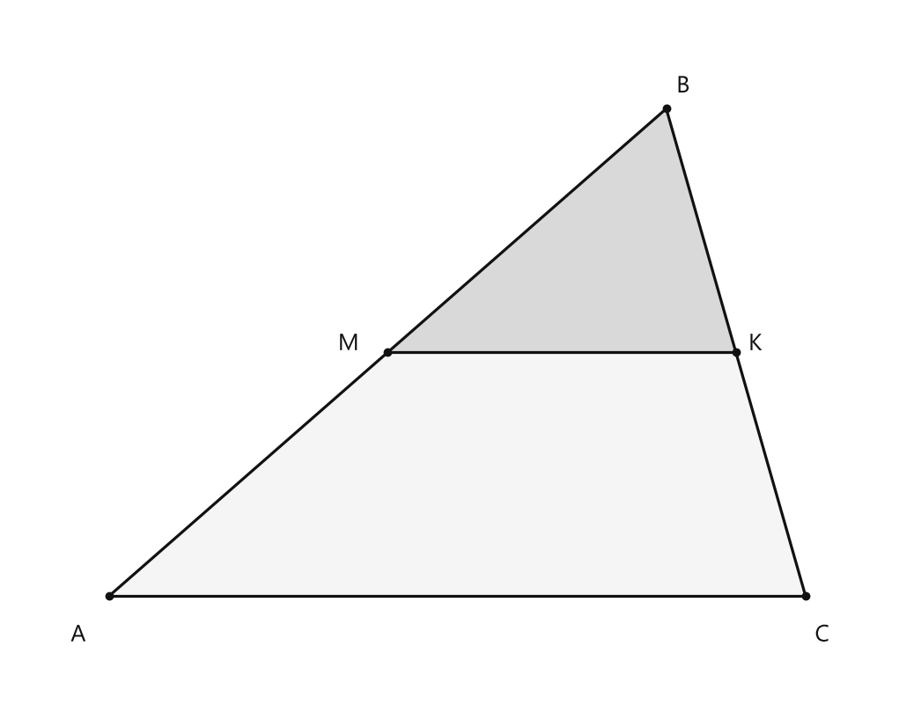
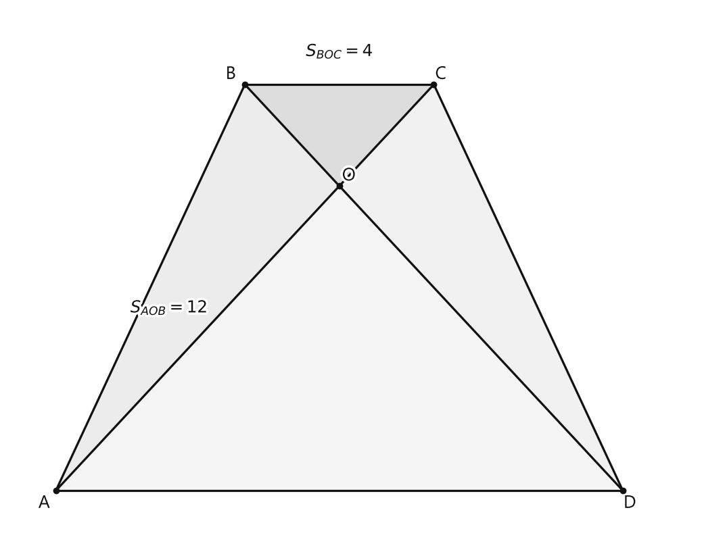

# Занятие 24. Свойство площадей подобных треугольников

**Раздел:** Глава 3. Подобие треугольников  
**Параграф учебника:** §23. Свойство площадей подобных треугольников  
**Страницы:** 151–159

## Цели занятия

После занятия ученик умеет:

- объяснять, почему при увеличении сторон треугольника площадь изменяется не во столько же раз, а в квадрат этого числа;
- применять теорему о площадях подобных треугольников;
- находить площадь одного подобного треугольника по площади другого;
- находить коэффициент подобия по отношению площадей;
- решать задачи со средней линией треугольника и диагоналями трапеции.

Выбери свой блок:

- **1–2 балла:** понять формулу и решить задачи на прямое применение;
- **3–4 балла:** находить неизвестную площадь или коэффициент подобия;
- **5–6 баллов:** применять свойство площадей в составных фигурах;
- **7–8 баллов:** решать задачи с трапецией и диагоналями;
- **9–10 баллов:** объяснять доказательство и выводить общие формулы.

## Теория к занятию

### 1. Почему площадь изменяется как квадрат стороны

#### Простыми словами

Представь квадрат. Если его сторону увеличить в $2$ раза, то одновременно в $2$ раза увеличатся и длина, и ширина. Поэтому площадь увеличится в

$$
2\cdot2=4
$$

раза.

У подобных треугольников происходит то же самое. В одинаковое число раз изменяются не только соответствующие основания, но и соответствующие высоты. А площадь треугольника находится по формуле

$$
S=\frac12 ah.
$$

Значит, коэффициент подобия появляется дважды: один раз от основания и один раз от высоты.

Стороны увеличили в $3$ раза — площадь увеличилась в

$$
3^2=9
$$

раз. Площадь здесь не скромничает: множитель получает сразу два места в формуле.

#### Теорема

> Площади подобных треугольников относятся как квадраты соответствующих сторон.

#### Формулы

Если $\triangle A_1B_1C_1 \sim \triangle ABC$, то

$$
\frac{S_{A_1B_1C_1}}{S_{ABC}}
=
\frac{A_1C_1^2}{AC^2}.
$$

Если $k$ — коэффициент подобия, то

$$
\frac{S_{A_1B_1C_1}}{S_{ABC}}=k^2.
$$

Здесь:

- $S_{A_1B_1C_1}$ и $S_{ABC}$ — площади подобных треугольников;
- $A_1C_1$ и $AC$ — соответствующие стороны;
- $k$ — коэффициент подобия.

#### Правила

- Сначала найди отношение соответствующих сторон.
- Затем возведи это отношение в квадрат.
- После этого получишь отношение площадей.
- Только потом находи неизвестную площадь.
- Если коэффициент подобия равен $k$, то площади относятся как $k^2$.

#### Алгоритм

Чтобы найти площадь одного из подобных треугольников:

1. Выбери соответствующие стороны двух треугольников.
2. Запиши их отношение.
3. Возведи отношение в квадрат.
4. Запиши отношение площадей.
5. Составь пропорцию.
6. Найди неизвестную площадь.

#### Ловушки

- Если стороны увеличили в $2$ раза, площадь увеличилась в $4$ раза, а не в $2$.
- Отношение площадей равно квадрату коэффициента подобия.
- Если сравниваешь сторону меньшего треугольника со стороной большего, коэффициент получится меньше $1$.
- Не путай отношение площадей с отношением периметров: периметры относятся как $k$, а площади — как $k^2$.
- Сначала проверь, что стороны действительно соответствующие. Иначе квадрат будет правильным, а ответ — нет.

---

### 2. Доказательство теоремы о площадях подобных треугольников

#### Простыми словами

У подобных треугольников соответствующие стороны увеличиваются в одно и то же число раз. Высоты тоже увеличиваются в это же число раз.

В формуле площади треугольника есть основание и высота:

$$
S=\frac12 ah.
$$

Поэтому коэффициент подобия появится дважды. Именно поэтому в ответе будет $k^2$, а не просто $k$.

#### Теорема

> Площади подобных треугольников относятся как квадраты соответствующих сторон.

#### Доказательство

Дано: $\triangle A_1B_1C_1 \sim \triangle ABC$.

Пусть $k$ — коэффициент подобия треугольников $A_1B_1C_1$ и $ABC$.

Тогда соответствующие стороны относятся как $k$:

$$
A_1C_1=k\cdot AC,
$$

$$
A_1B_1=k\cdot AB.
$$

Проведём высоты $BH$ и $B_1H_1$ данных треугольников.

Из подобия треугольников следует равенство соответствующих углов:

$$
\angle A_1=\angle A.
$$

Треугольники $A_1B_1H_1$ и $ABH$ — прямоугольные.

У них равны острые углы:

$$
\angle A_1=\angle A.
$$

Значит, прямоугольные треугольники $A_1B_1H_1$ и $ABH$ подобны по острому углу.

Соответствующие стороны этих треугольников относятся одинаково:

$$
\frac{B_1H_1}{BH}
=
\frac{A_1B_1}{AB}
=
k.
$$

Следовательно,

$$
B_1H_1=k\cdot BH.
$$

Теперь запишем площади треугольников через основание и высоту:

$$
S_{A_1B_1C_1}=\frac12 A_1C_1\cdot B_1H_1,
$$

$$
S_{ABC}=\frac12 AC\cdot BH.
$$

Разделим первую формулу на вторую:

$$
\frac{S_{A_1B_1C_1}}{S_{ABC}}
=
\frac{\frac12 A_1C_1\cdot B_1H_1}
{\frac12 AC\cdot BH}.
$$

Подставим

$$
A_1C_1=k\cdot AC,
$$

$$
B_1H_1=k\cdot BH.
$$

Получаем

$$
\frac{S_{A_1B_1C_1}}{S_{ABC}}
=
\frac{\frac12\cdot(k\cdot AC)\cdot(k\cdot BH)}
{\frac12 AC\cdot BH}.
$$

Сократим одинаковые множители:

$$
\frac{S_{A_1B_1C_1}}{S_{ABC}}
=
k^2.
$$

Коэффициент подобия можно записать через соответствующие стороны:

$$
k=\frac{A_1C_1}{AC}.
$$

Поэтому

$$
\frac{S_{A_1B_1C_1}}{S_{ABC}}
=
\left(\frac{A_1C_1}{AC}\right)^2
=
\frac{A_1C_1^2}{AC^2}.
$$

Теорема доказана.

#### Вторая формулировка

> Отношение площадей подобных треугольников равно квадрату коэффициента подобия.

#### Ловушки

- Высоты подобных треугольников относятся как коэффициент подобия.
- В формуле площади множитель $k$ появляется дважды: один раз от основания, второй — от высоты.
- Нельзя утверждать, что площади относятся как соответствующие стороны. Это неверно.
- Если стороны относятся как $2:3$, то площади относятся как $4:9$.

---

### 3. Средняя линия треугольника

#### Простыми словами

Средняя линия соединяет середины двух сторон треугольника. Она параллельна третьей стороне и равна половине этой стороны.

Из-за параллельности верхний маленький треугольник подобен всему большому треугольнику. Его соответствующие стороны в $2$ раза меньше, значит, его площадь в

$$
2^2=4
$$

раз меньше.

Поэтому маленький треугольник занимает четверть площади большого.

#### Факт

Средняя линия треугольника параллельна основанию и равна его половине.

#### Формулы

Если $MK$ — средняя линия треугольника $ABC$, то

$$
MK\parallel AC,
$$

$$
MK=\frac12 AC.
$$

Так как

$$
\triangle MBK\sim\triangle ABC,
$$

то соответствующие стороны $MK$ и $AC$ относятся как

$$
\frac{MK}{AC}=\frac12.
$$

По теореме о площадях подобных треугольников

$$
\frac{S_{MBK}}{S_{ABC}}
=
\left(\frac{MK}{AC}\right)^2
=
\left(\frac12\right)^2
=
\frac14.
$$

#### Правило

Если средняя линия отсекает треугольник, то площадь отсечённого треугольника равна четверти площади исходного.

#### Ловушки

- Средняя линия равна половине стороны, но площади относятся не как $1:2$, а как $1:4$.
- $\frac14$ площади — это площадь маленького отсечённого треугольника.
- Оставшаяся часть имеет площадь

$$
1-\frac14=\frac34
$$

площади исходного треугольника.
- Половина длины ещё не означает половину площади: площадь успевает возвести половину в квадрат.

---

### 4. Диагонали трапеции

#### Простыми словами

Диагонали трапеции пересекаются и делят её на четыре треугольника.

Два треугольника, расположенные у боковых сторон, имеют равные площади. Два треугольника, расположенные у оснований, подобны.

В такой задаче действуем по плану:

- сначала используем равные площади и общую высоту;
- затем находим отношение соответствующих сторон;
- после этого возводим отношение в квадрат;
- в конце складываем площади четырёх треугольников.

Геометрия спрятала нужный коэффициент на диагоналях. Наша задача — спокойно его достать.

#### Факты

В трапеции треугольники, прилежащие к боковым сторонам, равновелики, а прилежащие к основаниям — подобны.

Если диагонали трапеции пересекаются в точке $O$, то

$$
\triangle BOC\sim\triangle DOA.
$$

#### Алгоритм

1. Найди площадь треугольника, равного одному из известных треугольников.
2. Рассмотри известные треугольники с общей высотой.
3. Через отношение их площадей найди отношение соответствующих отрезков диагоналей.
4. Возведи найденное отношение в квадрат.
5. Найди площадь второго подобного треугольника.
6. Сложи площади всех четырёх треугольников.

#### Ловушки

- В пропорции используй только соответствующие стороны подобных треугольников.
- Если отношение сторон равно $1:3$, отношение площадей равно $1:9$.
- Площадь трапеции равна сумме площадей всех четырёх треугольников.
- Не перепутай треугольники, которые равновелики, с треугольниками, которые подобны. Это разные свойства.

---

## Сводка формул «выучить наизусть»

$$
\frac{S_1}{S_2}=k^2.
$$

$$
\frac{S_1}{S_2}
=
\left(\frac{a_1}{a_2}\right)^2.
$$

$$
S_1=k^2S_2.
$$

$$
k=\sqrt{\frac{S_1}{S_2}}.
$$

Для средней линии:

$$
MK=\frac12 AC,
$$

$$
\frac{S_{MBK}}{S_{ABC}}=\frac14.
$$

## Правила, которые нельзя путать

- Стороны и периметры относятся как $k$.
- Площади относятся как $k^2$.
- Если стороны увеличили в $k$ раз, площадь увеличилась в $k^2$ раз.
- Если стороны уменьшили в $k$ раз, площадь уменьшилась в $k^2$ раз.
- Отношение площадей нужно составлять для соответствующих треугольников и соответствующих сторон.
- Если коэффициент подобия меньше $1$, площадь меньшего треугольника находится умножением на $k^2$.

## Разбор ключевых заданий

### Р1. Средняя линия треугольника

**Условие.** В треугольнике $ABC$ отрезок $MK$ — средняя линия, причём $M$ лежит на $AB$, $K$ лежит на $BC$. Доказать, что площадь треугольника $MBK$ составляет $\frac14$ площади треугольника $ABC$.

<!--geo-figure-spec
{
  "needed": true,
  "kind": "plane",
  "caption": "Треугольник $ABC$ со средней линией $MK$",
  "equal": true,
  "axis": false,
  "xlim": [
    -0.7,
    5.7
  ],
  "ylim": [
    -0.7,
    4.2
  ],
  "points": {
    "A": [
      0,
      0
    ],
    "B": [
      4,
      3.5
    ],
    "C": [
      5,
      0
    ],
    "M": [
      2,
      1.75
    ],
    "K": [
      4.5,
      1.75
    ]
  },
  "segments": [
    [
      "A",
      "B"
    ],
    [
      "B",
      "C"
    ],
    [
      "C",
      "A"
    ],
    [
      "M",
      "K"
    ]
  ],
  "polygons": [
    {
      "vertices": [
        "A",
        "B",
        "C"
      ],
      "fill": 0.04
    },
    {
      "vertices": [
        "M",
        "B",
        "K"
      ],
      "fill": 0.12
    }
  ],
  "circles": [],
  "labels": {
    "A": {
      "dx": -0.22,
      "dy": -0.28
    },
    "B": {
      "dx": 0.12,
      "dy": 0.16
    },
    "C": {
      "dx": 0.12,
      "dy": -0.28
    },
    "M": {
      "dx": -0.28,
      "dy": 0.06
    },
    "K": {
      "dx": 0.14,
      "dy": 0.06
    }
  },
  "right_angles": [],
  "angle_marks": [],
  "texts": []
}
-->

*Треугольник ABC со средней линией MK*

**Решение.**

Так как $MK$ — средняя линия треугольника, то она параллельна третьей стороне:

$$
MK\parallel AC.
$$

По свойству средней линии

$$
MK=\frac12 AC.
$$

У треугольников $MBK$ и $ABC$ есть общий угол $B$.

Кроме того, из условия $MK\parallel AC$ получаем равенство соответствующих углов.

Значит, треугольники подобны:

$$
\triangle MBK\sim\triangle ABC.
$$

У подобных треугольников соответствующие стороны $MK$ и $AC$.

По теореме о площадях подобных треугольников

$$
\frac{S_{MBK}}{S_{ABC}}
=
\left(\frac{MK}{AC}\right)^2.
$$

Так как

$$
MK=\frac12 AC,
$$

то

$$
\frac{MK}{AC}=\frac12.
$$

Подставим это отношение в формулу площадей:

$$
\frac{S_{MBK}}{S_{ABC}}
=
\left(\frac12\right)^2.
$$

Вычислим квадрат дроби:

$$
\frac{S_{MBK}}{S_{ABC}}
=
\frac14.
$$

Следовательно,

$$
S_{MBK}=\frac14S_{ABC}.
$$

**Ответ:** площадь треугольника $MBK$ составляет $\frac14$ площади треугольника $ABC$.

---

### Р2. Площадь трапеции по площадям треугольников

**Условие.** Дана трапеция $ABCD$ с основаниями $AD$ и $BC$. Диагонали трапеции пересекаются в точке $O$. Известно, что

$$
S_{BOC}=4\text{ см}^2,
$$

$$
S_{AOB}=12\text{ см}^2.
$$

Найти площадь трапеции $ABCD$.

<!--geo-figure-spec
{
  "needed": true,
  "kind": "plane",
  "caption": "Трапеция $ABCD$ с диагоналями, пересекающимися в точке $O$",
  "equal": false,
  "axis": false,
  "xlim": [
    -1,
    13.5
  ],
  "ylim": [
    -1,
    9.5
  ],
  "points": {
    "A": [
      0,
      0
    ],
    "B": [
      4,
      8
    ],
    "C": [
      8,
      8
    ],
    "D": [
      12,
      0
    ],
    "O": [
      6,
      6
    ]
  },
  "segments": [
    [
      "A",
      "B"
    ],
    [
      "B",
      "C"
    ],
    [
      "C",
      "D"
    ],
    [
      "D",
      "A"
    ],
    [
      "A",
      "C"
    ],
    [
      "B",
      "D"
    ]
  ],
  "polygons": [
    {
      "vertices": [
        "B",
        "O",
        "C"
      ],
      "fill": 0.14
    },
    {
      "vertices": [
        "A",
        "O",
        "B"
      ],
      "fill": 0.08
    },
    {
      "vertices": [
        "D",
        "O",
        "C"
      ],
      "fill": 0.06
    },
    {
      "vertices": [
        "A",
        "O",
        "D"
      ],
      "fill": 0.04
    }
  ],
  "circles": [],
  "labels": {
    "A": {
      "dx": -0.25,
      "dy": -0.25
    },
    "B": {
      "dx": -0.3,
      "dy": 0.2
    },
    "C": {
      "dx": 0.15,
      "dy": 0.2
    },
    "D": {
      "dx": 0.15,
      "dy": -0.25
    },
    "O": {
      "dx": 0.2,
      "dy": 0.2
    }
  },
  "right_angles": [],
  "angle_marks": [],
  "texts": [
    {
      "xy": [
        6,
        8.65
      ],
      "text": "$S_{BOC}=4$"
    },
    {
      "xy": [
        2.4,
        3.6
      ],
      "text": "$S_{AOB}=12$"
    }
  ]
}
-->

*Трапеция ABCD с диагоналями, пересекающимися в точке O*

**Решение.**

Диагонали трапеции делят её на четыре треугольника:

$$
\triangle AOB,\quad \triangle BOC,\quad \triangle COD,\quad \triangle DOA.
$$

Треугольники, прилежащие к боковым сторонам, равновелики:

$$
S_{AOB}=S_{DOC}.
$$

Так как

$$
S_{AOB}=12\text{ см}^2,
$$

то

$$
S_{DOC}=12\text{ см}^2.
$$

Рассмотрим треугольники $BOC$ и $AOB$.

У них общая высота, проведённая из вершины $B$ к прямой $AC$.

Поэтому площади этих треугольников относятся как основания $CO$ и $AO$:

$$
\frac{S_{BOC}}{S_{AOB}}=\frac{CO}{AO}.
$$

Подставим известные площади:

$$
\frac{4}{12}=\frac{CO}{AO}.
$$

Сократим дробь слева:

$$
\frac{CO}{AO}=\frac13.
$$

Треугольники $BOC$ и $DOA$ подобны.

Их соответствующие стороны $CO$ и $AO$ относятся как

$$
\frac{CO}{AO}=\frac13.
$$

По теореме о площадях подобных треугольников

$$
\frac{S_{BOC}}{S_{DOA}}
=
\left(\frac{CO}{AO}\right)^2.
$$

Подставим найденное отношение сторон:

$$
\frac{4}{S_{DOA}}
=
\left(\frac13\right)^2.
$$

Возведём дробь в квадрат:

$$
\frac{4}{S_{DOA}}=\frac19.
$$

Чтобы найти $S_{DOA}$, умножим $4$ на $9$:

$$
S_{DOA}=4\cdot9.
$$

$$
S_{DOA}=36\text{ см}^2.
$$

Теперь сложим площади четырёх треугольников:

$$
S_{ABCD}
=
S_{AOB}+S_{BOC}+S_{DOC}+S_{DOA}.
$$

Подставим найденные значения:

$$
S_{ABCD}=12+4+12+36.
$$

$$
S_{ABCD}=64\text{ см}^2.
$$

Проверим отношение площадей подобных треугольников:

$$
\frac{36}{4}=9=3^2.
$$

Значит, соответствующие стороны относятся как $3:1$, что соответствует теореме о площадях подобных треугольников. Проверка не дала ответу сбежать.

**Ответ:** $64\text{ см}^2$.

---

### Р3. Изменение площади при изменении сторон

**Условие.** Как изменится площадь треугольника, если все его стороны:

1. увеличить в $2$ раза;
2. увеличить в $3$ раза;
3. увеличить в $2{,}5$ раза;
4. уменьшить в $10$ раз?

**Решение.**

Если все стороны треугольника изменили в $k$ раз, то площадь изменится в $k^2$ раз:

$$
S_{\text{новая}}=k^2S_{\text{старая}}.
$$

#### 1) Стороны увеличили в $2$ раза

Коэффициент изменения сторон:

$$
k=2.
$$

Найдём квадрат коэффициента:

$$
k^2=2^2=4.
$$

Значит, площадь увеличится в $4$ раза.

#### 2) Стороны увеличили в $3$ раза

Коэффициент изменения сторон:

$$
k=3.
$$

Найдём квадрат коэффициента:

$$
k^2=3^2=9.
$$

Значит, площадь увеличится в $9$ раз.

#### 3) Стороны увеличили в $2{,}5$ раза

Коэффициент изменения сторон:

$$
k=2{,}5.
$$

Возведём его в квадрат:

$$
k^2=(2{,}5)^2=6{,}25.
$$

Значит, площадь увеличится в $6{,}25$ раза.

#### 4) Стороны уменьшили в $10$ раз

Если стороны уменьшили в $10$ раз, то коэффициент равен

$$
k=\frac1{10}.
$$

Возведём его в квадрат:

$$
k^2=\left(\frac1{10}\right)^2=\frac1{100}.
$$

Новая площадь составит

$$
\frac1{100}
$$

первоначальной площади.

Это означает, что площадь уменьшится в $100$ раз. Длина уменьшилась в $10$ раз, а площадь снова «подключила» второй множитель $10$.

**Ответ:**  
1) увеличится в $4$ раза;  
2) увеличится в $9$ раз;  
3) увеличится в $6{,}25$ раза;  
4) уменьшится в $100$ раз.

### Р4. Нахождение площади меньшего подобного треугольника

**Условие.** Для треугольников $ABC$ и $A_1B_1C_1$ выполняется

$$
\frac{AB}{A_1B_1}
=
\frac{BC}{B_1C_1}
=
\frac{AC}{A_1C_1}
=
1{,}5.
$$

Площадь треугольника $ABC$ равна $90\text{ см}^2$. Найти площадь треугольника $A_1B_1C_1$.

**Решение.**

Смотри на отношение сторон:

$$
\frac{AB}{A_1B_1}=1{,}5.
$$

Значит, сторона треугольника $ABC$ в $1{,}5$ раза больше соответствующей стороны треугольника $A_1B_1C_1$.

Найдём отношение меньшей стороны к большей:

$$
k=\frac{A_1B_1}{AB}=\frac1{1{,}5}.
$$

Представим десятичную дробь в виде обыкновенной:

$$
1{,}5=\frac32.
$$

Тогда

$$
k=\frac{1}{\frac32}=\frac23.
$$

Площади подобных треугольников относятся как квадраты соответствующих сторон:

$$
\frac{S_{A_1B_1C_1}}{S_{ABC}}
=
\left(\frac23\right)^2.
$$

Подставим известную площадь:

$$
\frac{S_{A_1B_1C_1}}{90}
=
\frac49.
$$

Умножим обе части равенства на $90$:

$$
S_{A_1B_1C_1}
=
90\cdot\frac49.
$$

Сократим $90$ и $9$:

$$
S_{A_1B_1C_1}
=
10\cdot4.
$$

$$
S_{A_1B_1C_1}=40\text{ см}^2.
$$

Проверим результат:

$$
40:90=4:9.
$$

Стороны относятся как $2:3$, а

$$
\left(\frac23\right)^2=\frac49.
$$

Значит, площадь найдена правильно. Площадь не обязана уменьшаться «в те же $1{,}5$ раза»: у площади включается квадрат отношения сторон — такая у неё математика.

**Ответ:** $40\text{ см}^2$.

---

### Р5. Отношение площадей и периметров

**Условие.**

1. Периметры двух подобных треугольников относятся как $2:3$. Найти отношение их площадей.
2. Площади двух подобных треугольников относятся как $64:25$. Найти отношение их периметров.

**Решение.**

#### 1) Отношение периметров равно $2:3$

У подобных треугольников отношение периметров равно отношению соответствующих сторон, то есть коэффициенту подобия:

$$
k=\frac23.
$$

Площади относятся как квадраты соответствующих сторон:

$$
\frac{S_1}{S_2}
=
k^2.
$$

Подставим значение $k$:

$$
\frac{S_1}{S_2}
=
\left(\frac23\right)^2.
$$

$$
\frac{S_1}{S_2}=\frac49.
$$

**Ответ для первого пункта:** $4:9$.

#### 2) Отношение площадей равно $64:25$

Пусть

$$
\frac{S_1}{S_2}=\frac{64}{25}.
$$

Площадь содержит квадрат коэффициента подобия:

$$
\frac{S_1}{S_2}=k^2.
$$

Значит,

$$
k^2=\frac{64}{25}.
$$

Так как длины положительны, берём положительное значение коэффициента:

$$
k=\sqrt{\frac{64}{25}}.
$$

$$
k=\frac85.
$$

Отношение периметров равно коэффициенту подобия:

$$
\frac{P_1}{P_2}=\frac85.
$$

**Ответ для второго пункта:** $8:5$.

---

### Р6. Площадь треугольника, отсечённого средней линией

**Условие.** Площадь треугольника $ABC$ равна $72\text{ см}^2$. Средняя линия отсекает от него треугольник, подобный исходному. Найти площадь отсечённого треугольника.

**Решение.**

Средняя линия треугольника соединяет середины двух его сторон.

Поэтому стороны отсечённого треугольника равны половинам соответствующих сторон исходного треугольника:

$$
k=\frac12.
$$

Площади подобных треугольников относятся как квадраты соответствующих сторон:

$$
k^2=\left(\frac12\right)^2=\frac14.
$$

Значит, площадь отсечённого треугольника составляет четверть площади треугольника $ABC$:

$$
S_{\text{отсечённого}}
=
\frac14\cdot72.
$$

$$
S_{\text{отсечённого}}=18\text{ см}^2.
$$

Проверим:

$$
72-18=54\text{ см}^2.
$$

Отсечённая часть и оставшаяся часть вместе дают исходную площадь:

$$
18+54=72\text{ см}^2.
$$

**Ответ:** $18\text{ см}^2$.

---

### Р7. Типовая задача на трапецию

**Условие.** Дана трапеция $ABCD$ с основаниями $AD$ и $BC$. Диагонали пересекаются в точке $O$. Известно, что

$$
S_{BOC}=5\text{ см}^2,
$$

$$
S_{AOB}=15\text{ см}^2.
$$

Найти площадь трапеции $ABCD$.

**Решение.**

Рассмотрим треугольники $BOC$ и $AOB$.

У них общая высота из вершины $B$ к прямой $AC$.

Поэтому площади этих треугольников относятся как основания $CO$ и $AO$:

$$
\frac{CO}{AO}
=
\frac{S_{BOC}}{S_{AOB}}.
$$

Подставим известные площади:

$$
\frac{CO}{AO}=\frac5{15}.
$$

Сократим дробь:

$$
\frac{CO}{AO}=\frac13.
$$

Треугольники $BOC$ и $DOA$ подобны:

- $\angle BOC=\angle DOA$ как вертикальные углы;
- $\angle BCO=\angle DAO$ как накрест лежащие углы при параллельных прямых $BC$ и $AD$.

Коэффициент подобия этих треугольников равен

$$
\frac{CO}{AO}=\frac13.
$$

По свойству площадей подобных треугольников:

$$
\frac{S_{BOC}}{S_{DOA}}
=
\left(\frac13\right)^2.
$$

Подставим $S_{BOC}=5\text{ см}^2$:

$$
\frac5{S_{DOA}}=\frac19.
$$

Умножим обе части равенства на $S_{DOA}$:

$$
5=\frac{S_{DOA}}9.
$$

Умножим обе части на $9$:

$$
S_{DOA}=5\cdot9.
$$

$$
S_{DOA}=45\text{ см}^2.
$$

Теперь найдём площадь треугольника $DOC$.

Треугольники $ABD$ и $ACD$ имеют общее основание $AD$, а их вершины $B$ и $C$ лежат на прямой, параллельной $AD$.

Значит, площади этих треугольников равны.

В обоих треугольниках есть общий треугольник $AOD$:

$$
S_{ABD}=S_{AOB}+S_{AOD},
$$

$$
S_{ACD}=S_{DOC}+S_{AOD}.
$$

Следовательно,

$$
S_{AOB}=S_{DOC}.
$$

По условию

$$
S_{AOB}=15\text{ см}^2,
$$

поэтому

$$
S_{DOC}=15\text{ см}^2.
$$

Трапеция состоит из четырёх треугольников:

$$
S_{ABCD}
=
S_{AOB}+S_{BOC}+S_{DOC}+S_{DOA}.
$$

Подставим найденные значения:

$$
S_{ABCD}=15+5+15+45.
$$

$$
S_{ABCD}=80\text{ см}^2.
$$

**Ответ:** $80\text{ см}^2$.

## Итоговая памятка

Если подобные треугольники имеют соответствующие стороны в отношении

$$
k,
$$

то их площади относятся в отношении

$$
k^2.
$$

Главная мысль занятия:

> длины получают множитель один раз, а площади — дважды.

Поэтому:

$$
2\longrightarrow4,
$$

$$
3\longrightarrow9,
$$

$$
\frac12\longrightarrow\frac14.
$$

В задачах удобно действовать так:

1. Найти отношение соответствующих сторон.
2. Если дано отношение «большая сторона к меньшей», перевернуть дробь, если ищем меньшую площадь.
3. Возвести коэффициент подобия в квадрат.
4. По полученному отношению найти неизвестную площадь.

Знак внимания: коэффициент подобия и отношение площадей — не одно и то же. Перепутать их — значит отправить площадь в математический отпуск.

## Практические задания

Выбери свой уровень и решай только этот блок. В блоке должна закрепиться вся тема параграфа. Ответы не приводятся.

### Уровень 1–2 балла

**С1.** Два подобных треугольника имеют коэффициент подобия $2$. Во сколько раз площадь второго треугольника больше площади первого?

1) $2$ 2) $4$ 3) $6$ 4) $\frac{1}{2}$ 5) $\frac{1}{4}$

**С2.** Стороны треугольника увеличили в $3$ раза. Во сколько раз увеличилась его площадь?

1) $3$ 2) $6$ 3) $9$ 4) $12$ 5) $27$

**С3.** Стороны двух подобных треугольников относятся как $2:5$. В каком отношении находятся их площади?

1) $2:5$ 2) $4:25$ 3) $5:2$ 4) $25:4$ 5) $4:10$

**С4.** Площади двух подобных треугольников относятся как $9:16$. В каком отношении относятся соответствующие стороны этих треугольников?

1) $9:16$ 2) $3:4$ 3) $4:3$ 4) $81:256$ 5) $16:9$

**С5.** Площадь одного из двух подобных треугольников равна $12$ см$^2$, а соответствующие стороны относятся как $1:2$. Найдите площадь второго треугольника.

1) $6$ см$^2$ 2) $24$ см$^2$ 3) $36$ см$^2$ 4) $48$ см$^2$ 5) $144$ см$^2$

**С6.** Периметры двух подобных треугольников относятся как $3:5$. В каком отношении относятся их площади?

1) $3:5$ 2) $6:10$ 3) $9:25$ 4) $25:9$ 5) $15:25$

**С7.** Два подобных треугольника имеют коэффициент подобия $\frac{1}{3}$. Во сколько раз площадь первого треугольника меньше площади второго?

**С8.** Площадь треугольника $ABC$ равна $72$ см$^2$. Треугольник $A_1B_1C_1$ подобен ему, причём $\frac{A_1B_1}{AB}=2$. Найдите площадь треугольника $A_1B_1C_1$.

**С9.** Соответствующие стороны двух подобных треугольников относятся как $4:3$. Площадь большего треугольника равна $80$ см$^2$. Найдите площадь меньшего треугольника.

**С10.** Стороны треугольника уменьшили в $5$ раз. Во сколько раз уменьшилась его площадь?

**С11.** Площади двух подобных треугольников относятся как $25:49$. Найдите отношение их соответствующих сторон.

**С12.** Средняя линия треугольника отсекает треугольник, подобный данному, причём соответствующие стороны относятся как $1:2$. Какую часть площади исходного треугольника составляет площадь отсечённого треугольника?

**С13.** Два треугольника подобны, а отношение соответствующих сторон первого и второго треугольников равно $2$. Во сколько раз площадь первого треугольника больше площади второго?

**С14.** Выберите верное утверждение о площадях подобных треугольников.  
1) Площади относятся как соответствующие стороны.  
2) Площади относятся как квадраты соответствующих сторон.  
3) Площади всегда равны.  
4) Площади относятся как кубы соответствующих сторон.  
5) Площади относятся обратно пропорционально соответствующим сторонам.

**С15.** Стороны треугольника увеличили в $3$ раза. Во сколько раз увеличилась его площадь?

**С16.** Площади двух подобных треугольников относятся как $25:9$. Выберите отношение их соответствующих сторон.  
1) $25:9$  
2) $5:3$  
3) $3:5$  
4) $625:81$  
5) $16:9$

**С17.** Площадь треугольника $ABC$ равна $72$ см$^2$. Треугольник $A_1B_1C_1$ подобен ему, а отношение соответствующих сторон $ABC$ и $A_1B_1C_1$ равно $3:2$. Найдите площадь треугольника $A_1B_1C_1$.

**С18.** Периметры двух подобных треугольников относятся как $4:7$. Выберите отношение их площадей.  
1) $4:7$  
2) $8:14$  
3) $16:49$  
4) $49:16$  
5) $12:21$

**С19.** Все стороны треугольника уменьшили в $2$ раза. Во сколько раз уменьшилась его площадь?

**С20.** Площадь одного из двух подобных треугольников равна $18$ см$^2$, а коэффициент подобия при переходе к другому треугольнику равен $2$. Выберите площадь другого треугольника.  
1) $9$ см$^2$  
2) $20$ см$^2$  
3) $36$ см$^2$  
4) $72$ см$^2$  
5) $144$ см$^2$

**С21.** Два подобных треугольника имеют соответствующие стороны $6$ см и $9$ см. Во сколько раз площадь треугольника с большей соответствующей стороной больше площади другого треугольника?

**С22.** Средняя линия треугольника отсекает от него треугольник, подобный исходному. Выберите, какую часть площади исходного треугольника составляет площадь отсечённого треугольника.  
1) $\frac12$  
2) $\frac13$  
3) $\frac14$  
4) $\frac34$  
5) $\frac18$

**С23.** Площадь треугольника $ABC$ равна $45$ см$^2$. Треугольник $KMN$ подобен треугольнику $ABC$, причём соответствующие стороны треугольника $KMN$ в $3$ раза меньше. Найдите площадь треугольника $KMN$.

**С24.** Стороны двух подобных треугольников относятся как $1:4$. Выберите отношение площадей меньшего и большего треугольников.  
1) $1:4$  
2) $1:8$  
3) $1:12$  
4) $1:16$  
5) $4:1$

**С25.** Два подобных треугольника имеют коэффициент подобия $2$. Во сколько раз площадь второго треугольника больше площади первого?

1) $2$  2) $4$  3) $6$  4) $8$  5) $16$

**С26.** Соответствующие стороны двух подобных треугольников относятся как $3:5$. В каком отношении относятся их площади?

1) $3:5$  2) $5:3$  3) $9:25$  4) $25:9$  5) $6:10$

**С27.** Площадь одного из подобных треугольников равна $18$ см$^2$, а соответствующие стороны второго и первого треугольников относятся как $2:3$. Найдите площадь второго треугольника.

**С28.** Все стороны треугольника увеличили в $4$ раза. Во сколько раз увеличилась его площадь?

1) $4$  2) $8$  3) $12$  4) $16$  5) $20$

**С29.** Площади двух подобных треугольников равны $32$ см$^2$ и $72$ см$^2$. Найдите отношение соответствующих сторон меньшего и большего треугольников.

1) $2:3$  2) $3:2$  3) $4:9$  4) $8:18$  5) $16:36$

**С30.** Периметры двух подобных треугольников относятся как $4:7$. Найдите отношение их площадей.

**С31.** Площадь треугольника равна $48$ см$^2$. Средняя линия треугольника отсекает подобный ему треугольник. Найдите площадь отсечённого треугольника.

1) $6$ см$^2$  2) $12$ см$^2$  3) $16$ см$^2$  4) $24$ см$^2$  5) $36$ см$^2$

**С32.** Соответствующие стороны подобных треугольников относятся как $1:2$. Площадь большего треугольника равна $50$ см$^2$. Найдите площадь меньшего треугольника.

**С33.** Все стороны треугольника уменьшили в $3$ раза. Во сколько раз уменьшилась его площадь?

1) в $3$ раза  2) в $6$ раз  3) в $9$ раз  4) в $12$ раз  5) в $27$ раз

**С34.** Площадь треугольника $ABC$ равна $45$ см$^2$. Треугольник $A_1B_1C_1$ подобен ему, причём $\dfrac{A_1B_1}{AB}=\dfrac{2}{3}$. Найдите площадь треугольника $A_1B_1C_1$.

**С35.** Площади двух подобных треугольников относятся как $25:49$. Найдите отношение их соответствующих сторон.

1) $5:7$  2) $7:5$  3) $25:49$  4) $10:14$  5) $49:25$

**С36.** Площадь одного из двух подобных треугольников равна $20$ см$^2$, а соответствующие стороны второго и первого треугольников относятся как $3:2$. Найдите площадь второго треугольника.

### Уровень 3–4 балла

**С1.** Два подобных треугольника имеют коэффициент подобия $2$. Во сколько раз площадь большего треугольника больше площади меньшего?

**С2.** Все стороны треугольника увеличили в $3$ раза. Во сколько раз увеличилась его площадь?

**С3.** Все стороны треугольника уменьшили в $4$ раза. Во сколько раз уменьшилась его площадь?

**С4.** Для подобных треугольников $ABC$ и $A_1B_1C_1$ известно, что $\dfrac{AB}{A_1B_1}=2$, а площадь $\triangle ABC$ равна $48\text{ см}^2$. Найдите площадь $\triangle A_1B_1C_1$.

**С5.** Площади двух подобных треугольников равны $75\text{ см}^2$ и $12\text{ см}^2$. Найдите отношение соответствующих сторон большего и меньшего треугольников.

**С6.** Периметры двух подобных треугольников относятся как $3:5$. Найдите отношение их площадей.

**С7.** Площади двух подобных треугольников относятся как $49:16$. Найдите отношение их периметров.

**С8.** В треугольнике $ABC$ отрезок $MN$ соединяет середины сторон $AB$ и $AC$. Площадь треугольника $ABC$ равна $64\text{ см}^2$. Найдите площадь треугольника $AMN$.

**С9.** В треугольнике $ABC$ проведён отрезок $MN$, параллельный стороне $BC$, причём $AM:AB=2:3$. Площадь треугольника $ABC$ равна $90\text{ см}^2$. Найдите площадь треугольника $AMN$.

**С10.** В треугольнике $ABC$ отрезок $MN$ параллелен стороне $BC$, точки $M$ и $N$ лежат соответственно на сторонах $AB$ и $AC$. Площадь треугольника $AMN$ равна $24\text{ см}^2$, а $AM:AB=1:2$. Найдите площадь трапеции $MBCN$.

**С11.** В треугольнике $ABC$ отрезок $MN$ параллелен стороне $BC$, точки $M$ и $N$ лежат соответственно на сторонах $AB$ и $AC$. Площадь трапеции $MBCN$ равна $80\text{ см}^2$, а $AM:AB=1:3$. Найдите площадь треугольника $AMN$.

**С12.** В трапеции $ABCD$ основания $AD$ и $BC$ параллельны, причём $AD:BC=2:1$. Диагонали трапеции пересекаются в точке $O$. Площадь треугольника $BOC$ равна $12\text{ см}^2$. Найдите площадь треугольника $AOD$.

**С13.** Два подобных треугольника имеют соответствующие стороны $6$ см и $9$ см. Найдите отношение площадей первого треугольника ко второму.

**С14.** Площади подобных треугольников равны $24$ см$^2$ и $54$ см$^2$. Найдите отношение соответствующих сторон первого треугольника ко второму.

**С15.** Коэффициент подобия двух треугольников равен $3$. Во сколько раз площадь второго треугольника больше площади первого?

**С16.** Все стороны треугольника увеличили в $4$ раза. Во сколько раз увеличилась его площадь?

**С17.** Все стороны треугольника уменьшили в $5$ раз. Во сколько раз уменьшилась его площадь?

**С18.** Площади двух подобных треугольников относятся как $25:49$. Найдите отношение их соответствующих сторон.

**С19.** Периметры двух подобных треугольников относятся как $3:5$. Найдите отношение площадей этих треугольников.

**С20.** Площадь треугольника $ABC$ равна $72$ см$^2$. Треугольник $A_1B_1C_1$ подобен ему, причём $\dfrac{A_1B_1}{AB}=\dfrac{1}{3}$. Найдите площадь треугольника $A_1B_1C_1$.

**С21.** Треугольник $A_1B_1C_1$ подобен треугольнику $ABC$. Площадь треугольника $A_1B_1C_1$ равна $80$ см$^2$, а соответствующие стороны относятся как $A_1B_1:AB=2:5$. Найдите площадь треугольника $ABC$.

**С22.** В треугольнике $ABC$ отрезок $MN$ параллелен стороне $BC$, причём $M\in AB$, $N\in AC$, а $AM:AB=2:3$. Площадь треугольника $ABC$ равна $135$ см$^2$. Найдите площадь треугольника $AMN$.

**С23.** В треугольнике $ABC$ точки $M$ и $N$ лежат соответственно на сторонах $AB$ и $AC$, причём $MN\parallel BC$. Площадь треугольника $AMN$ равна $20$ см$^2$, а $AM:AB=1:2$. Найдите площадь трапеции $BMNC$.

**С24.** Два подобных треугольника имеют площади $36$ см$^2$ и $100$ см$^2$. Сторона большего треугольника, соответствующая стороне меньшего треугольника длиной $9$ см, равна $x$ см. Найдите $x$.

**С25.** Два подобных треугольника имеют коэффициент подобия $2$. Во сколько раз площадь второго треугольника больше площади первого?

**С26.** Стороны одного из двух подобных треугольников в $3$ раза больше соответствующих сторон другого. Площадь меньшего треугольника равна $18\ \text{см}^2$. Найдите площадь большего треугольника.

**С27.** Площади двух подобных треугольников равны $45\ \text{см}^2$ и $20\ \text{см}^2$. Найдите отношение соответствующих сторон большего и меньшего треугольников.

**С28.** Все стороны треугольника увеличили в $4$ раза. Во сколько раз изменилась его площадь?

**С29.** Периметры двух подобных треугольников относятся как $5:2$. Найдите отношение их площадей.

**С30.** Площади двух подобных треугольников относятся как $9:16$. Найдите отношение соответствующих сторон этих треугольников.

**С31.** Средняя линия треугольника отсекает от него треугольник, подобный данному. Найдите площадь отсечённого треугольника, если площадь исходного треугольника равна $64\ \text{см}^2$.

**С32.** В треугольнике $ABC$ точка $M$ лежит на стороне $AB$, причём $AM:AB=2:5$. Через точку $M$ проведён отрезок $MN$, параллельный стороне $BC$, где $N$ лежит на стороне $AC$. Найдите площадь треугольника $AMN$, если $S_{ABC}=75\ \text{см}^2$.

**С33.** В треугольнике $ABC$ точка $M$ лежит на стороне $AB$, причём $AM:MB=1:2$. Через точку $M$ проведён отрезок $MN$, параллельный стороне $BC$, где $N$ лежит на стороне $AC$. Найдите площадь трапеции $MBCN$, если $S_{ABC}=54\ \text{см}^2$.

**С34.** В треугольнике $ABC$ точка $M$ лежит на стороне $AB$, причём $AM:MB=2:3$. Через точку $M$ проведён отрезок $MN$, параллельный стороне $BC$, где $N$ лежит на стороне $AC$. Площадь треугольника $AMN$ равна $32\ \text{см}^2$. Найдите площадь треугольника $ABC$.

**С35.** В треугольнике $ABC$ точки $M$ и $N$ лежат соответственно на сторонах $AB$ и $AC$, причём $MN\parallel BC$ и $AM:AB=3:4$. Найдите площадь трапеции $MBCN$, если площадь треугольника $ABC$ равна $128\ \text{см}^2$.

**С36.** Площадь одного из двух подобных треугольников равна $12\ \text{см}^2$, а соответствующая сторона другого треугольника в $2{,}5$ раза больше. Найдите площадь другого треугольника.

### Уровень 5–6 баллов

**С1.** Стороны треугольника увеличили в $2$ раза. Во сколько раз увеличилась его площадь?

**С2.** Все стороны треугольника уменьшили в $3$ раза. Во сколько раз уменьшилась его площадь?

**С3.** Два подобных треугольника имеют соответствующие стороны, относящиеся как $3:5$. Площадь меньшего треугольника равна $27\text{ см}^2$. Найдите площадь большего треугольника.

**С4.** Площади двух подобных треугольников равны $75\text{ см}^2$ и $12\text{ см}^2$. Найдите отношение соответствующих сторон этих треугольников.

**С5.** Периметры двух подобных треугольников относятся как $4:7$. Площадь меньшего треугольника равна $48\text{ см}^2$. Найдите площадь большего треугольника.

**С6.** Треугольник $A_1B_1C_1$ подобен треугольнику $ABC$, причём $\dfrac{A_1B_1}{AB}=\dfrac{2}{3}$. Площадь треугольника $ABC$ равна $81\text{ см}^2$. Найдите площадь треугольника $A_1B_1C_1$.

**С7.** В треугольнике $ABC$ точки $M$ и $N$ — середины сторон $AB$ и $AC$ соответственно. Площадь треугольника $ABC$ равна $64\text{ см}^2$. Найдите площадь треугольника $AMN$.

**С8.** В треугольнике $ABC$ отрезок $MN$ параллелен стороне $BC$, точки $M$ и $N$ лежат на сторонах $AB$ и $AC$, причём $AM:AB=2:5$. Площадь треугольника $ABC$ равна $125\text{ см}^2$. Найдите площадь треугольника $AMN$.

**С9.** В треугольнике $ABC$ отрезок $MN$ параллелен стороне $BC$, точки $M$ и $N$ лежат на сторонах $AB$ и $AC$. Площадь треугольника $AMN$ равна $36\text{ см}^2$, а площадь трапеции $MBCN$ равна $64\text{ см}^2$. Найдите отношение $AM:AB$.

**С10.** В трапеции $ABCD$ основания $AD$ и $BC$ параллельны, диагонали пересекаются в точке $O$. Известно, что $AD=12\text{ см}$, $BC=8\text{ см}$ и площадь треугольника $AOD$ равна $27\text{ см}^2$. Найдите площадь треугольника $BOC$.

**С11.** В прямоугольном треугольнике $ABC$ высота $BH$ проведена к гипотенузе $AC$. Треугольники $ABH$ и $CBH$ подобны. Их площади равны соответственно $6\text{ см}^2$ и $24\text{ см}^2$. Найдите отношение $AB:BC$.

**С12.** В треугольнике $ABC$ отрезок $MN$ параллелен стороне $BC$, точки $M$ и $N$ лежат на сторонах $AB$ и $AC$. Площадь треугольника $AMN$ равна $49\text{ см}^2$, а площадь треугольника $ABC$ равна $196\text{ см}^2$. Найдите отношение $MN:BC$.

**С13.** Два подобных треугольника имеют коэффициент подобия $2$. Площадь меньшего треугольника равна $18\text{ см}^2$. Найдите площадь большего треугольника.

**С14.** Стороны одного треугольника в $3$ раза больше соответствующих сторон другого подобного ему треугольника. Во сколько раз площадь первого треугольника больше площади второго?

**С15.** Площади двух подобных треугольников равны $45\text{ см}^2$ и $80\text{ см}^2$. Найдите отношение соответствующих сторон этих треугольников.

**С16.** Периметры двух подобных треугольников относятся как $4:7$. Найдите отношение их площадей.

**С17.** Для треугольников $ABC$ и $A_1B_1C_1$ выполняется
$\frac{AB}{A_1B_1}=\frac{BC}{B_1C_1}=\frac{AC}{A_1C_1}=\frac{5}{2}$.
Площадь треугольника $ABC$ равна $150\text{ см}^2$. Найдите площадь треугольника $A_1B_1C_1$.

**С18.** В треугольнике $ABC$ точки $M$ и $N$ лежат соответственно на сторонах $AB$ и $AC$, причём $MN\parallel BC$. Известно, что $AM:AB=2:5$, а площадь треугольника $ABC$ равна $125\text{ см}^2$. Найдите площадь треугольника $AMN$.

**С19.** В треугольнике $ABC$ проведена средняя линия $MN$, где $M\in AB$, $N\in AC$, а $MN\parallel BC$. Площадь треугольника $AMN$ равна $14\text{ см}^2$. Найдите площадь трапеции $MBCN$.

**С20.** В треугольнике $ABC$ точки $M$ и $N$ лежат на сторонах $AB$ и $AC$, причём $MN\parallel BC$. Известно, что $AM:MB=1:2$, а площадь трапеции $MBCN$ равна $72\text{ см}^2$. Найдите площадь треугольника $AMN$.

**С21.** В треугольнике $ABC$ проведён отрезок $MN\parallel BC$, где $M\in AB$, $N\in AC$. Площади подобных треугольников $AMN$ и $ABC$ относятся как $9:25$. Сторона $BC$ равна $20\text{ см}$. Найдите длину отрезка $MN$.

**С22.** В трапеции $ABCD$ основания $AD$ и $BC$ параллельны, причём $AD=12\text{ см}$ и $BC=4\text{ см}$. Боковые стороны $AB$ и $CD$ при продолжении пересекаются в точке $K$. Найдите площадь треугольника $KBC$, если площадь трапеции $ABCD$ равна $48\text{ см}^2$.

**С23.** В параллелограмме $ABCD$ точка $M$ лежит на стороне $AB$, причём $AM:MB=2:3$. Отрезок $DM$ пересекает диагональ $AC$ в точке $K$. Площадь треугольника $MCK$ равна $12\text{ см}^2$. Найдите площадь треугольника $DKA$.

**С24.** В прямоугольном треугольнике $ABC$ с прямым углом $B$ проведена высота $BH$ к гипотенузе $AC$. Площади треугольников $ABH$ и $CBH$ относятся как $1:4$, а площадь треугольника $ABC$ равна $50\text{ см}^2$. Найдите площадь треугольника $ABH$.

**С25.** Два подобных треугольника имеют соответствующие стороны, отношение которых равно $3:2$. Площадь меньшего треугольника равна $24\text{ см}^2$. Найдите площадь большего треугольника.

**С26.** Периметры двух подобных треугольников относятся как $4:7$. Найдите отношение площадей этих треугольников.

**С27.** В треугольнике $ABC$ отрезок $MN$ параллелен стороне $BC$, причём $M\in AB$, $N\in AC$, а $AM:AB=2:5$. Площадь треугольника $ABC$ равна $150\text{ см}^2$. Найдите площадь трапеции $MBCN$.

**С28.** В трапеции $ABCD$ основания $AD$ и $BC$ параллельны, диагонали $AC$ и $BD$ пересекаются в точке $O$. Площади треугольников $AOB$ и $BOC$ равны соответственно $12\text{ см}^2$ и $4\text{ см}^2$. Найдите площадь трапеции $ABCD$.

**С29.** В треугольнике $ABC$ проведён отрезок $MN\parallel BC$, где $M\in AB$, $N\in AC$. Площадь треугольника $AMN$ равна $48\text{ см}^2$, а $AM:AB=2:3$. Найдите площадь трапеции $MBCN$.

**С30.** Треугольники $ABC$ и $A_1B_1C_1$ подобны. Площадь треугольника $ABC$ равна $72\text{ см}^2$, а площадь треугольника $A_1B_1C_1$ равна $32\text{ см}^2$. Найдите отношение соответствующих сторон $ABC$ и $A_1B_1C_1$.

### Уровень 7–8 баллов

**С1.** Два подобных треугольника имеют коэффициент подобия $k=2{,}5$. Площадь меньшего треугольника равна $18\text{ см}^2$. Найдите площадь большего треугольника и обоснуйте применение свойства площадей подобных треугольников.

**С2.** Площади двух подобных треугольников равны $45\text{ см}^2$ и $80\text{ см}^2$. Найдите отношение соответствующих сторон этих треугольников. Ответ запишите в виде несократимой дроби и обоснуйте выбор корня.

**С3.** Периметры двух подобных треугольников относятся как $5:8$. Найдите отношение площадей этих треугольников. Объясните, почему отношение площадей нельзя считать равным $5:8$.

**С4.** В треугольниках $ABC$ и $A_1B_1C_1$ выполняется
$\dfrac{AB}{A_1B_1}=\dfrac{BC}{B_1C_1}=\dfrac{CA}{C_1A_1}=\dfrac{4}{7}$.
Площадь треугольника $ABC$ равна $48\text{ см}^2$. Найдите площадь треугольника $A_1B_1C_1$ и проверьте результат по отношению площадей.

**С5.** В треугольнике $ABC$ точки $M$ и $N$ — середины сторон $AB$ и $AC соответственно. Площадь треугольника $AMN$ равна $14\text{ см}^2$. Найдите площадь четырёхугольника $MBCN$. Обоснуйте решение с помощью свойства площадей подобных треугольников.

**С6.** В треугольнике $ABC$ отрезок $MN$ параллелен стороне $BC$, причём $M\in AB$, $N\in AC$ и $AM:AB=2:5$. Площадь треугольника $AMN$ равна $24\text{ см}^2$. Найдите площадь трапеции $MBCN$ и площадь треугольника $ABC$.

**С7.** В треугольнике $ABC$ точки $M\in AB$ и $N\in AC$, причём $MN\parallel BC$. Площади треугольников $AMN$ и $ABC$ относятся как $9:25$. Найдите отношение $MN:BC$, а также отношение площадей четырёхугольника $MBCN$ и треугольника $AMN$.

**С8.** В прямоугольном треугольнике $ABC$ угол $B$ прямой, а высота $BH$ проведена к гипотенузе $AC$. Площади треугольников $ABH$ и $CBH$ равны соответственно $4\text{ см}^2$ и $16\text{ см}^2$. Найдите длину гипотенузы $AC$, если обосновать подобие треугольников, образованных высотой $BH$.

**С9.** В трапеции $ABCD$ основания $AD$ и $BC$ параллельны, $AD=8\text{ см}$, $BC=4\text{ см}$, высота трапеции равна $3\text{ см}$. Боковые стороны $AB$ и $CD$ продолжены до пересечения в точке $K$. Найдите площадь треугольника $KBC$. Обоснуйте решение через подобие треугольников.

**С10.** Основания трапеции имеют длины $a$ и $b$, где $a<b$. Отрезок, параллельный основаниям, соединяет боковые стороны и делит трапецию на две равновеликие части. Выведите формулу для длины этого отрезка через $a$ и $b$. В решении укажите, какие подобные треугольники используются.

**С11.** В треугольнике $ABC$ точка $M$ — середина стороны $AB$. Через точку $M$ проведён отрезок $MN\parallel BC$, где $N\in AC$. Докажите, что площадь треугольника $AMN$ составляет $\dfrac14$ площади треугольника $ABC$, а площадь четырёхугольника $MBCN$ составляет $\dfrac34$ площади треугольника $ABC$.

**С12.** В треугольнике $ABC$ точки $M$, $N$ и $K$ расположены соответственно на сторонах $AB$, $BC$ и $CA$, причём $AM:MB=1:2$, $BN:NC=1:2$, $CK:KA=1:2$. Найдите отношение площади треугольника $MNK$ к площади треугольника $ABC$. Обоснуйте решение, используя несколько пар подобных треугольников или разбиение исходного треугольника на части.

**С13.** Треугольники $ABC$ и $A_1B_1C_1$ подобны. Соответствующие стороны относятся как $AB:A_1B_1=5:3$, а площадь треугольника $ABC$ равна $200$ см$^2$. Найдите площадь треугольника $A_1B_1C_1$.

**С14.** Периметры двух подобных треугольников относятся как $4:7$. Площадь меньшего треугольника равна $48$ см$^2$. Найдите площадь большего треугольника.

**С15.** В треугольнике $ABC$ отрезок $MN$ соединяет середины сторон $AB$ и $AC$. Площадь треугольника $AMN$ равна $18$ см$^2$. Найдите площадь трапеции $MBCN$ и обоснуйте используемое отношение площадей.

**С16.** В трапеции $ABCD$ основания $AD$ и $BC$ параллельны, диагонали $AC$ и $BD$ пересекаются в точке $O$. Известно, что $S_{AOB}=12$ см$^2$, $S_{BOC}=4$ см$^2$. Найдите площадь трапеции $ABCD$, если $AD>BC$.

**С17.** В треугольнике $ABC$ проведён отрезок $MN\parallel BC$, где $M\in AB$, $N\in AC$, причём $AM:AB=2:5$. Площадь трапеции $MBCN$ равна $84$ см$^2$. Найдите площадь треугольника $AMN$.

**С18.** В треугольнике $ABC$ на стороне $AB$ выбрана точка $M$ так, что $AM:MB=2:3$. Через точку $M$ проведён отрезок $MN\parallel BC$, где $N\in AC$. Площадь треугольника $ABC$ равна $125$ см$^2$. Найдите площадь четырёхугольника $MBCN$ и объясните, почему треугольники $AMN$ и $ABC$ подобны.

**С19.** Два подобных треугольника имеют площади $72$ см$^2$ и $162$ см$^2$. Сторона первого треугольника, соответствующая стороне второго длиной $15$ см, найдите её длину. Запишите обоснование через коэффициент подобия.

**С20.** В прямоугольном треугольнике $ABC$ угол $C$ прямой, а высота $CH$ проведена к гипотенузе $AB$. Площади треугольников $ACH$ и $BCH$ равны соответственно $4$ см$^2$ и $16$ см$^2$. Найдите длину гипотенузы $AB$, если $CH=4$ см.

**С21.** Дана трапеция $ABCD$ с основаниями $BC=4$ см и $AD=8$ см и высотой $3$ см, причём $BC\parallel AD$. Боковые стороны $AB$ и $CD$ продлены до пересечения в точке $K$. Найдите площадь треугольника $BKC$.

**С22.** Основания трапеции равны $a$ и $b$, где $a>b$. Внутри трапеции проведён отрезок, параллельный основаниям, который делит её площадь на две равные части. Выразите длину этого отрезка через $a$ и $b$ и обоснуйте полученную формулу, используя подобие треугольников.

**С23.** В треугольнике $ABC$ проведён отрезок $MN\parallel BC$, где $M\in AB$, $N\in AC$. Площадь треугольника $AMN$ составляет $36\%$ площади треугольника $ABC$, а $BC=15$ см. Найдите длину $MN$ и укажите, какое свойство площадей подобных треугольников использовано.

**С24.** В треугольнике $ABC$ точки $M$, $N$ и $K$ лежат соответственно на сторонах $AB$, $BC$ и $CA$, причём $AM:MB=BN:NC=CK:KA=1:2$. Докажите, что треугольники $AMK$, $BMN$ и $CNK$ имеют равные площади, и найдите, какую часть площади треугольника $ABC$ составляет площадь треугольника $MNK$.

### Уровень 9–10 баллов

**С1.** Два подобных треугольника имеют площади $162\text{ см}^2$ и $72\text{ см}^2$. Найдите отношение соответствующих сторон большего и меньшего треугольников.

**С2.** Периметры двух подобных треугольников относятся как $5:8$. Площадь меньшего треугольника равна $75\text{ см}^2$. Найдите площадь большего треугольника.

**С3.** Стороны треугольника увеличили в $1{,}5$ раза, а затем полученный треугольник уменьшили в $2$ раза. Во сколько раз изменилась площадь исходного треугольника? Укажите, увеличилась она или уменьшилась.

**С4.** Треугольники $ABC$ и $A_1B_1C_1$ подобны, причём соответствуют вершины $A$ и $A_1$, $B$ и $B_1$, $C$ и $C_1$. Известно, что $AB=14\text{ см}$, $A_1B_1=21\text{ см}$ и $S_{A_1B_1C_1}=189\text{ см}^2$. Найдите $S_{ABC}$.

**С5.** В треугольнике $ABC$ точки $M$ и $N$ — середины сторон $AB$ и $AC$ соответственно. Площадь треугольника $AMN$ равна $18\text{ см}^2$. Найдите площадь четырёхугольника $MBCN$.

**С6.** В трапеции $ABCD$ основания $AD$ и $BC$ параллельны, причём $AD=15\text{ см}$, $BC=9\text{ см}$. Диагонали $AC$ и $BD$ пересекаются в точке $O$. Площадь треугольника $BOC$ равна $27\text{ см}^2$. Найдите площадь трапеции $ABCD$.

**С7.** В треугольнике $ABC$ проведён отрезок $MN$, где $M\in AB$, $N\in AC$, и $MN\parallel BC$. Известно, что $AM:MB=2:1$, а площадь треугольника $AMN$ равна $32\text{ см}^2$. Найдите площадь трапеции $MBCN$.

**С8.** В треугольнике $ABC$ точка $M$ лежит на стороне $AB$, причём $AM:MB=1:2$. Через точку $M$ проведена прямая, параллельная $BC$, пересекающая сторону $AC$ в точке $N$. Через точку $N$ проведена прямая, параллельная $AB$, пересекающая сторону $BC$ в точке $K$. Площадь треугольника $ABC$ равна $270\text{ см}^2$. Найдите площадь параллелограмма $AMKN$.

**С9.** В треугольнике $ABC$ на сторонах $AB$, $BC$ и $CA$ выбраны точки $M$, $N$ и $K$ соответственно так, что $AM:MB=1:2$, $BN:NC=1:2$, $CK:KA=1:2$. Площадь треугольника $ABC$ равна $189\text{ см}^2$. Найдите площадь треугольника $MNK$.

**С10.** В прямоугольном треугольнике $ABC$ угол $C$ прямой, а высота $CH$ проведена к гипотенузе $AB$. Площади треугольников $ACH$ и $BCH$ равны соответственно $12\text{ см}^2$ и $27\text{ см}^2$. Найдите длину гипотенузы $AB$.

**С11.** В трапеции $ABCD$ основания $AD=12\text{ см}$ и $BC=8\text{ см}$, высота равна $6\text{ см}$. Боковые стороны $AB$ и $CD$, продолженные за основание $BC$, пересекаются в точке $K$. Найдите площадь треугольника $KBC$.

**С12.** В треугольнике $ABC$ проведён отрезок $MN\parallel BC$, где $M\in AB$, $N\in AC$. Отрезок $MN$ делит треугольник на треугольник $AMN$ и трапецию $MBCN$ равной площади. Выразите отношение $AM:AB$ и длину $MN$, если $BC=18\text{ см}$.

**С13.** Два подобных треугольника имеют периметры $42$ см и $70$ см. Площадь большего треугольника на $196$ см$^2$ больше площади меньшего. Найдите площади обоих треугольников.

**С14.** В треугольнике $ABC$ проведён отрезок $MN$, где точки $M\in AB$, $N\in AC$, а $MN\parallel BC$. Известно, что $AM:MB=2:3$, а площадь трапеции $MBCN$ равна $105$ см$^2$. Найдите площадь треугольника $AMN$ и площадь треугольника $ABC$.

**С15.** В трапеции $ABCD$ основания $AD$ и $BC$ параллельны, причём $AD=12$ см, $BC=7$ см. Боковые стороны $AB$ и $CD$, продолженные за основание $BC$, пересекаются в точке $K$. Найдите площадь треугольника $KBC$, если площадь трапеции $ABCD$ равна $190$ см$^2$.

**С16.** В треугольнике $ABC$ точки $M\in AB$ и $N\in AC$ таковы, что $MN\parallel BC$. Прямая $MN$ делит треугольник на треугольник $AMN$ и трапецию $MNCB$, площади которых относятся как $4:5$. Найдите отношение $AM:AB$ и отношение $MN:BC$.

**С17.** В прямоугольном треугольнике $ABC$ угол $C$ прямой, а высота $CH$ проведена к гипотенузе $AB$. Площади треугольников $ACH$ и $BCH$ равны соответственно $4$ см$^2$ и $16$ см$^2$. Найдите длину гипотенузы $AB$.

**С18.** В трапеции с основаниями $a$ и $b$, где $a<b$, проведён отрезок, параллельный основаниям и имеющий концы на боковых сторонах. Этот отрезок делит трапецию на две равновеликие части. Выведите формулу для его длины через $a$ и $b$, а затем найдите длину отрезка, если основания трапеции равны $3$ см и $9$ см.

## Чек-лист «ученик понял тему»

- Могу повторить определения и формулы параграфа своими словами и по учебнику.
- Решаю типовые задания своего уровня без подсказки.
- Вижу типичную ошибку и могу её объяснить.
