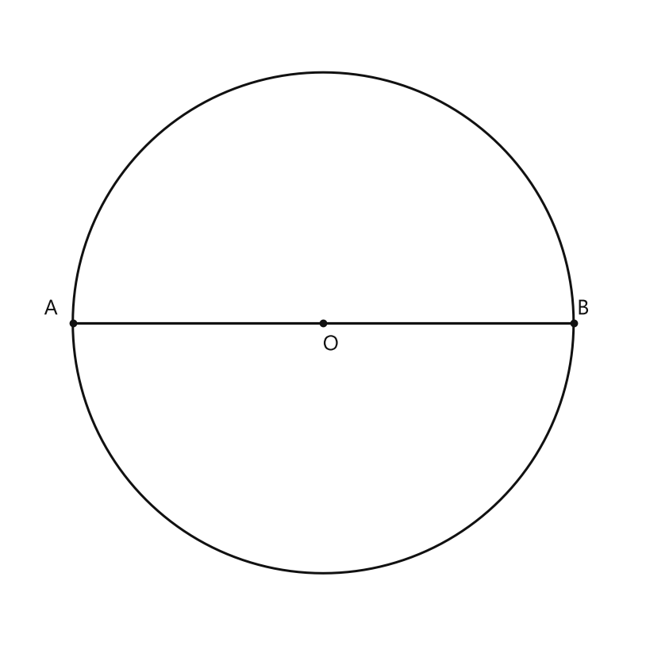
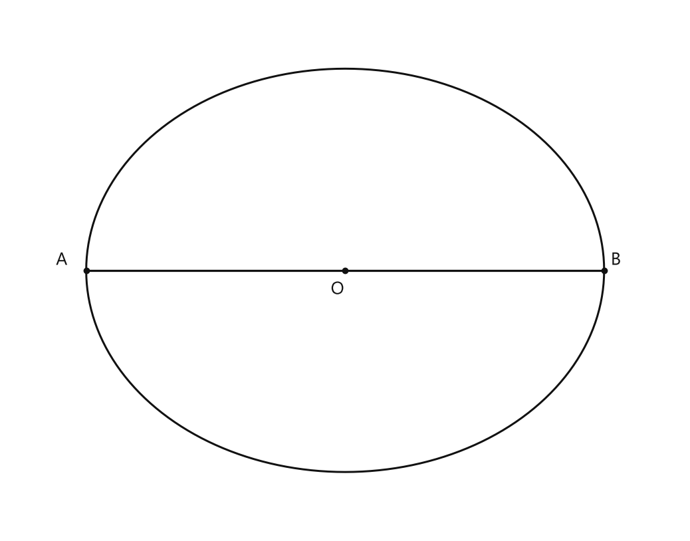
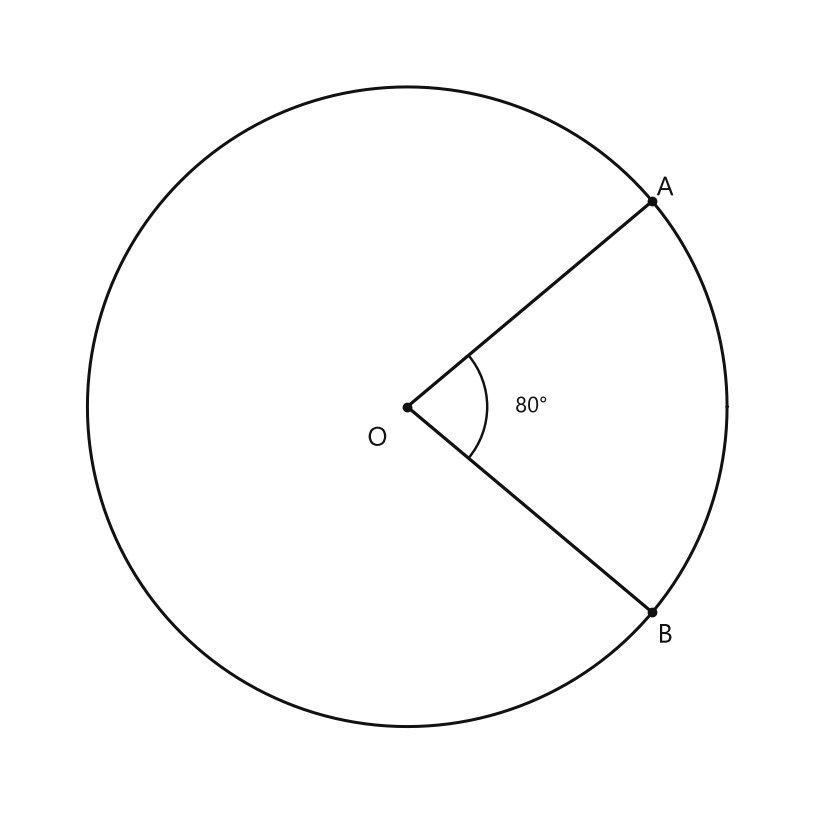
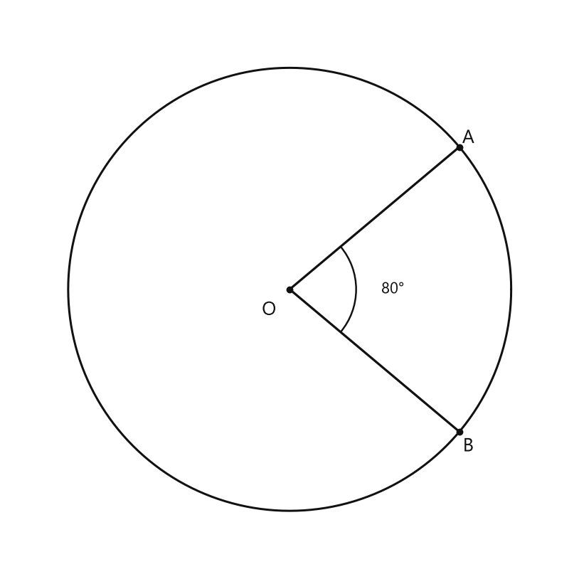
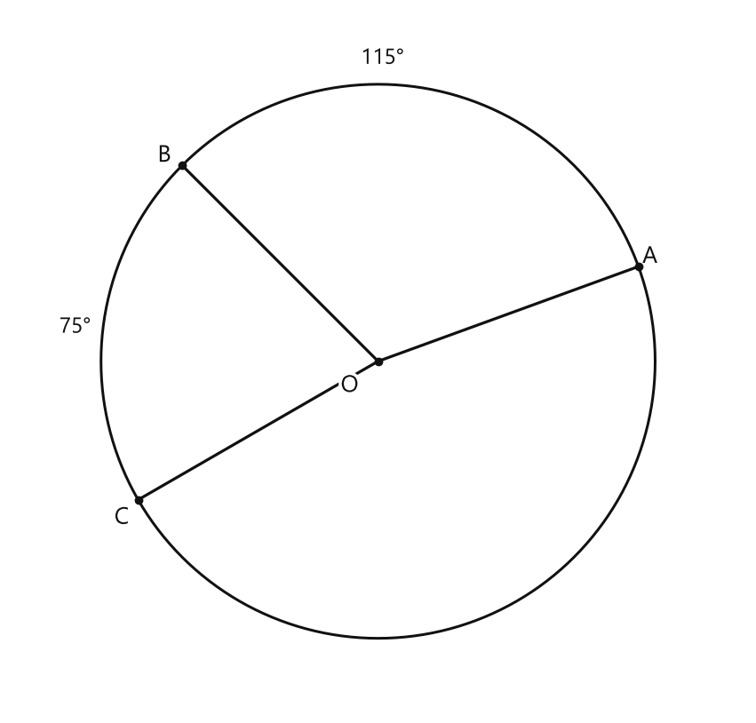
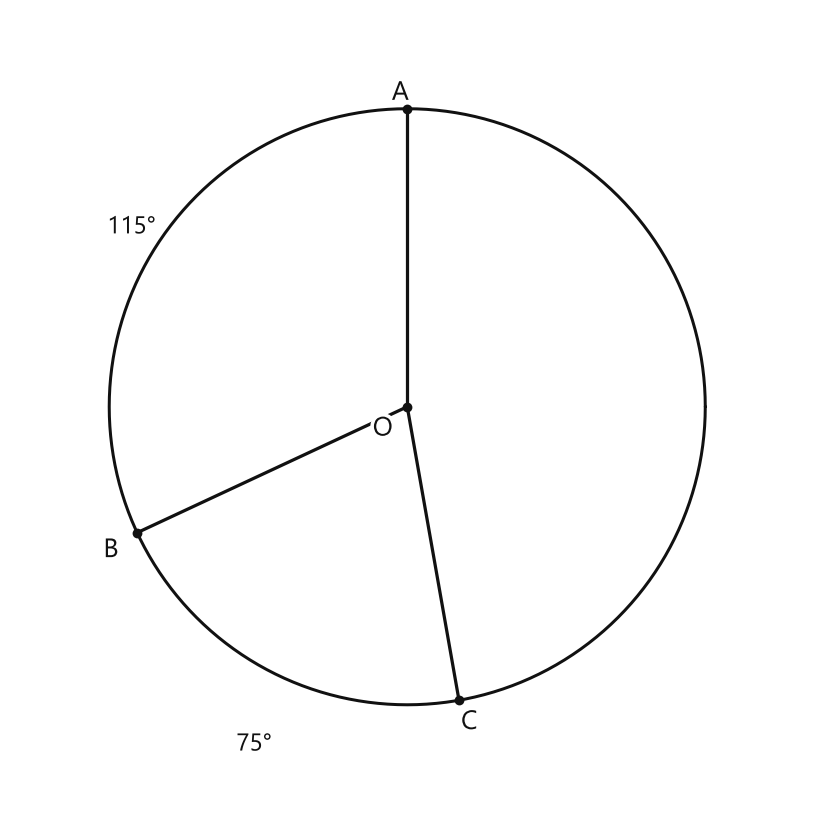
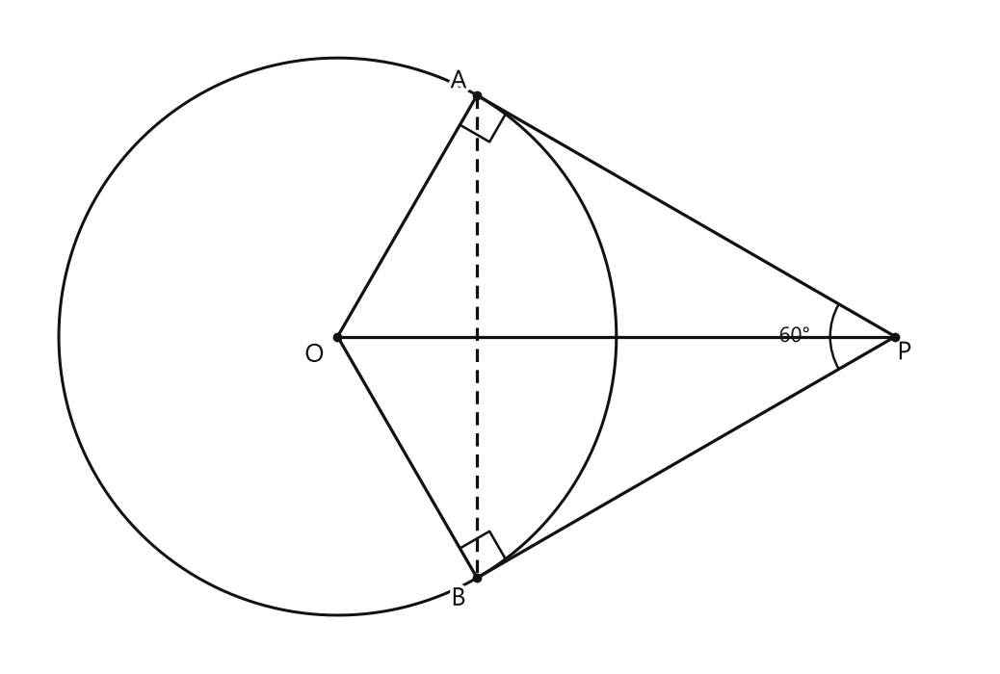

# Занятие 26. Окружность

**Раздел:** Глава IV. Окружность  
**Параграф учебника:** §26. Окружность  
**Страницы:** 165–165

## Цели занятия

По предоставленной странице цели и учебный материал параграфа не представлены. Для составления занятия нужны определения, свойства, формулы и задания из §26.

## Теория к занятию

### Теоретический аппарат параграфа

**Простыми словами:**  
На странице 165 нет объяснения новой темы. На ней указан только заголовок главы «Окружность». Поэтому по этой странице нельзя узнать, какие определения, свойства или формулы нужно изучить на занятии.

**Определение / факт / теорема / свойство:**  
В карточке указано: определения, факты, теоремы и свойства на данной странице отсутствуют.

**Формулы:**  
В карточке указано: формулы на данной странице отсутствуют.

**Правила:**  
В карточке указано: правила и алгоритмы на данной странице отсутствуют.

**Алгоритм:**  
Алгоритмы на данной странице отсутствуют.

**Ловушки:**

- Нельзя восстановить формулировки учебника только по заголовку «Окружность».
- Нельзя добавлять определения и свойства из других параграфов: они могут относиться к другой части темы.
- Рисунок на странице упомянут, но его точные данные и подписи в материалах не приведены.
- Задания для пошагового разбора отсутствуют. Математический детектив пока без улик.

### Сводка формул «выучить наизусть»

Формулы на предоставленной странице отсутствуют.

### Правила, которые нельзя путать

Правила на предоставленной странице отсутствуют.

## Разбор ключевых заданий

Ключевые разобранные задания и упражнения параграфа в предоставленных материалах отсутствуют.

Поэтому пошаговый разбор составить нельзя: в условии нет данных, которые нужно использовать, и нет чисел, которые нужно найти. Выдумывать задачу вместо учебника не будем — окружность такого поворота сюжета не просила.

Для подготовки полного занятия нужны текст §26 и задания параграфа либо фотографии соответствующих страниц учебника.

## Практические задания

Выбери свой уровень и решай только этот блок. В блоке должна закрепиться вся тема параграфа. Ответы не приводятся.

### Уровень 1–2 балла

**С1.** Как называется точка $O$, равноудалённая от всех точек окружности?

1) центр окружности 2) радиус 3) диаметр 4) хорда 5) дуга

**С2.** Как называется отрезок $OA$, соединяющий центр окружности $O$ с точкой $A$ окружности?

1) хорда 2) диаметр 3) радиус 4) секущая 5) касательная

**С3.** Радиус окружности равен $6$ см. Чему равен её диаметр?

1) $3$ см 2) $6$ см 3) $9$ см 4) $12$ см 5) $18$ см

**С4.** Диаметр окружности равен $14$ см. Чему равен её радиус?

1) $5$ см 2) $6$ см 3) $7$ см 4) $14$ см 5) $28$ см

**С5.** Как называется отрезок, соединяющий две точки окружности?

1) радиус 2) диаметр 3) хорда 4) центр 5) луч

**С6.** Какой из отрезков является диаметром окружности с центром $O$?

1) $AB$, если $A$ и $B$ — точки окружности, а $O$ не лежит на $AB$ 2) $OA$, где $A$ — точка окружности 3) $CD$, если $C$, $O$, $D$ лежат на одной прямой, а $C$ и $D$ — точки окружности 4) $OE$, где $E$ — внутренняя точка круга 5) $FG$, если только $F$ — точка окружности

**С7.** Точка $A$ лежит на окружности с центром $O$. Какое равенство верно, если радиус окружности равен $4$ см?

1) $OA=2$ см 2) $OA=4$ см 3) $OA=8$ см 4) $AO=0$ см 5) $OA=16$ см

**С8.** У окружности диаметр равен $20$ см. Выберите верное утверждение.

1) Радиус равен $5$ см 2) Радиус равен $10$ см 3) Радиус равен $20$ см 4) Диаметр равен $10$ см 5) Диаметр равен $40$ см

**С9.** Какой отрезок не может быть радиусом одной и той же окружности, если $OA=7$ см, $OB=7$ см, а $OC=5$ см?

1) $OA$ 2) $OB$ 3) $OC$ 4) $OA$ и $OB$ 5) каждый из отрезков $OA$, $OB$ и $OC$

**С10.** На окружности отмечены точки $A$, $B$ и $C$. Какой отрезок является хордой?

1) $OA$, где $O$ — центр окружности 2) $AB$ 3) $OC$, где $O$ — центр окружности 4) отрезок, соединяющий центр с внутренней точкой 5) любой отрезок, имеющий один конец в центре

**С11.** Радиус одной окружности равен $9$ см, а радиус другой окружности равен $4$ см. На сколько сантиметров диаметр первой окружности больше диаметра второй?

1) $5$ см 2) $9$ см 3) $10$ см 4) $18$ см 5) $26$ см

**С12.** Выберите верное утверждение для окружности с центром $O$ и диаметром $AB$.

1) $O$ — середина отрезка $AB$ 2) $OA$ больше $OB$ 3) $AB$ является радиусом 4) $OA=AB$ 5) точка $O$ не принадлежит отрезку $AB$

**С13.** Выберите верное утверждение об окружности с центром $O$ и радиусом $5$ см.

1) Все точки окружности находятся на расстоянии $5$ см от точки $O$.  
2) Все точки окружности находятся на расстоянии $10$ см от точки $O$.  
3) Точка $O$ принадлежит окружности.  
4) Радиус окружности равен $10$ см.  
5) Диаметр окружности равен $5$ см.

**С14.** Как называется отрезок, соединяющий центр окружности с любой её точкой?

1) хорда  
2) диаметр  
3) радиус  
4) секущая  
5) касательная

**С15.** Радиус окружности равен $7$ см. Чему равен её диаметр?

1) $3{,}5$ см  
2) $7$ см  
3) $9$ см  
4) $14$ см  
5) $49$ см

**С16.** Диаметр окружности равен $18$ см. Чему равен её радиус?

1) $6$ см  
2) $9$ см  
3) $18$ см  
4) $36$ см  
5) $81$ см

**С17.** Выберите все отрезки, которые могут быть радиусами одной окружности с центром $O$: $OA=4$ см, $OB=4$ см, $OC=6$ см, $OD=4$ см.

1) $OA$  
2) $OB$  
3) $OC$  
4) $OD$  
5) все четыре отрезка

**С18.** Точки $A$, $B$ и $C$ принадлежат окружности с центром $O$. Известно, что $OA=OB=OC=3$ см. Какой отрезок является радиусом этой окружности?

1) только $OA$  
2) только $OB$  
3) только $OC$  
4) любой из отрезков $OA$, $OB$, $OC$  
5) отрезок $AB$

**С19.** Отрезок $AB$ проходит через центр $O$ окружности, а точки $A$ и $B$ принадлежат окружности. Как называется отрезок $AB$?

1) радиус  
2) диаметр  
3) дуга  
4) касательная  
5) хорда, не являющаяся диаметром

**С20.** Выберите верное утверждение.

1) Диаметр окружности в два раза меньше радиуса.  
2) Радиус окружности в два раза больше диаметра.  
3) Диаметр окружности равен двум радиусам.  
4) Радиус и диаметр всегда равны.  
5) Диаметр не связан с радиусом.

**С21.** Окружность имеет центр $O$ и радиус $2{,}5$ см. На каком расстоянии от точки $O$ находятся точки этой окружности?

1) $1{,}25$ см  
2) $2{,}5$ см  
3) $5$ см  
4) $6{,}25$ см  
5) расстояние зависит от выбранной точки окружности

**С22.** Из точек $A$, $B$, $C$ и $D$ только точки $A$, $B$ и $C$ находятся на расстоянии $6$ см от точки $O$, а точка $D$ — на расстоянии $4$ см. Какая окружность с центром $O$ проходит через точки $A$, $B$ и $C$?

1) окружность радиуса $2$ см  
2) окружность радиуса $4$ см  
3) окружность радиуса $6$ см  
4) окружность диаметра $4$ см  
5) окружность диаметра $6$ см

**С23.** Укажите пару отрезков, которые могут быть радиусом и диаметром одной окружности.

1) $3$ см и $3$ см  
2) $4$ см и $6$ см  
3) $5$ см и $10$ см  
4) $7$ см и $5$ см  
5) $8$ см и $24$ см

**С24.** На окружности с центром $O$ отмечены точки $A$ и $B$. Известно, что $OA=8$ см и отрезок $AB$ проходит через точку $O$. Выберите верное утверждение.

1) $AB=4$ см  
2) $AB=8$ см  
3) $AB=16$ см  
4) $AB=64$ см  
5) длину $AB$ определить нельзя

**С25.** Выберите точку, которая является центром окружности, заданной на координатной плоскости уравнением $(x-2)^2+(y+1)^2=9$.

1) $(0;0)$  2) $(2;-1)$  3) $(-2;1)$  4) $(2;1)$  5) $(-1;2)$

**С26.** Радиус окружности равен $7$ см. Выберите её диаметр.

1) $3{,}5$ см  2) $7$ см  3) $14$ см  4) $21$ см  5) $49$ см

**С27.** Диаметр окружности равен $18$ см. Выберите её радиус.

1) $6$ см  2) $9$ см  3) $12$ см  4) $18$ см  5) $36$ см

**С28.** На окружности с центром $O$ отмечены точки $A$ и $B$. Отрезок $OA$ является:

1) диаметром  2) хордой  3) радиусом  4) касательной  5) дугой

**С29.** Точки $A$ и $B$ принадлежат окружности с центром $O$, причём точка $O$ лежит на отрезке $AB$. Отрезок $AB$ является:

1) радиусом  2) хордой, но не диаметром  3) диаметром  4) касательной  5) дугой

**С30.** Выберите отрезок, который является хордой окружности.

1) отрезок от центра до точки окружности  
2) отрезок, соединяющий две точки окружности  
3) отрезок, соединяющий центр с внешней точкой  
4) отрезок, не имеющий общих точек с окружностью  
5) отрезок, имеющий с окружностью одну общую точку

**С31.** Окружность имеет центр $O$ и радиус $5$ см. Точка $A$ находится на окружности. Выберите верное равенство.

1) $OA=2{,}5$ см  2) $OA=5$ см  3) $OA=10$ см  4) $OA=25$ см  5) $OA=0$ см

**С32.** Выберите утверждение, верное для диаметра окружности.

1) Диаметр соединяет центр окружности с точкой окружности.  
2) Диаметр не проходит через центр окружности.  
3) Диаметр соединяет две точки окружности и проходит через её центр.  
4) Диаметр имеет только одну общую точку с окружностью.  
5) Диаметр не имеет общих точек с окружностью.

**С33.** На рисунке мысленно изображена окружность с центром $O$. Точки $A$, $B$ и $C$ лежат на окружности, а точка $O$ лежит внутри треугольника $ABC$. Выберите отрезок, который заведомо является радиусом.

1) $AB$  2) $BC$  3) $AC$  4) $OA$  5) $OB+OC$

**С34.** У окружности диаметр равен $12$ см. Выберите отрезок, длина которого равна радиусу этой окружности.

1) $3$ см  2) $4$ см  3) $6$ см  4) $12$ см  5) $24$ см

**С35.** Выберите все отрезки, которые могут быть хордами одной окружности.

1) отрезок, соединяющий две точки окружности  
2) отрезок, соединяющий центр с точкой окружности  
3) отрезок, соединяющий две внутренние точки окружности  
4) отрезок, соединяющий две внешние точки окружности  
5) отрезок, концы которого лежат на окружности

**С36.** На окружности с центром $O$ отмечены точки $A$, $B$, $C$ и $D$. Известно, что $AB$ проходит через точку $O$, а $CD$ не проходит через точку $O$. Выберите верное утверждение.

1) $AB$ и $CD$ — радиусы  
2) $AB$ — диаметр, а $CD$ — хорда  
3) $AB$ — хорда, а $CD$ — диаметр  
4) $AB$ и $CD$ — диаметры  
5) $AB$ и $CD$ — касательные

### Уровень 3–4 балла

**С1.** Выберите правильное утверждение.

1) Окружность — это часть плоскости, ограниченная кругом.  
2) Окружность — это линия, все точки которой находятся на одинаковом расстоянии от данной точки.  
3) Окружность — это отрезок, соединяющий две точки.  
4) Окружность — это угол.  
5) Окружность — это многоугольник.

**С2.** Точка $O$ — центр окружности, а точка $A$ лежит на окружности. Как называется отрезок $OA$?

1) хорда  
2) диаметр  
3) радиус  
4) секущая  
5) дуга

**С3.** Центр окружности — точка $O$. Радиус окружности равен $6$ см. Найдите длину отрезка $OA$, если точка $A$ лежит на окружности.

**С4.** Диаметр окружности равен $14$ см. Найдите её радиус.

**С5.** Радиус окружности равен $9$ см. Найдите её диаметр.

**С6.** На окружности с центром $O$ отмечены точки $A$, $B$ и $C$. Известно, что $OA=7$ см, $OB=7$ см, $OC=7$ см. Какой вывод можно сделать?

1) Точка $O$ лежит на окружности.  
2) Отрезки $OA$, $OB$ и $OC$ являются радиусами данной окружности.  
3) Отрезки $OA$, $OB$ и $OC$ являются диаметрами.  
4) Треугольник $ABC$ обязательно равносторонний.  
5) Точки $A$, $B$ и $C$ лежат на одной прямой.

**С7.** Отрезок $AB$ проходит через центр $O$ окружности, причём точки $A$ и $B$ лежат на окружности. Как называется отрезок $AB$?

**С8.** Диаметр окружности равен $18$ см. Точка $C$ лежит на окружности. Найдите расстояние от центра окружности до точки $C$.

**С9.** Точки $A$ и $B$ лежат на окружности с центром $O$. Известно, что $OA=5$ см и $OB=5$ см. Сравните длины отрезков $OA$ и $OB$.

**С10.** Даны окружность с центром $O$ и отрезок $AB$, соединяющий две точки окружности. Известно, что $AB$ не проходит через точку $O$. Как называется отрезок $AB$?

<!--geo-figure-spec
{
  "needed": true,
  "kind": "plane",
  "caption": "Диаметр $AB$ окружности с центром $O$",
  "equal": true,
  "axis": false,
  "xlim": [
    -5,
    5
  ],
  "ylim": [
    -5,
    5
  ],
  "points": {
    "A": [
      -4,
      0
    ],
    "O": [
      0,
      0
    ],
    "B": [
      4,
      0
    ]
  },
  "segments": [
    [
      "A",
      "B"
    ]
  ],
  "polygons": [],
  "circles": [
    {
      "center": "O",
      "radius": 4
    }
  ],
  "labels": {
    "A": {
      "dx": -0.35,
      "dy": 0.22
    },
    "O": {
      "dx": 0.12,
      "dy": -0.35
    },
    "B": {
      "dx": 0.15,
      "dy": 0.22
    }
  },
  "right_angles": [],
  "angle_marks": [],
  "texts": []
}
-->

*Диаметр AB окружности с центром O*

**С11.** На рисунке изображена окружность с центром $O$. Точки $A$ и $B$ лежат на окружности, а отрезок $AB$ проходит через центр $O$. Радиус окружности равен $4$ см. Найдите длину отрезка $AB$.

<!--geo-figure-spec
{
  "needed": true,
  "kind": "plane",
  "caption": "Окружность с центром $O$ и диаметром $AB$",
  "equal": false,
  "axis": false,
  "xlim": [
    -5.2,
    5.2
  ],
  "ylim": [
    -5.2,
    5.2
  ],
  "points": {
    "A": [
      -4,
      0
    ],
    "O": [
      0,
      0
    ],
    "B": [
      4,
      0
    ]
  },
  "segments": [
    [
      "A",
      "B"
    ]
  ],
  "polygons": [],
  "circles": [
    {
      "center": "O",
      "radius": 4
    }
  ],
  "labels": {
    "A": {
      "dx": -0.38,
      "dy": 0.2
    },
    "O": {
      "dx": -0.12,
      "dy": -0.38
    },
    "B": {
      "dx": 0.18,
      "dy": 0.2
    }
  },
  "right_angles": [],
  "angle_marks": [],
  "texts": []
}
-->

*Окружность с центром O и диаметром AB*

**С12.** Даны окружность с центром $O$ и точки $A$, $B$, $C$. Точки $A$ и $B$ лежат на окружности, отрезок $AB$ проходит через центр $O$, а точка $C$ также лежит на окружности. Укажите все отрезки, которые являются радиусами данной окружности.

1) $OA$  
2) $OB$  
3) $OC$  
4) $AB$  
5) $AC$

**С13.** *(задание не сгенерировано — перезапустите практику)*

**С14.** *(задание не сгенерировано — перезапустите практику)*

**С15.** *(задание не сгенерировано — перезапустите практику)*

**С16.** *(задание не сгенерировано — перезапустите практику)*

**С17.** *(задание не сгенерировано — перезапустите практику)*

**С18.** *(задание не сгенерировано — перезапустите практику)*

**С19.** *(задание не сгенерировано — перезапустите практику)*

**С20.** *(задание не сгенерировано — перезапустите практику)*

**С21.** *(задание не сгенерировано — перезапустите практику)*

**С22.** *(задание не сгенерировано — перезапустите практику)*

**С23.** *(задание не сгенерировано — перезапустите практику)*

**С24.** *(задание не сгенерировано — перезапустите практику)*

**С25.** *(задание не сгенерировано — перезапустите практику)*

**С26.** *(задание не сгенерировано — перезапустите практику)*

**С27.** *(задание не сгенерировано — перезапустите практику)*

**С28.** *(задание не сгенерировано — перезапустите практику)*

**С29.** *(задание не сгенерировано — перезапустите практику)*

**С30.** *(задание не сгенерировано — перезапустите практику)*

**С31.** *(задание не сгенерировано — перезапустите практику)*

**С32.** *(задание не сгенерировано — перезапустите практику)*

**С33.** *(задание не сгенерировано — перезапустите практику)*

**С34.** *(задание не сгенерировано — перезапустите практику)*

**С35.** *(задание не сгенерировано — перезапустите практику)*

**С36.** *(задание не сгенерировано — перезапустите практику)*

### Уровень 5–6 баллов

**С1.** Начертите окружность с центром $O$ и радиусом $3$ см. Отметьте на ней точки $A$, $B$ и $C$.

**С2.** Радиус окружности равен $5$ см. Найдите её диаметр.

**С3.** Диаметр окружности равен $14$ см. Найдите её радиус.

**С4.** На окружности с центром $O$ отмечена точка $A$, причём $OA=6$ см. Определите радиус и диаметр окружности.

**С5.** Из точки $O$ проведены отрезки $OA$, $OB$ и $OC$ к точкам одной окружности. Известно, что $OA=4$ см, $OB=4$ см, $OC=4$ см. Как называются эти отрезки и чему равен радиус окружности?

**С6.** Отрезок $AB$ проходит через центр $O$ окружности, причём $AO=9$ см. Найдите длину отрезка $AB$.

**С7.** На окружности с центром $O$ выбраны точки $A$ и $B$. Известно, что $OA=7$ см и $OB=7$ см. Сравните длины отрезков $OA$ и $OB$ и объясните результат.

**С8.** Постройте окружность радиусом $4$ см. Проведите отрезок $AB$ так, чтобы он соединял две точки окружности и не проходил через её центр. Как называется такой отрезок?

**С9.** Диаметр окружности равен $18$ см. Точка $C$ лежит на окружности, а точка $O$ — её центр. Найдите длину отрезка $OC$.

**С10.** Даны две окружности с центрами $O_1$ и $O_2$. Радиус первой окружности равен $3$ см, а радиус второй — $5$ см. Найдите диаметры обеих окружностей и определите, на сколько сантиметров диаметр второй окружности больше диаметра первой.

**С11.** Отрезок $AB$ является диаметром окружности, а точка $O$ — его середина. Известно, что $AB=16$ см. Найдите длины отрезков $AO$ и $OB$, а также радиус окружности.

**С12.** Начертите окружность с центром $O$ и радиусом $5$ см. Отметьте точку $A$ на окружности, точку $B$ внутри окружности так, чтобы $OB=3$ см, и точку $C$ вне окружности так, чтобы $OC=7$ см. Сравните расстояния $OA$, $OB$ и $OC`.

**С13.** Точка $O$ — центр окружности, а отрезок $AB$ проходит через точку $O$ и имеет концы на окружности. Как называется отрезок $AB$?

**С14.** Радиус окружности равен $7$ см. Найдите её диаметр.

**С15.** Диаметр окружности равен $18$ см. Найдите её радиус.

**С16.** На окружности с центром $O$ отмечены точки $A$ и $B$. Известно, что $OA=6{,}5$ см. Чему равна длина отрезка $OB$?

**С17.** Расстояние от центра окружности до точки $M$ равно $9$ см. Радиус этой окружности равен $9$ см. Определите, принадлежит ли точка $M$ окружности.

**С18.** Радиус окружности равен $4$ см. Точка $K$ находится на расстоянии $3$ см от её центра. Определите, где расположена точка $K$ относительно окружности.

**С19.** Диаметр круглой пластины равен $24$ см. Найдите длину окружности, используя $\pi\approx3{,}14$.

**С20.** Радиус колеса равен $35$ см. Какое расстояние проедет колесо за один полный оборот? Используйте $\pi\approx3{,}14$.

**С21.** Длина окружности равна $62{,}8$ см. Найдите её радиус, используя $\pi\approx3{,}14$.

**С22.** Длина окружности равна $94{,}2$ см. Найдите её диаметр, используя $\pi\approx3{,}14$.

**С23.** Из двух окружностей с общим центром радиусы равны $5$ см и $8$ см. Найдите расстояние между окружностями по прямой, проходящей через их общий центр.

**С24.** Круглый стол имеет диаметр $1{,}2$ м. Вокруг его края прикрепляют ленту. Сколько метров ленты потребуется, если на соединение концов дополнительно оставить $0{,}1$ м? Используйте $\pi\approx3{,}14$.

**С25.** Радиус окружности равен $6$ см. Найдите её диаметр.

**С26.** Диаметр окружности равен $14$ см. Найдите длину окружности, используя $\pi \approx 3{,}14$.

**С27.** Длина окружности равна $31{,}4$ см. Найдите её радиус, используя $\pi \approx 3{,}14$.

**С28.** Колесо имеет радиус $35$ см. Какое расстояние проедет велосипед за один полный оборот колеса? Ответ выразите в сантиметрах, используя $\pi \approx 3{,}14$.

**С29.** Длина окружности одной окружности в $2$ раза больше длины окружности другой. Во сколько раз радиус первой окружности больше радиуса второй?

**С30.** Диаметр круглой клумбы равен $8$ м. Вокруг клумбы проложили дорожку по её границе. Сколько метров дорожки потребовалось? Используйте $\pi \approx 3{,}14$ и округлите ответ до десятых долей метра.

### Уровень 7–8 баллов

**С1.** Радиус окружности равен $7$ см. Найдите длину её диаметра и длину окружности, используя $\pi=\frac{22}{7}$. Запишите вычисления.

**С2.** Длина окружности равна $31{,}4$ см. Найдите её радиус, считая $\pi=3{,}14$. Ответ обоснуйте.

**С3.** На окружности с центром $O$ проведены радиусы $OA$ и $OB$. Угол $AOB$ равен $80^\circ$. Найдите величину меньшей дуги $AB$ и величину большей дуги $AB$.

<!--geo-figure-spec
{
  "needed": true,
  "kind": "plane",
  "caption": "Окружность с центром $O$, радиусы $OA$ и $OB$, угол $AOB=80^\\circ$",
  "equal": true,
  "axis": false,
  "xlim": [
    -3.7,
    3.7
  ],
  "ylim": [
    -3.7,
    3.7
  ],
  "points": {
    "O": [
      0,
      0
    ],
    "A": [
      2.298133,
      1.928362
    ],
    "B": [
      2.298133,
      -1.928362
    ]
  },
  "segments": [
    [
      "O",
      "A"
    ],
    [
      "O",
      "B"
    ]
  ],
  "polygons": [],
  "circles": [
    {
      "center": "O",
      "radius": 3
    }
  ],
  "labels": {
    "O": {
      "dx": -0.28,
      "dy": -0.3
    },
    "A": {
      "dx": 0.12,
      "dy": 0.12
    },
    "B": {
      "dx": 0.12,
      "dy": -0.22
    }
  },
  "right_angles": [],
  "angle_marks": [
    {
      "vertex": "O",
      "from": "A",
      "to": "B",
      "text": "80°",
      "radius": 0.75
    }
  ],
  "texts": []
}
-->

*Окружность с центром O, радиусы OA и OB, угол AOB=80^\circ*

**С4.** Хорда $AB$ окружности с центром $O$ проходит на расстоянии $5$ см от центра. Радиус окружности равен $13$ см. Найдите длину хорды $AB$. Объясните, почему для решения можно использовать прямоугольный треугольник.

<!--geo-figure-spec
{
  "needed": true,
  "kind": "plane",
  "caption": "Окружность с центром $O$ и радиусами $OA$, $OB$",
  "equal": true,
  "axis": false,
  "xlim": [
    -3.8,
    3.8
  ],
  "ylim": [
    -3.8,
    3.8
  ],
  "points": {
    "O": [
      0,
      0
    ],
    "A": [
      2.298,
      1.928
    ],
    "B": [
      2.298,
      -1.928
    ]
  },
  "segments": [
    [
      "O",
      "A"
    ],
    [
      "O",
      "B"
    ]
  ],
  "polygons": [],
  "circles": [
    {
      "center": "O",
      "radius": 3
    }
  ],
  "labels": {
    "O": {
      "dx": -0.28,
      "dy": -0.28
    },
    "A": {
      "dx": 0.12,
      "dy": 0.12
    },
    "B": {
      "dx": 0.12,
      "dy": -0.2
    }
  },
  "right_angles": [],
  "angle_marks": [
    {
      "vertex": "O",
      "from": "A",
      "to": "B",
      "text": "80°",
      "radius": 0.9
    }
  ],
  "texts": []
}
-->

*Окружность с центром O и радиусами OA, OB*

**С5.** В окружности с центром $O$ хорда $AB$ равна $16$ см, а радиус окружности равен $10$ см. Найдите расстояние от центра $O$ до хорды $AB$. Укажите, какое свойство перпендикуляра из центра к хорде используется.

**С6.** Две окружности имеют общий центр $O$. Радиусы окружностей равны $4$ см и $9$ см. Найдите длину отрезка кольца, расположенного на одном радиусе между окружностями, и отношение длин их окружностей.

**С7.** Точки $A$, $B$ и $C$ лежат на окружности с центром $O$. Дуги $AB$ и $BC$ имеют соответственно величины $115^\circ$ и $75^\circ$. Найдите величину дуги $AC$, не содержащей точку $B$, и центральный угол $AOC$, соответствующий этой дуге.

<!--geo-figure-spec
{
  "needed": true,
  "kind": "plane",
  "caption": "Дуги AB = 115° и BC = 75°",
  "equal": true,
  "axis": false,
  "xlim": [
    -4.5,
    4.5
  ],
  "ylim": [
    -4.3,
    4.3
  ],
  "points": {
    "O": [
      0,
      0
    ],
    "A": [
      3.195,
      1.163
    ],
    "B": [
      -2.404,
      2.404
    ],
    "C": [
      -2.944,
      -1.7
    ]
  },
  "segments": [
    [
      "O",
      "A"
    ],
    [
      "O",
      "B"
    ],
    [
      "O",
      "C"
    ]
  ],
  "polygons": [],
  "circles": [
    {
      "center": "O",
      "radius": 3.4
    }
  ],
  "labels": {
    "O": {
      "dx": -0.35,
      "dy": -0.3
    },
    "A": {
      "dx": 0.14,
      "dy": 0.12
    },
    "B": {
      "dx": -0.22,
      "dy": 0.12
    },
    "C": {
      "dx": -0.2,
      "dy": -0.22
    }
  },
  "right_angles": [],
  "angle_marks": [],
  "texts": [
    {
      "xy": [
        0.05,
        3.72
      ],
      "text": "115°"
    },
    {
      "xy": [
        -3.72,
        0.42
      ],
      "text": "75°"
    }
  ]
}
-->

*Дуги AB = 115° и BC = 75°*

**С8.** В окружности проведены два радиуса $OA$ и $OB$, образующие угол $120^\circ$. Радиус окружности равен $6$ см. Найдите длину меньшей дуги $AB$, считая $\pi=3{,}14$. Результат округлите до десятых долей сантиметра.

**С9.** Окружность радиуса $12$ см разделена двумя радиусами на три дуги, величины которых относятся как $2:3:4$. Найдите величину каждой дуги и длину большей из них, считая $\pi=3{,}14$.

**С10.** Хорды $AB$ и $CD$ одной окружности находятся на одинаковом расстоянии от центра $O$. Хорда $AB$ равна $18$ см. Обоснуйте, что хорда $CD$ также равна $18$ см, если известно, что обе хорды расположены по одну сторону от центра.

**С11.** Диаметр $AB$ окружности с центром $O$ равен $20$ см. Точка $C$ лежит на окружности, причём расстояние от точки $C$ до прямой $AB$ равно $8$ см. Найдите длины отрезков $AC$ и $BC$, если основание перпендикуляра из $C$ на $AB$ делит диаметр $AB$ на отрезки длиной $6$ см и $14$ см. Проверьте полученные значения по теореме Пифагора.

<!--geo-figure-spec
{
  "needed": true,
  "kind": "plane",
  "caption": "Окружность с центром $O$: дуги $AB=115^\\circ$, $BC=75^\\circ$",
  "equal": true,
  "axis": false,
  "xlim": [
    -4.5,
    4.5
  ],
  "ylim": [
    -4.5,
    4.5
  ],
  "points": {
    "O": [
      0,
      0
    ],
    "A": [
      0,
      3.4
    ],
    "B": [
      -3.0814,
      -1.4369
    ],
    "C": [
      0.5904,
      -3.3483
    ]
  },
  "segments": [
    [
      "O",
      "A"
    ],
    [
      "O",
      "B"
    ],
    [
      "O",
      "C"
    ]
  ],
  "polygons": [],
  "circles": [
    {
      "center": "O",
      "radius": 3.4
    }
  ],
  "labels": {
    "O": {
      "dx": -0.28,
      "dy": -0.25
    },
    "A": {
      "dx": -0.08,
      "dy": 0.18
    },
    "B": {
      "dx": -0.3,
      "dy": -0.2
    },
    "C": {
      "dx": 0.12,
      "dy": -0.25
    }
  },
  "right_angles": [],
  "angle_marks": [],
  "texts": [
    {
      "xy": [
        -3.15,
        2.05
      ],
      "text": "115°"
    },
    {
      "xy": [
        -1.75,
        -3.85
      ],
      "text": "75°"
    }
  ]
}
-->

*Окружность с центром O: дуги AB=115^\circ, BC=75^\circ*

**С12.** В круге с центром $O$ проведена хорда $AB$, равная диаметру вписанной в этот круг окружности радиуса $6$ см. Расстояние от центра $O$ до хорды $AB$ равно $6$ см. Найдите радиус круга и длину его окружности, считая $\pi=3{,}14$. Обоснуйте все использованные зависимости.

**С13.** Радиус окружности равен $7$ см. Вычислите длину окружности, принимая $\pi=3{,}14$. Ответ округлите до десятых долей сантиметра.

**С14.** Длина окружности равна $62{,}8$ см. Найдите её радиус и диаметр, принимая $\pi=3{,}14$.

**С15.** На круговой клумбе радиусом $4$ м нужно установить бордюр по всей границе. Какую наименьшую длину бордюра необходимо приобрести, если на соединение его концов добавляют $0{,}4$ м? Примите $\pi=3{,}14$.

**С16.** Колесо имеет диаметр $56$ см. Какое расстояние проедет тележка за $25$ полных оборотов колеса? Ответ выразите в метрах, принимая $\pi=3{,}14$.

**С17.** Длина окружности первого колеса равна $1{,}884$ м, а длина окружности второго — $2{,}512$ м. Во сколько раз диаметр второго колеса больше диаметра первого? Обоснуйте ответ.

**С18.** Радиус окружности увеличили на $3$ см. При этом её длина увеличилась на $18{,}84$ см. Найдите первоначальный радиус окружности, принимая $\pi=3{,}14$.

**С19.** Два круглых стола имеют одинаковую площадь поверхности. Радиус одного стола равен $0{,}8$ м, а диаметр другого — $1{,}6$ м. Сравните длины окружностей этих столов и обоснуйте ответ.

**С20.** Точка $A$ лежит на окружности с центром $O$, причём $OA=5$ см. Точка $B$ находится на той же окружности, а отрезок $AB$ проходит через центр $O$. Найдите длину отрезка $AB$ и длину окружности, принимая $\pi=3{,}14$.

**С21.** Для круглой площадки радиусом $6$ м изготовили ограждение длиной $37{,}68$ м. Хватит ли этого ограждения, чтобы полностью огородить площадку? Ответ обоснуйте, принимая $\pi=3{,}14$.

**С22.** Длина окружности равна $25{,}12$ см. Найдите длину дуги, составляющей $\dfrac{3}{8}$ всей окружности. Принимая $\pi=3{,}14$, определите также радиус этой окружности.

**С23.** Из проволоки длиной $94{,}2$ см изготовили окружность и оставили на соединение концов $0{,}8$ см. Найдите диаметр получившейся окружности, принимая $\pi=3{,}14$.

**С24.** Длина окружности колеса велосипеда равна $2{,}2$ м. Велосипедист проехал $1{,}1$ км. Сколько полных оборотов сделало колесо и какое расстояние осталось до следующего полного оборота? Ответ обоснуйте.

### Уровень 9–10 баллов

**С1.** В окружности с центром $O$ проведены две хорды $AB$ и $CD$. Расстояние от центра $O$ до хорды $AB$ равно $6$ см, а до хорды $CD$ — $8$ см. Радиус окружности равен $10$ см. Определите, какая из хорд длиннее, и найдите длины обеих хорд.

**С2.** Хорда $AB$ окружности радиуса $13$ см удалена от центра на $5$ см. Через середину хорды проведён радиус $OM$. Найдите длину хорды $AB$ и площадь треугольника $AOB$.

**С3.** В окружности радиуса $10$ см хорда длиной $12$ см стягивает центральный угол $AOB$. Найдите расстояние от центра окружности до хорды и косинус угла $AOB$.

**С4.** Две хорды $AB$ и $CD$ пересекаются в точке $P$. Известно, что $PA=4$ см, $PB=9$ см, $PC=6$ см. Найдите длину отрезка $PD$.

**С5.** Хорды $AB$ и $CD$ пересекаются в точке $P$. Отрезки одной хорды имеют длины $x$ см и $x+5$ см, а отрезки другой хорды — $6$ см и $15$ см. Найдите $x$ и длины обеих хорд.

**С6.** Из точки $P$, расположенной вне окружности, проведены секущие $PAB$ и $PCD$, причём точки $A$ и $C$ ближе к $P$, чем точки $B$ и $D$. Известно, что $PA=5$ см, $AB=7$ см, $PC=4$ см. Найдите длину $CD$.

**С7.** Из точки $P$, расположенной вне окружности, проведены касательная $PT$ и секущая $PAB$. Известно, что $PA=9$ см, $AB=16$ см. Найдите длину касательной $PT$.

**С8.** Из точки $P$ к окружности проведены две касательные $PA$ и $PB$, где $A$ и $B$ — точки касания. Расстояние от $P$ до центра окружности $O$ равно $25$ см, а радиус окружности равен $7$ см. Найдите длину каждой касательной и площадь четырёхугольника $AOBP$.

**С9.** В окружность радиуса $6$ см вписан прямоугольник $ABCD$. Одна из его сторон равна $6$ см. Найдите длину другой стороны, площадь прямоугольника и расстояние от центра окружности до большей стороны прямоугольника.

**С10.** В окружность вписан равнобедренный треугольник $ABC$, причём $AB=AC$, радиус окружности равен $10$ см, а центральный угол $BOC$, соответствующий основанию $BC$, равен $120^\circ$. Найдите длины всех сторон треугольника и его площадь.

**С11.** В окружности проведены две хорды $AB$ и $AC$, образующие угол $\angle BAC=35^\circ$. Точка $D$ лежит на большей дуге $BC$. Найдите величину вписанного угла $\angle BDC$ и центрального угла $\angle BOC$, если $O$ — центр окружности.

**С12.** В окружности радиуса $12$ см проведены две взаимно перпендикулярные хорды $AB$ и $CD$, пересекающиеся в точке $P$. Известно, что $PA=3$ см, $PB=8$ см, а точка $P$ находится между концами каждой хорды. Найдите длину хорды $CD$, расстояние от центра окружности до хорды $AB$ и расстояние от центра окружности до хорды $CD$.

**С13.** Хорда $AB$ окружности с центром $O$ равна радиусу этой окружности. Найдите величину меньшей дуги $AB$, если центральный угол $\angle AOB$ опирается на эту дугу. Ответ запишите в градусах.

**С14.** Длина окружности равна $18\pi$ см. Точки $A$ и $B$ делят эту окружность на две дуги, причём длина меньшей дуги $AB$ равна $5\pi$ см. Найдите градусную меру большей дуги $AB$.

**С15.** Из точки $P$, лежащей вне окружности с центром $O$, проведены две касательные $PA$ и $PB$, где $A$ и $B$ — точки касания. Известно, что $\angle APB=60^\circ$, а радиус окружности равен $6$ см. Найдите расстояние $OP$.

<!--geo-figure-spec
{
  "needed": true,
  "kind": "plane",
  "caption": "Окружность с центром $O$ радиуса 6 см, касательные $PA$ и $PB$, угол $APB=60^\\circ$",
  "equal": true,
  "axis": false,
  "xlim": [
    -7,
    14
  ],
  "ylim": [
    -7,
    7
  ],
  "points": {
    "O": [
      0,
      0
    ],
    "A": [
      3,
      5.196152423
    ],
    "B": [
      3,
      -5.196152423
    ],
    "P": [
      12,
      0
    ]
  },
  "segments": [
    [
      "O",
      "A"
    ],
    [
      "O",
      "B"
    ],
    [
      "P",
      "A"
    ],
    [
      "P",
      "B"
    ],
    {
      "points": [
        "A",
        "B"
      ],
      "dashed": true,
      "label": "",
      "t": 0.5
    },
    {
      "points": [
        "O",
        "P"
      ],
      "dashed": false,
      "label": "",
      "t": 0.5
    }
  ],
  "polygons": [],
  "circles": [
    {
      "center": "O",
      "radius": 6
    }
  ],
  "labels": {
    "O": {
      "dx": -0.5,
      "dy": -0.4
    },
    "A": {
      "dx": -0.4,
      "dy": 0.3
    },
    "B": {
      "dx": -0.4,
      "dy": -0.45
    },
    "P": {
      "dx": 0.2,
      "dy": -0.35
    }
  },
  "right_angles": [
    {
      "vertex": "A",
      "from": "O",
      "to": "P"
    },
    {
      "vertex": "B",
      "from": "O",
      "to": "P"
    }
  ],
  "angle_marks": [
    {
      "vertex": "P",
      "from": "A",
      "to": "B",
      "text": "60°",
      "radius": 1.4
    }
  ],
  "texts": []
}
-->

*Окружность с центром O радиуса 6 см, касательные PA и PB, угол APB=60^\circ*

**С16.** В окружности с центром $O$ проведены две взаимно перпендикулярные хорды $AB$ и $CD$, пересекающиеся в точке $M$. Известно, что $AM=3$ см, $MB=12$ см и $CM=4$ см. Найдите длину хорды $CD$.

**С17.** Окружность радиуса $10$ см касается сторон угла с вершиной $P$. Расстояние от точки $P$ до ближайшей точки касания на одной из сторон равно $24$ см. Найдите величину угла между сторонами угла, если он острый. Ответ запишите в градусах.

**С18.** В окружность вписан равнобедренный треугольник $ABC$, причём $AB=AC$. Меньшая дуга $BC$ имеет длину $10\pi$ см, а большая дуга $BC$ в $3$ раза длиннее меньшей. Найдите радиус окружности.

## Чек-лист «ученик понял тему»

- Могу повторить определения и формулы параграфа своими словами и по учебнику.
- Решаю типовые задания своего уровня без подсказки.
- Вижу типичную ошибку и могу её объяснить.
