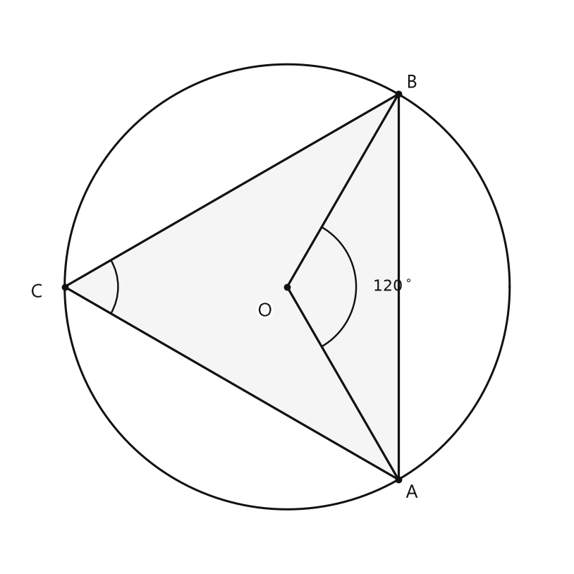
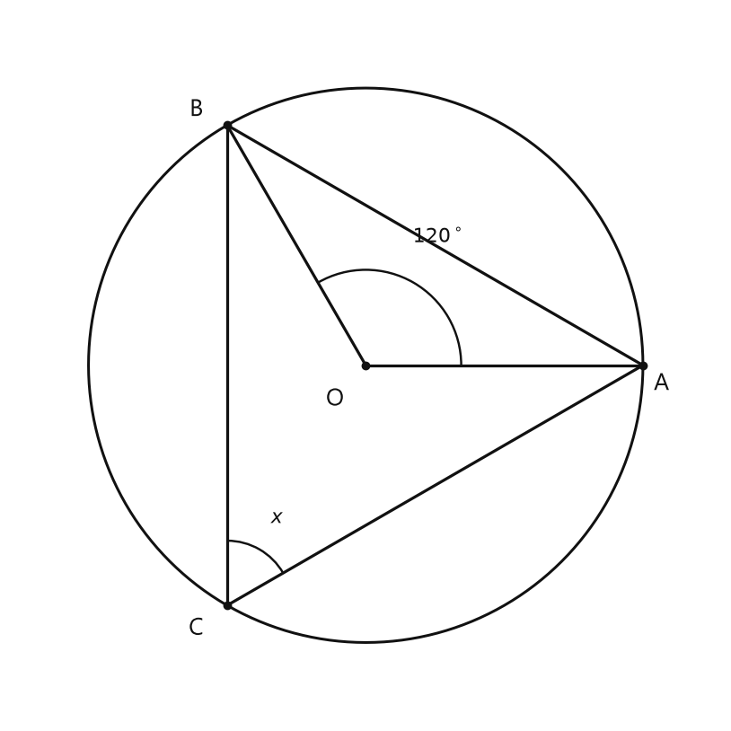
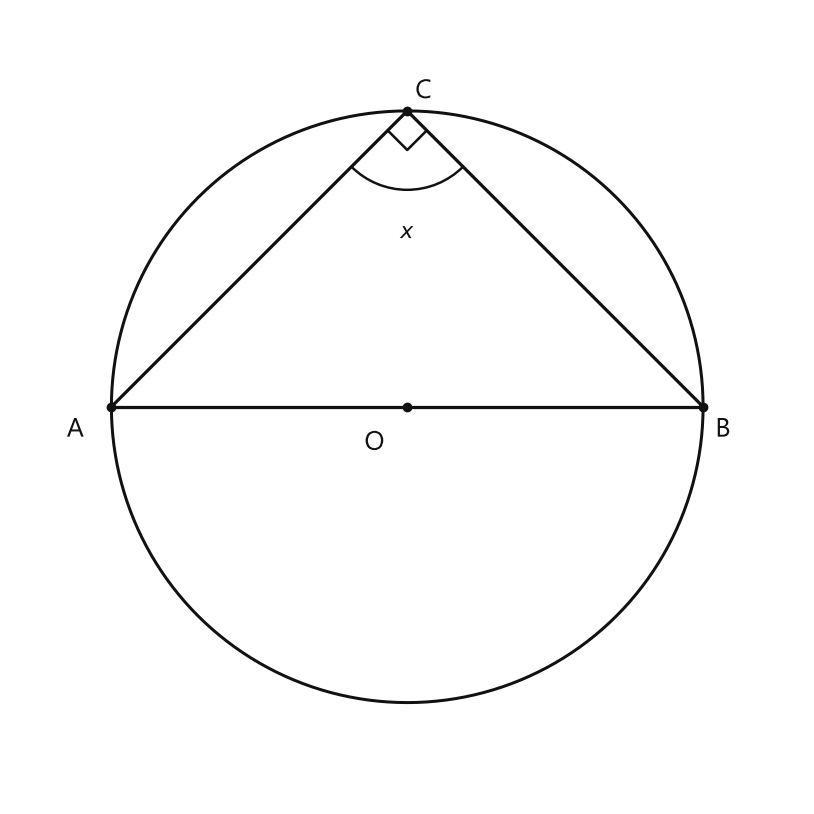
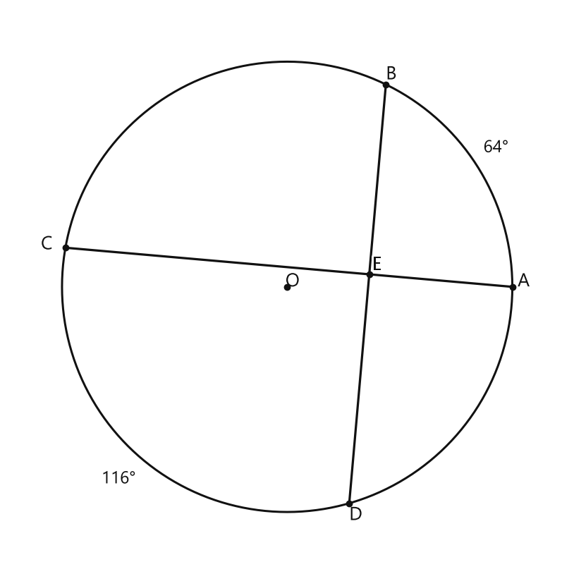

# Занятие 27. Углы в окружности

**Раздел:** Глава IV. Окружность  
**Параграф учебника:** §24. Углы в окружности  
**Страницы:** 166–166

## Цели занятия

К концу занятия ученик умеет:

- различать центральный и вписанный углы;
- находить градусную меру дуги по центральному углу;
- находить вписанный угол по центральному;
- находить центральный угол по вписанному;
- использовать свойство диаметра и полуокружности;
- проверять, на какую дугу опирается угол.

Выбери блок своего уровня:

- **1–2 балла** — узнаю виды углов и применяю формулу;
- **3–4 балла** — нахожу углы и дуги в простых задачах;
- **5–6 баллов** — решаю задачи с диаметром;
- **7–8 баллов** — составляю цепочку из нескольких свойств;
- **9–10 баллов** — решаю задачи с неизвестными и проверяю результат.

## Теория к занятию

### 1. Центральный угол и дуга

#### Простыми словами

Смотри: центральный угол имеет вершину в центре окружности. Его стороны идут к двум точкам окружности и отсекают дугу.

Градусная мера центрального угла и дуги, на которую он опирается, одинаковая. Поэтому если угол равен $45^\circ$, то и дуга равна $45^\circ$.

Здесь ничего не нужно делить или умножать: центральный угол и дуга «говорят» одно и то же число градусов.

#### Факт

Центральный угол и дуга, на которую он опирается, имеют одинаковую градусную меру.

#### Формулы

$$m\left(\overset{\frown}{AB}\right)=\angle AOB$$

где:

- $O$ — центр окружности;
- $\angle AOB$ — центральный угол;
- $\overset{\frown}{AB}$ — дуга, на которую опирается этот угол.

#### Правила

- Вершина центрального угла находится в центре окружности.
- Сначала определи, на какую дугу опирается угол.
- Мера дуги и центрального угла численно равны.

#### Алгоритм

1. Найди центр окружности.
2. Проверь, что вершина угла находится в центре.
3. Определи дугу, ограниченную сторонами угла.
4. Запиши, что градусная мера дуги равна градусной мере центрального угла.
5. Подставь известное значение.

#### Ловушки

- Не путай центральный угол с вписанным: у вписанного угла вершина находится на окружности.
- Для центрального угла дугу не нужно делить пополам.
- Дуга полуокружности равна $180^\circ$, а не $360^\circ$: полный круг — $360^\circ$, а половина круга — $180^\circ$.

---

### 2. Вписанный угол

#### Простыми словами

Вписанный угол имеет вершину на окружности. Его стороны проходят через две другие точки окружности.

Такой угол опирается на дугу между концами его сторон. Вписанный угол равен половине этой дуги. Если известен центральный угол, опирающийся на ту же дугу, то вписанный угол тоже равен половине центрального.

Получается простой маршрут:

$$\text{центральный угол}\longrightarrow\text{делим на }2\longrightarrow\text{вписанный угол}.$$

#### Определение

Вписанный угол — это угол, вершина которого лежит на окружности, а стороны пересекают окружность.

#### Формула

$$\text{Вписанный}=\frac{1}{2}\text{Центрального}$$

В обозначениях:

$$\angle ACB=\frac{1}{2}\angle AOB$$

если оба угла опираются на одну и ту же дугу $AB$.

Также можно записать:

$$\angle ACB=\frac{1}{2}m\left(\overset{\frown}{AB}\right)$$

#### Правила

- Вершина вписанного угла лежит на окружности.
- Стороны вписанного угла являются хордами или содержат хорды.
- Вписанный угол и центральный угол должны опираться на одну и ту же дугу.
- Чтобы найти вписанный угол, центральный угол делят на $2$.

#### Алгоритм

1. Проверь, что вершина угла лежит на окружности.
2. Определи дугу, на которую опирается угол.
3. Найди центральный угол, опирающийся на ту же дугу.
4. Раздели центральный угол на $2$.
5. Запиши ответ с градусным знаком.

#### Ловушки

- Если центральный угол равен $120^\circ$, то вписанный угол равен не $120^\circ$, а $60^\circ$.
- Делить на $2$ нужно тогда, когда находишь вписанный угол по центральному углу или по дуге.
- Нельзя сравнивать углы, если они опираются на разные дуги.
- Вершина вписанного угла не находится в центре. Если вершина в центре — это уже центральный угол.

---

### 3. Диаметр и полуокружность

#### Простыми словами

Диаметр проходит через центр окружности и делит её на две равные части — полуокружности.

Полная окружность имеет $360^\circ$, поэтому каждая полуокружность имеет:

$$360^\circ:2=180^\circ.$$

Если вписанный угол опирается на диаметр, то он опирается на дугу $180^\circ$. Вписанный угол равен половине этой дуги:

$$180^\circ:2=90^\circ.$$

Значит, диаметр часто прячет внутри рисунка прямой угол. Геометрия любит такие сюрпризы, но вполне честно предупреждает: ищи диаметр.

#### Факт

Диаметр стягивает дугу, равную $180^\circ$.

#### Формулы

$$m\left(\overset{\frown}{AB}\right)=180^\circ$$

Если вписанный угол опирается на диаметр $AB$, то:

$$\angle ACB=\frac{1}{2}\cdot180^\circ=90^\circ$$

#### Правила

- Диаметр — это хорда, проходящая через центр окружности.
- Концы диаметра делят окружность на две дуги по $180^\circ$.
- Вписанный угол, опирающийся на диаметр, равен $90^\circ$.

#### Алгоритм

1. Проверь, является ли отрезок диаметром.
2. Если это диаметр, соответствующая дуга равна $180^\circ$.
3. Проверь, что данный угол вписанный и опирается на этот диаметр.
4. Раздели $180^\circ$ на $2$.
5. Запиши, что угол равен $90^\circ$.

#### Ловушки

- Диаметр не равен радиусу: диаметр в два раза длиннее радиуса.
- Угол будет прямым только тогда, когда он вписанный и опирается на диаметр.
- Не перепутай: $180^\circ$ — это мера дуги-полуокружности или соответствующего центрального угла, а $90^\circ$ — мера вписанного угла.

## Сводка формул «выучить наизусть»

$$m\left(\overset{\frown}{AB}\right)=\angle AOB$$

$$\text{Вписанный}=\frac{1}{2}\text{Центрального}$$

$$\angle ACB=\frac{1}{2}\angle AOB$$

$$m\left(\overset{\frown}{AB}\right)=180^\circ$$

если $AB$ — диаметр.

$$\angle ACB=90^\circ$$

если вписанный угол $ACB$ опирается на диаметр $AB$.

## Правила, которые нельзя путать

- Центральный угол имеет вершину в центре окружности.
- Вписанный угол имеет вершину на окружности.
- Центральный угол равен дуге, на которую он опирается.
- Вписанный угол равен половине дуги, на которую он опирается.
- Если угол опирается на диаметр, он равен $90^\circ$.

## Разбор ключевых заданий

### Р1. Центральный угол и дуга

**Условие.** В окружности с центром $O$ центральный угол $\angle AOB$ равен $45^\circ$. Найдите градусную меру дуги $AB$.

<!--geo-figure-spec
{
  "needed": true,
  "kind": "plane",
  "caption": "Центральный угол $AOB$ и вписанный угол $ACB$",
  "equal": true,
  "axis": false,
  "xlim": [
    -2.5,
    2.5
  ],
  "ylim": [
    -2.5,
    2.5
  ],
  "points": {
    "O": [
      0,
      0
    ],
    "A": [
      1,
      -1.732
    ],
    "B": [
      1,
      1.732
    ],
    "C": [
      -2,
      0
    ]
  },
  "segments": [
    [
      "O",
      "A"
    ],
    [
      "O",
      "B"
    ],
    [
      "A",
      "B"
    ],
    [
      "C",
      "A"
    ],
    [
      "C",
      "B"
    ]
  ],
  "polygons": [
    {
      "vertices": [
        "A",
        "B",
        "C"
      ],
      "fill": 0.04
    }
  ],
  "circles": [
    {
      "center": "O",
      "radius": 2
    }
  ],
  "labels": {
    "O": {
      "dx": -0.2,
      "dy": -0.22
    },
    "A": {
      "dx": 0.12,
      "dy": -0.12
    },
    "B": {
      "dx": 0.12,
      "dy": 0.1
    },
    "C": {
      "dx": -0.25,
      "dy": -0.05
    }
  },
  "right_angles": [],
  "angle_marks": [
    {
      "vertex": "O",
      "from": "A",
      "to": "B",
      "text": "$120^\\circ$",
      "radius": 0.62
    },
    {
      "vertex": "C",
      "from": "A",
      "to": "B",
      "text": "",
      "radius": 0.48
    }
  ],
  "texts": []
}
-->

*Центральный угол AOB и вписанный угол ACB*

**Решение.**

Дано:

$$\angle AOB=45^\circ$$

Угол $\angle AOB$ — центральный.

Дуга $AB$, на которую он опирается, имеет такую же градусную меру:

$$m\left(\overset{\frown}{AB}\right)=\angle AOB$$

Подставим значение угла:

$$m\left(\overset{\frown}{AB}\right)=45^\circ$$

Здесь дугу не делим пополам: это центральный угол, поэтому число градусов остаётся тем же.

**Ответ: $45^\circ$.**

---

### Р2. Вписанный угол по центральному

**Условие.** Центральный угол $\angle AOB$, опирающийся на дугу $AB$, равен $120^\circ$. Вписанный угол $\angle ACB$ опирается на ту же дугу $AB$. Найдите $\angle ACB$.

<!--geo-figure-spec
{
  "needed": true,
  "kind": "plane",
  "caption": "Центральный и вписанный углы, опирающиеся на дугу $AB$",
  "equal": true,
  "axis": false,
  "xlim": [
    -2.3,
    2.3
  ],
  "ylim": [
    -2.3,
    2.3
  ],
  "points": {
    "O": [
      0,
      0
    ],
    "A": [
      1.8,
      0
    ],
    "B": [
      -0.9,
      1.559
    ],
    "C": [
      -0.9,
      -1.559
    ]
  },
  "segments": [
    [
      "O",
      "A"
    ],
    [
      "O",
      "B"
    ],
    [
      "A",
      "B"
    ],
    [
      "C",
      "A"
    ],
    [
      "C",
      "B"
    ]
  ],
  "polygons": [],
  "circles": [
    {
      "center": "O",
      "radius": 1.8
    }
  ],
  "labels": {
    "O": {
      "dx": -0.2,
      "dy": -0.22
    },
    "A": {
      "dx": 0.12,
      "dy": -0.12
    },
    "B": {
      "dx": -0.2,
      "dy": 0.1
    },
    "C": {
      "dx": -0.2,
      "dy": -0.15
    }
  },
  "right_angles": [],
  "angle_marks": [
    {
      "vertex": "O",
      "from": "A",
      "to": "B",
      "text": "$120^\\circ$",
      "radius": 0.62
    },
    {
      "vertex": "C",
      "from": "A",
      "to": "B",
      "text": "$x$",
      "radius": 0.42
    }
  ],
  "texts": []
}
-->

*Центральный и вписанный углы, опирающиеся на дугу AB*

**Решение.**

Дано:

$$\angle AOB=120^\circ$$

Углы $\angle AOB$ и $\angle ACB$ опираются на одну и ту же дугу $AB$.

Вписанный угол равен половине центрального:

$$\angle ACB=\frac{1}{2}\angle AOB$$

Подставим значение центрального угла:

$$\angle ACB=\frac{1}{2}\cdot120^\circ$$

Разделим $120^\circ$ на $2$:

$$\angle ACB=60^\circ$$

Типичная ловушка: увидеть $120^\circ$ и сразу записать его в ответ. Но вписанный угол берёт только половину.

**Ответ: $60^\circ$.**

---

### Р3. Центральный угол по вписанному

**Условие.** Вписанный угол $\angle ACB$, опирающийся на дугу $AB$, равен $35^\circ$. Найдите центральный угол $\angle AOB$, опирающийся на ту же дугу.

**Решение.**

Дано:

$$\angle ACB=35^\circ$$

Углы опираются на одну и ту же дугу $AB$.

Вписанный угол равен половине центрального:

$$\angle ACB=\frac{1}{2}\angle AOB$$

Чтобы найти весь центральный угол, нужно удвоить вписанный угол:

$$\angle AOB=2\angle ACB$$

Подставим известное значение:

$$\angle AOB=2\cdot35^\circ$$

Выполним умножение:

$$\angle AOB=70^\circ$$

Проверим результат:

$$\frac{1}{2}\cdot70^\circ=35^\circ$$

Проверка возвращает исходный вписанный угол — значит, половинку нашли правильно и ничего не потеряли по дороге.

**Ответ: $70^\circ$.**

---

### Р4. Угол, опирающийся на диаметр

**Условие.** Отрезок $AB$ — диаметр окружности. Точка $C$ лежит на окружности. Найдите вписанный угол $\angle ACB$.

<!--geo-figure-spec
{
  "needed": true,
  "kind": "plane",
  "caption": "Вписанный угол $ACB$, опирающийся на диаметр $AB$",
  "equal": true,
  "axis": false,
  "xlim": [
    -2.4,
    2.4
  ],
  "ylim": [
    -2.4,
    2.4
  ],
  "points": {
    "O": [
      0,
      0
    ],
    "A": [
      -1.8,
      0
    ],
    "B": [
      1.8,
      0
    ],
    "C": [
      0,
      1.8
    ]
  },
  "segments": [
    [
      "A",
      "B"
    ],
    [
      "A",
      "C"
    ],
    [
      "C",
      "B"
    ]
  ],
  "polygons": [],
  "circles": [
    {
      "center": "O",
      "radius": 1.8
    }
  ],
  "labels": {
    "O": {
      "dx": -0.2,
      "dy": -0.22
    },
    "A": {
      "dx": -0.22,
      "dy": -0.14
    },
    "B": {
      "dx": 0.12,
      "dy": -0.14
    },
    "C": {
      "dx": 0.1,
      "dy": 0.12
    }
  },
  "right_angles": [
    {
      "vertex": "C",
      "from": "A",
      "to": "B"
    }
  ],
  "angle_marks": [
    {
      "vertex": "C",
      "from": "A",
      "to": "B",
      "text": "$x$",
      "radius": 0.48
    }
  ],
  "texts": []
}
-->

*Вписанный угол ACB, опирающийся на диаметр AB*

**Решение.**

Дано:

$$AB\text{ — диаметр}$$

Концы диаметра $A$ и $B$ делят окружность на две полуокружности.

Градусная мера дуги-полуокружности равна $180^\circ$:

$$m\left(\overset{\frown}{AB}\right)=180^\circ$$

Угол $\angle ACB$ — вписанный и опирается на дугу $AB$.

Вписанный угол равен половине дуги:

$$\angle ACB=\frac{1}{2}\cdot180^\circ$$

Разделим $180^\circ$ на $2$:

$$\angle ACB=90^\circ$$

Увидел диаметр и вписанный угол, который на него опирается, — проверяй прямой угол. Это не фокус, а правило.

**Ответ: $90^\circ$.**

---

### Р5. Найдите дугу по вписанному углу

**Условие.** Вписанный угол $\angle ACB$ равен $48^\circ$. Найдите градусную меру дуги $AB$, на которую он опирается.

**Решение.**

Дано:

$$\angle ACB=48^\circ$$

Вписанный угол равен половине дуги, на которую он опирается:

$$\angle ACB=\frac{1}{2}m\left(\overset{\frown}{AB}\right)$$

Нам нужно найти всю дугу, поэтому умножим вписанный угол на $2$:

$$m\left(\overset{\frown}{AB}\right)=2\angle ACB$$

Подставим известное значение:

$$m\left(\overset{\frown}{AB}\right)=2\cdot48^\circ$$

Выполним умножение:

$$m\left(\overset{\frown}{AB}\right)=96^\circ$$

Проверим:

$$\frac{1}{2}\cdot96^\circ=48^\circ$$

Половина найденной дуги совпала с данным углом, поэтому вычисление выполнено верно.

**Ответ: $96^\circ$.**

---

### Р6. Цепочка из двух шагов

**Условие.** Центральный угол $\angle AOB$ равен $150^\circ$. Вписанный угол $\angle ACB$ и центральный угол $\angle AOB$ опираются на одну и ту же дугу $AB$. Найдите сумму $\angle AOB+\angle ACB$.

**Решение.**

Дано:

$$\angle AOB=150^\circ$$

Сначала найдём вписанный угол. Он опирается на ту же дугу, что и центральный угол:

$$\angle ACB=\frac{1}{2}\angle AOB$$

Подставим значение центрального угла:

$$\angle ACB=\frac{1}{2}\cdot150^\circ$$

Разделим $150^\circ$ на $2$:

$$\angle ACB=75^\circ$$

Теперь найдём сумму углов:

$$\angle AOB+\angle ACB=150^\circ+75^\circ$$

Сложим значения:

$$\angle AOB+\angle ACB=225^\circ$$

Сначала применили правило для вписанного угла, а уже потом сложили. Иначе можно случайно начать складывать угол с его «половинкой» вслепую — математика такое не любит.

**Ответ: $225^\circ$.**

## Практические задания

Выбери свой уровень и решай только этот блок. В блоке должна закрепиться вся тема параграфа. Ответы не приводятся.

### Уровень 1–2 балла

**С1.** Выберите центральный угол:  
1) угол $ABC$, вершина $B$ лежит на окружности; 2) угол $AOC$, вершина $O$ — центр окружности; 3) угол $KLM$, вершина $L$ лежит внутри круга; 4) угол $PQR$, вершина $Q$ лежит вне круга; 5) угол $XYZ$, вершина $Y$ лежит на окружности.

**С2.** Выберите вписанный угол:  
1) угол $AOC$, где $O$ — центр окружности; 2) угол $KLM$, вершина $L$ лежит вне окружности; 3) угол $BCD$, вершина $C$ лежит на окружности, а стороны угла проходят через точки $B$ и $D$ окружности; 4) угол $MON$, где $O$ — центр окружности; 5) угол $PQR$, вершина $Q$ лежит внутри круга.

**С3.** Центральный угол, опирающийся на дугу $AB$, равен $86^\circ$. Чему равен вписанный угол, опирающийся на ту же дугу?

**С4.** Вписанный угол, опирающийся на дугу $MN$, равен $32^\circ$. Чему равен центральный угол, опирающийся на ту же дугу?

**С5.** Выберите верное равенство, если центральный угол равен $120^\circ$, а вписанный угол опирается на ту же дугу:  
1) $30^\circ$; 2) $60^\circ$; 3) $120^\circ$; 4) $180^\circ$; 5) $240^\circ$.

**С6.** Выберите верное равенство, если вписанный угол равен $47^\circ$, а центральный угол опирается на ту же дугу:  
1) $23{,}5^\circ$; 2) $47^\circ$; 3) $94^\circ$; 4) $137^\circ$; 5) $188^\circ$.

**С7.** В окружности с центром $O$ центральный угол $AOC$ равен $74^\circ$. Вписанный угол $ABC$ опирается на ту же дугу $AC$. Найдите $\angle ABC$.

**С8.** В окружности вписанный угол $KLM$ равен $38^\circ$. Центральный угол $KOM$, где $O$ — центр окружности, опирается на ту же дугу $KM$. Найдите $\angle KOM$.

**С9.** Центральный угол $POQ$ равен $150^\circ$, где $O$ — центр окружности. Вписанный угол $PRQ$ опирается на ту же дугу $PQ$. Найдите $\angle PRQ$.

**С10.** Вписанный угол $XYZ$ равен $55^\circ$. Центральный угол $XOZ$, где $O$ — центр окружности, опирается на ту же дугу $XZ$. Найдите $\angle XOZ$.

**С11.** Установите соответствие между центральным углом и вписанным углом, опирающимися на одну и ту же дугу.

А) $48^\circ$  
Б) $90^\circ$  
В) $136^\circ$

1) $24^\circ$  
2) $45^\circ$  
3) $68^\circ$  
4) $96^\circ$

**С12.** Установите соответствие между вписанным углом и центральным углом, опирающимися на одну и ту же дугу.

А) $27^\circ$  
Б) $41^\circ$  
В) $75^\circ$

1) $54^\circ$  
2) $75^\circ$  
3) $82^\circ$  
4) $150^\circ$

**С13.** Центральный угол $AOB$ опирается на дугу $AB$, равную $80^\circ$. Найдите величину угла $AOB$.
1) $20^\circ$ 2) $40^\circ$ 3) $80^\circ$ 4) $160^\circ$ 5) $240^\circ$

**С14.** Вписанный угол $ACB$ опирается на дугу $AB$, равную $100^\circ$. Найдите величину угла $ACB$.
1) $25^\circ$ 2) $50^\circ$ 3) $100^\circ$ 4) $150^\circ$ 5) $200^\circ$

**С15.** Вписанный угол $ABC$ равен $35^\circ$. Найдите величину центрального угла $AOC$, опирающегося на ту же дугу $AC$.
1) $17{,}5^\circ$ 2) $35^\circ$ 3) $70^\circ$ 4) $105^\circ$ 5) $145^\circ$

**С16.** Центральный угол $AOC$ равен $126^\circ$. Найдите величину вписанного угла $ABC$, опирающегося на ту же дугу $AC$.
1) $42^\circ$ 2) $63^\circ$ 3) $126^\circ$ 4) $180^\circ$ 5) $252^\circ$

**С17.** Дуга $MN$ окружности имеет величину $148^\circ$. Найдите величину вписанного угла $MPN$, опирающегося на эту дугу.
1) $37^\circ$ 2) $74^\circ$ 3) $148^\circ$ 4) $212^\circ$ 5) $296^\circ$

**С18.** Вписанный угол $KLM$ опирается на дугу $KM$, равную $64^\circ$. Выберите величину этого угла.
1) $16^\circ$ 2) $32^\circ$ 3) $64^\circ$ 4) $128^\circ$ 5) $244^\circ$

**С19.** Центральный угол $DOE$ и вписанный угол $DFE$ опираются на одну и ту же дугу $DE$. Если $\angle DOE=154^\circ$, то чему равен $\angle DFE$?
1) $38^\circ$ 2) $77^\circ$ 3) $154^\circ$ 4) $206^\circ$ 5) $308^\circ$

**С20.** Центральный угол $POQ$ и вписанный угол $PRQ$ опираются на одну и ту же дугу $PQ$. Если $\angle PRQ=48^\circ$, то чему равен $\angle POQ$?
1) $24^\circ$ 2) $48^\circ$ 3) $96^\circ$ 4) $132^\circ$ 5) $192^\circ$

**С21.** Дуга $AB$ имеет величину $2\alpha$, а вписанный угол $ACB$ имеет величину $\alpha$. Выберите верное утверждение.
1) $\alpha=2\angle ACB$ 2) $\alpha=\angle ACB$ 3) $\alpha=\frac12\angle ACB$ 4) $\alpha+\angle ACB=180^\circ$ 5) $\alpha\cdot\angle ACB=1$

**С22.** В окружности центральный угол $AOB$ равен $92^\circ$. Какой из перечисленных углов может быть вписанным углом, опирающимся на ту же дугу $AB$?
1) $23^\circ$ 2) $46^\circ$ 3) $92^\circ$ 4) $138^\circ$ 5) $184^\circ$

**С23.** Вписанные углы $ABC$ и $ADC$ опираются на одну и ту же дугу $AC$. Если $\angle ABC=41^\circ$, то чему равен $\angle ADC$?
1) $20{,}5^\circ$ 2) $41^\circ$ 3) $82^\circ$ 4) $139^\circ$ 5) $180^\circ$

**С24.** Укажите пару углов, для которой один угол является центральным, а другой — вписным и оба угла опираются на одну и ту же дугу.
1) $\angle ABC$ и $\angle ACB$
2) $\angle AOB$ и $\angle ACB$
3) $\angle AOB$ и $\angle AOC$
4) $\angle ABC$ и $\angle AOB$
5) $\angle OAB$ и $\angle OBA$

**С25.** Выберите центральный угол:  
1) $\angle ABC$, вершина $B$ лежит на окружности;  
2) $\angle AOB$, вершина $O$ — центр окружности;  
3) $\angle ACD$, вершина $C$ лежит на окружности;  
4) $\angle BCD$, вершина $C$ лежит на окружности;  
5) $\angle CDA$, вершина $D$ лежит на окружности.

**С26.** Выберите вписанный угол:  
1) $\angle AOB$, вершина $O$ — центр окружности;  
2) $\angle COD$, вершина $O$ — центр окружности;  
3) $\angle ABC$, вершина $B$ лежит на окружности, стороны угла проходят через точки $A$ и $C$ окружности;  
4) $\angle AOC$, вершина $O$ — центр окружности;  
5) $\angle BOD$, вершина $O$ — центр окружности.

**С27.** Центральный угол $\angle AOB$ опирается на дугу $AB$ и равен $80^\circ$. Найдите вписанный угол $\angle ACB$, опирающийся на ту же дугу $AB$.

**С28.** Вписанный угол $\angle ACB$ опирается на дугу $AB$ и равен $35^\circ$. Найдите центральный угол $\angle AOB$, опирающийся на ту же дугу $AB$.

**С29.** Центральный угол $\angle AOD$ равен $126^\circ$. Вписанный угол $\angle ACD$ опирается на ту же дугу $AD$. Найдите его градусную меру.

**С30.** Вписанный угол $\angle BCD$ равен $48^\circ$ и опирается на дугу $BD$. Найдите центральный угол $\angle BOD$, опирающийся на ту же дугу.

**С31.** Центральный угол $\angle AOC$ равен $150^\circ$. Найдите вписанный угол $\angle ABC$, если он опирается на ту же дугу $AC$.

**С32.** Вписанный угол $\angle ADC$ опирается на дугу $AC$ и равен $62^\circ$. Найдите центральный угол $\angle AOC$, опирающийся на ту же дугу.

**С33.** Угол $\angle AOB$ с вершиной в центре окружности равен $96^\circ$. Угол $\angle ACB$ имеет вершину на окружности и опирается на ту же дугу $AB$. Выберите верное равенство:  
1) $\angle ACB=24^\circ$;  
2) $\angle ACB=48^\circ$;  
3) $\angle ACB=96^\circ$;  
4) $\angle ACB=192^\circ$;  
5) $\angle ACB=86^\circ$.

**С34.** Угол $\angle ADB$ имеет вершину на окружности и опирается на дугу $AB$, а центральный угол $\angle AOB$ опирается на ту же дугу. Если $\angle ADB=41^\circ$, выберите значение $\angle AOB$:  
1) $20{,}5^\circ$;  
2) $41^\circ$;  
3) $82^\circ$;  
4) $139^\circ$;  
5) $164^\circ$.

**С35.** Центральный угол $\angle COD$ равен $72^\circ$. Вписанный угол $\angle CAD$ опирается на ту же дугу $CD$. Запишите градусную меру угла $\angle CAD$.

**С36.** Вписанный угол $\angle CBD$ опирается на дугу $CD$ и равен $57^\circ$. Центральный угол $\angle COD$ опирается на ту же дугу. Запишите градусную меру угла $\angle COD$.

### Уровень 3–4 балла

**С1.** Центральный угол $AOB$ равен $84^\circ$. Найдите вписанный угол $ACB$, опирающийся на ту же дугу $AB$.

**С2.** Вписанный угол $ABC$ опирается на дугу $AC$, величина которой равна $126^\circ$. Найдите величину угла $ABC$.

**С3.** В окружности центральный угол $AOC$ равен $148^\circ$. Вписанный угол $ABC$ опирается на ту же дугу $AC$. Найдите величину угла $ABC$.

**С4.** Вписанный угол $ABC$ равен $37^\circ$. Найдите величину центрального угла $AOC$, опирающегося на ту же дугу $AC$.

**С5.** Центральный угол $MON$ равен $96^\circ$. Найдите вписанный угол $MPN$, если оба угла опираются на одну и ту же дугу $MN$.

**С6.** Вписанный угол $KLM$ опирается на дугу $KM$, равную $154^\circ$. Найдите величину угла $KLM$.

**С7.** В окружности угол $ABC$ — вписанный и опирается на дугу $AC$, равную $90^\circ$. Угол $AOC$ — центральный и опирается на ту же дугу. Найдите сумму углов $ABC$ и $AOC$.

**С8.** Центральный угол $AOD$ равен $112^\circ$, а вписанный угол $AED$ опирается на ту же дугу $AD$. На сколько градусов центральный угол больше вписанного?

**С9.** Вписанный угол $ABC$ в два раза меньше центрального угла $AOC$, опирающегося на ту же дугу $AC$. Найдите величину угла $ABC$, если сумма этих углов равна $135^\circ$.

**С10.** В окружности центральный угол $MON$ на $54^\circ$ больше вписанного угла $MPN$, опирающегося на ту же дугу $MN$. Найдите величины обоих углов.

**С11.** Дуга $AB$ имеет величину $168^\circ$. Вписанный угол $ACB$ опирается на эту дугу, а центральный угол $AOB$ — на ту же дугу. Найдите разность между центральным и вписанным углами.

**С12.** В окружности центральный угол $AOC$ и вписанный угол $ABC$ опираются на одну и ту же дугу $AC$. Величина угла $ABC$ на $45^\circ$ меньше величины угла $AOC$. Найдите величину дуги $AC$.

**С13.** Центральный угол $AOB$ опирается на дугу $AB$ и равен $84^\circ$. Найдите вписанный угол, опирающийся на ту же дугу $AB$.

**С14.** Вписанный угол опирается на дугу, градусная мера которой равна $126^\circ$. Найдите величину этого угла.

**С15.** Центральный угол $MON$ равен $148^\circ$. Вписанный угол $MAN$ опирается на ту же дугу $MN$. Найдите величину угла $MAN$.

**С16.** Вписанный угол $BCD$ равен $37^\circ$ и опирается на дугу $BD$. Найдите градусную меру дуги $BD$.

**С17.** Дуга $KL$ имеет градусную меру $96^\circ$. Найдите величину вписанного угла, опирающегося на эту дугу.

**С18.** Центральный угол $AOC$ в $2$ раза больше вписанного угла $ABC$, причём оба угла опираются на одну и ту же дугу $AC$. Найдите величину угла $ABC$, если $\angle AOC=112^\circ$.

**С19.** Вписанный угол $PQR$ опирается на дугу $PR$, не содержащую точку $Q$. Градусная мера этой дуги равна $154^\circ$. Найдите $\angle PQR$.

**С20.** Центральный угол $KOL$ равен $2\alpha$, а вписанный угол $KML$, опирающийся на ту же дугу $KL$, равен $\alpha$. Найдите $\alpha$, если $\angle KOL=136^\circ$.

**С21.** Дуга $EF$ имеет градусную меру $72^\circ$. Точка $G$ лежит на большей дуге $EF$. Найдите величину вписанного угла $EGF$.

**С22.** Вписанный угол $XYZ$ равен $43^\circ$ и опирается на дугу $XZ$, не содержащую точку $Y$. Найдите величину центрального угла $XOZ$, опирающегося на ту же дугу $XZ$.

**С23.** Центральный угол $AOD$ равен $156^\circ$. Точки $B$ и $C$ лежат на большей дуге $AD$. Найдите величину вписанного угла $ABD$, опирающегося на меньшую дугу $AD$.

**С24.** Вписанные углы $ABC$ и $ADC$ опираются на одну и ту же дугу $AC$, причём $\angle ABC=28^\circ$. Найдите величину угла $ADC$.

**С25.** Центральный угол $AOB$ опирается на дугу $AB$, равную $86^\circ$. Найдите градусную меру угла $AOB$.

**С26.** Вписанный угол $ACB$ опирается на дугу $AB$, равную $124^\circ$. Найдите градусную меру угла $ACB$.

**С27.** Центральный угол $AOB$ равен $138^\circ$. Найдите градусную меру вписанного угла $ACB$, опирающегося на ту же дугу $AB$.

**С28.** Вписанный угол $ADB$ равен $37^\circ$. Найдите градусную меру центрального угла $AOB$, опирающегося на ту же дугу $AB$.

**С29.** В окружности точки $A$, $B$ и $C$ лежат на окружности, а $O$ — её центр. Центральный угол $AOB$ равен $96^\circ$. Найдите градусную меру вписанного угла $ACB$, опирающегося на дугу $AB$.

**С30.** Вписанный угол $ABC$ опирается на дугу $AC$, не содержащую точку $B$, равную $150^\circ$. Найдите градусную меру центрального угла $AOC$, где $O$ — центр окружности.

**С31.** Центральный угол $MON$ равен $72^\circ$. Точка $P$ лежит на окружности и находится на дуге $MN$, не содержащей её концов. Найдите градусную меру вписанного угла $MPN$.

**С32.** В окружности точки $A$, $B$, $C$ и $D$ лежат на окружности. Вписанные углы $ACB$ и $ADB$ опираются на одну и ту же дугу $AB$. Угол $ACB$ равен $43^\circ$. Найдите градусную меру угла $ADB$.

**С33.** В окружности точки $A$, $B$, $C$ и $D$ лежат на окружности, причём точки $C$ и $D$ находятся по одну сторону от хорды $AB$. Вписанный угол $ACB$ равен $58^\circ$. Найдите градусную меру вписанного угла $ADB$, если оба угла опираются на дугу $AB$, не содержащую вершин этих углов.

**С34.** В окружности точки $A$, $B$, $C$ и $D$ лежат на окружности, причём точки $C$ и $D$ находятся по разные стороны от хорды $AB$. Вписанный угол $ACB$ равен $64^\circ$. Найдите градусную меру угла $ADB$.

**С35.** Хорда $AB$ делит окружность на две дуги, меньшая из которых равна $110^\circ$. Точка $C$ лежит на большей дуге $AB$. Найдите градусную меру вписанного угла $ACB$.

**С36.** В окружности точки $A$, $B$ и $C$ лежат на окружности, а $O$ — её центр. Угол $AOB$ равен $2\angle ACB$, причём оба угла опираются на одну и ту же дугу $AB$. Найдите градусную меру угла $AOB$, если $\angle ACB=47^\circ$.

### Уровень 5–6 баллов

**С1.** Центральный угол $AOB$ опирается на дугу $AB$ и равен $86^\circ$. Найдите вписанный угол, опирающийся на ту же дугу.

**С2.** Вписанный угол $ACB$ опирается на дугу $AB$, не содержащую точку $C$, и равен $37^\circ$. Найдите центральный угол $AOB$, опирающийся на ту же дугу.

**С3.** Центральный угол $MON$ равен $124^\circ$. Вписанный угол $MPN$ и центральный угол $MON$ опираются на одну и ту же дугу $MN$. Найдите градусную меру угла $MPN$.

**С4.** Вписанный угол $XYZ$ опирается на дугу $XZ$, не содержащую точку $Y$, градусная мера которой равна $72^\circ$. Найдите градусную меру угла $XYZ$.

**С5.** Вписанный угол $ABC$ равен $48^\circ$. Центральный угол $AOC$ и угол $ABC$ опираются на одну и ту же дугу $AC$. Найдите градусную меру угла $AOC$.

**С6.** Центральный угол $KOL$ опирается на дугу $KL$ и равен $156^\circ$. На эту же дугу опирается вписанный угол $KML$. Найдите градусную меру угла $KML$.

**С7.** В окружности центральный угол $AOD$ равен $94^\circ$, а вписанный угол $ACD$ опирается на ту же дугу $AD$. Найдите градусную меру угла $ACD$.

**С8.** Вписанный угол $RST$ опирается на дугу $RT$, не содержащую точку $S$, и равен $41^\circ$. Центральный угол $ROT$ опирается на ту же дугу. Найдите градусную меру угла $ROT$.

**С9.** Дуга $AB$ имеет градусную меру $138^\circ$. Вписанный угол $ACB$ опирается на эту дугу. Найдите градусную меру угла $ACB$.

**С10.** Центральный угол $MON$ на $28^\circ$ больше вписанного угла $MPN$, причём оба угла опираются на одну и ту же дугу $MN$. Найдите градусные меры этих углов.

**С11.** Вписанный угол $ABC$ в два раза меньше центрального угла $AOC$, и оба угла опираются на одну и ту же дугу $AC$. Найдите градусную меру каждого угла, если их сумма равна $150^\circ$.

**С12.** Центральный угол $AOB$ на $54^\circ$ больше вписанного угла $ACB$. Оба угла опираются на одну и ту же дугу $AB$. Найдите градусную меру дуги $AB$.

**С13.** Центральный угол, опирающийся на дугу $AB$, равен $86^\circ$. Найдите вписанный угол, опирающийся на ту же дугу.

**С14.** Вписанный угол, опирающийся на дугу $CD$, равен $37^\circ$. Найдите центральный угол, опирающийся на ту же дугу.

**С15.** Центральный угол $AOB$ равен $124^\circ$. Вписанный угол $ACB$ опирается на ту же дугу $AB$. Найдите величину угла $ACB$.

**С16.** Вписанный угол $MNP$ опирается на дугу $MP$, а центральный угол $MOP$ — на ту же дугу. Найдите угол $MOP$, если $\angle MNP=42^\circ$.

**С17.** Центральный угол, соответствующий дуге $KL$, на $58^\circ$ больше вписанного угла, соответствующего этой же дуге. Найдите величины этих углов.

**С18.** Вписанный угол, опирающийся на дугу $EF$, в 3 раза меньше центрального угла, опирающегося на ту же дугу. Найдите величины обоих углов, если их сумма равна $120^\circ$.

**С19.** Центральный угол $AOB$ и вписанный угол $ACB$ опираются на одну и ту же дугу $AB$. Найдите $\angle AOB$, если $\angle ACB=3x+5^\circ$, а $\angle AOB=8x-10^\circ$.

**С20.** Вписанный угол $RST$ опирается на дугу $RT$. Центральный угол $ROT$ опирается на ту же дугу. Найдите $x$, если $\angle RST=2x+7^\circ$, а $\angle ROT=6x-14^\circ$.

**С21.** Дуга $GH$ соответствует центральному углу $GOH=150^\circ$. Вписанный угол $GIH$ опирается на эту же дугу. Найдите разность между центральным и вписанным углами.

**С22.** Вписанный угол $XYZ$ опирается на дугу $XZ$, величина которой соответствует центральному углу $XOZ=96^\circ$. На сколько градусов нужно увеличить вписанный угол, чтобы получить центральный угол?

**С23.** Центральный угол $MON$ на $72^\circ$ больше вписанного угла $MPN$, причём оба угла опираются на одну и ту же дугу $MN$. Найдите величины углов $MON$ и $MPN$.

**С24.** Вписанный угол $ABC$ опирается на дугу $AC$, а центральный угол $AOC$ — на ту же дугу. Величина угла $ABC$ составляет $\frac{2}{5}$ величины угла $AOC$. Найдите оба угла, если их разность равна $54^\circ$.

**С25.** Центральный угол $AOB$ окружности равен $86^\circ$. Найдите вписанный угол $ACB$, опирающийся на ту же дугу $AB$.

**С26.** Вписанный угол $ABC$ опирается на дугу $AC$ и равен $37^\circ$. Найдите центральный угол $AOC$, опирающийся на дугу $AC$.

**С27.** В окружности с центром $O$ точки $A$ и $B$ образуют центральный угол $AOB=124^\circ$. Точка $C$ лежит на большей дуге $AB$. Найдите угол $ACB$.

**С28.** Вписанный угол $ABC$, опирающийся на дугу $AC$, равен $48^\circ$. Найдите градусную меру дуги $AC$ и центрального угла $AOC$, опирающихся на эту дугу.

**С29.** Центральный угол $AOB$ равен $3x+18^\circ$, а вписанный угол $ACB$, опирающийся на ту же дугу $AB$, равен $x+21^\circ$. Найдите $x$.

**С30.** Вписанные углы $ABC$ и $ADC$ опираются на одну и ту же дугу $AC$. Их градусные меры равны соответственно $4x-7^\circ$ и $2x+29^\circ$. Найдите величину каждого из этих углов.

### Уровень 7–8 баллов

**С1.** Центральный угол $AOB$ равен $136^\circ$. Найдите вписанный угол $ACB$, опирающийся на ту же дугу $AB$.

**С2.** Вписанный угол $ABC$ опирается на дугу $AC$, не содержащую точку $B$, величиной $148^\circ$. Найдите градусную меру угла $ABC$.

**С3.** Точки $A$, $B$, $C$ лежат на окружности с центром $O$. Центральный угол $AOC$ равен $84^\circ$, а точка $B$ лежит на меньшей дуге $AC$. Найдите угол $ABC$.

**С4.** В окружности хорда $AB$ стягивает центральный угол $AOB$, равный $110^\circ$. Точка $C$ лежит на большей дуге $AB$, а точка $D$ — на меньшей дуге $AB$. Найдите углы $ACB$ и $ADB$.

**С5.** Вписанный угол $ABC$ равен $37^\circ$. Найдите центральный угол $AOC$, если точки $B$ и $O$ лежат по одну сторону от прямой $AC$.

**С6.** В окружности $ABCD$ — вписанный четырёхугольник. Угол $ABC$ равен $68^\circ$. Найдите угол $ADC$ и обоснуйте найденное значение.

**С7.** В окружности точки $A$, $B$, $C$, $D$ расположены последовательно. Угол $ABC$ равен $52^\circ$, а угол $BCD$ равен $71^\circ$. Найдите углы $ADC$ и $DAB$.

**С8.** В окружности проведены хорды $AC$ и $BD$, пересекающиеся в точке $E$. Известно, что дуга $AB$ имеет величину $64^\circ$, а дуга $CD$ — $116^\circ$. Найдите угол $AEC$.

<!--geo-figure-spec
{
  "needed": true,
  "kind": "plane",
  "caption": "Хорды $AC$ и $BD$ пересекаются в точке $E$",
  "equal": true,
  "axis": false,
  "xlim": [
    -4.2,
    4.2
  ],
  "ylim": [
    -4.2,
    4.2
  ],
  "points": {
    "O": [
      0,
      0
    ],
    "A": [
      3.4,
      0
    ],
    "B": [
      1.49046,
      3.0559
    ],
    "C": [
      -3.34835,
      0.5904
    ],
    "D": [
      0.93717,
      -3.26829
    ],
    "E": [
      1.23964,
      0.18901
    ]
  },
  "segments": [
    [
      "A",
      "C"
    ],
    [
      "B",
      "D"
    ]
  ],
  "polygons": [],
  "circles": [
    {
      "center": "O",
      "radius": 3.4
    }
  ],
  "labels": {
    "A": {
      "dx": 0.17,
      "dy": 0.08
    },
    "B": {
      "dx": 0.08,
      "dy": 0.15
    },
    "C": {
      "dx": -0.28,
      "dy": 0.05
    },
    "D": {
      "dx": 0.1,
      "dy": -0.18
    },
    "E": {
      "dx": 0.12,
      "dy": 0.14
    }
  },
  "right_angles": [],
  "angle_marks": [],
  "texts": [
    {
      "xy": [
        3.15,
        2.1
      ],
      "text": "64°"
    },
    {
      "xy": [
        -2.55,
        -2.9
      ],
      "text": "116°"
    }
  ]
}
-->

*Хорды AC и BD пересекаются в точке E*

**С9.** В окружности хорды $AB$ и $CD$ пересекаются в точке $E$. Дуги $AC$ и $BD$ имеют величины соответственно $92^\circ$ и $48^\circ$. Найдите угол $AEC$.

**С10.** Из точки $P$, лежащей вне окружности, проведены две секущие $PAB$ и $PCD$, где точки $A$, $B$, $C$, $D$ лежат на окружности, а $A$ и $C$ ближе к точке $P$. Величины дуг $BD$ и $AC$ равны соответственно $154^\circ$ и $46^\circ$. Найдите угол $P$.

**С11.** В окружности $ABCD$ — вписанный четырёхугольник. Диагональ $AC$ делит угол $DAB$ на углы $DAC=24^\circ$ и $CAB=39^\circ$. Найдите углы $BCD$ и $ADC$.

**С12.** В окружности точки $A$, $B$, $C$, $D$ расположены последовательно. Центральный угол $AOB$ равен $72^\circ$, а центральный угол $COD$ равен $128^\circ$. Найдите сумму углов $ACB$ и $CAD$, если точки $C$ и $D$ лежат на одной дуге $AB$, а точки $A$ и $B$ — на одной дуге $CD$.

**С13.** В окружности с центром $O$ центральный угол $AOB$ равен $124^\circ$. Точка $C$ лежит на окружности, причём лучи $CA$ и $CB$ образуют вписанный угол $ACB$, опирающийся на ту же дугу $AB$, что и угол $AOB$. Найдите величину угла $ACB$ и обоснуйте ответ.

**С14.** В окружности вписанный угол $BCD$ равен $37^\circ$. Центральный угол $BOD$ и вписанный угол $BCD$ опираются на одну и ту же дугу $BD$. Найдите величину угла $BOD$ и обоснуйте ответ.

**С15.** Точки $A$, $B$, $C$, $D$ лежат на одной окружности. Вписанные углы $ACB$ и $ADB$ опираются на одну и ту же дугу $AB$. Их величины равны соответственно $(2x+15)^\circ$ и $(3x-20)^\circ$. Найдите $x$ и величину каждого из этих углов.

**С16.** В окружности с центром $O$ центральный угол $AOB$ равен $(86^\circ)$. Вписанный угол $ACB$, опирающийся на дугу $AB$, равен $(x+13)^\circ$. Найдите $x$.

**С17.** Точки $A$, $B$, $C$ лежат на окружности с центром $O$. Центральный угол $AOB$ равен $(4x+20)^\circ$, а вписанный угол $ACB$, опирающийся на ту же дугу $AB$, равен $(x+25)^\circ$. Найдите $x$ и величины указанных углов.

**С18.** Отрезок $AB$ является диаметром окружности. Точка $C$ лежит на этой окружности и не совпадает с точками $A$ и $B$. Найдите величину вписанного угла $ACB$. Обоснуйте ответ, используя связь между центральным и вписанным углами.

**С19.** Четырёхугольник $ABCD$ вписан в окружность. Его противоположные углы $ABC$ и $ADC$ равны $(x+18)^\circ$ и $(3x+2)^\circ$ соответственно. Найдите $x$ и величины углов $ABC$ и $ADC$.

**С20.** Четырёхугольник $KLMN$ вписан в окружность. Угол $KLM$ равен $72^\circ$, а угол $KNM$ является противоположным ему углом этого четырёхугольника. Найдите величину угла $KNM$ и объясните, почему эти углы связаны именно таким образом.

**С21.** В окружности с центром $O$ центральный угол $AOD$ равен $140^\circ$. Точка $C$ лежит на окружности на дуге $AD$, не содержащей точку $B$. Вписанный угол $ACD$ опирается на дугу $AD$. Найдите величину угла $ACD$.

**С22.** Малая дуга $AB$ окружности имеет градусную меру $96^\circ$. Точка $C$ лежит на большой дуге $AB$. Найдите величину вписанного угла $ACB$, опирающегося на малую дугу $AB$, и обоснуйте вычисление.

**С23.** Точки $A$, $B$, $C$, $D$ лежат на одной окружности. Центральный угол $AOD$ равен $110^\circ$. Вписанные углы $ABD$ и $ACD$ опираются на одну и ту же дугу $AD$. Найдите величины углов $ABD$ и $ACD$ и сформулируйте использованное свойство.

**С24.** Точки $A$, $B$, $C$, $D$ расположены на окружности именно в порядке $A$, $B$, $C$, $D$. Градусные меры дуг $AB$, $BC$ и $CD$ равны соответственно $80^\circ$, $120^\circ$ и $70^\circ$. Найдите величины углов $CAD$, $CBD$ и $ACB$. Обоснуйте каждый результат с помощью центральных и вписанных углов.

### Уровень 9–10 баллов

**С1.** В окружности с центром $O$ центральный угол $\angle AOB$ равен $146^\circ$. Точка $C$ лежит на большей дуге $AB$. Найдите вписанный угол $\angle ACB$.

**С2.** Вписанный угол $\angle ACB$, опирающийся на дугу $AB$, равен $37^\circ$. Найдите центральный угол $\angle AOB$, опирающийся на ту же дугу.

**С3.** Хорда $AB$ является диаметром окружности, а точка $C$ лежит на окружности. Найдите угол $\angle ACB$. Обоснуйте ответ свойством угла, опирающегося на диаметр.

**С4.** Точки $A$, $B$, $C$, $D$ расположены на одной окружности, причём $ABCD$ — вписанный четырёхугольник. Известно, что $\angle A=3x+10^\circ$, а противоположный ему угол $\angle C=5x-30^\circ$. Найдите $x$ и величины углов $\angle A$ и $\angle C$.

**С5.** В окружности дуга $AB$ имеет градусную меру $84^\circ$, а точка $C$ лежит на большей дуге $AB$. Найдите угол $\angle ACB$. Точка $D$ также лежит на большей дуге $AB$, но отличается от точки $C$. Сравните углы $\angle ACB$ и $\angle ADB$.

**С6.** В окружности точки $B$ и $D$ лежат на одной дуге $AC$, а точки $C$ и $D$ находятся по разные стороны от хорды $AB$. Известно, что $\angle ACB=28^\circ$ и $\angle ADB=152^\circ$. Определите, на какой из двух дуг $AB$ лежат точки $C$ и $D$, и найдите градусные меры этих дуг.

**С7.** В окружности точки $A$, $B$ и $C$ расположены так, что точка $C$ лежит на большей дуге $AB$. Вписанный угол $\angle ACB$ равен $32^\circ$. Найдите градусную меру меньшей дуги $AB$ и величину меньшего центрального угла $\angle AOB$.

**С8.** В окружности с центром $O$ центральные углы $\angle AOB=124^\circ$ и $\angle BOC=86^\circ$ опираются на непересекающиеся дуги $AB$ и $BC$. Точка $C$ лежит на большей дуге $AB$. Найдите угол $\angle ACB$ и градусную меру дуги $AC$, не содержащей точку $B$.

**С9.** Вписанный четырёхугольник $ABCD$ имеет углы $\angle A=(2x+15)^\circ$ и $\angle C=(4x-35)^\circ$. Найдите величины всех углов четырёхугольника, если $\angle B=72^\circ$, а вершины перечислены в порядке их расположения на окружности.

**С10.** В окружности точки $A$, $B$, $C$, $D$ расположены в указанном порядке. Известно, что дуги $AB$, $BC$ и $CD$ имеют градусные меры соответственно $2x^\circ$, $3x^\circ$ и $4x^\circ$, а дуга $DA$ равна $90^\circ$. Найдите $x$ и величину угла $\angle ACD$.

**С11.** В окружности точки $A$, $B$, $C$, $D$ расположены в указанном порядке. Известно, что $\angle ACB=3x+6^\circ$, а $\angle ADB=5x-34^\circ$. Точки $C$ и $D$ лежат на одной дуге $AB$. Найдите $x$ и градусную меру дуги $AB$, не содержащей точек $C$ и $D$.

**С12.** В окружности точки $A$, $B$, $C$, $D$ расположены в указанном порядке. Хорды $AC$ и $BD$ пересекаются в точке $P$. Известно, что $\angle ADB=24^\circ$, $\angle DBC=31^\circ$ и $\angle BCA=38^\circ$. Найдите углы треугольника $APD$, если $\angle APD$ образован лучами $PA$ и $PD$.

**С13.** В окружности с центром $O$ центральный угол $\angle AOC$ равен $148^\circ$. Точка $B$ лежит на большей дуге $AC$. Найдите величину вписанного угла $\angle ABC$, опирающегося на хорду $AC$.

**С14.** В окружности центральный угол $\angle AOC$ и вписанный угол $\angle ABC$ опираются на одну и ту же дугу $AC$. Известно, что $\angle ABC=3x+8^\circ$, а $\angle AOC=8x-16^\circ$. Найдите $x$ и величину угла $\angle ABC$.

**С15.** Точки $A$, $B$ и $C$ лежат на окружности с центром $O$. Центральный угол $\angle AOB$ равен $132^\circ$, а центральный угол $\angle BOC$ равен $86^\circ$. Точка $A$ и точка $C$ лежат по разные стороны от хорды $OB$. Найдите величину вписанного угла $\angle BAC$.

**С16.** В окружности точки $A$, $B$ и $C$ расположены так, что точка $C$ лежит на меньшей дуге $AB$. Меньший центральный угол $\angle AOB$ равен $100^\circ$. Найдите величину вписанного угла $\angle ACB$, если он опирается на дугу $AB$, не содержащую точку $C$.

**С17.** В окружности точки $A$, $B$, $C$ и $D$ расположены в указанном порядке. Известно, что центральный угол $\angle AOB=124^\circ$, а вписанный угол $\angle ADB$ опирается на дугу $AB$, не содержащую точку $D$. Найдите величину вписанного угла $\angle ACB$.

**С18.** В окружности проведена хорда $AB$. Меньший центральный угол $\angle AOB$ равен $84^\circ$. Точка $C$ может находиться либо на большей дуге $AB$, либо на меньшей дуге $AB$. Найдите разность величин вписанных углов $\angle ACB$, соответствующих этим двум положениям точки $C$.

## Чек-лист «ученик понял тему»

- Могу повторить определения и формулы параграфа своими словами и по учебнику.
- Решаю типовые задания своего уровня без подсказки.
- Вижу типичную ошибку и могу её объяснить.
